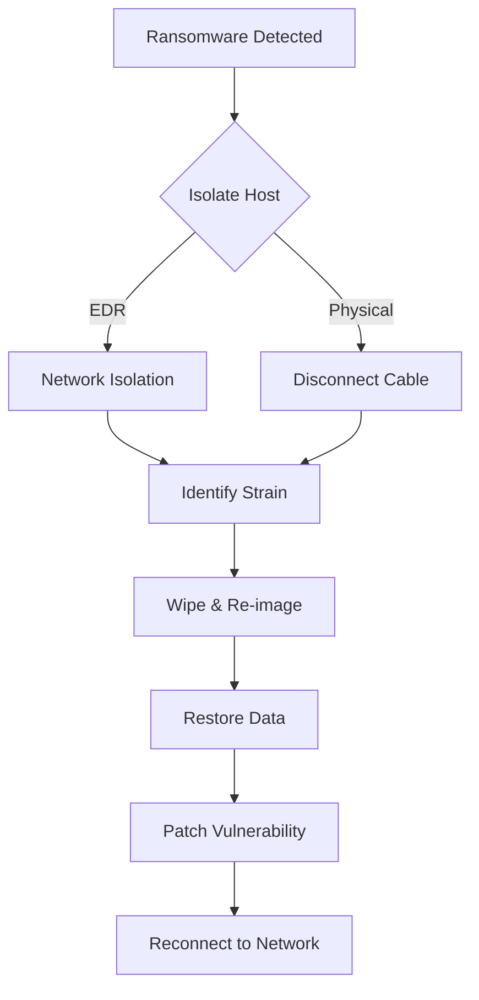

# Playbook: Ransomware Response

**Severity**: Critical | **Category**: Malware

## 1. Immediate Action (Containment)

-   **Isolate Host**: Use EDR (SentinelOne/CrowdStrike) to "Network Isolate" the infected host immediately.
-   **Disconnect Network**: If EDR fails, physically disconnect the cable or disable Wi-Fi.
-   **Disable User**: Disable the compromised user account in Active Directory/Entra ID.

## 2. Identification (Scope)
-   **Identify Strain**: Use ID Ransomware or check extension/ransom note.
-   **Lateral Movement**: Check logs for SMB/RDP traffic from the infected host to others.
-   **Data Exfiltration**: Check Firewall logs for large outbound transfers.

## 3. Eradication & Recovery
-   **Wipe & Re-image**: Do not attempt to clean. Format the drive and reinstall the OS from a clean image.
-   **Restore Data**: Restore files from the last known good backup (Offline/Immutable backups preferred).
-   **Patch**: Ensure the vulnerability (e.g., RDP, Phishing) used for entry is patched before reconnecting.

## 4. Notification
-   Notify Legal/Compliance teams immediately due to potential data breach (GDPR/PDPA).
