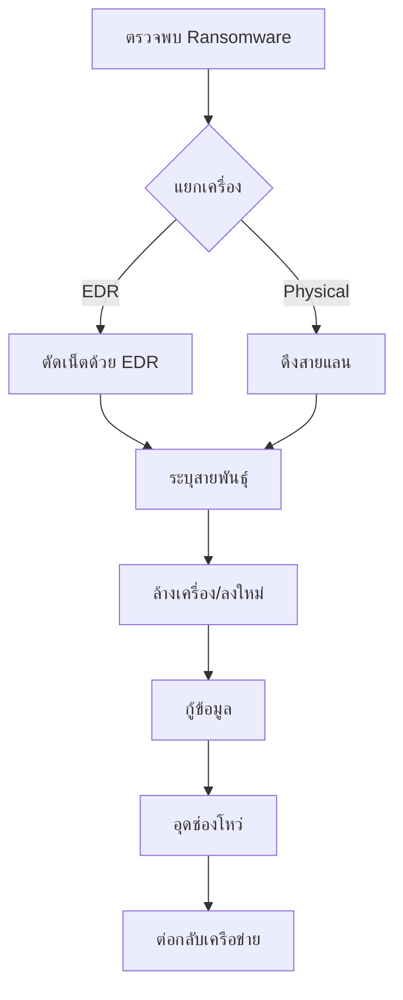

# Playbook: การรับมือ Ransomware

**ความรุนแรง**: วิกฤต (Critical) | **หมวดหมู่**: มัลแวร์ (Malware)

## 1. การวิเคราะห์ (Analysis)

-   **ระบุสายพันธุ์**: ใช้เว็บ ID Ransomware หรือตรวจสอบนามสกุลไฟล์/จดหมายเรียกค่าไถ่
-   **การเคลื่อนที่ (Lateral Movement)**: ตรวจสอบ Log การเชื่อมต่อ SMB/RDP จากเครื่องที่ติดเชื้อไปยังเครื่องอื่น
-   **การขโมยข้อมูล**: ตรวจสอบ Firewall log เพื่อหาการโอนถ่ายข้อมูลออกข้างนอกที่มีขนาดใหญ่ผิดปกติ

## 2. การจำกัดวง (Containment)

-   **แยกเครื่อง (Isolate Host)**: ใช้ EDR (SentinelOne/CrowdStrike) สั่ง "Network Isolate" เครื่องที่ติดเชื้อทันที
-   **ตัดการเชื่อมต่อ**: หาก EDR ไม่ทำงาน ให้ดึงสายแลนออกหรือปิด Wi-Fi
-   **ปิดบัญชีผู้ใช้**: Disable บัญชีผู้ใช้ที่เกี่ยวข้องใน Active Directory/Entra ID

## 3. การกำจัดและกู้คืน (Eradication & Recovery)
-   **ล้างเครื่อง (Wipe & Re-image)**: อย่าพยายามกำจัดไวรัส ให้ Format และลง OS ใหม่จาก Image ที่สะอาด
-   **กู้ข้อมูล**: กู้คืนไฟล์จาก Backup ล่าสุดที่ยังไม่ติดเชื้อ (ควรใช้ Offline/Immutable backup)
-   **อุดช่องโหว่**: ตรวจสอบและปิดช่องโหว่ที่ใช้โจมตี (เช่น RDP, Phishing) ก่อนนำเครื่องกลับเข้าเครือข่าย

## 4. การแจ้งเตือน (Notification)
-   แจ้งฝ่ายกฎหมาย/Compliance ทันที เนื่องจากอาจมีข้อมูลรั่วไหล (PDPA/GDPR)

## References
-   [MITRE ATT&CK T1486 (Data Encrypted for Impact)](https://attack.mitre.org/techniques/T1486/)
-   [CISA Ransomware Guide](https://www.cisa.gov/stopransomware/ransomware-guide)
