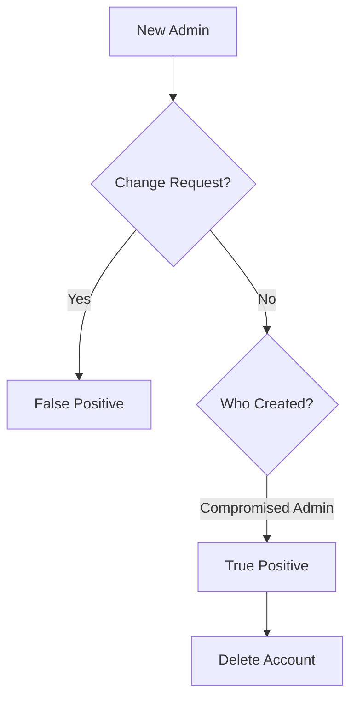

# Playbook: New Rogue Admin Account

**ID**: PB-15
**Severity**: Critical
**Trigger**: SIEM Alert ("User added to Domain Admins", "New Local Admin created").

## 1. Analysis (Triage)

-   **Verify Ticket**: Was there a Change Request for this new account?
-   **Verify Creator**: Who created it? Was the creator account compromised?

## 2. Containment
-   **Delete/Disable Account**: Immediately disable the new rogue account.
-   **Reset Creator**: Reset the password of the account that created the rogue user.

## 3. Eradication
-   **Audit Scope**: Search for *any other* accounts created by the attacker.
-   **Golden Ticket**: If Domain Admin was compromised, check for Golden Ticket attacks (Kerberos TGT).

## 4. Recovery
-   **Review Access**: Conduct a full review of all privileged groups.
-   **Attribute**: [Integrity]

## Related Documents
-   [Incident Response Framework](../Framework.en.md)
-   [Incident Report Template](../../templates/incident_report.en.md)
-   [Shift Handover Log](../../templates/shift_handover.en.md)

## References
-   [MITRE ATT&CK T1098 (Account Manipulation)](https://attack.mitre.org/techniques/T1098/)
-   [Microsoft Securing Privileged Access](https://learn.microsoft.com/en-us/security/compass/securing-privileged-access)
