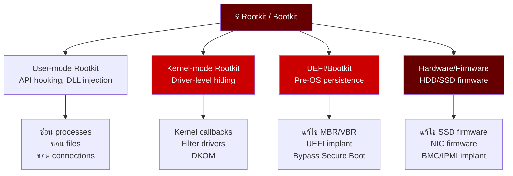
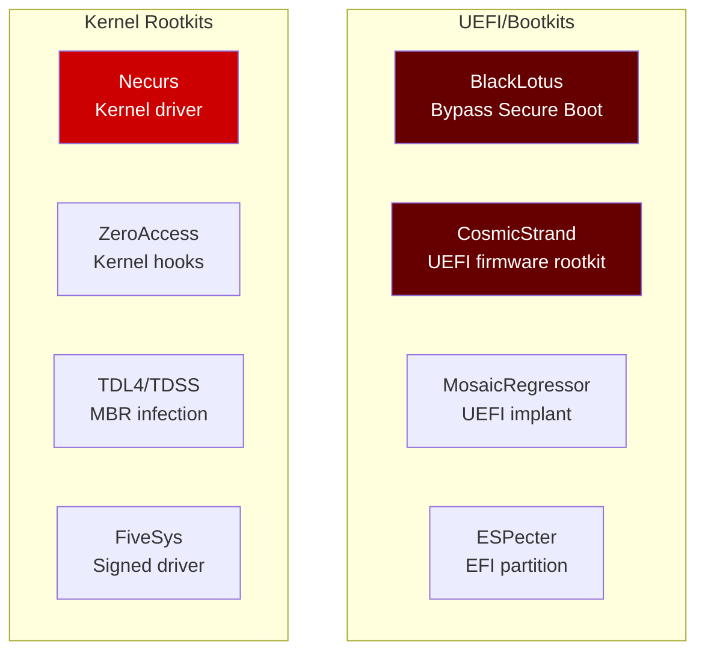
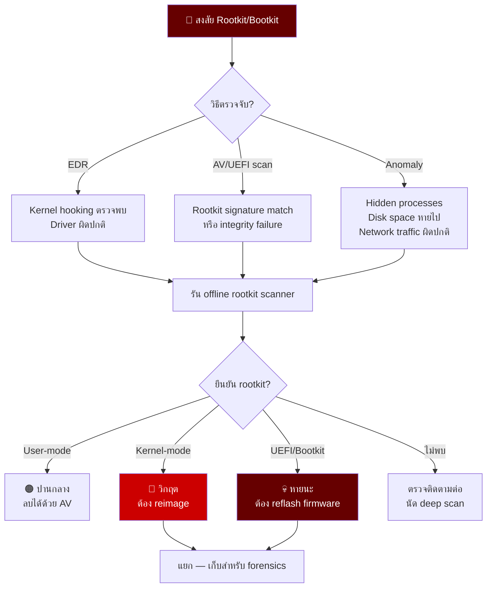
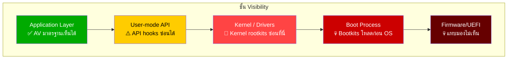
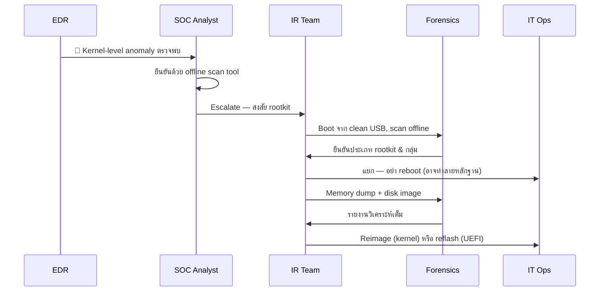
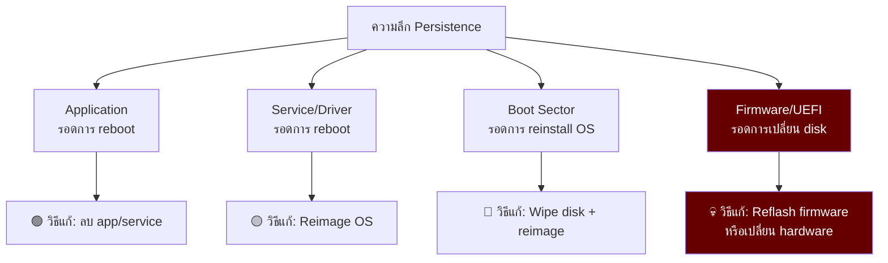

# Playbook: การตอบสนอง Rootkit / Bootkit

**ID**: PB-45
**ความรุนแรง**: วิกฤต | **ประเภท**: Defense Evasion / Persistence
**MITRE ATT&CK**: [T1014](https://attack.mitre.org/techniques/T1014/) (Rootkit), [T1542](https://attack.mitre.org/techniques/T1542/) (Pre-OS Boot), [T1542.003](https://attack.mitre.org/techniques/T1542/003/) (Bootkit)
**Trigger**: EDR alert (kernel-level hooking), AV (rootkit detection), ระบบไม่เสถียรพร้อม hidden processes, UEFI integrity check failure

> ⚠️ **วิกฤต**: Rootkits ทำงานต่ำกว่า OS — เครื่องมือมาตรฐานตรวจไม่พบ Bootkits อยู่รอดการ reinstall OS ต้องใช้เครื่องมือเฉพาะทางและอาจต้อง reimage hardware

### Rootkit / Bootkit Taxonomy



### กลุ่ม Rootkit ที่รู้จัก



---

## Decision Flow



### ชั้น Visibility



### ขั้นตอนการสืบสวน



### ความลึกของ Persistence



### Timeline การตอบสนอง

```mermaid
gantt
    title Rootkit/Bootkit Response Timeline
    dateFormat HH:mm
    axisFormat %H:%M
    section Detection
        EDR/AV alert           :a1, 00:00, 10min
        ยืนยัน offline scan    :a2, after a1, 30min
    section Containment
        Network isolation      :a3, after a2, 5min
        Memory acquisition     :a4, after a3, 60min
    section Investigation
        จำแนก rootkit          :a5, after a4, 120min
        วิเคราะห์ persistence  :a6, after a5, 120min
    section Recovery
        Reimage/Reflash        :a7, after a6, 180min
        ยืนยันสถานะสะอาด       :a8, after a7, 60min
```



---

## 1. การดำเนินการทันที (30 นาทีแรก)

| # | การดำเนินการ | ผู้รับผิดชอบ |
|:---|:---|:---|
| 1 | **อย่า REBOOT** — rootkit อาจเปลี่ยนพฤติกรรมเมื่อ reboot | SOC T1 |
| 2 | แยกเครือข่าย endpoint (EDR หรือทางกายภาพ) | SOC T1 |
| 3 | เก็บ memory dump ก่อนทำ remediation ใดๆ | IR Team |
| 4 | เก็บ disk image สำหรับ forensic analysis | IR Team |
| 5 | รัน offline rootkit scanner จาก clean USB | IR Team |
| 6 | ตรวจ UEFI/Secure Boot integrity | IT Ops |

## 2. รายการตรวจสอบ

### เครื่องมือตรวจจับ Rootkit
- [ ] รัน GMER หรือ TDSSKiller (offline)
- [ ] ตรวจ kernel drivers ที่โหลด: `driverquery /v`
- [ ] เปรียบเทียบ processes (task manager vs API-level tools)
- [ ] ตรวจไฟล์ hidden ด้วย forensic tools (FTK Imager)
- [ ] ตรวจ MBR/VBR integrity (เปรียบเทียบกับ hash ที่รู้จัก)
- [ ] ตรวจ UEFI firmware hash กับ baseline ของผู้ผลิต

### ตัวบ่งชี้พฤติกรรม
- [ ] Processes เห็นใน memory dump แต่ไม่เห็นใน Task Manager
- [ ] Network connections ไม่แสดงใน `netstat`
- [ ] การใช้ disk space ไม่ตรงกับไฟล์ที่เห็น
- [ ] AV/EDR agent crash หรืออัปเดตไม่ได้
- [ ] นาฬิการะบบผิดปกติ
- [ ] Blue screens ด้วย stop codes ผิดปกติ

### วิเคราะห์ Persistence
- [ ] Kernel drivers โหลดจาก paths ผิดปกติ
- [ ] Services ที่ไม่มี binary ที่สอดคล้อง
- [ ] MBR/VBR แก้ไขจากสถานะที่รู้จัก
- [ ] UEFI variables หรือ EFI partition แก้ไข
- [ ] สถานะ Secure Boot (เปิด/ปิด/bypass)

## 3. การควบคุม (Containment)

| ขอบเขต | การดำเนินการ |
|:---|:---|
| **เครือข่าย** | แยกเต็มรูปแบบ — ไม่มีการเชื่อมต่อ |
| **Endpoint** | อย่า reboot, รักษาสถานะ |
| **หลักฐาน** | Memory dump + full disk image |
| **การแพร่กระจาย** | ตรวจ hardware model เดียวกันสำหรับการติดเชื้อเดียวกัน |

## 4. การกำจัดและกู้คืน

### ตามประเภท Rootkit
| ประเภท | วิธีกู้คืน |
|:---|:---|
| User-mode | AV removal → ยืนยัน → ตรวจติดตาม |
| Kernel-mode | Full disk wipe + OS reimage |
| Bootkit (MBR) | Wipe disk + reimage + ตรวจ MBR |
| UEFI rootkit | Reflash firmware จากผู้ผลิต + reimage |
| Firmware rootkit | เปลี่ยน hardware ถ้า reflash ไม่ได้ |

### ยืนยันการกู้คืน
1. Boot จาก media ที่สะอาดที่รู้ว่าสะอาด
2. รัน offline rootkit scan บนระบบที่ reimage
3. ยืนยันการตั้งค่า UEFI/Secure Boot
4. ตรวจติดตามสัญญาณการติดเชื้อซ้ำ (7 วัน)
5. Deploy kernel protection เพิ่มเติม (HVCI, VBS)

## 5. หลังเหตุการณ์ (Post-Incident)

| คำถาม | คำตอบ |
|:---|:---|
| Rootkit ถูกส่งมาอย่างไร? | [เวกเตอร์] |
| Secure Boot เปิดอยู่หรือไม่? | [ใช่/ไม่] |
| Driver signing บังคับใช้หรือไม่? | [ใช่/ไม่] |
| Rootkit ทำงานอยู่นานเท่าไหร่? | [ระยะเวลา] |
| มีระบบอื่นได้รับผลกระทบหรือไม่? | [จำนวน] |

## 6. Detection Rules (Sigma)

```yaml
title: Suspicious Kernel Driver Loaded
logsource:
    product: windows
    service: system
detection:
    selection:
        EventID: 7045
        ServiceType: 'kernel mode driver'
    filter:
        ImagePath|startswith:
            - 'C:\Windows\System32\drivers\'
    condition: selection and not filter
    level: critical
```

```yaml
title: Unsigned Driver Load Attempt
logsource:
    product: windows
    category: driver_load
detection:
    selection:
        Signed: 'false'
    condition: selection
    level: high
```

## เอกสารที่เกี่ยวข้อง
- [Malware Infection Playbook](Malware_Infection.th.md)
- [Credential Dumping Playbook](Credential_Dumping.th.md)
- [Wiper Attack Playbook](Wiper_Attack.th.md)
- [คู่มือ Tier 3](../Runbooks/Tier3_Runbook.th.md)

## References
- [MITRE T1014 — Rootkit](https://attack.mitre.org/techniques/T1014/)
- [MITRE T1542 — Pre-OS Boot](https://attack.mitre.org/techniques/T1542/)
- [ESET — UEFI Threats](https://www.welivesecurity.com/)
