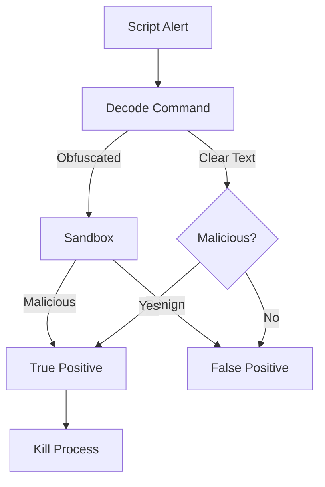

# Playbook: Suspicious Script Execution

**ID**: PB-11
**Severity**: High
**Trigger**: EDR Alert ("PowerShell - EncodedCommand", "WScript - Suspicious execution").

## 1. Analysis (Triage)

-   **Decode**: Decode the Base64 command (`-EncodedCommand`) to see what it does.
-   **Parent Process**: Who spawned this script? (`WinWord.exe` -> `powershell.exe` = Phishing).
-   **Permissions**: Was it run as System/Admin?

## 2. Containment
-   **Kill Process**: Terminate the script engine process.
-   **Isolate Host**: Network isolation to prevent download of second-stage payloads.

## 3. Eradication
-   **File Removal**: Delete the `.ps1`, `.vbs`, or `.js` file.
-   **Persistence Check**: Check Scheduled Tasks or Registry Run keys for re-execution.

## 4. Recovery
-   **AppLocker**: Consider enforcing stricter AppLocker policies to block unauthorized scripts.
-   **Attribute**: [Integrity]

## Related Documents
-   [Incident Response Framework](../Framework.en.md)
-   [Incident Report Template](../../templates/incident_report.en.md)
-   [Shift Handover Log](../../templates/shift_handover.en.md)

## References
-   [MITRE ATT&CK T1059 (Command and Scripting Interpreter)](https://attack.mitre.org/techniques/T1059/)
-   [Red Canary: PowerShell Security Guide](https://redcanary.com/threat-detection-report/techniques/powershell/)
