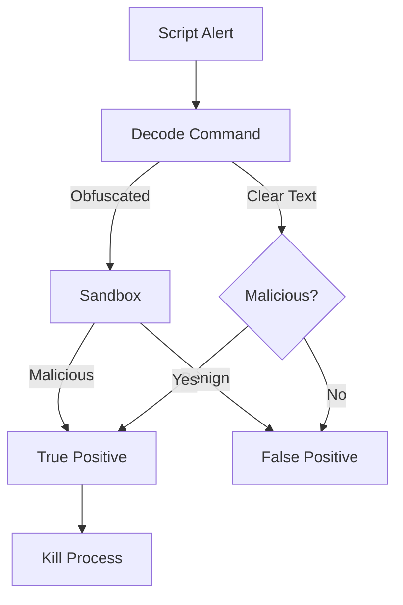

# Playbook: การรันสคริปต์ที่น่าสงสัย (Suspicious Script Execution)

**ID**: PB-11
**ความรุนแรง**: สูง
**ตัวกระตุ้น**: แจ้งเตือน EDR ("PowerShell - EncodedCommand", "WScript - Suspicious execution")

## 1. การวิเคราะห์ (Analysis)

-   **ถอดรหัส (Decode)**: ถอดรหัส Base64 เพื่อดูว่าคำสั่งทำอะไร
-   **Parent Process**: ใครเป็นคนเรียกสคริปต์นี้? (`WinWord.exe` -> `powershell.exe` = Phishing)
-   **สิทธิ์ (Permissions)**: Run ด้วยสิทธิ์ System หรือ Admin หรือไม่?

## 2. การจำกัดวง (Containment)
-   **หยุด Process**: สั่ง Kill process ของ Script engine
-   **แยกเครื่อง**: ตัดการเชื่อมต่อเพื่อป้องกันการโหลด Payload ตัวที่สอง

## 3. การกำจัด (Eradication)
-   **ลบไฟล์**: ลบไฟล์ `.ps1`, `.vbs`, หรือ `.js` ต้นเหตุ
-   **ตรวจสอบ Persistence**: เช็ค Scheduled Tasks หรือ Registry ว่ามีการตั้งเวลาให้รันซ้ำหรือไม่

## 4. การกู้คืน (Recovery)
-   **AppLocker**: พิจารณาเปิดใช้ AppLocker เพื่อบล็อกการรันสคริปต์ที่ไม่ได้รับอนุญาต
-   **ผลกระทบ (Attribute)**: [Integrity]

## References
-   [MITRE ATT&CK T1059 (Command and Scripting Interpreter)](https://attack.mitre.org/techniques/T1059/)
-   [Red Canary: PowerShell Security Guide](https://redcanary.com/threat-detection-report/techniques/powershell/)
