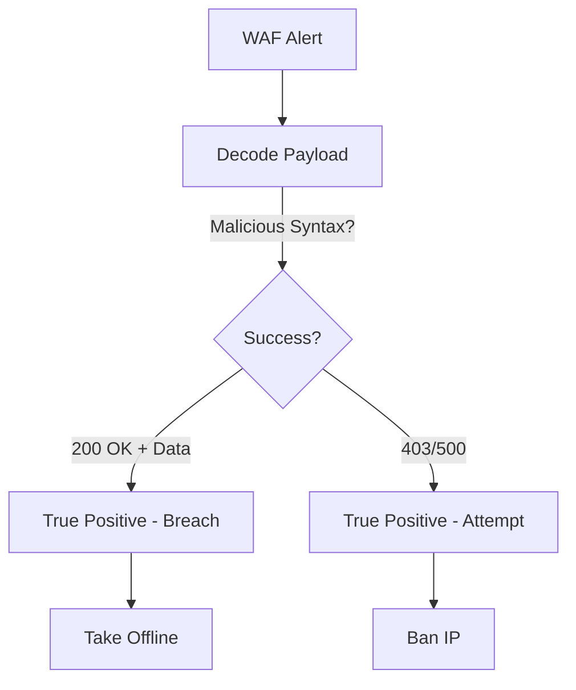

# Playbook: Web Application Attack

**ID**: PB-10
**Severity**: High
**Trigger**: WAF Alert (SQLi, XSS, RCE), Web Server Error Logs (500s).

## 1. Analysis (Triage)

-   **Verify Payload**: Decode the payload (Base64/URL). Is it malicious syntax (`UNION SELECT`, `<script>`)?
-   **Check Success**: Did the server return 200 OK with sensitive data size? Or 500 Error?
-   **Scope**: Is it a scanner (Automation) or targeted manual attack?

## 2. Containment
-   **Block IP**: Ban the attacker's IP on WAF.
-   **Virtual Patching**: Apply WAF rule to block specific vulnerability signature (e.g., Log4j specific string).
-   **Offline**: If RCE is confirmed, take the application offline immediately.

## 3. Eradication
-   **Patch Code**: Developers must fix the vulnerability in the source code.
-   **Web Shell Sweep**: Scan the web directory for `cmd.php` or unusual files dropped by attacker.

## 4. Recovery
-   **Penetration Test**: Re-test the fix before going online.
-   **Attribute**: [Integrity / Confidentiality]

## Related Documents
-   [Incident Response Framework](../Framework.en.md)
-   [Incident Report Template](../../templates/incident_report.en.md)
-   [Shift Handover Log](../../templates/shift_handover.en.md)

## References
-   [OWASP Top 10](https://owasp.org/www-project-top-ten/)
-   [MITRE ATT&CK T1190 (Exploit Public-Facing Application)](https://attack.mitre.org/techniques/T1190/)
