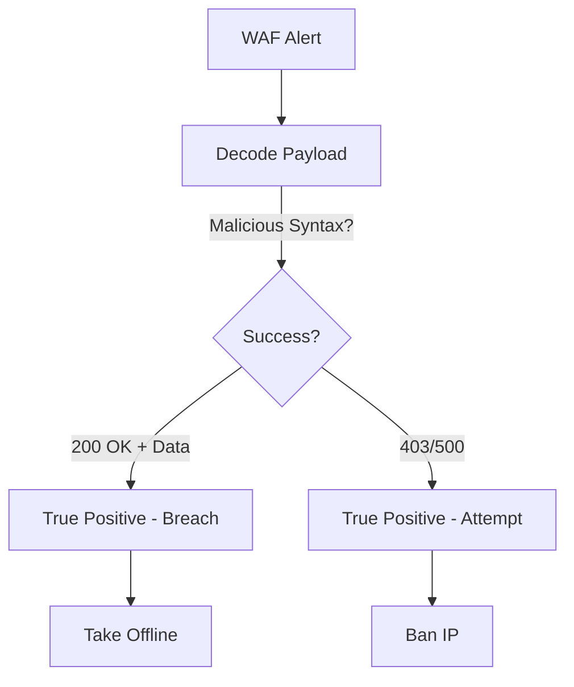

# Playbook: การโจมตีเว็บแอปพลิเคชัน (Web Application Attack)

**ID**: PB-10
**ความรุนแรง**: สูง
**ตัวกระตุ้น**: แจ้งเตือน WAF (SQLi, XSS, RCE), Web Server Error Logs (500s)

## 1. การวิเคราะห์ (Analysis)

-   **ตรวจสอบ Payload**: ถอดรหัส (Base64/URL) ดูว่าเป็นคำสั่งอันตรายหรือไม่ (`UNION SELECT`, `<script>`)
-   **ตรวจสอบผลลัพธ์**: Server ตอบกลับ 200 OK พร้อมข้อมูลขนาดใหญ่หรือไม่?
-   **ขอบเขต**: เป็นเครื่องสแกนอัตโนมัติ หรือคนเจาะจงโจมตี?

## 2. การจำกัดวง (Containment)
-   **บล็อก IP**: แบน IP ของผู้โจมตีที่ WAF
-   **Virtual Patching**: สร้างกฎ WAF เฉพาะกิจเพื่อบล็อกช่องโหว่นั้น (เช่น บล็อก String ของ Log4j)
-   **ออฟไลน์**: หากมีการฝัง Web Shell หรือ RCE สำเร็จ ต้องปิดเว็บทันที

## 3. การกำจัด (Eradication)
-   **แก้โค้ด**: Developer ต้องปิดช่องโหว่ที่ต้นเหตุ (Source code)
-   **หา Web Shell**: สแกนโฟลเดอร์เว็บหาไฟล์แปลกปลอม (`cmd.php`)

## 4. การกู้คืน (Recovery)
-   **Penetration Test**: ทดสอบเจาะระบบซ้ำเพื่อยืนยันว่าช่องโหว่ถูกปิดแล้ว
-   **ผลกระทบ (Attribute)**: [Integrity / Confidentiality]

## References
-   [OWASP Top 10](https://owasp.org/www-project-top-ten/)
-   [MITRE ATT&CK T1190 (Exploit Public-Facing Application)](https://attack.mitre.org/techniques/T1190/)
