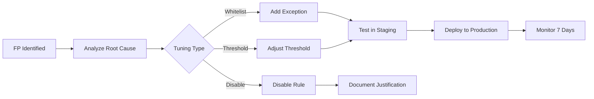

# Alert Tuning SOP

This document defines the standard process for tuning SOC detection rules to reduce false positives while maintaining detection coverage.

---

## Tuning Workflow

## When to Tune

| Trigger | FPR Threshold | Action |
|:---|:---|:---|
| Single rule generating > 50% FP | > 50% | Immediate tuning required |
| Overall FPR exceeding target | > 10% | Schedule tuning sprint |
| Analyst reports repeated FP | 3+ occurrences | Review and tune |
| New data source onboarded | N/A | Pre-tune expected noise |

## Tuning Methods

| Method | Use When | Risk |
|:---|:---|:---|
| **Whitelist/Exception** | Known-good activity (e.g., admin scripts) | Low — targeted |
| **Threshold Adjustment** | Alert triggers too frequently on normal volume | Medium — may miss low-volume attacks |
| **Field Filter** | Specific field values causing noise | Low — targeted |
| **Rule Modification** | Logic is too broad | Medium — requires testing |
| **Rule Disable** | Rule provides no value | High — loss of coverage |

## Tuning Request Template

| Field | Value |
|:---|:---|
| **Rule Name/ID** | |
| **Current FP Rate** | |
| **Sample FP Alerts** (3+) | |
| **Root Cause of FP** | |
| **Proposed Change** | |
| **Impact Assessment** | |
| **Requested By** | |
| **Approved By** | |

## Tuning Governance

| Action | Approver | Documentation |
|:---|:---|:---|
| Add whitelist/exception | SOC Lead | Tuning log entry |
| Modify rule logic | Detection Engineering Lead | RFC + peer review |
| Disable rule | SOC Manager | RFC + risk acceptance |
| Re-enable disabled rule | Detection Engineering Lead | Tuning log entry |

## Tuning Log

Maintain a centralized tuning log (spreadsheet or wiki) with the following fields:

| Date | Rule ID | Rule Name | Change Type | Reason | Changed By | Approved By | Rollback? |
|:---|:---|:---|:---|:---|:---|:---|:---:|
| [Date] | [ID] | [Name] | [Whitelist/Threshold/Disable] | [FP reason] | [Analyst] | [Lead] | ☐ |

## Review Cadence

| Review | Frequency | Participants | Output |
|:---|:---|:---|:---|
| FP Rate Review | Weekly | SOC Lead + Analysts | Top 10 noisy rules list |
| Disabled Rules Audit | Monthly | SOC Manager + Detection Eng | Re-enable or document risk |
| Detection Coverage Gap | Quarterly | SOC Manager + CISO | Coverage vs MITRE ATT&CK |
| Tuning Sprint | Quarterly | Detection Engineering | Batch tune 10-20 rules |

## Tuning KPIs

| Metric | Target | Current |
|:---|:---|:---|
| Overall False Positive Rate | < 10% | [XX]% |
| Rules with FPR > 50% | 0 | [X] |
| Disabled rules count | < 5% of total | [X] |
| Mean time from FP report to tune | < 48 hours | [XX] hours |
| Tuning requests backlog | < 10 | [X] |

## Related Documents

- [SOC Metrics & KPIs](SOC_Metrics.en.md)
- [Content Management](../03_User_Guides/Content_Management.en.md)

## References

- [SANS Detection Engineering](https://www.sans.org/white-papers/)
