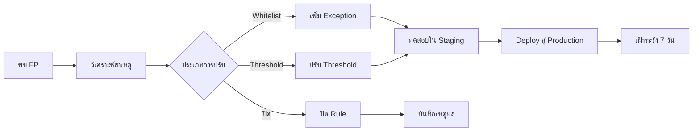

# ขั้นตอนปรับแต่ง Alert (Alert Tuning SOP)

เอกสารนี้กำหนดกระบวนการมาตรฐานสำหรับปรับแต่ง detection rules เพื่อลด false positives โดยยังคง detection coverage

---

## ขั้นตอนการปรับแต่ง

## เมื่อไหร่ควรปรับ

| เงื่อนไข | ขีด FPR | การดำเนินการ |
|:---|:---|:---|
| Rule เดียวสร้าง FP > 50% | > 50% | ปรับทันที |
| FPR รวมเกินเป้า | > 10% | จัด sprint ปรับแต่ง |
| Analyst แจ้ง FP ซ้ำ | 3+ ครั้ง | ทบทวนและปรับ |
| เพิ่ม data source ใหม่ | N/A | ปรับ noise ล่วงหน้า |

## วิธีการปรับแต่ง

| วิธี | ใช้เมื่อ | ความเสี่ยง |
|:---|:---|:---|
| **Whitelist/Exception** | กิจกรรมที่รู้ว่าปกติ (เช่น admin scripts) | ต่ำ |
| **ปรับ Threshold** | Alert ขึ้นบ่อยเกินในปริมาณปกติ | ปานกลาง |
| **Field Filter** | ค่าเฉพาะ field ทำให้เกิด noise | ต่ำ |
| **แก้ไข Rule** | Logic กว้างเกินไป | ปานกลาง |
| **ปิด Rule** | Rule ไม่มีคุณค่า | สูง |

## การกำกับดูแลการปรับจูน

| การดำเนินการ | ผู้อนุมัติ | เอกสาร |
|:---|:---|:---|
| เพิ่ม Whitelist/Exception | SOC Lead | รายการปรับจูน |
| แก้ไข Logic ของกฎ | Detection Engineering Lead | RFC + Peer Review |
| ปิดกฎ | SOC Manager | RFC + ยอมรับความเสี่ยง |
| เปิดกฎที่ถูกปิดใหม่ | Detection Engineering Lead | รายการปรับจูน |

## บันทึกการปรับจูน

| วันที่ | Rule ID | ชื่อกฎ | ประเภทการเปลี่ยน | เหตุผล | ผู้เปลี่ยน | ผู้อนุมัติ |
|:---|:---|:---|:---|:---|:---|:---|
| [วันที่] | [ID] | [ชื่อ] | [Whitelist/Threshold/Disable] | [เหตุผล FP] | [นักวิเคราะห์] | [Lead] |

## รอบการทบทวน

| การทบทวน | ความถี่ | ผู้เข้าร่วม | ผลลัพธ์ |
|:---|:---|:---|:---|
| ทบทวนอัตรา FP | รายสัปดาห์ | SOC Lead + นักวิเคราะห์ | รายการกฎที่ส่งเสียงมากสุด 10 อันดับ |
| ตรวจสอบกฎที่ถูกปิด | รายเดือน | SOC Manager + Detection Eng | เปิดใหม่หรือบันทึกความเสี่ยง |
| ช่องว่าง Detection Coverage | รายไตรมาส | SOC Manager + CISO | Coverage vs MITRE ATT&CK |
| Tuning Sprint | รายไตรมาส | Detection Engineering | ปรับจูน 10-20 กฎ |

## KPI การปรับจูน

| ตัวชี้วัด | เป้าหมาย | ปัจจุบัน |
|:---|:---|:---|
| อัตรา False Positive โดยรวม | < 10% | [XX]% |
| กฎที่มี FPR > 50% | 0 | [X] |
| จำนวนกฎที่ถูกปิด | < 5% ของทั้งหมด | [X] |
| เวลาเฉลี่ยจากรายงาน FP ถึงปรับจูน | < 48 ชั่วโมง | [XX] ชั่วโมง |

## เทมเพลตขอปรับจูน

| ฟิลด์ | ค่า |
|:---|:---|
| **ชื่อ/ID ของกฎ** | |
| **อัตรา FP ปัจจุบัน** | |
| **ตัวอย่าง FP Alert** (3+) | |
| **สาเหตุ FP** | |
| **การเปลี่ยนแปลงที่เสนอ** | |
| **การประเมินผลกระทบ** | |
| **ผู้ขอ** | |
| **ผู้อนุมัติ** | |

## เอกสารที่เกี่ยวข้อง

- [ตัวชี้วัด SOC & KPIs](SOC_Metrics.th.md)
- [Content Management](../03_User_Guides/Content_Management.th.md)

## อ้างอิง

- [MITRE ATT&CK](https://attack.mitre.org/)
- [Sigma Rules](https://github.com/SigmaHQ/sigma)
