# Data Loss Prevention (DLP) SOP

**Document ID**: OPS-SOP-024
**Version**: 1.0
**Classification**: Confidential
**Last Updated**: 2026-02-15

> SOC procedures for **detecting, investigating, and preventing data loss** through DLP technology, policy enforcement, and incident response. Covers endpoint DLP, network DLP, cloud DLP, and email DLP.

---

## Data Classification

| Level | Label | Examples | DLP Action |
|:---|:---:|:---|:---|
| **L4** | 🔴 Secret | Encryption keys, security configs, board minutes | Block + alert SOC + CISO notify |
| **L3** | 🟠 Confidential | PII, financial data, source code, customer data | Block + alert SOC |
| **L2** | 🟡 Internal | Internal reports, meeting notes, HR documents | Alert SOC on external transfer |
| **L1** | 🟢 Public | Marketing materials, public website content | Log only |

---

## DLP Architecture

```mermaid
graph TD
    subgraph Endpoints["💻 Endpoint DLP"]
        A[USB monitoring]
        B[Print monitoring]
        C[Screen capture detection]
        D[Clipboard monitoring]
        E[Local file copy tracking]
    end
    
    subgraph Network["🌐 Network DLP"]
        F[Email gateway DLP]
        G[Web proxy inspection]
        H[HTTPS inspection]
        I[FTP/SFTP monitoring]
    end
    
    subgraph Cloud["☁️ Cloud DLP"]
        J[CASB integration]
        K[Cloud storage monitoring]
        L[SaaS app scanning]
        M[API-based DLP]
    end
    
    Endpoints --> N["🔍 DLP Policy Engine"]
    Network --> N
    Cloud --> N
    N --> O["⚡ SOC Alert Queue"]
    N --> P["📊 DLP Dashboard"]
    
    style N fill:#3b82f6,color:#fff
    style O fill:#dc2626,color:#fff
```

---

## DLP Policies

### Policy Categories

| Policy ID | Category | Detection Method | Action | Severity |
|:---|:---|:---|:---|:---:|
| DLP-001 | **Credit card numbers** | Regex + Luhn validation | Block + alert | P1 |
| DLP-002 | **Thai national ID** | 13-digit pattern + checksum | Block + alert | P1 |
| DLP-003 | **PII (name + address + phone)** | Named entity + proximity | Alert | P2 |
| DLP-004 | **Source code** | File extension + keyword | Block external | P2 |
| DLP-005 | **Financial statements** | Keyword + document class | Block external | P2 |
| DLP-006 | **Password/credential files** | File name + content pattern | Block all channels | P1 |
| DLP-007 | **Customer database exports** | Large CSV/Excel + PII columns | Block + alert | P1 |
| DLP-008 | **Intellectual property** | Classification label + keyword | Block external | P2 |
| DLP-009 | **Medical/health records** | ICD codes + patient identifiers | Block + alert | P1 |
| DLP-010 | **Encryption keys/certificates** | File extension + header pattern | Block all | P1 |

### Channel-Specific Policies

| Channel | Policies Applied | Inspection Depth | Action |
|:---|:---|:---:|:---|
| **Corporate email** | All DLP-001 to DLP-010 | Full content + attachments | Block/quarantine |
| **Personal email (webmail)** | DLP-001 to DLP-010 | URL + upload inspection | Block |
| **USB devices** | DLP-004 to DLP-010 | File content scan before copy | Block + alert |
| **Cloud storage** | DLP-001 to DLP-010 | CASB real-time scan | Block/quarantine |
| **Print** | DLP-001, DLP-002, DLP-005, DLP-007 | Print spool content scan | Alert + log |
| **Messaging apps** | DLP-001, DLP-002, DLP-003 | Content inspection | Alert |
| **Screen sharing** | DLP-001, DLP-007, DLP-009 | Watermark + detection | Warning |

---

## DLP Incident Response

### DLP Alert Triage

### DLP Incident Severity

| Severity | Criteria | Response SLA | Notification |
|:---|:---|:---:|:---|
| 🔴 P1 | L4 data confirmed exfiltrated | 30 min | CISO + Legal + DPO |
| 🔴 P1 | L3 data to external (bulk) | 30 min | CISO + Legal |
| 🟠 P2 | L3 data to unauthorized internal | 2 hrs | SOC Lead + data owner |
| 🟠 P2 | L2 data to external (bulk) | 2 hrs | SOC Lead |
| 🟡 P3 | L2 data to unauthorized internal | 8 hrs | SOC Lead |
| 🟡 P3 | Policy violation (no data exposed) | 24 hrs | Analyst handles |
| 🟢 P4 | False positive / tuning needed | 72 hrs | Analyst handles |

### Investigation Checklist

- [ ] Review DLP alert details (policy, channel, content match)
- [ ] Verify user identity (not shared account)
- [ ] Assess data classification level
- [ ] Determine if data actually left the organization
- [ ] Check if business justification exists
- [ ] Review user's DLP history (repeat offender?)
- [ ] Preserve evidence (screenshots, logs, content samples)
- [ ] Assess PDPA breach notification requirements
- [ ] Document findings and actions
- [ ] Update user risk profile (Insider Threat tracker)

---

## PDPA Breach Assessment

### Notification Decision Matrix

| Factor | Notify DPO | Notify PDPC | Notify Data Subjects |
|:---|:---:|:---:|:---:|
| L4 data confirmed exposed externally | ✅ | ✅ | ✅ |
| L3 PII exposed externally (> 500 records) | ✅ | ✅ | ✅ |
| L3 PII exposed externally (< 500 records) | ✅ | Assess | Assess |
| L3 data to unauthorized internal | ✅ | ❌ | ❌ |
| L2 data only | ❌ | ❌ | ❌ |
| Data encrypted and key not compromised | ✅ | ❌ | ❌ |

### PDPA Notification Timeline

| Action | Deadline |
|:---|:---:|
| Notify DPO | Within 24 hours of discovery |
| Notify PDPC (if required) | Within 72 hours of discovery |
| Notify data subjects (if high risk) | Without undue delay |
| Document breach assessment | Within 7 days |

---

## DLP Exception Management

### Exception Process

| Step | Owner | Output |
|:---:|:---|:---|
| 1 | User submits exception request via ticketing | Exception request form |
| 2 | Manager approves business justification | Manager approval |
| 3 | Data owner confirms data classification | Data owner sign-off |
| 4 | SOC reviews risk and compensating controls | Risk assessment |
| 5 | Security Manager approves (L2) or CISO (L3/L4) | Approved exception |
| 6 | Exception implemented with monitoring | Enhanced monitoring active |
| 7 | Re-review at expiration (max 90 days) | Renewed or revoked |

### Exception Tracker

| Exception ID | User | Data Type | Channel | Justification | Expiry | Status |
|:---|:---|:---|:---|:---|:---:|:---|
| DLP-EX-_____ | _________ | _______ | _______ | _____________ | __-__-__ | Active/Expired |

---

## DLP Tuning

### False Positive Reduction

| Tuning Action | When to Apply | Impact |
|:---|:---|:---|
| **Whitelisted senders** | Trusted partner domains | Reduce email DLP FPs |
| **Approved cloud apps** | Sanctioned business tools | Reduce cloud DLP FPs |
| **Threshold adjustment** | Too many small-volume alerts | Reduce noise |
| **Context rules** | Department-specific exceptions | Targeted reduction |
| **Document classifiers** | Improve classification accuracy | Fewer misclassifications |
| **User group policies** | Different rules per role | Appropriate enforcement |

### Tuning Metrics

| Metric | Target |
|:---|:---:|
| DLP false positive rate | < 20% |
| Policy accuracy (true match rate) | > 80% |
| Mean alerts per day | Trending downward |
| Exception request volume | < 10/month |

---

## Metrics

| Metric | Target | Measurement |
|:---|:---:|:---|
| DLP alert response time (P1) | < 30 min | Ticket timestamps |
| DLP alert response time (P2) | < 2 hrs | Ticket timestamps |
| Data breach incidents detected by DLP | Tracking | Monthly count |
| DLP policy coverage (channels monitored) | 100% of defined | Coverage audit |
| False positive rate | < 20% | FP / total alerts |
| Exception compliance (within 90 days) | 100% | Exception tracker |
| User recidivism rate | < 10% | Repeat DLP violations |
| PDPA notification compliance | 100% | Breach log |

---

## Related Documents

-   [Insider Threat Program](Insider_Threat_Program.en.md) — Insider threat detection
-   [Forensic Investigation](../05_Incident_Response/Forensic_Investigation.en.md) — Evidence handling
-   [Incident Classification](../05_Incident_Response/Incident_Classification.en.md) — Severity classification
-   [Alert Tuning SOP](Alert_Tuning.en.md) — DLP alert tuning
-   [Cloud Security Monitoring](Cloud_Security_Monitoring.en.md) — Cloud DLP integration
