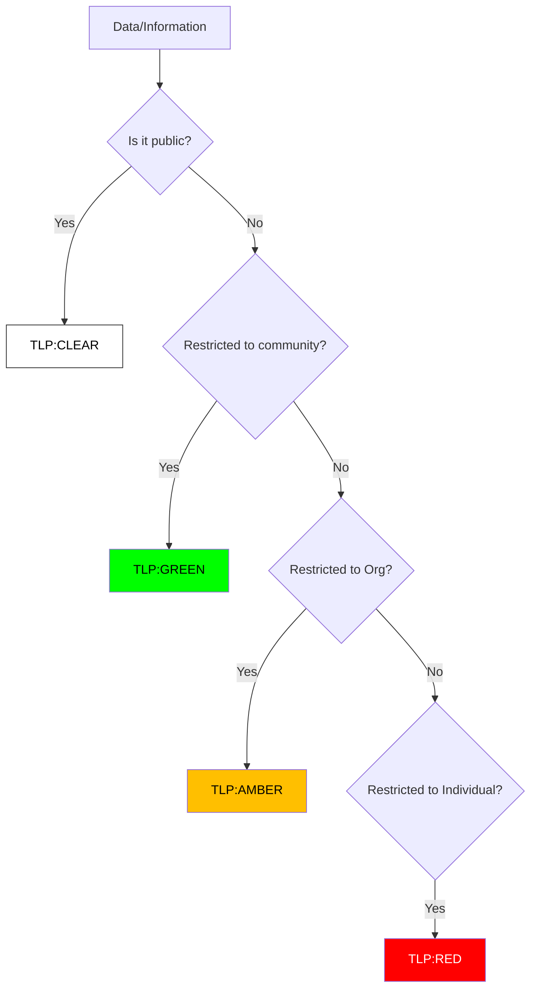

# Data Handling Protocol (TLP 2.0)

**Effective Date**: 2026-02-15
**Version**: 1.0

## 1. Overview
The Traffic Light Protocol (TLP) was created to facilitate greater sharing of information. TLP is a set of designations used to ensure that sensitive information is shared with the appropriate audience.

## 2. Classification Logic
Use this flow to determine the correct TLP level for your data/incident.

## 3. TLP Definitions

### 🔴 TLP:RED (For Your Eyes Only)
-   **Definition**: Not for disclosure, restricted to participants only.
-   **Examples**: VPN Logs with passwords, Forensic Reports linking to a specific employee, Ongoing negotiation with ransomware actors.
-   **Sharing**: Cannot be shared with anyone outside of the specific meeting or conversation.

### 🟡 TLP:AMBER (Limited Disclosure)
-   **Definition**: Limited disclosure, restricted to the organization's need-to-know.
-   **Examples**: Internal incident reports, Vulnerability scan results, System architecture diagrams.
-   **Sharing**: Clients may share with members of their own organization and clients who need to know.

### 🟢 TLP:GREEN (Community Wide)
-   **Definition**: Limited disclosure, restricted to the community.
-   **Examples**: IoCs (IPs/Hashes) of a known threat actor, General advice on mitigation.
-   **Sharing**: Information can be shared with peers and partner organizations within the sector.

### ⚪ TLP:CLEAR (World Wide)
-   **Definition**: Unlimited disclosure.
-   **Examples**: Public PR statements, Whitepapers, Patch notes.
-   **Sharing**: Subject to standard restrictions (copyright), but otherwise freely shareable.

## 4. Usage in Incident Reports
All Incident Reports MUST be marked with a TLP level at the top of the document.
