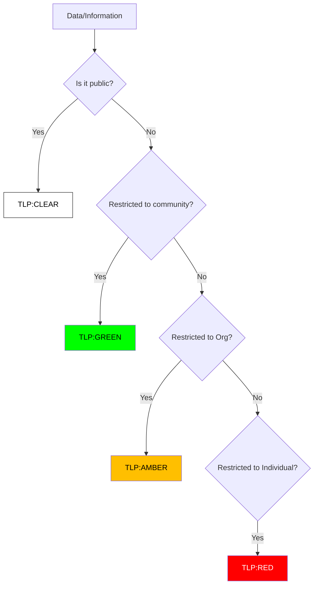

# Data Handling Protocol (TLP 2.0)

**Effective Date**: 2026-02-15
**Version**: 1.0

## 1. Overview
The Traffic Light Protocol (TLP) was created to facilitate greater sharing of information. TLP is a set of designations used to ensure that sensitive information is shared with the appropriate audience.

## 2. Classification Logic
Use this flow to determine the correct TLP level for your data/incident.



## 3. TLP Definitions

### 🔴 TLP:RED (For Your Eyes Only)
-   **Definition**: Not for disclosure, restricted to participants only.
-   **Examples**: VPN Logs with passwords, Forensic Reports linking to a specific employee, Ongoing negotiation with ransomware actors.
-   **Sharing**: Cannot be shared with anyone outside of the specific meeting or conversation.

### 🟡 TLP:AMBER (Limited Disclosure)
-   **Definition**: Limited disclosure, restricted to the organization's need-to-know.
-   **Examples**: Internal incident reports, Vulnerability scan results, System architecture diagrams.
-   **Sharing**: Clients may share with members of their own organization and clients who need to know.

### 🟢 TLP:GREEN (Community Wide)
-   **Definition**: Limited disclosure, restricted to the community.
-   **Examples**: IoCs (IPs/Hashes) of a known threat actor, General advice on mitigation.
-   **Sharing**: Information can be shared with peers and partner organizations within the sector.

### ⚪ TLP:CLEAR (World Wide)
-   **Definition**: Unlimited disclosure.
-   **Examples**: Public PR statements, Whitepapers, Patch notes.
-   **Sharing**: Subject to standard restrictions (copyright), but otherwise freely shareable.

## 4. Usage in Incident Reports
All Incident Reports MUST be marked with a TLP level at the top of the document.

### Marking Format
```
TLP: [RED/AMBER/GREEN/CLEAR]
```

## 5. Handling Procedures by TLP Level

| TLP Level | Storage | Transmission | Sharing | Retention |
| :--- | :--- | :--- | :--- | :--- |
| 🔴 RED | Encrypted + restricted folder | Encrypted channel only (PGP/Signal) | Named individuals only | Until case closed |
| 🟡 AMBER | Encrypted at rest | TLS 1.2+ / encrypted email | Within organization + NDA partners | Per retention policy |
| 🟢 GREEN | Standard SOC storage | Standard secure channels | Sector community / ISACs | Per retention policy |
| ⚪ CLEAR | Any storage | Any channel | Public | Indefinite |

## 6. Common Scenarios & Correct TLP

| Scenario | Correct TLP | Rationale |
| :--- | :--- | :--- |
| IoCs from active incident shared with ISP | 🟡 AMBER | Contains org-specific details |
| Hash values from public malware analysis | ⚪ CLEAR | Publicly available data |
| Raw forensic image of employee laptop | 🔴 RED | Contains personal/credential data |
| Quarterly threat report for partner SOCs | 🟢 GREEN | General sector applicability |
| Internal vulnerability scan results | 🟡 AMBER | Org-specific risk data |
| Ransomware negotiation communications | 🔴 RED | Highly sensitive, named individuals |

## 7. Violation Response

| Violation | Severity | Response |
| :--- | :--- | :--- |
| TLP:RED shared externally | 🔴 Critical | Immediate containment, CISO notification, HR review |
| TLP:AMBER posted publicly | 🟠 High | Content removal, incident report, awareness training |
| No TLP marking on report | 🟡 Medium | Return to author, default to AMBER until marked |
| TLP:GREEN shared to social media | 🟡 Medium | Review content, assess impact, coaching |

## 8. PDPA / Data Protection Mapping

| TLP Level | PDPA Applicability | DPO Notification |
| :--- | :--- | :--- |
| TLP:RED | Always — likely contains PII | Required before sharing |
| TLP:AMBER | Likely — review for PII | Required if PII present |
| TLP:GREEN | Unlikely — IoCs only | Not required |
| TLP:CLEAR | No — public data | Not required |

## 9. TLP Markings in Practice

### Email Subject Format
```
[TLP:RED] Incident INC-2026-042 — Forensic Analysis Results
[TLP:AMBER] Vulnerability Scan Results — Q1 2026
[TLP:GREEN] IOC Advisory — Banking Trojan Campaign
[TLP:CLEAR] SOC Monthly Summary — January 2026
```

### Document Header Template
```
╔═══════════════════════════════════════════╗
║  TLP: [RED/AMBER/GREEN/CLEAR]            ║
║  Classification Date: YYYY-MM-DD         ║
║  Classified By: [Name, Role]             ║
║  Review Date: YYYY-MM-DD                 ║
╚═══════════════════════════════════════════╝
```

### Chat/Slack Message Format
```
🔴 TLP:RED — Do not screenshot or forward
[Your sensitive message here]

🟡 TLP:AMBER — Org only
[Your restricted message here]
```

## 10. Data Loss Prevention (DLP) for SOC

| Risk | Detection | Prevention |
|:---|:---|:---|
| Analyst copies IOCs to personal device | DLP monitors USB/cloud uploads | Block USB, restrict cloud storage |
| Screenshots of sensitive data shared | Screen monitoring (if compliant) | Watermark SOC screens |
| Investigation data sent to personal email | Email DLP rules | Block personal email in SOC |
| Forensic evidence on unencrypted drive | Asset inventory + encryption check | Full disk encryption mandatory |
| PII in investigation notes on shared drive | DLP content scanning | Data classification training |

## 11. Data Retention Schedule

| Data Type | Retention Period | Storage | Destruction Method |
|:---|:---|:---|:---|
| SIEM raw logs | 90 days hot / 1 year cold | Encrypted storage | Automated purge |
| Incident tickets | 3 years | Ticketing system | Archive after 3 years |
| Forensic evidence | Until case closure + 1 year | Encrypted vault | Secure wipe + certificate |
| Threat intelligence reports | 2 years | TI platform | Archive |
| SOC metrics/dashboards | 2 years | Reporting system | Archive |
| PII from investigations | Until case closure | Case file (encrypted) | Secure delete + DPO confirm |
| PDPA breach records | 5 years (legal requirement) | Encrypted archive | Retain per regulation |

## Related Documents
-   [Incident Response Framework](../05_Incident_Response/Framework.en.md)
-   [SOC Assessment Checklist](SOC_Assessment_Checklist.en.md)
-   [SOC Metrics & KPIs](SOC_Metrics.en.md)

## References
-   [FIRST.org TLP 2.0 Standard](https://www.first.org/tlp/)
-   [CISA Traffic Light Protocol](https://www.cisa.gov/tlp)
