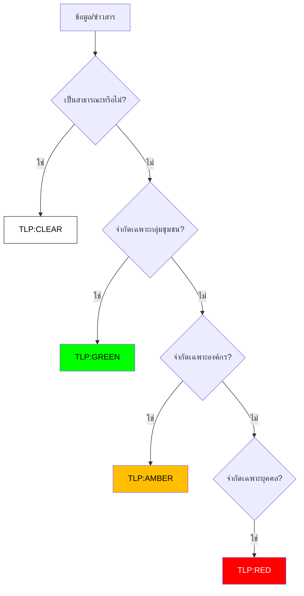

# โปรโตคอลการจัดการข้อมูล (TLP 2.0)

**วันที่มีผลบังคับใช้**: 2026-02-15
**เวอร์ชัน**: 1.0

## 1. ภาพรวม
Traffic Light Protocol (TLP) คือมาตรฐานสากลที่ใช้กำหนดขอบเขตในการแบ่งปันข้อมูล เพื่อให้มั่นใจว่าข้อมูลที่มีความละเอียดอ่อนจะถูกส่งต่อไปยังผู้ที่เกี่ยวข้องเท่านั้น

## 2. ขั้นตอนการจำแนกข้อมูล (Classification Logic)
ใช้แผนผังด้านล่างเพื่อตัดสินใจเลือก TLP Level

## 3. คำนิยาม TLP

### 🔴 TLP:RED (ลับที่สุด / เฉพาะบุคคล)
-   **คำนิยาม**: ห้ามเปิดเผยต่อผู้อื่น จำกัดไว้เฉพาะผู้รับสารโดยตรงเท่านั้น
-   **ตัวอย่าง**: Log ที่มีรหัสผ่าน, รายงาน Forensics ที่ระบุชื่อพนักงานที่ทำผิด, การเจรจากับแฮกเกอร์
-   **การแบ่งปัน**: ห้ามส่งต่อ หรือบอกกล่าวแก่บุคคลอื่นนอกเหนือจากคู่สนทนา

### 🟡 TLP:AMBER (จำกัดภายในองค์กร)
-   **คำนิยาม**: เปิดเผยได้จำกัด เฉพาะผู้ที่มีความจำเป็นต้องรู้ (Need-to-know) ภายในองค์กร
-   **ตัวอย่าง**: รายงานเหตุการณ์ภัยคุกคามภายใน, ผล Scan ช่องโหว่, ผังเครือข่ายภายใน
-   **การแบ่งปัน**: ส่งต่อได้เฉพาะพนักงานภายในองค์กรที่เกี่ยวข้อง

### 🟢 TLP:GREEN (จำกัดภายในกลุ่มเครือข่าย)
-   **คำนิยาม**: เปิดเผยได้ภายในกลุ่มชุมชนหรืออุตสาหกรรมเดียวกัน
-   **ตัวอย่าง**: IoC (IP/Hash) ของกลุ่มแฮกเกอร์, คำแนะนำการป้องกันทั่วไป
-   **การแบ่งปัน**: แชร์กับบริษัทคู่ค้า หรือกลุ่มอุตสาหกรรมเดียวกันได้ (เช่น กลุ่มธนาคาร)

### ⚪ TLP:CLEAR (สาธารณะ)
-   **คำนิยาม**: เปิดเผยได้ไม่จำกัด
-   **ตัวอย่าง**: แถลงการณ์ข่าว, บทความวิชาการ, รายละเอียด Patch
-   **การแบ่งปัน**: เผยแพร่สู่สาธารณะได้ทันที

## 4. การใข้งานในรายงาน (Incident Reports)
รายงานเหตุการณ์ทุกฉบับ ต้องระบุระดับ TLP อย่างชัดเจนที่ส่วนหัวของเอกสาร

## References
-   [FIRST.org TLP 2.0 Standard](https://www.first.org/tlp/)
-   [CISA Traffic Light Protocol](https://www.cisa.gov/tlp)
