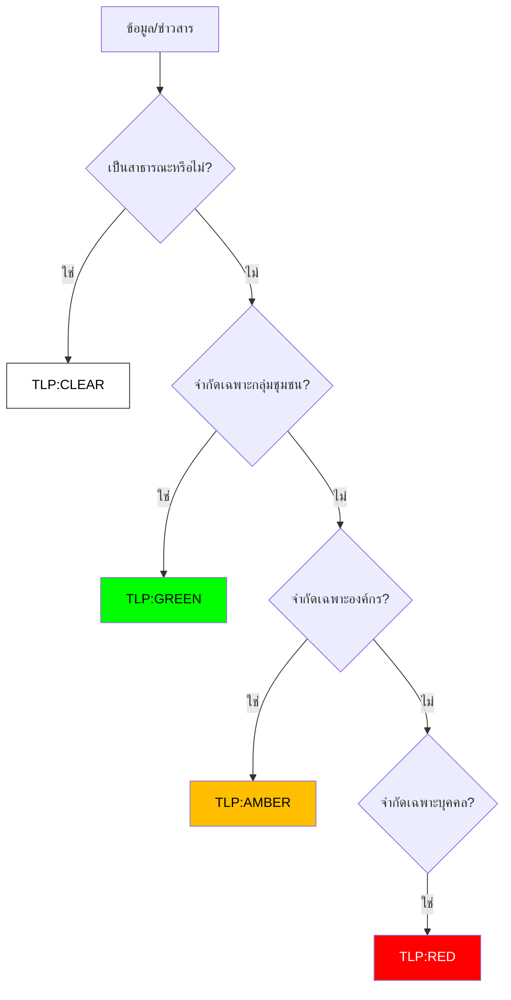

# โปรโตคอลการจัดการข้อมูล (TLP 2.0)

**วันที่มีผลบังคับใช้**: 2026-02-15
**เวอร์ชัน**: 1.0

## 1. ภาพรวม
Traffic Light Protocol (TLP) คือมาตรฐานสากลที่ใช้กำหนดขอบเขตในการแบ่งปันข้อมูล เพื่อให้มั่นใจว่าข้อมูลที่มีความละเอียดอ่อนจะถูกส่งต่อไปยังผู้ที่เกี่ยวข้องเท่านั้น

## 2. ขั้นตอนการจำแนกข้อมูล (Classification Logic)
ใช้แผนผังด้านล่างเพื่อตัดสินใจเลือก TLP Level



## 3. คำนิยาม TLP

### 🔴 TLP:RED (ลับที่สุด / เฉพาะบุคคล)
-   **คำนิยาม**: ห้ามเปิดเผยต่อผู้อื่น จำกัดไว้เฉพาะผู้รับสารโดยตรงเท่านั้น
-   **ตัวอย่าง**: Log ที่มีรหัสผ่าน, รายงาน Forensics ที่ระบุชื่อพนักงานที่ทำผิด, การเจรจากับแฮกเกอร์
-   **การแบ่งปัน**: ห้ามส่งต่อ หรือบอกกล่าวแก่บุคคลอื่นนอกเหนือจากคู่สนทนา

### 🟡 TLP:AMBER (จำกัดภายในองค์กร)
-   **คำนิยาม**: เปิดเผยได้จำกัด เฉพาะผู้ที่มีความจำเป็นต้องรู้ (Need-to-know) ภายในองค์กร
-   **ตัวอย่าง**: รายงานเหตุการณ์ภัยคุกคามภายใน, ผล Scan ช่องโหว่, ผังเครือข่ายภายใน
-   **การแบ่งปัน**: ส่งต่อได้เฉพาะพนักงานภายในองค์กรที่เกี่ยวข้อง

### 🟢 TLP:GREEN (จำกัดภายในกลุ่มเครือข่าย)
-   **คำนิยาม**: เปิดเผยได้ภายในกลุ่มชุมชนหรืออุตสาหกรรมเดียวกัน
-   **ตัวอย่าง**: IoC (IP/Hash) ของกลุ่มแฮกเกอร์, คำแนะนำการป้องกันทั่วไป
-   **การแบ่งปัน**: แชร์กับบริษัทคู่ค้า หรือกลุ่มอุตสาหกรรมเดียวกันได้ (เช่น กลุ่มธนาคาร)

### ⚪ TLP:CLEAR (สาธารณะ)
-   **คำนิยาม**: เปิดเผยได้ไม่จำกัด
-   **ตัวอย่าง**: แถลงการณ์ข่าว, บทความวิชาการ, รายละเอียด Patch
-   **การแบ่งปัน**: เผยแพร่สู่สาธารณะได้ทันที

## 4. การใข้งานในรายงาน (Incident Reports)
รายงานเหตุการณ์ทุกฉบับ ต้องระบุระดับ TLP อย่างชัดเจนที่ส่วนหัวของเอกสาร

## ขั้นตอนการจัดการตามระดับ TLP

| ระดับ TLP | การจัดเก็บ | การส่ง | การแชร์ |
|:---|:---|:---|:---|
| 🔴 RED | เข้ารหัส + โฟลเดอร์จำกัด | ช่องทางเข้ารหัสเท่านั้น | บุคคลที่ระบุชื่อเท่านั้น |
| 🟡 AMBER | เข้ารหัสขณะจัดเก็บ | TLS 1.2+ / อีเมลเข้ารหัส | ภายในองค์กร + พันธมิตร NDA |
| 🟢 GREEN | จัดเก็บ SOC มาตรฐาน | ช่องทางปลอดภัย | ชุมชนภาคส่วน / ISACs |
| ⚪ CLEAR | จัดเก็บทั่วไป | ช่องทางใดก็ได้ | สาธารณะ |

## สถานการณ์ทั่วไปและ TLP ที่ถูกต้อง

| สถานการณ์ | TLP ที่ถูกต้อง | เหตุผล |
|:---|:---|:---|
| IoCs จากเหตุการณ์ที่ active แชร์กับ ISP | 🟡 AMBER | มีรายละเอียดเฉพาะองค์กร |
| Hash จากการวิเคราะห์ Malware สาธารณะ | ⚪ CLEAR | ข้อมูลที่เปิดเผยสาธารณะ |
| Forensic image ของแล็ปท็อปพนักงาน | 🔴 RED | มีข้อมูลส่วนบุคคล/Credential |
| รายงานภัยคุกคามรายไตรมาสสำหรับ SOC พันธมิตร | 🟢 GREEN | ใช้ได้ทั่วไปในภาคส่วน |

## การตอบสนองต่อการฝ่าฝืน

| การฝ่าฝืน | ระดับ | การตอบสนอง |
|:---|:---|:---|
| TLP:RED ถูกแชร์ภายนอก | 🔴 วิกฤต | ควบคุมทันที, แจ้ง CISO |
| TLP:AMBER โพสต์สาธารณะ | 🟠 สูง | ลบเนื้อหา, รายงานเหตุการณ์ |
| ไม่มีเครื่องหมาย TLP | 🟡 กลาง | ส่งกลับผู้เขียน, ถือเป็น AMBER |

## 9. การทำเครื่องหมาย TLP ในทางปฏิบัติ

### รูปแบบหัวข้อ Email
```
[TLP:RED] เหตุการณ์ INC-2026-042 — ผลการวิเคราะห์ Forensic
[TLP:AMBER] ผลสแกนช่องโหว่ — Q1 2026
[TLP:GREEN] แจ้ง IOC — แคมเปญ Banking Trojan
[TLP:CLEAR] สรุป SOC ประจำเดือน — มกราคม 2026
```

### Template หัวเอกสาร
```
╔═══════════════════════════════════════════╗
║  TLP: [RED/AMBER/GREEN/CLEAR]            ║
║  วันที่จำแนก: YYYY-MM-DD                  ║
║  จำแนกโดย: [ชื่อ, ตำแหน่ง]                  ║
║  วันทบทวน: YYYY-MM-DD                     ║
╚═══════════════════════════════════════════╝
```

### รูปแบบ Chat/Slack
```
🔴 TLP:RED — ห้าม screenshot หรือ forward
[ข้อความที่มีข้อมูลอ่อนไหว]

🟡 TLP:AMBER — เฉพาะภายในองค์กร
[ข้อความที่จำกัด]
```

## 10. Data Loss Prevention (DLP) สำหรับ SOC

| ความเสี่ยง | การตรวจจับ | การป้องกัน |
|:---|:---|:---|
| Analyst คัดลอก IOCs ไปอุปกรณ์ส่วนตัว | DLP ตรวจ USB/cloud upload | Block USB, จำกัด cloud storage |
| Screenshot ข้อมูลอ่อนไหวถูกแชร์ | Screen monitoring (ถ้าสอดคล้อง) | Watermark หน้าจอ SOC |
| ข้อมูลสืบสวนส่งไปอีเมลส่วนตัว | Email DLP rules | Block personal email ใน SOC |
| หลักฐาน forensic บน drive ไม่เข้ารหัส | Asset inventory + ตรวจ encryption | Full disk encryption บังคับ |
| PII ในบันทึกสืบสวนบน shared drive | DLP content scanning | ฝึกอบรม data classification |

## 11. ตาราง Data Retention

| ประเภทข้อมูล | ระยะเก็บ | ที่เก็บ | วิธีทำลาย |
|:---|:---|:---|:---|
| SIEM raw logs | 90 วัน hot / 1 ปี cold | Encrypted storage | Automated purge |
| Incident tickets | 3 ปี | Ticketing system | Archive หลัง 3 ปี |
| หลักฐาน forensic | จนปิด case + 1 ปี | Encrypted vault | Secure wipe + certificate |
| Threat intelligence reports | 2 ปี | TI platform | Archive |
| SOC metrics/dashboards | 2 ปี | Reporting system | Archive |
| PII จากการสืบสวน | จนปิด case | Case file (encrypted) | Secure delete + DPO confirm |
| บันทึก PDPA breach | 5 ปี (ข้อกำหนดกฎหมาย) | Encrypted archive | เก็บตามกฎระเบียบ |

## บัตรอ้างอิงด่วน TLP

พิมพ์และติดที่โต๊ะทำงาน SOC:

```
╔══════════════════════════════════════════════╗
║          TLP 2.0 อ้างอิงด่วน                 ║
╠══════════════════════════════════════════════╣
║ 🔴 TLP:RED     — ผู้รับที่ระบุชื่อเท่านั้น      ║
║                  ห้ามส่งต่อ ห้ามแชร์            ║
║ 🟠 TLP:AMBER   — องค์กร + ต้องรู้             ║
║                  แชร์ในองค์กรได้                ║
║ 🟡 TLP:AMBER+S — องค์กร + ต้องรู้ เข้มงวด    ║
║                  ห้ามแชร์กับลูกค้า              ║
║ 🟢 TLP:GREEN   — แชร์ในชุมชน/ภาคส่วนได้      ║
║                  ห้ามโพสต์สาธารณะ              ║
║ ⚪ TLP:CLEAR   — สาธารณะ ไม่จำกัด            ║
║                  โพสต์ได้ทุกที่                  ║
╠══════════════════════════════════════════════╣
║ ไม่แน่ใจ → ถือเป็น TLP:AMBER                 ║
║ สงสัย? ถาม SOC Manager                       ║
╚══════════════════════════════════════════════╝
```

## เอกสารที่เกี่ยวข้อง (Related Documents)
-   [กรอบการตอบสนองเหตุการณ์](../05_Incident_Response/Framework.th.md)
-   [แบบประเมิน SOC](SOC_Assessment_Checklist.th.md)
-   [ตัวชี้วัด SOC](SOC_Metrics.th.md)

### Data Retention Schedule

| Data Type | Retention | Archive | Destroy |
|:---|:---|:---|:---|
| Security logs | 1 ปี | 3 ปี | Secure wipe |
| Incident data | 3 ปี | 5 ปี | Secure wipe |
| PII evidence | ตาม PDPA | ตาม PDPA | Certified destroy |
| Threat intel | 2 ปี | 5 ปี | Secure wipe |

### Quick Classification Guide

| Question | Yes → | No → |
|:---|:---|:---|
| Contains PII? | Restricted | Check next |
| Business sensitive? | Confidential | Check next |
| Internal only? | Internal | Public |

## References
-   [FIRST.org TLP 2.0 Standard](https://www.first.org/tlp/)
-   [CISA Traffic Light Protocol](https://www.cisa.gov/tlp)
