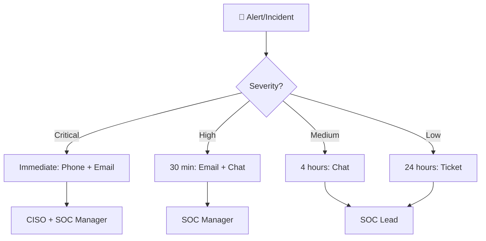

# Escalation Matrix

This document defines when, how, and to whom incidents should be escalated based on severity, impact, and time elapsed.

---

## Escalation Levels

| Level | Trigger | Escalate To | Response Time |
|:---|:---|:---|:---|
| **L1 → L2** | Alert confirmed as True Positive | Tier 2 Analyst / SOC Lead | Immediately |
| **L2 → L3** | Advanced threat, forensics needed | Tier 3 / IR Lead | < 30 min |
| **L3 → Management** | Business impact, data breach suspected | SOC Manager / CISO | < 1 hour |
| **Management → Executive** | Major breach, regulatory notification required | CTO / CEO / Legal | < 2 hours |
| **External** | Law enforcement, regulatory body notification | Legal Counsel → Authority | Per regulation |

## Severity-Based Escalation

| Severity | Auto-Escalate After | Escalation Path | Notification |
|:---|:---|:---|:---|
| **Critical** | 15 min (no pickup) | Analyst → SOC Lead → SOC Manager → CISO | Phone + Email |
| **High** | 30 min (no pickup) | Analyst → SOC Lead → SOC Manager | Email + Chat |
| **Medium** | 4 hours (no progress) | Analyst → SOC Lead | Chat |
| **Low** | 24 hours (no progress) | Analyst → SOC Lead | Ticket update |

## Escalation Contact List

| Role | Name | Phone | Email | Availability |
|:---|:---|:---|:---|:---|
| SOC Lead (Morning) | [TBD] | [TBD] | [TBD] | 08:00–16:00 |
| SOC Lead (Afternoon) | [TBD] | [TBD] | [TBD] | 16:00–00:00 |
| SOC Lead (Night) | [TBD] | [TBD] | [TBD] | 00:00–08:00 |
| SOC Manager | [TBD] | [TBD] | [TBD] | Business hours + on-call |
| CISO | [TBD] | [TBD] | [TBD] | On-call |
| Legal Counsel | [TBD] | [TBD] | [TBD] | Business hours |

## Escalation Procedure

## Escalation Documentation

When escalating, include:
1. **Incident ID** and current severity
2. **Summary** of findings so far
3. **Impact** — affected systems, users, data
4. **Actions taken** — containment, investigation steps
5. **What is needed** — approval, resources, expertise
6. **Urgency** — why escalation is needed now

## After-Hours Escalation

| Time | Primary Contact | Backup Contact | Method |
|:---|:---|:---|:---|
| Business hours (08:00–18:00) | SOC Lead on shift | SOC Manager | Chat → Phone |
| After hours (18:00–08:00) | On-call SOC Lead | SOC Manager (phone) | Phone only |
| Weekends / Holidays | On-call rotation | SOC Manager (phone) | Phone only |
| Critical (any time) | SOC Manager direct | CISO | Phone + SMS |

## Override & Bypass Rules

| Scenario | Can Bypass Normal Escalation? | Authority Required |
|:---|:---|:---|
| Active data breach in progress | ✅ Yes — escalate directly to CISO | SOC Lead |
| Ransomware with active encryption | ✅ Yes — skip to L3 + Management | Any analyst |
| Nation-state / APT indicators | ✅ Yes — direct to CISO + Legal | SOC Manager |
| Routine false positive | ❌ No | Follow standard path |

## Escalation Metrics

| KPI | Target | Measurement |
|:---|:---|:---|
| Escalation response time (Critical) | < 15 min | Time from escalation to acknowledgment |
| Escalation response time (High) | < 30 min | Time from escalation to acknowledgment |
| Escalation accuracy | > 90% | Escalations that were justified |
| Missed escalations | 0 | Incidents that should have been escalated but weren't |
| Mean time to management notification | < 1 hour | For Critical/High incidents |

## Related Documents

- [IR Framework](../05_Incident_Response/Framework.en.md)
- [Shift Handoff Standard](Shift_Handoff.en.md)
- [SOC Metrics & KPIs](SOC_Metrics.en.md)

## References

- [NIST SP 800-61r2](https://csrc.nist.gov/publications/detail/sp/800-61/rev-2/final)
- [SANS Escalation Best Practices](https://www.sans.org/white-papers/)
