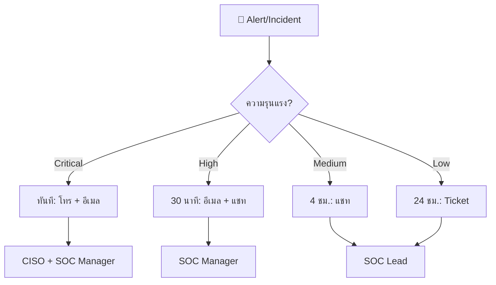

# ตาราง Escalation (Escalation Matrix)

เอกสารนี้กำหนดว่าควร escalate เมื่อไหร่ อย่างไร และถึงใคร ตามความรุนแรง ผลกระทบ และเวลาที่ผ่านไป

---

## ระดับ Escalation

| ระดับ | เงื่อนไข | ส่งต่อถึง | เวลาตอบสนอง |
|:---|:---|:---|:---|
| **L1 → L2** | Alert ยืนยันเป็น True Positive | Tier 2 Analyst / SOC Lead | ทันที |
| **L2 → L3** | ภัยคุกคามขั้นสูง, ต้องการ forensics | Tier 3 / IR Lead | < 30 นาที |
| **L3 → ผู้บริหาร** | กระทบธุรกิจ, สงสัย data breach | SOC Manager / CISO | < 1 ชม. |
| **ผู้บริหาร → C-Suite** | breach ใหญ่, ต้องแจ้งหน่วยงานกำกับ | CTO / CEO / Legal | < 2 ชม. |
| **ภายนอก** | แจ้งหน่วยงานบังคับใช้กฎหมาย | ที่ปรึกษากฎหมาย → หน่วยงาน | ตามข้อบังคับ |

## Escalation ตามความรุนแรง

| ความรุนแรง | Auto-Escalate หลัง | เส้นทาง | การแจ้ง |
|:---|:---|:---|:---|
| **Critical** | 15 นาที (ไม่มีคนรับ) | Analyst → SOC Lead → SOC Manager → CISO | โทร + อีเมล |
| **High** | 30 นาที (ไม่มีคนรับ) | Analyst → SOC Lead → SOC Manager | อีเมล + แชท |
| **Medium** | 4 ชม. (ไม่มีความคืบหน้า) | Analyst → SOC Lead | แชท |
| **Low** | 24 ชม. (ไม่มีความคืบหน้า) | Analyst → SOC Lead | อัปเดต ticket |

## รายชื่อผู้ติดต่อ Escalation

| บทบาท | ชื่อ | โทรศัพท์ | อีเมล | พร้อมเมื่อ |
|:---|:---|:---|:---|:---|
| SOC Lead (เช้า) | [TBD] | [TBD] | [TBD] | 08:00–16:00 |
| SOC Lead (บ่าย) | [TBD] | [TBD] | [TBD] | 16:00–00:00 |
| SOC Lead (ดึก) | [TBD] | [TBD] | [TBD] | 00:00–08:00 |
| SOC Manager | [TBD] | [TBD] | [TBD] | เวลาทำการ + เวร |
| CISO | [TBD] | [TBD] | [TBD] | เวร |
| ที่ปรึกษากฎหมาย | [TBD] | [TBD] | [TBD] | เวลาทำการ |

## ขั้นตอนการ Escalation

## การยกระดับนอกเวลาทำการ

| เวลา | ผู้ติดต่อหลัก | ผู้ติดต่อสำรอง | วิธี |
|:---|:---|:---|:---|
| เวลาทำการ (08:00–18:00) | SOC Lead ในกะ | SOC Manager | Chat → โทรศัพท์ |
| นอกเวลา (18:00–08:00) | SOC Lead เวร | SOC Manager (โทรศัพท์) | โทรศัพท์เท่านั้น |
| วันหยุด | เวรหมุนเวียน | SOC Manager (โทรศัพท์) | โทรศัพท์เท่านั้น |
| วิกฤต (ทุกเวลา) | SOC Manager โดยตรง | CISO | โทรศัพท์ + SMS |

## กฎการข้ามขั้นตอน

| สถานการณ์ | ข้ามได้? | อำนาจที่ต้องการ |
|:---|:---|:---|
| Data breach กำลังเกิดขึ้น | ✅ ยกระดับถึง CISO ทันที | SOC Lead |
| Ransomware กำลังเข้ารหัส | ✅ ข้ามไป L3 + Management | นักวิเคราะห์ใดก็ได้ |
| ตัวบ่งชี้ APT / Nation-state | ✅ ถึง CISO + กฎหมาย | SOC Manager |
| False positive ทั่วไป | ❌ ไม่ | ตามขั้นตอนปกติ |

## ตัวชี้วัดการยกระดับ

| KPI | เป้าหมาย | การวัด |
|:---|:---|:---|
| เวลาตอบสนองการยกระดับ (Critical) | < 15 นาที | เวลาจากยกระดับถึงรับทราบ |
| เวลาตอบสนองการยกระดับ (High) | < 30 นาที | เวลาจากยกระดับถึงรับทราบ |
| ความแม่นยำการยกระดับ | > 90% | สัดส่วนที่สมเหตุสมผล |
| การยกระดับที่พลาด | 0 | เหตุการณ์ที่ควรยกแต่ไม่ได้ยก |

## เอกสารที่เกี่ยวข้อง

- [กรอบ IR](../05_Incident_Response/Framework.th.md)
- [มาตรฐานส่งมอบกะ](Shift_Handoff.th.md)
- [ตัวชี้วัด SOC & KPIs](SOC_Metrics.th.md)

## อ้างอิง

- [NIST SP 800-61r2](https://csrc.nist.gov/publications/detail/sp/800-61/rev-2/final)
