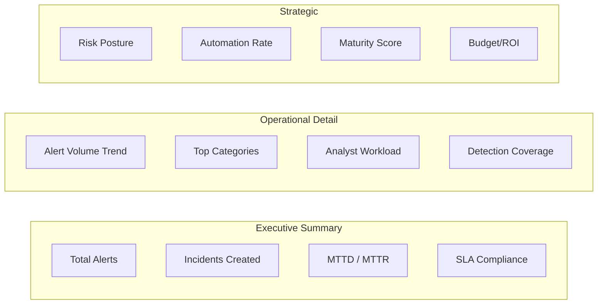
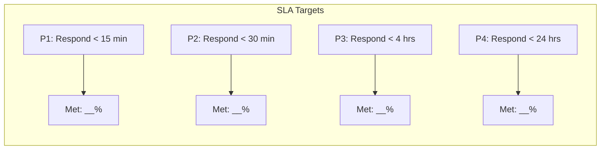

# SOC KPI Dashboard Template

**Document ID**: OPS-SOP-013
**Version**: 1.0
**Classification**: Internal
**Last Updated**: 2026-02-15

> A ready-to-use **executive dashboard template** for monthly SOC performance reporting. Copy these sections into your BI tool (Grafana, Power BI, Kibana) or use as a manual report template.

---

## Dashboard Overview



---

## Section 1: Executive Summary Cards

> 🎯 **Audience**: CISO, CTO, Board
> 📅 **Frequency**: Monthly

### Top-Line KPIs

| KPI | This Month | Last Month | Trend | Target | Status |
|:---|:---:|:---:|:---:|:---:|:---:|
| **Total Alerts** | _____ | _____ | ↑/↓ _% | — | — |
| **True Positive Rate** | ___% | ___% | ↑/↓ | ≥ 80% | 🟢/🟡/🔴 |
| **Incidents Created** | _____ | _____ | ↑/↓ _% | — | — |
| **P1/P2 Incidents** | _____ | _____ | ↑/↓ _% | — | — |
| **MTTD** (Mean Time to Detect) | ___ min | ___ min | ↑/↓ | < 15 min | 🟢/🟡/🔴 |
| **MTTR** (Mean Time to Respond) | ___ min | ___ min | ↑/↓ | < 60 min | 🟢/🟡/🔴 |
| **MTTC** (Mean Time to Contain) | ___ hrs | ___ hrs | ↑/↓ | < 4 hrs | 🟢/🟡/🔴 |
| **SLA Compliance** | ___% | ___% | ↑/↓ | ≥ 95% | 🟢/🟡/🔴 |
| **Automation Rate** | ___% | ___% | ↑/↓ | ≥ 40% | 🟢/🟡/🔴 |
| **Data Breach Count** | _____ | _____ | ↑/↓ | 0 | 🟢/🟡/🔴 |

**Status Legend**: 🟢 On Target | 🟡 Needs Attention (within 10%) | 🔴 Below Target

---

## Section 2: Alert Analytics

### 2a. Alert Volume Trend (12-month)

| Month | Total Alerts | True Positive | False Positive | TP Rate | Alerts/Analyst/Day |
|:---|:---:|:---:|:---:|:---:|:---:|
| _____ | _____ | _____ | _____ | ___% | _____ |
| _____ | _____ | _____ | _____ | ___% | _____ |
| _____ | _____ | _____ | _____ | ___% | _____ |

> 📊 **Visualization**: Line chart showing alert volume trend with TP/FP breakdown.

### 2b. Alert Categories (Top 10)

| Rank | Category | Count | % of Total | Trend | Top Source |
|:---:|:---|:---:|:---:|:---:|:---|
| 1 | ______________ | _____ | ___% | ↑/↓ | ______________ |
| 2 | ______________ | _____ | ___% | ↑/↓ | ______________ |
| 3 | ______________ | _____ | ___% | ↑/↓ | ______________ |
| 4 | ______________ | _____ | ___% | ↑/↓ | ______________ |
| 5 | ______________ | _____ | ___% | ↑/↓ | ______________ |

> 📊 **Visualization**: Donut chart or horizontal bar chart.

### 2c. Alert Sources

| Source | Count | % of Total | TP Rate | Noise Ratio |
|:---|:---:|:---:|:---:|:---:|
| SIEM | _____ | ___% | ___% | ___% |
| EDR | _____ | ___% | ___% | ___% |
| Email Gateway | _____ | ___% | ___% | ___% |
| Cloud | _____ | ___% | ___% | ___% |
| WAF / IDS | _____ | ___% | ___% | ___% |
| TI Feed Match | _____ | ___% | ___% | ___% |
| User Report | _____ | ___% | ___% | ___% |

---

## Section 3: Incident Metrics

### 3a. Incidents by Severity

| Severity | Count | % | Avg MTTR | SLA Met | SLA Breached |
|:---:|:---:|:---:|:---:|:---:|:---:|
| **P1** 🔴 | _____ | ___% | ___ min | _____ | _____ |
| **P2** 🟠 | _____ | ___% | ___ min | _____ | _____ |
| **P3** 🟡 | _____ | ___% | ___ hrs | _____ | _____ |
| **P4** 🔵 | _____ | ___% | ___ hrs | _____ | _____ |

### 3b. Incidents by Category

| Category Code | Category | Count | % | Avg Severity |
|:---:|:---|:---:|:---:|:---:|
| MAL | Malware | _____ | ___% | P__ |
| PHI | Phishing | _____ | ___% | P__ |
| UNA | Unauthorized Access | _____ | ___% | P__ |
| CLD | Cloud | _____ | ___% | P__ |
| POL | Policy Violation | _____ | ___% | P__ |
| ___ | Other | _____ | ___% | P__ |

> Reference: [Incident Classification Taxonomy](../05_Incident_Response/Incident_Classification.en.md)

### 3c. SLA Performance



---

## Section 4: Detection Coverage

### 4a. MITRE ATT&CK Coverage Summary

| Tactic | Techniques Covered | Total Techniques | Coverage % |
|:---|:---:|:---:|:---:|
| Initial Access | __/__ | 9 | ___% |
| Execution | __/__ | 14 | ___% |
| Persistence | __/__ | 20 | ___% |
| Privilege Escalation | __/__ | 13 | ___% |
| Defense Evasion | __/__ | 42 | ___% |
| Credential Access | __/__ | 17 | ___% |
| Discovery | __/__ | 31 | ___% |
| Lateral Movement | __/__ | 9 | ___% |
| Collection | __/__ | 17 | ___% |
| C2 | __/__ | 16 | ___% |
| Exfiltration | __/__ | 9 | ___% |
| Impact | __/__ | 14 | ___% |
| **Total** | **__/211** | **211** | **___%** |

> 📊 **Visualization**: ATT&CK Navigator heatmap (embed screenshot from MITRE ATT&CK Navigator).

### 4b. Detection Rules Health

| Metric | Value | Target | Status |
|:---|:---:|:---:|:---:|
| Total active rules | _____ | — | — |
| Rules added this month | _____ | ≥ 5 | 🟢/🟡/🔴 |
| Rules tuned/updated | _____ | ≥ 10% | 🟢/🟡/🔴 |
| Rules disabled (high FP) | _____ | < 5% | 🟢/🟡/🔴 |
| Rules with 0 hits (30 days) | _____ | < 20% | 🟢/🟡/🔴 |
| Average TP rate per rule | ___% | ≥ 70% | 🟢/🟡/🔴 |

### 4c. Log Source Health

| Category | Sources Expected | Sources Collecting | Coverage | Gaps |
|:---|:---:|:---:|:---:|:---|
| Endpoint | _____ | _____ | ___% | ______________ |
| Network | _____ | _____ | ___% | ______________ |
| Cloud | _____ | _____ | ___% | ______________ |
| Identity | _____ | _____ | ___% | ______________ |
| Application | _____ | _____ | ___% | ______________ |

> Reference: [Log Source Matrix](../06_Operations_Management/Log_Source_Matrix.en.md)

---

## Section 5: Team Performance

### 5a. Analyst Workload

| Analyst | Alerts Handled | Incidents Closed | Avg MTTR | TP Rate | Escalations |
|:---|:---:|:---:|:---:|:---:|:---:|
| ______________ | _____ | _____ | ___ min | ___% | _____ |
| ______________ | _____ | _____ | ___ min | ___% | _____ |
| ______________ | _____ | _____ | ___ min | ___% | _____ |
| **Team Average** | **_____** | **_____** | **___ min** | **___%** | **_____** |

### 5b. Training & Certification

| Metric | Value | Target |
|:---|:---:|:---:|
| Training hours completed (team) | _____ hrs | ≥ 40 hrs/person/year |
| New certifications earned | _____ | ≥ 2/person/year |
| Tabletop exercises conducted | _____ | ≥ 4/year |
| Purple team exercises | _____ | ≥ 2/year |

### 5c. Shift Coverage

| Metric | Value | Target | Status |
|:---|:---:|:---:|:---:|
| Staffing fill rate | ___% | ≥ 95% | 🟢/🟡/🔴 |
| After-hours coverage | ___% | 100% | 🟢/🟡/🔴 |
| Average shift handoff quality | ___/5 | ≥ 4/5 | 🟢/🟡/🔴 |
| Analyst attrition rate | ___% | < 15%/year | 🟢/🟡/🔴 |

---

## Section 6: Automation & Efficiency

| Metric | Value | Target | Status |
|:---|:---:|:---:|:---:|
| **SOAR playbook executions** | _____ | — | — |
| **SOAR success rate** | ___% | ≥ 95% | 🟢/🟡/🔴 |
| **Alerts auto-enriched** | ___% | ≥ 90% | 🟢/🟡/🔴 |
| **Alerts auto-resolved (P4)** | ___% | ≥ 30% | 🟢/🟡/🔴 |
| **Time saved by automation** | ___ hrs | ≥ 40 hrs/mo | 🟢/🟡/🔴 |
| **Automation catalog L2+ coverage** | ___% | ≥ 50% | 🟢/🟡/🔴 |
| **Mean Time to Enrich** | ___ sec | < 30 sec | 🟢/🟡/🔴 |

> Reference: [SOC Automation Catalog](../06_Operations_Management/SOC_Automation_Catalog.en.md)

---

## Section 7: Risk & Compliance

| Metric | Value | Target | Status |
|:---|:---:|:---:|:---:|
| Overdue vulnerability patches (critical) | _____ | 0 | 🟢/🟡/🔴 |
| Regulatory notifications on time | ___% | 100% | 🟢/🟡/🔴 |
| Compliance evidence collected | ___% | 100% | 🟢/🟡/🔴 |
| Open risk acceptances | _____ | < 10 | 🟢/🟡/🔴 |
| Audit findings (open) | _____ | 0 | 🟢/🟡/🔴 |
| PDPA breach notifications < 72 hrs | ___% | 100% | 🟢/🟡/🔴 |

---

## Section 8: Executive Narrative

> Fill this section with context, commentary, and recommendations for leadership.

### Key Highlights
1. _____________________________________________________
2. _____________________________________________________
3. _____________________________________________________

### Notable Incidents
| Date | Summary | Severity | MTTR | Status |
|:---|:---|:---:|:---:|:---:|
| _____ | _______________________________________ | P__ | ___ | Closed/Open |
| _____ | _______________________________________ | P__ | ___ | Closed/Open |

### Concerns & Risks
1. _____________________________________________________
2. _____________________________________________________

### Resource Requests
| Request | Justification | Priority | Estimated Cost |
|:---|:---|:---:|:---:|
| ______________ | _______________________________________ | P_ | $_____ |
| ______________ | _______________________________________ | P_ | $_____ |

### Next Month Focus Areas
1. _____________________________________________________
2. _____________________________________________________
3. _____________________________________________________

---

## Appendix: BI Tool Configuration

### Grafana Dashboard JSON

```json
{
  "panels": [
    {
      "title": "Total Alerts (30 days)",
      "type": "stat",
      "datasource": "SIEM",
      "query": "SELECT COUNT(*) FROM alerts WHERE timestamp >= NOW() - INTERVAL '30 days'"
    },
    {
      "title": "MTTR (P1/P2)",
      "type": "gauge",
      "datasource": "Ticketing",
      "query": "SELECT AVG(resolved_at - created_at) FROM incidents WHERE severity IN ('P1','P2') AND resolved_at IS NOT NULL"
    }
  ]
}
```

### Recommended Refresh Rates

| Dashboard Section | Refresh Rate |
|:---|:---:|
| Alert Volume (real-time) | 5 min |
| Incident Metrics | 15 min |
| SLA Compliance | 1 hour |
| Detection Coverage | Daily |
| Team Performance | Weekly |
| Executive Summary | Monthly |

---

## Related Documents

-   [SOC Metrics & KPIs](SOC_Metrics.en.md) — Full KPI definitions and formulas
-   [Log Source Matrix](Log_Source_Matrix.en.md) — Data source coverage
-   [SOC Automation Catalog](SOC_Automation_Catalog.en.md) — Automation maturity
-   [Incident Classification](../05_Incident_Response/Incident_Classification.en.md) — Category taxonomy
-   [SLA Template](SLA_Template.en.md) — SLA definitions
-   [SOC Checklists](SOC_Checklists.en.md) — Operational checklists
