# Network Security Monitoring SOP

**Document ID**: OPS-SOP-025
**Version**: 1.0
**Classification**: Internal
**Last Updated**: 2026-02-15

> SOC procedures for **monitoring network traffic, detecting network-based attacks, and responding to network security incidents**. Covers IDS/IPS, NDR, DNS monitoring, NetFlow analysis, and network forensics.

---

## Network Monitoring Architecture

```mermaid
graph TD
    subgraph Perimeter["🌐 Perimeter"]
        A[Firewall Logs]
        B[IDS/IPS Alerts]
        C[WAF Logs]
        D[Proxy/Web Gateway]
    end
    
    subgraph Internal["🏢 Internal"]
        E[NetFlow/sFlow]
        F[DNS Logs]
        G[DHCP Logs]
        H[Network TAP/SPAN]
    end
    
    subgraph NDR["🔍 NDR Platform"]
        I[Full Packet Capture]
        J[Protocol Analysis]
        K[Behavioral Analytics]
        L[Encrypted Traffic Analysis]
    end
    
    Perimeter --> M["SIEM"]
    Internal --> M
    NDR --> M
    M --> N["SOC Alert Queue"]

    style M fill:#3b82f6,color:#fff
    style N fill:#dc2626,color:#fff
```

---

## Network Data Sources

| Source | Key data | Retention | Priority |
|:---|:---|:---:|:---:|
| **Firewall logs** | Accept/deny, source/dest IP, port, protocol | 90 days | 🔴 Critical |
| **IDS/IPS alerts** | Signature matches, anomalies | 90 days | 🔴 Critical |
| **DNS query logs** | Domain resolution, query types | 90 days | 🔴 Critical |
| **Proxy/web gateway** | URL, user agent, bytes, category | 90 days | 🔴 Critical |
| **NetFlow/sFlow** | Traffic flow metadata (no payload) | 30 days | 🟠 High |
| **Full packet capture** | Complete traffic content | 7 days | 🟠 High |
| **DHCP logs** | IP-to-MAC mapping | 90 days | 🟡 Medium |
| **VPN logs** | Connection times, source IPs, users | 90 days | 🟡 Medium |
| **WAF logs** | Web attack attempts, blocked requests | 90 days | 🟡 Medium |
| **Wi-Fi controller** | SSID connections, rogue APs | 30 days | 🟡 Medium |

---

## Critical Network Detections

### Perimeter Attacks

| Detection | Description | Data Source | Severity | MITRE |
|:---|:---|:---|:---:|:---|
| Port scan detected | Systematic port scanning from single source | Firewall / IDS | P3 | T1046 |
| Brute-force attempt | Repeated connection attempts to same port | Firewall / IDS | P2 | T1110 |
| Exploit attempt | IDS signature match for known exploit | IDS | P1 | varies |
| DDoS indicators | Abnormal traffic volume from multiple sources | Firewall / NetFlow | P1 | T1498/T1499 |
| Unauthorized VPN access | VPN connection from blocked country/IP | VPN logs | P2 | T1133 |

### Lateral Movement

| Detection | Description | Data Source | Severity | MITRE |
|:---|:---|:---|:---:|:---|
| Internal port scan | Host scanning multiple internal IPs | NetFlow / IDS | P2 | T1046 |
| SMB lateral movement | Unusual SMB connections between hosts | NDR / NetFlow | P1 | T1021.002 |
| RDP to unusual hosts | RDP to servers not in normal baseline | NetFlow / EDR | P2 | T1021.001 |
| Pass-the-hash | NTLM relay or overpass-the-hash detected | NDR / Sysmon | P1 | T1550.002 |
| WinRM across segments | WinRM between network zones | NetFlow / Sysmon | P2 | T1021.006 |

### Command & Control (C2)

| Detection | Description | Data Source | Severity | MITRE |
|:---|:---|:---|:---:|:---|
| DNS tunneling | High-frequency DNS queries with encoded data | DNS logs | P1 | T1071.004 |
| Beaconing pattern | Regular-interval outbound connections | NDR / Proxy | P1 | T1071 |
| Domain generation algorithm | Many NXD responses from single host | DNS logs | P2 | T1568.002 |
| Known C2 infrastructure | Connection to TI-flagged IP/domain | Proxy / Firewall | P1 | T1071 |
| Encrypted C2 (JA3/JA4) | Unusual TLS fingerprint to rare domain | NDR | P2 | T1573 |
| Long DNS TXT queries | TXT records > 200 bytes | DNS logs | P2 | T1071.004 |

### Data Exfiltration

| Detection | Description | Data Source | Severity | MITRE |
|:---|:---|:---|:---:|:---|
| Large outbound transfer | > 500 MB to single external IP | NetFlow / Proxy | P1 | T1048 |
| Unusual upload destination | Upload to IP/domain never seen before | Proxy / NDR | P2 | T1567 |
| Exfil over DNS | DNS queries with encoded payload data | DNS logs | P1 | T1048.001 |
| After-hours data transfer | Large transfers 22:00–06:00 | NetFlow / Proxy | P2 | T1048 |
| Encrypted exfil to cloud | TLS to personal cloud storage | Proxy / CASB | P2 | T1567.002 |

---

## Network Segmentation Monitoring

### Zone Matrix

| Zone | Allowed Destinations | Blocked | Monitoring |
|:---|:---|:---|:---|
| **DMZ** | Internet (specific ports), Internal DB (specific) | All other internal | Full PCAP + IDS |
| **Server Zone** | Other servers (specific), DMZ (response only) | Workstations (direct) | NetFlow + IDS |
| **Workstation Zone** | DMZ (via proxy), Server Zone (specific) | Direct Internet | Proxy logs + NetFlow |
| **Management Zone** | All zones (admin ports only) | Internet | Full PCAP + IDS |
| **IoT Zone** | IoT gateway only | All other zones | Full PCAP + IDS |

### Cross-Zone Violations

| Violation | Severity | Response |
|:---|:---:|:---|
| Workstation → Server (non-standard port) | P2 | Investigate, may indicate lateral movement |
| Server → Workstation (any) | P1 | Investigate immediately, reversed connection suspicious |
| IoT → Server/Workstation | P1 | Contain, possible IoT compromise |
| DMZ → Internal (non-standard) | P1 | Investigate, possible DMZ breach |
| Any zone → Management | P2 | Verify authorized admin access |

---

## DNS Security Monitoring

### DNS Detections

| Detection | Logic | Severity |
|:---|:---|:---:|
| **New domain (< 30 days old)** | Domain creation date query | P3 |
| **DGA detection** | Entropy analysis + NXD ratio | P2 |
| **DNS tunneling** | Query length > 50 chars + high frequency | P1 |
| **Typosquatting** | Edit distance < 3 from corporate domains | P2 |
| **IDN homograph** | Unicode lookalike domains | P2 |
| **DNS over HTTPS (DoH)** | TLS to known DoH providers | P3 |
| **Fast-flux DNS** | Domain resolving to many IPs rapidly | P2 |
| **Sinkhole response** | DNS resolving to known sinkhole IP | P2 |

### DNS Blocklist Integration

| Source | Update Frequency | Type |
|:---|:---:|:---|
| TI feeds (commercial) | Real-time | Malware C2 domains |
| OSINT feeds | Hourly | Known malicious domains |
| Internal blocklist | As needed | Policy-blocked categories |
| Sinkhole feeds | Daily | Compromised domains |

---

## Network Incident Response

### Response Actions

| Action | Tool | Command/Procedure | Impact |
|:---|:---|:---|:---|
| **Block IP** | Firewall | Add to deny list | Immediate, may affect legitimate traffic |
| **Block domain** | DNS Firewall/Proxy | Add to blocklist | Low impact |
| **Isolate host** | Switch/NAC/EDR | Port shutdown or VLAN change | Host offline |
| **Capture packets** | PCAP tool | Start targeted capture | Storage intensive |
| **Rate limit** | Firewall/IPS | Limit connections per source | Partial mitigation |
| **Sinkhole domain** | DNS | Redirect to internal sinkhole | Identifies infected hosts |

### Network IR Workflow

```mermaid
flowchart TD
    A[Network Alert] --> B{Alert source?}
    B -->|IDS/IPS| C[Review signature details]
    B -->|NDR| D[Review behavioral anomaly]
    B -->|DNS| E[Review domain/query]
    B -->|NetFlow| F[Review traffic patterns]
    
    C --> G{True positive?}
    D --> G
    E --> G
    F --> G
    
    G -->|FP| H[Tune rule, close]
    G -->|TP| I[Assess scope]
    
    I --> J[How many hosts affected?]
    J --> K{Single host}
    J --> L{Multiple hosts}
    
    K --> M[Contain host + investigate]
    L --> N[🔴 Major incident — escalate]
    
    M --> O[Block IOCs network-wide]
    N --> O
    O --> P[Hunt for additional compromise]
    P --> Q[Remediate + lessons learned]

    style A fill:#3b82f6,color:#fff
    style N fill:#dc2626,color:#fff
    style Q fill:#22c55e,color:#fff
```

---

## Metrics

| Metric | Target | Measurement |
|:---|:---:|:---|
| Network alert MTTD | < 5 min | SIEM → alert time |
| Network alert MTTR (P1) | < 30 min | Ticket resolution |
| IDS/IPS signature coverage | ≥ 95% of known CVEs | Ruleset audit |
| DNS monitoring coverage | 100% of internal DNS | DNS log audit |
| NetFlow collection coverage | ≥ 90% of segments | Coverage audit |
| Network segmentation violations detected | 100% | Zone violation alerts |
| False positive rate (network alerts) | < 15% | FP / total alerts |
| PCAP availability for P1 investigations | ≥ 95% | Forensic readiness audit |

---

## Related Documents

-   [Log Source Matrix](Log_Source_Matrix.en.md) — All data sources
-   [Cloud Security Monitoring](Cloud_Security_Monitoring.en.md) — Cloud network
-   [Threat Landscape Report](Threat_Landscape_Report.en.md) — Active threats
-   [Forensic Investigation](../05_Incident_Response/Forensic_Investigation.en.md) — Network forensics
-   [Alert Tuning SOP](Alert_Tuning.en.md) — Network alert tuning
-   [DLP SOP](DLP_SOP.en.md) — Network DLP integration
