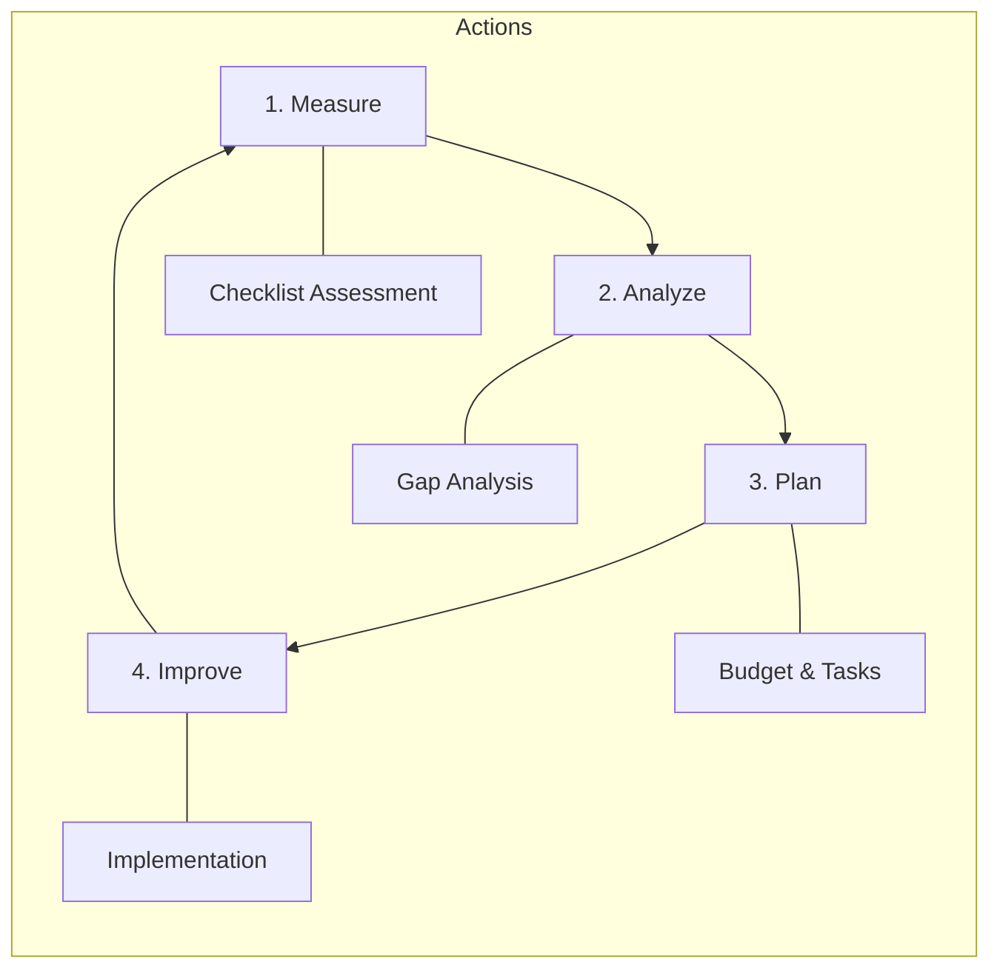

# SOC Capability Maturity Model (SOC-CMM) Assessment

**Assessment Period**: Quarterly

## 1. Improvement Cycle
We use a continuous improvement loop to advance our SOC maturity.

## 2. Maturity Levels
-   **Level 1 (Initial)**: Ad-hoc, chaotic, reactive.
-   **Level 2 (Managed)**: Processes defined but reactive.
-   **Level 3 (Defined)**: Proactive, documented standards (We are here).
-   **Level 4 (Quantitatively Managed)**: Metrics-driven (MTTD/MTTR).
-   **Level 5 (Optimizing)**: Automated, AI-driven, advanced hunting.

## 3. Assessment Checklist

### Domain 1: Business
- [ ] Defined SOC Charter & Strategy?
- [ ] Executive Sponsorship & Budget?
- [ ] Defined Metrics (KPIs) reporting?

### Domain 2: People
- [ ] 24/7 Shift Schedule operational?
- [ ] defined Onboarding Curriculum?
- [ ] Regular Skill Training (Purple Team)?

### Domain 3: Process
- [ ] SOPs for all major tasks?
- [ ] Playbooks for top 10 threats?
- [ ] Change Management (RFC) in place?

### Domain 4: Technology
- [ ] SIEM ingesting critical logs?
- [ ] EDR deployed on 95%+ endpoints?
- [ ] SOAR automation for repetitive tasks?

### Domain 5: Services
- [ ] Real-time Monitoring & Alerting?
- [ ] Incident Response Capability?
- [ ] Threat Intelligence integration?

## 4. Scoring
Count the "Yes" answers to determine approximate maturity.
-   0-5: Level 1
-   6-10: Level 2
-   11-13: Level 3 (Target Baseline)
-   14+: Level 4+

## References
-   [SOC-CMM (Capability Maturity Model)](https://www.soc-cmm.com/)
-   [MITRE SOC Strategy](https://mitre.org/)
-   14+: Level 4+
