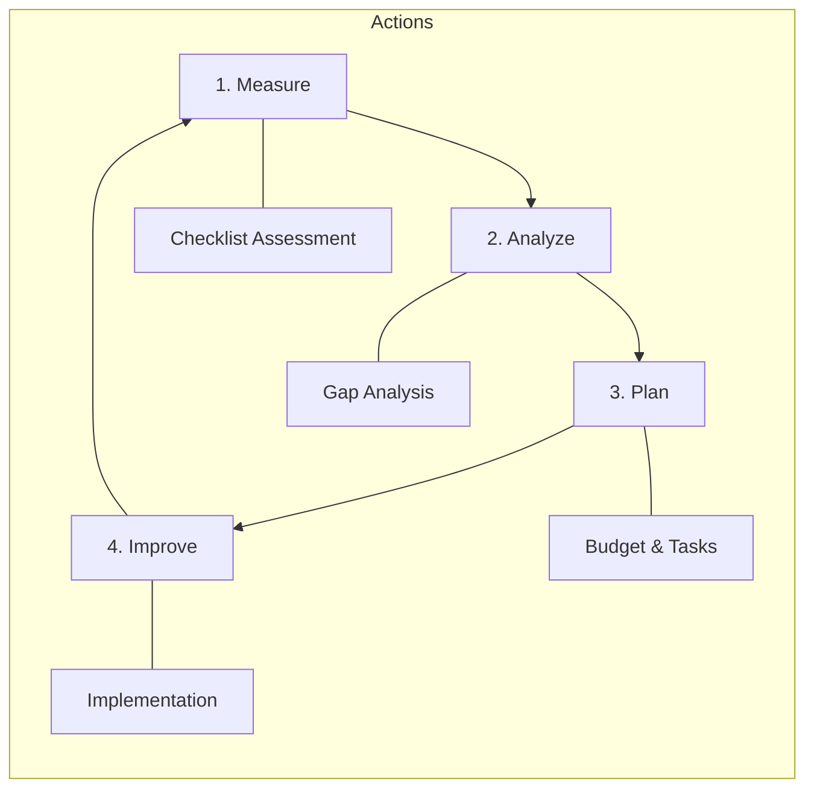

# SOC Capability Maturity Model (SOC-CMM) Assessment

**Assessment Period**: Quarterly

## 1. Improvement Cycle
We use a continuous improvement loop to advance our SOC maturity.

## 2. Maturity Levels
-   **Level 1 (Initial)**: Ad-hoc, chaotic, reactive.
-   **Level 2 (Managed)**: Processes defined but reactive.
-   **Level 3 (Defined)**: Proactive, documented standards (We are here).
-   **Level 4 (Quantitatively Managed)**: Metrics-driven (MTTD/MTTR).
-   **Level 5 (Optimizing)**: Automated, AI-driven, advanced hunting.

## 3. Assessment Checklist

### Domain 1: Business
- [ ] Defined SOC Charter & Strategy?
- [ ] Executive Sponsorship & Budget?
- [ ] Defined Metrics (KPIs) reporting?

### Domain 2: People
- [ ] 24/7 Shift Schedule operational?
- [ ] defined Onboarding Curriculum?
- [ ] Regular Skill Training (Purple Team)?

### Domain 3: Process
- [ ] SOPs for all major tasks?
- [ ] Playbooks for top 10 threats?
- [ ] Change Management (RFC) in place?

### Domain 4: Technology
- [ ] SIEM ingesting critical logs?
- [ ] EDR deployed on 95%+ endpoints?
- [ ] SOAR automation for repetitive tasks?

### Domain 5: Services
- [ ] Real-time Monitoring & Alerting?
- [ ] Incident Response Capability?
- [ ] Threat Intelligence integration?

## 4. Scoring
Count the "Yes" answers to determine approximate maturity.
-   0-5: Level 1
-   6-10: Level 2
-   11-15: Level 3 (Target Baseline)
-   16-18: Level 4
-   19+: Level 5

### Domain 6: Compliance & Governance
- [ ] PDPA / GDPR compliance procedures in place?
- [ ] Data classification and TLP standards followed?
- [ ] Regular compliance audits conducted?
- [ ] DPO coordination process established?

## 5. Gap Analysis Template

| Domain | Current Level | Target Level | Gap | Priority | Remediation |
|:---|:---:|:---:|:---:|:---:|:---|
| Business | [1-5] | [3+] | [Δ] | [H/M/L] | [Action items] |
| People | [1-5] | [3+] | [Δ] | [H/M/L] | [Action items] |
| Process | [1-5] | [3+] | [Δ] | [H/M/L] | [Action items] |
| Technology | [1-5] | [3+] | [Δ] | [H/M/L] | [Action items] |
| Services | [1-5] | [3+] | [Δ] | [H/M/L] | [Action items] |
| Compliance | [1-5] | [3+] | [Δ] | [H/M/L] | [Action items] |

## 6. Improvement Roadmap

| Quarter | Focus Area | Key Initiatives | Success Criteria |
|:---|:---|:---|:---|
| Q1 | Foundation | SOPs, shift schedule, log onboarding | Level 2 achieved |
| Q2 | Detection | Sigma rules, playbooks, alert tuning | 35 playbooks active |
| Q3 | Automation | SOAR workflows, auto-enrichment | MTTR < 60 min |
| Q4 | Advanced | Threat hunting, purple team, TI program | Level 3 achieved |

## 7. Assessment Schedule

| Assessment Type | Frequency | Participants | Output |
|:---|:---|:---|:---|
| Self-assessment (this checklist) | Quarterly | SOC Manager + Leads | Maturity score + gaps |
| Peer review | Semi-annually | Partner SOC / consultant | Independent assessment |
| External audit | Annually | Third-party assessor | Formal maturity report |

## Related Documents
-   [Incident Response Framework](../05_Incident_Response/Framework.en.md)
-   [SOC Metrics & KPIs](SOC_Metrics.en.md)
-   [SOC Maturity Assessment](SOC_Maturity_Assessment.en.md)

## References
-   [SOC-CMM (Capability Maturity Model)](https://www.soc-cmm.com/)
-   [MITRE SOC Strategy](https://mitre.org/)
