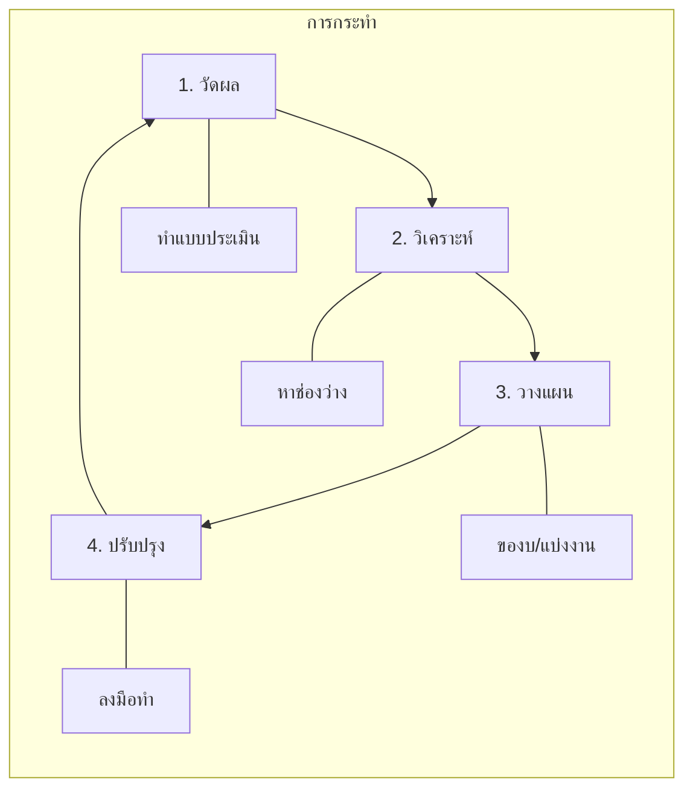

# แบบประเมินระดับความพร้อม SOC (SOC-CMM)

**รอบการประเมิน**: รายไตรมาส

## 1. วงจรการปรับปรุง (Improvement Cycle)
เราใช้วงจรการปรับปรุงอย่างต่อเนื่องเพื่อยกระดับความสามารถของ SOC

## 2. ระดับความพร้อม (Maturity Levels)
-   **Level 1 (Initial)**: ทำตามมีตามเกิด, แก้ปัญหาเฉพาะหน้า
-   **Level 2 (Managed)**: มีกระบวนการ แต่ยังทำงานเชิงรับ (Reactive)
-   **Level 3 (Defined)**: มีมาตรฐานชัดเจน, ทำงานเชิงรุก (Proactive) **(เป้าหมายปัจจุบัน)**
-   **Level 4 (Quantitatively Managed)**: ขับเคลื่อนด้วยข้อมูล (Metrics/KPIs)
-   **Level 5 (Optimizing)**: อัตโนมัติขั้นสูง, AI-driven

## 3. รายการตรวจเช็ค (Checklist)

### Domain 1: ธุรกิจ (Business)
- [ ] มีพ.ร.บ. หรือกฎบัตร (Charter) ของ SOC?
- [ ] ได้รับการสนับสนุนงบประมาณจากผู้บริหาร?
- [ ] มีการรายงานผล KPI สม่ำเสมอ?

### Domain 2: บุคลากร (People)
- [ ] มีตารางเวร 24/7 ที่ชัดเจน?
- [ ] มีหลักสูตร Onboarding พนักงานใหม่?
- [ ] มีการฝึกอบรมทักษะ (เช่น Purple Team) สม่ำเสมอ?

### Domain 3: กระบวนการ (Process)
- [ ] มี SOP ครอบคลุมงานหลัก?
- [ ] มี Playbook รับมือภัยคุกคาม 10 อันดับแรก?
- [ ] มีกระบวนการ Change Management (RFC)?

### Domain 4: เทคโนโลยี (Technology)
- [ ] SIEM รับ Log สำคัญครบถ้วน?
- [ ] EDR ติดตั้งครอบคลุม 95%+ ของเครื่อง?
- [ ] มีระบบ SOAR ช่วยงานซ้ำๆ?

### Domain 5: บริการ (Services)
- [ ] มีการเฝ้าระวังและแจ้งเตือนแบบ Real-time?
- [ ] มีขีดความสามารถในการตอบสนองเหตุการณ์ (IR)?
- [ ] มีการใช้ Threat Intelligence?

## 4. การให้คะแนน
นับจำนวนข้อที่ตอบ "ใช่" เพื่อประเมินระดับ
-   0-5: Level 1
-   6-10: Level 2
-   11-13: Level 3 (เกณฑ์มาตรฐาน)
-   14+: Level 4+

## เอกสารที่เกี่ยวข้อง (Related Documents)
-   [กรอบการตอบสนองเหตุการณ์](../05_Incident_Response/Framework.th.md)
-   [แบบประเมิน SOC](SOC_Assessment_Checklist.th.md)
-   [ตัวชี้วัด SOC](SOC_Metrics.th.md)

## References
-   [SOC-CMM (Capability Maturity Model)](https://www.soc-cmm.com/)
-   [MITRE SOC Strategy](https://mitre.org/)
-   14+: Level 4+
