# SOC Communication SOP

This document defines the standard communication procedures for SOC operations — internal team communication, stakeholder notifications, and external reporting.

---

## Communication Channels

| Channel | Use For | SLA |
|:---|:---|:---|
| **Ticketing System** | Incident communication, audit trail, all case work | Per incident SLA |
| **Chat (Teams/Slack)** | Quick coordination, shift notifications, FYI alerts | < 5 min response |
| **Phone** | Critical escalation, time-sensitive matters | Immediate |
| **Email** | Non-urgent updates, reports, formal communication | < 1 hour |
| **War Room** | Active Critical/High incident coordination | Real-time |

## Communication Matrix

| Scenario | Who | Channel | Frequency |
|:---|:---|:---|:---|
| Alert triage update | Shift Lead | Ticket | Per alert |
| Shift handoff | Incoming + Outgoing Lead | Verbal + Log | Per shift |
| Incident escalation | SOC Lead → SOC Manager | Phone + Email | As needed |
| Daily SOC brief | SOC Manager → Team | Email/Chat | Daily |
| Weekly report | SOC Manager → CISO | Email | Weekly |
| Security advisory | SOC → All Staff | Email | As needed |
| Breach notification | CISO → Affected parties | Formal letter | Per regulation |

## Notification Templates

### Internal Incident Notification

```
Subject: [SEVERITY] Security Incident #[ID] - [Brief Description]

Severity: [Critical/High/Medium/Low]
Status: [Detected/Investigating/Contained/Resolved]
Impact: [Description of affected systems/users]
Current Actions: [What SOC is doing]
Next Steps: [Planned actions]
Contact: [SOC Lead name and channel]
```

### Management Escalation

```
Subject: 🚨 ESCALATION - Incident #[ID] - [Severity]

Summary: [1-2 sentence description]
Business Impact: [Affected services, users, data]
Timeline: [Key timestamps]
Actions Taken: [Containment/investigation steps]
Decision Required: [What approval/guidance is needed]
```

### External / Regulatory Notification

```
Subject: Security Incident Notification - [Organization Name]

Date: [YYYY-MM-DD]
Incident Reference: #[ID]
Nature of Incident: [Brief description]
Personal Data Affected: [Yes/No — if yes, describe scope]
Containment Status: [Contained/Under Investigation]
Remediation Actions: [Steps taken and planned]
DPO Contact: [Name, Email, Phone]
```

## Stakeholder RACI Matrix

| Activity | SOC Analyst | SOC Lead | SOC Manager | CISO | Legal/DPO |
|:---|:---:|:---:|:---:|:---:|:---:|
| Initial alert triage | **R** | I | | | |
| Incident escalation | R | **A** | I | | |
| Internal notification | | R | **A** | I | |
| External breach notification | | | R | **A** | **R** |
| Press/media communication | | | I | R | **A** |
| Regulatory reporting | | | R | A | **R** |
| Post-incident review | R | R | **A** | I | I |

*R = Responsible, A = Accountable, C = Consulted, I = Informed*


## Crisis Communication Plan

During P1/P2 incidents, activate the crisis communication chain:

```mermaid
graph TD
    Detect["🔍 Incident Detected"] --> T1["T1 → Ticket + Chat"]
    T1 --> T2["T2 → Validate + Investigate"]
    T2 --> Confirm{"Confirmed Incident?"}
    Confirm -->|No| Close["Close + Document"]
    Confirm -->|Yes| Bridge["🔴 Open War Room / Bridge Call"]
    Bridge --> Notify_Mgmt["📞 SOC Manager → CISO (15 min)"]
    Notify_Mgmt --> Assess{"Data Breach?"}
    Assess -->|Yes| Legal["⚖️ Legal + DPO (1h)"]
    Assess -->|No| Continue["Continue IR"]
    Legal --> External["📢 External Comms (if required)"]

    style Bridge fill:#f44336,color:#fff
    style Legal fill:#FF9800,color:#fff
```



### War Room Activation Criteria
| Condition | Action |
|:---|:---|
| P1 incident confirmed | Open bridge call immediately |
| Multiple systems affected | Open bridge call |
| Data breach suspected | Add Legal/DPO to bridge |
| Media/regulatory attention | Add Communications team |
| Business disruption > 1 hour | Add Business Unit leaders |

### War Room Roles
| Role | Responsibility |
|:---|:---|
| **Incident Commander** | Leads the bridge call, makes decisions |
| **Technical Lead** (T2/T3) | Provides investigation updates every 15 min |
| **Communications Lead** | Drafts internal/external messaging |
| **Scribe** | Documents decisions and actions in real-time |
| **Business Liaison** | Updates affected business units |

## On-Call Procedures

### On-Call Rotation
| Role | Coverage | Response SLA |
|:---|:---|:---|
| T1 Analyst (on-shift) | 24/7 | Immediate |
| T2 Analyst (on-call) | After hours | ≤ 15 min |
| SOC Manager (on-call) | After hours | ≤ 30 min |
| IR Lead (on-call) | After hours | ≤ 30 min |
| CISO (emergency) | P1 only | ≤ 1 hour |

### After-Hours Escalation
```
P1 Critical:
  1. T1 calls T2 on-call (phone, not chat)
  2. T2 assesses → calls IR Lead if confirmed
  3. IR Lead calls SOC Manager
  4. SOC Manager calls CISO if:
     - Data breach confirmed
     - Business impact > $100K
     - Media/regulatory involvement

P2 High:
  1. T1 creates ticket + messages T2 on-call (chat)
  2. T2 responds within 15 min
  3. T2 handles or schedules for next business day

P3-P4:
  1. T1 documents in ticket
  2. Next shift handles during business hours
```

## Communication Do's and Don'ts

| ✅ Do | ❌ Don't |
|:---|:---|
| State facts only (what we know) | Speculate about cause or blame |
| Use TLP labels on all messages | Share incident details on personal channels |
| Update stakeholders at regular intervals | Go silent during active incidents |
| Use approved templates | Draft ad-hoc external communications |
| Document all decisions and actions | Make verbal-only agreements |
| Include timestamps in all updates | Use ambiguous time references |
| Confirm receipt of critical messages | Assume messages were received |
| Use secure channels for sensitive data | Discuss PII in group chats |

## Stakeholder Communication Frequency

| Audience | Normal Ops | P3/P4 Incident | P1/P2 Incident |
|:---|:---|:---|:---|
| SOC Team | Daily standup | Per-ticket updates | War room — continuous |
| SOC Manager | Weekly report | Daily update | Every 30 min |
| CISO | Monthly report | Weekly mention | Every 1 hour |
| Business Units | Quarterly briefing | If directly affected | Immediate if affected |
| Legal/DPO | As needed | If PII involved | Immediate if breach |
| Board/Executives | Annual report | Not required | CEO-level briefing |

## Communication Audit Checklist

| Item | Frequency | Owner | Status |
|:---|:---|:---|:---:|
| Escalation contact list current | Monthly | SOC Manager | ☐ |
| Notification templates reviewed | Quarterly | SOC Lead | ☐ |
| War room procedure tested | Quarterly | SOC Manager | ☐ |
| External notification process tested | Annually | CISO + Legal | ☐ |
| Stakeholder communication preferences updated | Annually | SOC Manager | ☐ |

## Related Documents

- [Shift Handoff Standard](Shift_Handoff.en.md)
- [Escalation Matrix](Escalation_Matrix.en.md)
- [IR Framework](../05_Incident_Response/Framework.en.md)

## References

- [NIST SP 800-61r2](https://csrc.nist.gov/publications/detail/sp/800-61/rev-2/final)
