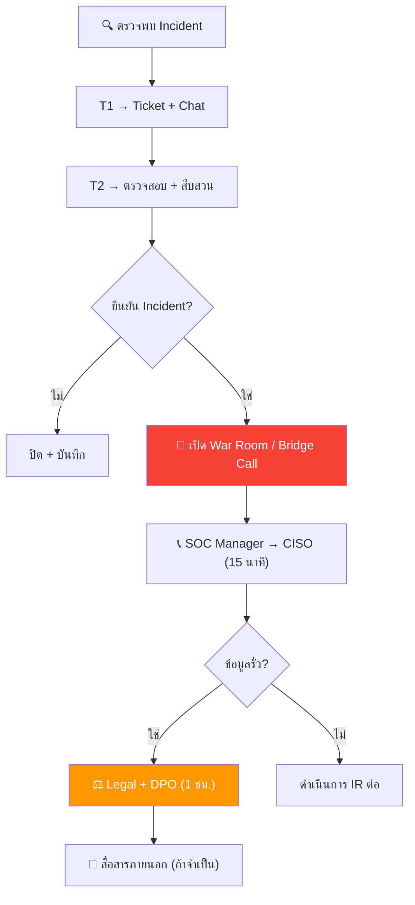

# ขั้นตอนการสื่อสารของ SOC (SOC Communication SOP)

เอกสารนี้กำหนดขั้นตอนมาตรฐานสำหรับการสื่อสารของ SOC — ภายในทีม, การแจ้งผู้มีส่วนได้ส่วนเสีย, และการรายงานภายนอก

---

## ช่องทางการสื่อสาร

| ช่องทาง | ใช้สำหรับ | SLA |
|:---|:---|:---|
| **ระบบ Ticketing** | การสื่อสาร incident, audit trail | ตาม SLA |
| **แชท (Teams/Slack)** | ประสานงานด่วน, แจ้งข้อมูล | < 5 นาที |
| **โทรศัพท์** | Escalation เร่งด่วน | ทันที |
| **อีเมล** | อัปเดตไม่เร่งด่วน, รายงาน | < 1 ชม. |
| **War Room** | ประสานงาน incident Critical/High | เรียลไทม์ |

## ตารางการสื่อสาร

| สถานการณ์ | ใคร | ช่องทาง | ความถี่ |
|:---|:---|:---|:---|
| อัปเดต alert triage | Shift Lead | Ticket | ทุก alert |
| ส่งมอบกะ | Incoming + Outgoing Lead | วาจา + Log | ทุกกะ |
| Escalation incident | SOC Lead → SOC Manager | โทร + อีเมล | ตามความจำเป็น |
| บรีฟ SOC รายวัน | SOC Manager → ทีม | อีเมล/แชท | ทุกวัน |
| รายงานรายสัปดาห์ | SOC Manager → CISO | อีเมล | ทุกสัปดาห์ |
| แจ้งเตือนความปลอดภัย | SOC → พนักงานทั้งหมด | อีเมล | ตามความจำเป็น |
| แจ้งเตือน breach | CISO → ผู้ได้รับผลกระทบ | จดหมายอย่างเป็นทางการ | ตามข้อบังคับ |

### การแจ้งเตือนภายนอก / หน่วยงานกำกับดูแล

```
เรื่อง: แจ้งเหตุการณ์ด้านความปลอดภัย - [ชื่อองค์กร]

วันที่: [ปปปป-ดด-วว]
หมายเลขอ้างอิง: #[ID]
ลักษณะเหตุการณ์: [คำอธิบายสั้น]
ข้อมูลส่วนบุคคลที่ได้รับผลกระทบ: [ใช่/ไม่ — ถ้าใช่ ระบุขอบเขต]
สถานะการควบคุม: [ควบคุมแล้ว/อยู่ระหว่างสอบสวน]
มาตรการแก้ไข: [ขั้นตอนที่ดำเนินการและแผนงาน]
ผู้ติดต่อ DPO: [ชื่อ, อีเมล, โทรศัพท์]
```

## ตาราง RACI ผู้มีส่วนได้ส่วนเสีย

| กิจกรรม | นักวิเคราะห์ | SOC Lead | SOC Manager | CISO | กฎหมาย/DPO |
|:---|:---:|:---:|:---:|:---:|:---:|
| การคัดกรองแจ้งเตือนเบื้องต้น | **R** | I | | | |
| การยกระดับเหตุการณ์ | R | **A** | I | | |
| การแจ้งเตือนภายใน | | R | **A** | I | |
| การแจ้งเตือนภายนอกเรื่อง Breach | | | R | **A** | **R** |
| การสื่อสารกับสื่อ | | | I | R | **A** |
| การรายงานต่อหน่วยงานกำกับ | | | R | A | **R** |
| การทบทวนหลังเหตุการณ์ | R | R | **A** | I | I |

*R = ผู้รับผิดชอบ, A = ผู้อนุมัติ, C = ผู้ให้คำปรึกษา, I = ผู้รับทราบ*


## แผนสื่อสารวิกฤต

เมื่อเกิด incident P1/P2 ให้เปิดใช้ chain การสื่อสารวิกฤต:



### เกณฑ์เปิด War Room
| เงื่อนไข | การดำเนินการ |
|:---|:---|
| ยืนยัน P1 incident | เปิด bridge call ทันที |
| หลายระบบโดน | เปิด bridge call |
| สงสัยข้อมูลรั่ว | เพิ่ม Legal/DPO เข้า bridge |
| สื่อ/หน่วยงานกำกับสนใจ | เพิ่มทีม Communications |
| หยุดชะงักธุรกิจ > 1 ชม. | เพิ่ม Business Unit leaders |

### บทบาทใน War Room
| บทบาท | ความรับผิดชอบ |
|:---|:---|
| **Incident Commander** | นำ bridge call, ตัดสินใจ |
| **Technical Lead** (T2/T3) | อัปเดตการสืบสวนทุก 15 นาที |
| **Communications Lead** | ร่าง messaging ภายใน/ภายนอก |
| **Scribe** | บันทึกการตัดสินใจและ action แบบ real-time |
| **Business Liaison** | อัปเดต business units ที่ได้รับผลกระทบ |

## ขั้นตอน On-Call

### ตาราง On-Call
| บทบาท | Coverage | SLA การตอบ |
|:---|:---|:---|
| T1 Analyst (ประจำกะ) | 24/7 | ทันที |
| T2 Analyst (on-call) | นอกเวลา | ≤ 15 นาที |
| SOC Manager (on-call) | นอกเวลา | ≤ 30 นาที |
| IR Lead (on-call) | นอกเวลา | ≤ 30 นาที |
| CISO (ฉุกเฉิน) | P1 เท่านั้น | ≤ 1 ชม. |

### การ Escalate นอกเวลา
```
P1 วิกฤต:
  1. T1 โทรหา T2 on-call (โทรศัพท์ ไม่ใช่ chat)
  2. T2 ประเมิน → โทร IR Lead ถ้ายืนยัน
  3. IR Lead โทร SOC Manager
  4. SOC Manager โทร CISO ถ้า:
     - ยืนยันข้อมูลรั่ว
     - ผลกระทบ > 3 ล้านบาท
     - สื่อ/หน่วยงานกำกับเกี่ยวข้อง

P2 สูง:
  1. T1 สร้าง ticket + ส่ง chat ถึง T2 on-call
  2. T2 ตอบภายใน 15 นาที
  3. T2 จัดการ หรือนัดวันทำการถัดไป

P3-P4:
  1. T1 บันทึกใน ticket
  2. กะถัดไปจัดการในเวลาทำการ
```

## สิ่งที่ควรทำ / ไม่ควรทำ ในการสื่อสาร

| ✅ ควรทำ | ❌ ไม่ควรทำ |
|:---|:---|
| ระบุข้อเท็จจริงเท่านั้น | คาดเดาสาเหตุหรือโทษใคร |
| ใช้ TLP label ทุกข้อความ | แชร์รายละเอียด incident ในช่องส่วนตัว |
| อัปเดต stakeholders สม่ำเสมอ | เงียบไประหว่าง incident |
| ใช้ template ที่อนุมัติแล้ว | ร่างสื่อสารภายนอกเอง |
| บันทึกทุกการตัดสินใจและ action | ตกลงด้วยวาจาอย่างเดียว |
| ใส่ timestamp ทุกอัปเดต | ใช้เวลาที่คลุมเครือ |
| ยืนยันว่าได้รับข้อความสำคัญ | สมมติว่าข้อความถูกอ่านแล้ว |
| ใช้ช่องทางปลอดภัยสำหรับข้อมูลอ่อนไหว | พูดเรื่อง PII ใน group chat |

## ความถี่สื่อสาร Stakeholder

| ผู้รับ | ปกติ | P3/P4 Incident | P1/P2 Incident |
|:---|:---|:---|:---|
| ทีม SOC | Standup ประจำวัน | อัปเดตตาม ticket | War room — ต่อเนื่อง |
| SOC Manager | รายงานสัปดาห์ | อัปเดตรายวัน | ทุก 30 นาที |
| CISO | รายงานเดือน | กล่าวถึงสัปดาห์ | ทุก 1 ชม. |
| Business Units | ไตรมาส | ถ้ากระทบโดยตรง | ทันทีถ้ากระทบ |
| Legal/DPO | ตามความจำเป็น | ถ้ามี PII | ทันทีถ้าข้อมูลรั่ว |
| Board/ผู้บริหาร | รายปี | ไม่จำเป็น | CEO-level briefing |

## รายการตรวจสอบการสื่อสาร

| รายการ | ความถี่ | ผู้รับผิดชอบ | สถานะ |
|:---|:---|:---|:---:|
| รายชื่อผู้ติดต่อยกระดับเป็นปัจจุบัน | รายเดือน | SOC Manager | ☐ |
| ทบทวน Template การแจ้งเตือน | รายไตรมาส | SOC Lead | ☐ |
| ทดสอบขั้นตอน War Room | รายไตรมาส | SOC Manager | ☐ |
| ทดสอบกระบวนการแจ้งเตือนภายนอก | รายปี | CISO + กฎหมาย | ☐ |

## สิ่งที่ควรทำและไม่ควรทำ

| ✅ ควรทำ | ❌ ไม่ควรทำ |
|:---|:---|
| ใช้ภาษาชัดเจน กระชับ | ใช้ศัพท์เทคนิคกับฝ่ายบริหาร |
| ระบุ Incident ID ทุกการสื่อสาร | ส่ง PII/IoC ผ่านช่องทางไม่เข้ารหัส |
| บันทึกทุกการสื่อสารใน Ticket | โพสต์รายละเอียดเหตุการณ์ลงโซเชียล |
| ใช้ TLP labeling สำหรับข้อมูลที่แชร์ | แจ้งข่าวกับสื่อโดยไม่ผ่าน CISO |
| ยืนยันผู้รับก่อนส่งข้อมูลสำคัญ | คาดเดาสาเหตุก่อนสอบสวนเสร็จ |

## ตารางการสื่อสารตามระดับเหตุการณ์

| ระดับ | แจ้งใคร | ช่องทาง | ความถี่อัปเดต |
|:---|:---|:---|:---|
| **Critical** | CISO + SOC Manager + SOC Lead | โทรศัพท์ + อีเมล | ทุก 30 นาที |
| **High** | SOC Manager + SOC Lead | อีเมล + แชท | ทุก 1 ชั่วโมง |
| **Medium** | SOC Lead | แชท | ทุก 4 ชั่วโมง |
| **Low** | SOC Lead | Ticket อัปเดต | วันละครั้ง |

### Communication Channel Matrix

| Situation | Channel | Fallback |
|:---|:---|:---|
| Active incident | War room (Teams) | Phone bridge |
| Shift handoff | Chat + Document | Email |
| Escalation | Phone + Ticket | SMS |
| Routine update | Email | Chat |

### Communication SLA

| Type | Response |
|:---|:---|
| Critical | 5 min |
| Routine | 30 min |

## เอกสารที่เกี่ยวข้อง

- [มาตรฐานส่งมอบกะ](Shift_Handoff.th.md)
- [Escalation Matrix](../05_Incident_Response/Escalation_Matrix.th.md)
- [กรอบ IR](../05_Incident_Response/Framework.th.md)
