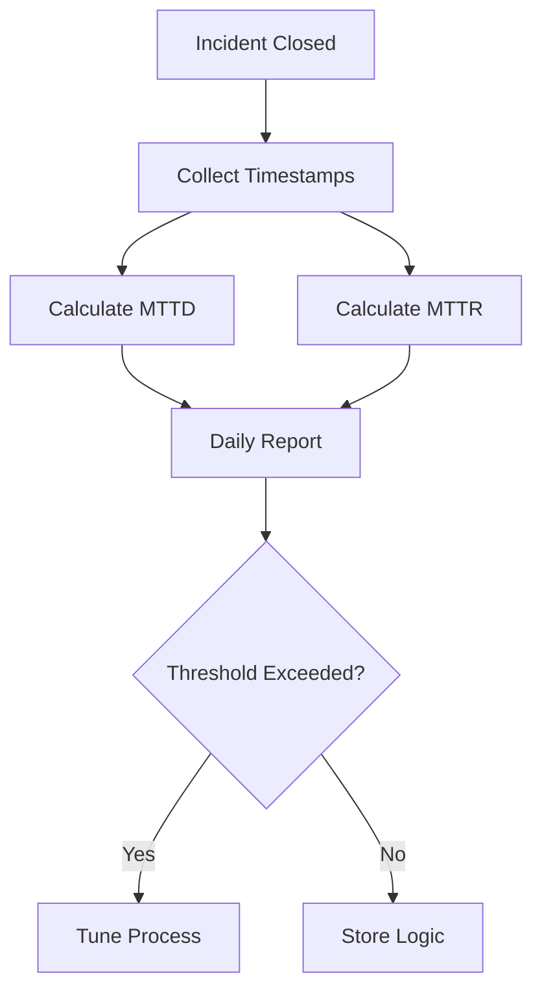

# SOC Metrics & KPIs Standard

This document defines the Key Performance Indicators (KPIs) and metrics used to measure the effectiveness and efficiency of the SOC.

## 1. Operational Metrics (Efficiency)

### 1.1 Mean Time To Detect (MTTD)

### 1.1 Mean Time To Detect (MTTD)
-   **Definition**: The average time it takes to identify a security threat after it has entered the network.
-   **Target**: < 30 Minutes.
-   **Formula**: `Sum(Detection Time - Intrusion Time) / Total Incidents`

### 1.2 Mean Time To Respond (MTTR)
-   **Definition**: The average time it takes to contain and remediate a threat after it has been detected.
-   **Target**: < 60 Minutes (for High/Critical severity).
-   **Formula**: `Sum(Remediation Time - Detection Time) / Total Incidents`

### 1.3 Mean Time To Acknowledge (MTTA)
-   **Definition**: The average time from an alert being triggered to an analyst picking it up.
-   **Target**: < 10 Minutes.

## 2. Detection Metrics (Effectiveness)

### 2.1 False Positive Rate (FPR)
-   **Definition**: Percentage of alerts that are benign but triggered a response.
-   **Target**: < 10%.
-   **Action**: High FPR requires tuning of detection rules (Whitelisting).

### 2.2 Dwell Time
-   **Definition**: The duration a threat actor remains undetected in the environment.
-   **Impact**: Longer dwell time = Higher data breach risk.

## 3. Analyst Capacity

-   **Incidents per Analyst**: Number of cases handled by one analyst per shift.
-   **Burnout Rate**: Turnover rate of SOC staff (Target: < 15% annually).

## References
-   [SANS SOC Metrics](https://www.sans.org/white-papers/soc-metrics/)
-   [MITRE SOC Assessment](https://cat.mitre.org/)
