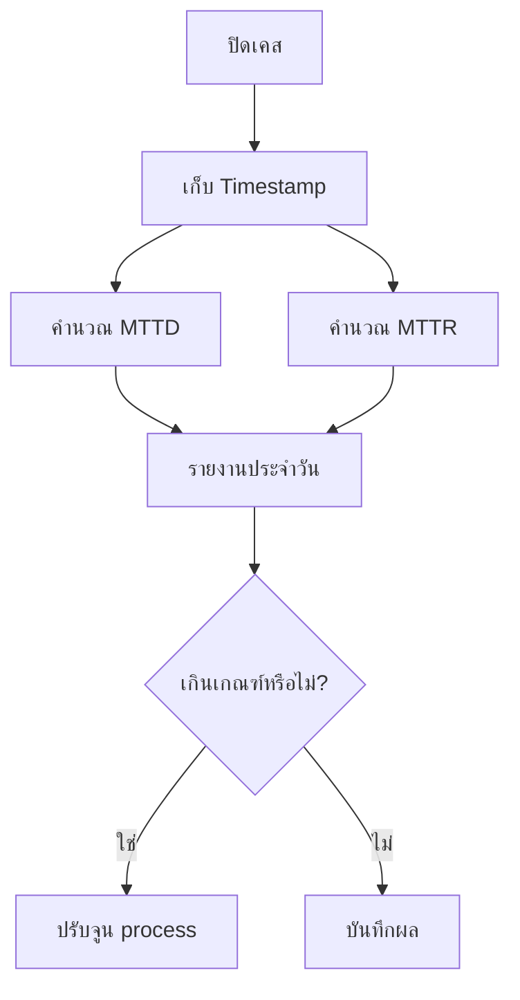

# มาตรฐานตัวชี้วัดประสิทธิภาพ SOC (SOC Metrics & KPIs Standard)

เอกสารนี้กำหนดตัวชี้วัดประสิทธิภาพหลัก (KPIs) และ Metrics ที่ใช้จัดวัดประสิทธิผลและประสิทธิภาพของ SOC

## 1. ตัวชี้วัดด้านการปฏิบัติงาน (Operational Metrics - Efficiency)

### 1.1 เวลาเฉลี่ยในการตรวจจับ (Mean Time To Detect - MTTD)

### 1.1 เวลาเฉลี่ยในการตรวจจับ (Mean Time To Detect - MTTD)
-   **นิยาม**: เวลาเฉลี่ยที่ใช้ในการระบุภัยคุกคามหลังจากที่เข้ามาในเครือข่ายแล้ว
-   **เป้าหมาย**: < 30 นาที
-   **สูตรคำนวณ**: `ผลรวม(เวลาที่ตรวจเจอ - เวลาที่เริ่มบุกรุก) / จำนวนเหตุการณ์ทั้งหมด`

### 1.2 เวลาเฉลี่ยในการตอบสนอง (Mean Time To Respond - MTTR)
-   **นิยาม**: เวลาเฉลี่ยที่ใช้ในการจำกัดและแก้ไขภัยคุกคามหลังจากที่ตรวจพบแล้ว
-   **เป้าหมาย**: < 60 นาที (สำหรับความรุนแรงระดับ High/Critical)
-   **สูตรคำนวณ**: `ผลรวม(เวลาที่แก้ไขเสร็จ - เวลาที่ตรวจเจอ) / จำนวนเหตุการณ์ทั้งหมด`

### 1.3 เวลาเฉลี่ยในการรับเรื่อง (Mean Time To Acknowledge - MTTA)
-   **นิยาม**: เวลาเฉลี่ยตั้งแต่ Alert แจ้งเตือนจนถึงเวลาที่ Analyst กดรับงาน
-   **เป้าหมาย**: < 10 นาที

## 2. ตัวชี้วัดด้านการตรวจจับ (Detection Metrics - Effectiveness)

### 2.1 อัตราการแจ้งเตือนผิดพลาด (False Positive Rate - FPR)
-   **นิยาม**: เปอร์เซ็นต์ของ Alert ที่ไม่ใช่ภัยคุกคามจริง
-   **เป้าหมาย**: < 10%
-   **การดำเนินการ**: หาก FPR สูง ต้องทำการปรับจูน Detection Rules (Whitelisting)

### 2.2 ระยะเวลาแฝงตัว (Dwell Time)
-   **นิยาม**: ระยะเวลาที่ผู้โจมตีแฝงตัวอยู่ในระบบโดยไม่ถูกตรวจจับ
-   **ผลกระทบ**: ยิ่งนาน = ความเสี่ยงข้อมูลรั่วไหลยิ่งสูง

## 3. ขีดความสามารถของ Analyst (Analyst Capacity)

-   **Incidents per Analyst**: จำนวนเคสที่ Analyst หนึ่งคนรับผิดชอบต่อกะ
-   **Burnout Rate**: อัตราการลาออกของพนักงาน SOC (เป้าหมาย: < 15% ต่อปี)

## เอกสารที่เกี่ยวข้อง (Related Documents)
-   [กรอบการตอบสนองเหตุการณ์](../05_Incident_Response/Framework.th.md)
-   [แบบประเมิน SOC](SOC_Assessment_Checklist.th.md)
-   [ตัวชี้วัด SOC](SOC_Metrics.th.md)

## References
-   [SANS SOC Metrics](https://www.sans.org/white-papers/soc-metrics/)
-   [MITRE SOC Assessment](https://cat.mitre.org/)
