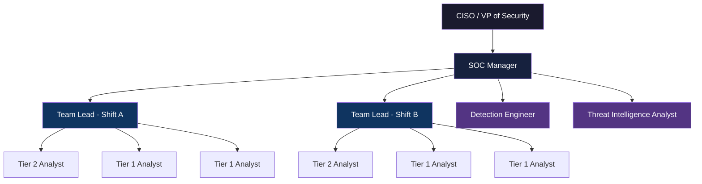
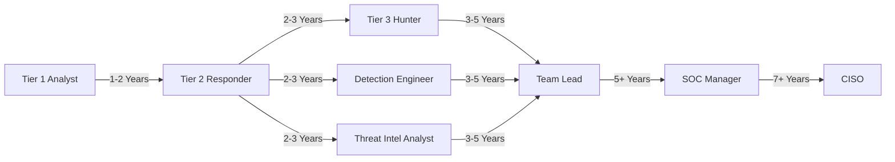

# SOC Team Structure & Roles

This document defines the organizational structure, roles, and responsibilities within the Security Operations Center (SOC).

## 1. Organizational Chart

## 2. Role Definitions

### 2.1 Tier 1 — Alert Analyst (Monitoring & Triage)
-   **Headcount**: 4-6 per SOC (2-3 per shift)
-   **Responsibilities**:
    -   Monitor SIEM dashboards and alert queues in real-time.
    -   Perform initial triage: True Positive vs. False Positive classification.
    -   Escalate confirmed incidents to Tier 2 with initial context.
    -   Document actions in the ticketing system.
-   **Skills Required**: CompTIA Security+, basic networking, log analysis.
-   **KPIs**: Alert Throughput, False Positive Rate, MTTD (Mean Time To Detect).

### 2.2 Tier 2 — Incident Responder (Investigation & Containment)
-   **Headcount**: 2-4 per SOC (1-2 per shift)
-   **Responsibilities**:
    -   Deep-dive investigation on escalated incidents.
    -   Execute Playbook containment and eradication steps.
    -   Perform host & network forensics (memory, disk, packet capture).
    -   Coordinate with IT teams for isolation and remediation.
-   **Skills Required**: CySA+, GCIH, EDR/SIEM advanced queries, forensics tools.
-   **KPIs**: MTTR (Mean Time To Respond), Incident Closure Rate.

### 2.3 Tier 3 — Threat Hunter / Senior Analyst
-   **Headcount**: 1-2 per SOC
-   **Responsibilities**:
    -   Proactive threat hunting using hypothesis-driven methodologies.
    -   Advanced malware analysis and reverse engineering.
    -   Develop custom detection content (Sigma, YARA, Snort).
    -   Lead major incident investigations and Root Cause Analysis (RCA).
-   **Skills Required**: GCIA, GCFA, OSCP, advanced scripting (Python, PowerShell).
-   **KPIs**: Threats Discovered, Detection Gap Reduction, TTPs Mapped to MITRE ATT&CK.

### 2.4 Detection Engineer
-   **Headcount**: 1-2 per SOC
-   **Responsibilities**:
    -   Create and maintain detection rules (Sigma/YARA/Snort).
    -   Tune rules to reduce False Positive Rate.
    -   Manage CI/CD pipeline for rule deployment.
    -   Maintain the MITRE ATT&CK coverage dashboard.
-   **Skills Required**: Sigma, regex, SIEM query languages (SPL, KQL, Lucene).

### 2.5 Threat Intelligence Analyst
-   **Headcount**: 1 per SOC
-   **Responsibilities**:
    -   Collect, analyze, and disseminate threat intelligence (CTI).
    -   Maintain threat feeds and IOC databases.
    -   Produce Threat Advisory reports for stakeholders.
    -   Map adversary TTPs to organizational risk.
-   **Skills Required**: CTIA, OSINT techniques, TLP classification, STIX/TAXII.

### 2.6 SOC Manager
-   **Headcount**: 1 per SOC
-   **Responsibilities**:
    -   Oversee daily SOC operations and shift scheduling.
    -   Set KPIs and report metrics to CISO/Leadership.
    -   Manage staffing, training, and career development.
    -   Coordinate with external teams (IT, Legal, HR) during major incidents.
    -   Budget management for tools and licensing.
-   **Skills Required**: CISSP, CISM, leadership and communication skills.

## 3. Career Progression Path

## 4. Recommended Staffing Model

| SOC Volume | Tier 1 | Tier 2 | Tier 3 | Det. Engineer | TI Analyst | Manager | Total |
| :--- | :---: | :---: | :---: | :---: | :---: | :---: | :---: |
| **Small** (<500 alerts/day) | 2 | 1 | 0 | 1 (shared) | 0 | 1 | 5 |
| **Medium** (500-2000/day) | 4 | 2 | 1 | 1 | 1 | 1 | 10 |
| **Large** (>2000/day, 24/7) | 8 | 4 | 2 | 2 | 1 | 1 | 18 |

## Related Documents
-   [Shift Handoff Standard](Shift_Handoff.en.md)
-   [SOC Metrics & KPIs](SOC_Metrics.en.md)
-   [Analyst Onboarding Path](../10_Training_Onboarding/Analyst_Onboarding_Path.en.md)
-   [Training Checklist](../10_Training_Onboarding/Training_Checklist.en.md)
-   [SOC Assessment Checklist](SOC_Assessment_Checklist.en.md)

## References
-   [NIST SP 800-61r2 (Incident Handling Guide)](https://csrc.nist.gov/publications/detail/sp/800-61/rev-2/final)
-   [SOC-CMM — SOC Capability Maturity Model](https://www.soc-cmm.com/)
-   [SANS SOC Survey & Analyst Reports](https://www.sans.org/white-papers/soc-survey/)
-   [MITRE ATT&CK — Threat-Informed Defense](https://attack.mitre.org/)
-   [FIRST CSIRT Services Framework](https://www.first.org/standards/frameworks/csirts/csirt_services_framework_v2.1)
