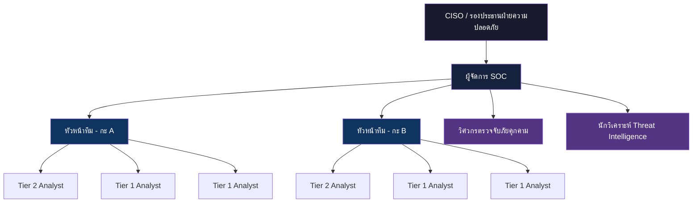
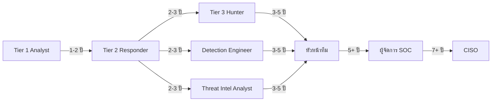

# โครงสร้างทีม SOC และบทบาทหน้าที่ (SOC Team Structure & Roles)

เอกสารนี้กำหนดโครงสร้างองค์กร บทบาท และความรับผิดชอบภายในศูนย์ปฏิบัติการความปลอดภัย (SOC)

## 1. แผนผังองค์กร (Organizational Chart)

## 2. คำอธิบายบทบาท (Role Definitions)

### 2.1 Tier 1 — Alert Analyst (เฝ้าระวังและคัดกรอง)
-   **จำนวนคน**: 4-6 คนต่อ SOC (2-3 คนต่อกะ)
-   **ความรับผิดชอบ**:
    -   เฝ้าระวังหน้าจอ SIEM Dashboard และคิว Alert แบบ Real-time
    -   คัดกรองเบื้องต้น: จำแนก True Positive กับ False Positive
    -   ส่งต่อ Incident ที่ยืนยันแล้วไป Tier 2 พร้อมบริบทเบื้องต้น
    -   บันทึกการดำเนินการในระบบ Ticketing
-   **ทักษะที่ต้องการ**: CompTIA Security+, พื้นฐาน Networking, การวิเคราะห์ Log
-   **KPIs**: ปริมาณ Alert ที่ดำเนินการ, อัตรา False Positive, MTTD

### 2.2 Tier 2 — Incident Responder (สืบสวนและจำกัดวง)
-   **จำนวนคน**: 2-4 คนต่อ SOC (1-2 คนต่อกะ)
-   **ความรับผิดชอบ**:
    -   สืบสวนเชิงลึกสำหรับ Incident ที่ส่งต่อมาจาก Tier 1
    -   ดำเนินการตาม Playbook ในส่วนจำกัดวงและกำจัดภัย
    -   ทำ Host & Network Forensics (หน่วยความจำ, ดิสก์, Packet Capture)
    -   ประสานงานกับทีม IT เพื่อ Isolate และแก้ไข
-   **ทักษะที่ต้องการ**: CySA+, GCIH, SIEM/EDR ขั้นสูง, เครื่องมือ Forensics
-   **KPIs**: MTTR (เวลาตอบสนองเฉลี่ย), อัตราการปิด Incident

### 2.3 Tier 3 — Threat Hunter / Senior Analyst (ล่าภัยคุกคามเชิงรุก)
-   **จำนวนคน**: 1-2 คนต่อ SOC
-   **ความรับผิดชอบ**:
    -   ล่าภัยคุกคามเชิงรุก (Proactive Threat Hunting) โดยใช้สมมติฐาน
    -   วิเคราะห์มัลแวร์ขั้นสูงและ Reverse Engineering
    -   พัฒนา Detection Content (Sigma, YARA, Snort)
    -   เป็นผู้นำการสืบสวน Incident สำคัญและวิเคราะห์สาเหตุ (RCA)
-   **ทักษะที่ต้องการ**: GCIA, GCFA, OSCP, เขียนสคริปต์ได้ (Python, PowerShell)
-   **KPIs**: จำนวนภัยคุกคามที่ค้นพบ, ลดช่องว่างการตรวจจับ, TTPs ที่แมปกับ MITRE ATT&CK

### 2.4 Detection Engineer (วิศวกรตรวจจับภัยคุกคาม)
-   **จำนวนคน**: 1-2 คนต่อ SOC
-   **ความรับผิดชอบ**:
    -   สร้างและดูแลกฎการตรวจจับ (Sigma/YARA/Snort)
    -   ปรับแต่งกฎเพื่อลดอัตรา False Positive
    -   จัดการ CI/CD Pipeline สำหรับ Deploy กฎ
    -   ดูแล MITRE ATT&CK Coverage Dashboard
-   **ทักษะที่ต้องการ**: Sigma, Regex, SIEM Query Language (SPL, KQL, Lucene)

### 2.5 Threat Intelligence Analyst (นักวิเคราะห์ข่าวกรองภัยคุกคาม)
-   **จำนวนคน**: 1 คนต่อ SOC
-   **ความรับผิดชอบ**:
    -   รวบรวม วิเคราะห์ และเผยแพร่ข่าวกรองภัยคุกคาม (CTI)
    -   ดูแล Threat Feed และฐานข้อมูล IOC
    -   จัดทำรายงาน Threat Advisory สำหรับผู้บริหาร
    -   แมป TTP ของผู้โจมตีกับความเสี่ยงขององค์กร
-   **ทักษะที่ต้องการ**: CTIA, เทคนิค OSINT, TLP Classification, STIX/TAXII

### 2.6 SOC Manager (ผู้จัดการ SOC)
-   **จำนวนคน**: 1 คนต่อ SOC
-   **ความรับผิดชอบ**:
    -   ดูแลการปฏิบัติงาน SOC ประจำวันและจัดตารางกะ
    -   กำหนด KPI และรายงานตัวชี้วัดให้ CISO/ผู้บริหาร
    -   บริหารอัตรากำลัง การฝึกอบรม และเส้นทางอาชีพ
    -   ประสานงานกับทีมภายนอก (IT, กฎหมาย, HR) ระหว่าง Incident สำคัญ
    -   บริหารงบประมาณสำหรับเครื่องมือและ Licensing
-   **ทักษะที่ต้องการ**: CISSP, CISM, ทักษะภาวะผู้นำและการสื่อสาร

## 3. เส้นทางความก้าวหน้าในอาชีพ (Career Progression Path)

## 4. แนวทางจำนวนบุคลากร (Recommended Staffing Model)

| ขนาด SOC | Tier 1 | Tier 2 | Tier 3 | วิศวกร | TI | ผู้จัดการ | รวม |
| :--- | :---: | :---: | :---: | :---: | :---: | :---: | :---: |
| **เล็ก** (<500 alerts/วัน) | 2 | 1 | 0 | 1 (แชร์) | 0 | 1 | 5 |
| **กลาง** (500-2000/วัน) | 4 | 2 | 1 | 1 | 1 | 1 | 10 |
| **ใหญ่** (>2000/วัน, 24/7) | 8 | 4 | 2 | 2 | 1 | 1 | 18 |

## 5. คำถามสัมภาษณ์แต่ละ Tier

### ผู้สมัคร Tier 1
| # | คำถาม | คำตอบที่คาดหวัง |
|:---|:---|:---|
| 1 | True Positive กับ False Positive ต่างกันอย่างไร? | TP = ภัยจริงที่ยืนยัน; FP = alert trigger แต่ไม่ใช่ภัยจริง |
| 2 | เห็น failed login 50 ครั้งจาก IP เดียว คุณทำอะไร? | ตรวจสอบว่าเป็น brute force ไหม, verify source IP, ตรวจ account lock, escalate ถ้ายืนยัน |
| 3 | TLP:RED คืออะไร? | จำกัดเฉพาะผู้เข้าร่วม — ห้ามแชร์ |
| 4 | อธิบายขั้นตอน triage phishing alert | ตรวจ sender, links, attachments, headers, ตรวจว่า user คลิกไหม, ตรวจ IOCs ใน SIEM |
| 5 | ต้องดู log อะไรเมื่อมี lateral movement? | Event IDs 4624/4625 (logon), 5140 (share), Sysmon, EDR |

### ผู้สมัคร Tier 2
| # | คำถาม | คำตอบที่คาดหวัง |
|:---|:---|:---|
| 1 | สืบสวน C2 callback อย่างไร? | วิเคราะห์ network traffic (beaconing), ดู process tree, หา parent process, isolate host |
| 2 | อธิบาย MITRE ATT&CK kill chain | Recon → Weaponize → Deliver → Exploit → Install → C2 → Actions on Objectives |
| 3 | เมื่อไรควร isolate vs. monitoring? | Isolate: ยืนยัน malware, C2 active, data exfil. Monitor: สงสัยแต่ยังไม่ยืนยัน |
| 4 | เขียน Splunk query หา PowerShell encoded | `index=sysmon EventCode=1 CommandLine="*-enc*" OR CommandLine="*encodedcommand*"` |
| 5 | หา blast radius ของ compromised account อย่างไร? | ตรวจ auth logs ว่า login ที่ไหน, file access, email rules, AD changes |

### ผู้สมัคร Tier 3
| # | คำถาม | คำตอบที่คาดหวัง |
|:---|:---|:---|
| 1 | อธิบาย methodology ในการ threat hunting | Hypothesis → data collection → analysis → findings → detection rule creation |
| 2 | ตรวจจับ living-off-the-land attacks อย่างไร? | Monitor LOLBins (certutil, mshta, rundll32), parent-child process anomalies |
| 3 | อธิบาย malware analysis workflow | Sandbox → static (strings, imports, PE) → dynamic (behavior, C2) → YARA rule |
| 4 | สร้าง Sigma rule จากผลสืบสวนอย่างไร? | ระบุ log source, กำหนด detection logic, set level/status, ทดสอบ FP |
| 5 | ตรวจจับ DNS tunneling อย่างไร? | Subdomain ยาว, query volume สูงไปยัง domain เดียว, entropy analysis |

## 6. Skills Matrix & แผนฝึกอบรม

| ทักษะ | T1 ต้องมี | T2 ต้องมี | T3 ต้องมี | แหล่งฝึก |
|:---|:---:|:---:|:---:|:---|
| SIEM queries (พื้นฐาน) | ✅ | ✅ | ✅ | ฝึกอบรมภายใน |
| SIEM queries (ขั้นสูง) | ❌ | ✅ | ✅ | Splunk/Elastic cert |
| Networking (TCP/IP, DNS) | ✅ | ✅ | ✅ | CompTIA Network+ |
| Log analysis | ✅ | ✅ | ✅ | SANS SEC555 |
| Incident Response | พื้นฐาน | ✅ | ✅ | GCIH / CySA+ |
| Forensics | ❌ | พื้นฐาน | ✅ | GCFA / SANS FOR508 |
| Malware analysis | ❌ | ❌ | ✅ | GREM / SANS FOR610 |
| Threat hunting | ❌ | ❌ | ✅ | SANS FOR508 |
| Detection engineering | ❌ | พื้นฐาน | ✅ | ภายใน + Sigma docs |
| Scripting (Python/PS) | ❌ | พื้นฐาน | ✅ | เรียนด้วยตัวเอง |
| MITRE ATT&CK | รับรู้ | ใช้งานได้ | เชี่ยวชาญ | ATT&CK training |

## 7. เกณฑ์เงินเดือน (ตลาดไทย, 2026)

> **หมายเหตุ**: ช่วงเป็นค่าประมาณ แตกต่างตามขนาดองค์กร อุตสาหกรรม และที่ตั้ง

| ตำแหน่ง | ประสบการณ์ | ช่วงรายเดือน (บาท) | Cert ที่เพิ่มมูลค่า |
|:---|:---|:---|:---|
| T1 Analyst | 0-2 ปี | 25,000 – 45,000 | CompTIA Security+, CySA+ |
| T2 Analyst | 2-4 ปี | 40,000 – 70,000 | GCIH, CySA+, OSCP |
| T3 Analyst | 4-7 ปี | 60,000 – 100,000 | GCFA, GREM, OSCP |
| Detection Engineer | 3-5 ปี | 50,000 – 90,000 | Sigma/YARA expertise |
| TI Analyst | 3-5 ปี | 45,000 – 80,000 | CTIA, OSINT certs |
| SOC Manager | 5-10 ปี | 80,000 – 150,000 | CISSP, CISM |

## เอกสารที่เกี่ยวข้อง (Related Documents)
-   [มาตรฐานการส่งมอบกะ](Shift_Handoff.th.md)
-   [ตัวชี้วัด SOC](SOC_Metrics.th.md)
-   [หลักสูตรฝึกอบรม Analyst](../10_Training_Onboarding/Analyst_Onboarding_Path.th.md)
-   [แบบฟอร์มตรวจสอบการฝึกอบรม](../10_Training_Onboarding/Training_Checklist.th.md)
-   [แบบประเมิน SOC](SOC_Assessment_Checklist.th.md)

## References
-   [NIST SP 800-61r2 (Incident Handling Guide)](https://csrc.nist.gov/publications/detail/sp/800-61/rev-2/final)
-   [SOC-CMM — SOC Capability Maturity Model](https://www.soc-cmm.com/)
-   [SANS SOC Survey & Analyst Reports](https://www.sans.org/white-papers/soc-survey/)
-   [MITRE ATT&CK — Threat-Informed Defense](https://attack.mitre.org/)
-   [FIRST CSIRT Services Framework](https://www.first.org/standards/frameworks/csirts/csirt_services_framework_v2.1)
