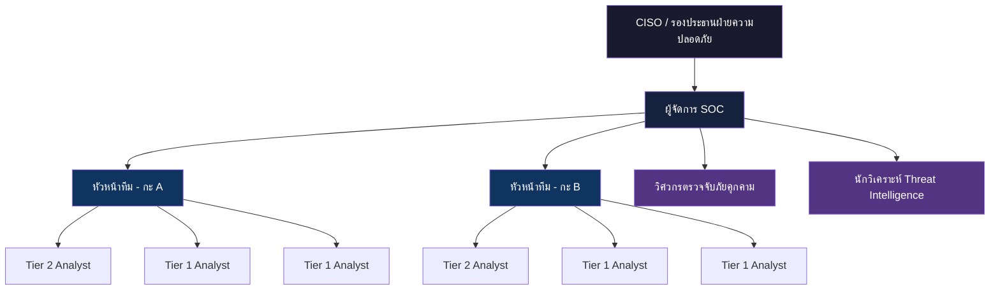
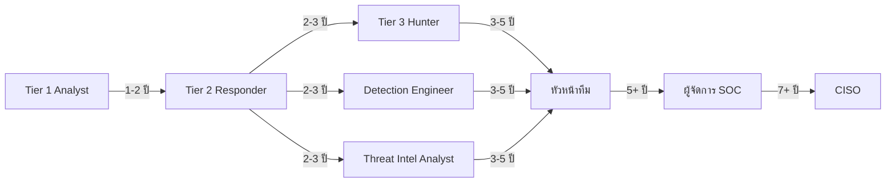

# โครงสร้างทีม SOC และบทบาทหน้าที่ (SOC Team Structure & Roles)

เอกสารนี้กำหนดโครงสร้างองค์กร บทบาท และความรับผิดชอบภายในศูนย์ปฏิบัติการความปลอดภัย (SOC)

## 1. แผนผังองค์กร (Organizational Chart)

## 2. คำอธิบายบทบาท (Role Definitions)

### 2.1 Tier 1 — Alert Analyst (เฝ้าระวังและคัดกรอง)
-   **จำนวนคน**: 4-6 คนต่อ SOC (2-3 คนต่อกะ)
-   **ความรับผิดชอบ**:
    -   เฝ้าระวังหน้าจอ SIEM Dashboard และคิว Alert แบบ Real-time
    -   คัดกรองเบื้องต้น: จำแนก True Positive กับ False Positive
    -   ส่งต่อ Incident ที่ยืนยันแล้วไป Tier 2 พร้อมบริบทเบื้องต้น
    -   บันทึกการดำเนินการในระบบ Ticketing
-   **ทักษะที่ต้องการ**: CompTIA Security+, พื้นฐาน Networking, การวิเคราะห์ Log
-   **KPIs**: ปริมาณ Alert ที่ดำเนินการ, อัตรา False Positive, MTTD

### 2.2 Tier 2 — Incident Responder (สืบสวนและจำกัดวง)
-   **จำนวนคน**: 2-4 คนต่อ SOC (1-2 คนต่อกะ)
-   **ความรับผิดชอบ**:
    -   สืบสวนเชิงลึกสำหรับ Incident ที่ส่งต่อมาจาก Tier 1
    -   ดำเนินการตาม Playbook ในส่วนจำกัดวงและกำจัดภัย
    -   ทำ Host & Network Forensics (หน่วยความจำ, ดิสก์, Packet Capture)
    -   ประสานงานกับทีม IT เพื่อ Isolate และแก้ไข
-   **ทักษะที่ต้องการ**: CySA+, GCIH, SIEM/EDR ขั้นสูง, เครื่องมือ Forensics
-   **KPIs**: MTTR (เวลาตอบสนองเฉลี่ย), อัตราการปิด Incident

### 2.3 Tier 3 — Threat Hunter / Senior Analyst (ล่าภัยคุกคามเชิงรุก)
-   **จำนวนคน**: 1-2 คนต่อ SOC
-   **ความรับผิดชอบ**:
    -   ล่าภัยคุกคามเชิงรุก (Proactive Threat Hunting) โดยใช้สมมติฐาน
    -   วิเคราะห์มัลแวร์ขั้นสูงและ Reverse Engineering
    -   พัฒนา Detection Content (Sigma, YARA, Snort)
    -   เป็นผู้นำการสืบสวน Incident สำคัญและวิเคราะห์สาเหตุ (RCA)
-   **ทักษะที่ต้องการ**: GCIA, GCFA, OSCP, เขียนสคริปต์ได้ (Python, PowerShell)
-   **KPIs**: จำนวนภัยคุกคามที่ค้นพบ, ลดช่องว่างการตรวจจับ, TTPs ที่แมปกับ MITRE ATT&CK

### 2.4 Detection Engineer (วิศวกรตรวจจับภัยคุกคาม)
-   **จำนวนคน**: 1-2 คนต่อ SOC
-   **ความรับผิดชอบ**:
    -   สร้างและดูแลกฎการตรวจจับ (Sigma/YARA/Snort)
    -   ปรับแต่งกฎเพื่อลดอัตรา False Positive
    -   จัดการ CI/CD Pipeline สำหรับ Deploy กฎ
    -   ดูแล MITRE ATT&CK Coverage Dashboard
-   **ทักษะที่ต้องการ**: Sigma, Regex, SIEM Query Language (SPL, KQL, Lucene)

### 2.5 Threat Intelligence Analyst (นักวิเคราะห์ข่าวกรองภัยคุกคาม)
-   **จำนวนคน**: 1 คนต่อ SOC
-   **ความรับผิดชอบ**:
    -   รวบรวม วิเคราะห์ และเผยแพร่ข่าวกรองภัยคุกคาม (CTI)
    -   ดูแล Threat Feed และฐานข้อมูล IOC
    -   จัดทำรายงาน Threat Advisory สำหรับผู้บริหาร
    -   แมป TTP ของผู้โจมตีกับความเสี่ยงขององค์กร
-   **ทักษะที่ต้องการ**: CTIA, เทคนิค OSINT, TLP Classification, STIX/TAXII

### 2.6 SOC Manager (ผู้จัดการ SOC)
-   **จำนวนคน**: 1 คนต่อ SOC
-   **ความรับผิดชอบ**:
    -   ดูแลการปฏิบัติงาน SOC ประจำวันและจัดตารางกะ
    -   กำหนด KPI และรายงานตัวชี้วัดให้ CISO/ผู้บริหาร
    -   บริหารอัตรากำลัง การฝึกอบรม และเส้นทางอาชีพ
    -   ประสานงานกับทีมภายนอก (IT, กฎหมาย, HR) ระหว่าง Incident สำคัญ
    -   บริหารงบประมาณสำหรับเครื่องมือและ Licensing
-   **ทักษะที่ต้องการ**: CISSP, CISM, ทักษะภาวะผู้นำและการสื่อสาร

## 3. เส้นทางความก้าวหน้าในอาชีพ (Career Progression Path)

## 4. แนวทางจำนวนบุคลากร (Recommended Staffing Model)

| ขนาด SOC | Tier 1 | Tier 2 | Tier 3 | วิศวกร | TI | ผู้จัดการ | รวม |
| :--- | :---: | :---: | :---: | :---: | :---: | :---: | :---: |
| **เล็ก** (<500 alerts/วัน) | 2 | 1 | 0 | 1 (แชร์) | 0 | 1 | 5 |
| **กลาง** (500-2000/วัน) | 4 | 2 | 1 | 1 | 1 | 1 | 10 |
| **ใหญ่** (>2000/วัน, 24/7) | 8 | 4 | 2 | 2 | 1 | 1 | 18 |

## เอกสารที่เกี่ยวข้อง (Related Documents)
-   [มาตรฐานการส่งมอบกะ](Shift_Handoff.th.md)
-   [ตัวชี้วัด SOC](SOC_Metrics.th.md)
-   [หลักสูตรฝึกอบรม Analyst](../09_Training_Onboarding/Analyst_Onboarding_Path.th.md)
-   [แบบฟอร์มตรวจสอบการฝึกอบรม](../09_Training_Onboarding/Training_Checklist.th.md)
-   [แบบประเมิน SOC](SOC_Assessment_Checklist.th.md)

## References
-   [NIST SP 800-61r2 (Incident Handling Guide)](https://csrc.nist.gov/publications/detail/sp/800-61/rev-2/final)
-   [SOC-CMM — SOC Capability Maturity Model](https://www.soc-cmm.com/)
-   [SANS SOC Survey & Analyst Reports](https://www.sans.org/white-papers/soc-survey/)
-   [MITRE ATT&CK — Threat-Informed Defense](https://attack.mitre.org/)
-   [FIRST CSIRT Services Framework](https://www.first.org/standards/frameworks/csirts/csirt_services_framework_v2.1)
