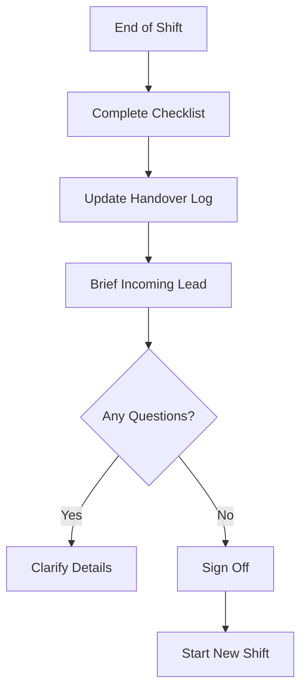

# Shift Operations & Handoff Standard

This document outlines the standard procedures for managing shifts and ensuring operational continuity during shift handovers.

## 1. Shift Structure (24/7)

Standard rotation pattern for 24/7 coverage:
-   **Morning Shift**: 08:00 - 16:00
-   **Afternoon Shift**: 16:00 - 00:00
-   **Night Shift**: 00:00 - 08:00

*Note: Overlap of 30 minutes is required for proper handoff.*

## 2. Handoff Procedure

A standardized handoff ensures no incident falls through the cracks. The outgoing Shift Lead must brief the incoming Shift Lead on:

A standardized handoff ensures no incident falls through the cracks. The outgoing Shift Lead must brief the incoming Shift Lead on:

### 2.1 Critical Checklist
-   **Active Incidents**: High/Critical incidents currently open.
-   **Pending Tasks**: Investigations or tickets requiring follow-up.
-   **System Health**: Status of SIEM, EDR, and Feeds (Any operational issues?).
-   **Intelligence Updates**: New critical vulnerabilities or threat campaigns causing noise.

### 2.2 Handover Log
-   All details must be recorded in the **Shift Handover Log** (Example: Ticket #1234, Status: Waiting for user).

## 3. Shift Duties

### 3.1 Start of Shift
-   Review Handover Log.
-   Check "Unassigned" queue in Ticketing System.
-   Verify SIEM Dashboard health.

### 3.2 End of Shift
-   Update all assigned tickets.
-   Complete documentation for closed cases.
-   Prepare Handover Log.

## References
-   [SANS SOC Handbook](https://www.sans.org/white-papers/soc-handbook/)
-   [NIST SP 800-61r2 (Incident Handling)](https://csrc.nist.gov/publications/detail/sp/800-61/rev-2/final)
