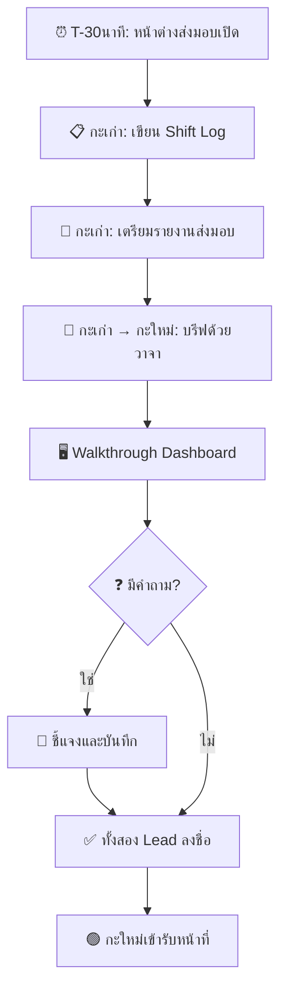

# มาตรฐานการปฏิบัติงานกะและการส่งมอบงาน (Shift Operations & Handoff)

เอกสารนี้กำหนดขั้นตอนมาตรฐานสำหรับการจัดการกะของ SOC และการรับประกัน **ความต่อเนื่องในการปฏิบัติงานแบบไม่มีช่องว่าง** ระหว่างการส่งมอบกะ กระบวนการส่งมอบที่มีวินัยช่วยป้องกันไม่ให้ incidents ตกหล่นและรับประกันคุณภาพบริการอย่างสม่ำเสมอตลอด 24/7

---

## 1. โครงสร้างกะ

### 1.1 การหมุนเวียนมาตรฐาน (24/7 — กะ 8 ชั่วโมง)

| กะ | เวลา | ระยะเวลา | ปริมาณ Alert สูงสุด |
|:---|:---:|:---:|:---|
| ☀️ **กะเช้า** | 08:00 – 16:00 | 8 ชม. | สูง (ชั่วโมงทำงาน, phishing, รายงานจากผู้ใช้) |
| 🌅 **กะบ่าย** | 16:00 – 00:00 | 8 ชม. | ปานกลาง (สแกนอัตโนมัติ, ผู้โจมตีต่างประเทศ) |
| 🌙 **กะดึก** | 00:00 – 08:00 | 8 ชม. | ต่ำ–ปานกลาง (botnet, งาน scheduled) |

> ⚠️ **ทับซ้อน 30 นาที** ระหว่างกะสำหรับการส่งมอบที่ถูกต้อง (เช่น กะเก่าอยู่ถึง 08:00–08:30 ร่วมกับกะใหม่)

### 1.2 การหมุนเวียนทางเลือก: 4-On-4-Off (กะ 12 ชั่วโมง)

ตารางกะแบบบีบอัดใช้ **2 กะ × 12 ชั่วโมง** โดยทำงาน 4 วันติดต่อกันแล้วหยุด 4 วัน รูปแบบนี้ให้ coverage 24/7 โดยมีการส่งมอบกะน้อยลง

| กะ | เวลา | ระยะเวลา | ปริมาณ Alert สูงสุด |
|:---|:---:|:---:|:---|
| ☀️ **กะกลางวัน** | 08:00 – 20:00 | 12 ชม. | สูง (ชั่วโมงทำการเต็ม + ช่วงเย็น) |
| 🌙 **กะกลางคืน** | 20:00 – 08:00 | 12 ชม. | ต่ำ–ปานกลาง (botnet, สแกนข้ามคืน, APT) |

> ⚠️ **ทับซ้อน 30 นาที** ที่ 07:30–08:00 และ 19:30–20:00 สำหรับส่งมอบ

#### ปฏิทินหมุนเวียนทีม (รอบ 4 สัปดาห์)

สี่ทีม (**Alpha, Bravo, Charlie, Delta**) หมุนเวียนเพื่อให้ coverage 24/7:

| สัปดาห์ | จ. | อ. | พ. | พฤ. | ศ. | ส. | อา. |
|:---|:---:|:---:|:---:|:---:|:---:|:---:|:---:|
| **สัปดาห์ 1** | 🅰️ว | 🅰️ว | 🅰️ว | 🅰️ว | 🅱️ว | 🅱️ว | 🅱️ว |
| **สัปดาห์ 2** | 🅱️ว | 🅰️ค | 🅰️ค | 🅰️ค | 🅰️ค | 🅱️ค | 🅱️ค |
| **สัปดาห์ 3** | 🅱️ค | 🅱️ค | 🅲ว | 🅲ว | 🅲ว | 🅲ว | 🅳ว |
| **สัปดาห์ 4** | 🅳ว | 🅳ว | 🅳ว | 🅲ค | 🅲ค | 🅲ค | 🅲ค |

*ว = กลางวัน (08:00–20:00), ค = กลางคืน (20:00–08:00) — ทีมที่ไม่แสดงอยู่ในวันหยุด 4 วัน*

> **หมายเหตุ**: ทีมที่หยุดจะเป็น **สำรอง on-call** ใน 2 วันแรกของวันหยุด 4 วัน

#### เปรียบเทียบ 4on4off กับ 3 กะ

| เกณฑ์ | 3 กะ (8 ชม.) | 4on4off (12 ชม.) |
|:---|:---|:---|
| **กะต่อวัน** | 3 | 2 |
| **การส่งมอบต่อวัน** | 3 | 2 (น้อยกว่า = ข้อมูลสูญหายน้อยลง) |
| **ชั่วโมงต่อกะ** | 8 ชั่วโมง | 12 ชั่วโมง |
| **วันทำงาน / วันหยุด** | 5 วัน / 2 วัน | 4 วัน / 4 วัน |
| **FTE ขั้นต่ำ (24/7)** | 12–15 | 8–10 |
| **ความเสี่ยงเหนื่อยล้า** | ต่ำกว่าต่อกะ | สูงกว่าต่อกะ (ลดด้วยการพักเบรก) |
| **สมดุลชีวิต-การทำงาน** | ตารางมาตรฐาน | วันหยุดต่อเนื่องมากกว่า |
| **เหมาะกับ** | SOC ขนาดใหญ่, alert volume สูง | SOC ขนาดกลาง, ลดต้นทุน |

#### การจัดการความเหนื่อยล้า (เฉพาะกะ 12 ชั่วโมง)

| มาตรการ | การดำเนินการ |
|:---|:---|
| **พักบังคับ** | พักกินข้าว 30 นาที + พัก 15 นาทีทุก 3 ชม. |
| **สลับงาน** | สลับระหว่าง triage / investigation ทุก 4 ชม. |
| **ไม่ทำต่อเนื่อง** | สูงสุด 4 กะ 12 ชม. ติดต่อกันก่อนหยุดบังคับ 4 วัน |
| **เปลี่ยนกะคืน → กะวัน** | หยุดอย่างน้อย 4 วันก่อนเปลี่ยนจากกะคืนเป็นกะวัน |
| **จำกัดภาระงาน** | สูงสุด 25 alerts ต่อ analyst ต่อกะ 12 ชม. |

### 1.3 รูปแบบการให้บริการ (Coverage Models)

| รูปแบบ | การจัดคน | เหมาะกับ | FTE ขั้นต่ำ |
|:---|:---|:---|:---:|
| **24/7 เต็ม** | 3 กะ × 365 วัน | SOC ขนาดใหญ่, โครงสร้างพื้นฐานสำคัญ | 12–15 |
| **24/7 (4on4off)** | 2 กะ × 4 ทีม | SOC ขนาดกลาง, ลดต้นทุน | 8–10 |
| **16/5 + เวร** | 2 กะวันจันทร์-ศุกร์ + เวรนอกเวลา | SOC ขนาดกลาง | 6–8 |
| **8/5 + เวร** | เวลาทำการ + เวร | SOC ขนาดเล็ก, ระยะเริ่มต้น | 3–4 |
| **8/5 + MSSP** | เวลาทำการ in-house + MSSP นอกเวลา | SOC แบบ Hybrid | 2–3 + MSSP |

> 📚 **รายละเอียดการจัดคน**: [การวางแผนกำลังคน SOC](SOC_Capacity_Planning.th.md) · [โครงสร้างทีม SOC](SOC_Team_Structure.th.md)

### 1.4 บทบาทในกะ

| บทบาท | ความรับผิดชอบ |
|:---|:---|
| **Shift Lead** | ดูแลกะโดยรวม, ตัดสินใจ escalation, บรีฟส่งมอบ |
| **Tier 1 Analyst** | คัดกรอง alert, จำแนกเบื้องต้น, จัดการคิว |
| **Tier 2 Analyst** | สืบสวน, containment, ปฏิบัติตาม playbook |
| **Tier 3 / Hunt** | Threat hunting, forensics ขั้นสูง, detection engineering |

---

## 2. ขั้นตอนการส่งมอบกะ

### 2.1 วาระการประชุมส่งมอบ (30 นาที)

| เวลา | กิจกรรม | ผู้นำ |
|:---:|:---|:---|
| 5 นาที | **Incidents ที่กำลังดำเนินการ** — สถานะ, เจ้าของ, ขั้นตอนถัดไป | Lead กะเก่า |
| 5 นาที | **งานที่ค้าง** — การสืบสวนที่รอผล, follow-ups | Lead กะเก่า |
| 5 นาที | **สถานะระบบ** — SIEM/EDR/SOAR, ระบบขัดข้อง, degradation | Lead กะเก่า |
| 5 นาที | **อัปเดตข่าวกรอง** — แคมเปญใหม่, IoCs, ช่องโหว่ | Lead กะเก่า |
| 5 นาที | **Walkthrough Dashboard** — ตั๋วเปิด, ความลึกของคิว, แนวโน้ม alert | Lead กะเก่า |
| 5 นาที | **ถาม-ตอบ + ลงชื่อ** — ชี้แจง, รับทราบ | ทั้งสอง Lead |

### 2.2 เนื้อหารายงานส่งมอบ

**รายงานส่งมอบกะ** ต้องประกอบด้วย:

| ส่วน | เนื้อหา | บังคับ? |
|:---|:---|:---:|
| **Incidents ที่ Active** | Incident ID, ความรุนแรง, สถานะ, analyst ที่รับผิดชอบ, ขั้นตอนถัดไป | ✅ |
| **การสืบสวนที่ค้าง** | Ticket ID, รายละเอียด, รออะไร, เวลาที่คาดว่าจะเสร็จ | ✅ |
| **สถานะระบบ** | SIEM ingestion rate, EDR agent status, feed delays | ✅ |
| **เหตุการณ์สำคัญ** | รูปแบบผิดปกติ, ภัยคุกคามเกิดใหม่, ช่องโหว่ที่ประกาศ | ✅ |
| **Escalations** | รายการที่ส่งต่อผู้บริหาร, สถานะ, การตอบกลับที่ได้รับ | ถ้ามี |
| **ประกาศการเปลี่ยนแปลง** | การ patching, การเปลี่ยนแปลง config ที่อาจกระทบ alert | ถ้ามี |
| **กำหนด Compliance** | การแจ้ง PDPA, SLA ที่ใกล้หมดเวลา | ถ้ามี |

> 📚 **เทมเพลต**: [แบบฟอร์มส่งมอบกะ](../templates/shift_handover.th.md)

---

## 3. เช็คลิสต์เริ่มกะ

กะใหม่ที่เข้ารับหน้าที่ต้องทำเช็คลิสต์นี้ให้เสร็จภายใน **15 นาทีแรก**:

| # | ตรวจสอบ | การดำเนินการ |
|:---:|:---|:---|
| 1 | ✅ **อ่านรายงานส่งมอบ** | ทบทวน shift log ของกะก่อนอย่างละเอียด |
| 2 | ✅ **ตรวจคิว Alert** | ตรวจ alert ที่ยังไม่ได้รับและยังไม่ได้มอบหมาย |
| 3 | ✅ **ตรวจสุขภาพระบบ** | SIEM dashboard, EDR console, SOAR status |
| 4 | ✅ **ทบทวน Incidents ที่ Active** | รับเป็นเจ้าของ incidents ที่ได้รับมอบหมาย |
| 5 | ✅ **ตรวจอีเมล/แชท** | คำสั่งผู้บริหาร, ประกาศ, ข่าวกรองภัยคุกคาม |
| 6 | ✅ **ตรวจรายชื่อเวร** | ยืนยันผู้ติดต่อ escalation พร้อมให้บริการ |
| 7 | ✅ **รับรองการส่งมอบ** | ลงชื่อในระบบ/บันทึกส่งมอบ |

---

## 4. เช็คลิสต์สิ้นกะ

กะที่กำลังจะออกต้องทำเช็คลิสต์นี้ให้เสร็จก่อนเลิกงาน:

| # | ตรวจสอบ | การดำเนินการ |
|:---:|:---|:---|
| 1 | ✅ **อัปเดตตั๋วทั้งหมด** | สถานะปัจจุบัน, บันทึกการสืบสวน, ขั้นตอนถัดไป |
| 2 | ✅ **บันทึกงานที่ยังไม่เสร็จ** | เริ่มอะไรไว้, เหลืออะไร, จะกลับมาตรงไหน |
| 3 | ✅ **ปิดตั๋วที่แก้ไขแล้ว** | ตรวจสอบผลการแก้ไข, เพิ่มบันทึกปิด |
| 4 | ✅ **เตรียมรายงานส่งมอบ** | กรอกทุกส่วนที่บังคับ |
| 5 | ✅ **บรีฟด้วยวาจา** | บรีฟ Shift Lead กะใหม่แบบเผชิญหน้า |
| 6 | ✅ **ลงชื่อ** | ทั้งสอง Lead ลงชื่อในบันทึกส่งมอบ |

---

## 5. โปรโตคอลการสื่อสาร

### 5.1 ระหว่างกะ

| ช่องทาง | ใช้สำหรับ | เวลาตอบ |
|:---|:---|:---|
| **ระบบ Ticketing** | การสื่อสาร incident ทั้งหมด (audit trail) | ตาม SLA |
| **แชท (Teams/Slack)** | ประสานงานด่วน, แจ้งข้อมูล | < 5 นาที |
| **โทรศัพท์** | Escalation เร่งด่วน, เรื่องไวต่อเวลา | ทันที |
| **อีเมล** | อัปเดตไม่เร่งด่วน, รายงาน, เอกสาร | < 1 ชม. |

### 5.2 ความรับผิดชอบของ Shift Lead

| ความรับผิดชอบ | ความถี่ |
|:---|:---|
| ตรวจสอบความลึกคิวและภาระงาน analyst | ทุกชั่วโมง |
| คัดกรองและมอบหมาย alert/ตั๋วที่เข้ามา | ต่อเนื่อง |
| อนุมัติ containment actions (High/Critical) | ตามความจำเป็น |
| รายงานปัญหาระบบไปยัง IT/Engineering | ตามความจำเป็น |
| บันทึกเหตุการณ์สำคัญสำหรับส่งมอบ | สิ้นกะ |
| ดำเนินการบรีฟส่งมอบ | สิ้นกะ |

---

## 6. การจัดการความเหนื่อยล้า

ความเหนื่อยล้าของ SOC analyst เป็นความเสี่ยงด้านปฏิบัติการที่สำคัญ มาตรการต่อไปนี้ช่วยรักษาความตื่นตัวและคุณภาพงาน:

| มาตรการ | การดำเนินการ |
|:---|:---|
| **ความถี่หมุนเวียน** | เปลี่ยนรูปแบบกะทุก 4–6 สัปดาห์ |
| **ตารางพัก** | พัก 15 นาทีทุก 2 ชม. ระหว่างกะ |
| **ความหลากหลายของงาน** | สลับระหว่าง triage, investigation, และ hunt |
| **สมดุลภาระงาน** | สูงสุด 15–20 alerts ต่อ analyst ต่อกะ (8 ชม.) |
| **จำกัดการทำ OT** | สูงสุด 2 กะต่อเนื่อง, แจ้งผู้บริหารหากเกิน |
| **สุขภาพจิต** | เข้าถึงโปรแกรมช่วยเหลือพนักงาน (EAP) |

---

## 7. ตัวชี้วัดและคุณภาพ

### 7.1 KPIs ของกะ

| ตัวชี้วัด | เป้าหมาย | ผู้รับผิดชอบ |
|:---|:---|:---|
| อัตราส่งมอบสำเร็จ | 100% | Shift Lead |
| ความลึกคิวตอนสิ้นกะ | < 10 ที่ยังไม่มอบหมาย | Shift Lead |
| เวลาตอบสนอง alert เฉลี่ย | < 10 นาที (MTTA) | Analyst |
| คะแนนคุณภาพรายงานส่งมอบ | ≥ 4/5 (peer review) | SOC Manager |

### 7.2 การตรวจสอบคุณภาพการส่งมอบ

SOC Manager ควรดำเนินการตรวจสอบคุณภาพการส่งมอบเป็นประจำทุกเดือน:

- [ ] ทุกส่วนที่บังคับถูกกรอกครบ?
- [ ] Incidents ที่ active อธิบายได้ถูกต้อง?
- [ ] มีรายงานสถานะระบบ?
- [ ] มีการบรีฟด้วยวาจา (ยืนยันจากทั้งสอง Lead)?
- [ ] ปัญหาจากการส่งมอบกะก่อนหน้าได้รับการแก้ไข?

---

## เอกสารที่เกี่ยวข้อง

- [กรอบ IR](../05_Incident_Response/Framework.th.md) — วงจรชีวิตการตอบสนองต่อเหตุการณ์หลัก
- [Escalation Matrix](Escalation_Matrix.th.md) — เมื่อไหร่และอย่างไรที่จะ escalate
- [ตัวชี้วัด SOC & KPIs](SOC_Metrics.th.md) — การวัดผลการปฏิบัติงาน
- [โครงสร้างทีม SOC](SOC_Team_Structure.th.md) — บทบาทและความรับผิดชอบ
- [การวางแผนกำลังคน SOC](SOC_Capacity_Planning.th.md) — รูปแบบการจัดคนและงบประมาณ
- [SOC Assessment Checklist](SOC_Assessment_Checklist.th.md) — ความพร้อมด้านปฏิบัติการ
- [แบบฟอร์มส่งมอบกะ](../templates/shift_handover.th.md) — ฟอร์มรายงานส่งมอบ

## อ้างอิง (References)

- [SANS SOC Handbook](https://www.sans.org/white-papers/soc-handbook/)
- [NIST SP 800-61r2 — Incident Handling](https://csrc.nist.gov/publications/detail/sp/800-61/rev-2/final)
- [MITRE 11 Strategies for a World-Class SOC](https://www.mitre.org/publications/technical-papers/11-strategies-world-class-cybersecurity-operations-center)
