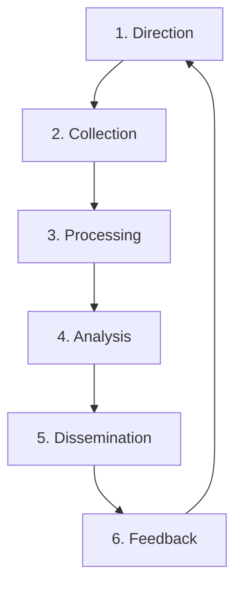
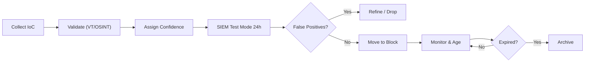

# Threat Intelligence Lifecycle (CTI)

**Version**: 1.0
**Owner**: CTI Analyst / SOC Manager

## 1. Overview
Cyber Threat Intelligence (CTI) is the process of collecting, analyzing, and disseminating information about current and potential attacks. This standard ensures our SOC moves from "Reactive" to "Proactive".

## 2. Phases

### Phase 1: Direction (Requirement)
-   **Goal**: Define what we are protecting and what questions we need answered.
-   **Key Intelligence Questions (KIQs)**:
    -   "Is the new 'ABC Ransomware' targeting our industry?"
    -   "Do we have exposure to the CVE-2026-XXXX vulnerability?"

### Phase 2: Collection
-   **Internal Sources**: SIEM Logs, Incident Tickets, EDR Alerts.
-   **External Sources**:
    -   **Open Source (OSINT)**: Twitter, Blogs, CISA Alerts.
    -   **Commercial Feeds**: Vendor reports, Paid API feeds.
    -   **Communities**: ISACs, CERTs, Trusted Partner Peers.

### Phase 3: Processing
-   **Normalization**: Converting raw data (PDFs, Tweets) into standard formats (STIX/TAXII, CSV).
-   **Validation**: Confirming that an Indicator of Compromise (IoC) is valid and not a False Positive (e.g., verifying a "malicious IP" isn't actually Google DNS).

### Phase 4: Analysis
-   **Contextualization**: Adding "So What?".
    -   *Raw Data*: "IP 1.2.3.4 is bad."
    -   *Intelligence*: "IP 1.2.3.4 is a C2 server for APT29 targeting Banks. We are a Bank. Severity = Critical."

### Phase 5: Dissemination
-   **Tactical**: IoCs sent to SIEM/Firewall for blocking (TLP:GREEN).
-   **Operational**: Reports sent to SOC Manager for awareness (TLP:AMBER).
-   **Strategic**: Trend reports sent to CISO/Board (TLP:CLEAR/WHITE).

### Phase 6: Feedback
-   **Review**: Did the intel help? Did it cause false positives?
-   **Action**: Tune sources or refine requirements.

## 3. IoC Management Policy
All Indicators of Compromise (IoCs) must go through the **Review Process** before blocking:
1.  Analyst collects IoC.
2.  Analyst checks reputation (VirusTotal / internal logs).
3.  Analyst updates reference list in SIEM (Test Mode).
4.  If stable > 24 hours, move to Block Mode.

### IoC Aging & Confidence Scoring

| IoC Type | Initial Confidence | Aging Policy | Auto-Expire |
|:---|:---:|:---|:---:|
| IP Address | Medium (60%) | Decrease 10%/week | 30 days |
| Domain | Medium (60%) | Decrease 5%/week | 60 days |
| File Hash (MD5/SHA256) | High (90%) | Stable | Never |
| URL | Medium (60%) | Decrease 10%/week | 30 days |
| Email Address | High (80%) | Decrease 5%/month | 180 days |
| JA3/JA3S Hash | High (85%) | Stable | 90 days |
| YARA Rule | High (90%) | Stable | Review annually |

### IoC Review Workflow

## 4. TI Platform Integration

| Platform | Type | Data Format | Update Frequency | Integration |
|:---|:---|:---|:---|:---|
| MISP | Internal TIP | STIX 2.1 | Real-time | API → SIEM |
| AlienVault OTX | OSINT | OTX Pulse | Hourly | API → SIEM |
| VirusTotal | Enrichment | JSON API | On-demand | API → SOAR |
| AbuseIPDB | OSINT | CSV/API | Daily | API → Firewall |
| CISA KEV | Gov Advisory | JSON | Daily | API → Vuln Mgmt |
| Sector ISAC | Community | STIX/TAXII | Daily | TAXII → MISP |

## 5. Priority Intelligence Requirements (PIRs)

| # | PIR | Owner | Review |
|:---:|:---|:---|:---|
| 1 | What threat actors are targeting our industry sector? | CTI Analyst | Monthly |
| 2 | Are there active campaigns exploiting our technology stack? | CTI Analyst | Weekly |
| 3 | What new CVEs affect our critical assets? | Vuln Mgmt | Daily |
| 4 | Are our IoC feeds detecting current campaign infrastructure? | Detection Eng | Weekly |
| 5 | What TTPs are trending in our region (APAC/Thailand)? | CTI Analyst | Monthly |

## 6. CTI Maturity Levels

| Level | Description | Activities |
|:---|:---|:---|
| **Level 0** | None | No TI program |
| **Level 1** | Reactive | IoC feeds only, no analysis |
| **Level 2** | Managed | Structured collection, basic analysis, SIEM integration |
| **Level 3** | Proactive | PIR-driven, threat hunting, TIP platform |
| **Level 4** | Predictive | Attribution, adversary tracking, board-level reporting |

## Related Documents
-   [Incident Response Framework](../05_Incident_Response/Framework.en.md)
-   [SOC Assessment Checklist](SOC_Assessment_Checklist.en.md)
-   [SOC Metrics & KPIs](SOC_Metrics.en.md)

## References
-   [CREST Cyber Threat Intelligence](https://www.crest-approved.org/knowledge-base/cyber-threat-intelligence/)
-   [SANS CTI Maturity Model](https://www.sans.org/white-papers/cti-maturity-model/)
