# วงจรข่าวกรองภัยคุกคาม (Threat Intelligence Lifecycle)

**เวอร์ชัน**: 1.0
**ผู้รับผิดชอบ**: CTI Analyst / SOC Manager

## 1. ภาพรวม
Cyber Threat Intelligence (CTI) คือกระบวนการรวบรวม วิเคราะห์ และแจกจ่ายข้อมูลเกี่ยวกับภัยคุกคาม เพื่อให้ SOC สามารถป้องกันตนเองได้ก่อนที่จะเกิดเหตุ (Proactive)

```mermaid
graph TD
    Direction[1. กำหนดทิศทาง] --> Collection[2. รวบรวมข้อมูล]
    Collection --> Processing[3. ประมวลผล]
    Processing --> Analysis[4. วิเคราะห์]
    Analysis --> Dissemination[5. แจกจ่าย]
    Dissemination --> Feedback[6. ข้อเสนอแนะ]
    Feedback --> Direction
```



## 2. ขั้นตอนการทำงาน (Phases)

### Phase 1: Direction (กำหนดโจทย์)
-   **เป้าหมาย**: ระบุว่าเราต้องการรู้อะไร?
-   **คำถามหลัก (KIQs)**:
    -   "กลุ่มแฮกเกอร์ ABC กำลังโจมตีธุรกิจประเภทเดียวกับเราหรือไม่?"
    -   "เรามีความเสี่ยงต่อช่องโหว่ใหม่ CVE-2026-XXXX หรือไม่?"

### Phase 2: Collection (รวบรวม)
-   **แหล่งภายใน**: SIEM Logs, เคสเก่าๆ
-   **แหล่งภายนอก**:
    -   **OSINT**: Twitter, ข่าวความปลอดภัย, CISA
    -   **Commercial**: Feed ที่เสียเงินซื้อ
    -   **Communities**: กลุ่ม ThaiCERT, TB-CERT

### Phase 3: Processing (ประมวลผล)
-   **จัดระเบียบ**: แปลงข้อมูลจากข่าว/PDF ให้เป็น Format ที่คอมพิวเตอร์อ่านได้ (STIX, CSV)
-   **ตรวจสอบ**: ยืนยันว่าข้อมูลถูกต้อง (Validation) เพื่อลด False Positive

### Phase 4: Analysis (วิเคราะห์)
-   **การให้บริบท**: เปลี่ยน "ข้อมูลดิบ" เป็น "ข่าวกรอง"
    -   *ข้อมูลดิบ*: "IP 1.2.3.4 เป็นอันตราย"
    -   *ข่าวกรอง*: "IP 1.2.3.4 เป็น C2 ของ APT29 ที่เล็งเป้าธนาคาร และเราเป็นธนาคาร ดังนั้นความเสี่ยง = สูงมาก"

### Phase 5: Dissemination (แจกจ่าย)
-   **Tactical**: ส่ง IP/Hash ลง SIEM/Firewall เพื่อบล็อก (TLP:GREEN)
-   **Operational**: ส่งรายงานให้หัวหน้าทีม SOC (TLP:AMBER)
-   **Strategic**: ส่งสรุปแนวโน้มให้ผู้บริหาร (TLP:CLEAR/WHITE)

### Phase 6: Feedback (ปรับปรุง)
-   **ทบทวน**: ข่าวกรองที่ได้มามีประโยชน์ไหม? แจ้งเตือนมั่วซั่วหรือไม่?

## 3. นโยบายการจัดการ IoC
Indicators of Compromise (IoCs) ทุกตัวต้องผ่านกระบวนการตรวจสอบก่อนบล็อก:
1.  Analyst รวบรวม IoC
2.  ตรวจสอบค่าชื่อเสียง (Reputation Check)
3.  ใส่ใน SIEM ระบบ Test Mode (Monitor Only)
4.  ถ้าไม่มี False Positive นาน 24 ชม. จึงเปิด Block Mode

### คะแนนความเชื่อมั่นและอายุ IoC

| ประเภท IoC | ความเชื่อมั่นเริ่มต้น | นโยบายอายุ | หมดอายุอัตโนมัติ |
|:---|:---:|:---|:---:|
| IP Address | กลาง (60%) | ลด 10%/สัปดาห์ | 30 วัน |
| Domain | กลาง (60%) | ลด 5%/สัปดาห์ | 60 วัน |
| File Hash (MD5/SHA256) | สูง (90%) | คงที่ | ไม่มี |
| URL | กลาง (60%) | ลด 10%/สัปดาห์ | 30 วัน |
| Email Address | สูง (80%) | ลด 5%/เดือน | 180 วัน |

## แพลตฟอร์ม TI Integration

| แพลตฟอร์ม | ประเภท | รูปแบบข้อมูล | ความถี่อัปเดต | Integration |
|:---|:---|:---|:---|:---|
| MISP | Internal TIP | STIX 2.1 | Real-time | API → SIEM |
| AlienVault OTX | OSINT | OTX Pulse | รายชั่วโมง | API → SIEM |
| VirusTotal | Enrichment | JSON API | ตามต้องการ | API → SOAR |
| AbuseIPDB | OSINT | CSV/API | รายวัน | API → Firewall |
| CISA KEV | Gov Advisory | JSON | รายวัน | API → Vuln Mgmt |

## ข้อกำหนดข่าวกรองเชิงลำดับความสำคัญ (PIRs)

| # | PIR | ผู้รับผิดชอบ | ทบทวน |
|:---:|:---|:---|:---|
| 1 | กลุ่มภัยคุกคามใดที่กำลังเล็งเป้าอุตสาหกรรมของเรา? | CTI Analyst | รายเดือน |
| 2 | มีแคมเปญที่ active ใช้ประโยชน์จาก Tech stack ของเราหรือไม่? | CTI Analyst | รายสัปดาห์ |
| 3 | CVE ใหม่ใดที่ส่งผลกระทบต่อทรัพย์สินสำคัญของเรา? | Vuln Mgmt | รายวัน |
| 4 | IoC feeds ของเราตรวจจับโครงสร้างแคมเปญปัจจุบันได้หรือไม่? | Detection Eng | รายสัปดาห์ |

## 7. Template รายงาน Threat Intel

### IOC Advisory ด่วน (TLP:GREEN)

```markdown
## IOC Advisory — [ชื่อแคมเปญ]
**วันที่**: YYYY-MM-DD
**TLP**: GREEN
**ความมั่นใจ**: [สูง/กลาง/ต่ำ]

### สรุป
[คำอธิบาย 1-2 ประโยค]

### IOCs
| ประเภท | ค่า | บริบท |
|:---|:---|:---|
| IP | x.x.x.x | C2 server |
| Domain | evil.example.com | โครงสร้าง Phishing |
| SHA256 | abcdef... | Malware payload |
| Email | attacker@evil.com | ผู้ส่ง Phishing |

### MITRE ATT&CK Mapping
| Tactic | Technique | ID |
|:---|:---|:---|
| Initial Access | Spearphishing Attachment | T1566.001 |
| Execution | PowerShell | T1059.001 |

### การดำเนินการที่แนะนำ
1. Block IOCs ใน firewall/proxy
2. ค้นหาใน SIEM ว่าเคยมี hit
3. อัปเดต EDR detection rules
4. บรีฟทีม analyst เรื่อง TTPs
```

### การวิเคราะห์ Diamond Model

```mermaid
graph TD
    subgraph Diamond["Diamond Model"]
        Adversary["👤 ผู้โจมตี<br/>[ชื่อกลุ่ม APT]"]
        Capability["⚡ ความสามารถ<br/>[Malware/เครื่องมือ]"]
        Infrastructure["🏗️ โครงสร้างพื้นฐาน<br/>[C2 Servers/Domains]"]
        Victim["🎯 เป้าหมาย<br/>[อุตสาหกรรม/องค์กร]"]

        Adversary --- Capability
        Adversary --- Infrastructure
        Capability --- Victim
        Infrastructure --- Victim
    end

    style Adversary fill:#e74c3c,color:#fff
    style Capability fill:#f39c12,color:#fff
    style Infrastructure fill:#3498db,color:#fff
    style Victim fill:#2ecc71,color:#fff
```



| องค์ประกอบ | คำถามที่ต้องตอบ |
|:---|:---|
| **ผู้โจมตี** | ใคร? Attribution, แรงจูงใจ (การเงิน/จารกรรม/hacktivism) |
| **ความสามารถ** | ใช้เครื่องมือ/malware อะไร? Custom หรือ commodity? ระดับ? |
| **โครงสร้าง** | C2 servers, domains, hosting providers, IP ranges, TOR? |
| **เป้าหมาย** | ใครถูกกำหนดเป้า? อุตสาหกรรม, ภูมิศาสตร์, ขนาด? |

## 8. อ้างอิง STIX/TAXII ฉบับย่อ

| แนวคิด | วัตถุประสงค์ | ตัวอย่าง |
|:---|:---|:---|
| **STIX** | รูปแบบมาตรฐานสำหรับ CTI | Indicator object อธิบาย IP อันตราย |
| **TAXII** | โปรโตคอลขนส่ง CTI sharing | แลกเปลี่ยน IOC อัตโนมัติระหว่าง server |
| **Indicator** | Observable pattern + บริบท | SHA256 hash + ชื่อ malware family |
| **Attack Pattern** | คำอธิบาย TTP ของผู้โจมตี | T1059.001 — PowerShell execution |
| **Malware** | คำอธิบาย malware sample | Agent Tesla RAT capabilities |
| **Threat Actor** | คำอธิบายกลุ่มผู้โจมตี | APT29 — Russian SVR |
| **Campaign** | ชุดกิจกรรมที่เกี่ยวข้อง | Q1 2026 banking trojan campaign |
| **Relationship** | ลิงก์ระหว่าง STIX objects | Malware X "uses" Technique Y |

## เอกสารที่เกี่ยวข้อง (Related Documents)
-   [กรอบการตอบสนองเหตุการณ์](../05_Incident_Response/Framework.th.md)
-   [แบบประเมิน SOC](SOC_Assessment_Checklist.th.md)
-   [ตัวชี้วัด SOC](SOC_Metrics.th.md)

## TI Program Maturity

### Maturity Levels

| Level | Description | Capabilities |
|:---|:---|:---|
| 1 | Reactive | ใช้ free feeds only |
| 2 | Tactical | IOC matching + blocking |
| 3 | Operational | TTP-based detection |
| 4 | Strategic | Threat modeling + attribution |

### TI Consumer Matrix

| Consumer | Need | Format | Frequency |
|:---|:---|:---|:---|
| SOC Analyst | IOCs | STIX/TAXII | Real-time |
| IR Team | TTPs | Report | Per incident |
| Management | Trends | Executive brief | Monthly |
| Board | Risk level | Dashboard | Quarterly |

### TI Quality Metrics

| Metric | Target | Review |
|:---|:---|:---|
| IOC accuracy | > 90% | Monthly |
| Actionable intel | > 60% | Weekly |
| Feed latency | < 1 hr | Real-time |

## References
-   [CREST Cyber Threat Intelligence](https://www.crest-approved.org/knowledge-base/cyber-threat-intelligence/)
-   [SANS CTI Maturity Model](https://www.sans.org/white-papers/cti-maturity-model/)
