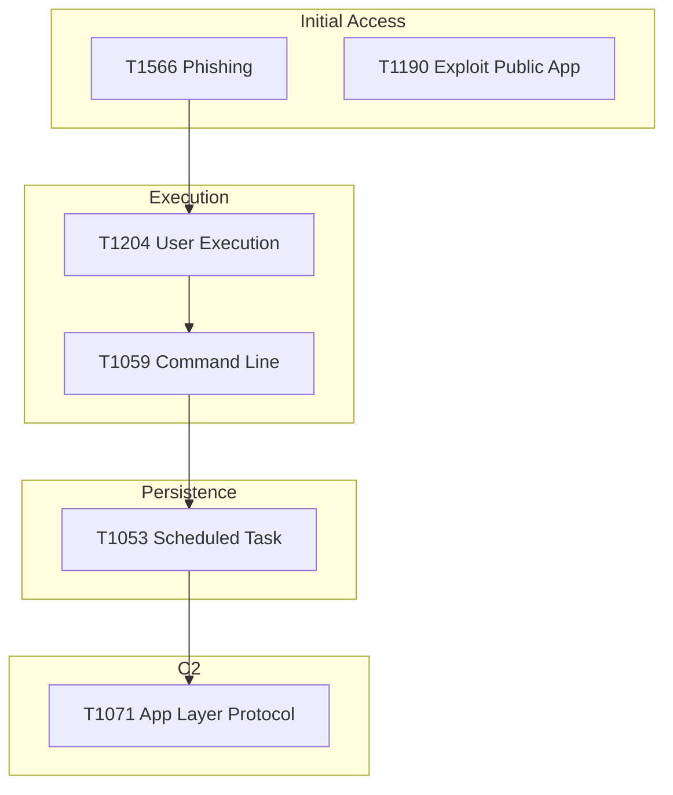

# Threat Landscape Report Template

**Document ID**: IR-SOP-018
**Version**: 1.0
**Classification**: Internal
**Last Updated**: 2026-02-15

> A **quarterly/monthly template** for producing threat landscape reports that keep stakeholders informed about the evolving threat environment and how the SOC is adapting. Use this to brief leadership, justify investments, and prioritize defenses.

---

## Report Metadata

| Field | Value |
|:---|:---|
| **Report Period** | [Month/Quarter] [Year] |
| **Prepared By** | [SOC Lead / Threat Intel Analyst] |
| **Distribution** | [CISO, SOC Team, IT Leadership] |
| **Classification** | [Internal / Confidential] |
| **Next Report Due** | [Date] |

---

## Executive Summary

> Write 3–5 sentences summarizing the most important threat developments this period.

_________________________________________________________________________________
_________________________________________________________________________________
_________________________________________________________________________________

### Key Takeaways

| # | Finding | Risk Level | Action Required |
|:---:|:---|:---:|:---|
| 1 | ________________________________________________ | 🔴/🟠/🟡 | ________________________ |
| 2 | ________________________________________________ | 🔴/🟠/🟡 | ________________________ |
| 3 | ________________________________________________ | 🔴/🟠/🟡 | ________________________ |

---

## Section 1: Global Threat Landscape

### 1a. Major Threat Developments

> Document 3–5 significant threat developments from the reporting period.

| # | Development | Source | Relevance to Our Org |
|:---:|:---|:---|:---:|
| 1 | ________________________________________________ | [CISA/CERT/News] | 🔴 High / 🟡 Medium / 🟢 Low |
| 2 | ________________________________________________ | [CISA/CERT/News] | 🔴 High / 🟡 Medium / 🟢 Low |
| 3 | ________________________________________________ | [CISA/CERT/News] | 🔴 High / 🟡 Medium / 🟢 Low |

### 1b. Active Threat Actor Groups

| Group / Alias | Attribution | Primary Targets | TTPs | Relevance |
|:---|:---|:---|:---|:---:|
| ______________ | [Nation-state/Criminal/Hacktivist] | [Sector/Region] | T______, T______ | 🔴/🟡/🟢 |
| ______________ | [Nation-state/Criminal/Hacktivist] | [Sector/Region] | T______, T______ | 🔴/🟡/🟢 |
| ______________ | [Nation-state/Criminal/Hacktivist] | [Sector/Region] | T______, T______ | 🔴/🟡/🟢 |

### 1c. Industry-Specific Threats

| Threat | Affected Industries | Attack Vector | Our Exposure |
|:---|:---|:---|:---:|
| ______________ | ______________ | ______________ | 🔴/🟡/🟢 |
| ______________ | ______________ | ______________ | 🔴/🟡/🟢 |

---

## Section 2: Vulnerability Landscape

### 2a. Critical Vulnerabilities (This Period)

| CVE | CVSS | Affected Product | Exploited in Wild? | Our Status |
|:---|:---:|:---|:---:|:---:|
| CVE-____-_____ | __._ | ______________ | ✅ Yes / ❌ No | ✅ Patched / ⚠️ In Progress / ❌ Vulnerable |
| CVE-____-_____ | __._ | ______________ | ✅ Yes / ❌ No | ✅ Patched / ⚠️ In Progress / ❌ Vulnerable |
| CVE-____-_____ | __._ | ______________ | ✅ Yes / ❌ No | ✅ Patched / ⚠️ In Progress / ❌ Vulnerable |

### 2b. Zero-Day Tracking

| Vendor | Product | Discovery Date | Patch Available? | Mitigation Applied? |
|:---|:---|:---:|:---:|:---:|
| ______________ | ______________ | ______________ | ✅/❌ | ✅/❌ |

### 2c. Patch Compliance Summary

| Category | Total Assets | Patched (30 days) | % Compliant | Gap |
|:---|:---:|:---:|:---:|:---|
| Servers | _____ | _____ | ___% | ______________ |
| Workstations | _____ | _____ | ___% | ______________ |
| Network Devices | _____ | _____ | ___% | ______________ |
| Cloud Resources | _____ | _____ | ___% | ______________ |

---

## Section 3: Threat Intelligence from SOC Operations

### 3a. Threats Detected by SOC

| Category | Incidents | Trend | Top Technique | Example |
|:---|:---:|:---:|:---|:---|
| Phishing | _____ | ↑/↓ _% | T1566.___ | ________________________ |
| Malware | _____ | ↑/↓ _% | T1059.___ | ________________________ |
| Unauthorized Access | _____ | ↑/↓ _% | T1110.___ | ________________________ |
| Cloud Threats | _____ | ↑/↓ _% | T1078.___ | ________________________ |
| Data Exfiltration | _____ | ↑/↓ _% | T1567.___ | ________________________ |

### 3b. IOC Statistics

| IOC Type | Total Ingested | Matched in Logs | Match Rate | Actionable |
|:---|:---:|:---:|:---:|:---:|
| IP Addresses | _____ | _____ | ___% | _____ |
| Domains | _____ | _____ | ___% | _____ |
| File Hashes | _____ | _____ | ___% | _____ |
| URLs | _____ | _____ | ___% | _____ |
| Email Addresses | _____ | _____ | ___% | _____ |

### 3c. TI Feed Effectiveness

| Feed Source | IOCs Received | True Matches | FP Rate | Value Score |
|:---|:---:|:---:|:---:|:---:|
| ______________ | _____ | _____ | ___% | ★★★★★ |
| ______________ | _____ | _____ | ___% | ★★★★☆ |
| ______________ | _____ | _____ | ___% | ★★★☆☆ |

---

## Section 4: MITRE ATT&CK Analysis

### 4a. Techniques Observed This Period

> Replace with actual observed techniques. Include ATT&CK Navigator heatmap screenshot if available.

### 4b. Technique Frequency

| MITRE Technique | Count | Trend | Detection Status |
|:---|:---:|:---:|:---:|
| T1566 Phishing | _____ | ↑/↓ | ✅ Detected / ⚠️ Partial / ❌ No Rule |
| T1059 Command/Scripting | _____ | ↑/↓ | ✅ Detected / ⚠️ Partial / ❌ No Rule |
| T1078 Valid Accounts | _____ | ↑/↓ | ✅ Detected / ⚠️ Partial / ❌ No Rule |
| T1021 Remote Services | _____ | ↑/↓ | ✅ Detected / ⚠️ Partial / ❌ No Rule |
| ______________ | _____ | ↑/↓ | ✅ Detected / ⚠️ Partial / ❌ No Rule |

### 4c. Detection Gap Analysis

| Tactic | Techniques NOT Covered | Risk | Recommended Action |
|:---|:---|:---:|:---|
| ______________ | T______, T______ | 🔴/🟡 | ________________________ |
| ______________ | T______, T______ | 🔴/🟡 | ________________________ |

---

## Section 5: Regional & Regulatory Threats

### 5a. Thailand / ASEAN Specific Threats

| Threat | Target Sector | Source | SOC Action |
|:---|:---|:---|:---|
| ______________ | ______________ | [ThaiCERT/ASEAN CERT] | ________________________ |
| ______________ | ______________ | [ThaiCERT/ASEAN CERT] | ________________________ |

### 5b. Regulatory Updates

| Regulation | Update | Effective Date | Impact on SOC |
|:---|:---|:---:|:---|
| PDPA | ________________________ | ____-__-__ | ________________________ |
| BOT Cyber Resilience | ________________________ | ____-__-__ | ________________________ |
| SEC Thailand | ________________________ | ____-__-__ | ________________________ |
| NIST CSF 2.0 | ________________________ | ____-__-__ | ________________________ |

---

## Section 6: Recommendations & Action Items

### Immediate Actions (This Month)

| # | Action | Owner | Due Date | Status |
|:---:|:---|:---|:---:|:---:|
| 1 | ________________________________________________ | ______________ | ____-__-__ | ⬜/🔲/✅ |
| 2 | ________________________________________________ | ______________ | ____-__-__ | ⬜/🔲/✅ |
| 3 | ________________________________________________ | ______________ | ____-__-__ | ⬜/🔲/✅ |

### Strategic Recommendations (Next Quarter)

| # | Recommendation | Justification | Estimated Effort | Priority |
|:---:|:---|:---|:---:|:---:|
| 1 | ________________________________________________ | ________________________ | ___ person-days | P_ |
| 2 | ________________________________________________ | ________________________ | ___ person-days | P_ |

### Detection Rule Changes

| Action | Rule / Technique | Reason |
|:---|:---|:---|
| **Add** | ______________ | New threat observed |
| **Tune** | ______________ | High FP rate |
| **Disable** | ______________ | No longer relevant |

---

## Section 7: Threat Forecast

> Predict likely threats for the next 30–90 days based on current intelligence.

| # | Predicted Threat | Confidence | Basis | Preparedness |
|:---:|:---|:---:|:---|:---:|
| 1 | ________________________________________________ | High/Med/Low | ________________________ | ✅ Ready / ⚠️ Partial / ❌ Not Ready |
| 2 | ________________________________________________ | High/Med/Low | ________________________ | ✅ Ready / ⚠️ Partial / ❌ Not Ready |
| 3 | ________________________________________________ | High/Med/Low | ________________________ | ✅ Ready / ⚠️ Partial / ❌ Not Ready |

---

## Intelligence Sources

| Source | Type | Frequency | URL/Access |
|:---|:---|:---:|:---|
| CISA Alerts | Government | Real-time | https://www.cisa.gov/known-exploited-vulnerabilities |
| ThaiCERT | Government/Regional | Weekly | https://www.thaicert.or.th |
| MITRE ATT&CK | Framework | Quarterly | https://attack.mitre.org |
| AlienVault OTX | Community | Real-time | https://otx.alienvault.com |
| VirusTotal | Commercial | Real-time | https://www.virustotal.com |
| Abuse.ch | Community | Real-time | https://abuse.ch |
| [Vendor TI Feed] | Commercial | ____________ | ______________ |

---

## Related Documents

-   [Threat Hunting Playbook](../05_Incident_Response/Threat_Hunting_Playbook.en.md) — Proactive threat hunting
-   [TI Feeds Integration](TI_Feeds_Integration.en.md) — Feed configuration
-   [SOC Metrics & KPIs](SOC_Metrics.en.md) — Performance measurement
-   [KPI Dashboard Template](KPI_Dashboard_Template.en.md) — Monthly reporting
-   [Incident Classification](../05_Incident_Response/Incident_Classification.en.md) — Category taxonomy
-   [Log Source Matrix](Log_Source_Matrix.en.md) — Detection data sources
