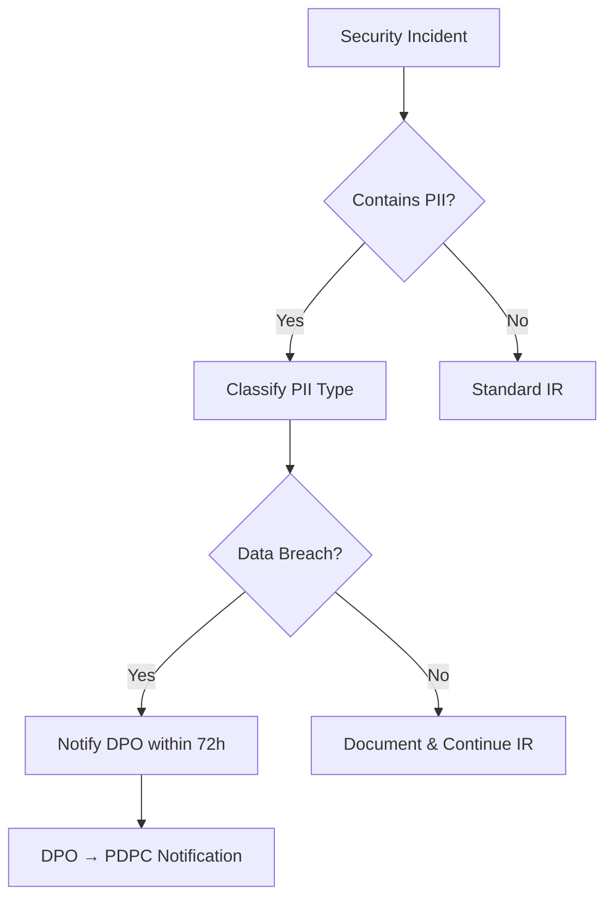

# PDPA Compliance SOP

This document outlines SOC procedures for handling personal data in compliance with Thailand's **Personal Data Protection Act (PDPA) B.E. 2562 (2019)**.

---

## Overview

The PDPA governs the collection, use, and disclosure of personal data. SOC analysts frequently encounter personal data (PII) during investigations. This SOP ensures data handling meets legal requirements.

## Data Classification

| Category | Examples | Handling |
|:---|:---|:---|
| **General PII** | Name, email, phone, IP address, employee ID | Log access, minimize retention |
| **Sensitive PII** | National ID, health records, biometrics, religion | Encrypt, restrict access, audit trail |
| **Non-PII** | System logs without user identifiers, hash values | Standard handling |

## SOC Analyst Responsibilities

1. **Minimization** — Access only the personal data necessary for investigation
2. **Purpose limitation** — Use data only for security incident response
3. **Retention** — Delete PII from investigation notes after case closure (retain only in official case file)
4. **Access control** — Share PII only with authorized personnel on need-to-know basis
5. **Logging** — All access to PII must be logged in case management system

## Breach Notification Requirements

| Condition | Timeline | Notify |
|:---|:---|:---|
| Personal data breach detected | **≤ 72 hours** | Data Protection Officer (DPO) → PDPC |
| Breach likely to affect data subjects | Without undue delay | Affected individuals |
| High-risk breach (sensitive data) | Immediately | DPO → PDPC → Affected individuals |

## Incident Response Integration

## Data Subject Rights

SOC analysts must be aware of the following rights that data subjects may exercise:

| Right | SOC Impact | Action |
|:---|:---|:---|
| **Right of Access** | Data subject may request copies of their PII | Forward request to DPO, do not fulfill directly |
| **Right to Erasure** | Data subject may request deletion | DPO evaluates; SOC retains if required for active case |
| **Right to Rectification** | Data subject may request correction | Forward to DPO |
| **Right to Object** | Data subject may object to processing | DPO evaluates; security purposes may override |
| **Right to Data Portability** | Data subject may request export | Forward to DPO |

## DPO Coordination

| Scenario | SOC Action | DPO Action | Timeline |
|:---|:---|:---|:---|
| PII found in investigation | Log access, classify data | Informed for oversight | Immediately |
| Suspected data breach | Escalate to DPO | Assess notification obligation | ≤ 72 hours |
| Data subject request received | Forward to DPO | Process and respond | ≤ 30 days |
| Forensic evidence contains PII | Apply TLP:RED, restrict access | Approve retention | Before analysis |

## Evidence Handling with PII

1. **Minimize** — Redact PII from investigation notes when not essential
2. **Encrypt** — Store evidence containing PII in encrypted storage only
3. **Label** — Mark all documents containing PII with `TLP:RED` or `TLP:AMBER`
4. **Audit Trail** — Log all access to evidence containing PII
5. **Retention** — Delete PII from investigation workspace after case closure
6. **Transfer** — Never transfer PII via unencrypted channels (no plain email)

## PDPA Compliance Audit Checklist

| Item | Frequency | Owner | Status |
|:---|:---|:---|:---:|
| PII access logging enabled in all SOC tools | Monthly | SOC Engineer | ☐ |
| Data classification labels applied to cases | Every case | Analyst | ☐ |
| Breach notification SOP tested | Quarterly | SOC Manager | ☐ |
| DPO contact information current | Monthly | SOC Manager | ☐ |
| Evidence retention policy compliance | Quarterly | SOC Lead | ☐ |
| Data subject request handling procedure tested | Annually | DPO + SOC | ☐ |
| PDPA training completed by all SOC staff | Annually | HR + SOC Manager | ☐ |

## Related Documents

- [Data Handling Protocol](../06_Operations_Management/Data_Handling_Protocol.en.md)
- [IR Framework](../05_Incident_Response/Framework.en.md)
- [Forensic Investigation](../05_Incident_Response/Forensic_Investigation.en.md)

## References

- [PDPA B.E. 2562 (Official)](https://www.pdpc.or.th/)
- [GDPR Comparison Guide](https://gdpr.eu/)
