# PDPA Compliance SOP

This document outlines SOC procedures for handling personal data in compliance with Thailand's **Personal Data Protection Act (PDPA) B.E. 2562 (2019)**.

---

## Overview

The PDPA governs the collection, use, and disclosure of personal data. SOC analysts frequently encounter personal data (PII) during investigations. This SOP ensures data handling meets legal requirements.

## Data Classification

| Category | Examples | Handling |
|:---|:---|:---|
| **General PII** | Name, email, phone, IP address, employee ID | Log access, minimize retention |
| **Sensitive PII** | National ID, health records, biometrics, religion | Encrypt, restrict access, audit trail |
| **Non-PII** | System logs without user identifiers, hash values | Standard handling |

## SOC Analyst Responsibilities

1. **Minimization** — Access only the personal data necessary for investigation
2. **Purpose limitation** — Use data only for security incident response
3. **Retention** — Delete PII from investigation notes after case closure (retain only in official case file)
4. **Access control** — Share PII only with authorized personnel on need-to-know basis
5. **Logging** — All access to PII must be logged in case management system

## Breach Notification Requirements

| Condition | Timeline | Notify |
|:---|:---|:---|
| Personal data breach detected | **≤ 72 hours** | Data Protection Officer (DPO) → PDPC |
| Breach likely to affect data subjects | Without undue delay | Affected individuals |
| High-risk breach (sensitive data) | Immediately | DPO → PDPC → Affected individuals |

## Incident Response Integration

```mermaid
graph TD
    Incident["Security Incident"] --> PII{"Contains PII?"}
    PII -->|Yes| Classify["Classify PII Type"]
    PII -->|No| Normal["Standard IR"]
    Classify --> Breach{"Data Breach?"}
    Breach -->|Yes| Notify["Notify DPO within 72h"]
    Breach -->|No| Document["Document & Continue IR"]
    Notify --> PDPC["DPO → PDPC Notification"]
```



## Data Subject Rights

SOC analysts must be aware of the following rights that data subjects may exercise:

| Right | SOC Impact | Action |
|:---|:---|:---|
| **Right of Access** | Data subject may request copies of their PII | Forward request to DPO, do not fulfill directly |
| **Right to Erasure** | Data subject may request deletion | DPO evaluates; SOC retains if required for active case |
| **Right to Rectification** | Data subject may request correction | Forward to DPO |
| **Right to Object** | Data subject may object to processing | DPO evaluates; security purposes may override |
| **Right to Data Portability** | Data subject may request export | Forward to DPO |

## DPO Coordination

| Scenario | SOC Action | DPO Action | Timeline |
|:---|:---|:---|:---|
| PII found in investigation | Log access, classify data | Informed for oversight | Immediately |
| Suspected data breach | Escalate to DPO | Assess notification obligation | ≤ 72 hours |
| Data subject request received | Forward to DPO | Process and respond | ≤ 30 days |
| Forensic evidence contains PII | Apply TLP:RED, restrict access | Approve retention | Before analysis |

## Evidence Handling with PII

1. **Minimize** — Redact PII from investigation notes when not essential
2. **Encrypt** — Store evidence containing PII in encrypted storage only
3. **Label** — Mark all documents containing PII with `TLP:RED` or `TLP:AMBER`
4. **Audit Trail** — Log all access to evidence containing PII
5. **Retention** — Delete PII from investigation workspace after case closure
6. **Transfer** — Never transfer PII via unencrypted channels (no plain email)

## PDPA Compliance Audit Checklist

| Item | Frequency | Owner | Status |
|:---|:---|:---|:---:|
| PII access logging enabled in all SOC tools | Monthly | SOC Engineer | ☐ |
| Data classification labels applied to cases | Every case | Analyst | ☐ |
| Breach notification SOP tested | Quarterly | SOC Manager | ☐ |
| DPO contact information current | Monthly | SOC Manager | ☐ |
| Evidence retention policy compliance | Quarterly | SOC Lead | ☐ |
| Data subject request handling procedure tested | Annually | DPO + SOC | ☐ |
| PDPA training completed by all SOC staff | Annually | HR + SOC Manager | ☐ |


## PDPA Penalties & Consequences

| Violation | Penalty | Notes |
|:---|:---|:---|
| Failing to notify breach within 72 hours | ≤ 5 million THB fine | Per incident |
| Collecting data without consent | ≤ 5 million THB fine | Administrative penalty |
| Unauthorized disclosure of personal data | ≤ 5 million THB fine + criminal | Up to 1 year imprisonment |
| Failing to appoint DPO (when required) | ≤ 3 million THB fine | Organizations >50 employees |
| Cross-border transfer without safeguards | ≤ 5 million THB fine | Adequate protection required |

> ⚠️ **Criminal penalties** apply to individuals who disclose data obtained in their role for personal gain — **up to 1 year imprisonment and/or 1 million THB fine**.

## Cross-Border Data Transfer

SOC operations may require sharing IOCs, forensic evidence, or threat intelligence with international partners. Under PDPA Section 28:

| Scenario | Allowed? | Requirements |
|:---|:---|:---|
| Sharing IOCs (hashed, no PII) with foreign CERT | ✅ Yes | No PII involved — standard process |
| Sending forensic evidence to foreign vendor | ⚠️ Conditional | Adequate protection + DPO approval |
| Cloud SIEM storing logs internationally | ⚠️ Conditional | Data processing agreement (DPA) required |
| Sharing PII with law enforcement (INTERPOL) | ✅ Yes | Legal obligation exception applies |
| Sending employee data to foreign SOC team | ❌ Restricted | Explicit consent + adequate protection |

### Required Safeguards for Cross-Border Transfer
```
□ Data Processing Agreement (DPA) with receiving party
□ Receiving country has adequate data protection laws
   (or: Standard Contractual Clauses in place)
□ DPO has reviewed and approved the transfer
□ Data is encrypted in transit and at rest
□ Audit log of what data was transferred, when, to whom
□ Retention and deletion schedule agreed with recipient
```

## Practical Breach Scenarios for SOC

| # | Scenario | Classification | Action |
|:---|:---|:---|:---|
| 1 | Phishing email leads to credential theft → attacker accesses HR database | **Personal data breach** — sensitive PII | ≤72h DPO notification + individual notification |
| 2 | Ransomware encrypts file server containing employee records | **Personal data breach** — availability impact | ≤72h DPO notification (even if data not exfiltrated) |
| 3 | Analyst accidentally shares investigation report with PII on Slack | **Internal disclosure incident** — policy violation | Report to SOC Manager, DPO assessment, awareness training |
| 4 | Malware exfiltrates customer database to attacker C2 | **High-risk breach** — mass PII exposure | **Immediate** DPO + PDPC + individual notification |
| 5 | USB drive with forensic evidence containing PII is lost | **Physical breach** — potential PII exposure | ≤72h DPO notification, assess encryption status |
| 6 | Third-party SaaS vendor suffers breach affecting our data | **Third-party breach** — our data involved | DPO coordinates with vendor, assess impact |

## 72-Hour Breach Notification Workflow

```mermaid
graph TD
    Detect["🔍 Breach Detected"] --> Contains{"Contains PII?"}
    Contains -->|No| Normal["Standard IR Process"]
    Contains -->|Yes| Classify["Classify PII Type"]
    Classify --> Clock["⏰ 72-HOUR CLOCK STARTS"]
    Clock --> DPO["📞 Notify DPO (≤ 24h ideal)"]
    DPO --> Assess["DPO Assesses Severity"]
    Assess --> HighRisk{"High Risk?"}
    HighRisk -->|Yes| Both["Notify PDPC + Individuals"]
    HighRisk -->|No| PDPC["Notify PDPC Only"]
    Both --> Document["📝 Document Everything"]
    PDPC --> Document
    Document --> Monitor["Monitor for 30 Days"]

    style Clock fill:#f44336,color:#fff
    style DPO fill:#FF9800,color:#fff
```



### PDPC Notification Template
```
To: Personal Data Protection Committee (PDPC)
Subject: Data Breach Notification — [Organization Name]
Date: [YYYY-MM-DD]

1. Organization Details
   Name: [Organization]
   DPO: [Name, Email, Phone]

2. Breach Details
   Date Detected: [YYYY-MM-DD HH:MM]
   Nature of Breach: [Confidentiality/Integrity/Availability]
   Description: [Brief description]

3. Data Affected
   Categories: [Name, Email, ID number, etc.]
   Number of Records: [Approximate count]
   Number of Data Subjects: [Approximate count]

4. Containment Status
   [ ] Contained  [ ] Under Investigation  [ ] Not Yet Contained

5. Actions Taken
   [List containment and remediation steps]

6. Risk to Data Subjects
   [Assessment of potential harm]

7. Individual Notification
   [ ] Planned  [ ] Completed  [ ] Not Required
```

## Data Protection Impact Assessment (DPIA) for SOC Tools

Before deploying new SOC tools that process personal data:

| Question | Answer | If Yes |
|:---|:---|:---|
| Does the tool process PII? | Yes/No | Continue DPIA |
| Large-scale processing? | Yes/No | DPO sign-off required |
| Cross-border data transfer? | Yes/No | Safeguards required |
| Automated decision-making? | Yes/No | Transparency obligations |
| New technology involved? | Yes/No | Risk assessment required |

## Related Documents

- [Data Handling Protocol](../06_Operations_Management/Data_Handling_Protocol.en.md)
- [IR Framework](../05_Incident_Response/Framework.en.md)
- [Forensic Investigation](../05_Incident_Response/Forensic_Investigation.en.md)

## References

- [PDPA B.E. 2562 (Official)](https://www.pdpc.or.th/)
- [GDPR Comparison Guide](https://gdpr.eu/)
