# ขั้นตอนปฏิบัติตาม PDPA (PDPA Compliance SOP)

เอกสารนี้ระบุขั้นตอนของ SOC ในการจัดการข้อมูลส่วนบุคคลตาม **พ.ร.บ. คุ้มครองข้อมูลส่วนบุคคล พ.ศ. 2562 (PDPA)**

---

## การจำแนกข้อมูล

| ประเภท | ตัวอย่าง | การจัดการ |
|:---|:---|:---|
| **PII ทั่วไป** | ชื่อ, อีเมล, โทรศัพท์, IP address, รหัสพนักงาน | บันทึกการเข้าถึง, จำกัดระยะเวลาเก็บ |
| **PII อ่อนไหว** | เลขบัตรประชาชน, ข้อมูลสุขภาพ, ข้อมูลชีวมิติ | เข้ารหัส, จำกัดสิทธิ์เข้าถึง, audit trail |
| **ไม่ใช่ PII** | System logs ที่ไม่มี user identifiers, hash values | จัดการปกติ |

## ความรับผิดชอบของ SOC Analyst

1. **ลดให้น้อยที่สุด** — เข้าถึงเฉพาะข้อมูลส่วนบุคคลที่จำเป็นสำหรับการสืบสวน
2. **จำกัดวัตถุประสงค์** — ใช้ข้อมูลเฉพาะเพื่อการตอบสนองต่อเหตุการณ์ความปลอดภัย
3. **การเก็บรักษา** — ลบ PII จากบันทึกการสืบสวนหลังปิดเคส
4. **การควบคุมการเข้าถึง** — แบ่งปัน PII เฉพาะผู้ที่ได้รับอนุญาตตาม need-to-know
5. **การบันทึก** — ทุกการเข้าถึง PII ต้องบันทึกในระบบ

## ข้อกำหนดแจ้งเตือนการรั่วไหล

| เงื่อนไข | ระยะเวลา | แจ้ง |
|:---|:---|:---|
| ตรวจพบ data breach | **≤ 72 ชั่วโมง** | DPO → สำนักงาน คปส. |
| การรั่วมีผลต่อเจ้าของข้อมูล | โดยเร็ว | เจ้าของข้อมูลที่ได้รับผลกระทบ |
| การรั่วความเสี่ยงสูง (ข้อมูลอ่อนไหว) | ทันที | DPO → สำนักงาน คปส. → เจ้าของข้อมูล |

## สิทธิของเจ้าของข้อมูล

| สิทธิ | ผลกระทบต่อ SOC | การดำเนินการ |
|:---|:---|:---|
| **สิทธิในการเข้าถึง** | เจ้าของข้อมูลอาจขอสำเนา PII | ส่งต่อคำขอไปยัง DPO |
| **สิทธิในการลบ** | เจ้าของข้อมูลอาจขอลบข้อมูล | DPO ประเมิน; SOC เก็บไว้หากจำเป็นสำหรับคดี |
| **สิทธิในการแก้ไข** | เจ้าของข้อมูลอาจขอแก้ไข | ส่งต่อไปยัง DPO |
| **สิทธิในการคัดค้าน** | เจ้าของข้อมูลอาจคัดค้านการประมวลผล | DPO ประเมิน |
| **สิทธิในการโอนย้าย** | เจ้าของข้อมูลอาจขอส่งออก | ส่งต่อไปยัง DPO |

## การประสานงาน DPO

| สถานการณ์ | การดำเนินการของ SOC | การดำเนินการของ DPO | กรอบเวลา |
|:---|:---|:---|:---|
| พบ PII ในการสอบสวน | บันทึกการเข้าถึง, จำแนกข้อมูล | รับแจ้งเพื่อกำกับดูแล | ทันที |
| สงสัยว่ามีการละเมิดข้อมูล | ยกระดับไปยัง DPO | ประเมินภาระการแจ้งเตือน | ≤ 72 ชั่วโมง |
| ได้รับคำขอจากเจ้าของข้อมูล | ส่งต่อไปยัง DPO | ดำเนินการและตอบกลับ | ≤ 30 วัน |

## รายการตรวจสอบ PDPA

| รายการ | ความถี่ | ผู้รับผิดชอบ | สถานะ |
|:---|:---|:---|:---:|
| เปิดใช้งานการบันทึกการเข้าถึง PII | รายเดือน | SOC Engineer | ☐ |
| ติดป้ายจำแนกข้อมูลในทุกคดี | ทุกคดี | นักวิเคราะห์ | ☐ |
| ทดสอบ SOP การแจ้งเตือนละเมิด | รายไตรมาส | SOC Manager | ☐ |
| ข้อมูลติดต่อ DPO เป็นปัจจุบัน | รายเดือน | SOC Manager | ☐ |
| อบรม PDPA สำหรับทีม SOC ทั้งหมด | รายปี | HR + SOC Manager | ☐ |

## การจัดการหลักฐานที่มี PII

1. **ลดให้น้อย** — ตัด PII ออกจากบันทึกการสืบสวนเมื่อไม่จำเป็น
2. **เข้ารหัส** — จัดเก็บหลักฐานที่มี PII ในพื้นที่เข้ารหัสเท่านั้น
3. **ติดป้าย** — ทำเครื่องหมาย `TLP:RED` หรือ `TLP:AMBER` ในทุกเอกสารที่มี PII
4. **บันทึกการเข้าถึง** — Log ทุกการเข้าถึงหลักฐานที่มี PII
5. **การเก็บรักษา** — ลบ PII จากพื้นที่ทำงานหลังปิดคดี
6. **การส่งต่อ** — ห้ามส่ง PII ผ่านช่องทางไม่เข้ารหัส (ไม่ใช้อีเมลธรรมดา)

## กระบวนการตอบสนองเมื่อมีการละเมิดข้อมูล

```mermaid
graph TD
    Detect["ตรวจพบ Breach"] --> Contain["ควบคุมทันที"]
    Contain --> Assess["ประเมินขอบเขต PII"]
    Assess --> DPO["แจ้ง DPO ภายใน 24 ชม."]
    DPO --> Risk{"ความเสี่ยงสูง?"}
    Risk -->|ใช่| PDPC["DPO แจ้ง สคส. ≤ 72 ชม."]
    Risk -->|ไม่| Doc["บันทึกและติดตาม"]
    PDPC --> Notify["แจ้งเจ้าของข้อมูล"]
```




## บทลงโทษ PDPA

| การละเมิด | บทลงโทษ | หมายเหตุ |
|:---|:---|:---|
| ไม่แจ้งข้อมูลรั่วภายใน 72 ชม. | ≤ 5 ล้านบาท | ต่อเหตุการณ์ |
| เก็บข้อมูลโดยไม่ได้ consent | ≤ 5 ล้านบาท | โทษทางปกครอง |
| เปิดเผยข้อมูลส่วนบุคคลโดยไม่ได้รับอนุญาต | ≤ 5 ล้านบาท + อาญา | จำคุกไม่เกิน 1 ปี |
| ไม่แต่งตั้ง DPO (เมื่อต้องแต่งตั้ง) | ≤ 3 ล้านบาท | องค์กร >50 คน |
| ส่งข้อมูลข้ามแดนโดยไม่มีมาตรการคุ้มครอง | ≤ 5 ล้านบาท | ต้องมี adequate protection |

> ⚠️ **โทษอาญา** ใช้กับบุคคลที่เปิดเผยข้อมูลที่ได้มาจากหน้าที่เพื่อประโยชน์ส่วนตัว — **จำคุกไม่เกิน 1 ปี และ/หรือ ปรับไม่เกิน 1 ล้านบาท**

## การส่งข้อมูลข้ามแดน

SOC อาจต้องแชร์ IOCs, หลักฐาน forensic, หรือ threat intelligence กับพันธมิตรต่างประเทศ ภายใต้ PDPA มาตรา 28:

| สถานการณ์ | อนุญาต? | ข้อกำหนด |
|:---|:---|:---|
| แชร์ IOCs (hash, ไม่มี PII) กับ CERT ต่างประเทศ | ✅ ได้ | ไม่มี PII — ดำเนินการปกติ |
| ส่งหลักฐาน forensic ให้ vendor ต่างประเทศ | ⚠️ มีเงื่อนไข | Adequate protection + DPO อนุมัติ |
| Cloud SIEM เก็บ log ต่างประเทศ | ⚠️ มีเงื่อนไข | ต้องมี Data Processing Agreement |
| แชร์ PII กับ law enforcement (INTERPOL) | ✅ ได้ | ยกเว้นตามกฎหมาย |
| ส่งข้อมูลพนักงานให้ SOC ต่างประเทศ | ❌ จำกัด | ต้องมี consent ชัดเจน + adequate protection |

### มาตรการที่จำเป็นสำหรับการส่งข้อมูลข้ามแดน
```
□ Data Processing Agreement (DPA) กับผู้รับ
□ ประเทศผู้รับมีกฎหมายคุ้มครองข้อมูลเพียงพอ
   (หรือ: มี Standard Contractual Clauses)
□ DPO ตรวจสอบและอนุมัติการส่งแล้ว
□ เข้ารหัสข้อมูลระหว่างส่งและจัดเก็บ
□ มี audit log ว่าส่งข้อมูลอะไร เมื่อไร ให้ใคร
□ ตกลง retention และ deletion schedule กับผู้รับแล้ว
```

## สถานการณ์ข้อมูลรั่วที่ SOC อาจเจอ

| # | สถานการณ์ | การจำแนก | การดำเนินการ |
|:---|:---|:---|:---|
| 1 | Phishing → ขโมย credential → เข้า HR database | **ข้อมูลส่วนบุคคลรั่ว** — PII อ่อนไหว | ≤72 ชม. แจ้ง DPO + แจ้งเจ้าของข้อมูล |
| 2 | Ransomware เข้ารหัส file server ที่มีข้อมูลพนักงาน | **ข้อมูลส่วนบุคคลรั่ว** — กระทบ availability | ≤72 ชม. แจ้ง DPO (แม้ไม่ถูกขโมยออก) |
| 3 | Analyst แชร์รายงานสืบสวนที่มี PII ใน Slack | **เปิดเผยภายใน** — ละเมิดนโยบาย | รายงาน SOC Manager, DPO ประเมิน |
| 4 | Malware ส่ง customer database ไป C2 | **รั่วระดับสูง** — PII จำนวนมาก | **ทันที** DPO + PDPC + แจ้งเจ้าของข้อมูล |
| 5 | USB ที่มีหลักฐาน forensic พร้อม PII หาย | **รั่วทางกายภาพ** — อาจเปิดเผย PII | ≤72 ชม. แจ้ง DPO, ตรวจสถานะ encryption |
| 6 | Vendor SaaS ถูกเจาะ กระทบข้อมูลเรา | **Third-party breach** — ข้อมูลเราเกี่ยว | DPO ประสานงานกับ vendor, ประเมินผลกระทบ |

## ขั้นตอนแจ้งข้อมูลรั่ว 72 ชั่วโมง

```mermaid
graph TD
    Detect["�� ตรวจพบข้อมูลรั่ว"] --> Contains{"มี PII ไหม?"}
    Contains -->|ไม่| Normal["IR ปกติ"]
    Contains -->|ใช่| Classify["จำแนกประเภท PII"]
    Classify --> Clock["⏰ เริ่มนับ 72 ชั่วโมง"]
    Clock --> DPO["📞 แจ้ง DPO (≤ 24 ชม.)"]
    DPO --> Assess["DPO ประเมินความรุนแรง"]
    Assess --> HighRisk{"ความเสี่ยงสูง?"}
    HighRisk -->|ใช่| Both["แจ้ง PDPC + เจ้าของข้อมูล"]
    HighRisk -->|ไม่| PDPC["แจ้ง PDPC เท่านั้น"]
    Both --> Document["📝 บันทึกทุกอย่าง"]
    PDPC --> Document
    Document --> Monitor["ติดตาม 30 วัน"]

    style Clock fill:#f44336,color:#fff
    style DPO fill:#FF9800,color:#fff
```



### Template แจ้ง PDPC
```
เรียน: คณะกรรมการคุ้มครองข้อมูลส่วนบุคคล (PDPC)
เรื่อง: แจ้งเหตุการณ์ข้อมูลรั่ว — [ชื่อองค์กร]
วันที่: [YYYY-MM-DD]

1. ข้อมูลองค์กร
   ชื่อ: [องค์กร]
   DPO: [ชื่อ, อีเมล, เบอร์โทร]

2. รายละเอียดเหตุการณ์
   วันที่ตรวจพบ: [YYYY-MM-DD HH:MM]
   ลักษณะ: [ความลับ/ความสมบูรณ์/ความพร้อมใช้]
   คำอธิบาย: [สรุปสั้นๆ]

3. ข้อมูลที่ได้รับผลกระทบ
   ประเภท: [ชื่อ, อีเมล, เลขบัตร ฯลฯ]
   จำนวน record: [ประมาณ]
   จำนวนเจ้าของข้อมูล: [ประมาณ]

4. สถานะการควบคุม
   [ ] ควบคุมได้แล้ว  [ ] กำลังสืบสวน  [ ] ยังไม่ได้ควบคุม

5. มาตรการที่ดำเนินการ
   [รายการ containment และ remediation]

6. ความเสี่ยงต่อเจ้าของข้อมูล
   [การประเมินผลกระทบที่อาจเกิด]

7. การแจ้งเจ้าของข้อมูล
   [ ] วางแผน  [ ] ดำเนินการแล้ว  [ ] ไม่จำเป็น
```

## DPIA สำหรับเครื่องมือ SOC

ก่อนติดตั้งเครื่องมือ SOC ใหม่ที่ประมวลผลข้อมูลส่วนบุคคล:

| คำถาม | คำตอบ | ถ้าใช่ |
|:---|:---|:---|
| เครื่องมือประมวลผล PII ไหม? | ใช่/ไม่ | ทำ DPIA ต่อ |
| ประมวลผลจำนวนมาก? | ใช่/ไม่ | ต้อง DPO ลงนาม |
| ส่งข้อมูลข้ามแดน? | ใช่/ไม่ | ต้องมีมาตรการคุ้มครอง |
| ตัดสินใจอัตโนมัติ? | ใช่/ไม่ | มีหน้าที่ transparency |
| เทคโนโลยีใหม่? | ใช่/ไม่ | ต้องประเมินความเสี่ยง |

## เอกสารที่เกี่ยวข้อง

- [Data Handling Protocol](../06_Operations_Management/Data_Handling_Protocol.th.md)
- [กรอบ IR](../05_Incident_Response/Framework.th.md)

### PDPA Key Dates

| Event | Deadline |
|:---|:---|
| Breach notification (สคส.) | 72 ชั่วโมง |
| DPIA completion | ก่อนเริ่มโครงการ |
| Annual privacy review | ทุก 12 เดือน |
| DPO appointment | ตามเกณฑ์ สคส. |

## อ้างอิง

- [พ.ร.บ. คุ้มครองข้อมูลส่วนบุคคล (PDPA)](https://www.pdpc.or.th/)
