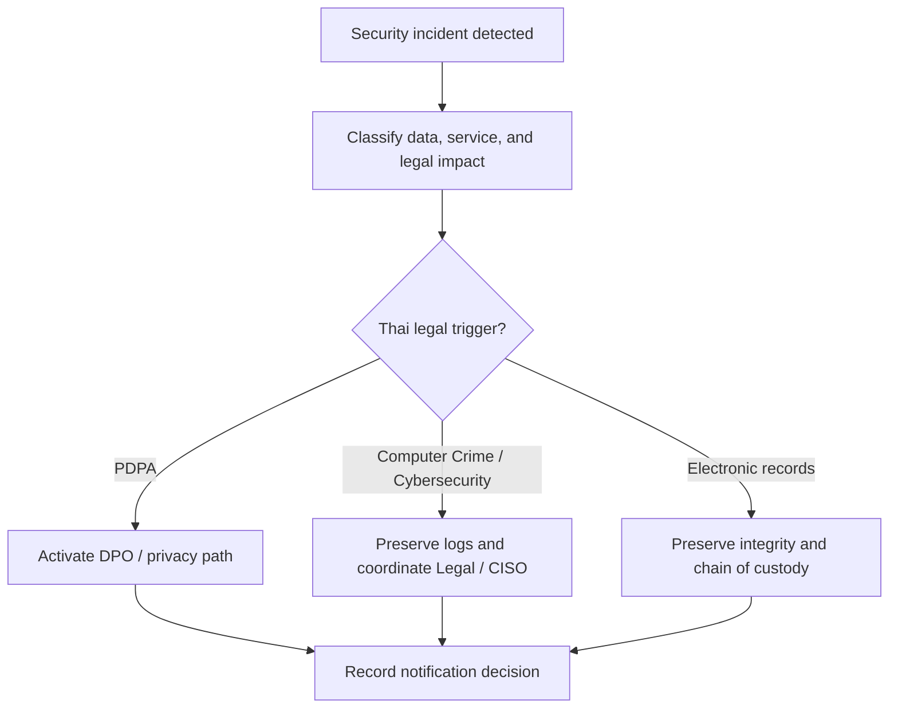

# Thai Cyber Legal Baseline for SOC Operations

**Document ID**: TH-LAW-SOC-001  
**Version**: 1.0  
**Classification**: Internal  
**Last Updated**: 2026-04-26  
**Audience**: CISO, SOC Manager, IR Engineer, Security Engineer, Compliance Officer, Legal Counsel

> This document provides operational SOC guidance, not legal advice. Use it to trigger the right evidence, escalation, and decision workflow while Legal, DPO, or Compliance confirms the organization's formal position.

## 1. Purpose and Operating Principle

-   [ ] Use this baseline when an incident may involve Thai legal, privacy, regulatory, law-enforcement, or critical-service implications.
-   [ ] Treat PDPA-specific breach assessment as governed by [PDPA Incident Response](PDPA_Incident_Response.en.md) and [PDPA Compliance](PDPA_Compliance.en.md).
-   [ ] Preserve facts before interpretation: time, asset, owner, data type, user identity, log source, evidence custodian, and decision owner.
-   [ ] Escalate early when an incident involves personal data, public service disruption, critical infrastructure, criminal activity, or requests from authorities.

## 2. Thai Legal Baseline for SOC Teams

| Legal anchor | SOC operating concern | Primary SOC action | Decision owner |
|:---|:---|:---|:---|
| **Personal Data Protection Act B.E. 2562 (PDPA)** | Personal data, sensitive personal data, affected data subjects, breach notification | Trigger DPO review, preserve breach timeline, link to PDPA evidence pack | DPO + CISO |
| **Computer-Related Crime Act B.E. 2550 and amendments** | Unauthorized access, data alteration, service disruption, malicious tools, unlawful content, traffic data | Preserve traffic logs, user attribution data, forensic images, and law-enforcement request trail | Legal + CISO |
| **Cybersecurity Act B.E. 2562** | Cyber threat affecting critical services, public safety, or critical information infrastructure | Assess threat level, prepare coordination package, preserve impact evidence | CISO + SOC Manager |
| **Electronic Transactions Act B.E. 2544 and amendments** | Electronic records, digital messages, logs, approvals, signatures, evidence reliability | Preserve integrity, authenticity, time source, system-of-record proof, and chain of custody | Legal + IR Lead |
| **NCSA / ThaiCERT coordination** | National-level advisories, sectoral CERT coordination, threat sharing, critical incident coordination | Maintain IOC package, timeline, contact record, and sharing approval | CISO + Threat Intel Lead |

## 3. Trigger-to-Action Matrix

| Incident trigger | Required SOC action | Owner | Evidence required | Notification checkpoint |
|:---|:---|:---|:---|:---|
| Confirmed or suspected personal-data exposure | Activate PDPA assessment workflow and freeze deletion of relevant records | SOC Manager + DPO | Incident timeline, data types, affected systems, affected subject estimate | DPO decides notification path |
| Unauthorized access to computer system or data | Preserve authentication, network, endpoint, and application logs | IR Engineer | Log bundle, affected accounts, source/destination, access method, containment timeline | Legal decides law-enforcement path |
| Service disruption affecting critical business or public-facing service | Assess whether Cybersecurity Act escalation may apply | CISO + SOC Manager | Impact summary, service owner statement, downtime, affected population | CISO decides executive/regulator path |
| Request from authority, regulator, or sectoral CERT | Validate request channel and start response decision log | Legal + CISO | Request copy, requester identity, time received, scope requested, response owner | Legal approves response package |
| Electronic evidence may support legal, regulatory, or disciplinary action | Start legal hold and chain-of-custody handling | IR Lead + Legal | Evidence register, hash values, custodian trail, time synchronization proof | Legal confirms preservation scope |

## 4. Minimum Evidence Package

| Evidence item | Why it matters | Minimum standard |
|:---|:---|:---|
| Incident timeline | Supports reporting, breach assessment, and executive decision-making | Detection, triage, containment, escalation, recovery, and decision timestamps |
| Asset and service ownership | Identifies accountable business and technical owners | Business owner, technical owner, data owner, service criticality |
| Log and traffic data package | Supports investigation and possible authority requests | Source system, retention status, collection time, completeness statement |
| Data-impact assessment | Connects technical facts to PDPA and business impact | Data class, subject estimate, sensitive-data indicator, evidence confidence |
| Chain of custody | Protects evidentiary value | Custodian, transfer time, storage location, hash or integrity marker |
| Notification decision log | Shows defensible governance | Facts reviewed, decision made, approver, time, next review point |

## 5. Escalation Rules

-   [ ] Escalate to **DPO + Legal + CISO immediately** when personal data or sensitive personal data may be exposed.
-   [ ] Escalate to **CISO + Legal** when there is unauthorized system access, suspected criminal activity, destructive action, or a request from authorities.
-   [ ] Escalate to **CISO + SOC Manager + Business Service Owner** when a cyber event disrupts a critical business service or may affect public safety.
-   [ ] Escalate to **IR Lead + Legal** before releasing, deleting, reimaging, or returning assets that may become evidence.
-   [ ] Use [Thai Legal Escalation Template](../11_Reporting_Templates/Thai_Legal_Escalation_Template.en.md) for every material decision.

## 6. 24-Hour SOC Operating Checklist

-   [ ] Confirm affected systems, owners, and data classification.
-   [ ] Preserve logs and prevent automatic deletion for impacted sources.
-   [ ] Assign a single decision-log owner.
-   [ ] Capture facts separately from assumptions.
-   [ ] Notify Legal, DPO, Compliance, or CISO based on the trigger matrix.
-   [ ] Prepare an evidence package before any external or regulator-facing statement.
-   [ ] Record why notification is required, deferred, or not required.

## Related Documents

-   [PDPA Incident Response](PDPA_Incident_Response.en.md)
-   [PDPA Compliance](PDPA_Compliance.en.md)
-   [Compliance Mapping](Compliance_Mapping.en.md)
-   [Data Governance Policy](Data_Governance_Policy.en.md)
-   [Incident Decision Log](../11_Reporting_Templates/Incident_Decision_Log.en.md)
-   [Thai Legal Escalation Template](../11_Reporting_Templates/Thai_Legal_Escalation_Template.en.md)

## References

-   [Ministry of Digital Economy and Society — Cybersecurity Act B.E. 2562 (2019)](https://www.mdes.go.th/law/detail/1904-Cybersecurity-Act--B-E--2562--2019-)
-   [Ministry of Digital Economy and Society — Computer-Related Crime Act B.E. 2550 (2007)](https://www.mdes.go.th/law/detail/3618-COMPUTER-RELATED-CRIME-ACT-B-E--2550--2007-)
-   [ETDA — Electronic Transactions Act laws and standards](https://www.etda.or.th/en/ETC/strategy-law-standard/law.aspx)
-   [PDPA Thailand — Personal Data Protection Act B.E. 2562 (2019)](https://pdpathailand.com/pdpa/index_eng.html)
-   [Government Platform for PDPA Compliance — Data Breach Notification Management](https://gppc.pdpc.or.th/)
-   [Thailand Computer Emergency Response Team / ThaiCERT](https://www.thaicert.or.th/en/homepage/)
