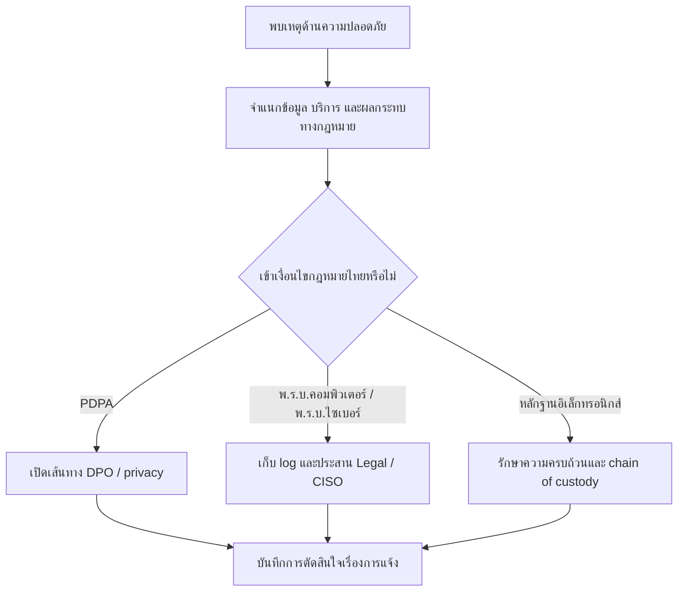

# แนวทางกฎหมายไซเบอร์ไทยสำหรับการปฏิบัติงาน SOC

**Document ID**: TH-LAW-SOC-001  
**Version**: 1.0  
**Classification**: Internal  
**Last Updated**: 2026-04-26  
**กลุ่มเป้าหมาย**: CISO, SOC Manager, IR Engineer, Security Engineer, Compliance Officer, Legal Counsel

> เอกสารนี้เป็นแนวทางปฏิบัติสำหรับ SOC ไม่ใช่คำปรึกษากฎหมาย ใช้เพื่อเปิด workflow ด้านหลักฐาน การยกระดับ และการตัดสินใจ ขณะที่ Legal, DPO หรือ Compliance เป็นผู้ยืนยันสถานะทางกฎหมายอย่างเป็นทางการ

## 1. วัตถุประสงค์และหลักปฏิบัติ

-   [ ] ใช้ baseline นี้เมื่อ incident อาจเกี่ยวข้องกับกฎหมายไทย privacy regulator law enforcement หรือบริการสำคัญ
-   [ ] ให้การประเมิน data breach ตาม PDPA อ้างอิง [คู่มือตอบเหตุข้อมูลรั่วตาม PDPA](PDPA_Incident_Response.th.md) และ [ขั้นตอนปฏิบัติตาม PDPA](PDPA_Compliance.th.md)
-   [ ] เก็บข้อเท็จจริงก่อนตีความ ได้แก่ เวลา asset owner ประเภทข้อมูล identity log source ผู้ดูแลหลักฐาน และ decision owner
-   [ ] ยกระดับเร็วเมื่อ incident เกี่ยวข้องกับข้อมูลส่วนบุคคล บริการสาธารณะ ระบบสำคัญ การกระทำผิดทางคอมพิวเตอร์ หรือคำขอจากหน่วยงานรัฐ

## 2. Baseline กฎหมายไทยสำหรับ SOC

| กฎหมาย / หน่วยงานอ้างอิง | ประเด็นที่ SOC ต้องระวัง | การดำเนินการหลักของ SOC | ผู้ตัดสินใจ |
|:---|:---|:---|:---|
| **พ.ร.บ.คุ้มครองข้อมูลส่วนบุคคล พ.ศ. 2562 (PDPA)** | ข้อมูลส่วนบุคคล ข้อมูลอ่อนไหว เจ้าของข้อมูลที่ได้รับผลกระทบ การแจ้งเหตุละเมิด | เปิด DPO review เก็บ breach timeline และเชื่อม evidence pack ของ PDPA | DPO + CISO |
| **พ.ร.บ.ว่าด้วยการกระทำความผิดเกี่ยวกับคอมพิวเตอร์ พ.ศ. 2550 และที่แก้ไข** | unauthorized access, data alteration, service disruption, malicious tools, unlawful content, traffic data | เก็บ traffic log ข้อมูลระบุตัวผู้ใช้ forensic image และบันทึกคำขอจาก law enforcement | Legal + CISO |
| **พ.ร.บ.การรักษาความมั่นคงปลอดภัยไซเบอร์ พ.ศ. 2562** | ภัยไซเบอร์ต่อบริการสำคัญ ความปลอดภัยสาธารณะ หรือ critical information infrastructure | ประเมินระดับภัย เตรียม coordination package และหลักฐานผลกระทบ | CISO + SOC Manager |
| **พ.ร.บ.ว่าด้วยธุรกรรมทางอิเล็กทรอนิกส์ พ.ศ. 2544 และที่แก้ไข** | electronic records, digital messages, logs, approvals, signatures, evidence reliability | รักษา integrity, authenticity, time source, system-of-record proof และ chain of custody | Legal + IR Lead |
| **NCSA / ThaiCERT coordination** | national advisory, sectoral CERT coordination, threat sharing, critical incident coordination | เตรียม IOC package, timeline, contact record และ approval สำหรับการแชร์ข้อมูล | CISO + Threat Intel Lead |

## 3. Matrix จาก Trigger ไปสู่ Action

| Incident trigger | การดำเนินการที่ต้องทำ | Owner | หลักฐานที่ต้องมี | จุดตัดสินใจเรื่องการแจ้ง |
|:---|:---|:---|:---|:---|
| ยืนยันหรือสงสัยว่าข้อมูลส่วนบุคคลรั่วไหล | เปิด PDPA assessment workflow และหยุดการลบ record ที่เกี่ยวข้อง | SOC Manager + DPO | incident timeline, ประเภทข้อมูล, ระบบที่กระทบ, ประมาณจำนวนเจ้าของข้อมูล | DPO ตัดสินเส้นทางการแจ้ง |
| มี unauthorized access ต่อระบบหรือข้อมูล | เก็บ authentication, network, endpoint และ application logs | IR Engineer | log bundle, account ที่กระทบ, source/destination, access method, containment timeline | Legal ตัดสิน law-enforcement path |
| บริการสำคัญหรือ public-facing service ถูกกระทบ | ประเมินว่าเข้าข่ายยกระดับตาม พ.ร.บ.ไซเบอร์หรือไม่ | CISO + SOC Manager | impact summary, คำยืนยันจาก service owner, downtime, กลุ่มผู้ได้รับผลกระทบ | CISO ตัดสิน executive/regulator path |
| ได้รับคำขอจาก authority, regulator หรือ sectoral CERT | ตรวจสอบช่องทางคำขอและเปิด response decision log | Legal + CISO | สำเนาคำขอ, identity ของผู้ขอ, เวลารับคำขอ, scope, response owner | Legal อนุมัติ response package |
| หลักฐานอิเล็กทรอนิกส์อาจใช้ในคดีหรือการสอบสวน | เปิด legal hold และ chain-of-custody handling | IR Lead + Legal | evidence register, hash values, custodian trail, time synchronization proof | Legal ยืนยัน preservation scope |

## 4. ชุดหลักฐานขั้นต่ำ

| หลักฐาน | เหตุผล | มาตรฐานขั้นต่ำ |
|:---|:---|:---|
| Incident timeline | รองรับ reporting, breach assessment และ executive decision | เวลา detect, triage, contain, escalate, recover และ decision |
| Asset และ service ownership | ระบุผู้รับผิดชอบเชิงธุรกิจและเทคนิค | business owner, technical owner, data owner, service criticality |
| Log และ traffic data package | รองรับ investigation และคำขอจาก authority | source system, retention status, collection time, completeness statement |
| Data-impact assessment | เชื่อม facts ทางเทคนิคกับ PDPA และ business impact | data class, ประมาณจำนวนเจ้าของข้อมูล, sensitive-data indicator, evidence confidence |
| Chain of custody | รักษาคุณค่าของหลักฐาน | custodian, transfer time, storage location, hash หรือ integrity marker |
| Notification decision log | แสดง governance ที่ตรวจสอบย้อนหลังได้ | facts reviewed, decision made, approver, time, next review point |

## 5. กติกาการยกระดับ

-   [ ] ยกระดับถึง **DPO + Legal + CISO ทันที** เมื่อข้อมูลส่วนบุคคลหรือข้อมูลอ่อนไหวอาจรั่วไหล
-   [ ] ยกระดับถึง **CISO + Legal** เมื่อมี unauthorized system access, สงสัยการกระทำผิด, destructive action หรือคำขอจากหน่วยงานรัฐ
-   [ ] ยกระดับถึง **CISO + SOC Manager + Business Service Owner** เมื่อภัยไซเบอร์กระทบบริการสำคัญหรืออาจกระทบความปลอดภัยสาธารณะ
-   [ ] ยกระดับถึง **IR Lead + Legal** ก่อนปล่อย ลบ reimage หรือคืน asset ที่อาจเป็นหลักฐาน
-   [ ] ใช้ [แบบฟอร์มการยกระดับเหตุด้านกฎหมายไทย](../11_Reporting_Templates/Thai_Legal_Escalation_Template.th.md) สำหรับการตัดสินใจสำคัญทุกครั้ง

## 6. Checklist ปฏิบัติการ 24 ชั่วโมงแรก

-   [ ] ยืนยันระบบที่กระทบ owner และ data classification
-   [ ] เก็บ log และป้องกัน automatic deletion สำหรับแหล่งข้อมูลที่เกี่ยวข้อง
-   [ ] แต่งตั้ง decision-log owner เพียงคนเดียว
-   [ ] แยกข้อเท็จจริงออกจากสมมติฐาน
-   [ ] แจ้ง Legal, DPO, Compliance หรือ CISO ตาม trigger matrix
-   [ ] เตรียม evidence package ก่อนสื่อสารภายนอกหรือ regulator
-   [ ] บันทึกเหตุผลว่าต้องแจ้ง ชะลอการแจ้ง หรือไม่ต้องแจ้ง

## เอกสารที่เกี่ยวข้อง (Related Documents)

-   [คู่มือตอบเหตุข้อมูลรั่วตาม PDPA](PDPA_Incident_Response.th.md)
-   [ขั้นตอนปฏิบัติตาม PDPA](PDPA_Compliance.th.md)
-   [Compliance Mapping](Compliance_Mapping.th.md)
-   [นโยบายกำกับดูแลข้อมูล](Data_Governance_Policy.th.md)
-   [บันทึกการตัดสินใจระหว่างเหตุการณ์](../11_Reporting_Templates/Incident_Decision_Log.th.md)
-   [แบบฟอร์มการยกระดับเหตุด้านกฎหมายไทย](../11_Reporting_Templates/Thai_Legal_Escalation_Template.th.md)

## References

-   [กระทรวงดิจิทัลเพื่อเศรษฐกิจและสังคม — Cybersecurity Act B.E. 2562 (2019)](https://www.mdes.go.th/law/detail/1904-Cybersecurity-Act--B-E--2562--2019-)
-   [กระทรวงดิจิทัลเพื่อเศรษฐกิจและสังคม — Computer-Related Crime Act B.E. 2550 (2007)](https://www.mdes.go.th/law/detail/3618-COMPUTER-RELATED-CRIME-ACT-B-E--2550--2007-)
-   [ETDA — Electronic Transactions Act laws and standards](https://www.etda.or.th/en/ETC/strategy-law-standard/law.aspx)
-   [PDPA Thailand — Personal Data Protection Act B.E. 2562 (2019)](https://pdpathailand.com/pdpa/index_eng.html)
-   [Government Platform for PDPA Compliance — Data Breach Notification Management](https://gppc.pdpc.or.th/)
-   [Thailand Computer Emergency Response Team / ThaiCERT](https://www.thaicert.or.th/en/homepage/)
