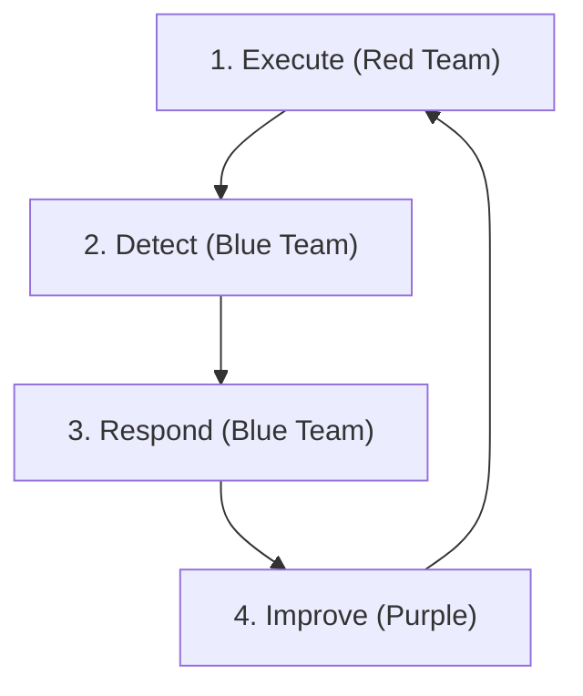

# Simulation & Purple Teaming Guide

This guide explains how to conduct a **Purple Team Exercise** (Red Team Attacks + Blue Team Defends) to validate the SOC's readiness using the provided Playbooks and Detection Rules.

## Prerequisites
1.  **Test Environment**: A dedicated VM or Lab (Do NOT run in Production).
2.  **Tools**:
    -   **Atomic Red Team**: For executing attacks.
    -   **Caldera** (Optional): For automated campaigns.
    -   **SIEM**: To view alerts.

## Execution Workflow (The Feedback Loop)



### Step 1: Execute (Red)
Run the Atomic Test corresponding to the Playbook you want to test.
*Example (Phishing)*:
```powershell
Invoke-AtomicTest T1059.001
```

### Step 2: Detect (Blue)
Check the SIEM Dashboard.
-   **Did the alert trigger?** (Check `proc_office_spawn_powershell.yml` logic).
-   **Was the severity correct?**
-   **Was all context captured?** (User, Host, Command Line).

### Step 3: Respond (Blue)
Open the Playbook (**PB-01 Phishing**).
-   Follow the steps: Analyze -> Contain -> Eradicate.
-   **Gap Analysis**: Did the playbook miss any steps? Was the containment tool (EDR) effective?

### Step 4: Improve (Purple)
-   **Tune Rule**: If alert didn't fire, adjust the Sigma rule.
-   **Update Playbook**: Add missing steps found during the drill.

## Schedule
Recommended Validation Schedule:
-   **Weekly**: Test 1 high-priority Playbook (Ransomware, Phishing).
-   **Monthly**: Test 3-5 random Playbooks.
-   **Quarterly**: Full Chain simulation (Phishing -> Lateral Mov -> Exfil).

## Test Coverage Matrix

| MITRE Tactic | Playbook(s) | Atomic Test(s) | Sigma Rule(s) | Last Tested | Result |
| :--- | :--- | :--- | :--- | :--- | :--- |
| Initial Access | PB-01 Phishing | T1566.001 | cloud_email_inbox_rule | [Date] | [Pass/Fail] |
| Execution | PB-11 Suspicious Script | T1059.001 | proc_powershell_encoded | [Date] | [Pass/Fail] |
| Persistence | PB-05 Account Compromise | T1078 | cloud_unusual_login | [Date] | [Pass/Fail] |
| Privilege Escalation | PB-06 Privilege Escalation | T1068 | win_domain_admin_group_add | [Date] | [Pass/Fail] |
| Defense Evasion | PB-20 Log Clearing | T1070.001 | win_security_log_cleared | [Date] | [Pass/Fail] |
| Credential Access | PB-04 Brute Force | T1110 | win_multiple_failed_logins | [Date] | [Pass/Fail] |
| Discovery | PB-34 Network Discovery | T1046/T1135 | win_network_discovery | [Date] | [Pass/Fail] |
| Lateral Movement | PB-09 Lateral Movement | T1021.002 | win_admin_share_access | [Date] | [Pass/Fail] |
| Collection | PB-35 Data Collection | T1560 | win_data_collection_staging | [Date] | [Pass/Fail] |
| Exfiltration | PB-08 Data Exfiltration | T1041 | net_large_upload | [Date] | [Pass/Fail] |
| C2 | PB-07 C2 Communication | T1071 | net_beaconing | [Date] | [Pass/Fail] |
| Impact | PB-02 Ransomware | T1486 | file_bulk_renaming | [Date] | [Pass/Fail] |

## Scoring Criteria

| Score | Definition | Action Required |
| :---: | :--- | :--- |
| ✅ **Pass** | Alert triggered within SLA, correct severity, full context captured | Log result, schedule re-test |
| ⚠️ **Partial** | Alert triggered but delay/missing context/wrong severity | Tune Sigma rule + update playbook |
| ❌ **Fail** | No alert triggered or completely missed | Create/fix Sigma rule, escalate gap |

## Exercise Report Template

After each exercise, document:

1. **Exercise Summary**: Date, scope, participants, techniques tested
2. **Detection Results**: Per-technique pass/partial/fail results
3. **Response Effectiveness**: Playbook steps followed, gaps identified
4. **Gap Analysis**: Missing detections, slow response, tool limitations
5. **Remediation Plan**: Sigma rule updates, playbook amendments, tool improvements
6. **Timeline**: Target dates for completing remediation items


## Lab Environment Setup

### Minimum Requirements
| Component | Specification | Purpose |
|:---|:---|:---|
| Windows 10/11 VM | 4GB RAM, 40GB disk | Target for attack simulations |
| Kali Linux VM | 2GB RAM, 20GB disk | Attack platform |
| SIEM | Wazuh/Elastic (single node) | Detection validation |
| EDR | Sysmon + Winlogbeat | Telemetry collection |
| Network bridge | Isolated VLAN/NAT network | Traffic isolation |

### Quick Setup Commands

#### Install Atomic Red Team (on Windows target)
```powershell
# Install from PowerShell Gallery
Set-ExecutionPolicy -Scope CurrentUser -ExecutionPolicy Bypass -Force
Install-Module -Name invoke-atomicredteam -Scope CurrentUser -Force
Import-Module invoke-atomicredteam

# Install all atomic tests
Install-AtomicRedTeam -getAtomics -Force

# Verify installation
Invoke-AtomicTest T1059.001 -ShowDetails
```

#### Install Sysmon (for telemetry)
```powershell
# Download Sysmon + SwiftOnSecurity config
Invoke-WebRequest -Uri "https://live.sysinternals.com/Sysmon64.exe" -OutFile Sysmon64.exe
Invoke-WebRequest -Uri "https://raw.githubusercontent.com/SwiftOnSecurity/sysmon-config/master/sysmonconfig-export.xml" -OutFile sysmonconfig.xml

# Install with config
.\Sysmon64.exe -accepteula -i sysmonconfig.xml
```

#### Install MITRE Caldera (attacker server)
```bash
# Clone Caldera
git clone https://github.com/mitre/caldera.git --recursive
cd caldera

# Run Caldera server
pip3 install -r requirements.txt
python3 server.py --insecure --build

# Access: http://localhost:8888 (default: admin/admin)
```

## Detailed Test Scenarios

### Scenario 1: Phishing → Malware → C2 (Full Kill Chain)

```
SETUP:
  1. Prepare phishing email with macro-enabled document
  2. Enable Sysmon + SIEM logging on target
  3. Set up C2 listener (Caldera agent or netcat)

EXECUTION:
  Step 1: T1566.001 — Deliver phishing email with attachment
  Step 2: T1204.002 — User opens attachment, enables macros
  Step 3: T1059.001 — PowerShell executes payload
  Step 4: T1071.001 — Callback to C2 over HTTP/HTTPS
  Step 5: T1082     — System discovery commands

VALIDATION:
  □ Email gateway detected phishing? (Yes/No)
  □ EDR blocked macro execution? (Yes/No)
  □ SIEM alert for PowerShell execution? (Yes/No)
  □ Network alert for C2 callback? (Yes/No)
  □ Playbook PB-01 followed correctly? (Yes/No)
  □ Time to detect: ___ min (target: ≤15 min)
```

### Scenario 2: Credential Theft → Lateral Movement

```
SETUP:
  1. Create test accounts with weak passwords
  2. Enable authentication logging
  3. Deploy Mimikatz on test VM

EXECUTION:
  Step 1: T1110.003 — Password spray against test accounts
  Step 2: T1078.002 — Login with compromised credentials
  Step 3: T1003.001 — Run Mimikatz for credential dump
  Step 4: T1021.002 — Move laterally via SMB/Admin share
  Step 5: T1570     — Copy tools to remote system

VALIDATION:
  □ Multiple failed login alerts triggered? (Yes/No)
  □ Successful login after failures flagged? (Yes/No)
  □ Mimikatz execution detected by EDR? (Yes/No)
  □ Lateral movement detected? (Yes/No)
  □ Playbook PB-04 + PB-12 followed? (Yes/No)
  □ Time to contain: ___ min (target: ≤30 min)
```

### Scenario 3: Ransomware Simulation

```
SETUP:
  1. Create test files in isolated folder
  2. Prepare benign "encryption" script (rename files)
  3. Disable real encryption — use rename only!

EXECUTION:
  Step 1: T1486 — Bulk rename files (.encrypted extension)
  Step 2: T1490 — Attempt shadow copy deletion command
  Step 3: T1489 — Stop key services (test services only)
  Step 4: T1485 — Create ransom note text file

VALIDATION:
  □ File rename bulk activity detected? (Yes/No)
  □ Shadow copy deletion attempt flagged? (Yes/No)
  □ Service stop alert triggered? (Yes/No)
  □ EDR auto-isolated the endpoint? (Yes/No)
  □ Playbook PB-02 followed correctly? (Yes/No)
  □ Time to isolate: ___ min (target: ≤5 min for P1)
```

## Post-Exercise Debrief Template

```markdown
## Purple Team Exercise Report — [DATE]

### Exercise Details
- **Facilitator**: [Name]
- **Red Team Lead**: [Name]
- **Blue Team Lead**: [Name]
- **Duration**: [X hours]
- **Environment**: [Lab description]

### Techniques Tested
| # | MITRE ID | Technique | Detection | Response | Score |
|:---|:---|:---|:---|:---|:---|
| 1 | TXXXX | [Name] | ✅/⚠️/❌ | ✅/⚠️/❌ | [0-10] |

### Overall Scores
- Detection Coverage: __/10
- Response Effectiveness: __/10
- Communication: __/10
- Documentation: __/10

### Gaps Identified
1. [Detection gap — no rule for TXXXX]
2. [Response gap — playbook missing step for X]
3. [Tool gap — EDR didn't block Y]

### Remediation Actions
| # | Action | Owner | Deadline | Priority |
|:---|:---|:---|:---|:---|
| 1 | Create Sigma rule for TXXXX | [Name] | [Date] | High |
| 2 | Update PB-XX with new step | [Name] | [Date] | Medium |

### Next Exercise
- **Date**: [Planned date]
- **Focus**: [Planned techniques/scenarios]
```

## Common Pitfalls

| Pitfall | Mitigation |
| :--- | :--- |
| Running tests in production | Always use dedicated lab/sandbox environment |
| No change control approval | Submit RFC before any simulation exercise |
| Testing without monitoring | Ensure SIEM, EDR, and network monitors are active |
| Skipping cleanup | Always reverse changes after test completion |
| No documentation of results | Use the report template above for every exercise |

## Related Documents
-   [Atomic Test Map](Atomic_Test_Map.en.md)
-   [Incident Response Framework](../05_Incident_Response/Framework.en.md)
-   [Detection Engineering Lifecycle](../03_User_Guides/Content_Management.en.md)

## References
-   [Atomic Red Team](https://github.com/redcanaryco/atomic-red-team)
-   [MITRE ATT&CK](https://attack.mitre.org/)
