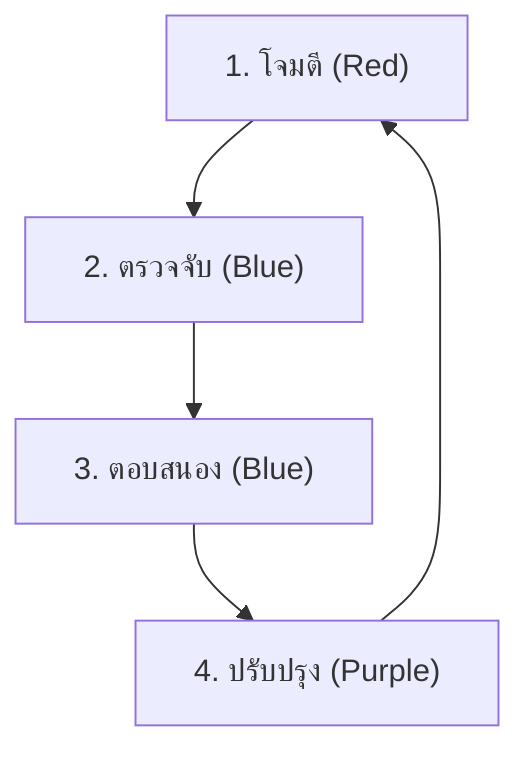

# คู่มือ Simulation & Purple Teaming

คู่มือนี้อธิบายวิธีทำ **Purple Team Exercise** (Red Team โจมตี + Blue Team ป้องกัน) เพื่อทดสอบความพร้อมของ SOC

## สิ่งที่ต้องมี
1. **สภาพแวดล้อมทดสอบ**: VM หรือ Lab เฉพาะ (ห้ามรันใน Production)
2. **เครื่องมือ**:
   - **Atomic Red Team**: สำหรับจำลองการโจมตี
   - **Caldera** (ตัวเลือก): สำหรับ campaign อัตโนมัติ
   - **SIEM**: สำหรับดู alert

## วงจรการทำงาน (Feedback Loop)



### ขั้นตอน 1: โจมตี (Red)
รัน Atomic Test ที่ตรงกับ Playbook ที่ต้องการทดสอบ
```powershell
Invoke-AtomicTest T1059.001
```

### ขั้นตอน 2: ตรวจจับ (Blue)
ตรวจ SIEM Dashboard:
- Alert trigger ไหม?
- Severity ถูกต้องไหม?
- มี context ครบไหม? (User, Host, Command Line)

### ขั้นตอน 3: ตอบสนอง (Blue)
เปิด Playbook แล้วทำตาม:
- วิเคราะห์ → Contain → กำจัด
- **Gap Analysis**: Playbook ขาดขั้นตอนอะไรไหม?

### ขั้นตอน 4: ปรับปรุง (Purple)
- **Tune Rule**: ถ้า alert ไม่ fire → ปรับ Sigma rule
- **Update Playbook**: เพิ่มขั้นตอนที่พบว่าขาด

## ตารางเวลาแนะนำ
- **รายสัปดาห์**: ทดสอบ 1 Playbook สำคัญ (Ransomware, Phishing)
- **รายเดือน**: ทดสอบ 3–5 Playbooks แบบสุ่ม
- **รายไตรมาส**: จำลอง full chain (Phishing → Lateral Mov → Exfil)

## ตารางครอบคลุมการทดสอบ

| MITRE Tactic | Playbook | Atomic Test | Sigma Rule | ผลลัพธ์ |
|:---|:---|:---|:---|:---|
| Initial Access | PB-01 Phishing | T1566.001 | cloud_email_inbox_rule | [ผ่าน/ไม่ผ่าน] |
| Execution | PB-11 Suspicious Script | T1059.001 | proc_powershell_encoded | [ผ่าน/ไม่ผ่าน] |
| Privilege Escalation | PB-06 | T1068 | win_domain_admin_group_add | [ผ่าน/ไม่ผ่าน] |
| Defense Evasion | PB-20 Log Clearing | T1070.001 | win_security_log_cleared | [ผ่าน/ไม่ผ่าน] |
| Lateral Movement | PB-09 | T1021.002 | win_admin_share_access | [ผ่าน/ไม่ผ่าน] |
| Exfiltration | PB-08 | T1041 | net_large_upload | [ผ่าน/ไม่ผ่าน] |
| Impact | PB-02 Ransomware | T1486 | file_bulk_renaming | [ผ่าน/ไม่ผ่าน] |

## เกณฑ์การให้คะแนน

| คะแนน | คำจำกัดความ | การดำเนินการ |
|:---:|:---|:---|
| ✅ **ผ่าน** | แจ้งเตือนภายใน SLA, ระดับความรุนแรงถูกต้อง | บันทึกผลลัพธ์ |
| ⚠️ **บางส่วน** | แจ้งเตือนแต่ล่าช้า/ขาดบริบท | ปรับ Sigma rule + อัปเดต Playbook |
| ❌ **ไม่ผ่าน** | ไม่มีแจ้งเตือน | สร้าง/แก้ไข Sigma rule |


## การตั้งค่าสภาพแวดล้อม Lab

### ข้อกำหนดขั้นต่ำ
| Component | Specification | วัตถุประสงค์ |
|:---|:---|:---|
| Windows 10/11 VM | 4GB RAM, 40GB disk | เป้าหมายจำลอง |
| Kali Linux VM | 2GB RAM, 20GB disk | แพลตฟอร์มโจมตี |
| SIEM | Wazuh/Elastic (single node) | ตรวจสอบ detection |
| EDR | Sysmon + Winlogbeat | เก็บ telemetry |
| Network bridge | Isolated VLAN/NAT | แยก traffic |

### คำสั่งติดตั้ง

#### ติดตั้ง Atomic Red Team (บน Windows เป้าหมาย)
```powershell
# ติดตั้งจาก PowerShell Gallery
Set-ExecutionPolicy -Scope CurrentUser -ExecutionPolicy Bypass -Force
Install-Module -Name invoke-atomicredteam -Scope CurrentUser -Force
Import-Module invoke-atomicredteam

# ติดตั้ง atomic tests ทั้งหมด
Install-AtomicRedTeam -getAtomics -Force

# ตรวจสอบการติดตั้ง
Invoke-AtomicTest T1059.001 -ShowDetails
```

#### ติดตั้ง Sysmon (สำหรับ telemetry)
```powershell
# ดาวน์โหลด Sysmon + config
Invoke-WebRequest -Uri "https://live.sysinternals.com/Sysmon64.exe" -OutFile Sysmon64.exe
Invoke-WebRequest -Uri "https://raw.githubusercontent.com/SwiftOnSecurity/sysmon-config/master/sysmonconfig-export.xml" -OutFile sysmonconfig.xml

# ติดตั้งพร้อม config
.\Sysmon64.exe -accepteula -i sysmonconfig.xml
```

#### ติดตั้ง MITRE Caldera (attacker server)
```bash
# Clone Caldera
git clone https://github.com/mitre/caldera.git --recursive
cd caldera

# รัน Caldera server
pip3 install -r requirements.txt
python3 server.py --insecure --build

# เข้าถึง: http://localhost:8888 (default: admin/admin)
```

## สถานการณ์ทดสอบโดยละเอียด

### สถานการณ์ 1: Phishing → Malware → C2 (Full Kill Chain)

```
เตรียม:
  1. เตรียม phishing email พร้อม macro document
  2. เปิด Sysmon + SIEM logging บนเป้าหมาย
  3. เตรียม C2 listener (Caldera agent หรือ netcat)

ดำเนินการ:
  ขั้นที่ 1: T1566.001 — ส่ง phishing email พร้อมไฟล์แนบ
  ขั้นที่ 2: T1204.002 — User เปิดไฟล์แนบ, เปิด macro
  ขั้นที่ 3: T1059.001 — PowerShell execute payload
  ขั้นที่ 4: T1071.001 — Callback กลับ C2 ผ่าน HTTP/HTTPS
  ขั้นที่ 5: T1082     — คำสั่ง system discovery

ตรวจสอบ:
  □ Email gateway ตรวจพบ phishing? (ใช่/ไม่)
  □ EDR block macro execution? (ใช่/ไม่)
  □ SIEM alert สำหรับ PowerShell? (ใช่/ไม่)
  □ Network alert สำหรับ C2 callback? (ใช่/ไม่)
  □ Playbook PB-01 ปฏิบัติตามถูกต้อง? (ใช่/ไม่)
  □ เวลาตรวจพบ: ___ นาที (เป้า: ≤15 นาที)
```

### สถานการณ์ 2: ขโมย Credential → Lateral Movement

```
เตรียม:
  1. สร้าง test accounts ที่มี password อ่อน
  2. เปิด authentication logging
  3. Deploy Mimikatz บน test VM

ดำเนินการ:
  ขั้นที่ 1: T1110.003 — Password spray ต่อ test accounts
  ขั้นที่ 2: T1078.002 — Login ด้วย credentials ที่ขโมย
  ขั้นที่ 3: T1003.001 — รัน Mimikatz dump credential
  ขั้นที่ 4: T1021.002 — ย้ายตัวผ่าน SMB/Admin share
  ขั้นที่ 5: T1570     — คัดลอก tools ไปเครื่องอื่น

ตรวจสอบ:
  □ Alert login ผิดพลาดหลายครั้ง trigger? (ใช่/ไม่)
  □ Login สำเร็จหลัง fail ถูก flag? (ใช่/ไม่)
  □ Mimikatz ถูก EDR ตรวจจับ? (ใช่/ไม่)
  □ Lateral movement ถูกตรวจจับ? (ใช่/ไม่)
  □ Playbook PB-04 + PB-12 ปฏิบัติตาม? (ใช่/ไม่)
  □ เวลา contain: ___ นาที (เป้า: ≤30 นาที)
```

### สถานการณ์ 3: Ransomware Simulation

```
เตรียม:
  1. สร้าง test files ใน folder ที่แยกออก
  2. เตรียม script เปลี่ยนชื่อไฟล์ (ไม่เข้ารหัสจริง!)
  3. ปิดการเข้ารหัสจริง — ใช้การเปลี่ยนชื่อเท่านั้น!

ดำเนินการ:
  ขั้นที่ 1: T1486 — เปลี่ยนชื่อไฟล์จำนวนมาก (.encrypted)
  ขั้นที่ 2: T1490 — ลอง delete shadow copy
  ขั้นที่ 3: T1489 — หยุด service (test services เท่านั้น)
  ขั้นที่ 4: T1485 — สร้าง ransom note

ตรวจสอบ:
  □ กิจกรรมเปลี่ยนชื่อไฟล์จำนวนมากถูกตรวจจับ? (ใช่/ไม่)
  □ Shadow copy deletion ถูก flag? (ใช่/ไม่)
  □ Service stop alert trigger? (ใช่/ไม่)
  □ EDR auto-isolate เครื่อง? (ใช่/ไม่)
  □ Playbook PB-02 ปฏิบัติตามถูกต้อง? (ใช่/ไม่)
  □ เวลา isolate: ___ นาที (เป้า: ≤5 นาที สำหรับ P1)
```

## Template รายงานหลังการฝึก

```markdown
## รายงาน Purple Team — [วันที่]

### รายละเอียดการฝึก
- **ผู้นำ**: [ชื่อ]
- **Red Team Lead**: [ชื่อ]
- **Blue Team Lead**: [ชื่อ]
- **ระยะเวลา**: [X ชม.]
- **สภาพแวดล้อม**: [คำอธิบาย Lab]

### Techniques ที่ทดสอบ
| # | MITRE ID | Technique | Detection | Response | คะแนน |
|:---|:---|:---|:---|:---|:---|
| 1 | TXXXX | [ชื่อ] | ✅/⚠️/❌ | ✅/⚠️/❌ | [0-10] |

### คะแนนรวม
- Detection Coverage: __/10
- Response Effectiveness: __/10
- Communication: __/10
- Documentation: __/10

### ช่องโหว่ที่พบ
1. [Detection gap — ไม่มี rule สำหรับ TXXXX]
2. [Response gap — playbook ขาดขั้นตอน X]
3. [Tool gap — EDR ไม่ block Y]

### แผนแก้ไข
| # | Action | เจ้าของ | กำหนด | Priority |
|:---|:---|:---|:---|:---|
| 1 | สร้าง Sigma rule สำหรับ TXXXX | [ชื่อ] | [วันที่] | สูง |
| 2 | อัปเดต PB-XX เพิ่มขั้นตอน | [ชื่อ] | [วันที่] | กลาง |

### การฝึกครั้งต่อไป
- **วันที่**: [วันที่วางแผน]
- **โฟกัส**: [techniques/scenarios ที่วางแผน]
```

## ข้อผิดพลาดที่พบบ่อย

| ข้อผิดพลาด | วิธีป้องกัน |
|:---|:---|
| รันในระบบ Production | ใช้สภาพแวดล้อม Lab/Sandbox เท่านั้น |
| ไม่มีการอนุมัติ Change Control | ยื่น RFC ก่อนทำ Simulation |
| ทดสอบโดยไม่เปิด Monitoring | ตรวจสอบว่า SIEM, EDR ทำงานอยู่ |
| ไม่ทำ Cleanup หลังทดสอบ | ย้อนกลับการเปลี่ยนแปลงทุกครั้ง |

### Safety Protocols

| Rule | Description | Enforcement |
|:---|:---|:---|
| No production data | ใช้ synthetic data only | Pre-check |
| Kill switch | หยุดได้ทันที | White team |
| Scope boundary | ห้ามเกิน scope | ROE document |
| Time window | ในเวลาที่กำหนดเท่านั้น | Calendar |
| Communication | แจ้ง NOC ก่อนเริ่ม | Email + Chat |

### Post-Simulation Debrief Agenda

| เวลา | หัวข้อ | ผู้นำ |
|:---|:---|:---|
| 0-10 min | Overview + timeline | Facilitator |
| 10-25 min | Attack narrative | Red team |
| 25-40 min | Detection narrative | Blue team |
| 40-55 min | Gap analysis | All |
| 55-60 min | Action items | Facilitator |

## เอกสารที่เกี่ยวข้อง
- [Atomic Test Map](Atomic_Test_Map.en.md)
- [IR Framework](../05_Incident_Response/Framework.th.md)
- [Detection Engineering](../03_User_Guides/Content_Management.th.md)
