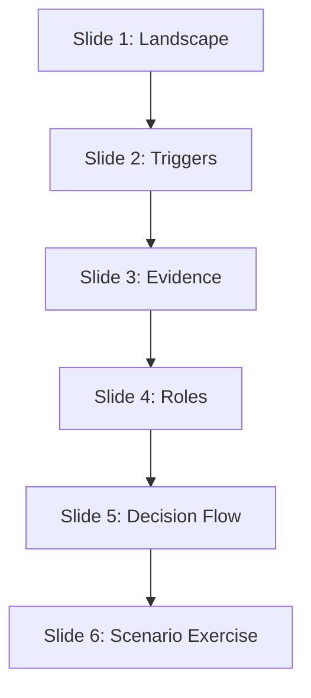
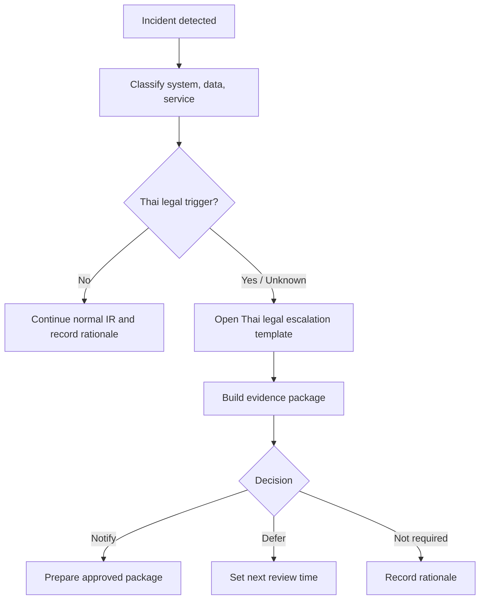

# Thai Compliance Workshop Module for SOC Teams

**Document ID**: TRAIN-TH-LAW-001  
**Version**: 1.0  
**Classification**: Internal  
**Last Updated**: 2026-04-26  
**Audience**: CISO, SOC Manager, SOC Analyst, Security Engineer, IR Engineer

> Use this as a concise 6-slide module inside a 1-day SOC workshop. It provides operational SOC guidance, not legal advice. Legal, DPO, or Compliance owns the final interpretation and notification position.

## 1. Slide 1 — Thai Legal Landscape for SOC

**Message**: Thai compliance is not only a Legal topic. SOC must turn technical facts into decision-ready evidence.

| Legal / coordination anchor | What SOC must watch | Operational output |
|:---|:---|:---|
| **PDPA** | Personal data exposure, sensitive personal data, affected data subjects | DPO-ready breach facts and notification checkpoint |
| **Computer-Related Crime Act** | Unauthorized access, data alteration, malicious activity, traffic data | Preserved logs, attribution evidence, legal handoff |
| **Cybersecurity Act** | Cyber threat affecting critical services or public impact | CISO escalation and coordination package |
| **Electronic Transactions Act** | Electronic records, approvals, digital evidence integrity | Chain of custody and system-of-record proof |
| **NCSA / ThaiCERT** | National or sectoral threat coordination | IOC package and approved sharing record |

## 2. Slide 2 — Incident and Reporting Triggers

**Message**: SOC does not decide the law alone. SOC decides when the legal checkpoint must open.

-   [ ] Open the checkpoint when personal data may be exposed, copied, altered, encrypted, destroyed, or accessed by an unauthorized party.
-   [ ] Open the checkpoint when logs suggest unauthorized system access, data tampering, destructive action, or use of malicious tooling.
-   [ ] Open the checkpoint when a critical service, public-facing service, or regulated business process is disrupted.
-   [ ] Open the checkpoint when an authority, regulator, customer, partner, NCSA, ThaiCERT, or sectoral CERT contacts the organization.
-   [ ] Record every decision as **notify**, **defer**, or **not required**, with approver and next review time.

## 3. Slide 3 — Evidence Package

**Message**: A weak evidence package creates slow decisions, inconsistent statements, and avoidable regulatory risk.

| Evidence | Minimum content | Owner |
|:---|:---|:---|
| Incident timeline | Detection, triage, escalation, containment, recovery, and decision timestamps | SOC Manager |
| Data-impact facts | Data class, personal-data indicator, sensitive-data indicator, affected estimate | DPO + SOC Analyst |
| Technical proof | Log sources, time range, source/destination, account, endpoint, hash, IOC | Security Engineer |
| Business impact | Affected service, criticality, downtime, customer or public impact | Service Owner |
| Chain of custody | Custodian, collection time, storage location, integrity marker | IR Engineer |
| Decision log | Facts reviewed, decision, approver, deadline, next review | Legal / CISO |

## 4. Slide 4 — Role-Based Responsibilities

**Message**: Practical compliance works when every role knows what to produce in the first operating cycle.

| Role | First responsibility | Decision artifact |
|:---|:---|:---|
| **SOC Analyst** | Preserve alert facts and avoid unsupported conclusions | Triage notes and evidence pointers |
| **SOC Manager** | Classify severity, assign owners, and start decision log | Escalation record |
| **Security Engineer** | Confirm log completeness, retention, and technical scope | Log package and telemetry gap note |
| **IR Engineer** | Preserve evidence, containment timeline, and custody trail | Forensic and chain-of-custody record |
| **DPO / Legal / Compliance** | Decide legal interpretation and notification position | Notification decision record |
| **CISO** | Own executive escalation and risk acceptance | Executive brief |

## 5. Slide 5 — Decision Flow

**Message**: The goal is not to over-report. The goal is to make a defensible decision on time.

## 6. Slide 6 — Scenario Exercise

**Scenario**: A public-facing customer portal shows signs of credential stuffing followed by successful logins. Some accounts viewed profile pages and downloaded invoices. The service remained available. A customer posts screenshots on social media and asks whether the organization will notify regulators.

**Exercise tasks**:

-   [ ] Identify which Thai legal checkpoints open and why.
-   [ ] List the first 10 evidence items SOC must preserve.
-   [ ] Assign owner for SOC, DPO, Legal, CISO, Security Engineering, and IR Engineering actions.
-   [ ] Draft the executive escalation brief in five bullets.
-   [ ] Decide whether the notification decision is **notify**, **defer**, or **not required** at the current evidence level.
-   [ ] Write the next review time and missing facts.

## Related Documents

-   [Thai Cyber Legal Baseline](../07_Compliance_Privacy/Thai_Cyber_Legal_Baseline.en.md)
-   [Thai Legal Escalation Template](../11_Reporting_Templates/Thai_Legal_Escalation_Template.en.md)
-   [PDPA Incident Response](../07_Compliance_Privacy/PDPA_Incident_Response.en.md)
-   [Compliance Mapping](../07_Compliance_Privacy/Compliance_Mapping.en.md)
-   [Incident Decision Log](../11_Reporting_Templates/Incident_Decision_Log.en.md)
-   [SOC Analyst Onboarding](SOC_Onboarding.en.md)

## References

-   [Ministry of Digital Economy and Society — Cybersecurity Act B.E. 2562 (2019)](https://www.mdes.go.th/law/detail/1904-Cybersecurity-Act--B-E--2562--2019-)
-   [Ministry of Digital Economy and Society — Computer-Related Crime Act B.E. 2550 (2007)](https://www.mdes.go.th/law/detail/3618-COMPUTER-RELATED-CRIME-ACT-B-E--2550--2007-)
-   [ETDA — Electronic Transactions Act laws and standards](https://www.etda.or.th/en/ETC/strategy-law-standard/law.aspx)
-   [Government Platform for PDPA Compliance — Data Breach Notification Management](https://gppc.pdpc.or.th/)
-   [Thailand Computer Emergency Response Team / ThaiCERT](https://www.thaicert.or.th/en/homepage/)
