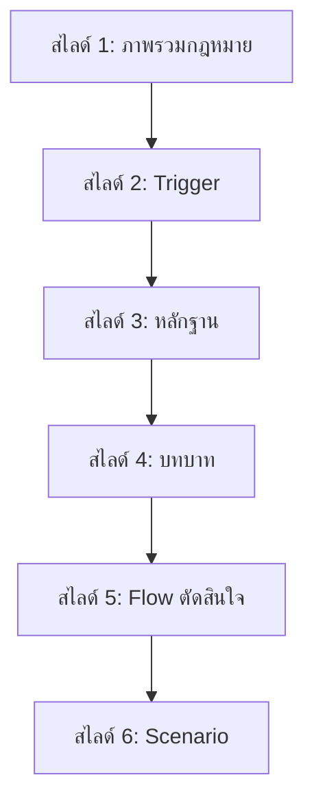
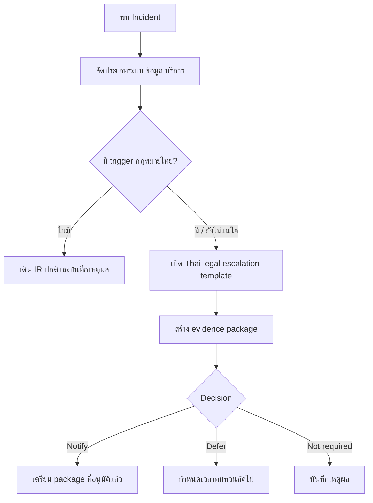

# โมดูล Workshop กฎหมายไทยสำหรับทีม SOC

**รหัสเอกสาร**: TRAIN-TH-LAW-001  
**เวอร์ชัน**: 1.0  
**ชั้นความลับ**: Internal  
**อัปเดตล่าสุด**: 2026-04-26  
**ผู้อ่านหลัก**: CISO, SOC Manager, SOC Analyst, Security Engineer, IR Engineer

> ใช้เป็น module 6 สไลด์ใน workshop SOC แบบ 1 วัน เนื้อหานี้เป็นแนวทางปฏิบัติสำหรับ SOC ไม่ใช่คำปรึกษากฎหมาย การตีความและการตัดสินใจแจ้งหน่วยงานภายนอกต้องให้ Legal, DPO หรือ Compliance เป็นผู้ยืนยัน

## 1. สไลด์ 1 — ภาพรวมกฎหมายไทยสำหรับ SOC (Thai Legal Landscape)

**ข้อความหลัก**: Compliance ไทยไม่ใช่เรื่องของ Legal อย่างเดียว SOC ต้องเปลี่ยน fact ทางเทคนิคให้เป็นหลักฐานที่ใช้ตัดสินใจได้

| กฎหมาย / หน่วยประสานงาน | สิ่งที่ SOC ต้องเฝ้าระวัง | Output เชิงปฏิบัติ |
|:---|:---|:---|
| **PDPA** | ข้อมูลส่วนบุคคลรั่วไหล ข้อมูลอ่อนไหว เจ้าของข้อมูลที่ได้รับผลกระทบ | fact สำหรับ DPO และ checkpoint การแจ้งเหตุ |
| **พ.ร.บ. คอมพิวเตอร์** | unauthorized access, แก้ไขข้อมูล, กิจกรรม malicious, traffic data | log ที่เก็บรักษาแล้ว หลักฐาน attribution และ handoff ให้ Legal |
| **พ.ร.บ. ไซเบอร์** | ภัยคุกคามที่กระทบบริการสำคัญหรือประชาชน | escalation ถึง CISO และชุดข้อมูลเพื่อประสานงาน |
| **พ.ร.บ. ธุรกรรมอิเล็กทรอนิกส์** | electronic record, approval, digital evidence integrity | chain of custody และหลักฐาน system of record |
| **NCSA / ThaiCERT** | การประสานภัยระดับประเทศหรือระดับ sector | IOC package และบันทึกอนุมัติการแชร์ |

## 2. สไลด์ 2 — Trigger ของ Incident และการรายงาน (Incident and Reporting Triggers)

**ข้อความหลัก**: SOC ไม่ต้องตัดสินกฎหมายเอง แต่ต้องรู้ว่าเมื่อใดต้องเปิด legal checkpoint

-   [ ] เปิด checkpoint เมื่อข้อมูลส่วนบุคคลอาจถูกเปิดเผย คัดลอก แก้ไข เข้ารหัส ทำลาย หรือเข้าถึงโดยผู้ไม่มีสิทธิ์
-   [ ] เปิด checkpoint เมื่อ log ชี้ว่าอาจมี unauthorized access, data tampering, destructive action หรือ malicious tooling
-   [ ] เปิด checkpoint เมื่อบริการสำคัญ บริการสาธารณะ หรือกระบวนการธุรกิจที่ถูกกำกับหยุดชะงัก
-   [ ] เปิด checkpoint เมื่อ authority, regulator, customer, partner, NCSA, ThaiCERT หรือ sectoral CERT ติดต่อองค์กร
-   [ ] บันทึกทุก decision เป็น **notify**, **defer** หรือ **not required** พร้อม approver และเวลาทบทวนถัดไป

## 3. สไลด์ 3 — ชุดหลักฐาน (Evidence Package)

**ข้อความหลัก**: Evidence package ที่อ่อนทำให้ตัดสินใจช้า สื่อสารไม่ตรงกัน และเพิ่มความเสี่ยงด้าน regulatory

| หลักฐาน | เนื้อหาขั้นต่ำ | เจ้าของ |
|:---|:---|:---|
| Incident timeline | เวลา detect, triage, escalate, contain, recover และ decision | SOC Manager |
| Data-impact facts | data class, personal-data indicator, sensitive-data indicator, affected estimate | DPO + SOC Analyst |
| Technical proof | log source, time range, source/destination, account, endpoint, hash, IOC | Security Engineer |
| Business impact | affected service, criticality, downtime, customer หรือ public impact | Service Owner |
| Chain of custody | custodian, collection time, storage location, integrity marker | IR Engineer |
| Decision log | fact ที่ทบทวนแล้ว decision, approver, deadline, next review | Legal / CISO |

## 4. สไลด์ 4 — หน้าที่ตามบทบาท (Role-Based Responsibilities)

**ข้อความหลัก**: Compliance ที่ใช้ได้จริงเกิดจากแต่ละ role รู้ว่าต้องส่งมอบอะไรในรอบปฏิบัติการแรก

| บทบาท | หน้าที่แรก | Artifact การตัดสินใจ |
|:---|:---|:---|
| **SOC Analyst** | เก็บ fact จาก alert และหลีกเลี่ยง conclusion ที่ยังไม่มีหลักฐาน | triage notes และ evidence pointers |
| **SOC Manager** | จัด severity, assign owner และเปิด decision log | escalation record |
| **Security Engineer** | ยืนยัน log completeness, retention และ technical scope | log package และ telemetry gap note |
| **IR Engineer** | รักษาหลักฐาน containment timeline และ custody trail | forensic และ chain-of-custody record |
| **DPO / Legal / Compliance** | ตีความกฎหมายและตัดสิน notification position | notification decision record |
| **CISO** | รับผิดชอบ executive escalation และ risk acceptance | executive brief |

## 5. สไลด์ 5 — Flow การตัดสินใจ (Decision Flow)

**ข้อความหลัก**: เป้าหมายไม่ใช่การแจ้งทุกเหตุ แต่คือการตัดสินใจให้ทันเวลาและอธิบายเหตุผลได้

## 6. สไลด์ 6 — Scenario Exercise

**Scenario**: ระบบ customer portal สาธารณะมีสัญญาณ credential stuffing แล้วตามด้วย login สำเร็จ บางบัญชีเปิดดู profile และดาวน์โหลด invoice บริการยังใช้งานได้ ลูกค้าคนหนึ่งโพสต์ภาพบน social media และถามว่าองค์กรจะแจ้ง regulator หรือไม่

**งานที่ต้องทำ**:

-   [ ] ระบุว่า checkpoint กฎหมายไทยใดต้องเปิด และเพราะอะไร
-   [ ] ระบุหลักฐาน 10 รายการแรกที่ SOC ต้อง preserve
-   [ ] กำหนด owner ของงาน SOC, DPO, Legal, CISO, Security Engineering และ IR Engineering
-   [ ] ร่าง executive escalation brief 5 bullet
-   [ ] ตัดสินว่าในระดับหลักฐานปัจจุบัน decision เป็น **notify**, **defer** หรือ **not required**
-   [ ] ระบุเวลาทบทวนถัดไปและ fact ที่ยังขาด

## เอกสารที่เกี่ยวข้อง (Related Documents)

-   [Thai Cyber Legal Baseline](../07_Compliance_Privacy/Thai_Cyber_Legal_Baseline.th.md)
-   [Thai Legal Escalation Template](../11_Reporting_Templates/Thai_Legal_Escalation_Template.th.md)
-   [PDPA Incident Response](../07_Compliance_Privacy/PDPA_Incident_Response.th.md)
-   [Compliance Mapping](../07_Compliance_Privacy/Compliance_Mapping.th.md)
-   [Incident Decision Log](../11_Reporting_Templates/Incident_Decision_Log.th.md)
-   [SOC Analyst Onboarding](SOC_Onboarding.th.md)

## References

-   [Ministry of Digital Economy and Society — Cybersecurity Act B.E. 2562 (2019)](https://www.mdes.go.th/law/detail/1904-Cybersecurity-Act--B-E--2562--2019-)
-   [Ministry of Digital Economy and Society — Computer-Related Crime Act B.E. 2550 (2007)](https://www.mdes.go.th/law/detail/3618-COMPUTER-RELATED-CRIME-ACT-B-E--2550--2007-)
-   [ETDA — Electronic Transactions Act laws and standards](https://www.etda.or.th/en/ETC/strategy-law-standard/law.aspx)
-   [Government Platform for PDPA Compliance — Data Breach Notification Management](https://gppc.pdpc.or.th/)
-   [Thailand Computer Emergency Response Team / ThaiCERT](https://www.thaicert.or.th/en/homepage/)
