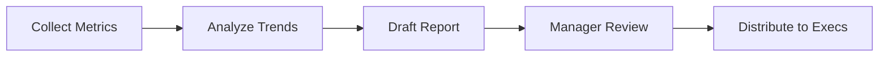

# Monthly SOC Performance Report

**Month**: [MM/YYYY]
**Prepared By**: [SOC Manager Name]
**Distribution**: CIO, CISO, IT Director

## 1. Executive Summary

*Provide a 3-5 sentence summary of the SOC's performance this month. Highlight any major incidents or achievements.*
*Provide a 3-5 sentence summary of the SOC's performance this month. Highlight any major incidents or achievements.*

## 2. Key Performance Indicators (KPIs)

| Metric | Target | Actual | Status |
| :--- | :--- | :--- | :--- |
| **MTTD** (Mean Time To Detect) | < 30 Mins | [XX] Mins | [🟢/🔴] |
| **MTTR** (Mean Time To Respond) | < 60 Mins | [XX] Mins | [🟢/🔴] |
| **Total Alerts Processed** | N/A | [XXXX] | N/A |
| **Valid Incidents** | N/A | [XX] | N/A |
| **False Positive Rate** | < 10% | [XX]% | [🟢/🔴] |

## 3. Incident Highlights
*List the top 3 most significant incidents.*

### Incident #1: [Brief Title, e.g., CFO Phishing Attempt]
-   **Date**: [YYYY-MM-DD]
-   **Impact**: [None / Data Loss / Downtime]
-   **Resolution**: [Blocked sender, reset password]
-   **Root Cause**: [User error / Lack of MFA]

## 4. Threat Landscape Analysis
*What trends are we seeing?*
-   [ ] Increase in Phishing attacks targeting HR.
-   [ ] Brute force attempts against VPN.

## 5. Projects & Improvements
-   [ ] Tuned 5 noisy detection rules.
-   [ ] Onboarded [New Log Source].
-   [ ] Completed [Training Module].

## References
-   [SANS SOC Metrics](https://www.sans.org/white-papers/)
-   [SOC-CMM](https://www.soc-cmm.com/)
