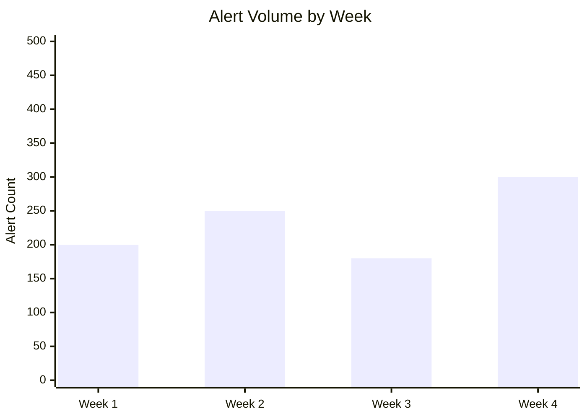

# Monthly SOC Performance Report

**Month**: [MM/YYYY]
**Prepared By**: [SOC Manager Name]
**Distribution**: CIO, CISO, IT Director

## 1. Executive Summary

*Provide a 3-5 sentence summary of the SOC's performance this month. Highlight any major incidents or achievements.*

## 2. Key Performance Indicators (KPIs)

| Metric | Target | Actual | Status | Trend |
| :--- | :--- | :--- | :--- | :--- |
| **MTTD** (Mean Time To Detect) | < 30 Mins | [XX] Mins | [🟢/🔴] | [↑/↓/→] |
| **MTTR** (Mean Time To Respond) | < 60 Mins | [XX] Mins | [🟢/🔴] | [↑/↓/→] |
| **MTTC** (Mean Time To Contain) | < 4 Hrs | [XX] Hrs | [🟢/🔴] | [↑/↓/→] |
| **Total Alerts Processed** | N/A | [XXXX] | N/A | [↑/↓/→] |
| **Valid Incidents** | N/A | [XX] | N/A | [↑/↓/→] |
| **False Positive Rate** | < 10% | [XX]% | [🟢/🔴] | [↑/↓/→] |
| **SLA Compliance** | > 95% | [XX]% | [🟢/🔴] | [↑/↓/→] |
| **Escalation Rate (Tier1→Tier2)** | < 30% | [XX]% | [🟢/🔴] | [↑/↓/→] |

## 3. Incident Breakdown by Category

| Category | Count | Severity | MTTD | MTTR | Status |
| :--- | :---: | :--- | :--- | :--- | :--- |
| Phishing / BEC | [X] | [H/M/L] | [XX] min | [XX] min | Resolved |
| Malware / Ransomware | [X] | [H/M/L] | [XX] min | [XX] min | Resolved |
| Account Compromise | [X] | [H/M/L] | [XX] min | [XX] min | Resolved |
| Data Exfiltration / DLP | [X] | [H/M/L] | [XX] min | [XX] min | Resolved |
| Insider Threat | [X] | [H/M/L] | [XX] min | [XX] min | Resolved |
| Cloud / SaaS | [X] | [H/M/L] | [XX] min | [XX] min | Resolved |
| Other | [X] | [H/M/L] | [XX] min | [XX] min | Resolved |

## 4. Incident Highlights
*List the top 3 most significant incidents.*

### Incident #1: [Brief Title, e.g., CFO Phishing Attempt]
-   **Date**: [YYYY-MM-DD]
-   **Severity**: [Critical/High/Medium/Low]
-   **Impact**: [None / Data Loss / Downtime / Financial]
-   **MITRE ATT&CK**: [Technique ID]
-   **Resolution**: [Blocked sender, reset password]
-   **Root Cause**: [User error / Lack of MFA]
-   **Lessons Learned**: [What could be improved]

## 5. Alert Trend Analysis

| Alert Source | This Month | Last Month | Change |
| :--- | :---: | :---: | :--- |
| EDR / Endpoint | [XXX] | [XXX] | [↑/↓] XX% |
| SIEM / Correlation | [XXX] | [XXX] | [↑/↓] XX% |
| Email Gateway | [XXX] | [XXX] | [↑/↓] XX% |
| Cloud Security (CASB/CSPM) | [XXX] | [XXX] | [↑/↓] XX% |
| Network (IDS/IPS/NDR) | [XXX] | [XXX] | [↑/↓] XX% |
| Identity (IdP) | [XXX] | [XXX] | [↑/↓] XX% |

## 6. Threat Landscape Analysis
*What trends are we seeing?*
-   [ ] Increase in Phishing attacks targeting HR.
-   [ ] Brute force attempts against VPN.
-   [ ] New malware variants observed in sandbox.
-   [ ] Cloud misconfigurations increasing.

### Top MITRE ATT&CK Techniques Observed

| Technique | Count | Playbook Used |
| :--- | :---: | :--- |
| T1566 Phishing | [X] | PB-01 |
| T1078 Valid Accounts | [X] | PB-05 |
| T1059 Command/Script | [X] | PB-11 |
| T1486 Data Encrypted | [X] | PB-02 |

## 7. Staffing & Training

| Metric | Value |
| :--- | :--- |
| Analysts on Shift (avg) | [X] |
| Overtime Hours | [X] |
| Training Hours Completed | [X] |
| Certifications Earned | [X] |
| Open Positions | [X] |

## 8. Projects & Improvements
-   [ ] Tuned [X] noisy detection rules.
-   [ ] Onboarded [New Log Source].
-   [ ] Completed [Training Module].
-   [ ] Deployed [New Tool/Integration].
-   [ ] Created [X] new Sigma detection rules.

## 9. Recommendations

| Priority | Recommendation | Owner | Target Date |
| :--- | :--- | :--- | :--- |
| 🔴 High | [e.g., Enable MFA for all admin accounts] | [Owner] | [Date] |
| 🟡 Medium | [e.g., Onboard cloud audit logs] | [Owner] | [Date] |
| 🟢 Low | [e.g., Update phishing awareness training] | [Owner] | [Date] |

## Related Documents
-   [SOC Metrics & KPIs](../06_Operations_Management/SOC_Metrics.en.md)
-   [Quarterly Business Review](Quarterly_Business_Review.en.md)
-   [SOC Assessment Checklist](../06_Operations_Management/SOC_Assessment_Checklist.en.md)

## References
-   [SANS SOC Metrics](https://www.sans.org/white-papers/)
-   [SOC-CMM](https://www.soc-cmm.com/)
