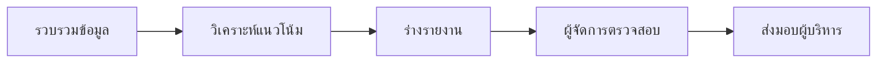

# รายงานผลการดำเนินงาน SOC ประจำเดือน

**ประจำเดือน**: [ด/ปปปป]
**จัดทำโดย**: [ชื่อผู้จัดการ SOC]
**ผู้รับมอบ**: CIO, CISO, IT Director

## 1. บทสรุปผู้บริหาร (Executive Summary)

*สรุปภาพรวมการทำงานของ SOC ในเดือนนี้ 3-5 ประโยค เน้นเหตุการณ์สำคัญหรือความสำเร็จ*
*สรุปภาพรวมการทำงานของ SOC ในเดือนนี้ 3-5 ประโยค เน้นเหตุการณ์สำคัญหรือความสำเร็จ*

## 2. ตัวชี้วัดผลการดำเนินงาน (KPIs)

| ตัวชี้วัด (Metric) | เป้าหมาย (Target) | ผลลัพธ์ (Actual) | สถานะ |
| :--- | :--- | :--- | :--- |
| **MTTD** (เวลาตรวจจับเฉลี่ย) | < 30 นาที | [XX] นาที | [🟢/🔴] |
| **MTTR** (เวลาตอบสนองเฉลี่ย) | < 60 นาที | [XX] นาที | [🟢/🔴] |
| **จำนวน Alert ทั้งหมด** | - | [XXXX] | - |
| **จำนวน Incident จริง** | - | [XX] | - |
| **อัตรา False Positive** | < 10% | [XX]% | [🟢/🔴] |

## 3. เหตุการณ์สำคัญ (Incident Highlights)
*ระบุ 3 เหตุการณ์ที่สำคัญที่สุด*

### เหตุการณ์ที่ 1: [ชื่อเหตุการณ์ เช่น ตรวจพบมัลแวร์เครื่องฝ่ายการเงิน]
-   **วันที่**: [YYYY-MM-DD]
-   **ผลกระทบ**: [ไม่มี / ข้อมูลรั่วไหล / ระบบหยุดทำงาน]
-   **การแก้ไข**: [กักกันเครื่อง, ลง Windows ใหม่]
-   **สาเหตุ**: [User เปิดไฟล์แนบอันตราย]

## 4. วิเคราะห์แนวโน้มภัยคุกคาม (Threat Landscape)
*แนวโน้มที่พบในเดือนนี้*
-   [ ] พบการโจมตี Phishing เพิ่มขึ้นในแผนกบุคคล
-   [ ] มีการพยายามเดารหัสผ่าน VPN บ่อยครั้ง

## 5. โครงการและการปรับปรุง
-   [ ] ปรับปรุงกฎ Alert ที่แจ้งเตือนผิดพลาด 5 กฎ
-   [ ] นำเข้า Log ใหม่จาก [ระบบ]
-   [ ] อบรมพนักงานเรื่อง [หัวข้อ]

## References
-   [SANS SOC Metrics](https://www.sans.org/white-papers/)
-   [SOC-CMM](https://www.soc-cmm.com/)
