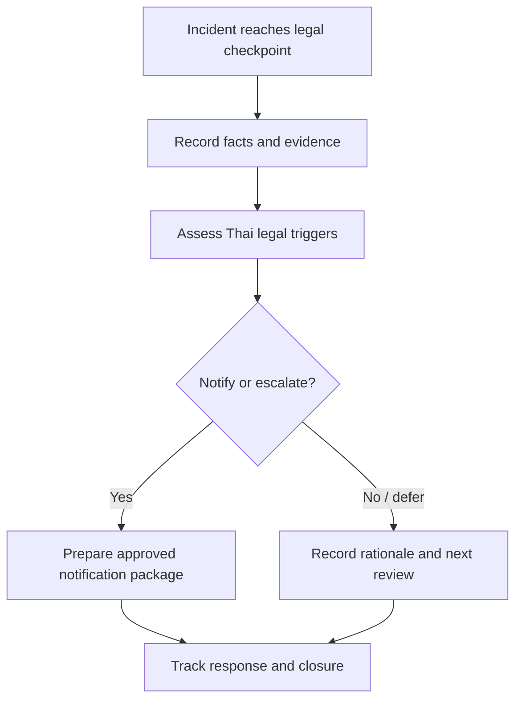

# Thai Legal Escalation Template

**Document ID**: TH-LAW-TPL-001  
**Version**: 1.0  
**Classification**: Internal  
**Last Updated**: 2026-04-26  
**Audience**: CISO, SOC Manager, IR Lead, Legal Counsel, DPO, Compliance Officer

> Use this template to record legal-impact triage, regulator-notification decisions, and executive escalation for incidents that may trigger Thai legal obligations. This template is operational guidance, not legal advice.

## 1. Use This Template When

-   [ ] Personal data, sensitive personal data, or regulated records may be exposed.
-   [ ] Unauthorized access, data alteration, traffic-data preservation, or suspected criminal activity is involved.
-   [ ] A critical business service, public-facing service, or potential critical information infrastructure is disrupted.
-   [ ] A regulator, authority, customer, sectoral CERT, or law-enforcement body may need to be contacted.
-   [ ] Evidence may need legal hold, forensic preservation, or chain-of-custody controls.

## 2. Incident and Decision Header

| Field | Value |
|:---|:---|
| **Incident ID** | INC-[YYYYMMDD]-[001] |
| **Legal escalation ID** | THLAW-[YYYYMMDD]-[001] |
| **Incident title** | |
| **Date/time opened** | [YYYY-MM-DD HH:MM TZ] |
| **Decision owner** | |
| **SOC owner** | |
| **Legal / DPO owner** | |
| **Current severity** | P1 / P2 / P3 / P4 |
| **TLP** | CLEAR / GREEN / AMBER / RED |

## 3. Thai Legal Impact Checkpoint

| Trigger question | Yes/No/Unknown | Evidence | Owner |
|:---|:---:|:---|:---|
| Does the incident involve personal data or sensitive personal data? | | | DPO |
| Is unauthorized access, alteration, deletion, disruption, or malicious tooling suspected? | | | IR Lead |
| Is traffic data, user identity data, or system access evidence required? | | | Security Engineer |
| Is a critical service, public-facing service, or CII-related service affected? | | | CISO |
| Has any authority, regulator, customer, or sectoral CERT contacted the organization? | | | Legal |
| Is legal hold or forensic chain of custody required? | | | Legal + IR Lead |

## 4. Notification Decision Record

| Potential notification path | Decision | Approver | Due time | Evidence package |
|:---|:---:|:---|:---|:---|
| PDPA / DPO path | ☐ Notify · ☐ Defer · ☐ Not required | | | |
| Executive / board path | ☐ Notify · ☐ Defer · ☐ Not required | | | |
| Customer / business partner path | ☐ Notify · ☐ Defer · ☐ Not required | | | |
| Law enforcement path | ☐ Notify · ☐ Defer · ☐ Not required | | | |
| NCSA / ThaiCERT / sectoral CERT path | ☐ Notify · ☐ Defer · ☐ Not required | | | |

## 5. Minimum Evidence Package

-   [ ] Incident timeline with detection, triage, escalation, containment, and recovery timestamps.
-   [ ] Affected systems, business services, data stores, and owners.
-   [ ] Data-impact assessment and affected-subject estimate, if applicable.
-   [ ] Log package with source, time range, collector, integrity marker, and retention status.
-   [ ] Forensic or chain-of-custody record for evidence used in legal or regulator review.
-   [ ] Draft message or notification package approved by Legal / DPO / CISO before release.

## 6. Executive Escalation Brief

| Question | Answer |
|:---|:---|
| **What happened?** | |
| **What is confirmed vs suspected?** | |
| **Who or what is affected?** | |
| **What law/regulator path may be involved?** | |
| **What decision is needed now?** | |
| **What is the deadline or next review time?** | |
| **What statement is approved for internal/external use?** | |

## 7. Closure Checklist

-   [ ] All notification decisions have approver, time, and rationale.
-   [ ] Any deferred decision has a next review time and owner.
-   [ ] Evidence package is stored in approved case location.
-   [ ] Legal hold status is recorded as active, released, or not required.
-   [ ] Incident report and decision log cross-reference this escalation record.

## Related Documents

-   [Thai Cyber Legal Baseline](../07_Compliance_Privacy/Thai_Cyber_Legal_Baseline.en.md)
-   [PDPA Incident Response](../07_Compliance_Privacy/PDPA_Incident_Response.en.md)
-   [Incident Report Template](incident_report.en.md)
-   [Incident Decision Log](Incident_Decision_Log.en.md)
-   [Board Quarterly Decision Pack](Board_Quarterly_Decision_Pack.en.md)

## References

-   [Ministry of Digital Economy and Society — Cybersecurity Act B.E. 2562 (2019)](https://www.mdes.go.th/law/detail/1904-Cybersecurity-Act--B-E--2562--2019-)
-   [Ministry of Digital Economy and Society — Computer-Related Crime Act B.E. 2550 (2007)](https://www.mdes.go.th/law/detail/3618-COMPUTER-RELATED-CRIME-ACT-B-E--2550--2007-)
-   [ETDA — Electronic Transactions Act laws and standards](https://www.etda.or.th/en/ETC/strategy-law-standard/law.aspx)
-   [PDPA Thailand — Personal Data Protection Act B.E. 2562 (2019)](https://pdpathailand.com/pdpa/index_eng.html)
-   [Government Platform for PDPA Compliance — Data Breach Notification Management](https://gppc.pdpc.or.th/)
-   [Thailand Computer Emergency Response Team / ThaiCERT](https://www.thaicert.or.th/en/homepage/)
