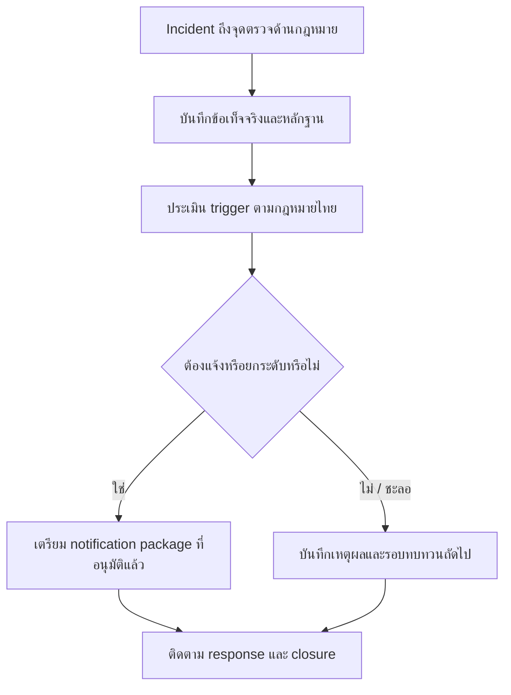

# แบบฟอร์มการยกระดับเหตุด้านกฎหมายไทย

**Document ID**: TH-LAW-TPL-001  
**Version**: 1.0  
**Classification**: Internal  
**Last Updated**: 2026-04-26  
**กลุ่มเป้าหมาย**: CISO, SOC Manager, IR Lead, Legal Counsel, DPO, Compliance Officer

> ใช้แบบฟอร์มนี้เพื่อบันทึก legal-impact triage การตัดสินใจเรื่อง regulator notification และ executive escalation สำหรับเหตุที่อาจเข้าเงื่อนไขกฎหมายไทย แบบฟอร์มนี้เป็นแนวทางปฏิบัติ ไม่ใช่คำปรึกษากฎหมาย

## 1. ใช้แบบฟอร์มนี้เมื่อใด

-   [ ] มีข้อมูลส่วนบุคคล ข้อมูลอ่อนไหว หรือ regulated records อาจรั่วไหล
-   [ ] เกี่ยวข้องกับ unauthorized access, data alteration, traffic-data preservation หรือสงสัยการกระทำผิด
-   [ ] บริการสำคัญ public-facing service หรือบริการที่อาจเกี่ยวกับ critical information infrastructure ถูกกระทบ
-   [ ] อาจต้องติดต่อ regulator, authority, customer, sectoral CERT หรือ law enforcement
-   [ ] หลักฐานอาจต้อง legal hold, forensic preservation หรือ chain-of-custody controls

## 2. ส่วนหัว Incident และการตัดสินใจ

| รายการ | ค่า |
|:---|:---|
| **Incident ID** | INC-[YYYYMMDD]-[001] |
| **Legal escalation ID** | THLAW-[YYYYMMDD]-[001] |
| **ชื่อ Incident** | |
| **วันที่/เวลาเปิดรายการ** | [YYYY-MM-DD HH:MM TZ] |
| **Decision owner** | |
| **SOC owner** | |
| **Legal / DPO owner** | |
| **Severity ปัจจุบัน** | P1 / P2 / P3 / P4 |
| **TLP** | CLEAR / GREEN / AMBER / RED |

## 3. จุดตรวจผลกระทบด้านกฎหมายไทย

| คำถาม Trigger | ใช่/ไม่ใช่/ไม่ทราบ | หลักฐาน | Owner |
|:---|:---:|:---|:---|
| Incident เกี่ยวข้องกับข้อมูลส่วนบุคคลหรือข้อมูลอ่อนไหวหรือไม่ | | | DPO |
| สงสัย unauthorized access, alteration, deletion, disruption หรือ malicious tooling หรือไม่ | | | IR Lead |
| ต้องใช้ traffic data, user identity data หรือ system access evidence หรือไม่ | | | Security Engineer |
| กระทบ critical service, public-facing service หรือบริการที่เกี่ยวข้องกับ CII หรือไม่ | | | CISO |
| มี authority, regulator, customer หรือ sectoral CERT ติดต่อองค์กรแล้วหรือไม่ | | | Legal |
| ต้องใช้ legal hold หรือ forensic chain of custody หรือไม่ | | | Legal + IR Lead |

## 4. บันทึกการตัดสินใจเรื่องการแจ้ง

| เส้นทางที่อาจต้องแจ้ง | การตัดสินใจ | ผู้อนุมัติ | เวลาครบกำหนด | Evidence package |
|:---|:---:|:---|:---|:---|
| PDPA / DPO path | ☐ แจ้ง · ☐ ชะลอ · ☐ ไม่ต้องแจ้ง | | | |
| Executive / board path | ☐ แจ้ง · ☐ ชะลอ · ☐ ไม่ต้องแจ้ง | | | |
| Customer / business partner path | ☐ แจ้ง · ☐ ชะลอ · ☐ ไม่ต้องแจ้ง | | | |
| Law enforcement path | ☐ แจ้ง · ☐ ชะลอ · ☐ ไม่ต้องแจ้ง | | | |
| NCSA / ThaiCERT / sectoral CERT path | ☐ แจ้ง · ☐ ชะลอ · ☐ ไม่ต้องแจ้ง | | | |

## 5. Evidence Package ขั้นต่ำ

-   [ ] Incident timeline ที่มีเวลา detect, triage, escalate, contain และ recover
-   [ ] ระบบ บริการทางธุรกิจ data stores และ owners ที่ได้รับผลกระทบ
-   [ ] data-impact assessment และจำนวนเจ้าของข้อมูลโดยประมาณ ถ้าเกี่ยวข้อง
-   [ ] log package ที่ระบุ source, time range, collector, integrity marker และ retention status
-   [ ] forensic หรือ chain-of-custody record สำหรับหลักฐานที่ใช้ใน legal/regulator review
-   [ ] draft message หรือ notification package ที่ Legal / DPO / CISO อนุมัติก่อนเผยแพร่

## 6. Executive Escalation Brief

| คำถาม | คำตอบ |
|:---|:---|
| **เกิดอะไรขึ้น** | |
| **อะไรยืนยันแล้ว และอะไรยังเป็นข้อสงสัย** | |
| **ใครหรือระบบใดได้รับผลกระทบ** | |
| **อาจเกี่ยวข้องกับกฎหมายหรือ regulator path ใด** | |
| **ต้องตัดสินใจอะไรตอนนี้** | |
| **deadline หรือเวลาทบทวนถัดไปคือเมื่อใด** | |
| **ข้อความใดได้รับอนุมัติให้ใช้ภายใน/ภายนอกแล้ว** | |

## 7. Checklist ปิดรายการ

-   [ ] ทุก notification decision มี approver เวลา และเหตุผล
-   [ ] การตัดสินใจที่ชะลอไว้มีเวลาทบทวนถัดไปและ owner
-   [ ] evidence package ถูกเก็บใน case location ที่อนุมัติ
-   [ ] legal hold status ถูกบันทึกเป็น active, released หรือ not required
-   [ ] incident report และ decision log cross-reference รายการ escalation นี้แล้ว

## เอกสารที่เกี่ยวข้อง (Related Documents)

-   [แนวทางกฎหมายไซเบอร์ไทยสำหรับ SOC](../07_Compliance_Privacy/Thai_Cyber_Legal_Baseline.th.md)
-   [คู่มือตอบเหตุข้อมูลรั่วตาม PDPA](../07_Compliance_Privacy/PDPA_Incident_Response.th.md)
-   [เทมเพลตรายงาน Incident](incident_report.th.md)
-   [บันทึกการตัดสินใจระหว่างเหตุการณ์](Incident_Decision_Log.th.md)
-   [ชุดเอกสารการตัดสินใจรายไตรมาสสำหรับบอร์ด](Board_Quarterly_Decision_Pack.th.md)

## References

-   [กระทรวงดิจิทัลเพื่อเศรษฐกิจและสังคม — Cybersecurity Act B.E. 2562 (2019)](https://www.mdes.go.th/law/detail/1904-Cybersecurity-Act--B-E--2562--2019-)
-   [กระทรวงดิจิทัลเพื่อเศรษฐกิจและสังคม — Computer-Related Crime Act B.E. 2550 (2007)](https://www.mdes.go.th/law/detail/3618-COMPUTER-RELATED-CRIME-ACT-B-E--2550--2007-)
-   [ETDA — Electronic Transactions Act laws and standards](https://www.etda.or.th/en/ETC/strategy-law-standard/law.aspx)
-   [PDPA Thailand — Personal Data Protection Act B.E. 2562 (2019)](https://pdpathailand.com/pdpa/index_eng.html)
-   [Government Platform for PDPA Compliance — Data Breach Notification Management](https://gppc.pdpc.or.th/)
-   [Thailand Computer Emergency Response Team / ThaiCERT](https://www.thaicert.or.th/en/homepage/)
